# 📘 第 2 章　CXL 系统架构 (Chapter 2. CXL System Architecture)

**Compute Express Link® (CXL®) Specification — Revision 3.2, Version 1.0 — October 2, 2024**

> 📄 **Source pages**: 71–84 (PDF 1-indexed) | 📁 **File**: `chapter_02.md`
> 🎨 **Format**: 中英对照双语 · 图表原始保留 · 中文背景色灰色 · GitHub Flavored Markdown

---

## 📑 本章目录 (Table of Contents)

| # | Section | 小节 | Page |
|:-:|:--------|:----|:----:|
| 2.0 | [CXL System Architecture](#sec-2-0) | CXL 系统架构概述 | p.71 |
| 2.1 | [CXL Type 1 Device](#sec-2-1) | CXL Type 1 设备 | p.72 |
| 2.2 | [CXL Type 2 Device](#sec-2-2) | CXL Type 2 设备 | p.72–76 |
| 2.2.1 | [Back-Invalidate Snoop Coherence for HDM-DB](#sec-2-2-1) | HDM-DB 的反向失效探测一致性 | p.73 |
| 2.2.2 | [Bias-based Coherency Model for HDM-D](#sec-2-2-2) | HDM-D 的基于偏向的一致性模型 | p.73–76 |
| 2.2.2.1 | [Host Bias](#sec-2-2-2-1) | 主机偏向 | p.74 |
| 2.2.2.2 | [Device Bias](#sec-2-2-2-2) | 设备偏向 | p.74–75 |
| 2.2.2.3 | [Mode Management](#sec-2-2-2-3) | 偏向模式管理 | p.75 |
| 2.2.2.3.1 | [Software-assisted Bias Mode Management](#sec-2-2-2-3-1) | 软件辅助偏向模式管理 | p.75–76 |
| 2.2.2.3.2 | [Hardware Autonomous Bias Mode Management](#sec-2-2-2-3-2) | 硬件自治偏向模式管理 | p.76 |
| 2.3 | [CXL Type 3 Device](#sec-2-3) | CXL Type 3 设备 | p.76–77 |
| 2.4 | [Multi Logical Device (MLD)](#sec-2-4) | 多逻辑设备 (MLD) | p.77–80 |
| 2.4.1 | [LD-ID for CXL.io and CXL.mem](#sec-2-4-1) | CXL.io 与 CXL.mem 的 LD-ID | p.77–78 |
| 2.4.2 | [Pooled Memory Device Configuration Registers](#sec-2-4-2) | 池化内存设备的配置寄存器 | p.78–79 |
| 2.4.3 | [Pooled Memory and Shared FAM](#sec-2-4-3) | 池化内存与共享 FAM | p.79 |
| 2.4.4 | [Coherency Models for Shared FAM](#sec-2-4-4) | 共享 FAM 的一致性模型 | p.79–80 |
| 2.5 | [Multi-Headed Device](#sec-2-5) | 多头设备 | p.81–82 |
| 2.5.1 | [LD Management in MH-MLDs](#sec-2-5-1) | MH-MLD 中的 LD 管理 | p.82 |
| 2.6 | [CXL Device Scaling](#sec-2-6) | CXL 设备扩展性 | p.82 |
| 2.7 | [CXL Fabric](#sec-2-7) | CXL Fabric | p.83 |
| 2.8 | [Global FAM (G-FAM) Type 3 Device](#sec-2-8) | 全局 FAM (G-FAM) Type 3 设备 | p.83 |
| 2.9 | [Manageability Overview](#sec-2-9) | 可管理性概述 | p.83–84 |

## 🖼 本章图表 (Figures)

| Figure | Title | 图标题 | Page |
|:------:|:------|:-------|:----:|
| 2-1 | CXL Device Types | CXL 设备类型 | p.71 |
| 2-2 | Type 1 Device - Device with Cache | Type 1 设备 — 带缓存的设备 | p.72 |
| 2-3 | Type 2 Device - Device with Memory | Type 2 设备 — 带内存的设备 | p.73 |
| 2-4 | Type 2 Device - Host Bias | Type 2 设备 — 主机偏向 | p.74 |
| 2-5 | Type 2 Device - Device Bias | Type 2 设备 — 设备偏向 | p.75 |
| 2-6 | Type 3 Device - HDM-H Memory Expander | Type 3 设备 — HDM-H 内存扩展器 | p.76 |
| 2-7 | Head-to-LD Mapping in MH-SLDs | MH-SLD 中的头-LD 映射 | p.81 |
| 2-8 | Head-to-LD Mapping in MH-MLDs | MH-MLD 中的头-LD 映射 | p.82 |

## 📊 本章表格 (Tables)

| Table | Title | 表标题 | Sheets |
|:-----:|:------|:-------|:------:|
| 2-1 | LD-ID Link Local TLP Prefix | LD-ID 链路本地 TLP 前缀 | 1 (p.78) |
| 2-2 | MLD PCIe Registers | MLD PCIe 寄存器 | 2 (p.78–79) |

> 💡 **查看原图**：所有原图已抽取为 PNG 存放在 [`figures/chapter_02/`](figures/chapter_02/)（14 张全页渲染）。

---

## 2.0 CXL System Architecture | CXL 系统架构概述

<table>
<thead>
<tr>
<th width="50%">🇬🇧 English</th>
<th width="50%" style="background-color:#e8e8e8">🇨🇳 中文</th>
</tr>
</thead>
<tbody>
<tr>
<td>

This chapter describes the performance advantages and main features of CXL. CXL is a high-performance I/O bus architecture that is used to interconnect peripheral devices that can be either traditional non-coherent I/O devices, memory devices, or accelerators with additional capabilities. The types of devices that can attach via CXL and the overall system architecture is described in Figure 2-1.

</td>
<td style="background-color:#e8e8e8">

本章描述 CXL 的性能优势与主要特性。CXL 是一种高性能 I/O 总线架构，用于互连外设，这些外设可以是传统的非一致性 I/O 设备、内存设备或具备额外能力的加速器。可通过 CXL 挂接的设备类型以及整体系统架构如图 2-1 所示。

</td>
</tr>
<tr>
<td>

When Type 2 and Type 3 device memory is exposed to the host, it is referred to as Host-managed Device Memory (HDM). The coherence management of this memory has 3 options: Host-only Coherent (HDM-H), Device Coherent (HDM-D), and Device Coherent using Back-Invalidate Snoop (HDM-DB). The host and device must have a common understanding of the type of HDM for each address region. For additional details, refer to Section 3.3.

</td>
<td style="background-color:#e8e8e8">

当 Type 2 与 Type 3 设备的内存暴露给主机时，被称为 Host-managed Device Memory（HDM，主机管理型设备内存）。该内存的一致性管理有三种选项：Host-only Coherent（HDM-H，仅主机一致）、Device Coherent（HDM-D，设备一致）以及 Device Coherent using Back-Invalidate Snoop（HDM-DB，使用反向失效探测的设备一致）。主机与设备必须就每个地址区域的 HDM 类型达成共识。更多细节请参见 3.3 节。

</td>
</tr>
<tr>
<td>

Before diving into the details of each type of CXL device, here's a foreword about where CXL is not applicable. Traditional non-coherent I/O devices mainly rely on standard Producer-Consumer ordering models and execute against Host-attached memory. For such devices, there is little interaction with the Host except for work submission and signaling on work completion boundaries. Such accelerators also tend to work on data streams or large contiguous data objects. These devices typically do not need the advanced capabilities provided by CXL, and traditional PCIe* is sufficient as an accelerator-attached medium.

</td>
<td style="background-color:#e8e8e8">

在深入探讨各类 CXL 设备的细节之前，先介绍 CXL 不适用的场景。传统的非一致性 I/O 设备主要依赖标准的生产者-消费者排序模型，在主机挂接的内存上执行。对于这类设备，除了提交工作和在完成边界上发出信号外，与主机几乎无交互。这类加速器也往往处理数据流或大型连续数据对象。它们通常不需要 CXL 提供的高级能力，传统 PCIe 已足够作为加速器的挂接介质。

</td>
</tr>
<tr>
<td>

The following sections describe various profiles of CXL devices.

</td>
<td style="background-color:#e8e8e8">

后续小节将描述 CXL 设备的不同形态。

</td>
</tr>
</tbody>
</table>

> **Figure 2-1.** CXL Device Types ｜ CXL 设备类型
>
> 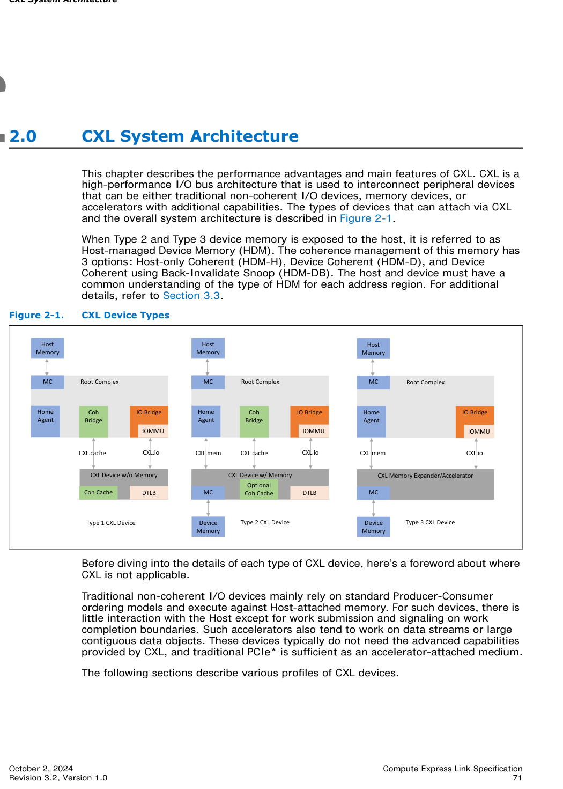
>
> *Original page render @ 150 DPI* — [📄 Full size](figures/chapter_02/page_0071.png)

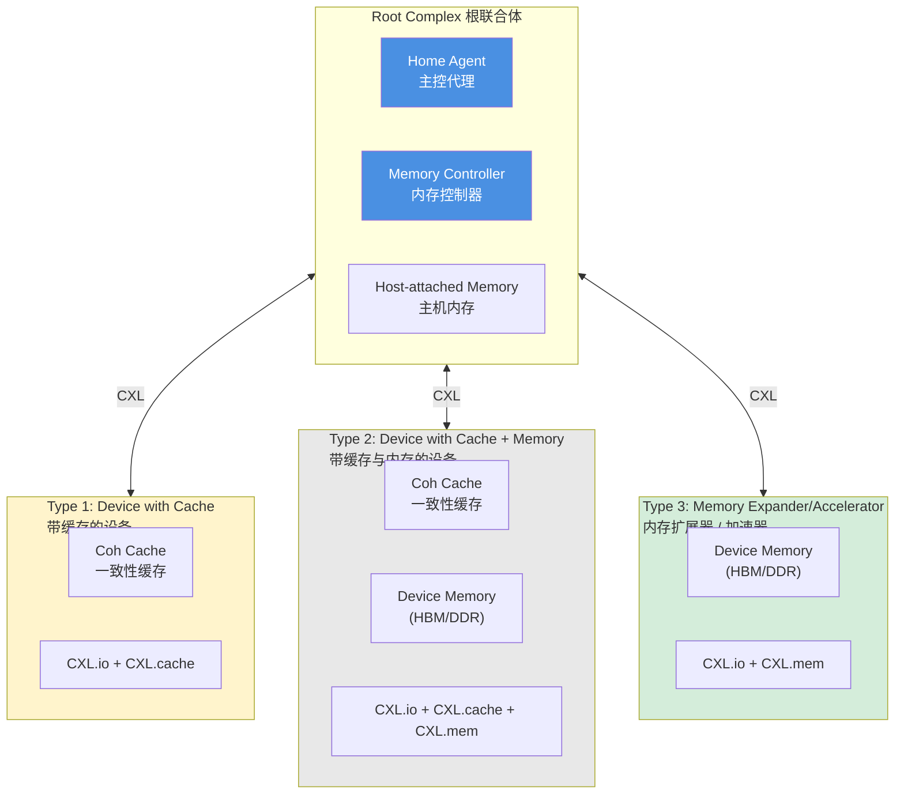

[⬆️ 返回目录](#-本章目录-table-of-contents)

---

## 2.1 CXL Type 1 Device | CXL Type 1 设备

<table>
<thead>
<tr>
<th width="50%">🇬🇧 English</th>
<th width="50%" style="background-color:#e8e8e8">🇨🇳 中文</th>
</tr>
</thead>
<tbody>
<tr>
<td>

CXL Type 1 Devices have special needs for which having a fully coherent cache in the device becomes valuable. For such devices, standard Producer-Consumer ordering models do not work well. One example of a device with special requirements is to perform complex atomics that are not part of the standard suite of atomic operations present on PCIe.

</td>
<td style="background-color:#e8e8e8">

CXL Type 1 设备具有一些特殊需求，因此在设备中具备完全一致性缓存很有价值。对于这类设备，标准的生产者-消费者排序模型效果不佳。一个例子是需要执行 PCIe 标准原子操作集合之外复杂原子操作的设备。

</td>
</tr>
<tr>
<td>

Basic cache coherency allows an accelerator to implement any ordering model it chooses and allows it to implement an unlimited number of atomic operations. These tend to require only a small capacity cache which can easily be tracked by standard processor snoop filter mechanisms. The size of cache that can be supported for such devices depends on the host's snoop filtering capacity. CXL supports such devices using its optional CXL.cache link over which an accelerator can use CXL.cache protocol for cache coherency transactions.

</td>
<td style="background-color:#e8e8e8">

基本缓存一致性使加速器可以采用任意排序模型，并支持无限制的原子操作。这通常只需要小容量缓存，可由标准的处理器探测过滤（snoop filter）机制轻松追踪。此类设备可支持的缓存大小取决于主机的探测过滤能力。CXL 通过其可选的 CXL.cache 链路支持这类设备，加速器可使用 CXL.cache 协议进行缓存一致性事务。

</td>
</tr>
</tbody>
</table>

> **Figure 2-2.** Type 1 Device — Device with Cache ｜ Type 1 设备 — 带缓存的设备
>
> 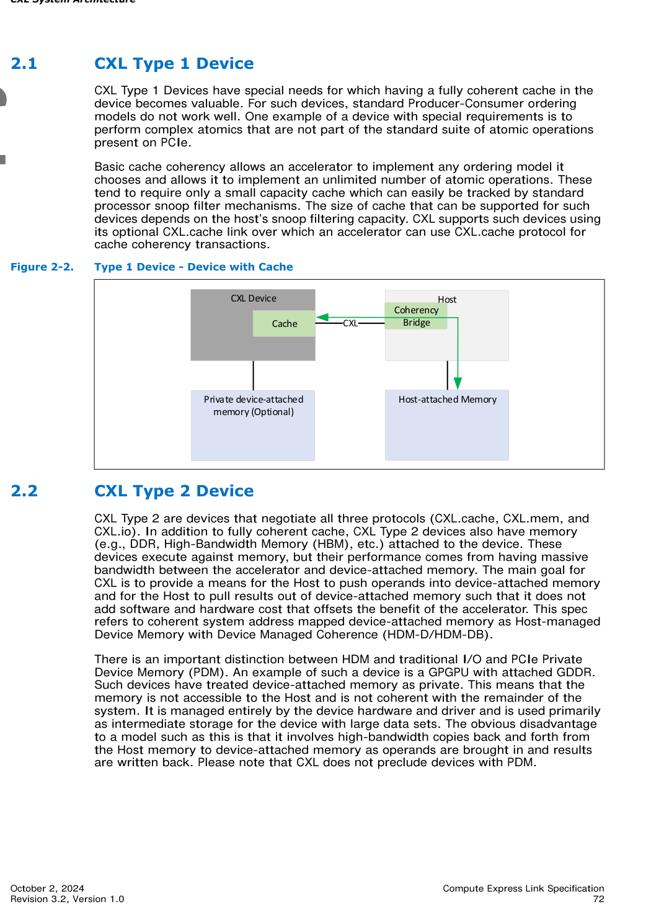
>
> *Original page render @ 150 DPI* — [📄 Full size](figures/chapter_02/page_0072.png)

[⬆️ 返回目录](#-本章目录-table-of-contents)

---

## 2.2 CXL Type 2 Device | CXL Type 2 设备

<table>
<thead>
<tr>
<th width="50%">🇬🇧 English</th>
<th width="50%" style="background-color:#e8e8e8">🇨🇳 中文</th>
</tr>
</thead>
<tbody>
<tr>
<td>

CXL Type 2 are devices that negotiate all three protocols (CXL.cache, CXL.mem, and CXL.io). In addition to fully coherent cache, CXL Type 2 devices also have memory (e.g., DDR, High-Bandwidth Memory (HBM), etc.) attached to the device. These devices execute against memory, but their performance comes from having massive bandwidth between the accelerator and device-attached memory. The main goal for CXL is to provide a means for the Host to push operands into device-attached memory and for the Host to pull results out of device-attached memory such that it does not add software and hardware cost that offsets the benefit of the accelerator. This spec refers to coherent system address mapped device-attached memory as Host-managed Device Memory with Device Managed Coherence (HDM-D/HDM-DB).

</td>
<td style="background-color:#e8e8e8">

CXL Type 2 设备协商全部三种协议（CXL.cache、CXL.mem 与 CXL.io）。除完全一致性缓存外，CXL Type 2 设备还挂接有内存（如 DDR、HBM 等）。这类设备对内存执行操作，其性能来源于加速器与设备挂接内存之间巨大的带宽。CXL 的主要目标是为主机提供将操作数推送到设备挂接内存、以及从设备挂接内存拉回结果的机制，且不会增加抵消加速器收益的软件与硬件成本。本规范将映射到系统相干地址空间的设备挂接内存称为具有设备管理一致性的主机管理型设备内存（HDM-D/HDM-DB）。

</td>
</tr>
<tr>
<td>

There is an important distinction between HDM and traditional I/O and PCIe Private Device Memory (PDM). An example of such a device is a GPGPU with attached GDDR. Such devices have treated device-attached memory as private. This means that the memory is not accessible to the Host and is not coherent with the remainder of the system. It is managed entirely by the device hardware and driver and is used primarily as intermediate storage for the device with large data sets. The obvious disadvantage to a model such as this is that it involves high-bandwidth copies back and forth from the Host memory to device-attached memory as operands are brought in and results are written back. Please note that CXL does not preclude devices with PDM.

</td>
<td style="background-color:#e8e8e8">

HDM 与传统 I/O 以及 PCIe 私有设备内存（PDM）之间存在重要区别。这类设备的一个例子是挂接 GDDR 的 GPGPU。它们将设备挂接内存视为私有，主机无法访问，也与系统其余部分不一致，完全由设备硬件与驱动管理，主要作为设备处理大数据集的中间存储。此类模型的明显缺点是：操作数进入与结果写回需要在主机内存与设备挂接内存之间进行高带宽来回拷贝。需要注意的是，CXL 并不排斥仍使用 PDM 的设备。

</td>
</tr>
</tbody>
</table>

> **Figure 2-3.** Type 2 Device — Device with Memory ｜ Type 2 设备 — 带内存的设备
>
> 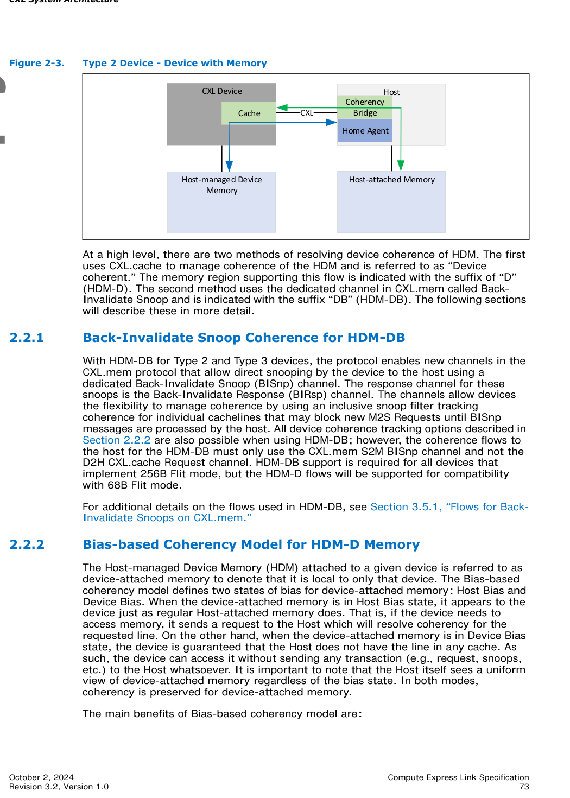
>
> *Original page render @ 150 DPI* — [📄 Full size](figures/chapter_02/page_0073.png)

### 2.2.1 Back-Invalidate Snoop Coherence for HDM-DB | HDM-DB 的反向失效探测一致性

<table>
<thead>
<tr>
<th width="50%">🇬🇧 English</th>
<th width="50%" style="background-color:#e8e8e8">🇨🇳 中文</th>
</tr>
</thead>
<tbody>
<tr>
<td>

At a high level, there are two methods of resolving device coherence of HDM. The first uses CXL.cache to manage coherence of the HDM and is referred to as "Device coherent." The memory region supporting this flow is indicated with the suffix of "D" (HDM-D). The second method uses the dedicated channel in CXL.mem called Back-Invalidate Snoop and is indicated with the suffix "DB" (HDM-DB). The following sections will describe these in more detail.

</td>
<td style="background-color:#e8e8e8">

从高层来看，HDM 的设备一致性有两种解析方法。第一种使用 CXL.cache 来管理 HDM 一致性，称为"设备一致"，支持该流程的内存区域以"D"为后缀（HDM-D）。第二种使用 CXL.mem 中专用的反向失效探测（Back-Invalidate Snoop）通道，以"DB"为后缀（HDM-DB）。后续小节将详细描述这两种方法。

</td>
</tr>
<tr>
<td>

With HDM-DB for Type 2 and Type 3 devices, the protocol enables new channels in the CXL.mem protocol that allow direct snooping by the device to the host using a dedicated Back-Invalidate Snoop (BISnp) channel. The response channel for these snoops is the Back-Invalidate Response (BIRsp) channel. The channels allow devices the flexibility to manage coherence by using an inclusive snoop filter tracking coherence for individual cachelines that may block new M2S Requests until BISnp messages are processed by the host. All device coherence tracking options described in Section 2.2.2 are also possible when using HDM-DB; however, the coherence flows to the host for the HDM-DB must only use the CXL.mem S2M BISnp channel and not the D2H CXL.cache Request channel. HDM-DB support is required for all devices that implement 256B Flit mode, but the HDM-D flows will be supported for compatibility with 68B Flit mode.

</td>
<td style="background-color:#e8e8e8">

对于 Type 2 与 Type 3 设备的 HDM-DB，CXL.mem 协议中新增了专用通道，使设备可通过 Back-Invalidate Snoop（BISnp）通道直接向主机发出探测；对应的响应通道为 Back-Invalidate Response（BIRsp）。这些通道使设备能通过包含式（inclusive）探测过滤灵活管理一致性：对单个 cacheline 进行一致性跟踪，在主机处理 BISnp 消息前可阻塞新的 M2S 请求。2.2.2 节描述的所有设备一致性跟踪选项在使用 HDM-DB 时同样适用；不过 HDM-DB 向主机的一致性流程只能使用 CXL.mem 的 S2M BISnp 通道，而不得使用 D2H CXL.cache 请求通道。所有实现 256B Flit 模式的设备都必须支持 HDM-DB，但为了与 68B Flit 模式兼容，HDM-D 流程仍受支持。

</td>
</tr>
<tr>
<td>

For additional details on the flows used in HDM-DB, see Section 3.5.1, "Flows for Back-Invalidate Snoops on CXL.mem."

</td>
<td style="background-color:#e8e8e8">

关于 HDM-DB 所使用流程的更多细节，请参见 3.5.1 节"CXL.mem 上的反向失效探测流程"。

</td>
</tr>
</tbody>
</table>

### 2.2.2 Bias-based Coherency Model for HDM-D Memory | HDM-D 的基于偏向的一致性模型

<table>
<thead>
<tr>
<th width="50%">🇬🇧 English</th>
<th width="50%" style="background-color:#e8e8e8">🇨🇳 中文</th>
</tr>
</thead>
<tbody>
<tr>
<td>

The Host-managed Device Memory (HDM) attached to a given device is referred to as device-attached memory to denote that it is local to only that device. The Bias-based coherency model defines two states of bias for device-attached memory: Host Bias and Device Bias. When the device-attached memory is in Host Bias state, it appears to the device just as regular Host-attached memory does. That is, if the device needs to access memory, it sends a request to the Host which will resolve coherency for the requested line. On the other hand, when the device-attached memory is in Device Bias state, the device is guaranteed that the Host does not have the line in any cache. As such, the device can access it without sending any transaction (e.g., request, snoops, etc.) to the Host whatsoever. It is important to note that the Host itself sees a uniform view of device-attached memory regardless of the bias state. In both modes, coherency is preserved for device-attached memory.

</td>
<td style="background-color:#e8e8e8">

挂接在某设备上的 Host-managed Device Memory（HDM）被称为 device-attached memory（设备挂接内存），以表明它仅属于该设备。基于偏向的一致性模型为设备挂接内存定义两种偏向状态：Host Bias（主机偏向）与 Device Bias（设备偏向）。当设备挂接内存处于 Host Bias 状态时，设备看它就像普通的主机挂接内存一样：若设备需要访问内存，需向主机发送请求，由主机解析所请求 cacheline 的一致性。另一方面，当设备挂接内存处于 Device Bias 状态时，设备可以保证主机未在缓存中持有该行；因此设备可访问而完全无需向主机发送任何事务（请求、探测等）。需要注意的是，无论偏向状态如何，主机看到的设备挂接内存视图都是统一的。在两种模式下，设备挂接内存的一致性均得到保持。

</td>
</tr>
<tr>
<td>

The main benefits of Bias-based coherency model are:

</td>
<td style="background-color:#e8e8e8">

基于偏向的一致性模型的主要优点包括：

</td>
</tr>
</tbody>
</table>

<table>
<thead>
<tr>
<th width="50%">🇬🇧 English</th>
<th width="50%" style="background-color:#e8e8e8">🇨🇳 中文</th>
</tr>
</thead>
<tbody>
<tr>
<td>

- Helps maintain coherency for device-attached memory that is mapped to system coherent address space.
- Helps the device access its local attached memory at high bandwidth without incurring significant coherency overheads (e.g., snoops to the Host).
- Helps the Host access device-attached memory in a coherent, uniform manner, just as it would for Host-attached memory.

</td>
<td style="background-color:#e8e8e8">

- 维护映射到系统相干地址空间的设备挂接内存的一致性
- 设备可高带宽访问本地挂接内存，且不会产生显著的一致性开销（如向主机的探测）
- 主机能以一致、统一的方式访问设备挂接内存，与访问主机挂接内存的方式相同

</td>
</tr>
<tr>
<td>

To maintain Bias modes, a CXL Type 2 Device will:

- Implement the Bias Table which tracks page-granularity Bias (e.g., 1 per 4-KB page) which can be cached in the device using a Bias Cache.
- Build support for Bias transitions using a Transition Agent (TA). This essentially looks like a DMA engine for "cleaning up" pages, which essentially means to flush the host's caches for lines belonging to that page.
- Build support for basic load and store access to accelerator local memory for the benefit of the Host.

</td>
<td style="background-color:#e8e8e8">

为维护偏向模式，CXL Type 2 设备需要：

- 实现偏向表（Bias Table），按页面粒度（例如每 4-KB 一项）跟踪偏向状态，可通过 Bias Cache 在设备中缓存
- 通过转换代理（Transition Agent, TA）支持偏向转换；TA 本质上像一个 DMA 引擎，用于"清理"页面（即刷新主机中属于该页的 cacheline 缓存）
- 支持主机对加速器本地内存的基本加载/存储访问

</td>
</tr>
</tbody>
</table>

<table>
<thead>
<tr>
<th width="50%">🇬🇧 English</th>
<th width="50%" style="background-color:#e8e8e8">🇨🇳 中文</th>
</tr>
</thead>
<tbody>
<tr>
<td>

The bias modes are described in detail below.

</td>
<td style="background-color:#e8e8e8">

下面详细描述两种偏向模式。

</td>
</tr>
</tbody>
</table>

#### 2.2.2.1 Host Bias | 主机偏向

<table>
<thead>
<tr>
<th width="50%">🇬🇧 English</th>
<th width="50%" style="background-color:#e8e8e8">🇨🇳 中文</th>
</tr>
</thead>
<tbody>
<tr>
<td>

Host Bias mode typically refers to the part of the cycle when the operands are being written to memory by the Host during work submission or when results are being read out from the memory after work completion. During Host Bias mode, coherency flows allow for high-throughput access from the Host to device-attached memory (as shown by the bidirectional blue arrow in Figure 2-4 to/from the host-managed device memory, the DCOH in the CXL device, and the Home Agent in the host) whereas device access to device-attached memory is not optimal since they need to go through the host (as shown by the green arrow in Figure 2-4 that loops between the DCOH in the CXL device and the Coherency Bridge in the host, and between the DCOH in the CXL device and the host-managed device memory).

</td>
<td style="background-color:#e8e8e8">

Host Bias 模式通常对应一个工作周期中的特定阶段：主机在工作提交期间将操作数写入内存，或在工作完成后从内存读回结果。在 Host Bias 模式下，一致性流支持主机对设备挂接内存的高吞吐访问（如图 2-4 中 CXL 设备的 DCOH 与主机的 Home Agent 之间、Host-managed Device Memory 之间的蓝色双向箭头所示）；而设备对设备挂接内存的访问则不是最优的，因为必须经由主机（如图 2-4 中 DCOH 与主机内 Coherency Bridge 之间、DCOH 与 Host-managed Device Memory 之间的绿色箭头所示）。

</td>
</tr>
</tbody>
</table>

#### 2.2.2.2 Device Bias | 设备偏向

<table>
<thead>
<tr>
<th width="50%">🇬🇧 English</th>
<th width="50%" style="background-color:#e8e8e8">🇨🇳 中文</th>
</tr>
</thead>
<tbody>
<tr>
<td>

Device Bias mode is used when the device is executing the work, between work submission and completion, and in this mode, the device needs high-bandwidth and low-latency access to device-attached memory.

</td>
<td style="background-color:#e8e8e8">

Device Bias 模式用于设备执行工作（介于工作提交与完成之间）的阶段；在此模式下，设备需要对设备挂接内存进行高带宽、低延迟的访问。

</td>
</tr>
<tr>
<td>

In this mode, device can access device-attached memory without consulting the Host's coherency engines (as shown by the red arrow in Figure 2-5 that loops between the DCOH in the CXL device and the host-managed device memory). The Host can still access device-attached memory but may be forced to give up ownership by the accelerator (as shown by the green arrow in Figure 2-5 that loops between the DCOH in the CXL device and the Coherency Bridge in the host). This results in the device seeing ideal latency and bandwidth from device-attached memory, whereas the Host sees compromised performance.

</td>
<td style="background-color:#e8e8e8">

在该模式下，设备可直接访问设备挂接内存而无需查询主机的一致性引擎（如图 2-5 中 DCOH 与 Host-managed Device Memory 之间的红色箭头所示）。主机仍可访问设备挂接内存，但可能需要被加速器强制放弃所有权（如图 2-5 中 DCOH 与主机 Coherency Bridge 之间的绿色箭头所示）。结果是设备从设备挂接内存获得理想的延迟与带宽，而主机则性能受到影响。

</td>
</tr>
</tbody>
</table>

#### 2.2.2.3 Mode Management | 偏向模式管理

<table>
<thead>
<tr>
<th width="50%">🇬🇧 English</th>
<th width="50%" style="background-color:#e8e8e8">🇨🇳 中文</th>
</tr>
</thead>
<tbody>
<tr>
<td>

There are two envisioned Bias Mode Management schemes – Software Assisted and Hardware Autonomous. CXL supports both modes. Examples of Bias Flows are present in Appendix A.

</td>
<td style="background-color:#e8e8e8">

设想的偏向模式管理方案有两种——软件辅助（Software Assisted）与硬件自治（Hardware Autonomous）。CXL 同时支持这两种模式。偏向流示例见附录 A。

</td>
</tr>
<tr>
<td>

While two modes are described below, it is worth noting that devices do not need to implement any bias. In this case, all the device-attached memory degenerates to Host Bias. This means that all accesses to device-attached memory must be routed through the Host. An accelerator is free to choose a custom mix of Software assisted and Hardware autonomous bias management scheme. The Host implementation is agnostic to any of the above choices.

</td>
<td style="background-color:#e8e8e8">

虽然下文将描述两种模式，但需要指出的是设备不必实现任何偏向机制。此时所有设备挂接内存均退化为 Host Bias，即所有设备挂接内存访问都必须经由主机路由。加速器可自由选择软件辅助与硬件自治偏向管理的自定义组合；主机实现对上述任何选择都保持透明。

</td>
</tr>
</tbody>
</table>

##### 2.2.2.3.1 Software-assisted Bias Mode Management | 软件辅助偏向模式管理

<table>
<thead>
<tr>
<th width="50%">🇬🇧 English</th>
<th width="50%" style="background-color:#e8e8e8">🇨🇳 中文</th>
</tr>
</thead>
<tbody>
<tr>
<td>

With Software Assistance, we rely on software to know for a given page, in which state of the work execution flow the page resides. This is useful for accelerators with phased computation with regular access patterns. Based on this, software can best optimize the coherency performance on a page granularity by choosing Host or Device Bias modes appropriately.

</td>
<td style="background-color:#e8e8e8">

软件辅助方案依赖软件知晓给定页面在工作执行流程中所处的状态。这对于具有阶段性计算、访问模式规律的加速器特别有用。基于此，软件可在页面粒度上通过恰当地选择 Host 或 Device Bias 模式，最大化一致性性能。

</td>
</tr>
<tr>
<td>

Here are some characteristics of Software-assisted Bias Mode Management:

</td>
<td style="background-color:#e8e8e8">

软件辅助偏向模式管理的一些特点如下：

</td>
</tr>
<tr>
<td>

- Software Assistance can be used to have data ready at an accelerator before computation.
- If data is not moved to accelerator memory in advance, it is generally moved on demand based on some attempted reference to the data by the accelerator.
- In an "on-demand" data-fetch scenario, the accelerator must be able to find work to execute, for which data is already correctly placed, or the accelerator must stall.
- Every cycle that an accelerator is stalled eats into its ability to add value over software running on a core.
- Simple accelerators typically cannot hide data-fetch latencies.

</td>
<td style="background-color:#e8e8e8">

- 可使用软件辅助在计算前把数据准备好放至加速器
- 若数据未提前迁入加速器内存，通常在加速器尝试引用数据时按需迁入
- 在"按需取数"场景下，加速器必须找到数据已正确就绪的工作来执行，否则必须停顿
- 加速器每停顿一个周期，都会削弱其相对于核心上运行软件的价值
- 简单加速器通常无法隐藏数据获取延迟

</td>
</tr>
<tr>
<td>

Efficient software assisted data/coherency management is critical to the aforementioned class of simple accelerators.

</td>
<td style="background-color:#e8e8e8">

高效的软件辅助数据/一致性管理对上述简单加速器类别至关重要。

</td>
</tr>
</tbody>
</table>

##### 2.2.2.3.2 Hardware Autonomous Bias Mode Management | 硬件自治偏向模式管理

<table>
<thead>
<tr>
<th width="50%">🇬🇧 English</th>
<th width="50%" style="background-color:#e8e8e8">🇨🇳 中文</th>
</tr>
</thead>
<tbody>
<tr>
<td>

Software assisted coherency/data management is ideal for simple accelerators, but of lesser value to complex, programmable accelerators. At the same time, the complex problems frequently mapped to complex, programmable accelerators like GPUs present an enormously complex problem to programmers if software assisted coherency/data movement is a requirement. This is especially true for problems that split computation between Host and accelerator or problems with pointer-based, tree-based, or sparse data sets.

</td>
<td style="background-color:#e8e8e8">

软件辅助一致性/数据管理对简单加速器较为理想，但对复杂可编程加速器价值较低。同时，复杂可编程加速器（如 GPU）所处理的复杂问题，如果要求软件辅助一致性/数据搬移，会给程序员带来极大的复杂性。对于在主机与加速器之间拆分计算的问题，或基于指针、树、稀疏数据集的问题，尤其如此。

</td>
</tr>
<tr>
<td>

The Hardware Autonomous Bias Mode Management, does not rely on software to appropriately manage page level coherency bias. Rather, it is the hardware that makes predictions on the bias mode based on the requester for a given page and adapts accordingly. The main benefits for this model are:

- Provide the same page granular coherency bias capability as in the software assisted model.
- Eliminate the need for software to identify and schedule page bias transitions prior to offload execution.
- Provide hardware support for dynamic bias transition during offload execution.
- Hardware support for this model can be a simple extension to the software-assisted model.
- Link flows and Host support are unaffected.
- Impact limited primarily to actions taken at the accelerator when a Host touches a Device Biased page and vice-versa.
- Note that even though this is an ostensible hardware driven solution, hardware need not perform all transitions autonomously – though it may do so if desired.

</td>
<td style="background-color:#e8e8e8">

硬件自治偏向模式管理不依赖软件来恰当地管理页面级一致性偏向，而是由硬件根据给定页面的请求者预测偏向模式并相应适配。该模型的主要优点包括：

- 提供与软件辅助模型相同的页面粒度一致性偏向能力
- 无需软件在卸载执行前识别并调度页面偏向转换
- 提供卸载执行期间动态偏向转换的硬件支持
- 该模型的硬件支持可作为软件辅助模型的简单扩展
- 链路流与主机支持不受影响
- 影响范围主要限于：当主机触及 Device Biased 页面时（或反之）加速器侧的动作
- 需要注意的是，尽管这是一种显式的硬件驱动方案，硬件不必执行所有转换（若需要也可执行）

</td>
</tr>
<tr>
<td>

It is sufficient if hardware provides hints (e.g., "transition page X to bias Y now") but leaves the actual transition operations under software control.

</td>
<td style="background-color:#e8e8e8">

硬件只需提供提示（例如"现在将页面 X 转换为偏向 Y"），而将实际转换操作留给软件控制即可。

</td>
</tr>
</tbody>
</table>

[⬆️ 返回目录](#-本章目录-table-of-contents)

---

## 2.3 CXL Type 3 Device | CXL Type 3 设备

<table>
<thead>
<tr>
<th width="50%">🇬🇧 English</th>
<th width="50%" style="background-color:#e8e8e8">🇨🇳 中文</th>
</tr>
</thead>
<tbody>
<tr>
<td>

A CXL Type 3 Device supports CXL.io and CXL.mem protocols. An example of a CXL Type 3 Device is an HDM-H memory expander for the Host as shown in Figure 2-6.

</td>
<td style="background-color:#e8e8e8">

CXL Type 3 设备支持 CXL.io 与 CXL.mem 协议。CXL Type 3 设备的一个例子是为主机提供 HDM-H 内存扩展的内存扩展器，如图 2-6 所示。

</td>
</tr>
<tr>
<td>

Since this is not a traditional accelerator that operates on host memory, the device does not make any requests over CXL.cache. A passive memory expansion device would use the HDM-H memory region and normally do not directly manipulate the memory content while the memory is exposed to the host (exceptions exist for RAS and Security requirements). The device operates primarily over CXL.mem to service requests sent from the Host. The CXL.io protocol is used for device discovery, enumeration, error reporting and management. The CXL.io protocol is permitted to be used by the device for other I/O-specific application usages. The CXL architecture is independent of memory technology and allows for a range of memory organization possibilities depending on support implemented in the Host. Type 3 device Memory that is exposed as an HDM-DB allows the same use of coherence as described in Section 2.2.1 for Type 2 devices and requires the Type 3 device to include an internal Device Coherence engine (DCOH) in addition to what is shown in Figure 2-6 for HDM-H. HDM-DB memory enables the device to behave as an accelerator (one variation of this is in-memory computing) and also enables direct access from peers using UIO on CXL.io or CXL.mem (see Section 3.3.2.1).

</td>
<td style="background-color:#e8e8e8">

由于 Type 3 设备不是对主机内存进行操作的传统加速器，因此它不会通过 CXL.cache 发起任何请求。被动的内存扩展设备使用 HDM-H 内存区域，通常在内存暴露给主机时不会直接操作其内容（RAS 与安全要求场景除外）。设备主要通过 CXL.mem 服务来自主机的请求；CXL.io 协议用于设备发现、枚举、错误上报与管理。设备也可以将 CXL.io 用于其他 I/O 特定应用。CXL 架构独立于内存技术，主机侧的不同实现支持使一系列内存组织方式成为可能。Type 3 设备的内存若以 HDM-DB 暴露，则与 2.2.1 节描述的 Type 2 设备保持一致；这要求 Type 3 设备在图 2-6 的 HDM-H 基础上包含一个内部 Device Coherence 引擎（DCOH）。HDM-DB 内存使设备可以像加速器一样工作（其变体之一是存内计算），并支持对端设备通过 CXL.io 或 CXL.mem 上的 UIO 进行直接访问（见 3.3.2.1 节）。

</td>
</tr>
</tbody>
</table>

> **Figure 2-6.** Type 3 Device — HDM-H Memory Expander ｜ Type 3 设备 — HDM-H 内存扩展器
>
> 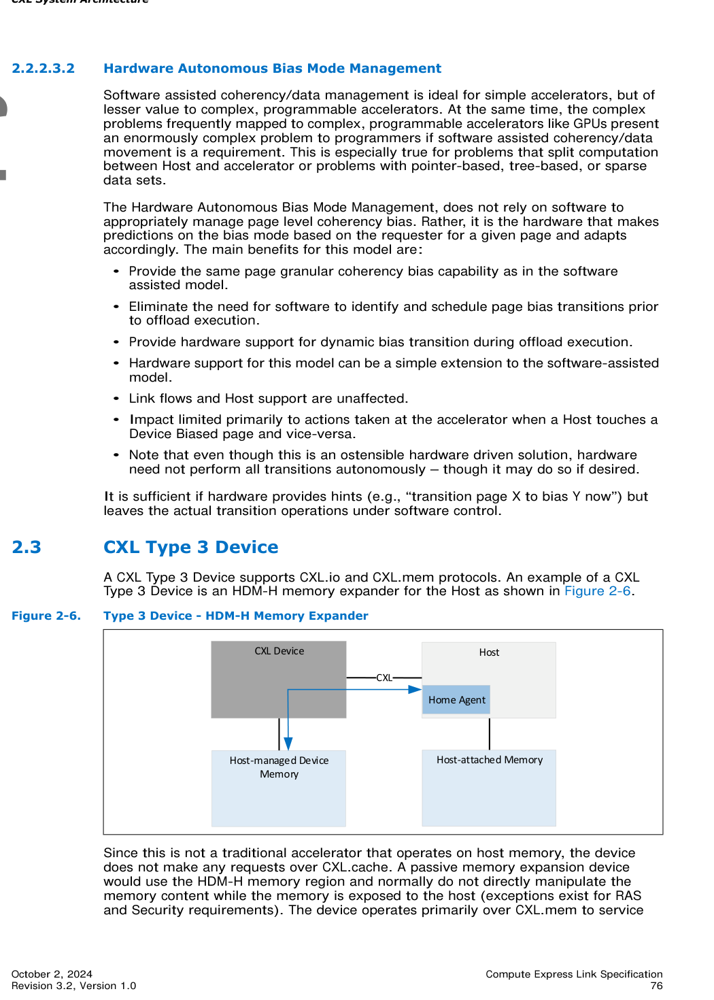
>
> *Original page render @ 150 DPI* — [📄 Full size](figures/chapter_02/page_0076.png)

[⬆️ 返回目录](#-本章目录-table-of-contents)

---

## 2.4 Multi Logical Device (MLD) | 多逻辑设备 (MLD)

<table>
<thead>
<tr>
<th width="50%">🇬🇧 English</th>
<th width="50%" style="background-color:#e8e8e8">🇨🇳 中文</th>
</tr>
</thead>
<tbody>
<tr>
<td>

A Type 3 Multi-Logical Device (MLD) can partition its resources into up to 16 isolated Logical Devices. Each Logical Device is identified by a Logical Device Identifier (LD-ID) in CXL.io and CXL.mem protocols. Each Logical Device visible to a Virtual Hierarchy (VH) operates as a Type 3 device. The LD-ID is transparent to software accessing a VH. MLD components have common Transaction and Link Layers for each protocol across all LDs. Because LD-ID capability exists only in the CXL.io and CXL.mem protocols, MLDs are constrained to only Type 3 devices.

</td>
<td style="background-color:#e8e8e8">

Type 3 多逻辑设备（MLD）可将其资源划分为最多 16 个隔离的逻辑设备。每个逻辑设备在 CXL.io 与 CXL.mem 协议中由逻辑设备标识符（LD-ID）标识。虚拟层级（VH）可见的每个逻辑设备都作为 Type 3 设备运行。LD-ID 对访问 VH 的软件透明。所有 LD 共享 MLD 组件中各协议公共的事务层与链路层。由于 LD-ID 能力仅存在于 CXL.io 与 CXL.mem 协议中，MLD 仅限 Type 3 设备。

</td>
</tr>
<tr>
<td>

An MLD component has one LD reserved for the Fabric Manager (FM) and up to 16 LDs available for host binding. The FM-owned LD (FMLD) allows the FM to configure resource allocation across LDs and manage the physical link shared with multiple Virtual CXL Switches (VCSs). The FMLD's bus mastering capabilities are limited to generating error messages. Error messages generated by this function must only be routed to the FM.

</td>
<td style="background-color:#e8e8e8">

MLD 组件保留一个 LD 给 Fabric 管理器（FM），并提供最多 16 个 LD 供主机绑定。FM 拥有的 LD（FMLD）使 FM 能够跨 LD 配置资源分配，并管理与多个虚拟 CXL 交换机（VCS）共享的物理链路。FMLD 的总线主控能力仅限于产生错误消息；该功能产生的错误消息必须仅路由至 FM。

</td>
</tr>
<tr>
<td>

The MLD component contains one MLD DVSEC (see Section 8.1.10) that is only accessible by the FM and addressable by requests that carry an LD-ID of FFFFh in CXL LD-ID TLP Prefix. Switch implementations must guarantee that FM is the only entity that is permitted to use the LD-ID of FFFFh.

</td>
<td style="background-color:#e8e8e8">

MLD 组件包含一个 MLD DVSEC（见 8.1.10 节），仅 FM 可访问，由 CXL LD-ID TLP 前缀中携带 LD-ID=FFFFh 的请求寻址。交换机实现必须保证 FM 是唯一被允许使用 LD-ID=FFFFh 的实体。

</td>
</tr>
<tr>
<td>

An MLD component is permitted to use FM API to configure LDs or have statically configured LDs. In both of these configurations the configured LD resource allocation is advertised through MLD DVSEC. In addition, MLD DVSEC LD-ID Hot Reset Vector register of the FMLD is also used by CXL switch to trigger Hot Reset of one or more LDs. See Section 8.1.10.2 for details.

</td>
<td style="background-color:#e8e8e8">

MLD 组件可使用 FM API 配置 LD，或使用静态配置的 LD。在这两种配置下，所配置的 LD 资源分配都通过 MLD DVSEC 公布。此外，FMLD 的 MLD DVSEC LD-ID 热复位向量寄存器也供 CXL 交换机用于触发一个或多个 LD 的热复位。详见 8.1.10.2 节。

</td>
</tr>
</tbody>
</table>

### 2.4.1 LD-ID for CXL.io and CXL.mem | CXL.io 与 CXL.mem 的 LD-ID

<table>
<thead>
<tr>
<th width="50%">🇬🇧 English</th>
<th width="50%" style="background-color:#e8e8e8">🇨🇳 中文</th>
</tr>
</thead>
<tbody>
<tr>
<td>

LD-ID is a 16-bit Logical Device identifier applicable for CXL.io and CXL.mem requests and responses. All requests targeting, and responses returned by, an MLD must include LD-ID.

</td>
<td style="background-color:#e8e8e8">

LD-ID 是适用于 CXL.io 与 CXL.mem 请求与响应的 16 位逻辑设备标识符。目标为 MLD 的所有请求以及 MLD 返回的所有响应都必须包含 LD-ID。

</td>
</tr>
<tr>
<td>

See Section 3.3.5 and Section 3.3.6 for CXL.mem header formatting to carry the LD-ID field.

</td>
<td style="background-color:#e8e8e8">

CXL.mem 携带 LD-ID 字段的头格式见 3.3.5 节与 3.3.6 节。

</td>
</tr>
</tbody>
</table>

#### 2.4.1.1 LD-ID for CXL.mem

<table>
<thead>
<tr>
<th width="50%">🇬🇧 English</th>
<th width="50%" style="background-color:#e8e8e8">🇨🇳 中文</th>
</tr>
</thead>
<tbody>
<tr>
<td>

CXL.mem supports only the lower 4 bits of LD-ID and therefore can support up to 16 unique LD-ID values over the link. Requests and responses forwarded over an MLD Port are tagged with LD-ID.

</td>
<td style="background-color:#e8e8e8">

CXL.mem 仅支持 LD-ID 的低 4 位，因此链路上最多支持 16 个不同的 LD-ID 值。通过 MLD 端口转发的请求与响应均带有 LD-ID 标签。

</td>
</tr>
</tbody>
</table>

#### 2.4.1.2 LD-ID for CXL.io

<table>
<thead>
<tr>
<th width="50%">🇬🇧 English</th>
<th width="50%" style="background-color:#e8e8e8">🇨🇳 中文</th>
</tr>
</thead>
<tbody>
<tr>
<td>

CXL.io supports carrying 16 bits of LD-ID for all requests and responses forwarded over an MLD Port. LD-ID FFFFh is reserved and is always used by the FM.

</td>
<td style="background-color:#e8e8e8">

CXL.io 在通过 MLD 端口转发的所有请求与响应中支持 16 位 LD-ID。LD-ID=FFFFh 保留，始终由 FM 使用。

</td>
</tr>
<tr>
<td>

CXL.io utilizes the Vendor Defined Local TLP Prefix to carry 16 bits of LD-ID value. The format for Vendor Defined Local TLP Prefix is as follows. CXL LD-ID Vendor Defined Local TLP Prefix uses the VendPrefixL0 Local TLP Prefix type.

</td>
<td style="background-color:#e8e8e8">

CXL.io 利用厂商定义本地 TLP 前缀携带 16 位 LD-ID 值。厂商定义本地 TLP 前缀的格式如下。CXL LD-ID 厂商定义本地 TLP 前缀使用 VendPrefixL0 本地 TLP 前缀类型。

</td>
</tr>
</tbody>
</table>

### Table 2-1. LD-ID Link Local TLP Prefix | LD-ID 链路本地 TLP 前缀

<table>
<thead>
<tr>
<th width="25%">Byte / 位偏移</th>
<th width="25%">+0 (Byte 0)</th>
<th width="25%">+1 (Byte 1)</th>
<th width="25%">+2 ~ +3 (Bytes 2-3)</th>
</tr>
</thead>
<tbody>
<tr>
<td>Bits [7:0] of each byte</td>
<td>PCIe Base Specification Defined</td>
<td>LD-ID[15:8]</td>
<td>LD-ID[7:0] ｜ RSVD</td>
</tr>
</tbody>
</table>

> 💡 完整布局：字节 0 由 PCIe Base Specification 定义；字节 1 携带 LD-ID[15:8]；字节 2–3 携带 LD-ID[7:0]（其余位保留）。

[⬆️ 返回目录](#-本章目录-table-of-contents)

---

### 2.4.2 Pooled Memory Device Configuration Registers | 池化内存设备的配置寄存器

<table>
<thead>
<tr>
<th width="50%">🇬🇧 English</th>
<th width="50%" style="background-color:#e8e8e8">🇨🇳 中文</th>
</tr>
</thead>
<tbody>
<tr>
<td>

Each LD is visible to software as one or more PCIe Endpoint (EP) Functions. While LD Functions support all the configuration registers, several control registers that impact common link behavior are virtualized and have no direct impact on the link. Each function of an LD must implement the configuration registers as described in PCIe Base Specification. Unless specified otherwise, the scope of the configuration registers is as described in PCIe Base Specification. For example, Memory Space Enable (MSE) bit in the command register controls a function's response to memory space.

</td>
<td style="background-color:#e8e8e8">

每个 LD 对软件呈现为一个或多个 PCIe 端点（EP）功能。LD 的功能支持全部配置寄存器，但影响公共链路行为的若干控制寄存器被虚拟化，对链路无直接影响。LD 的每个功能必须按《PCI Express Base Specification》所述实现配置寄存器。除非另有规定，配置寄存器的范围与《PCI Express Base Specification》一致。例如，命令寄存器中的 Memory Space Enable（MSE）位控制该功能对内存空间的响应。

</td>
</tr>
<tr>
<td>

Table 2-2 lists the set of register fields that have modified behavior when compared to PCIe Base Specification.

</td>
<td style="background-color:#e8e8e8">

表 2-2 列出了与《PCI Express Base Specification》相比行为有所变更的寄存器字段。

</td>
</tr>
</tbody>
</table>

### Table 2-2. MLD PCIe Registers (Sheet 1 of 2) | MLD PCIe 寄存器（第 1/2 页）

<table>
<thead>
<tr>
<th width="30%">Register / Capability Structure 寄存器 / 能力结构</th>
<th width="35%">Capability Register Fields 能力寄存器字段</th>
<th width="17%" style="background-color:#e8e8e8">LD-ID = FFFFh</th>
<th width="18%" style="background-color:#e8e8e8">All Other LDs 其他 LD</th>
</tr>
</thead>
<tbody>
<tr><td>BIST Register</td><td>All Fields</td><td style="background-color:#e8e8e8">Supported</td><td style="background-color:#e8e8e8">Hardwire to all 0s</td></tr>
<tr><td rowspan="4">Device Capabilities Register</td><td>Max_Payload_Size_Supported, Phantom Functions Supported, Extended Tag Field Supported, Endpoint L1 Acceptable Latency</td><td style="background-color:#e8e8e8">Supported</td><td style="background-color:#e8e8e8">Mirrors LD-ID = FFFFh</td></tr>
<tr><td>Endpoint L0s Acceptable Latency</td><td style="background-color:#e8e8e8">Not supported</td><td style="background-color:#e8e8e8">Not supported</td></tr>
<tr><td>Captured Slot Power Limit Value, Captured Slot Power Limit Scale</td><td style="background-color:#e8e8e8">Supported</td><td style="background-color:#e8e8e8">Mirrors LD-ID = FFFFh</td></tr>
<tr><td>All Fields applicable to PCIe Endpoint</td><td style="background-color:#e8e8e8">Supported (FMLD controls the fields) L0s not supported.</td><td style="background-color:#e8e8e8">Read/Write with no effect</td></tr>
<tr><td>Link Status Register</td><td>All Fields applicable to PCIe Endpoint</td><td style="background-color:#e8e8e8">Supported</td><td style="background-color:#e8e8e8">Mirrors LD-ID = FFFFh</td></tr>
<tr><td>Link Capabilities Register</td><td>All Fields applicable to PCIe Endpoint</td><td style="background-color:#e8e8e8">Supported</td><td style="background-color:#e8e8e8">Mirrors LD-ID = FFFFh</td></tr>
<tr><td>Link Control 2 Register</td><td>All Fields applicable to PCIe Endpoint</td><td style="background-color:#e8e8e8">Supported</td><td style="background-color:#e8e8e8">RW fields are Read/Write with no effect</td></tr>
<tr><td>Link Status 2 Register</td><td>All Fields applicable to PCIe Endpoint</td><td style="background-color:#e8e8e8">Supported</td><td style="background-color:#e8e8e8">Mirrors LD-ID = FFFFh</td></tr>
<tr><td>MSI/MSI-X Capability Structures</td><td>All registers</td><td style="background-color:#e8e8e8">Not supported</td><td style="background-color:#e8e8e8">Each Function that requires MSI/MSI-X must support it</td></tr>
</tbody>
</table>

### Table 2-2. MLD PCIe Registers (Sheet 2 of 2) | MLD PCIe 寄存器（第 2/2 页）

<table>
<thead>
<tr>
<th width="30%">Register / Capability Structure 寄存器 / 能力结构</th>
<th width="35%">Capability Register Fields 能力寄存器字段</th>
<th width="17%" style="background-color:#e8e8e8">LD-ID = FFFFh</th>
<th width="18%" style="background-color:#e8e8e8">All Other LDs 其他 LD</th>
</tr>
</thead>
<tbody>
<tr><td>Secondary PCIe Capability Registers</td><td>All register sets related to supported speeds (8/16/32/64 GT/s)</td><td style="background-color:#e8e8e8">Supported</td><td style="background-color:#e8e8e8">Mirrors LD-ID = FFFFh; RO/Hwinit fields are Read/Write with no effect</td></tr>
<tr><td rowspan="4">Lane Margining / Error</td><td>Lane Error Status, Local Data Parity Mismatch Status</td><td style="background-color:#e8e8e8">Supported</td><td style="background-color:#e8e8e8">Hardwire to all 0s</td></tr>
<tr><td>Received/Transmitted Modified TS Data1/Data2 registers</td><td style="background-color:#e8e8e8">Supported</td><td style="background-color:#e8e8e8">Mirrors LD-ID = FFFFh</td></tr>
<tr><td>Lane Margining</td><td style="background-color:#e8e8e8">Supported</td><td style="background-color:#e8e8e8">Not supported</td></tr>
<tr><td>L1 Substates Extended Capability</td><td style="background-color:#e8e8e8">Not supported</td><td style="background-color:#e8e8e8">Not supported</td></tr>
<tr><td>Advanced Error Reporting (AER)</td><td>Registers that apply to Endpoint functions</td><td style="background-color:#e8e8e8">Supported</td><td style="background-color:#e8e8e8">Supported per LD¹</td></tr>
</tbody>
</table>

> ¹ AER — If an event is uncorrectable to the entire MLD, it must be reported across all LDs. If the event is specific to a single LD, then it must be isolated to that LD.
> ｜ ¹ AER — 若事件对整个 MLD 不可纠正，则必须跨所有 LD 上报；若事件仅与单个 LD 相关，则必须隔离到该 LD。

[⬆️ 返回目录](#-本章目录-table-of-contents)

---

### 2.4.3 Pooled Memory and Shared FAM | 池化内存与共享 FAM

<table>
<thead>
<tr>
<th width="50%">🇬🇧 English</th>
<th width="50%" style="background-color:#e8e8e8">🇨🇳 中文</th>
</tr>
</thead>
<tbody>
<tr>
<td>

Host-managed Device Memory (HDM) that is exposed from a device that supports multiple hosts is referred to as Fabric-Attached Memory (FAM). FAM exposed via Logical Devices (LDs) is known as LD-FAM; FAM exposed in a more-scalable manner using Port Based Routing (PBR) links is known as Global-FAM (G-FAM).

</td>
<td style="background-color:#e8e8e8">

由支持多主机的设备所暴露的 Host-managed Device Memory（HDM）称为 Fabric-Attached Memory（FAM，Fabric 挂接内存）。通过逻辑设备（LD）暴露的 FAM 称为 LD-FAM；通过 Port Based Routing（PBR）链路以更高可扩展方式暴露的 FAM 称为 Global-FAM（G-FAM）。

</td>
</tr>
<tr>
<td>

FAM where each HDM region is dedicated to a single host interface is known as "pooled memory" or "pooled FAM". FAM where multiple host interfaces are configured to access a single HDM region concurrently is known as "Shared FAM", and different Shared FAM regions may be configured to support different sets of host interfaces.

</td>
<td style="background-color:#e8e8e8">

每个 HDM 区域专用于单个主机接口的 FAM 称为"池化内存"（pooled FAM）。多个主机接口被配置为并发访问同一 HDM 区域的 FAM 称为"共享 FAM"（Shared FAM）；不同的 Shared FAM 区域可被配置为支持不同的主机接口集合。

</td>
</tr>
<tr>
<td>

LD-FAM includes several device variants. A Multi-Logical Device (MLD) exposes multiple LDs over a single shared link. A multi-headed Single Logical Device (MH-SLD) exposes multiple LDs, each with a dedicated link. A multi-headed MLD (MH-MLD) contains multiple links, where each link supports either MLD or SLD operation (optionally configurable), and at least one link supports MLD operation. See Section 2.5, "Multi-Headed Device" for additional details.

</td>
<td style="background-color:#e8e8e8">

LD-FAM 包含若干设备变体。多逻辑设备（MLD）在单个共享链路上暴露多个 LD。多头单逻辑设备（MH-SLD）暴露多个 LD，每个 LD 拥有专用链路。多头 MLD（MH-MLD）包含多条链路，每条链路支持 MLD 或 SLD 操作（可选配置），且至少一条链路支持 MLD 操作。更多细节见 2.5 节"多头设备"。

</td>
</tr>
<tr>
<td>

G-FAM devices (GFDs) are currently architected with one or more links supporting multiple host/peer interfaces, where the host interface of the incoming CXL.mem or UIO request is determined by its Source PBR ID (SPID) field included in the PBR message (see Section 7.7.2 for additional details).

</td>
<td style="background-color:#e8e8e8">

G-FAM 设备（GFD）当前被设计为：一条或多条链路支持多个主机/对端接口，输入的 CXL.mem 或 UIO 请求的主机接口由 PBR 消息中的 Source PBR ID（SPID）字段决定（见 7.7.2 节）。

</td>
</tr>
<tr>
<td>

MH-SLDs and MH-MLDs should be distinguished from arbitrary multi-ported Type 3 components, such as the ones described in Section 9.11.7.2, which supports a multiple CPU topology in a single OS domain.

</td>
<td style="background-color:#e8e8e8">

MH-SLD 与 MH-MLD 应与任意的多端口 Type 3 组件（例如 9.11.7.2 节描述的、用于在单 OS 域中支持多 CPU 拓扑的组件）区分开来。

</td>
</tr>
</tbody>
</table>

### 2.4.4 Coherency Models for Shared FAM | 共享 FAM 的一致性模型

<table>
<thead>
<tr>
<th width="50%">🇬🇧 English</th>
<th width="50%" style="background-color:#e8e8e8">🇨🇳 中文</th>
</tr>
</thead>
<tbody>
<tr>
<td>

The coherency model for each shared HDM-DB region is designated by the FM as being either multi-host hardware coherency or software-managed coherency.

</td>
<td style="background-color:#e8e8e8">

每个共享 HDM-DB 区域的一致性模型由 FM 指定为多主机硬件一致性或软件管理一致性。

</td>
</tr>
<tr>
<td>

Multi-host hardware coherency requires MLD hardware to track host coherence state as defined in Table 3-37 for each cacheline to some varying extents, depending upon the MLD's implementation-specific tracking mechanism, which generally can be classified as a snoop filter or full directory. Each host can perform arbitrary atomic operations supported by its Instruction-Set Architecture (ISA) by gaining Exclusive access to a cacheline, performing the atomic operation on it within its cache. The data becomes globally observed using cache coherence and follows normal hardware cache eviction flows. MemWr commands to this region of memory must set the SnpType field to No-Op to prevent deadlock, which requires that the host must acquire ownership using the M2S Request channel before issuing the MemWr resulting in 2 phases to complete a write. This is a requirement for hardware coherency model in Shared FAM and Direct P2P CXL.mem (as compared HDM-DB region that is not shared and assigned to a single host root port and can use single phase snoopable Writes).

</td>
<td style="background-color:#e8e8e8">

多主机硬件一致性要求 MLD 硬件按表 3-37 所定义的方式，为每个 cacheline 跟踪主机一致性状态（程度视实现而异），通常可归类为探测过滤器（snoop filter）或全目录（full directory）。每台主机可通过获得 cacheline 的 Exclusive 访问权，在其缓存中执行任意 ISA 支持的原子操作。数据通过缓存一致性变为全局可见，并遵循正常的硬件缓存驱逐流。发往该内存区域的 MemWr 命令必须将 SnpType 字段设为 No-Op 以避免死锁；这要求主机在发出 MemWr 之前，必须先通过 M2S 请求通道取得所有权，因此一次写入需要两个阶段完成。这是 Shared FAM 与 Direct P2P CXL.mem 中硬件一致性模型的要求（与未共享、分配给单一主机根端口、可以使用单阶段可探测写入的 HDM-DB 区域不同）。

</td>
</tr>
<tr>
<td>

Shared FAM may also expose memory as simple HDM-H to the host, but this will only support the software coherence model between hosts.

</td>
<td style="background-color:#e8e8e8">

Shared FAM 也可以将内存作为简单的 HDM-H 暴露给主机，但这种方式只支持主机间的软件一致性模型。

</td>
</tr>
<tr>
<td>

Software-managed coherency does not require MLD hardware to track host coherence state. Instead, software on each host uses software-specific mechanisms to coordinate software ownership of each cacheline. Software may choose to rely on multi-host hardware coherency in other HDM regions to coordinate software ownership of cachelines in software-managed coherency HDM regions. Other mechanisms for software coordinating cacheline ownership are beyond the scope of this specification.

</td>
<td style="background-color:#e8e8e8">

软件管理一致性不要求 MLD 硬件跟踪主机一致性状态。各主机上的软件使用软件特定机制来协调每个 cacheline 的软件所有权。软件可选择在其它 HDM 区域借助多主机硬件一致性来协调软件管理一致性 HDM 区域中 cacheline 的软件所有权。软件协调 cacheline 所有权的其它机制不在本规范范围内。

</td>
</tr>
</tbody>
</table>

> **📌 IMPLEMENTATION NOTE | 实现说明**
>
> **English**: Software-managed coherency relies on software having mechanisms to invalidate and/or flush cache hierarchies as well as relying on caching agents only to issue writebacks resulting from explicit cacheline modifications performed by local software. For performance optimization, many processors prefetch data without software having any direct control over the prefetch algorithm. For a variety of implementation-specific reasons, some caching agents may spontaneously write back clean cachelines that were prefetched by hardware but never modified by local software (e.g., promoting an E to M state without a store instruction execution). Any clean writeback of a cacheline by caching agents in hosts or devices that only intended to read that cacheline can overwrite updates performed by a host or device that executed writes to the cacheline. This breaks software-managed coherency. Note that a writeback resulting from a zero-length write transaction is not considered a clean writeback. Also note that hosts and/or devices may have an internal cacheline size that is larger than 64 bytes and a writeback could require multiple CXL writes to complete. If any of these CXL writes contain software-modified data, the writeback is not considered clean.
>
> Software-managed coherency schemes are complicated by any host or device whose caching agents generate clean writebacks. A "No Clean Writebacks" capability bit is available for a host in the CXL System Description Structure (CSDS; see Section 9.18.1.6) or for a device in the DVSEC CXL Capability2 register (see Section 8.1.3.7), with caching agents to set if it guarantees that they will never generate clean writebacks. For backward compatibility, this bit being cleared does not necessarily indicate that any associated caching agents generate clean writebacks. When this bit is set for all caching agents that may access a Shared FAM range, a software-managed coherency protocol targeting that range can provide reliable results. This bit should be ignored by software for hardware-coherent memory ranges.
>
> **中文**: 软件管理一致性依赖软件提供使缓存层次结构失效和/或刷新的机制，并依赖缓存代理仅在本地软件显式修改 cacheline 时才发出写回。为优化性能，许多处理器在软件无法直接控制预取算法的情况下进行预取。由于各种实现相关的原因，部分缓存代理可能会自发写回那些由硬件预取但本地软件从未修改的干净 cacheline（例如，在没有 store 指令执行的情况下将 E 状态提升为 M 状态）。主机或设备中那些仅打算读取 cacheline 的缓存代理发起的任何干净写回，都可能覆盖对该 cacheline 执行写入的主机或设备所进行的更新，从而破坏软件管理一致性。注意，由零长度写事务导致的写回不算干净写回。另请注意，主机和/或设备的内部 cacheline 大小可能大于 64 字节，因此一次写回可能需要多次 CXL 写入才能完成；只要其中任一次 CXL 写包含软件修改过的数据，该写回就不算干净写回。
>
> 对于任何缓存代理会产生干净写回的主机或设备，软件管理一致性方案都会变得复杂。"无干净写回"（No Clean Writebacks）能力位可在 CSDS（见 9.18.1.6 节）的主机侧或 DVSEC CXL Capability2 寄存器（见 8.1.3.7 节）的设备侧提供，由可保证永不产生干净写回的缓存代理设置。出于向后兼容性的考虑，该位被清零未必意味着任何关联的缓存代理会产生干净写回。当所有可能访问 Shared FAM 范围的缓存代理都设置该位时，针对该范围的软件管理一致性协议可提供可靠结果。对于硬件一致性内存范围，软件应忽略该位。

[⬆️ 返回目录](#-本章目录-table-of-contents)

---

## 2.5 Multi-Headed Device | 多头设备

<table>
<thead>
<tr>
<th width="50%">🇬🇧 English</th>
<th width="50%" style="background-color:#e8e8e8">🇨🇳 中文</th>
</tr>
</thead>
<tbody>
<tr>
<td>

A Type 3 device with multiple CXL ports is considered a Multi-Headed Device. Each port is referred to as a "head". There are two types of Multi-Headed Devices that are distinguished by how they present themselves on each head:

- MH-SLD, which present SLDs on all heads
- MH-MLD, which may present MLDs on any of their heads

</td>
<td style="background-color:#e8e8e8">

具有多个 CXL 端口的 Type 3 设备称为多头设备。每个端口称为一个"头"（head）。多头设备按其在每个头上呈现自身的方式分为两类：

- MH-SLD：在所有头上呈现 SLD
- MH-MLD：可在任意头上呈现 MLD

</td>
</tr>
<tr>
<td>

Management of heads in Multi-Headed Devices follows the model defined for the device presented by that head:

- Heads that present SLDs may support the port management and control features that are available for SLDs
- Heads that present MLDs may support the port management and control features that are available for MLDs

</td>
<td style="background-color:#e8e8e8">

多头设备中头的管理遵循该头所呈现设备的模型：

- 呈现 SLD 的头可支持 SLD 可用的端口管理与控制特性
- 呈现 MLD 的头可支持 MLD 可用的端口管理与控制特性

</td>
</tr>
<tr>
<td>

Management of memory resources in Multi-Headed Devices follows the model defined for MLD components because both MH-SLDs and MH-MLDs must support the isolation of memory resources, state, context, and management on a per-LD basis. LDs within the device are mapped to a single head.

- In MH-SLDs, there is a 1:1 mapping between heads and LDs.
- In MH-MLDs, multiple LDs are mapped to at most one head. A head in a Multi-Headed Device shall have at least one and no more than 16 LDs mapped. A head with one LD mapped shall present itself as an SLD and a head with more than one LD mapped shall present itself as an MLD. Each head may have a different number of LDs mapped to it.

</td>
<td style="background-color:#e8e8e8">

多头设备中内存资源的管理遵循 MLD 组件模型，因为 MH-SLD 与 MH-MLD 都必须支持按 LD 隔离内存资源、状态、上下文与管理。设备内的 LD 映射到唯一的头。

- 在 MH-SLD 中，头与 LD 之间存在 1:1 映射
- 在 MH-MLD 中，多个 LD 最多映射到一个头。多头设备中的头至少映射 1 个、至多映射 16 个 LD；映射 1 个 LD 的头呈现为 SLD，映射多个 LD 的头呈现为 MLD；每个头可映射不同数量的 LD

</td>
</tr>
<tr>
<td>

Figure 2-7 and Figure 2-8 illustrate the mappings of LDs to heads for MH-SLDs and MH-MLDs, respectively.

</td>
<td style="background-color:#e8e8e8">

图 2-7 与图 2-8 分别展示了 MH-SLD 与 MH-MLD 中 LD 与头的映射关系。

</td>
</tr>
</tbody>
</table>

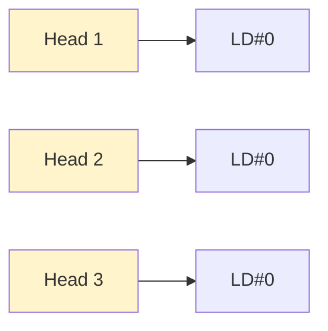

> **Figure 2-7.** Head-to-LD Mapping in MH-SLDs ｜ MH-SLD 中的头-LD 映射（1:1）
>
> 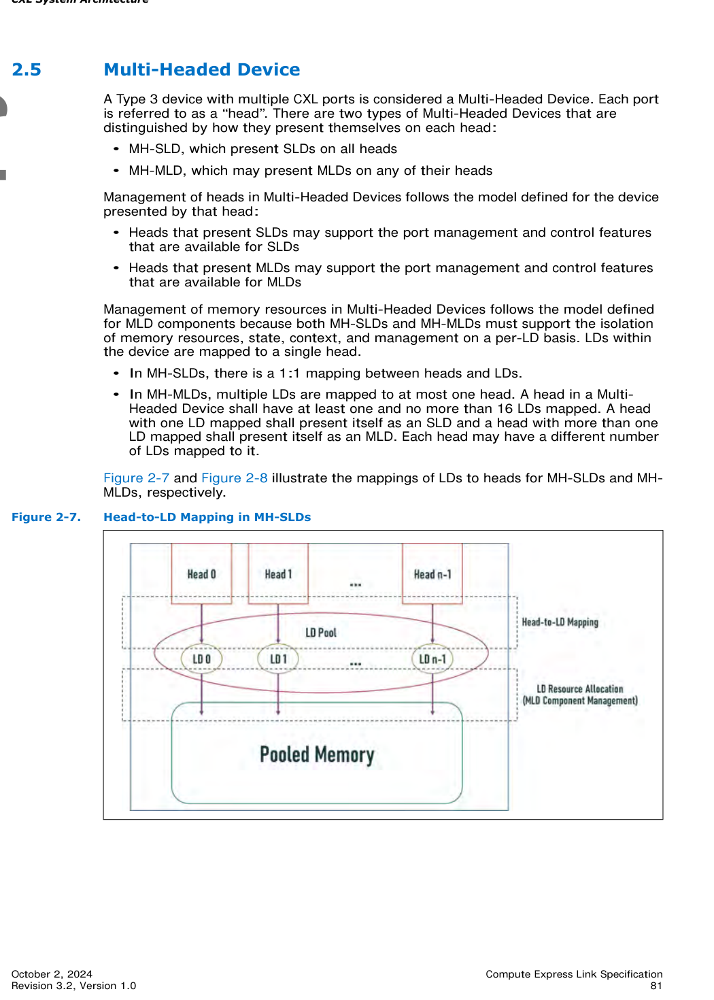
>
> *Original page render @ 150 DPI* — [📄 Full size](figures/chapter_02/page_0081.png)

<table>
<thead>
<tr>
<th width="50%">🇬🇧 English</th>
<th width="50%" style="background-color:#e8e8e8">🇨🇳 中文</th>
</tr>
</thead>
<tbody>
<tr>
<td>

Multi-Headed Devices shall expose a dedicated Component Command Interface (CCI), the LD Pool CCI, for management of all LDs within the device. The LD Pool CCI may be exposed as an MCTP-based CCI or can be accessed via the Tunnel Management Command command through a head's Mailbox CCI, as detailed in Section 7.6.7.3.1. The LD Pool CCI shall support the Tunnel Management Command for the purpose of tunneling management commands to all LDs within the device.

</td>
<td style="background-color:#e8e8e8">

多头设备必须暴露专用的组件命令接口（CCI）——LD Pool CCI，用于管理设备内的所有 LD。LD Pool CCI 可以作为基于 MCTP 的 CCI 暴露，也可以通过某头的 Mailbox CCI 经 Tunnel Management Command 访问（详见 7.6.7.3.1 节）。LD Pool CCI 必须支持 Tunnel Management Command，以便将管理命令隧道传送到设备内的所有 LD。

</td>
</tr>
<tr>
<td>

The number of supported heads reported by a Multi-Headed Device shall remain constant. Devices that support proprietary mechanisms to dynamically reconfigure the number of accessible heads (e.g., dynamic bifurcation of 2 x8 ports into a single x16 head, etc.) shall report the maximum number of supported heads.

</td>
<td style="background-color:#e8e8e8">

多头设备所报告的支持头数应保持恒定。支持专有机制以动态重配置可访问头数的设备（例如将 2 个 x8 端口动态细分为单个 x16 头）应报告支持的最大头数。

</td>
</tr>
</tbody>
</table>

### 2.5.1 LD Management in MH-MLDs | MH-MLD 中的 LD 管理

<table>
<thead>
<tr>
<th width="50%">🇬🇧 English</th>
<th width="50%" style="background-color:#e8e8e8">🇨🇳 中文</th>
</tr>
</thead>
<tbody>
<tr>
<td>

The LD Pool in an MH-MLD may support more than 16 LDs. MLDs exposed via the heads of an MH-MLD use LD-IDs from 0 to n-1 relative to that head, where n is the number of LDs mapped to the head. The MH-MLD maps the LD-IDs received at a head to the device-wide LD index in the MH-MLD's LD pool. The FMLD within each head of an MH-MLD shall expose and manage only the LDs that are mapped to that head.

</td>
<td style="background-color:#e8e8e8">

MH-MLD 中的 LD Pool 可支持超过 16 个 LD。通过 MH-MLD 的各头暴露的 MLD 使用相对于该头的 LD-ID 0 到 n-1（其中 n 是映射到该头的 LD 数）。MH-MLD 将各头收到的 LD-ID 映射到 MH-MLD 的 LD Pool 中设备全局的 LD 索引。MH-MLD 每个头内的 FMLD 必须仅暴露和管理映射到该头的 LD。

</td>
</tr>
<tr>
<td>

An LD or FMLD on a head may permit visibility and management of all LDs within the device by using the Tunnel Management command to access the LD Pool CCI, as detailed in Section 7.6.7.3.1.

</td>
<td style="background-color:#e8e8e8">

头内的 LD 或 FMLD 可通过 Tunnel Management 命令访问 LD Pool CCI（详见 7.6.7.3.1 节），从而允许查看与管理设备内的所有 LD。

</td>
</tr>
</tbody>
</table>

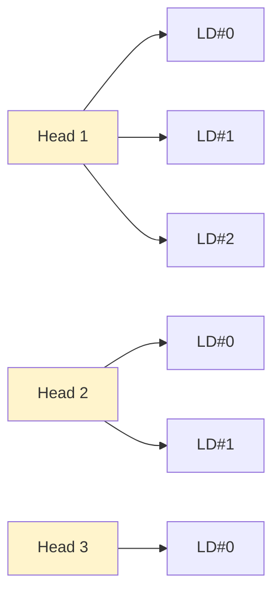

> **Figure 2-8.** Head-to-LD Mapping in MH-MLDs ｜ MH-MLD 中的头-LD 映射（1:N）
>
> 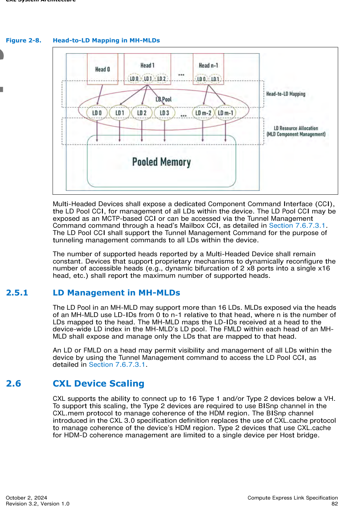
>
> *Original page render @ 150 DPI* — [📄 Full size](figures/chapter_02/page_0082.png)

[⬆️ 返回目录](#-本章目录-table-of-contents)

---

## 2.6 CXL Device Scaling | CXL 设备扩展性

<table>
<thead>
<tr>
<th width="50%">🇬🇧 English</th>
<th width="50%" style="background-color:#e8e8e8">🇨🇳 中文</th>
</tr>
</thead>
<tbody>
<tr>
<td>

CXL supports the ability to connect up to 16 Type 1 and/or Type 2 devices below a VH. To support this scaling, the Type 2 devices are required to use BISnp channel in the CXL.mem protocol to manage coherence of the HDM region. The BISnp channel introduced in the CXL 3.0 specification definition replaces the use of CXL.cache protocol to manage coherence of the device's HDM region. Type 2 devices that use CXL.cache for HDM-D coherence management are limited to a single device per Host bridge.

</td>
<td style="background-color:#e8e8e8">

CXL 支持在一个 VH 下挂接最多 16 个 Type 1 和/或 Type 2 设备。为支持此扩展性，Type 2 设备必须使用 CXL.mem 协议中的 BISnp 通道来管理 HDM 区域的一致性。CXL 3.0 规范引入的 BISnp 通道取代了使用 CXL.cache 协议管理设备 HDM 区域一致性的方式。使用 CXL.cache 管理 HDM-D 一致性的 Type 2 设备限制为每个主机桥 1 个。

</td>
</tr>
</tbody>
</table>

[⬆️ 返回目录](#-本章目录-table-of-contents)

---

## 2.7 CXL Fabric | CXL Fabric

<table>
<thead>
<tr>
<th width="50%">🇬🇧 English</th>
<th width="50%" style="background-color:#e8e8e8">🇨🇳 中文</th>
</tr>
</thead>
<tbody>
<tr>
<td>

CXL Fabric describes features that rely on the Port Based Routing (PBR) messages and flows to enable scalable switching and advanced switching topologies. PBR enables a flexible low-latency architecture supporting up to 4096 PIDs in each fabric. G-FAM device attach (see Section 2.8) is supported natively into the fabric. Hosts and devices use standard messaging flows translated to and from PBR format through Edge Switches in the fabric. Section 7.7 defines the requirements and use cases.

</td>
<td style="background-color:#e8e8e8">

CXL Fabric 描述基于 Port Based Routing（PBR）消息与流的特性，以实现可扩展的交换及高级交换拓扑。PBR 支持一种灵活的低延迟架构，每个 fabric 最多支持 4096 个 PID。G-FAM 设备挂接（见 2.8 节）被原生纳入 fabric。主机与设备使用标准消息流，由 fabric 中的边缘交换机进行 PBR 格式的双向转换。7.7 节定义了相关需求与用例。

</td>
</tr>
<tr>
<td>

A CXL Fabric is a collection of one or more switches that are each PBR capable and interconnected with PBR links. A Domain is of a set of Host Ports and Devices within a single coherent Host Physical Address (HPA) space. A CXL Fabric connects one or more Host Ports to the devices within each Domain.

</td>
<td style="background-color:#e8e8e8">

CXL Fabric 是由一台或多台具备 PBR 能力并通过 PBR 链路互连的交换机所组成的集合。域是位于同一相干 Host Physical Address（HPA）空间内的一组主机端口与设备。CXL Fabric 将一个或多个主机端口连接到每个域内的设备。

</td>
</tr>
</tbody>
</table>

[⬆️ 返回目录](#-本章目录-table-of-contents)

---

## 2.8 Global FAM (G-FAM) Type 3 Device | 全局 FAM (G-FAM) Type 3 设备

<table>
<thead>
<tr>
<th width="50%">🇬🇧 English</th>
<th width="50%" style="background-color:#e8e8e8">🇨🇳 中文</th>
</tr>
</thead>
<tbody>
<tr>
<td>

A G-FAM device (GFD) is a Type 3 device that connects to a CXL Fabric using a PBR link and relies on PBR message formats to provide FAM with much-higher scalability compared to LD-FAM devices. The associated FM API documented in Section 8.2.10.9.10 and host mailbox interface details are provided in Section 7.7.14.

</td>
<td style="background-color:#e8e8e8">

G-FAM 设备（GFD）是一种 Type 3 设备，通过 PBR 链路连接 CXL Fabric，并依赖 PBR 消息格式以提供比 LD-FAM 设备高得多的可扩展性。相关 FM API 见 8.2.10.9.10 节，主机邮箱接口细节见 7.7.14 节。

</td>
</tr>
<tr>
<td>

Like LD-FAM devices, GFDs can support pooled FAM, Shared FAM, or both. GFDs rely exclusively on the Dynamic Capacity mechanism for capacity management. See Section 7.7.2.3 for details and for other comparisons with LD-FAM devices.

</td>
<td style="background-color:#e8e8e8">

与 LD-FAM 设备类似，GFD 可支持池化 FAM、共享 FAM，或两者兼有。GFD 完全依赖 Dynamic Capacity 机制进行容量管理。细节及与 LD-FAM 设备的其它比较见 7.7.2.3 节。

</td>
</tr>
</tbody>
</table>

[⬆️ 返回目录](#-本章目录-table-of-contents)

---

## 2.9 Manageability Overview | 可管理性概述

<table>
<thead>
<tr>
<th width="50%">🇬🇧 English</th>
<th width="50%" style="background-color:#e8e8e8">🇨🇳 中文</th>
</tr>
</thead>
<tbody>
<tr>
<td>

To allow for different types of managed systems, CXL supports multiple types of management interfaces and management interconnects. Some are defined by external standards, while some are defined in the CXL specification.

</td>
<td style="background-color:#e8e8e8">

为支持不同类型的可管理系统，CXL 支持多种管理接口与管理互连。部分由外部标准定义，部分由 CXL 规范定义。

</td>
</tr>
<tr>
<td>

CXL component discovery, enumeration, and basic configuration are defined by PCI-SIG* and CXL specifications. These functions are accomplished via access to Configuration Space structures and associated MMIO structures.

</td>
<td style="background-color:#e8e8e8">

CXL 组件的发现、枚举与基本配置由 PCI-SIG 与 CXL 规范定义。这些功能通过访问 Configuration Space 结构及关联的 MMIO 结构完成。

</td>
</tr>
<tr>
<td>

Security authentication and data integrity/encryption management are defined in PCI-SIG, DMTF, and CXL specifications. The associated management traffic is transported either via Data Object Exchange (DOE) using Configuration Space, or via MCTP-based transports. The latter can operate in-band using PCIe VDMs, or out-of-band using management interconnects such as SMBus, I3C, or dedicated PCIe links.

</td>
<td style="background-color:#e8e8e8">

安全认证与数据完整性/加密管理由 PCI-SIG、DMTF 与 CXL 规范定义。相关管理流量通过 Configuration Space 上的 Data Object Exchange（DOE）或基于 MCTP 的传输承载；后者可使用 PCIe VDM 带内传输，也可通过 SMBus、I3C 或专用 PCIe 链路等管理互连带外传输。

</td>
</tr>
<tr>
<td>

The Manageability Model for CXL Devices is covered in Section 9.19. Advanced CXL-specific component management is handled using one or more CCIs, which are covered in Section 9.20. CCI commands fall into 4 broad sets:

- Generic Component commands
- Memory Device commands
- FM API commands
- Vendor Specific commands

All 4 sets are covered in Section 8.2.10, specifically:

- Command and capability determination
- Command foreground and background operation
- Event logging, notification, and log retrieval
- Interactions when a component has multiple CCIs

</td>
<td style="background-color:#e8e8e8">

CXL 设备的管理模型见 9.19 节。CXL 特定的高级组件管理通过一个或多个 CCI 处理，见 9.20 节。CCI 命令分为 4 大类：

- Generic Component 命令
- Memory Device 命令
- FM API 命令
- Vendor Specific 命令

上述四类命令均涵盖于 8.2.10 节，特别是：

- 命令与能力确定
- 命令前台与后台操作
- 事件记录、通知与日志检索
- 组件具有多个 CCI 时的交互

</td>
</tr>
<tr>
<td>

Each command is mandatory, optional, or prohibited, based on the component type and other attributes. Commands can be sent to devices, switches, or both.

</td>
<td style="background-color:#e8e8e8">

每个命令根据组件类型及其它属性，分为强制、可选或禁止。命令可发送给设备、交换机或两者。

</td>
</tr>
<tr>
<td>

CCIs use several transports and interconnects to accomplish their operations. The mailbox mechanism is covered in Section 8.2.9.4, and mailboxes are accessed via an architected MMIO register interface. MCTP-based transports use PCIe VDMs in-band or any of the previously mentioned out-of-band management interconnects. FM API commands can be tunneled to MLDs and GFDs via CXL switches. Configuration and MMIO accesses can be tunneled to LDs within MLDs via CXL switches.

</td>
<td style="background-color:#e8e8e8">

CCI 使用多种传输与互连完成其操作。邮箱机制见 8.2.9.4 节，邮箱通过架构化的 MMIO 寄存器接口访问。基于 MCTP 的传输使用 PCIe VDM 带内传输，或使用前述任一带外管理互连。FM API 命令可经 CXL 交换机隧道传送至 MLD 与 GFD；配置与 MMIO 访问可经 CXL 交换机隧道传送至 MLD 内的 LD。

</td>
</tr>
<tr>
<td>

DMTF's Platform-Level Data Model (PLDM) is used for platform monitoring and control, and can be used for component firmware updates. PLDM may use MCTP to communicate with target CXL components.

</td>
<td style="background-color:#e8e8e8">

DMTF 的 Platform-Level Data Model（PLDM）用于平台监测与控制，并可用于组件固件更新。PLDM 可使用 MCTP 与目标 CXL 组件通信。

</td>
</tr>
<tr>
<td>

Given CXL's use of multiple manageability standards and interconnects, it is important to consider interoperability when designing a system that incorporates CXL components.

</td>
<td style="background-color:#e8e8e8">

鉴于 CXL 使用多种可管理性标准与互连，在设计包含 CXL 组件的系统时，务必考虑互操作性。

</td>
</tr>
</tbody>
</table>

[⬆️ 返回目录](#-本章目录-table-of-contents)

---

## ✅ Chapter 2 翻译完成 (Translation Complete)

**已交付**:
- [x] 2.0 CXL 系统架构概述
- [x] 2.1 CXL Type 1 设备
- [x] 2.2 CXL Type 2 设备
  - [x] 2.2.1 HDM-DB 的反向失效探测一致性
  - [x] 2.2.2 HDM-D 的基于偏向的一致性模型
    - [x] 2.2.2.1 Host Bias（主机偏向）
    - [x] 2.2.2.2 Device Bias（设备偏向）
    - [x] 2.2.2.3 偏向模式管理
      - [x] 2.2.2.3.1 软件辅助偏向模式管理
      - [x] 2.2.2.3.2 硬件自治偏向模式管理
- [x] 2.3 CXL Type 3 设备
- [x] 2.4 多逻辑设备 (MLD)
  - [x] 2.4.1 LD-ID（CXL.io/CXL.mem）
  - [x] 2.4.2 池化内存设备配置寄存器
  - [x] 2.4.3 池化内存与共享 FAM
  - [x] 2.4.4 共享 FAM 的一致性模型
- [x] 2.5 多头设备
  - [x] 2.5.1 MH-MLD 中的 LD 管理
- [x] 2.6 CXL 设备扩展性
- [x] 2.7 CXL Fabric
- [x] 2.8 全局 FAM (G-FAM) Type 3 设备
- [x] 2.9 可管理性概述

**图表**:
- 8 张原图（Figure 2-1 ~ 2-8）已渲染为 PNG，附 Mermaid 概念图重绘
- 3 张表格（Table 2-1, 2-2 sheet1/sheet2）已中英对照

**GitHub 特性已应用**:
- ✅ 显式锚点 `<a id="sec-2-x">` + 任务列表 + 中文灰底背景 + Mermaid 概念图
- ⏳ **待优化**：图表内嵌（按你的最新要求）

---

## 🎯 下一步：内嵌所有图表

按你的要求"将图表内嵌进去"，需要：
1. 把所有 `> **Figure X-Y.** ... \n > 📄 原图：[...]` 替换为内嵌 `` 语法
2. 同样优化 Chapter 1
3. 更新 README
4. 重新 commit & push

是否现在执行"图表内嵌化"改造？预计会修改 2 个文件（Ch1: 9 张图，Ch2: 8 张图），完成后一并推送。

## 🖼 图补遗 (Figure Supplement)

> 本节为 MinerU Standard API 在原始 markdown 之外额外提取的 figures, 已用 Part A 风格 4 行 blockquote 补齐双语 caption, 但未插入正文具体节 (内容可能与正文有重复, 仅供参考)。

> **Figure p.0074.** Figure 2-4. Type 2 Device - Host Bias
>
> 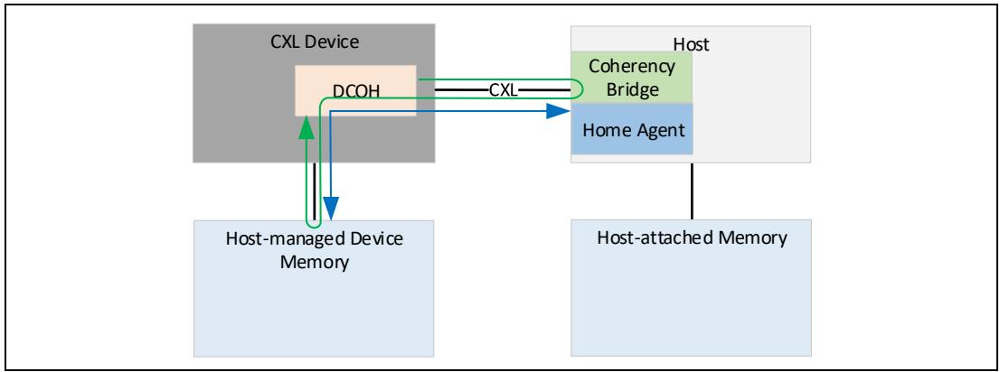
>
> *Source*: MinerU tight crop extraction (page 0074 of CXL 3.2 spec)

> **Figure p.0075.** Figure 2-5. Type 2 Device - Device Bias
>
> 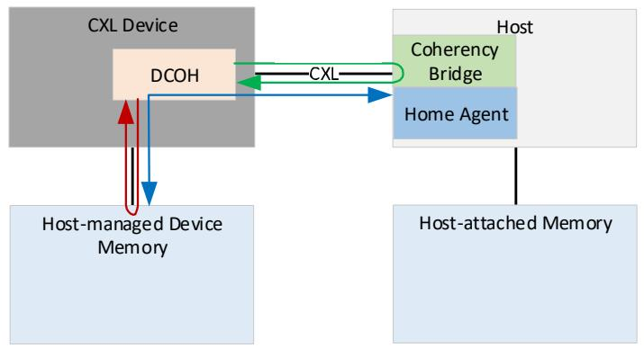
>
> *Source*: MinerU tight crop extraction (page 0075 of CXL 3.2 spec)

