# 📘 第 3 章　CXL 事务层 (Chapter 3. CXL Transaction Layer)

> **Source pages**: 85–190 | **File**: chapter_03.md | **Format**: 中英对照双语

---

## 📑 本章目录

- <a href="#sec-3-0">3.0 CXL Transaction Layer | CXL 事务层</a>
- <a href="#sec-3-1">3.1 CXL.io</a>
  - <a href="#sec-3-1-1">3.1.1 CXL.io Endpoint | CXL.io 端点</a>
  - <a href="#sec-3-1-2">3.1.2 CXL Power Management VDM Format | CXL 电源管理 VDM 格式</a>
    - <a href="#sec-3-1-2-1">3.1.2.1 Credit and PM Initialization | 信用量与 PM 初始化</a>
  - <a href="#sec-3-1-3">3.1.3 CXL Error VDM Format | CXL 错误 VDM 格式</a>
  - <a href="#sec-3-1-4">3.1.4 Optional PCIe Features Required for CXL | CXL 所需的 PCIe 可选特性</a>
  - <a href="#sec-3-1-5">3.1.5 Error Propagation | 错误传播</a>
  - <a href="#sec-3-1-6">3.1.6 Memory Type Indication on ATS | ATS 上的内存类型指示</a>
  - <a href="#sec-3-1-7">3.1.7 Deferrable Writes | 可延迟写</a>
  - <a href="#sec-3-1-8">3.1.8 PBR TLP Header (PTH) | PBR TLP 头 (PTH)</a>
    - <a href="#sec-3-1-8-1">3.1.8.1 Transmitter Rules Summary | 发送端规则概要</a>
    - <a href="#sec-3-1-8-2">3.1.8.2 Receiver Rules Summary | 接收端规则概要</a>
  - <a href="#sec-3-1-9">3.1.9 VendPrefixL0 | VendPrefixL0</a>
  - <a href="#sec-3-1-10">3.1.10 CXL DevLoad (CDL) Field in UIO Completions | UIO 补全中的 CXL DevLoad (CDL) 字段</a>
  - <a href="#sec-3-1-11">3.1.11 CXL Fabric-related VDMs | 与 CXL Fabric 相关的 VDM</a>
    - <a href="#sec-3-1-11-1">3.1.11.1 Host Management Transaction Flows of GFD | GFD 的主机管理事务流</a>
    - <a href="#sec-3-1-11-2">3.1.11.2 Downstream Proxy Command (DPCmd) VDM | 下游代理命令 (DPCmd) VDM</a>
    - <a href="#sec-3-1-11-3">3.1.11.3 Upstream Command Pull (UCPull) VDM | 上游命令拉取 (UCPull) VDM</a>
    - <a href="#sec-3-1-11-4">3.1.11.4 Downstream Command Request (DCReq, DCReq-Last, DCReq-Fail) VDMs | 下游命令请求 VDM</a>
    - <a href="#sec-3-1-11-5">3.1.11.5 Upstream Command Response (UCRsp, UCRsp-Last, UCRsp-Fail) VDMs | 上游命令响应 VDM</a>
    - <a href="#sec-3-1-11-6">3.1.11.6 GFD Async Message (GAM) VDM | GFD 异步消息 (GAM) VDM</a>
    - <a href="#sec-3-1-11-7">3.1.11.7 Route Table Update (RTUpdate) VDM | 路由表更新 (RTUpdate) VDM</a>
    - <a href="#sec-3-1-11-8">3.1.11.8 Route Table Update Response (RTUpdateAck, RTUpdateNak) VDMs | 路由表更新响应 VDM</a>
- <a href="#sec-3-2">3.2 CXL.cache</a>
  - <a href="#sec-3-2-1">3.2.1 Overview | 概述</a>
  - <a href="#sec-3-2-2">3.2.2 CXL.cache Channel Description | CXL.cache 通道描述</a>
    - <a href="#sec-3-2-2-1">3.2.2.1 Channel Ordering | 通道顺序</a>
    - <a href="#sec-3-2-2-2">3.2.2.2 Channel Crediting | 通道信用量</a>
  - <a href="#sec-3-2-3">3.2.3 CXL.cache Wire Description | CXL.cache 线缆描述</a>
    - <a href="#sec-3-2-3-1">3.2.3.1 D2H Request | D2H 请求</a>
    - <a href="#sec-3-2-3-2">3.2.3.2 D2H Response | D2H 响应</a>
    - <a href="#sec-3-2-3-3">3.2.3.3 D2H Data | D2H 数据</a>
    - <a href="#sec-3-2-3-4">3.2.3.4 H2D Request | H2D 请求</a>
    - <a href="#sec-3-2-3-5">3.2.3.5 H2D Response | H2D 响应</a>
    - <a href="#sec-3-2-3-6">3.2.3.6 H2D Data | H2D 数据</a>
  - <a href="#sec-3-2-4">3.2.4 CXL.cache Transaction Description | CXL.cache 事务描述</a>
    - <a href="#sec-3-2-4-1">3.2.4.1 Device-attached Memory Flows for HDM-D/HDM-DB | HDM-D/HDM-DB 设备附加内存流</a>
    - <a href="#sec-3-2-4-2">3.2.4.2 Device to Host Requests | 设备到主机的请求</a>
    - <a href="#sec-3-2-4-3">3.2.4.3 Device to Host Response | 设备到主机的响应</a>
    - <a href="#sec-3-2-4-4">3.2.4.4 Host to Device Requests | 主机到设备的请求</a>
    - <a href="#sec-3-2-4-5">3.2.4.5 Host to Device Response | 主机到设备的响应</a>
  - <a href="#sec-3-2-5">3.2.5 Cacheability Details and Request Restrictions | 可缓存性细节与请求限制</a>
- <a href="#sec-3-3">3.3 CXL.mem</a>
  - <a href="#sec-3-3-1">3.3.1 Introduction | 介绍</a>
  - <a href="#sec-3-3-2">3.3.2 CXL.mem Channel Description | CXL.mem 通道描述</a>
    - <a href="#sec-3-3-2-1">3.3.2.1 Direct P2P CXL.mem for Accelerators | 加速器的 Direct P2P CXL.mem</a>
    - <a href="#sec-3-3-2-2">3.3.2.2 Snoop Handling with Direct P2P CXL.mem | Direct P2P CXL.mem 的探测处理</a>
  - <a href="#sec-3-3-3">3.3.3 Back-Invalidate Snoop | 反向失效探测</a>
  - <a href="#sec-3-3-4">3.3.4 QoS Telemetry for Memory | 内存的 QoS 遥测</a>
    - <a href="#sec-3-3-4-1">3.3.4.1 QoS Telemetry Overview | QoS 遥测概述</a>
    - <a href="#sec-3-3-4-2">3.3.4.2 Reference Model for Host/Peer Support of QoS Telemetry | 主机/对端 QoS 遥测支持的参考模型</a>
    - <a href="#sec-3-3-4-3">3.3.4.3 Memory Device Support for QoS Telemetry | 内存设备的 QoS 遥测支持</a>
  - <a href="#sec-3-3-5">3.3.5 M2S Request (Req) | M2S 请求 (Req)</a>
  - <a href="#sec-3-3-6">3.3.6 M2S Request with Data (RwD) | M2S 带数据请求 (RwD)</a>
    - <a href="#sec-3-3-6-1">3.3.6.1 Trailer Present for RwD (256B Flit) | RwD 的 Trailer Present (256B Flit)</a>
  - <a href="#sec-3-3-7">3.3.7 M2S Back-Invalidate Response (BIRsp) | M2S 反向失效响应 (BIRsp)</a>
  - <a href="#sec-3-3-8">3.3.8 S2M Back-Invalidate Snoop (BISnp) | S2M 反向失效探测 (BISnp)</a>
    - <a href="#sec-3-3-8-1">3.3.8.1 Rules for Block Back-Invalidate Snoops | 块反向失效探测规则</a>
  - <a href="#sec-3-3-9">3.3.9 S2M No Data Response (NDR) | S2M 无数据响应 (NDR)</a>
  - <a href="#sec-3-3-10">3.3.10 S2M Data Response (DRS) | S2M 数据响应 (DRS)</a>
    - <a href="#sec-3-3-10-1">3.3.10.1 Trailer Present for DRS (256B Flit) | DRS 的 Trailer Present (256B Flit)</a>
  - <a href="#sec-3-3-11">3.3.11 Responses for Requests Targeting NXM | 针对 NXM 的请求响应</a>
  - <a href="#sec-3-3-12">3.3.12 Forward Progress and Ordering Rules | 前进进度与排序规则</a>
    - <a href="#sec-3-3-12-1">3.3.12.1 Buried Cache State Rules for HDM-D/HDM-DB | HDM-D/HDM-DB 的 Buried Cache State 规则</a>
- <a href="#sec-3-4">3.4 Transaction Ordering Summary | 事务排序总结</a>
- <a href="#sec-3-5">3.5 Transaction Flows to Device-attached Memory | 设备附加内存的事务流</a>
  - <a href="#sec-3-5-1">3.5.1 Flows for Back-Invalidate Snoops on CXL.mem | CXL.mem 上的反向失效探测流</a>
    - <a href="#sec-3-5-1-1">3.5.1.1 Notes and Assumptions | 注释与假设</a>
    - <a href="#sec-3-5-1-2">3.5.1.2 BISnp Blocking Example | BISnp 阻塞示例</a>
    - <a href="#sec-3-5-1-3">3.5.1.3 Conflict Handling | 冲突处理</a>
    - <a href="#sec-3-5-1-4">3.5.1.4 Block Back-Invalidate Snoops | 块反向失效探测</a>
  - <a href="#sec-3-5-2">3.5.2 Flows for Type 1 Devices and Type 2 Devices | Type 1 与 Type 2 设备的流</a>
    - <a href="#sec-3-5-2-1">3.5.2.1 Notes and Assumptions | 注释与假设</a>
    - <a href="#sec-3-5-2-2">3.5.2.2 Requests from Host | 来自主机的请求</a>
    - <a href="#sec-3-5-2-3">3.5.2.3 Requests from Device in Host and Device Bias | 设备在 Host/Device Bias 下的请求</a>
  - <a href="#sec-3-5-3">3.5.3 Type 2 Memory Flows and Type 3 Memory Flows | Type 2 与 Type 3 内存流</a>
    - <a href="#sec-3-5-3-1">3.5.3.1 Speculative Memory Read | 投机性内存读</a>
- <a href="#sec-3-6">3.6 Flows to HDM-H in a Type 3 Device | Type 3 设备中 HDM-H 的流</a>

## 🖼 本章图表

| 编号 | 英文标题 | 中文标题 | 页码 |
| --- | --- | --- | --- |
| Figure 3-1 | Flex Bus Layers - CXL.io Transaction Layer Highlighted | Flex Bus 分层 — CXL.io 事务层高亮 | 85 |
| Figure 3-2 | CXL Power Management Messages Packet Format - Non-Flit Mode | CXL 电源管理消息包格式 — 非 Flit 模式 | 87 |
| Figure 3-3 | CXL Power Management Messages Packet Format - Flit Mode | CXL 电源管理消息包格式 — Flit 模式 | 87 |
| Figure 3-4 | Power Management Credits and Initialization | 电源管理信用量与初始化 | 90 |
| Figure 3-5 | CXL EFN Messages Packet Format - Non-Flit Mode | CXL EFN 消息包格式 — 非 Flit 模式 | 91 |
| Figure 3-6 | CXL EFN Messages Packet Format - Flit Mode | CXL EFN 消息包格式 — Flit 模式 | 91 |
| Figure 3-7 | ATS 64-bit Request with CXL Indication - Non-Flit Mode | 带 CXL 指示的 ATS 64-bit 请求 — 非 Flit 模式 | 93 |
| Figure 3-8 | Valid .io TLP Formats on PBR Links | PBR 链路上合法的 .io TLP 格式 | 96 |
| Figure 3-9 | Host Management Transaction Flows of GFD | GFD 的主机管理事务流 | 99 |
| Figure 3-10 | CXL.cache Channels | CXL.cache 通道 | 107 |
| Figure 3-11 | CXL.cache Read Behavior | CXL.cache 读行为 | 114 |
| Figure 3-12 | CXL.cache Read0 Behavior | CXL.cache Read0 行为 | 115 |
| Figure 3-13 | CXL.cache Device to Host Write Behavior | CXL.cache 设备到主机的写行为 | 116 |
| Figure 3-14 | CXL.cache WrInv Transaction | CXL.cache WrInv 事务 | 117 |
| Figure 3-15 | WOWrInv/F with FastGO/ExtCmp | 带 FastGO/ExtCmp 的 WOWrInv/F | 118 |
| Figure 3-16 | CXL.cache Read0-Write Semantics | CXL.cache Read0-Write 语义 | 119 |
| Figure 3-17 | CXL.cache Snoop Behavior | CXL.cache 探测行为 | 126 |
| Figure 3-18 | CXL.mem Channels for Devices | 设备的 CXL.mem 通道 | 135 |
| Figure 3-19 | CXL.mem Channels for Hosts | 主机的 CXL.mem 通道 | 136 |
| Figure 3-20 | Flows for Back-Invalidate Snoops on CXL.mem Legend | CXL.mem 反向失效探测流图例 | 170 |
| Figure 3-21 | Example BISnp with Blocking of M2S Req | BISnp 阻塞 M2S Req 的示例 | 170 |
| Figure 3-22 | BISnp Early Conflict | BISnp 早期冲突 | 171 |
| Figure 3-23 | BISnp Late Conflict | BISnp 晚期冲突 | 172 |
| Figure 3-24 | Block BISnp with Block Response | 块响应方式的块 BISnp | 173 |
| Figure 3-25 | Block BISnp with Cacheline Response | Cacheline 响应方式的块 BISnp | 174 |
| Figure 3-26 | Flows for Type 1 Devices and Type 2 Devices Legend | Type 1 与 Type 2 设备流图例 | 175 |
| Figure 3-27 | Example Cacheable Read from Host | 主机可缓存读示例 | 175 |
| Figure 3-28 | Example Read for Ownership from Host | 主机读以获取所有权示例 | 176 |
| Figure 3-29 | Example Non Cacheable Read from Host | 主机非缓存读示例 | 177 |
| Figure 3-30 | Example Ownership Request from Host - No Data Required | 主机所有权请求示例 — 无需数据 | 178 |
| Figure 3-31 | Example Flush from Host | 主机刷新示例 | 179 |
| Figure 3-32 | Example Weakly Ordered Write from Host | 主机弱序写示例 | 180 |
| Figure 3-33 | Example Write from Host with Invalid Host Caches | 主机缓存失效情况下的写示例 | 181 |
| Figure 3-34 | Example Write from Host with Valid Host Caches | 主机缓存有效情况下的写示例 | 182 |
| Figure 3-35 | Example Device Read to Device-attached Memory (HDM-D) | 设备读设备附加内存示例 (HDM-D) | 183 |
| Figure 3-36 | Example Device Read to Device-attached Memory (HDM-DB) | 设备读设备附加内存示例 (HDM-DB) | 184 |
| Figure 3-37 | Example Device Write to Device-Attached Memory in Host Bias (HDM-D) | 设备在 Host Bias 下写设备附加内存示例 (HDM-D) | 185 |
| Figure 3-38 | Example Device Write to Device-attached Memory in Host Bias (HDM-DB) | 设备在 Host Bias 下写设备附加内存示例 (HDM-DB) | 186 |
| Figure 3-39 | Example Device Write to Device-attached Memory | 设备写设备附加内存示例 | 187 |
| Figure 3-40 | Example Host to Device Bias Flip (HDM-D) | 主机到设备 Bias 翻转示例 (HDM-D) | 188 |
| Figure 3-41 | Example MemSpecRd | MemSpecRd 示例 | 189 |
| Figure 3-42 | Read from Host to HDM-H | 主机读 HDM-H | 189 |
| Figure 3-43 | Write from Host to All HDM Regions | 主机写所有 HDM 区域 | 190 |

## 📊 本章表格

| 编号 | 英文标题 | 中文标题 | 页码 |
| --- | --- | --- | --- |
| Table 3-1 | CXL Power Management Messages - Data Payload Field Definitions | CXL 电源管理消息 — 数据负载字段定义 | 88 |
| Table 3-2 | PMREQ Field Definitions | PMREQ 字段定义 | 90 |
| Table 3-3 | Optional PCIe Features Required for CXL | CXL 所需的 PCIe 可选特性 | 92 |
| Table 3-4 | PBR TLP Header (PTH) Format | PBR TLP 头 (PTH) 格式 | 95 |
| Table 3-5 | NOP-TLP Header Format | NOP-TLP 头格式 | 95 |
| Table 3-6 | Local Prefix Header Format | 本地前缀头格式 | 95 |
| Table 3-7 | VendPrefixL0 on Non-MLD Edge HBR Links | 非 MLD Edge HBR 链路上的 VendPrefixL0 | 96 |
| Table 3-8 | PBR VDM | PBR VDM | 97 |
| Table 3-9 | CXL Fabric Vendor Defined Messages | CXL Fabric 厂商定义消息 | 98 |
| Table 3-10 | GAM VDM Payload | GAM VDM 负载 | 104 |
| Table 3-11 | RTUpdate VDM Payload | RTUpdate VDM 负载 | 105 |
| Table 3-12 | CXL.cache Channel Crediting Summary | CXL.cache 通道信用量总结 | 108 |
| Table 3-13 | CXL.cache - D2H Request Fields | CXL.cache — D2H 请求字段 | 108 |
| Table 3-14 | Non Temporal Encodings | Non Temporal 编码 | 109 |
| Table 3-15 | CXL.cache - D2H Response Fields | CXL.cache — D2H 响应字段 | 109 |
| Table 3-16 | CXL.cache - D2H Data Header Fields | CXL.cache — D2H 数据头字段 | 110 |
| Table 3-17 | CXL.cache – H2D Request Fields | CXL.cache — H2D 请求字段 | 110 |
| Table 3-18 | CXL.cache - H2D Response Fields | CXL.cache — H2D 响应字段 | 111 |
| Table 3-19 | RSP_PRE Encodings | RSP_PRE 编码 | 111 |
| Table 3-20 | Cache State Encoding for H2D Response | H2D 响应的 Cache 状态编码 | 112 |
| Table 3-21 | CXL.cache - H2D Data Header Fields | CXL.cache — H2D 数据头字段 | 112 |
| Table 3-22 | CXL.cache – Device to Host Requests | CXL.cache — 设备到主机的请求 | 119 |
| Table 3-23 | D2H Request (Targeting Non Device-attached Memory) Supported H2D Responses | D2H 请求（针对非设备附加内存）支持的 H2D 响应 | 123 |
| Table 3-24 | D2H Request (Targeting Device-attached Memory) Supported Responses | D2H 请求（针对设备附加内存）支持的响应 | 124 |
| Table 3-25 | D2H Response Encodings | D2H 响应编码 | 125 |
| Table 3-26 | CXL.cache – Mapping of H2D Requests to D2H Responses | CXL.cache — H2D 请求到 D2H 响应的映射 | 127 |
| Table 3-27 | H2D Response Opcode Encodings | H2D 响应操作码编码 | 127 |
| Table 3-28 | Allowed Opcodes for D2H Requests per Buried Cache State | 各 Buried Cache State 下 D2H 请求允许的操作码 | 133 |
| Table 3-29 | Impact of DevLoad Indication on Host/Peer Request Rate Throttling | DevLoad 指示对主机/对端请求率节流的影响 | 139 |
| Table 3-30 | Recommended Host/Peer Adjustment to Request Rate Throttling | 推荐的主机/对端请求率节流调整 | 140 |
| Table 3-31 | Factors for Determining IntLoad | IntLoad 的判定因素 | 141 |
| Table 3-32 | Additional Factors for Determining DevLoad in MLDs | MLD 中 DevLoad 判定的附加因素 | 146 |
| Table 3-33 | Additional Factors for Determining DevLoad in MLDs/GFDs | MLD/GFD 中 DevLoad 判定的附加因素 | 148 |
| Table 3-34 | M2S Request Fields | M2S 请求字段 | 150 |
| Table 3-35 | M2S Req Memory Opcodes | M2S Req 内存操作码 | 151 |
| Table 3-36 | Metadata Field Definition | Metadata 字段定义 | 152 |
| Table 3-37 | Meta0-State Value Definition (HDM-D/HDM-DB Devices) | Meta0-State 值定义 (HDM-D/HDM-DB 设备) | 153 |
| Table 3-38 | Snoop Type Definition | Snoop 类型定义 | 153 |
| Table 3-39 | M2S Req Usage | M2S Req 用法 | 153 |
| Table 3-40 | M2S RwD Fields | M2S RwD 字段 | 154 |
| Table 3-41 | M2S RwD Memory Opcodes | M2S RwD 内存操作码 | 155 |
| Table 3-42 | M2S RwD Usage | M2S RwD 用法 | 156 |
| Table 3-43 | RwD Trailers | RwD Trailer | 157 |
| Table 3-44 | M2S BIRsp Fields | M2S BIRsp 字段 | 157 |
| Table 3-45 | M2S BIRsp Memory Opcodes | M2S BIRsp 内存操作码 | 157 |
| Table 3-46 | S2M BISnp Fields | S2M BISnp 字段 | 158 |
| Table 3-47 | S2M BISnp Opcodes | S2M BISnp 操作码 | 158 |
| Table 3-48 | Block (Blk) Enable Encoding in Address[7:6] | Address[7:6] 中块 (Blk) 启用编码 | 159 |
| Table 3-49 | S2M NDR Fields | S2M NDR 字段 | 160 |
| Table 3-50 | S2M NDR Opcodes | S2M NDR 操作码 | 160 |
| Table 3-51 | DevLoad Definition | DevLoad 定义 | 161 |
| Table 3-52 | S2M DRS Fields | S2M DRS 字段 | 161 |
| Table 3-53 | S2M DRS Opcodes | S2M DRS 操作码 | 162 |
| Table 3-54 | DRS Trailers | DRS Trailer | 162 |
| Table 3-55 | CXL.mem Responses for Requests to Non-existent Memory | CXL.mem 对不存在内存请求的响应 | 163 |
| Table 3-56 | Allowed Opcodes for HDM-D/HDM-DB Req and RwD Messages per Buried Cache State | 各 Buried Cache State 下 HDM-D/HDM-DB Req 与 RwD 消息允许的操作码 | 165 |
| Table 3-57 | Upstream Ordering Summary | 上行排序总结 | 166 |
| Table 3-58 | Downstream Ordering Summary | 下行排序总结 | 166 |
| Table 3-59 | Device In-Out Ordering Summary | 设备进出排序总结 | 168 |
| Table 3-60 | Host In-Out Ordering Summary | 主机进出排序总结 | 168 |

---

## 3.0 CXL Transaction Layer | CXL 事务层

<table>
<thead>
<tr>
<th width="50%">🇬🇧 English</th>
<th width="50%" style="background-color:#e8e8e8">🇨🇳 中文</th>
</tr>
</thead>
<tbody>
<tr><td>CXL Transaction Layer</td><td style="background-color:#e8e8e8">CXL 事务层</td></tr>
</tbody>
</table>

[⬆️ 返回目录](#-本章目录)

## 3.1 CXL.io | CXL.io

<table>
<thead>
<tr>
<th width="50%">🇬🇧 English</th>
<th width="50%" style="background-color:#e8e8e8">🇨🇳 中文</th>
</tr>
</thead>
<tbody>
<tr><td>CXL.io</td><td style="background-color:#e8e8e8">CXL.io</td></tr>
<tr><td>CXL.io provides a non-coherent load/store interface for I/O devices. Figure 3-1 shows where the CXL.io transaction layer exists in the Flex Bus layered hierarchy. Transaction types, transaction packet formatting, credit-based flow control, virtual channel management, and transaction ordering rules follow the PCIe* definition; please refer to the "Transaction Layer Specification" chapter of PCIe Base Specification for details. This chapter highlights notable PCIe modes or features that are used for CXL.io.</td><td style="background-color:#e8e8e8">CXL.io 为 I/O 设备提供非一致性的 load/store 接口。Figure 3-1 展示了 CXL.io 事务层在 Flex Bus 分层结构中的位置。事务类型、事务包格式、基于信用量的流控、虚通道管理以及事务排序规则遵循 PCIe* 规范；详细内容请参阅 PCIe Base Specification 的 "Transaction Layer Specification" 章节。本章重点说明用于 CXL.io 的显著 PCIe 模式或特性。</td></tr>
</tbody>
</table>

> **Figure 3-1.** Flex Bus Layers - CXL.io Transaction Layer Highlighted ｜ Flex Bus 分层 — CXL.io 事务层高亮
>
> 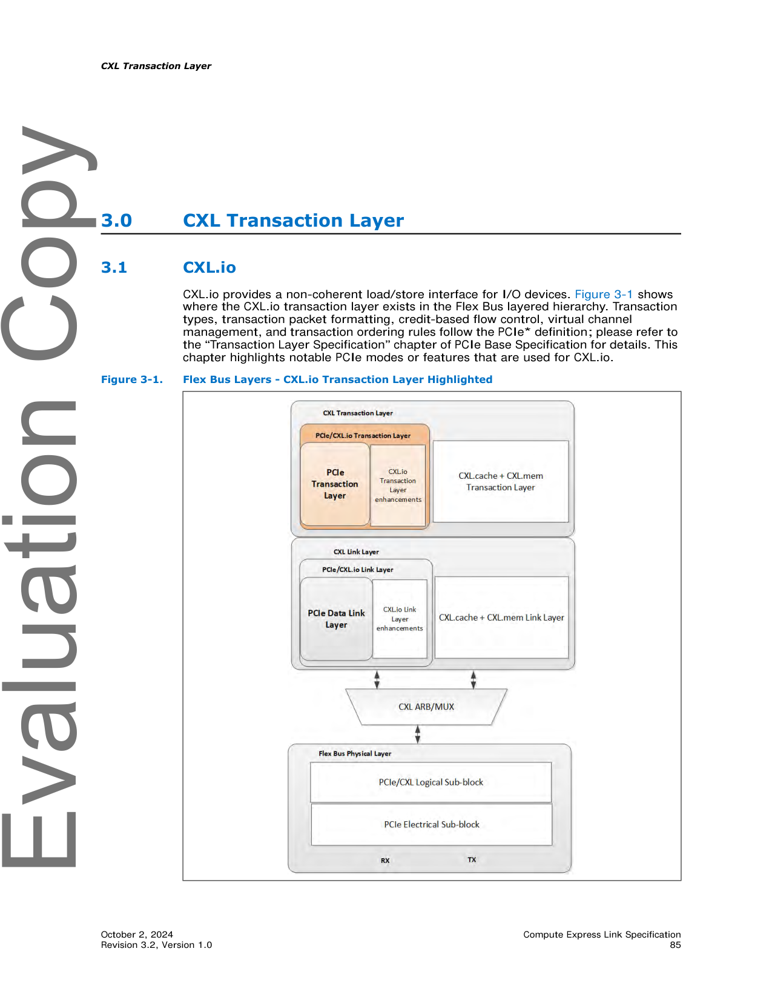
>
> *Original page render @ 150 DPI* — [📄 Full size](figures/chapter_03/page_0085.png)

[⬆️ 返回目录](#-本章目录)

### 3.1.1 CXL.io Endpoint | CXL.io 端点

<table>
<thead>
<tr>
<th width="50%">🇬🇧 English</th>
<th width="50%" style="background-color:#e8e8e8">🇨🇳 中文</th>
</tr>
</thead>
<tbody>
<tr><td>CXL.io Endpoint</td><td style="background-color:#e8e8e8">CXL.io 端点</td></tr>
<tr><td>The CXL Alternate Protocol negotiation determines the mode of operation. See Section 9.11 and Section 9.12 for descriptions of how CXL devices are enumerated with the help of CXL.io.</td><td style="background-color:#e8e8e8">CXL 备用协议协商（Alternate Protocol negotiation）决定工作模式。参见 Section 9.11 和 Section 9.12，了解借助 CXL.io 对 CXL 设备进行枚举的描述。</td></tr>
<tr><td>A Function on a CXL device must not generate INTx messages if that Function participates in CXL.cache protocol or CXL.mem protocols. A Non-CXL Function Map DVSEC (see Section 8.1.4) enumerates functions that do not participate in CXL.cache or CXL.mem. Even though not recommended, these non-CXL functions are permitted to generate INTx messages.</td><td style="background-color:#e8e8e8">如果 CXL 设备上的某个 Function 参与 CXL.cache 协议或 CXL.mem 协议，则该 Function 不得生成 INTx 消息。Non-CXL Function Map DVSEC（见 Section 8.1.4）枚举不参与 CXL.cache 或 CXL.mem 的 Function。尽管并不推荐，但这些非 CXL Function 仍被允许生成 INTx 消息。</td></tr>
<tr><td>Functions associated with an LD within an MLD component, including non-CXL functions, are not permitted to generate INTx messages.</td><td style="background-color:#e8e8e8">在 MLD 组件中与某个 LD 相关联的 Function（包括非 CXL Function）均不允许生成 INTx 消息。</td></tr>
</tbody>
</table>

[⬆️ 返回目录](#-本章目录)

### 3.1.2 CXL Power Management VDM Format | CXL 电源管理 VDM 格式

<table>
<thead>
<tr>
<th width="50%">🇬🇧 English</th>
<th width="50%" style="background-color:#e8e8e8">🇨🇳 中文</th>
</tr>
</thead>
<tbody>
<tr><td>CXL Power Management VDM Format</td><td style="background-color:#e8e8e8">CXL 电源管理 VDM 格式</td></tr>
<tr><td>The CXL power management messages are sent as PCIe Vendor Defined Type 0 messages with a 4-DWORD data payload. These include the PMREQ, PMRSP, and PMGO messages. Figure 3-2 and Figure 3-3 provide the format for the CXL PM VDMs. The following are the characteristics of these messages:</td><td style="background-color:#e8e8e8">CXL 电源管理消息作为带有 4-DWORD 数据负载的 PCIe Vendor Defined Type 0 消息发送。消息包括 PMREQ、PMRSP 和 PMGO。Figure 3-2 和 Figure 3-3 给出了 CXL PM VDM 的格式。这些消息具有以下特征：</td></tr>
<tr><td>• Fmt and Type fields are set to indicate message with data. All messages use routing of "Local-Terminate at Receiver." Message Code is set to Vendor Defined Type 0.</td><td style="background-color:#e8e8e8">• Fmt 和 Type 字段被设置为表示带数据的消息。所有消息使用 "Local-Terminate at Receiver" 路由。Message Code 设置为 Vendor Defined Type 0。</td></tr>
<tr><td>• Vendor ID field is set to 1E98h¹.</td><td style="background-color:#e8e8e8">• Vendor ID 字段设置为 1E98h¹。</td></tr>
<tr><td>• Byte 15 of the message header contains the VDM Code and is set to the value of "CXL PM Message" (68h).</td><td style="background-color:#e8e8e8">• 消息头的 Byte 15 包含 VDM Code，并设置为 "CXL PM Message" (68h) 的值。</td></tr>
<tr><td>• The 4-DWORD Data Payload contains the CXL PM Logical Opcode (e.g., PMREQ, GPF) and any other information related to the CXL PM message. Details of fields within the Data Payload are described in Table 3-1.</td><td style="background-color:#e8e8e8">• 4-DWORD 数据负载包含 CXL PM 逻辑操作码（例如 PMREQ、GPF）以及任何其他与 CXL PM 消息相关的信息。数据负载内字段的详细定义见 Table 3-1。</td></tr>
<tr><td>If a CXL component receives PM VDM with poison (EP=1), the receiver shall drop such a message. Because the receiver is able to continue regular operation after receiving such a VDM, it shall treat this event as an advisory non-fatal error.</td><td style="background-color:#e8e8e8">如果 CXL 组件收到带毒（poison，EP=1）的 PM VDM，接收方应丢弃该消息。由于接收方在收到此类 VDM 后仍能继续正常运行，故应将此事件视为提示性（advisory）非致命错误。</td></tr>
<tr><td>If the receiver Power Management Unit (PMU) does not understand the contents of PM VDM Payload, it shall silently drop that message and shall not signal an uncorrectable error.</td><td style="background-color:#e8e8e8">如果接收方的电源管理单元（PMU）无法理解 PM VDM 负载的内容，应静默丢弃该消息，且不应发出不可纠正错误的信号。</td></tr>
</tbody>
</table>

> **Figure 3-2.** CXL Power Management Messages Packet Format - Non-Flit Mode ｜ CXL 电源管理消息包格式 — 非 Flit 模式
>
> 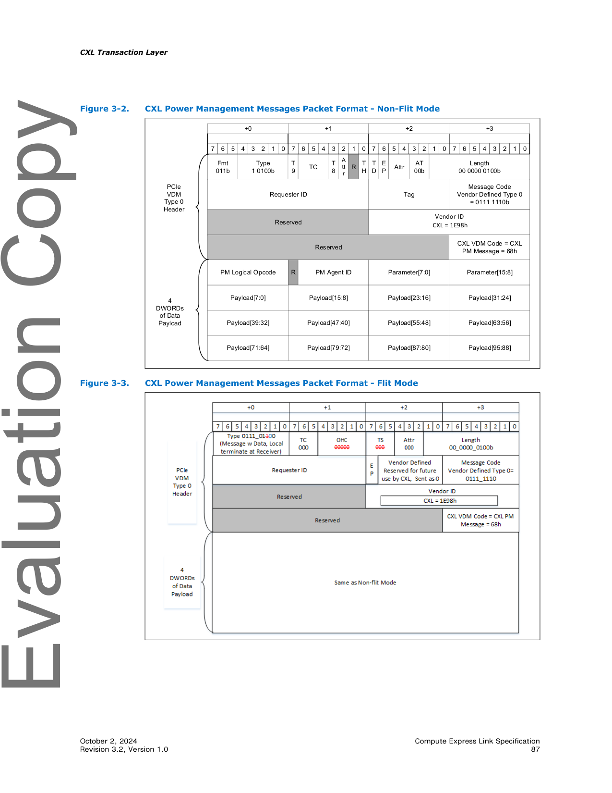
>
> *Original page render @ 150 DPI* — [📄 Full size](figures/chapter_03/page_0087.png)

> **Figure 3-3.** CXL Power Management Messages Packet Format - Flit Mode ｜ CXL 电源管理消息包格式 — Flit 模式
>
> 
>
> *Original page render @ 150 DPI* — [📄 Full size](figures/chapter_03/page_0087.png)

[⬆️ 返回目录](#-本章目录)

#### 3.1.2.1 Credit and PM Initialization | 信用量与 PM 初始化

<table>
<thead>
<tr>
<th width="50%">🇬🇧 English</th>
<th width="50%" style="background-color:#e8e8e8">🇨🇳 中文</th>
</tr>
</thead>
<tbody>
<tr><td>Credit and PM Initialization</td><td style="background-color:#e8e8e8">信用量与 PM 初始化</td></tr>
<tr><td>PM Credits and initialization process is link local. Figure 3-4 illustrates the use of PM2IP.CREDIT_RTN and PM2IP.AGENT_INFO messages to initialize Power Management messaging protocol intended to facilitate communication between the Downstream Port PMU and the Upstream Port PMU. A CXL switch provides an aggregation function for PM messages as described in Section 9.1.2.1.</td><td style="background-color:#e8e8e8">PM 信用量与初始化过程是链路本地的（link local）。Figure 3-4 演示了 PM2IP.CREDIT_RTN 和 PM2IP.AGENT_INFO 消息的使用，用于初始化电源管理消息协议，从而便于 Downstream Port PMU 与 Upstream Port PMU 之间的通信。CXL 交换机提供对 PM 消息的聚合功能，详见 Section 9.1.2.1。</td></tr>
<tr><td>GPF messages do not require credits and the receiver shall not generate CREDIT_RTN in response to GPF messages.</td><td style="background-color:#e8e8e8">GPF 消息不需要信用量，接收方不应针对 GPF 消息生成 CREDIT_RTN。</td></tr>
<tr><td>The CXL Upstream Port PMU must be able to receive and process CREDIT_RTN messages without dependency on any other PM2IP messages. Also, CREDIT_RTN messages do not use a credit. The CREDIT_RTN messages are used to initialize and update the Tx credits on each side, so that flow control can be appropriately managed.</td><td style="background-color:#e8e8e8">CXL Upstream Port PMU 必须能够接收并处理 CREDIT_RTN 消息，而无须依赖任何其他 PM2IP 消息。此外，CREDIT_RTN 消息本身不消耗信用量。CREDIT_RTN 消息用于初始化和更新各端的 Tx 信用量，以便合理管理流控。</td></tr>
<tr><td>During the first CREDIT_RTN message during PM Initialization, the credits being sent via NUM_CREDITS field represent the number of credit-dependent PM messages that the initiator of CREDIT_RTN can receive from the other end. During the subsequent CREDIT_RTN messages, the NUM_CREDITS field represents the number of PM credits that were freed up since the last CREDIT_RTN message in the same direction. The first CREDIT_RTN message is also used by the Downstream Port PMU to assign a PM_AGENT_ID to the Upstream Port PMU. This ID is communicated via the TARGET_AGENT_ID field in the CREDIT_RTN message. The Upstream Port PMU must wait for the CREDIT_RTN message from the Downstream Port PMU before initiating any IP2PM messages.</td><td style="background-color:#e8e8e8">在 PM 初始化期间的第一个 CREDIT_RTN 消息中，NUM_CREDITS 字段所发送的信用量表示 CREDIT_RTN 的发起方可从对端接收的、依赖于信用量的 PM 消息数量。在后续的 CREDIT_RTN 消息中，NUM_CREDITS 字段表示自同方向上一条 CREDIT_RTN 消息以来释放的 PM 信用量数。第一条 CREDIT_RTN 消息也被 Downstream Port PMU 用来为 Upstream Port PMU 分配 PM_AGENT_ID。该 ID 通过 CREDIT_RTN 消息的 TARGET_AGENT_ID 字段传达。Upstream Port PMU 必须等待来自 Downstream Port PMU 的 CREDIT_RTN 消息后，才能发起任何 IP2PM 消息。</td></tr>
<tr><td>An Upstream Port PMU must support at least one credit, where a credit implies having sufficient buffering to sink a PM2IP message with 128 bits of payload.</td><td style="background-color:#e8e8e8">Upstream Port PMU 必须至少支持一个信用量，其中一个信用量意味着具有足够的缓冲能力以接收（sink）一条带有 128 位负载的 PM2IP 消息。</td></tr>
</tbody>
</table>

> **Figure 3-4.** Power Management Credits and Initialization ｜ 电源管理信用量与初始化
>
> 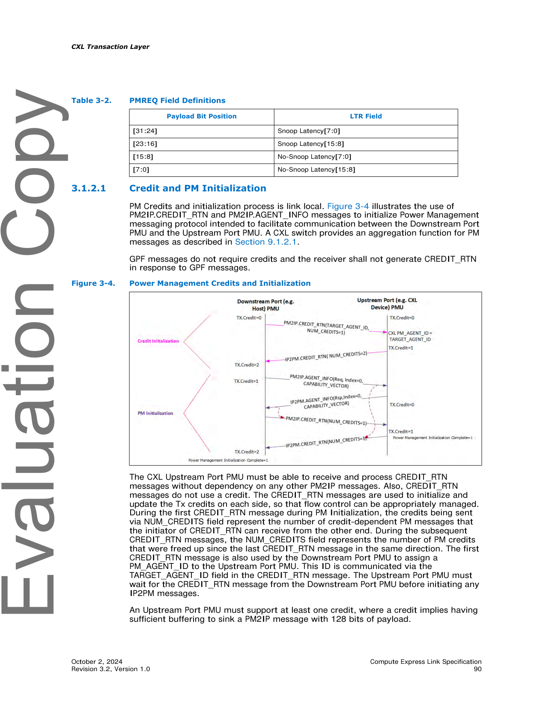
>
> *Original page render @ 150 DPI* — [📄 Full size](figures/chapter_03/page_0090.png)

<table>
<thead>
<tr>
<th width="50%">🇬🇧 English</th>
<th width="50%" style="background-color:#e8e8e8">🇨🇳 中文</th>
</tr>
</thead>
<tbody>
<tr><td>After credit initialization, the Upstream Port PMU must wait for an AGENT_INFO message from the Downstream Port PMU. This message contains the CAPABILITY_VECTOR of the PM protocol of the Downstream Port PMU. Upstream Port PMU must send its CAPABILITY_VECTOR to the Downstream Port PMU in response to the AGENT_INFO Req from the Downstream Port PMU. When there is a mismatch, Downstream Port PMU may implement a compatibility mode to work with a less capable Upstream Port PMU. Alternatively, Downstream Port PMU may log the mismatch and report an error, if it does not know how to reliably function with a less capable Upstream Port PMU.</td><td style="background-color:#e8e8e8">信用量初始化完成后，Upstream Port PMU 必须等待来自 Downstream Port PMU 的 AGENT_INFO 消息。该消息包含 Downstream Port PMU 的 PM 协议 CAPABILITY_VECTOR。Upstream Port PMU 必须响应 Downstream Port PMU 发出的 AGENT_INFO Req，向其发送自身的 CAPABILITY_VECTOR。当能力不匹配时，Downstream Port PMU 可以实现一种兼容模式以与能力较弱的 Upstream Port PMU 配合工作。或者，若无法可靠地与能力较弱的 Upstream Port PMU 协同工作，Downstream Port PMU 也可以记录该不匹配情况并报告错误。</td></tr>
<tr><td>There is an expectation from the Upstream Port PMU that it restores credits to the Downstream Port PMU as soon as a message is received. Downstream Port PMU can have multiple messages in flight, if it was provided with multiple credits. Releasing credits in a timely manner provides better performance for latency sensitive flows.</td><td style="background-color:#e8e8e8">对 Upstream Port PMU 的期望是：一旦收到消息就立即向 Downstream Port PMU 归还信用量。若 Downstream Port PMU 被授予了多个信用量，则可同时有多个在飞消息（in flight）。及时释放信用量有助于为延迟敏感的业务流提供更好的性能。</td></tr>
<tr><td>The following list summarizes the rules that must be followed by an Upstream Port PMU:</td><td style="background-color:#e8e8e8">以下列表汇总了 Upstream Port PMU 必须遵守的规则：</td></tr>
<tr><td>• Upstream Port PMU must wait to receive a PM2IP.CREDIT_RTN message before initiating any IP2PM messages.</td><td style="background-color:#e8e8e8">• Upstream Port PMU 必须先收到 PM2IP.CREDIT_RTN 消息，才能发起任何 IP2PM 消息。</td></tr>
<tr><td>• Upstream Port PMU must extract TARGET_AGENT_ID field from the first PM2IP message received from the Downstream Port PMU and use that as its PM_AGENT_ID in future messages.</td><td style="background-color:#e8e8e8">• Upstream Port PMU 必须从其接收到的来自 Downstream Port PMU 的第一条 PM2IP 消息中提取 TARGET_AGENT_ID 字段，并将其作为 PM_AGENT_ID 用于后续消息。</td></tr>
<tr><td>• Upstream Port PMU must implement enough resources to sink and process any CREDIT_RTN messages without dependency on any other PM2IP or IP2PM messages or other message classes.</td><td style="background-color:#e8e8e8">• Upstream Port PMU 必须实现足够的资源，以接收和处理任何 CREDIT_RTN 消息，而无需依赖任何其他 PM2IP、IP2PM 消息或其他消息类。</td></tr>
<tr><td>• Upstream Port PMU must implement at least one credit to sink a PM2IP message.</td><td style="background-color:#e8e8e8">• Upstream Port PMU 必须实现至少一个信用量以接收一条 PM2IP 消息。</td></tr>
<tr><td>• Upstream Port PMU must return any credits to the Downstream Port PMU as soon as possible to prevent blocking of PM message communication over CXL Link.</td><td style="background-color:#e8e8e8">• Upstream Port PMU 必须尽快将信用量归还给 Downstream Port PMU，以避免 CXL 链路上 PM 消息通信被阻塞。</td></tr>
<tr><td>• Upstream Port PMU are recommended to not withhold a credit for longer than 10 us.</td><td style="background-color:#e8e8e8">• 建议 Upstream Port PMU 持有某条信用量的时间不超过 10 us。</td></tr>
</tbody>
</table>

[⬆️ 返回目录](#-本章目录)

### 3.1.3 CXL Error VDM Format | CXL 错误 VDM 格式

<table>
<thead>
<tr>
<th width="50%">🇬🇧 English</th>
<th width="50%" style="background-color:#e8e8e8">🇨🇳 中文</th>
</tr>
</thead>
<tbody>
<tr><td>CXL Error VDM Format</td><td style="background-color:#e8e8e8">CXL 错误 VDM 格式</td></tr>
<tr><td>The CXL Error Messages are sent as PCIe Vendor Defined Type 0 messages with no data payload. Presently, this class includes a single type of message, namely Event Firmware Notification (EFN). When EFN is utilized to report memory errors, it is referred to as Memory Error Firmware Notification (MEFN). Figure 3-5 and Figure 3-6 provide the format for EFN messages.</td><td style="background-color:#e8e8e8">CXL 错误消息作为无数据负载的 PCIe Vendor Defined Type 0 消息发送。目前此类消息只包含一种类型，即事件固件通知（Event Firmware Notification，EFN）。当 EFN 用于报告内存错误时，被称为内存错误固件通知（MEFN）。Figure 3-5 和 Figure 3-6 给出了 EFN 消息的格式。</td></tr>
<tr><td>The following are the characteristics of the EFN message:</td><td style="background-color:#e8e8e8">EFN 消息具有以下特征：</td></tr>
<tr><td>• Fmt and Type fields are set to indicate message with no data.</td><td style="background-color:#e8e8e8">• Fmt 和 Type 字段被设置为表示无数据消息。</td></tr>
<tr><td>• The message is sent using routing of "Routed to Root Complex." It is always initiated by a device.</td><td style="background-color:#e8e8e8">• 该消息使用 "Routed to Root Complex" 路由发送。它始终由设备发起。</td></tr>
<tr><td>• Message Code is set to Vendor Defined Type 0.</td><td style="background-color:#e8e8e8">• Message Code 设置为 Vendor Defined Type 0。</td></tr>
<tr><td>• Vendor ID field is set to 1E98h.</td><td style="background-color:#e8e8e8">• Vendor ID 字段设置为 1E98h。</td></tr>
<tr><td>• Byte 15 of the message header contains the VDM Code and is set to the value of "CXL Error Message" (00h).</td><td style="background-color:#e8e8e8">• 消息头的 Byte 15 包含 VDM Code，并设置为 "CXL Error Message" (00h) 的值。</td></tr>
<tr><td>• Bytes 8, 9, 12, and 13 are cleared to all 0s.</td><td style="background-color:#e8e8e8">• Bytes 8、9、12 和 13 清零为全 0。</td></tr>
<tr><td>• Bits[7:4] of Byte 14 are cleared to 0h. Bits[3:0] of Byte 14 are used to communicate the Firmware Interrupt Vector (abbreviated as FW Interrupt Vector in Figure 3-5 and Figure 3-6).</td><td style="background-color:#e8e8e8">• Byte 14 的 Bits[7:4] 清零为 0h。Byte 14 的 Bits[3:0] 用于传达固件中断向量（在 Figure 3-5 和 Figure 3-6 中简写为 FW Interrupt Vector）。</td></tr>
<tr><td>Encoding of the FW Interrupt Vector field is Host specific and thus not defined by the CXL specification. A Host may support more than one type of Firmware environment and this field may be used to indicate to the Host which one of these environments is to process this message.</td><td style="background-color:#e8e8e8">FW Interrupt Vector 字段的编码由 Host 自行定义，因此 CXL 规范不作规定。Host 可支持多种固件环境，该字段可用于向 Host 指示应由哪种环境处理此消息。</td></tr>
</tbody>
</table>

> **Figure 3-5.** CXL EFN Messages Packet Format - Non-Flit Mode ｜ CXL EFN 消息包格式 — 非 Flit 模式
>
> 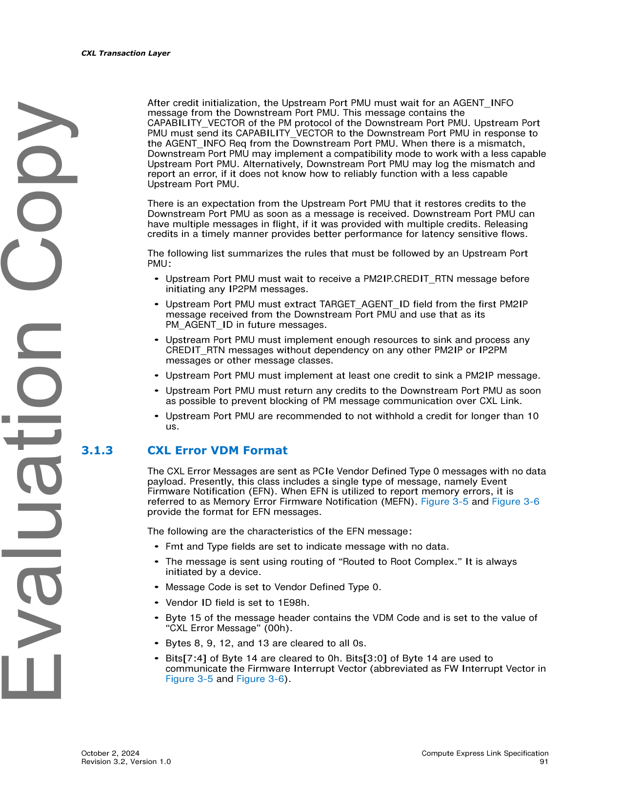
>
> *Original page render @ 150 DPI* — [📄 Full size](figures/chapter_03/page_0091.png)

> **Figure 3-6.** CXL EFN Messages Packet Format - Flit Mode ｜ CXL EFN 消息包格式 — Flit 模式
>
> 
>
> *Original page render @ 150 DPI* — [📄 Full size](figures/chapter_03/page_0091.png)

[⬆️ 返回目录](#-本章目录)

### 3.1.4 Optional PCIe Features Required for CXL | CXL 所需的 PCIe 可选特性

<table>
<thead>
<tr>
<th width="50%">🇬🇧 English</th>
<th width="50%" style="background-color:#e8e8e8">🇨🇳 中文</th>
</tr>
</thead>
<tbody>
<tr><td>Optional PCIe Features Required for CXL</td><td style="background-color:#e8e8e8">CXL 所需的 PCIe 可选特性</td></tr>
<tr><td>Table 3-3 lists optional features per PCIe Base Specification that are required for CXL.</td><td style="background-color:#e8e8e8">Table 3-3 列出了 PCIe Base Specification 中对 CXL 而言需要的可选特性。</td></tr>
</tbody>
</table>

[⬆️ 返回目录](#-本章目录)

### 3.1.5 Error Propagation | 错误传播

<table>
<thead>
<tr>
<th width="50%">🇬🇧 English</th>
<th width="50%" style="background-color:#e8e8e8">🇨🇳 中文</th>
</tr>
</thead>
<tbody>
<tr><td>Error Propagation</td><td style="background-color:#e8e8e8">错误传播</td></tr>
<tr><td>CXL.cache and CXL.mem errors detected by the device are propagated Upstream over the CXL.io traffic stream. These errors are logged as correctable and uncorrectable internal errors in the PCIe AER registers of the detecting component.</td><td style="background-color:#e8e8e8">设备检测到的 CXL.cache 和 CXL.mem 错误通过 CXL.io 业务流向上游传播。这些错误会作为可纠正与不可纠正的内部错误记录在检测组件的 PCIe AER 寄存器中。</td></tr>
</tbody>
</table>

[⬆️ 返回目录](#-本章目录)

### 3.1.6 Memory Type Indication on ATS | ATS 上的内存类型指示

<table>
<thead>
<tr>
<th width="50%">🇬🇧 English</th>
<th width="50%" style="background-color:#e8e8e8">🇨🇳 中文</th>
</tr>
</thead>
<tbody>
<tr><td>Memory Type Indication on ATS</td><td style="background-color:#e8e8e8">ATS 上的内存类型指示</td></tr>
<tr><td>Requests to certain memory regions can only be issued on CXL.io and cannot be issued on CXL.cache. It is up to the host to decide what these memory regions are. For example, on x86 systems, the host may choose to restrict access only to Uncacheable (UC) type memory over CXL.io. The host indicates such regions by means of an indication on ATS completion to the device.</td><td style="background-color:#e8e8e8">对某些内存区域的请求只能在 CXL.io 上发出，而不能在 CXL.cache 上发出。这些内存区域由 Host 自行决定。例如，在 x86 系统上，Host 可以选择仅允许通过 CXL.io 访问 Uncacheable (UC) 类型的内存。Host 通过在 ATS 完成消息中向设备给出指示来标明这些区域。</td></tr>
<tr><td>All CXL functions that issue ATS requests must set the Page Aligned Request bit in the ATS Capability register to 1. In addition, ATS requests sourced from a CXL device must set the CXL Src bit.</td><td style="background-color:#e8e8e8">所有发出 ATS 请求的 CXL Function 必须将 ATS Capability 寄存器中的 Page Aligned Request 位置 1。此外，来自 CXL 设备的 ATS 请求还必须设置 CXL Src 位。</td></tr>
<tr><td>DWORD3, Byte 3, Bit 3 in ATS 64-bit request and ATS 32-bit request for both Flit Mode and Non-Flit Mode carries the CXL Src bit. Figure 3-7 shows the position of this bit in ATS 64-bit request (Non-Flit mode). See PCIe Base Specification for the format of the other request messages. The CXL Src bit is defined as follows:</td><td style="background-color:#e8e8e8">在 Flit 模式和非 Flit 模式下，ATS 64-bit 请求和 ATS 32-bit 请求的 DWORD3、Byte 3、Bit 3 携带 CXL Src 位。Figure 3-7 显示了该位在 ATS 64-bit 请求（非 Flit 模式）中的位置。其他请求消息的格式参见 PCIe Base Specification。CXL Src 位定义如下：</td></tr>
<tr><td>• 0 = Indicates request initiated by a Function that does not support CXL.io Indication on ATS.</td><td style="background-color:#e8e8e8">• 0 = 表示该请求由不支持 ATS 上 CXL.io 指示的 Function 发起。</td></tr>
<tr><td>• 1 = Indicates request initiated by a Function that supports CXL.io Indication on ATS. All CXL Functions must set this bit.</td><td style="background-color:#e8e8e8">• 1 = 表示该请求由支持 ATS 上 CXL.io 指示的 Function 发起。所有 CXL Function 必须设置此位。</td></tr>
<tr><td>Note: This bit is Reserved in the ATS request as defined by PCIe Base Specification.</td><td style="background-color:#e8e8e8">注：在 PCIe Base Specification 所定义的 ATS 请求中，此位为保留位。</td></tr>
<tr><td>ATS translation completion from the Host carries the CXL.io bit in the Translation Completion Data Entry. See PCIe Base Specification for the message formats.</td><td style="background-color:#e8e8e8">来自 Host 的 ATS 转换完成消息在 Translation Completion Data Entry 中携带 CXL.io 位。消息格式参见 PCIe Base Specification。</td></tr>
<tr><td>The CXL.io bit in the ATS Translation completion is valid when the CXL Src bit in the request is set. The CXL.io bit is as defined as follows:</td><td style="background-color:#e8e8e8">当请求中的 CXL Src 位被置位时，ATS 转换完成中的 CXL.io 位才有效。CXL.io 位定义如下：</td></tr>
<tr><td>• 0 = Requests to the page can be issued on all CXL protocols.</td><td style="background-color:#e8e8e8">• 0 = 对该页的请求可在所有 CXL 协议上发出。</td></tr>
<tr><td>• 1 = Requests to the page can be issued by the Function on CXL.io only. It is a violation to issue requests to the page using CXL.cache protocol.</td><td style="background-color:#e8e8e8">• 1 = 对该页的请求只能由该 Function 在 CXL.io 上发出。使用 CXL.cache 协议向该页发出请求即视为违规。</td></tr>
</tbody>
</table>

> **Figure 3-7.** ATS 64-bit Request with CXL Indication - Non-Flit Mode ｜ 带 CXL 指示的 ATS 64-bit 请求 — 非 Flit 模式
>
> 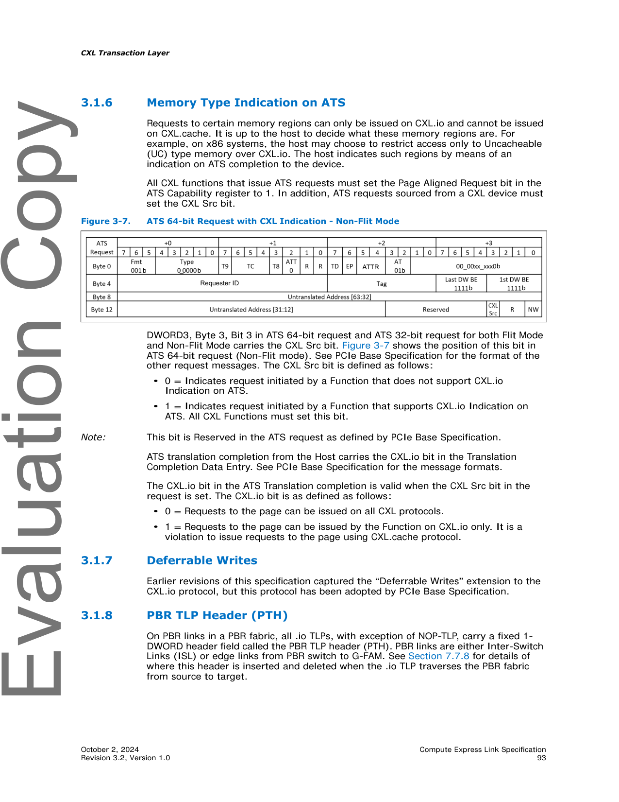
>
> *Original page render @ 150 DPI* — [📄 Full size](figures/chapter_03/page_0093.png)

[⬆️ 返回目录](#-本章目录)

### 3.1.7 Deferrable Writes | 可延迟写

<table>
<thead>
<tr>
<th width="50%">🇬🇧 English</th>
<th width="50%" style="background-color:#e8e8e8">🇨🇳 中文</th>
</tr>
</thead>
<tbody>
<tr><td>Deferrable Writes</td><td style="background-color:#e8e8e8">可延迟写</td></tr>
<tr><td>Earlier revisions of this specification captured the "Deferrable Writes" extension to the CXL.io protocol, but this protocol has been adopted by PCIe Base Specification.</td><td style="background-color:#e8e8e8">本规范的早期版本曾记录 CXL.io 协议的 "Deferrable Writes" 扩展，但该协议已被 PCIe Base Specification 所采纳。</td></tr>
</tbody>
</table>

[⬆️ 返回目录](#-本章目录)

### 3.1.8 PBR TLP Header (PTH) | PBR TLP 头 (PTH)

<table>
<thead>
<tr>
<th width="50%">🇬🇧 English</th>
<th width="50%" style="background-color:#e8e8e8">🇨🇳 中文</th>
</tr>
</thead>
<tbody>
<tr><td>PBR TLP Header (PTH)</td><td style="background-color:#e8e8e8">PBR TLP 头 (PTH)</td></tr>
<tr><td>On PBR links in a PBR fabric, all .io TLPs, with exception of NOP-TLP, carry a fixed 1-DWORD header field called the PBR TLP header (PTH). PBR links are either Inter-Switch Links (ISL) or edge links from PBR switch to G-FAM. See Section 7.7.8 for details of where this header is inserted and deleted when the .io TLP traverses the PBR fabric from source to target.</td><td style="background-color:#e8e8e8">在 PBR Fabric 中的 PBR 链路上，除 NOP-TLP 外，所有 .io TLP 都携带一个固定的 1-DWORD 头字段，称为 PBR TLP 头（PTH）。PBR 链路可以是交换机间链路（ISL）或从 PBR 交换机到 G-FAM 的边缘链路。有关 .io TLP 在 PBR Fabric 中从源到目的端过程中 PTH 的插入与删除位置，详见 Section 7.7.8。</td></tr>
<tr><td>NOP-TLPs are always transmitted without a preceding PTH. For Non-NOP-TLPs, PTH is always transmitted and it is transmitted on the immediate DWORD preceding the TLP Header base. Local-prefixes, if any, associated with a TLP are always transmitted before the PTH is transmitted. This is pictorially shown in Figure 3-8.</td><td style="background-color:#e8e8e8">NOP-TLP 始终在不带前置 PTH 的情况下发送。对于非 NOP-TLP，PTH 始终被发送，并位于 TLP Header 基础字段紧邻的前一个 DWORD。任何与 TLP 关联的 Local-prefix（若有）总是在 PTH 之前发送。该情况在 Figure 3-8 中以图示方式展示。</td></tr>
<tr><td>To assist the receiver on a PBR link from disambiguating PTH from an NOP-TLP/Local-Prefix, the PCIe flit mode TLP grammar is modified as follows. Bits[7:6] of the first byte of all DWORDs, from the 1st DWORD of a TLP until a PTH is detected, are encoded as follows:</td><td style="background-color:#e8e8e8">为便于 PBR 链路上的接收方区分 PTH 与 NOP-TLP/Local-Prefix，对 PCIe flit 模式 TLP 文法做如下修改：从 TLP 第 1 个 DWORD 起，直到检测到 PTH 为止，所有 DWORD 第一个字节的 Bits[7:6] 编码如下：</td></tr>
<tr><td>• 00b = NOP-TLP</td><td style="background-color:#e8e8e8">• 00b = NOP-TLP</td></tr>
<tr><td>• 01b = Rsvd</td><td style="background-color:#e8e8e8">• 01b = 保留</td></tr>
<tr><td>• 10b = Local Prefix</td><td style="background-color:#e8e8e8">• 10b = Local Prefix</td></tr>
<tr><td>• 11b = PTH</td><td style="background-color:#e8e8e8">• 11b = PTH</td></tr>
<tr><td>After the receiver detects a PTH, PCIe TLP grammar rules are applied per PCIe Base Specification until the TLP ends, with the restriction that NOP-TLP and Local prefix cannot be transmitted in this region of the TLP.</td><td style="background-color:#e8e8e8">接收方检测到 PTH 之后，将按 PCIe Base Specification 应用 PCIe TLP 文法规则直至 TLP 结束，但限制 NOP-TLP 和 Local Prefix 不能在该 TLP 区域内传输。</td></tr>
</tbody>
</table>

#### 3.1.8.1 Transmitter Rules Summary | 发送端规则概要

<table>
<thead>
<tr>
<th width="50%">🇬🇧 English</th>
<th width="50%" style="background-color:#e8e8e8">🇨🇳 中文</th>
</tr>
</thead>
<tbody>
<tr><td>Transmitter Rules Summary</td><td style="background-color:#e8e8e8">发送端规则概要</td></tr>
<tr><td>• For NOP-TLP and Local-Prefix Type1 field encodings, no PTH is pre-pended</td><td style="background-color:#e8e8e8">• 对于 NOP-TLP 和 Local-Prefix 的 Type1 字段编码，不在前面添加 PTH。</td></tr>
<tr><td>• For all other Type1 field encodings, a PTH is pre-pended immediately ahead of the Header base</td><td style="background-color:#e8e8e8">• 对于所有其他 Type1 字段编码，必须在 Header 基础字段紧邻之前添加 PTH。</td></tr>
</tbody>
</table>

[⬆️ 返回目录](#-本章目录)

#### 3.1.8.2 Receiver Rules Summary | 接收端规则概要

<table>
<thead>
<tr>
<th width="50%">🇬🇧 English</th>
<th width="50%" style="background-color:#e8e8e8">🇨🇳 中文</th>
</tr>
</thead>
<tbody>
<tr><td>Receiver Rules Summary</td><td style="background-color:#e8e8e8">接收端规则概要</td></tr>
<tr><td>• For NOP-TLP, if bits[5:0] are not all 0s, the receiver treats it as a malformed packet and reports the error following the associated error reporting rules</td><td style="background-color:#e8e8e8">• 对于 NOP-TLP，若 bits[5:0] 不全为 0，则接收方将其视为格式错误的数据包，并按相关错误上报规则报告错误。</td></tr>
<tr><td>• For a Local Prefix, if bits[5:0] are not one of 00 1101b through 00 1111b, the receiver treats it as a malformed packet and reports the error following the associated error reporting rules</td><td style="background-color:#e8e8e8">• 对于 Local Prefix，若 bits[5:0] 不在 00 1101b 到 00 1111b 范围内，则接收方将其视为格式错误的数据包，并按相关错误上报规则报告错误。</td></tr>
<tr><td>• From beginning of a TLP to when a PTH is detected, receiver silently drops a DWORD if a reserved value of 01b is received for bits[7:6] in the DWORD</td><td style="background-color:#e8e8e8">• 从 TLP 起始到检测到 PTH 之间，若 DWORD 的 bits[7:6] 收到保留值 01b，接收方将静默丢弃该 DWORD。</td></tr>
<tr><td>• If an NOP-TLP or Local Prefix is received immediately after a PTH, the receiver treats it as a malformed packet and reports the error following the associated error reporting rules</td><td style="background-color:#e8e8e8">• 若在 PTH 之后紧接收到 NOP-TLP 或 Local Prefix，接收方将其视为格式错误的数据包，并按相关错误上报规则报告错误。</td></tr>
<tr><td>Note: Header queues in PBR switches/devices should be able to handle the additional DWORD of PTH that is needed to be carried between the source and target PBR links.</td><td style="background-color:#e8e8e8">注：PBR 交换机/设备中的头队列应能处理在源端和目的端 PBR 链路之间需要携带的额外 DWORD PTH。</td></tr>
<tr><td>Note: PTH is included as part of normal link level CRC/FEC calculations/checks on PBR links to ensure reliable PTH delivery over the PBR link. For details regarding the PIF, DSAR, and Hie bits, see Section 7.7.3.3, Section 7.7.7, and Section 7.7.6.2.</td><td style="background-color:#e8e8e8">注：PTH 包含在 PBR 链路上正常的链路级 CRC/FEC 计算与校验中，以确保 PTH 在 PBR 链路上的可靠传送。有关 PIF、DSAR 和 Hie 位的详细信息，请参阅 Section 7.7.3.3、Section 7.7.7 和 Section 7.7.6.2。</td></tr>
<tr><td>On MLD links, in the egress direction, the SPID information in this header is used to generate the LD-ID information on VendPrefixL0 message as defined in Section 2.4. On MLD links, in the ingress direction, LD-ID in the VendPrefixL0 message is used to determine the DPID in the PBR packet.</td><td style="background-color:#e8e8e8">在 MLD 链路上的出方向（egress），本头中的 SPID 信息用于按 Section 2.4 所定义的方式在 VendPrefixL0 消息中生成 LD-ID 信息。在 MLD 链路上的入方向（ingress），VendPrefixL0 消息中的 LD-ID 用于确定 PBR 数据包中的 DPID。</td></tr>
<tr><td>1. Type[7:0] field as defined in PCIe Base Specification for Flit mode.</td><td style="background-color:#e8e8e8">1. Type[7:0] 字段按 PCIe Base Specification 中 Flit 模式的定义。</td></tr>
</tbody>
</table>

[⬆️ 返回目录](#-本章目录)

### 3.1.9 VendPrefixL0 | VendPrefixL0

<table>
<thead>
<tr>
<th width="50%">🇬🇧 English</th>
<th width="50%" style="background-color:#e8e8e8">🇨🇳 中文</th>
</tr>
</thead>
<tbody>
<tr><td>VendPrefixL0</td><td style="background-color:#e8e8e8">VendPrefixL0</td></tr>
<tr><td>Section 2.4.1.2 describes VendPrefixL0 usage on MLD links. For non-MLD HBR links, VendPrefixL0 carries the PBR-ID field to facilitate inter-domain communication between hosts and devices (e.g., GIM; see Section 7.7.3) and other vendor-proprietary usages (see Section 7.7.4). HBR links that use this form of the prefix must be directly attached to a PBR switch. On the switch ingress side, this prefix carries the DPID of the target edge link. On the egress side, this message carries the SPID of the source link that originated the TLP. The prefix format is shown in Table 3-7¹.</td><td style="background-color:#e8e8e8">Section 2.4.1.2 描述了 VendPrefixL0 在 MLD 链路上的用法。对于非 MLD HBR 链路，VendPrefixL0 携带 PBR-ID 字段，以便主机与设备之间进行跨域通信（例如 GIM；见 Section 7.7.3）以及其他厂商专有用途（见 Section 7.7.4）。使用此种前缀格式的 HBR 链路必须直连到一台 PBR 交换机。在交换机入端，该前缀携带目标边缘链路的 DPID；在出端，该消息携带发起 TLP 的源链路的 SPID。前缀格式如 Table 3-7¹ 所示。</td></tr>
<tr><td>On the switch side, handling of this prefix is disabled by default. The FM can enable this functionality on each edge USP and DSP, via CCI mailbox. The method that the FM uses to determine the set of USPs/DSPs that are capable and trustworthy of enabling this functionality is beyond the scope of this specification.</td><td style="background-color:#e8e8e8">在交换机侧，默认禁用对该前缀的处理。FM 可通过 CCI 邮箱在每个边缘 USP 和 DSP 上启用此功能。FM 用于确定可启用此功能且可信的 USP/DSP 集合的方法不在本规范范围内。</td></tr>
<tr><td>Note: Edge PCIe links are not precluded from using this prefix for the same purpose described above. However, such usages are beyond the scope of this specification.</td><td style="background-color:#e8e8e8">注：边缘 PCIe 链路也可使用此前缀实现上述目的，但此类用法不在本规范范围之内。</td></tr>
<tr><td>See Section 7.7.3 and Section 7.7.4 for transaction flows that involve TLPs with this prefix.</td><td style="background-color:#e8e8e8">涉及携带此前缀的 TLP 的事务流请参阅 Section 7.7.3 和 Section 7.7.4。</td></tr>
</tbody>
</table>

> **Figure 3-8.** Valid .io TLP Formats on PBR Links ｜ PBR 链路上合法的 .io TLP 格式
>
> 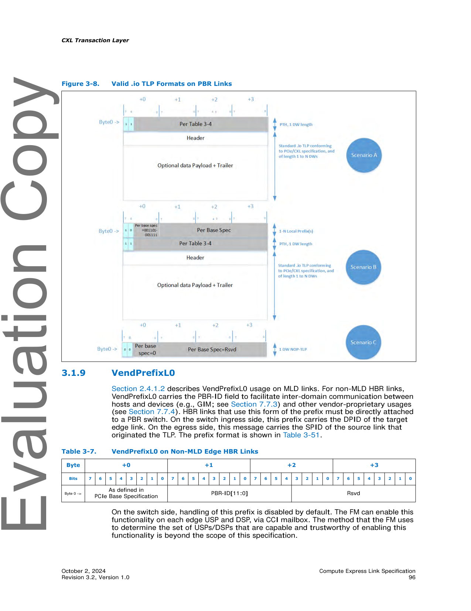
>
> *Original page render @ 150 DPI* — [📄 Full size](figures/chapter_03/page_0096.png)

[⬆️ 返回目录](#-本章目录)

### 3.1.10 CXL DevLoad (CDL) Field in UIO Completions | UIO 补全中的 CXL DevLoad (CDL) 字段

<table>
<thead>
<tr>
<th width="50%">🇬🇧 English</th>
<th width="50%" style="background-color:#e8e8e8">🇨🇳 中文</th>
</tr>
</thead>
<tbody>
<tr><td>CXL DevLoad (CDL) Field in UIO Completions</td><td style="background-color:#e8e8e8">UIO 补全中的 CXL DevLoad (CDL) 字段</td></tr>
<tr><td>To support QoS Telemetry (see Section 3.3.4) with UIO Direct P2P to HDM (see Section 7.7.9), UIO Completions contain the 2-bit CDL field, which carries the CXL DevLoad indication from HDM devices that support UIO Direct P2P. If an HDM device supports UIO Direct P2P to HDM, the HDM device shall populate the CDL field with values as defined in Table 3-5¹. The CDL field exists in UIOWrCpl, UIORdCpl, and UIORdCplD TLPs.</td><td style="background-color:#e8e8e8">为在 UIO Direct P2P to HDM（见 Section 7.7.9）场景下支持 QoS 遥测（见 Section 3.3.4），UIO 完成消息中包含 2-bit CDL 字段，用于承载来自支持 UIO Direct P2P 的 HDM 设备的 CXL DevLoad 指示。若 HDM 设备支持 UIO Direct P2P to HDM，则该 HDM 设备应按 Table 3-5¹ 中的定义填充 CDL 字段。CDL 字段存在于 UIOWrCpl、UIORdCpl 和 UIORdCplD TLP 中。</td></tr>
</tbody>
</table>

[⬆️ 返回目录](#-本章目录)

### 3.1.11 CXL Fabric-related VDMs | 与 CXL Fabric 相关的 VDM

<table>
<thead>
<tr>
<th width="50%">🇬🇧 English</th>
<th width="50%" style="background-color:#e8e8e8">🇨🇳 中文</th>
</tr>
</thead>
<tbody>
<tr><td>CXL Fabric-related VDMs</td><td style="background-color:#e8e8e8">与 CXL Fabric 相关的 VDM</td></tr>
<tr><td>In CXL Fabric (described in Section 7.7), there are many different uses for a CXL VDM. The uses fall into two categories: within a PBR Fabric, and outside a PBR Fabric.</td><td style="background-color:#e8e8e8">在 CXL Fabric（见 Section 7.7 所述）中，CXL VDM 有多种不同用途。用途可分为两类：PBR Fabric 内部使用，以及 PBR Fabric 外部使用。</td></tr>
<tr><td>When a VDM has a CXL Vendor ID, bytes 14 and 15 in the VDM header distinguish the use case via a CXL VDM Code and whether the use is within a PBR fabric. If within a PBR fabric, there is also a PBR Opcode. Additionally for PBR Fabric CXL VDMs, many of the traditional PCIe-defined fields such as Requester ID have no meaning and thus are reserved or in some cases, repurposed. See Table 3-8 for a breakdown of the VDM header bytes for PBR Fabric VDMs.</td><td style="background-color:#e8e8e8">当 VDM 具有 CXL Vendor ID 时，VDM 头中的字节 14 和 15 通过 CXL VDM Code 区分用例，并指明该使用是否在 PBR Fabric 内。如果在 PBR Fabric 内，还会包含一个 PBR Opcode。此外，对于 PBR Fabric 的 CXL VDM，许多传统 PCIe 定义的字段（如 Requester ID）没有意义，因此为保留或在某些情况下被重新定义。PBR Fabric VDM 的 VDM 头字节细分见 Table 3-8。</td></tr>
<tr><td>Table 3-8 shows two Type encodings, a VDM without data and a VDM with data, both routed as "terminate at receiver". If a payload is not needed, the VDM without data is used. If any payload is required, the VDM with data is used. Because the PBR VDMs use PTH to route, the 'receiver' is the end of the tunnel (i.e., the matching DPID). PBR VDMs with data can have at most 128B (=32 DWORDs) of payload. If the SeqLen is more than 32 DWORDs, multiple VDMs will be needed to convey the entire sequence of VDMs (for UCPull VDM).</td><td style="background-color:#e8e8e8">Table 3-8 展示两种 Type 编码——无数据 VDM 和带数据 VDM，两者均以 "terminate at receiver" 路由。若不需要负载，则使用无数据 VDM；若需要任何负载，则使用带数据 VDM。由于 PBR VDM 使用 PTH 进行路由，"接收方" 即为隧道末端（即匹配的 DPID）。带数据的 PBR VDM 最多可携带 128B（=32 DWORDs）的负载。若 SeqLen 超过 32 DWORDs，则需要多个 VDM 来传递完整的 VDM 序列（针对 UCPull VDM）。</td></tr>
<tr><td>Depending on the CXL VDM Code, other fields in the VDM header may have meaning. Use of these additional fields will be defined in the section covering that particular encoding. These fields include:</td><td style="background-color:#e8e8e8">根据 CXL VDM Code 的不同，VDM 头中的其他字段可能具有特定含义。这些附加字段的使用方式将在涉及相应编码的章节中予以定义。这些字段包括：</td></tr>
<tr><td>• PBR Opcode: Subclass of PBR Fabric VDMs</td><td style="background-color:#e8e8e8">• PBR Opcode：PBR Fabric VDM 的子类</td></tr>
<tr><td>• CmdSeq: Sequence number of the Host management transaction flow</td><td style="background-color:#e8e8e8">• CmdSeq：主机管理事务流的序列号</td></tr>
<tr><td>• SeqLen: Length of the VDM sequence, applies to UCPull VDM</td><td style="background-color:#e8e8e8">• SeqLen：VDM 序列的长度，适用于 UCPull VDM</td></tr>
<tr><td>• SeqNum: Sequential VDM count with wrap if a message requires multiple sequential VDMs</td><td style="background-color:#e8e8e8">• SeqNum：顺序 VDM 计数，若消息需要多个连续 VDM，则循环计数。</td></tr>
<tr><td>Table 3-9 summarizes the various CXL vendor defined messages, each with a CXL VDM code and PBR Opcode, a message destination, and a brief summary of the message's use. The CXL VDM Code provides the category of VDM, while the PBR Opcode makes distinctions within that category. The remainder of this section deals with GFD management-related VDMs and Route Table Update related VDMs. For details of other VDMs, see Section 7.7.11.</td><td style="background-color:#e8e8e8">Table 3-9 汇总了各种 CXL 厂商定义消息，每条消息都包含 CXL VDM Code、PBR Opcode、消息目的地以及消息用途的简要说明。CXL VDM Code 用于标识 VDM 的类别，而 PBR Opcode 在该类别内做进一步区分。本节其余部分介绍与 GFD 管理相关的 VDM 和与路由表更新相关的 VDM。其他 VDM 的详细信息见 Section 7.7.11。</td></tr>
<tr><td>Although they exist outside the PBR Fabric, CXL VDM Codes 00h and 68h are listed to show the complete CXL VDM mapping. Their VDM Header is defined by PCI-SIG and thus does not match the fields provided for a PBR VDM header. These two VDMs will pass through the PBR Fabric using a hierarchical route and using the VDM Header originally defined in Section 3.1.2 for CXL PM and in Section 3.1.3 for CXL Error.</td><td style="background-color:#e8e8e8">尽管 CXL VDM Code 00h 和 68h 存在于 PBR Fabric 之外，此处仍将它们列出以展示完整的 CXL VDM 映射关系。其 VDM Header 由 PCI-SIG 定义，因此与 PBR VDM Header 所提供的字段不匹配。这两个 VDM 将使用层次化路由穿过 PBR Fabric，并分别使用 Section 3.1.2 中为 CXL PM 定义的 VDM Header 和 Section 3.1.3 中为 CXL Error 定义的 VDM Header。</td></tr>
</tbody>
</table>

[⬆️ 返回目录](#-本章目录)

#### 3.1.11.1 Host Management Transaction Flows of GFD | GFD 的主机管理事务流

<table>
<thead>
<tr>
<th width="50%">🇬🇧 English</th>
<th width="50%" style="background-color:#e8e8e8">🇨🇳 中文</th>
</tr>
</thead>
<tbody>
<tr><td>Host Management Transaction Flows of GFD</td><td style="background-color:#e8e8e8">GFD 的主机管理事务流</td></tr>
<tr><td>Figure 3-9 summarizes the Host Management Transaction Flows of GFD.</td><td style="background-color:#e8e8e8">Figure 3-9 总结了 GFD 的主机管理事务流。</td></tr>
<tr><td>The Host ES has one GAE per host port. The GAE and GFD communicate via PID-routed VDMs.</td><td style="background-color:#e8e8e8">Host ES 每个主机端口拥有一个 GAE。GAE 与 GFD 通过 PID 路由的 VDM 通信。</td></tr>
<tr><td>Each GAE has an array of active messages, such that a host can communicate with multiple GFDs in parallel. Host software shall ensure that there is only one host-GFD management flow active per host-GFD pair.</td><td style="background-color:#e8e8e8">每个 GAE 拥有一个活动消息数组，以便主机可以与多个 GFD 并行通信。主机软件应保证每个 host-GFD 对上同时只有一个 host-GFD 管理流处于活动状态。</td></tr>
<tr><td>The Host-to-GFD message flow consists of the following steps, after first storing the GFD command in host memory:</td><td style="background-color:#e8e8e8">在首先将 GFD 命令存储在主机内存中后，主机到 GFD 的消息流包括以下步骤：</td></tr>
<tr><td>Step 1: Host SW writes Proxy command to memory, writes to GAE with Memory-side Request/Response Queue addresses and Command length, and sets doorbell in GAE to start GFD interaction.</td><td style="background-color:#e8e8e8">步骤 1：主机 SW 将代理命令写入内存，向 GAE 写入 Memory 侧请求/响应队列地址和命令长度，并在 GAE 中设置门铃以启动 GFD 交互。</td></tr>
<tr><td>Step 2: 1) GAE sends DPCmd (Downstream Proxy Command) VDM to GFD. 2) VDM header has Command Length field and CmdSeq. 3) This is a PBR packet with: • SPID = Host Edge Port PID • DPID = GFD PID. 4) This msg must be unconditionally sunk by GFD.</td><td style="background-color:#e8e8e8">步骤 2：1) GAE 向 GFD 发送 DPCmd（Downstream Proxy Command）VDM。2) VDM 头中包含 Command Length 字段和 CmdSeq。3) 这是一个 PBR 数据包：• SPID = Host Edge Port PID • DPID = GFD PID。4) 该消息必须被 GFD 无条件接收（sink）。</td></tr>
<tr><td>Step 3: 1) GFD sends UCPull (Upstream Command Pull) VDM to GAE. 2) VDM header has Command Length field and CmdSeq. 3) This is a PBR packet with: • SPID = GFD PID • DPID = Host Edge Port PID.</td><td style="background-color:#e8e8e8">步骤 3：1) GFD 向 GAE 发送 UCPull（Upstream Command Pull）VDM。2) VDM 头中包含 Command Length 字段和 CmdSeq。3) 这是一个 PBR 数据包：• SPID = GFD PID • DPID = Host Edge Port PID。</td></tr>
<tr><td>Steps 4a/b: GAE reads the command from host memory using a series of Nx 128B (N = 0 to 7) MRd and 1x 4B to 128B MRd (the last read) starting at the Request address provided in step 1.</td><td style="background-color:#e8e8e8">步骤 4a/b：GAE 通过一系列 Nx 128B（N = 0 到 7）的 MRd 和 1x 4B 到 128B 的 MRd（最后一次读）从主机内存中读取命令，地址从步骤 1 中提供的 Request 地址开始。</td></tr>
<tr><td>Step 5: 1) GAE sends the Command obtained via the completion of the reads of steps 4a/b, copying the CplD payload to the DCReq/DCReq-Last VDM's payload, reordering and combining any partial completion payload as needed. 2) DCReq* is a PBR packet with: • SPID = Host Edge Port PID • DPID = GFD PID. 3) Payload size matches the MRd size of step 4a, with a max of 128B. There could be multiple VDMs in request with DCReq-Last VDM indicating the last message in the sequence. 4) There is 3-bit SeqNum and 3-bit CmdSeq in the header of the packet to detect lost or stale packets. 5) Only the first packet in the sequence has "Message Header" in the payload of this VDM.</td><td style="background-color:#e8e8e8">步骤 5：1) GAE 发送通过步骤 4a/b 读取完成所获得的命令，将 CplD 负载复制到 DCReq/DCReq-Last VDM 的负载中，并在需要时对部分完成负载进行重排和合并。2) DCReq* 是一个 PBR 数据包：• SPID = Host Edge Port PID • DPID = GFD PID。3) 负载大小与步骤 4a 中 MRd 的大小匹配，最大为 128B。请求中可能有多个 VDM，其中 DCReq-Last VDM 标识序列中的最后一条消息。4) 数据包头中有 3-bit SeqNum 和 3-bit CmdSeq，用于检测丢失或过期的数据包。5) 只有序列中的第一个数据包在此 VDM 负载中携带 "Message Header"。</td></tr>
<tr><td>Step 6: 1) GFD sends the Response back for the message with 1 or more UCRsp and 1 UCRsp-Last VDM, up to total length of Max_Rsp_Len, where Max_Rsp_Len is in the Command payload from step 5. 2) This is a PBR packet with: • SPID = GFD PID • DPID = Host Edge Port PID. 4) There is 3-bit SeqNum and 3-bit CmdSeq in the header of the packet to detect lost or stale packets. 5) Only the first packet in the sequence has "Message Header" in the payload of this VDM.</td><td style="background-color:#e8e8e8">步骤 6：1) GFD 通过 1 个或多个 UCRsp 和 1 个 UCRsp-Last VDM 回送对该消息的响应，总长度不超过 Max_Rsp_Len，其中 Max_Rsp_Len 来自步骤 5 的命令负载。2) 这是一个 PBR 数据包：• SPID = GFD PID • DPID = Host Edge Port PID。4) 数据包头中有 3-bit SeqNum 和 3-bit CmdSeq，用于检测丢失或过期的数据包。5) 只有序列中的第一个数据包在此 VDM 负载中携带 "Message Header"。</td></tr>
<tr><td>Step 7: GAE writes data received in step 6 VDM to host memory using Response address provided in step 1.</td><td style="background-color:#e8e8e8">步骤 7：GAE 使用步骤 1 中提供的 Response 地址，将步骤 6 VDM 中接收到的数据写入主机内存。</td></tr>
<tr><td>Step 8: GAE interrupts the CPU, if enabled.</td><td style="background-color:#e8e8e8">步骤 8：若已使能，GAE 向 CPU 发出中断。</td></tr>
<tr><td>1. Host writes to GAE. — Writes pointer to GFD command in host memory (for UCPull read) — Writes pointer to write responses from GFD in host memory (for UCRsp data) — Writes command length — Writes CmdSeq — Write a mailbox command doorbell register (see Section 8.2.9.4.4), which causes the GAE to start the host management flow with step 2</td><td style="background-color:#e8e8e8">1. 主机写入 GAE。— 写入 GFD 命令在主机内存中的指针（用于 UCPull 读取）— 写入来自 GFD 的写响应在主机内存中的指针（用于 UCRsp 数据）— 写入命令长度— 写入 CmdSeq— 写入邮箱命令门铃寄存器（见 Section 8.2.9.4.4），从而使 GAE 通过步骤 2 启动主机管理流。</td></tr>
<tr><td>2. Host ES creates CXL PBR VDM "DPCmd" with command length that targets the GFD PID and CmdSeq to identify the current command sequence. — This is an unsolicited message from the GFD point of view, and the GFD must be able to sink one such message for any supported RPID and drop any message from an unsupported RPID</td><td style="background-color:#e8e8e8">2. Host ES 创建 CXL PBR VDM "DPCmd"，其命令长度针对 GFD PID，并使用 CmdSeq 标识当前命令序列。— 从 GFD 的角度看，这是一条非请求消息（unsolicited message），GFD 必须能够对任何受支持的 RPID 接收（sink）一条此类消息，并丢弃来自不受支持 RPID 的消息。</td></tr>
<tr><td>3. GFD responds with a CXL PBR VDM "UCPull", pulling the command for the indicated CmdSeq. The GFD response time may be delayed by responding to other doorbells from other RPIDs.</td><td style="background-color:#e8e8e8">3. GFD 以 CXL PBR VDM "UCPull" 进行响应，拉取指定 CmdSeq 对应的命令。GFD 的响应时间可能会因响应来自其他 RPID 的门铃而被延迟。</td></tr>
<tr><td>4. GAE converts CXL PBR VDM "UCPull" to one or more PCIe MRd TLPs.</td><td style="background-color:#e8e8e8">4. GAE 将 CXL PBR VDM "UCPull" 转换为一个或多个 PCIe MRd TLP。</td></tr>
<tr><td>a. GAE sends a series of MRds to read the command, starting at the address pointer supplied to the GAE in the Proxy GFD Management Command input payload. Each MRd size is a maximum of 128B. A command larger than 128B shall require multiple MRd to gather the full command. A total of (Nx) 128B MRd (with N from 0 to 7) and 1x (1B to 128B) MRd is needed to read any command of size up to 1024B.</td><td style="background-color:#e8e8e8">a. GAE 发送一系列 MRd 来读取命令，从 Proxy GFD Management Command 输入负载中提供给 GAE 的地址指针开始。每个 MRd 大小最大为 128B。超过 128B 的命令需要多次 MRd 来收集完整命令。读取最大 1024B 的命令需要总共 (Nx) 128B MRd（N 取值 0 到 7）和 1x（1B 到 128B）MRd。</td></tr>
<tr><td>b. The host completes each MRd with one or two CplD TLPs.</td><td style="background-color:#e8e8e8">b. 主机使用一个或两个 CplD TLP 完成每个 MRd。</td></tr>
<tr><td>5. GAE gathers the read completion data in step 4b, re-ordering and combining partial completions as needed, to create a VDM payload. The GAE sends a series of DCReq/DCReq-Last VDMs with the completion data as VDM payload in the order that matches the series of MRd in step 4. The maximum payload for PBR VDMs is 128B (= 32 DWORDs). — Each VDM header contains the following: • An incrementing SeqNum, to allow detection of missing messages, starting with 0 • A CmdSeq, to identify the current command for this Host – GFD thread — The last VDM in the sequence will be DCReq-Last. — VDMs before the last, if needed, will be DCReq. — The first VDM in the sequence shall start with a payload that matches the CCI Message header and payload as defined in Section 7.6.3. Subsequent VDM's payload shall contain only the remaining payload portion of the CCI Message and not repeat the header. — A failed command pull shall result in a DCReq-Fail VDM response instead of any DCReq and DCReq-Last.</td><td style="background-color:#e8e8e8">5. GAE 在步骤 4b 中收集读完成数据，并在需要时进行重排序和合并以创建 VDM 负载。GAE 发送一系列 DCReq/DCReq-Last VDM，负载为完成数据，顺序与步骤 4 中一系列 MRd 相对应。PBR VDM 的最大负载为 128B（= 32 DWORDs）。— 每个 VDM 头包含以下内容：• 自 0 开始的递增 SeqNum，用于检测丢失消息 • CmdSeq，用于标识此 Host – GFD 线程的当前命令。— 序列中的最后一个 VDM 为 DCReq-Last。— 在此之前的 VDM（如果需要）为 DCReq。— 序列中的第一个 VDM 应以与 Section 7.6.3 中所定义 CCI 消息头和负载相匹配的负载开始。后续 VDM 的负载应仅包含 CCI 消息的剩余负载部分，且不重复头部。— 命令拉取失败时，应以 DCReq-Fail VDM 响应代替任何 DCReq 和 DCReq-Last。</td></tr>
<tr><td>6. GFD processes the command after it receives the last VDM (the "DCReq-Last"). The GFD shall send UCRsp/UCRsp-Last VDMs in response to the Host ES. — Each VDM header contains the following: • An incrementing SeqNum, to allow detection of missing messages, starting with 0 • A CmdSeq, to identify the current command for this Host – GFD thread — The last VDM in the sequence will be UCRsp-Last — VDMs before the last, if needed, will be UCRsp</td><td style="background-color:#e8e8e8">6. GFD 在收到最后一条 VDM（即 "DCReq-Last"）后处理该命令。GFD 应向 Host ES 发送 UCRsp/UCRsp-Last VDM 进行响应。— 每个 VDM 头包含以下内容：• 自 0 开始的递增 SeqNum，用于检测丢失消息 • CmdSeq，用于标识此 Host – GFD 线程的当前命令 — 序列中的最后一个 VDM 为 UCRsp-Last — 在此之前的 VDM（如果需要）为 UCRsp。</td></tr>
<tr><td>— If instead the GFD received DCReq-Fail, a UCRsp-Last shall be sent without processing the (incomplete) command</td><td style="background-color:#e8e8e8">— 如果 GFD 收到的是 DCReq-Fail，则应发送 UCRsp-Last，而不处理（不完整的）命令。</td></tr>
<tr><td>7. GAE converts "UCRsp" and "UCRsp-Last" series to a series of MWr with the payload the same as the VDM payload. The MWr address is supplied to the GAE in the Proxy Command input payload. — After the UCRsp-Last payload is written, the GAE mailbox control doorbell described in Section 8.2.9.4.4 is cleared. If the MB Doorbell Interrupt is set, an interrupt will be sent by the GAE to the host.</td><td style="background-color:#e8e8e8">7. GAE 将 "UCRsp" 和 "UCRsp-Last" 序列转换为一系列 MWr，负载与 VDM 负载相同。MWr 地址在 Proxy Command 输入负载中提供给 GAE。— 在 UCRsp-Last 负载写入后，Section 8.2.9.4.4 中描述的 GAE 邮箱控制门铃被清除。若设置了 MB Doorbell Interrupt，则 GAE 将向主机发送中断。</td></tr>
<tr><td>If at any point the GAE disables the GFD access vector, any incoming UCRsp/UCRsp-Last VDMs from the disabled GFD shall be dropped, and any UCPull shall be replied to with a DML-Fail VDM.</td><td style="background-color:#e8e8e8">若 GAE 在任何时候禁用 GFD 访问向量，则来自被禁用 GFD 的所有传入 UCRsp/UCRsp-Last VDM 都应被丢弃，所有 UCPull 都应以 DML-Fail VDM 回复。</td></tr>
<tr><td>The CmdSeq is used to synchronize the GAE and GFD to be working on the same command sequence. A host may issue a subsequent command with a different CmdSeq to abort a prior command that may not have completed the sequence. Both the GAE (step 3 UCPull and step 6 UCRsp*) and the GFD (step 2 DPCmd and step 5 DCReq*) shall check that the command sequence number is the current one for communication with the partner PID (GAE uses GFD's PID, and GFD uses GAE's PID). Any stale command sequence VDM will be dropped and logged. The GFD will always update its current CmdSeq[GAE's PID] based on the value received in step 2 DPCmd.</td><td style="background-color:#e8e8e8">CmdSeq 用于同步 GAE 和 GFD，使其处理相同的命令序列。主机可发出具有不同 CmdSeq 的后续命令以中止可能尚未完成序列的先前命令。GAE（步骤 3 UCPull 和步骤 6 UCRsp*）和 GFD（步骤 2 DPCmd 和步骤 5 DCReq*）均应校验命令序列号是否为与对端 PID（GAE 使用 GFD 的 PID，GFD 使用 GAE 的 PID）通信的当前序列号。任何过期命令序列 VDM 都将被丢弃并记录。GFD 始终根据步骤 2 DPCmd 中接收到的值更新其针对 GAE PID 的当前 CmdSeq。</td></tr>
<tr><td>The host management flow of a GFD also includes an asynchronous notification from the GFD to inform the host of events in the GFD, using a GAM (GFD Async Message) VDM. The GAM has a payload of up to 32B (8 DWORDs). This payload passes through the GAE to write to an address supplied to the GAE in the Proxy Command input payload. Each GAM write starts at a 32B-aligned offset.</td><td style="background-color:#e8e8e8">GFD 的主机管理流还包括来自 GFD 的异步通知，用于通过 GAM（GFD Async Message）VDM 通知主机 GFD 中的事件。GAM 最多携带 32B（8 DWORDs）的负载。该负载通过 GAE 写入 Proxy Command 输入负载中提供给 GAE 的地址。每次 GAM 写入从 32B 对齐的偏移开始。</td></tr>
<tr><td>All CXL.io TLPs sent over a PBR link shall have a PTH. The host management flow of GFD VDMs have PTH fields restricted to the following values: • SPID = — From Host ES: Host Edge Port PID — From GFD: GFD PID • DPID = — To GFD: GFD PID — To Host ES: Host Edge Port PID • DSAR flag = 1</td><td style="background-color:#e8e8e8">在 PBR 链路上发送的所有 CXL.io TLP 都必须带有 PTH。GFD VDM 的主机管理流的 PTH 字段限制为以下取值：• SPID = — 来自 Host ES：Host Edge Port PID — 来自 GFD：GFD PID • DPID = — 去往 GFD：GFD PID — 去往 Host ES：Host Edge Port PID • DSAR flag = 1。</td></tr>
<tr><td>VDM header fields for GFD Message VDMs: • CXL VDM code of A0h (to GFD) or A1h (to Host ES) • PBR Opcode 0 – 8 to indicate the particular VDM • CmdSeq: Holds the command sequence number issued initially in step 2, DPCmd. • SeqLen: Holds the length in DWORDs of the subsequent stage DCReq sequence or UCRsp sequence • SeqNum: Holds the sequence number for multi-VDM command or multi-VDM response, starting at 0h and wrapping after 7h back to 0h • A list of all the CXL VDMs is provided in Table 3-8</td><td style="background-color:#e8e8e8">GFD 消息 VDM 的 VDM 头字段：• CXL VDM Code 为 A0h（去 GFD）或 A1h（去 Host ES）• PBR Opcode 0 – 8 用于指示具体的 VDM • CmdSeq：保存步骤 2 DPCmd 中最初发出的命令序列号。• SeqLen：以 DWORDs 为单位保存下一阶段 DCReq 序列或 UCRsp 序列的长度。• SeqNum：保存多 VDM 命令或多 VDM 响应的序列号，从 0h 开始，到 7h 之后回绕到 0h。• 所有 CXL VDM 的列表见 Table 3-8。</td></tr>
</tbody>
</table>

> **Figure 3-9.** Host Management Transaction Flows of GFD ｜ GFD 的主机管理事务流
>
> 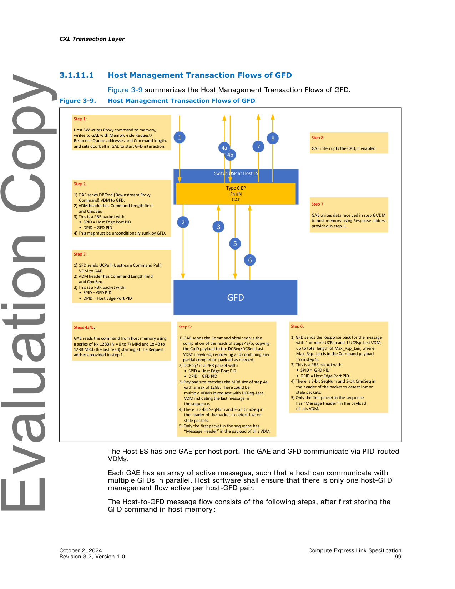
>
> *Original page render @ 150 DPI* — [📄 Full size](figures/chapter_03/page_0099.png)

[⬆️ 返回目录](#-本章目录)

#### 3.1.11.2 Downstream Proxy Command (DPCmd) VDM | 下游代理命令 (DPCmd) VDM

<table>
<thead>
<tr>
<th width="50%">🇬🇧 English</th>
<th width="50%" style="background-color:#e8e8e8">🇨🇳 中文</th>
</tr>
</thead>
<tbody>
<tr><td>Downstream Proxy Command (DPCmd) VDM</td><td style="background-color:#e8e8e8">下游代理命令 (DPCmd) VDM</td></tr>
<tr><td>Initiating a Proxy GFD Management Command on the GAE shall cause the Host ES to create a 'DPCmd' VDM that targets the GFD.</td><td style="background-color:#e8e8e8">在 GAE 上发起 Proxy GFD Management Command 应导致 Host ES 创建一个针对 GFD 的 'DPCmd' VDM。</td></tr>
<tr><td>The 'DPCmd' VDM fields are as follows. PTH holds: • SPID = Host Edge Port PID • DPID = GFD PID • DSAR flag = 1</td><td style="background-color:#e8e8e8">'DPCmd' VDM 字段如下。PTH 包含：• SPID = Host Edge Port PID • DPID = GFD PID • DSAR flag = 1。</td></tr>
<tr><td>VDM header fields for 'DPCmd' VDMs: • CXL VDM Code of A0h • PBR Opcode 0 (DPCmd) DPC • CmdSeq: Current host management command sequence • SeqLen: Command Length (DWORDs, 1 to 256 DWORD max — value of 00h is 256 DWORDs)</td><td style="background-color:#e8e8e8">'DPCmd' VDM 的 VDM 头字段：• CXL VDM Code 为 A0h • PBR Opcode 0 (DPCmd) DPC • CmdSeq：当前的主机管理命令序列 • SeqLen：命令长度（以 DWORDs 为单位，1 到 256 DWORD 最大 — 值 00h 表示 256 DWORDs）。</td></tr>
<tr><td>A 'DPCmd' VDM is an unsolicited message from the GFD point of view. A GFD must be able to successfully record every 'DPCmd' VDM that it receives, up to one from each of its registered RPIDs. The 'DPCmd' VDM is a message without data. The SeqLen part of the VDM header holds the command length that will be pulled by the 'UCPull'.</td><td style="background-color:#e8e8e8">从 GFD 角度看，'DPCmd' VDM 是一条非请求消息（unsolicited message）。GFD 必须能够成功记录其所接收的每条 'DPCmd' VDM，每个已注册 RPID 最多一条。'DPCmd' VDM 是一条无数据消息。VDM 头的 SeqLen 部分保存将被 'UCPull' 拉取的命令长度。</td></tr>
<tr><td>Only one active DPCmd at a time is allowed per Host Edge Port PID/GFD PID pair. A DPCmd is considered active until the GAE receives a UCRsp-Last VDM in response to a DPCmd.</td><td style="background-color:#e8e8e8">每个 Host Edge Port PID/GFD PID 对同时只允许一条处于活动状态的 DPCmd。在 GAE 收到作为 DPCmd 响应的 UCRsp-Last VDM 之前，该 DPCmd 均被视为处于活动状态。</td></tr>
<tr><td>A GFD should receive only a single active DPCmd per Host PID. If a second DPCmd is received from the same Host PID, the first shall be silently aborted. If a second DPCmd is received before the current DPCmd completes, the GFD updates its current command sequence to the new DPCmd CmdSeq and aborts the prior command sequence.</td><td style="background-color:#e8e8e8">每个 Host PID 下 GFD 应只接收一条活动 DPCmd。若从同一 Host PID 收到第二条 DPCmd，则第一条应被静默中止。若在当前 DPCmd 完成之前收到第二条 DPCmd，则 GFD 将其当前命令序列更新为新 DPCmd 的 CmdSeq，并中止先前的命令序列。</td></tr>
</tbody>
</table>

[⬆️ 返回目录](#-本章目录)

#### 3.1.11.3 Upstream Command Pull (UCPull) VDM | 上游命令拉取 (UCPull) VDM

<table>
<thead>
<tr>
<th width="50%">🇬🇧 English</th>
<th width="50%" style="background-color:#e8e8e8">🇨🇳 中文</th>
</tr>
</thead>
<tbody>
<tr><td>Upstream Command Pull (UCPull) VDM</td><td style="background-color:#e8e8e8">上游命令拉取 (UCPull) VDM</td></tr>
<tr><td>A GFD shall issue a 'UCPull' VDM when it services a received 'DPCmd' VDM. A single UCPull shall be issued for each DPCmd received, with its command length matching the command length of the DPCmd.</td><td style="background-color:#e8e8e8">当 GFD 服务于已收到的 'DPCmd' VDM 时，应发出 'UCPull' VDM。每收到一条 DPCmd，应发出单一的 UCPull，其命令长度与该 DPCmd 的命令长度相匹配。</td></tr>
<tr><td>The 'UCPull' VDM fields are as follows. PTH holds: • SPID = GFD PID • DPID = Host Edge Port PID • DSAR flag = 1</td><td style="background-color:#e8e8e8">'UCPull' VDM 字段如下。PTH 包含：• SPID = GFD PID • DPID = Host Edge Port PID • DSAR flag = 1。</td></tr>
<tr><td>VDM header fields for 'UCPull' VDMs: • CXL VDM Code of A1h • PBR Opcode 1 (UCPull) • CmdSeq: Matching current command sequence from DPCmd • SeqLen: Length of command to pull (1 to 256 DWORDs)</td><td style="background-color:#e8e8e8">'UCPull' VDM 的 VDM 头字段：• CXL VDM Code 为 A1h • PBR Opcode 1 (UCPull) • CmdSeq：与 DPCmd 中的当前命令序列匹配 • SeqLen：要拉取的命令长度（1 到 256 DWORDs）。</td></tr>
<tr><td>A GAE must be able to successfully service every 'UCPull' VDM that it receives. The GAE advertises a maximum number of outstanding proxy threads, which defines the maximum number of UCPull VDMs that it would need to track.</td><td style="background-color:#e8e8e8">GAE 必须能够成功服务其所接收的每条 'UCPull' VDM。GAE 通告最大在飞代理线程数，该值定义了它需要跟踪的最大 UCPull VDM 数量。</td></tr>
<tr><td>A 'UCPull' is a message without data and consists of a single VDM (there is no sequence of UCPulls). The SeqLen field in the VDM header contains the targeted command length to pull from host memory via the GAE. The CmdSeq contains the current command sequence.</td><td style="background-color:#e8e8e8">'UCPull' 是一条无数据消息，由单条 VDM 组成（不存在 UCPull 序列）。VDM 头中的 SeqLen 字段包含通过 GAE 从主机内存拉取的目标命令长度。CmdSeq 包含当前命令序列。</td></tr>
<tr><td>The CmdSeq should be checked to match the current command sequence for the GFD thread; if the CmdSeq does not match, the UCPull is dropped and logged. The UCPull SeqLen shall exactly match the DPCmd SeqLen. The GAE shall issue one or more MRds to pull the command. The last MRd may be 1 to 32 DWORDs. Any prior MRd shall be for exactly 32 DWORDs. The sum of all the MRd lengths shall be the SeqLen.</td><td style="background-color:#e8e8e8">应校验 CmdSeq 与 GFD 线程的当前命令序列是否匹配；若 CmdSeq 不匹配，则 UCPull 被丢弃并记录。UCPull SeqLen 应与 DPCmd SeqLen 完全一致。GAE 应发出一个或多个 MRd 来拉取该命令。最后一次 MRd 可为 1 到 32 DWORDs。先前的任何 MRd 应恰好为 32 DWORDs。所有 MRd 长度之和应等于 SeqLen。</td></tr>
</tbody>
</table>

[⬆️ 返回目录](#-本章目录)

#### 3.1.11.4 Downstream Command Request (DCReq, DCReq-Last, DCReq-Fail) VDMs | 下游命令请求 VDM

<table>
<thead>
<tr>
<th width="50%">🇬🇧 English</th>
<th width="50%" style="background-color:#e8e8e8">🇨🇳 中文</th>
</tr>
</thead>
<tbody>
<tr><td>Downstream Command Request (DCReq, DCReq-Last, DCReq-Fail) VDMs</td><td style="background-color:#e8e8e8">下游命令请求 (DCReq, DCReq-Last, DCReq-Fail) VDM</td></tr>
<tr><td>When the Host ES reads the command from host memory in response to a UCPull VDM, the completions for those reads are then conveyed to the GFD over a sequence of zero or more DCReq VDMs plus exactly one DCReq-Last VDM. Each completion payload is copied directly to the VDM payload. The Host ES is responsible for combining any partial completions together to make a single payload for the VDM. Each MRd issued to the host will result, when the CplDs for that MRd all return, in a single DCReq VDM or DCReq-Last VDM. The order of the DCReq/DCReq-Last VDMs shall match the order of the MRd. The DCReq-Last VDM represents the end of the Downstream Command Request series. Any missing DCReq/DCReq-Last VDMs in the sequence should result in the GFD failing the command.</td><td style="background-color:#e8e8e8">当 Host ES 响应 UCPull VDM 而从主机内存中读取命令时，这些读取的完成随后通过零个或多个 DCReq VDM 再加恰好一个 DCReq-Last VDM 的序列传递给 GFD。每个完成负载都直接复制到 VDM 负载中。Host ES 负责将任何部分完成合并在一起，形成 VDM 的单一负载。每条发往主机的 MRd 在其所有 CplD 返回时，将对应生成一条 DCReq VDM 或 DCReq-Last VDM。DCReq/DCReq-Last VDM 的顺序应与 MRd 的顺序一致。DCReq-Last VDM 表示 Downstream Command Request 序列的结束。序列中任何缺失的 DCReq/DCReq-Last VDM 都应导致 GFD 令该命令失败。</td></tr>
<tr><td>The 'DCReq' / 'DCReq-Last' / 'DCReq-Fail' VDM fields are as follows. PTH holds: • SPID = Host Edge Port PID • DPID = GFD PID • DSAR flag = 1</td><td style="background-color:#e8e8e8">'DCReq' / 'DCReq-Last' / 'DCReq-Fail' VDM 字段如下。PTH 包含：• SPID = Host Edge Port PID • DPID = GFD PID • DSAR flag = 1。</td></tr>
<tr><td>VDM header fields for 'DCReq' / 'DCReq-Last' / 'DCReq-Fail' VDMs: • CXL VDM Code of A0h • PBR Opcode 2 (DCReq) / PBR Opcode 3 (DCReq-Last) / PBR Opcode 8 (DCReq-Fail) • CmdSeq: Command sequence to be checked by Receiver • SeqLen: Defined only for DCReq-Last, holds the expected length of the Response in the next step (UCRsp); 0 for DCReq and DCReq-Fail • SeqNum: — Defined for all DCReq and DCReq-Last VDMs, initialized to 0 at the start of the sequence and incremented for each subsequent VDM; 0 of DCReq-Fail — Holds the DCReq* VDM sequence number, starting at 0h and incrementing for each subsequent VDM</td><td style="background-color:#e8e8e8">'DCReq' / 'DCReq-Last' / 'DCReq-Fail' VDM 的 VDM 头字段：• CXL VDM Code 为 A0h • PBR Opcode 2 (DCReq) / PBR Opcode 3 (DCReq-Last) / PBR Opcode 8 (DCReq-Fail) • CmdSeq：由接收方校验的命令序列 • SeqLen：仅对 DCReq-Last 有定义，保存下一步响应 (UCRsp) 的预期长度；对 DCReq 和 DCReq-Fail 为 0 • SeqNum：— 对所有 DCReq 和 DCReq-Last VDM 有定义，在序列开始处初始化为 0，后续每条 VDM 递增；DCReq-Fail 为 0 — 保存 DCReq* VDM 的序列号，从 0h 开始，每条后续 VDM 递增。</td></tr>
<tr><td>Any 'DCReq' VDM shall have a payload of exactly 32 DWORDs. A short command may not have any DCReq VDMs. Every Downstream Command Request sequence shall have exactly one DCReq-Last VDM. The DCReq-Last VDM can have any payload length from 1 to 32 DWORDs.</td><td style="background-color:#e8e8e8">任何 'DCReq' VDM 的负载必须恰好为 32 DWORDs。短命令可以不包含任何 DCReq VDM。每个 Downstream Command Request 序列必须恰好包含一个 DCReq-Last VDM。DCReq-Last VDM 的负载长度可以是 1 到 32 DWORDs 中的任意值。</td></tr>
<tr><td>The DCReq-Last VDM header has SeqLen defined to indicate the next step UCRsp length in DWORDs.</td><td style="background-color:#e8e8e8">DCReq-Last VDM 头中定义 SeqLen，用于以 DWORDs 为单位指示下一步 UCRsp 的长度。</td></tr>
<tr><td>The GFD that is receiving the DCReq* VDMs checks that the CmdSeq matches its current command sequence for that Host Edge Port PID; if the CmdSeq does not match, the DCReq* VDM is dropped and logged.</td><td style="background-color:#e8e8e8">接收 DCReq* VDM 的 GFD 校验 CmdSeq 是否与该 Host Edge Port PID 的当前命令序列匹配；若不匹配，则丢弃 DCReq* VDM 并记录。</td></tr>
<tr><td>The DCReq-Fail VDM shall be sent if CmdSeq is correct but the PID of the GFD is not enabled in the host's GAE's GMV and a UCPull from that GFD is received.</td><td style="background-color:#e8e8e8">若 CmdSeq 正确，但主机 GAE 的 GMV 中未启用 GFD 的 PID，且收到来自该 GFD 的 UCPull，则应发送 DCReq-Fail VDM。</td></tr>
</tbody>
</table>

[⬆️ 返回目录](#-本章目录)

#### 3.1.11.5 Upstream Command Response (UCRsp, UCRsp-Last, UCRsp-Fail) VDMs | 上游命令响应 VDM

<table>
<thead>
<tr>
<th width="50%">🇬🇧 English</th>
<th width="50%" style="background-color:#e8e8e8">🇨🇳 中文</th>
</tr>
</thead>
<tbody>
<tr><td>Upstream Command Response (UCRsp, UCRsp-Last, UCRsp-Fail) VDMs</td><td style="background-color:#e8e8e8">上游命令响应 (UCRsp, UCRsp-Last, UCRsp-Fail) VDM</td></tr>
<tr><td>When a GFD receives a 'DCReq-Last' VDM, the GFD checks that the CmdSeq is the current command sequence for that Host Edge Port PID and that all DCReq VDMs and DCReq-Last VDM were received.</td><td style="background-color:#e8e8e8">当 GFD 收到 'DCReq-Last' VDM 时，GFD 校验 CmdSeq 是否为该 Host Edge Port PID 的当前命令序列，以及所有 DCReq VDM 和 DCReq-Last VDM 是否都已收到。</td></tr>
<tr><td>If either check fails, the command sequence stops. If all DCReq are not received, as determined by a missing SeqNum, a UCRsp-Fail VDM shall be sent.</td><td style="background-color:#e8e8e8">若任一校验失败，则停止该命令序列。若由于 SeqNum 缺失而判定 DCReq 未全部收到，则应发送 UCRsp-Fail VDM。</td></tr>
<tr><td>If the checks pass, a GFD will issue a 'UCRsp' VDM after the GFD processes the earlier-received 'DCReq-Last' VDM. The total length of the Response is dictated by the SeqLen provided in the 'DCReq-Last' SeqLen in the VDM header.</td><td style="background-color:#e8e8e8">若校验通过，则 GFD 在处理先前收到的 'DCReq-Last' VDM 后将发出 'UCRsp' VDM。响应的总长度由 'DCReq-Last' VDM 头中提供的 SeqLen 决定。</td></tr>
<tr><td>There will be zero or more 'UCRsp' VDMs and always exactly one 'UCRsp-Last' VDM, where the 'UCRsp-Last' VDM ends the sequence and is sent last. The sum of the DWORDs of response will match the length requested in the 'DCReq-Last' VDM SeqLen field. Each 'UCRsp' VDM will be 32 DWORDs. The 'UCRsp-Last' VDM can be from 1 to 32 DWORDs. Each 'UCRsp' / 'UCRsp-Last' VDM in the sequence increments the sequence number, starting at 0 and wrapping from 7 back to 0. Any missing UCRsp VDM in the sequence should result in a response error being flagged in the GAE.</td><td style="background-color:#e8e8e8">该序列将包含零个或多个 'UCRsp' VDM，且始终恰好包含一个 'UCRsp-Last' VDM，其中 'UCRsp-Last' VDM 结束该序列并最后发送。响应 DWORDs 的总和应与 'DCReq-Last' VDM SeqLen 字段中请求的长度匹配。每个 'UCRsp' VDM 为 32 DWORDs。'UCRsp-Last' VDM 可为 1 到 32 DWORDs。序列中每条 'UCRsp' / 'UCRsp-Last' VDM 都会使序列号递增，从 0 开始，到 7 后回绕到 0。序列中任何缺失的 UCRsp VDM 都应在 GAE 中标记响应错误。</td></tr>
<tr><td>The 'UCRsp' / 'UCRsp-Last' / 'UCRsp-Fail' VDM fields are as follows. PTH holds: • SPID = GFD PID • DPID = Host Edge Port PID • DSAR flag = 1</td><td style="background-color:#e8e8e8">'UCRsp' / 'UCRsp-Last' / 'UCRsp-Fail' VDM 字段如下。PTH 包含：• SPID = GFD PID • DPID = Host Edge Port PID • DSAR flag = 1。</td></tr>
<tr><td>VDM header fields for 'UCRsp' / 'UCRsp-Last' / 'UCRsp-Fail' VDMs: • CXL VDM Code of A1h • PBR Opcode 4 (UCRsp) / PBR Opcode 5 (UCRsp-Last) / PBR Opcode 6 (UCRsp-Fail) • CmdSeq: Current command sequence • SeqNum: Holds the UCRsp* VDM sequence number, starting at 0h and incrementing for each subsequent VDM; 0 for UCRsp-Fail</td><td style="background-color:#e8e8e8">'UCRsp' / 'UCRsp-Last' / 'UCRsp-Fail' VDM 的 VDM 头字段：• CXL VDM Code 为 A1h • PBR Opcode 4 (UCRsp) / PBR Opcode 5 (UCRsp-Last) / PBR Opcode 6 (UCRsp-Fail) • CmdSeq：当前命令序列 • SeqNum：保存 UCRsp* VDM 的序列号，从 0h 开始，每条后续 VDM 递增；UCRsp-Fail 为 0。</td></tr>
</tbody>
</table>

[⬆️ 返回目录](#-本章目录)

#### 3.1.11.6 GFD Async Message (GAM) VDM | GFD 异步消息 (GAM) VDM

<table>
<thead>
<tr>
<th width="50%">🇬🇧 English</th>
<th width="50%" style="background-color:#e8e8e8">🇨🇳 中文</th>
</tr>
</thead>
<tbody>
<tr><td>GFD Async Message (GAM) VDM</td><td style="background-color:#e8e8e8">GFD 异步消息 (GAM) VDM</td></tr>
<tr><td>The GAM VDM is used to notify a host of some issue with its use of the GFD. The payload of the GAM should pass through to the host GAM buffer at a 32B-aligned offset. The GAM payload is fixed at 8 DWORDs, as shown in Table 3-10.</td><td style="background-color:#e8e8e8">GAM VDM 用于通知主机其在使用 GFD 时出现的某些问题。GAM 负载应以 32B 对齐的偏移透传到主机 GAM 缓冲区。GAM 负载固定为 8 DWORDs，如 Table 3-10 所示。</td></tr>
<tr><td>With multibyte fields, the least significant byte of the field starts with the lowest byte offset, and subsequent bytes are strictly increasing in significance. I.e., this is little endian format within each multibyte field as well as the overall payload.</td><td style="background-color:#e8e8e8">对于多字节字段，字段的最低有效字节从最低字节偏移开始，后续字节的重要性严格递增。即每个多字节字段以及整个负载均采用小端格式。</td></tr>
<tr><td>The GAM payload shall be written by the GAE endpoint to the GAE's circular GAM Buffer as described in Section 7.7.2.7.</td><td style="background-color:#e8e8e8">GAM 负载应由 GAE 端点写入 GAE 的循环 GAM 缓冲区，详见 Section 7.7.2.7。</td></tr>
<tr><td>The 'GAM' VDM fields are as follows. PTH holds: • SPID = GFD PID • DPID = Host Edge Port PID • DSAR flag = 1</td><td style="background-color:#e8e8e8">'GAM' VDM 字段如下。PTH 包含：• SPID = GFD PID • DPID = Host Edge Port PID • DSAR flag = 1。</td></tr>
<tr><td>VDM header fields for 'GAM' VDMs: • CXL VDM Code of A1h • PBR Opcode 7 (GAM)</td><td style="background-color:#e8e8e8">'GAM' VDM 的 VDM 头字段：• CXL VDM Code 为 A1h • PBR Opcode 7 (GAM)。</td></tr>
</tbody>
</table>

[⬆️ 返回目录](#-本章目录)

#### 3.1.11.7 Route Table Update (RTUpdate) VDM | 路由表更新 (RTUpdate) VDM

<table>
<thead>
<tr>
<th width="50%">🇬🇧 English</th>
<th width="50%" style="background-color:#e8e8e8">🇨🇳 中文</th>
</tr>
</thead>
<tbody>
<tr><td>Route Table Update (RTUpdate) VDM</td><td style="background-color:#e8e8e8">路由表更新 (RTUpdate) VDM</td></tr>
<tr><td>On a PBR link, the CacheID of a CXL.cache message is replaced with a PID. A table is needed at both the Host ES and Downstream ES to swap between PID and CacheID.</td><td style="background-color:#e8e8e8">在 PBR 链路上，CXL.cache 消息的 CacheID 被替换为 PID。Host ES 和 Downstream ES 均需要一张表，以便在 PID 和 CacheID 之间进行转换。</td></tr>
<tr><td>A VDM from the Downstream ES is needed to convey the information, a list of pairs of (PID and CacheID), to the Host ES with a maximum of 16 pairs, corresponding to 8 DWORDs. The flow to the RTUpdate VDM is described in more detail in Section 7.7.12.5.</td><td style="background-color:#e8e8e8">需要由 Downstream ES 通过 VDM 将信息——一组 (PID 和 CacheID) 对的列表——传递给 Host ES，最多 16 对，对应 8 DWORDs。RTUpdate VDM 的流在 Section 7.7.12.5 中有更详细的描述。</td></tr>
<tr><td>An RTUpdate VDM is sent from Downstream ES firmware to Host ES firmware. The DPID is the Host PID, allowing for a route to the Host ES. However, the Host ES ingress shall trap on the CXL VDM Code of A1h and handle the VDM in the Host ES.</td><td style="background-color:#e8e8e8">RTUpdate VDM 由 Downstream ES 固件发送给 Host ES 固件。DPID 为 Host PID，以便路由至 Host ES。但 Host ES 入端应对 CXL VDM Code A1h 进行捕获，并在 Host ES 中处理该 VDM。</td></tr>
<tr><td>The 'RTUpdate' VDM fields are as follows. PTH holds: • SPID = vUSP's fabric port's PID • DPID = Host Edge Port PID • DSAR flag = 1</td><td style="background-color:#e8e8e8">'RTUpdate' VDM 字段如下。PTH 包含：• SPID = vUSP 的 Fabric 端口的 PID • DPID = Host Edge Port PID • DSAR flag = 1。</td></tr>
<tr><td>VDM header fields for 'RTUpdate' VDMs: • CXL VDM Code of A1h • PBR Opcode 10h (RTUpdate)</td><td style="background-color:#e8e8e8">'RTUpdate' VDM 的 VDM 头字段：• CXL VDM Code 为 A1h • PBR Opcode 10h (RTUpdate)。</td></tr>
<tr><td>Table 3-11 shows the RTUpdate VDM payload format. Note that a value of FFFh for DSP_PID in the payload indicates that the PID is invalid and hence the PID to CacheID information pair needs to be discarded.</td><td style="background-color:#e8e8e8">Table 3-11 展示了 RTUpdate VDM 负载格式。请注意，负载中 DSP_PID 为 FFFh 表示该 PID 无效，因此需要丢弃对应的 PID 到 CacheID 信息对。</td></tr>
<tr><td>With multibyte fields, the least significant byte of the field starts with the lowest byte offset, and subsequent bytes are strictly increasing in significance. I.e., this is little endian format within each multibyte field as well as the overall payload.</td><td style="background-color:#e8e8e8">对于多字节字段，字段的最低有效字节从最低字节偏移开始，后续字节的重要性严格递增。即每个多字节字段以及整个负载均采用小端格式。</td></tr>
</tbody>
</table>

[⬆️ 返回目录](#-本章目录)

#### 3.1.11.8 Route Table Update Response (RTUpdateAck, RTUpdateNak) VDMs | 路由表更新响应 VDM

<table>
<thead>
<tr>
<th width="50%">🇬🇧 English</th>
<th width="50%" style="background-color:#e8e8e8">🇨🇳 中文</th>
</tr>
</thead>
<tbody>
<tr><td>Route Table Update Response (RTUpdateAck, RTUpdateNak) VDMs</td><td style="background-color:#e8e8e8">路由表更新响应 (RTUpdateAck, RTUpdateNak) VDM</td></tr>
<tr><td>The response to the RTUpdate VDM shall be one of the following: • RTUpdateAck VDM if the update is successful • RTUpdateNak VDM if the update is unsuccessful • RTUpdateNak VDM if a VDM in the sequence was lost</td><td style="background-color:#e8e8e8">对 RTUpdate VDM 的响应应为以下之一：• 若更新成功则为 RTUpdateAck VDM • 若更新失败则为 RTUpdateNak VDM • 若序列中某条 VDM 丢失则为 RTUpdateNak VDM。</td></tr>
<tr><td>The DPID is set to the vUSP's fabric port's PID, which routes the RTUpdateAck VDM back to the Downstream ES. However, the Downstream ES ingress shall trap on the CXL VDM Code of A1h to direct the VDM to switch firmware.</td><td style="background-color:#e8e8e8">DPID 设置为 vUSP 的 Fabric 端口的 PID，从而将 RTUpdateAck VDM 路由回 Downstream ES。但 Downstream ES 入端应对 CXL VDM Code A1h 进行捕获，以将 VDM 导向交换机固件。</td></tr>
<tr><td>The Downstream ES, upon receipt of the RTUpdateAck VDM, shall set the commit complete bit in the CacheID table.</td><td style="background-color:#e8e8e8">Downstream ES 在收到 RTUpdateAck VDM 后，应在 CacheID 表中设置 commit complete 位。</td></tr>
<tr><td>The 'RTUpdateAck' / 'RTUpdateNak' VDM fields are as follows. PTH holds: • SPID = Host Edge Port PID • DPID = vUSP's fabric port's PID • DSAR flag = 1</td><td style="background-color:#e8e8e8">'RTUpdateAck' / 'RTUpdateNak' VDM 字段如下。PTH 包含：• SPID = Host Edge Port PID • DPID = vUSP 的 Fabric 端口的 PID • DSAR flag = 1。</td></tr>
<tr><td>VDM header fields for 'RTUpdateAck' / 'RTUpdateNak' Response VDMs are as follows: • CXL VDM Code of A1h • PBR Opcode 12h (RTUpdateAck) / PBR Opcode 13h (RTUpdateNak)</td><td style="background-color:#e8e8e8">'RTUpdateAck' / 'RTUpdateNak' 响应 VDM 的 VDM 头字段如下：• CXL VDM Code 为 A1h • PBR Opcode 12h (RTUpdateAck) / PBR Opcode 13h (RTUpdateNak)。</td></tr>
</tbody>
</table>

[⬆️ 返回目录](#-本章目录)

## 3.2 CXL.cache | CXL.cache

<table>
<thead>
<tr>
<th width="50%">🇬🇧 English</th>
<th width="50%" style="background-color:#e8e8e8">🇨🇳 中文</th>
</tr>
</thead>
<tbody>
<tr><td>CXL.cache</td><td style="background-color:#e8e8e8">CXL.cache</td></tr>
</tbody>
</table>

[⬆️ 返回目录](#-本章目录)

### 3.2.1 Overview | 概述

<table>
<thead>
<tr>
<th width="50%">🇬🇧 English</th>
<th width="50%" style="background-color:#e8e8e8">🇨🇳 中文</th>
</tr>
</thead>
<tbody>
<tr><td>Overview</td><td style="background-color:#e8e8e8">概述</td></tr>
<tr><td>The CXL.cache protocol defines the interactions between the device and host as a number of requests that each have at least one associated response message and sometimes a data transfer. The interface consists of three channels in each direction: Request, Response, and Data. The channels are named for their direction, D2H for device to host and H2D for host to device, and the transactions they carry, Request, Response, and Data as shown in Figure 3-10. The independent channels allow different kinds of messages to use dedicated wires and achieve both decoupling and a higher effective throughput per wire.</td><td style="background-color:#e8e8e8">CXL.cache 协议将设备与主机之间的交互定义为若干请求，每个请求至少关联一个响应消息，有时还伴随数据传输。该接口在每个方向上包含三条通道：Request（请求）、Response（响应）和 Data（数据）。通道按其方向命名——D2H 表示设备到主机，H2D 表示主机到设备——并按其承载的事务类型——Request、Response 和 Data——命名，如图 Figure 3-10 所示。通道相互独立，可使不同类型的消息使用专用连线，从而实现解耦并提高每条线路的有效吞吐。</td></tr>
<tr><td>A D2H Request carries new requests from the Device to the Host. The requests typically target memory. Each request will receive zero, one, or two responses and at most one 64-byte cacheline of data. The channel may be back pressured without issue. D2H Response carries all responses from the Device to the Host. Device responses to snoops indicate the state the line was left in the device caches, and may indicate that data is being returned to the Host to the provided data buffer. They may still be blocked temporarily for link layer credits. D2H Data carries all data and byte enables from the Device to the Host. The data transfers can result either from implicit (as a result of snoop) or explicit write-backs (as a result of cache capacity eviction). A full 64-byte cacheline of data is always transferred. D2H Data must make progress or deadlocks may occur. D2H Data may be temporarily blocked for link layer credits, but must not require any other D2H transaction to complete to free the credits.</td><td style="background-color:#e8e8e8">D2H Request 承载从设备到主机的全新请求。这些请求通常针对内存。每个请求将收到零个、一个或两个响应，并最多接收一个 64 字节的 cacheline 数据。该通道可以被反压而不产生问题。D2H Response 承载从设备到主机的所有响应。设备对探测（Snoop）的响应指示该 cacheline 在设备缓存中所处的状态，并可指明是否正在向主机提供的数据缓冲区返回数据。响应仍可能因链路层信用量不足而被临时阻塞。D2H Data 承载从设备到主机的所有数据和字节使能。数据传输可能源于隐式（探测引起）或显式（缓存容量淘汰引起）的写回。总是传输完整的 64 字节 cacheline 数据。D2H Data 必须持续前进，否则可能发生死锁。D2H Data 可因链路层信用量而被临时阻塞，但不得要求任何其他 D2H 事务完成以释放信用量。</td></tr>
<tr><td>An H2D Request carries requests from the Host to the Device. These are snoops to maintain coherency. Data may be returned for snoops. The request carries the location of the data buffer to which any returned data should be written. H2D Requests may be back pressured for lack of device resources; however, the resources must free up without needing D2H Requests to make progress. H2D Response carries ordering messages and pulls for write data. Each response carries the request identifier from the original device request to indicate where the response should be routed. For write data pull responses, the message carries the location where the data should be written. H2D Responses can only be blocked temporarily for link layer credits. H2D Data delivers the data for device read requests. In all cases a full 64-byte cacheline of data is transferred. H2D Data transfers can only be blocked temporarily for link layer credits.</td><td style="background-color:#e8e8e8">H2D Request 承载从主机到设备的请求。这些请求是用于维持一致性的探测（Snoop）。探测可能返回数据。请求中携带返回数据应写入的数据缓冲区的位置。H2D Request 可能因设备资源不足而被反压；但相关资源必须在不需要 D2H Request 推进的情况下得到释放。H2D Response 承载排序消息和写数据拉取（pull）。每个响应携带原始设备请求的请求标识符，以指明响应应被路由到何处。对于写数据拉取响应，消息中携带数据应写入的位置。H2D Response 仅可因链路层信用量而被临时阻塞。H2D Data 为设备读请求提供数据。在所有情况下都传输完整的 64 字节 cacheline。H2D Data 传输仅可因链路层信用量而被临时阻塞。</td></tr>
</tbody>
</table>

> **Figure 3-10.** CXL.cache Channels ｜ CXL.cache 通道
>
> 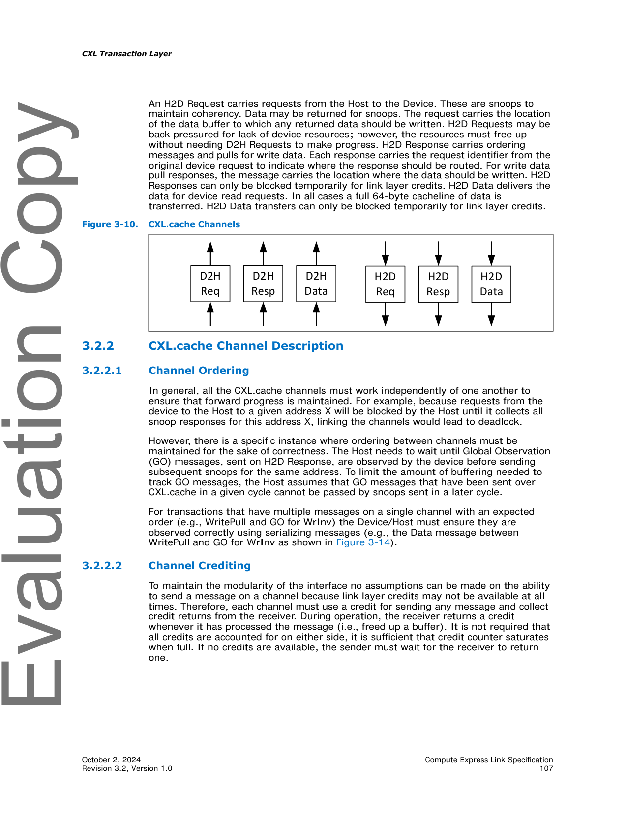
>
> *Original page render @ 150 DPI* — [📄 Full size](figures/chapter_03/page_0107.png)

[⬆️ 返回目录](#-本章目录)

### 3.2.2 CXL.cache Channel Description | CXL.cache 通道描述

<table>
<thead>
<tr>
<th width="50%">🇬🇧 English</th>
<th width="50%" style="background-color:#e8e8e8">🇨🇳 中文</th>
</tr>
</thead>
<tbody>
<tr><td>CXL.cache Channel Description</td><td style="background-color:#e8e8e8">CXL.cache 通道描述</td></tr>
</tbody>
</table>

#### 3.2.2.1 Channel Ordering | 通道顺序

<table>
<thead>
<tr>
<th width="50%">🇬🇧 English</th>
<th width="50%" style="background-color:#e8e8e8">🇨🇳 中文</th>
</tr>
</thead>
<tbody>
<tr><td>Channel Ordering</td><td style="background-color:#e8e8e8">通道顺序</td></tr>
<tr><td>In general, all the CXL.cache channels must work independently of one another to ensure that forward progress is maintained. For example, because requests from the device to the Host to a given address X will be blocked by the Host until it collects all snoop responses for this address X, linking the channels would lead to deadlock.</td><td style="background-color:#e8e8e8">一般来说，所有 CXL.cache 通道必须相互独立地工作，以保证前进进度。例如，设备到主机的对地址 X 的请求会被主机阻塞，直到主机收集到该地址 X 的所有探测响应，链接通道将导致死锁。</td></tr>
<tr><td>However, there is a specific instance where ordering between channels must be maintained for the sake of correctness. The Host needs to wait until Global Observation (GO) messages, sent on H2D Response, are observed by the device before sending subsequent snoops for the same address. To limit the amount of buffering needed to track GO messages, the Host assumes that GO messages that have been sent over CXL.cache in a given cycle cannot be passed by snoops sent in a later cycle.</td><td style="background-color:#e8e8e8">然而，在某些特定情况下，为保证正确性，必须维持通道间的顺序。主机在发送对同一地址的后续探测前，需要等待设备观察到 H2D Response 上发送的 Global Observation (GO) 消息。为限制跟踪 GO 消息所需的缓冲，主机假定：在某周期内通过 CXL.cache 发送的 GO 消息不会被后续周期发送的探测所跨越。</td></tr>
<tr><td>For transactions that have multiple messages on a single channel with an expected order (e.g., WritePull and GO for WrInv) the Device/Host must ensure they are observed correctly using serializing messages (e.g., the Data message between WritePull and GO for WrInv as shown in Figure 3-14).</td><td style="background-color:#e8e8e8">对于在同一通道上具有预期顺序的多消息事务（例如 WrInv 的 WritePull 和 GO），设备/主机必须使用序列化消息确保它们被正确观察到（例如 WrInv 中位于 WritePull 和 GO 之间的 Data 消息，如图 Figure 3-14 所示）。</td></tr>
</tbody>
</table>

[⬆️ 返回目录](#-本章目录)

#### 3.2.2.2 Channel Crediting | 通道信用量

<table>
<thead>
<tr>
<th width="50%">🇬🇧 English</th>
<th width="50%" style="background-color:#e8e8e8">🇨🇳 中文</th>
</tr>
</thead>
<tbody>
<tr><td>Channel Crediting</td><td style="background-color:#e8e8e8">通道信用量</td></tr>
<tr><td>To maintain the modularity of the interface no assumptions can be made on the ability to send a message on a channel because link layer credits may not be available at all times. Therefore, each channel must use a credit for sending any message and collect credit returns from the receiver. During operation, the receiver returns a credit whenever it has processed the message (i.e., freed up a buffer). It is not required that all credits are accounted for on either side, it is sufficient that credit counter saturates when full. If no credits are available, the sender must wait for the receiver to return one.</td><td style="background-color:#e8e8e8">为保持接口的模块化，不能假设某条通道上的消息发送能力，因为链路层信用量可能并非始终可用。因此，每条通道在发送任何消息时必须消耗一个信用量，并从接收方回收信用量。运行期间，接收方在处理完消息（即释放了缓冲区）后即归还一个信用量。并不要求双方都精确核算所有信用量，只要信用量计数器在满时饱和即可。若没有可用信用量，发送方必须等待接收方归还一个。</td></tr>
<tr><td>Table 3-12 describes which channels must drain to maintain forward progress and which can be blocked indefinitely. Additionally, Table 3-12 defines a summary of the forward progress and crediting mechanisms in CXL.cache, but this is not the complete definition. See Section 3.4 for the complete set of the ordering rules that are required for protocol correctness and forward progress.</td><td style="background-color:#e8e8e8">Table 3-12 描述了哪些通道必须排空以维持前进进度，哪些可以被无限期阻塞。此外，Table 3-12 总结了 CXL.cache 中的前进进度和信用量机制，但这并非完整定义。有关协议正确性和前进进度所需的完整排序规则集，请参阅 Section 3.4。</td></tr>
</tbody>
</table>

[⬆️ 返回目录](#-本章目录)

### 3.2.3 CXL.cache Wire Description | CXL.cache 线缆描述

<table>
<thead>
<tr>
<th width="50%">🇬🇧 English</th>
<th width="50%" style="background-color:#e8e8e8">🇨🇳 中文</th>
</tr>
</thead>
<tbody>
<tr><td>CXL.cache Wire Description</td><td style="background-color:#e8e8e8">CXL.cache 线缆描述</td></tr>
<tr><td>The definition of each of the fields for each CXL.cache Channel is provided below. Each message in will support 3 variants: 68B Flit, 256B Flit, and PBR Flit. The use of each of these will be negotiated in the physical layer for each link as defined in Chapter 6.0.</td><td style="background-color:#e8e8e8">下文给出每条 CXL.cache 通道中各字段的定义。每条消息将支持 3 种变体：68B Flit、256B Flit 和 PBR Flit。这些变体的使用由各链路的物理层协商确定，详见 Chapter 6.0。</td></tr>
</tbody>
</table>

#### 3.2.3.1 D2H Request | D2H 请求

<table>
<thead>
<tr>
<th width="50%">🇬🇧 English</th>
<th width="50%" style="background-color:#e8e8e8">🇨🇳 中文</th>
</tr>
</thead>
<tbody>
<tr><td>D2H Request</td><td style="background-color:#e8e8e8">D2H 请求</td></tr>
<tr><td>Valid: 1 bit. The request is valid.</td><td style="background-color:#e8e8e8">Valid：1 位。表示该请求有效。</td></tr>
<tr><td>Opcode: 5 bits. The opcode specifies the operation of the request. Details in Table 3-22.</td><td style="background-color:#e8e8e8">Opcode：5 位。操作码指定该请求的操作。详见 Table 3-22。</td></tr>
<tr><td>CQID: 12 bits. Command Queue ID: The CQID field contains the ID of the tracker entry that is associated with the request. When the response and data are returned for this request, the CQID is sent in the response or data message indicating to the device which tracker entry originated this request.</td><td style="background-color:#e8e8e8">CQID：12 位。Command Queue ID：CQID 字段包含与该请求相关联的跟踪条目的 ID。当该请求的响应和数据被返回时，CQID 会随响应或数据消息一起发送，以向设备指明是哪个跟踪条目发起了该请求。</td></tr>
<tr><td>IMPLEMENTATION NOTE: CQID usage depends on the round-trip transaction latency and desired bandwidth. A 12-bit ID space allows for 4096 outstanding requests which can saturate link bandwidth for a x16 link at 64 GT/s with average latency of up to 1 us¹.</td><td style="background-color:#e8e8e8">实现注：CQID 的使用取决于往返事务延迟和期望带宽。12 位的 ID 空间允许 4096 个在飞请求，对于 64 GT/s 的 x16 链路，在平均延迟不超过 1 us¹ 的情况下，可使链路带宽饱和。</td></tr>
<tr><td>NT: 1 bit. For cacheable reads, the NonTemporal bit is used as a hint to indicate to the host how it should be cached. Details in Table 3-14.</td><td style="background-color:#e8e8e8">NT：1 位。对于可缓存读，NonTemporal 位用作提示，向主机指示应如何进行缓存。详见 Table 3-14。</td></tr>
<tr><td>CacheID: 0/4/0 bits. Logical CacheID of the source of the message. Not supported in 68B flit messages. Not applicable in PBR messages where DPID infers this field.</td><td style="background-color:#e8e8e8">CacheID：0/4/0 位。消息源的逻辑 CacheID。在 68B flit 消息中不支持。在 PBR 消息中不适用，由 DPID 推导出该字段。</td></tr>
<tr><td>Address[51:6]: 46 bits. Carries the physical address of coherent requests.</td><td style="background-color:#e8e8e8">Address[51:6]：46 位。承载一致性请求的物理地址。</td></tr>
<tr><td>SPID: 0/0/12 bits. Source PID.</td><td style="background-color:#e8e8e8">SPID：0/0/12 位。源 PID。</td></tr>
<tr><td>DPID: 0/0/12 bits. Destination PID.</td><td style="background-color:#e8e8e8">DPID：0/0/12 位。目的 PID。</td></tr>
<tr><td>RSVD: 14/7/7 bits.</td><td style="background-color:#e8e8e8">RSVD：14/7/7 位。</td></tr>
<tr><td>Total: 79/76/96 bits.</td><td style="background-color:#e8e8e8">总计：79/76/96 位。</td></tr>
<tr><td>1. Formula assumed in this calculation is: "Latency Tolerance in ns" = "number of Requests" * (64B per Request) / "Peak Bandwidth in GB/s". Assuming a peak bandwidth of 256 GB/s (raw bidirectional bandwidth of a x16 CXL port at 64 GT/s) results in a latency tolerance of 1024 ns.</td><td style="background-color:#e8e8e8">1. 本计算所采用的公式为：'Latency Tolerance in ns' = 'number of Requests' * (64B per Request) / 'Peak Bandwidth in GB/s'。假设峰值带宽为 256 GB/s（x16 CXL 端口在 64 GT/s 下的原始双向带宽），则延迟容忍度为 1024 ns。</td></tr>
</tbody>
</table>

[⬆️ 返回目录](#-本章目录)

#### 3.2.3.2 D2H Response | D2H 响应

<table>
<thead>
<tr>
<th width="50%">🇬🇧 English</th>
<th width="50%" style="background-color:#e8e8e8">🇨🇳 中文</th>
</tr>
</thead>
<tbody>
<tr><td>D2H Response</td><td style="background-color:#e8e8e8">D2H 响应</td></tr>
<tr><td>Valid: 1 bit. The response is valid.</td><td style="background-color:#e8e8e8">Valid：1 位。表示该响应有效。</td></tr>
<tr><td>Opcode: 5 bits. The opcode specifies the what kind of response is being signaled. Details in Table 3-25.</td><td style="background-color:#e8e8e8">Opcode：5 位。操作码指定正在发出的响应类型。详见 Table 3-25。</td></tr>
<tr><td>UQID: 12 bits. Unique Queue ID: This is a reflection of the UQID sent with the H2D Request and indicates which Host entry is the target of the response.</td><td style="background-color:#e8e8e8">UQID：12 位。Unique Queue ID：这是 H2D Request 中所发送 UQID 的回显，指示哪个主机条目是响应的目标。</td></tr>
<tr><td>DPID: 0/0/12 bits. Destination PID.</td><td style="background-color:#e8e8e8">DPID：0/0/12 位。目的 PID。</td></tr>
<tr><td>RSVD: 2/6/0 bits.</td><td style="background-color:#e8e8e8">RSVD：2/6/0 位。</td></tr>
<tr><td>Total: 20/24/36 bits.</td><td style="background-color:#e8e8e8">总计：20/24/36 位。</td></tr>
</tbody>
</table>

[⬆️ 返回目录](#-本章目录)

#### 3.2.3.3 D2H Data | D2H 数据

<table>
<thead>
<tr>
<th width="50%">🇬🇧 English</th>
<th width="50%" style="background-color:#e8e8e8">🇨🇳 中文</th>
</tr>
</thead>
<tbody>
<tr><td>D2H Data</td><td style="background-color:#e8e8e8">D2H 数据</td></tr>
</tbody>
</table>

##### 3.2.3.3.1 Byte Enables (68B Flit) | 字节使能 (68B Flit)

<table>
<thead>
<tr>
<th width="50%">🇬🇧 English</th>
<th width="50%" style="background-color:#e8e8e8">🇨🇳 中文</th>
</tr>
</thead>
<tbody>
<tr><td>Byte Enables (68B Flit)</td><td style="background-color:#e8e8e8">字节使能 (68B Flit)</td></tr>
<tr><td>In 68B Flit mode, the presence of data byte enables is indicated in the flit header, but only when one or more of the byte enable bits has a value of 0. In that case, the byte enables are sent as a data chunk as described in Section 4.2.2.</td><td style="background-color:#e8e8e8">在 68B Flit 模式下，数据字节使能的存在由 flit 头指示，但仅当一个或多个字节使能位的值为 0 时才指示。此时，字节使能作为数据块发送，详见 Section 4.2.2。</td></tr>
</tbody>
</table>

[⬆️ 返回目录](#-本章目录)

##### 3.2.3.3.2 Byte-Enables Present (256B Flit) | 字节使能存在 (256B Flit)

<table>
<thead>
<tr>
<th width="50%">🇬🇧 English</th>
<th width="50%" style="background-color:#e8e8e8">🇨🇳 中文</th>
</tr>
</thead>
<tbody>
<tr><td>Byte-Enables Present (256B Flit)</td><td style="background-color:#e8e8e8">字节使能存在 (256B Flit)</td></tr>
<tr><td>In 256B Flit mode, a BEP (Byte-Enables Present) bit is included with the message header that indicates BE slot is included at the end of the message. The Byte Enable field is 64 bits wide and indicates which of the bytes are valid for the contained data.</td><td style="background-color:#e8e8e8">在 256B Flit 模式下，消息头中包含一个 BEP（Byte-Enables Present）位，指示消息末尾包含 BE slot。Byte Enable 字段宽度为 64 位，指示所含数据中哪些字节有效。</td></tr>
</tbody>
</table>

[⬆️ 返回目录](#-本章目录)

#### 3.2.3.4 H2D Request | H2D 请求

<table>
<thead>
<tr>
<th width="50%">🇬🇧 English</th>
<th width="50%" style="background-color:#e8e8e8">🇨🇳 中文</th>
</tr>
</thead>
<tbody>
<tr><td>H2D Request</td><td style="background-color:#e8e8e8">H2D 请求</td></tr>
<tr><td>Valid: 1 bit. The Valid signal indicates that this is a valid request.</td><td style="background-color:#e8e8e8">Valid：1 位。Valid 信号表示这是一个有效请求。</td></tr>
<tr><td>Opcode: 3 bits. The Opcode field indicates the kind of H2D request. Details in Table 3-26.</td><td style="background-color:#e8e8e8">Opcode：3 位。Opcode 字段指示 H2D 请求的类型。详见 Table 3-26。</td></tr>
<tr><td>Address[51:6]: 46 bits. The Address field indicates which cacheline the request targets.</td><td style="background-color:#e8e8e8">Address[51:6]：46 位。Address 字段指示该请求针对的 cacheline。</td></tr>
<tr><td>UQID: 12 bits. Unique Queue ID: This indicates which Host entry is the source of the request.</td><td style="background-color:#e8e8e8">UQID：12 位。Unique Queue ID：指示哪个主机条目是该请求的源。</td></tr>
<tr><td>CacheID: 0/4/0 bits. Logical CacheID of the destination of the message. Value is assigned by Switch edge ports and not observed by the device. Host implementation may constrain the number of encodings that the Host can support. Not applicable with PBR messages where DPID infers this field.</td><td style="background-color:#e8e8e8">CacheID：0/4/0 位。消息目的地的逻辑 CacheID。其值由交换机边缘端口分配，设备不可见。主机的实现可限制主机能支持的编码数量。PBR 消息中不适用，由 DPID 推导出该字段。</td></tr>
<tr><td>SPID: 0/0/12 bits. Source PID.</td><td style="background-color:#e8e8e8">SPID：0/0/12 位。源 PID。</td></tr>
<tr><td>DPID: 0/0/12 bits. Destination PID.</td><td style="background-color:#e8e8e8">DPID：0/0/12 位。目的 PID。</td></tr>
<tr><td>RSVD: 2/6/0 bits.</td><td style="background-color:#e8e8e8">RSVD：2/6/0 位。</td></tr>
<tr><td>Total: 64/72/92 bits.</td><td style="background-color:#e8e8e8">总计：64/72/92 位。</td></tr>
</tbody>
</table>

[⬆️ 返回目录](#-本章目录)

#### 3.2.3.5 H2D Response | H2D 响应

<table>
<thead>
<tr>
<th width="50%">🇬🇧 English</th>
<th width="50%" style="background-color:#e8e8e8">🇨🇳 中文</th>
</tr>
</thead>
<tbody>
<tr><td>H2D Response</td><td style="background-color:#e8e8e8">H2D 响应</td></tr>
<tr><td>Valid: 1 bit. The Valid bit indicates that this is a valid response to the device.</td><td style="background-color:#e8e8e8">Valid：1 位。Valid 位表示这是对设备的有效响应。</td></tr>
<tr><td>Opcode: 4 bits. The Opcode field indicates the type of the response being sent. Details in Table 3-27.</td><td style="background-color:#e8e8e8">Opcode：4 位。Opcode 字段指示所发送响应的类型。详见 Table 3-27。</td></tr>
<tr><td>RspData: 12 bits. The response Opcode determines how the RspData field is interpreted as shown in Table 3-27. Thus, depending on Opcode, it can either contain the UQID or the MESI information in bits [3:0] as shown in Table 3-20.</td><td style="background-color:#e8e8e8">RspData：12 位。响应 Opcode 决定 RspData 字段的解释方式，如 Table 3-27 所示。因此，根据 Opcode 的不同，它可以包含 UQID，也可以包含 bits[3:0] 中的 MESI 信息，如 Table 3-20 所示。</td></tr>
<tr><td>RSP_PRE: 2 bits. RSP_PRE carries performance monitoring information. Details in Table 3-19.</td><td style="background-color:#e8e8e8">RSP_PRE：2 位。RSP_PRE 承载性能监控信息。详见 Table 3-19。</td></tr>
<tr><td>CQID: 12 bits. Command Queue ID: This is a reflection of the CQID sent with the D2H Request and indicates which device entry is the target of the response.</td><td style="background-color:#e8e8e8">CQID：12 位。Command Queue ID：这是 D2H Request 中所发送 CQID 的回显，指示哪个设备条目是响应的目标。</td></tr>
<tr><td>CacheID: 0/4/0 bits. Logical CacheID of the destination of the message. This value is returned by the host based on the CacheID sent in the D2H request. Not applicable with PBR messages where DPID infers this field.</td><td style="background-color:#e8e8e8">CacheID：0/4/0 位。消息目的地的逻辑 CacheID。该值由主机根据 D2H 请求中发送的 CacheID 返回。PBR 消息中不适用，由 DPID 推导出该字段。</td></tr>
<tr><td>DPID: 0/0/12 bits. Destination PID.</td><td style="background-color:#e8e8e8">DPID：0/0/12 位。目的 PID。</td></tr>
<tr><td>RSVD: 1/5/0 bits.</td><td style="background-color:#e8e8e8">RSVD：1/5/0 位。</td></tr>
<tr><td>Total: 32/40/48 bits.</td><td style="background-color:#e8e8e8">总计：32/40/48 位。</td></tr>
</tbody>
</table>

[⬆️ 返回目录](#-本章目录)

#### 3.2.3.6 H2D Data | H2D 数据

<table>
<thead>
<tr>
<th width="50%">🇬🇧 English</th>
<th width="50%" style="background-color:#e8e8e8">🇨🇳 中文</th>
</tr>
</thead>
<tbody>
<tr><td>H2D Data</td><td style="background-color:#e8e8e8">H2D 数据</td></tr>
<tr><td>Valid: 1 bit. The Valid bit indicates that this is a valid data to the device.</td><td style="background-color:#e8e8e8">Valid：1 位。Valid 位表示这是对设备有效的数据。</td></tr>
<tr><td>CQID: 12 bits. Command Queue ID: This is a reflection of the CQID sent with the D2H Request and indicates which device entry is the target of the data transfer.</td><td style="background-color:#e8e8e8">CQID：12 位。Command Queue ID：这是 D2H Request 中所发送 CQID 的回显，指示哪个设备条目是本次数据传输的目标。</td></tr>
<tr><td>ChunkValid: 1/0/0 bits. In case of a 32B transfer on CXL.cache, this indicates what 32-byte chunk of the cacheline is represented by this transfer. If not set, it indicates the lower 32B and if set, it indicates the upper 32B. This field is ignored for a 64B transfer.</td><td style="background-color:#e8e8e8">ChunkValid：1/0/0 位。对于 CXL.cache 上的 32B 传输，此位指示该传输表示 cacheline 的哪 32 字节块。未设置时表示低 32B；设置时表示高 32B。对于 64B 传输，此字段被忽略。</td></tr>
<tr><td>Poison: 1 bit. The Poison bit indicates to the device that this data is corrupted and as such should not be used.</td><td style="background-color:#e8e8e8">Poison：1 位。Poison 位向设备指示该数据已损坏，不应被使用。</td></tr>
<tr><td>GO-Err: 1 bit. The GO-ERR bit indicates to the agent that this data is the result of an error condition and should not be cached or provided as response to snoops. Covers error conditions not covered by poison such as errors in coherence resolution.</td><td style="background-color:#e8e8e8">GO-Err：1 位。GO-Err 位向代理指示该数据是错误状态的结果，不应被缓存或作为对探测的响应。该位覆盖 poison 未能涵盖的错误情况，例如一致性解析中的错误。</td></tr>
<tr><td>CacheID: 0/4/0 bits. Logical CacheID of the destination of the message. Host and switch must support this field to set a nonzero value. Not applicable in PBR messages where DPID infers this field.</td><td style="background-color:#e8e8e8">CacheID：0/4/0 位。消息目的地的逻辑 CacheID。主机和交换机必须支持该字段以设置为非零值。PBR 消息中不适用，由 DPID 推导出该字段。</td></tr>
<tr><td>DPID: 0/0/12 bits. Destination PID.</td><td style="background-color:#e8e8e8">DPID：0/0/12 位。目的 PID。</td></tr>
<tr><td>RSVD: 8/9/0 bits.</td><td style="background-color:#e8e8e8">RSVD：8/9/0 位。</td></tr>
<tr><td>Total: 24/28/36 bits.</td><td style="background-color:#e8e8e8">总计：24/28/36 位。</td></tr>
</tbody>
</table>

[⬆️ 返回目录](#-本章目录)

### 3.2.4 CXL.cache Transaction Description | CXL.cache 事务描述

<table>
<thead>
<tr>
<th width="50%">🇬🇧 English</th>
<th width="50%" style="background-color:#e8e8e8">🇨🇳 中文</th>
</tr>
</thead>
<tbody>
<tr><td>CXL.cache Transaction Description</td><td style="background-color:#e8e8e8">CXL.cache 事务描述</td></tr>
</tbody>
</table>

#### 3.2.4.1 Device-attached Memory Flows for HDM-D/HDM-DB | HDM-D/HDM-DB 设备附加内存流

<table>
<thead>
<tr>
<th width="50%">🇬🇧 English</th>
<th width="50%" style="background-color:#e8e8e8">🇨🇳 中文</th>
</tr>
</thead>
<tbody>
<tr><td>Device-attached Memory Flows for HDM-D/HDM-DB</td><td style="background-color:#e8e8e8">HDM-D/HDM-DB 设备附加内存流</td></tr>
<tr><td>When a CXL Type 2 device exposes memory to the host using Host-managed Device Memory Device-Coherent (HDM-D/HDM-DB), the device is responsible to resolve coherence of HDM between the host and device. CXL defines two protocol options for this:</td><td style="background-color:#e8e8e8">当 CXL Type 2 设备使用 Host-managed Device Memory Device-Coherent (HDM-D/HDM-DB) 向主机暴露内存时，设备负责解析主机与设备之间 HDM 的一致性。CXL 为此定义了两种协议选项：</td></tr>
<tr><td>• CXL.cache Requests which is used for HDM-D</td><td style="background-color:#e8e8e8">• CXL.cache 请求，用于 HDM-D</td></tr>
<tr><td>• CXL.mem Back-Invalidate Snoop (BISnp) which is used with HDM-DB</td><td style="background-color:#e8e8e8">• CXL.mem Back-Invalidate Snoop (BISnp)，用于 HDM-DB</td></tr>
<tr><td>Endpoint devices supporting 256B Flit mode must support BISnp mechanism and can optionally use CXL.cache mechanism when connected to a host that has only 68B flit mode. When using CXL.cache, the host detects the address as coming from the device that owns the region which triggers the special flow that returns Mem*Fwd, in most cases, as captured in Table 3-24.</td><td style="background-color:#e8e8e8">支持 256B Flit 模式的端点设备必须支持 BISnp 机制，且当连接到仅支持 68B flit 模式的主机时，可选择使用 CXL.cache 机制。使用 CXL.cache 时，主机检测到地址来自拥有该区域的设备时，会触发返回 Mem*Fwd 的特殊流，在大多数情况下如 Table 3-24 所述。</td></tr>
</tbody>
</table>

[⬆️ 返回目录](#-本章目录)

#### 3.2.4.2 Device to Host Requests | 设备到主机的请求

<table>
<thead>
<tr>
<th width="50%">🇬🇧 English</th>
<th width="50%" style="background-color:#e8e8e8">🇨🇳 中文</th>
</tr>
</thead>
<tbody>
<tr><td>Device to Host Requests</td><td style="background-color:#e8e8e8">设备到主机的请求</td></tr>
</tbody>
</table>

##### 3.2.4.2.1 Device to Host (D2H) CXL.cache Request Semantics | 设备到主机 (D2H) CXL.cache 请求语义

<table>
<thead>
<tr>
<th width="50%">🇬🇧 English</th>
<th width="50%" style="background-color:#e8e8e8">🇨🇳 中文</th>
</tr>
</thead>
<tbody>
<tr><td>Device to Host (D2H) CXL.cache Request Semantics</td><td style="background-color:#e8e8e8">设备到主机 (D2H) CXL.cache 请求语义</td></tr>
<tr><td>For device to Host requests, there are four different semantics: CXL.cache Read, CXL.cache Read0, CXL.cache Read0/Write, and CXL.cache Write. All device to Host CXL.cache transactions fall into one of these four semantics, though the allowable responses and restrictions for each request type within a given semantic are different.</td><td style="background-color:#e8e8e8">对于设备到主机的请求，存在四种不同的语义：CXL.cache Read、CXL.cache Read0、CXL.cache Read0/Write 和 CXL.cache Write。所有设备到主机的 CXL.cache 事务都属于这四种语义之一，但每种语义内各请求类型所允许的响应和限制有所不同。</td></tr>
</tbody>
</table>

[⬆️ 返回目录](#-本章目录)

##### 3.2.4.2.2 CXL.cache Read | CXL.cache 读

<table>
<thead>
<tr>
<th width="50%">🇬🇧 English</th>
<th width="50%" style="background-color:#e8e8e8">🇨🇳 中文</th>
</tr>
</thead>
<tbody>
<tr><td>CXL.cache Read</td><td style="background-color:#e8e8e8">CXL.cache 读</td></tr>
<tr><td>CXL.cache Reads must have a D2H request credit and send a request message on the D2H CXL.cache request channel. CXL.cache Read requests require zero or one response (GO) message and data messages totaling a single 64-byte cacheline of data. Both the response, if present, and data messages are directed at the device tracker entry provided in the initial D2H request packet's CQID field. The device entry must remain active until all the messages from the Host have been received. To ensure forward progress, the device must have a reserved data buffer able to accept 64 bytes of data immediately after the request is sent. However, the device may temporarily be unable to accept data from the Host due to prior data returns not draining. Once both the response message and the data messages have been received from the Host, the transaction can be considered complete and the entry deallocated from the device. Figure 3-11 shows the elements required to complete a CXL.cache Read. Note that the response (GO) message can be received before, after, or between the data messages.</td><td style="background-color:#e8e8e8">CXL.cache Read 必须拥有 D2H 请求信用量，并在 D2H CXL.cache 请求通道上发送一条请求消息。CXL.cache Read 请求需要零个或一个响应（GO）消息，以及总计为单个 64 字节 cacheline 的数据消息。响应（若存在）和数据消息均指向初始 D2H 请求包 CQID 字段中所提供的设备跟踪条目。在收到来自主机的所有消息之前，设备条目必须保持有效。为保证前进进度，设备必须在请求发送后立即预留一个可接收 64 字节数据的数据缓冲区。但设备可能由于先前的数据返回尚未排空而暂时无法接收来自主机的数据。一旦收到来自主机的响应消息和数据消息，事务即可视为完成，并从设备中释放该条目。Figure 3-11 展示了完成 CXL.cache Read 所需的元素。请注意，响应（GO）消息可在数据消息之前、之后或之间被接收。</td></tr>
</tbody>
</table>

[⬆️ 返回目录](#-本章目录)

##### 3.2.4.2.3 CXL.cache Read0 | CXL.cache Read0

<table>
<thead>
<tr>
<th width="50%">🇬🇧 English</th>
<th width="50%" style="background-color:#e8e8e8">🇨🇳 中文</th>
</tr>
</thead>
<tbody>
<tr><td>CXL.cache Read0</td><td style="background-color:#e8e8e8">CXL.cache Read0</td></tr>
<tr><td>CXL.cache Read0 must have a D2H request credit and send a message on the D2H CXL.cache request channel. CXL.cache Read0 requests receive a response message but no data messages. The response message is directed at the device entry indicated in the initial D2H request message's CQID value. Once the GO message is received for these requests, they can be considered complete and the entry deallocated from the device. A data message must not be sent by the Host for these transactions. Most special cycles (e.g., CLFlush) and other miscellaneous requests fall into this category. See Table 3-22 for details.</td><td style="background-color:#e8e8e8">CXL.cache Read0 必须拥有 D2H 请求信用量，并在 D2H CXL.cache 请求通道上发送一条消息。CXL.cache Read0 请求接收一个响应消息，但不接收数据消息。响应消息指向初始 D2H 请求消息 CQID 值所指示的设备条目。一旦收到这些请求的 GO 消息，即可视为完成，并从设备中释放该条目。对于这些事务，主机不得发送数据消息。大多数特殊周期（例如 CLFlush）和其他杂项请求均属于此类。详见 Table 3-22。</td></tr>
<tr><td>Figure 3-12 shows the elements required to complete a CXL.cache Read0 transaction.</td><td style="background-color:#e8e8e8">Figure 3-12 展示了完成 CXL.cache Read0 事务所需的元素。</td></tr>
</tbody>
</table>

> **Figure 3-11.** CXL.cache Read Behavior ｜ CXL.cache 读行为
>
> 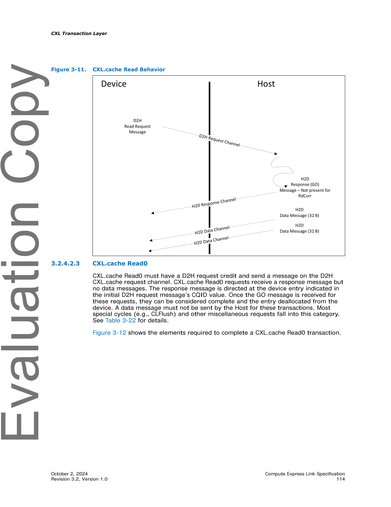
>
> *Original page render @ 150 DPI* — [📄 Full size](figures/chapter_03/page_0114.png)

> **Figure 3-12.** CXL.cache Read0 Behavior ｜ CXL.cache Read0 行为
>
> 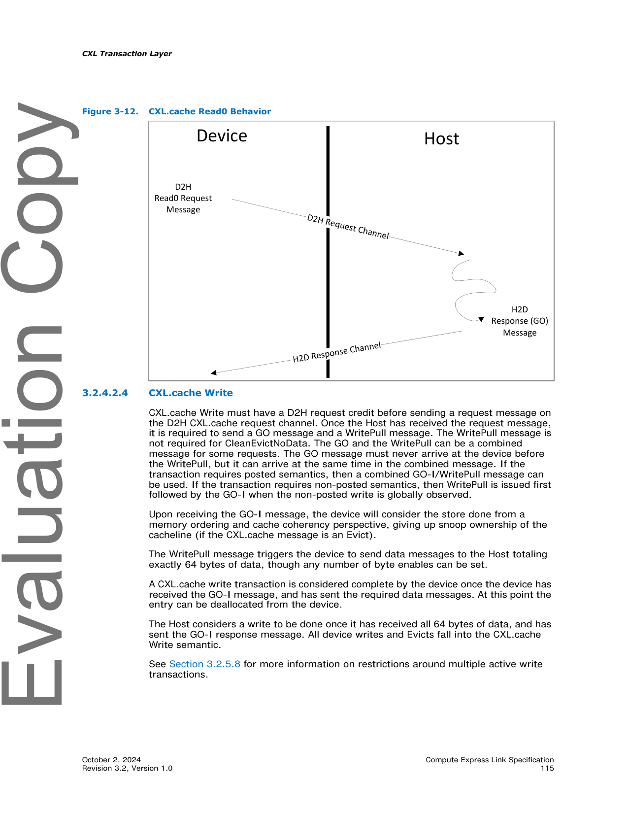
>
> *Original page render @ 150 DPI* — [📄 Full size](figures/chapter_03/page_0115.png)

[⬆️ 返回目录](#-本章目录)

##### 3.2.4.2.4 CXL.cache Write | CXL.cache 写

<table>
<thead>
<tr>
<th width="50%">🇬🇧 English</th>
<th width="50%" style="background-color:#e8e8e8">🇨🇳 中文</th>
</tr>
</thead>
<tbody>
<tr><td>CXL.cache Write</td><td style="background-color:#e8e8e8">CXL.cache 写</td></tr>
<tr><td>CXL.cache Write must have a D2H request credit before sending a request message on the D2H CXL.cache request channel. Once the Host has received the request message, it is required to send a GO message and a WritePull message. The WritePull message is not required for CleanEvictNoData. The GO and the WritePull can be a combined message for some requests. The GO message must never arrive at the device before the WritePull, but it can arrive at the same time in the combined message. If the transaction requires posted semantics, then a combined GO-I/WritePull message can be used. If the transaction requires non-posted semantics, then WritePull is issued first followed by the GO-I when the non-posted write is globally observed.</td><td style="background-color:#e8e8e8">CXL.cache Write 在 D2H CXL.cache 请求通道上发送请求消息之前必须拥有 D2H 请求信用量。主机收到请求消息后，必须发送 GO 消息和 WritePull 消息。CleanEvictNoData 不需要 WritePull 消息。对于某些请求，GO 和 WritePull 可以组合为一条消息。GO 消息不得先于 WritePull 到达设备，但可以在组合消息中同时到达。若事务需要 posted 语义，则可使用组合的 GO-I/WritePull 消息。若事务需要 non-posted 语义，则先发出 WritePull，并在 non-posted 写被全局观察后发出 GO-I。</td></tr>
<tr><td>Upon receiving the GO-I message, the device will consider the store done from a memory ordering and cache coherency perspective, giving up snoop ownership of the cacheline (if the CXL.cache message is an Evict).</td><td style="background-color:#e8e8e8">设备在收到 GO-I 消息后，将从内存排序和缓存一致性的角度认为该存储完成，并放弃该 cacheline 的探测所有权（如果 CXL.cache 消息是 Evict）。</td></tr>
<tr><td>The WritePull message triggers the device to send data messages to the Host totaling exactly 64 bytes of data, though any number of byte enables can be set.</td><td style="background-color:#e8e8e8">WritePull 消息触发设备向主机发送数据消息，总计恰好 64 字节数据，但可设置任意数量的字节使能。</td></tr>
<tr><td>A CXL.cache write transaction is considered complete by the device once the device has received the GO-I message, and has sent the required data messages. At this point the entry can be deallocated from the device.</td><td style="background-color:#e8e8e8">设备在收到 GO-I 消息并已发送所需的数据消息后，即认为 CXL.cache 写事务完成。此时可从设备中释放该条目。</td></tr>
<tr><td>The Host considers a write to be done once it has received all 64 bytes of data, and has sent the GO-I response message. All device writes and Evicts fall into the CXL.cache Write semantic.</td><td style="background-color:#e8e8e8">主机在收到全部 64 字节数据并已发送 GO-I 响应消息后，即认为写操作完成。所有设备写和 Evict 都属于 CXL.cache Write 语义。</td></tr>
<tr><td>See Section 3.2.5.8 for more information on restrictions around multiple active write transactions.</td><td style="background-color:#e8e8e8">有关多个活动写事务的限制的更多信息，请参阅 Section 3.2.5.8。</td></tr>
<tr><td>Figure 3-13 shows the elements required to complete a CXL.cache Write transaction (that matches posted behavior). The WritePull (or the combined GO_WritePull) message triggers the data messages. There are restrictions on Snoops and WritePulls. See Section 3.2.5.3 for more details.</td><td style="background-color:#e8e8e8">Figure 3-13 展示了完成 CXL.cache 写事务（与 posted 行为匹配）所需的元素。WritePull（或组合的 GO_WritePull）消息触发数据消息。对 Snoops 和 WritePulls 存在一些限制。详见 Section 3.2.5.3。</td></tr>
<tr><td>Figure 3-14 shows a case where the WritePull is a separate message from the GO (for example: strongly ordered uncacheable write).</td><td style="background-color:#e8e8e8">Figure 3-14 展示了 WritePull 与 GO 分开发送的情况（例如：强序不可缓存写）。</td></tr>
<tr><td>Figure 3-15 shows the Host FastGO plus ExtCmp responses for weakly ordered write requests.</td><td style="background-color:#e8e8e8">Figure 3-15 展示了针对弱序写请求的主机 FastGO 加 ExtCmp 响应。</td></tr>
</tbody>
</table>

> **Figure 3-13.** CXL.cache Device to Host Write Behavior ｜ CXL.cache 设备到主机的写行为
>
> 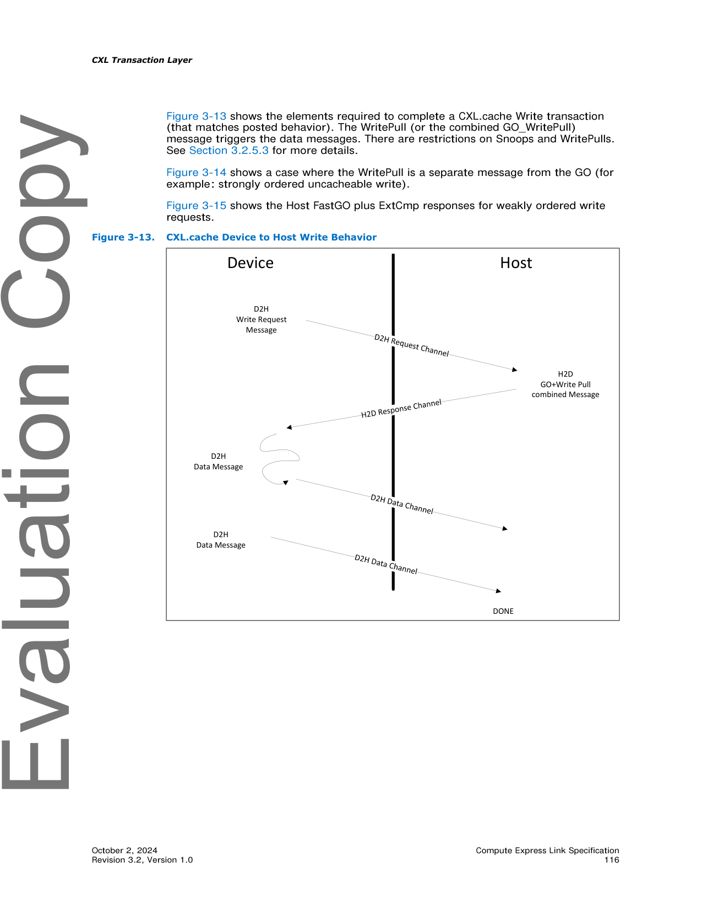
>
> *Original page render @ 150 DPI* — [📄 Full size](figures/chapter_03/page_0116.png)

> **Figure 3-14.** CXL.cache WrInv Transaction ｜ CXL.cache WrInv 事务
>
> 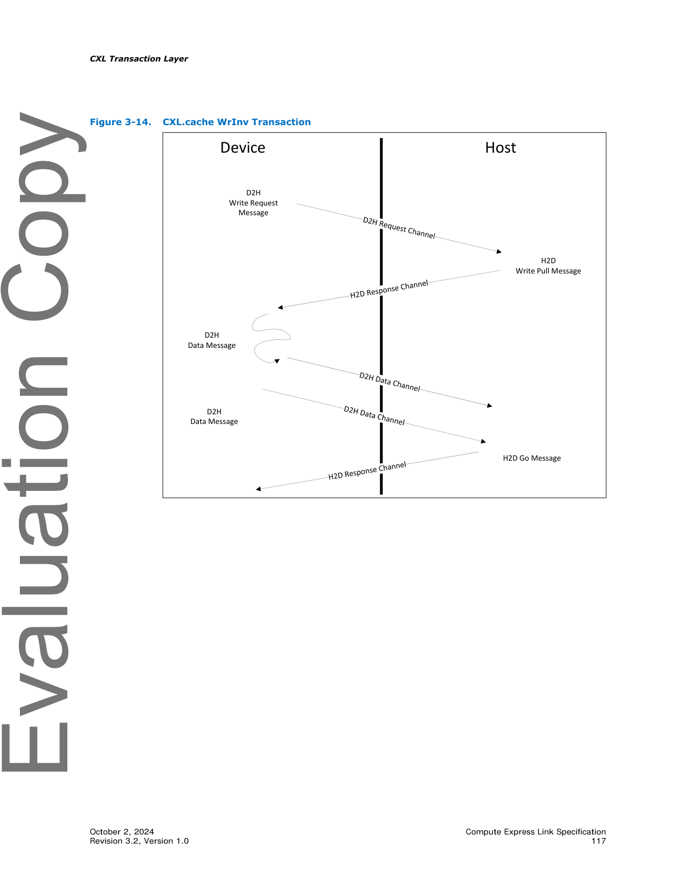
>
> *Original page render @ 150 DPI* — [📄 Full size](figures/chapter_03/page_0117.png)

> **Figure 3-15.** WOWrInv/F with FastGO/ExtCmp ｜ 带 FastGO/ExtCmp 的 WOWrInv/F
>
> 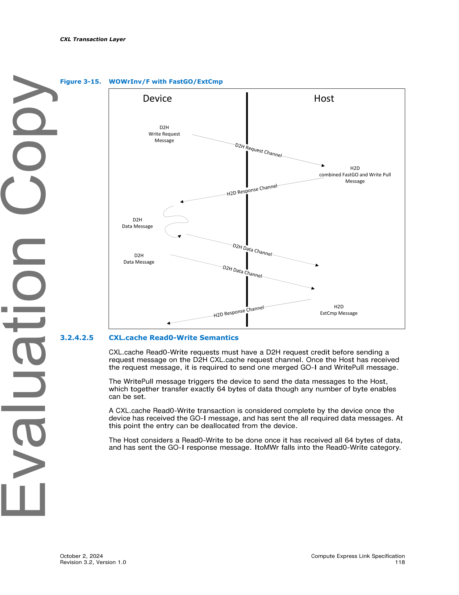
>
> *Original page render @ 150 DPI* — [📄 Full size](figures/chapter_03/page_0118.png)

[⬆️ 返回目录](#-本章目录)

##### 3.2.4.2.5 CXL.cache Read0-Write Semantics | CXL.cache Read0-Write 语义

<table>
<thead>
<tr>
<th width="50%">🇬🇧 English</th>
<th width="50%" style="background-color:#e8e8e8">🇨🇳 中文</th>
</tr>
</thead>
<tbody>
<tr><td>CXL.cache Read0-Write Semantics</td><td style="background-color:#e8e8e8">CXL.cache Read0-Write 语义</td></tr>
<tr><td>CXL.cache Read0-Write requests must have a D2H request credit before sending a request message on the D2H CXL.cache request channel. Once the Host has received the request message, it is required to send one merged GO-I and WritePull message.</td><td style="background-color:#e8e8e8">CXL.cache Read0-Write 请求在 D2H CXL.cache 请求通道上发送请求消息之前必须拥有 D2H 请求信用量。主机收到请求消息后，必须发送一条合并的 GO-I 和 WritePull 消息。</td></tr>
<tr><td>The WritePull message triggers the device to send the data messages to the Host, which together transfer exactly 64 bytes of data though any number of byte enables can be set.</td><td style="background-color:#e8e8e8">WritePull 消息触发设备向主机发送数据消息，共同传输恰好 64 字节的数据，但可设置任意数量的字节使能。</td></tr>
<tr><td>A CXL.cache Read0-Write transaction is considered complete by the device once the device has received the GO-I message, and has sent the all required data messages. At this point the entry can be deallocated from the device.</td><td style="background-color:#e8e8e8">设备在收到 GO-I 消息并已发送所有所需数据消息后，即认为 CXL.cache Read0-Write 事务完成。此时可从设备中释放该条目。</td></tr>
<tr><td>The Host considers a Read0-Write to be done once it has received all 64 bytes of data, and has sent the GO-I response message. ItoMWr falls into the Read0-Write category.</td><td style="background-color:#e8e8e8">主机在收到全部 64 字节数据并已发送 GO-I 响应消息后，即认为 Read0-Write 完成。ItoMWr 属于 Read0-Write 类别。</td></tr>
<tr><td>Table 3-22 summarizes all the opcodes that are available from the Device to the Host.</td><td style="background-color:#e8e8e8">Table 3-22 汇总了设备到主机可用的所有操作码。</td></tr>
</tbody>
</table>

> **Figure 3-16.** CXL.cache Read0-Write Semantics ｜ CXL.cache Read0-Write 语义
>
> 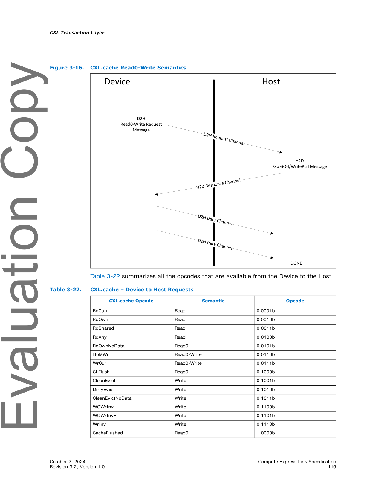
>
> *Original page render @ 150 DPI* — [📄 Full size](figures/chapter_03/page_0119.png)

[⬆️ 返回目录](#-本章目录)

##### 3.2.4.2.6 RdCurr

<table>
<thead>
<tr>
<th width="50%">🇬🇧 English</th>
<th width="50%" style="background-color:#e8e8e8">🇨🇳 中文</th>
</tr>
</thead>
<tbody>
<tr><td>RdCurr</td><td style="background-color:#e8e8e8">RdCurr</td></tr>
<tr><td>These are full cacheline read requests from the device for lines to get the most current data, but not change the existing state in any cache, including in the Host. The Host does not need to track the cacheline in the device that issued the RdCurr. RdCurr gets a data but no GO. The device receives the line in the Invalid state which means that the device gets one use of the line and cannot cache it.</td><td style="background-color:#e8e8e8">这是来自设备的完整 cacheline 读请求，用于获取最新的数据，但不改变任何缓存（包括主机）中现有的状态。主机无需跟踪发出 RdCurr 的设备中的 cacheline。RdCurr 接收数据但不接收 GO。设备收到的 cacheline 处于 Invalid 状态，意味着设备只能使用该行一次，不能缓存。</td></tr>
</tbody>
</table>

[⬆️ 返回目录](#-本章目录)

##### 3.2.4.2.7 RdOwn

<table>
<thead>
<tr>
<th width="50%">🇬🇧 English</th>
<th width="50%" style="background-color:#e8e8e8">🇨🇳 中文</th>
</tr>
</thead>
<tbody>
<tr><td>RdOwn</td><td style="background-color:#e8e8e8">RdOwn</td></tr>
<tr><td>These are full cacheline read requests from the device for lines to be cached in any writeable state. Typically, RdOwn request receives the line in Exclusive (GO-E) or Modified (GO-M) state. Lines in Modified state must not be dropped, and have to be written back to the Host.</td><td style="background-color:#e8e8e8">这是来自设备的完整 cacheline 读请求，用于将 cacheline 缓存在任何可写状态。通常，RdOwn 请求会收到 Exclusive (GO-E) 或 Modified (GO-M) 状态。处于 Modified 状态的行不得被丢弃，必须写回主机。</td></tr>
<tr><td>Under error conditions, a RdOwn request may receive the line in Invalid (GO-I) or Error (GO-Err) state. Both return synthesized data of all 1s. The device is responsible for handling the error appropriately.</td><td style="background-color:#e8e8e8">在错误情况下，RdOwn 请求可能收到 Invalid (GO-I) 或 Error (GO-Err) 状态的行。两者均返回全 1 的合成数据。设备负责妥善处理错误。</td></tr>
</tbody>
</table>

[⬆️ 返回目录](#-本章目录)

##### 3.2.4.2.8 RdShared

<table>
<thead>
<tr>
<th width="50%">🇬🇧 English</th>
<th width="50%" style="background-color:#e8e8e8">🇨🇳 中文</th>
</tr>
</thead>
<tbody>
<tr><td>RdShared</td><td style="background-color:#e8e8e8">RdShared</td></tr>
<tr><td>These are full cacheline read requests from the device for lines to be cached in Shared state. Typically, RdShared request receives the line in Shared (GO-S) state.</td><td style="background-color:#e8e8e8">这是来自设备的完整 cacheline 读请求，用于将 cacheline 缓存在 Shared 状态。通常，RdShared 请求会收到 Shared (GO-S) 状态的行。</td></tr>
<tr><td>Under error conditions, a RdShared request may receive the line in Invalid (GO-I) or Error (GO-Err) state. Both will return synthesized data of all 1s. The device is responsible for handling the error appropriately.</td><td style="background-color:#e8e8e8">在错误情况下，RdShared 请求可能收到 Invalid (GO-I) 或 Error (GO-Err) 状态的行。两者都将返回全 1 的合成数据。设备负责妥善处理错误。</td></tr>
</tbody>
</table>

[⬆️ 返回目录](#-本章目录)

##### 3.2.4.2.9 RdAny

<table>
<thead>
<tr>
<th width="50%">🇬🇧 English</th>
<th width="50%" style="background-color:#e8e8e8">🇨🇳 中文</th>
</tr>
</thead>
<tbody>
<tr><td>RdAny</td><td style="background-color:#e8e8e8">RdAny</td></tr>
<tr><td>These are full cacheline read requests from the device for lines to be cached in any state. Typically, RdAny request receives the line in Shared (GO-S), Exclusive (GO-E) or Modified (GO-M) state. Lines in Modified state must not be dropped, and have to be written back to the Host.</td><td style="background-color:#e8e8e8">这是来自设备的完整 cacheline 读请求，用于将 cacheline 缓存在任何状态。通常，RdAny 请求会收到 Shared (GO-S)、Exclusive (GO-E) 或 Modified (GO-M) 状态的行。处于 Modified 状态的行不得被丢弃，必须写回主机。</td></tr>
<tr><td>Under error conditions, a RdAny request may receive the line in Invalid (GO-I) or Error (GO-Err) state. Both return synthesized data of all 1s. The device is responsible for handling the error appropriately.</td><td style="background-color:#e8e8e8">在错误情况下，RdAny 请求可能收到 Invalid (GO-I) 或 Error (GO-Err) 状态的行。两者均返回全 1 的合成数据。设备负责妥善处理错误。</td></tr>
</tbody>
</table>

[⬆️ 返回目录](#-本章目录)

##### 3.2.4.2.10 RdOwnNoData

<table>
<thead>
<tr>
<th width="50%">🇬🇧 English</th>
<th width="50%" style="background-color:#e8e8e8">🇨🇳 中文</th>
</tr>
</thead>
<tbody>
<tr><td>RdOwnNoData</td><td style="background-color:#e8e8e8">RdOwnNoData</td></tr>
<tr><td>These are requests to get exclusive ownership of the cacheline address indicated in the address field. The typical response is Exclusive (GO-E).</td><td style="background-color:#e8e8e8">这些是获取地址字段中指示的 cacheline 排他所有权的请求。典型响应为 Exclusive (GO-E)。</td></tr>
<tr><td>Under error conditions, a RdOwnNoData request may receive the line in Error (GO-Err) state. The device is responsible for handling the error appropriately.</td><td style="background-color:#e8e8e8">在错误情况下，RdOwnNoData 请求可能收到 Error (GO-Err) 状态的行。设备负责妥善处理错误。</td></tr>
<tr><td>Note: A device that uses this command to write data must be able to update the entire cacheline or may drop the E-state if it is unable to perform the update. There is no support partial M-state data in a device cache. To perform a partial write in the device cache, the device must read the cacheline using RdOwn before merging with the partial write data in the cache.</td><td style="background-color:#e8e8e8">注：使用此命令写入数据的设备必须能够更新整个 cacheline，或在无法执行更新时丢弃 E-state。设备缓存中不支持部分 M-state 数据。要在设备缓存中执行部分写，设备必须先使用 RdOwn 读取 cacheline，然后再与缓存中的部分写数据合并。</td></tr>
</tbody>
</table>

[⬆️ 返回目录](#-本章目录)

##### 3.2.4.2.11 ItoMWr

<table>
<thead>
<tr>
<th width="50%">🇬🇧 English</th>
<th width="50%" style="background-color:#e8e8e8">🇨🇳 中文</th>
</tr>
</thead>
<tbody>
<tr><td>ItoMWr</td><td style="background-color:#e8e8e8">ItoMWr</td></tr>
<tr><td>This command requests exclusive ownership of the cacheline address indicated in the address field and atomically writes the cacheline back to the Host. The device guarantees the entire line will be modified, so no data needs to be transferred to the device. The typical response is GO_WritePull, which is sent once the request is granted ownership. The device must not retain a copy of the line. If a cache exists in the host cache hierarchy before memory, the data should be written there.</td><td style="background-color:#e8e8e8">该命令请求地址字段中指示的 cacheline 排他所有权，并将 cacheline 原子化地写回主机。设备保证整行都将被修改，因此无需向设备传输数据。典型响应为 GO_WritePull，在请求获得所有权时发送。设备不得保留该行的副本。如果主机缓存层次结构中内存之前存在缓存，则应将数据写入该处。</td></tr>
<tr><td>If an error occurs, then GO-Err-WritePull is sent instead. The device sends the data to the Host, which drops it. The device is responsible for handling the error as appropriate.</td><td style="background-color:#e8e8e8">若发生错误，则改为发送 GO-Err-WritePull。设备将数据发送给主机，主机将其丢弃。设备负责妥善处理错误。</td></tr>
</tbody>
</table>

[⬆️ 返回目录](#-本章目录)

##### 3.2.4.2.12 WrCur

<table>
<thead>
<tr>
<th width="50%">🇬🇧 English</th>
<th width="50%" style="background-color:#e8e8e8">🇨🇳 中文</th>
</tr>
</thead>
<tbody>
<tr><td>WrCur</td><td style="background-color:#e8e8e8">WrCur</td></tr>
<tr><td>The command behaves like the ItoMWr in that it atomically requests ownership of a cacheline and then writes a full cacheline back to the Fabric. However, it differs from ItoMWr in where the data is written. Only if the command hits in a cache will the data be written there; on a Miss, the data will be written directly to memory. The typical response is GO_WritePull once the request is granted ownership. The device must not retain a copy of the line.</td><td style="background-color:#e8e8e8">该命令行为与 ItoMWr 类似：原子化地请求 cacheline 所有权，然后将完整的 cacheline 写回 Fabric。但与 ItoMWr 的不同之处在于数据写入位置。仅当命令命中缓存时，数据才写入缓存；未命中时，数据将直接写入内存。典型响应为 GO_WritePull，在请求获得所有权时发送。设备不得保留该行的副本。</td></tr>
<tr><td>If an error occurs, then GO-Err-WritePull is sent instead. The device sends the data to the Host, which drops it. The device is responsible for handling the error as appropriate.</td><td style="background-color:#e8e8e8">若发生错误，则改为发送 GO-Err-WritePull。设备将数据发送给主机，主机将其丢弃。设备负责妥善处理错误。</td></tr>
<tr><td>Note: In earlier revisions of the specification (CXL 2.0 and CXL 1.x), this command was called "MemWr", but this was a problem because that same message name is used in the CXL.mem protocol, so a new name was selected. The opcode and behavior are unchanged.</td><td style="background-color:#e8e8e8">注：在本规范的早期版本（CXL 2.0 和 CXL 1.x）中，此命令名为 "MemWr"，但由于该消息名同时用于 CXL.mem 协议，因此选择了新名称。操作码和行为保持不变。</td></tr>
</tbody>
</table>

[⬆️ 返回目录](#-本章目录)

##### 3.2.4.2.13 CLFlush

<table>
<thead>
<tr>
<th width="50%">🇬🇧 English</th>
<th width="50%" style="background-color:#e8e8e8">🇨🇳 中文</th>
</tr>
</thead>
<tbody>
<tr><td>CLFlush</td><td style="background-color:#e8e8e8">CLFlush</td></tr>
<tr><td>This is a request to the Host to invalidate the cacheline specified in the address field. The typical response is GO-I which is sent from the Host upon completion in memory.</td><td style="background-color:#e8e8e8">这是向主机发出的请求，用于使地址字段中指定的 cacheline 失效。典型响应为 GO-I，由主机在内存中完成时发送。</td></tr>
<tr><td>However, the Host may keep tracking the cacheline in Shared state if the Core has issued a Monitor to an address belonging in the cacheline. Thus, the Device that exposes an HDM-D region must not rely on CLFlush/GO-I as a sufficient condition for which to flip a cacheline in the HDM-D region from Host to Device Bias mode. Instead, the Device must initiate RdOwnNoData and receive an H2D Response of GO-E before it updates its Bias Table to Device Bias mode to allow subsequent cacheline access without notifying the Host.</td><td style="background-color:#e8e8e8">但是，如果 Core 已对属于该 cacheline 的地址发出 Monitor，主机可以在 Shared 状态继续跟踪该 cacheline。因此，暴露 HDM-D 区域的设备不得依赖 CLFlush/GO-I 作为将 HDM-D 区域中的 cacheline 从 Host Bias 翻转为 Device Bias 模式的充分条件。相反，设备必须先发起 RdOwnNoData，并收到 H2D Response 为 GO-E，然后才能将其 Bias Table 更新为 Device Bias 模式，以便在后续 cacheline 访问中不通知主机。</td></tr>
<tr><td>Under error conditions, a CLFlush request may receive the line in the Error (GO-Err) state. The device is responsible for handling the error appropriately.</td><td style="background-color:#e8e8e8">在错误情况下，CLFlush 请求可能收到 Error (GO-Err) 状态的行。设备负责妥善处理错误。</td></tr>
</tbody>
</table>

[⬆️ 返回目录](#-本章目录)

##### 3.2.4.2.14 CleanEvict

<table>
<thead>
<tr>
<th width="50%">🇬🇧 English</th>
<th width="50%" style="background-color:#e8e8e8">🇨🇳 中文</th>
</tr>
</thead>
<tbody>
<tr><td>CleanEvict</td><td style="background-color:#e8e8e8">CleanEvict</td></tr>
<tr><td>This is a request to the Host to evict a full 64-byte Exclusive cacheline from the device. Typically, CleanEvict receives GO-WritePull or GO-WritePullDrop. The response will cause the device to relinquish snoop ownership of the line. For GO-WritePull, the device will send the data as normal. For GO-WritePullDrop, the device simply drops the data.</td><td style="background-color:#e8e8e8">这是向主机发出的请求，用于从设备淘汰一个完整的 64 字节 Exclusive cacheline。通常，CleanEvict 收到 GO-WritePull 或 GO-WritePullDrop。该响应将导致设备放弃该行的探测所有权。对于 GO-WritePull，设备将正常发送数据。对于 GO-WritePullDrop，设备直接丢弃数据。</td></tr>
<tr><td>Once the device has issued this command and the address is subsequently snooped, but before the device has received the GO-WritePull, the device must set the Bogus field in all D2H Data messages to indicate that the data is now stale.</td><td style="background-color:#e8e8e8">一旦设备发出此命令且该地址随后被探测，但在设备收到 GO-WritePull 之前，设备必须将所有 D2H Data 消息中的 Bogus 字段置位，以指示该数据现已失效。</td></tr>
<tr><td>CleanEvict requests also guarantee to the Host that the device no longer contains any cached copies of this line. Only one CleanEvict from the device may be pending on CXL.cache for any given cacheline address.</td><td style="background-color:#e8e8e8">CleanEvict 请求还向主机保证设备不再包含该行的任何缓存副本。对于任何给定的 cacheline 地址，CXL.cache 上同一时间只能有一条来自设备的 CleanEvict 待处理。</td></tr>
<tr><td>CleanEvict is only expected for a host-attached memory range of addresses. For a device-attached memory range, the equivalent operation can be completed internally within the device without sending a transaction to the Host.</td><td style="background-color:#e8e8e8">CleanEvict 仅预期用于主机附加的地址内存范围。对于设备附加的内存范围，等效操作可以在设备内部完成，而无需向主机发送事务。</td></tr>
</tbody>
</table>

[⬆️ 返回目录](#-本章目录)

##### 3.2.4.2.15 DirtyEvict

<table>
<thead>
<tr>
<th width="50%">🇬🇧 English</th>
<th width="50%" style="background-color:#e8e8e8">🇨🇳 中文</th>
</tr>
</thead>
<tbody>
<tr><td>DirtyEvict</td><td style="background-color:#e8e8e8">DirtyEvict</td></tr>
<tr><td>This is a request to the Host to evict a full 64-byte Modified cacheline from the device. Typically, DirtyEvict receives GO-WritePull from the Host at which point the device must relinquish snoop ownership of the line and send the data as normal.</td><td style="background-color:#e8e8e8">这是向主机发出的请求，用于从设备淘汰一个完整的 64 字节 Modified cacheline。通常，DirtyEvict 从主机收到 GO-WritePull，此时设备必须放弃该行的探测所有权并正常发送数据。</td></tr>
<tr><td>Once the device has issued this command and the address is subsequently snooped, but before the device has received the GO-WritePull, the device must set the Bogus field in all D2H Data messages to indicate that the data is now stale.</td><td style="background-color:#e8e8e8">一旦设备发出此命令且该地址随后被探测，但在设备收到 GO-WritePull 之前，设备必须将所有 D2H Data 消息中的 Bogus 字段置位，以指示该数据现已失效。</td></tr>
<tr><td>DirtyEvict requests also guarantee to the Host that the device no longer contains any cached copies of this line. Only one DirtyEvict from the device may be pending on CXL.cache for any given cacheline address.</td><td style="background-color:#e8e8e8">DirtyEvict 请求还向主机保证设备不再包含该行的任何缓存副本。对于任何给定的 cacheline 地址，CXL.cache 上同一时间只能有一条来自设备的 DirtyEvict 待处理。</td></tr>
<tr><td>In error conditions, a GO-Err-WritePull is received. The device sends the data as normal, and the Host drops it. The device is responsible for handling the error as appropriate.</td><td style="background-color:#e8e8e8">在错误情况下，收到 GO-Err-WritePull。设备正常发送数据，主机将其丢弃。设备负责妥善处理错误。</td></tr>
<tr><td>DirtyEvict is only expected for host-attached memory address ranges. For device-attached memory range, the equivalent operation can be completed internally within the device without sending a transaction to the Host.</td><td style="background-color:#e8e8e8">DirtyEvict 仅预期用于主机附加的地址内存范围。对于设备附加的内存范围，等效操作可以在设备内部完成，而无需向主机发送事务。</td></tr>
</tbody>
</table>

[⬆️ 返回目录](#-本章目录)

##### 3.2.4.2.16 CleanEvictNoData

<table>
<thead>
<tr>
<th width="50%">🇬🇧 English</th>
<th width="50%" style="background-color:#e8e8e8">🇨🇳 中文</th>
</tr>
</thead>
<tbody>
<tr><td>CleanEvictNoData</td><td style="background-color:#e8e8e8">CleanEvictNoData</td></tr>
<tr><td>This is a request for the device to update the Host that a clean line is dropped in the device. The sole purpose of this request is to update any snoop filters in the Host and no data is exchanged.</td><td style="background-color:#e8e8e8">这是设备向主机更新其 clean 行已被丢弃的请求。此请求的唯一目的是更新主机中的任何探测过滤器，不交换任何数据。</td></tr>
<tr><td>CleanEvictNoData is only expected for host-attached memory address ranges. For device-attached memory range, the equivalent operation can be completed internally within the device without sending a transaction to the Host.</td><td style="background-color:#e8e8e8">CleanEvictNoData 仅预期用于主机附加的地址内存范围。对于设备附加的内存范围，等效操作可以在设备内部完成，而无需向主机发送事务。</td></tr>
</tbody>
</table>

[⬆️ 返回目录](#-本章目录)

##### 3.2.4.2.17 WOWrInv

<table>
<thead>
<tr>
<th width="50%">🇬🇧 English</th>
<th width="50%" style="background-color:#e8e8e8">🇨🇳 中文</th>
</tr>
</thead>
<tbody>
<tr><td>WOWrInv</td><td style="background-color:#e8e8e8">WOWrInv</td></tr>
<tr><td>This is a weakly ordered write invalidate line request of 0-63 bytes for write combining type stores. Any combination of byte enables may be set.</td><td style="background-color:#e8e8e8">这是写合并型存储的 0-63 字节弱序失效行写入请求。可以设置任意字节使能组合。</td></tr>
<tr><td>Typically, WOWrInv receives a FastGO-WritePull followed by an ExtCmp. Upon receiving the FastGO-WritePull the device sends the data to the Host. For host-attached memory, the Host sends the ExtCmp once the write is complete in memory.</td><td style="background-color:#e8e8e8">通常，WOWrInv 收到 FastGO-WritePull 后再收到 ExtCmp。设备在收到 FastGO-WritePull 后将数据发送给主机。对于主机附加内存，主机在内存中写完成后发送 ExtCmp。</td></tr>
<tr><td>FastGO does not provide "Global Observation".</td><td style="background-color:#e8e8e8">FastGO 不提供 "Global Observation"。</td></tr>
<tr><td>In error conditions, a GO-Err-WritePull is received. The device sends the data as normal, and the Host drops it. The device is responsible for handling the error as appropriate. An ExtCmp is still sent by the Host after the GO-Err in all cases.</td><td style="background-color:#e8e8e8">在错误情况下，收到 GO-Err-WritePull。设备正常发送数据，主机将其丢弃。设备负责妥善处理错误。在所有情况下，主机在 GO-Err 之后仍会发送 ExtCmp。</td></tr>
</tbody>
</table>

[⬆️ 返回目录](#-本章目录)

##### 3.2.4.2.18 WOWrInvF

<table>
<thead>
<tr>
<th width="50%">🇬🇧 English</th>
<th width="50%" style="background-color:#e8e8e8">🇨🇳 中文</th>
</tr>
</thead>
<tbody>
<tr><td>WOWrInvF</td><td style="background-color:#e8e8e8">WOWrInvF</td></tr>
<tr><td>Same as WOWrInv (rules and flows), except it is a write of 64 bytes.</td><td style="background-color:#e8e8e8">与 WOWrInv 相同（规则和流），区别在于其写入大小为 64 字节。</td></tr>
</tbody>
</table>

[⬆️ 返回目录](#-本章目录)

##### 3.2.4.2.19 WrInv

<table>
<thead>
<tr>
<th width="50%">🇬🇧 English</th>
<th width="50%" style="background-color:#e8e8e8">🇨🇳 中文</th>
</tr>
</thead>
<tbody>
<tr><td>WrInv</td><td style="background-color:#e8e8e8">WrInv</td></tr>
<tr><td>This is a write invalidate line request of 0-64 bytes. Typically, WrInv receives a WritePull followed by a GO. Upon getting the WritePull, the device sends the data to the Host. The Host sends GO once the write completes in memory (both, host-attached or device-attached).</td><td style="background-color:#e8e8e8">这是 0-64 字节的写失效行请求。通常，WrInv 收到 WritePull 后再收到 GO。设备在收到 WritePull 后将数据发送给主机。主机在内存中写完成后（无论是主机附加还是设备附加）发送 GO。</td></tr>
<tr><td>In error conditions, a GO-Err is received. The device is responsible for handling the error as appropriate.</td><td style="background-color:#e8e8e8">在错误情况下，收到 GO-Err。设备负责妥善处理错误。</td></tr>
</tbody>
</table>

[⬆️ 返回目录](#-本章目录)

##### 3.2.4.2.20 CacheFlushed

<table>
<thead>
<tr>
<th width="50%">🇬🇧 English</th>
<th width="50%" style="background-color:#e8e8e8">🇨🇳 中文</th>
</tr>
</thead>
<tbody>
<tr><td>CacheFlushed</td><td style="background-color:#e8e8e8">CacheFlushed</td></tr>
<tr><td>This is an indication sent by the device to inform the Host that its caches are flushed, and it no longer contains any cachelines in the Shared, Exclusive or Modified state (a device may exclude addresses that are part its "Device-attached Memory" mapped as HDM-D/HDM-DB). The Host can use this information to clear its snoop filters, block snoops to the device, and return a GO. Once the device receives the GO, it is guaranteed to not receive any snoops from the Host until the device sends the next cacheable D2H Request.</td><td style="background-color:#e8e8e8">这是设备发送的指示，用于通知主机其缓存已被刷新，且不再包含任何处于 Shared、Exclusive 或 Modified 状态的 cacheline（设备可排除映射为 HDM-D/HDM-DB 的"设备附加内存"地址）。主机可利用此信息清除其探测过滤器，阻止对设备的探测，并返回 GO。设备在收到 GO 后，保证在设备发送下一条可缓存 D2H Request 之前不会再收到来自主机的任何探测。</td></tr>
<tr><td>When a CXL.cache device is flushing its cache, the device must wait for all responses for cacheable access before sending the CacheFlushed message. This is necessary because the Host must observe CacheFlushed only after all inflight messages that impact device coherence tracking in the Host are complete.</td><td style="background-color:#e8e8e8">当 CXL.cache 设备正在刷新其缓存时，设备必须在发送 CacheFlushed 消息之前等待所有可缓存访问的响应。这是有必要的，因为主机仅在影响主机中设备一致性跟踪的所有在飞消息完成后才能观察到 CacheFlushed。</td></tr>
<tr><td>IMPLEMENTATION NOTE: Snoops may be pending to the device when the Host receives the CacheFlushed command and the Host may complete the CacheFlushed command (sending a GO) while those snoops are outstanding. From the device point of view, this can be observed as receiving snoops after the CacheFlushed message is complete. The device should allow for this behavior without creating long stall conditions on the snoops by waiting for snoop queues to drain before initiating any power state transition (e.g., L1 link state) that could stall snoops.</td><td style="background-color:#e8e8e8">实现注：当主机收到 CacheFlushed 命令时，可能有挂起的探测发往设备，主机可能在这些探测仍在进行时完成 CacheFlushed 命令（发送 GO）。从设备的角度来看，这可以表现为在 CacheFlushed 消息完成后仍会收到探测。设备应允许这种行为，而不应在探测队列上造成长时间的停顿。设备应在发起任何可能导致探测停顿的电源状态转换（例如 L1 链路状态）之前等待探测队列排空。</td></tr>
<tr><td>For requests that target device-attached memory mapped as HDM-D, if the region is in Device Bias, no transaction is expected on CXL.cache because the Device can internally complete those requests. If the region is in Host Bias, Table 3-24 shows how the device should expect the response. For devices with BISnp channel support in which the memory is mapped as HDM-DB, the resolution of coherence happens separately on the CXL.mem protocol and the "Not Supported" cases in the table are never sent from a device to the device-attached memory address range. The only commands supported on CXL.cache to this address region when BISnp is enabled are ItoMWr, WrCur, and WrInv.</td><td style="background-color:#e8e8e8">对于以 HDM-D 映射的设备附加内存请求，如果该区域处于 Device Bias，则 CXL.cache 上不会产生事务，因为设备可在内部完成这些请求。如果该区域处于 Host Bias，Table 3-24 展示了设备应如何预期响应。对于支持 BISnp 通道且内存映射为 HDM-DB 的设备，一致性解析在 CXL.mem 协议上单独进行，表中的 "Not Supported" 情况永远不会从设备发送到设备附加内存的地址范围。在 BISnp 启用时，CXL.cache 上对该地址区域支持的命令仅有 ItoMWr、WrCur 和 WrInv。</td></tr>
<tr><td>CleanEvict, DirtyEvict, and CleanEvictNoData targeting device-attached memory should always be completed internally by the device, regardless of bias state. For D2H Requests that receive a response on CXL.mem, the CQID associated with the CXL.cache request is reflected in the Tag of the CXL.mem MemRdFwd or MemWrFwd command. For MemRdFwd, the caching state of the line is reflected in the MetaValue field as described in Table 3-37.</td><td style="background-color:#e8e8e8">针对设备附加内存的 CleanEvict、DirtyEvict 和 CleanEvictNoData 应始终由设备在内部完成，与 bias 状态无关。对于在 CXL.mem 上收到响应的 D2H 请求，与 CXL.cache 请求相关联的 CQID 会反映在 CXL.mem MemRdFwd 或 MemWrFwd 命令的 Tag 中。对于 MemRdFwd，该行的缓存状态反映在 MetaValue 字段中，如 Table 3-37 所述。</td></tr>
</tbody>
</table>

[⬆️ 返回目录](#-本章目录)

