# 📘 第 4 章　CXL 链路层 (Chapter 4. CXL Link Layers)

> **Source pages**: 191–261 | **File**: chapter_04.md | **Format**: 中英对照双语

---

## 📑 本章目录

- [4.0 CXL Link Layers | CXL 链路层](#sec-4-0)
- [4.1 CXL.io Link Layer | CXL.io 链路层](#sec-4-1)
- [4.2 CXL.cache and CXL.mem 68B Flit Mode Common Link Layer | CXL.cache 与 CXL.mem 68B Flit 模式公共链路层](#sec-4-2)
  - [4.2.1 Introduction | 概述](#sec-4-2-1)
  - [4.2.2 High-Level CXL.cachemem Flit Overview | CXL.cachemem Flit 高级概述](#sec-4-2-2)
  - [4.2.3 Slot Format Definition | Slot 格式定义](#sec-4-2-3)
    - [4.2.3.1 H2D and M2S Formats | H2D 与 M2S 格式](#sec-4-2-3-1)
    - [4.2.3.2 D2H and S2M Formats | D2H 与 S2M 格式](#sec-4-2-3-2)
  - [4.2.4 Link Layer Registers | 链路层寄存器](#sec-4-2-4)
  - [4.2.5 68B Flit Packing Rules | 68B Flit 打包规则](#sec-4-2-5)
  - [4.2.6 Link Layer Control Flit | 链路层控制 Flit](#sec-4-2-6)
  - [4.2.7 Link Layer Initialization | 链路层初始化](#sec-4-2-7)
  - [4.2.8 CXL.cachemem Link Layer Retry | CXL.cachemem 链路层重传](#sec-4-2-8)
    - [4.2.8.1 LLR Variables | LLR 变量](#sec-4-2-8-1)
    - [4.2.8.2 LLCRD Forcing | LLCRD 强制发送](#sec-4-2-8-2)
    - [4.2.8.3 LLR Control Flits | LLR 控制 Flit](#sec-4-2-8-3)
    - [4.2.8.4 RETRY Framing Sequences | RETRY 帧序列](#sec-4-2-8-4)
    - [4.2.8.5 LLR State Machines | LLR 状态机](#sec-4-2-8-5)
      - [4.2.8.5.1 Local Retry State Machine (LRSM) | 本地重传状态机](#sec-4-2-8-5-1)
      - [4.2.8.5.2 TIMEOUT Definition | TIMEOUT 定义](#sec-4-2-8-5-2)
      - [4.2.8.5.3 Remote Retry State Machine (RRSM) | 远端重传状态机](#sec-4-2-8-5-3)
    - [4.2.8.6 Interaction with vLSM Retrain State | 与 vLSM Retrain 状态的交互](#sec-4-2-8-6)
    - [4.2.8.7 CXL.cachemem Flit CRC | CXL.cachemem Flit CRC](#sec-4-2-8-7)
      - [4.2.8.7.1 CRC-16 Polynomial and Detection Properties | CRC-16 多项式与检测属性](#sec-4-2-8-7-1)
      - [4.2.8.7.2 CRC-16 Calculation | CRC-16 计算](#sec-4-2-8-7-2)
  - [4.2.9 Viral | Viral 状态](#sec-4-2-9)
- [4.3 CXL.cachemem Link Layer 256B Flit Mode | CXL.cachemem 链路层 256B Flit 模式](#sec-4-3)
  - [4.3.1 Introduction | 概述](#sec-4-3-1)
  - [4.3.2 Flit Overview | Flit 概述](#sec-4-3-2)
  - [4.3.3 Slot Format Definition | Slot 格式定义](#sec-4-3-3)
    - [4.3.3.1 Implicit Data Slot Decode | 隐式数据 Slot 解码](#sec-4-3-3-1)
    - [4.3.3.2 Trailer Decoder | Trailer 解码器](#sec-4-3-3-2)
  - [4.3.4 256B Flit Packing Rules | 256B Flit 打包规则](#sec-4-3-4)
  - [4.3.5 Credit Return | Credit 返回](#sec-4-3-5)
  - [4.3.6 Link Layer Control Messages | 链路层控制消息](#sec-4-3-6)
    - [4.3.6.1 Link Layer Initialization | 链路层初始化](#sec-4-3-6-1)
    - [4.3.6.2 Viral Injection and Containment | Viral 注入与遏制](#sec-4-3-6-2)
    - [4.3.6.3 Late Poison | 后置 Poison](#sec-4-3-6-3)
    - [4.3.6.4 Link Integrity and Data Encryption (IDE) | 链路完整性与数据加密](#sec-4-3-6-4)
  - [4.3.7 Credit Return Forcing | Credit 返回强制发送](#sec-4-3-7)
  - [4.3.8 Latency Optimizations | 延迟优化](#sec-4-3-8)
    - [4.3.8.1 Empty Flit | 空 Flit](#sec-4-3-8-1)

## 🖼 本章图表

| Figure | 英文标题 | 中文标题 | 页码 |
| --- | --- | --- | --- |
| Figure 4-1 | Flex Bus Layers - CXL.io Link Layer Highlighted | Flex Bus 分层 - CXL.io 链路层高亮 | 191 |
| Figure 4-2 | Flex Bus Layers - CXL.cache + CXL.mem Link Layer Highlighted | Flex Bus 分层 - CXL.cache + CXL.mem 链路层高亮 | 193 |
| Figure 4-3 | CXL.cachemem Protocol Flit Overview | CXL.cachemem 协议 Flit 概览 | 194 |
| Figure 4-4 | CXL.cachemem All Data Flit Overview | CXL.cachemem 全数据 Flit 概览 | 195 |
| Figure 4-5 | Example of a Protocol Flit from Device to Host | Device-to-Host 协议 Flit 示例 | 196 |
| Figure 4-6 | H0 - H2D Req + H2D Rsp | H0 - H2D Req + H2D Rsp | 202 |
| Figure 4-7 | H1 - H2D Data Header + H2D Rsp + H2D Rsp | H1 - H2D Data Header + H2D Rsp + H2D Rsp | 202 |
| Figure 4-8 | H2 - H2D Req + H2D Data Header | H2 - H2D Req + H2D Data Header | 203 |
| Figure 4-9 | H3 - 4 H2D Data Header | H3 - 4 个 H2D Data Header | 203 |
| Figure 4-10 | H4 - M2S RwD Header | H4 - M2S RwD Header | 203 |
| Figure 4-11 | H5 - M2S Req | H5 - M2S Req | 204 |
| Figure 4-12 | H6 - MAC | H6 - MAC | 204 |
| Figure 4-13 | G0 - H2D/M2S Data | G0 - H2D/M2S Data | 204 |
| Figure 4-14 | G0 - M2S Byte Enable | G0 - M2S Byte Enable | 205 |
| Figure 4-15 | G1 - 4 H2D Rsp | G1 - 4 个 H2D Rsp | 205 |
| Figure 4-16 | G2 - H2D Req + H2D Data Header + H2D Rsp | G2 - H2D Req + H2D Data Header + H2D Rsp | 205 |
| Figure 4-17 | G3 - 4 H2D Data Header + H2D Rsp | G3 - 4 个 H2D Data Header + H2D Rsp | 206 |
| Figure 4-18 | G4 - M2S Req + H2D Data Header | G4 - M2S Req + H2D Data Header | 206 |
| Figure 4-19 | G5 - M2S RwD Header + H2D Rsp | G5 - M2S RwD Header + H2D Rsp | 206 |
| Figure 4-20 | H0 - D2H Data Header + 2 D2H Rsp + S2M NDR | H0 - D2H Data Header + 2 个 D2H Rsp + S2M NDR | 207 |
| Figure 4-21 | H1 - D2H Req + D2H Data Header | H1 - D2H Req + D2H Data Header | 207 |
| Figure 4-22 | H2 - 4 D2H Data Header + D2H Rsp | H2 - 4 个 D2H Data Header + D2H Rsp | 208 |
| Figure 4-23 | H3 - S2M DRS Header + S2M NDR | H3 - S2M DRS Header + S2M NDR | 208 |
| Figure 4-24 | H4 - 2 S2M NDR | H4 - 2 个 S2M NDR | 208 |
| Figure 4-25 | H5 - 2 S2M DRS Header | H5 - 2 个 S2M DRS Header | 209 |
| Figure 4-26 | H6 - MAC | H6 - MAC | 209 |
| Figure 4-27 | G0 - D2H/S2M Data | G0 - D2H/S2M Data | 209 |
| Figure 4-28 | G0 - D2H Byte Enable | G0 - D2H Byte Enable | 210 |
| Figure 4-29 | G1 - D2H Req + 2 D2H Rsp | G1 - D2H Req + 2 个 D2H Rsp | 210 |
| Figure 4-30 | G2 - D2H Req + D2H Data Header + D2H Rsp | G2 - D2H Req + D2H Data Header + D2H Rsp | 210 |
| Figure 4-31 | G3 - 4 D2H Data Header | G3 - 4 个 D2H Data Header | 211 |
| Figure 4-32 | G4 - S2M DRS Header + 2 S2M NDR | G4 - S2M DRS Header + 2 个 S2M NDR | 211 |
| Figure 4-33 | G5 - 2 S2M NDR | G5 - 2 个 S2M NDR | 211 |
| Figure 4-34 | G6 - 3 S2M DRS Header | G6 - 3 个 S2M DRS Header | 212 |
| Figure 4-35 | LLCRD Flit Format (Only Slot 0 is Valid; Others are Reserved) | LLCRD Flit 格式 (仅 Slot 0 有效,其他保留) | 216 |
| Figure 4-36 | RETRY Flit Format (Only Slot 0 is Valid; Others are Reserved) | RETRY Flit 格式 (仅 Slot 0 有效,其他保留) | 217 |
| Figure 4-37 | IDE Flit Format (Only Slot 0 is Valid; Others are Reserved) | IDE Flit 格式 (仅 Slot 0 有效,其他保留) | 217 |
| Figure 4-38 | INIT Flit Format (Only Slot 0 is Valid; Others are Reserved) | INIT Flit 格式 (仅 Slot 0 有效,其他保留) | 217 |
| Figure 4-39 | Retry Buffer and Related Pointers | 重传缓冲及相关指针 | 222 |
| Figure 4-40 | CXL.cachemem Replay Diagram | CXL.cachemem 重放流程图 | 228 |
| Figure 4-41 | Standard 256B Flit | 标准 256B Flit | 231 |
| Figure 4-42 | Latency-Optimized (LOpt) 256B Flit | 延迟优化 (LOpt) 256B Flit | 231 |
| Figure 4-43 | 256B Packing: Slot and Subset Definition | 256B 打包: Slot 与子集定义 | 235 |
| Figure 4-44 | 256B Packing: G0/H0/HS0 HBR Messages | 256B 打包: G0/H0/HS0 HBR 消息 | 236 |
| Figure 4-45 | 256B Packing: G0/H0 PBR Messages | 256B 打包: G0/H0 PBR 消息 | 236 |
| Figure 4-46 | 256B Packing: G1/H1/HS1 HBR Messages | 256B 打包: G1/H1/HS1 HBR 消息 | 237 |
| Figure 4-47 | 256B Packing: G1/H1 PBR Messages | 256B 打包: G1/H1 PBR 消息 | 237 |
| Figure 4-48 | 256B Packing: G2/H2/HS2 HBR Messages | 256B 打包: G2/H2/HS2 HBR 消息 | 238 |
| Figure 4-49 | 256B Packing: G2/H2 PBR Messages | 256B 打包: G2/H2 PBR 消息 | 238 |
| Figure 4-50 | 256B Packing: G3/H3/HS3 HBR Messages | 256B 打包: G3/H3/HS3 HBR 消息 | 239 |
| Figure 4-51 | 256B Packing: G3/H3 PBR Messages | 256B 打包: G3/H3 PBR 消息 | 239 |
| Figure 4-52 | 256B Packing: G4/H4/HS4 HBR Messages | 256B 打包: G4/H4/HS4 HBR 消息 | 240 |
| Figure 4-53 | 256B Packing: G4/H4 PBR Messages | 256B 打包: G4/H4 PBR 消息 | 240 |
| Figure 4-54 | 256B Packing: G5/H5/HS5 HBR Messages | 256B 打包: G5/H5/HS5 HBR 消息 | 241 |
| Figure 4-55 | 256B Packing: G5/H5 PBR Messages | 256B 打包: G5/H5 PBR 消息 | 241 |
| Figure 4-56 | 256B Packing: G6/H6/HS6 HBR Messages | 256B 打包: G6/H6/HS6 HBR 消息 | 242 |
| Figure 4-57 | 256B Packing: G6/H6 PBR Messages | 256B 打包: G6/H6 PBR 消息 | 242 |
| Figure 4-58 | 256B Packing: G7/H7/HS7 HBR Messages | 256B 打包: G7/H7/HS7 HBR 消息 | 243 |
| Figure 4-59 | 256B Packing: G7/H7 PBR Messages | 256B 打包: G7/H7 PBR 消息 | 243 |
| Figure 4-60 | 256B Packing: G12/H12/HS12 HBR Messages | 256B 打包: G12/H12/HS12 HBR 消息 | 244 |
| Figure 4-61 | 256B Packing: G12/H12 PBR Messages | 256B 打包: G12/H12 PBR 消息 | 244 |
| Figure 4-62 | 256B Packing: G13/H13/HS13 HBR Messages | 256B 打包: G13/H13/HS13 HBR 消息 | 245 |
| Figure 4-63 | 256B Packing: G13/H13 PBR Messages | 256B 打包: G13/H13 PBR 消息 | 245 |
| Figure 4-64 | 256B Packing: G14/H14/HS14 HBR Messages | 256B 打包: G14/H14/HS14 HBR 消息 | 246 |
| Figure 4-65 | 256B Packing: G14/H14 PBR Messages | 256B 打包: G14/H14 PBR 消息 | 246 |
| Figure 4-66 | 256B Packing: G15/H15/HS15 HBR Messages | 256B 打包: G15/H15/HS15 HBR 消息 | 247 |
| Figure 4-67 | 256B Packing: G15/H15 PBR Messages | 256B 打包: G15/H15 PBR 消息 | 247 |
| Figure 4-68 | 256B Packing: Implicit Data | 256B 打包: 隐式数据 | 248 |
| Figure 4-69 | 256B Packing: Implicit Trailer RwD | 256B 打包: 隐式 Trailer RwD | 248 |
| Figure 4-70 | 256B Packing: Implicit Trailer DRS | 256B 打包: 隐式 Trailer DRS | 248 |
| Figure 4-71 | 256B Packing: Byte-Enable Trailer for D2H Data | 256B 打包: D2H Data 的 Byte-Enable Trailer | 249 |
| Figure 4-72 | Header Slot Decode Example | Header Slot 解码示例 | 250 |
| Figure 4-73 | DRS Trailer Slot Decode Example | DRS Trailer Slot 解码示例 | 251 |
| Figure 4-74 | 256B Packing: H8/HS8 Link Layer Control Message Slot Format | 256B 打包: H8/HS8 链路层控制消息 Slot 格式 | 258 |
| Figure 4-75 | Viral Error Message Injection Standard 256B Flit | 标准 256B Flit 下 Viral 错误消息注入 | 259 |
| Figure 4-76 | Viral Error Message Injection LOpt 256B Flit | LOpt 256B Flit 下 Viral 错误消息注入 | 259 |

## 📊 本章表格

| Table | 英文标题 | 中文标题 | 页码 |
| --- | --- | --- | --- |
| Table 4-1 | CXL.cachemem Link Layer Flit Header Definition | CXL.cachemem 链路层 Flit Header 定义 | 197 |
| Table 4-2 | Type Encoding | Type 编码 | 197 |
| Table 4-3 | Legal Values of Sz and BE Fields | Sz 与 BE 字段的合法取值 | 198 |
| Table 4-4 | CXL.cachemem Credit Return Encodings | CXL.cachemem Credit 返回编码 | 199 |
| Table 4-5 | ReqCrd/DataCrd/RspCrd Channel Mapping | ReqCrd/DataCrd/RspCrd 通道映射 | 199 |
| Table 4-6 | Slot Format Field Encoding | Slot 格式字段编码 | 200 |
| Table 4-7 | H2D/M2S Slot Formats | H2D/M2S Slot 格式 | 200 |
| Table 4-8 | D2H/S2M Slot Formats | D2H/S2M Slot 格式 | 201 |
| Table 4-9 | CXL.cachemem Link Layer Control Types | CXL.cachemem 链路层控制类型 | 214 |
| Table 4-10 | CXL.cachemem Link Layer Control Details | CXL.cachemem 链路层控制详情 | 215 |
| Table 4-11 | Control Flits and Their Effect on Sender and Receiver States | 控制 Flit 及其对发送方/接收方状态的影响 | 223 |
| Table 4-12 | Local Retry State Transitions | 本地重传状态转移 | 225 |
| Table 4-13 | Remote Retry State Transition | 远端重传状态转移 | 227 |
| Table 4-14 | 256B G-Slot Formats | 256B G-Slot 格式 | 232 |
| Table 4-15 | 256B H-Slot Formats | 256B H-Slot 格式 | 233 |
| Table 4-16 | 256B HS-Slot Formats | 256B HS-Slot 格式 | 234 |
| Table 4-17 | Trailer Size and Modes Supported per Channel | 各通道支持的 Trailer 尺寸与模式 | 250 |
| Table 4-18 | 128B Group Maximum Message Rates | 128B 分组最大消息速率 | 252 |
| Table 4-19 | Credit Returned Encoding | Credit 返回编码 | 254 |
| Table 4-20 | 256B Flit Mode Control Message Details | 256B Flit 模式控制消息详情 | 257 |

---

<a id="sec-4-0"></a>
## 4.0 CXL Link Layers | CXL 链路层

<table>
<thead>
<tr>
<th width="50%">🇬🇧 English</th>
<th width="50%" style="background-color:#e8e8e8">🇨🇳 中文</th>
</tr>
</thead>
<tbody>
<tr><td>This chapter defines the CXL Link Layer.</td><td style="background-color:#e8e8e8">本章定义 CXL 链路层。</td></tr>
</tbody>
</table>

[⬆️ 返回目录](#-本章目录)

---

<a id="sec-4-1"></a>
## 4.1 CXL.io Link Layer | CXL.io 链路层

<table>
<thead>
<tr>
<th width="50%">🇬🇧 English</th>
<th width="50%" style="background-color:#e8e8e8">🇨🇳 中文</th>
</tr>
</thead>
<tbody>
<tr><td>The CXL.io link layer acts as an intermediate stage between the CXL.io transaction layer and the Flex Bus Physical layer. Its primary responsibility is to provide a reliable mechanism for exchanging transaction layer packets (TLPs) between two components on the link. The PCIe* Data Link Layer is utilized as the link layer for CXL.io Link layer. Please refer to chapter titled "Data Link Layer Specification" in PCIe Base Specification for details. In 256B Flit mode, the PCIe-defined PM and Link Management DLLPs are not applicable for CXL.io and must not be used.</td><td style="background-color:#e8e8e8">CXL.io 链路层充当 CXL.io 事务层与 Flex Bus 物理层之间的中间阶段。其主要职责是为链路上两个组件之间的 TLP (Transaction Layer Packet,事务层包) 交换提供可靠机制。CXL.io 链路层采用 PCIe 数据链路层作为其链路层实现。详细信息请参阅 PCIe 基础规范中标题为 "Data Link Layer Specification" 的章节。在 256B Flit 模式下,PCIe 定义的 PM 与 Link Management DLLP 不适用于 CXL.io,且不得使用。</td></tr>
</tbody>
</table>

> **Figure 4-1.** Flex Bus Layers - CXL.io Link Layer Highlighted ｜ Flex Bus 分层 - CXL.io 链路层高亮
>
> 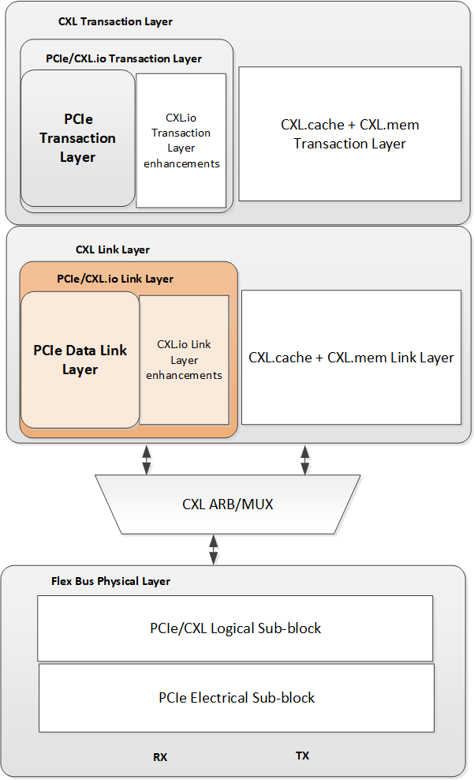
>
> *Original page render @ 150 DPI* — [📄 Full size](figures/chapter_04/page_0191.png)

<table>
<thead>
<tr>
<th width="50%">🇬🇧 English</th>
<th width="50%" style="background-color:#e8e8e8">🇨🇳 中文</th>
</tr>
</thead>
<tbody>
<tr><td>In addition, for 68B Flit mode, the CXL.io link layer implements the framing/deframing of CXL.io packets. CXL.io uses the Encoding for 8 GT/s, 16 GT/s, and 32 GT/s data rates only (see "128b/130b Encoding for 8.0 GT/s, 16.0 GT/s, and 32.0 GT/s Data Rates" in PCIe Base Specification for details).</td><td style="background-color:#e8e8e8">此外,对于 68B Flit 模式,CXL.io 链路层实现 CXL.io 包的成帧/解帧。CXL.io 仅使用 8 GT/s、16 GT/s 和 32 GT/s 数据速率的编码 (详见 PCIe 基础规范中 "128b/130b Encoding for 8.0 GT/s, 16.0 GT/s, and 32.0 GT/s Data Rates")。</td></tr>
<tr><td>This chapter highlights the notable framing and application of symbols to lanes that are specific for CXL.io. Note that when viewed on the link, the framing symbol-to-lane mapping will be shifted as a result of additional CXL framing (i.e., two bytes of Protocol ID and two reserved bytes) and of interleaving with other CXL protocols.</td><td style="background-color:#e8e8e8">本章重点介绍 CXL.io 特有的符号到 lane 的成帧与应用。需要注意的是,在链路上观察时,成帧符号到 lane 的映射会因为额外的 CXL 成帧 (即 2 字节的 Protocol ID 和 2 字节保留字段) 以及与其他 CXL 协议的交织而发生偏移。</td></tr>
<tr><td>For CXL.io, only the x16 Link transmitter and receiver framing requirements described in PCIe Base Specification apply regardless of the negotiated link width. The framing related rules for N = 1, 2, 4, and 8 do not apply. For downgraded Link widths, where number of active lanes is less than x16, a single x16 data stream is formed using x16 framing rules and transferred over x16/(degraded link width) degraded link width streams.</td><td style="background-color:#e8e8e8">对于 CXL.io,无论协商的链路宽度如何,仅采用 PCIe 基础规范中描述的 x16 链路发送器与接收器成帧要求。N = 1、2、4、8 的成帧相关规则不适用。对于降级链路宽度 (活动 lane 数小于 x16),使用 x16 成帧规则形成单个 x16 数据流,并通过 x16 / (降级链路宽度) 条降级宽度的流传输。</td></tr>
<tr><td>The CXL.io link layer forwards a framed I/O packet to the Flex Bus Physical layer. The Flex Bus Physical layer framing rules are defined in Chapter 6.0.</td><td style="background-color:#e8e8e8">CXL.io 链路层将已成帧的 I/O 包转发到 Flex Bus 物理层。Flex Bus 物理层成帧规则在第 6.0 章定义。</td></tr>
<tr><td>For 256B Flit mode, NOP-TLP alignment rules from PCIe Base Specification for PCIe Flit mode are shifted as a result of two bytes of Flit Type at the beginning of the flit.</td><td style="background-color:#e8e8e8">对于 256B Flit 模式,由于 flit 开头存在 2 字节的 Flit Type,PCIe 基础规范中 PCIe Flit 模式的 NOP-TLP 对齐规则会发生偏移。</td></tr>
<tr><td>The CXL.io link layer must guarantee that if a transmitted TLP ends exactly at the flit boundary, there must be a subsequent transmitted CXL.io flit. Please refer to Section 6.2.2.7 for more details.</td><td style="background-color:#e8e8e8">CXL.io 链路层必须保证:若发送的 TLP 恰好在 flit 边界结束,则必须存在后续发送的 CXL.io flit。更多细节请参阅第 6.2.2.7 节。</td></tr>
</tbody>
</table>

[⬆️ 返回目录](#-本章目录)

---

<a id="sec-4-2"></a>
## 4.2 CXL.cache and CXL.mem 68B Flit Mode Common Link Layer | CXL.cache 与 CXL.mem 68B Flit 模式公共链路层

<a id="sec-4-2-1"></a>
### 4.2.1 Introduction | 概述

<table>
<thead>
<tr>
<th width="50%">🇬🇧 English</th>
<th width="50%" style="background-color:#e8e8e8">🇨🇳 中文</th>
</tr>
</thead>
<tbody>
<tr><td>Figure 4-2 shows where the CXL.cache and CXL.mem link layer exists in the Flex Bus layered hierarchy. The link layer has two modes of operation: 68B flit and 256B flit. 68B flit, which defines 66B in the link layer and 2B in the ARB/MUX, supports the physical layer up to 32 GT/s. To support higher speeds a flit definition of 256B is defined; the reliability flows for that flit definition are handled in the Physical layer, so retry flows from 68B Flit mode are not applicable. 256B flits can support any legal transfer rate, but are required for >32 GT/s. The 256B flit definition and requirements are captured in Section 4.3. There are Transaction Layer features that require 256B flits and those features include CacheID, Back-Invalidate Snoop (BISnp), and Port Based Routing (PBR).</td><td style="background-color:#e8e8e8">图 4-2 显示了 CXL.cache 与 CXL.mem 链路层在 Flex Bus 分层体系中的位置。链路层有两种工作模式:68B flit 和 256B flit。68B flit 在链路层定义 66B、在 ARB/MUX 定义 2B,支持最高 32 GT/s 的物理层速率。为支持更高速度,定义了 256B flit;该 flit 定义的可靠性流在物理层处理,因此 68B Flit 模式的重传流不适用。256B flit 可支持任何合法的传输速率,但在 >32 GT/s 时是必需的。256B flit 定义与要求详见第 4.3 节。某些事务层特性需要使用 256B flit,包括 CacheID、Back-Invalidate Snoop (BISnp) 和 Port Based Routing (PBR)。</td></tr>
</tbody>
</table>

> **Figure 4-2.** Flex Bus Layers - CXL.cache + CXL.mem Link Layer Highlighted ｜ Flex Bus 分层 - CXL.cache + CXL.mem 链路层高亮
>
> 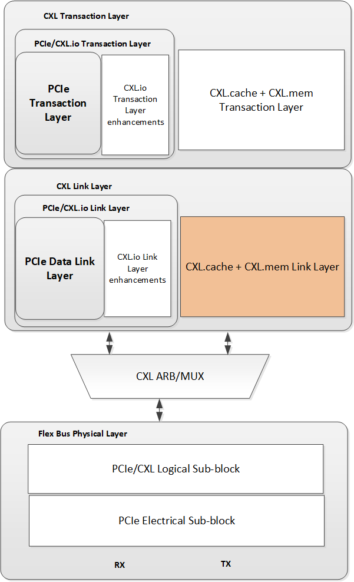
>
> *Original page render @ 150 DPI* — [📄 Full size](figures/chapter_04/page_0193.png)

<table>
<thead>
<tr>
<th width="50%">🇬🇧 English</th>
<th width="50%" style="background-color:#e8e8e8">🇨🇳 中文</th>
</tr>
</thead>
<tbody>
<tr><td>As previously mentioned, CXL.cache and CXL.mem protocols use a common Link Layer. This chapter defines the properties of this common Link Layer. Protocol information, including definition of fields, opcodes, transaction flows, etc., can be found in Section 3.2 and Section 3.3, respectively.</td><td style="background-color:#e8e8e8">如前所述,CXL.cache 和 CXL.mem 协议使用公共链路层。本章定义该公共链路层的属性。协议信息 (包括字段定义、操作码、事务流等) 可分别在第 3.2 节和第 3.3 节找到。</td></tr>
</tbody>
</table>

[⬆️ 返回目录](#-本章目录)

---

<a id="sec-4-2-2"></a>
### 4.2.2 High-Level CXL.cachemem Flit Overview | CXL.cachemem Flit 高级概述

<table>
<thead>
<tr>
<th width="50%">🇬🇧 English</th>
<th width="50%" style="background-color:#e8e8e8">🇨🇳 中文</th>
</tr>
</thead>
<tbody>
<tr><td>The CXL.cachemem flit size is a fixed 528b. There are 2B of CRC code and 4 slots of 16B each as shown below.</td><td style="background-color:#e8e8e8">CXL.cachemem flit 大小固定为 528 位。其中包含 2 字节 CRC 校验码和 4 个 16 字节 slot,如下图所示。</td></tr>
</tbody>
</table>

> **Figure 4-3.** CXL.cachemem Protocol Flit Overview ｜ CXL.cachemem 协议 Flit 概览
>
> 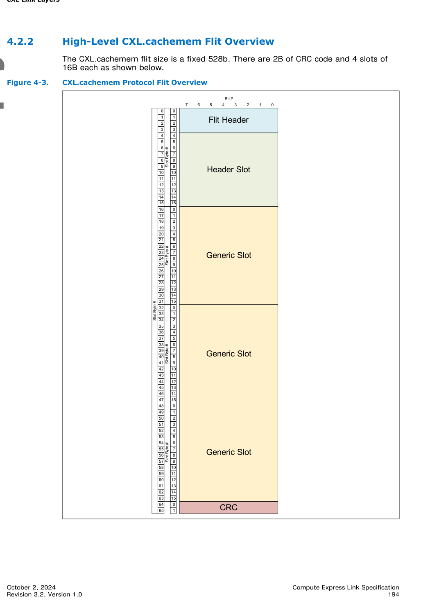
>
> *Original page render @ 150 DPI* — [📄 Full size](figures/chapter_04/page_0194.png)

> **Figure 4-4.** CXL.cachemem All Data Flit Overview ｜ CXL.cachemem 全数据 Flit 概览
>
> 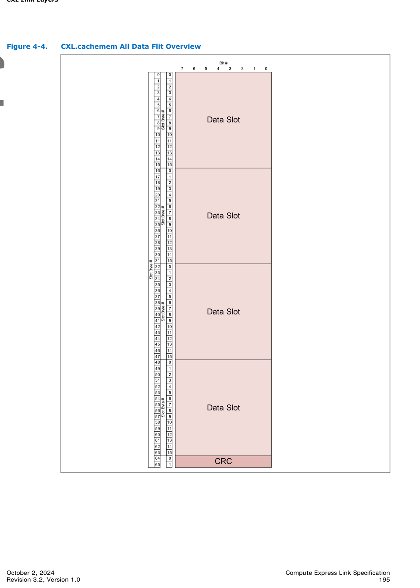
>
> *Original page render @ 150 DPI* — [📄 Full size](figures/chapter_04/page_0195.png)

<table>
<thead>
<tr>
<th width="50%">🇬🇧 English</th>
<th width="50%" style="background-color:#e8e8e8">🇨🇳 中文</th>
</tr>
</thead>
<tbody>
<tr><td>An example of a Protocol flit in the device to Host direction is shown below. For detailed descriptions of slot formats, see Section 4.2.3.</td><td style="background-color:#e8e8e8">Device-to-Host 方向的协议 flit 示例如下所示。Slot 格式的详细描述请参见第 4.2.3 节。</td></tr>
<tr><td>A "Header" Slot is defined as one that carries a "Header" of link-layer specific information, including the definition of the protocol-level messages contained in the remainder of the header as well as in the other slots in the flit.</td><td style="background-color:#e8e8e8">"Header" Slot 定义为携带链路层特定信息 "Header" 的 slot,包括 flit 头部其余部分以及其他 slot 中所含的协议级消息定义。</td></tr>
</tbody>
</table>

> **Figure 4-5.** Example of a Protocol Flit from Device to Host ｜ Device-to-Host 协议 Flit 示例
>
> 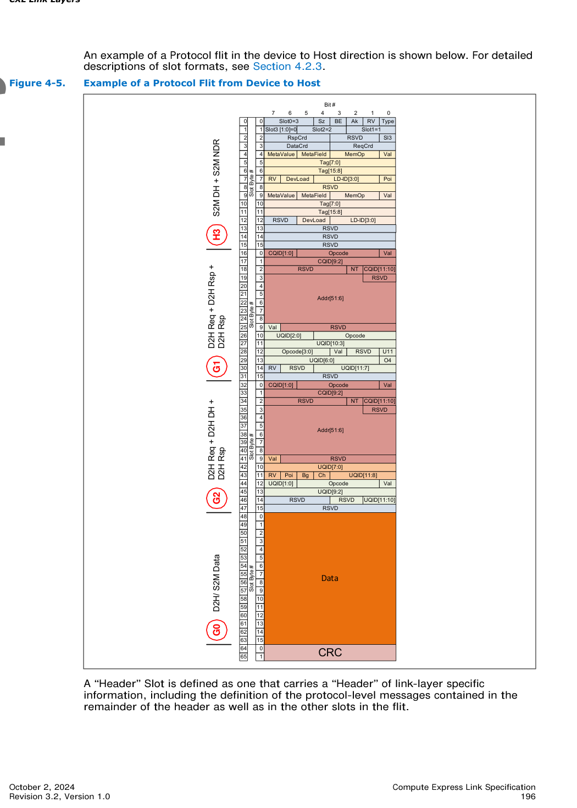
>
> *Original page render @ 150 DPI* — [📄 Full size](figures/chapter_04/page_0196.png)

<table>
<thead>
<tr>
<th width="50%">🇬🇧 English</th>
<th width="50%" style="background-color:#e8e8e8">🇨🇳 中文</th>
</tr>
</thead>
<tbody>
<tr><td>A "Generic" Slot can carry one or more request/response messages or a single 16B data chunk.</td><td style="background-color:#e8e8e8">"Generic" Slot 可携带一个或多个请求/响应消息,或单个 16 字节数据块。</td></tr>
<tr><td>The flit can be composed of a Header Slot and 3 Generic Slots or four 16B Data Chunks.</td><td style="background-color:#e8e8e8">一个 flit 可由 1 个 Header Slot 和 3 个 Generic Slot 组成,或由 4 个 16 字节数据块组成。</td></tr>
<tr><td>The Link Layer flit header uses the same definition for both the Upstream Ports, as well as the Downstream Ports, as summarized in Table 4-1.</td><td style="background-color:#e8e8e8">链路层 flit 头部在 Upstream Port 与 Downstream Port 上使用相同定义,汇总于表 4-1。</td></tr>
<tr><td>In general, bits or encodings that are not defined will be marked "Reserved" or "RSVD" in this specification. These bits should be cleared to 0 by the sender of the packet and the receiver should ignore them. Please also note that certain fields with static 0/1 values will be checked by the receiving Link Layer when decoding a packet. For example, Control flits have several static bits defined. A Control flit that passes the CRC check but fails the static bit check should be treated as a standard CRC error or as a fatal error when in "RETRY_LOCAL_NORMAL state of the LRSM. Logging and reporting of such errors is device specific. Checking of these bits reduces the probability of silent error under conditions where the CRC check fails to detect a long burst error. However, link layer must not cause fatal error whenever it is under shadow of CRC errors (i.e., its LRSM is not in RETRY_LOCAL_NORMAL state). This is prescribed because all-data-flit can alias to control messages after a CRC error and those alias cases may result in static bit check failure.</td><td style="background-color:#e8e8e8">通常情况下,本规范中未定义的位或编码将标记为 "Reserved" 或 "RSVD"。这些位应由包的发送方清零,接收方应予以忽略。还需注意,某些具有静态 0/1 取值的字段在接收链路层解码包时会被检查。例如,Control flit 定义了若干静态位。通过 CRC 检查但未通过静态位检查的 Control flit 应被视为标准 CRC 错误,或当 LRSM (Local Retry State Machine,本地重传状态机) 处于 "RETRY_LOCAL_NORMAL" 状态时视为致命错误。此类错误的日志记录与上报由具体设备决定。检查这些位可降低在 CRC 未能检出长突发错误条件下发生静默错误 (silent error) 的概率。但是,只要链路层处于 CRC 错误阴影中 (即 LRSM 不处于 RETRY_LOCAL_NORMAL 状态),链路层不得引发致命错误。这是为了避免:CRC 错误之后,全数据 flit 可能会被别名 (alias) 为控制消息,而这种别名情况可能导致静态位检查失败。</td></tr>
<tr><td>The following describes how the flit header information is encoded.</td><td style="background-color:#e8e8e8">下面描述 flit 头部信息的编码方式。</td></tr>
</tbody>
</table>

<table>
<thead>
<tr>
<th width="50%">🇬🇧 English (Table 4-1)</th>
<th width="50%" style="background-color:#e8e8e8">🇨🇳 中文 (表 4-1)</th>
</tr>
</thead>
<tbody>
<tr>
<td>

**Field Name / Brief Description / Length in Bits**

- **Type** — This field distinguishes between a Protocol or a Control flit. — 1
- **Ak** — This is an acknowledgment of 8 successful flit transfers. Reserved for RETRY, and for INIT control flits. — 1
- **BE** — Byte Enable (Reserved for control flits). — 1
- **Sz** — Size (Reserved for control flits). — 1
- **ReqCrd** — Request Credit Return. Reserved for RETRY, and for INIT control flits. — 4
- **DataCrd** — Data Credit Return. Reserved for RETRY, and for INIT control flits. — 4
- **RspCrd** — Response Credit Return. Reserved for RETRY, and for INIT control flits. — 4
- **Slot 0** — Slot 0 Format Type (Reserved for control flits). — 3
- **Slot 1** — Slot 1 Format Type (Reserved for control flits). — 3
- **Slot 2** — Slot 2 Format Type (Reserved for control flits). — 3
- **Slot 3** — Slot 3 Format Type (Reserved for control flits). — 3
- **RSVD** — Reserved — 4
- **Total** — 32

</td>
<td style="background-color:#e8e8e8">

**字段名 / 简要描述 / 位数**

- **Type** — 区分 Protocol flit 与 Control flit 的字段。— 1
- **Ak** — 表示 8 个 flit 成功传输的确认 (Acknowledgment)。对 RETRY 与 INIT 控制 flit 保留。— 1
- **BE** — Byte Enable (字节使能,控制 flit 保留)。— 1
- **Sz** — Size (大小,控制 flit 保留)。— 1
- **ReqCrd** — Request Credit Return (请求信用返回)。对 RETRY 与 INIT 控制 flit 保留。— 4
- **DataCrd** — Data Credit Return (数据信用返回)。对 RETRY 与 INIT 控制 flit 保留。— 4
- **RspCrd** — Response Credit Return (响应信用返回)。对 RETRY 与 INIT 控制 flit 保留。— 4
- **Slot 0** — Slot 0 格式类型 (控制 flit 保留)。— 3
- **Slot 1** — Slot 1 格式类型 (控制 flit 保留)。— 3
- **Slot 2** — Slot 2 格式类型 (控制 flit 保留)。— 3
- **Slot 3** — Slot 3 格式类型 (控制 flit 保留)。— 3
- **RSVD** — 保留 — 4
- **Total** — 32

</td>
</tr>
</tbody>
</table>

<table>
<thead>
<tr>
<th width="50%">🇬🇧 English (Table 4-2)</th>
<th width="50%" style="background-color:#e8e8e8">🇨🇳 中文 (表 4-2)</th>
</tr>
</thead>
<tbody>
<tr>
<td>

| Value | Flit Type | Description |
| --- | --- | --- |
| 0 | Protocol | This is a flit that carries CXL.cache or CXL.mem protocol-related information. |
| 1 | Control | This is a flit inserted by the link layer only for link layer-specific functionality. These flits are not exposed to the upper layers. |

</td>
<td style="background-color:#e8e8e8">

| 取值 | Flit Type | 描述 |
| --- | --- | --- |
| 0 | Protocol | 携带 CXL.cache 或 CXL.mem 协议相关信息的 flit。 |
| 1 | Control | 仅由链路层为实现链路层特定功能而插入的 flit,这些 flit 对上层不可见。 |

</td>
</tr>
</tbody>
</table>

<table>
<thead>
<tr>
<th width="50%">🇬🇧 English</th>
<th width="50%" style="background-color:#e8e8e8">🇨🇳 中文</th>
</tr>
</thead>
<tbody>
<tr><td>The Ak field is used as part of the link layer retry protocol to signal CRC-passing receipt of flits from the remote transmitter. The transmitter sets the Ak bit to acknowledge successful receipt of 8 flits; a cleared Ak bit is ignored by the receiver.</td><td style="background-color:#e8e8e8">Ak 字段作为链路层重传协议的一部分,用于向远端发送方表示已 CRC 正确地接收到 flit。发送方设置 Ak 位以确认成功收到 8 个 flit;清零的 Ak 位被接收方忽略。</td></tr>
<tr><td>The BE (Byte Enable) and Sz (Size) fields have to do with the variable size of data messages. To reach its efficiency targets, the CXL.cachemem link layer assumes that generally all bytes are enabled for most data, and that data is transmitted at the full cacheline granularity. When all bytes are enabled, the link layer does not transmit the byte enable bits, but instead clears the Byte Enable field of the corresponding flit header. When the receiver decodes that the Byte Enable field is cleared, it must regenerate the byte enable bits as all 1s before passing the data message on to the transaction layer. If the Byte Enable bit is set, the link layer Rx expects an additional data chunk slot that contains byte enable information. Note that this will always be the last slot of data for the associated request.</td><td style="background-color:#e8e8e8">BE (Byte Enable) 和 Sz (Size) 字段与数据消息的可变大小相关。为达到效率目标,CXL.cachemem 链路层假设大部分数据启用所有字节,并以完整 cacheline 粒度进行传输。当所有字节启用时,链路层不发送字节使能位,而是将相应 flit 头部的 Byte Enable 字段清零。当接收方解码出 Byte Enable 字段为 0 时,必须在将数据消息传递给事务层之前,重新生成全 1 的字节使能位。如果 Byte Enable 位置 1,链路层 Rx 预期会有一个额外的数据 chunk slot,其中包含字节使能信息。注意,对于关联请求,这始终是数据的最后一个 slot。</td></tr>
<tr><td>Similarly, the Sz field reflects the fact that the CXL.cachemem protocol allows transmission of data at the half cacheline granularity. When the Size bit is set, the link layer Rx expects four slots of data chunks, corresponding to a full cacheline. When the Size bit is cleared, it expects only two slots of data chunks. In the latter case, each half cacheline transmission will be accompanied by its own data header. A critical assumption of packing the Size and Byte Enable information in the flit header is that the Tx flit packet may begin at most one data message per flit.</td><td style="background-color:#e8e8e8">类似地,Sz 字段反映 CXL.cachemem 协议支持以半 cacheline 粒度传输数据。当 Size 位置 1 时,链路层 Rx 预期 4 个数据 chunk slot,对应完整 cacheline;当 Size 位清零时,只预期 2 个数据 chunk slot。后一种情况下,每次半 cacheline 传输都伴随其自己的数据头。将 Size 和 Byte Enable 信息打包到 flit 头部的一个关键假设是:Tx flit 包每个 flit 最多只能开始一个数据消息。</td></tr>
<tr><td><strong>Note:</strong> Multi-Data-Headers are not allowed to be sent when Sz=0 or BE=1 as described in the flit packing rules in Section 4.2.5.</td><td style="background-color:#e8e8e8"><strong>注意:</strong> 当 Sz=0 或 BE=1 时,不允许发送 Multi-Data-Header,详见第 4.2.5 节的 flit 打包规则。</td></tr>
<tr><td>Table 4-3 describes legal values of Sz and BE for various data transfers. For cases where a 32B split transfer is sent that includes Byte Enables, the trailing Byte Enables apply only to the 32B sent. The Byte Enable bits that are applicable to that transfer are aligned based on which half of the cacheline is applicable to the transfer (BE[63:32] for Upper half of the cacheline or BE[31:0] for the lower half of the cacheline). This means that each of the split 32B transfers that are used to form a cacheline of data will include Byte Enables if Byte Enables are needed. Illegal use will cause an uncorrectable error. The reserved bits included in the BE slot may not be preserved when passing through a switch.</td><td style="background-color:#e8e8e8">表 4-3 描述了各种数据传输中 Sz 与 BE 的合法取值。对于包含 Byte Enable 的 32B 拆分传输,尾随的 Byte Enable 仅适用于已发送的 32B。适用于该传输的字节使能位根据 cacheline 的哪一半 (上半 cacheline 对应 BE[63:32],下半 cacheline 对应 BE[31:0]) 进行对齐。这意味着用于组成 cacheline 数据的每个 32B 拆分传输在需要字节使能时都会包含字节使能。非法使用将导致不可纠正错误 (uncorrectable error)。BE slot 中包含的保留位在通过交换机时可能无法保留。</td></tr>
<tr><td>The transmitter sets the CRD fields to indicate freed resources that are available in the co-located receiver for use by the remote transmitter. Credits are given for transmission per message class, which is why the flit header contains independent Request, Response, and Data CRD fields. Note that there are no Requests sourced in the S2M direction, and that there are no Responses sourced in the M2S direction. Details of the channel mapping are captured in Table 4-5. Credits returned for channels not supported by the device or the host should be silently discarded. The granularity of credits is per message. These fields are encoded exponentially, as delineated in Table 4-4.</td><td style="background-color:#e8e8e8">发送方设置 CRD 字段以指示同侧接收方已释放、可供远端发送方使用的资源。信用按消息类别 (message class) 分别授予,这正是 flit 头部包含独立的 Request、Response 和 Data CRD 字段的原因。注意,S2M 方向没有 Request,M2S 方向没有 Response。通道映射的详细信息见表 4-5。对于设备或主机不支持的通道所返回的信用应被静默丢弃。信用粒度为每条消息。这些字段采用指数编码,详见表 4-4。</td></tr>
<tr><td><strong>Note:</strong> Messages sent on Data channels require a single data credit for the entire message. This means that 1 credit allows for one data transfer, including the header of the message, regardless of whether the transfer is 64B, or 32B, or contains Byte Enables.</td><td style="background-color:#e8e8e8"><strong>注意:</strong> 在 Data 通道上发送的消息,整条消息仅需 1 个数据信用。也就是说,1 个信用允许一次数据传输 (包括消息头部),无论该传输是 64B、32B 还是包含 Byte Enable。</td></tr>
</tbody>
</table>

<table>
<thead>
<tr>
<th width="50%">🇬🇧 English (Table 4-3)</th>
<th width="50%" style="background-color:#e8e8e8">🇨🇳 中文 (表 4-3)</th>
</tr>
</thead>
<tbody>
<tr>
<td>

| Type of Data Transfer | 32B Transfer Permitted in 68B Flit?¹ | BE Permitted? |
| --- | --- | --- |
| CXL.cache H2D Data | Yes | No |
| CXL.mem M2S Data | No | Yes |
| CXL.cache D2H Data | Yes | Yes |
| CXL.mem S2M Data | Yes | No |

¹ The 32B transfer allowance is only defined for 68B flit definition and does not apply for 256B flit.

</td>
<td style="background-color:#e8e8e8">

| 数据传输类型 | 68B Flit 中是否允许 32B 传输?¹ | 是否允许 BE? |
| --- | --- | --- |
| CXL.cache H2D Data | 是 | 否 |
| CXL.mem M2S Data | 否 | 是 |
| CXL.cache D2H Data | 是 | 是 |
| CXL.mem S2M Data | 是 | 否 |

¹ 32B 传输许可仅针对 68B flit 定义,不适用于 256B flit。

</td>
</tr>
</tbody>
</table>

<table>
<thead>
<tr>
<th width="50%">🇬🇧 English</th>
<th width="50%" style="background-color:#e8e8e8">🇨🇳 中文</th>
</tr>
</thead>
<tbody>
<tr><td>The transaction layer requires all messages that carry payload to send 64B and the link layer allows for those to be sent as independent 32B messages to optimize latency for implementation-specific cases in which only 32B of data is ready to send.</td><td style="background-color:#e8e8e8">事务层要求所有携带 payload 的消息都发送 64B,而链路层允许将其作为独立的 32B 消息发送,以便在仅有 32B 数据可发的实现特定场景下优化延迟。</td></tr>
<tr><td>Finally, the Slot Format Type fields encode the Slot Format of both the header slot and of the other generic slots in the flit (if the Flit Type bit specifies that the flit is a Protocol flit). The subsequent sections detail the protocol message contents of each slot format, but Table 4-6 provides a quick reference for the Slot Format field encoding.</td><td style="background-color:#e8e8e8">最后,Slot Format Type 字段对 flit 中 header slot 与其他 generic slot 的 Slot Format 进行编码 (当 Flit Type 位指定该 flit 为 Protocol flit 时)。后续章节详细说明各 slot 格式中的协议消息内容,表 4-6 提供了 Slot Format 字段编码的快速参考。</td></tr>
<tr><td><strong>Note:</strong> Format H6 is defined for use with Integrity and Data Encryption. See details of requirements for its use in Chapter 11.0.</td><td style="background-color:#e8e8e8"><strong>注意:</strong> H6 格式被定义为用于 Integrity and Data Encryption (IDE)。其使用要求的细节请参见第 11.0 章。</td></tr>
</tbody>
</table>

<table>
<thead>
<tr>
<th width="50%">🇬🇧 English (Table 4-4)</th>
<th width="50%" style="background-color:#e8e8e8">🇨🇳 中文 (表 4-4)</th>
</tr>
</thead>
<tbody>
<tr>
<td>

| Credit Return Encoding[3] | Protocol |
| --- | --- |
| 0 | CXL.cache |
| 1 | CXL.mem |

| Credit Return Encoding[2:0] | Number of Credits |
| --- | --- |
| 000b | 0 |
| 001b | 1 |
| 010b | 2 |
| 011b | 4 |
| 100b | 8 |
| 101b | 16 |
| 110b | 32 |
| 111b | 64 |

</td>
<td style="background-color:#e8e8e8">

| Credit Return 编码 [3] | 协议 |
| --- | --- |
| 0 | CXL.cache |
| 1 | CXL.mem |

| Credit Return 编码 [2:0] | 信用数 |
| --- | --- |
| 000b | 0 |
| 001b | 1 |
| 010b | 2 |
| 011b | 4 |
| 100b | 8 |
| 101b | 16 |
| 110b | 32 |
| 111b | 64 |

</td>
</tr>
</tbody>
</table>

<table>
<thead>
<tr>
<th width="50%">🇬🇧 English (Table 4-5)</th>
<th width="50%" style="background-color:#e8e8e8">🇨🇳 中文 (表 4-5)</th>
</tr>
</thead>
<tbody>
<tr>
<td>

| Credit Field | Credit Bit 3 Encoding | Link Direction | Channel |
| --- | --- | --- | --- |
| ReqCrd | 0 - CXL.cache | Upstream | D2H Request |
| | | Downstream | H2D Request |
| | 1 - CXL.mem | Upstream | Reserved |
| | | Downstream | M2S Request |
| DataCrd | 0 - CXL.cache | Upstream | D2H Data |
| | | Downstream | H2D Data |
| | 1 - CXL.mem | Upstream | S2M DRS |
| | | Downstream | M2S RwD |
| RspCrd | 0 - CXL.cache | Upstream | D2H Rsp |
| | | Downstream | H2D Rsp |
| | 1 - CXL.mem | Upstream | S2M NDR |
| | | Downstream | Reserved |

</td>
<td style="background-color:#e8e8e8">

| Credit 字段 | Credit Bit 3 编码 | 链路方向 | 通道 |
| --- | --- | --- | --- |
| ReqCrd | 0 - CXL.cache | Upstream | D2H Request |
| | | Downstream | H2D Request |
| | 1 - CXL.mem | Upstream | Reserved |
| | | Downstream | M2S Request |
| DataCrd | 0 - CXL.cache | Upstream | D2H Data |
| | | Downstream | H2D Data |
| | 1 - CXL.mem | Upstream | S2M DRS |
| | | Downstream | M2S RwD |
| RspCrd | 0 - CXL.cache | Upstream | D2H Rsp |
| | | Downstream | H2D Rsp |
| | 1 - CXL.mem | Upstream | S2M NDR |
| | | Downstream | Reserved |

</td>
</tr>
</tbody>
</table>

<table>
<thead>
<tr>
<th width="50%">🇬🇧 English</th>
<th width="50%" style="background-color:#e8e8e8">🇨🇳 中文</th>
</tr>
</thead>
<tbody>
<tr><td>Table 4-7 and Table 4-8 describe the slot format and the type of message contained by each format for both directions.</td><td style="background-color:#e8e8e8">表 4-7 与表 4-8 描述了两个方向上各 slot 格式及其所含消息类型。</td></tr>
</tbody>
</table>

<table>
<thead>
<tr>
<th width="50%">🇬🇧 English (Table 4-6)</th>
<th width="50%" style="background-color:#e8e8e8">🇨🇳 中文 (表 4-6)</th>
</tr>
</thead>
<tbody>
<tr>
<td>

| Slot Format Encoding | H2D/M2S Slot 0 | H2D/M2S Slots 1, 2, 3 | D2H/S2M Slot 0 | D2H/S2M Slots 1, 2, 3 |
| --- | --- | --- | --- | --- |
| 000b | H0 | G0 | H0 | G0 |
| 001b | H1 | G1 | H1 | G1 |
| 010b | H2 | G2 | H2 | G2 |
| 011b | H3 | G3 | H3 | G3 |
| 100b | H4 | G4 | H4 | G4 |
| 101b | H5 | G5 | H5 | G5 |
| 110b | H6 | RSVD | H6 | G6 |
| 111b | RSVD | RSVD | RSVD | RSVD |

</td>
<td style="background-color:#e8e8e8">

| Slot Format 编码 | H2D/M2S Slot 0 | H2D/M2S Slots 1, 2, 3 | D2H/S2M Slot 0 | D2H/S2M Slots 1, 2, 3 |
| --- | --- | --- | --- | --- |
| 000b | H0 | G0 | H0 | G0 |
| 001b | H1 | G1 | H1 | G1 |
| 010b | H2 | G2 | H2 | G2 |
| 011b | H3 | G3 | H3 | G3 |
| 100b | H4 | G4 | H4 | G4 |
| 101b | H5 | G5 | H5 | G5 |
| 110b | H6 | RSVD | H6 | G6 |
| 111b | RSVD | RSVD | RSVD | RSVD |

</td>
</tr>
</tbody>
</table>

<table>
<thead>
<tr>
<th width="50%">🇬🇧 English (Table 4-7)</th>
<th width="50%" style="background-color:#e8e8e8">🇨🇳 中文 (表 4-7)</th>
</tr>
</thead>
<tbody>
<tr>
<td>

| H2D/M2S | Type | Length in Bits |
| --- | --- | --- |
| H0 | CXL.cache Req + CXL.cache Rsp | 96 |
| H1 | CXL.cache Data Header + 2 CXL.cache Rsp | 88 |
| H2 | CXL.cache Req + CXL.cache Data Header | 88 |
| H3 | 4 CXL.cache Data Header | 96 |
| H4 | CXL.mem RwD Header | 87 |
| H5 | CXL.mem Req Only | 87 |
| H6 | MAC slot used for link integrity | 96 |
| G0 | CXL.cache/ CXL.mem Data Chunk | 128 |
| G1 | 4 CXL.cache Rsp | 128 |
| G2 | CXL.cache Req + CXL.cache Data Header + CXL.cache Rsp | 120 |
| G3 | 4 CXL.cache Data Header + CXL.cache Rsp | 128 |
| G4 | CXL.mem Req + CXL.cache Data Header | 111 |
| G5 | CXL.mem RwD Header + CXL.cache Rsp | 119 |

</td>
<td style="background-color:#e8e8e8">

| H2D/M2S | 类型 | 位数 |
| --- | --- | --- |
| H0 | CXL.cache Req + CXL.cache Rsp | 96 |
| H1 | CXL.cache Data Header + 2 CXL.cache Rsp | 88 |
| H2 | CXL.cache Req + CXL.cache Data Header | 88 |
| H3 | 4 个 CXL.cache Data Header | 96 |
| H4 | CXL.mem RwD Header | 87 |
| H5 | CXL.mem Req Only | 87 |
| H6 | 用于链路完整性的 MAC slot | 96 |
| G0 | CXL.cache / CXL.mem Data Chunk | 128 |
| G1 | 4 个 CXL.cache Rsp | 128 |
| G2 | CXL.cache Req + CXL.cache Data Header + CXL.cache Rsp | 120 |
| G3 | 4 个 CXL.cache Data Header + CXL.cache Rsp | 128 |
| G4 | CXL.mem Req + CXL.cache Data Header | 111 |
| G5 | CXL.mem RwD Header + CXL.cache Rsp | 119 |

</td>
</tr>
</tbody>
</table>

[⬆️ 返回目录](#-本章目录)

---

<a id="sec-4-2-3"></a>
### 4.2.3 Slot Format Definition | Slot 格式定义

<table>
<thead>
<tr>
<th width="50%">🇬🇧 English</th>
<th width="50%" style="background-color:#e8e8e8">🇨🇳 中文</th>
</tr>
</thead>
<tbody>
<tr><td>Slot diagrams in this section include abbreviations for bit field names to allow them to fit into the diagram. In the diagrams, most abbreviations are obvious, but the following abbreviation list ensures clarity:</td><td style="background-color:#e8e8e8">本节中的 slot 图示使用了位字段名称的缩写,以便在图中容纳。图中大多数缩写含义显而易见,但下面的缩略词列表可以确保清晰:</td></tr>
</tbody>
</table>

<table>
<thead>
<tr>
<th width="50%">🇬🇧 English (Abbreviations)</th>
<th width="50%" style="background-color:#e8e8e8">🇨🇳 中文 (缩略词)</th>
</tr>
</thead>
<tbody>
<tr><td>

- Bg = Bogus
- Ch = ChunkValid
- LA0 = LowerAddr[0]
- LA1 = LowerAddr[1]
- LI3 = LD-ID[3]
- MV0 = MetaValue[0]
- MV1 = MetaValue[1]
- O4 = Opcode[4]
- Op0 = Opcode[0]
- Poi = Poison
- R11 = RspData[11]
- RSVD = Reserved
- RV = Reserved
- SL3 = Slot3[2]
- Tag15 = Tag[15]
- U11 = UQID[11]
- Val = Valid

</td>
<td style="background-color:#e8e8e8">

- Bg = Bogus (虚假)
- Ch = ChunkValid (块有效)
- LA0 = LowerAddr[0]
- LA1 = LowerAddr[1]
- LI3 = LD-ID[3]
- MV0 = MetaValue[0]
- MV1 = MetaValue[1]
- O4 = Opcode[4]
- Op0 = Opcode[0]
- Poi = Poison (污染)
- R11 = RspData[11]
- RSVD = Reserved (保留)
- RV = Reserved (保留)
- SL3 = Slot3[2]
- Tag15 = Tag[15]
- U11 = UQID[11]
- Val = Valid (有效)

</td>
</tr>
</tbody>
</table>

<table>
<thead>
<tr>
<th width="50%">🇬🇧 English (Table 4-8)</th>
<th width="50%" style="background-color:#e8e8e8">🇨🇳 中文 (表 4-8)</th>
</tr>
</thead>
<tbody>
<tr>
<td>

| D2H/S2M | Type | Length in Bits |
| --- | --- | --- |
| H0 | CXL.cache Data Header + 2 CXL.cache Rsp + CXL.mem NDR | 87 |
| H1 | CXL.cache Req + CXL.cache Data Header | 96 |
| H2 | 4 CXL.cache Data Header + CXL.cache Rsp | 88 |
| H3 | CXL.mem DRS Header + CXL.mem NDR | 70 |
| H4 | 2 CXL.mem NDR | 60 |
| H5 | 2 CXL.mem DRS Header | 80 |
| H6 | MAC slot used for link integrity | 96 |
| G0 | CXL.cache/ CXL.mem Data Chunk | 128 |
| G1 | CXL.cache Req + 2 CXL.cache Rsp | 119 |
| G2 | CXL.cache Req + CXL.cache Data Header + CXL.cache Rsp | 116 |
| G3 | 4 CXL.cache Data Header | 68 |
| G4 | CXL.mem DRS Header + 2 CXL.mem NDR | 100 |
| G5 | 2 CXL.mem NDR | 60 |
| G6 | 3 CXL.mem DRS Header | 120 |

</td>
<td style="background-color:#e8e8e8">

| D2H/S2M | 类型 | 位数 |
| --- | --- | --- |
| H0 | CXL.cache Data Header + 2 个 CXL.cache Rsp + CXL.mem NDR | 87 |
| H1 | CXL.cache Req + CXL.cache Data Header | 96 |
| H2 | 4 个 CXL.cache Data Header + CXL.cache Rsp | 88 |
| H3 | CXL.mem DRS Header + CXL.mem NDR | 70 |
| H4 | 2 个 CXL.mem NDR | 60 |
| H5 | 2 个 CXL.mem DRS Header | 80 |
| H6 | 用于链路完整性的 MAC slot | 96 |
| G0 | CXL.cache / CXL.mem Data Chunk | 128 |
| G1 | CXL.cache Req + 2 个 CXL.cache Rsp | 119 |
| G2 | CXL.cache Req + CXL.cache Data Header + CXL.cache Rsp | 116 |
| G3 | 4 个 CXL.cache Data Header | 68 |
| G4 | CXL.mem DRS Header + 2 个 CXL.mem NDR | 100 |
| G5 | 2 个 CXL.mem NDR | 60 |
| G6 | 3 个 CXL.mem DRS Header | 120 |

</td>
</tr>
</tbody>
</table>

<a id="sec-4-2-3-1"></a>
#### 4.2.3.1 H2D and M2S Formats | H2D 与 M2S 格式

> **Figure 4-6.** H0 - H2D Req + H2D Rsp ｜ H0 - H2D Req + H2D Rsp
>
> 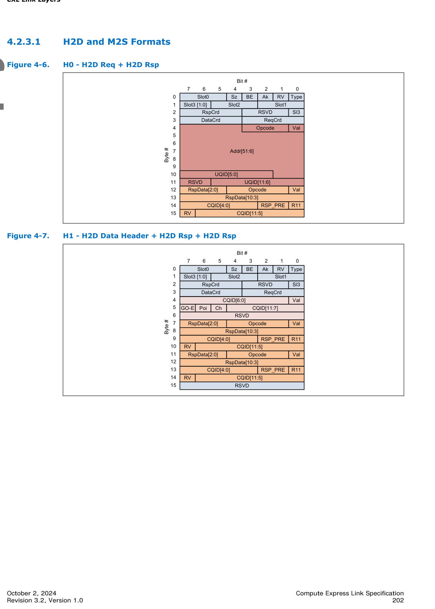
>
> *Original page render @ 150 DPI* — [📄 Full size](figures/chapter_04/page_0202.png)

> **Figure 4-7.** H1 - H2D Data Header + H2D Rsp + H2D Rsp ｜ H1 - H2D Data Header + H2D Rsp + H2D Rsp
>
> 
>
> *Original page render @ 150 DPI* — [📄 Full size](figures/chapter_04/page_0202.png)

> **Figure 4-8.** H2 - H2D Req + H2D Data Header ｜ H2 - H2D Req + H2D Data Header
>
> 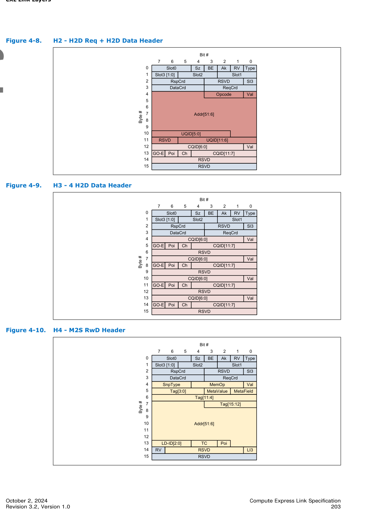
>
> *Original page render @ 150 DPI* — [📄 Full size](figures/chapter_04/page_0203.png)

> **Figure 4-9.** H3 - 4 H2D Data Header ｜ H3 - 4 个 H2D Data Header
>
> 
>
> *Original page render @ 150 DPI* — [📄 Full size](figures/chapter_04/page_0203.png)

> **Figure 4-10.** H4 - M2S RwD Header ｜ H4 - M2S RwD Header
>
> 
>
> *Original page render @ 150 DPI* — [📄 Full size](figures/chapter_04/page_0203.png)

> **Figure 4-11.** H5 - M2S Req ｜ H5 - M2S Req
>
> 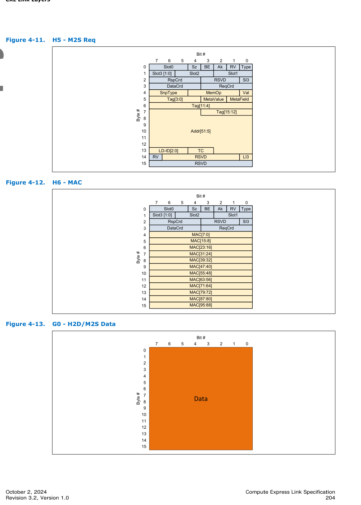
>
> *Original page render @ 150 DPI* — [📄 Full size](figures/chapter_04/page_0204.png)

> **Figure 4-12.** H6 - MAC ｜ H6 - MAC
>
> 
>
> *Original page render @ 150 DPI* — [📄 Full size](figures/chapter_04/page_0204.png)

> **Figure 4-13.** G0 - H2D/M2S Data ｜ G0 - H2D/M2S Data
>
> 
>
> *Original page render @ 150 DPI* — [📄 Full size](figures/chapter_04/page_0204.png)

> **Figure 4-14.** G0 - M2S Byte Enable ｜ G0 - M2S Byte Enable
>
> 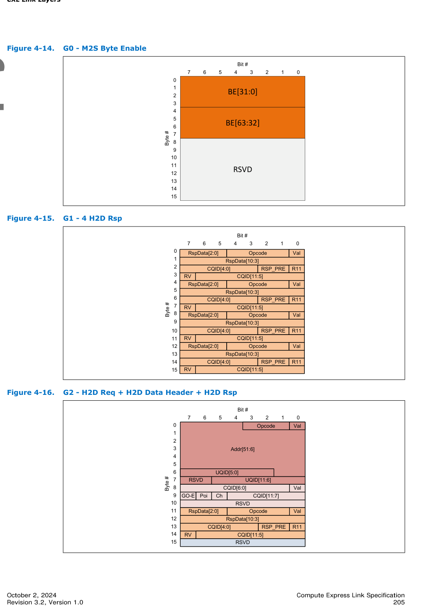
>
> *Original page render @ 150 DPI* — [📄 Full size](figures/chapter_04/page_0205.png)

> **Figure 4-15.** G1 - 4 H2D Rsp ｜ G1 - 4 个 H2D Rsp
>
> 
>
> *Original page render @ 150 DPI* — [📄 Full size](figures/chapter_04/page_0205.png)

> **Figure 4-16.** G2 - H2D Req + H2D Data Header + H2D Rsp ｜ G2 - H2D Req + H2D Data Header + H2D Rsp
>
> 
>
> *Original page render @ 150 DPI* — [📄 Full size](figures/chapter_04/page_0205.png)

> **Figure 4-17.** G3 - 4 H2D Data Header + H2D Rsp ｜ G3 - 4 个 H2D Data Header + H2D Rsp
>
> 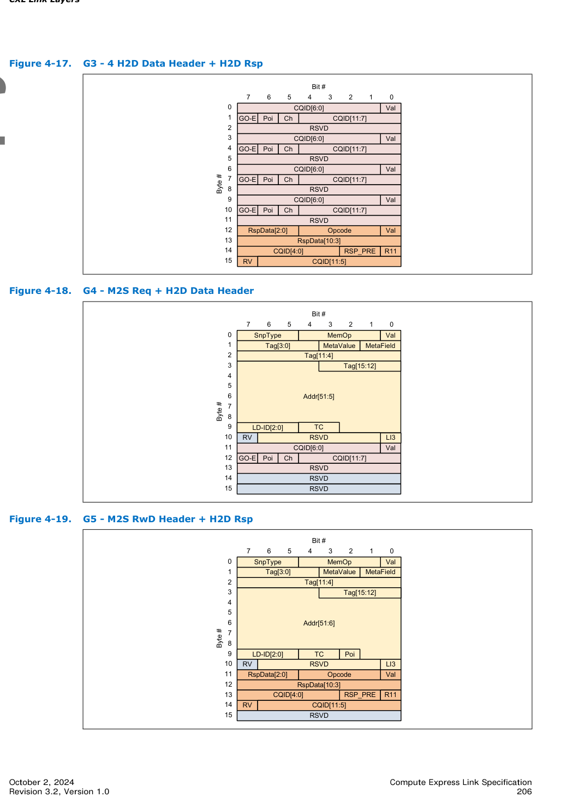
>
> *Original page render @ 150 DPI* — [📄 Full size](figures/chapter_04/page_0206.png)

> **Figure 4-18.** G4 - M2S Req + H2D Data Header ｜ G4 - M2S Req + H2D Data Header
>
> 
>
> *Original page render @ 150 DPI* — [📄 Full size](figures/chapter_04/page_0206.png)

> **Figure 4-19.** G5 - M2S RwD Header + H2D Rsp ｜ G5 - M2S RwD Header + H2D Rsp
>
> 
>
> *Original page render @ 150 DPI* — [📄 Full size](figures/chapter_04/page_0206.png)

<a id="sec-4-2-3-2"></a>
#### 4.2.3.2 D2H and S2M Formats | D2H 与 S2M 格式

<table>
<thead>
<tr>
<th width="50%">🇬🇧 English</th>
<th width="50%" style="background-color:#e8e8e8">🇨🇳 中文</th>
</tr>
</thead>
<tbody>
<tr><td>The original slot definitions ensured that all header bits for a message are in contiguous bits. The S2M NDR message expanded by two bits to fit the 2-bit DevLoad field. Some slot formats that carry NDR messages include non-contiguous bits within the slot to account for the DevLoad. The formats impacted are H4, G4, and G5 and the non-contiguous bits are denoted as "DevLoad*" ("*" is the special indicator with separate color/pattern for the NDR message with non-contiguous bits). By expanding the slots in this way, backward compatibility with the original contiguous bit definition is maintained by ensuring that only RSVD slot bits are used to expand the headers. Other slot formats that carry a single NDR message can be expanded and keep the contiguous header bits because the NDR message is the last message in the slot formats (see Formats H0 and H3).</td><td style="background-color:#e8e8e8">最初的 slot 定义确保一条消息的所有 header 位都是连续的。S2M NDR 消息扩展了 2 位以容纳 2 位的 DevLoad 字段。某些携带 NDR 消息的 slot 格式在 slot 内包含非连续位以适应 DevLoad。受影响的格式是 H4、G4 和 G5,非连续位以 "DevLoad*" 标记 ("*" 是特殊指示符,使用单独的颜色/图案表示具有非连续位的 NDR 消息)。通过以这种方式扩展 slot,仅使用 RSVD slot 位扩展 header,从而保持与原始连续位定义的向后兼容性。其他携带单个 NDR 消息的 slot 格式可扩展并保持连续的 header 位,因为 NDR 消息是这些 slot 格式中的最后一条消息 (见 H0 与 H3 格式)。</td></tr>
</tbody>
</table>

> **Figure 4-20.** H0 - D2H Data Header + 2 D2H Rsp + S2M NDR ｜ H0 - D2H Data Header + 2 个 D2H Rsp + S2M NDR
>
> 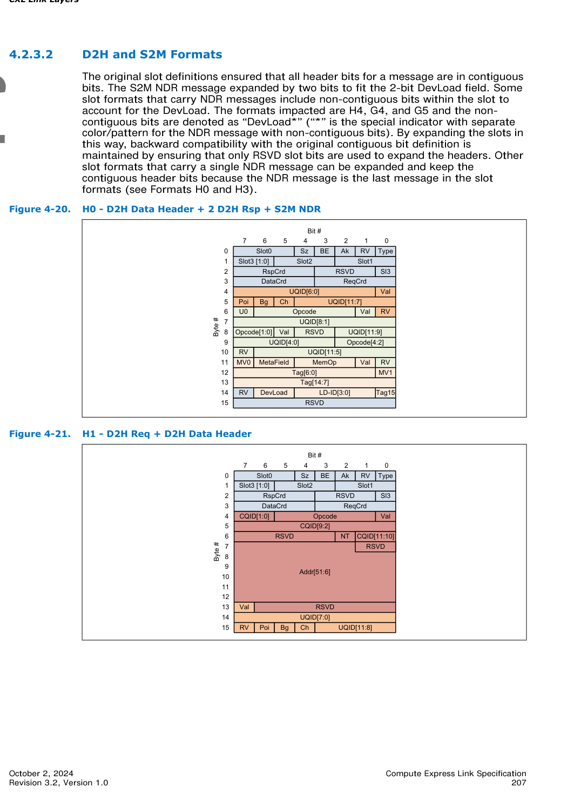
>
> *Original page render @ 150 DPI* — [📄 Full size](figures/chapter_04/page_0207.png)

> **Figure 4-21.** H1 - D2H Req + D2H Data Header ｜ H1 - D2H Req + D2H Data Header
>
> 
>
> *Original page render @ 150 DPI* — [📄 Full size](figures/chapter_04/page_0207.png)

> **Figure 4-22.** H2 - 4 D2H Data Header + D2H Rsp ｜ H2 - 4 个 D2H Data Header + D2H Rsp
>
> 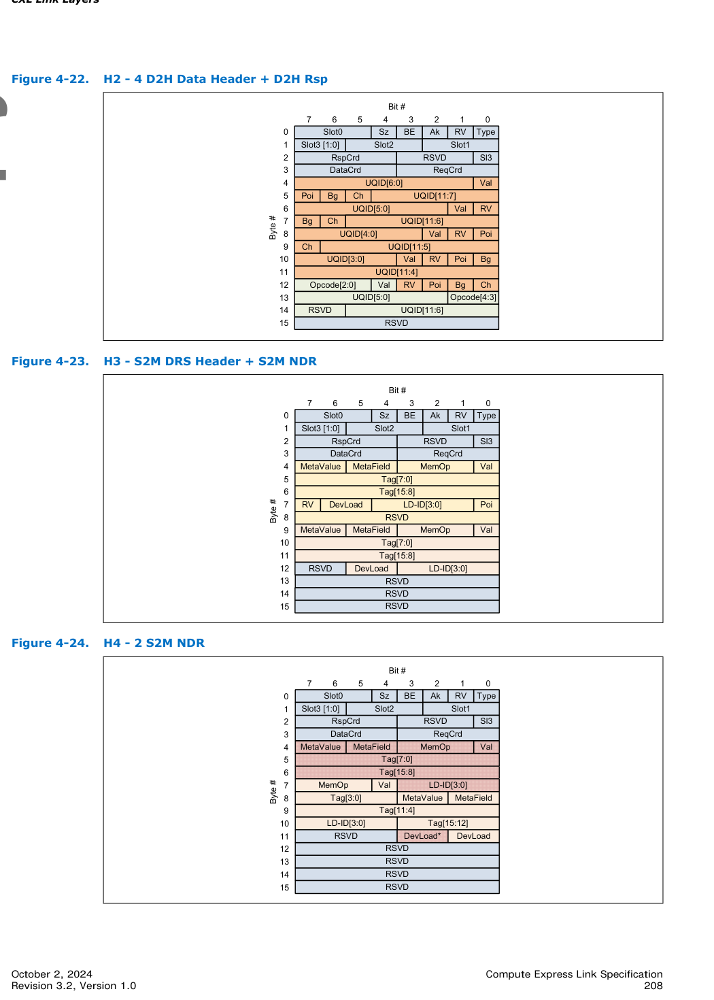
>
> *Original page render @ 150 DPI* — [📄 Full size](figures/chapter_04/page_0208.png)

> **Figure 4-23.** H3 - S2M DRS Header + S2M NDR ｜ H3 - S2M DRS Header + S2M NDR
>
> 
>
> *Original page render @ 150 DPI* — [📄 Full size](figures/chapter_04/page_0208.png)

> **Figure 4-24.** H4 - 2 S2M NDR ｜ H4 - 2 个 S2M NDR
>
> 
>
> *Original page render @ 150 DPI* — [📄 Full size](figures/chapter_04/page_0208.png)

> **Figure 4-25.** H5 - 2 S2M DRS Header ｜ H5 - 2 个 S2M DRS Header
>
> 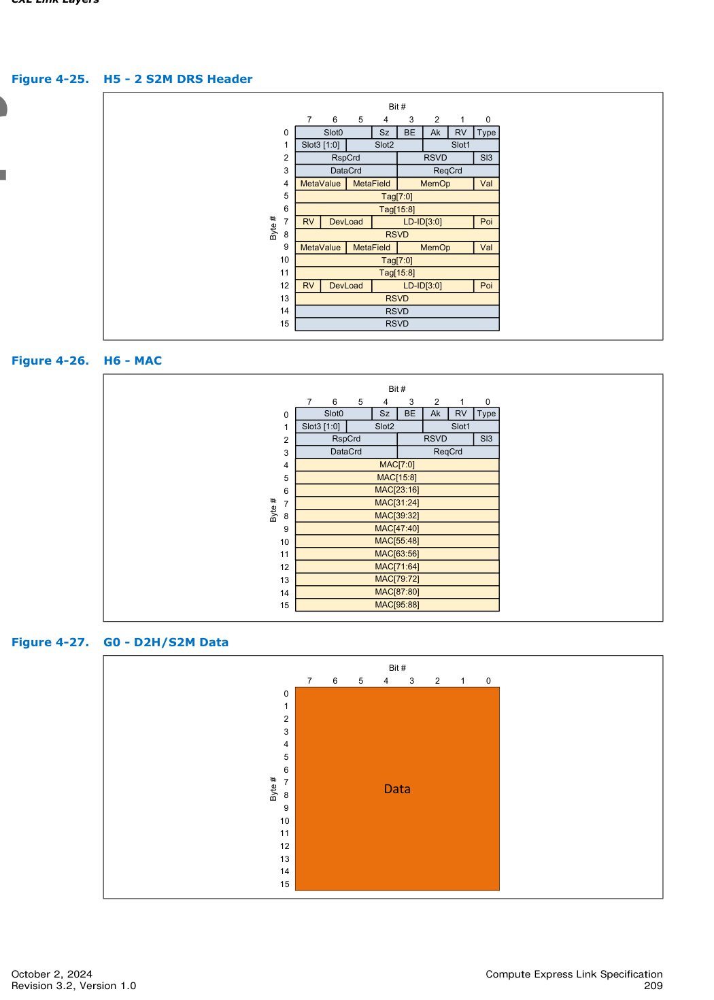
>
> *Original page render @ 150 DPI* — [📄 Full size](figures/chapter_04/page_0209.png)

> **Figure 4-26.** H6 - MAC ｜ H6 - MAC
>
> 
>
> *Original page render @ 150 DPI* — [📄 Full size](figures/chapter_04/page_0209.png)

> **Figure 4-27.** G0 - D2H/S2M Data ｜ G0 - D2H/S2M Data
>
> 
>
> *Original page render @ 150 DPI* — [📄 Full size](figures/chapter_04/page_0209.png)

> **Figure 4-28.** G0 - D2H Byte Enable ｜ G0 - D2H Byte Enable
>
> 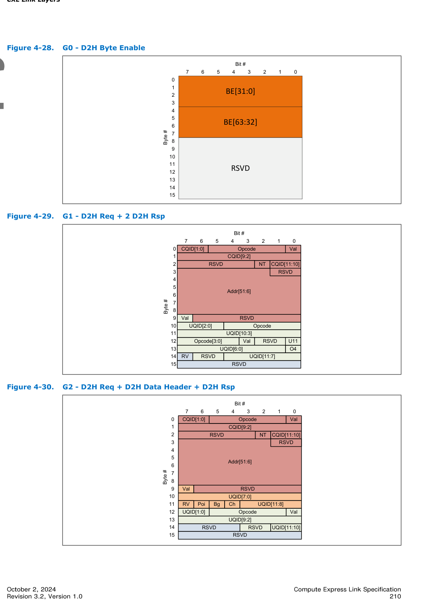
>
> *Original page render @ 150 DPI* — [📄 Full size](figures/chapter_04/page_0210.png)

> **Figure 4-29.** G1 - D2H Req + 2 D2H Rsp ｜ G1 - D2H Req + 2 个 D2H Rsp
>
> 
>
> *Original page render @ 150 DPI* — [📄 Full size](figures/chapter_04/page_0210.png)

> **Figure 4-30.** G2 - D2H Req + D2H Data Header + D2H Rsp ｜ G2 - D2H Req + D2H Data Header + D2H Rsp
>
> 
>
> *Original page render @ 150 DPI* — [📄 Full size](figures/chapter_04/page_0210.png)

> **Figure 4-31.** G3 - 4 D2H Data Header ｜ G3 - 4 个 D2H Data Header
>
> 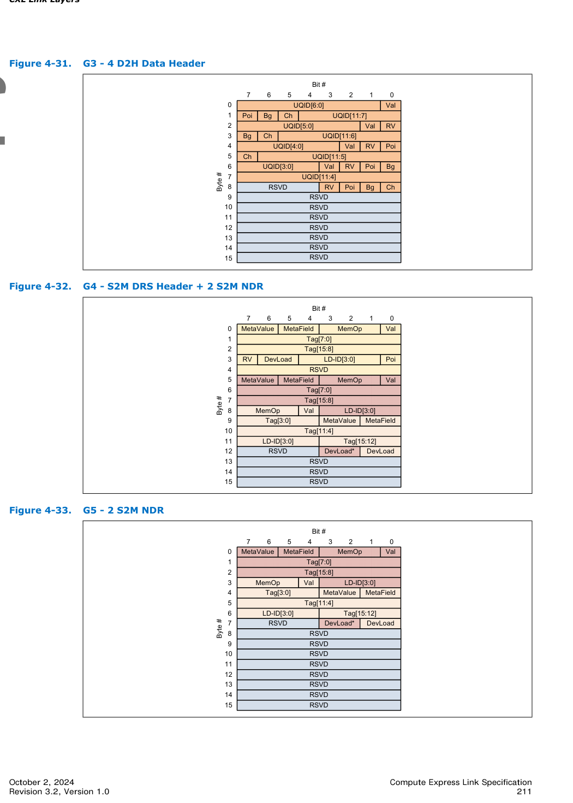
>
> *Original page render @ 150 DPI* — [📄 Full size](figures/chapter_04/page_0211.png)

> **Figure 4-32.** G4 - S2M DRS Header + 2 S2M NDR ｜ G4 - S2M DRS Header + 2 个 S2M NDR
>
> 
>
> *Original page render @ 150 DPI* — [📄 Full size](figures/chapter_04/page_0211.png)

> **Figure 4-33.** G5 - 2 S2M NDR ｜ G5 - 2 个 S2M NDR
>
> 
>
> *Original page render @ 150 DPI* — [📄 Full size](figures/chapter_04/page_0211.png)

> **Figure 4-34.** G6 - 3 S2M DRS Header ｜ G6 - 3 个 S2M DRS Header
>
> 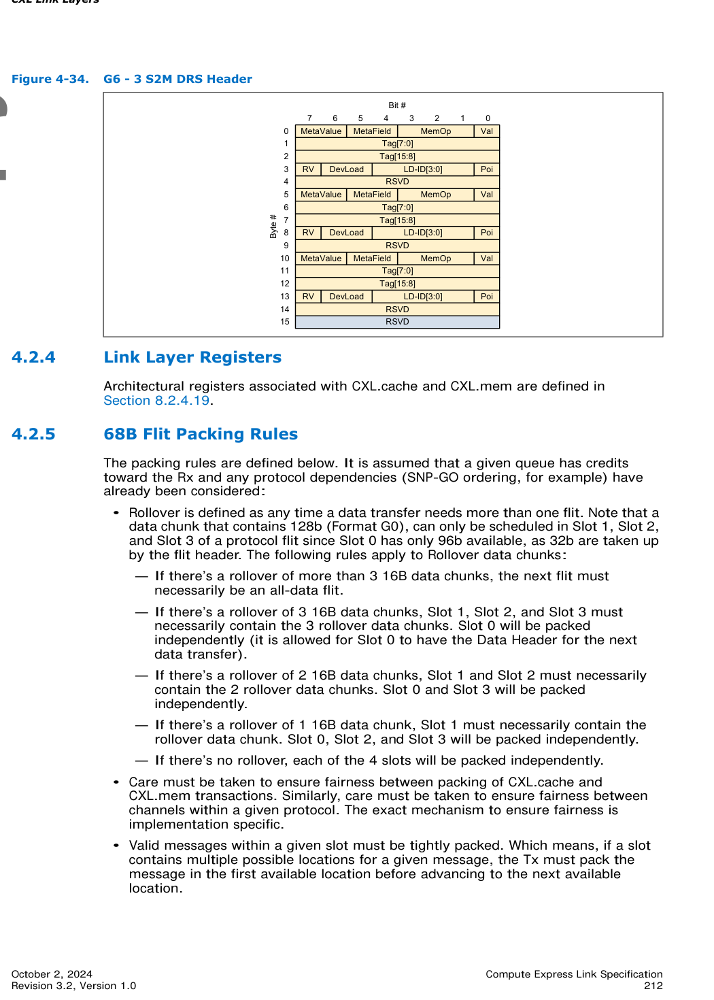
>
> *Original page render @ 150 DPI* — [📄 Full size](figures/chapter_04/page_0212.png)

[⬆️ 返回目录](#-本章目录)

---

<a id="sec-4-2-4"></a>
### 4.2.4 Link Layer Registers | 链路层寄存器

<table>
<thead>
<tr>
<th width="50%">🇬🇧 English</th>
<th width="50%" style="background-color:#e8e8e8">🇨🇳 中文</th>
</tr>
</thead>
<tbody>
<tr><td>Architectural registers associated with CXL.cache and CXL.mem are defined in Section 8.2.4.19.</td><td style="background-color:#e8e8e8">与 CXL.cache 和 CXL.mem 相关的架构寄存器在第 8.2.4.19 节定义。</td></tr>
</tbody>
</table>

[⬆️ 返回目录](#-本章目录)

---

<a id="sec-4-2-5"></a>
### 4.2.5 68B Flit Packing Rules | 68B Flit 打包规则

<table>
<thead>
<tr>
<th width="50%">🇬🇧 English</th>
<th width="50%" style="background-color:#e8e8e8">🇨🇳 中文</th>
</tr>
</thead>
<tbody>
<tr><td>The packing rules are defined below. It is assumed that a given queue has credits toward the Rx and any protocol dependencies (SNP-GO ordering, for example) have already been considered:</td><td style="background-color:#e8e8e8">打包规则定义如下。假定给定队列对 Rx 拥有信用,且任何协议依赖 (例如 SNP-GO ordering) 已纳入考量:</td></tr>
<tr><td>- Rollover is defined as any time a data transfer needs more than one flit. Note that a data chunk that contains 128b (Format G0), can only be scheduled in Slot 1, Slot 2, and Slot 3 of a protocol flit since Slot 0 has only 96b available, as 32b are taken up by the flit header. The following rules apply to Rollover data chunks:</td><td style="background-color:#e8e8e8">- Rollover (翻转) 定义为任何数据传输需要超过一个 flit 的情形。注意,包含 128 位数据 chunk (G0 格式) 只能调度到协议 flit 的 Slot 1、Slot 2 和 Slot 3,因为 Slot 0 仅 96 位可用 — 其中 32 位由 flit 头部占用。以下规则适用于 Rollover 数据 chunk:</td></tr>
<tr><td>  - If there's a rollover of more than 3 16B data chunks, the next flit must necessarily be an all-data flit.</td><td style="background-color:#e8e8e8">  - 如果存在超过 3 个 16B 数据 chunk 的 rollover,下一个 flit 必须是 all-data flit。</td></tr>
<tr><td>  - If there's a rollover of 3 16B data chunks, Slot 1, Slot 2, and Slot 3 must necessarily contain the 3 rollover data chunks. Slot 0 will be packed independently (it is allowed for Slot 0 to have the Data Header for the next data transfer).</td><td style="background-color:#e8e8e8">  - 如果存在 3 个 16B 数据 chunk 的 rollover,Slot 1、Slot 2 与 Slot 3 必须包含这 3 个 rollover 数据 chunk。Slot 0 独立打包 (允许 Slot 0 携带下一次数据传输的 Data Header)。</td></tr>
<tr><td>  - If there's a rollover of 2 16B data chunks, Slot 1 and Slot 2 must necessarily contain the 2 rollover data chunks. Slot 0 and Slot 3 will be packed independently.</td><td style="background-color:#e8e8e8">  - 如果存在 2 个 16B 数据 chunk 的 rollover,Slot 1 和 Slot 2 必须包含这 2 个 rollover 数据 chunk。Slot 0 和 Slot 3 独立打包。</td></tr>
<tr><td>  - If there's a rollover of 1 16B data chunk, Slot 1 must necessarily contain the rollover data chunk. Slot 0, Slot 2, and Slot 3 will be packed independently.</td><td style="background-color:#e8e8e8">  - 如果存在 1 个 16B 数据 chunk 的 rollover,Slot 1 必须包含该 rollover 数据 chunk。Slot 0、Slot 2 和 Slot 3 独立打包。</td></tr>
<tr><td>  - If there's no rollover, each of the 4 slots will be packed independently.</td><td style="background-color:#e8e8e8">  - 如果没有 rollover,4 个 slot 各自独立打包。</td></tr>
<tr><td>- Care must be taken to ensure fairness between packing of CXL.cache and CXL.mem transactions. Similarly, care must be taken to ensure fairness between channels within a given protocol. The exact mechanism to ensure fairness is implementation specific.</td><td style="background-color:#e8e8e8">- 必须注意保证 CXL.cache 与 CXL.mem 事务打包之间的公平性。同样,必须注意保证同一协议内不同通道之间的公平性。保证公平性的具体机制由实现决定。</td></tr>
<tr><td>- Valid messages within a given slot must be tightly packed. Which means, if a slot contains multiple possible locations for a given message, the Tx must pack the message in the first available location before advancing to the next available location.</td><td style="background-color:#e8e8e8">- 给定 slot 中的有效消息必须紧致打包 (tightly packed)。也就是说,如果一个 slot 包含某条消息的多个可能位置,Tx 必须将该消息打包到第一个可用位置,再进入下一个可用位置。</td></tr>
</tbody>
</table>

<table>
<thead>
<tr>
<th width="50%">🇬🇧 English (Flit Packing Rules continued)</th>
<th width="50%" style="background-color:#e8e8e8">🇨🇳 中文 (Flit 打包规则续)</th>
</tr>
</thead>
<tbody>
<tr><td>- Valid messages within a given flit must be tightly packed. Which means, if a flit contains multiple possible slots for a given message, the Tx must pack the message in the first available slot before advancing to the next available slot.</td><td style="background-color:#e8e8e8">- 给定 flit 中的有效消息必须紧致打包。也就是说,如果一个 flit 包含某条消息的多个可能 slot,Tx 必须将该消息打包到第一个可用 slot,再进入下一个可用 slot。</td></tr>
<tr><td>- Empty slots are defined as slots without any valid bits set and they may be mixed with other slots in any order as long as all other packing rules are followed. For an example refer to Figure 4-5 where slot H3 could have no valid bits set indicating an empty slot, but the 1st and 2nd generic slots, G1 and G2 in the example, may have mixed valid bits set.</td><td style="background-color:#e8e8e8">- 空 slot 定义为没有任何有效位被置 1 的 slot,只要满足所有其他打包规则,空 slot 可与其他 slot 以任意顺序混合。示例请参考图 4-5,其中的 H3 slot 可不设置任何有效位,表示空 slot,而第 1、2 个 generic slot (示例中的 G1 和 G2) 可混合设置有效位。</td></tr>
<tr><td>- If a valid Data Header is packed in a given slot, the next available slot for data transfer (Slot 1, Slot 2, Slot 3 or an all-data flit) will be guaranteed to have data associated with the header. The Rx will use this property to maintain a shadow copy of the Tx Rollover counts. This enables the Rx to expect all-data flits where a flit header is not present.</td><td style="background-color:#e8e8e8">- 如果在给定的 slot 中打包了有效的 Data Header,则下一个可用的数据传输 slot (Slot 1、Slot 2、Slot 3 或 all-data flit) 保证会包含与该 header 关联的数据。Rx 利用此特性维护 Tx Rollover 计数的影子副本。这使得 Rx 能够在没有 flit 头部的情况下预期 all-data flit。</td></tr>
<tr><td>- For data transfers, the Tx must send 16B data chunks in cacheline order. That is, chunk order 01 for 32B transfers and chunk order 0123 for 64B transfers.</td><td style="background-color:#e8e8e8">- 对于数据传输,Tx 必须按 cacheline 顺序发送 16B 数据 chunk。也就是说,32B 传输的 chunk 顺序为 01,64B 传输的 chunk 顺序为 0123。</td></tr>
<tr><td>- A slot with more than one data header (e.g., H5 in the S2M direction, or G3 in the H2D direction) is called a multi-data header slot or an MDH slot. MDH slots can only be sent for full cacheline transfers when both 32B chunks are immediately available to pack (i.e., BE = 0, Sz = 1). An MDH slot can only be used if both agents support MDH (defeature is defined in Section 8.2.4.19.7). If MDH is received when it is disabled it is considered a fatal error.</td><td style="background-color:#e8e8e8">- 包含多个 data header 的 slot (例如 S2M 方向的 H5,或 H2D 方向的 G3) 称为 multi-data header slot 或 MDH slot。MDH slot 仅在完整 cacheline 传输、且两个 32B chunk 立即可用 (即 BE=0、Sz=1) 时可发送。MDH slot 只能在双方都支持 MDH 时使用 (defeature 定义见第 8.2.4.19.7 节)。在 MDH 被禁用时收到 MDH slot 将视为致命错误。</td></tr>
<tr><td>- An MDH slot format may be selected by the Tx only if there is more than 1 valid Data Header to pack in that slot.</td><td style="background-color:#e8e8e8">- Tx 仅在有超过 1 个有效 Data Header 要打包到该 slot 时,才可选择 MDH slot 格式。</td></tr>
<tr><td>- Control flits cannot be interleaved with all-data flits. This also implies that when an all-data flit is expected following a protocol flit (due to Rollover), the Tx cannot send a Control flit before the all-data flit.</td><td style="background-color:#e8e8e8">- Control flit 不可与 all-data flit 交织。这也意味着,当由于 Rollover 预期在协议 flit 之后出现 all-data flit 时,Tx 不能在 all-data flit 之前发送 Control flit。</td></tr>
<tr><td>- For non-MDH containing flits, there can be at most 1 valid Data Header in that flit. Also, an MDH containing flit cannot be packed with another valid Data Header in the same flit.</td><td style="background-color:#e8e8e8">- 对于不含 MDH 的 flit,该 flit 中最多有 1 个有效 Data Header。类似地,含 MDH 的 flit 不能在同一 flit 中与其他有效 Data Header 一起打包。</td></tr>
<tr><td>- The maximum number of messages that can be sent in a given flit is restricted to reduce complexity in the receiver, which writes these messages into credited queues. By restricting the number of messages across the entire flit, the number of write ports into the receiver's queues are constrained. The maximum number of messages per type within a flit (sum, across all slots) is:</td><td style="background-color:#e8e8e8">- 限制单个 flit 中可发送的最大消息数,以降低接收方将这些消息写入带信用队列时的复杂度。通过限制整个 flit 中的消息数,接收方队列的写端口数也得以约束。flit 内每种类型的最大消息数 (跨所有 slot 求和) 如下:</td></tr>
</tbody>
</table>

<table>
<thead>
<tr>
<th width="50%">🇬🇧 English (Maximum Messages per Flit)</th>
<th width="50%" style="background-color:#e8e8e8">🇨🇳 中文 (每个 Flit 的最大消息数)</th>
</tr>
</thead>
<tbody>
<tr>
<td>

- D2H Request --> 4
- D2H Response --> 2
- D2H Data Header --> 4
- D2H Data --> 4×16B
- S2M NDR --> 2
- S2M DRS Header --> 3
- S2M DRS Data --> 4×16B
- H2D Request --> 2
- H2D Response --> 4
- H2D Data Header --> 4
- H2D Data --> 4×16B
- M2S Req --> 2
- M2S RwD Header --> 1
- M2S RwD Data --> 4×16B

</td>
<td style="background-color:#e8e8e8">

- D2H Request --> 4
- D2H Response --> 2
- D2H Data Header --> 4
- D2H Data --> 4×16B
- S2M NDR --> 2
- S2M DRS Header --> 3
- S2M DRS Data --> 4×16B
- H2D Request --> 2
- H2D Response --> 4
- H2D Data Header --> 4
- H2D Data --> 4×16B
- M2S Req --> 2
- M2S RwD Header --> 1
- M2S RwD Data --> 4×16B

</td>
</tr>
<tr><td>- For a given slot, lower bit positions are defined as bit positions that appear starting from lower order Byte #. That is, bits are ordered starting from (Byte 0, Bit 0) through (Byte 15, Bit 7).</td><td style="background-color:#e8e8e8">- 对于给定 slot,低位 (lower bit positions) 定义为从较低编号 Byte # 开始出现的位。即,位从 (Byte 0, Bit 0) 排列到 (Byte 15, Bit 7)。</td></tr>
<tr><td>- For multi-bit message fields like Address[MSB:LSB], the least significant bits will appear in lower order bit positions.</td><td style="background-color:#e8e8e8">- 对于多位的消息字段 (如 Address[MSB:LSB]),最低有效位出现在较低编号的位位置。</td></tr>
<tr><td>- Message ordering within a flit is based on flit bit numbering (i.e., the earliest messages are placed at the lowest flit bit positions and progressively later messages are placed at progressively higher bit positions). Examples: An M2S Req 0 packed in Slot 0 precedes an M2S Req 1 packed in Slot 1. Similarly, a Snoop packed in Slot 1 follows a GO packed in Slot 0, and this ordering must be maintained. Finally, for Header Slot Format H1, an H2D Response packed starting from Byte 7 precedes an H2D Response packed starting from Byte 11.</td><td style="background-color:#e8e8e8">- flit 中的消息顺序基于 flit 位编号 (即最早的消息放置在 flit 最低位位置,后续消息依次放在更高位位置)。示例:Slot 0 中打包的 M2S Req 0 先于 Slot 1 中打包的 M2S Req 1。类似地,Slot 1 中的 Snoop 在 Slot 0 中的 GO 之后,此顺序必须保持。最后,对于 Header Slot Format H1,从 Byte 7 开始打包的 H2D Response 先于从 Byte 11 开始打包的 H2D Response。</td></tr>
</tbody>
</table>

[⬆️ 返回目录](#-本章目录)

---

<a id="sec-4-2-6"></a>
### 4.2.6 Link Layer Control Flit | 链路层控制 Flit

<table>
<thead>
<tr>
<th width="50%">🇬🇧 English</th>
<th width="50%" style="background-color:#e8e8e8">🇨🇳 中文</th>
</tr>
</thead>
<tbody>
<tr><td>Link Layer Control flits do not follow flow control rules applicable to protocol flits. That is, they can be sent from an entity without any credits. These flits must be processed and consumed by the receiver within the period to transmit a flit on the channel since there are no storage or flow control mechanisms for these flits. Table 4-9 lists all the Controls flits supported by the CXL.cachemem link layer.</td><td style="background-color:#e8e8e8">链路层 Control flit 不遵循适用于协议 flit 的流控规则。也就是说,它们可以在没有任何信用的情况下由实体发送。接收方必须在通道上发送一个 flit 的周期内处理并消费这些 flit,因为针对这些 flit 没有存储或流控机制。表 4-9 列出 CXL.cachemem 链路层支持的所有控制 flit。</td></tr>
<tr><td>The 3-bit CTL_FMT field was added to control messages and uses bits that were reserved in CXL 1.1 control messages. All control messages used in CXL 1.1 have this field encoded as 000b to maintain backward compatibility. This field is used to distinguish formats added in CXL 2.0 control messages that require a larger payload field. The new format increases the payload field from 64 bits to 96 bits and uses CTL_FMT encoding of 001b.</td><td style="background-color:#e8e8e8">3 位的 CTL_FMT 字段被添加到控制消息中,使用的是 CXL 1.1 控制消息中保留的位。CXL 1.1 中使用的所有控制消息都将该字段编码为 000b 以保持向后兼容性。该字段用于区分 CXL 2.0 控制消息中添加的需要更大 payload 字段的格式。新格式将 payload 字段从 64 位增加到 96 位,并使用 CTL_FMT 编码 001b。</td></tr>
</tbody>
</table>

<table>
<thead>
<tr>
<th width="50%">🇬🇧 English (Table 4-9)</th>
<th width="50%" style="background-color:#e8e8e8">🇨🇳 中文 (表 4-9)</th>
</tr>
</thead>
<tbody>
<tr>
<td>

| LLCTRL Encoding | LLCTRL Type Name | Description | Retryable? (Enters the LLRB) |
| --- | --- | --- | --- |
| 0001b | RETRY | Link layer RETRY flit | No |
| 0000b | LLCRD | Flit containing link layer credit return and/or Ack information, but no protocol information. | Yes |
| 0010b | IDE | Integrity and Data Encryption control messages. Use in flows described in Chapter 11.0 that were introduced in CXL 2.0. | Yes |
| 1100b | INIT | Link layer initialization flit | Yes |
| Others | Reserved | N/A | N/A |

</td>
<td style="background-color:#e8e8e8">

| LLCTRL 编码 | LLCTRL 类型名 | 描述 | 是否可重传 (进入 LLRB) |
| --- | --- | --- | --- |
| 0001b | RETRY | 链路层 RETRY flit | 否 |
| 0000b | LLCRD | 包含链路层 credit 返回和/或 Ack 信息、但不包含协议信息的 flit。 | 是 |
| 0010b | IDE | Integrity and Data Encryption 控制消息。用于第 11.0 章所述的、在 CXL 2.0 中引入的流。 | 是 |
| 1100b | INIT | 链路层初始化 flit | 是 |
| 其它 | 保留 | N/A | N/A |

</td>
</tr>
</tbody>
</table>

<table>
<thead>
<tr>
<th width="50%">🇬🇧 English</th>
<th width="50%" style="background-color:#e8e8e8">🇨🇳 中文</th>
</tr>
</thead>
<tbody>
<tr><td>A detailed description of the control flits is presented below.</td><td style="background-color:#e8e8e8">下面给出控制 flit 的详细描述。</td></tr>
</tbody>
</table>

<table>
<thead>
<tr>
<th width="50%">🇬🇧 English (Table 4-10 Sheet 1 of 2)</th>
<th width="50%" style="background-color:#e8e8e8">🇨🇳 中文 (表 4-10 第 1 页/共 2 页)</th>
</tr>
</thead>
<tbody>
<tr>
<td>

| Flit Type | CTL_FMT / LLCTRL | SubType | SubType Description | Payload | Payload Description |
| --- | --- | --- | --- | --- | --- |
| LLCRD | 000b/0000b | 0000b | RSVD | 63:0 | RSVD |
| | | 0001b | Acknowledge | 2:0 | Acknowledge[2:0] |
| | | | | 3 | RSVD |
| | | | | 7:4 | Acknowledge[7:4] |
| | | | | 63:8 | RSVD |
| | | Others | RSVD | 63:0 | RSVD |
| RETRY | 000b/0001b | 0000b | RETRY.Idle | 63:0 | RSVD |
| | | 0001b | RETRY.Req | 7:0 | Requester's Retry Sequence Number (Eseq) |
| | | | | 15:8 | RSVD |
| | | | | 20:16 | Contains NUM_RETRY |
| | | | | 25:21 | Contains NUM_PHY_REINIT (for debug) |
| | | | | 63:26 | RSVD |
| | | 0010b | RETRY.Ack | 0 | Empty: The Empty bit indicates that the LLR contains no valid data and therefore the NUM_RETRY value should be reset |
| | | | | 1 | Viral: The Viral bit indicates that the transmitting agent is in a Viral state |
| | | | | 2 | RSVD |
| | | | | 7:3 | Contains an echo of the NUM_RETRY value from the LLR.Req |
| | | | | 15:8 | Contains the WrPtr value of the retry queue for debug purposes |
| | | | | 23:16 | Contains an echo of the Eseq from the LLR.Req |
| | | | | 31:24 | Contains the NumFreeBuf value of the retry queue for debug purposes |
| | | | | 47:32 | Viral LD-ID Vector[15:0]: Included for MLD links to indicate which LD-ID is impacted by viral. Applicable only when the Viral bit (bit 1 of this payload) is set. Bit 0 of the vector encodes LD-ID=0, bit 1 is LD-ID=1, etc. Field is treated as Reserved for ports that do not support LD-ID. |
| | | | | 63:48 | RSVD |
| | | 0011b | RETRY.Frame | 63:0 | Payload is RSVD. Flit required to be sent before a RETRY.Req or RETRY.Ack flit to allow said flit to be decoded without risk of aliasing. |
| | | Others | RSVD | 63:0 | RSVD |

</td>
<td style="background-color:#e8e8e8">

| Flit 类型 | CTL_FMT / LLCTRL | SubType | SubType 描述 | Payload | Payload 描述 |
| --- | --- | --- | --- | --- | --- |
| LLCRD | 000b/0000b | 0000b | RSVD | 63:0 | RSVD |
| | | 0001b | Acknowledge | 2:0 | Acknowledge[2:0] |
| | | | | 3 | RSVD |
| | | | | 7:4 | Acknowledge[7:4] |
| | | | | 63:8 | RSVD |
| | | 其它 | RSVD | 63:0 | RSVD |
| RETRY | 000b/0001b | 0000b | RETRY.Idle | 63:0 | RSVD |
| | | 0001b | RETRY.Req | 7:0 | 请求方的重传序列号 (Eseq) |
| | | | | 15:8 | RSVD |
| | | | | 20:16 | 包含 NUM_RETRY |
| | | | | 25:21 | 包含 NUM_PHY_REINIT (用于调试) |
| | | | | 63:26 | RSVD |
| | | 0010b | RETRY.Ack | 0 | Empty: Empty 位表示 LLR 不含有效数据,因此应重置 NUM_RETRY 值 |
| | | | | 1 | Viral: Viral 位表示发送实体处于 Viral 状态 |
| | | | | 2 | RSVD |
| | | | | 7:3 | 包含来自 LLR.Req 的 NUM_RETRY 值的回显 |
| | | | | 15:8 | 包含重传队列的 WrPtr 值,仅供调试 |
| | | | | 23:16 | 包含来自 LLR.Req 的 Eseq 回显 |
| | | | | 31:24 | 包含重传队列的 NumFreeBuf 值,仅供调试 |
| | | | | 47:32 | Viral LD-ID Vector[15:0]:用于 MLD 链路,指示哪个 LD-ID 受 viral 影响。仅当本 payload 的 Viral 位 (位 1) 置 1 时适用。向量位 0 编码 LD-ID=0,位 1 编码 LD-ID=1,依此类推。对于不支持 LD-ID 的端口,该字段视为保留。 |
| | | | | 63:48 | RSVD |
| | | 0011b | RETRY.Frame | 63:0 | Payload 为 RSVD。需要在 RETRY.Req 或 RETRY.Ack flit 之前发送该 flit,以使所述 flit 可被解码而不会有别名风险。 |
| | | 其它 | RSVD | 63:0 | RSVD |

</td>
</tr>
</tbody>
</table>

<table>
<thead>
<tr>
<th width="50%">🇬🇧 English (Table 4-10 Sheet 2 of 2)</th>
<th width="50%" style="background-color:#e8e8e8">🇨🇳 中文 (表 4-10 第 2 页/共 2 页)</th>
</tr>
</thead>
<tbody>
<tr>
<td>

| Flit Type | CTL_FMT / LLCTRL | SubType | SubType Description | Payload | Payload Description |
| --- | --- | --- | --- | --- | --- |
| IDE | 001b/0010b | 0000b | IDE.Idle | 95:0 | Payload RSVD. Message Sent as part of IDE flows to pad sequences with idle flits. Refer to Chapter 11.0 for details on the use of this message. |
| | | 0001b | IDE.Start | 95:0 | Payload RSVD. Message sent to begin flit encryption. |
| | | 0010b | IDE.TMAC | 95:0 | MAC Field uses all 96 bits of payload. Truncated MAC Message sent to complete a MAC epoch early. Only used when no protocol messages exist to send. |
| | | Others | RSVD | 95:0 | RSVD |
| INIT | 000b/1100b | 1000b | INIT.Param | 3:0 | Interconnect Version: Version of CXL the port is compliant with. CXL 1.0/1.1 = 0001b; CXL 2.0 and above = 0010b; Others Reserved |
| | | | | 7:4 | RSVD |
| | | | | 12:8 | RSVD |
| | | | | 23:13 | RSVD |
| | | | | 31:24 | LLR Wrap Value: Value after which LLR sequence counter should wrap to 0. |
| | | | | 63:32 | RSVD |
| | | Others | RSVD | 63:0 | RSVD |

</td>
<td style="background-color:#e8e8e8">

| Flit 类型 | CTL_FMT / LLCTRL | SubType | SubType 描述 | Payload | Payload 描述 |
| --- | --- | --- | --- | --- | --- |
| IDE | 001b/0010b | 0000b | IDE.Idle | 95:0 | Payload RSVD。作为 IDE 流的一部分发送,以使用 idle flit 填充序列。有关此消息的详细用法,请参阅第 11.0 章。 |
| | | 0001b | IDE.Start | 95:0 | Payload RSVD。用于开始 flit 加密。 |
| | | 0010b | IDE.TMAC | 95:0 | MAC 字段使用全部 96 位 payload。提前完成 MAC epoch 的截断 MAC 消息,仅在没有可发送的协议消息时使用。 |
| | | 其它 | RSVD | 95:0 | RSVD |
| INIT | 000b/1100b | 1000b | INIT.Param | 3:0 | Interconnect Version: 端口兼容的 CXL 版本。CXL 1.0/1.1 = 0001b;CXL 2.0 及以上 = 0010b;其他保留 |
| | | | | 7:4 | RSVD |
| | | | | 12:8 | RSVD |
| | | | | 23:13 | RSVD |
| | | | | 31:24 | LLR Wrap Value:LLR 序列计数器在该值之后应回卷到 0。 |
| | | | | 63:32 | RSVD |
| | | 其它 | RSVD | 63:0 | RSVD |

</td>
</tr>
</tbody>
</table>

> **Figure 4-35.** LLCRD Flit Format (Only Slot 0 is Valid; Others are Reserved) ｜ LLCRD Flit 格式 (仅 Slot 0 有效,其他保留)
>
> 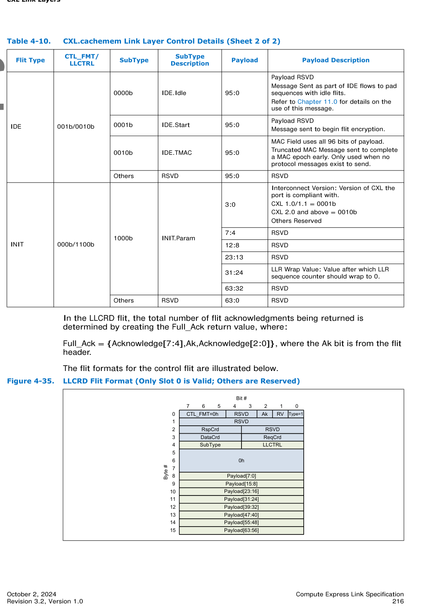
>
> *Original page render @ 150 DPI* — [📄 Full size](figures/chapter_04/page_0216.png)

> **Figure 4-36.** RETRY Flit Format (Only Slot 0 is Valid; Others are Reserved) ｜ RETRY Flit 格式 (仅 Slot 0 有效,其他保留)
>
> 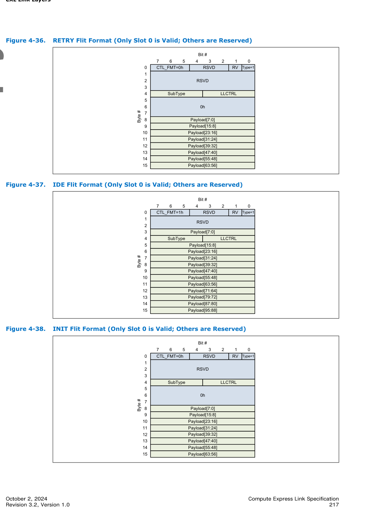
>
> *Original page render @ 150 DPI* — [📄 Full size](figures/chapter_04/page_0217.png)

> **Figure 4-37.** IDE Flit Format (Only Slot 0 is Valid; Others are Reserved) ｜ IDE Flit 格式 (仅 Slot 0 有效,其他保留)
>
> 
>
> *Original page render @ 150 DPI* — [📄 Full size](figures/chapter_04/page_0217.png)

> **Figure 4-38.** INIT Flit Format (Only Slot 0 is Valid; Others are Reserved) ｜ INIT Flit 格式 (仅 Slot 0 有效,其他保留)
>
> 
>
> *Original page render @ 150 DPI* — [📄 Full size](figures/chapter_04/page_0217.png)

<table>
<thead>
<tr>
<th width="50%">🇬🇧 English</th>
<th width="50%" style="background-color:#e8e8e8">🇨🇳 中文</th>
</tr>
</thead>
<tbody>
<tr><td><strong>Note:</strong> The RETRY.Req and RETRY.Ack flits belong to the type of flit to which receiving devices must respond, even in the shadow of a previous CRC error. In addition to checking the CRC of a RETRY flit, the receiving device should also check as many defined bits (those listed as having hardcoded 1/0 values) as possible to increase confidence in qualifying an incoming flit as a RETRY message.</td><td style="background-color:#e8e8e8"><strong>注意:</strong> RETRY.Req 和 RETRY.Ack flit 属于接收设备必须响应的 flit 类型,即使在前一个 CRC 错误的阴影下也是如此。除了检查 RETRY flit 的 CRC 之外,接收设备还应尽可能多地检查已定义的位 (那些被列为具有硬编码 1/0 值的位),以提高将传入 flit 鉴定为 RETRY 消息的可信度。</td></tr>
</tbody>
</table>

[⬆️ 返回目录](#-本章目录)

---

<a id="sec-4-2-7"></a>
### 4.2.7 Link Layer Initialization | 链路层初始化

<table>
<thead>
<tr>
<th width="50%">🇬🇧 English</th>
<th width="50%" style="background-color:#e8e8e8">🇨🇳 中文</th>
</tr>
</thead>
<tbody>
<tr><td>Link Layer Initialization must be started after a Physical Layer Link Down to Link Up transition and the link has trained successfully to L0. During Initialization and after the INIT flit has been sent, the CXL.cachemem Link Layer can only send Control-RETRY flits until Link Initialization is complete. The following describes how the link layer is initialized and credits are exchanged.</td><td style="background-color:#e8e8e8">链路层初始化必须在物理层从 Link Down 到 Link Up 转换之后、且链路已成功训练到 L0 时启动。在初始化期间,以及在发送 INIT flit 之后,CXL.cachemem 链路层只能发送 Control-RETRY flit,直到链路初始化完成。下面描述链路层如何初始化以及如何交换信用。</td></tr>
<tr><td>- The Tx portion of the Link Layer must wait until the Rx portion of the Link Layer has received at least one valid flit that is CRC clean before sending the Control-INIT.Param flit. Before this condition is met, the Link Layer must transmit only Control-RETRY flits (i.e., RETRY.Frame/Req/Ack/Idle flits).</td><td style="background-color:#e8e8e8">- 链路层的 Tx 部分必须等待 Rx 部分收到至少一个 CRC 正常的有效 flit 之后,才能发送 Control-INIT.Param flit。在此条件满足之前,链路层只能发送 Control-RETRY flit (即 RETRY.Frame/Req/Ack/Idle flit)。</td></tr>
<tr><td>  - If for any reason the Rx portion of the Link Layer is not ready to begin processing flits beyond Control-INIT and Control-RETRY, the Tx will stall transmission of LLCTR-INIT.Param flit</td><td style="background-color:#e8e8e8">  - 如果链路层 Rx 部分因任何原因尚未准备好开始处理 Control-INIT 和 Control-RETRY 之外的 flit,Tx 将暂停发送 LLCTR-INIT.Param flit。</td></tr>
<tr><td>  - RETRY.Frame/Req/Ack are sent during this time as part of the regular Retry flow.</td><td style="background-color:#e8e8e8">  - 在此期间,RETRY.Frame/Req/Ack 作为常规 Retry 流的一部分发送。</td></tr>
<tr><td>  - RETRY.Idle flits are sent prior to sending a INIT.Param flit even without a retry condition to ensure the remote agent can observe a valid flit.</td><td style="background-color:#e8e8e8">  - 即使没有重传条件,在发送 INIT.Param flit 之前也会发送 RETRY.Idle flit,以确保远端实体能观察到有效 flit。</td></tr>
<tr><td>- The Control-INIT.Param flit must be the first non-Control-RETRY flit transmitted by the Link Layer</td><td style="background-color:#e8e8e8">- Control-INIT.Param flit 必须是链路层发送的第一个非 Control-RETRY flit。</td></tr>
<tr><td>- The Rx portion of the Link Layer must be able to receive a Control-INIT.Param flit immediately upon completion of Physical Layer initialization because the first valid flit may be a Control-INIT.Param</td><td style="background-color:#e8e8e8">- 链路层的 Rx 部分必须在物理层初始化完成后立即能够接收 Control-INIT.Param flit,因为第一个有效 flit 可能是 Control-INIT.Param。</td></tr>
<tr><td>- Received Control-INIT.Param values (i.e., LLR Wrap Value) must be made "active", that is, applied to their respective hardware states within 8 flit clocks of error-free reception of Control-INIT.Param flit.</td><td style="background-color:#e8e8e8">- 接收到的 Control-INIT.Param 值 (即 LLR Wrap Value) 必须在 Control-INIT.Param flit 错误自由接收后的 8 个 flit 时钟内变为"active"状态,即应用于各自的硬件状态。</td></tr>
<tr><td>  - Until an error-free INIT.Param flit is received and these values are applied, LLR Wrap Value shall assume a default value of 9 for the purposes of ESEQ tracking.</td><td style="background-color:#e8e8e8">  - 在接收到无错误的 INIT.Param flit 并应用这些值之前,LLR Wrap Value 在 ESEQ 跟踪目的上应取默认值 9。</td></tr>
<tr><td>- Any non-RETRY flits received before Control-INIT.Param flit will trigger an Uncorrectable Error.</td><td style="background-color:#e8e8e8">- 在 Control-INIT.Param flit 之前接收到的任何非 RETRY flit 将触发不可纠正错误 (Uncorrectable Error)。</td></tr>
<tr><td>- Only a single Control-INIT.Param flit is sent. Any CRC error conditions with a Control-INIT.Param flit will be dealt with by the Retry state machine and replayed from the Link Layer Retry Buffer.</td><td style="background-color:#e8e8e8">- 仅发送单个 Control-INIT.Param flit。Control-INIT.Param flit 的任何 CRC 错误情况将由重传状态机处理,并从链路层重传缓冲 (LLRB) 重放。</td></tr>
<tr><td>- Receipt of a Control-INIT.Param flit after a Control-INIT.Param flit has already been received should be considered an Uncorrectable Error.</td><td style="background-color:#e8e8e8">- 在已经收到 Control-INIT.Param flit 之后再次收到 Control-INIT.Param flit 应视为不可纠正错误。</td></tr>
<tr><td>- It is the responsibility of the Rx to transmit credits to the sender using standard credit return mechanisms after link initialization. Each entity should know how many buffers it has and set its credit return counters to these values. Then, during normal operation, the standard credit return logic will return these credits to the sender.</td><td style="background-color:#e8e8e8">- 链路初始化后,Rx 负责使用标准 credit 返回机制向发送方发送 credit。每个实体应知道自己拥有的缓冲数量,并将其 credit 返回计数器设置为这些值。然后,在正常操作期间,标准 credit 返回逻辑会将这些 credit 返回给发送方。</td></tr>
<tr><td>- Immediately after link initialization, the credit exchange mechanism will use the LLCRD flit format.</td><td style="background-color:#e8e8e8">- 链路初始化之后,credit 交换机制将使用 LLCRD flit 格式。</td></tr>
<tr><td>- It is possible that the receiver will make more credits available than the sender can track for a given message class. For correct operation, it is therefore required that the credit counters at the sender be saturating. Receiver will drop all credits it receives for unsupported channels (e.g., Type 3 device receiving any CXL.cache credits).</td><td style="background-color:#e8e8e8">- 接收方可能提供比发送方对给定消息类别可追踪的更多的 credit。为了正确运行,要求发送方的 credit 计数器是饱和的 (saturating)。接收方将丢弃其为不支持的通道接收到的所有 credit (例如,Type 3 设备接收到任何 CXL.cache credit)。</td></tr>
<tr><td>- Credits should be sized to achieve desired levels of bandwidth considering round-trip time of credit return latency. This is implementation and usage dependent.</td><td style="background-color:#e8e8e8">- Credit 的大小应根据 credit 返回延迟的往返时间调整,以达到所需的带宽水平。这取决于实现与使用场景。</td></tr>
</tbody>
</table>

[⬆️ 返回目录](#-本章目录)

---

<a id="sec-4-2-8"></a>
### 4.2.8 CXL.cachemem Link Layer Retry | CXL.cachemem 链路层重传

<table>
<thead>
<tr>
<th width="50%">🇬🇧 English</th>
<th width="50%" style="background-color:#e8e8e8">🇨🇳 中文</th>
</tr>
</thead>
<tbody>
<tr><td>The link layer provides recovery from transmission errors using retransmission, or Link Layer Retry (LLR). The sender buffers every retryable flit sent in a local Link Layer Retry Buffer (LLRB). To uniquely identify flits in this buffer, the retry scheme relies on sequence numbers which are maintained within each device. Unlike in PCIe, CXL.cachemem sequence numbers are not communicated between devices with each flit to optimize link efficiency. The exchange of sequence numbers occurs only through link layer control flits during an LLR sequence. The sequence numbers are set to a predetermined value (0) during Link Layer Initialization and they are implemented using a wraparound counter. The counter wraps back to 0 after reaching the depth of the retry buffer. This scheme makes the following assumptions:</td><td style="background-color:#e8e8e8">链路层通过重传 (Link Layer Retry,LLR) 来提供从传输错误中恢复的能力。发送方在本地链路层重传缓冲 (Link Layer Retry Buffer,LLRB) 中缓冲每个已发送的可重传 flit。为了在该缓冲中唯一标识 flit,重传方案依赖于在每个设备内维护的序列号。与 PCIe 不同,CXL.cachemem 的序列号不会随每个 flit 在设备间通信以优化链路效率。序列号的交换仅在 LLR 序列期间通过链路层控制 flit 进行。序列号在链路层初始化期间设置为预定值 (0),并使用回卷计数器实现。计数器在达到重传缓冲深度后回卷到 0。该方案有以下假设:</td></tr>
<tr><td>- The round-trip delay between devices is more than the maximum of the link layer clock or flit period.</td><td style="background-color:#e8e8e8">- 设备之间的往返延迟大于链路层时钟或 flit 周期的最大值。</td></tr>
<tr><td>- All protocol flits are stored in the retry buffer. See Section 4.2.8.5.1 for further details on the handling of non-retryable control flits.</td><td style="background-color:#e8e8e8">- 所有协议 flit 都存储在重传缓冲中。有关不可重传控制 flit 的处理详情,请参见第 4.2.8.5.1 节。</td></tr>
<tr><td>Note that for efficient operation, the size of the retry buffer must be larger than the round-trip delay. This includes:</td><td style="background-color:#e8e8e8">请注意,为了高效运行,重传缓冲的大小必须大于往返延迟。这包括:</td></tr>
<tr><td>- Time to send a flit from the sender</td><td style="background-color:#e8e8e8">- 发送方发送一个 flit 的时间</td></tr>
<tr><td>- Flight time of the flit from sender to receiver</td><td style="background-color:#e8e8e8">- flit 从发送方到接收方的飞行时间</td></tr>
<tr><td>- Processing time at the receiver to detect an error in the flit</td><td style="background-color:#e8e8e8">- 接收方检测到 flit 中错误的处理时间</td></tr>
<tr><td>- Time to accumulate and, if needed, force Ack return and send embedded Ack return back to the sender</td><td style="background-color:#e8e8e8">- 累积并在需要时强制 Ack 返回、以及将嵌入的 Ack 返回发送回发送方的时间</td></tr>
<tr><td>- Flight time of the Ack return from the receiver to the sender</td><td style="background-color:#e8e8e8">- Ack 返回从接收方到发送方的飞行时间</td></tr>
<tr><td>- Processing time of Ack return at the original sender</td><td style="background-color:#e8e8e8">- 原始发送方处理 Ack 返回的时间</td></tr>
<tr><td>Otherwise, the LLR scheme will introduce latency, as the transmitter will have to wait for the receiver to confirm correct receipt of a previous flit before the transmitter can free space in its LLRB and send a new flit. Note that the error case is not significant because transmission of new flits is effectively stalled until successful retransmission of the erroneous flit anyway.</td><td style="background-color:#e8e8e8">否则,LLR 方案将引入延迟,因为发送方必须等待接收方确认正确收到上一个 flit,然后才能释放其 LLRB 中的空间并发送新 flit。注意,错误情形并不显著,因为无论如何,在错误 flit 成功重传之前,新 flit 的传输实际上已经停止。</td></tr>
</tbody>
</table>

<a id="sec-4-2-8-1"></a>
#### 4.2.8.1 LLR Variables | LLR 变量

<table>
<thead>
<tr>
<th width="50%">🇬🇧 English</th>
<th width="50%" style="background-color:#e8e8e8">🇨🇳 中文</th>
</tr>
</thead>
<tbody>
<tr><td>The retry scheme maintains two state machines and several state variables. Although the following text describes them in terms of one transmitter and one receiver, both the transmitter and receiver side of the retry state machines and the corresponding state variables are present at each device because of the bidirectional nature of the link. Since both sides of the link implement both transmitter and receiver state machines, for clarity this discussion will use the term "local" to refer to the entity that detects a CRC error, and "remote" to refer to the entity that sent the flit that was erroneously received.</td><td style="background-color:#e8e8e8">重传方案维护两个状态机和若干状态变量。尽管下面的文字以一个发送方和一个接收方来描述它们,但由于链路的双向特性,每个设备上都同时存在重传状态机的发送方和接收方两侧以及相应的状态变量。由于链路双方都实现发送方和接收方状态机,为清晰起见,本讨论使用术语 "local" 指代检测到 CRC 错误的实体,使用 "remote" 指代发送了被错误接收 flit 的实体。</td></tr>
<tr><td>The receiving device uses the following state variables to keep track of the sequence number of the next flit to arrive.</td><td style="background-color:#e8e8e8">接收设备使用以下状态变量跟踪下一个到达 flit 的序列号。</td></tr>
<tr><td>- ESeq: This indicates the expected sequence number of the next valid flit at the receiving link layer entity. ESeq is incremented by one (modulo the size of the LLRB) on error-free reception of a retryable flit. ESeq stops incrementing after an error is detected on a received flit until retransmission begins (RETRY.Ack message is received). Link Layer Initialization sets ESeq to 0. Note that there is no way for the receiver to know that an error was for a non-retryable vs. retryable flit. For any CRC error, it will initiate the link layer retry flow as usual, and effectively the transmitter will resend from the first retryable flit sent.</td><td style="background-color:#e8e8e8">- ESeq:表示接收链路层实体处下一个有效 flit 的预期序列号。在无错接收可重传 flit 时,ESeq 递增 1 (模 LLRB 大小)。在接收到的 flit 上检测到错误后,ESeq 停止递增,直到重传开始 (接收到 RETRY.Ack 消息)。链路层初始化将 ESeq 设为 0。注意,接收方无法知道错误是针对不可重传 flit 还是可重传 flit。对于任何 CRC 错误,它将照常启动链路层重传流,实际上发送方将从发送的第一个可重传 flit 开始重发。</td></tr>
<tr><td>The sending entity maintains two indexes into its LLRB, as indicated below.</td><td style="background-color:#e8e8e8">发送实体在其 LLRB 中维护两个索引,如下所示。</td></tr>
<tr><td>- WrPtr: This indexes the entry of the LLRB that will record the next new flit. When an entity sends a flit, it copies that flit into the LLRB entry indicated by the WrPtr and then increments the WrPtr by one (modulo the size of the LLRB). This is implemented using a wraparound counter that wraps around to 0 after reaching the depth of the LLRB. Non-Retryable Control flits do not affect the WrPtr. WrPtr stops incrementing after receiving an error indication at the remote entity (RETRY.Req message) except as described in the implementation note below, until normal operation resumes again (all flits from the LLRB have been retransmitted). WrPtr is initialized to 0 and is incremented only when a flit is placed into the LLRB.</td><td style="background-color:#e8e8e8">- WrPtr:索引 LLRB 中将记录下一个新 flit 的条目。当实体发送一个 flit 时,它将该 flit 复制到 WrPtr 指示的 LLRB 条目,然后将 WrPtr 递增 1 (模 LLRB 大小)。这通过回卷计数器实现,计数器在达到 LLRB 深度后回卷到 0。不可重传控制 flit 不影响 WrPtr。除非下文实现说明中另有描述,否则在远端实体接收到错误指示 (RETRY.Req 消息) 后,WrPtr 停止递增,直到恢复正常操作 (LLRB 中的所有 flit 都已重传)。WrPtr 初始化为 0,仅当 flit 放入 LLRB 时才递增。</td></tr>
<tr><td><strong>IMPLEMENTATION NOTE</strong> WrPtr may continue to increment after receiving RETRY.Req message if there are pre-scheduled All Data Flits that are not yet sent over the link. This implementation will ensure that All Data Flits not interleaved with other flits are correctly logged into the Link Layer Retry Buffer.</td><td style="background-color:#e8e8e8"><strong>实现说明</strong> 如果存在尚未在链路上发送的预调度 All Data Flit,WrPtr 在接收到 RETRY.Req 消息后可能继续递增。此实现将确保未与其他 flit 交织的 All Data Flit 被正确记录到链路层重传缓冲中。</td></tr>
<tr><td>- RdPtr: This is used to read the contents out of the LLRB during a retry scenario. The value of this pointer is set by the sequence number sent with the retransmission request (RETRY.Req message). The RdPtr is incremented by one (modulo the size of the LLRB) whenever a flit is sent, either from the LLRB in response to a retry request or when a new flit arrives from the transaction layer and regardless of the states of the local or remote retry state machines. If a flit is being sent when the RdPtr and WrPtr are the same, then it indicates that a new flit is being sent; otherwise, it must be a flit from the retry buffer.</td><td style="background-color:#e8e8e8">- RdPtr:用于在重传场景中从 LLRB 读出内容。该指针的值由随重传请求 (RETRY.Req 消息) 一起发送的序列号设置。每当发送一个 flit 时 (无论是响应重传请求从 LLRB 发送,还是事务层有新的 flit 到达),RdPtr 都会递增 1 (模 LLRB 大小),无论本地或远端重传状态机的状态如何。如果在 RdPtr 与 WrPtr 相同时发送 flit,则表明正在发送新 flit;否则,必定是来自重传缓冲的 flit。</td></tr>
<tr><td>The LLR scheme uses an explicit acknowledgment that is sent from the receiver to the sender to remove flits from the LLRB at the sender. The acknowledgment is indicated via an ACK bit in the headers of flits flowing in the reverse direction. In CXL.cachemem, a single ACK bit represents 8 acknowledgments. Each entity keeps track of the number of available LLRB entries and the number of received flits pending acknowledgment through the following variables.</td><td style="background-color:#e8e8e8">LLR 方案使用从接收方发送到发送方的显式确认,以从发送方的 LLRB 中删除 flit。确认通过反向流动 flit 头部中的 ACK 位指示。在 CXL.cachemem 中,单个 ACK 位代表 8 次确认。每个实体通过以下变量跟踪可用 LLRB 条目数以及等待确认的已接收 flit 数。</td></tr>
<tr><td>- NumFreeBuf: This indicates the number of free LLRB entries at the entity. NumFreeBuf is decremented by 1 whenever an LLRB entry is used to store a transmitted flit. NumFreeBuf is incremented by the value encoded in the Ack/Full_Ack (Ack is the protocol flit bit AK, Full_Ack defined as part of LLCRD message) field of a received flit. NumFreeBuf is initialized at reset time to the size of the LLRB. The maximum number of retry queue entries at any entity is limited to 255 (8-bit counter). Also, note that the retry buffer at any entity is never filled to its capacity, therefore NumFreeBuf is never 0. If there is only 1 retry buffer entry available, then the sender cannot send a Retryable flit. This restriction is required to avoid ambiguity between a full or an empty retry buffer during a retry sequence that may result into incorrect operation. This implies if there are only 2 retry buffer entries left (NumFreeBuf = 2), then the sender can send an Ack bearing flit only if the outgoing flit encodes a value of at least 1 (which may be a Protocol flit with Ak bit set), else an LLCRD control flit is sent with Full_Ack value of at least 1. This is required to avoid deadlock at the link layer due to retry buffer becoming full at both entities on a link and their inability to send ACK through header flits. This rule also creates an implicit expectation that you cannot start a sequence of "All Data Flits" that cannot be completed before NumFreeBuf=2 because you must be able to inject the Ack bearing flit when NumFreeBuf=2 is reached.</td><td style="background-color:#e8e8e8">- NumFreeBuf:表示实体处空闲 LLRB 条目数。每当使用 LLRB 条目存储已传输 flit 时,NumFreeBuf 减 1。NumFreeBuf 递增的值为接收 flit 的 Ack/Full_Ack (Ack 为协议 flit 的 AK 位,Full_Ack 定义为 LLCRD 消息的一部分) 字段所编码的值。NumFreeBuf 在复位时初始化为 LLRB 大小。任何实体的最大重传队列条目数限制为 255 (8 位计数器)。还需注意,任何实体的重传缓冲都不会填满到其容量,因此 NumFreeBuf 永远不会是 0。如果仅剩 1 个重传缓冲条目,则发送方不能发送可重传 flit。该限制是为了避免在重传序列中满与空重传缓冲之间的歧义,这种歧义可能导致错误操作。这意味着如果仅剩 2 个重传缓冲条目 (NumFreeBuf = 2),则仅当外发 flit 编码的值至少为 1 时 (可以是 Ak 位置 1 的协议 flit),发送方才能发送携带 Ack 的 flit;否则,发送 Full_Ack 值至少为 1 的 LLCRD 控制 flit。这是为了避免在链路上两个实体的重传缓冲均满、且无法通过头部 flit 发送 ACK 时,链路层发生死锁。该规则还隐含地期望:不能启动在 NumFreeBuf=2 之前无法完成的 "All Data Flit" 序列,因为必须在达到 NumFreeBuf=2 时注入携带 Ack 的 flit。</td></tr>
<tr><td>- NumAck: This indicates the number of acknowledgments accumulated at the receiver. NumAck increments by 1 when a retryable flit is received. NumAck is decremented by 8 when the ACK bit is set in the header of an outgoing flit. If the outgoing flit is coming from the LLRB and its ACK bit is set, NumAck does not decrement. At initialization, NumAck is set to 0. The minimum size of the NumAck field is the size of the LLRB. NumAck at each entity must be able to keep track of at least 255 acknowledgments.</td><td style="background-color:#e8e8e8">- NumAck:表示接收方累积的确认数。收到可重传 flit 时,NumAck 递增 1。当外发 flit 头部中 ACK 位置 1 时,NumAck 减 8。如果外发 flit 来自 LLRB 且其 ACK 位置 1,则 NumAck 不递减。初始化时,NumAck 设为 0。NumAck 字段的最小大小为 LLRB 大小。每个实体处的 NumAck 必须能够跟踪至少 255 次确认。</td></tr>
<tr><td>The LLR protocol requires that the number of retry queue entries at each entity must be at least 22 entries (Size of Forced Ack (16) + Max All-Data-Flit (4) + 2) to prevent deadlock.</td><td style="background-color:#e8e8e8">LLR 协议要求每个实体的重传队列条目数至少为 22 (Forced Ack 大小 (16) + Max All-Data-Flit (4) + 2),以防止死锁。</td></tr>
</tbody>
</table>

<a id="sec-4-2-8-2"></a>
#### 4.2.8.2 LLCRD Forcing | LLCRD 强制发送

<table>
<thead>
<tr>
<th width="50%">🇬🇧 English</th>
<th width="50%" style="background-color:#e8e8e8">🇨🇳 中文</th>
</tr>
</thead>
<tbody>
<tr><td>Recall that the LLR protocol requires space available in the LLRB to transmit a new flit, and that the sender must receive explicit acknowledgment from the receiver before freeing space in the LLRB. In scenarios where the traffic flow is asymmetric, this requirement could result in traffic throttling and possibly even starvation.</td><td style="background-color:#e8e8e8">回想一下,LLR 协议要求 LLRB 中有可用空间才能传输新 flit,并且发送方在释放 LLRB 中的空间之前必须收到来自接收方的显式确认。在流量不对称的场景下,此要求可能导致流量节流,甚至可能发生饥饿。</td></tr>
<tr><td>Suppose that the A→B direction has heavy traffic, but there is no traffic in the B→A direction. In this case, A could exhaust its LLRB size, while B never has any return traffic in which to embed Acks. In CXL, we want to minimize injected traffic to reserve bandwidth for the other traffic stream(s) sharing the link.</td><td style="background-color:#e8e8e8">假设 A→B 方向流量很大,但 B→A 方向没有流量。在这种情况下,A 可能耗尽其 LLRB 大小,而 B 永远没有任何返回流量可供嵌入 Ack。在 CXL 中,我们希望最小化注入的流量,为共享链路的其他流量流保留带宽。</td></tr>
<tr><td>To avoid starvation, CXL must permit LLCRD Control message forcing (injection of a non-traffic flit to carry an Acknowledge and a Credit return (ACK/CRD)), but this function must be constrained to avoid wasting bandwidth. In CXL, when B has accumulated a programmable minimum number of Acks to return, B's CXL.cachemem link layer will inject an LLCRD flit to return an Acknowledge. The threshold of pending Acknowledges before forcing the LLCRD can be adjusted using the "Ack Force Threshold" field in the CXL Link Layer Ack Timer Control register (see Section 8.2.4.19.6).</td><td style="background-color:#e8e8e8">为避免饥饿,CXL 必须允许 LLCRD 控制消息强制发送 (即注入一个非流量 flit 以携带 Acknowledge 和 Credit 返回 (ACK/CRD)),但此功能必须受限以避免浪费带宽。在 CXL 中,当 B 累积了可编程的最少 Ack 等待返回数量时,B 的 CXL.cachemem 链路层将注入一个 LLCRD flit 以返回 Acknowledge。强制 LLCRD 之前待处理 Ack 的阈值可通过 CXL Link Layer Ack Timer Control 寄存器中的 "Ack Force Threshold" 字段进行调整 (见第 8.2.4.19.6 节)。</td></tr>
<tr><td>There is also a timer-controlled mechanism to force LLCRD when the timer reaches a threshold. The timer will clear whenever an ACK/CRD carrying message is sent. It will increment every link layer clock in which an ACK/CRD carrying message is not sent and any Credit value to return is greater than 0 or Acknowledge to return is greater than 1. The reason the Acknowledge threshold value is specified as "greater than 1" instead of "greater than 0" is to avoid repeated forcing of LLCRD when no other retryable flits are being sent. If the timer incremented when the pending Acknowledge count is "greater than 0," there would be a continuous exchange of LLCRD messages carrying Acknowledges on an otherwise idle link; this is because the LLCRD is itself retryable and results in a returning Acknowledge in the other direction. The result is that the link layer would never be truly idle when the transaction layer traffic is idle. The timer threshold to force LLCRD is configurable using the Ack or CRD Flush Retimer field in the CXL Link Layer Ack Timer Control register. It should also be noted that the CXL.cachemem link layer must accumulate a minimum of 8 Acks to set the ACK bit in a CXL.cachemem flit header. If LLCRD forcing occurred after the accumulation of 8 Acks, it could result in a negative beat pattern where real traffic always arrives soon after a forced Ack, but not long enough after for enough Acks to re-accumulate to set the ACK bit. In the worst case, this could double the bandwidth consumption of the CXL.cachemem side. By waiting for at least 16 Acks to accumulate, the CXL.cachemem link layer ensures that it can still opportunistically return Acks in a protocol flit avoiding the need to force an LLCRD for Ack return. It is recommended that the Ack Force Threshold value be set to 16 or greater in the CXL Link Layer Ack Timer Control register to reduce overhead of LLCRD injection.</td><td style="background-color:#e8e8e8">还存在一种由定时器控制的机制,在定时器达到阈值时强制发送 LLCRD。每当发送携带 ACK/CRD 的消息时,定时器清零。在没有发送携带 ACK/CRD 的消息、且任何要返回的 Credit 值大于 0 或要返回的 Acknowledge 大于 1 的每个链路层时钟,定时器递增。Acknowledge 阈值指定为 "大于 1" 而非 "大于 0" 的原因是避免在没有其他可重传 flit 发送时反复强制 LLCRD。如果在待处理 Acknowledge 数为 "大于 0" 时定时器递增,则原本空闲的链路上将持续交换携带 Acknowledge 的 LLCRD 消息;这是因为 LLCRD 本身是可重传的,并导致反方向返回 Acknowledge。结果是当事务层流量空闲时,链路层永远不会真正空闲。强制 LLCRD 的定时器阈值可通过 CXL Link Layer Ack Timer Control 寄存器中的 Ack or CRD Flush Retimer 字段配置。还需注意,CXL.cachemem 链路层必须累积至少 8 个 Ack 才能在 CXL.cachemem flit 头部中设置 ACK 位。如果在累积 8 个 Ack 之后发生 LLCRD 强制,可能会导致一种负节拍模式:实际流量总是在强制 Ack 之后不久到达,但之后又不足以让 Ack 重新累积到可设置 ACK 位的程度。最坏情况下,这可能使 CXL.cachemem 侧的带宽消耗翻倍。通过等待至少 16 个 Ack 累积,CXL.cachemem 链路层确保它仍可在协议 flit 中机会性地返回 Ack,从而避免为返回 Ack 而强制 LLCRD。建议在 CXL Link Layer Ack Timer Control 寄存器中将 Ack Force Threshold 设为 16 或更大,以减少 LLCRD 注入的开销。</td></tr>
<tr><td>It is recommended that link layer prioritize other link layer flits before LLCRD forcing.</td><td style="background-color:#e8e8e8">建议链路层在 LLCRD 强制之前优先处理其他链路层 flit。</td></tr>
<tr><td>Pseudo-code for forcing function below:</td><td style="background-color:#e8e8e8">强制函数的伪代码如下:</td></tr>
</tbody>
</table>

```text
IF (SENDING_ACK_CRD_MESSAGE==FALSE AND (ACK_TO_RETURN >1 OR CRD_TO_RETURN>0))
    TimerValue++
ELSE
    TimerValue=0
IF (TimerValue >=Ack_or_CRD_Flush_Retimer OR ACK_TO_RETURN >= Ack Force_Threshold)
    Force_LLCRD = TRUE
ELSE
    Force_LLCRD=FALSE
```

<table>
<thead>
<tr>
<th width="50%">🇬🇧 English</th>
<th width="50%" style="background-color:#e8e8e8">🇨🇳 中文</th>
</tr>
</thead>
<tbody>
<tr><td><strong>Note:</strong> Ack or CRD Flush Retimer and Ack Force Threshold are values that come from the CXL Link Layer Ack Timer Control register (see Section 8.2.4.19.6).</td><td style="background-color:#e8e8e8"><strong>注意:</strong> Ack or CRD Flush Retimer 和 Ack Force Threshold 是来自 CXL Link Layer Ack Timer Control 寄存器的值 (见第 8.2.4.19.6 节)。</td></tr>
</tbody>
</table>

<a id="sec-4-2-8-3"></a>
#### 4.2.8.3 LLR Control Flits | LLR 控制 Flit

<table>
<thead>
<tr>
<th width="50%">🇬🇧 English</th>
<th width="50%" style="background-color:#e8e8e8">🇨🇳 中文</th>
</tr>
</thead>
<tbody>
<tr><td>The LLR Scheme uses several link layer control flits of the RETRY format to communicate the state information and the implicit sequence numbers between the entities.</td><td style="background-color:#e8e8e8">LLR 方案使用多个 RETRY 格式的链路层控制 flit,以在实体之间传递状态信息和隐式序列号。</td></tr>
<tr><td>- RETRY.Req: This flit is sent from the entity that received a flit in error to the sending entity. The flit contains the expected sequence number (ESeq) at the receiving entity, indicating the index of the flit in the retry queue at the remote entity that must be retransmitted. It also contains the NUM_RETRY value of the sending entity which is defined in Section 4.2.8.5.1. This message is also triggered as part of the Initialization sequence even when no error is observed as described in Section 4.2.7.</td><td style="background-color:#e8e8e8">- RETRY.Req:该 flit 由错误接收了 flit 的实体发送给发送实体。flit 包含接收实体处的预期序列号 (ESeq),指示远端实体重传队列中必须重传的 flit 索引。它还包含发送实体的 NUM_RETRY 值,定义见第 4.2.8.5.1 节。如第 4.2.7 节所述,即使未观察到错误,该消息也会作为初始化序列的一部分触发。</td></tr>
</tbody>
</table>

> **Figure 4-39.** Retry Buffer and Related Pointers ｜ 重传缓冲及相关指针
>
> 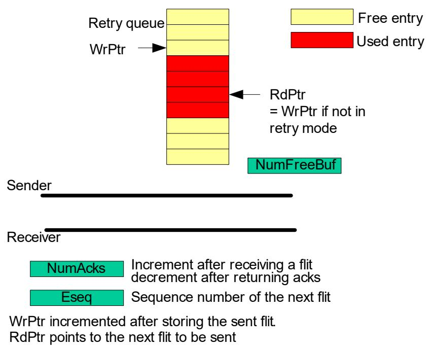
>
> *Original page render @ 150 DPI* — [📄 Full size](figures/chapter_04/page_0222.png)

<table>
<thead>
<tr>
<th width="50%">🇬🇧 English</th>
<th width="50%" style="background-color:#e8e8e8">🇨🇳 中文</th>
</tr>
</thead>
<tbody>
<tr><td>- RETRY.Ack: This flit is sent from the entity that is responding to an error detected at the remote entity. It contains a reflection of the NUM_RETRY value from the corresponding RETRY.Req message. The flit contains the WrPtr value at the sending entity for debug purposes only. The WrPtr value should not be used by the retry state machines in any way. This flit will be followed by the flit identified for retry by the ESeq number.</td><td style="background-color:#e8e8e8">- RETRY.Ack:该 flit 由响应远端实体检测到错误的实体发送。它包含来自相应 RETRY.Req 消息的 NUM_RETRY 值的回显。flit 包含发送实体处的 WrPtr 值,仅供调试。重传状态机不得以任何方式使用 WrPtr 值。该 flit 之后是 ESeq 编号标识的重传 flit。</td></tr>
<tr><td>- RETRY.Idle: This flit is sent during the retry sequence when there are no protocol flits to be sent (see Section 4.2.8.5.2 for details) or a retry queue is not ready to be sent. For example, it can be used for debug purposes for designs that need additional time between sending the RETRY.Ack and the actual contents of the LLR queue.</td><td style="background-color:#e8e8e8">- RETRY.Idle:该 flit 在重传序列中没有要发送的协议 flit (详见第 4.2.8.5.2 节) 或重传队列尚未准备好发送时发送。例如,对于需要在发送 RETRY.Ack 与 LLR 队列实际内容之间增加额外时间的设计,可将其用于调试目的。</td></tr>
<tr><td>- RETRY.Frame: This flit is sent along with a RETRY.Req or RETRY.Ack flit to prevent aliased decoding of these flits (see Section 4.2.8.5 for further details).</td><td style="background-color:#e8e8e8">- RETRY.Frame:该 flit 与 RETRY.Req 或 RETRY.Ack flit 一起发送,以防止这些 flit 的别名解码 (详见第 4.2.8.5 节)。</td></tr>
<tr><td>Table 4-11 describes the impact of RETRY messages on the local and remote retry state machines. In this context, the "sender" refers to the Device sending the message and the "receiver" refers to the Device receiving the message. Note that how this maps to which device detected the CRC error and which sent the erroneous message depends on the message type. For example, for a RETRY.Req sequence, the sender detected the CRC error, but for a RETRY.Ack sequence, it's the receiver that detected the CRC error.</td><td style="background-color:#e8e8e8">表 4-11 描述了 RETRY 消息对本地和远端重传状态机的影响。在此上下文中,"sender" 指发送消息的设备,"receiver" 指接收消息的设备。注意,这种映射关系如何对应于哪个设备检测到 CRC 错误、哪个设备发送了错误消息,取决于消息类型。例如,对于 RETRY.Req 序列,sender 检测到 CRC 错误;而对于 RETRY.Ack 序列,则是 receiver 检测到 CRC 错误。</td></tr>
</tbody>
</table>

<table>
<thead>
<tr>
<th width="50%">🇬🇧 English (Table 4-11)</th>
<th width="50%" style="background-color:#e8e8e8">🇨🇳 中文 (表 4-11)</th>
</tr>
</thead>
<tbody>
<tr>
<td>

| RETRY Message | Sender State | Receiver State |
| --- | --- | --- |
| RETRY.Idle | Unchanged. | Unchanged. |
| RETRY.Frame + RETRY.Req Sequence | Local Retry State Machine (LRSM) is updated. NUM_RETRY is incremented. See Section 4.2.8.5.1. | Remote Retry State Machine (RRSM) is updated. RdPtr is set to ESeq sent with the flit. See Section 4.2.8.5.3. |
| RETRY.Frame + RETRY.Ack Sequence | RRSM is updated. | LRSM is updated. |
| RETRY.Frame, RETRY.Req, or RETRY.Ack message that is not as part of a valid framed sequence | Unchanged. | Unchanged (drop the flit). |

</td>
<td style="background-color:#e8e8e8">

| RETRY 消息 | Sender 状态 | Receiver 状态 |
| --- | --- | --- |
| RETRY.Idle | 不变。 | 不变。 |
| RETRY.Frame + RETRY.Req 序列 | 本地重传状态机 (LRSM) 被更新。NUM_RETRY 递增。见第 4.2.8.5.1 节。 | 远端重传状态机 (RRSM) 被更新。RdPtr 被设置为随 flit 发送的 ESeq。见第 4.2.8.5.3 节。 |
| RETRY.Frame + RETRY.Ack 序列 | RRSM 被更新。 | LRSM 被更新。 |
| 不属于有效成帧序列的 RETRY.Frame、RETRY.Req 或 RETRY.Ack 消息 | 不变。 | 不变 (丢弃该 flit)。 |

</td>
</tr>
</tbody>
</table>

[⬆️ 返回目录](#-本章目录)

---

<a id="sec-4-2-8-4"></a>
#### 4.2.8.4 RETRY Framing Sequences | RETRY 帧序列

<table>
<thead>
<tr>
<th width="50%">🇬🇧 English</th>
<th width="50%" style="background-color:#e8e8e8">🇨🇳 中文</th>
</tr>
</thead>
<tbody>
<tr><td>Recall that the CXL.cachemem flit formatting specifies an all-data flit for link efficiency. This flit is encoded as part of the header of the preceding flit and contains no header information of its own. This introduces the possibility that the data contained in this flit could happen to match the encoding of a RETRY flit.</td><td style="background-color:#e8e8e8">回想一下,CXL.cachemem flit 格式为提高链路效率而指定了一个 all-data flit。该 flit 作为前一个 flit 头部的一部分进行编码,自身不包含头部信息。这引入了一种可能性:该 flit 中包含的数据可能恰好与 RETRY flit 的编码相匹配。</td></tr>
<tr><td>This introduces a problem at the receiver. It must be certain to decode the actual RETRY flit, but it must not falsely decode an aliasing data flit as a RETRY flit. In theory it might use the header information of the stream it receives in the shadow of a CRC error to determine whether it should attempt to decode the subsequent flit. Therefore, the receiver cannot know with certainty which flits to treat as header-containing (decode) and which to ignore (all-data).</td><td style="background-color:#e8e8e8">这在接收方引入了一个问题:它必须确定地解码实际的 RETRY flit,但又不能将别名的数据 flit 错误地解码为 RETRY flit。理论上,它可能会利用在 CRC 错误阴影下接收到的流的头部信息来确定是否应尝试解码后续 flit。因此,接收方无法确定地将 flit 视为包含头部 (解码) 或忽略 (all-data)。</td></tr>
<tr><td>CXL introduces the RETRY.Frame flit for this purpose to disambiguate a control sequence from an All-Data Flit (ADF). Due to MDH, 4 ADF can be sent back-to-back. Hence, a RETRY.Req sequence comprises 5 RETRY.Frame flits immediately followed by a RETRY.Req flit, and a RETRY.Ack sequence comprises 5 RETRY.Frame flits immediately followed by a RETRY.Ack flit. This is shown in Figure 4-40.</td><td style="background-color:#e8e8e8">CXL 为此引入了 RETRY.Frame flit,以消除控制序列与全数据 flit (ADF) 之间的歧义。由于 MDH,4 个 ADF 可以背靠背发送。因此,RETRY.Req 序列由 5 个 RETRY.Frame flit 紧接一个 RETRY.Req flit 组成,RETRY.Ack 序列由 5 个 RETRY.Frame flit 紧接一个 RETRY.Ack flit 组成。如图 4-40 所示。</td></tr>
<tr><td><strong>Note:</strong> A RETRY.Ack sequence that arrives when a RETRY.Ack is not expected will be treated as an error by the receiver. Error resolution in this case is device specific though it is recommended that this results in the machine halting operation. It is recommended that this error condition not change the state of the LRSM.</td><td style="background-color:#e8e8e8"><strong>注意:</strong> 在未预期 RETRY.Ack 时到达的 RETRY.Ack 序列将被接收方视为错误。此情况下的错误处理由设备决定,但建议导致机器停止操作。建议此错误情况不要改变 LRSM 的状态。</td></tr>
</tbody>
</table>

> **Figure 4-40.** CXL.cachemem Replay Diagram ｜ CXL.cachemem 重放流程图
>
> 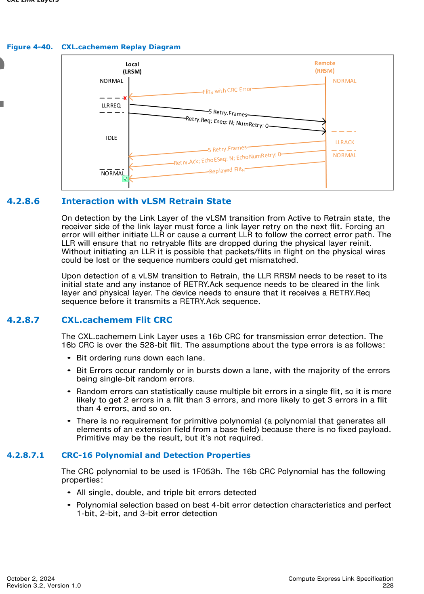
>
> *Original page render @ 150 DPI* — [📄 Full size](figures/chapter_04/page_0228.png)

[⬆️ 返回目录](#-本章目录)

---

<a id="sec-4-2-8-5"></a>
#### 4.2.8.5 LLR State Machines | LLR 状态机

<table>
<thead>
<tr>
<th width="50%">🇬🇧 English</th>
<th width="50%" style="background-color:#e8e8e8">🇨🇳 中文</th>
</tr>
</thead>
<tbody>
<tr><td>The LLR scheme is implemented with two state machines: Remote Retry State Machine (RRSM) and Local Retry State Machine (LRSM). These state machines are implemented by each entity and together determine the overall state of the transmitter and receiver at the entity. The states of the retry state machines are used by the send and receive controllers to determine what flit to send and the actions needed to process a received flit.</td><td style="background-color:#e8e8e8">LLR 方案由两个状态机实现:远端重传状态机 (RRSM) 和本地重传状态机 (LRSM)。这些状态机由每个实体实现,共同确定实体处发送方和接收方的整体状态。重传状态机的状态供发送和接收控制器用于确定要发送的 flit 以及处理接收 flit 所需的动作。</td></tr>
</tbody>
</table>

<a id="sec-4-2-8-5-1"></a>
##### 4.2.8.5.1 Local Retry State Machine (LRSM) | 本地重传状态机

<table>
<thead>
<tr>
<th width="50%">🇬🇧 English</th>
<th width="50%" style="background-color:#e8e8e8">🇨🇳 中文</th>
</tr>
</thead>
<tbody>
<tr><td>This state machine is activated at the entity that detects an error on a received flit. The possible states for this state machine are:</td><td style="background-color:#e8e8e8">该状态机在检测到接收 flit 错误的实体处激活。此状态机可能的状态包括:</td></tr>
<tr><td>- RETRY_LOCAL_NORMAL: This is the initial or default state indicating normal operation (no CRC error has been detected).</td><td style="background-color:#e8e8e8">- RETRY_LOCAL_NORMAL:这是初始或默认状态,表示正常运行 (未检测到 CRC 错误)。</td></tr>
<tr><td>- RETRY_LLRREQ: This state indicates that the receiver has detected an error on a received flit and a RETRY.Req sequence must be sent to the remote entity.</td><td style="background-color:#e8e8e8">- RETRY_LLRREQ:此状态表示接收方已检测到接收 flit 中的错误,必须向远端实体发送 RETRY.Req 序列。</td></tr>
<tr><td>- RETRY_LOCAL_IDLE: This state indicates that the receiver is waiting for a RETRY.Ack sequence from the remote entity in response to its RETRY.Req sequence. The implementation may require substates of RETRY_LOCAL_IDLE to capture, for example, the case where the last flit received is a Frame flit and the next flit expected is a RETRY.Ack.</td><td style="background-color:#e8e8e8">- RETRY_LOCAL_IDLE:此状态表示接收方正在等待来自远端实体的 RETRY.Ack 序列以响应其 RETRY.Req 序列。实现可能需要 RETRY_LOCAL_IDLE 的子状态,例如捕获最后接收的 flit 是 Frame flit、且预期下一个 flit 是 RETRY.Ack 的情况。</td></tr>
<tr><td>- RETRY_PHY_REINIT: The state machine remains in this state for the duration of the virtual Link State Machine (vLSM) being in Retrain.</td><td style="background-color:#e8e8e8">- RETRY_PHY_REINIT:状态机在虚拟链路状态机 (vLSM) 处于 Retrain 期间保持此状态。</td></tr>
<tr><td>- RETRY_ABORT: This state indicates that the retry attempt has failed and the link cannot recover. Error logging and reporting in this case is device specific. This is a terminal state.</td><td style="background-color:#e8e8e8">- RETRY_ABORT:此状态表示重传尝试失败,链路无法恢复。此情况下的错误日志记录和上报由设备决定。这是终止状态。</td></tr>
<tr><td>The local retry state machine also has the three counters described below. The counters and thresholds described below are implementation specific.</td><td style="background-color:#e8e8e8">本地重传状态机还具有如下所述的三个计数器。下面描述的计数器和阈值因实现而异。</td></tr>
<tr><td>- TIMEOUT: This counter is enabled whenever a RETRY.Req request is sent from an entity and the LRSM state becomes RETRY_LOCAL_IDLE. The TIMEOUT counter is disabled and the counting stops when the LRSM state changes to some state other than RETRY_LOCAL_IDLE. The TIMEOUT counter is reset to 0 at link layer initialization and whenever the LRSM state changes from RETRY_LOCAL_IDLE to RETRY_LOCAL_NORMAL or RETRY_LLRREQ. The TIMEOUT counter is also reset when the vLSM transitions from Retrain to Active (the LRSM transition through RETRY_PHY_REINIT to RETRY_LLRREQ). If the counter has reached its threshold without receiving a RETRY.Ack sequence, then the RETRY.Req request is sent again to retry the same flit. See Section 4.2.8.5.2 for a description of when TIMEOUT increments.</td><td style="background-color:#e8e8e8">- TIMEOUT:每当从实体发送 RETRY.Req 请求且 LRSM 状态变为 RETRY_LOCAL_IDLE 时,启用该计数器。当 LRSM 状态变为 RETRY_LOCAL_IDLE 以外的其他状态时,TIMEOUT 计数器被禁用并停止计数。TIMEOUT 计数器在链路层初始化时以及每当 LRSM 状态从 RETRY_LOCAL_IDLE 变为 RETRY_LOCAL_NORMAL 或 RETRY_LLRREQ 时复位为 0。当 vLSM 从 Retrain 转换到 Active (LRSM 通过 RETRY_PHY_REINIT 转换到 RETRY_LLRREQ) 时,TIMEOUT 计数器也复位。如果计数器已达到其阈值但仍未收到 RETRY.Ack 序列,则再次发送 RETRY.Req 请求以重传同一 flit。有关 TIMEOUT 何时递增的说明,请参见第 4.2.8.5.2 节。</td></tr>
<tr><td><strong>Note:</strong> It is suggested that the value of TIMEOUT should be no less than 4096 transfers.</td><td style="background-color:#e8e8e8"><strong>注意:</strong> 建议 TIMEOUT 的值不小于 4096 次传输。</td></tr>
<tr><td>- NUM_RETRY: This counter is used to count the number of RETRY.Req requests sent to retry the same flit. The counter remains enabled during the whole retry sequence (state is not RETRY_LOCAL_NORMAL). It is reset to 0 at initialization. It is also reset to 0 when a RETRY.Ack sequence is received with the Empty bit set or whenever the LRSM state is RETRY_LOCAL_NORMAL and an error-free retryable flit is received. The counter is incremented whenever the LRSM state changes from RETRY_LLRREQ to RETRY_LOCAL_IDLE. If the counter reaches a threshold (called MAX_NUM_RETRY), then the local retry state machine transitions to the RETRY_PHY_REINIT. The NUM_RETRY counter is also reset when the vLSM transitions from Retrain to Active (the LRSM transition through RETRY_PHY_REINIT to RETRY_LLRREQ).</td><td style="background-color:#e8e8e8">- NUM_RETRY:该计数器用于对为重传同一 flit 而发送的 RETRY.Req 请求数进行计数。计数器在整个重传序列期间保持启用 (状态不是 RETRY_LOCAL_NORMAL)。在初始化时复位为 0。当收到带有 Empty 位置 1 的 RETRY.Ack 序列时,或每当 LRSM 状态为 RETRY_LOCAL_NORMAL 且接收到无错可重传 flit 时,也会复位为 0。每当 LRSM 状态从 RETRY_LLRREQ 变为 RETRY_LOCAL_IDLE 时,计数器递增。如果计数器达到阈值 (称为 MAX_NUM_RETRY),则本地重传状态机转换到 RETRY_PHY_REINIT。当 vLSM 从 Retrain 转换到 Active (LRSM 通过 RETRY_PHY_REINIT 转换到 RETRY_LLRREQ) 时,NUM_RETRY 计数器也复位。</td></tr>
<tr><td><strong>Note:</strong> It is suggested that the value of MAX_NUM_RETRY should be no less than Ah.</td><td style="background-color:#e8e8e8"><strong>注意:</strong> 建议 MAX_NUM_RETRY 的值不小于 Ah。</td></tr>
<tr><td>- NUM_PHY_REINIT: This counter is used to count the number of transitions to RETRY_PHY_REINIT that are generated during an LLR sequence due to the number of retries that exceed MAX_NUM_RETRY. The counter remains enabled during the whole retry sequence (state is not RETRY_LOCAL_NORMAL). It is reset to 0 at initialization and after successful completion of the retry sequence. The counter is incremented whenever the LRSM changes from RETRY_LLRREQ to RETRY_PHY_REINIT due to the number of retries that exceed MAX_NUM_RETRY. If the counter reaches a threshold (called MAX_NUM_PHY_REINIT) instead of transitioning from RETRY_LLRREQ to RETRY_PHY_REINIT, the LRSM will transition to RETRY_ABORT. The NUM_PHY_REINIT counter is also reset whenever a RETRY.Ack sequence is received with the Empty bit set.</td><td style="background-color:#e8e8e8">- NUM_PHY_REINIT:该计数器用于对在 LLR 序列期间因重传次数超过 MAX_NUM_RETRY 而产生的向 RETRY_PHY_REINIT 的转换数进行计数。计数器在整个重传序列期间保持启用 (状态不是 RETRY_LOCAL_NORMAL)。在初始化时和重传序列成功完成后复位为 0。每当 LRSM 由于重传次数超过 MAX_NUM_RETRY 而从 RETRY_LLRREQ 变为 RETRY_PHY_REINIT 时,计数器递增。如果计数器达到阈值 (称为 MAX_NUM_PHY_REINIT),则 LRSM 将转换到 RETRY_ABORT,而不是从 RETRY_LLRREQ 转换到 RETRY_PHY_REINIT。每当收到带有 Empty 位置 1 的 RETRY.Ack 序列时,NUM_PHY_REINIT 计数器也复位。</td></tr>
<tr><td><strong>Note:</strong> It is suggested that the value of MAX_NUM_PHY_REINIT should be no less than Ah.</td><td style="background-color:#e8e8e8"><strong>注意:</strong> 建议 MAX_NUM_PHY_REINIT 的值不小于 Ah。</td></tr>
<tr><td>Note that the condition of TIMEOUT reaching its threshold is not mutually exclusive with other conditions that cause the LRSM state transitions. RETRY.Ack sequences can be assumed to never arrive at the time at which the retry requesting device times out and sends a new RETRY.Req sequence (by appropriately setting the value of TIMEOUT – see Section 4.2.8.5.2). If this case occurs, no guarantees are made regarding the behavior of the device (behavior is "undefined" from a Spec perspective and is not validated from an implementation perspective). Consequently, the LLR Timeout value should not be reduced unless it can be certain this case will not occur. If an error is detected at the same time as TIMEOUT reaches its threshold, then the error on the received flit is ignored, TIMEOUT is taken, and a repeat RETRY.Req sequence is sent to the remote entity.</td><td style="background-color:#e8e8e8">注意,TIMEOUT 达到阈值的条件与导致 LRSM 状态转换的其他条件并非互斥。可以假设 RETRY.Ack 序列永远不会在重传请求设备超时并发送新 RETRY.Req 序列时到达 (通过适当设置 TIMEOUT 的值 — 见第 4.2.8.5.2 节)。如果发生这种情况,设备的行为无任何保证 (从规范角度行为为 "未定义",且从实现角度未经验证)。因此,LLR Timeout 值不应被减小,除非能确定不会发生这种情况。如果在 TIMEOUT 达到阈值的同时检测到错误,则忽略接收 flit 上的错误,采用 TIMEOUT,并向远端实体发送重复的 RETRY.Req 序列。</td></tr>
</tbody>
</table>

<table>
<thead>
<tr>
<th width="50%">🇬🇧 English (Table 4-12 Sheet 1 of 2)</th>
<th width="50%" style="background-color:#e8e8e8">🇨🇳 中文 (表 4-12 第 1 页/共 2 页)</th>
</tr>
</thead>
<tbody>
<tr>
<td>

| Current Local Retry State | Condition | Next Local Retry State | Actions |
| --- | --- | --- | --- |
| RETRY_LOCAL_NORMAL | An error free retryable flit is received. | RETRY_LOCAL_NORMAL | Increment NumFreeBuf using the amount specified in the ACK or Full_Ack fields. Increment NumAck by 1. Increment Eseq by 1. NUM_RETRY is reset to 0. NUM_PHY_REINIT is reset to 0. Received flit is processed normally by the link layer. |
| RETRY_LOCAL_NORMAL | Error free non-retryable flit (other than RETRY.Req sequence) is received. | RETRY_LOCAL_NORMAL | Received flit is processed. |
| RETRY_LOCAL_NORMAL | Error free RETRY.Req sequence is received. | RETRY_LOCAL_NORMAL | RRSM is updated. |
| RETRY_LOCAL_NORMAL | Error is detected on a received flit. | RETRY_LLRREQ | Received flit is discarded. |
| RETRY_LOCAL_NORMAL | PHY_RESET1 / PHY_REINIT2 is detected. | RETRY_PHY_REINIT | None. |
| RETRY_LLRREQ | NUM_RETRY == MAX_NUM_RETRY and NUM_PHY_REINIT == MAX_NUM_PHY_REINIT | RETRY_ABORT | Indicate link failure. |
| RETRY_LLRREQ | NUM_RETRY == MAX_NUM_RETRY and NUM_PHY_REINIT < MAX_NUM_PHY_REINIT | RETRY_PHY_REINIT | If an error-free RETRY.Req or RETRY.Ack sequence is received, process the flit. Any other flit is discarded. RetrainRequest is sent to physical layer. Increment NUM_PHY_REINIT. |

</td>
<td style="background-color:#e8e8e8">

| 当前本地重传状态 | 条件 | 下一本地重传状态 | 动作 |
| --- | --- | --- | --- |
| RETRY_LOCAL_NORMAL | 收到无错可重传 flit。 | RETRY_LOCAL_NORMAL | 使用 ACK 或 Full_Ack 字段中指定的量递增 NumFreeBuf。NumAck 递增 1。Eseq 递增 1。NUM_RETRY 复位为 0。NUM_PHY_REINIT 复位为 0。链路层正常处理接收到的 flit。 |
| RETRY_LOCAL_NORMAL | 收到无错不可重传 flit (非 RETRY.Req 序列)。 | RETRY_LOCAL_NORMAL | 处理接收到的 flit。 |
| RETRY_LOCAL_NORMAL | 收到无错 RETRY.Req 序列。 | RETRY_LOCAL_NORMAL | 更新 RRSM。 |
| RETRY_LOCAL_NORMAL | 在接收到的 flit 上检测到错误。 | RETRY_LLRREQ | 丢弃接收到的 flit。 |
| RETRY_LOCAL_NORMAL | 检测到 PHY_RESET1 / PHY_REINIT2。 | RETRY_PHY_REINIT | 无。 |
| RETRY_LLRREQ | NUM_RETRY == MAX_NUM_RETRY 且 NUM_PHY_REINIT == MAX_NUM_PHY_REINIT | RETRY_ABORT | 指示链路失败。 |
| RETRY_LLRREQ | NUM_RETRY == MAX_NUM_RETRY 且 NUM_PHY_REINIT < MAX_NUM_PHY_REINIT | RETRY_PHY_REINIT | 如果收到无错的 RETRY.Req 或 RETRY.Ack 序列,处理该 flit。丢弃任何其他 flit。向物理层发送 RetrainRequest。NUM_PHY_REINIT 递增。 |

</td>
</tr>
</tbody>
</table>

<table>
<thead>
<tr>
<th width="50%">🇬🇧 English (Table 4-12 Sheet 2 of 2)</th>
<th width="50%" style="background-color:#e8e8e8">🇨🇳 中文 (表 4-12 第 2 页/共 2 页)</th>
</tr>
</thead>
<tbody>
<tr>
<td>

| Current Local Retry State | Condition | Next Local Retry State | Actions |
| --- | --- | --- | --- |
| RETRY_LLRREQ | NUM_RETRY < MAX_NUM_RETRY and a RETRY.Req sequence has not been sent. | RETRY_LLRREQ | If an error-free RETRY.Req or RETRY.Ack sequence is received, process the flit. Any other flit is discarded. |
| RETRY_LLRREQ | NUM_RETRY < MAX_NUM_RETRY and a RETRY.Req sequence has been sent. | RETRY_LOCAL_IDLE | If an error free RETRY.Req or RETRY.Ack sequence is received, process the flit. Any other flit is discarded. Increment NUM_RETRY. |
| RETRY_LLRREQ | PHY_RESET1 / PHY_REINIT2 is detected. | RETRY_PHY_REINIT | None. |
| RETRY_LLRREQ | Error is detected on a received flit | RETRY_LLRREQ | Received flit is discarded. |
| RETRY_PHY_REINIT | Physical layer is still in reinit. | RETRY_PHY_REINIT | None. |
| RETRY_PHY_REINIT | Physical layer returns from Reinit. | RETRY_LLRREQ | Received flit is discarded. NUM_RETRY is reset to 0. |
| RETRY_LOCAL_IDLE | RETRY.Ack sequence is received and NUM_RETRY from RETRY.Ack matches the value of the last RETRY.Req sent by the local entity. | RETRY_LOCAL_NORMAL | TIMEOUT is reset to 0. If RETRY.Ack sequence is received with Empty bit set, NUM_RETRY is reset to 0 and NUM_PHY_REINIT is reset to 0. |
| RETRY_LOCAL_IDLE | RETRY.Ack sequence is received and NUM_RETRY from RETRY.Ack does NOT match the value of the last RETRY.Req sent by the local entity. | RETRY_LOCAL_IDLE | Any received retryable flit is discarded. |
| RETRY_LOCAL_IDLE | TIMEOUT has reached its threshold. | RETRY_LLRREQ | TIMEOUT is reset to 0. |
| RETRY_LOCAL_IDLE | Error is detected on a received flit. | RETRY_LOCAL_IDLE | Any received retryable flit is discarded. |
| RETRY_LOCAL_IDLE | A flit other than RETRY.Ack/RETRY.Req sequence is received. | RETRY_LOCAL_IDLE | Any received retryable flit is discarded. |
| RETRY_LOCAL_IDLE | A RETRY.Req sequence is received. | RETRY_LOCAL_IDLE | RRSM is updated. |
| RETRY_LOCAL_IDLE | PHY_RESET1 / PHY_REINIT2 is detected. | RETRY_PHY_REINIT | None. |
| RETRY_ABORT | A flit is received. | RETRY_ABORT | All received flits are discarded. |

</td>
<td style="background-color:#e8e8e8">

| 当前本地重传状态 | 条件 | 下一本地重传状态 | 动作 |
| --- | --- | --- | --- |
| RETRY_LLRREQ | NUM_RETRY < MAX_NUM_RETRY 且未发送 RETRY.Req 序列。 | RETRY_LLRREQ | 如果收到无错的 RETRY.Req 或 RETRY.Ack 序列,处理该 flit。丢弃任何其他 flit。 |
| RETRY_LLRREQ | NUM_RETRY < MAX_NUM_RETRY 且已发送 RETRY.Req 序列。 | RETRY_LOCAL_IDLE | 如果收到无错 RETRY.Req 或 RETRY.Ack 序列,处理该 flit。丢弃任何其他 flit。NUM_RETRY 递增。 |
| RETRY_LLRREQ | 检测到 PHY_RESET1 / PHY_REINIT2。 | RETRY_PHY_REINIT | 无。 |
| RETRY_LLRREQ | 在接收到的 flit 上检测到错误。 | RETRY_LLRREQ | 丢弃接收到的 flit。 |
| RETRY_PHY_REINIT | 物理层仍处于 reinit。 | RETRY_PHY_REINIT | 无。 |
| RETRY_PHY_REINIT | 物理层从 Reinit 返回。 | RETRY_LLRREQ | 丢弃接收到的 flit。NUM_RETRY 复位为 0。 |
| RETRY_LOCAL_IDLE | 收到 RETRY.Ack 序列,且 RETRY.Ack 中的 NUM_RETRY 与本地实体发送的最后一个 RETRY.Req 的值匹配。 | RETRY_LOCAL_NORMAL | TIMEOUT 复位为 0。如果收到的 RETRY.Ack 序列中 Empty 位置 1,则 NUM_RETRY 复位为 0 且 NUM_PHY_REINIT 复位为 0。 |
| RETRY_LOCAL_IDLE | 收到 RETRY.Ack 序列,但 RETRY.Ack 中的 NUM_RETRY 与本地实体发送的最后一个 RETRY.Req 的值不匹配。 | RETRY_LOCAL_IDLE | 丢弃任何接收到的可重传 flit。 |
| RETRY_LOCAL_IDLE | TIMEOUT 达到其阈值。 | RETRY_LLRREQ | TIMEOUT 复位为 0。 |
| RETRY_LOCAL_IDLE | 在接收到的 flit 上检测到错误。 | RETRY_LOCAL_IDLE | 丢弃任何接收到的可重传 flit。 |
| RETRY_LOCAL_IDLE | 收到非 RETRY.Ack/RETRY.Req 序列的 flit。 | RETRY_LOCAL_IDLE | 丢弃任何接收到的可重传 flit。 |
| RETRY_LOCAL_IDLE | 收到 RETRY.Req 序列。 | RETRY_LOCAL_IDLE | 更新 RRSM。 |
| RETRY_LOCAL_IDLE | 检测到 PHY_RESET1 / PHY_REINIT2。 | RETRY_PHY_REINIT | 无。 |
| RETRY_ABORT | 收到 flit。 | RETRY_ABORT | 丢弃所有接收到的 flit。 |

</td>
</tr>
<tr><td>1. PHY_RESET is the condition of the vLSM informing the Link Layer that it needs to initiate a Link Layer Retry due to exit from Retrain state.</td><td style="background-color:#e8e8e8">1. PHY_RESET 是 vLSM 通知链路层因退出 Retrain 状态而需要发起链路层重传的条件。</td></tr>
<tr><td>2. PHY_REINIT is the condition of the Link Layer instructing the Phy to retrain.</td><td style="background-color:#e8e8e8">2. PHY_REINIT 是链路层指示物理层重新训练的条件。</td></tr>
</tbody>
</table>

<a id="sec-4-2-8-5-2"></a>
##### 4.2.8.5.2 TIMEOUT Definition | TIMEOUT 定义

<table>
<thead>
<tr>
<th width="50%">🇬🇧 English</th>
<th width="50%" style="background-color:#e8e8e8">🇨🇳 中文</th>
</tr>
</thead>
<tbody>
<tr><td>After the local receiver has detected a CRC error, triggering the LRSM, the local Tx sends a RETRY.Req sequence to initiate LLR. At this time, the local Tx also starts its TIMEOUT counter.</td><td style="background-color:#e8e8e8">在本地接收方检测到 CRC 错误并触发 LRSM 之后,本地 Tx 发送 RETRY.Req 序列以启动 LLR。此时,本地 Tx 也启动其 TIMEOUT 计数器。</td></tr>
<tr><td>The purpose of this counter is to decide that either the RETRY.Req sequence or corresponding RETRY.Ack sequence has been lost, and that another RETRY.Req attempt should be made. Recall that it is a fatal error to receive multiple RETRY.Ack sequences (i.e., a subsequent Ack without a corresponding Req is unexpected). To reduce the risk of this fatal error condition we check NUM_RETRY value returned to filter out RETRY.Ack messages from the prior retry sequence. This is done to remove fatal condition where a single retry sequence incurs a timeout while the Ack message is in flight. The TIMEOUT counter should be capable of handling worst-case latency for a RETRY.Req sequence to reach the remote side and for the corresponding RETRY.Ack sequence to return.</td><td style="background-color:#e8e8e8">该计数器的目的是判断 RETRY.Req 序列或相应的 RETRY.Ack 序列已丢失,需要再次尝试 RETRY.Req。回想一下,接收多个 RETRY.Ack 序列是致命错误 (即在没有相应 Req 的情况下出现后续 Ack 是意料之外的)。为降低此致命错误条件的风险,我们检查返回的 NUM_RETRY 值,以过滤掉前一次重传序列的 RETRY.Ack 消息。这样做是为了消除在 Ack 消息传输过程中发生单次重传序列超时的致命条件。TIMEOUT 计数器应能处理 RETRY.Req 序列到达远端以及相应 RETRY.Ack 序列返回的最坏情况延迟。</td></tr>
<tr><td>Certain unpredictable events (e.g., low power transitions, etc.) that interrupt link availability could add a large amount of latency to the RETRY round-trip. To make the TIMEOUT robust to such events, instead of incrementing per link layer clock, TIMEOUT increments whenever the local Tx transmits a flit, protocol, or control. Due to the TIMEOUT protocol, TIMEOUT must force injection of RETRY.Idle flits if it has no real traffic to send, so that the TIMEOUT counter continues to increment.</td><td style="background-color:#e8e8e8">某些不可预测的事件 (例如低功耗转换等) 中断链路的可用性,可能为 RETRY 往返增加大量延迟。为使 TIMEOUT 对此类事件具有健壮性,TIMEOUT 不按链路层时钟递增,而是在本地 Tx 发送 flit (协议或控制) 时递增。由于 TIMEOUT 协议,如果本地 Tx 没有真正的流量可发,则 TIMEOUT 必须强制注入 RETRY.Idle flit,以使 TIMEOUT 计数器继续递增。</td></tr>
</tbody>
</table>

<a id="sec-4-2-8-5-3"></a>
##### 4.2.8.5.3 Remote Retry State Machine (RRSM) | 远端重传状态机

<table>
<thead>
<tr>
<th width="50%">🇬🇧 English</th>
<th width="50%" style="background-color:#e8e8e8">🇨🇳 中文</th>
</tr>
</thead>
<tbody>
<tr><td>The remote retry state machine is activated at an entity if a flit sent from that entity is received in error by the local receiver, resulting in a link layer retry request (RETRY.Req sequence) from the remote entity. The possible states for this state machine are:</td><td style="background-color:#e8e8e8">如果从某实体发送的 flit 被本地接收方错误接收,从而导致远端实体发出链路层重传请求 (RETRY.Req 序列),则在该实体处激活远端重传状态机。此状态机可能的状态包括:</td></tr>
<tr><td>- RETRY_REMOTE_NORMAL: This is the initial or default state indicating normal operation.</td><td style="background-color:#e8e8e8">- RETRY_REMOTE_NORMAL:这是初始或默认状态,表示正常运行。</td></tr>
<tr><td>- RETRY_LLRACK: This state indicates that a link layer retry request (RETRY.Req sequence) has been received from the remote entity and a RETRY.Ack sequence followed by flits from the retry queue must be (re)sent.</td><td style="background-color:#e8e8e8">- RETRY_LLRACK:此状态表示已从远端实体接收到链路层重传请求 (RETRY.Req 序列),必须 (重新) 发送 RETRY.Ack 序列以及来自重传队列的 flit。</td></tr>
<tr><td>The remote retry state machine transitions are described in Table 4-13.</td><td style="background-color:#e8e8e8">远端重传状态机的转换描述于表 4-13。</td></tr>
<tr><td><strong>Note:</strong> To select the priority of sending flits, the following rules apply:</td><td style="background-color:#e8e8e8"><strong>注意:</strong> 为选择 flit 的发送优先级,适用以下规则:</td></tr>
<tr><td>1. Whenever the RRSM state becomes RETRY_LLRACK, the entity must give priority to sending the Control flit with RETRY.Ack.</td><td style="background-color:#e8e8e8">1. 每当 RRSM 状态变为 RETRY_LLRACK 时,实体必须优先发送包含 RETRY.Ack 的控制 flit。</td></tr>
<tr><td>2. Except RRSM state of RETRY_LLRACK, the priority goes to LRSM state of RETRY_LLRREQ and in that case the entity must send a Control flit with RETRY.Req over all other flits except an all-data flit sequence.</td><td style="background-color:#e8e8e8">2. 除 RRSM 处于 RETRY_LLRACK 状态外,优先级给予 LRSM 处于 RETRY_LLRREQ 状态,此时实体必须在除 all-data flit 序列之外的所有其他 flit 之上,优先发送包含 RETRY.Req 的控制 flit。</td></tr>
<tr><td>The overall sequence of replay is shown in Figure 4-40.</td><td style="background-color:#e8e8e8">整体重放序列如图 4-40 所示。</td></tr>
</tbody>
</table>

<table>
<thead>
<tr>
<th width="50%">🇬🇧 English (Table 4-13)</th>
<th width="50%" style="background-color:#e8e8e8">🇨🇳 中文 (表 4-13)</th>
</tr>
</thead>
<tbody>
<tr>
<td>

| Current Remote Retry State | Condition | Next Remote Retry State |
| --- | --- | --- |
| RETRY_REMOTE_NORMAL | Any flit, other than error free RETRY.Req sequence, is received. | RETRY_REMOTE_NORMAL |
| RETRY_REMOTE_NORMAL | Error free RETRY.Req sequence is received. | RETRY_LLRACK |
| RETRY_LLRACK | RETRY.Ack sequence is not sent. | RETRY_LLRACK |
| RETRY_LLRACK | RETRY.Ack sequence is sent. | RETRY_REMOTE_NORMAL |
| RETRY_LLRACK | vLSM in Retrain state. | RETRY_REMOTE_NORMAL |

</td>
<td style="background-color:#e8e8e8">

| 当前远端重传状态 | 条件 | 下一远端重传状态 |
| --- | --- | --- |
| RETRY_REMOTE_NORMAL | 收到除无错 RETRY.Req 序列之外的任何 flit。 | RETRY_REMOTE_NORMAL |
| RETRY_REMOTE_NORMAL | 收到无错 RETRY.Req 序列。 | RETRY_LLRACK |
| RETRY_LLRACK | 未发送 RETRY.Ack 序列。 | RETRY_LLRACK |
| RETRY_LLRACK | 已发送 RETRY.Ack 序列。 | RETRY_REMOTE_NORMAL |
| RETRY_LLRACK | vLSM 处于 Retrain 状态。 | RETRY_REMOTE_NORMAL |

</td>
</tr>
</tbody>
</table>

<a id="sec-4-2-8-6"></a>
#### 4.2.8.6 Interaction with vLSM Retrain State | 与 vLSM Retrain 状态的交互

<table>
<thead>
<tr>
<th width="50%">🇬🇧 English</th>
<th width="50%" style="background-color:#e8e8e8">🇨🇳 中文</th>
</tr>
</thead>
<tbody>
<tr><td>On detection by the Link Layer of the vLSM transition from Active to Retrain state, the receiver side of the link layer must force a link layer retry on the next flit. Forcing an error will either initiate LLR or cause a current LLR to follow the correct error path. The LLR will ensure that no retryable flits are dropped during the physical layer reinit. Without initiating an LLR it is possible that packets/flits in flight on the physical wires could be lost or the sequence numbers could get mismatched.</td><td style="background-color:#e8e8e8">在链路层检测到 vLSM 从 Active 转换到 Retrain 状态时,链路层接收方必须在下一个 flit 上强制发起链路层重传。强制错误将启动 LLR 或使当前 LLR 遵循正确的错误路径。LLR 将确保在物理层重新初始化期间不会丢弃任何可重传 flit。如果不启动 LLR,物理线缆上正在传输的包/flit 可能会丢失,或者序列号可能会失配。</td></tr>
<tr><td>Upon detection of a vLSM transition to Retrain, the LLR RRSM needs to be reset to its initial state and any instance of RETRY.Ack sequence needs to be cleared in the link layer and physical layer. The device needs to ensure that it receives a RETRY.Req sequence before it transmits a RETRY.Ack sequence.</td><td style="background-color:#e8e8e8">在检测到 vLSM 转换到 Retrain 时,LLR RRSM 需复位到其初始状态,且链路层和物理层中的任何 RETRY.Ack 序列实例都需清除。设备需确保在发送 RETRY.Ack 序列之前收到 RETRY.Req 序列。</td></tr>
</tbody>
</table>

<a id="sec-4-2-8-7"></a>
#### 4.2.8.7 CXL.cachemem Flit CRC | CXL.cachemem Flit CRC

<table>
<thead>
<tr>
<th width="50%">🇬🇧 English</th>
<th width="50%" style="background-color:#e8e8e8">🇨🇳 中文</th>
</tr>
</thead>
<tbody>
<tr><td>The CXL.cachemem Link Layer uses a 16b CRC for transmission error detection. The 16b CRC is over the 528-bit flit. The assumptions about the type errors is as follows:</td><td style="background-color:#e8e8e8">CXL.cachemem 链路层使用 16 位 CRC 进行传输错误检测。16 位 CRC 覆盖 528 位的 flit。关于错误类型的假设如下:</td></tr>
<tr><td>- Bit ordering runs down each lane.</td><td style="background-color:#e8e8e8">- 位顺序沿每条 lane 向下排列。</td></tr>
<tr><td>- Bit Errors occur randomly or in bursts down a lane, with the majority of the errors being single-bit random errors.</td><td style="background-color:#e8e8e8">- 沿 lane 向下,位错误随机发生或以突发形式出现,大多数错误为单比特随机错误。</td></tr>
<tr><td>- Random errors can statistically cause multiple bit errors in a single flit, so it is more likely to get 2 errors in a flit than 3 errors, and more likely to get 3 errors in a flit than 4 errors, and so on.</td><td style="background-color:#e8e8e8">- 随机错误在统计上可能在单个 flit 中引起多位错误,因此 flit 中出现 2 个错误的概率高于出现 3 个错误的概率,出现 3 个错误的概率又高于出现 4 个错误的概率,依此类推。</td></tr>
<tr><td>- There is no requirement for primitive polynomial (a polynomial that generates all elements of an extension field from a base field) because there is no fixed payload. Primitive may be the result, but it's not required.</td><td style="background-color:#e8e8e8">- 对本原多项式 (从基域生成扩域所有元素的多项式) 没有要求,因为没有固定的 payload。可能是本原的,但不是必需的。</td></tr>
</tbody>
</table>

<a id="sec-4-2-8-7-1"></a>
##### 4.2.8.7.1 CRC-16 Polynomial and Detection Properties | CRC-16 多项式与检测属性

<table>
<thead>
<tr>
<th width="50%">🇬🇧 English</th>
<th width="50%" style="background-color:#e8e8e8">🇨🇳 中文</th>
</tr>
</thead>
<tbody>
<tr><td>The CRC polynomial to be used is 1F053h. The 16b CRC Polynomial has the following properties:</td><td style="background-color:#e8e8e8">要使用的 CRC 多项式为 1F053h。16 位 CRC 多项式具有以下属性:</td></tr>
<tr><td>- All single, double, and triple bit errors detected</td><td style="background-color:#e8e8e8">- 可检测所有单位、双位和三位错误</td></tr>
<tr><td>- Polynomial selection based on best 4-bit error detection characteristics and perfect 1-bit, 2-bit, and 3-bit error detection</td><td style="background-color:#e8e8e8">- 多项式基于最佳 4 位错误检测特性以及完美的 1 位、2 位和 3 位错误检测能力进行选择</td></tr>
</tbody>
</table>

> **Figure 4-40.** CXL.cachemem Replay Diagram ｜ CXL.cachemem 重放流程图
>
> 
>
> *Original page render @ 150 DPI* — [📄 Full size](figures/chapter_04/page_0228.png)

<a id="sec-4-2-8-7-2"></a>
##### 4.2.8.7.2 CRC-16 Calculation | CRC-16 计算

<table>
<thead>
<tr>
<th width="50%">🇬🇧 English</th>
<th width="50%" style="background-color:#e8e8e8">🇨🇳 中文</th>
</tr>
</thead>
<tbody>
<tr><td>Below are the 512 bit data masks for use with an XOR tree to produce the 16 CRC bits. Data Mask bits [511:0] for each CRC bit are applied to the flit bits [511:0] and XOR is performed. The resulting CRC bits are included as flit bits [527:512] are defined to be CRC[15:00]. Pseudo code example for CRC bit 15 of this is CRC[15] = XOR (DM[15][511:0] AND Flit[511:0]).</td><td style="background-color:#e8e8e8">下面是用于 XOR 树生成 16 位 CRC 的 512 位数据掩码。每个 CRC 位的 Data Mask 位 [511:0] 应用于 flit 位 [511:0] 并执行 XOR。所得的 CRC 位作为 flit 位 [527:512] 包含,定义为 CRC[15:00]。伪代码示例:CRC[15] = XOR (DM[15][511:0] AND Flit[511:0])。</td></tr>
<tr><td>The flit Data Masks for the 16 CRC bits are located below:</td><td style="background-color:#e8e8e8">16 个 CRC 位的 flit Data Mask 如下:</td></tr>
</tbody>
</table>

```text
DM[15][511:0] = 512'hEF9C_D9F9_C4BB_B83A_3E84_A97C_D7AE_DA13_FAEB_01B8_5B20_4A4C_AE1E_79D9_7753_5D21_DC7F_DD6A_38F0_3E77_F5F5_2A2C_636D_B05C_3978_EA30_CD50_E0D9_9B06_93D4_746B_2431
DM[14][511:0] = 512'h9852_B505_26E6_6427_21C6_FDC2_BC79_B71A_079E_8164_76B0_6F6A_F911_4535_CCFA_F3B1_3240_33DF_2488_214C_0F0F_BF3A_52DB_6872_25C4_9F28_ABF8_90B5_5685_DA3E_4E5E_B629
DM[13][511:0] = 512'h23B5_837B_57C8_8A29_AE67_D79D_8992_019E_F924_410A_6078_7DF9_D296_DB43_912E_24F9_455F_C485_AAB4_2ED1_F272_F5B1_4A00_0465_2B9A_A5A4_98AC_A883_3044_7ECB_5344_7F25
DM[12][511:0] = 512'h7E46_1844_6F5F_FD2E_E9B7_42B2_1367_DADC_8679_213D_6B1C_74B0_4755_1478_BFC4_4F5D_7ED0_3F28_EDAA_291F_0CCC_50F4_C66D_B26E_ACB5_B8E2_8106_B498_0324_ACB1_DDC9_1BA3
DM[11][511:0] = 512'h50BF_D5DB_F314_46AD_4A5F_0825_DE1D_377D_B9D7_9126_EEAE_7014_8DB4_F3E5_28B1_7A8F_6317_C2FE_4E25_2AF8_7393_0256_005B_696B_6F22_3641_8DD3_BA95_9A94_C58C_9A8F_A9E0
DM[10][511:0] = 512'hA85F_EAED_F98A_2356_A52F_8412_EF0E_9BBE_DCEB_C893_7757_380A_46DA_79F2_9458_BD47_B18B_E17F_2712_957C_39C9_812B_002D_B4B5_B791_1B20_C6E9_DD4A_CD4A_62C6_4D47_D4F0
DM[09][511:0] = 512'h542F_F576_FCC5_11AB_5297_C209_7787_4DDF_6E75_E449_BBAB_9C05_236D_3CF9_4A2C_5EA3_D8C5_F0BF_9389_4ABE_1CE4_C095_8016_DA5A_DBC8_8D90_6374_EEA5_66A5_3163_26A3_EA78
DM[08][511:0] = 512'h2A17_FABB_7E62_88D5_A94B_E104_BBC3_A6EF_B73A_F224_DDD5_CE02_91B6_9E7C_A516_2F51_EC62_F85F_C9C4_A55F_0E72_604A_C00B_6D2D_6DE4_46C8_31BA_7752_B352_98B1_9351_F53C
DM[07][511:0] = 512'h150B_FD5D_BF31_446A_D4A5_F082_5DE1_D377_DB9D_7912_6EEA_E701_48DB_4F3E_528B_17A8_F631_7C2F_E4E2_52AF_8739_3025_6005_B696_B6F2_2364_18DD_3BA9_59A9_4C58_C9A8_FA9E
DM[06][511:0] = 512'h8A85_FEAE_DF98_A235_6A52_F841_2EF0_E9BB_EDCE_BC89_3775_7380_A46D_A79F_2945_8BD4_7B18_BE17_F271_2957_C39C_9812_B002_DB4B_5B79_11B2_0C6E_9DD4_ACD4_A62C_64D4_7D4F
DM[05][511:0] = 512'hAADE_26AE_AB77_E920_8BAD_D55C_40D6_AECE_0C0C_5FFC_C09A_F38C_FC28_AA16_E3F1_98CB_E1F3_8261_C1C8_AADC_143B_6625_3B6C_DDF9_94C4_62E9_CB67_AE33_CD6C_C0C2_4601_1A96
DM[04][511:0] = 512'hD56F_1357_55BB_F490_45D6_EAAE_206B_5767_0606_2FFE_604D_79C6_7E14_550B_71F8_CC65_F0F9_C130_E0E4_556E_0A1D_B312_9DB6_6EFC_CA62_3174_E5B3_D719_E6B6_6061_2300_8D4B
DM[03][511:0] = 512'h852B_5052_6E66_4272_1C6F_DC2B_C79B_71A0_79E8_1647_6B06_F6AF_9114_535C_CFAF_3B13_2403_3DF2_4882_14C0_F0FB_F3A5_2DB6_8722_5C49_F28A_BF89_0B55_685D_A3E4_E5EB_6294
DM[02][511:0] = 512'hC295_A829_3733_2139_0E37_EE15_E3CD_B8D0_3CF4_0B23_B583_7B57_C88A_29AE_67D7_9D89_9201_9EF9_2441_0A60_787D_F9D2_96DB_4391_2E24_F945_5FC4_85AA_B42E_D1F2_72F5_B14A
DM[01][511:0] = 512'h614A_D414_9B99_909C_871B_F70A_F1E6_DC68_1E7A_0591_DAC1_BDAB_E445_14D7_33EB_CEC4_C900_CF7C_9220_8530_3C3E_FCE9_4B6D_A1C8_9712_7CA2_AFE2_42D5_5A17_68F9_397A_D8A5
DM[00][511:0] = 512'hDF39_B3F3_8977_7074_7D09_52F9_AF5D_B427_F5D6_0370_B640_9499_5C3C_F3B2_EEA6_BA43_B8FF_BAD4_71E0_7CEF_EBEA_5458_C6DB_60B8_72F1_D461_9AA1_C1B3_360D_27A8_E8D6_4863
```

[⬆️ 返回目录](#-本章目录)

---

<a id="sec-4-2-9"></a>
### 4.2.9 Viral | Viral 状态

<table>
<thead>
<tr>
<th width="50%">🇬🇧 English</th>
<th width="50%" style="background-color:#e8e8e8">🇨🇳 中文</th>
</tr>
</thead>
<tbody>
<tr><td>Viral is a containment feature as described in Section 12.4, "CXL Viral Handling." As such, when the local socket is in a viral state, it is the responsibility of all off-die interfaces to convey this state to the remote side for appropriate handling. The CXL.cachemem link layer conveys viral status information. As soon as the viral status is detected locally, the link layer forces a CRC error on the next outgoing flit. If there is no traffic to send, the transmitter will send an LLCRD flit with a CRC error. It then embeds viral status information in the RETRY.Ack message it generates as part of the defined CRC error recovery flow.</td><td style="background-color:#e8e8e8">Viral 是一种遏制特性,见第 12.4 节 "CXL Viral Handling"。因此,当本地套接字处于 viral 状态时,所有片外接口都有责任将该状态传达到远端以进行适当处理。CXL.cachemem 链路层传递 viral 状态信息。一旦本地检测到 viral 状态,链路层就在下一个外发 flit 上强制产生 CRC 错误。如果没有流量可发,发送方将发送带有 CRC 错误的 LLCRD flit。然后,它将 viral 状态信息嵌入到作为已定义 CRC 错误恢复流的一部分而生成的 RETRY.Ack 消息中。</td></tr>
<tr><td>There are two primary benefits to this methodology. First, by using the RETRY.Ack to convey viral status, we do not have to allocate a bit for this in protocol flits. Second, it allows immediate indication of viral and reduces the risk of race conditions between the viral distribution path and the data path. These risks could be particularly exacerbated by the large CXL.cache flit size and the potential limitations in which components (header, slots) allocate dedicated fields for viral indication.</td><td style="background-color:#e8e8e8">此方法有两个主要优点:第一,通过使用 RETRY.Ack 传达 viral 状态,我们不必在协议 flit 中为此分配一位。第二,它允许立即指示 viral 状态,并降低 viral 分发路径与数据路径之间竞态条件的风险。这些风险可能因 CXL.cache flit 尺寸较大以及哪些组件 (header、slot) 为 viral 指示分配专用字段的潜在限制而加剧。</td></tr>
<tr><td>To support MLD components, first introduced in CXL 2.0, a Viral LD-ID Vector is defined in the RETRY.Ack to encode which LD-ID is impacted by the viral state. This allows viral to be indicated to any set of Logical Devices. This vector is applicable only when the primary viral bit is set, and only to links that support multiple LD-ID (referred to as MLD - Multi-Logical Device). Links without LD-ID support (referred to as SLD - Single Logical Device) will treat the vector as Reserved. For MLD, the encoding of all 0s indicates that all LD-ID are in viral and is equivalent to an encoding of all 1s.</td><td style="background-color:#e8e8e8">为支持 CXL 2.0 中首次引入的 MLD 组件,在 RETRY.Ack 中定义了 Viral LD-ID Vector,以编码哪些 LD-ID 受到 viral 状态的影响。这允许向任意一组逻辑设备指示 viral。该向量仅在主 viral 位置 1 时适用,且仅适用于支持多个 LD-ID 的链路 (称为 MLD - Multi-Logical Device)。不支持 LD-ID 的链路 (称为 SLD - Single Logical Device) 将该向量视为保留。对于 MLD,全 0 编码表示所有 LD-ID 均处于 viral 状态,等价于全 1 编码。</td></tr>
</tbody>
</table>

[⬆️ 返回目录](#-本章目录)

---

<a id="sec-4-3"></a>

## 4.3 CXL.cachemem Link Layer 256B Flit Mode | CXL.cachemem 链路层 256B Flit 模式


<a id="sec-4-3-1"></a>
### 4.3.1 Introduction | Introduction

<table>
<thead>
<tr><th width="50%">🇬🇧 English</th><th width="50%" style="background-color:#e8e8e8">🇨🇳 中文</th></tr>
</thead>
<tbody>
<tr>
<td>

This mode of operation builds on PCIe Flit mode, in which the reliability flows are handled in the Physical Layer. The flit definition in the link layer defines the slot boundary, slot packing rules, and the message flow control. The flit overall has fields that are defined in the physical layer and are shown in this chapter; however, details are not defined in this chapter. The concept of "all Data" as defined in 68B Flit mode does not exist in 256B Flit mode.

</td>
<td style="background-color:#e8e8e8">

此工作模式建立在 PCIe Flit 模式之上，其中可靠性流在物理层中处理。链路层中的 flit 定义确定了 slot 边界、slot 打包规则和消息流控。flit 整体具有在物理层中定义并在本章中展示的字段；但本章不定义这些细节。68B Flit 模式中定义的 "all Data" 概念在 256B Flit 模式中不存在。

</td>
</tr>
</tbody>
</table>

[⬆️ 返回目录](#-本章目录)

<a id="sec-4-3-2"></a>
### 4.3.2 Flit Overview | Flit Overview

<table>
<thead>
<tr><th width="50%">🇬🇧 English</th><th width="50%" style="background-color:#e8e8e8">🇨🇳 中文</th></tr>
</thead>
<tbody>
<tr>
<td>

There are 2 variations of the 256B flit: Standard, and Latency-Optimized (LOpt). The mode of operation must be in sync with the physical layer. The Standard 256B flit supports either standard messages or Port Based Routing (PBR) messages where PBR messages carry additional ID space (DPID and sometimes SPID) to enable more-advanced scaling/routing solutions as described in Chapter 3.0.

</td>
<td style="background-color:#e8e8e8">

256B flit 有两种变体：Standard（标准）和 Latency-Optimized（LOpt，延迟优化）。工作模式必须与物理层同步。Standard 256B flit 支持标准消息或 Port Based Routing（PBR，基于端口的路由）消息，其中 PBR 消息携带额外的 ID 空间（DPID 和有时 SPID），以实现更高级的扩展/路由解决方案，如第 3 章所述。

</td>
</tr>
<tr>
<td>

Note: 256B flit messages are also referred to as Hierarchy Based Routing (HBR) messages, when comparing to PBR flits/messages. A message default is HBR unless explicitly stated as being PBR.

</td>
<td style="background-color:#e8e8e8">

注：与 PBR flit/消息相比，256B flit 消息也称为 Hierarchy Based Routing（HBR，基于层级的路由）消息。消息默认为 HBR，除非显式声明为 PBR。

</td>
</tr>
<tr>
<td>

The 256B flit is built from a set of slots and includes one header (H-) slot and seven generic (G-) slots. The header slot is always H8, HS8, H11, or HS11 format and carries message headers with other miscellaneous link layer information. The definition of H- and G-slots includes slot formats: the data and Byte Enable fields are mapped to slots, creating formats G0-G6 and G8 as captured in Table 4-14.

</td>
<td style="background-color:#e8e8e8">

256B flit 由一组 slot 构建，包括一个 header（H-）slot 和七个 generic（G-）slot。header slot 始终为 H8、HS8、H11 或 HS11 格式，携带消息头及其他链路层杂项信息。H-slot 和 G-slot 的定义包含 slot 格式：数据和 Byte Enable 字段映射到 slot，创建 G0-G6 和 G8 格式，如表 4-14 所示。

</td>
</tr>
<tr>
<td>

The Latency-Optimized (LOpt) 256B flit is an optional mode to improve average latency for CXL.mem use cases. It reduces the flit size from 256B to 128B. Because it reduces the overall number of slots, it does not support the same message density as the Standard flit. PBR messages are not supported in LOpt 256B Flits, so HS-Slot does not apply.

</td>
<td style="background-color:#e8e8e8">

Latency-Optimized（LOpt）256B flit 是一种可选模式，用于改善 CXL.mem 用例的平均延迟。它将 flit 大小从 256B 减小到 128B。由于减少了总 slot 数，其消息密度不如 Standard flit。PBR 消息在 LOpt 256B Flit 中不支持，因此 HS-Slot 不适用。

</td>
</tr>
<tr>
<td>

The LOpt flit format organizes the 256 bytes of the flit into two 128-byte half-flits. An even half-flit consists of 2 bytes of CRC, and 3 G-slots and 1 H-slot. An odd half-flit consists of 2 bytes of CRC and 4 G-slots. The header constraints are no different than that of the Standard flit with the exception that PBR is not supported in LOpt mode.

</td>
<td style="background-color:#e8e8e8">

LOpt flit 格式将 256 字节的 flit 组织为两个 128 字节的半 flit。偶数半 flit 由 2 字节 CRC 以及 3 个 G-slot 和 1 个 H-slot 组成。奇数半 flit 由 2 字节 CRC 和 4 个 G-slot 组成。header 约束与 Standard flit 无异，唯一例外是 LOpt 模式不支持 PBR。

</td>
</tr>
<tr>
<td>

The Standard 256B flit requires the upper protocol layers to adopt the flit packing rules. The flit definition enables the link layer to support multiple simultaneous messages. Where applicable, the message streams can be interleaved at the slot level with messages from different channels and/or different protocols, i.e., CXL.cache and CXL.mem.

</td>
<td style="background-color:#e8e8e8">

Standard 256B flit 要求上层协议采用 flit 打包规则。flit 定义使链路层能够支持多个同时进行的消息。在适用情况下，消息流可以在 slot 级别与来自不同通道和/或不同协议（即 CXL.cache 和 CXL.mem）的消息交织。

</td>
</tr>
<tr>
<td>

The Standard 256B flit format allows interleaving of HBR messages with PBR messages within a flit. However, there is no ordering relationship between PBR and HBR messages.

</td>
<td style="background-color:#e8e8e8">

Standard 256B flit 格式允许在一个 flit 内将 HBR 消息与 PBR 消息交织。但是，PBR 和 HBR 消息之间没有排序关系。

</td>
</tr>
</tbody>
</table>

[⬆️ 返回目录](#-本章目录)

<a id="sec-4-3-3"></a>
### 4.3.3 Slot Format Definition | Slot Format Definition

<table>
<thead>
<tr><th width="50%">🇬🇧 English</th><th width="50%" style="background-color:#e8e8e8">🇨🇳 中文</th></tr>
</thead>
<tbody>
<tr>
<td>

The slot diagrams in this section capture the detailed bit field placement within the slot. Each Diagram is inclusive of G-slot, H-slot, and HS-slot where a subset is created such that H-slot is a subset of G-slot where messages that extend beyond the 14-byte boundary can use the additional header ("HS-slot" format).

</td>
<td style="background-color:#e8e8e8">

本节中的 slot 图展示了 slot 内详细的位字段布局。每张图均涵盖 G-slot、H-slot 和 HS-slot，其中创建了子集：H-slot 是 G-slot 的子集，超出 14 字节边界的消息可以使用额外的 header（"HS-slot" 格式）。

</td>
</tr>
<tr>
<td>

Abbreviations for bit field names are used in slot diagrams to allow them to fit into the width of the slot being described. As an example, "TPH" is used for the TLP Processing Hints field of a CXL.io request header. As another example, "TH" is used for the TPH steering tag field in the Completer/Requester ID in a CXL.io completion header.

</td>
<td style="background-color:#e8e8e8">

slot 图中使用位字段名缩写，以便它们适合所描述 slot 的宽度。例如，"TPH" 用于 CXL.io 请求 header 的 TLP Processing Hints 字段。另一个例子，"TH" 用于 CXL.io 完成 header 中 Completer/Requester ID 的 TPH steering tag 字段。

</td>
</tr>
<tr>
<td>

The following conventions apply: H8 format supports 108 bits of message header. H11 can be used for the messages that need more than 108 bits of header. HS8 format supports 104 bits of message header for PBR messages. HS11 can be used for PBR messages that need more than 104 bits of header.

</td>
<td style="background-color:#e8e8e8">

以下约定适用：H8 格式支持 108 位的消息 header。H11 可用于需要超过 108 位 header 的消息。HS8 格式支持 PBR 消息的 104 位消息 header。HS11 可用于需要超过 104 位 header 的 PBR 消息。

</td>
</tr>
<tr>
<td>

G-slots are defined with several different formats. G0 carries 128 bits of data, G1 carries 120 bits of data plus an 8-bit Byte Enable, G2 carries 112 bits, G3 carries 128 bits of data and can optionally be interpreted as a Header slot for PBR messages, G4 carries 120 bits of data plus 8-bit Byte Enable and can optionally be interpreted as a Header slot for PBR messages, G6 carries 64 bits of data and can be 1 of 3 types of MDH (Multi-Data-Header) slot. G8 is typically used for the control message slot of the link layer (LLCTRL).

</td>
<td style="background-color:#e8e8e8">

G-slot 定义了几种不同的格式。G0 携带 128 位数据，G1 携带 120 位数据加 8 位 Byte Enable，G2 携带 112 位，G3 携带 128 位数据且可选择解释为 PBR 消息的 Header slot，G4 携带 120 位数据加 8 位 Byte Enable 且可选择解释为 PBR 消息的 Header slot，G6 携带 64 位数据，可以是 3 种 MDH（Multi-Data-Header）slot 类型之一。G8 通常用于链路层的控制消息 slot（LLCTRL）。

</td>
</tr>
<tr>
<td>

Data and Byte-Enable slots are implicitly known for G-slots based on prior message headers. To simplify decode of the slot format fields, SlotFmt can be used as a quick decode to know if the next 4 G-slots are data slots. Additional G-slots beyond the next 4 may be data and their decode must be based on the prior message headers.

</td>
<td style="background-color:#e8e8e8">

数据和 Byte-Enable slot 基于先前的消息 header 为 G-slot 隐式确定。为简化 slot 格式字段的解码，SlotFmt 可作为快速解码，用于了解后续 4 个 G-slot 是否为数据 slot。超出后续 4 个以外的 G-slot 可能是数据，其解码必须基于先前的消息 header。

</td>
</tr>
<tr>
<td>

A trailer is defined to be included with data carrying messages when the TRP or BEP bit is set in the header. The trailer size can vary depending on the link's capability. The base functionality requires support of the Byte-Enable use case for trailers. The Extended Metadata (EM) capability, when enabled, extends the trailer to carry meta data for additional use cases including security tags and memory tags. The EM capability is discoverable through the Link Layer Capability register.

</td>
<td style="background-color:#e8e8e8">

trailer 定义为在 header 中设置 TRP 或 BEP 位时包含在携带数据的消息中。trailer 大小可根据链路能力变化。基本功能要求支持 trailer 的 Byte-Enable 用例。Extended Metadata（EM）能力启用后，扩展 trailer 以携带用于额外用例（包括安全标签和内存标签）的元数据。EM 能力可通过 Link Layer Capability 寄存器发现。

</td>
</tr>
</tbody>
</table>

[⬆️ 返回目录](#-本章目录)

<a id="sec-4-3-3-1"></a>
#### 4.3.3.1 Implicit Data Slot Decode | Implicit Data Slot Decode

<table>
<thead>
<tr><th width="50%">🇬🇧 English</th><th width="50%" style="background-color:#e8e8e8">🇨🇳 中文</th></tr>
</thead>
<tbody>
<tr>
<td>

Data and Byte-Enable slots are implicitly known for G-slots based on prior message headers. To simplify decode of the slot format fields, SlotFmt can be used as a quick decode to know if the next 4 G-slots are data slots. Additional G-slots beyond the next 4 may be data and their decode must be based on the prior message headers.

</td>
<td style="background-color:#e8e8e8">

数据和 Byte-Enable slot 基于先前的消息 header 为 G-slot 隐式确定。为简化 slot 格式字段的解码，SlotFmt 可作为快速解码，用于了解后续 4 个 G-slot 是否为数据 slot。超出后续 4 个以外的 G-slot 可能是数据，其解码必须基于先前的消息 header。

</td>
</tr>
</tbody>
</table>

[⬆️ 返回目录](#-本章目录)

<a id="sec-4-3-3-2"></a>
#### 4.3.3.2 Trailer Decoder | Trailer Decoder

<table>
<thead>
<tr><th width="50%">🇬🇧 English</th><th width="50%" style="background-color:#e8e8e8">🇨🇳 中文</th></tr>
</thead>
<tbody>
<tr>
<td>

A trailer is defined to be included with data carrying messages when the TRP or BEP bit is set in the header. The trailer size can vary depending on the link's capability. The base functionality requires support of the Byte-Enable use case for trailers. The Extended Metadata (EM) capability, when enabled, extends the trailer to carry meta data for additional use cases including security tags and memory tags. The EM capability is discoverable through the Link Layer Capability register.

</td>
<td style="background-color:#e8e8e8">

trailer 定义为在 header 中设置 TRP 或 BEP 位时包含在携带数据的消息中。trailer 大小可根据链路能力变化。基本功能要求支持 trailer 的 Byte-Enable 用例。Extended Metadata（EM）能力启用后，扩展 trailer 以携带用于额外用例（包括安全标签和内存标签）的元数据。EM 能力可通过 Link Layer Capability 寄存器发现。

</td>
</tr>
</tbody>
</table>

[⬆️ 返回目录](#-本章目录)

<a id="sec-4-3-4"></a>
### 4.3.4 256B Flit Packing Rules | 256B Flit Packing Rules

<table>
<thead>
<tr><th width="50%">🇬🇧 English</th><th width="50%" style="background-color:#e8e8e8">🇨🇳 中文</th></tr>
</thead>
<tbody>
<tr>
<td>

Rules for 256B flits follow the same basic requirements as 68B flits, in terms of bit order and tightly packed rules. The tightly packed rules apply within groups of up to 4 slots together instead of across the entire flit. The groups are defined as: 0 to 3, 4 to 7, 8 to 11, and 12 to 15. With this grouping, there may be as many as four messages in a single 256B flit from the same channel.

</td>
<td style="background-color:#e8e8e8">

256B flit 的规则遵循与 68B flit 相同的基本要求，包括位顺序和紧密打包规则。紧密打包规则适用于每组最多 4 个 slot，而非整个 flit。组定义为：0 到 3、4 到 7、8 到 11 和 12 到 15。通过这种分组，单个 256B flit 中来自同一通道的消息最多可以有四个。

</td>
</tr>
<tr>
<td>

Rollover must not cross a 4-slot boundary; this rule ensures that a message payload starts and ends within a single slot group. A header slot may be in the first slot of the flit (Slot 0), or may be in Slot 4, Slot 8, or Slot 12 (subject to the SlotFmt position within each slot group). Multi-Data-Headers use G6 slots. The header plus the number of G6s must fit in the first group that has the H-slot. Data for the first message rolls over. The payload fills the remaining G-slots within the group. Then the data payload fills G-slots 4 to 7 if the header is in slot 0; if the header is in slot 4, data payload fills G-slots 0 to 3 and G-slots 8 to 11, etc.

</td>
<td style="background-color:#e8e8e8">

Rollover 不得跨越 4-slot 边界；此规则确保消息负载在单个 slot 组内开始和结束。header slot 可以位于 flit 的第一个 slot（Slot 0），也可以位于 Slot 4、Slot 8 或 Slot 12（取决于每个 slot 组内的 SlotFmt 位置）。Multi-Data-Headers 使用 G6 slot。header 加上 G6 的数量必须适合具有 H-slot 的第一个组。第一条消息的数据发生 rollover。负载填充组内的其余 G-slot。然后，如果 header 在 slot 0 中，数据负载填充 G-slots 4 到 7；如果 header 在 slot 4 中，数据负载填充 G-slots 0 到 3 和 G-slots 8 到 11，依此类推。

</td>
</tr>
<tr>
<td>

The Minimum Credit Return interval (see Section 4.2.4) is changed from every 4 flits to every 16 flits.If a 256B Flit mode capable link is operating in 68B Flit mode, at the point where the link goes to Polling.Configuration, the link transitions to 256B flit mode. These transition rules are further defined in Chapter 6.0 and Chapter 9.0.

</td>
<td style="background-color:#e8e8e8">

Minimum Credit Return 间隔（见第 4.2.4 节）从每 4 个 flit 改为每 16 个 flit。如果支持 256B Flit 模式的链路在 68B Flit 模式下运行，则在链路进入 Polling.Configuration 时，链路转换到 256B flit 模式。这些转换规则在第 6 章和第 9 章中进一步定义。

</td>
</tr>
</tbody>
</table>

[⬆️ 返回目录](#-本章目录)


<a id="sec-4-3-5"></a>
### 4.3.5 Credit Return | Credit Return

<table>
<thead>
<tr><th width="50%">🇬🇧 English</th><th width="50%" style="background-color:#e8e8e8">🇨🇳 中文</th></tr>
</thead>
<tbody>
<tr>
<td>

Table 4-19 defines the 2-byte credit return encoding in the 256B flit.

</td>
<td style="background-color:#e8e8e8">

表 4-19 定义了 256B flit 中的 2 字节 credit 返回编码。

</td>
</tr>
<tr>
<td>

Credit Returned Encoding (Table 4-19 defines the encoding across 3 sheets). The CRD[4:0] field supports multiple encodings: 00h = No credit return; 01h = No Credit Return and the current flit is a Retry.Ack (in applicable conditions); 02h-1Fh = Credit Return Counts. The Protocol and Channel fields identify which protocol (CXL.cache or CXL.mem) and which channel within that protocol the credit applies to. The Credit Count field indicates the number of credits being returned.

</td>
<td style="background-color:#e8e8e8">

Credit Returned 编码（表 4-19 定义了跨 3 张 sheet 的编码）。CRD[4:0] 字段支持多种编码：00h = 无 credit 返回；01h = 无 Credit 返回且当前 flit 为 Retry.Ack（在适用条件下）；02h-1Fh = Credit 返回计数。Protocol 和 Channel 字段标识 credit 适用于哪个协议（CXL.cache 或 CXL.mem）以及该协议内的哪个通道。Credit Count 字段指示正在返回的 credit 数量。

</td>
</tr>
</tbody>
</table>

[⬆️ 返回目录](#-本章目录)

<a id="sec-4-3-6"></a>
### 4.3.6 Link Layer Control Messages | Link Layer Control Messages

<table>
<thead>
<tr><th width="50%">🇬🇧 English</th><th width="50%" style="background-color:#e8e8e8">🇨🇳 中文</th></tr>
</thead>
<tbody>
<tr>
<td>

In 256B Flit mode, control messages are encoded using the H8 format and sometimes using the HS8 format. Figure 4-74 captures the 256B packing for LLCTRL messages. H8 provides 108 bits to be used to encode the control message after accounting for 4-bit slot format. The format uses bits [107:4] of the header for the link layer control message contents. This is defined as having three 4B fields: LLCTRL.Type, LLCTRL.Data1, and LLCTRL.Data2.

</td>
<td style="background-color:#e8e8e8">

在 256B Flit 模式下，控制消息使用 H8 格式编码，有时使用 HS8 格式。图 4-74 展示了 LLCTRL 消息的 256B 打包。H8 在考虑 4 位 slot 格式后提供 108 位用于编码控制消息。该格式使用 header 的位 [107:4] 作为链路层控制消息内容。这被定义为具有三个 4B 字段：LLCTRL.Type、LLCTRL.Data1 和 LLCTRL.Data2。

</td>
</tr>
</tbody>
</table>

[⬆️ 返回目录](#-本章目录)

<a id="sec-4-3-6-1"></a>
#### 4.3.6.1 Link Layer Initialization | Link Layer Initialization

<table>
<thead>
<tr><th width="50%">🇬🇧 English</th><th width="50%" style="background-color:#e8e8e8">🇨🇳 中文</th></tr>
</thead>
<tbody>
<tr>
<td>

After initial link training (from Link Down), the link layer must send and receive the INIT.Param flit before beginning normal operation. After reaching normal operation, the Link Layer will start by returning all possible credits using the standard credit return encoding.

</td>
<td style="background-color:#e8e8e8">

初始链路训练（从 Link Down）后，链路层必须在开始正常操作之前发送和接收 INIT.Param flit。达到正常操作后，链路层将通过使用标准 credit 返回编码返回所有可能的 credit 来启动。

</td>
</tr>
<tr>
<td>

The INIT.Param flit is a single H8 slot, with a message type indicating INIT.Param. The INIT.Param message has an INIT.Param identifier bit that identifies whether the initiator is transmitting INIT.Param1 or INIT.Param2. Each link partner sends INIT.Param1; upon receiving INIT.Param1, the receiver transitions to sending INIT.Param2. Once each side has received INIT.Param2 from its link partner, both sides transition to normal link layer operation. The contents of INIT.Param1 and INIT.Param2 are identical with the exception of the identifier bit.

</td>
<td style="background-color:#e8e8e8">

INIT.Param flit 是单个 H8 slot，消息类型指示 INIT.Param。INIT.Param 消息具有 INIT.Param identifier 位，用于标识发起方发送的是 INIT.Param1 还是 INIT.Param2。每个链路伙伴发送 INIT.Param1；收到 INIT.Param1 后，接收方转换为发送 INIT.Param2。一旦每方收到来自其链路伙伴的 INIT.Param2，双方都转换到正常链路层操作。INIT.Param1 和 INIT.Param2 的内容除 identifier 位外完全相同。

</td>
</tr>
<tr>
<td>

The available credits must be exchanged using the Exchange.Credits message. This message can be exchanged before or after transitioning to INIT.Param2, but must be exchanged before transitioning to normal operation. Any credit count exchanged using the Exchange.Credits message can be entirely replaced once the link reaches normal operation when the first credit return for each channel is received.

</td>
<td style="background-color:#e8e8e8">

可用 credit 必须使用 Exchange.Credits 消息进行交换。此消息可以在转换到 INIT.Param2 之前或之后交换，但必须在转换到正常操作之前交换。一旦链路达到正常操作且收到每个通道的第一个 credit 返回时，使用 Exchange.Credits 消息交换的任何 credit 计数都可以被完全替换。

</td>
</tr>
</tbody>
</table>

[⬆️ 返回目录](#-本章目录)

<a id="sec-4-3-6-2"></a>
#### 4.3.6.2 Viral Injection and Containment | Viral Injection and Containment

<table>
<thead>
<tr><th width="50%">🇬🇧 English</th><th width="50%" style="background-color:#e8e8e8">🇨🇳 中文</th></tr>
</thead>
<tbody>
<tr>
<td>

The Viral control flit is injected as soon as possible after the viral condition is observed. For cases in which the error that triggers Viral can impact the current flit, the link layer should signal to the physical layer to stop the currently partially sent flit. The link layer then will send an LLCTRL message with the Viral type on the next available flit. It sets the appropriate LD-ID vector information in the Data1 field.

</td>
<td style="background-color:#e8e8e8">

Viral 控制 flit 在观察到 viral 状态后尽快注入。对于触发 Viral 的错误可能影响当前 flit 的情况，链路层应向物理层发出信号以停止当前部分发送的 flit。然后，链路层将在下一个可用 flit 上发送 Viral 类型的 LLCTRL 消息，并在 Data1 字段中设置适当的 LD-ID 矢量信息。

</td>
</tr>
<tr>
<td>

For the case in which the error may have occurred across multiple flits for the same LD-ID that are still in flight, the link layer should also set the bit for "Error Detected in Prior Flit." In 256B Flit mode, the viral notification may piggyback on a Retry.Ack just like in 68B mode. If a protocol flit is not available, then a standalone viral control flit is sent. The equivalent standalone viral message in 68B mode is the LLCRD flit with viral indicator set.

</td>
<td style="background-color:#e8e8e8">

对于错误可能跨多个仍在传输中的同一 LD-ID 的 flit 发生的情况，链路层还应设置 "Error Detected in Prior Flit" 位。在 256B Flit 模式下，viral 通知可以像在 68B 模式下一样 piggyback 在 Retry.Ack 上。如果协议 flit 不可用，则发送独立的 viral 控制 flit。68B 模式中等效的独立 viral 消息是设置了 viral 指示符的 LLCRD flit。

</td>
</tr>
</tbody>
</table>

[⬆️ 返回目录](#-本章目录)

<a id="sec-4-3-6-3"></a>
#### 4.3.6.3 Late Poison | Late Poison

<table>
<thead>
<tr><th width="50%">🇬🇧 English</th><th width="50%" style="background-color:#e8e8e8">🇨🇳 中文</th></tr>
</thead>
<tbody>
<tr>
<td>

Poison can be injected at a point after the header was sent by injecting an Error Control message with the Poison sub-type. The message includes a payload encoding that indicates the data message offset at which the poison applies. It is possible that any one of up to 8 active data payloads can be targeted for late poison. When a protocol flit has poison in one or more data slots, the link layer for 256B mode indicates which data slots have poison by sending an LLCTRL Poison message in a subsequent flit.

</td>
<td style="background-color:#e8e8e8">

Poison 可以在 header 发送后通过注入带有 Poison 子类型的 Error Control 消息来注入。该消息包含一个负载编码，指示 poison 应用的数据消息偏移量。最多 8 个活动数据负载中的任何一个都可能成为 late poison 的目标。当协议 flit 在一个或多个数据 slot 中有 poison 时，256B 模式的链路层通过在后续 flit 中发送 LLCTRL Poison 消息来指示哪些数据 slot 有 poison。

</td>
</tr>
<tr>
<td>

The CXL.cachemem link layer for 68B Flit mode uses a different mechanism to indicate poison because there is no Error Control message. In 68B Flit mode, the Protocol-ID (or OPCODE) in the 68B flit is modified to indicate a poison flit. See Section 3.2.4.2 for more details on the CXL.cache poison in 68B Flit mode.

</td>
<td style="background-color:#e8e8e8">

68B Flit 模式的 CXL.cachemem 链路层使用不同的机制来指示 poison，因为没有 Error Control 消息。在 68B Flit 模式下，68B flit 中的 Protocol-ID（或 OPCODE）被修改以指示 poison flit。有关 68B Flit 模式下 CXL.cache poison 的更多详细信息，请参见第 3.2.4.2 节。

</td>
</tr>
</tbody>
</table>

[⬆️ 返回目录](#-本章目录)

<a id="sec-4-3-6-4"></a>
#### 4.3.6.4 Link Integrity and Data Encryption (IDE) | Link Integrity and Data Encryption (IDE)

<table>
<thead>
<tr><th width="50%">🇬🇧 English</th><th width="50%" style="background-color:#e8e8e8">🇨🇳 中文</th></tr>
</thead>
<tbody>
<tr>
<td>

For the IDE flow, see Chapter 11.0.

</td>
<td style="background-color:#e8e8e8">

有关 IDE 流程，请参见第 11 章。

</td>
</tr>
</tbody>
</table>

[⬆️ 返回目录](#-本章目录)

<a id="sec-4-3-7"></a>
### 4.3.7 Credit Return Forcing | Credit Return Forcing

<table>
<thead>
<tr><th width="50%">🇬🇧 English</th><th width="50%" style="background-color:#e8e8e8">🇨🇳 中文</th></tr>
</thead>
<tbody>
<tr>
<td>

To avoid starvation, credit return rules ensure that Credits are sent even when there are no protocol messages pending. In 68B Flit mode, this uses a special control message called LLCRD (its algorithm is described in Section 4.2.8.2). For 256B Flit mode, the same underlying algorithm is used, but the mechanism uses the H8 or HS8 link layer control flit for the credit return forcing message. The forced Credit Return encoding for 256B Flit mode is defined in Table 4-19.

</td>
<td style="background-color:#e8e8e8">

为避免饥饿，credit 返回规则确保即使没有待处理的协议消息，credit 也会被发送。在 68B Flit 模式下，这使用称为 LLCRD 的特殊控制消息（其算法在第 4.2.8.2 节中描述）。对于 256B Flit 模式，使用相同的底层算法，但机制使用 H8 或 HS8 链路层控制 flit 作为 credit 返回强制发送消息。256B Flit 模式的强制 Credit Return 编码在表 4-19 中定义。

</td>
</tr>
</tbody>
</table>

[⬆️ 返回目录](#-本章目录)

<a id="sec-4-3-8"></a>
### 4.3.8 Latency Optimizations | Latency Optimizations

<table>
<thead>
<tr><th width="50%">🇬🇧 English</th><th width="50%" style="background-color:#e8e8e8">🇨🇳 中文</th></tr>
</thead>
<tbody>
<tr>
<td>

To get the best latency characteristics, the 256B flit is expected to be sent with a link layer implementing 64B or 128B pipeline and the Latency-Optimized flit (which is optional). The basic reasoning for these features is self-evident.

</td>
<td style="background-color:#e8e8e8">

为获得最佳延迟特性，期望使用实现 64B 或 128B 流水线的链路层以及 Latency-Optimized flit（可选）来发送 256B flit。这些特性的基本原理不言而喻。

</td>
</tr>
</tbody>
</table>

[⬆️ 返回目录](#-本章目录)

<a id="sec-4-3-8-1"></a>
#### 4.3.8.1 Empty Flit | Empty Flit

<table>
<thead>
<tr><th width="50%">🇬🇧 English</th><th width="50%" style="background-color:#e8e8e8">🇨🇳 中文</th></tr>
</thead>
<tbody>
<tr>
<td>

As part of the latency optimizations described in this chapter, the Link Layer needs to include a way to indicate that the current flit does not have messages or CRD information. The definition of Empty in this context is that the entire flit can be dropped without side effects and does not carry any messages or CRD information. The empty flit has a special H8 slot that indicates it is empty. The remaining G-slots may contain data or CRD, but this information is ignored by the receiver.

</td>
<td style="background-color:#e8e8e8">

作为本章所述延迟优化的一部分，链路层需要包含一种指示当前 flit 没有消息或 CRD 信息的方式。在此上下文中，Empty 的定义是整个 flit 可以被丢弃而不会产生副作用，并且不携带任何消息或 CRD 信息。空 flit 具有特殊的 H8 slot 以指示其为空。其余 G-slot 可能包含数据或 CRD，但接收方忽略此信息。

</td>
</tr>
</tbody>
</table>

[⬆️ 返回目录](#-本章目录)

---
