# 📘 第 5 章　CXL ARB/MUX (Chapter 5. CXL ARB/MUX)

> **Source pages**: 262–286 | **File**: chapter_05.md | **Format**: 中英对照双语

---

## 📑 本章目录

- [5.0 CXL ARB/MUX | CXL ARB/MUX](#sec-5-0)
- [5.1 vLSM States | 虚拟链路状态机 (vLSM) 状态](#sec-5-1)
  - [5.1.1 Additional Rules for Local vLSM Transitions | 本地 vLSM 转换的附加规则](#sec-5-1-1)
  - [5.1.2 Rules for vLSM State Transitions across Link | 跨链路的 vLSM 状态转换规则](#sec-5-1-2)
    - [5.1.2.1 General Rules | 通用规则](#sec-5-1-2-1)
    - [5.1.2.2 Entry to Active Exchange Protocol | 进入 Active 状态的交换协议](#sec-5-1-2-2)
    - [5.1.2.3 Status Synchronization Protocol | 状态同步协议](#sec-5-1-2-3)
      - [5.1.2.3.1 vLSM Snapshot Rule | vLSM 快照规则](#sec-5-1-2-3-1)
      - [5.1.2.3.2 Notes on State Resolution after Status Exchange (Table 5-4) | 状态交换后状态解析的注意事项 (Table 5-4)](#sec-5-1-2-3-2)
    - [5.1.2.4 State Request ALMP | 状态请求 ALMP](#sec-5-1-2-4)
      - [5.1.2.4.1 For Entry into Active | 用于进入 Active 状态](#sec-5-1-2-4-1)
      - [5.1.2.4.2 For Entry into PM State (L1/L2) | 用于进入 PM 状态 (L1/L2)](#sec-5-1-2-4-2)
        - [5.1.2.4.2.1 PM Retry and Reject Scenarios for 68B Flit Mode | 68B Flit 模式下的 PM 重试和拒绝场景](#sec-5-1-2-4-2-1)
        - [5.1.2.4.2.2 PM Retry and Reject Scenario for 256B Flit Mode | 256B Flit 模式下的 PM 重试和拒绝场景](#sec-5-1-2-4-2-2)
    - [5.1.2.5 L0p Support | L0p 支持](#sec-5-1-2-5)
    - [5.1.2.6 State Status ALMP | 状态响应 ALMP](#sec-5-1-2-6)
      - [5.1.2.6.1 When State Request ALMP Is Received | 当收到状态请求 ALMP 时](#sec-5-1-2-6-1)
      - [5.1.2.6.2 Recovery State (68B Flit Mode Only) | Recovery 状态 (仅限 68B Flit 模式)](#sec-5-1-2-6-2)
    - [5.1.2.7 Unexpected ALMPs (68B Flit Mode Only) | 意外 ALMP (仅限 68B Flit 模式)](#sec-5-1-2-7)
  - [5.1.3 Applications of the vLSM State Transition Rules for 68B Flit Mode | 68B Flit 模式下 vLSM 状态转换规则的应用](#sec-5-1-3)
    - [5.1.3.1 Initial Link Training | 初始链路训练](#sec-5-1-3-1)
    - [5.1.3.2 Status Exchange Snapshot Example | 状态交换快照示例](#sec-5-1-3-2)
    - [5.1.3.3 L1 Abort Example | L1 中止示例](#sec-5-1-3-3)
- [5.2 ARB/MUX Link Management Packets | ARB/MUX 链路管理数据包](#sec-5-2)
  - [5.2.1 ARB/MUX Bypass Feature | ARB/MUX 旁路特性](#sec-5-2-1)
- [5.3 Arbitration and Data Multiplexing/Demultiplexing | 仲裁与数据复用/解复用](#sec-5-3)

## 🖼 本章图表

| Figure | 英文标题 | 中文标题 | 页码 |
| --- | --- | --- | --- |
| Figure 5-1 | Flex Bus Layers - CXL ARB/MUX Highlighted | Flex Bus 分层 - CXL ARB/MUX 高亮显示 | 262 |
| Figure 5-2 | Entry to Active Protocol Exchange | 进入 Active 状态的协议交换 | 267 |
| Figure 5-3 | Example Status Exchange | 状态交换示例 | 268 |
| Figure 5-4 | CXL Entry to Active Example Flow | CXL 进入 Active 状态示例流程 | 270 |
| Figure 5-5 | CXL Entry to PM State Example | CXL 进入 PM 状态示例 | 271 |
| Figure 5-6 | Successful PM Entry following PM Retry | PM 重试后成功进入 PM | 272 |
| Figure 5-7 | PM Abort before Downstream Port PM Acceptance | Downstream Port 接受 PM 之前的中止 | 272 |
| Figure 5-8 | PM Abort after Downstream Port PM Acceptance | Downstream Port 接受 PM 之后的中止 | 273 |
| Figure 5-9 | Example of a PMNAK Flow | PMNAK 流程示例 | 274 |
| Figure 5-10 | CXL Recovery Exit Example Flow | CXL Recovery 退出示例流程 | 276 |
| Figure 5-11 | CXL Exit from PM State Example | CXL 退出 PM 状态示例 | 277 |
| Figure 5-12 | Both Upstream Port and Downstream Port Hide Recovery Transitions from ARB/MUX | Upstream Port 和 Downstream Port 都对 ARB/MUX 隐藏 Recovery 转换 | 278 |
| Figure 5-13 | Both Upstream Port and Downstream Port Notify ARB/MUX of Recovery Transitions | Upstream Port 和 Downstream Port 都通知 ARB/MUX Recovery 转换 | 279 |
| Figure 5-14 | Downstream Port Hides Initial Recovery, Upstream Port Does Not | Downstream Port 隐藏初始 Recovery,Upstream Port 不隐藏 | 280 |
| Figure 5-15 | Upstream Port Hides Initial Recovery, Downstream Port Does Not | Upstream Port 隐藏初始 Recovery,Downstream Port 不隐藏 | 281 |
| Figure 5-16 | Snapshot Example during Status Synchronization | 状态同步期间的快照示例 | 282 |
| Figure 5-17 | L1 Abort Example | L1 中止示例 | 283 |
| Figure 5-18 | ARB/MUX Link Management Packet Format | ARB/MUX 链路管理数据包格式 | 283 |
| Figure 5-19 | ALMP Byte Positions in Standard 256B Flit | 标准 256B Flit 中的 ALMP 字节位置 | 284 |
| Figure 5-20 | ALMP Byte Positions in Latency-Optimized 256B Flit | 延迟优化型 256B Flit 中的 ALMP 字节位置 | 284 |

## 📊 本章表格

| Table | 英文标题 | 中文标题 | 页码 |
| --- | --- | --- | --- |
| Table 5-1 | vLSM States Maintained per Link Layer Interface | 每个链路层接口维护的 vLSM 状态 | 263 |
| Table 5-2 | ARB/MUX Multiple vLSM Resolution Table | ARB/MUX 多个 vLSM 解析表 | 264 |
| Table 5-3 | ARB/MUX State Transition Table (Sheet 1 of 2) | ARB/MUX 状态转换表 (第 1 页,共 2 页) | 265 |
| Table 5-3 | ARB/MUX State Transition Table (Sheet 2 of 2) | ARB/MUX 状态转换表 (第 2 页,共 2 页) | 266 |
| Table 5-4 | vLSM State Resolution after Status Exchange (Sheet 1 of 2) | 状态交换后的 vLSM 状态解析 (第 1 页,共 2 页) | 268 |
| Table 5-4 | vLSM State Resolution after Status Exchange (Sheet 2 of 2) | 状态交换后的 vLSM 状态解析 (第 2 页,共 2 页) | 269 |
| Table 5-5 | ALMP Byte 1 Encoding | ALMP 字节 1 编码 | 284 |
| Table 5-6 | ALMP Byte 2 and 3 Encodings for vLSM ALMP | vLSM ALMP 的字节 2 和 3 编码 | 285 |
| Table 5-7 | ALMP Byte 2 and 3 Encodings for L0p Negotiation ALMP (Sheet 1 of 2) | L0p 协商 ALMP 的字节 2 和 3 编码 (第 1 页,共 2 页) | 285 |
| Table 5-7 | ALMP Byte 2 and 3 Encodings for L0p Negotiation ALMP (Sheet 2 of 2) | L0p 协商 ALMP 的字节 2 和 3 编码 (第 2 页,共 2 页) | 286 |

---

## 5.0 CXL ARB/MUX | CXL ARB/MUX

<table>
<thead>
<tr>
<th width="50%">🇬🇧 English</th>
<th width="50%" style="background-color:#e8e8e8">🇨🇳 中文</th>
</tr>
</thead>
<tbody>
<tr><td>Figure 5-1 shows where the CXL ARB/MUX exists in the Flex Bus layered hierarchy. The ARB/MUX provides dynamic muxing of the CXL.io and CXL.cachemem link layer control and data signals to interface with the Flex Bus physical layer.</td><td style="background-color:#e8e8e8">图 5-1 展示了 CXL ARB/MUX 在 Flex Bus 分层结构中所处的位置。ARB/MUX 提供 CXL.io 和 CXL.cachemem 链路层控制信号和数据信号到 Flex Bus 物理层的动态复用。</td></tr>
</tbody>
</table>

> **Figure 5-1.** Flex Bus Layers - CXL ARB/MUX Highlighted ｜ Flex Bus 分层 - CXL ARB/MUX 高亮显示
>
> 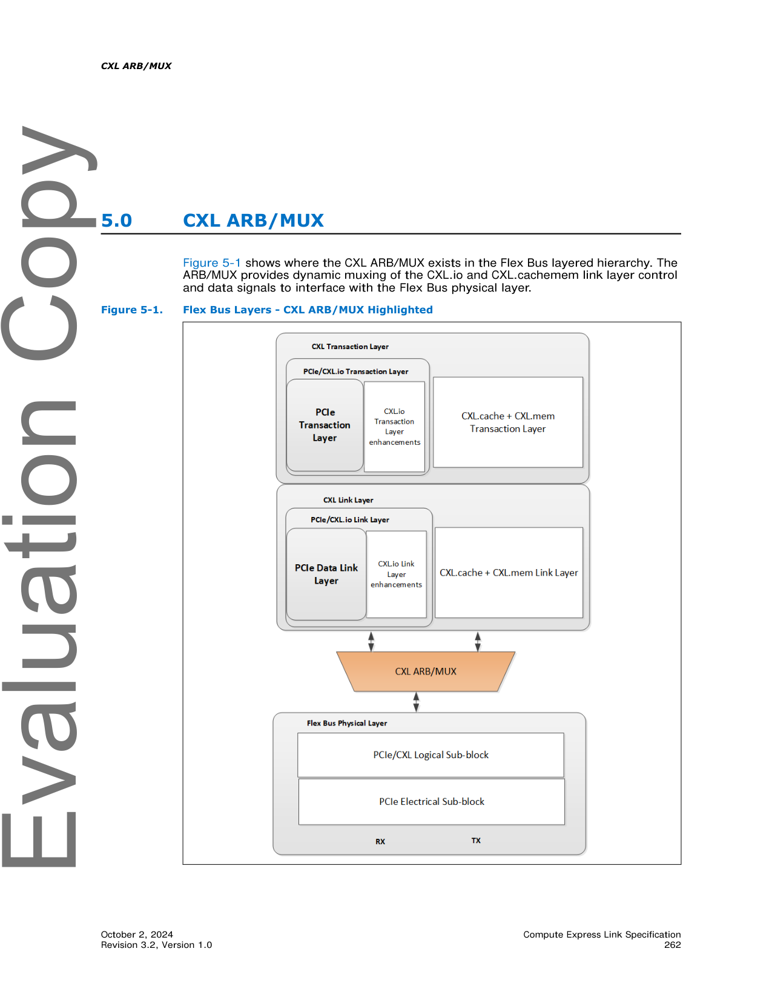
>
> *Original page render @ 150 DPI* — [📄 Full size](figures/chapter_05/page_0262.png)

[⬆️ 返回目录](#-本章目录)

---

## 5.1 vLSM States | 虚拟链路状态机 (vLSM) 状态

<table>
<thead>
<tr>
<th width="50%">🇬🇧 English</th>
<th width="50%" style="background-color:#e8e8e8">🇨🇳 中文</th>
</tr>
</thead>
<tbody>
<tr><td>The ARB/MUX maintains vLSMs for each CXL link layer it interfaces with, transitioning the state based on power state transition requests it receives from the local link layer or from the remote ARB/MUX on behalf of a remote link layer. Table 5-1 lists the different possible states for the vLSMs. PM States and Retrain are virtual states that can differ across interfaces (CXL.io, CXL.cache, and CXL.mem); however, all other states such as LinkReset, LinkDisable, and LinkError are forwarded to the Link Layer and are therefore synchronized across interfaces.</td><td style="background-color:#e8e8e8">ARB/MUX 为其接口的每个 CXL 链路层维护一个 vLSM,根据从本地链路层或代表远程链路层从远程 ARB/MUX 接收到的电源状态转换请求来转换状态。表 5-1 列出了 vLSM 的所有可能状态。PM 状态和 Retrain 是虚拟状态,在不同接口 (CXL.io, CXL.cache 和 CXL.mem) 之间可能不同;然而,所有其他状态,例如 LinkReset, LinkDisable 和 LinkError,都会转发到链路层,因此在不同接口之间是同步的。</td></tr>
<tr><td><b>Note:</b> When the Physical Layer LTSSM (Link Training and Status State Machine, 链路训练与状态状态机) enters Hot Reset or Disabled state, that state is communicated to all link layers as LinkReset or LinkDisable, respectively. No ALMPs are exchanged, regardless of who requested them, for these transitions. LinkError must take the LTSSM to Detect or Disabled. For example, it is permitted to map CXL.io Downstream Port Containment to LinkError (when the LTSSM is in Disabled state).</td><td style="background-color:#e8e8e8"><b>注意:</b> 当物理层 LTSSM (Link Training and Status State Machine, 链路训练与状态状态机) 进入 Hot Reset 或 Disabled 状态时,该状态会分别作为 LinkReset 或 LinkDisable 传达给所有链路层。对于这些转换,无论是谁请求的,都不会交换 ALMP。LinkError 必须将 LTSSM 带到 Detect 或 Disabled 状态。例如,允许将 CXL.io Downstream Port Containment 映射到 LinkError (当 LTSSM 处于 Disabled 状态时)。</td></tr>
</tbody>
</table>

**Table 5-1.** vLSM States Maintained per Link Layer Interface | 每个链路层接口维护的 vLSM 状态

<table>
<thead>
<tr>
<th width="50%">vLSM State</th>
<th width="50%" style="background-color:#e8e8e8">Description ｜ 描述</th>
</tr>
</thead>
<tbody>
<tr><td>Reset</td><td style="background-color:#e8e8e8">Power-on default state during which initialization occurs 上电默认状态,在此期间进行初始化</td></tr>
<tr><td>Active</td><td style="background-color:#e8e8e8">Normal operational state 正常运行状态</td></tr>
<tr><td>Active.PMNAK</td><td style="background-color:#e8e8e8">Substate of Active to indicate unsuccessful ALMP negotiation of PM entry. This is not a state requested by the Link Layer. It is applicable only for Upstream Ports. It is not applicable for 68B Flit mode. Active 的子状态,用于表示 PM 进入的 ALMP 协商未成功。这不是链路层请求的状态。仅适用于 Upstream Port。不适用于 68B Flit 模式。</td></tr>
<tr><td>L1.0</td><td style="background-color:#e8e8e8">Power savings state, from which the link can enter Active via Retrain (maps to PCIe L1) 节能状态,链路可通过 Retrain 从该状态进入 Active (映射到 PCIe L1)</td></tr>
<tr><td>L1.1</td><td style="background-color:#e8e8e8">Power savings state, from which the link can enter Active via Retrain (reserved for future use) 节能状态,链路可通过 Retrain 从该状态进入 Active (保留供未来使用)</td></tr>
<tr><td>L1.2</td><td style="background-color:#e8e8e8">Power savings state, from which the link can enter Active via Retrain (reserved for future use) 节能状态,链路可通过 Retrain 从该状态进入 Active (保留供未来使用)</td></tr>
<tr><td>L1.3</td><td style="background-color:#e8e8e8">Power savings state, from which the link can enter Active via Retrain (reserved for future use) 节能状态,链路可通过 Retrain 从该状态进入 Active (保留供未来使用)</td></tr>
<tr><td>DAPM</td><td style="background-color:#e8e8e8">Deepest Allowable PM State (not a resolved state; a request that resolves to an L1 substate) 最深允许 PM 状态 (不是已解析状态;一个解析为 L1 子状态的请求)</td></tr>
<tr><td>SLEEP_L2</td><td style="background-color:#e8e8e8">Power savings state, from which the link must go through Reset to reach Active 节能状态,链路必须经过 Reset 才能达到 Active</td></tr>
<tr><td>LinkReset</td><td style="background-color:#e8e8e8">Reset propagation state resulting from software-initiated or hardware-initiated reset 由软件发起或硬件发起的复位所产生的复位传播状态</td></tr>
<tr><td>LinkError</td><td style="background-color:#e8e8e8">Link Error state due to hardware-detected errors that cannot be corrected through link recovery (e.g., uncorrectable internal errors or surprise link down) 由于硬件检测到的、无法通过链路恢复来纠正的错误而导致的链路错误状态 (例如,不可纠正的内部错误或意外链路断开)</td></tr>
<tr><td>LinkDisable</td><td style="background-color:#e8e8e8">Software-controlled link disable state 软件控制的链路禁用状态</td></tr>
<tr><td>Retrain</td><td style="background-color:#e8e8e8">Transitory state that transitions to Active 过渡状态,转换到 Active</td></tr>
</tbody>
</table>

[⬆️ 返回目录](#-本章目录)

---

### 5.1.1 Additional Rules for Local vLSM Transitions | 本地 vLSM 转换的附加规则

<table>
<thead>
<tr>
<th width="50%">🇬🇧 English</th>
<th width="50%" style="background-color:#e8e8e8">🇨🇳 中文</th>
</tr>
</thead>
<tbody>
<tr><td>1. For 68B Flit mode, if any Link Layer requests entry into Retrain to the ARB/MUX, the ARB/MUX must forward the request to the Physical Layer to initiate LTSSM transition to Recovery. In accordance with the Active to Retrain transition trigger condition, after the LTSSM is in Recovery, the ARB/MUX should reflect Retrain to all vLSMs that are in Active state. For 256B Flit mode, there is no Active to Retrain arc in the ARB/MUX vLSM because Physical Layer LTSSM transitions to Recovery do not impact vLSM state.</td><td style="background-color:#e8e8e8">1. 对于 68B Flit 模式,如果任何链路层向 ARB/MUX 请求进入 Retrain,ARB/MUX 必须将该请求转发给物理层以启动 LTSSM 到 Recovery 的转换。根据 Active 到 Retrain 转换的触发条件,在 LTSSM 处于 Recovery 之后,ARB/MUX 应将 Retrain 反映给所有处于 Active 状态的 vLSM。对于 256B Flit 模式,ARB/MUX vLSM 中没有 Active 到 Retrain 弧,因为物理层 LTSSM 转换到 Recovery 不会影响 vLSM 状态。</td></tr>
<tr><td><b>Note:</b> For 256B Flit mode: Not exposing the Physical Layer LTSSM transition to Recovery to the Link Layer vLSMs allows for optimizations in which the Rx Retry buffer can drain while the LTSSM is in Recovery. It also avoids corner cases in which the vLSMs become out of sync with the remote Link partner. To handle error conditions such as UpdateFC DLLP timeouts, implementations must have a sideband mechanism from the Link Layers to the Physical Layer for triggering the LTSSM transition to Recovery.</td><td style="background-color:#e8e8e8"><b>注意:</b> 对于 256B Flit 模式:不将物理层 LTSSM 到 Recovery 的转换暴露给链路层 vLSM 允许进行优化,其中 Rx Retry 缓冲区可以在 LTSSM 处于 Recovery 时排空。它还避免了 vLSM 与远程链路伙伴失去同步的极端情况。为了处理错误情况 (例如 UpdateFC DLLP 超时),实现必须具有从链路层到物理层的旁带机制,以触发 LTSSM 到 Recovery 的转换。</td></tr>
<tr><td>2. Once a vLSM is in Retrain state, it is expected that the corresponding Link Layer will eventually request ARB/MUX for a transition to Active.</td><td style="background-color:#e8e8e8">2. 一旦 vLSM 处于 Retrain 状态,预计相应的链路层最终会向 ARB/MUX 请求转换到 Active。</td></tr>
<tr><td>3. If the LTSSM moves to Detect, each vLSM must eventually transition to Reset.</td><td style="background-color:#e8e8e8">3. 如果 LTSSM 移到 Detect,每个 vLSM 最终必须转换到 Reset。</td></tr>
</tbody>
</table>

[⬆️ 返回目录](#-本章目录)

---

### 5.1.2 Rules for vLSM State Transitions across Link | 跨链路的 vLSM 状态转换规则

<table>
<thead>
<tr>
<th width="50%">🇬🇧 English</th>
<th width="50%" style="background-color:#e8e8e8">🇨🇳 中文</th>
</tr>
</thead>
<tbody>
<tr><td>This section refers to vLSM state transitions.</td><td style="background-color:#e8e8e8">本节涉及 vLSM 状态转换。</td></tr>
</tbody>
</table>

#### 5.1.2.1 General Rules | 通用规则

<table>
<thead>
<tr>
<th width="50%">🇬🇧 English</th>
<th width="50%" style="background-color:#e8e8e8">🇨🇳 中文</th>
</tr>
</thead>
<tbody>
<tr><td>• The link cannot operate for any other protocols if the CXL.io protocol is down (CXL.io operation is a minimum requirement)</td><td style="background-color:#e8e8e8">• 如果 CXL.io 协议未运行,则链路不能运行任何其他协议 (CXL.io 运行是最低要求)</td></tr>
</tbody>
</table>

[⬆️ 返回目录](#-本章目录)

---

#### 5.1.2.2 Entry to Active Exchange Protocol | 进入 Active 状态的交换协议

<table>
<thead>
<tr>
<th width="50%">🇬🇧 English</th>
<th width="50%" style="background-color:#e8e8e8">🇨🇳 中文</th>
</tr>
</thead>
<tbody>
<tr><td>The ALMP protocol required for the entry to active consists of 4 ALMP exchanges between the local and remote vLSMs as seen in Figure 5-2. Entry to Active begins with an Active State Request ALMP sent to the remote vLSM which responds with an Active State Status ALMP. The only valid response to an Active State Request is an Active State Status once the corresponding Link Layer is ready to receive protocol flits. The remote vLSM must also send an Active State Request ALMP to the local vLSM which responds with an Active State Status ALMP.</td><td style="background-color:#e8e8e8">进入 Active 所需的 ALMP 协议由本地和远程 vLSM 之间的 4 次 ALMP 交换组成,如图 5-2 所示。进入 Active 以发送到远程 vLSM 的 Active State Request ALMP 开始,远程 vLSM 以 Active State Status ALMP 进行响应。一旦相应的链路层准备好接收协议 flit,对 Active State Request 唯一有效的响应就是 Active State Status。远程 vLSM 还必须向本地 vLSM 发送 Active State Request ALMP,本地 vLSM 以 Active State Status ALMP 进行响应。</td></tr>
<tr><td>During initial link training, the Upstream Port (UP in Figure 5-2) must wait for a non-physical layer flit (i.e., a flit that was not generated by the physical layer of the Downstream Port (DP in Figure 5-2)) before transmitting any ALMPs (see Section 6.4.1). Thus, during initial link training, the first ALMP is always sent from the Downstream Port to the Upstream Port. If additional Active exchange handshakes subsequently occur (e.g., as part of PM exit), the Active request ALMP can be initiated from either side.</td><td style="background-color:#e8e8e8">在初始链路训练期间,Upstream Port (图 5-2 中的 UP) 必须等待非物理层 flit (即不是由 Downstream Port (图 5-2 中的 DP) 物理层生成的 flit) 才能发送任何 ALMP (请参阅第 6.4.1 节)。因此,在初始链路训练期间,第一个 ALMP 始终从 Downstream Port 发送到 Upstream Port。如果随后发生其他 Active 交换握手 (例如,作为 PM 退出的一部分),则 Active request ALMP 可以从任一侧启动。</td></tr>
<tr><td>Once an Active State Status ALMP has been sent and received by a vLSM, the vLSM transitions to Active State.</td><td style="background-color:#e8e8e8">一旦 vLSM 发送并接收到 Active State Status ALMP,vLSM 将转换到 Active 状态。</td></tr>
</tbody>
</table>

> **Figure 5-2.** Entry to Active Protocol Exchange ｜ 进入 Active 状态的协议交换
>
> 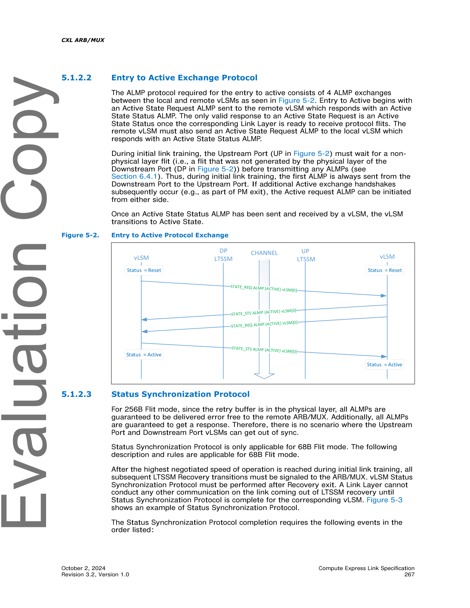
>
> *Original page render @ 150 DPI* — [📄 Full size](figures/chapter_05/page_0267.png)

[⬆️ 返回目录](#-本章目录)

---

#### 5.1.2.3 Status Synchronization Protocol | 状态同步协议

<table>
<thead>
<tr>
<th width="50%">🇬🇧 English</th>
<th width="50%" style="background-color:#e8e8e8">🇨🇳 中文</th>
</tr>
</thead>
<tbody>
<tr><td>For 256B Flit mode, since the retry buffer is in the physical layer, all ALMPs are guaranteed to be delivered error free to the remote ARB/MUX. Additionally, all ALMPs are guaranteed to get a response. Therefore, there is no scenario where the Upstream Port and Downstream Port vLSMs can get out of sync.</td><td style="background-color:#e8e8e8">对于 256B Flit 模式,由于重试缓冲区位于物理层中,因此保证所有 ALMP 都能无误地传送到远程 ARB/MUX。此外,保证所有 ALMP 都会得到响应。因此,不存在 Upstream Port 和 Downstream Port vLSM 可能失去同步的情况。</td></tr>
<tr><td>Status Synchronization Protocol is only applicable for 68B Flit mode. The following description and rules are applicable for 68B Flit mode.</td><td style="background-color:#e8e8e8">状态同步协议仅适用于 68B Flit 模式。以下描述和规则适用于 68B Flit 模式。</td></tr>
<tr><td>After the highest negotiated speed of operation is reached during initial link training, all subsequent LTSSM Recovery transitions must be signaled to the ARB/MUX. vLSM Status Synchronization Protocol must be performed after Recovery exit. A Link Layer cannot conduct any other communication on the link coming out of LTSSM recovery until Status Synchronization Protocol is complete for the corresponding vLSM. Figure 5-3 shows an example of Status Synchronization Protocol.</td><td style="background-color:#e8e8e8">在初始链路训练期间达到最高协商运行速度之后,所有后续的 LTSSM Recovery 转换都必须向 ARB/MUX 发信号。vLSM 状态同步协议必须在 Recovery 退出后执行。在相应的 vLSM 完成状态同步协议之前,链路层不能在 LTSSM recovery 出来的链路上进行任何其他通信。图 5-3 显示了状态同步协议的示例。</td></tr>
<tr><td>The Status Synchronization Protocol completion requires the following events in the order listed:</td><td style="background-color:#e8e8e8">状态同步协议的完成需要按所列顺序执行以下事件:</td></tr>
</tbody>
</table>

> **Figure 5-3.** Example Status Exchange ｜ 状态交换示例
>
> 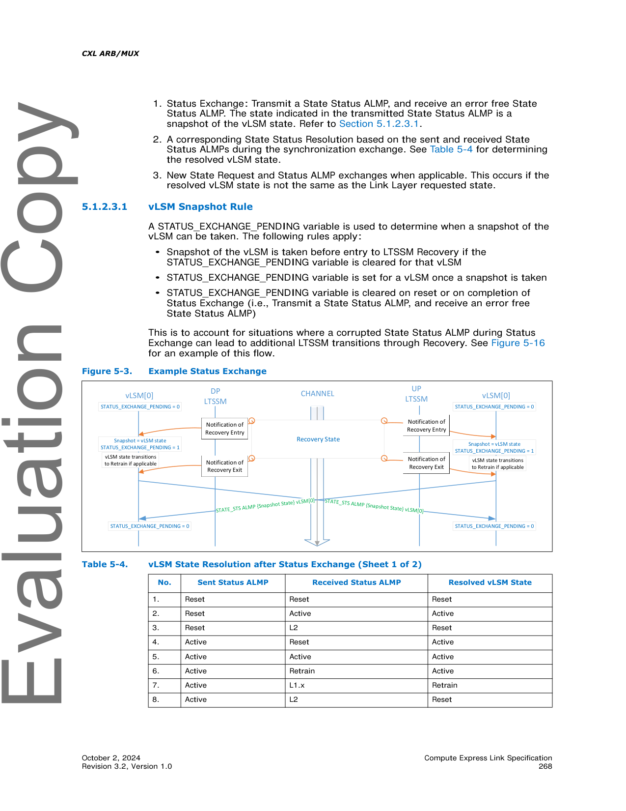
>
> *Original page render @ 150 DPI* — [📄 Full size](figures/chapter_05/page_0268.png)

<table>
<thead>
<tr>
<th width="50%">🇬🇧 English</th>
<th width="50%" style="background-color:#e8e8e8">🇨🇳 中文</th>
</tr>
</thead>
<tbody>
<tr><td>1. Status Exchange: Transmit a State Status ALMP, and receive an error free State Status ALMP. The state indicated in the transmitted State Status ALMP is a snapshot of the vLSM state. Refer to Section 5.1.2.3.1.</td><td style="background-color:#e8e8e8">1. 状态交换: 发送 State Status ALMP,并接收一个无错误的 State Status ALMP。在所发送的 State Status ALMP 中指示的状态是 vLSM 状态的快照。请参阅第 5.1.2.3.1 节。</td></tr>
<tr><td>2. A corresponding State Status Resolution based on the sent and received State Status ALMPs during the synchronization exchange. See Table 5-4 for determining the resolved vLSM state.</td><td style="background-color:#e8e8e8">2. 在同步交换期间基于发送和接收的 State Status ALMP 进行相应的 State Status 解析。有关确定已解析的 vLSM 状态,请参阅表 5-4。</td></tr>
<tr><td>3. New State Request and Status ALMP exchanges when applicable. This occurs if the resolved vLSM state is not the same as the Link Layer requested state.</td><td style="background-color:#e8e8e8">3. 在适用时进行新的 State Request 和 Status ALMP 交换。如果已解析的 vLSM 状态与链路层请求的状态不同,则会发生这种情况。</td></tr>
</tbody>
</table>

[⬆️ 返回目录](#-本章目录)

---

##### 5.1.2.3.1 vLSM Snapshot Rule | vLSM 快照规则

<table>
<thead>
<tr>
<th width="50%">🇬🇧 English</th>
<th width="50%" style="background-color:#e8e8e8">🇨🇳 中文</th>
</tr>
</thead>
<tbody>
<tr><td>A STATUS_EXCHANGE_PENDING variable is used to determine when a snapshot of the vLSM can be taken. The following rules apply:</td><td style="background-color:#e8e8e8">STATUS_EXCHANGE_PENDING 变量用于确定何时可以获取 vLSM 的快照。适用以下规则:</td></tr>
<tr><td>• Snapshot of the vLSM is taken before entry to LTSSM Recovery if the STATUS_EXCHANGE_PENDING variable is cleared for that vLSM</td><td style="background-color:#e8e8e8">• 如果该 vLSM 的 STATUS_EXCHANGE_PENDING 变量已清除,则在进入 LTSSM Recovery 之前获取 vLSM 快照</td></tr>
<tr><td>• STATUS_EXCHANGE_PENDING variable is set for a vLSM once a snapshot is taken</td><td style="background-color:#e8e8e8">• 一旦获取快照,就为 vLSM 设置 STATUS_EXCHANGE_PENDING 变量</td></tr>
<tr><td>• STATUS_EXCHANGE_PENDING variable is cleared on reset or on completion of Status Exchange (i.e., Transmit a State Status ALMP, and receive an error free State Status ALMP)</td><td style="background-color:#e8e8e8">• STATUS_EXCHANGE_PENDING 变量在复位时或状态交换完成时清除 (即,发送 State Status ALMP,并接收无错误的 State Status ALMP)</td></tr>
<tr><td>This is to account for situations where a corrupted State Status ALMP during Status Exchange can lead to additional LTSSM transitions through Recovery. See Figure 5-16 for an example of this flow.</td><td style="background-color:#e8e8e8">这是为了说明在状态交换期间损坏的 State Status ALMP 可能导致通过 Recovery 的额外 LTSSM 转换的情况。有关此流程的示例,请参见图 5-16。</td></tr>
</tbody>
</table>

**Table 5-4 (Sheet 1 of 2).** vLSM State Resolution after Status Exchange | 状态交换后的 vLSM 状态解析

<table>
<thead>
<tr>
<th>No.</th>
<th>Sent Status ALMP</th>
<th>Received Status ALMP</th>
<th>Resolved vLSM State</th>
</tr>
</thead>
<tbody>
<tr><td>1.</td><td>Reset</td><td>Reset</td><td>Reset</td></tr>
<tr><td>2.</td><td>Reset</td><td>Active</td><td>Active</td></tr>
<tr><td>3.</td><td>Reset</td><td>L2</td><td>Reset</td></tr>
<tr><td>4.</td><td>Active</td><td>Reset</td><td>Active</td></tr>
<tr><td>5.</td><td>Active</td><td>Active</td><td>Active</td></tr>
<tr><td>6.</td><td>Active</td><td>Retrain</td><td>Active</td></tr>
<tr><td>7.</td><td>Active</td><td>L1.x</td><td>Retrain</td></tr>
<tr><td>8.</td><td>Active</td><td>L2</td><td>Reset</td></tr>
</tbody>
</table>

**Table 5-4 (Sheet 2 of 2).** vLSM State Resolution after Status Exchange | 状态交换后的 vLSM 状态解析

<table>
<thead>
<tr>
<th>No.</th>
<th>Sent Status ALMP</th>
<th>Received Status ALMP</th>
<th>Resolved vLSM State</th>
</tr>
</thead>
<tbody>
<tr><td>9.</td><td>Retrain</td><td>Active</td><td>Active</td></tr>
<tr><td>10.</td><td>Retrain</td><td>Retrain</td><td>Retrain</td></tr>
<tr><td>11.</td><td>Retrain</td><td>L1.x</td><td>Retrain</td></tr>
<tr><td>12.</td><td>L1.x</td><td>Active</td><td>L1.x</td></tr>
<tr><td>13.</td><td>L1.x</td><td>Retrain</td><td>L1.x</td></tr>
<tr><td>14.</td><td>L1.x</td><td>L1.x</td><td>L1.x</td></tr>
<tr><td>15.</td><td>L2</td><td>Active</td><td>L2</td></tr>
<tr><td>16.</td><td>L2</td><td>Reset</td><td>L2</td></tr>
<tr><td>17.</td><td>L2</td><td>L2</td><td>L2</td></tr>
</tbody>
</table>

[⬆️ 返回目录](#-本章目录)

---

##### 5.1.2.3.2 Notes on State Resolution after Status Exchange (Table 5-4) | 状态交换后状态解析的注意事项 (Table 5-4)

<table>
<thead>
<tr>
<th width="50%">🇬🇧 English</th>
<th width="50%" style="background-color:#e8e8e8">🇨🇳 中文</th>
</tr>
</thead>
<tbody>
<tr><td>• For the rows where the resolved state is Active, the corresponding ARB/MUX must ensure that protocol flits received immediately after the State Status ALMP from remote ARB/MUX can be serviced by the Link Layer of the corresponding vLSM. One way to guarantee this is to ensure that for these cases the Link Layer receiver is ready before sending the State Status ALMP during Status Exchange.</td><td style="background-color:#e8e8e8">• 对于已解析状态为 Active 的行,相应的 ARB/MUX 必须确保在接收到来自远程 ARB/MUX 的 State Status ALMP 之后立即接收的协议 flit 可由相应 vLSM 的链路层提供服务。保证这一点的一种方法是确保在这些情况下,在状态交换期间发送 State Status ALMP 之前,链路层接收器已准备就绪。</td></tr>
<tr><td>• Rows 7 and 11 will result in L1 exit flow following state resolution. The corresponding ARB/MUX must initiate a transition to Active through new State Request ALMPs. Once both the Upstream Port VLSM and Downstream Port vLSM are in Active, the Link Layers can redo PM entry negotiation if required. Similarly, for row 10 if reached during PM negotiation, it is required for both vLSMs to initiate Active request ALMPs.</td><td style="background-color:#e8e8e8">• 第 7 行和第 11 行将在状态解析之后产生 L1 退出流程。相应的 ARB/MUX 必须通过新的 State Request ALMP 启动到 Active 的转换。一旦 Upstream Port VLSM 和 Downstream Port vLSM 都处于 Active 状态,如需要,链路层可以重新进行 PM entry 协商。类似地,对于在 PM 协商期间到达的第 10 行,需要两个 vLSM 都启动 Active request ALMP。</td></tr>
<tr><td>• When supported, rows 3 and 8 will result in L2 exit flow following state resolution. Since the LTSSM will eventually move to Detect, each vLSM will eventually transition to Reset state.</td><td style="background-color:#e8e8e8">• 如果支持,第 3 行和第 8 行将在状态解析之后产生 L2 退出流程。由于 LTSSM 最终将移至 Detect,因此每个 vLSM 最终都将转换到 Reset 状态。</td></tr>
<tr><td>• Rows 7 and 8 are applicable only for Upstream Ports. Since entry into PM is always initiated by the Upstream Port, and it cannot transition its vLSM to PM unless the Downstream Port has done so, there is no case where these rows can apply for Downstream Ports.</td><td style="background-color:#e8e8e8">• 第 7 行和第 8 行仅适用于 Upstream Port。由于进入 PM 始终是由 Upstream Port 启动的,并且除非 Downstream Port 这样做,否则它不能将其 vLSM 转换到 PM,因此这些行不适用于 Downstream Port 的情况。</td></tr>
<tr><td>• Behavior is undefined and implementation specific for combinations not captured in Table 5-4.</td><td style="background-color:#e8e8e8">• 对于表 5-4 中未包含的组合,行为未定义,且与实现相关。</td></tr>
</tbody>
</table>

[⬆️ 返回目录](#-本章目录)

---

#### 5.1.2.4 State Request ALMP | 状态请求 ALMP

<table>
<thead>
<tr>
<th width="50%">🇬🇧 English</th>
<th width="50%" style="background-color:#e8e8e8">🇨🇳 中文</th>
</tr>
</thead>
<tbody>
<tr><td>The following rules apply for sending a State Request ALMP. A State Request ALMP is sent to request a state change to Active or PM. For PM, the request can only be initiated by the ARB/MUX on the Upstream Port.</td><td style="background-color:#e8e8e8">以下规则适用于发送 State Request ALMP。发送 State Request ALMP 是为了请求向 Active 或 PM 的状态更改。对于 PM,该请求只能由 Upstream Port 上的 ARB/MUX 启动。</td></tr>
</tbody>
</table>

##### 5.1.2.4.1 For Entry into Active | 用于进入 Active 状态

<table>
<thead>
<tr>
<th width="50%">🇬🇧 English</th>
<th width="50%" style="background-color:#e8e8e8">🇨🇳 中文</th>
</tr>
</thead>
<tbody>
<tr><td>• All Recovery state operations must complete before the entry to Active sequence starts. For 68B Flit mode, this includes the completion of Status Synchronization Protocol after LTSSM transitions from Recovery to L0.</td><td style="background-color:#e8e8e8">• 在进入 Active 序列开始之前,所有 Recovery 状态操作必须完成。对于 68B Flit 模式,这包括在 LTSSM 从 Recovery 转换到 L0 之后完成状态同步协议。</td></tr>
<tr><td>• An ALMP State Request is sent to initiate the entry into Active State.</td><td style="background-color:#e8e8e8">• 发送 ALMP State Request 以启动进入 Active 状态。</td></tr>
<tr><td>• A vLSM must send a Request and receive a Status before the transmitter is considered active. This is not equivalent to vLSM Active state.</td><td style="background-color:#e8e8e8">• 在发送器被视为 active 之前,vLSM 必须发送 Request 并接收 Status。这不等同于 vLSM Active 状态。</td></tr>
<tr><td>• Protocol layer flits must only be transmitted once the vLSM has reached Active state.</td><td style="background-color:#e8e8e8">• 只有在 vLSM 达到 Active 状态后才能发送协议层 flit。</td></tr>
</tbody>
</table>

> **Figure 5-4.** CXL Entry to Active Example Flow ｜ CXL 进入 Active 状态示例流程
>
> 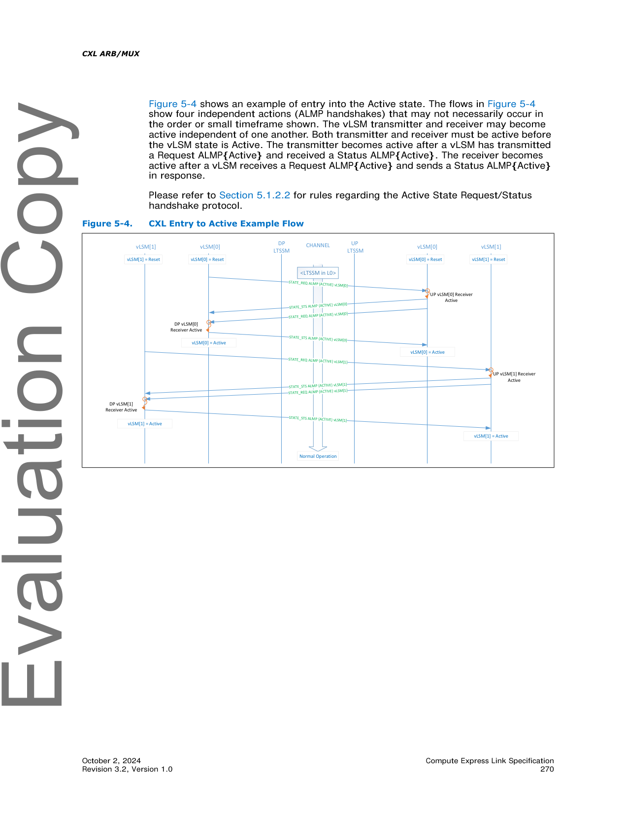
>
> *Original page render @ 150 DPI* — [📄 Full size](figures/chapter_05/page_0270.png)

<table>
<thead>
<tr>
<th width="50%">🇬🇧 English</th>
<th width="50%" style="background-color:#e8e8e8">🇨🇳 中文</th>
</tr>
</thead>
<tbody>
<tr><td>Figure 5-4 shows an example of entry into the Active state. The flows in Figure 5-4 show four independent actions (ALMP handshakes) that may not necessarily occur in the order or small timeframe shown. The vLSM transmitter and receiver may become active independent of one another. Both transmitter and receiver must be active before the vLSM state is Active. The transmitter becomes active after a vLSM has transmitted a Request ALMP{Active} and received a Status ALMP{Active}. The receiver becomes active after a vLSM receives a Request ALMP{Active} and sends a Status ALMP{Active} in response.</td><td style="background-color:#e8e8e8">图 5-4 显示了进入 Active 状态的示例。图 5-4 中的流程显示了四个独立的动作 (ALMP 握手),这些动作不一定按所示的顺序或在所示的小时间范围内发生。vLSM 发送器和接收器可以独立地变为 active。vLSM 状态变为 Active 之前,发送器和接收器都必须处于 active 状态。发送器在 vLSM 发送了 Request ALMP{Active} 并接收到 Status ALMP{Active} 之后变为 active。接收器在 vLSM 接收到 Request ALMP{Active} 并发送 Status ALMP{Active} 作为响应之后变为 active。</td></tr>
<tr><td>Please refer to Section 5.1.2.2 for rules regarding the Active State Request/Status handshake protocol.</td><td style="background-color:#e8e8e8">有关 Active State Request/Status 握手协议的规则,请参阅第 5.1.2.2 节。</td></tr>
</tbody>
</table>

[⬆️ 返回目录](#-本章目录)

---

##### 5.1.2.4.2 For Entry into PM State (L1/L2) | 用于进入 PM 状态 (L1/L2)

<table>
<thead>
<tr>
<th width="50%">🇬🇧 English</th>
<th width="50%" style="background-color:#e8e8e8">🇨🇳 中文</th>
</tr>
</thead>
<tbody>
<tr><td>• An ALMP State Request is sent to initiate the entry into PM States. Only Upstream Ports can initiate entry into PM states.</td><td style="background-color:#e8e8e8">• 发送 ALMP State Request 以启动进入 PM 状态。只有 Upstream Port 才能启动进入 PM 状态。</td></tr>
<tr><td>• For Upstream Ports, a vLSM must send a Request and receive a Status before the PM negotiation is considered complete for the corresponding vLSM.</td><td style="background-color:#e8e8e8">• 对于 Upstream Port,vLSM 必须发送 Request 并接收 Status,然后才能认为相应 vLSM 的 PM 协商完成。</td></tr>
<tr><td>Figure 5-5 shows an example of Entry to PM State (L1) initiated by the Upstream Port (UP in the figure) ARB/MUX. Each vLSM will be ready to enter L1 State once the vLSM has sent a Request ALMP{L1} and received a Status ALMP{L1} in return or the vLSM has received a Request ALMP{L1} and sent a Status ALMP{L1} in return. The vLSMs operate independently and actions may not complete in the order or within the timeframe shown. Once all vLSMs are ready to enter PM State (L1), the Channel will complete the EIOS (Electrical Idle Ordered Set, 电气空闲有序集) exchange and enter L1.</td><td style="background-color:#e8e8e8">图 5-5 显示了由 Upstream Port (图中的 UP) ARB/MUX 启动的进入 PM 状态 (L1) 的示例。一旦 vLSM 发送了 Request ALMP{L1} 并接收到 Status ALMP{L1} 作为响应,或者 vLSM 接收到 Request ALMP{L1} 并发送 Status ALMP{L1} 作为响应,每个 vLSM 将准备进入 L1 状态。vLSM 独立运行,动作可能不按所示的顺序或所示的时间范围内完成。一旦所有 vLSM 准备好进入 PM 状态 (L1),通道将完成 EIOS (Electrical Idle Ordered Set, 电气空闲有序集) 交换并进入 L1。</td></tr>
</tbody>
</table>

> **Figure 5-5.** CXL Entry to PM State Example ｜ CXL 进入 PM 状态示例
>
> 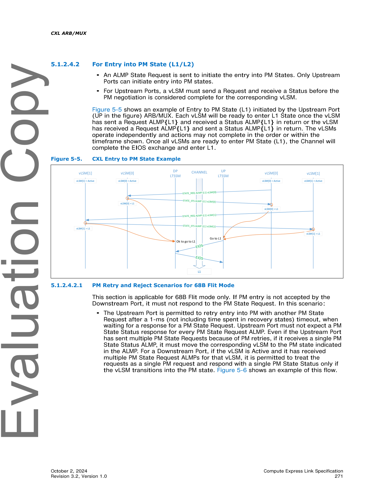
>
> *Original page render @ 150 DPI* — [📄 Full size](figures/chapter_05/page_0271.png)

[⬆️ 返回目录](#-本章目录)

---

###### 5.1.2.4.2.1 PM Retry and Reject Scenarios for 68B Flit Mode | 68B Flit 模式下的 PM 重试和拒绝场景

<table>
<thead>
<tr>
<th width="50%">🇬🇧 English</th>
<th width="50%" style="background-color:#e8e8e8">🇨🇳 中文</th>
</tr>
</thead>
<tbody>
<tr><td>This section is applicable for 68B Flit mode only. If PM entry is not accepted by the Downstream Port, it must not respond to the PM State Request. In this scenario:</td><td style="background-color:#e8e8e8">本节仅适用于 68B Flit 模式。如果 Downstream Port 不接受 PM 进入,则它不得响应 PM State Request。在这种情况下:</td></tr>
<tr><td>• The Upstream Port is permitted to retry entry into PM with another PM State Request after a 1-ms (not including time spent in recovery states) timeout, when waiting for a response for a PM State Request. Upstream Port must not expect a PM State Status response for every PM State Request ALMP. Even if the Upstream Port has sent multiple PM State Requests because of PM retries, if it receives a single PM State Status ALMP, it must move the corresponding vLSM to the PM state indicated in the ALMP. For a Downstream Port, if the vLSM is Active and it has received multiple PM State Request ALMPs for that vLSM, it is permitted to treat the requests as a single PM request and respond with a single PM State Status only if the vLSM transitions into the PM state. Figure 5-6 shows an example of this flow.</td><td style="background-color:#e8e8e8">• 当等待 PM State Request 的响应时,允许 Upstream Port 在 1 毫秒 (不包括在恢复状态中花费的时间) 的超时之后,通过另一个 PM State Request 重试进入 PM。Upstream Port 不得期望每个 PM State Request ALMP 都得到 PM State Status 响应。即使 Upstream Port 已由于 PM 重试而发送了多个 PM State Request,如果它接收到单个 PM State Status ALMP,它也必须将相应的 vLSM 移至 ALMP 中指示的 PM 状态。对于 Downstream Port,如果 vLSM 处于 Active 状态并且它已接收到该 vLSM 的多个 PM State Request ALMP,则允许将该请求视为单个 PM 请求,并且仅当 vLSM 转换到 PM 状态时,才以单个 PM State Status 响应。图 5-6 显示了该流程的示例。</td></tr>
</tbody>
</table>

> **Figure 5-6.** Successful PM Entry following PM Retry ｜ PM 重试后成功进入 PM
>
> 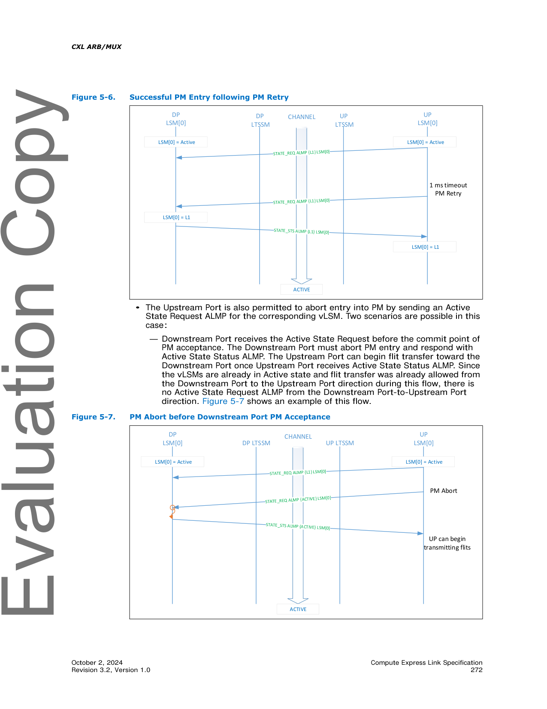
>
> *Original page render @ 150 DPI* — [📄 Full size](figures/chapter_05/page_0272.png)

<table>
<thead>
<tr>
<th width="50%">🇬🇧 English</th>
<th width="50%" style="background-color:#e8e8e8">🇨🇳 中文</th>
</tr>
</thead>
<tbody>
<tr><td>• The Upstream Port is also permitted to abort entry into PM by sending an Active State Request ALMP for the corresponding vLSM. Two scenarios are possible in this case:</td><td style="background-color:#e8e8e8">• Upstream Port 也可以通过为相应的 vLSM 发送 Active State Request ALMP 来中止进入 PM。在这种情况下,可能存在两种情况:</td></tr>
<tr><td>— Downstream Port receives the Active State Request before the commit point of PM acceptance. The Downstream Port must abort PM entry and respond with Active State Status ALMP. The Upstream Port can begin flit transfer toward the Downstream Port once Upstream Port receives Active State Status ALMP. Since the vLSMs are already in Active state and flit transfer was already allowed from the Downstream Port to the Upstream Port direction during this flow, there is no Active State Request ALMP from the Downstream Port-to-Upstream Port direction. Figure 5-7 shows an example of this flow.</td><td style="background-color:#e8e8e8">— Downstream Port 在 PM 接受的提交点之前接收到 Active State Request。Downstream Port 必须中止 PM 进入并以 Active State Status ALMP 响应。Upstream Port 一旦接收到 Active State Status ALMP 就可以开始向 Downstream Port 发送 flit。由于 vLSM 已经处于 Active 状态,并且在此流程中已经允许从 Downstream Port 到 Upstream Port 方向的 flit 传输,因此从 Downstream Port 到 Upstream Port 方向没有 Active State Request ALMP。图 5-7 显示了该流程的示例。</td></tr>
</tbody>
</table>

> **Figure 5-7.** PM Abort before Downstream Port PM Acceptance ｜ Downstream Port 接受 PM 之前的中止
>
> 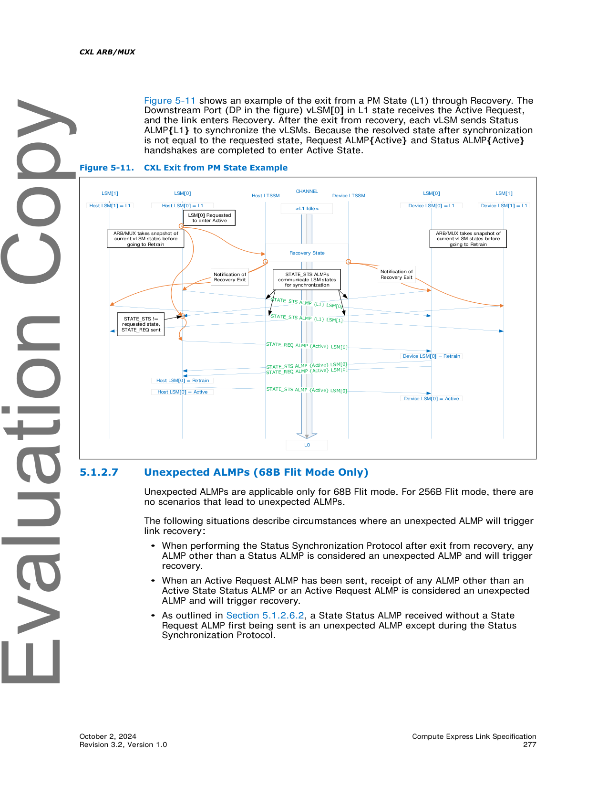
>
> *Original page render @ 150 DPI* — [📄 Full size](figures/chapter_05/page_0277.png)

[⬆️ 返回目录](#-本章目录)

---

###### 5.1.2.4.2.2 PM Retry and Reject Scenario for 256B Flit Mode | 256B Flit 模式下的 PM 重试和拒绝场景

<table>
<thead>
<tr>
<th width="50%">🇬🇧 English</th>
<th width="50%" style="background-color:#e8e8e8">🇨🇳 中文</th>
</tr>
</thead>
<tbody>
<tr><td>This section is applicable for 256B Flit mode only. Upon receiving a PM Request ALMP, the Downstream Port must respond to it with either a PM Status ALMP or an Active.PMNAK Status ALMP.</td><td style="background-color:#e8e8e8">本节仅适用于 256B Flit 模式。在接收到 PM Request ALMP 时,Downstream Port 必须以 PM Status ALMP 或 Active.PMNAK Status ALMP 进行响应。</td></tr>
<tr><td>It is strongly recommended for the Downstream Port ARB/MUX to send the response ALMP to the Physical Layer within 10 us of receiving the request ALMP from the Physical Layer (the time is counted only during the L0 state of the physical LTSSM, excluding the time spent in the Downstream Port's Rx Retry buffer for the request, or the time spent in the Downstream Port's Tx Retry buffer for the response). If the Downstream Port does not meet the conditions to accept PM entry within that time window, it must respond with an Active.PMNAK Status ALMP.</td><td style="background-color:#e8e8e8">强烈建议 Downstream Port ARB/MUX 在从物理层接收到 request ALMP 之后的 10 us 之内将响应 ALMP 发送到物理层 (该时间仅在物理 LTSSM 的 L0 状态期间计算,不包括请求在 Downstream Port 的 Rx Retry 缓冲区中花费的时间,也不包括响应在 Downstream Port 的 Tx Retry 缓冲区中花费的时间)。如果 Downstream Port 在该时间窗口内不满足接受 PM 进入的条件,则它必须以 Active.PMNAK Status ALMP 进行响应。</td></tr>
<tr><td>The Downstream Port ARB/MUX must wait for at least 1 us after receiving the PM Request ALMP from the Physical Layer before deciding whether to schedule an Active.PMNAK Status ALMP.</td><td style="background-color:#e8e8e8">Downstream Port ARB/MUX 在从物理层接收到 PM Request ALMP 之后,必须至少等待 1 us,然后才能决定是否调度 Active.PMNAK Status ALMP。</td></tr>
<tr><td><b>Note:</b> There is no difference between a PM Request ALMP for PCI-PM vs. ASPM (Active State Power Management, 活动状态电源管理). For both cases on the CXL.io Downstream Port, idle time with respect to lack of TLP (Transaction Layer Packet, 事务层数据包) flow triggers the Link Layer to request L1 to ARB/MUX. Waiting for at least 1 us on the Downstream Port, the ARB/MUX provides sufficient time for the PCI-PM-related CSR (Configuration and Status Register, 配置和状态寄存器) completion from the Upstream Port to the Downstream Port for the write to the non-D0 state to exit the Downstream Port's CXL.io Link Layer, and reduces the likelihood of returning an Active.PMNAK Status ALMP.</td><td style="background-color:#e8e8e8"><b>注意:</b> PCI-PM 和 ASPM (Active State Power Management, 活动状态电源管理) 的 PM Request ALMP 之间没有区别。对于 CXL.io Downstream Port 上的这两种情况,关于缺少 TLP (Transaction Layer Packet, 事务层数据包) 流的空闲时间会触发链路层向 ARB/MUX 请求 L1。在 Downstream Port 上至少等待 1 us,ARB/MUX 为从 Upstream Port 到 Downstream Port 的 PCI-PM 相关 CSR (Configuration and Status Register, 配置和状态寄存器) 完成提供足够的时间,以写入非 D0 状态以退出 Downstream Port 的 CXL.io 链路层,并降低返回 Active.PMNAK Status ALMP 的可能性。</td></tr>
<tr><td>Upon receiving an Active.PMNAK Status ALMP, the Upstream Port must transition the corresponding vLSM to Active.PMNAK state. The Upstream port must continue to receive and process flits while the vLSM state is Active or Active.PMNAK. If PMTimeout</td><td style="background-color:#e8e8e8">收到 Active.PMNAK Status ALMP 后,Upstream Port 必须将相应的 vLSM 转换为 Active.PMNAK 状态。在 vLSM 状态为 Active 或 Active.PMNAK 时,Upstream Port 必须继续接收和处理 flit。如果 PMTimeout</td></tr>
</tbody>
</table>

> **Figure 5-8.** PM Abort after Downstream Port PM Acceptance ｜ Downstream Port 接受 PM 之后的中止
>
> 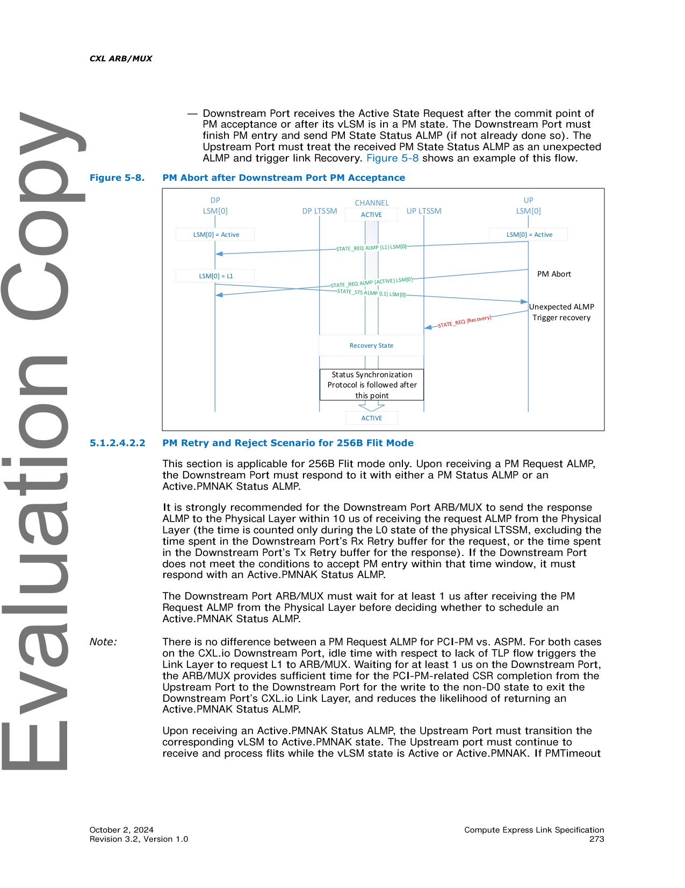
>
> *Original page render @ 150 DPI* — [📄 Full size](figures/chapter_05/page_0273.png)

<table>
<thead>
<tr>
<th width="50%">🇬🇧 English</th>
<th width="50%" style="background-color:#e8e8e8">🇨🇳 中文</th>
</tr>
</thead>
<tbody>
<tr><td>— Downstream Port receives the Active State Request after the commit point of PM acceptance or after its vLSM is in a PM state. The Downstream Port must finish PM entry and send PM State Status ALMP (if not already done so). The Upstream Port must treat the received PM State Status ALMP as an unexpected ALMP and trigger link Recovery. Figure 5-8 shows an example of this flow.</td><td style="background-color:#e8e8e8">— Downstream Port 在 PM 接受的提交点之后或在其 vLSM 处于 PM 状态之后接收到 Active State Request。Downstream Port 必须完成 PM 进入并发送 PM State Status ALMP (如果尚未发送)。Upstream Port 必须将收到的 PM State Status ALMP 视为意外 ALMP,并触发链路 Recovery。图 5-8 显示了该流程的示例。</td></tr>
<tr><td>(see Section 8.2.5.1) is enabled and a response is not received for a PM Request ALMP within the programmed time window, the ARB/MUX must treat this as an uncorrectable internal error and escalate accordingly.</td><td style="background-color:#e8e8e8">(请参阅第 8.2.5.1 节) 启用时,如果在编程的时间窗口内未收到 PM Request ALMP 的响应,ARB/MUX 必须将其视为不可纠正的内部错误,并相应地上报。</td></tr>
<tr><td>For Upstream Ports, after the Link Layer requests PM entry, the Link Layer must not change this request until it observes the vLSM status change to either the requested state or Active.PMNAK or one of the non-virtual states (LinkError, LinkReset, LinkDisable, or Reset). If Active.PMNAK is observed, the Link Layer must request Active to the ARB/MUX and wait for the vLSM to transition to Active before transmitting flits or re-requesting PM entry (if PM entry conditions are met).</td><td style="background-color:#e8e8e8">对于 Upstream Port,在链路层请求 PM 进入之后,链路层不得更改此请求,直到它观察到 vLSM 状态更改为所请求的状态或 Active.PMNAK 或非虚拟状态 (LinkError, LinkReset, LinkDisable 或 Reset) 之一。如果观察到 Active.PMNAK,则链路层必须向 ARB/MUX 请求 Active,并等待 vLSM 转换到 Active,然后再发送 flit 或重新请求 PM 进入 (如果满足 PM 进入条件)。</td></tr>
<tr><td>The PM handshakes are reset by any events that cause physical layer LTSSM transitions that result in vLSM states of LinkError, LinkReset, LinkDisable, or Reset; these can occur at any time. Because these are Link down events, no response will be received for any outstanding Request ALMPs.</td><td style="background-color:#e8e8e8">PM 握手由导致物理层 LTSSM 转换的任何事件重置,这些转换会导致 vLSM 状态为 LinkError, LinkReset, LinkDisable 或 Reset;这些事件可能随时发生。由于这些是链路 down 事件,因此对于任何未完成的 Request ALMP,都不会收到响应。</td></tr>
</tbody>
</table>

> **Figure 5-9.** Example of a PMNAK Flow ｜ PMNAK 流程示例
>
> 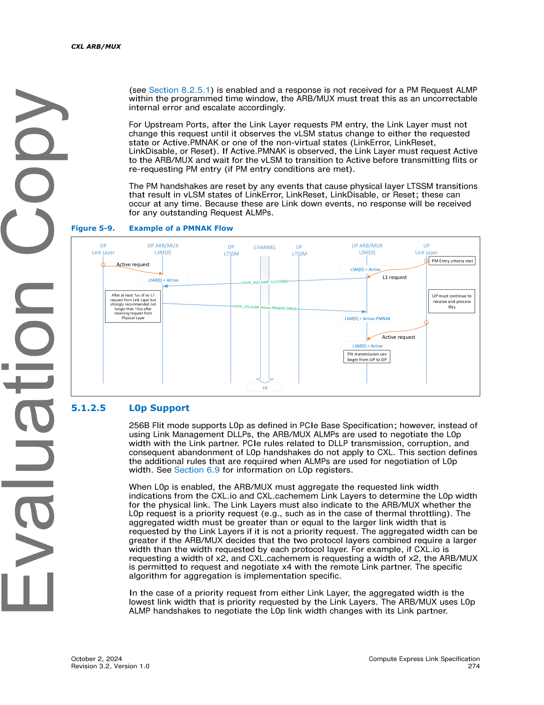
>
> *Original page render @ 150 DPI* — [📄 Full size](figures/chapter_05/page_0274.png)

[⬆️ 返回目录](#-本章目录)

---

#### 5.1.2.5 L0p Support | L0p 支持

<table>
<thead>
<tr>
<th width="50%">🇬🇧 English</th>
<th width="50%" style="background-color:#e8e8e8">🇨🇳 中文</th>
</tr>
</thead>
<tbody>
<tr><td>256B Flit mode supports L0p as defined in PCIe Base Specification; however, instead of using Link Management DLLPs, the ARB/MUX ALMPs are used to negotiate the L0p width with the Link partner. PCIe rules related to DLLP transmission, corruption, and consequent abandonment of L0p handshakes do not apply to CXL. This section defines the additional rules that are required when ALMPs are used for negotiation of L0p width. See Section 6.9 for information on L0p registers.</td><td style="background-color:#e8e8e8">256B Flit 模式支持 PCIe 基础规范中定义的 L0p;但是,代替使用链路管理 DLLP,使用 ARB/MUX ALMP 来与链路伙伴协商 L0p 宽度。与 DLLP 传输,损坏以及随之而来的 L0p 握手放弃有关的 PCIe 规则不适用于 CXL。本节定义使用 ALMP 进行 L0p 宽度协商时所需的附加规则。有关 L0p 寄存器的信息,请参阅第 6.9 节。</td></tr>
<tr><td>When L0p is enabled, the ARB/MUX must aggregate the requested link width indications from the CXL.io and CXL.cachemem Link Layers to determine the L0p width for the physical link. The Link Layers must also indicate to the ARB/MUX whether the L0p request is a priority request (e.g., such as in the case of thermal throttling). The aggregated width must be greater than or equal to the larger link width that is requested by the Link Layers if it is not a priority request. The aggregated width can be greater if the ARB/MUX decides that the two protocol layers combined require a larger width than the width requested by each protocol layer. For example, if CXL.io is requesting a width of x2, and CXL.cachemem is requesting a width of x2, the ARB/MUX is permitted to request and negotiate x4 with the remote Link partner. The specific algorithm for aggregation is implementation specific.</td><td style="background-color:#e8e8e8">当启用 L0p 时,ARB/MUX 必须汇总来自 CXL.io 和 CXL.cachemem 链路层的请求链路宽度指示,以确定物理链路的 L0p 宽度。链路层还必须向 ARB/MUX 指示 L0p 请求是否为优先级请求 (例如,热节流的情况)。如果不是优先级请求,则汇总宽度必须大于或等于链路层请求的较大链路宽度。如果 ARB/MUX 判定两个协议层组合所需的宽度大于每个协议层请求的宽度,则汇总宽度可以更大。例如,如果 CXL.io 请求 x2 宽度,而 CXL.cachemem 请求 x2 宽度,则允许 ARB/MUX 与远程链路伙伴请求并协商 x4。汇总的具体算法是实现特定的。</td></tr>
<tr><td>In the case of a priority request from either Link Layer, the aggregated width is the lowest link width that is priority requested by the Link Layers. The ARB/MUX uses L0p ALMP handshakes to negotiate the L0p link width changes with its Link partner.</td><td style="background-color:#e8e8e8">在任一链路层发出优先级请求的情况下,汇总宽度是链路层优先级请求的最低链路宽度。ARB/MUX 使用 L0p ALMP 握手与其链路伙伴协商 L0p 链路宽度的变化。</td></tr>
</tbody>
</table>

<table>
<thead>
<tr>
<th width="50%">🇬🇧 English</th>
<th width="50%" style="background-color:#e8e8e8">🇨🇳 中文</th>
</tr>
</thead>
<tbody>
<tr><td>The following sequence is followed for L0p width changes:</td><td style="background-color:#e8e8e8">L0p 宽度更改遵循以下顺序:</td></tr>
<tr><td>1. Each Link Layer indicates its minimum required link width to the ARB/MUX. It also indicates whether the request is a priority request.</td><td style="background-color:#e8e8e8">1. 每个链路层向 ARB/MUX 指示其所需的最小链路宽度。它还指示该请求是否为优先级请求。</td></tr>
<tr><td>2. If the ARB/MUX determines that the aggregated L0p width is different from the current width of the physical link, the ARB/MUX must initiate an L0p width change request to the remote ARB/MUX using the L0p request ALMP. It also indicates whether the request is a priority request in the ALMP.</td><td style="background-color:#e8e8e8">2. 如果 ARB/MUX 确定汇总的 L0p 宽度与物理链路的当前宽度不同,则 ARB/MUX 必须使用 L0p request ALMP 向远程 ARB/MUX 发起 L0p 宽度更改请求。它还在 ALMP 中指示该请求是否为优先级请求。</td></tr>
<tr><td>3. The ARB/MUX must ensure that there is only one outstanding L0p request at a time to the remote Link partner.</td><td style="background-color:#e8e8e8">3. ARB/MUX 必须确保一次只能有一个未完成的 L0p 请求到远程链路伙伴。</td></tr>
<tr><td>4. The ARB/MUX must respond with an L0p ACK or an L0p NAK to any outstanding L0p request ALMP within 1 us. (The time is counted only during the L0 state of the physical LTSSM. Time is measured from the receipt of the request ALMP from the Physical Layer to the scheduling of the response ALMP from the ARB/MUX to the Physical Layer. The time does not include the time spent by the ALMPs in the RX or TX Retry buffers.)</td><td style="background-color:#e8e8e8">4. ARB/MUX 必须在 1 us 之内以 L0p ACK 或 L0p NAK 响应任何未完成的 L0p request ALMP。(该时间仅在物理 LTSSM 的 L0 状态期间计算。时间是从从物理层接收到 request ALMP 到从 ARB/MUX 调度响应 ALMP 到物理层的时间。不包括 ALMP 在 RX 或 TX 重试缓冲区中花费的时间。)</td></tr>
<tr><td>5. Whether to send an L0p ACK or an L0p NAK response must be determined using the L0p resolution rules from PCIe Base Specification.</td><td style="background-color:#e8e8e8">5. 必须使用 PCIe 基础规范中的 L0p 解析规则来确定是发送 L0p ACK 还是 L0p NAK 响应。</td></tr>
<tr><td>6. If PMTimeout (see Section 8.2.5.1) is enabled and a response is not received for an L0p Request ALMP within the programmed time window, the ARB/MUX must treat this as an uncorrectable internal error and escalate accordingly.</td><td style="background-color:#e8e8e8">6. 如果启用了 PMTimeout (请参阅第 8.2.5.1 节),并且在编程的时间窗口内未收到 L0p Request ALMP 的响应,则 ARB/MUX 必须将其视为不可纠正的内部错误,并相应地上报。</td></tr>
<tr><td>7. Once the L0p ALMP handshake is complete, the ARB/MUX must direct the Physical Layer to take the necessary steps for downsizing or upsizing the link, as follows:</td><td style="background-color:#e8e8e8">7. 一旦 L0p ALMP 握手完成,ARB/MUX 必须指导物理层采取必要的步骤来缩小或扩大链路,如下所示:</td></tr>
<tr><td>a. <b>Downsizing</b>: If the ARB/MUX receives an L0p ACK in response to its L0p request to downsize, the ARB/MUX notifies the Physical Layer to start the flow for transitioning to the corresponding L0p width at the earliest opportunity. If the ARB/MUX sends an L0p ACK in response to an L0p request, the ARB/MUX notifies the Physical Layer to participate in the flow for transitioning to the corresponding L0p width once it has been initiated by the remote partner. After a successful L0p width change, the corresponding width must be reflected back to the Link Layers.</td><td style="background-color:#e8e8e8">a. <b>缩小</b>: 如果 ARB/MUX 收到响应于其缩小 L0p 请求的 L0p ACK,则 ARB/MUX 通知物理层在最早的机会开始过渡到相应 L0p 宽度的流程。如果 ARB/MUX 发送响应于 L0p 请求的 L0p ACK,则 ARB/MUX 通知物理层在远程伙伴启动后,参与过渡到相应 L0p 宽度的流程。在 L0p 宽度更改成功后,必须将相应的宽度反映回链路层。</td></tr>
<tr><td>b. <b>Upsizing</b>: If the ARB/MUX receives an L0p ACK in response to its L0p request to upsize, the ARB/MUX notifies the Physical Layer to immediately begin the upsizing process. If the ARB/MUX sends an L0p ACK in response to an L0p request, the ARB/MUX notifies the Physical Layer of the new width and an indication to wait for upsizing process from the remote Link partner. After a successful L0p width change, the corresponding width must be reflected back to the Link Layers.</td><td style="background-color:#e8e8e8">b. <b>扩大</b>: 如果 ARB/MUX 收到响应于其扩大 L0p 请求的 L0p ACK,则 ARB/MUX 通知物理层立即开始扩大过程。如果 ARB/MUX 发送响应于 L0p 请求的 L0p ACK,则 ARB/MUX 将新宽度和等待远程链路伙伴的扩大过程的指示通知物理层。在 L0p 宽度更改成功后,必须将相应的宽度反映回链路层。</td></tr>
<tr><td>If the Link has not reached the negotiated L0p width 24 ms after the L0p ACK was sent or received, the ARB/MUX must trigger the Physical Layer to transition the LTSSM to Recovery.</td><td style="background-color:#e8e8e8">如果在发送或接收 L0p ACK 之后的 24 ms 之内,链路尚未达到协商的 L0p 宽度,则 ARB/MUX 必须触发物理层将 LTSSM 转换为 Recovery。</td></tr>
<tr><td>The L0p ALMP handshakes can happen concurrently with vLSM ALMP handshakes. L0p width changes do not affect vLSM states.</td><td style="background-color:#e8e8e8">L0p ALMP 握手可以与 vLSM ALMP 握手同时发生。L0p 宽度的更改不会影响 vLSM 状态。</td></tr>
<tr><td>In 256B Flit mode, the PCIe-defined PM and Link Management DLLPs are not applicable for CXL.io and must not be used.</td><td style="background-color:#e8e8e8">在 256B Flit 模式下,PCIe 定义的 PM 和链路管理 DLLP 不适用于 CXL.io,因此不得使用。</td></tr>
<tr><td>Similar to PCIe, the Physical Layer's entry to Recovery or link down conditions restores the link to its maximum configured width and any Physical Layer states related to L0p are reset as if no width change was made. The ARB/MUX must finish any outstanding L0p handshakes before requesting the Physical Layer to enter a PM state. If the ARB/MUX is waiting for an L0p ACK or NAK from the remote ARB/MUX when the link enters Recovery, after exit from Recovery, the ARB/MUX must continue to wait for the L0p response, discard that response, and then, if desired, reinitiate the L0p handshake.</td><td style="background-color:#e8e8e8">与 PCIe 类似,物理层进入 Recovery 或链路断开条件会将链路恢复为最大配置的宽度,并且与 L0p 相关的任何物理层状态将被重置,就像没有进行宽度更改一样。在请求物理层进入 PM 状态之前,ARB/MUX 必须完成所有未完成的 L0p 握手。如果在链路进入 Recovery 时 ARB/MUX 正在等待来自远程 ARB/MUX 的 L0p ACK 或 NAK,则在退出 Recovery 之后,ARB/MUX 必须继续等待 L0p 响应,丢弃该响应,然后再 (如果需要) 重新启动 L0p 握手。</td></tr>
</tbody>
</table>

[⬆️ 返回目录](#-本章目录)

---

#### 5.1.2.6 State Status ALMP | 状态响应 ALMP

<table>
<thead>
<tr>
<th width="50%">🇬🇧 English</th>
<th width="50%" style="background-color:#e8e8e8">🇨🇳 中文</th>
</tr>
</thead>
<tbody>
<tr><td colspan="2">Section 5.1.2.6 covers the rules around State Status ALMPs.</td><td style="background-color:#e8e8e8">第 5.1.2.6 节涵盖了有关 State Status ALMP 的规则。</td></tr>
</tbody>
</table>

##### 5.1.2.6.1 When State Request ALMP Is Received | 当收到状态请求 ALMP 时

<table>
<thead>
<tr>
<th width="50%">🇬🇧 English</th>
<th width="50%" style="background-color:#e8e8e8">🇨🇳 中文</th>
</tr>
</thead>
<tbody>
<tr><td>A State Status ALMP is sent after a valid State Request ALMP is received for Active State (if the current vLSM state is already in Active, or if the current vLSM state is not Active and the request is following the entry into Active protocol) or PM States (when entry to the PM state is accepted). For 68B Flit mode, no State Status ALMP is sent if the PM state is not accepted. For 256B Flit mode, an Active.PMNAK State Status ALMP must be sent if the PM state is not accepted.</td><td style="background-color:#e8e8e8">在为 Active 状态 (如果当前 vLSM 状态已处于 Active 状态,或如果当前 vLSM 状态不处于 Active 状态且该请求遵循进入 Active 状态的协议) 或 PM 状态 (当接受进入 PM 状态时) 接收到有效的 State Request ALMP 之后,会发送 State Status ALMP。对于 68B Flit 模式,如果 PM 状态未被接受,则不会发送 State Status ALMP。对于 256B Flit 模式,如果 PM 状态未被接受,则必须发送 Active.PMNAK State Status ALMP。</td></tr>
</tbody>
</table>

[⬆️ 返回目录](#-本章目录)

---

##### 5.1.2.6.2 Recovery State (68B Flit Mode Only) | Recovery 状态 (仅限 68B Flit 模式)

<table>
<thead>
<tr>
<th width="50%">🇬🇧 English</th>
<th width="50%" style="background-color:#e8e8e8">🇨🇳 中文</th>
</tr>
</thead>
<tbody>
<tr><td>The rules in this section apply only for 68B Flit mode. For 256B Flit mode, physical layer Recovery does not trigger the Status Synchronization protocol.</td><td style="background-color:#e8e8e8">本节中的规则仅适用于 68B Flit 模式。对于 256B Flit 模式,物理层 Recovery 不会触发状态同步协议。</td></tr>
<tr><td>• The vLSM will trigger link Recovery if a State Status ALMP is received without a State Request first being sent by the vLSM except when the State Status ALMP is received for synchronization purposes (i.e., after the link exits Recovery).</td><td style="background-color:#e8e8e8">• 如果在没有先由 vLSM 发送 State Request 的情况下接收到 State Status ALMP,则 vLSM 将触发链路 Recovery,但为了同步目的 (即,在链路退出 Recovery 之后) 接收到 State Status ALMP 的情况除外。</td></tr>
<tr><td>Figure 5-10 shows a general example of Recovery exit. Please refer to Section 5.1.2.3 for details on the status synchronization protocol.</td><td style="background-color:#e8e8e8">图 5-10 显示了 Recovery 退出的一般示例。有关状态同步协议的详细信息,请参阅第 5.1.2.3 节。</td></tr>
<tr><td>On Exit from Recovery, the vLSMs on either side of the channel will send a Status ALMP to synchronize the vLSMs. The Status ALMPs for synchronization may trigger a State Request ALMP if the resolved state and the Link Layer requested state are not the same, as seen in Figure 5-11. Refer to Section 5.1.2.3 for the rules that apply during state synchronization. The ALMP for synchronization may trigger a re-entry to recovery in the case of unexpected ALMPs. This is explained using the example of initial link training flows in Section 5.1.3.1. If the resolved states from both vLSMs are the same as the Link Layer requested state, the vLSMs are considered to be synchronized and will continue normal operation.</td><td style="background-color:#e8e8e8">退出 Recovery 时,通道两侧的 vLSM 将发送 Status ALMP 以同步 vLSM。如果已解析状态和链路层请求的状态不同,则用于同步的 Status ALMP 可能会触发 State Request ALMP,如图 5-11 所示。有关状态同步期间适用的规则,请参阅第 5.1.2.3 节。在意外 ALMP 的情况下,用于同步的 ALMP 可能触发重新进入 recovery。这在第 5.1.3.1 节中以初始链路训练流程的示例进行了解释。如果两个 vLSM 的已解析状态与链路层请求的状态相同,则认为 vLSM 已同步并将继续正常运行。</td></tr>
</tbody>
</table>

> **Figure 5-10.** CXL Recovery Exit Example Flow ｜ CXL Recovery 退出示例流程
>
> 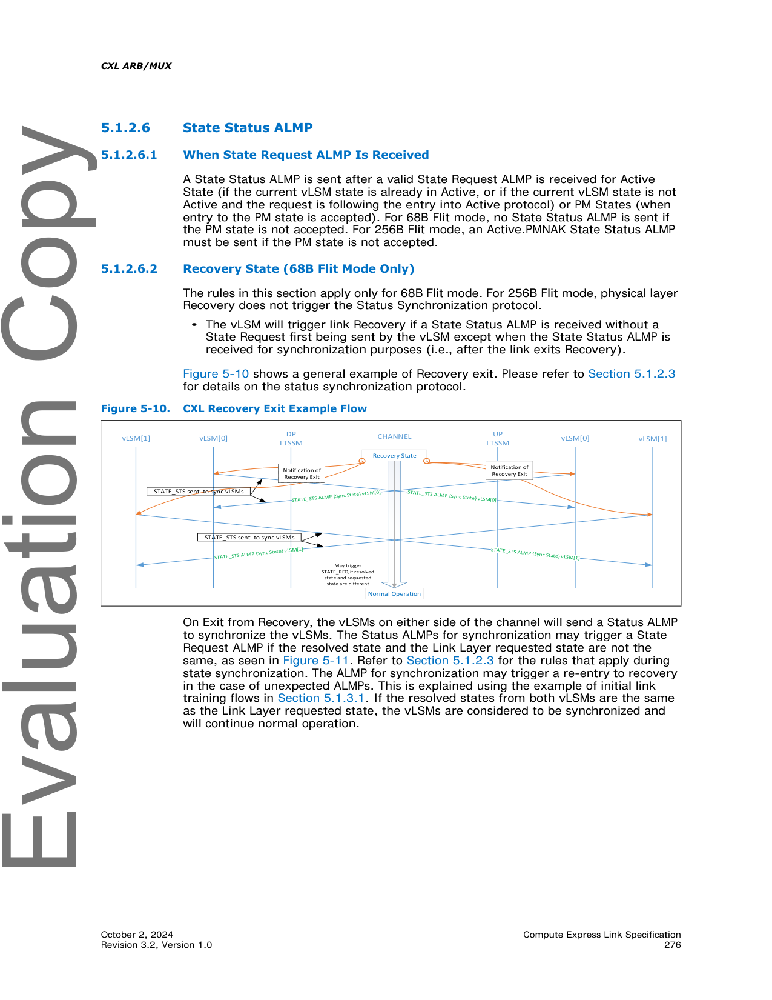
>
> *Original page render @ 150 DPI* — [📄 Full size](figures/chapter_05/page_0276.png)

<table>
<thead>
<tr>
<th width="50%">🇬🇧 English</th>
<th width="50%" style="background-color:#e8e8e8">🇨🇳 中文</th>
</tr>
</thead>
<tbody>
<tr><td>Figure 5-11 shows an example of the exit from a PM State (L1) through Recovery. The Downstream Port (DP in the figure) vLSM[0] in L1 state receives the Active Request, and the link enters Recovery. After the exit from recovery, each vLSM sends Status ALMP{L1} to synchronize the vLSMs. Because the resolved state after synchronization is not equal to the requested state, Request ALMP{Active} and Status ALMP{Active} handshakes are completed to enter Active State.</td><td style="background-color:#e8e8e8">图 5-11 显示了通过 Recovery 退出 PM 状态 (L1) 的示例。Downstream Port (图中的 DP) 处于 L1 状态的 vLSM[0] 收到 Active Request,链路进入 Recovery。退出 recovery 后,每个 vLSM 发送 Status ALMP{L1} 以同步 vLSM。由于同步后的已解析状态不等于请求的状态,因此完成 Request ALMP{Active} 和 Status ALMP{Active} 握手以进入 Active 状态。</td></tr>
</tbody>
</table>

> **Figure 5-11.** CXL Exit from PM State Example ｜ CXL 退出 PM 状态示例
>
> 
>
> *Original page render @ 150 DPI* — [📄 Full size](figures/chapter_05/page_0277.png)

[⬆️ 返回目录](#-本章目录)

---

#### 5.1.2.7 Unexpected ALMPs (68B Flit Mode Only) | 意外 ALMP (仅限 68B Flit 模式)

<table>
<thead>
<tr>
<th width="50%">🇬🇧 English</th>
<th width="50%" style="background-color:#e8e8e8">🇨🇳 中文</th>
</tr>
</thead>
<tbody>
<tr><td>Unexpected ALMPs are applicable only for 68B Flit mode. For 256B Flit mode, there are no scenarios that lead to unexpected ALMPs.</td><td style="background-color:#e8e8e8">意外 ALMP 仅适用于 68B Flit 模式。对于 256B Flit 模式,没有导致意外 ALMP 的情况。</td></tr>
<tr><td>The following situations describe circumstances where an unexpected ALMP will trigger link recovery:</td><td style="background-color:#e8e8e8">以下情况描述了意外 ALMP 将触发链路恢复的情况:</td></tr>
<tr><td>• When performing the Status Synchronization Protocol after exit from recovery, any ALMP other than a Status ALMP is considered an unexpected ALMP and will trigger recovery.</td><td style="background-color:#e8e8e8">• 在退出 recovery 后执行状态同步协议时,Status ALMP 以外的任何 ALMP 都被视为意外 ALMP,并将触发 recovery。</td></tr>
<tr><td>• When an Active Request ALMP has been sent, receipt of any ALMP other than an Active State Status ALMP or an Active Request ALMP is considered an unexpected ALMP and will trigger recovery.</td><td style="background-color:#e8e8e8">• 在已发送 Active Request ALMP 的情况下,接收到 Active State Status ALMP 或 Active Request ALMP 以外的任何 ALMP 都被视为意外 ALMP,并将触发 recovery。</td></tr>
<tr><td>• As outlined in Section 5.1.2.6.2, a State Status ALMP received without a State Request ALMP first being sent is an unexpected ALMP except during the Status Synchronization Protocol.</td><td style="background-color:#e8e8e8">• 如第 5.1.2.6.2 节所述,在未先发送 State Request ALMP 的情况下接收到的 State Status ALMP 属于意外 ALMP,状态同步协议期间除外。</td></tr>
</tbody>
</table>

[⬆️ 返回目录](#-本章目录)

---

### 5.1.3 Applications of the vLSM State Transition Rules for 68B Flit Mode | 68B Flit 模式下 vLSM 状态转换规则的应用

<table>
<thead>
<tr>
<th width="50%">🇬🇧 English</th>
<th width="50%" style="background-color:#e8e8e8">🇨🇳 中文</th>
</tr>
</thead>
<tbody>
<tr><td colspan="2">This section provides example applications of the vLSM state transition rules for 68B Flit mode.</td><td style="background-color:#e8e8e8">本节提供了 68B Flit 模式下 vLSM 状态转换规则的示例应用。</td></tr>
</tbody>
</table>

#### 5.1.3.1 Initial Link Training | 初始链路训练

<table>
<thead>
<tr>
<th width="50%">🇬🇧 English</th>
<th width="50%" style="background-color:#e8e8e8">🇨🇳 中文</th>
</tr>
</thead>
<tbody>
<tr><td>As the link trains from 2.5 GT/s speed to the highest supported speed (8.0 GT/s or higher for CXL), the LTSSM may go through several Recovery to L0 to Recovery transitions. Implementations are not required to expose ARB/MUX to all of these Recovery transitions. Depending on whether these initial Recovery transitions are hidden from the ARB/MUX, there are four possible scenarios for the initial ALMP handshakes. In all cases, the vLSM state transition rules guarantee that the situation will resolve itself with the vLSMs reaching Active state. These scenarios are presented in the following figures. Note that the figures are illustrative examples, and implementations must follow the rules outlined in the previous sections. Only one vLSM handshake is shown in the figures, but the similar handshakes can occur for the second vLSM as well. Figure 5-12 shows an example of the scenario where both the Upstream Port and Downstream Port (UP and DP in the figure, respectively) are hiding the initial recovery transitions from ARB/MUX. Since neither of them saw a notification of recovery entry, they proceed with the exchange of Active request and status ALMPs to transition into the Active state. Note that the first ALMP (Active request ALMP) is sent from the Downstream Port to the Upstream Port.</td><td style="background-color:#e8e8e8">当链路从 2.5 GT/s 的速度训练到最高支持速度 (CXL 为 8.0 GT/s 或更高) 时,LTSSM 可能会经过几次 Recovery 到 L0 再到 Recovery 的转换。实现不需要将所有这些 Recovery 转换都暴露给 ARB/MUX。根据这些初始 Recovery 转换是否对 ARB/MUX 隐藏,初始 ALMP 握手有四种可能的情况。在所有情况下,vLSM 状态转换规则保证这种情况将通过 vLSM 达到 Active 状态来自行解决。这些情况在以下图中给出。请注意,这些图是说明性示例,实现必须遵循前面各节中概述的规则。图中仅显示一个 vLSM 握手,但类似的握手也可能发生在第二个 vLSM 上。图 5-12 显示了 Upstream Port 和 Downstream Port (图中的 UP 和 DP) 都在对 ARB/MUX 隐藏初始 recovery 转换的情况的示例。由于它们都没有看到 recovery 入口的通知,因此它们继续交换 Active request 和 status ALMP,以转换到 Active 状态。请注意,第一个 ALMP (Active request ALMP) 是从 Downstream Port 发送到 Upstream Port 的。</td></tr>
<tr><td>Figure 5-13 shows an example where both the Upstream Port and Downstream Port (UP and DP in the figure, respectively) notify the ARB/MUX of at least one recovery transition during initial link training. In this case, first state status synchronization ALMPs are exchanged (indicating Reset state), followed by regular exchange of Active request and status ALMPs (not explicitly shown). Note that the first ALMP (Reset status) is sent from the Downstream Port to the Upstream Port.</td><td style="background-color:#e8e8e8">图 5-13 显示了 Upstream Port 和 Downstream Port (图中的 UP 和 DP) 在初始链路训练期间都至少将一次 recovery 转换通知 ARB/MUX 的示例。在这种情况下,首先交换 state status synchronization ALMP (指示 Reset 状态),然后定期交换 Active request 和 status ALMP (未明确显示)。请注意,第一个 ALMP (Reset 状态) 是从 Downstream Port 发送到 Upstream Port 的。</td></tr>
</tbody>
</table>

> **Figure 5-12.** Both Upstream Port and Downstream Port Hide Recovery Transitions from ARB/MUX ｜ Upstream Port 和 Downstream Port 都对 ARB/MUX 隐藏 Recovery 转换
>
> 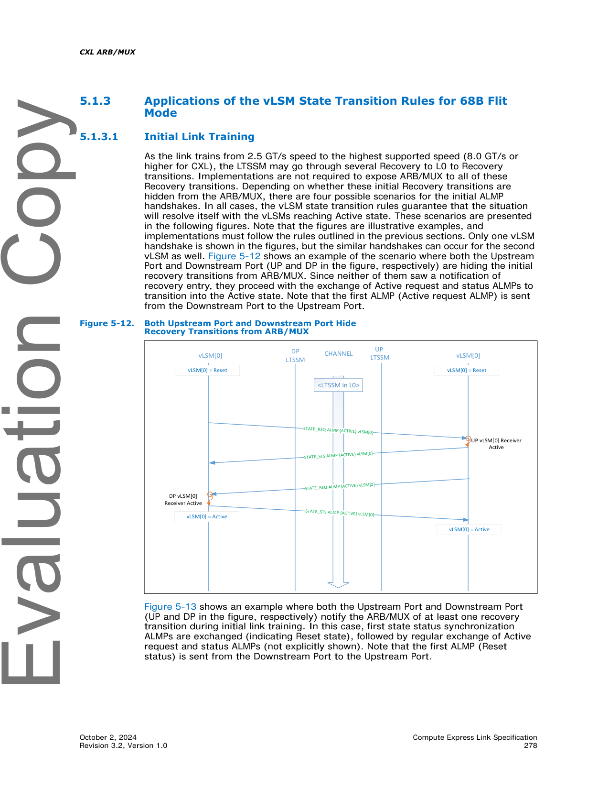
>
> *Original page render @ 150 DPI* — [📄 Full size](figures/chapter_05/page_0278.png)

> **Figure 5-13.** Both Upstream Port and Downstream Port Notify ARB/MUX of Recovery Transitions ｜ Upstream Port 和 Downstream Port 都通知 ARB/MUX Recovery 转换
>
> 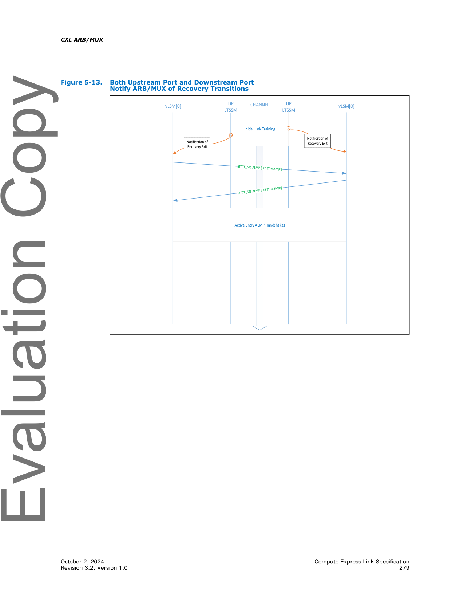
>
> *Original page render @ 150 DPI* — [📄 Full size](figures/chapter_05/page_0279.png)

<table>
<thead>
<tr>
<th width="50%">🇬🇧 English</th>
<th width="50%" style="background-color:#e8e8e8">🇨🇳 中文</th>
</tr>
</thead>
<tbody>
<tr><td>Figure 5-14 shows an example of the scenario where the Downstream Port (DP in the figure) hides initial recovery transitions from the ARB/MUX, but the Upstream Port (UP in the figure) does not. In this case, the Downstream Port ARB/MUX has not seen recovery transition, so it begins by sending an Active state request ALMP to the Upstream Port. The Upstream Port interprets this as an unexpected ALMP, which triggers link recovery (which must now be communicated to the ARB/MUX because it is after reaching operation at the highest supported link speed). State status synchronization with state=Reset is performed, followed by regular Active request and status handshakes (not explicitly shown).</td><td style="background-color:#e8e8e8">图 5-14 显示了 Downstream Port (图中的 DP) 对 ARB/MUX 隐藏初始 recovery 转换,但 Upstream Port (图中的 UP) 不隐藏的情况的示例。在这种情况下,Downstream Port ARB/MUX 没有看到 recovery 转换,因此它首先向 Upstream Port 发送 Active state request ALMP。Upstream Port 将其解释为意外 ALMP,这会触发链路 recovery (因为是在达到最高支持的链路速度运行之后,所以现在必须将其传达给 ARB/MUX)。执行 state=Reset 的 state status synchronization,然后进行常规的 Active request 和 status 握手 (未明确显示)。</td></tr>
<tr><td>Figure 5-15 shows an example of the scenario where the Upstream Port (UP in the figure) hides initial recovery transitions, but the Downstream Port (DP in the figure) does not. In this case, the Downstream Port first sends a Reset status ALMP. This will cause the Upstream Port to trigger link recovery as a result of the rules in Section 5.1.2.4.2.1 (which must now be communicated to the ARB/MUX because it is after reaching operation at the highest supported link speed). State status synchronization with state=Reset is performed, followed by regular Active request and status handshakes (not explicitly shown).</td><td style="background-color:#e8e8e8">图 5-15 显示了 Upstream Port (图中的 UP) 隐藏初始 recovery 转换,但 Downstream Port (图中的 DP) 不隐藏的情况的示例。在这种情况下,Downstream Port 首先发送 Reset status ALMP。这将导致 Upstream Port 根据第 5.1.2.4.2.1 节中的规则触发链路 recovery (因为是在达到最高支持的链路速度运行之后,所以现在必须将其传达给 ARB/MUX)。执行 state=Reset 的 state status synchronization,然后进行常规的 Active request 和 status 握手 (未明确显示)。</td></tr>
</tbody>
</table>

> **Figure 5-14.** Downstream Port Hides Initial Recovery, Upstream Port Does Not ｜ Downstream Port 隐藏初始 Recovery,Upstream Port 不隐藏
>
> 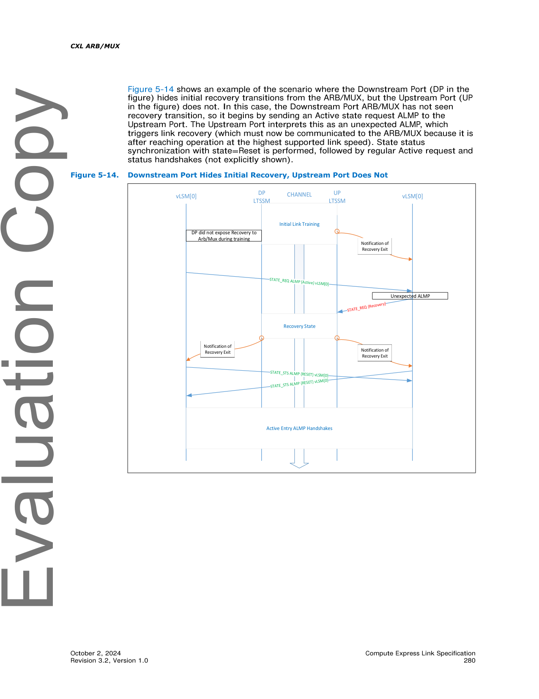
>
> *Original page render @ 150 DPI* — [📄 Full size](figures/chapter_05/page_0280.png)

> **Figure 5-15.** Upstream Port Hides Initial Recovery, Downstream Port Does Not ｜ Upstream Port 隐藏初始 Recovery,Downstream Port 不隐藏
>
> 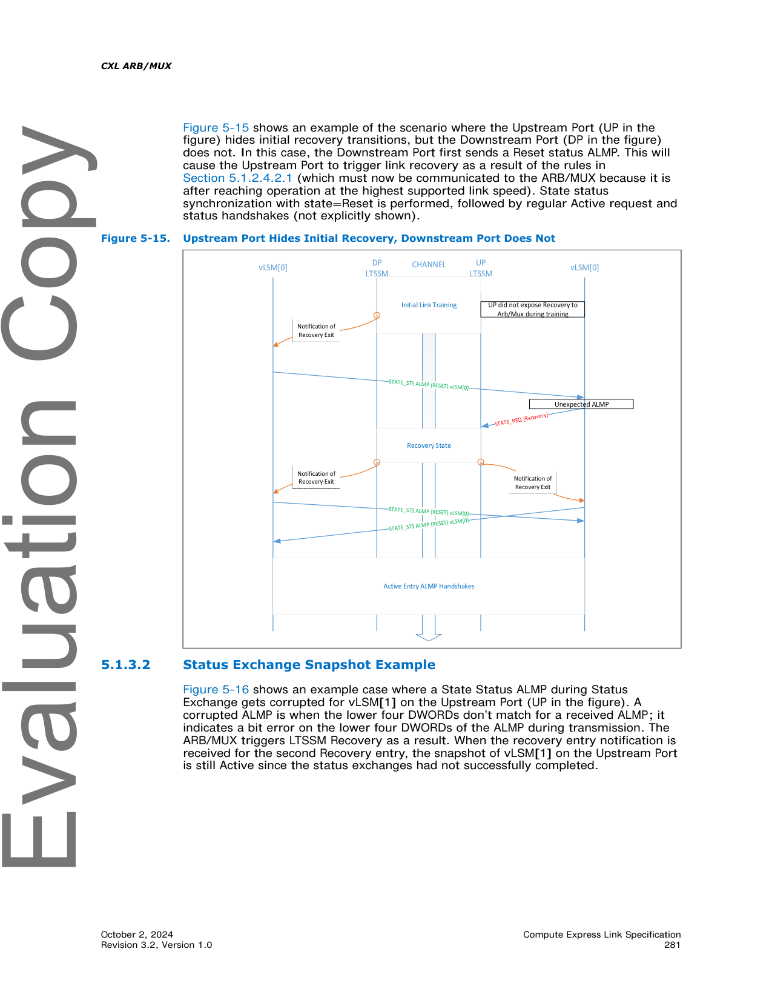
>
> *Original page render @ 150 DPI* — [📄 Full size](figures/chapter_05/page_0281.png)

[⬆️ 返回目录](#-本章目录)

---

#### 5.1.3.2 Status Exchange Snapshot Example | 状态交换快照示例

<table>
<thead>
<tr>
<th width="50%">🇬🇧 English</th>
<th width="50%" style="background-color:#e8e8e8">🇨🇳 中文</th>
</tr>
</thead>
<tbody>
<tr><td>Figure 5-16 shows an example case where a State Status ALMP during Status Exchange gets corrupted for vLSM[1] on the Upstream Port (UP in the figure). A corrupted ALMP is when the lower four DWORDs don't match for a received ALMP; it indicates a bit error on the lower four DWORDs of the ALMP during transmission. The ARB/MUX triggers LTSSM Recovery as a result. When the recovery entry notification is received for the second Recovery entry, the snapshot of vLSM[1] on the Upstream Port is still Active since the status exchanges had not successfully completed.</td><td style="background-color:#e8e8e8">图 5-16 显示了一个示例情况,其中 Upstream Port (图中的 UP) 上 vLSM[1] 的状态交换期间的 State Status ALMP 损坏。损坏的 ALMP 是指接收到的 ALMP 的低四个 DWORD 不匹配;它表示在传输过程中 ALMP 的低四个 DWORD 上存在位错误。结果,ARB/MUX 触发了 LTSSM Recovery。当接收到第二次 Recovery 入口的 recovery 入口通知时,由于状态交换尚未成功完成,Upstream Port 上 vLSM[1] 的快照仍为 Active。</td></tr>
</tbody>
</table>

> **Figure 5-16.** Snapshot Example during Status Synchronization ｜ 状态同步期间的快照示例
>
> 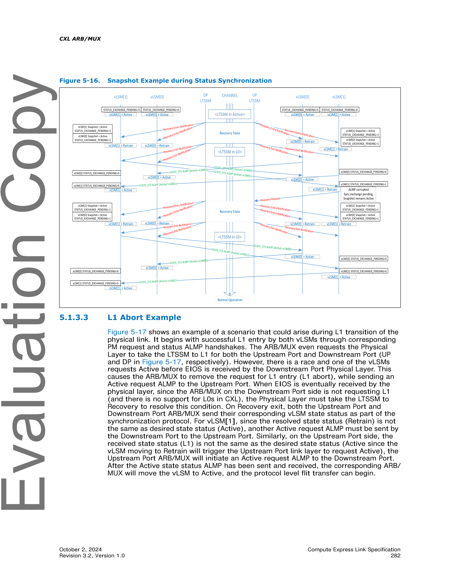
>
> *Original page render @ 150 DPI* — [📄 Full size](figures/chapter_05/page_0282.png)

[⬆️ 返回目录](#-本章目录)

---

#### 5.1.3.3 L1 Abort Example | L1 中止示例

<table>
<thead>
<tr>
<th width="50%">🇬🇧 English</th>
<th width="50%" style="background-color:#e8e8e8">🇨🇳 中文</th>
</tr>
</thead>
<tbody>
<tr><td>Figure 5-17 shows an example of a scenario that could arise during L1 transition of the physical link. It begins with successful L1 entry by both vLSMs through corresponding PM request and status ALMP handshakes. The ARB/MUX even requests the Physical Layer to take the LTSSM to L1 for both the Upstream Port and Downstream Port (UP and DP in Figure 5-17, respectively). However, there is a race and one of the vLSMs requests Active before EIOS is received by the Downstream Port Physical Layer. This causes the ARB/MUX to remove the request for L1 entry (L1 abort), while sending an Active request ALMP to the Upstream Port. When EIOS is eventually received by the physical layer, since the ARB/MUX on the Downstream Port side is not requesting L1 (and there is no support for L0s in CXL), the Physical Layer must take the LTSSM to Recovery to resolve this condition. On Recovery exit, both the Upstream Port and Downstream Port ARB/MUX send their corresponding vLSM state status as part of the synchronization protocol. For vLSM[1], since the resolved state status (Retrain) is not the same as desired state status (Active), another Active request ALMP must be sent by the Downstream Port to the Upstream Port. Similarly, on the Upstream Port side, the received state status (L1) is not the same as the desired state status (Active since the vLSM moving to Retrain will trigger the Upstream Port link layer to request Active), the Upstream Port ARB/MUX will initiate an Active request ALMP to the Downstream Port. After the Active state status ALMP has been sent and received, the corresponding ARB/MUX will move the vLSM to Active, and the protocol level flit transfer can begin.</td><td style="background-color:#e8e8e8">图 5-17 显示了在物理链路的 L1 转换期间可能发生的情况的示例。它从两个 vLSM 通过相应的 PM request 和 status ALMP 握手成功进入 L1 开始。ARB/MUX 甚至请求物理层为 Upstream Port 和 Downstream Port (图 5-17 中的 UP 和 DP) 将 LTSSM 带到 L1。但是,存在争用情况,在 Downstream Port 物理层接收到 EIOS 之前,其中一个 vLSM 请求 Active。这导致 ARB/MUX 取消 L1 进入请求 (L1 abort),同时向 Upstream Port 发送 Active request ALMP。当物理层最终接收到 EIOS 时,由于 Downstream Port 端的 ARB/MUX 没有请求 L1 (并且 CXL 不支持 L0s),物理层必须将 LTSSM 带到 Recovery 以解决这种情况。在 Recovery 退出时,Upstream Port 和 Downstream Port ARB/MUX 都会作为同步协议的一部分发送其相应的 vLSM 状态状态。对于 vLSM[1],由于已解析的状态状态 (Retrain) 与所需的状态状态 (Active) 不同,因此必须由 Downstream Port 向 Upstream Port 发送另一个 Active request ALMP。类似地,在 Upstream Port 端,由于接收到的状态状态 (L1) 与所需的状态状态 (Active,因为 vLSM 移至 Retrain 将触发 Upstream Port 链路层请求 Active) 不同,因此 Upstream Port ARB/MUX 将向 Downstream Port 发起 Active request ALMP。发送并接收到 Active state status ALMP 后,相应的 ARB/MUX 会将 vLSM 移至 Active,然后可以开始协议级 flit 传输。</td></tr>
</tbody>
</table>

> **Figure 5-17.** L1 Abort Example ｜ L1 中止示例
>
> 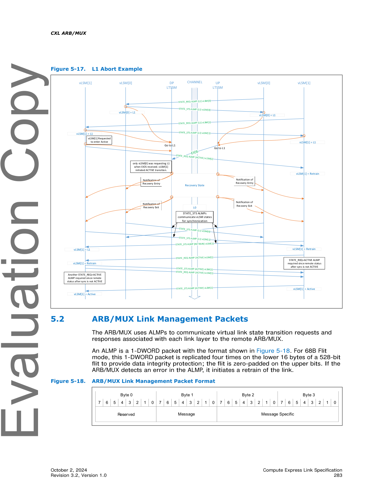
>
> *Original page render @ 150 DPI* — [📄 Full size](figures/chapter_05/page_0283.png)

[⬆️ 返回目录](#-本章目录)

---

## 5.2 ARB/MUX Link Management Packets | ARB/MUX 链路管理数据包

<table>
<thead>
<tr>
<th width="50%">🇬🇧 English</th>
<th width="50%" style="background-color:#e8e8e8">🇨🇳 中文</th>
</tr>
</thead>
<tbody>
<tr><td>The ARB/MUX uses ALMPs to communicate virtual link state transition requests and responses associated with each link layer to the remote ARB/MUX.</td><td style="background-color:#e8e8e8">ARB/MUX 使用 ALMP 将与每个链路层相关联的虚拟链路状态转换请求和响应传达到远程 ARB/MUX。</td></tr>
<tr><td>An ALMP is a 1-DWORD packet with the format shown in Figure 5-18. For 68B Flit mode, this 1-DWORD packet is replicated four times on the lower 16 bytes of a 528-bit flit to provide data integrity protection; the flit is zero-padded on the upper bits. If the ARB/MUX detects an error in the ALMP, it initiates a retrain of the link.</td><td style="background-color:#e8e8e8">ALMP 是具有图 5-18 所示格式的 1-DWORD 数据包。对于 68B Flit 模式,该 1-DWORD 数据包在 528 位 flit 的低 16 字节上复制四次,以提供数据完整性保护;flit 在高位上补零。如果 ARB/MUX 在 ALMP 中检测到错误,则它会启动链路的 retrain。</td></tr>
</tbody>
</table>

> **Figure 5-18.** ARB/MUX Link Management Packet Format ｜ ARB/MUX 链路管理数据包格式
>
> 
>
> *Original page render @ 150 DPI* — [📄 Full size](figures/chapter_05/page_0283.png)

<table>
<thead>
<tr>
<th width="50%">🇬🇧 English</th>
<th width="50%" style="background-color:#e8e8e8">🇨🇳 中文</th>
</tr>
</thead>
<tbody>
<tr><td>For 256B Flit mode, Bytes 0, 1, 2, and 3 of the ALMP are placed on Bytes 2, 3, 4, and 5 of the 256B flit, respectively (as defined in Section 6.2.3.1). There is no replication since the ALMP is now protected through CRC (Cyclic Redundancy Check, 循环冗余校验) and FEC (Forward Error Correction, 前向纠错). Figure 5-19 shows the ALMP byte positions in the Standard 256B flit. Figure 5-20 shows the ALMP byte positions in the Latency-Optimized 256B flit. See Section 6.2.3.1 for definitions of the FlitHdr, CRC, and FEC bytes.</td><td style="background-color:#e8e8e8">对于 256B Flit 模式,ALMP 的字节 0, 1, 2 和 3 分别放置在 256B flit 的字节 2, 3, 4 和 5 上 (如第 6.2.3.1 节中所定义)。没有复制,因为现在通过 CRC (Cyclic Redundancy Check, 循环冗余校验) 和 FEC (Forward Error Correction, 前向纠错) 来保护 ALMP。图 5-19 显示了 Standard 256B flit 中的 ALMP 字节位置。图 5-20 显示了 Latency-Optimized 256B flit 中的 ALMP 字节位置。有关 FlitHdr, CRC 和 FEC 字节的定义,请参阅第 6.2.3.1 节。</td></tr>
<tr><td>For 256B Flit mode, there are two categories of ALMPs: the vLSM ALMPs and the L0p Negotiation ALMPs. For 68B Flit mode, only vLSM ALMPs are applicable. Byte 1 of the ALMP is shown in Table 5-5.</td><td style="background-color:#e8e8e8">对于 256B Flit 模式,ALMP 有两类:vLSM ALMP 和 L0p 协商 ALMP。对于 68B Flit 模式,仅 vLSM ALMP 适用。ALMP 的字节 1 如表 5-5 所示。</td></tr>
</tbody>
</table>

> **Figure 5-19.** ALMP Byte Positions in Standard 256B Flit ｜ 标准 256B Flit 中的 ALMP 字节位置
>
> 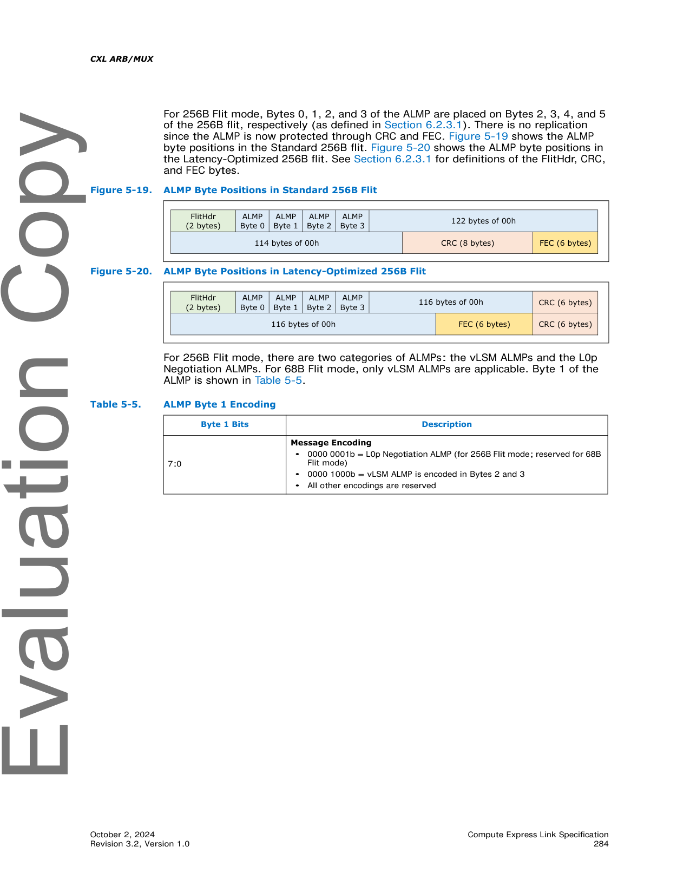
>
> *Original page render @ 150 DPI* — [📄 Full size](figures/chapter_05/page_0284.png)

> **Figure 5-20.** ALMP Byte Positions in Latency-Optimized 256B Flit ｜ 延迟优化型 256B Flit 中的 ALMP 字节位置
>
> 
>
> *Original page render @ 150 DPI* — [📄 Full size](figures/chapter_05/page_0284.png)

**Table 5-5.** ALMP Byte 1 Encoding | ALMP 字节 1 编码

<table>
<thead>
<tr>
<th width="50%">Byte 1 Bits</th>
<th width="50%" style="background-color:#e8e8e8">Description ｜ 描述</th>
</tr>
</thead>
<tbody>
<tr><td>7:0</td><td style="background-color:#e8e8e8">Message Encoding 消息编码<ul><li>0000 0001b = L0p Negotiation ALMP (for 256B Flit mode; reserved for 68B Flit mode) L0p 协商 ALMP (用于 256B Flit 模式;为 68B Flit 模式保留)</li><li>0000 1000b = vLSM ALMP is encoded in Bytes 2 and 3 vLSM ALMP 在字节 2 和 3 中编码</li><li>All other encodings are reserved 所有其他编码均保留</li></ul></td></tr>
</tbody>
</table>

<table>
<thead>
<tr>
<th width="50%">🇬🇧 English</th>
<th width="50%" style="background-color:#e8e8e8">🇨🇳 中文</th>
</tr>
</thead>
<tbody>
<tr><td>Bytes 2 and 3 for vLSM ALMPs are shown in Table 5-6. Bytes 2 and 3 for L0p Negotiation ALMPs are shown in Table 5-7.</td><td style="background-color:#e8e8e8">vLSM ALMP 的字节 2 和 3 如表 5-6 所示。L0p 协商 ALMP 的字节 2 和 3 如表 5-7 所示。</td></tr>
</tbody>
</table>

**Table 5-6.** ALMP Byte 2 and 3 Encodings for vLSM ALMP | vLSM ALMP 的字节 2 和 3 编码

<table>
<thead>
<tr>
<th>Byte 2 Bits</th>
<th>Description</th>
</tr>
</thead>
<tbody>
<tr><td>3:0</td><td>vLSM State Encoding <b>Note</b>: Rx should treat this as reserved for L0p ALMP. <b>注意</b>: Rx 应将其视为 L0p ALMP 的保留字段。<ul><li>0000b = Reset (for Status ALMP)</li><li>0000b = Reserved (for Request ALMP)</li><li>0001b = Active</li><li>0010b = Reserved (for Request ALMP)</li><li>0010b = Active.PMNAK (for Status ALMP for 256B Flit mode; reserved for 68B Flit mode)</li><li>0011b = DAPM (for Request ALMP)</li><li>0011b = Reserved (for Status ALMP)</li><li>0100b = IDLE_L1.0 (maps to PCIe L1)</li><li>0101b = IDLE_L1.1 (reserved for future use)</li><li>0110b = IDLE_L1.2 (reserved for future use)</li><li>0111b = IDLE_L1.3 (reserved for future use)</li><li>1000b = L2</li><li>1011b = Retrain (for Status ALMP only)</li><li>1011b = Reserved (for Request ALMP)</li><li>All other encodings are reserved</li></ul></td></tr>
<tr><td>6:4</td><td>Reserved</td></tr>
<tr><td>7</td><td>Request/Status Type<ul><li>0 = vLSM Status ALMP</li><li>1 = vLSM Request ALMP</li></ul></td></tr>
<tr><th>Byte 3 Bits</th><th>Description</th></tr>
<tr><td>3:0</td><td>Virtual LSM Instance Number: Indicates the targeted vLSM interface when there are multiple vLSMs present. 虚拟 LSM 实例编号: 当存在多个 vLSM 时,指示目标的 vLSM 接口。<ul><li>0001b = ALMP for CXL.io</li><li>0010b = ALMP for CXL.cache and CXL.mem</li><li>All other encodings are reserved</li></ul></td></tr>
<tr><td>7:4</td><td>Reserved</td></tr>
</tbody>
</table>

**Table 5-7 (Sheet 1 of 2).** ALMP Byte 2 and 3 Encodings for L0p Negotiation ALMP | L0p 协商 ALMP 的字节 2 和 3 编码

<table>
<thead>
<tr>
<th>Byte 2 Bits</th>
<th>Description</th>
</tr>
</thead>
<tbody>
<tr><td>5:0</td><td>Reserved</td></tr>
<tr><td>6</td><td><ul><li>0 = Not an L0p.Priority Request 非 L0p.Priority 请求</li><li>1 = L0p.Priority Request L0p.Priority 请求</li></ul></td></tr>
<tr><td>7</td><td>Request/Status Type<ul><li>0 = L0p Response ALMP L0p 响应 ALMP</li><li>1 = L0p Request ALMP L0p 请求 ALMP</li></ul></td></tr>
</tbody>
</table>

**Table 5-7 (Sheet 2 of 2).** ALMP Byte 2 and 3 Encodings for L0p Negotiation ALMP | L0p 协商 ALMP 的字节 2 和 3 编码

<table>
<thead>
<tr>
<th>Byte 3 Bits</th>
<th>Description</th>
</tr>
</thead>
<tbody>
<tr><td>3:0</td><td><ul><li>0100b = ALMP for L0p (for 256B Flit mode; reserved for 68B Flit mode) L0p 的 ALMP (用于 256B Flit 模式;为 68B Flit 模式保留)</li><li>All other encodings are reserved</li></ul></td></tr>
<tr><td>7:4</td><td>L0p Width <b>Note</b>: Encodings 0000b to 0100b are requests for L0p Request ALMP, and imply an ACK for L0p Response ALMP. <b>注意</b>: 0000b 至 0100b 的编码是 L0p Request ALMP 的请求,并表示 L0p Response ALMP 的 ACK。<ul><li>0000b = x16</li><li>0001b = x8</li><li>0010b = x4</li><li>0011b = x2</li><li>0100b = x1</li><li>1000b = Reserved for L0p Request ALMP 为 L0p Request ALMP 保留</li><li>1000b = L0p NAK for L0p Response ALMP L0p Response ALMP 的 L0p NAK</li><li>All other encodings are reserved</li></ul></td></tr>
</tbody>
</table>

<table>
<thead>
<tr>
<th width="50%">🇬🇧 English</th>
<th width="50%" style="background-color:#e8e8e8">🇨🇳 中文</th>
</tr>
</thead>
<tbody>
<tr><td>If the width encoding in an ACK does not match the requested L0p width, the ARB/MUX must consider it a NAK. It is permitted to resend an L0p request, if the conditions of entry are still met.</td><td style="background-color:#e8e8e8">如果 ACK 中的宽度编码与请求的 L0p 宽度不匹配,则 ARB/MUX 必须将其视为 NAK。如果仍满足进入条件,则允许重新发送 L0p 请求。</td></tr>
<tr><td>For vLSM ALMPs, the message code used in Byte 1 of the ALMP is 0000 1000b. These ALMPs can be request or status type. The local ARB/MUX initiates transition of a remote vLSM using a request ALMP. After receiving a request ALMP, the local ARB/MUX processes the transition request and returns a status ALMP. For 68B Flit mode, if the transition request is not accepted, a status ALMP is not sent and both local and remote vLSMs remain in their current state. For 256B Flit mode, if the PM transition request is not accepted, an Active.PMNAK Status ALMP is sent.</td><td style="background-color:#e8e8e8">对于 vLSM ALMP,ALMP 字节 1 中使用的消息代码是 0000 1000b。这些 ALMP 可以是 request 或 status 类型。本地 ARB/MUX 使用 request ALMP 启动远程 vLSM 的转换。在接收到 request ALMP 之后,本地 ARB/MUX 处理转换请求并返回 status ALMP。对于 68B Flit 模式,如果未接受转换请求,则不会发送 status ALMP,并且本地和远程 vLSM 都保持其当前状态。对于 256B Flit 模式,如果未接受 PM 转换请求,则会发送 Active.PMNAK Status ALMP。</td></tr>
<tr><td>For L0p Negotiation ALMPs, the message code used in Byte 1 of the ALMP is 0000 0001b. These ALMPs can be of request or response type. See Section 5.1.2.5 for L0p negotiation flow.</td><td style="background-color:#e8e8e8">对于 L0p 协商 ALMP,ALMP 字节 1 中使用的消息代码是 0000 0001b。这些 ALMP 可以是 request 或 response 类型。有关 L0p 协商流程,请参阅第 5.1.2.5 节。</td></tr>
</tbody>
</table>

[⬆️ 返回目录](#-本章目录)

---

### 5.2.1 ARB/MUX Bypass Feature | ARB/MUX 旁路特性

<table>
<thead>
<tr>
<th width="50%">🇬🇧 English</th>
<th width="50%" style="background-color:#e8e8e8">🇨🇳 中文</th>
</tr>
</thead>
<tbody>
<tr><td>The ARB/MUX must disable generation of ALMPs when the Flex Bus link is operating in PCIe mode. Determination of the bypass condition can be via hwinit or during link training.</td><td style="background-color:#e8e8e8">当 Flex Bus 链路在 PCIe 模式下运行时,ARB/MUX 必须禁用 ALMP 的生成。旁路条件的确定可以通过 hwinit 或在链路训练期间进行。</td></tr>
</tbody>
</table>

[⬆️ 返回目录](#-本章目录)

---

## 5.3 Arbitration and Data Multiplexing/Demultiplexing | 仲裁与数据复用/解复用

<table>
<thead>
<tr>
<th width="50%">🇬🇧 English</th>
<th width="50%" style="background-color:#e8e8e8">🇨🇳 中文</th>
</tr>
</thead>
<tbody>
<tr><td>The ARB/MUX is responsible for arbitrating between requests from the CXL link layers and multiplexing the data based on the arbitration results. The arbitration policy is implementation specific as long as it satisfies the timing requirements of the higher-level protocols being transferred over the Flex Bus link. Additionally, there must be a way to program the relative arbitration weightages associated with the CXL.io and CXL.cache + CXL.mem link layers as they arbitrate to transmit traffic over the Flex Bus link. See Section 8.2.5 for more details. Interleaving of traffic between different CXL protocols is done at the 528-bit flit boundary for 68B Flit mode, and at the 256B flit boundary for 256B Flit mode.</td><td style="background-color:#e8e8e8">ARB/MUX 负责在来自 CXL 链路层的请求之间进行仲裁,并根据仲裁结果对数据进行复用。只要满足通过 Flex Bus 链路传输的高层协议的时序要求,仲裁策略就是实现特定的。此外,必须有一种方法来对与 CXL.io 和 CXL.cache + CXL.mem 链路层相关联的相对仲裁权重进行编程,因为它们在 Flex Bus 链路上仲裁传输流量。有关更多详细信息,请参阅第 8.2.5 节。不同 CXL 协议之间的流量交错在 68B Flit 模式下以 528 位 flit 边界完成,在 256B Flit 模式下以 256B flit 边界完成。</td></tr>
</tbody>
</table>

[⬆️ 返回目录](#-本章目录)

---
