# 📘 第 6 章　Flex Bus 物理层 (Chapter 6. Flex Bus Physical Layer)

**Compute Express Link® (CXL®) Specification — Revision 3.2, Version 1.0 — October 2, 2024**

> 📄 **Source pages**: 287–318 | 📁 **File**: `chapter_06.md`
> 🎨 **Format**: 中英对照双语 · 图表原始保留 · 中文背景色灰色 · GitHub Flavored Markdown

---

## 📑 本章目录 (Table of Contents)

| # | Section | 小节 | Page |
|:-:|:--------|:----|:----:|
| 6.0 | [Flex Bus Physical Layer](#sec-6-0) | Flex Bus 物理层 | p.287 |
| 6.1 | [Overview](#sec-6-1) | 概述 | p.287–288 |
| 6.2 | [Flex Bus.CXL Framing and Packet Layout](#sec-6-2) | Flex Bus.CXL 成帧与包布局 | p.288 |
| 6.2.1 | [Ordered Set Blocks and Data Blocks](#sec-6-2-1) | 有序集块与数据块 | p.288–289 |
| 6.2.2 | [68B Flit Mode](#sec-6-2-2) | 68B Flit 模式 | p.289 |
| 6.2.2.1 | [Protocol ID[15:0]](#sec-6-2-2-1) | 协议标识 Protocol ID[15:0] | p.289–290 |
| 6.2.2.2 | [x16 Packet Layout](#sec-6-2-2-2) | x16 包布局 | p.290–291 |
| 6.2.2.3 | [x8 Packet Layout](#sec-6-2-2-3) | x8 包布局 | p.291–293 |
| 6.2.2.4 | [x4 Packet Layout](#sec-6-2-2-4) | x4 包布局 | p.293–295 |
| 6.2.2.5 | [x2 Packet Layout](#sec-6-2-2-5) | x2 包布局 | p.295 |
| 6.2.2.6 | [x1 Packet Layout](#sec-6-2-2-6) | x1 包布局 | p.295 |
| 6.2.2.7 | [Special Case: CXL.io — When a TLP Ends on a Flit Boundary](#sec-6-2-2-7) | 特殊情况:CXL.io — TLP 在 Flit 边界结束时 | p.295–296 |
| 6.2.2.8 | [Framing Errors](#sec-6-2-2-8) | 成帧错误 | p.296–297 |
| 6.2.3 | [256B Flit Mode](#sec-6-2-3) | 256B Flit 模式 | p.297–298 |
| 6.2.3.1 | [256B Flit Format](#sec-6-2-3-1) | 256B Flit 格式 | p.298 |
| 6.2.3.1.1 | [Standard 256B Flit](#sec-6-2-3-1-1) | 标准 256B Flit | p.298–301 |
| 6.2.3.1.1.1 | [256B Flit Type](#sec-6-2-3-1-1-1) | 256B Flit 类型 | p.299–301 |
| 6.2.3.1.2 | [Latency-Optimized 256B Flit with 128-Byte Flit Halves](#sec-6-2-3-1-2) | 带 128 字节半 Flit 的低延迟优化 256B Flit | p.301–304 |
| 6.2.3.1.2.1 | [Latency-Optimized Flit 6-Byte CRC Calculation](#sec-6-2-3-1-2-1) | 低延迟 Flit 的 6 字节 CRC 计算 | p.303–304 |
| 6.2.3.2 | [CRC Corruption for Containment with 256B Flits](#sec-6-2-3-2) | 用于 256B Flit 抑制的 CRC 故意损坏 | p.305 |
| 6.2.3.2.1 | [CXL.cachemem Viral Injection and Late Poison for 256B Flits](#sec-6-2-3-2-1) | 256B Flit 的 CXL.cachemem 病毒注入与延迟投毒 | p.305 |
| 6.2.3.2.2 | [Late Nullify or Poison for CXL.io](#sec-6-2-3-2-2) | CXL.io 的延迟作废或投毒 | p.305 |
| 6.2.3.3 | [Framing Errors in 256B Flit Mode](#sec-6-2-3-3) | 256B Flit 模式下的成帧错误 | p.305 |
| 6.3 | [256B Flit Mode Retry Buffers](#sec-6-3) | 256B Flit 模式重试缓冲区 | p.305–306 |
| 6.4 | [Link Training](#sec-6-4) | 链路训练 | p.306 |
| 6.4.1 | [PCIe Mode vs. Flex Bus.CXL Mode Selection](#sec-6-4-1) | PCIe 模式 vs. Flex Bus.CXL 模式选择 | p.306 |
| 6.4.1.1 | [Hardware Autonomous Mode Negotiation](#sec-6-4-1-1) | 硬件自治模式协商 | p.306–310 |
| 6.4.1.2 | [Virtual Hierarchy vs. Restricted CXL Device Negotiation](#sec-6-4-1-2) | 虚拟层次 (VH) vs. 限制型 CXL 设备 (RCD) 协商 | p.311 |
| 6.4.1.2.1 | [Retimer Presence Detection](#sec-6-4-1-2-1) | Retimer 存在性检测 | p.312 |
| 6.4.1.3 | [256B Flit Mode](#sec-6-4-1-3) | 256B Flit 模式 | p.312–313 |
| 6.4.1.3.1 | [256B Flit Mode Negotiation](#sec-6-4-1-3-1) | 256B Flit 模式协商 | p.312–313 |
| 6.4.1.3.2 | [CXL.io Throttling](#sec-6-4-1-3-2) | CXL.io 限流 | p.313 |
| 6.4.1.3.3 | [NOP Insertion Hint Performance Optimization](#sec-6-4-1-3-3) | NOP 插入提示性能优化 | p.313 |
| 6.4.1.4 | [Flit Mode and VH Negotiation](#sec-6-4-1-4) | Flit 模式与 VH 协商 | p.313–314 |
| 6.4.1.5 | [Flex Bus.CXL Negotiation with Maximum Supported Link Speed of 8 GT/s or 16 GT/s](#sec-6-4-1-5) | 最高支持 8 GT/s 或 16 GT/s 链路速率的 Flex Bus.CXL 协商 | p.314 |
| 6.4.1.6 | [Link Width Degradation and Speed Downgrade](#sec-6-4-1-6) | 链路宽度降级与速率降速 | p.314 |
| 6.5 | [68B Flit Mode: Recovery.Idle and Config.Idle Transitions to L0](#sec-6-5) | 68B Flit 模式:Recovery.Idle 与 Config.Idle 到 L0 的跃迁 | p.314–315 |
| 6.6 | [L1 Abort Scenario](#sec-6-6) | L1 中止场景 | p.315 |
| 6.7 | [68B Flit Mode: Exit from Recovery](#sec-6-7) | 68B Flit 模式:退出 Recovery | p.315 |
| 6.8 | [Retimers and Low Latency Mode](#sec-6-8) | Retimer 与低延迟模式 | p.315–316 |
| 6.8.1 | [68B Flit Mode: SKP Ordered Set Frequency and L1/Recovery Entry](#sec-6-8-1) | 68B Flit 模式:SKP 有序集频率与 L1/Recovery 进入 | p.316 |
| 6.9 | [L0p Support](#sec-6-9) | L0p 支持 | p.318 |

## 🖼 本章图表 (Figures)

| Figure | Title | 图标题 | Page |
|:------:|:------|:-------|:----:|
| 6-1 | Flex Bus Layers - Physical Layer Highlighted | Flex Bus 分层 — 物理层高亮 | p.287 |
| 6-2 | Flex Bus x16 Packet Layout | Flex Bus x16 包布局 | p.290 |
| 6-3 | Flex Bus x16 Protocol Interleaving Example | Flex Bus x16 协议交织示例 | p.291 |
| 6-4 | Flex Bus x8 Packet Layout | Flex Bus x8 包布局 | p.292 |
| 6-5 | Flex Bus x8 Protocol Interleaving Example | Flex Bus x8 协议交织示例 | p.293 |
| 6-6 | Flex Bus x4 Packet Layout | Flex Bus x4 包布局 | p.295 |
| 6-7 | CXL.io TLP Ending on Flit Boundary Example | CXL.io TLP 在 Flit 边界结束示例 | p.296 |
| 6-8 | Standard 256B Flit | 标准 256B Flit | p.298 |
| 6-9 | CXL.io Standard 256B Flit | CXL.io 标准 256B Flit | p.298 |
| 6-10 | Standard 256B Flit Applied to Physical Lanes (x16) | 应用到物理 lane 的标准 256B Flit (x16) | p.301 |
| 6-11 | Latency-Optimized 256B Flit | 低延迟优化 256B Flit | p.301 |
| 6-12 | CXL.io Latency-Optimized 256B Flit | CXL.io 低延迟优化 256B Flit | p.303 |
| 6-13 | Different Methods for Generating 6-Byte CRC | 生成 6 字节 CRC 的不同方法 | p.304 |
| 6-14 | Flex Bus Mode Negotiation during Link Training (Sample Flow) | 链路训练期间的 Flex Bus 模式协商 (示例流程) | p.310 |
| 6-15 | NULL Flit with EDS and Sync Header Bypass Optimization | 带 EDS 的 NULL Flit 与 Sync Header 旁路优化 | p.317 |
| 6-16 | NULL Flit with EDS and 128b/130b Encoding | 带 EDS 的 NULL Flit 与 128b/130b 编码 | p.318 |

## 📊 本章表格 (Tables)

| Table | Title | 表标题 | Sheets |
|:-----:|:------|:-------|:------:|
| 6-1 | Flex Bus.CXL Link Speeds and Widths for Normal and Degraded Mode | Flex Bus.CXL 正常与降级模式的链路速率与宽度 | 1 (p.288) |
| 6-2 | Flex Bus.CXL Protocol IDs | Flex Bus.CXL 协议标识 Protocol ID | 1 (p.289) |
| 6-3 | Protocol ID Framing Errors | Protocol ID 成帧错误 | 1 (p.296) |
| 6-4 | 256B Flit Mode vs. 68B Flit Mode Operation | 256B Flit 模式 vs. 68B Flit 模式运行 | 1 (p.297) |
| 6-5 | 256B Flit Header | 256B Flit 头部 | 1 (p.299) |
| 6-6 | Flit Type[1:0] Encoding | Flit Type[1:0] 编码 | 1 (p.300) |
| 6-7 | Latency-Optimized Flit Processing for CRC Scenarios | CRC 场景下的低延迟 Flit 处理 | 2 (p.302, p.303) |
| 6-8 | Byte Mapping for Input to PCIe 8B CRC Generation | PCIe 8B CRC 生成输入的字节映射 | 1 (p.304) |
| 6-9 | Modified TS1/TS2 Ordered Set for Flex Bus Mode Negotiation | Flex Bus 模式协商的修改型 TS1/TS2 有序集 | 2 (p.306, p.307) |
| 6-10 | Additional Information on Symbols 8-9 of Modified TS1/TS2 Ordered Set | 修改型 TS1/TS2 有序集符号 8-9 的补充信息 | 1 (p.307) |
| 6-11 | Additional Information on Symbols 12-14 of Modified TS1/TS2 Ordered Sets | 修改型 TS1/TS2 有序集符号 12-14 的补充信息 | 2 (p.308, p.309) |
| 6-12 | VH vs. RCD Link Training Resolution | VH vs. RCD 链路训练解析 | 1 (p.311) |
| 6-13 | Flit Mode and VH Negotiation | Flit 模式与 VH 协商 | 2 (p.313, p.314) |
| 6-14 | Rules of Enable Low-latency Mode Features | 启用低延迟模式特性的规则 | 1 (p.315) |
| 6-15 | Sync Header Bypass Applicability and Ordered Set Insertion Rate | Sync Header 旁路适用性与有序集插入速率 | 1 (p.316) |

> 💡 **查看原图**:所有原图已抽取为 PNG 存放在 [`figures/chapter_06/`](figures/chapter_06/)(32 张全页渲染 + 9 张抽取图)。

---

## 6.0 Flex Bus Physical Layer | Flex Bus 物理层

<table>
<thead>
<tr>
<th width="50%">🇬🇧 English</th>
<th width="50%" style="background-color:#e8e8e8">🇨🇳 中文</th>
</tr>
</thead>
<tbody>
<tr><td>

The figure above shows where the Flex Bus physical layer exists in the Flex Bus layered hierarchy. On the transmitter side, the Flex Bus physical layer prepares data received from either the PCIe* link layer or the CXL ARB/MUX for transmission across the Flex Bus link. On the receiver side, the Flex Bus physical layer deserializes the data received on the Flex Bus link and converts it to the appropriate format to forward to the PCIe link layer or the ARB/MUX. The Flex Bus physical layer consists of a logical sub-block, aka the logical PHY, and an electrical sub-block. The logical PHY operates in PCIe mode during initial link training and switches over to CXL mode, if appropriate, depending on the results of alternate protocol negotiation, during recovery after training to 2.5 GT/s. The electrical sub-block follows PCIe Base Specification.

In CXL mode, normal operation occurs at native link width and 32 GT/s or 64 GT/s link speed. Bifurcation (aka link subdivision) into x8 and x4 widths is supported in CXL mode. Degraded modes of operation include 8 GT/s or 16 GT/s or 32 GT/s link speed and smaller link widths of x2 and x1. Table 6-1 summarizes the supported CXL combinations. In PCIe mode, the link supports all widths and speeds defined in PCIe Base Specification, as well as the ability to bifurcate.

This chapter focuses on the details of the logical PHY. The Flex Bus logical PHY is based on the PCIe logical PHY; PCIe mode follows PCIe Base Specification exactly while Flex Bus.CXL mode has deltas from PCIe that affect link training and framing. Please refer to the "Physical Layer Logical Block" chapter of PCIe Base Specification for details on PCIe mode. The Flex Bus.CXL deltas are described in this chapter.

</td><td style="background-color:#e8e8e8">

上图显示了 Flex Bus 物理层在 Flex Bus 分层体系结构中的位置。在发送端,Flex Bus 物理层准备从 PCIe* 链路层或 CXL ARB/MUX 接收到的数据,以便通过 Flex Bus 链路进行传输。在接收端,Flex Bus 物理层对在 Flex Bus 链路上接收到的数据进行解串行化,并将其转换为适当的格式转发给 PCIe 链路层或 ARB/MUX。Flex Bus 物理层由逻辑子块(即逻辑 PHY)和电气子块组成。逻辑 PHY 在初始链路训练期间以 PCIe 模式运行,并在训练至 2.5 GT/s 后的 Recovery 阶段根据替代协议协商的结果(若适用)切换到 CXL 模式。电气子块遵循 PCIe Base Specification。

在 CXL 模式下,正常运行在原生链路宽度和 32 GT/s 或 64 GT/s 链路速率下。CXL 模式支持将链路细分为 x8 和 x4 宽度(即链路细分)。降级运行模式包括 8 GT/s、16 GT/s 或 32 GT/s 链路速率,以及较小的 x2 和 x1 链路宽度。表 6-1 总结了所支持的 CXL 组合。在 PCIe 模式下,链路支持 PCIe Base Specification 中定义的所有宽度和速率,以及细分能力。

本章重点关注逻辑 PHY 的细节。Flex Bus 逻辑 PHY 基于 PCIe 逻辑 PHY;PCIe 模式完全遵循 PCIe Base Specification,而 Flex Bus.CXL 模式相较于 PCIe 在链路训练和成帧方面存在差异(deltas)。有关 PCIe 模式的详细信息,请参阅 PCIe Base Specification 的 "Physical Layer Logical Block" 章节。Flex Bus.CXL 的差异将在本章中描述。

</td></tr>
</tbody>
</table>

> **Figure 6-1.** Flex Bus Layers - Physical Layer Highlighted ｜ Flex Bus 分层 — 物理层高亮
>
> 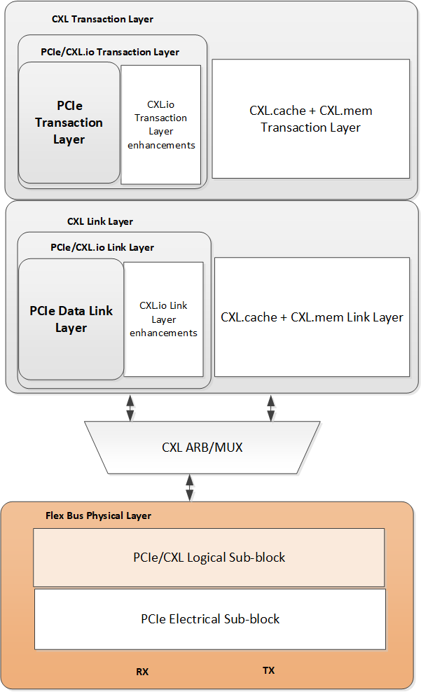
>
> *Original page render @ 150 DPI* — [📄 Full size](figures/chapter_06/page_0287.png)

[⬆️ 返回目录](#-本章目录-table-of-contents)

---

## 6.1 Overview | 概述

<table>
<thead>
<tr>
<th width="50%">🇬🇧 English</th>
<th width="50%" style="background-color:#e8e8e8">🇨🇳 中文</th>
</tr>
</thead>
<tbody>
<tr><td>

The figure above shows where the Flex Bus physical layer exists in the Flex Bus layered hierarchy. On the transmitter side, the Flex Bus physical layer prepares data received from either the PCIe* link layer or the CXL ARB/MUX for transmission across the Flex Bus link. On the receiver side, the Flex Bus physical layer deserializes the data received on the Flex Bus link and converts it to the appropriate format to forward to the PCIe link layer or the ARB/MUX. The Flex Bus physical layer consists of a logical sub-block, aka the logical PHY, and an electrical sub-block. The logical PHY operates in PCIe mode during initial link training and switches over to CXL mode, if appropriate, depending on the results of alternate protocol negotiation, during recovery after training to 2.5 GT/s. The electrical sub-block follows PCIe Base Specification.

</td><td style="background-color:#e8e8e8">

上图显示了 Flex Bus 物理层在 Flex Bus 分层体系结构中的位置。在发送端,Flex Bus 物理层准备从 PCIe* 链路层或 CXL ARB/MUX 接收到的数据,以便通过 Flex Bus 链路进行传输。在接收端,Flex Bus 物理层对在 Flex Bus 链路上接收到的数据进行解串行化,并将其转换为适当的格式转发给 PCIe 链路层或 ARB/MUX。Flex Bus 物理层由逻辑子块(即逻辑 PHY)和电气子块组成。逻辑 PHY 在初始链路训练期间以 PCIe 模式运行,并在训练至 2.5 GT/s 后的 Recovery 阶段根据替代协议协商的结果(若适用)切换到 CXL 模式。电气子块遵循 PCIe Base Specification。

</td></tr>
<tr><td>

In CXL mode, normal operation occurs at native link width and 32 GT/s or 64 GT/s link speed. Bifurcation (aka link subdivision) into x8 and x4 widths is supported in CXL mode. Degraded modes of operation include 8 GT/s or 16 GT/s or 32 GT/s link speed and smaller link widths of x2 and x1. Table 6-1 summarizes the supported CXL combinations. In PCIe mode, the link supports all widths and speeds defined in PCIe Base Specification, as well as the ability to bifurcate.

</td><td style="background-color:#e8e8e8">

在 CXL 模式下,正常运行在原生链路宽度和 32 GT/s 或 64 GT/s 链路速率下。CXL 模式支持将链路细分为 x8 和 x4 宽度(即链路细分,link subdivision)。降级运行模式包括 8 GT/s、16 GT/s 或 32 GT/s 链路速率,以及较小的 x2 和 x1 链路宽度。表 6-1 总结了所支持的 CXL 组合。在 PCIe 模式下,链路支持 PCIe Base Specification 中定义的所有宽度和速率,以及细分能力。

</td></tr>
<tr><td>

This chapter focuses on the details of the logical PHY. The Flex Bus logical PHY is based on the PCIe logical PHY; PCIe mode follows PCIe Base Specification exactly while Flex Bus.CXL mode has deltas from PCIe that affect link training and framing. Please refer to the "Physical Layer Logical Block" chapter of PCIe Base Specification for details on PCIe mode. The Flex Bus.CXL deltas are described in this chapter.

</td><td style="background-color:#e8e8e8">

本章重点关注逻辑 PHY 的细节。Flex Bus 逻辑 PHY 基于 PCIe 逻辑 PHY;PCIe 模式完全遵循 PCIe Base Specification,而 Flex Bus.CXL 模式相较于 PCIe 在链路训练和成帧方面存在差异(deltas)。有关 PCIe 模式的详细信息,请参阅 PCIe Base Specification 的 "Physical Layer Logical Block" 章节。Flex Bus.CXL 的差异将在本章中描述。

</td></tr>
</tbody>
</table>

[⬆️ 返回目录](#-本章目录-table-of-contents)

---

## 6.2 Flex Bus.CXL Framing and Packet Layout | Flex Bus.CXL 成帧与包布局

<table>
<thead>
<tr>
<th width="50%">🇬🇧 English</th>
<th width="50%" style="background-color:#e8e8e8">🇨🇳 中文</th>
</tr>
</thead>
<tbody>
<tr><td>

The Flex Bus.CXL framing and packet layout is described in this section for x16, x8, x4, x2, and x1 link widths.

</td><td style="background-color:#e8e8e8">

本节针对 x16、x8、x4、x2 和 x1 链路宽度描述 Flex Bus.CXL 的成帧与包布局。

</td></tr>
</tbody>
</table>

[⬆️ 返回目录](#-本章目录-table-of-contents)

---

### 6.2.1 Ordered Set Blocks and Data Blocks | 有序集块与数据块

<table>
<thead>
<tr>
<th width="50%">🇬🇧 English</th>
<th width="50%" style="background-color:#e8e8e8">🇨🇳 中文</th>
</tr>
</thead>
<tbody>
<tr><td>

Flex Bus.CXL uses the PCIe concept of Ordered Set blocks and data blocks. Each block spans 128 bits per lane and potentially two bits of Sync Header per lane.

</td><td style="background-color:#e8e8e8">

Flex Bus.CXL 使用 PCIe 中的有序集块和数据块概念。每个块在每个 lane 上占据 128 bit,可能还包含 2 bit 的 Sync Header(同步头)。

</td></tr>
<tr><td>

Ordered Set blocks are used for training, entering and exiting Electrical Idle, transitions to data blocks, and clock tolerance compensation; they are the same as defined in PCIe Base Specification. A 2-bit Sync Header with value 01b is inserted before each 128 bits transmitted per lane in an Ordered Set block when 128b/130b encoding is used; in the Sync Header bypass latency-optimized mode, there is no Sync Header. Additionally, as per PCIe Base Specification, there is no Sync Header when 1b/1b encoding is used.

</td><td style="background-color:#e8e8e8">

有序集块用于训练、进入和退出电气空闲(Electrical Idle)、数据块之间的跃迁以及时钟容差补偿;它们的定义与 PCIe Base Specification 相同。当使用 128b/130b 编码时,在每个有序集块中,每个 lane 上每 128 bit 传输之前插入一个值为 01b 的 2 bit Sync Header;在 Sync Header 旁路低延迟优化模式下,则没有 Sync Header。此外,根据 PCIe Base Specification,在使用 1b/1b 编码时也没有 Sync Header。

</td></tr>
</tbody>
</table>

**Table 6-1.** Flex Bus.CXL Link Speeds and Widths for Normal and Degraded Mode | Flex Bus.CXL 正常与降级模式的链路速率与宽度

<table>
<thead>
<tr>
<th>Link Speed</th>
<th>Native Width</th>
<th style="background-color:#e8e8e8">Degraded Modes Supported</th>
</tr>
</thead>
<tbody>
<tr><td>32 GT/s</td><td>x16</td><td style="background-color:#e8e8e8">x16 at 16 GT/s or 8 GT/s; x8, x4, x2, or x1 at 32 GT/s or 16 GT/s or 8 GT/s</td></tr>
<tr><td>32 GT/s</td><td>x8</td><td style="background-color:#e8e8e8">x8 at 16 GT/s or 8 GT/s; x4, x2, or x1 at 32 GT/s or 16 GT/s or 8 GT/s</td></tr>
<tr><td>32 GT/s</td><td>x4</td><td style="background-color:#e8e8e8">x4 at 16 GT/s or 8 GT/s; x2 or x1 at 32 GT/s or 16 GT/s or 8 GT/s</td></tr>
<tr><td>64 GT/s</td><td>x16</td><td style="background-color:#e8e8e8">x16 at 32 GT/s or 16 GT/s or 8 GT/s; x8, x4, x2, or x1 at 64 GT/s or 32 GT/s or 16 GT/s or 8 GT/s</td></tr>
<tr><td>64 GT/s</td><td>x8</td><td style="background-color:#e8e8e8">x8 at 32 GT/s or at 16 GT/s or 8 GT/s; x4, x2, or x1 at 64GT/s or 32 GT/s or 16 GT/s or 8 GT/s</td></tr>
<tr><td>64 GT/s</td><td>x4</td><td style="background-color:#e8e8e8">x4 at 32 GT/s or at 16 GT/s or 8 GT/s; x2 or x1 at 64 GT/s or 32 GT/s or 16 GT/s or 8 GT/s</td></tr>
</tbody>
</table>

<table>
<thead>
<tr>
<th width="50%">🇬🇧 English</th>
<th width="50%" style="background-color:#e8e8e8">🇨🇳 中文</th>
</tr>
</thead>
<tbody>
<tr><td>

Data blocks are used for transmission of the flits received from the CXL ARB/MUX. In 68B Flit mode, a 16-bit Protocol ID field is associated with each 528-bit flit payload (512 bits of payload + 16 bits of CRC) received from the link layer, which is striped across the lanes on an 8-bit granularity; the placement of the Protocol ID depends on the width. A 2-bit Sync Header with value 10b is inserted before every 128 bits transmitted per lane in a data block when 128b/130b encoding is used; in the latency-optimized Sync Header Bypass mode, there is no Sync Header. A 528-bit flit may traverse the boundary between data blocks. In 256B Flit mode, the flits are 256 bytes, which includes the Protocol ID information in the Flit Type field.

</td><td style="background-color:#e8e8e8">

数据块用于传输从 CXL ARB/MUX 接收的 flit。在 68B Flit 模式下,一个 16 bit 的 Protocol ID 字段与从链路层接收的每个 528 bit flit 有效载荷(512 bit 有效载荷 + 16 bit CRC)关联,该字段以 8 bit 粒度在 lane 上条带分布;Protocol ID 的位置取决于链路宽度。当使用 128b/130b 编码时,在数据块中,每个 lane 上每 128 bit 传输之前插入一个值为 10b 的 2 bit Sync Header;在低延迟优化的 Sync Header 旁路模式下,则没有 Sync Header。一个 528 bit flit 可以跨越数据块之间的边界。在 256B Flit 模式下,flit 为 256 字节,Protocol ID 信息包含在 Flit Type 字段中。

</td></tr>
<tr><td>

Transitions between Ordered Set blocks and data blocks are indicated in a couple of ways, only a subset of which may be applicable depending on the data rate and CXL mode. One way is via the 2-bit Sync Header of 01b for Ordered Set blocks and 10b for data blocks. The second way is via the use of Start of Data Stream (SDS) Ordered Sets and End of Data Stream (EDS) tokens. Unlike PCIe where the EDS token is explicit, Flex Bus.CXL encodes the EDS indication in the Protocol ID value in 68B Flit mode; the latter is referred to as an "implied EDS token." In 256B Flit mode, transitions from Data Blocks to Ordered Set Blocks are permitted to occur at only fixed locations as specified in PCIe Base Specification for PCIe Flit mode.

</td><td style="background-color:#e8e8e8">

有序集块和数据块之间的跃迁有几种指示方式,其中只有一部分适用于特定的数据速率和 CXL 模式。第一种方式是通过 2 bit 的 Sync Header:有序集块为 01b,数据块为 10b。第二种方式是通过使用 Start of Data Stream(SDS,数据流开始)有序集和 End of Data Stream(EDS,数据流结束)token。与 PCIe 中 EDS token 是显式的不同,Flex Bus.CXL 在 68B Flit 模式下将 EDS 指示编码在 Protocol ID 值中;后者被称为"隐式 EDS token(implied EDS token)"。在 256B Flit 模式下,从数据块到有序集块的跃迁只允许出现在 PCIe Base Specification 中针对 PCIe Flit 模式规定的固定位置。

</td></tr>
</tbody>
</table>

[⬆️ 返回目录](#-本章目录-table-of-contents)

---

### 6.2.2 68B Flit Mode | 68B Flit 模式

<table>
<thead>
<tr>
<th width="50%">🇬🇧 English</th>
<th width="50%" style="background-color:#e8e8e8">🇨🇳 中文</th>
</tr>
</thead>
<tbody>
<tr><td>

Selection of 68B Flit mode vs. 256B Flit mode occurs during PCIe link training. The following subsections describe the physical layer framing and packet layout for 68B Flit mode. See Section 6.2.3 for 256B Flit mode.

</td><td style="background-color:#e8e8e8">

68B Flit 模式与 256B Flit 模式的选择发生在 PCIe 链路训练期间。后续小节将描述 68B Flit 模式下的物理层成帧与包布局。256B Flit 模式请参见 6.2.3 节。

</td></tr>
</tbody>
</table>

[⬆️ 返回目录](#-本章目录-table-of-contents)

---

#### 6.2.2.1 Protocol ID[15:0] | 协议标识 Protocol ID[15:0]

<table>
<thead>
<tr>
<th width="50%">🇬🇧 English</th>
<th width="50%" style="background-color:#e8e8e8">🇨🇳 中文</th>
</tr>
</thead>
<tbody>
<tr><td>

The 16-bit Protocol ID field specifies whether the transmitted flit is CXL.io, CXL.cachemem, or some other payload. Table 6-2 provides a list of valid 16-bit Protocol ID encodings. Encodings that include an implied EDS token signify that the next block after the block in which the current flit ends is an Ordered Set block. Implied EDS tokens can only occur with the last flit transmitted in a data block.

</td><td style="background-color:#e8e8e8">

16 bit 的 Protocol ID 字段用于指定所传输的 flit 是 CXL.io、CXL.cachemem 还是其他类型的有效载荷。表 6-2 列出了所有合法的 16 bit Protocol ID 编码。包含隐式 EDS token 的编码表示当前 flit 结束所在块的下一个块是有序集块。隐式 EDS token 只能出现在数据块中传输的最后一个 flit 中。

</td></tr>
<tr><td>

NULL flits are inserted into the data stream by the physical layer when there are no valid flits available from the link layer. A NULL flit transferred with an implied EDS token ends exactly at the data block boundary that precedes the Ordered Set block; these are variable length flits, up to 528 bits, intended to facilitate transition to Ordered Set blocks as quickly as possible.

</td><td style="background-color:#e8e8e8">

当链路层没有可用 flit 时,物理层会在数据流中插入 NULL flit。携带隐式 EDS token 的 NULL flit 正好在有序集块之前的数据块边界处结束;这些是可变长度的 flit,长度最大为 528 bit,目的是尽快实现到有序集块的跃迁。

</td></tr>
</tbody>
</table>

> **Note (continued):** When 128b/130b encoding is used, the variable length NULL flit ends on the first block boundary encountered after the 16-bit Protocol ID has been transmitted, and the Ordered Set is transmitted in the next block. Because Ordered Set blocks are inserted at fixed block intervals that align to the flit boundary when Sync Headers are disabled (as described in Section 6.8.1), variable length NULL flits will always contain a fixed 528-bit payload when Sync Headers are disabled. See Section 6.8.1 for examples of NULL flit with implied EDS usage scenarios. A NULL flit is composed of an all 0s payload.

**Table 6-2.** Flex Bus.CXL Protocol IDs | Flex Bus.CXL 协议标识 Protocol ID

<table>
<thead>
<tr>
<th>Protocol ID[15:0]</th>
<th style="background-color:#e8e8e8">Description</th>
</tr>
</thead>
<tbody>
<tr><td>FFFFh</td><td style="background-color:#e8e8e8">CXL.io</td></tr>
<tr><td>D2D2h</td><td style="background-color:#e8e8e8">CXL.io with Implied EDS Token</td></tr>
<tr><td>5555h</td><td style="background-color:#e8e8e8">CXL.cachemem</td></tr>
<tr><td>8787h</td><td style="background-color:#e8e8e8">CXL.cachemem with Implied EDS Token</td></tr>
<tr><td>9999h</td><td style="background-color:#e8e8e8">NULL Flit: Null flit generated by the Physical Layer</td></tr>
<tr><td>4B4Bh</td><td style="background-color:#e8e8e8">NULL flit with Implied EDS Token: Variable length flit containing NULLs that ends exactly at the data block boundary that precedes the Ordered Set block (generated by the Physical Layer)</td></tr>
<tr><td>CCCCh</td><td style="background-color:#e8e8e8">CXL ARB/MUX Link Management Packets (ALMPs)</td></tr>
<tr><td>1E1Eh</td><td style="background-color:#e8e8e8">CXL ARB/MUX Link Management Packets (ALMPs) with Implied EDS Token</td></tr>
<tr><td>All other encodings</td><td style="background-color:#e8e8e8">Reserved</td></tr>
</tbody>
</table>

<table>
<thead>
<tr>
<th width="50%">🇬🇧 English</th>
<th width="50%" style="background-color:#e8e8e8">🇨🇳 中文</th>
</tr>
</thead>
<tbody>
<tr><td>

An 8-bit encoding with a hamming distance of four is replicated to create the 16-bit encoding for error protection against bit flips. A correctable Protocol ID framing error is logged but no further error handling action is required if only one 8-bit encoding group looks incorrect; the correct 8-bit encoding group is used for normal processing. If both 8-bit encoding groups are incorrect, an uncorrectable Protocol ID framing error is logged, the flit is dropped, and the physical layer enters into recovery to retrain the link.

</td><td style="background-color:#e8e8e8">

为了防止比特翻转造成的错误,采用汉明距离为 4 的 8 bit 编码,将其复制组合为 16 bit 编码以提供错误保护。如果只有一个 8 bit 编码组看起来不正确,则记录为可纠正的 Protocol ID 成帧错误,但不需要进一步错误处理;正常的处理使用正确的 8 bit 编码组。如果两个 8 bit 编码组都不正确,则记录为不可纠正的 Protocol ID 成帧错误,丢弃该 flit,物理层进入 Recovery 重新训练链路。

</td></tr>
<tr><td>

The physical layer is responsible for dropping any flits it receives with invalid Protocol IDs. This includes dropping any flits with unexpected Protocol IDs that correspond to Flex Bus-defined protocols that have not been enabled during negotiation; Protocol IDs associated with flits generated by physical layer or by the ARB/MUX must not be treated as unexpected. When a flit is dropped due to an unexpected Protocol ID, the physical layer logs an unexpected protocol ID error in the Flex Bus DVSEC Port Status register.

</td><td style="background-color:#e8e8e8">

物理层负责丢弃任何收到的带有无效 Protocol ID 的 flit。这包括丢弃任何带有意外 Protocol ID 的 flit(对应于协商期间未启用的 Flex Bus 定义协议);与由物理层或 ARB/MUX 生成的 flit 相关联的 Protocol ID 不应被视为意外。当由于意外 Protocol ID 而丢弃 flit 时,物理层会在 Flex Bus DVSEC Port Status 寄存器中记录一个意外 Protocol ID 错误。

</td></tr>
<tr><td>

See Section 6.2.2.8 for additional details regarding Protocol ID error detection and handling.

</td><td style="background-color:#e8e8e8">

有关 Protocol ID 错误检测和处理的更多详细信息,请参见 6.2.2.8 节。

</td></tr>
</tbody>
</table>

[⬆️ 返回目录](#-本章目录-table-of-contents)

---

#### 6.2.2.2 x16 Packet Layout | x16 包布局

<table>
<thead>
<tr>
<th width="50%">🇬🇧 English</th>
<th width="50%" style="background-color:#e8e8e8">🇨🇳 中文</th>
</tr>
</thead>
<tbody>
<tr><td>

Figure 6-2 shows the x16 packet layout. First, the 16 bits of Protocol ID are transferred, split on an 8-bit granularity across consecutive lanes; this is followed by transfer of the 528-bit flit, striped across the lanes on an 8-bit granularity. Depending on the symbol time, as labeled on the leftmost column in the figure, the Protocol ID plus flit transfer may start on Lane 0, Lane 4, Lane 8, or Lane 12. The pattern of transfer repeats after every 17 symbol times. The two-bit Sync Header shown in the figure, inserted after every 128 bits transferred per lane, is not present for the latency-optimized mode where Sync Header bypass is negotiated.

</td><td style="background-color:#e8e8e8">

图 6-2 显示了 x16 包布局。首先,传输 16 bit 的 Protocol ID,以 8 bit 粒度分布在连续的 lane 上;然后传输 528 bit flit,以 8 bit 粒度在 lane 上条带分布。根据符号时间(如图中最左列所示),Protocol ID 加 flit 的传输可以从 Lane 0、Lane 4、Lane 8 或 Lane 12 开始。传输模式每 17 个符号时间重复一次。图中显示的 2 bit Sync Header(在每个 lane 上每 128 bit 传输后插入)在协商了 Sync Header 旁路的低延迟优化模式下不存在。

</td></tr>
</tbody>
</table>

> **Figure 6-2.** Flex Bus x16 Packet Layout ｜ Flex Bus x16 包布局
>
> 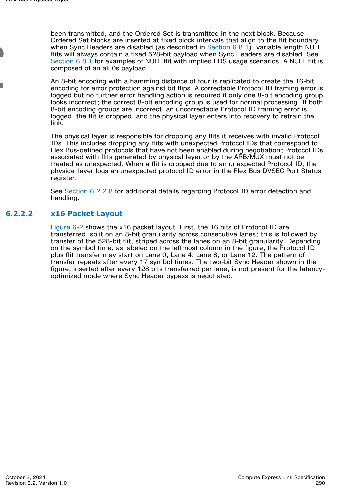
>
> *Original page render @ 150 DPI* — [📄 Full size](figures/chapter_06/page_0290.png)

<table>
<thead>
<tr>
<th width="50%">🇬🇧 English</th>
<th width="50%" style="background-color:#e8e8e8">🇨🇳 中文</th>
</tr>
</thead>
<tbody>
<tr><td>

Figure 6-3 provides an example where CXL.io and CXL.cachemem traffic is interleaved with an interleave granularity of two flits on a x16 link. The upper part of the figure shows what the CXL.io stream looks like before mapping to the Flex Bus lanes and before interleaving with CXL.cachemem traffic; the framing rules follow the x16 framing rules specified in PCIe Base Specification, as specified in Section 4.1. The lower part of the figure shows the final result when the two streams are interleaved on the Flex Bus lanes. For CXL.io flits, after transferring the 16-bit Protocol ID, 512 bits are used to transfer CXL.io traffic and 16 bits are unused. For CXL.cachemem flits, after transferring the 16-bit Protocol ID, 528 bits are used to transfer a CXL.cachemem flit. See Chapter 4.0 for more details on the flit format. As this example illustrates, the PCIe TLPs and DLLPs encapsulated within the CXL.io stream may be interrupted by non-related CXL traffic if they cross a flit boundary.

</td><td style="background-color:#e8e8e8">

图 6-3 给出了一个示例,展示了在 x16 链路上 CXL.io 和 CXL.cachemem 业务以两个 flit 的交织粒度进行交织。图中上半部分显示了 CXL.io 流在映射到 Flex Bus lane 之前以及与 CXL.cachemem 业务交织之前的样子;成帧规则遵循 PCIe Base Specification 第 4.1 节中规定的 x16 成帧规则。图中下半部分显示了当两个流在 Flex Bus lane 上交织后的最终结果。对于 CXL.io flit,传输 16 bit Protocol ID 后,512 bit 用于传输 CXL.io 业务,16 bit 未使用。对于 CXL.cachemem flit,传输 16 bit Protocol ID 后,528 bit 用于传输 CXL.cachemem flit。有关 flit 格式的更多详细信息,请参见第 4.0 章。如本例所示,如果 PCIe TLP 和 DLLP 跨越 flit 边界,则封装在 CXL.io 流中的 PCIe TLP 和 DLLP 可能会被不相关的 CXL 业务打断。

</td></tr>
</tbody>
</table>

> **Figure 6-3.** Flex Bus x16 Protocol Interleaving Example ｜ Flex Bus x16 协议交织示例
>
> 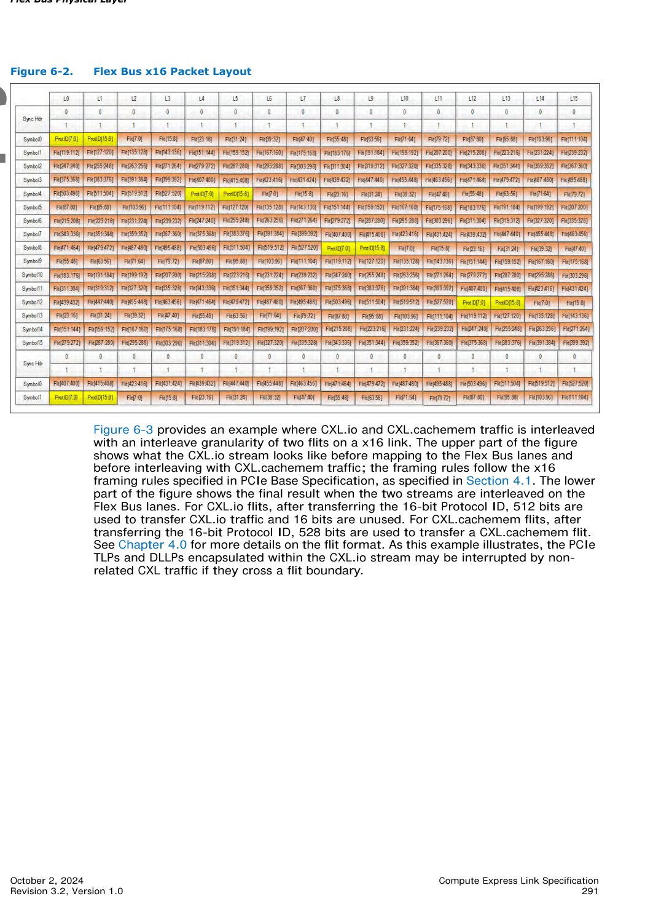
>
> *Original page render @ 150 DPI* — [📄 Full size](figures/chapter_06/page_0291.png)

[⬆️ 返回目录](#-本章目录-table-of-contents)

---

#### 6.2.2.3 x8 Packet Layout | x8 包布局

<table>
<thead>
<tr>
<th width="50%">🇬🇧 English</th>
<th width="50%" style="background-color:#e8e8e8">🇨🇳 中文</th>
</tr>
</thead>
<tbody>
<tr><td>

Figure 6-4 shows the x8 packet layout. 16 bits of Protocol ID followed by a 528-bit flit are striped across the lanes on an 8-bit granularity. Depending on the symbol time, the Protocol ID plus flit transfer may start on Lane 0 or Lane 4. The pattern of transfer repeats after every 17 symbol times. The two-bit Sync Header shown in the figure is not present for the Sync Header bypass latency-optimized mode.

</td><td style="background-color:#e8e8e8">

图 6-4 显示了 x8 包布局。16 bit Protocol ID 后跟 528 bit flit,以 8 bit 粒度在 lane 上条带分布。根据符号时间,Protocol ID 加 flit 的传输可以从 Lane 0 或 Lane 4 开始。传输模式每 17 个符号时间重复一次。图中显示的 2 bit Sync Header 在 Sync Header 旁路低延迟优化模式下不存在。

</td></tr>
<tr><td>

Figure 6-5 illustrates how CXL.io and CXL.cachemem traffic is interleaved on a x8 Flex Bus link. The same traffic from the x16 example in Figure 6-3 is mapped to a x8 link.

</td><td style="background-color:#e8e8e8">

图 6-5 说明了 CXL.io 和 CXL.cachemem 业务如何在 x8 Flex Bus 链路上交织。图 6-3 中 x16 示例的相同业务被映射到 x8 链路上。

</td></tr>
</tbody>
</table>

> **Figure 6-4.** Flex Bus x8 Packet Layout ｜ Flex Bus x8 包布局
>
> 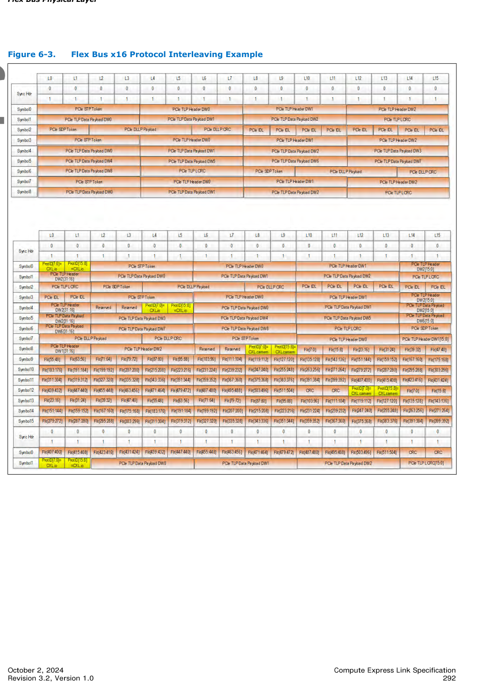
>
> *Original page render @ 150 DPI* — [📄 Full size](figures/chapter_06/page_0292.png)

> **Figure 6-5.** Flex Bus x8 Protocol Interleaving Example ｜ Flex Bus x8 协议交织示例
>
> 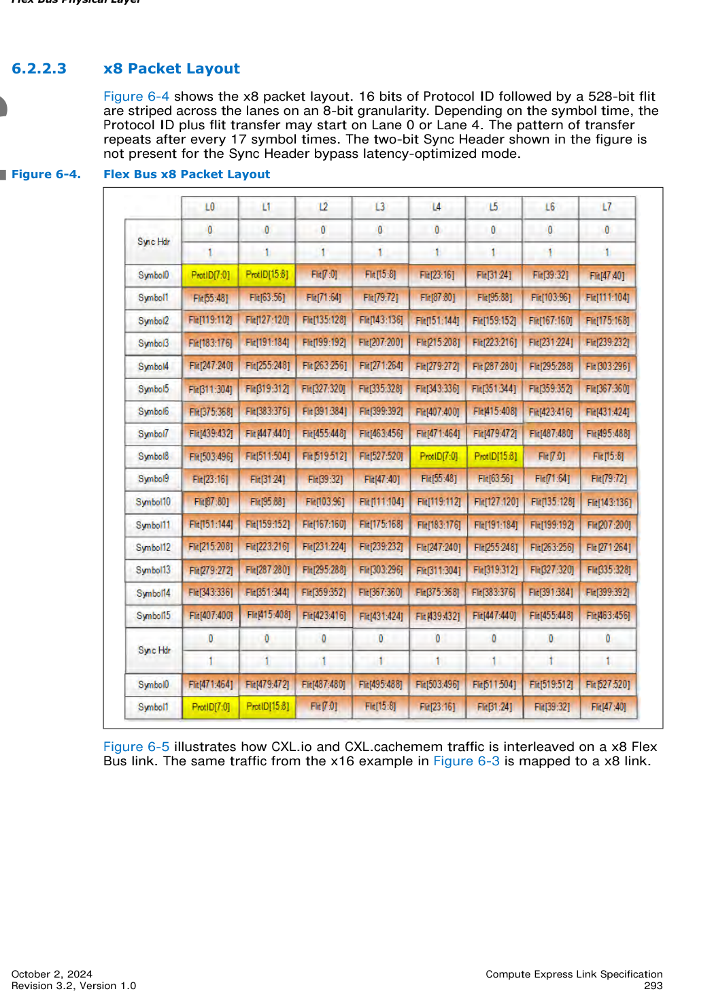
>
> *Original page render @ 150 DPI* — [📄 Full size](figures/chapter_06/page_0293.png)

[⬆️ 返回目录](#-本章目录-table-of-contents)

---

#### 6.2.2.4 x4 Packet Layout | x4 包布局

<table>
<thead>
<tr>
<th width="50%">🇬🇧 English</th>
<th width="50%" style="background-color:#e8e8e8">🇨🇳 中文</th>
</tr>
</thead>
<tbody>
<tr><td>

Figure 6-6 shows the x4 packet layout. 16 bits of Protocol ID followed by a 528-bit flit are striped across the lanes on an 8-bit granularity. The Protocol ID plus flit transfer always starts on Lane 0; the entire transfer takes 17 symbol times. The two-bit Sync Header shown in the figure is not present for Latency-optimized Sync Header Bypass mode.

</td><td style="background-color:#e8e8e8">

图 6-6 显示了 x4 包布局。16 bit Protocol ID 后跟 528 bit flit,以 8 bit 粒度在 lane 上条带分布。Protocol ID 加 flit 的传输始终从 Lane 0 开始;整个传输需要 17 个符号时间。图中显示的 2 bit Sync Header 在低延迟优化 Sync Header 旁路模式下不存在。

</td></tr>
</tbody>
</table>

> **Figure 6-6.** Flex Bus x4 Packet Layout ｜ Flex Bus x4 包布局
>
> 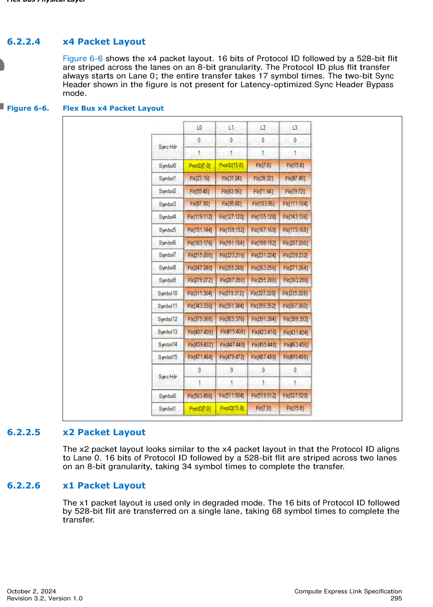
>
> *Original page render @ 150 DPI* — [📄 Full size](figures/chapter_06/page_0295.png)

[⬆️ 返回目录](#-本章目录-table-of-contents)

---

#### 6.2.2.5 x2 Packet Layout | x2 包布局

<table>
<thead>
<tr>
<th width="50%">🇬🇧 English</th>
<th width="50%" style="background-color:#e8e8e8">🇨🇳 中文</th>
</tr>
</thead>
<tbody>
<tr><td>

The x2 packet layout looks similar to the x4 packet layout in that the Protocol ID aligns to Lane 0. 16 bits of Protocol ID followed by a 528-bit flit are striped across two lanes on an 8-bit granularity, taking 34 symbol times to complete the transfer.

</td><td style="background-color:#e8e8e8">

x2 包布局与 x4 包布局类似,Protocol ID 与 Lane 0 对齐。16 bit Protocol ID 后跟 528 bit flit 以 8 bit 粒度在两个 lane 上条带分布,完成传输需要 34 个符号时间。

</td></tr>
</tbody>
</table>

[⬆️ 返回目录](#-本章目录-table-of-contents)

---

#### 6.2.2.6 x1 Packet Layout | x1 包布局

<table>
<thead>
<tr>
<th width="50%">🇬🇧 English</th>
<th width="50%" style="background-color:#e8e8e8">🇨🇳 中文</th>
</tr>
</thead>
<tbody>
<tr><td>

The x1 packet layout is used only in degraded mode. The 16 bits of Protocol ID followed by 528-bit flit are transferred on a single lane, taking 68 symbol times to complete the transfer.

</td><td style="background-color:#e8e8e8">

x1 包布局仅在降级模式下使用。16 bit Protocol ID 后跟 528 bit flit 在单个 lane 上传输,完成传输需要 68 个符号时间。

</td></tr>
</tbody>
</table>

[⬆️ 返回目录](#-本章目录-table-of-contents)

---

#### 6.2.2.7 Special Case: CXL.io — When a TLP Ends on a Flit Boundary | 特殊情况:CXL.io — TLP 在 Flit 边界结束时

<table>
<thead>
<tr>
<th width="50%">🇬🇧 English</th>
<th width="50%" style="background-color:#e8e8e8">🇨🇳 中文</th>
</tr>
</thead>
<tbody>
<tr><td>

For CXL.io traffic, if a TLP ends on a flit boundary and there is no additional CXL.io traffic to send, the receiver still requires a subsequent EDB indication if it is a nullified TLP or all IDLE flit or a DLLP to confirm it is a good TLP before processing the TLP. Figure 6-7 illustrates a scenario where the first CXL.io flit encapsulates a TLP that ends at the flit boundary, and the transmitter has no more TLPs or DLLPs to send. To ensure that the transmitted TLP that ended on the flit boundary is processed by the receiver, a subsequent CXL.io flit containing PCIe IDLE tokens is transmitted. The Link Layer generates the subsequent CXL.io flit.

</td><td style="background-color:#e8e8e8">

对于 CXL.io 业务,如果 TLP 在 flit 边界处结束且没有其他 CXL.io 业务可发送,则接收方在处理 TLP 之前仍需要后续的 EDB 指示(若为作废的 TLP 或全 IDLE flit)或 DLLP 来确认这是一个有效的 TLP。图 6-7 展示了一个场景:第一个 CXL.io flit 封装了在 flit 边界结束的 TLP,且发送方没有更多的 TLP 或 DLLP 可发送。为了确保在 flit 边界结束的已发送 TLP 能被接收方处理,会发送一个包含 PCIe IDLE token 的后续 CXL.io flit。该后续 CXL.io flit 由链路层生成。

</td></tr>
</tbody>
</table>

> **Figure 6-7.** CXL.io TLP Ending on Flit Boundary Example ｜ CXL.io TLP 在 Flit 边界结束示例
>
> 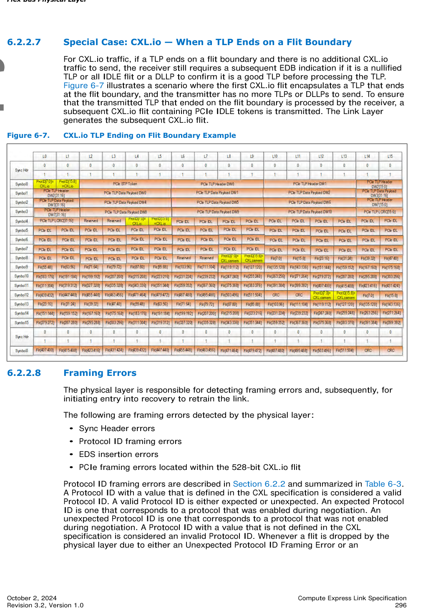
>
> *Original page render @ 150 DPI* — [📄 Full size](figures/chapter_06/page_0296.png)

[⬆️ 返回目录](#-本章目录-table-of-contents)

---

#### 6.2.2.8 Framing Errors | 成帧错误

<table>
<thead>
<tr>
<th width="50%">🇬🇧 English</th>
<th width="50%" style="background-color:#e8e8e8">🇨🇳 中文</th>
</tr>
</thead>
<tbody>
<tr><td>

The physical layer is responsible for detecting framing errors and, subsequently, for initiating entry into recovery to retrain the link.

</td><td style="background-color:#e8e8e8">

物理层负责检测成帧错误,并随后启动进入 Recovery 以重新训练链路。

</td></tr>
<tr><td>

The following are framing errors detected by the physical layer:
- Sync Header errors
- Protocol ID framing errors
- EDS insertion errors
- PCIe framing errors located within the 528-bit CXL.io flit

</td><td style="background-color:#e8e8e8">

以下是物理层检测到的成帧错误:
- Sync Header 错误
- Protocol ID 成帧错误
- EDS 插入错误
- 528 bit CXL.io flit 内的 PCIe 成帧错误

</td></tr>
<tr><td>

Protocol ID framing errors are described in Section 6.2.2 and summarized in Table 6-3. A Protocol ID with a value that is defined in the CXL specification is considered a valid Protocol ID. A valid Protocol ID is either expected or unexpected. An expected Protocol ID is one that corresponds to a protocol that was enabled during negotiation. An unexpected Protocol ID is one that corresponds to a protocol that was not enabled during negotiation. A Protocol ID with a value that is not defined in the CXL specification is considered an invalid Protocol ID. Whenever a flit is dropped by the physical layer due to either an Unexpected Protocol ID Framing Error or an Uncorrectable Protocol ID Framing Error, the physical layer enters LTSSM recovery to retrain the link and notifies the link layers to enter recovery and, if applicable, to initiate link level retry.

</td><td style="background-color:#e8e8e8">

Protocol ID 成帧错误在 6.2.2 节中描述,并在表 6-3 中汇总。其值在 CXL 规范中定义过的 Protocol ID 视为合法的 Protocol ID。合法的 Protocol ID 分为预期或非预期。预期 Protocol ID 对应于协商期间已启用的协议。非预期 Protocol ID 对应于协商期间未启用的协议。其值未在 CXL 规范中定义的 Protocol ID 视为无效的 Protocol ID。每当物理层由于意外的 Protocol ID 成帧错误或不可纠正的 Protocol ID 成帧错误而丢弃 flit 时,物理层会进入 LTSSM Recovery 重新训练链路,并通知链路层进入 Recovery,且在适用的情况下启动链路级重试。

</td></tr>
</tbody>
</table>

**Table 6-3.** Protocol ID Framing Errors | Protocol ID 成帧错误

<table>
<thead>
<tr>
<th>Protocol ID[7:0]</th>
<th>Protocol ID[15:8]</th>
<th style="background-color:#e8e8e8">Expected Action</th>
</tr>
</thead>
<tbody>
<tr><td>Invalid</td><td>Valid & Expected</td><td style="background-color:#e8e8e8">Process normally using Protocol ID[15:8]; Log as CXL_Correctable_Protocol_ID_Framing_Error in DVSEC Flex Bus Port Status register.</td></tr>
<tr><td>Valid & Expected</td><td>Invalid</td><td style="background-color:#e8e8e8">Process normally using Protocol ID[7:0]; Log as CXL_Correctable_Protocol_ID_Framing_Error in DVSEC Flex Bus Port Status register.</td></tr>
<tr><td>Valid & Unexpected</td><td>Valid & Unexpected & Equal to Protocol ID[7:0]</td><td style="background-color:#e8e8e8">Drop flit and log as CXL_Unexpected_Protocol_ID_Dropped in DVSEC Flex Bus Port Status register; enter LTSSM recovery to retrain the link; notify link layers to enter recovery and, if applicable, initiate link level retry</td></tr>
<tr><td>Invalid</td><td>Valid & Unexpected</td><td style="background-color:#e8e8e8">Drop flit and log as CXL_Unexpected_Protocol_ID_Dropped in DVSEC Flex Bus Port Status register; enter LTSSM recovery to retrain the link; notify link layers to enter recovery and, if applicable, initiate link level retry</td></tr>
<tr><td>Valid & Unexpected</td><td>Invalid</td><td style="background-color:#e8e8e8">Drop flit and log as CXL_Unexpected_Protocol_ID_Dropped in DVSEC Flex Bus Port Status register; enter LTSSM recovery to retrain the link; notify link layers to enter recovery and, if applicable, initiate link level retry</td></tr>
<tr><td>Valid</td><td>Valid & Not Equal to Protocol ID[7:0]</td><td style="background-color:#e8e8e8">Drop flit and log as CXL_Uncorrectable_Protocol_ID_Framing_Error in DVSEC Flex Bus Port Status register; enter LTSSM recovery to retrain the link; notify link layers to enter recovery and, if applicable, initiate link level retry</td></tr>
<tr><td>Invalid</td><td>Invalid</td><td style="background-color:#e8e8e8">Drop flit and log as CXL_Uncorrectable_Protocol_ID_Framing_Error in DVSEC Flex Bus Port Status register; enter LTSSM recovery to retrain the link; notify link layers to enter recovery and, if applicable, initiate link level retry</td></tr>
</tbody>
</table>

[⬆️ 返回目录](#-本章目录-table-of-contents)

---

### 6.2.3 256B Flit Mode | 256B Flit 模式

<table>
<thead>
<tr>
<th width="50%">🇬🇧 English</th>
<th width="50%" style="background-color:#e8e8e8">🇨🇳 中文</th>
</tr>
</thead>
<tbody>
<tr><td>

256B Flit mode operation relies on support of PCIe Base Specification. Selection of 68B Flit mode or 256B Flit mode occurs during PCIe link training. Table 6-4 specifies the scenarios in which the link operates in 68B Flit mode and 256B Flit mode. CXL mode is supported at PCIe link rates of 8 GT/s or higher; CXL mode is not supported at 2.5 GT/s or 5 GT/s link rates, regardless of whether PCIe Flit mode is negotiated. If PCIe Flit mode is selected during training, as described in PCIe Base Specification, and the link speed is 8 GT/s or higher, 256B Flit mode is used. If PCIe Flit mode is not selected during training and the link speed is 8 GT/s or higher, 68B Flit mode is used.

</td><td style="background-color:#e8e8e8">

256B Flit 模式的运行依赖 PCIe Base Specification 的支持。68B Flit 模式或 256B Flit 模式的选择发生在 PCIe 链路训练期间。表 6-4 指定了链路运行在 68B Flit 模式和 256B Flit 模式中的具体场景。CXL 模式在 PCIe 链路速率为 8 GT/s 或更高时受支持;在 2.5 GT/s 或 5 GT/s 链路速率下不支持 CXL 模式,无论是否协商了 PCIe Flit 模式。如果在训练期间(按 PCIe Base Specification 所述)选择了 PCIe Flit 模式且链路速率为 8 GT/s 或更高,则使用 256B Flit 模式。如果在训练期间未选择 PCIe Flit 模式且链路速率为 8 GT/s 或更高,则使用 68B Flit 模式。

</td></tr>
</tbody>
</table>

**Table 6-4.** 256B Flit Mode vs. 68B Flit Mode Operation | 256B Flit 模式 vs. 68B Flit 模式运行

<table>
<thead>
<tr>
<th>Data Rate</th>
<th>PCIe Flit Mode</th>
<th>Encoding</th>
<th style="background-color:#e8e8e8">CXL Flit Mode</th>
</tr>
</thead>
<tbody>
<tr><td>2.5 GT/s, 5 GT/s</td><td>No</td><td>8b/10b</td><td style="background-color:#e8e8e8">CXL is not supported</td></tr>
<tr><td>2.5 GT/s, 5 GT/s</td><td>Yes</td><td>8b/10b</td><td style="background-color:#e8e8e8">CXL is not supported</td></tr>
<tr><td>8 GT/s, 16 GT/s, 32 GT/s</td><td>No</td><td>128b/130b</td><td style="background-color:#e8e8e8">68B flits</td></tr>
<tr><td>8 GT/s, 16 GT/s, 32 GT/s</td><td>Yes</td><td>128b/130b</td><td style="background-color:#e8e8e8">256B flits</td></tr>
<tr><td>64 GT/s</td><td>Yes (required)</td><td>1b/1b</td><td style="background-color:#e8e8e8">256B flits</td></tr>
</tbody>
</table>

[⬆️ 返回目录](#-本章目录-table-of-contents)

---

#### 6.2.3.1 256B Flit Format | 256B Flit 格式

<table>
<thead>
<tr>
<th width="50%">🇬🇧 English</th>
<th width="50%" style="background-color:#e8e8e8">🇨🇳 中文</th>
</tr>
</thead>
<tbody>
<tr><td>

The 256B flit leverages several elements from the PCIe flit. There are two variants of the 256B flit:
- Standard 256B flit
- Latency-optimized 256B flit with 128-byte flit halves

</td><td style="background-color:#e8e8e8">

256B flit 利用了 PCIe flit 中的若干元素。256B flit 有两种变体:
- 标准 256B flit
- 带 128 字节半 flit 的低延迟优化 256B flit

</td></tr>
</tbody>
</table>

[⬆️ 返回目录](#-本章目录-table-of-contents)

---

##### 6.2.3.1.1 Standard 256B Flit | 标准 256B Flit

<table>
<thead>
<tr>
<th width="50%">🇬🇧 English</th>
<th width="50%" style="background-color:#e8e8e8">🇨🇳 中文</th>
</tr>
</thead>
<tbody>
<tr><td>

The standard 256B flit format is shown in Figure 6-8. The 256-byte flit includes 2 bytes of Flit Header information as specified in Table 6-5. There are 240 bytes of Flit Data, for which the format differs depending on whether the flit carries CXL.io payload, CXL.cachemem payload, or ALMP payload, or whether an IDLE flit is being transmitted. For CXL.io, the Flit Data includes TLP payload and a 4-byte DLLP payload as specified in PCIe Base Specification; the DLLP payload is located at the end of the Flit Data as shown in Figure 6-9. For CXL.cachemem, the Flit Data format is specified in Chapter 4.0. The 8 bytes of CRC protects the Flit Header and Flit Data and is calculated as specified in PCIe Base Specification. The 6 bytes of FEC protects the Flit Header, Flit Data, and CRC, and is calculated as specified in PCIe Base Specification. The application of flit bits to the PCIe physical lanes is shown in Figure 6-10.

</td><td style="background-color:#e8e8e8">

标准 256B flit 格式如图 6-8 所示。256 字节 flit 包含 2 字节的 Flit Header 信息,如表 6-5 所示。Flit Data 共 240 字节,其格式根据 flit 承载的是 CXL.io 有效载荷、CXL.cachemem 有效载荷、ALMP 有效载荷,还是 IDLE flit 而有所不同。对于 CXL.io,Flit Data 包含 TLP 有效载荷和 4 字节的 DLLP 有效载荷,如 PCIe Base Specification 所规定;DLLP 有效载荷位于 Flit Data 的末尾,如图 6-9 所示。对于 CXL.cachemem,Flit Data 格式在第 4.0 章中规定。8 字节 CRC 保护 Flit Header 和 Flit Data,计算方法如 PCIe Base Specification 所规定。6 字节 FEC 保护 Flit Header、Flit Data 和 CRC,计算方法如 PCIe Base Specification 所规定。flit bit 在 PCIe 物理 lane 上的应用如图 6-10 所示。

</td></tr>
<tr><td>

The 2 bytes of Flit Header as defined in Table 6-5 are transmitted as the first two bytes of the flit. The 2-bit Flit Type field indicates whether the flit carries CXL.io traffic, CXL.cachemem traffic, ALMPs, IDLE flits, Empty flits, or NOP flits. Please refer to Section 6.2.3.1.1.1 for more details. The Prior Flit Type definition is as defined in PCIe Base Specification; it enables the receiver to know that the prior flit was an NOP flit or IDLE flit, and thus does not require replay (i.e., can be discarded) if it has a CRC error. The Type of DLLP Payload definition is as defined in PCIe Base Specification for CXL.io flits; otherwise, this bit is reserved. The Replay Command[1:0] and Flit Sequence Number[9:0] definitions are as defined in PCIe Base Specification.

</td><td style="background-color:#e8e8e8">

表 6-5 定义的 2 字节 Flit Header 作为 flit 的前两个字节传输。2 bit 的 Flit Type 字段指示该 flit 承载的是 CXL.io 业务、CXL.cachemem 业务、ALMP、IDLE flit、Empty flit 还是 NOP flit。更多细节请参见 6.2.3.1.1.1 节。Prior Flit Type 的定义如 PCIe Base Specification 所规定;它使接收方能够知道前一个 flit 是 NOP flit 或 IDLE flit,因此如果出现 CRC 错误则不需要重放(即可以丢弃)。Type of DLLP Payload 的定义与 PCIe Base Specification 中针对 CXL.io flit 的定义相同;否则该 bit 为保留。Replay Command[1:0] 和 Flit Sequence Number[9:0] 的定义如 PCIe Base Specification 所规定。

</td></tr>
</tbody>
</table>

> **Figure 6-8.** Standard 256B Flit ｜ 标准 256B Flit
>
> 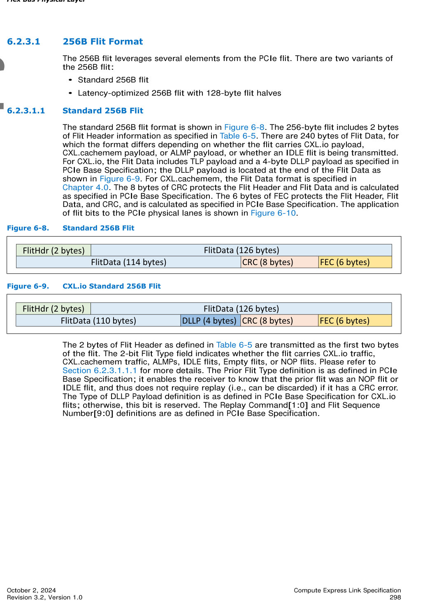
>
> *Original page render @ 150 DPI* — [📄 Full size](figures/chapter_06/page_0298.png)

> **Figure 6-9.** CXL.io Standard 256B Flit ｜ CXL.io 标准 256B Flit
>
> 
>
> *Original page render @ 150 DPI* — [📄 Full size](figures/chapter_06/page_0298.png)

**Table 6-5.** 256B Flit Header | 256B Flit 头部

<table>
<thead>
<tr>
<th>Flit Header Field</th>
<th>Bit Location</th>
<th style="background-color:#e8e8e8">Description</th>
</tr>
</thead>
<tbody>
<tr><td>Flit Type[1:0]</td><td>[7:6]</td><td style="background-color:#e8e8e8">00b = Physical Layer IDLE flit or Physical Layer NOP flit or CXL.io NOP flit 01b = CXL.io Payload flit 10b = If CXL.cachemem is enabled, CXL.cachemem Payload flit or CXL.cachemem-generated Empty flit; reserved if CXL.cachemem is not enabled 11b = ALMP Please refer to Table 6-6 for more details.</td></tr>
<tr><td>Prior Flit Type</td><td>[5]</td><td style="background-color:#e8e8e8">0 = Prior flit was a NOP or IDLE flit (not allocated into Replay buffer) 1 = Prior flit was a Payload flit or Empty flit (allocated into Replay buffer)</td></tr>
<tr><td>Type of DLLP Payload</td><td>[4]</td><td style="background-color:#e8e8e8">If (Flit Type = (CXL.io Payload or CXL.io NOP): Use as defined in PCIe Base Specification If (Flit Type != (CXL.io Payload or CXL.io NOP)): Reserved</td></tr>
<tr><td>Replay Command[1:0]</td><td>[3:2]</td><td style="background-color:#e8e8e8">Same as defined in PCIe Base Specification.</td></tr>
<tr><td>Flit Sequence Number[9:0]</td><td>{[1:0], [15:8]}</td><td style="background-color:#e8e8e8">10-bit Sequence Number as defined in PCIe Base Specification. When the transmission of a NOP Flit is required while a replay is in progress (i.e., when the REPLAY_IN_PROGRESS variable is 1b), it is strongly recommended1 that the transmitter set the Explicit Sequence Number to the Sequence Number of the previous Payload Flit that was sent (instead of NEXT_TX_FLIT_SEQ_NUM – 1). This recommendation applies to any reference made to the Explicit Sequence Number of NOP Flits.</td></tr>
</tbody>
</table>

1 Future revisions of the specification will make this recommendation mandatory.

> **Note:** If an Explicit Sequence Number NOP Flit is sent during Replay with the sequence number NEXT_TX_FLIT_SEQ_NUM – 1 and it is followed by a Payload Flit with an Implicit Sequence Number, a Nak Schedule 2 may be triggered or valid data may be placed in an invalid location.

[⬆️ 返回目录](#-本章目录-table-of-contents)

---

###### 6.2.3.1.1.1 256B Flit Type | 256B Flit 类型

<table>
<thead>
<tr>
<th width="50%">🇬🇧 English</th>
<th width="50%" style="background-color:#e8e8e8">🇨🇳 中文</th>
</tr>
</thead>
<tbody>
<tr><td>

Table 6-6 specifies the different flit payloads that are associated with each Flit Type encoding.

</td><td style="background-color:#e8e8e8">

表 6-6 详细列出了与每个 Flit Type 编码关联的不同 flit 有效载荷。

</td></tr>
<tr><td>

Prior to the Sequence Number Handshake upon each entry to L0, as described in PCIe Base Specification, a Flit Type encoding of 00b indicates an IDLE flit. These IDLE flits contain all zeros payload and are generated and consumed by the Physical Layer. During and after the Sequence Number Handshake in L0, a Flit Type encoding of 00b indicates either a Physical Layer NOP flit or a CXL.io NOP flit. The Physical Layer must insert NOP flits when it backpressures the upper layers due to its Tx retry buffer filling up; it is also required to insert NOP flits when traffic is not generated by the upper layers. These NOP flits must not be allocated into the transmit retry buffer or receive retry buffer. Physical Layer NOP flits carry 0s in the bit positions that correspond to the bit positions in CXL.io flits that are used to carry DLLP payload; the remaining bits in Physical Layer NOP flits are reserved.

</td><td style="background-color:#e8e8e8">

在每次进入 L0 时(按 PCIe Base Specification 所述)的 Sequence Number 握手之前,Flit Type 编码 00b 表示 IDLE flit。这些 IDLE flit 包含全 0 有效载荷,由物理层生成和消费。在 L0 中及之后的 Sequence Number 握手期间,Flit Type 编码 00b 表示物理层 NOP flit 或 CXL.io NOP flit。当物理层由于其 Tx 重试缓冲区填满而对上层施加背压时,必须插入 NOP flit;当上层不产生业务时,也必须插入 NOP flit。这些 NOP flit 不得分配到发送重试缓冲区或接收重试缓冲区。物理层 NOP flit 在对应于 CXL.io flit 中用于承载 DLLP 有效载荷的 bit 位置上承载 0;物理层 NOP flit 中的其余 bit 为保留。

</td></tr>
<tr><td>

CXL.io NOP flits are generated by the CXL.io Link Layer and carry only valid DLLP payload. When a Flit Type of 00b is decoded, the Physical Layer must always check for valid DLLP payload. CXL.io NOP flits must not be allocated into the transmit retry buffer or into the receive retry buffer.

</td><td style="background-color:#e8e8e8">

CXL.io NOP flit 由 CXL.io 链路层生成,仅承载有效的 DLLP 有效载荷。当解码到 Flit Type 00b 时,物理层必须始终检查有效的 DLLP 有效载荷。CXL.io NOP flit 不得分配到发送重试缓冲区或接收重试缓冲区。

</td></tr>
<tr><td>

A Flit Type encoding of 01b indicates CXL.io Payload traffic; these flits can encapsulate both valid TLP payload and valid DLLP payload.

</td><td style="background-color:#e8e8e8">

Flit Type 编码 01b 表示 CXL.io Payload 业务;这些 flit 可以同时封装有效的 TLP 有效载荷和有效的 DLLP 有效载荷。

</td></tr>
<tr><td>

A Flit Type encoding of 10b indicates either a flit with valid CXL.cachemem Payload flit or a CXL.cachemem Empty flit; this enables CXL.cachemem to minimize idle to valid traffic transitions by arbitrating for use of the ARB/MUX transmit data path even while it does not have valid traffic to send so that it can potentially fill later slots in the flit with late arriving traffic, instead of requiring CXL.cachemem to wait until the next 256-byte flit boundary to begin transmitting valid traffic. CXL.cachemem Empty flits are retryable and must be allocated in the transmit retry buffer. The Physical Layer must decode the Link Layer CRD[4:0] bits to determine whether the flit carries valid payload or whether the flit is an empty CXL.cachemem Empty flit. See Table 4-19 in Chapter 4.0 for more details.

</td><td style="background-color:#e8e8e8">

Flit Type 编码 10b 表示有效的 CXL.cachemem Payload flit 或 CXL.cachemem Empty flit;这使 CXL.cachemem 能够通过仲裁使用 ARB/MUX 发送数据路径来最小化空闲到有效业务的跃迁,即使在没有有效业务可发送时也可以进行仲裁,以便稍后可能用迟到的业务填充 flit 中后续的 slot,而不是要求 CXL.cachemem 等待下一个 256 字节 flit 边界才开始发送有效业务。CXL.cachemem Empty flit 是可重试的,必须分配到发送重试缓冲区。物理层必须解码链路层 CRD[4:0] bit 以确定该 flit 承载的是有效有效载荷还是 CXL.cachemem Empty flit。更多细节请参见第 4.0 章中的表 4-19。

</td></tr>
<tr><td>

A Flit Type encoding of 11b indicates an ALMP.

</td><td style="background-color:#e8e8e8">

Flit Type 编码 11b 表示 ALMP。

</td></tr>
</tbody>
</table>

**Table 6-6.** Flit Type[1:0] Encoding | Flit Type[1:0] 编码

<table>
<thead>
<tr>
<th>Flit Type[1:0]</th>
<th>Flit Payload</th>
<th>Source</th>
<th style="background-color:#e8e8e8">Description</th>
<th style="background-color:#e8e8e8">Allocated to Retry Buffer?</th>
</tr>
</thead>
<tbody>
<tr><td>00b</td><td>Physical Layer NOP</td><td>Physical Layer</td><td style="background-color:#e8e8e8">Physical Layer generated (and sunk) flit with no valid payload; inserted in the data stream when its Tx retry buffer is full and it is backpressuring the upper layer or when no other flits from upper layers are available to transmit.</td><td style="background-color:#e8e8e8">No</td></tr>
<tr><td>00b</td><td>IDLE</td><td>Physical Layer</td><td style="background-color:#e8e8e8">Physical Layer generated (and consumed) all 0s payload flit used to facilitate LTSSM transitions as described in PCIe Base Specification.</td><td style="background-color:#e8e8e8">No</td></tr>
<tr><td>00b</td><td>CXL.io NOP</td><td>CXL.io Link Layer</td><td style="background-color:#e8e8e8">Valid CXL.io DLLP payload (no TLP payload); periodically inserted by the CXL.io link layer to satisfy the PCIe Base Specification requirement for a credit update interval if no other CXL.io flits are available to transmit.</td><td style="background-color:#e8e8e8">No</td></tr>
<tr><td>01b</td><td>CXL.io Payload</td><td>CXL.io Link Layer</td><td style="background-color:#e8e8e8">Valid CXL.io TLP and valid DLLP payload.</td><td style="background-color:#e8e8e8">Yes</td></tr>
<tr><td>10b</td><td>CXL.cachemem Payload</td><td>CXL.cachemem Link Layer</td><td style="background-color:#e8e8e8">Valid CXL.cachemem slot and/or CXL.cachemem credit payload.</td><td style="background-color:#e8e8e8">Yes</td></tr>
<tr><td>10b</td><td>CXL.cachemem Empty</td><td>CXL.cachemem Link Layer</td><td style="background-color:#e8e8e8">No valid CXL.cachemem payload; generated when CXL.cachemem link layer speculatively arbitrates to transfer a flit to reduce idle to valid transition time but no valid CXL.cachemem payload arrives in time to use any slots in the flit.</td><td style="background-color:#e8e8e8">Yes, allocate only to the Tx Retry Buffer</td></tr>
<tr><td>11b</td><td>ALMP</td><td>ARB/MUX</td><td style="background-color:#e8e8e8">ARB/MUX Link Management Packet.</td><td style="background-color:#e8e8e8">Yes</td></tr>
</tbody>
</table>

<table>
<thead>
<tr>
<th width="50%">🇬🇧 English</th>
<th width="50%" style="background-color:#e8e8e8">🇨🇳 中文</th>
</tr>
</thead>
<tbody>
<tr><td>

Figure 6-10 shows how the flit is mapped to the physical lanes on the link. The flit is striped across the lanes on an 8-bit granularity starting with 16-bit Flit Header, followed by the 240 bytes of Flit Data, the 8-byte CRC, and finally the 6-byte FEC (3-way interleaved ECC described in PCIe Base Specification).

</td><td style="background-color:#e8e8e8">

图 6-10 显示了 flit 如何映射到链路上的物理 lane。flit 以 8 bit 粒度在 lane 上条带分布,首先为 16 bit Flit Header,然后是 240 字节 Flit Data、8 字节 CRC,最后是 6 字节 FEC(PCIe Base Specification 中所述的三路交织 ECC)。

</td></tr>
</tbody>
</table>

> **Figure 6-10.** Standard 256B Flit Applied to Physical Lanes (x16) ｜ 应用到物理 lane 的标准 256B Flit (x16)
>
> 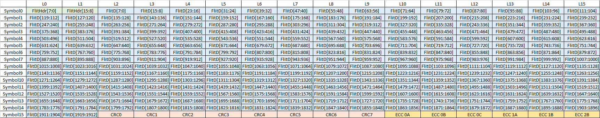
>
> *Original page render @ 150 DPI* — [📄 Full size](figures/chapter_06/page_0301.png)

[⬆️ 返回目录](#-本章目录-table-of-contents)

---

##### 6.2.3.1.2 Latency-Optimized 256B Flit with 128-Byte Flit Halves | 带 128 字节半 Flit 的低延迟优化 256B Flit

<table>
<thead>
<tr>
<th width="50%">🇬🇧 English</th>
<th width="50%" style="background-color:#e8e8e8">🇨🇳 中文</th>
</tr>
</thead>
<tbody>
<tr><td>

Figure 6-11 shows the latency-optimized 256B flit format. This latency-optimized flit format is optionally supported by components that support 256B flits. The decision to operate in standard 256B flit format or the latency-optimized 256B flit format occurs once during CXL alternate protocol negotiation; dynamic switching between the two formats is not supported.

</td><td style="background-color:#e8e8e8">

图 6-11 显示了低延迟优化 256B flit 格式。该低延迟优化 flit 格式由支持 256B flit 的组件可选地支持。运行在标准 256B flit 格式还是低延迟优化 256B flit 格式的决定在 CXL 替代协议协商期间确定一次;不支持两种格式之间的动态切换。

</td></tr>
<tr><td>

The latency-optimized flit format organizes the 256-byte flit into 128-byte flit halves. The even flit half consists of the 2-byte Flit Header, 120 bytes of Flit Data, and 6 bytes of CRC that protects the even 128-byte flit half. The odd flit half consists of 116 bytes of Flit Data, 6 bytes of FEC that protects the entire 256 bytes of the flit, and 6 bytes of CRC that protects the 128-byte odd flit half excluding the 6-byte FEC. The benefit of the latency-optimized flit format is reduction of flit accumulation latency. Because each 128-byte flit half is independently protected by CRC, the first half of the flit can be consumed by the receiver if CRC passes without waiting for the second half to be received for FEC decode. The flit accumulation latency savings increases for smaller link widths; for x4 link widths the round trip flit accumulation latency is 8 ns at 64 GT/s link speed. Similarly, the odd flit half can be consumed if CRC passes, without having to wait for the more-complex FEC decode operation to first complete. If CRC fails for either flit half, FEC decode and correct is applied to the entire 256-byte flit. Subsequently, each flit half is consumed if CRC passes, if the flit half was not already previously consumed, and if all data previous to the flit half has been consumed.

</td><td style="background-color:#e8e8e8">

低延迟优化 flit 格式将 256 字节的 flit 组织为 128 字节的半 flit。偶数半 flit 由 2 字节的 Flit Header、120 字节的 Flit Data 和 6 字节的 CRC(保护偶数 128 字节半 flit)组成。奇数半 flit 由 116 字节的 Flit Data、6 字节的 FEC(保护整个 256 字节 flit)和 6 字节的 CRC(保护 128 字节奇数半 flit,不含 6 字节 FEC)组成。低延迟优化 flit 格式的优点是降低了 flit 累积延迟。由于每个 128 字节半 flit 由 CRC 独立保护,如果 CRC 通过,接收方可以消费 flit 的前一半,无需等待接收完第二半再进行 FEC 解码。链路宽度越小,flit 累积延迟的节省越多;对于 x4 链路宽度,在 64 GT/s 链路速率下,往返 flit 累积延迟为 8 ns。类似地,如果奇数半 flit 的 CRC 通过,也可以消费,无需等待更复杂的 FEC 解码操作首先完成。如果任一半 flit 的 CRC 失败,则对整个 256 字节 flit 应用 FEC 解码和纠错。随后,如果 CRC 通过、该半 flit 之前未被消费、且该半 flit 之前的所有数据均已被消费,则消费该半 flit。

</td></tr>
<tr><td>

Note: For CXL.io, due to the potential of a Flit Marker, the last TLP of the first 128-byte flit half is not permitted to be consumed until the entire flit is successfully received. Additionally, the CXL.io Transaction Layer must wait until the second half of the flit is successfully received before responding to a PTM request that was received in the first half of the flit so that it responds with the correct master timestamp.

</td><td style="background-color:#e8e8e8">

注意:对于 CXL.io,由于可能存在 Flit Marker,在成功接收整个 flit 之前,不允许消费第一个 128 字节半 flit 中的最后一个 TLP。此外,CXL.io 事务层必须等待 flit 的第二半成功接收后,才能响应在 flit 第一半中收到的 PTM 请求,以便用正确的主时间戳进行响应。

</td></tr>
<tr><td>

Note that flits are still retried on a 256-byte granularity even with the latency-optimized 256-byte flit. If either flit half fails CRC after FEC decode and correct, the receiver requests a retry of the entire 256-byte flit. The receiver is responsible for tracking whether it has previously consumed either half during a retry and must drop any flit halves that have been previously consumed.

</td><td style="background-color:#e8e8e8">

请注意,即使使用低延迟优化的 256 字节 flit,flit 的重试仍以 256 字节为粒度。如果任一半 flit 在 FEC 解码和纠错之后 CRC 失败,接收方会请求重试整个 256 字节 flit。接收方负责跟踪在重试期间是否已消费任一半 flit,并必须丢弃之前已消费过的半 flit。

</td></tr>
</tbody>
</table>

> **Figure 6-11.** Latency-Optimized 256B Flit ｜ 低延迟优化 256B Flit
>
> 
>
> *Original page render @ 150 DPI* — [📄 Full size](figures/chapter_06/page_0301.png)

<table>
<thead>
<tr>
<th width="50%">🇬🇧 English</th>
<th width="50%" style="background-color:#e8e8e8">🇨🇳 中文</th>
</tr>
</thead>
<tbody>
<tr><td>

The following error scenario example illustrates how latency-optimized flits are processed. The even flit half passes CRC check prior to FEC decode and is consumed. The odd flit half fails CRC check. The FEC decode and correct is applied to the 256-byte flit; subsequently, the even flit half now fails CRC and the odd flit half passes. In this scenario, the FEC correction is suspect since a previously passing CRC check now fails. The receiver requests a retry of the 256-byte flit, and the odd flit half is consumed from the retransmitted flit, assuming it passes FEC and CRC checks. Note that even though the even flit half failed CRC post-FEC correction in the original flit, the receiver must not re-consume the even flit half from the retransmitted flit. The expectation is that this scenario occurs most likely due to multiple errors in the odd flit half exceeding FEC correction capability, thus causing additional errors to be injected due to FEC correction.

</td><td style="background-color:#e8e8e8">

以下错误场景示例说明了低延迟优化 flit 的处理方式。偶数半 flit 在 FEC 解码之前通过 CRC 检查并被消费。奇数半 flit 未通过 CRC 检查。对 256 字节 flit 应用 FEC 解码和纠错;随后,偶数半 flit 现在未通过 CRC,而奇数半 flit 通过。在这种情况下,FEC 纠错是可疑的,因为之前通过的 CRC 检查现在失败。接收方请求重试 256 字节 flit,并从重传的 flit 中消费奇数半 flit(假设其通过 FEC 和 CRC 检查)。请注意,即使偶数半 flit 在原始 flit 中经过 FEC 纠错后未通过 CRC,接收方也不应从重传的 flit 中重新消费偶数半 flit。预期这种场景最可能是由于奇数半 flit 中的多个错误超出了 FEC 纠错能力,从而导致由于 FEC 纠错而引入额外的错误。

</td></tr>
<tr><td>

Table 6-7 summarizes processing steps for different CRC scenarios, depending on results of the CRC check for the even flit half and the odd flit half on the original flit, the post-FEC corrected flit, and the retransmitted flit.

</td><td style="background-color:#e8e8e8">

表 6-7 汇总了不同 CRC 场景下的处理步骤,具体取决于原始 flit、FEC 纠错后 flit 和重传 flit 的偶数半 flit 和奇数半 flit 的 CRC 检查结果。

</td></tr>
</tbody>
</table>

**Table 6-7.** Latency-Optimized Flit Processing for CRC Scenarios (Sheet 1 of 2) | CRC 场景下的低延迟 Flit 处理(第 1 页,共 2 页)

<table>
<thead>
<tr>
<th colspan="3">Original Flit</th>
<th colspan="3">Post-FEC Corrected Flit</th>
<th colspan="3" style="background-color:#e8e8e8">Retransmitted Flit</th>
</tr>
<tr>
<th>Even CRC</th>
<th>Odd CRC</th>
<th>Action</th>
<th>Even CRC</th>
<th>Odd CRC</th>
<th>Subsequent Action</th>
<th>Even CRC</th>
<th>Odd CRC</th>
<th style="background-color:#e8e8e8">Subsequent Action</th>
</tr>
</thead>
<tbody>
<tr><td>Pass</td><td>Pass</td><td>Consume Flit</td><td>N/A</td><td>N/A</td><td>N/A</td><td>N/A</td><td>N/A</td><td style="background-color:#e8e8e8">N/A</td></tr>
<tr><td>Pass</td><td>Fail</td><td>Permitted to consume even flit half; perform FEC decode and correct</td><td>Pass</td><td>Pass</td><td>Consume even flit half if not previously consumed (must drop even flit half if previously consumed); Consume odd flit half</td><td>N/A</td><td>N/A</td><td style="background-color:#e8e8e8">N/A</td></tr>
<tr><td>Pass</td><td>Fail</td><td>Permitted to consume even flit half if not previously consumed; Request Retry</td><td>Pass</td><td>Pass</td><td>Consume even flit half if not previously consumed (must drop even flit half if previously consumed); Consume odd flit half</td><td>Pass</td><td>Fail</td><td style="background-color:#e8e8e8">Permitted to consume even flit half if not previously consumed (must drop even flit half if previously consumed); perform FEC decode and correct</td></tr>
<tr><td>Fail</td><td>Pass/Fail</td><td>Perform FEC decode and correct and evaluate next steps</td><td>Fail</td><td>Pass/Fail</td><td>Request Retry; Log error for even flit half if previously consumed1</td><td>Pass</td><td>Pass</td><td style="background-color:#e8e8e8">Consume even flit half if not previously consumed (must drop even flit half if previously consumed); Consume odd flit half</td></tr>
<tr><td>Pass</td><td>Fail</td><td>Permitted to consume even flit half if not previously consumed (must drop even flit half if previously consumed); perform FEC decode and correct</td><td>Fail</td><td>Pass</td><td>Perform FEC decode and correct and evaluate next steps</td><td>Fail</td><td>Pass</td><td style="background-color:#e8e8e8">Perform FEC decode and correct and evaluate next steps</td></tr>
<tr><td>Fail</td><td>Fail</td><td>Perform FEC decode and correct and evaluate next steps</td><td>N/A2</td><td>N/A2</td><td>N/A2</td><td>N/A2</td><td>N/A2</td><td style="background-color:#e8e8e8">N/A（此 case 无需动作）</td></tr>
</tbody>
</table>

<table>
<thead>
<tr>
<th width="50%">🇬🇧 English</th>
<th width="50%" style="background-color:#e8e8e8">🇨🇳 中文</th>
</tr>
</thead>
<tbody>
<tr><td>

For CXL.io, the Flit Data includes TLP and DLLP payload; the 4-bytes of DLLP are transferred just before the FEC in the flit as shown in Figure 6-12.

</td><td style="background-color:#e8e8e8">

对于 CXL.io,Flit Data 包含 TLP 和 DLLP 有效载荷;4 字节的 DLLP 在 flit 中正好在 FEC 之前传输,如图 6-12 所示。

</td></tr>
</tbody>
</table>

> **Figure 6-12.** CXL.io Latency-Optimized 256B Flit ｜ CXL.io 低延迟优化 256B Flit
>
> 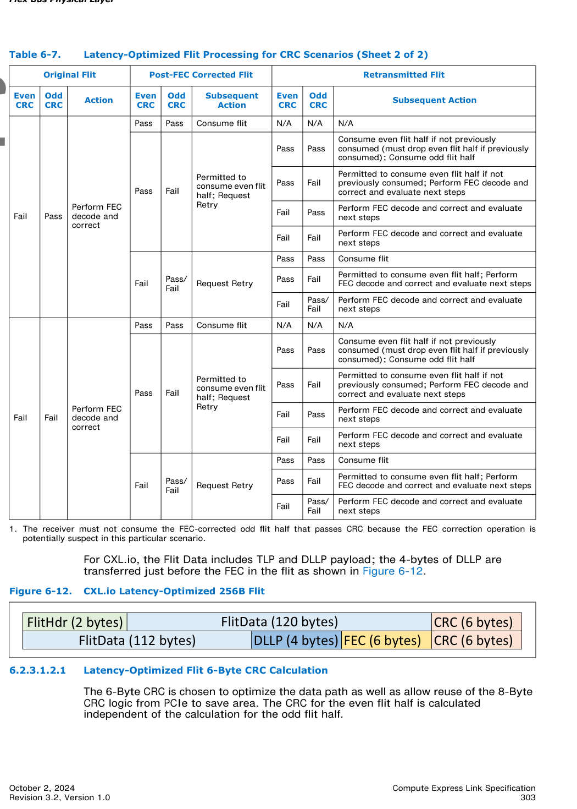
>
> *Original page render @ 150 DPI* — [📄 Full size](figures/chapter_06/page_0303.png)

[⬆️ 返回目录](#-本章目录-table-of-contents)

---

###### 6.2.3.1.2.1 Latency-Optimized Flit 6-Byte CRC Calculation | 低延迟 Flit 的 6 字节 CRC 计算

<table>
<thead>
<tr>
<th width="50%">🇬🇧 English</th>
<th width="50%" style="background-color:#e8e8e8">🇨🇳 中文</th>
</tr>
</thead>
<tbody>
<tr><td>

The 6-Byte CRC is chosen to optimize the data path as well as allow reuse of the 8-Byte CRC logic from PCIe to save area. The CRC for the even flit half is calculated independent of the calculation for the odd flit half.

</td><td style="background-color:#e8e8e8">

选择 6 字节 CRC 是为了优化数据路径,并允许复用 PCIe 的 8 字节 CRC 逻辑以节省面积。偶数半 flit 的 CRC 与奇数半 flit 的 CRC 独立计算。

</td></tr>
</tbody>
</table>

**Table 6-7 (Sheet 2 of 2).** Latency-Optimized Flit Processing for CRC Scenarios (continued) | CRC 场景下的低延迟 Flit 处理(第 2 页,共 2 页)

<table>
<thead>
<tr>
<th colspan="3">Original Flit</th>
<th colspan="3">Post-FEC Corrected Flit</th>
<th colspan="3" style="background-color:#e8e8e8">Retransmitted Flit</th>
</tr>
<tr>
<th>Even CRC</th>
<th>Odd CRC</th>
<th>Action</th>
<th>Even CRC</th>
<th>Odd CRC</th>
<th>Subsequent Action</th>
<th>Even CRC</th>
<th>Odd CRC</th>
<th style="background-color:#e8e8e8">Subsequent Action</th>
</tr>
</thead>
<tbody>
<tr><td>Fail</td><td>Pass</td><td>Perform FEC decode and correct</td><td>Pass</td><td>Pass</td><td>Consume flit</td><td>N/A</td><td>N/A</td><td style="background-color:#e8e8e8">N/A</td></tr>
<tr><td>Pass</td><td>Fail</td><td>Permitted to consume even flit half; Request Retry</td><td>Pass</td><td>Pass</td><td>Consume even flit half if not previously consumed (must drop even flit half if previously consumed); Consume odd flit half</td><td>Pass</td><td>Fail</td><td style="background-color:#e8e8e8">Permitted to consume even flit half if not previously consumed; Perform FEC decode and correct and evaluate next steps</td></tr>
<tr><td>Fail</td><td>Pass</td><td>Perform FEC decode and correct and evaluate next steps</td><td>Fail</td><td>Pass</td><td>Perform FEC decode and correct and evaluate next steps</td><td>Fail</td><td>Fail</td><td style="background-color:#e8e8e8">Perform FEC decode and correct and evaluate next steps</td></tr>
<tr><td>Fail</td><td>Pass/Fail</td><td>Request Retry</td><td>Pass</td><td>Pass</td><td>Consume flit</td><td>Pass</td><td>Fail</td><td style="background-color:#e8e8e8">Permitted to consume even flit half; Perform FEC decode and correct and evaluate next steps</td></tr>
<tr><td>Fail</td><td>Pass/Fail</td><td>Perform FEC decode and correct and evaluate next steps</td><td>Fail</td><td>Fail</td><td>Perform FEC decode and correct</td><td>Pass</td><td>Pass</td><td style="background-color:#e8e8e8">Consume flit</td></tr>
<tr><td>Pass</td><td>Fail</td><td>Permitted to consume even flit half; Request Retry</td><td>Pass</td><td>Pass</td><td>Consume even flit half if not previously consumed (must drop even flit half if previously consumed); Consume odd flit half</td><td>Pass</td><td>Fail</td><td style="background-color:#e8e8e8">Permitted to consume even flit half if not previously consumed (must drop even flit half if previously consumed); perform FEC decode and correct and evaluate next steps</td></tr>
<tr><td>Fail</td><td>Pass</td><td>Perform FEC decode and correct and evaluate next steps</td><td>Fail</td><td>Fail</td><td>Perform FEC decode and correct and evaluate next steps</td><td>Fail</td><td>Pass</td><td style="background-color:#e8e8e8">Perform FEC decode and correct and evaluate next steps</td></tr>
<tr><td>Fail</td><td>Fail</td><td>Perform FEC decode and correct and evaluate next steps</td><td>Fail</td><td>Pass/Fail</td><td>Request Retry</td><td>Pass</td><td>Pass</td><td style="background-color:#e8e8e8">Consume flit</td></tr>
</tbody>
</table>

1 The receiver must not consume the FEC-corrected odd flit half that passes CRC because the FEC correction operation is potentially suspect in this particular scenario.

<table>
<thead>
<tr>
<th width="50%">🇬🇧 English</th>
<th width="50%" style="background-color:#e8e8e8">🇨🇳 中文</th>
</tr>
</thead>
<tbody>
<tr><td>

A (130, 136) Reed-Solomon code is used, where six bytes of CRC are generated over a 130-byte message to generate a 136-byte codeword. For the even flit half, bytes 0 to 121 of the message are the 122 non-CRC bytes of the flit (with byte 0 of flit mapping to byte 0 of the message, byte 1 of the flit mapping to byte 1 of the message and so on), whereas bytes 122 to 129 are zero (these are not sent on the link, but both transmitter and receiver must zero pad the remaining bytes before computing CRC). For the odd flit half, bytes 0 to 115 of the message are the 116 non-CRC and non-FEC bytes of the flit (with byte 128 of the flit mapping to byte 0 of the message, byte 129 of the flit mapping to byte 1 of the message and so on), whereas bytes 116 to 129 of the message are zero.

</td><td style="background-color:#e8e8e8">

使用 (130, 136) Reed-Solomon 码,其中在 130 字节消息上生成 6 字节 CRC,以生成 136 字节的码字。对于偶数半 flit,消息的字节 0 到 121 是 flit 的 122 个非 CRC 字节(flit 字节 0 映射到消息字节 0,flit 字节 1 映射到消息字节 1,依此类推),而字节 122 到 129 为零(这些不在链路上发送,但发送方和接收方都必须在计算 CRC 之前将剩余字节零填充)。对于奇数半 flit,消息的字节 0 到 115 是 flit 的 116 个非 CRC 且非 FEC 字节(flit 字节 128 映射到消息字节 0,flit 字节 129 映射到消息字节 1,依此类推),而消息的字节 116 到 129 为零。

</td></tr>
<tr><td>

The CRC generator polynomial defined over GF(28), is g(x) = (x + α2) ... (x + α6), where α is the root of the primitive polynomial of degree 8: x8 + x5 + x3 + x + 1. Thus, g(x) = x6 + α147x5 + α107x4 + α250x3 + α114x2 + α161x + α21.

</td><td style="background-color:#e8e8e8">

定义在 GF(28) 上的 CRC 生成多项式为 g(x) = (x + α2) ... (x + α6),其中 α 是 8 次本原多项式 x8 + x5 + x3 + x + 1 的根。因此,g(x) = x6 + α147x5 + α107x4 + α250x3 + α114x2 + α161x + α21。

</td></tr>
<tr><td>

When reusing the PCIe logic of 8B CRC generation, the first step is to generate the 8-Byte CRC from the PCIe logic. The flit bytes must be mapped to a specific location within the 242 bytes of input to the PCIe logic of 8B CRC generation.

</td><td style="background-color:#e8e8e8">

在复用 PCIe 的 8B CRC 生成逻辑时,第一步是从 PCIe 逻辑生成 8 字节 CRC。flit 字节必须映射到 PCIe 8B CRC 生成逻辑输入的 242 字节中的特定位置。

</td></tr>
<tr><td>

If the polynomial form of the result is: r'(x) = r7x7 + r6x6 + r5x5 + r4x4 + r3x3 + r2x2 + r1x + r0, then the 6-Byte CRC can be computed using the following (equation shows the polynomial form of the 6-Byte CRC):

</td><td style="background-color:#e8e8e8">

如果结果的多项式形式为:r'(x) = r7x7 + r6x6 + r5x5 + r4x4 + r3x3 + r2x2 + r1x + r0,则可以使用以下方法计算 6 字节 CRC(公式显示 6 字节 CRC 的多项式形式):

r(x) = (r5 + α147r6 + α90r7)x5 + (r4 + α107r6 + α202r7)x4 + (r3 + α250r6 + α41r7)x3 + (r2 + α114r6 + α63r7)x2 + (r1 + α161r6 + α147r7)x + (r0 + α21r6 + α168r7)

</td></tr>
<tr><td>

Figure 6-13 shows the two concepts of computing the 6-Byte CRC.

</td><td style="background-color:#e8e8e8">

图 6-13 显示了计算 6 字节 CRC 的两种概念。

</td></tr>
<tr><td>

The following are provided as attachments to the CXL specification:
- 6B CRC generator matrix (see PCIe Base Specification for the 8B CRC generator matrix).
- 6B CRC Register Transfer Level (RTL) code (see PCIe Base Specification for the 8B CRC RTL code). A single module with 122 bytes of input and 128 bytes of output is provided and can be used for both the even flit half and the odd flit half (by assigning bytes 116 to 121 of the input to be 00h for the odd flit half).

</td><td style="background-color:#e8e8e8">

以下内容作为 CXL 规范的附件提供:
- 6B CRC 生成器矩阵(有关 8B CRC 生成器矩阵,请参见 PCIe Base Specification)。
- 6B CRC 寄存器传输级(RTL)代码(有关 8B CRC RTL 代码,请参见 PCIe Base Specification)。提供了一个具有 122 字节输入和 128 字节输出的单一模块,既可用于偶数半 flit 也可用于奇数半 flit(通过将奇数半 flit 输入的字节 116 到 121 赋值为 00h)。

</td></tr>
</tbody>
</table>

**Table 6-8.** Byte Mapping for Input to PCIe 8B CRC Generation | PCIe 8B CRC 生成输入的字节映射

<table>
<thead>
<tr>
<th>PCIe CRC Input Bytes</th>
<th>Even Flit Half Mapping</th>
<th style="background-color:#e8e8e8">Odd Flit Half Mapping</th>
</tr>
</thead>
<tbody>
<tr><td>Byte 0 to Byte 113</td><td>00h for all bytes</td><td style="background-color:#e8e8e8">00h for all bytes</td></tr>
<tr><td>Byte 114 to Byte 229</td><td>Byte 0 to Byte 115 of the flit</td><td style="background-color:#e8e8e8">Byte 128 to Byte 243 of the flit</td></tr>
<tr><td>Byte 230 to Byte 235</td><td>Byte 116 to Byte 121 of the flit</td><td style="background-color:#e8e8e8">00h for all bytes</td></tr>
<tr><td>Byte 236 to Byte 241</td><td>00h for all bytes</td><td style="background-color:#e8e8e8">00h for all bytes</td></tr>
</tbody>
</table>

> **Figure 6-13.** Different Methods for Generating 6-Byte CRC ｜ 生成 6 字节 CRC 的不同方法
>
> 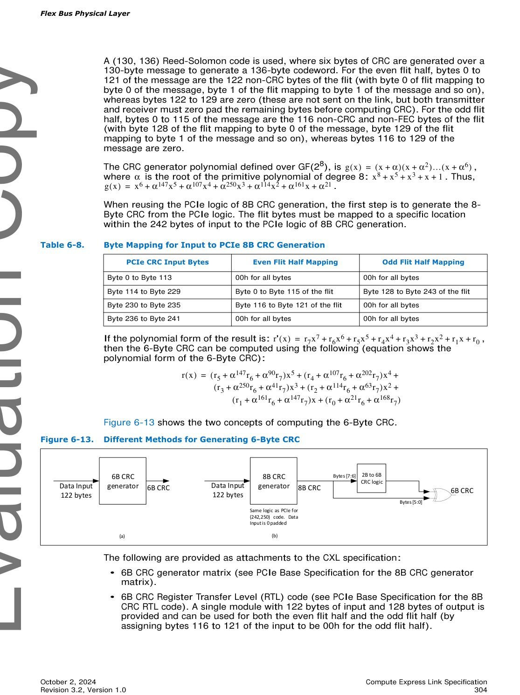
>
> *Original page render @ 150 DPI* — [📄 Full size](figures/chapter_06/page_0304.png)

<table>
<thead>
<tr>
<th width="50%">🇬🇧 English</th>
<th width="50%" style="background-color:#e8e8e8">🇨🇳 中文</th>
</tr>
</thead>
<tbody>
<tr><td>

- 8B CRC to 6B CRC converter RTL code. A single module with 122 bytes of input and 128 bytes of output is provided and can be used for both the even flit half and the odd flit half (by assigning bytes 116 to 121 of the input to be 00h for the odd flit half).

</td><td style="background-color:#e8e8e8">

- 8B CRC 转 6B CRC 转换器 RTL 代码。提供了一个具有 122 字节输入和 128 字节输出的单一模块,既可用于偶数半 flit 也可用于奇数半 flit(通过将奇数半 flit 输入的字节 116 到 121 赋值为 00h)。

</td></tr>
</tbody>
</table>

[⬆️ 返回目录](#-本章目录-table-of-contents)

---

## 🖼 图补遗 (Figure Supplement)

> 本节为 MinerU Standard API 在原始 markdown 之外额外提取的 figures, 已用 Part A 风格 4 行 blockquote 补齐双语 caption, 但未插入正文具体节 (内容可能与正文有重复, 仅供参考)。

> **Figure p.0310.** Figure 6-14. Flex Bus Mode Negotiation during Link Training (Sample Flow)
>
> 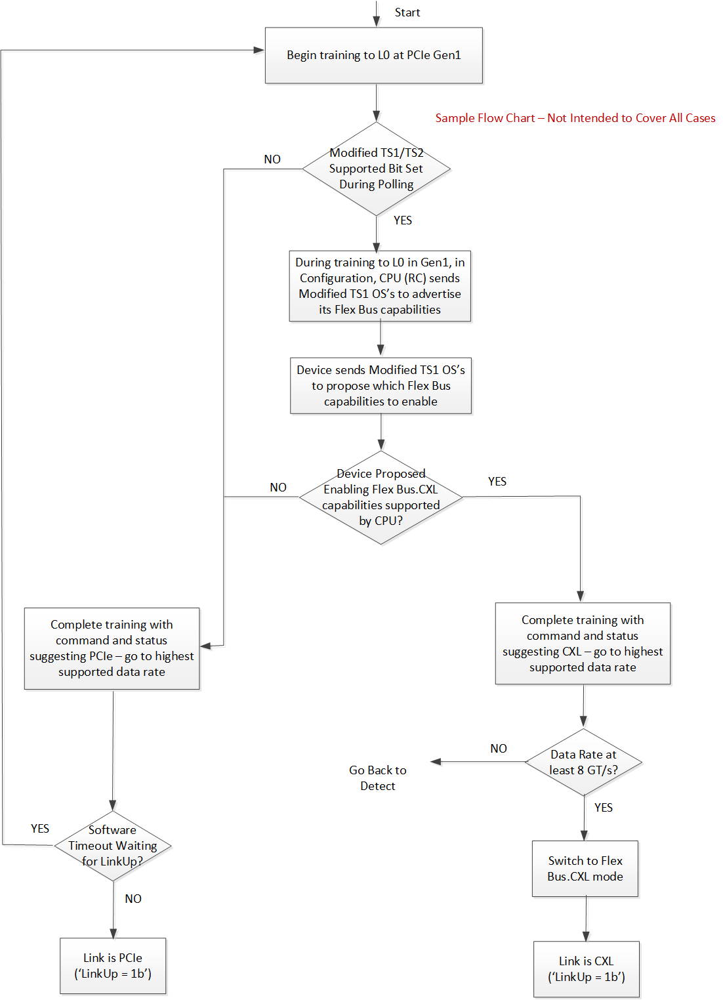
>
> *Source*: MinerU tight crop extraction (page 0310 of CXL 3.2 spec)

# 第 6 章 补充内容 (Gap Fill: Sections 6.2.3.2 - 6.9)

> 本文件为第 6 章 Flex Bus 物理层中缺失章节 (6.2.3.2 至 6.9) 的中英对照补充内容。
> 格式与主文件 [`CXL3.2_Spec_ch06_Flex_Bus_Physical_Layer_FlexBus物理层.md`](CXL3.2_Spec_ch06_Flex_Bus_Physical_Layer_FlexBus物理层.md) 完全一致。
>
> **Source pages**: 305-318

---

#### 6.2.3.2 CRC Corruption for Containment with 256B Flits | 用于 256B Flit 抑制的 CRC 故意损坏

<table>
<thead>
<tr>
<th width="50%">English</th>
<th width="50%" style="background-color:#e8e8e8">中文</th>
</tr>
</thead>
<tbody>
<tr><td>

CXL has multiple scenarios that require CRC to be intentionally corrupted during transmission of a 256B Flit to force the receiver to reject the Flit and initiate a replay. During the subsequent replay, the transmitter has the opportunity to inject additional information about the Flit. These scenarios include viral containment and late poison and nullify scenarios.

</td><td style="background-color:#e8e8e8">

CXL 有多种场景要求在 256B Flit 传输过程中故意损坏 CRC,以强制接收方拒绝该 Flit 并启动重放。在随后的重放过程中,发送方有机会注入有关该 Flit 的额外信息。这些场景包括病毒抑制(viral containment,病毒式包容)以及延迟投毒与作废场景。

</td></tr>
<tr><td>

To corrupt the CRC in these scenarios, the transmitter must invert all the bits of the CRC field during transmission. FEC generation must be done using the corrupted CRC. For latency-optimized 256B Flits, the transmitter must invert the CRC bits associated with either the even flit half or the odd flit half.

</td><td style="background-color:#e8e8e8">

在这些场景中损坏 CRC 时,发送方必须在传输过程中将 CRC 字段的所有比特取反。FEC 生成必须使用损坏后的 CRC 进行计算。对于低延迟优化的 256B Flit,发送方必须将与偶数半 flit 或奇数半 flit 关联的 CRC 比特取反。

</td></tr>
</tbody>
</table>

[⬆️ 返回目录](#-本章目录-table-of-contents)

---

##### 6.2.3.2.1 CXL.cachemem Viral Injection and Late Poison for 256B Flits | 256B Flit 的 CXL.cachemem 病毒注入与延迟投毒

<table>
<thead>
<tr>
<th width="50%">English</th>
<th width="50%" style="background-color:#e8e8e8">中文</th>
</tr>
</thead>
<tbody>
<tr><td>

See Chapter 4.0 for details on CXL.cachemem viral injection and late poison scenarios. Section 4.3.6.2 describes the viral injection flow. Section 4.3.6.3 describes the late poison injection flow.

</td><td style="background-color:#e8e8e8">

有关 CXL.cachemem 病毒注入与延迟投毒场景的详细信息,请参见第 4.0 章。第 4.3.6.2 节描述了病毒注入流程。第 4.3.6.3 节描述了延迟投毒注入流程。

</td></tr>
</tbody>
</table>

[⬆️ 返回目录](#-本章目录-table-of-contents)

---

##### 6.2.3.2.2 Late Nullify or Poison for CXL.io | CXL.io 的延迟作废或投毒

<table>
<thead>
<tr>
<th width="50%">English</th>
<th width="50%" style="background-color:#e8e8e8">中文</th>
</tr>
</thead>
<tbody>
<tr><td>

The PCIe Base Specification defines a Flit Marker that is used to nullify or poison the last TLP in the flit. Because the Flit Header is forwarded at the beginning of a flit transmission, a transmitter may not know sufficiently early whether a Flit Marker is required to nullify or poison the last TLP. If the transmitter realizes after the Flit Header has been forwarded that a TLP must be poisoned or nullified, the transmitter must corrupt the CRC by inverting all the CRC bits. When the flit is subsequently replayed, the transmitter must use a Flit Header. For latency-optimized flits, if the last TLP that must be nullified or poisoned is in the even half, the even CRC must be inverted; if the last TLP that must be nullified or poisoned is in the odd half, the odd CRC must be inverted. FEC is calculated on the transmit side using the inverted CRC in these scenarios.

</td><td style="background-color:#e8e8e8">

PCIe Base Specification 定义了用于作废或投毒 flit 中最后一个 TLP 的 Flit Marker。由于 Flit Header 在 flit 传输开始时即被转发,发送方可能无法足够早地知道是否需要 Flit Marker 来作废或投毒最后一个 TLP。如果发送方在 Flit Header 被转发后才意识到某个 TLP 必须被投毒或作废,则发送方必须将所有 CRC 比特取反以损坏 CRC。当该 flit 随后被重放时,发送方必须使用一个 Flit Header。对于低延迟优化的 flit,如果必须被作废或投毒的最后一个 TLP 位于偶数半 flit 中,则必须将偶数 CRC 取反;如果位于奇数半 flit 中,则必须将奇数 CRC 取反。在这些场景中,FEC 在发送侧使用取反后的 CRC 进行计算。

</td></tr>
</tbody>
</table>

[⬆️ 返回目录](#-本章目录-table-of-contents)

---

#### 6.2.3.3 Framing Errors in 256B Flit Mode | 256B Flit 模式下的成帧错误

<table>
<thead>
<tr>
<th width="50%">English</th>
<th width="50%" style="background-color:#e8e8e8">中文</th>
</tr>
</thead>
<tbody>
<tr><td>

An Unexpected Flit Type error is detected upon receiving a flit with a Flit Type encoding associated with a Protocol that was not enabled during negotiation. For example, if a CXL.cachemem Flit Type is received while only CXL.io is enabled, this must be handled as an Unexpected Flit Type error. This is logged as an Unrecognized Flit in the PCIe Flit Logging Extended Capability, Flit Error Log 1 Register. Any interrupt signaling as a result of the logged error follows the PCIe specification definition.

</td><td style="background-color:#e8e8e8">

当接收到一个 Flit Type 编码关联到协商期间未被使能的协议时,将检测到 Unexpected Flit Type 错误。例如,如果在仅使能 CXL.io 的情况下接收到 CXL.cachemem Flit Type,则此情况必须作为 Unexpected Flit Type 错误来处理。该错误在 PCIe Flit Logging Extended Capability 的 Flit Error Log 1 Register 中记录为 Unrecognized Flit。因记录的错误而产生的任何中断信令遵循 PCIe 规范的定义。

</td></tr>
</tbody>
</table>

[⬆️ 返回目录](#-本章目录-table-of-contents)

---

### 6.3 256B Flit Mode Retry Buffers | 256B Flit 模式重试缓冲区

<table>
<thead>
<tr>
<th width="50%">English</th>
<th width="50%" style="background-color:#e8e8e8">中文</th>
</tr>
</thead>
<tbody>
<tr><td>

Following PCIe Base Specification, in 256B Flit mode, the Physical Layer implements the transmit retry buffer and the optional receive retry buffer. Whereas the retry buffers are managed independently in the CXL.io link layer and the CXL.cachemem link layer in 68B Flit mode, there is a single unified transmit retry buffer that handles all retryable CXL traffic in 256B Flit mode. Similarly, in 256B Flit mode, there is a single unified receive retry buffer that handles all retryable CXL traffic in 256B Flit mode. Retry requests are on a 256-byte flit granularity even when using the latency-optimized 256B flit composed of 128-byte flit halves. Please refer to Section 6.2.3.1.2 for more details.

</td><td style="background-color:#e8e8e8">

遵循 PCIe Base Specification,在 256B Flit 模式下,物理层实现发送重试缓冲区和可选的接收重试缓冲区。在 68B Flit 模式下,重试缓冲区由 CXL.io 链路层和 CXL.cachemem 链路层独立管理;而在 256B Flit 模式下,存在一个单一的统一发送重试缓冲区,用于处理所有可重试的 CXL 流量。类似地,在 256B Flit 模式下,存在一个单一的统一接收重试缓冲区,用于处理所有可重试的 CXL 流量。即使在使用由 128 字节半 flit 组成的低延迟优化 256B flit 时,重试请求也以 256 字节 flit 为粒度。更多详细信息请参见第 6.2.3.1.2 节。

</td></tr>
</tbody>
</table>

[⬆️ 返回目录](#-本章目录-table-of-contents)

---

### 6.4 Link Training | 链路训练

#### 6.4.1 PCIe Mode vs. Flex Bus.CXL Mode Selection | PCIe 模式 vs. Flex Bus.CXL 模式选择

<table>
<thead>
<tr>
<th width="50%">English</th>
<th width="50%" style="background-color:#e8e8e8">中文</th>
</tr>
</thead>
<tbody>
<tr><td>

Upon exit from LTSSM Detect, a Flex Bus link begins training and completes link width negotiation and speed negotiation according to the PCIe LTSSM rules. During link training, the Downstream Port initiates Flex Bus mode negotiation via the PCIe alternate protocol negotiation mechanism. Flex Bus mode negotiation is completed before entering L0 at 2.5 GT/s. If Sync Header bypass is negotiated (applicable only to 8 GT/s, 16 GT/s, and 32 GT/s link speeds), Sync Headers are bypassed as soon as the link has transitioned to a speed of 8 GT/s or higher. For 68B Flit mode, the Flex Bus logical PHY transmits NULL flits after it sends the SDS Ordered Set as soon as it transitions to 8 GT/s or higher link speeds if CXL mode was negotiated earlier in the training process. These NULL flits are used in place of PCIe Idle Symbols to facilitate certain LTSSM transitions to L0 as described in Section 6.5. After the link has transitioned to its final speed, the link can start sending CXL traffic on behalf of the upper layers after the SDS Ordered Set is transmitted if that was what was negotiated earlier in the training process. For Upstream Ports, the physical layer notifies the upper layers that the link is up and available for transmission only after it has received a flit that was not generated by the physical layer of the partner Downstream Port (see Table 6-2 for 68B Flit mode and Table 6-6 for 256B Flit mode). To operate in CXL mode, the link speed must be at least 8 GT/s. If the link is unable to transition to a speed of 8 GT/s or greater after committing to CXL mode during link training at 2.5 GT/s, the link may ultimately fail to link up even if the device is PCIe capable.

</td><td style="background-color:#e8e8e8">

从 LTSSM Detect 状态退出后,Flex Bus 链路开始训练,并根据 PCIe LTSSM 规则完成链路宽度协商和速率协商。在链路训练期间,Downstream Port 通过 PCIe 替代协议协商机制启动 Flex Bus 模式协商。Flex Bus 模式协商在进入 2.5 GT/s 的 L0 之前完成。如果协商了 Sync Header 旁路(仅适用于 8 GT/s、16 GT/s 和 32 GT/s 链路速率),则链路一旦跃迁到 8 GT/s 或更高的速率,便会立即旁路 Sync Header。对于 68B Flit 模式,如果在训练过程中更早地协商了 CXL 模式,Flex Bus 逻辑 PHY 在链路跃迁到 8 GT/s 或更高链路速率后,发送 SDS Ordered Set 之后即发送 NULL flit。这些 NULL flit 用于替代 PCIe Idle Symbols,以促进第 6.5 节所述的某些 LTSSM 到 L0 的跃迁。链路跃迁到最终速率后,如果训练过程中先前协商的结果支持,则链路可以在发送 SDS Ordered Set 后开始代表上层发送 CXL 流量。对于 Upstream Port,物理层仅在其收到一个并非由伙伴 Downstream Port 的物理层生成的 flit 之后,才通知上层链路已就绪且可用于传输(68B Flit 模式参见表 6-2,256B Flit 模式参见表 6-6)。要以 CXL 模式运行,链路速率必须至少为 8 GT/s。如果在 2.5 GT/s 的链路训练期间已承诺使用 CXL 模式,但链路无法跃迁到 8 GT/s 或更高的速率,那么即使该设备本身支持 PCIe,链路最终也可能无法建立连接。

</td></tr>
</tbody>
</table>

[⬆️ 返回目录](#-本章目录-table-of-contents)

---

##### 6.4.1.1 Hardware Autonomous Mode Negotiation | 硬件自治模式协商

<table>
<thead>
<tr>
<th width="50%">English</th>
<th width="50%" style="background-color:#e8e8e8">中文</th>
</tr>
</thead>
<tbody>
<tr><td>

Dynamic hardware negotiation of Flex Bus mode occurs during link training in the LTSSM Configuration state before entering L0 at Gen 1 speeds using the alternate protocol negotiation mechanism, facilitated by exchanging modified TS1 and TS2 Ordered Sets as defined by PCIe Base Specification. The Downstream Port initiates the negotiation process by sending TS1 Ordered Sets advertising its Flex Bus capabilities. The Upstream Port responds with a proposal based on its own capabilities and those advertised by the host. The host communicates the final decision of which capabilities to enable by sending modified TS2 Ordered Sets before or during Configuration.Complete.

</td><td style="background-color:#e8e8e8">

Flex Bus 模式的动态硬件协商在进入 Gen 1 速率的 L0 之前,在 LTSSM Configuration 状态期间进行,使用 PCIe Base Specification 定义的替代协议协商机制,通过交换修改型 TS1 和 TS2 Ordered Set 来实现。Downstream Port 通过发送 TS1 Ordered Set 通告其 Flex Bus 能力来启动协商过程。Upstream Port 根据自身能力以及主机通告的能力做出响应并给出提议。主机通过在 Configuration.Complete 之前或期间发送修改型 TS2 Ordered Set 来传达关于使能哪些能力的最终决定。

</td></tr>
<tr><td>

Please refer to PCIe Base Specification for details on how the various fields of the modified TS1/TS2 OS are set. Table 6-9 shows how the modified TS1/TS2 OS is used for Flex Bus mode negotiation. The "Flex Bus Mode Negotiation Usage" column describes the deltas from the PCIe Base Specification definition that are applicable for Flex Bus mode negotiation. Additional explanation is provided in Table 6-10 and Table 6-11. The presence of Retimer1 and Retimer2 must be programmed into the Flex Bus Port DVSEC by software before the negotiation begins; if retimers are present, the relevant retimer bits in the modified TS1/TS2 OS are used.

</td><td style="background-color:#e8e8e8">

有关修改型 TS1/TS2 OS 各字段如何设置的详细信息,请参见 PCIe Base Specification。表 6-9 展示了修改型 TS1/TS2 OS 如何用于 Flex Bus 模式协商。 "Flex Bus Mode Negotiation Usage" 列描述了适用于 Flex Bus 模式协商的、与 PCIe Base Specification 定义的差异(deltas)。表 6-10 和表 6-11 提供了补充说明。在协商开始之前,Retimer1 和 Retimer2 的存在性必须由软件编程到 Flex Bus Port DVSEC 中;如果存在 retimer,则使用修改型 TS1/TS2 OS 中的相关 retimer 比特位。

</td></tr>
</tbody>
</table>

**Table 6-9.** Modified TS1/TS2 Ordered Set for Flex Bus Mode Negotiation (Sheet 1 of 2) | Flex Bus 模式协商的修改型 TS1/TS2 有序集 (第 1 页,共 2 页)

<table>
<thead>
<tr>
<th>Symbol Number</th>
<th>PCIe Description</th>
<th style="background-color:#e8e8e8">Flex Bus Mode Negotiation Usage</th>
</tr>
</thead>
<tbody>
<tr><td>0 through 4</td><td>See PCIe Base Specification</td><td style="background-color:#e8e8e8">Symbol</td></tr>
<tr><td>5</td><td>Training Control: - Bits[5:0]: See PCIe Base Specification - Bits[7:6]: Modified TS1/TS2 Supported: See PCIe Base Specification for details</td><td style="background-color:#e8e8e8">- Bits[7:6]: Value is 11b</td></tr>
<tr><td>6</td><td>- For Modified TS1: TS1 Identifier, Encoded as D10.2 (4Ah) - For Modified TS2: TS2 Identifier, Encoded as D5.2 (45h)</td><td style="background-color:#e8e8e8">- TS1 Identifier during Phase 1 of Flex Bus mode negotiation - TS2 Identifier during Phase 2 of Flex Bus mode negotiation</td></tr>
<tr><td>7</td><td>- For Modified TS1: TS1 Identifier, Encoded as D10.2 (4Ah) - For Modified TS2: TS2 Identifier, Encoded as D5.2 (45h)</td><td style="background-color:#e8e8e8">- TS1 Identifier during Phase 1 of Flex Bus mode negotiation - TS2 Identifier during Phase 2 of Flex Bus mode negotiation</td></tr>
<tr><td>8-9</td><td>- Bits[2:0]: Usage: See PCIe Base Specification - Bits[4:3]: Alternate Protocol Negotiation Status: &nbsp;&nbsp;- Alternate Protocol Negotiation Status when Usage is 010b &nbsp;&nbsp;- Otherwise, reserved (see PCIe Base Specification for details) - Bits[15:5]: Alternate Protocol Details</td><td style="background-color:#e8e8e8">- Bits[2:0]: Value is 010b (indicating alternate protocols) - Bits[4:3]: Alternate Protocol Negotiation Status: See PCIe Base Specification - Bits[7:5]: Alternate Protocol ID: &nbsp;&nbsp;- 000b = Flex Bus - Bit[8]: Common Clock - Bits[15:9]: Reserved See Table 6-10 for more information.</td></tr>
</tbody>
</table>

**Table 6-9.** Modified TS1/TS2 Ordered Set for Flex Bus Mode Negotiation (Sheet 2 of 2) | Flex Bus 模式协商的修改型 TS1/TS2 有序集 (第 2 页,共 2 页)

<table>
<thead>
<tr>
<th>Symbol Number</th>
<th>PCIe Description</th>
<th style="background-color:#e8e8e8">Flex Bus Mode Negotiation Usage</th>
</tr>
</thead>
<tbody>
<tr><td>10-11</td><td>Alternate Protocol ID/Vendor ID: - Alternate Protocol ID/Vendor ID when Usage = 010b - See PCIe Base Specification for descriptions that are applicable to other Usage values</td><td style="background-color:#e8e8e8">1E98h</td></tr>
<tr><td>12-14</td><td>See PCIe Base Specification</td><td style="background-color:#e8e8e8">Specific proprietary usage when Usage = 010b - Bits[7:0]: Flex Bus Mode Selection: &nbsp;&nbsp;- Bit[0]: PCIe Capable/Enable &nbsp;&nbsp;- Bit[1]: CXL.io Capable/Enable &nbsp;&nbsp;- Bit[2]: CXL.mem Capable/Enable &nbsp;&nbsp;- Bit[3]: CXL.cache Capable/Enable &nbsp;&nbsp;- Bit[4]: CXL 68B Flit and VH Capable/Enable (formerly known as CXL 2.0 Capable/Enable) &nbsp;&nbsp;- Bits[7:5]: Reserved - Bits[23:8]: Flex Bus Additional Info: &nbsp;&nbsp;- Bit[8]: Multi-Logical Device Capable/Enable &nbsp;&nbsp;- Bit[9]: Reserved &nbsp;&nbsp;- Bit[10]: Sync Header Bypass Capable/Enable &nbsp;&nbsp;- Bit[11]: Latency-Optimized 256B Flit Capable/Enable &nbsp;&nbsp;- Bit[12]: Retimer1 CXL Aware &nbsp;&nbsp;- Bit[13]: Reserved &nbsp;&nbsp;- Bit[14]: Retimer2 CXL Aware &nbsp;&nbsp;- Bit[15]: CXL.io Throttle Required at 64 GT/s &nbsp;&nbsp;- Bits[17:16]: CXL NOP Hint Info[1:0] &nbsp;&nbsp;- Bit[18]: PBR Flit Capable/Enable &nbsp;&nbsp;- Bits[23:19]: Reserved See Table 6-11 for more information.</td></tr>
<tr><td>15</td><td>See PCIe Base Specification</td><td style="background-color:#e8e8e8">-</td></tr>
</tbody>
</table>

> 1. Retimer1 is equivalent to Retimer X or Retimer Z in PCIe Base Specification. ｜ Retimer1 等同于 PCIe Base Specification 中的 Retimer X 或 Retimer Z。
> 2. Retimer2 is equivalent to Retimer Y in PCIe Base Specification. ｜ Retimer2 等同于 PCIe Base Specification 中的 Retimer Y。

**Table 6-10.** Additional Information on Symbols 8-9 of Modified TS1/TS2 Ordered Set | 修改型 TS1/TS2 有序集符号 8-9 的补充信息

<table>
<thead>
<tr>
<th>Bit Field in Symbols 8-9</th>
<th style="background-color:#e8e8e8">Description</th>
</tr>
</thead>
<tbody>
<tr><td>Bit[8]: Common Clock</td><td style="background-color:#e8e8e8">The Downstream Port uses this bit to communicate to retimers that there is a common reference clock. Depending on implementation, retimers may use this information to determine which features to enable. ｜ Downstream Port 使用此比特向 retimer 传达存在公共参考时钟。根据实现方式的不同,retimer 可能使用此信息来决定要使能哪些特性。</td></tr>
</tbody>
</table>

**Table 6-11.** Additional Information on Symbols 12-14 of Modified TS1/TS2 Ordered Sets (Sheet 1 of 2) | 修改型 TS1/TS2 有序集符号 12-14 的补充信息 (第 1 页,共 2 页)

<table>
<thead>
<tr>
<th>Bit Field in Symbols 12-14</th>
<th style="background-color:#e8e8e8">Description</th>
</tr>
</thead>
<tbody>
<tr><td>Bit[0]: PCIe Capable/Enable</td><td style="background-color:#e8e8e8">The Downstream Port and Upstream Port advertise their capability in Phase 1. The Downstream Port communicates the results of the negotiation in Phase 2. ｜ Downstream Port 和 Upstream Port 在 Phase 1 中通告其能力。Downstream Port 在 Phase 2 中传达协商结果。</td></tr>
<tr><td>Bit[1]: CXL.io Capable/Enable</td><td style="background-color:#e8e8e8">The Downstream Port and Upstream Port advertise their capability in Phase 1 as set in the DVSEC Flex Bus Port Control register. The Downstream Port communicates the results of the negotiation in Phase 2. This bit must be set to 1 if the CXL 68B Flit and VH Capable/Enable bit is set. ｜ Downstream Port 和 Upstream Port 在 Phase 1 中通告其能力,如 DVSEC Flex Bus Port Control 寄存器中所设。Downstream Port 在 Phase 2 中传达协商结果。如果 CXL 68B Flit and VH Capable/Enable 比特被置位,则此比特必须置为 1。</td></tr>
<tr><td>Bit[2]: CXL.mem Capable/Enable</td><td style="background-color:#e8e8e8">The Downstream Port and Upstream Port advertise their capability in Phase 1 as set in the DVSEC Flex Bus Port Control register. The Downstream Port communicates the results of the negotiation in Phase 2. ｜ Downstream Port 和 Upstream Port 在 Phase 1 中通告其能力,如 DVSEC Flex Bus Port Control 寄存器中所设。Downstream Port 在 Phase 2 中传达协商结果。</td></tr>
<tr><td>Bit[3]: CXL.cache Capable/Enable</td><td style="background-color:#e8e8e8">The Downstream Port and Upstream Port advertise their capability in Phase 1 as set in the DVSEC Flex Bus Port Control register. The Downstream Port communicates the results of the negotiation in Phase 2. ｜ Downstream Port 和 Upstream Port 在 Phase 1 中通告其能力,如 DVSEC Flex Bus Port Control 寄存器中所设。Downstream Port 在 Phase 2 中传达协商结果。</td></tr>
<tr><td>Bit[4]: CXL 68B Flit and VH Capable/Enable (formerly known as CXL 2.0 capable/enable)</td><td style="background-color:#e8e8e8">The Downstream Port and Upstream Port advertise their capability in Phase 1 as set in the DVSEC Flex Bus Port Control register. The Downstream Port communicates the results of the negotiation in Phase 2. The Downstream Port must not enable this if PCIe Flit mode is enabled as described in PCIe Base Specification. ｜ Downstream Port 和 Upstream Port 在 Phase 1 中通告其能力,如 DVSEC Flex Bus Port Control 寄存器中所设。Downstream Port 在 Phase 2 中传达协商结果。如果 PCIe Flit 模式按照 PCIe Base Specification 所述被使能,则 Downstream Port 必须不使能此比特。</td></tr>
<tr><td>Bit[8]: Multi-Logical Device Capable/Enable</td><td style="background-color:#e8e8e8">The Downstream Port and Upstream Port advertise their capability in Phase 1 as set in the DVSEC Flex Bus Port Control register. An Upstream Switch Port must always advertise 0 in this bit. The Downstream Port communicates the results of the negotiation in Phase 2. ｜ Downstream Port 和 Upstream Port 在 Phase 1 中通告其能力,如 DVSEC Flex Bus Port Control 寄存器中所设。Upstream Switch Port 必须始终在此比特中通告 0。Downstream Port 在 Phase 2 中传达协商结果。</td></tr>
<tr><td>Bit[10]: Sync Header Bypass Capable/Enable</td><td style="background-color:#e8e8e8">The Downstream Port, Upstream Port, and any retimers advertise their capability in Phase 1; the Downstream Port and Upstream Port advertise the value as set in the DVSEC Flex Bus Port Control register. The Downstream Port communicates the results of the negotiation in Phase 2. Note: The Retimer must pass this bit unmodified from its Upstream Pseudo Port to its Downstream Pseudo Port. The retimer clears this bit if the retimer does not support this feature when passing from its Downstream Pseudo Port to its Upstream Pseudo Port, but it must never set this bit (only an Upstream Port can set this bit in that direction). If the retimer(s) do not advertise that they are CXL aware, the Downstream Port assumes that this feature is not supported by the Retimer(s) regardless of how this bit is set. Note: This bit is applicable only at 8 GT/s, 16 GT/s, and 32 GT/s link speeds. ｜ Downstream Port、Upstream Port 及任何 retimer 在 Phase 1 中通告其能力;Downstream Port 和 Upstream Port 通告 DVSEC Flex Bus Port Control 寄存器中所设的值。Downstream Port 在 Phase 2 中传达协商结果。 注意:Retimer 必须将此比特从其 Upstream Pseudo Port 原封不动地传递到其 Downstream Pseudo Port。当从其 Downstream Pseudo Port 向其 Upstream Pseudo Port 传递时,如果 retimer 不支持此特性,则该 retimer 将清除此比特,但它绝不能将此比特置位(只有 Upstream Port 才能在该方向上置位此比特)。如果 retimer 未通告其为 CXL 感知(retimer is CXL aware),则无论此比特如何设置,Downstream Port 均认为 retimer 不支持此特性。 注意:此比特仅适用于 8 GT/s、16 GT/s 和 32 GT/s 链路速率。</td></tr>
<tr><td>Bit[11]: Latency-Optimized 256B Flit Capable/Enable</td><td style="background-color:#e8e8e8">The Downstream Port and Upstream Port advertise their capability in Phase 1 as set in the DVSEC Flex Bus Port Control register. The Downstream Port communicates the results of the negotiation in Phase 2. See Section 6.2.3.1.2 for details of the latency-optimized 256B flit. Note: This bit is applicable only when PCIe Flit mode is negotiated. ｜ Downstream Port 和 Upstream Port 在 Phase 1 中通告其能力,如 DVSEC Flex Bus Port Control 寄存器中所设。Downstream Port 在 Phase 2 中传达协商结果。低延迟优化 256B flit 的详细信息请参见第 6.2.3.1.2 节。 注意:此比特仅在 PCIe Flit 模式被协商时适用。</td></tr>
<tr><td>Bit[12]: Retimer1 CXL Aware</td><td style="background-color:#e8e8e8">Retimer1 advertises whether it is CXL aware in Phase 1. If Retimer1 is CXL aware, it must use the "Sync Header Bypass Capable/Enable" bit. ｜ Retimer1 在 Phase 1 中通告其是否为 CXL 感知。如果 Retimer1 是 CXL 感知的,则它必须使用 "Sync Header Bypass Capable/Enable" 比特。</td></tr>
<tr><td>Bit[14]: Retimer2 CXL Aware</td><td style="background-color:#e8e8e8">Retimer2 advertises whether it is CXL aware in Phase 1. If Retimer2 is CXL aware, it must use the "Sync Header Bypass Capable/Enable" bit. ｜ Retimer2 在 Phase 1 中通告其是否为 CXL 感知。如果 Retimer2 是 CXL 感知的,则它必须使用 "Sync Header Bypass Capable/Enable" 比特。</td></tr>
<tr><td>Bit[15]: CXL.io Throttle Required at 64 GT/s</td><td style="background-color:#e8e8e8">During Phase 1, an Upstream Port uses this bit to communicate to the Downstream Port that the Upstream Port does not support receiving consecutive CXL.io flits (including CXL.io NOP flits) when 64 GT/s link speed is negotiated (see Section 6.4.1.3 for more details). Downstream Ports are required to support this feature. The Downstream Port logs the value communicated by the partner Upstream Port in its DVSEC Flex Bus Port Status register (see Section 8.2.1.3.3). ｜ 在 Phase 1 中,Upstream Port 使用此比特向 Downstream Port 传达:当协商了 64 GT/s 链路速率时,Upstream Port 不支持接收连续的 CXL.io flit(包括 CXL.io NOP flit)(更多详细信息请参见第 6.4.1.3 节)。Downstream Port 必须支持此特性。Downstream Port 将伙伴 Upstream Port 传达的值记录在其 DVSEC Flex Bus Port Status 寄存器中(参见第 8.2.1.3.3 节)。</td></tr>
</tbody>
</table>

**Table 6-11.** Additional Information on Symbols 12-14 of Modified TS1/TS2 Ordered Sets (Sheet 2 of 2) | 修改型 TS1/TS2 有序集符号 12-14 的补充信息 (第 2 页,共 2 页)

<table>
<thead>
<tr>
<th>Bit Field in Symbols 12-14</th>
<th style="background-color:#e8e8e8">Description</th>
</tr>
</thead>
<tbody>
<tr><td>Bits[17:16]: CXL NOP Hint Info[1:0]</td><td style="background-color:#e8e8e8">During Phase 1, the Downstream Port and Upstream Port advertise whether they support injecting NOP flits in response to receiving NOP hints and also whether they require receiving a single NOP flit or two back-to-back NOP flits to switch over from a higher-latency FEC pipeline to a lower-latency pipeline. This field is encoded as follows: - 00b = No support for injecting NOP flits in response to receiving NOP hints. - 01b = Supports injecting NOP flits. Requires receiving a single NOP flit to switch over from a higher-latency FEC pipeline to a lower-latency pipeline. - 10b = Reserved. - 11b = Supports injecting NOP flits. Requires receiving two back-to-back NOP flits to switch over from a higher-latency FEC pipeline to a lower-latency pipeline. ｜ 在 Phase 1 中,Downstream Port 和 Upstream Port 通告它们是否支持响应接收到的 NOP 提示而注入 NOP flit,以及它们是否需要接收单个 NOP flit 还是两个背靠背 NOP flit 才能从较高延迟的 FEC 流水线切换到较低延迟的流水线。该字段编码如下: - 00b = 不支持响应接收 NOP 提示而注入 NOP flit。 - 01b = 支持注入 NOP flit。需要接收单个 NOP flit 才能从较高延迟的 FEC 流水线切换到较低延迟的流水线。 - 10b = 保留。 - 11b = 支持注入 NOP flit。需要接收两个背靠背 NOP flit 才能从较高延迟的 FEC 流水线切换到较低延迟的流水线。</td></tr>
<tr><td>Bit[18]: PBR (Port Based Routing) Flit Capable/Enable</td><td style="background-color:#e8e8e8">The Upstream Port and Downstream Port advertise that they support PBR flits in Phase 1, as set in the DVSEC Flex Bus Port Control register. The Downstream Port communicates the results of the negotiation in Phase 2. The Downstream Port must not enable PBR flits if PCIe Flit mode is not enabled as defined in PCIe Base Specification. ｜ Upstream Port 和 Downstream Port 在 Phase 1 中通告它们支持 PBR flit,如 DVSEC Flex Bus Port Control 寄存器中所设。Downstream Port 在 Phase 2 中传达协商结果。如果 PCIe Flit 模式未按照 PCIe Base Specification 的定义被使能,则 Downstream Port 必须不使能 PBR flit。</td></tr>
</tbody>
</table>

> 1. PCIe mode and CXL mode are mutually exclusive when the Downstream Port communicates the results of the negotiation in Phase 2. ｜ 当 Downstream Port 在 Phase 2 中传达协商结果时,PCIe 模式与 CXL 模式互斥。
> 2. See Section 8.2.1.3.2 for the DVSEC Flex Bus Port Control register definition. ｜ DVSEC Flex Bus Port Control 寄存器的定义请参见第 8.2.1.3.2 节。
> 3. Retimer1 is equivalent to Retimer X or Retimer Z in PCIe Base Specification. ｜ Retimer1 等同于 PCIe Base Specification 中的 Retimer X 或 Retimer Z。
> 4. Retimer2 is equivalent to Retimer Y in PCIe Base Specification. ｜ Retimer2 等同于 PCIe Base Specification 中的 Retimer Y。

<table>
<thead>
<tr>
<th width="50%">English</th>
<th width="50%" style="background-color:#e8e8e8">中文</th>
</tr>
</thead>
<tbody>
<tr><td>

Hardware autonomous mode negotiation is a two-phase process that occurs while in Configuration.Lanenum.Wait, Configuration.Lanenum.Accept, and Configuration.Complete before entering L0 at Gen 1 speed:

</td><td style="background-color:#e8e8e8">

硬件自治模式协商是一个两阶段过程,在进入 Gen 1 速率的 L0 之前发生于 Configuration.Lanenum.Wait、Configuration.Lanenum.Accept 和 Configuration.Complete 状态期间:

</td></tr>
<tr><td>

- Phase 1: The Downstream Port sends a stream of modified TS1 Ordered Sets advertising its Flex Bus capabilities; the Upstream Port responds by sending a stream of modified TS1 Ordered Sets indicating which Flex Bus capabilities it wishes to enable. This exchange occurs during Configuration.Lanenum.Wait and/or Configuration.Lanenum.Accept. At the end of this phase, the Downstream Port has enough information to make a final selection of which capabilities to enable. The Downstream Port uses the Flex Bus capabilities information received in the first two consecutively received modified TS1 Ordered Sets in which the Alternate Protocol Negotiation status indicates that the Upstream Port supports the requested protocol.

</td><td style="background-color:#e8e8e8">

- Phase 1:Downstream Port 发送修改型 TS1 Ordered Set 流,通告其 Flex Bus 能力;Upstream Port 通过发送修改型 TS1 Ordered Set 流做出响应,指示其希望使能哪些 Flex Bus 能力。此交换发生在 Configuration.Lanenum.Wait 和/或 Configuration.Lanenum.Accept 期间。在此阶段结束时,Downstream Port 拥有足够的信息来做出关于使能哪些能力的最终选择。Downstream Port 使用在最先连续收到的两个修改型 TS1 Ordered Set 中接收到的 Flex Bus 能力信息,其中 Alternate Protocol Negotiation 状态指示 Upstream Port 支持所请求的协议。

</td></tr>
<tr><td>

- Phase 2: The Downstream Port sends a stream of modified TS2 Ordered Sets to the Upstream Port to indicate whether the link should operate in PCIe mode or in CXL mode; for CXL mode, it also specifies which CXL protocols, modes, and features to enable. The Downstream Port must set the Flex Bus enable bits identically in the 16 consecutive modified TS2 Ordered Sets sent before transitioning to Configuration.Idle. The Upstream Port acknowledges the enable request by sending modified TS2 Ordered Sets with the same Flex Bus enable bits set. This exchange occurs during Configuration.Complete. CXL alternate protocol negotiation successfully completes only after the Downstream Port has confirmed that the Flex Bus enable bits reflected in the eight consecutive modified TS2 Ordered Sets it receives that causes the transition to Configuration.Idle match what it transmitted; otherwise, the Downstream Port logs an error in the Flex Bus Port Status register and the physical layer LTSSM returns to Detect. If the Upstream Port receives an enable request in which the Flex Bus enable bits are not a subset of what it advertised in Phase 1, the behavior is undefined.

</td><td style="background-color:#e8e8e8">

- Phase 2:Downstream Port 向 Upstream Port 发送修改型 TS2 Ordered Set 流,以指示链路应以 PCIe 模式运行还是以 CXL 模式运行;对于 CXL 模式,它还指定使能哪些 CXL 协议、模式和特性。Downstream Port 必须在跃迁到 Configuration.Idle 之前发送的 16 个连续修改型 TS2 Ordered Set 中将 Flex Bus 使能比特设置得完全一致。Upstream Port 通过发送设置了相同 Flex Bus 使能比特的修改型 TS2 Ordered Set 来确认使能请求。此交换发生在 Configuration.Complete 期间。CXL 替代协议协商只有在 Downstream Port 确认其接收到的、导致跃迁到 Configuration.Idle 的八个连续修改型 TS2 Ordered Set 中所反映的 Flex Bus 使能比特与其发送的一致之后,才算成功完成;否则,Downstream Port 在 Flex Bus Port Status 寄存器中记录一个错误,物理层 LTSSM 返回到 Detect。如果 Upstream Port 收到的使能请求中 Flex Bus 使能比特不是其在 Phase 1 中通告的子集,则行为是未定义的。

</td></tr>
<tr><td>

The Flex Bus negotiation process is complete before entering L0 at 2.5 GT/s. At this point the upper layers may be notified of the decision. If CXL mode is negotiated, the physical layer enables all the negotiated modes and features only after reaching L0 at 8 GT/s or higher speed.

</td><td style="background-color:#e8e8e8">

Flex Bus 协商过程在进入 2.5 GT/s 的 L0 之前完成。此时上层可被通知该决定。如果协商了 CXL 模式,物理层仅在达到 8 GT/s 或更高速率的 L0 之后才使能所有协商好的模式和特性。

</td></tr>
</tbody>
</table>

> Note: If CXL is negotiated but the link does not achieve a speed of at least 8 GT/s, the link will fail to link up and go back to LTSSM Detect. ｜ 注意:如果协商了 CXL 但链路未达到至少 8 GT/s 的速率,则链路将无法建立连接并返回 LTSSM Detect。

<table>
<thead>
<tr>
<th width="50%">English</th>
<th width="50%" style="background-color:#e8e8e8">中文</th>
</tr>
</thead>
<tbody>
<tr><td>

A flow chart describing the mode negotiation process during link training is provided in Figure 6-14. Note that while this flow chart represents the flow for several scenarios, it is not intended to cover all possible scenarios.

</td><td style="background-color:#e8e8e8">

图 6-14 提供了一个描述链路训练期间模式协商过程的流程图。请注意,虽然该流程图表示了几种场景的流程,但它并非意在涵盖所有可能的场景。

</td></tr>
</tbody>
</table>

> **Figure 6-14.** Flex Bus Mode Negotiation during Link Training (Sample Flow) ｜ 链路训练期间的 Flex Bus 模式协商 (示例流程)
>
> 
>
> *Original page render @ 150 DPI* — [Full size](figures/chapter_06/page_0310.png)

[⬆️ 返回目录](#-本章目录-table-of-contents)

---

##### 6.4.1.2 Virtual Hierarchy vs. Restricted CXL Device Negotiation | 虚拟层次 (VH) vs. 限制型 CXL 设备 (RCD) 协商

<table>
<thead>
<tr>
<th width="50%">English</th>
<th width="50%" style="background-color:#e8e8e8">中文</th>
</tr>
</thead>
<tbody>
<tr><td>

VH-capable devices support switching and hot add, features that are not supported in exclusive Restricted CXL Devices (eRCDs). This difference in supported features impacts the link training behavior. Table 6-12 specifies the Flex Bus physical layer link training result for all possible combinations of upstream and downstream components. The table was constructed based upon the following assumptions:

</td><td style="background-color:#e8e8e8">

VH-capable 设备支持交换和热添加,这些特性是 exclusive Restricted CXL Device (eRCD) 不支持的。支持特性上的这种差异影响了链路训练行为。表 6-12 规定了所有可能的 upstream 和 downstream 组件组合下的 Flex Bus 物理层链路训练结果。该表基于以下假设构建:

</td></tr>
<tr><td>

- VH-capable Endpoints and switches are required to support hot add as a downstream component.
- VH-capable Downstream Ports are not required to support hot add; however, this capability is enforced at the software level. The Flex Bus physical layer will allow the link to train successfully for hot-add scenarios if both the upstream component and downstream component are VH capable.
- For exclusive Restricted CXL Hosts (eRCHs), BIOS prevents CXL hot-add scenarios by disabling CXL alternate protocol negotiation before handing control over to the OS. The Flex Bus physical layer does not have to handle these scenarios.
- For VH-capable Downstream Ports, BIOS sets the Disable_RCD_Training bit in the DVSEC Flex Bus Port Control register before handing control to the OS. For a host, the Flex Bus physical layer uses the Disable_RCD_Training bit to distinguish between initial power-on scenarios and hot-add scenarios to determine appropriate link training behavior with eRCDs.

</td><td style="background-color:#e8e8e8">

- VH-capable Endpoint 和 switch 作为 downstream 组件必须支持热添加。
- VH-capable Downstream Port 不强制要求支持热添加;但是,此能力在软件层面强制执行。如果 upstream 组件和 downstream 组件都是 VH-capable,Flex Bus 物理层将允许链路在热添加场景下成功训练。
- 对于 exclusive Restricted CXL Host (eRCH),BIOS 通过在将控制权移交给 OS 之前禁用 CXL 替代协议协商来阻止 CXL 热添加场景。Flex Bus 物理层无需处理这些场景。
- 对于 VH-capable Downstream Port,BIOS 在将控制权移交给 OS 之前在 DVSEC Flex Bus Port Control 寄存器中设置 Disable_RCD_Training 比特。对于 host,Flex Bus 物理层使用 Disable_RCD_Training 比特来区分初始上电场景和热添加场景,以确定与 eRCD 之间适当的链路训练行为。

</td></tr>
</tbody>
</table>

> Note: In the context of this section, "VH-capable" was previously known as "CXL 2.0 and newer", "eRCD" was previously known as a "CXL 1.1 capable device", and "eRCH" was previously known as "CXL 1.1 capable host". ｜ 注意:在本节的上下文中,"VH-capable" 以前被称为 "CXL 2.0 and newer","eRCD" 以前被称为 "CXL 1.1 capable device","eRCH" 以前被称为 "CXL 1.1 capable host"。

<table>
<thead>
<tr>
<th width="50%">English</th>
<th width="50%" style="background-color:#e8e8e8">中文</th>
</tr>
</thead>
<tbody>
<tr><td>

The motivation for forcing the Flex Bus physical layer to fail CXL training for certain combinations of upstream component and downstream component is to avoid unpredictable software behavior if the link were allowed to train. For the specific combination of an eRCH and a switch, the Upstream Switch Port is responsible for ensuring that CXL alternate protocol negotiation fails by returning a value of 01b in the Alternate Protocol Negotiation Status field of the modified TS1 to indicate that it does not support the requested protocol; this must occur during Phase 1 of the alternate protocol negotiation process after the Upstream Switch Port observes that the host is not VH capable.

</td><td style="background-color:#e8e8e8">

强制 Flex Bus 物理层在某些 upstream 组件与 downstream 组件组合下让 CXL 训练失败的动机是,避免在允许链路训练时出现不可预测的软件行为。对于 eRCH 与 switch 的特定组合,Upstream Switch Port 负责通过在修改型 TS1 的 Alternate Protocol Negotiation Status 字段中返回值 01b 来确保 CXL 替代协议协商失败,以此指示其不支持所请求的协议;这必须在 Upstream Switch Port 观察到 host 不是 VH-capable 之后,于替代协议协商过程的 Phase 1 期间发生。

</td></tr>
</tbody>
</table>

**Table 6-12.** VH vs. RCD Link Training Resolution | VH vs. RCD 链路训练解析

<table>
<thead>
<tr>
<th>Upstream Component</th>
<th>Downstream Component</th>
<th style="background-color:#e8e8e8">Link Training Result</th>
</tr>
</thead>
<tbody>
<tr><td>Host - VH capable</td><td>Switch</td><td style="background-color:#e8e8e8">VH mode</td></tr>
<tr><td>Host - eRCH</td><td>Switch</td><td style="background-color:#e8e8e8">Fail CXL alternate protocol negotiation</td></tr>
<tr><td>Host - VH capable</td><td>Endpoint - VH capable</td><td style="background-color:#e8e8e8">VH mode</td></tr>
<tr><td>Host - VH capable</td><td>Endpoint - eRCD</td><td style="background-color:#e8e8e8">RCD for initial power-on scenario; fail CXL alternate protocol negotiation for hot-add scenario</td></tr>
<tr><td>Host - eRCH</td><td>Endpoint - VH capable</td><td style="background-color:#e8e8e8">RCD - assumes no hot add</td></tr>
<tr><td>Host - eRCH</td><td>Endpoint - eRCD</td><td style="background-color:#e8e8e8">RCD - assumes no hot add</td></tr>
<tr><td>Switch</td><td>Endpoint - VH capable</td><td style="background-color:#e8e8e8">VH mode</td></tr>
<tr><td>Switch</td><td>Endpoint - eRCD</td><td style="background-color:#e8e8e8">RCD for initial power-on scenario; fail CXL alternate protocol negotiation for hot-add scenario</td></tr>
</tbody>
</table>

[⬆️ 返回目录](#-本章目录-table-of-contents)

---

###### 6.4.1.2.1 Retimer Presence Detection | Retimer 存在性检测

<table>
<thead>
<tr>
<th width="50%">English</th>
<th width="50%" style="background-color:#e8e8e8">中文</th>
</tr>
</thead>
<tbody>
<tr><td>

During CXL alternate protocol negotiation, the presence of a retimer impacts whether the Sync Header bypass optimization can be enabled as described in Table 6-11. While eRCH Downstream Ports rely on BIOS to program the Retimer1_Present and Retimer2_Present bits in the DVSEC Flex Bus Port Control register prior to the start of link training, VH-capable Downstream Ports must ignore those register bits because BIOS is not involved with Hot-Plug scenarios.

</td><td style="background-color:#e8e8e8">

在 CXL 替代协议协商期间,retimer 的存在性影响 Sync Header 旁路优化是否可以被使能,如表 6-11 所述。eRCH Downstream Port 依赖于 BIOS 在链路训练开始之前编程 DVSEC Flex Bus Port Control 寄存器中的 Retimer1_Present 和 Retimer2_Present 比特,而 VH-capable Downstream Port 必须忽略这些寄存器比特,因为在 Hot-Plug 场景中不涉及 BIOS。

</td></tr>
<tr><td>

VH-capable Downstream Ports must determine retimer presence for CXL alternate-protocol negotiation by sampling the Retimers Present bit and Two Retimers Present bit in the received TS2 Ordered Sets. VH-capable Downstream Ports adhere to the following steps for determining and using retimer presence information:

</td><td style="background-color:#e8e8e8">

VH-capable Downstream Port 必须通过采样接收到的 TS2 Ordered Set 中的 Retimers Present 比特和 Two Retimers Present 比特来确定用于 CXL 替代协议协商的 retimer 存在性。VH-capable Downstream Port 遵循以下步骤来确定和使用 retimer 存在性信息:

</td></tr>
<tr><td>

1. During Polling.Configuration LTSSM state, the Downstream Port samples the Retimer Present bit and the Two Retimers Present bit for use during CXL alternate protocol negotiation. If the Retimer Present bit is set to 1 in the 8 consecutively received TS2 Ordered Sets that causes the transition to Configuration, then the Downstream Port must assume that a retimer is present for the purposes of CXL alternate protocol negotiation. If the Two Retimers Present bit is set to 1 in the 8 consecutively received TS2 Ordered Sets that causes the transition to Configuration, then the Downstream Port must assume that two retimers are present for the purposes of CXL alternate protocol negotiation.
2. During CXL alternate protocol negotiation, the Downstream Port uses the information sampled in step 1 along with the CXL Alternate Protocol Negotiation Status bits in the modified TS1 Ordered Set to determine whether to enable Sync Header bypass optimization. If a retimer was detected in step 1 on any lane associated with the configured link, then the Downstream Port assumes that a retimer is present. If two retimers were detected in step 1 on any lane associated with the configured link, then the Downstream Port assumes that two retimers are present.
3. During Configuration.Complete, per PCIe Base Specification, the Downstream Port captures "Retimer Present" and "Two Retimers Present" information from the received modified TS2 Ordered Sets into the Link Status 2 register. If the values sampled in this step are inconsistent with the values sampled during Polling.Configuration, then the Downstream Port logs an error in the DVSEC Flex Bus Port Status register, brings the LTSSM to Detect, and then retrains the link with Sync Header bypass optimization disabled.

</td><td style="background-color:#e8e8e8">

1. 在 Polling.Configuration LTSSM 状态期间,Downstream Port 采样 Retimer Present 比特和 Two Retimers Present 比特,以备 CXL 替代协议协商期间使用。如果在导致跃迁到 Configuration 的 8 个连续接收到的 TS2 Ordered Set 中,Retimer Present 比特被置为 1,则 Downstream Port 必须假设存在一个 retimer 以用于 CXL 替代协议协商。如果在导致跃迁到 Configuration 的 8 个连续接收到的 TS2 Ordered Set 中,Two Retimers Present 比特被置为 1,则 Downstream Port 必须假设存在两个 retimer 以用于 CXL 替代协议协商。
2. 在 CXL 替代协议协商期间,Downstream Port 使用步骤 1 中采样的信息以及修改型 TS1 Ordered Set 中的 CXL Alternate Protocol Negotiation Status 比特来确定是否使能 Sync Header 旁路优化。如果在步骤 1 中在与已配置链路关联的任一 lane 上检测到 retimer,则 Downstream Port 假设存在一个 retimer。如果在步骤 1 中在与已配置链路关联的任一 lane 上检测到两个 retimer,则 Downstream Port 假设存在两个 retimer。
3. 在 Configuration.Complete 期间,根据 PCIe Base Specification,Downstream Port 将从接收到的修改型 TS2 Ordered Set 中捕获 "Retimer Present" 和 "Two Retimers Present" 信息到 Link Status 2 寄存器中。如果在此步骤中采样的值与 Polling.Configuration 期间采样的值不一致,则 Downstream Port 在 DVSEC Flex Bus Port Status 寄存器中记录一个错误,将 LTSSM 带到 Detect,然后在禁用 Sync Header 旁路优化的情况下重新训练链路。

</td></tr>
</tbody>
</table>

[⬆️ 返回目录](#-本章目录-table-of-contents)

---

##### 6.4.1.3 256B Flit Mode | 256B Flit 模式

<table>
<thead>
<tr>
<th width="50%">English</th>
<th width="50%" style="background-color:#e8e8e8">中文</th>
</tr>
</thead>
<tbody>
<tr><td>

Certain protocol features, such as Back-Invalidate (BI), rely on 256B Flit mode. There is no explicit bit for 256B Flit mode negotiation. The following subsections describe 256B Flit mode negotiation, and Section 6.4.1.4 provides further details of how negotiation results in either 256B Flit mode or 68B Flit mode.

</td><td style="background-color:#e8e8e8">

某些协议特性,如 Back-Invalidate (BI,反向作废),依赖于 256B Flit 模式。256B Flit 模式协商没有显式的比特位。以下小节描述 256B Flit 模式协商,第 6.4.1.4 节提供关于协商如何产生 256B Flit 模式或 68B Flit 模式的进一步细节。

</td></tr>
</tbody>
</table>

[⬆️ 返回目录](#-本章目录-table-of-contents)

---

###### 6.4.1.3.1 256B Flit Mode Negotiation | 256B Flit 模式协商

<table>
<thead>
<tr>
<th width="50%">English</th>
<th width="50%" style="background-color:#e8e8e8">中文</th>
</tr>
</thead>
<tbody>
<tr><td>

As shown in Table 6-4, 256B Flit mode is implied if PCIe Flit mode is enabled during PCIe link training as described in PCIe Base Specification. PCIe Flit mode is known prior to starting alternate protocol negotiation. No explicit bit is defined in the modified TS1/TS2 Ordered Sets for negotiating 256B Flit mode. 256B Flit mode is supported only at 8 GT/s and higher speeds.

</td><td style="background-color:#e8e8e8">

如表 6-4 所示,如果在 PCIe 链路训练期间按照 PCIe Base Specification 所述使能了 PCIe Flit 模式,则隐含 256B Flit 模式。PCIe Flit 模式在开始替代协议协商之前就已经确定。修改型 TS1/TS2 Ordered Set 中没有定义用于协商 256B Flit 模式的显式比特位。256B Flit 模式仅在 8 GT/s 及更高速率下受支持。

</td></tr>
<tr><td>

For 256B Flit mode, the Upstream and Downstream Ports additionally negotiate whether to enable the latency-optimized 256B flit format or the standard CXL flit format. See Section 6.2.3.1.2 and Table 6-9.

</td><td style="background-color:#e8e8e8">

对于 256B Flit 模式,Upstream 和 Downstream Port 还需要协商是使能低延迟优化的 256B flit 格式还是使用标准 CXL flit 格式。请参见第 6.2.3.1.2 节和表 6-9。

</td></tr>
</tbody>
</table>

[⬆️ 返回目录](#-本章目录-table-of-contents)

---

###### 6.4.1.3.2 CXL.io Throttling | CXL.io 限流

<table>
<thead>
<tr>
<th width="50%">English</th>
<th width="50%" style="background-color:#e8e8e8">中文</th>
</tr>
</thead>
<tbody>
<tr><td>

The Upstream Port must communicate to the Downstream Port during Phase 1 of alternate protocol negotiation if its CXL.io inbound path does not support receiving consecutive CXL.io flits (including CXL.io NOP flits with a DLLP payload) at a link speed of 64 GT/s. For the purpose of this feature, consecutive CXL.io flits are CXL.io Payload flits or CXL.io NOP flits with a DLLP payload that are not separated by either an intervening flit not associated with CXL.io or an intervening Ordered Set. Downstream Ports are required to support throttling transmission of CXL.io traffic to meet this requirement if the Upstream Port advertises this bandwidth limitation in the Modified TS1 Ordered Set (see Table 6-9). One possible usage model for this is Type 3 memory devices that need 64 GT/s link bandwidth for CXL.mem traffic but do not have much CXL.io traffic; this feature enables such devices to simplify their hardware to provide potential buffer and power savings.

</td><td style="background-color:#e8e8e8">

Upstream Port 必须在替代协议协商的 Phase 1 中向 Downstream Port 传达:其 CXL.io 入站(inbound)路径在 64 GT/s 链路速率下是否不支持接收连续的 CXL.io flit(包括携带 DLLP 有效载荷的 CXL.io NOP flit)。就本特性而言,连续的 CXL.io flit 是指未被关联到 CXL.io 以外协议的中介 flit 或中介 Ordered Set 分隔开的 CXL.io Payload flit 或携带 DLLP 有效载荷的 CXL.io NOP flit。如果 Upstream Port 在修改型 TS1 Ordered Set 中通告了这一带宽限制(见表 6-9),则 Downstream Port 必须支持对 CXL.io 流量的发送进行限流以满足此要求。该特性的一种可能的使用场景是 Type 3 内存设备,这类设备需要 64 GT/s 链路带宽用于 CXL.mem 流量但没有太多的 CXL.io 流量;此特性使此类设备能够简化其硬件以节约缓冲区和功耗。

</td></tr>
</tbody>
</table>

[⬆️ 返回目录](#-本章目录-table-of-contents)

---

###### 6.4.1.3.3 NOP Insertion Hint Performance Optimization | NOP 插入提示性能优化

<table>
<thead>
<tr>
<th width="50%">English</th>
<th width="50%" style="background-color:#e8e8e8">中文</th>
</tr>
</thead>
<tbody>
<tr><td>

Latency-optimized 256B Flit mode enables the Physical Layer to use a lower-latency path that bypasses FEC; however, whenever a CRC error is detected, the Physical Layer must switch over to a higher-latency path that includes the FEC logic. To switch back from the higher-latency FEC path to the lower-latency path, the Physical Layer relies on bubbles in the received data that occur due to SKP OSs or NOPs or flits that can be discarded while waiting for a specific sequence number during a replay or any other gaps. Note that NOPs or any other flits with valid DLLP payload cannot be discarded.

</td><td style="background-color:#e8e8e8">

低延迟优化的 256B Flit 模式使物理层能够使用一条旁路 FEC 的较低延迟路径;然而,每当检测到 CRC 错误时,物理层必须切换到一条包含 FEC 逻辑的较高延迟路径。要从较高延迟的 FEC 路径切换回较低延迟路径,物理层依赖于接收数据中由于 SKP OS 或 NOP 或可在等待特定序列号期间丢弃的 flit 而产生的气泡(bubble),这涉及重放或其他任何间隙。请注意,具有有效 DLLP 有效载荷的 NOP 或任何其他 flit 不能被丢弃。

</td></tr>
<tr><td>

Due to the 1E-6 bit error rate, the frequency of SKP OS insertion is insufficient to enable the Physical Layer to spend the majority of its time in the lower-latency path.

</td><td style="background-color:#e8e8e8">

由于 1E-6 的比特错误率,SKP OS 插入的频率不足以使物理层在大多数时间中处于较低延迟路径。

</td></tr>
<tr><td>

To address this, a device that detects a CRC error is permitted to send an NOP Insertion Hint to request the partner device to insert NOPs. The NOP insertion hint is defined as a NAK with a sequence number of 0. Upon receiving an NOP insertion hint, the Physical Layer may schedule a single NOP or two back-to-back NOPs to enable its link partner to switch back over to its low-latency path.

</td><td style="background-color:#e8e8e8">

为解决此问题,检测到 CRC 错误的设备可发送 NOP Insertion Hint (NOP 插入提示) 来请求伙伴设备插入 NOP。NOP insertion hint 定义为一个序列号为 0 的 NAK。在接收到 NOP insertion hint 后,物理层可调度单个 NOP 或两个背靠背 NOP,以使它的链路伙伴能够切换回其低延迟路径。

</td></tr>
<tr><td>

During link training, the Physical Layer communicates to its link partner whether the Physical Layer supports responding to NOP hints by inserting NOPs. The Physical Layer also communicates to its link partner whether the Physical Layer requires only a single NOP or whether it requires two back-to-back NOPs to switch over from its higher-latency FEC path to its lower-latency path.

</td><td style="background-color:#e8e8e8">

在链路训练期间,物理层向它的链路伙伴传达该物理层是否支持通过插入 NOP 来响应 NOP 提示。物理层还向它的链路伙伴传达该物理层是只需单个 NOP 还是需要两个背靠背 NOP 才能从较高延迟的 FEC 路径切换到较低延迟的路径。

</td></tr>
</tbody>
</table>

[⬆️ 返回目录](#-本章目录-table-of-contents)

---

##### 6.4.1.4 Flit Mode and VH Negotiation | Flit 模式与 VH 协商

<table>
<thead>
<tr>
<th width="50%">English</th>
<th width="50%" style="background-color:#e8e8e8">中文</th>
</tr>
</thead>
<tbody>
<tr><td>

Table 6-13 specifies the negotiation results that the Downstream Port must communicate during Phase 2 depending on the modes advertised by both sides during Phase 1. For example, if both sides advertise PCIe Flit mode and Latency-Optimized 256B Flit mode, then the negotiation results in Latency-Optimized 256B Flit mode.

</td><td style="background-color:#e8e8e8">

表 6-13 规定了 Downstream Port 在 Phase 2 中必须根据双方在 Phase 1 中通告的模式而传达的协商结果。例如,如果双方都通告了 PCIe Flit mode 和 Latency-Optimized 256B Flit mode,则协商结果为 Latency-Optimized 256B Flit mode。

</td></tr>
</tbody>
</table>

**Table 6-13.** Flit Mode and VH Negotiation (Sheet 1 of 2) | Flit 模式与 VH 协商 (第 1 页,共 2 页)

<table>
<thead>
<tr>
<th colspan="4">Both Components Advertise Support during Phase 1 of Negotiation?</th>
<th rowspan="2">Phase 2 Negotiation Results</th>
</tr>
<tr>
<th>PCIe Flit Mode</th>
<th>PBR Flit Mode</th>
<th>Latency-Optimized 256B Flit Mode</th>
<th>68B Flit and VH Capable</th>
</tr>
</thead>
<tbody>
<tr><td>Yes</td><td>Yes</td><td>Yes/No</td><td>Yes</td><td style="background-color:#e8e8e8">PBR Flit mode, Standard 256B Flit mode</td></tr>
<tr><td>Yes</td><td>No</td><td>Yes</td><td>Yes</td><td style="background-color:#e8e8e8">Latency-Optimized 256B Flit mode</td></tr>
<tr><td>Yes</td><td>No</td><td>No</td><td>Yes</td><td style="background-color:#e8e8e8">Standard 256B Flit mode</td></tr>
<tr><td>No</td><td>No</td><td>No</td><td>Yes</td><td style="background-color:#e8e8e8">68B Flit mode, VH mode</td></tr>
<tr><td>No</td><td>No</td><td>No</td><td>No</td><td style="background-color:#e8e8e8">See Table 6-12 for VH mode vs. RCD mode; 68B flits</td></tr>
</tbody>
</table>

**Table 6-13.** Flit Mode and VH Negotiation (Sheet 2 of 2) | Flit 模式与 VH 协商 (第 2 页,共 2 页)

<table>
<thead>
<tr>
<th colspan="4">Both Components Advertise Support during Phase 1 of Negotiation?</th>
<th rowspan="2">Phase 2 Negotiation Results</th>
</tr>
<tr>
<th>PCIe Flit Mode</th>
<th>PBR Flit Mode</th>
<th>Latency-Optimized 256B Flit Mode</th>
<th>68B Flit and VH Capable</th>
</tr>
</thead>
<tbody>
</tbody>
</table>

> **IMPLEMENTATION NOTE** ｜ **实现注意事项**
>
> A CXL device that advertises support of 32 GT/s in early training when it does not truly support 32 GT/s link rate may have compatibility issues for Polling.Compliance and Loopback entry from Config.LinkWidthStart. Please see PCIe Base Specification for more details. Devices that do this must ensure that they provide a mechanism to disable this behavior for the purposes of Polling.Compliance and Loopback testing scenarios.
>
> 在早期训练中通告支持 32 GT/s 但实际上并不真正支持 32 GT/s 链路速率的 CXL 设备,在 Polling.Compliance 和从 Config.LinkWidthStart 进入 Loopback 时可能会存在兼容性问题。更多详细信息请参见 PCIe Base Specification。这样做的设备必须确保它们提供一种机制,能够为 Polling.Compliance 和 Loopback 测试场景的目的而禁用此行为。

[⬆️ 返回目录](#-本章目录-table-of-contents)

---

##### 6.4.1.5 Flex Bus.CXL Negotiation with Maximum Supported Link Speed of 8 GT/s or 16 GT/s | 最高支持 8 GT/s 或 16 GT/s 链路速率的 Flex Bus.CXL 协商

<table>
<thead>
<tr>
<th width="50%">English</th>
<th width="50%" style="background-color:#e8e8e8">中文</th>
</tr>
</thead>
<tbody>
<tr><td>

If an eRCH or eRCD physical layer implementation supports Flex Bus.CXL operation only at a maximum speed of 8 GT/s or 16 GT/s, it must still advertise support of 32 GT/s speed during link training at 2.5 GT/s to perform alternate protocol negotiation using modified TS1 and TS2 Ordered Sets. After the alternate protocol negotiation is complete, the Flex Bus logical PHY can then advertise the true maximum link speed that it supports as per PCIe Base Specification. It is strongly recommended that VH-capable devices support 32 GT/s link rate; however, a VH-capable device is permitted to use the algorithm described in this section to enable CXL alternate protocol negotiation if it does not support 32 GT/s link rate.

</td><td style="background-color:#e8e8e8">

如果 eRCH 或 eRCD 的物理层实现仅支持最高 8 GT/s 或 16 GT/s 的 Flex Bus.CXL 运行,则它仍必须在 2.5 GT/s 的链路训练期间通告支持 32 GT/s 速率,以便使用修改型 TS1 和 TS2 Ordered Set 进行替代协议协商。在替代协议协商完成后,Flex Bus 逻辑 PHY 即可按照 PCIe Base Specification 通告其真正支持的最高链路速率。强烈建议 VH-capable 设备支持 32 GT/s 链路速率;但是,如果 VH-capable 设备不支持 32 GT/s 链路速率,则允许其使用本节所述的算法来使能 CXL 替代协议协商。

</td></tr>
</tbody>
</table>

[⬆️ 返回目录](#-本章目录-table-of-contents)

---

##### 6.4.1.6 Link Width Degradation and Speed Downgrade | 链路宽度降级与速率降速

<table>
<thead>
<tr>
<th width="50%">English</th>
<th width="50%" style="background-color:#e8e8e8">中文</th>
</tr>
</thead>
<tbody>
<tr><td>

If the link is operating in Flex Bus.CXL and degrades to a lower speed or lower link width that is still compatible with Flex Bus.CXL mode, the link should remain in Flex Bus.CXL mode after exiting recovery without having to go through the process of mode negotiation again. If the link drops to a speed or width that is incompatible with Flex Bus.CXL and cannot recover, the link must go down to the LTSSM Detect state; any subsequent action is implementation specific.

</td><td style="background-color:#e8e8e8">

如果链路正在以 Flex Bus.CXL 模式运行,并且降级到仍然与 Flex Bus.CXL 模式兼容的较低速率或较低链路宽度,则链路应在退出恢复(recovery)后保持在 Flex Bus.CXL 模式,而无需重新经历模式协商过程。如果链路下降到与 Flex Bus.CXL 不兼容的速率或宽度且无法恢复,则链路必须下降到 LTSSM Detect 状态;任何后续操作都是实现特定的。

</td></tr>
<tr><td>

If the link is operating in 256B Flit mode and the link speed drops below 8 GT/s but the Port is still attempting to recover to a higher speed, the transmitter and receiver must not exit the IDLE Flit Handshake Phase until the link has recovered to a speed compatible with CXL, ignoring PCIe specification rules to move to the Sequence Number Handshake Phase.

</td><td style="background-color:#e8e8e8">

如果链路正在以 256B Flit 模式运行并且链路速率下降到 8 GT/s 以下,但 Port 仍在尝试恢复到更高速率,则发送方和接收方在链路恢复到与 CXL 兼容的速率之前不得退出 IDLE Flit Handshake Phase(空闲 Flit 握手阶段),此时应忽略 PCIe 规范中关于进入 Sequence Number Handshake Phase(序列号握手阶段)的规则。

</td></tr>
</tbody>
</table>

[⬆️ 返回目录](#-本章目录-table-of-contents)

---

### 6.5 68B Flit Mode: Recovery.Idle and Config.Idle Transitions to L0 | 68B Flit 模式: Recovery.Idle 与 Config.Idle 到 L0 的跃迁

<table>
<thead>
<tr>
<th width="50%">English</th>
<th width="50%" style="background-color:#e8e8e8">中文</th>
</tr>
</thead>
<tbody>
<tr><td>

PCIe Base Specification requires transmission and receipt of a specific number of consecutive Idle data Symbols on configured lanes to transition from Recovery.Idle to L0 or Config.Idle to L0 (see PCIe Base Specification) while in non-Flit mode. When the Flex Bus logical PHY is in CXL mode operating in 68B Flit mode, it looks for NULL flits instead of Idle Symbols to initiate the transition to L0. When in Recovery.Idle or Config.Idle, the next state is L0 if four consecutive NULL flits are received and eight NULL flits are sent after receiving one NULL flit; all other PCIe Base Specification rules regarding these transitions apply.

</td><td style="background-color:#e8e8e8">

PCIe Base Specification 要求在非 Flit 模式下,在已配置 lane 上发送和接收特定数量的连续 Idle 数据符号(Idle data Symbol)才能从 Recovery.Idle 跃迁到 L0 或从 Config.Idle 跃迁到 L0(参见 PCIe Base Specification)。当 Flex Bus 逻辑 PHY 处于 CXL 模式并以 68B Flit 模式运行时,它查找 NULL flit 而非 Idle Symbol 来启动到 L0 的跃迁。当处于 Recovery.Idle 或 Config.Idle 时,如果连续收到四个 NULL flit 并且在收到一个 NULL flit 后发送了八个 NULL flit,则下一状态为 L0;关于这些跃迁的所有其他 PCIe Base Specification 规则均适用。

</td></tr>
</tbody>
</table>

[⬆️ 返回目录](#-本章目录-table-of-contents)

---

### 6.6 L1 Abort Scenario | L1 中止场景

<table>
<thead>
<tr>
<th width="50%">English</th>
<th width="50%" style="background-color:#e8e8e8">中文</th>
</tr>
</thead>
<tbody>
<tr><td>

Because the CXL ARB/MUX virtualizes the link state that is seen by the link layers and only requests the physical layer to transition to L1 when the link layers are in agreement, there may be a race condition that results in an L1 abort scenario. In this scenario, the physical layer may receive an EIOS or detect Electrical Idle when the ARB/MUX is no longer requesting entry to L1. In this scenario, the physical layer is required to initiate recovery on the link to bring it back to L0.

</td><td style="background-color:#e8e8e8">

由于 CXL ARB/MUX 虚拟化了链路层所见的链路状态,并且仅在链路层达成一致时才请求物理层跃迁到 L1,因此可能存在导致 L1 中止场景的竞争条件(race condition)。在该场景中,当 ARB/MUX 不再请求进入 L1 时,物理层可能接收到 EIOS 或检测到 Electrical Idle。在此场景下,物理层必须在链路上启动恢复(recovery)以将其带回 L0。

</td></tr>
</tbody>
</table>

[⬆️ 返回目录](#-本章目录-table-of-contents)

---

### 6.7 68B Flit Mode: Exit from Recovery | 68B Flit 模式: 退出 Recovery

<table>
<thead>
<tr>
<th width="50%">English</th>
<th width="50%" style="background-color:#e8e8e8">中文</th>
</tr>
</thead>
<tbody>
<tr><td>

In 68B Flit mode, upon exit from recovery, the receiver assumes that any partial TLPs that were transmitted prior to recovery entry are terminated and must be retransmitted in full via a link-level retry. Partial TLPs include TLPs for which a subsequent EDB, Idle, or valid framing token were not received before entering recovery. The transmitter must satisfy any requirements to enable the receiver to make this assumption.

</td><td style="background-color:#e8e8e8">

在 68B Flit 模式下,退出恢复(recovery)后,接收方假定在进入恢复之前发送的任何部分 TLP(partial TLP)均已终止,并且必须通过链路级重试完整地重新发送。部分 TLP 包括在进入恢复之前未收到后续的 EDB、Idle 或有效成帧 token 的 TLP。发送方必须满足使接收方能够做出此假定的任何要求。

</td></tr>
</tbody>
</table>

[⬆️ 返回目录](#-本章目录-table-of-contents)

---

### 6.8 Retimers and Low Latency Mode | Retimer 与低延迟模式

<table>
<thead>
<tr>
<th width="50%">English</th>
<th width="50%" style="background-color:#e8e8e8">中文</th>
</tr>
</thead>
<tbody>
<tr><td>

The CXL specification supports the following features that can be enabled to optimize latency: bypass of sync header insertion and use of a drift buffer instead of an elastic buffer. Enablement of Sync Header bypass is negotiated during the Flex Bus mode negotiation process described in Section 6.4.1.1. The Downstream Port, Upstream Port, and any retimers advertise their Sync Header bypass capability during Phase 1; and the Downstream Port communicates the final decision on whether to enable Sync Header bypass during Phase 2. Drift buffer mode is decided locally by each component. The rules for enabling each feature are summarized in Table 6-14; these rules are expected to be enforced by hardware.

</td><td style="background-color:#e8e8e8">

CXL 规范支持以下可被使能以优化延迟的特性:旁路 sync header 插入(sync header bypass)以及使用漂移缓冲区(drift buffer)代替弹性缓冲区(elastic buffer)。Sync Header 旁路的使能在第 6.4.1.1 节所述的 Flex Bus 模式协商过程中进行协商。Downstream Port、Upstream Port 及任何 retimer 在 Phase 1 中通告其 Sync Header 旁路能力;Downstream Port 在 Phase 2 中传达关于是否使能 Sync Header 旁路的最终决定。漂移缓冲区模式由每个组件各自本地决定。使能每个特性的规则总结在表 6-14 中;这些规则预期由硬件实施。

</td></tr>
<tr><td>

The Sync Header Bypass optimization applies only at 8 GT/s, 16 GT/s, and 32 GT/s link speeds. At 64 GT/s link speeds, 1b/1b encoding is used as specified in PCIe Base Specification; thus, the Sync Header Bypass optimization is not applicable. If PCIe Flit mode is not enabled and the Sync Header Bypass optimization is enabled, then the CXL specification dictates insertion of Ordered Sets at a fixed interval. If PCIe Flit mode is enabled or Sync Header Bypass is not enabled, the Ordered Set insertion rate follows PCIe Base Specification.

</td><td style="background-color:#e8e8e8">

Sync Header 旁路优化仅适用于 8 GT/s、16 GT/s 和 32 GT/s 链路速率。在 64 GT/s 链路速率下,按照 PCIe Base Specification 的规定使用 1b/1b 编码;因此,Sync Header 旁路优化不适用。如果 PCIe Flit 模式未被使能且 Sync Header 旁路优化被使能,则 CXL 规范规定以固定间隔插入 Ordered Set。如果 PCIe Flit 模式被使能或 Sync Header 旁路未被使能,则 Ordered Set 插入速率遵循 PCIe Base Specification。

</td></tr>
</tbody>
</table>

**Table 6-14.** Rules of Enable Low-latency Mode Features | 启用低延迟模式特性的规则

<table>
<thead>
<tr>
<th>Feature</th>
<th>Conditions for Enabling</th>
<th style="background-color:#e8e8e8">Notes</th>
</tr>
</thead>
<tbody>
<tr><td>Sync Header Bypass</td><td>- All components support - Common reference clock - No retimer is present or retimer cannot add or delete SKPs (e.g., in low-latency bypass mode) - Not in loopback mode</td><td style="background-color:#e8e8e8">-</td></tr>
<tr><td>Drift Buffer (instead of elastic buffer)</td><td>- Common reference clock</td><td style="background-color:#e8e8e8">Each component can independently enable this (i.e., does not have to be coordinated). The physical layer logs in the Flex Bus Port DVSEC when this is enabled.</td></tr>
</tbody>
</table>

> **Table 6-14 (Chinese).** 启用低延迟模式特性的规则
>
> | 特性 | 使能条件 | 备注 |
> |:---|:---|:---|
> | Sync Header Bypass | - 所有组件均支持 - 公共参考时钟 - 无 retimer 存在,或 retimer 不能添加或删除 SKP (如在低延迟旁路模式中) - 未处于 loopback 模式 | - |
> | Drift Buffer (代替 elastic buffer) | - 公共参考时钟 | 各组件可独立使能该特性(即无需协调)。物理层在 Flex Bus Port DVSEC 中记录何时使能。 |

[⬆️ 返回目录](#-本章目录-table-of-contents)

---

#### 6.8.1 68B Flit Mode: SKP Ordered Set Frequency and L1/Recovery Entry | 68B Flit 模式: SKP 有序集频率与 L1/Recovery 进入

<table>
<thead>
<tr>
<th width="50%">English</th>
<th width="50%" style="background-color:#e8e8e8">中文</th>
</tr>
</thead>
<tbody>
<tr><td>

This section is applicable only for 68B Flit mode.

</td><td style="background-color:#e8e8e8">

本节仅适用于 68B Flit 模式。

</td></tr>
<tr><td>

In Flex Bus.CXL mode, if Sync Header bypass is enabled, the following rules apply:

</td><td style="background-color:#e8e8e8">

在 Flex Bus.CXL 模式下,如果 Sync Header 旁路被使能,则以下规则适用:

</td></tr>
<tr><td>

- After the SDS, the physical layer must schedule a control SKP OS or a standard SKP OS after every 340 data blocks, unless it is exiting the data stream.

</td><td style="background-color:#e8e8e8">

- 在 SDS 之后,物理层必须在每 340 个数据块之后调度一个 control SKP OS 或 standard SKP OS,除非它正在退出数据流。

</td></tr>
</tbody>
</table>

> Note: The control SKP OSs are alternated with standard SKP OSs at 16 GT/s or higher speeds; at 8 GT/s, only standard SKP OSs are scheduled. ｜ 注意:在 16 GT/s 或更高速率下,control SKP OS 与 standard SKP OS 交替调度;在 8 GT/s 下,仅调度 standard SKP OS。

<table>
<thead>
<tr>
<th width="50%">English</th>
<th width="50%" style="background-color:#e8e8e8">中文</th>
</tr>
</thead>
<tbody>
<tr><td>

- When exiting the data stream, the physical layer must replace the scheduled control SKP OS (or SKP OS) with either an EIOS (for L1 entry) or EIEOS (for all other cases including recovery).

</td><td style="background-color:#e8e8e8">

- 当退出数据流时,物理层必须将已调度的 control SKP OS (或 SKP OS) 替换为 EIOS (用于 L1 进入) 或 EIEOS (用于包括恢复在内的所有其他情况)。

</td></tr>
<tr><td>

When Sync Header bypass optimization is enabled, retimers rely on the above mechanism to know when L1/recovery entry is occurring. When Sync Header bypass is not enabled, retimers must not rely on the above mechanism.

</td><td style="background-color:#e8e8e8">

当 Sync Header 旁路优化被使能时,retimer 依赖上述机制来知晓 L1/recovery 进入正在发生。当 Sync Header 旁路未被使能时,retimer 不得依赖上述机制。

</td></tr>
<tr><td>

While the above algorithm dictates the control SKP OS and standard SKP OS frequency within the data stream, it should be noted that CXL devices must still satisfy the PCIe Base Specification requirement of control SKP OS and standard SKP OS insertion, which is at least once every 370 to 375 blocks when not operating in Separate Reference Clocks with Independent Spread Spectrum Clocking (SRIS), as defined in PCIe Base Specification.

</td><td style="background-color:#e8e8e8">

虽然上述算法规定了数据流内 control SKP OS 和 standard SKP OS 的频率,但应注意 CXL 设备仍必须满足 PCIe Base Specification 关于 control SKP OS 和 standard SKP OS 插入的要求,即在不以 Separate Reference Clocks with Independent Spread Spectrum Clocking (SRIS,独立扩频时钟的分离参考时钟)方式运行时,至少每 370 到 375 个块插入一次,如 PCIe Base Specification 中所定义。

</td></tr>
</tbody>
</table>

**Table 6-15.** Sync Header Bypass Applicability and Ordered Set Insertion Rate | Sync Header 旁路适用性与有序集插入速率

<table>
<thead>
<tr>
<th>Data Rate</th>
<th>PCIe Flit Mode</th>
<th>Sync Header Bypass Applicable</th>
<th style="background-color:#e8e8e8">Ordered Set Insertion Interval while in Data Stream</th>
</tr>
</thead>
<tbody>
<tr><td>8 GT/s, 16 GT/s, 32 GT/s</td><td>No</td><td>Yes (common clock only)</td><td style="background-color:#e8e8e8">With Sync Header bypassed, after every 340 data blocks; With Sync Header enabled, per PCIe Base Specification</td></tr>
<tr><td>8 GT/s, 16 GT/s, 32 GT/s</td><td>Yes</td><td>Yes (common clock only)</td><td style="background-color:#e8e8e8">Regardless of whether Sync Header is bypassed, per PCIe Base Specification (where flit interval refers to a 256B flit)</td></tr>
<tr><td>64 GT/s</td><td>Yes (required)</td><td>No</td><td style="background-color:#e8e8e8">Per PCIe Base Specification (where flit interval refers to 256B flit)</td></tr>
</tbody>
</table>

> 1. See Section 6.8.1 for details. ｜ 详细信息请参见第 6.8.1 节。

<table>
<thead>
<tr>
<th width="50%">English</th>
<th width="50%" style="background-color:#e8e8e8">中文</th>
</tr>
</thead>
<tbody>
<tr><td>

Figure 6-15 illustrates a scenario where a NULL flit with implied EDS token is sent as the last flit before exiting the data stream in the case where Sync Header bypass is enabled. In this example, near the end of the 339th block, the link layer has no flits to send, so the physical layer inserts a NULL flit. Because there is exactly one flit's worth of time before the next Ordered Set must be sent, a NULL flit with implied EDS token is used. In this case, the variable length NULL flit with EDS token crosses a block boundary and contains a 528-bit payload of 0s.

</td><td style="background-color:#e8e8e8">

图 6-15 展示了在 Sync Header 旁路被使能的情况下,将携带隐式 EDS token 的 NULL flit 作为退出数据流之前的最后一个 flit 发送的场景。在该示例中,在第 339 个块临近结束时,链路层没有 flit 需要发送,因此物理层插入一个 NULL flit。由于在必须发送下一个 Ordered Set 之前恰好有一个 flit 的时间,因此使用携带隐式 EDS token 的 NULL flit。在这种情况下,携带 EDS token 的可变长度 NULL flit 跨越了一个块边界,并包含 528 bit 全为 0 的有效载荷。

</td></tr>
</tbody>
</table>

> **Figure 6-15.** NULL Flit with EDS and Sync Header Bypass Optimization ｜ 带 EDS 的 NULL Flit 与 Sync Header 旁路优化
>
> 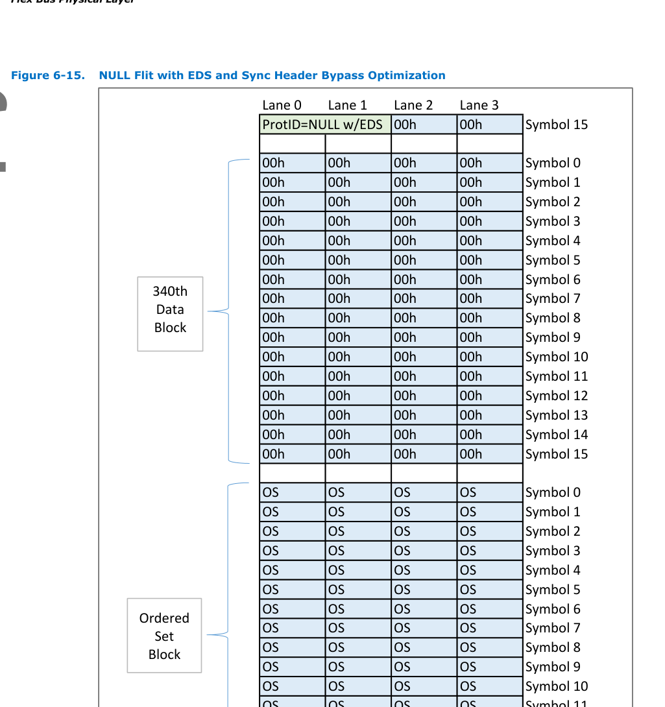
>
> *Original page render @ 150 DPI* — [Full size](figures/chapter_06/page_0317.png)

[⬆️ 返回目录](#-本章目录-table-of-contents)

---

<table>
<thead>
<tr>
<th width="50%">English</th>
<th width="50%" style="background-color:#e8e8e8">中文</th>
</tr>
</thead>
<tbody>
<tr><td>

Figure 6-16 illustrates a scenario where a NULL flit with implied EDS token is sent as the last flit before exiting the data stream in the case where 128b/130b encoding is used. In this example, the NULL flit contains only a 16-bit payload of 0s.

</td><td style="background-color:#e8e8e8">

图 6-16 展示了在使用 128b/130b 编码的情况下,将携带隐式 EDS token 的 NULL flit 作为退出数据流之前的最后一个 flit 发送的场景。在该示例中,NULL flit 仅包含 16 bit 全为 0 的有效载荷。

</td></tr>
</tbody>
</table>

> **Figure 6-16.** NULL Flit with EDS and 128b/130b Encoding ｜ 带 EDS 的 NULL Flit 与 128b/130b 编码
>
> 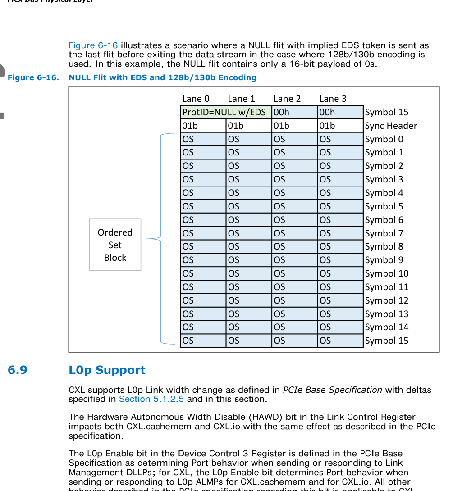
>
> *Original page render @ 150 DPI* — [Full size](figures/chapter_06/page_0318.png)

[⬆️ 返回目录](#-本章目录-table-of-contents)

---

### 6.9 L0p Support | L0p 支持

<table>
<thead>
<tr>
<th width="50%">English</th>
<th width="50%" style="background-color:#e8e8e8">中文</th>
</tr>
</thead>
<tbody>
<tr><td>

CXL supports L0p Link width change as defined in PCIe Base Specification with deltas specified in Section 5.1.2.5 and in this section.

</td><td style="background-color:#e8e8e8">

CXL 支持 PCIe Base Specification 中定义的 L0p 链路宽度变化,其差异(deltas)在第 5.1.2.5 节和本节中规定。

</td></tr>
<tr><td>

The Hardware Autonomous Width Disable (HAWD) bit in the Link Control Register impacts both CXL.cachemem and CXL.io with the same effect as described in the PCIe specification.

</td><td style="background-color:#e8e8e8">

Link Control Register 中的 Hardware Autonomous Width Disable (HAWD,硬件自治宽度禁用) 比特对 CXL.cachemem 和 CXL.io 均产生影响,其效果与 PCIe 规范中所述相同。

</td></tr>
<tr><td>

The L0p Enable bit in the Device Control 3 Register is defined in the PCIe Base Specification as determining Port behavior when sending or responding to Link Management DLLPs; for CXL, the L0p Enable bit determines Port behavior when sending or responding to L0p ALMPs for CXL.cachemem and for CXL.io. All other behavior described in the PCIe specification regarding this bit is applicable to CXL.

</td><td style="background-color:#e8e8e8">

Device Control 3 Register 中的 L0p Enable 比特在 PCIe Base Specification 中被定义为决定 Port 在发送或响应 Link Management DLLP 时的行为;对于 CXL,L0p Enable 比特决定 Port 在发送或响应 CXL.cachemem 和 CXL.io 的 L0p ALMP 时的行为。PCIe 规范中关于此比特的所有其他行为描述均适用于 CXL。

</td></tr>
<tr><td>

The Target Link Width field in the Device Control 3 Register should be set to 111b for CXL. If L0p Enable is set and the Target Link Width field is set to a non-reserved value other than 111b, the resulting link width is implementation specific.

</td><td style="background-color:#e8e8e8">

对于 CXL,Device Control 3 Register 中的 Target Link Width 字段应设置为 111b。如果 L0p Enable 被置位且 Target Link Width 字段被设置为除 111b 以外的非保留值,则产生的链路宽度为实现特定的。

</td></tr>
</tbody>
</table>

[⬆️ 返回目录](#-本章目录-table-of-contents)

---

## Gap Fill Complete

> 以上内容覆盖了第 6 章 Flex Bus 物理层中缺失的所有章节 (6.2.3.2 — 6.9)。
> 将此补充文件的内容按节插入到主 MD 文件中即可获得完整的第 6 章翻译。
