# 📘 第 6 章　Flex Bus 物理层 (Chapter 6. Flex Bus Physical Layer)

**Compute Express Link® (CXL®) Specification — Revision 3.2, Version 1.0 — October 2, 2024**

> 📄 **Source pages**: 287–318 | 📁 **File**: `chapter_06.md`
> 🎨 **Format**: 中英对照双语 · 图表原始保留 · 中文背景色灰色 · GitHub Flavored Markdown

---

## 📑 本章目录 (Table of Contents)

| # | Section | 小节 | Page |
|:-:|:--------|:----|:----:|
| 6.0 | [Flex Bus Physical Layer](#sec-6-0) | Flex Bus 物理层 | p.287 |
| 6.1 | [Overview](#sec-6-1) | 概述 | p.287–288 |
| 6.2 | [Flex Bus.CXL Framing and Packet Layout](#sec-6-2) | Flex Bus.CXL 成帧与包布局 | p.288 |
| 6.2.1 | [Ordered Set Blocks and Data Blocks](#sec-6-2-1) | 有序集块与数据块 | p.288–289 |
| 6.2.2 | [68B Flit Mode](#sec-6-2-2) | 68B Flit 模式 | p.289 |
| 6.2.2.1 | [Protocol ID[15:0]](#sec-6-2-2-1) | 协议标识 Protocol ID[15:0] | p.289–290 |
| 6.2.2.2 | [x16 Packet Layout](#sec-6-2-2-2) | x16 包布局 | p.290–291 |
| 6.2.2.3 | [x8 Packet Layout](#sec-6-2-2-3) | x8 包布局 | p.291–293 |
| 6.2.2.4 | [x4 Packet Layout](#sec-6-2-2-4) | x4 包布局 | p.293–295 |
| 6.2.2.5 | [x2 Packet Layout](#sec-6-2-2-5) | x2 包布局 | p.295 |
| 6.2.2.6 | [x1 Packet Layout](#sec-6-2-2-6) | x1 包布局 | p.295 |
| 6.2.2.7 | [Special Case: CXL.io — When a TLP Ends on a Flit Boundary](#sec-6-2-2-7) | 特殊情况:CXL.io — TLP 在 Flit 边界结束时 | p.295–296 |
| 6.2.2.8 | [Framing Errors](#sec-6-2-2-8) | 成帧错误 | p.296–297 |
| 6.2.3 | [256B Flit Mode](#sec-6-2-3) | 256B Flit 模式 | p.297–298 |
| 6.2.3.1 | [256B Flit Format](#sec-6-2-3-1) | 256B Flit 格式 | p.298 |
| 6.2.3.1.1 | [Standard 256B Flit](#sec-6-2-3-1-1) | 标准 256B Flit | p.298–301 |
| 6.2.3.1.1.1 | [256B Flit Type](#sec-6-2-3-1-1-1) | 256B Flit 类型 | p.299–301 |
| 6.2.3.1.2 | [Latency-Optimized 256B Flit with 128-Byte Flit Halves](#sec-6-2-3-1-2) | 带 128 字节半 Flit 的低延迟优化 256B Flit | p.301–304 |
| 6.2.3.1.2.1 | [Latency-Optimized Flit 6-Byte CRC Calculation](#sec-6-2-3-1-2-1) | 低延迟 Flit 的 6 字节 CRC 计算 | p.303–304 |
| 6.2.3.2 | [CRC Corruption for Containment with 256B Flits](#sec-6-2-3-2) | 用于 256B Flit 抑制的 CRC 故意损坏 | p.305 |
| 6.2.3.2.1 | [CXL.cachemem Viral Injection and Late Poison for 256B Flits](#sec-6-2-3-2-1) | 256B Flit 的 CXL.cachemem 病毒注入与延迟投毒 | p.305 |
| 6.2.3.2.2 | [Late Nullify or Poison for CXL.io](#sec-6-2-3-2-2) | CXL.io 的延迟作废或投毒 | p.305 |
| 6.2.3.3 | [Framing Errors in 256B Flit Mode](#sec-6-2-3-3) | 256B Flit 模式下的成帧错误 | p.305 |
| 6.3 | [256B Flit Mode Retry Buffers](#sec-6-3) | 256B Flit 模式重试缓冲区 | p.305–306 |
| 6.4 | [Link Training](#sec-6-4) | 链路训练 | p.306 |
| 6.4.1 | [PCIe Mode vs. Flex Bus.CXL Mode Selection](#sec-6-4-1) | PCIe 模式 vs. Flex Bus.CXL 模式选择 | p.306 |
| 6.4.1.1 | [Hardware Autonomous Mode Negotiation](#sec-6-4-1-1) | 硬件自治模式协商 | p.306–310 |
| 6.4.1.2 | [Virtual Hierarchy vs. Restricted CXL Device Negotiation](#sec-6-4-1-2) | 虚拟层次 (VH) vs. 限制型 CXL 设备 (RCD) 协商 | p.311 |
| 6.4.1.2.1 | [Retimer Presence Detection](#sec-6-4-1-2-1) | Retimer 存在性检测 | p.312 |
| 6.4.1.3 | [256B Flit Mode](#sec-6-4-1-3) | 256B Flit 模式 | p.312–313 |
| 6.4.1.3.1 | [256B Flit Mode Negotiation](#sec-6-4-1-3-1) | 256B Flit 模式协商 | p.312–313 |
| 6.4.1.3.2 | [CXL.io Throttling](#sec-6-4-1-3-2) | CXL.io 限流 | p.313 |
| 6.4.1.3.3 | [NOP Insertion Hint Performance Optimization](#sec-6-4-1-3-3) | NOP 插入提示性能优化 | p.313 |
| 6.4.1.4 | [Flit Mode and VH Negotiation](#sec-6-4-1-4) | Flit 模式与 VH 协商 | p.313–314 |
| 6.4.1.5 | [Flex Bus.CXL Negotiation with Maximum Supported Link Speed of 8 GT/s or 16 GT/s](#sec-6-4-1-5) | 最高支持 8 GT/s 或 16 GT/s 链路速率的 Flex Bus.CXL 协商 | p.314 |
| 6.4.1.6 | [Link Width Degradation and Speed Downgrade](#sec-6-4-1-6) | 链路宽度降级与速率降速 | p.314 |
| 6.5 | [68B Flit Mode: Recovery.Idle and Config.Idle Transitions to L0](#sec-6-5) | 68B Flit 模式:Recovery.Idle 与 Config.Idle 到 L0 的跃迁 | p.314–315 |
| 6.6 | [L1 Abort Scenario](#sec-6-6) | L1 中止场景 | p.315 |
| 6.7 | [68B Flit Mode: Exit from Recovery](#sec-6-7) | 68B Flit 模式:退出 Recovery | p.315 |
| 6.8 | [Retimers and Low Latency Mode](#sec-6-8) | Retimer 与低延迟模式 | p.315–316 |
| 6.8.1 | [68B Flit Mode: SKP Ordered Set Frequency and L1/Recovery Entry](#sec-6-8-1) | 68B Flit 模式:SKP 有序集频率与 L1/Recovery 进入 | p.316 |
| 6.9 | [L0p Support](#sec-6-9) | L0p 支持 | p.318 |

## 🖼 本章图表 (Figures)

| Figure | Title | 图标题 | Page |
|:------:|:------|:-------|:----:|
| 6-1 | Flex Bus Layers - Physical Layer Highlighted | Flex Bus 分层 — 物理层高亮 | p.287 |
| 6-2 | Flex Bus x16 Packet Layout | Flex Bus x16 包布局 | p.290 |
| 6-3 | Flex Bus x16 Protocol Interleaving Example | Flex Bus x16 协议交织示例 | p.291 |
| 6-4 | Flex Bus x8 Packet Layout | Flex Bus x8 包布局 | p.292 |
| 6-5 | Flex Bus x8 Protocol Interleaving Example | Flex Bus x8 协议交织示例 | p.293 |
| 6-6 | Flex Bus x4 Packet Layout | Flex Bus x4 包布局 | p.295 |
| 6-7 | CXL.io TLP Ending on Flit Boundary Example | CXL.io TLP 在 Flit 边界结束示例 | p.296 |
| 6-8 | Standard 256B Flit | 标准 256B Flit | p.298 |
| 6-9 | CXL.io Standard 256B Flit | CXL.io 标准 256B Flit | p.298 |
| 6-10 | Standard 256B Flit Applied to Physical Lanes (x16) | 应用到物理 lane 的标准 256B Flit (x16) | p.301 |
| 6-11 | Latency-Optimized 256B Flit | 低延迟优化 256B Flit | p.301 |
| 6-12 | CXL.io Latency-Optimized 256B Flit | CXL.io 低延迟优化 256B Flit | p.303 |
| 6-13 | Different Methods for Generating 6-Byte CRC | 生成 6 字节 CRC 的不同方法 | p.304 |
| 6-14 | Flex Bus Mode Negotiation during Link Training (Sample Flow) | 链路训练期间的 Flex Bus 模式协商 (示例流程) | p.310 |
| 6-15 | NULL Flit with EDS and Sync Header Bypass Optimization | 带 EDS 的 NULL Flit 与 Sync Header 旁路优化 | p.317 |
| 6-16 | NULL Flit with EDS and 128b/130b Encoding | 带 EDS 的 NULL Flit 与 128b/130b 编码 | p.318 |

## 📊 本章表格 (Tables)

| Table | Title | 表标题 | Sheets |
|:-----:|:------|:-------|:------:|
| 6-1 | Flex Bus.CXL Link Speeds and Widths for Normal and Degraded Mode | Flex Bus.CXL 正常与降级模式的链路速率与宽度 | 1 (p.288) |
| 6-2 | Flex Bus.CXL Protocol IDs | Flex Bus.CXL 协议标识 Protocol ID | 1 (p.289) |
| 6-3 | Protocol ID Framing Errors | Protocol ID 成帧错误 | 1 (p.296) |
| 6-4 | 256B Flit Mode vs. 68B Flit Mode Operation | 256B Flit 模式 vs. 68B Flit 模式运行 | 1 (p.297) |
| 6-5 | 256B Flit Header | 256B Flit 头部 | 1 (p.299) |
| 6-6 | Flit Type[1:0] Encoding | Flit Type[1:0] 编码 | 1 (p.300) |
| 6-7 | Latency-Optimized Flit Processing for CRC Scenarios | CRC 场景下的低延迟 Flit 处理 | 2 (p.302, p.303) |
| 6-8 | Byte Mapping for Input to PCIe 8B CRC Generation | PCIe 8B CRC 生成输入的字节映射 | 1 (p.304) |
| 6-9 | Modified TS1/TS2 Ordered Set for Flex Bus Mode Negotiation | Flex Bus 模式协商的修改型 TS1/TS2 有序集 | 2 (p.306, p.307) |
| 6-10 | Additional Information on Symbols 8-9 of Modified TS1/TS2 Ordered Set | 修改型 TS1/TS2 有序集符号 8-9 的补充信息 | 1 (p.307) |
| 6-11 | Additional Information on Symbols 12-14 of Modified TS1/TS2 Ordered Sets | 修改型 TS1/TS2 有序集符号 12-14 的补充信息 | 2 (p.308, p.309) |
| 6-12 | VH vs. RCD Link Training Resolution | VH vs. RCD 链路训练解析 | 1 (p.311) |
| 6-13 | Flit Mode and VH Negotiation | Flit 模式与 VH 协商 | 2 (p.313, p.314) |
| 6-14 | Rules of Enable Low-latency Mode Features | 启用低延迟模式特性的规则 | 1 (p.315) |
| 6-15 | Sync Header Bypass Applicability and Ordered Set Insertion Rate | Sync Header 旁路适用性与有序集插入速率 | 1 (p.316) |

> 💡 **查看原图**:所有原图已抽取为 PNG 存放在 [`figures/chapter_06/`](figures/chapter_06/)(32 张全页渲染 + 9 张抽取图)。

---

## 6.0 Flex Bus Physical Layer | Flex Bus 物理层

<table>
<thead>
<tr>
<th width="50%">🇬🇧 English</th>
<th width="50%" style="background-color:#e8e8e8">🇨🇳 中文</th>
</tr>
</thead>
<tbody>
<tr><td>

The figure above shows where the Flex Bus physical layer exists in the Flex Bus layered hierarchy. On the transmitter side, the Flex Bus physical layer prepares data received from either the PCIe* link layer or the CXL ARB/MUX for transmission across the Flex Bus link. On the receiver side, the Flex Bus physical layer deserializes the data received on the Flex Bus link and converts it to the appropriate format to forward to the PCIe link layer or the ARB/MUX. The Flex Bus physical layer consists of a logical sub-block, aka the logical PHY, and an electrical sub-block. The logical PHY operates in PCIe mode during initial link training and switches over to CXL mode, if appropriate, depending on the results of alternate protocol negotiation, during recovery after training to 2.5 GT/s. The electrical sub-block follows PCIe Base Specification.

In CXL mode, normal operation occurs at native link width and 32 GT/s or 64 GT/s link speed. Bifurcation (aka link subdivision) into x8 and x4 widths is supported in CXL mode. Degraded modes of operation include 8 GT/s or 16 GT/s or 32 GT/s link speed and smaller link widths of x2 and x1. Table 6-1 summarizes the supported CXL combinations. In PCIe mode, the link supports all widths and speeds defined in PCIe Base Specification, as well as the ability to bifurcate.

This chapter focuses on the details of the logical PHY. The Flex Bus logical PHY is based on the PCIe logical PHY; PCIe mode follows PCIe Base Specification exactly while Flex Bus.CXL mode has deltas from PCIe that affect link training and framing. Please refer to the "Physical Layer Logical Block" chapter of PCIe Base Specification for details on PCIe mode. The Flex Bus.CXL deltas are described in this chapter.

</td><td style="background-color:#e8e8e8">

上图显示了 Flex Bus 物理层在 Flex Bus 分层体系结构中的位置。在发送端,Flex Bus 物理层准备从 PCIe* 链路层或 CXL ARB/MUX 接收到的数据,以便通过 Flex Bus 链路进行传输。在接收端,Flex Bus 物理层对在 Flex Bus 链路上接收到的数据进行解串行化,并将其转换为适当的格式转发给 PCIe 链路层或 ARB/MUX。Flex Bus 物理层由逻辑子块(即逻辑 PHY)和电气子块组成。逻辑 PHY 在初始链路训练期间以 PCIe 模式运行,并在训练至 2.5 GT/s 后的 Recovery 阶段根据替代协议协商的结果(若适用)切换到 CXL 模式。电气子块遵循 PCIe Base Specification。

在 CXL 模式下,正常运行在原生链路宽度和 32 GT/s 或 64 GT/s 链路速率下。CXL 模式支持将链路细分为 x8 和 x4 宽度(即链路细分)。降级运行模式包括 8 GT/s、16 GT/s 或 32 GT/s 链路速率,以及较小的 x2 和 x1 链路宽度。表 6-1 总结了所支持的 CXL 组合。在 PCIe 模式下,链路支持 PCIe Base Specification 中定义的所有宽度和速率,以及细分能力。

本章重点关注逻辑 PHY 的细节。Flex Bus 逻辑 PHY 基于 PCIe 逻辑 PHY;PCIe 模式完全遵循 PCIe Base Specification,而 Flex Bus.CXL 模式相较于 PCIe 在链路训练和成帧方面存在差异(deltas)。有关 PCIe 模式的详细信息,请参阅 PCIe Base Specification 的 "Physical Layer Logical Block" 章节。Flex Bus.CXL 的差异将在本章中描述。

</td></tr>
</tbody>
</table>

> **Figure 6-1.** Flex Bus Layers - Physical Layer Highlighted ｜ Flex Bus 分层 — 物理层高亮
>
> 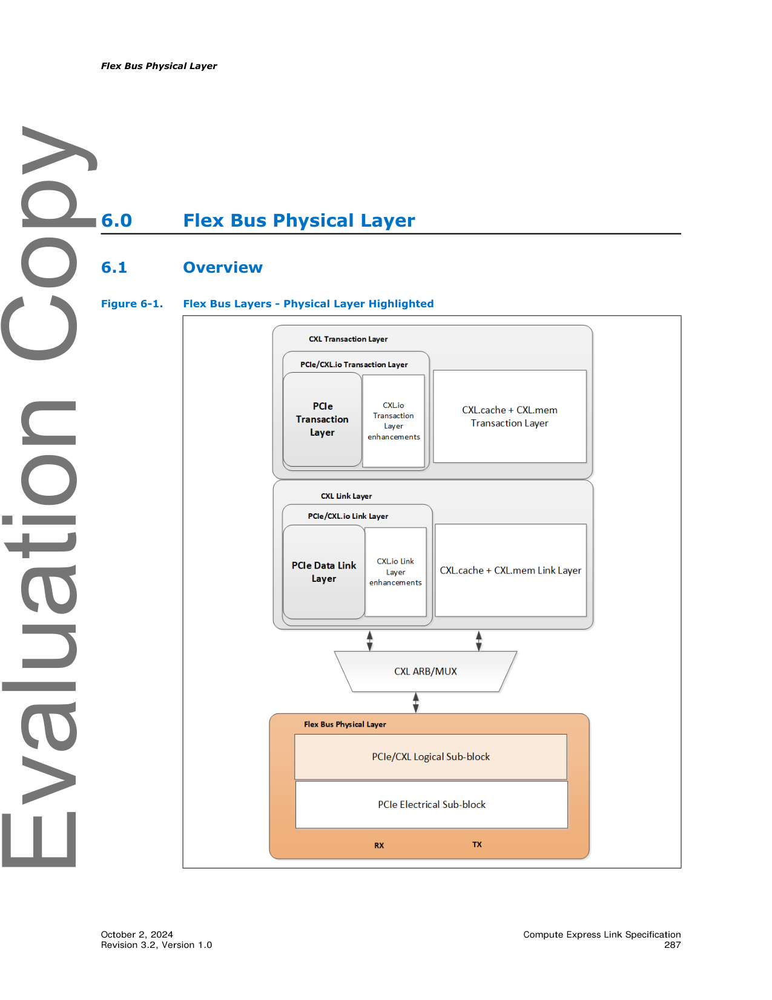
>
> *Original page render @ 150 DPI* — [📄 Full size](figures/chapter_06/page_0287.png)

[⬆️ 返回目录](#-本章目录-table-of-contents)

---

## 6.1 Overview | 概述

<table>
<thead>
<tr>
<th width="50%">🇬🇧 English</th>
<th width="50%" style="background-color:#e8e8e8">🇨🇳 中文</th>
</tr>
</thead>
<tbody>
<tr><td>

The figure above shows where the Flex Bus physical layer exists in the Flex Bus layered hierarchy. On the transmitter side, the Flex Bus physical layer prepares data received from either the PCIe* link layer or the CXL ARB/MUX for transmission across the Flex Bus link. On the receiver side, the Flex Bus physical layer deserializes the data received on the Flex Bus link and converts it to the appropriate format to forward to the PCIe link layer or the ARB/MUX. The Flex Bus physical layer consists of a logical sub-block, aka the logical PHY, and an electrical sub-block. The logical PHY operates in PCIe mode during initial link training and switches over to CXL mode, if appropriate, depending on the results of alternate protocol negotiation, during recovery after training to 2.5 GT/s. The electrical sub-block follows PCIe Base Specification.

</td><td style="background-color:#e8e8e8">

上图显示了 Flex Bus 物理层在 Flex Bus 分层体系结构中的位置。在发送端,Flex Bus 物理层准备从 PCIe* 链路层或 CXL ARB/MUX 接收到的数据,以便通过 Flex Bus 链路进行传输。在接收端,Flex Bus 物理层对在 Flex Bus 链路上接收到的数据进行解串行化,并将其转换为适当的格式转发给 PCIe 链路层或 ARB/MUX。Flex Bus 物理层由逻辑子块(即逻辑 PHY)和电气子块组成。逻辑 PHY 在初始链路训练期间以 PCIe 模式运行,并在训练至 2.5 GT/s 后的 Recovery 阶段根据替代协议协商的结果(若适用)切换到 CXL 模式。电气子块遵循 PCIe Base Specification。

</td></tr>
<tr><td>

In CXL mode, normal operation occurs at native link width and 32 GT/s or 64 GT/s link speed. Bifurcation (aka link subdivision) into x8 and x4 widths is supported in CXL mode. Degraded modes of operation include 8 GT/s or 16 GT/s or 32 GT/s link speed and smaller link widths of x2 and x1. Table 6-1 summarizes the supported CXL combinations. In PCIe mode, the link supports all widths and speeds defined in PCIe Base Specification, as well as the ability to bifurcate.

</td><td style="background-color:#e8e8e8">

在 CXL 模式下,正常运行在原生链路宽度和 32 GT/s 或 64 GT/s 链路速率下。CXL 模式支持将链路细分为 x8 和 x4 宽度(即链路细分,link subdivision)。降级运行模式包括 8 GT/s、16 GT/s 或 32 GT/s 链路速率,以及较小的 x2 和 x1 链路宽度。表 6-1 总结了所支持的 CXL 组合。在 PCIe 模式下,链路支持 PCIe Base Specification 中定义的所有宽度和速率,以及细分能力。

</td></tr>
<tr><td>

This chapter focuses on the details of the logical PHY. The Flex Bus logical PHY is based on the PCIe logical PHY; PCIe mode follows PCIe Base Specification exactly while Flex Bus.CXL mode has deltas from PCIe that affect link training and framing. Please refer to the "Physical Layer Logical Block" chapter of PCIe Base Specification for details on PCIe mode. The Flex Bus.CXL deltas are described in this chapter.

</td><td style="background-color:#e8e8e8">

本章重点关注逻辑 PHY 的细节。Flex Bus 逻辑 PHY 基于 PCIe 逻辑 PHY;PCIe 模式完全遵循 PCIe Base Specification,而 Flex Bus.CXL 模式相较于 PCIe 在链路训练和成帧方面存在差异(deltas)。有关 PCIe 模式的详细信息,请参阅 PCIe Base Specification 的 "Physical Layer Logical Block" 章节。Flex Bus.CXL 的差异将在本章中描述。

</td></tr>
</tbody>
</table>

[⬆️ 返回目录](#-本章目录-table-of-contents)

---

## 6.2 Flex Bus.CXL Framing and Packet Layout | Flex Bus.CXL 成帧与包布局

<table>
<thead>
<tr>
<th width="50%">🇬🇧 English</th>
<th width="50%" style="background-color:#e8e8e8">🇨🇳 中文</th>
</tr>
</thead>
<tbody>
<tr><td>

The Flex Bus.CXL framing and packet layout is described in this section for x16, x8, x4, x2, and x1 link widths.

</td><td style="background-color:#e8e8e8">

本节针对 x16、x8、x4、x2 和 x1 链路宽度描述 Flex Bus.CXL 的成帧与包布局。

</td></tr>
</tbody>
</table>

[⬆️ 返回目录](#-本章目录-table-of-contents)

---

### 6.2.1 Ordered Set Blocks and Data Blocks | 有序集块与数据块

<table>
<thead>
<tr>
<th width="50%">🇬🇧 English</th>
<th width="50%" style="background-color:#e8e8e8">🇨🇳 中文</th>
</tr>
</thead>
<tbody>
<tr><td>

Flex Bus.CXL uses the PCIe concept of Ordered Set blocks and data blocks. Each block spans 128 bits per lane and potentially two bits of Sync Header per lane.

</td><td style="background-color:#e8e8e8">

Flex Bus.CXL 使用 PCIe 中的有序集块和数据块概念。每个块在每个 lane 上占据 128 bit,可能还包含 2 bit 的 Sync Header(同步头)。

</td></tr>
<tr><td>

Ordered Set blocks are used for training, entering and exiting Electrical Idle, transitions to data blocks, and clock tolerance compensation; they are the same as defined in PCIe Base Specification. A 2-bit Sync Header with value 01b is inserted before each 128 bits transmitted per lane in an Ordered Set block when 128b/130b encoding is used; in the Sync Header bypass latency-optimized mode, there is no Sync Header. Additionally, as per PCIe Base Specification, there is no Sync Header when 1b/1b encoding is used.

</td><td style="background-color:#e8e8e8">

有序集块用于训练、进入和退出电气空闲(Electrical Idle)、数据块之间的跃迁以及时钟容差补偿;它们的定义与 PCIe Base Specification 相同。当使用 128b/130b 编码时,在每个有序集块中,每个 lane 上每 128 bit 传输之前插入一个值为 01b 的 2 bit Sync Header;在 Sync Header 旁路低延迟优化模式下,则没有 Sync Header。此外,根据 PCIe Base Specification,在使用 1b/1b 编码时也没有 Sync Header。

</td></tr>
</tbody>
</table>

**Table 6-1.** Flex Bus.CXL Link Speeds and Widths for Normal and Degraded Mode | Flex Bus.CXL 正常与降级模式的链路速率与宽度

<table>
<thead>
<tr>
<th>Link Speed</th>
<th>Native Width</th>
<th style="background-color:#e8e8e8">Degraded Modes Supported</th>
</tr>
</thead>
<tbody>
<tr><td>32 GT/s</td><td>x16</td><td style="background-color:#e8e8e8">x16 at 16 GT/s or 8 GT/s; x8, x4, x2, or x1 at 32 GT/s or 16 GT/s or 8 GT/s</td></tr>
<tr><td>32 GT/s</td><td>x8</td><td style="background-color:#e8e8e8">x8 at 16 GT/s or 8 GT/s; x4, x2, or x1 at 32 GT/s or 16 GT/s or 8 GT/s</td></tr>
<tr><td>32 GT/s</td><td>x4</td><td style="background-color:#e8e8e8">x4 at 16 GT/s or 8 GT/s; x2 or x1 at 32 GT/s or 16 GT/s or 8 GT/s</td></tr>
<tr><td>64 GT/s</td><td>x16</td><td style="background-color:#e8e8e8">x16 at 32 GT/s or 16 GT/s or 8 GT/s; x8, x4, x2, or x1 at 64 GT/s or 32 GT/s or 16 GT/s or 8 GT/s</td></tr>
<tr><td>64 GT/s</td><td>x8</td><td style="background-color:#e8e8e8">x8 at 32 GT/s or at 16 GT/s or 8 GT/s; x4, x2, or x1 at 64GT/s or 32 GT/s or 16 GT/s or 8 GT/s</td></tr>
<tr><td>64 GT/s</td><td>x4</td><td style="background-color:#e8e8e8">x4 at 32 GT/s or at 16 GT/s or 8 GT/s; x2 or x1 at 64 GT/s or 32 GT/s or 16 GT/s or 8 GT/s</td></tr>
</tbody>
</table>

<table>
<thead>
<tr>
<th width="50%">🇬🇧 English</th>
<th width="50%" style="background-color:#e8e8e8">🇨🇳 中文</th>
</tr>
</thead>
<tbody>
<tr><td>

Data blocks are used for transmission of the flits received from the CXL ARB/MUX. In 68B Flit mode, a 16-bit Protocol ID field is associated with each 528-bit flit payload (512 bits of payload + 16 bits of CRC) received from the link layer, which is striped across the lanes on an 8-bit granularity; the placement of the Protocol ID depends on the width. A 2-bit Sync Header with value 10b is inserted before every 128 bits transmitted per lane in a data block when 128b/130b encoding is used; in the latency-optimized Sync Header Bypass mode, there is no Sync Header. A 528-bit flit may traverse the boundary between data blocks. In 256B Flit mode, the flits are 256 bytes, which includes the Protocol ID information in the Flit Type field.

</td><td style="background-color:#e8e8e8">

数据块用于传输从 CXL ARB/MUX 接收的 flit。在 68B Flit 模式下,一个 16 bit 的 Protocol ID 字段与从链路层接收的每个 528 bit flit 有效载荷(512 bit 有效载荷 + 16 bit CRC)关联,该字段以 8 bit 粒度在 lane 上条带分布;Protocol ID 的位置取决于链路宽度。当使用 128b/130b 编码时,在数据块中,每个 lane 上每 128 bit 传输之前插入一个值为 10b 的 2 bit Sync Header;在低延迟优化的 Sync Header 旁路模式下,则没有 Sync Header。一个 528 bit flit 可以跨越数据块之间的边界。在 256B Flit 模式下,flit 为 256 字节,Protocol ID 信息包含在 Flit Type 字段中。

</td></tr>
<tr><td>

Transitions between Ordered Set blocks and data blocks are indicated in a couple of ways, only a subset of which may be applicable depending on the data rate and CXL mode. One way is via the 2-bit Sync Header of 01b for Ordered Set blocks and 10b for data blocks. The second way is via the use of Start of Data Stream (SDS) Ordered Sets and End of Data Stream (EDS) tokens. Unlike PCIe where the EDS token is explicit, Flex Bus.CXL encodes the EDS indication in the Protocol ID value in 68B Flit mode; the latter is referred to as an "implied EDS token." In 256B Flit mode, transitions from Data Blocks to Ordered Set Blocks are permitted to occur at only fixed locations as specified in PCIe Base Specification for PCIe Flit mode.

</td><td style="background-color:#e8e8e8">

有序集块和数据块之间的跃迁有几种指示方式,其中只有一部分适用于特定的数据速率和 CXL 模式。第一种方式是通过 2 bit 的 Sync Header:有序集块为 01b,数据块为 10b。第二种方式是通过使用 Start of Data Stream(SDS,数据流开始)有序集和 End of Data Stream(EDS,数据流结束)token。与 PCIe 中 EDS token 是显式的不同,Flex Bus.CXL 在 68B Flit 模式下将 EDS 指示编码在 Protocol ID 值中;后者被称为"隐式 EDS token(implied EDS token)"。在 256B Flit 模式下,从数据块到有序集块的跃迁只允许出现在 PCIe Base Specification 中针对 PCIe Flit 模式规定的固定位置。

</td></tr>
</tbody>
</table>

[⬆️ 返回目录](#-本章目录-table-of-contents)

---

### 6.2.2 68B Flit Mode | 68B Flit 模式

<table>
<thead>
<tr>
<th width="50%">🇬🇧 English</th>
<th width="50%" style="background-color:#e8e8e8">🇨🇳 中文</th>
</tr>
</thead>
<tbody>
<tr><td>

Selection of 68B Flit mode vs. 256B Flit mode occurs during PCIe link training. The following subsections describe the physical layer framing and packet layout for 68B Flit mode. See Section 6.2.3 for 256B Flit mode.

</td><td style="background-color:#e8e8e8">

68B Flit 模式与 256B Flit 模式的选择发生在 PCIe 链路训练期间。后续小节将描述 68B Flit 模式下的物理层成帧与包布局。256B Flit 模式请参见 6.2.3 节。

</td></tr>
</tbody>
</table>

[⬆️ 返回目录](#-本章目录-table-of-contents)

---

#### 6.2.2.1 Protocol ID[15:0] | 协议标识 Protocol ID[15:0]

<table>
<thead>
<tr>
<th width="50%">🇬🇧 English</th>
<th width="50%" style="background-color:#e8e8e8">🇨🇳 中文</th>
</tr>
</thead>
<tbody>
<tr><td>

The 16-bit Protocol ID field specifies whether the transmitted flit is CXL.io, CXL.cachemem, or some other payload. Table 6-2 provides a list of valid 16-bit Protocol ID encodings. Encodings that include an implied EDS token signify that the next block after the block in which the current flit ends is an Ordered Set block. Implied EDS tokens can only occur with the last flit transmitted in a data block.

</td><td style="background-color:#e8e8e8">

16 bit 的 Protocol ID 字段用于指定所传输的 flit 是 CXL.io、CXL.cachemem 还是其他类型的有效载荷。表 6-2 列出了所有合法的 16 bit Protocol ID 编码。包含隐式 EDS token 的编码表示当前 flit 结束所在块的下一个块是有序集块。隐式 EDS token 只能出现在数据块中传输的最后一个 flit 中。

</td></tr>
<tr><td>

NULL flits are inserted into the data stream by the physical layer when there are no valid flits available from the link layer. A NULL flit transferred with an implied EDS token ends exactly at the data block boundary that precedes the Ordered Set block; these are variable length flits, up to 528 bits, intended to facilitate transition to Ordered Set blocks as quickly as possible.

</td><td style="background-color:#e8e8e8">

当链路层没有可用 flit 时,物理层会在数据流中插入 NULL flit。携带隐式 EDS token 的 NULL flit 正好在有序集块之前的数据块边界处结束;这些是可变长度的 flit,长度最大为 528 bit,目的是尽快实现到有序集块的跃迁。

</td></tr>
</tbody>
</table>

> **Note (continued):** When 128b/130b encoding is used, the variable length NULL flit ends on the first block boundary encountered after the 16-bit Protocol ID has been transmitted, and the Ordered Set is transmitted in the next block. Because Ordered Set blocks are inserted at fixed block intervals that align to the flit boundary when Sync Headers are disabled (as described in Section 6.8.1), variable length NULL flits will always contain a fixed 528-bit payload when Sync Headers are disabled. See Section 6.8.1 for examples of NULL flit with implied EDS usage scenarios. A NULL flit is composed of an all 0s payload.

**Table 6-2.** Flex Bus.CXL Protocol IDs | Flex Bus.CXL 协议标识 Protocol ID

<table>
<thead>
<tr>
<th>Protocol ID[15:0]</th>
<th style="background-color:#e8e8e8">Description</th>
</tr>
</thead>
<tbody>
<tr><td>FFFFh</td><td style="background-color:#e8e8e8">CXL.io</td></tr>
<tr><td>D2D2h</td><td style="background-color:#e8e8e8">CXL.io with Implied EDS Token</td></tr>
<tr><td>5555h</td><td style="background-color:#e8e8e8">CXL.cachemem</td></tr>
<tr><td>8787h</td><td style="background-color:#e8e8e8">CXL.cachemem with Implied EDS Token</td></tr>
<tr><td>9999h</td><td style="background-color:#e8e8e8">NULL Flit: Null flit generated by the Physical Layer</td></tr>
<tr><td>4B4Bh</td><td style="background-color:#e8e8e8">NULL flit with Implied EDS Token: Variable length flit containing NULLs that ends exactly at the data block boundary that precedes the Ordered Set block (generated by the Physical Layer)</td></tr>
<tr><td>CCCCh</td><td style="background-color:#e8e8e8">CXL ARB/MUX Link Management Packets (ALMPs)</td></tr>
<tr><td>1E1Eh</td><td style="background-color:#e8e8e8">CXL ARB/MUX Link Management Packets (ALMPs) with Implied EDS Token</td></tr>
<tr><td>All other encodings</td><td style="background-color:#e8e8e8">Reserved</td></tr>
</tbody>
</table>

<table>
<thead>
<tr>
<th width="50%">🇬🇧 English</th>
<th width="50%" style="background-color:#e8e8e8">🇨🇳 中文</th>
</tr>
</thead>
<tbody>
<tr><td>

An 8-bit encoding with a hamming distance of four is replicated to create the 16-bit encoding for error protection against bit flips. A correctable Protocol ID framing error is logged but no further error handling action is required if only one 8-bit encoding group looks incorrect; the correct 8-bit encoding group is used for normal processing. If both 8-bit encoding groups are incorrect, an uncorrectable Protocol ID framing error is logged, the flit is dropped, and the physical layer enters into recovery to retrain the link.

</td><td style="background-color:#e8e8e8">

为了防止比特翻转造成的错误,采用汉明距离为 4 的 8 bit 编码,将其复制组合为 16 bit 编码以提供错误保护。如果只有一个 8 bit 编码组看起来不正确,则记录为可纠正的 Protocol ID 成帧错误,但不需要进一步错误处理;正常的处理使用正确的 8 bit 编码组。如果两个 8 bit 编码组都不正确,则记录为不可纠正的 Protocol ID 成帧错误,丢弃该 flit,物理层进入 Recovery 重新训练链路。

</td></tr>
<tr><td>

The physical layer is responsible for dropping any flits it receives with invalid Protocol IDs. This includes dropping any flits with unexpected Protocol IDs that correspond to Flex Bus-defined protocols that have not been enabled during negotiation; Protocol IDs associated with flits generated by physical layer or by the ARB/MUX must not be treated as unexpected. When a flit is dropped due to an unexpected Protocol ID, the physical layer logs an unexpected protocol ID error in the Flex Bus DVSEC Port Status register.

</td><td style="background-color:#e8e8e8">

物理层负责丢弃任何收到的带有无效 Protocol ID 的 flit。这包括丢弃任何带有意外 Protocol ID 的 flit(对应于协商期间未启用的 Flex Bus 定义协议);与由物理层或 ARB/MUX 生成的 flit 相关联的 Protocol ID 不应被视为意外。当由于意外 Protocol ID 而丢弃 flit 时,物理层会在 Flex Bus DVSEC Port Status 寄存器中记录一个意外 Protocol ID 错误。

</td></tr>
<tr><td>

See Section 6.2.2.8 for additional details regarding Protocol ID error detection and handling.

</td><td style="background-color:#e8e8e8">

有关 Protocol ID 错误检测和处理的更多详细信息,请参见 6.2.2.8 节。

</td></tr>
</tbody>
</table>

[⬆️ 返回目录](#-本章目录-table-of-contents)

---

#### 6.2.2.2 x16 Packet Layout | x16 包布局

<table>
<thead>
<tr>
<th width="50%">🇬🇧 English</th>
<th width="50%" style="background-color:#e8e8e8">🇨🇳 中文</th>
</tr>
</thead>
<tbody>
<tr><td>

Figure 6-2 shows the x16 packet layout. First, the 16 bits of Protocol ID are transferred, split on an 8-bit granularity across consecutive lanes; this is followed by transfer of the 528-bit flit, striped across the lanes on an 8-bit granularity. Depending on the symbol time, as labeled on the leftmost column in the figure, the Protocol ID plus flit transfer may start on Lane 0, Lane 4, Lane 8, or Lane 12. The pattern of transfer repeats after every 17 symbol times. The two-bit Sync Header shown in the figure, inserted after every 128 bits transferred per lane, is not present for the latency-optimized mode where Sync Header bypass is negotiated.

</td><td style="background-color:#e8e8e8">

图 6-2 显示了 x16 包布局。首先,传输 16 bit 的 Protocol ID,以 8 bit 粒度分布在连续的 lane 上;然后传输 528 bit flit,以 8 bit 粒度在 lane 上条带分布。根据符号时间(如图中最左列所示),Protocol ID 加 flit 的传输可以从 Lane 0、Lane 4、Lane 8 或 Lane 12 开始。传输模式每 17 个符号时间重复一次。图中显示的 2 bit Sync Header(在每个 lane 上每 128 bit 传输后插入)在协商了 Sync Header 旁路的低延迟优化模式下不存在。

</td></tr>
</tbody>
</table>

> **Figure 6-2.** Flex Bus x16 Packet Layout ｜ Flex Bus x16 包布局
>
> 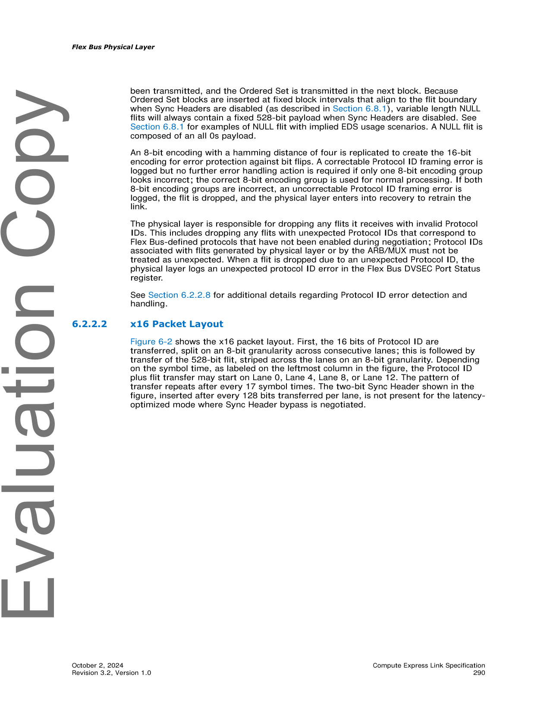
>
> *Original page render @ 150 DPI* — [📄 Full size](figures/chapter_06/page_0290.png)

<table>
<thead>
<tr>
<th width="50%">🇬🇧 English</th>
<th width="50%" style="background-color:#e8e8e8">🇨🇳 中文</th>
</tr>
</thead>
<tbody>
<tr><td>

Figure 6-3 provides an example where CXL.io and CXL.cachemem traffic is interleaved with an interleave granularity of two flits on a x16 link. The upper part of the figure shows what the CXL.io stream looks like before mapping to the Flex Bus lanes and before interleaving with CXL.cachemem traffic; the framing rules follow the x16 framing rules specified in PCIe Base Specification, as specified in Section 4.1. The lower part of the figure shows the final result when the two streams are interleaved on the Flex Bus lanes. For CXL.io flits, after transferring the 16-bit Protocol ID, 512 bits are used to transfer CXL.io traffic and 16 bits are unused. For CXL.cachemem flits, after transferring the 16-bit Protocol ID, 528 bits are used to transfer a CXL.cachemem flit. See Chapter 4.0 for more details on the flit format. As this example illustrates, the PCIe TLPs and DLLPs encapsulated within the CXL.io stream may be interrupted by non-related CXL traffic if they cross a flit boundary.

</td><td style="background-color:#e8e8e8">

图 6-3 给出了一个示例,展示了在 x16 链路上 CXL.io 和 CXL.cachemem 业务以两个 flit 的交织粒度进行交织。图中上半部分显示了 CXL.io 流在映射到 Flex Bus lane 之前以及与 CXL.cachemem 业务交织之前的样子;成帧规则遵循 PCIe Base Specification 第 4.1 节中规定的 x16 成帧规则。图中下半部分显示了当两个流在 Flex Bus lane 上交织后的最终结果。对于 CXL.io flit,传输 16 bit Protocol ID 后,512 bit 用于传输 CXL.io 业务,16 bit 未使用。对于 CXL.cachemem flit,传输 16 bit Protocol ID 后,528 bit 用于传输 CXL.cachemem flit。有关 flit 格式的更多详细信息,请参见第 4.0 章。如本例所示,如果 PCIe TLP 和 DLLP 跨越 flit 边界,则封装在 CXL.io 流中的 PCIe TLP 和 DLLP 可能会被不相关的 CXL 业务打断。

</td></tr>
</tbody>
</table>

> **Figure 6-3.** Flex Bus x16 Protocol Interleaving Example ｜ Flex Bus x16 协议交织示例
>
> 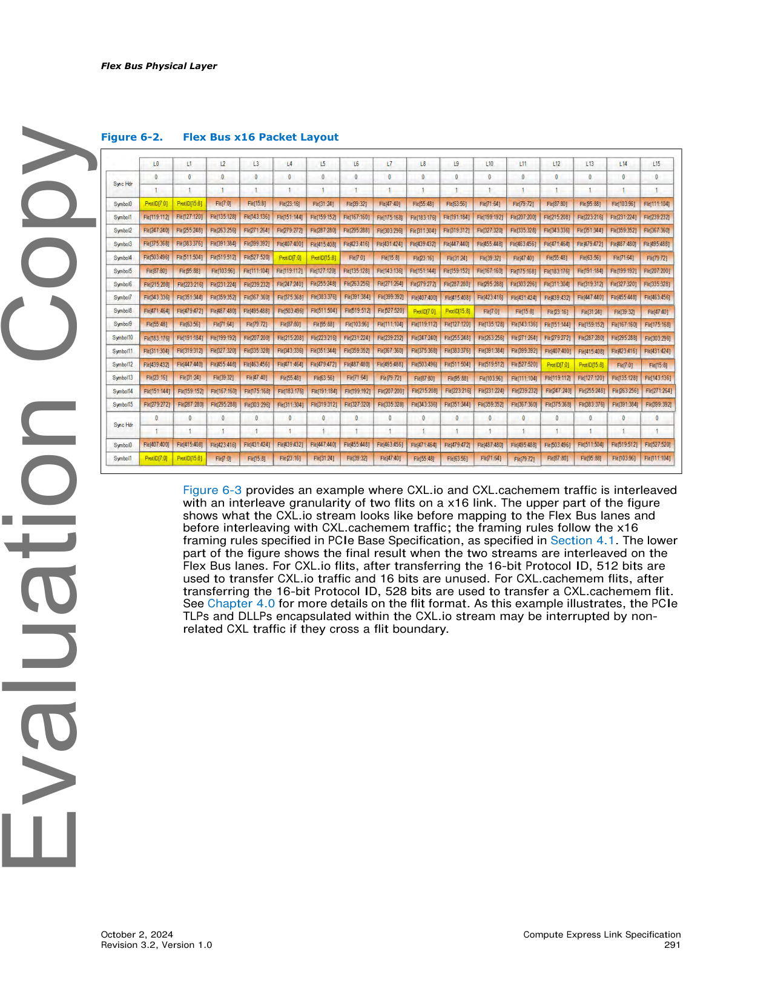
>
> *Original page render @ 150 DPI* — [📄 Full size](figures/chapter_06/page_0291.png)

[⬆️ 返回目录](#-本章目录-table-of-contents)

---

#### 6.2.2.3 x8 Packet Layout | x8 包布局

<table>
<thead>
<tr>
<th width="50%">🇬🇧 English</th>
<th width="50%" style="background-color:#e8e8e8">🇨🇳 中文</th>
</tr>
</thead>
<tbody>
<tr><td>

Figure 6-4 shows the x8 packet layout. 16 bits of Protocol ID followed by a 528-bit flit are striped across the lanes on an 8-bit granularity. Depending on the symbol time, the Protocol ID plus flit transfer may start on Lane 0 or Lane 4. The pattern of transfer repeats after every 17 symbol times. The two-bit Sync Header shown in the figure is not present for the Sync Header bypass latency-optimized mode.

</td><td style="background-color:#e8e8e8">

图 6-4 显示了 x8 包布局。16 bit Protocol ID 后跟 528 bit flit,以 8 bit 粒度在 lane 上条带分布。根据符号时间,Protocol ID 加 flit 的传输可以从 Lane 0 或 Lane 4 开始。传输模式每 17 个符号时间重复一次。图中显示的 2 bit Sync Header 在 Sync Header 旁路低延迟优化模式下不存在。

</td></tr>
<tr><td>

Figure 6-5 illustrates how CXL.io and CXL.cachemem traffic is interleaved on a x8 Flex Bus link. The same traffic from the x16 example in Figure 6-3 is mapped to a x8 link.

</td><td style="background-color:#e8e8e8">

图 6-5 说明了 CXL.io 和 CXL.cachemem 业务如何在 x8 Flex Bus 链路上交织。图 6-3 中 x16 示例的相同业务被映射到 x8 链路上。

</td></tr>
</tbody>
</table>

> **Figure 6-4.** Flex Bus x8 Packet Layout ｜ Flex Bus x8 包布局
>
> 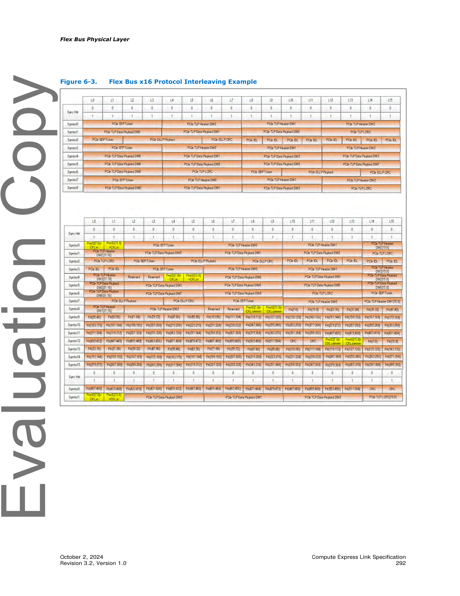
>
> *Original page render @ 150 DPI* — [📄 Full size](figures/chapter_06/page_0292.png)

> **Figure 6-5.** Flex Bus x8 Protocol Interleaving Example ｜ Flex Bus x8 协议交织示例
>
> 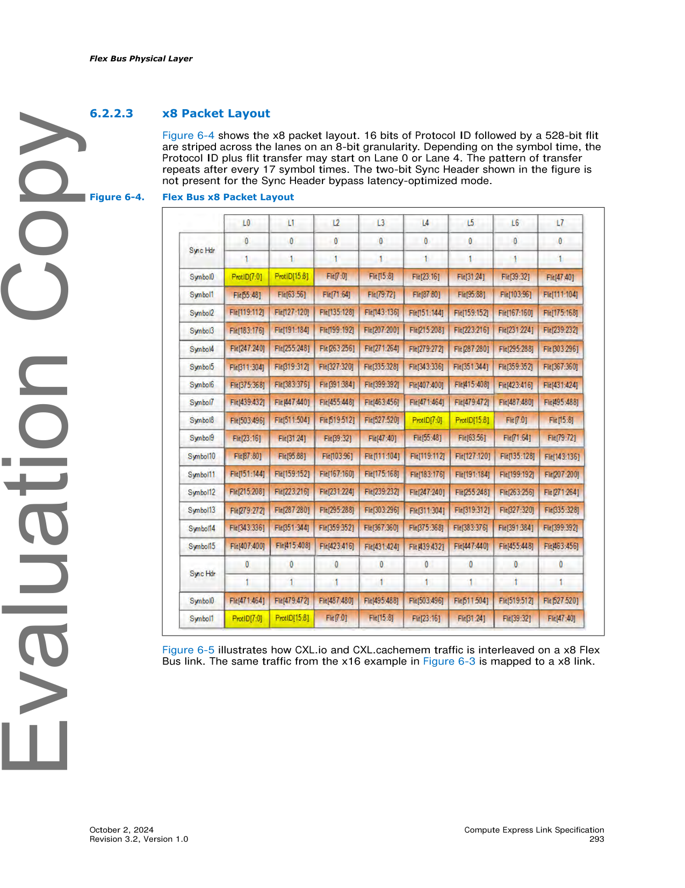
>
> *Original page render @ 150 DPI* — [📄 Full size](figures/chapter_06/page_0293.png)

[⬆️ 返回目录](#-本章目录-table-of-contents)

---

#### 6.2.2.4 x4 Packet Layout | x4 包布局

<table>
<thead>
<tr>
<th width="50%">🇬🇧 English</th>
<th width="50%" style="background-color:#e8e8e8">🇨🇳 中文</th>
</tr>
</thead>
<tbody>
<tr><td>

Figure 6-6 shows the x4 packet layout. 16 bits of Protocol ID followed by a 528-bit flit are striped across the lanes on an 8-bit granularity. The Protocol ID plus flit transfer always starts on Lane 0; the entire transfer takes 17 symbol times. The two-bit Sync Header shown in the figure is not present for Latency-optimized Sync Header Bypass mode.

</td><td style="background-color:#e8e8e8">

图 6-6 显示了 x4 包布局。16 bit Protocol ID 后跟 528 bit flit,以 8 bit 粒度在 lane 上条带分布。Protocol ID 加 flit 的传输始终从 Lane 0 开始;整个传输需要 17 个符号时间。图中显示的 2 bit Sync Header 在低延迟优化 Sync Header 旁路模式下不存在。

</td></tr>
</tbody>
</table>

> **Figure 6-6.** Flex Bus x4 Packet Layout ｜ Flex Bus x4 包布局
>
> 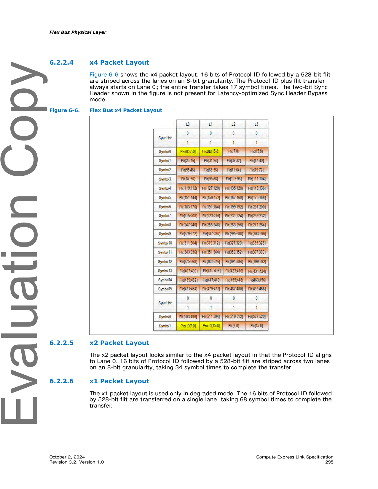
>
> *Original page render @ 150 DPI* — [📄 Full size](figures/chapter_06/page_0295.png)

[⬆️ 返回目录](#-本章目录-table-of-contents)

---

#### 6.2.2.5 x2 Packet Layout | x2 包布局

<table>
<thead>
<tr>
<th width="50%">🇬🇧 English</th>
<th width="50%" style="background-color:#e8e8e8">🇨🇳 中文</th>
</tr>
</thead>
<tbody>
<tr><td>

The x2 packet layout looks similar to the x4 packet layout in that the Protocol ID aligns to Lane 0. 16 bits of Protocol ID followed by a 528-bit flit are striped across two lanes on an 8-bit granularity, taking 34 symbol times to complete the transfer.

</td><td style="background-color:#e8e8e8">

x2 包布局与 x4 包布局类似,Protocol ID 与 Lane 0 对齐。16 bit Protocol ID 后跟 528 bit flit 以 8 bit 粒度在两个 lane 上条带分布,完成传输需要 34 个符号时间。

</td></tr>
</tbody>
</table>

[⬆️ 返回目录](#-本章目录-table-of-contents)

---

#### 6.2.2.6 x1 Packet Layout | x1 包布局

<table>
<thead>
<tr>
<th width="50%">🇬🇧 English</th>
<th width="50%" style="background-color:#e8e8e8">🇨🇳 中文</th>
</tr>
</thead>
<tbody>
<tr><td>

The x1 packet layout is used only in degraded mode. The 16 bits of Protocol ID followed by 528-bit flit are transferred on a single lane, taking 68 symbol times to complete the transfer.

</td><td style="background-color:#e8e8e8">

x1 包布局仅在降级模式下使用。16 bit Protocol ID 后跟 528 bit flit 在单个 lane 上传输,完成传输需要 68 个符号时间。

</td></tr>
</tbody>
</table>

[⬆️ 返回目录](#-本章目录-table-of-contents)

---

#### 6.2.2.7 Special Case: CXL.io — When a TLP Ends on a Flit Boundary | 特殊情况:CXL.io — TLP 在 Flit 边界结束时

<table>
<thead>
<tr>
<th width="50%">🇬🇧 English</th>
<th width="50%" style="background-color:#e8e8e8">🇨🇳 中文</th>
</tr>
</thead>
<tbody>
<tr><td>

For CXL.io traffic, if a TLP ends on a flit boundary and there is no additional CXL.io traffic to send, the receiver still requires a subsequent EDB indication if it is a nullified TLP or all IDLE flit or a DLLP to confirm it is a good TLP before processing the TLP. Figure 6-7 illustrates a scenario where the first CXL.io flit encapsulates a TLP that ends at the flit boundary, and the transmitter has no more TLPs or DLLPs to send. To ensure that the transmitted TLP that ended on the flit boundary is processed by the receiver, a subsequent CXL.io flit containing PCIe IDLE tokens is transmitted. The Link Layer generates the subsequent CXL.io flit.

</td><td style="background-color:#e8e8e8">

对于 CXL.io 业务,如果 TLP 在 flit 边界处结束且没有其他 CXL.io 业务可发送,则接收方在处理 TLP 之前仍需要后续的 EDB 指示(若为作废的 TLP 或全 IDLE flit)或 DLLP 来确认这是一个有效的 TLP。图 6-7 展示了一个场景:第一个 CXL.io flit 封装了在 flit 边界结束的 TLP,且发送方没有更多的 TLP 或 DLLP 可发送。为了确保在 flit 边界结束的已发送 TLP 能被接收方处理,会发送一个包含 PCIe IDLE token 的后续 CXL.io flit。该后续 CXL.io flit 由链路层生成。

</td></tr>
</tbody>
</table>

> **Figure 6-7.** CXL.io TLP Ending on Flit Boundary Example ｜ CXL.io TLP 在 Flit 边界结束示例
>
> 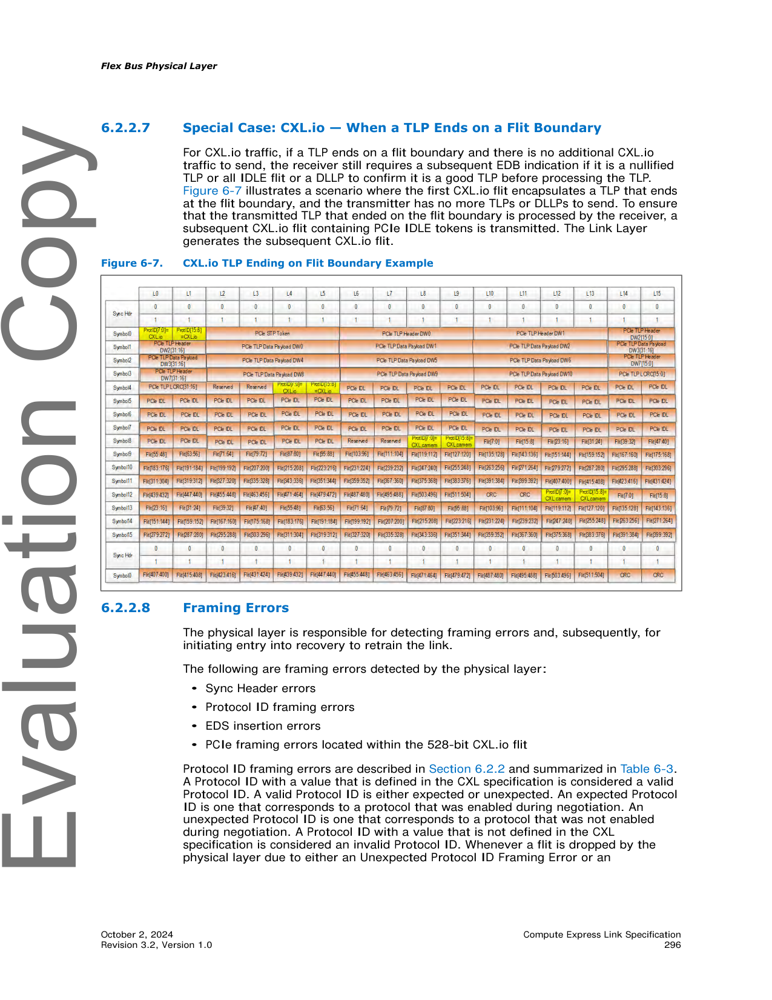
>
> *Original page render @ 150 DPI* — [📄 Full size](figures/chapter_06/page_0296.png)

[⬆️ 返回目录](#-本章目录-table-of-contents)

---

#### 6.2.2.8 Framing Errors | 成帧错误

<table>
<thead>
<tr>
<th width="50%">🇬🇧 English</th>
<th width="50%" style="background-color:#e8e8e8">🇨🇳 中文</th>
</tr>
</thead>
<tbody>
<tr><td>

The physical layer is responsible for detecting framing errors and, subsequently, for initiating entry into recovery to retrain the link.

</td><td style="background-color:#e8e8e8">

物理层负责检测成帧错误,并随后启动进入 Recovery 以重新训练链路。

</td></tr>
<tr><td>

The following are framing errors detected by the physical layer:
- Sync Header errors
- Protocol ID framing errors
- EDS insertion errors
- PCIe framing errors located within the 528-bit CXL.io flit

</td><td style="background-color:#e8e8e8">

以下是物理层检测到的成帧错误:
- Sync Header 错误
- Protocol ID 成帧错误
- EDS 插入错误
- 528 bit CXL.io flit 内的 PCIe 成帧错误

</td></tr>
<tr><td>

Protocol ID framing errors are described in Section 6.2.2 and summarized in Table 6-3. A Protocol ID with a value that is defined in the CXL specification is considered a valid Protocol ID. A valid Protocol ID is either expected or unexpected. An expected Protocol ID is one that corresponds to a protocol that was enabled during negotiation. An unexpected Protocol ID is one that corresponds to a protocol that was not enabled during negotiation. A Protocol ID with a value that is not defined in the CXL specification is considered an invalid Protocol ID. Whenever a flit is dropped by the physical layer due to either an Unexpected Protocol ID Framing Error or an Uncorrectable Protocol ID Framing Error, the physical layer enters LTSSM recovery to retrain the link and notifies the link layers to enter recovery and, if applicable, to initiate link level retry.

</td><td style="background-color:#e8e8e8">

Protocol ID 成帧错误在 6.2.2 节中描述,并在表 6-3 中汇总。其值在 CXL 规范中定义过的 Protocol ID 视为合法的 Protocol ID。合法的 Protocol ID 分为预期或非预期。预期 Protocol ID 对应于协商期间已启用的协议。非预期 Protocol ID 对应于协商期间未启用的协议。其值未在 CXL 规范中定义的 Protocol ID 视为无效的 Protocol ID。每当物理层由于意外的 Protocol ID 成帧错误或不可纠正的 Protocol ID 成帧错误而丢弃 flit 时,物理层会进入 LTSSM Recovery 重新训练链路,并通知链路层进入 Recovery,且在适用的情况下启动链路级重试。

</td></tr>
</tbody>
</table>

**Table 6-3.** Protocol ID Framing Errors | Protocol ID 成帧错误

<table>
<thead>
<tr>
<th>Protocol ID[7:0]</th>
<th>Protocol ID[15:8]</th>
<th style="background-color:#e8e8e8">Expected Action</th>
</tr>
</thead>
<tbody>
<tr><td>Invalid</td><td>Valid & Expected</td><td style="background-color:#e8e8e8">Process normally using Protocol ID[15:8]; Log as CXL_Correctable_Protocol_ID_Framing_Error in DVSEC Flex Bus Port Status register.</td></tr>
<tr><td>Valid & Expected</td><td>Invalid</td><td style="background-color:#e8e8e8">Process normally using Protocol ID[7:0]; Log as CXL_Correctable_Protocol_ID_Framing_Error in DVSEC Flex Bus Port Status register.</td></tr>
<tr><td>Valid & Unexpected</td><td>Valid & Unexpected & Equal to Protocol ID[7:0]</td><td style="background-color:#e8e8e8">Drop flit and log as CXL_Unexpected_Protocol_ID_Dropped in DVSEC Flex Bus Port Status register; enter LTSSM recovery to retrain the link; notify link layers to enter recovery and, if applicable, initiate link level retry</td></tr>
<tr><td>Invalid</td><td>Valid & Unexpected</td><td style="background-color:#e8e8e8">Drop flit and log as CXL_Unexpected_Protocol_ID_Dropped in DVSEC Flex Bus Port Status register; enter LTSSM recovery to retrain the link; notify link layers to enter recovery and, if applicable, initiate link level retry</td></tr>
<tr><td>Valid & Unexpected</td><td>Invalid</td><td style="background-color:#e8e8e8">Drop flit and log as CXL_Unexpected_Protocol_ID_Dropped in DVSEC Flex Bus Port Status register; enter LTSSM recovery to retrain the link; notify link layers to enter recovery and, if applicable, initiate link level retry</td></tr>
<tr><td>Valid</td><td>Valid & Not Equal to Protocol ID[7:0]</td><td style="background-color:#e8e8e8">Drop flit and log as CXL_Uncorrectable_Protocol_ID_Framing_Error in DVSEC Flex Bus Port Status register; enter LTSSM recovery to retrain the link; notify link layers to enter recovery and, if applicable, initiate link level retry</td></tr>
<tr><td>Invalid</td><td>Invalid</td><td style="background-color:#e8e8e8">Drop flit and log as CXL_Uncorrectable_Protocol_ID_Framing_Error in DVSEC Flex Bus Port Status register; enter LTSSM recovery to retrain the link; notify link layers to enter recovery and, if applicable, initiate link level retry</td></tr>
</tbody>
</table>

[⬆️ 返回目录](#-本章目录-table-of-contents)

---

### 6.2.3 256B Flit Mode | 256B Flit 模式

<table>
<thead>
<tr>
<th width="50%">🇬🇧 English</th>
<th width="50%" style="background-color:#e8e8e8">🇨🇳 中文</th>
</tr>
</thead>
<tbody>
<tr><td>

256B Flit mode operation relies on support of PCIe Base Specification. Selection of 68B Flit mode or 256B Flit mode occurs during PCIe link training. Table 6-4 specifies the scenarios in which the link operates in 68B Flit mode and 256B Flit mode. CXL mode is supported at PCIe link rates of 8 GT/s or higher; CXL mode is not supported at 2.5 GT/s or 5 GT/s link rates, regardless of whether PCIe Flit mode is negotiated. If PCIe Flit mode is selected during training, as described in PCIe Base Specification, and the link speed is 8 GT/s or higher, 256B Flit mode is used. If PCIe Flit mode is not selected during training and the link speed is 8 GT/s or higher, 68B Flit mode is used.

</td><td style="background-color:#e8e8e8">

256B Flit 模式的运行依赖 PCIe Base Specification 的支持。68B Flit 模式或 256B Flit 模式的选择发生在 PCIe 链路训练期间。表 6-4 指定了链路运行在 68B Flit 模式和 256B Flit 模式中的具体场景。CXL 模式在 PCIe 链路速率为 8 GT/s 或更高时受支持;在 2.5 GT/s 或 5 GT/s 链路速率下不支持 CXL 模式,无论是否协商了 PCIe Flit 模式。如果在训练期间(按 PCIe Base Specification 所述)选择了 PCIe Flit 模式且链路速率为 8 GT/s 或更高,则使用 256B Flit 模式。如果在训练期间未选择 PCIe Flit 模式且链路速率为 8 GT/s 或更高,则使用 68B Flit 模式。

</td></tr>
</tbody>
</table>

**Table 6-4.** 256B Flit Mode vs. 68B Flit Mode Operation | 256B Flit 模式 vs. 68B Flit 模式运行

<table>
<thead>
<tr>
<th>Data Rate</th>
<th>PCIe Flit Mode</th>
<th>Encoding</th>
<th style="background-color:#e8e8e8">CXL Flit Mode</th>
</tr>
</thead>
<tbody>
<tr><td>2.5 GT/s, 5 GT/s</td><td>No</td><td>8b/10b</td><td style="background-color:#e8e8e8">CXL is not supported</td></tr>
<tr><td>2.5 GT/s, 5 GT/s</td><td>Yes</td><td>8b/10b</td><td style="background-color:#e8e8e8">CXL is not supported</td></tr>
<tr><td>8 GT/s, 16 GT/s, 32 GT/s</td><td>No</td><td>128b/130b</td><td style="background-color:#e8e8e8">68B flits</td></tr>
<tr><td>8 GT/s, 16 GT/s, 32 GT/s</td><td>Yes</td><td>128b/130b</td><td style="background-color:#e8e8e8">256B flits</td></tr>
<tr><td>64 GT/s</td><td>Yes (required)</td><td>1b/1b</td><td style="background-color:#e8e8e8">256B flits</td></tr>
</tbody>
</table>

[⬆️ 返回目录](#-本章目录-table-of-contents)

---

#### 6.2.3.1 256B Flit Format | 256B Flit 格式

<table>
<thead>
<tr>
<th width="50%">🇬🇧 English</th>
<th width="50%" style="background-color:#e8e8e8">🇨🇳 中文</th>
</tr>
</thead>
<tbody>
<tr><td>

The 256B flit leverages several elements from the PCIe flit. There are two variants of the 256B flit:
- Standard 256B flit
- Latency-optimized 256B flit with 128-byte flit halves

</td><td style="background-color:#e8e8e8">

256B flit 利用了 PCIe flit 中的若干元素。256B flit 有两种变体:
- 标准 256B flit
- 带 128 字节半 flit 的低延迟优化 256B flit

</td></tr>
</tbody>
</table>

[⬆️ 返回目录](#-本章目录-table-of-contents)

---

##### 6.2.3.1.1 Standard 256B Flit | 标准 256B Flit

<table>
<thead>
<tr>
<th width="50%">🇬🇧 English</th>
<th width="50%" style="background-color:#e8e8e8">🇨🇳 中文</th>
</tr>
</thead>
<tbody>
<tr><td>

The standard 256B flit format is shown in Figure 6-8. The 256-byte flit includes 2 bytes of Flit Header information as specified in Table 6-5. There are 240 bytes of Flit Data, for which the format differs depending on whether the flit carries CXL.io payload, CXL.cachemem payload, or ALMP payload, or whether an IDLE flit is being transmitted. For CXL.io, the Flit Data includes TLP payload and a 4-byte DLLP payload as specified in PCIe Base Specification; the DLLP payload is located at the end of the Flit Data as shown in Figure 6-9. For CXL.cachemem, the Flit Data format is specified in Chapter 4.0. The 8 bytes of CRC protects the Flit Header and Flit Data and is calculated as specified in PCIe Base Specification. The 6 bytes of FEC protects the Flit Header, Flit Data, and CRC, and is calculated as specified in PCIe Base Specification. The application of flit bits to the PCIe physical lanes is shown in Figure 6-10.

</td><td style="background-color:#e8e8e8">

标准 256B flit 格式如图 6-8 所示。256 字节 flit 包含 2 字节的 Flit Header 信息,如表 6-5 所示。Flit Data 共 240 字节,其格式根据 flit 承载的是 CXL.io 有效载荷、CXL.cachemem 有效载荷、ALMP 有效载荷,还是 IDLE flit 而有所不同。对于 CXL.io,Flit Data 包含 TLP 有效载荷和 4 字节的 DLLP 有效载荷,如 PCIe Base Specification 所规定;DLLP 有效载荷位于 Flit Data 的末尾,如图 6-9 所示。对于 CXL.cachemem,Flit Data 格式在第 4.0 章中规定。8 字节 CRC 保护 Flit Header 和 Flit Data,计算方法如 PCIe Base Specification 所规定。6 字节 FEC 保护 Flit Header、Flit Data 和 CRC,计算方法如 PCIe Base Specification 所规定。flit bit 在 PCIe 物理 lane 上的应用如图 6-10 所示。

</td></tr>
<tr><td>

The 2 bytes of Flit Header as defined in Table 6-5 are transmitted as the first two bytes of the flit. The 2-bit Flit Type field indicates whether the flit carries CXL.io traffic, CXL.cachemem traffic, ALMPs, IDLE flits, Empty flits, or NOP flits. Please refer to Section 6.2.3.1.1.1 for more details. The Prior Flit Type definition is as defined in PCIe Base Specification; it enables the receiver to know that the prior flit was an NOP flit or IDLE flit, and thus does not require replay (i.e., can be discarded) if it has a CRC error. The Type of DLLP Payload definition is as defined in PCIe Base Specification for CXL.io flits; otherwise, this bit is reserved. The Replay Command[1:0] and Flit Sequence Number[9:0] definitions are as defined in PCIe Base Specification.

</td><td style="background-color:#e8e8e8">

表 6-5 定义的 2 字节 Flit Header 作为 flit 的前两个字节传输。2 bit 的 Flit Type 字段指示该 flit 承载的是 CXL.io 业务、CXL.cachemem 业务、ALMP、IDLE flit、Empty flit 还是 NOP flit。更多细节请参见 6.2.3.1.1.1 节。Prior Flit Type 的定义如 PCIe Base Specification 所规定;它使接收方能够知道前一个 flit 是 NOP flit 或 IDLE flit,因此如果出现 CRC 错误则不需要重放(即可以丢弃)。Type of DLLP Payload 的定义与 PCIe Base Specification 中针对 CXL.io flit 的定义相同;否则该 bit 为保留。Replay Command[1:0] 和 Flit Sequence Number[9:0] 的定义如 PCIe Base Specification 所规定。

</td></tr>
</tbody>
</table>

> **Figure 6-8.** Standard 256B Flit ｜ 标准 256B Flit
>
> 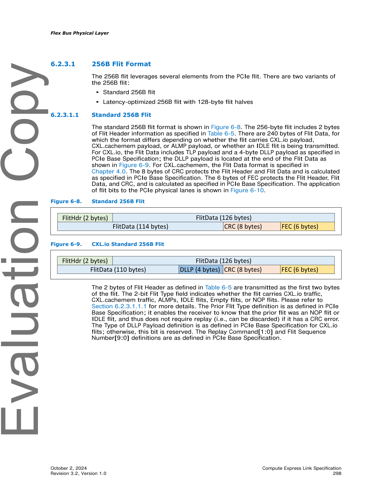
>
> *Original page render @ 150 DPI* — [📄 Full size](figures/chapter_06/page_0298.png)

> **Figure 6-9.** CXL.io Standard 256B Flit ｜ CXL.io 标准 256B Flit
>
> 
>
> *Original page render @ 150 DPI* — [📄 Full size](figures/chapter_06/page_0298.png)

**Table 6-5.** 256B Flit Header | 256B Flit 头部

<table>
<thead>
<tr>
<th>Flit Header Field</th>
<th>Bit Location</th>
<th style="background-color:#e8e8e8">Description</th>
</tr>
</thead>
<tbody>
<tr><td>Flit Type[1:0]</td><td>[7:6]</td><td style="background-color:#e8e8e8">00b = Physical Layer IDLE flit or Physical Layer NOP flit or CXL.io NOP flit 01b = CXL.io Payload flit 10b = If CXL.cachemem is enabled, CXL.cachemem Payload flit or CXL.cachemem-generated Empty flit; reserved if CXL.cachemem is not enabled 11b = ALMP Please refer to Table 6-6 for more details.</td></tr>
<tr><td>Prior Flit Type</td><td>[5]</td><td style="background-color:#e8e8e8">0 = Prior flit was a NOP or IDLE flit (not allocated into Replay buffer) 1 = Prior flit was a Payload flit or Empty flit (allocated into Replay buffer)</td></tr>
<tr><td>Type of DLLP Payload</td><td>[4]</td><td style="background-color:#e8e8e8">If (Flit Type = (CXL.io Payload or CXL.io NOP): Use as defined in PCIe Base Specification If (Flit Type != (CXL.io Payload or CXL.io NOP)): Reserved</td></tr>
<tr><td>Replay Command[1:0]</td><td>[3:2]</td><td style="background-color:#e8e8e8">Same as defined in PCIe Base Specification.</td></tr>
<tr><td>Flit Sequence Number[9:0]</td><td>{[1:0], [15:8]}</td><td style="background-color:#e8e8e8">10-bit Sequence Number as defined in PCIe Base Specification. When the transmission of a NOP Flit is required while a replay is in progress (i.e., when the REPLAY_IN_PROGRESS variable is 1b), it is strongly recommended1 that the transmitter set the Explicit Sequence Number to the Sequence Number of the previous Payload Flit that was sent (instead of NEXT_TX_FLIT_SEQ_NUM – 1). This recommendation applies to any reference made to the Explicit Sequence Number of NOP Flits.</td></tr>
</tbody>
</table>

1 Future revisions of the specification will make this recommendation mandatory.

> **Note:** If an Explicit Sequence Number NOP Flit is sent during Replay with the sequence number NEXT_TX_FLIT_SEQ_NUM – 1 and it is followed by a Payload Flit with an Implicit Sequence Number, a Nak Schedule 2 may be triggered or valid data may be placed in an invalid location.

[⬆️ 返回目录](#-本章目录-table-of-contents)

---

###### 6.2.3.1.1.1 256B Flit Type | 256B Flit 类型

<table>
<thead>
<tr>
<th width="50%">🇬🇧 English</th>
<th width="50%" style="background-color:#e8e8e8">🇨🇳 中文</th>
</tr>
</thead>
<tbody>
<tr><td>

Table 6-6 specifies the different flit payloads that are associated with each Flit Type encoding.

</td><td style="background-color:#e8e8e8">

表 6-6 详细列出了与每个 Flit Type 编码关联的不同 flit 有效载荷。

</td></tr>
<tr><td>

Prior to the Sequence Number Handshake upon each entry to L0, as described in PCIe Base Specification, a Flit Type encoding of 00b indicates an IDLE flit. These IDLE flits contain all zeros payload and are generated and consumed by the Physical Layer. During and after the Sequence Number Handshake in L0, a Flit Type encoding of 00b indicates either a Physical Layer NOP flit or a CXL.io NOP flit. The Physical Layer must insert NOP flits when it backpressures the upper layers due to its Tx retry buffer filling up; it is also required to insert NOP flits when traffic is not generated by the upper layers. These NOP flits must not be allocated into the transmit retry buffer or receive retry buffer. Physical Layer NOP flits carry 0s in the bit positions that correspond to the bit positions in CXL.io flits that are used to carry DLLP payload; the remaining bits in Physical Layer NOP flits are reserved.

</td><td style="background-color:#e8e8e8">

在每次进入 L0 时(按 PCIe Base Specification 所述)的 Sequence Number 握手之前,Flit Type 编码 00b 表示 IDLE flit。这些 IDLE flit 包含全 0 有效载荷,由物理层生成和消费。在 L0 中及之后的 Sequence Number 握手期间,Flit Type 编码 00b 表示物理层 NOP flit 或 CXL.io NOP flit。当物理层由于其 Tx 重试缓冲区填满而对上层施加背压时,必须插入 NOP flit;当上层不产生业务时,也必须插入 NOP flit。这些 NOP flit 不得分配到发送重试缓冲区或接收重试缓冲区。物理层 NOP flit 在对应于 CXL.io flit 中用于承载 DLLP 有效载荷的 bit 位置上承载 0;物理层 NOP flit 中的其余 bit 为保留。

</td></tr>
<tr><td>

CXL.io NOP flits are generated by the CXL.io Link Layer and carry only valid DLLP payload. When a Flit Type of 00b is decoded, the Physical Layer must always check for valid DLLP payload. CXL.io NOP flits must not be allocated into the transmit retry buffer or into the receive retry buffer.

</td><td style="background-color:#e8e8e8">

CXL.io NOP flit 由 CXL.io 链路层生成,仅承载有效的 DLLP 有效载荷。当解码到 Flit Type 00b 时,物理层必须始终检查有效的 DLLP 有效载荷。CXL.io NOP flit 不得分配到发送重试缓冲区或接收重试缓冲区。

</td></tr>
<tr><td>

A Flit Type encoding of 01b indicates CXL.io Payload traffic; these flits can encapsulate both valid TLP payload and valid DLLP payload.

</td><td style="background-color:#e8e8e8">

Flit Type 编码 01b 表示 CXL.io Payload 业务;这些 flit 可以同时封装有效的 TLP 有效载荷和有效的 DLLP 有效载荷。

</td></tr>
<tr><td>

A Flit Type encoding of 10b indicates either a flit with valid CXL.cachemem Payload flit or a CXL.cachemem Empty flit; this enables CXL.cachemem to minimize idle to valid traffic transitions by arbitrating for use of the ARB/MUX transmit data path even while it does not have valid traffic to send so that it can potentially fill later slots in the flit with late arriving traffic, instead of requiring CXL.cachemem to wait until the next 256-byte flit boundary to begin transmitting valid traffic. CXL.cachemem Empty flits are retryable and must be allocated in the transmit retry buffer. The Physical Layer must decode the Link Layer CRD[4:0] bits to determine whether the flit carries valid payload or whether the flit is an empty CXL.cachemem Empty flit. See Table 4-19 in Chapter 4.0 for more details.

</td><td style="background-color:#e8e8e8">

Flit Type 编码 10b 表示有效的 CXL.cachemem Payload flit 或 CXL.cachemem Empty flit;这使 CXL.cachemem 能够通过仲裁使用 ARB/MUX 发送数据路径来最小化空闲到有效业务的跃迁,即使在没有有效业务可发送时也可以进行仲裁,以便稍后可能用迟到的业务填充 flit 中后续的 slot,而不是要求 CXL.cachemem 等待下一个 256 字节 flit 边界才开始发送有效业务。CXL.cachemem Empty flit 是可重试的,必须分配到发送重试缓冲区。物理层必须解码链路层 CRD[4:0] bit 以确定该 flit 承载的是有效有效载荷还是 CXL.cachemem Empty flit。更多细节请参见第 4.0 章中的表 4-19。

</td></tr>
<tr><td>

A Flit Type encoding of 11b indicates an ALMP.

</td><td style="background-color:#e8e8e8">

Flit Type 编码 11b 表示 ALMP。

</td></tr>
</tbody>
</table>

**Table 6-6.** Flit Type[1:0] Encoding | Flit Type[1:0] 编码

<table>
<thead>
<tr>
<th>Flit Type[1:0]</th>
<th>Flit Payload</th>
<th>Source</th>
<th style="background-color:#e8e8e8">Description</th>
<th style="background-color:#e8e8e8">Allocated to Retry Buffer?</th>
</tr>
</thead>
<tbody>
<tr><td>00b</td><td>Physical Layer NOP</td><td>Physical Layer</td><td style="background-color:#e8e8e8">Physical Layer generated (and sunk) flit with no valid payload; inserted in the data stream when its Tx retry buffer is full and it is backpressuring the upper layer or when no other flits from upper layers are available to transmit.</td><td style="background-color:#e8e8e8">No</td></tr>
<tr><td>00b</td><td>IDLE</td><td>Physical Layer</td><td style="background-color:#e8e8e8">Physical Layer generated (and consumed) all 0s payload flit used to facilitate LTSSM transitions as described in PCIe Base Specification.</td><td style="background-color:#e8e8e8">No</td></tr>
<tr><td>00b</td><td>CXL.io NOP</td><td>CXL.io Link Layer</td><td style="background-color:#e8e8e8">Valid CXL.io DLLP payload (no TLP payload); periodically inserted by the CXL.io link layer to satisfy the PCIe Base Specification requirement for a credit update interval if no other CXL.io flits are available to transmit.</td><td style="background-color:#e8e8e8">No</td></tr>
<tr><td>01b</td><td>CXL.io Payload</td><td>CXL.io Link Layer</td><td style="background-color:#e8e8e8">Valid CXL.io TLP and valid DLLP payload.</td><td style="background-color:#e8e8e8">Yes</td></tr>
<tr><td>10b</td><td>CXL.cachemem Payload</td><td>CXL.cachemem Link Layer</td><td style="background-color:#e8e8e8">Valid CXL.cachemem slot and/or CXL.cachemem credit payload.</td><td style="background-color:#e8e8e8">Yes</td></tr>
<tr><td>10b</td><td>CXL.cachemem Empty</td><td>CXL.cachemem Link Layer</td><td style="background-color:#e8e8e8">No valid CXL.cachemem payload; generated when CXL.cachemem link layer speculatively arbitrates to transfer a flit to reduce idle to valid transition time but no valid CXL.cachemem payload arrives in time to use any slots in the flit.</td><td style="background-color:#e8e8e8">Yes, allocate only to the Tx Retry Buffer</td></tr>
<tr><td>11b</td><td>ALMP</td><td>ARB/MUX</td><td style="background-color:#e8e8e8">ARB/MUX Link Management Packet.</td><td style="background-color:#e8e8e8">Yes</td></tr>
</tbody>
</table>

<table>
<thead>
<tr>
<th width="50%">🇬🇧 English</th>
<th width="50%" style="background-color:#e8e8e8">🇨🇳 中文</th>
</tr>
</thead>
<tbody>
<tr><td>

Figure 6-10 shows how the flit is mapped to the physical lanes on the link. The flit is striped across the lanes on an 8-bit granularity starting with 16-bit Flit Header, followed by the 240 bytes of Flit Data, the 8-byte CRC, and finally the 6-byte FEC (3-way interleaved ECC described in PCIe Base Specification).

</td><td style="background-color:#e8e8e8">

图 6-10 显示了 flit 如何映射到链路上的物理 lane。flit 以 8 bit 粒度在 lane 上条带分布,首先为 16 bit Flit Header,然后是 240 字节 Flit Data、8 字节 CRC,最后是 6 字节 FEC(PCIe Base Specification 中所述的三路交织 ECC)。

</td></tr>
</tbody>
</table>

> **Figure 6-10.** Standard 256B Flit Applied to Physical Lanes (x16) ｜ 应用到物理 lane 的标准 256B Flit (x16)
>
> 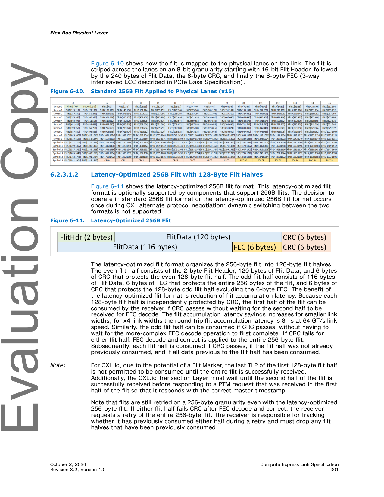
>
> *Original page render @ 150 DPI* — [📄 Full size](figures/chapter_06/page_0301.png)

[⬆️ 返回目录](#-本章目录-table-of-contents)

---

##### 6.2.3.1.2 Latency-Optimized 256B Flit with 128-Byte Flit Halves | 带 128 字节半 Flit 的低延迟优化 256B Flit

<table>
<thead>
<tr>
<th width="50%">🇬🇧 English</th>
<th width="50%" style="background-color:#e8e8e8">🇨🇳 中文</th>
</tr>
</thead>
<tbody>
<tr><td>

Figure 6-11 shows the latency-optimized 256B flit format. This latency-optimized flit format is optionally supported by components that support 256B flits. The decision to operate in standard 256B flit format or the latency-optimized 256B flit format occurs once during CXL alternate protocol negotiation; dynamic switching between the two formats is not supported.

</td><td style="background-color:#e8e8e8">

图 6-11 显示了低延迟优化 256B flit 格式。该低延迟优化 flit 格式由支持 256B flit 的组件可选地支持。运行在标准 256B flit 格式还是低延迟优化 256B flit 格式的决定在 CXL 替代协议协商期间确定一次;不支持两种格式之间的动态切换。

</td></tr>
<tr><td>

The latency-optimized flit format organizes the 256-byte flit into 128-byte flit halves. The even flit half consists of the 2-byte Flit Header, 120 bytes of Flit Data, and 6 bytes of CRC that protects the even 128-byte flit half. The odd flit half consists of 116 bytes of Flit Data, 6 bytes of FEC that protects the entire 256 bytes of the flit, and 6 bytes of CRC that protects the 128-byte odd flit half excluding the 6-byte FEC. The benefit of the latency-optimized flit format is reduction of flit accumulation latency. Because each 128-byte flit half is independently protected by CRC, the first half of the flit can be consumed by the receiver if CRC passes without waiting for the second half to be received for FEC decode. The flit accumulation latency savings increases for smaller link widths; for x4 link widths the round trip flit accumulation latency is 8 ns at 64 GT/s link speed. Similarly, the odd flit half can be consumed if CRC passes, without having to wait for the more-complex FEC decode operation to first complete. If CRC fails for either flit half, FEC decode and correct is applied to the entire 256-byte flit. Subsequently, each flit half is consumed if CRC passes, if the flit half was not already previously consumed, and if all data previous to the flit half has been consumed.

</td><td style="background-color:#e8e8e8">

低延迟优化 flit 格式将 256 字节的 flit 组织为 128 字节的半 flit。偶数半 flit 由 2 字节的 Flit Header、120 字节的 Flit Data 和 6 字节的 CRC(保护偶数 128 字节半 flit)组成。奇数半 flit 由 116 字节的 Flit Data、6 字节的 FEC(保护整个 256 字节 flit)和 6 字节的 CRC(保护 128 字节奇数半 flit,不含 6 字节 FEC)组成。低延迟优化 flit 格式的优点是降低了 flit 累积延迟。由于每个 128 字节半 flit 由 CRC 独立保护,如果 CRC 通过,接收方可以消费 flit 的前一半,无需等待接收完第二半再进行 FEC 解码。链路宽度越小,flit 累积延迟的节省越多;对于 x4 链路宽度,在 64 GT/s 链路速率下,往返 flit 累积延迟为 8 ns。类似地,如果奇数半 flit 的 CRC 通过,也可以消费,无需等待更复杂的 FEC 解码操作首先完成。如果任一半 flit 的 CRC 失败,则对整个 256 字节 flit 应用 FEC 解码和纠错。随后,如果 CRC 通过、该半 flit 之前未被消费、且该半 flit 之前的所有数据均已被消费,则消费该半 flit。

</td></tr>
<tr><td>

Note: For CXL.io, due to the potential of a Flit Marker, the last TLP of the first 128-byte flit half is not permitted to be consumed until the entire flit is successfully received. Additionally, the CXL.io Transaction Layer must wait until the second half of the flit is successfully received before responding to a PTM request that was received in the first half of the flit so that it responds with the correct master timestamp.

</td><td style="background-color:#e8e8e8">

注意:对于 CXL.io,由于可能存在 Flit Marker,在成功接收整个 flit 之前,不允许消费第一个 128 字节半 flit 中的最后一个 TLP。此外,CXL.io 事务层必须等待 flit 的第二半成功接收后,才能响应在 flit 第一半中收到的 PTM 请求,以便用正确的主时间戳进行响应。

</td></tr>
<tr><td>

Note that flits are still retried on a 256-byte granularity even with the latency-optimized 256-byte flit. If either flit half fails CRC after FEC decode and correct, the receiver requests a retry of the entire 256-byte flit. The receiver is responsible for tracking whether it has previously consumed either half during a retry and must drop any flit halves that have been previously consumed.

</td><td style="background-color:#e8e8e8">

请注意,即使使用低延迟优化的 256 字节 flit,flit 的重试仍以 256 字节为粒度。如果任一半 flit 在 FEC 解码和纠错之后 CRC 失败,接收方会请求重试整个 256 字节 flit。接收方负责跟踪在重试期间是否已消费任一半 flit,并必须丢弃之前已消费过的半 flit。

</td></tr>
</tbody>
</table>

> **Figure 6-11.** Latency-Optimized 256B Flit ｜ 低延迟优化 256B Flit
>
> 
>
> *Original page render @ 150 DPI* — [📄 Full size](figures/chapter_06/page_0301.png)

<table>
<thead>
<tr>
<th width="50%">🇬🇧 English</th>
<th width="50%" style="background-color:#e8e8e8">🇨🇳 中文</th>
</tr>
</thead>
<tbody>
<tr><td>

The following error scenario example illustrates how latency-optimized flits are processed. The even flit half passes CRC check prior to FEC decode and is consumed. The odd flit half fails CRC check. The FEC decode and correct is applied to the 256-byte flit; subsequently, the even flit half now fails CRC and the odd flit half passes. In this scenario, the FEC correction is suspect since a previously passing CRC check now fails. The receiver requests a retry of the 256-byte flit, and the odd flit half is consumed from the retransmitted flit, assuming it passes FEC and CRC checks. Note that even though the even flit half failed CRC post-FEC correction in the original flit, the receiver must not re-consume the even flit half from the retransmitted flit. The expectation is that this scenario occurs most likely due to multiple errors in the odd flit half exceeding FEC correction capability, thus causing additional errors to be injected due to FEC correction.

</td><td style="background-color:#e8e8e8">

以下错误场景示例说明了低延迟优化 flit 的处理方式。偶数半 flit 在 FEC 解码之前通过 CRC 检查并被消费。奇数半 flit 未通过 CRC 检查。对 256 字节 flit 应用 FEC 解码和纠错;随后,偶数半 flit 现在未通过 CRC,而奇数半 flit 通过。在这种情况下,FEC 纠错是可疑的,因为之前通过的 CRC 检查现在失败。接收方请求重试 256 字节 flit,并从重传的 flit 中消费奇数半 flit(假设其通过 FEC 和 CRC 检查)。请注意,即使偶数半 flit 在原始 flit 中经过 FEC 纠错后未通过 CRC,接收方也不应从重传的 flit 中重新消费偶数半 flit。预期这种场景最可能是由于奇数半 flit 中的多个错误超出了 FEC 纠错能力,从而导致由于 FEC 纠错而引入额外的错误。

</td></tr>
<tr><td>

Table 6-7 summarizes processing steps for different CRC scenarios, depending on results of the CRC check for the even flit half and the odd flit half on the original flit, the post-FEC corrected flit, and the retransmitted flit.

</td><td style="background-color:#e8e8e8">

表 6-7 汇总了不同 CRC 场景下的处理步骤,具体取决于原始 flit、FEC 纠错后 flit 和重传 flit 的偶数半 flit 和奇数半 flit 的 CRC 检查结果。

</td></tr>
</tbody>
</table>

**Table 6-7.** Latency-Optimized Flit Processing for CRC Scenarios (Sheet 1 of 2) | CRC 场景下的低延迟 Flit 处理(第 1 页,共 2 页)

<table>
<thead>
<tr>
<th colspan="3">Original Flit</th>
<th colspan="3">Post-FEC Corrected Flit</th>
<th colspan="3" style="background-color:#e8e8e8">Retransmitted Flit</th>
</tr>
<tr>
<th>Even CRC</th>
<th>Odd CRC</th>
<th>Action</th>
<th>Even CRC</th>
<th>Odd CRC</th>
<th>Subsequent Action</th>
<th>Even CRC</th>
<th>Odd CRC</th>
<th style="background-color:#e8e8e8">Subsequent Action</th>
</tr>
</thead>
<tbody>
<tr><td>Pass</td><td>Pass</td><td>Consume Flit</td><td>N/A</td><td>N/A</td><td>N/A</td><td>N/A</td><td>N/A</td><td style="background-color:#e8e8e8">N/A</td></tr>
<tr><td>Pass</td><td>Fail</td><td>Permitted to consume even flit half; perform FEC decode and correct</td><td>Pass</td><td>Pass</td><td>Consume even flit half if not previously consumed (must drop even flit half if previously consumed); Consume odd flit half</td><td>N/A</td><td>N/A</td><td style="background-color:#e8e8e8">N/A</td></tr>
<tr><td>Pass</td><td>Fail</td><td>Permitted to consume even flit half if not previously consumed; Request Retry</td><td>Pass</td><td>Pass</td><td>Consume even flit half if not previously consumed (must drop even flit half if previously consumed); Consume odd flit half</td><td>Pass</td><td>Fail</td><td style="background-color:#e8e8e8">Permitted to consume even flit half if not previously consumed (must drop even flit half if previously consumed); perform FEC decode and correct</td></tr>
<tr><td>Fail</td><td>Pass/Fail</td><td>Perform FEC decode and correct and evaluate next steps</td><td>Fail</td><td>Pass/Fail</td><td>Request Retry; Log error for even flit half if previously consumed1</td><td>Pass</td><td>Pass</td><td style="background-color:#e8e8e8">Consume even flit half if not previously consumed (must drop even flit half if previously consumed); Consume odd flit half</td></tr>
<tr><td>Pass</td><td>Fail</td><td>Permitted to consume even flit half if not previously consumed (must drop even flit half if previously consumed); perform FEC decode and correct</td><td>Fail</td><td>Pass</td><td>Perform FEC decode and correct and evaluate next steps</td><td>Fail</td><td>Pass</td><td style="background-color:#e8e8e8">Perform FEC decode and correct and evaluate next steps</td></tr>
<tr><td>Fail</td><td>Fail</td><td>Perform FEC decode and correct and evaluate next steps</td><td></td><td></td><td></td><td></td><td></td><td style="background-color:#e8e8e8"></td></tr>
</tbody>
</table>

<table>
<thead>
<tr>
<th width="50%">🇬🇧 English</th>
<th width="50%" style="background-color:#e8e8e8">🇨🇳 中文</th>
</tr>
</thead>
<tbody>
<tr><td>

For CXL.io, the Flit Data includes TLP and DLLP payload; the 4-bytes of DLLP are transferred just before the FEC in the flit as shown in Figure 6-12.

</td><td style="background-color:#e8e8e8">

对于 CXL.io,Flit Data 包含 TLP 和 DLLP 有效载荷;4 字节的 DLLP 在 flit 中正好在 FEC 之前传输,如图 6-12 所示。

</td></tr>
</tbody>
</table>

> **Figure 6-12.** CXL.io Latency-Optimized 256B Flit ｜ CXL.io 低延迟优化 256B Flit
>
> 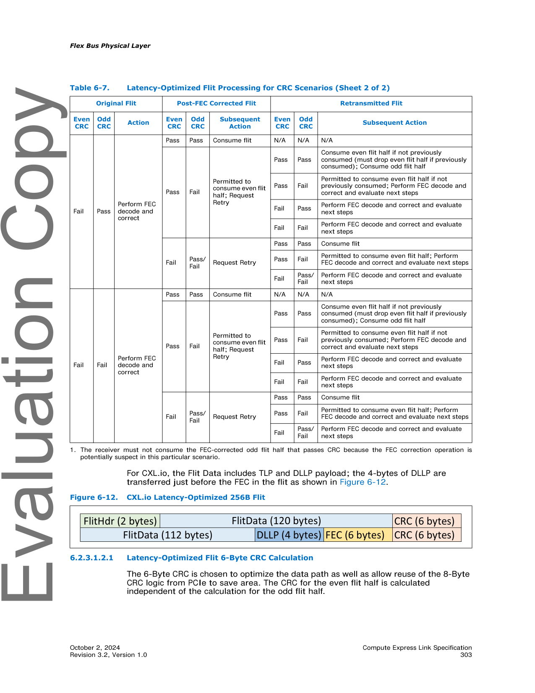
>
> *Original page render @ 150 DPI* — [📄 Full size](figures/chapter_06/page_0303.png)

[⬆️ 返回目录](#-本章目录-table-of-contents)

---

###### 6.2.3.1.2.1 Latency-Optimized Flit 6-Byte CRC Calculation | 低延迟 Flit 的 6 字节 CRC 计算

<table>
<thead>
<tr>
<th width="50%">🇬🇧 English</th>
<th width="50%" style="background-color:#e8e8e8">🇨🇳 中文</th>
</tr>
</thead>
<tbody>
<tr><td>

The 6-Byte CRC is chosen to optimize the data path as well as allow reuse of the 8-Byte CRC logic from PCIe to save area. The CRC for the even flit half is calculated independent of the calculation for the odd flit half.

</td><td style="background-color:#e8e8e8">

选择 6 字节 CRC 是为了优化数据路径,并允许复用 PCIe 的 8 字节 CRC 逻辑以节省面积。偶数半 flit 的 CRC 与奇数半 flit 的 CRC 独立计算。

</td></tr>
</tbody>
</table>

**Table 6-7 (Sheet 2 of 2).** Latency-Optimized Flit Processing for CRC Scenarios (continued) | CRC 场景下的低延迟 Flit 处理(第 2 页,共 2 页)

<table>
<thead>
<tr>
<th colspan="3">Original Flit</th>
<th colspan="3">Post-FEC Corrected Flit</th>
<th colspan="3" style="background-color:#e8e8e8">Retransmitted Flit</th>
</tr>
<tr>
<th>Even CRC</th>
<th>Odd CRC</th>
<th>Action</th>
<th>Even CRC</th>
<th>Odd CRC</th>
<th>Subsequent Action</th>
<th>Even CRC</th>
<th>Odd CRC</th>
<th style="background-color:#e8e8e8">Subsequent Action</th>
</tr>
</thead>
<tbody>
<tr><td>Fail</td><td>Pass</td><td>Perform FEC decode and correct</td><td>Pass</td><td>Pass</td><td>Consume flit</td><td>N/A</td><td>N/A</td><td style="background-color:#e8e8e8">N/A</td></tr>
<tr><td>Pass</td><td>Fail</td><td>Permitted to consume even flit half; Request Retry</td><td>Pass</td><td>Pass</td><td>Consume even flit half if not previously consumed (must drop even flit half if previously consumed); Consume odd flit half</td><td>Pass</td><td>Fail</td><td style="background-color:#e8e8e8">Permitted to consume even flit half if not previously consumed; Perform FEC decode and correct and evaluate next steps</td></tr>
<tr><td>Fail</td><td>Pass</td><td>Perform FEC decode and correct and evaluate next steps</td><td>Fail</td><td>Pass</td><td>Perform FEC decode and correct and evaluate next steps</td><td>Fail</td><td>Fail</td><td style="background-color:#e8e8e8">Perform FEC decode and correct and evaluate next steps</td></tr>
<tr><td>Fail</td><td>Pass/Fail</td><td>Request Retry</td><td>Pass</td><td>Pass</td><td>Consume flit</td><td>Pass</td><td>Fail</td><td style="background-color:#e8e8e8">Permitted to consume even flit half; Perform FEC decode and correct and evaluate next steps</td></tr>
<tr><td>Fail</td><td>Pass/Fail</td><td>Perform FEC decode and correct and evaluate next steps</td><td>Fail</td><td>Fail</td><td>Perform FEC decode and correct</td><td>Pass</td><td>Pass</td><td style="background-color:#e8e8e8">Consume flit</td></tr>
<tr><td>Pass</td><td>Fail</td><td>Permitted to consume even flit half; Request Retry</td><td>Pass</td><td>Pass</td><td>Consume even flit half if not previously consumed (must drop even flit half if previously consumed); Consume odd flit half</td><td>Pass</td><td>Fail</td><td style="background-color:#e8e8e8">Permitted to consume even flit half if not previously consumed (must drop even flit half if previously consumed); perform FEC decode and correct and evaluate next steps</td></tr>
<tr><td>Fail</td><td>Pass</td><td>Perform FEC decode and correct and evaluate next steps</td><td>Fail</td><td>Fail</td><td>Perform FEC decode and correct and evaluate next steps</td><td>Fail</td><td>Pass</td><td style="background-color:#e8e8e8">Perform FEC decode and correct and evaluate next steps</td></tr>
<tr><td>Fail</td><td>Fail</td><td>Perform FEC decode and correct and evaluate next steps</td><td>Fail</td><td>Pass/Fail</td><td>Request Retry</td><td>Pass</td><td>Pass</td><td style="background-color:#e8e8e8">Consume flit</td></tr>
</tbody>
</table>

1 The receiver must not consume the FEC-corrected odd flit half that passes CRC because the FEC correction operation is potentially suspect in this particular scenario.

<table>
<thead>
<tr>
<th width="50%">🇬🇧 English</th>
<th width="50%" style="background-color:#e8e8e8">🇨🇳 中文</th>
</tr>
</thead>
<tbody>
<tr><td>

A (130, 136) Reed-Solomon code is used, where six bytes of CRC are generated over a 130-byte message to generate a 136-byte codeword. For the even flit half, bytes 0 to 121 of the message are the 122 non-CRC bytes of the flit (with byte 0 of flit mapping to byte 0 of the message, byte 1 of the flit mapping to byte 1 of the message and so on), whereas bytes 122 to 129 are zero (these are not sent on the link, but both transmitter and receiver must zero pad the remaining bytes before computing CRC). For the odd flit half, bytes 0 to 115 of the message are the 116 non-CRC and non-FEC bytes of the flit (with byte 128 of the flit mapping to byte 0 of the message, byte 129 of the flit mapping to byte 1 of the message and so on), whereas bytes 116 to 129 of the message are zero.

</td><td style="background-color:#e8e8e8">

使用 (130, 136) Reed-Solomon 码,其中在 130 字节消息上生成 6 字节 CRC,以生成 136 字节的码字。对于偶数半 flit,消息的字节 0 到 121 是 flit 的 122 个非 CRC 字节(flit 字节 0 映射到消息字节 0,flit 字节 1 映射到消息字节 1,依此类推),而字节 122 到 129 为零(这些不在链路上发送,但发送方和接收方都必须在计算 CRC 之前将剩余字节零填充)。对于奇数半 flit,消息的字节 0 到 115 是 flit 的 116 个非 CRC 且非 FEC 字节(flit 字节 128 映射到消息字节 0,flit 字节 129 映射到消息字节 1,依此类推),而消息的字节 116 到 129 为零。

</td></tr>
<tr><td>

The CRC generator polynomial defined over GF(28), is g(x) = (x + α2) ... (x + α6), where α is the root of the primitive polynomial of degree 8: x8 + x5 + x3 + x + 1. Thus, g(x) = x6 + α147x5 + α107x4 + α250x3 + α114x2 + α161x + α21.

</td><td style="background-color:#e8e8e8">

定义在 GF(28) 上的 CRC 生成多项式为 g(x) = (x + α2) ... (x + α6),其中 α 是 8 次本原多项式 x8 + x5 + x3 + x + 1 的根。因此,g(x) = x6 + α147x5 + α107x4 + α250x3 + α114x2 + α161x + α21。

</td></tr>
<tr><td>

When reusing the PCIe logic of 8B CRC generation, the first step is to generate the 8-Byte CRC from the PCIe logic. The flit bytes must be mapped to a specific location within the 242 bytes of input to the PCIe logic of 8B CRC generation.

</td><td style="background-color:#e8e8e8">

在复用 PCIe 的 8B CRC 生成逻辑时,第一步是从 PCIe 逻辑生成 8 字节 CRC。flit 字节必须映射到 PCIe 8B CRC 生成逻辑输入的 242 字节中的特定位置。

</td></tr>
<tr><td>

If the polynomial form of the result is: r'(x) = r7x7 + r6x6 + r5x5 + r4x4 + r3x3 + r2x2 + r1x + r0, then the 6-Byte CRC can be computed using the following (equation shows the polynomial form of the 6-Byte CRC):

</td><td style="background-color:#e8e8e8">

如果结果的多项式形式为:r'(x) = r7x7 + r6x6 + r5x5 + r4x4 + r3x3 + r2x2 + r1x + r0,则可以使用以下方法计算 6 字节 CRC(公式显示 6 字节 CRC 的多项式形式):

r(x) = (r5 + α147r6 + α90r7)x5 + (r4 + α107r6 + α202r7)x4 + (r3 + α250r6 + α41r7)x3 + (r2 + α114r6 + α63r7)x2 + (r1 + α161r6 + α147r7)x + (r0 + α21r6 + α168r7)

</td></tr>
<tr><td>

Figure 6-13 shows the two concepts of computing the 6-Byte CRC.

</td><td style="background-color:#e8e8e8">

图 6-13 显示了计算 6 字节 CRC 的两种概念。

</td></tr>
<tr><td>

The following are provided as attachments to the CXL specification:
- 6B CRC generator matrix (see PCIe Base Specification for the 8B CRC generator matrix).
- 6B CRC Register Transfer Level (RTL) code (see PCIe Base Specification for the 8B CRC RTL code). A single module with 122 bytes of input and 128 bytes of output is provided and can be used for both the even flit half and the odd flit half (by assigning bytes 116 to 121 of the input to be 00h for the odd flit half).

</td><td style="background-color:#e8e8e8">

以下内容作为 CXL 规范的附件提供:
- 6B CRC 生成器矩阵(有关 8B CRC 生成器矩阵,请参见 PCIe Base Specification)。
- 6B CRC 寄存器传输级(RTL)代码(有关 8B CRC RTL 代码,请参见 PCIe Base Specification)。提供了一个具有 122 字节输入和 128 字节输出的单一模块,既可用于偶数半 flit 也可用于奇数半 flit(通过将奇数半 flit 输入的字节 116 到 121 赋值为 00h)。

</td></tr>
</tbody>
</table>

**Table 6-8.** Byte Mapping for Input to PCIe 8B CRC Generation | PCIe 8B CRC 生成输入的字节映射

<table>
<thead>
<tr>
<th>PCIe CRC Input Bytes</th>
<th>Even Flit Half Mapping</th>
<th style="background-color:#e8e8e8">Odd Flit Half Mapping</th>
</tr>
</thead>
<tbody>
<tr><td>Byte 0 to Byte 113</td><td>00h for all bytes</td><td style="background-color:#e8e8e8">00h for all bytes</td></tr>
<tr><td>Byte 114 to Byte 229</td><td>Byte 0 to Byte 115 of the flit</td><td style="background-color:#e8e8e8">Byte 128 to Byte 243 of the flit</td></tr>
<tr><td>Byte 230 to Byte 235</td><td>Byte 116 to Byte 121 of the flit</td><td style="background-color:#e8e8e8">00h for all bytes</td></tr>
<tr><td>Byte 236 to Byte 241</td><td>00h for all bytes</td><td style="background-color:#e8e8e8">00h for all bytes</td></tr>
</tbody>
</table>

> **Figure 6-13.** Different Methods for Generating 6-Byte CRC ｜ 生成 6 字节 CRC 的不同方法
>
> 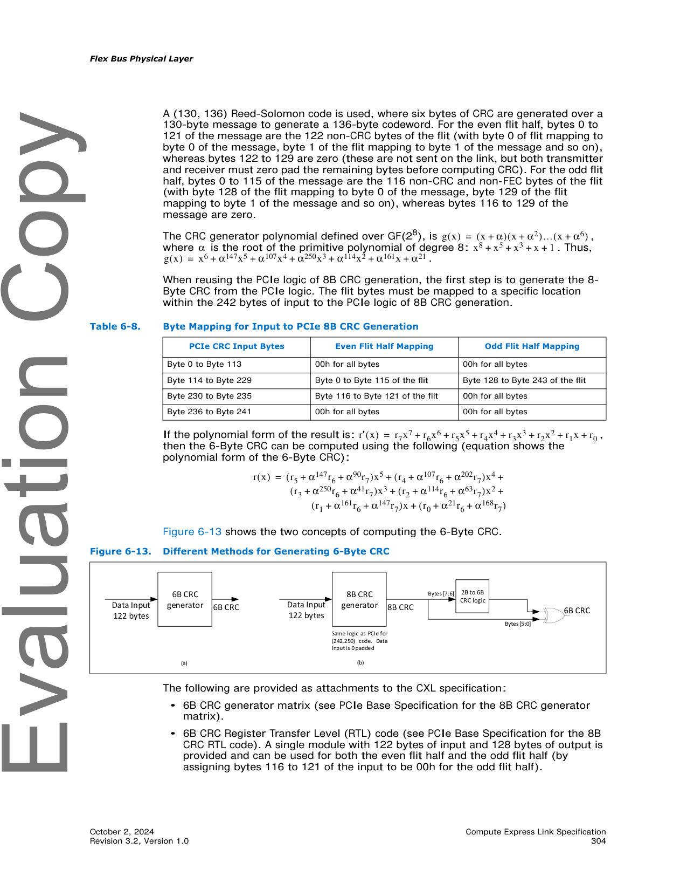
>
> *Original page render @ 150 DPI* — [📄 Full size](figures/chapter_06/page_0304.png)

<table>
<thead>
<tr>
<th width="50%">🇬🇧 English</th>
<th width="50%" style="background-color:#e8e8e8">🇨🇳 中文</th>
</tr>
</thead>
<tbody>
<tr><td>

- 8B CRC to 6B CRC converter RTL code. A single module with 122 bytes of input and 128 bytes of output is provided and can be used for both the even flit half and the odd flit half (by assigning bytes 116 to 121 of the input to be 00h for the odd flit half).

</td><td style="background-color:#e8e8e8">

- 8B CRC 转 6B CRC 转换器 RTL 代码。提供了一个具有 122 字节输入和 128 字节输出的单一模块,既可用于偶数半 flit 也可用于奇数半 flit(通过将奇数半 flit 输入的字节 116 到 121 赋值为 00h)。

</td></tr>
</tbody>
</table>

[⬆️ 返回目录](#-本章目录-table-of-contents)

---

