# 📘 第 7 章　交换 (Chapter 7. Switching) — Part A

> **Source pages**: 319–380 (Part A) | **File**: chapter_07a.md | **Format**: 中英对照双语

## 📑 本章目录 (Part A)

- [7.0 Switching](#sec-7-0)
- [7.1 Overview](#sec-7-1)
  - [7.1.1 Single VCS](#sec-7-1-1)
  - [7.1.2 Multiple VCS](#sec-7-1-2)
  - [7.1.3 Multiple VCS with MLD Ports](#sec-7-1-3)
  - [7.1.4 vPPB Ordering](#sec-7-1-4)
- [7.2 Switch Configuration and Composition](#sec-7-2)
  - [7.2.1 CXL Switch Initialization Options](#sec-7-2-1)
    - [7.2.1.1 Static Initialization](#sec-7-2-1-1)
    - [7.2.1.2 Fabric Manager Boots First](#sec-7-2-1-2)
    - [7.2.1.3 Fabric Manager and Host Boot Simultaneously](#sec-7-2-1-3)
  - [7.2.2 Sideband Signal Operation](#sec-7-2-2)
  - [7.2.3 Binding and Unbinding](#sec-7-2-3)
    - [7.2.3.1 Binding and Unbinding of a Single Logical Device Port](#sec-7-2-3-1)
    - [7.2.3.2 Binding and Unbinding of a Pooled Device](#sec-7-2-3-2)
  - [7.2.4 PPB and vPPB Behavior for MLD Ports](#sec-7-2-4)
    - [7.2.4.1 MLD Type 1 Configuration Space Header](#sec-7-2-4-1)
    - [7.2.4.2 MLD PCIe-compatible Configuration Registers](#sec-7-2-4-2)
    - [7.2.4.3 MLD PCIe Capability Structure](#sec-7-2-4-3)
    - [7.2.4.4 MLD PPB Secondary PCIe Capability Structure](#sec-7-2-4-4)
    - [7.2.4.5 MLD Physical Layer 16.0 GT/s Extended Capability](#sec-7-2-4-5)
    - [7.2.4.6 MLD Physical Layer 32.0 GT/s Extended Capability](#sec-7-2-4-6)
    - [7.2.4.7 MLD Lane Margining at the Receiver Extended Capability](#sec-7-2-4-7)
  - [7.2.5 MLD ACS Extended Capability](#sec-7-2-5)
  - [7.2.6 MLD PCIe Extended Capabilities](#sec-7-2-6)
  - [7.2.7 MLD Advanced Error Reporting Extended Capability](#sec-7-2-7)
  - [7.2.8 MLD DPC Extended Capability](#sec-7-2-8)
  - [7.2.9 Switch Mailbox CCI](#sec-7-2-9)
- [7.3 CXL.io, CXL.cachemem Decode and Forwarding](#sec-7-3)
  - [7.3.1 CXL.io](#sec-7-3-1)
    - [7.3.1.1 CXL.io Decode](#sec-7-3-1-1)
    - [7.3.1.2 RCD Support](#sec-7-3-1-2)
  - [7.3.2 CXL.cache](#sec-7-3-2)
    - [7.3.2.1 CXL.Cache Reserved bit forwarding](#sec-7-3-2-1)
  - [7.3.3 CXL.mem](#sec-7-3-3)
    - [7.3.3.1 CXL.mem Request Decode](#sec-7-3-3-1)
    - [7.3.3.2 CXL.mem Response Decode](#sec-7-3-3-2)
    - [7.3.3.3 CXL.Mem Reserved bit forwarding](#sec-7-3-3-3)
  - [7.3.4 FM-owned PPB CXL Handling](#sec-7-3-4)
- [7.4 CXL Switch PM](#sec-7-4)
  - [7.4.1 CXL Switch ASPM L1](#sec-7-4-1)
  - [7.4.2 CXL Switch PCI-PM and L2](#sec-7-4-2)
  - [7.4.3 CXL Switch Message Management](#sec-7-4-3)
- [7.5 CXL Switch RAS](#sec-7-5)
- [7.6 Fabric Manager Application Programming Interface](#sec-7-6)
  - [7.6.1 CXL Fabric Management](#sec-7-6-1)
  - [7.6.2 Fabric Management Model](#sec-7-6-2)
  - [7.6.3 CCI Message Format and Transport Protocol](#sec-7-6-3)
    - [7.6.3.1 Transport Details for MLD Components](#sec-7-6-3-1)
  - [7.6.4 CXL Switch Management](#sec-7-6-4)
    - [7.6.4.1 Initial Configuration](#sec-7-6-4-1)
    - [7.6.4.2 Dynamic Configuration](#sec-7-6-4-2)
    - [7.6.4.3 MLD Port Management](#sec-7-6-4-3)
  - [7.6.5 MLD Component Management](#sec-7-6-5)
  - [7.6.6 Management Requirements for System Operations](#sec-7-6-6)
    - [7.6.6.1 Initial System Discovery](#sec-7-6-6-1)
    - [7.6.6.2 CXL Switch Discovery](#sec-7-6-6-2)
    - [7.6.6.3 MLD and Switch MLD Port Management](#sec-7-6-6-3)
    - [7.6.6.4 Event Notifications](#sec-7-6-6-4)
    - [7.6.6.5 Binding Ports and LDs on a Switch](#sec-7-6-6-5)
    - [7.6.6.6 Unbinding Ports and LDs on a Switch](#sec-7-6-6-6)
    - [7.6.6.7 Hot-Add and Managed Hot-Removal of Devices](#sec-7-6-6-7)
    - [7.6.6.8 Surprise Removal of Devices](#sec-7-6-6-8)
  - [7.6.7 Fabric Management Application Programming Interface](#sec-7-6-7)
    - [7.6.7.1 Physical Switch Command Set](#sec-7-6-7-1)
      - [7.6.7.1.1 Identify Switch Device (Opcode 5100h)](#sec-7-6-7-1-1)
      - [7.6.7.1.2 Get Physical Port State (Opcode 5101h)](#sec-7-6-7-1-2)
      - [7.6.7.1.3 Physical Port Control (Opcode 5102h)](#sec-7-6-7-1-3)
      - [7.6.7.1.4 Send PPB CXL.io Configuration Request (Opcode 5103h)](#sec-7-6-7-1-4)
      - [7.6.7.1.5 Get Domain Validation SV State (Opcode 5104h)](#sec-7-6-7-1-5)
      - [7.6.7.1.6 Set Domain Validation SV (Opcode 5105h)](#sec-7-6-7-1-6)
      - [7.6.7.1.7 Get VCS Domain Validation SV State (Opcode 5106h)](#sec-7-6-7-1-7)
      - [7.6.7.1.8 Get Domain Validation SV (Opcode 5107h)](#sec-7-6-7-1-8)
    - [7.6.7.2 Virtual Switch Command Set](#sec-7-6-7-2)
      - [7.6.7.2.1 Get Virtual CXL Switch Info (Opcode 5200h)](#sec-7-6-7-2-1)
      - [7.6.7.2.2 Bind vPPB (Opcode 5201h)](#sec-7-6-7-2-2)
      - [7.6.7.2.3 Unbind vPPB (Opcode 5202h)](#sec-7-6-7-2-3)
      - [7.6.7.2.4 Generate AER Event (Opcode 5203h)](#sec-7-6-7-2-4)
    - [7.6.7.3 MLD Port Command Set](#sec-7-6-7-3)
      - [7.6.7.3.1 Tunnel Management Command (Opcode 5300h)](#sec-7-6-7-3-1)
      - [7.6.7.3.2 Send LD CXL.io Configuration Request (Opcode 5301h)](#sec-7-6-7-3-2)
      - [7.6.7.3.3 Send LD CXL.io Memory Request (Opcode 5302h)](#sec-7-6-7-3-3)
    - [7.6.7.4 MLD Component Command Set](#sec-7-6-7-4)
      - [7.6.7.4.1 Get LD Info (Opcode 5400h)](#sec-7-6-7-4-1)
      - [7.6.7.4.2 Get LD Allocations (Opcode 5401h)](#sec-7-6-7-4-2)
      - [7.6.7.4.3 Set LD Allocations (Opcode 5402h)](#sec-7-6-7-4-3)
      - [7.6.7.4.4 Get QoS Control (Opcode 5403h)](#sec-7-6-7-4-4)
      - [7.6.7.4.5 Set QoS Control (Opcode 5404h)](#sec-7-6-7-4-5)
      - [7.6.7.4.6 Get QoS Status (Opcode 5405h)](#sec-7-6-7-4-6)
      - [7.6.7.4.7 Get QoS Allocated BW (Opcode 5406h)](#sec-7-6-7-4-7)
      - [7.6.7.4.8 Set QoS Allocated BW (Opcode 5407h)](#sec-7-6-7-4-8)
      - [7.6.7.4.9 Get QoS BW Limit (Opcode 5408h)](#sec-7-6-7-4-9)
      - [7.6.7.4.10 Set QoS BW Limit (Opcode 5409h)](#sec-7-6-7-4-10)
    - [7.6.7.5 Multi-Headed Device Command Set](#sec-7-6-7-5)
      - [7.6.7.5.1 Get Multi-Headed Info (Opcode 5500h)](#sec-7-6-7-5-1)
      - [7.6.7.5.2 Get Head Info (Opcode 5501h)](#sec-7-6-7-5-2)
    - [7.6.7.6 DCD Management Command Set for LD-FAM](#sec-7-6-7-6)
      - [7.6.7.6.1 Get DCD Info (Opcode 5600h)](#sec-7-6-7-6-1)
      - [7.6.7.6.2 Get Host DC Region Configuration (Opcode 5601h)](#sec-7-6-7-6-2)
      - [7.6.7.6.3 Set DC Region Configuration (Opcode 5602h)](#sec-7-6-7-6-3)

## 🖼 本章图表 (Part A)

| Figure | Title | 标题 |
|--------|-------|------|
| Figure 7-1 | Example of a Single VCS | 单 VCS 示例 |
| Figure 7-2 | Example of a Multiple VCS with SLD Ports | 使用 SLD 端口的多 VCS 示例 |
| Figure 7-3 | Example of a Multiple Root Switch Port with Pooled Memory Devices | 具有池化内存设备的多根交换机端口示例 |
| Figure 7-4 | Static CXL Switch with Two VCSs | 具有两个 VCS 的静态 CXL 交换机 |
| Figure 7-5 | Example of CXL Switch Initialization when FM Boots First | FM 先启动时的 CXL 交换机初始化示例 |
| Figure 7-6 | Example of CXL Switch after Initialization Completes | 初始化完成后的 CXL 交换机示例 |
| Figure 7-7 | Example of Switch with Fabric Manager and Host Boot Simultaneously | FM 与主机同时启动的交换机示例 |
| Figure 7-8 | Example of Simultaneous Boot after Binding | 绑定后同时启动示例 |
| Figure 7-9 | Example of Binding and Unbinding of an SLD Port | SLD 端口的绑定与解绑示例 |
| Figure 7-10 | Example of CXL Switch Configuration after an Unbind Command | 执行 Unbind 命令后的 CXL 交换机配置示例 |
| Figure 7-11 | Example of CXL Switch Configuration after a Bind Command | 执行 Bind 命令后的 CXL 交换机配置示例 |
| Figure 7-12 | Example of a CXL Switch before Binding of LDs within Pooled Device | 在池化设备中绑定 LD 之前的 CXL 交换机示例 |
| Figure 7-13 | Example of a CXL Switch after Binding of LD-ID 1 within Pooled Device | 在池化设备中绑定 LD-ID 1 之后的 CXL 交换机示例 |
| Figure 7-14 | Example of a CXL Switch after Binding of LD-IDs 0 and 1 within Pooled Device | 在池化设备中绑定 LD-ID 0 和 1 之后的 CXL 交换机示例 |
| Figure 7-15 | Multi-function Upstream vPPB | 多功能上游 vPPB |
| Figure 7-16 | Single-function Mailbox CCI | 单功能 Mailbox CCI |
| Figure 7-17 | CXL Switch with a Downstream Link Auto-negotiated to Operate in RCD Mode | 下游链路自动协商为 RCD 模式的 CXL 交换机 |
| Figure 7-18 | Example of Fabric Management Model | Fabric 管理模型示例 |
| Figure 7-19 | CCI Message Format | CCI 消息格式 |
| Figure 7-20 | Tunneling Commands to an MLD through a CXL Switch | 通过 CXL 交换机向 MLD 隧道传输命令 |
| Figure 7-21 | Example of MLD Management Requiring Tunneling | 需要隧道传输的 MLD 管理示例 |
| Figure 7-22 | Tunneling Commands to an LD in an MLD | 向 MLD 中的某个 LD 隧道传输命令 |
| Figure 7-23 | Tunneling Commands to an LD in an MLD through a CXL Switch | 通过 CXL 交换机向 MLD 中的某个 LD 隧道传输命令 |
| Figure 7-24 | Tunneling Commands to the LD Pool CCI in a Multi-Headed Device | 向多头设备中 LD Pool CCI 隧道传输命令 |

## 📊 本章表格 (Part A)

| Table | Title | 标题 |
|-------|-------|------|
| Table 7-1 | CXL Switch Sideband Signal Requirements | CXL 交换机边带信号要求 |
| Table 7-2 | MLD Type 1 Configuration Space Header | MLD Type 1 配置空间头 |
| Table 7-3 | MLD PCIe-compatible Configuration Registers | MLD PCIe 兼容配置寄存器 |
| Table 7-4 | MLD PCIe Capability Structure | MLD PCIe Capability 结构 |
| Table 7-5 | MLD Secondary PCIe Capability Structure | MLD Secondary PCIe Capability 结构 |
| Table 7-6 | MLD Physical Layer 16.0 GT/s Extended Capability | MLD 物理层 16.0 GT/s 扩展能力 |
| Table 7-7 | MLD Physical Layer 32.0 GT/s Extended Capability | MLD 物理层 32.0 GT/s 扩展能力 |
| Table 7-8 | MLD Lane Margining at the Receiver Extended Capability | MLD 接收端 Lane Margining 扩展能力 |
| Table 7-9 | MLD ACS Extended Capability | MLD ACS 扩展能力 |
| Table 7-10 | MLD Advanced Error Reporting Extended Capability | MLD 高级错误报告 (AER) 扩展能力 |
| Table 7-11 | MLD PPB DPC Extended Capability | MLD PPB DPC 扩展能力 |
| Table 7-12 | CXL Switch Message Management | CXL 交换机消息管理 |
| Table 7-13 | CXL Switch RAS | CXL 交换机 RAS |
| Table 7-15 | FM API Command Sets | FM API 命令集 |
| Table 7-16 | Identify Switch Device Response Payload | Identify Switch Device 响应 Payload |
| Table 7-17 | Get Physical Port State Request Payload | Get Physical Port State 请求 Payload |
| Table 7-18 | Get Physical Port State Response Payload | Get Physical Port State 响应 Payload |
| Table 7-19 | Get Physical Port State Port Information Block Format | Get Physical Port State 端口信息块格式 |
| Table 7-20 | Physical Port Control Request Payload | Physical Port Control 请求 Payload |
| Table 7-21 | Send PPB CXL.io Configuration Request Input Payload | Send PPB CXL.io Configuration Request 输入 Payload |
| Table 7-22 | Send PPB CXL.io Configuration Request Output Payload | Send PPB CXL.io Configuration Request 输出 Payload |
| Table 7-23 | Get Domain Validation SV State Response Payload | Get Domain Validation SV State 响应 Payload |
| Table 7-24 | Set Domain Validation SV Request Payload | Set Domain Validation SV 请求 Payload |
| Table 7-25 | Get VCS Domain Validation SV State Request Payload | Get VCS Domain Validation SV State 请求 Payload |
| Table 7-26 | Get VCS Domain Validation SV State Response Payload | Get VCS Domain Validation SV State 响应 Payload |
| Table 7-27 | Get Domain Validation SV Request Payload | Get Domain Validation SV 请求 Payload |
| Table 7-28 | Get Domain Validation SV Response Payload | Get Domain Validation SV 响应 Payload |
| Table 7-29 | Virtual Switch Command Set Requirements | Virtual Switch 命令集要求 |
| Table 7-30 | Get Virtual CXL Switch Info Request Payload | Get Virtual CXL Switch Info 请求 Payload |
| Table 7-31 | Get Virtual CXL Switch Info Response Payload | Get Virtual CXL Switch Info 响应 Payload |
| Table 7-32 | Get Virtual CXL Switch Info VCS Information Block Format | Get Virtual CXL Switch Info VCS 信息块格式 |
| Table 7-33 | Bind vPPB Request Payload | Bind vPPB 请求 Payload |
| Table 7-34 | Unbind vPPB Request Payload | Unbind vPPB 请求 Payload |
| Table 7-35 | Generate AER Event Request Payload | Generate AER Event 请求 Payload |
| Table 7-36 | MLD Port Command Set Requirements | MLD Port 命令集要求 |
| Table 7-37 | Tunnel Management Command Request Payload | Tunnel Management Command 请求 Payload |
| Table 7-38 | Tunnel Management Command Response Payload | Tunnel Management Command 响应 Payload |
| Table 7-39 | Send LD CXL.io Configuration Request Payload | Send LD CXL.io Configuration Request Payload |
| Table 7-40 | Send LD CXL.io Configuration Response Payload | Send LD CXL.io Configuration 响应 Payload |
| Table 7-41 | Send LD CXL.io Memory Request Payload | Send LD CXL.io Memory Request Payload |
| Table 7-42 | Send LD CXL.io Memory Request Response Payload | Send LD CXL.io Memory Request 响应 Payload |
| Table 7-43 | MLD Component Command Set Requirements | MLD Component 命令集要求 |
| Table 7-44 | Get LD Info Response Payload | Get LD Info 响应 Payload |
| Table 7-45 | Get LD Allocations Request Payload | Get LD Allocations 请求 Payload |
| Table 7-46 | Get LD Allocations Response Payload | Get LD Allocations 响应 Payload |
| Table 7-47 | LD Allocations List Format | LD Allocations 列表格式 |
| Table 7-48 | Set LD Allocations Request Payload | Set LD Allocations 请求 Payload |
| Table 7-49 | Set LD Allocations Response Payload | Set LD Allocations 响应 Payload |
| Table 7-50 | Payload for Get QoS Control Response, Set QoS Control Request, and Set QoS Control Response | Get QoS Control 响应、Set QoS Control 请求和响应 Payload |
| Table 7-51 | Get QoS Status Response Payload | Get QoS Status 响应 Payload |
| Table 7-52 | Payload for Get QoS Allocated BW Request | Get QoS Allocated BW 请求 Payload |
| Table 7-53 | Payload for Get QoS Allocated BW Response | Get QoS Allocated BW 响应 Payload |
| Table 7-54 | Payload for Set QoS Allocated BW Request, and Set QoS Allocated BW Response | Set QoS Allocated BW 请求与响应 Payload |
| Table 7-55 | Payload for Get QoS BW Limit Request | Get QoS BW Limit 请求 Payload |
| Table 7-56 | Payload for Get QoS BW Limit Response | Get QoS BW Limit 响应 Payload |
| Table 7-57 | Payload for Set QoS BW Limit Request, and Set QoS BW Limit Response | Set QoS BW Limit 请求与响应 Payload |
| Table 7-58 | Get Multi-Headed Info Request Payload | Get Multi-Headed Info 请求 Payload |
| Table 7-59 | Get Multi-Headed Info Response Payload | Get Multi-Headed Info 响应 Payload |
| Table 7-60 | Get Head Info Request Payload | Get Head Info 请求 Payload |
| Table 7-61 | Get Head Info Response Payload | Get Head Info 响应 Payload |
| Table 7-62 | Get Head Info Head Information Block Format | Get Head Info Head 信息块格式 |
| Table 7-63 | Get DCD Info Response Payload | Get DCD Info 响应 Payload |
| Table 7-64 | Get Host DC Region Configuration Request Payload | Get Host DC Region Configuration 请求 Payload |
| Table 7-65 | Get Host DC Region Configuration Response Payload | Get Host DC Region Configuration 响应 Payload |
| Table 7-66 | DC Region Configuration | DC Region Configuration |

---

# 7.0 Switching | 交换

<table>
<thead>
<tr>
<th width="50%">🇬🇧 English</th>
<th width="50%" style="background-color:#e8e8e8">🇨🇳 中文</th>
</tr>
</thead>
<tbody>
<tr><td>Switching</td><td style="background-color:#e8e8e8">交换</td></tr>
</tbody>
</table>

[⬆️ 返回目录](#-本章目录-part-a)

---

## 7.1 Overview | 概述

<table>
<thead>
<tr>
<th width="50%">🇬🇧 English</th>
<th width="50%" style="background-color:#e8e8e8">🇨🇳 中文</th>
</tr>
</thead>
<tbody>
<tr><td>This section provides an architecture overview of different CXL switch configurations.</td><td style="background-color:#e8e8e8">本节提供不同 CXL 交换机配置方案的架构概述。</td></tr>
</tbody>
</table>

[⬆️ 返回目录](#-本章目录-part-a)

---

### 7.1.1 Single VCS | 单 VCS

<table>
<thead>
<tr>
<th width="50%">🇬🇧 English</th>
<th width="50%" style="background-color:#e8e8e8">🇨🇳 中文</th>
</tr>
</thead>
<tbody>
<tr><td>A single VCS consists of a single CXL Upstream Port and one or more Downstream Ports as illustrated in Figure 7-1.</td><td style="background-color:#e8e8e8">单 VCS 由单个 CXL 上行端口 (USP) 以及一个或多个下行端口 (DSP) 组成,如图 7-1 所示。</td></tr>
<tr><td>A Single VCS is governed by the following rules:</td><td style="background-color:#e8e8e8">单 VCS 须遵循以下规则:</td></tr>
<tr><td>• Must have a single USP</td><td style="background-color:#e8e8e8">• 必须只有单个 USP</td></tr>
<tr><td>• Must have one or more DSPs</td><td style="background-color:#e8e8e8">• 必须具有一个或多个 DSP</td></tr>
<tr><td>• DSPs must support operating in CXL mode or PCIe* mode</td><td style="background-color:#e8e8e8">• DSP 必须支持在 CXL 模式或 PCIe* 模式下运行</td></tr>
<tr><td>• All non-MLD (includes PCIe and SLD) ports support a single Virtual Hierarchy below the vPPB</td><td style="background-color:#e8e8e8">• 所有非 MLD 端口 (包括 PCIe 和 SLD) 在 vPPB 之下支持单个虚拟层级 (Virtual Hierarchy)</td></tr>
<tr><td>• Downstream Switch Port must be capable of supporting RCD mode</td><td style="background-color:#e8e8e8">• 下行交换机端口必须能够支持 RCD 模式</td></tr>
<tr><td>• Must support the CXL Extensions DVSEC for Ports (see Section 8.1.5)</td><td style="background-color:#e8e8e8">• 必须支持 Ports 的 CXL Extensions DVSEC (参见 8.1.5 节)</td></tr>
<tr><td>• The DVSEC defines registers to support CXL.io decode to support RCD below the Switch and registers for CXL Memory Decode. The address decode for CXL.io is in addition to the address decode mechanism supported by vPPB.</td><td style="background-color:#e8e8e8">• DVSEC 定义了用于支持交换机下 RCD 的 CXL.io 解码寄存器,以及 CXL Memory Decode 寄存器。CXL.io 的地址解码是对 vPPB 所支持的地址解码机制的补充。</td></tr>
<tr><td>• Fabric Manager (FM) is optional for a Single VCS</td><td style="background-color:#e8e8e8">• Fabric Manager (FM) 对单 VCS 而言是可选的</td></tr>
</tbody>
</table>

> **Figure 7-1.** Example of a Single VCS ｜ 单 VCS 示例
>
> 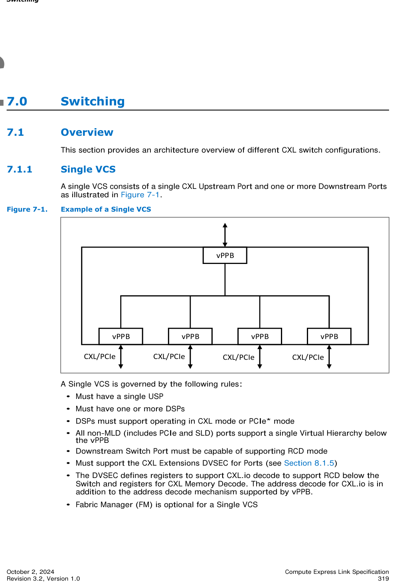
>
> *Original page render @ 150 DPI* — [📄 Full size](figures/chapter_07/page_0319.png)

[⬆️ 返回目录](#-本章目录-part-a)

---

### 7.1.2 Multiple VCS | 多 VCS

<table>
<thead>
<tr>
<th width="50%">🇬🇧 English</th>
<th width="50%" style="background-color:#e8e8e8">🇨🇳 中文</th>
</tr>
</thead>
<tbody>
<tr><td>A Multiple VCS consists of multiple Upstream Ports and one or more Downstream Ports per VCS as illustrated in Figure 7-2.</td><td style="background-color:#e8e8e8">多 VCS 由多个 USP 以及每个 VCS 下的一个或多个 DSP 组成,如图 7-2 所示。</td></tr>
<tr><td>A Multiple VCS is governed by the following rules:</td><td style="background-color:#e8e8e8">多 VCS 须遵循以下规则:</td></tr>
<tr><td>• Must have more than one USP.</td><td style="background-color:#e8e8e8">• 必须具有多个 USP。</td></tr>
<tr><td>• Must have one or more DS vPPBs per VCS.</td><td style="background-color:#e8e8e8">• 每个 VCS 必须具有一个或多个下行 vPPB。</td></tr>
<tr><td>• The initial binding of upstream (US) vPPB to physical port and the structure of the VCS (including number of vPPBs, the default vPPB capability structures, and any initial bindings of downstream (DS) vPPBs to physical ports) is defined using switch vendor specific methods.</td><td style="background-color:#e8e8e8">• 上行 (US) vPPB 到物理端口的初始绑定,以及 VCS 的结构 (包括 vPPB 的数量、默认 vPPB 能力结构,以及任何下行 (DS) vPPB 到物理端口的初始绑定) 由交换机厂商特定的方法定义。</td></tr>
<tr><td>• Each DSP must be bound to a PPB or vPPB.</td><td style="background-color:#e8e8e8">• 每个 DSP 必须绑定到一个 PPB 或 vPPB。</td></tr>
<tr><td>• FM is optional for Multiple VCS. An FM is required for a Multiple VCS that requires bind/unbind, or that supports MLD ports. Each DSP can be reassigned to a different VCS through the managed Hot-Plug flow orchestrated by the FM.</td><td style="background-color:#e8e8e8">• 对于多 VCS,FM 是可选的。对于需要 bind/unbind 或支持 MLD 端口的多 VCS,FM 是必需的。每个 DSP 可通过由 FM 协调的托管热插拔 (Hot-Plug) 流程重新分配到不同的 VCS。</td></tr>
<tr><td>• When configured, each USP and its associated DS vPPBs form a Single VCS Switch and operate as per the Single VCS rules.</td><td style="background-color:#e8e8e8">• 配置完成后,每个 USP 及其关联的 DS vPPB 构成一个单 VCS 交换机,并按照单 VCS 规则运行。</td></tr>
<tr><td>• DSPs must support operating in CXL mode or PCIe mode.</td><td style="background-color:#e8e8e8">• DSP 必须支持在 CXL 模式或 PCIe 模式下运行。</td></tr>
<tr><td>• All non-MLD, non-Fabric, and non-GFD HBR ports support a single Virtual Hierarchy below the Downstream Switch Port.</td><td style="background-color:#e8e8e8">• 所有非 MLD、非 Fabric、非 GFD 的 HBR 端口在下行交换机端口之下支持单个虚拟层级。</td></tr>
<tr><td>• DSPs must be capable of supporting RCD mode.</td><td style="background-color:#e8e8e8">• DSP 必须能够支持 RCD 模式。</td></tr>
</tbody>
</table>

> **Figure 7-2.** Example of a Multiple VCS with SLD Ports ｜ 使用 SLD 端口的多 VCS 示例
>
> 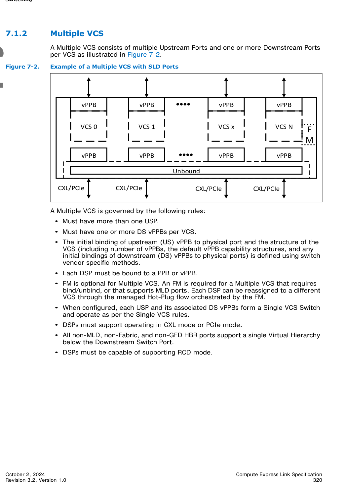
>
> *Original page render @ 150 DPI* — [📄 Full size](figures/chapter_07/page_0320.png)

[⬆️ 返回目录](#-本章目录-part-a)

---

### 7.1.3 Multiple VCS with MLD Ports | 包含 MLD 端口的多 VCS

<table>
<thead>
<tr>
<th width="50%">🇬🇧 English</th>
<th width="50%" style="background-color:#e8e8e8">🇨🇳 中文</th>
</tr>
</thead>
<tbody>
<tr><td>A Multiple VCS with MLD Ports consists of multiple Upstream Ports and a combination of one or more Downstream MLD Ports, as illustrated in Figure 7-3.</td><td style="background-color:#e8e8e8">包含 MLD 端口的多 VCS 由多个 USP 以及一个或多个下行 MLD 端口组合而成,如图 7-3 所示。</td></tr>
<tr><td>A Multiple VCS with MLD Ports is governed by the following rules:</td><td style="background-color:#e8e8e8">包含 MLD 端口的多 VCS 须遵循以下规则:</td></tr>
<tr><td>• More than one USP.</td><td style="background-color:#e8e8e8">• 具有多个 USP。</td></tr>
<tr><td>• One or more Downstream vPPBs per VCS.</td><td style="background-color:#e8e8e8">• 每个 VCS 具有一个或多个下行 vPPB。</td></tr>
<tr><td>• Each SLD DSP can be bound to a Single VCS.</td><td style="background-color:#e8e8e8">• 每个 SLD DSP 可绑定到单个 VCS。</td></tr>
<tr><td>• An MLD-capable DSP can be connected to up to 16 USPs.</td><td style="background-color:#e8e8e8">• 一个具备 MLD 能力的 DSP 最多可连接到 16 个 USP。</td></tr>
<tr><td>• Each of the SLD DSPs can be reassigned to a different VCS through the managed Hot-Plug flow orchestrated by the FM.</td><td style="background-color:#e8e8e8">• 每个 SLD DSP 可通过由 FM 协调的托管热插拔流程重新分配到不同的 VCS。</td></tr>
<tr><td>• Each of the LD instances in an MLD component can be reassigned to a different VCS through the managed Hot-Plug flow orchestrated by the FM.</td><td style="background-color:#e8e8e8">• MLD 组件中的每个 LD 实例可通过由 FM 协调的托管热插拔流程重新分配到不同的 VCS。</td></tr>
<tr><td>• When configured, each USP and its associated vPPBs form a Single VCS, and operate as per the Single VCS rules.</td><td style="background-color:#e8e8e8">• 配置完成后,每个 USP 及其关联的 vPPB 构成一个单 VCS,并按照单 VCS 规则运行。</td></tr>
<tr><td>• DSPs must support operating in CXL mode or PCIe mode.</td><td style="background-color:#e8e8e8">• DSP 必须支持在 CXL 模式或 PCIe 模式下运行。</td></tr>
<tr><td>• All non-MLD ports support a single Virtual Hierarchy below the DSP.</td><td style="background-color:#e8e8e8">• 所有非 MLD 端口在 DSP 之下支持单个虚拟层级。</td></tr>
<tr><td>• DSPs must be capable of supporting RCD mode.</td><td style="background-color:#e8e8e8">• DSP 必须能够支持 RCD 模式。</td></tr>
</tbody>
</table>

[⬆️ 返回目录](#-本章目录-part-a)

---

### 7.1.4 vPPB Ordering | vPPB 排序

<table>
<thead>
<tr>
<th width="50%">🇬🇧 English</th>
<th width="50%" style="background-color:#e8e8e8">🇨🇳 中文</th>
</tr>
</thead>
<tbody>
<tr><td>vPPBs within a VCS are ordered in the following sequence: the USP vPPB, then the DSP vPPBs in increasing Device Number, Function Number order. This means Function 0 of all vPPBs in order of Device Number, then all vPPBs enumerated at Function 1 in order of Device Number, etc.</td><td style="background-color:#e8e8e8">VCS 内的 vPPB 按如下顺序排列:先是 USP vPPB,然后是 DSP vPPB,按 Device Number、Function Number 升序排列。也就是说,先按 Device Number 顺序列出所有 vPPB 的 Function 0,再按 Device Number 顺序列出 Function 1 的所有 vPPB,依此类推。</td></tr>
</tbody>
</table>

> **Figure 7-3.** Example of a Multiple Root Switch Port with Pooled Memory Devices ｜ 具有池化内存设备的多根交换机端口示例
>
> 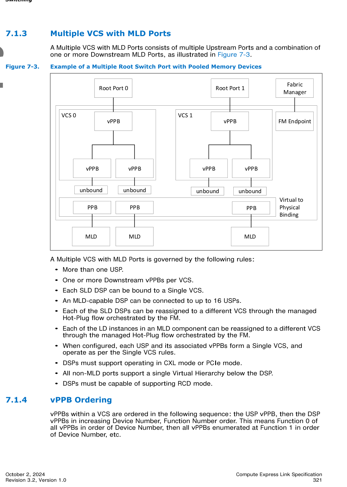
>
> *Original page render @ 150 DPI* — [📄 Full size](figures/chapter_07/page_0321.png)

<table>
<thead>
<tr>
<th width="50%">🇬🇧 English</th>
<th width="50%" style="background-color:#e8e8e8">🇨🇳 中文</th>
</tr>
</thead>
<tbody>
<tr><td>For a switch with 65 DSP vPPBs whose USP vPPB was assigned a Bus Number of 3, that would result in the following vPPB ordering:</td><td style="background-color:#e8e8e8">对于 USP vPPB 分配的 Bus Number 为 3、且具有 65 个 DSP vPPB 的交换机,其 vPPB 顺序如下:</td></tr>
</tbody>
</table>

<table>
<thead>
<tr>
<th>vPPB #</th>
<th>PCIe ID</th>
</tr>
</thead>
<tbody>
<tr><td>0</td><td>USP 3:0.0</td></tr>
<tr><td>1</td><td>DSP 4:0.0</td></tr>
<tr><td>2</td><td>DSP 4:1.0</td></tr>
<tr><td>3</td><td>DSP 4:2.0</td></tr>
<tr><td>…</td><td>…</td></tr>
<tr><td>32</td><td>DSP 4:31.0</td></tr>
<tr><td>33</td><td>DSP 4:0.1</td></tr>
<tr><td>34</td><td>DSP 4:1.1</td></tr>
<tr><td>…</td><td>…</td></tr>
<tr><td>64</td><td>DSP 4:31.1</td></tr>
<tr><td>65</td><td>DSP 4:0.2</td></tr>
</tbody>
</table>

<table>
<thead>
<tr>
<th width="50%">🇬🇧 English</th>
<th width="50%" style="background-color:#e8e8e8">🇨🇳 中文</th>
</tr>
</thead>
<tbody>
<tr><td>This ordering also applies in cases where multi-function vPPBs exist but not all 32 Device Numbers are assigned. For example, a switch with 8 DSP vPPBs whose USP vPPB was assigned a Bus Number of 3 could present its DSP vPPBs in such a way that the host enumeration would result in the following vPPB ordering:</td><td style="background-color:#e8e8e8">此排序同样适用于存在多功能 vPPB 但未分配全部 32 个 Device Number 的场景。例如,对于 USP vPPB 分配的 Bus Number 为 3、且具有 8 个 DSP vPPB 的交换机,可以以使主机枚举得到如下 vPPB 顺序的方式来呈现其 DSP vPPB:</td></tr>
</tbody>
</table>

<table>
<thead>
<tr>
<th>vPPB #</th>
<th>PCIe ID</th>
</tr>
</thead>
<tbody>
<tr><td>0</td><td>USP 3:0.0</td></tr>
<tr><td>1</td><td>DSP 4:0.0</td></tr>
<tr><td>2</td><td>DSP 4:1.0</td></tr>
<tr><td>3</td><td>DSP 4:2.0</td></tr>
<tr><td>4</td><td>DSP 4:0.1</td></tr>
<tr><td>5</td><td>DSP 4:1.1</td></tr>
<tr><td>6</td><td>DSP 4:2.1</td></tr>
<tr><td>7</td><td>DSP 4:0.2</td></tr>
<tr><td>8</td><td>DSP 4:1.2</td></tr>
</tbody>
</table>

[⬆️ 返回目录](#-本章目录-part-a)

---

## 7.2 Switch Configuration and Composition | 交换机配置与组合

<table>
<thead>
<tr>
<th width="50%">🇬🇧 English</th>
<th width="50%" style="background-color:#e8e8e8">🇨🇳 中文</th>
</tr>
</thead>
<tbody>
<tr><td>This section describes the CXL switch initialization options and related configuration and composition procedures.</td><td style="background-color:#e8e8e8">本节介绍 CXL 交换机的初始化选项以及相关的配置和组合流程。</td></tr>
</tbody>
</table>

[⬆️ 返回目录](#-本章目录-part-a)

---

### 7.2.1 CXL Switch Initialization Options | CXL 交换机初始化选项

<table>
<thead>
<tr>
<th width="50%">🇬🇧 English</th>
<th width="50%" style="background-color:#e8e8e8">🇨🇳 中文</th>
</tr>
</thead>
<tbody>
<tr><td>The CXL switch can be initialized using three different methods:</td><td style="background-color:#e8e8e8">CXL 交换机可使用三种不同的方法进行初始化:</td></tr>
<tr><td>• Static</td><td style="background-color:#e8e8e8">• 静态</td></tr>
<tr><td>• FM boots before the host(s)</td><td style="background-color:#e8e8e8">• FM 在主机之前启动</td></tr>
<tr><td>• FM and host boot simultaneously</td><td style="background-color:#e8e8e8">• FM 与主机同时启动</td></tr>
</tbody>
</table>

[⬆️ 返回目录](#-本章目录-part-a)

---

#### 7.2.1.1 Static Initialization | 静态初始化

<table>
<thead>
<tr>
<th width="50%">🇬🇧 English</th>
<th width="50%" style="background-color:#e8e8e8">🇨🇳 中文</th>
</tr>
</thead>
<tbody>
<tr><td>Figure 7-4 shows a statically initialized CXL switch with 2 VCSs. In this example, the downstream vPPBs are statically bound to ports and are available to the host at boot. Managed hot-add of Devices is supported using standard PCIe mechanisms.</td><td style="background-color:#e8e8e8">图 7-4 展示了一个包含 2 个 VCS 的静态初始化 CXL 交换机。在此示例中,下行 vPPB 静态绑定到端口,并在启动时对主机可用。设备的托管热添加 (Managed Hot-Add) 通过标准 PCIe 机制支持。</td></tr>
<tr><td>Static Switch Characteristics:</td><td style="background-color:#e8e8e8">静态交换机的特性:</td></tr>
<tr><td>• No support for MLD Ports</td><td style="background-color:#e8e8e8">• 不支持 MLD 端口</td></tr>
<tr><td>• No support for rebinding of ports to a different VCS</td><td style="background-color:#e8e8e8">• 不支持将端口重新绑定到其他 VCS</td></tr>
<tr><td>• No FM is required</td><td style="background-color:#e8e8e8">• 不需要 FM</td></tr>
<tr><td>• At switch boot, all VCSs and Downstream Port bindings are statically configured using switch vendor defined mechanisms (e.g., configuration file in SPI Flash)</td><td style="background-color:#e8e8e8">• 交换机启动时,所有 VCS 及下行端口绑定通过交换机厂商定义的方式 (例如 SPI Flash 中的配置文件) 静态配置</td></tr>
<tr><td>• Supports RCD mode, CXL VH mode, or PCIe mode</td><td style="background-color:#e8e8e8">• 支持 RCD 模式、CXL VH 模式或 PCIe 模式</td></tr>
<tr><td>• VCSs, including vPPBs, behave identically to a PCIe switch, along with the addition of supporting CXL protocols</td><td style="background-color:#e8e8e8">• VCS (包括 vPPB) 行为与 PCIe 交换机相同,只是额外支持 CXL 协议</td></tr>
<tr><td>• Each VCS is ready for enumeration when the host boots</td><td style="background-color:#e8e8e8">• 主机启动时,每个 VCS 即可被枚举</td></tr>
<tr><td>• Hot-add and managed hot-remove are supported</td><td style="background-color:#e8e8e8">• 支持热添加 (Hot-Add) 和托管热移除 (Managed Hot-Remove)</td></tr>
<tr><td>• No explicit support for Async removal of CXL devices; Async removal requires that root ports implement CXL Isolation (see Section 12.3)</td><td style="background-color:#e8e8e8">• 不显式支持 CXL 设备的异步移除;异步移除需要根端口实现 CXL Isolation (参见 12.3 节)</td></tr>
<tr><td>A switch that provides internal Endpoint functions is beyond the scope of this specification.</td><td style="background-color:#e8e8e8">提供内部端点 (Endpoint) 功能的交换机不在本规范范围之内。</td></tr>
</tbody>
</table>

> **Figure 7-4.** Static CXL Switch with Two VCSs ｜ 具有两个 VCS 的静态 CXL 交换机
>
> 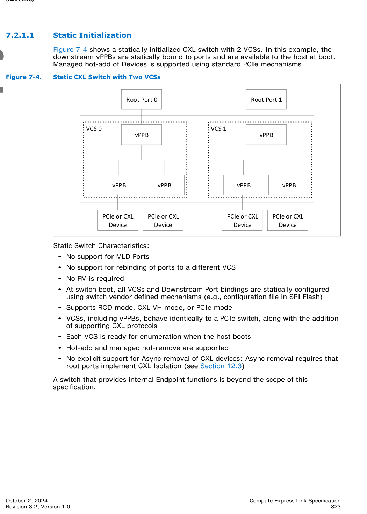
>
> *Original page render @ 150 DPI* — [📄 Full size](figures/chapter_07/page_0323.png)

[⬆️ 返回目录](#-本章目录-part-a)

---

#### 7.2.1.2 Fabric Manager Boots First | Fabric Manager 先启动

<table>
<thead>
<tr>
<th width="50%">🇬🇧 English</th>
<th width="50%" style="background-color:#e8e8e8">🇨🇳 中文</th>
</tr>
</thead>
<tbody>
<tr><td>In cases where the FM boots first (prior to host(s)), the switch is permitted to be initialized as described in the example shown in Figure 7-5.</td><td style="background-color:#e8e8e8">在 FM 先于主机启动的场景下,允许按图 7-5 所示的示例对交换机进行初始化。</td></tr>
<tr><td>1. FM boots while hosts are held in reset.</td><td style="background-color:#e8e8e8">1. 主机被保持在复位状态,FM 启动。</td></tr>
<tr><td>2. All attached DSPs link up and are bound to FM-owned PPBs.</td><td style="background-color:#e8e8e8">2. 所有已连接 DSP 完成链路连接 (Link up),并被绑定到 FM 拥有的 PPB。</td></tr>
<tr><td>3. DSPs link up and the switch notifies the FM using a managed hot-add notification.</td><td style="background-color:#e8e8e8">3. DSP 完成链路连接,交换机通过托管热添加 (managed hot-add) 通知告知 FM。</td></tr>
</tbody>
</table>

> **Figure 7-5.** Example of CXL Switch Initialization when FM Boots First ｜ FM 先启动时的 CXL 交换机初始化示例
>
> 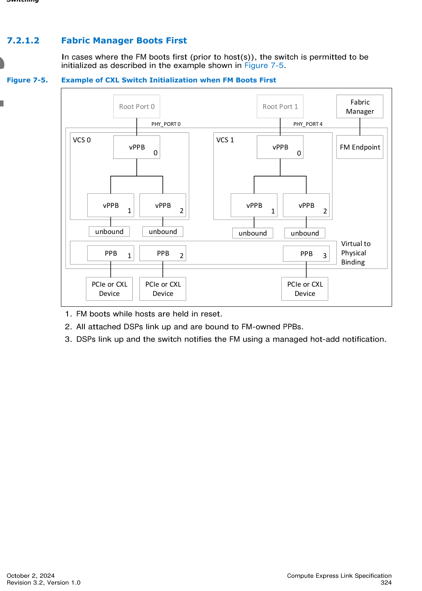
>
> *Original page render @ 150 DPI* — [📄 Full size](figures/chapter_07/page_0324.png)

<table>
<thead>
<tr>
<th width="50%">🇬🇧 English</th>
<th width="50%" style="background-color:#e8e8e8">🇨🇳 中文</th>
</tr>
</thead>
<tbody>
<tr><td>As shown in the example above in Figure 7-6, the following steps are taken to configure the switch after initialization completes:</td><td style="background-color:#e8e8e8">如图 7-6 上方的示例所示,初始化完成后,会执行以下步骤来配置交换机:</td></tr>
<tr><td>1. FM sends bind command BIND (VCS0, vPPB1, PHY_PORT_ID1) to the switch. The switch then configures virtual to physical binding.</td><td style="background-color:#e8e8e8">1. FM 向交换机发送 bind 命令 BIND (VCS0, vPPB1, PHY_PORT_ID1)。然后交换机配置虚拟到物理的绑定。</td></tr>
<tr><td>2. Switch remaps vPPB virtual port numbers to physical port numbers.</td><td style="background-color:#e8e8e8">2. 交换机将 vPPB 虚拟端口号重映射为物理端口号。</td></tr>
<tr><td>— Virtual port number is the index of the vPPB (as specified in the Bind vPPB command discussed in Section 7.6.7.2.2) per virtual hierarchy.</td><td style="background-color:#e8e8e8">— 虚拟端口号是每个虚拟层级中 vPPB 的索引 (如 7.6.7.2.2 节中讨论的 Bind vPPB 命令所规定)。</td></tr>
<tr><td>3. Switch remaps vPPB connector definition (PERST#, PRSNT#) to physical connector.</td><td style="background-color:#e8e8e8">3. 交换机将 vPPB 连接器定义 (PERST#、PRSNT#) 重映射到物理连接器。</td></tr>
<tr><td>4. Switch disables the link using PPB Link Disable.</td><td style="background-color:#e8e8e8">4. 交换机使用 PPB Link Disable 禁用链路。</td></tr>
<tr><td>5. At this point, all Physical downstream PPB functionality (e.g., Capabilities, etc.) maps directly to the vPPB including Link Disable, which releases the port for linkup.</td><td style="background-color:#e8e8e8">5. 此时,所有物理下行 PPB 的功能 (例如 Capabilities 等) 直接映射到 vPPB,包括 Link Disable,后者会释放该端口以供 linkup。</td></tr>
<tr><td>6. The FM-owned PPB no longer exists for this port.</td><td style="background-color:#e8e8e8">6. 该端口上的 FM-owned PPB 不再存在。</td></tr>
<tr><td>7. When the hosts boot, the switch is ready for enumeration.</td><td style="background-color:#e8e8e8">7. 主机启动后,交换机即可被枚举。</td></tr>
</tbody>
</table>

> **Figure 7-6.** Example of CXL Switch after Initialization Completes ｜ 初始化完成后的 CXL 交换机示例
>
> 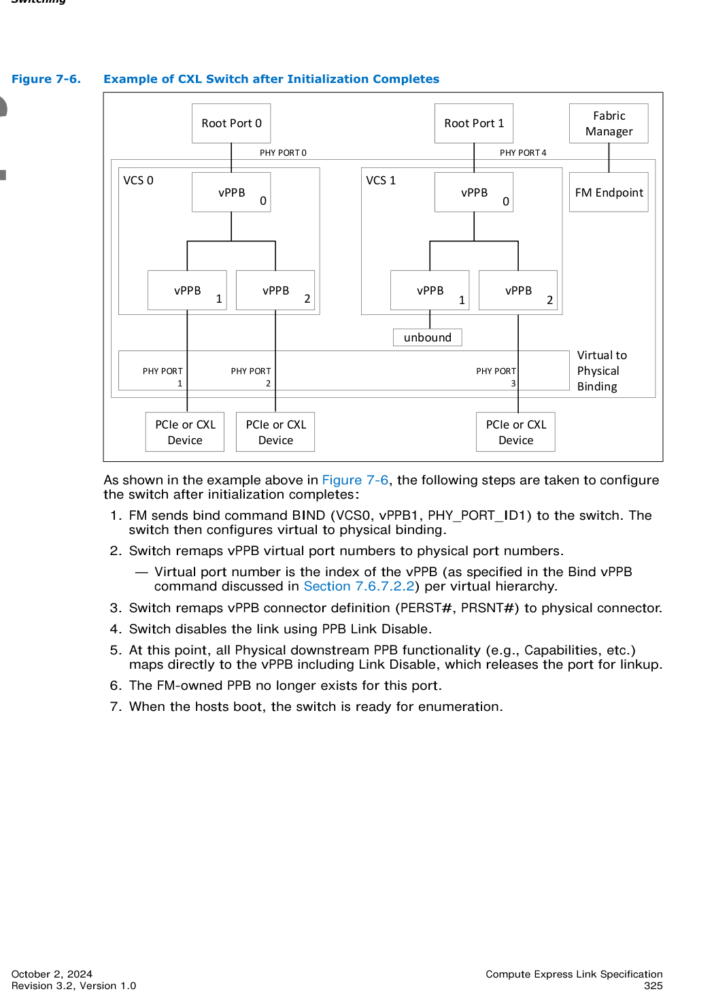
>
> *Original page render @ 150 DPI* — [📄 Full size](figures/chapter_07/page_0325.png)

[⬆️ 返回目录](#-本章目录-part-a)

---

#### 7.2.1.3 Fabric Manager and Host Boot Simultaneously | Fabric Manager 与主机同时启动

<table>
<thead>
<tr>
<th width="50%">🇬🇧 English</th>
<th width="50%" style="background-color:#e8e8e8">🇨🇳 中文</th>
</tr>
</thead>
<tbody>
<tr><td>In the case where the switch, FM, and host boot at the same time:</td><td style="background-color:#e8e8e8">在交换机、FM 与主机同时启动的情况下:</td></tr>
<tr><td>1. VCSs are statically defined.</td><td style="background-color:#e8e8e8">1. VCS 静态定义。</td></tr>
<tr><td>2. DSP vPPBs within each VCS are unbound and presented to the host as Link Down.</td><td style="background-color:#e8e8e8">2. 每个 VCS 内的 DSP vPPB 处于未绑定状态,并以 Link Down 状态呈现给主机。</td></tr>
<tr><td>3. Switch discovers downstream devices and presents them to the FM.</td><td style="background-color:#e8e8e8">3. 交换机发现下游设备并将其呈现给 FM。</td></tr>
<tr><td>4. Host enumerates the VH and configures the DVSEC registers.</td><td style="background-color:#e8e8e8">4. 主机枚举 VH 并配置 DVSEC 寄存器。</td></tr>
<tr><td>5. FM performs port binding to vPPBs.</td><td style="background-color:#e8e8e8">5. FM 执行端口到 vPPB 的绑定。</td></tr>
<tr><td>6. Switch performs virtual to physical binding.</td><td style="background-color:#e8e8e8">6. 交换机执行虚拟到物理的绑定。</td></tr>
<tr><td>7. Each bound port results in a hot-add indication to the host.</td><td style="background-color:#e8e8e8">7. 每个被绑定的端口都会向主机发出热添加 (hot-add) 指示。</td></tr>
</tbody>
</table>

> **Figure 7-7.** Example of Switch with Fabric Manager and Host Boot Simultaneously ｜ FM 与主机同时启动的交换机示例
>
> 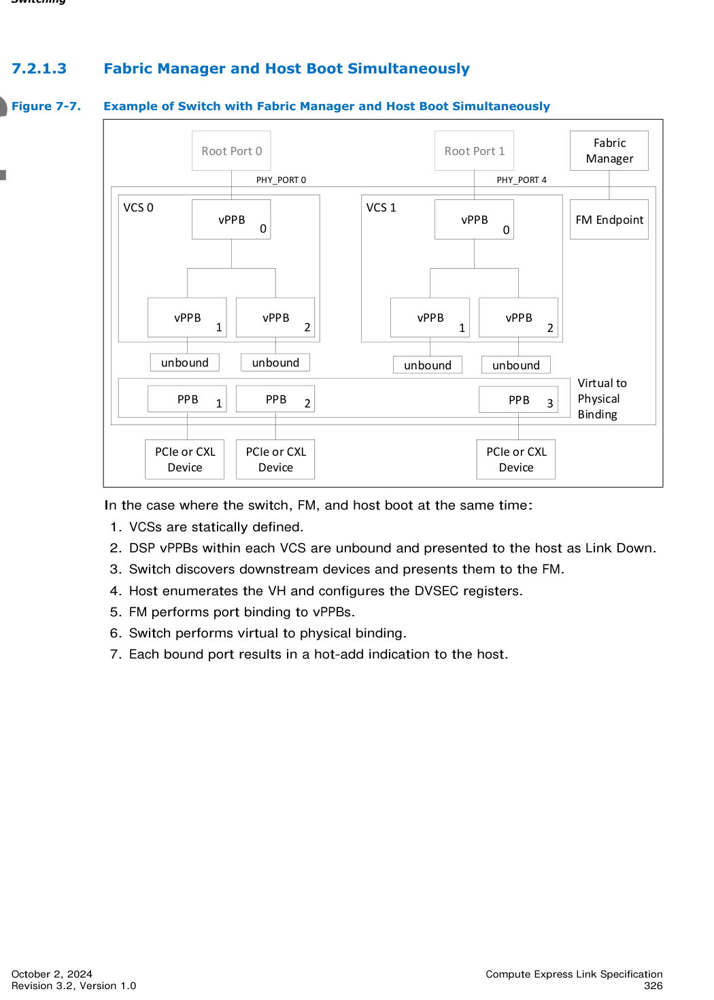
>
> *Original page render @ 150 DPI* — [📄 Full size](figures/chapter_07/page_0326.png)

[⬆️ 返回目录](#-本章目录-part-a)

---

### 7.2.2 Sideband Signal Operation | 边带信号操作

<table>
<thead>
<tr>
<th width="50%">🇬🇧 English</th>
<th width="50%" style="background-color:#e8e8e8">🇨🇳 中文</th>
</tr>
</thead>
<tbody>
<tr><td>The availability of slot sideband control signals is decided by the form-factor specifications. Any form factor can be supported, but if the form factor supports the signals listed in Table 7-1, the signals must be driven by the switch or connected to the switch for correct operation.</td><td style="background-color:#e8e8e8">插槽边带控制信号的可用性由外形规格 (form-factor) 决定。可以支持任何外形规格,但如果外形规格支持表 7-1 中列出的信号,则这些信号必须由交换机驱动或连接到交换机,以保证正常运行。</td></tr>
<tr><td>All other sideband signals have no constraints and are supported exactly as in PCIe.</td><td style="background-color:#e8e8e8">所有其他边带信号没有任何约束,完全按 PCIe 方式支持。</td></tr>
<tr><td>This list provides the minimum sideband signal set to support managed Hot-Plug. Other optional sidebands signals such as Attention LED, Power LED, Manual Retention Latch, Electromechanical Lock, etc. may also be used for managed Hot-Plug. The behavior of these sideband signals is identical to PCIe.</td><td style="background-color:#e8e8e8">该列表提供了支持托管热插拔 (managed Hot-Plug) 所需的最小边带信号集。其他可选边带信号 (如 Attention LED、Power LED、Manual Retention Latch、Electromechanical Lock 等) 也可用于托管热插拔。这些边带信号的行为与 PCIe 相同。</td></tr>
</tbody>
</table>

> **Figure 7-8.** Example of Simultaneous Boot after Binding ｜ 绑定后同时启动示例
>
> 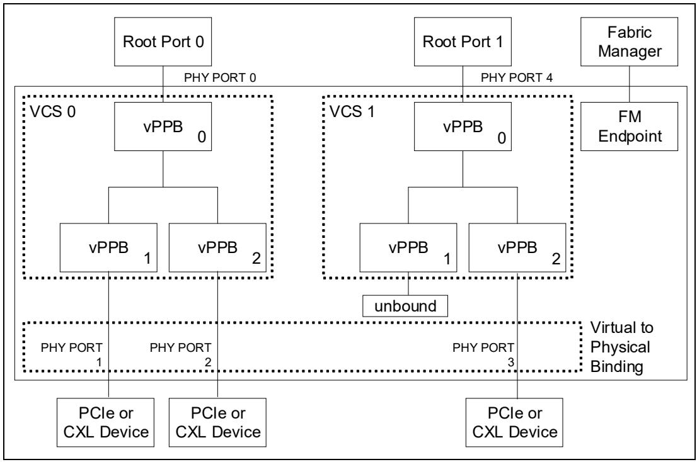
>
> *Original page render @ 150 DPI* — [📄 Full size](figures/chapter_07/page_0327.png)

<table>
<thead>
<tr>
<th>Table 7-1.</th>
<th>CXL Switch Sideband Signal Requirements ｜ CXL 交换机边带信号要求</th>
</tr>
</thead>
<tbody>
<tr><td>

| Signal Name | Signal Description | Requirement |
|---|---|---|
| USP PERST# | PCIe Reset provides a fundamental reset to the VCS | This signal must be connected to the switch if implemented |
| USP ATTN# | Attention button indicates a request to the host for a managed hot-remove of the switch | If hot-remove of the switch is supported, this signal must be generated by the switch |
| DSP PERST# | PCIe Reset provides a power-on reset to the downstream link partner | This signal must be generated by the switch if implemented |
| DSP PRSNT# | Out-of-band Presence Detect indicates that a device has been connected to the slot | This signal must be connected to the switch if implemented |
| DSP ATTN# | Attention button indicates a request to the host for a managed hot-remove of the downstream slot | If managed hot-remove is supported, this signal must be connected to the switch |

</td></tr>
</tbody>
</table>

<table>
<thead>
<tr>
<th width="50%">🇬🇧 English</th>
<th width="50%" style="background-color:#e8e8e8">🇨🇳 中文</th>
</tr>
</thead>
<tbody>
<tr><td>USP PERST#</td><td style="background-color:#e8e8e8">USP PERST#</td></tr>
<tr><td>PCIe Reset provides a fundamental reset to the VCS</td><td style="background-color:#e8e8e8">PCIe 复位为 VCS 提供基本复位</td></tr>
<tr><td>This signal must be connected to the switch if implemented</td><td style="background-color:#e8e8e8">若实现该信号,必须将其连接到交换机</td></tr>
<tr><td>USP ATTN#</td><td style="background-color:#e8e8e8">USP ATTN#</td></tr>
<tr><td>Attention button indicates a request to the host for a managed hot-remove of the switch</td><td style="background-color:#e8e8e8">Attention 按钮向主机发出对交换机进行托管热移除 (managed hot-remove) 的请求</td></tr>
<tr><td>If hot-remove of the switch is supported, this signal must be generated by the switch</td><td style="background-color:#e8e8e8">若支持交换机的热移除,该信号必须由交换机生成</td></tr>
<tr><td>DSP PERST#</td><td style="background-color:#e8e8e8">DSP PERST#</td></tr>
<tr><td>PCIe Reset provides a power-on reset to the downstream link partner</td><td style="background-color:#e8e8e8">PCIe 复位为下游链路对端 (link partner) 提供上电复位</td></tr>
<tr><td>This signal must be generated by the switch if implemented</td><td style="background-color:#e8e8e8">若实现该信号,必须由交换机生成</td></tr>
<tr><td>DSP PRSNT#</td><td style="background-color:#e8e8e8">DSP PRSNT#</td></tr>
<tr><td>Out-of-band Presence Detect indicates that a device has been connected to the slot</td><td style="background-color:#e8e8e8">带外存在检测 (Out-of-band Presence Detect) 指示已有设备连接到该插槽</td></tr>
<tr><td>This signal must be connected to the switch if implemented</td><td style="background-color:#e8e8e8">若实现该信号,必须将其连接到交换机</td></tr>
<tr><td>DSP ATTN#</td><td style="background-color:#e8e8e8">DSP ATTN#</td></tr>
<tr><td>Attention button indicates a request to the host for a managed hot-remove of the downstream slot</td><td style="background-color:#e8e8e8">Attention 按钮向主机发出对下行插槽进行托管热移除的请求</td></tr>
<tr><td>If managed hot-remove is supported, this signal must be connected to the switch</td><td style="background-color:#e8e8e8">若支持托管热移除,该信号必须连接到交换机</td></tr>
</tbody>
</table>

[⬆️ 返回目录](#-本章目录-part-a)

---

### 7.2.3 Binding and Unbinding | 绑定与解绑

<table>
<thead>
<tr>
<th width="50%">🇬🇧 English</th>
<th width="50%" style="background-color:#e8e8e8">🇨🇳 中文</th>
</tr>
</thead>
<tbody>
<tr><td>This section describes the details of Binding and Unbinding of CXL devices to a vPPB.</td><td style="background-color:#e8e8e8">本节介绍 CXL 设备绑定到 vPPB 以及从 vPPB 解绑的详细过程。</td></tr>
</tbody>
</table>

[⬆️ 返回目录](#-本章目录-part-a)

---

#### 7.2.3.1 Binding and Unbinding of a Single Logical Device Port | 单逻辑设备端口的绑定与解绑

<table>
<thead>
<tr>
<th width="50%">🇬🇧 English</th>
<th width="50%" style="background-color:#e8e8e8">🇨🇳 中文</th>
</tr>
</thead>
<tbody>
<tr><td>A Single Logical Device (SLD) port refers to a port that is bound to only one VCS. That port can be linked up with a PCIe device or a CXL Type 1, Type 2, or Type 3 SLD component. In general, the vPPB bound to the SLD port behaves the same as a PPB in a PCIe switch. An exception is that a vPPB can be unbound from any physical port. In this case the vPPB appears to the host as if it is in a Link Down state with no Presence Detect indication. If optional rebinding is desired, this switch must have an FM API support and FM connection. The Fabric Manager can bind any unused physical port to the unbound vPPB. After binding, all the vPPB port settings are applied to that physical port.</td><td style="background-color:#e8e8e8">单逻辑设备 (SLD) 端口指仅绑定到一个 VCS 的端口。该端口可与 PCIe 设备或 CXL Type 1、Type 2 或 Type 3 SLD 组件建立链路。总体上,绑定到 SLD 端口的 vPPB 行为与 PCIe 交换机中的 PPB 相同。一个例外是,vPPB 可从任何物理端口解绑。在这种情况下,vPPB 对主机呈现为处于 Link Down 状态,且无存在检测 (Presence Detect) 指示。如果希望支持可选的重新绑定,此交换机必须支持 FM API 并连接 FM。Fabric Manager 可将任何未使用的物理端口绑定到该未绑定的 vPPB。绑定之后,该 vPPB 的所有端口设置都将应用到该物理端口。</td></tr>
<tr><td>Figure 7-9 shows a switch with bound DSPs.</td><td style="background-color:#e8e8e8">图 7-9 展示了一台已绑定 DSP 的交换机。</td></tr>
<tr><td>Figure 7-10 shows the state of the switch after the FM has executed an unbind command to vPPB2 in VCS0. Unbind of the vPPB causes the switch to assert Link Disable to the port. The port then becomes FM-owned and is controlled by the PPB settings for that physical port. Through the FM API, the FM has CXL.io access to each FM-owned SLD port or FM-owned LD within an MLD component. The FM can choose to prepare the logical device for rebinding by triggering FLR or CXL Reset. The switch prohibits any CXL.io access from the FM to a bound SLD port and any CXL.io access from the FM to a bound LD within an MLD component. The FM API does not support FM generation of CXL.cache or CXL.mem transactions to any port.</td><td style="background-color:#e8e8e8">图 7-10 展示了 FM 对 VCS0 中的 vPPB2 执行 unbind 命令后交换机的状态。解绑 vPPB 会使交换机对该端口置位 Link Disable。随后该端口变为 FM 拥有 (FM-owned),并由该物理端口的 PPB 设置进行控制。通过 FM API,FM 可对每个 FM 拥有的 SLD 端口或 MLD 组件内的 FM-owned LD 进行 CXL.io 访问。FM 可选择通过触发 FLR 或 CXL Reset 来准备重新绑定逻辑设备。交换机禁止 FM 对已绑定的 SLD 端口以及 MLD 组件内已绑定的 LD 进行任何 CXL.io 访问。FM API 不支持 FM 向任何端口发起 CXL.cache 或 CXL.mem 事务。</td></tr>
</tbody>
</table>

> **Figure 7-9.** Example of Binding and Unbinding of an SLD Port ｜ SLD 端口的绑定与解绑示例
>
> 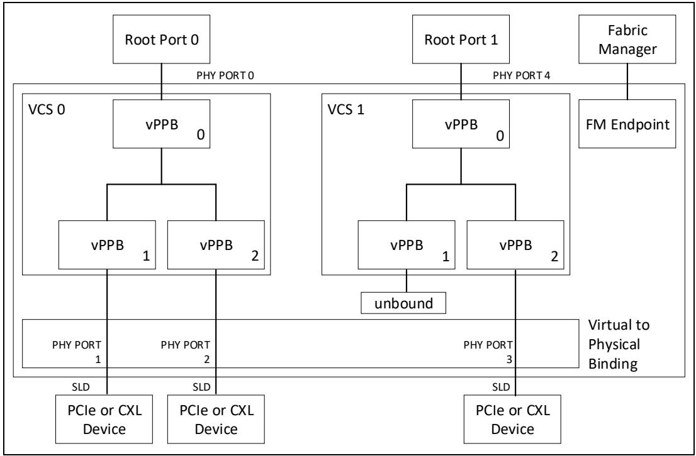
>
> *Original page render @ 150 DPI* — [📄 Full size](figures/chapter_07/page_0328.png)

<table>
<thead>
<tr>
<th width="50%">🇬🇧 English</th>
<th width="50%" style="background-color:#e8e8e8">🇨🇳 中文</th>
</tr>
</thead>
<tbody>
<tr><td>Figure 7-11 shows the state of the switch after the FM executes the bind command to connect VCS1.vPPB1 to the unbound physical port. The successful command execution results in the switch sending a hot-add indication to Host 1. Enumeration, configuration, and operation of the host and Type 3 device is identical to a hot-add of a device.</td><td style="background-color:#e8e8e8">图 7-11 展示了 FM 执行 bind 命令将 VCS1.vPPB1 连接到未绑定物理端口后交换机的状态。命令成功执行后,交换机会向 Host 1 发送 hot-add 指示。主机的枚举、配置以及对 Type 3 设备的操作与设备热添加 (hot-add) 时的行为相同。</td></tr>
</tbody>
</table>

> **Figure 7-10.** Example of CXL Switch Configuration after an Unbind Command ｜ 执行 Unbind 命令后的 CXL 交换机配置示例
>
> 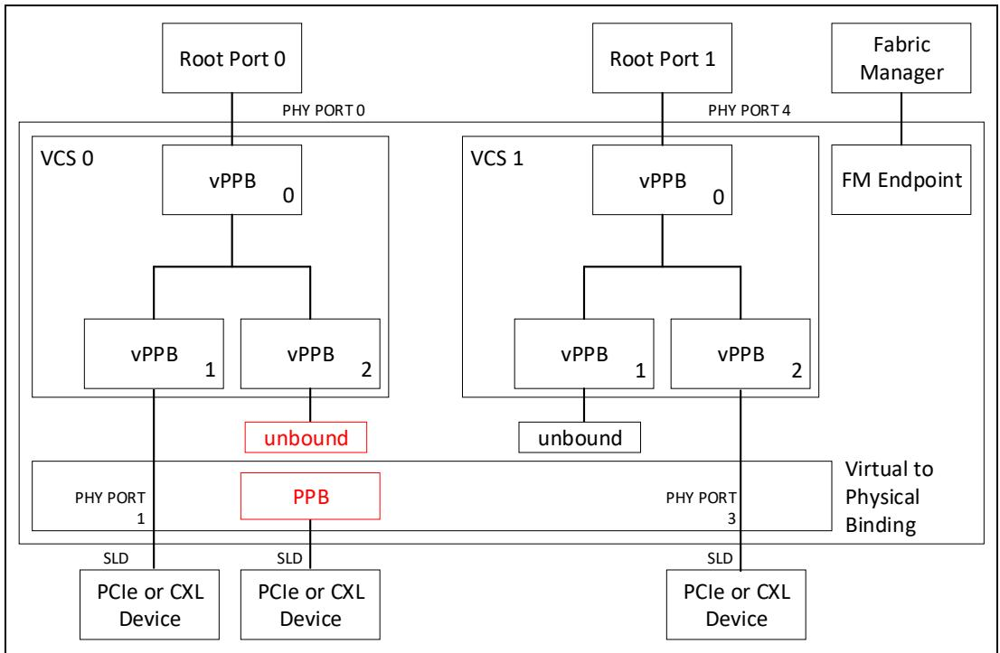
>
> *Original page render @ 150 DPI* — [📄 Full size](figures/chapter_07/page_0329.png)

> **Figure 7-11.** Example of CXL Switch Configuration after a Bind Command ｜ 执行 Bind 命令后的 CXL 交换机配置示例
>
> 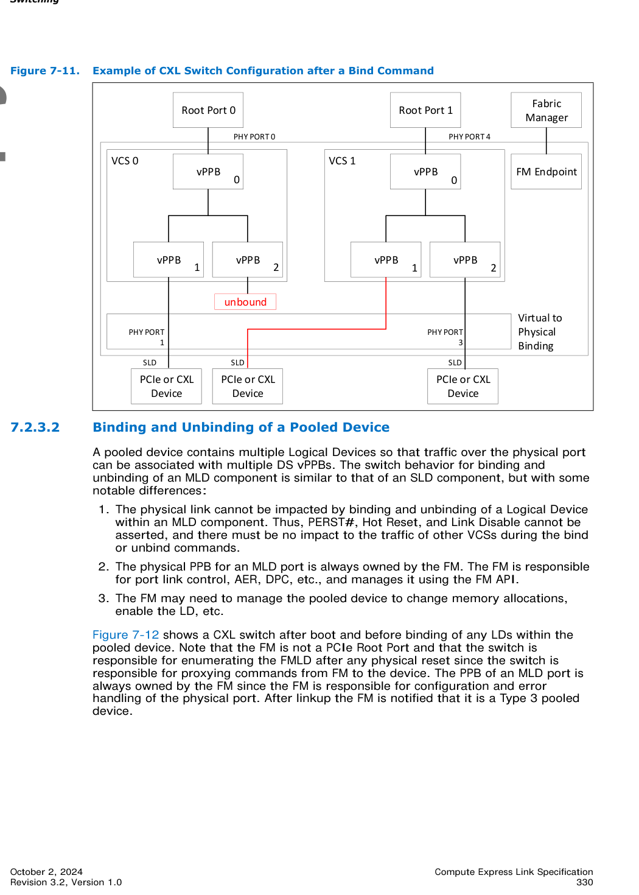
>
> *Original page render @ 150 DPI* — [📄 Full size](figures/chapter_07/page_0330.png)

[⬆️ 返回目录](#-本章目录-part-a)

---

#### 7.2.3.2 Binding and Unbinding of a Pooled Device | 池化设备的绑定与解绑

<table>
<thead>
<tr>
<th width="50%">🇬🇧 English</th>
<th width="50%" style="background-color:#e8e8e8">🇨🇳 中文</th>
</tr>
</thead>
<tbody>
<tr><td>A pooled device contains multiple Logical Devices so that traffic over the physical port can be associated with multiple DS vPPBs. The switch behavior for binding and unbinding of an MLD component is similar to that of an SLD component, but with some notable differences:</td><td style="background-color:#e8e8e8">池化设备包含多个逻辑设备 (Logical Device),以便通过物理端口的流量可以与多个 DS vPPB 相关联。交换机对 MLD 组件的绑定与解绑行为与 SLD 组件类似,但存在一些显著差异:</td></tr>
<tr><td>1. The physical link cannot be impacted by binding and unbinding of a Logical Device within an MLD component. Thus, PERST#, Hot Reset, and Link Disable cannot be asserted, and there must be no impact to the traffic of other VCSs during the bind or unbind commands.</td><td style="background-color:#e8e8e8">1. MLD 组件中逻辑设备的绑定与解绑不得影响物理链路。因此,不得置位 PERST#、Hot Reset 和 Link Disable,并且在执行 bind 或 unbind 命令期间不得影响其他 VCS 的流量。</td></tr>
<tr><td>2. The physical PPB for an MLD port is always owned by the FM. The FM is responsible for port link control, AER, DPC, etc., and manages it using the FM API.</td><td style="background-color:#e8e8e8">2. MLD 端口的物理 PPB 始终归 FM 拥有。FM 负责端口链路控制、AER、DPC 等,并通过 FM API 对其进行管理。</td></tr>
<tr><td>3. The FM may need to manage the pooled device to change memory allocations, enable the LD, etc.</td><td style="background-color:#e8e8e8">3. FM 可能需要管理池化设备,以更改内存分配、启用 LD 等。</td></tr>
<tr><td>Figure 7-12 shows a CXL switch after boot and before binding of any LDs within the pooled device. Note that the FM is not a PCIe Root Port and that the switch is responsible for enumerating the FMLD after any physical reset since the switch is responsible for proxying commands from FM to the device. The PPB of an MLD port is always owned by the FM since the FM is responsible for configuration and error handling of the physical port. After linkup the FM is notified that it is a Type 3 pooled device.</td><td style="background-color:#e8e8e8">图 7-12 展示了池化设备中尚未绑定任何 LD 时,交换机启动后的状态。注意,FM 不是 PCIe Root Port;交换机负责在任何物理复位后枚举 FMLD,因为交换机负责将来自 FM 的命令代理转发到设备。MLD 端口的 PPB 始终归 FM 拥有,因为 FM 负责物理端口的配置和错误处理。链路连接 (linkup) 后,FM 会收到通知,得知该设备为 Type 3 池化设备。</td></tr>
</tbody>
</table>

> **Figure 7-12.** Example of a CXL Switch before Binding of LDs within Pooled Device ｜ 在池化设备中绑定 LD 之前的 CXL 交换机示例
>
> 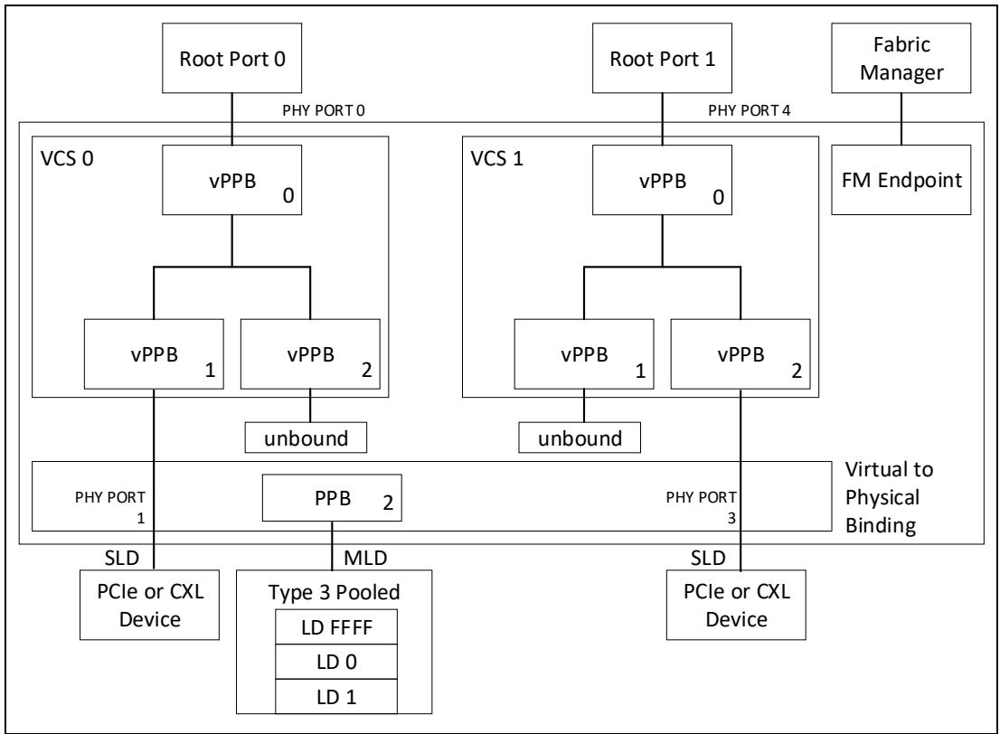
>
> *Original page render @ 150 DPI* — [📄 Full size](figures/chapter_07/page_0331.png)

<table>
<thead>
<tr>
<th width="50%">🇬🇧 English</th>
<th width="50%" style="background-color:#e8e8e8">🇨🇳 中文</th>
</tr>
</thead>
<tbody>
<tr><td>The FM configures the pooled device for Logical Device 1 (LD 1) and sets its memory allocation, etc. The FM performs a bind command for the unbound vPPB 2 in VCS 0 to LD 1 in the Type 3 pooled device. The switch performs the virtual-to-physical translations such that all CXL.io and CXL.mem transactions that target vPPB 2 in VCS 0 are routed to the MLD port with LD-ID set to 1. Additionally, all CXL.io and CXL.mem transactions from LD 1 in the pooled device are routed according to the host configuration of VCS 0. After binding, the vPPB notifies the VCS 0 host of a hot-add the same as if it were binding a vPPB to an SLD port.</td><td style="background-color:#e8e8e8">FM 为池化设备配置逻辑设备 1 (LD 1),并设置其内存分配等。FM 对 VCS 0 中未绑定的 vPPB 2 与 Type 3 池化设备中的 LD 1 执行 bind 命令。交换机执行虚拟到物理的转换,将所有目标为 VCS 0 中 vPPB 2 的 CXL.io 和 CXL.mem 事务路由到 LD-ID 设为 1 的 MLD 端口。此外,池化设备中来自 LD 1 的所有 CXL.io 和 CXL.mem 事务,均根据 VCS 0 的主机配置进行路由。绑定之后,vPPB 像将 vPPB 绑定到 SLD 端口时一样,向 VCS 0 主机通知一次 hot-add。</td></tr>
</tbody>
</table>

> **Figure 7-13.** Example of a CXL Switch after Binding of LD-ID 1 within Pooled Device ｜ 在池化设备中绑定 LD-ID 1 之后的 CXL 交换机示例
>
> 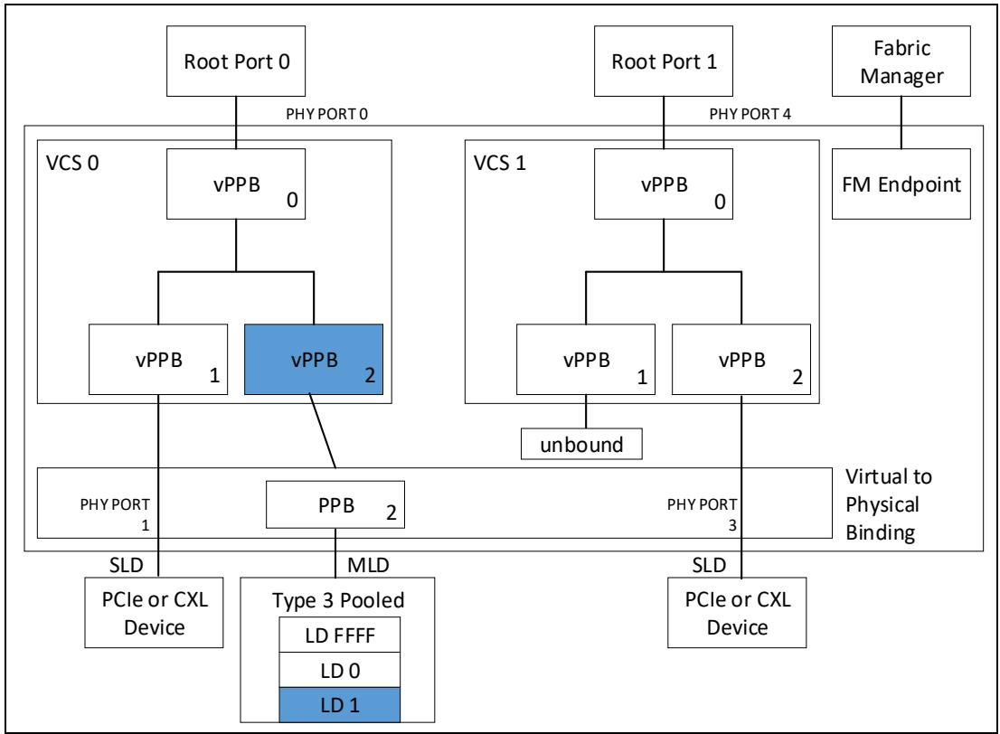
>
> *Original page render @ 150 DPI* — [📄 Full size](figures/chapter_07/page_0332.png)

<table>
<thead>
<tr>
<th width="50%">🇬🇧 English</th>
<th width="50%" style="background-color:#e8e8e8">🇨🇳 中文</th>
</tr>
</thead>
<tbody>
<tr><td>The FM configures the pooled device for Logical Device 0 (LD 0) and sets its memory allocation, etc. The FM performs a bind command for the unbound vPPB 1 in VCS 1 to LD 0 in the Type 3 pooled device. The switch performs the virtual to physical translations such that all CXL.io and CXL.mem transactions targeting the vPPB in VCS 1 are routed to the MLD port with LD-ID set to 0. Additionally, all CXL.io and CXL.mem transactions from LD-ID = 0 in the pooled device are routed to the USP of VCS 1. After binding, the vPPB notifies the VCS 1 host of a hot-add the same as if it were binding a vPPB to an SLD port.</td><td style="background-color:#e8e8e8">FM 为池化设备配置逻辑设备 0 (LD 0),并设置其内存分配等。FM 对 VCS 1 中未绑定的 vPPB 1 与 Type 3 池化设备中的 LD 0 执行 bind 命令。交换机执行虚拟到物理的转换,将所有目标为 VCS 1 中 vPPB 的 CXL.io 和 CXL.mem 事务路由到 LD-ID 设为 0 的 MLD 端口。此外,池化设备中来自 LD-ID = 0 的所有 CXL.io 和 CXL.mem 事务,均被路由到 VCS 1 的 USP。绑定之后,vPPB 像将 vPPB 绑定到 SLD 端口时一样,向 VCS 1 主机通知一次 hot-add。</td></tr>
<tr><td>Figure 7-14 shows the state of the switch after binding LD 0 to VCS 1.</td><td style="background-color:#e8e8e8">图 7-14 展示了将 LD 0 绑定到 VCS 1 之后交换机的状态。</td></tr>
<tr><td>After binding LDs to vPPBs, the switch behavior is different from a bound SLD Port with respect to control, status, error notification, and error handling. Section 7.3.4 describes the differences in behavior for all bits within each register.</td><td style="background-color:#e8e8e8">将 LD 绑定到 vPPB 之后,交换机在控制、状态、错误通知和错误处理方面的行为与已绑定的 SLD 端口有所不同。7.3.4 节描述了每个寄存器中所有位的具体行为差异。</td></tr>
</tbody>
</table>

> **Figure 7-14.** Example of a CXL Switch after Binding of LD-IDs 0 and 1 within Pooled Device ｜ 在池化设备中绑定 LD-ID 0 和 1 之后的 CXL 交换机示例
>
> 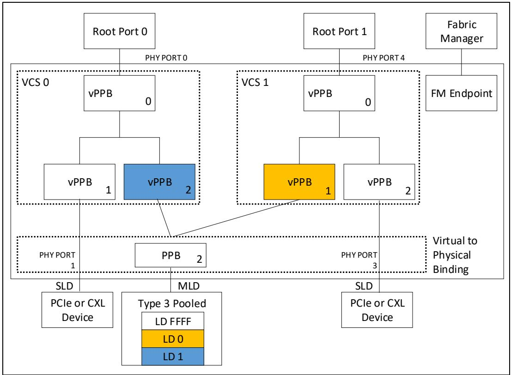
>
> *Original page render @ 150 DPI* — [📄 Full size](figures/chapter_07/page_0333.png)

[⬆️ 返回目录](#-本章目录-part-a)

---

### 7.2.4 PPB and vPPB Behavior for MLD Ports | MLD 端口的 PPB 与 vPPB 行为

<table>
<thead>
<tr>
<th width="50%">🇬🇧 English</th>
<th width="50%" style="background-color:#e8e8e8">🇨🇳 中文</th>
</tr>
</thead>
<tbody>
<tr><td>An MLD port provides a virtualized interface such that multiple vPPBs can access LDs over a shared physical interface. As a result, the characteristics and behavior of a vPPB that is bound to an MLD port are different than the behavior of a vPPB that is bound to an SLD port. This section defines the differences between them. If not mentioned in this section, the features and behavior of a vPPB that is bound to an MLD port are the same as those for a vPPB that is bound to an SLD port.</td><td style="background-color:#e8e8e8">MLD 端口提供虚拟化接口,使得多个 vPPB 可通过共享的物理接口访问各个 LD。因此,绑定到 MLD 端口的 vPPB 在特性和行为上与绑定到 SLD 端口的 vPPB 不同。本节定义二者之间的差异。若本节未提及,则绑定到 MLD 端口的 vPPB 的功能和行为与绑定到 SLD 端口的 vPPB 相同。</td></tr>
<tr><td>This section uses the following terminology:</td><td style="background-color:#e8e8e8">本节使用如下术语:</td></tr>
<tr><td>• Hardwire to 0 refers to status and optional control register bits that are initialized to 0. Writes to these bits have no effect.</td><td style="background-color:#e8e8e8">• Hardwire to 0 (硬连线为 0) 是指状态位以及可选的控制寄存器位,这些位被初始化为 0。对这些位的写操作不起作用。</td></tr>
<tr><td>• The term 'Read/Write with no Effect' refers to control register bits where writes are recorded but have no effect on operation. Reads to those bits reflect the previously written value or the initialization value if it has not been changed since initialization.</td><td style="background-color:#e8e8e8">• 'Read/Write with no Effect' (读写但无效果) 是指这些控制寄存器位上的写操作会被记录,但对运行没有影响。读取这些位时,会返回先前写入的值,或者在初始化后未更改时返回其初始值。</td></tr>
</tbody>
</table>

[⬆️ 返回目录](#-本章目录-part-a)

---

#### 7.2.4.1 MLD Type 1 Configuration Space Header | MLD Type 1 配置空间头

<table>
<thead>
<tr>
<th width="50%">🇬🇧 English</th>
<th width="50%" style="background-color:#e8e8e8">🇨🇳 中文</th>
</tr>
</thead>
<tbody>
<tr><td>(This subsection has no body text; it is the heading for Table 7-2.)</td><td style="background-color:#e8e8e8">(本小节无正文,仅为表 7-2 的标题。)</td></tr>
</tbody>
</table>

<table>
<thead>
<tr>
<th>Table 7-2. MLD Type 1 Configuration Space Header ｜ MLD Type 1 配置空间头</th>
</tr>
</thead>
<tbody>
<tr><td>

| Register | Register Fields | FM-owned PPB | All Other vPPBs |
|---|---|---|---|
| Bridge Control Register | Parity Error Response Enable | Supported | Hardwire to 0s |
|  | SERR# Enable | Supported | Read/Write with no effect |
|  | ISA Enable | Not supported | Not supported |
|  | Secondary Bus Reset | (see Section 7.5 for SBR details for MLD ports) | Supported | Read/Write with no effect. Optional FM Event. |

</td></tr>
</tbody>
</table>

[⬆️ 返回目录](#-本章目录-part-a)

---

#### 7.2.4.2 MLD PCIe-compatible Configuration Registers | MLD PCIe 兼容配置寄存器

<table>
<thead>
<tr>
<th width="50%">🇬🇧 English</th>
<th width="50%" style="background-color:#e8e8e8">🇨🇳 中文</th>
</tr>
</thead>
<tbody>
<tr><td>(This subsection has no body text; it is the heading for Table 7-3.)</td><td style="background-color:#e8e8e8">(本小节无正文,仅为表 7-3 的标题。)</td></tr>
</tbody>
</table>

<table>
<thead>
<tr>
<th>Table 7-3. MLD PCIe-compatible Configuration Registers ｜ MLD PCIe 兼容配置寄存器</th>
</tr>
</thead>
<tbody>
<tr><td>

| Register/Capability Structure | Capability Register Fields | FM-owned PPB | All vPPBs Bound to the MLD Port |
|---|---|---|---|
| Command Register | I/O Space Enable | Hardwire to 0s | Hardwire to 0s |
|  | Memory Space Enable | Supported | Supported per vPPB |
|  | Bus Master Enable | Supported | Supported per vPPB |
|  | Parity Error Response | Supported | Read/Write with no effect |
|  | SERR# Enable | Supported | Supported per vPPB |
|  | Interrupt Disable | Supported | Hardwire to 0s |
| Status Register | Interrupt Status | Hardwire to 0 (INTx is not supported) | Hardwire to 0s |
|  | Master Data Parity Error | Supported | Hardwire to 0s |
|  | Signaled System Error | Supported | Supported per vPPB |
|  | Detected Parity Error | Supported | Hardwire to 0s |

</td></tr>
</tbody>
</table>

[⬆️ 返回目录](#-本章目录-part-a)

---

#### 7.2.4.3 MLD PCIe Capability Structure | MLD PCIe Capability 结构

<table>
<thead>
<tr>
<th width="50%">🇬🇧 English</th>
<th width="50%" style="background-color:#e8e8e8">🇨🇳 中文</th>
</tr>
</thead>
<tbody>
<tr><td>(This subsection has no body text; it is the heading for Table 7-4.)</td><td style="background-color:#e8e8e8">(本小节无正文,仅为表 7-4 的标题。)</td></tr>
</tbody>
</table>

<table>
<thead>
<tr>
<th>Table 7-4. MLD PCIe Capability Structure (Sheet 1 of 3) ｜ MLD PCIe Capability 结构 (第 1 页 / 共 3 页)</th>
</tr>
</thead>
<tbody>
<tr><td>

| Register/Capability Structure | Capability Register Fields | FM-owned PPB | All vPPBs Bound to the MLD Port |
|---|---|---|---|
| Device Capabilities Register | Max_Payload_Size Supported | Configured by the FM to the max value supported by switch hardware and min value configured in all vPPBs | Mirrors PPB |
|  | Phantom Functions Supported | Hardwire to 0s | Hardwire to 0s |
|  | Extended Tag Field Supported | Supported | Mirrors PPB |
| Device Control Register | Max_Payload_Size | Configured by the FM to Max_Payload Size Supported | Read/Write with no effect |
| Link Capabilities Register | Link Bandwidth Notification Capability | Hardwire to 0s | Hardwire to 0s |
| Link Capabilities | ASPM Support | No L0s support | No L0s support |
|  | Clock Power Management | No PM L1 Substates support | No PM L1 Substates support |
| Link Control | ASPM Control | Supported | Switch only enables ASPM if all vPPBs that are bound to this MLD have enabled ASPM |
|  | Link Disable | Supported | Switch handles it as an unbind by discarding all traffic to/from this LD-ID |
|  | Retrain Link | Supported | Read/Write with no effect |
|  | Common Clock Configuration | Supported | Read/Write with no effect |
|  | Extended Synch | Supported | Read/Write with no effect |
|  | Hardware Autonomous Width Disable | Supported | Read/Write with no effect |
|  | Link Bandwidth Management Interrupt Enable | Supported | Read/Write with no effect |
|  | Link Autonomous Bandwidth Interrupt Enable | Supported | Supported per vPPB. Each host can be notified of autonomous speed change |
|  | DRS Signaling Control | Supported | Switch sends DRS after receiving DRS on the link and after binding of the vPPB to an LD |
| Link Status register | Current Link Speed | Supported | Mirrors PPB |
|  | Negotiated Link Width | Supported | Mirrors PPB |
|  | Link Training | Supported | Hardwire to 0s |
|  | Slot Clock Configuration | Supported | Mirrors PPB |
|  | Data Link Layer Active | Supported | Mirrors PPB |
|  | Link Autonomous Bandwidth Status | Supported | Supported per vPPB |
| Slot Capabilities Register | Hot-Plug Surprise | Hardwire to 0s | Hardwired to 0s |
|  | Physical Slot Number | Supported | Mirrors PPB |
| Slot Status Register | Attention Button Pressed | Supported | Mirrors PPB or is set by the switch on unbind |
|  | Power Fault Detected | Supported | Mirrors PPB |
|  | MRL Sensor Changed | Supported | Mirrors PPB |
|  | Presence Detect Changed | Supported | Mirrors PPB or is set by the switch on unbind |
|  | MRL Sensor State | Supported | Mirrors PPB |
|  | Presence Detect State | Supported | Mirrors PPB or set by the switch on bind or unbind |
|  | Electromechanical Interlock Status | Supported | Mirrors PPB |
|  | Data Link Layer State Changed | Supported | Mirrors PPB or set by the switch on bind or unbind |
| Device Capabilities 2 Register | OBFF Supported | Hardwire to 0s | Hardwire to 0s |

</td></tr>
</tbody>
</table>

<table>
<thead>
<tr>
<th>Table 7-4. MLD PCIe Capability Structure (Sheet 2 of 3) ｜ MLD PCIe Capability 结构 (第 2 页 / 共 3 页)</th>
</tr>
</thead>
<tbody>
<tr><td>

| Register/Capability Structure | Capability Register Fields | FM-owned PPB | All vPPBs Bound to the MLD Port |
|---|---|---|---|
| Device Control 2 Register | ARI Forwarding Enable | Supported | Supported per vPPB |
|  | Atomic Op Egress Blocking | Supported | Mirrors PPB. Read/Write with no effect |
|  | LTR Mechanism Enabled | Supported | Supported per vPPB |
|  | Emergency Power Reduction Request | Supported | Read/Write with no effect. Optional FM notification. |
|  | End-End TLP Prefix Blocking | Supported | Mirrors PPB. Read/Write with no effect |
| Link Control 2 Register | Target Link Speed | Supported | Read/Write with no effect. Optional FM notification. |
|  | Enter Compliance | Supported | Read/Write with no effect |
|  | Hardware Autonomous Speed Disable | Supported | Read/Write with no effect. Optional FM notification. |
|  | Selectable De-emphasis | Supported | Read/Write with no effect |
|  | Transmit Margin | Supported | Read/Write with no effect |
|  | Enter Modified Compliance | Supported | Read/Write with no effect |
|  | Compliance SOS | Supported | Read/Write with no effect |
|  | Compliance Preset/De-emphasis | Supported | Read/Write with no effect |
| Link Status 2 Register | Current De-emphasis Level | Supported | Mirrors PPB |
|  | Equalization 8.0 GT/s Complete | Supported | Mirrors PPB |
|  | Equalization 8.0 GT/s Phase 1 Successful | Supported | Mirrors PPB |
|  | Equalization 8.0 GT/s Phase 2 Successful | Supported | Mirrors PPB |
|  | Equalization 8.0 GT/s Phase 3 Successful | Supported | Mirrors PPB |
|  | Link Equalization Request 8.0 GT/s | Supported | Read/Write with no effect |
|  | Retimer Presence Detected | Supported | Mirrors PPB |
|  | Two Retimers Presence Detected | Supported | Mirrors PPB |
|  | Crosslink Resolution | Hardwire to 0s | Hardwire to 0s |
|  | Downstream Component Presence | Supported | Reflects the binding state of the vPPB |
|  | DRS Message Received | Supported | Switch sends DRS after receiving DRS on the link and after binding of the vPPB to an LD |

</td></tr>
</tbody>
</table>

<table>
<thead>
<tr>
<th>Table 7-4. MLD PCIe Capability Structure (Sheet 3 of 3) ｜ MLD PCIe Capability 结构 (第 3 页 / 共 3 页)</th>
</tr>
</thead>
<tbody>
<tr><td>

| Register/Capability Structure | Capability Register Fields | FM-owned PPB | All vPPBs Bound to the MLD Port |
|---|---|---|---|
| (Continued from prior sheet) |  |  |  |

</td></tr>
</tbody>
</table>

[⬆️ 返回目录](#-本章目录-part-a)

---

#### 7.2.4.4 MLD PPB Secondary PCIe Capability Structure | MLD PPB Secondary PCIe Capability 结构

<table>
<thead>
<tr>
<th width="50%">🇬🇧 English</th>
<th width="50%" style="background-color:#e8e8e8">🇨🇳 中文</th>
</tr>
</thead>
<tbody>
<tr><td>All fields in the Secondary PCIe Capability Structure for a Virtual PPB shall behave identically to PCIe except the following:</td><td style="background-color:#e8e8e8">Virtual PPB 的 Secondary PCIe Capability 结构中的所有字段除下列情况外,行为均与 PCIe 相同:</td></tr>
</tbody>
</table>

<table>
<thead>
<tr>
<th>Table 7-5. MLD Secondary PCIe Capability Structure ｜ MLD Secondary PCIe Capability 结构</th>
</tr>
</thead>
<tbody>
<tr><td>

| Register/Capability Structure | Capability Register Fields | FM-owned PPB | All vPPBs Bound to the MLD Port |
|---|---|---|---|
| Link Control 3 Register | Perform Equalization | Supported | Read/Write with no effect |
|  | Link Equalization Request Interrupt Enable | Supported | Read/Write with no effect |
|  | Enable Lower SKP OS Generation Vector | Supported | Read/Write with no effect |
| Lane Error Status Register | All fields | Supported | Mirrors PPB |
| Lane Equalization Control Register | All fields | Supported | Read/Write with no effect |
| Data Link Feature Capabilities Register | All fields | Supported | Hardwire to 0s |
| Data Link Feature Status Register | All fields | Supported | Hardwire to 0s |

</td></tr>
</tbody>
</table>

[⬆️ 返回目录](#-本章目录-part-a)

---

#### 7.2.4.5 MLD Physical Layer 16.0 GT/s Extended Capability | MLD 物理层 16.0 GT/s 扩展能力

<table>
<thead>
<tr>
<th width="50%">🇬🇧 English</th>
<th width="50%" style="background-color:#e8e8e8">🇨🇳 中文</th>
</tr>
</thead>
<tbody>
<tr><td>All fields in the Physical Layer 16.0 GT/s Extended Capability Structure for a Virtual PPB shall behave identically to PCIe except the following:</td><td style="background-color:#e8e8e8">Virtual PPB 的 Physical Layer 16.0 GT/s Extended Capability 结构中的所有字段除下列情况外,行为均与 PCIe 相同:</td></tr>
</tbody>
</table>

<table>
<thead>
<tr>
<th>Table 7-6. MLD Physical Layer 16.0 GT/s Extended Capability ｜ MLD 物理层 16.0 GT/s 扩展能力</th>
</tr>
</thead>
<tbody>
<tr><td>

| Register/Capability Structure | Capability Register Fields | FM-owned PPB | All vPPBs Bound to the MLD Port |
|---|---|---|---|
| 16.0 GT/s Status Register | All fields | Supported | Mirrors PPB |
| 16.0 GT/s Local Data Parity Mismatch Status Register | Local Data Parity Mismatch Status Register | Supported | Mirrors PPB |
| 16.0 GT/s First Retimer Data Parity Mismatch Status Register | First Retimer Data Parity Mismatch Status | Supported | Mirrors PPB |
| 16.0 GT/s Second Retimer Data Parity Mismatch Status Register | Second Retimer Data Parity Mismatch Status | Supported | Mirrors PPB |
| 16.0 GT/s Lane Equalization Control Register | Downstream Port 16.0 GT/s Transmitter Preset | Supported | Mirrors PPB |

</td></tr>
</tbody>
</table>

[⬆️ 返回目录](#-本章目录-part-a)

---

#### 7.2.4.6 MLD Physical Layer 32.0 GT/s Extended Capability | MLD 物理层 32.0 GT/s 扩展能力

<table>
<thead>
<tr>
<th width="50%">🇬🇧 English</th>
<th width="50%" style="background-color:#e8e8e8">🇨🇳 中文</th>
</tr>
</thead>
<tbody>
<tr><td>(This subsection has no body text; it is the heading for Table 7-7.)</td><td style="background-color:#e8e8e8">(本小节无正文,仅为表 7-7 的标题。)</td></tr>
</tbody>
</table>

<table>
<thead>
<tr>
<th>Table 7-7. MLD Physical Layer 32.0 GT/s Extended Capability ｜ MLD 物理层 32.0 GT/s 扩展能力</th>
</tr>
</thead>
<tbody>
<tr><td>

| Register/Capability Structure | Capability Register Fields | FM-owned PPB | All vPPBs Bound to the MLD Port |
|---|---|---|---|
| 32.0 GT/s Capabilities Register | All fields | Supported | Mirrors PPB |
| 32.0 GT/s Control Register | All fields | Supported | Read/Write with no effect |
| 32.0 GT/s Status Register | Link Equalization Request 32.0 GT/s | Supported | Read/Write with no effect |
|  | All fields except Link Equalization Request 32.0 GT/s | Supported | Mirrors PPB |
| Received Modified TS Data 1 Register | All fields | Supported | Mirrors PPB |
| Received Modified TS Data 2 Register | All fields | Supported | Mirrors PPB |
| Transmitted Modified TS Data 1 Register | All fields | Supported | Mirrors PPB |
| 32.0 GT/s Lane Equalization Control Register | Downstream Port 32.0 GT/s Transmitter Preset | Supported | Mirrors PPB |

</td></tr>
</tbody>
</table>

[⬆️ 返回目录](#-本章目录-part-a)

---

#### 7.2.4.7 MLD Lane Margining at the Receiver Extended Capability | MLD 接收端 Lane Margining 扩展能力

<table>
<thead>
<tr>
<th width="50%">🇬🇧 English</th>
<th width="50%" style="background-color:#e8e8e8">🇨🇳 中文</th>
</tr>
</thead>
<tbody>
<tr><td>(This subsection has no body text; it is the heading for Table 7-8.)</td><td style="background-color:#e8e8e8">(本小节无正文,仅为表 7-8 的标题。)</td></tr>
</tbody>
</table>

<table>
<thead>
<tr>
<th>Table 7-8. MLD Lane Margining at the Receiver Extended Capability ｜ MLD 接收端 Lane Margining 扩展能力</th>
</tr>
</thead>
<tbody>
<tr><td>

| Register/Capability Structure | Capability Register Fields | FM-owned PPB | All vPPBs Bound to the MLD Port |
|---|---|---|---|
| Margining Port Status Register | All fields | Supported | Always indicates Margining Ready and Margining Software Ready |
| Margining Lane Control Register | All fields | Supported | Read/Write with no effect |

</td></tr>
</tbody>
</table>

[⬆️ 返回目录](#-本章目录-part-a)

---

### 7.2.5 MLD ACS Extended Capability | MLD ACS 扩展能力

<table>
<thead>
<tr>
<th width="50%">🇬🇧 English</th>
<th width="50%" style="background-color:#e8e8e8">🇨🇳 中文</th>
</tr>
</thead>
<tbody>
<tr><td>CXL.io Requests and Completions are routed to the USP.</td><td style="background-color:#e8e8e8">CXL.io 请求和完成报文被路由到 USP。</td></tr>
</tbody>
</table>

<table>
<thead>
<tr>
<th>Table 7-9. MLD ACS Extended Capability ｜ MLD ACS 扩展能力</th>
</tr>
</thead>
<tbody>
<tr><td>

| Register/Capability Structure | Capability Register Fields | FM-owned PPB | All vPPBs Bound to the MLD Port |
|---|---|---|---|
| ACS Capability Register | All fields | Supported | Supported because a vPPB can be bound to any port type |
| ACS Control Register | ACS Source Validation Enable | Hardwire to 0 | Read/Write with no effect |
|  | ACS Translation Blocking Enable | Hardwire to 0 | Read/Write with no effect |
|  | ACS P2P Request Redirect Enable | Hardwire to 1 | Read/Write with no effect |
|  | ACS P2P Completion Redirect Enable | Hardwire to 1 | Read/Write with no effect |
|  | ACS Upstream Forwarding Enable | Hardwire to 0 | Read/Write with no effect |
|  | ACS P2P Egress Control Enable | Hardwire to 0 | Read/Write with no effect |
|  | ACS Direct Translated P2P Enable | Hardwire to 0 | Read/Write with no effect |
|  | ACS I/O Request Blocking Enable | Hardwire to 0 | Read/Write with no effect |
|  | ACS DSP Memory Target Access Control | Hardwire to 0s | Read/Write with no effect |
|  | ACS Unclaimed Request Redirect Control | Hardwire to 0 | Read/Write with no effect |

</td></tr>
</tbody>
</table>

[⬆️ 返回目录](#-本章目录-part-a)

---

### 7.2.6 MLD PCIe Extended Capabilities | MLD PCIe 扩展能力

<table>
<thead>
<tr>
<th width="50%">🇬🇧 English</th>
<th width="50%" style="background-color:#e8e8e8">🇨🇳 中文</th>
</tr>
</thead>
<tbody>
<tr><td>All fields in the PCIe Extended Capability structures for a vPPB shall behave identically to PCIe.</td><td style="background-color:#e8e8e8">vPPB 的 PCIe Extended Capability 结构中的所有字段行为均与 PCIe 相同。</td></tr>
</tbody>
</table>

[⬆️ 返回目录](#-本章目录-part-a)

---

### 7.2.7 MLD Advanced Error Reporting Extended Capability | MLD 高级错误报告 (AER) 扩展能力

<table>
<thead>
<tr>
<th width="50%">🇬🇧 English</th>
<th width="50%" style="background-color:#e8e8e8">🇨🇳 中文</th>
</tr>
</thead>
<tbody>
<tr><td>AER in an MLD port is separated into Triggering, Notifications, and Reporting. Triggering and AER Header Logging is handled at switch ingress and egress using switch-vendor-specific means. Notification is also switch-vendor specific, but it results in the vPPB logic for all vPPBs that are bound to the MLD port being informed of the AER errors that have been triggered. The vPPB logic is responsible for generating the AER status and error messages for each vPPB based on the AER Mask and Severity registers.</td><td style="background-color:#e8e8e8">MLD 端口中的 AER 被分为触发 (Triggering)、通知 (Notifications) 和报告 (Reporting) 三部分。触发和 AER Header Logging 由交换机厂商特定的方式在交换机入口和出口处处理。通知同样是交换机厂商特定的,但其结果会让绑定到 MLD 端口的所有 vPPB 的 vPPB 逻辑获知已触发的 AER 错误。vPPB 逻辑负责根据 AER Mask 和 Severity 寄存器,针对每个 vPPB 生成 AER 状态和错误消息。</td></tr>
<tr><td>vPPBs that are bound to an MLD port support all the AER Mask and Severity configurability; however, some of the Notifications are suppressed to avoid confusion.</td><td style="background-color:#e8e8e8">绑定到 MLD 端口的 vPPB 支持所有的 AER Mask 和 Severity 可配置性;不过,为避免混淆,部分通知会被抑制。</td></tr>
<tr><td>The PPB has its own AER Mask and Severity registers and the FM is notified of error conditions based on the Event Notification settings.</td><td style="background-color:#e8e8e8">PPB 拥有自己的 AER Mask 和 Severity 寄存器,FM 根据 Event Notification 设置接收错误条件通知。</td></tr>
<tr><td>Errors that are not vPPB specific are provided to the host with a header log containing all 1s data. The hardware header log is provided only to the FM through the PPB.</td><td style="background-color:#e8e8e8">非 vPPB 特定的错误会以 header log 全 1 数据的形式提供给主机。硬件的 header log 仅通过 PPB 提供给 FM。</td></tr>
</tbody>
</table>

<table>
<thead>
<tr>
<th>Table 7-10. MLD Advanced Error Reporting Extended Capability ｜ MLD 高级错误报告 (AER) 扩展能力</th>
</tr>
</thead>
<tbody>
<tr><td>

| Hardware Triggers | AER Error | FM-owned PPB | All vPPBs Bound to the MLD Port |
|---|---|---|---|
| AER Notifications | Data Link Protocol Error | Supported | Supported per vPPB |
|  | Surprise Down Error | Supported | Supported per vPPB |
|  | Poisoned TLP Received | Supported | Hardwire to 0 |
|  | Flow Control Protocol Error | Supported | Supported per vPPB |
|  | Completer Abort | Supported | Supported to the vPPB that generated it |
|  | Unexpected Completion | Supported | Supported to the vPPB that received it |
|  | Receiver Overflow | Supported | Supported per vPPB |
|  | Malformed TLP | Supported | Supported per vPPB |
|  | ECRC Error | Supported | Hardwire to 0 |
|  | Unsupported Request | Supported | Supported per vPPB |
|  | ACS Violation | Supported | Hardwire to 0 |
|  | Uncorrectable Internal Error | Supported | Supported per vPPB |
|  | MC1 Blocked | Supported | Hardwire to 0 |
|  | Atomic Op Egress Block | Supported | Hardwire to 0 |
|  | E2E TLP Prefix Block | Supported | Hardwire to 0 |
|  | Poisoned TLP Egress block | Supported | Hardwire to 0 |
|  | Bad TLP (correctable) | Supported | Supported per vPPB |
|  | Bad DLLP (correctable) | Supported | Supported per vPPB |
|  | Replay Timer Timeout (correctable) | Supported | Supported per vPPB |
|  | Replay Number Rollover (correctable) | Supported | Supported per vPPB |
|  | Other Advisory Non-Fatal (correctable) | Supported | Supported per vPPB |
|  | Corrected Internal Error Status (correctable) | Supported | Supported per vPPB |
|  | Header Log Overflow Status (correctable) | Supported | Supported per vPPB |

1. Refers to Multicast.

</td></tr>
</tbody>
</table>

[⬆️ 返回目录](#-本章目录-part-a)

---

### 7.2.8 MLD DPC Extended Capability | MLD DPC 扩展能力

<table>
<thead>
<tr>
<th width="50%">🇬🇧 English</th>
<th width="50%" style="background-color:#e8e8e8">🇨🇳 中文</th>
</tr>
</thead>
<tbody>
<tr><td>Downstream Port Containment has special behavior for an MLD Port. The FM configures the AER Mask and Severity registers in the PPB and also configures the AER Mask and Severity registers in the FMLD in the pooled device. As in an SLD port an unmasked uncorrectable error detected in the PPB and an ERR_NONFATAL and/or ERR_FATAL received from the FMLD can trigger DPC.</td><td style="background-color:#e8e8e8">下行端口遏制 (DPC) 对 MLD 端口有特殊行为。FM 在 PPB 中配置 AER Mask 和 Severity 寄存器,同时也在池化设备的 FMLD 中配置 AER Mask 和 Severity 寄存器。与 SLD 端口相同,在 PPB 中检测到的未屏蔽的不可纠正错误,以及从 FMLD 收到的 ERR_NONFATAL 和/或 ERR_FATAL 都可以触发 DPC。</td></tr>
<tr><td>Continuing the model of the ultimate receiver being the entity that detects and reports errors, the ERR_FATAL and ERR_NONFATAL messages sent by a Logical Device can trigger a virtual DPC in the PPB. When a virtual DPC is triggered, the switch discards all traffic received from and transmitted to that specific LD. The LD remains bound to the vPPB and the FM is also notified. Software triggered DPC also triggers virtual DPC on a vPPB.</td><td style="background-color:#e8e8e8">延续“最终接收方是检测和报告错误的实体”的模型,逻辑设备发送的 ERR_FATAL 和 ERR_NONFATAL 消息可在 PPB 中触发虚拟 DPC (virtual DPC)。虚拟 DPC 触发后,交换机会丢弃从该特定 LD 接收到的以及发往该特定 LD 的所有流量。LD 仍保持与 vPPB 的绑定,同时也会通知 FM。软件触发的 DPC 也会在 vPPB 上触发虚拟 DPC。</td></tr>
<tr><td>When the DPC trigger is cleared the switch autonomously allows passing of traffic to/from the LD. Reporting of the DPC trigger to the host is identical to PCIe.</td><td style="background-color:#e8e8e8">DPC 触发条件清除后,交换机会自主恢复允许 LD 的流量通过。向主机报告 DPC 触发的方式与 PCIe 相同。</td></tr>
</tbody>
</table>

<table>
<thead>
<tr>
<th>Table 7-11. MLD PPB DPC Extended Capability ｜ MLD PPB DPC 扩展能力</th>
</tr>
</thead>
<tbody>
<tr><td>

| Register/Capability Structure | Capability Register Fields | FM-owned PPB | All vPPBs Bound to the MLD Port |
|---|---|---|---|
| DPC Control Register | DPC Trigger Enable | Supported | Switch internally detected unmasked uncorrectable errors do not trigger virtual DPC |
|  | DPC Trigger Reason | Supported | Unmasked uncorrectable error is not a valid value |

</td></tr>
</tbody>
</table>

[⬆️ 返回目录](#-本章目录-part-a)

---

### 7.2.9 Switch Mailbox CCI | 交换机 Mailbox CCI

<table>
<thead>
<tr>
<th width="50%">🇬🇧 English</th>
<th width="50%" style="background-color:#e8e8e8">🇨🇳 中文</th>
</tr>
</thead>
<tbody>
<tr><td>CXL Switch Mailbox CCIs optional. They are exposed as PCIe Endpoints with a Type 0 configuration space. In Single VCS and Multiple VCS, the Mailbox CCI is optional. If implemented, the Mailbox CCI shall be exposed to the Host in one of two possible configurations. In the first, it is exposed as an additional PCIe function in the Upstream Switch Port, as illustrated in Figure 7-15.</td><td style="background-color:#e8e8e8">CXL 交换机 Mailbox CCI 是可选的。它们作为 Type 0 配置空间的 PCIe Endpoint 暴露。在单 VCS 和多 VCS 中,Mailbox CCI 都是可选的。如果实现,Mailbox CCI 应以以下两种配置之一向主机暴露。第一种是将其作为 Upstream Switch Port 中的一个额外 PCIe Function 暴露,如图 7-15 所示。</td></tr>
<tr><td>Switch Mailbox CCIs may also be exposed in a VCS with no vPPBs. In this configuration, the Mailbox CCI device is the only PCIe function that is present in the Upstream Port, as illustrated in Figure 7-16.</td><td style="background-color:#e8e8e8">交换机 Mailbox CCI 也可以在没有任何 vPPB 的 VCS 中暴露。在此配置下,Mailbox CCI 设备是 Upstream Port 中唯一存在的 PCIe Function,如图 7-16 所示。</td></tr>
</tbody>
</table>

> **Figure 7-15.** Multi-function Upstream vPPB ｜ 多功能上游 vPPB
>
> 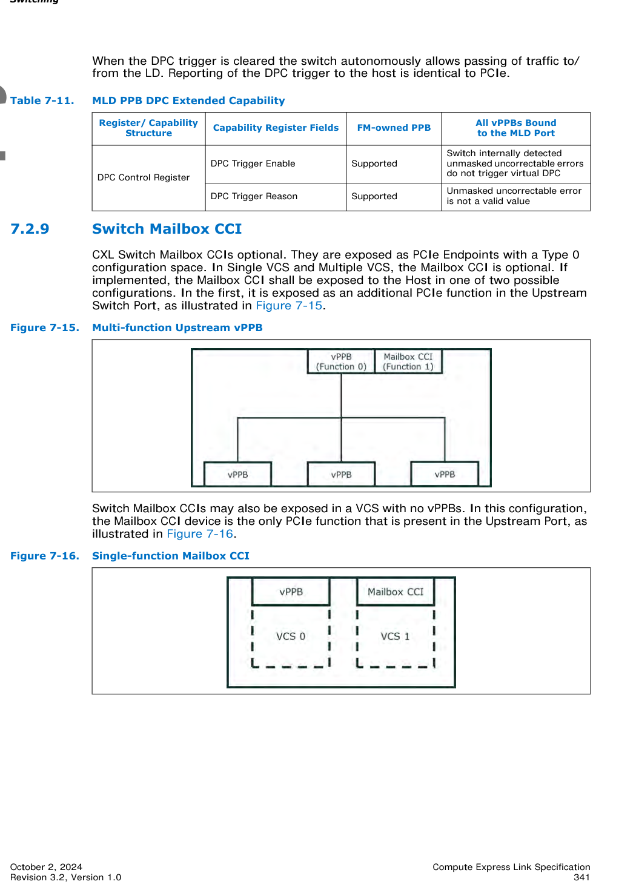
>
> *Original page render @ 150 DPI* — [📄 Full size](figures/chapter_07/page_0341.png)

> **Figure 7-16.** Single-function Mailbox CCI ｜ 单功能 Mailbox CCI
>
> 
>
> *Original page render @ 150 DPI* — [📄 Full size](figures/chapter_07/page_0341.png)

[⬆️ 返回目录](#-本章目录-part-a)

---

## 7.3 CXL.io, CXL.cachemem Decode and Forwarding | CXL.io, CXL.cachemem 解码与转发

<table>
<thead>
<tr>
<th width="50%">🇬🇧 English</th>
<th width="50%" style="background-color:#e8e8e8">🇨🇳 中文</th>
</tr>
</thead>
<tbody>
</tbody>
</table>

[⬆️ 返回目录](#-本章目录-part-a)

---

### 7.3.1 CXL.io | CXL.io

<table>
<thead>
<tr>
<th width="50%">🇬🇧 English</th>
<th width="50%" style="background-color:#e8e8e8">🇨🇳 中文</th>
</tr>
</thead>
<tbody>
<tr><td>Within a VCS, the CXL.io traffic must obey the same request, completion, address decode, and forwarding rules for a Switch as defined in PCIe Base Specification. There are additional decode rules that are defined to support an eRCD connected to a switch (see Section 9.12.4).</td><td style="background-color:#e8e8e8">在 VCS 内,CXL.io 流量必须遵循 PCIe Base Specification 中为交换机定义的相同请求、完成、地址解码和转发规则。此外还定义了一些额外的解码规则,以支持连接到交换机的 eRCD (参见 9.12.4 节)。</td></tr>
</tbody>
</table>

[⬆️ 返回目录](#-本章目录-part-a)

---

#### 7.3.1.1 CXL.io Decode | CXL.io 解码

<table>
<thead>
<tr>
<th width="50%">🇬🇧 English</th>
<th width="50%" style="background-color:#e8e8e8">🇨🇳 中文</th>
</tr>
</thead>
<tbody>
<tr><td>When a TLP is decoded by a PPB, it determines the destination PPB to route the TLP based on the rules defined in PCIe Base Specification. Unless specified otherwise, all rules defined in PCIe Base Specification apply for routing of CXL.io TLPs. TLPs must be routed to PPBs within the same VCS. Routing of TLPs to and from an FM-owned PPB need to follow additional rules as defined in Section 7.2.3. P2P inside a Switch complex is limited to PPBs within a VCS.</td><td style="background-color:#e8e8e8">当 TLP 由 PPB 解码时,它会根据 PCIe Base Specification 中定义的规则确定用于路由该 TLP 的目的 PPB。除非另有说明,PCIe Base Specification 中定义的所有规则均适用于 CXL.io TLP 的路由。TLP 必须被路由到同一 VCS 内的 PPB。TLP 在与 FM-owned PPB 之间的路由需遵循 7.2.3 节中定义的额外规则。交换机复合体 (Switch complex) 内的 P2P 通信仅限于同一 VCS 内的 PPB。</td></tr>
</tbody>
</table>

[⬆️ 返回目录](#-本章目录-part-a)

---

#### 7.3.1.2 RCD Support | RCD 支持

<table>
<thead>
<tr>
<th width="50%">🇬🇧 English</th>
<th width="50%" style="background-color:#e8e8e8">🇨🇳 中文</th>
</tr>
</thead>
<tbody>
<tr><td>RCDs are not supported behind ports that are configured to operate as FM-owned PPBs. When connected behind a switch, RCDs must appear to software as RCiEP devices. The mechanism defined in this section enables this functionality.</td><td style="background-color:#e8e8e8">RCD 不支持位于配置为 FM-owned PPB 的端口之后。当通过交换机连接时,RCD 必须对软件呈现为 RCiEP 设备。本节定义的机制可实现该功能。</td></tr>
<tr><td>The CXL Extensions DVSEC for Ports (see Section 8.1.5) defines the alternate MMIO and Bus Range Decode windows for forwarding of requests to eRCDs connected behind a Downstream Port.</td><td style="background-color:#e8e8e8">Ports 的 CXL Extensions DVSEC (参见 8.1.5 节) 定义了用于将请求转发到下行端口之后所连 eRCD 的备用 MMIO 和 Bus Range Decode 窗口。</td></tr>
</tbody>
</table>

> **Figure 7-17.** CXL Switch with a Downstream Link Auto-negotiated to Operate in RCD Mode ｜ 下游链路自动协商为 RCD 模式的 CXL 交换机
>
> 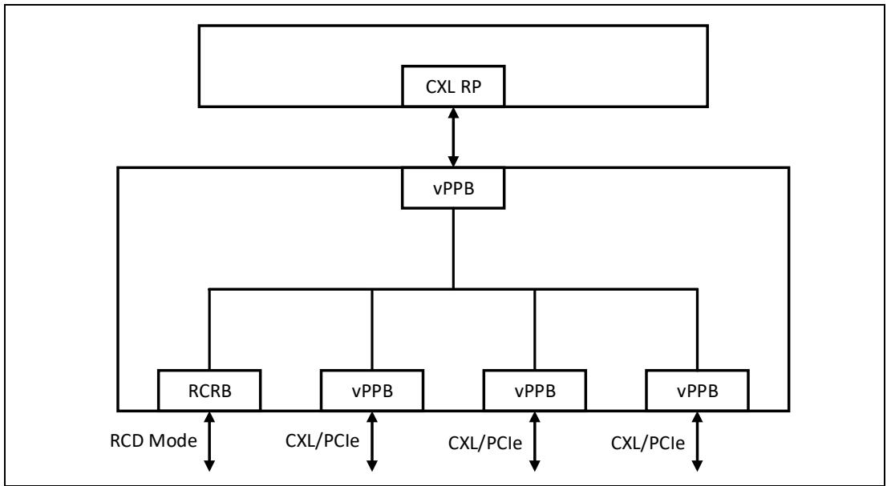
>
> *Original page render @ 150 DPI* — [📄 Full size](figures/chapter_07/page_0342.png)

[⬆️ 返回目录](#-本章目录-part-a)

---

### 7.3.2 CXL.cache | CXL.cache

<table>
<thead>
<tr>
<th width="50%">🇬🇧 English</th>
<th width="50%" style="background-color:#e8e8e8">🇨🇳 中文</th>
</tr>
</thead>
<tbody>
<tr><td>If the switch does not support CXL.cache protocol enhancements that enable multi-device scaling (as described in Section 8.2.4.28), only one of the CXL SLD ports in the VCS is allowed to be enabled to support Type 1 devices or Type 2 devices. Requests and Responses received on the USP are routed to the associated DSP and vice-versa. Therefore, additional decode registers are not required for CXL.cache for such switches.</td><td style="background-color:#e8e8e8">如果交换机不支持能够实现多设备扩展 (multi-device scaling) 的 CXL.cache 协议增强 (如 8.2.4.28 节所述),则 VCS 中的 CXL SLD 端口中只允许启用一个端口以支持 Type 1 设备或 Type 2 设备。在 USP 上接收到的请求和响应被路由到关联的 DSP,反之亦然。因此,对于此类交换机,CXL.cache 不需要额外的解码寄存器。</td></tr>
<tr><td>If the switch supports CXL.cache protocol enhancements that enable multi-device scaling, more than one of the CXL SLD ports in the VCS can be configured to support Type 1 devices or Type 2 devices. Section 9.15.2 and Section 9.15.3 describe how such a CXL switch routes CXL.cache traffic.</td><td style="background-color:#e8e8e8">如果交换机支持能够实现多设备扩展的 CXL.cache 协议增强,则可以将 VCS 中的多个 CXL SLD 端口配置为支持 Type 1 设备或 Type 2 设备。9.15.2 节和 9.15.3 节描述了此类 CXL 交换机如何路由 CXL.cache 流量。</td></tr>
<tr><td>CXL.cache is not supported over FM-owned PPBs.</td><td style="background-color:#e8e8e8">FM-owned PPB 不支持 CXL.cache。</td></tr>
</tbody>
</table>

[⬆️ 返回目录](#-本章目录-part-a)

---

#### 7.3.2.1 CXL.Cache Reserved bit forwarding | CXL.Cache 保留位转发

<table>
<thead>
<tr>
<th width="50%">🇬🇧 English</th>
<th width="50%" style="background-color:#e8e8e8">🇨🇳 中文</th>
</tr>
</thead>
<tbody>
<tr><td>A switch shall forward 256B Flit messages reserved bits between the ingress port and the egress port. Both HBR and PBR formats are defined for 256B flit messages where a switch can translate between those formats. When performing the translation between HBR and PBR formats defined for 256B flits the Reserved bits shall be preserved. When a switch with 256B flit capability sends to a port with 68B flit format the Reserved bits shall be set to zero. Similarly, messages received as 68B flit formats shall never have reserved bits forwarded to a port with 256B flit messages.</td><td style="background-color:#e8e8e8">交换机应在入口端口和出口端口之间转发 256B Flit 消息的保留位。256B Flit 消息同时定义了 HBR 和 PBR 两种格式,交换机可在两种格式之间进行转换。在对 256B Flit 定义的 HBR 和 PBR 格式进行转换时,应保留 Reserved 位。当具备 256B Flit 能力的交换机向 68B Flit 格式的端口发送时,Reserved 位应置 0。类似地,以 68B Flit 格式接收的消息不得将保留位转发到采用 256B Flit 消息的端口。</td></tr>
<tr><td>Note:</td><td style="background-color:#e8e8e8">注:</td></tr>
<tr><td>The reason for forwarding of reserved bits is to allow new features to be supported without requiring changes to existing switches. The reason for not forwarding in 68B flit format is that new features are expected to be added only to 256B flit formats so there is no need to support the complexity of translating reserved bits to/from 68B flits.</td><td style="background-color:#e8e8e8">转发保留位的目的在于支持新功能而无需改动现有交换机。不在 68B Flit 格式中转发的原因在于,新功能预计只会添加到 256B Flit 格式,因此无需承担 68B Flit 与之相互转换保留位的复杂度。</td></tr>
</tbody>
</table>

[⬆️ 返回目录](#-本章目录-part-a)

---

### 7.3.3 CXL.mem | CXL.mem

<table>
<thead>
<tr>
<th width="50%">🇬🇧 English</th>
<th width="50%" style="background-color:#e8e8e8">🇨🇳 中文</th>
</tr>
</thead>
<tbody>
<tr><td>The HDM Decode DVSEC capability contains registers that define the Memory Address Decode Ranges for Memory. CXL.mem requests originate from the Host/RP and flow downstream to the Devices through the switch. CXL.mem responses originate from the Device and flow upstream to the RP.</td><td style="background-color:#e8e8e8">HDM Decode DVSEC 能力包含用于定义内存地址解码范围 (Memory Address Decode Ranges) 的寄存器。CXL.mem 请求由 Host/RP 发起,经由交换机向下游流至设备。CXL.mem 响应由设备发起,向上游回流到 RP。</td></tr>
</tbody>
</table>

[⬆️ 返回目录](#-本章目录-part-a)

---

#### 7.3.3.1 CXL.mem Request Decode | CXL.mem 请求解码

<table>
<thead>
<tr>
<th width="50%">🇬🇧 English</th>
<th width="50%" style="background-color:#e8e8e8">🇨🇳 中文</th>
</tr>
</thead>
<tbody>
<tr><td>All CXL.mem Requests received by the USP target one of the Downstream PPBs within the VCS. The address decode registers in the VCS determine the downstream VCS PPB to route the request. The VCS PPB may be a VCS-owned PPB or an FM-owned PPB. See Section 7.3.4 for additional routing rules.</td><td style="background-color:#e8e8e8">USP 接收到的所有 CXL.mem 请求以 VCS 内的某个下行 PPB 为目标。VCS 中的地址解码寄存器决定将该请求路由到哪一个下行 VCS PPB。该 VCS PPB 可以是 VCS-owned PPB,也可以是 FM-owned PPB。其他路由规则参见 7.3.4 节。</td></tr>
</tbody>
</table>

[⬆️ 返回目录](#-本章目录-part-a)

---

#### 7.3.3.2 CXL.mem Response Decode | CXL.mem 响应解码

<table>
<thead>
<tr>
<th width="50%">🇬🇧 English</th>
<th width="50%" style="background-color:#e8e8e8">🇨🇳 中文</th>
</tr>
</thead>
<tbody>
<tr><td>CXL.mem Responses received by the DSP target one and only one Upstream Port. For VCS-owned PPB the responses are routed to the Upstream Port of that VCS. Responses received on an FM-owned PPB go through additional decode rules to determine the VCS ID to route the requests to. See Section 7.3.4 for additional routing rules.</td><td style="background-color:#e8e8e8">DSP 接收到的 CXL.mem 响应以唯一一个 USP 为目标。对于 VCS-owned PPB,响应被路由到该 VCS 的 Upstream Port。在 FM-owned PPB 上接收到的响应需经过额外的解码规则,以确定将请求路由到哪一个 VCS ID。其他路由规则参见 7.3.4 节。</td></tr>
</tbody>
</table>

[⬆️ 返回目录](#-本章目录-part-a)

---

#### 7.3.3.3 CXL.Mem Reserved bit forwarding | CXL.Mem 保留位转发

<table>
<thead>
<tr>
<th width="50%">🇬🇧 English</th>
<th width="50%" style="background-color:#e8e8e8">🇨🇳 中文</th>
</tr>
</thead>
<tbody>
<tr><td>CXL.mem follows the same rules as CXL.cache as defined in Section 7.3.2.1.</td><td style="background-color:#e8e8e8">CXL.mem 遵循 7.3.2.1 节中为 CXL.cache 定义的相同规则。</td></tr>
</tbody>
</table>

[⬆️ 返回目录](#-本章目录-part-a)

---

### 7.3.4 FM-owned PPB CXL Handling | FM-owned PPB 的 CXL 处理

<table>
<thead>
<tr>
<th width="50%">🇬🇧 English</th>
<th width="50%" style="background-color:#e8e8e8">🇨🇳 中文</th>
</tr>
</thead>
<tbody>
<tr><td>All PPBs are FM-owned. A PPB can be connected to a port that is disconnected or linked up. SLD components can be bound to a host or unbound. Unbound SLD components can be accessed by the FM using CXL.io transactions via the FM API. LDs within an MLD component can be bound to a host or unbound. Unbound LDs are FM-owned and can be accessed through the switch using CXL.io transactions via the FM API.</td><td style="background-color:#e8e8e8">所有 PPB 均归 FM 拥有。PPB 可连接到已断开连接 (disconnected) 或已建立链路 (linked up) 的端口。SLD 组件可以绑定到主机,也可以保持未绑定。未绑定的 SLD 组件可由 FM 通过 FM API 使用 CXL.io 事务进行访问。MLD 组件内的 LD 可以绑定到主机,也可以保持未绑定。未绑定的 LD 归 FM 拥有,可通过交换机经由 FM API 使用 CXL.io 事务进行访问。</td></tr>
<tr><td>For all CXL.io transactions driven by the FM API, the switch acts as a virtual Root Complex for PPBs and Endpoints. The switch is responsible for enumerating the functions associated with that port and sending/receiving CXL.io traffic.</td><td style="background-color:#e8e8e8">对于由 FM API 驱动的所有 CXL.io 事务,交换机充当 PPB 和 Endpoint 的虚拟根复合体 (virtual Root Complex)。交换机负责枚举与该端口关联的功能,并发送/接收 CXL.io 流量。</td></tr>
</tbody>
</table>

[⬆️ 返回目录](#-本章目录-part-a)

---

## 7.4 CXL Switch PM | CXL 交换机 PM

<table>
<thead>
<tr>
<th width="50%">🇬🇧 English</th>
<th width="50%" style="background-color:#e8e8e8">🇨🇳 中文</th>
</tr>
</thead>
<tbody>
</tbody>
</table>

[⬆️ 返回目录](#-本章目录-part-a)

---

### 7.4.1 CXL Switch ASPM L1 | CXL 交换机 ASPM L1

<table>
<thead>
<tr>
<th width="50%">🇬🇧 English</th>
<th width="50%" style="background-color:#e8e8e8">🇨🇳 中文</th>
</tr>
</thead>
<tbody>
<tr><td>ASPM L1 for switch Ports is as defined in Chapter 10.0.</td><td style="background-color:#e8e8e8">交换机端口的 ASPM L1 如 10.0 章所述。</td></tr>
</tbody>
</table>

[⬆️ 返回目录](#-本章目录-part-a)

---

### 7.4.2 CXL Switch PCI-PM and L2 | CXL 交换机 PCI-PM 和 L2

<table>
<thead>
<tr>
<th width="50%">🇬🇧 English</th>
<th width="50%" style="background-color:#e8e8e8">🇨🇳 中文</th>
</tr>
</thead>
<tbody>
<tr><td>A vPPB in a VCS operates the same as a PCIe vPPB for handling of PME messages.</td><td style="background-color:#e8e8e8">VCS 中的 vPPB 在 PME 消息处理方面的行为与 PCIe vPPB 相同。</td></tr>
</tbody>
</table>

[⬆️ 返回目录](#-本章目录-part-a)

---

### 7.4.3 CXL Switch Message Management | CXL 交换机消息管理

<table>
<thead>
<tr>
<th width="50%">🇬🇧 English</th>
<th width="50%" style="background-color:#e8e8e8">🇨🇳 中文</th>
</tr>
</thead>
<tbody>
<tr><td>CXL VDMs are of the "Local - Terminate at Receiver" type. When a switch is present in the hierarchy, the switch implements the message aggregation function and therefore all Host-generated messages terminate at the switch. The switch aggregation function is responsible for regenerating these messages on the Downstream Port. All messages and responses generated by the directly attached CXL components are aggregated and consolidated by the DSP and consolidated messages or responses are generated by the USP.</td><td style="background-color:#e8e8e8">CXL VDM 属于 "Local - Terminate at Receiver" (本地 - 接收端终止) 类型。当层级中存在交换机时,交换机实现消息聚合功能,因此所有由主机生成的消息都在交换机终止。交换机的聚合功能负责在 Downstream Port 上重新生成这些消息。直接连接的 CXL 组件所产生的所有消息和响应由 DSP 进行聚合与合并,并由 USP 生成合并后的消息或响应。</td></tr>
<tr><td>The PM message credit exchanges occur between the Host and Switch Aggregation port, and separately between the Switch Aggregation Port and device.</td><td style="background-color:#e8e8e8">PM 消息的信用 (credit) 交换发生在主机与交换机聚合端口之间,以及交换机聚合端口与设备之间(分别为独立的两组)。</td></tr>
</tbody>
</table>

<table>
<thead>
<tr>
<th>Table 7-12. CXL Switch Message Management ｜ CXL 交换机消息管理</th>
</tr>
</thead>
<tbody>
<tr><td>

| Message Type | Type | Switch Message Aggregation and Consolidation Responsibility |
|---|---|---|
| PM Reset Messages | Host Initiated | Host-generated requests terminate at Upstream Port, broadcast messages to all ports within VCS hierarchy |
| Sx Entry |  |  |
| GPF Phase 1 Request |  |  |
| GPF Phase 2 Request |  |  |
| PM Reset Acknowledge | Device Responses | Device-generated responses terminate at Downstream Port within VCS hierarchy. Switch aggregates responses from all other connected ports within VCS hierarchy. |
| Sx Entry |  |  |
| GPF Phase 1 Response |  |  |
| GPF Phase 2 Response |  |  |

</td></tr>
</tbody>
</table>

[⬆️ 返回目录](#-本章目录-part-a)

---

## 7.5 CXL Switch RAS | CXL 交换机 RAS

<table>
<thead>
<tr>
<th>Table 7-13. CXL Switch RAS (Sheet 1 of 2) ｜ CXL 交换机 RAS (第 1 页 / 共 2 页)</th>
</tr>
</thead>
<tbody>
<tr><td>

| Triggering Action | Description | Switch Action for Non-pooled Devices | Switch Action for Pooled Devices |
|---|---|---|---|
| Switch boot | Optional power-on reset pin | Assert PERST# / Deassert PERST# | Assert PERST# / Deassert PERST# |
| Upstream PERST# assert | VCS fundamental reset | Send Hot Reset | Write to MLD DVSEC to trigger LD Hot Reset of the associated LD Note: Only the FMLD provides the MLD DVSEC capability. |
| FM issues port reset command | Reset of an FM-owned DSP | Send Hot Reset | Send Hot Reset |
| PPB Secondary Bus Reset | Reset of an FM-owned DSP | Send Hot Reset | Write to MLD DVSEC to trigger LD Hot Reset of all LDs |

</td></tr>
</tbody>
</table>

<table>
<thead>
<tr>
<th width="50%">🇬🇧 English</th>
<th width="50%" style="background-color:#e8e8e8">🇨🇳 中文</th>
</tr>
</thead>
<tbody>
<tr><td>Because the MLD DVSEC only exists in the FMLD, the switch must use the FM LD-ID in the CXL.io configuration write transaction when triggering LD reset.</td><td style="background-color:#e8e8e8">由于 MLD DVSEC 仅存在于 FMLD 中,因此交换机在触发 LD 复位时,必须在 CXL.io 配置写事务中使用 FM LD-ID。</td></tr>
</tbody>
</table>

<table>
<thead>
<tr>
<th>Table 7-13. CXL Switch RAS (Sheet 2 of 2) ｜ CXL 交换机 RAS (第 2 页 / 共 2 页)</th>
</tr>
</thead>
<tbody>
<tr><td>

| Triggering Action | Description | Switch Action for Non-pooled Devices | Switch Action for Pooled Devices |
|---|---|---|---|
| USP receives Hot Reset | VCS fundamental reset | Send Hot Reset | Write to MLD DVSEC to trigger LD Hot Reset of the associated LD |
| USP vPPB Secondary Bus Reset | VCS US SBR | Send Hot Reset | Write to MLD DVSEC to trigger LD Hot Reset of the associated LD |
| DSP vPPB Secondary Bus Reset | VCS DS SBR | Send Hot Reset | Write to MLD DVSEC to trigger LD Hot Reset of the associated LD |
| Host writes FLR | Device FLR | No switch involvement | No switch involvement |
| Switch watchdog timeout | Switch fatal error | Equivalent to power-on reset | Equivalent to power-on reset |

</td></tr>
</tbody>
</table>

[⬆️ 返回目录](#-本章目录-part-a)

---

## 7.6 Fabric Manager Application Programming Interface | Fabric Manager 应用编程接口 (FM API)

<table>
<thead>
<tr>
<th width="50%">🇬🇧 English</th>
<th width="50%" style="background-color:#e8e8e8">🇨🇳 中文</th>
</tr>
</thead>
<tbody>
<tr><td>This section describes the Fabric Manager Application Programming Interface.</td><td style="background-color:#e8e8e8">本节介绍 Fabric Manager 应用编程接口 (FM API)。</td></tr>
</tbody>
</table>

[⬆️ 返回目录](#-本章目录-part-a)

---

### 7.6.1 CXL Fabric Management | CXL Fabric 管理

<table>
<thead>
<tr>
<th width="50%">🇬🇧 English</th>
<th width="50%" style="background-color:#e8e8e8">🇨🇳 中文</th>
</tr>
</thead>
<tbody>
<tr><td>CXL devices can be configured statically or dynamically via a Fabric Manager (FM), an external logical process that queries and configures the system's operational state using the FM commands defined in this specification. The FM is defined as the logical process that decides when reconfiguration is necessary and initiates the commands to perform configurations. It can take any form, including, but not limited to, software running on a host machine, embedded software running on a BMC, embedded firmware running on another CXL device or CXL switch, or a state machine running within the CXL device itself.</td><td style="background-color:#e8e8e8">CXL 设备可通过 Fabric Manager (FM) 进行静态或动态配置。FM 是一个外部逻辑进程,使用本规范中定义的 FM 命令查询和配置系统的运行状态。FM 是决定何时需要重新配置、并发起配置命令的逻辑进程。它可以采用任何形式,包括但不限于:运行在主机上的软件、运行在 BMC 上的嵌入式软件、运行在另一台 CXL 设备或 CXL 交换机上的嵌入式固件,或运行在 CXL 设备自身内部的状态机。</td></tr>
</tbody>
</table>

[⬆️ 返回目录](#-本章目录-part-a)

---

### 7.6.2 Fabric Management Model | Fabric 管理模型

<table>
<thead>
<tr>
<th width="50%">🇬🇧 English</th>
<th width="50%" style="background-color:#e8e8e8">🇨🇳 中文</th>
</tr>
</thead>
<tbody>
<tr><td>CXL devices are configured by FMs through the Fabric Manager Application Programming Interface (FM API) command sets, as defined in Section 8.2.10.10, through a CCI. A CCI is exposed through a device's Mailbox registers (see Section 8.2.9.4) or through an MCTP-capable interface. See Section 9.19 for details on the CCI processing of these commands.</td><td style="background-color:#e8e8e8">CXL 设备由 FM 通过 Fabric Manager Application Programming Interface (FM API) 命令集 (如 8.2.10.10 节所定义) 经由 CCI 进行配置。CCI 通过设备的 Mailbox 寄存器 (参见 8.2.9.4 节) 或支持 MCTP 的接口暴露。关于这些命令的 CCI 处理细节,参见 9.19 节。</td></tr>
<tr><td>FMs issue request messages and CXL devices issue response messages. CXL components may also issue the "Event Notification" request if notifications are supported by the component and the FM has requested notifications from the component using the Set MCTP Event Interrupt Policy command. See Section 7.6.3 for transport protocol details.</td><td style="background-color:#e8e8e8">FM 发出请求消息,CXL 设备发出响应消息。如果组件支持通知,且 FM 已通过 Set MCTP Event Interrupt Policy 命令向组件请求通知,则 CXL 组件也可以发出 "Event Notification" 请求。传输协议细节参见 7.6.3 节。</td></tr>
<tr><td>The following list provides a number of examples of connectivity between an FM and a component's CCI, but should not be considered a complete list:</td><td style="background-color:#e8e8e8">下面列出了一些 FM 与组件 CCI 之间连接方式的示例,但不应视为完整列表:</td></tr>
<tr><td>• An FM directly connected to a CXL device through any MCTP-capable interconnect can issue FM commands directly to the device. This includes delivery over MCTP-capable interfaces such as SMBus as well as VDM delivery over a standard PCIe tree topology where the responder is mapped to a CXL attached device.</td><td style="background-color:#e8e8e8">• 通过任何支持 MCTP 的互连直接连接到 CXL 设备的 FM,可以直接向该设备发出 FM 命令。这包括通过支持 MCTP 的接口 (如 SMBus) 进行传递,以及在标准 PCIe 树状拓扑中通过 VDM 传递,响应方被映射到一台 CXL 连接的设备。</td></tr>
<tr><td>• An FM directly connected to a CXL switch may use the switch to tunnel FM commands to MLD components directly attached to the switch. In this case, the FM issues the "Tunnel Management Command" command to the switch specifying the switch port to which the device is connected. Responses are returned to the FM by the switch. In addition to MCTP message delivery, the FM command set provides the FM with the ability to have the switch proxy config cycles and memory accesses to a Downstream Port on the FM's behalf.</td><td style="background-color:#e8e8e8">• 直接连接到 CXL 交换机的 FM 可以利用交换机将 FM 命令隧道传输 (tunnel) 到直接连接在交换机上的 MLD 组件。在这种情况下,FM 向交换机发出 "Tunnel Management Command" 命令,并指定设备所连接到的交换机端口。响应由交换机返回给 FM。除了 MCTP 消息传递之外,FM 命令集还为 FM 提供了让交换机代为向某个 Downstream Port 发起配置周期和内存访问的能力。</td></tr>
<tr><td>• An FM or part of the overall FM functionality may be embedded within a CXL component. The communication interface between such an embedded FM FW module and the component hardware is considered a vendor implementation detail and is not covered in this specification.</td><td style="background-color:#e8e8e8">• FM 或部分 FM 功能可能嵌入到 CXL 组件内部。这种嵌入式 FM 固件模块与组件硬件之间的通信接口被视为厂商实现细节,不在本规范范围内。</td></tr>
</tbody>
</table>

> **Figure 7-18.** Example of Fabric Management Model ｜ Fabric 管理模型示例
>
> 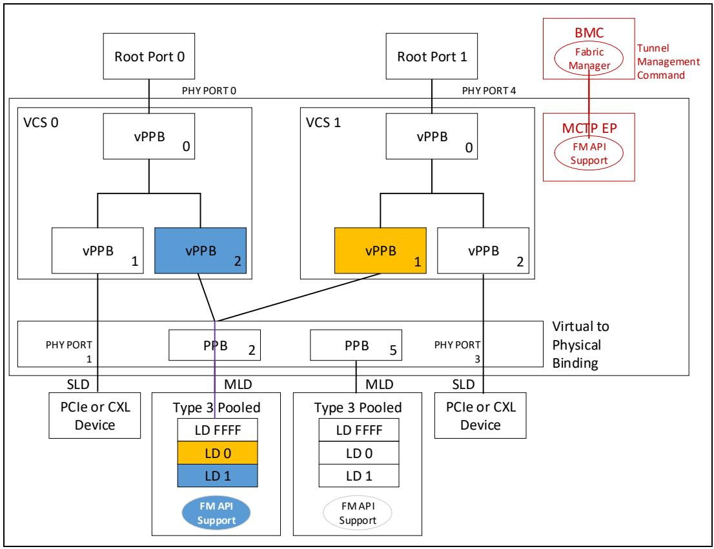
>
> *Original page render @ 150 DPI* — [📄 Full size](figures/chapter_07/page_0346.png)

[⬆️ 返回目录](#-本章目录-part-a)

---

### 7.6.3 CCI Message Format and Transport Protocol | CCI 消息格式与传输协议

<table>
<thead>
<tr>
<th width="50%">🇬🇧 English</th>
<th width="50%" style="background-color:#e8e8e8">🇨🇳 中文</th>
</tr>
</thead>
<tbody>
<tr><td>CCI commands are transmitted across MCTP-capable interconnects as MCTP messages using the format defined in Figure 7-19 and listed in Table 7-14.</td><td style="background-color:#e8e8e8">CCI 命令通过支持 MCTP 的互连,采用 MCTP 消息的形式进行传输,所使用的格式在图 7-19 中给出,字段定义见表 7-14。</td></tr>
<tr><td>Commands from the FM API Command Sets may be transported as MCTP messages as defined in CXL Fabric Manager API over MCTP Binding Specification (DSP0234). All other CCI commands may be transported as MCTP messages as defined by the respective binding specification, such as CXL Type 3 Component Command Interface over MCTP Binding (DSP0281).</td><td style="background-color:#e8e8e8">FM API 命令集中的命令可按 CXL Fabric Manager API over MCTP Binding Specification (DSP0234) 的定义,以 MCTP 消息的形式传输。所有其他 CCI 命令可按相应绑定规范 (例如 CXL Type 3 Component Command Interface over MCTP Binding, DSP0281) 的定义,以 MCTP 消息的形式传输。</td></tr>
</tbody>
</table>

> **Figure 7-19.** CCI Message Format ｜ CCI 消息格式
>
> 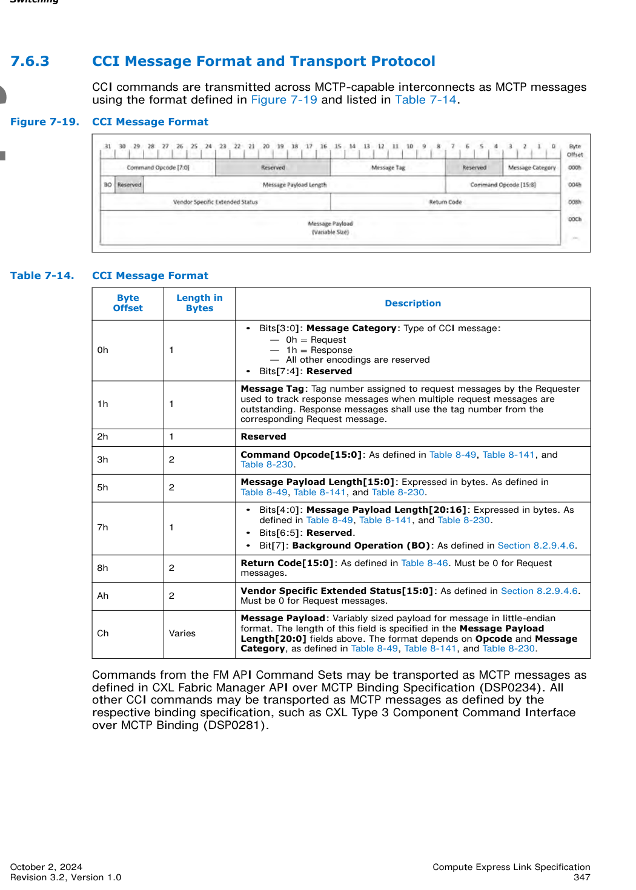
>
> *Original page render @ 150 DPI* — [📄 Full size](figures/chapter_07/page_0347.png)

<table>
<thead>
<tr>
<th>Table 7-14. CCI Message Format ｜ CCI 消息格式</th>
</tr>
</thead>
<tbody>
<tr><td>

| Byte Offset | Length in Bytes | Description |
|---|---|---|
| 0h | 1 | • Bits[3:0]: Message Category: Type of CCI message: — 0h = Request — 1h = Response — All other encodings are reserved • Bits[7:4]: Reserved |
| 1h | 1 | Message Tag: Tag number assigned to request messages by the Requester used to track response messages when multiple request messages are outstanding. Response messages shall use the tag number from the corresponding Request message. |
| 2h | 1 | Reserved |
| 3h | 2 | Command Opcode[15:0]: As defined in Table 8-49, Table 8-141, and Table 8-230. |
| 5h | 2 | Message Payload Length[15:0]: Expressed in bytes. As defined in Table 8-49, Table 8-141, and Table 8-230. |
| 7h | 1 | • Bits[4:0]: Message Payload Length[20:16]: Expressed in bytes. As defined in Table 8-49, Table 8-141, and Table 8-230. • Bits[6:5]: Reserved. • Bit[7]: Background Operation (BO): As defined in Section 8.2.9.4.6. |
| 8h | 2 | Return Code[15:0]: As defined in Table 8-46. Must be 0 for Request messages. |
| Ah | 2 | Vendor Specific Extended Status[15:0]: As defined in Section 8.2.9.4.6. Must be 0 for Request messages. |
| Ch | Varies | Message Payload: Variably sized payload for message in little-endian format. The length of this field is specified in the Message Payload Length[20:0] fields above. The format depends on Opcode and Message Category, as defined in Table 8-49, Table 8-141, and Table 8-230. |

</td></tr>
</tbody>
</table>

[⬆️ 返回目录](#-本章目录-part-a)

---

#### 7.6.3.1 Transport Details for MLD Components | MLD 组件的传输细节

<table>
<thead>
<tr>
<th width="50%">🇬🇧 English</th>
<th width="50%" style="background-color:#e8e8e8">🇨🇳 中文</th>
</tr>
</thead>
<tbody>
<tr><td>MLD components that do not implement an MCTP-capable interconnect other than their CXL interface shall expose a CCI through their CXL interface(s) using MCTP PCIe VDM Transport Binding Specification (DSP0238). FMs shall use the Tunnel Management Command to pass requests to the FM-owned LD, as illustrated in Figure 7-20.</td><td style="background-color:#e8e8e8">除 CXL 接口外未实现其他支持 MCTP 的互连的 MLD 组件,应使用 MCTP PCIe VDM Transport Binding Specification (DSP0238) 通过其 CXL 接口暴露 CCI。FM 应使用 Tunnel Management Command 将请求传递给 FM-owned LD,如图 7-20 所示。</td></tr>
</tbody>
</table>

[⬆️ 返回目录](#-本章目录-part-a)

---

### 7.6.4 CXL Switch Management | CXL 交换机管理

<table>
<thead>
<tr>
<th width="50%">🇬🇧 English</th>
<th width="50%" style="background-color:#e8e8e8">🇨🇳 中文</th>
</tr>
</thead>
<tbody>
<tr><td>Dynamic configuration of a switch by an FM is not required for basic switch functionality, but is required to support MLDs or CXL fabric topologies.</td><td style="background-color:#e8e8e8">交换机由 FM 进行的动态配置对基本交换机功能而言不是必需的,但要支持 MLD 或 CXL Fabric 拓扑,则必须进行动态配置。</td></tr>
</tbody>
</table>

[⬆️ 返回目录](#-本章目录-part-a)

---

#### 7.6.4.1 Initial Configuration | 初始配置

<table>
<thead>
<tr>
<th width="50%">🇬🇧 English</th>
<th width="50%" style="background-color:#e8e8e8">🇨🇳 中文</th>
</tr>
</thead>
<tbody>
<tr><td>The non-volatile memory of the switch stores, in a vendor-specific format, all necessary configuration settings that are required to prepare the switch for initial operation. This includes:</td><td style="background-color:#e8e8e8">交换机的非易失性存储器以厂商特定格式存储为交换机初始运行做准备的全部必要配置设置,包括:</td></tr>
<tr><td>• Port configuration, including direction (upstream or downstream), width, supported rates, etc.</td><td style="background-color:#e8e8e8">• 端口配置,包括方向 (上行或下行)、宽度、支持的速度等</td></tr>
<tr><td>• Virtual CXL Switch configuration, including number of vPPBs for each VCS, initial port binding configuration, etc.</td><td style="background-color:#e8e8e8">• Virtual CXL Switch 配置,包括每个 VCS 的 vPPB 数量、初始端口绑定配置等</td></tr>
<tr><td>• CCI access settings, including any vendor-defined permission settings for management.</td><td style="background-color:#e8e8e8">• CCI 访问设置,包括任何用于管理的厂商定义的权限设置</td></tr>
</tbody>
</table>

[⬆️ 返回目录](#-本章目录-part-a)

---

#### 7.6.4.2 Dynamic Configuration | 动态配置

<table>
<thead>
<tr>
<th width="50%">🇬🇧 English</th>
<th width="50%" style="background-color:#e8e8e8">🇨🇳 中文</th>
</tr>
</thead>
<tbody>
<tr><td>After initial configuration is complete and a CCI on the switch is operational, an FM can send Management Commands to the switch.</td><td style="background-color:#e8e8e8">初始配置完成且交换机上的 CCI 处于可操作状态后,FM 可以向交换机发送 Management Commands。</td></tr>
<tr><td>An FM may perform the following dynamic management actions on a CXL switch:</td><td style="background-color:#e8e8e8">FM 可对 CXL 交换机执行以下动态管理操作:</td></tr>
<tr><td>• Query switch information and configuration details</td><td style="background-color:#e8e8e8">• 查询交换机信息和配置详情</td></tr>
<tr><td>• Bind or Unbind ports</td><td style="background-color:#e8e8e8">• 绑定或解绑端口</td></tr>
<tr><td>• Register to receive and handle event notifications from the switch (e.g., Hot-Plug, surprise removal, and failures)</td><td style="background-color:#e8e8e8">• 注册以接收并处理来自交换机的事件通知 (例如热插拔、意外移除、故障等)</td></tr>
<tr><td>When a switch port is connected to a downstream PCIe switch, and that port is bound to a vPPB, the management of that PCIe switch and its downstream device will be handled by the VCS's host, not the FM.</td><td style="background-color:#e8e8e8">当交换机端口连接到下游 PCIe 交换机,且该端口被绑定到 vPPB 时,该 PCIe 交换机及其下游设备的管理将由 VCS 的主机而非 FM 处理。</td></tr>
</tbody>
</table>

> **Figure 7-20.** Tunneling Commands to an MLD through a CXL Switch ｜ 通过 CXL 交换机向 MLD 隧道传输命令
>
> 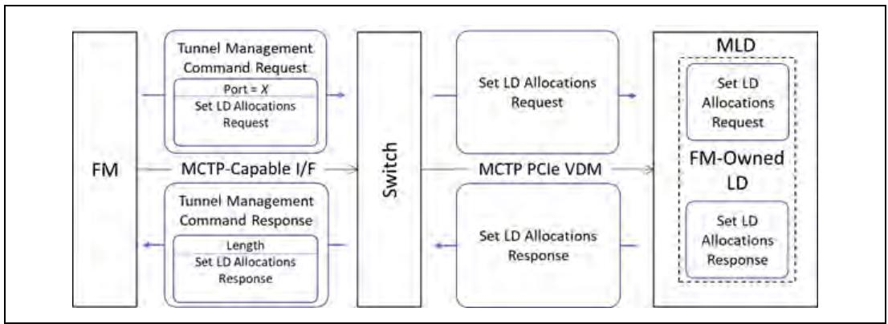
>
> *Original page render @ 150 DPI* — [📄 Full size](figures/chapter_07/page_0348.png)

[⬆️ 返回目录](#-本章目录-part-a)

---

#### 7.6.4.3 MLD Port Management | MLD 端口管理

<table>
<thead>
<tr>
<th width="50%">🇬🇧 English</th>
<th width="50%" style="background-color:#e8e8e8">🇨🇳 中文</th>
</tr>
</thead>
<tbody>
<tr><td>A switch with MLD Ports requires an FM to perform the following management activities:</td><td style="background-color:#e8e8e8">具有 MLD 端口的交换机需要由 FM 执行以下管理活动:</td></tr>
<tr><td>• MLD discovery</td><td style="background-color:#e8e8e8">• MLD 发现</td></tr>
<tr><td>• LD binding/unbinding</td><td style="background-color:#e8e8e8">• LD 绑定/解绑</td></tr>
<tr><td>• Management Command Tunneling</td><td style="background-color:#e8e8e8">• Management Command 隧道传输</td></tr>
</tbody>
</table>

[⬆️ 返回目录](#-本章目录-part-a)

---

### 7.6.5 MLD Component Management | MLD 组件管理

<table>
<thead>
<tr>
<th width="50%">🇬🇧 English</th>
<th width="50%" style="background-color:#e8e8e8">🇨🇳 中文</th>
</tr>
</thead>
<tbody>
<tr><td>The FM can connect to an MLD over a direct connection or by tunneling its management commands through the CCI of the CXL switch to which the device is connected. The FM can perform the following operations:</td><td style="background-color:#e8e8e8">FM 既可以通过直接连接连接到 MLD,也可以通过设备所连接 CXL 交换机的 CCI 隧道传输其管理命令。FM 可执行以下操作:</td></tr>
<tr><td>• Memory allocation and QoS Telemetry management</td><td style="background-color:#e8e8e8">• 内存分配与 QoS Telemetry 管理</td></tr>
<tr><td>• Security (e.g., LD erasure after unbinding)</td><td style="background-color:#e8e8e8">• 安全 (例如解绑后的 LD 擦除)</td></tr>
<tr><td>• Error handling</td><td style="background-color:#e8e8e8">• 错误处理</td></tr>
</tbody>
</table>

[⬆️ 返回目录](#-本章目录-part-a)

---

### 7.6.6 Management Requirements for System Operations | 系统运营的管理要求

<table>
<thead>
<tr>
<th width="50%">🇬🇧 English</th>
<th width="50%" style="background-color:#e8e8e8">🇨🇳 中文</th>
</tr>
</thead>
<tbody>
<tr><td>This section presents examples of system use cases to highlight the role and responsibilities of the FM in system management. These use case discussions also serve to itemize the FM commands that CXL devices must support to facilitate each specific system behavior.</td><td style="background-color:#e8e8e8">本节通过系统用例示例说明 FM 在系统管理中的角色和职责。这些用例讨论还可作为 CXL 设备为实现每种特定系统行为所必须支持的 FM 命令的清单。</td></tr>
</tbody>
</table>

> **Figure 7-21.** Example of MLD Management Requiring Tunneling ｜ 需要隧道传输的 MLD 管理示例
>
> 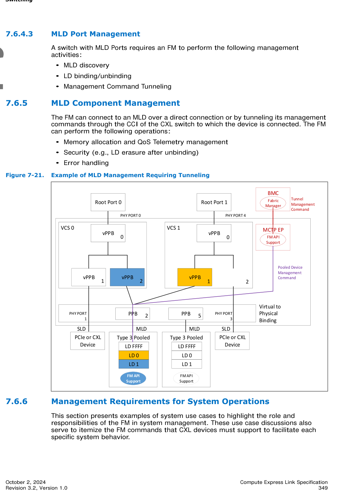
>
> *Original page render @ 150 DPI* — [📄 Full size](figures/chapter_07/page_0349.png)

[⬆️ 返回目录](#-本章目录-part-a)

---

#### 7.6.6.1 Initial System Discovery | 初始系统发现

<table>
<thead>
<tr>
<th width="50%">🇬🇧 English</th>
<th width="50%" style="background-color:#e8e8e8">🇨🇳 中文</th>
</tr>
</thead>
<tbody>
<tr><td>As the CXL system initializes, the FM can begin discovering all direct attached CXL devices across all supported media interfaces. Devices supporting the FM API may be discovered using transport specific mechanisms such as the MCTP discovery process, as defined in MCTP Base Specification (DSP0236).</td><td style="background-color:#e8e8e8">在 CXL 系统初始化的过程中,FM 可以开始通过所有受支持的介质接口发现所有直连的 CXL 设备。支持 FM API 的设备可通过传输特定机制 (如 MCTP Base Specification (DSP0236) 中定义的 MCTP 发现流程) 来发现。</td></tr>
<tr><td>When a component is discovered, the FM shall issue the Identify command (see Section 8.2.10.1.1) prior to issuing any other commands to check the component's type and its maximum supported command message size. A return of "Retry Required" indicates that the component is not yet ready to accept commands. After receiving a successful response to the Identify request, the FM may issue the Set Response Message Limit command (see Section 8.2.10.1.4) to limit the size of response messages from the component based on the size of the FM's receive buffer. The FM shall not issue any commands with input arguments such that the command's response message exceeds the FM's maximum supported message size. Finally, the FM issues Get Log, as defined in Section 8.2.10.5.2.1, to read the Command Effects Log to determine which command opcodes are supported.</td><td style="background-color:#e8e8e8">在发现某个组件后,FM 应在发出任何其他命令之前发出 Identify 命令 (参见 8.2.10.1.1 节),以检查组件的类型及其支持的最大命令消息大小。返回 "Retry Required" 表示该组件尚未准备好接收命令。在成功收到 Identify 请求的响应后,FM 可以发出 Set Response Message Limit 命令 (参见 8.2.10.1.4 节),根据 FM 接收缓冲区的大小限制组件响应消息的大小。FM 不应发出任何带输入参数的命令,使得命令的响应消息超过 FM 所支持的最大消息大小。最后,FM 发出 Get Log (如 8.2.10.5.2.1 节所定义) 以读取 Command Effects Log,从而确定受支持的命令操作码。</td></tr>
</tbody>
</table>

[⬆️ 返回目录](#-本章目录-part-a)

---

#### 7.6.6.2 CXL Switch Discovery | CXL 交换机发现

<table>
<thead>
<tr>
<th width="50%">🇬🇧 English</th>
<th width="50%" style="background-color:#e8e8e8">🇨🇳 中文</th>
</tr>
</thead>
<tbody>
<tr><td>After a CXL switch is released from reset (i.e., PERST# has been deasserted), it loads its initial configuration from non-volatile memory. Ports configured as DS PPBs will be released from reset to link up. Upon detection of a switch, the FM will query its configuration, capabilities, and connected devices. The Physical Switch Command Set is required for all switches implementing FM API support. The Virtual Switch Command Set is required for all switches that support multiple host ports.</td><td style="background-color:#e8e8e8">CXL 交换机脱离复位 (即 PERST# 已解除置位) 后,会从非易失性存储器加载其初始配置。配置为 DS PPB 的端口将被解除复位以建立链路。检测到交换机后,FM 将查询其配置、能力以及所连接的设备。所有实现 FM API 支持的交换机都需要 Physical Switch Command Set。所有支持多主机端口的交换机都需要 Virtual Switch Command Set。</td></tr>
<tr><td>An example of an FM Switch discovery process is as follows:</td><td style="background-color:#e8e8e8">FM 交换机发现流程的示例如下:</td></tr>
<tr><td>1. FM issues Identify Switch Device to check switch port count, enabled port IDs, number of supported LDs, and enabled VCS IDs.</td><td style="background-color:#e8e8e8">1. FM 发出 Identify Switch Device,以检查交换机的端口数、已启用的端口 ID、所支持的 LD 数,以及已启用的 VCS ID。</td></tr>
<tr><td>2. FM issues Get Physical Port State for each enabled port to check port configuration (US or DS), link state, and attached device type. This allows the FM to check for any port link-up issues and create an inventory of devices for binding. If any MLD components are discovered, the FM can begin MLD Port management activities.</td><td style="background-color:#e8e8e8">2. FM 对每个已启用端口发出 Get Physical Port State,以检查端口配置 (US 或 DS)、链路状态以及所连接设备的类型。这使 FM 能够检查任何端口的链路连接问题,并创建用于绑定的设备清单。如果发现 MLD 组件,FM 可以开始 MLD 端口管理活动。</td></tr>
<tr><td>3. If the switch supports multiple host ports, FM issues Get Virtual CXL Switch Info for each enabled VCS to check for all bound vPPBs in the system and create a list of binding targets.</td><td style="background-color:#e8e8e8">3. 如果交换机支持多主机端口,FM 对每个已启用的 VCS 发出 Get Virtual CXL Switch Info,以检查系统中所有已绑定的 vPPB,并创建绑定目标列表。</td></tr>
</tbody>
</table>

[⬆️ 返回目录](#-本章目录-part-a)

---

#### 7.6.6.3 MLD and Switch MLD Port Management | MLD 与交换机 MLD 端口管理

<table>
<thead>
<tr>
<th width="50%">🇬🇧 English</th>
<th width="50%" style="background-color:#e8e8e8">🇨🇳 中文</th>
</tr>
</thead>
<tbody>
<tr><td>MLDs must be connected to a CXL switch to share their LDs among VCSs. If an MLD is discovered in the system, the FM will need to prepare it for binding. A switch must support the MLD Port Command Set to support the use of MLDs. All MLD components shall support the MLD Component Command Set.</td><td style="background-color:#e8e8e8">MLD 必须连接到 CXL 交换机才能在多个 VCS 间共享其 LD。如果在系统中发现 MLD,FM 需要为其绑定做准备。交换机必须支持 MLD Port Command Set 才能支持 MLD 的使用。所有 MLD 组件都应支持 MLD Component Command Set。</td></tr>
<tr><td>1. FM issues management commands to the device's LD FFFFh using Tunnel Management Command.</td><td style="background-color:#e8e8e8">1. FM 通过 Tunnel Management Command 向设备的 LD FFFFh 发出管理命令。</td></tr>
<tr><td>2. FM can execute advanced or vendor-specific management activities, such as encryption or authentication, using the Send LD CXL.io Configuration Request and Send LD CXL.io Memory Request commands.</td><td style="background-color:#e8e8e8">2. FM 可以使用 Send LD CXL.io Configuration Request 和 Send LD CXL.io Memory Request 命令执行高级或厂商特定的管理活动,例如加密或认证。</td></tr>
</tbody>
</table>

[⬆️ 返回目录](#-本章目录-part-a)

---

#### 7.6.6.4 Event Notifications | 事件通知

<table>
<thead>
<tr>
<th width="50%">🇬🇧 English</th>
<th width="50%" style="background-color:#e8e8e8">🇨🇳 中文</th>
</tr>
</thead>
<tbody>
<tr><td>Events can occur on both devices and switches. The event types and records are listed in Section 7.6.8 for FM API events and in Section 8.2.10.2 for component events. The Event Records framework is defined in Section 8.2.10.2.1 to provide a standard event record format that all CXL components shall use when reporting events to the managing entity. The managing entity specifies the notification method, such as MSI/MSI-X, EFN VDM, or MCTP Event Notification. The Event Notification message can be signaled by a device or by a switch; the notification always flows toward the managing entity. An Event Record is not sent with the Event Notification message. After the managing entity knows that an event has occurred, the entity can use component commands to read the Event Record.</td><td style="background-color:#e8e8e8">设备和交换机上都可能发生事件。事件类型和记录在 7.6.8 节 (针对 FM API 事件) 和 8.2.10.2 节 (针对组件事件) 中列出。Event Records 框架在 8.2.10.2.1 节中定义,提供所有 CXL 组件在向管理实体报告事件时所使用的标准事件记录格式。管理实体指定通知方式,例如 MSI/MSI-X、EFN VDM 或 MCTP Event Notification。Event Notification 消息可由设备或交换机发起;通知始终流向管理实体。Event Record 不随 Event Notification 消息一起发送。管理实体得知事件已发生后,可使用组件命令读取 Event Record。</td></tr>
<tr><td>1. To facilitate some system operations, the FM requires event notifications so it can execute its role in the process in a timely manner (e.g., notifying hosts of an asserted Attention Button on an MLD during a Managed Hot-Removal). If supported by the device, the FM can check and modify the current event notification settings with the Events command set.</td><td style="background-color:#e8e8e8">1. 为支持某些系统操作,FM 需要事件通知,以便能及时履行其在流程中的角色 (例如,在托管热移除期间通知主机 MLD 上 Attention Button 被置位的事件)。如果设备支持,FM 可使用 Events 命令集检查和修改当前的事件通知设置。</td></tr>
<tr><td>2. If supported by the device, the event logs can be read with the Get Event Records command to check for any error events experienced by the device that might impact normal operation.</td><td style="background-color:#e8e8e8">2. 如果设备支持,可使用 Get Event Records 命令读取事件日志,以检查设备可能影响正常运行的任何错误事件。</td></tr>
</tbody>
</table>

[⬆️ 返回目录](#-本章目录-part-a)

---

#### 7.6.6.5 Binding Ports and LDs on a Switch | 在交换机上绑定端口和 LD

<table>
<thead>
<tr>
<th width="50%">🇬🇧 English</th>
<th width="50%" style="background-color:#e8e8e8">🇨🇳 中文</th>
</tr>
</thead>
<tbody>
<tr><td>Once all devices, VCSs, and vPPBs have been discovered, the FM can begin binding ports and LDs to hosts as follows:</td><td style="background-color:#e8e8e8">一旦发现所有设备、VCS 和 vPPB,FM 即可按以下步骤开始将端口和 LD 绑定到主机:</td></tr>
<tr><td>1. FM issues the Bind vPPB command specifying a physical port, VCS ID and vPPB index to bind the physical port to the vPPB. An LD-ID must also be specified if the physical port is connected to an MLD. The switch is permitted to initiate a Managed Hot-Add if the host has already booted, as defined in Section 9.9.</td><td style="background-color:#e8e8e8">1. FM 发出 Bind vPPB 命令,指定物理端口、VCS ID 和 vPPB 索引,以将该物理端口绑定到 vPPB。如果物理端口连接到 MLD,还必须指定 LD-ID。如 9.9 节所述,如果主机已经启动,允许交换机发起 Managed Hot-Add。</td></tr>
<tr><td>2. Upon completion of the binding process, the switch notifies the FM by generating a Virtual CXL Switch Event Record.</td><td style="background-color:#e8e8e8">2. 绑定过程完成后,交换机通过生成 Virtual CXL Switch Event Record 通知 FM。</td></tr>
</tbody>
</table>

[⬆️ 返回目录](#-本章目录-part-a)

---

#### 7.6.6.6 Unbinding Ports and LDs on a Switch | 在交换机上解绑端口和 LD

<table>
<thead>
<tr>
<th width="50%">🇬🇧 English</th>
<th width="50%" style="background-color:#e8e8e8">🇨🇳 中文</th>
</tr>
</thead>
<tbody>
<tr><td>The FM can unbind devices or LDs from a VCS with the following steps:</td><td style="background-color:#e8e8e8">FM 可通过以下步骤将设备或 LD 从 VCS 中解绑:</td></tr>
<tr><td>1. FM issues the Unbind vPPB command specifying a VCS ID and vPPB index to unbind the physical port from the vPPB. The switch initiates a Managed Hot-Remove or Surprise Hot-Remove depending on the command options, as defined in PCIe Base Specification.</td><td style="background-color:#e8e8e8">1. FM 发出 Unbind vPPB 命令,指定 VCS ID 和 vPPB 索引,以将物理端口从 vPPB 解绑。交换机根据命令选项发起 Managed Hot-Remove 或 Surprise Hot-Remove,具体如 PCIe Base Specification 所定义。</td></tr>
<tr><td>2. Upon completion of the unbinding process, the switch will generate a Virtual CXL Switch Event Record.</td><td style="background-color:#e8e8e8">2. 解绑过程完成后,交换机将生成 Virtual CXL Switch Event Record。</td></tr>
</tbody>
</table>

[⬆️ 返回目录](#-本章目录-part-a)

---

#### 7.6.6.7 Hot-Add and Managed Hot-Removal of Devices | 设备的热添加与托管热移除

<table>
<thead>
<tr>
<th width="50%">🇬🇧 English</th>
<th width="50%" style="background-color:#e8e8e8">🇨🇳 中文</th>
</tr>
</thead>
<tbody>
<tr><td>When a device is Hot-Added to an unbound port on a switch, the FM receives a notification and is responsible for binding as described in the steps below:</td><td style="background-color:#e8e8e8">当设备热添加 (Hot-Add) 到交换机上的未绑定端口时,FM 收到通知并按以下步骤负责绑定:</td></tr>
<tr><td>1. The switch notifies the FM by generating Physical Switch Event Records as the Presence Detect sideband signal is asserted or when a Link Up is detected if the PPB does not support Presence Detect.</td><td style="background-color:#e8e8e8">1. 交换机在 Presence Detect 边带信号被置位时,或在 PPB 不支持 Presence Detect 时检测到 Link Up 时,通过生成 Physical Switch Event Record 通知 FM。</td></tr>
<tr><td>2. FM issues the Get Physical Port State command for the physical port that has linked up to discover the connected device type. The FM can now bind the physical port to a vPPB. If it's an MLD, then the FM can proceed with MLD Port management activities; otherwise, the device is ready for binding.</td><td style="background-color:#e8e8e8">2. FM 对已建立链路的物理端口发出 Get Physical Port State 命令,以发现所连接设备的类型。FM 此时可将该物理端口绑定到 vPPB。如果是 MLD,则 FM 可继续进行 MLD 端口管理活动;否则,设备已准备好被绑定。</td></tr>
<tr><td>When a device is Hot-Removed from an unbound port on a switch, the FM receives a notification. The switch notifies the FM by generating Physical Switch Event Records as the Presence Detect sideband is deasserted and the associated port links down.</td><td style="background-color:#e8e8e8">当设备从交换机上的未绑定端口被热移除 (Hot-Remove) 时,FM 会收到通知。交换机在 Presence Detect 边带被解除置位且关联端口链路断开 (link down) 时,通过生成 Physical Switch Event Record 通知 FM。</td></tr>
<tr><td>1. The switch notifies the FM by generating Physical Switch Event Records as the Presence Detect sideband is deasserted and the associated port links down.</td><td style="background-color:#e8e8e8">1. 交换机在 Presence Detect 边带被解除置位且关联端口链路断开时,通过生成 Physical Switch Event Record 通知 FM。</td></tr>
<tr><td>When an SLD or PCIe device is Hot-Added to a bound port, the FM can be notified but is not involved. When a Surprise or Managed Hot-Removal of an SLD or PCIe device occurs on a bound port, the FM can be notified but is not involved.</td><td style="background-color:#e8e8e8">当 SLD 或 PCIe 设备热添加到已绑定端口时,FM 可以收到通知但不参与。当在已绑定端口上发生 SLD 或 PCIe 设备的 Surprise 或 Managed Hot-Removal 时,FM 可以收到通知但不参与。</td></tr>
<tr><td>A bound port will not advertise support for MLDs during negotiation, so MLD components will link up as an SLD.</td><td style="background-color:#e8e8e8">已绑定端口在协商期间不会通告对 MLD 的支持,因此 MLD 组件将作为 SLD 建立链路。</td></tr>
<tr><td>The FM manages managed hot-removal of MLDs as follows:</td><td style="background-color:#e8e8e8">FM 按如下方式管理 MLD 的托管热移除 (managed hot-removal):</td></tr>
<tr><td>1. When the Attention Button sideband is asserted on an MLD port, the Attention state bit is updated in the corresponding PPB and vPPB CSRs and the switch notifies the FM and hosts with LDs that are bound and below that MLD port. The hosts are notified with the MSI/MSI-X interrupts assigned to the affected vPPB and a Virtual CXL Switch Event Record is generated.</td><td style="background-color:#e8e8e8">1. 当 MLD 端口的 Attention Button 边带被置位时,会在对应的 PPB 和 vPPB CSR 中更新 Attention 状态位,交换机通知 FM 以及在该 MLD 端口之下绑定有 LD 的主机。主机通过分配给受影响 vPPB 的 MSI/MSI-X 中断得到通知,同时生成 Virtual CXL Switch Event Record。</td></tr>
<tr><td>2. As defined in PCIe Base Specification, hosts will read the Attention State bit in their vPPB's CSR and prepare for removal of the LD. When a host is ready for the LD to be removed, it will set the Attention LED bit in the associated vPPB's CSR. The switch records these CSR updates by generating Virtual CXL Switch Event Records. The FM unbinds each assigned LD with the Unbind vPPB command as it receives notifications from each host.</td><td style="background-color:#e8e8e8">2. 如 PCIe Base Specification 所定义,主机会读取其 vPPB CSR 中的 Attention State 位,并准备移除该 LD。当主机准备好移除 LD 时,会在关联 vPPB 的 CSR 中置位 Attention LED 位。交换机通过生成 Virtual CXL Switch Event Record 记录这些 CSR 更新。FM 在收到每个主机的通知后,使用 Unbind vPPB 命令解绑每个已分配的 LD。</td></tr>
<tr><td>3. When all host handshakes are complete, the MLD is ready for removal. The FM uses the Send PPB CXL.io Configuration Request command to set the Attention LED bit in the MLD port PPB to indicate that the MLD can be physically removed. The timeout value for the host handshakes to complete is implementation specific. There is no requirement for the FM to force the unbind operation, but it can do so using the "Simulate Surprise Hot-Remove" unbinding option in the Unbind vPPB command.</td><td style="background-color:#e8e8e8">3. 当所有主机握手完成后,MLD 即可被移除。FM 使用 Send PPB CXL.io Configuration Request 命令在 MLD 端口 PPB 中置位 Attention LED 位,以指示该 MLD 可被物理移除。主机握手完成的超时值由具体实现决定。不要求 FM 强制执行 unbind 操作,但可以使用 Unbind vPPB 命令中的 "Simulate Surprise Hot-Remove" unbind 选项来执行强制操作。</td></tr>
</tbody>
</table>

[⬆️ 返回目录](#-本章目录-part-a)

---

#### 7.6.6.8 Surprise Removal of Devices | 设备的意外移除

<table>
<thead>
<tr>
<th width="50%">🇬🇧 English</th>
<th width="50%" style="background-color:#e8e8e8">🇨🇳 中文</th>
</tr>
</thead>
<tbody>
<tr><td>There are two kinds of surprise removals: physical removal of a device, and surprise Link Down. The main difference between the two is the state of the presence pin, which will be deasserted after a physical removal but will remain asserted after a surprise Link Down. The switch notifies the FM of a surprise removal by generating Virtual CXL Switch Event Records for the change in link status and Presence Detect, as applicable.</td><td style="background-color:#e8e8e8">意外移除 (Surprise Removal) 有两种:设备的物理移除,以及意外链路断开 (surprise Link Down)。两者之间的主要区别在于 Presence 引脚的状态:物理移除后,Presence 引脚将被解除置位;而意外链路断开后,Presence 引脚仍将保持置位。交换机通过针对链路状态和 Presence Detect 变化 (按需) 生成 Virtual CXL Switch Event Record 来通知 FM 发生意外移除。</td></tr>
<tr><td>Three cases of Surprise Removal are described below:</td><td style="background-color:#e8e8e8">下面描述意外移除的三种情况:</td></tr>
<tr><td>• When a Surprise Removal of a device occurs on an unbound port, the FM must be notified.</td><td style="background-color:#e8e8e8">• 当未绑定端口上发生设备的意外移除时,必须通知 FM。</td></tr>
<tr><td>• When a Surprise Removal of an SLD or PCIe device occurs on a bound port, the FM is permitted to be notified but must not be involved in any error handling operations.</td><td style="background-color:#e8e8e8">• 当已绑定端口上发生 SLD 或 PCIe 设备的意外移除时,允许通知 FM,但 FM 不得参与任何错误处理操作。</td></tr>
<tr><td>• When a Surprise Removal of an MLD component occurs, the FM must be notified. The switch will automatically unbind any existing LD bindings. The FM must perform error handling and port management activities, the details of which are considered implementation specific.</td><td style="background-color:#e8e8e8">• 当发生 MLD 组件的意外移除时,必须通知 FM。交换机会自动解绑所有现有 LD 绑定。FM 必须执行错误处理和端口管理活动,其具体细节视为实现特定。</td></tr>
</tbody>
</table>

[⬆️ 返回目录](#-本章目录-part-a)

---

### 7.6.7 Fabric Management Application Programming Interface | Fabric Manager 应用编程接口

<table>
<thead>
<tr>
<th width="50%">🇬🇧 English</th>
<th width="50%" style="background-color:#e8e8e8">🇨🇳 中文</th>
</tr>
</thead>
<tbody>
<tr><td>The FM manages all devices in a CXL system via the sets of commands defined in the FM API. This specification defines the minimum command set requirements for each device type.</td><td style="background-color:#e8e8e8">FM 通过 FM API 中定义的命令集管理 CXL 系统中的所有设备。本规范为每种设备类型定义了最低的命令集要求。</td></tr>
<tr><td>Note:</td><td style="background-color:#e8e8e8">注:</td></tr>
<tr><td>CXL switches and MLDs require FM API support to facilitate the advanced system capabilities outlined in Section 7.6.6. FM API is optional for all other CXL device types.</td><td style="background-color:#e8e8e8">CXL 交换机和 MLD 需要 FM API 支持,以实现 7.6.6 节中列出的高级系统能力。对于所有其他 CXL 设备类型,FM API 是可选的。</td></tr>
<tr><td>Command opcodes are listed in Table 8-230. Table 8-230 also identifies the minimum command sets and commands that are required to implement defined system capabilities. The following subsections define the commands grouped in each command set. Within each command set, commands are marked as mandatory (M) or optional (O). If a command set is supported, the required commands within that set must be implemented, but only if the Device supports that command set. For example, the Get Virtual CXL Switch Information command is required in the Virtual Switch Command Set, but that set is optional for switches. This means that a switch does not need to support the Get Virtual CXL Switch Information command if it does not support the Virtual Switch Command Set.</td><td style="background-color:#e8e8e8">命令操作码在表 8-230 中列出。表 8-230 还标识了实现已定义系统能力所需的最低命令集和命令。后续各子节定义按命令集分组的命令。在每个命令集内,命令被标记为强制 (M) 或可选 (O)。如果支持某个命令集,则该集合中所要求的命令必须实现,但前提是设备支持该命令集。例如,Get Virtual CXL Switch Information 命令在 Virtual Switch Command Set 中是必需的,但该命令集对交换机是可选的。这意味着如果交换机不支持 Virtual Switch Command Set,则它不需要支持 Get Virtual CXL Switch Information 命令。</td></tr>
<tr><td>All commands have been defined as stand-alone operations; there are no explicit dependencies between commands, so optional commands can be implemented or not implemented on a per-command basis. Requirements for the implementation of commands are driven instead by the desired system functionality.</td><td style="background-color:#e8e8e8">所有命令均被定义为独立操作;命令之间没有显式的依赖关系,因此可选命令可以按命令粒度选择实现或不实现。命令的实现要求实际由所需的系统功能决定。</td></tr>
</tbody>
</table>

<table>
<thead>
<tr>
<th>Table 7-15. FM API Command Sets ｜ FM API 命令集</th>
</tr>
</thead>
<tbody>
<tr><td>

| Command Set Name | HBR Switch FM API Requirement¹ | MLD FM API Requirement¹ |
|---|---|---|
| Physical Switch (Section 7.6.7.1) | M | P |
| Virtual Switch (Section 7.6.7.2) | O | P |
| MLD Port (Section 7.6.7.3) | O | P |
| MLD Component (Section 7.6.7.4) | P | M |
| Multi-Headed Device (Section 7.6.7.5) | P | P |
| DCD Management (Section 7.6.7.6) | P | O |
| PBR Switch (Section 7.7.13) | P | P |
| Global Memory Access Endpoint (Section 7.7.14) | P | P |

1. M = Mandatory, O = Optional, P = Prohibited.

</td></tr>
</tbody>
</table>

[⬆️ 返回目录](#-本章目录-part-a)

---

#### 7.6.7.1 Physical Switch Command Set | Physical Switch 命令集

<table>
<thead>
<tr>
<th width="50%">🇬🇧 English</th>
<th width="50%" style="background-color:#e8e8e8">🇨🇳 中文</th>
</tr>
</thead>
<tbody>
<tr><td>This command set is only supported by and must be supported by CXL switches that have FM API support.</td><td style="background-color:#e8e8e8">此命令集仅由且必须由具有 FM API 支持的 CXL 交换机支持。</td></tr>
</tbody>
</table>

[⬆️ 返回目录](#-本章目录-part-a)

---

##### 7.6.7.1.1 Identify Switch Device (Opcode 5100h) | Identify Switch Device (操作码 5100h)

<table>
<thead>
<tr>
<th width="50%">🇬🇧 English</th>
<th width="50%" style="background-color:#e8e8e8">🇨🇳 中文</th>
</tr>
</thead>
<tbody>
<tr><td>This command retrieves information about the capabilities and configuration of a CXL switch.</td><td style="background-color:#e8e8e8">此命令检索 CXL 交换机的能力和配置相关信息。</td></tr>
<tr><td>Possible Command Return Codes:</td><td style="background-color:#e8e8e8">可能的命令返回码:</td></tr>
<tr><td>• Success</td><td style="background-color:#e8e8e8">• Success (成功)</td></tr>
<tr><td>• Internal Error</td><td style="background-color:#e8e8e8">• Internal Error (内部错误)</td></tr>
<tr><td>• Retry Required</td><td style="background-color:#e8e8e8">• Retry Required (需要重试)</td></tr>
<tr><td>Command Effects:</td><td style="background-color:#e8e8e8">命令效果:</td></tr>
<tr><td>• None</td><td style="background-color:#e8e8e8">• None (无)</td></tr>
</tbody>
</table>

<table>
<thead>
<tr>
<th>Table 7-16. Identify Switch Device Response Payload ｜ Identify Switch Device 响应 Payload</th>
</tr>
</thead>
<tbody>
<tr><td>

| Byte Offset | Length in Bytes | Description |
|---|---|---|
| 00h | 1 | Ingress Port ID: Ingress CCI port index of the received request message. For CXL/PCIe ports, this corresponds to the physical port number. For non-CXL/PCIe, this corresponds to a vendor-specific index of the buses that the device supports, starting at 0. For example, a request received on the second of 2 SMBuses supported by a device would return a 1. |
| 01h | 1 | Reserved |
| 02h | 1 | Number of Physical Ports: Total number of physical ports in the CXL switch, including inactive/disabled ports. |
| 03h | 1 | Number of VCSs: Maximum number of virtual CXL switches that are supported by the CXL switch. |
| 04h | 20h | Active Port Bitmask: Bitmask that defines whether a physical port is enabled (1) or disabled (0). Each bit corresponds 1:1 with a port, with the least significant bit corresponding to Port 0. |
| 24h | 20h | Active VCS Bitmask: Bitmask that defines whether a VCS is enabled (1) or disabled (0). Each bit corresponds 1:1 with a VCS ID, with the least significant bit corresponding to VCS 0. |
| 44h | 2 | Total Number of vPPBs: The number of virtual PPBs that are supported by the CXL switch across all VCSs. |
| 46h | 2 | Number of Bound vPPBs: Total number of vPPBs, across all VCSs, that are bound. |
| 48h | 1 | Number of HDM Decoders: Number of HDM decoders available per USP. |

</td></tr>
</tbody>
</table>

[⬆️ 返回目录](#-本章目录-part-a)

---

##### 7.6.7.1.2 Get Physical Port State (Opcode 5101h) | Get Physical Port State (操作码 5101h)

<table>
<thead>
<tr>
<th width="50%">🇬🇧 English</th>
<th width="50%" style="background-color:#e8e8e8">🇨🇳 中文</th>
</tr>
</thead>
<tbody>
<tr><td>This command retrieves the physical port information.</td><td style="background-color:#e8e8e8">此命令检索物理端口信息。</td></tr>
<tr><td>Possible Command Return Codes:</td><td style="background-color:#e8e8e8">可能的命令返回码:</td></tr>
<tr><td>• Success</td><td style="background-color:#e8e8e8">• Success (成功)</td></tr>
<tr><td>• Invalid Input</td><td style="background-color:#e8e8e8">• Invalid Input (无效输入)</td></tr>
<tr><td>• Internal Error</td><td style="background-color:#e8e8e8">• Internal Error (内部错误)</td></tr>
<tr><td>• Retry Required</td><td style="background-color:#e8e8e8">• Retry Required (需要重试)</td></tr>
<tr><td>Command Effects:</td><td style="background-color:#e8e8e8">命令效果:</td></tr>
<tr><td>• None</td><td style="background-color:#e8e8e8">• None (无)</td></tr>
</tbody>
</table>

<table>
<thead>
<tr>
<th>Table 7-17. Get Physical Port State Request Payload ｜ Get Physical Port State 请求 Payload</th>
</tr>
</thead>
<tbody>
<tr><td>

| Byte Offset | Length in Bytes | Description |
|---|---|---|
| 0h | 1 | Number of Ports: Number of ports requested. |
| 1h | Varies | Port ID List: 1-byte ID of requested port, repeated Number of Ports times. |

</td></tr>
</tbody>
</table>

<table>
<thead>
<tr>
<th>Table 7-18. Get Physical Port State Response Payload ｜ Get Physical Port State 响应 Payload</th>
</tr>
</thead>
<tbody>
<tr><td>

| Byte Offset | Length in Bytes | Description |
|---|---|---|
| 0h | 1 | Number of Ports: Number of port information blocks returned. |
| 1h | 3 | Reserved |
| 4h | Varies | Port Information List: Port information block as defined in Table 7-19, repeated Number of Ports times. |

</td></tr>
</tbody>
</table>

<table>
<thead>
<tr>
<th>Table 7-19. Get Physical Port State Port Information Block Format (Sheet 1 of 2) ｜ Get Physical Port State 端口信息块格式 (第 1 页 / 共 2 页)</th>
</tr>
</thead>
<tbody>
<tr><td>

| Byte Offset | Length in Bytes | Description |
|---|---|---|
| 0h | 1 | Port ID |
| 1h | 1 | • Bits[3:0]: Current Port Configuration State: — 0h = Disabled — 1h = Bind in progress — 2h = Unbind in progress — 3h = DSP — 4h = USP — 5h = Fabric Port — Fh = Invalid Port_ID; all subsequent field values are undefined — All other encodings are reserved • Bit[4]: GAE Support: Indicates whether GAE support is present (1) or not present (0) on a port. Valid only for PBR switches if Current Port Configuration State is 4h (USP). • Bits[7:5]: Reserved. |
| 2h | 1 | • Bits[3:0]: Connected Device Mode: Formerly known as Connected Device CXL Version. This field is reserved for all values of Current Port Configuration State except DSP. — 0h = Connection is not CXL or is disconnected — 1h = RCD mode — 2h = CXL 68B Flit and VH mode — 3h = Standard 256B Flit mode — 4h = CXL Latency-Optimized 256B Flit mode — 5h = PBR mode — All other encodings are reserved • Bits[7:4]: Reserved. |
| 3h | 1 | Reserved |
| 4h | 1 | Connected Device Type • 00h = No device detected • 01h = PCIe Device • 02h = CXL Type 1 device • 03h = CXL Type 2 device or HBR switch • 04h = CXL Type 3 SLD • 05h = CXL Type 3 MLD • 06h = PBR component • All other encodings are reserved This field is reserved if Supported CXL Modes is 00h. This field is reserved for all values of Current Port Configuration State except 3h (DSP) or 5h (Fabric Port). |
| 5h | 1 | Supported CXL Modes: Formerly known as Connected CXL Version. Bitmask that defines which CXL modes are supported (1) or not supported (0) by this port: • Bit[0]: RCD Mode • Bit[1]: CXL 68B Flit and VH Capable • Bit[2]: 256B Flit Capable • Bit[3]: CXL Latency-Optimized 256B Flit Capable • Bit[4]: PBR Capable • Bits[7:5]: Reserved for future CXL use Undefined when the value is 00h. |

</td></tr>
</tbody>
</table>

<table>
<thead>
<tr>
<th>Table 7-19. Get Physical Port State Port Information Block Format (Sheet 2 of 2) ｜ Get Physical Port State 端口信息块格式 (第 2 页 / 共 2 页)</th>
</tr>
</thead>
<tbody>
<tr><td>

| Byte Offset | Length in Bytes | Description |
|---|---|---|
| 6h | 1 | • Bits[5:0]: Maximum Link Width: Value encoding matches the Maximum Link Width field in the PCIe Link Capabilities register in the PCIe Capability structure. • Bits[7:6]: Reserved. |
| 7h | 1 | • Bits[5:0]: Negotiated Link Width: Value encoding matches the Negotiated Link Width field in PCIe Link Capabilities register in the PCIe Capability structure. • Bits[7:6]: Reserved. |
| 8h | 1 | • Bits[5:0]: Supported Link Speeds Vector: Value encoding matches the Supported Link Speeds Vector field in the PCIe Link Capabilities 2 register in the PCIe Capability structure. • Bits[7:6]: Reserved. |
| 9h | 1 | • Bits[5:0]: Max Link Speed: Value encoding matches the Max Link Speed field in the PCIe Link Capabilities register in the PCIe Capability structure. • Bits[7:6]: Reserved. |
| Ah | 1 | • Bits[5:0]: Current Link Speed: Value encoding matches the Current Link Speed field in the PCIe Link Status register in the PCIe Capability structure. • Bits[7:6]: Reserved. |
| Bh | 1 | LTSSM State: Current link LTSSM Major state: • 00h = Detect • 01h = Polling • 02h = Configuration • 03h = Recovery • 04h = L0 • 05h = L0s • 06h = L1 • 07h = L2 • 08h = Disabled • 09h = Loopback • 0Ah = Hot Reset • All other encodings are reserved Link substates should be reported through vendor-defined diagnostics commands. |
| Ch | 1 | First Negotiated Lane Number |
| Dh | 2 | Link State Flags • Bit[0]: Lane Reversal State: — 0 = Standard lane ordering — 1 = Reversed lane ordering • Bit[1]: Port PCIe Reset State (PERST#): — 0 = Not in reset — 1 = In reset • Bit[2]: Port Presence Pin State (PRSNT#): — 0 = Not present — 1 = Present • Bit[3]: Power Control State: — 0 = Power on — 1 = Power off • Bits[15:4]: Reserved |
| Fh | 1 | Supported LD Count: Number of additional LDs supported by this port. All ports must support at least one LD. |

</td></tr>
</tbody>
</table>

[⬆️ 返回目录](#-本章目录-part-a)

---

##### 7.6.7.1.3 Physical Port Control (Opcode 5102h) | Physical Port Control (操作码 5102h)

<table>
<thead>
<tr>
<th width="50%">🇬🇧 English</th>
<th width="50%" style="background-color:#e8e8e8">🇨🇳 中文</th>
</tr>
</thead>
<tbody>
<tr><td>This command is used by the FM to control unbound ports and MLD ports, including issuing resets and controlling sidebands.</td><td style="background-color:#e8e8e8">此命令由 FM 用于控制未绑定端口和 MLD 端口,包括发出复位和控制边带信号。</td></tr>
<tr><td>Possible Command Return Codes:</td><td style="background-color:#e8e8e8">可能的命令返回码:</td></tr>
<tr><td>• Success</td><td style="background-color:#e8e8e8">• Success (成功)</td></tr>
<tr><td>• Unsupported</td><td style="background-color:#e8e8e8">• Unsupported (不支持)</td></tr>
<tr><td>• Invalid Input</td><td style="background-color:#e8e8e8">• Invalid Input (无效输入)</td></tr>
<tr><td>• Internal Error</td><td style="background-color:#e8e8e8">• Internal Error (内部错误)</td></tr>
<tr><td>• Retry Required</td><td style="background-color:#e8e8e8">• Retry Required (需要重试)</td></tr>
<tr><td>Command Effects:</td><td style="background-color:#e8e8e8">命令效果:</td></tr>
<tr><td>• None</td><td style="background-color:#e8e8e8">• None (无)</td></tr>
</tbody>
</table>

<table>
<thead>
<tr>
<th>Table 7-20. Physical Port Control Request Payload ｜ Physical Port Control 请求 Payload</th>
</tr>
</thead>
<tbody>
<tr><td>

| Byte Offset | Length in Bytes | Description |
|---|---|---|
| 0h | 1 | PPB ID: Physical PPB ID, which corresponds 1:1 to associated physical port number. |
| 1h | 1 | Port Opcode: Code that defines which operation to perform: • 00h = Assert PERST# • 01h = Deassert PERST# • 02h = Reset PPB • All other encodings are reserved |

</td></tr>
</tbody>
</table>

[⬆️ 返回目录](#-本章目录-part-a)

---

##### 7.6.7.1.4 Send PPB CXL.io Configuration Request (Opcode 5103h) | Send PPB CXL.io Configuration Request (操作码 5103h)

<table>
<thead>
<tr>
<th width="50%">🇬🇧 English</th>
<th width="50%" style="background-color:#e8e8e8">🇨🇳 中文</th>
</tr>
</thead>
<tbody>
<tr><td>This command sends CXL.io Config requests to the specified physical port's PPB. This command is only processed for unbound ports and MLD ports.</td><td style="background-color:#e8e8e8">此命令将 CXL.io Config 请求发送到指定物理端口的 PPB。此命令仅针对未绑定端口和 MLD 端口进行处理。</td></tr>
<tr><td>Possible Command Return Codes:</td><td style="background-color:#e8e8e8">可能的命令返回码:</td></tr>
<tr><td>• Success</td><td style="background-color:#e8e8e8">• Success (成功)</td></tr>
<tr><td>• Invalid Input</td><td style="background-color:#e8e8e8">• Invalid Input (无效输入)</td></tr>
<tr><td>• Internal Error</td><td style="background-color:#e8e8e8">• Internal Error (内部错误)</td></tr>
<tr><td>• Retry Required</td><td style="background-color:#e8e8e8">• Retry Required (需要重试)</td></tr>
<tr><td>Command Effects:</td><td style="background-color:#e8e8e8">命令效果:</td></tr>
<tr><td>• None</td><td style="background-color:#e8e8e8">• None (无)</td></tr>
</tbody>
</table>

<table>
<thead>
<tr>
<th>Table 7-21. Send PPB CXL.io Configuration Request Input Payload ｜ Send PPB CXL.io Configuration Request 输入 Payload</th>
</tr>
</thead>
<tbody>
<tr><td>

| Byte Offset | Length in Bytes | Description |
|---|---|---|
| 0h | 1 | PPB ID: Target PPB's physical port. |
| 1h | 3 | • Bits[7:0]: Register Number: As defined in PCIe Base Specification • Bits[11:8]: Extended Register Number: As defined in PCIe Base Specification • Bits[15:12]: First Dword Byte Enable: As defined in PCIe Base Specification • Bits[22:16]: Reserved • Bit[23]: Transaction Type: — 0 = Read — 1 = Write |
| 4h | 4 | Transaction Data: Write data. Valid only for write transactions. |

</td></tr>
</tbody>
</table>

<table>
<thead>
<tr>
<th>Table 7-22. Send PPB CXL.io Configuration Request Output Payload ｜ Send PPB CXL.io Configuration Request 输出 Payload</th>
</tr>
</thead>
<tbody>
<tr><td>

| Byte Offset | Length in Bytes | Description |
|---|---|---|
| 0h | 4 | Return Data: Read data. Valid only for read transactions. |

</td></tr>
</tbody>
</table>

[⬆️ 返回目录](#-本章目录-part-a)

---

##### 7.6.7.1.5 Get Domain Validation SV State (Opcode 5104h) | Get Domain Validation SV State (操作码 5104h)

<table>
<thead>
<tr>
<th width="50%">🇬🇧 English</th>
<th width="50%" style="background-color:#e8e8e8">🇨🇳 中文</th>
</tr>
</thead>
<tbody>
<tr><td>This command is used by the Host to check the state of the secret value.</td><td style="background-color:#e8e8e8">此命令由主机用于检查密钥 (secret value) 的状态。</td></tr>
<tr><td>Possible Command Return Codes:</td><td style="background-color:#e8e8e8">可能的命令返回码:</td></tr>
<tr><td>• Success</td><td style="background-color:#e8e8e8">• Success (成功)</td></tr>
<tr><td>• Internal Error</td><td style="background-color:#e8e8e8">• Internal Error (内部错误)</td></tr>
<tr><td>• Retry Required</td><td style="background-color:#e8e8e8">• Retry Required (需要重试)</td></tr>
<tr><td>Command Effects:</td><td style="background-color:#e8e8e8">命令效果:</td></tr>
<tr><td>• None</td><td style="background-color:#e8e8e8">• None (无)</td></tr>
</tbody>
</table>

<table>
<thead>
<tr>
<th>Table 7-23. Get Domain Validation SV State Response Payload ｜ Get Domain Validation SV State 响应 Payload</th>
</tr>
</thead>
<tbody>
<tr><td>

| Byte Offset | Length in Bytes | Description |
|---|---|---|
| 0h | 1 | Secret Value State: State of the secret value: • 00h = Not set • 01h = Set • All other encodings are reserved |

</td></tr>
</tbody>
</table>

[⬆️ 返回目录](#-本章目录-part-a)

---

##### 7.6.7.1.6 Set Domain Validation SV (Opcode 5105h) | Set Domain Validation SV (操作码 5105h)

<table>
<thead>
<tr>
<th width="50%">🇬🇧 English</th>
<th width="50%" style="background-color:#e8e8e8">🇨🇳 中文</th>
</tr>
</thead>
<tbody>
<tr><td>This command is used by the Host to set the secret value of its VCS. The secret value can be set only once. This command will fail with Invalid Input if it is called more than once.</td><td style="background-color:#e8e8e8">此命令由主机用于设置其 VCS 的密钥。密钥只能设置一次。如果被调用多次,此命令将以 Invalid Input 失败。</td></tr>
<tr><td>Possible Command Return Codes:</td><td style="background-color:#e8e8e8">可能的命令返回码:</td></tr>
<tr><td>• Success</td><td style="background-color:#e8e8e8">• Success (成功)</td></tr>
<tr><td>• Invalid Input</td><td style="background-color:#e8e8e8">• Invalid Input (无效输入)</td></tr>
<tr><td>• Internal Error</td><td style="background-color:#e8e8e8">• Internal Error (内部错误)</td></tr>
<tr><td>• Retry Required</td><td style="background-color:#e8e8e8">• Retry Required (需要重试)</td></tr>
<tr><td>Command Effects:</td><td style="background-color:#e8e8e8">命令效果:</td></tr>
<tr><td>• None</td><td style="background-color:#e8e8e8">• None (无)</td></tr>
</tbody>
</table>

<table>
<thead>
<tr>
<th>Table 7-24. Set Domain Validation SV Request Payload ｜ Set Domain Validation SV 请求 Payload</th>
</tr>
</thead>
<tbody>
<tr><td>

| Byte Offset | Length in Bytes | Description |
|---|---|---|
| 0h | 10h | Secret Value: UUID used to uniquely identify a host hierarchy. |

</td></tr>
</tbody>
</table>

[⬆️ 返回目录](#-本章目录-part-a)

---

##### 7.6.7.1.7 Get VCS Domain Validation SV State (Opcode 5106h) | Get VCS Domain Validation SV State (操作码 5106h)

<table>
<thead>
<tr>
<th width="50%">🇬🇧 English</th>
<th width="50%" style="background-color:#e8e8e8">🇨🇳 中文</th>
</tr>
</thead>
<tbody>
<tr><td>This command is used by the FM to check the state of the secret value in a VCS.</td><td style="background-color:#e8e8e8">此命令由 FM 用于检查 VCS 中密钥的状态。</td></tr>
<tr><td>Possible Command Return Codes:</td><td style="background-color:#e8e8e8">可能的命令返回码:</td></tr>
<tr><td>• Success</td><td style="background-color:#e8e8e8">• Success (成功)</td></tr>
<tr><td>• Internal Error</td><td style="background-color:#e8e8e8">• Internal Error (内部错误)</td></tr>
<tr><td>• Retry Required</td><td style="background-color:#e8e8e8">• Retry Required (需要重试)</td></tr>
<tr><td>Command Effects:</td><td style="background-color:#e8e8e8">命令效果:</td></tr>
<tr><td>• None</td><td style="background-color:#e8e8e8">• None (无)</td></tr>
</tbody>
</table>

<table>
<thead>
<tr>
<th>Table 7-25. Get VCS Domain Validation SV State Request Payload ｜ Get VCS Domain Validation SV State 请求 Payload</th>
</tr>
</thead>
<tbody>
<tr><td>

| Byte Offset | Length in Bytes | Description |
|---|---|---|
| 0h | 1 | VCS ID: Index of VCS to query. |

</td></tr>
</tbody>
</table>

<table>
<thead>
<tr>
<th>Table 7-26. Get VCS Domain Validation SV State Response Payload ｜ Get VCS Domain Validation SV State 响应 Payload</th>
</tr>
</thead>
<tbody>
<tr><td>

| Byte Offset | Length in Bytes | Description |
|---|---|---|
| 0h | 1 | Secret Value State: State of the secret value: • 00h = Not set • 01h = Set • All other encodings are reserved |

</td></tr>
</tbody>
</table>

[⬆️ 返回目录](#-本章目录-part-a)

---

##### 7.6.7.1.8 Get Domain Validation SV (Opcode 5107h) | Get Domain Validation SV (操作码 5107h)

<table>
<thead>
<tr>
<th width="50%">🇬🇧 English</th>
<th width="50%" style="background-color:#e8e8e8">🇨🇳 中文</th>
</tr>
</thead>
<tbody>
<tr><td>This command is used by the FM to retrieve the secret value from a VCS.</td><td style="background-color:#e8e8e8">此命令由 FM 用于从 VCS 检索密钥。</td></tr>
<tr><td>Possible Command Return Codes:</td><td style="background-color:#e8e8e8">可能的命令返回码:</td></tr>
<tr><td>• Success</td><td style="background-color:#e8e8e8">• Success (成功)</td></tr>
<tr><td>• Internal Error</td><td style="background-color:#e8e8e8">• Internal Error (内部错误)</td></tr>
<tr><td>• Retry Required</td><td style="background-color:#e8e8e8">• Retry Required (需要重试)</td></tr>
<tr><td>Command Effects:</td><td style="background-color:#e8e8e8">命令效果:</td></tr>
<tr><td>• None</td><td style="background-color:#e8e8e8">• None (无)</td></tr>
</tbody>
</table>

<table>
<thead>
<tr>
<th>Table 7-27. Get Domain Validation SV Request Payload ｜ Get Domain Validation SV 请求 Payload</th>
</tr>
</thead>
<tbody>
<tr><td>

| Byte Offset | Length in Bytes | Description |
|---|---|---|
| 0h | 1 | VCS ID: Index of VCS to query. |

</td></tr>
</tbody>
</table>

<table>
<thead>
<tr>
<th>Table 7-28. Get Domain Validation SV Response Payload ｜ Get Domain Validation SV 响应 Payload</th>
</tr>
</thead>
<tbody>
<tr><td>

| Byte Offset | Length in Bytes | Description |
|---|---|---|
| 0h | 10h | Secret Value: UUID used to uniquely identify a host hierarchy. |

</td></tr>
</tbody>
</table>

[⬆️ 返回目录](#-本章目录-part-a)

---

#### 7.6.7.2 Virtual Switch Command Set | Virtual Switch 命令集

<table>
<thead>
<tr>
<th width="50%">🇬🇧 English</th>
<th width="50%" style="background-color:#e8e8e8">🇨🇳 中文</th>
</tr>
</thead>
<tbody>
<tr><td>This command set is supported only by the CXL switch. It is required for switches that support more than one VCS. The following commands are defined:</td><td style="background-color:#e8e8e8">此命令集仅由 CXL 交换机支持。对于支持多个 VCS 的交换机,此命令集是必需的。定义了以下命令:</td></tr>
</tbody>
</table>

<table>
<thead>
<tr>
<th>Table 7-29. Virtual Switch Command Set Requirements ｜ Virtual Switch 命令集要求</th>
</tr>
</thead>
<tbody>
<tr><td>

| Command Name | Requirement¹ |
|---|---|
| Get Virtual CXL Switch Info | M |
| Bind vPPB | O |
| Unbind vPPB | O |
| Generate AER Event | O |

1. M = Mandatory, O = Optional.

</td></tr>
</tbody>
</table>

[⬆️ 返回目录](#-本章目录-part-a)

---

##### 7.6.7.2.1 Get Virtual CXL Switch Info (Opcode 5200h) | Get Virtual CXL Switch Info (操作码 5200h)

<table>
<thead>
<tr>
<th width="50%">🇬🇧 English</th>
<th width="50%" style="background-color:#e8e8e8">🇨🇳 中文</th>
</tr>
</thead>
<tbody>
<tr><td>This command retrieves information on a specified number of VCSs in the switch. Because of the possibility of variable numbers of vPPBs within each VCS, the returned array has variably sized elements.</td><td style="background-color:#e8e8e8">此命令检索交换机中指定数量 VCS 的信息。由于每个 VCS 中的 vPPB 数量可变,返回的数组元素大小可变。</td></tr>
<tr><td>Possible Command Return Codes:</td><td style="background-color:#e8e8e8">可能的命令返回码:</td></tr>
<tr><td>• Success</td><td style="background-color:#e8e8e8">• Success (成功)</td></tr>
<tr><td>• Invalid Input</td><td style="background-color:#e8e8e8">• Invalid Input (无效输入)</td></tr>
<tr><td>• Internal Error</td><td style="background-color:#e8e8e8">• Internal Error (内部错误)</td></tr>
<tr><td>• Retry Required</td><td style="background-color:#e8e8e8">• Retry Required (需要重试)</td></tr>
<tr><td>• Invalid Payload Length</td><td style="background-color:#e8e8e8">• Invalid Payload Length (无效 Payload 长度)</td></tr>
<tr><td>Command Effects:</td><td style="background-color:#e8e8e8">命令效果:</td></tr>
<tr><td>• None</td><td style="background-color:#e8e8e8">• None (无)</td></tr>
</tbody>
</table>

<table>
<thead>
<tr>
<th>Table 7-30. Get Virtual CXL Switch Info Request Payload ｜ Get Virtual CXL Switch Info 请求 Payload</th>
</tr>
</thead>
<tbody>
<tr><td>

| Byte Offset | Length in Bytes | Description |
|---|---|---|
| 0h | 1 | Start vPPB: Specifies the ID of the first vPPB for each VCS to include in the vPPB information list in the response (bytes 4 – 7 in Table 7-32). This enables compatibility with devices that have small maximum command message sizes. |
| 1h | 1 | vPPB List Limit: The maximum number of vPPB information entries to include in the response (bytes 4 – 7 in Table 7-32). This enables compatibility with devices that have small maximum command message sizes. This field shall have a minimum value of 1. |
| 2h | 1 | Number of VCSs: Number of VCSs requested. This field shall have a minimum value of 1. |
| 3h | Number of VCSs | VCS ID List: 1-byte ID of requested VCS, repeated Number of VCSs times. |

</td></tr>
</tbody>
</table>

<table>
<thead>
<tr>
<th>Table 7-31. Get Virtual CXL Switch Info Response Payload ｜ Get Virtual CXL Switch Info 响应 Payload</th>
</tr>
</thead>
<tbody>
<tr><td>

| Byte Offset | Length in Bytes | Description |
|---|---|---|
| 0h | 1 | Number of VCSs: Number of VCS information blocks returned. |
| 1h | 3 | Reserved |
| 4h | Varies | VCS Information List: VCS information block as defined in Table 7-32, repeated Number of VCSs times. |

</td></tr>
</tbody>
</table>

<table>
<thead>
<tr>
<th>Table 7-32. Get Virtual CXL Switch Info VCS Information Block Format ｜ Get Virtual CXL Switch Info VCS 信息块格式</th>
</tr>
</thead>
<tbody>
<tr><td>

| Byte Offset | Length in Bytes | Description |
|---|---|---|
| 0h | 1 | Virtual CXL Switch ID |
| 1h | 1 | VCS State: Current state of the VCS: • 00h = Disabled • 01h = Enabled • FFh = Invalid VCS ID; all subsequent field values are invalid • All other encodings are reserved |
| 2h | 1 | USP ID: Physical port ID of the current VCS's Upstream Port, or the current VCS's fabric physical port ID of a Downstream ES VCS. Valid only when the VCS is enabled. |
| 3h | 1 | Number of vPPBs: Total number of vPPBs in the VCS. This value may be larger than the vPPB List Limit field specified in the request. In this case, the length of vPPB information list, starting at byte 4, is defined by 'vPPB List Limit', not by this field. vPPB information list consists of vPPB List Entry Count number of entries and each entry is 4B in length. vPPB List Entry Count=min(vPPB List Limit, Number of vPPBs). |
| 4h | 1 | vPPB[Start vPPB] Binding Status • 00h = Unbound • 01h = Bind or unbind in progress • 02h = Bound Physical Port • 03h = Bound LD • 04h = Bound PID • All other encodings are reserved |
| 5h | 2 | For PBR Switches when Binding Status is 02h or 03h and for HBR Switches: • Bits[7:0]: vPPB[Start vPPB] Bound Port ID: Physical port number of the bound port. Valid only when Binding Status is 02h or 03h. • Bits[15:8]: vPPB[Start vPPB] Bound LD ID: ID of the LD that is bound to the port from the MLD on an associated physical port. Valid only when vPPB[Start vPPB] Binding Status is 03h; otherwise, the value is FFh. For PBR Switches when Binding Status is 04h: • Bits[11:0]: vPPB[Start vPPB] Bound PID: PID of the bound vPPB, as defined in Section 7.7.12.3. • Bits[15:12]: Reserved. |
| 7h | 1 | Reserved |
| … | … | … |
| 4 + (vPPB List Entry Count - 1) * 4 | 1 | vPPB[Start vPPB + vPPB List Entry Count¹ - 1] Binding Status: As defined above. |
| 5 + (vPPB List Entry Count - 1) * 4 | 1 | vPPB[Start vPPB + vPPB List Entry Count¹ - 1] Bound Port ID: As defined above. |
| 6 + (vPPB List Entry Count - 1) * 4 | 1 | vPPB[Start vPPB + vPPB List Entry Count¹ - 1] Bound LD ID: As defined above. |
| 7 + (vPPB List Entry Count - 1) * 4 | 1 | Reserved |

1. The vPPB information list length is defined by the lesser of the vPPB List Limit field in the command request and the Number of vPPBs field in the command response.

</td></tr>
</tbody>
</table>

[⬆️ 返回目录](#-本章目录-part-a)

---

##### 7.6.7.2.2 Bind vPPB (Opcode 5201h) | Bind vPPB (操作码 5201h)

<table>
<thead>
<tr>
<th width="50%">🇬🇧 English</th>
<th width="50%" style="background-color:#e8e8e8">🇨🇳 中文</th>
</tr>
</thead>
<tbody>
<tr><td>This command performs a binding operation on the specified vPPB. If the bind target is a physical port connected to a Type 1, Type 2, Type 3, or PCIe device or a physical port whose link is down, the specified physical port of the CXL switch is fully bound to the vPPB. If the bind target is a physical port connected to an MLD, then a corresponding LD-ID must also be specified.</td><td style="background-color:#e8e8e8">此命令对指定的 vPPB 执行绑定操作。如果绑定目标是连接到 Type 1、Type 2、Type 3 或 PCIe 设备的物理端口,或链路已断开的物理端口,则 CXL 交换机的指定物理端口被完全绑定到该 vPPB。如果绑定目标是连接到 MLD 的物理端口,则还必须指定相应的 LD-ID。</td></tr>
<tr><td>All binding operations are executed as background commands. The switch notifies the FM of binding completion through the generation of event records, as defined in Section 7.6.6.</td><td style="background-color:#e8e8e8">所有绑定操作均作为后台命令执行。交换机通过生成事件记录 (如 7.6.6 节所定义) 通知 FM 绑定完成。</td></tr>
<tr><td>Possible Command Return Codes:</td><td style="background-color:#e8e8e8">可能的命令返回码:</td></tr>
<tr><td>• Background Command Started</td><td style="background-color:#e8e8e8">• Background Command Started (后台命令已启动)</td></tr>
<tr><td>• Unsupported</td><td style="background-color:#e8e8e8">• Unsupported (不支持)</td></tr>
<tr><td>• Invalid Input</td><td style="background-color:#e8e8e8">• Invalid Input (无效输入)</td></tr>
<tr><td>• Internal Error</td><td style="background-color:#e8e8e8">• Internal Error (内部错误)</td></tr>
<tr><td>• Retry Required</td><td style="background-color:#e8e8e8">• Retry Required (需要重试)</td></tr>
<tr><td>• Busy</td><td style="background-color:#e8e8e8">• Busy (忙)</td></tr>
<tr><td>Command Effects:</td><td style="background-color:#e8e8e8">命令效果:</td></tr>
<tr><td>• Background Operation</td><td style="background-color:#e8e8e8">• Background Operation (后台操作)</td></tr>
</tbody>
</table>

<table>
<thead>
<tr>
<th>Table 7-33. Bind vPPB Request Payload ｜ Bind vPPB 请求 Payload</th>
</tr>
</thead>
<tbody>
<tr><td>

| Byte Offset | Length in Bytes | Description |
|---|---|---|
| 0h | 1 | Virtual CXL Switch ID |
| 1h | 1 | vPPB ID: Index of the vPPB within the VCS specified in the VCS ID. |
| 2h | 1 | Physical Port ID |
| 3h | 1 | Reserved |
| 4h | 2 | LD ID: LD-ID if the target port is an MLD port. Must be FFFFh for other EP types. |

</td></tr>
</tbody>
</table>

[⬆️ 返回目录](#-本章目录-part-a)

---

##### 7.6.7.2.3 Unbind vPPB (Opcode 5202h) | Unbind vPPB (操作码 5202h)

<table>
<thead>
<tr>
<th width="50%">🇬🇧 English</th>
<th width="50%" style="background-color:#e8e8e8">🇨🇳 中文</th>
</tr>
</thead>
<tbody>
<tr><td>This command unbinds the physical port or LD from the virtual hierarchy vPPB. All unbinding operations are executed as background commands. The switch notifies the FM of unbinding completion through the generation of event records, as defined in Section 7.6.6.</td><td style="background-color:#e8e8e8">此命令将物理端口或 LD 从虚拟层级 vPPB 解绑。所有解绑操作均作为后台命令执行。交换机通过生成事件记录 (如 7.6.6 节所定义) 通知 FM 解绑完成。</td></tr>
<tr><td>Possible Command Return Codes:</td><td style="background-color:#e8e8e8">可能的命令返回码:</td></tr>
<tr><td>• Unsupported</td><td style="background-color:#e8e8e8">• Unsupported (不支持)</td></tr>
<tr><td>• Background Command Started</td><td style="background-color:#e8e8e8">• Background Command Started (后台命令已启动)</td></tr>
<tr><td>• Invalid Input</td><td style="background-color:#e8e8e8">• Invalid Input (无效输入)</td></tr>
<tr><td>• Internal Error</td><td style="background-color:#e8e8e8">• Internal Error (内部错误)</td></tr>
<tr><td>• Retry Required</td><td style="background-color:#e8e8e8">• Retry Required (需要重试)</td></tr>
<tr><td>• Busy</td><td style="background-color:#e8e8e8">• Busy (忙)</td></tr>
<tr><td>Command Effects:</td><td style="background-color:#e8e8e8">命令效果:</td></tr>
<tr><td>• Background Operation</td><td style="background-color:#e8e8e8">• Background Operation (后台操作)</td></tr>
</tbody>
</table>

<table>
<thead>
<tr>
<th>Table 7-34. Unbind vPPB Request Payload ｜ Unbind vPPB 请求 Payload</th>
</tr>
</thead>
<tbody>
<tr><td>

| Byte Offset | Length in Bytes | Description |
|---|---|---|
| 0h | 1 | Virtual CXL Switch ID |
| 1h | 1 | vPPB ID: Index of the vPPB within the VCS specified in the VCS ID. |
| 2h | 1 | • Bits[3:0]: Unbind Option: — 0h = Wait for port Link Down before unbinding — 1h = Simulate Managed Hot-Remove — 2h = Simulate Surprise Hot-Remove — All other encodings are reserved • Bits[7:4]: Reserved |

</td></tr>
</tbody>
</table>

[⬆️ 返回目录](#-本章目录-part-a)

---

##### 7.6.7.2.4 Generate AER Event (Opcode 5203h) | Generate AER Event (操作码 5203h)

<table>
<thead>
<tr>
<th width="50%">🇬🇧 English</th>
<th width="50%" style="background-color:#e8e8e8">🇨🇳 中文</th>
</tr>
</thead>
<tbody>
<tr><td>This command generates an AER event on a specified VCS's vPPB (US vPPB or DS vPPB). The switch must respect the Host's AER mask settings.</td><td style="background-color:#e8e8e8">此命令在指定 VCS 的 vPPB (US vPPB 或 DS vPPB) 上生成 AER 事件。交换机必须遵守主机的 AER 掩码设置。</td></tr>
<tr><td>Possible Command Return Codes:</td><td style="background-color:#e8e8e8">可能的命令返回码:</td></tr>
<tr><td>• Success</td><td style="background-color:#e8e8e8">• Success (成功)</td></tr>
<tr><td>• Unsupported</td><td style="background-color:#e8e8e8">• Unsupported (不支持)</td></tr>
<tr><td>• Invalid Input</td><td style="background-color:#e8e8e8">• Invalid Input (无效输入)</td></tr>
<tr><td>• Internal Error</td><td style="background-color:#e8e8e8">• Internal Error (内部错误)</td></tr>
<tr><td>• Retry Required</td><td style="background-color:#e8e8e8">• Retry Required (需要重试)</td></tr>
<tr><td>Command Effects:</td><td style="background-color:#e8e8e8">命令效果:</td></tr>
<tr><td>• None</td><td style="background-color:#e8e8e8">• None (无)</td></tr>
</tbody>
</table>

<table>
<thead>
<tr>
<th>Table 7-35. Generate AER Event Request Payload ｜ Generate AER Event 请求 Payload</th>
</tr>
</thead>
<tbody>
<tr><td>

| Byte Offset | Length in Bytes | Description |
|---|---|---|
| 0h | 1 | Virtual CXL Switch ID |
| 1h | 1 | vPPB Instance: The value of 0 represents USP. The values of 1 and above represent the DSP vPPBs in increasing Device Number, Function Number order, as defined in Section 7.1.4. |
| 2h | 2 | Reserved |
| 4h | 4 | AER Error • Bits[4:0]: — If Severity=0, bit position of the error type in the AER Correctable Error Status register, as defined in PCIe Base Specification — If Severity=1, bit position of the error type in the AER Uncorrectable Error Status register, as defined in PCIe Base Specification • Bits[30:5]: Reserved • Bit[31]: Severity — 0 = Correctable Error — 1 = Uncorrectable Error |
| 8h | 20h | AER Header: TLP Header to place in AER registers, as defined in PCIe Base Specification. |

</td></tr>
</tbody>
</table>

[⬆️ 返回目录](#-本章目录-part-a)

---

#### 7.6.7.3 MLD Port Command Set | MLD Port 命令集

<table>
<thead>
<tr>
<th width="50%">🇬🇧 English</th>
<th width="50%" style="background-color:#e8e8e8">🇨🇳 中文</th>
</tr>
</thead>
<tbody>
<tr><td>This command set is applicable to CXL switches and MLDs. The following commands are defined:</td><td style="background-color:#e8e8e8">此命令集适用于 CXL 交换机和 MLD。定义了以下命令:</td></tr>
</tbody>
</table>

<table>
<thead>
<tr>
<th>Table 7-36. MLD Port Command Set Requirements ｜ MLD Port 命令集要求</th>
</tr>
</thead>
<tbody>
<tr><td>

| Command Name | Requirement | Switches¹ | MLDs¹ |
|---|---|---|---|
| Tunnel Management Command |  | M | O |
| Send LD CXL.io Configuration Request |  | M | P |
| Send LD CXL.io Memory Request |  | M | P |

1. M = Mandatory, O = Optional, P = Prohibited.

</td></tr>
</tbody>
</table>

[⬆️ 返回目录](#-本章目录-part-a)

---

##### 7.6.7.3.1 Tunnel Management Command (Opcode 5300h) | Tunnel Management Command (操作码 5300h)

<table>
<thead>
<tr>
<th width="50%">🇬🇧 English</th>
<th width="50%" style="background-color:#e8e8e8">🇨🇳 中文</th>
</tr>
</thead>
<tbody>
<tr><td>This command tunnels the provided command to LD FFFFh of the MLD on the specified port, using the transport defined in Section 7.6.3.1.</td><td style="background-color:#e8e8e8">此命令将所提供的命令使用 7.6.3.1 节定义的传输方式,隧道传输到指定端口 MLD 的 LD FFFFh。</td></tr>
<tr><td>When sent to an MLD, this provided command is tunneled by the FM-owned LD to the specified LD, as illustrated in the example in Figure 7-22 of a "Set LSA Request" being tunneled to LD 1 in an MLD.</td><td style="background-color:#e8e8e8">当发送到 MLD 时,此命令由 FM-owned LD 隧道传输到指定的 LD,如图 7-22 所示,将 "Set LSA Request" 隧道传输到 MLD 中的 LD 1。</td></tr>
<tr><td>The Management Command input payload field includes the tunneled command encapsulated in the CCI Message Format, as defined in Figure 7-19. This can include an additional layer of tunneling for commands issued to LDs in an MLD that is accessible only through a CXL switch's MLD Port, as illustrated in Figure 7-23.</td><td style="background-color:#e8e8e8">Management Command 输入 payload 字段包含按图 7-19 中定义的 CCI 消息格式封装的隧道传输命令。对于仅通过 CXL 交换机的 MLD 端口才能访问的 MLD 中的 LD 所发出的命令,这可以包括额外的隧道传输层,如图 7-23 所示。</td></tr>
</tbody>
</table>

> **Figure 7-22.** Tunneling Commands to an LD in an MLD ｜ 向 MLD 中的某个 LD 隧道传输命令
>
> 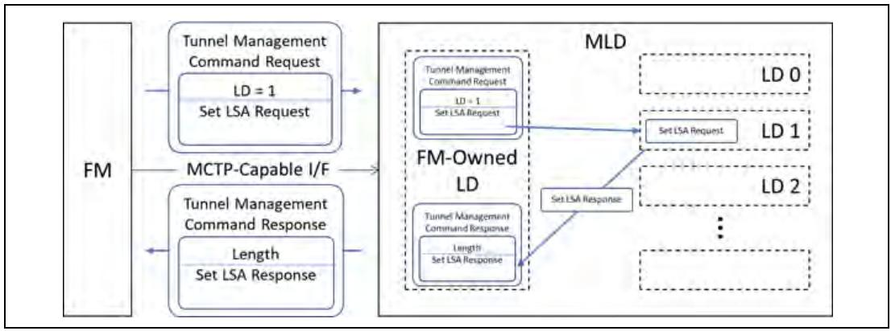
>
> *Original page render @ 150 DPI* — [📄 Full size](figures/chapter_07/page_0364.png)

> **Figure 7-23.** Tunneling Commands to an LD in an MLD through a CXL Switch ｜ 通过 CXL 交换机向 MLD 中的某个 LD 隧道传输命令
>
> 
>
> *Original page render @ 150 DPI* — [📄 Full size](figures/chapter_07/page_0364.png)

<table>
<thead>
<tr>
<th width="50%">🇬🇧 English</th>
<th width="50%" style="background-color:#e8e8e8">🇨🇳 中文</th>
</tr>
</thead>
<tbody>
<tr><td>Response size varies, based on the tunneled FM command's definition. Valid targets for the tunneled commands include switch MLD Ports, valid LDs within an MLD, and the LD Pool CCI in a Multi-Headed device. Tunneled commands sent to any other targets shall be discarded and this command shall return an "Invalid Input" return code. The FM-owned LD (LD=FFFFh) is an invalid target in MLDs.</td><td style="background-color:#e8e8e8">响应大小根据被隧道传输的 FM 命令的定义而变化。隧道传输命令的有效目标包括交换机 MLD 端口、MLD 中的有效 LD,以及多头设备中的 LD Pool CCI。发送到任何其他目标的隧道传输命令应被丢弃,并且此命令应返回 "Invalid Input" 返回码。FM-owned LD (LD=FFFFh) 在 MLD 中是无效目标。</td></tr>
<tr><td>The LD Pool CCI in Multi-Headed devices is targeted using the "Target Type" field, as illustrated in Figure 7-24. This command shall return an "Invalid Input" return code failure if tunneling to the LD Pool CCI is not permitted on the CCI that receives the request.</td><td style="background-color:#e8e8e8">多头设备中的 LD Pool CCI 通过 "Target Type" 字段进行寻址,如图 7-24 所示。如果在接收请求的 CCI 上不允许向 LD Pool CCI 进行隧道传输,则此命令应返回 "Invalid Input" 返回码失败。</td></tr>
<tr><td>A Multi-Headed device shall terminate the processing of a request that includes more than 3 layers of tunneling and return the Unsupported return code.</td><td style="background-color:#e8e8e8">多头设备应终止对包含超过 3 层隧道传输的请求的处理,并返回 Unsupported 返回码。</td></tr>
<tr><td>The Tunnel Management Command itself does not cause any Command Effects, but the Management Command provided in the request will cause Command Effects as per its definition.</td><td style="background-color:#e8e8e8">Tunnel Management Command 本身不产生任何命令效果,但请求中提供的 Management Command 将根据其定义产生相应的命令效果。</td></tr>
<tr><td>Possible Command Return Codes:</td><td style="background-color:#e8e8e8">可能的命令返回码:</td></tr>
<tr><td>• Success</td><td style="background-color:#e8e8e8">• Success (成功)</td></tr>
<tr><td>• Unsupported</td><td style="background-color:#e8e8e8">• Unsupported (不支持)</td></tr>
<tr><td>• Invalid Input</td><td style="background-color:#e8e8e8">• Invalid Input (无效输入)</td></tr>
<tr><td>• Internal Error</td><td style="background-color:#e8e8e8">• Internal Error (内部错误)</td></tr>
<tr><td>• Retry Required</td><td style="background-color:#e8e8e8">• Retry Required (需要重试)</td></tr>
<tr><td>Command Effects:</td><td style="background-color:#e8e8e8">命令效果:</td></tr>
<tr><td>• None</td><td style="background-color:#e8e8e8">• None (无)</td></tr>
</tbody>
</table>

> **Figure 7-24.** Tunneling Commands to the LD Pool CCI in a Multi-Headed Device ｜ 向多头设备中 LD Pool CCI 隧道传输命令
>
> 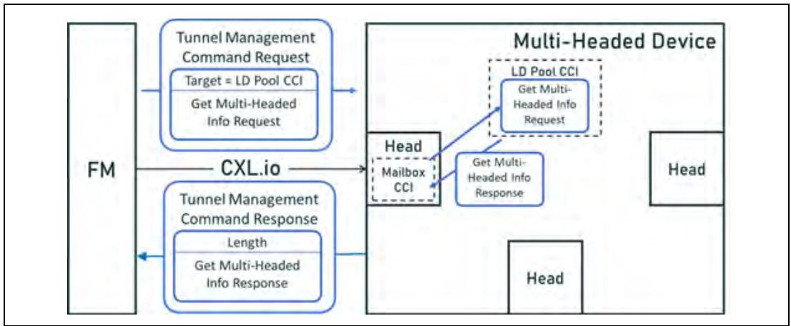
>
> *Original page render @ 150 DPI* — [📄 Full size](figures/chapter_07/page_0365.png)

<table>
<thead>
<tr>
<th>Table 7-37. Tunnel Management Command Request Payload ｜ Tunnel Management Command 请求 Payload</th>
</tr>
</thead>
<tbody>
<tr><td>

| Byte Offset | Length in Bytes | Description |
|---|---|---|
| 0h | 1 | Port or LD ID: Egress port ID for commands sent to a switch, or LD-ID for commands sent to an MLD. Valid only when Target Type is 0. |
| 1h | 1 | • Bits[3:0]: Target Type: Specifies the type of tunneling target for this command: — 0h = Port or LD based. Indicates that the "Port or LD ID" field is used to determine the target. — 1h = LD Pool CCI. Indicates that the tunneling target is the LD Pool CCI of a Multi-Headed device. — All other encodings are reserved. • Bits[7:4]: Reserved |
| 2h | 2 | Command Size: Number of valid bytes in Management Command. |
| 4h | Varies | Management Command: Request message formatted in the CCI Message Format as defined in Figure 7-19. |

</td></tr>
</tbody>
</table>

<table>
<thead>
<tr>
<th>Table 7-38. Tunnel Management Command Response Payload ｜ Tunnel Management Command 响应 Payload</th>
</tr>
</thead>
<tbody>
<tr><td>

| Byte offset | Length in Bytes | Description |
|---|---|---|
| 0h | 2 | Response Length: Number of valid bytes in Response Message. |
| 2h | 2 | Reserved |
| 4h | Varies | Response Message: Response message formatted in the CCI Message Format as defined in Figure 7-19. |

</td></tr>
</tbody>
</table>

[⬆️ 返回目录](#-本章目录-part-a)

---

##### 7.6.7.3.2 Send LD CXL.io Configuration Request (Opcode 5301h) | Send LD CXL.io Configuration Request (操作码 5301h)

<table>
<thead>
<tr>
<th width="50%">🇬🇧 English</th>
<th width="50%" style="background-color:#e8e8e8">🇨🇳 中文</th>
</tr>
</thead>
<tbody>
<tr><td>This command allows the FM to read or write the CXL.io Configuration Space of an unbound LD or FMLD. The switch will convert the request into CfgRd/CfgWr TLPs to the target device. Invalid Input Return Code shall be generated if the requested LD is bound.</td><td style="background-color:#e8e8e8">此命令允许 FM 读取或写入未绑定 LD 或 FMLD 的 CXL.io 配置空间。交换机会将该请求转换为发往目标设备的 CfgRd/CfgWr TLP。如果所请求的 LD 已被绑定,则应生成 Invalid Input 返回码。</td></tr>
<tr><td>Possible Command Return Codes:</td><td style="background-color:#e8e8e8">可能的命令返回码:</td></tr>
<tr><td>• Success</td><td style="background-color:#e8e8e8">• Success (成功)</td></tr>
<tr><td>• Unsupported</td><td style="background-color:#e8e8e8">• Unsupported (不支持)</td></tr>
<tr><td>• Invalid Input</td><td style="background-color:#e8e8e8">• Invalid Input (无效输入)</td></tr>
<tr><td>• Internal Error</td><td style="background-color:#e8e8e8">• Internal Error (内部错误)</td></tr>
<tr><td>• Retry Required</td><td style="background-color:#e8e8e8">• Retry Required (需要重试)</td></tr>
<tr><td>Command Effects:</td><td style="background-color:#e8e8e8">命令效果:</td></tr>
<tr><td>• None</td><td style="background-color:#e8e8e8">• None (无)</td></tr>
</tbody>
</table>

<table>
<thead>
<tr>
<th>Table 7-39. Send LD CXL.io Configuration Request Payload ｜ Send LD CXL.io Configuration Request Payload</th>
</tr>
</thead>
<tbody>
<tr><td>

| Byte Offset | Length in Bytes | Description |
|---|---|---|
| 0h | 1 | PPB ID: Target PPB's physical port. |
| 1h | 3 | • Bits[7:0]: Register Number: As defined in PCIe Base Specification • Bits[11:8]: Extended Register Number: As defined in PCIe Base Specification • Bits[15:12]: First Dword Byte Enable: As defined in PCIe Base Specification • Bits[22:16]: Reserved • Bit[23]: Transaction Type: — 0 = Read — 1 = Write |
| 4h | 2 | LD ID: Target LD-ID. |
| 6h | 2 | Reserved |
| 8h | 4 | Transaction Data: Write data. Valid only for write transactions. |

</td></tr>
</tbody>
</table>

<table>
<thead>
<tr>
<th>Table 7-40. Send LD CXL.io Configuration Response Payload ｜ Send LD CXL.io Configuration 响应 Payload</th>
</tr>
</thead>
<tbody>
<tr><td>

| Byte Offset | Length in Bytes | Description |
|---|---|---|
| 0h | 4 | Return Data: Read data. Valid only for read transactions. |

</td></tr>
</tbody>
</table>

[⬆️ 返回目录](#-本章目录-part-a)

---

##### 7.6.7.3.3 Send LD CXL.io Memory Request (Opcode 5302h) | Send LD CXL.io Memory Request (操作码 5302h)

<table>
<thead>
<tr>
<th width="50%">🇬🇧 English</th>
<th width="50%" style="background-color:#e8e8e8">🇨🇳 中文</th>
</tr>
</thead>
<tbody>
<tr><td>This command allows the FM to batch read or write the CXL.io Memory Space of an unbound LD or FMLD. The switch will convert the request into MemRd/MemWr TLPs to the target device. Invalid Input Return Code shall be generated if the requested LD is bound.</td><td style="background-color:#e8e8e8">此命令允许 FM 批量读取或写入未绑定 LD 或 FMLD 的 CXL.io 内存空间。交换机会将该请求转换为发往目标设备的 MemRd/MemWr TLP。如果所请求的 LD 已被绑定,则应生成 Invalid Input 返回码。</td></tr>
<tr><td>Possible Command Return Codes:</td><td style="background-color:#e8e8e8">可能的命令返回码:</td></tr>
<tr><td>• Success</td><td style="background-color:#e8e8e8">• Success (成功)</td></tr>
<tr><td>• Unsupported</td><td style="background-color:#e8e8e8">• Unsupported (不支持)</td></tr>
<tr><td>• Invalid Input</td><td style="background-color:#e8e8e8">• Invalid Input (无效输入)</td></tr>
<tr><td>• Internal Error</td><td style="background-color:#e8e8e8">• Internal Error (内部错误)</td></tr>
<tr><td>• Retry Required</td><td style="background-color:#e8e8e8">• Retry Required (需要重试)</td></tr>
<tr><td>Command Effects:</td><td style="background-color:#e8e8e8">命令效果:</td></tr>
<tr><td>• None</td><td style="background-color:#e8e8e8">• None (无)</td></tr>
</tbody>
</table>

<table>
<thead>
<tr>
<th>Table 7-41. Send LD CXL.io Memory Request Payload ｜ Send LD CXL.io Memory Request Payload</th>
</tr>
</thead>
<tbody>
<tr><td>

| Byte Offset | Length in Bytes | Description |
|---|---|---|
| 00h | 1 | Port ID: Target MLD port. |
| 01h | 2 | • Bits[11:0]: Reserved • Bits[15:12]: First Dword Byte Enable: As defined in PCIe Base Specification • Bits[19:16]: Last Dword Byte Enable: As defined in PCIe Base Specification • Bits[22:20]: Reserved • Bit[23]: Transaction Type: — 0 = Read — 1 = Write |
| 04h | 2 | LD ID: Target LD-ID. |
| 06h | 2 | Transaction Length: Transaction length in bytes, up to a maximum of 4 KB (1000h). |
| 08h | 8 | Transaction Address: The target HPA that points into the target device's MMIO Space. |
| 10h | Varies | Transaction Data: Write data. Valid only for write transactions. |

</td></tr>
</tbody>
</table>

<table>
<thead>
<tr>
<th>Table 7-42. Send LD CXL.io Memory Request Response Payload ｜ Send LD CXL.io Memory Request 响应 Payload</th>
</tr>
</thead>
<tbody>
<tr><td>

| Byte Offset | Length in Bytes | Description |
|---|---|---|
| 0h | 2 | Return Size: Number of successfully transferred bytes. |
| 2h | 2 | Reserved |
| 4h | Varies | Return Data: Read data. Valid only for read transactions. |

</td></tr>
</tbody>
</table>

[⬆️ 返回目录](#-本章目录-part-a)

---

#### 7.6.7.4 MLD Component Command Set | MLD Component 命令集

<table>
<thead>
<tr>
<th width="50%">🇬🇧 English</th>
<th width="50%" style="background-color:#e8e8e8">🇨🇳 中文</th>
</tr>
</thead>
<tbody>
<tr><td>This command set is only supported by, and must be supported by, MLD components implementing FM API support. These commands are processed by MLDs. When an FM is connected to a CXL switch that supports the FM API and does not have a direct connection to an MLD, these commands are passed to the MLD using the Tunnel Management Command. The following commands are defined:</td><td style="background-color:#e8e8e8">此命令集仅由,且必须由实现 FM API 支持的 MLD 组件支持。这些命令由 MLD 处理。当 FM 连接到支持 FM API 且与 MLD 没有直接连接的 CXL 交换机时,这些命令通过 Tunnel Management Command 传递给 MLD。定义了以下命令:</td></tr>
</tbody>
</table>

<table>
<thead>
<tr>
<th>Table 7-43. MLD Component Command Set Requirements ｜ MLD Component 命令集要求</th>
</tr>
</thead>
<tbody>
<tr><td>

| Command Name | Requirement¹ |
|---|---|
| Get LD Info | M |
| Get LD Allocations | M |
| Set LD Allocations | O |
| Get QoS Control | M |
| Set QoS Control | M |
| Get QoS Status | O |
| Get QoS Allocated BW | M |
| Set QoS Allocated BW | M |
| Get QoS BW Limit | M |
| Set QoS BW Limit | M |

1. M = Mandatory, O = Optional.

</td></tr>
</tbody>
</table>

[⬆️ 返回目录](#-本章目录-part-a)

---

##### 7.6.7.4.1 Get LD Info (Opcode 5400h) | Get LD Info (操作码 5400h)

<table>
<thead>
<tr>
<th width="50%">🇬🇧 English</th>
<th width="50%" style="background-color:#e8e8e8">🇨🇳 中文</th>
</tr>
</thead>
<tbody>
<tr><td>This command retrieves the configurations of the MLD.</td><td style="background-color:#e8e8e8">此命令检索 MLD 的配置。</td></tr>
<tr><td>Possible Command Return Codes:</td><td style="background-color:#e8e8e8">可能的命令返回码:</td></tr>
<tr><td>• Success</td><td style="background-color:#e8e8e8">• Success (成功)</td></tr>
<tr><td>• Unsupported</td><td style="background-color:#e8e8e8">• Unsupported (不支持)</td></tr>
<tr><td>• Invalid Input</td><td style="background-color:#e8e8e8">• Invalid Input (无效输入)</td></tr>
<tr><td>• Internal Error</td><td style="background-color:#e8e8e8">• Internal Error (内部错误)</td></tr>
<tr><td>• Retry Required</td><td style="background-color:#e8e8e8">• Retry Required (需要重试)</td></tr>
<tr><td>Command Effects:</td><td style="background-color:#e8e8e8">命令效果:</td></tr>
<tr><td>• None</td><td style="background-color:#e8e8e8">• None (无)</td></tr>
</tbody>
</table>

<table>
<thead>
<tr>
<th>Table 7-44. Get LD Info Response Payload ｜ Get LD Info 响应 Payload</th>
</tr>
</thead>
<tbody>
<tr><td>

| Byte Offset | Length in Bytes | Description |
|---|---|---|
| 0h | 8 | Memory Size: Total device memory capacity. |
| 8h | 2 | LD Count: Number of logical devices supported. |
| Ah | 1 | QoS Telemetry Capability: Optional QoS Telemetry for memory MLD capabilities for management by an FM (see Section 3.3.4). • Bit[0]: Egress Port Congestion Supported: When set, the associated feature is supported and the Get QoS Status command must be implemented (see Section 3.3.4.3.9). • Bit[1]: Temporary Throughput Reduction Supported: When set, the associated feature is supported (see Section 3.3.4.3.5). • Bits[7:2]: Reserved. |

</td></tr>
</tbody>
</table>

[⬆️ 返回目录](#-本章目录-part-a)

---

##### 7.6.7.4.2 Get LD Allocations (Opcode 5401h) | Get LD Allocations (操作码 5401h)

<table>
<thead>
<tr>
<th width="50%">🇬🇧 English</th>
<th width="50%" style="background-color:#e8e8e8">🇨🇳 中文</th>
</tr>
</thead>
<tbody>
<tr><td>This command retrieves the memory allocations of the MLD.</td><td style="background-color:#e8e8e8">此命令检索 MLD 的内存分配。</td></tr>
<tr><td>Possible Command Return Codes:</td><td style="background-color:#e8e8e8">可能的命令返回码:</td></tr>
<tr><td>• Success</td><td style="background-color:#e8e8e8">• Success (成功)</td></tr>
<tr><td>• Unsupported</td><td style="background-color:#e8e8e8">• Unsupported (不支持)</td></tr>
<tr><td>• Internal Error</td><td style="background-color:#e8e8e8">• Internal Error (内部错误)</td></tr>
<tr><td>• Retry Required</td><td style="background-color:#e8e8e8">• Retry Required (需要重试)</td></tr>
<tr><td>• Invalid Payload Length</td><td style="background-color:#e8e8e8">• Invalid Payload Length (无效 Payload 长度)</td></tr>
<tr><td>Command Effects:</td><td style="background-color:#e8e8e8">命令效果:</td></tr>
<tr><td>• None</td><td style="background-color:#e8e8e8">• None (无)</td></tr>
</tbody>
</table>

<table>
<thead>
<tr>
<th>Table 7-45. Get LD Allocations Request Payload ｜ Get LD Allocations 请求 Payload</th>
</tr>
</thead>
<tbody>
<tr><td>

| Byte Offset | Length in Bytes | Description |
|---|---|---|
| 0h | 1 | Start LD ID: ID of the first LD in the LD Allocation List. |
| 1h | 1 | LD Allocation List Limit: Maximum number of LD information blocks returned. This field shall have a minimum value of 1. |

</td></tr>
</tbody>
</table>

<table>
<thead>
<tr>
<th>Table 7-46. Get LD Allocations Response Payload ｜ Get LD Allocations 响应 Payload</th>
</tr>
</thead>
<tbody>
<tr><td>

| Byte Offset | Length in Bytes | Description |
|---|---|---|
| 0h | 1 | Number of LDs: Number of LDs enabled in the device. |
| 1h | 1 | Memory Granularity: This field specifies the granularity of the memory sizes configured for each LD: • 0h = 256 MB • 1h = 512 MB • 2h = 1 GB • All other encodings are reserved |
| 2h | 1 | Start LD ID: ID of the first LD in the LD Allocation List. |
| 3h | 1 | LD Allocation List Length: Number of LD information blocks returned. This value is the lesser of the request's 'LD Allocation List Limit' and response's 'Number of LDs'. |
| 4h | Varies | LD Allocation List: LD Allocation blocks for each LD, as defined in Table 7-47, repeated LD Allocation List Length times. |

</td></tr>
</tbody>
</table>

<table>
<thead>
<tr>
<th>Table 7-47. LD Allocations List Format ｜ LD Allocations 列表格式</th>
</tr>
</thead>
<tbody>
<tr><td>

| Byte Offset | Length in Bytes | Description |
|---|---|---|
| 0h | 8 | Range 1 Allocation Multiplier: Memory Allocation Range 1 for LD. This value is multiplied with Memory Granularity to calculate the memory allocation range in bytes. |
| 8h | 8 | Range 2 Allocation Multiplier: Memory Allocation Range 2 for LD. This value is multiplied with Memory Granularity to calculate the memory allocation range in bytes. |

</td></tr>
</tbody>
</table>

[⬆️ 返回目录](#-本章目录-part-a)

---

##### 7.6.7.4.3 Set LD Allocations (Opcode 5402h) | Set LD Allocations (操作码 5402h)

<table>
<thead>
<tr>
<th width="50%">🇬🇧 English</th>
<th width="50%" style="background-color:#e8e8e8">🇨🇳 中文</th>
</tr>
</thead>
<tbody>
<tr><td>This command sets the memory allocation for each LD. This command will fail if the device fails to allocate any of the allocations defined in the request. The allocations provided in the response reflect the state of the LD allocations after the command is processed, which allows the FM to check for partial success.</td><td style="background-color:#e8e8e8">此命令为每个 LD 设置内存分配。如果设备无法分配请求中定义的任何分配,则此命令将失败。响应中提供的分配反映命令处理后 LD 分配的状态,允许 FM 检查部分成功的情况。</td></tr>
<tr><td>Possible Command Return Codes:</td><td style="background-color:#e8e8e8">可能的命令返回码:</td></tr>
<tr><td>• Success</td><td style="background-color:#e8e8e8">• Success (成功)</td></tr>
<tr><td>• Unsupported</td><td style="background-color:#e8e8e8">• Unsupported (不支持)</td></tr>
<tr><td>• Invalid Input</td><td style="background-color:#e8e8e8">• Invalid Input (无效输入)</td></tr>
<tr><td>• Internal Error</td><td style="background-color:#e8e8e8">• Internal Error (内部错误)</td></tr>
<tr><td>• Retry Required</td><td style="background-color:#e8e8e8">• Retry Required (需要重试)</td></tr>
<tr><td>• Invalid Payload Length</td><td style="background-color:#e8e8e8">• Invalid Payload Length (无效 Payload 长度)</td></tr>
<tr><td>Command Effects:</td><td style="background-color:#e8e8e8">命令效果:</td></tr>
<tr><td>• Configuration Change after Cold Reset</td><td style="background-color:#e8e8e8">• Configuration Change after Cold Reset (冷复位后配置变更)</td></tr>
<tr><td>• Configuration Change after Conventional Reset</td><td style="background-color:#e8e8e8">• Configuration Change after Conventional Reset (常规复位后配置变更)</td></tr>
<tr><td>• Configuration Change after CXL Reset</td><td style="background-color:#e8e8e8">• Configuration Change after CXL Reset (CXL 复位后配置变更)</td></tr>
<tr><td>• Immediate Configuration Change</td><td style="background-color:#e8e8e8">• Immediate Configuration Change (立即配置变更)</td></tr>
<tr><td>• Immediate Data Change</td><td style="background-color:#e8e8e8">• Immediate Data Change (立即数据变更)</td></tr>
</tbody>
</table>

<table>
<thead>
<tr>
<th>Table 7-48. Set LD Allocations Request Payload ｜ Set LD Allocations 请求 Payload</th>
</tr>
</thead>
<tbody>
<tr><td>

| Byte Offset | Length in Bytes | Description |
|---|---|---|
| 0h | 1 | Number of LDs: Number of LDs to configure. This field shall have a minimum value of 1. |
| 1h | 1 | Start LD ID: ID of the first LD in the LD Allocation List. |
| 2h | 2 | Reserved |
| 4h | Varies | LD Allocation List: LD Allocation blocks for each LD, starting at Start LD ID, as defined in Table 7-47, repeated Number of LDs times. |

</td></tr>
</tbody>
</table>

<table>
<thead>
<tr>
<th>Table 7-49. Set LD Allocations Response Payload ｜ Set LD Allocations 响应 Payload</th>
</tr>
</thead>
<tbody>
<tr><td>

| Byte Offset | Length in Bytes | Description |
|---|---|---|
| 0h | 1 | Number of LDs: Number of LDs configured. |
| 1h | 1 | Start LD ID: ID of the first LD in the LD Allocation List. |
| 2h | 2 | Reserved |
| 4h | Varies | LD Allocation List: Updated LD Allocation blocks for each LD, starting at Start LD ID, as defined in Table 7-47, repeated Number of LDs times. |

</td></tr>
</tbody>
</table>

[⬆️ 返回目录](#-本章目录-part-a)

---

##### 7.6.7.4.4 Get QoS Control (Opcode 5403h) | Get QoS Control (操作码 5403h)

<table>
<thead>
<tr>
<th width="50%">🇬🇧 English</th>
<th width="50%" style="background-color:#e8e8e8">🇨🇳 中文</th>
</tr>
</thead>
<tbody>
<tr><td>This command retrieves the MLD's QoS control parameters.</td><td style="background-color:#e8e8e8">此命令检索 MLD 的 QoS 控制参数。</td></tr>
<tr><td>Possible Command Return Codes:</td><td style="background-color:#e8e8e8">可能的命令返回码:</td></tr>
<tr><td>• Success</td><td style="background-color:#e8e8e8">• Success (成功)</td></tr>
<tr><td>• Internal Error</td><td style="background-color:#e8e8e8">• Internal Error (内部错误)</td></tr>
<tr><td>• Retry Required</td><td style="background-color:#e8e8e8">• Retry Required (需要重试)</td></tr>
<tr><td>• Invalid Payload Length</td><td style="background-color:#e8e8e8">• Invalid Payload Length (无效 Payload 长度)</td></tr>
<tr><td>Command Effects:</td><td style="background-color:#e8e8e8">命令效果:</td></tr>
<tr><td>• None</td><td style="background-color:#e8e8e8">• None (无)</td></tr>
</tbody>
</table>

<table>
<thead>
<tr>
<th>Table 7-50. Payload for Get QoS Control Response, Set QoS Control Request, and Set QoS Control Response (Sheet 1 of 2) ｜ Get QoS Control 响应、Set QoS Control 请求与响应 Payload (第 1 页 / 共 2 页)</th>
</tr>
</thead>
<tbody>
<tr><td>

| Byte Offset | Length in Bytes | Description |
|---|---|---|
| 0h | 1 | QoS Telemetry Control: Default is 00h. • Bit[0]: Egress Port Congestion Enable: See Section 3.3.4.3.9 • Bit[1]: Temporary Throughput Reduction Enable: See Section 3.3.4.3.5 • Bits[7:2]: Reserved |
| 1h | 1 | Egress Moderate Percentage: Threshold in percent for Egress Port Congestion mechanism to indicate moderate congestion. Valid range is 1-100. Default is 10. |
| 2h | 1 | Egress Severe Percentage: Threshold in percent for Egress Port Congestion mechanism to indicate severe congestion. Valid range is 1-100. Default is 25. |
| 3h | 1 | Backpressure Sample Interval: Interval in ns for Egress Port Congestion mechanism to take samples. Valid range is 0-15. Default is 8 (800 ns of history for 100 samples). Value of 0 disables the mechanism. See Section 3.3.4.3.4. |
| 4h | 2 | ReqCmpBasis: Estimated maximum sustained sum of requests and recent responses across the entire device, serving as the basis for QoS Limit Fraction. Valid range is 0-65,535. Value of 0 disables the mechanism. Default is 0. See Section 3.3.4.3.7. |
| 6h | 1 | Completion Collection Interval: Interval in ns for Completion Counting mechanism to collect the number of transmitted responses in a single counter. Valid range is 0-255. Default is 64 (1.024 us of history, given 16 counters). See Section 3.3.4.3.10. |

</td></tr>
</tbody>
</table>

<table>
<thead>
<tr>
<th>Table 7-50. Payload for Get QoS Control Response, Set QoS Control Request, and Set QoS Control Response (Sheet 2 of 2) ｜ Get QoS Control 响应、Set QoS Control 请求与响应 Payload (第 2 页 / 共 2 页)</th>
</tr>
</thead>
<tbody>
<tr><td>

| Byte Offset | Length in Bytes | Description |
|---|---|---|
| (Continued from prior sheet) |  |  |

</td></tr>
</tbody>
</table>

[⬆️ 返回目录](#-本章目录-part-a)

---

##### 7.6.7.4.5 Set QoS Control (Opcode 5404h) | Set QoS Control (操作码 5404h)

<table>
<thead>
<tr>
<th width="50%">🇬🇧 English</th>
<th width="50%" style="background-color:#e8e8e8">🇨🇳 中文</th>
</tr>
</thead>
<tbody>
<tr><td>This command sets the MLD's QoS control parameters, as defined in Table 7-50. The device must complete the set operation before returning the response. The command response returns the resulting QoS control parameters, as defined in the same table. This command will fail, returning Invalid Input, if any of the parameters are outside their valid range.</td><td style="background-color:#e8e8e8">此命令按表 7-50 所定义设置 MLD 的 QoS 控制参数。设备必须在返回响应之前完成设置操作。命令响应按同一表所定义返回结果 QoS 控制参数。如果任何参数超出有效范围,此命令将失败并返回 Invalid Input。</td></tr>
<tr><td>Possible Command Codes:</td><td style="background-color:#e8e8e8">可能的命令返回码:</td></tr>
<tr><td>• Success</td><td style="background-color:#e8e8e8">• Success (成功)</td></tr>
<tr><td>• Invalid Input</td><td style="background-color:#e8e8e8">• Invalid Input (无效输入)</td></tr>
<tr><td>• Internal Error</td><td style="background-color:#e8e8e8">• Internal Error (内部错误)</td></tr>
<tr><td>• Retry Required</td><td style="background-color:#e8e8e8">• Retry Required (需要重试)</td></tr>
<tr><td>• Invalid Payload Length</td><td style="background-color:#e8e8e8">• Invalid Payload Length (无效 Payload 长度)</td></tr>
<tr><td>Command Effects:</td><td style="background-color:#e8e8e8">命令效果:</td></tr>
<tr><td>• Immediate Policy Change</td><td style="background-color:#e8e8e8">• Immediate Policy Change (立即策略变更)</td></tr>
<tr><td>Payload for Set QoS Control Request and Response is documented in Table 7-50.</td><td style="background-color:#e8e8e8">Set QoS Control 请求和响应的 Payload 在表 7-50 中记录。</td></tr>
</tbody>
</table>

[⬆️ 返回目录](#-本章目录-part-a)

---

##### 7.6.7.4.6 Get QoS Status (Opcode 5405h) | Get QoS Status (操作码 5405h)

<table>
<thead>
<tr>
<th width="50%">🇬🇧 English</th>
<th width="50%" style="background-color:#e8e8e8">🇨🇳 中文</th>
</tr>
</thead>
<tbody>
<tr><td>This command retrieves the MLD's QoS Status. This command is mandatory if the Egress Port Congestion Supported bit is set (see Table 7-44).</td><td style="background-color:#e8e8e8">此命令检索 MLD 的 QoS 状态。如果 Egress Port Congestion Supported 位置位 (参见表 7-44),则此命令是必需的。</td></tr>
<tr><td>Possible Command Return Codes:</td><td style="background-color:#e8e8e8">可能的命令返回码:</td></tr>
<tr><td>• Success</td><td style="background-color:#e8e8e8">• Success (成功)</td></tr>
<tr><td>• Unsupported</td><td style="background-color:#e8e8e8">• Unsupported (不支持)</td></tr>
<tr><td>• Internal Error</td><td style="background-color:#e8e8e8">• Internal Error (内部错误)</td></tr>
<tr><td>• Retry Required</td><td style="background-color:#e8e8e8">• Retry Required (需要重试)</td></tr>
<tr><td>• Invalid Payload Length</td><td style="background-color:#e8e8e8">• Invalid Payload Length (无效 Payload 长度)</td></tr>
<tr><td>Command Effects:</td><td style="background-color:#e8e8e8">命令效果:</td></tr>
<tr><td>• None</td><td style="background-color:#e8e8e8">• None (无)</td></tr>
</tbody>
</table>

<table>
<thead>
<tr>
<th>Table 7-51. Get QoS Status Response Payload ｜ Get QoS Status 响应 Payload</th>
</tr>
</thead>
<tbody>
<tr><td>

| Byte Offset | Length in Bytes | Description |
|---|---|---|
| 0h | 1 | Backpressure Average Percentage: Current snapshot of the measured Egress Port average congestion. See Section 3.3.4.3.4. |

</td></tr>
</tbody>
</table>

[⬆️ 返回目录](#-本章目录-part-a)

---

##### 7.6.7.4.7 Get QoS Allocated BW (Opcode 5406h) | Get QoS Allocated BW (操作码 5406h)

<table>
<thead>
<tr>
<th width="50%">🇬🇧 English</th>
<th width="50%" style="background-color:#e8e8e8">🇨🇳 中文</th>
</tr>
</thead>
<tbody>
<tr><td>This command retrieves the MLD's QoS allocated bandwidth on a per-LD basis (see Section 3.3.4.3.7).</td><td style="background-color:#e8e8e8">此命令按每个 LD 检索 MLD 的 QoS 已分配带宽 (参见 3.3.4.3.7 节)。</td></tr>
<tr><td>Possible Command Return Codes:</td><td style="background-color:#e8e8e8">可能的命令返回码:</td></tr>
<tr><td>• Success</td><td style="background-color:#e8e8e8">• Success (成功)</td></tr>
<tr><td>• Invalid Input</td><td style="background-color:#e8e8e8">• Invalid Input (无效输入)</td></tr>
<tr><td>• Internal Error</td><td style="background-color:#e8e8e8">• Internal Error (内部错误)</td></tr>
<tr><td>• Retry Required</td><td style="background-color:#e8e8e8">• Retry Required (需要重试)</td></tr>
<tr><td>• Invalid Payload Length</td><td style="background-color:#e8e8e8">• Invalid Payload Length (无效 Payload 长度)</td></tr>
<tr><td>Command Effects:</td><td style="background-color:#e8e8e8">命令效果:</td></tr>
<tr><td>• None</td><td style="background-color:#e8e8e8">• None (无)</td></tr>
</tbody>
</table>

<table>
<thead>
<tr>
<th>Table 7-52. Payload for Get QoS Allocated BW Request ｜ Get QoS Allocated BW 请求 Payload</th>
</tr>
</thead>
<tbody>
<tr><td>

| Byte Offset | Length in Bytes | Description |
|---|---|---|
| 0h | 1 | Number of LDs: Number of LDs queried. This field shall have a minimum value of 1. |
| 1h | 1 | Start LD ID: ID of the first LD in the QoS Allocated BW List. |

</td></tr>
</tbody>
</table>

<table>
<thead>
<tr>
<th>Table 7-53. Payload for Get QoS Allocated BW Response ｜ Get QoS Allocated BW 响应 Payload</th>
</tr>
</thead>
<tbody>
<tr><td>

| Byte Offset | Length in Bytes | Description |
|---|---|---|
| 0h | 1 | Number of LDs: Number of LDs queried. |
| 1h | 1 | Start LD ID: ID of the first LD in the QoS Allocated BW List. |
| 2h | Number of LDs | QoS Allocation Fraction: Byte array of allocated bandwidth fractions for LDs, starting at Start LD ID. The valid range of each array element is 0-255. Default value is 0. Value in each byte is the fraction multiplied by 256. |

</td></tr>
</tbody>
</table>

[⬆️ 返回目录](#-本章目录-part-a)

---

##### 7.6.7.4.8 Set QoS Allocated BW (Opcode 5407h) | Set QoS Allocated BW (操作码 5407h)

<table>
<thead>
<tr>
<th width="50%">🇬🇧 English</th>
<th width="50%" style="background-color:#e8e8e8">🇨🇳 中文</th>
</tr>
</thead>
<tbody>
<tr><td>This command sets the MLD's QoS allocated bandwidth on a per-LD basis, as defined in Section 3.3.4.3.7. The device must complete the set operation before returning the response. The command response returns the resulting QoS allocated bandwidth, as defined in the same table. This command will fail, returning Invalid Input, if any of the parameters are outside their valid range.</td><td style="background-color:#e8e8e8">此命令按 3.3.4.3.7 节所定义,按每个 LD 设置 MLD 的 QoS 已分配带宽。设备必须在返回响应之前完成设置操作。命令响应按同一表所定义返回结果 QoS 已分配带宽。如果任何参数超出有效范围,此命令将失败并返回 Invalid Input。</td></tr>
<tr><td>Possible Command Return Codes:</td><td style="background-color:#e8e8e8">可能的命令返回码:</td></tr>
<tr><td>• Success</td><td style="background-color:#e8e8e8">• Success (成功)</td></tr>
<tr><td>• Invalid Input</td><td style="background-color:#e8e8e8">• Invalid Input (无效输入)</td></tr>
<tr><td>• Internal Error</td><td style="background-color:#e8e8e8">• Internal Error (内部错误)</td></tr>
<tr><td>• Retry Required</td><td style="background-color:#e8e8e8">• Retry Required (需要重试)</td></tr>
<tr><td>• Invalid Payload Length</td><td style="background-color:#e8e8e8">• Invalid Payload Length (无效 Payload 长度)</td></tr>
<tr><td>Command Effects:</td><td style="background-color:#e8e8e8">命令效果:</td></tr>
<tr><td>• Configuration Change after Cold Reset</td><td style="background-color:#e8e8e8">• Configuration Change after Cold Reset (冷复位后配置变更)</td></tr>
<tr><td>• Configuration Change after Conventional Reset</td><td style="background-color:#e8e8e8">• Configuration Change after Conventional Reset (常规复位后配置变更)</td></tr>
<tr><td>• Configuration Change after CXL Reset</td><td style="background-color:#e8e8e8">• Configuration Change after CXL Reset (CXL 复位后配置变更)</td></tr>
<tr><td>• Immediate Configuration Change</td><td style="background-color:#e8e8e8">• Immediate Configuration Change (立即配置变更)</td></tr>
<tr><td>• Immediate Data Change</td><td style="background-color:#e8e8e8">• Immediate Data Change (立即数据变更)</td></tr>
</tbody>
</table>

<table>
<thead>
<tr>
<th>Table 7-54. Payload for Set QoS Allocated BW Request, and Set QoS Allocated BW Response ｜ Set QoS Allocated BW 请求与响应 Payload</th>
</tr>
</thead>
<tbody>
<tr><td>

| Byte Offset | Length in Bytes | Description |
|---|---|---|
| 0h | 1 | Number of LDs: Number of LDs configured. |
| 1h | 1 | Start LD ID: ID of the first LD in the QoS Allocated BW List. |
| 2h | Number of LDs | QoS Allocation Fraction: Byte array of allocated bandwidth fractions for LDs, starting at Start LD ID. The valid range of each array element is 0-255. Default value is 0. Value in each byte is the fraction multiplied by 256. |

</td></tr>
</tbody>
</table>

[⬆️ 返回目录](#-本章目录-part-a)

---

##### 7.6.7.4.9 Get QoS BW Limit (Opcode 5408h) | Get QoS BW Limit (操作码 5408h)

<table>
<thead>
<tr>
<th width="50%">🇬🇧 English</th>
<th width="50%" style="background-color:#e8e8e8">🇨🇳 中文</th>
</tr>
</thead>
<tbody>
<tr><td>This command retrieves the MLD's QoS bandwidth limit on a per-LD basis (see Section 3.3.4.3.7).</td><td style="background-color:#e8e8e8">此命令按每个 LD 检索 MLD 的 QoS 带宽限制 (参见 3.3.4.3.7 节)。</td></tr>
<tr><td>Possible Command Return Codes:</td><td style="background-color:#e8e8e8">可能的命令返回码:</td></tr>
<tr><td>• Success</td><td style="background-color:#e8e8e8">• Success (成功)</td></tr>
<tr><td>• Invalid Input</td><td style="background-color:#e8e8e8">• Invalid Input (无效输入)</td></tr>
<tr><td>• Internal Error</td><td style="background-color:#e8e8e8">• Internal Error (内部错误)</td></tr>
<tr><td>• Retry Required</td><td style="background-color:#e8e8e8">• Retry Required (需要重试)</td></tr>
<tr><td>• Invalid Payload Length</td><td style="background-color:#e8e8e8">• Invalid Payload Length (无效 Payload 长度)</td></tr>
<tr><td>Command Effects:</td><td style="background-color:#e8e8e8">命令效果:</td></tr>
<tr><td>• None</td><td style="background-color:#e8e8e8">• None (无)</td></tr>
</tbody>
</table>

<table>
<thead>
<tr>
<th>Table 7-55. Payload for Get QoS BW Limit Request ｜ Get QoS BW Limit 请求 Payload</th>
</tr>
</thead>
<tbody>
<tr><td>

| Byte Offset | Length in Bytes | Description |
|---|---|---|
| 0h | 1 | Number of LDs: Number of LDs queried. This field shall have a minimum value of 1. |
| 1h | 1 | Start LD ID: ID of the first LD in the QoS BW Limit List. |

</td></tr>
</tbody>
</table>

<table>
<thead>
<tr>
<th>Table 7-56. Payload for Get QoS BW Limit Response ｜ Get QoS BW Limit 响应 Payload</th>
</tr>
</thead>
<tbody>
<tr><td>

| Byte Offset | Length in Bytes | Description |
|---|---|---|
| 0h | 1 | Number of LDs: Number of LDs queried. |
| 1h | 1 | Start LD ID: ID of the first LD in the QoS BW Limit List. |
| 2h | Number of LDs | QoS Limit Fraction: Byte array of allocated bandwidth limit fractions for LDs, starting at Start LD ID. The valid range of each array element is 0-255. Default value is 0. Value in each byte is the fraction multiplied by 256. |

</td></tr>
</tbody>
</table>

[⬆️ 返回目录](#-本章目录-part-a)

---

##### 7.6.7.4.10 Set QoS BW Limit (Opcode 5409h) | Set QoS BW Limit (操作码 5409h)

<table>
<thead>
<tr>
<th width="50%">🇬🇧 English</th>
<th width="50%" style="background-color:#e8e8e8">🇨🇳 中文</th>
</tr>
</thead>
<tbody>
<tr><td>This command sets the MLD's QoS bandwidth limit on a per-LD basis, as defined in Section 3.3.4.3.7. The device must complete the set operation before returning the response. The command response returns the resulting QoS bandwidth limit, as defined in the same table. This command will fail, returning Invalid Input, if any of the parameters are outside their valid range. This command will fail, returning Internal Error, if the device was able to set the QoS BW Limit for some of the LDs in the request, but not all the LDs.</td><td style="background-color:#e8e8e8">此命令按 3.3.4.3.7 节所定义,按每个 LD 设置 MLD 的 QoS 带宽限制。设备必须在返回响应之前完成设置操作。命令响应按同一表所定义返回结果 QoS 带宽限制。如果任何参数超出有效范围,此命令将失败并返回 Invalid Input。如果设备能够为请求中的部分 (而非全部) LD 设置 QoS BW Limit,则此命令将失败并返回 Internal Error。</td></tr>
<tr><td>Possible Command Return Codes:</td><td style="background-color:#e8e8e8">可能的命令返回码:</td></tr>
<tr><td>• Success</td><td style="background-color:#e8e8e8">• Success (成功)</td></tr>
<tr><td>• Invalid Input</td><td style="background-color:#e8e8e8">• Invalid Input (无效输入)</td></tr>
<tr><td>• Internal Error</td><td style="background-color:#e8e8e8">• Internal Error (内部错误)</td></tr>
<tr><td>• Retry Required</td><td style="background-color:#e8e8e8">• Retry Required (需要重试)</td></tr>
<tr><td>• Invalid Payload Length</td><td style="background-color:#e8e8e8">• Invalid Payload Length (无效 Payload 长度)</td></tr>
<tr><td>Command Effects:</td><td style="background-color:#e8e8e8">命令效果:</td></tr>
<tr><td>• Configuration Change after Cold Reset</td><td style="background-color:#e8e8e8">• Configuration Change after Cold Reset (冷复位后配置变更)</td></tr>
<tr><td>• Configuration Change after Conventional Reset</td><td style="background-color:#e8e8e8">• Configuration Change after Conventional Reset (常规复位后配置变更)</td></tr>
<tr><td>• Configuration Change after CXL Reset</td><td style="background-color:#e8e8e8">• Configuration Change after CXL Reset (CXL 复位后配置变更)</td></tr>
<tr><td>• Immediate Configuration Change</td><td style="background-color:#e8e8e8">• Immediate Configuration Change (立即配置变更)</td></tr>
<tr><td>• Immediate Data Change</td><td style="background-color:#e8e8e8">• Immediate Data Change (立即数据变更)</td></tr>
</tbody>
</table>

<table>
<thead>
<tr>
<th>Table 7-57. Payload for Set QoS BW Limit Request, and Set QoS BW Limit Response ｜ Set QoS BW Limit 请求与响应 Payload</th>
</tr>
</thead>
<tbody>
<tr><td>

| Byte Offset | Length in Bytes | Description |
|---|---|---|
| 0h | 1 | Number of LDs: Number of LDs configured. |
| 1h | 1 | Start LD ID: ID of the first LD in the QoS BW Limit List. |
| 2h | Number of LDs | QoS Limit Fraction: Byte array of allocated bandwidth limit fractions for LDs, starting at Start LD ID. The valid range of each array element is 0-255. Default value is 0. Value in each byte is the fraction multiplied by 256. |

</td></tr>
</tbody>
</table>

[⬆️ 返回目录](#-本章目录-part-a)

---

#### 7.6.7.5 Multi-Headed Device Command Set | Multi-Headed Device 命令集

<table>
<thead>
<tr>
<th width="50%">🇬🇧 English</th>
<th width="50%" style="background-color:#e8e8e8">🇨🇳 中文</th>
</tr>
</thead>
<tbody>
<tr><td>The Multi-Headed device command set includes commands for querying the Head-to-LD mapping in a Multi-Headed device. Support for this command set is required on the LD Pool CCI of a Multi-Headed device.</td><td style="background-color:#e8e8e8">Multi-Headed Device 命令集包括用于查询多头设备中 Head-to-LD 映射的命令。在多头设备的 LD Pool CCI 上必须支持此命令集。</td></tr>
</tbody>
</table>

[⬆️ 返回目录](#-本章目录-part-a)

---

##### 7.6.7.5.1 Get Multi-Headed Info (Opcode 5500h) | Get Multi-Headed Info (操作码 5500h)

<table>
<thead>
<tr>
<th width="50%">🇬🇧 English</th>
<th width="50%" style="background-color:#e8e8e8">🇨🇳 中文</th>
</tr>
</thead>
<tbody>
<tr><td>This command retrieves the number of heads, number of supported LDs, and Head-to-LD mapping of a Multi-Headed device.</td><td style="background-color:#e8e8e8">此命令检索多头设备的 head 数量、所支持的 LD 数量以及 Head-to-LD 映射。</td></tr>
<tr><td>Possible Command Return Codes:</td><td style="background-color:#e8e8e8">可能的命令返回码:</td></tr>
<tr><td>• Success</td><td style="background-color:#e8e8e8">• Success (成功)</td></tr>
<tr><td>• Unsupported</td><td style="background-color:#e8e8e8">• Unsupported (不支持)</td></tr>
<tr><td>• Invalid Input</td><td style="background-color:#e8e8e8">• Invalid Input (无效输入)</td></tr>
<tr><td>• Internal Error</td><td style="background-color:#e8e8e8">• Internal Error (内部错误)</td></tr>
<tr><td>• Retry Required</td><td style="background-color:#e8e8e8">• Retry Required (需要重试)</td></tr>
<tr><td>Command Effects:</td><td style="background-color:#e8e8e8">命令效果:</td></tr>
<tr><td>• None</td><td style="background-color:#e8e8e8">• None (无)</td></tr>
</tbody>
</table>

<table>
<thead>
<tr>
<th>Table 7-58. Get Multi-Headed Info Request Payload ｜ Get Multi-Headed Info 请求 Payload</th>
</tr>
</thead>
<tbody>
<tr><td>

| Byte Offset | Length in Bytes | Description |
|---|---|---|
| 0h | 1 | Start LD ID: ID of the first LD in the LD Map. |
| 1h | 1 | LD Map List Limit: Maximum number of LD Map entries returned. This field shall have a minimum value of 1. |

</td></tr>
</tbody>
</table>

<table>
<thead>
<tr>
<th>Table 7-59. Get Multi-Headed Info Response Payload ｜ Get Multi-Headed Info 响应 Payload</th>
</tr>
</thead>
<tbody>
<tr><td>

| Byte Offset | Length in Bytes | Description |
|---|---|---|
| 0h | 1 | Number of LDs: Total number of LDs in the LD Pool. This field shall have a minimum value of 1. |
| 1h | 1 | Number of Heads: Total number of CXL heads. This field shall have a minimum value of 1. |
| 2h | 2 | Reserved |
| 4h | 1 | Start LD ID: ID of the first LD in the LD Map. |
| 5h | 1 | LD Map Length: Number of LD Map entries returned. LD Map Length = Min (LD Map List Limit. (Number of LDs - Start LD ID)) |
| 6h | 2 | Reserved |
| 8h | LD Map Length | LD Map: Port number of the head to which each LD is assigned, starting at Start LD ID, repeated LD Map Length times. A value of FFh indicates that LD is not currently assigned to a head. |

</td></tr>
</tbody>
</table>

[⬆️ 返回目录](#-本章目录-part-a)

---

##### 7.6.7.5.2 Get Head Info (Opcode 5501h) | Get Head Info (操作码 5501h)

<table>
<thead>
<tr>
<th width="50%">🇬🇧 English</th>
<th width="50%" style="background-color:#e8e8e8">🇨🇳 中文</th>
</tr>
</thead>
<tbody>
<tr><td>This command retrieves information for one or more heads.</td><td style="background-color:#e8e8e8">此命令检索一个或多个 head 的信息。</td></tr>
<tr><td>This command fails with the Invalid Input return code if the values of the Start Head and Number of Heads fields request the information for a non-existent head.</td><td style="background-color:#e8e8e8">如果 Start Head 和 Number of Heads 字段的值请求不存在的 head 的信息,则此命令以 Invalid Input 返回码失败。</td></tr>
<tr><td>Possible Command Return Codes:</td><td style="background-color:#e8e8e8">可能的命令返回码:</td></tr>
<tr><td>• Success</td><td style="background-color:#e8e8e8">• Success (成功)</td></tr>
<tr><td>• Unsupported</td><td style="background-color:#e8e8e8">• Unsupported (不支持)</td></tr>
<tr><td>• Invalid Input</td><td style="background-color:#e8e8e8">• Invalid Input (无效输入)</td></tr>
<tr><td>• Internal Error</td><td style="background-color:#e8e8e8">• Internal Error (内部错误)</td></tr>
<tr><td>• Retry Required</td><td style="background-color:#e8e8e8">• Retry Required (需要重试)</td></tr>
<tr><td>Command Effects:</td><td style="background-color:#e8e8e8">命令效果:</td></tr>
<tr><td>• None</td><td style="background-color:#e8e8e8">• None (无)</td></tr>
</tbody>
</table>

<table>
<thead>
<tr>
<th>Table 7-60. Get Head Info Request Payload ｜ Get Head Info 请求 Payload</th>
</tr>
</thead>
<tbody>
<tr><td>

| Byte Offset | Length in Bytes | Description |
|---|---|---|
| 0h | 1 | Start Head: Specifies the ID of the first head information block requested. |
| 1h | 1 | Number of Heads: Number of head information blocks requested. |

</td></tr>
</tbody>
</table>

<table>
<thead>
<tr>
<th>Table 7-61. Get Head Info Response Payload ｜ Get Head Info 响应 Payload</th>
</tr>
</thead>
<tbody>
<tr><td>

| Byte Offset | Length in Bytes | Description |
|---|---|---|
| 0h | 1 | Number of Heads: Number of head information blocks returned. |
| 1h | 3 | Reserved |
| 4h | Varies | Head Information List: Head information block as defined in Table 7-62, repeated Number of Heads times. |

</td></tr>
</tbody>
</table>

<table>
<thead>
<tr>
<th>Table 7-62. Get Head Info Head Information Block Format ｜ Get Head Info Head 信息块格式</th>
</tr>
</thead>
<tbody>
<tr><td>

| Byte Offset | Length in Bytes | Description |
|---|---|---|
| 0h | 1 | Port Number: Value encoding matches the Port Number field in the PCIe Link Capabilities register in the PCIe Capability structure. |
| 1h | 1 | • Bits[5:0]: Maximum Link Width: Value encoding matches the Maximum Link Width field in the PCIe Link Capabilities register in the PCIe Capability structure • Bits[7:6]: Reserved |
| 2h | 1 | • Bits[5:0]: Negotiated Link Width: Value encoding matches the Negotiated Link Width field in the PCIe Link Capabilities register in the PCIe Capability structure • Bits[7:6]: Reserved |
| 3h | 1 | • Bits[5:0]: Supported Link Speeds Vector: Value encoding matches the Supported Link Speeds Vector field in the PCIe Link Capabilities 2 register in the PCIe Capability structure • Bits[7:6]: Reserved |
| 4h | 1 | • Bits[5:0]: Max Link Speed: Value encoding matches the Max Link Speed field in the PCIe Link Capabilities register in the PCIe Capability structure • Bits[7:6]: Reserved |
| 5h | 1 | • Bits[5:0]: Current Link Speed: Value encoding matches the Current Link Speed field in the PCIe Link Status register in the PCIe Capability structure • Bits[7:6]: Reserved |
| 6h | 1 | LTSSM State: Current link LTSSM Major state: • 00h = Detect • 01h = Polling • 02h = Configuration • 03h = Recovery • 04h = L0 • 05h = L0s • 06h = L1 • 07h = L2 • 08h = Disabled • 09h = Loopback • 0Ah = Hot Reset • All other encodings are reserved Link substates should be reported through vendor-defined diagnostics commands. |
| 7h | 1 | First Negotiated Lane Number |
| 8h | 1 | Link State Flags • Bit[0]: Lane Reversal State: — 0 = Standard lane ordering — 1 = Reversed lane ordering • Bit[1]: Port PCIe Reset State (PERST#): — 0 = Not in reset — 1 = In reset • Bits[7:2]: Reserved |

</td></tr>
</tbody>
</table>

[⬆️ 返回目录](#-本章目录-part-a)

---

#### 7.6.7.6 DCD Management Command Set for LD-FAM | LD-FAM DCD Management 命令集

<table>
<thead>
<tr>
<th width="50%">🇬🇧 English</th>
<th width="50%" style="background-color:#e8e8e8">🇨🇳 中文</th>
</tr>
</thead>
<tbody>
<tr><td>The DCD Management command set, described in the following subsections, includes commands for querying and configuring Dynamic Capacity for LD-FAM (SLDs and MLDs). It is used by the FM to manage memory assignment within an LD-FAM DCD. Memory management for G-FAM (GFDs) is defined in Section 8.2.10.9.10.</td><td style="background-color:#e8e8e8">DCD Management 命令集 (在以下各子节中描述) 包括用于查询和配置 LD-FAM (SLD 和 MLD) Dynamic Capacity 的命令。FM 使用它来管理 LD-FAM DCD 中的内存分配。G-FAM (GFD) 的内存管理在 8.2.10.9.10 节中定义。</td></tr>
</tbody>
</table>

[⬆️ 返回目录](#-本章目录-part-a)

---

##### 7.6.7.6.1 Get DCD Info (Opcode 5600h) | Get DCD Info (操作码 5600h)

<table>
<thead>
<tr>
<th width="50%">🇬🇧 English</th>
<th width="50%" style="background-color:#e8e8e8">🇨🇳 中文</th>
</tr>
</thead>
<tbody>
<tr><td>This command retrieves the number of supported hosts, total Dynamic Capacity of the device, and supported region configurations for an LD-FAM DCD. To retrieve the corresponding DCD info for a GFD, see Section 8.2.10.9.10.1.</td><td style="background-color:#e8e8e8">此命令检索 LD-FAM DCD 所支持的主机数、设备的总 Dynamic Capacity,以及支持的 region 配置。如需检索 GFD 对应的 DCD 信息,请参见 8.2.10.9.10.1 节。</td></tr>
<tr><td>Possible Command Return Codes:</td><td style="background-color:#e8e8e8">可能的命令返回码:</td></tr>
<tr><td>• Success</td><td style="background-color:#e8e8e8">• Success (成功)</td></tr>
<tr><td>• Unsupported</td><td style="background-color:#e8e8e8">• Unsupported (不支持)</td></tr>
<tr><td>• Internal Error</td><td style="background-color:#e8e8e8">• Internal Error (内部错误)</td></tr>
<tr><td>• Retry Required</td><td style="background-color:#e8e8e8">• Retry Required (需要重试)</td></tr>
<tr><td>Command Effects:</td><td style="background-color:#e8e8e8">命令效果:</td></tr>
<tr><td>• None</td><td style="background-color:#e8e8e8">• None (无)</td></tr>
</tbody>
</table>

<table>
<thead>
<tr>
<th>Table 7-63. Get DCD Info Response Payload (Sheet 1 of 2) ｜ Get DCD Info 响应 Payload (第 1 页 / 共 2 页)</th>
</tr>
</thead>
<tbody>
<tr><td>

| Byte Offset | Length in Bytes | Description |
|---|---|---|
| 00h | 1 | Number of Hosts: Total number of hosts that the device supports. This field shall have a minimum value of 1. |
| 01h | 1 | Number of Supported DC Regions: The device shall report the total number of Dynamic Capacity Regions available per LD. DCDs shall report between 1 and 8 regions. All other encodings are reserved. |
| 02h | 2 | Reserved |
| 04h | 2 | • Bits[3:0]: Supported Add Capacity Selection Policies: Bitmask that specifies the selection policies, as defined in Section 7.6.7.6.5, that the device supports when capacity is added. At least one policy shall be supported. A value of 1 indicates that a policy is supported, and a value of 0 indicates that a policy is not supported: — Bit[0]: Free — Bit[1]: Contiguous — Bit[2]: Prescriptive — Bit[3]: Must be 0 • Bits[15:4]: Reserved |
| 06h | 2 | Reserved |
| 08h | 2 | • Bits[1:0]: Supported Release Capacity Removal Policies: Bitmask that specifies the removal policies, as defined in Section 7.6.7.6.6, that the device supports when capacity is released. At least one policy shall be supported. A value of 1 indicates that a policy is supported, and a value of 0 indicates that a policy is not supported: — Bit[0]: Tag-based — Bit[1]: Prescriptive • Bits[15:2]: Reserved |
| 0Ah | 1 | Sanitize on Release Configuration Support Mask: Bitmask, where bit position corresponds to region number, indicating whether the Sanitize on Release capability is configurable (1) or not configurable (0) for that region. |
| 0Bh | 1 | Reserved |
| 0Ch | 8 | Total Dynamic Capacity: Total memory media capacity of the device available for dynamic assignment to any host in multiples of 256 MB. |

</td></tr>
</tbody>
</table>

<table>
<thead>
<tr>
<th>Table 7-63. Get DCD Info Response Payload (Sheet 2 of 2) ｜ Get DCD Info 响应 Payload (第 2 页 / 共 2 页)</th>
</tr>
</thead>
<tbody>
<tr><td>

| Byte Offset | Length in Bytes | Description |
|---|---|---|
| 14h | 8 | Region 0 Supported Block Size Mask: Indicates the block sizes that the region supports. Each bit indicates a power of 2 supported block size, where bit n being set indicates that block size 2^n is supported. Bits[5:0] and bits[63:52] shall be 0. At least one block size shall be supported. |
| 1Ch | 8 | Region 1 Supported Block Size Mask: As defined in Region 0 Supported Block Size Mask. Valid only if Number of Supported Regions > 1. |
| 24h | 8 | Region 2 Supported Block Size Mask: As defined in Region 0 Supported Block Size Mask. Valid only if Number of Supported Regions > 2. |
| 2Ch | 8 | Region 3 Supported Block Size Mask: As defined in Region 0 Supported Block Size Mask. Valid only if Number of Supported Regions > 3. |
| 34h | 8 | Region 4 Supported Block Size Mask: As defined in Region 0 Supported Block Size Mask. Valid only if Number of Supported Regions > 4. |
| 3Ch | 8 | Region 5 Supported Block Size Mask: As defined in Region 0 Supported Block Size Mask. Valid only if Number of Supported Regions > 5. |
| 44h | 8 | Region 6 Supported Block Size Mask: As defined in Region 0 Supported Block Size Mask. Valid only if Number of Supported Regions > 6. |
| 4Ch | 8 | Region 7 Supported Block Size Mask: As defined in Region 0 Supported Block Size Mask. Valid only if Number of Supported Regions > 7. |

</td></tr>
</tbody>
</table>

[⬆️ 返回目录](#-本章目录-part-a)

---

##### 7.6.7.6.2 Get Host DC Region Configuration (Opcode 5601h) | Get Host DC Region Configuration (操作码 5601h)

<table>
<thead>
<tr>
<th width="50%">🇬🇧 English</th>
<th width="50%" style="background-color:#e8e8e8">🇨🇳 中文</th>
</tr>
</thead>
<tbody>
<tr><td>This command retrieves the Dynamic Capacity configuration for an LD-FAM DCD, for a specified host.</td><td style="background-color:#e8e8e8">此命令为指定主机检索 LD-FAM DCD 的 Dynamic Capacity 配置。</td></tr>
<tr><td>Possible Command Return Codes:</td><td style="background-color:#e8e8e8">可能的命令返回码:</td></tr>
<tr><td>• Success</td><td style="background-color:#e8e8e8">• Success (成功)</td></tr>
<tr><td>• Unsupported</td><td style="background-color:#e8e8e8">• Unsupported (不支持)</td></tr>
<tr><td>• Invalid Input</td><td style="background-color:#e8e8e8">• Invalid Input (无效输入)</td></tr>
<tr><td>• Internal Error</td><td style="background-color:#e8e8e8">• Internal Error (内部错误)</td></tr>
<tr><td>• Retry Required</td><td style="background-color:#e8e8e8">• Retry Required (需要重试)</td></tr>
<tr><td>Command Effects:</td><td style="background-color:#e8e8e8">命令效果:</td></tr>
<tr><td>• None</td><td style="background-color:#e8e8e8">• None (无)</td></tr>
</tbody>
</table>

<table>
<thead>
<tr>
<th>Table 7-64. Get Host DC Region Configuration Request Payload ｜ Get Host DC Region Configuration 请求 Payload</th>
</tr>
</thead>
<tbody>
<tr><td>

| Byte Offset | Length in Bytes | Description |
|---|---|---|
| 0h | 2 | Host ID: For an LD-FAM device, the LD-ID of the host interface configuration to query. |
| 2h | 1 | Region Count: The maximum number of region configurations to return in the output payload. |
| 3h | 1 | Starting Region Index: Index of the first requested region. |

</td></tr>
</tbody>
</table>

[⬆️ 返回目录](#-本章目录-part-a)

---

##### 7.6.7.6.3 Set DC Region Configuration (Opcode 5602h) | Set DC Region Configuration (操作码 5602h)

<table>
<thead>
<tr>
<th width="50%">🇬🇧 English</th>
<th width="50%" style="background-color:#e8e8e8">🇨🇳 中文</th>
</tr>
</thead>
<tbody>
<tr><td>This command sets the configuration of a DC Region for an LD-FAM DCD. This command shall be processed only when all capacity has been released from the region on all LDs. The device shall generate an Event Record of type Region Configuration Updated upon successful processing of this command.</td><td style="background-color:#e8e8e8">此命令设置 LD-FAM DCD 的 DC Region 配置。仅当所有 LD 上该 region 的所有容量都已释放时,才应处理此命令。设备应在成功处理此命令后生成类型为 Region Configuration Updated 的 Event Record。</td></tr>
</tbody>
</table>

<table>
<thead>
<tr>
<th>Table 7-65. Get Host DC Region Configuration Response Payload ｜ Get Host DC Region Configuration 响应 Payload</th>
</tr>
</thead>
<tbody>
<tr><td>

| Byte Offset | Length in Bytes | Description |
|---|---|---|
| 0h | 2 | Host ID: For an LD-FAM device, the LD-ID of the host interface configuration returned. |
| 2h | 1 | Number of Available Regions: As defined in Get Dynamic Capacity Configuration Output Payload. |
| 3h | 1 | Number of Regions Returned: The number of entries in the Region Configuration List. |
| 4h | Varies | Region Configuration List: DC Region Info for region specified via Starting Region Index input field. The format of each entry is defined in Table 7-66. |
| Varies | 4 | Total Number of Supported Extents: Total number of extents that the device supports on this LD. |
| Varies | 4 | Number of Available Extents: Remaining number of extents that the device supports, as defined in Section 9.13.3.3. |
| Varies | 4 | Total Number of Supported Tags: Total number of Tag values that the device supports on this LD. |
| Varies | 4 | Number of Available Tags: Remaining number of Tag values that the device supports, as defined in Section 9.13.3.3. |

</td></tr>
</tbody>
</table>

<table>
<thead>
<tr>
<th>Table 7-66. DC Region Configuration ｜ DC Region Configuration</th>
</tr>
</thead>
<tbody>
<tr><td>

| Byte Offset | Length in Bytes | Description |
|---|---|---|
| 00h | 8 | Region Base: As defined in Table 8-180. |
| 08h | 8 | Region Decode Length: As defined in Table 8-180. |
| 10h | 8 | Region Length: As defined in Table 8-180. |
| 18h | 8 | Region Block Size: As defined in Table 8-180. |
| 20h | 1 | Note: More than one bit may be set at a time. • Bits[1:0]: Reserved • Bit[2]: NonVolatile: As defined in the Flags field of Device Scoped Memory Affinity Structure defined in Coherent Device Attribute Table (CDAT) Specification • Bit[3]: Sharable: As defined in the Flags field of Device Scoped Memory Affinity Structure defined in CDAT Specification • Bit[4]: Hardware Managed Coherency: As defined in the Flags field of Device Scoped Memory Affinity Structure defined in CDAT Specification • Bit[5]: Interconnect specific Dynamic Capacity Management: As defined in the Flags field of Device Scoped Memory Affinity Structure defined in CDAT Specification • Bit[6]: Read-Only: As defined in the Flags field of Device Scoped Memory Affinity Structure defined in CDAT Specification • Bit[7]: Reserved |
| 21h | 3 | Reserved |
| 24h | 1 | • Bit[0]: Sanitize on Release: As defined in Table 8-180 • Bits[7:1]: Reserved |
| 25h | 3 | Reserved |

</td></tr>
</tbody>
</table>

[⬆️ 返回目录](#-本章目录-part-a)

---

- [7.6.7.6.4 Get DC Region Extent Lists (Opcode 5603h)](#sec-7-6-7-6-4)
- [7.6.7.6.5 Initiate Dynamic Capacity Add (Opcode 5604h)](#sec-7-6-7-6-5)
- [7.6.7.6.6 Initiate Dynamic Capacity Release (Opcode 5605h)](#sec-7-6-7-6-6)
- [7.6.7.6.7 Dynamic Capacity Add Reference (Opcode 5606h)](#sec-7-6-7-6-7)
- [7.6.7.6.8 Dynamic Capacity Remove Reference (Opcode 5607h)](#sec-7-6-7-6-8)
- [7.6.7.6.9 Dynamic Capacity List Tags (Opcode 5608h)](#sec-7-6-7-6-9)
- [7.6.8 Fabric Management Event Records](#sec-7-6-8)
  - [7.6.8.1 Physical Switch Event Records](#sec-7-6-8-1)
  - [7.6.8.2 Virtual CXL Switch Event Records](#sec-7-6-8-2)
  - [7.6.8.3 MLD Port Event Records](#sec-7-6-8-3)
- [7.7 CXL Fabric Architecture](#sec-7-7)
  - [7.7.1 CXL Fabric Use Case Examples](#sec-7-7-1)
    - [7.7.1.1 Machine-learning Accelerators](#sec-7-7-1-1)
    - [7.7.1.2 HPC/Analytics Use Case](#sec-7-7-1-2)
    - [7.7.1.3 Composable Systems](#sec-7-7-1-3)
  - [7.7.2 Global-Fabric-Attached Memory (G-FAM)](#sec-7-7-2)
    - [7.7.2.1 Overview](#sec-7-7-2-1)
    - [7.7.2.2 Host Physical Address View](#sec-7-7-2-2)
    - [7.7.2.3 G-FAM Capacity Management](#sec-7-7-2-3)
    - [7.7.2.4 G-FAM Request Routing, Interleaving, and Address Translations](#sec-7-7-2-4)
    - [7.7.2.5 G-FAM Access Protection](#sec-7-7-2-5)
    - [7.7.2.6 Global Memory Access Endpoint](#sec-7-7-2-6)
    - [7.7.2.7 Event Notifications from GFDs](#sec-7-7-2-7)
  - [7.7.3 Global Integrated Memory (GIM)](#sec-7-7-3)
    - [7.7.3.1 Host GIM Physical Address View](#sec-7-7-3-1)
    - [7.7.3.2 Use Cases](#sec-7-7-3-2)
    - [7.7.3.3 Transaction Flows and Rules for GIM](#sec-7-7-3-3)
      - [7.7.3.3.1 GIM Rules for PBR Switch Ingress Port](#sec-7-7-3-3-1)
      - [7.7.3.3.2 GIM Rules for PBR Switch Egress Port](#sec-7-7-3-3-2)
      - [7.7.3.3.3 GIM Rules for Host/Devices](#sec-7-7-3-3-3)
      - [7.7.3.3.4 Other GIM Rules](#sec-7-7-3-3-4)
    - [7.7.3.4 Restrictions with Host-to-Host UIO Usages](#sec-7-7-3-4)
  - [7.7.4 Non-GIM Usages with VendPrefixL0](#sec-7-7-4)
  - [7.7.5 HBR and PBR Switch Configurations](#sec-7-7-5)
    - [7.7.5.1 PBR Forwarding Dependencies, Loops, and Deadlocks](#sec-7-7-5-1)
  - [7.7.6 PBR Switching Details](#sec-7-7-6)
    - [7.7.6.1 Virtual Hierarchies Spanning a Fabric](#sec-7-7-6-1)
    - [7.7.6.2 PBR Message Routing across the Fabric](#sec-7-7-6-2)
    - [7.7.6.3 PBR Message Routing within a Single PBR Switch](#sec-7-7-6-3)
    - [7.7.6.4 PBR Switch vDSP/vUSP Bindings and Connectivity](#sec-7-7-6-4)
    - [7.7.6.5 PID Use Models and Assignments](#sec-7-7-6-5)
    - [7.7.6.6 CXL Switch Message Format Conversion](#sec-7-7-6-6)
      - [7.7.6.6.1 CXL.io, Including UIO](#sec-7-7-6-6-1)
      - [7.7.6.6.2 CXL.cache](#sec-7-7-6-6-2)
      - [7.7.6.6.3 CXL.mem](#sec-7-7-6-6-3)
    - [7.7.6.7 HBR Switch Port Processing of CXL Messages](#sec-7-7-6-7)
    - [7.7.6.8 PBR Switch Port Processing of CXL Messages](#sec-7-7-6-8)
    - [7.7.6.9 PPB and vPPB Behavior of PBR Link Ports](#sec-7-7-6-9)
      - [7.7.6.9.1 ISL Type 1 Configuration Space Header](#sec-7-7-6-9-1)
      - [7.7.6.9.2 ISL PCIe-compatible Configuration Register](#sec-7-7-6-9-2)
      - [7.7.6.9.3 ISL PCIe Capability Structure](#sec-7-7-6-9-3)
      - [7.7.6.9.4 ISL Secondary PCIe Capability Structure](#sec-7-7-6-9-4)
      - [7.7.6.9.5 ISL Physical Layer 16.0 GT/s Extended Capability](#sec-7-7-6-9-5)
      - [7.7.6.9.6 ISL Physical Layer 32.0 GT/s Extended Capability](#sec-7-7-6-9-6)
      - [7.7.6.9.7 ISL Physical Layer 32.0 GT/s Extended Capability](#sec-7-7-6-9-7)
      - [7.7.6.9.8 ISL Lane Margining at the Receiver Extended Capability](#sec-7-7-6-9-8)
      - [7.7.6.9.9 ISL ACS Extended Capability](#sec-7-7-6-9-9)
      - [7.7.6.9.10 ISL Advanced Error Reporting Extended Capability](#sec-7-7-6-9-10)
      - [7.7.6.9.11 ISL DPC Extended Capability](#sec-7-7-6-9-11)
  - [7.7.7 Inter-Switch Links (ISLs)](#sec-7-7-7)
    - [7.7.7.1 .io Deadlock Avoidance on ISLs/PBR Fabric](#sec-7-7-7-1)

# 📘 第 7 章　交换 (Chapter 7. Switching) — Part B

> **Source pages**: 见正文 (Part B) | **Format**: 中英对照双语

## 📑 本章目录 (Part B)

_(本目录由本部分正文小节自动汇总 — 见下方章节内容)_

---

## 🖼 本章图表 (Part B)

- **Figure 7-25** — High-level CXL Fabric Diagram (page 392)
- **Figure 7-26** — ML Accelerator Use Case (page 393)
- **Figure 7-27** — HPC/Analytics Use Case (page 393)
- **Figure 7-28** — Sample System Topology for Composable Systems (page 394)
- **Figure 7-29** — Example Host Physical Address View (page 396)
- **Figure 7-30** — Example HPA Mapping to DMPs (page 397)
- **Figure 7-31** — G-FAM Request Routing, Interleaving, and Address Translations (page 399)
- **Figure 7-32** — Memory Access Protection Levels (page 403)
- **Figure 7-33** — GFD Dynamic Capacity Access Protections (page 404)
- **Figure 7-34** — PBR Fabric Providing LD-FAM and G-FAM Resources (page 405)
- **Figure 7-35** — PBR Fabric Providing Only G-FAM Resources (page 405)
- **Figure 7-36** — CXL Fabric Example with Multiple Host Domains and Memory Types (page 407)
- **Figure 7-37** — Example Host Physical Address View with GFD and GIM (page 407)
- **Figure 7-38** — Example Multi-host CXL Cluster with Memory on Host and Device Exposed as GIM (page 408)
- **Figure 7-39** — Example ML Cluster Supporting Cross-domain Access through GIM (page 409)
- **Figure 7-40** — GIM Access Flows Using FASTs (page 409)
- **Figure 7-41** — GIM Access Flows without FASTs (page 410)
- **Figure 7-42** — Example Supported Switch Configurations (page 413)
- **Figure 7-43** — Example PBR Mesh Topology (page 414)
- **Figure 7-44** — Example Routing Scheme for a Mesh Topology (page 415)
- **Figure 7-45** — Physical Topology and Logical View (page 417)
- **Figure 7-46** — Example PBR Fabric (page 421)
- **Figure 7-47** — ISL Message Class Sub-channels (page 439)

## 📊 本章表格 (Part B)

- **Table 7-67** — Set DC Region Configuration Request and Response Payload (page 381)
- **Table 7-68** — Get DC Region Extent Lists Request Payload (page 382)
- **Table 7-69** — Get DC Region Extent Lists Response Payload (page 382)
- **Table 7-70** — Initiate Dynamic Capacity Add Request Payload (page 384)
- **Table 7-71** — Initiate Dynamic Capacity Release Request Payload (page 386)
- **Table 7-72** — Dynamic Capacity Add Reference Request Payload (page 387)
- **Table 7-73** — Dynamic Capacity Remove Reference Request Payload (page 387)
- **Table 7-74** — Dynamic Capacity List Tags Request Payload (page 388)
- **Table 7-75** — Dynamic Capacity List Tags Response Payload (page 388)
- **Table 7-76** — Dynamic Capacity Tag Information (page 388)
- **Table 7-77** — Physical Switch Events Record Format (page 389)
- **Table 7-78** — Virtual CXL Switch Event Record Format (page 390)
- **Table 7-79** — MLD Port Event Records Payload (page 391)
- **Table 7-80** — Differences between LD-FAM and G-FAM (page 397-398)
- **Table 7-81** — Fabric Segment Size Table (page 400)
- **Table 7-82** — Segment Table Intlv[3:0] Field Encoding (page 400)
- **Table 7-83** — Segment Table Gran[3:0] Field Encoding (page 401)
- **Table 7-84** — PBR Fabric Decoding and Routing, by Message Class (page 418)
- **Table 7-85** — Optional Architected Dynamic Routing Modes (page 420)
- **Table 7-86** — Summary of CacheID Field (page 424)
- **Table 7-87** — Summary of HBR Switch Routing for CXL.cache Message Classes (page 424)
- **Table 7-88** — Summary of PBR Switch Routing for CXL.cache Message Classes (page 425)
- **Table 7-89** — Summary of LD-ID Field (page 425)
- **Table 7-90** — Summary of BI-ID Field (page 426)
- **Table 7-91** — Summary of HBR Switch Routing for CXL.mem Message Classes (page 426)
- **Table 7-92** — Summary of PBR Switch Routing for CXL.mem Message Classes (page 427)
- **Table 7-93** — HBR Switch Port Processing Table for CXL.io (page 428)
- **Table 7-94** — HBR Switch Port Processing Table for CXL.cache (page 428)
- **Table 7-95** — HBR Switch Port Processing Table for CXL.mem (page 429)
- **Table 7-96** — PBR Switch Port Processing Table for CXL.io (page 430-431)
- **Table 7-97** — PBR Switch Port Processing Table for CXL.cache (page 431)
- **Table 7-98** — PBR Switch Port Processing Table for CXL.mem (page 432)
- **Table 7-99** — ISL Type 1 Configuration Space Header (page 433)
- **Table 7-100** — ISL PCIe Configuration Space Header (page 434)
- **Table 7-101** — ISL PCIe Capability Structure (page 434-436)
- **Table 7-102** — ISL Secondary PCIe Extended Capability (page 436)
- **Table 7-103** — ISL Physical Layer 16.0 GT/s Extended Capability (page 437)
- **Table 7-104** — ISL Physical Layer 32.0 GT/s Extended Capability (page 438)
- **Table 7-105** — ISL Physical Layer 64.0 GT/s Extended Capability (page 438)
- **Table 7-106** — ISL Lane Margining at the Receiver Extended Capability (page 438)
- **Table 7-107** — PBR Fabric .io Ordering Table, Non-UIO (page 440)
- **Table 7-108** — PBR Fabric .io Ordering Table, UIO (page 440)

---

## 7.6.7.6.4 Get DC Region Extent Lists (Opcode 5603h) | 获取 DC Region 范围列表 (操作码 5603h)

<table>
<thead>
<tr>
<th width="50%">🇬🇧 English</th>
<th width="50%" style="background-color:#e8e8e8">🇨🇳 中文</th>
</tr>
</thead>
<tbody>
<tr><td>This command sets the Dynamic Capacity Extent List for an LD-FAM DCD, for a specified host.</td><td style="background-color:#e8e8e8">此命令为指定主机的 LD-FAM DCD 设置 Dynamic Capacity 范围列表 (Dynamic Capacity Extent List)。</td></tr>
</tbody>
</table>

<table>
<thead>
<tr>
<th width="50%">🇬🇧 English</th>
<th width="50%" style="background-color:#e8e8e8">🇨🇳 中文</th>
</tr>
</thead>
<tbody>
<tr>
<td>

**Possible Command Return Codes:**
- Success
- Unsupported
- Invalid Input
- Internal Error
- Retry Required
- Invalid Security State

**Command Effects:**
- Configuration Change after Cold Reset
- Configuration Change after Conventional Reset
- Configuration Change after CXL Reset
- Immediate Configuration Change
- Immediate Data Change

</td>
<td style="background-color:#e8e8e8">

**可能的命令返回码:**
- Success (成功)
- Unsupported (不支持)
- Invalid Input (无效输入)
- Internal Error (内部错误)
- Retry Required (需要重试)
- Invalid Security State (无效安全状态)

**命令效果:**
- 冷复位 (Cold Reset) 后的配置变更
- 传统复位 (Conventional Reset) 后的配置变更
- CXL 复位后的配置变更
- 立即配置变更
- 立即数据变更

</td>
</tr>
</tbody>
</table>

<table>
<thead>
<tr>
<th width="50%">🇬🇧 English</th>
<th width="50%" style="background-color:#e8e8e8">🇨🇳 中文</th>
</tr>
</thead>
<tbody>
<tr>
<td>

**Table 7-67. Set DC Region Configuration Request and Response Payload**

| Byte Offset | Length in Bytes | Description |
|---|---|---|
| 0h | 1 | Region ID: Specifies which region to configure. Valid range is from 0 to 7. |
| 1h | 3 | Reserved |
| 4h | 8 | Region Block Size: As defined in Table 8-180. |
| Ch | 1 | Bit[0]: Sanitize on Release: As defined in Table 8-180; Bits[7:1]: Reserved |
| Dh | 3 | Reserved |

</td>
<td style="background-color:#e8e8e8">

**表 7-67. Set DC Region Configuration 请求与响应负载**

| 字节偏移 | 长度 (字节) | 描述 |
|---|---|---|
| 0h | 1 | Region ID (区域标识): 指定要配置的区域,有效范围为 0 到 7。 |
| 1h | 3 | Reserved (保留) |
| 4h | 8 | Region Block Size (区域块大小): 如表 8-180 所定义。 |
| Ch | 1 | Bit[0]: Sanitize on Release (释放时清除): 如表 8-180 所定义;Bits[7:1]: Reserved (保留) |
| Dh | 3 | Reserved (保留) |

</td>
</tr>
</tbody>
</table>

[⬆️ 返回目录](#-本章目录-part-b)

---

## 7.6.7.6.5 Initiate Dynamic Capacity Add (Opcode 5604h) | 启动 Dynamic Capacity 添加 (操作码 5604h)

<table>
<thead>
<tr>
<th width="50%">🇬🇧 English</th>
<th width="50%" style="background-color:#e8e8e8">🇨🇳 中文</th>
</tr>
</thead>
<tbody>
<tr><td>This command initiates the addition of Dynamic Capacity for an LD-FAM DCD, to the specified region on a host. This command shall complete when the device initiates the Add Capacity procedure, as defined in Section 8.2.10.2.2. The processing of the actions initiated in response to this command may or may not result in a new entry or multiple entries grouped via the More flag (see Table 8-62) in the Dynamic Capacity Event Log.</td><td style="background-color:#e8e8e8">此命令启动对主机上指定区域的 LD-FAM DCD 的 Dynamic Capacity 添加。当设备启动 Add Capacity 流程 (如 8.2.10.2.2 节所定义) 时,此命令即应完成。响应此命令而启动的动作的处理可能会,也可能不会在 Dynamic Capacity 事件日志中产生一个或多个通过 More 标志 (参见表 8-62) 分组的新条目。</td></tr>
<tr><td>To perform Dynamic Capacity Add on a GFD, see Section 8.2.10.9.10.7.</td><td style="background-color:#e8e8e8">要在 GFD 上执行 Dynamic Capacity Add,请参见 8.2.10.9.10.7 节。</td></tr>
<tr><td>A Selection Policy is specified to govern the device's selection of which memory resources to add:</td><td style="background-color:#e8e8e8">可指定 Selection Policy (选择策略) 来管理设备选择添加哪些内存资源:</td></tr>
<tr><td>• Free: Unassigned extents are selected by the device, with no requirement for contiguous blocks</td><td style="background-color:#e8e8e8">• Free (自由): 由设备选择未分配的 extent,不要求块连续</td></tr>
<tr><td>• Contiguous: Unassigned extents are selected by the device and shall be contiguous</td><td style="background-color:#e8e8e8">• Contiguous (连续): 由设备选择未分配的 extent,且必须连续</td></tr>
<tr><td>• Prescriptive: Extent list of capacity to assign is included in the request payload</td><td style="background-color:#e8e8e8">• Prescriptive (指定): 要分配的 capacity 的 extent 列表包含在请求负载中</td></tr>
<tr><td>• Enable Shared Access: Enable access to extent(s) previously added to another host in a DC Region that reports the "Sharable" flag, as designated by the specified tag value</td><td style="background-color:#e8e8e8">• Enable Shared Access (启用共享访问): 启用对先前已添加到另一主机的 DC Region 中 (该 DC Region 上报 "Sharable" 标志) 的 extent 的访问,由指定的 tag 值指定</td></tr>
</tbody>
</table>

<table>
<thead>
<tr>
<th width="50%">🇬🇧 English</th>
<th width="50%" style="background-color:#e8e8e8">🇨🇳 中文</th>
</tr>
</thead>
<tbody>
<tr>
<td>

**Table 7-68. Get DC Region Extent Lists Request Payload**

| Byte Offset | Length in Bytes | Description |
|---|---|---|
| 0h | 2 | Host ID: For an LD-FAM device, the LD-ID of the host interface. |
| 2h | 2 | Reserved |
| 4h | 4 | Extent Count: The maximum number of extents to return in the output response. The device may not return more extents than requested; however, it can return fewer extents. 0 is valid and allows the FM to retrieve the Total Extent Count and Extent List Generation Number without retrieving any extent data. |
| 8h | 4 | Starting Extent Index: Index of the first requested extent. A value of 0 will retrieve the first extent in the list. |

</td>
<td style="background-color:#e8e8e8">

**表 7-68. Get DC Region Extent Lists 请求负载**

| 字节偏移 | 长度 (字节) | 描述 |
|---|---|---|
| 0h | 2 | Host ID: 对于 LD-FAM 设备,为主机接口的 LD-ID。 |
| 2h | 2 | Reserved (保留) |
| 4h | 4 | Extent Count (范围数量): 输出响应中返回的最大 extent 数量。设备返回的 extent 数量不会超过请求数量,但可能少于请求数量。0 是有效的,允许 FM 仅获取 Total Extent Count 和 Extent List Generation Number,而不获取任何 extent 数据。 |
| 8h | 4 | Starting Extent Index (起始 Extent 索引): 第一个被请求 extent 的索引。值为 0 将获取列表中的第一个 extent。 |

</td>
</tr>
</tbody>
</table>

<table>
<thead>
<tr>
<th width="50%">🇬🇧 English</th>
<th width="50%" style="background-color:#e8e8e8">🇨🇳 中文</th>
</tr>
</thead>
<tbody>
<tr>
<td>

**Table 7-69. Get DC Region Extent Lists Response Payload**

| Byte Offset | Length in Bytes | Description |
|---|---|---|
| 00h | 2 | Host ID: For an LD-FAM device, the LD-ID of the host interface query. |
| 02h | 2 | Reserved |
| 04h | 4 | Starting Extent Index: Index of the first extent in the list. |
| 08h | 4 | Returned Extent Count: The number of extents returned in Extent List[ ]. |
| 0Ch | 4 | Total Extent Count: The total number of extents in the list. |
| 10h | 4 | Extent List Generation Number: A device-generated value that is used to indicate that the list has changed. |
| 14h | 4 | Reserved |
| 18h | Varies | Extent List[ ]: Extent list for the specified host as defined in Table 8-63. |

</td>
<td style="background-color:#e8e8e8">

**表 7-69. Get DC Region Extent Lists 响应负载**

| 字节偏移 | 长度 (字节) | 描述 |
|---|---|---|
| 00h | 2 | Host ID: 对于 LD-FAM 设备,为查询的主机接口的 LD-ID。 |
| 02h | 2 | Reserved (保留) |
| 04h | 4 | Starting Extent Index (起始 Extent 索引): 列表中第一个 extent 的索引。 |
| 08h | 4 | Returned Extent Count (返回的 Extent 数量): Extent List[ ] 中返回的 extent 数量。 |
| 0Ch | 4 | Total Extent Count (总 Extent 数量): 列表中的 extent 总数。 |
| 10h | 4 | Extent List Generation Number (Extent 列表生成编号): 设备生成的值,用于指示列表已发生更改。 |
| 14h | 4 | Reserved (保留) |
| 18h | Varies | Extent List[ ]: 指定主机的 extent 列表,如表 8-63 所定义。 |

</td>
</tr>
</tbody>
</table>

<table>
<thead>
<tr>
<th width="50%">🇬🇧 English</th>
<th width="50%" style="background-color:#e8e8e8">🇨🇳 中文</th>
</tr>
</thead>
<tbody>
<tr><td>See Section 9.13.3.2 for examples of how this command may be used to set up different types of sharing arrangements.</td><td style="background-color:#e8e8e8">有关如何使用此命令建立不同类型共享安排的示例,请参见 9.13.3.2 节。</td></tr>
<tr><td><b>The command shall fail with Invalid Input</b> under the following conditions:</td><td style="background-color:#e8e8e8">在以下条件下,<b>此命令应以 Invalid Input 失败</b>:</td></tr>
<tr><td>• When the command is sent with an invalid Host ID, or an invalid region number, or an unsupported Selection Policy</td><td style="background-color:#e8e8e8">• 当命令以无效的 Host ID、无效的区域编号或不支持的 Selection Policy 发送时</td></tr>
<tr><td>• When the Length field is not a multiple of the Block size and the Selection Policy is either Free or Contiguous</td><td style="background-color:#e8e8e8">• 当 Length 字段不是 Block size 的整数倍,且 Selection Policy 为 Free 或 Contiguous 时</td></tr>
<tr><td>The command, with selection policy Enable Shared Access, shall also fail with <b>Invalid Input</b> under the following conditions:</td><td style="background-color:#e8e8e8">当选择策略为 Enable Shared Access 时,此命令在以下条件下也<b>应以 Invalid Input 失败</b>:</td></tr>
<tr><td>• When the specified region is not Sharable</td><td style="background-color:#e8e8e8">• 当指定的 region 不可共享 (Sharable) 时</td></tr>
<tr><td>• When the tagged capacity is already mapped to any Host ID via a non-Sharable region</td><td style="background-color:#e8e8e8">• 当 tagged capacity 已经通过非 Sharable region 映射到任何 Host ID 时</td></tr>
<tr><td>• When the tagged capacity cannot be added to the requested region due to device-imposed restrictions</td><td style="background-color:#e8e8e8">• 当由于设备施加的限制而无法将 tagged capacity 添加到所请求的 region 时</td></tr>
<tr><td>• When the same tagged capacity is currently accessible by the same LD</td><td style="background-color:#e8e8e8">• 当同一 tagged capacity 当前可被同一 LD 访问时</td></tr>
<tr><td>The command shall fail with <b>Resources Exhausted</b> when the length of the added capacity plus the current capacity present in all extents associated with the specified region exceeds the decode length for that region, or if there is insufficient contiguous space to satisfy a request with Selection Policy set to Contiguous.</td><td style="background-color:#e8e8e8">当添加的 capacity 长度加上与指定 region 关联的所有 extent 中当前存在的 capacity 超过该 region 的 decode 长度时,或当没有足够的连续空间来满足 Selection Policy 设置为 Contiguous 的请求时,<b>此命令应以 Resources Exhausted 失败</b>。</td></tr>
<tr><td>The command shall fail with <b>Invalid Extent List</b> under the following conditions:</td><td style="background-color:#e8e8e8">在以下条件下,<b>此命令应以 Invalid Extent List 失败</b>:</td></tr>
<tr><td>• When the Selection Policy is set to Prescriptive and the Extent Count is invalid</td><td style="background-color:#e8e8e8">• 当 Selection Policy 设置为 Prescriptive 且 Extent Count 无效时</td></tr>
<tr><td>• When the Selection Policy is set to Prescriptive and any of the DPAs are already accessible to the same LD</td><td style="background-color:#e8e8e8">• 当 Selection Policy 设置为 Prescriptive 且任何 DPA 已可被同一 LD 访问时</td></tr>
<tr><td>The command shall fail with <b>Resources Exhausted</b> if the Extent List would cause the device to exceed its extent or tag tracking ability.</td><td style="background-color:#e8e8e8">如果 Extent List 将导致设备超出其 extent 或 tag 跟踪能力,<b>此命令应以 Resources Exhausted 失败</b>。</td></tr>
<tr><td>The command shall fail with <b>Retry Required</b> if its execution would cause the specified LD's Dynamic Capacity Event Log to overflow.</td><td style="background-color:#e8e8e8">如果其执行将导致指定 LD 的 Dynamic Capacity 事件日志溢出,<b>此命令应以 Retry Required 失败</b>。</td></tr>
</tbody>
</table>

<table>
<thead>
<tr>
<th width="50%">🇬🇧 English</th>
<th width="50%" style="background-color:#e8e8e8">🇨🇳 中文</th>
</tr>
</thead>
<tbody>
<tr>
<td>

**Possible Command Return Codes:**
- Success
- Unsupported
- Invalid Input
- Internal Error
- Retry Required
- Invalid Extent List
- Resources Exhausted

**Command Effects:**
- Configuration Change after Cold Reset
- Configuration Change after Conventional Reset
- Configuration Change after CXL Reset
- Immediate Configuration Change
- Immediate Data Change

</td>
<td style="background-color:#e8e8e8">

**可能的命令返回码:**
- Success (成功)
- Unsupported (不支持)
- Invalid Input (无效输入)
- Internal Error (内部错误)
- Retry Required (需要重试)
- Invalid Extent List (无效 Extent 列表)
- Resources Exhausted (资源耗尽)

**命令效果:**
- 冷复位后的配置变更
- 传统复位后的配置变更
- CXL 复位后的配置变更
- 立即配置变更
- 立即数据变更

</td>
</tr>
</tbody>
</table>

<table>
<thead>
<tr>
<th width="50%">🇬🇧 English</th>
<th width="50%" style="background-color:#e8e8e8">🇨🇳 中文</th>
</tr>
</thead>
<tbody>
<tr>
<td>

**Table 7-70. Initiate Dynamic Capacity Add Request Payload**

| Byte Offset | Length in Bytes | Description |
|---|---|---|
| 00h | 2 | Host ID: For an LD-FAM device, the LD-ID of the host interface to which the capacity is being added. |
| 02h | 1 | Bits[3:0]: Selection Policy: 0h = Free, 1h = Contiguous, 2h = Prescriptive, 3h = Enable Shared Access, All other encodings are reserved. Bits[7:4]: Reserved |
| 03h | 1 | Region Number: Dynamic Capacity Region to which the capacity is being added. Valid range is from 0 to 7. This field is reserved when the Selection Policy is set to Prescriptive. |
| 04h | 8 | Length: The number of bytes of capacity to add. Always a multiple of the configured Region Block Size returned in Get DCD Info. Shall be > 0. This field is reserved when the Selection Policy is set to Prescriptive or Enable Shared Access. |
| 0Ch | 10h | Tag: Context field utilized by implementations that make use of the Dynamic Capacity feature. This field is reserved when the Selection Policy is set to Prescriptive. |
| 1Ch | 4 | Extent Count: The number of extents in the Extent List. Present only when the Selection Policy is set to Prescriptive. |
| 20h | Varies | Extent List: Extent list of capacity to add as defined in Table 8-63. Present only when the Selection Policy is set to Prescriptive. |

</td>
<td style="background-color:#e8e8e8">

**表 7-70. Initiate Dynamic Capacity Add 请求负载**

| 字节偏移 | 长度 (字节) | 描述 |
|---|---|---|
| 00h | 2 | Host ID: 对于 LD-FAM 设备,为被添加 capacity 的目标主机接口的 LD-ID。 |
| 02h | 1 | Bits[3:0]: Selection Policy: 0h = Free,1h = Contiguous,2h = Prescriptive,3h = Enable Shared Access,所有其他编码为保留;Bits[7:4]: Reserved (保留) |
| 03h | 1 | Region Number (区域号): 被添加 capacity 的 Dynamic Capacity Region。有效范围为 0 到 7。当 Selection Policy 设置为 Prescriptive 时,此字段保留。 |
| 04h | 8 | Length (长度): 添加的 capacity 字节数。始终是 Get DCD Info 返回的已配置 Region Block Size 的整数倍。应大于 0。当 Selection Policy 设置为 Prescriptive 或 Enable Shared Access 时,此字段保留。 |
| 0Ch | 10h | Tag (标签): 由使用 Dynamic Capacity 功能的实现使用的上下文字段。当 Selection Policy 设置为 Prescriptive 时,此字段保留。 |
| 1Ch | 4 | Extent Count (Extent 数量): Extent List 中的 extent 数量。仅当 Selection Policy 设置为 Prescriptive 时存在。 |
| 20h | Varies | Extent List: 要添加的 capacity 的 extent 列表,如表 8-63 所定义。仅当 Selection Policy 设置为 Prescriptive 时存在。 |

</td>
</tr>
</tbody>
</table>

[⬆️ 返回目录](#-本章目录-part-b)

---

## 7.6.7.6.6 Initiate Dynamic Capacity Release (Opcode 5605h) | 启动 Dynamic Capacity 释放 (操作码 5605h)

<table>
<thead>
<tr>
<th width="50%">🇬🇧 English</th>
<th width="50%" style="background-color:#e8e8e8">🇨🇳 中文</th>
</tr>
</thead>
<tbody>
<tr><td>This command initiates the release of Dynamic Capacity for an LD-FAM DCD, from a host. This command shall complete when the device initiates the Remove Capacity procedure, as defined in Section 8.2.10.9.9. The processing of the actions initiated in response to this command may or may not result in a new entry in the Dynamic Capacity Event Log.</td><td style="background-color:#e8e8e8">此命令启动从主机释放 LD-FAM DCD 的 Dynamic Capacity。当设备启动 Remove Capacity 流程 (如 8.2.10.9.9 节所定义) 时,此命令即应完成。响应此命令而启动的动作的处理可能会,也可能不会在 Dynamic Capacity 事件日志中产生新条目。</td></tr>
<tr><td>To perform Dynamic Capacity removal on a GFD, see Section 8.2.10.9.10.8.</td><td style="background-color:#e8e8e8">要在 GFD 上执行 Dynamic Capacity 移除,请参见 8.2.10.9.10.8 节。</td></tr>
<tr><td>A removal policy is specified to govern the device's selection of which memory resources to remove:</td><td style="background-color:#e8e8e8">可指定 removal policy (移除策略) 来管理设备选择移除哪些内存资源:</td></tr>
<tr><td>• Tag-based: Extents are selected by the device based on tag, with no requirement for contiguous extents</td><td style="background-color:#e8e8e8">• Tag-based (基于 Tag): 由设备根据 tag 选择 extent,不要求 extent 连续</td></tr>
<tr><td>• Prescriptive: Extent list of capacity to release is included in request payload</td><td style="background-color:#e8e8e8">• Prescriptive (指定): 要释放的 capacity 的 extent 列表包含在请求负载中</td></tr>
<tr><td>To remove a host's access to the shared extent, the FM issues Initiate Dynamic Capacity Release Request with Selection Policy=Tag-Based with the Host ID associated with that host. The Tag field must match the Tag value used during Capacity Add. The host access can be removed in any order. The physical memory resources and tag associated with a shared extent shall remain assigned and unavailable for re-use until that extent has been released from all hosts that have been granted access.</td><td style="background-color:#e8e8e8">要删除主机对共享 extent 的访问,FM 发出 Selection Policy=Tag-Based 的 Initiate Dynamic Capacity Release 请求,并附带与该主机关联的 Host ID。Tag 字段必须与 Capacity Add 期间使用的 Tag 值匹配。可以以任何顺序删除主机访问。与共享 extent 关联的物理内存资源和 tag 应保持已分配状态且不可重新使用,直到该 extent 已从所有被授予访问权的主机中释放。</td></tr>
<tr><td>When the FM issues Initiate Dynamic Capacity Release Request with the Forced Removal flag set in order to release an extent in "Pending" state (as defined in Section 9.13.3.3), the request shall be fulfilled by the device marking the Extent Group as "Dead" without appending a new entry into the Dynamic Capacity Event Log. The Add Capacity Event records corresponding to the "Dead" Extent Group in the "Pending" list are unmodified. The "Dead" state is tracked internally by the device.</td><td style="background-color:#e8e8e8">当 FM 发出设置了 Forced Removal 标志的 Initiate Dynamic Capacity Release 请求以释放处于 "Pending" 状态 (如 9.13.3.3 节所定义) 的 extent 时,此请求应由设备通过将 Extent Group 标记为 "Dead" 来满足,而不向 Dynamic Capacity 事件日志中追加新条目。"Pending" 列表中对应于 "Dead" Extent Group 的 Add Capacity 事件记录保持不变。"Dead" 状态由设备内部跟踪。</td></tr>
<tr><td>The command shall fail with <b>Invalid Input</b> under the following conditions:</td><td style="background-color:#e8e8e8">在以下条件下,<b>此命令应以 Invalid Input 失败</b>:</td></tr>
<tr><td>• When the command is sent with an invalid Host ID, or an invalid region number, or an unsupported Removal Policy</td><td style="background-color:#e8e8e8">• 当命令以无效的 Host ID、无效的区域编号或不支持的 Removal Policy 发送时</td></tr>
<tr><td>• When the command is sent with a Removal Policy of Tag-based and the input Tag does not correspond to any currently allocated capacity</td><td style="background-color:#e8e8e8">• 当命令以 Tag-based 的 Removal Policy 发送且输入的 Tag 不对应任何当前已分配的 capacity 时</td></tr>
<tr><td>• When Sanitize on Release is set but is not supported by the device</td><td style="background-color:#e8e8e8">• 当设置了 Sanitize on Release 但设备不支持时</td></tr>
<tr><td>• When the Tag represents sharable capacity, and the Extent List covers only a portion of the capacity associated with the Tag</td><td style="background-color:#e8e8e8">• 当 Tag 表示可共享的 capacity 且 Extent List 仅覆盖与该 Tag 关联的 capacity 的一部分时</td></tr>
<tr><td>The command shall fail with <b>Resources Exhausted</b> when the length of the removed capacity exceeds the total assigned capacity for that region or for the specified tag when the Removal Policy is set to Tag-based.</td><td style="background-color:#e8e8e8">当移除的 capacity 长度超过该 region 的总已分配 capacity,或在 Removal Policy 设置为 Tag-based 时超过指定 tag 的总已分配 capacity,<b>此命令应以 Resources Exhausted 失败</b>。</td></tr>
<tr><td>The command shall fail with <b>Invalid Extent List</b> when the Removal Policy is set to Prescriptive and the Extent Count is invalid or when the Extent List includes blocks that are not currently assigned to the region.</td><td style="background-color:#e8e8e8">当 Removal Policy 设置为 Prescriptive 且 Extent Count 无效,或当 Extent List 包含当前未分配给该 region 的块时,<b>此命令应以 Invalid Extent List 失败</b>。</td></tr>
<tr><td>The command shall fail with <b>Retry Required</b> if its execution would cause the specified LD's Dynamic Capacity Event Log to overflow, unless the Forced Removal flag is set, in which case the removal occurs regardless of whether an Event is logged.</td><td style="background-color:#e8e8e8">如果其执行将导致指定 LD 的 Dynamic Capacity 事件日志溢出,<b>此命令应以 Retry Required 失败</b>,除非设置了 Forced Removal 标志,在这种情况下无论是否记录事件都会执行移除。</td></tr>
<tr><td>The command shall fail with <b>Resources Exhausted</b> if the Extent List would cause the device to exceed its extent or tag tracking ability.</td><td style="background-color:#e8e8e8">如果 Extent List 将导致设备超出其 extent 或 tag 跟踪能力,<b>此命令应以 Resources Exhausted 失败</b>。</td></tr>
<tr><td>The command shall fail with <b>Invalid Physical Address</b> if an extent in the extent list covers non-existening or pending ("Pending" state as defined in Section 9.13.3.3) DPA range and the Forced Removal flag is not set.</td><td style="background-color:#e8e8e8">如果 extent 列表中的 extent 覆盖了不存在的或待定 (如 9.13.3.3 节所定义的 "Pending" 状态) DPA 范围,且未设置 Forced Removal 标志,<b>此命令应以 Invalid Physical Address 失败</b>。</td></tr>
</tbody>
</table>

<table>
<thead>
<tr>
<th width="50%">🇬🇧 English</th>
<th width="50%" style="background-color:#e8e8e8">🇨🇳 中文</th>
</tr>
</thead>
<tbody>
<tr>
<td>

**Possible Command Return Codes:**
- Success
- Unsupported
- Invalid Input
- Internal Error
- Retry Required
- Invalid Extent List
- Resources Exhausted

**Command Effects:**
- Configuration Change after Cold Reset
- Configuration Change after Conventional Reset
- Configuration Change after CXL Reset
- Immediate Configuration Change
- Immediate Data Change

</td>
<td style="background-color:#e8e8e8">

**可能的命令返回码:**
- Success (成功)
- Unsupported (不支持)
- Invalid Input (无效输入)
- Internal Error (内部错误)
- Retry Required (需要重试)
- Invalid Extent List (无效 Extent 列表)
- Resources Exhausted (资源耗尽)

**命令效果:**
- 冷复位后的配置变更
- 传统复位后的配置变更
- CXL 复位后的配置变更
- 立即配置变更
- 立即数据变更

</td>
</tr>
</tbody>
</table>

<table>
<thead>
<tr>
<th width="50%">🇬🇧 English</th>
<th width="50%" style="background-color:#e8e8e8">🇨🇳 中文</th>
</tr>
</thead>
<tbody>
<tr>
<td>

**Table 7-71. Initiate Dynamic Capacity Release Request Payload**

| Byte Offset | Length in Bytes | Description |
|---|---|---|
| 00h | 2 | Host ID: For an LD-FAM device, the LD-ID of the host interface from which the capacity is being released. |
| 02h | 1 | Flags: Bits[3:0] Removal Policy: 0h = Tag-based, 1h = Prescriptive, all other encodings are reserved. Bit[4] Forced Removal: 1 = Device does not wait for a Release Dynamic Capacity command from the host. Host immediately loses access to released capacity. Bit[5] Sanitize on Release: 1 = Device shall sanitize all released capacity as a result of this request using the method described in Section 8.2.10.9.5.1. If this is a shared capacity, the sanitize operation shall be performed after the last host has released the capacity. Bits[7:6]: Reserved |
| 03h | 1 | Reserved |
| 04h | 8 | Length: The number of bytes of capacity to remove. Always a multiple of the configured Region Block Size returned in Get DCD Info. Shall be > 0. This field is reserved when the Removal Policy is set to Prescriptive. |
| 0Ch | 10h | Tag: Optional opaque context field utilized by implementations that make use of the Dynamic Capacity feature. This field is reserved when the Removal Policy is set to Prescriptive. |
| 1Ch | 4 | Extent Count: The number of extents in the Extent List. Present only when the Removal Policy is set to Prescriptive. |
| 20h | Varies | Extent List: Extent list of capacity to release as defined in Table 8-63. Present only when the Removal Policy is set to Prescriptive. |

</td>
<td style="background-color:#e8e8e8">

**表 7-71. Initiate Dynamic Capacity Release 请求负载**

| 字节偏移 | 长度 (字节) | 描述 |
|---|---|---|
| 00h | 2 | Host ID: 对于 LD-FAM 设备,为被释放 capacity 的源主机接口的 LD-ID。 |
| 02h | 1 | Flags: Bits[3:0] Removal Policy: 0h = Tag-based,1h = Prescriptive,所有其他编码为保留。Bit[4] Forced Removal: 1 = 设备不等待主机的 Release Dynamic Capacity 命令,主机立即失去对已释放 capacity 的访问。Bit[5] Sanitize on Release: 1 = 设备应使用 8.2.10.9.5.1 节中所述的方法清除此请求导致的所有已释放 capacity。如果这是共享的 capacity,则清除操作应在最后一个主机释放该 capacity 之后执行。Bits[7:6]: Reserved (保留) |
| 03h | 1 | Reserved (保留) |
| 04h | 8 | Length: 要移除的 capacity 字节数。始终是 Get DCD Info 返回的已配置 Region Block Size 的整数倍。应大于 0。当 Removal Policy 设置为 Prescriptive 时,此字段保留。 |
| 0Ch | 10h | Tag: 由使用 Dynamic Capacity 功能的实现使用的可选不透明上下文字段。当 Removal Policy 设置为 Prescriptive 时,此字段保留。 |
| 1Ch | 4 | Extent Count: Extent List 中的 extent 数量。仅当 Removal Policy 设置为 Prescriptive 时存在。 |
| 20h | Varies | Extent List: 要释放的 capacity 的 extent 列表,如表 8-63 所定义。仅当 Removal Policy 设置为 Prescriptive 时存在。 |

</td>
</tr>
</tbody>
</table>

[⬆️ 返回目录](#-本章目录-part-b)

---

## 7.6.7.6.7 Dynamic Capacity Add Reference (Opcode 5606h) | Dynamic Capacity Add Reference (操作码 5606h)

<table>
<thead>
<tr>
<th width="50%">🇬🇧 English</th>
<th width="50%" style="background-color:#e8e8e8">🇨🇳 中文</th>
</tr>
</thead>
<tbody>
<tr><td>This command prevents the tagged sharable capacity for an LD-FAM DCD, from being sanitized, freed, and/or reallocated, regardless of whether it is currently visible to any hosts via extent lists. The tagged capacity will remain allocated, and contents will be preserved even if all DCD Extents that reference it are removed.</td><td style="background-color:#e8e8e8">此命令防止 LD-FAM DCD 的 tagged sharable capacity 被清除、释放和/或重新分配,无论其当前是否通过 extent 列表对任何主机可见。即使引用该 tagged capacity 的所有 DCD Extent 都被移除,该 tagged capacity 仍将保持已分配状态,且其内容将被保留。</td></tr>
<tr><td>This command has no effect and will return Success if the FM has already added a reference to the tagged capacity.</td><td style="background-color:#e8e8e8">如果 FM 已经为该 tagged capacity 添加了引用,则此命令无效,并将返回 Success。</td></tr>
<tr><td>This command shall return <b>Invalid Input</b> if the Tag in the payload does not match an existing sharable tag.</td><td style="background-color:#e8e8e8">如果 payload 中的 Tag 与现有 sharable tag 不匹配,<b>此命令应返回 Invalid Input</b>。</td></tr>
</tbody>
</table>

<table>
<thead>
<tr>
<th width="50%">🇬🇧 English</th>
<th width="50%" style="background-color:#e8e8e8">🇨🇳 中文</th>
</tr>
</thead>
<tbody>
<tr>
<td>

**Possible Command Return Codes:**
- Success
- Invalid Input
- Internal Error
- Retry Required

**Command Effects:**
- Configuration Change after Cold Reset
- Configuration Change after Conventional Reset
- Configuration Change after CXL Reset
- Immediate Configuration Change

</td>
<td style="background-color:#e8e8e8">

**可能的命令返回码:**
- Success (成功)
- Invalid Input (无效输入)
- Internal Error (内部错误)
- Retry Required (需要重试)

**命令效果:**
- 冷复位后的配置变更
- 传统复位后的配置变更
- CXL 复位后的配置变更
- 立即配置变更

</td>
</tr>
</tbody>
</table>

<table>
<thead>
<tr>
<th width="50%">🇬🇧 English</th>
<th width="50%" style="background-color:#e8e8e8">🇨🇳 中文</th>
</tr>
</thead>
<tbody>
<tr>
<td>

**Table 7-72. Dynamic Capacity Add Reference Request Payload**

| Byte Offset | Length in Bytes | Description |
|---|---|---|
| 00h | 10h | Tag: Tag that is associated with the memory capacity to be preserved. |

</td>
<td style="background-color:#e8e8e8">

**表 7-72. Dynamic Capacity Add Reference 请求负载**

| 字节偏移 | 长度 (字节) | 描述 |
|---|---|---|
| 00h | 10h | Tag: 与要保留的内存 capacity 关联的 Tag。 |

</td>
</tr>
</tbody>
</table>

[⬆️ 返回目录](#-本章目录-part-b)

---

## 7.6.7.6.8 Dynamic Capacity Remove Reference (Opcode 5607h) | Dynamic Capacity Remove Reference (操作码 5607h)

<table>
<thead>
<tr>
<th width="50%">🇬🇧 English</th>
<th width="50%" style="background-color:#e8e8e8">🇨🇳 中文</th>
</tr>
</thead>
<tbody>
<tr><td>This command removes a reference to tagged sharable capacity for an LD-FAM DCD, that was previously added via Dynamic Capacity Add Reference (see Section 7.6.7.6.7). If there are no remaining extent lists that reference the tagged capacity, the memory will be freed and sanitized if appropriate.</td><td style="background-color:#e8e8e8">此命令移除对 LD-FAM DCD 的 tagged sharable capacity 的引用,该引用先前是通过 Dynamic Capacity Add Reference 添加的 (参见 7.6.7.6.7 节)。如果不再有引用该 tagged capacity 的 extent 列表,则该内存将在适当的情况下被释放并清除。</td></tr>
<tr><td>This command shall return <b>Invalid Input</b> if the Tag in the payload does not match an existing sharable tag.</td><td style="background-color:#e8e8e8">如果 payload 中的 Tag 与现有 sharable tag 不匹配,<b>此命令应返回 Invalid Input</b>。</td></tr>
</tbody>
</table>

<table>
<thead>
<tr>
<th width="50%">🇬🇧 English</th>
<th width="50%" style="background-color:#e8e8e8">🇨🇳 中文</th>
</tr>
</thead>
<tbody>
<tr>
<td>

**Possible Command Return Codes:**
- Success
- Invalid Input
- Internal Error
- Retry Required

**Command Effects:**
- Configuration Change after Cold Reset (if freed)
- Configuration Change after Conventional Reset (if freed)
- Configuration Change after CXL Reset (if freed)
- Immediate Configuration Change (if freed)

</td>
<td style="background-color:#e8e8e8">

**可能的命令返回码:**
- Success (成功)
- Invalid Input (无效输入)
- Internal Error (内部错误)
- Retry Required (需要重试)

**命令效果:**
- 冷复位后的配置变更 (如果释放)
- 传统复位后的配置变更 (如果释放)
- CXL 复位后的配置变更 (如果释放)
- 立即配置变更 (如果释放)

</td>
</tr>
</tbody>
</table>

<table>
<thead>
<tr>
<th width="50%">🇬🇧 English</th>
<th width="50%" style="background-color:#e8e8e8">🇨🇳 中文</th>
</tr>
</thead>
<tbody>
<tr>
<td>

**Table 7-73. Dynamic Capacity Remove Reference Request Payload**

| Byte Offset | Length in Bytes | Description |
|---|---|---|
| 00h | 10h | Tag: Tag that is associated with the memory capacity. |

</td>
<td style="background-color:#e8e8e8">

**表 7-73. Dynamic Capacity Remove Reference 请求负载**

| 字节偏移 | 长度 (字节) | 描述 |
|---|---|---|
| 00h | 10h | Tag: 与内存 capacity 关联的 Tag。 |

</td>
</tr>
</tbody>
</table>

[⬆️ 返回目录](#-本章目录-part-b)

---

## 7.6.7.6.9 Dynamic Capacity List Tags (Opcode 5608h) | 列出 Dynamic Capacity 标签 (操作码 5608h)

<table>
<thead>
<tr>
<th width="50%">🇬🇧 English</th>
<th width="50%" style="background-color:#e8e8e8">🇨🇳 中文</th>
</tr>
</thead>
<tbody>
<tr><td>This command allows an FM to re-establish context for an LD-FAM DCD, by receiving a list of all existing tags, with bitmaps indicating which LDs have access, and a flag indicating whether the FM holds a reference.</td><td style="background-color:#e8e8e8">此命令允许 FM 重新建立 LD-FAM DCD 的上下文,通过接收所有现有 tag 的列表,其中包含指示哪些 LD 具有访问权的位图,以及指示 FM 是否持有引用的标志。</td></tr>
</tbody>
</table>

<table>
<thead>
<tr>
<th width="50%">🇬🇧 English</th>
<th width="50%" style="background-color:#e8e8e8">🇨🇳 中文</th>
</tr>
</thead>
<tbody>
<tr>
<td>

**Possible Command Return Codes:**
- Success
- Invalid Input
- Internal Error

**Command Effects:**
- None

</td>
<td style="background-color:#e8e8e8">

**可能的命令返回码:**
- Success (成功)
- Invalid Input (无效输入)
- Internal Error (内部错误)

**命令效果:**
- 无

</td>
</tr>
</tbody>
</table>

[⬆️ 返回目录](#-本章目录-part-b)

---

## 7.6.8 Fabric Management Event Records | 7.6.8 Fabric Management 事件记录

<table>
<thead>
<tr>
<th width="50%">🇬🇧 English</th>
<th width="50%" style="background-color:#e8e8e8">🇨🇳 中文</th>
</tr>
</thead>
<tbody>
<tr><td>The FM API uses the Event Records framework defined in Section 8.2.10.2.1. This section defines the format of event records specific to Fabric Management activities.</td><td style="background-color:#e8e8e8">FM API 使用 8.2.10.2.1 节中定义的事件记录框架。本节定义特定于 Fabric Management 活动的事件记录的格式。</td></tr>
</tbody>
</table>

<table>
<thead>
<tr>
<th width="50%">🇬🇧 English</th>
<th width="50%" style="background-color:#e8e8e8">🇨🇳 中文</th>
</tr>
</thead>
<tbody>
<tr>
<td>

**Table 7-74. Dynamic Capacity List Tags Request Payload**

| Byte Offset | Length in Bytes | Description |
|---|---|---|
| 00h | 04h | Starting Index: Index of the first tag to return. |
| 04h | 04h | Max Tags: Maximum number of tags to return in the response payload. If Max Tags is 0, no tags list will be returned; however, the Generation Number shall be valid. |

</td>
<td style="background-color:#e8e8e8">

**表 7-74. Dynamic Capacity List Tags 请求负载**

| 字节偏移 | 长度 (字节) | 描述 |
|---|---|---|
| 00h | 04h | Starting Index (起始索引): 要返回的第一个 tag 的索引。 |
| 04h | 04h | Max Tags (最大 Tag 数): 响应负载中返回的最大 tag 数量。如果 Max Tags 为 0,则不返回 tag 列表;然而,Generation Number 应有效。 |

</td>
</tr>
</tbody>
</table>

<table>
<thead>
<tr>
<th width="50%">🇬🇧 English</th>
<th width="50%" style="background-color:#e8e8e8">🇨🇳 中文</th>
</tr>
</thead>
<tbody>
<tr>
<td>

**Table 7-75. Dynamic Capacity List Tags Response Payload**

| Byte Offset | Length in Bytes | Description |
|---|---|---|
| 00h | 4 | Generation Number: Generation number of the tags list. This number shall change every time the remainder of the command's payload would change. |
| 04h | 4 | Total Number of Tags: Maximum number of tags to return in the response payload. |
| 08h | 4 | Number of Tags Returned: Number of tags returned in the Tags List. |
| 0Ch | 1 | Validity Bitmap: Bit[0]: Reference Bitmaps Valid (1 indicates valid; shall be 0 for GFDs and 1 for all other device types). Bit[1]: Pending Reference Bitmaps Valid (1 indicates valid; shall be 0 for GFDs and 1 for all other device types). Bits[7:2]: Reserved. |
| 0Dh | 3 | Reserved |
| 10h | Varies | Tags List: List of Dynamic Capacity Tag Information structures. The format of each entry is defined in Table 7-76. |

</td>
<td style="background-color:#e8e8e8">

**表 7-75. Dynamic Capacity List Tags 响应负载**

| 字节偏移 | 长度 (字节) | 描述 |
|---|---|---|
| 00h | 4 | Generation Number (生成编号): tag 列表的生成编号。此编号应在命令负载的其余部分发生变化的每次变化。 |
| 04h | 4 | Total Number of Tags (Tag 总数): 响应负载中返回的最大 tag 数量。 |
| 08h | 4 | Number of Tags Returned (返回的 Tag 数): Tags List 中返回的 tag 数量。 |
| 0Ch | 1 | Validity Bitmap (有效性位图): Bit[0]: Reference Bitmaps Valid (1 表示有效;GFD 应为 0,所有其他设备类型应为 1)。Bit[1]: Pending Reference Bitmaps Valid (1 表示有效;GFD 应为 0,所有其他设备类型应为 1)。Bits[7:2]: Reserved (保留)。 |
| 0Dh | 3 | Reserved (保留) |
| 10h | Varies | Tags List: Dynamic Capacity Tag Information 结构列表。每个条目的格式如表 7-76 所定义。 |

</td>
</tr>
</tbody>
</table>

<table>
<thead>
<tr>
<th width="50%">🇬🇧 English</th>
<th width="50%" style="background-color:#e8e8e8">🇨🇳 中文</th>
</tr>
</thead>
<tbody>
<tr>
<td>

**Table 7-76. Dynamic Capacity Tag Information**

| Byte Offset | Length in Bytes | Description |
|---|---|---|
| 00h | 10h | Tag: Tag that is associated with the memory capacity. |
| 10h | 1 | Flags: Bit[0] FM Holds Reference (When set, this bit indicates that the FM holds a reference on this Tag). Bits[7:1]: Reserved. |
| 11h | 3 | Reserved |
| 14h | 20h | Reference Bitmap: Each 1 indicates an LD that has accepted the capacity associated with this tag. Bit 0 of the first byte represents LD 0, and bit 7 of the last byte represents LD 255. This field is reserved if the Reference Bitmaps Valid bit is not set in the Dynamic Capacity List Tags Response Payload (see Table 7-75). |
| 34h | 20h | Pending Reference Bitmap: Each 1 indicates an LD for which the tagged capacity has been added with no host response yet. Bit 0 of the first byte represents LD 0, and bit 7 of the last byte represents LD 255. This field is reserved if the Pending Reference Bitmaps Valid bit is not set in the Dynamic Capacity List Tags Response Payload (see Table 7-75). |

</td>
<td style="background-color:#e8e8e8">

**表 7-76. Dynamic Capacity Tag Information (标签信息)**

| 字节偏移 | 长度 (字节) | 描述 |
|---|---|---|
| 00h | 10h | Tag: 与内存 capacity 关联的 Tag。 |
| 10h | 1 | Flags: Bit[0] FM Holds Reference (设置时,此位指示 FM 持有此 Tag 的引用)。Bits[7:1]: Reserved (保留)。 |
| 11h | 3 | Reserved (保留) |
| 14h | 20h | Reference Bitmap (引用位图): 每个 1 表示一个已接受与此 tag 关联的 capacity 的 LD。第一个字节的 bit 0 表示 LD 0,最后一个字节的 bit 7 表示 LD 255。如果 Dynamic Capacity List Tags 响应负载 (见表 7-75) 中未设置 Reference Bitmaps Valid 位,则此字段保留。 |
| 34h | 20h | Pending Reference Bitmap (待定引用位图): 每个 1 表示一个已添加 tagged capacity 但尚无主机响应的 LD。第一个字节的 bit 0 表示 LD 0,最后一个字节的 bit 7 表示 LD 255。如果 Dynamic Capacity List Tags 响应负载 (见表 7-75) 中未设置 Pending Reference Bitmaps Valid 位,则此字段保留。 |

</td>
</tr>
</tbody>
</table>

[⬆️ 返回目录](#-本章目录-part-b)

---

## 7.6.8.1 Physical Switch Event Records | 7.6.8.1 物理交换机事件记录

<table>
<thead>
<tr>
<th width="50%">🇬🇧 English</th>
<th width="50%" style="background-color:#e8e8e8">🇨🇳 中文</th>
</tr>
</thead>
<tbody>
<tr><td>Physical Switch Event Records define events that are related to physical switch ports, as defined in Table 7-77.</td><td style="background-color:#e8e8e8">物理交换机事件记录定义与物理交换机端口相关的事件,如表 7-77 所定义。</td></tr>
</tbody>
</table>

<table>
<thead>
<tr>
<th width="50%">🇬🇧 English</th>
<th width="50%" style="background-color:#e8e8e8">🇨🇳 中文</th>
</tr>
</thead>
<tbody>
<tr>
<td>

**Table 7-77. Physical Switch Events Record Format**

| Byte Offset | Length in Bytes | Description |
|---|---|---|
| 00h | 30h | Common Event Record: See corresponding common event record fields defined in Section 8.2.10.2.1. The Event Record Identifier field shall be set to 77cf9271-9c02-470b-9fe4-bc7b75f2da97, which identifies a Physical Switch Event Record. |
| 30h | 1 | Physical Port ID: Physical Port that is generating the event. |
| 31h | 1 | Event Type: 00h = Link State Change, 01h = Slot Status Register Updated |
| 32h | 2 | Slot Status Register: As defined in PCIe Base Specification. |
| 34h | 1 | Reserved |
| 35h | 1 | Bits[3:0]: Current Port Configuration State: See Table 7-19. Bits[7:4]: Reserved |
| 36h | 1 | Bits[3:0] Connected Device Mode: See Table 7-19. Bits[7:4]: Reserved |
| 37h | 1 | Reserved |
| 38h | 1 | Connected Device Type: See Table 7-19 |
| 39h | 1 | Supported CXL Modes: See Table 7-19 |
| 3Ah | 1 | Bits[5:0]: Maximum Link Width (matches Maximum Link Width field in the PCIe Link Capabilities register). Bits[7:6]: Reserved |
| 3Bh | 1 | Bits[5:0]: Negotiated Link Width (matches Negotiated Link Width field). Bits[7:6]: Reserved |
| 3Ch | 1 | Bits[5:0]: Supported Link Speeds Vector (matches Supported Link Speeds Vector field in the PCIe Link Capabilities 2 register). Bits[7:6]: Reserved |
| 3Dh | 1 | Bits[5:0]: Max Link Speed (matches Max Link Speed field). Bits[7:6]: Reserved |
| 3Eh | 1 | Bits[5:0]: Current Link Speed (matches Current Link Speed field in the PCIe Link Status register). Bits[7:6]: Reserved |
| 3Fh | 1 | LTSSM State: See Section 7.6.7.1. |
| 40h | 1 | First Negotiated Lane Number: Lane number of the lowest lane that has negotiated. |
| 41h | 2 | Link state flags: See Section 7.6.7.1. |
| 43h | 3Dh | Reserved |

</td>
<td style="background-color:#e8e8e8">

**表 7-77. 物理交换机事件记录格式**

| 字节偏移 | 长度 (字节) | 描述 |
|---|---|---|
| 00h | 30h | Common Event Record (通用事件记录): 参见 8.2.10.2.1 节中定义的相应通用事件记录字段。Event Record Identifier 字段应设置为 77cf9271-9c02-470b-9fe4-bc7b75f2da97,用于标识物理交换机事件记录。 |
| 30h | 1 | Physical Port ID (物理端口 ID): 生成事件的物理端口。 |
| 31h | 1 | Event Type (事件类型): 00h = Link State Change,01h = Slot Status Register Updated |
| 32h | 2 | Slot Status Register: 如 PCIe Base Specification 所定义。 |
| 34h | 1 | Reserved (保留) |
| 35h | 1 | Bits[3:0]: Current Port Configuration State (当前端口配置状态): 参见表 7-19。Bits[7:4]: Reserved (保留) |
| 36h | 1 | Bits[3:0] Connected Device Mode (连接的设备模式): 参见表 7-19。Bits[7:4]: Reserved (保留) |
| 37h | 1 | Reserved (保留) |
| 38h | 1 | Connected Device Type (连接的设备类型): 参见表 7-19 |
| 39h | 1 | Supported CXL Modes (支持的 CXL 模式): 参见表 7-19 |
| 3Ah | 1 | Bits[5:0]: Maximum Link Width (最大链路宽度): 编码值与 PCIe Capability 结构的 PCIe Link Capabilities 寄存器中的 Maximum Link Width 字段一致。Bits[7:6]: Reserved (保留) |
| 3Bh | 1 | Bits[5:0]: Negotiated Link Width (协商链路宽度): 编码值与 Negotiated Link Width 字段一致。Bits[7:6]: Reserved (保留) |
| 3Ch | 1 | Bits[5:0]: Supported Link Speeds Vector (支持的链路速率向量): 编码值与 PCIe Link Capabilities 2 寄存器中的 Supported Link Speeds Vector 字段一致。Bits[7:6]: Reserved (保留) |
| 3Dh | 1 | Bits[5:0]: Max Link Speed (最大链路速度): 编码值与 PCIe Link Capabilities 寄存器中的 Max Link Speed 字段一致。Bits[7:6]: Reserved (保留) |
| 3Eh | 1 | Bits[5:0]: Current Link Speed (当前链路速度): 编码值与 PCIe Link Status 寄存器中的 Current Link Speed 字段一致。Bits[7:6]: Reserved (保留) |
| 3Fh | 1 | LTSSM State (LTSSM 状态): 参见 7.6.7.1 节。 |
| 40h | 1 | First Negotiated Lane Number (首个协商 Lane 编号): 已协商的最低 lane 的编号。 |
| 41h | 2 | Link state flags (链路状态标志): 参见 7.6.7.1 节。 |
| 43h | 3Dh | Reserved (保留) |

</td>
</tr>
</tbody>
</table>

[⬆️ 返回目录](#-本章目录-part-b)

---

## 7.6.8.2 Virtual CXL Switch Event Records | 7.6.8.2 虚拟 CXL 交换机事件记录

<table>
<thead>
<tr>
<th width="50%">🇬🇧 English</th>
<th width="50%" style="background-color:#e8e8e8">🇨🇳 中文</th>
</tr>
</thead>
<tbody>
<tr><td>Virtual CXL Switch Event Records define events that are related to VCSs and vPPBs, as defined in Table 7-78.</td><td style="background-color:#e8e8e8">虚拟 CXL 交换机事件记录定义与 VCS 和 vPPB 相关的事件,如表 7-78 所定义。</td></tr>
</tbody>
</table>

<table>
<thead>
<tr>
<th width="50%">🇬🇧 English</th>
<th width="50%" style="background-color:#e8e8e8">🇨🇳 中文</th>
</tr>
</thead>
<tbody>
<tr>
<td>

**Table 7-78. Virtual CXL Switch Event Record Format**

| Byte Offset | Length in Bytes | Description |
|---|---|---|
| 00h | 30h | Common Event Record: See Section 8.2.10.2.1. The Event Record Identifier field shall be set to 40d26425-3396-4c4d-a5da-3d47263af425, which identifies a Virtual Switch Event Record. |
| 30h | 1 | VCS ID |
| 31h | 1 | vPPB ID |
| 32h | 1 | Event Type: 00h = Binding Change, 01h = Secondary Bus Reset, 02h = Link Control Register Updated, 03h = Slot Control Register Updated |
| 33h | 1 | vPPB Binding Status: Current vPPB binding state, as defined in Table 7-32. If Event Type is 00h, this field contains the updated binding state of a vPPB following the binding change. Successful bind and unbind operations generate events to the Informational Event Log. Failed bind and unbind operations generate events to the Warning Event Log. |
| 34h | 1 | vPPB Port ID: Current vPPB bound port ID, as defined in Table 7-32. If Event Type is 00h, this field contains the updated binding state of a vPPB following the binding change. |
| 35h | 1 | vPPB LD ID: Current vPPB bound LD-ID, as defined in Table 7-32. If Event Type is 00h, this field contains the updated binding state of a vPPB following the binding change. |
| 36h | 2 | Link Control Register Value: Current Link Control register value, as defined in PCIe Base Specification. |
| 38h | 2 | Slot Control Register Value: Current Slot Control register value, as defined in PCIe Base Specification. |
| 3Ah | 46h | Reserved |

</td>
<td style="background-color:#e8e8e8">

**表 7-78. 虚拟 CXL 交换机事件记录格式**

| 字节偏移 | 长度 (字节) | 描述 |
|---|---|---|
| 00h | 30h | Common Event Record: 参见 8.2.10.2.1 节。Event Record Identifier 字段应设置为 40d26425-3396-4c4d-a5da-3d47263af425,用于标识虚拟交换机事件记录。 |
| 30h | 1 | VCS ID |
| 31h | 1 | vPPB ID |
| 32h | 1 | Event Type: 00h = Binding Change,01h = Secondary Bus Reset,02h = Link Control Register Updated,03h = Slot Control Register Updated |
| 33h | 1 | vPPB Binding Status (vPPB 绑定状态): 当前 vPPB 绑定状态,如表 7-32 所定义。如果 Event Type 为 00h,此字段包含绑定更改后 vPPB 的更新绑定状态。成功的 bind 和 unbind 操作会向 Informational Event Log 生成事件。失败的 bind 和 unbind 操作会向 Warning Event Log 生成事件。 |
| 34h | 1 | vPPB Port ID: 当前 vPPB 绑定的端口 ID,如表 7-32 所定义。如果 Event Type 为 00h,此字段包含绑定更改后 vPPB 的更新绑定状态。 |
| 35h | 1 | vPPB LD ID: 当前 vPPB 绑定的 LD-ID,如表 7-32 所定义。如果 Event Type 为 00h,此字段包含绑定更改后 vPPB 的更新绑定状态。 |
| 36h | 2 | Link Control Register Value: 当前 Link Control 寄存器的值,如 PCIe Base Specification 所定义。 |
| 38h | 2 | Slot Control Register Value: 当前 Slot Control 寄存器的值,如 PCIe Base Specification 所定义。 |
| 3Ah | 46h | Reserved (保留) |

</td>
</tr>
</tbody>
</table>

[⬆️ 返回目录](#-本章目录-part-b)

---

## 7.6.8.3 MLD Port Event Records | 7.6.8.3 MLD 端口事件记录

<table>
<thead>
<tr>
<th width="50%">🇬🇧 English</th>
<th width="50%" style="background-color:#e8e8e8">🇨🇳 中文</th>
</tr>
</thead>
<tbody>
<tr><td>MLD Port Event Records define events that are related to switch ports connected to MLDs, as defined in Table 7-79.</td><td style="background-color:#e8e8e8">MLD 端口事件记录定义与连接到 MLD 的交换机端口相关的事件,如表 7-79 所定义。</td></tr>
</tbody>
</table>

<table>
<thead>
<tr>
<th width="50%">🇬🇧 English</th>
<th width="50%" style="background-color:#e8e8e8">🇨🇳 中文</th>
</tr>
</thead>
<tbody>
<tr>
<td>

**Table 7-79. MLD Port Event Records Payload**

| Byte Offset | Length in Bytes | Description |
|---|---|---|
| 00h | 30h | Common Event Record: See Section 8.2.10.2.1. The Event Record Identifier field shall be set to 8dc44363-0c96-4710-b7bf-04bb99534c3f, which identifies an MLD Port Event Record. |
| 30h | 1 | Event Type: 00h = Error Correctable Message Received (added to Warning Event Log), 01h = Error Non-Fatal Message Received (added to Failure Event Log), 02h = Error Fatal Message Received (added to Failure Event Log) |
| 31h | 1 | Port ID: ID of the MLD port that is generating the event. |
| 32h | 2 | Reserved |
| 34h | 8 | Error Message: The first 8 bytes of the PCIe error message (ERR_COR, ERR_NONFATAL, or ERR_FATAL) that is received by the switch. |
| 3Ch | 44h | Reserved |

</td>
<td style="background-color:#e8e8e8">

**表 7-79. MLD 端口事件记录负载**

| 字节偏移 | 长度 (字节) | 描述 |
|---|---|---|
| 00h | 30h | Common Event Record: 参见 8.2.10.2.1 节。Event Record Identifier 字段应设置为 8dc44363-0c96-4710-b7bf-04bb99534c3f,用于标识 MLD 端口事件记录。 |
| 30h | 1 | Event Type: 00h = Error Correctable Message Received (添加到 Warning Event Log),01h = Error Non-Fatal Message Received (添加到 Failure Event Log),02h = Error Fatal Message Received (添加到 Failure Event Log) |
| 31h | 1 | Port ID: 生成事件的 MLD 端口的 ID。 |
| 32h | 2 | Reserved (保留) |
| 34h | 8 | Error Message: 交换机接收到的 PCIe 错误消息 (ERR_COR、ERR_NONFATAL 或 ERR_FATAL) 的前 8 个字节。 |
| 3Ch | 44h | Reserved (保留) |

</td>
</tr>
</tbody>
</table>

[⬆️ 返回目录](#-本章目录-part-b)

---

## 7.7 CXL Fabric Architecture | 7.7 CXL Fabric 架构

<table>
<thead>
<tr>
<th width="50%">🇬🇧 English</th>
<th width="50%" style="background-color:#e8e8e8">🇨🇳 中文</th>
</tr>
</thead>
<tbody>
<tr><td>The CXL fabric architecture adds new features to scale from a node to a rack-level interconnect to service the growing computational needs in many fields. Machine learning/AI, drug discovery, agricultural and life sciences, materials science, and climate modeling are some of the fields with significant computational demand. The computation density required to meet the demand is driving innovation in many areas, including near and in-memory computing. CXL Fabric features provide a robust path to build flexible, composable systems at rack scale that are able to capitalize on simple load/store memory semantics or Unordered I/O (UIO).</td><td style="background-color:#e8e8e8">CXL Fabric 架构增加了新功能,可从节点扩展到机架级互连,以满足许多领域日益增长的计算需求。机器学习/AI、药物发现、农业与生命科学、材料科学和气候建模是一些具有重大计算需求的部分领域。满足该需求所需的计算密度正在推动许多领域的创新,包括近内存计算和存内计算 (in-memory computing)。CXL Fabric 功能为构建灵活的、可组合的机架级系统提供了稳健的路径,这些系统能够利用简单的 load/store 内存语义或 Unordered I/O (UIO)。</td></tr>
<tr><td>CXL fabric extensions allow for topologies of interconnected fabric switches using 12-bit PIDs (SPIDs/DPIDs) to uniquely identify up to 4096 Edge Ports. The following are the main areas of change to extend CXL as an interconnect fabric for server composability and scale-out systems:</td><td style="background-color:#e8e8e8">CXL Fabric 扩展允许使用 12-bit PID (SPID/DPID) 的互连 Fabric 交换机拓扑,以唯一标识最多 4096 个 Edge Port。以下是将 CXL 扩展为服务器可组合性和横向扩展系统的互连 Fabric 的主要变化领域:</td></tr>
<tr><td>• Expand the size of CXL fabric using Port Based Routing and 12-bit PIDs.</td><td style="background-color:#e8e8e8">• 使用 Port Based Routing (基于端口的路由) 和 12-bit PID 扩展 CXL Fabric 的规模。</td></tr>
<tr><td>• Enable support for G-FAM devices (GFDs). A GFD is a highly scalable memory resource that is accessible by all hosts and all peer devices.</td><td style="background-color:#e8e8e8">• 启用对 G-FAM 设备 (GFD) 的支持。GFD 是一种高度可扩展的内存资源,可被所有主机和所有对等设备访问。</td></tr>
<tr><td>• Host and device peer communication may be enabled using UIO.</td><td style="background-color:#e8e8e8">• 主机和设备对等通信可使用 UIO 来启用。</td></tr>
</tbody>
</table>

<table>
<thead>
<tr>
<th width="50%">🇬🇧 English</th>
<th width="50%" style="background-color:#e8e8e8">🇨🇳 中文</th>
</tr>
</thead>
<tbody>
<tr><td>Figure 7-25 is a high-level illustration of a routable CXL Fabric. The fabric consists of one or more interconnected fabric switches. In this figure, there are "n" Switch Edge Ports (SEPi) on the Fabric where each Edge Port can connect to a CXL host root port or a CXL/PCIe device (Dev). As shown, a Fabric Manager (FM) connects to the CXL Fabric and may connect to selected endpoints over an out-of-band management network. The management network may be a simple 2-wire interface, such as SMBus, I2C, I3C, or a complex fabric such as Ethernet. The FM is responsible for the initialization and setup of the CXL Fabric and the assignment of devices to different Virtual Hierarchies.</td><td style="background-color:#e8e8e8">图 7-25 是可路由 CXL Fabric 的高层示意图。Fabric 由一个或多个互连的 Fabric 交换机组成。在该图中, Fabric 上有 "n" 个 Switch Edge Port (SEPi),其中每个 Edge Port 可连接到 CXL 主机根端口或 CXL/PCIe 设备 (Dev)。如图所示,Fabric Manager (FM) 连接到 CXL Fabric,并可通过带外管理网络连接到选定的端点。管理网络可以是简单的 2-wire 接口 (如 SMBus、I2C、I3C),也可以是复杂的 Fabric (如 Ethernet)。FM 负责 CXL Fabric 的初始化和设置,以及将设备分配到不同的 Virtual Hierarchy。</td></tr>
<tr><td>Extensions to FM API (see Section 7.6) to handle cross-domain traffic will be taken up as a future ECN.</td><td style="background-color:#e8e8e8">对 FM API (参见 7.6 节) 的扩展以处理跨域流量将作为未来的 ECN 来处理。</td></tr>
<tr><td>Initially, the FM binds a set of devices to the host's Virtual Hierarchies, essentially composing a system. After the system has booted, the FM may add or remove devices from the system using fabric bind and unbind operations. These system changes are presented to the hosts by the fabric switches as managed Hot-Add and Hot-Remove events as described in Section 9.9. This allows for dynamic reconfiguration of systems that are composed of hosts and devices.</td><td style="background-color:#e8e8e8">最初,FM 将一组设备绑定到主机的 Virtual Hierarchy,本质上构成了一个系统。系统启动后,FM 可以使用 Fabric bind 和 unbind 操作向系统中添加或删除设备。这些系统更改由 Fabric 交换机作为受管 Hot-Add 和 Hot-Remove 事件 (如 9.9 节所述) 呈现给主机。这允许对由主机和设备组成的系统进行动态重新配置。</td></tr>
<tr><td>Root ports on the CXL Fabric may be part of the same or different domains. If the root ports are in different domains, hardware coherency across those root ports is not a requirement. However, devices that support sharing (including MLDs, Multi-Headed devices, and GFDs) may support hardware-managed cache coherency across root ports in multiple domains.</td><td style="background-color:#e8e8e8">CXL Fabric 上的根端口可以属于相同或不同的域。如果根端口在不同的域中,则这些根端口之间的硬件一致性（coherency）不是必需的。但是,支持共享的设备 (包括 MLD、Multi-Headed 设备和 GFD) 可以支持跨多个域的根端口的硬件管理缓存一致性。</td></tr>
</tbody>
</table>

> **Figure 7-25.** High-level CXL Fabric Diagram ｜ CXL Fabric 高层示意图
>
> 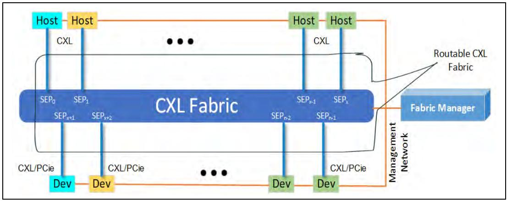
>
> *Original page render @ 150 DPI* — [📄 Full size](figures/chapter_07/page_0392.png)

[⬆️ 返回目录](#-本章目录-part-b)

---

## 7.7.1 CXL Fabric Use Case Examples | 7.7.1 CXL Fabric 用例示例

<table>
<thead>
<tr>
<th width="50%">🇬🇧 English</th>
<th width="50%" style="background-color:#e8e8e8">🇨🇳 中文</th>
</tr>
</thead>
<tbody>
<tr><td>Following are a few examples of systems that may benefit from using CXL-switched Fabric for low-latency communication.</td><td style="background-color:#e8e8e8">以下是一些可能受益于使用 CXL 交换 Fabric 进行低延迟通信的系统示例。</td></tr>
</tbody>
</table>

### 7.7.1.1 Machine-learning Accelerators | 7.7.1.1 机器学习加速器

<table>
<thead>
<tr>
<th width="50%">🇬🇧 English</th>
<th width="50%" style="background-color:#e8e8e8">🇨🇳 中文</th>
</tr>
</thead>
<tbody>
<tr><td>Accelerators used for machine-learning applications may use a dedicated CXL-switched Fabric for direct communication between devices in different domains. The same Fabric may also be used for sharing GFDs among accelerators. Each host and accelerator of same color shown in Figure 7-26 (basically, those that are directly above and below one another) belongs to a single domain. Accelerator devices can use UIO transactions to access memory on other accelerator and GFDs. In such a system, each accelerator is attached to a host and expected to be hardware-cache coherent with the host when using a CXL link. Communication between accelerators across domains is via the I/O coherency model. Device caching of data from another device memory (HDM or PDM) requires software-managed coherency with appropriate cache flushes and barriers. A Switch Edge ingress port is expected to implement a common set of address decoders that is to be used for Upstream Ports and Downstream Ports. Implementations may enable a dedicated CXL Fabric for accelerators using features available in this revision. However, it is not fully defined by the specification. Peer communication is defined in Section 7.7.9.</td><td style="background-color:#e8e8e8">用于机器学习应用的加速器可以使用专用的 CXL 交换 Fabric 进行不同域中设备之间的直接通信。同一 Fabric 也可用于在加速器之间共享 GFD。图 7-26 中所示的同色主机和加速器 (基本上是直接上下对应的那些) 属于同一域。加速器设备可以使用 UIO 事务访问其他加速器和 GFD 上的内存。在这样的系统中,每个加速器都连接到主机,并预期在使用 CXL 链路时与主机保持硬件缓存一致性。跨域加速器之间的通信通过 I/O 一致性模型进行。设备对来自其他设备内存 (HDM 或 PDM) 的数据进行缓存需要软件管理的一致性,并采用适当的 cache flush 和 barrier。Switch Edge 入口端口应实现一组通用的地址解码器,用于上游端口和下游端口。实现可以使用本版本中可用的特性为加速器启用专用的 CXL Fabric。但是,规范未完全定义这一点。对等通信在 7.7.9 节中定义。</td></tr>
</tbody>
</table>

> **Figure 7-26.** ML Accelerator Use Case ｜ 机器学习加速器用例
>
> 
>
> *Original page render @ 150 DPI* — [📄 Full size](figures/chapter_07/page_0393_1.png)

### 7.7.1.2 HPC/Analytics Use Case | 7.7.1.2 HPC/分析用例

<table>
<thead>
<tr>
<th width="50%">🇬🇧 English</th>
<th width="50%" style="background-color:#e8e8e8">🇨🇳 中文</th>
</tr>
</thead>
<tbody>
<tr><td>High-performance computing and Big Data Analytics are two areas that may also benefit from a dedicated CXL Fabric for host-to-host communication and sharing of G-FAM. CXL.mem or UIO may be used to access GFDs. Some G-FAM implementations may enable cross-domain hardware cache coherency. Software cache coherency may still be used for shared-memory implementations. Host-to-host communication is defined in Section 7.7.3.</td><td style="background-color:#e8e8e8">高性能计算和 Big Data Analytics 是另外两个可能受益于使用专用 CXL Fabric 进行主机到主机通信和共享 G-FAM 的领域。可使用 CXL.mem 或 UIO 访问 GFD。一些 G-FAM 实现可启用跨域硬件缓存一致性。软件缓存一致性仍可用于共享内存实现。主机到主机通信在 7.7.3 节中定义。</td></tr>
<tr><td>NICs may be used to directly move data from network storage to G-FAM devices, using the UIO traffic class. CXL.mem and UIO use fabric address decoders to route to target GFDs that are members of many domains.</td><td style="background-color:#e8e8e8">可使用 NIC 通过 UIO 流量类别将数据从网络存储直接移动到 G-FAM 设备。CXL.mem 和 UIO 使用 Fabric 地址解码器路由到属于许多域的 GFD 目标。</td></tr>
</tbody>
</table>

> **Figure 7-27.** HPC/Analytics Use Case ｜ HPC/分析用例
>
> 
>
> *Original page render @ 150 DPI* — [📄 Full size](figures/chapter_07/page_0393_2.png)

### 7.7.1.3 Composable Systems | 7.7.1.3 可组合系统

<table>
<thead>
<tr>
<th width="50%">🇬🇧 English</th>
<th width="50%" style="background-color:#e8e8e8">🇨🇳 中文</th>
</tr>
</thead>
<tbody>
<tr><td>Support for multi-level switches with PBR fabric extensions provides additional capabilities for building software-composable systems. In Figure 7-28, a leaf/spine switch architecture is shown in which all resources are attached to the leaf switches. Each domain may span multiple switches. All devices must be bound to a host or an FM. Cross-domain traffic is limited to CXL.mem and UIO transactions.</td><td style="background-color:#e8e8e8">具有 PBR Fabric 扩展的多级交换机的支持为构建软件可组合系统提供了额外的能力。在图 7-28 中,展示了叶/脊 (leaf/spine) 交换机架构,其中所有资源都连接到叶交换机。每个域可跨越多个交换机。所有设备必须绑定到主机或 FM。跨域流量仅限于 CXL.mem 和 UIO 事务。</td></tr>
<tr><td>Composing systems from resources within a single leaf switch allows for low-latency implementations. In such implementations, a spine switch is used only for cross-domain and G-FAM accesses.</td><td style="background-color:#e8e8e8">从单个叶交换机内的资源组成系统可实现低延迟实现。在这样的实现中,脊交换机仅用于跨域和 G-FAM 访问。</td></tr>
</tbody>
</table>

> **Figure 7-28.** Sample System Topology for Composable Systems ｜ 可组合系统的示例系统拓扑
>
> 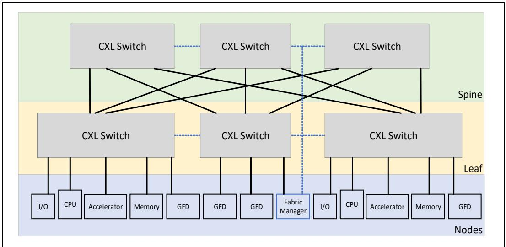
>
> *Original page render @ 150 DPI* — [📄 Full size](figures/chapter_07/page_0394.png)

[⬆️ 返回目录](#-本章目录-part-b)

---

## 7.7.2 Global-Fabric-Attached Memory (G-FAM) | 7.7.2 全局 Fabric 附加内存 (G-FAM)

### 7.7.2.1 Overview | 7.7.2.1 概述

<table>
<thead>
<tr>
<th width="50%">🇬🇧 English</th>
<th width="50%" style="background-color:#e8e8e8">🇨🇳 中文</th>
</tr>
</thead>
<tbody>
<tr><td>G-FAM provides a highly scalable memory resource that is accessible by all hosts and peer devices within a CXL fabric. G-FAM ranges can be assigned exclusively to a single host/peer requester or can be shared by multiple hosts/peers. When shared, multi-requester cache coherency can be managed by either software or hardware. Access rights to G-FAM ranges are enforced by decoders in Requester Edge ports and the target GFD.</td><td style="background-color:#e8e8e8">G-FAM 提供了一种高度可扩展的内存资源,可被 CXL Fabric 内的所有主机和对等设备访问。G-FAM 范围可以独占分配给单个主机/对等请求者,也可以由多个主机/对等设备共享。共享时,多请求者缓存一致性可以由软件或硬件管理。对 G-FAM 范围的访问权由 Requester Edge 端口和目标 GFD 中的解码器强制执行。</td></tr>
<tr><td>GFD HDM space can be accessed by hosts/peers from multiple domains using CXL.mem, and by peer devices from multiple domains using CXL.io UIO. GFDs implement no PCIe configuration space, and they are configured and managed instead via Global Memory Access Endpoints (GAEs) in Edge USPs or via out-of-band mechanisms.</td><td style="background-color:#e8e8e8">GFD HDM 空间可由来自多个域的主机/对等设备使用 CXL.mem 访问,以及由来自多个域的对等设备使用 CXL.io UIO 访问。GFD 不实现 PCIe 配置空间,而是通过 Edge USP 中的 Global Memory Access Endpoint (GAE) 或带外机制进行配置和管理。</td></tr>
<tr><td>Unlike an MLD, which has a separate Device Physical Address (DPA) space for each host/peer interface (LD), a GFD has one DPA space that is common across all hosts and peer devices. The GFD translates the Host Physical Address (HPA)¹ in each incoming request into a DPA, using per-requester translation information that is stored within the GFD Decoder Table. To create shared memory, two or more HPA ranges (each from a different requester) are mapped to the same DPA range. When the GFD needs to issue a BISnp, the GFD translates the DPA into an HPA for the associated host using the same GFD decoder information.</td><td style="background-color:#e8e8e8">与 MLD 不同 (MLD 的每个主机/对等接口 (LD) 都有单独的 Device Physical Address (DPA) 空间),GFD 具有一个在所有主机和对等设备之间通用的 DPA 空间。GFD 使用存储在 GFD Decoder Table 中的 per-requester 转换信息,将每个传入请求中的 Host Physical Address (HPA)¹ 转换为 DPA。为了创建共享内存,将两个或多个 HPA 范围 (每个来自不同的请求者) 映射到同一 DPA 范围。当 GFD 需要发出 BISnp 时,GFD 使用相同的 GFD 解码器信息将 DPA 转换为关联主机的 HPA。</td></tr>
<tr><td>When a GFD receives a request, the requester is identified by the SPID in the request, which is referred to as the Requester PID or RPID. Using this term avoids confusion when describing messages that the GFD sends to the requester, where the RPID is used for the DPID, and the GFD PID is used for the SPID.</td><td style="background-color:#e8e8e8">当 GFD 接收请求时,请求者由请求中的 SPID 标识,称为 Requester PID 或 RPID。使用此术语可避免在描述 GFD 发送给请求者的消息时产生混淆,这种情况下 RPID 用作 DPID,GFD PID 用作 SPID。</td></tr>
</tbody>
</table>

> 1. "HPA" 用于对等设备请求以及主机请求,即使 "HPA" 对于某些对等设备用例是误称。

> **Figure 7-28.** Sample System Topology for Composable Systems ｜ 可组合系统的示例系统拓扑
>
> 
>
> *Original page render @ 150 DPI* — [📄 Full size](figures/chapter_07/page_0394.png)

<table>
<thead>
<tr>
<th width="50%">🇬🇧 English</th>
<th width="50%" style="background-color:#e8e8e8">🇨🇳 中文</th>
</tr>
</thead>
<tbody>
<tr><td>All memory capacity on a GFD is managed by the Dynamic Capacity (DC) mechanisms, as defined in Section 8.2.10.9.9. A GFD allows each requester to access up to 8 RPID non-overlapping decoders, where the maximum number of decoders per SPID is implementation dependent. Each decoder has a translation from HPA space to the common DPA space, a flag that indicates whether cache coherency is maintained by software or hardware, and information about multi-GFD interleaving, if used. For each requester, the FM may define DC Regions in DPA space and convey this information to the host via a GAE. It is expected that the host will program the Fabric Address Segment Table (FAST) decoders and GFD decoders for all RPIDs in its domain to map the entire DPA range of each DC Region that needs to be accessed by the host or by one of its associated accelerators.</td><td style="background-color:#e8e8e8">GFD 上的所有内存 capacity 由 Dynamic Capacity (DC) 机制管理,如 8.2.10.9.9 节所定义。GFD 允许每个请求者访问最多 8 个 RPID 的非重叠解码器,其中每个 SPID 的最大解码器数取决于实现。每个解码器都具有从 HPA 空间到公共 DPA 空间的转换、一个指示缓存一致性是由软件还是硬件维护的标志,以及有关多 GFD interleaving 的信息 (如果使用)。对于每个请求者,FM 可在 DPA 空间中定义 DC Region,并通过 GAE 将此信息传达给主机。预期主机将为其域中所有 RPID 编程 Fabric Address Segment Table (FAST) 解码器和 GFD 解码器,以映射需要由主机或其关联加速器之一访问的每个 DC Region 的整个 DPA 范围。</td></tr>
<tr><td>G-FAM memory ranges can be interleaved across any power-of-two number of GFDs from 2 to 256, with an Interleave Granularity of 256B, 512B, 1 KB, 2 KB, 4 KB, 8 KB, or 16 KB. GFDs that are located anywhere within the CXL fabric, as defined in Section 2.7, may be used to contribute memory to an Interleave Set.</td><td style="background-color:#e8e8e8">G-FAM 内存范围可在任意 2 的幂次 (从 2 到 256) 数量的 GFD 之间进行 interleaving,Interleave Granularity 为 256B、512B、1 KB、2 KB、4 KB、8 KB 或 16 KB。如 2.7 节所定义,位于 CXL Fabric 内任何位置的 GFD 都可用于为 Interleave Set 贡献内存。</td></tr>
<tr><td>If a GFD supports UIO Direct P2P to HDM (see Section 7.7.9.1), all GFD ports shall support UIO, and for each GFD link whose link partner also supports UIO, VC3 shall be auto-enabled by the ports (see Section 7.7.11.5.1).</td><td style="background-color:#e8e8e8">如果 GFD 支持 UIO Direct P2P to HDM (参见 7.7.9.1 节),则所有 GFD 端口都应支持 UIO,并且对于链路伙伴也支持 UIO 的每个 GFD 链路,VC3 应由端口自动启用 (参见 7.7.11.5.1 节)。</td></tr>
</tbody>
</table>

### 7.7.2.2 Host Physical Address View | 7.7.2.2 主机物理地址视图

<table>
<thead>
<tr>
<th width="50%">🇬🇧 English</th>
<th width="50%" style="background-color:#e8e8e8">🇨🇳 中文</th>
</tr>
</thead>
<tbody>
<tr><td>Hosts that access G-FAM shall allocate a contiguous address range for Fabric Address space within their Host Physical Address (HPA) space, as shown in Figure 7-29. The Fabric Address range is defined by the FabricBase and FabricLimit registers. All host requests that fall within the Fabric Address range are routed to a selected CXL port. Hosts that use multiple CXL ports for G-FAM may either address interleave requests across the ports or may allocate a Fabric Address space for each port.</td><td style="background-color:#e8e8e8">访问 G-FAM 的主机应在其 Host Physical Address (HPA) 空间内为 Fabric Address 空间分配一个连续的地址范围,如图 7-29 所示。Fabric Address 范围由 FabricBase 和 FabricLimit 寄存器定义。落在 Fabric Address 范围内的所有主机请求都会被路由到所选的 CXL 端口。使用多个 CXL 端口进行 G-FAM 的主机可以跨这些端口对 interleaving 请求进行寻址,也可以为每个端口分配一个 Fabric Address 空间。</td></tr>
<tr><td>G-FAM requests from a host flow to a PBR Edge USP. In the USP, the Fabric Address range is divided into N equal-sized segments. A segment may be any power-of-two size from 64 GB to 8 TB, and must be naturally aligned. The number of segments implemented by a switch is implementation dependent. Host software is responsible for configuring the segment size so that the number of segments times the segment size fully spans the Fabric Address space. The FabricBase and FabricLimit registers can be programmed to any multiple of the segment size.</td><td style="background-color:#e8e8e8">来自主机的 G-FAM 请求流向 PBR Edge USP。在 USP 中, Fabric Address 范围被划分为 N 个大小相等的段 (segment)。段可以是 64 GB 到 8 TB 之间的任意 2 的幂次大小,且必须自然对齐 (naturally aligned)。交换机实现的段数取决于实现。主机软件负责配置段大小,以使段数乘以段大小完全跨越 Fabric Address 空间。FabricBase 和 FabricLimit 寄存器可以编程为段大小的任意整数倍。</td></tr>
<tr><td>Each segment has an associated GFD or Interleave Set of GFDs. Requests whose HPA falls anywhere within the segment are routed to the specified GFD or to a GFD within the Interleave Set. Segments are used only for request routing and may be larger than the accessible portion of a GFD. When this occurs, the accessible portion of the GFD starts at address offset zero within the segment. Any requests within the segment that are above the accessible portion of the GFD will fail to positively decode in the GFD and will be handled as described in Section 8.2.4.20.</td><td style="background-color:#e8e8e8">每个段都有一个关联的 GFD 或 GFD 的 Interleave Set。HPA 落在段内任何位置的请求都会路由到指定的 GFD 或 Interleave Set 内的 GFD。段仅用于请求路由,可能大于 GFD 的可访问部分。发生这种情况时,GFD 的可访问部分从段内的地址偏移 0 开始。段内位于 GFD 可访问部分之上的任何请求将无法在 GFD 中成功解码,并将按 8.2.4.20 节所述进行处理。</td></tr>
<tr><td>Host interleaving across root ports is entirely independent from GFD interleaving. Address bits that are used for root port interleaving and for GFD interleaving may be fully overlapping, partially overlapping, or non-overlapping. When the host uses root port interleaving, FabricBase, FabricLimit, and segment size in the corresponding PBR Edge USPs must be identically configured.</td><td style="background-color:#e8e8e8">跨根端口的主机 interleaving 与 GFD interleaving 完全独立。用于根端口 interleaving 和 GFD interleaving 的地址位可能完全重叠、部分重叠或不重叠。当主机使用根端口 interleaving 时,相应 PBR Edge USP 中的 FabricBase、FabricLimit 和段大小必须进行相同的配置。</td></tr>
</tbody>
</table>

> **Figure 7-29.** Example Host Physical Address View ｜ 主机物理地址视图示例
>
> 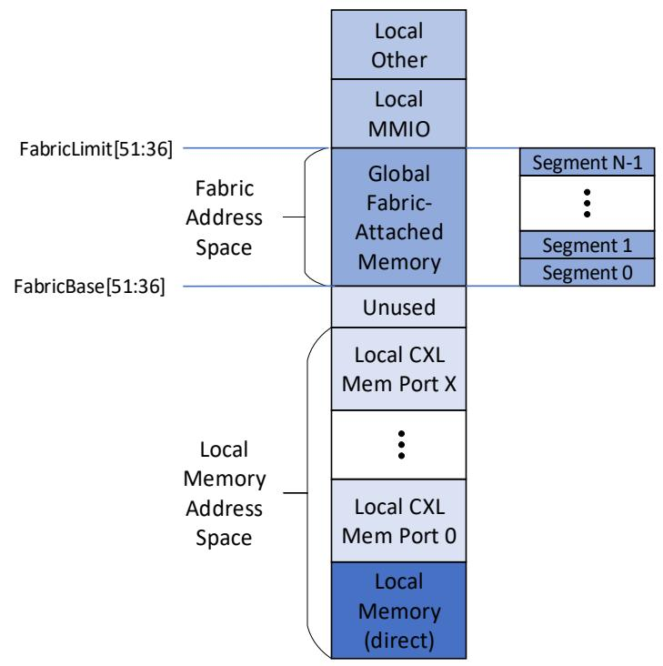
>
> *Original page render @ 150 DPI* — [📄 Full size](figures/chapter_07/page_0396.png)

### 7.7.2.3 G-FAM Capacity Management | 7.7.2.3 G-FAM 容量管理

<table>
<thead>
<tr>
<th width="50%">🇬🇧 English</th>
<th width="50%" style="background-color:#e8e8e8">🇨🇳 中文</th>
</tr>
</thead>
<tbody>
<tr><td>GFDs are managed using CCIs like all other classes of CXL components. A GFD requires support for the PBR Link CCI message format, as defined in Section 7.7.11.6, on its CXL link and may optionally implement additional MCTP-based CCIs (e.g., SMBus).</td><td style="background-color:#e8e8e8">GFD 与所有其他 CXL 组件类一样使用 CCI 进行管理。GFD 要求在其 CXL 链路上支持 PBR Link CCI 消息格式 (如 7.7.11.6 节所定义),可选择实现其他基于 MCTP 的 CCI (如 SMBus)。</td></tr>
<tr><td>G-FAM relies exclusively on the Dynamic Capacity (DC) mechanism for capacity management, as described in Section 8.2.10.9.9. GFDs have no "legacy" static capacity as shown in the left side of Figure 9-24 in Chapter 9.0. Dynamic Capacity for G-FAM has much in common with the Dynamic Capacity for LD-FAM:</td><td style="background-color:#e8e8e8">G-FAM 完全依赖 Dynamic Capacity (DC) 机制进行容量管理,如 8.2.10.9.9 节所述。GFD 没有 "legacy" 静态容量,如图 9-24 (第 9.0 章) 左侧所示。G-FAM 的 Dynamic Capacity 与 LD-FAM 的 Dynamic Capacity 有许多共同之处:</td></tr>
<tr><td>• Both have identical concepts for DC Regions, Extents, and Blocks</td><td style="background-color:#e8e8e8">• 两者具有相同的 DC Region、Extent 和 Block 概念</td></tr>
<tr><td>• Both support up to 8 DC Regions per host/peer interface</td><td style="background-color:#e8e8e8">• 两者都支持每个主机/对等接口最多 8 个 DC Region</td></tr>
<tr><td>• DC-related parameters in the CDAT for each are identical</td><td style="background-color:#e8e8e8">• 两者 CDAT 中的 DC 相关参数相同</td></tr>
<tr><td>• Mailbox commands for each are highly similar; however, the specific Mailbox access methods are considerably different</td><td style="background-color:#e8e8e8">• 各自的 Mailbox 命令高度相似;但是,具体的 Mailbox 访问方法有很大不同</td></tr>
<tr><td>— For LD-FAM, the Mailbox for each host's LD is accessed via LD structures</td><td style="background-color:#e8e8e8">— 对于 LD-FAM,每个主机 LD 的 Mailbox 通过 LD 结构访问</td></tr>
<tr><td>— For G-FAM, management for each host is defined in Section 7.7.2.6</td><td style="background-color:#e8e8e8">— 对于 G-FAM,每个主机的管理在 7.7.2.6 节中定义</td></tr>
<tr><td>An LD-FAM DCD (i.e., DCD-capable SLDs or MLDs) allocates memory capacity and binds it to a specific Host ID in one operation. A GFD allocates Dynamic Capacity to a named Memory Group in one operation and binds specific Host IDs to named Memory Groups in a separate operation. Thus, the GFD requires different DCD Management commands than LD-FAM DCDs.</td><td style="background-color:#e8e8e8">LD-FAM DCD (即支持 DCD 的 SLD 或 MLD) 分配内存 capacity 并在一个操作中将其绑定到特定的 Host ID。GFD 在一个操作中将 Dynamic Capacity 分配给命名的 Memory Group,并在单独的操作中将特定 Host ID 绑定到命名的 Memory Group。因此,GFD 需要的 DCD Management 命令不同于 LD-FAM DCD。</td></tr>
<tr><td>In contrast to LD-FAM, each GFD has a single DPA space instead of a separate DPA space per host. G-FAM DPA space is organized by Device Media Partitions (DMPs), as shown in Figure 7-30. DMPs are DPA ranges with certain attributes. A fundamental DMP attribute is the media type (e.g., DRAM or PM). A DMP attribute that is configured by the FM is the DC Block size. DMPs expose all GFD memory that is assignable for host use.</td><td style="background-color:#e8e8e8">与 LD-FAM 相反,每个 GFD 具有单个 DPA 空间,而不是每个主机单独的 DPA 空间。G-FAM DPA 空间由 Device Media Partition (DMP) 组织,如图 7-30 所示。DMP 是具有某些属性的 DPA 范围。DMP 的基本属性是介质类型 (例如,DRAM 或 PM)。由 FM 配置的 DMP 属性是 DC Block size。DMP 暴露所有可分配给主机使用的 GFD 内存。</td></tr>
<tr><td>The rules for DMPs are as follows:</td><td style="background-color:#e8e8e8">DMP 的规则如下:</td></tr>
<tr><td>• Each GFD contains 1-4 DMPs, whose size is configured by the FM.</td><td style="background-color:#e8e8e8">• 每个 GFD 包含 1-4 个 DMP,其大小由 FM 配置。</td></tr>
<tr><td>• Each DC Region consists of part or all of one DMP assigned to a host/peer. Each DC Region can be mapped into an RPID's HPA space using the GFD Decoder Table.</td><td style="background-color:#e8e8e8">• 每个 DC Region 由分配给主机/对等设备的一个 DMP 的一部分或全部组成。每个 DC Region 可使用 GFD Decoder Table 映射到 RPID 的 HPA 空间。</td></tr>
<tr><td>• Each DC Region inherits associated DMP attributes.</td><td style="background-color:#e8e8e8">• 每个 DC Region 继承关联的 DMP 属性。</td></tr>
<tr><td>Table 7-80 lists the key differences between LD-FAM and G-FAM.</td><td style="background-color:#e8e8e8">表 7-80 列出了 LD-FAM 和 G-FAM 之间的关键差异。</td></tr>
</tbody>
</table>

> **Figure 7-30.** Example HPA Mapping to DMPs ｜ HPA 到 DMP 的映射示例
>
> 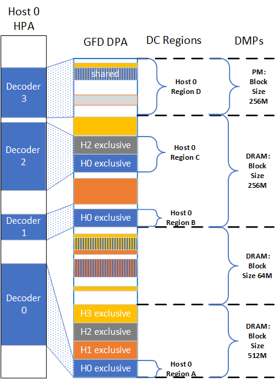
>
> *Original page render @ 150 DPI* — [📄 Full size](figures/chapter_07/page_0397.png)

<table>
<thead>
<tr>
<th width="50%">🇬🇧 English</th>
<th width="50%" style="background-color:#e8e8e8">🇨🇳 中文</th>
</tr>
</thead>
<tbody>
<tr>
<td>

**Table 7-80. Differences between LD-FAM and G-FAM (Sheet 1 of 2)**

| Feature or Attribute | LD-FAM | G-FAM |
|---|---|---|
| Number of supported hosts | 16 max | 1000s architecturally; 100s more realistic |
| Support for DMPs | No | Yes |
| Architected FM API support for DMP configuration by the FM | N/A | Yes |
| Routing and decoders used for HDM addresses | Per-LD HDM Decoder; Interleave RP routing by host HDM Decoder; 1–10 HDM Decoders in each LD | Per-RPID GFD decoders; Interleave fabric routing by USP FAST/IDT decoder; 1–8 GFD Decoders per RPID in the GFD |
| Interleave Ways (IW) | 1/2/4/8/16 plus 3/6/12 | 2–256 in powers of 2 |
| DC Block Size | Powers of 2, as indicated by Region * Supported Block Size Mask | 64 MB and up in powers of 2 |

</td>
<td style="background-color:#e8e8e8">

**表 7-80. LD-FAM 与 G-FAM 之间的差异 (Sheet 1 of 2)**

| 特性或属性 | LD-FAM | G-FAM |
|---|---|---|
| 支持的主机数 | 最多 16 | 架构上 1000s;现实上 100s |
| DMP 支持 | 否 | 是 |
| 由 FM 配置 DMP 的架构化 FM API 支持 | 不适用 | 是 |
| HDM 地址的路由和解码器 | Per-LD HDM Decoder;Interleave RP 路由由主机 HDM Decoder 决定;每个 LD 中 1-10 个 HDM Decoder | Per-RPID GFD decoders;Interleave fabric 路由由 USP FAST/IDT decoder 决定;GFD 中每个 RPID 1-8 个 GFD Decoder |
| Interleave Ways (IW) | 1/2/4/8/16 加上 3/6/12 | 2-256,以 2 的幂次 |
| DC Block Size | 2 的幂次,由 Region * Supported Block Size Mask 指示 | 64 MB 及以上,以 2 的幂次 |

</td>
</tr>
</tbody>
</table>

<table>
<thead>
<tr>
<th width="50%">🇬🇧 English</th>
<th width="50%" style="background-color:#e8e8e8">🇨🇳 中文</th>
</tr>
</thead>
<tbody>
<tr>
<td>

**Table 7-80. Differences between LD-FAM and G-FAM (Sheet 2 of 2)**

| Feature or Attribute | LD-FAM | G-FAM |
|---|---|---|
| Interleave VH routing by USP HDM Decoder | Interleave VH routing by USP HDM Decoder | (continued) |
| Interleave fabric routing by USP FAST/IDT decoder | — | Interleave fabric routing by USP FAST/IDT decoder |
| LDST/IDT decoder | LDST/IDT decoder | — |

*Note: The Sheet 2 continuation of Table 7-80 shows further detailed feature differences between LD-FAM and G-FAM (per source content page 398).*

</td>
<td style="background-color:#e8e8e8">

**表 7-80. LD-FAM 与 G-FAM 之间的差异 (Sheet 2 of 2)**

| 特性或属性 | LD-FAM | G-FAM |
|---|---|---|
| Interleave VH routing by USP HDM Decoder | Interleave VH routing by USP HDM Decoder | (接续) |
| Interleave fabric routing by USP FAST/IDT decoder | — | Interleave fabric routing by USP FAST/IDT decoder |
| LDST/IDT decoder | LDST/IDT decoder | — |

*注:表 7-80 的 Sheet 2 续表 (源文档第 398 页) 显示了 LD-FAM 与 G-FAM 之间的其他详细特性差异。*

</td>
</tr>
</tbody>
</table>

<table>
<thead>
<tr>
<th width="50%">🇬🇧 English</th>
<th width="50%" style="background-color:#e8e8e8">🇨🇳 中文</th>
</tr>
</thead>
<tbody>
<tr><td>Additional differences exist in how MLDs and GFDs process requests. An MLD has three types of decoders that operate sequentially on incoming requests:</td><td style="background-color:#e8e8e8">MLD 和 GFD 处理请求的方式存在其他差异。MLD 具有三种类型的解码器,这些解码器对传入请求按顺序操作:</td></tr>
<tr><td>• Per-LD HDM decoders translate from HPA space to a per-LD DPA space, removing the interleaving bits</td><td style="background-color:#e8e8e8">• Per-LD HDM 解码器将 HPA 空间转换为 per-LD DPA 空间,删除 interleaving 位</td></tr>
<tr><td>• Per-LD decoders determine within which per-LD DC Region the DPA resides, and then whether the addressed DC block within the Region is accessible by the LD</td><td style="background-color:#e8e8e8">• Per-LD 解码器确定 DPA 驻留在哪个 per-LD DC Region 中,然后确定 LD 区域内可访问的 DC block</td></tr>
<tr><td>• Per-LD implementation-dependent decoders translate from the DPA to the media address</td><td style="background-color:#e8e8e8">• Per-LD 实现相关的解码器将 DPA 转换为介质地址</td></tr>
<tr><td>A GFD has two types of decoders that operate sequentially on incoming requests:</td><td style="background-color:#e8e8e8">GFD 具有两种类型的解码器,这些解码器对传入请求按顺序操作:</td></tr>
<tr><td>• Per-RPID GFD decoders translate from HPA space to a common DPA space, removing the interleaving bits. This DPA may be used as the media address directly or via a simple mapping.</td><td style="background-color:#e8e8e8">• Per-RPID GFD 解码器将 HPA 空间转换为公共 DPA 空间,删除 interleaving 位。此 DPA 可直接用作介质地址,或通过简单映射使用。</td></tr>
<tr><td>• A common decoder determines within which Device Media Partition (DMP) the DPA is located, and then whether the block that is addressed within the DMP is accessible by the RPID.</td><td style="background-color:#e8e8e8">• 公共解码器确定 DPA 位于哪个 Device Media Partition (DMP) 中,然后确定 RPID 是否可访问 DMP 中寻址的 block。</td></tr>
</tbody>
</table>

### 7.7.2.4 G-FAM Request Routing, Interleaving, and Address Translations | 7.7.2.4 G-FAM 请求路由、Interleaving 与地址转换

<table>
<thead>
<tr>
<th width="50%">🇬🇧 English</th>
<th width="50%" style="background-color:#e8e8e8">🇨🇳 中文</th>
</tr>
</thead>
<tbody>
<tr><td>The mechanisms for GFD request routing, interleaving, and address translations within both the Edge ingress port and the GFD are shown in Figure 7-31. GFD requests may arrive either at an Edge USP from a host or at an Edge DSP from a peer device. This is referred to as the Edge request port.</td><td style="background-color:#e8e8e8">Edge 入口端口和 GFD 内的 GFD 请求路由、interleaving 和地址转换机制如图 7-31 所示。GFD 请求可从主机通过 Edge USP 到达,或从对等设备通过 Edge DSP 到达。这称为 Edge request port。</td></tr>
</tbody>
</table>

> **Figure 7-31.** G-FAM Request Routing, Interleaving, and Address Translations ｜ G-FAM 请求路由、Interleaving 和地址转换
>
> 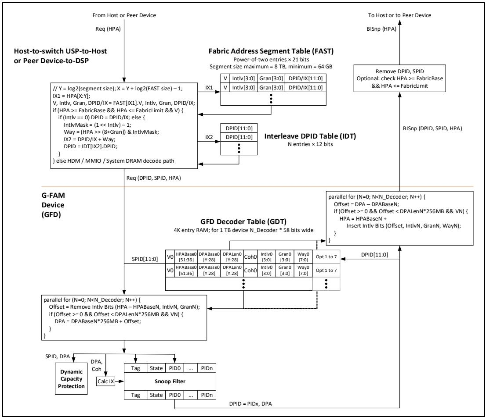
>
> *Original page render @ 150 DPI* — [📄 Full size](figures/chapter_07/page_0399.png)

<table>
<thead>
<tr>
<th width="50%">🇬🇧 English</th>
<th width="50%" style="background-color:#e8e8e8">🇨🇳 中文</th>
</tr>
</thead>
<tbody>
<tr><td>The Edge request port shall decode the request HPA to determine the DPID of the target GFD using the FAST¹ and the Interleave DPID Table (IDT). The FAST contains one entry per segment. The FAST depth must be a power-of-two but is implementation dependent. The segment size is specified by the FSegSz[2:0] register as defined in Table 7-81. The FAST entry accessed is determined by bits X:Y of the request address, where Y = log2 of the segment size in bytes and X = Y + log2 of the FAST depth in entries. The maximum Fabric Address space and the HPA bits that are used to address the FAST are shown in Table 7-81 for all supported segment sizes for some example FAST depths. For a host with a 52-bit HPA, the maximum Fabric Address space is 4 PB minus one segment each above and below the Fabric Address space for local memory and for MMIO, as shown in Figure 7-29.</td><td style="background-color:#e8e8e8">Edge request port 应使用 FAST¹ 和 Interleave DPID Table (IDT) 解码请求 HPA 以确定目标 GFD 的 DPID。FAST 每个段包含一个条目。FAST depth 必须是 2 的幂,但取决于实现。段大小由 FSegSz[2:0] 寄存器指定,如表 7-81 所定义。访问的 FAST 条目由请求地址的位 X:Y 决定,其中 Y = 段大小 (以字节为单位) 的 log2,X = Y + FAST depth (以条目为单位) 的 log2。表 7-81 显示了一些示例 FAST depth 下所有支持的段大小的最大 Fabric Address 空间和用于寻址 FAST 的 HPA 位。对于具有 52-bit HPA 的主机,最大 Fabric Address 空间为 4 PB 减去 Fabric Address 空间上方和下方的每个段,用于本地内存和 MMIO,如图 7-29 所示。</td></tr>
</tbody>
</table>

> 1. 本节涵盖使用 FAST 解码器与 G-FAM 一起使用。LD-FAM Segment Table (LDST) 解码器与 LD-FAM 一起使用具有相同的功能,只有少数例外。表 7-81、表 7-82 和表 7-83 同样适用于 LD-FAM 和 G-FAM。

<table>
<thead>
<tr>
<th width="50%">🇬🇧 English</th>
<th width="50%" style="background-color:#e8e8e8">🇨🇳 中文</th>
</tr>
</thead>
<tbody>
<tr>
<td>

**Table 7-81. Fabric Segment Size Table¹**

| FSegSz[2:0] | Fabric Segment Size | FAST Depth = 256 | FAST Depth = 1K | FAST Depth = 4K | FAST Depth = 16K |
|---|---|---|---|---|---|
| 000b | 64 GB | 16 TB / HPA[43:36] | 64 TB / HPA[45:36] | 256 TB / HPA[47:36] | 1 PB / HPA[49:36] |
| 001b | 128 GB | 32 TB / HPA[44:37] | 128 TB / HPA[46:37] | 512 TB / HPA[48:37] | 2 PB / HPA[50:37] |
| 010b | 256 GB | 64 TB / HPA[45:38] | 256 TB / HPA[47:38] | 1 PB / HPA[49:38] | 4 PB – 512 GB / HPA[51:38] |
| 011b | 512 GB | 128 TB / HPA[46:39] | 512 TB / HPA[48:39] | 2 PB / HPA[50:39] | — |
| 100b | 1 TB | 256 TB / HPA[47:40] | 1 PB / HPA[49:40] | 4 PB – 2 TB / HPA[51:40] | — |
| 101b | 2 TB | 512 TB / HPA[48:41] | 2 PB / HPA[50:41] | — | — |
| 110b | 4 TB | 1 PB / HPA[49:42] | 4 PB – 8 TB / HPA[51:42] | — | — |
| 111b | 8 TB | 2 PB / HPA[50:43] | — | — | — |

*¹ LDST Segment Size (LSegSz) 使用与 FSegSz 相同的编码。*

</td>
<td style="background-color:#e8e8e8">

**表 7-81. Fabric 段大小表¹**

| FSegSz[2:0] | Fabric 段大小 | FAST Depth = 256 | FAST Depth = 1K | FAST Depth = 4K | FAST Depth = 16K |
|---|---|---|---|---|---|
| 000b | 64 GB | 16 TB / HPA[43:36] | 64 TB / HPA[45:36] | 256 TB / HPA[47:36] | 1 PB / HPA[49:36] |
| 001b | 128 GB | 32 TB / HPA[44:37] | 128 TB / HPA[46:37] | 512 TB / HPA[48:37] | 2 PB / HPA[50:37] |
| 010b | 256 GB | 64 TB / HPA[45:38] | 256 TB / HPA[47:38] | 1 PB / HPA[49:38] | 4 PB – 512 GB / HPA[51:38] |
| 011b | 512 GB | 128 TB / HPA[46:39] | 512 TB / HPA[48:39] | 2 PB / HPA[50:39] | — |
| 100b | 1 TB | 256 TB / HPA[47:40] | 1 PB / HPA[49:40] | 4 PB – 2 TB / HPA[51:40] | — |
| 101b | 2 TB | 512 TB / HPA[48:41] | 2 PB / HPA[50:41] | — | — |
| 110b | 4 TB | 1 PB / HPA[49:42] | 4 PB – 8 TB / HPA[51:42] | — | — |
| 111b | 8 TB | 2 PB / HPA[50:43] | — | — | — |

*¹ LDST Segment Size (LSegSz) 使用与 FSegSz 相同的编码。*

</td>
</tr>
</tbody>
</table>

<table>
<thead>
<tr>
<th width="50%">🇬🇧 English</th>
<th width="50%" style="background-color:#e8e8e8">🇨🇳 中文</th>
</tr>
</thead>
<tbody>
<tr>
<td>

**Table 7-82. Segment Table Intlv[3:0] Field Encoding**

| Intlv[3:0] | GFD Interleaving Ways |
|---|---|
| 0h | Interleaving is disabled |
| 1h | 2-way interleaving |
| 2h | 4-way interleaving |
| 3h | 8-way interleaving |
| 4h | 16-way interleaving |
| 5h | 32-way interleaving |
| 6h | 64-way interleaving |
| 7h | 128-way interleaving |
| 8h | 256-way interleaving |
| 9h – Fh | Reserved |

</td>
<td style="background-color:#e8e8e8">

**表 7-82. Segment Table Intlv[3:0] 字段编码**

| Intlv[3:0] | GFD Interleaving 通道数 |
|---|---|
| 0h | Interleaving 已禁用 |
| 1h | 2-way interleaving |
| 2h | 4-way interleaving |
| 3h | 8-way interleaving |
| 4h | 16-way interleaving |
| 5h | 32-way interleaving |
| 6h | 64-way interleaving |
| 7h | 128-way interleaving |
| 8h | 256-way interleaving |
| 9h – Fh | Reserved (保留) |

</td>
</tr>
</tbody>
</table>

<table>
<thead>
<tr>
<th width="50%">🇬🇧 English</th>
<th width="50%" style="background-color:#e8e8e8">🇨🇳 中文</th>
</tr>
</thead>
<tbody>
<tr><td>Each FAST entry contains a valid bit (V), the number of interleaving ways (Intlv), the interleave granularity (Gran), and a DPID or IDT index (DPID/IX). The encodings for the Intlv and Gran fields are defined in Table 7-82 and Table 7-83, respectively. If the HPA is between FabricBase and FabricLimit inclusive and the FAST entry valid bit is set, then there is a FAST hit, and the FAST is used to determine the DPID. Otherwise, the target device is determined by other architected decoders.</td><td style="background-color:#e8e8e8">每个 FAST 条目包含一个有效位 (V)、interleaving 通道数 (Intlv)、interleave granularity (Gran) 以及 DPID 或 IDT 索引 (DPID/IX)。Intlv 和 Gran 字段的编码分别在表 7-82 和表 7-83 中定义。如果 HPA 在 FabricBase 和 FabricLimit 之间 (含),且 FAST 条目有效位被设置,则发生 FAST 命中,使用 FAST 来确定 DPID。否则,目标设备由其他架构化解码器确定。</td></tr>
</tbody>
</table>

<table>
<thead>
<tr>
<th width="50%">🇬🇧 English</th>
<th width="50%" style="background-color:#e8e8e8">🇨🇳 中文</th>
</tr>
</thead>
<tbody>
<tr>
<td>

**Table 7-83. Segment Table Gran[3:0] Field Encoding**

| Gran [3:0] | GFD Interleave Granularity |
|---|---|
| 0h | 256B |
| 1h | 512B |
| 2h | 1 KB |
| 3h | 2 KB |
| 4h | 4 KB |
| 5h | 8 KB |
| 6h | 16 KB |
| 7h – Fh | Reserved |

</td>
<td style="background-color:#e8e8e8">

**表 7-83. Segment Table Gran[3:0] 字段编码**

| Gran [3:0] | GFD Interleave Granularity |
|---|---|
| 0h | 256B |
| 1h | 512B |
| 2h | 1 KB |
| 3h | 2 KB |
| 4h | 4 KB |
| 5h | 8 KB |
| 6h | 16 KB |
| 7h – Fh | Reserved (保留) |

</td>
</tr>
</tbody>
</table>

<table>
<thead>
<tr>
<th width="50%">🇬🇧 English</th>
<th width="50%" style="background-color:#e8e8e8">🇨🇳 中文</th>
</tr>
</thead>
<tbody>
<tr><td>Note that FabricBase and FabricLimit may be used to restrict the amount of the FAST used. For example, for a host with a 52-bit HPA space, if the FAST is accessed using HPA[51:40] without restriction, then it would consume the entire HPA space. In this case, FabricBase and FabricLimit must be set to restrict the Fabric Address space to the desired range of HPA space. This has the effect of reducing the number of entries in the FAST that are being used.</td><td style="background-color:#e8e8e8">请注意,可以使用 FabricBase 和 FabricLimit 来限制所使用的 FAST 的数量。例如,对于具有 52-bit HPA 空间的主机,如果使用 HPA[51:40] 无限制地访问 FAST,则将消耗整个 HPA 空间。在这种情况下,必须设置 FabricBase 和 FabricLimit 以将 Fabric Address 空间限制为所需的 HPA 空间范围。这具有减少正在使用的 FAST 中条目数的效果。</td></tr>
<tr><td>FabricBase and FabricLimit may also be used to allow the FAST to start at an HPA that is not a multiple of the FAST depth. For example, for a host with a 52-bit HPA space, if 2 PB of Fabric Address space is needed to start at an HPA of 1 PB, then a 4K entry FAST with 512 GB segments can be accessed using HPA[50:39] with FabricBase set to 1 PB and FabricLimit set to 3 PB. HPAs 1 PB to 2 PB-1 will then correspond to FAST entries 2048 to 4095, while HPAs 2 PB to 3 PB-1 will wrap around and correspond to FAST entries 0 to 2047. When programming FabricBase, FabricLimit, and segment size, care must be taken to ensure that a wraparound does not occur that would result in aliasing multiple HPAs to the same segment.</td><td style="background-color:#e8e8e8">FabricBase 和 FabricLimit 也可用于允许 FAST 在不是 FAST depth 整数倍的 HPA 处开始。例如,对于具有 52-bit HPA 空间的主机,如果需要 2 PB 的 Fabric Address 空间从 1 PB 的 HPA 开始,则可以使用 HPA[50:39] 访问段为 512 GB 的 4K 条目 FAST,并将 FabricBase 设置为 1 PB,将 FabricLimit 设置为 3 PB。然后 HPA 1 PB 到 2 PB-1 将对应于 FAST 条目 2048 到 4095,而 HPA 2 PB 到 3 PB-1 将环绕并对应于 FAST 条目 0 到 2047。编程 FabricBase、FabricLimit 和段大小时,必须注意确保不会发生环绕,这会导致将多个 HPA 别名到同一段。</td></tr>
<tr><td>On a FAST hit, if the FAST Intlv field is 0h, then GFD interleaving is not being used for this segment and the DPID/IX field contains the GFD's DPID. If the Intlv field is nonzero, then the Interleave Way is selected from the HPA using the Gran and Intlv fields, and then added to the DPID/IX field to generate an index into the IDT. The IDT defines the set of DPIDs for each Interleave Set that is accessible by the Edge request port. For an N-way Interleave Set, the set of DPIDs is determined by N contiguous entries in the IDT, with the first entry pointed to by DPID/IX which may be anywhere in the IDT. The IDT depth is implementation dependent.</td><td style="background-color:#e8e8e8">在 FAST 命中时,如果 FAST Intlv 字段为 0h,则此段不使用 GFD interleaving,DPID/IX 字段包含 GFD 的 DPID。如果 Intlv 字段非零,则使用 Gran 和 Intlv 字段从 HPA 中选择 Interleave Way,然后将其添加到 DPID/IX 字段以生成 IDT 的索引。IDT 定义了 Edge request port 可访问的每个 Interleave Set 的 DPID 集。对于 N-way Interleave Set,DPID 集由 IDT 中的 N 个连续条目确定,第一个条目由 DPID/IX 指向,DPID/IX 可在 IDT 中的任何位置。IDT 深度取决于实现。</td></tr>
<tr><td>After the GFD's DPID is determined, a request that contains the SPID of the Edge request port and the unmodified HPA is sent to the target GFD. The GFD shall then use the SPID to access the GFD Decoder Table (GDT) to select the decoders that are associated with the requester. Note that a host and its associated CXL devices will each have a unique RPID, and therefore each will use a different entry in the GDT. The GDT provides up to 8 decoders per RPID. Each decoder within a GFD Decoder Table entry contains structures defined in Section 8.2.10.9.10.19.</td><td style="background-color:#e8e8e8">确定 GFD 的 DPID 后,将包含 Edge request port 的 SPID 和未修改的 HPA 的请求发送到目标 GFD。GFD 应随后使用 SPID 访问 GFD Decoder Table (GDT) 以选择与请求者关联的解码器。请注意,主机及其关联的 CXL 设备各自具有唯一的 RPID,因此每个将使用 GDT 中的不同条目。GDT 为每个 RPID 提供最多 8 个解码器。GFD Decoder Table 条目中的每个解码器都包含 8.2.10.9.10.19 节中定义的结构。</td></tr>
<tr><td>The GFD shall then compare, in parallel, the request HPA against all decoders to determine whether the request hits any decoder's HPA range. To accomplish this, for each decoder, a DPA offset is calculated by first subtracting HPABase from HPA and then removing the interleaving bits. The LSB of the interleaving bits to remove is determined by the interleave granularity and the number of bits to remove is determined by the interleave ways. If offset ≥ 0, offset < DPALen, and the Valid bit is set, then the request hits within that decoder. If only one decoder hits, then the DPA is calculated by adding DPABase to the offset. If zero or multiple decoders hit, then an access error is returned.</td><td style="background-color:#e8e8e8">GFD 然后应并行地将请求 HPA 与所有解码器进行比较,以确定请求是否命中任何解码器的 HPA 范围。为此,对于每个解码器,首先从 HPA 中减去 HPABase,然后删除 interleaving 位,从而计算出 DPA 偏移。要删除的 interleaving 位的 LSB 由 interleave granularity 决定,要删除的位数由 interleave ways 决定。如果 offset ≥ 0,offset < DPALen,且 Valid 位已设置,则请求命中该解码器内。如果只有一个解码器命中,则通过将 DPABase 添加到 offset 来计算 DPA。如果零个或多个解码器命中,则返回访问错误。</td></tr>
</tbody>
</table>

<table>
<thead>
<tr>
<th width="50%">🇬🇧 English</th>
<th width="50%" style="background-color:#e8e8e8">🇨🇳 中文</th>
</tr>
</thead>
<tbody>
<tr><td>After the request HPA is translated to DPA, the RPID and the DPA are used to perform the Dynamic Capacity access check, as described in Section 7.7.2.5, and to access the GFD snoop filter. The design of the snoop filter is beyond the scope of this specification.</td><td style="background-color:#e8e8e8">将请求 HPA 转换为 DPA 后,RPID 和 DPA 用于执行 Dynamic Capacity 访问检查 (如 7.7.2.5 节所述),并用于访问 GFD snoop filter。snoop filter 的设计不在本规范的范围内。</td></tr>
<tr><td>When the snoop filter needs to issue a back-invalidate to a host/peer, the DPA is translated to an HPA by performing the HPA-to-DPA steps in reverse. The RPID is used to access the GDT to select the decoders for the requester, which may be the host itself or one of its devices that performs Direct P2P. The GFD shall then compare, in parallel, the DPA against all selected decoders to determine whether the back-invalidate hits any decoder's DPA range.</td><td style="background-color:#e8e8e8">当 snoop filter 需要向主机/对等设备发出 back-invalidate 时,通过反向执行 HPA 到 DPA 的步骤,将 DPA 转换为 HPA。RPID 用于访问 GDT 以选择请求者的解码器,该请求者可以是主机本身,也可以是执行 Direct P2P 的主机设备之一。GFD 然后应并行地将 DPA 与所有选定的解码器进行比较,以确定 back-invalidate 是否命中任何解码器的 DPA 范围。</td></tr>
<tr><td>This is accomplished by first calculating DPA offset = DPA – DPABase, and then testing whether offset ≥ 0, offset < DPALen, and the decoder is valid. If only one decoder hits, then the HPA is calculated by inserting the interleaving bits into the offset and then adding it to HPABase. When inserting the interleaving bits, the LSB is determined by interleave granularity, the number of bits is determined by the interleaving ways, and the value of the bits is determined by the way within the interleave set. If zero or multiple decoders hit, then an internal snoop filter error has occurred which will be handled as defined in a future specification update.</td><td style="background-color:#e8e8e8">这是通过首先计算 DPA offset = DPA – DPABase 来完成的,然后测试 offset ≥ 0,offset < DPALen 且解码器是否有效。如果只有一个解码器命中,则通过将 interleaving 位插入 offset 然后将其添加到 HPABase 来计算 HPA。插入 interleaving 位时,LSB 由 interleave granularity 决定,位数由 interleaving ways 决定,位的值由 interleave set 中的 way 决定。如果零个或多个解码器命中,则发生了内部 snoop filter 错误,将按未来规范更新中的定义进行处理。</td></tr>
<tr><td>After the HPA is calculated, a BISnp with the GFD's SPID and HPA is issued to the Edge Port containing the FAST decoder of the host/peer that owns this HDM-DB Region, using the PID stored in the snoop filter as the DPID. The FAST decoder then optionally checks whether the HPA is located within the FAST decoder's Fabric Address space. The DPID and SPID are then removed, and the BISnp is then issued to the host/peer in HBR format.</td><td style="background-color:#e8e8e8">计算出 HPA 后,将带有 GFD 的 SPID 和 HPA 的 BISnp 发送到包含拥有此 HDM-DB Region 的主机/对等设备的 FAST decoder 的 Edge Port,使用存储在 snoop filter 中的 PID 作为 DPID。然后,FAST decoder 可选地检查 HPA 是否位于 FAST decoder 的 Fabric Address 空间内。然后删除 DPID 和 SPID,然后将 BISnp 以 HBR 格式发送到主机/对等设备。</td></tr>
</tbody>
</table>

### 7.7.2.5 G-FAM Access Protection | 7.7.2.5 G-FAM 访问保护

<table>
<thead>
<tr>
<th width="50%">🇬🇧 English</th>
<th width="50%" style="background-color:#e8e8e8">🇨🇳 中文</th>
</tr>
</thead>
<tbody>
<tr><td>G-FAM access protection is available at three levels of the hierarchy (see Figure 7-32):</td><td style="background-color:#e8e8e8">G-FAM 访问保护在层次结构的三个层级可用 (参见图 7-32):</td></tr>
<tr><td>• The first level of protection is through the host's (or peer device's) page tables. This fine-grained protection is used to restrict the Fabric Address space that is accessible by each process to a subset of that which is accessible by the host/peer.</td><td style="background-color:#e8e8e8">• 第一级保护通过主机 (或对等设备) 的页表实现。此细粒度保护用于将每个进程可访问的 Fabric Address 空间限制为主机/对等设备可访问范围的子集。</td></tr>
<tr><td>• The second level of protection is described in the GAE in the form of the Global Memory Mapping Vector (GMV), described in Section 7.7.2.6.</td><td style="background-color:#e8e8e8">• 第二级保护以 Global Memory Mapping Vector (GMV) 的形式在 GAE 中描述,如 7.7.2.6 节所述。</td></tr>
<tr><td>• The third level of protection is at the target GFD itself and is fine grained. This section describes this third level of GFD protection.</td><td style="background-color:#e8e8e8">• 第三级保护位于目标 GFD 本身,是细粒度的。本节描述 GFD 的第三级保护。</td></tr>
</tbody>
</table>

> **IMPLEMENTATION NOTE** (实现提示)
>
> 建议 PBR 交换机根据结构大小,以支持 PBR Fabric 的典型到完整规模。建议 FAST 具有 4K 到 16K 个条目。建议 IDT 具有 4K 到 16K 个条目,以支持足够数量的 interleaving 组和 interleaving way,以覆盖系统中的所有 GFD。

> **Figure 7-32.** Memory Access Protection Levels ｜ 内存访问保护层级
>
> 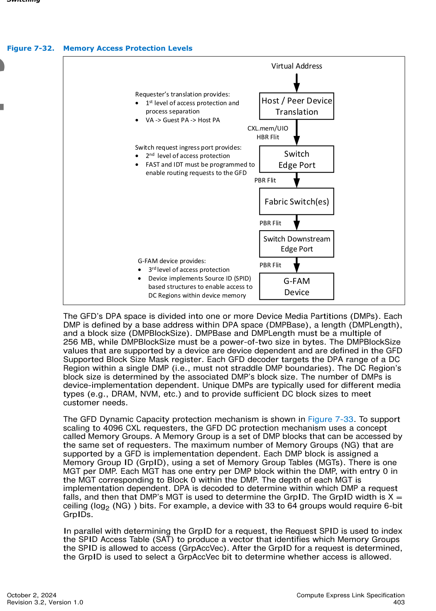
>
> *Original page render @ 150 DPI* — [📄 Full size](figures/chapter_07/page_0403.png)

<table>
<thead>
<tr>
<th width="50%">🇬🇧 English</th>
<th width="50%" style="background-color:#e8e8e8">🇨🇳 中文</th>
</tr>
</thead>
<tbody>
<tr><td>The GFD's DPA space is divided into one or more Device Media Partitions (DMPs). Each DMP is defined by a base address within DPA space (DMPBase), a length (DMPLength), and a block size (DMPBlockSize). DMPBase and DMPLength must be a multiple of 256 MB, while DMPBlockSize must be a power-of-two size in bytes. The DMPBlockSize values that are supported by a device are device dependent and are defined in the GFD Supported Block Size Mask register. Each GFD decoder targets the DPA range of a DC Region within a single DMP (i.e., must not straddle DMP boundaries). The DC Region's block size is determined by the associated DMP's block size. The number of DMPs is device-implementation dependent. Unique DMPs are typically used for different media types (e.g., DRAM, NVM, etc.) and to provide sufficient DC block sizes to meet customer needs.</td><td style="background-color:#e8e8e8">GFD 的 DPA 空间被划分为一个或多个 Device Media Partition (DMP)。每个 DMP 由 DPA 空间内的基地址 (DMPBase)、长度 (DMPLength) 和块大小 (DMPBlockSize) 定义。DMPBase 和 DMPLength 必须是 256 MB 的整数倍,而 DMPBlockSize 必须是 2 的幂次字节大小。设备支持的 DMPBlockSize 值取决于设备,并在 GFD Supported Block Size Mask 寄存器中定义。每个 GFD 解码器都以单个 DMP 内的 DC Region 的 DPA 范围为目标 (即不能跨越 DMP 边界)。DC Region 的块大小由关联 DMP 的块大小决定。DMP 的数量取决于设备实现。不同的 DMP 通常用于不同的介质类型 (例如,DRAM、NVM 等),并提供足够的 DC 块大小以满足客户需求。</td></tr>
<tr><td>The GFD Dynamic Capacity protection mechanism is shown in Figure 7-33. To support scaling to 4096 CXL requesters, the GFD DC protection mechanism uses a concept called Memory Groups. A Memory Group is a set of DMP blocks that can be accessed by the same set of requesters. The maximum number of Memory Groups (NG) that are supported by a GFD is implementation dependent. Each DMP block is assigned a Memory Group ID (GrpID), using a set of Memory Group Tables (MGTs). There is one MGT per DMP. Each MGT has one entry per DMP block within the DMP, with entry 0 in the MGT corresponding to Block 0 within the DMP. The depth of each MGT is implementation dependent. DPA is decoded to determine within which DMP a request falls, and then that DMP's MGT is used to determine the GrpID. The GrpID width is X = ceiling (log2 (NG) ) bits. For example, a device with 33 to 64 groups would require 6-bit GrpIDs.</td><td style="background-color:#e8e8e8">GFD Dynamic Capacity 保护机制如图 7-33 所示。为了支持扩展到 4096 个 CXL 请求者,GFD DC 保护机制使用一个称为 Memory Group 的概念。Memory Group 是可由同一组请求者访问的一组 DMP block。GFD 支持的最大 Memory Group 数 (NG) 取决于实现。每个 DMP block 都使用一组 Memory Group Table (MGT) 分配一个 Memory Group ID (GrpID)。每个 DMP 对应一个 MGT。每个 MGT 在 DMP 内的每个 DMP block 有一个条目,MGT 中的条目 0 对应 DMP 中的 Block 0。每个 MGT 的深度取决于实现。解码 DPA 以确定请求落在哪个 DMP 内,然后使用该 DMP 的 MGT 确定 GrpID。GrpID 宽度为 X = ceiling (log2 (NG)) 位。例如,具有 33 到 64 个组的设备需要 6-bit GrpID。</td></tr>
<tr><td>In parallel with determining the GrpID for a request, the Request SPID is used to index the SPID Access Table (SAT) to produce a vector that identifies which Memory Groups the SPID is allowed to access (GrpAccVec). After the GrpID for a request is determined, the GrpID is used to select a GrpAccVec bit to determine whether access is allowed.</td><td style="background-color:#e8e8e8">在并行确定请求的 GrpID 时,Request SPID 用于索引 SPID Access Table (SAT),以产生一个向量,该向量标识 SPID 允许访问的 Memory Group (GrpAccVec)。确定请求的 GrpID 后,使用 GrpID 选择一个 GrpAccVec 位以确定是否允许访问。</td></tr>
</tbody>
</table>

> **Figure 7-33.** GFD Dynamic Capacity Access Protections ｜ GFD Dynamic Capacity 访问保护
>
> 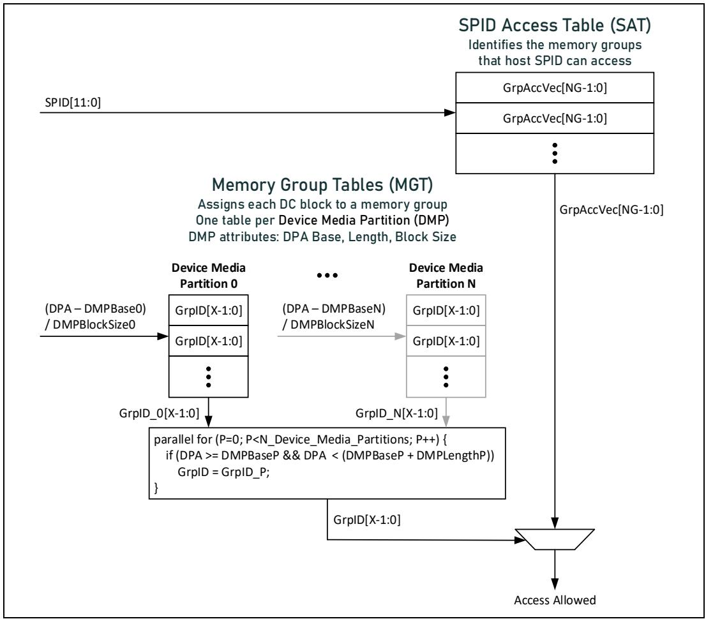
>
> *Original page render @ 150 DPI* — [📄 Full size](figures/chapter_07/page_0404.png)

### 7.7.2.6 Global Memory Access Endpoint | 7.7.2.6 全局内存访问端点

<table>
<thead>
<tr>
<th width="50%">🇬🇧 English</th>
<th width="50%" style="background-color:#e8e8e8">🇨🇳 中文</th>
</tr>
</thead>
<tbody>
<tr><td>Access to G-FAM/GIM resources and configuration of the FAST through a PBR fabric edge switch is facilitated by a Global Memory Access Endpoint (GAE) which is a Mailbox CCI that includes support for the Global Memory Access Endpoint Command set and the opcodes required to configure and enable FAST use, including Get PID Access Vectors and Configure FAST. The GAE is presented to the host as a PCIe Endpoint with a Type 0 configuration space as defined in Section 7.2.9.</td><td style="background-color:#e8e8e8">通过 PBR Fabric Edge 交换机对 G-FAM/GIM 资源的访问和 FAST 的配置由 Global Memory Access Endpoint (GAE) 提供,GAE 是一个 Mailbox CCI,包含对 Global Memory Access Endpoint Command 集的支持,以及配置和启用 FAST 使用所需的操作码,包括 Get PID Access Vectors 和 Configure FAST。GAE 以 PCIe Endpoint 的形式呈现给主机,具有 7.2.9 节中定义的 Type 0 配置空间。</td></tr>
</tbody>
</table>

> **IMPLEMENTATION NOTE** (实现提示)
>
> 为了支持以足够小的 GFD 容量百分比向主机分配 GFD 容量,建议设备每个 MGT 实现至少 1K 个条目。实现可选择为每个 MGT 使用单独的 RAM,或对所有 MGT 使用单一分区 RAM。
>
> 为了支持具有不同主机访问列表的足够数量的内存范围,建议设备实现至少 64 个 Memory Group。

<table>
<thead>
<tr>
<th width="50%">🇬🇧 English</th>
<th width="50%" style="background-color:#e8e8e8">🇨🇳 中文</th>
</tr>
</thead>
<tbody>
<tr><td>There are two configurations under which a host edge port USP will expose a GAE. The first configuration, illustrated in Figure 7-34, provides LD-FAM and G-FAM/GIM resources to a host. In this configuration, the GAE Mailbox CCI is used to configure G-FAM/GIM access for the USP and any DSPs connected to EPs. It may also include support for opcodes necessary to manage the CXL switch capability providing LD-FAM resources.</td><td style="background-color:#e8e8e8">在两种配置下,主机 Edge Port USP 将暴露 GAE。第一种配置 (如图 7-34 所示) 向主机提供 LD-FAM 和 G-FAM/GIM 资源。在此配置中,GAE Mailbox CCI 用于为 USP 和连接到 EP 的任何 DSP 配置 G-FAM/GIM 访问。它还可以包括管理提供 LD-FAM 资源的 CXL 交换机能力所需的操作码支持。</td></tr>
<tr><td>The second configuration, illustrated in Figure 7-35, only provides access to G-FAM/GIM resources. In this configuration, there is no CXL switch instantiated in the VCS and the GAE is the only PCIe function presented to the host.</td><td style="background-color:#e8e8e8">第二种配置 (如图 7-35 所示) 仅提供对 G-FAM/GIM 资源的访问。在此配置中,VCS 中未实例化 CXL 交换机,GAE 是呈现给主机的唯一 PCIe function。</td></tr>
<tr><td>A GAE is also required in the vUSP of a Downstream ES VCS. This GAE is used for configuring that VCS, including configuring the FAST and LDST in the Edge DSPs and providing CDAT information, as described in Section 7.7.12.4.</td><td style="background-color:#e8e8e8">在 Downstream ES VCS 的 vUSP 中也需要 GAE。此 GAE 用于配置该 VCS,包括在 Edge DSP 中配置 FAST 和 LDST 以及提供 CDAT 信息,如 7.7.12.4 节所述。</td></tr>
<tr><td>Each GAE maintains two access vectors, which are used to control whether the host has access to a particular PID:</td><td style="background-color:#e8e8e8">每个 GAE 维护两个访问向量,用于控制主机是否可访问特定 PID:</td></tr>
<tr><td>• Global Memory Mapping Vector (GMV): 4k bitmask indicating which PIDs have been enabled for G-FAM or GIM access</td><td style="background-color:#e8e8e8">• Global Memory Mapping Vector (GMV): 4k 位掩码,指示哪些 PID 已启用 G-FAM 或 GIM 访问</td></tr>
<tr><td>• VendPrefixL0 Target Vector (VTV): 4k bitmask indicating which PIDs have been enabled for VendPrefixL0</td><td style="background-color:#e8e8e8">• VendPrefixL0 Target Vector (VTV): 4k 位掩码,指示哪些 PID 已启用 VendPrefixL0</td></tr>
</tbody>
</table>

> **Figure 7-34.** PBR Fabric Providing LD-FAM and G-FAM Resources ｜ 提供 LD-FAM 和 G-FAM 资源的 PBR Fabric
>
> 
>
> *Original page render @ 150 DPI* — [📄 Full size](figures/chapter_07/fig_0405_1.jpx)

> **Figure 7-35.** PBR Fabric Providing Only G-FAM Resources ｜ 仅提供 G-FAM 资源的 PBR Fabric
>
> 
>
> *Original page render @ 150 DPI* — [📄 Full size](figures/chapter_07/fig_0405_2.jpx)

### 7.7.2.7 Event Notifications from GFDs | 7.7.2.7 来自 GFD 的事件通知

<table>
<thead>
<tr>
<th width="50%">🇬🇧 English</th>
<th width="50%" style="background-color:#e8e8e8">🇨🇳 中文</th>
</tr>
</thead>
<tbody>
<tr><td>GFDs do not maintain individual logs for every requester. Instead, events of interest are reported using the Enhanced Event Notifications defined in Section 8.2.10.2.9 and Section 8.2.10.2.10. These notifications are transported across the fabric using GAM VDMs, as defined in Section 3.1.11.6.</td><td style="background-color:#e8e8e8">GFD 不为每个请求者维护单独的日志。相反,感兴趣的事件使用 8.2.10.2.9 和 8.2.10.2.10 节中定义的 Enhanced Event Notification 上报。这些通知通过 GAM VDM 在 Fabric 上传输,如 3.1.11.6 节所定义。</td></tr>
<tr><td>For event notifications sent to a host, the GAM VDM's DPID is the PID of the host's GAE. When received by the GAE, the GAM VDM's 32B payload is written into the host's GAM Buffer. All GAM VDMs that are received by the GAE are logged into the same GAM Buffer, regardless of their SPID.</td><td style="background-color:#e8e8e8">对于发送到主机的事件通知,GAM VDM 的 DPID 是主机 GAE 的 PID。GAE 接收时,GAM VDM 的 32B 有效负载被写入主机的 GAM Buffer。GAE 接收的所有 GAM VDM 都记录在同一个 GAM Buffer 中,无论其 SPID 如何。</td></tr>
<tr><td>The GAM Buffer is a circular buffer in host memory that is configured for 32B entries. Its location in host memory is configured with the Set GAM Buffer request. The GAE writes received GAM VDM payloads into the buffer offset that is specified by the head index reported by the Get GAM Buffer request (see Section 8.2.10.2.11). As the host reads entries, the host increments the tail index using the Set GAM Buffer request (see Section 8.2.10.2.12). Head and tail indexes wrap to the beginning of the buffer when they increment beyond the buffer size.</td><td style="background-color:#e8e8e8">GAM Buffer 是主机内存中的一个循环缓冲区,配置为 32B 条目。它在主机内存中的位置由 Set GAM Buffer 请求配置。GAE 将接收到的 GAM VDM 有效负载写入 Get GAM Buffer 请求 (参见 8.2.10.2.11 节) 报告的 head index 指定的缓冲区偏移。主机读取条目时,使用 Set GAM Buffer 请求 (参见 8.2.10.2.12 节) 增加 tail index。当 head 和 tail 索引递增超过缓冲区大小时,会环绕到缓冲区的开头。</td></tr>
<tr><td>The buffer is empty when the head index and tail index are equal. The buffer is full when the head index is immediately before the tail index. Old entries are not overwritten by the GAE until the host removes them from the buffer by incrementing the tail index. The GAE will report a buffer overflow condition if a GAM VDM is received when the buffer is full.</td><td style="background-color:#e8e8e8">当 head index 和 tail index 相等时,缓冲区为空。当 head index 紧接在 tail index 之前时,缓冲区已满。在主机通过递增 tail index 将其从缓冲区中移除之前,GAE 不会覆盖旧条目。如果在缓冲区已满时收到 GAM VDM,GAE 将报告缓冲区溢出情况。</td></tr>
<tr><td>GAM VDMs are not forwarded to peer devices and are instead silently dropped by the peer's edge switch.</td><td style="background-color:#e8e8e8">GAM VDM 不会转发到对等设备,而是由对等方的 Edge 交换机静默丢弃。</td></tr>
</tbody>
</table>

[⬆️ 返回目录](#-本章目录-part-b)

---

## 7.7.3 Global Integrated Memory (GIM) | 7.7.3 全局集成内存 (GIM)

<table>
<thead>
<tr>
<th width="50%">🇬🇧 English</th>
<th width="50%" style="background-color:#e8e8e8">🇨🇳 中文</th>
</tr>
</thead>
<tbody>
<tr><td>A host domain may include multiple tiers of memory:</td><td style="background-color:#e8e8e8">主机域可以包括多层内存:</td></tr>
<tr><td>• Memory natively attached to a host (e.g., DDR, HBM, etc.)</td><td style="background-color:#e8e8e8">• 本机附加到主机的内存 (例如,DDR、HBM 等)</td></tr>
<tr><td>• Device memory attached to a host CXL link</td><td style="background-color:#e8e8e8">• 通过主机 CXL 链路附加的设备内存</td></tr>
<tr><td>• Device memory attached to a host through CXL switches</td><td style="background-color:#e8e8e8">• 通过 CXL 交换机附加到主机的设备内存</td></tr>
<tr><td>All the memory tiers listed above are managed by a host operating system. CXL devices may be a Type 2 device or Type 3 device and may optionally support back-invalidate channels. A CXL Fabric may be composed of many host domains and G-FAM devices (GFD) as shown in Figure 7-36. GFD is a scalable memory resource that is accessible by all hosts and peer devices within a CXL Fabric.</td><td style="background-color:#e8e8e8">上面列出的所有内存层均由主机操作系统管理。CXL 设备可以是 Type 2 设备或 Type 3 设备,可以可选地支持 back-invalidate 通道。CXL Fabric 可以由许多主机域和 G-FAM 设备 (GFD) 组成,如图 7-36 所示。GFD 是一种可扩展的内存资源,可被 CXL Fabric 中的所有主机和对等设备访问。</td></tr>
<tr><td>Each host domain may allow other host domains within the CXL Fabric to access locally managed memory at any tier. Global Integrated Memory (GIM) refers to the memory in remote host domains that is mapped into local host physical address space. Hosts and devices are allowed to initiate cross-domain accesses to GIM, utilizing Unordered I/O (UIO) transactions. CXL.mem or CXL.cache must not be used for GIM accesses.</td><td style="background-color:#e8e8e8">每个主机域可以允许 CXL Fabric 中的其他主机域访问任何层的本地管理内存。全局集成内存 (Global Integrated Memory, GIM) 是指映射到本地主机物理地址空间的远程主机域中的内存。允许主机和设备使用 Unordered I/O (UIO) 事务启动对 GIM 的跨域访问。GIM 访问不得使用 CXL.mem 或 CXL.cache。</td></tr>
<tr><td>Cross-domain accesses are considered I/O coherent — data is coherent at the time of access. Remote domains may either mark this memory as uncacheable or manage caches with SW mechanisms.</td><td style="background-color:#e8e8e8">跨域访问被视为 I/O 一致性 (I/O coherent) — 数据在访问时是一致的。远程域可以将此内存标记为不可缓存,或使用软件机制管理缓存。</td></tr>
<tr><td>GIM is primarily used for enabling remote DMA and messaging across domains. It is not intended for memory pooling or borrowing use cases.</td><td style="background-color:#e8e8e8">GIM 主要用于启用跨域的远程 DMA 和消息传递。它不适用于内存池化或借用用例。</td></tr>
</tbody>
</table>

> **Figure 7-36.** CXL Fabric Example with Multiple Host Domains and Memory Types ｜ 具有多个主机域和内存类型的 CXL Fabric 示例
>
> 
>
> *Original page render @ 150 DPI* — [📄 Full size](figures/chapter_07/page_0407_1.png)

### 7.7.3.1 Host GIM Physical Address View | 7.7.3.1 主机 GIM 物理地址视图

<table>
<thead>
<tr>
<th width="50%">🇬🇧 English</th>
<th width="50%" style="background-color:#e8e8e8">🇨🇳 中文</th>
</tr>
</thead>
<tbody>
<tr><td>Hosts and devices may use proprietary decode mechanisms to identify the target DPID and may bypass address decoders in the switch ingress port. Hosts and devices are typically limited to access between homogeneous peers. See Section 7.7.3.2 for ways by which hosts/devices can access Global Integrated Memory (GIM) without using the FAST decoders. This section covers the decode path that uses the FAST decoders.</td><td style="background-color:#e8e8e8">主机和设备可以使用专有的解码机制来识别目标 DPID,并可以绕过交换机入口端口中的地址解码器。主机和设备通常仅限于在同类对等方之间访问。有关主机/设备如何在不使用 FAST 解码器的情况下访问全局集成内存 (GIM) 的方法,请参见 7.7.3.2 节。本节涵盖使用 FAST 解码器的解码路径。</td></tr>
<tr><td>Hosts that access GIM and rely on address decoders in the switch must map this range in the Fabric Address Space. Hosts that access GIM and GFD must include both ranges in the Fabric Address Space and must use a contiguous address range within the Host Physical Address (HPA) space as shown in Figure 7-37.</td><td style="background-color:#e8e8e8">访问 GIM 并依赖交换机中地址解码器的主机必须将此范围映射到 Fabric Address Space。访问 GIM 和 GFD 的主机必须将两个范围都包含在 Fabric Address Space 中,并且必须使用 Host Physical Address (HPA) 空间内的连续地址范围,如图 7-37 所示。</td></tr>
</tbody>
</table>

> **Figure 7-37.** Example Host Physical Address View with GFD and GIM ｜ 具有 GFD 和 GIM 的主机物理地址视图示例
>
> 
>
> *Original page render @ 150 DPI* — [📄 Full size](figures/chapter_07/page_0407_2.png)

### 7.7.3.2 Use Cases | 7.7.3.2 用例

<table>
<thead>
<tr>
<th width="50%">🇬🇧 English</th>
<th width="50%" style="background-color:#e8e8e8">🇨🇳 中文</th>
</tr>
</thead>
<tbody>
<tr><td>All accesses to GIM regions must only use UIO. It is recommended to map GIM as MMIO instead of a normal write back memory type to avoid potential deadlock. However, implementations may use proprietary methods to guarantee UIO use even when internally using a cacheable memory type. Thus, MMIO mapping of GIM is only a recommendation and not a requirement.</td><td style="background-color:#e8e8e8">对 GIM 区域的所有访问必须仅使用 UIO。建议将 GIM 映射为 MMIO,而不是普通的 write back 内存类型,以避免潜在的死锁。但是,实现可以使用专有方法来保证 UIO 的使用,即使在内部使用可缓存的内存类型时也是如此。因此,将 GIM 映射为 MMIO 只是一个建议,不是必需的。</td></tr>
<tr><td>Host and device accesses to GFD and GIM are decoded using a common FAST decoder to determine the target's DPID.</td><td style="background-color:#e8e8e8">主机和设备对 GFD 和 GIM 的访问使用公共 FAST 解码器进行解码,以确定目标的 DPID。</td></tr>
<tr><td>ML and HPC applications are typically distributed across many compute nodes and need a scalable and efficient network for low-latency communication and synchronization. Figure 7-38 is an example of a system with a compute node composed of a Host, an Accelerator, and a cluster of nodes connected through a CXL switch fabric. Each host may expose a region or all available memory to other compute nodes.</td><td style="background-color:#e8e8e8">ML 和 HPC 应用程序通常分布在许多计算节点上,需要可扩展且高效的网络以进行低延迟通信和同步。图 7-38 是一个系统示例,系统由主机、加速器和通过 CXL 交换机 Fabric 连接的节点集群组成。每个主机可以向其他计算节点暴露一个区域或所有可用内存。</td></tr>
<tr><td>A second example in Figure 7-39 shows a CXL Fabric that connects all the accelerators. In this example, only the memory attached to the device is exposed to other devices as GIM. UIO allows flexible implementation options to enable RDMA semantics between devices. Software and security requirements are beyond the scope of this specification.</td><td style="background-color:#e8e8e8">图 7-39 中的第二个示例显示了连接所有加速器的 CXL Fabric。在此示例中,只有附加到设备的内存作为 GIM 暴露给其他设备。UIO 允许灵活的实现选项以启用设备之间的 RDMA 语义。软件和安全要求不在本规范的范围内。</td></tr>
<tr><td>GIM builds a framework for using the same set of capabilities for host-to-host communication, device-to-device communication, host-to-device communication, and device-to-host communication.</td><td style="background-color:#e8e8e8">GIM 框架使用同一组功能来实现主机到主机通信、设备到设备通信、主机到设备通信和设备到主机通信。</td></tr>
</tbody>
</table>

> **Figure 7-38.** Example Multi-host CXL Cluster with Memory on Host and Device Exposed as GIM ｜ 多主机 CXL 集群示例,主机和设备上的内存作为 GIM 暴露
>
> 
>
> *Original page render @ 150 DPI* — [📄 Full size](figures/chapter_07/page_0408_1.png)

> **Figure 7-39.** Example ML Cluster Supporting Cross-domain Access through GIM ｜ 通过 GIM 支持跨域访问的 ML 集群示例
>
> 
>
> *Original page render @ 150 DPI* — [📄 Full size](figures/chapter_07/page_0409_1.png)

### 7.7.3.3 Transaction Flows and Rules for GIM | 7.7.3.3 GIM 的事务流和规则

<table>
<thead>
<tr>
<th width="50%">🇬🇧 English</th>
<th width="50%" style="background-color:#e8e8e8">🇨🇳 中文</th>
</tr>
</thead>
<tbody>
<tr><td>The flow in Figure 7-40 describes how a host can access GIM in another host, using the fabric address model described earlier in this chapter. While Figure 7-40 uses host-to-host as the example, the same model works for host-to-device, device-to-device and device-to-host as well. A device that implements GIM as target is expected to have the required functionality that translates the combination of <Address: PID> in the incoming UIO TLP to a local memory address and to provide the required security on cross-domain accesses. This functionality can also use more information than just <Address:PID> from the TLP (e.g., PASID) for additional functionality/security. Designs can chose to reuse the GFD architecture for defining this translation/protection functionality or can implement a proprietary IOMMU-like logic. Details of this functionality are beyond the scope of this Specification.</td><td style="background-color:#e8e8e8">图 7-40 中的流程描述了主机如何使用本章前面描述的 Fabric 地址模型访问另一主机中的 GIM。虽然图 7-40 使用主机到主机作为示例,但相同的模型也适用于主机到设备、设备到设备和设备到主机。将 GIM 实现为目标的设备应具有所需的功能,将传入 UIO TLP 中的 <Address: PID> 组合转换为本地内存地址,并提供跨域访问所需的安全性。此功能还可以使用 TLP 中除 <Address: PID> 之外的其他信息 (例如 PASID) 来提供附加功能/安全性。设计可以选择重用 GFD 架构来定义此转换/保护功能,也可以实现专有的类似 IOMMU 的逻辑。此功能的详细信息不在本规范的范围内。</td></tr>
</tbody>
</table>

> **Figure 7-40.** GIM Access Flows Using FASTs ｜ 使用 FAST 的 GIM 访问流
>
> 
>
> *Original page render @ 150 DPI* — [📄 Full size](figures/chapter_07/page_0409_2.png)

<table>
<thead>
<tr>
<th width="50%">🇬🇧 English</th>
<th width="50%" style="background-color:#e8e8e8">🇨🇳 中文</th>
</tr>
</thead>
<tbody>
<tr><td>Although the flows described in Figure 7-40 and Figure 7-41 are self-explanatory, here are the key rules for PBR switches/Hosts/Devices that support the GIM flows:</td><td style="background-color:#e8e8e8">尽管图 7-40 和图 7-41 中描述的流程是不言自明的,但以下是支持 GIM 流的 PBR 交换机/主机/设备的关键规则:</td></tr>
<tr><td>• FM enables usage of VendPrefixL0 on non-PBR edge ports, using the FM API discussed in Table 7-187. By default, VendPrefixL0 usage is disabled on edge ports.</td><td style="background-color:#e8e8e8">• FM 使用表 7-187 中讨论的 FM API 在非 PBR Edge 端口上启用 VendPrefixL0 的使用。默认情况下,Edge 端口上禁用 VendPrefixL0 使用。</td></tr>
<tr><td>The mechanism that the FM uses to determine on which ports to enable this functionality is beyond the scope of this specification.</td><td style="background-color:#e8e8e8">FM 用于确定在哪些端口上启用此功能的机制不在本规范的范围内。</td></tr>
</tbody>
</table>

> **Figure 7-41.** GIM Access Flows without FASTs ｜ 不使用 FAST 的 GIM 访问流
>
> 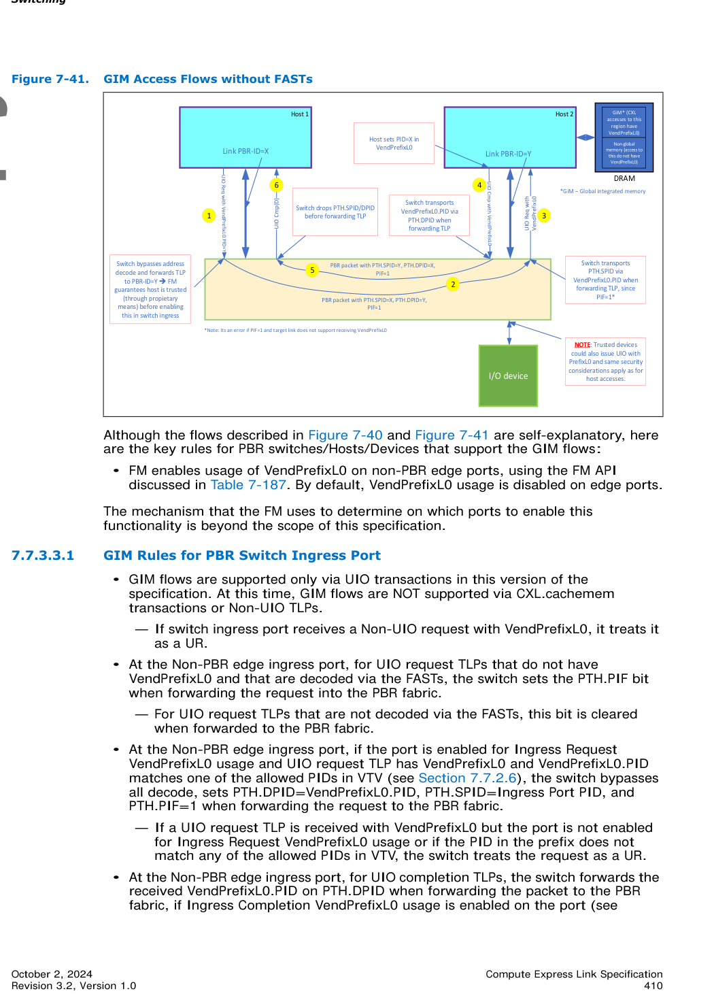
>
> *Original page render @ 150 DPI* — [📄 Full size](figures/chapter_07/page_0410.png)

#### 7.7.3.3.1 GIM Rules for PBR Switch Ingress Port | 7.7.3.3.1 PBR 交换机入口端口的 GIM 规则

<table>
<thead>
<tr>
<th width="50%">🇬🇧 English</th>
<th width="50%" style="background-color:#e8e8e8">🇨🇳 中文</th>
</tr>
</thead>
<tbody>
<tr><td>• GIM flows are supported only via UIO transactions in this version of the specification. At this time, GIM flows are NOT supported via CXL.cachemem transactions or Non-UIO TLPs.</td><td style="background-color:#e8e8e8">• 在本规范版本中,GIM 流仅通过 UIO 事务支持。目前,GIM 流不支持 CXL.cachemem 事务或非 UIO TLP。</td></tr>
<tr><td>— If switch ingress port receives a Non-UIO request with VendPrefixL0, it treats it as a UR.</td><td style="background-color:#e8e8e8">— 如果交换机入口端口接收到带有 VendPrefixL0 的非 UIO 请求,则将其视为 UR。</td></tr>
<tr><td>• At the Non-PBR edge ingress port, for UIO request TLPs that do not have VendPrefixL0 and that are decoded via the FASTs, the switch sets the PTH.PIF bit when forwarding the request into the PBR fabric.</td><td style="background-color:#e8e8e8">• 在非 PBR Edge 入口端口,对于不具有 VendPrefixL0 且通过 FAST 解码的 UIO 请求 TLP,交换机在将请求转发到 PBR Fabric 时设置 PTH.PIF 位。</td></tr>
<tr><td>— For UIO request TLPs that are not decoded via the FASTs, this bit is cleared when forwarded to the PBR fabric.</td><td style="background-color:#e8e8e8">— 对于未通过 FAST 解码的 UIO 请求 TLP,转发到 PBR Fabric 时此位被清除。</td></tr>
<tr><td>• At the Non-PBR edge ingress port, if the port is enabled for Ingress Request VendPrefixL0 usage and UIO request TLP has VendPrefixL0 and VendPrefixL0.PID matches one of the allowed PIDs in VTV (see Section 7.7.2.6), the switch bypasses all decode, sets PTH.DPID=VendPrefixL0.PID, PTH.SPID=Ingress Port PID, and PTH.PIF=1 when forwarding the request to the PBR fabric.</td><td style="background-color:#e8e8e8">• 在非 PBR Edge 入口端口,如果端口启用了 Ingress Request VendPrefixL0 使用且 UIO 请求 TLP 具有 VendPrefixL0 且 VendPrefixL0.PID 匹配 VTV 中允许的 PID 之一 (参见 7.7.2.6 节),则交换机绕过所有解码,在将请求转发到 PBR Fabric 时设置 PTH.DPID=VendPrefixL0.PID,PTH.SPID=Ingress Port PID 和 PTH.PIF=1。</td></tr>
<tr><td>— If a UIO request TLP is received with VendPrefixL0 but the port is not enabled for Ingress Request VendPrefixL0 usage or if the PID in the prefix does not match any of the allowed PIDs in VTV, the switch treats the request as a UR.</td><td style="background-color:#e8e8e8">— 如果收到的 UIO 请求 TLP 带有 VendPrefixL0 但端口未启用 Ingress Request VendPrefixL0 使用,或者如果前缀中的 PID 与 VTV 中允许的任何 PID 都不匹配,则交换机将请求视为 UR。</td></tr>
<tr><td>• At the Non-PBR edge ingress port, for UIO completion TLPs, the switch forwards the received VendPrefixL0.PID on PTH.DPID when forwarding the packet to the PBR fabric, if Ingress Completion VendPrefixL0 usage is enabled on the port (see Section 7.7.15.5) and VendPrefixL0.PID matches one of the allowed PIDs in VTV (see Section 7.7.2.6). PTH.SPID on the completion TLP is set to the PID of the ingress port.</td><td style="background-color:#e8e8e8">• 在非 PBR Edge 入口端口,对于 UIO 完成 TLP,如果端口上启用了 Ingress Completion VendPrefixL0 使用 (参见 7.7.15.5 节) 且 VendPrefixL0.PID 匹配 VTV 中允许的 PID 之一 (参见 7.7.2.6 节),则交换机在将数据包转发到 PBR Fabric 时,转发收到的 VendPrefixL0.PID 到 PTH.DPID。完成 TLP 上的 PTH.SPID 设置为入口端口的 PID。</td></tr>
<tr><td>— if a UIO completion TLP is received on a Non-PBR edge ingress port when Ingress Completion VendPrefixL0 usage is disabled on the port or if the PID in the prefix does not match any of the allowed PIDs in VTV, the switch must drop the packet and treat it as an Unexpected Completion.</td><td style="background-color:#e8e8e8">— 如果在非 PBR Edge 入口端口收到 UIO 完成 TLP 时,端口上禁用了 Ingress Completion VendPrefixL0 使用,或者如果前缀中的 PID 与 VTV 中允许的任何 PID 都不匹配,则交换机必须丢弃该数据包并将其视为意外的完成 (Unexpected Completion)。</td></tr>
<tr><td>— Switch sets the PIF bit whenever it successfully forwards the received completion TLP to the PBR fabric.</td><td style="background-color:#e8e8e8">— 每当交换机成功将收到的完成 TLP 转发到 PBR Fabric 时,都会设置 PIF 位。</td></tr>
</tbody>
</table>

#### 7.7.3.3.2 GIM Rules for PBR Switch Egress Port | 7.7.3.3.2 PBR 交换机出口端口的 GIM 规则

<table>
<thead>
<tr>
<th width="50%">🇬🇧 English</th>
<th width="50%" style="background-color:#e8e8e8">🇨🇳 中文</th>
</tr>
</thead>
<tbody>
<tr><td>• At the Non-PBR edge egress port, for UIO request TLPs with the PTH.PIF bit set, the switch forwards the PTH.SPID field of the request TLP on the VendPrefixL0.PID field if the egress port is enabled for Egress Request VendPrefixL0 usage.</td><td style="background-color:#e8e8e8">• 在非 PBR Edge 出口端口,对于设置了 PTH.PIF 位的 UIO 请求 TLP,如果出口端口启用了 Egress Request VendPrefixL0 使用,则交换机将请求 TLP 的 PTH.SPID 字段转发到 VendPrefixL0.PID 字段。</td></tr>
<tr><td>— If the PTH.PIF bit is set but the egress port is not enabled for Egress Request VendPrefixL0 usage, the switch should treat the request as a UR.</td><td style="background-color:#e8e8e8">— 如果设置了 PTH.PIF 位但出口端口未启用 Egress Request VendPrefixL0 使用,则交换机应将请求视为 UR。</td></tr>
<tr><td>— If the PTH.PIF bit is cleared in the UIO request TLP, the request TLP is forwarded to the egress link without VendPrefixL0, regardless of whether the port is enabled for Egress Request VendPrefixL0 usage.</td><td style="background-color:#e8e8e8">— 如果 UIO 请求 TLP 中的 PTH.PIF 位被清除,则请求 TLP 被转发到出口链路而不带 VendPrefixL0,无论端口是否启用了 Egress Request VendPrefixL0 使用。</td></tr>
<tr><td>• At the Non-PBR edge egress port, the switch does not send VendPrefixL0 on completion TLPs.</td><td style="background-color:#e8e8e8">• 在非 PBR Edge 出口端口,交换机不在完成 TLP 上发送 VendPrefixL0。</td></tr>
<tr><td>• If the Non-PBR edge egress port is in a 'Link Down' state, GIM packets shall be silently dropped.</td><td style="background-color:#e8e8e8">• 如果非 PBR Edge 出口端口处于 "Link Down" 状态,则应静默丢弃 GIM 数据包。</td></tr>
<tr><td>• Switch forwards the PTH.PIF bit as-is on edge PBR links</td><td style="background-color:#e8e8e8">• 交换机在 Edge PBR 链路上按原样转发 PTH.PIF 位</td></tr>
</tbody>
</table>

#### 7.7.3.3.3 GIM Rules for Host/Devices | 7.7.3.3.3 主机/设备的 GIM 规则

<table>
<thead>
<tr>
<th width="50%">🇬🇧 English</th>
<th width="50%" style="background-color:#e8e8e8">🇨🇳 中文</th>
</tr>
</thead>
<tbody>
<tr><td>• Host/Devices that support VendPrefixL0 semantics and receive a UIO Request TLP with VendPrefixL0 must return the received PID value in the associated completion's VendPrefixL0.</td><td style="background-color:#e8e8e8">• 支持 VendPrefixL0 语义并收到带有 VendPrefixL0 的 UIO Request TLP 的主机/设备必须在关联完成的 VendPrefixL0 中返回收到的 PID 值。</td></tr>
<tr><td>• Host/Devices must always return a value of 0 for Completer ID in the UIO completions.</td><td style="background-color:#e8e8e8">• 主机/设备必须在 UIO 完成中始终返回 Completer ID 值为 0。</td></tr>
</tbody>
</table>

#### 7.7.3.3.4 Other GIM Rules | 7.7.3.3.4 其他 GIM 规则

<table>
<thead>
<tr>
<th width="50%">🇬🇧 English</th>
<th width="50%" style="background-color:#e8e8e8">🇨🇳 中文</th>
</tr>
</thead>
<tbody>
<tr><td>• VendPrefixL0 must never be sent on edge PBR links, such as the links connecting to a GFD</td><td style="background-color:#e8e8e8">• VendPrefixL0 绝不能在 Edge PBR 链路上发送,例如连接到 GFD 的链路</td></tr>
<tr><td>• GFD must ignore the PTH.PIF bit on TLPs that the GFD receives</td><td style="background-color:#e8e8e8">• GFD 必须忽略 GFD 接收的 TLP 上的 PTH.PIF 位</td></tr>
<tr><td>• GFD is permitted to set the PTH.PIF bit on CXL.io request TLPs that the GFD sources and always sets this bit on CXL.io completion TLPs that the GFD sources</td><td style="background-color:#e8e8e8">• 允许 GFD 在其发出的 CXL.io 请求 TLP 上设置 PTH.PIF 位,并始终在其发出的 CXL.io 完成 TLP 上设置此位</td></tr>
<tr><td><b>Note:</b></td><td style="background-color:#e8e8e8"><b>注:</b></td></tr>
<tr><td>If setting the PTH.PIF bit on request TLPs, the GFD must do so only if it is sure that the ultimate destination (e.g., GIM) needs to be aware of the PID of the source agent that is generating the request (such as for functional/security reasons); otherwise, the GFD should not set the bit.</td><td style="background-color:#e8e8e8">如果 GFD 在请求 TLP 上设置 PTH.PIF 位,则必须仅在它确定最终目的地 (例如 GIM) 需要知道正在生成请求的源代理的 PID (例如出于功能/安全原因) 时才这样做;否则,GFD 不应设置该位。</td></tr>
</tbody>
</table>

### 7.7.3.4 Restrictions with Host-to-Host UIO Usages | 7.7.3.4 主机到主机 UIO 使用的限制

<table>
<thead>
<tr>
<th width="50%">🇬🇧 English</th>
<th width="50%" style="background-color:#e8e8e8">🇨🇳 中文</th>
</tr>
</thead>
<tbody>
<tr><td>Host-to-Host UIO usages can result in deadlock when mixed with UIO traffic going to the host that can route back in the host. To avoid such deadlocks:</td><td style="background-color:#e8e8e8">当主机到主机 UIO 使用与可以路由回主机的 UIO 流量混合时,可能导致死锁。为避免此类死锁:</td></tr>
<tr><td>• Systems that support Host-to-Host UIO must use a separate VC for Host-to-Host UIO traffic vs. remainder of UIO, on host edge links.</td><td style="background-color:#e8e8e8">• 支持主机到主机 UIO 的系统必须在主机 Edge 链路上为 Host-to-Host UIO 流量与 UIO 的其余部分使用单独的 VC。</td></tr>
<tr><td>(OR)</td><td style="background-color:#e8e8e8">(或)</td></tr>
<tr><td>• Minimally avoid usages that can cause loopback traffic, either in the host or in switches. Generically, this restriction could mean that UIO accesses do not target MMIO space.</td><td style="background-color:#e8e8e8">• 至少避免可能引起环回流量的使用,无论是在主机内还是交换机内。一般而言,此限制可能意味着 UIO 访问不针对 MMIO 空间。</td></tr>
<tr><td>A detailed analysis of restrictions that are needed to make a specific system configuration to work with Host-to-Host UIO enabled is beyond the scope of this specification.</td><td style="background-color:#e8e8e8">为使特定系统配置能够使用启用的主机到主机 UIO 而需要的限制的详细分析不在本规范的范围内。</td></tr>
<tr><td>A future ECN may be considered that allows for more deadlock avoidance options beyond the two listed above.</td><td style="background-color:#e8e8e8">未来的 ECN 可能会考虑允许除了上面列出的两个选项之外更多的死锁避免选项。</td></tr>
</tbody>
</table>

[⬆️ 返回目录](#-本章目录-part-b)

---

## 7.7.4 Non-GIM Usages with VendPrefixL0 | 7.7.4 使用 VendPrefixL0 的非 GIM 用途

<table>
<thead>
<tr>
<th width="50%">🇬🇧 English</th>
<th width="50%" style="background-color:#e8e8e8">🇨🇳 中文</th>
</tr>
</thead>
<tbody>
<tr><td>When Hosts/Devices initiate UIO requests with VendPrefixL0, address decoding is bypassed in the Switch ingress port. This allows for proprietary implementations in which the address/data information in the TLP can potentially be vendor-defined. Such usages are beyond the scope of this specification; however, GIM-related rules enumerated in Section 7.7.3.3 allow such implementations as well.</td><td style="background-color:#e8e8e8">当主机/设备使用 VendPrefixL0 启动 UIO 请求时,交换机入口端口中的地址解码被绕过。这允许使用专有的实现,其中 TLP 中的地址/数据信息可以是供应商定义的。此类用途不在本规范的范围内;然而,7.7.3.3 节中列举的 GIM 相关规则也允许此类实现。</td></tr>
</tbody>
</table>

[⬆️ 返回目录](#-本章目录-part-b)

---

## 7.7.5 HBR and PBR Switch Configurations | 7.7.5 HBR 与 PBR 交换机配置

<table>
<thead>
<tr>
<th width="50%">🇬🇧 English</th>
<th width="50%" style="background-color:#e8e8e8">🇨🇳 中文</th>
</tr>
</thead>
<tbody>
<tr><td>CXL supports two types of switches: HBR (Hierarchy Based Routing) and PBR (Port Based Routing). "HBR" is the shorthand name for the CXL switches introduced in the CXL 2.0 specification and enhanced in subsequent CXL ECNs and specifications. In this section, the interaction between the two will be discussed.</td><td style="background-color:#e8e8e8">CXL 支持两种类型的交换机:HBR (基于层级的路由,Hierarchy Based Routing) 和 PBR (基于端口的路由,Port Based Routing)。"HBR" 是 CXL 2.0 规范中引入并在后续 CXL ECN 和规范中增强的 CXL 交换机的简写名称。本节将讨论两者之间的交互。</td></tr>
<tr><td>A variety of HBR/PBR switch combinations are supported. The basic rules are as follows:</td><td style="background-color:#e8e8e8">支持多种 HBR/PBR 交换机组合。基本规则如下:</td></tr>
<tr><td>• Host RP must be connected to an HBR USP, PBR USP, or a non-GFD</td><td style="background-color:#e8e8e8">• 主机 RP 必须连接到 HBR USP、PBR USP 或非 GFD</td></tr>
<tr><td>• Non-GFD must be connected to an HBR DSP, a PBR DSP, or a Host RP</td><td style="background-color:#e8e8e8">• 非 GFD 必须连接到 HBR DSP、PBR DSP 或主机 RP</td></tr>
<tr><td>• PBR USP may be connected only to a host RP; connecting it to an HBR DSP is not supported</td><td style="background-color:#e8e8e8">• PBR USP 只能连接到主机 RP;不支持将其连接到 HBR DSP</td></tr>
<tr><td>• HBR USP may be connected to a host RP, a PBR DSP, or an HBR DSP</td><td style="background-color:#e8e8e8">• HBR USP 可连接到主机 RP、PBR DSP 或 HBR DSP</td></tr>
<tr><td>• GFD may be connected only to a PBR DSP</td><td style="background-color:#e8e8e8">• GFD 只能连接到 PBR DSP</td></tr>
<tr><td>• PBR FPort may be connected only to a PBR FPort of a different PBR switch</td><td style="background-color:#e8e8e8">• PBR FPort 只能连接到不同 PBR 交换机的 PBR FPort</td></tr>
<tr><td>Figure 7-42 illustrates some example supported switch configurations, but should not be considered a complete list.</td><td style="background-color:#e8e8e8">图 7-42 展示了一些支持的交换机配置示例,但不应视为完整列表。</td></tr>
</tbody>
</table>

> **Figure 7-42.** Example Supported Switch Configurations ｜ 支持的交换机配置示例
>
> 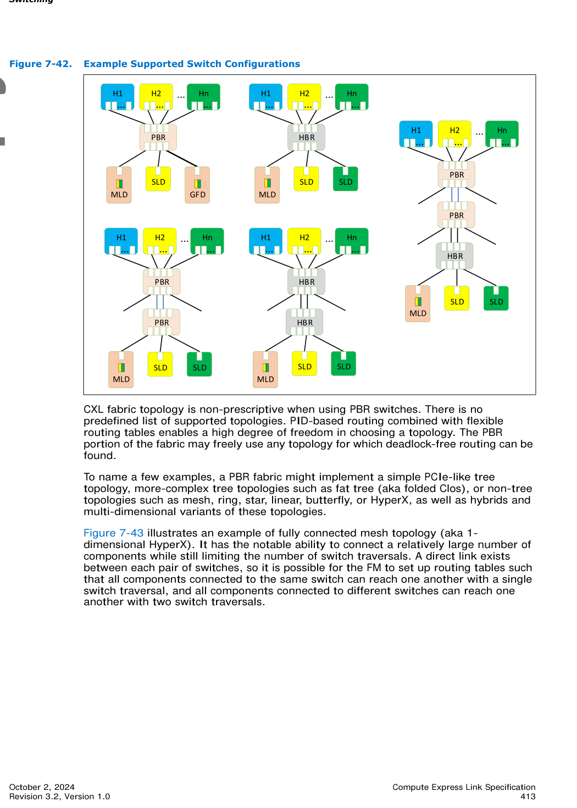
>
> *Original page render @ 150 DPI* — [📄 Full size](figures/chapter_07/page_0413.png)

<table>
<thead>
<tr>
<th width="50%">🇬🇧 English</th>
<th width="50%" style="background-color:#e8e8e8">🇨🇳 中文</th>
</tr>
</thead>
<tbody>
<tr><td>CXL fabric topology is non-prescriptive when using PBR switches. There is no predefined list of supported topologies. PID-based routing combined with flexible routing tables enables a high degree of freedom in choosing a topology. The PBR portion of the fabric may freely use any topology for which deadlock-free routing can be found.</td><td style="background-color:#e8e8e8">使用 PBR 交换机时,CXL Fabric 拓扑是非规定的。没有预定义的支持拓扑列表。基于 PID 的路由与灵活的路由表相结合,使拓扑选择具有高度自由度。Fabric 的 PBR 部分可以自由使用任何可以找到无死锁路由的拓扑。</td></tr>
<tr><td>To name a few examples, a PBR fabric might implement a simple PCIe-like tree topology, more-complex tree topologies such as fat tree (aka folded Clos), or non-tree topologies such as mesh, ring, star, linear, butterfly, or HyperX, as well as hybrids and multi-dimensional variants of these topologies.</td><td style="background-color:#e8e8e8">仅举几个例子,PBR Fabric 可能实现简单的类似 PCIe 的树形拓扑、更复杂的树形拓扑 (如 fat tree (也称 folded Clos)),或非树形拓扑 (如 mesh、ring、star、linear、butterfly 或 HyperX),以及这些拓扑的混合体和多维变体。</td></tr>
<tr><td>Figure 7-43 illustrates an example of fully connected mesh topology (aka 1-dimensional HyperX). It has the notable ability to connect a relatively large number of components while still limiting the number of switch traversals. A direct link exists between each pair of switches, so it is possible for the FM to set up routing tables such that all components connected to the same switch can reach one another with a single switch traversal, and all components connected to different switches can reach one another with two switch traversals.</td><td style="background-color:#e8e8e8">图 7-43 展示了全连接 mesh 拓扑 (也称 1 维 HyperX) 的一个示例。它具有连接相对大量组件同时仍限制交换机遍历次数的显著能力。每对交换机之间都存在直连链路,因此 FM 可以设置路由表,使得连接到同一交换机的所有组件可以通过单次交换机遍历彼此到达,而连接到不同交换机的所有组件可以通过两次交换机遍历彼此到达。</td></tr>
</tbody>
</table>

> **Figure 7-43.** Example PBR Mesh Topology ｜ PBR Mesh 拓扑示例
>
> 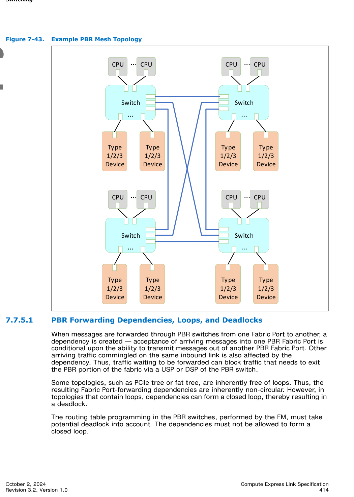
>
> *Original page render @ 150 DPI* — [📄 Full size](figures/chapter_07/page_0414.png)

### 7.7.5.1 PBR Forwarding Dependencies, Loops, and Deadlocks | 7.7.5.1 PBR 转发依赖关系、环路和死锁

<table>
<thead>
<tr>
<th width="50%">🇬🇧 English</th>
<th width="50%" style="background-color:#e8e8e8">🇨🇳 中文</th>
</tr>
</thead>
<tbody>
<tr><td>When messages are forwarded through PBR switches from one Fabric Port to another, a dependency is created — acceptance of arriving messages into one PBR Fabric Port is conditional upon the ability to transmit messages out of another PBR Fabric Port. Other arriving traffic commingled on the same inbound link is also affected by the dependency. Thus, traffic waiting to be forwarded can block traffic that needs to exit the PBR portion of the fabric via a USP or DSP of the PBR switch.</td><td style="background-color:#e8e8e8">当消息通过 PBR 交换机从一个 Fabric Port 转发到另一个 Fabric Port 时,会创建依赖关系 — 接受消息进入一个 PBR Fabric Port 以能够从另一个 PBR Fabric Port 发出消息为条件。同一入站链路上混合的其他到达流量也受此依赖关系影响。因此,等待转发的流量可能会阻塞需要通过 PBR 交换机的 USP 或 DSP 退出 Fabric 的 PBR 部分的流量。</td></tr>
<tr><td>Some topologies, such as PCIe tree or fat tree, are inherently free of loops. Thus, the resulting Fabric Port-forwarding dependencies are inherently non-circular. However, in topologies that contain loops, dependencies can form a closed loop, thereby resulting in a deadlock.</td><td style="background-color:#e8e8e8">某些拓扑 (如 PCIe 树或 fat tree) 本身没有环路。因此,所得到的 Fabric Port 转发依赖关系本质上是非循环的。但是,在包含环路的拓扑中,依赖关系可以形成闭环,从而导致死锁。</td></tr>
<tr><td>The routing table programming in the PBR switches, performed by the FM, must take potential deadlock into account. The dependencies must not be allowed to form a closed loop.</td><td style="background-color:#e8e8e8">PBR 交换机中由 FM 执行的路由表编程必须考虑潜在的死锁。不得允许依赖关系形成闭环。</td></tr>
</tbody>
</table>

> **Figure 7-44.** Example Routing Scheme for a Mesh Topology ｜ Mesh 拓扑的路由方案示例
>
> 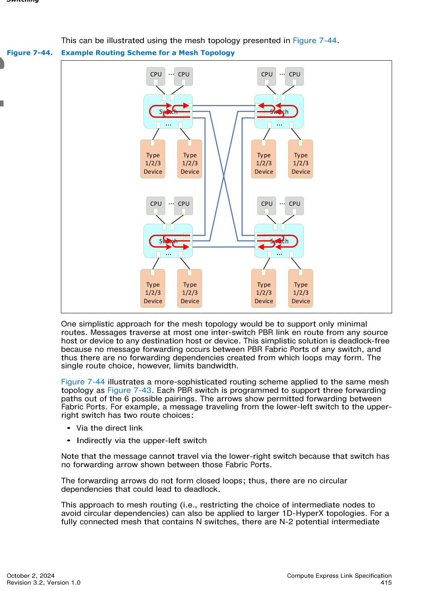
>
> *Original page render @ 150 DPI* — [📄 Full size](figures/chapter_07/page_0415.png)

<table>
<thead>
<tr>
<th width="50%">🇬🇧 English</th>
<th width="50%" style="background-color:#e8e8e8">🇨🇳 中文</th>
</tr>
</thead>
<tbody>
<tr><td>This can be illustrated using the mesh topology presented in Figure 7-44.</td><td style="background-color:#e8e8e8">这可以使用图 7-44 中展示的 mesh 拓扑来说明。</td></tr>
<tr><td>One simplistic approach for the mesh topology would be to support only minimal routes. Messages traverse at most one inter-switch PBR link en route from any source host or device to any destination host or device. This simplistic solution is deadlock-free because no message forwarding occurs between PBR Fabric Ports of any switch, and thus there are no forwarding dependencies created from which loops may form. The single route choice, however, limits bandwidth.</td><td style="background-color:#e8e8e8">对于 mesh 拓扑,一种简单的方法是仅支持最小路由。消息在任何源主机或设备到任何目标主机或设备的路径上最多穿过一个交换机间 PBR 链路。这种简单的解决方案是无死锁的,因为在任何交换机的 PBR Fabric Port 之间都不会发生消息转发,因此不会形成可能产生环路的转发依赖关系。但是,单一路由选择限制了带宽。</td></tr>
<tr><td>Figure 7-44 illustrates a more-sophisticated routing scheme applied to the same mesh topology as Figure 7-43. Each PBR switch is programmed to support three forwarding paths out of the 6 possible pairings. The arrows show permitted forwarding between Fabric Ports. For example, a message traveling from the lower-left switch to the upper-right switch has two route choices:</td><td style="background-color:#e8e8e8">图 7-44 展示了应用于与图 7-43 相同 mesh 拓扑的更复杂的路由方案。每个 PBR 交换机被编程为在 6 种可能的配对中支持 3 条转发路径。箭头显示 Fabric Port 之间允许的转发。例如,从左下交换机到右上交换机的消息有两个路由选择:</td></tr>
<tr><td>• Via the direct link</td><td style="background-color:#e8e8e8">• 通过直连链路</td></tr>
<tr><td>• Indirectly via the upper-left switch</td><td style="background-color:#e8e8e8">• 通过左上交换机间接</td></tr>
<tr><td>Note that the message cannot travel via the lower-right switch because that switch has no forwarding arrow shown between those Fabric Ports.</td><td style="background-color:#e8e8e8">请注意,消息无法通过右下交换机传输,因为这些 Fabric Port 之间没有显示转发箭头。</td></tr>
<tr><td>The forwarding arrows do not form closed loops; thus, there are no circular dependencies that could lead to deadlock.</td><td style="background-color:#e8e8e8">转发箭头不形成闭环;因此,没有可能导致死锁的循环依赖关系。</td></tr>
<tr><td>This approach to mesh routing (i.e., restricting the choice of intermediate nodes to avoid circular dependencies) can also be applied to larger 1D-HyperX topologies. For a fully connected mesh that contains N switches, there are N-2 potential intermediate switches to consider for possible indirect routes between any pair of switches. However, this deadlock-avoidance restriction limits the usable intermediate switch choices to one-half of that number ((N-2)/2), rounding down if N is odd.</td><td style="background-color:#e8e8e8">这种 mesh 路由方法 (即限制中间节点的选择以避免循环依赖) 也可应用于更大的 1D-HyperX 拓扑。对于包含 N 个交换机的全连接 mesh,存在 N-2 个潜在的中间交换机,可考虑用于任何一对交换机之间可能的间接路由。但是,这种避免死锁的限制将可用中间交换机选择限制为该数量的一半 ((N-2)/2),如果 N 为奇数则向下取整。</td></tr>
<tr><td>Multi-dimensional HyperX topologies can be routed deadlock-free by using this technique within each dimension, and implementing dimension-ordered routing.</td><td style="background-color:#e8e8e8">多维 HyperX 拓扑可以通过在每个维度内使用此技术并实现维度排序路由 (dimension-ordered routing) 来实现无死锁路由。</td></tr>
<tr><td>Although this section covers some cases for circular dependency avoidance, fully architected deadlock dependency avoidance with topologies that contain fabric loops is beyond the scope of this specification.</td><td style="background-color:#e8e8e8">尽管本节涵盖了一些避免循环依赖的情况,但完全架构化的死锁依赖避免 (适用于包含 Fabric 环路的拓扑) 不在本规范的范围内。</td></tr>
</tbody>
</table>

[⬆️ 返回目录](#-本章目录-part-b)

---

## 7.7.6 PBR Switching Details | 7.7.6 PBR 交换详细信息

### 7.7.6.1 Virtual Hierarchies Spanning a Fabric | 7.7.6.1 跨越 Fabric 的 Virtual Hierarchy

<table>
<thead>
<tr>
<th width="50%">🇬🇧 English</th>
<th width="50%" style="background-color:#e8e8e8">🇨🇳 中文</th>
</tr>
</thead>
<tbody>
<tr><td>Hosts connected to CXL Fabrics (composed of PBR switches) do not require special, fabric-specific discovery mechanisms. The fabric complexities are abstracted, and the host is presented with a simple switching topology that is compliant with PCIe Base Specification. All intermediate Fabric switches are obscured from host view. At most, two layers of Edge Switches (ESs) are presented:</td><td style="background-color:#e8e8e8">连接到 CXL Fabric (由 PBR 交换机组成) 的主机不需要特殊的、Fabric 特定的发现机制。Fabric 的复杂性被抽象化,主机被呈现为符合 PCIe Base Specification 的简单交换拓扑。所有中间 Fabric 交换机对主机不可见。最多呈现两层 Edge Switch (ES):</td></tr>
<tr><td>• Host ES: The host discovers a single switch representative of the edge to which it is connected. Any EPs also physically connected to this PBR switch and bound to the host's VH are seen as being directly connected to PPBs within the VCS.</td><td style="background-color:#e8e8e8">• Host ES: 主机发现一个代表其所连接 Edge 的单个交换机。任何也物理连接到此 PBR 交换机并绑定到主机 VH 的 EP 都视为直接连接到 VCS 中的 PPB。</td></tr>
<tr><td>• Downstream ES: As desired, the FM may establish binding connections between the Host ES VCS and one or more remote PBR switches within the Fabric. When such a binding connection is established, the remote switch presents a VCS that is connected to one of the Host ES vPPBs. The Host discovers a single link between a virtualized DSP (vDSP) in the Host ES and a virtualized USP (vUSP) in the Downstream ES, regardless of the number of intermediate fabric switches, if any. The link state is virtualized by the Host ES and is representative of the routing path between the two ESs; if any intermediate ISLs go down, the Host ES will report a surprise Link Down error on the corresponding vPPB.</td><td style="background-color:#e8e8e8">• Downstream ES: 根据需要,FM 可在 Host ES VCS 和 Fabric 内的一个或多个远程 PBR 交换机之间建立绑定连接。当建立这样的绑定连接时,远程交换机呈现一个连接到 Host ES vPPB 之一的 VCS。无论中间 Fabric 交换机的数量如何,主机都会发现 Host ES 中虚拟化 DSP (vDSP) 和 Downstream ES 中虚拟化 USP (vUSP) 之间的单个链路。链路状态由 Host ES 虚拟化,代表两个 ES 之间的路由路径;如果任何中间 ISL 出现故障,Host ES 将在相应的 vPPB 上报告意外 Link Down 错误。</td></tr>
<tr><td>• If an HBR switch is connected to a PBR DSP, that HBR switch and any HBR switches below it will be visible to the host. HBR switches are not Fabric switches.</td><td style="background-color:#e8e8e8">• 如果 HBR 交换机连接到 PBR DSP,则该 HBR 交换机及其下方的任何 HBR 交换机对主机可见。HBR 交换机不是 Fabric 交换机。</td></tr>
<tr><td>A PBR switch's operation as a "Host ES" or a "Downstream ES" per the above descriptions is relative to each host's VH. A PBR switch may simultaneously support Host ES Ports and Downstream ES Ports for different VHs. ISLs within the Fabric are capable of carrying bidirectional traffic for more than one VH at the same time. Edge DSPs support PCIe devices, SLDs, MLDs, GFDs, PCIe switches, and CXL HBR switches.</td><td style="background-color:#e8e8e8">PBR 交换机作为 "Host ES" 或 "Downstream ES" 的操作是相对于每个主机的 VH 的。PBR 交换机可以同时为不同的 VH 支持 Host ES Port 和 Downstream ES Port。Fabric 中的 ISL 能够同时为多个 VH 承载双向流量。Edge DSP 支持 PCIe 设备、SLD、MLD、GFD、PCIe 交换机和 CXL HBR 交换机。</td></tr>
<tr><td>A Mailbox CCI is required in the vUSP of a Downstream ES VCS for management purposes.</td><td style="background-color:#e8e8e8">出于管理目的,Downstream ES VCS 的 vUSP 中需要 Mailbox CCI。</td></tr>
</tbody>
</table>

### 7.7.6.2 PBR Message Routing across the Fabric | 7.7.6.2 跨 Fabric 的 PBR 消息路由

<table>
<thead>
<tr>
<th width="50%">🇬🇧 English</th>
<th width="50%" style="background-color:#e8e8e8">🇨🇳 中文</th>
</tr>
</thead>
<tbody>
<tr><td>PBR switches can support both static and dynamic routing for each DPID, as determined by message class.</td><td style="background-color:#e8e8e8">PBR 交换机可支持每个 DPID 的静态和动态路由,由消息类别决定。</td></tr>
<tr><td>With static routing, messages of a given message class use a single fixed path between source and destination Edge Ports. Messages that use a vDSP/vUSP binding (see Section 7.7.6.4) always use static routing as well, though the vUSP as a source or destination is always associated with an FPort instead of an Edge Port.</td><td style="background-color:#e8e8e8">使用静态路由时,给定消息类别的消息在源 Edge Port 和目标 Edge Port 之间使用单一固定路径。使用 vDSP/vUSP 绑定 (参见 7.7.6.4 节) 的消息也始终使用静态路由,尽管 vUSP 作为源或目标始终与 FPort 关联,而不是 Edge Port。</td></tr>
<tr><td>With dynamic routing, messages of a given message class can use different paths between source and destination Edge Ports, dynamically determined by factors such as congestion avoidance, algorithms to distribute traffic across multiple links, or changes with link connectivity. Each DPID supports static routing for those message classes that require it, and it can support either static or dynamic routing for the other message classes.</td><td style="background-color:#e8e8e8">使用动态路由时,给定消息类别的消息可以在源 Edge Port 和目标 Edge Port 之间使用不同的路径,由拥塞避免、跨多个链路分配流量的算法或链路连接变化等因素动态确定。每个 DPID 支持需要静态路由的消息类别的静态路由,并可支持其他消息类别的静态或动态路由。</td></tr>
<tr><td>Dynamic routing is generally preferred when suitable, but in certain cases static routing must be used to ensure in-order delivery of messages as required by ordering rules. Due to its ability to distribute traffic across multiple links, dynamic routing is especially preferred for messages that carry payload data, as indicated in Table 7-84.</td><td style="background-color:#e8e8e8">在合适的情况下通常首选动态路由,但在某些情况下必须使用静态路由以确保消息按顺序传递 (如排序规则所要求)。由于其能够跨多个链路分配流量,对于携带负载数据的消息,动态路由特别受青睐,如表 7-84 所示。</td></tr>
<tr><td>Somewhat orthogonal to dynamic vs. static routing, PBR switches support hierarchical and edge-to-edge decoding and routing. With hierarchical routing, a message is decoded and routed within each ES using HBR mechanisms and statically routed between ESs, using vDSP/vUSP bindings. With edge-to-edge routing, a message is routed from a source Edge Port to a destination Edge Port, using a DPID determined at the source Edge Port or GFD. Edge-to-edge routing uses either dynamic or static routing, as determined by the message class.</td><td style="background-color:#e8e8e8">与动态路由和静态路由有些正交,PBR 交换机支持分层和 Edge-to-Edge 解码和路由。使用分层路由时,消息在每个 ES 内使用 HBR 机制进行解码和路由,并使用 vDSP/vUSP 绑定在 ES 之间进行静态路由。使用 Edge-to-Edge 路由时,消息使用在源 Edge Port 或 GFD 处确定的 DPID 从源 Edge Port 路由到目标 Edge Port。Edge-to-Edge 路由使用动态或静态路由,由消息类别决定。</td></tr>
<tr><td>Table 7-84 summarizes the type of PBR decoding and routing used, by message class.</td><td style="background-color:#e8e8e8">表 7-84 按消息类别汇总了使用的 PBR 解码和路由类型。</td></tr>
</tbody>
</table>

> **Figure 7-45.** Physical Topology and Logical View ｜ 物理拓扑与逻辑视图
>
> 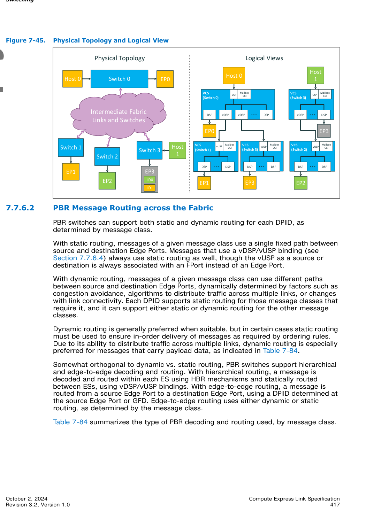
>
> *Original page render @ 150 DPI* — [📄 Full size](figures/chapter_07/page_0417.png)

<table>
<thead>
<tr>
<th width="50%">🇬🇧 English</th>
<th width="50%" style="background-color:#e8e8e8">🇨🇳 中文</th>
</tr>
</thead>
<tbody>
<tr><td>The Ordering Rules column primarily covers a few special cases with CXL.cachemem messages in which the fabric is required to enforce ordering within a single message class or between two message classes. The alphanumeric identifier refers to ordering summary table entries in Table 3-57 and Table 3-58.</td><td style="background-color:#e8e8e8">排序规则列主要涵盖 CXL.cachemem 消息的几个特殊情况,在这些情况下,需要在单个消息类别内或两个消息类别之间强制排序。字母数字标识符引用表 3-57 和表 3-58 中的排序汇总表条目。</td></tr>
<tr><td>With LD-FAM, host software may use either HDM Decoders or LDST decoders, though LDST decoders do not support HDM-D. Host software implemented solely against the CXL 2.0 Specification comprehends only HDM Decoders, and such host software may continue to use them with PBR Fabrics. Newer host software that comprehends and uses LDST decoders can benefit from edge-to-edge routing, which uses dynamic routing for suitable message classes.</td><td style="background-color:#e8e8e8">对于 LD-FAM,主机软件可以使用 HDM Decoder 或 LDST decoder,尽管 LDST decoder 不支持 HDM-D。仅根据 CXL 2.0 规范实现的主机软件仅理解 HDM Decoder,这样的主机软件可以继续在 PBR Fabric 中使用它们。理解并使用 LDST decoder 的较新主机软件可以受益于 Edge-to-Edge 路由,该路由对合适的消息类别使用动态路由。</td></tr>
<tr><td>For CXL.io TLPs, the PTH.Hie (hierarchical) bit determines when intermediate PBR switches must use static routing. When the PTH.Hie bit is 1, intermediate PBR switches shall use static routing for the TLP; otherwise, such switches are permitted to use dynamic routing for the TLP. When a PTH is pre-pended to a TLP, the Hie bit shall be 1 if the TLP is a vDSP/vUSP message; otherwise, the Hie bit shall be 0.</td><td style="background-color:#e8e8e8">对于 CXL.io TLP,PTH.Hie (hierarchical) 位决定中间 PBR 交换机何时必须使用静态路由。当 PTH.Hie 位为 1 时,中间 PBR 交换机应使用静态路由;否则,允许此类交换机对 TLP 使用动态路由。当 PTH 前置到 TLP 时,如果 TLP 是 vDSP/vUSP 消息,则 Hie 位应为 1;否则,Hie 位应为 0。</td></tr>
</tbody>
</table>

<table>
<thead>
<tr>
<th width="50%">🇬🇧 English</th>
<th width="50%" style="background-color:#e8e8e8">🇨🇳 中文</th>
</tr>
</thead>
<tbody>
<tr>
<td>

**Table 7-84. PBR Fabric Decoding and Routing, by Message Class**

| Message Class | Payload Data | Ordering Rules | Preferred Routing¹ | Decoding and Routing Mechanism |
|---|---|---|---|---|
| CXL.cache D2H Req |  |  | Dynamic | Edge-to-edge routing using the Cache ID lookups or vPPB bindings |
| CXL.cache H2D Rsp |  | I11a: Snoop (H2D Req) push GO (H2D Rsp) | Static |  |
| CXL.cache H2D DH | ** |  | Dynamic |  |
| CXL.cache H2D Req |  | I11a: Snoop (H2D Req) push GO (H2D Rsp) | Static |  |
| CXL.cache D2H Rsp |  |  | Dynamic |  |
| CXL.cache D2H DH | ** |  | Dynamic |  |
| CXL.mem M2S Req |  | G8a (HDM-D to Type 2): MemRd*/MemInv* push Mem*Fwd | HDM-H: Dynamic; HDM-D: Static; HDM-DB: Dynamic | LD-FAM: Edge-to-edge routing if using LDST²; Hierarchical routing if using HDM Decoder²; G-FAM: edge-to-edge routing using FAST |
| CXL.mem M2S RwD | ** |  | Dynamic | LD-FAM: Edge-to-edge routing if using LDST²; Hierarchical routing if using HDM Decoder; G-FAM: Edge-to-edge routing using FAST |
| CXL.mem S2M NDR |  | E6a: BI-ConflictAck pushes Cmp* | Static | Edge-to-edge routing using vPPB bindings or BI-ID lookups |
| CXL.mem S2M DRS | ** |  | Dynamic |  |
| CXL.mem S2M BISnp |  |  | Dynamic |  |
| CXL.mem M2S BIRsp |  |  | Dynamic |  |
| CXL.io All CXL.io TLPs ** except next row |  | PCIe (many) | Static | Hierarchical decoding within each ES; vDSP/vUSP between Host ES and each Downstream ES |
| CXL.io UIO Direct P2P to HDM TLPs ** |  |  | Dynamic | Edge-to-edge routing using FAST or LDST decoder |

*¹ When dynamic routing is preferred, static routing is still permitted.*
*² LDST decoders do not support HDM-D.*

</td>
<td style="background-color:#e8e8e8">

**表 7-84. PBR Fabric 解码和路由 (按消息类别)**

| 消息类别 | 负载数据 | 排序规则 | 首选路由¹ | 解码和路由机制 |
|---|---|---|---|---|
| CXL.cache D2H Req |  |  | 动态 | 使用 Cache ID 查找或 vPPB 绑定的 Edge-to-Edge 路由 |
| CXL.cache H2D Rsp |  | I11a: Snoop (H2D Req) push GO (H2D Rsp) | 静态 |  |
| CXL.cache H2D DH | ** |  | 动态 |  |
| CXL.cache H2D Req |  | I11a: Snoop (H2D Req) push GO (H2D Rsp) | 静态 |  |
| CXL.cache D2H Rsp |  |  | 动态 |  |
| CXL.cache D2H DH | ** |  | 动态 |  |
| CXL.mem M2S Req |  | G8a (HDM-D 到 Type 2): MemRd*/MemInv* push Mem*Fwd | HDM-H: 动态;HDM-D: 静态;HDM-DB: 动态 | LD-FAM: 使用 LDST² 时 Edge-to-Edge 路由;使用 HDM Decoder² 时分层路由;G-FAM: 使用 FAST 的 Edge-to-Edge 路由 |
| CXL.mem M2S RwD | ** |  | 动态 | LD-FAM: 使用 LDST² 时 Edge-to-Edge 路由;使用 HDM Decoder 时分层路由;G-FAM: 使用 FAST 的 Edge-to-Edge 路由 |
| CXL.mem S2M NDR |  | E6a: BI-ConflictAck pushes Cmp* | 静态 | 使用 vPPB 绑定或 BI-ID 查找的 Edge-to-Edge 路由 |
| CXL.mem S2M DRS | ** |  | 动态 |  |
| CXL.mem S2M BISnp |  |  | 动态 |  |
| CXL.mem M2S BIRsp |  |  | 动态 |  |
| CXL.io 所有 CXL.io TLP ** (下一行除外) |  | PCIe (许多) | 静态 | 每个 ES 内的分层解码;Host ES 和每个 Downstream ES 之间的 vDSP/vUSP |
| CXL.io UIO Direct P2P to HDM TLP ** |  |  | 动态 | 使用 FAST 或 LDST decoder 的 Edge-to-Edge 路由 |

*¹ 当首选动态路由时,仍允许静态路由。*
*² LDST decoder 不支持 HDM-D。*

</td>
</tr>
</tbody>
</table>

### 7.7.6.3 PBR Message Routing within a Single PBR Switch | 7.7.6.3 单个 PBR 交换机内的 PBR 消息路由

<table>
<thead>
<tr>
<th width="50%">🇬🇧 English</th>
<th width="50%" style="background-color:#e8e8e8">🇨🇳 中文</th>
</tr>
</thead>
<tbody>
<tr><td>A message received or converted to PBR format at a PBR switch ingress port is routed to one of the switch's egress ports, as determined by the ingress port's DPID Routing Table (DRT) and its associated Routing Group Table (RGT). Their structures are described in detail in Section 7.7.13.10 and Section 7.7.13.12, respectively, and this section provides a high-level summary.</td><td style="background-color:#e8e8e8">在 PBR 交换机入口端口接收或转换为 PBR 格式的消息被路由到交换机的出口端口之一,由入口端口的 DPID Routing Table (DRT) 及其关联的 Routing Group Table (RGT) 决定。其结构分别在 7.7.13.10 节和 7.7.13.12 节中详细描述,本节提供高级摘要。</td></tr>
<tr><td>A DRT has 4096 entries and is indexed by a DPID. Each DRT entry contains a 2-bit entry type field that indicates whether the entry is valid, and whether the entry contains a single physical port number or an RGT index.</td><td style="background-color:#e8e8e8">DRT 有 4096 个条目,由 DPID 索引。每个 DRT 条目包含一个 2-bit 条目类型字段,指示该条目是否有效,以及该条目包含单个物理端口号还是 RGT 索引。</td></tr>
<tr><td>DRT entries that contain an RGT index are required when multiple egress ports need to be specified for use with dynamic routing. An RGT is a power-of-2-sized table with up to 256 entries. Each RGT entry contains an ordered list of up to eight physical port numbers, along with two 3-bit fields that indicate how many in the list are valid and how many of those are primary vs. secondary. This allows one or more primary and zero or more secondary egress ports to be listed. Cases that require static routing must always use the first list entry. The RGT entry also contains a 3-bit dynamic routing mode and 3-bit mix setting. The distinction between primary vs. secondary varies by dynamic routing mode and mix setting.</td><td style="background-color:#e8e8e8">当需要为动态路由指定多个出口端口时,需要包含 RGT 索引的 DRT 条目。RGT 是一个 2 的幂大小的表,最多 256 个条目。每个 RGT 条目包含一个最多 8 个物理端口号的有序列表,以及两个 3-bit 字段,指示列表中有多少有效以及其中多少是 primary 与 secondary。这允许列出一个或多个 primary 出口端口和零个或多个 secondary 出口端口。需要静态路由的情况必须始终使用第一个列表条目。RGT 条目还包含 3-bit 动态路由模式和 3-bit mix 设置。primary 与 secondary 之间的区别因动态路由模式和 mix 设置而异。</td></tr>
<tr><td>In routing modes that utilize the mix setting, its value determines the mix of the primary and secondary egress port group usage, assuming that one or more secondary egress ports are specified. Using the mix setting supports egress port selection based on known bandwidth differences that exist elsewhere in the fabric or based on preferred vs. overflow routing paths. Secondary egress ports should be specified only when there are significant differences with primary egress ports; otherwise, all suitable egress ports should be specified as primary. When no secondary egress ports have been specified, the mix setting shall be ignored.</td><td style="background-color:#e8e8e8">在使用 mix 设置的路由模式中,假设指定了一个或多个 secondary 出口端口,其值决定 primary 和 secondary 出口端口组使用的 mix。使用 mix 设置支持基于 Fabric 中其他位置存在的已知带宽差异或基于首选与溢出路由路径的出口端口选择。仅当与 primary 出口端口存在显著差异时,才应指定 secondary 出口端口;否则,所有合适的出口端口都应指定为 primary。当未指定 secondary 出口端口时,应忽略 mix 设置。</td></tr>
<tr><td>Mix setting 7 is intended for use in cases where primary and secondary egress port groups represent preferred and overflow ports, respectively. Mix setting 7 mandates the choice of a primary (preferred) path route whenever flow-control conditions and link state permit.</td><td style="background-color:#e8e8e8">Mix 设置 7 用于 primary 和 secondary 出口端口组分别表示首选和溢出端口的情况。Mix 设置 7 要求在流控条件和链路状态允许时,选择 primary (首选) 路径路由。</td></tr>
<tr><td>The term candidate egress port refers to a port that is present in the appropriate RGT entry, where the message can be queued or internally routed immediately. The egress port need not have link credits to send the packet immediately. An implementation may optionally base part of the candidate selection on the egress port state (e.g., link-up or containment states).</td><td style="background-color:#e8e8e8">术语 candidate egress port (候选出口端口) 是指存在于相应 RGT 条目中的端口,消息可在该端口立即排队或内部路由。出口端口不需要具有链路信用以立即发送数据包。实现可选择地基于出口端口状态 (例如 link-up 或 containment 状态) 进行部分候选选择。</td></tr>
<tr><td>The mix dynamic routing mode descriptions that follow describe routing outcomes in terms of probability, consistent with a weighted (pseudo) random implementation. Random selection has the advantage that each routing decision is stateless and independent of one another, and it has high immunity to hot-route problems that might otherwise arise from repetitive patterns in packet arrivals. The specific random routing implementation is not prescribed. Implementations that achieve the specified mix by deterministic means, such as by weighted round-robin, are permitted.</td><td style="background-color:#e8e8e8">随后的 mix 动态路由模式描述以概率形式描述路由结果,与加权 (伪) 随机实现一致。随机选择的优点是每个路由决策是无状态的且彼此独立,并且对热路由问题 (可能由数据包到达的重复模式引起) 具有高免疫力。不规定具体的随机路由实现。允许使用确定性方式 (如加权轮询) 实现指定 mix 的实现。</td></tr>
</tbody>
</table>

<table>
<thead>
<tr>
<th width="50%">🇬🇧 English</th>
<th width="50%" style="background-color:#e8e8e8">🇨🇳 中文</th>
</tr>
</thead>
<tbody>
<tr>
<td>

**Mix Setting Table (referenced in 7.7.6.3)**

| Mix Setting | % Primary | % Secondary |
|---|---|---|
| 0 | 87.5 | 12.5 |
| 1 | 75 | 25 |
| 2 | 62.5 | 37.5 |
| 3 | 50 | 50 |
| 4 | 37.5 | 62.5 |
| 5 | 25 | 75 |
| 6 | 12.5 | 87.5 |
| 7 | Preferred | Overflow |

</td>
<td style="background-color:#e8e8e8">

**Mix 设置表 (7.7.6.3 中引用)**

| Mix 设置 | % Primary | % Secondary |
|---|---|---|
| 0 | 87.5 | 12.5 |
| 1 | 75 | 25 |
| 2 | 62.5 | 37.5 |
| 3 | 50 | 50 |
| 4 | 37.5 | 62.5 |
| 5 | 25 | 75 |
| 6 | 12.5 | 87.5 |
| 7 | 首选 | 溢出 |

</td>
</tr>
</tbody>
</table>

<table>
<thead>
<tr>
<th width="50%">🇬🇧 English</th>
<th width="50%" style="background-color:#e8e8e8">🇨🇳 中文</th>
</tr>
</thead>
<tbody>
<tr><td>The architected dynamic routing modes include the optional modes listed in Table 7-85.</td><td style="background-color:#e8e8e8">架构化的动态路由模式包括表 7-85 中列出的可选模式。</td></tr>
<tr><td>PBR switches that implement RGTs shall support at least one of the three architected dynamic routing modes (those listed in Table 7-85) within each RGT.</td><td style="background-color:#e8e8e8">实现 RGT 的 PBR 交换机应在每个 RGT 内支持表 7-85 中列出的三种架构化动态路由模式中的至少一种。</td></tr>
<tr><td>DRT entries that contain a single physical port instead of an RGT index are useful when there is only one reasonable egress port choice (e.g., routing to an Edge Port). This avoids an RGT look-up and additional processing to determine which egress port to use. This may also help reduce the number of entries that need to be implemented in the associated RGT.</td><td style="background-color:#e8e8e8">当只有一个合理的出口端口选择 (例如,路由到 Edge Port) 时,包含单个物理端口 (而不是 RGT 索引) 的 DRT 条目非常有用。这避免了 RGT 查找和确定要使用哪个出口端口的额外处理。这也有助于减少需要在关联 RGT 中实现的条目数。</td></tr>
</tbody>
</table>

<table>
<thead>
<tr>
<th width="50%">🇬🇧 English</th>
<th width="50%" style="background-color:#e8e8e8">🇨🇳 中文</th>
</tr>
</thead>
<tbody>
<tr>
<td>

**Table 7-85. Optional Architected Dynamic Routing Modes**

| Mode | Description |
|---|---|
| Mix with Random | The candidate list is first narrowed to select either the primary or the secondary group based on the configured mix. A random selection is then made within that group. A message class shall stall when the selected subset is empty due to flow-control conditions. The FM may choose to select this mode (if supported) as an alternative to Mix with Congestion Avoidance if the latter is not supported. |
| Mix with Congestion Avoidance | The candidate list is first narrowed to select either the primary or the secondary group based on the configured mix. A local congestion-avoiding selection is then made within that group. A message class shall stall when the selected subset is empty due to flow-control conditions. Congestion-avoiding candidate selection is based on vendor-specific congestion metrics, favoring the selection of less-congested egress ports. For example, the congestion metric might be a measure of egress port backlog, considering all queued traffic for that egress port across the entire switch. The FM may choose to select this mode (if supported) when Advanced Congestion Avoidance mode is inappropriate or not supported, of if fixed-traffic ratio apportionment or preferred/overflow behavior is needed. |
| Advanced Congestion Avoidance | A congestion-avoiding selection is made considering both primary and secondary candidate egress ports, ignoring the mix setting value. Egress ports with the minimal remaining hop count should be specified as primary; any suitable egress ports that have higher remaining hop counts should be specified as secondary. Candidate selection is based on vendor-specific metrics, favoring less-congested egress ports in general, and especially avoiding secondary candidates that are already heavily scheduled with primary traffic, regardless of the target DPID. An example congestion metric might be backlog-based, but with different weightings for primary vs. secondary backlogs. Congestion metric values for primary backlogs should be higher than secondary backlogs when assessing the congestion level of a secondary candidate egress port. This discourages the use of secondary candidate ports that have a high primary backlog. In congestion metrics, messages that are queued or internally routed via the physical port number in a DRT or via dynamic routing modes other than Advanced Congestion Avoidance should be considered primary backlog. The FM may choose to select this mode (if supported) for routing egress ports that carry commingled minimal and non-minimal traffic. |

</td>
<td style="background-color:#e8e8e8">

**表 7-85. 可选的架构化动态路由模式**

| 模式 | 描述 |
|---|---|
| Mix with Random (随机混合) | 候选列表首先根据配置的 mix 缩小,以选择 primary 或 secondary 组。然后在该组内进行随机选择。当由于流控条件导致所选子集为空时,消息类别应停止。如果不支持 Mix with Congestion Avoidance,FM 可选择此模式 (如果支持) 作为替代方案。 |
| Mix with Congestion Avoidance (拥塞避免混合) | 候选列表首先根据配置的 mix 缩小,以选择 primary 或 secondary 组。然后在该组内进行本地拥塞避免选择。当由于流控条件导致所选子集为空时,消息类别应停止。拥塞避免候选选择基于供应商特定的拥塞指标,优先选择不太拥塞的出口端口。例如,拥塞指标可以是出口端口积压的度量,考虑整个交换机中该出口端口的所有排队流量。当 Advanced Congestion Avoidance 模式不合适或不受支持,或者需要固定流量比例分配或首选/溢出行为时,FM 可选择此模式 (如果支持)。 |
| Advanced Congestion Avoidance (高级拥塞避免) | 在考虑 primary 和 secondary 候选出口端口的同时进行拥塞避免选择,忽略 mix 设置值。具有最小剩余跳数的出口端口应指定为 primary;任何具有较高剩余跳数的合适出口端口应指定为 secondary。候选选择基于供应商特定的指标,通常优先选择不太拥塞的出口端口,尤其是避免那些已经与 primary 流量大量调度的 secondary 候选,无论目标 DPID 如何。示例拥塞指标可以基于积压,但 primary 与 secondary 积压使用不同的权重。在评估 secondary 候选出口端口的拥塞水平时,primary 积压的拥塞指标值应高于 secondary 积压。这不鼓励使用具有高 primary 积压的 secondary 候选端口。在拥塞指标中,通过 DRT 中的物理端口号或通过 Advanced Congestion Avoidance 以外的动态路由模式排队或内部路由的消息应视为 primary 积压。FM 可选择此模式 (如果支持) 用于承载混合最小和非最小流量的路由出口端口。 |

</td>
</tr>
</tbody>
</table>

### 7.7.6.4 PBR Switch vDSP/vUSP Bindings and Connectivity | 7.7.6.4 PBR 交换机 vDSP/vUSP 绑定和连接

<table>
<thead>
<tr>
<th width="50%">🇬🇧 English</th>
<th width="50%" style="background-color:#e8e8e8">🇨🇳 中文</th>
</tr>
</thead>
<tbody>
<tr><td>Within the context of a single VH, the virtual connection between a VCS in the Host ES and a VCS in a Downstream ES is accomplished with a vDSP/vUSP binding. A vDSP is a vPPB in the Host ES VCS that the host sees as a DSP. A vUSP is a vPPB in the Downstream ES VCS that the host sees as a USP. Host software always sees a single virtual link connecting the vDSP and vUSP, even though one or more intermediate Fabric switches may be physically present.</td><td style="background-color:#e8e8e8">在单个 VH 的上下文中,Host ES 中的 VCS 与 Downstream ES 中的 VCS 之间的虚拟连接通过 vDSP/vUSP 绑定实现。vDSP 是 Host ES VCS 中的 vPPB,主机将其视为 DSP。vUSP 是 Downstream ES VCS 中的 vPPB,主机将其视为 USP。主机软件始终看到连接 vDSP 和 vUSP 的单个虚拟链路,即使物理上可能存在一个或多个中间 Fabric 交换机。</td></tr>
<tr><td>Figure 7-46 shows an example PBR Fabric that consists of one Host ES, one Downstream ES, and an unspecified number of intermediate Fabric switches connecting the two.</td><td style="background-color:#e8e8e8">图 7-46 显示了一个 PBR Fabric 示例,由一个 Host ES、一个 Downstream ES 和连接两者的数量未指定的中间 Fabric 交换机组成。</td></tr>
<tr><td>The rules for vDSP/vUSP bindings are as follows:</td><td style="background-color:#e8e8e8">vDSP/vUSP 绑定的规则如下:</td></tr>
<tr><td>• Each active Host ES vDSP is bound to one Host ES FPort and one Downstream ES vUSP</td><td style="background-color:#e8e8e8">• 每个活动的 Host ES vDSP 绑定到一个 Host ES FPort 和一个 Downstream ES vUSP</td></tr>
<tr><td>• Each active Downstream ES vUSP is bound to one Downstream ES FPort and one Host ES vDSP</td><td style="background-color:#e8e8e8">• 每个活动的 Downstream ES vUSP 绑定到一个 Downstream ES FPort 和一个 Host ES vDSP</td></tr>
<tr><td>• All messages routed using a vDSP/vUSP binding must contain both a DPID and an SPID</td><td style="background-color:#e8e8e8">• 使用 vDSP/vUSP 绑定路由的所有消息必须同时包含 DPID 和 SPID</td></tr>
<tr><td>• vDSPs and vUSPs are never assigned PIDs</td><td style="background-color:#e8e8e8">• vDSP 和 vUSP 永远不会被分配 PID</td></tr>
<tr><td>• Each PID used for vDSP/vUSP bindings may support both static and dynamic routing; however, vDSP/vUSP traffic always uses static routing</td><td style="background-color:#e8e8e8">• 用于 vDSP/vUSP 绑定的每个 PID 可支持静态和动态路由;但是,vDSP/vUSP 流量始终使用静态路由</td></tr>
<tr><td>• Each vDSP/vUSP binding has a single host USP PID that determines which Host ES FPort will be used to route from vUSP to vDSP</td><td style="background-color:#e8e8e8">• 每个 vDSP/vUSP 绑定具有单个主机 USP PID,用于确定哪个 Host ES FPort 将用于从 vUSP 路由到 vDSP</td></tr>
<tr><td>• Each vDSP/vUSP binding has a single Downstream ES PID that determines which Downstream ES FPort will be used to route from vDSP to vUSP</td><td style="background-color:#e8e8e8">• 每个 vDSP/vUSP 绑定具有单个 Downstream ES PID,用于确定哪个 Downstream ES FPort 将用于从 vDSP 路由到 vUSP</td></tr>
</tbody>
</table>

> **Figure 7-46.** Example PBR Fabric ｜ PBR Fabric 示例
>
> 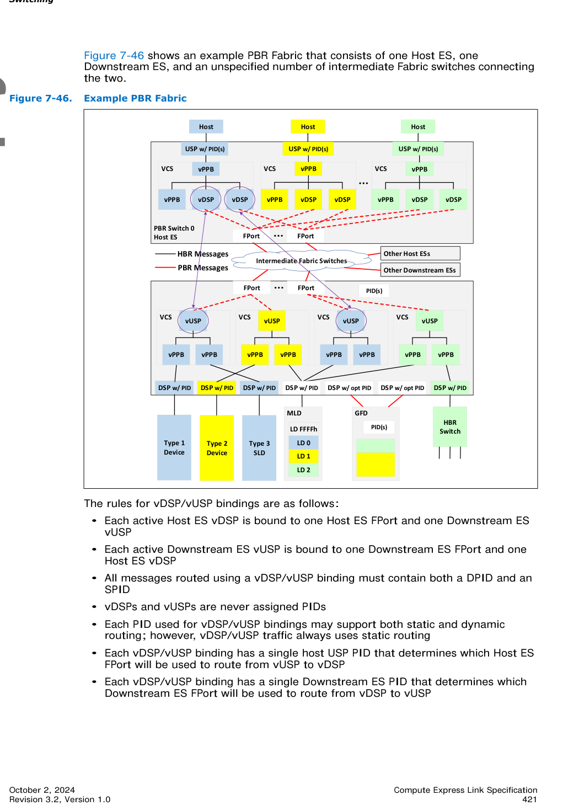
>
> *Original page render @ 150 DPI* — [📄 Full size](figures/chapter_07/page_0421.png)

<table>
<thead>
<tr>
<th width="50%">🇬🇧 English</th>
<th width="50%" style="background-color:#e8e8e8">🇨🇳 中文</th>
</tr>
</thead>
<tbody>
<tr><td>When a Host ES FPort transmits a vDSP/vUSP message downstream in a PBR flit, the message contains the DPID and SPID taken from the vDSP's binding. Assuming no errors, the message traverses any intermediate Fabric switches that are present and is received by an FPort that is bound to the Downstream ES vUSP. A vUSP there claims the message by matching both the DPID and SPID from its binding.</td><td style="background-color:#e8e8e8">当 Host ES FPort 在 PBR flit 中向下游发送 vDSP/vUSP 消息时,消息包含从 vDSP 绑定获取的 DPID 和 SPID。假设没有错误,消息遍历任何存在的中间 Fabric 交换机,并由绑定到 Downstream ES vUSP 的 FPort 接收。该处的 vUSP 通过匹配其绑定中的 DPID 和 SPID 来声明该消息。</td></tr>
<tr><td>Similarly, when a Downstream ES FPort transmits a vDSP/vUSP message upstream in a PBR flit, the message contains the DPID and SPID taken from the vUSP's binding. Assuming no errors, the message traverses any intermediate Fabric switches that are present and is received by an FPort that is bound to the Host ES vDSP. A vDSP there claims the message by matching both the DPID and SPID from its binding.</td><td style="background-color:#e8e8e8">类似地,当 Downstream ES FPort 在 PBR flit 中向上游发送 vDSP/vUSP 消息时,消息包含从 vUSP 绑定获取的 DPID 和 SPID。假设没有错误,消息遍历任何存在的中间 Fabric 交换机,并由绑定到 Host ES vDSP 的 FPort 接收。该处的 vDSP 通过匹配其绑定中的 DPID 和 SPID 来声明该消息。</td></tr>
</tbody>
</table>

### 7.7.6.5 PID Use Models and Assignments | 7.7.6.5 PID 使用模型和分配

<table>
<thead>
<tr>
<th width="50%">🇬🇧 English</th>
<th width="50%" style="background-color:#e8e8e8">🇨🇳 中文</th>
</tr>
</thead>
<tbody>
<tr><td>The example PBR Fabric illustrated in Figure 7-46 illustrates key aspects of how PIDs can be assigned and used. PIDs are either assigned by the FM or by static fabric initialization (see Section 7.7.12.1.1).</td><td style="background-color:#e8e8e8">图 7-46 中说明的 PBR Fabric 示例说明了 PID 如何分配和使用的关键方面。PID 由 FM 分配或由静态 Fabric 初始化分配 (参见 7.7.12.1.1 节)。</td></tr>
<tr><td>A Host ES USP often has one PID but may have multiple PIDs assigned to support multiple vDSP/vUSP bindings in the same Downstream ES. Each vDSP/vUSP binding may use a different Host ES FPort and/or Downstream ES FPort, providing traffic isolation for differentiated quality of service. If multiple vDSP bindings use the same PID for the Downstream ES, different PIDs for the USP can distinguish their bindings.</td><td style="background-color:#e8e8e8">Host ES USP 通常具有一个 PID,但可以分配多个 PID 以支持同一 Downstream ES 中的多个 vDSP/vUSP 绑定。每个 vDSP/vUSP 绑定可以使用不同的 Host ES FPort 和/或 Downstream ES FPort,从而为差异化服务质量提供流量隔离。如果多个 vDSP 绑定对 Downstream ES 使用相同的 PID,则 USP 的不同 PID 可以区分其绑定。</td></tr>
<tr><td>The Downstream ES FPorts may have one or more PIDs assigned, where each PID can be associated with a different set of FPorts. In an example scenario, there might be one PID for the left set of FPorts for multipathing and another PID for the right set. For a PID assigned to an FPort set for multipathing, DRTs in different USPs can specify different egress ports for static routing, distributing the static routing traffic for certain topologies without requiring additional DS_ES PIDs.</td><td style="background-color:#e8e8e8">Downstream ES FPort 可以分配一个或多个 PID,其中每个 PID 可以与不同的 FPort 集关联。在示例场景中,可以为左侧 FPort 集分配一个 PID 用于多路径,为右侧集分配另一个 PID。对于分配给多路径 FPort 集的 PID,不同 USP 中的 DRT 可以为静态路由指定不同的出口端口,从而在不需要额外 DS_ES PID 的情况下为某些拓扑分配静态路由流量。</td></tr>
<tr><td>A DSP may be assigned multiple PIDs, one PID, or no PIDs. A DSP above a non-GFD usually has one PID, but may be assigned multiple PIDs for isolating traffic from multiple senders or for associating a unique PID for each caching or HDM-DB-capable device attached to one or more HBR switches below an Edge Port. DSPs above a multi-ported GFD may not require dedicated assigned PIDs, relying instead on one or more PIDs assigned to the GFD itself.</td><td style="background-color:#e8e8e8">DSP 可被分配多个 PID、一个 PID 或不分配 PID。非 GFD 上方的 DSP 通常具有一个 PID,但可以为隔离来自多个发送方的流量或为连接到 Edge Port 下方一个或多个 HBR 交换机的每个 caching 或 HDM-DB-capable 设备关联唯一 PID 而分配多个 PID。多端口 GFD 上方的 DSP 可能不需要专用分配的 PID,而是依赖于分配给 GFD 本身的一个或多个 PID。</td></tr>
<tr><td>A GFD may have one or more PIDs assigned. A multi-ported GFD may have multiple PIDs assigned for differentiated quality of service, though a single PID may be sufficient for congestion avoidance.</td><td style="background-color:#e8e8e8">GFD 可分配一个或多个 PID。多端口 GFD 可以分配多个 PID 以实现差异化服务质量,但单个 PID 可能足以进行拥塞避免。</td></tr>
<tr><td>As mentioned in the previous section, each vDSP/vUSP binding has two PIDs assigned. For downstream vDSP/vUSP messages that use a given binding, the SPID is a PID associated with the host Edge USP, and the DPID is a PID associated with the Downstream ES FPort. Such messages are always transmitted by the same Host ES FPort and received by the same Downstream ES FPort. Then, the FPort uses various vUSP info decoding mechanisms to route the message to the appropriate Downstream ES vPPB using PBR mechanisms or HBR mechanisms, depending upon the message class. See CXL Switch Message Conversion (see Section 7.7.6.6). If there are any intermediate Fabric switches, such messages always take a single static path.</td><td style="background-color:#e8e8e8">如上一节所述,每个 vDSP/vUSP 绑定分配两个 PID。对于使用给定绑定的下游 vDSP/vUSP 消息,SPID 是与主机 Edge USP 关联的 PID,DPID 是与 Downstream ES FPort 关联的 PID。此类消息始终由同一 Host ES FPort 发送,由同一 Downstream ES FPort 接收。然后,FPort 使用各种 vUSP info 解码机制,通过 PBR 机制或 HBR 机制将消息路由到相应的 Downstream ES vPPB,这取决于消息类别。请参见 CXL Switch Message Conversion (参见 7.7.6.6 节)。如果存在任何中间 Fabric 交换机,此类消息始终采用单一静态路径。</td></tr>
<tr><td>Upstream vDSP/vUSP messages are handled in a similar manner, but only involve CXL.io message classes. On a given binding, the SPID is the PID associated with the Downstream ES FPort, and the DPID is the PID associated with the host Edge USP. Such messages are always transmitted by the same Downstream ES FPort and received by the same Host ES FPort. Then, the receiving FPort uses the associated vDSP context to identify the appropriate target using HBR mechanisms. If the target is an egress port, the message is routed there for transmission. If the target is another vDSP, that vDSP converts the PIDs to its bound PIDs and transmits it from its associated FPort, which may be the same FPort on which it arrived or on a different FPort. If there are any intermediate Fabric switches, such messages always take a single static path.</td><td style="background-color:#e8e8e8">上游 vDSP/vUSP 消息以类似方式处理,但仅涉及 CXL.io 消息类别。在给定绑定上,SPID 是与 Downstream ES FPort 关联的 PID,DPID 是与主机 Edge USP 关联的 PID。此类消息始终由同一 Downstream ES FPort 发送,由同一 Host ES FPort 接收。然后,接收 FPort 使用关联的 vDSP 上下文,通过 HBR 机制识别相应的目标。如果目标是出口端口,则消息被路由到该处进行传输。如果目标是另一个 vDSP,则该 vDSP 将 PID 转换为其绑定的 PID,并从其关联的 FPort 发送该消息,该 FPort 可以是消息到达的同一 FPort 或不同的 FPort。如果存在任何中间 Fabric 交换机,此类消息始终采用单一静态路径。</td></tr>
<tr><td>A PBR switch requires an assigned PID to send and receive management requests, responses, and notifications. Transactions that target this PID are processed by central logic or by FW within the switch.</td><td style="background-color:#e8e8e8">PBR 交换机需要分配的 PID 才能发送和接收管理请求、响应和通知。目标是此 PID 的事务由交换机内的中心逻辑或 FW 处理。</td></tr>
<tr><td>FMs connected to a PBR switch via an MCTP-based CCI also consume a PID. This PID is communicated to the PBR switch when the FM claims ownership of the device. The PID is used to direct transactions to the FM, such as Event Notifications generated by components owned by the FM.</td><td style="background-color:#e8e8e8">通过基于 MCTP 的 CCI 连接到 PBR 交换机的 FM 也消耗一个 PID。当 FM 声明设备所有权时,此 PID 将传达给 PBR 交换机。PID 用于将事务定向到 FM,例如由 FM 拥有的组件生成的事件通知。</td></tr>
<tr><td>PID FFFh is reserved and is used to indicate that a transaction should be processed locally. It allows FMs to target devices before they have had a valid PID assigned and when they have an assigned PID of which the FM is unaware.</td><td style="background-color:#e8e8e8">PID FFFh 被保留,用于指示事务应在本地处理。它允许 FM 在设备被分配有效 PID 之前以及在 FM 不知道其已分配 PID 的情况下定位设备。</td></tr>
</tbody>
</table>

### 7.7.6.6 CXL Switch Message Format Conversion | 7.7.6.6 CXL 交换机消息格式转换

<table>
<thead>
<tr>
<th width="50%">🇬🇧 English</th>
<th width="50%" style="background-color:#e8e8e8">🇨🇳 中文</th>
</tr>
</thead>
<tbody>
<tr><td>A PBR switch converts messages received from HBR hosts, devices, and switches to the PBR message format for routing across a PBR Fabric. In addition, messages received from the PBR fabric that target the HBR hosts, devices, and switches are converted to messages using the non-PID spaces (i.e., CacheID, BI-ID, and LD-ID). The following subsections provide the conversion flow for each message class.</td><td style="background-color:#e8e8e8">PBR 交换机将从 HBR 主机、设备和交换机接收的消息转换为 PBR 消息格式,以便跨 PBR Fabric 进行路由。此外,从 PBR Fabric 接收的、目标是 HBR 主机、设备和交换机的消息将转换为使用非 PID 空间 (即 CacheID、BI-ID 和 LD-ID) 的消息。以下小节提供每个消息类别的转换流。</td></tr>
<tr><td>The FM assigns PIDs to various PBR switch ports, as described in Section 7.7.6.5. The DPID value for request messages is determined by a variety of ways, including HDM Decoders, vPPB bindings, and lookup tables or CAMs using non-PID spaces. The DPID value for a response message is often the SPID value from the associated request message but is sometimes determined by one of the ways mentioned for request messages.</td><td style="background-color:#e8e8e8">FM 将 PID 分配给各种 PBR 交换机端口,如 7.7.6.5 节所述。请求消息的 DPID 值由多种方式确定,包括 HDM Decoder、vPPB 绑定以及使用非 PID 空间的查找表或 CAM。响应消息的 DPID 值通常是来自关联请求消息的 SPID 值,但有时由请求消息中提到的方式之一确定。</td></tr>
<tr><td>With HBR format messages, MLDs support a 4-bit LD-ID field in CXL.mem protocol for selection and routing of MLD messages, and CXL.cache includes a 4-bit CacheID field that is used to allow up to 16 Type 1 Devices or Type 2 Devices below an RP. PBR format messages use 12-bit PIDs to support large Fabrics. This section describes the support required in PBR switches for routing messages from non-fabric-aware hosts and devices that support the 4-bit LD-ID and 4-bit CacheID fields. It also covers BI-ID-based routing.</td><td style="background-color:#e8e8e8">对于 HBR 格式消息,MLD 在 CXL.mem 协议中支持 4-bit LD-ID 字段,用于 MLD 消息的选择和路由,CXL.cache 包括 4-bit CacheID 字段,用于允许 RP 下方最多 16 个 Type 1 设备或 Type 2 设备。PBR 格式消息使用 12-bit PID 以支持大型 Fabric。本节描述了 PBR 交换机中路由来自支持 4-bit LD-ID 和 4-bit CacheID 字段的 Fabric-unaware 主机和设备的消息所需的支持。它还涵盖基于 BI-ID 的路由。</td></tr>
<tr><td>Considering the wide range of supported PBR/HBR switch topologies, the variety of specific routing techniques for the many different cases of port connectivity is quite complex. Below is a general description for the HBR and PBR switch routing mechanisms that are used by key message classes, followed by port processing tables with more-specific details for both classes of switches.</td><td style="background-color:#e8e8e8">考虑到所支持的 PBR/HBR 交换机拓扑范围广泛,端口连接的许多不同情况的具体路由技术种类繁多。以下是关键消息类别使用的 HBR 和 PBR 交换机路由机制的一般描述,随后是更具体的端口处理表,详细说明了两类交换机。</td></tr>
</tbody>
</table>

#### 7.7.6.6.1 CXL.io, Including UIO | 7.7.6.6.1 CXL.io (包括 UIO)

<table>
<thead>
<tr>
<th width="50%">🇬🇧 English</th>
<th width="50%" style="background-color:#e8e8e8">🇨🇳 中文</th>
</tr>
</thead>
<tbody>
<tr><td>An HBR switch routes most CXL.io TLPs between its ports using standard mechanisms defined by PCIe Base Specification. A DSP above an MLD uses LD-ID Prefixes to identify which LD a downstream TLP is targeting or from which LD an upstream TLP came.</td><td style="background-color:#e8e8e8">HBR 交换机使用 PCIe Base Specification 定义的标准机制在其端口之间路由大多数 CXL.io TLP。MLD 上方的 DSP 使用 LD-ID Prefix 来识别下游 TLP 目标的 LD 或上游 TLP 来自的 LD。</td></tr>
<tr><td>UIO Requests that directly target HDM ranges can use enhanced UIO-capable HDM Decoders for their routing. This includes UIO Requests from the host that target devices with HDM, as well as "Direct P2P" cases where UIO Requests from one device target other devices with HDM. UIO Direct P2P to HDM traffic goes upstream, P2P, and downstream along different portions of its path.</td><td style="background-color:#e8e8e8">直接以 HDM 范围为目标的 UIO Request 可以使用增强的 UIO-capable HDM Decoder 进行路由。这包括以具有 HDM 的设备为目标的主机 UIO Request,以及 UIO Request 从一个设备以其他具有 HDM 的设备为目标的 "Direct P2P" 情况。UIO Direct P2P to HDM 流量在其路径的上游、P2P 和下游不同部分中流动。</td></tr>
<tr><td>A PBR switch converts PCIe-format TLPs or CXL.io HBR-format TLPs to PBR-format TLPs by pre-pending to each TLP a 4B CXL PBR TLP Header (PTH), which includes an SPID and DPID. Conversion from PBR format to HBR format or PCIe format consists of stripping the CXL PTH from the TLP.</td><td style="background-color:#e8e8e8">PBR 交换机通过向每个 TLP 前置 4B CXL PBR TLP Header (PTH) (包括 SPID 和 DPID) 将 PCIe 格式 TLP 或 CXL.io HBR 格式 TLP 转换为 PBR 格式 TLP。从 PBR 格式转换为 HBR 格式或 PCIe 格式包括从 TLP 中剥离 CXL PTH。</td></tr>
</tbody>
</table>

#### 7.7.6.6.2 CXL.cache | 7.7.6.6.2 CXL.cache

<table>
<thead>
<tr>
<th width="50%">🇬🇧 English</th>
<th width="50%" style="background-color:#e8e8e8">🇨🇳 中文</th>
</tr>
</thead>
<tbody>
<tr><td>A number of CXL.cache messages in 256B HBR format have a 4-bit CacheID field that enables up to 16 caching devices below a single RP. CXL.cache messages in 68B HBR format do not support this feature, and thus never carry a CacheID field. CXL.cache messages in PBR format do support this feature, but convey the necessary information via PIDs instead of a CacheID field. Table 7-86 summarizes which message classes contain the CacheID field.</td><td style="background-color:#e8e8e8">256B HBR 格式中的多个 CXL.cache 消息具有 4-bit CacheID 字段,该字段支持单个 RP 下方最多 16 个 caching 设备。68B HBR 格式中的 CXL.cache 消息不支持此特性,因此永远不携带 CacheID 字段。PBR 格式中的 CXL.cache 消息支持此特性,但通过 PID 而不是 CacheID 字段传递必要的信息。表 7-86 汇总了哪些消息类别包含 CacheID 字段。</td></tr>
<tr><td>For HBR format messages that contain a CacheID field, in some cases an HBR or PBR DSP needs to know whether to propagate or assign the CacheID. This information is configured by host software and is contained in the CXL Cache ID Decoder Capability Structure (see Section 8.2.4.29).</td><td style="background-color:#e8e8e8">对于包含 CacheID 字段的 HBR 格式消息,在某些情况下,HBR 或 PBR DSP 需要知道是传播还是分配 CacheID。此信息由主机软件配置,并包含在 CXL Cache ID Decoder Capability Structure 中 (参见 8.2.4.29 节)。</td></tr>
<tr><td>Table 7-87 summarizes the HBR switch routing for CXL.cache message classes.</td><td style="background-color:#e8e8e8">表 7-87 汇总了 CXL.cache 消息类别的 HBR 交换机路由。</td></tr>
<tr><td>Table 7-88 summarizes the PBR switch routing for CXL.cache message classes.</td><td style="background-color:#e8e8e8">表 7-88 汇总了 CXL.cache 消息类别的 PBR 交换机路由。</td></tr>
<tr><td>Within a PBR fabric, all CXL.cache messages are routed edge-to-edge, and they never use vDSP/vUSP bindings.</td><td style="background-color:#e8e8e8">在 PBR Fabric 中,所有 CXL.cache 消息都按 Edge-to-Edge 路由,从不使用 vDSP/vUSP 绑定。</td></tr>
<tr><td>In contrast to most 256B HBR-format CXL.cache messages, PBR-format cache messages never contain a CacheID field, thus the equivalent information when needed must be conveyed via PIDs.</td><td style="background-color:#e8e8e8">与大多数 256B HBR 格式 CXL.cache 消息相比,PBR 格式 cache 消息从不包含 CacheID 字段,因此在需要时,等效信息必须通过 PID 传递。</td></tr>
</tbody>
</table>

<table>
<thead>
<tr>
<th width="50%">🇬🇧 English</th>
<th width="50%" style="background-color:#e8e8e8">🇨🇳 中文</th>
</tr>
</thead>
<tbody>
<tr>
<td>

**Table 7-86. Summary of CacheID Field**

| Msg Class | 68B HBR | 256B HBR | 256B PBR |
|---|---|---|---|
| D2H Req | No | Yes | No |
| H2D Rsp | No | Yes | No |
| H2D DH | No | Yes | No |
| H2D Req | No | Yes | No |
| D2H Rsp | No | No | No |
| D2H DH | No | No | No |

</td>
<td style="background-color:#e8e8e8">

**表 7-86. CacheID 字段汇总**

| 消息类别 | 68B HBR | 256B HBR | 256B PBR |
|---|---|---|---|
| D2H Req | 否 | 是 | 否 |
| H2D Rsp | 否 | 是 | 否 |
| H2D DH | 否 | 是 | 否 |
| H2D Req | 否 | 是 | 否 |
| D2H Rsp | 否 | 否 | 否 |
| D2H DH | 否 | 否 | 否 |

</td>
</tr>
</tbody>
</table>

<table>
<thead>
<tr>
<th width="50%">🇬🇧 English</th>
<th width="50%" style="background-color:#e8e8e8">🇨🇳 中文</th>
</tr>
</thead>
<tbody>
<tr>
<td>

**Table 7-87. Summary of HBR Switch Routing for CXL.cache Message Classes**

| Message Class | Switch Routing |
|---|---|
| D2H Request | For HBR switch routing of D2H requests upstream to the bound host, the D2H request to the USP relies on the DSP's vPPB binding at each switch level. CacheID is added to the message by the DSP above the device to enable routing of the H2D response. |
| H2D Response or Data Header | For HBR switch routing of H2D responses or data headers downstream to the DSP, the USP at each switch level looks up the PCIe-defined PortID from the Cache ID Route Table. |
| H2D Request | For HBR switch routing of H2D requests downstream to the DSP, the USP at each switch level looks up the PCIe-defined PortID from the Cache ID Route Table. |
| D2H Response or Data Header | For HBR switch routing of D2H responses or data headers upstream to the bound host, the D2H response or data header to the USP relies upon the DSP's vPPB binding at each switch level. |

</td>
<td style="background-color:#e8e8e8">

**表 7-87. CXL.cache 消息类别的 HBR 交换机路由汇总**

| 消息类别 | 交换机路由 |
|---|---|
| D2H Request | 对于 D2H 请求向上游路由到绑定主机的 HBR 交换机路由,到 USP 的 D2H 请求依赖于每个交换机级别的 DSP 的 vPPB 绑定。设备上方的 DSP 将 CacheID 添加到消息中,以启用 H2D 响应的路由。 |
| H2D Response or Data Header | 对于 H2D 响应或数据头向下游路由到 DSP 的 HBR 交换机路由,每个交换机级别的 USP 从 Cache ID Route Table 查找 PCIe 定义的 PortID。 |
| H2D Request | 对于 H2D 请求向下游路由到 DSP 的 HBR 交换机路由,每个交换机级别的 USP 从 Cache ID Route Table 查找 PCIe 定义的 PortID。 |
| D2H Response or Data Header | 对于 D2H 响应或数据头向上游路由到绑定主机的 HBR 交换机路由,到 USP 的 D2H 响应或数据头依赖于每个交换机级别的 DSP 的 vPPB 绑定。 |

</td>
</tr>
</tbody>
</table>

<table>
<thead>
<tr>
<th width="50%">🇬🇧 English</th>
<th width="50%" style="background-color:#e8e8e8">🇨🇳 中文</th>
</tr>
</thead>
<tbody>
<tr>
<td>

**Table 7-88. Summary of PBR Switch Routing for CXL.cache Message Classes**

| Message Class | Switch Routing |
|---|---|
| D2H Request | For PBR switch routing of these messages upstream to the host, Edge DSPs get the Host USP DPID from their vPPB. Those above an SLD get their SPID from their vPPB. Those above an HBR USP look up the SPID from the Cache ID Route Table using the CacheID contained in the HBR-format message. For converting to HBR format at the Edge USP, the USP derives the CacheID from a 16-entry CAM using the SPID. |
| H2D Response or Data Header | For PBR switch routing of these messages downstream to the Edge DSP, the Edge USP looks up the DPID from the Cache ID Route Table using the CacheID in the HBR-format message. For converting to HBR format at the Edge DSP, above an SLD the CacheID is unused, and above an HBR USP the Cache ID is derived from a 16-entry CAM match using the DPID. |
| H2D Request | For PBR switch routing of these messages downstream to the Edge DSP, the Edge USP looks up the DPID from the CacheID Route Table using the CacheID. The USP gets the SPID from its vPPB. For converting to HBR format at the Edge DSP, above an SLD the CacheID is unused, and above an HBR USP the Cache ID is derived from a 16-entry CAM match using the DPID. |
| D2H Response or Data Header | For PBR switch routing of these messages upstream to the host, Edge DSPs get the DPID from their vPPB. For converting to HBR format at the Edge USP, the CacheID field is not present in the message. |

</td>
<td style="background-color:#e8e8e8">

**表 7-88. CXL.cache 消息类别的 PBR 交换机路由汇总**

| 消息类别 | 交换机路由 |
|---|---|
| D2H Request | 对于这些消息向上游路由到主机的 PBR 交换机路由,Edge DSP 从其 vPPB 获取主机 USP DPID。SLD 上方的 Edge DSP 从其 vPPB 获取 SPID。HBR USP 上方的 Edge DSP 使用 HBR 格式消息中包含的 CacheID 从 Cache ID Route Table 查找 SPID。对于在 Edge USP 转换为 HBR 格式,USP 使用 SPID 从 16-entry CAM 派生 CacheID。 |
| H2D Response or Data Header | 对于这些消息向下游路由到 Edge DSP 的 PBR 交换机路由,Edge USP 使用 HBR 格式消息中的 CacheID 从 Cache ID Route Table 查找 DPID。对于在 Edge DSP 转换为 HBR 格式,SLD 上方的 CacheID 未使用,HBR USP 上方的 Cache ID 通过使用 DPID 的 16-entry CAM 匹配派生。 |
| H2D Request | 对于这些消息向下游路由到 Edge DSP 的 PBR 交换机路由,Edge USP 使用 CacheID 从 CacheID Route Table 查找 DPID。USP 从其 vPPB 获取 SPID。对于在 Edge DSP 转换为 HBR 格式,SLD 上方的 CacheID 未使用,HBR USP 上方的 Cache ID 通过使用 DPID 的 16-entry CAM 匹配派生。 |
| D2H Response or Data Header | 对于这些消息向上游路由到主机的 PBR 交换机路由,Edge DSP 从其 vPPB 获取 DPID。对于在 Edge USP 转换为 HBR 格式,消息中不存在 CacheID 字段。 |

</td>
</tr>
</tbody>
</table>

#### 7.7.6.6.3 CXL.mem | 7.7.6.6.3 CXL.mem

<table>
<thead>
<tr>
<th width="50%">🇬🇧 English</th>
<th width="50%" style="background-color:#e8e8e8">🇨🇳 中文</th>
</tr>
</thead>
<tbody>
<tr><td>Several CXL.mem message classes in HBR format have a 4-bit LD-ID field that is used by Type 3 MLDs for determining the targeted LD. This feature is supported by both 68B and 256B HBR formats. PBR format conveys the necessary information via PIDs instead of an LD-ID field. Table 7-89 summarizes which message classes contain the LD-ID field.</td><td style="background-color:#e8e8e8">HBR 格式中的多个 CXL.mem 消息类别具有 4-bit LD-ID 字段,该字段由 Type 3 MLD 用于确定目标 LD。68B 和 256B HBR 格式都支持此特性。PBR 格式通过 PID 而不是 LD-ID 字段传递必要的信息。表 7-89 汇总了哪些消息类别包含 LD-ID 字段。</td></tr>
<tr><td>CXL.mem BISnp/BIRsp messages support the Back-Invalidate feature in 256B HBR format via a 12-bit BI-ID field, which determines the routing for BIRsp. This feature and its associated field are not supported in 68B HBR format. PBR format supports this feature and conveys the necessary information via 12-bit PIDs. Table 7-90 summarizes which message classes contain the BI-ID field.</td><td style="background-color:#e8e8e8">CXL.mem BISnp/BIRsp 消息在 256B HBR 格式中通过 12-bit BI-ID 字段支持 Back-Invalidate 特性,该特性决定 BIRsp 的路由。68B HBR 格式不支持此特性及其关联字段。PBR 格式支持此特性并通过 12-bit PID 传递必要的信息。表 7-90 汇总了哪些消息类别包含 BI-ID 字段。</td></tr>
</tbody>
</table>

<table>
<thead>
<tr>
<th width="50%">🇬🇧 English</th>
<th width="50%" style="background-color:#e8e8e8">🇨🇳 中文</th>
</tr>
</thead>
<tbody>
<tr>
<td>

**Table 7-89. Summary of LD-ID Field**

| Msg Class | 68B HBR | 256B HBR | 256B PBR |
|---|---|---|---|
| M2S Req | Yes | Yes | No |
| M2S RwD | Yes | Yes | No |
| S2M NDR | Yes | Yes | No |
| S2M DRS | Yes | Yes | No |
| S2M BISnp | N/A | In BI-ID | No |
| M2S BIRsp | N/A | In BI-ID | No |

</td>
<td style="background-color:#e8e8e8">

**表 7-89. LD-ID 字段汇总**

| 消息类别 | 68B HBR | 256B HBR | 256B PBR |
|---|---|---|---|
| M2S Req | 是 | 是 | 否 |
| M2S RwD | 是 | 是 | 否 |
| S2M NDR | 是 | 是 | 否 |
| S2M DRS | 是 | 是 | 否 |
| S2M BISnp | 不适用 | 在 BI-ID 中 | 否 |
| M2S BIRsp | 不适用 | 在 BI-ID 中 | 否 |

</td>
</tr>
</tbody>
</table>

<table>
<thead>
<tr>
<th width="50%">🇬🇧 English</th>
<th width="50%" style="background-color:#e8e8e8">🇨🇳 中文</th>
</tr>
</thead>
<tbody>
<tr>
<td>

**Table 7-90. Summary of BI-ID Field**

| Msg Class | 68B HBR | 256B HBR | 256B PBR |
|---|---|---|---|
| S2M BISnp | N/A | Yes | No |
| M2S BIRsp | N/A | Yes | No |

</td>
<td style="background-color:#e8e8e8">

**表 7-90. BI-ID 字段汇总**

| 消息类别 | 68B HBR | 256B HBR | 256B PBR |
|---|---|---|---|
| S2M BISnp | 不适用 | 是 | 否 |
| M2S BIRsp | 不适用 | 是 | 否 |

</td>
</tr>
</tbody>
</table>

<table>
<thead>
<tr>
<th width="50%">🇬🇧 English</th>
<th width="50%" style="background-color:#e8e8e8">🇨🇳 中文</th>
</tr>
</thead>
<tbody>
<tr><td>In 256B HBR format over an MLD link, the 12-bit BI-ID field in BISnp/BIRsp carries the 4-bit LD-ID value, and the remaining 8 bits are all 0s. In 256B HBR format over non-MLD links, the 12-bit BI-ID field carries the 8-bit Bus Number of the HDM-DB device, and the remaining 4 bits are all 0s.</td><td style="background-color:#e8e8e8">在 MLD 链路上使用 256B HBR 格式时,BISnp/BIRsp 中的 12-bit BI-ID 字段承载 4-bit LD-ID 值,其余 8 位全为 0。在非 MLD 链路上使用 256B HBR 格式时,12-bit BI-ID 字段承载 HDM-DB 设备的 8-bit Bus Number,其余 4 位全为 0。</td></tr>
<tr><td>For messages that contain a BI-ID field, in some cases an HBR or PBR DSP needs to know whether to propagate or assign the BI-ID. This information is configured by host software and is contained in the CXL BI Decoder Capability Structure (see Section 8.2.4.27).</td><td style="background-color:#e8e8e8">对于包含 BI-ID 字段的消息,在某些情况下,HBR 或 PBR DSP 需要知道是传播还是分配 BI-ID。此信息由主机软件配置,并包含在 CXL BI Decoder Capability Structure 中 (参见 8.2.4.27 节)。</td></tr>
<tr><td>The Direct P2P CXL.mem for Accelerators use case, supported only by PBR fabrics, is not covered in this section; see Section 7.7.10.</td><td style="background-color:#e8e8e8">Direct P2P CXL.mem for Accelerators 用例 (仅由 PBR Fabric 支持) 不在本节中介绍;请参见 7.7.10 节。</td></tr>
<tr><td>Table 7-91 summarizes the HBR switch routing for CXL.mem message classes.</td><td style="background-color:#e8e8e8">表 7-91 汇总了 CXL.mem 消息类别的 HBR 交换机路由。</td></tr>
<tr><td>Table 7-92 summarizes the PBR switch routing for CXL.mem message classes.</td><td style="background-color:#e8e8e8">表 7-92 汇总了 CXL.mem 消息类别的 PBR 交换机路由。</td></tr>
<tr><td>In an HBR switch, when filling in a subset of the bits in the BI-ID field with a value, the remaining bits in the BI-ID field shall be cleared to 0.</td><td style="background-color:#e8e8e8">在 HBR 交换机中,当使用值填充 BI-ID 字段中的位子集时,BI-ID 字段中的剩余位应清除为 0。</td></tr>
<tr><td>Within a PBR fabric, most CXL.mem message classes are routed edge-to-edge and do not use vDSP/vUSP bindings. The exceptions are M2S Req/RwD message classes with LD-FAM when host software has configured HDM Decoders in the Host ES USP to route them, in which case vDSP/vUSP bindings are used. See details regarding PBR Message Routing across the Fabric in Section 7.7.6.2.</td><td style="background-color:#e8e8e8">在 PBR Fabric 中,大多数 CXL.mem 消息类别按 Edge-to-Edge 路由,不使用 vDSP/vUSP 绑定。例外情况是当主机软件在 Host ES USP 中配置了 HDM Decoder 来路由 M2S Req/RwD 消息类别 (使用 LD-FAM) 时,这种情况下使用 vDSP/vUSP 绑定。有关跨 Fabric 的 PBR 消息路由的详细信息,请参见 7.7.6.2 节。</td></tr>
<tr><td>When HDM-DB devices are attached to an HBR switch below a PBR fabric, the FM must allocate and assign a unique PID for each HDM-DB device. This enables PBR switches to convert between an HDM-DB device's unique PID and Bus Number when needed.</td><td style="background-color:#e8e8e8">当 HDM-DB 设备连接到 PBR Fabric 下方的 HBR 交换机时,FM 必须为每个 HDM-DB 设备分配和分配唯一的 PID。这使得 PBR 交换机能够在 HDM-DB 设备的唯一 PID 和 Bus Number 之间进行转换。</td></tr>
</tbody>
</table>

<table>
<thead>
<tr>
<th width="50%">🇬🇧 English</th>
<th width="50%" style="background-color:#e8e8e8">🇨🇳 中文</th>
</tr>
</thead>
<tbody>
<tr>
<td>

**Table 7-91. Summary of HBR Switch Routing for CXL.mem Message Classes**

| Message Class | Switch Routing |
|---|---|
| M2S Request | For HBR switch routing of M2S requests downstream toward the device, the HDM Decoder at the USP determines the PCIe-defined PortID of the DSP at each switch level. For a DSP above an MLD, there is a vPPB for each LD, which provides the LD-ID to insert in the request message. |
| S2M Response | For HBR switch routing of S2M responses upstream to the USP, the DSP relies on its vPPB binding at each switch level. For a DSP immediately above an MLD, there is a vPPB for each LD, and the LD-ID in the response message identifies the associated vPPB. |
| S2M BISnp | For HBR switch routing of S2M BISnp requests upstream to the USP, the DSP relies on its vPPB binding at each switch level. For a DSP immediately above an MLD, there is a vPPB for each LD, and the BI-ID in the response message carries an LD-ID that identifies the associated vPPB. The DSP then looks up the BusNum associated with its vPPB, places the BusNum in the BI-ID for later use in routing the associated BIRsp back to the DSP. |
| M2S BIRsp | For HBR switch routing of M2S BIRsp messages downstream to the DSP immediately above the device, the USP at each switch level relies on the BI-ID that carries the BusNum of the target DSP. The HBR switch then uses BusNum routing. |

</td>
<td style="background-color:#e8e8e8">

**表 7-91. CXL.mem 消息类别的 HBR 交换机路由汇总**

| 消息类别 | 交换机路由 |
|---|---|
| M2S Request | 对于 M2S 请求向下游路由到设备的 HBR 交换机路由,USP 处的 HDM Decoder 确定每个交换机级别的 DSP 的 PCIe 定义的 PortID。对于 MLD 上方的 DSP,每个 LD 都有一个 vPPB,它提供要插入到请求消息中的 LD-ID。 |
| S2M Response | 对于 S2M 响应向上游路由到 USP 的 HBR 交换机路由,DSP 依赖于每个交换机级别的 vPPB 绑定。对于紧邻 MLD 上方的 DSP,每个 LD 都有一个 vPPB,响应消息中的 LD-ID 标识关联的 vPPB。 |
| S2M BISnp | 对于 S2M BISnp 请求向上游路由到 USP 的 HBR 交换机路由,DSP 依赖于每个交换机级别的 vPPB 绑定。对于紧邻 MLD 上方的 DSP,每个 LD 都有一个 vPPB,响应消息中的 BI-ID 承载标识关联 vPPB 的 LD-ID。然后,DSP 查找与其 vPPB 关联的 BusNum,将 BusNum 放入 BI-ID 中,以便稍后用于将关联的 BIRsp 路由回 DSP。 |
| M2S BIRsp | 对于 M2S BIRsp 消息向下游路由到紧邻设备上方的 DSP 的 HBR 交换机路由,每个交换机级别的 USP 依赖于承载目标 DSP 的 BusNum 的 BI-ID。然后 HBR 交换机使用 BusNum 路由。 |

</td>
</tr>
</tbody>
</table>

<table>
<thead>
<tr>
<th width="50%">🇬🇧 English</th>
<th width="50%" style="background-color:#e8e8e8">🇨🇳 中文</th>
</tr>
</thead>
<tbody>
<tr>
<td>

**Table 7-92. Summary of PBR Switch Routing for CXL.mem Message Classes**

| Message Class | Switch Routing |
|---|---|
| M2S Request | FAST/LDST Decoder Case: For Host ES routing of M2S requests downstream to the Edge DSP, the FAST/LDST decoder at the USP determines the DPID for routing the message edge-to-edge. HDM Decoder Case: For hierarchical routing of M2S requests downstream toward the Edge DSP, the HDM Decoder at the USP of each ES determines the egress vPPB (EvPPB), which contains an appropriate DPID. A vDSP in the Host ES contains the DPID/SPID that is used for targeting its partner Downstream ES vUSP. A DSP vPPB contains its dedicated DPID. Both host and Downstream ESs use PBR routing locally because a DSP above an MLD relies on the request having a valid SPID. For a DSP immediately above an MLD, a 16-entry CAM match using the SPID returns the associated LD-ID, which determines the LD-specific vPPB to use and is also inserted in the request message. For a DSP above a GFD, the message remains in PBR format. |
| S2M Response | For Edge DSP routing of S2M responses upstream to the Edge USP, the Edge DSP's vPPB contains the DPID for routing the message edge-to-edge. For a DSP immediately above an MLD, there is a vPPB for each LD, and the LD-ID in the response message identifies the associated vPPB. For a DSP above a GFD, the message is already in PBR format and remains so. |
| S2M BISnp | For Edge DSP routing of S2M BISnp messages upstream to the Edge USP, the Edge DSP's vPPB contains the DPID for routing the message edge-to-edge. For an Edge DSP immediately above an MLD, there is a vPPB for each LD, and the BI-ID in the BISnp carries an LD-ID that identifies the associated vPPB. The Edge DSP uses its vPPB's PID for the SPID. For an Edge DSP above an HBR USP, the BI-ID contains the BusNum associated with the HDM-DB device. The Edge DSP uses the BusNum to look up the associated SPID from a 256-entry table. At the Edge USP, the USP converts the BISnp to HBR format, copying the SPID value into the BI-ID. |
| M2S BIRsp | For Edge USP routing of M2S BIRsp messages downstream to the Edge DSP above the HDM-DB device, the Edge USP converts the BIRsp to PBR format, using the BI-ID value as the DPID, and then routes the BIRsp edge-to-edge. For an Edge DSP immediately above an MLD, a 16-entry CAM match using the SPID returns the associated LD-ID, which determines the LD-specific vPPB to use and is also inserted in the BI-ID field of the BIRsp. For an Edge DSP above an HBR switch USP, the DSP converts the BIRsp to HBR format, looking up the target BusNum in a 4k-entry table using the DPID, then copying it to the BI-ID. For a DSP above a GFD, the message remains in PBR format. |

</td>
<td style="background-color:#e8e8e8">

**表 7-92. CXL.mem 消息类别的 PBR 交换机路由汇总**

| 消息类别 | 交换机路由 |
|---|---|
| M2S Request | FAST/LDST Decoder 情况:对于 M2S 请求向下游路由到 Edge DSP 的 Host ES 路由,USP 处的 FAST/LDST decoder 确定用于按 Edge-to-Edge 路由消息的 DPID。HDM Decoder 情况:对于 M2S 请求向下游路由到 Edge DSP 的分层路由,每个 ES 的 USP 处的 HDM Decoder 确定出口 vPPB (EvPPB),其中包含适当的 DPID。Host ES 中的 vDSP 包含用于定位其伙伴 Downstream ES vUSP 的 DPID/SPID。DSP vPPB 包含其专用 DPID。主机和 Downstream ES 在本地使用 PBR 路由,因为 MLD 上方的 DSP 依赖于具有有效 SPID 的请求。对于紧邻 MLD 上方的 DSP,使用 SPID 的 16-entry CAM 匹配返回关联的 LD-ID,该 LD-ID 确定要使用的 LD 特定 vPPB,并也插入到请求消息中。对于 GFD 上方的 DSP,消息保持 PBR 格式。 |
| S2M Response | 对于 S2M 响应向上游路由到 Edge USP 的 Edge DSP 路由,Edge DSP 的 vPPB 包含用于按 Edge-to-Edge 路由消息的 DPID。对于紧邻 MLD 上方的 DSP,每个 LD 都有一个 vPPB,响应消息中的 LD-ID 标识关联的 vPPB。对于 GFD 上方的 DSP,消息已经是 PBR 格式并保持不变。 |
| S2M BISnp | 对于 S2M BISnp 消息向上游路由到 Edge USP 的 Edge DSP 路由,Edge DSP 的 vPPB 包含用于按 Edge-to-Edge 路由消息的 DPID。对于紧邻 MLD 上方的 Edge DSP,每个 LD 都有一个 vPPB,BISnp 中的 BI-ID 承载标识关联 vPPB 的 LD-ID。Edge DSP 使用其 vPPB 的 PID 作为 SPID。对于 HBR USP 上方的 Edge DSP,BI-ID 包含与 HDM-DB 设备关联的 BusNum。Edge DSP 使用 BusNum 从 256-entry 表查找关联的 SPID。在 Edge USP,USP 将 BISnp 转换为 HBR 格式,将 SPID 值复制到 BI-ID 中。 |
| M2S BIRsp | 对于 M2S BIRsp 消息向下游路由到 HDM-DB 设备上方 Edge DSP 的 Edge USP 路由,Edge USP 将 BIRsp 转换为 PBR 格式,使用 BI-ID 值作为 DPID,然后按 Edge-to-Edge 路由 BIRsp。对于紧邻 MLD 上方的 Edge DSP,使用 SPID 的 16-entry CAM 匹配返回关联的 LD-ID,该 LD-ID 确定要使用的 LD 特定 vPPB,并也插入到 BIRsp 的 BI-ID 字段中。对于 HBR 交换机 USP 上方的 Edge DSP,DSP 将 BIRsp 转换为 HBR 格式,使用 DPID 在 4k-entry 表中查找目标 BusNum,然后将其复制到 BI-ID。对于 GFD 上方的 DSP,消息保持 PBR 格式。 |

</td>
</tr>
</tbody>
</table>

<table>
<thead>
<tr>
<th width="50%">🇬🇧 English</th>
<th width="50%" style="background-color:#e8e8e8">🇨🇳 中文</th>
</tr>
</thead>
<tbody>
<tr><td>At an Edge DSP, when converting a downstream CXL.mem message from PBR to HBR format, if an LD-ID or BI-ID field is unused, its value shall be cleared to 0. Also, when filling in a subset of the bits in the BI-ID field with a value, the remaining bits in the BI-ID field shall be cleared to 0.</td><td style="background-color:#e8e8e8">在 Edge DSP,将下游 CXL.mem 消息从 PBR 格式转换为 HBR 格式时,如果 LD-ID 或 BI-ID 字段未使用,其值应清除为 0。此外,当使用值填充 BI-ID 字段中的位子集时,BI-ID 字段中的剩余位应清除为 0。</td></tr>
</tbody>
</table>

[⬆️ 返回目录](#-本章目录-part-b)

---

### 7.7.6.7 HBR Switch Port Processing of CXL Messages | 7.7.6.7 HBR 交换机端口的 CXL 消息处理

<table>
<thead>
<tr>
<th width="50%">🇬🇧 English</th>
<th width="50%" style="background-color:#e8e8e8">🇨🇳 中文</th>
</tr>
</thead>
<tbody>
<tr><td>Table 7-93, Table 7-94, and Table 7-95 summarize how HBR switches perform port processing of CXL.io, CXL.cache, and CXL.mem messages, respectively. A USP is below either an RP, a PBR DSP, or an HBR DSP. A USP can be in only one Virtual Hierarchy. A DSP is above either an HBR switch USP, an SLD, or an MLD.</td><td style="background-color:#e8e8e8">表 7-93、表 7-94 和表 7-95 分别汇总了 HBR 交换机如何执行 CXL.io、CXL.cache 和 CXL.mem 消息的端口处理。USP 位于 RP、PBR DSP 或 HBR DSP 之下。USP 只能属于一个 Virtual Hierarchy。DSP 位于 HBR 交换机 USP、SLD 或 MLD 之上。</td></tr>
<tr><td>For conciseness, there are many abbreviations within the tables. US stands for upstream. DS stands for downstream. P2P stands for peer-to-peer. DMA stands for direct memory access. Direct P2P stands for UIO Direct P2P to HDM. BusNum stands for Bus Number. "⇐" stands for assignment (e.g., "LD-ID Prefix ⇐ vPPB context" means "the LD-ID prefix is assigned a value from the associated vPPB context"). Text beginning with "PCIe" (also shown in gold) means that the routing is defined in PCIe Base Specification.</td><td style="background-color:#e8e8e8">为简洁起见,表中包含许多缩写。US 表示上游。DS 表示下游。P2P 表示对等。DMA 表示直接内存访问。Direct P2P 表示 UIO Direct P2P to HDM。BusNum 表示 Bus Number。"⇐" 表示赋值 (例如,"LD-ID Prefix ⇐ vPPB context" 意思是 "LD-ID 前缀被赋值为来自关联 vPPB 上下文的值")。以 "PCIe" 开头的文本 (也以金色显示) 表示路由在 PCIe Base Specification 中定义。</td></tr>
</tbody>
</table>

<table>
<thead>
<tr>
<th width="50%">🇬🇧 English</th>
<th width="50%" style="background-color:#e8e8e8">🇨🇳 中文</th>
</tr>
</thead>
<tbody>
<tr>
<td>

**Table 7-93. HBR Switch Port Processing Table for CXL.io**

| Message Class and Direction | HBR USP below RP or PBR/HBR DSP | HBR DSP Above HBR USP | HBR DSP Above SLD | HBR DSP Above MLD |
|---|---|---|---|---|
| Cfg Req DS | PCIe ID routing | PCIe ID routing | PCIe ID routing | LD-ID Prefix ⇐ vPPB context |
| Mem Req DS/US/P2P (Incl UIO DMA, Excl HDM UIO) | PCIe Mem addr routing | PCIe Mem addr routing | PCIe Mem addr routing | US: LD-ID Prefix identifies vPPB; DS: LD-ID Prefix ⇐ vPPB context |
| HDM UIO Req (Direct P2P and Host Requester) | US: PCIe Mem addr routing; DS: HDM Decoder routing | US: PCIe Mem addr routing; DS/Direct P2P: USP HDM Decoder | US: PCIe Mem addr routing; DS/Direct P2P: USP HDM Decoder | US: LD-ID Prefix identifies vPPB; DS: LD-ID Prefix ⇐ vPPB context |
| Cpl US | PCIe ID routing | PCIe ID routing | LD-ID Prefix identifies vPPB | PCIe ID routing |
| Cpl DS | PCIe ID routing | PCIe ID routing | PCIe ID routing | LD-ID Prefix ⇐ vPPB context |

</td>
<td style="background-color:#e8e8e8">

**表 7-93. CXL.io 的 HBR 交换机端口处理表**

| 消息类别和方向 | HBR USP (RP 或 PBR/HBR DSP 之下) | HBR DSP (HBR USP 之上) | HBR DSP (SLD 之上) | HBR DSP (MLD 之上) |
|---|---|---|---|---|
| Cfg Req DS | PCIe ID 路由 | PCIe ID 路由 | PCIe ID 路由 | LD-ID Prefix ⇐ vPPB context |
| Mem Req DS/US/P2P (包括 UIO DMA,排除 HDM UIO) | PCIe Mem addr 路由 | PCIe Mem addr 路由 | PCIe Mem addr 路由 | US: LD-ID Prefix 标识 vPPB;DS: LD-ID Prefix ⇐ vPPB context |
| HDM UIO Req (Direct P2P 和 Host Requester) | US: PCIe Mem addr 路由;DS: HDM Decoder 路由 | US: PCIe Mem addr 路由;DS/Direct P2P: USP HDM Decoder | US: PCIe Mem addr 路由;DS/Direct P2P: USP HDM Decoder | US: LD-ID Prefix 标识 vPPB;DS: LD-ID Prefix ⇐ vPPB context |
| Cpl US | PCIe ID 路由 | PCIe ID 路由 | LD-ID Prefix 标识 vPPB | PCIe ID 路由 |
| Cpl DS | PCIe ID 路由 | PCIe ID 路由 | PCIe ID 路由 | LD-ID Prefix ⇐ vPPB context |

</td>
</tr>
</tbody>
</table>

<table>
<thead>
<tr>
<th width="50%">🇬🇧 English</th>
<th width="50%" style="background-color:#e8e8e8">🇨🇳 中文</th>
</tr>
</thead>
<tbody>
<tr>
<td>

**Table 7-94. HBR Switch Port Processing Table for CXL.cache**

| Message Class and Direction | HBR USP below RP or PBR/HBR DSP | HBR DSP Above HBR USP | HBR DSP Above SLD | HBR DSP Above MLD |
|---|---|---|---|---|
| D2H Req US | Propagate CacheID | Propagate CacheID | vPPB binding routing to USP; CacheID ⇐ Local Cache ID field | vPPB binding routing to USP |
| H2D Rsp/DH DS | Propagate CacheID | PortID ⇐ Cache ID Route Table; PortID routing to DSP (OS must handle multi-level HBR) | Propagate CacheID | Propagate Cache ID (SLD should ignore it) |
| H2D Req DS | (similar) | (similar) | (similar) | (similar) |
| D2H Rsp/DH US | — | — | vPPB binding routing to USP | — |

</td>
<td style="background-color:#e8e8e8">

**表 7-94. CXL.cache 的 HBR 交换机端口处理表**

| 消息类别和方向 | HBR USP (RP 或 PBR/HBR DSP 之下) | HBR DSP (HBR USP 之上) | HBR DSP (SLD 之上) | HBR DSP (MLD 之上) |
|---|---|---|---|---|
| D2H Req US | Propagate CacheID | Propagate CacheID | vPPB binding routing to USP;CacheID ⇐ Local Cache ID field | vPPB binding routing to USP |
| H2D Rsp/DH DS | Propagate CacheID | PortID ⇐ Cache ID Route Table;PortID routing to DSP (OS 必须处理多级 HBR) | Propagate CacheID | Propagate Cache ID (SLD 应忽略它) |
| H2D Req DS | (类似) | (类似) | (类似) | (类似) |
| D2H Rsp/DH US | — | — | vPPB binding routing to USP | — |

</td>
</tr>
</tbody>
</table>

<table>
<thead>
<tr>
<th width="50%">🇬🇧 English</th>
<th width="50%" style="background-color:#e8e8e8">🇨🇳 中文</th>
</tr>
</thead>
<tbody>
<tr>
<td>

**Table 7-95. HBR Switch Port Processing Table for CXL.mem**

| Message Class and Direction | HBR USP below RP or PBR/HBR DSP | HBR DSP Above HBR USP | HBR DSP Above SLD | HBR DSP Above MLD |
|---|---|---|---|---|
| M2S Req DS | PortID ⇐ HDM Decoder (HPA); Routing to DSP uses PortID | Propagate LD-ID (not used by these receivers) | LD-ID ⇐ vPPB context | (combined) |
| S2M Rsp US | Propagate LD-ID (not used by these receivers) | vPPB binding routing to USP | Propagate LD-ID (not used for internal switch routing); LD-ID identifies vPPB | vPPB binding routing to USP |
| S2M BISnp US | BI-ID[7:0] contains BusNum; Propagate BI-ID | Propagate BI-ID | vPPB binding routing to USP; Received BI-ID is ignored; BI-ID[7:0] ⇐ BusNum(vPPB) | vPPB binding routing to USP; BI-ID[3:0] contains LD-ID; LD-ID identifies vPPB; BI-ID[7:0] ⇐ BusNum(vPPB) |
| M2S BIRsp DS | Target BusNum ⇐ BI-ID[7:0]; PCIe BusNum routing to DSP | Propagate BI-ID | Propagate BI-ID (SLD should ignore it) | BI-ID[3:0] ⇐ LD-ID(vPPB) |

</td>
<td style="background-color:#e8e8e8">

**表 7-95. CXL.mem 的 HBR 交换机端口处理表**

| 消息类别和方向 | HBR USP (RP 或 PBR/HBR DSP 之下) | HBR DSP (HBR USP 之上) | HBR DSP (SLD 之上) | HBR DSP (MLD 之上) |
|---|---|---|---|---|
| M2S Req DS | PortID ⇐ HDM Decoder (HPA);Routing to DSP 使用 PortID | Propagate LD-ID (这些接收方不使用) | LD-ID ⇐ vPPB context | (合并) |
| S2M Rsp US | Propagate LD-ID (这些接收方不使用) | vPPB binding routing to USP | Propagate LD-ID (不用于内部交换机路由);LD-ID 标识 vPPB | vPPB binding routing to USP |
| S2M BISnp US | BI-ID[7:0] 包含 BusNum;Propagate BI-ID | Propagate BI-ID | vPPB binding routing to USP;Received BI-ID 被忽略;BI-ID[7:0] ⇐ BusNum(vPPB) | vPPB binding routing to USP;BI-ID[3:0] 包含 LD-ID;LD-ID 标识 vPPB;BI-ID[7:0] ⇐ BusNum(vPPB) |
| M2S BIRsp DS | Target BusNum ⇐ BI-ID[7:0];PCIe BusNum routing to DSP | Propagate BI-ID | Propagate BI-ID (SLD 应忽略它) | BI-ID[3:0] ⇐ LD-ID(vPPB) |

</td>
</tr>
</tbody>
</table>

### 7.7.6.8 PBR Switch Port Processing of CXL Messages | 7.7.6.8 PBR 交换机端口的 CXL 消息处理

<table>
<thead>
<tr>
<th width="50%">🇬🇧 English</th>
<th width="50%" style="background-color:#e8e8e8">🇨🇳 中文</th>
</tr>
</thead>
<tbody>
<tr><td>Table 7-96, Table 7-97, and Table 7-98 summarize how PBR switches perform port processing of CXL.io, CXL.cache, and CXL.mem messages, respectively. A PBR USP must be below an RP and can be in only one Virtual Hierarchy. A PBR DSP is above either an SLD, an MLD, a GFD, or an HBR switch USP. A PBR FPort can only be connected to another PBR FPort in a different PBR switch.</td><td style="background-color:#e8e8e8">表 7-96、表 7-97 和表 7-98 分别汇总了 PBR 交换机如何执行 CXL.io、CXL.cache 和 CXL.mem 消息的端口处理。PBR USP 必须位于 RP 之下,并且只能属于一个 Virtual Hierarchy。PBR DSP 位于 SLD、MLD、GFD 或 HBR 交换机 USP 之上。PBR FPort 只能连接到不同 PBR 交换机中的另一个 PBR FPort。</td></tr>
<tr><td>For conciseness, there are many abbreviations within the tables. US stands for upstream. DS stands for downstream. P2P stands for peer-to-peer. DMA stands for direct memory access. Direct P2P stands for UIO Direct P2P to HDM. EvPPB stands for Egress vPPB. BusNum stands for Bus Number. RT stands for the CacheID Route Table. "⇐" stands for assignment (e.g., "LD-ID Prefix ⇐ vPPB context" means "the LD-ID prefix is assigned a value from the associated vPPB context"). Also referring to a vPPB context, vPPB.root.PID stands for the PID of the associated Edge USP, and vPPB.self.PID stands for the PID of the vPPB itself. Eg2Eg means Edge-to-Edge. Text beginning with "PCIe" (also shown in gold) means that the routing is defined in PCIe Base Specification.</td><td style="background-color:#e8e8e8">为简洁起见,表中包含许多缩写。US 表示上游。DS 表示下游。P2P 表示对等。DMA 表示直接内存访问。Direct P2P 表示 UIO Direct P2P to HDM。EvPPB 表示 Egress vPPB。BusNum 表示 Bus Number。RT 表示 CacheID Route Table。"⇐" 表示赋值 (例如,"LD-ID Prefix ⇐ vPPB context" 意思是 "LD-ID 前缀被赋值为来自关联 vPPB 上下文的值")。同样参考 vPPB 上下文,vPPB.root.PID 表示关联 Edge USP 的 PID,vPPB.self.PID 表示 vPPB 本身的 PID。Eg2Eg 表示 Edge-to-Edge。以 "PCIe" 开头的文本 (也以金色显示) 表示路由在 PCIe Base Specification 中定义。</td></tr>
<tr><td>In the CXL.io table (see Table 7-96), not all TLP types are explicitly covered; however, those not listed are usually handled by standard PCIe routing mechanisms (e.g., PCIe Messages are not explicitly covered, but ID-routed Messages are handled by PCIe ID routing, and address-routed Messages are handled by PCIe Memory Address routing).</td><td style="background-color:#e8e8e8">在 CXL.io 表中 (见表 7-96),并非所有 TLP 类型都被明确涵盖;但是,未列出的通常由标准 PCIe 路由机制处理 (例如,PCIe Messages 未明确涵盖,但 ID 路由的 Messages 由 PCIe ID 路由处理,地址路由的 Messages 由 PCIe Memory Address 路由处理)。</td></tr>
<tr><td>In the CXL.mem table (see Table 7-98) the Direct P2P CXL.mem for Accelerators use case is not covered; see Section 7.7.10.3.</td><td style="background-color:#e8e8e8">在 CXL.mem 表中 (见表 7-98),Direct P2P CXL.mem for Accelerators 用例未涵盖;请参见 7.7.10.3 节。</td></tr>
</tbody>
</table>

<table>
<thead>
<tr>
<th width="50%">🇬🇧 English</th>
<th width="50%" style="background-color:#e8e8e8">🇨🇳 中文</th>
</tr>
</thead>
<tbody>
<tr>
<td>

**Table 7-96. PBR Switch Port Processing Table for CXL.io (Sheet 1 of 2)**

| Message Class and Direction | Edge USP (Always below an RP) | Host ES FPort with vDSP(s) | Downstream ES FPort with vUSP(s) | Edge DSP: Above HBR Switch USP | Edge DSP: Above SLD | Edge DSP: Above MLD | Edge DSP: Above GFD |
|---|---|---|---|---|---|---|---|
| Cfg Req DS | PCIe ID routing to DSP or vDSP | vDSP converts to PBR fmt; FPort xmits to vUSP's FPort | vUSP matches DPID/SPID; vUSP converts to HBR fmt; PCIe ID routing to DSP | PCIe ID routing | PCIe ID routing | LD-ID Prefix ⇐ vPPB LD-ID | N/A |
| Mem Req DS/US/P2P (Incl UIO DMA, Excl HDM UIO) | PCIe Mem addr routing | DS: vDSP converts to PBR fmt; FPort xmits to vUSP's FPort. US/P2P: vDSP matches DPID/SPID; vDSP converts to HBR fmt; PCIe Mem addr routing | DS: vUSP matches DPID/SPID; vUSP converts to HBR fmt; PCIe Mem addr routing. US: vUSP converts to PBR fmt; FPort xmits to vDSP's FPort | PCIe Mem addr routing | PCIe Mem addr routing | DS: LD-ID Prefix ⇐ vPPB.LD-ID. US/P2P: LD-ID Prefix identifies vPPB | N/A |
| Cpl US/P2P (Excl HDM UIO) | PCIe ID routing | vDSP matches DPID/SPID; vDSP converts to HBR fmt; PCIe ID routing | vUSP converts to PBR fmt; FPort xmits to vDSP's FPort | PCIe ID routing | LD-ID Prefix identifies vPPB | PCIe ID routing | N/A |
| Cpl DS (Excl HDM UIO) | PCIe ID routing to DSP or vDSP | vDSP converts to PBR fmt; FPort xmits to vUSP's FPort | vUSP matches DPID/SPID; vUSP converts to HBR fmt; PCIe ID routing to DSP | PCIe ID routing | PCIe ID routing | LD-ID Prefix ⇐ vPPB.LD-ID | N/A |
| HDM UIO Req (HDM Decoder case for Direct P2P and Host Requester) | Direct P2P: N/A. Host Requester (DS): HDM Decoder routes to DSP or vDSP | DS: vDSP converts to PBR fmt; FPort xmits to vUSP's FPort. US/P2P: vDSP matches DPID/SPID; vDSP converts to HBR fmt; USP's HDM Decoder routes P2P | DS: vUSP matches DPID/SPID; vUSP converts to HBR fmt; HDM Decoder routes to DSP. US: vUSP converts to PBR fmt; FPort xmits to vDSP's FPort | US/P2P: If above MLD, LD-ID Prefix identifies vPPB; USP/vUSP HDM Decoder routes US or P2P within same switch | DS: Convert to HBR fmt; if above MLD, LD-ID Prefix ⇐ vPPB.LD-ID | (combined) | N/A |

</td>
<td style="background-color:#e8e8e8">

**表 7-96. CXL.io 的 PBR 交换机端口处理表 (Sheet 1 of 2)**

| 消息类别和方向 | Edge USP (始终在 RP 之下) | Host ES FPort (含 vDSP) | Downstream ES FPort (含 vUSP) | Edge DSP: HBR 交换机 USP 之上 | Edge DSP: SLD 之上 | Edge DSP: MLD 之上 | Edge DSP: GFD 之上 |
|---|---|---|---|---|---|---|---|
| Cfg Req DS | PCIe ID routing to DSP or vDSP | vDSP converts to PBR fmt;FPort xmits to vUSP's FPort | vUSP matches DPID/SPID;vUSP converts to HBR fmt;PCIe ID routing to DSP | PCIe ID routing | PCIe ID routing | LD-ID Prefix ⇐ vPPB LD-ID | N/A |
| Mem Req DS/US/P2P (包括 UIO DMA,排除 HDM UIO) | PCIe Mem addr routing | DS: vDSP converts to PBR fmt;FPort xmits to vUSP's FPort。US/P2P: vDSP matches DPID/SPID;vDSP converts to HBR fmt;PCIe Mem addr routing | DS: vUSP matches DPID/SPID;vUSP converts to HBR fmt;PCIe Mem addr routing。US: vUSP converts to PBR fmt;FPort xmits to vDSP's FPort | PCIe Mem addr routing | PCIe Mem addr routing | DS: LD-ID Prefix ⇐ vPPB.LD-ID。US/P2P: LD-ID Prefix 标识 vPPB | N/A |
| Cpl US/P2P (排除 HDM UIO) | PCIe ID routing | vDSP matches DPID/SPID;vDSP converts to HBR fmt;PCIe ID routing | vUSP converts to PBR fmt;FPort xmits to vDSP's FPort | PCIe ID routing | LD-ID Prefix 标识 vPPB | PCIe ID routing | N/A |
| Cpl DS (排除 HDM UIO) | PCIe ID routing to DSP or vDSP | vDSP converts to PBR fmt;FPort xmits to vUSP's FPort | vUSP matches DPID/SPID;vUSP converts to HBR fmt;PCIe ID routing to DSP | PCIe ID routing | PCIe ID routing | LD-ID Prefix ⇐ vPPB.LD-ID | N/A |
| HDM UIO Req (HDM Decoder 情况,Direct P2P 和 Host Requester) | Direct P2P: N/A。Host Requester (DS): HDM Decoder routes to DSP or vDSP | DS: vDSP converts to PBR fmt;FPort xmits to vUSP's FPort。US/P2P: vDSP matches DPID/SPID;vDSP converts to HBR fmt;USP's HDM Decoder routes P2P | DS: vUSP matches DPID/SPID;vUSP converts to HBR fmt;HDM Decoder routes to DSP。US: vUSP converts to PBR fmt;FPort xmits to vDSP's FPort | US/P2P: 如果 MLD 之上,LD-ID Prefix 标识 vPPB;USP/vUSP HDM Decoder routes US or P2P within same switch | DS: Convert to HBR fmt;if above MLD, LD-ID Prefix ⇐ vPPB.LD-ID | (合并) | N/A |

</td>
</tr>
</tbody>
</table>

<table>
<thead>
<tr>
<th width="50%">🇬🇧 English</th>
<th width="50%" style="background-color:#e8e8e8">🇨🇳 中文</th>
</tr>
</thead>
<tbody>
<tr>
<td>

**Table 7-96. PBR Switch Port Processing Table for CXL.io (Sheet 2 of 2)**

| Message Class and Direction | Edge USP (Always below an RP) | Host ES FPort with vDSP(s) | Downstream ES FPort with vUSP(s) | Edge DSP: Above HBR Switch USP | Edge DSP: Above SLD | Edge DSP: Above MLD | Edge DSP: Above GFD |
|---|---|---|---|---|---|---|---|
| HDM UIO Cpl (HDM Decoder case for Direct P2P and Host Requester) | Direct P2P: N/A. Host Requester (US): PCIe ID routing | vDSP matches DPID/SPID; vDSP converts to HBR fmt; PCIe ID routing | vUSP converts to PBR fmt; FPort xmits to vDSP's FPort | US: If above MLD, LD-ID Prefix identifies vPPB; PCIe ID routing. DS: PCIe ID routing; if above MLD, LD-ID Prefix ⇐ vPPB.LD-ID | (combined) | (combined) | N/A |
| HDM UIO Req (FAST/LDST case for Direct P2P and Host Requester) | Direct P2P: N/A. Host Requester (DS): FAST/LDST converts to PBR and routes Eg2Eg | Route Eg2Eg | Route Eg2Eg | US/P2P: If above MLD, LD-ID Prefix identifies vPPB; FAST/LDST converts to PBR and routes Eg2Eg | DS: Convert to HBR fmt; if above MLD, LD-ID Prefix ⇐ CAM16(SPID) | (combined) | US: N/A; DS: Keep in PBR |
| HDM UIO Cpl (FAST/LDST case for Direct P2P and Host Requester) | Direct P2P: N/A. Host Requester (US): Convert to HBR | Route Eg2Eg | Route Eg2Eg | US: If above MLD, LD-ID Prefix identifies vPPB; convert to PBR using UIO ID-based Rerouter; route Eg2Eg | DS: Convert to HBR | (combined) | US: Keep in PBR; route Eg2Eg. DS: N/A |

</td>
<td style="background-color:#e8e8e8">

**表 7-96. CXL.io 的 PBR 交换机端口处理表 (Sheet 2 of 2)**

| 消息类别和方向 | Edge USP (始终在 RP 之下) | Host ES FPort (含 vDSP) | Downstream ES FPort (含 vUSP) | Edge DSP: HBR 交换机 USP 之上 | Edge DSP: SLD 之上 | Edge DSP: MLD 之上 | Edge DSP: GFD 之上 |
|---|---|---|---|---|---|---|---|
| HDM UIO Cpl (HDM Decoder 情况,Direct P2P 和 Host Requester) | Direct P2P: N/A。Host Requester (US): PCIe ID routing | vDSP matches DPID/SPID;vDSP converts to HBR fmt;PCIe ID routing | vUSP converts to PBR fmt;FPort xmits to vDSP's FPort | US: 如果 MLD 之上,LD-ID Prefix 标识 vPPB;PCIe ID routing。DS: PCIe ID routing;if above MLD, LD-ID Prefix ⇐ vPPB.LD-ID | (合并) | (合并) | N/A |
| HDM UIO Req (FAST/LDST 情况,Direct P2P 和 Host Requester) | Direct P2P: N/A。Host Requester (DS): FAST/LDST converts to PBR and routes Eg2Eg | Route Eg2Eg | Route Eg2Eg | US/P2P: 如果 MLD 之上,LD-ID Prefix 标识 vPPB;FAST/LDST converts to PBR and routes Eg2Eg | DS: Convert to HBR fmt;if above MLD, LD-ID Prefix ⇐ CAM16(SPID) | (合并) | US: N/A;DS: Keep in PBR |
| HDM UIO Cpl (FAST/LDST 情况,Direct P2P 和 Host Requester) | Direct P2P: N/A。Host Requester (US): Convert to HBR | Route Eg2Eg | Route Eg2Eg | US: 如果 MLD 之上,LD-ID Prefix 标识 vPPB;convert to PBR using UIO ID-based Rerouter;route Eg2Eg | DS: Convert to HBR | (合并) | US: Keep in PBR;route Eg2Eg。DS: N/A |

</td>
</tr>
</tbody>
</table>

<table>
<thead>
<tr>
<th width="50%">🇬🇧 English</th>
<th width="50%" style="background-color:#e8e8e8">🇨🇳 中文</th>
</tr>
</thead>
<tbody>
<tr>
<td>

**Table 7-97. PBR Switch Port Processing Table for CXL.cache**

| Message Class and Direction | Edge USP (Always below an RP) | Host ES FPort with vDSP(s) | Downstream ES FPort with vUSP(s) | Edge DSP: Above HBR Switch USP | Edge DSP: Above SLD | Edge DSP: Above MLD | Edge DSP: Above GFD |
|---|---|---|---|---|---|---|---|
| D2H Req US | Convert to HBR fmt; CacheID ⇐ CAM16(SPID) | Route Eg2Eg | Route Eg2Eg | Convert to PBR fmt; DPID ⇐ vPPB.root.PID; SPID ⇐ RT(CacheID) | Convert to PBR fmt; DPID ⇐ vPPB.root.PID; SPID ⇐ vPPB.self.PID | (combined) | (combined) |
| H2D Rsp/DH DS | Convert to PBR fmt; DPID ⇐ RT(CacheID) | Route Eg2Eg | Route Eg2Eg | Convert to HBR fmt; 256B: CacheID ⇐ CAM16(DPID); 68B: Has no CacheID | Convert to HBR fmt; 256B: CacheID ⇐ 0; 68B: Has no CacheID | (combined) | (combined) |
| H2D Req DS | Convert to PBR fmt; DPID ⇐ RT(CacheID); SPID ⇐ vPPB.self.PID | Route Eg2Eg | Route Eg2Eg | (combined) | (combined) | (combined) | (combined) |
| D2H Rsp/DH US | Convert to HBR fmt | Route Eg2Eg | Route Eg2Eg | Convert to PBR fmt; DPID ⇐ vPPB.root.PID | Convert to PBR fmt; DPID ⇐ vPPB.root.PID | (combined) | (combined) |

</td>
<td style="background-color:#e8e8e8">

**表 7-97. CXL.cache 的 PBR 交换机端口处理表**

| 消息类别和方向 | Edge USP (始终在 RP 之下) | Host ES FPort (含 vDSP) | Downstream ES FPort (含 vUSP) | Edge DSP: HBR 交换机 USP 之上 | Edge DSP: SLD 之上 | Edge DSP: MLD 之上 | Edge DSP: GFD 之上 |
|---|---|---|---|---|---|---|---|
| D2H Req US | Convert to HBR fmt;CacheID ⇐ CAM16(SPID) | Route Eg2Eg | Route Eg2Eg | Convert to PBR fmt;DPID ⇐ vPPB.root.PID;SPID ⇐ RT(CacheID) | Convert to PBR fmt;DPID ⇐ vPPB.root.PID;SPID ⇐ vPPB.self.PID | (合并) | (合并) |
| H2D Rsp/DH DS | Convert to PBR fmt;DPID ⇐ RT(CacheID) | Route Eg2Eg | Route Eg2Eg | Convert to HBR fmt;256B: CacheID ⇐ CAM16(DPID);68B: Has no CacheID | Convert to HBR fmt;256B: CacheID ⇐ 0;68B: Has no CacheID | (合并) | (合并) |
| H2D Req DS | Convert to PBR fmt;DPID ⇐ RT(CacheID);SPID ⇐ vPPB.self.PID | Route Eg2Eg | Route Eg2Eg | (合并) | (合并) | (合并) | (合并) |
| D2H Rsp/DH US | Convert to HBR fmt | Route Eg2Eg | Route Eg2Eg | Convert to PBR fmt;DPID ⇐ vPPB.root.PID | Convert to PBR fmt;DPID ⇐ vPPB.root.PID | (合并) | (合并) |

</td>
</tr>
</tbody>
</table>

<table>
<thead>
<tr>
<th width="50%">🇬🇧 English</th>
<th width="50%" style="background-color:#e8e8e8">🇨🇳 中文</th>
</tr>
</thead>
<tbody>
<tr>
<td>

**Table 7-98. PBR Switch Port Processing Table for CXL.mem**

| Message Class and Direction | Edge USP (Always below an RP) | Host ES FPort with vDSP(s) | Downstream ES FPort with vUSP(s) | Edge DSP: Above HBR Switch USP | Edge DSP: Above SLD | Edge DSP: Above MLD | Edge DSP: Above GFD |
|---|---|---|---|---|---|---|---|
| M2S Req/RwD DS (FAST or LDST) | Convert to PBR fmt; DPID ⇐ xxST(HPA); SPID ⇐ vPPB.self.PID | Route Eg2Eg | Route Eg2Eg | Convert to HBR fmt; LD-ID ⇐ 0; is unused | LD-ID ⇐ CAM16(SPID) | Convert to HBR MLD fmt; LD-ID is N/A | Keep in PBR fmt |
| M2S Req/RwD DS (HDM Decoder) | EvPPB ⇐ HDM-Dec(HPA); DPID ⇐ EvPPB.bndg.PID; SPID ⇐ vPPB.self.PID | Route to local DSP or vDSP FPort; vDSP's FPort xmits to vUSP's FPort | vUSP matches DPID/SPID; vUSP keeps in PBR fmt; EvPPB ⇐ HDM-Dec(HPA); DPID ⇐ EvPPB.self.PID | Route to egress DSP | N/A | (combined) | (combined) |
| S2M NDR/DRS US | Convert to HBR fmt; LD-ID ⇐ 0; is unused | Route Eg2Eg | Route Eg2Eg | LD-ID is unused | Convert to PBR fmt; DPID ⇐ vPPB.root.PID; LD-ID identifies vPPB | Convert to PBR fmt; DPID ⇐ vPPB.root.PID | Keep in PBR fmt; LD-ID is N/A |
| S2M BISnp US | Convert to HBR fmt; BI-ID[11:0] ⇐ SPID | Route Eg2Eg | Route Eg2Eg | Convert to PBR fmt; DPID ⇐ vPPB.root.PID; BusNum ⇐ BI-ID[7:0]; SPID ⇐ RAM256(BusNum) | Convert to PBR fmt; DPID ⇐ vPPB.root.PID; SPID ⇐ vPPB.self.PID; BI-ID[3:0] contains LD-ID; LD-ID identifies vPPB | Convert to PBR fmt; DPID ⇐ vPPB.root.PID; SPID ⇐ vPPB.self.PID | Keep in PBR fmt |
| M2S BIRsp DS | Convert to PBR fmt; DPID ⇐ BI-ID[11:0] | Route Eg2Eg | Route Eg2Eg | Convert to HBR fmt; BusNum ⇐ RAM4k(DPID); BI-ID[7:0] ⇐ BusNum | Convert to HBR fmt; BI-ID is unused | Convert to HBR fmt; LD-ID ⇐ CAM16(SPID); BI-ID[3:0] ⇐ vPPB.LD-ID | Keep in PBR fmt |

</td>
<td style="background-color:#e8e8e8">

**表 7-98. CXL.mem 的 PBR 交换机端口处理表**

| 消息类别和方向 | Edge USP (始终在 RP 之下) | Host ES FPort (含 vDSP) | Downstream ES FPort (含 vUSP) | Edge DSP: HBR 交换机 USP 之上 | Edge DSP: SLD 之上 | Edge DSP: MLD 之上 | Edge DSP: GFD 之上 |
|---|---|---|---|---|---|---|---|
| M2S Req/RwD DS (FAST 或 LDST) | Convert to PBR fmt;DPID ⇐ xxST(HPA);SPID ⇐ vPPB.self.PID | Route Eg2Eg | Route Eg2Eg | Convert to HBR fmt;LD-ID ⇐ 0;is unused | LD-ID ⇐ CAM16(SPID) | Convert to HBR MLD fmt;LD-ID is N/A | Keep in PBR fmt |
| M2S Req/RwD DS (HDM Decoder) | EvPPB ⇐ HDM-Dec(HPA);DPID ⇐ EvPPB.bndg.PID;SPID ⇐ vPPB.self.PID | Route to local DSP or vDSP FPort;vDSP's FPort xmits to vUSP's FPort | vUSP matches DPID/SPID;vUSP keeps in PBR fmt;EvPPB ⇐ HDM-Dec(HPA);DPID ⇐ EvPPB.self.PID | Route to egress DSP | N/A | (合并) | (合并) |
| S2M NDR/DRS US | Convert to HBR fmt;LD-ID ⇐ 0;is unused | Route Eg2Eg | Route Eg2Eg | LD-ID is unused | Convert to PBR fmt;DPID ⇐ vPPB.root.PID;LD-ID identifies vPPB | Convert to PBR fmt;DPID ⇐ vPPB.root.PID | Keep in PBR fmt;LD-ID is N/A |
| S2M BISnp US | Convert to HBR fmt;BI-ID[11:0] ⇐ SPID | Route Eg2Eg | Route Eg2Eg | Convert to PBR fmt;DPID ⇐ vPPB.root.PID;BusNum ⇐ BI-ID[7:0];SPID ⇐ RAM256(BusNum) | Convert to PBR fmt;DPID ⇐ vPPB.root.PID;SPID ⇐ vPPB.self.PID;BI-ID[3:0] contains LD-ID;LD-ID identifies vPPB | Convert to PBR fmt;DPID ⇐ vPPB.root.PID;SPID ⇐ vPPB.self.PID | Keep in PBR fmt |
| M2S BIRsp DS | Convert to PBR fmt;DPID ⇐ BI-ID[11:0] | Route Eg2Eg | Route Eg2Eg | Convert to HBR fmt;BusNum ⇐ RAM4k(DPID);BI-ID[7:0] ⇐ BusNum | Convert to HBR fmt;BI-ID is unused | Convert to HBR fmt;LD-ID ⇐ CAM16(SPID);BI-ID[3:0] ⇐ vPPB.LD-ID | Keep in PBR fmt |

</td>
</tr>
</tbody>
</table>

[⬆️ 返回目录](#-本章目录-part-b)

---

### 7.7.6.9 PPB and vPPB Behavior of PBR Link Ports | 7.7.6.9 PBR 链路端口的 PPB 和 vPPB 行为

<table>
<thead>
<tr>
<th width="50%">🇬🇧 English</th>
<th width="50%" style="background-color:#e8e8e8">🇨🇳 中文</th>
</tr>
</thead>
<tbody>
<tr><td>A PBR Link port has two varieties: an Inter-Switch Link (ISL) and a GFD Link.</td><td style="background-color:#e8e8e8">PBR 链路端口有两种变体:交换机间链路 (Inter-Switch Link, ISL) 和 GFD 链路。</td></tr>
<tr><td>The ISL case is a downstream-to-downstream crosslink. The DSP on each side of the link is managed by the FM with assistance from switch firmware. The full PCIe capabilities of a DSP shall be available. Bus master enable, AER, DPC, and other capabilities that an host typically controls will be controlled by the FM and/or switch firmware.</td><td style="background-color:#e8e8e8">ISL 情况是下游到下游的交叉链路。链路两侧的 DSP 由 FM 在交换机固件的协助下管理。DSP 的全部 PCIe 功能应可用。主机通常控制的 Bus master enable、AER、DPC 和其他功能将由 FM 和/或交换机固件控制。</td></tr>
<tr><td>Other users of an ISL can be any number of VHs. The ISL (and as many switch hops and additional ISLs as it takes) functions as a single link between vDSP and vUSP. Any one ISL can potentially be shared by multiple VHs. Because a VH shares the link with other VHs, there is no way for a VH to control any of the link physical characteristics. However, the Host ES vDSP shall reflect the physical link settings for the fabric port DSP to which it is bound (e.g., link speed, lane margining, etc.).</td><td style="background-color:#e8e8e8">ISL 的其他用户可以是任意数量的 VH。ISL (以及所需的多个交换机跳数和附加 ISL) 在 vDSP 和 vUSP 之间充当单个链路。任何 ISL 都可以由多个 VH 共享。由于 VH 与其他 VH 共享链路,因此 VH 无法控制任何链路物理特性。但是,Host ES vDSP 应反映其绑定的 Fabric 端口 DSP 的物理链路设置 (例如,链路速度、lane margining 等)。</td></tr>
<tr><td>A GFD PBR link is similar to an ISL in that many VH can share it. It is different however in that no vDSP nor vUSP is associated with it. The link itself is a simple up-down link, with the switch having an (FM-owned) DSP leading, via the PBR link, to the USP of a GFD. A switch DSP should have full PCIe capabilities, just like for an ISL or any other DSP.</td><td style="background-color:#e8e8e8">GFD PBR 链路与 ISL 类似,因为许多 VH 可以共享它。但不同之处在于,没有 vDSP 或 vUSP 与之关联。链路本身是一个简单的上下链路,交换机具有一个 (FM 拥有的) DSP,通过 PBR 链路连接到 GFD 的 USP。交换机 DSP 应具有完整的 PCIe 功能,就像 ISL 或任何其他 DSP 一样。</td></tr>
<tr><td>The remainder of this section focuses on the vDSP and vUSP perspective, from the PCIe configuration space, for a variety of capabilities:</td><td style="background-color:#e8e8e8">本节的其余部分从 PCIe 配置空间的角度,针对各种功能,重点介绍 vDSP 和 vUSP 视角:</td></tr>
<tr><td>• "Supported" means that the PCIe register is available to be read and written by the host</td><td style="background-color:#e8e8e8">• "Supported" 表示 PCIe 寄存器可供主机读写</td></tr>
<tr><td>• "Not supported" means that the register is either read-only or the capability is unavailable</td><td style="background-color:#e8e8e8">• "Not supported" 表示寄存器为只读或该功能不可用</td></tr>
<tr><td>• "Mirrors DSP" means that the values reflect the (typically physical link) value in the DSP</td><td style="background-color:#e8e8e8">• "Mirrors DSP" 表示值反映 DSP 中的 (通常是物理链路) 值</td></tr>
<tr><td>• "Read/Write with no effect" implies that the vDSP/vUSP register will be unaffected by reads and writes</td><td style="background-color:#e8e8e8">• "Read/Write with no effect" 表示 vDSP/vUSP 寄存器不会受到读写的影响</td></tr>
<tr><td>It is expected that a fabric port DSP supports all PCIe capabilities required by the PCIe spec for a downstream port. DPC, which is optional for PCIe, is required for CXL for a DSP that is a fabric port.</td><td style="background-color:#e8e8e8">预计 Fabric 端口 DSP 支持 PCIe 规范对下游端口要求的所有 PCIe 功能。DPC (对于 PCIe 是可选的) 对于 CXL 的 Fabric 端口 DSP 是必需的。</td></tr>
</tbody>
</table>

#### 7.7.6.9.1 ISL Type 1 Configuration Space Header | 7.7.6.9.1 ISL Type 1 配置空间头

<table>
<thead>
<tr>
<th width="50%">🇬🇧 English</th>
<th width="50%" style="background-color:#e8e8e8">🇨🇳 中文</th>
</tr>
</thead>
<tbody>
<tr>
<td>

**Table 7-99. ISL Type 1 Configuration Space Header**

| Register | Register Fields | FM-owned DSP | vDSP | vUSP |
|---|---|---|---|---|
| Bridge Control Register | Parity Error Response Enable | Supported | Supported | Supported |
| Bridge Control Register | SERR# Enable | Supported | Supported | Supported |
| Bridge Control Register | ISA Enable | Not Supported | Not Supported | Not Supported |
| Bridge Control Register | Secondary Bus Reset | Supported | Supported | Supported |

</td>
<td style="background-color:#e8e8e8">

**表 7-99. ISL Type 1 配置空间头**

| 寄存器 | 寄存器字段 | FM-owned DSP | vDSP | vUSP |
|---|---|---|---|---|
| Bridge Control Register | Parity Error Response Enable | Supported | Supported | Supported |
| Bridge Control Register | SERR# Enable | Supported | Supported | Supported |
| Bridge Control Register | ISA Enable | Not Supported | Not Supported | Not Supported |
| Bridge Control Register | Secondary Bus Reset | Supported | Supported | Supported |

</td>
</tr>
</tbody>
</table>

[⬆️ 返回目录](#-本章目录-part-b)

---

#### 7.7.6.9.2 ISL PCIe-compatible Configuration Register | 7.7.6.9.2 ISL PCIe 兼容配置寄存器

<table>
<thead>
<tr>
<th width="50%">🇬🇧 English</th>
<th width="50%" style="background-color:#e8e8e8">🇨🇳 中文</th>
</tr>
</thead>
<tbody>
<tr><td>7.7.6.9.2 ISL PCIe-compatible Configuration Register</td><td style="background-color:#e8e8e8">7.7.6.9.2 ISL PCIe 兼容配置寄存器</td></tr>
</tbody>
</table>

<table>
<thead>
<tr>
<th width="50%">🇬🇧 English</th>
<th width="50%" style="background-color:#e8e8e8">🇨🇳 中文</th>
</tr>
</thead>
<tbody>
<tr>
<td>

**Table 7-100. ISL PCIe Configuration Space Header**

| Register | Register Fields | FM-owned DSP | vDSP | vUSP |
|---|---|---|---|---|
| Command | I/O Space Enable | Hardwire to 0 | Supported | Supported |
| Command | Memory Space Enable | Supported | Supported | Supported |
| Command | Bus Master Enable | Not Supported | Supported | Supported |
| Command | Parity Error Response | Supported | Supported | Supported |
| Command | SERR# Enable | Supported | Supported | Supported |
| Command | Interrupt Disable | Supported | Supported | Supported |
| Status | Interrupt Status | Hardwire to 0 | Supported | Supported |
| Status | Master Data Parity Error | Supported | Supported | Supported |
| Status | Signaled System Error | Supported | Supported | Supported |
| Status | Detected Parity Error | Supported | Supported | Supported |

</td>
<td style="background-color:#e8e8e8">

**表 7-100. ISL PCIe 配置空间头**

| 寄存器 | 寄存器字段 | FM-owned DSP | vDSP | vUSP |
|---|---|---|---|---|
| Command | I/O Space Enable | 硬连线为 0 | Supported | Supported |
| Command | Memory Space Enable | Supported | Supported | Supported |
| Command | Bus Master Enable | Not Supported | Supported | Supported |
| Command | Parity Error Response | Supported | Supported | Supported |
| Command | SERR# Enable | Supported | Supported | Supported |
| Command | Interrupt Disable | Supported | Supported | Supported |
| Status | Interrupt Status | 硬连线为 0 | Supported | Supported |
| Status | Master Data Parity Error | Supported | Supported | Supported |
| Status | Signaled System Error | Supported | Supported | Supported |
| Status | Detected Parity Error | Supported | Supported | Supported |

</td>
</tr>
</tbody>
</table>

[⬆️ 返回目录](#-本章目录-part-b)

---

#### 7.7.6.9.3 ISL PCIe Capability Structure | 7.7.6.9.3 ISL PCIe Capability 结构

<table>
<thead>
<tr>
<th width="50%">🇬🇧 English</th>
<th width="50%" style="background-color:#e8e8e8">🇨🇳 中文</th>
</tr>
</thead>
<tbody>
<tr>
<td>

**Table 7-101. ISL PCIe Capability Structure (Sheet 1 of 3)**

| Register | Register Fields | FM-owned DSP | vDSP | vUSP |
|---|---|---|---|---|
| Device Capabilities | Max Payload Size Supported | FM Configured | Mirrors DSP | Mirrors DSP |
| Device Capabilities | Phantom Functions Supported | 0 | 0 | 0 |
| Device Capabilities | Extended Tag Field Supported | Supported | Supported | Supported |
| Device Control | Max Payload Size | FM Configured | Mirrors DSP | Mirrors DSP |
| Link Capabilities | Link Bandwidth Notification Capability | 0 | 0 | 0 |
| Link Capabilities | ASPM Support | No L0s | no L0s | no L0s |
| Link Capabilities | Clock Power Management | No PM L1 Substates | Mirrors DSP | Mirrors DSP |
| Link Control | ASPM Control | Supported | Not Supported | Not Supported |
| Link Control | Link Disable | Supported | Supported | Not Supported |
| Link Control | Retrain Link | Supported | Read/Write with no effect | Not Supported |
| Link Control | Common Clock Configuration | Supported | Read/Write with no effect | (combined) |
| Link Control | Extended Synch | Supported | Read/Write with no effect | (combined) |
| Link Control | Hardware Autonomous Width Disable | Supported | Read/Write with no effect | (combined) |
| Link Control | Link Bandwidth Management Interrupt Enable | Supported | Read/Write with no effect | Not Supported |
| Link Control | Link Autonomous Bandwidth Interrupt Enable | Supported | Supported | Not Supported |
| Link Control | Flit Mode Disable | 0 | 0 | 0 |
| Link Control | DRS Signaling Control | Supported | Supported | Not Supported |

</td>
<td style="background-color:#e8e8e8">

**表 7-101. ISL PCIe Capability 结构 (Sheet 1 of 3)**

| 寄存器 | 寄存器字段 | FM-owned DSP | vDSP | vUSP |
|---|---|---|---|---|
| Device Capabilities | Max Payload Size Supported | FM Configured | Mirrors DSP | Mirrors DSP |
| Device Capabilities | Phantom Functions Supported | 0 | 0 | 0 |
| Device Capabilities | Extended Tag Field Supported | Supported | Supported | Supported |
| Device Control | Max Payload Size | FM Configured | Mirrors DSP | Mirrors DSP |
| Link Capabilities | Link Bandwidth Notification Capability | 0 | 0 | 0 |
| Link Capabilities | ASPM Support | No L0s | no L0s | no L0s |
| Link Capabilities | Clock Power Management | No PM L1 Substates | Mirrors DSP | Mirrors DSP |
| Link Control | ASPM Control | Supported | Not Supported | Not Supported |
| Link Control | Link Disable | Supported | Supported | Not Supported |
| Link Control | Retrain Link | Supported | Read/Write with no effect | Not Supported |
| Link Control | Common Clock Configuration | Supported | Read/Write with no effect | (合并) |
| Link Control | Extended Synch | Supported | Read/Write with no effect | (合并) |
| Link Control | Hardware Autonomous Width Disable | Supported | Read/Write with no effect | (合并) |
| Link Control | Link Bandwidth Management Interrupt Enable | Supported | Read/Write with no effect | Not Supported |
| Link Control | Link Autonomous Bandwidth Interrupt Enable | Supported | Supported | Not Supported |
| Link Control | Flit Mode Disable | 0 | 0 | 0 |
| Link Control | DRS Signaling Control | Supported | Supported | Not Supported |

</td>
</tr>
</tbody>
</table>

<table>
<thead>
<tr>
<th width="50%">🇬🇧 English</th>
<th width="50%" style="background-color:#e8e8e8">🇨🇳 中文</th>
</tr>
</thead>
<tbody>
<tr>
<td>

**Table 7-101. ISL PCIe Capability Structure (Sheet 2 of 3)**

| Register | Register Fields | FM-owned DSP | vDSP | vUSP |
|---|---|---|---|---|
| Link Status | Current Link Speed | Supported | Mirrors DSP | Mirrors DSP |
| Link Status | Negotiated Link Speed | Supported | Mirrors DSP | Mirrors DSP |
| Link Status | Link Training | Supported | 0 | 0 |
| Link Status | Slot Clock Configuration | Supported | Mirrors DSP | Mirrors DSP |
| Link Status | Data Link Layer Active | Supported | Mirrors DSP | 0 |
| Link Status | Link Bandwidth Management Status | Supported | Mirrors DSP | 0 |
| Link Status | Link Autonomous Bandwidth Status | Supported | Mirrors DSP | 0 |
| Slot Capabilities | Hot-Plug Surprise | Supported | Mirrors DSP | 0 |
| Slot Capabilities | Physical Slot Number | Supported | Supported | 0 |
| Slot Status | Attention Button Pressed | Supported | Supported | 0 |
| Slot Status | Power Fault Detected | Supported | Mirrors DSP | 0 |
| Slot Status | MRL Sensor Changed | Supported | Mirrors DSP | 0 |
| Slot Status | Presence Detect Changed | Supported | Supported | 0 |
| Slot Status | MRL Sensor State | Supported | Mirrors DSP | 0 |
| Slot Status | Presence Detect State | Supported | Supported | 0 |
| Slot Status | Electromechanical Interlock Status | Supported | Mirrors DSP | 0 |
| Slot Status | Data Link Layer State Changed | Supported | Supported | 0 |
| Device Capabilities 2 | All bits | Supported | Supported | 0 |
| Device Control 2 | ARI Forwarding Enable | Supported | Supported | 0 |
| Device Control 2 | Atomic Op Egress Blocking | Supported | Supported | 0 |
| Device Control 2 | LTR Mechanism Enabled | Supported | Supported | 0 |
| Device Control 2 | Emergency Power Reduction Request | Supported | Read/Write with no effect | 0 |
| Device Control 2 | End-End TLP Prefix Blocking | Supported | Mirrors DSP. Read/Write with no effect | 0 |
| Link Control 2 | Target Link Speed | Supported | Read/Write with no effect | Read/Write with no effect |
| Link Control 2 | Enter Compliance | Supported | Read/Write with no effect | Read/Write with no effect |
| Link Control 2 | Hardware Autonomous Speed Disable | Supported | Read/Write with no effect | Read/Write with no effect |
| Link Control 2 | Selectable De-emphasis | Supported | Read/Write with no effect | Read/Write with no effect |
| Link Control 2 | Transmit Margin | Supported | Read/Write with no effect | Read/Write with no effect |
| Link Control 2 | Enter Modified Compliance | Supported | Read/Write with no effect | Read/Write with no effect |
| Link Control 2 | Compliance SOS | Supported | Read/Write with no effect | Read/Write with no effect |
| Link Control 2 | Compliance Preset/De-emphasis | Supported | Read/Write with no effect | Read/Write with no effect |

</td>
<td style="background-color:#e8e8e8">

**表 7-101. ISL PCIe Capability 结构 (Sheet 2 of 3)**

| 寄存器 | 寄存器字段 | FM-owned DSP | vDSP | vUSP |
|---|---|---|---|---|
| Link Status | Current Link Speed | Supported | Mirrors DSP | Mirrors DSP |
| Link Status | Negotiated Link Speed | Supported | Mirrors DSP | Mirrors DSP |
| Link Status | Link Training | Supported | 0 | 0 |
| Link Status | Slot Clock Configuration | Supported | Mirrors DSP | Mirrors DSP |
| Link Status | Data Link Layer Active | Supported | Mirrors DSP | 0 |
| Link Status | Link Bandwidth Management Status | Supported | Mirrors DSP | 0 |
| Link Status | Link Autonomous Bandwidth Status | Supported | Mirrors DSP | 0 |
| Slot Capabilities | Hot-Plug Surprise | Supported | Mirrors DSP | 0 |
| Slot Capabilities | Physical Slot Number | Supported | Supported | 0 |
| Slot Status | Attention Button Pressed | Supported | Supported | 0 |
| Slot Status | Power Fault Detected | Supported | Mirrors DSP | 0 |
| Slot Status | MRL Sensor Changed | Supported | Mirrors DSP | 0 |
| Slot Status | Presence Detect Changed | Supported | Supported | 0 |
| Slot Status | MRL Sensor State | Supported | Mirrors DSP | 0 |
| Slot Status | Presence Detect State | Supported | Supported | 0 |
| Slot Status | Electromechanical Interlock Status | Supported | Mirrors DSP | 0 |
| Slot Status | Data Link Layer State Changed | Supported | Supported | 0 |
| Device Capabilities 2 | All bits | Supported | Supported | 0 |
| Device Control 2 | ARI Forwarding Enable | Supported | Supported | 0 |
| Device Control 2 | Atomic Op Egress Blocking | Supported | Supported | 0 |
| Device Control 2 | LTR Mechanism Enabled | Supported | Supported | 0 |
| Device Control 2 | Emergency Power Reduction Request | Supported | Read/Write with no effect | 0 |
| Device Control 2 | End-End TLP Prefix Blocking | Supported | Mirrors DSP。Read/Write with no effect | 0 |
| Link Control 2 | Target Link Speed | Supported | Read/Write with no effect | Read/Write with no effect |
| Link Control 2 | Enter Compliance | Supported | Read/Write with no effect | Read/Write with no effect |
| Link Control 2 | Hardware Autonomous Speed Disable | Supported | Read/Write with no effect | Read/Write with no effect |
| Link Control 2 | Selectable De-emphasis | Supported | Read/Write with no effect | Read/Write with no effect |
| Link Control 2 | Transmit Margin | Supported | Read/Write with no effect | Read/Write with no effect |
| Link Control 2 | Enter Modified Compliance | Supported | Read/Write with no effect | Read/Write with no effect |
| Link Control 2 | Compliance SOS | Supported | Read/Write with no effect | Read/Write with no effect |
| Link Control 2 | Compliance Preset/De-emphasis | Supported | Read/Write with no effect | Read/Write with no effect |

</td>
</tr>
</tbody>
</table>

<table>
<thead>
<tr>
<th width="50%">🇬🇧 English</th>
<th width="50%" style="background-color:#e8e8e8">🇨🇳 中文</th>
</tr>
</thead>
<tbody>
<tr>
<td>

**Table 7-101. ISL PCIe Capability Structure (Sheet 3 of 3)**

| Register | Register Fields | FM-owned DSP | vDSP | vUSP |
|---|---|---|---|---|
| Link Status 2 | Current De-emphasis Level | Supported | Mirrors DSP | Mirrors DSP |
| Link Status 2 | Equalization 8.0 GT/s Complete | Supported | Mirrors DSP | Mirrors DSP |
| Link Status 2 | Equalization 8.0 GT/s Phase 1 Successful | Supported | Mirrors DSP | Mirrors DSP |
| Link Status 2 | Equalization 8.0 GT/s Phase 2 Successful | Supported | Mirrors DSP | Mirrors DSP |
| Link Status 2 | Equalization 8.0 GT/s Phase 3 Successful | Supported | Mirrors DSP | Mirrors DSP |
| Link Status 2 | Link Equalization Request 8.0 GT/s | Supported | Read/Write with no effect | Read/Write with no effect |
| Link Status 2 | Retimer Presence Detected | Supported | Mirrors DSP | Mirrors DSP |
| Link Status 2 | Two Retimers Presence Detected | Supported | Mirrors DSP | Mirrors DSP |
| Link Status 2 | Crosslink Resolution | Supported | All 0s | All 0s |
| Link Status 2 | Flit Mode Status | Supported | Supported | Supported |
| Link Status 2 | Downstream Component Presence | Supported | Supported | 0 |
| Link Status 2 | DRS Message Received | Supported | Supported | 0 |

</td>
<td style="background-color:#e8e8e8">

**表 7-101. ISL PCIe Capability 结构 (Sheet 3 of 3)**

| 寄存器 | 寄存器字段 | FM-owned DSP | vDSP | vUSP |
|---|---|---|---|---|
| Link Status 2 | Current De-emphasis Level | Supported | Mirrors DSP | Mirrors DSP |
| Link Status 2 | Equalization 8.0 GT/s Complete | Supported | Mirrors DSP | Mirrors DSP |
| Link Status 2 | Equalization 8.0 GT/s Phase 1 Successful | Supported | Mirrors DSP | Mirrors DSP |
| Link Status 2 | Equalization 8.0 GT/s Phase 2 Successful | Supported | Mirrors DSP | Mirrors DSP |
| Link Status 2 | Equalization 8.0 GT/s Phase 3 Successful | Supported | Mirrors DSP | Mirrors DSP |
| Link Status 2 | Link Equalization Request 8.0 GT/s | Supported | Read/Write with no effect | Read/Write with no effect |
| Link Status 2 | Retimer Presence Detected | Supported | Mirrors DSP | Mirrors DSP |
| Link Status 2 | Two Retimers Presence Detected | Supported | Mirrors DSP | Mirrors DSP |
| Link Status 2 | Crosslink Resolution | Supported | All 0s | All 0s |
| Link Status 2 | Flit Mode Status | Supported | Supported | Supported |
| Link Status 2 | Downstream Component Presence | Supported | Supported | 0 |
| Link Status 2 | DRS Message Received | Supported | Supported | 0 |

</td>
</tr>
</tbody>
</table>

[⬆️ 返回目录](#-本章目录-part-b)

---

#### 7.7.6.9.4 ISL Secondary PCIe Capability Structure | 7.7.6.9.4 ISL Secondary PCIe Capability 结构

<table>
<thead>
<tr>
<th width="50%">🇬🇧 English</th>
<th width="50%" style="background-color:#e8e8e8">🇨🇳 中文</th>
</tr>
</thead>
<tbody>
<tr><td>All fields in the Secondary PCIe Capability Structure for a Virtual PPB shall behave identically to PCIe except the following:</td><td style="background-color:#e8e8e8">Virtual PPB 的 Secondary PCIe Capability Structure 中的所有字段的行为应与 PCIe 完全相同,以下情况除外:</td></tr>
</tbody>
</table>

<table>
<thead>
<tr>
<th width="50%">🇬🇧 English</th>
<th width="50%" style="background-color:#e8e8e8">🇨🇳 中文</th>
</tr>
</thead>
<tbody>
<tr>
<td>

**Table 7-102. ISL Secondary PCIe Extended Capability**

| Register | Register Fields | FM-owned DSP | vDSP | vUSP |
|---|---|---|---|---|
| Link Control 3 | Perform Equalization | Supported | Read/Write with no effect | Read/Write with no effect |
| Link Control 3 | Link Equalization Request Interrupt Enable | Supported | Read/Write with no effect | Read/Write with no effect |
| Link Control 3 | Enable Lower SKP OS Generation Vector | Supported | Read/Write with no effect | Read/Write with no effect |
| Lane Error Status | All fields | Supported | Mirrors DSP | Mirrors DSP |
| Lane Equalization Control | All fields | Supported | Read/Write with no effect | Read/Write with no effect |
| Data Link Features Capabilities | All fields | Supported | Mirror DSP | Mirror DSP |

</td>
<td style="background-color:#e8e8e8">

**表 7-102. ISL Secondary PCIe Extended Capability**

| 寄存器 | 寄存器字段 | FM-owned DSP | vDSP | vUSP |
|---|---|---|---|---|
| Link Control 3 | Perform Equalization | Supported | Read/Write with no effect | Read/Write with no effect |
| Link Control 3 | Link Equalization Request Interrupt Enable | Supported | Read/Write with no effect | Read/Write with no effect |
| Link Control 3 | Enable Lower SKP OS Generation Vector | Supported | Read/Write with no effect | Read/Write with no effect |
| Lane Error Status | All fields | Supported | Mirrors DSP | Mirrors DSP |
| Lane Equalization Control | All fields | Supported | Read/Write with no effect | Read/Write with no effect |
| Data Link Features Capabilities | All fields | Supported | Mirror DSP | Mirror DSP |

</td>
</tr>
</tbody>
</table>

[⬆️ 返回目录](#-本章目录-part-b)

---

#### 7.7.6.9.5 ISL Physical Layer 16.0 GT/s Extended Capability | 7.7.6.9.5 ISL Physical Layer 16.0 GT/s Extended Capability

<table>
<thead>
<tr>
<th width="50%">🇬🇧 English</th>
<th width="50%" style="background-color:#e8e8e8">🇨🇳 中文</th>
</tr>
</thead>
<tbody>
<tr><td>All fields in the Physical Layer 16.0 GT/s Extended Capability Structure for a Virtual PPB shall behave identically to PCIe except the following:</td><td style="background-color:#e8e8e8">Virtual PPB 的 Physical Layer 16.0 GT/s Extended Capability Structure 中的所有字段的行为应与 PCIe 完全相同,以下情况除外:</td></tr>
</tbody>
</table>

<table>
<thead>
<tr>
<th width="50%">🇬🇧 English</th>
<th width="50%" style="background-color:#e8e8e8">🇨🇳 中文</th>
</tr>
</thead>
<tbody>
<tr>
<td>

**Table 7-103. ISL Physical Layer 16.0 GT/s Extended Capability**

| Register | Register Fields | FM-owned DSP | vDSP | vUSP |
|---|---|---|---|---|
| 16.0 GT/s Status | All fields | Supported | Mirrors DSP | Mirrors DSP |
| 16.0 GT/s Local Data Parity Mismatch Status | Local Data Parity Mismatch Status | Supported | Mirrors DSP | Mirrors DSP |
| 16.0 GT/s First Retimer Data Parity Mismatch Status | First Retimer Data Parity Mismatch Status | Supported | Mirrors DSP | Mirrors DSP |
| 16.0 GT/s Second Retimer Data Parity Mismatch Status | Second Retimer Data Parity Mismatch Status | Supported | Mirrors DSP | Mirrors DSP |
| 16.0 GT/s Lane Equalization Control | Downstream Port 16.0 GT/s Transmitter Preset | Supported | Mirrors DSP | Mirrors DSP |

</td>
<td style="background-color:#e8e8e8">

**表 7-103. ISL Physical Layer 16.0 GT/s Extended Capability**

| 寄存器 | 寄存器字段 | FM-owned DSP | vDSP | vUSP |
|---|---|---|---|---|
| 16.0 GT/s Status | All fields | Supported | Mirrors DSP | Mirrors DSP |
| 16.0 GT/s Local Data Parity Mismatch Status | Local Data Parity Mismatch Status | Supported | Mirrors DSP | Mirrors DSP |
| 16.0 GT/s First Retimer Data Parity Mismatch Status | First Retimer Data Parity Mismatch Status | Supported | Mirrors DSP | Mirrors DSP |
| 16.0 GT/s Second Retimer Data Parity Mismatch Status | Second Retimer Data Parity Mismatch Status | Supported | Mirrors DSP | Mirrors DSP |
| 16.0 GT/s Lane Equalization Control | Downstream Port 16.0 GT/s Transmitter Preset | Supported | Mirrors DSP | Mirrors DSP |

</td>
</tr>
</tbody>
</table>

#### 7.7.6.9.6 ISL Physical Layer 32.0 GT/s Extended Capability | 7.7.6.9.6 ISL Physical Layer 32.0 GT/s Extended Capability

<table>
<thead>
<tr>
<th width="50%">🇬🇧 English</th>
<th width="50%" style="background-color:#e8e8e8">🇨🇳 中文</th>
</tr>
</thead>
<tbody>
<tr><td>All fields in the Physical Layer 32.0 GT/s Extended Capability Structure for a Virtual PPB shall behave identically to PCIe except the following:</td><td style="background-color:#e8e8e8">Virtual PPB 的 Physical Layer 32.0 GT/s Extended Capability Structure 中的所有字段的行为应与 PCIe 完全相同,以下情况除外:</td></tr>
</tbody>
</table>

<table>
<thead>
<tr>
<th width="50%">🇬🇧 English</th>
<th width="50%" style="background-color:#e8e8e8">🇨🇳 中文</th>
</tr>
</thead>
<tbody>
<tr>
<td>

**Table 7-104. ISL Physical Layer 32.0 GT/s Extended Capability**

| Register | Register Fields | FM-owned DSP | vDSP | vUSP |
|---|---|---|---|---|
| 32.0 GT/s Control Register | All fields | Supported | Read/Write with no effect | Read/Write with no effect |
| 32.0 GT/s Status Register | Link Equalization Request 32.0 GT/s | Supported | Read/Write with no effect | Read/Write with no effect |
| 32.0 GT/s Status Register | All fields except Link Equalization Request 32.0 GT/s | Supported | Mirrors DSP | Mirrors DSP |
| Received Modified TS Data 1 Register | All fields | Supported | Mirrors DSP | Mirrors DSP |
| Received Modified TS Data 2 | All fields | Supported | Mirrors DSP | Mirrors DSP |
| Transmitted Modified TS Data 1 | All fields | Supported | Mirrors DSP | Mirrors DSP |
| 32.0 GT/s Lane Equalization Control | Downstream Port 32.0 GT/s Transmitter Preset | Supported | Mirrors DSP | Mirrors DSP |

</td>
<td style="background-color:#e8e8e8">

**表 7-104. ISL Physical Layer 32.0 GT/s Extended Capability**

| 寄存器 | 寄存器字段 | FM-owned DSP | vDSP | vUSP |
|---|---|---|---|---|
| 32.0 GT/s Control Register | All fields | Supported | Read/Write with no effect | Read/Write with no effect |
| 32.0 GT/s Status Register | Link Equalization Request 32.0 GT/s | Supported | Read/Write with no effect | Read/Write with no effect |
| 32.0 GT/s Status Register | All fields except Link Equalization Request 32.0 GT/s | Supported | Mirrors DSP | Mirrors DSP |
| Received Modified TS Data 1 Register | All fields | Supported | Mirrors DSP | Mirrors DSP |
| Received Modified TS Data 2 | All fields | Supported | Mirrors DSP | Mirrors DSP |
| Transmitted Modified TS Data 1 | All fields | Supported | Mirrors DSP | Mirrors DSP |
| 32.0 GT/s Lane Equalization Control | Downstream Port 32.0 GT/s Transmitter Preset | Supported | Mirrors DSP | Mirrors DSP |

</td>
</tr>
</tbody>
</table>

[⬆️ 返回目录](#-本章目录-part-b)

---

#### 7.7.6.9.7 ISL Physical Layer 64.0 GT/s Extended Capability | 7.7.6.9.7 ISL Physical Layer 64.0 GT/s Extended Capability

<table>
<thead>
<tr>
<th width="50%">🇬🇧 English</th>
<th width="50%" style="background-color:#e8e8e8">🇨🇳 中文</th>
</tr>
</thead>
<tbody>
<tr><td>All fields in the Physical Layer 64.0 GT/s Extended Capability Structure for a Virtual PPB shall behave identically to PCIe except the following:</td><td style="background-color:#e8e8e8">Virtual PPB 的 Physical Layer 64.0 GT/s Extended Capability Structure 中的所有字段的行为应与 PCIe 完全相同,以下情况除外:</td></tr>
</tbody>
</table>

<table>
<thead>
<tr>
<th width="50%">🇬🇧 English</th>
<th width="50%" style="background-color:#e8e8e8">🇨🇳 中文</th>
</tr>
</thead>
<tbody>
<tr>
<td>

**Table 7-105. ISL Physical Layer 64.0 GT/s Extended Capability**

| Register | Register Fields | FM-owned DSP | vDSP | vUSP |
|---|---|---|---|---|
| 64.0 GT/s Control Register | All fields | Supported | Read/Write with no effect | Read/Write with no effect |
| 64.0 GT/s Status Register | Link Equalization Request 64.0 GT/s | Supported | Read/Write with no effect | Read/Write with no effect |
| 64.0 GT/s Status Register | All fields except Link Equalization Request 64.0 GT/s | Supported | Mirrors DSP | Mirrors DSP |
| Received Modified TS Data 1 Register | All fields | Supported | Mirrors DSP | Mirrors DSP |
| Received Modified TS Data 2 | All fields | Supported | Mirrors DSP | Mirrors DSP |
| Transmitted Modified TS Data 1 | All fields | Supported | Mirrors DSP | Mirrors DSP |
| 64.0 GT/s Lane Equalization Control | Downstream Port 64.0 GT/s Transmitter Preset | Supported | Mirrors DSP | Mirrors DSP |

</td>
<td style="background-color:#e8e8e8">

**表 7-105. ISL Physical Layer 64.0 GT/s Extended Capability**

| 寄存器 | 寄存器字段 | FM-owned DSP | vDSP | vUSP |
|---|---|---|---|---|
| 64.0 GT/s Control Register | All fields | Supported | Read/Write with no effect | Read/Write with no effect |
| 64.0 GT/s Status Register | Link Equalization Request 64.0 GT/s | Supported | Read/Write with no effect | Read/Write with no effect |
| 64.0 GT/s Status Register | All fields except Link Equalization Request 64.0 GT/s | Supported | Mirrors DSP | Mirrors DSP |
| Received Modified TS Data 1 Register | All fields | Supported | Mirrors DSP | Mirrors DSP |
| Received Modified TS Data 2 | All fields | Supported | Mirrors DSP | Mirrors DSP |
| Transmitted Modified TS Data 1 | All fields | Supported | Mirrors DSP | Mirrors DSP |
| 64.0 GT/s Lane Equalization Control | Downstream Port 64.0 GT/s Transmitter Preset | Supported | Mirrors DSP | Mirrors DSP |

</td>
</tr>
</tbody>
</table>

[⬆️ 返回目录](#-本章目录-part-b)

---

#### 7.7.6.9.8 ISL Lane Margining at the Receiver Extended Capability | 7.7.6.9.8 ISL Lane Margining at the Receiver Extended Capability

<table>
<thead>
<tr>
<th width="50%">🇬🇧 English</th>
<th width="50%" style="background-color:#e8e8e8">🇨🇳 中文</th>
</tr>
</thead>
<tbody>
<tr><td>All fields in the ISL Lane Margining at the Receiver for a Virtual PPB shall behave identically to PCIe except the following:</td><td style="background-color:#e8e8e8">Virtual PPB 的 ISL Lane Margining at the Receiver 中的所有字段的行为应与 PCIe 完全相同,以下情况除外:</td></tr>
</tbody>
</table>

<table>
<thead>
<tr>
<th width="50%">🇬🇧 English</th>
<th width="50%" style="background-color:#e8e8e8">🇨🇳 中文</th>
</tr>
</thead>
<tbody>
<tr>
<td>

**Table 7-106. ISL Lane Margining at the Receiver Extended Capability**

| Register | Register Fields | FM-owned DSP | vDSP | vUSP |
|---|---|---|---|---|
| Margining Port Status Register | All fields | Supported | Mirrors DSP | Mirrors DSP |
| Margining Lane Control Register | All fields | Supported | Read/Write with no effect | Read/Write with no effect |

</td>
<td style="background-color:#e8e8e8">

**表 7-106. ISL Lane Margining at the Receiver Extended Capability**

| 寄存器 | 寄存器字段 | FM-owned DSP | vDSP | vUSP |
|---|---|---|---|---|
| Margining Port Status Register | All fields | Supported | Mirrors DSP | Mirrors DSP |
| Margining Lane Control Register | All fields | Supported | Read/Write with no effect | Read/Write with no effect |

</td>
</tr>
</tbody>
</table>

[⬆️ 返回目录](#-本章目录-part-b)

---

#### 7.7.6.9.9 ISL ACS Extended Capability | 7.7.6.9.9 ISL ACS Extended Capability

<table>
<thead>
<tr>
<th width="50%">🇬🇧 English</th>
<th width="50%" style="background-color:#e8e8e8">🇨🇳 中文</th>
</tr>
</thead>
<tbody>
<tr><td>ACS applies only to a Downstream Port which, for a PBR link, applies to either a DSP above a GFD, a DSP connected to a crosslink, or a vDSP in a VH. All fields in the ISL ACS at the Receiver for a Virtual PPB shall behave identically to PCIe.</td><td style="background-color:#e8e8e8">ACS 仅适用于下游端口,对于 PBR 链路,适用于 GFD 上方的 DSP、连接到交叉链路的 DSP 或 VH 中的 vDSP。Virtual PPB 的 ISL ACS 中的所有字段的行为应与 PCIe 完全相同。</td></tr>
</tbody>
</table>

[⬆️ 返回目录](#-本章目录-part-b)

---

#### 7.7.6.9.10 ISL Advanced Error Reporting Extended Capability | 7.7.6.9.10 ISL 高级错误报告 Extended Capability

<table>
<thead>
<tr>
<th width="50%">🇬🇧 English</th>
<th width="50%" style="background-color:#e8e8e8">🇨🇳 中文</th>
</tr>
</thead>
<tbody>
<tr><td>AER can apply to a vPPB on any side of a link. FM-owned DSPs, vDSPs, and vUSPs support all AER fields.</td><td style="background-color:#e8e8e8">AER 可应用于链路任一侧的 vPPB。FM-owned DSP、vDSP 和 vUSP 支持所有 AER 字段。</td></tr>
</tbody>
</table>

[⬆️ 返回目录](#-本章目录-part-b)

---

#### 7.7.6.9.11 ISL DPC Extended Capability | 7.7.6.9.11 ISL DPC Extended Capability

<table>
<thead>
<tr>
<th width="50%">🇬🇧 English</th>
<th width="50%" style="background-color:#e8e8e8">🇨🇳 中文</th>
</tr>
</thead>
<tbody>
<tr><td>DPC for both vDSP and vUSP is supported for all fields. The FM-owned DSP above an ISL must have DPC. DPC on the DSP above an ISL shall always be enabled by FM. DPC support is required to provide sufficient delay so that the various software entities — switch firmware, host software, fabric manager — are able to complete DPC event processing at their own pace.</td><td style="background-color:#e8e8e8">vDSP 和 vUSP 的 DPC 支持所有字段。ISL 上方的 FM-owned DSP 必须具有 DPC。ISL 上方 DSP 上的 DPC 应始终由 FM 启用。需要 DPC 支持以提供足够的延迟,使各种软件实体 (交换机固件、主机软件、Fabric Manager) 能够以自己的速度完成 DPC 事件处理。</td></tr>
</tbody>
</table>

[⬆️ 返回目录](#-本章目录-part-b)

---

## 7.7.7 Inter-Switch Links (ISLs) | 7.7.7 交换机间链路 (ISL)

<table>
<thead>
<tr>
<th width="50%">🇬🇧 English</th>
<th width="50%" style="background-color:#e8e8e8">🇨🇳 中文</th>
</tr>
</thead>
<tbody>
<tr><td>Inter-Switch Links (ISLs) carry PBR-format flits and must support all message classes and associated sub-channels, including one UIO VC. It is also additionally required that these message classes come up enabled automatically at power on, including the default UIO VC (VC3).</td><td style="background-color:#e8e8e8">交换机间链路 (ISL) 承载 PBR 格式的 flit,必须支持所有消息类别和关联的子通道,包括一个 UIO VC。此外还要求这些消息类别在加电时自动启用,包括默认的 UIO VC (VC3)。</td></tr>
</tbody>
</table>

### 7.7.7.1 .io Deadlock Avoidance on ISLs/PBR Fabric | 7.7.7.1 ISL/PBR Fabric 上的 .io 死锁避免

<table>
<thead>
<tr>
<th width="50%">🇬🇧 English</th>
<th width="50%" style="background-color:#e8e8e8">🇨🇳 中文</th>
</tr>
</thead>
<tbody>
<tr><td>ISLs and PBR switches carry CXL.io Upstream traffic and CXL.io Downstream traffic from different hosts in the same physical direction/queues. To avoid deadlocks, these two traffic types need to be kept independent on ISLs and internally through PBR switches. To assist in maintaining the required independence, each TLP inside the PBR fabric is tagged with a DSAR (Downstream Acceptance Rules) bit. Here are the rules for setting the value of the DSAR bit within the PTH:</td><td style="background-color:#e8e8e8">ISL 和 PBR 交换机在同一物理方向/队列中承载来自不同主机的 CXL.io 上行流量和 CXL.io 下行流量。为避免死锁,需要在 ISL 上和 PBR 交换机内部保持这两种流量类型的独立。为帮助保持所需的独立性,PBR Fabric 内的每个 TLP 都标记有 DSAR (Downstream Acceptance Rules) 位。以下是在 PTH 中设置 DSAR 位值的规则:</td></tr>
<tr><td>• When an Edge DSP converts a received TLP from HBR to PBR format, the Edge DSP shall clear the DSAR bit</td><td style="background-color:#e8e8e8">• 当 Edge DSP 将收到的 TLP 从 HBR 格式转换为 PBR 格式时,Edge DSP 应清除 DSAR 位</td></tr>
<tr><td>• When an Edge USP converts a received TLP from HBR to PBR format, the Edge USP shall set the DSAR bit</td><td style="background-color:#e8e8e8">• 当 Edge USP 将收到的 TLP 从 HBR 格式转换为 PBR 格式时,Edge USP 应设置 DSAR 位</td></tr>
<tr><td>• When a Host ES vDSP forwards a TLP P2P, it shall set the DSAR bit</td><td style="background-color:#e8e8e8">• 当 Host ES vDSP 转发 TLP P2P 时,它应设置 DSAR 位</td></tr>
<tr><td>• When a GFD sends a TLP (which is always in PBR format), the GFD shall clear the DSAR bit</td><td style="background-color:#e8e8e8">• 当 GFD 发送 TLP (始终为 PBR 格式) 时,GFD 应清除 DSAR 位</td></tr>
<tr><td>• When an Edge DSP above a GFD forwards a TLP to the GFD, the Edge DSP shall set the DSAR bit</td><td style="background-color:#e8e8e8">• 当 GFD 上方的 Edge DSP 将 TLP 转发到 GFD 时,Edge DSP 应设置 DSAR 位</td></tr>
<tr><td>For the remainder of this section, traffic with DSAR=0 is referred to as USAR (Upstream Acceptance Rules) traffic, and DSAR=1 traffic is referred to as DSAR (Downstream Acceptance Rules) traffic. On an ISL, this bit is carried in the PTH. Traffic within each VC is required to follow the ordering rules specified in Table 7-107 and Table 7-108.</td><td style="background-color:#e8e8e8">在本节的其余部分,DSAR=0 的流量称为 USAR (Upstream Acceptance Rules) 流量,DSAR=1 的流量称为 DSAR (Downstream Acceptance Rules) 流量。在 ISL 上,此位在 PTH 中承载。每个 VC 中的流量需要遵循表 7-107 和表 7-108 中指定的排序规则。</td></tr>
</tbody>
</table>

> **Figure 7-47.** ISL Message Class Sub-channels ｜ ISL 消息类别子通道
>
> 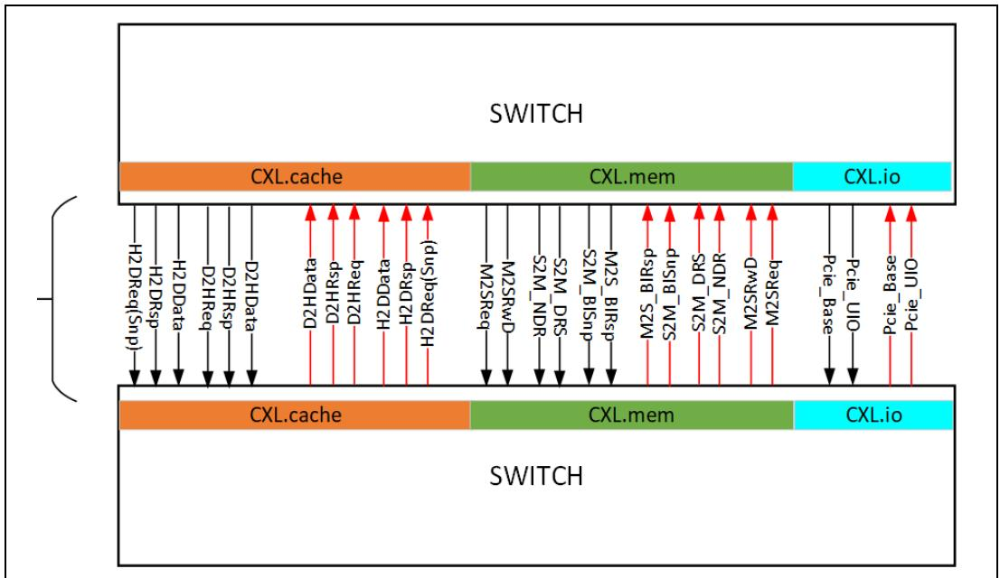
>
> *Original page render @ 150 DPI* — [📄 Full size](figures/chapter_07/fig_0439_1.png)

<table>
<thead>
<tr>
<th width="50%">🇬🇧 English</th>
<th width="50%" style="background-color:#e8e8e8">🇨🇳 中文</th>
</tr>
</thead>
<tbody>
<tr><td>To support the additional ordering requirements stated above, the following rules apply on ISL (also pictorially depicted in Figure 7-48):</td><td style="background-color:#e8e8e8">为了支持上述其他排序要求,以下规则适用于 ISL (也在图 7-48 中以图形方式描述):</td></tr>
</tbody>
</table>

<table>
<thead>
<tr>
<th width="50%">🇬🇧 English</th>
<th width="50%" style="background-color:#e8e8e8">🇨🇳 中文</th>
</tr>
</thead>
<tbody>
<tr>
<td>

**Table 7-107. PBR Fabric .io Ordering Table, Non-UIO**

| Row Pass Column? | DSAR Posted Request | DSAR Non-Posted Request (Read Request) | DSAR NP Request with Data | DSAR Completion | USAR Posted Request | USAR Non-Posted Request (Read Request) | USAR NP Request with Data | USAR Completion |
|---|---|---|---|---|---|---|---|---|
| DSAR Posted Request | Per PCIe Base Specification | Yes | Yes | Yes | Yes | (combined) | (combined) | (combined) |
| DSAR Non-Posted Request (Read Request) | Yes/No | Yes | Yes | Yes/No | (combined) | (combined) | (combined) | (combined) |
| DSAR NP Request with data | Yes/No | Yes | Yes | Yes/No | (combined) | (combined) | (combined) | (combined) |
| DSAR Completion | Yes | Yes | Yes | Yes | (combined) | (combined) | (combined) | (combined) |
| USAR Posted Request | Yes/No | Yes | Yes | Yes/No | Per PCIe Base Specification | (combined) | (combined) | (combined) |
| USAR Non-Posted Request (Read Request) | Yes/No | Yes/No | Yes/No | Yes/No | (combined) | (combined) | (combined) | (combined) |
| USAR NP Request with data | Yes/No | Yes/No | Yes/No | Yes/No | (combined) | (combined) | (combined) | (combined) |
| USAR Completion | Yes/No | Yes | Yes | Yes/No | (combined) | (combined) | (combined) | (combined) |

</td>
<td style="background-color:#e8e8e8">

**表 7-107. PBR Fabric .io 排序表 (非 UIO)**

| 行通过列? | DSAR Posted Request | DSAR Non-Posted Request (Read Request) | DSAR NP Request with Data | DSAR Completion | USAR Posted Request | USAR Non-Posted Request (Read Request) | USAR NP Request with Data | USAR Completion |
|---|---|---|---|---|---|---|---|---|
| DSAR Posted Request | Per PCIe Base Specification | Yes | Yes | Yes | Yes | (合并) | (合并) | (合并) |
| DSAR Non-Posted Request (Read Request) | Yes/No | Yes | Yes | Yes/No | (合并) | (合并) | (合并) | (合并) |
| DSAR NP Request with data | Yes/No | Yes | Yes | Yes/No | (合并) | (合并) | (合并) | (合并) |
| DSAR Completion | Yes | Yes | Yes | Yes | (合并) | (合并) | (合并) | (合并) |
| USAR Posted Request | Yes/No | Yes | Yes | Yes/No | Per PCIe Base Specification | (合并) | (合并) | (合并) |
| USAR Non-Posted Request (Read Request) | Yes/No | Yes/No | Yes/No | Yes/No | (合并) | (合并) | (合并) | (合并) |
| USAR NP Request with data | Yes/No | Yes/No | Yes/No | Yes/No | (合并) | (合并) | (合并) | (合并) |
| USAR Completion | Yes/No | Yes | Yes | Yes/No | (合并) | (合并) | (合并) | (合并) |

</td>
</tr>
</tbody>
</table>

<table>
<thead>
<tr>
<th width="50%">🇬🇧 English</th>
<th width="50%" style="background-color:#e8e8e8">🇨🇳 中文</th>
</tr>
</thead>
<tbody>
<tr>
<td>

**Table 7-108. PBR Fabric .io Ordering Table, UIO**

| Row Pass Column? | DSAR UIO PR-FC TLP | DSAR UIO NPR-FC TLP | DSAR UIO Completion | USAR UIO PR-FC TLP | USAR UIO NPR-FC TLP | USAR UIO Completion |
|---|---|---|---|---|---|---|
| DSAR UIO PR-FC TLP | Per PCIe Base Specification | Yes | Yes | Yes/No | (combined) | (combined) |
| DSAR UIO NPR-FC TLP | Yes | Yes | Yes/No | (combined) | (combined) | (combined) |
| DSAR UIO Completion | Yes | Yes | Yes | (combined) | (combined) | (combined) |
| USAR UIO PR-FC TLP | Yes/No | Yes/No | Yes/No | Per PCIe Base Specification | (combined) | (combined) |
| USAR UIO NPR-FC TLP | Yes/No | Yes/No | Yes/No | (combined) | (combined) | (combined) |
| USAR UIO Completion | Yes | Yes | Yes/No | (combined) | (combined) | (combined) |

</td>
<td style="background-color:#e8e8e8">

**表 7-108. PBR Fabric .io 排序表 (UIO)**

| 行通过列? | DSAR UIO PR-FC TLP | DSAR UIO NPR-FC TLP | DSAR UIO Completion | USAR UIO PR-FC TLP | USAR UIO NPR-FC TLP | USAR UIO Completion |
|---|---|---|---|---|---|---|
| DSAR UIO PR-FC TLP | Per PCIe Base Specification | Yes | Yes | Yes/No | (合并) | (合并) |
| DSAR UIO NPR-FC TLP | Yes | Yes | Yes/No | (合并) | (合并) | (合并) |
| DSAR UIO Completion | Yes | Yes | Yes | (合并) | (合并) | (合并) |
| USAR UIO PR-FC TLP | Yes/No | Yes/No | Yes/No | Per PCIe Base Specification | (合并) | (合并) |
| USAR UIO NPR-FC TLP | Yes/No | Yes/No | Yes/No | (合并) | (合并) | (合并) |
| USAR UIO Completion | Yes | Yes | Yes/No | (合并) | (合并) | (合并) |

</td>
</tr>
</tbody>
</table>

[⬆️ 返回目录](#-本章目录-part-b)

---

- [7.7.7 (cont.) PBR Fabric (ISL Ordering / FC Rules)](#sec-7-7-7-cont)
- [7.7.8 PBR TLP Header (PTH) Rules](#sec-7-7-8)
- [7.7.9 PBR Support for UIO Direct P2P to HDM](#sec-7-7-9)
  - [7.7.9.1 FAST Decoder Use for UIO Direct P2P to G-FAM](#sec-7-7-9-1)
  - [7.7.9.2 LDST Decoder Use for UIO Direct P2P to LD-FAM](#sec-7-7-9-2)
  - [7.7.9.3 ID-Based Re-Router for UIO Completions with LD-FAM](#sec-7-7-9-3)
  - [7.7.9.4 LDST and ID-Based Re-Router Access Protection](#sec-7-7-9-4)
- [7.7.10 PBR Support for Direct P2P CXL.mem for Accelerators](#sec-7-7-10)
  - [7.7.10.1 Message Routing for Direct P2P CXL.mem Accesses with GFD](#sec-7-7-10-1)
  - [7.7.10.2 Message Routing for Direct P2P CXL.mem Accesses with MLD](#sec-7-7-10-2)
  - [7.7.10.3 PBR Switch Port Processing of Direct P2P CXL.mem Messages](#sec-7-7-10-3)
- [7.7.11 PBR Link Events and Messages](#sec-7-7-11)
  - [7.7.11.1 PBR Link Fundamentals](#sec-7-7-11-1)
  - [7.7.11.2 CXL VDMs](#sec-7-7-11-2)
  - [7.7.11.3 Single VH Events](#sec-7-7-11-3)
    - [7.7.11.3.1 Assert Reset VDM](#sec-7-7-11-3-1)
    - [7.7.11.3.2 Deassert Reset VDM](#sec-7-7-11-3-2)
    - [7.7.11.3.3 Link Up VDM](#sec-7-7-11-3-3)
    - [7.7.11.3.4 Dynamic vDSP-to-vUSP Bind](#sec-7-7-11-3-4)
  - [7.7.11.4 Shared Link Events](#sec-7-7-11-4)
    - [7.7.11.4.1 Inter-Switch Link (ISL) Down](#sec-7-7-11-4-1)
  - [7.7.11.5 Switch Reported Events](#sec-7-7-11-5)
    - [7.7.11.5.1 Link Partner Info VDM](#sec-7-7-11-5-1)
  - [7.7.11.6 PBR Link CCI Message Format and Transport Protocol](#sec-7-7-11-6)
- [7.7.12 PBR Fabric Management](#sec-7-7-12)
  - [7.7.12.1 Fabric Boot and Initialization](#sec-7-7-12-1)
    - [7.7.12.1.1 Static Fabric Initialization](#sec-7-7-12-1-1)
    - [7.7.12.1.2 Fabric Manager Boots First](#sec-7-7-12-1-2)
    - [7.7.12.1.3 Fabric Manager and Host Boot Simultaneously](#sec-7-7-12-1-3)
  - [7.7.12.2 PBR Fabric Discovery](#sec-7-7-12-2)
  - [7.7.12.3 Assigning and Binding PIDs](#sec-7-7-12-3)
  - [7.7.12.4 Reporting Fabric Route Performance via CDAT](#sec-7-7-12-4)
    - [7.7.12.4.1 Accessing CDAT Information for LD-FAM](#sec-7-7-12-4-1)
    - [7.7.12.4.2 Accessing CDAT Information for G-FAM](#sec-7-7-12-4-2)
  - [7.7.12.5 Configuring CacheID in PBR Fabric](#sec-7-7-12-5)
  - [7.7.12.6 Dynamic Fabric Changes](#sec-7-7-12-6)
    - [7.7.12.6.1 Hot-Add and Link Up Events](#sec-7-7-12-6-1)
    - [7.7.12.6.2 Dynamic Configuration Changes](#sec-7-7-12-6-2)
    - [7.7.12.6.3 Hot/Surprise Remove and Link Down Events](#sec-7-7-12-6-3)
- [7.7.13 PBR Switch Command Set](#sec-7-7-13)
  - [7.7.13.1 Identify PBR Switch (Opcode 5700h)](#sec-7-7-13-1)
  - [7.7.13.2 Fabric Crawl Out (Opcode 5701h)](#sec-7-7-13-2)
  - [7.7.13.3 Get PBR Link Partner Info (Opcode 5702h)](#sec-7-7-13-3)
  - [7.7.13.4 Get PID Target List (Opcode 5703h)](#sec-7-7-13-4)
  - [7.7.13.5 Configure PID Assignment (Opcode 5704h)](#sec-7-7-13-5)
  - [7.7.13.6 Get PID Binding (Opcode 5705h)](#sec-7-7-13-6)
  - [7.7.13.7 Configure PID Binding (Opcode 5706h)](#sec-7-7-13-7)
  - [7.7.13.8 Get Table Descriptors (Opcode 5707h)](#sec-7-7-13-8)
  - [7.7.13.9 Get DRT (Opcode 5708h)](#sec-7-7-13-9)
  - [7.7.13.10 Set DRT (Opcode 5709h)](#sec-7-7-13-10)
  - [7.7.13.11 Get RGT (Opcode 570Ah)](#sec-7-7-13-11)
  - [7.7.13.12 Set RGT (Opcode 570Bh)](#sec-7-7-13-12)
  - [7.7.13.13 Get LDST/IDT Capabilities (Opcode 570Ch)](#sec-7-7-13-13)
  - [7.7.13.14 Set LDST/IDT Configuration (Opcode 570Dh)](#sec-7-7-13-14)
  - [7.7.13.15 Get LDST Segment Entries (Opcode 570Eh)](#sec-7-7-13-15)
  - [7.7.13.16 Set LDST Segment Entries (Opcode 570Fh)](#sec-7-7-13-16)
  - [7.7.13.17 Get LDST IDT DPID Entries (Opcode 5710h)](#sec-7-7-13-17)
  - [7.7.13.18 Set LDST IDT DPID Entries (Opcode 5711h)](#sec-7-7-13-18)
  - [7.7.13.19 Get Completer ID-Based Re-Router Entries (Opcode 5712h)](#sec-7-7-13-19)
  - [7.7.13.20 Set Completer ID-Based Re-Router Entries (Opcode 5713h)](#sec-7-7-13-20)
  - [7.7.13.21 Get LDST Access Vector (Opcode 5714h)](#sec-7-7-13-21)
  - [7.7.13.22 Get VCS LDST Access Vector (Opcode 5715h)](#sec-7-7-13-22)
  - [7.7.13.23 Configure VCS LDST Access (Opcode 5716h)](#sec-7-7-13-23)
- [7.7.14 Global Memory Access Endpoint Command Set](#sec-7-7-14)
  - [7.7.14.1 Identify GAE (Opcode 5800h)](#sec-7-7-14-1)
  - [7.7.14.2 Get PID Interrupt Vector (Opcode 5801h)](#sec-7-7-14-2)
  - [7.7.14.3 Get PID Access Vectors (Opcode 5802h)](#sec-7-7-14-3)
  - [7.7.14.4 Get FAST/IDT Capabilities (Opcode 5803h)](#sec-7-7-14-4)
  - [7.7.14.5 Set FAST/IDT Configuration (Opcode 5804h)](#sec-7-7-14-5)
  - [7.7.14.6 Get FAST Segment Entries (Opcode 5805h)](#sec-7-7-14-6)
  - [7.7.14.7 Set FAST Segment Entries (Opcode 5806h)](#sec-7-7-14-7)
  - [7.7.14.8 Get IDT DPID Entries (Opcode 5807h)](#sec-7-7-14-8)
  - [7.7.14.9 Set IDT DPID Entries (Opcode 5808h)](#sec-7-7-14-9)
  - [7.7.14.10 Proxy GFD Management Command (Opcode 5809h)](#sec-7-7-14-10)
  - [7.7.14.11 Get Proxy Thread Status (Opcode 580Ah)](#sec-7-7-14-11)
  - [7.7.14.12 Cancel Proxy Thread (Opcode 580Bh)](#sec-7-7-14-12)
- [7.7.15 Global Memory Access Endpoint Management Command Set](#sec-7-7-15)
  - [7.7.15.1 Identify VCS GAE (Opcode 5900h)](#sec-7-7-15-1)
  - [7.7.15.2 Get VCS PID Access Vectors (Opcode 5901h)](#sec-7-7-15-2)
  - [7.7.15.3 Configure VCS PID Access (Opcode 5902h)](#sec-7-7-15-3)
  - [7.7.15.4 Get VendPrefixL0 State (Opcode 5903h)](#sec-7-7-15-4)
  - [7.7.15.5 Set VendPrefixL0 State (Opcode 5904h)](#sec-7-7-15-5)

# 📘 第 7 章　交换 (Chapter 7. Switching) — Part C

> **Source pages**: 见正文 (Part C) | **Format**: 中英对照双语

## 📑 本章目录 (Part C)

_(本目录由本部分正文小节自动汇总 — 见下方章节内容)_

---

## 🖼 本章图表 (Part C)

| Figure | 标题 (EN) | 标题 (中) |
| --- | --- | --- |
| Figure 7-48 | Deadlock Avoidance Mechanism on ISL | ISL 上的死锁避免机制 |
| Figure 7-49 | Update-FC DLLP Format on ISL | ISL 上 Update-FC DLLP 格式 |
| Figure 7-50 | Example Topology with Direct P2P CXL.mem with GFD | 使用 GFD 的 Direct P2P CXL.mem 示例拓扑 |
| Figure 7-51 | Example Topology with Direct P2P CXL.mem with MLD | 使用 MLD 的 Direct P2P CXL.mem 示例拓扑 |
| Figure 7-52 | Single VH | 单一虚拟层级 (Single VH) |
| Figure 7-53 | Shared Link Events | 共享链路事件 |
| Figure 7-54 | Tunneling Commands to Remote Devices | 对远程设备的命令隧道传输 |
| Figure 7-55 | Tunneling Commands to Remote Devices with No Assigned PID | 对未分配 PID 的远程设备的命令隧道传输 |

## 📊 本章表格 (Part C)

| Table | 标题 (EN) | 标题 (中) |
| --- | --- | --- |
| Table 7-109 | PBR Switch Port Processing Table for Direct P2P CXL.mem | Direct P2P CXL.mem 的 PBR 交换机端口处理表 |
| Table 7-110 | Link Partner Info Payload | Link Partner Info 有效载荷 |
| Table 7-111 | Far End Device Type Detection (Sheet 1 of 2) | 远端设备类型检测 (1/2) |
| Table 7-111 (2) | Far End Device Type Detection (Sheet 2 of 2) | 远端设备类型检测 (2/2) |
| Table 7-112 | Identify PBR Switch Response Payload | Identify PBR Switch 响应 Payload |
| Table 7-113 | Fabric Crawl Out Request Payload | Fabric Crawl Out 请求 Payload |
| Table 7-114 | Fabric Crawl Out Response Payload | Fabric Crawl Out 响应 Payload |
| Table 7-115 | Get PBR Link Partner Info Request Payload | Get PBR Link Partner Info 请求 Payload |
| Table 7-116 | Get PBR Link Partner Info Response Payload | Get PBR Link Partner Info 响应 Payload |
| Table 7-117 | Get Link Partner Info Block Format | Get Link Partner Info 块格式 |
| Table 7-118 | Get PID Target List Request Payload | Get PID Target List 请求 Payload |
| Table 7-119 | Get PID Target List Response Payload | Get PID Target List 响应 Payload |
| Table 7-120 | Target List Format | Target List 格式 |
| Table 7-121 | Configure PID Assignment Request Payload | Configure PID Assignment 请求 Payload |
| Table 7-122 | PID Assignment | PID 分配 |
| Table 7-123 | Get PID Binding Request Payload | Get PID Binding 请求 Payload |
| Table 7-124 | Get PID Binding Response Payload | Get PID Binding 响应 Payload |
| Table 7-125 | Configure PID Binding Request Payload (Sheet 1 of 2) | Configure PID Binding 请求 Payload (1/2) |
| Table 7-125 (2) | Configure PID Binding Request Payload (Sheet 2 of 2) | Configure PID Binding 请求 Payload (2/2) |
| Table 7-126 | Get Table Descriptors Request Payload | Get Table Descriptors 请求 Payload |
| Table 7-127 | Get Table Descriptors Response Payload | Get Table Descriptors 响应 Payload |
| Table 7-128 | Get Table Descriptor Format | Get Table Descriptor 格式 |
| Table 7-129 | Get DRT Request Payload | Get DRT 请求 Payload |
| Table 7-130 | Get DRT Response Payload | Get DRT 响应 Payload |
| Table 7-131 | DRT Entry Format | DRT 条目格式 |
| Table 7-132 | Set DRT Request Payload | Set DRT 请求 Payload |
| Table 7-133 | Get RGT Request Payload | Get RGT 请求 Payload |
| Table 7-134 | Get RGT Response Payload | Get RGT 响应 Payload |
| Table 7-135 | RGT Entry Format | RGT 条目格式 |
| Table 7-136 | Set RGT Request Payload | Set RGT 请求 Payload |
| Table 7-137 | Get LDST/IDT Capabilities Request Payload | Get LDST/IDT Capabilities 请求 Payload |
| Table 7-138 | Get LDST/IDT Capabilities Response Payload | Get LDST/IDT Capabilities 响应 Payload |
| Table 7-139 | Set LDST/IDT Configuration Request Payload | Set LDST/IDT Configuration 请求 Payload |
| Table 7-140 | Get LDST Segment Entries Request Payload | Get LDST Segment Entries 请求 Payload |
| Table 7-141 | Get LDST Segment Entries Response Payload | Get LDST Segment Entries 响应 Payload |
| Table 7-142 | LDST Segment Entry Format | LDST Segment Entry 格式 |
| Table 7-143 | Set LDST Segment Entries Request Payload | Set LDST Segment Entries 请求 Payload |
| Table 7-144 | Get LDST IDT DPID Entries Request Payload | Get LDST IDT DPID Entries 请求 Payload |
| Table 7-145 | Get LDST IDT DPID Entries Response Payload | Get LDST IDT DPID Entries 响应 Payload |
| Table 7-146 | Set LDST IDT DPID Entries Request Payload | Set LDST IDT DPID Entries 请求 Payload |
| Table 7-147 | Get Completer ID-Based Re-Router Entries Request Payload | Get Completer ID-Based Re-Router Entries 请求 Payload |
| Table 7-148 | Get Completer ID-Based Re-Router Entries Response Payload | Get Completer ID-Based Re-Router Entries 响应 Payload |
| Table 7-149 | Completer ID-Based Re-Router Entry | Completer ID-Based Re-Router 条目 |
| Table 7-150 | Set Completer ID-Based Re-Router Entries Request Payload | Set Completer ID-Based Re-Router Entries 请求 Payload |
| Table 7-151 | Get LDST Access Vector Request Payload | Get LDST Access Vector 请求 Payload |
| Table 7-152 | Get LDST Access Vector Response Payload | Get LDST Access Vector 响应 Payload |
| Table 7-153 | LDST Access Vector | LDST Access Vector |
| Table 7-154 | Get VCS LDST Access Vector Request Payload | Get VCS LDST Access Vector 请求 Payload |
| Table 7-155 | Configure VCS LDST Access Request Payload | Configure VCS LDST Access 请求 Payload |
| Table 7-156 | Identify GAE Request Payload | Identify GAE 请求 Payload |
| Table 7-157 | Identify GAE Response Payload | Identify GAE 响应 Payload |
| Table 7-158 | vPPB Global Memory Support Info | vPPB Global Memory Support Info |
| Table 7-159 | Get PID Interrupt Vector Request Payload | Get PID Interrupt Vector 请求 Payload |
| Table 7-160 | Get PID Interrupt Vector Response Payload | Get PID Interrupt Vector 响应 Payload |
| Table 7-161 | PID Interrupt Vector | PID Interrupt Vector |
| Table 7-162 | Get PID Access Vectors Request Payload | Get PID Access Vectors 请求 Payload |
| Table 7-163 | Get PID Access Vectors Response Payload | Get PID Access Vectors 响应 Payload |
| Table 7-164 | PID Access Vector | PID Access Vector |
| Table 7-165 | Get FAST/IDT Capabilities Request Payload | Get FAST/IDT Capabilities 请求 Payload |
| Table 7-166 | Get FAST/IDT Capabilities Response Payload | Get FAST/IDT Capabilities 响应 Payload |
| Table 7-167 | vPPB PID List Entry Format | vPPB PID List 条目格式 |
| Table 7-168 | Set FAST/IDT Configuration Request Payload | Set FAST/IDT Configuration 请求 Payload |
| Table 7-169 | Get FAST Segment Entries Request Payload | Get FAST Segment Entries 请求 Payload |
| Table 7-170 | Get FAST Segment Entries Response Payload | Get FAST Segment Entries 响应 Payload |
| Table 7-171 | FAST Segment Entry Format | FAST Segment Entry 格式 |
| Table 7-172 | Set FAST Segment Entries Request Payload | Set FAST Segment Entries 请求 Payload |
| Table 7-173 | Get IDT DPID Entries Request Payload | Get IDT DPID Entries 请求 Payload |
| Table 7-174 | Get IDT DPID Entries Response Payload | Get IDT DPID Entries 响应 Payload |
| Table 7-175 | Set IDT DPID Entries Request Payload | Set IDT DPID Entries 请求 Payload |
| Table 7-176 | Proxy GFD Management Command Request Payload | Proxy GFD Management Command 请求 Payload |
| Table 7-177 | Proxy GFD Management Command Response Payload | Proxy GFD Management Command 响应 Payload |
| Table 7-178 | Get Proxy Thread Status Request Payload | Get Proxy Thread Status 请求 Payload |
| Table 7-179 | Get Proxy Thread Status Response Payload | Get Proxy Thread Status 响应 Payload |
| Table 7-180 | Cancel Proxy Thread Request Payload | Cancel Proxy Thread 请求 Payload |
| Table 7-181 | Cancel Proxy Thread Response Payload | Cancel Proxy Thread 响应 Payload |
| Table 7-182 | Identify VCS GAE Request Payload | Identify VCS GAE 请求 Payload |
| Table 7-183 | Get VCS PID Access Vectors Request Payload | Get VCS PID Access Vectors 请求 Payload |
| Table 7-184 | Configure VCS PID Access Request Payload | Configure VCS PID Access 请求 Payload |
| Table 7-185 | Get VendPrefixL0 State Request Payload | Get VendPrefixL0 State 请求 Payload |
| Table 7-186 | Get VendPrefixL0 State Response Payload | Get VendPrefixL0 State 响应 Payload |
| Table 7-187 | Set VendPrefixL0 State Request Payload | Set VendPrefixL0 State 请求 Payload |

---

## 7.7.7 PBR Fabric (continued) — ISL Ordering & FC Rules | PBR Fabric (续) — ISL 排序与流控规则

<table>
<thead>
<tr>
<th width="50%">🇬🇧 English</th>
<th width="50%" style="background-color:#e8e8e8">🇨🇳 中文</th>
</tr>
</thead>
<tbody>
<tr><td>• PBR Fabric .io ordering rules apply independently within each VC implemented</td><td style="background-color:#e8e8e8">• PBR Fabric .io 排序规则在每个已实现的 VC 内独立适用</td></tr>
<tr><td>• On edge HBR/PCIe links and on edge PBR links, PBR Fabric ordering rules do not apply</td><td style="background-color:#e8e8e8">• 在边缘 HBR/PCIe 链路以及边缘 PBR 链路上,PBR Fabric 排序规则不适用</td></tr>
<tr><td>— On edge PBR links, PTH bit can be ignored for ordering purposes and only the regular CXL.io ordering rules from PCIe Base Specification apply.</td><td style="background-color:#e8e8e8">— 在边缘 PBR 链路上,可忽略 PTH 位的排序作用,仅适用 PCIe Base Specification 中的常规 CXL.io 排序规则。</td></tr>
<tr><td>• Nonzero dedicated credits are always required on ISL for each VC, regardless of whether multiple VCs are enabled</td><td style="background-color:#e8e8e8">• 无论是否启用多个 VC,ISL 上每个 VC 始终需要非零的专用信用 (dedicated credits)</td></tr>
<tr><td>• Baseline Shared and Merged FC initialization and usage rules, as described in PCIe Base Specification, apply on ISLs as well, with some new rules/exceptions as noted below:</td><td style="background-color:#e8e8e8">• PCIe Base Specification 中所述的基线 Shared (共享) 与 Merged (合并) FC 初始化及使用规则同样适用于 ISL,但有以下新增规则/例外:</td></tr>
<tr><td>— Dedicated buffers are required separately per FC class for DSAR and USAR traffic and they are both the same value as negotiated during FC initialization.</td><td style="background-color:#e8e8e8">— DSAR 与 USAR 流量需要按 FC 类别分别预留专用缓冲区,两者的大小均与 FC 初始化时协商的值相同。</td></tr>
<tr><td>• As an example, if one Posted HDR and one Posted DATA credit were exchanged for Dedicated buffers during InitFC1/2, the transmitter assumes there is 1 Posted data credit for DSAR traffic and one Posted data credit for USAR traffic and similarly for Posted HDR Credit as well.</td><td style="background-color:#e8e8e8">• 举例而言,若在 InitFC1/2 期间为 Dedicated 缓冲区交换了 1 个 Posted HDR 信用和 1 个 Posted DATA 信用,则发送方假定 DSAR 流量有 1 个 Posted data 信用,USAR 流量有 1 个 Posted data 信用,Posted HDR 信用同理。</td></tr>
<tr><td>• Shared buffers can be shared between DSAR and USAR traffic.</td><td style="background-color:#e8e8e8">• 共享缓冲区 (Shared buffers) 可在 DSAR 与 USAR 流量之间共享。</td></tr>
<tr><td>— Update-FC DLLP is modified as shown in Figure 7-49, to indicate release of DSAR or USAR buffers. Transmitters can use this information on shared credits to implement QoS limiting between DSAR and USAR traffic.</td><td style="background-color:#e8e8e8">— Update-FC DLLP 已按图 7-49 所示进行修改,以指示 DSAR 或 USAR 缓冲区的释放。发送方可利用该信息在共享信用上实现 DSAR 与 USAR 流量之间的 QoS 限流。</td></tr>
<tr><td>— This modification is implicitly enabled on ISLs and requires no negotiation</td><td style="background-color:#e8e8e8">— 该修改在 ISL 上隐式启用,无需协商</td></tr>
</tbody>
</table>

> **Figure 7-48.** Deadlock Avoidance Mechanism on ISL ｜ ISL 上的死锁避免机制
>
> 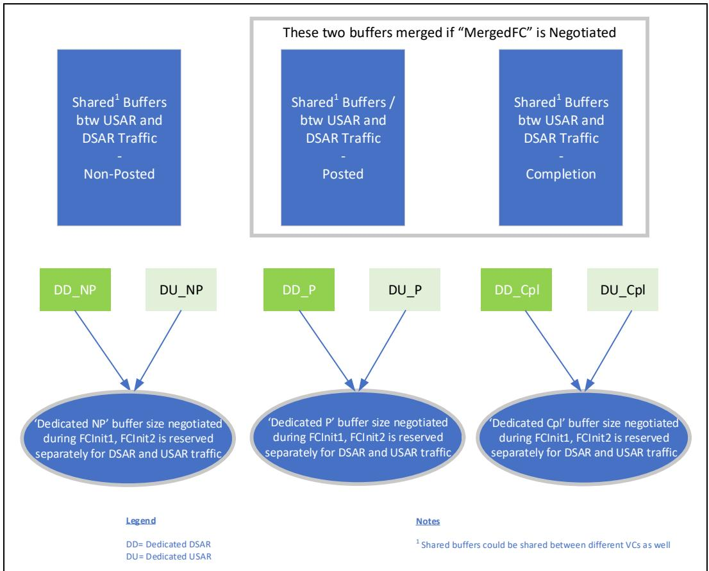
>
> *Original page render @ 150 DPI* — [📄 Full size](figures/chapter_07/page_0441.png)

<table>
<thead>
<tr>
<th width="50%">🇬🇧 English</th>
<th width="50%" style="background-color:#e8e8e8">🇨🇳 中文</th>
</tr>
</thead>
<tbody>
<tr><td>Note:</td><td style="background-color:#e8e8e8">注:</td></tr>
<tr><td>To aid debug, Switches are recommended to capture the Hdr and data_Scale values negotiated at initialization so that debug software can access the values.</td><td style="background-color:#e8e8e8">为便于调试,建议交换机在初始化时捕获协商得到的 Hdr 与 data_Scale 值,以便调试软件访问这些值。</td></tr>
<tr><td>• Optimized_Update_FC DLLP applies to USAR traffic only and it is implicit on ISLs. All DSAR traffic's shared buffer credit return occurs only via Update-FC DLLP.</td><td style="background-color:#e8e8e8">• Optimized_Update_FC DLLP 仅适用于 USAR 流量,且在 ISL 上是隐式的。所有 DSAR 流量的共享缓冲区信用返回仅通过 Update-FC DLLP 完成。</td></tr>
</tbody>
</table>

> **Figure 7-49.** Update-FC DLLP Format on ISL ｜ ISL 上 Update-FC DLLP 格式
>
> 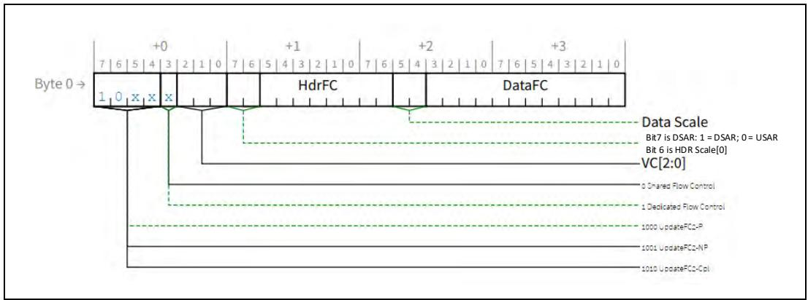
>
> *Original page render @ 150 DPI* — [📄 Full size](figures/chapter_07/page_0442.png)

[⬆️ 返回目录](#-本章目录-part-c)

---

## 7.7.8 PBR TLP Header (PTH) Rules | PBR TLP 头 (PTH) 规则

<table>
<thead>
<tr>
<th width="50%">🇬🇧 English</th>
<th width="50%" style="background-color:#e8e8e8">🇨🇳 中文</th>
</tr>
</thead>
<tbody>
<tr><td>For the purposes of this discussion, a "PBR link" is a link that negotiated to PBR flit format via the physical layer TS "PBR Flit bit" (see Section 6.4). See Section 3.1.8 for details of PTH format.</td><td style="background-color:#e8e8e8">在本文的讨论中,"PBR 链路" (PBR link) 是指通过物理层 TS "PBR Flit bit" 协商为 PBR flit 格式的链路 (参见 6.4 节)。PTH 格式的详细说明参见 3.1.8 节。</td></tr>
<tr><td>• A PTH is inserted (via an appropriate decode mechanism) on CXL.io TLPs by an Edge Switch or the PTH is directly generated by devices (e.g., GFD) that natively support PBR link</td><td style="background-color:#e8e8e8">• PTH 由边缘交换机 (Edge Switch) 通过适当的解码机制插入到 CXL.io TLP 中,或由原生支持 PBR 链路的设备 (例如 GFD) 直接生成</td></tr>
<tr><td>• A PTH is forwarded as-is (unless explicitly noted otherwise as in handling PTH.DSAR bit on an edge PBR link) on a CXL.io TLP if the egress port is connected to a PBR link</td><td style="background-color:#e8e8e8">• 若出口端口连接到 PBR 链路,则 CXL.io TLP 上的 PTH 按原样转发 (除非在边缘 PBR 链路上处理 PTH.DSAR 位等场景另有说明)</td></tr>
<tr><td>• A PTH is removed when its CXL.io TLP exits to an edge non-PBR link</td><td style="background-color:#e8e8e8">• 当 CXL.io TLP 退出到边缘非 PBR 链路时,PTH 将被移除</td></tr>
<tr><td>— Note that some contents of PTH could be transferred to VendPrefixL0 if the egress port is an HBR link and the VendPrefixL0 is supported and enabled on the link. See Section 7.7.3 and Section 7.7.4.</td><td style="background-color:#e8e8e8">— 若出口端口是 HBR 链路且链路上支持并启用了 VendPrefixL0,则 PTH 的部分内容可转移到 VendPrefixL0 中。参见 7.7.3 和 7.7.4 节。</td></tr>
<tr><td>• A PTH is included in link-IDE Integrity protection, if supported and enabled, when the PTH traverses PBR links.</td><td style="background-color:#e8e8e8">• 若支持并启用 link-IDE 完整性保护,则 PTH 在穿越 PBR 链路时纳入其保护范围。</td></tr>
<tr><td>• PTH is not included in .io selective IDE protection.</td><td style="background-color:#e8e8e8">• PTH 不纳入 .io selective IDE 保护。</td></tr>
</tbody>
</table>

[⬆️ 返回目录](#-本章目录-part-c)

---

## 7.7.9 PBR Support for UIO Direct P2P to HDM | PBR 对 UIO Direct P2P to HDM 的支持

<table>
<thead>
<tr>
<th width="50%">🇬🇧 English</th>
<th width="50%" style="background-color:#e8e8e8">🇨🇳 中文</th>
</tr>
</thead>
<tbody>
<tr><td>PBR switches support special routing mechanisms to enable the UIO Direct P2P to HDM use case with edge-to-edge routing, which often can be much more efficient compared to the hierarchical routing used in HBR switches. For backward compatibility, legacy software unaware of these special PBR routing mechanisms can continue to use HDM decoders, providing limited UIO Direct P2P capability.</td><td style="background-color:#e8e8e8">PBR 交换机支持特殊的路由机制以边到边 (edge-to-edge) 路由方式实现 UIO Direct P2P to HDM 用例,这通常比 HBR 交换机中使用的层次化路由效率高得多。为保持向后兼容,不了解这些特殊 PBR 路由机制的传统软件可继续使用 HDM 解码器,以提供有限的 UIO Direct P2P 能力。</td></tr>
<tr><td>An enhanced version of the FAST decoder as defined in Section 7.7.2.4 can be implemented in the Edge DSP above the UIO requester, providing edge-to-edge routing for UIO requests that target GFDs.</td><td style="background-color:#e8e8e8">7.7.2.4 节所定义的 FAST 解码器的增强版本可在 UIO 请求者之上的 Edge DSP 中实现,为以 GFD 为目标的 UIO 请求提供边到边路由。</td></tr>
<tr><td>Another instance of the FAST decoder hardware can provide edge-to-edge routing for UIO requests that target LD-FAM devices. This instance is referred to as an LD-FAM Segment Table (LDST), and it is usually configured with a different segment size and amount of mapped HDM space from any FAST decoders in use.</td><td style="background-color:#e8e8e8">FAST 解码器硬件的另一实例可为以 LD-FAM 设备为目标的 UIO 请求提供边到边路由。该实例称为 LD-FAM Segment Table (LDST),其段大小和映射的 HDM 空间量通常与正在使用的任何 FAST 解码器不同。</td></tr>
</tbody>
</table>

<table>
<thead>
<tr>
<th width="50%">🇬🇧 English</th>
<th width="50%" style="background-color:#e8e8e8">🇨🇳 中文</th>
</tr>
</thead>
<tbody>
<tr><td>With LD-FAM devices, UIO completions can be routed edge-to-edge with an ID-Based Re-Router mechanism, which can be implemented in the Edge DSP above each LD-FAM device. The Re-Router matches against the requester's PCI segment number (if applicable) and bus number in the UIO completion to determine the DPID for edge-to-edge routing. G-FAM devices automatically use edge-to-edge routing for UIO completions without this mechanism.</td><td style="background-color:#e8e8e8">对于 LD-FAM 设备,UIO 完成报文可借助 ID-Based Re-Router 机制进行边到边路由,该机制可在每个 LD-FAM 设备之上的 Edge DSP 中实现。Re-Router 在 UIO 完成报文中匹配请求者的 PCI segment 编号 (若适用) 和总线号,以确定用于边到边路由的 DPID。G-FAM 设备无需此机制即可自动使用边到边路由 UIO 完成报文。</td></tr>
<tr><td>FAST decoders, LDST decoders, and ID-Based Re-Routers are each configured by host software using CCI command sets, as documented in Section 7.7.14 for FAST decoders, and 7.7.13 for LDST decoders & ID-based Re-Routers.</td><td style="background-color:#e8e8e8">FAST 解码器、LDST 解码器和 ID-Based Re-Router 均由主机软件通过 CCI 命令集进行配置,详见 7.7.14 节 (FAST 解码器) 和 7.7.13 节 (LDST 解码器与 ID-Based Re-Router)。</td></tr>
<tr><td>GFDs are not associated with any VH, thus they have no PCIe ID (segment, bus, device, function number) assigned by any host. When a GFD sends a UIO completion, the completer segment field (if present) and the completer ID field in the completion are reserved and shall be 0.</td><td style="background-color:#e8e8e8">GFD 不与任何 VH 关联,因此没有任何主机为其分配 PCIe ID (segment、bus、device、function number)。GFD 发送 UIO 完成报文时,完成报文中的 completer segment 字段 (若存在) 和 completer ID 字段均保留,且必须为 0。</td></tr>
</tbody>
</table>

### 7.7.9.1 FAST Decoder Use for UIO Direct P2P to G-FAM | FAST 解码器用于 UIO Direct P2P to G-FAM

<table>
<thead>
<tr>
<th width="50%">🇬🇧 English</th>
<th width="50%" style="background-color:#e8e8e8">🇨🇳 中文</th>
</tr>
</thead>
<tbody>
<tr><td>FAST decoder instances in Edge USPs and DSPs have several similarities:</td><td style="background-color:#e8e8e8">Edge USP 和 DSP 中的 FAST 解码器实例具有若干相似之处:</td></tr>
<tr><td>• Both convert requests from HBR format to PBR format, and route edge-to-edge to target GFDs.</td><td style="background-color:#e8e8e8">• 两者都将请求从 HBR 格式转换为 PBR 格式,并边到边路由至目标 GFD。</td></tr>
<tr><td>• For the SPID, each uses the PID associated with its port.</td><td style="background-color:#e8e8e8">• 对于 SPID,均使用与其端口关联的 PID。</td></tr>
<tr><td>• Both support CXL.mem and (CXL.io) UIO requests.</td><td style="background-color:#e8e8e8">• 两者均支持 CXL.mem 和 (CXL.io) UIO 请求。</td></tr>
<tr><td>• A USP FAST decoder receives HBR format downstream requests coming from the RP. CXL.mem requests result from host accesses to GFDs.</td><td style="background-color:#e8e8e8">• USP FAST 解码器接收来自 RP 的 HBR 格式下行请求。CXL.mem 请求来源于主机对 GFD 的访问。</td></tr>
<tr><td>• A DSP FAST decoder receives HBR format upstream requests coming from the requester device. UIO requests result from UIO Direct P2P traffic, where the UIO requester may be directly connected to an Edge DSP, or it may be connected via one or more HBR switches below the Edge DSP. CXL.mem requests result from the Direct P2P CXL.mem for accelerators use case, covered in Section 7.7.10.</td><td style="background-color:#e8e8e8">• DSP FAST 解码器接收来自请求者设备的 HBR 格式上行请求。UIO 请求来源于 UIO Direct P2P 流量,其中 UIO 请求者可直连 Edge DSP,也可通过 Edge DSP 之下的一个或多个 HBR 交换机连接。CXL.mem 请求来源于 Direct P2P CXL.mem for accelerators 用例,详见 7.7.10 节。</td></tr>
<tr><td>A DSP FAST decoder can be configured with a segment size different from the host's USP FAST decoder(s), but it is recommended for all FAST decoders to use the same segment size to avoid software complexity.</td><td style="background-color:#e8e8e8">DSP FAST 解码器可配置为与主机 USP FAST 解码器不同的段大小,但建议所有 FAST 解码器使用相同的段大小以避免软件复杂性。</td></tr>
<tr><td>A DSP FAST decoder may need to be configured with a different number of segments from the host's USP FAST decoder(s) (e.g., a requester device may not need access to the entire Fabric Address space mapped by the USP FAST decoder). On the other hand, a requester device may need to access the Fabric Address space associated with an entire host Domain, not just a single RP within a host domain.</td><td style="background-color:#e8e8e8">DSP FAST 解码器可能需要配置为与主机 USP FAST 解码器不同数量的段 (例如请求者设备可能不需要访问 USP FAST 解码器所映射的整个 Fabric Address 空间)。另一方面,请求者设备可能需要访问与整个主机 Domain 相关联的 Fabric Address 空间,而不仅是同一主机 Domain 内的单个 RP。</td></tr>
</tbody>
</table>

### 7.7.9.2 LDST Decoder Use for UIO Direct P2P to LD-FAM | LDST 解码器用于 UIO Direct P2P to LD-FAM

<table>
<thead>
<tr>
<th width="50%">🇬🇧 English</th>
<th width="50%" style="background-color:#e8e8e8">🇨🇳 中文</th>
</tr>
</thead>
<tbody>
<tr><td>LDST decoder instances in Edge USPs and DSPs have several similarities:</td><td style="background-color:#e8e8e8">Edge USP 和 DSP 中的 LDST 解码器实例具有若干相似之处:</td></tr>
<tr><td>• Both convert requests from HBR format to PBR format, and route edge-to-edge to target LD-FAM devices.</td><td style="background-color:#e8e8e8">• 两者都将请求从 HBR 格式转换为 PBR 格式,并边到边路由至目标 LD-FAM 设备。</td></tr>
<tr><td>• For the SPID, each uses the PID associated with its port.</td><td style="background-color:#e8e8e8">• 对于 SPID,均使用与其端口关联的 PID。</td></tr>
<tr><td>• Both support CXL.mem and (CXL.io) UIO requests.</td><td style="background-color:#e8e8e8">• 两者均支持 CXL.mem 和 (CXL.io) UIO 请求。</td></tr>
<tr><td>• A USP LDST decoder receives HBR format downstream requests coming from the RP. CXL.mem requests result from host accesses to LD-FAM devices. UIO requests currently have no architected use cases, but they are not prohibited.</td><td style="background-color:#e8e8e8">• USP LDST 解码器接收来自 RP 的 HBR 格式下行请求。CXL.mem 请求来源于主机对 LD-FAM 设备的访问。UIO 请求目前没有架构化定义的用例,但并未被禁止。</td></tr>
<tr><td>• Host software determines whether host accesses to LD-FAM devices use LDST decoders versus HDM Decoders in Edge USPs. For backward compatibility, legacy software that's unaware of LDST decoders can continue to use HDM decoders. For overcoming scaling limitations with the number of HDM decoders supported by</td><td style="background-color:#e8e8e8">• 主机软件决定对 LD-FAM 设备的访问是使用 Edge USP 中的 LDST 解码器还是 HDM 解码器。为保持向后兼容,不了解 LDST 解码器的传统软件可继续使用 HDM 解码器。为了克服 Edge USP 所支持</td></tr>
</tbody>
</table>

<table>
<thead>
<tr>
<th width="50%">🇬🇧 English</th>
<th width="50%" style="background-color:#e8e8e8">🇨🇳 中文</th>
</tr>
</thead>
<tbody>
<tr><td>Edge USPs, LDST-aware software can use LDST decoders, though LDST decoders do not support HDM-D.</td><td style="background-color:#e8e8e8">HDM 解码器数量带来的扩展性限制,支持 LDST 的软件可使用 LDST 解码器,但 LDST 解码器不支持 HDM-D。</td></tr>
<tr><td>• A DSP LDST decoder receives HBR format upstream requests coming from the requester device. UIO requests result from UIO Direct P2P traffic. CXL.mem requests result from the Direct P2P CXL.mem for accelerators use case, covered in Section 7.7.10.</td><td style="background-color:#e8e8e8">• DSP LDST 解码器接收来自请求者设备的 HBR 格式上行请求。UIO 请求来源于 UIO Direct P2P 流量。CXL.mem 请求来源于 Direct P2P CXL.mem for accelerators 用例,详见 7.7.10 节。</td></tr>
<tr><td>A DSP LDST decoder can be configured with a segment size different from the host's USP LDST decoder(s), but it is recommended for all LDST decoders to use the same segment size to avoid software complexity.</td><td style="background-color:#e8e8e8">DSP LDST 解码器可配置为与主机 USP LDST 解码器不同的段大小,但建议所有 LDST 解码器使用相同的段大小以避免软件复杂性。</td></tr>
<tr><td>A DSP LDST decoder may need to be configured with a different number of segments from the host's USP LDST decoder(s) (e.g., a requester device may not need access to the entire LD-FAM HDM space mapped by the USP LDST decoder). On the other hand, an accelerator may need to access the LD-FAM HDM space associated with the entire host Domain, not a single RP in the host Domain.</td><td style="background-color:#e8e8e8">DSP LDST 解码器可能需要配置为与主机 USP LDST 解码器不同数量的段 (例如请求者设备可能不需要访问 USP LDST 解码器所映射的整个 LD-FAM HDM 空间)。另一方面,加速器可能需要访问与整个主机 Domain 相关联的 LD-FAM HDM 空间,而不仅是同一主机 Domain 内的单个 RP。</td></tr>
<tr><td>When any LDST decoders are in use, host SW needs to configure any HDM decoders mapping the same LD-FAM HDM ranges with decoder characteristics compatible with LDST decoders. This applies to HDM decoders present in the host, PBR switches, HBR switches, or LD-FAM devices. These decoder characteristics include:</td><td style="background-color:#e8e8e8">使用任何 LDST 解码器时,主机软件需要将与同一 LD-FAM HDM 范围相对应的 HDM 解码器配置为与 LDST 解码器兼容的解码器特性。这适用于主机、PBR 交换机、HBR 交换机或 LD-FAM 设备中的 HDM 解码器。这些解码器特性包括:</td></tr>
<tr><td>• Minimum decoder granularity: 64 GB for LDST</td><td style="background-color:#e8e8e8">• 最小解码器粒度:LDST 为 64 GB</td></tr>
<tr><td>• Interleave Ways (IW): neither HBR nor PBR switches have the special logic required to support 3/6/12, but LDST supports the other architected IW values.</td><td style="background-color:#e8e8e8">• 交织路数 (Interleave Ways, IW):HBR 和 PBR 交换机均没有支持 3/6/12 所需的特殊逻辑,但 LDST 支持其他架构化定义的 IW 值。</td></tr>
<tr><td>Note that Dynamic Capacity (DC) Block Sizes are not visible to either type of decoder.</td><td style="background-color:#e8e8e8">请注意,动态容量 (Dynamic Capacity, DC) 块大小对这两类解码器均不可见。</td></tr>
<tr><td>LDST decoders insert a requester segment field in UIO requests when necessary. This is described in Section 7.7.9.3.</td><td style="background-color:#e8e8e8">LDST 解码器在必要时会在 UIO 请求中插入 requester segment 字段。详见 7.7.9.3 节。</td></tr>
</tbody>
</table>

### 7.7.9.3 ID-Based Re-Router for UIO Completions with LD-FAM | LD-FAM 的 UIO 完成 ID-Based Re-Router

<table>
<thead>
<tr>
<th width="50%">🇬🇧 English</th>
<th width="50%" style="background-color:#e8e8e8">🇨🇳 中文</th>
</tr>
</thead>
<tbody>
<tr><td>For UIO Direct P2P to LD-FAM devices, UIO completions by default are routed using hierarchical PCIe ID-based routing, and the ID may include a PCIe segment number in addition to bus, device, and function numbers. If present in the Edge DSP above an LD-FAM device, the ID-Based Re-Router does a CAM match using the PCIe ID, returning the DPID needed for edge-to-edge routing. This mechanism efficiently handles intra-VH cases, and it is especially efficient for cross-VH cases by avoiding P2P through the Root Complex.</td><td style="background-color:#e8e8e8">对于 UIO Direct P2P to LD-FAM 设备,UIO 完成报文默认通过层次化的 PCIe ID 路由进行转发,该 ID 除总线号、设备号和功能号外还可能包含 PCIe segment 编号。若 LD-FAM 设备之上的 Edge DSP 中存在 ID-Based Re-Router,则它会使用 PCIe ID 进行 CAM 匹配,并返回边到边路由所需的 DPID。该机制可高效处理 VH 内部的场景,对于跨 VH 场景尤为高效,因为可避免通过 Root Complex 的 P2P 转发。</td></tr>
<tr><td>PCIe segment numbers in TLPs is a feature added in PCIe Base Specification 6.0, and PCIe segments should not be confused with "segments" in the context of FAST/LDST decoders. LDST decoders support the PCIe convention that requesters generally don't include PCIe segment numbers in requests1 but rely instead on routing mechanisms to add PCIe segment number fields when needed for cross-segment routing. Host software configures LDST decoders to add2 the requester segment field in the request when it targets a different PCIe segment. When the LD-FAM device responds to the UIO request with a UIO completion, it automatically includes segment fields when necessary in the Destination ID and Completer ID. Host software shall configure the ID-Based Re-Router with the PCIe segment number in entries that need it.</td><td style="background-color:#e8e8e8">TLP 中的 PCIe segment 编号是 PCIe Base Specification 6.0 中新增的特性;不应将其与 FAST/LDST 解码器上下文中的"segment"混淆。LDST 解码器支持如下 PCIe 约定:请求者通常不在请求中携带 PCIe segment 编号1,而是依靠路由机制在跨段路由需要时添加 PCIe segment 编号字段。当请求指向不同的 PCIe segment 时,主机软件会配置 LDST 解码器在请求中添加2 requester segment 字段。当 LD-FAM 设备以 UIO 完成报文响应 UIO 请求时,会在必要时自动在 Destination ID 和 Completer ID 中包含 segment 字段。主机软件应在需要 PCIe segment 编号的条目中配置 ID-Based Re-Router。</td></tr>
</tbody>
</table>

<table>
<thead>
<tr>
<th width="50%">🇬🇧 English</th>
<th width="50%" style="background-color:#e8e8e8">🇨🇳 中文</th>
</tr>
</thead>
<tbody>
<tr><td>1. With Selective IDE non-configuration requests, the requester is required to include the requester segment field in the request because a routing element inserting the field would cause an integrity violation with Selective IDE.</td><td style="background-color:#e8e8e8">1. 对于 Selective IDE 非配置请求,请求者必须在请求中包含 requester segment 字段,因为由路由元素插入该字段会与 Selective IDE 产生完整性违规。</td></tr>
<tr><td>2. Although PCIe Base Specification forbids PCIe switches from inserting a Requester Segment field, the CXL UIO Direct P2P to HDM mechanisms in CXL switches are beyond the scope of PCIe Base Specification and do not violate the underlying architecture principles.</td><td style="background-color:#e8e8e8">2. 尽管 PCIe Base Specification 禁止 PCIe 交换机插入 Requester Segment 字段,但 CXL 交换机中的 CXL UIO Direct P2P to HDM 机制超出了 PCIe Base Specification 的范围,并不违反其底层架构原则。</td></tr>
</tbody>
</table>

### 7.7.9.4 LDST and ID-Based Re-Router Access Protection | LDST 与 ID-Based Re-Router 访问保护

<table>
<thead>
<tr>
<th width="50%">🇬🇧 English</th>
<th width="50%" style="background-color:#e8e8e8">🇨🇳 中文</th>
</tr>
</thead>
<tbody>
<tr><td>LDST and ID-Based Re-Router use is protected by the LDST Access Vector (LAV) to ensure that only valid PIDs are programmed by the host into the LDST and ID-Based Re-Router structures. The LAV is a 4k-bit vector with a similar functionality as the GMVs and VTVs.</td><td style="background-color:#e8e8e8">LDST 和 ID-Based Re-Router 的使用受 LDST Access Vector (LAV) 保护,以确保主机仅将有效的 PID 编程到 LDST 和 ID-Based Re-Router 结构中。LAV 是一个 4K 位的向量,其功能与 GMV 和 VTV 类似。</td></tr>
<tr><td>The FM is responsible for enabling access to PIDs in the LAV before the host can program those PIDs into the LDST or ID-Based Re-Router structures. For cross-VH use cases, the FM is also responsible for using the Domain Validation SV mechanism, when available, to confirm that every VH that is enabled for cross-VH access belongs to the same host domain.</td><td style="background-color:#e8e8e8">FM 负责在主机将 PID 编程到 LDST 或 ID-Based Re-Router 结构之前,先在 LAV 中启用对这些 PID 的访问。对于跨 VH 用例,FM 还负责在可用时使用 Domain Validation SV 机制,确认启用跨 VH 访问的每个 VH 属于同一主机 domain。</td></tr>
</tbody>
</table>

[⬆️ 返回目录](#-本章目录-part-c)

---

## 7.7.10 PBR Support for Direct P2P CXL.mem for Accelerators | PBR 对 Direct P2P CXL.mem for Accelerators 的支持

<table>
<thead>
<tr>
<th width="50%">🇬🇧 English</th>
<th width="50%" style="background-color:#e8e8e8">🇨🇳 中文</th>
</tr>
</thead>
<tbody>
<tr><td>Direct P2P CXL.mem provides the ability for an accelerator to access peer Type 3 memory devices using CXL.mem. PBR switches require special routing mechanisms to support this, specifically the FAST and LDST decoders. For Direct P2P CXL.mem, these decoders function essentially the same as they do for supporting the UIO Direct P2P to HDM use case, with the following exceptions:</td><td style="background-color:#e8e8e8">Direct P2P CXL.mem 使加速器能够使用 CXL.mem 访问对等 Type 3 内存设备。PBR 交换机需要特殊的路由机制来支持该功能,具体而言就是 FAST 和 LDST 解码器。对于 Direct P2P CXL.mem,这些解码器的功能与支持 UIO Direct P2P to HDM 用例时基本相同,但有以下例外:</td></tr>
<tr><td>• They intercept and forward upstream CXL.mem requests instead of UIO requests</td><td style="background-color:#e8e8e8">• 它们拦截并转发的是上行 CXL.mem 请求,而不是 UIO 请求</td></tr>
<tr><td>• They target only Type 3 (HDM) devices, not Type 2 devices</td><td style="background-color:#e8e8e8">• 它们仅以 Type 3 (HDM) 设备为目标,而不以 Type 2 设备为目标</td></tr>
<tr><td>• The accelerator (requester device) and Type 3 device must each be directly connected to an Edge DSP</td><td style="background-color:#e8e8e8">• 加速器 (请求者设备) 和 Type 3 设备必须各自直连一个 Edge DSP</td></tr>
<tr><td>• With an MLD (Type 3 device), each accelerator must be assigned a dedicated LD distinct from the host's LD</td><td style="background-color:#e8e8e8">• 对于 MLD (Type 3 设备),每个加速器必须被分配一个与主机 LD 不同的专用 LD</td></tr>
<tr><td>Note that both types of decoders support .mem requests when they are implemented in Edge USPs, so .mem support is not unique to the Direct P2P CXL.mem use case.</td><td style="background-color:#e8e8e8">请注意,这两类解码器在 Edge USP 中实现时都支持 .mem 请求,因此 .mem 支持并非 Direct P2P CXL.mem 用例所独有。</td></tr>
<tr><td>Same as with the UIO Direct P2P use case, a FAST decoder can be implemented in the Edge DSP above an accelerator, providing edge-to-edge routing for .mem requests that target G-FAM devices (GFDs). The same FAST decoder instance can support either the UIO Direct P2P or Direct P2P CXL.mem use case.</td><td style="background-color:#e8e8e8">与 UIO Direct P2P 用例相同,FAST 解码器可在加速器之上的 Edge DSP 中实现,为以 G-FAM 设备 (GFD) 为目标的 .mem 请求提供边到边路由。同一 FAST 解码器实例可同时支持 UIO Direct P2P 或 Direct P2P CXL.mem 用例。</td></tr>
<tr><td>Similarly, an LDST decoder can be implemented in the Edge DSP above an accelerator, providing edge-to-edge routing for .mem requests that target LD-FAM devices. The same LDST decoder instance can support either the UIO Direct P2P or Direct P2P CXL.mem use case.</td><td style="background-color:#e8e8e8">类似地,LDST 解码器可在加速器之上的 Edge DSP 中实现,为以 LD-FAM 设备为目标的 .mem 请求提供边到边路由。同一 LDST 解码器实例可同时支持 UIO Direct P2P 或 Direct P2P CXL.mem 用例。</td></tr>
<tr><td>Type 3 devices used with Direct P2P CXL.mem can be mapped under either HDM-H or HDM-DB coherency ranges. If mapped under HDM-DB, peer devices other than the associated accelerator can access the HDM-DB memory using UIO Direct P2P to HDM, in which case the associated accelerator serves the role of the host participating in BI protocol (i.e., the HDM-DB device directs BISnps to the accelerator).</td><td style="background-color:#e8e8e8">与 Direct P2P CXL.mem 一起使用的 Type 3 设备可以映射在 HDM-H 或 HDM-DB 一致性范围内。若映射在 HDM-DB 下,则关联加速器以外的对等设备可以使用 UIO Direct P2P to HDM 访问 HDM-DB 内存,此时关联加速器承担参与 BI 协议的主机角色 (即 HDM-DB 设备将 BISnp 定向到该加速器)。</td></tr>
<tr><td>Direct P2P CXL.mem traffic going to or from an MLD (directly connected to an Edge DSP) works essentially the same as with host .mem traffic, as documented in Section 7.7.6.6.3 and Section 7.7.6.8.</td><td style="background-color:#e8e8e8">直连 Edge DSP 的 MLD 与 Direct P2P CXL.mem 之间的流量,其工作方式与主机 .mem 流量基本相同,详见 7.7.6.6.3 节和 7.7.6.8 节。</td></tr>
<tr><td>CXL.mem responses for the Direct P2P CXL.mem use case require no special routing mechanism. For S2M responses from G-FAM, the GFD's RPID context for the accelerator contains the DPID needed for edge-to-edge routing back to the accelerator. For S2M responses from LD-FAM, the vPPB in the Edge DSP above the Type 3 device contains the DPID needed for edge-to-edge routing back to the accelerator.</td><td style="background-color:#e8e8e8">Direct P2P CXL.mem 用例的 CXL.mem 响应不需要特殊的路由机制。对于来自 G-FAM 的 S2M 响应,GFD 中针对加速器的 RPID 上下文包含返回加速器进行边到边路由所需的 DPID。对于来自 LD-FAM 的 S2M 响应,Type 3 设备之上 Edge DSP 中的 vPPB 包含返回加速器进行边到边路由所需的 DPID。</td></tr>
</tbody>
</table>

<table>
<thead>
<tr>
<th width="50%">🇬🇧 English</th>
<th width="50%" style="background-color:#e8e8e8">🇨🇳 中文</th>
</tr>
</thead>
<tbody>
<tr><td>Same as with the UIO Direct P2P use case, FAST decoders and LDST decoders are each configured by host software using CCI command sets, as documented in Section 7.7.15 for FAST decoders and Section 7.7.13 for LDST decoders.</td><td style="background-color:#e8e8e8">与 UIO Direct P2P 用例相同,FAST 解码器和 LDST 解码器均由主机软件通过 CCI 命令集进行配置,详见 7.7.15 节 (FAST 解码器) 和 7.7.13 节 (LDST 解码器)。</td></tr>
</tbody>
</table>

### 7.7.10.1 Message Routing for Direct P2P CXL.mem Accesses with GFD | 使用 GFD 的 Direct P2P CXL.mem 访问的消息路由

<table>
<thead>
<tr>
<th width="50%">🇬🇧 English</th>
<th width="50%" style="background-color:#e8e8e8">🇨🇳 中文</th>
</tr>
</thead>
<tbody>
<tr><td>Direct P2P CXL.mem messages are routed using standard PBR mechanisms.</td><td style="background-color:#e8e8e8">Direct P2P CXL.mem 消息使用标准 PBR 机制进行路由。</td></tr>
<tr><td>Figure 7-50 illustrates an example PBR Fabric with a Direct P2P CXL.mem enabled Type 2 accelerator and two peer GFDs accessible to it. The dashed lines indicate the paths taken by the Direct P2P CXL.mem messages. Upstream .mem requests from the accelerator are routed edge-to-edge to the appropriate GFD by the FAST decoder in vPPB 6. Upstream .mem responses from either GFD are routed edge-to-edge back to the accelerator by standard PBR routing.</td><td style="background-color:#e8e8e8">图 7-50 展示了一个 PBR Fabric 示例,其中包含一个支持 Direct P2P CXL.mem 的 Type 2 加速器以及两个可被其访问的对等 GFD。虚线表示 Direct P2P CXL.mem 消息所经过的路径。加速器的上行 .mem 请求由 vPPB 6 中的 FAST 解码器边到边路由到相应的 GFD。来自任一 GFD 的上行 .mem 响应则通过标准 PBR 路由边到边返回加速器。</td></tr>
<tr><td>For an HDM-DB GFD sending a BISnp, the GFD's RPID context for the accelerator contains the DPID that is needed for edge-to-edge routing to the accelerator.</td><td style="background-color:#e8e8e8">对于发送 BISnp 的 HDM-DB GFD,GFD 中针对加速器的 RPID 上下文包含边到边路由到加速器所需的 DPID。</td></tr>
</tbody>
</table>

> **Figure 7-50.** Example Topology with Direct P2P CXL.mem with GFD ｜ 使用 GFD 的 Direct P2P CXL.mem 示例拓扑
>
> 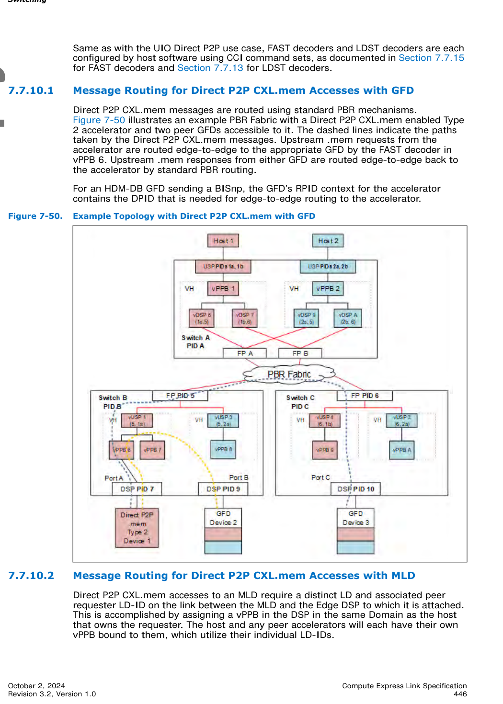
>
> *Original page render @ 150 DPI* — [📄 Full size](figures/chapter_07/page_0446.png)

### 7.7.10.2 Message Routing for Direct P2P CXL.mem Accesses with MLD | 使用 MLD 的 Direct P2P CXL.mem 访问的消息路由

<table>
<thead>
<tr>
<th width="50%">🇬🇧 English</th>
<th width="50%" style="background-color:#e8e8e8">🇨🇳 中文</th>
</tr>
</thead>
<tbody>
<tr><td>Direct P2P CXL.mem accesses to an MLD require a distinct LD and associated peer requester LD-ID on the link between the MLD and the Edge DSP to which it is attached. This is accomplished by assigning a vPPB in the DSP in the same Domain as the host that owns the requester. The host and any peer accelerators will each have their own vPPB bound to them, which utilize their individual LD-IDs.</td><td style="background-color:#e8e8e8">对 MLD 的 Direct P2P CXL.mem 访问需要一条与 MLD 和所连接 Edge DSP 之间的链路上的对等请求者 LD-ID 不同的 LD。这是通过在与请求者所属主机同一 Domain 的 DSP 中分配一个 vPPB 来实现的。主机和任何对等加速器各自拥有绑定到自身的 vPPB,并使用各自的 LD-ID。</td></tr>
</tbody>
</table>

> **Figure 7-51.** Example Topology with Direct P2P CXL.mem with MLD ｜ 使用 MLD 的 Direct P2P CXL.mem 示例拓扑
>
> 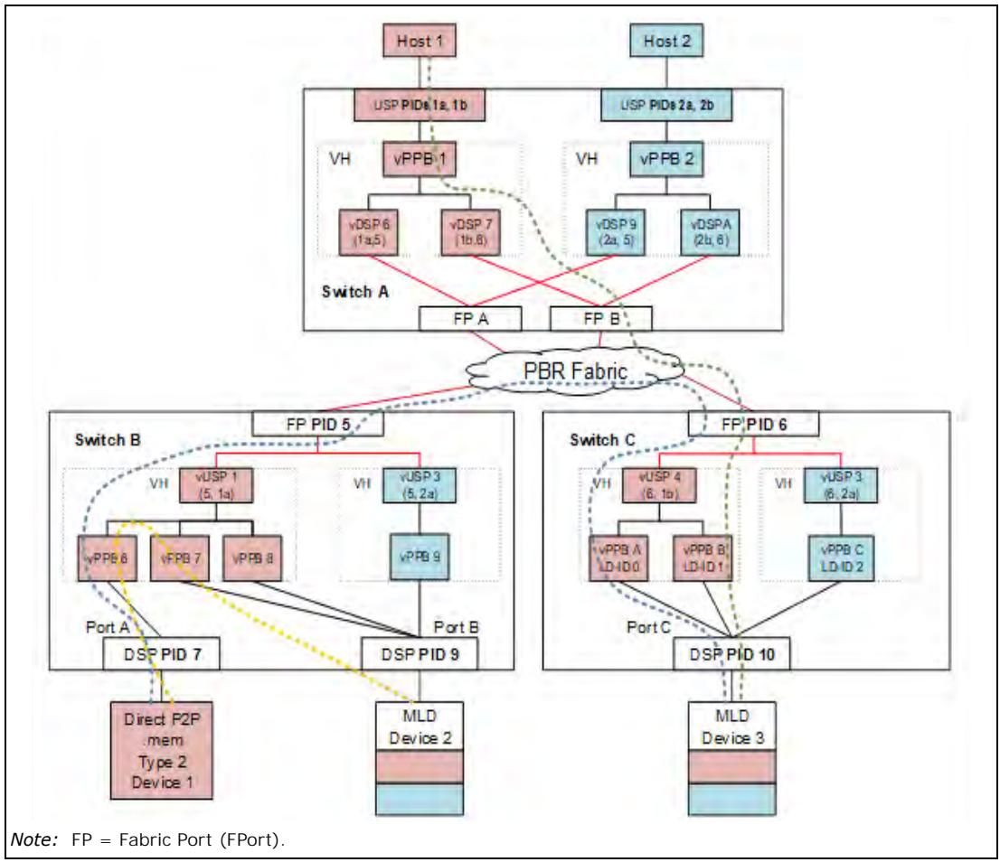
>
> *Original page render @ 150 DPI* — [📄 Full size](figures/chapter_07/page_0447.png)

<table>
<thead>
<tr>
<th width="50%">🇬🇧 English</th>
<th width="50%" style="background-color:#e8e8e8">🇨🇳 中文</th>
</tr>
</thead>
<tbody>
<tr><td>Figure 7-51 illustrates an example PBR Fabric with a Direct P2P CXL.mem enabled Type 2 accelerator and two peer MLDs accessible to it. Other than the dashed line to Host 1, the dashed lines indicate the paths taken by the Direct P2P CXL.mem messages. Upstream CXL.mem requests from the accelerator are routed edge-to-edge to the appropriate MLD by the LDST decoder in vPPB 6. Upstream CXL.mem responses from either MLD are routed edge-to-edge back to the accelerator by standard PBR routing using the accelerator's PID, which in each case is retrieved from the accelerator's vPPB in the DSP above the MLD.</td><td style="background-color:#e8e8e8">图 7-51 展示了一个 PBR Fabric 示例,其中包含一个支持 Direct P2P CXL.mem 的 Type 2 加速器以及两个可被其访问的对等 MLD。除到 Host 1 的虚线外,其余虚线表示 Direct P2P CXL.mem 消息所经过的路径。加速器的上行 CXL.mem 请求由 vPPB 6 中的 LDST 解码器边到边路由到相应的 MLD。来自任一 MLD 的上行 CXL.mem 响应则通过标准 PBR 路由,使用加速器的 PID 边到边返回加速器,该 PID 在每种情况下均从 MLD 之上 DSP 中加速器的 vPPB 中获取。</td></tr>
<tr><td>In this example, the path taken by CXL.mem messages between the host and one MLD is also shown. Downstream CXL.mem requests from the host are routed edge-to-edge to the appropriate MLD by the LDST decoder in vPPB 1. Upstream CXL.mem responses from the MLD are routed edge-to-edge back to the host by standard PBR routing using the host's PID contained in vPPB B.</td><td style="background-color:#e8e8e8">本例中还展示了主机与一个 MLD 之间 CXL.mem 消息所经过的路径。源自主机的下行 CXL.mem 请求由 vPPB 1 中的 LDST 解码器边到边路由到相应的 MLD。来自 MLD 的上行 CXL.mem 响应则通过标准 PBR 路由,使用 vPPB B 中包含的主机 PID 边到边返回主机。</td></tr>
<tr><td>For an HDM-DB LD-FAM device sending a BISnp, the Edge DSP above the LD-FAM device contains the DPID that is needed for edge-to-edge routing to the accelerator.</td><td style="background-color:#e8e8e8">对于发送 BISnp 的 HDM-DB LD-FAM 设备,LD-FAM 设备之上的 Edge DSP 包含边到边路由到加速器所需的 DPID。</td></tr>
<tr><td>Note: FP = Fabric Port (FPort).</td><td style="background-color:#e8e8e8">注:FP = Fabric Port (FPort)。</td></tr>
</tbody>
</table>

### 7.7.10.3 PBR Switch Port Processing of Direct P2P CXL.mem Messages | Direct P2P CXL.mem 消息的 PBR 交换机端口处理

<table>
<thead>
<tr>
<th width="50%">🇬🇧 English</th>
<th width="50%" style="background-color:#e8e8e8">🇨🇳 中文</th>
</tr>
</thead>
<tbody>
<tr><td>Table 7-109 summarizes how PBR switches perform port processing of CXL.mem messages with the Direct P2P CXL.mem for Accelerators use case. This traffic never flows through Edge USPs or HBR switches. The accelerator (requester) is always an SLD directly connected to an Edge DSP, and each Type 3 memory device is always directly connected to an Edge DSP. All messages in PBR format are routed edge-to-edge.</td><td style="background-color:#e8e8e8">表 7-109 总结了 PBR 交换机在 Direct P2P CXL.mem for Accelerators 用例下对 CXL.mem 消息进行端口处理的方式。该流量永远不会经过 Edge USP 或 HBR 交换机。加速器 (请求者) 始终是直连 Edge DSP 的 SLD,且每个 Type 3 内存设备始终直连 Edge DSP。所有 PBR 格式的消息均按边到边方式路由。</td></tr>
<tr><td>For conciseness, there are several abbreviations within the table. Beyond "accel" standing for accelerator, see Section 7.7.6.8 for other abbreviations.</td><td style="background-color:#e8e8e8">为简洁起见,表中使用了若干缩写。除 "accel" 表示加速器外,其他缩写参见 7.7.6.8 节。</td></tr>
</tbody>
</table>

> **Table 7-109.** PBR Switch Port Processing Table for Direct P2P CXL.mem ｜ Direct P2P CXL.mem 的 PBR 交换机端口处理表
>
> 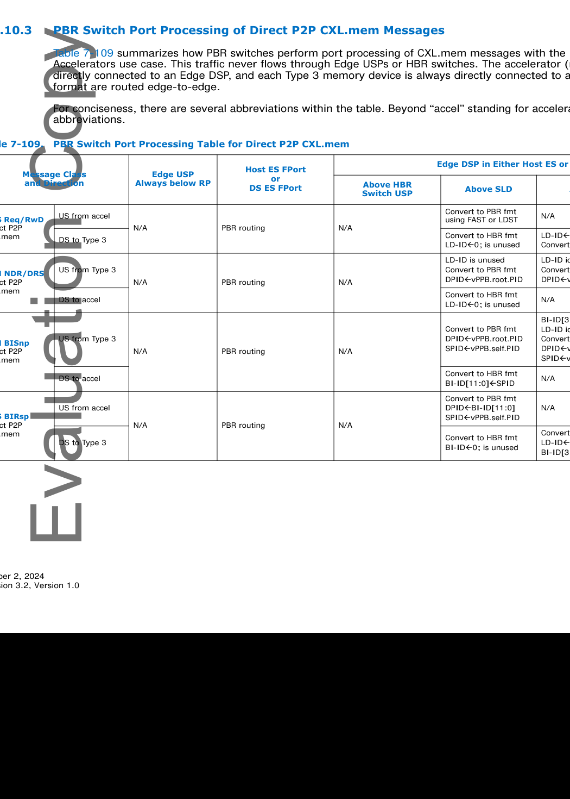
>
> *Original page render @ 150 DPI* — [📄 Full size](figures/chapter_07/page_0448.png)

[⬆️ 返回目录](#-本章目录-part-c)

---

## 7.7.11 PBR Link Events and Messages | PBR 链路事件与消息

<table>
<thead>
<tr>
<th width="50%">🇬🇧 English</th>
<th width="50%" style="background-color:#e8e8e8">🇨🇳 中文</th>
</tr>
</thead>
<tbody>
<tr><td>A PBR link can carry traffic from many different VH at the same time. Some events may occur that only affect a single VH, while other events need to apply to all VH sharing the link.</td><td style="background-color:#e8e8e8">一条 PBR 链路可同时承载来自多个不同 VH 的流量。某些事件可能仅影响单个 VH,而其他事件则需要应用于共享该链路的所有 VH。</td></tr>
<tr><td>Basic PBR link requirements are discussed in Section 7.7.11.1.</td><td style="background-color:#e8e8e8">PBR 链路的基本要求在 7.7.11.1 节中讨论。</td></tr>
<tr><td>A summary of all the CXL Vendor Defined Messages (VDMs) that are PTH routed to the destination is provided in Section 7.7.11.2.</td><td style="background-color:#e8e8e8">通过 PTH 路由到目标的所有 CXL Vendor Defined Messages (VDM) 的摘要见 7.7.11.2 节。</td></tr>
<tr><td>PCIe events for a single VH are discussed in Section 7.7.11.3.</td><td style="background-color:#e8e8e8">单个 VH 的 PCIe 事件在 7.7.11.3 节中讨论。</td></tr>
<tr><td>PCIe events for multiple VH sharing a link are discussed in Section 7.7.11.4.</td><td style="background-color:#e8e8e8">共享同一链路的多个 VH 的 PCIe 事件在 7.7.11.4 节中讨论。</td></tr>
<tr><td>Events that occur outside PCIe are discussed in Section 7.7.11.5.</td><td style="background-color:#e8e8e8">PCIe 之外发生的事件在 7.7.11.5 节中讨论。</td></tr>
<tr><td>Messaging to and from a host to a GFD is discussed in Section 3.1.11.1.</td><td style="background-color:#e8e8e8">主机与 GFD 之间的消息传递在 3.1.11.1 节中讨论。</td></tr>
</tbody>
</table>

### 7.7.11.1 PBR Link Fundamentals | PBR 链路基础

<table>
<thead>
<tr>
<th width="50%">🇬🇧 English</th>
<th width="50%" style="background-color:#e8e8e8">🇨🇳 中文</th>
</tr>
</thead>
<tbody>
<tr><td>CXL defines two types of PBR links:</td><td style="background-color:#e8e8e8">CXL 定义了两种 PBR 链路:</td></tr>
<tr><td>• Inter-Switch Link (ISL)</td><td style="background-color:#e8e8e8">• 交换机间链路 (Inter-Switch Link, ISL)</td></tr>
<tr><td>• GFD link</td><td style="background-color:#e8e8e8">• GFD 链路</td></tr>
<tr><td>All PBR links must support PBR Flit mode. Because PBR Flit mode relies on PCIe Flit mode, all host-OS-visible DSPs should report PCIe Flit mode as enabled. The DSPs include both a Host Edge Switch vDSP and a DSP above a PBR link that leads to a GFD.</td><td style="background-color:#e8e8e8">所有 PBR 链路必须支持 PBR Flit 模式。由于 PBR Flit 模式依赖于 PCIe Flit 模式,所有主机操作系统可见的 DSP 应报告 PCIe Flit 模式已启用。DSP 包括 Host Edge Switch 的 vDSP 以及通往 GFD 的 PBR 链路之上的 DSP。</td></tr>
<tr><td>The owner of a PBR link is an FM-managed DSP. Switch firmware may assist the FM in managing the DSP. An ISL is a downstream-to-downstream crosslink and thus has an FM-managed DSP on each side of the link. A GFD link has only one DSP and thus has only one FM-managed DSP. The speed and width of a PBR link is solely controlled by the FM-managed DSP(s) on the link and not by any vDSPs that share the link.</td><td style="background-color:#e8e8e8">PBR 链路的所有者是 FM 管理的 DSP。交换机固件可协助 FM 管理 DSP。ISL 是下行到下行的 crosslink,链路两侧各有一个 FM 管理的 DSP。GFD 链路仅有一个 DSP,因此仅有一个 FM 管理的 DSP。PBR 链路的速度和宽度完全由链路上的 FM 管理 DSP 控制,而不是由共享该链路的任何 vDSP 控制。</td></tr>
<tr><td>Each side of an ISL is managed separately. Each DSP above an ISL must support DPC, to allow firmware on each side of the link an independent amount of time to process fabric port events. DPC shall be enabled for all cases on ISL except when the ISL is the only path to the FM, in which case the DSP furthest from the FM shall not have DPC enabled.</td><td style="background-color:#e8e8e8">ISL 的每一侧均独立管理。ISL 之上的每个 DSP 必须支持 DPC,以便链路两侧的固件可独立地有足够时间处理 fabric 端口事件。除 ISL 是到 FM 的唯一路径的情况外,ISL 上所有情形均应启用 DPC;在这种情况下,距 FM 最远的 DSP 不应启用 DPC。</td></tr>
<tr><td>FM-initiated CXL.io traffic sent across a PBR link shall be limited to DMTF-format VDMs. The PTH.DPID is used to indicate whether the PBR Link Partner should sink the TLP or forward the TLP. If the PTH.DPID = FFFh, the PBR Link Partner must sink the VDM because that is how the initial device discovery occurs and how PIDs are assigned. If the PTH.DPID = the device's PID, then the device must also sink the VDM because that is how the device is accessed by the FM.</td><td style="background-color:#e8e8e8">通过 PBR 链路发送的 FM 主动发起的 CXL.io 流量应限于 DMTF 格式的 VDM。PTH.DPID 用于指示 PBR 链路对端是接收 (sink) TLP 还是转发 TLP。若 PTH.DPID = FFFh,则 PBR 链路对端必须接收该 VDM,因为这是完成初始设备发现以及分配 PID 的方式。若 PTH.DPID = 设备的 PID,则设备也必须接收该 VDM,因为这是 FM 访问该设备的方式。</td></tr>
<tr><td>All VH users of a PBR link have their functionality ride on top of the FM-managed link. For example, a VH's DSP cannot see a Link Up if the fabric link is not up. A VH cannot change the width or speed of its shared link, rather it will inherit the setting of the FM-managed DSP.</td><td style="background-color:#e8e8e8">PBR 链路的所有 VH 用户的功能均建立在 FM 管理的链路之上。例如,若 fabric 链路未 up,则 VH 的 DSP 看不到 Link Up。VH 不能更改其共享链路的宽度或速度,而是会继承 FM 管理的 DSP 的设置。</td></tr>
<tr><td>To manage different software response times to events, every vDSP for every VH must support DPC. DPC allows a host to keep its Link Down from its (VH) perspective until it is ready to re-enable it, having cleaned up all the side effects of a Link Down. A Host may or may not choose to enable DPC.</td><td style="background-color:#e8e8e8">为应对不同软件对事件的响应时间,每个 VH 的每个 vDSP 必须支持 DPC。DPC 允许主机在清理完 Link Down 的所有副作用并准备重新启用之前,一直从其 (VH 的) 视角保持 Link Down。主机可自行选择是否启用 DPC。</td></tr>
<tr><td>L0p is optional on a PBR link. The FM-managed DSP initiates any L0p transitions via a mechanism that is beyond this specification.</td><td style="background-color:#e8e8e8">L0p 在 PBR 链路上是可选的。任何 L0p 转换均由 FM 管理的 DSP 通过本规范之外的方式发起。</td></tr>
<tr><td>Every CXL.io TLP on a PBR link will carry a 4B PTH. The VDMs described in this section follow the same rule. See Section 3.1.8. There are three fields of note in the PTH that are required for the VDMs described in this section:</td><td style="background-color:#e8e8e8">PBR 链路上的每个 CXL.io TLP 都将携带 4 字节 PTH。本节所述的 VDM 遵循相同规则。参见 3.1.8 节。PTH 中有三个字段对于本节所述的 VDM 至关重要:</td></tr>
<tr><td>• SPID: Source PID</td><td style="background-color:#e8e8e8">• SPID:源 PID</td></tr>
<tr><td>— From a vDSP: Use vDSP's USP PID</td><td style="background-color:#e8e8e8">— 来自 vDSP:使用 vDSP 的 USP PID</td></tr>
<tr><td>— From a vUSP: Use vUSP's FPort PID</td><td style="background-color:#e8e8e8">— 来自 vUSP:使用 vUSP 的 FPort PID</td></tr>
<tr><td>— From a switch: Use switch's PID</td><td style="background-color:#e8e8e8">— 来自交换机:使用交换机的 PID</td></tr>
<tr><td>— From a downstream edge: Use DSP's PID</td><td style="background-color:#e8e8e8">— 来自下行边缘:使用 DSP 的 PID</td></tr>
<tr><td>— From a host edge: Use USP's PID</td><td style="background-color:#e8e8e8">— 来自主机边缘:使用 USP 的 PID</td></tr>
<tr><td>• DPID: Destination PID</td><td style="background-color:#e8e8e8">• DPID:目标 PID</td></tr>
<tr><td>— To a vDSP: Use vDSP's USP PID</td><td style="background-color:#e8e8e8">— 目标为 vDSP:使用 vDSP 的 USP PID</td></tr>
<tr><td>— To a vUSP: Use vUSP's FPort PID</td><td style="background-color:#e8e8e8">— 目标为 vUSP:使用 vUSP 的 FPort PID</td></tr>
<tr><td>— To a switch: Use switch's PID</td><td style="background-color:#e8e8e8">— 目标为交换机:使用交换机的 PID</td></tr>
<tr><td>— To a downstream edge: Use DSP's PID</td><td style="background-color:#e8e8e8">— 目标为下行边缘:使用 DSP 的 PID</td></tr>
<tr><td>— To host edge: Use USP's PID</td><td style="background-color:#e8e8e8">— 目标为主机边缘:使用 USP 的 PID</td></tr>
<tr><td>• DSAR flag</td><td style="background-color:#e8e8e8">• DSAR 标志</td></tr>
</tbody>
</table>

### 7.7.11.2 CXL VDMs | CXL VDM

<table>
<thead>
<tr>
<th width="50%">🇬🇧 English</th>
<th width="50%" style="background-color:#e8e8e8">🇨🇳 中文</th>
</tr>
</thead>
<tbody>
<tr><td>See Section 3.1.11 for a list of VDMs that are used in the PBR fabric.</td><td style="background-color:#e8e8e8">PBR fabric 中使用的 VDM 列表参见 3.1.11 节。</td></tr>
</tbody>
</table>

### 7.7.11.3 Single VH Events | 单 VH 事件

<table>
<thead>
<tr>
<th width="50%">🇬🇧 English</th>
<th width="50%" style="background-color:#e8e8e8">🇨🇳 中文</th>
</tr>
</thead>
<tbody>
<tr><td>Events that are contained within a single VH should not affect other VHs that share an ISL.</td><td style="background-color:#e8e8e8">局限于单个 VH 的事件不应影响共享同一 ISL 的其他 VH。</td></tr>
<tr><td>PCIe visible events that are contained within a single VH include:</td><td style="background-color:#e8e8e8">局限于单个 VH 的 PCIe 可见事件包括:</td></tr>
<tr><td>• Assert Reset</td><td style="background-color:#e8e8e8">• 复位置位 (Assert Reset)</td></tr>
<tr><td>• Deassert Reset</td><td style="background-color:#e8e8e8">• 复位撤销 (Deassert Reset)</td></tr>
<tr><td>• Link Up</td><td style="background-color:#e8e8e8">• Link Up</td></tr>
</tbody>
</table>

> **Figure 7-52.** Single VH ｜ 单一虚拟层级 (Single VH)
>
> 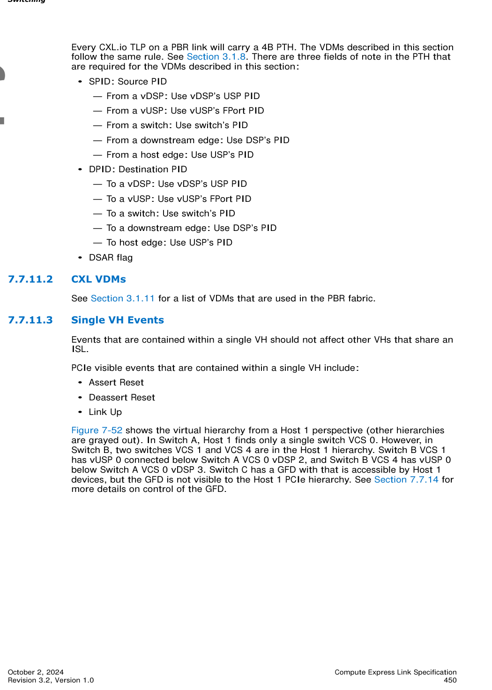
>
> *Original page render @ 150 DPI* — [📄 Full size](figures/chapter_07/page_0450.png)

<table>
<thead>
<tr>
<th width="50%">🇬🇧 English</th>
<th width="50%" style="background-color:#e8e8e8">🇨🇳 中文</th>
</tr>
</thead>
<tbody>
<tr><td>Figure 7-52 shows the virtual hierarchy from a Host 1 perspective (other hierarchies are grayed out). In Switch A, Host 1 finds only a single switch VCS 0. However, in Switch B, two switches VCS 1 and VCS 4 are in the Host 1 hierarchy. Switch B VCS 1 has vUSP 0 connected below Switch A VCS 0 vDSP 2, and Switch B VCS 4 has vUSP 0 below Switch A VCS 0 vDSP 3. Switch C has a GFD with that is accessible by Host 1 devices, but the GFD is not visible to the Host 1 PCIe hierarchy. See Section 7.7.14 for more details on control of the GFD.</td><td style="background-color:#e8e8e8">图 7-52 展示了从 Host 1 视角看到的虚拟层级 (其他层级以灰色显示)。在 Switch A 中,Host 1 仅发现单个交换机 VCS 0。但在 Switch B 中,VCS 1 和 VCS 4 两个交换机均属于 Host 1 层级。Switch B VCS 1 的 vUSP 0 连接在 Switch A VCS 0 vDSP 2 之下,Switch B VCS 4 的 vUSP 0 连接在 Switch A VCS 0 vDSP 3 之下。Switch C 拥有一个可被 Host 1 设备访问的 GFD,但该 GFD 对 Host 1 的 PCIe 层级不可见。有关 GFD 控制的更多详细信息,参见 7.7.14 节。</td></tr>
</tbody>
</table>

#### 7.7.11.3.1 Assert Reset VDM | Assert Reset VDM

<table>
<thead>
<tr>
<th width="50%">🇬🇧 English</th>
<th width="50%" style="background-color:#e8e8e8">🇨🇳 中文</th>
</tr>
</thead>
<tbody>
<tr><td>Every PCIe hierarchy supports three levels of Conventional Reset:</td><td style="background-color:#e8e8e8">每个 PCIe 层级均支持三级常规复位 (Conventional Reset):</td></tr>
<tr><td>• Fundamental cold reset (PERST#): Input pin</td><td style="background-color:#e8e8e8">• 基础冷复位 (Fundamental cold reset, PERST#):输入引脚</td></tr>
<tr><td>• Fundamental warm reset (PERST#): Input pin</td><td style="background-color:#e8e8e8">• 基础热复位 (Fundamental warm reset, PERST#):输入引脚</td></tr>
<tr><td>• Hot reset due to Link Down, in-band hot reset, USP secondary bus reset, DSP secondary bus reset, or link disabled</td><td style="background-color:#e8e8e8">• 由于 Link Down、带内热复位、USP secondary bus reset、DSP secondary bus reset 或链路禁用所导致的热复位</td></tr>
<tr><td>CXL Fabric links support propagation of these resets. The ISL link state is not affected by any VH's Assert Reset or Assert PERST# VDM. Assertion of reset is accomplished using one of two different VDM opcodes:</td><td style="background-color:#e8e8e8">CXL Fabric 链路支持这些复位的传播。ISL 链路状态不受任何 VH 的 Assert Reset 或 Assert PERST# VDM 影响。复位置位通过以下两种 VDM 操作码之一完成:</td></tr>
<tr><td>• Assert PERST#: Used for fundamental reset assertion for that VH, Opcode 0</td><td style="background-color:#e8e8e8">• Assert PERST#:用于该 VH 的基础复位置位,操作码 0</td></tr>
<tr><td>• Assert Reset: Used for hot reset assertion for that VH, Opcode 1</td><td style="background-color:#e8e8e8">• Assert Reset:用于该 VH 的热复位置位,操作码 1</td></tr>
<tr><td>The separate PERST# message allows for fundamental reset functionality without the need for extra pins between switches.</td><td style="background-color:#e8e8e8">单独的 PERST# 消息允许实现基础复位功能,无需在交换机之间增加额外的引脚。</td></tr>
<tr><td>Assert PERST# should be triggered whenever a VH has its input fundamental reset asserted on a Host ES. Assert Reset should be triggered whenever the Host ES:</td><td style="background-color:#e8e8e8">当 VH 在 Host ES 上输入基础复位被置位时,应触发 Assert PERST#。当 Host ES 出现以下情况时,应触发 Assert Reset:</td></tr>
<tr><td>• Receives a hot reset input</td><td style="background-color:#e8e8e8">• 接收到热复位输入</td></tr>
<tr><td>• Has a secondary bus reset on its USP</td><td style="background-color:#e8e8e8">• 在其 USP 上发生 secondary bus reset</td></tr>
<tr><td>• Has a secondary bus reset on its VDSP</td><td style="background-color:#e8e8e8">• 在其 vDSP 上发生 secondary bus reset</td></tr>
<tr><td>• Has a link disable on its vDSP</td><td style="background-color:#e8e8e8">• 在其 vDSP 上发生 link disable</td></tr>
</tbody>
</table>

<table>
<thead>
<tr>
<th width="50%">🇬🇧 English</th>
<th width="50%" style="background-color:#e8e8e8">🇨🇳 中文</th>
</tr>
</thead>
<tbody>
<tr><td>The Assert Reset VDMs all are sent from a vDSP to its paired vUSP. The VDM sent will have a PTH with:</td><td style="background-color:#e8e8e8">Assert Reset VDM 均由 vDSP 发送给与其配对的 vUSP。所发送的 VDM 将携带具有以下内容的 PTH:</td></tr>
<tr><td>• SPID = vDSP's host PID</td><td style="background-color:#e8e8e8">• SPID = vDSP 的主机 PID</td></tr>
<tr><td>• DPID = vUSP's FPort PID</td><td style="background-color:#e8e8e8">• DPID = vUSP 的 FPort PID</td></tr>
<tr><td>• DSAR flag = 1</td><td style="background-color:#e8e8e8">• DSAR 标志 = 1</td></tr>
<tr><td>VDM header fields for Assert Reset VDMs:</td><td style="background-color:#e8e8e8">Assert Reset VDM 的 VDM 头字段:</td></tr>
<tr><td>• CXL VDM code of 80h</td><td style="background-color:#e8e8e8">• CXL VDM code 为 80h</td></tr>
<tr><td>• PBR Opcode 0 or 1 indicates which Assert PERST# or Assert Reset message</td><td style="background-color:#e8e8e8">• PBR 操作码 0 或 1 指示 Assert PERST# 或 Assert Reset 消息</td></tr>
<tr><td>It is expected that the Assert Reset VDM will reach a vUSP uniquely identified by the SPID and DPID at the destination switch.</td><td style="background-color:#e8e8e8">Assert Reset VDM 预计将到达目标交换机中由 SPID 和 DPID 唯一标识的 vUSP。</td></tr>
<tr><td>A vDSP, upon sending Assert Reset VDM, will have its link state transition to Hot Reset.</td><td style="background-color:#e8e8e8">vDSP 在发送 Assert Reset VDM 后,其链路状态将迁移至 Hot Reset。</td></tr>
<tr><td>A vUSP, upon receiving an Assert Reset VDM, will have its link state transition to Hot Reset. While in Hot Reset, all Port non-sticky registers and state machines that belong to the VH must return to their initialized state.</td><td style="background-color:#e8e8e8">vUSP 在接收到 Assert Reset VDM 后,其链路状态将迁移至 Hot Reset。在 Hot Reset 期间,属于该 VH 的所有 Port 非 sticky 寄存器和状态机必须返回到其初始化状态。</td></tr>
<tr><td>A vUSP, upon receiving an Assert PERST# VDM, shall have its link state transition to Hot Reset and also shall clear any sticky bits as outlined by PCIe Base Specification for PERST# behavior.</td><td style="background-color:#e8e8e8">vUSP 在接收到 Assert PERST# VDM 后,其链路状态应迁移至 Hot Reset,并应按照 PCIe Base Specification 中针对 PERST# 行为的规定清除任何 sticky 位。</td></tr>
<tr><td>It is possible to send any number of Assert Reset VDMs or Assert PERST# VDMs.</td><td style="background-color:#e8e8e8">可以发送任意数量的 Assert Reset VDM 或 Assert PERST# VDM。</td></tr>
<tr><td>In Figure 7-53, if Host 1 asserts its PERST#, then both Switch A VCS 0 vDSP 2 and Switch A VCS 0 vDSP 3 shall issue an AssertPERST# VDM. The format of the PTH would be (SPID=A01, DPID=B01) for vDSP 2 and (SPID=A11, DPID=B02) for vDSP 3. If Host 1 instead asserted vDSP 2 secondary bus reset, then only vDSP 2 would send an AssertReset VDM with (SPID=A01, DPID=B01).</td><td style="background-color:#e8e8e8">在图 7-53 中,若 Host 1 置位其 PERST#,则 Switch A VCS 0 vDSP 2 和 Switch A VCS 0 vDSP 3 均应发起 AssertPERST# VDM。vDSP 2 的 PTH 格式为 (SPID=A01, DPID=B01),vDSP 3 的 PTH 格式为 (SPID=A11, DPID=B02)。若 Host 1 仅对 vDSP 2 触发 secondary bus reset,则只有 vDSP 2 会发送 PTH 为 (SPID=A01, DPID=B01) 的 AssertReset VDM。</td></tr>
</tbody>
</table>

#### 7.7.11.3.2 Deassert Reset VDM | Deassert Reset VDM

<table>
<thead>
<tr>
<th width="50%">🇬🇧 English</th>
<th width="50%" style="background-color:#e8e8e8">🇨🇳 中文</th>
</tr>
</thead>
<tbody>
<tr><td>A Deassert Reset VDM signals a release of reset and an exiting of the Hot Reset state to enter Detect for that VH. This VDM shall be sent from the Host Edge Switch due to a deassertion of the PERST# input resulting from an exit from Hot Reset.</td><td style="background-color:#e8e8e8">Deassert Reset VDM 表示复位的释放以及退出 Hot Reset 状态以进入 Detect 状态 (针对该 VH)。该 VDM 应由 Host Edge Switch 在退出 Hot Reset 而撤销 PERST# 输入时发送。</td></tr>
<tr><td>If DSP is enabled the DPC trigger status must be cleared before a Deassert Reset VDM can be sent because DPC triggered prevents any TLPs from egressing that port.</td><td style="background-color:#e8e8e8">若启用了 DSP,则必须在发送 Deassert Reset VDM 之前清除 DPC 触发状态,因为 DPC 触发会阻止任何 TLP 从该端口出口。</td></tr>
<tr><td>Propagation of reset deassertion over an ISL is enabled via a Deassert Reset VDM, which is used for hot reset deassertion for that VH, Opcode 3.</td><td style="background-color:#e8e8e8">通过 ISL 传播复位撤销由 Deassert Reset VDM 实现,该 VDM 用于该 VH 的热复位撤销,操作码 3。</td></tr>
<tr><td>A Deassert Reset VDM is used to instruct the vUSP to exit Hot Reset and enter Detect. The Deassert Reset VDM sent will have a PTH with:</td><td style="background-color:#e8e8e8">Deassert Reset VDM 用于指示 vUSP 退出 Hot Reset 并进入 Detect。所发送的 Deassert Reset VDM 将携带具有以下内容的 PTH:</td></tr>
<tr><td>• SPID = vDSP's host PID</td><td style="background-color:#e8e8e8">• SPID = vDSP 的主机 PID</td></tr>
<tr><td>• DPID = vUSP's FPort PID</td><td style="background-color:#e8e8e8">• DPID = vUSP 的 FPort PID</td></tr>
<tr><td>• DSAR flag = 1</td><td style="background-color:#e8e8e8">• DSAR 标志 = 1</td></tr>
<tr><td>VDM header fields for Deassert Reset VDMs:</td><td style="background-color:#e8e8e8">Deassert Reset VDM 的 VDM 头字段:</td></tr>
<tr><td>• CXL VDM code of 80h</td><td style="background-color:#e8e8e8">• CXL VDM code 为 80h</td></tr>
<tr><td>• PBR Opcode 3</td><td style="background-color:#e8e8e8">• PBR 操作码 3</td></tr>
<tr><td>A vDSP, upon sending a Deassert Reset VDM, will have its link state transition from Hot Reset to Detect. A vUSP, upon receiving a Deassert Reset VDM, will have its link state transition from Hot Reset to Detect. If the link state is not in Hot Reset, a link state change will not occur.</td><td style="background-color:#e8e8e8">vDSP 在发送 Deassert Reset VDM 后,其链路状态将从 Hot Reset 迁移到 Detect。vUSP 在接收到 Deassert Reset VDM 后,其链路状态将从 Hot Reset 迁移到 Detect。若链路状态不在 Hot Reset,则不会发生链路状态变化。</td></tr>
<tr><td>The link for that VH will remain in Detect until the vUSP sends a Link Up VDM and the vDSP receives a Link Up VDM. If a Link Up VDM is not received within 10 ms, a subsequent Deassert Reset VDM shall be sent. This can repeat until 10 Deassert Reset VDMs have been sent. After a tenth Deassert Reset VDM is sent, if a Link Up VDM is still not received within 10 ms, the reset deassertion failed and the FM shall be notified.</td><td style="background-color:#e8e8e8">该 VH 的链路将保持在 Detect 状态,直到 vUSP 发送 Link Up VDM 且 vDSP 接收到 Link Up VDM。若在 10 ms 内未收到 Link Up VDM,则应发送后续的 Deassert Reset VDM。该过程可重复,最多发送 10 个 Deassert Reset VDM。发送第 10 个 Deassert Reset VDM 后,若在 10 ms 内仍未收到 Link Up VDM,则复位撤销失败,应通知 FM。</td></tr>
<tr><td>In Figure 7-53, if Host 1 clears the secondary bus reset in Switch A VCS 0 vDSP 2, then Switch A VCS 0 vDSP 2 would send a Deassert Reset VDM with (SPID=A01, DPID=B01). Switch B VCS 1 vUSP 0 would exit the hot reset state. As part of the exit from LTSSM Detect and due to the shared link nature of an ISL, Switch B VCS 1 vUSP 0 will bypass the PCIe LTSSM states of Polling and Configuration and transition the vDSP-to-vUSP link back to L0 (Link Up) by sending a Response Link Up VDM.</td><td style="background-color:#e8e8e8">在图 7-53 中,若 Host 1 清除 Switch A VCS 0 vDSP 2 上的 secondary bus reset,则 Switch A VCS 0 vDSP 2 将发送 PTH 为 (SPID=A01, DPID=B01) 的 Deassert Reset VDM。Switch B VCS 1 vUSP 0 将退出热复位状态。作为退出 LTSSM Detect 的一部分,且由于 ISL 链路的共享特性,Switch B VCS 1 vUSP 0 将绕过 PCIe LTSSM 的 Polling 和 Configuration 状态,通过发送 Response Link Up VDM 将 vDSP 到 vUSP 的链路直接返回 L0 (Link Up)。</td></tr>
</tbody>
</table>

#### 7.7.11.3.3 Link Up VDM | Link Up VDM

<table>
<thead>
<tr>
<th width="50%">🇬🇧 English</th>
<th width="50%" style="background-color:#e8e8e8">🇨🇳 中文</th>
</tr>
</thead>
<tbody>
<tr><td>A Link Up VDM signals a transition to L0 active for that VH's link. The Link Up VDM is sent by a vUSP to its paired vDSP to convey a post-Detect state across the shared ISL.</td><td style="background-color:#e8e8e8">Link Up VDM 表示该 VH 的链路迁移到 L0 active 状态。Link Up VDM 由 vUSP 发送给与其配对的 vDSP,以在共享 ISL 上传达 Detect 之后的状态。</td></tr>
<tr><td>The vUSP sends a Link Up VDM after receiving a Deassert Reset VDM. The vUSP can perform any required post-reset initialization before sending the Link Up VDM. The vUSP may take as long as it needs after Deassert Reset to send the Link Up VDM. Any number of Deassert Reset VDMs may be received by the vUSP; for each Deassert Reset VDM received, a Link Up VDM shall be sent.</td><td style="background-color:#e8e8e8">vUSP 在收到 Deassert Reset VDM 后发送 Link Up VDM。vUSP 可在发送 Link Up VDM 之前执行任何必要的复位后初始化。vUSP 在收到 Deassert Reset 后可在其需要的时间内发送 Link Up VDM。vUSP 可接收任意数量的 Deassert Reset VDM;每收到一个 Deassert Reset VDM,就应发送一个 Link Up VDM。</td></tr>
<tr><td>The vUSP, after sending a Link Up VDM, shall have its link state transition to L0 from Detect. Polling and Configuration link states are bypassed by the Link Up VDM because the required TS1 and TS2 Ordered Sets cannot be sent over a shared ISL.</td><td style="background-color:#e8e8e8">vUSP 在发送 Link Up VDM 后,其链路状态应从 Detect 迁移到 L0。Link Up VDM 绕过 Polling 和 Configuration 链路状态,因为所需的 TS1 和 TS2 有序集无法在共享 ISL 上发送。</td></tr>
<tr><td>A vDSP, after receiving a Link Up VDM, shall have its link state transition to L0 from Detect. If not in Detect, there is no state change. Any number of Link Up VDMs may be received. Polling and Configuration link states are bypassed by the Link Up VDM, with the link directly transitioning from Detect to L0.</td><td style="background-color:#e8e8e8">vDSP 在收到 Link Up VDM 后,其链路状态应从 Detect 迁移到 L0。若不在 Detect 状态,则不发生状态变化。可接收任意数量的 Link Up VDM。Link Up VDM 绕过 Polling 和 Configuration 链路状态,链路直接从 Detect 迁移到 L0。</td></tr>
<tr><td>Neither a vDSP nor vUSP should ever have their link state reach Polling or Configuration state.</td><td style="background-color:#e8e8e8">vDSP 和 vUSP 的链路状态均不应进入 Polling 或 Configuration 状态。</td></tr>
<tr><td>The VDM sent will have a PTH with:</td><td style="background-color:#e8e8e8">所发送的 VDM 将携带具有以下内容的 PTH:</td></tr>
<tr><td>• SPID = vUSP's FPort PID</td><td style="background-color:#e8e8e8">• SPID = vUSP 的 FPort PID</td></tr>
<tr><td>• DPID = vDSP's host PID</td><td style="background-color:#e8e8e8">• DPID = vDSP 的主机 PID</td></tr>
<tr><td>• DSAR flag = 1</td><td style="background-color:#e8e8e8">• DSAR 标志 = 1</td></tr>
<tr><td>VDM header fields for LinkUp VDMs:</td><td style="background-color:#e8e8e8">LinkUp VDM 的 VDM 头字段:</td></tr>
<tr><td>• CXL VDM code of 80h</td><td style="background-color:#e8e8e8">• CXL VDM code 为 80h</td></tr>
<tr><td>• PBR Opcode 4</td><td style="background-color:#e8e8e8">• PBR 操作码 4</td></tr>
</tbody>
</table>

#### 7.7.11.3.4 Dynamic vDSP-to-vUSP Bind | 动态 vDSP 到 vUSP 绑定

<table>
<thead>
<tr>
<th width="50%">🇬🇧 English</th>
<th width="50%" style="background-color:#e8e8e8">🇨🇳 中文</th>
</tr>
</thead>
<tbody>
<tr><td>See Section 7.7.12.3 for more details on the Configure PID Binding API sequence. After Configure PID Bind, the vDSP or vUSP shall be in a Hot Reset state. A vDSP may issue an Assert Reset VDM or a Deassert Reset VDM from the reset state, as dictated by its VH. A vUSP shall remain in Hot Reset until the vUSP receives a Deassert Reset VDM, upon which, after processing the necessary post-reset tasks, the vUSP will send a Link Up VDM.</td><td style="background-color:#e8e8e8">有关 Configure PID Binding API 顺序的更多详细信息,参见 7.7.12.3 节。Configure PID Bind 之后,vDSP 或 vUSP 应处于 Hot Reset 状态。vDSP 可根据其 VH 的要求从复位状态发出 Assert Reset VDM 或 Deassert Reset VDM。vUSP 应保持在 Hot Reset 状态,直到收到 Deassert Reset VDM,之后在处理完必要的复位后任务后,vUSP 将发送 Link Up VDM。</td></tr>
</tbody>
</table>

[⬆️ 返回目录](#-本章目录-part-c)

---

### 7.7.11.4 Shared Link Events | 共享链路事件

<table>
<thead>
<tr>
<th width="50%">🇬🇧 English</th>
<th width="50%" style="background-color:#e8e8e8">🇨🇳 中文</th>
</tr>
</thead>
<tbody>
<tr><td>Events that affect multiple VHs on the same link need to be reported to the FM. The FM shall take any necessary action.</td><td style="background-color:#e8e8e8">影响同一链路上多个 VH 的事件需要上报给 FM。FM 应采取任何必要的措施。</td></tr>
<tr><td>The FM is required to keep an inventory for each ISL. Figure 7-53 shows how the link from Switch A Port B (indicated by an oval with 1) is shared by both a Host 1 hierarchy and a Host 3 hierarchy. Events on this link will affect both hierarchies. The oval with 2 is another shared link used by multiple hierarchies, of which only a Host 1 hierarchy is colored in but the ISL also includes Host 3 (VCS 2) and two hierarchies of Host 2 (VCS 0 and VCS 3).</td><td style="background-color:#e8e8e8">FM 需要为每条 ISL 维护一份清单。图 7-53 展示了 Switch A Port B (由带 1 的椭圆指示) 的链路如何由 Host 1 层级和 Host 3 层级共享。该链路上的事件将影响两个层级。带 2 的椭圆是另一条由多个层级共享的链路,虽然图中仅以颜色标出 Host 1 层级,但该 ISL 还包含 Host 3 (VCS 2) 和 Host 2 的两个层级 (VCS 0 和 VCS 3)。</td></tr>
</tbody>
</table>

> **Figure 7-53.** Shared Link Events ｜ 共享链路事件
>
> 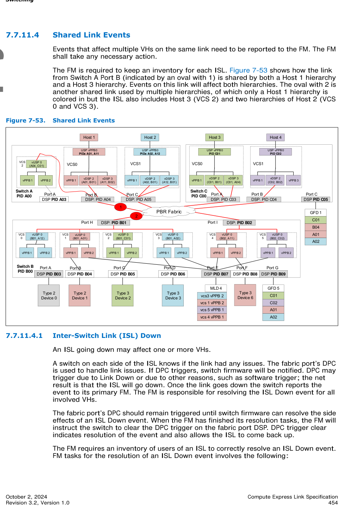
>
> *Original page render @ 150 DPI* — [📄 Full size](figures/chapter_07/page_0454.png)

#### 7.7.11.4.1 Inter-Switch Link (ISL) Down | 交换机间链路 (ISL) Down

<table>
<thead>
<tr>
<th width="50%">🇬🇧 English</th>
<th width="50%" style="background-color:#e8e8e8">🇨🇳 中文</th>
</tr>
</thead>
<tbody>
<tr><td>An ISL going down may affect one or more VHs.</td><td style="background-color:#e8e8e8">ISL 链路 down 可能影响一个或多个 VH。</td></tr>
<tr><td>A switch on each side of the ISL knows if the link had any issues. The fabric port's DPC is used to handle link issues. If DPC triggers, switch firmware will be notified. DPC may trigger due to Link Down or due to other reasons, such as software trigger; the net result is that the ISL will go down. Once the link goes down the switch reports the event to its primary FM. The FM is responsible for resolving the ISL Down event for all involved VHs.</td><td style="background-color:#e8e8e8">ISL 两侧的交换机均可获知该链路是否存在问题。Fabric 端口的 DPC 用于处理链路问题。若 DPC 触发,则将通知交换机固件。DPC 可能因 Link Down 或其他原因 (如软件触发) 而触发;最终结果是 ISL 将 down。链路 down 后,交换机将该事件上报给其主 FM。FM 负责为所有相关 VH 解决 ISL Down 事件。</td></tr>
<tr><td>The fabric port's DPC should remain triggered until switch firmware can resolve the side effects of an ISL Down event. When the FM has finished its resolution tasks, the FM will instruct the switch to clear the DPC trigger on the fabric port DSP. DPC trigger clear indicates resolution of the event and also allows the ISL to come back up.</td><td style="background-color:#e8e8e8">Fabric 端口的 DPC 应保持触发,直到交换机固件能够解决 ISL Down 事件的副作用。FM 完成其处理任务后,将指示交换机清除 fabric 端口 DSP 上的 DPC 触发。清除 DPC 触发表示事件已解决,同时允许 ISL 重新 up。</td></tr>
<tr><td>The FM requires an inventory of users of an ISL to correctly resolve an ISL Down event. FM tasks for the resolution of an ISL Down event involves the following:</td><td style="background-color:#e8e8e8">FM 需要 ISL 用户的清单才能正确解决 ISL Down 事件。FM 解决 ISL Down 事件的任务包括:</td></tr>
</tbody>
</table>

<table>
<thead>
<tr>
<th width="50%">🇬🇧 English</th>
<th width="50%" style="background-color:#e8e8e8">🇨🇳 中文</th>
</tr>
</thead>
<tbody>
<tr><td>• Unbinding any affected VHs' vDSP</td><td style="background-color:#e8e8e8">• 解绑任何受影响 VH 的 vDSP</td></tr>
<tr><td>• Unbinding any affected VHs' vUSP</td><td style="background-color:#e8e8e8">• 解绑任何受影响 VH 的 vUSP</td></tr>
<tr><td>• Clearing any affected multi-path in a switch's RGT</td><td style="background-color:#e8e8e8">• 清除交换机 RGT 中任何受影响的多路径</td></tr>
<tr><td>• Clearing any affected GFD Access Vector in a switch's GAE</td><td style="background-color:#e8e8e8">• 清除交换机 GAE 中任何受影响的 GFD Access Vector</td></tr>
<tr><td>For example, if the link at Oval #1 in Figure 7-53 breaks, Switch A and an unlabeled PBR fabric switch will both notify their primary FM. The FM will then unbind the following affected vDSPs and vUSPs:</td><td style="background-color:#e8e8e8">例如,若图 7-53 中椭圆 #1 处的链路断开,Switch A 和一个未标记的 PBR fabric 交换机均会上报其主 FM。随后 FM 将解绑以下受影响的 vDSP 和 vUSP:</td></tr>
<tr><td>• Switch A VCS 0 vDSP 2 and VCS 2 vUSP 0</td><td style="background-color:#e8e8e8">• Switch A VCS 0 vDSP 2 和 VCS 2 vUSP 0</td></tr>
<tr><td>• Switch B VCS 1 vUSP 0</td><td style="background-color:#e8e8e8">• Switch B VCS 1 vUSP 0</td></tr>
<tr><td>• Switch C VCS 0 vDSP 2</td><td style="background-color:#e8e8e8">• Switch C VCS 0 vDSP 2</td></tr>
<tr><td>As another example, if the link at Oval #2 in Figure 7-53 breaks, Switch B and an unlabeled PBR fabric switch will both notify their primary FM. The FM will then unbind the following affected vDSPs and vUSPs:</td><td style="background-color:#e8e8e8">作为另一个示例,若图 7-53 中椭圆 #2 处的链路断开,Switch B 和一个未标记的 PBR fabric 交换机均会上报其主 FM。随后 FM 将解绑以下受影响的 vDSP 和 vUSP:</td></tr>
<tr><td>• Switch A VCS 0 vDSP 2 and VCS 1 vDSP 3 and VCS 1 vDSP 2</td><td style="background-color:#e8e8e8">• Switch A VCS 0 vDSP 2、VCS 1 vDSP 3 和 VCS 1 vDSP 2</td></tr>
<tr><td>• Switch B VCS 0 vUSP 0, VCS 1 vUSP 0, VCS 2 vUSP 0, and VCS 3 vUSP 0</td><td style="background-color:#e8e8e8">• Switch B VCS 0 vUSP 0、VCS 1 vUSP 0、VCS 2 vUSP 0 和 VCS 3 vUSP 0</td></tr>
<tr><td>• Switch C VCS 0 vDSP 2</td><td style="background-color:#e8e8e8">• Switch C VCS 0 vDSP 2</td></tr>
<tr><td>In addition to the unbinding of the vDSP and vUSP pair affected by an ISL Down event, the RGT and GAE GFD access vectors may be updated by the FM. The RGT would be updated to avoid the path leading to the fault. The GFD Access Vector may be updated to remove a GFD that is no longer reachable.</td><td style="background-color:#e8e8e8">除了解绑受 ISL Down 事件影响的 vDSP 和 vUSP 对之外,RGT 和 GAE GFD 访问向量也可能由 FM 更新。RGT 将被更新以避开通往故障的路径。GFD Access Vector 可能被更新以移除不再可达的 GFD。</td></tr>
</tbody>
</table>

### 7.7.11.5 Switch Reported Events | 交换机上报事件

<table>
<thead>
<tr>
<th width="50%">🇬🇧 English</th>
<th width="50%" style="background-color:#e8e8e8">🇨🇳 中文</th>
</tr>
</thead>
<tbody>
<tr><td>Some events are switch specific or are outside normal PCIe reporting methods and thus require switch-specific intervention. These include:</td><td style="background-color:#e8e8e8">某些事件是交换机特有的或超出常规 PCIe 上报方法,因此需要交换机特有的干预。这些事件包括:</td></tr>
<tr><td>• Link Partner Info</td><td style="background-color:#e8e8e8">• Link Partner Info</td></tr>
</tbody>
</table>

#### 7.7.11.5.1 Link Partner Info VDM | Link Partner Info VDM

<table>
<thead>
<tr>
<th width="50%">🇬🇧 English</th>
<th width="50%" style="background-color:#e8e8e8">🇨🇳 中文</th>
</tr>
</thead>
<tbody>
<tr><td>A Link Partner Info VDM is sent on all PBR links immediately after the InitFC process finishes for VC0. Each side of the link will send a Link Partner Info VDM at this time.</td><td style="background-color:#e8e8e8">在 VC0 的 InitFC 过程完成后,会立即在所有 PBR 链路上发送 Link Partner Info VDM。此时链路的每一侧均会发送一个 Link Partner Info VDM。</td></tr>
<tr><td>A Link Partner Info VDM also is sent whenever a payload field value is updated. Only the side of the link with an updated value needs to send the VDM.</td><td style="background-color:#e8e8e8">只要有效载荷字段值被更新,也会发送 Link Partner Info VDM。仅链路上具有更新值的一侧需要发送 VDM。</td></tr>
<tr><td>This is a message with payload. For CXL 3.1, the payload is a fixed size of 16 DWORDs.</td><td style="background-color:#e8e8e8">这是一条带有效载荷的消息。对于 CXL 3.1,有效载荷固定为 16 个 DWORD。</td></tr>
<tr><td>There are two types of PBR links: ISL and GFD. Both send the same Link Partner Info format but have a different value for the device type of the sender.</td><td style="background-color:#e8e8e8">PBR 链路有两种类型:ISL 和 GFD。两者发送的 Link Partner Info 格式相同,但发送方的设备类型值不同。</td></tr>
<tr><td>The Link Partner Info payload includes the following details about the sender of the VDM:</td><td style="background-color:#e8e8e8">Link Partner Info 有效载荷包括有关 VDM 发送方的以下详细信息:</td></tr>
<tr><td>• 16B Link Partner ID: defined as the first 16 bytes of the Identify Output Payload as specified in Table 8-50, for the hardware sourcing the Link Partner Info VDM Payload. Thus, this 16B string is a globally unique ID associated only with the sourcing hardware.</td><td style="background-color:#e8e8e8">• 16 字节 Link Partner ID:定义为表 8-50 中规定的 Identify Output Payload 的前 16 字节,用于源 Link Partner Info VDM 有效载荷的硬件。因此,该 16 字节字符串是仅与源硬件关联的全局唯一 ID。</td></tr>
<tr><td>• 1B Physical Port ID: the ID number (port number) of the port sourcing (transmitting) the Link Partner Info VDM payload.</td><td style="background-color:#e8e8e8">• 1 字节 Physical Port ID:源 (发送) Link Partner Info VDM 有效载荷的端口的 ID 编号 (端口号)。</td></tr>
<tr><td>• 12bit PID (if FFFh, indicates sending port's PID is un-initialized)</td><td style="background-color:#e8e8e8">• 12 位 PID (若为 FFFh,表示发送端口的 PID 未初始化)</td></tr>
<tr><td>• 4bit Device Type (0 = PBR switch, 1 = GFD, all other encodings are reserved)</td><td style="background-color:#e8e8e8">• 4 位 Device Type (0 = PBR 交换机,1 = GFD,所有其他编码保留)</td></tr>
<tr><td>• 1B Standard FC VC list</td><td style="background-color:#e8e8e8">• 1 字节 Standard FC VC 列表</td></tr>
<tr><td>• 1B UIO FC VC list</td><td style="background-color:#e8e8e8">• 1 字节 UIO FC VC 列表</td></tr>
<tr><td>• 16B FM Primary UUID. If this value has not been initialized, this value shall read all zeros.</td><td style="background-color:#e8e8e8">• 16 字节 FM Primary UUID。若该值未初始化,则其应读为全零。</td></tr>
<tr><td>• 16B FM Secondary UUID. If this value has not been initialized, this value shall read all zeros.</td><td style="background-color:#e8e8e8">• 16 字节 FM Secondary UUID。若该值未初始化,则其应读为全零。</td></tr>
<tr><td>With multibyte fields, the least significant byte of the field starts with the lowest byte offset, and subsequent bytes are strictly increasing in significance. I.e., this is little endian format within each multibyte field as well as the overall payload.</td><td style="background-color:#e8e8e8">对于多字节字段,字段的最低有效字节从最低字节偏移开始,后续字节的位数严格递增。即每个多字节字段以及整个有效载荷均采用小端格式。</td></tr>
<tr><td>The Link Partner Info VDM.PTH fields are as listed below. This VDM will terminate at the Receiver.</td><td style="background-color:#e8e8e8">Link Partner Info VDM 的 PTH 字段如下所列。该 VDM 将在接收方终止。</td></tr>
<tr><td>• SPID = Originator's (switch's/GFD's) PID, A value of FFFh indicates the sender's PID is un-initialized.</td><td style="background-color:#e8e8e8">• SPID = 发起方 (交换机/GFD) 的 PID,FFFh 表示发送方的 PID 未初始化。</td></tr>
<tr><td>• DPID = FFFh (fixed value which indicates the receiving port is to process the VDM payload)</td><td style="background-color:#e8e8e8">• DPID = FFFh (固定值,表示接收端口应处理该 VDM 有效载荷)</td></tr>
<tr><td>• DSAR flag = 1</td><td style="background-color:#e8e8e8">• DSAR 标志 = 1</td></tr>
<tr><td>VDM header fields for LinkPartnerInfo VDMs:</td><td style="background-color:#e8e8e8">LinkPartnerInfo VDM 的 VDM 头字段:</td></tr>
<tr><td>• Type 74h (Message with Data, terminate at Receiver)</td><td style="background-color:#e8e8e8">• Type 为 74h (带数据的报文,在接收方终止)</td></tr>
<tr><td>• CXL VDM code of 90h</td><td style="background-color:#e8e8e8">• CXL VDM code 为 90h</td></tr>
<tr><td>• PBR Opcode 0</td><td style="background-color:#e8e8e8">• PBR 操作码 0</td></tr>
<tr><td>A single message is sufficient to carry all the link info for CXL release 3.1.</td><td style="background-color:#e8e8e8">对于 CXL 3.1 版本,单条消息足以携带所有链路信息。</td></tr>
</tbody>
</table>

> **Table 7-110.** Link Partner Info Payload ｜ Link Partner Info 有效载荷
>
> 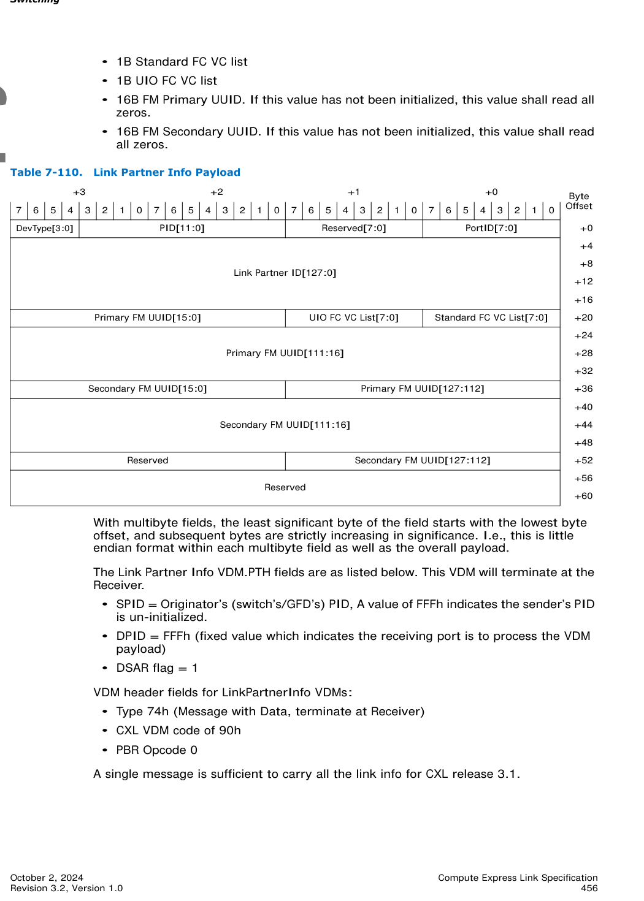
>
> *Original page render @ 150 DPI* — [📄 Full size](figures/chapter_07/page_0456.png)

### 7.7.11.6 PBR Link CCI Message Format and Transport Protocol | PBR 链路 CCI 消息格式与传输协议

<table>
<thead>
<tr>
<th width="50%">🇬🇧 English</th>
<th width="50%" style="background-color:#e8e8e8">🇨🇳 中文</th>
</tr>
</thead>
<tbody>
<tr><td>CCI commands are transported on PBR links as defined in Section 7.6.3 and its associated binding specifications (see DSP0234, DSP0238, and DSP0281) with some notable caveats and clarifications:</td><td style="background-color:#e8e8e8">CCI 命令在 PBR 链路上的传输如 7.6.3 节及其相关绑定规范 (参见 DSP0234、DSP0238 和 DSP0281) 所定义,以下为一些值得注意的注意事项和说明:</td></tr>
<tr><td>• As with all .io traffic across PBR links, MCTP PCIe VDMs include a PTH whose SPID and DPID define the routing of the message</td><td style="background-color:#e8e8e8">• 与所有跨 PBR 链路的 .io 流量一样,MCTP PCIe VDM 包含一个 PTH,其 SPID 和 DPID 定义消息的路由</td></tr>
<tr><td>• PCIe enumeration is not required for ISL PPBs and GFDs</td><td style="background-color:#e8e8e8">• ISL PPB 和 GFD 不需要进行 PCIe 枚举</td></tr>
<tr><td>• GFDs do not implement a PCIe Physical Function</td><td style="background-color:#e8e8e8">• GFD 不实现 PCIe Physical Function</td></tr>
<tr><td>• "Requester ID" and "Target ID" fields in the VDM's TLP header are reserved because IDs are not assigned to many elements within the fabric (e.g., FM, ISL PPBs, Switch Management FW, GFDs, etc.)</td><td style="background-color:#e8e8e8">• VDM 的 TLP 头中的 "Requester ID" 和 "Target ID" 字段保留,因为 fabric 中的许多元素 (例如 FM、ISL PPB、交换机管理固件、GFD 等) 不会被分配 ID</td></tr>
</tbody>
</table>

[⬆️ 返回目录](#-本章目录-part-c)

---

## 7.7.12 PBR Fabric Management | PBR Fabric 管理

### 7.7.12.1 Fabric Boot and Initialization | Fabric 引导与初始化

<table>
<thead>
<tr>
<th width="50%">🇬🇧 English</th>
<th width="50%" style="background-color:#e8e8e8">🇨🇳 中文</th>
</tr>
</thead>
<tbody>
<tr><td>Much like as outlined for HBR switches in Section 7.2.1, PBR switches may be initialized in one of three different ways:</td><td style="background-color:#e8e8e8">与 7.2.1 节中 HBR 交换机的概述类似,PBR 交换机可以通过以下三种不同方式之一进行初始化:</td></tr>
<tr><td>• Statically</td><td style="background-color:#e8e8e8">• 静态 (Statically)</td></tr>
<tr><td>• FM boots before the host(s)</td><td style="background-color:#e8e8e8">• FM 在主机之前引导</td></tr>
<tr><td>• FM and host boot simultaneously</td><td style="background-color:#e8e8e8">• FM 与主机同时引导</td></tr>
</tbody>
</table>

#### 7.7.12.1.1 Static Fabric Initialization | 静态 Fabric 初始化

<table>
<thead>
<tr>
<th width="50%">🇬🇧 English</th>
<th width="50%" style="background-color:#e8e8e8">🇨🇳 中文</th>
</tr>
</thead>
<tbody>
<tr><td>A static fabric deployment uses statically predefined configuration data to define the fabric configuration settings typically assigned dynamically by an FM.</td><td style="background-color:#e8e8e8">静态 fabric 部署使用静态预定义的配置数据来定义通常由 FM 动态分配的 fabric 配置设置。</td></tr>
<tr><td>Static Fabric Characteristics:</td><td style="background-color:#e8e8e8">静态 Fabric 特性:</td></tr>
<tr><td>• No support for G-FAM or MLD</td><td style="background-color:#e8e8e8">• 不支持 G-FAM 或 MLD</td></tr>
<tr><td>• No support for dynamic binding changes or DCD</td><td style="background-color:#e8e8e8">• 不支持动态绑定变更或 DCD</td></tr>
<tr><td>• No FM is required, but may be needed for error handling</td><td style="background-color:#e8e8e8">• 不需要 FM,但错误处理时可能需要</td></tr>
<tr><td>• At switch boot, all ports have a PID assigned, DRT and RGT tables are pre-populated, and EP and PID binding settings are predefined as defined by vendor-specific switch configuration data (e.g., configuration file in SPI Flash)</td><td style="background-color:#e8e8e8">• 交换机引导时,所有端口已分配 PID,DRT 和 RGT 表已预先填充,EP 和 PID 绑定设置由厂商特定的交换机配置数据 (例如 SPI Flash 中的配置文件) 预定义</td></tr>
<tr><td>• Each VH is ready for enumeration when the host boots</td><td style="background-color:#e8e8e8">• 主机引导时,每个 VH 即可进行枚举</td></tr>
<tr><td>• Hot-add and managed hot-remove are supported on Downstream Edge Ports</td><td style="background-color:#e8e8e8">• 下行边缘端口支持热添加和托管热移除</td></tr>
</tbody>
</table>

#### 7.7.12.1.2 Fabric Manager Boots First | Fabric Manager 先引导

<table>
<thead>
<tr>
<th width="50%">🇬🇧 English</th>
<th width="50%" style="background-color:#e8e8e8">🇨🇳 中文</th>
</tr>
</thead>
<tbody>
<tr><td>With this method, the FM configures the fabric binding relationships and access permissions before the host boots and enumerates its VH.</td><td style="background-color:#e8e8e8">采用此方法,FM 会在主机引导并枚举其 VH 之前配置 fabric 的绑定关系和访问权限。</td></tr>
<tr><td>• FM boots while hosts are held in reset</td><td style="background-color:#e8e8e8">• FM 引导时,主机保持在复位状态</td></tr>
<tr><td>• All attached ISLs and DSPs link up and, when negotiated in PBR mode, exchange the PBR Link Information VDM</td><td style="background-color:#e8e8e8">• 所有已连接的 ISL 和 DSP 链路 up,当以 PBR 模式协商时,交换 PBR Link Information VDM</td></tr>
<tr><td>• FM discovers fabric topology, claims ownership of all components under its management, and assign PIDs</td><td style="background-color:#e8e8e8">• FM 发现 fabric 拓扑,声明对其管理下所有组件的所有权,并分配 PID</td></tr>
<tr><td>• FM binds EPs to VCSs and configures GFDs</td><td style="background-color:#e8e8e8">• FM 将 EP 绑定到 VCS 并配置 GFD</td></tr>
<tr><td>• FM configures GMV and VTV to enable G-FAM, GIM and Edge-to-edge P2P, as required when available</td><td style="background-color:#e8e8e8">• FM 配置 GMV 和 VTV 以启用 G-FAM、GIM 和边到边 P2P (在可用时)</td></tr>
</tbody>
</table>

#### 7.7.12.1.3 Fabric Manager and Host Boot Simultaneously | Fabric Manager 与主机同时引导

<table>
<thead>
<tr>
<th width="50%">🇬🇧 English</th>
<th width="50%" style="background-color:#e8e8e8">🇨🇳 中文</th>
</tr>
</thead>
<tbody>
<tr><td>In the case where the switches, FM, and host boot at the same time:</td><td style="background-color:#e8e8e8">在交换机、FM 和主机同时引导的情况下:</td></tr>
<tr><td>• VCSs, PID assignment, GFD configuration, and bindings between Host ES to Downstream ES VCSs are statically defined</td><td style="background-color:#e8e8e8">• VCS、PID 分配、GFD 配置以及 Host ES 与 Downstream ES VCS 之间的绑定是静态定义的</td></tr>
<tr><td>• Edge vPPBs within each VCS are unbound and presented to the host as Link Down</td><td style="background-color:#e8e8e8">• 每个 VCS 内的边缘 vPPB 处于未绑定状态,并以 Link Down 形式呈现给主机</td></tr>
<tr><td>• Switch discovers downstream devices and presents them to the FM</td><td style="background-color:#e8e8e8">• 交换机发现下行设备并将其呈现给 FM</td></tr>
<tr><td>• Host enumerates the VH and configures the DVSEC registers</td><td style="background-color:#e8e8e8">• 主机枚举 VH 并配置 DVSEC 寄存器</td></tr>
<tr><td>• FM performs port binding to edge vPPBs</td><td style="background-color:#e8e8e8">• FM 执行端口到边缘 vPPB 的绑定</td></tr>
<tr><td>• Switch performs virtual to physical binding</td><td style="background-color:#e8e8e8">• 交换机执行虚拟到物理的绑定</td></tr>
<tr><td>• Each bound port results in a Presence Detect Change or Link State Change notification to the host</td><td style="background-color:#e8e8e8">• 每个已绑定端口会向主机产生 Presence Detect Change 或 Link State Change 通知</td></tr>
<tr><td>• For G-FAM access, FM updates GMV and VTV access vectors for hosts</td><td style="background-color:#e8e8e8">• 对于 G-FAM 访问,FM 会更新主机的 GMV 和 VTV 访问向量</td></tr>
</tbody>
</table>

### 7.7.12.2 PBR Fabric Discovery | PBR Fabric 发现

<table>
<thead>
<tr>
<th width="50%">🇬🇧 English</th>
<th width="50%" style="background-color:#e8e8e8">🇨🇳 中文</th>
</tr>
</thead>
<tbody>
<tr><td>To effectively manage a PBR fabric, the FM must understand the physical topology through a fabric discovery process. A typical fabric discovery may proceed as follows.</td><td style="background-color:#e8e8e8">为了有效管理 PBR fabric,FM 必须通过 fabric 发现过程了解物理拓扑。典型的 fabric 发现可按以下步骤进行。</td></tr>
<tr><td>1. FM discovers the component to which it is directly connected and claims primary FM ownership.</td><td style="background-color:#e8e8e8">1. FM 发现与其直接连接的组件,并声明主 FM 所有权。</td></tr>
<tr><td>Management of a PBR device requires that a primary FM is registered. A PBR device shall accept only the following commands from an FM that is not registered as the primary FM:</td><td style="background-color:#e8e8e8">PBR 设备的管理要求注册主 FM。PBR 设备应仅接受来自未注册为主 FM 的 FM 的以下命令:</td></tr>
<tr><td>— Identify</td><td style="background-color:#e8e8e8">— Identify</td></tr>
<tr><td>— Get Supported Logs</td><td style="background-color:#e8e8e8">— Get Supported Logs</td></tr>
<tr><td>— Get Log</td><td style="background-color:#e8e8e8">— Get Log</td></tr>
<tr><td>— Identify PBR Component</td><td style="background-color:#e8e8e8">— Identify PBR Component</td></tr>
<tr><td>— Claim Ownership</td><td style="background-color:#e8e8e8">— Claim Ownership</td></tr>
<tr><td>All other commands shall fail with "Unsupported Request". A PBR device shall only advertise support for the CEL and the CEL shall only advertise the commands in the above list when the supported logs or CEL contents are queried by an FM that is not registered as the primary FM.</td><td style="background-color:#e8e8e8">所有其他命令应失败并返回 "Unsupported Request"。PBR 设备应仅公布对 CEL 的支持,且仅当未注册为主 FM 的 FM 查询支持的日志或 CEL 内容时,CEL 才应仅公布上述列表中的命令。</td></tr>
<tr><td>If the FM is connected to a switch, crawl out and discovery of the fabric continues.</td><td style="background-color:#e8e8e8">若 FM 连接到交换机,则继续 crawl out 和 fabric 发现。</td></tr>
<tr><td>2. FM explores all switch ports.</td><td style="background-color:#e8e8e8">2. FM 探索所有交换机端口。</td></tr>
<tr><td>As primary FM, the switch capabilities and switch port status can be queried. The Get Physical Port State and Get PBR Link Partner Info commands provide information on the devices connected to each port.</td><td style="background-color:#e8e8e8">作为主 FM,可查询交换机功能和交换机端口状态。Get Physical Port State 和 Get PBR Link Partner Info 命令提供有关每个端口所连接设备的信息。</td></tr>
<tr><td>PBR switches can determine the type of device present at the far end of a link after negotiation using the link state information provided in Table 7-111.</td><td style="background-color:#e8e8e8">PBR 交换机可在协商后使用表 7-111 中提供的链路状态信息确定链路远端所连接的设备类型。</td></tr>
<tr><td>3. FM may choose to first continue discovery of any connected switches or to manage devices on the far end of all switch ports.</td><td style="background-color:#e8e8e8">3. FM 可选择先继续发现任何已连接的交换机,或先管理所有交换机端口远端的设备。</td></tr>
<tr><td>PBR switch PPBs connected as ISLs are configured by the FM with the Send PPB CXL.io Configuration Request command.</td><td style="background-color:#e8e8e8">作为 ISL 连接的 PBR 交换机 PPB 由 FM 通过 Send PPB CXL.io Configuration Request 命令进行配置。</td></tr>
<tr><td>The FM uses the Fabric Crawl Out command, as defined in Section 7.7.13.2, using switch port number as the target to manage the devices on the far end of each switch port. The FM claims ownership and assigns a PID to each defined as covered in step 1.</td><td style="background-color:#e8e8e8">FM 使用 7.7.13.2 节中定义的 Fabric Crawl Out 命令,以交换机端口号作为目标,管理每个交换机端口远端的设备。FM 声明所有权并为每个 (如步骤 1 所述) 已定义的设备分配 PID。</td></tr>
<tr><td>Once the far end device has been assigned a PID, the FM must program the PBR</td><td style="background-color:#e8e8e8">一旦为远端设备分配了 PID,FM 必须对 PBR 交换机</td></tr>
</tbody>
</table>

<table>
<thead>
<tr>
<th width="50%">🇬🇧 English</th>
<th width="50%" style="background-color:#e8e8e8">🇨🇳 中文</th>
</tr>
</thead>
<tbody>
<tr><td>switch's DRT to enable routing of that PID to the appropriate switch port. The FM can now use this new assigned PID as the target for subsequent Fabric Crawl Out requests.</td><td style="background-color:#e8e8e8">的 DRT 进行编程,以使该 PID 可路由到相应的交换机端口。FM 现在可以使用这个新分配的 PID 作为后续 Fabric Crawl Out 请求的目标。</td></tr>
<tr><td>Steps 1 – 3 are repeated for all PBR switches discovered.</td><td style="background-color:#e8e8e8">对发现的所有 PBR 交换机重复步骤 1 – 3。</td></tr>
</tbody>
</table>

> **Table 7-111.** Far End Device Type Detection (Sheet 1 of 2) ｜ 远端设备类型检测 (1/2)
>
> 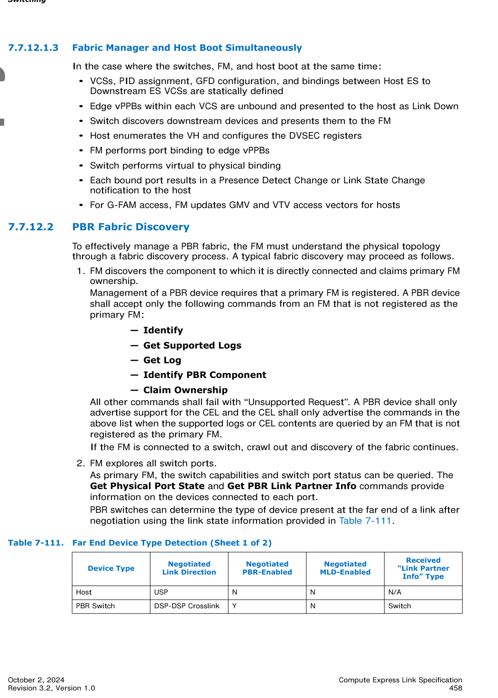
>
> *Original page render @ 150 DPI* — [📄 Full size](figures/chapter_07/page_0458.png)

> **Table 7-111 (cont.).** Far End Device Type Detection (Sheet 2 of 2) ｜ 远端设备类型检测 (2/2)
>
> 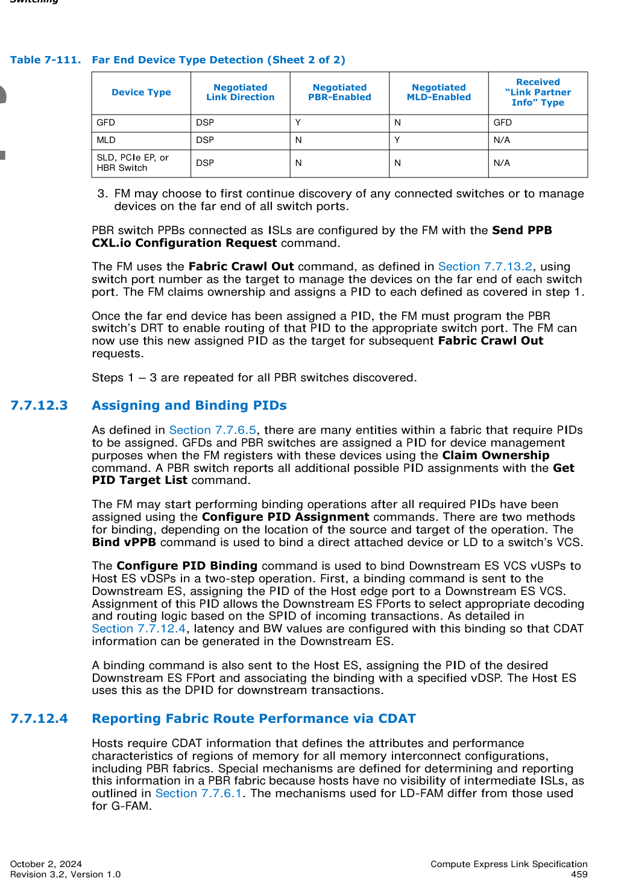
>
> *Original page render @ 150 DPI* — [📄 Full size](figures/chapter_07/page_0459.png)

### 7.7.12.3 Assigning and Binding PIDs | PID 分配与绑定

<table>
<thead>
<tr>
<th width="50%">🇬🇧 English</th>
<th width="50%" style="background-color:#e8e8e8">🇨🇳 中文</th>
</tr>
</thead>
<tbody>
<tr><td>As defined in Section 7.7.6.5, there are many entities within a fabric that require PIDs to be assigned. GFDs and PBR switches are assigned a PID for device management purposes when the FM registers with these devices using the Claim Ownership command. A PBR switch reports all additional possible PID assignments with the Get PID Target List command.</td><td style="background-color:#e8e8e8">如 7.7.6.5 节所定义,fabric 中有许多实体需要分配 PID。当 FM 通过 Claim Ownership 命令向这些设备注册时,会为 GFD 和 PBR 交换机分配 PID 以用于设备管理。PBR 交换机通过 Get PID Target List 命令上报所有其他可能的 PID 分配。</td></tr>
<tr><td>The FM may start performing binding operations after all required PIDs have been assigned using the Configure PID Assignment commands. There are two methods for binding, depending on the location of the source and target of the operation. The Bind vPPB command is used to bind a direct attached device or LD to a switch's VCS. The Configure PID Binding command is used to bind Downstream ES VCS vUSPs to Host ES vDSPs in a two-step operation. First, a binding command is sent to the Downstream ES, assigning the PID of the Host edge port to a Downstream ES VCS. Assignment of this PID allows the Downstream ES FPorts to select appropriate decoding and routing logic based on the SPID of incoming transactions. As detailed in Section 7.7.12.4, latency and BW values are configured with this binding so that CDAT information can be generated in the Downstream ES.</td><td style="background-color:#e8e8e8">使用 Configure PID Assignment 命令分配所有必需的 PID 后,FM 可开始执行绑定操作。绑定有两种方法,具体取决于操作的源和目标的位置。Bind vPPB 命令用于将直连设备或 LD 绑定到交换机的 VCS。Configure PID Binding 命令用于通过两步操作将 Downstream ES VCS vUSP 绑定到 Host ES vDSP。首先,将绑定命令发送到 Downstream ES,将 Host edge port 的 PID 分配给一个 Downstream ES VCS。分配该 PID 后,Downstream ES FPort 可根据传入事务的 SPID 选择适当的解码和路由逻辑。如 7.7.12.4 节所述,该绑定会配置延迟和带宽值,以便在 Downstream ES 中生成 CDAT 信息。</td></tr>
<tr><td>A binding command is also sent to the Host ES, assigning the PID of the desired Downstream ES FPort and associating the binding with a specified vDSP. The Host ES uses this as the DPID for downstream transactions.</td><td style="background-color:#e8e8e8">绑定命令还会发送到 Host ES,将所需 Downstream ES FPort 的 PID 分配给 Host ES 并将该绑定与指定的 vDSP 关联。Host ES 将其用作下行事务的 DPID。</td></tr>
</tbody>
</table>

### 7.7.12.4 Reporting Fabric Route Performance via CDAT | 通过 CDAT 上报 Fabric 路由性能

<table>
<thead>
<tr>
<th width="50%">🇬🇧 English</th>
<th width="50%" style="background-color:#e8e8e8">🇨🇳 中文</th>
</tr>
</thead>
<tbody>
<tr><td>Hosts require CDAT information that defines the attributes and performance characteristics of regions of memory for all memory interconnect configurations, including PBR fabrics. Special mechanisms are defined for determining and reporting this information in a PBR fabric because hosts have no visibility of intermediate ISLs, as outlined in Section 7.7.6.1. The mechanisms used for LD-FAM differ from those used for G-FAM.</td><td style="background-color:#e8e8e8">主机需要 CDAT 信息来定义所有内存互连配置 (包括 PBR fabric) 下内存区域的属性和性能特征。由于主机对中间 ISL 不可见 (如 7.7.6.1 节所述),在 PBR fabric 中定义了特殊机制用于确定和上报这些信息。LD-FAM 使用的机制与 G-FAM 不同。</td></tr>
</tbody>
</table>

#### 7.7.12.4.1 Accessing CDAT Information for LD-FAM | 访问 LD-FAM 的 CDAT 信息

<table>
<thead>
<tr>
<th width="50%">🇬🇧 English</th>
<th width="50%" style="background-color:#e8e8e8">🇨🇳 中文</th>
</tr>
</thead>
<tbody>
<tr><td>There are up to three components involved in the path to LD-FAM in a PBR fabric: a Host ES, a Downstream ES, and an LD-FAM device. The Host ES and LD-FAM devices require no special handling and report CDAT information covering their own characteristics as they would in an HBR system deployment. The Downstream ES, however, is required to report CDAT information that covers its own device-level performance factoring in the impact of the fabric routing path, as described below.</td><td style="background-color:#e8e8e8">在 PBR fabric 中,通往 LD-FAM 的路径涉及最多三个组件:Host ES、Downstream ES 和 LD-FAM 设备。Host ES 和 LD-FAM 设备不需要特殊处理,它们会上报涵盖其自身特征的 CDAT 信息,就像在 HBR 系统部署中一样。然而,Downstream ES 需要上报涵盖其自身设备级性能 (考虑 fabric 路由路径的影响) 的 CDAT 信息,如下所述。</td></tr>
<tr><td>Latency and BW values are provided when the binding between a Host ES VCS and Downstream ES VCS is configured with the Configure PID Binding command. Routes through a fabric are expected to have symmetric performance characteristics. As such, only one latency and BW value is provided to define the fabric routing path. The Downstream ES adds the latency of the routing path to its own latency and uses the lesser of the BW values.</td><td style="background-color:#e8e8e8">在使用 Configure PID Binding 命令配置 Host ES VCS 与 Downstream ES VCS 之间的绑定时,提供延迟和带宽值。Fabric 中的路由预期具有对称的性能特征。因此,仅提供一个延迟和带宽值来定义 fabric 路由路径。Downstream ES 将路由路径的延迟加到其自身延迟上,并使用两者带宽中较小的值。</td></tr>
<tr><td>Hosts access CDAT information for Downstream ES VCSs from a DOE instance present in the vUSP.</td><td style="background-color:#e8e8e8">主机从 vUSP 中的 DOE 实例访问 Downstream ES VCS 的 CDAT 信息。</td></tr>
</tbody>
</table>

#### 7.7.12.4.2 Accessing CDAT Information for G-FAM | 访问 G-FAM 的 CDAT 信息

<table>
<thead>
<tr>
<th width="50%">🇬🇧 English</th>
<th width="50%" style="background-color:#e8e8e8">🇨🇳 中文</th>
</tr>
</thead>
<tbody>
<tr><td>The access mechanism for CDAT from G-FAM is necessarily different from LD-FAM as a result of 2 key architectural differences: G-FAM is presented through the FAST, not a switch-based topology, and GFDs do not implement nor expose a DOE instance to the host. CDAT access for G-FAM instead relies on the use of CCI opcodes.</td><td style="background-color:#e8e8e8">由于两个关键的架构差异,G-FAM 的 CDAT 访问机制必然不同于 LD-FAM:G-FAM 通过 FAST 呈现,而不是基于交换机的拓扑;GFD 不实现也不向主机公开 DOE 实例。G-FAM 的 CDAT 访问转而依赖于 CCI 操作码的使用。</td></tr>
<tr><td>The GAE providing G-FAM access is responsible for producing the CDAT for each segment of the FAST. Latency and BW values are provided when PID access is enabled with the Configure PID Access command. The CDAT information is queried by the host using the Read CDAT command.</td><td style="background-color:#e8e8e8">提供 G-FAM 访问的 GAE 负责为 FAST 的每个段生成 CDAT。在使用 Configure PID Access 命令启用 PID 访问时,提供延迟和带宽值。主机使用 Read CDAT 命令查询 CDAT 信息。</td></tr>
<tr><td>GFDs are responsible for providing CDAT information covering their own characteristics. The host queries CDAT information from GFDs using the Proxy GFD Management Command request to initiate the Read CDAT command.</td><td style="background-color:#e8e8e8">GFD 负责提供涵盖其自身特征的 CDAT 信息。主机使用 Proxy GFD Management Command 请求从 GFD 查询 CDAT 信息,以启动 Read CDAT 命令。</td></tr>
</tbody>
</table>

### 7.7.12.5 Configuring CacheID in PBR Fabric | 在 PBR Fabric 中配置 CacheID

<table>
<thead>
<tr>
<th width="50%">🇬🇧 English</th>
<th width="50%" style="background-color:#e8e8e8">🇨🇳 中文</th>
</tr>
</thead>
<tbody>
<tr><td>From the host's perspective, configuration of CacheID for VHs spanning a PBR Fabric is performed identically to such configuration in an exclusively HBR topology. PBR switches automatically exchange ID configuration information in the following manner:</td><td style="background-color:#e8e8e8">从主机的角度来看,为跨越 PBR Fabric 的 VH 配置 CacheID 的过程与在纯 HBR 拓扑中执行该配置完全相同。PBR 交换机以如下方式自动交换 ID 配置信息:</td></tr>
<tr><td>1. The Downstream ES presents ID route table capabilities in its vPPBs (see Section 8.2.4.28 for details on the CacheID Route Table).</td><td style="background-color:#e8e8e8">1. Downstream ES 在其 vPPB 中呈现 ID 路由表能力 (CacheID Route Table 详情参见 8.2.4.28 节)。</td></tr>
<tr><td>2. The host will enumerate and assign all IDs and program the route table capability, triggering the Commit bit to complete the configuration.</td><td style="background-color:#e8e8e8">2. 主机将枚举并分配所有 ID,并对路由表能力进行编程,通过触发 Commit 位完成配置。</td></tr>
<tr><td>3. The setting of the Commit bit triggers the Downstream ES to generate one or more RTUpdate VDMs, as defined in Section 3.1.11.7, targeted at the Host PID. The Host ES will intercept this VDM based on its PBR opcode.</td><td style="background-color:#e8e8e8">3. 设置 Commit 位会触发 Downstream ES 生成一个或多个 RTUpdate VDM (如 3.1.11.7 节所定义),以 Host PID 为目标。Host ES 将根据其 PBR 操作码拦截该 VDM。</td></tr>
<tr><td>4. Upon receipt of the VDM, the Host ES programs the necessary ID to PID translation logic in the Host edge port.</td><td style="background-color:#e8e8e8">4. 收到 VDM 后,Host ES 在 Host edge port 中对所需的 ID 到 PID 转换逻辑进行编程。</td></tr>
<tr><td>5. The Host ES acknowledges successful programming of the ID translation logic with an RTUpdateAck VDM, as defined in Section 3.1.11.8, sent to the Downstream ES for each RTUpdate VDM that was received and successfully processed.</td><td style="background-color:#e8e8e8">5. Host ES 通过 RTUpdateAck VDM (如 3.1.11.8 节所定义) 向 Downstream ES 确认 ID 转换逻辑已成功编程,该 VDM 针对每个已接收并成功处理的 RTUpdate VDM 发送。</td></tr>
<tr><td>6. Upon receipt of the VDM, the Downstream ES sets the corresponding 'RT Committed' bit in the vUSP.</td><td style="background-color:#e8e8e8">6. 收到 VDM 后,Downstream ES 在 vUSP 中设置相应的 'RT Committed' 位。</td></tr>
<tr><td>A downstream HBR switch topology requires PIDs for each unique potential target so that IDs can be translated between CacheID and PID at the fabric edges. For CacheID, the ID is valid if the Valid bit is set in a Cache ID Target entry in the Cache ID Route Table Capability Structure. The corresponding PID used is the PID of the DSP to which the Route Table entry has been configured to map. Multiple PIDs must be assigned to a DSP if multiple IDs map to that DSP.</td><td style="background-color:#e8e8e8">下游 HBR 交换机拓扑需要为每个唯一潜在目标分配 PID,以便在 fabric 边缘进行 CacheID 与 PID 之间的转换。对于 CacheID,若 Cache ID Route Table Capability Structure 中 Cache ID Target 条目的 Valid 位置位,则该 ID 有效。所使用的相应 PID 是路由表条目已配置映射到的 DSP 的 PID。若多个 ID 映射到同一 DSP,则必须为该 DSP 分配多个 PID。</td></tr>
</tbody>
</table>

### 7.7.12.6 Dynamic Fabric Changes | 动态 Fabric 变更

<table>
<thead>
<tr>
<th width="50%">🇬🇧 English</th>
<th width="50%" style="background-color:#e8e8e8">🇨🇳 中文</th>
</tr>
</thead>
<tbody>
<tr><td>This section outlines how FMs and PBR switches handle various changes to the system configuration during runtime.</td><td style="background-color:#e8e8e8">本节概述 FM 和 PBR 交换机在运行时如何处理系统配置的各种变更。</td></tr>
</tbody>
</table>

#### 7.7.12.6.1 Hot-Add and Link Up Events | 热添加与 Link Up 事件

<table>
<thead>
<tr>
<th width="50%">🇬🇧 English</th>
<th width="50%" style="background-color:#e8e8e8">🇨🇳 中文</th>
</tr>
</thead>
<tbody>
<tr><td>A new Link Up on an unbound edge port is indicated to the FM via a Physical Switch Event Record. The FM uses the Get Physical Port State and Get PBR Link Partner Info commands to query information on the device connected to the port.</td><td style="background-color:#e8e8e8">未绑定边缘端口上的新 Link Up 通过 Physical Switch Event Record 通知 FM。FM 使用 Get Physical Port State 和 Get PBR Link Partner Info 命令查询端口所连接设备的信息。</td></tr>
<tr><td>When an SLD or PCIe device is Hot-Added to a bound port, the FM can be notified but is not involved.</td><td style="background-color:#e8e8e8">当 SLD 或 PCIe 设备热添加到已绑定端口时,FM 可收到通知但不会介入。</td></tr>
</tbody>
</table>

#### 7.7.12.6.2 Dynamic Configuration Changes | 动态配置变更

<table>
<thead>
<tr>
<th width="50%">🇬🇧 English</th>
<th width="50%" style="background-color:#e8e8e8">🇨🇳 中文</th>
</tr>
</thead>
<tbody>
<tr><td>There are many runtime configuration changes that an FM can trigger on a fabric:</td><td style="background-color:#e8e8e8">FM 可在 fabric 上触发多种运行时配置变更:</td></tr>
<tr><td>• Binding/Unbinding: New bindings are presented to hosts as hot-add operations. Unbinding an EP is presented as a hot-remove operation.</td><td style="background-color:#e8e8e8">• 绑定/解绑:新绑定作为热添加操作呈现给主机。解绑 EP 作为热移除操作呈现。</td></tr>
<tr><td>• Updates to GMV/VTV: The GAE generates a notification to the host when changes are made to the GMV or VTV enabling or disabling access to a particular PID.</td><td style="background-color:#e8e8e8">• GMV/VTV 更新:当对 GMV 或 VTV 进行启用/禁用特定 PID 访问的更改时,GAE 会向主机产生通知。</td></tr>
<tr><td>• GFD DCD changes: GFDs generate notifications to all impacted GAEs when updates are made to a host group's extent list.</td><td style="background-color:#e8e8e8">• GFD DCD 变更:当对主机组的范围列表进行更新时,GFD 会向所有受影响的 GAE 产生通知。</td></tr>
</tbody>
</table>

#### 7.7.12.6.3 Hot/Surprise Remove and Link Down Events | 热/意外移除与 Link Down 事件

<table>
<thead>
<tr>
<th width="50%">🇬🇧 English</th>
<th width="50%" style="background-color:#e8e8e8">🇨🇳 中文</th>
</tr>
</thead>
<tbody>
<tr><td>The FM is responsible for managing a Link Down event:</td><td style="background-color:#e8e8e8">FM 负责管理 Link Down 事件:</td></tr>
<tr><td>• The PBR switch that experienced the Link Down notifies the FM with a Physical Switch Event Record</td><td style="background-color:#e8e8e8">• 经历 Link Down 的 PBR 交换机通过 Physical Switch Event Record 通知 FM</td></tr>
<tr><td>• EP Link Down events are represented as surprise removes to the host</td><td style="background-color:#e8e8e8">• EP Link Down 事件以意外移除的方式呈现给主机</td></tr>
<tr><td>• The FM manages any required topology changes associated with an ISL Link Down event, including clearing the PID binding between the Upstream ES and Downstream ES VCSs, which is presented to the host as a hot-remove of the Downstream ES VCS</td><td style="background-color:#e8e8e8">• FM 管理与 ISL Link Down 事件相关的任何必要拓扑变更,包括清除 Upstream ES 与 Downstream ES VCS 之间的 PID 绑定,该绑定清除以 Downstream ES VCS 热移除的方式呈现给主机</td></tr>
<tr><td>• GFD Link Down events prompt the FM to disable access to the corresponding PID in all impacted hosts' GAE GMV and VTV</td><td style="background-color:#e8e8e8">• GFD Link Down 事件促使 FM 在所有受影响主机的 GAE GMV 和 VTV 中禁用对相应 PID 的访问</td></tr>
<tr><td>• PBR switches drop unroutable transactions</td><td style="background-color:#e8e8e8">• PBR 交换机丢弃无法路由的事务</td></tr>
</tbody>
</table>

[⬆️ 返回目录](#-本章目录-part-c)

---

## 7.7.13 PBR Switch Command Set | PBR 交换机命令集

<table>
<thead>
<tr>
<th width="50%">🇬🇧 English</th>
<th width="50%" style="background-color:#e8e8e8">🇨🇳 中文</th>
</tr>
</thead>
<tbody>
<tr><td>This command set is only supported by, and must be supported by, PBR switches to facilitate the discovery of a PBR fabric and configuration of routing and bindings.</td><td style="background-color:#e8e8e8">该命令集仅由 PBR 交换机支持,且 PBR 交换机必须支持该命令集,以便发现 PBR fabric 并配置路由和绑定。</td></tr>
</tbody>
</table>

### 7.7.13.1 Identify PBR Switch (Opcode 5700h) | Identify PBR Switch (操作码 5700h)

<table>
<thead>
<tr>
<th width="50%">🇬🇧 English</th>
<th width="50%" style="background-color:#e8e8e8">🇨🇳 中文</th>
</tr>
</thead>
<tbody>
<tr><td>This command provides information to the FM about a PBR switch's fabric capabilities.</td><td style="background-color:#e8e8e8">该命令向 FM 提供有关 PBR 交换机 fabric 能力的信息。</td></tr>
<tr><td>Possible Command Return Codes:</td><td style="background-color:#e8e8e8">可能的命令返回码:</td></tr>
<tr><td>• Success</td><td style="background-color:#e8e8e8">• Success</td></tr>
<tr><td>• Unsupported</td><td style="background-color:#e8e8e8">• Unsupported</td></tr>
<tr><td>• Internal Error</td><td style="background-color:#e8e8e8">• Internal Error</td></tr>
<tr><td>• Retry Required</td><td style="background-color:#e8e8e8">• Retry Required</td></tr>
<tr><td>Command Effects:</td><td style="background-color:#e8e8e8">命令效果:</td></tr>
<tr><td>• None</td><td style="background-color:#e8e8e8">• 无</td></tr>
</tbody>
</table>

> **Table 7-112.** Identify PBR Switch Response Payload ｜ Identify PBR Switch 响应 Payload
>
> 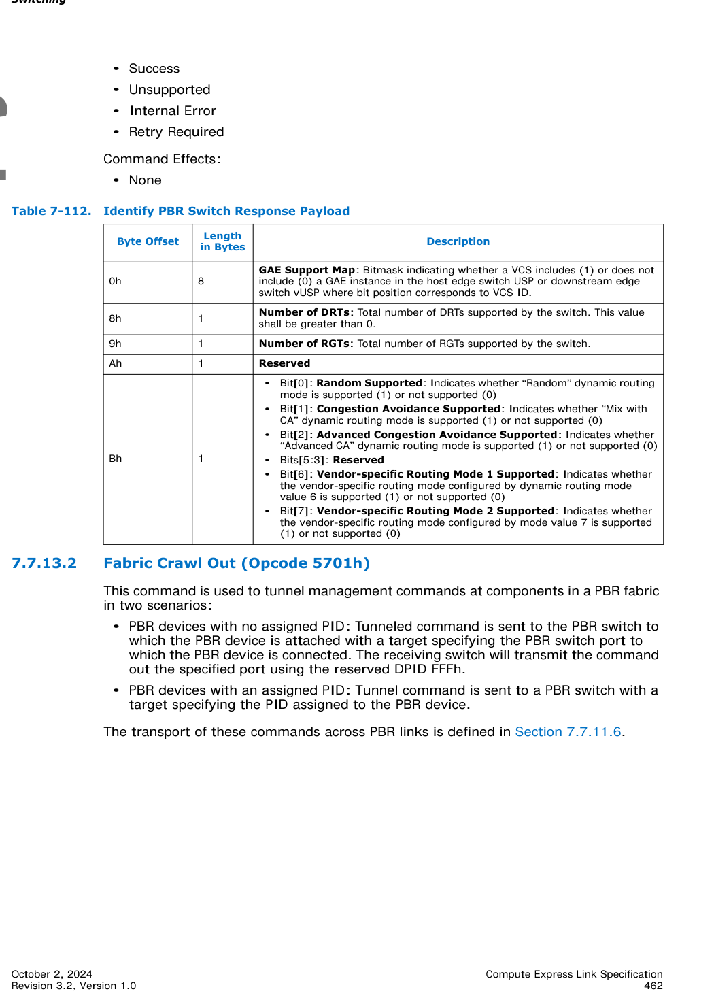
>
> *Original page render @ 150 DPI* — [📄 Full size](figures/chapter_07/page_0462.png)

### 7.7.13.2 Fabric Crawl Out (Opcode 5701h) | Fabric Crawl Out (操作码 5701h)

<table>
<thead>
<tr>
<th width="50%">🇬🇧 English</th>
<th width="50%" style="background-color:#e8e8e8">🇨🇳 中文</th>
</tr>
</thead>
<tbody>
<tr><td>This command is used to tunnel management commands at components in a PBR fabric in two scenarios:</td><td style="background-color:#e8e8e8">该命令用于在 PBR fabric 中的组件上隧道传输管理命令,适用于以下两种场景:</td></tr>
<tr><td>• PBR devices with no assigned PID: Tunneled command is sent to the PBR switch to which the PBR device is attached with a target specifying the PBR switch port to which the PBR device is connected. The receiving switch will transmit the command out the specified port using the reserved DPID FFFh.</td><td style="background-color:#e8e8e8">• 未分配 PID 的 PBR 设备:隧道命令发送到 PBR 设备所连接的 PBR 交换机,目标指定 PBR 设备所连接的 PBR 交换机端口。接收交换机将使用保留的 DPID FFFh 将命令从指定端口发出。</td></tr>
<tr><td>• PBR devices with an assigned PID: Tunnel command is sent to a PBR switch with a target specifying the PID assigned to the PBR device.</td><td style="background-color:#e8e8e8">• 已分配 PID 的 PBR 设备:隧道命令发送到 PBR 交换机,目标指定分配给 PBR 设备的 PID。</td></tr>
<tr><td>The transport of these commands across PBR links is defined in Section 7.7.11.6.</td><td style="background-color:#e8e8e8">这些命令跨 PBR 链路的传输在 7.7.11.6 节中定义。</td></tr>
<tr><td>The Management Command input payload field includes the tunneled command encapsulated in the CCI Message Format, as defined in Figure 7-19. This can include an additional layer of tunneling for commands issued to components with no assigned PID, as illustrated in Figure 7-55.</td><td style="background-color:#e8e8e8">Management Command 输入有效载荷字段包含按 CCI 消息格式 (如图 7-19 所定义) 封装的隧道命令。这可包括针对未分配 PID 的组件所发命令的额外一层隧道传输,如图 7-55 所示。</td></tr>
<tr><td>Response size varies, based on the tunneled command's definition. Valid targets for the tunneled commands include PBR switch ports, and PBR devices within a fabric.</td><td style="background-color:#e8e8e8">响应大小根据隧道命令的定义而变化。隧道命令的有效目标包括 PBR 交换机端口以及 fabric 中的 PBR 设备。</td></tr>
<tr><td>This command fails with "Invalid Input" if the target specifies a non-existent switch port or a PID with no valid entry in the DRT.</td><td style="background-color:#e8e8e8">若目标指定了不存在的交换机端口或 DRT 中无有效条目的 PID,则该命令以 "Invalid Input" 失败。</td></tr>
<tr><td>Components shall terminate the processing of a request that includes more than 2 layers of tunneling and provide an "Unsupported" return code.</td><td style="background-color:#e8e8e8">组件应终止处理包含超过 2 层隧道的请求,并返回 "Unsupported" 返回码。</td></tr>
<tr><td>Possible Command Return Codes:</td><td style="background-color:#e8e8e8">可能的命令返回码:</td></tr>
<tr><td>• Success</td><td style="background-color:#e8e8e8">• Success</td></tr>
<tr><td>• Unsupported</td><td style="background-color:#e8e8e8">• Unsupported</td></tr>
<tr><td>• Invalid Input</td><td style="background-color:#e8e8e8">• Invalid Input</td></tr>
<tr><td>• Internal Error</td><td style="background-color:#e8e8e8">• Internal Error</td></tr>
</tbody>
</table>

> **Figure 7-54.** Tunneling Commands to Remote Devices ｜ 对远程设备的命令隧道传输
>
> 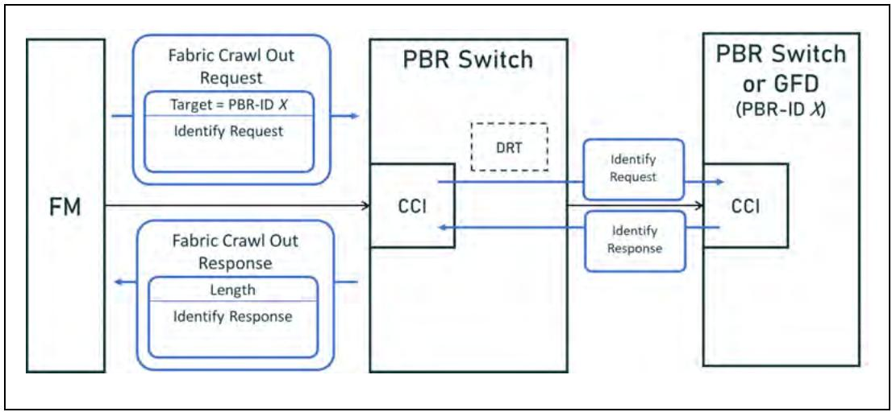
>
> *Original page render @ 150 DPI* — [📄 Full size](figures/chapter_07/page_0463.png)

> **Figure 7-55.** Tunneling Commands to Remote Devices with No Assigned PID ｜ 对未分配 PID 的远程设备的命令隧道传输
>
> 
>
> *Original page render @ 150 DPI* — [📄 Full size](figures/chapter_07/page_0463.png)

<table>
<thead>
<tr>
<th width="50%">🇬🇧 English</th>
<th width="50%" style="background-color:#e8e8e8">🇨🇳 中文</th>
</tr>
</thead>
<tbody>
<tr><td>• Retry Required</td><td style="background-color:#e8e8e8">• Retry Required</td></tr>
<tr><td>Command Effects:</td><td style="background-color:#e8e8e8">命令效果:</td></tr>
<tr><td>• None</td><td style="background-color:#e8e8e8">• 无</td></tr>
</tbody>
</table>

> **Table 7-113.** Fabric Crawl Out Request Payload ｜ Fabric Crawl Out 请求 Payload
>
> 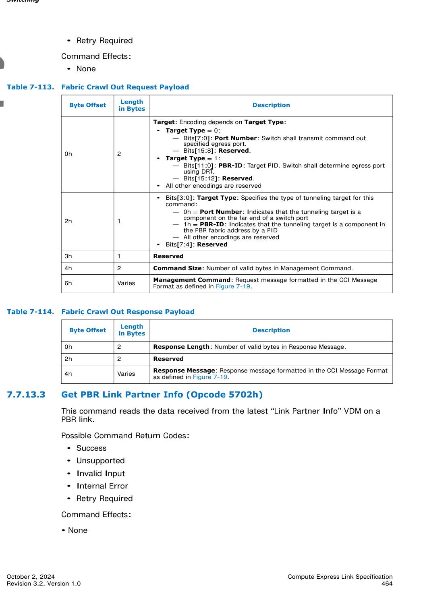
>
> *Original page render @ 150 DPI* — [📄 Full size](figures/chapter_07/page_0464.png)

> **Table 7-114.** Fabric Crawl Out Response Payload ｜ Fabric Crawl Out 响应 Payload
>
> 
>
> *Original page render @ 150 DPI* — [📄 Full size](figures/chapter_07/page_0464.png)

### 7.7.13.3 Get PBR Link Partner Info (Opcode 5702h) | Get PBR Link Partner Info (操作码 5702h)

<table>
<thead>
<tr>
<th width="50%">🇬🇧 English</th>
<th width="50%" style="background-color:#e8e8e8">🇨🇳 中文</th>
</tr>
</thead>
<tbody>
<tr><td>This command reads the data received from the latest "Link Partner Info" VDM on a PBR link.</td><td style="background-color:#e8e8e8">该命令读取从 PBR 链路上最新 "Link Partner Info" VDM 接收到的数据。</td></tr>
<tr><td>Possible Command Return Codes:</td><td style="background-color:#e8e8e8">可能的命令返回码:</td></tr>
<tr><td>• Success</td><td style="background-color:#e8e8e8">• Success</td></tr>
<tr><td>• Unsupported</td><td style="background-color:#e8e8e8">• Unsupported</td></tr>
<tr><td>• Invalid Input</td><td style="background-color:#e8e8e8">• Invalid Input</td></tr>
<tr><td>• Internal Error</td><td style="background-color:#e8e8e8">• Internal Error</td></tr>
<tr><td>• Retry Required</td><td style="background-color:#e8e8e8">• Retry Required</td></tr>
<tr><td>Command Effects:</td><td style="background-color:#e8e8e8">命令效果:</td></tr>
<tr><td>• None</td><td style="background-color:#e8e8e8">• 无</td></tr>
</tbody>
</table>

> **Table 7-115.** Get PBR Link Partner Info Request Payload ｜ Get PBR Link Partner Info 请求 Payload
>
> 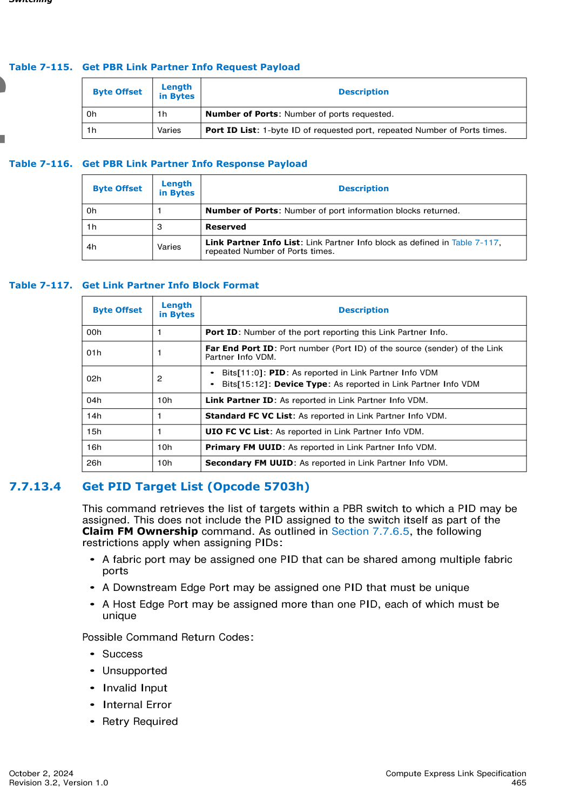
>
> *Original page render @ 150 DPI* — [📄 Full size](figures/chapter_07/page_0465.png)

> **Table 7-116.** Get PBR Link Partner Info Response Payload ｜ Get PBR Link Partner Info 响应 Payload
>
> 
>
> *Original page render @ 150 DPI* — [📄 Full size](figures/chapter_07/page_0465.png)

> **Table 7-117.** Get Link Partner Info Block Format ｜ Get Link Partner Info 块格式
>
> 
>
> *Original page render @ 150 DPI* — [📄 Full size](figures/chapter_07/page_0465.png)

### 7.7.13.4 Get PID Target List (Opcode 5703h) | Get PID Target List (操作码 5703h)

<table>
<thead>
<tr>
<th width="50%">🇬🇧 English</th>
<th width="50%" style="background-color:#e8e8e8">🇨🇳 中文</th>
</tr>
</thead>
<tbody>
<tr><td>This command retrieves the list of targets within a PBR switch to which a PID may be assigned. This does not include the PID assigned to the switch itself as part of the Claim FM Ownership command. As outlined in Section 7.7.6.5, the following restrictions apply when assigning PIDs:</td><td style="background-color:#e8e8e8">该命令检索 PBR 交换机内可分配 PID 的目标列表。该列表不包括作为 Claim FM Ownership 命令的一部分分配给交换机自身的 PID。如 7.7.6.5 节所述,分配 PID 时适用以下限制:</td></tr>
<tr><td>• A fabric port may be assigned one PID that can be shared among multiple fabric ports</td><td style="background-color:#e8e8e8">• 一个 fabric 端口可被分配一个可在多个 fabric 端口之间共享的 PID</td></tr>
<tr><td>• A Downstream Edge Port may be assigned one PID that must be unique</td><td style="background-color:#e8e8e8">• 一个 Downstream Edge Port 可被分配一个 PID,且该 PID 必须唯一</td></tr>
<tr><td>• A Host Edge Port may be assigned more than one PID, each of which must be unique</td><td style="background-color:#e8e8e8">• 一个 Host Edge Port 可被分配多个 PID,每个 PID 必须唯一</td></tr>
<tr><td>Possible Command Return Codes:</td><td style="background-color:#e8e8e8">可能的命令返回码:</td></tr>
<tr><td>• Success</td><td style="background-color:#e8e8e8">• Success</td></tr>
<tr><td>• Unsupported</td><td style="background-color:#e8e8e8">• Unsupported</td></tr>
<tr><td>• Invalid Input</td><td style="background-color:#e8e8e8">• Invalid Input</td></tr>
<tr><td>• Internal Error</td><td style="background-color:#e8e8e8">• Internal Error</td></tr>
<tr><td>• Retry Required</td><td style="background-color:#e8e8e8">• Retry Required</td></tr>
</tbody>
</table>

> **Table 7-118.** Get PID Target List Request Payload ｜ Get PID Target List 请求 Payload
>
> 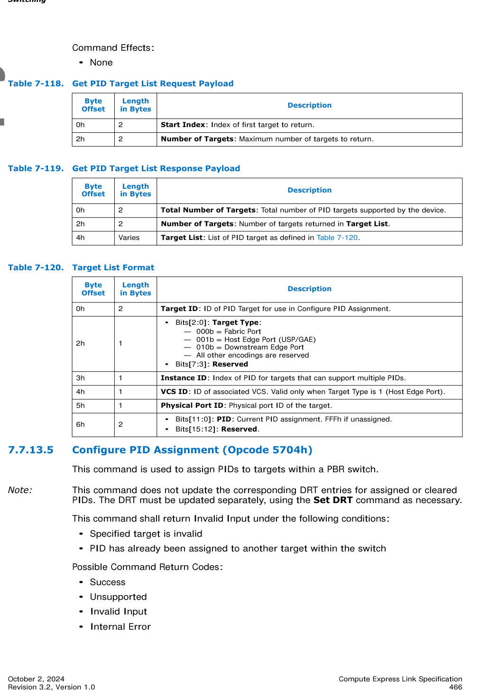
>
> *Original page render @ 150 DPI* — [📄 Full size](figures/chapter_07/page_0466.png)

> **Table 7-119.** Get PID Target List Response Payload ｜ Get PID Target List 响应 Payload
>
> 
>
> *Original page render @ 150 DPI* — [📄 Full size](figures/chapter_07/page_0466.png)

> **Table 7-120.** Target List Format ｜ Target List 格式
>
> 
>
> *Original page render @ 150 DPI* — [📄 Full size](figures/chapter_07/page_0466.png)

### 7.7.13.5 Configure PID Assignment (Opcode 5704h) | Configure PID Assignment (操作码 5704h)

<table>
<thead>
<tr>
<th width="50%">🇬🇧 English</th>
<th width="50%" style="background-color:#e8e8e8">🇨🇳 中文</th>
</tr>
</thead>
<tbody>
<tr><td>This command is used to assign PIDs to targets within a PBR switch.</td><td style="background-color:#e8e8e8">该命令用于为 PBR 交换机内的目标分配 PID。</td></tr>
<tr><td>Note:</td><td style="background-color:#e8e8e8">注:</td></tr>
<tr><td>This command does not update the corresponding DRT entries for assigned or cleared PIDs. The DRT must be updated separately, using the Set DRT command as necessary.</td><td style="background-color:#e8e8e8">该命令不更新已分配或已清除 PID 的相应 DRT 条目。DRT 必须使用 Set DRT 命令按需单独更新。</td></tr>
<tr><td>This command shall return Invalid Input under the following conditions:</td><td style="background-color:#e8e8e8">在以下条件下,该命令应返回 Invalid Input:</td></tr>
<tr><td>• Specified target is invalid</td><td style="background-color:#e8e8e8">• 指定的目标无效</td></tr>
<tr><td>• PID has already been assigned to another target within the switch</td><td style="background-color:#e8e8e8">• PID 已被分配给交换机内的另一个目标</td></tr>
<tr><td>Possible Command Return Codes:</td><td style="background-color:#e8e8e8">可能的命令返回码:</td></tr>
<tr><td>• Success</td><td style="background-color:#e8e8e8">• Success</td></tr>
<tr><td>• Unsupported</td><td style="background-color:#e8e8e8">• Unsupported</td></tr>
<tr><td>• Invalid Input</td><td style="background-color:#e8e8e8">• Invalid Input</td></tr>
<tr><td>• Internal Error</td><td style="background-color:#e8e8e8">• Internal Error</td></tr>
<tr><td>• Retry Required</td><td style="background-color:#e8e8e8">• Retry Required</td></tr>
<tr><td>Command Effects:</td><td style="background-color:#e8e8e8">命令效果:</td></tr>
<tr><td>• None</td><td style="background-color:#e8e8e8">• 无</td></tr>
</tbody>
</table>

> **Table 7-121.** Configure PID Assignment Request Payload ｜ Configure PID Assignment 请求 Payload
>
> 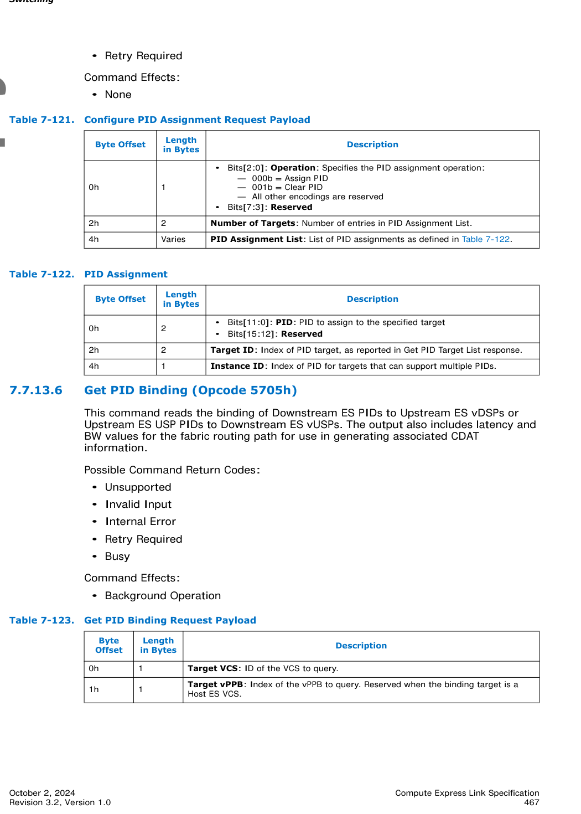
>
> *Original page render @ 150 DPI* — [📄 Full size](figures/chapter_07/page_0467.png)

> **Table 7-122.** PID Assignment ｜ PID 分配
>
> 
>
> *Original page render @ 150 DPI* — [📄 Full size](figures/chapter_07/page_0467.png)

### 7.7.13.6 Get PID Binding (Opcode 5705h) | Get PID Binding (操作码 5705h)

<table>
<thead>
<tr>
<th width="50%">🇬🇧 English</th>
<th width="50%" style="background-color:#e8e8e8">🇨🇳 中文</th>
</tr>
</thead>
<tbody>
<tr><td>This command reads the binding of Downstream ES PIDs to Upstream ES vDSPs or Upstream ES USP PIDs to Downstream ES vUSPs. The output also includes latency and BW values for the fabric routing path for use in generating associated CDAT information.</td><td style="background-color:#e8e8e8">该命令读取 Downstream ES PID 到 Upstream ES vDSP 的绑定,或 Upstream ES USP PID 到 Downstream ES vUSP 的绑定。输出还包括 fabric 路由路径的延迟和带宽值,用于生成相关的 CDAT 信息。</td></tr>
<tr><td>Possible Command Return Codes:</td><td style="background-color:#e8e8e8">可能的命令返回码:</td></tr>
<tr><td>• Unsupported</td><td style="background-color:#e8e8e8">• Unsupported</td></tr>
<tr><td>• Invalid Input</td><td style="background-color:#e8e8e8">• Invalid Input</td></tr>
<tr><td>• Internal Error</td><td style="background-color:#e8e8e8">• Internal Error</td></tr>
<tr><td>• Retry Required</td><td style="background-color:#e8e8e8">• Retry Required</td></tr>
<tr><td>• Busy</td><td style="background-color:#e8e8e8">• Busy</td></tr>
<tr><td>Command Effects:</td><td style="background-color:#e8e8e8">命令效果:</td></tr>
<tr><td>• Background Operation</td><td style="background-color:#e8e8e8">• 后台操作 (Background Operation)</td></tr>
</tbody>
</table>

> **Table 7-123.** Get PID Binding Request Payload ｜ Get PID Binding 请求 Payload
>
> 
>
> *Original page render @ 150 DPI* — [📄 Full size](figures/chapter_07/page_0467.png)

> **Table 7-124.** Get PID Binding Response Payload ｜ Get PID Binding 响应 Payload
>
> 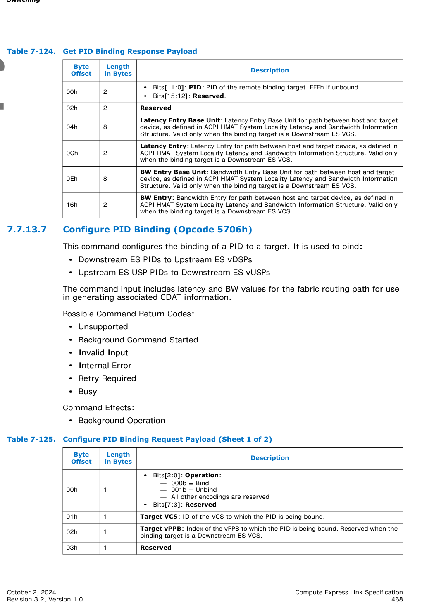
>
> *Original page render @ 150 DPI* — [📄 Full size](figures/chapter_07/page_0468.png)

### 7.7.13.7 Configure PID Binding (Opcode 5706h) | Configure PID Binding (操作码 5706h)

<table>
<thead>
<tr>
<th width="50%">🇬🇧 English</th>
<th width="50%" style="background-color:#e8e8e8">🇨🇳 中文</th>
</tr>
</thead>
<tbody>
<tr><td>This command configures the binding of a PID to a target. It is used to bind:</td><td style="background-color:#e8e8e8">该命令用于将 PID 绑定到目标。它用于绑定:</td></tr>
<tr><td>• Downstream ES PIDs to Upstream ES vDSPs</td><td style="background-color:#e8e8e8">• Downstream ES PID 到 Upstream ES vDSP</td></tr>
<tr><td>• Upstream ES USP PIDs to Downstream ES vUSPs</td><td style="background-color:#e8e8e8">• Upstream ES USP PID 到 Downstream ES vUSP</td></tr>
<tr><td>The command input includes latency and BW values for the fabric routing path for use in generating associated CDAT information.</td><td style="background-color:#e8e8e8">命令输入包括 fabric 路由路径的延迟和带宽值,用于生成相关的 CDAT 信息。</td></tr>
<tr><td>Possible Command Return Codes:</td><td style="background-color:#e8e8e8">可能的命令返回码:</td></tr>
<tr><td>• Unsupported</td><td style="background-color:#e8e8e8">• Unsupported</td></tr>
<tr><td>• Background Command Started</td><td style="background-color:#e8e8e8">• Background Command Started</td></tr>
<tr><td>• Invalid Input</td><td style="background-color:#e8e8e8">• Invalid Input</td></tr>
<tr><td>• Internal Error</td><td style="background-color:#e8e8e8">• Internal Error</td></tr>
<tr><td>• Retry Required</td><td style="background-color:#e8e8e8">• Retry Required</td></tr>
<tr><td>• Busy</td><td style="background-color:#e8e8e8">• Busy</td></tr>
<tr><td>Command Effects:</td><td style="background-color:#e8e8e8">命令效果:</td></tr>
<tr><td>• Background Operation</td><td style="background-color:#e8e8e8">• 后台操作 (Background Operation)</td></tr>
</tbody>
</table>

> **Table 7-125 (1/2).** Configure PID Binding Request Payload (Sheet 1 of 2) ｜ Configure PID Binding 请求 Payload (1/2)
>
> 
>
> *Original page render @ 150 DPI* — [📄 Full size](figures/chapter_07/page_0468.png)

> **Table 7-125 (2/2).** Configure PID Binding Request Payload (Sheet 2 of 2) ｜ Configure PID Binding 请求 Payload (2/2)
>
> 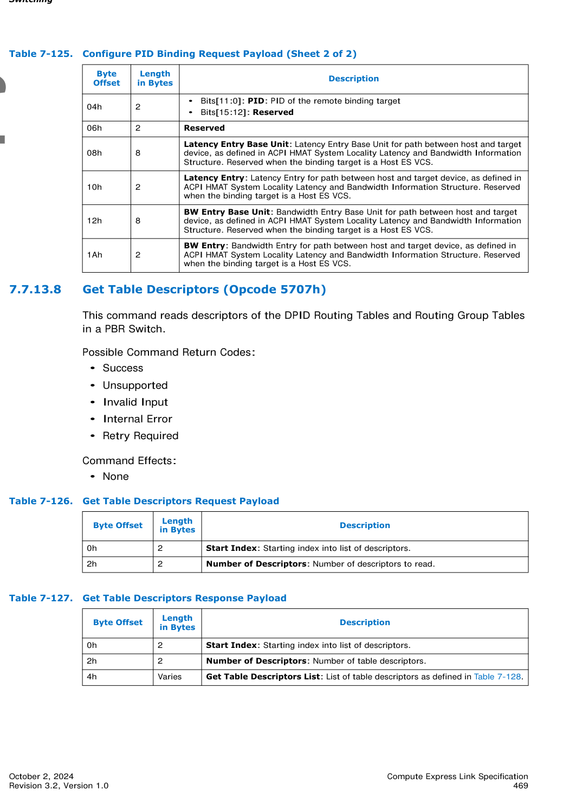
>
> *Original page render @ 150 DPI* — [📄 Full size](figures/chapter_07/page_0469.png)

### 7.7.13.8 Get Table Descriptors (Opcode 5707h) | Get Table Descriptors (操作码 5707h)

<table>
<thead>
<tr>
<th width="50%">🇬🇧 English</th>
<th width="50%" style="background-color:#e8e8e8">🇨🇳 中文</th>
</tr>
</thead>
<tbody>
<tr><td>This command reads descriptors of the DPID Routing Tables and Routing Group Tables in a PBR Switch.</td><td style="background-color:#e8e8e8">该命令读取 PBR 交换机中 DPID Routing Table 和 Routing Group Table 的描述符。</td></tr>
<tr><td>Possible Command Return Codes:</td><td style="background-color:#e8e8e8">可能的命令返回码:</td></tr>
<tr><td>• Success</td><td style="background-color:#e8e8e8">• Success</td></tr>
<tr><td>• Unsupported</td><td style="background-color:#e8e8e8">• Unsupported</td></tr>
<tr><td>• Invalid Input</td><td style="background-color:#e8e8e8">• Invalid Input</td></tr>
<tr><td>• Internal Error</td><td style="background-color:#e8e8e8">• Internal Error</td></tr>
<tr><td>• Retry Required</td><td style="background-color:#e8e8e8">• Retry Required</td></tr>
<tr><td>Command Effects:</td><td style="background-color:#e8e8e8">命令效果:</td></tr>
<tr><td>• None</td><td style="background-color:#e8e8e8">• 无</td></tr>
</tbody>
</table>

> **Table 7-126.** Get Table Descriptors Request Payload ｜ Get Table Descriptors 请求 Payload
>
> 
>
> *Original page render @ 150 DPI* — [📄 Full size](figures/chapter_07/page_0469.png)

> **Table 7-127.** Get Table Descriptors Response Payload ｜ Get Table Descriptors 响应 Payload
>
> 
>
> *Original page render @ 150 DPI* — [📄 Full size](figures/chapter_07/page_0469.png)

> **Table 7-128.** Get Table Descriptor Format ｜ Get Table Descriptor 格式
>
> 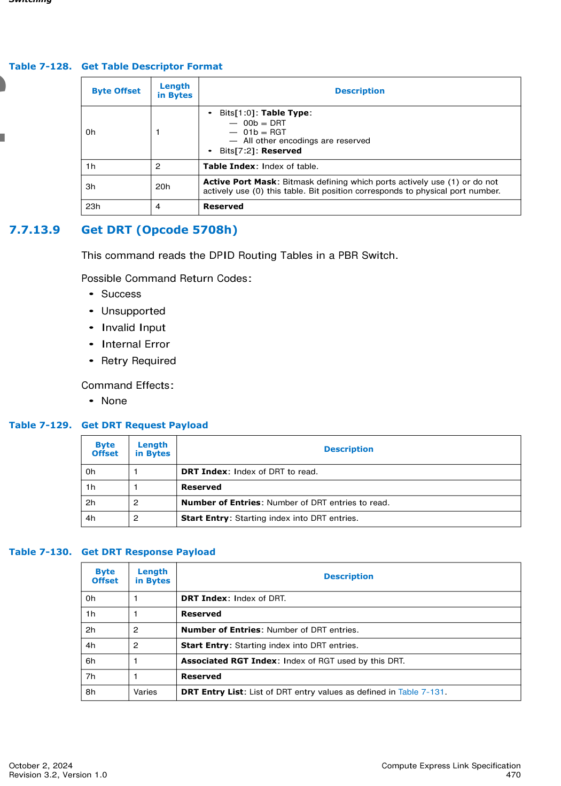
>
> *Original page render @ 150 DPI* — [📄 Full size](figures/chapter_07/page_0470.png)

### 7.7.13.9 Get DRT (Opcode 5708h) | Get DRT (操作码 5708h)

<table>
<thead>
<tr>
<th width="50%">🇬🇧 English</th>
<th width="50%" style="background-color:#e8e8e8">🇨🇳 中文</th>
</tr>
</thead>
<tbody>
<tr><td>This command reads the DPID Routing Tables in a PBR Switch.</td><td style="background-color:#e8e8e8">该命令读取 PBR 交换机中的 DPID Routing Table。</td></tr>
<tr><td>Possible Command Return Codes:</td><td style="background-color:#e8e8e8">可能的命令返回码:</td></tr>
<tr><td>• Success</td><td style="background-color:#e8e8e8">• Success</td></tr>
<tr><td>• Unsupported</td><td style="background-color:#e8e8e8">• Unsupported</td></tr>
<tr><td>• Invalid Input</td><td style="background-color:#e8e8e8">• Invalid Input</td></tr>
<tr><td>• Internal Error</td><td style="background-color:#e8e8e8">• Internal Error</td></tr>
<tr><td>• Retry Required</td><td style="background-color:#e8e8e8">• Retry Required</td></tr>
<tr><td>Command Effects:</td><td style="background-color:#e8e8e8">命令效果:</td></tr>
<tr><td>• None</td><td style="background-color:#e8e8e8">• 无</td></tr>
</tbody>
</table>

> **Table 7-129.** Get DRT Request Payload ｜ Get DRT 请求 Payload
>
> 
>
> *Original page render @ 150 DPI* — [📄 Full size](figures/chapter_07/page_0470.png)

> **Table 7-130.** Get DRT Response Payload ｜ Get DRT 响应 Payload
>
> 
>
> *Original page render @ 150 DPI* — [📄 Full size](figures/chapter_07/page_0470.png)

> **Table 7-131.** DRT Entry Format ｜ DRT 条目格式
>
> 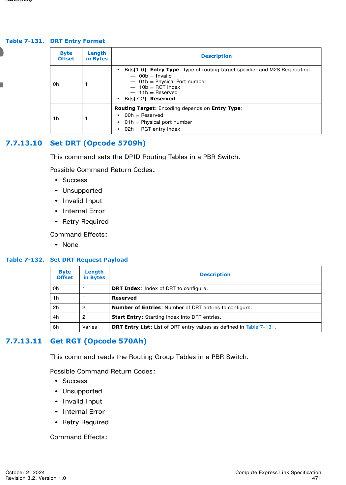
>
> *Original page render @ 150 DPI* — [📄 Full size](figures/chapter_07/page_0471.png)

### 7.7.13.10 Set DRT (Opcode 5709h) | Set DRT (操作码 5709h)

<table>
<thead>
<tr>
<th width="50%">🇬🇧 English</th>
<th width="50%" style="background-color:#e8e8e8">🇨🇳 中文</th>
</tr>
</thead>
<tbody>
<tr><td>This command sets the DPID Routing Tables in a PBR Switch.</td><td style="background-color:#e8e8e8">该命令设置 PBR 交换机中的 DPID Routing Table。</td></tr>
<tr><td>Possible Command Return Codes:</td><td style="background-color:#e8e8e8">可能的命令返回码:</td></tr>
<tr><td>• Success</td><td style="background-color:#e8e8e8">• Success</td></tr>
<tr><td>• Unsupported</td><td style="background-color:#e8e8e8">• Unsupported</td></tr>
<tr><td>• Invalid Input</td><td style="background-color:#e8e8e8">• Invalid Input</td></tr>
<tr><td>• Internal Error</td><td style="background-color:#e8e8e8">• Internal Error</td></tr>
<tr><td>• Retry Required</td><td style="background-color:#e8e8e8">• Retry Required</td></tr>
<tr><td>Command Effects:</td><td style="background-color:#e8e8e8">命令效果:</td></tr>
<tr><td>• None</td><td style="background-color:#e8e8e8">• 无</td></tr>
</tbody>
</table>

> **Table 7-132.** Set DRT Request Payload ｜ Set DRT 请求 Payload
>
> 
>
> *Original page render @ 150 DPI* — [📄 Full size](figures/chapter_07/page_0471.png)

### 7.7.13.11 Get RGT (Opcode 570Ah) | Get RGT (操作码 570Ah)

<table>
<thead>
<tr>
<th width="50%">🇬🇧 English</th>
<th width="50%" style="background-color:#e8e8e8">🇨🇳 中文</th>
</tr>
</thead>
<tbody>
<tr><td>This command reads the Routing Group Tables in a PBR Switch.</td><td style="background-color:#e8e8e8">该命令读取 PBR 交换机中的 Routing Group Table。</td></tr>
<tr><td>Possible Command Return Codes:</td><td style="background-color:#e8e8e8">可能的命令返回码:</td></tr>
<tr><td>• Success</td><td style="background-color:#e8e8e8">• Success</td></tr>
<tr><td>• Unsupported</td><td style="background-color:#e8e8e8">• Unsupported</td></tr>
<tr><td>• Invalid Input</td><td style="background-color:#e8e8e8">• Invalid Input</td></tr>
<tr><td>• Internal Error</td><td style="background-color:#e8e8e8">• Internal Error</td></tr>
<tr><td>• Retry Required</td><td style="background-color:#e8e8e8">• Retry Required</td></tr>
<tr><td>Command Effects:</td><td style="background-color:#e8e8e8">命令效果:</td></tr>
<tr><td>• None</td><td style="background-color:#e8e8e8">• 无</td></tr>
</tbody>
</table>

> **Table 7-133.** Get RGT Request Payload ｜ Get RGT 请求 Payload
>
> 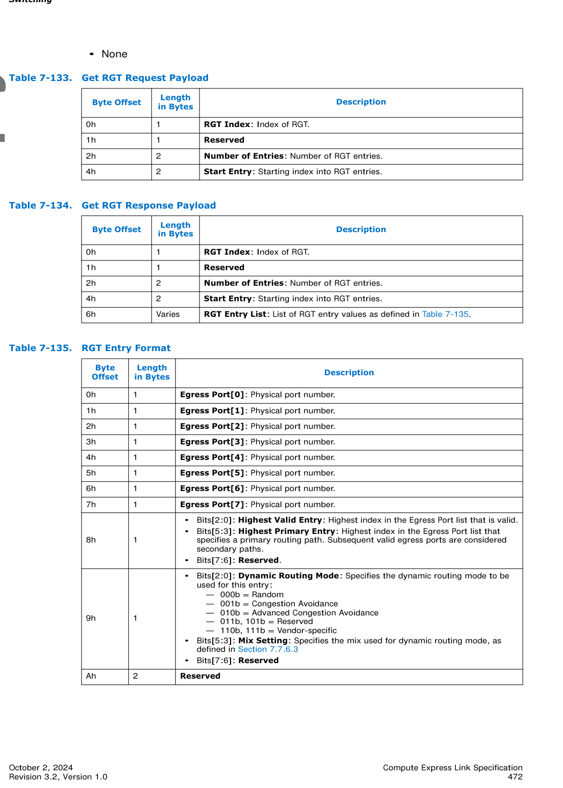
>
> *Original page render @ 150 DPI* — [📄 Full size](figures/chapter_07/page_0472.png)

> **Table 7-134.** Get RGT Response Payload ｜ Get RGT 响应 Payload
>
> 
>
> *Original page render @ 150 DPI* — [📄 Full size](figures/chapter_07/page_0472.png)

> **Table 7-135.** RGT Entry Format ｜ RGT 条目格式
>
> 
>
> *Original page render @ 150 DPI* — [📄 Full size](figures/chapter_07/page_0472.png)

### 7.7.13.12 Set RGT (Opcode 570Bh) | Set RGT (操作码 570Bh)

<table>
<thead>
<tr>
<th width="50%">🇬🇧 English</th>
<th width="50%" style="background-color:#e8e8e8">🇨🇳 中文</th>
</tr>
</thead>
<tbody>
<tr><td>This command configures the Routing Group Tables in a PBR switch.</td><td style="background-color:#e8e8e8">该命令配置 PBR 交换机中的 Routing Group Table。</td></tr>
<tr><td>Possible Command Return Codes:</td><td style="background-color:#e8e8e8">可能的命令返回码:</td></tr>
<tr><td>• Success</td><td style="background-color:#e8e8e8">• Success</td></tr>
<tr><td>• Unsupported</td><td style="background-color:#e8e8e8">• Unsupported</td></tr>
<tr><td>• Invalid Input</td><td style="background-color:#e8e8e8">• Invalid Input</td></tr>
<tr><td>• Internal Error</td><td style="background-color:#e8e8e8">• Internal Error</td></tr>
<tr><td>• Retry Required</td><td style="background-color:#e8e8e8">• Retry Required</td></tr>
<tr><td>Command Effects:</td><td style="background-color:#e8e8e8">命令效果:</td></tr>
<tr><td>• None</td><td style="background-color:#e8e8e8">• 无</td></tr>
</tbody>
</table>

> **Table 7-136.** Set RGT Request Payload ｜ Set RGT 请求 Payload
>
> 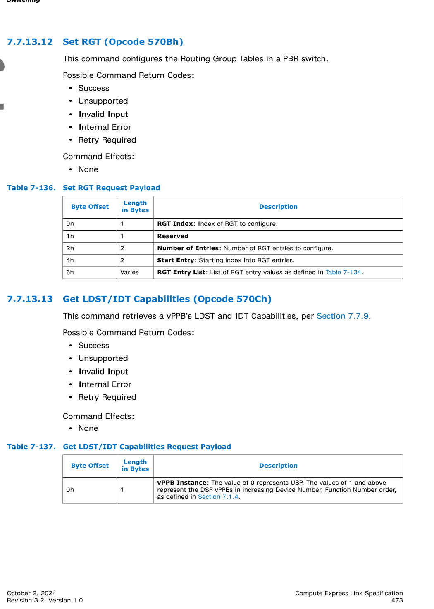
>
> *Original page render @ 150 DPI* — [📄 Full size](figures/chapter_07/page_0473.png)

### 7.7.13.13 Get LDST/IDT Capabilities (Opcode 570Ch) | Get LDST/IDT Capabilities (操作码 570Ch)

<table>
<thead>
<tr>
<th width="50%">🇬🇧 English</th>
<th width="50%" style="background-color:#e8e8e8">🇨🇳 中文</th>
</tr>
</thead>
<tbody>
<tr><td>This command retrieves a vPPB's LDST and IDT Capabilities, per Section 7.7.9.</td><td style="background-color:#e8e8e8">该命令按 7.7.9 节检索 vPPB 的 LDST 和 IDT 能力。</td></tr>
<tr><td>Possible Command Return Codes:</td><td style="background-color:#e8e8e8">可能的命令返回码:</td></tr>
<tr><td>• Success</td><td style="background-color:#e8e8e8">• Success</td></tr>
<tr><td>• Unsupported</td><td style="background-color:#e8e8e8">• Unsupported</td></tr>
<tr><td>• Invalid Input</td><td style="background-color:#e8e8e8">• Invalid Input</td></tr>
<tr><td>• Internal Error</td><td style="background-color:#e8e8e8">• Internal Error</td></tr>
<tr><td>• Retry Required</td><td style="background-color:#e8e8e8">• Retry Required</td></tr>
<tr><td>Command Effects:</td><td style="background-color:#e8e8e8">命令效果:</td></tr>
<tr><td>• None</td><td style="background-color:#e8e8e8">• 无</td></tr>
</tbody>
</table>

> **Table 7-137.** Get LDST/IDT Capabilities Request Payload ｜ Get LDST/IDT Capabilities 请求 Payload
>
> 
>
> *Original page render @ 150 DPI* — [📄 Full size](figures/chapter_07/page_0473.png)

### 7.7.13.14 Set LDST/IDT Configuration (Opcode 570Dh) | Set LDST/IDT Configuration (操作码 570Dh)

<table>
<thead>
<tr>
<th width="50%">🇬🇧 English</th>
<th width="50%" style="background-color:#e8e8e8">🇨🇳 中文</th>
</tr>
</thead>
<tbody>
<tr><td>This command sets the GAE's LDST and IDT Capabilities, per Section 7.7.9. Because the FabricBase and FabricLimit values must be aligned to the programmed LDST Segment Size, all three Host-chosen values are configured in one request.</td><td style="background-color:#e8e8e8">该命令按 7.7.9 节设置 GAE 的 LDST 和 IDT 能力。由于 FabricBase 和 FabricLimit 值必须与所编程的 LDST Segment Size 对齐,因此主机所选的三个值在同一次请求中配置。</td></tr>
<tr><td>Possible Command Return Codes:</td><td style="background-color:#e8e8e8">可能的命令返回码:</td></tr>
<tr><td>• Success</td><td style="background-color:#e8e8e8">• Success</td></tr>
<tr><td>• Unsupported</td><td style="background-color:#e8e8e8">• Unsupported</td></tr>
<tr><td>• Invalid Input</td><td style="background-color:#e8e8e8">• Invalid Input</td></tr>
<tr><td>• Internal Error</td><td style="background-color:#e8e8e8">• Internal Error</td></tr>
<tr><td>• Retry Required</td><td style="background-color:#e8e8e8">• Retry Required</td></tr>
<tr><td>Command Effects:</td><td style="background-color:#e8e8e8">命令效果:</td></tr>
<tr><td>• Immediate Configuration Change</td><td style="background-color:#e8e8e8">• 立即配置变更 (Immediate Configuration Change)</td></tr>
</tbody>
</table>

> **Table 7-138.** Get LDST/IDT Capabilities Response Payload ｜ Get LDST/IDT Capabilities 响应 Payload
>
> 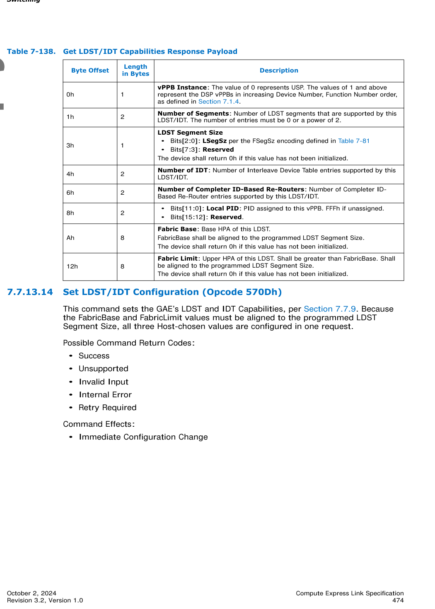
>
> *Original page render @ 150 DPI* — [📄 Full size](figures/chapter_07/page_0474.png)

### 7.7.13.15 Get LDST Segment Entries (Opcode 570Eh) | Get LDST Segment Entries (操作码 570Eh)

<table>
<thead>
<tr>
<th width="50%">🇬🇧 English</th>
<th width="50%" style="background-color:#e8e8e8">🇨🇳 中文</th>
</tr>
</thead>
<tbody>
<tr><td>This command reads the configuration of LDST Segment entries. The Host is responsible for mapping the LD-FAM range of HPAs to the appropriate number of available Segment Entries. Should the Host or the GAE have limited message payload capacity, the Host shall be responsible for breaking up the configuration operation into suitably sized requests.</td><td style="background-color:#e8e8e8">该命令读取 LDST Segment 条目的配置。主机负责将 LD-FAM 范围的 HPA 映射到适当数量的可用 Segment 条目。如果主机或 GAE 的消息有效载荷容量有限,主机应负责将配置操作拆分为合适大小的请求。</td></tr>
<tr><td>Possible Command Return Codes:</td><td style="background-color:#e8e8e8">可能的命令返回码:</td></tr>
<tr><td>• Success</td><td style="background-color:#e8e8e8">• Success</td></tr>
<tr><td>• Unsupported</td><td style="background-color:#e8e8e8">• Unsupported</td></tr>
<tr><td>• Invalid Input</td><td style="background-color:#e8e8e8">• Invalid Input</td></tr>
<tr><td>• Internal Error</td><td style="background-color:#e8e8e8">• Internal Error</td></tr>
<tr><td>• Retry Required</td><td style="background-color:#e8e8e8">• Retry Required</td></tr>
<tr><td>Command Effects:</td><td style="background-color:#e8e8e8">命令效果:</td></tr>
<tr><td>• None</td><td style="background-color:#e8e8e8">• 无</td></tr>
</tbody>
</table>

> **Table 7-139.** Set LDST/IDT Configuration Request Payload ｜ Set LDST/IDT Configuration 请求 Payload
>
> 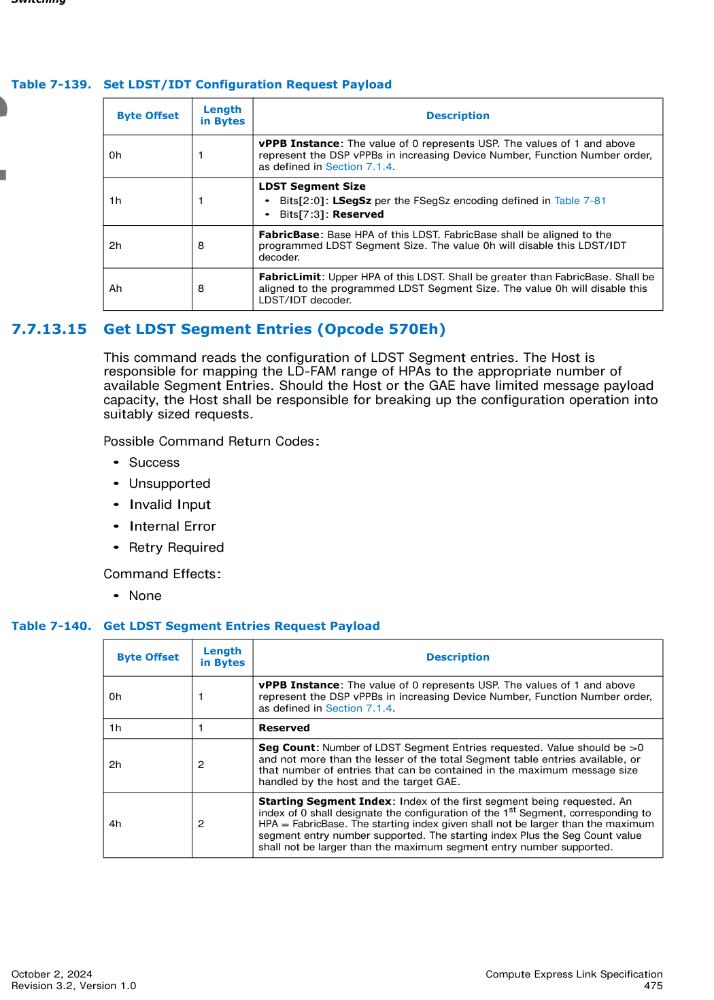
>
> *Original page render @ 150 DPI* — [📄 Full size](figures/chapter_07/page_0475.png)

> **Table 7-140.** Get LDST Segment Entries Request Payload ｜ Get LDST Segment Entries 请求 Payload
>
> 
>
> *Original page render @ 150 DPI* — [📄 Full size](figures/chapter_07/page_0475.png)

### 7.7.13.16 Set LDST Segment Entries (Opcode 570Fh) | Set LDST Segment Entries (操作码 570Fh)

<table>
<thead>
<tr>
<th width="50%">🇬🇧 English</th>
<th width="50%" style="background-color:#e8e8e8">🇨🇳 中文</th>
</tr>
</thead>
<tbody>
<tr><td>This command is used by the Host to set the configuration of LDST Segment entries. The Host is responsible for mapping the LD-FAM range of HPAs to the appropriate number of available Segment Entries, per Section 7.7.2.4. Should the Host or the GAE have limited message payload capacity, the Host shall be responsible for breaking up the configuration operation into suitably sized requests.</td><td style="background-color:#e8e8e8">主机使用该命令设置 LDST Segment 条目的配置。主机负责按 7.7.2.4 节将 LD-FAM 范围的 HPA 映射到适当数量的可用 Segment 条目。如果主机或 GAE 的消息有效载荷容量有限,主机应负责将配置操作拆分为合适大小的请求。</td></tr>
<tr><td>This command fails with Invalid Input if access to the specified DPID is not enabled in the LAV.</td><td style="background-color:#e8e8e8">若未在 LAV 中启用对指定 DPID 的访问,则该命令以 Invalid Input 失败。</td></tr>
<tr><td>Possible Command Return Codes:</td><td style="background-color:#e8e8e8">可能的命令返回码:</td></tr>
<tr><td>• Success</td><td style="background-color:#e8e8e8">• Success</td></tr>
<tr><td>• Unsupported</td><td style="background-color:#e8e8e8">• Unsupported</td></tr>
<tr><td>• Invalid Input</td><td style="background-color:#e8e8e8">• Invalid Input</td></tr>
<tr><td>• Internal Error</td><td style="background-color:#e8e8e8">• Internal Error</td></tr>
<tr><td>• Retry Required</td><td style="background-color:#e8e8e8">• Retry Required</td></tr>
<tr><td>Command Effects:</td><td style="background-color:#e8e8e8">命令效果:</td></tr>
<tr><td>• Immediate Configuration Change</td><td style="background-color:#e8e8e8">• 立即配置变更 (Immediate Configuration Change)</td></tr>
</tbody>
</table>

> **Table 7-141.** Get LDST Segment Entries Response Payload ｜ Get LDST Segment Entries 响应 Payload
>
> 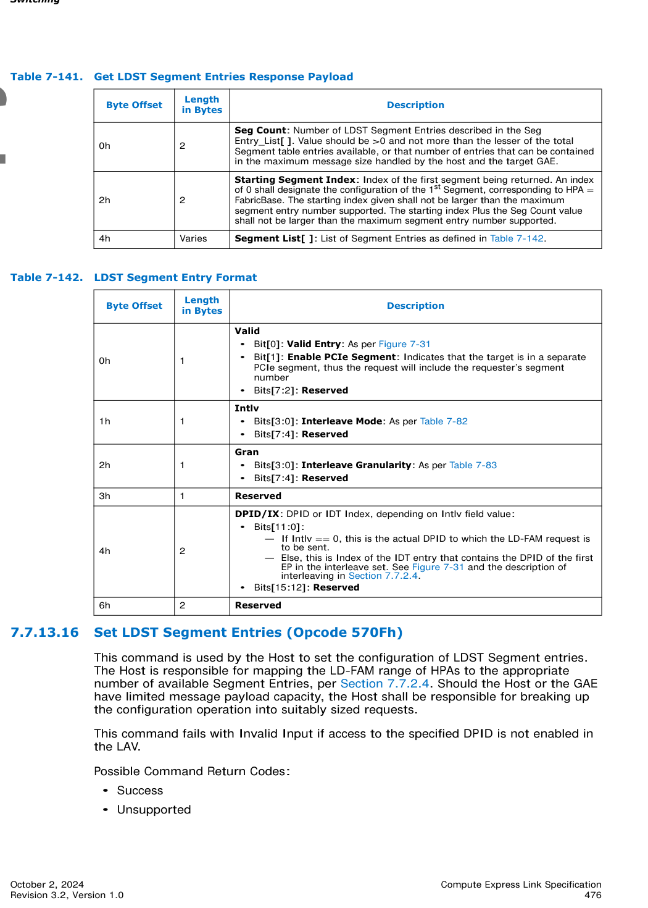
>
> *Original page render @ 150 DPI* — [📄 Full size](figures/chapter_07/page_0476.png)

> **Table 7-142.** LDST Segment Entry Format ｜ LDST Segment Entry 格式
>
> 
>
> *Original page render @ 150 DPI* — [📄 Full size](figures/chapter_07/page_0476.png)

### 7.7.13.17 Get LDST IDT DPID Entries (Opcode 5710h) | Get LDST IDT DPID Entries (操作码 5710h)

<table>
<thead>
<tr>
<th width="50%">🇬🇧 English</th>
<th width="50%" style="background-color:#e8e8e8">🇨🇳 中文</th>
</tr>
</thead>
<tbody>
<tr><td>This command reads the configuration of IDT entries that are used by the LDST. The Host is responsible for mapping the capacity of specific devices targeted by LDST into interleaved regions of HPA. Should the Host or the switch mailbox have limited message payload capacity, the Host shall be responsible for breaking up the configuration operation into suitably sized requests.</td><td style="background-color:#e8e8e8">该命令读取 LDST 使用的 IDT 条目的配置。主机负责将 LDST 目标的特定设备容量映射到 HPA 的交织区域。如果主机或交换机邮箱的消息有效载荷容量有限,主机应负责将配置操作拆分为合适大小的请求。</td></tr>
<tr><td>Possible Command Return Codes:</td><td style="background-color:#e8e8e8">可能的命令返回码:</td></tr>
<tr><td>• Success</td><td style="background-color:#e8e8e8">• Success</td></tr>
<tr><td>• Unsupported</td><td style="background-color:#e8e8e8">• Unsupported</td></tr>
<tr><td>• Invalid Input</td><td style="background-color:#e8e8e8">• Invalid Input</td></tr>
<tr><td>• Internal Error</td><td style="background-color:#e8e8e8">• Internal Error</td></tr>
<tr><td>• Retry Required</td><td style="background-color:#e8e8e8">• Retry Required</td></tr>
<tr><td>Command Effects:</td><td style="background-color:#e8e8e8">命令效果:</td></tr>
<tr><td>• None</td><td style="background-color:#e8e8e8">• 无</td></tr>
</tbody>
</table>

> **Table 7-143.** Set LDST Segment Entries Request Payload ｜ Set LDST Segment Entries 请求 Payload
>
> 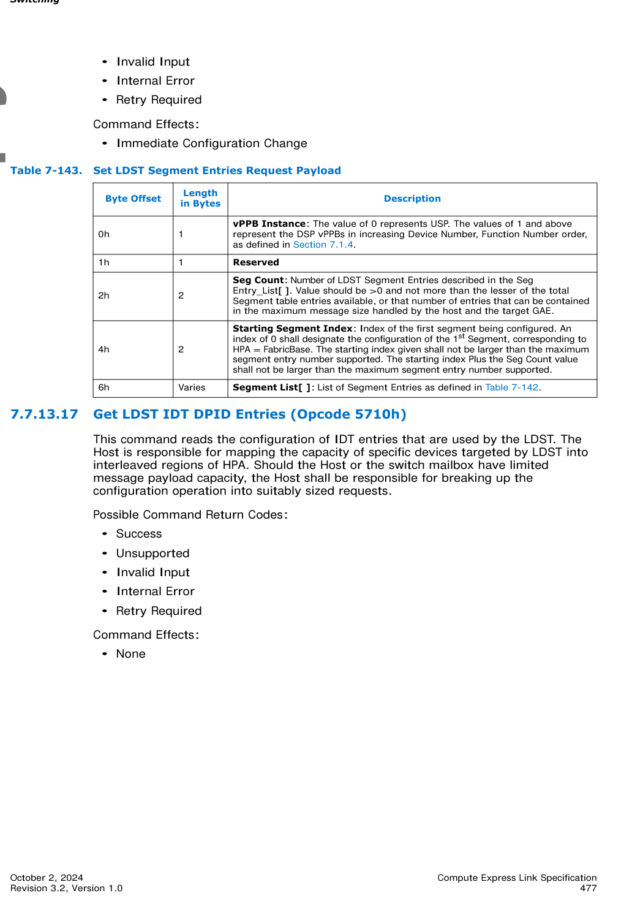
>
> *Original page render @ 150 DPI* — [📄 Full size](figures/chapter_07/page_0477.png)

### 7.7.13.18 Set LDST IDT DPID Entries (Opcode 5711h) | Set LDST IDT DPID Entries (操作码 5711h)

<table>
<thead>
<tr>
<th width="50%">🇬🇧 English</th>
<th width="50%" style="background-color:#e8e8e8">🇨🇳 中文</th>
</tr>
</thead>
<tbody>
<tr><td>This command sets the configuration of IDT entries that are used by the LDST. The Host is responsible for mapping the capacity of specific devices targeted by LDST into interleaved regions of HPA. Should the Host or the switch mailbox have limited message payload capacity, the Host shall be responsible for breaking up the configuration operation into suitably sized requests.</td><td style="background-color:#e8e8e8">该命令设置 LDST 使用的 IDT 条目的配置。主机负责将 LDST 目标的特定设备容量映射到 HPA 的交织区域。如果主机或交换机邮箱的消息有效载荷容量有限,主机应负责将配置操作拆分为合适大小的请求。</td></tr>
<tr><td>Possible Command Return Codes:</td><td style="background-color:#e8e8e8">可能的命令返回码:</td></tr>
<tr><td>• Success</td><td style="background-color:#e8e8e8">• Success</td></tr>
<tr><td>• Unsupported</td><td style="background-color:#e8e8e8">• Unsupported</td></tr>
<tr><td>• Invalid Input</td><td style="background-color:#e8e8e8">• Invalid Input</td></tr>
<tr><td>• Internal Error</td><td style="background-color:#e8e8e8">• Internal Error</td></tr>
<tr><td>• Retry Required</td><td style="background-color:#e8e8e8">• Retry Required</td></tr>
<tr><td>Command Effects:</td><td style="background-color:#e8e8e8">命令效果:</td></tr>
<tr><td>• Immediate Configuration Change</td><td style="background-color:#e8e8e8">• 立即配置变更 (Immediate Configuration Change)</td></tr>
</tbody>
</table>

> **Table 7-144.** Get LDST IDT DPID Entries Request Payload ｜ Get LDST IDT DPID Entries 请求 Payload
>
> 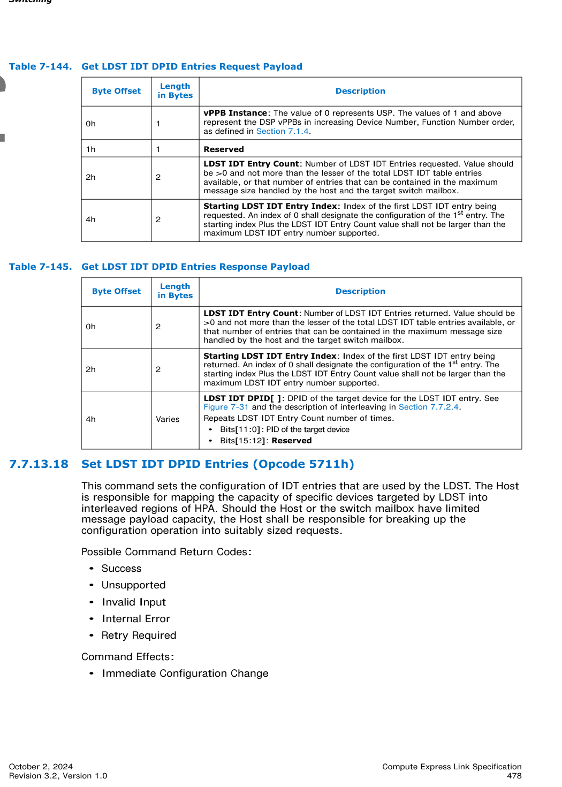
>
> *Original page render @ 150 DPI* — [📄 Full size](figures/chapter_07/page_0478.png)

> **Table 7-145.** Get LDST IDT DPID Entries Response Payload ｜ Get LDST IDT DPID Entries 响应 Payload
>
> 
>
> *Original page render @ 150 DPI* — [📄 Full size](figures/chapter_07/page_0478.png)

### 7.7.13.19 Get Completer ID-Based Re-Router Entries (Opcode 5712h) | Get Completer ID-Based Re-Router Entries (操作码 5712h)

<table>
<thead>
<tr>
<th width="50%">🇬🇧 English</th>
<th width="50%" style="background-color:#e8e8e8">🇨🇳 中文</th>
</tr>
</thead>
<tbody>
<tr><td>This command reads the configuration of Completer ID-Based Re-Router entries.</td><td style="background-color:#e8e8e8">该命令读取 Completer ID-Based Re-Router 条目的配置。</td></tr>
<tr><td>Possible Command Return Codes:</td><td style="background-color:#e8e8e8">可能的命令返回码:</td></tr>
<tr><td>• Success</td><td style="background-color:#e8e8e8">• Success</td></tr>
<tr><td>• Unsupported</td><td style="background-color:#e8e8e8">• Unsupported</td></tr>
<tr><td>• Invalid Input</td><td style="background-color:#e8e8e8">• Invalid Input</td></tr>
<tr><td>• Internal Error</td><td style="background-color:#e8e8e8">• Internal Error</td></tr>
<tr><td>• Retry Required</td><td style="background-color:#e8e8e8">• Retry Required</td></tr>
<tr><td>Command Effects:</td><td style="background-color:#e8e8e8">命令效果:</td></tr>
<tr><td>• None</td><td style="background-color:#e8e8e8">• 无</td></tr>
</tbody>
</table>

> **Table 7-146.** Set LDST IDT DPID Entries Request Payload ｜ Set LDST IDT DPID Entries 请求 Payload
>
> 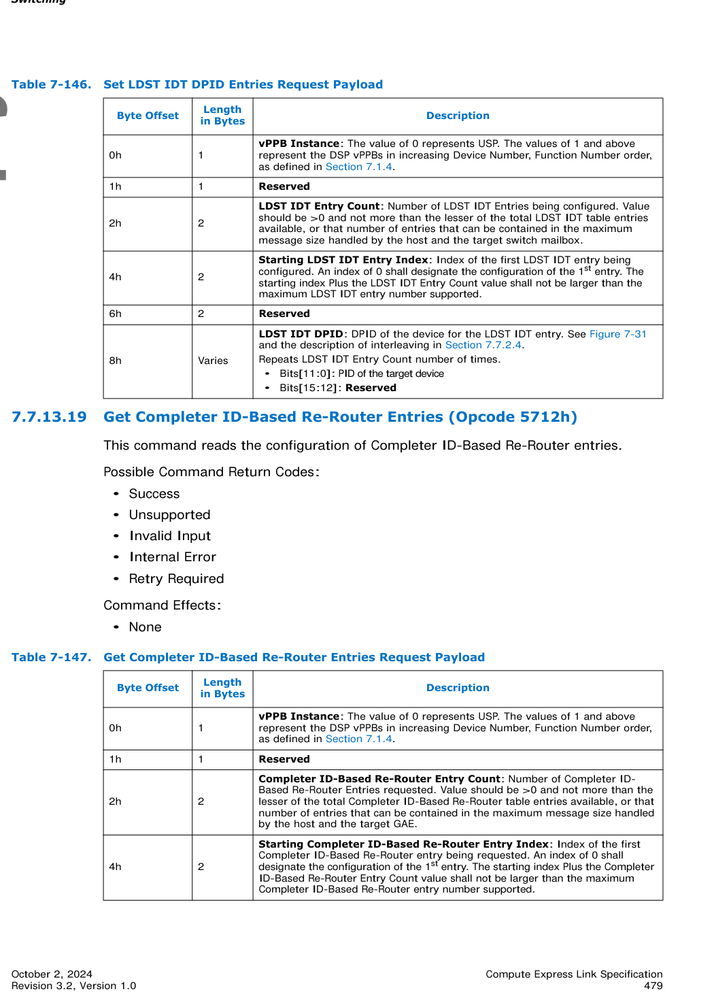
>
> *Original page render @ 150 DPI* — [📄 Full size](figures/chapter_07/page_0479.png)

> **Table 7-147.** Get Completer ID-Based Re-Router Entries Request Payload ｜ Get Completer ID-Based Re-Router Entries 请求 Payload
>
> 
>
> *Original page render @ 150 DPI* — [📄 Full size](figures/chapter_07/page_0479.png)

### 7.7.13.20 Set Completer ID-Based Re-Router Entries (Opcode 5713h) | Set Completer ID-Based Re-Router Entries (操作码 5713h)

<table>
<thead>
<tr>
<th width="50%">🇬🇧 English</th>
<th width="50%" style="background-color:#e8e8e8">🇨🇳 中文</th>
</tr>
</thead>
<tbody>
<tr><td>This command sets the configuration of Completer ID-Based Re-Router entries.</td><td style="background-color:#e8e8e8">该命令设置 Completer ID-Based Re-Router 条目的配置。</td></tr>
<tr><td>This command fails with Invalid Input if access to the specified DPID is not enabled in the LAV.</td><td style="background-color:#e8e8e8">若未在 LAV 中启用对指定 DPID 的访问,则该命令以 Invalid Input 失败。</td></tr>
<tr><td>Possible Command Return Codes:</td><td style="background-color:#e8e8e8">可能的命令返回码:</td></tr>
<tr><td>• Success</td><td style="background-color:#e8e8e8">• Success</td></tr>
<tr><td>• Unsupported</td><td style="background-color:#e8e8e8">• Unsupported</td></tr>
<tr><td>• Invalid Input</td><td style="background-color:#e8e8e8">• Invalid Input</td></tr>
<tr><td>• Internal Error</td><td style="background-color:#e8e8e8">• Internal Error</td></tr>
<tr><td>• Retry Required</td><td style="background-color:#e8e8e8">• Retry Required</td></tr>
<tr><td>Command Effects:</td><td style="background-color:#e8e8e8">命令效果:</td></tr>
<tr><td>• Immediate Configuration Change</td><td style="background-color:#e8e8e8">• 立即配置变更 (Immediate Configuration Change)</td></tr>
</tbody>
</table>

> **Table 7-148.** Get Completer ID-Based Re-Router Entries Response Payload ｜ Get Completer ID-Based Re-Router Entries 响应 Payload
>
> 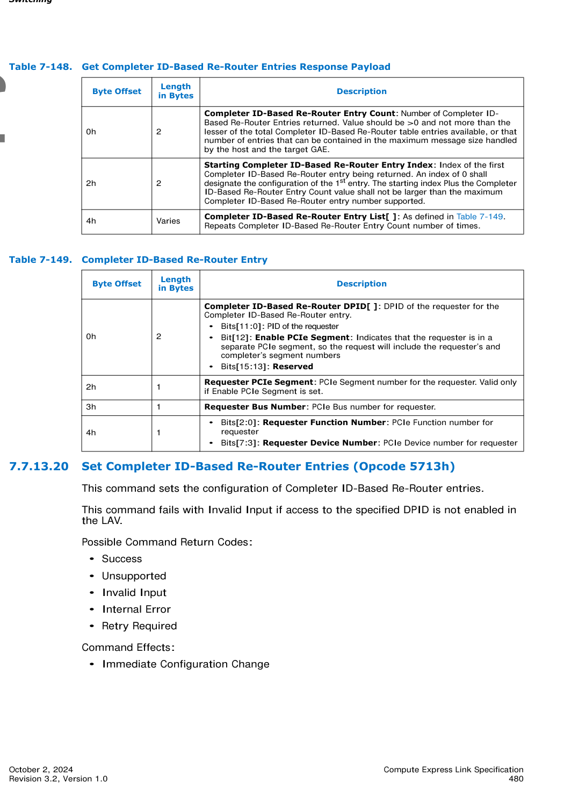
>
> *Original page render @ 150 DPI* — [📄 Full size](figures/chapter_07/page_0480.png)

> **Table 7-149.** Completer ID-Based Re-Router Entry ｜ Completer ID-Based Re-Router 条目
>
> 
>
> *Original page render @ 150 DPI* — [📄 Full size](figures/chapter_07/page_0480.png)

### 7.7.13.21 Get LDST Access Vector (Opcode 5714h) | Get LDST Access Vector (操作码 5714h)

<table>
<thead>
<tr>
<th width="50%">🇬🇧 English</th>
<th width="50%" style="background-color:#e8e8e8">🇨🇳 中文</th>
</tr>
</thead>
<tbody>
<tr><td>This command is used by the host to query its current LAV.</td><td style="background-color:#e8e8e8">该命令由主机用于查询其当前 LAV。</td></tr>
<tr><td>This command will return Invalid Input when the requested byte range exceeds the size of the access vector buffer, as defined in Table 7-164.</td><td style="background-color:#e8e8e8">当请求的字节范围超过访问向量缓冲区的大小时 (如表 7-164 所定义),该命令将返回 Invalid Input。</td></tr>
<tr><td>Possible Command Return Codes:</td><td style="background-color:#e8e8e8">可能的命令返回码:</td></tr>
<tr><td>• Success</td><td style="background-color:#e8e8e8">• Success</td></tr>
<tr><td>• Unsupported</td><td style="background-color:#e8e8e8">• Unsupported</td></tr>
<tr><td>• Invalid Input</td><td style="background-color:#e8e8e8">• Invalid Input</td></tr>
<tr><td>• Internal Error</td><td style="background-color:#e8e8e8">• Internal Error</td></tr>
<tr><td>• Retry Required</td><td style="background-color:#e8e8e8">• Retry Required</td></tr>
<tr><td>Command Effects:</td><td style="background-color:#e8e8e8">命令效果:</td></tr>
<tr><td>• None</td><td style="background-color:#e8e8e8">• 无</td></tr>
</tbody>
</table>

> **Table 7-150.** Set Completer ID-Based Re-Router Entries Request Payload ｜ Set Completer ID-Based Re-Router Entries 请求 Payload
>
> 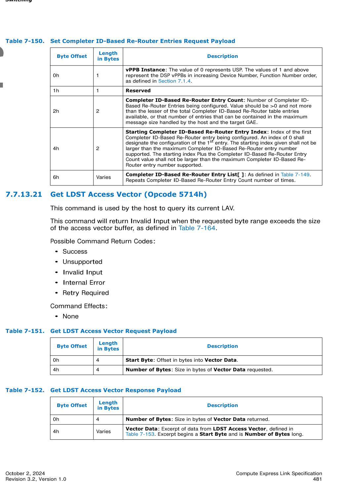
>
> *Original page render @ 150 DPI* — [📄 Full size](figures/chapter_07/page_0481.png)

> **Table 7-151.** Get LDST Access Vector Request Payload ｜ Get LDST Access Vector 请求 Payload
>
> 
>
> *Original page render @ 150 DPI* — [📄 Full size](figures/chapter_07/page_0481.png)

> **Table 7-152.** Get LDST Access Vector Response Payload ｜ Get LDST Access Vector 响应 Payload
>
> 
>
> *Original page render @ 150 DPI* — [📄 Full size](figures/chapter_07/page_0481.png)

### 7.7.13.22 Get VCS LDST Access Vector (Opcode 5715h) | Get VCS LDST Access Vector (操作码 5715h)

<table>
<thead>
<tr>
<th width="50%">🇬🇧 English</th>
<th width="50%" style="background-color:#e8e8e8">🇨🇳 中文</th>
</tr>
</thead>
<tbody>
<tr><td>This command is used by the FM to query a VCS's current LAV.</td><td style="background-color:#e8e8e8">该命令由 FM 用于查询 VCS 的当前 LAV。</td></tr>
<tr><td>This command will return Invalid Input when the requested byte range exceeds the size of the access vector buffer, as defined in Table 7-164.</td><td style="background-color:#e8e8e8">当请求的字节范围超过访问向量缓冲区的大小时 (如表 7-164 所定义),该命令将返回 Invalid Input。</td></tr>
<tr><td>Possible Command Return Codes:</td><td style="background-color:#e8e8e8">可能的命令返回码:</td></tr>
<tr><td>• Success</td><td style="background-color:#e8e8e8">• Success</td></tr>
<tr><td>• Unsupported</td><td style="background-color:#e8e8e8">• Unsupported</td></tr>
<tr><td>• Invalid Input</td><td style="background-color:#e8e8e8">• Invalid Input</td></tr>
<tr><td>• Internal Error</td><td style="background-color:#e8e8e8">• Internal Error</td></tr>
<tr><td>• Retry Required</td><td style="background-color:#e8e8e8">• Retry Required</td></tr>
<tr><td>Command Effects:</td><td style="background-color:#e8e8e8">命令效果:</td></tr>
<tr><td>• None</td><td style="background-color:#e8e8e8">• 无</td></tr>
<tr><td>The Get VCS LDST Access Vector Response Payload is defined in Table 7-152.</td><td style="background-color:#e8e8e8">Get VCS LDST Access Vector 响应 Payload 在表 7-152 中定义。</td></tr>
</tbody>
</table>

### 7.7.13.23 Configure VCS LDST Access (Opcode 5716h) | Configure VCS LDST Access (操作码 5716h)

<table>
<thead>
<tr>
<th width="50%">🇬🇧 English</th>
<th width="50%" style="background-color:#e8e8e8">🇨🇳 中文</th>
</tr>
</thead>
<tbody>
<tr><td>This command is used by the FM to control access to a specified PID as reported in the LAV.</td><td style="background-color:#e8e8e8">该命令由 FM 用于控制在 LAV 中报告的指定 PID 的访问。</td></tr>
<tr><td>Possible Command return codes:</td><td style="background-color:#e8e8e8">可能的命令返回码:</td></tr>
<tr><td>• Success</td><td style="background-color:#e8e8e8">• Success</td></tr>
<tr><td>• Unsupported</td><td style="background-color:#e8e8e8">• Unsupported</td></tr>
<tr><td>• Invalid Input</td><td style="background-color:#e8e8e8">• Invalid Input</td></tr>
<tr><td>• Internal Error</td><td style="background-color:#e8e8e8">• Internal Error</td></tr>
<tr><td>• Retry Required</td><td style="background-color:#e8e8e8">• Retry Required</td></tr>
<tr><td>Command Effects:</td><td style="background-color:#e8e8e8">命令效果:</td></tr>
<tr><td>• None</td><td style="background-color:#e8e8e8">• 无</td></tr>
</tbody>
</table>

> **Table 7-153.** LDST Access Vector ｜ LDST Access Vector
>
> 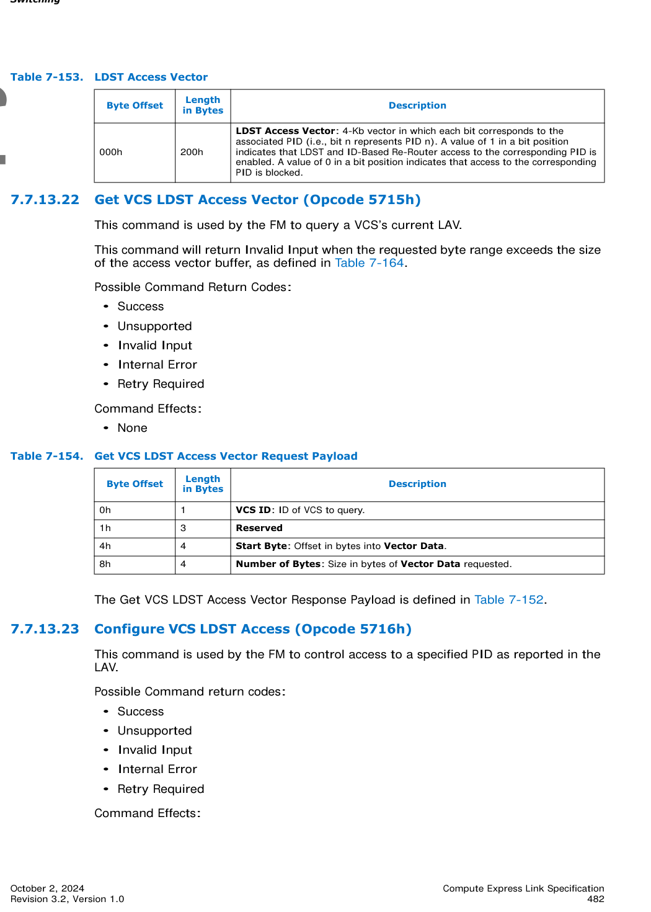
>
> *Original page render @ 150 DPI* — [📄 Full size](figures/chapter_07/page_0482.png)

> **Table 7-154.** Get VCS LDST Access Vector Request Payload ｜ Get VCS LDST Access Vector 请求 Payload
>
> 
>
> *Original page render @ 150 DPI* — [📄 Full size](figures/chapter_07/page_0482.png)

> **Table 7-155.** Configure VCS LDST Access Request Payload ｜ Configure VCS LDST Access 请求 Payload
>
> 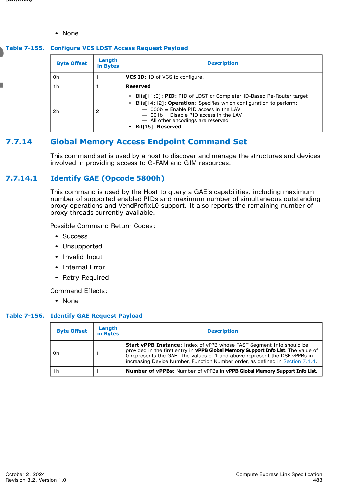
>
> *Original page render @ 150 DPI* — [📄 Full size](figures/chapter_07/page_0483.png)

[⬆️ 返回目录](#-本章目录-part-c)

---

## 7.7.14 Global Memory Access Endpoint Command Set | 全局内存访问端点 (GAE) 命令集

<table>
<thead>
<tr>
<th width="50%">🇬🇧 English</th>
<th width="50%" style="background-color:#e8e8e8">🇨🇳 中文</th>
</tr>
</thead>
<tbody>
<tr><td>This command set is used by a host to discover and manage the structures and devices involved in providing access to G-FAM and GIM resources.</td><td style="background-color:#e8e8e8">该命令集由主机用于发现和管理提供 G-FAM 和 GIM 资源访问所涉及的结构和设备。</td></tr>
</tbody>
</table>

### 7.7.14.1 Identify GAE (Opcode 5800h) | Identify GAE (操作码 5800h)

<table>
<thead>
<tr>
<th width="50%">🇬🇧 English</th>
<th width="50%" style="background-color:#e8e8e8">🇨🇳 中文</th>
</tr>
</thead>
<tbody>
<tr><td>This command is used by the Host to query a GAE's capabilities, including maximum number of supported enabled PIDs and maximum number of simultaneous outstanding proxy operations and VendPrefixL0 support. It also reports the remaining number of proxy threads currently available.</td><td style="background-color:#e8e8e8">该命令由主机用于查询 GAE 的能力,包括支持的最大已启用 PID 数量、最大同时未完成的代理操作数以及 VendPrefixL0 支持。它还报告当前可用的剩余代理线程数。</td></tr>
<tr><td>Possible Command Return Codes:</td><td style="background-color:#e8e8e8">可能的命令返回码:</td></tr>
<tr><td>• Success</td><td style="background-color:#e8e8e8">• Success</td></tr>
<tr><td>• Unsupported</td><td style="background-color:#e8e8e8">• Unsupported</td></tr>
<tr><td>• Invalid Input</td><td style="background-color:#e8e8e8">• Invalid Input</td></tr>
<tr><td>• Internal Error</td><td style="background-color:#e8e8e8">• Internal Error</td></tr>
<tr><td>• Retry Required</td><td style="background-color:#e8e8e8">• Retry Required</td></tr>
<tr><td>Command Effects:</td><td style="background-color:#e8e8e8">命令效果:</td></tr>
<tr><td>• None</td><td style="background-color:#e8e8e8">• 无</td></tr>
</tbody>
</table>

> **Table 7-156.** Identify GAE Request Payload ｜ Identify GAE 请求 Payload
>
> 
>
> *Original page render @ 150 DPI* — [📄 Full size](figures/chapter_07/page_0483.png)

> **Table 7-157.** Identify GAE Response Payload ｜ Identify GAE 响应 Payload
>
> 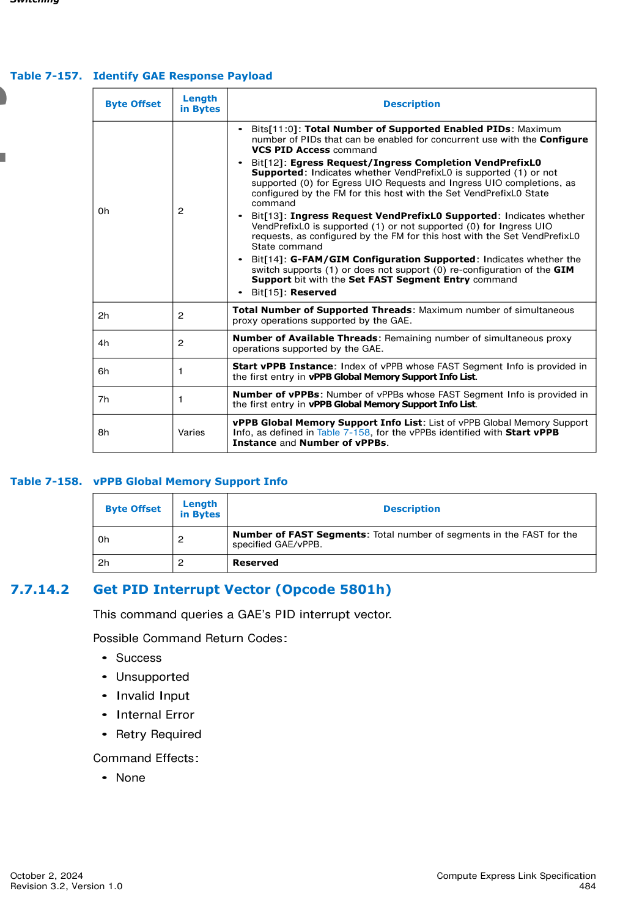
>
> *Original page render @ 150 DPI* — [📄 Full size](figures/chapter_07/page_0484.png)

> **Table 7-158.** vPPB Global Memory Support Info ｜ vPPB Global Memory Support Info
>
> 
>
> *Original page render @ 150 DPI* — [📄 Full size](figures/chapter_07/page_0484.png)

### 7.7.14.2 Get PID Interrupt Vector (Opcode 5801h) | Get PID Interrupt Vector (操作码 5801h)

<table>
<thead>
<tr>
<th width="50%">🇬🇧 English</th>
<th width="50%" style="background-color:#e8e8e8">🇨🇳 中文</th>
</tr>
</thead>
<tbody>
<tr><td>This command queries a GAE's PID interrupt vector.</td><td style="background-color:#e8e8e8">该命令查询 GAE 的 PID 中断向量。</td></tr>
<tr><td>Possible Command Return Codes:</td><td style="background-color:#e8e8e8">可能的命令返回码:</td></tr>
<tr><td>• Success</td><td style="background-color:#e8e8e8">• Success</td></tr>
<tr><td>• Unsupported</td><td style="background-color:#e8e8e8">• Unsupported</td></tr>
<tr><td>• Invalid Input</td><td style="background-color:#e8e8e8">• Invalid Input</td></tr>
<tr><td>• Internal Error</td><td style="background-color:#e8e8e8">• Internal Error</td></tr>
<tr><td>• Retry Required</td><td style="background-color:#e8e8e8">• Retry Required</td></tr>
<tr><td>Command Effects:</td><td style="background-color:#e8e8e8">命令效果:</td></tr>
<tr><td>• None</td><td style="background-color:#e8e8e8">• 无</td></tr>
</tbody>
</table>

> **Table 7-159.** Get PID Interrupt Vector Request Payload ｜ Get PID Interrupt Vector 请求 Payload
>
> 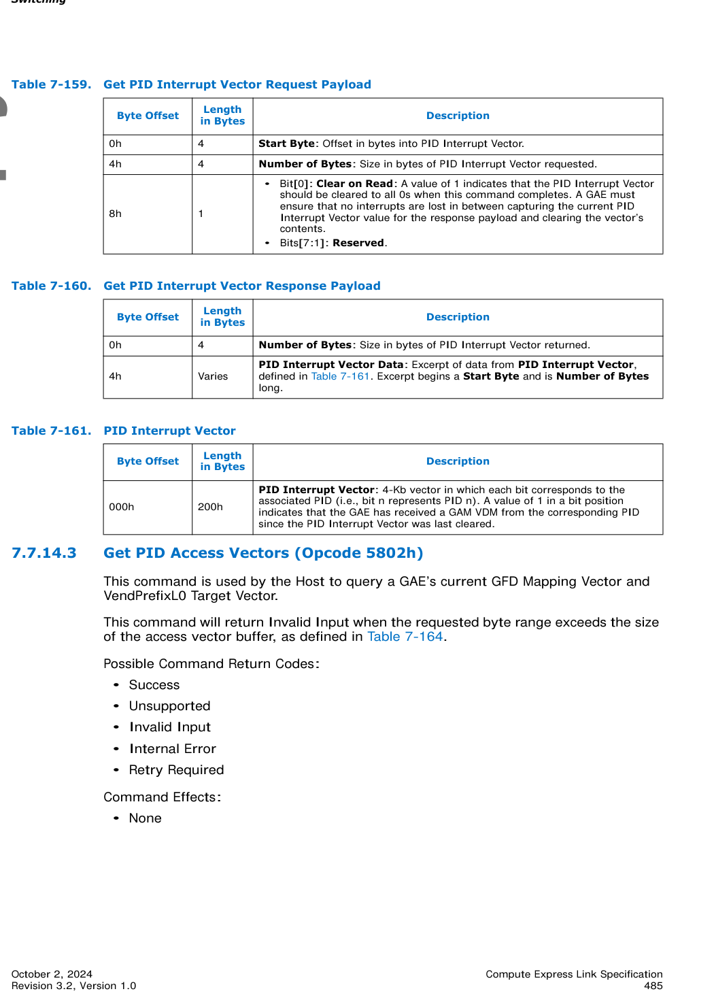
>
> *Original page render @ 150 DPI* — [📄 Full size](figures/chapter_07/page_0485.png)

> **Table 7-160.** Get PID Interrupt Vector Response Payload ｜ Get PID Interrupt Vector 响应 Payload
>
> 
>
> *Original page render @ 150 DPI* — [📄 Full size](figures/chapter_07/page_0485.png)

> **Table 7-161.** PID Interrupt Vector ｜ PID Interrupt Vector
>
> 
>
> *Original page render @ 150 DPI* — [📄 Full size](figures/chapter_07/page_0485.png)

### 7.7.14.3 Get PID Access Vectors (Opcode 5802h) | Get PID Access Vectors (操作码 5802h)

<table>
<thead>
<tr>
<th width="50%">🇬🇧 English</th>
<th width="50%" style="background-color:#e8e8e8">🇨🇳 中文</th>
</tr>
</thead>
<tbody>
<tr><td>This command is used by the Host to query a GAE's current GFD Mapping Vector and VendPrefixL0 Target Vector.</td><td style="background-color:#e8e8e8">该命令由主机用于查询 GAE 的当前 GFD Mapping Vector 和 VendPrefixL0 Target Vector。</td></tr>
<tr><td>This command will return Invalid Input when the requested byte range exceeds the size of the access vector buffer, as defined in Table 7-164.</td><td style="background-color:#e8e8e8">当请求的字节范围超过访问向量缓冲区的大小时 (如表 7-164 所定义),该命令将返回 Invalid Input。</td></tr>
<tr><td>Possible Command Return Codes:</td><td style="background-color:#e8e8e8">可能的命令返回码:</td></tr>
<tr><td>• Success</td><td style="background-color:#e8e8e8">• Success</td></tr>
<tr><td>• Unsupported</td><td style="background-color:#e8e8e8">• Unsupported</td></tr>
<tr><td>• Invalid Input</td><td style="background-color:#e8e8e8">• Invalid Input</td></tr>
<tr><td>• Internal Error</td><td style="background-color:#e8e8e8">• Internal Error</td></tr>
<tr><td>• Retry Required</td><td style="background-color:#e8e8e8">• Retry Required</td></tr>
<tr><td>Command Effects:</td><td style="background-color:#e8e8e8">命令效果:</td></tr>
<tr><td>• None</td><td style="background-color:#e8e8e8">• 无</td></tr>
</tbody>
</table>

> **Table 7-162.** Get PID Access Vectors Request Payload ｜ Get PID Access Vectors 请求 Payload
>
> 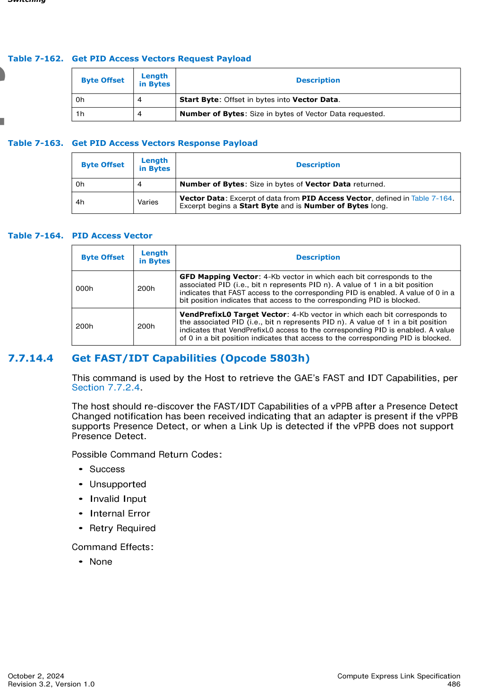
>
> *Original page render @ 150 DPI* — [📄 Full size](figures/chapter_07/page_0486.png)

> **Table 7-163.** Get PID Access Vectors Response Payload ｜ Get PID Access Vectors 响应 Payload
>
> 
>
> *Original page render @ 150 DPI* — [📄 Full size](figures/chapter_07/page_0486.png)

> **Table 7-164.** PID Access Vector ｜ PID Access Vector
>
> 
>
> *Original page render @ 150 DPI* — [📄 Full size](figures/chapter_07/page_0486.png)

### 7.7.14.4 Get FAST/IDT Capabilities (Opcode 5803h) | Get FAST/IDT Capabilities (操作码 5803h)

<table>
<thead>
<tr>
<th width="50%">🇬🇧 English</th>
<th width="50%" style="background-color:#e8e8e8">🇨🇳 中文</th>
</tr>
</thead>
<tbody>
<tr><td>This command is used by the Host to retrieve the GAE's FAST and IDT Capabilities, per Section 7.7.2.4.</td><td style="background-color:#e8e8e8">该命令由主机用于按 7.7.2.4 节检索 GAE 的 FAST 和 IDT 能力。</td></tr>
<tr><td>The host should re-discover the FAST/IDT Capabilities of a vPPB after a Presence Detect Changed notification has been received indicating that an adapter is present if the vPPB supports Presence Detect, or when a Link Up is detected if the vPPB does not support Presence Detect.</td><td style="background-color:#e8e8e8">如果 vPPB 支持 Presence Detect,主机应在收到指示适配器存在的 Presence Detect Changed 通知后重新发现该 vPPB 的 FAST/IDT 能力;如果 vPPB 不支持 Presence Detect,则在检测到 Link Up 时重新发现。</td></tr>
<tr><td>Possible Command Return Codes:</td><td style="background-color:#e8e8e8">可能的命令返回码:</td></tr>
<tr><td>• Success</td><td style="background-color:#e8e8e8">• Success</td></tr>
<tr><td>• Unsupported</td><td style="background-color:#e8e8e8">• Unsupported</td></tr>
<tr><td>• Invalid Input</td><td style="background-color:#e8e8e8">• Invalid Input</td></tr>
<tr><td>• Internal Error</td><td style="background-color:#e8e8e8">• Internal Error</td></tr>
<tr><td>• Retry Required</td><td style="background-color:#e8e8e8">• Retry Required</td></tr>
<tr><td>Command Effects:</td><td style="background-color:#e8e8e8">命令效果:</td></tr>
<tr><td>• None</td><td style="background-color:#e8e8e8">• 无</td></tr>
</tbody>
</table>

> **Table 7-165.** Get FAST/IDT Capabilities Request Payload ｜ Get FAST/IDT Capabilities 请求 Payload
>
> 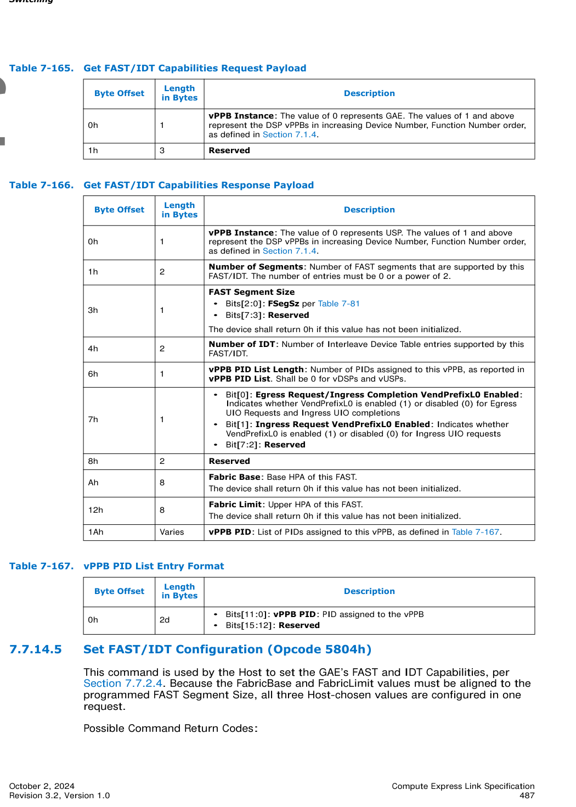
>
> *Original page render @ 150 DPI* — [📄 Full size](figures/chapter_07/page_0487.png)

> **Table 7-166.** Get FAST/IDT Capabilities Response Payload ｜ Get FAST/IDT Capabilities 响应 Payload
>
> 
>
> *Original page render @ 150 DPI* — [📄 Full size](figures/chapter_07/page_0487.png)

> **Table 7-167.** vPPB PID List Entry Format ｜ vPPB PID List 条目格式
>
> 
>
> *Original page render @ 150 DPI* — [📄 Full size](figures/chapter_07/page_0487.png)

### 7.7.14.5 Set FAST/IDT Configuration (Opcode 5804h) | Set FAST/IDT Configuration (操作码 5804h)

<table>
<thead>
<tr>
<th width="50%">🇬🇧 English</th>
<th width="50%" style="background-color:#e8e8e8">🇨🇳 中文</th>
</tr>
</thead>
<tbody>
<tr><td>This command is used by the Host to set the GAE's FAST and IDT Capabilities, per Section 7.7.2.4. Because the FabricBase and FabricLimit values must be aligned to the programmed FAST Segment Size, all three Host-chosen values are configured in one request.</td><td style="background-color:#e8e8e8">该命令由主机用于按 7.7.2.4 节设置 GAE 的 FAST 和 IDT 能力。由于 FabricBase 和 FabricLimit 值必须与所编程的 FAST Segment Size 对齐,因此主机所选的三个值在同一次请求中配置。</td></tr>
<tr><td>Possible Command Return Codes:</td><td style="background-color:#e8e8e8">可能的命令返回码:</td></tr>
<tr><td>• Success</td><td style="background-color:#e8e8e8">• Success</td></tr>
<tr><td>• Unsupported</td><td style="background-color:#e8e8e8">• Unsupported</td></tr>
<tr><td>• Invalid Input</td><td style="background-color:#e8e8e8">• Invalid Input</td></tr>
<tr><td>• Internal Error</td><td style="background-color:#e8e8e8">• Internal Error</td></tr>
<tr><td>• Retry Required</td><td style="background-color:#e8e8e8">• Retry Required</td></tr>
<tr><td>Command Effects:</td><td style="background-color:#e8e8e8">命令效果:</td></tr>
<tr><td>• Immediate Configuration Change</td><td style="background-color:#e8e8e8">• 立即配置变更 (Immediate Configuration Change)</td></tr>
</tbody>
</table>

> **Table 7-168.** Set FAST/IDT Configuration Request Payload ｜ Set FAST/IDT Configuration 请求 Payload
>
> 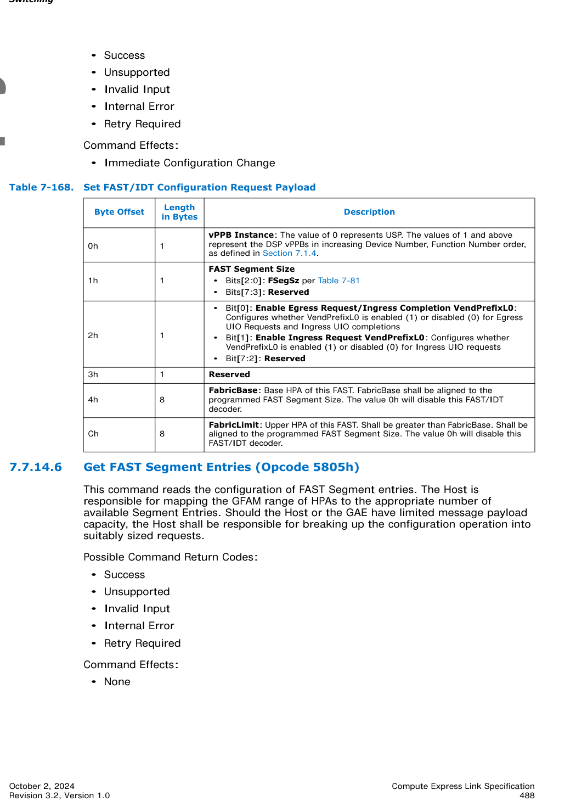
>
> *Original page render @ 150 DPI* — [📄 Full size](figures/chapter_07/page_0488.png)

### 7.7.14.6 Get FAST Segment Entries (Opcode 5805h) | Get FAST Segment Entries (操作码 5805h)

<table>
<thead>
<tr>
<th width="50%">🇬🇧 English</th>
<th width="50%" style="background-color:#e8e8e8">🇨🇳 中文</th>
</tr>
</thead>
<tbody>
<tr><td>This command reads the configuration of FAST Segment entries. The Host is responsible for mapping the GFAM range of HPAs to the appropriate number of available Segment Entries. Should the Host or the GAE have limited message payload capacity, the Host shall be responsible for breaking up the configuration operation into suitably sized requests.</td><td style="background-color:#e8e8e8">该命令读取 FAST Segment 条目的配置。主机负责将 GFAM 范围的 HPA 映射到适当数量的可用 Segment 条目。如果主机或 GAE 的消息有效载荷容量有限,主机应负责将配置操作拆分为合适大小的请求。</td></tr>
<tr><td>Possible Command Return Codes:</td><td style="background-color:#e8e8e8">可能的命令返回码:</td></tr>
<tr><td>• Success</td><td style="background-color:#e8e8e8">• Success</td></tr>
<tr><td>• Unsupported</td><td style="background-color:#e8e8e8">• Unsupported</td></tr>
<tr><td>• Invalid Input</td><td style="background-color:#e8e8e8">• Invalid Input</td></tr>
<tr><td>• Internal Error</td><td style="background-color:#e8e8e8">• Internal Error</td></tr>
<tr><td>• Retry Required</td><td style="background-color:#e8e8e8">• Retry Required</td></tr>
<tr><td>Command Effects:</td><td style="background-color:#e8e8e8">命令效果:</td></tr>
<tr><td>• None</td><td style="background-color:#e8e8e8">• 无</td></tr>
</tbody>
</table>

> **Table 7-169.** Get FAST Segment Entries Request Payload ｜ Get FAST Segment Entries 请求 Payload
>
> 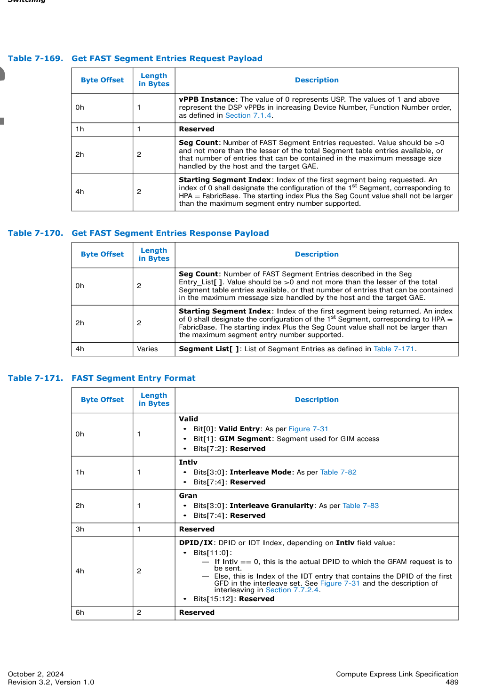
>
> *Original page render @ 150 DPI* — [📄 Full size](figures/chapter_07/page_0489.png)

> **Table 7-170.** Get FAST Segment Entries Response Payload ｜ Get FAST Segment Entries 响应 Payload
>
> 
>
> *Original page render @ 150 DPI* — [📄 Full size](figures/chapter_07/page_0489.png)

> **Table 7-171.** FAST Segment Entry Format ｜ FAST Segment Entry 格式
>
> 
>
> *Original page render @ 150 DPI* — [📄 Full size](figures/chapter_07/page_0489.png)

### 7.7.14.7 Set FAST Segment Entries (Opcode 5806h) | Set FAST Segment Entries (操作码 5806h)

<table>
<thead>
<tr>
<th width="50%">🇬🇧 English</th>
<th width="50%" style="background-color:#e8e8e8">🇨🇳 中文</th>
</tr>
</thead>
<tbody>
<tr><td>This command is used by the Host to set the configuration of FAST Segment entries. The Host is responsible for mapping the GFAM range of HPAs to the appropriate number of available Segment Entries, per Section 7.7.2.4. Should the host or the GAE have limited message payload capacity, the Host shall be responsible for breaking up the configuration operation into suitably sized requests.</td><td style="background-color:#e8e8e8">该命令由主机用于设置 FAST Segment 条目的配置。主机负责按 7.7.2.4 节将 GFAM 范围的 HPA 映射到适当数量的可用 Segment 条目。如果主机或 GAE 的消息有效载荷容量有限,主机应负责将配置操作拆分为合适大小的请求。</td></tr>
<tr><td>There are two types of segments: those that access G-FAM, and those that access GIM. Valid PID targets for G-FAM segments are defined in the GMV. Valid targets for GIM segments are defined in the VTV.</td><td style="background-color:#e8e8e8">段有两种类型:访问 G-FAM 的段和访问 GIM 的段。G-FAM 段的有效 PID 目标在 GMV 中定义。GIM 段的有效目标在 VTV 中定义。</td></tr>
<tr><td>This command will complete with an Invalid Input status if the requester is not authorized to access the specified ID, as advertised by the GMV or VTV.</td><td style="background-color:#e8e8e8">如果请求者未被授权访问指定的 ID (由 GMV 或 VTV 公布),该命令将以 Invalid Input 状态结束。</td></tr>
<tr><td>Possible Command Return Codes:</td><td style="background-color:#e8e8e8">可能的命令返回码:</td></tr>
<tr><td>• Success</td><td style="background-color:#e8e8e8">• Success</td></tr>
<tr><td>• Unsupported</td><td style="background-color:#e8e8e8">• Unsupported</td></tr>
<tr><td>• Invalid Input</td><td style="background-color:#e8e8e8">• Invalid Input</td></tr>
<tr><td>• Internal Error</td><td style="background-color:#e8e8e8">• Internal Error</td></tr>
<tr><td>• Retry Required</td><td style="background-color:#e8e8e8">• Retry Required</td></tr>
<tr><td>Command Effects:</td><td style="background-color:#e8e8e8">命令效果:</td></tr>
<tr><td>• Immediate Configuration Change</td><td style="background-color:#e8e8e8">• 立即配置变更 (Immediate Configuration Change)</td></tr>
</tbody>
</table>

> **Table 7-172.** Set FAST Segment Entries Request Payload ｜ Set FAST Segment Entries 请求 Payload
>
> 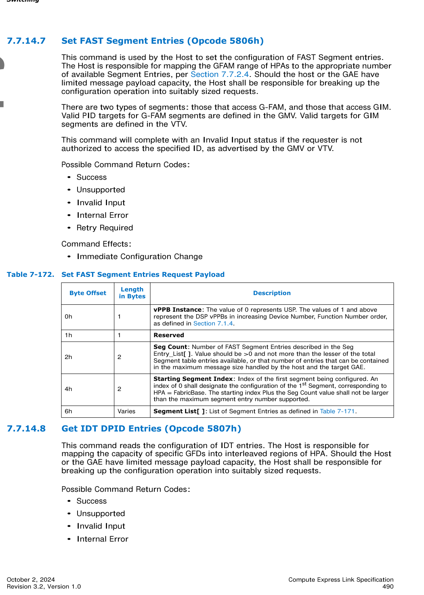
>
> *Original page render @ 150 DPI* — [📄 Full size](figures/chapter_07/page_0490.png)

### 7.7.14.8 Get IDT DPID Entries (Opcode 5807h) | Get IDT DPID Entries (操作码 5807h)

<table>
<thead>
<tr>
<th width="50%">🇬🇧 English</th>
<th width="50%" style="background-color:#e8e8e8">🇨🇳 中文</th>
</tr>
</thead>
<tbody>
<tr><td>This command reads the configuration of IDT entries. The Host is responsible for mapping the capacity of specific GFDs into interleaved regions of HPA. Should the Host or the GAE have limited message payload capacity, the Host shall be responsible for breaking up the configuration operation into suitably sized requests.</td><td style="background-color:#e8e8e8">该命令读取 IDT 条目的配置。主机负责将特定 GFD 的容量映射到 HPA 的交织区域。如果主机或 GAE 的消息有效载荷容量有限,主机应负责将配置操作拆分为合适大小的请求。</td></tr>
<tr><td>Possible Command Return Codes:</td><td style="background-color:#e8e8e8">可能的命令返回码:</td></tr>
<tr><td>• Success</td><td style="background-color:#e8e8e8">• Success</td></tr>
<tr><td>• Unsupported</td><td style="background-color:#e8e8e8">• Unsupported</td></tr>
<tr><td>• Invalid Input</td><td style="background-color:#e8e8e8">• Invalid Input</td></tr>
<tr><td>• Internal Error</td><td style="background-color:#e8e8e8">• Internal Error</td></tr>
<tr><td>• Retry Required</td><td style="background-color:#e8e8e8">• Retry Required</td></tr>
<tr><td>Command Effects:</td><td style="background-color:#e8e8e8">命令效果:</td></tr>
<tr><td>• None</td><td style="background-color:#e8e8e8">• 无</td></tr>
</tbody>
</table>

> **Table 7-173.** Get IDT DPID Entries Request Payload ｜ Get IDT DPID Entries 请求 Payload
>
> 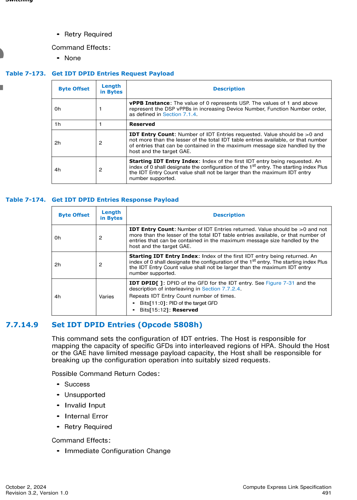
>
> *Original page render @ 150 DPI* — [📄 Full size](figures/chapter_07/page_0491.png)

> **Table 7-174.** Get IDT DPID Entries Response Payload ｜ Get IDT DPID Entries 响应 Payload
>
> 
>
> *Original page render @ 150 DPI* — [📄 Full size](figures/chapter_07/page_0491.png)

### 7.7.14.9 Set IDT DPID Entries (Opcode 5808h) | Set IDT DPID Entries (操作码 5808h)

<table>
<thead>
<tr>
<th width="50%">🇬🇧 English</th>
<th width="50%" style="background-color:#e8e8e8">🇨🇳 中文</th>
</tr>
</thead>
<tbody>
<tr><td>This command sets the configuration of IDT entries. The Host is responsible for mapping the capacity of specific GFDs into interleaved regions of HPA. Should the Host or the GAE have limited message payload capacity, the Host shall be responsible for breaking up the configuration operation into suitably sized requests.</td><td style="background-color:#e8e8e8">该命令设置 IDT 条目的配置。主机负责将特定 GFD 的容量映射到 HPA 的交织区域。如果主机或 GAE 的消息有效载荷容量有限,主机应负责将配置操作拆分为合适大小的请求。</td></tr>
<tr><td>Possible Command Return Codes:</td><td style="background-color:#e8e8e8">可能的命令返回码:</td></tr>
<tr><td>• Success</td><td style="background-color:#e8e8e8">• Success</td></tr>
<tr><td>• Unsupported</td><td style="background-color:#e8e8e8">• Unsupported</td></tr>
<tr><td>• Invalid Input</td><td style="background-color:#e8e8e8">• Invalid Input</td></tr>
<tr><td>• Internal Error</td><td style="background-color:#e8e8e8">• Internal Error</td></tr>
<tr><td>• Retry Required</td><td style="background-color:#e8e8e8">• Retry Required</td></tr>
<tr><td>Command Effects:</td><td style="background-color:#e8e8e8">命令效果:</td></tr>
<tr><td>• Immediate Configuration Change</td><td style="background-color:#e8e8e8">• 立即配置变更 (Immediate Configuration Change)</td></tr>
</tbody>
</table>

> **Table 7-175.** Set IDT DPID Entries Request Payload ｜ Set IDT DPID Entries 请求 Payload
>
> 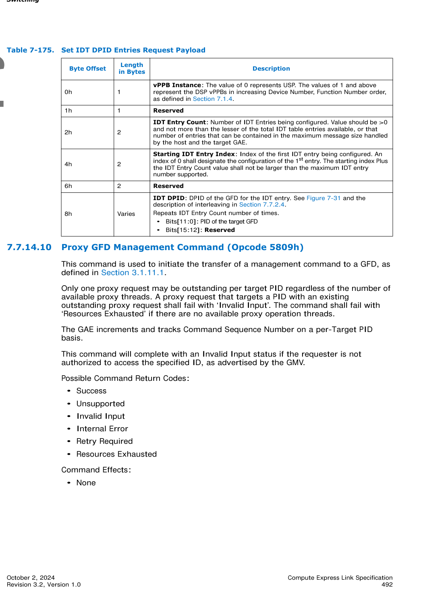
>
> *Original page render @ 150 DPI* — [📄 Full size](figures/chapter_07/page_0492.png)

### 7.7.14.10 Proxy GFD Management Command (Opcode 5809h) | Proxy GFD Management Command (操作码 5809h)

<table>
<thead>
<tr>
<th width="50%">🇬🇧 English</th>
<th width="50%" style="background-color:#e8e8e8">🇨🇳 中文</th>
</tr>
</thead>
<tbody>
<tr><td>This command is used to initiate the transfer of a management command to a GFD, as defined in Section 3.1.11.1.</td><td style="background-color:#e8e8e8">该命令用于按 3.1.11.1 节将管理命令的传输发起至 GFD。</td></tr>
<tr><td>Only one proxy request may be outstanding per target PID regardless of the number of available proxy threads. A proxy request that targets a PID with an existing outstanding proxy request shall fail with 'Invalid Input'. The command shall fail with 'Resources Exhausted' if there are no available proxy operation threads.</td><td style="background-color:#e8e8e8">无论可用代理线程的数量如何,每个目标 PID 只能有一个未完成的代理请求。针对一个已存在未完成代理请求的 PID 的代理请求应失败并返回 'Invalid Input'。若没有可用的代理操作线程,该命令应失败并返回 'Resources Exhausted'。</td></tr>
<tr><td>The GAE increments and tracks Command Sequence Number on a per-Target PID basis.</td><td style="background-color:#e8e8e8">GAE 按每个目标 PID 的粒度递增并跟踪 Command Sequence Number。</td></tr>
<tr><td>This command will complete with an Invalid Input status if the requester is not authorized to access the specified ID, as advertised by the GMV.</td><td style="background-color:#e8e8e8">如果请求者未被授权访问指定的 ID (由 GMV 公布),该命令将以 Invalid Input 状态结束。</td></tr>
<tr><td>Possible Command Return Codes:</td><td style="background-color:#e8e8e8">可能的命令返回码:</td></tr>
<tr><td>• Success</td><td style="background-color:#e8e8e8">• Success</td></tr>
<tr><td>• Unsupported</td><td style="background-color:#e8e8e8">• Unsupported</td></tr>
<tr><td>• Invalid Input</td><td style="background-color:#e8e8e8">• Invalid Input</td></tr>
<tr><td>• Internal Error</td><td style="background-color:#e8e8e8">• Internal Error</td></tr>
<tr><td>• Retry Required</td><td style="background-color:#e8e8e8">• Retry Required</td></tr>
<tr><td>• Resources Exhausted</td><td style="background-color:#e8e8e8">• Resources Exhausted</td></tr>
<tr><td>Command Effects:</td><td style="background-color:#e8e8e8">命令效果:</td></tr>
<tr><td>• None</td><td style="background-color:#e8e8e8">• 无</td></tr>
</tbody>
</table>

> **Table 7-176.** Proxy GFD Management Command Request Payload ｜ Proxy GFD Management Command 请求 Payload
>
> 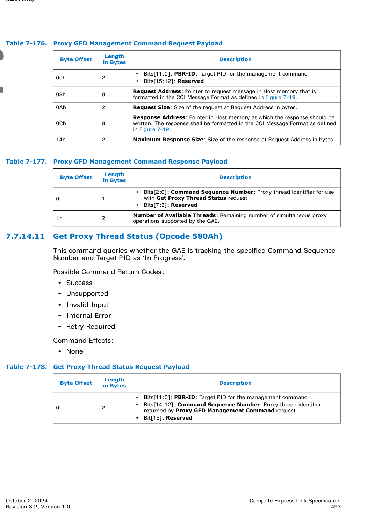
>
> *Original page render @ 150 DPI* — [📄 Full size](figures/chapter_07/page_0493.png)

> **Table 7-177.** Proxy GFD Management Command Response Payload ｜ Proxy GFD Management Command 响应 Payload
>
> 
>
> *Original page render @ 150 DPI* — [📄 Full size](figures/chapter_07/page_0493.png)

### 7.7.14.11 Get Proxy Thread Status (Opcode 580Ah) | Get Proxy Thread Status (操作码 580Ah)

<table>
<thead>
<tr>
<th width="50%">🇬🇧 English</th>
<th width="50%" style="background-color:#e8e8e8">🇨🇳 中文</th>
</tr>
</thead>
<tbody>
<tr><td>This command queries whether the GAE is tracking the specified Command Sequence Number and Target PID as 'In Progress'.</td><td style="background-color:#e8e8e8">该命令查询 GAE 是否将指定的 Command Sequence Number 和 Target PID 跟踪为 'In Progress'。</td></tr>
<tr><td>Possible Command Return Codes:</td><td style="background-color:#e8e8e8">可能的命令返回码:</td></tr>
<tr><td>• Success</td><td style="background-color:#e8e8e8">• Success</td></tr>
<tr><td>• Unsupported</td><td style="background-color:#e8e8e8">• Unsupported</td></tr>
<tr><td>• Invalid Input</td><td style="background-color:#e8e8e8">• Invalid Input</td></tr>
<tr><td>• Internal Error</td><td style="background-color:#e8e8e8">• Internal Error</td></tr>
<tr><td>• Retry Required</td><td style="background-color:#e8e8e8">• Retry Required</td></tr>
<tr><td>Command Effects:</td><td style="background-color:#e8e8e8">命令效果:</td></tr>
<tr><td>• None</td><td style="background-color:#e8e8e8">• 无</td></tr>
</tbody>
</table>

> **Table 7-178.** Get Proxy Thread Status Request Payload ｜ Get Proxy Thread Status 请求 Payload
>
> 
>
> *Original page render @ 150 DPI* — [📄 Full size](figures/chapter_07/page_0493.png)

> **Table 7-179.** Get Proxy Thread Status Response Payload ｜ Get Proxy Thread Status 响应 Payload
>
> 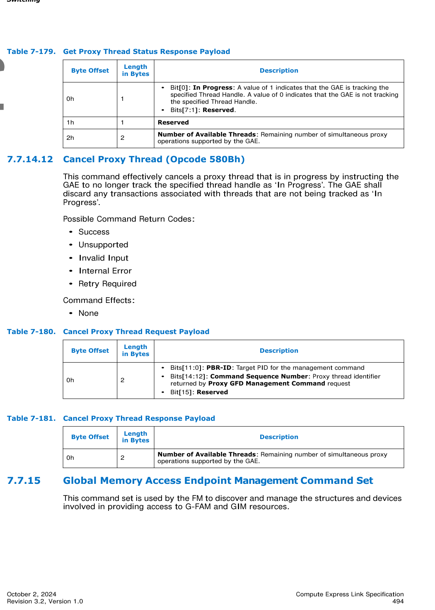
>
> *Original page render @ 150 DPI* — [📄 Full size](figures/chapter_07/page_0494.png)

### 7.7.14.12 Cancel Proxy Thread (Opcode 580Bh) | Cancel Proxy Thread (操作码 580Bh)

<table>
<thead>
<tr>
<th width="50%">🇬🇧 English</th>
<th width="50%" style="background-color:#e8e8e8">🇨🇳 中文</th>
</tr>
</thead>
<tbody>
<tr><td>This command effectively cancels a proxy thread that is in progress by instructing the GAE to no longer track the specified thread handle as 'In Progress'. The GAE shall discard any transactions associated with threads that are not being tracked as 'In Progress'.</td><td style="background-color:#e8e8e8">该命令通过指示 GAE 不再将指定的线程句柄跟踪为 'In Progress',有效地取消正在进行的代理线程。GAE 应丢弃与未跟踪为 'In Progress' 的线程相关联的任何事务。</td></tr>
<tr><td>Possible Command Return Codes:</td><td style="background-color:#e8e8e8">可能的命令返回码:</td></tr>
<tr><td>• Success</td><td style="background-color:#e8e8e8">• Success</td></tr>
<tr><td>• Unsupported</td><td style="background-color:#e8e8e8">• Unsupported</td></tr>
<tr><td>• Invalid Input</td><td style="background-color:#e8e8e8">• Invalid Input</td></tr>
<tr><td>• Internal Error</td><td style="background-color:#e8e8e8">• Internal Error</td></tr>
<tr><td>• Retry Required</td><td style="background-color:#e8e8e8">• Retry Required</td></tr>
<tr><td>Command Effects:</td><td style="background-color:#e8e8e8">命令效果:</td></tr>
<tr><td>• None</td><td style="background-color:#e8e8e8">• 无</td></tr>
</tbody>
</table>

> **Table 7-180.** Cancel Proxy Thread Request Payload ｜ Cancel Proxy Thread 请求 Payload
>
> 
>
> *Original page render @ 150 DPI* — [📄 Full size](figures/chapter_07/page_0494.png)

> **Table 7-181.** Cancel Proxy Thread Response Payload ｜ Cancel Proxy Thread 响应 Payload
>
> 
>
> *Original page render @ 150 DPI* — [📄 Full size](figures/chapter_07/page_0494.png)

[⬆️ 返回目录](#-本章目录-part-c)

---

## 7.7.15 Global Memory Access Endpoint Management Command Set | 全局内存访问端点管理命令集

<table>
<thead>
<tr>
<th width="50%">🇬🇧 English</th>
<th width="50%" style="background-color:#e8e8e8">🇨🇳 中文</th>
</tr>
</thead>
<tbody>
<tr><td>This command set is used by the FM to discover and manage the structures and devices involved in providing access to G-FAM and GIM resources.</td><td style="background-color:#e8e8e8">该命令集由 FM 用于发现和管理提供 G-FAM 和 GIM 资源访问所涉及的结构和设备。</td></tr>
</tbody>
</table>

### 7.7.15.1 Identify VCS GAE (Opcode 5900h) | Identify VCS GAE (操作码 5900h)

<table>
<thead>
<tr>
<th width="50%">🇬🇧 English</th>
<th width="50%" style="background-color:#e8e8e8">🇨🇳 中文</th>
</tr>
</thead>
<tbody>
<tr><td>This command is used by the FM to query a GAE's capabilities, including maximum number of supported enabled PIDs and maximum number of simultaneous outstanding proxy operations and VendPrefixL0 support. It also reports the remaining number of proxy threads currently available.</td><td style="background-color:#e8e8e8">该命令由 FM 用于查询 GAE 的能力,包括支持的最大已启用 PID 数量、最大同时未完成的代理操作数以及 VendPrefixL0 支持。它还报告当前可用的剩余代理线程数。</td></tr>
<tr><td>Possible Command Return Codes:</td><td style="background-color:#e8e8e8">可能的命令返回码:</td></tr>
<tr><td>• Success</td><td style="background-color:#e8e8e8">• Success</td></tr>
<tr><td>• Unsupported</td><td style="background-color:#e8e8e8">• Unsupported</td></tr>
<tr><td>• Invalid Input</td><td style="background-color:#e8e8e8">• Invalid Input</td></tr>
<tr><td>• Internal Error</td><td style="background-color:#e8e8e8">• Internal Error</td></tr>
<tr><td>• Retry Required</td><td style="background-color:#e8e8e8">• Retry Required</td></tr>
<tr><td>Command Effects:</td><td style="background-color:#e8e8e8">命令效果:</td></tr>
<tr><td>• None</td><td style="background-color:#e8e8e8">• 无</td></tr>
<tr><td>The Identify VCS GAE Response Payload is defined in Table 7-157.</td><td style="background-color:#e8e8e8">Identify VCS GAE 响应 Payload 在表 7-157 中定义。</td></tr>
</tbody>
</table>

> **Table 7-182.** Identify VCS GAE Request Payload ｜ Identify VCS GAE 请求 Payload
>
> 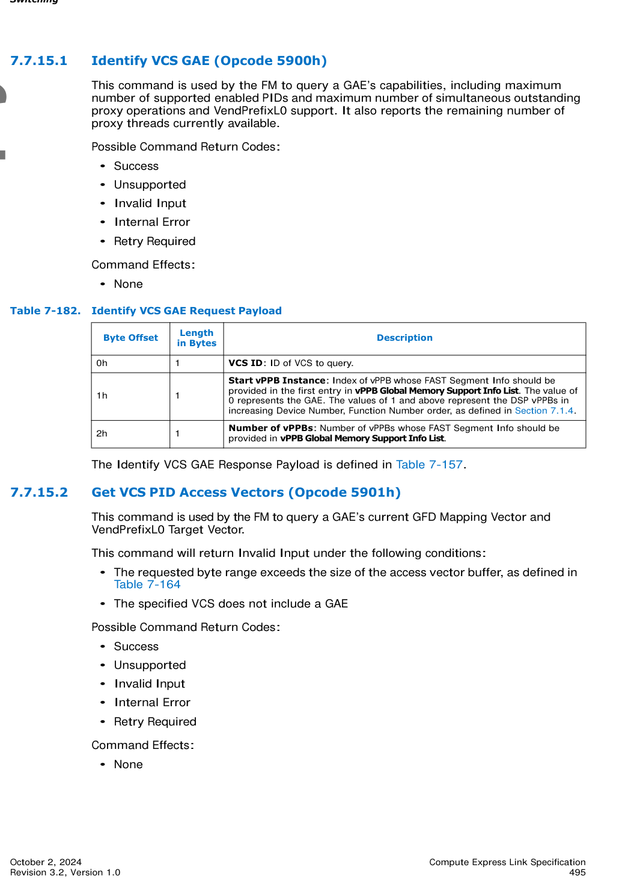
>
> *Original page render @ 150 DPI* — [📄 Full size](figures/chapter_07/page_0495.png)

### 7.7.15.2 Get VCS PID Access Vectors (Opcode 5901h) | Get VCS PID Access Vectors (操作码 5901h)

<table>
<thead>
<tr>
<th width="50%">🇬🇧 English</th>
<th width="50%" style="background-color:#e8e8e8">🇨🇳 中文</th>
</tr>
</thead>
<tbody>
<tr><td>This command is used by the FM to query a GAE's current GFD Mapping Vector and VendPrefixL0 Target Vector.</td><td style="background-color:#e8e8e8">该命令由 FM 用于查询 GAE 的当前 GFD Mapping Vector 和 VendPrefixL0 Target Vector。</td></tr>
<tr><td>This command will return Invalid Input under the following conditions:</td><td style="background-color:#e8e8e8">在以下条件下,该命令将返回 Invalid Input:</td></tr>
<tr><td>• The requested byte range exceeds the size of the access vector buffer, as defined in Table 7-164</td><td style="background-color:#e8e8e8">• 请求的字节范围超过访问向量缓冲区的大小 (如表 7-164 所定义)</td></tr>
<tr><td>• The specified VCS does not include a GAE</td><td style="background-color:#e8e8e8">• 指定的 VCS 不包含 GAE</td></tr>
<tr><td>Possible Command Return Codes:</td><td style="background-color:#e8e8e8">可能的命令返回码:</td></tr>
<tr><td>• Success</td><td style="background-color:#e8e8e8">• Success</td></tr>
<tr><td>• Unsupported</td><td style="background-color:#e8e8e8">• Unsupported</td></tr>
<tr><td>• Invalid Input</td><td style="background-color:#e8e8e8">• Invalid Input</td></tr>
<tr><td>• Internal Error</td><td style="background-color:#e8e8e8">• Internal Error</td></tr>
<tr><td>• Retry Required</td><td style="background-color:#e8e8e8">• Retry Required</td></tr>
<tr><td>Command Effects:</td><td style="background-color:#e8e8e8">命令效果:</td></tr>
<tr><td>• None</td><td style="background-color:#e8e8e8">• 无</td></tr>
</tbody>
</table>

> **Table 7-183.** Get VCS PID Access Vectors Request Payload ｜ Get VCS PID Access Vectors 请求 Payload
>
> 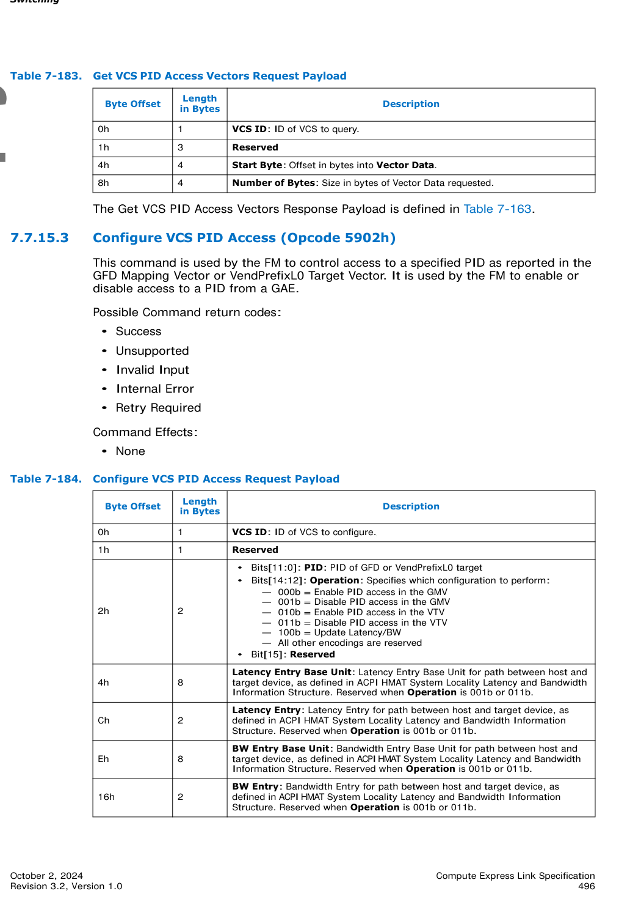
>
> *Original page render @ 150 DPI* — [📄 Full size](figures/chapter_07/page_0496.png)

### 7.7.15.3 Configure VCS PID Access (Opcode 5902h) | Configure VCS PID Access (操作码 5902h)

<table>
<thead>
<tr>
<th width="50%">🇬🇧 English</th>
<th width="50%" style="background-color:#e8e8e8">🇨🇳 中文</th>
</tr>
</thead>
<tbody>
<tr><td>This command is used by the FM to control access to a specified PID as reported in the GFD Mapping Vector or VendPrefixL0 Target Vector. It is used by the FM to enable or disable access to a PID from a GAE.</td><td style="background-color:#e8e8e8">该命令由 FM 用于控制在 GFD Mapping Vector 或 VendPrefixL0 Target Vector 中报告的指定 PID 的访问。FM 使用它来启用或禁用从 GAE 对 PID 的访问。</td></tr>
<tr><td>Possible Command return codes:</td><td style="background-color:#e8e8e8">可能的命令返回码:</td></tr>
<tr><td>• Success</td><td style="background-color:#e8e8e8">• Success</td></tr>
<tr><td>• Unsupported</td><td style="background-color:#e8e8e8">• Unsupported</td></tr>
<tr><td>• Invalid Input</td><td style="background-color:#e8e8e8">• Invalid Input</td></tr>
<tr><td>• Internal Error</td><td style="background-color:#e8e8e8">• Internal Error</td></tr>
<tr><td>• Retry Required</td><td style="background-color:#e8e8e8">• Retry Required</td></tr>
<tr><td>Command Effects:</td><td style="background-color:#e8e8e8">命令效果:</td></tr>
<tr><td>• None</td><td style="background-color:#e8e8e8">• 无</td></tr>
</tbody>
</table>

> **Table 7-184.** Configure VCS PID Access Request Payload ｜ Configure VCS PID Access 请求 Payload
>
> 
>
> *Original page render @ 150 DPI* — [📄 Full size](figures/chapter_07/page_0496.png)

### 7.7.15.4 Get VendPrefixL0 State (Opcode 5903h) | Get VendPrefixL0 State (操作码 5903h)

<table>
<thead>
<tr>
<th width="50%">🇬🇧 English</th>
<th width="50%" style="background-color:#e8e8e8">🇨🇳 中文</th>
</tr>
</thead>
<tbody>
<tr><td>This command is used by the FM to query the enable state of VendPrefixL0 in a VCS. Support for this command indicates whether a PBR switch supports VendPrefixL0. The Get VendPrefixL0 State command shall only be implemented by PBR switches that support VendPrefixL0.</td><td style="background-color:#e8e8e8">该命令由 FM 用于查询 VCS 中 VendPrefixL0 的启用状态。对该命令的支持表明 PBR 交换机是否支持 VendPrefixL0。Get VendPrefixL0 State 命令应仅由支持 VendPrefixL0 的 PBR 交换机实现。</td></tr>
<tr><td>Possible Command Return Codes:</td><td style="background-color:#e8e8e8">可能的命令返回码:</td></tr>
<tr><td>• Success</td><td style="background-color:#e8e8e8">• Success</td></tr>
<tr><td>• Unsupported</td><td style="background-color:#e8e8e8">• Unsupported</td></tr>
<tr><td>• Invalid Input</td><td style="background-color:#e8e8e8">• Invalid Input</td></tr>
<tr><td>• Internal Error</td><td style="background-color:#e8e8e8">• Internal Error</td></tr>
<tr><td>• Retry Required</td><td style="background-color:#e8e8e8">• Retry Required</td></tr>
<tr><td>Command Effects:</td><td style="background-color:#e8e8e8">命令效果:</td></tr>
<tr><td>• None</td><td style="background-color:#e8e8e8">• 无</td></tr>
</tbody>
</table>

> **Table 7-185.** Get VendPrefixL0 State Request Payload ｜ Get VendPrefixL0 State 请求 Payload
>
> 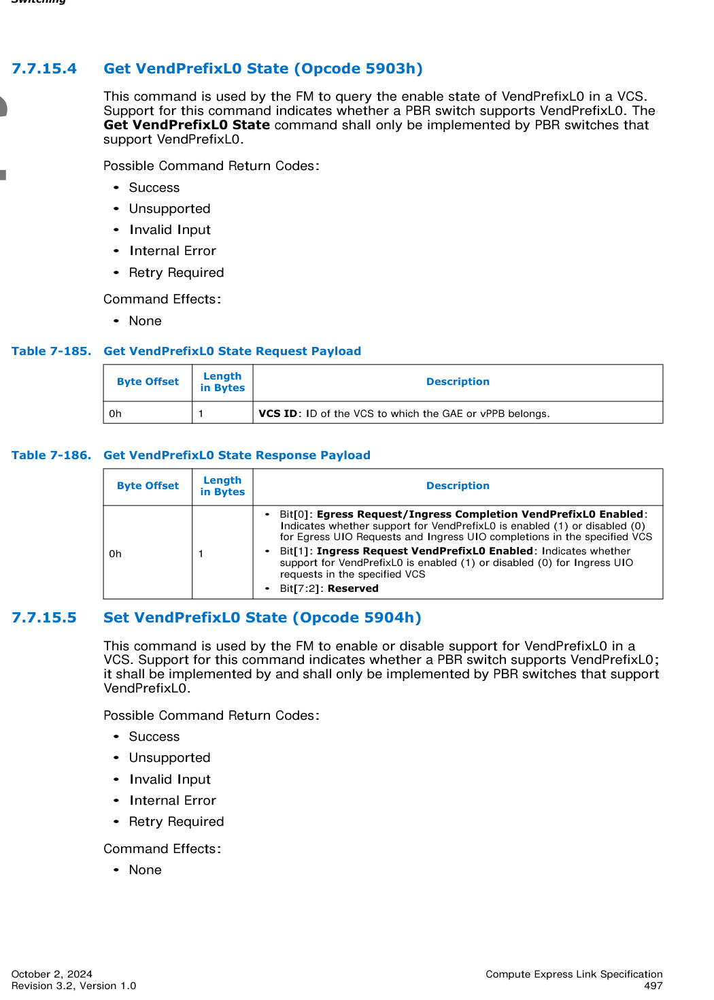
>
> *Original page render @ 150 DPI* — [📄 Full size](figures/chapter_07/page_0497.png)

> **Table 7-186.** Get VendPrefixL0 State Response Payload ｜ Get VendPrefixL0 State 响应 Payload
>
> 
>
> *Original page render @ 150 DPI* — [📄 Full size](figures/chapter_07/page_0497.png)

### 7.7.15.5 Set VendPrefixL0 State (Opcode 5904h) | Set VendPrefixL0 State (操作码 5904h)

<table>
<thead>
<tr>
<th width="50%">🇬🇧 English</th>
<th width="50%" style="background-color:#e8e8e8">🇨🇳 中文</th>
</tr>
</thead>
<tbody>
<tr><td>This command is used by the FM to enable or disable support for VendPrefixL0 in a VCS. Support for this command indicates whether a PBR switch supports VendPrefixL0; it shall be implemented by and shall only be implemented by PBR switches that support VendPrefixL0.</td><td style="background-color:#e8e8e8">该命令由 FM 用于在 VCS 中启用或禁用对 VendPrefixL0 的支持。对该命令的支持表明 PBR 交换机是否支持 VendPrefixL0;它应由且仅应由支持 VendPrefixL0 的 PBR 交换机实现。</td></tr>
<tr><td>Possible Command Return Codes:</td><td style="background-color:#e8e8e8">可能的命令返回码:</td></tr>
<tr><td>• Success</td><td style="background-color:#e8e8e8">• Success</td></tr>
<tr><td>• Unsupported</td><td style="background-color:#e8e8e8">• Unsupported</td></tr>
<tr><td>• Invalid Input</td><td style="background-color:#e8e8e8">• Invalid Input</td></tr>
<tr><td>• Internal Error</td><td style="background-color:#e8e8e8">• Internal Error</td></tr>
<tr><td>• Retry Required</td><td style="background-color:#e8e8e8">• Retry Required</td></tr>
<tr><td>Command Effects:</td><td style="background-color:#e8e8e8">命令效果:</td></tr>
<tr><td>• None</td><td style="background-color:#e8e8e8">• 无</td></tr>
</tbody>
</table>

> **Table 7-187.** Set VendPrefixL0 State Request Payload ｜ Set VendPrefixL0 State 请求 Payload
>
> 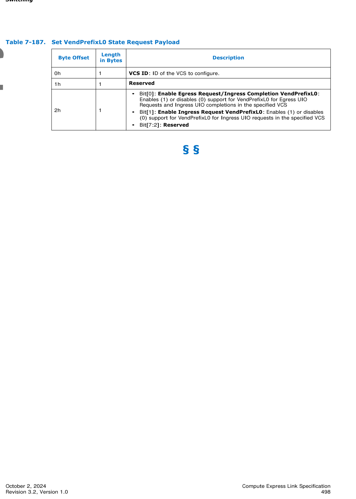
>
> *Original page render @ 150 DPI* — [📄 Full size](figures/chapter_07/page_0498.png)

[⬆️ 返回目录](#-本章目录-part-c)

---

## 📝 Part C 翻译完成说明 (Translation Completion Notes)

Part C (p.441-498) 涵盖了 CXL 3.2 规范第 7 章中关于 PBR (Port-Based Routing) fabric 的关键内容,包括:

- **7.7.7-7.7.10**: PBR Fabric 排序与流控规则、PTH 规则、UIO Direct P2P to HDM、Direct P2P CXL.mem for Accelerators
- **7.7.11**: PBR 链路事件与消息 (Assert/Deassert Reset、Link Up、Shared Link、Link Partner Info)
- **7.7.12**: PBR Fabric 管理 (发现、PID 分配、CDAT 上报、CacheID 配置、动态变更)
- **7.7.13**: PBR 交换机命令集 (Opcode 5700h-5716h,包括 DRT、RGT、LDST、IDT、Re-Router 等)
- **7.7.14**: Global Memory Access Endpoint (GAE) 命令集 (Opcode 5800h-580Bh)
- **7.7.15**: GAE 管理命令集 (Opcode 5900h-5904h,含 VendPrefixL0 状态)

所有图表均链接到 `figures/chapter_07/page_04XX.png`,所有表格 Payload 均以中英对照双语表格呈现。

## 🖼 图补遗 (Figure Supplement)

> 本节为 MinerU Standard API 在原始 markdown 之外额外提取的 figures, 已用 Part A 风格 4 行 blockquote 补齐双语 caption, 但未插入正文具体节 (内容可能与正文有重复, 仅供参考)。

> **Figure p.0393.** Figure 7-26. ML Accelerator Use Case
>
> 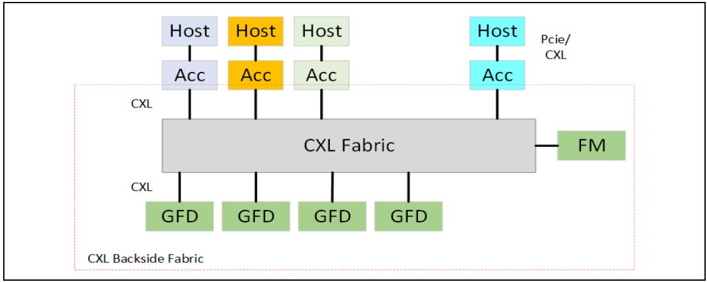
>
> *Source*: MinerU tight crop extraction (page 0393 of CXL 3.2 spec)

> **Figure p.0405.** Figure 7-34. PBR Fabric Providing LD-FAM and G-FAM Resources
>
> 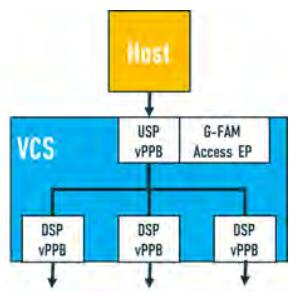
>
> *Source*: MinerU tight crop extraction (page 0405 of CXL 3.2 spec)

> **Figure p.0407.** Figure 7-36. CXL Fabric Example with Multiple Host Domains and Memory Types
>
> 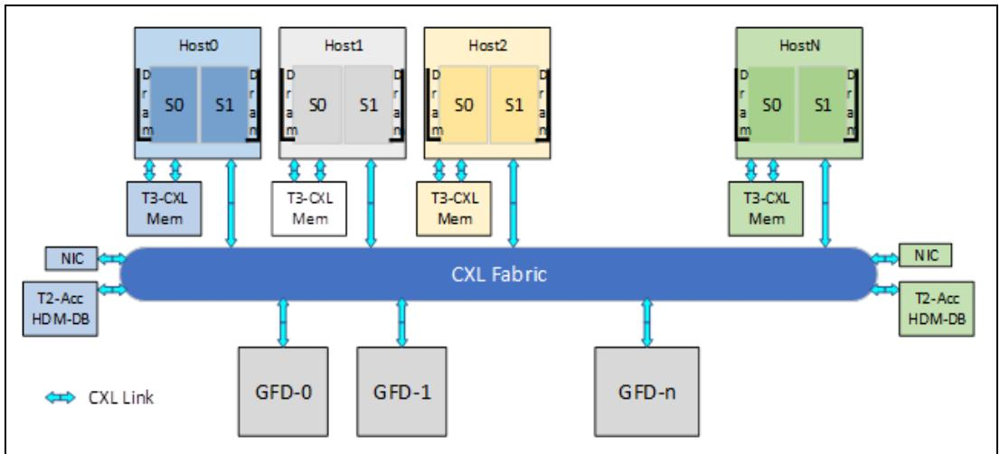
>
> *Source*: MinerU tight crop extraction (page 0407 of CXL 3.2 spec)

> **Figure p.0408.** Figure 7-38. Example Multi-host CXL Cluster with Memory on Host and Device Exposed as GIM
>
> 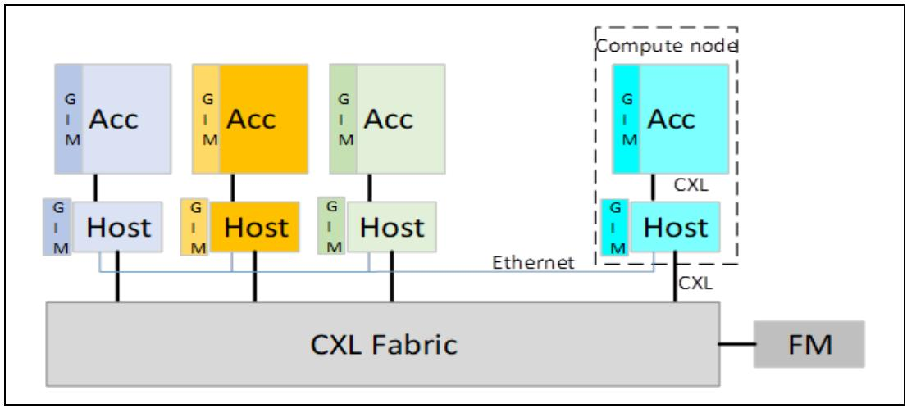
>
> *Source*: MinerU tight crop extraction (page 0408 of CXL 3.2 spec)

> **Figure p.0409.** Figure 7-39. Example ML Cluster Supporting Cross-domain Access through GIM
>
> 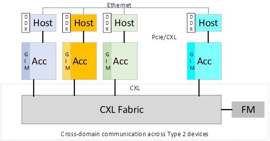
>
> *Source*: MinerU tight crop extraction (page 0409 of CXL 3.2 spec)

> **Figure p.0430.** (p.0430 图, MinerU 未提取标题, 见 fig_0430_1.png)
>
> 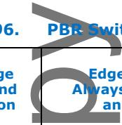
>
> *Source*: MinerU tight crop extraction (page 0430 of CXL 3.2 spec)

> **Figure p.0451.** Figure 7-52. Single VH
>
> 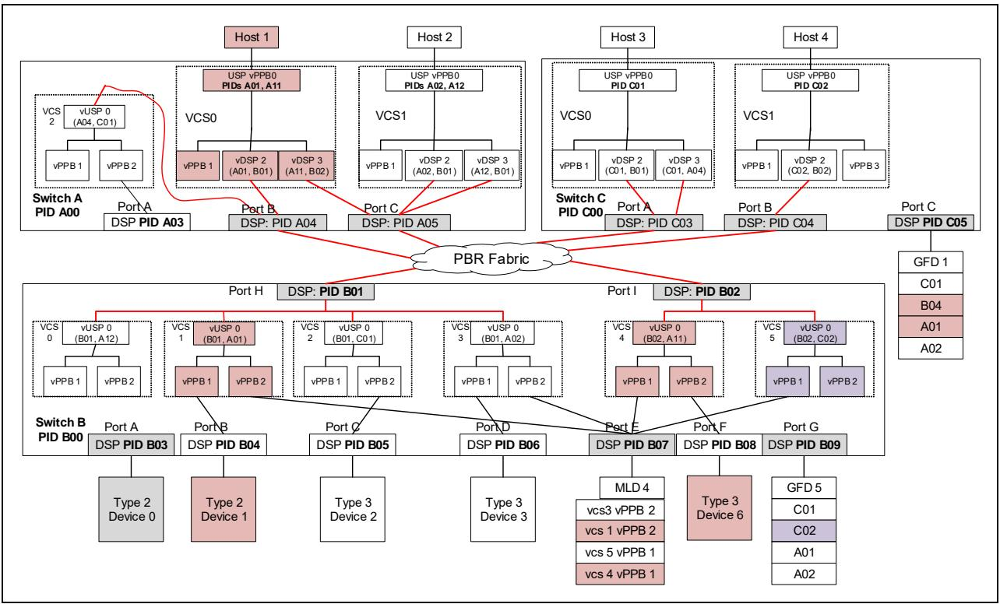
>
> *Source*: MinerU tight crop extraction (page 0451 of CXL 3.2 spec)

