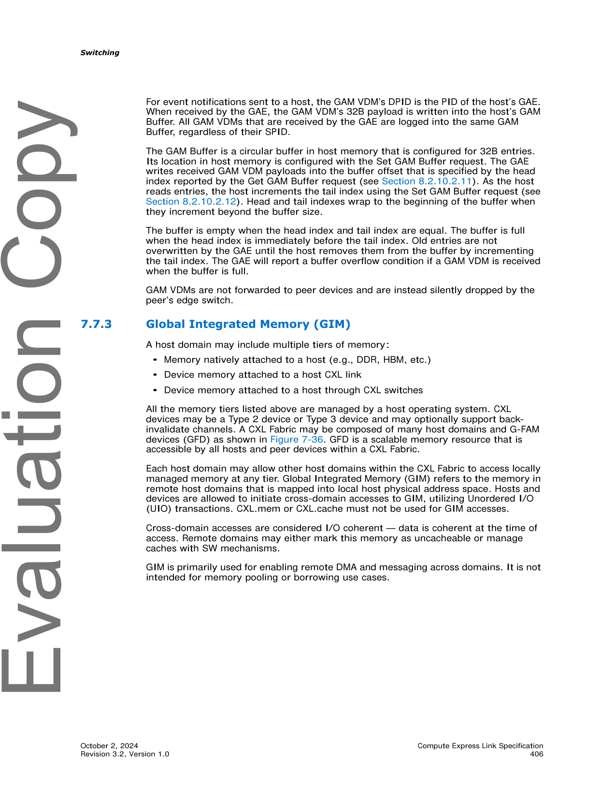
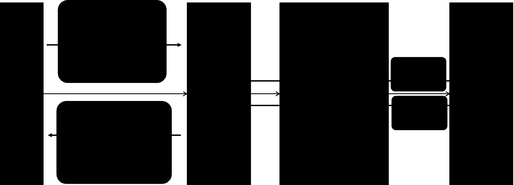

- [7.6.7.6.4 Get DC Region Extent Lists (Opcode 5603h)](#sec-7-6-7-6-4)
- [7.6.7.6.5 Initiate Dynamic Capacity Add (Opcode 5604h)](#sec-7-6-7-6-5)
- [7.6.7.6.6 Initiate Dynamic Capacity Release (Opcode 5605h)](#sec-7-6-7-6-6)
- [7.6.7.6.7 Dynamic Capacity Add Reference (Opcode 5606h)](#sec-7-6-7-6-7)
- [7.6.7.6.8 Dynamic Capacity Remove Reference (Opcode 5607h)](#sec-7-6-7-6-8)
- [7.6.7.6.9 Dynamic Capacity List Tags (Opcode 5608h)](#sec-7-6-7-6-9)
- [7.6.8 Fabric Management Event Records](#sec-7-6-8)
- [7.6.8.1 Physical Switch Event Records](#sec-7-6-8-1)
- [7.6.8.2 Virtual CXL Switch Event Records](#sec-7-6-8-2)
- [7.6.8.3 MLD Port Event Records](#sec-7-6-8-3)
- [7.7 CXL Fabric Architecture](#sec-7-7)
- [7.7.1 CXL Fabric Use Case Examples](#sec-7-7-1)
- [7.7.1.1 Machine-learning Accelerators](#sec-7-7-1-1)
- [7.7.1.2 HPC/Analytics Use Case](#sec-7-7-1-2)
- [7.7.1.3 Composable Systems](#sec-7-7-1-3)
- [7.7.2 Global-Fabric-Attached Memory (G-FAM)](#sec-7-7-2)
- [7.7.2.1 Overview](#sec-7-7-2-1)
- [7.7.2.2 Host Physical Address View](#sec-7-7-2-2)
- [7.7.2.3 G-FAM Capacity Management](#sec-7-7-2-3)
- [7.7.2.4 G-FAM Request Routing, Interleaving, and Address Translations](#sec-7-7-2-4)
- [7.7.2.5 G-FAM Access Protection](#sec-7-7-2-5)
- [7.7.2.6 Global Memory Access Endpoint](#sec-7-7-2-6)
- [7.7.2.7 Event Notifications from GFDs](#sec-7-7-2-7)
- [7.7.3 Global Integrated Memory (GIM)](#sec-7-7-3)
- [7.7.3.1 Host GIM Physical Address View](#sec-7-7-3-1)
- [7.7.3.2 Use Cases](#sec-7-7-3-2)
- [7.7.3.3 Transaction Flows and Rules for GIM](#sec-7-7-3-3)
- [7.7.3.3.1 GIM Rules for PBR Switch Ingress Port](#sec-7-7-3-3-1)
- [7.7.3.3.2 GIM Rules for PBR Switch Egress Port](#sec-7-7-3-3-2)
- [7.7.3.3.3 GIM Rules for Host/Devices](#sec-7-7-3-3-3)
- [7.7.3.3.4 Other GIM Rules](#sec-7-7-3-3-4)
- [7.7.3.4 Restrictions with Host-to-Host UIO Usages](#sec-7-7-3-4)
- [7.7.4 Non-GIM Usages with VendPrefixL0](#sec-7-7-4)
- [7.7.5 HBR and PBR Switch Configurations](#sec-7-7-5)
- [7.7.5.1 PBR Forwarding Dependencies, Loops, and Deadlocks](#sec-7-7-5-1)
- [7.7.6 PBR Switching Details](#sec-7-7-6)
- [7.7.6.1 Virtual Hierarchies Spanning a Fabric](#sec-7-7-6-1)
- [7.7.6.2 PBR Message Routing across the Fabric](#sec-7-7-6-2)
- [7.7.6.3 PBR Message Routing within a Single PBR Switch](#sec-7-7-6-3)
- [7.7.6.4 PBR Switch vDSP/vUSP Bindings and Connectivity](#sec-7-7-6-4)
- [7.7.6.5 PID Use Models and Assignments](#sec-7-7-6-5)
- [7.7.6.6 CXL Switch Message Format Conversion](#sec-7-7-6-6)
- [7.7.6.6.1 CXL.io, Including UIO](#sec-7-7-6-6-1)
- [7.7.6.6.2 CXL.cache](#sec-7-7-6-6-2)
- [7.7.6.6.3 CXL.mem](#sec-7-7-6-6-3)
- [7.7.6.7 HBR Switch Port Processing of CXL Messages](#sec-7-7-6-7)
- [7.7.6.8 PBR Switch Port Processing of CXL Messages](#sec-7-7-6-8)
- [7.7.6.9 PPB and vPPB Behavior of PBR Link Ports](#sec-7-7-6-9)
- [7.7.6.9.1 ISL Type 1 Configuration Space Header](#sec-7-7-6-9-1)
- [7.7.6.9.2 ISL PCIe-compatible Configuration Register](#sec-7-7-6-9-2)
- [7.7.6.9.3 ISL PCIe Capability Structure](#sec-7-7-6-9-3)
- [7.7.6.9.4 ISL Secondary PCIe Capability Structure](#sec-7-7-6-9-4)
- [7.7.6.9.5 ISL Physical Layer 16.0 GT/s Extended Capability](#sec-7-7-6-9-5)
- [7.7.6.9.6 ISL Physical Layer 32.0 GT/s Extended Capability](#sec-7-7-6-9-6)
- [7.7.6.9.7 ISL Physical Layer 64.0 GT/s Extended Capability](#sec-7-7-6-9-7)
- [7.7.6.9.8 ISL Lane Margining at the Receiver Extended Capability](#sec-7-7-6-9-8)
- [7.7.6.9.9 ISL ACS Extended Capability](#sec-7-7-6-9-9)
- [7.7.6.9.10 ISL Advanced Error Reporting Extended Capability](#sec-7-7-6-9-10)
- [7.7.6.9.11 ISL DPC Extended Capability](#sec-7-7-6-9-11)
- [7.7.7 Inter-Switch Links (ISLs)](#sec-7-7-7)
- [7.7.7.1 .io Deadlock Avoidance on ISLs/PBR Fabric](#sec-7-7-7-1)

## 🖼 本章图表 (Part B)

- [Figure 7-25. High-level CXL Fabric Diagram](#fig-7-25)
- [Figure 7-26. ML Accelerator Use Case](#fig-7-26)
- [Figure 7-27. HPC/Analytics Use Case](#fig-7-27)
- [Figure 7-28. Sample System Topology for Composable Systems](#fig-7-28)
- [Figure 7-29. Example Host Physical Address View](#fig-7-29)
- [Figure 7-30. Example HPA Mapping to DMPs](#fig-7-30)
- [Figure 7-31. G-FAM Request Routing, Interleaving, and Address Translations](#fig-7-31)
- [Figure 7-32. Memory Access Protection Levels](#fig-7-32)
- [Figure 7-33. GFD Dynamic Capacity Access Protections](#fig-7-33)
- [Figure 7-34. PBR Fabric Providing LD-FAM and G-FAM Resources](#fig-7-34)
- [Figure 7-35. PBR Fabric Providing Only G-FAM Resources](#fig-7-35)
- [Figure 7-36. CXL Fabric Example with Multiple Host Domains and Memory Types](#fig-7-36)
- [Figure 7-37. Example Host Physical Address View with GFD and GIM](#fig-7-37)
- [Figure 7-38. Example Multi-host CXL Cluster with Memory on Host and Device Exposed as GIM](#fig-7-38)
- [Figure 7-39. Example ML Cluster Supporting Cross-domain Access through GIM](#fig-7-39)
- [Figure 7-40. GIM Access Flows Using FASTs](#fig-7-40)
- [Figure 7-41. GIM Access Flows without FASTs](#fig-7-41)
- [Figure 7-42. Example Supported Switch Configurations](#fig-7-42)
- [Figure 7-43. Example PBR Mesh Topology](#fig-7-43)
- [Figure 7-44. Example Routing Scheme for a Mesh Topology](#fig-7-44)
- [Figure 7-45. Physical Topology and Logical View](#fig-7-45)
- [Figure 7-46. Example PBR Fabric](#fig-7-46)
- [Figure 7-47. ISL Message Class Sub-channels](#fig-7-47)

## 📊 本章表格 (Part B)

- [Table 7-67. Set DC Region Configuration Request and Response Payload](#tbl-7-67)
- [Table 7-68. Get DC Region Extent Lists Request Payload](#tbl-7-68)
- [Table 7-69. Get DC Region Extent Lists Response Payload](#tbl-7-69)
- [Table 7-70. Initiate Dynamic Capacity Add Request Payload](#tbl-7-70)
- [Table 7-71. Initiate Dynamic Capacity Release Request Payload](#tbl-7-71)
- [Table 7-72. Dynamic Capacity Add Reference Request Payload](#tbl-7-72)
- [Table 7-73. Dynamic Capacity Remove Reference Request Payload](#tbl-7-73)
- [Table 7-74. Dynamic Capacity List Tags Request Payload](#tbl-7-74)
- [Table 7-75. Dynamic Capacity List Tags Response Payload](#tbl-7-75)
- [Table 7-76. Dynamic Capacity Tag Information](#tbl-7-76)
- [Table 7-77. Physical Switch Events Record Format](#tbl-7-77)
- [Table 7-78. Virtual CXL Switch Event Record Format](#tbl-7-78)
- [Table 7-79. MLD Port Event Records Payload](#tbl-7-79)
- [Table 7-80. Differences between LD-FAM and G-FAM](#tbl-7-80)
- [Table 7-81. Fabric Segment Size Table](#tbl-7-81)
- [Table 7-82. Segment Table Intlv[3:0] Field Encoding](#tbl-7-82)
- [Table 7-83. Segment Table Gran[3:0] Field Encoding](#tbl-7-83)
- [Table 7-84. PBR Fabric Decoding and Routing, by Message Class](#tbl-7-84)
- [Table 7-85. Optional Architected Dynamic Routing Modes](#tbl-7-85)
- [Table 7-86. Summary of CacheID Field](#tbl-7-86)
- [Table 7-87. Summary of HBR Switch Routing for CXL.cache Message Classes](#tbl-7-87)
- [Table 7-88. Summary of PBR Switch Routing for CXL.cache Message Classes](#tbl-7-88)
- [Table 7-89. Summary of LD-ID Field](#tbl-7-89)
- [Table 7-90. Summary of BI-ID Field](#tbl-7-90)
- [Table 7-91. Summary of HBR Switch Routing for CXL.mem Message Classes](#tbl-7-91)
- [Table 7-92. Summary of PBR Switch Routing for CXL.mem Message Classes](#tbl-7-92)
- [Table 7-93. HBR Switch Port Processing Table for CXL.io](#tbl-7-93)
- [Table 7-94. HBR Switch Port Processing Table for CXL.cache](#tbl-7-94)
- [Table 7-95. HBR Switch Port Processing Table for CXL.mem](#tbl-7-95)
- [Table 7-96. PBR Switch Port Processing Table for CXL.io](#tbl-7-96)
- [Table 7-97. PBR Switch Port Processing Table for CXL.cache](#tbl-7-97)
- [Table 7-98. PBR Switch Port Processing Table for CXL.mem](#tbl-7-98)
- [Table 7-99. ISL Type 1 Configuration Space Header](#tbl-7-99)
- [Table 7-100. ISL PCIe Configuration Space Header](#tbl-7-100)
- [Table 7-101. ISL PCIe Capability Structure](#tbl-7-101)
- [Table 7-102. ISL Secondary PCIe Extended Capability](#tbl-7-102)
- [Table 7-103. ISL Physical Layer 16.0 GT/s Extended Capability](#tbl-7-103)
- [Table 7-104. ISL Physical Layer 32.0 GT/s Extended Capability](#tbl-7-104)
- [Table 7-105. ISL Physical Layer 64.0 GT/s Extended Capability](#tbl-7-105)
- [Table 7-106. ISL Lane Margining at the Receiver Extended Capability](#tbl-7-106)
- [Table 7-107. PBR Fabric .io Ordering Table, Non-UIO](#tbl-7-107)
- [Table 7-108. PBR Fabric .io Ordering Table, UIO](#tbl-7-108)

---

## 7.6.7.6.4 Get DC Region Extent Lists (Opcode 5603h) | 获取 DC 区域 Extent 列表 (操作码 5603h)

<table>
<thead>
<tr>
<th width="50%">🇬🇧 English</th>
<th width="50%" style="background-color:#e8e8e8">🇨🇳 中文</th>
</tr>
</thead>
<tbody>
<tr><td>This command shall fail with <b>Unsupported</b> under the following conditions:</td><td style="background-color:#e8e8e8">在以下条件下,此命令应以 <b>Unsupported</b> 失败:</td></tr>
<tr><td>• When all capacity has been released from the DC Region on all hosts, and one or more blocks are allocated to the specified region</td><td style="background-color:#e8e8e8">• 当所有主机上 DC 区域的所有容量已被释放,并且一个或多个块已分配到指定区域时</td></tr>
<tr><td>• When the Sanitize on Release field does not match the region's configuration, as reported from the Get Host DC Region Configuration, and the device does not support reconfiguration of the Sanitize on Release setting, as advertised by the Sanitize on Release Configuration Support Mask in the Get DCD Info response payload</td><td style="background-color:#e8e8e8">• 当 Sanitize on Release 字段与 Get Host DC Region Configuration 报告的区域配置不匹配,且设备不支持 Sanitize on Release 设置的重新配置(由 Get DCD Info 响应负载中的 Sanitize on Release Configuration Support Mask 公布)时</td></tr>
<tr><td>This command shall fail with <b>Invalid Security State</b> under the following condition:</td><td style="background-color:#e8e8e8">在以下条件下,此命令应以 <b>Invalid Security State</b> 失败:</td></tr>
<tr><td>• In support of confidential computing, if the device has been locked while utilizing secure CXL TSP interfaces, the device shall reject any attempts to change the DCD configuration by returning Invalid Security State status. See Section 11.5 for details on locking a device and locked device behavior.</td><td style="background-color:#e8e8e8">• 为支持机密计算,如果设备在使用安全 CXL TSP 接口时被锁定,设备应通过返回 Invalid Security State 状态来拒绝任何更改 DCD 配置的尝试。有关锁定设备和锁定设备行为的详细信息,请参见第 11.5 节。</td></tr>
<tr><td>Possible Command Return Codes:</td><td style="background-color:#e8e8e8">可能的命令返回码:</td></tr>
<tr><td>• Success</td><td style="background-color:#e8e8e8">• Success(成功)</td></tr>
<tr><td>• Unsupported</td><td style="background-color:#e8e8e8">• Unsupported(不支持)</td></tr>
<tr><td>• Invalid Input</td><td style="background-color:#e8e8e8">• Invalid Input(输入无效)</td></tr>
<tr><td>• Internal Error</td><td style="background-color:#e8e8e8">• Internal Error(内部错误)</td></tr>
<tr><td>• Retry Required</td><td style="background-color:#e8e8e8">• Retry Required(需要重试)</td></tr>
<tr><td>• Invalid Security State</td><td style="background-color:#e8e8e8">• Invalid Security State(安全状态无效)</td></tr>
<tr><td>Command Effects:</td><td style="background-color:#e8e8e8">命令影响:</td></tr>
<tr><td>• Configuration Change after Cold Reset</td><td style="background-color:#e8e8e8">• 冷复位后配置更改</td></tr>
<tr><td>• Configuration Change after Conventional Reset</td><td style="background-color:#e8e8e8">• 常规复位后配置更改</td></tr>
<tr><td>• Configuration Change after CXL Reset</td><td style="background-color:#e8e8e8">• CXL 复位后配置更改</td></tr>
<tr><td>• Immediate Configuration Change</td><td style="background-color:#e8e8e8">• 立即配置更改</td></tr>
<tr><td>• Immediate Data Change</td><td style="background-color:#e8e8e8">• 立即数据更改</td></tr>
</tbody>
</table>

**Table 7-67. Set DC Region Configuration Request and Response Payload | 设置 DC 区域配置请求和响应负载**

| Byte Offset | Length in Bytes | Description (EN) | 描述(中文) |
|---|---|---|---|
| 0h | 1 | Region ID: Specifies which region to configure. Valid range is from 0 to 7. | Region ID: 指定要配置的区域。有效范围为 0 到 7。 |
| 1h | 3 | Reserved | 保留 |
| 4h | 8 | Region Block Size: As defined in Table 8-180. | Region Block Size: 如表 8-180 所定义。 |
| Ch | 1 | • Bit[0]: Sanitize on Release: As defined in Table 8-180 • Bits[7:1]: Reserved | • Bit[0]: Sanitize on Release(释放时清除): 如表 8-180 所定义 • Bits[7:1]: 保留 |
| Dh | 3 | Reserved | 保留 |

[⬆️ 返回目录](#-本章目录-part-b)

---

## 7.6.7.6.5 Initiate Dynamic Capacity Add (Opcode 5604h) | 启动动态容量添加 (操作码 5604h)

<table>
<thead>
<tr>
<th width="50%">🇬🇧 English</th>
<th width="50%" style="background-color:#e8e8e8">🇨🇳 中文</th>
</tr>
</thead>
<tbody>
<tr><td>This command initiates the addition of Dynamic Capacity for an LD-FAM DCD, to the specified region on a host. This command shall complete when the device initiates the Add Capacity procedure, as defined in Section 8.2.10.2.2. The processing of the actions initiated in response to this command may or may not result in a new entry or multiple entries grouped via the More flag (see Table 8-62) in the Dynamic Capacity Event Log.</td><td style="background-color:#e8e8e8">此命令启动将 LD-FAM DCD 的动态容量添加到主机上的指定区域。当设备启动 Add Capacity 流程(如第 8.2.10.2.2 节所定义)时,此命令应完成。作为对此命令的响应而启动的动作的处理,可能会也可能不会在 Dynamic Capacity Event Log 中产生一个新条目或通过 More 标志分组的多个条目(见表 8-62)。</td></tr>
<tr><td>To perform Dynamic Capacity Add on a GFD, see Section 8.2.10.9.10.7.</td><td style="background-color:#e8e8e8">要在 GFD 上执行动态容量添加,请参见第 8.2.10.9.10.7 节。</td></tr>
<tr><td>A Selection Policy is specified to govern the device's selection of which memory resources to add:</td><td style="background-color:#e8e8e8">指定一个 Selection Policy(选择策略)以管理设备选择要添加哪些内存资源:</td></tr>
<tr><td>• <b>Free</b>: Unassigned extents are selected by the device, with no requirement for contiguous blocks</td><td style="background-color:#e8e8e8">• <b>Free(空闲)</b>: 未分配的 extent 由设备选择,不需要连续的块</td></tr>
<tr><td>• <b>Contiguous</b>: Unassigned extents are selected by the device and shall be contiguous</td><td style="background-color:#e8e8e8">• <b>Contiguous(连续)</b>: 未分配的 extent 由设备选择且必须是连续的</td></tr>
<tr><td>• <b>Prescriptive</b>: Extent list of capacity to assign is included in the request payload</td><td style="background-color:#e8e8e8">• <b>Prescriptive(指定)</b>: 要分配的容量 extent 列表包含在请求负载中</td></tr>
<tr><td>• <b>Enable Shared Access</b>: Enable access to extent(s) previously added to another host in a DC Region that reports the "Sharable" flag, as designated by the specified tag value</td><td style="background-color:#e8e8e8">• <b>Enable Shared Access(启用共享访问)</b>: 启用对之前已添加到另一个主机的 DC Region 中报告 "Sharable" 标志的 extent 的访问,由指定的 tag 值标识</td></tr>
<tr><td>See Section 9.13.3.2 for examples of how this command may be used to set up different types of sharing arrangements.</td><td style="background-color:#e8e8e8">有关如何使用此命令建立不同类型共享安排的示例,请参见第 9.13.3.2 节。</td></tr>
<tr><td>The command shall fail with <b>Invalid Input</b> under the following conditions:</td><td style="background-color:#e8e8e8">在以下条件下,此命令应以 <b>Invalid Input</b> 失败:</td></tr>
<tr><td>• When the command is sent with an invalid Host ID, or an invalid region number, or an unsupported Selection Policy</td><td style="background-color:#e8e8e8">• 当命令使用无效的 Host ID、无效的区域号或不支持的 Selection Policy 发送时</td></tr>
<tr><td>• When the Length field is not a multiple of the Block size and the Selection Policy is either Free or Contiguous</td><td style="background-color:#e8e8e8">• 当 Length 字段不是 Block size 的倍数,且 Selection Policy 为 Free 或 Contiguous 时</td></tr>
<tr><td>The command, with selection policy Enable Shared Access, shall also fail with <b>Invalid Input</b> under the following conditions:</td><td style="background-color:#e8e8e8">在以下条件下,使用选择策略 Enable Shared Access 的命令也应以 <b>Invalid Input</b> 失败:</td></tr>
<tr><td>• When the specified region is not Sharable</td><td style="background-color:#e8e8e8">• 当指定区域不是 Sharable 时</td></tr>
<tr><td>• When the tagged capacity is already mapped to any Host ID via a non-Sharable region</td><td style="background-color:#e8e8e8">• 当已标记的容量已通过非 Sharable 区域映射到任何 Host ID 时</td></tr>
<tr><td>• When the tagged capacity cannot be added to the requested region due to device-imposed restrictions</td><td style="background-color:#e8e8e8">• 当由于设备施加的限制而无法将已标记的容量添加到请求的区域时</td></tr>
<tr><td>• When the same tagged capacity is currently accessible by the same LD</td><td style="background-color:#e8e8e8">• 当同一已标记的容量当前可被同一 LD 访问时</td></tr>
<tr><td>The command shall fail with <b>Resources Exhausted</b> when the length of the added capacity plus the current capacity present in all extents associated with the specified region exceeds the decode length for that region, or if there is insufficient contiguous space to satisfy a request with Selection Policy set to Contiguous.</td><td style="background-color:#e8e8e8">当添加的容量长度加上指定区域关联的所有 extent 中当前存在的容量超过该区域的解码长度,或者没有足够的连续空间来满足 Selection Policy 设置为 Contiguous 的请求时,命令应以 <b>Resources Exhausted</b> 失败。</td></tr>
<tr><td>The command shall fail with <b>Invalid Extent List</b> under the following conditions:</td><td style="background-color:#e8e8e8">在以下条件下,命令应以 <b>Invalid Extent List</b> 失败:</td></tr>
<tr><td>• When the Selection Policy is set to Prescriptive and the Extent Count is invalid</td><td style="background-color:#e8e8e8">• 当 Selection Policy 设置为 Prescriptive 且 Extent Count 无效时</td></tr>
<tr><td>• When the Selection Policy is set to Prescriptive and any of the DPAs are already accessible to the same LD</td><td style="background-color:#e8e8e8">• 当 Selection Policy 设置为 Prescriptive 且任何 DPA 已可被同一 LD 访问时</td></tr>
<tr><td>The command shall fail with <b>Resources Exhausted</b> if the Extent List would cause the device to exceed its extent or tag tracking ability.</td><td style="background-color:#e8e8e8">如果 Extent List 将导致设备超出其 extent 或 tag 跟踪能力,命令应以 <b>Resources Exhausted</b> 失败。</td></tr>
<tr><td>The command shall fail with <b>Retry Required</b> if its execution would cause the specified LD's Dynamic Capacity Event Log to overflow.</td><td style="background-color:#e8e8e8">如果命令的执行将导致指定 LD 的 Dynamic Capacity Event Log 溢出,命令应以 <b>Retry Required</b> 失败。</td></tr>
<tr><td>Possible Command Return Codes:</td><td style="background-color:#e8e8e8">可能的命令返回码:</td></tr>
<tr><td>• Success</td><td style="background-color:#e8e8e8">• Success(成功)</td></tr>
<tr><td>• Unsupported</td><td style="background-color:#e8e8e8">• Unsupported(不支持)</td></tr>
<tr><td>• Invalid Input</td><td style="background-color:#e8e8e8">• Invalid Input(输入无效)</td></tr>
<tr><td>• Internal Error</td><td style="background-color:#e8e8e8">• Internal Error(内部错误)</td></tr>
<tr><td>• Retry Required</td><td style="background-color:#e8e8e8">• Retry Required(需要重试)</td></tr>
<tr><td>• Invalid Extent List</td><td style="background-color:#e8e8e8">• Invalid Extent List(Extent 列表无效)</td></tr>
<tr><td>• Resources Exhausted</td><td style="background-color:#e8e8e8">• Resources Exhausted(资源耗尽)</td></tr>
<tr><td>Command Effects:</td><td style="background-color:#e8e8e8">命令影响:</td></tr>
<tr><td>• Configuration Change after Cold Reset</td><td style="background-color:#e8e8e8">• 冷复位后配置更改</td></tr>
<tr><td>• Configuration Change after Conventional Reset</td><td style="background-color:#e8e8e8">• 常规复位后配置更改</td></tr>
<tr><td>• Configuration Change after CXL Reset</td><td style="background-color:#e8e8e8">• CXL 复位后配置更改</td></tr>
<tr><td>• Immediate Configuration Change</td><td style="background-color:#e8e8e8">• 立即配置更改</td></tr>
<tr><td>• Immediate Data Change</td><td style="background-color:#e8e8e8">• 立即数据更改</td></tr>
</tbody>
</table>

**Table 7-68. Get DC Region Extent Lists Request Payload | 获取 DC 区域 Extent 列表请求负载**

| Byte Offset | Length in Bytes | Description (EN) | 描述(中文) |
|---|---|---|---|
| 0h | 2 | Host ID: For an LD-FAM device, the LD-ID of the host interface. | Host ID: 对于 LD-FAM 设备,主机接口的 LD-ID。 |
| 2h | 2 | Reserved | 保留 |
| 4h | 4 | Extent Count: The maximum number of extents to return in the output response. The device may not return more extents than requested; however, it can return fewer extents. 0 is valid and allows the FM to retrieve the Total Extent Count and Extent List Generation Number without retrieving any extent data. | Extent Count: 输出响应中要返回的最大 extent 数。设备返回的 extent 数不得超过请求的数量;但是可以返回更少的 extent。0 是有效的,允许 FM 检索 Total Extent Count 和 Extent List Generation Number,而不检索任何 extent 数据。 |
| 8h | 4 | Starting Extent Index: Index of the first requested extent. A value of 0 will retrieve the first extent in the list. | Starting Extent Index: 第一个请求的 extent 的索引。值为 0 将检索列表中的第一个 extent。 |

**Table 7-69. Get DC Region Extent Lists Response Payload | 获取 DC 区域 Extent 列表响应负载**

| Byte Offset | Length in Bytes | Description (EN) | 描述(中文) |
|---|---|---|---|
| 00h | 2 | Host ID: For an LD-FAM device, the LD-ID of the host interface query. | Host ID: 对于 LD-FAM 设备,主机接口查询的 LD-ID。 |
| 02h | 2 | Reserved | 保留 |
| 04h | 4 | Starting Extent Index: Index of the first extent in the list. | Starting Extent Index: 列表中第一个 extent 的索引。 |
| 08h | 4 | Returned Extent Count: The number of extents returned in Extent List[ ]. | Returned Extent Count: 在 Extent List[ ] 中返回的 extent 数。 |
| 0Ch | 4 | Total Extent Count: The total number of extents in the list. | Total Extent Count: 列表中 extent 的总数。 |
| 10h | 4 | Extent List Generation Number: A device-generated value that is used to indicate that the list has changed. | Extent List Generation Number: 设备生成的值,用于指示列表已更改。 |
| 14h | 4 | Reserved | 保留 |
| 18h | Varies | Extent List[ ]: Extent list for the specified host as defined in Table 8-63. | Extent List[ ]: 指定主机的 extent 列表,如表 8-63 所定义。 |

[⬆️ 返回目录](#-本章目录-part-b)

---

## 7.6.7.6.6 Initiate Dynamic Capacity Release (Opcode 5605h) | 启动动态容量释放 (操作码 5605h)

<table>
<thead>
<tr>
<th width="50%">🇬🇧 English</th>
<th width="50%" style="background-color:#e8e8e8">🇨🇳 中文</th>
</tr>
</thead>
<tbody>
<tr><td>This command initiates the release of Dynamic Capacity for an LD-FAM DCD, from a host. This command shall complete when the device initiates the Remove Capacity procedure, as defined in Section 8.2.10.9.9. The processing of the actions initiated in response to this command may or may not result in a new entry in the Dynamic Capacity Event Log. To perform Dynamic Capacity removal on a GFD, see Section 8.2.10.9.10.8.</td><td style="background-color:#e8e8e8">此命令启动从主机释放 LD-FAM DCD 的动态容量。当设备启动 Remove Capacity 流程(如第 8.2.10.9.9 节所定义)时,此命令应完成。作为对此命令的响应而启动的动作的处理,可能会也可能不会在 Dynamic Capacity Event Log 中产生新条目。要在 GFD 上执行动态容量删除,请参见第 8.2.10.9.10.8 节。</td></tr>
<tr><td>A removal policy is specified to govern the device's selection of which memory resources to remove:</td><td style="background-color:#e8e8e8">指定一个 removal policy(删除策略)以管理设备选择要删除哪些内存资源:</td></tr>
<tr><td>• <b>Tag-based</b>: Extents are selected by the device based on tag, with no requirement for contiguous extents</td><td style="background-color:#e8e8e8">• <b>Tag-based(基于 Tag)</b>: extent 由设备基于 tag 选择,不需要连续的 extent</td></tr>
<tr><td>• <b>Prescriptive</b>: Extent list of capacity to release is included in request payload</td><td style="background-color:#e8e8e8">• <b>Prescriptive(指定)</b>: 要释放的容量 extent 列表包含在请求负载中</td></tr>
<tr><td>To remove a host's access to the shared extent, the FM issues Initiate Dynamic Capacity Release Request with Selection Policy=Tag-Based with the Host ID associated with that host. The Tag field must match the Tag value used during Capacity Add. The host access can be removed in any order. The physical memory resources and tag associated with a shared extent shall remain assigned and unavailable for re-use until that extent has been released from all hosts that have been granted access.</td><td style="background-color:#e8e8e8">要删除主机对共享 extent 的访问,FM 使用与该主机关联的 Host ID 发出 Selection Policy=Tag-Based 的 Initiate Dynamic Capacity Release Request。Tag 字段必须与 Capacity Add 期间使用的 Tag 值匹配。可以按任何顺序删除主机访问。与共享 extent 关联的物理内存资源和 tag 应保持已分配状态且不可重用,直到该 extent 已从已授予访问权限的所有主机中释放。</td></tr>
<tr><td>When the FM issues Initiate Dynamic Capacity Release Request with the Forced Removal flag set in order to release an extent in "Pending" state (as defined in Section 9.13.3.3), the request shall be fulfilled by the device marking the Extent Group as "Dead" without appending a new entry into the Dynamic Capacity Event Log. The Add Capacity Event records corresponding to the "Dead" Extent Group in the "Pending" list are unmodified. The "Dead" state is tracked internally by the device.</td><td style="background-color:#e8e8e8">当 FM 发出设置了 Forced Removal 标志的 Initiate Dynamic Capacity Release Request 以释放处于 "Pending" 状态(定义见第 9.13.3.3 节)的 extent 时,该请求应由设备通过将 Extent Group 标记为 "Dead" 来完成,而无需在 Dynamic Capacity Event Log 中追加新条目。"Pending" 列表中与 "Dead" Extent Group 对应的 Add Capacity Event 记录保持不变。"Dead" 状态由设备内部跟踪。</td></tr>
<tr><td>The command shall fail with <b>Invalid Input</b> under the following conditions:</td><td style="background-color:#e8e8e8">在以下条件下,命令应以 <b>Invalid Input</b> 失败:</td></tr>
<tr><td>• When the command is sent with an invalid Host ID, or an invalid region number, or an unsupported Removal Policy</td><td style="background-color:#e8e8e8">• 当命令使用无效的 Host ID、无效的区域号或不支持的 Removal Policy 发送时</td></tr>
<tr><td>• When the command is sent with a Removal Policy of Tag-based and the input Tag does not correspond to any currently allocated capacity</td><td style="background-color:#e8e8e8">• 当命令使用 Tag-based 的 Removal Policy 发送且输入的 Tag 与任何当前已分配的容量不对应时</td></tr>
<tr><td>• When Sanitize on Release is set but is not supported by the device</td><td style="background-color:#e8e8e8">• 当设置了 Sanitize on Release 但设备不支持时</td></tr>
<tr><td>• When the Tag represents sharable capacity, and the Extent List covers only a portion of the capacity associated with the Tag</td><td style="background-color:#e8e8e8">• 当 Tag 表示可共享容量,且 Extent List 仅涵盖与该 Tag 关联的容量的一部分时</td></tr>
<tr><td>The command shall fail with <b>Resources Exhausted</b> when the length of the removed capacity exceeds the total assigned capacity for that region or for the specified tag when the Removal Policy is set to Tag-based.</td><td style="background-color:#e8e8e8">当删除的容量长度超过该区域的总已分配容量,或当 Removal Policy 设置为 Tag-based 时超过指定 tag 的总已分配容量时,命令应以 <b>Resources Exhausted</b> 失败。</td></tr>
<tr><td>The command shall fail with <b>Invalid Extent List</b> when the Removal Policy is set to Prescriptive and the Extent Count is invalid or when the Extent List includes blocks that are not currently assigned to the region.</td><td style="background-color:#e8e8e8">当 Removal Policy 设置为 Prescriptive 且 Extent Count 无效,或当 Extent List 包含当前未分配给该区域的块时,命令应以 <b>Invalid Extent List</b> 失败。</td></tr>
<tr><td>The command shall fail with <b>Retry Required</b> if its execution would cause the specified LD's Dynamic Capacity Event Log to overflow, unless the Forced Removal flag is set, in which case the removal occurs regardless of whether an Event is logged.</td><td style="background-color:#e8e8e8">如果命令的执行将导致指定 LD 的 Dynamic Capacity Event Log 溢出,命令应以 <b>Retry Required</b> 失败,除非设置了 Forced Removal 标志,在这种情况下无论是否记录 Event,都会执行删除。</td></tr>
<tr><td>The command shall fail with <b>Resources Exhausted</b> if the Extent List would cause the device to exceed its extent or tag tracking ability.</td><td style="background-color:#e8e8e8">如果 Extent List 将导致设备超出其 extent 或 tag 跟踪能力,命令应以 <b>Resources Exhausted</b> 失败。</td></tr>
<tr><td>The command shall fail with <b>Invalid Physical Address</b> if an extent in the extent list covers non-existing or pending ("Pending" state as defined in Section 9.13.3.3) DPA range and the Forced Removal flag is not set.</td><td style="background-color:#e8e8e8">如果 extent 列表中的 extent 涵盖不存在或 pending(定义见第 9.13.3.3 节的 "Pending" 状态)的 DPA 范围,且未设置 Forced Removal 标志,则命令应以 <b>Invalid Physical Address</b> 失败。</td></tr>
<tr><td>Possible Command Return Codes:</td><td style="background-color:#e8e8e8">可能的命令返回码:</td></tr>
<tr><td>• Success</td><td style="background-color:#e8e8e8">• Success(成功)</td></tr>
<tr><td>• Unsupported</td><td style="background-color:#e8e8e8">• Unsupported(不支持)</td></tr>
<tr><td>• Invalid Input</td><td style="background-color:#e8e8e8">• Invalid Input(输入无效)</td></tr>
<tr><td>• Internal Error</td><td style="background-color:#e8e8e8">• Internal Error(内部错误)</td></tr>
<tr><td>• Retry Required</td><td style="background-color:#e8e8e8">• Retry Required(需要重试)</td></tr>
<tr><td>• Invalid Extent List</td><td style="background-color:#e8e8e8">• Invalid Extent List(Extent 列表无效)</td></tr>
<tr><td>• Resources Exhausted</td><td style="background-color:#e8e8e8">• Resources Exhausted(资源耗尽)</td></tr>
<tr><td>Command Effects:</td><td style="background-color:#e8e8e8">命令影响:</td></tr>
<tr><td>• Configuration Change after Cold Reset</td><td style="background-color:#e8e8e8">• 冷复位后配置更改</td></tr>
<tr><td>• Configuration Change after Conventional Reset</td><td style="background-color:#e8e8e8">• 常规复位后配置更改</td></tr>
<tr><td>• Configuration Change after CXL Reset</td><td style="background-color:#e8e8e8">• CXL 复位后配置更改</td></tr>
<tr><td>• Immediate Configuration Change</td><td style="background-color:#e8e8e8">• 立即配置更改</td></tr>
<tr><td>• Immediate Data Change</td><td style="background-color:#e8e8e8">• 立即数据更改</td></tr>
</tbody>
</table>

[⬆️ 返回目录](#-本章目录-part-b)

---

## 7.6.7.6.7 Dynamic Capacity Add Reference (Opcode 5606h) | 动态容量添加引用 (操作码 5606h)

<table>
<thead>
<tr>
<th width="50%">🇬🇧 English</th>
<th width="50%" style="background-color:#e8e8e8">🇨🇳 中文</th>
</tr>
</thead>
<tbody>
<tr><td>This command prevents the tagged sharable capacity for an LD-FAM DCD, from being sanitized, freed, and/or reallocated, regardless of whether it is currently visible to any hosts via extent lists. The tagged capacity will remain allocated, and contents will be preserved even if all DCD Extents that reference it are removed.</td><td style="background-color:#e8e8e8">此命令防止 LD-FAM DCD 的已标记可共享容量被清除、释放和/或重新分配,无论当前是否通过 extent 列表对任何主机可见。即使引用该容量的所有 DCD Extent 都被删除,已标记的容量仍将保持已分配状态,并且内容将被保留。</td></tr>
<tr><td>This command has no effect and will return Success if the FM has already added a reference to the tagged capacity.</td><td style="background-color:#e8e8e8">如果 FM 已添加对已标记容量的引用,则此命令无效并将返回 Success。</td></tr>
<tr><td>This command shall return <b>Invalid Input</b> if the Tag in the payload does not match an existing sharable tag.</td><td style="background-color:#e8e8e8">如果负载中的 Tag 与现有的可共享 tag 不匹配,则此命令应返回 <b>Invalid Input</b>。</td></tr>
<tr><td>Possible Command Return Codes:</td><td style="background-color:#e8e8e8">可能的命令返回码:</td></tr>
<tr><td>• Success</td><td style="background-color:#e8e8e8">• Success(成功)</td></tr>
<tr><td>• Invalid Input</td><td style="background-color:#e8e8e8">• Invalid Input(输入无效)</td></tr>
<tr><td>• Internal Error</td><td style="background-color:#e8e8e8">• Internal Error(内部错误)</td></tr>
<tr><td>• Retry Required</td><td style="background-color:#e8e8e8">• Retry Required(需要重试)</td></tr>
<tr><td>Command Effects:</td><td style="background-color:#e8e8e8">命令影响:</td></tr>
<tr><td>• Configuration Change after Cold Reset</td><td style="background-color:#e8e8e8">• 冷复位后配置更改</td></tr>
<tr><td>• Configuration Change after Conventional Reset</td><td style="background-color:#e8e8e8">• 常规复位后配置更改</td></tr>
<tr><td>• Configuration Change after CXL Reset</td><td style="background-color:#e8e8e8">• CXL 复位后配置更改</td></tr>
<tr><td>• Immediate Configuration Change</td><td style="background-color:#e8e8e8">• 立即配置更改</td></tr>
</tbody>
</table>

[⬆️ 返回目录](#-本章目录-part-b)

---

## 7.6.7.6.8 Dynamic Capacity Remove Reference (Opcode 5607h) | 动态容量删除引用 (操作码 5607h)

<table>
<thead>
<tr>
<th width="50%">🇬🇧 English</th>
<th width="50%" style="background-color:#e8e8e8">🇨🇳 中文</th>
</tr>
</thead>
<tbody>
<tr><td>This command removes a reference to tagged sharable capacity for an LD-FAM DCD, that was previously added via Dynamic Capacity Add Reference (see Section 7.6.7.6.7). If there are no remaining extent lists that reference the tagged capacity, the memory will be freed and sanitized if appropriate.</td><td style="background-color:#e8e8e8">此命令删除对 LD-FAM DCD 的已标记可共享容量的引用,该引用先前是通过 Dynamic Capacity Add Reference 添加的(参见第 7.6.7.6.7 节)。如果没有剩余的 extent 列表引用该已标记容量,则内存将被释放并在适当情况下被清除。</td></tr>
<tr><td>This command shall return <b>Invalid Input</b> if the Tag in the payload does not match an existing sharable tag.</td><td style="background-color:#e8e8e8">如果负载中的 Tag 与现有的可共享 tag 不匹配,则此命令应返回 <b>Invalid Input</b>。</td></tr>
<tr><td>Possible Command Return Codes:</td><td style="background-color:#e8e8e8">可能的命令返回码:</td></tr>
<tr><td>• Success</td><td style="background-color:#e8e8e8">• Success(成功)</td></tr>
<tr><td>• Invalid Input</td><td style="background-color:#e8e8e8">• Invalid Input(输入无效)</td></tr>
<tr><td>• Internal Error</td><td style="background-color:#e8e8e8">• Internal Error(内部错误)</td></tr>
<tr><td>• Retry Required</td><td style="background-color:#e8e8e8">• Retry Required(需要重试)</td></tr>
<tr><td>Command Effects:</td><td style="background-color:#e8e8e8">命令影响:</td></tr>
<tr><td>• Configuration Change after Cold Reset (if freed)</td><td style="background-color:#e8e8e8">• 冷复位后配置更改(如果已释放)</td></tr>
<tr><td>• Configuration Change after Conventional Reset (if freed)</td><td style="background-color:#e8e8e8">• 常规复位后配置更改(如果已释放)</td></tr>
<tr><td>• Configuration Change after CXL Reset (if freed)</td><td style="background-color:#e8e8e8">• CXL 复位后配置更改(如果已释放)</td></tr>
<tr><td>• Immediate Configuration Change (if freed)</td><td style="background-color:#e8e8e8">• 立即配置更改(如果已释放)</td></tr>
</tbody>
</table>

## 7.6.7.6.9 Dynamic Capacity List Tags (Opcode 5608h) | 动态容量列表标签 (操作码 5608h)

<table>
<thead>
<tr>
<th width="50%">🇬🇧 English</th>
<th width="50%" style="background-color:#e8e8e8">🇨🇳 中文</th>
</tr>
</thead>
<tbody>
<tr><td>This command allows an FM to re-establish context for an LD-FAM DCD, by receiving a list of all existing tags, with bitmaps indicating which LDs have access, and a flag indicating whether the FM holds a reference.</td><td style="background-color:#e8e8e8">此命令允许 FM 通过接收所有现有 tag 的列表(带有指示哪些 LD 具有访问权限的位图,以及指示 FM 是否持有引用的标志)来重新建立 LD-FAM DCD 的上下文。</td></tr>
<tr><td>Possible Command Return Codes:</td><td style="background-color:#e8e8e8">可能的命令返回码:</td></tr>
<tr><td>• Success</td><td style="background-color:#e8e8e8">• Success(成功)</td></tr>
<tr><td>• Invalid Input</td><td style="background-color:#e8e8e8">• Invalid Input(输入无效)</td></tr>
<tr><td>• Internal Error</td><td style="background-color:#e8e8e8">• Internal Error(内部错误)</td></tr>
<tr><td>Command Effects:</td><td style="background-color:#e8e8e8">命令影响:</td></tr>
<tr><td>• None</td><td style="background-color:#e8e8e8">• 无</td></tr>
</tbody>
</table>

**Table 7-72. Dynamic Capacity Add Reference Request Payload | 动态容量添加引用请求负载**

| Byte Offset | Length in Bytes | Description (EN) | 描述(中文) |
|---|---|---|---|
| 00h | 10h | Tag: Tag that is associated with the memory capacity to be preserved. | Tag: 与要保留的内存容量关联的 tag。 |

**Table 7-73. Dynamic Capacity Remove Reference Request Payload | 动态容量删除引用请求负载**

| Byte Offset | Length in Bytes | Description (EN) | 描述(中文) |
|---|---|---|---|
| 00h | 10h | Tag: Tag that is associated with the memory capacity. | Tag: 与内存容量关联的 tag。 |

[⬆️ 返回目录](#-本章目录-part-b)

---

## 7.6.8 Fabric Management Event Records | Fabric Management 事件记录

<table>
<thead>
<tr>
<th width="50%">🇬🇧 English</th>
<th width="50%" style="background-color:#e8e8e8">🇨🇳 中文</th>
</tr>
</thead>
<tbody>
<tr><td>The FM API uses the Event Records framework defined in Section 8.2.10.2.1. This section defines the format of event records specific to Fabric Management activities.</td><td style="background-color:#e8e8e8">FM API 使用第 8.2.10.2.1 节中定义的事件记录框架。本节定义了特定于 Fabric Management 活动的事件记录格式。</td></tr>
</tbody>
</table>

**Table 7-74. Dynamic Capacity List Tags Request Payload | 动态容量列表标签请求负载**

| Byte Offset | Length in Bytes | Description (EN) | 描述(中文) |
|---|---|---|---|
| 00h | 04h | Starting Index: Index of the first tag to return. | Starting Index: 要返回的第一个 tag 的索引。 |
| 04h | 04h | Max Tags: Maximum number of tags to return in the response payload. If Max Tags is 0, no tags list will be returned; however, the Generation Number shall be valid. | Max Tags: 响应负载中要返回的最大 tag 数。如果 Max Tags 为 0,则不返回 tag 列表;但是,Generation Number 应有效。 |

**Table 7-75. Dynamic Capacity List Tags Response Payload | 动态容量列表标签响应负载**

| Byte Offset | Length in Bytes | Description (EN) | 描述(中文) |
|---|---|---|---|
| 00h | 4 | Generation Number: Generation number of the tags list. This number shall change every time the remainder of the command's payload would change. | Generation Number: tag 列表的生成号。每当命令负载的其余部分发生变化时,此编号应更改。 |
| 04h | 4 | Total Number of Tags: Maximum number of tags to return in the response payload. | Total Number of Tags: 响应负载中要返回的最大 tag 数。 |
| 08h | 4 | Number of Tags Returned: Number of tags returned in the Tags List. | Number of Tags Returned: 在 Tags List 中返回的 tag 数。 |
| 0Ch | 1 | Validity Bitmap • Bit[0]: Reference Bitmaps Valid: A value of 1 indicates that the Reference Bitmap fields in the Tags List are valid. This bit shall be 0 for GFDs and 1 for all other device types. • Bit[1]: Pending Reference Bitmaps Valid: A value of 1 indicates that the Pending Reference Bitmap fields in the Tags List are valid. This bit shall be 0 for GFDs and 1 for all other device types. • Bits[7:2]: Reserved. | Validity Bitmap(有效性位图) • Bit[0]: Reference Bitmaps Valid: 值为 1 表示 Tags List 中的 Reference Bitmap 字段有效。对于 GFD,此位应为 0;对于所有其他设备类型,此位应为 1。 • Bit[1]: Pending Reference Bitmaps Valid: 值为 1 表示 Tags List 中的 Pending Reference Bitmap 字段有效。对于 GFD,此位应为 0;对于所有其他设备类型,此位应为 1。 • Bits[7:2]: 保留。 |
| 0Dh | 3 | Reserved | 保留 |
| 10h | Varies | Tags List: List of Dynamic Capacity Tag Information structures. The format of each entry is defined in Table 7-76. | Tags List: Dynamic Capacity Tag Information 结构的列表。每个条目的格式在表 7-76 中定义。 |

**Table 7-76. Dynamic Capacity Tag Information | 动态容量标签信息**

| Byte Offset | Length in Bytes | Description (EN) | 描述(中文) |
|---|---|---|---|
| 00h | 10h | Tag: Tag that is associated with the memory capacity. | Tag: 与内存容量关联的 tag。 |
| 10h | 1 | Flags • Bit[0]: FM Holds Reference: When set, this bit indicates that the FM holds a reference on this Tag. • Bits[7:1]: Reserved. | Flags(标志) • Bit[0]: FM Holds Reference: 设置后,此位表示 FM 持有此 Tag 的引用。 • Bits[7:1]: 保留。 |
| 11h | 3 | Reserved | 保留 |
| 14h | 20h | Reference Bitmap: Each 1 indicates an LD that has accepted the capacity associated with this tag. Bit 0 of the first byte represents LD 0, and bit 7 of the last byte represents LD 255. This field is reserved if the Reference Bitmaps Valid bit is not set in the Dynamic Capacity List Tags Response Payload (see Table 7-75). | Reference Bitmap: 每个 1 表示一个已接受与此 tag 关联的容量的 LD。第一个字节的位 0 表示 LD 0,最后一个字节的位 7 表示 LD 255。如果 Dynamic Capacity List Tags Response Payload(见表 7-75)中未设置 Reference Bitmaps Valid 位,则此字段保留。 |
| 34h | 20h | Pending Reference Bitmap: Each 1 indicates an LD for which the tagged capacity has been added with no host response yet. Bit 0 of the first byte represents LD 0, and bit 7 of the last byte represents LD 255. This field is reserved if the Pending Reference Bitmaps Valid bit is not set in the Dynamic Capacity List Tags Response Payload (see Table 7-75). | Pending Reference Bitmap: 每个 1 表示一个已添加已标记容量但尚无主机响应的 LD。第一个字节的位 0 表示 LD 0,最后一个字节的位 7 表示 LD 255。如果 Dynamic Capacity List Tags Response Payload(见表 7-75)中未设置 Pending Reference Bitmaps Valid 位,则此字段保留。 |

[⬆️ 返回目录](#-本章目录-part-b)

---

## 7.6.8.1 Physical Switch Event Records | 物理交换机事件记录

<table>
<thead>
<tr>
<th width="50%">🇬🇧 English</th>
<th width="50%" style="background-color:#e8e8e8">🇨🇳 中文</th>
</tr>
</thead>
<tbody>
<tr><td>Physical Switch Event Records define events that are related to physical switch ports, as defined in Table 7-77.</td><td style="background-color:#e8e8e8">物理交换机事件记录定义与物理交换机端口相关的事件,如表 7-77 所定义。</td></tr>
</tbody>
</table>

**Table 7-77. Physical Switch Events Record Format | 物理交换机事件记录格式**

| Byte Offset | Length in Bytes | Description (EN) | 描述(中文) |
|---|---|---|---|
| 00h | 30h | Common Event Record: See corresponding common event record fields defined in Section 8.2.10.2.1. The Event Record Identifier field shall be set to 77cf9271-9c02-470b-9fe4-bc7b75f2da97, which identifies a Physical Switch Event Record. | Common Event Record: 参见第 8.2.10.2.1 节中定义的相应公共事件记录字段。Event Record Identifier 字段应设置为 77cf9271-9c02-470b-9fe4-bc7b75f2da97,用于标识物理交换机事件记录。 |
| 30h | 1 | Physical Port ID: Physical Port that is generating the event. | Physical Port ID: 正在生成事件的物理端口。 |
| 31h | 1 | Event Type: Identifies the type of event that occurred: • 00h = Link State Change • 01h = Slot Status Register Updated | Event Type: 标识发生的事件类型: • 00h = Link State Change(链路状态更改) • 01h = Slot Status Register Updated(Slot 状态寄存器更新) |
| 32h | 2 | Slot Status Register: As defined in PCIe Base Specification. | Slot Status Register: 如 PCIe Base Specification 所定义。 |
| 34h | 1 | Reserved | 保留 |
| 35h | 1 | • Bits[3:0]: Current Port Configuration State: See Table 7-19 • Bits[7:4]: Reserved | • Bits[3:0]: Current Port Configuration State(当前端口配置状态): 见表 7-19 • Bits[7:4]: 保留 |
| 36h | 1 | • Bits[3:0] Connected Device Mode: See Table 7-19 • Bits[7:4]: Reserved | • Bits[3:0] Connected Device Mode(连接设备模式): 见表 7-19 • Bits[7:4]: 保留 |
| 37h | 1 | Reserved | 保留 |
| 38h | 1 | Connected Device Type: See Table 7-19 | Connected Device Type(连接设备类型): 见表 7-19 |
| 39h | 1 | Supported CXL Modes: See Table 7-19 | Supported CXL Modes(支持的 CXL 模式): 见表 7-19 |
| 3Ah | 1 | • Bits[5:0]: Maximum Link Width: Value encoding matches the Maximum Link Width field in the PCIe Link Capabilities register in the PCIe Capability structure • Bits[7:6]: Reserved | • Bits[5:0]: Maximum Link Width(最大链路宽度): 值编码与 PCIe Capability 结构中 PCIe Link Capabilities 寄存器的 Maximum Link Width 字段匹配 • Bits[7:6]: 保留 |
| 3Bh | 1 | • Bits[5:0]: Negotiated Link Width: Value encoding matches the Negotiated Link Width field in the PCIe Link Capabilities register in the PCIe Capability structure • Bits[7:6]: Reserved | • Bits[5:0]: Negotiated Link Width(协商链路宽度): 值编码与 PCIe Capability 结构中 PCIe Link Capabilities 寄存器的 Negotiated Link Width 字段匹配 • Bits[7:6]: 保留 |
| 3Ch | 1 | • Bits[5:0]: Supported Link Speeds Vector: Value encoding matches the Supported Link Speeds Vector field in the PCIe Link Capabilities 2 register in the PCIe Capability structure • Bits[7:6]: Reserved | • Bits[5:0]: Supported Link Speeds Vector(支持的链路速率向量): 值编码与 PCIe Capability 结构中 PCIe Link Capabilities 2 寄存器的 Supported Link Speeds Vector 字段匹配 • Bits[7:6]: 保留 |
| 3Dh | 1 | • Bits[5:0]: Max Link Speed: Value encoding matches the Max Link Speed field in the PCIe Link Capabilities register in the PCIe Capability structure • Bits[7:6]: Reserved | • Bits[5:0]: Max Link Speed(最大链路速度): 值编码与 PCIe Capability 结构中 PCIe Link Capabilities 寄存器的 Max Link Speed 字段匹配 • Bits[7:6]: 保留 |
| 3Eh | 1 | • Bits[5:0]: Current Link Speed: Value encoding matches the Current Link Speed field in the PCIe Link Status register in the PCIe Capability structure • Bits[7:6]: Reserved | • Bits[5:0]: Current Link Speed(当前链路速度): 值编码与 PCIe Capability 结构中 PCIe Link Status 寄存器的 Current Link Speed 字段匹配 • Bits[7:6]: 保留 |
| 3Fh | 1 | LTSSM State: See Section 7.6.7.1. | LTSSM State: 参见第 7.6.7.1 节。 |
| 40h | 1 | First Negotiated Lane Number: Lane number of the lowest lane that has negotiated. | First Negotiated Lane Number(第一个协商的 Lane 编号): 已协商的最低 lane 的 lane 编号。 |
| 41h | 2 | Link state flags: See Section 7.6.7.1. | Link state flags(链路状态标志): 参见第 7.6.7.1 节。 |
| 43h | 3Dh | Reserved | 保留 |

[⬆️ 返回目录](#-本章目录-part-b)

---

## 7.6.8.2 Virtual CXL Switch Event Records | 虚拟 CXL 交换机事件记录

<table>
<thead>
<tr>
<th width="50%">🇬🇧 English</th>
<th width="50%" style="background-color:#e8e8e8">🇨🇳 中文</th>
</tr>
</thead>
<tbody>
<tr><td>Virtual CXL Switch Event Records define events that are related to VCSs and vPPBs, as defined in Table 7-78.</td><td style="background-color:#e8e8e8">虚拟 CXL 交换机事件记录定义与 VCS 和 vPPB 相关的事件,如表 7-78 所定义。</td></tr>
</tbody>
</table>

**Table 7-78. Virtual CXL Switch Event Record Format | 虚拟 CXL 交换机事件记录格式**

| Byte Offset | Length in Bytes | Description (EN) | 描述(中文) |
|---|---|---|---|
| 00h | 30h | Common Event Record: See corresponding common event record fields defined in Section 8.2.10.2.1. The Event Record Identifier field shall be set to 40d26425-3396-4c4d-a5da-3d47263af425, which identifies a Virtual Switch Event Record. | Common Event Record: 参见第 8.2.10.2.1 节中定义的相应公共事件记录字段。Event Record Identifier 字段应设置为 40d26425-3396-4c4d-a5da-3d47263af425,用于标识虚拟交换机事件记录。 |
| 30h | 1 | VCS ID | VCS ID(VCS 标识) |
| 31h | 1 | vPPB ID | vPPB ID(vPPB 标识) |
| 32h | 1 | Event Type: Identifies the type of event that occurred: • 00h = Binding Change • 01h = Secondary Bus Reset • 02h = Link Control Register Updated • 03h = Slot Control Register Updated | Event Type: 标识发生的事件类型: • 00h = Binding Change(绑定更改) • 01h = Secondary Bus Reset(辅助总线复位) • 02h = Link Control Register Updated(链路控制寄存器更新) • 03h = Slot Control Register Updated(Slot 控制寄存器更新) |
| 33h | 1 | vPPB Binding Status: Current vPPB binding state, as defined in Table 7-32. If Event Type is 00h, this field contains the updated binding state of a vPPB following the binding change. Successful bind and unbind operations generate events to the Informational Event Log. Failed bind and unbind operations generate events to the Warning Event Log. | vPPB Binding Status(vPPB 绑定状态): 当前 vPPB 绑定状态,如表 7-32 所定义。如果 Event Type 为 00h,此字段包含绑定更改后 vPPB 的更新绑定状态。成功的 bind 和 unbind 操作会向 Informational Event Log 生成事件。失败的 bind 和 unbind 操作会向 Warning Event Log 生成事件。 |
| 34h | 1 | vPPB Port ID: Current vPPB bound port ID, as defined in Table 7-32. If Event Type is 00h, this field contains the updated binding state of a vPPB following the binding change. Successful bind and unbind operations generate events to the Informational Event Log. Failed bind and unbind operations generate events to the Warning Event Log. | vPPB Port ID(vPPB 端口 ID): 当前 vPPB 绑定端口 ID,如表 7-32 所定义。如果 Event Type 为 00h,此字段包含绑定更改后 vPPB 的更新绑定状态。成功的 bind 和 unbind 操作会向 Informational Event Log 生成事件。失败的 bind 和 unbind 操作会向 Warning Event Log 生成事件。 |
| 35h | 1 | vPPB LD ID: Current vPPB bound LD-ID, as defined in Table 7-32. If Event Type is 00h, this field contains the updated binding state of a vPPB following the binding change. Successful bind and unbind operations generate events to the Informational Event Log. Failed bind and unbind operations generate events to the Warning Event Log. | vPPB LD ID(vPPB LD ID): 当前 vPPB 绑定 LD-ID,如表 7-32 所定义。如果 Event Type 为 00h,此字段包含绑定更改后 vPPB 的更新绑定状态。成功的 bind 和 unbind 操作会向 Informational Event Log 生成事件。失败的 bind 和 unbind 操作会向 Warning Event Log 生成事件。 |
| 36h | 2 | Link Control Register Value: Current Link Control register value, as defined in PCIe Base Specification. | Link Control Register Value(链路控制寄存器值): 当前 Link Control 寄存器值,如 PCIe Base Specification 所定义。 |
| 38h | 2 | Slot Control Register Value: Current Slot Control register value, as defined in PCIe Base Specification. | Slot Control Register Value(Slot 控制寄存器值): 当前 Slot Control 寄存器值,如 PCIe Base Specification 所定义。 |
| 3Ah | 46h | Reserved | 保留 |

[⬆️ 返回目录](#-本章目录-part-b)

---

## 7.6.8.3 MLD Port Event Records | MLD 端口事件记录

<table>
<thead>
<tr>
<th width="50%">🇬🇧 English</th>
<th width="50%" style="background-color:#e8e8e8">🇨🇳 中文</th>
</tr>
</thead>
<tbody>
<tr><td>MLD Port Event Records define events that are related to switch ports connected to MLDs, as defined in Table 7-79.</td><td style="background-color:#e8e8e8">MLD 端口事件记录定义与连接到 MLD 的交换机端口相关的事件,如表 7-79 所定义。</td></tr>
</tbody>
</table>

**Table 7-79. MLD Port Event Records Payload | MLD 端口事件记录负载**

| Byte Offset | Length in Bytes | Description (EN) | 描述(中文) |
|---|---|---|---|
| 00h | 30h | Common Event Record: See corresponding common event record fields defined in Section 8.2.10.2.1. The Event Record Identifier field shall be set to 8dc44363-0c96-4710-b7bf-04bb99534c3f, which identifies an MLD Port Event Record. | Common Event Record: 参见第 8.2.10.2.1 节中定义的相应公共事件记录字段。Event Record Identifier 字段应设置为 8dc44363-0c96-4710-b7bf-04bb99534c3f,用于标识 MLD 端口事件记录。 |
| 30h | 1 | Event Type: Identifies the type of event that occurred: • 00h = Error Correctable Message Received. Events of this type shall be added to the Warning Event Log. • 01h = Error Non-Fatal Message Received. Events of this type shall be added to the Failure Event Log. • 02h = Error Fatal Message Received. Events of this type shall be added to the Failure Event Log. | Event Type: 标识发生的事件类型: • 00h = Error Correctable Message Received(已收到可纠错错误消息)。此类型的事件应添加到 Warning Event Log。 • 01h = Error Non-Fatal Message Received(已收到非致命错误消息)。此类型的事件应添加到 Failure Event Log。 • 02h = Error Fatal Message Received(已收到致命错误消息)。此类型的事件应添加到 Failure Event Log。 |
| 31h | 1 | Port ID: ID of the MLD port that is generating the event. | Port ID(端口 ID): 正在生成事件的 MLD 端口的 ID。 |
| 32h | 2 | Reserved | 保留 |
| 34h | 8 | Error Message: The first 8 bytes of the PCIe error message (ERR_COR, ERR_NONFATAL, or ERR_FATAL) that is received by the switch. | Error Message(错误消息): 交换机接收到的 PCIe 错误消息(ERR_COR、ERR_NONFATAL 或 ERR_FATAL)的前 8 个字节。 |
| 3Ch | 44h | Reserved | 保留 |

[⬆️ 返回目录](#-本章目录-part-b)

---

## 7.7 CXL Fabric Architecture | CXL Fabric 架构

<table>
<thead>
<tr>
<th width="50%">🇬🇧 English</th>
<th width="50%" style="background-color:#e8e8e8">🇨🇳 中文</th>
</tr>
</thead>
<tbody>
<tr><td>The CXL fabric architecture adds new features to scale from a node to a rack-level interconnect to service the growing computational needs in many fields. Machine learning/AI, drug discovery, agricultural and life sciences, materials science, and climate modeling are some of the fields with significant computational demand. The computation density required to meet the demand is driving innovation in many areas, including near and in-memory computing. CXL Fabric features provide a robust path to build flexible, composable systems at rack scale that are able to capitalize on simple load/store memory semantics or Unordered I/O (UIO).</td><td style="background-color:#e8e8e8">CXL Fabric 架构增加了新功能,可从节点扩展到机架级互连,以服务许多领域不断增长的计算需求。机器学习/AI、药物发现、农业与生命科学、材料科学和气候建模是一些具有重大计算需求领域。满足这些需求所需的计算密度正在推动包括近内存计算和存内计算在内的许多领域的创新。CXL Fabric 功能提供了一条稳健的路径,用于在机架规模上构建可利用简单 load/store 内存语义或 Unordered I/O (UIO) 的灵活可组合系统。</td></tr>
<tr><td>CXL fabric extensions allow for topologies of interconnected fabric switches using 12-bit PIDs (SPIDs/DPIDs) to uniquely identify up to 4096 Edge Ports. The following are the main areas of change to extend CXL as an interconnect fabric for server composability and scale-out systems:</td><td style="background-color:#e8e8e8">CXL Fabric 扩展允许使用 12-bit PID (SPID/DPID) 互连 Fabric 交换机的拓扑,以唯一标识多达 4096 个 Edge Port。以下是将 CXL 扩展为服务器可组合性和横向扩展系统互连 Fabric 的主要变更领域:</td></tr>
<tr><td>• Expand the size of CXL fabric using Port Based Routing and 12-bit PIDs.</td><td style="background-color:#e8e8e8">• 使用 Port Based Routing (PBR) 和 12-bit PID 扩展 CXL Fabric 的规模。</td></tr>
<tr><td>• Enable support for G-FAM devices (GFDs). A GFD is a highly scalable memory resource that is accessible by all hosts and all peer devices.</td><td style="background-color:#e8e8e8">• 支持 G-FAM 设备 (GFD)。GFD 是一种高度可扩展的内存资源,所有主机和所有对等设备均可访问。</td></tr>
<tr><td>• Host and device peer communication may be enabled using UIO.</td><td style="background-color:#e8e8e8">• 可以使用 UIO 启用主机和设备之间的对等通信。</td></tr>
</tbody>
</table>

> **Figure 7-25.** High-level CXL Fabric Diagram ｜ 高层 CXL Fabric 图
>
> 
>
> *Original page render @ 150 DPI* — [📄 Full size](figures/chapter_07/page_0392.png)

<table>
<thead>
<tr>
<th width="50%">🇬🇧 English</th>
<th width="50%" style="background-color:#e8e8e8">🇨🇳 中文</th>
</tr>
</thead>
<tbody>
<tr><td>Figure 7-25 is a high-level illustration of a routable CXL Fabric. The fabric consists of one or more interconnected fabric switches. In this figure, there are "n" Switch Edge Ports (SEPi) on the Fabric where each Edge Port can connect to a CXL host root port or a CXL/PCIe device (Dev). As shown, a Fabric Manager (FM) connects to the CXL Fabric and may connect to selected endpoints over an out-of-band management network. The management network may be a simple 2-wire interface, such as SMBus, I2C, I3C, or a complex fabric such as Ethernet. The FM is responsible for the initialization and setup of the CXL Fabric and the assignment of devices to different Virtual Hierarchies. Extensions to FM API (see Section 7.6) to handle cross-domain traffic will be taken up as a future ECN.</td><td style="background-color:#e8e8e8">图 7-25 是可路由 CXL Fabric 的高层示意图。该 Fabric 由一个或多个互连的 Fabric 交换机组成。在该图中,Fabric 上有 "n" 个 Switch Edge Port (SEPi),每个 Edge Port 可以连接到 CXL 主机 root port 或 CXL/PCIe 设备 (Dev)。如图所示,Fabric Manager (FM) 连接到 CXL Fabric,并可以通过带外管理网络连接到选定的端点。管理网络可以是简单的 2 线接口(如 SMBus、I2C、I3C),也可以是以太网等复杂 Fabric。FM 负责 CXL Fabric 的初始化和设置,以及将设备分配给不同的 Virtual Hierarchy。FM API 的扩展(参见第 7.6 节)以处理跨域流量将作为未来的 ECN 处理。</td></tr>
<tr><td>Initially, the FM binds a set of devices to the host's Virtual Hierarchies, essentially composing a system. After the system has booted, the FM may add or remove devices from the system using fabric bind and unbind operations. These system changes are presented to the hosts by the fabric switches as managed Hot-Add and Hot-Remove events as described in Section 9.9. This allows for dynamic reconfiguration of systems that are composed of hosts and devices.</td><td style="background-color:#e8e8e8">最初,FM 将一组设备绑定到主机的 Virtual Hierarchies,实质上就组成了一个系统。系统启动后,FM 可以使用 Fabric bind 和 unbind 操作从系统中添加或删除设备。这些系统更改由 Fabric 交换机作为受管 Hot-Add 和 Hot-Remove 事件(参见第 9.9 节)呈现给主机。这允许对由主机和设备组成的系统进行动态重新配置。</td></tr>
<tr><td>Root ports on the CXL Fabric may be part of the same or different domains. If the root ports are in different domains, hardware coherency across those root ports is not a requirement. However, devices that support sharing (including MLDs, Multi-Headed devices, and GFDs) may support hardware-managed cache coherency across root ports in multiple domains.</td><td style="background-color:#e8e8e8">CXL Fabric 上的 root port 可以属于同一域或不同域。如果 root port 位于不同的域中,则这些 root port 之间的硬件一致性不是必需的。但是,支持共享的设备(包括 MLD、Multi-Headed 设备和 GFD)可以支持跨多个域的 root port 的硬件管理缓存一致性。</td></tr>
</tbody>
</table>

[⬆️ 返回目录](#-本章目录-part-b)

---

## 7.7.1 CXL Fabric Use Case Examples | CXL Fabric 用例示例

<table>
<thead>
<tr>
<th width="50%">🇬🇧 English</th>
<th width="50%" style="background-color:#e8e8e8">🇨🇳 中文</th>
</tr>
</thead>
<tbody>
<tr><td>Following are a few examples of systems that may benefit from using CXL-switched Fabric for low-latency communication.</td><td style="background-color:#e8e8e8">以下是一些可能受益于使用 CXL 交换 Fabric 进行低延迟通信的系统的示例。</td></tr>
</tbody>
</table>

### 7.7.1.1 Machine-learning Accelerators | 机器学习加速器

<table>
<thead>
<tr>
<th width="50%">🇬🇧 English</th>
<th width="50%" style="background-color:#e8e8e8">🇨🇳 中文</th>
</tr>
</thead>
<tbody>
<tr><td>Accelerators used for machine-learning applications may use a dedicated CXL-switched Fabric for direct communication between devices in different domains. The same Fabric may also be used for sharing GFDs among accelerators. Each host and accelerator of same color shown in Figure 7-26 (basically, those that are directly above and below one another) belongs to a single domain. Accelerator devices can use UIO transactions to access memory on other accelerator and GFDs. In such a system, each accelerator is attached to a host and expected to be hardware-cache coherent with the host when using a CXL link. Communication between accelerators across domains is via the I/O coherency model. Device caching of data from another device memory (HDM or PDM) requires software-managed coherency with appropriate cache flushes and barriers. A Switch Edge ingress port is expected to implement a common set of address decoders that is to be used for Upstream Ports and Downstream Ports. Implementations may enable a dedicated CXL Fabric for accelerators using features available in this revision. However, it is not fully defined by the specification. Peer communication is defined in Section 7.7.9.</td><td style="background-color:#e8e8e8">用于机器学习应用的加速器可以使用专用的 CXL 交换 Fabric 进行不同域中设备之间的直接通信。同一 Fabric 也可用于在加速器之间共享 GFD。图 7-26 中所示的每个同色主机和加速器(基本上是直接位于彼此上方和下方的那些)属于同一域。加速器设备可以使用 UIO 事务访问其他加速器和 GFD 上的内存。在这样的系统中,每个加速器都连接到主机,并在使用 CXL 链路时预期与主机硬件缓存一致。跨域的加速器之间的通信通过 I/O 一致性模型进行。设备缓存来自其他设备内存(HDM 或 PDM)的数据需要软件管理的一致性,并带有适当的缓存刷新和屏障。Switch Edge ingress port 应实现一组通用的地址解码器,用于 Upstream Port 和 Downstream Port。实现可以使用本版本中可用的功能为加速器启用专用的 CXL Fabric。但是,规范并未完全定义。对等通信在第 7.7.9 节中定义。</td></tr>
</tbody>
</table>

> **Figure 7-26.** ML Accelerator Use Case ｜ 机器学习加速器用例
>
> 
>
> *Original page render @ 150 DPI* — [📄 Full size](figures/chapter_07/page_0393.png)

### 7.7.1.2 HPC/Analytics Use Case | HPC/分析用例

<table>
<thead>
<tr>
<th width="50%">🇬🇧 English</th>
<th width="50%" style="background-color:#e8e8e8">🇨🇳 中文</th>
</tr>
</thead>
<tbody>
<tr><td>High-performance computing and Big Data Analytics are two areas that may also benefit from a dedicated CXL Fabric for host-to-host communication and sharing of G-FAM. CXL.mem or UIO may be used to access GFDs. Some G-FAM implementations may enable cross-domain hardware cache coherency. Software cache coherency may still be used for shared-memory implementations. Host-to-host communication is defined in Section 7.7.3.</td><td style="background-color:#e8e8e8">高性能计算和大数据分析是两个也可能受益于专用于主机到主机通信和共享 G-FAM 的 CXL Fabric 的领域。可以使用 CXL.mem 或 UIO 访问 GFD。一些 G-FAM 实现可以启用跨域硬件缓存一致性。软件缓存一致性仍可用于共享内存实现。主机到主机的通信在第 7.7.3 节中定义。</td></tr>
<tr><td>NICs may be used to directly move data from network storage to G-FAM devices, using the UIO traffic class. CXL.mem and UIO use fabric address decoders to route to target GFDs that are members of many domains.</td><td style="background-color:#e8e8e8">NIC 可用于使用 UIO 流量类别将数据从网络存储直接移动到 G-FAM 设备。CXL.mem 和 UIO 使用 Fabric 地址解码器路由到属于许多域的成员的目标 GFD。</td></tr>
</tbody>
</table>

> **Figure 7-27.** HPC/Analytics Use Case ｜ HPC/分析用例
>
> 
>
> *Original page render @ 150 DPI* — [📄 Full size](figures/chapter_07/page_0393.png)

### 7.7.1.3 Composable Systems | 可组合系统

<table>
<thead>
<tr>
<th width="50%">🇬🇧 English</th>
<th width="50%" style="background-color:#e8e8e8">🇨🇳 中文</th>
</tr>
</thead>
<tbody>
<tr><td>Support for multi-level switches with PBR fabric extensions provides additional capabilities for building software-composable systems. In Figure 7-28, a leaf/spine switch architecture is shown in which all resources are attached to the leaf switches. Each domain may span multiple switches. All devices must be bound to a host or an FM. Cross-domain traffic is limited to CXL.mem and UIO transactions.</td><td style="background-color:#e8e8e8">使用 PBR Fabric 扩展的多级交换机的支持提供了用于构建软件可组合系统的其他功能。在图 7-28 中,显示了一个 leaf/spine 交换机架构,其中所有资源都附加到 leaf 交换机。每个域可以跨越多个交换机。所有设备必须绑定到主机或 FM。跨域流量仅限于 CXL.mem 和 UIO 事务。</td></tr>
<tr><td>Composing systems from resources within a single leaf switch allows for low-latency implementations. In such implementations, a spine switch is used only for cross-domain and G-FAM accesses.</td><td style="background-color:#e8e8e8">从单个 leaf 交换机内的资源组成系统可以实现低延迟实现。在这样的实现中,spine 交换机仅用于跨域和 G-FAM 访问。</td></tr>
</tbody>
</table>

> **Figure 7-28.** Sample System Topology for Composable Systems ｜ 可组合系统的示例系统拓扑
>
> 
>
> *Original page render @ 150 DPI* — [📄 Full size](figures/chapter_07/page_0394.png)

[⬆️ 返回目录](#-本章目录-part-b)

---

## 7.7.2 Global-Fabric-Attached Memory (G-FAM) | 全局 Fabric 连接内存 (G-FAM)

### 7.7.2.1 Overview | 概述

<table>
<thead>
<tr>
<th width="50%">🇬🇧 English</th>
<th width="50%" style="background-color:#e8e8e8">🇨🇳 中文</th>
</tr>
</thead>
<tbody>
<tr><td>G-FAM provides a highly scalable memory resource that is accessible by all hosts and peer devices within a CXL fabric. G-FAM ranges can be assigned exclusively to a single host/peer requester or can be shared by multiple hosts/peers. When shared, multi-requester cache coherency can be managed by either software or hardware. Access rights to G-FAM ranges are enforced by decoders in Requester Edge ports and the target GFD.</td><td style="background-color:#e8e8e8">G-FAM 提供了一种高度可扩展的内存资源,CXL Fabric 中的所有主机和对等设备均可访问。G-FAM 范围可以专门分配给单个主机/对等请求者,也可以由多个主机/对等设备共享。共享时,多请求者缓存一致性可以由软件或硬件管理。对 G-FAM 范围的访问权限由 Requester Edge port 和目标 GFD 中的解码器强制执行。</td></tr>
<tr><td>GFD HDM space can be accessed by hosts/peers from multiple domains using CXL.mem, and by peer devices from multiple domains using CXL.io UIO. GFDs implement no PCIe configuration space, and they are configured and managed instead via Global Memory Access Endpoints (GAEs) in Edge USPs or via out-of-band mechanisms.</td><td style="background-color:#e8e8e8">可以使用 CXL.mem 从多个域中的主机/对等设备访问 GFD HDM 空间,也可以使用 CXL.io UIO 从多个域中的对等设备访问。GFD 不实现 PCIe 配置空间,而是通过 Edge USP 中的 Global Memory Access Endpoint (GAE) 或通过带外机制进行配置和管理。</td></tr>
<tr><td>Unlike an MLD, which has a separate Device Physical Address (DPA) space for each host/peer interface (LD), a GFD has one DPA space that is common across all hosts and peer devices. The GFD translates the Host Physical Address (HPA)1 in each incoming request into a DPA, using per-requester translation information that is stored within the GFD Decoder Table. To create shared memory, two or more HPA ranges (each from a different requester) are mapped to the same DPA range. When the GFD needs to issue a BISnp, the GFD translates the DPA into an HPA for the associated host using the same GFD decoder information.</td><td style="background-color:#e8e8e8">与 MLD(每个主机/对等接口 (LD) 都有单独的 Device Physical Address (DPA) 空间)不同,GFD 具有一个在所有主机和对等设备之间通用的 DPA 空间。GFD 使用存储在 GFD Decoder Table 中的每个请求者的转换信息,将每个传入请求中的 Host Physical Address (HPA)1 转换为 DPA。要创建共享内存,需要将两个或多个 HPA 范围(每个来自不同的请求者)映射到同一 DPA 范围。当 GFD 需要发出 BISnp 时,GFD 使用相同的 GFD 解码器信息将 DPA 转换为关联主机的 HPA。</td></tr>
<tr><td>When a GFD receives a request, the requester is identified by the SPID in the request, which is referred to as the Requester PID or RPID. Using this term avoids confusion when describing messages that the GFD sends to the requester, where the RPID is used for the DPID, and the GFD PID is used for the SPID.</td><td style="background-color:#e8e8e8">当 GFD 收到请求时,请求者由请求中的 SPID 标识,称为 Requester PID 或 RPID。使用此术语可避免在描述 GFD 发送给请求者的消息时产生混淆,其中 RPID 用作 DPID,GFD PID 用作 SPID。</td></tr>
<tr><td>1. "HPA" is used for peer device requests in addition to host requests, even though "HPA" is a misnomer for some peer-device use cases.</td><td style="background-color:#e8e8e8">1. "HPA" 用于对等设备请求以及主机请求,尽管对于某些对等设备用例,"HPA" 是一个误称。</td></tr>
<tr><td>All memory capacity on a GFD is managed by the Dynamic Capacity (DC) mechanisms, as defined in Section 8.2.10.9.9. A GFD allows each requester to access up to 8 RPID non-overlapping decoders, where the maximum number of decoders per SPID is implementation dependent. Each decoder has a translation from HPA space to the common DPA space, a flag that indicates whether cache coherency is maintained by software or hardware, and information about multi-GFD interleaving, if used. For each requester, the FM may define DC Regions in DPA space and convey this information to the host via a GAE. It is expected that the host will program the Fabric Address Segment Table (FAST) decoders and GFD decoders for all RPIDs in its domain to map the entire DPA range of each DC Region that needs to be accessed by the host or by one of its associated accelerators.</td><td style="background-color:#e8e8e8">GFD 上的所有内存容量由 Dynamic Capacity (DC) 机制管理,如第 8.2.10.9.9 节所定义。GFD 允许每个请求者访问最多 8 个不重叠的 RPID 解码器,其中每个 SPID 的最大解码器数取决于实现。每个解码器具有从 HPA 空间到公共 DPA 空间的转换、指示缓存一致性是由软件还是硬件维护的标志,以及有关多 GFD 交错的信息(如果使用)。对于每个请求者,FM 可以在 DPA 空间中定义 DC Region,并通过 GAE 将此信息传达给主机。预期主机会为其域中的所有 RPID 编程 Fabric Address Segment Table (FAST) 解码器和 GFD 解码器,以映射需要由主机或其关联的加速器之一访问的每个 DC Region 的整个 DPA 范围。</td></tr>
<tr><td>G-FAM memory ranges can be interleaved across any power-of-two number of GFDs from 2 to 256, with an Interleave Granularity of 256B, 512B, 1 KB, 2 KB, 4 KB, 8 KB, or 16 KB. GFDs that are located anywhere within the CXL fabric, as defined in Section 2.7, may be used to contribute memory to an Interleave Set.</td><td style="background-color:#e8e8e8">G-FAM 内存范围可以在 2 到 256 个 GFD 之间以 2 的幂次方数量进行交错,Interleave Granularity 为 256B、512B、1 KB、2 KB、4 KB、8 KB 或 16 KB。如第 2.7 节所定义,位于 CXL Fabric 中任何位置的 GFD 都可用于向 Interleave Set 贡献内存。</td></tr>
<tr><td>If a GFD supports UIO Direct P2P to HDM (see Section 7.7.9.1), all GFD ports shall support UIO, and for each GFD link whose link partner also supports UIO, VC3 shall be auto-enabled by the ports (see Section 7.7.11.5.1).</td><td style="background-color:#e8e8e8">如果 GFD 支持 UIO Direct P2P to HDM(参见第 7.7.9.1 节),则所有 GFD 端口应支持 UIO,并且对于每个链路伙伴也支持 UIO 的 GFD 链路,VC3 应由端口自动启用(参见第 7.7.11.5.1 节)。</td></tr>
</tbody>
</table>

[⬆️ 返回目录](#-本章目录-part-b)

---

### 7.7.2.2 Host Physical Address View | 主机物理地址视图

<table>
<thead>
<tr>
<th width="50%">🇬🇧 English</th>
<th width="50%" style="background-color:#e8e8e8">🇨🇳 中文</th>
</tr>
</thead>
<tbody>
<tr><td>Hosts that access G-FAM shall allocate a contiguous address range for Fabric Address space within their Host Physical Address (HPA) space, as shown in Figure 7-29. The Fabric Address range is defined by the FabricBase and FabricLimit registers. All host requests that fall within the Fabric Address range are routed to a selected CXL port. Hosts that use multiple CXL ports for G-FAM may either address interleave requests across the ports or may allocate a Fabric Address space for each port.</td><td style="background-color:#e8e8e8">访问 G-FAM 的主机应在其 Host Physical Address (HPA) 空间内为 Fabric Address 空间分配一个连续的地址范围,如图 7-29 所示。Fabric Address 范围由 FabricBase 和 FabricLimit 寄存器定义。属于 Fabric Address 范围内的所有主机请求都被路由到所选的 CXL 端口。使用多个 CXL 端口进行 G-FAM 的主机可以跨端口对交错请求进行寻址,也可以为每个端口分配一个 Fabric Address 空间。</td></tr>
<tr><td>G-FAM requests from a host flow to a PBR Edge USP. In the USP, the Fabric Address range is divided into N equal-sized segments. A segment may be any power-of-two size from 64 GB to 8 TB, and must be naturally aligned. The number of segments implemented by a switch is implementation dependent. Host software is responsible for configuring the segment size so that the number of segments times the segment size fully spans the Fabric Address space. The FabricBase and FabricLimit registers can be programmed to any multiple of the segment size.</td><td style="background-color:#e8e8e8">来自主机的 G-FAM 请求流向 PBR Edge USP。在 USP 中,Fabric Address 范围被划分为 N 个大小相等的段。一个段可以是 64 GB 到 8 TB 之间的任意 2 的幂次方大小,并且必须自然对齐。交换机实现的段数取决于实现。主机软件负责配置段大小,以使段数乘以段大小完全跨越 Fabric Address 空间。FabricBase 和 FabricLimit 寄存器可以编程为段大小的任意倍数。</td></tr>
<tr><td>Each segment has an associated GFD or Interleave Set of GFDs. Requests whose HPA falls anywhere within the segment are routed to the specified GFD or to a GFD within the Interleave Set. Segments are used only for request routing and may be larger than the accessible portion of a GFD. When this occurs, the accessible portion of the GFD starts at address offset zero within the segment. Any requests within the segment that are above the accessible portion of the GFD will fail to positively decode in the GFD and will be handled as described in Section 8.2.4.20.</td><td style="background-color:#e8e8e8">每个段都有一个关联的 GFD 或 GFD 的 Interleave Set。HPA 落在段内任何位置的请求都路由到指定的 GFD 或 Interleave Set 内的 GFD。段仅用于请求路由,并且可能大于 GFD 的可访问部分。发生这种情况时,GFD 的可访问部分从段内的地址偏移量零开始。段内超过 GFD 可访问部分的任何请求将无法在 GFD 中正解码,并将按照第 8.2.4.20 节所述进行处理。</td></tr>
<tr><td>Host interleaving across root ports is entirely independent from GFD interleaving. Address bits that are used for root port interleaving and for GFD interleaving may be fully overlapping, partially overlapping, or non-overlapping. When the host uses root port interleaving, FabricBase, FabricLimit, and segment size in the corresponding PBR Edge USPs must be identically configured.</td><td style="background-color:#e8e8e8">跨 root port 的主机交错与 GFD 交错完全独立。用于 root port 交错和 GFD 交叉的地址位可能完全重叠、部分重叠或不重叠。当主机使用 root port 交错时,相应 PBR Edge USP 中的 FabricBase、FabricLimit 和段大小必须以相同方式配置。</td></tr>
</tbody>
</table>

> **Figure 7-29.** Example Host Physical Address View ｜ 主机物理地址视图示例
>
> 
>
> *Original page render @ 150 DPI* — [📄 Full size](figures/chapter_07/page_0396.png)

[⬆️ 返回目录](#-本章目录-part-b)

---

### 7.7.2.3 G-FAM Capacity Management | G-FAM 容量管理

<table>
<thead>
<tr>
<th width="50%">🇬🇧 English</th>
<th width="50%" style="background-color:#e8e8e8">🇨🇳 中文</th>
</tr>
</thead>
<tbody>
<tr><td>GFDs are managed using CCIs like all other classes of CXL components. A GFD requires support for the PBR Link CCI message format, as defined in Section 7.7.11.6, on its CXL link and may optionally implement additional MCTP-based CCIs (e.g., SMBus).</td><td style="background-color:#e8e8e8">GFD 与所有其他类别的 CXL 组件一样,使用 CCI 进行管理。GFD 需要在其 CXL 链路上支持 PBR Link CCI 消息格式(如第 7.7.11.6 节所定义),并且可以选择实现其他基于 MCTP 的 CCI(例如 SMBus)。</td></tr>
<tr><td>G-FAM relies exclusively on the Dynamic Capacity (DC) mechanism for capacity management, as described in Section 8.2.10.9.9. GFDs have no "legacy" static capacity as shown in the left side of Figure 9-24 in Chapter 9.0. Dynamic Capacity for G-FAM has much in common with the Dynamic Capacity for LD-FAM:</td><td style="background-color:#e8e8e8">G-FAM 完全依赖 Dynamic Capacity (DC) 机制进行容量管理,如第 8.2.10.9.9 节所述。GFD 没有 "legacy" 静态容量,如第 9 章图 9-24 左侧所示。G-FAM 的 Dynamic Capacity 与 LD-FAM 的 Dynamic Capacity 有许多共同点:</td></tr>
<tr><td>• Both have identical concepts for DC Regions, Extents, and Blocks</td><td style="background-color:#e8e8e8">• 两者具有相同的 DC Region、Extent 和 Block 概念</td></tr>
<tr><td>• Both support up to 8 DC Regions per host/peer interface</td><td style="background-color:#e8e8e8">• 两者均支持每个主机/对等接口最多 8 个 DC Region</td></tr>
<tr><td>• DC-related parameters in the CDAT for each are identical</td><td style="background-color:#e8e8e8">• 两者的 CDAT 中与 DC 相关的参数相同</td></tr>
<tr><td>• Mailbox commands for each are highly similar; however, the specific Mailbox access methods are considerably different</td><td style="background-color:#e8e8e8">• 两者的 Mailbox 命令非常相似;但是,具体的 Mailbox 访问方法有很大不同</td></tr>
<tr><td>— For LD-FAM, the Mailbox for each host's LD is accessed via LD structures</td><td style="background-color:#e8e8e8">— 对于 LD-FAM,每个主机 LD 的 Mailbox 通过 LD 结构访问</td></tr>
<tr><td>— For G-FAM, management for each host is defined in Section 7.7.2.6</td><td style="background-color:#e8e8e8">— 对于 G-FAM,每个主机的管理在第 7.7.2.6 节中定义</td></tr>
<tr><td>An LD-FAM DCD (i.e., DCD-capable SLDs or MLDs) allocates memory capacity and binds it to a specific Host ID in one operation. A GFD allocates Dynamic Capacity to a named Memory Group in one operation and binds specific Host IDs to named Memory Groups in a separate operation. Thus, the GFD requires different DCD Management commands than LD-FAM DCDs.</td><td style="background-color:#e8e8e8">LD-FAM DCD(即支持 DCD 的 SLD 或 MLD)在一个操作中分配内存容量并将其绑定到特定的 Host ID。GFD 在一个操作中向命名的 Memory Group 分配 Dynamic Capacity,并在单独的操作中将特定的 Host ID 绑定到命名的 Memory Group。因此,GFD 需要与 LD-FAM DCD 不同的 DCD 管理命令。</td></tr>
<tr><td>In contrast to LD-FAM, each GFD has a single DPA space instead of a separate DPA space per host. G-FAM DPA space is organized by Device Media Partitions (DMPs), as shown in Figure 7-30. DMPs are DPA ranges with certain attributes. A fundamental DMP attribute is the media type (e.g., DRAM or PM). A DMP attribute that is configured by the FM is the DC Block size. DMPs expose all GFD memory that is assignable for host use.</td><td style="background-color:#e8e8e8">与 LD-FAM 不同,每个 GFD 具有单个 DPA 空间,而不是每个主机单独的 DPA 空间。G-FAM DPA 空间由 Device Media Partition (DMP) 组织,如图 7-30 所示。DMP 是具有某些属性的 DPA 范围。一个基本的 DMP 属性是介质类型(例如 DRAM 或 PM)。由 FM 配置的 DMP 属性是 DC Block 大小。DMP 公开可分配给主机使用的所有 GFD 内存。</td></tr>
<tr><td>The rules for DMPs are as follows:</td><td style="background-color:#e8e8e8">DMP 的规则如下:</td></tr>
<tr><td>• Each GFD contains 1-4 DMPs, whose size is configured by the FM.</td><td style="background-color:#e8e8e8">• 每个 GFD 包含 1-4 个 DMP,其大小由 FM 配置。</td></tr>
<tr><td>• Each DC Region consists of part or all of one DMP assigned to a host/peer. Each DC Region can be mapped into an RPID's HPA space using the GFD Decoder Table.</td><td style="background-color:#e8e8e8">• 每个 DC Region 由分配给主机/对等设备的一个 DMP 的部分或全部组成。每个 DC Region 可以使用 GFD Decoder Table 映射到 RPID 的 HPA 空间。</td></tr>
<tr><td>• Each DC Region inherits associated DMP attributes.</td><td style="background-color:#e8e8e8">• 每个 DC Region 继承关联的 DMP 属性。</td></tr>
<tr><td>Table 7-80 lists the key differences between LD-FAM and G-FAM.</td><td style="background-color:#e8e8e8">表 7-80 列出了 LD-FAM 和 G-FAM 之间的主要区别。</td></tr>
</tbody>
</table>

> **Figure 7-30.** Example HPA Mapping to DMPs ｜ HPA 映射到 DMP 的示例
>
> 
>
> *Original page render @ 150 DPI* — [📄 Full size](figures/chapter_07/page_0397.png)

**Table 7-80. Differences between LD-FAM and G-FAM (Sheet 1 of 2) | LD-FAM 和 G-FAM 之间的区别(第 1 页,共 2 页)**

| Feature or Attribute | LD-FAM | G-FAM |
|---|---|---|
| Number of supported hosts | 16 max | 1000s architecturally; 100s more realistic |
| Support for DMPs | No | Yes |
| Architected FM API support for DMP configuration by the FM | N/A | Yes |
| Routing and decoders used for HDM addresses | 1-10 HDM Decoders in each LD; Interleave RP routing by host HDM Decoder; Interleave VH routing by USP HDM Decoder; Interleave fabric routing by USP LDST/IDT decoder | 1-8 GFD Decoders per RPID in the GFD; Interleave Ways (IW) 2-256 in powers of 2; Interleave fabric routing by USP FAST/IDT decoder |
| DC Block Size | Powers of 2, as indicated by Region * Supported Block Size Mask | 64 MB and up in powers of 2 |

[⬆️ 返回目录](#-本章目录-part-b)

---
<table>
<thead>
<tr>
<th width="50%">🇬🇧 English</th>
<th width="50%" style="background-color:#e8e8e8">🇨🇳 中文</th>
</tr>
</thead>
<tbody>
<tr><td>Additional differences exist in how MLDs and GFDs process requests. An MLD has three types of decoders that operate sequentially on incoming requests:</td><td style="background-color:#e8e8e8">MLD 和 GFD 处理请求的方式还有其他差异。MLD 具有三种类型的解码器,这些解码器按顺序对传入请求进行操作:</td></tr>
<tr><td>• Per-LD HDM decoders translate from HPA space to a per-LD DPA space, removing the interleaving bits</td><td style="background-color:#e8e8e8">• Per-LD HDM 解码器从 HPA 空间转换到 per-LD DPA 空间,删除交错位</td></tr>
<tr><td>• Per-LD decoders determine within which per-LD DC Region the DPA resides, and then whether the addressed DC block within the Region is accessible by the LD</td><td style="background-color:#e8e8e8">• Per-LD 解码器确定 DPA 位于哪个 per-LD DC Region 内,然后确定该 Region 内被寻址的 DC block 是否可被 LD 访问</td></tr>
<tr><td>• Per-LD implementation-dependent decoders translate from the DPA to the media address</td><td style="background-color:#e8e8e8">• Per-LD 实现相关的解码器将 DPA 转换为介质地址</td></tr>
<tr><td>A GFD has two types of decoders that operate sequentially on incoming requests:</td><td style="background-color:#e8e8e8">GFD 具有两种类型的解码器,这些解码器按顺序对传入请求进行操作:</td></tr>
<tr><td>• Per-RPID GFD decoders translate from HPA space to a common DPA space, removing the interleaving bits. This DPA may be used as the media address directly or via a simple mapping.</td><td style="background-color:#e8e8e8">• Per-RPID GFD 解码器从 HPA 空间转换到公共 DPA 空间,删除交错位。此 DPA 可直接用作介质地址,也可通过简单映射使用。</td></tr>
<tr><td>• A common decoder determines within which Device Media Partition (DMP) the DPA is located, and then whether the block that is addressed within the DMP is accessible by the RPID.</td><td style="background-color:#e8e8e8">• 通用解码器确定 DPA 位于哪个 Device Media Partition (DMP) 内,然后确定 DMP 内被寻址的 block 是否可被 RPID 访问。</td></tr>
</tbody>
</table>

### 7.7.2.4 G-FAM Request Routing, Interleaving, and Address Translations | G-FAM 请求路由、交错和地址转换

<table>
<thead>
<tr>
<th width="50%">🇬🇧 English</th>
<th width="50%" style="background-color:#e8e8e8">🇨🇳 中文</th>
</tr>
</thead>
<tbody>
<tr><td>The mechanisms for GFD request routing, interleaving, and address translations within both the Edge ingress port and the GFD are shown in Figure 7-31. GFD requests may arrive either at an Edge USP from a host or at an Edge DSP from a peer device. This is referred to as the Edge request port.</td><td style="background-color:#e8e8e8">图 7-31 显示了 Edge ingress port 和 GFD 中 GFD 请求路由、交错和地址转换的机制。GFD 请求可以来自来自主机的 Edge USP 或来自对等设备的 Edge DSP。这称为 Edge request port。</td></tr>
</tbody>
</table>

> **Figure 7-31.** G-FAM Request Routing, Interleaving, and Address Translations ｜ G-FAM 请求路由、交错和地址转换
>
> 
>
> *Original page render @ 150 DPI* — [📄 Full size](figures/chapter_07/page_0399.png)

<table>
<thead>
<tr>
<th width="50%">🇬🇧 English</th>
<th width="50%" style="background-color:#e8e8e8">🇨🇳 中文</th>
</tr>
</thead>
<tbody>
<tr><td>The Edge request port shall decode the request HPA to determine the DPID of the target GFD using the FAST1 and the Interleave DPID Table (IDT). The FAST contains one entry per segment. The FAST depth must be a power-of-two but is implementation dependent. The segment size is specified by the FSegSz[2:0] register as defined in Table 7-81. The FAST entry accessed is determined by bits X:Y of the request address, where Y = log2 of the segment size in bytes and X = Y + log2 of the FAST depth in entries. The maximum Fabric Address space and the HPA bits that are used to address the FAST are shown in Table 7-81 for all supported segment sizes for some example FAST depths. For a host with a 52-bit HPA, the maximum Fabric Address space is 4 PB minus one segment each above and below the Fabric Address space for local memory and for MMIO, as shown in Figure 7-29.</td><td style="background-color:#e8e8e8">Edge request port 应使用 FAST1 和 Interleave DPID Table (IDT) 解码请求 HPA,以确定目标 GFD 的 DPID。FAST 每个段包含一个条目。FAST 深度必须是 2 的幂,但取决于实现。段大小由 FSegSz[2:0] 寄存器指定,如表 7-81 所定义。访问的 FAST 条目由请求地址的 X:Y 位确定,其中 Y = 段大小(以字节为单位)的 log2,X = Y + FAST 深度(以条目为单位)的 log2。最大 Fabric Address 空间和用于寻址 FAST 的 HPA 位在表 7-81 中针对一些示例 FAST 深度的所有支持的段大小显示。对于具有 52-bit HPA 的主机,最大 Fabric Address 空间为 4 PB 减去本地内存和 MMIO 的 Fabric Address 空间上下各一个段,如图 7-29 所示。</td></tr>
<tr><td>1. This section covers using FAST decoders with G-FAM. The LD-FAM Segment Table (LDST) decoders used with LD-FAM have identical functionality with few exceptions. Table 7-81, Table 7-82, and Table 7-83 apply to LD-FAM as well as to G-FAM.</td><td style="background-color:#e8e8e8">1. 本节介绍将 FAST 解码器与 G-FAM 一起使用。与 LD-FAM 一起使用的 LD-FAM Segment Table (LDST) 解码器具有相同的功能,只有少数例外。表 7-81、表 7-82 和表 7-83 既适用于 LD-FAM,也适用于 G-FAM。</td></tr>
</tbody>
</table>

[⬆️ 返回目录](#-本章目录-part-b)

---
<table>
<thead>
<tr>
<th width="50%">🇬🇧 English</th>
<th width="50%" style="background-color:#e8e8e8">🇨🇳 中文</th>
</tr>
</thead>
<tbody>
<tr><td>Each FAST entry contains a valid bit (V), the number of interleaving ways (Intlv), the interleave granularity (Gran), and a DPID or IDT index (DPID/IX). The encodings for the Intlv and Gran fields are defined in Table 7-82 and Table 7-83, respectively. If the HPA is between FabricBase and FabricLimit inclusive and the FAST entry valid bit is set, then there is a FAST hit, and the FAST is used to determine the DPID. Otherwise, the target device is determined by other architected decoders.</td><td style="background-color:#e8e8e8">每个 FAST 条目包含一个有效位 (V)、交错 ways 数 (Intlv)、interleave 粒度 (Gran) 和 DPID 或 IDT 索引 (DPID/IX)。Intlv 和 Gran 字段的编码分别在表 7-82 和表 7-83 中定义。如果 HPA 在 FabricBase 和 FabricLimit 之间(含),并且 FAST 条目有效位已设置,则存在 FAST 命中,并使用 FAST 确定 DPID。否则,目标设备由其他架构解码器确定。</td></tr>
</tbody>
</table>

**Table 7-81. Fabric Segment Size Table1 | Fabric 段大小表**

1. LDST Segment Size (LSegSz) uses the same encodings as those defined for FSegSz.

| FSegSz[2:0] | Fabric Segment Size | FAST Depth 256 (Max HPA/Fabric Address) | FAST Depth 1K | FAST Depth 4K | FAST Depth 16K |
|---|---|---|---|---|---|
| 000b | 64 GB | 16 TB (HPA[43:36]) | 64 TB (HPA[45:36]) | 256 TB (HPA[47:36]) | 1 PB (HPA[49:36]) |
| 001b | 128 GB | 32 TB (HPA[44:37]) | 128 TB (HPA[46:37]) | 512 TB (HPA[48:37]) | 2 PB (HPA[50:37]) |
| 010b | 256 GB | 64 TB (HPA[45:38]) | 256 TB (HPA[47:38]) | 1 PB (HPA[49:38]) | 4 PB – 512 GB (HPA[51:38]) |
| 011b | 512 GB | 128 TB (HPA[46:39]) | 512 TB (HPA[48:39]) | 2 PB (HPA[50:39]) | — |
| 100b | 1 TB | 256 TB (HPA[47:40]) | 1 PB (HPA[49:40]) | 4 PB – 2 TB (HPA[51:40]) | — |
| 101b | 2 TB | 512 TB (HPA[48:41]) | 2 PB (HPA[50:41]) | — | — |
| 110b | 4 TB | 1 PB (HPA[49:42]) | 4 PB – 8 TB (HPA[51:42]) | — | — |
| 111b | 8 TB | 2 PB (HPA[50:43]) | — | — | — |

**Table 7-82. Segment Table Intlv[3:0] Field Encoding | 段表 Intlv[3:0] 字段编码**

| Intlv[3:0] | GFD Interleaving Ways |
|---|---|
| 0h | Interleaving is disabled |
| 1h | 2-way interleaving |
| 2h | 4-way interleaving |
| 3h | 8-way interleaving |
| 4h | 16-way interleaving |
| 5h | 32-way interleaving |
| 6h | 64-way interleaving |
| 7h | 128-way interleaving |
| 8h | 256-way interleaving |
| 9h – Fh | Reserved |

**Table 7-83. Segment Table Gran[3:0] Field Encoding | 段表 Gran[3:0] 字段编码**

| Gran [3:0] | GFD Interleave Granularity |
|---|---|
| 0h | 256B |
| 1h | 512B |
| 2h | 1 KB |
| 3h | 2 KB |
| 4h | 4 KB |
| 5h | 8 KB |
| 6h | 16 KB |
| 7h – Fh | Reserved |

[⬆️ 返回目录](#-本章目录-part-b)

---
<table>
<thead>
<tr>
<th width="50%">🇬🇧 English</th>
<th width="50%" style="background-color:#e8e8e8">🇨🇳 中文</th>
</tr>
</thead>
<tbody>
<tr><td>Note that FabricBase and FabricLimit may be used to restrict the amount of the FAST used. For example, for a host with a 52-bit HPA space, if the FAST is accessed using HPA[51:40] without restriction, then it would consume the entire HPA space. In this case, FabricBase and FabricLimit must be set to restrict the Fabric Address space to the desired range of HPA space. This has the effect of reducing the number of entries in the FAST that are being used.</td><td style="background-color:#e8e8e8">请注意,可以使用 FabricBase 和 FabricLimit 来限制使用的 FAST 数量。例如,对于具有 52-bit HPA 空间的主机,如果使用 HPA[51:40] 无限制地访问 FAST,则它将消耗整个 HPA 空间。在这种情况下,必须设置 FabricBase 和 FabricLimit 以将 Fabric Address 空间限制为所需的 HPA 空间范围。这会减少正在使用的 FAST 中的条目数。</td></tr>
<tr><td>FabricBase and FabricLimit may also be used to allow the FAST to start at an HPA that is not a multiple of the FAST depth. For example, for a host with a 52-bit HPA space, if 2 PB of Fabric Address space is needed to start at an HPA of 1 PB, then a 4K entry FAST with 512 GB segments can be accessed using HPA[50:39] with FabricBase set to 1 PB and FabricLimit set to 3 PB. HPAs 1 PB to 2 PB-1 will then correspond to FAST entries 2048 to 4095, while HPAs 2 PB to 3 PB-1 will wrap around and correspond to FAST entries 0 to 2047. When programming FabricBase, FabricLimit, and segment size, care must be taken to ensure that a wraparound does not occur that would result in aliasing multiple HPAs to the same segment.</td><td style="background-color:#e8e8e8">FabricBase 和 FabricLimit 也可用于允许 FAST 在不是 FAST 深度倍数的 HPA 处开始。例如,对于具有 52-bit HPA 空间的主机,如果需要 2 PB 的 Fabric Address 空间从 1 PB 的 HPA 开始,则可以使用 HPA[50:39] 访问具有 512 GB 段的 4K 条目 FAST,FabricBase 设置为 1 PB,FabricLimit 设置为 3 PB。然后,HPA 1 PB 到 2 PB-1 将对应于 FAST 条目 2048 到 4095,而 HPA 2 PB 到 3 PB-1 将环绕并对应于 FAST 条目 0 到 2047。编程 FabricBase、FabricLimit 和段大小时,必须注意确保不会发生环绕,从而导致将多个 HPA 别名化到同一段。</td></tr>
<tr><td>On a FAST hit, if the FAST Intlv field is 0h, then GFD interleaving is not being used for this segment and the DPID/IX field contains the GFD's DPID. If the Intlv field is nonzero, then the Interleave Way is selected from the HPA using the Gran and Intlv fields, and then added to the DPID/IX field to generate an index into the IDT. The IDT defines the set of DPIDs for each Interleave Set that is accessible by the Edge request port. For an N-way Interleave Set, the set of DPIDs is determined by N contiguous entries in the IDT, with the first entry pointed to by DPID/IX which may be anywhere in the IDT. The IDT depth is implementation dependent.</td><td style="background-color:#e8e8e8">在 FAST 命中时,如果 FAST Intlv 字段为 0h,则此段未使用 GFD 交错,DPID/IX 字段包含 GFD 的 DPID。如果 Intlv 字段非零,则使用 Gran 和 Intlv 字段从 HPA 中选择 Interleave Way,然后将其添加到 DPID/IX 字段以生成到 IDT 的索引。IDT 为 Edge request port 可访问的每个 Interleave Set 定义 DPID 集合。对于 N-way Interleave Set,DPID 集由 IDT 中的 N 个连续条目确定,第一个条目由 DPID/IX 指向,该 DPID/IX 可以在 IDT 中的任何位置。IDT 深度取决于实现。</td></tr>
<tr><td>After the GFD's DPID is determined, a request that contains the SPID of the Edge request port and the unmodified HPA is sent to the target GFD. The GFD shall then use the SPID to access the GFD Decoder Table (GDT) to select the decoders that are associated with the requester. Note that a host and its associated CXL devices will each have a unique RPID, and therefore each will use a different entry in the GDT. The GDT provides up to 8 decoders per RPID. Each decoder within a GFD Decoder Table entry contains structures defined in Section 8.2.10.9.10.19.</td><td style="background-color:#e8e8e8">确定 GFD 的 DPID 后,将包含 Edge request port 的 SPID 和未修改的 HPA 的请求发送到目标 GFD。然后 GFD 应使用 SPID 访问 GFD Decoder Table (GDT) 以选择与请求者关联的解码器。请注意,主机及其关联的 CXL 设备将各自具有唯一的 RPID,因此每个将使用 GDT 中的不同条目。GDT 为每个 RPID 提供最多 8 个解码器。GFD Decoder Table 条目中的每个解码器包含第 8.2.10.9.10.19 节中定义的结构。</td></tr>
<tr><td>The GFD shall then compare, in parallel, the request HPA against all decoders to determine whether the request hits any decoder's HPA range. To accomplish this, for each decoder, a DPA offset is calculated by first subtracting HPABase from HPA and then removing the interleaving bits. The LSB of the interleaving bits to remove is determined by the interleave granularity and the number of bits to remove is determined by the interleave ways. If offset ≥ 0, offset < DPALen, and the Valid bit is set, then the request hits within that decoder. If only one decoder hits, then the DPA is calculated by adding DPABase to the offset. If zero or multiple decoders hit, then an access error is returned.</td><td style="background-color:#e8e8e8">然后 GFD 应并行将请求 HPA 与所有解码器进行比较,以确定请求是否命中任何解码器的 HPA 范围。为此,对于每个解码器,通过首先从 HPA 中减去 HPABase,然后删除交错位来计算 DPA 偏移量。要删除的交错位的 LSB 由 interleave 粒度确定,要删除的位数由 interleave ways 确定。如果 offset ≥ 0,offset < DPALen,并且 Valid 位已设置,则请求命中该解码器内。如果只有一个解码器命中,则通过将 DPABase 添加到 offset 来计算 DPA。如果零个或多个解码器命中,则返回访问错误。</td></tr>
<tr><td>After the request HPA is translated to DPA, the RPID and the DPA are used to perform the Dynamic Capacity access check, as described in Section 7.7.2.5, and to access the GFD snoop filter. The design of the snoop filter is beyond the scope of this specification.</td><td style="background-color:#e8e8e8">在请求 HPA 转换为 DPA 后,使用 RPID 和 DPA 执行 Dynamic Capacity 访问检查(如第 7.7.2.5 节所述)并访问 GFD snoop filter。snoop filter 的设计不在本规范的范围内。</td></tr>
<tr><td>When the snoop filter needs to issue a back-invalidate to a host/peer, the DPA is translated to an HPA by performing the HPA-to-DPA steps in reverse. The RPID is used to access the GDT to select the decoders for the requester, which may be the host itself or one of its devices that performs Direct P2P. The GFD shall then compare, in parallel, the DPA against all selected decoders to determine whether the back-invalidate hits any decoder's DPA range.</td><td style="background-color:#e8e8e8">当 snoop filter 需要向主机/对等设备发出 back-invalidate 时,通过以相反的顺序执行 HPA 到 DPA 的步骤,将 DPA 转换为 HPA。RPID 用于访问 GDT 以选择请求者的解码器,请求者可以是主机本身,也可以是执行 Direct P2P 的其设备之一。然后 GFD 应并行将 DPA 与所有选定的解码器进行比较,以确定 back-invalidate 是否命中任何解码器的 DPA 范围。</td></tr>
<tr><td>This is accomplished by first calculating DPA offset = DPA – DPABase, and then testing whether offset ≥ 0, offset < DPALen, and the decoder is valid. If only one decoder hits, then the HPA is calculated by inserting the interleaving bits into the offset and then adding it to HPABase. When inserting the interleaving bits, the LSB is determined by interleave granularity, the number of bits is determined by the interleaving ways, and the value of the bits is determined by the way within the interleave set. If zero or multiple decoders hit, then an internal snoop filter error has occurred which will be handled as defined in a future specification update.</td><td style="background-color:#e8e8e8">这是通过首先计算 DPA offset = DPA – DPABase,然后测试 offset ≥ 0,offset < DPALen 并且解码器是否有效来实现的。如果只有一个解码器命中,则通过将交错位插入 offset 然后将其添加到 HPABase 来计算 HPA。插入交错位时,LSB 由 interleave 粒度确定,位数由 interleaving ways 确定,位的值由 interleave set 中的 way 确定。如果零个或多个解码器命中,则发生了内部 snoop filter 错误,将按照未来规范更新中的定义进行处理。</td></tr>
<tr><td>After the HPA is calculated, a BISnp with the GFD's SPID and HPA is issued to the Edge Port containing the FAST decoder of the host/peer that owns this HDM-DB Region, using the PID stored in the snoop filter as the DPID. The FAST decoder then optionally checks whether the HPA is located within the FAST decoder's Fabric Address space. The DPID and SPID are then removed, and the BISnp is then issued to the host/peer in HBR format.</td><td style="background-color:#e8e8e8">计算 HPA 后,使用存储在 snoop filter 中的 PID 作为 DPID,向拥有此 HDM-DB Region 的主机/对等设备的包含 FAST 解码器的 Edge Port 发出带有 GFD 的 SPID 和 HPA 的 BISnp。FAST 解码器随后可选地检查 HPA 是否位于 FAST 解码器的 Fabric Address 空间内。然后删除 DPID 和 SPID,然后以 HBR 格式向主机/对等设备发出 BISnp。</td></tr>
</tbody>
</table>

[⬆️ 返回目录](#-本章目录-part-b)

---

### 7.7.2.5 G-FAM Access Protection | G-FAM 访问保护

<table>
<thead>
<tr>
<th width="50%">🇬🇧 English</th>
<th width="50%" style="background-color:#e8e8e8">🇨🇳 中文</th>
</tr>
</thead>
<tbody>
<tr><td>G-FAM access protection is available at three levels of the hierarchy (see Figure 7-32):</td><td style="background-color:#e8e8e8">G-FAM 访问保护在层次结构的三个级别可用(见图 7-32):</td></tr>
<tr><td>• The first level of protection is through the host's (or peer device's) page tables. This fine-grained protection is used to restrict the Fabric Address space that is accessible by each process to a subset of that which is accessible by the host/peer.</td><td style="background-color:#e8e8e8">• 第一级保护通过主机(或对等设备)的页表提供。这种细粒度的保护用于将每个进程可访问的 Fabric Address 空间限制为主机/对等设备可访问的子集。</td></tr>
<tr><td>• The second level of protection is described in the GAE in the form of the Global Memory Mapping Vector (GMV), described in Section 7.7.2.6.</td><td style="background-color:#e8e8e8">• 第二级保护在 GAE 中以 Global Memory Mapping Vector (GMV) 的形式描述,如第 7.7.2.6 节所述。</td></tr>
<tr><td>• The third level of protection is at the target GFD itself and is fine grained. This section describes this third level of GFD protection.</td><td style="background-color:#e8e8e8">• 第三级保护位于目标 GFD 本身,是细粒度的。本节描述了 GFD 保护的第三级。</td></tr>
</tbody>
</table>

> **IMPLEMENTATION NOTE** | **实现说明**
>
> - It is recommended that a PBR switch size structures to support the typical to full scale of a PBR fabric.
> - It is recommended that the FAST have 4K to 16K entries.
> - It is recommended that the IDT have 4K to 16K entries to support a sufficient number of interleave groups and interleave ways to cover all GFDs in a system.
>
> - 建议 PBR 交换机调整结构大小以支持 PBR Fabric 的典型到全规模。
> - 建议 FAST 具有 4K 到 16K 个条目。
> - 建议 IDT 具有 4K 到 16K 个条目,以支持足够数量的 interleave group 和 interleave way,涵盖系统中的所有 GFD。

> **Figure 7-32.** Memory Access Protection Levels ｜ 内存访问保护级别
>
> 
>
> *Original page render @ 150 DPI* — [📄 Full size](figures/chapter_07/page_0403.png)

<table>
<thead>
<tr>
<th width="50%">🇬🇧 English</th>
<th width="50%" style="background-color:#e8e8e8">🇨🇳 中文</th>
</tr>
</thead>
<tbody>
<tr><td>The GFD's DPA space is divided into one or more Device Media Partitions (DMPs). Each DMP is defined by a base address within DPA space (DMPBase), a length (DMPLength), and a block size (DMPBlockSize). DMPBase and DMPLength must be a multiple of 256 MB, while DMPBlockSize must be a power-of-two size in bytes. The DMPBlockSize values that are supported by a device are device dependent and are defined in the GFD Supported Block Size Mask register. Each GFD decoder targets the DPA range of a DC Region within a single DMP (i.e., must not straddle DMP boundaries). The DC Region's block size is determined by the associated DMP's block size. The number of DMPs is device-implementation dependent. Unique DMPs are typically used for different media types (e.g., DRAM, NVM, etc.) and to provide sufficient DC block sizes to meet customer needs.</td><td style="background-color:#e8e8e8">GFD 的 DPA 空间被划分为一个或多个 Device Media Partition (DMP)。每个 DMP 由 DPA 空间中的基地址 (DMPBase)、长度 (DMPLength) 和块大小 (DMPBlockSize) 定义。DMPBase 和 DMPLength 必须是 256 MB 的倍数,而 DMPBlockSize 必须是 2 的幂次方字节大小。设备支持的 DMPBlockSize 值取决于设备,并在 GFD Supported Block Size Mask 寄存器中定义。每个 GFD 解码器以单个 DMP 内的 DC Region 的 DPA 范围为目标(即不得跨越 DMP 边界)。DC Region 的块大小由关联 DMP 的块大小决定。DMP 的数量取决于设备实现。唯一的 DMP 通常用于不同的介质类型(例如 DRAM、NVM 等),并提供足够的 DC 块大小以满足客户需求。</td></tr>
<tr><td>The GFD Dynamic Capacity protection mechanism is shown in Figure 7-33. To support scaling to 4096 CXL requesters, the GFD DC protection mechanism uses a concept called Memory Groups. A Memory Group is a set of DMP blocks that can be accessed by the same set of requesters. The maximum number of Memory Groups (NG) that are supported by a GFD is implementation dependent. Each DMP block is assigned a Memory Group ID (GrpID), using a set of Memory Group Tables (MGTs). There is one MGT per DMP. Each MGT has one entry per DMP block within the DMP, with entry 0 in the MGT corresponding to Block 0 within the DMP. The depth of each MGT is implementation dependent. DPA is decoded to determine within which DMP a request falls, and then that DMP's MGT is used to determine the GrpID. The GrpID width is X = ceiling (log2 (NG) ) bits. For example, a device with 33 to 64 groups would require 6-bit GrpIDs.</td><td style="background-color:#e8e8e8">GFD Dynamic Capacity 保护机制如图 7-33 所示。为了支持扩展到 4096 个 CXL 请求者,GFD DC 保护机制使用称为 Memory Group 的概念。Memory Group 是可由同一组请求者访问的一组 DMP block。GFD 支持的 Memory Group 最大数量 (NG) 取决于实现。每个 DMP block 使用一组 Memory Group Table (MGT) 分配一个 Memory Group ID (GrpID)。每个 DMP 有一个 MGT。每个 MGT 在 DMP 内的每个 DMP block 有一个条目,MGT 中的条目 0 对应 DMP 内的 Block 0。每个 MGT 的深度取决于实现。DPA 被解码以确定请求落在哪个 DMP 内,然后使用该 DMP 的 MGT 来确定 GrpID。GrpID 宽度为 X = ceiling (log2 (NG)) 位。例如,具有 33 到 64 个组的设备将需要 6-bit GrpID。</td></tr>
<tr><td>In parallel with determining the GrpID for a request, the Request SPID is used to index the SPID Access Table (SAT) to produce a vector that identifies which Memory Groups the SPID is allowed to access (GrpAccVec). After the GrpID for a request is determined, the GrpID is used to select a GrpAccVec bit to determine whether access is allowed.</td><td style="background-color:#e8e8e8">与确定请求的 GrpID 并行,Request SPID 用于索引 SPID Access Table (SAT),以生成标识 SPID 允许访问哪些 Memory Group 的向量 (GrpAccVec)。确定请求的 GrpID 后,使用 GrpID 选择 GrpAccVec 位以确定是否允许访问。</td></tr>
</tbody>
</table>

> **Figure 7-33.** GFD Dynamic Capacity Access Protections ｜ GFD 动态容量访问保护
>
> 
>
> *Original page render @ 150 DPI* — [📄 Full size](figures/chapter_07/page_0404.png)

[⬆️ 返回目录](#-本章目录-part-b)

---

### 7.7.2.6 Global Memory Access Endpoint | 全局内存访问端点

<table>
<thead>
<tr>
<th width="50%">🇬🇧 English</th>
<th width="50%" style="background-color:#e8e8e8">🇨🇳 中文</th>
</tr>
</thead>
<tbody>
<tr><td>Access to G-FAM/GIM resources and configuration of the FAST through a PBR fabric edge switch is facilitated by a Global Memory Access Endpoint (GAE) which is a Mailbox CCI that includes support for the Global Memory Access Endpoint Command set and the opcodes required to configure and enable FAST use, including Get PID Access Vectors and Configure FAST. The GAE is presented to the host as a PCIe Endpoint with a Type 0 configuration space as defined in Section 7.2.9.</td><td style="background-color:#e8e8e8">通过 PBR Fabric Edge 交换机对 G-FAM/GIM 资源的访问以及对 FAST 的配置由 Global Memory Access Endpoint (GAE) 提供,GAE 是一个 Mailbox CCI,包括对 Global Memory Access Endpoint Command Set 的支持,以及配置和启用 FAST 使用所需的操作码,包括 Get PID Access Vectors 和 Configure FAST。GAE 作为具有 Type 0 配置空间的 PCIe Endpoint 向主机呈现,如第 7.2.9 节所定义。</td></tr>
</tbody>
</table>

> **IMPLEMENTATION NOTE** | **实现说明**
>
> - To support allocation of GFD capacity to hosts in sufficiently small percentages of the GFD, it is recommended that devices implement a minimum of 1K entries per MGT. Implementations may choose to use a separate RAM per MGT, or may use a single partitioned RAM for all MGTs.
> - To support a sufficient number of memory ranges with different host access lists, it is recommended that devices implement a minimum of 64 Memory Groups.
>
> - 为了支持以足够小的 GFD 百分比将 GFD 容量分配给主机,建议设备为每个 MGT 实现最少 1K 个条目。实现可以选择每个 MGT 使用单独的 RAM,也可以对所有 MGT 使用单个分区的 RAM。
> - 为了支持具有不同主机访问列表的足够数量的内存范围,建议设备实现最少 64 个 Memory Group。

<table>
<thead>
<tr>
<th width="50%">🇬🇧 English</th>
<th width="50%" style="background-color:#e8e8e8">🇨🇳 中文</th>
</tr>
</thead>
<tbody>
<tr><td>There are two configurations under which a host edge port USP will expose a GAE. The first configuration, illustrated in Figure 7-34, provides LD-FAM and G-FAM/GIM resources to a host. In this configuration, the GAE Mailbox CCI is used to configure G-FAM/GIM access for the USP and any DSPs connected to EPs. It may also include support for opcodes necessary to manage the CXL switch capability providing LD-FAM resources.</td><td style="background-color:#e8e8e8">主机 Edge Port USP 公开 GAE 的配置有两种。第一种配置如图 7-34 所示,向主机提供 LD-FAM 和 G-FAM/GIM 资源。在此配置中,GAE Mailbox CCI 用于为 USP 和连接到 EP 的任何 DSP 配置 G-FAM/GIM 访问。它还可以包括管理提供 LD-FAM 资源的 CXL 交换机功能所需的操作码的支持。</td></tr>
<tr><td>The second configuration, illustrated in Figure 7-35, only provides access to G-FAM/GIM resources. In this configuration, there is no CXL switch instantiated in the VCS and the GAE is the only PCIe function presented to the host.</td><td style="background-color:#e8e8e8">第二种配置如图 7-35 所示,仅提供对 G-FAM/GIM 资源的访问。在此配置中,VCS 中未实例化 CXL 交换机,GAE 是向主机呈现的唯一 PCIe 功能。</td></tr>
<tr><td>A GAE is also required in the vUSP of a Downstream ES VCS. This GAE is used for configuring that VCS, including configuring the FAST and LDST in the Edge DSPs and providing CDAT information, as described in Section 7.7.12.4.</td><td style="background-color:#e8e8e8">在 Downstream ES VCS 的 vUSP 中也需要 GAE。此 GAE 用于配置该 VCS,包括配置 Edge DSP 中的 FAST 和 LDST 并提供 CDAT 信息,如第 7.7.12.4 节所述。</td></tr>
<tr><td>Each GAE maintains two access vectors, which are used to control whether the host has access to a particular PID:</td><td style="background-color:#e8e8e8">每个 GAE 维护两个访问向量,用于控制主机是否有权访问特定 PID:</td></tr>
<tr><td>• <b>Global Memory Mapping Vector (GMV)</b>: 4k bitmask indicating which PIDs have been enabled for G-FAM or GIM access</td><td style="background-color:#e8e8e8">• <b>Global Memory Mapping Vector (GMV)(全局内存映射向量)</b>: 4k 位掩码,指示哪些 PID 已启用 G-FAM 或 GIM 访问</td></tr>
<tr><td>• <b>VendPrefixL0 Target Vector (VTV)</b>: 4k bitmask indicating which PIDs have been enabled for VendPrefixL0</td><td style="background-color:#e8e8e8">• <b>VendPrefixL0 Target Vector (VTV)(VendPrefixL0 目标向量)</b>: 4k 位掩码,指示哪些 PID 已启用 VendPrefixL0</td></tr>
</tbody>
</table>

> **Figure 7-34.** PBR Fabric Providing LD-FAM and G-FAM Resources ｜ 提供 LD-FAM 和 G-FAM 资源的 PBR Fabric
>
> 
>
> *Original page render @ 150 DPI* — [📄 Full size](figures/chapter_07/page_0405.png)

> **Figure 7-35.** PBR Fabric Providing Only G-FAM Resources ｜ 仅提供 G-FAM 资源的 PBR Fabric
>
> 
>
> *Original page render @ 150 DPI* — [📄 Full size](figures/chapter_07/page_0405.png)

### 7.7.2.7 Event Notifications from GFDs | GFD 的事件通知

<table>
<thead>
<tr>
<th width="50%">🇬🇧 English</th>
<th width="50%" style="background-color:#e8e8e8">🇨🇳 中文</th>
</tr>
</thead>
<tbody>
<tr><td>GFDs do not maintain individual logs for every requester. Instead, events of interest are reported using the Enhanced Event Notifications defined in Section 8.2.10.2.9 and Section 8.2.10.2.10. These notifications are transported across the fabric using GAM VDMs, as defined in Section 3.1.11.6.</td><td style="background-color:#e8e8e8">GFD 不为每个请求者维护单独的日志。相反,感兴趣的事件使用第 8.2.10.2.9 节和第 8.2.10.2.10 节中定义的 Enhanced Event Notification 进行报告。这些通知使用 GAM VDM(定义见第 3.1.11.6 节)跨 Fabric 传输。</td></tr>
<tr><td>For event notifications sent to a host, the GAM VDM's DPID is the PID of the host's GAE. When received by the GAE, the GAM VDM's 32B payload is written into the host's GAM Buffer. All GAM VDMs that are received by the GAE are logged into the same GAM Buffer, regardless of their SPID.</td><td style="background-color:#e8e8e8">对于发送到主机的事件通知,GAM VDM 的 DPID 是主机 GAE 的 PID。GAE 收到时,GAM VDM 的 32B 有效负载被写入主机的 GAM Buffer。GAE 接收的所有 GAM VDM 都记录到同一 GAM Buffer 中,无论其 SPID 如何。</td></tr>
<tr><td>The GAM Buffer is a circular buffer in host memory that is configured for 32B entries. Its location in host memory is configured with the Set GAM Buffer request. The GAE writes received GAM VDM payloads into the buffer offset that is specified by the head index reported by the Get GAM Buffer request (see Section 8.2.10.2.11). As the host reads entries, the host increments the tail index using the Set GAM Buffer request (see Section 8.2.10.2.12). Head and tail indexes wrap to the beginning of the buffer when they increment beyond the buffer size.</td><td style="background-color:#e8e8e8">GAM Buffer 是主机内存中配置为 32B 条目的循环缓冲区。它在主机内存中的位置由 Set GAM Buffer 请求配置。GAE 将接收到的 GAM VDM 有效负载写入 Get GAM Buffer 请求报告的 head index 指定的缓冲区偏移量(参见第 8.2.10.2.11 节)。当主机读取条目时,主机使用 Set GAM Buffer 请求递增 tail index(参见第 8.2.10.2.12 节)。当 head 和 tail 索引递增超过缓冲区大小时,它们会环绕到缓冲区的开头。</td></tr>
<tr><td>The buffer is empty when the head index and tail index are equal. The buffer is full when the head index is immediately before the tail index. Old entries are not overwritten by the GAE until the host removes them from the buffer by incrementing the tail index. The GAE will report a buffer overflow condition if a GAM VDM is received when the buffer is full.</td><td style="background-color:#e8e8e8">当 head 索引和 tail 索引相等时,缓冲区为空。当 head 索引紧接在 tail 索引之前时,缓冲区已满。在主机通过递增 tail index 将旧条目从缓冲区中删除之前,GAE 不会覆盖旧条目。如果在缓冲区已满时收到 GAM VDM,GAE 将报告缓冲区溢出条件。</td></tr>
<tr><td>GAM VDMs are not forwarded to peer devices and are instead silently dropped by the peer's edge switch.</td><td style="background-color:#e8e8e8">GAM VDM 不会转发到对等设备,会被对等设备的 Edge 交换机静默丢弃。</td></tr>
</tbody>
</table>

[⬆️ 返回目录](#-本章目录-part-b)

---

## 7.7.3 Global Integrated Memory (GIM) | 全局集成内存 (GIM)

<table>
<thead>
<tr>
<th width="50%">🇬🇧 English</th>
<th width="50%" style="background-color:#e8e8e8">🇨🇳 中文</th>
</tr>
</thead>
<tbody>
<tr><td>A host domain may include multiple tiers of memory:</td><td style="background-color:#e8e8e8">主机域可以包括多个内存层:</td></tr>
<tr><td>• Memory natively attached to a host (e.g., DDR, HBM, etc.)</td><td style="background-color:#e8e8e8">• 本机连接到主机的内存(例如 DDR、HBM 等)</td></tr>
<tr><td>• Device memory attached to a host CXL link</td><td style="background-color:#e8e8e8">• 通过主机 CXL 链路连接的设备内存</td></tr>
<tr><td>• Device memory attached to a host through CXL switches</td><td style="background-color:#e8e8e8">• 通过 CXL 交换机连接到主机的设备内存</td></tr>
<tr><td>All the memory tiers listed above are managed by a host operating system. CXL devices may be a Type 2 device or Type 3 device and may optionally support back-invalidate channels. A CXL Fabric may be composed of many host domains and G-FAM devices (GFD) as shown in Figure 7-36. GFD is a scalable memory resource that is accessible by all hosts and peer devices within a CXL Fabric.</td><td style="background-color:#e8e8e8">上述所有内存层都由主机操作系统管理。CXL 设备可以是 Type 2 设备或 Type 3 设备,并且可以选择支持 back-invalidate channel。CXL Fabric 可以由许多主机域和 G-FAM 设备 (GFD) 组成,如图 7-36 所示。GFD 是 CXL Fabric 中所有主机和对等设备可访问的可扩展内存资源。</td></tr>
<tr><td>Each host domain may allow other host domains within the CXL Fabric to access locally managed memory at any tier. Global Integrated Memory (GIM) refers to the memory in remote host domains that is mapped into local host physical address space. Hosts and devices are allowed to initiate cross-domain accesses to GIM, utilizing Unordered I/O (UIO) transactions. CXL.mem or CXL.cache must not be used for GIM accesses.</td><td style="background-color:#e8e8e8">每个主机域可以允许 CXL Fabric 中的其他主机域访问任何层级的本地管理内存。Global Integrated Memory (GIM) 指的是映射到本地主机物理地址空间的远程主机域中的内存。允许主机和设备使用 Unordered I/O (UIO) 事务启动对 GIM 的跨域访问。对于 GIM 访问,不得使用 CXL.mem 或 CXL.cache。</td></tr>
<tr><td>Cross-domain accesses are considered I/O coherent — data is coherent at the time of access. Remote domains may either mark this memory as uncacheable or manage caches with SW mechanisms.</td><td style="background-color:#e8e8e8">跨域访问被视为 I/O 一致(数据在访问时是一致的)。远程域可以将此内存标记为不可缓存,或使用软件机制管理缓存。</td></tr>
<tr><td>GIM is primarily used for enabling remote DMA and messaging across domains. It is not intended for memory pooling or borrowing use cases.</td><td style="background-color:#e8e8e8">GIM 主要用于启用跨域远程 DMA 和消息传递。它不适用于内存池化或借用用例。</td></tr>
</tbody>
</table>

> **Figure 7-36.** CXL Fabric Example with Multiple Host Domains and Memory Types ｜ 具有多个主机域和内存类型的 CXL Fabric 示例
>
> 
>
> *Original page render @ 150 DPI* — [📄 Full size](figures/chapter_07/page_0406.png)

### 7.7.3.1 Host GIM Physical Address View | 主机 GIM 物理地址视图

<table>
<thead>
<tr>
<th width="50%">🇬🇧 English</th>
<th width="50%" style="background-color:#e8e8e8">🇨🇳 中文</th>
</tr>
</thead>
<tbody>
<tr><td>Hosts and devices may use proprietary decode mechanisms to identify the target DPID and may bypass address decoders in the switch ingress port. Hosts and devices are typically limited to access between homogeneous peers. See Section 7.7.3.2 for ways by which hosts/devices can access Global Integrated Memory (GIM) without using the FAST decoders. This section covers the decode path that uses the FAST decoders.</td><td style="background-color:#e8e8e8">主机和设备可以使用专有解码机制来标识目标 DPID,并可以绕过交换机 ingress port 中的地址解码器。主机和设备通常仅限于在同类对等设备之间进行访问。有关主机/设备如何在不使用 FAST 解码器的情况下访问 Global Integrated Memory (GIM) 的方法,请参见第 7.7.3.2 节。本节介绍使用 FAST 解码器的解码路径。</td></tr>
<tr><td>Hosts that access GIM and rely on address decoders in the switch must map this range in the Fabric Address Space. Hosts that access GIM and GFD must include both ranges in the Fabric Address Space and must use a contiguous address range within the Host Physical Address (HPA) space as shown in Figure 7-37.</td><td style="background-color:#e8e8e8">访问 GIM 并依赖交换机中地址解码器的主机必须将这个范围映射到 Fabric Address Space 中。访问 GIM 和 GFD 的主机必须将两个范围都包含在 Fabric Address Space 中,并且必须使用 Host Physical Address (HPA) 空间内的连续地址范围,如图 7-37 所示。</td></tr>
</tbody>
</table>

> **Figure 7-37.** Example Host Physical Address View with GFD and GIM ｜ 具有 GFD 和 GIM 的主机物理地址视图示例
>
> 
>
> *Original page render @ 150 DPI* — [📄 Full size](figures/chapter_07/page_0407.png)

<table>
<thead>
<tr>
<th width="50%">🇬🇧 English</th>
<th width="50%" style="background-color:#e8e8e8">🇨🇳 中文</th>
</tr>
</thead>
<tbody>
<tr><td>All accesses to GIM regions must only use UIO. It is recommended to map GIM as MMIO instead of a normal write back memory type to avoid potential deadlock. However, implementations may use proprietary methods to guarantee UIO use even when internally using a cacheable memory type. Thus, MMIO mapping of GIM is only a recommendation and not a requirement.</td><td style="background-color:#e8e8e8">对 GIM 区域的所有访问必须仅使用 UIO。建议将 GIM 映射为 MMIO 而不是普通的 write back 内存类型,以避免潜在的死锁。但是,实现可以使用专有方法来保证 UIO 的使用,即使在内部使用可缓存的内存类型时也是如此。因此,GIM 的 MMIO 映射只是一种建议,不是必需的。</td></tr>
<tr><td>Host and device accesses to GFD and GIM are decoded using a common FAST decoder to determine the target's DPID.</td><td style="background-color:#e8e8e8">主机和设备对 GFD 和 GIM 的访问使用公共 FAST 解码器进行解码,以确定目标的 DPID。</td></tr>
</tbody>
</table>

[⬆️ 返回目录](#-本章目录-part-b)

---

### 7.7.3.2 Use Cases | 用例

<table>
<thead>
<tr>
<th width="50%">🇬🇧 English</th>
<th width="50%" style="background-color:#e8e8e8">🇨🇳 中文</th>
</tr>
</thead>
<tbody>
<tr><td>ML and HPC applications are typically distributed across many compute nodes and need a scalable and efficient network for low-latency communication and synchronization. Figure 7-38 is an example of a system with a compute node composed of a Host, an Accelerator, and a cluster of nodes connected through a CXL switch fabric. Each host may expose a region or all available memory to other compute nodes.</td><td style="background-color:#e8e8e8">ML 和 HPC 应用程序通常分布在许多计算节点上,需要可扩展且高效的网络来进行低延迟通信和同步。图 7-38 是一个系统的示例,该系统具有由主机、加速器以及通过 CXL 交换机 Fabric 连接的节点集群组成的计算节点。每个主机可以向其他计算节点公开一个区域或所有可用内存。</td></tr>
<tr><td>A second example in Figure 7-39 shows a CXL Fabric that connects all the accelerators. In this example, only the memory attached to the device is exposed to other devices as GIM. UIO allows flexible implementation options to enable RDMA semantics between devices. Software and security requirements are beyond the scope of this specification. GIM builds a framework for using the same set of capabilities for host-to-host communication, device-to-device communication, host-to-device communication, and device-to-host communication.</td><td style="background-color:#e8e8e8">图 7-39 中的第二个示例显示了连接所有加速器的 CXL Fabric。在此示例中,只有连接到设备的内存作为 GIM 公开给其他设备。UIO 允许灵活的实现选项,以启用设备之间的 RDMA 语义。软件和安全要求不在本规范的范围内。GIM 构建了一个框架,用于将同一组功能用于主机到主机通信、设备到设备通信、主机到设备通信以及设备到主机通信。</td></tr>
</tbody>
</table>

> **Figure 7-38.** Example Multi-host CXL Cluster with Memory on Host and Device Exposed as GIM ｜ 主机和设备上的内存作为 GIM 公开的多主机 CXL 集群示例
>
> 
>
> *Original page render @ 150 DPI* — [📄 Full size](figures/chapter_07/page_0408.png)

> **Figure 7-39.** Example ML Cluster Supporting Cross-domain Access through GIM ｜ 支持通过 GIM 进行跨域访问的 ML 集群示例
>
> 
>
> *Original page render @ 150 DPI* — [📄 Full size](figures/chapter_07/page_0409.png)

### 7.7.3.3 Transaction Flows and Rules for GIM | GIM 的事务流和规则

<table>
<thead>
<tr>
<th width="50%">🇬🇧 English</th>
<th width="50%" style="background-color:#e8e8e8">🇨🇳 中文</th>
</tr>
</thead>
<tbody>
<tr><td>The flow in Figure 7-40 describes how a host can access GIM in another host, using the fabric address model described earlier in this chapter. While Figure 7-40 uses host-to-host as the example, the same model works for host-to-device, device-to-device and device-to-host as well. A device that implements GIM as target is expected to have the required functionality that translates the combination of &lt;Address: PID&gt; in the incoming UIO TLP to a local memory address and to provide the required security on cross-domain accesses. This functionality can also use more information than just &lt;Address:PID&gt; from the TLP (e.g., PASID) for additional functionality/security. Designs can chose to reuse the GFD architecture for defining this translation/protection functionality or can implement a proprietary IOMMU-like logic. Details of this functionality are beyond the scope of this Specification.</td><td style="background-color:#e8e8e8">图 7-40 中的流程描述了主机如何使用本章前面描述的 Fabric 地址模型访问另一台主机中的 GIM。虽然图 7-40 以主机到主机为例,但相同的模型也适用于主机到设备、设备到设备和设备到主机。实现 GIM 作为目标的设备应具有所需的功能,将传入 UIO TLP 中的 &lt;Address: PID&gt; 组合转换为本地内存地址,并提供跨域访问所需的安全性。此功能还可以使用比 TLP 中的 &lt;Address:PID&gt; 更多的信息(例如 PASID)以获得其他功能/安全性。设计可以选择重用 GFD 架构来定义此转换/保护功能,也可以实现专有的类似 IOMMU 的逻辑。此功能的详细信息不在本规范的范围内。</td></tr>
</tbody>
</table>

> **Figure 7-40.** GIM Access Flows Using FASTs ｜ 使用 FAST 的 GIM 访问流
>
> 
>
> *Original page render @ 150 DPI* — [📄 Full size](figures/chapter_07/page_0409.png)

<table>
<thead>
<tr>
<th width="50%">🇬🇧 English</th>
<th width="50%" style="background-color:#e8e8e8">🇨🇳 中文</th>
</tr>
</thead>
<tbody>
<tr><td>Although the flows described in Figure 7-40 and Figure 7-41 are self-explanatory, here are the key rules for PBR switches/Hosts/Devices that support the GIM flows:</td><td style="background-color:#e8e8e8">虽然图 7-40 和图 7-41 中描述的流程是不言自明的,但以下是支持 GIM 流的 PBR 交换机/主机/设备的关键规则:</td></tr>
<tr><td>• FM enables usage of VendPrefixL0 on non-PBR edge ports, using the FM API discussed in Table 7-187. By default, VendPrefixL0 usage is disabled on edge ports. The mechanism that the FM uses to determine on which ports to enable this functionality is beyond the scope of this specification.</td><td style="background-color:#e8e8e8">• FM 使用表 7-187 中讨论的 FM API 在非 PBR Edge 端口上启用 VendPrefixL0 的使用。默认情况下,在 Edge 端口上禁用 VendPrefixL0 的使用。FM 用于确定在哪些端口上启用此功能的机制不在本规范的范围内。</td></tr>
</tbody>
</table>

#### 7.7.3.3.1 GIM Rules for PBR Switch Ingress Port | PBR 交换机 Ingress Port 的 GIM 规则

<table>
<thead>
<tr>
<th width="50%">🇬🇧 English</th>
<th width="50%" style="background-color:#e8e8e8">🇨🇳 中文</th>
</tr>
</thead>
<tbody>
<tr><td>• GIM flows are supported only via UIO transactions in this version of the specification. At this time, GIM flows are NOT supported via CXL.cachemem transactions or Non-UIO TLPs.</td><td style="background-color:#e8e8e8">• 在本版本的规范中,GIM 流仅通过 UIO 事务支持。目前,不通过 CXL.cachemem 事务或非 UIO TLP 支持 GIM 流。</td></tr>
<tr><td>— If switch ingress port receives a Non-UIO request with VendPrefixL0, it treats it as a UR.</td><td style="background-color:#e8e8e8">— 如果交换机 ingress port 收到带有 VendPrefixL0 的非 UIO 请求,则将其视为 UR。</td></tr>
<tr><td>• At the Non-PBR edge ingress port, for UIO request TLPs that do not have VendPrefixL0 and that are decoded via the FASTs, the switch sets the PTH.PIF bit when forwarding the request into the PBR fabric.</td><td style="background-color:#e8e8e8">• 在非 PBR Edge Ingress Port,对于没有 VendPrefixL0 并通过 FAST 解码的 UIO 请求 TLP,交换机在将请求转发到 PBR Fabric 时设置 PTH.PIF 位。</td></tr>
<tr><td>— For UIO request TLPs that are not decoded via the FASTs, this bit is cleared when forwarded to the PBR fabric.</td><td style="background-color:#e8e8e8">— 对于不通过 FAST 解码的 UIO 请求 TLP,在转发到 PBR Fabric 时清除此位。</td></tr>
<tr><td>• At the Non-PBR edge ingress port, if the port is enabled for Ingress Request VendPrefixL0 usage and UIO request TLP has VendPrefixL0 and VendPrefixL0.PID matches one of the allowed PIDs in VTV (see Section 7.7.2.6), the switch bypasses all decode, sets PTH.DPID=VendPrefixL0.PID, PTH.SPID=Ingress Port PID, and PTH.PIF=1 when forwarding the request to the PBR fabric.</td><td style="background-color:#e8e8e8">• 在非 PBR Edge Ingress Port,如果端口启用了 Ingress Request VendPrefixL0 使用,并且 UIO 请求 TLP 具有 VendPrefixL0 且 VendPrefixL0.PID 匹配 VTV 中的一个允许 PID(参见第 7.7.2.6 节),则交换机绕过所有解码,在将请求转发到 PBR Fabric 时设置 PTH.DPID=VendPrefixL0.PID、PTH.SPID=Ingress Port PID 和 PTH.PIF=1。</td></tr>
<tr><td>— If a UIO request TLP is received with VendPrefixL0 but the port is not enabled for Ingress Request VendPrefixL0 usage or if the PID in the prefix does not match any of the allowed PIDs in VTV, the switch treats the request as a UR.</td><td style="background-color:#e8e8e8">— 如果收到的 UIO 请求 TLP 带有 VendPrefixL0,但端口未启用 Ingress Request VendPrefixL0 使用,或者如果前缀中的 PID 与 VTV 中的任何允许 PID 不匹配,则交换机将请求视为 UR。</td></tr>
<tr><td>• At the Non-PBR edge ingress port, for UIO completion TLPs, the switch forwards the received VendPrefixL0.PID on PTH.DPID when forwarding the packet to the PBR fabric, if Ingress Completion VendPrefixL0 usage is enabled on the port (see Section 7.7.15.5) and VendPrefixL0.PID matches one of the allowed PIDs in VTV (see Section 7.7.2.6). PTH.SPID on the completion TLP is set to the PID of the ingress port.</td><td style="background-color:#e8e8e8">• 在非 PBR Edge Ingress Port,对于 UIO Completion TLP,如果端口上启用了 Ingress Completion VendPrefixL0 使用(参见第 7.7.15.5 节)并且 VendPrefixL0.PID 匹配 VTV 中的一个允许 PID(参见第 7.7.2.6 节),则交换机在将数据包转发到 PBR Fabric 时,将接收到的 VendPrefixL0.PID 转发到 PTH.DPID。Completion TLP 上的 PTH.SPID 设置为 Ingress Port 的 PID。</td></tr>
<tr><td>— if a UIO completion TLP is received on a Non-PBR edge ingress port when Ingress Completion VendPrefixL0 usage is disabled on the port or if the PID in the prefix does not match any of the allowed PIDs in VTV, the switch must drop the packet and treat it as an Unexpected Completion.</td><td style="background-color:#e8e8e8">— 如果在端口上禁用 Ingress Completion VendPrefixL0 使用时,或者如果前缀中的 PID 与 VTV 中的任何允许 PID 不匹配,在非 PBR Edge Ingress Port 上收到 UIO Completion TLP,则交换机必须丢弃该数据包并将其视为 Unexpected Completion。</td></tr>
<tr><td>— Switch sets the PIF bit whenever it successfully forwards the received completion TLP to the PBR fabric.</td><td style="background-color:#e8e8e8">— 无论何时交换机成功将收到的 Completion TLP 转发到 PBR Fabric,都会设置 PIF 位。</td></tr>
</tbody>
</table>

> **Figure 7-41.** GIM Access Flows without FASTs ｜ 不使用 FAST 的 GIM 访问流
>
> 
>
> *Original page render @ 150 DPI* — [📄 Full size](figures/chapter_07/page_0410.png)

[⬆️ 返回目录](#-本章目录-part-b)

---

#### 7.7.3.3.2 GIM Rules for PBR Switch Egress Port | PBR 交换机 Egress Port 的 GIM 规则

<table>
<thead>
<tr>
<th width="50%">🇬🇧 English</th>
<th width="50%" style="background-color:#e8e8e8">🇨🇳 中文</th>
</tr>
</thead>
<tbody>
<tr><td>• At the Non-PBR edge egress port, for UIO request TLPs with the PTH.PIF bit set, the switch forwards the PTH.SPID field of the request TLP on the VendPrefixL0.PID field if the egress port is enabled for Egress Request VendPrefixL0 usage.</td><td style="background-color:#e8e8e8">• 在非 PBR Edge Egress Port,对于设置了 PTH.PIF 位的 UIO 请求 TLP,如果 Egress Port 启用了 Egress Request VendPrefixL0 使用,则交换机在 VendPrefixL0.PID 字段上转发请求 TLP 的 PTH.SPID 字段。</td></tr>
<tr><td>— If the PTH.PIF bit is set but the egress port is not enabled for Egress Request VendPrefixL0 usage, the switch should treat the request as a UR.</td><td style="background-color:#e8e8e8">— 如果设置了 PTH.PIF 位但 Egress Port 未启用 Egress Request VendPrefixL0 使用,则交换机应将请求视为 UR。</td></tr>
<tr><td>— If the PTH.PIF bit is cleared in the UIO request TLP, the request TLP is forwarded to the egress link without VendPrefixL0, regardless of whether the port is enabled for Egress Request VendPrefixL0 usage.</td><td style="background-color:#e8e8e8">— 如果 UIO 请求 TLP 中的 PTH.PIF 位被清除,则请求 TLP 被转发到 Egress Link 而不带 VendPrefixL0,无论端口是否启用了 Egress Request VendPrefixL0 使用。</td></tr>
<tr><td>• At the Non-PBR edge egress port, the switch does not send VendPrefixL0 on completion TLPs.</td><td style="background-color:#e8e8e8">• 在非 PBR Edge Egress Port,交换机不会在 Completion TLP 上发送 VendPrefixL0。</td></tr>
<tr><td>• If the Non-PBR edge egress port is in a 'Link Down' state, GIM packets shall be silently dropped.</td><td style="background-color:#e8e8e8">• 如果非 PBR Edge Egress Port 处于 'Link Down' 状态,则 GIM 数据包应被静默丢弃。</td></tr>
<tr><td>• Switch forwards the PTH.PIF bit as-is on edge PBR links</td><td style="background-color:#e8e8e8">• 交换机在 Edge PBR Link 上按原样转发 PTH.PIF 位</td></tr>
</tbody>
</table>

#### 7.7.3.3.3 GIM Rules for Host/Devices | 主机/设备的 GIM 规则

<table>
<thead>
<tr>
<th width="50%">🇬🇧 English</th>
<th width="50%" style="background-color:#e8e8e8">🇨🇳 中文</th>
</tr>
</thead>
<tbody>
<tr><td>• Host/Devices that support VendPrefixL0 semantics and receive a UIO Request TLP with VendPrefixL0 must return the received PID value in the associated completion's VendPrefixL0.</td><td style="background-color:#e8e8e8">• 支持 VendPrefixL0 语义并收到带有 VendPrefixL0 的 UIO Request TLP 的主机/设备必须在关联 Completion 的 VendPrefixL0 中返回接收到的 PID 值。</td></tr>
<tr><td>• Host/Devices must always return a value of 0 for Completer ID in the UIO completions.</td><td style="background-color:#e8e8e8">• 主机/设备必须始终在 UIO completion 中为 Completer ID 返回值 0。</td></tr>
</tbody>
</table>

#### 7.7.3.3.4 Other GIM Rules | 其他 GIM 规则

<table>
<thead>
<tr>
<th width="50%">🇬🇧 English</th>
<th width="50%" style="background-color:#e8e8e8">🇨🇳 中文</th>
</tr>
</thead>
<tbody>
<tr><td>• VendPrefixL0 must never be sent on edge PBR links, such as the links connecting to a GFD</td><td style="background-color:#e8e8e8">• VendPrefixL0 绝不能在 Edge PBR Link(例如连接到 GFD 的链路)上发送</td></tr>
<tr><td>• GFD must ignore the PTH.PIF bit on TLPs that the GFD receives</td><td style="background-color:#e8e8e8">• GFD 必须忽略其接收的 TLP 上的 PTH.PIF 位</td></tr>
<tr><td>• GFD is permitted to set the PTH.PIF bit on CXL.io request TLPs that the GFD sources and always sets this bit on CXL.io completion TLPs that the GFD sources</td><td style="background-color:#e8e8e8">• GFD 允许在 GFD 发出的 CXL.io 请求 TLP 上设置 PTH.PIF 位,并始终在 GFD 发出的 CXL.io Completion TLP 上设置此位</td></tr>
</tbody>
</table>

> **Note:** | **注意:**
>
> If setting the PTH.PIF bit on request TLPs, the GFD must do so only if it is sure that the ultimate destination (e.g., GIM) needs to be aware of the PID of the source agent that is generating the request (such as for functional/security reasons); otherwise, the GFD should not set the bit.
>
> 如果在请求 TLP 上设置 PTH.PIF 位,则 GFD 仅在确定最终目标(例如 GIM)需要知道生成请求的源代理的 PID(例如出于功能/安全原因)时才应这样做;否则,GFD 不应设置此位。

### 7.7.3.4 Restrictions with Host-to-Host UIO Usages | 主机到主机 UIO 使用的限制

<table>
<thead>
<tr>
<th width="50%">🇬🇧 English</th>
<th width="50%" style="background-color:#e8e8e8">🇨🇳 中文</th>
</tr>
</thead>
<tbody>
<tr><td>Host-to-Host UIO usages can result in deadlock when mixed with UIO traffic going to the host that can route back in the host. To avoid such deadlocks:</td><td style="background-color:#e8e8e8">当与路由回主机的 UIO 流量混合使用时,主机到主机的 UIO 使用可能会导致死锁。为避免此类死锁:</td></tr>
<tr><td>• Systems that support Host-to-Host UIO must use a separate VC for Host-to-Host UIO traffic vs. remainder of UIO, on host edge links.</td><td style="background-color:#e8e8e8">• 支持主机到主机 UIO 的系统必须为主机到主机 UIO 流量与 UIO 的其余部分在主机 Edge Link 上使用单独的 VC。</td></tr>
<tr><td>(OR) | (或)</td><td style="background-color:#e8e8e8"></td></tr>
<tr><td>• Minimally avoid usages that can cause loopback traffic, either in the host or in switches. Generically, this restriction could mean that UIO accesses do not target MMIO space.</td><td style="background-color:#e8e8e8">• 至少避免在主机或交换机中可能导致 loopback 流量的使用。通常,此限制可能意味着 UIO 访问不针对 MMIO 空间。</td></tr>
<tr><td>A detailed analysis of restrictions that are needed to make a specific system configuration to work with Host-to-Host UIO enabled is beyond the scope of this specification.</td><td style="background-color:#e8e8e8">使特定系统配置能够与启用了主机到主机 UIO 一起工作所需的限制的详细分析不在本规范的范围内。</td></tr>
<tr><td>A future ECN may be considered that allows for more deadlock avoidance options beyond the two listed above.</td><td style="background-color:#e8e8e8">未来的 ECN 可能会考虑允许除上述两种之外的更多死锁避免选项。</td></tr>
</tbody>
</table>

[⬆️ 返回目录](#-本章目录-part-b)

---

## 7.7.4 Non-GIM Usages with VendPrefixL0 | 带 VendPrefixL0 的非 GIM 使用

<table>
<thead>
<tr>
<th width="50%">🇬🇧 English</th>
<th width="50%" style="background-color:#e8e8e8">🇨🇳 中文</th>
</tr>
</thead>
<tbody>
<tr><td>When Hosts/Devices initiate UIO requests with VendPrefixL0, address decoding is bypassed in the Switch ingress port. This allows for proprietary implementations in which the address/data information in the TLP can potentially be vendor-defined. Such usages are beyond the scope of this specification; however, GIM-related rules enumerated in Section 7.7.3.3 allow such implementations as well.</td><td style="background-color:#e8e8e8">当主机/设备使用 VendPrefixL0 发起 UIO 请求时,交换机 ingress port 中的地址解码将被绕过。这允许专有实现,其中 TLP 中的地址/数据信息可能是供应商定义的。此类使用不在本规范的范围内;但是,第 7.7.3.3 节中列举的 GIM 相关规则也允许此类实现。</td></tr>
</tbody>
</table>

## 7.7.5 HBR and PBR Switch Configurations | HBR 和 PBR 交换机配置

<table>
<thead>
<tr>
<th width="50%">🇬🇧 English</th>
<th width="50%" style="background-color:#e8e8e8">🇨🇳 中文</th>
</tr>
</thead>
<tbody>
<tr><td>CXL supports two types of switches: HBR (Hierarchy Based Routing) and PBR (Port Based Routing). "HBR" is the shorthand name for the CXL switches introduced in the CXL 2.0 specification and enhanced in subsequent CXL ECNs and specifications. In this section, the interaction between the two will be discussed.</td><td style="background-color:#e8e8e8">CXL 支持两种类型的交换机:HBR (Hierarchy Based Routing, 基于层级的路由) 和 PBR (Port Based Routing, 基于端口的路由)。"HBR" 是 CXL 2.0 规范中引入的 CXL 交换机的简写名称,并在随后的 CXL ECN 和规范中得到增强。在本节中,将讨论两者之间的交互。</td></tr>
<tr><td>A variety of HBR/PBR switch combinations are supported. The basic rules are as follows:</td><td style="background-color:#e8e8e8">支持多种 HBR/PBR 交换机组合。基本规则如下:</td></tr>
<tr><td>• Host RP must be connected to an HBR USP, PBR USP, or a non-GFD</td><td style="background-color:#e8e8e8">• 主机 RP 必须连接到 HBR USP、PBR USP 或非 GFD</td></tr>
<tr><td>• Non-GFD must be connected to an HBR DSP, a PBR DSP, or a Host RP</td><td style="background-color:#e8e8e8">• 非 GFD 必须连接到 HBR DSP、PBR DSP 或主机 RP</td></tr>
<tr><td>• PBR USP may be connected only to a host RP; connecting it to an HBR DSP is not supported</td><td style="background-color:#e8e8e8">• PBR USP 只能连接到主机 RP;不支持将其连接到 HBR DSP</td></tr>
<tr><td>• HBR USP may be connected to a host RP, a PBR DSP, or an HBR DSP</td><td style="background-color:#e8e8e8">• HBR USP 可以连接到主机 RP、PBR DSP 或 HBR DSP</td></tr>
<tr><td>• GFD may be connected only to a PBR DSP</td><td style="background-color:#e8e8e8">• GFD 只能连接到 PBR DSP</td></tr>
<tr><td>• PBR FPort may be connected only to a PBR FPort of a different PBR switch</td><td style="background-color:#e8e8e8">• PBR FPort 只能连接到不同 PBR 交换机的 PBR FPort</td></tr>
<tr><td>Figure 7-42 illustrates some example supported switch configurations, but should not be considered a complete list.</td><td style="background-color:#e8e8e8">图 7-42 说明了一些示例支持的交换机配置,但不应被视为完整列表。</td></tr>
</tbody>
</table>

> **Figure 7-42.** Example Supported Switch Configurations ｜ 支持的交换机配置示例
>
> 
>
> *Original page render @ 150 DPI* — [📄 Full size](figures/chapter_07/page_0413.png)

<table>
<thead>
<tr>
<th width="50%">🇬🇧 English</th>
<th width="50%" style="background-color:#e8e8e8">🇨🇳 中文</th>
</tr>
</thead>
<tbody>
<tr><td>CXL fabric topology is non-prescriptive when using PBR switches. There is no predefined list of supported topologies. PID-based routing combined with flexible routing tables enables a high degree of freedom in choosing a topology. The PBR portion of the fabric may freely use any topology for which deadlock-free routing can be found.</td><td style="background-color:#e8e8e8">使用 PBR 交换机时,CXL Fabric 拓扑是非预定义的。没有预定义的支持拓扑列表。基于 PID 的路由结合灵活的路由表使拓扑选择具有高度自由度。Fabric 的 PBR 部分可以自由使用任何可以找到无死锁路由的拓扑。</td></tr>
<tr><td>To name a few examples, a PBR fabric might implement a simple PCIe-like tree topology, more-complex tree topologies such as fat tree (aka folded Clos), or non-tree topologies such as mesh, ring, star, linear, butterfly, or HyperX, as well as hybrids and multi-dimensional variants of these topologies.</td><td style="background-color:#e8e8e8">举几个例子,PBR Fabric 可以实现类似 PCIe 的简单树形拓扑,更复杂的树形拓扑(如 fat tree(也称为 folded Clos)),或非树形拓扑(如 mesh、ring、star、linear、butterfly 或 HyperX),以及这些拓扑的混合和多维变体。</td></tr>
<tr><td>Figure 7-43 illustrates an example of fully connected mesh topology (aka 1-dimensional HyperX). It has the notable ability to connect a relatively large number of components while still limiting the number of switch traversals. A direct link exists between each pair of switches, so it is possible for the FM to set up routing tables such that all components connected to the same switch can reach one another with a single switch traversal, and all components connected to different switches can reach one another with two switch traversals.</td><td style="background-color:#e8e8e8">图 7-43 说明了全连接 mesh 拓扑(也称为 1 维 HyperX)的示例。它具有连接相对大量组件同时仍限制交换机遍历次数的显著能力。每对交换机之间都存在直接链路,因此 FM 可以设置路由表,以使连接到同一交换机的所有组件可以通过单次交换机遍历相互访问,而连接到不同交换机的所有组件可以通过两次交换机遍历相互访问。</td></tr>
</tbody>
</table>

> **Figure 7-43.** Example PBR Mesh Topology ｜ PBR Mesh 拓扑示例
>
> 
>
> *Original page render @ 150 DPI* — [📄 Full size](figures/chapter_07/page_0414.png)

[⬆️ 返回目录](#-本章目录-part-b)

---

### 7.7.5.1 PBR Forwarding Dependencies, Loops, and Deadlocks | PBR 转发依赖、循环和死锁

<table>
<thead>
<tr>
<th width="50%">🇬🇧 English</th>
<th width="50%" style="background-color:#e8e8e8">🇨🇳 中文</th>
</tr>
</thead>
<tbody>
<tr><td>When messages are forwarded through PBR switches from one Fabric Port to another, a dependency is created — acceptance of arriving messages into one PBR Fabric Port is conditional upon the ability to transmit messages out of another PBR Fabric Port. Other arriving traffic commingled on the same inbound link is also affected by the dependency. Thus, traffic waiting to be forwarded can block traffic that needs to exit the PBR portion of the fabric via a USP or DSP of the PBR switch.</td><td style="background-color:#e8e8e8">当消息通过 PBR 交换机从一个 Fabric Port 转发到另一个 Fabric Port 时,会创建一个依赖关系 — 接受到达消息到一个 PBR Fabric Port 的前提是能够从另一个 PBR Fabric Port 发送消息。在同一条入站链路上混合的其他到达流量也会受到此依赖关系的影响。因此,等待转发的流量可能会阻塞需要通过 PBR 交换机的 USP 或 DSP 离开 Fabric 的 PBR 部分的流量。</td></tr>
<tr><td>Some topologies, such as PCIe tree or fat tree, are inherently free of loops. Thus, the resulting Fabric Port-forwarding dependencies are inherently non-circular. However, in topologies that contain loops, dependencies can form a closed loop, thereby resulting in a deadlock.</td><td style="background-color:#e8e8e8">某些拓扑(例如 PCIe 树或 fat tree)本质上没有循环。因此,所得到的 Fabric Port 转发依赖关系本质上是非循环的。但是,在包含循环的拓扑中,依赖关系可能形成闭环,从而导致死锁。</td></tr>
<tr><td>The routing table programming in the PBR switches, performed by the FM, must take potential deadlock into account. The dependencies must not be allowed to form a closed loop.</td><td style="background-color:#e8e8e8">由 FM 执行的 PBR 交换机中的路由表编程必须考虑潜在的死锁。必须防止依赖关系形成闭环。</td></tr>
</tbody>
</table>

> **Figure 7-44.** Example Routing Scheme for a Mesh Topology ｜ Mesh 拓扑的路由方案示例
>
> 
>
> *Original page render @ 150 DPI* — [📄 Full size](figures/chapter_07/page_0415.png)

<table>
<thead>
<tr>
<th width="50%">🇬🇧 English</th>
<th width="50%" style="background-color:#e8e8e8">🇨🇳 中文</th>
</tr>
</thead>
<tbody>
<tr><td>This can be illustrated using the mesh topology presented in Figure 7-44.</td><td style="background-color:#e8e8e8">这可以使用图 7-44 中所示的 mesh 拓扑来说明。</td></tr>
<tr><td>One simplistic approach for the mesh topology would be to support only minimal routes. Messages traverse at most one inter-switch PBR link en route from any source host or device to any destination host or device. This simplistic solution is deadlock-free because no message forwarding occurs between PBR Fabric Ports of any switch, and thus there are no forwarding dependencies created from which loops may form. The single route choice, however, limits bandwidth.</td><td style="background-color:#e8e8e8">对于 mesh 拓扑,一种简单的方法是仅支持最小路由。消息在任何源主机或设备到任何目标主机或设备的路径中最多遍历一个交换机间 PBR 链路。这种简单的解决方案是无死锁的,因为在任何交换机的 PBR Fabric Port 之间都不会发生消息转发,因此不会创建可能形成循环的转发依赖关系。但是,单一路由选择限制了带宽。</td></tr>
<tr><td>Figure 7-44 illustrates a more-sophisticated routing scheme applied to the same mesh topology as Figure 7-43. Each PBR switch is programmed to support three forwarding paths out of the 6 possible pairings. The arrows show permitted forwarding between Fabric Ports. For example, a message traveling from the lower-left switch to the upper-right switch has two route choices:</td><td style="background-color:#e8e8e8">图 7-44 说明了应用于与图 7-43 相同的 mesh 拓扑的更复杂的路由方案。每个 PBR 交换机被编程为支持 6 种可能配对中的 3 种转发路径。箭头显示 Fabric Port 之间允许的转发。例如,从左下方交换机到右上方交换机的消息有两种路由选择:</td></tr>
<tr><td>• Via the direct link</td><td style="background-color:#e8e8e8">• 通过直连链路</td></tr>
<tr><td>• Indirectly via the upper-left switch</td><td style="background-color:#e8e8e8">• 通过左上方交换机间接</td></tr>
<tr><td>Note that the message cannot travel via the lower-right switch because that switch has no forwarding arrow shown between those Fabric Ports.</td><td style="background-color:#e8e8e8">请注意,消息不能通过右下方交换机传输,因为该交换机在这些 Fabric Port 之间没有显示转发箭头。</td></tr>
<tr><td>The forwarding arrows do not form closed loops; thus, there are no circular dependencies that could lead to deadlock.</td><td style="background-color:#e8e8e8">转发箭头不形成闭环;因此,没有可能导致死锁的循环依赖关系。</td></tr>
<tr><td>This approach to mesh routing (i.e., restricting the choice of intermediate nodes to avoid circular dependencies) can also be applied to larger 1D-HyperX topologies. For a fully connected mesh that contains N switches, there are N-2 potential intermediate switches to consider for possible indirect routes between any pair of switches. However, this deadlock-avoidance restriction limits the usable intermediate switch choices to one-half of that number ((N-2)/2), rounding down if N is odd.</td><td style="background-color:#e8e8e8">这种 mesh 路由方法(即限制中间节点的选择以避免循环依赖关系)也可以应用于更大的 1D-HyperX 拓扑。对于包含 N 个交换机的全连接 mesh,在任意一对交换机之间有 N-2 个潜在的中间交换机可供考虑用于可能的间接路由。但是,这种死锁避免限制将可用的中间交换机选择限制为该数量的一半 ((N-2)/2),如果 N 为奇数则向下取整。</td></tr>
<tr><td>Multi-dimensional HyperX topologies can be routed deadlock-free by using this technique within each dimension, and implementing dimension-ordered routing.</td><td style="background-color:#e8e8e8">多维 HyperX 拓扑可以通过在每个维度内使用此技术并实现维度有序路由来实现无死锁路由。</td></tr>
<tr><td>Although this section covers some cases for circular dependency avoidance, fully architected deadlock dependency avoidance with topologies that contain fabric loops is beyond the scope of this specification.</td><td style="background-color:#e8e8e8">尽管本节涵盖了一些循环依赖避免的情况,但使用包含 Fabric 循环的拓扑进行完全架构的死锁依赖避免不在本规范的范围内。</td></tr>
</tbody>
</table>

[⬆️ 返回目录](#-本章目录-part-b)

---

## 7.7.6 PBR Switching Details | PBR 交换详细信息

### 7.7.6.1 Virtual Hierarchies Spanning a Fabric | 跨越 Fabric 的虚拟层级

<table>
<thead>
<tr>
<th width="50%">🇬🇧 English</th>
<th width="50%" style="background-color:#e8e8e8">🇨🇳 中文</th>
</tr>
</thead>
<tbody>
<tr><td>Hosts connected to CXL Fabrics (composed of PBR switches) do not require special, fabric-specific discovery mechanisms. The fabric complexities are abstracted, and the host is presented with a simple switching topology that is compliant with PCIe Base Specification. All intermediate Fabric switches are obscured from host view. At most, two layers of Edge Switches (ESs) are presented:</td><td style="background-color:#e8e8e8">连接到 CXL Fabric(由 PBR 交换机组成)的主机不需要特殊的、特定于 Fabric 的发现机制。Fabric 的复杂性被抽象化,主机获得一个符合 PCIe Base Specification 的简单交换拓扑。所有中间 Fabric 交换机对主机都是不可见的。最多呈现两层 Edge 交换机 (ES):</td></tr>
<tr><td>• <b>Host ES</b>: The host discovers a single switch representative of the edge to which it is connected. Any EPs also physically connected to this PBR switch and bound to the host's VH are seen as being directly connected to PPBs within the VCS.</td><td style="background-color:#e8e8e8">• <b>Host ES(主机 ES)</b>: 主机发现一个代表其所连接边缘的单一交换机。任何物理连接到此 PBR 交换机并绑定到主机 VH 的 EP 也被视为直接连接到 VCS 内的 PPB。</td></tr>
<tr><td>• <b>Downstream ES</b>: As desired, the FM may establish binding connections between the Host ES VCS and one or more remote PBR switches within the Fabric. When such a binding connection is established, the remote switch presents a VCS that is connected to one of the Host ES vPPBs. The Host discovers a single link between a virtualized DSP (vDSP) in the Host ES and a virtualized USP (vUSP) in the Downstream ES, regardless of the number of intermediate fabric switches, if any. The link state is virtualized by the Host ES and is representative of the routing path between the two ESs; if any intermediate ISLs go down, the Host ES will report a surprise Link Down error on the corresponding vPPB.</td><td style="background-color:#e8e8e8">• <b>Downstream ES(下游 ES)</b>: 根据需要,FM 可以在 Host ES VCS 和 Fabric 内的一个或多个远程 PBR 交换机之间建立绑定连接。当建立这样的绑定连接时,远程交换机将呈现连接到 Host ES 的一个 vPPB 的 VCS。无论中间 Fabric 交换机的数量(如果有),主机都会发现 Host ES 中的虚拟化 DSP (vDSP) 与 Downstream ES 中的虚拟化 USP (vUSP) 之间的单个链路。链路状态由 Host ES 虚拟化,代表两个 ES 之间的路由路径;如果任何中间 ISL 出现故障,Host ES 将在相应的 vPPB 上报告意外的 Link Down 错误。</td></tr>
<tr><td>• If an HBR switch is connected to a PBR DSP, that HBR switch and any HBR switches below it will be visible to the host. HBR switches are not Fabric switches.</td><td style="background-color:#e8e8e8">• 如果 HBR 交换机连接到 PBR DSP,则该 HBR 交换机及其下面的任何 HBR 交换机将对主机可见。HBR 交换机不是 Fabric 交换机。</td></tr>
<tr><td>A PBR switch's operation as a "Host ES" or a "Downstream ES" per the above descriptions is relative to each host's VH. A PBR switch may simultaneously support Host ES Ports and Downstream ES Ports for different VHs. ISLs within the Fabric are capable of carrying bidirectional traffic for more than one VH at the same time. Edge DSPs support PCIe devices, SLDs, MLDs, GFDs, PCIe switches, and CXL HBR switches.</td><td style="background-color:#e8e8e8">根据上述描述,PBR 交换机作为 "Host ES" 或 "Downstream ES" 的操作是相对于每个主机的 VH。PBR 交换机可以同时为不同的 VH 支持 Host ES Port 和 Downstream ES Port。Fabric 中的 ISL 能够同时为多个 VH 承载双向流量。Edge DSP 支持 PCIe 设备、SLD、MLD、GFD、PCIe 交换机和 CXL HBR 交换机。</td></tr>
<tr><td>A Mailbox CCI is required in the vUSP of a Downstream ES VCS for management purposes.</td><td style="background-color:#e8e8e8">出于管理目的,Downstream ES VCS 的 vUSP 中需要 Mailbox CCI。</td></tr>
</tbody>
</table>

### 7.7.6.2 PBR Message Routing across the Fabric | 跨 Fabric 的 PBR 消息路由

<table>
<thead>
<tr>
<th width="50%">🇬🇧 English</th>
<th width="50%" style="background-color:#e8e8e8">🇨🇳 中文</th>
</tr>
</thead>
<tbody>
<tr><td>PBR switches can support both static and dynamic routing for each DPID, as determined by message class.</td><td style="background-color:#e8e8e8">PBR 交换机可以支持每个 DPID 的静态和动态路由,由消息类别决定。</td></tr>
<tr><td>With static routing, messages of a given message class use a single fixed path between source and destination Edge Ports. Messages that use a vDSP/vUSP binding (see Section 7.7.6.4) always use static routing as well, though the vUSP as a source or destination is always associated with an FPort instead of an Edge Port.</td><td style="background-color:#e8e8e8">使用静态路由时,给定消息类别的消息在源和目标 Edge Port 之间使用单一固定路径。使用 vDSP/vUSP 绑定(参见第 7.7.6.4 节)的消息也始终使用静态路由,尽管作为源或目标的 vUSP 始终与 FPort 而不是 Edge Port 关联。</td></tr>
<tr><td>With dynamic routing, messages of a given message class can use different paths between source and destination Edge Ports, dynamically determined by factors such as congestion avoidance, algorithms to distribute traffic across multiple links, or changes with link connectivity. Each DPID supports static routing for those message classes that require it, and it can support either static or dynamic routing for the other message classes.</td><td style="background-color:#e8e8e8">使用动态路由时,给定消息类别的消息可以在源和目标 Edge Port 之间使用不同的路径,由拥塞避免、跨多个链路分配流量的算法或链路连接变化等因素动态确定。每个 DPID 对需要静态路由的消息类别支持静态路由,并可以对其余消息类别支持静态或动态路由。</td></tr>
<tr><td>Dynamic routing is generally preferred when suitable, but in certain cases static routing must be used to ensure in-order delivery of messages as required by ordering rules. Due to its ability to distribute traffic across multiple links, dynamic routing is especially preferred for messages that carry payload data, as indicated in Table 7-84.</td><td style="background-color:#e8e8e8">在适用时通常首选动态路由,但在某些情况下必须使用静态路由以确保消息按顺序传送(根据排序规则)。由于其能够跨多个链路分配流量,动态路由特别适用于承载有效负载数据的消息,如表 7-84 所示。</td></tr>
<tr><td>Somewhat orthogonal to dynamic vs. static routing, PBR switches support hierarchical and edge-to-edge decoding and routing. With hierarchical routing, a message is decoded and routed within each ES using HBR mechanisms and statically routed between ESs, using vDSP/vUSP bindings. With edge-to-edge routing, a message is routed from a source Edge Port to a destination Edge Port, using a DPID determined at the source Edge Port or GFD. Edge-to-edge routing uses either dynamic or static routing, as determined by the message class.</td><td style="background-color:#e8e8e8">与动态和静态路由有些正交,PBR 交换机支持分层和端到端解码和路由。使用分层路由时,使用 HBR 机制在每个 ES 内对消息进行解码和路由,并使用 vDSP/vUSP 绑定在 ES 之间进行静态路由。使用端到端路由时,使用在源 Edge Port 或 GFD 确定的 DPID 将消息从源 Edge Port 路由到目标 Edge Port。端到端路由使用动态或静态路由,由消息类别决定。</td></tr>
<tr><td>Table 7-84 summarizes the type of PBR decoding and routing used, by message class.</td><td style="background-color:#e8e8e8">表 7-84 总结了按消息类别使用的 PBR 解码和路由类型。</td></tr>
</tbody>
</table>

> **Figure 7-45.** Physical Topology and Logical View ｜ 物理拓扑和逻辑视图
>
> 
>
> *Original page render @ 150 DPI* — [📄 Full size](figures/chapter_07/page_0417.png)

[⬆️ 返回目录](#-本章目录-part-b)

---
<table>
<thead>
<tr>
<th width="50%">🇬🇧 English</th>
<th width="50%" style="background-color:#e8e8e8">🇨🇳 中文</th>
</tr>
</thead>
<tbody>
<tr><td>The Ordering Rules column primarily covers a few special cases with CXL.cachemem messages in which the fabric is required to enforce ordering within a single message class or between two message classes. The alphanumeric identifier refers to ordering summary table entries in Table 3-57 and Table 3-58.</td><td style="background-color:#e8e8e8">Ordering Rules(排序规则)列主要涵盖 CXL.cachemem 消息的一些特殊情况,其中 Fabric 需要在单个消息类别内或两个消息类别之间强制排序。字母数字标识符引用表 3-57 和表 3-58 中的排序汇总表条目。</td></tr>
<tr><td>With LD-FAM, host software may use either HDM Decoders or LDST decoders, though LDST decoders do not support HDM-D. Host software implemented solely against the CXL 2.0 Specification comprehends only HDM Decoders, and such host software may continue to use them with PBR Fabrics. Newer host software that comprehends and uses LDST decoders can benefit from edge-to-edge routing, which uses dynamic routing for suitable message classes.</td><td style="background-color:#e8e8e8">使用 LD-FAM 时,主机软件可以使用 HDM Decoder 或 LDST 解码器,尽管 LDST 解码器不支持 HDM-D。仅根据 CXL 2.0 规范实现的主机软件仅了解 HDM Decoder,此类主机软件可以继续在 PBR Fabric 中使用它们。理解并使用 LDST 解码器的新主机软件可以从端到端路由中受益,端到端路由对合适的消息类别使用动态路由。</td></tr>
<tr><td>For CXL.io TLPs, the PTH.Hie (hierarchical) bit determines when intermediate PBR switches must use static routing. When the PTH.Hie bit is 1, intermediate PBR switches shall use static routing for the TLP; otherwise, such switches are permitted to use dynamic routing for the TLP. When a PTH is pre-pended to a TLP, the Hie bit shall be 1 if the TLP is a vDSP/vUSP message; otherwise, the Hie bit shall be 0.</td><td style="background-color:#e8e8e8">对于 CXL.io TLP,PTH.Hie(分层)位决定中间 PBR 交换机何时必须使用静态路由。当 PTH.Hie 位为 1 时,中间 PBR 交换机应使用静态路由;否则,允许此类交换机对该 TLP 使用动态路由。当 PTH 附加到 TLP 时,如果 TLP 是 vDSP/vUSP 消息,则 Hie 位应为 1;否则,Hie 位应为 0。</td></tr>
</tbody>
</table>

**Table 7-84. PBR Fabric Decoding and Routing, by Message Class | 按消息类别的 PBR Fabric 解码和路由**

> **Note 1:** When dynamic routing is preferred, static routing is still permitted. | **注 1:** 当首选动态路由时,仍允许静态路由。
> **Note 2:** LDST decoders do not support HDM-D. | **注 2:** LDST 解码器不支持 HDM-D。

| Message Class | ** Payload Data | Ordering Rules | Preferred Routing | Decoding and Routing Mechanism |
|---|---|---|---|---|
| CXL.cache D2H Req | | Dynamic | Edge-to-edge routing using the Cache ID lookups or vPPB bindings |
| CXL.cache H2D Rsp | | I11a: Snoop (H2D Req) push GO (H2D Rsp) | Static |
| CXL.cache H2D DH | ** | | Dynamic |
| CXL.cache H2D Req | | I11a: Snoop (H2D Req) push GO (H2D Rsp) | Static |
| CXL.cache D2H Rsp | | | Dynamic |
| CXL.cache D2H DH | ** | | Dynamic |
| CXL.mem M2S Req | | G8a (HDM-D to Type 2): MemRd*/MemInv* push Mem*Fwd | HDM-H: Dynamic; HDM-D: Static; HDM-DB: Dynamic |
| CXL.mem M2S RwD | ** | - | Dynamic |
| CXL.mem S2M NDR | | E6a: BI-ConflictAck pushes Cmp* | Static; Edge-to-edge routing using vPPB bindings or BI-ID lookups |
| CXL.mem S2M DRS | ** | - | Dynamic |
| CXL.mem S2M BISnp | | - | Dynamic |
| CXL.mem M2S BIRsp | | - | Dynamic |
| CXL.io All CXL.io TLPs ** except next row | ** | PCIe (many) | Static; Hierarchical decoding within each ES; vDSP/vUSP between Host ES and each Downstream ES |
| CXL.io UIO Direct P2P to HDM TLPs | ** | - | Dynamic; Edge-to-edge routing using FAST or LDST decoder |

**Notes on M2S Req:** | **关于 M2S Req 的说明:**
- LD-FAM: Edge-to-edge routing if using LDST2; Hierarchical routing if using HDM Decoder
- G-FAM: edge-to-edge routing using FAST

**Notes on M2S RwD:** | **关于 M2S RwD 的说明:**
- LD-FAM: Edge-to-edge routing if using LDST2; Hierarchical routing if using HDM Decoder
- G-FAM: Edge-to-edge routing using FAST

[⬆️ 返回目录](#-本章目录-part-b)

---

### 7.7.6.3 PBR Message Routing within a Single PBR Switch | 单个 PBR 交换机内的 PBR 消息路由

<table>
<thead>
<tr>
<th width="50%">🇬🇧 English</th>
<th width="50%" style="background-color:#e8e8e8">🇨🇳 中文</th>
</tr>
</thead>
<tbody>
<tr><td>A message received or converted to PBR format at a PBR switch ingress port is routed to one of the switch's egress ports, as determined by the ingress port's DPID Routing Table (DRT) and its associated Routing Group Table (RGT). Their structures are described in detail in Section 7.7.13.10 and Section 7.7.13.12, respectively, and this section provides a high-level summary.</td><td style="background-color:#e8e8e8">在 PBR 交换机 ingress port 接收或转换为 PBR 格式的消息被路由到交换机的一个 egress port,由 ingress port 的 DPID Routing Table (DRT) 及其关联的 Routing Group Table (RGT) 决定。它们的结构分别在第 7.7.13.10 节和第 7.7.13.12 节中详细描述,本节提供高层摘要。</td></tr>
</tbody>
</table>

[⬆️ 返回目录](#-本章目录-part-b)

---

- [7.7 PBR 交换 (续)](#sec-7-7)
  - [7.7.7 死锁避免机制 (续) / ISL (Inter-Switch Link) 流量控制 (Fabric FC)](#sec-7-7-7)
  - [7.7.8 PBR TLP Header (PTH) Rules | PBR TLP 头 (PTH) 规则](#sec-7-7-8)
  - [7.7.9 PBR Support for UIO Direct P2P to HDM | PBR 对 UIO Direct P2P 到 HDM 的支持](#sec-7-7-9)
    - [7.7.9.1 FAST Decoder Use for UIO Direct P2P to G-FAM | FAST 解码器用于到 G-FAM 的 UIO Direct P2P](#sec-7-7-9-1)
    - [7.7.9.2 LDST Decoder Use for UIO Direct P2P to LD-FAM | LDST 解码器用于到 LD-FAM 的 UIO Direct P2P](#sec-7-7-9-2)
    - [7.7.9.3 ID-Based Re-Router for UIO Completions with LD-FAM | 针对 LD-FAM 的 UIO 完成的基于 ID 的重路由](#sec-7-7-9-3)
    - [7.7.9.4 LDST and ID-Based Re-Router Access Protection | LDST 与基于 ID 的重路由的访问保护](#sec-7-7-9-4)
  - [7.7.10 PBR Support for Direct P2P CXL.mem for Accelerators | PBR 对加速器 Direct P2P CXL.mem 的支持](#sec-7-7-10)
    - [7.7.10.1 Message Routing for Direct P2P CXL.mem Accesses with GFD | 使用 GFD 进行 Direct P2P CXL.mem 访问的消息路由](#sec-7-7-10-1)
    - [7.7.10.2 Message Routing for Direct P2P CXL.mem Accesses with MLD | 使用 MLD 进行 Direct P2P CXL.mem 访问的消息路由](#sec-7-7-10-2)
    - [7.7.10.3 PBR Switch Port Processing of Direct P2P CXL.mem Messages | PBR 交换端口对 Direct P2P CXL.mem 消息的处理](#sec-7-7-10-3)
  - [7.7.11 PBR Link Events and Messages | PBR 链路事件和消息](#sec-7-7-11)
    - [7.7.11.1 PBR Link Fundamentals | PBR 链路基础](#sec-7-7-11-1)
    - [7.7.11.2 CXL VDMs](#sec-7-7-11-2)
    - [7.7.11.3 Single VH Events | 单 VH 事件](#sec-7-7-11-3)
      - [7.7.11.3.1 Assert Reset VDM | 复位断言 VDM](#sec-7-7-11-3-1)
      - [7.7.11.3.2 Deassert Reset VDM | 复位解除断言 VDM](#sec-7-7-11-3-2)
      - [7.7.11.3.3 Link Up VDM | Link Up VDM](#sec-7-7-11-3-3)
      - [7.7.11.3.4 Dynamic vDSP-to-vUSP Bind | 动态 vDSP 到 vUSP 绑定](#sec-7-7-11-3-4)
    - [7.7.11.4 Shared Link Events | 共享链路事件](#sec-7-7-11-4)
      - [7.7.11.4.1 Inter-Switch Link (ISL) Down | 交换间链路 (ISL) Down](#sec-7-7-11-4-1)
    - [7.7.11.5 Switch Reported Events | 交换机上报事件](#sec-7-7-11-5)
      - [7.7.11.5.1 Link Partner Info VDM | 链路对端信息 VDM](#sec-7-7-11-5-1)
    - [7.7.11.6 PBR Link CCI Message Format and Transport Protocol | PBR 链路 CCI 消息格式和传输协议](#sec-7-7-11-6)
  - [7.7.12 PBR Fabric Management | PBR Fabric 管理](#sec-7-7-12)
    - [7.7.12.1 Fabric Boot and Initialization | Fabric 引导和初始化](#sec-7-7-12-1)
      - [7.7.12.1.1 Static Fabric Initialization | 静态 Fabric 初始化](#sec-7-7-12-1-1)
      - [7.7.12.1.2 Fabric Manager Boots First | Fabric Manager 先启动](#sec-7-7-12-1-2)
      - [7.7.12.1.3 Fabric Manager and Host Boot Simultaneously | Fabric Manager 和主机同时启动](#sec-7-7-12-1-3)
    - [7.7.12.2 PBR Fabric Discovery | PBR Fabric 发现](#sec-7-7-12-2)
    - [7.7.12.3 Assigning and Binding PIDs | 分配和绑定 PID](#sec-7-7-12-3)
    - [7.7.12.4 Reporting Fabric Route Performance via CDAT | 通过 CDAT 报告 Fabric 路由性能](#sec-7-7-12-4)
      - [7.7.12.4.1 Accessing CDAT Information for LD-FAM | 访问 LD-FAM 的 CDAT 信息](#sec-7-7-12-4-1)
      - [7.7.12.4.2 Accessing CDAT Information for G-FAM | 访问 G-FAM 的 CDAT 信息](#sec-7-7-12-4-2)
    - [7.7.12.5 Configuring CacheID in PBR Fabric | 在 PBR Fabric 中配置 CacheID](#sec-7-7-12-5)
    - [7.7.12.6 Dynamic Fabric Changes | 动态 Fabric 变更](#sec-7-7-12-6)
      - [7.7.12.6.1 Hot-Add and Link Up Events | 热添加和 Link Up 事件](#sec-7-7-12-6-1)
      - [7.7.12.6.2 Dynamic Configuration Changes | 动态配置变更](#sec-7-7-12-6-2)
      - [7.7.12.6.3 Hot/Surprise Remove and Link Down Events | 热/意外移除和 Link Down 事件](#sec-7-7-12-6-3)
  - [7.7.13 PBR Switch Command Set | PBR 交换机命令集](#sec-7-7-13)
    - [7.7.13.1 Identify PBR Switch (Opcode 5700h)](#sec-7-7-13-1)
    - [7.7.13.2 Fabric Crawl Out (Opcode 5701h)](#sec-7-7-13-2)
    - [7.7.13.3 Get PBR Link Partner Info (Opcode 5702h)](#sec-7-7-13-3)
    - [7.7.13.4 Get PID Target List (Opcode 5703h)](#sec-7-7-13-4)
    - [7.7.13.5 Configure PID Assignment (Opcode 5704h)](#sec-7-7-13-5)
    - [7.7.13.6 Get PID Binding (Opcode 5705h)](#sec-7-7-13-6)
    - [7.7.13.7 Configure PID Binding (Opcode 5706h)](#sec-7-7-13-7)
    - [7.7.13.8 Get Table Descriptors (Opcode 5707h)](#sec-7-7-13-8)
    - [7.7.13.9 Get DRT (Opcode 5708h)](#sec-7-7-13-9)
    - [7.7.13.10 Set DRT (Opcode 5709h)](#sec-7-7-13-10)
    - [7.7.13.11 Get RGT (Opcode 570Ah)](#sec-7-7-13-11)
    - [7.7.13.12 Set RGT (Opcode 570Bh)](#sec-7-7-13-12)
    - [7.7.13.13 Get LDST/IDT Capabilities (Opcode 570Ch)](#sec-7-7-13-13)
    - [7.7.13.14 Set LDST/IDT Configuration (Opcode 570Dh)](#sec-7-7-13-14)
    - [7.7.13.15 Get LDST Segment Entries (Opcode 570Eh)](#sec-7-7-13-15)
    - [7.7.13.16 Set LDST Segment Entries (Opcode 570Fh)](#sec-7-7-13-16)
    - [7.7.13.17 Get LDST IDT DPID Entries (Opcode 5710h)](#sec-7-7-13-17)
    - [7.7.13.18 Set LDST IDT DPID Entries (Opcode 5711h)](#sec-7-7-13-18)
    - [7.7.13.19 Get Completer ID-Based Re-Router Entries (Opcode 5712h)](#sec-7-7-13-19)
    - [7.7.13.20 Set Completer ID-Based Re-Router Entries (Opcode 5713h)](#sec-7-7-13-20)
    - [7.7.13.21 Get LDST Access Vector (Opcode 5714h)](#sec-7-7-13-21)
    - [7.7.13.22 Get VCS LDST Access Vector (Opcode 5715h)](#sec-7-7-13-22)
    - [7.7.13.23 Configure VCS LDST Access (Opcode 5716h)](#sec-7-7-13-23)
  - [7.7.14 Global Memory Access Endpoint Command Set | 全局内存访问端点命令集](#sec-7-7-14)
    - [7.7.14.1 Identify GAE (Opcode 5800h)](#sec-7-7-14-1)
    - [7.7.14.2 Get PID Interrupt Vector (Opcode 5801h)](#sec-7-7-14-2)
    - [7.7.14.3 Get PID Access Vectors (Opcode 5802h)](#sec-7-7-14-3)
    - [7.7.14.4 Get FAST/IDT Capabilities (Opcode 5803h)](#sec-7-7-14-4)
    - [7.7.14.5 Set FAST/IDT Configuration (Opcode 5804h)](#sec-7-7-14-5)
    - [7.7.14.6 Get FAST Segment Entries (Opcode 5805h)](#sec-7-7-14-6)
    - [7.7.14.7 Set FAST Segment Entries (Opcode 5806h)](#sec-7-7-14-7)
    - [7.7.14.8 Get IDT DPID Entries (Opcode 5807h)](#sec-7-7-14-8)
    - [7.7.14.9 Set IDT DPID Entries (Opcode 5808h)](#sec-7-7-14-9)
    - [7.7.14.10 Proxy GFD Management Command (Opcode 5809h)](#sec-7-7-14-10)
    - [7.7.14.11 Get Proxy Thread Status (Opcode 580Ah)](#sec-7-7-14-11)
    - [7.7.14.12 Cancel Proxy Thread (Opcode 580Bh)](#sec-7-7-14-12)
  - [7.7.15 Global Memory Access Endpoint Management Command Set | 全局内存访问端点管理命令集](#sec-7-7-15)
    - [7.7.15.1 Identify VCS GAE (Opcode 5900h)](#sec-7-7-15-1)
    - [7.7.15.2 Get VCS PID Access Vectors (Opcode 5901h)](#sec-7-7-15-2)
    - [7.7.15.3 Configure VCS PID Access (Opcode 5902h)](#sec-7-7-15-3)
    - [7.7.15.4 Get VendPrefixL0 State (Opcode 5903h)](#sec-7-7-15-4)
    - [7.7.15.5 Set VendPrefixL0 State (Opcode 5904h)](#sec-7-7-15-5)

## 🖼 本章图表 (Part C)

- Figure 7-48. Deadlock Avoidance Mechanism on ISL (p.441)
- Figure 7-49. Update-FC DLLP Format on ISL (p.442)
- Figure 7-50. Example Topology with Direct P2P CXL.mem with GFD (p.446)
- Figure 7-51. Example Topology with Direct P2P CXL.mem with MLD (p.447)
- Figure 7-52. Single VH (p.450)
- Figure 7-53. Shared Link Events (p.454)
- Figure 7-54. Tunneling Commands to Remote Devices (p.463)
- Figure 7-55. Tunneling Commands to Remote Devices with No Assigned PID (p.463)

## 📊 本章表格 (Part C)

- Table 7-109. PBR Switch Port Processing Table for Direct P2P CXL.mem (p.448)
- Table 7-110. Link Partner Info Payload (p.456)
- Table 7-111. Far End Device Type Detection (Sheet 1 of 2) (p.458)
- Table 7-111. Far End Device Type Detection (Sheet 2 of 2) (p.459)
- Table 7-112. Identify PBR Switch Response Payload (p.462)
- Table 7-113. Fabric Crawl Out Request Payload (p.464)
- Table 7-114. Fabric Crawl Out Response Payload (p.464)
- Table 7-115. Get PBR Link Partner Info Request Payload (p.465)
- Table 7-116. Get PBR Link Partner Info Response Payload (p.465)
- Table 7-117. Get Link Partner Info Block Format (p.465)
- Table 7-118. Get PID Target List Request Payload (p.466)
- Table 7-119. Get PID Target List Response Payload (p.466)
- Table 7-120. Target List Format (p.466)
- Table 7-121. Configure PID Assignment Request Payload (p.467)
- Table 7-122. PID Assignment (p.467)
- Table 7-123. Get PID Binding Request Payload (p.467)
- Table 7-124. Get PID Binding Response Payload (p.468)
- Table 7-125. Configure PID Binding Request Payload (Sheet 1 of 2) (p.468)
- Table 7-125. Configure PID Binding Request Payload (Sheet 2 of 2) (p.469)
- Table 7-126. Get Table Descriptors Request Payload (p.469)
- Table 7-127. Get Table Descriptors Response Payload (p.469)
- Table 7-128. Get Table Descriptor Format (p.470)
- Table 7-129. Get DRT Request Payload (p.470)
- Table 7-130. Get DRT Response Payload (p.470)
- Table 7-131. DRT Entry Format (p.471)
- Table 7-132. Set DRT Request Payload (p.471)
- Table 7-133. Get RGT Request Payload (p.472)
- Table 7-134. Get RGT Response Payload (p.472)
- Table 7-135. RGT Entry Format (p.472)
- Table 7-136. Set RGT Request Payload (p.473)
- Table 7-137. Get LDST/IDT Capabilities Request Payload (p.473)
- Table 7-138. Get LDST/IDT Capabilities Response Payload (p.474)
- Table 7-139. Set LDST/IDT Configuration Request Payload (p.475)
- Table 7-140. Get LDST Segment Entries Request Payload (p.475)
- Table 7-141. Get LDST Segment Entries Response Payload (p.476)
- Table 7-142. LDST Segment Entry Format (p.476)
- Table 7-143. Set LDST Segment Entries Request Payload (p.477)
- Table 7-144. Get LDST IDT DPID Entries Request Payload (p.478)
- Table 7-145. Get LDST IDT DPID Entries Response Payload (p.478)
- Table 7-146. Set LDST IDT DPID Entries Request Payload (p.479)
- Table 7-147. Get Completer ID-Based Re-Router Entries Request Payload (p.479)
- Table 7-148. Get Completer ID-Based Re-Router Entries Response Payload (p.480)
- Table 7-149. Completer ID-Based Re-Router Entry (p.480)
- Table 7-150. Set Completer ID-Based Re-Router Entries Request Payload (p.481)
- Table 7-151. Get LDST Access Vector Request Payload (p.481)
- Table 7-152. Get LDST Access Vector Response Payload (p.481)
- Table 7-153. LDST Access Vector (p.482)
- Table 7-154. Get VCS LDST Access Vector Request Payload (p.482)
- Table 7-155. Configure VCS LDST Access Request Payload (p.483)
- Table 7-156. Identify GAE Request Payload (p.483)
- Table 7-157. Identify GAE Response Payload (p.484)
- Table 7-158. vPPB Global Memory Support Info (p.484)
- Table 7-159. Get PID Interrupt Vector Request Payload (p.485)
- Table 7-160. Get PID Interrupt Vector Response Payload (p.485)
- Table 7-161. PID Interrupt Vector (p.485)
- Table 7-162. Get PID Access Vectors Request Payload (p.486)
- Table 7-163. Get PID Access Vectors Response Payload (p.486)
- Table 7-164. PID Access Vector (p.486)
- Table 7-165. Get FAST/IDT Capabilities Request Payload (p.487)
- Table 7-166. Get FAST/IDT Capabilities Response Payload (p.487)
- Table 7-167. vPPB PID List Entry Format (p.487)
- Table 7-168. Set FAST/IDT Configuration Request Payload (p.488)
- Table 7-169. Get FAST Segment Entries Request Payload (p.489)
- Table 7-170. Get FAST Segment Entries Response Payload (p.489)
- Table 7-171. FAST Segment Entry Format (p.489)
- Table 7-172. Set FAST Segment Entries Request Payload (p.490)
- Table 7-173. Get IDT DPID Entries Request Payload (p.491)
- Table 7-174. Get IDT DPID Entries Response Payload (p.491)
- Table 7-175. Set IDT DPID Entries Request Payload (p.492)
- Table 7-176. Proxy GFD Management Command Request Payload (p.493)
- Table 7-177. Proxy GFD Management Command Response Payload (p.493)
- Table 7-178. Get Proxy Thread Status Request Payload (p.493)
- Table 7-179. Get Proxy Thread Status Response Payload (p.494)
- Table 7-180. Cancel Proxy Thread Request Payload (p.494)
- Table 7-181. Cancel Proxy Thread Response Payload (p.494)
- Table 7-182. Identify VCS GAE Request Payload (p.495)
- Table 7-183. Get VCS PID Access Vectors Request Payload (p.496)
- Table 7-184. Configure VCS PID Access Request Payload (p.496)
- Table 7-185. Get VendPrefixL0 State Request Payload (p.497)
- Table 7-186. Get VendPrefixL0 State Response Payload (p.497)
- Table 7-187. Set VendPrefixL0 State Request Payload (p.498)

---

## 7.7.7 PBR Fabric FC (续) / ISL 上的死锁避免机制 | PBR Fabric FC (Cont.) / Deadlock Avoidance on ISL

<table>
<thead>
<tr>
<th width="50%">🇬🇧 English</th>
<th width="50%" style="background-color:#e8e8e8">🇨🇳 中文</th>
</tr>
</thead>
<tbody>
<tr><td>

- PBR Fabric .io ordering rules apply independently within each VC implemented
- On edge HBR/PCIe links and on edge PBR links, PBR Fabric ordering rules do not apply
  - On edge PBR links, PTH bit can be ignored for ordering purposes and only the regular CXL.io ordering rules from PCIe Base Specification apply.
- Nonzero dedicated credits are always required on ISL for each VC, regardless of whether multiple VCs are enabled
- Baseline Shared and Merged FC initialization and usage rules, as described in PCIe Base Specification, apply on ISLs as well, with some new rules/exceptions as noted below:
  - Dedicated buffers are required separately per FC class for DSAR and USAR traffic and they are both the same value as negotiated during FC initialization.
    - As an example, if one Posted HDR and one Posted DATA credit were exchanged for Dedicated buffers during InitFC1/2, the transmitter assumes there is 1 Posted data credit for DSAR traffic and one Posted data credit for USAR traffic and similarly for Posted HDR Credit as well.
  - Shared buffers can be shared between DSAR and USAR traffic.
  - Update-FC DLLP is modified as shown in Figure 7-49, to indicate release of DSAR or USAR buffers. Transmitters can use this information on shared credits to implement QoS limiting between DSAR and USAR traffic.
    - This modification is implicitly enabled on ISLs and requires no negotiation

</td><td style="background-color:#e8e8e8">

- PBR Fabric 的 .io 排序规则在每个已实现的 VC (Virtual Channel, 虚拟通道) 内独立生效
- 在边缘 HBR/PCIe 链路和边缘 PBR 链路上,PBR Fabric 排序规则不适用
  - 在边缘 PBR 链路上,PTH (PBR TLP Header, PBR TLP 头) 位可被忽略以用于排序,仅适用 PCIe Base 规范中规定的常规 CXL.io 排序规则。
- ISL (Inter-Switch Link, 交换间链路) 上每个 VC 始终需要非零的专用信用 (credits),无论是否启用了多个 VC
- PCIe Base 规范中所述的基线共享与合并流控初始化及使用规则同样适用于 ISL,但有一些新的规则/例外,如下所述:
  - DSAR (Untrusted Service Agent Receive, USAR 的下游方向) 和 USAR (Untrusted Service Agent Receive) 流量需要按 FC (Flow Control, 流控) 类别分别提供专用缓冲区,且两者的值与 FC 初始化期间协商的值相同。
    - 例如,若在 InitFC1/2 期间交换了一个 Posted HDR (header, 头) 和一个 Posted DATA 信用以获得专用缓冲区,则发送方假定 DSAR 流量有 1 个 Posted 数据信用,USAR 流量有 1 个 Posted 数据信用,Posted HDR 信用同理。
  - 共享缓冲区可在 DSAR 和 USAR 流量之间共享。
  - Update-FC DLLP (Data Link Layer Packet, 数据链路层包) 按 Figure 7-49 所示进行修改,以指示 DSAR 或 USAR 缓冲区的释放。发送方可在共享信用上利用此信息实现 DSAR 与 USAR 流量之间的 QoS 限制。
    - 此修改在 ISL 上隐式启用,无需协商

</td></tr>
</tbody>
</table>

> **Figure 7-48.** Deadlock Avoidance Mechanism on ISL ｜ ISL 上的死锁避免机制
>
> 
>
> *Original page render @ 150 DPI* — [📄 Full size](figures/chapter_07/fig_0442_1.jpx)

> **Figure 7-49.** Update-FC DLLP Format on ISL ｜ ISL 上 Update-FC DLLP 格式
>
> 
>
> *Original page render @ 150 DPI* — [📄 Full size](figures/chapter_07/fig_0446_1.jpx)

[⬆️ 返回目录](#-本章目录-part-c)

---

### 7.7.7 图 7-48 说明 (Figure 7-48 Notes) | 图 7-48 注释

<table>
<thead>
<tr>
<th width="50%">🇬🇧 English</th>
<th width="50%" style="background-color:#e8e8e8">🇨🇳 中文</th>
</tr>
</thead>
<tbody>
<tr><td>

**Note:**
To aid debug, Switches are recommended to capture the Hdr and data_Scale values negotiated at initialization so that debug software can access the values.

- Optimized_Update_FC DLLP applies to USAR traffic only and it is implicit on ISLs. All DSAR traffic's shared buffer credit return occurs only via Update-FC DLLP.

</td><td style="background-color:#e8e8e8">

**注释:**
为了便于调试,建议交换机在初始化时捕获协商得到的 Hdr 和 data_Scale 值,以便调试软件能够访问这些值。

- Optimized_Update_FC DLLP 仅适用于 USAR 流量,并在 ISL 上隐式启用。所有 DSAR 流量的共享缓冲区信用返回只能通过 Update-FC DLLP 完成。

</td></tr>
</tbody>
</table>

> **Figure 7-48.** (Continued) Buffer Labels and Legend
>
> *Buffer groupings and shared pools (USAR ↔ DSAR) for Posted / Non-Posted / Completion. Dedicated buffers for DSAR and USAR are reserved separately; shared pools are merged when MergedFC is negotiated.*
>
> *Posted / Non-Posted / Completion 的缓冲区分组与共享池(USAR ↔ DSAR)。DSAR 和 USAR 的专用缓冲区单独保留;协商 MergedFC 时共享池合并。*
>
> - **Legend**: DD = Dedicated DSAR; DU = Dedicated USAR
> - **Note 1**: Shared buffers could be shared between different VCs as well

[⬆️ 返回目录](#-本章目录-part-c)

---

## 7.7.8 PBR TLP Header (PTH) Rules | PBR TLP 头 (PTH) 规则

<table>
<thead>
<tr>
<th width="50%">🇬🇧 English</th>
<th width="50%" style="background-color:#e8e8e8">🇨🇳 中文</th>
</tr>
</thead>
<tbody>
<tr><td>

For the purposes of this discussion, a "PBR link" is a link that negotiated to PBR flit format via the physical layer TS "PBR Flit bit" (see Section 6.4). See Section 3.1.8 for details of PTH format.

- A PTH is inserted (via an appropriate decode mechanism) on CXL.io TLPs by an Edge Switch or the PTH is directly generated by devices (e.g., GFD) that natively support PBR link
- A PTH is forwarded as-is (unless explicitly noted otherwise as in handling PTH.DSAR bit on an edge PBR link) on a CXL.io TLP if the egress port is connected to a PBR link
- A PTH is removed when its CXL.io TLP exits to an edge non-PBR link
  - Note that some contents of PTH could be transferred to VendPrefixL0 if the egress port is an HBR link and the VendPrefixL0 is supported and enabled on the link. See Section 7.7.3 and Section 7.7.4.
- A PTH is included in link-IDE Integrity protection, if supported and enabled, when the PTH traverses PBR links.
- PTH is not included in .io selective IDE protection.

</td><td style="background-color:#e8e8e8">

为便于本节讨论,"PBR 链路"指通过物理层 TS (Training Sequence, 训练序列) 中的 "PBR Flit bit" 协商为 PBR flit 格式的链路(参见第 6.4 节)。PTH 格式的详细信息见第 3.1.8 节。

- PTH 由边缘交换机通过适当的解码机制插入到 CXL.io TLP (Transaction Layer Packet, 事务层包) 中,或者由原生支持 PBR 链路的设备(如 GFD, Global Fabric Device, 全局 Fabric 设备)直接生成。
- 若出口端口连接到 PBR 链路,CXL.io TLP 上的 PTH 将按原样转发(除非在边缘 PBR 链路上处理 PTH.DSAR 位等场景中另有明确说明)。
- 当 CXL.io TLP 退出到边缘非 PBR 链路时,PTH 会被移除。
  - 注意,如果出口端口为 HBR 链路且链路上支持并启用了 VendPrefixL0 (Vendor Prefix L0, 厂商前缀 L0),则 PTH 的部分内容可转移到 VendPrefixL0。参见第 7.7.3 节和第 7.7.4 节。
- 当 PTH 通过 PBR 链路时,若支持并启用,将被纳入 link-IDE (Integrity & Data Encryption, 链路级完整性与数据加密) 完整性保护。
- PTH 不纳入 .io selective IDE 保护。

</td></tr>
</tbody>
</table>

[⬆️ 返回目录](#-本章目录-part-c)

---

## 7.7.9 PBR Support for UIO Direct P2P to HDM | PBR 对 UIO Direct P2P 到 HDM 的支持

<table>
<thead>
<tr>
<th width="50%">🇬🇧 English</th>
<th width="50%" style="background-color:#e8e8e8">🇨🇳 中文</th>
</tr>
</thead>
<tbody>
<tr><td>

PBR switches support special routing mechanisms to enable the UIO Direct P2P to HDM use case with edge-to-edge routing, which often can be much more efficient compared to the hierarchical routing used in HBR switches. For backward compatibility, legacy software unaware of these special PBR routing mechanisms can continue to use HDM decoders, providing limited UIO Direct P2P capability.

An enhanced version of the FAST decoder as defined in Section 7.7.2.4 can be implemented in the Edge DSP above the UIO requester, providing edge-to-edge routing for UIO requests that target GFDs.

Another instance of the FAST decoder hardware can provide edge-to-edge routing for UIO requests that target LD-FAM devices. This instance is referred to as an LD-FAM Segment Table (LDST), and it is usually configured with a different segment size and amount of mapped HDM space from any FAST decoders in use.

With LD-FAM devices, UIO completions can be routed edge-to-edge with an ID-Based Re-Router mechanism, which can be implemented in the Edge DSP above each LD-FAM device. The Re-Router matches against the requester's PCI segment number (if applicable) and bus number in the UIO completion to determine the DPID for edge-to-edge routing. G-FAM devices automatically use edge-to-edge routing for UIO completions without this mechanism.

FAST decoders, LDST decoders, and ID-Based Re-Routers are each configured by host software using CCI command sets, as documented in Section 7.7.14 for FAST decoders, and 7.7.13 for LDST decoders & ID-based Re-Routers.

GFDs are not associated with any VH, thus they have no PCIe ID (segment, bus, device, function number) assigned by any host. When a GFD sends a UIO completion, the completer segment field (if present) and the completer ID field in the completion are reserved and shall be 0.

</td><td style="background-color:#e8e8e8">

PBR 交换机支持特殊的路由机制,可通过边缘到边缘 (edge-to-edge) 路由实现 UIO (Unordered I/O, 无序 I/O) Direct P2P 到 HDM (Host-managed Device Memory, 主机管理设备内存) 的用例,通常比 HBR 交换机中使用的分层路由效率更高。为向后兼容,不支持这些特殊 PBR 路由机制的传统软件可继续使用 HDM 解码器,提供有限的 UIO Direct P2P 能力。

如第 7.7.2.4 节所定义,FAST (Fabric Address Translation, Fabric 地址转换) 解码器的增强版本可实现在 UIO 请求者之上的边缘 DSP 中,为以 GFD 为目标的 UIO 请求提供边缘到边缘的路由。

FAST 解码器硬件的另一个实例可为以 LD-FAM (Logical Device - Fabric Attached Memory, 逻辑设备 - Fabric 连接内存) 设备为目标的 UIO 请求提供边缘到边缘路由。该实例称为 LD-FAM Segment Table (LDST, LD-FAM 段表),其通常配置为与正在使用的任何 FAST 解码器不同的段大小和映射的 HDM 空间量。

对于 LD-FAM 设备,UIO 完成 (completions) 可通过 ID-Based Re-Router (基于 ID 的重路由) 机制实现边缘到边缘路由,该机制可实现在每个 LD-FAM 设备之上的边缘 DSP 中。重路由器根据 UIO 完成中请求者的 PCI 段号(若适用)和总线号进行匹配,以确定用于边缘到边缘路由的 DPID (Destination PID, 目标 PID)。G-FAM 设备无需此机制即可自动使用边缘到边缘的 UIO 完成路由。

FAST 解码器、LDST 解码器和基于 ID 的重路由器均由主机软件通过 CCI (CXL Component Command Interface, CXL 组件命令接口) 命令集进行配置,如第 7.7.14 节(FAST 解码器)和第 7.7.13 节(LDST 解码器和基于 ID 的重路由器)中所述。

GFD 不与任何 VH (Virtual Hierarchy, 虚拟层次结构) 关联,因此没有任何主机为其分配 PCIe ID(段、总线、设备、功能号)。当 GFD 发送 UIO 完成时,完成中的 completer segment 字段(若存在)和 completer ID 字段为保留字段,应为零。

</td></tr>
</tbody>
</table>

[⬆️ 返回目录](#-本章目录-part-c)

---

### 7.7.9.1 FAST Decoder Use for UIO Direct P2P to G-FAM | FAST 解码器用于到 G-FAM 的 UIO Direct P2P

<table>
<thead>
<tr>
<th width="50%">🇬🇧 English</th>
<th width="50%" style="background-color:#e8e8e8">🇨🇳 中文</th>
</tr>
</thead>
<tbody>
<tr><td>

FAST decoder instances in Edge USPs and DSPs have several similarities:
- Both convert requests from HBR format to PBR format, and route edge-to-edge to target GFDs.
- For the SPID, each uses the PID associated with its port.
- Both support CXL.mem and (CXL.io) UIO requests.
- A USP FAST decoder receives HBR format downstream requests coming from the RP. CXL.mem requests result from host accesses to GFDs.
- A DSP FAST decoder receives HBR format upstream requests coming from the requester device. UIO requests result from UIO Direct P2P traffic, where the UIO requester may be directly connected to an Edge DSP, or it may be connected via one or more HBR switches below the Edge DSP. CXL.mem requests result from the Direct P2P CXL.mem for accelerators use case, covered in Section 7.7.10.

A DSP FAST decoder can be configured with a segment size different from the host's USP FAST decoder(s), but it is recommended for all FAST decoders to use the same segment size to avoid software complexity.

A DSP FAST decoder may need to be configured with a different number of segments from the host's USP FAST decoder(s) (e.g., a requester device may not need access to the entire Fabric Address space mapped by the USP FAST decoder). On the other hand, a requester device may need to access the Fabric Address space associated with an entire host Domain, not just a single RP within a host domain.

</td><td style="background-color:#e8e8e8">

边缘 USP (Upstream Port, 上行端口) 和 DSP (Downstream Port, 下行端口) 中的 FAST 解码器实例有几个共同点:
- 两者都将请求从 HBR (Host-Bridged, 主机桥接) 格式转换为 PBR 格式,并以边缘到边缘的方式路由到目标 GFD。
- 对于 SPID (Source PID, 源 PID),每个实例都使用与其端口关联的 PID。
- 两者都支持 CXL.mem 和 (CXL.io) UIO 请求。
- USP FAST 解码器接收来自 RP (Root Port, 根端口) 的 HBR 格式下游请求。CXL.mem 请求源于主机对 GFD 的访问。
- DSP FAST 解码器接收来自请求者设备的 HBR 格式上游请求。UIO 请求源于 UIO Direct P2P 流量,其中 UIO 请求者可直接连接到边缘 DSP,也可通过边缘 DSP 下方的一个或多个 HBR 交换机连接。CXL.mem 请求源于第 7.7.10 节中所述的加速器 Direct P2P CXL.mem 用例。

DSP FAST 解码器可配置为与主机的 USP FAST 解码器不同的段大小,但建议所有 FAST 解码器使用相同的段大小以避免软件复杂性。

DSP FAST 解码器可能需要配置为与主机的 USP FAST 解码器不同数量的段(例如,请求者设备可能不需要访问由 USP FAST 解码器映射的整个 Fabric 地址空间)。另一方面,请求者设备可能需要访问与整个主机域(而非主机域内的单个 RP)关联的 Fabric 地址空间。

</td></tr>
</tbody>
</table>

[⬆️ 返回目录](#-本章目录-part-c)

---

### 7.7.9.2 LDST Decoder Use for UIO Direct P2P to LD-FAM | LDST 解码器用于到 LD-FAM 的 UIO Direct P2P

<table>
<thead>
<tr>
<th width="50%">🇬🇧 English</th>
<th width="50%" style="background-color:#e8e8e8">🇨🇳 中文</th>
</tr>
</thead>
<tbody>
<tr><td>

LDST decoder instances in Edge USPs and DSPs have several similarities:
- Both convert requests from HBR format to PBR format, and route edge-to-edge to target LD-FAM devices.
- For the SPID, each uses the PID associated with its port.
- Both support CXL.mem and (CXL.io) UIO requests.
- A USP LDST decoder receives HBR format downstream requests coming from the RP. CXL.mem requests result from host accesses to LD-FAM devices. UIO requests currently have no architected use cases, but they are not prohibited.
- Host software determines whether host accesses to LD-FAM devices use LDST decoders versus HDM Decoders in Edge USPs. For backward compatibility, legacy software that's unaware of LDST decoders can continue to use HDM decoders. For overcoming scaling limitations with the number of HDM decoders supported by Edge USPs, LDST-aware software can use LDST decoders, though LDST decoders do not support HDM-D.
- A DSP LDST decoder receives HBR format upstream requests coming from the requester device. UIO requests result from UIO Direct P2P traffic. CXL.mem requests result from the Direct P2P CXL.mem for accelerators use case, covered in Section 7.7.10.

A DSP LDST decoder can be configured with a segment size different from the host's USP LDST decoder(s), but it is recommended for all LDST decoders to use the same segment size to avoid software complexity.

A DSP LDST decoder may need to be configured with a different number of segments from the host's USP LDST decoder(s) (e.g., a requester device may not need access to the entire LD-FAM HDM space mapped by the USP LDST decoder). On the other hand, an accelerator may need to access the LD-FAM HDM space associated with the entire host Domain, not a single RP in the host Domain.

When any LDST decoders are in use, host SW needs to configure any HDM decoders mapping the same LD-FAM HDM ranges with decoder characteristics compatible with LDST decoders. This applies to HDM decoders present in the host, PBR switches, HBR switches, or LD-FAM devices. These decoder characteristics include:
- Minimum decoder granularity: 64 GB for LDST
- Interleave Ways (IW): neither HBR nor PBR switches have the special logic required to support 3/6/12, but LDST supports the other architected IW values.

Note that Dynamic Capacity (DC) Block Sizes are not visible to either type of decoder.

LDST decoders insert a requester segment field in UIO requests when necessary. This is described in Section 7.7.9.3.

</td><td style="background-color:#e8e8e8">

边缘 USP 和 DSP 中的 LDST 解码器实例有几个共同点:
- 两者都将请求从 HBR 格式转换为 PBR 格式,并以边缘到边缘的方式路由到目标 LD-FAM 设备。
- 对于 SPID,每个实例都使用与其端口关联的 PID。
- 两者都支持 CXL.mem 和 (CXL.io) UIO 请求。
- USP LDST 解码器接收来自 RP 的 HBR 格式下游请求。CXL.mem 请求源于主机对 LD-FAM 设备的访问。UIO 请求目前没有架构定义的用例,但并未被禁止。
- 主机软件决定对 LD-FAM 设备的主机访问是使用边缘 USP 中的 LDST 解码器还是 HDM 解码器。为向后兼容,不知道 LDST 解码器的传统软件可继续使用 HDM 解码器。为克服边缘 USP 所支持的 HDM 解码器数量的扩展性限制,了解 LDST 的软件可使用 LDST 解码器,但 LDST 解码器不支持 HDM-D。
- DSP LDST 解码器接收来自请求者设备的 HBR 格式上游请求。UIO 请求源于 UIO Direct P2P 流量。CXL.mem 请求源于第 7.7.10 节中所述的加速器 Direct P2P CXL.mem 用例。

DSP LDST 解码器可配置为与主机的 USP LDST 解码器不同的段大小,但建议所有 LDST 解码器使用相同的段大小以避免软件复杂性。

DSP LDST 解码器可能需要配置为与主机的 USP LDST 解码器不同数量的段(例如,请求者设备可能不需要访问由 USP LDST 解码器映射的整个 LD-FAM HDM 空间)。另一方面,加速器可能需要访问与整个主机域(而非主机域中的单个 RP)关联的 LD-FAM HDM 空间。

当使用任何 LDST 解码器时,主机软件需要将映射相同 LD-FAM HDM 范围的任何 HDM 解码器配置为与 LDST 解码器兼容的解码器特性。这适用于主机、PBR 交换机、HBR 交换机或 LD-FAM 设备中存在的 HDM 解码器。这些解码器特性包括:
- 最小解码器粒度:LDST 为 64 GB
- 交织路数 (Interleave Ways, IW):HBR 和 PBR 交换机均不支持 3/6/12 所需的特殊逻辑,但 LDST 支持其他架构定义的 IW 值。

注意,动态容量 (Dynamic Capacity, DC) 块大小对这两种类型的解码器都不可见。

LDST 解码器在必要时会在 UIO 请求中插入 requester segment 字段。这在第 7.7.9.3 节中说明。

</td></tr>
</tbody>
</table>

[⬆️ 返回目录](#-本章目录-part-c)

---

### 7.7.9.3 ID-Based Re-Router for UIO Completions with LD-FAM | 针对 LD-FAM 的 UIO 完成的基于 ID 的重路由

<table>
<thead>
<tr>
<th width="50%">🇬🇧 English</th>
<th width="50%" style="background-color:#e8e8e8">🇨🇳 中文</th>
</tr>
</thead>
<tbody>
<tr><td>

For UIO Direct P2P to LD-FAM devices, UIO completions by default are routed using hierarchical PCIe ID-based routing, and the ID may include a PCIe segment number in addition to bus, device, and function numbers. If present in the Edge DSP above an LD-FAM device, the ID-Based Re-Router does a CAM (Content Addressable Memory, 内容寻址存储器) match using the PCIe ID, returning the DPID needed for edge-to-edge routing. This mechanism efficiently handles intra-VH cases, and it is especially efficient for cross-VH cases by avoiding P2P through the Root Complex.

PCIe segment numbers in TLPs is a feature added in PCIe Base Specification 6.0, and PCIe segments should not be confused with "segments" in the context of FAST/LDST decoders. LDST decoders support the PCIe convention that requesters generally don't include PCIe segment numbers in requests¹ but rely instead on routing mechanisms to add PCIe segment number fields when needed for cross-segment routing. Host software configures LDST decoders to add² the requester segment field in the request when it targets a different PCIe segment. When the LD-FAM device responds to the UIO request with a UIO completion, it automatically includes segment fields when necessary in the Destination ID and Completer ID. Host software shall configure the ID-Based Re-Router with the PCIe segment number in entries that need it.

---

1. With Selective IDE non-configuration requests, the requester is required to include the requester segment field in the request because a routing element inserting the field would cause an integrity violation with Selective IDE.

2. Although PCIe Base Specification forbids PCIe switches from inserting a Requester Segment field, the CXL UIO Direct P2P to HDM mechanisms in CXL switches are beyond the scope of PCIe Base Specification and do not violate the underlying architecture principles.

</td><td style="background-color:#e8e8e8">

对于 UIO Direct P2P 到 LD-FAM 设备,UIO 完成默认使用基于 PCIe ID 的分层路由,该 ID 除总线、设备和功能号外,还可能包括 PCIe 段号。如果 LD-FAM 设备上方的边缘 DSP 中存在基于 ID 的重路由器,则使用 PCIe ID 进行 CAM 匹配,返回边缘到边缘路由所需的 DPID。该机制可高效处理 VH 内部的情况,对于跨 VH 的情况尤为高效,因为它避免了通过根复合体 (Root Complex) 的 P2P。

TLP 中的 PCIe 段号是 PCIe Base 规范 6.0 中新增的功能,不应与 FAST/LDST 解码器上下文中的"段"混淆。LDST 解码器支持 PCIe 约定,即请求者通常不在请求中包含 PCIe 段号¹,而是依赖路由机制在跨段路由需要时添加 PCIe 段号字段。当请求目标为不同 PCIe 段时,主机软件配置 LDST 解码器在请求中添加² requester segment 字段。当 LD-FAM 设备以 UIO 完成响应 UIO 请求时,它在 Destination ID 和 Completer ID 中根据需要自动包含段字段。主机软件应使用 PCIe 段号配置需要该字段的条目中的基于 ID 的重路由器。

---

1. 对于 Selective IDE 非配置请求,请求者必须在请求中包含 requester segment 字段,因为由路由元素插入该字段会导致与 Selective IDE 的完整性违规。

2. 尽管 PCIe Base 规范禁止 PCIe 交换机插入 Requester Segment 字段,但 CXL 交换机中的 CXL UIO Direct P2P 到 HDM 机制不在 PCIe Base 规范的范围之内,且不违反底层架构原则。

</td></tr>
</tbody>
</table>

[⬆️ 返回目录](#-本章目录-part-c)

---

### 7.7.9.4 LDST and ID-Based Re-Router Access Protection | LDST 与基于 ID 的重路由的访问保护

<table>
<thead>
<tr>
<th width="50%">🇬🇧 English</th>
<th width="50%" style="background-color:#e8e8e8">🇨🇳 中文</th>
</tr>
</thead>
<tbody>
<tr><td>

LDST and ID-Based Re-Router use is protected by the LDST Access Vector (LAV) to ensure that only valid PIDs are programmed by the host into the LDST and ID-Based Re-Router structures. The LAV is a 4k-bit vector with a similar functionality as the GMVs and VTVs.

The FM is responsible for enabling access to PIDs in the LAV before the host can program those PIDs into the LDST or ID-Based Re-Router structures. For cross-VH use cases, the FM is also responsible for using the Domain Validation SV mechanism, when available, to confirm that every VH that is enabled for cross-VH access belongs to the same host domain.

</td><td style="background-color:#e8e8e8">

LDST 和基于 ID 的重路由的使用受 LAV (LDST Access Vector, LDST 访问向量) 保护,以确保主机只将有效的 PID 编程到 LDST 和基于 ID 的重路由结构中。LAV 是一个 4k 位的向量,其功能与 GMV (GFD Mapping Vector, GFD 映射向量) 和 VTV (VendPrefixL0 Target Vector, VendPrefixL0 目标向量) 类似。

FM (Fabric Manager, Fabric 管理器) 负责在主机能够将 PID 编程到 LDST 或基于 ID 的重路由结构中之前,在 LAV 中启用对这些 PID 的访问。对于跨 VH 用例,FM 还负责在可用时使用 Domain Validation SV 机制,以确认启用跨 VH 访问的每个 VH 都属于同一主机域。

</td></tr>
</tbody>
</table>

[⬆️ 返回目录](#-本章目录-part-c)

---

## 7.7.10 PBR Support for Direct P2P CXL.mem for Accelerators | PBR 对加速器 Direct P2P CXL.mem 的支持

<table>
<thead>
<tr>
<th width="50%">🇬🇧 English</th>
<th width="50%" style="background-color:#e8e8e8">🇨🇳 中文</th>
</tr>
</thead>
<tbody>
<tr><td>

Direct P2P CXL.mem provides the ability for an accelerator to access peer Type 3 memory devices using CXL.mem. PBR switches require special routing mechanisms to support this, specifically the FAST and LDST decoders. For Direct P2P CXL.mem, these decoders function essentially the same as they do for supporting the UIO Direct P2P to HDM use case, with the following exceptions:
- They intercept and forward upstream CXL.mem requests instead of UIO requests
- They target only Type 3 (HDM) devices, not Type 2 devices
- The accelerator (requester device) and Type 3 device must each be directly connected to an Edge DSP
- With an MLD (Type 3 device), each accelerator must be assigned a dedicated LD distinct from the host's LD

Note that both types of decoders support .mem requests when they are implemented in Edge USPs, so .mem support is not unique to the Direct P2P CXL.mem use case.

Same as with the UIO Direct P2P use case, a FAST decoder can be implemented in the Edge DSP above an accelerator, providing edge-to-edge routing for .mem requests that target G-FAM devices (GFDs). The same FAST decoder instance can support either the UIO Direct P2P or Direct P2P CXL.mem use case.

Similarly, an LDST decoder can be implemented in the Edge DSP above an accelerator, providing edge-to-edge routing for .mem requests that target LD-FAM devices. The same LDST decoder instance can support either the UIO Direct P2P or Direct P2P CXL.mem use case.

Type 3 devices used with Direct P2P CXL.mem can be mapped under either HDM-H or HDM-DB coherency ranges. If mapped under HDM-DB, peer devices other than the associated accelerator can access the HDM-DB memory using UIO Direct P2P to HDM, in which case the associated accelerator serves the role of the host participating in BI (Back-Invalidate) protocol (i.e., the HDM-DB device directs BISnps to the accelerator).

Direct P2P CXL.mem traffic going to or from an MLD (directly connected to an Edge DSP) works essentially the same as with host .mem traffic, as documented in Section 7.7.6.6.3 and Section 7.7.6.8.

CXL.mem responses for the Direct P2P CXL.mem use case require no special routing mechanism. For S2M responses from G-FAM, the GFD's RPID context for the accelerator contains the DPID needed for edge-to-edge routing back to the accelerator. For S2M responses from LD-FAM, the vPPB in the Edge DSP above the Type 3 device contains the DPID needed for edge-to-edge routing back to the accelerator.

Same as with the UIO Direct P2P use case, FAST decoders and LDST decoders are each configured by host software using CCI command sets, as documented in Section 7.7.15 for FAST decoders and Section 7.7.13 for LDST decoders.

</td><td style="background-color:#e8e8e8">

Direct P2P CXL.mem 提供使加速器能够使用 CXL.mem 访问对等 Type 3 内存设备的能力。PBR 交换机需要特殊的路由机制来支持此功能,具体为 FAST 和 LDST 解码器。对于 Direct P2P CXL.mem,这些解码器的功能与支持 UIO Direct P2P 到 HDM 用例基本相同,以下情况除外:
- 它们拦截并转发上游 CXL.mem 请求,而不是 UIO 请求
- 它们仅以 Type 3 (HDM) 设备为目标,而不是 Type 2 设备
- 加速器(请求者设备)和 Type 3 设备必须各自直接连接到边缘 DSP
- 对于 MLD (Multi-Logical Device, 多逻辑设备) (Type 3 设备),每个加速器必须被分配一个独立于主机 LD (Logical Device, 逻辑设备) 的专用 LD

注意,这两类解码器在边缘 USP 中实现时都支持 .mem 请求,因此 .mem 支持并非 Direct P2P CXL.mem 用例所独有。

与 UIO Direct P2P 用例相同,FAST 解码器可实现在加速器上方的边缘 DSP 中,为以 G-FAM 设备 (GFD) 为目标的 .mem 请求提供边缘到边缘的路由。同一 FAST 解码器实例可同时支持 UIO Direct P2P 或 Direct P2P CXL.mem 用例。

类似地,LDST 解码器可实现在加速器上方的边缘 DSP 中,为以 LD-FAM 设备为目标的 .mem 请求提供边缘到边缘路由。同一 LDST 解码器实例可同时支持 UIO Direct P2P 或 Direct P2P CXL.mem 用例。

用于 Direct P2P CXL.mem 的 Type 3 设备可映射到 HDM-H 或 HDM-DB 一致性范围。如果映射到 HDM-DB,则关联加速器以外的对等设备可使用 UIO Direct P2P 到 HDM 访问 HDM-DB 内存,此时关联加速器充当参与 BI (Back-Invalidate, 反向失效) 协议的主机角色(即 HDM-DB 设备将 BISnp 定向到加速器)。

Direct P2P CXL.mem 流量往返于 MLD(直接连接到边缘 DSP)与主机 .mem 流量的工作方式基本相同,如第 7.7.6.6.3 节和第 7.7.6.8 节中所述。

Direct P2P CXL.mem 用例的 CXL.mem 响应不需要特殊的路由机制。对于来自 G-FAM 的 S2M 响应,GFD 上针对加速器的 RPID 上下文包含将响应边缘到边缘路由回加速器所需的 DPID。对于来自 LD-FAM 的 S2M 响应,Type 3 设备上方的边缘 DSP 中的 vPPB 包含将响应边缘到边缘路由回加速器所需的 DPID。

与 UIO Direct P2P 用例相同,FAST 解码器和 LDST 解码器均由主机软件通过 CCI 命令集进行配置,如第 7.7.15 节(FAST 解码器)和第 7.7.13 节(LDST 解码器)中所述。

</td></tr>
</tbody>
</table>

[⬆️ 返回目录](#-本章目录-part-c)

---

### 7.7.10.1 Message Routing for Direct P2P CXL.mem Accesses with GFD | 使用 GFD 进行 Direct P2P CXL.mem 访问的消息路由

<table>
<thead>
<tr>
<th width="50%">🇬🇧 English</th>
<th width="50%" style="background-color:#e8e8e8">🇨🇳 中文</th>
</tr>
</thead>
<tbody>
<tr><td>

Direct P2P CXL.mem messages are routed using standard PBR mechanisms. Figure 7-50 illustrates an example PBR Fabric with a Direct P2P CXL.mem enabled Type 2 accelerator and two peer GFDs accessible to it. The dashed lines indicate the paths taken by the Direct P2P CXL.mem messages. Upstream .mem requests from the accelerator are routed edge-to-edge to the appropriate GFD by the FAST decoder in vPPB 6. Upstream .mem responses from either GFD are routed edge-to-edge back to the accelerator by standard PBR routing.

For an HDM-DB GFD sending a BISnp, the GFD's RPID context for the accelerator contains the DPID that is needed for edge-to-edge routing to the accelerator.

</td><td style="background-color:#e8e8e8">

Direct P2P CXL.mem 消息使用标准 PBR 机制进行路由。Figure 7-50 展示了一个 PBR Fabric 示例,其中包含一个启用了 Direct P2P CXL.mem 的 Type 2 加速器以及两个该加速器可访问的对等 GFD。虚线表示 Direct P2P CXL.mem 消息所走的路径。来自加速器的上游 .mem 请求由 vPPB 6 中的 FAST 解码器边缘到边缘路由到适当的 GFD。来自任一 GFD 的上游 .mem 响应则通过标准 PBR 路由边缘到边缘地返回到加速器。

对于发送 BISnp 的 HDM-DB GFD,GFD 上针对加速器的 RPID 上下文包含将请求边缘到边缘路由到加速器所需的 DPID。

</td></tr>
</tbody>
</table>

> **Figure 7-50.** Example Topology with Direct P2P CXL.mem with GFD ｜ 使用 GFD 的 Direct P2P CXL.mem 示例拓扑
>
> 
>
> *Original page render @ 150 DPI* — [📄 Full size](figures/chapter_07/fig_0463_1.png)

[⬆️ 返回目录](#-本章目录-part-c)

---

### 7.7.10.2 Message Routing for Direct P2P CXL.mem Accesses with MLD | 使用 MLD 进行 Direct P2P CXL.mem 访问的消息路由

<table>
<thead>
<tr>
<th width="50%">🇬🇧 English</th>
<th width="50%" style="background-color:#e8e8e8">🇨🇳 中文</th>
</tr>
</thead>
<tbody>
<tr><td>

Direct P2P CXL.mem accesses to an MLD require a distinct LD and associated peer requester LD-ID on the link between the MLD and the Edge DSP to which it is attached. This is accomplished by assigning a vPPB in the DSP in the same Domain as the host that owns the requester. The host and any peer accelerators will each have their own vPPB bound to them, which utilize their individual LD-IDs.

Figure 7-51 illustrates an example PBR Fabric with a Direct P2P CXL.mem enabled Type 2 accelerator and two peer MLDs accessible to it. Other than the dashed line to Host 1, the dashed lines indicate the paths taken by the Direct P2P CXL.mem messages. Upstream CXL.mem requests from the accelerator are routed edge-to-edge to the appropriate MLD by the LDST decoder in vPPB 6. Upstream CXL.mem responses from either MLD are routed edge-to-edge back to the accelerator by standard PBR routing using the accelerator's PID, which in each case is retrieved from the accelerator's vPPB in the DSP above the MLD.

In this example, the path taken by CXL.mem messages between the host and one MLD is also shown. Downstream CXL.mem requests from the host are routed edge-to-edge to the appropriate MLD by the LDST decoder in vPPB 1. Upstream CXL.mem responses from the MLD are routed edge-to-edge back to the host by standard PBR routing using the host's PID contained in vPPB B.

For an HDM-DB LD-FAM device sending a BISnp, the Edge DSP above the LD-FAM device contains the DPID that is needed for edge-to-edge routing to the accelerator.

> **Note**: FP = Fabric Port (FPort, Fabric 端口)。

</td><td style="background-color:#e8e8e8">

对 MLD 的 Direct P2P CXL.mem 访问需要在 MLD 与其所连接的边缘 DSP 之间的链路上具有不同的 LD 及关联的对等请求者 LD-ID。这通过在与拥有请求者的主机同一域中的 DSP 中分配 vPPB 来实现。主机和任何对等加速器各自拥有绑定到自身的 vPPB,这些 vPPB 使用各自独立的 LD-ID。

Figure 7-51 展示了一个 PBR Fabric 示例,其中包含一个启用了 Direct P2P CXL.mem 的 Type 2 加速器以及两个该加速器可访问的对等 MLD。除了到 Host 1 的虚线外,其他虚线表示 Direct P2P CXL.mem 消息所走的路径。来自加速器的上游 CXL.mem 请求由 vPPB 6 中的 LDST 解码器边缘到边缘路由到适当的 MLD。来自任一 MLD 的上游 CXL.mem 响应则通过标准 PBR 路由(使用加速器的 PID,该 PID 在每种情况下都从 MLD 上方 DSP 中加速器的 vPPB 中检索)边缘到边缘地返回到加速器。

本例中还展示了主机与一个 MLD 之间 CXL.mem 消息所走的路径。来自主机的下游 CXL.mem 请求由 vPPB 1 中的 LDST 解码器边缘到边缘路由到适当的 MLD。来自 MLD 的上游 CXL.mem 响应则通过标准 PBR 路由(使用 vPPB B 中包含的主机 PID)边缘到边缘地返回到主机。

对于发送 BISnp 的 HDM-DB LD-FAM 设备,LD-FAM 设备上方的边缘 DSP 包含将请求边缘到边缘路由到加速器所需的 DPID。

> **注释**: FP = Fabric Port (FPort, Fabric 端口)。

</td></tr>
</tbody>
</table>

> **Figure 7-51.** Example Topology with Direct P2P CXL.mem with MLD ｜ 使用 MLD 的 Direct P2P CXL.mem 示例拓扑
>
> 
>
> *Original page render @ 150 DPI* — [📄 Full size](figures/chapter_07/fig_0463_2.jpx)

[⬆️ 返回目录](#-本章目录-part-c)

---

### 7.7.10.3 PBR Switch Port Processing of Direct P2P CXL.mem Messages | PBR 交换端口对 Direct P2P CXL.mem 消息的处理

<table>
<thead>
<tr>
<th width="50%">🇬🇧 English</th>
<th width="50%" style="background-color:#e8e8e8">🇨🇳 中文</th>
</tr>
</thead>
<tbody>
<tr><td>

Table 7-109 summarizes how PBR switches perform port processing of CXL.mem messages with the Direct P2P CXL.mem for Accelerators use case. This traffic never flows through Edge USPs or HBR switches. The accelerator (requester) is always an SLD directly connected to an Edge DSP, and each Type 3 memory device is always directly connected to an Edge DSP. All messages in PBR format are routed edge-to-edge.

For conciseness, there are several abbreviations within the table. Beyond "accel" standing for accelerator, see Section 7.7.6.8 for other abbreviations.

</td><td style="background-color:#e8e8e8">

Table 7-109 总结了 PBR 交换机在加速器 Direct P2P CXL.mem 用例下对 CXL.mem 消息进行端口处理的方式。此流量永远不会流经边缘 USP 或 HBR 交换机。加速器(请求者)始终是直接连接到边缘 DSP 的 SLD,每个 Type 3 内存设备始终直接连接到边缘 DSP。所有 PBR 格式的消息均以边缘到边缘方式进行路由。

为简洁起见,表中有若干缩写。除 "accel" 代表加速器外,其他缩写参见第 7.7.6.8 节。

</td></tr>
</tbody>
</table>

> **Table 7-109.** PBR Switch Port Processing Table for Direct P2P CXL.mem ｜ PBR 交换机 Direct P2P CXL.mem 端口处理表

<table>
<thead>
<tr>
<th>Message Class and Direction</th>
<th>Edge USP (Always below RP) Host ES FPort or DS ES FPort</th>
<th>Edge DSP in Either Host ES or Downstream ES — Above HBR Switch USP</th>
<th>Edge DSP — Above SLD</th>
<th>Edge DSP — Above MLD</th>
<th>Edge DSP — Above GFD</th>
</tr>
</thead>
<tbody>
<tr>
<td><b>M2S Req/RwD (Direct P2P CXL.mem, US from accel)</b></td>
<td style="background-color:#e8e8e8">N/A</td>
<td style="background-color:#e8e8e8">PBR routing</td>
<td style="background-color:#e8e8e8">N/A</td>
<td style="background-color:#e8e8e8">Convert to PBR fmt using FAST or LDST</td>
<td style="background-color:#e8e8e8">N/A</td>
</tr>
<tr>
<td><b>DS to Type 3</b></td>
<td style="background-color:#e8e8e8">Convert to HBR fmt LD-ID←0; is unused</td>
<td style="background-color:#e8e8e8">LD-ID←CAM16(SPID)</td>
<td style="background-color:#e8e8e8">Convert to HBR MLD fmt LD-ID is N/A</td>
<td style="background-color:#e8e8e8">Keep in PBR fmt</td>
<td style="background-color:#e8e8e8">—</td>
</tr>
<tr>
<td><b>S2M NDR/DRS (Direct P2P CXL.mem, US from Type 3)</b></td>
<td style="background-color:#e8e8e8">N/A</td>
<td style="background-color:#e8e8e8">PBR routing</td>
<td style="background-color:#e8e8e8">N/A</td>
<td style="background-color:#e8e8e8">LD-ID is unused; Convert to PBR fmt DPID←vPPB.root.PID</td>
<td style="background-color:#e8e8e8">LD-ID identifies vPPB; Convert to PBR fmt DPID←vPPB.root.PID</td>
</tr>
<tr>
<td><b>DS to accel</b></td>
<td style="background-color:#e8e8e8">Convert to HBR fmt LD-ID←0; is unused</td>
<td style="background-color:#e8e8e8">N/A</td>
<td style="background-color:#e8e8e8">N/A</td>
<td style="background-color:#e8e8e8">—</td>
<td style="background-color:#e8e8e8">Keep in PBR fmt LD-ID is N/A</td>
</tr>
<tr>
<td><b>S2M BISnp (Direct P2P CXL.mem, US from Type 3)</b></td>
<td style="background-color:#e8e8e8">N/A</td>
<td style="background-color:#e8e8e8">PBR routing</td>
<td style="background-color:#e8e8e8">N/A</td>
<td style="background-color:#e8e8e8">Convert to PBR fmt DPID←vPPB.root.PID, SPID←vPPB.self.PID, BI-ID[3:0] contains LD-ID</td>
<td style="background-color:#e8e8e8">LD-ID identifies vPPB; Convert to PBR fmt DPID←vPPB.root.PID, SPID←vPPB.self.PID</td>
</tr>
<tr>
<td><b>DS to accel</b></td>
<td style="background-color:#e8e8e8">Convert to HBR fmt BI-ID[11:0]←SPID</td>
<td style="background-color:#e8e8e8">N/A</td>
<td style="background-color:#e8e8e8">N/A</td>
<td style="background-color:#e8e8e8">Keep in PBR fmt</td>
<td style="background-color:#e8e8e8">—</td>
</tr>
<tr>
<td><b>M2S BIRsp (Direct P2P CXL.mem, US from accel)</b></td>
<td style="background-color:#e8e8e8">N/A</td>
<td style="background-color:#e8e8e8">PBR routing</td>
<td style="background-color:#e8e8e8">N/A</td>
<td style="background-color:#e8e8e8">Convert to PBR fmt DPID←BI-ID[11:0], SPID←vPPB.self.PID</td>
<td style="background-color:#e8e8e8">N/A</td>
</tr>
<tr>
<td><b>DS to Type 3</b></td>
<td style="background-color:#e8e8e8">Convert to HBR fmt BI-ID←0; is unused</td>
<td style="background-color:#e8e8e8">Convert to HBR fmt LD-ID←CAM16(SPID), BI-ID[3:0]←vPPB.LD-ID</td>
<td style="background-color:#e8e8e8">Keep in PBR fmt</td>
<td style="background-color:#e8e8e8">—</td>
<td style="background-color:#e8e8e8">—</td>
</tr>
</tbody>
</table>

[⬆️ 返回目录](#-本章目录-part-c)

---

## 7.7.11 PBR Link Events and Messages | PBR 链路事件和消息

<table>
<thead>
<tr>
<th width="50%">🇬🇧 English</th>
<th width="50%" style="background-color:#e8e8e8">🇨🇳 中文</th>
</tr>
</thead>
<tbody>
<tr><td>

A PBR link can carry traffic from many different VH at the same time. Some events may occur that only affect a single VH, while other events need to apply to all VH sharing the link.

Basic PBR link requirements are discussed in Section 7.7.11.1.

A summary of all the CXL Vendor Defined Messages (VDMs) that are PTH routed to the destination is provided in Section 7.7.11.2.

PCIe events for a single VH are discussed in Section 7.7.11.3.

PCIe events for multiple VH sharing a link are discussed in Section 7.7.11.4.

Events that occur outside PCIe are discussed in Section 7.7.11.5.

Messaging to and from a host to a GFD is discussed in Section 3.1.11.1.

</td><td style="background-color:#e8e8e8">

PBR 链路可同时承载来自许多不同 VH 的流量。某些事件可能仅影响单个 VH,而其他事件需要适用于共享该链路的所有 VH。

PBR 链路基本要求在第 7.7.11.1 节中讨论。

第 7.7.11.2 节提供了所有通过 PTH 路由到目标的 CXL VDM 的摘要。

单个 VH 的 PCIe 事件在第 7.7.11.3 节中讨论。

共享一条链路的多个 VH 的 PCIe 事件在第 7.7.11.4 节中讨论。

发生在 PCIe 之外的事件在第 7.7.11.5 节中讨论。

主机与 GFD 之间的消息传递在第 3.1.11.1 节中讨论。

</td></tr>
</tbody>
</table>

[⬆️ 返回目录](#-本章目录-part-c)

---

### 7.7.11.1 PBR Link Fundamentals | PBR 链路基础

<table>
<thead>
<tr>
<th width="50%">🇬🇧 English</th>
<th width="50%" style="background-color:#e8e8e8">🇨🇳 中文</th>
</tr>
</thead>
<tbody>
<tr><td>

CXL defines two types of PBR links:
- Inter-Switch Link (ISL)
- GFD link

All PBR links must support PBR Flit mode. Because PBR Flit mode relies on PCIe Flit mode, all host-OS-visible DSPs should report PCIe Flit mode as enabled. The DSPs include both a Host Edge Switch vDSP and a DSP above a PBR link that leads to a GFD.

The owner of a PBR link is an FM-managed DSP. Switch firmware may assist the FM in managing the DSP. An ISL is a downstream-to-downstream crosslink and thus has an FM-managed DSP on each side of the link. A GFD link has only one DSP and thus has only one FM-managed DSP. The speed and width of a PBR link is solely controlled by the FM-managed DSP(s) on the link and not by any vDSPs that share the link.

Each side of an ISL is managed separately. Each DSP above an ISL must support DPC, to allow firmware on each side of the link an independent amount of time to process fabric port events. DPC shall be enabled for all cases on ISL except when the ISL is the only path to the FM, in which case the DSP furthest from the FM shall not have DPC enabled.

FM-initiated CXL.io traffic sent across a PBR link shall be limited to DMTF-format VDMs. The PTH.DPID is used to indicate whether the PBR Link Partner should sink the TLP or forward the TLP. If the PTH.DPID = FFFh, the PBR Link Partner must sink the VDM because that is how the initial device discovery occurs and how PIDs are assigned. If the PTH.DPID = the device's PID, then the device must also sink the VDM because that is how the device is accessed by the FM.

All VH users of a PBR link have their functionality ride on top of the FM-managed link. For example, a VH's DSP cannot see a Link Up if the fabric link is not up. A VH cannot change the width or speed of its shared link, rather it will inherit the setting of the FM-managed DSP.

To manage different software response times to events, every vDSP for every VH must support DPC. DPC allows a host to keep its Link Down from its (VH) perspective until it is ready to re-enable it, having cleaned up all the side effects of a Link Down. A Host may or may not choose to enable DPC.

L0p is optional on a PBR link. The FM-managed DSP initiates any L0p transitions via a mechanism that is beyond this specification.

Every CXL.io TLP on a PBR link will carry a 4B PTH. The VDMs described in this section follow the same rule. See Section 3.1.8. There are three fields of note in the PTH that are required for the VDMs described in this section:
- SPID: Source PID
  - From a vDSP: Use vDSP's USP PID
  - From a vUSP: Use vUSP's FPort PID
  - From a switch: Use switch's PID
  - From a downstream edge: Use DSP's PID
  - From a host edge: Use USP's PID
- DPID: Destination PID
  - To a vDSP: Use vDSP's USP PID
  - To a vUSP: Use vUSP's FPort PID
  - To a switch: Use switch's PID
  - To a downstream edge: Use DSP's PID
  - To host edge: Use USP's PID
- DSAR flag

</td><td style="background-color:#e8e8e8">

CXL 定义两种 PBR 链路:
- 交换间链路 (Inter-Switch Link, ISL)
- GFD 链路

所有 PBR 链路必须支持 PBR Flit 模式。由于 PBR Flit 模式依赖于 PCIe Flit 模式,所有主机 OS 可见的 DSP 都应报告 PCIe Flit 模式已启用。这些 DSP 包括 Host Edge Switch vDSP 和通向 GFD 的 PBR 链路之上的 DSP。

PBR 链路的所有者是 FM 管理的 DSP。交换机固件可协助 FM 管理 DSP。ISL 是下游到下游的 crosslink(交叉链路),因此链路两侧各有 FM 管理的 DSP。GFD 链路只有一个 DSP,因此只有一个 FM 管理的 DSP。PBR 链路的速率和宽度完全由链路上的 FM 管理 DSP 控制,而不是由共享该链路的任何 vDSP 控制。

ISL 的每侧分别管理。ISL 上方的每个 DSP 必须支持 DPC,以允许链路每一侧的固件独立地有充足的时间处理 Fabric 端口事件。除非 ISL 是到达 FM 的唯一路径(此时距离 FM 最远的 DSP 不启用 DPC),否则 ISL 上所有情况都应启用 DPC。

跨 PBR 链路发送的 FM 发起的 CXL.io 流量应限于 DMTF 格式的 VDM。PTH.DPID 用于指示 PBR 链路对端是接收 TLP 还是转发 TLP。如果 PTH.DPID = FFFh,则 PBR 链路对端必须接收该 VDM,因为这是初始设备发现和分配 PID 的方式。如果 PTH.DPID = 设备的 PID,则设备也必须接收该 VDM,因为这是 FM 访问该设备的方式。

PBR 链路的所有 VH 用户的功能都建立在 FM 管理的链路之上。例如,如果 Fabric 链路未启动,则 VH 的 DSP 看不到 Link Up。VH 不能更改其共享链路的宽度或速率,而是继承 FM 管理的 DSP 的设置。

为了管理对事件的不同软件响应时间,每个 VH 的每个 vDSP 必须支持 DPC。DPC 允许主机从其(VH)角度保持 Link Down,直到它准备好重新启用并清理了 Link Down 的所有副作用为止。主机可选择启用或不启用 DPC。

L0p 在 PBR 链路上是可选的。FM 管理的 DSP 通过本规范范围之外的机制发起任何 L0p 转换。

PBR 链路上的每个 CXL.io TLP 都将携带 4B PTH。本节所述的 VDM 遵循相同的规则。参见第 3.1.8 节。PTH 中有三个字段是本节所述 VDM 所需的:
- SPID:源 PID
  - 来自 vDSP:使用 vDSP 的 USP PID
  - 来自 vUSP:使用 vUSP 的 FPort PID
  - 来自交换机:使用交换机的 PID
  - 来自下游边缘:使用 DSP 的 PID
  - 来自主机边缘:使用 USP 的 PID
- DPID:目标 PID
  - 目标为 vDSP:使用 vDSP 的 USP PID
  - 目标为 vUSP:使用 vUSP 的 FPort PID
  - 目标为交换机:使用交换机的 PID
  - 目标为下游边缘:使用 DSP 的 PID
  - 目标为主机边缘:使用 USP 的 PID
- DSAR 标志

</td></tr>
</tbody>
</table>

[⬆️ 返回目录](#-本章目录-part-c)

---

### 7.7.11.2 CXL VDMs

<table>
<thead>
<tr>
<th width="50%">🇬🇧 English</th>
<th width="50%" style="background-color:#e8e8e8">🇨🇳 中文</th>
</tr>
</thead>
<tbody>
<tr><td>

See Section 3.1.11 for a list of VDMs that are used in the PBR fabric.

</td><td style="background-color:#e8e8e8">

有关 PBR Fabric 中所用 VDM 的列表,请参见第 3.1.11 节。

</td></tr>
</tbody>
</table>

[⬆️ 返回目录](#-本章目录-part-c)

---

### 7.7.11.3 Single VH Events | 单 VH 事件

<table>
<thead>
<tr>
<th width="50%">🇬🇧 English</th>
<th width="50%" style="background-color:#e8e8e8">🇨🇳 中文</th>
</tr>
</thead>
<tbody>
<tr><td>

Events that are contained within a single VH should not affect other VHs that share an ISL.

PCIe visible events that are contained within a single VH include:
- Assert Reset
- Deassert Reset
- Link Up

Figure 7-52 shows the virtual hierarchy from a Host 1 perspective (other hierarchies are grayed out). In Switch A, Host 1 finds only a single switch VCS 0. However, in Switch B, two switches VCS 1 and VCS 4 are in the Host 1 hierarchy. Switch B VCS 1 has vUSP 0 connected below Switch A VCS 0 vDSP 2, and Switch B VCS 4 has vUSP 0 below Switch A VCS 0 vDSP 3. Switch C has a GFD with that is accessible by Host 1 devices, but the GFD is not visible to the Host 1 PCIe hierarchy. See Section 7.7.14 for more details on control of the GFD.

</td><td style="background-color:#e8e8e8">

包含在单个 VH 内的事件不应影响共享同一 ISL 的其他 VH。

包含在单个 VH 内的 PCIe 可见事件包括:
- 复位断言 (Assert Reset)
- 复位解除断言 (Deassert Reset)
- Link Up

Figure 7-52 展示了从 Host 1 角度看到的虚拟层次结构(其他层次结构以灰色显示)。在 Switch A 中,Host 1 仅找到一个交换机 VCS 0。但在 Switch B 中,两个交换机 VCS 1 和 VCS 4 处于 Host 1 层次结构中。Switch B VCS 1 的 vUSP 0 连接到 Switch A VCS 0 vDSP 2 之下,Switch B VCS 4 的 vUSP 0 在 Switch A VCS 0 vDSP 3 之下。Switch C 拥有一个可被 Host 1 设备访问的 GFD,但该 GFD 对 Host 1 PCIe 层次结构不可见。有关 GFD 控制的更多详细信息,请参见第 7.7.14 节。

</td></tr>
</tbody>
</table>

> **Figure 7-52.** Single VH ｜ 单 VH
>
> 
>
> *Original page render @ 150 DPI* — [📄 Full size](figures/chapter_07/fig_0463_3.png)

[⬆️ 返回目录](#-本章目录-part-c)

---

#### 7.7.11.3.1 Assert Reset VDM | 复位断言 VDM

<table>
<thead>
<tr>
<th width="50%">🇬🇧 English</th>
<th width="50%" style="background-color:#e8e8e8">🇨🇳 中文</th>
</tr>
</thead>
<tbody>
<tr><td>

Every PCIe hierarchy supports three levels of Conventional Reset:
- Fundamental cold reset (PERST#): Input pin
- Fundamental warm reset (PERST#): Input pin
- Hot reset due to Link Down, in-band hot reset, USP secondary bus reset, DSP secondary bus reset, or link disabled

CXL Fabric links support propagation of these resets. The ISL link state is not affected by any VH's Assert Reset or Assert PERST# VDM. Assertion of reset is accomplished using one of two different VDM opcodes:
- Assert PERST#: Used for fundamental reset assertion for that VH, Opcode 0
- Assert Reset: Used for hot reset assertion for that VH, Opcode 1

The separate PERST# message allows for fundamental reset functionality without the need for extra pins between switches.

Assert PERST# should be triggered whenever a VH has its input fundamental reset asserted on a Host ES. Assert Reset should be triggered whenever the Host ES:
- Receives a hot reset input
- Has a secondary bus reset on its USP
- Has a secondary bus reset on its VDSP
- Has a link disable on its vDSP

The Assert Reset VDMs all are sent from a vDSP to its paired vUSP. The VDM sent will have a PTH with:
- SPID = vDSP's host PID
- DPID = vUSP's FPort PID
- DSAR flag = 1

VDM header fields for Assert Reset VDMs:
- CXL VDM code of 80h
- PBR Opcode 0 or 1 indicates which Assert PERST# or Assert Reset message

It is expected that the Assert Reset VDM will reach a vUSP uniquely identified by the SPID and DPID at the destination switch.

A vDSP, upon sending Assert Reset VDM, will have its link state transition to Hot Reset.

A vUSP, upon receiving an Assert Reset VDM, will have its link state transition to Hot Reset. While in Hot Reset, all Port non-sticky registers and state machines that belong to the VH must return to their initialized state.

A vUSP, upon receiving an Assert PERST# VDM, shall have its link state transition to Hot Reset and also shall clear any sticky bits as outlined by PCIe Base Specification for PERST# behavior.

It is possible to send any number of Assert Reset VDMs or Assert PERST# VDMs.

In Figure 7-53, if Host 1 asserts its PERST#, then both Switch A VCS 0 vDSP 2 and Switch A VCS 0 vDSP 3 shall issue an AssertPERST# VDM. The format of the PTH would be (SPID=A01, DPID=B01) for vDSP 2 and (SPID=A11, DPID=B02) for vDSP 3. If Host 1 instead asserted vDSP 2 secondary bus reset, then only vDSP 2 would send an AssertReset VDM with (SPID=A01, DPID=B01).

</td><td style="background-color:#e8e8e8">

每个 PCIe 层次结构支持三级常规复位:
- 基础冷复位 (PERST#):输入引脚
- 基础热复位 (PERST#):输入引脚
- 由于 Link Down、带内热复位、USP 辅助总线复位、DSP 辅助总线复位或链路禁用导致的热复位

CXL Fabric 链路支持这些复位的传播。任何 VH 的 Assert Reset 或 Assert PERST# VDM 都不影响 ISL 链路状态。复位断言通过两个不同 VDM 操作码之一完成:
- Assert PERST#:用于该 VH 的基础复位断言,操作码 0
- Assert Reset:用于该 VH 的热复位断言,操作码 1

单独的 PERST# 消息允许在交换机之间不需要额外引脚的情况下实现基础复位功能。

当 VH 在 Host ES 上输入基础复位被断言时,应触发 Assert PERST#。当 Host ES 出现以下情况时,应触发 Assert Reset:
- 接收到热复位输入
- 在其 USP 上发生辅助总线复位
- 在其 VDSP 上发生辅助总线复位
- 在其 vDSP 上发生链路禁用

Assert Reset VDM 全部由 vDSP 发送给其配对的 vUSP。所发送的 VDM 将具有如下 PTH:
- SPID = vDSP 的 host PID
- DPID = vUSP 的 FPort PID
- DSAR 标志 = 1

Assert Reset VDM 的 VDM 头字段:
- CXL VDM 代码为 80h
- PBR 操作码 0 或 1 指示 Assert PERST# 或 Assert Reset 消息

预期 Assert Reset VDM 将到达在目标交换机处由 SPID 和 DPID 唯一标识的 vUSP。

vDSP 在发送 Assert Reset VDM 后,其链路状态将转换为 Hot Reset。

vUSP 在接收到 Assert Reset VDM 后,其链路状态将转换为 Hot Reset。在 Hot Reset 期间,属于该 VH 的所有端口非粘性寄存器及状态机必须返回其初始化状态。

vUSP 在接收到 Assert PERST# VDM 后,其链路状态应转换为 Hot Reset,并应按 PCIe Base 规范中关于 PERST# 行为的规定清除任何粘性位。

可以发送任意数量的 Assert Reset VDM 或 Assert PERST# VDM。

在 Figure 7-53 中,如果 Host 1 断言其 PERST#,则 Switch A VCS 0 vDSP 2 和 Switch A VCS 0 vDSP 3 都应发出 AssertPERST# VDM。vDSP 2 的 PTH 格式为(SPID=A01, DPID=B01),vDSP 3 的 PTH 格式为(SPID=A11, DPID=B02)。如果 Host 1 改为断言 vDSP 2 的辅助总线复位,则只有 vDSP 2 会发送 (SPID=A01, DPID=B01) 的 AssertReset VDM。

</td></tr>
</tbody>
</table>

[⬆️ 返回目录](#-本章目录-part-c)

---

#### 7.7.11.3.2 Deassert Reset VDM | 复位解除断言 VDM

<table>
<thead>
<tr>
<th width="50%">🇬🇧 English</th>
<th width="50%" style="background-color:#e8e8e8">🇨🇳 中文</th>
</tr>
</thead>
<tbody>
<tr><td>

A Deassert Reset VDM signals a release of reset and an exiting of the Hot Reset state to enter Detect for that VH. This VDM shall be sent from the Host Edge Switch due to a deassertion of the PERST# input resulting from an exit from Hot Reset.

If DSP is enabled the DPC trigger status must be cleared before a Deassert Reset VDM can be sent because DPC triggered prevents any TLPs from egressing that port.

Propagation of reset deassertion over an ISL is enabled via a Deassert Reset VDM, which is used for hot reset deassertion for that VH, Opcode 3.

A Deassert Reset VDM is used to instruct the vUSP to exit Hot Reset and enter Detect. The Deassert Reset VDM sent will have a PTH with:
- SPID = vDSP's host PID
- DPID = vUSP's FPort PID
- DSAR flag = 1

VDM header fields for Deassert Reset VDMs:
- CXL VDM code of 80h
- PBR Opcode 3

A vDSP, upon sending a Deassert Reset VDM, will have its link state transition from Hot Reset to Detect. A vUSP, upon receiving a Deassert Reset VDM, will have its link state transition from Hot Reset to Detect. If the link state is not in Hot Reset, a link state change will not occur.

The link for that VH will remain in Detect until the vUSP sends a Link Up VDM and the vDSP receives a Link Up VDM. If a Link Up VDM is not received within 10 ms, a subsequent Deassert Reset VDM shall be sent. This can repeat until 10 Deassert Reset VDMs have been sent. After a tenth Deassert Reset VDM is sent, if a Link Up VDM is still not received within 10 ms, the reset deassertion failed and the FM shall be notified.

In Figure 7-53, if Host 1 clears the secondary bus reset in Switch A VCS 0 vDSP 2, then Switch A VCS 0 vDSP 2 would send a Deassert Reset VDM with (SPID=A01, DPID=B01). Switch B VCS 1 vUSP 0 would exit the hot reset state. As part of the exit from LTSSM Detect and due to the shared link nature of an ISL, Switch B VCS 1 vUSP 0 will bypass the PCIe LTSSM states of Polling and Configuration and transition the vDSP-to-vUSP link back to L0 (Link Up) by sending a Response Link Up VDM.

</td><td style="background-color:#e8e8e8">

Deassert Reset VDM 表示释放复位并退出 Hot Reset 状态以进入该 VH 的 Detect 状态。该 VDM 应由 Host Edge Switch 在由于退出 Hot Reset 导致的 PERST# 输入解除断言时发送。

如果启用了 DSP,则在能够发送 Deassert Reset VDM 之前必须清除 DPC 触发状态,因为 DPC 触发会阻止任何 TLP 从该端口流出。

通过 Deassert Reset VDM(用于该 VH 的热复位解除断言,操作码 3)在 ISL 上启用复位解除断言的传播。

Deassert Reset VDM 用于指示 vUSP 退出 Hot Reset 并进入 Detect。发送的 Deassert Reset VDM 将具有如下 PTH:
- SPID = vDSP 的 host PID
- DPID = vUSP 的 FPort PID
- DSAR 标志 = 1

Deassert Reset VDM 的 VDM 头字段:
- CXL VDM 代码为 80h
- PBR 操作码 3

vDSP 在发送 Deassert Reset VDM 后,其链路状态将从 Hot Reset 转换为 Detect。vUSP 在接收到 Deassert Reset VDM 后,其链路状态将从 Hot Reset 转换为 Detect。如果链路状态不在 Hot Reset,则不会发生链路状态变化。

该 VH 的链路将保持在 Detect 状态,直到 vUSP 发送 Link Up VDM 且 vDSP 接收到 Link Up VDM 为止。如果在 10 ms 内未收到 Link Up VDM,则应发送后续的 Deassert Reset VDM。可以重复此过程,直到已发送 10 个 Deassert Reset VDM。发送第 10 个 Deassert Reset VDM 后,如果在 10 ms 内仍未收到 Link Up VDM,则复位解除断言失败,应通知 FM。

在 Figure 7-53 中,如果 Host 1 清除 Switch A VCS 0 vDSP 2 中的辅助总线复位,则 Switch A VCS 0 vDSP 2 将发送 (SPID=A01, DPID=B01) 的 Deassert Reset VDM。Switch B VCS 1 vUSP 0 将退出热复位状态。作为退出 LTSSM Detect 状态的一部分,并由于 ISL 的共享链路特性,Switch B VCS 1 vUSP 0 将绕过 PCIe LTSSM 的 Polling 和 Configuration 状态,通过发送 Response Link Up VDM 将 vDSP 到 vUSP 链路转换回 L0(Link Up)。

</td></tr>
</tbody>
</table>

[⬆️ 返回目录](#-本章目录-part-c)

---

#### 7.7.11.3.3 Link Up VDM | Link Up VDM

<table>
<thead>
<tr>
<th width="50%">🇬🇧 English</th>
<th width="50%" style="background-color:#e8e8e8">🇨🇳 中文</th>
</tr>
</thead>
<tbody>
<tr><td>

A Link Up VDM signals a transition to L0 active for that VH's link. The Link Up VDM is sent by a vUSP to its paired vDSP to convey a post-Detect state across the shared ISL.

The vUSP sends a Link Up VDM after receiving a Deassert Reset VDM. The vUSP can perform any required post-reset initialization before sending the Link Up VDM. The vUSP may take as long as it needs after Deassert Reset to send the Link Up VDM. Any number of Deassert Reset VDMs may be received by the vUSP; for each Deassert Reset VDM received, a Link Up VDM shall be sent.

The vUSP, after sending a Link Up VDM, shall have its link state transition to L0 from Detect. Polling and Configuration link states are bypassed by the Link Up VDM because the required TS1 and TS2 Ordered Sets cannot be sent over a shared ISL.

A vDSP, after receiving a Link Up VDM, shall have its link state transition to L0 from Detect. If not in Detect, there is no state change. Any number of Link Up VDMs may be received. Polling and Configuration link states are bypassed by the Link Up VDM, with the link directly transitioning from Detect to L0.

Neither a vDSP nor vUSP should ever have their link state reach Polling or Configuration state.

The VDM sent will have a PTH with:
- SPID = vUSP's FPort PID
- DPID = vDSP's host PID
- DSAR flag = 1

VDM header fields for LinkUp VDMs:
- CXL VDM code of 80h
- PBR Opcode 4

</td><td style="background-color:#e8e8e8">

Link Up VDM 表示该 VH 的链路转换为 L0 active 状态。Link Up VDM 由 vUSP 发送给其配对的 vDSP,以跨共享 ISL 传递 Detect 之后的状态。

vUSP 在收到 Deassert Reset VDM 后发送 Link Up VDM。vUSP 可在发送 Link Up VDM 之前执行任何所需的后复位初始化。vUSP 可以在 Deassert Reset 之后根据需要花费任意长时间再发送 Link Up VDM。vUSP 可收到任意数量的 Deassert Reset VDM;每收到一个 Deassert Reset VDM,应发送一个 Link Up VDM。

vUSP 在发送 Link Up VDM 后,其链路状态应从 Detect 转换为 L0。由于所需的 TS1 和 TS2 有序集无法通过共享 ISL 发送,Link Up VDM 绕过 Polling 和 Configuration 链路状态。

vDSP 在收到 Link Up VDM 后,其链路状态应从 Detect 转换为 L0。如果不在 Detect,则没有状态变化。可以接收任意数量的 Link Up VDM。Polling 和 Configuration 链路状态被 Link Up VDM 绕过,链路直接从 Detect 转换为 L0。

vDSP 和 vUSP 的链路状态都不应到达 Polling 或 Configuration 状态。

所发送的 VDM 将具有如下 PTH:
- SPID = vUSP 的 FPort PID
- DPID = vDSP 的 host PID
- DSAR 标志 = 1

LinkUp VDM 的 VDM 头字段:
- CXL VDM 代码为 80h
- PBR 操作码 4

</td></tr>
</tbody>
</table>

[⬆️ 返回目录](#-本章目录-part-c)

---

#### 7.7.11.3.4 Dynamic vDSP-to-vUSP Bind | 动态 vDSP 到 vUSP 绑定

<table>
<thead>
<tr>
<th width="50%">🇬🇧 English</th>
<th width="50%" style="background-color:#e8e8e8">🇨🇳 中文</th>
</tr>
</thead>
<tbody>
<tr><td>

See Section 7.7.12.3 for more details on the Configure PID Binding API sequence. After Configure PID Bind, the vDSP or vUSP shall be in a Hot Reset state. A vDSP may issue an Assert Reset VDM or a Deassert Reset VDM from the reset state, as dictated by its VH. A vUSP shall remain in Hot Reset until the vUSP receives a Deassert Reset VDM, upon which, after processing the necessary post-reset tasks, the vUSP will send a Link Up VDM.

</td><td style="background-color:#e8e8e8">

有关 Configure PID Binding API 序列的更多详细信息,请参见第 7.7.12.3 节。Configure PID Bind 之后,vDSP 或 vUSP 应处于 Hot Reset 状态。vDSP 可以根据其 VH 的指示从复位状态发出 Assert Reset VDM 或 Deassert Reset VDM。vUSP 应保持在 Hot Reset 状态,直到 vUSP 收到 Deassert Reset VDM,届时 vUSP 将在处理必要的后复位任务后发送 Link Up VDM。

</td></tr>
</tbody>
</table>

[⬆️ 返回目录](#-本章目录-part-c)

---

### 7.7.11.4 Shared Link Events | 共享链路事件

<table>
<thead>
<tr>
<th width="50%">🇬🇧 English</th>
<th width="50%" style="background-color:#e8e8e8">🇨🇳 中文</th>
</tr>
</thead>
<tbody>
<tr><td>

Events that affect multiple VHs on the same link need to be reported to the FM. The FM shall take any necessary action.

The FM is required to keep an inventory for each ISL. Figure 7-53 shows how the link from Switch A Port B (indicated by an oval with 1) is shared by both a Host 1 hierarchy and a Host 3 hierarchy. Events on this link will affect both hierarchies. The oval with 2 is another shared link used by multiple hierarchies, of which only a Host 1 hierarchy is colored in but the ISL also includes Host 3 (VCS 2) and two hierarchies of Host 2 (VCS 0 and VCS 3).

</td><td style="background-color:#e8e8e8">

影响同一链路上多个 VH 的事件需要报告给 FM。FM 应采取任何必要的措施。

FM 需要为每个 ISL 维护一份清单。Figure 7-53 显示了 Switch A Port B(由带 1 的椭圆指示)的链路如何被 Host 1 层次结构和 Host 3 层次结构共享。该链路上的事件将影响两个层次结构。带 2 的椭圆是另一个由多个层次结构共享的链路,其中仅突出显示了 Host 1 层次结构,但该 ISL 还包括 Host 3(VCS 2)和 Host 2 的两个层次结构(VCS 0 和 VCS 3)。

</td></tr>
</tbody>
</table>

> **Figure 7-53.** Shared Link Events ｜ 共享链路事件
>
> 
>
> *Original page render @ 150 DPI* — [📄 Full size](figures/chapter_07/fig_0463_4.jpx)

[⬆️ 返回目录](#-本章目录-part-c)

---

#### 7.7.11.4.1 Inter-Switch Link (ISL) Down | 交换间链路 (ISL) Down

<table>
<thead>
<tr>
<th width="50%">🇬🇧 English</th>
<th width="50%" style="background-color:#e8e8e8">🇨🇳 中文</th>
</tr>
</thead>
<tbody>
<tr><td>

An ISL going down may affect one or more VHs.

A switch on each side of the ISL knows if the link had any issues. The fabric port's DPC is used to handle link issues. If DPC triggers, switch firmware will be notified. DPC may trigger due to Link Down or due to other reasons, such as software trigger; the net result is that the ISL will go down. Once the link goes down the switch reports the event to its primary FM. The FM is responsible for resolving the ISL Down event for all involved VHs.

The fabric port's DPC should remain triggered until switch firmware can resolve the side effects of an ISL Down event. When the FM has finished its resolution tasks, the FM will instruct the switch to clear the DPC trigger on the fabric port DSP. DPC trigger clear indicates resolution of the event and also allows the ISL to come back up.

The FM requires an inventory of users of an ISL to correctly resolve an ISL Down event. FM tasks for the resolution of an ISL Down event involves the following:
- Unbinding any affected VHs' vDSP
- Unbinding any affected VHs' vUSP
- Clearing any affected multi-path in a switch's RGT
- Clearing any affected GFD Access Vector in a switch's GAE

For example, if the link at Oval #1 in Figure 7-53 breaks, Switch A and an unlabeled PBR fabric switch will both notify their primary FM. The FM will then unbind the following affected vDSPs and vUSPs:
- Switch A VCS 0 vDSP 2 and VCS 2 vUSP 0
- Switch B VCS 1 vUSP 0
- Switch C VCS 0 vDSP 2

As another example, if the link at Oval #2 in Figure 7-53 breaks, Switch B and an unlabeled PBR fabric switch will both notify their primary FM. The FM will then unbind the following affected vDSPs and vUSPs:
- Switch A VCS 0 vDSP 2 and VCS 1 vDSP 3 and VCS 1 vDSP 2
- Switch B VCS 0 vUSP 0, VCS 1 vUSP 0, VCS 2 vUSP 0, and VCS 3 vUSP 0
- Switch C VCS 0 vDSP 2

In addition to the unbinding of the vDSP and vUSP pair affected by an ISL Down event, the RGT and GAE GFD access vectors may be updated by the FM. The RGT would be updated to avoid the path leading to the fault. The GFD Access Vector may be updated to remove a GFD that is no longer reachable.

</td><td style="background-color:#e8e8e8">

ISL 中断可能会影响一个或多个 VH。

ISL 每一侧的交换机都知道该链路是否存在任何问题。Fabric 端口的 DPC 用于处理链路问题。如果 DPC 触发,交换机固件将收到通知。DPC 可能因 Link Down 或其他原因(如软件触发)而触发;其最终结果是 ISL 将中断。一旦链路中断,交换机将该事件报告给其主 FM。FM 负责为所有受影响的 VH 解决 ISL Down 事件。

Fabric 端口的 DPC 应保持触发状态,直到交换机固件能解决 ISL Down 事件的副作用。当 FM 完成其解决任务后,FM 将指示交换机清除 Fabric 端口 DSP 上的 DPC 触发。清除 DPC 触发表示事件已解决,并允许 ISL 重新启动。

FM 需要 ISL 用户的清单才能正确解决 ISL Down 事件。FM 解决 ISL Down 事件的任务包括:
- 解除绑定任何受影响的 VH 的 vDSP
- 解除绑定任何受影响的 VH 的 vUSP
- 清除交换机 RGT (Routing Group Table, 路由组表) 中任何受影响的多路径
- 清除交换机 GAE 中任何受影响的 GFD 访问向量

例如,如果 Figure 7-53 中椭圆 #1 处的链路中断,则 Switch A 和一个未标记的 PBR Fabric 交换机都将通知其主 FM。然后 FM 将解除以下受影响的 vDSP 和 vUSP 的绑定:
- Switch A VCS 0 vDSP 2 和 VCS 2 vUSP 0
- Switch B VCS 1 vUSP 0
- Switch C VCS 0 vDSP 2

作为另一个示例,如果 Figure 7-53 中椭圆 #2 处的链路中断,则 Switch B 和一个未标记的 PBR Fabric 交换机都将通知其主 FM。然后 FM 将解除以下受影响的 vDSP 和 vUSP 的绑定:
- Switch A VCS 0 vDSP 2 以及 VCS 1 vDSP 3 和 VCS 1 vDSP 2
- Switch B VCS 0 vUSP 0、VCS 1 vUSP 0、VCS 2 vUSP 0 和 VCS 3 vUSP 0
- Switch C VCS 0 vDSP 2

除了解除绑定受 ISL Down 事件影响的 vDSP 和 vUSP 对之外,RGT 和 GAE GFD 访问向量也可能由 FM 更新。RGT 将被更新以避开通向故障的路径。GFD 访问向量可能被更新以移除不再可达的 GFD。

</td></tr>
</tbody>
</table>

[⬆️ 返回目录](#-本章目录-part-c)

---

### 7.7.11.5 Switch Reported Events | 交换机上报事件

<table>
<thead>
<tr>
<th width="50%">🇬🇧 English</th>
<th width="50%" style="background-color:#e8e8e8">🇨🇳 中文</th>
</tr>
</thead>
<tbody>
<tr><td>

Some events are switch specific or are outside normal PCIe reporting methods and thus require switch-specific intervention. These include:
- Link Partner Info

</td><td style="background-color:#e8e8e8">

某些事件是交换机特有的,或在正常 PCIe 报告方法之外,因此需要交换机特有的干预。这些包括:
- 链路对端信息 (Link Partner Info)

</td></tr>
</tbody>
</table>

[⬆️ 返回目录](#-本章目录-part-c)

---

#### 7.7.11.5.1 Link Partner Info VDM | 链路对端信息 VDM

<table>
<thead>
<tr>
<th width="50%">🇬🇧 English</th>
<th width="50%" style="background-color:#e8e8e8">🇨🇳 中文</th>
</tr>
</thead>
<tbody>
<tr><td>

A Link Partner Info VDM is sent on all PBR links immediately after the InitFC process finishes for VC0. Each side of the link will send a Link Partner Info VDM at this time.

A Link Partner Info VDM also is sent whenever a payload field value is updated. Only the side of the link with an updated value needs to send the VDM.

This is a message with payload. For CXL 3.1, the payload is a fixed size of 16 DWORDs.

There are two types of PBR links: ISL and GFD. Both send the same Link Partner Info format but have a different value for the device type of the sender.

The Link Partner Info payload includes the following details about the sender of the VDM:
- 16B Link Partner ID: defined as the first 16 bytes of the Identify Output Payload as specified in Table 8-50, for the hardware sourcing the Link Partner Info VDM Payload. Thus, this 16B string is a globally unique ID associated only with the sourcing hardware.
- 1B Physical Port ID: the ID number (port number) of the port sourcing (transmitting) the Link Partner Info VDM payload.
- 12bit PID (if FFFh, indicates sending port's PID is un-initialized)
- 4bit Device Type (0 = PBR switch, 1 = GFD, all other encodings are reserved)
- 1B Standard FC VC list
- 1B UIO FC VC list
- 16B FM Primary UUID. If this value has not been initialized, this value shall read all zeros.
- 16B FM Secondary UUID. If this value has not been initialized, this value shall read all zeros.

With multibyte fields, the least significant byte of the field starts with the lowest byte offset, and subsequent bytes are strictly increasing in significance. I.e., this is little endian format within each multibyte field as well as the overall payload.

The Link Partner Info VDM.PTH fields are as listed below. This VDM will terminate at the Receiver.
- SPID = Originator's (switch's/GFD's) PID, A value of FFFh indicates the sender's PID is un-initialized.
- DPID = FFFh (fixed value which indicates the receiving port is to process the VDM payload)
- DSAR flag = 1

VDM header fields for LinkPartnerInfo VDMs:
- Type 74h (Message with Data, terminate at Receiver)
- CXL VDM code of 90h
- PBR Opcode 0

A single message is sufficient to carry all the link info for CXL release 3.1.

</td><td style="background-color:#e8e8e8">

在 VC0 的 InitFC 流程完成后,Link Partner Info VDM 立即在所有 PBR 链路上发送。链路的每一侧此时都将发送一个 Link Partner Info VDM。

每当有效负载字段值更新时,也会发送 Link Partner Info VDM。只有链路上具有更新值的一侧才需要发送该 VDM。

这是一个带有效负载的消息。对于 CXL 3.1,该有效负载为固定大小 16 个 DWORD。

PBR 链路有两种类型:ISL 和 GFD。两者都发送相同的 Link Partner Info 格式,但发送方的设备类型值不同。

Link Partner Info 有效负载包含有关 VDM 发送方的以下详细信息:
- 16B 链路对端 ID:定义为 Identify Output Payload(见表 8-50)的前 16 个字节,用于提供 Link Partner Info VDM 有效负载的硬件。因此,该 16B 字符串是仅与提供硬件关联的全局唯一 ID。
- 1B 物理端口 ID:提供(发送)Link Partner Info VDM 有效负载的端口的 ID 号(端口号)。
- 12 位 PID(若为 FFFh,表示发送端口的 PID 未初始化)
- 4 位设备类型(0 = PBR 交换机,1 = GFD,所有其他编码为保留)
- 1B 标准 FC VC 列表
- 1B UIO FC VC 列表
- 16B FM Primary UUID。若该值尚未初始化,则应读为全零。
- 16B FM Secondary UUID。若该值尚未初始化,则应读为全零。

对于多字节字段,字段的最低有效字节从最低字节偏移开始,后续字节的显著性严格递增。即,每个多字节字段内及整个有效负载中均为小端格式。

Link Partner Info VDM.PTH 字段如下所列。此 VDM 将在接收方终止。
- SPID = 发起方(交换机/GFD)的 PID,值 FFFh 表示发送方的 PID 未初始化。
- DPID = FFFh(固定值,指示接收端口将处理 VDM 有效负载)
- DSAR 标志 = 1

LinkPartnerInfo VDM 的 VDM 头字段:
- Type 74h(带数据的消息,在接收方终止)
- CXL VDM 代码 90h
- PBR 操作码 0

对于 CXL 3.1 版,单个消息足以携带所有链路信息。

</td></tr>
</tbody>
</table>

> **Table 7-110.** Link Partner Info Payload ｜ 链路对端信息有效负载

<table>
<thead>
<tr>
<th>Byte Offset</th>
<th>+3</th>
<th>+2</th>
<th>+1</th>
<th>+0</th>
</tr>
</thead>
<tbody>
<tr><td>0</td><td>Reserved[7:0]</td><td>PortID[7:0]</td><td>PID[11:0]</td><td>DevType[3:0]</td></tr>
<tr><td>4</td><td colspan="4">Link Partner ID[127:96]</td></tr>
<tr><td>8</td><td colspan="4">Link Partner ID[95:64]</td></tr>
<tr><td>12</td><td colspan="4">Link Partner ID[63:32]</td></tr>
<tr><td>16</td><td colspan="4">Link Partner ID[31:0]</td></tr>
<tr><td>20</td><td colspan="2">Primary FM UUID[15:0]</td><td>UIO FC VC List[7:0]</td><td>Standard FC VC List[7:0]</td></tr>
<tr><td>24</td><td colspan="4">Primary FM UUID[47:16]</td></tr>
<tr><td>28</td><td colspan="4">Primary FM UUID[79:48]</td></tr>
<tr><td>32</td><td colspan="2">Secondary FM UUID[15:0]</td><td colspan="2">Primary FM UUID[111:96]</td></tr>
<tr><td>36</td><td colspan="4">Secondary FM UUID[47:16]</td></tr>
<tr><td>40</td><td colspan="4">Secondary FM UUID[79:48]</td></tr>
<tr><td>44</td><td colspan="2">Reserved</td><td colspan="2">Secondary FM UUID[111:96]</td></tr>
<tr><td>48</td><td colspan="4">Reserved</td></tr>
<tr><td>52</td><td colspan="4">Reserved</td></tr>
<tr><td>56</td><td colspan="4">Reserved</td></tr>
<tr><td>60</td><td colspan="4">Reserved</td></tr>
</tbody>
</table>

[⬆️ 返回目录](#-本章目录-part-c)

---

### 7.7.11.6 PBR Link CCI Message Format and Transport Protocol | PBR 链路 CCI 消息格式和传输协议

<table>
<thead>
<tr>
<th width="50%">🇬🇧 English</th>
<th width="50%" style="background-color:#e8e8e8">🇨🇳 中文</th>
</tr>
</thead>
<tbody>
<tr><td>

CCI commands are transported on PBR links as defined in Section 7.6.3 and its associated binding specifications (see DSP0234, DSP0238, and DSP0281) with some notable caveats and clarifications:
- As with all .io traffic across PBR links, MCTP PCIe VDMs include a PTH whose SPID and DPID define the routing of the message
- PCIe enumeration is not required for ISL PPBs and GFDs
- GFDs do not implement a PCIe Physical Function
- "Requester ID" and "Target ID" fields in the VDM's TLP header are reserved because IDs are not assigned to many elements within the fabric (e.g., FM, ISL PPBs, Switch Management FW, GFDs, etc.)

</td><td style="background-color:#e8e8e8">

CCI 命令按第 7.6.3 节及其相关绑定规范(参见 DSP0234、DSP0238 和 DSP0281)所定义在 PBR 链路上传输,但有一些重要的注意事项和说明:
- 与 PBR 链路上所有 .io 流量一样,MCTP PCIe VDM 包含一个 PTH,其 SPID 和 DPID 定义消息的路由
- ISL PPB 和 GFD 不需要 PCIe 枚举
- GFD 不实现 PCIe Physical Function
- VDM 的 TLP 头中的 "Requester ID" 和 "Target ID" 字段为保留字段,因为 Fabric 中的许多元素(如 FM、ISL PPB、交换机管理固件、GFD 等)未分配 ID

</td></tr>
</tbody>
</table>

[⬆️ 返回目录](#-本章目录-part-c)

---

## 7.7.12 PBR Fabric Management | PBR Fabric 管理

<table>
<thead>
<tr>
<th width="50%">🇬🇧 English</th>
<th width="50%" style="background-color:#e8e8e8">🇨🇳 中文</th>
</tr>
</thead>
<tbody>
<tr><td>

PBR switches may be initialized in one of three different ways:
- Statically
- FM boots before the host(s)
- FM and host boot simultaneously

</td><td style="background-color:#e8e8e8">

PBR 交换机可通过以下三种不同方式之一进行初始化:
- 静态方式
- FM 在主机之前启动
- FM 和主机同时启动

</td></tr>
</tbody>
</table>

[⬆️ 返回目录](#-本章目录-part-c)

---

### 7.7.12.1 Fabric Boot and Initialization | Fabric 引导和初始化

<table>
<thead>
<tr>
<th width="50%">🇬🇧 English</th>
<th width="50%" style="background-color:#e8e8e8">🇨🇳 中文</th>
</tr>
</thead>
<tbody>
<tr><td>

Much like as outlined for HBR switches in Section 7.2.1, PBR switches may be initialized in one of three different ways:
- Statically
- FM boots before the host(s)
- FM and host boot simultaneously

</td><td style="background-color:#e8e8e8">

与第 7.2.1 节中对 HBR 交换机的概述类似,PBR 交换机可通过以下三种不同方式之一进行初始化:
- 静态方式
- FM 在主机之前启动
- FM 和主机同时启动

</td></tr>
</tbody>
</table>

[⬆️ 返回目录](#-本章目录-part-c)

---

#### 7.7.12.1.1 Static Fabric Initialization | 静态 Fabric 初始化

<table>
<thead>
<tr>
<th width="50%">🇬🇧 English</th>
<th width="50%" style="background-color:#e8e8e8">🇨🇳 中文</th>
</tr>
</thead>
<tbody>
<tr><td>

A static fabric deployment uses statically predefined configuration data to define the fabric configuration settings typically assigned dynamically by an FM.

Static Fabric Characteristics:
- No support for G-FAM or MLD
- No support for dynamic binding changes or DCD
- No FM is required, but may be needed for error handling
- At switch boot, all ports have a PID assigned, DRT and RGT tables are pre-populated, and EP and PID binding settings are predefined as defined by vendor-specific switch configuration data (e.g., configuration file in SPI Flash)
- Each VH is ready for enumeration when the host boots
- Hot-add and managed hot-remove are supported on Downstream Edge Ports

</td><td style="background-color:#e8e8e8">

静态 Fabric 部署使用静态预定义的配置数据来定义通常由 FM 动态分配的 Fabric 配置设置。

静态 Fabric 特性:
- 不支持 G-FAM 或 MLD
- 不支持动态绑定更改或 DCD
- 不需要 FM,但可能需要 FM 来处理错误
- 交换机启动时,所有端口分配了 PID,DRT (DPID Routing Table, DPID 路由表) 和 RGT 表被预填充,EP 和 PID 绑定设置由厂商特定的交换机配置数据(如 SPI Flash 中的配置文件)预定义
- 主机启动时,每个 VH 已准备好进行枚举
- 下游边缘端口支持热添加和托管的热移除

</td></tr>
</tbody>
</table>

[⬆️ 返回目录](#-本章目录-part-c)

---

#### 7.7.12.1.2 Fabric Manager Boots First | Fabric Manager 先启动

<table>
<thead>
<tr>
<th width="50%">🇬🇧 English</th>
<th width="50%" style="background-color:#e8e8e8">🇨🇳 中文</th>
</tr>
</thead>
<tbody>
<tr><td>

With this method, the FM configures the fabric binding relationships and access permissions before the host boots and enumerates its VH.
- FM boots while hosts are held in reset
- All attached ISLs and DSPs link up and, when negotiated in PBR mode, exchange the PBR Link Information VDM
- FM discovers fabric topology, claims ownership of all components under its management, and assign PIDs
- FM binds EPs to VCSs and configures GFDs
- FM configures GMV and VTV to enable G-FAM, GIM and Edge-to-edge P2P, as required when available

</td><td style="background-color:#e8e8e8">

使用此方法,FM 在主机启动并枚举其 VH 之前配置 Fabric 绑定关系和访问权限。
- FM 在主机被保持复位的同时启动
- 所有连接的 ISL 和 DSP 启动链路,并在以 PBR 模式协商时交换 PBR Link Information VDM
- FM 发现 Fabric 拓扑,声明其管理下所有组件的所有权,并分配 PID
- FM 将 EP 绑定到 VCS 并配置 GFD
- FM 配置 GMV 和 VTV,以在可用时启用 G-FAM、GIM 和边缘到边缘 P2P

</td></tr>
</tbody>
</table>

[⬆️ 返回目录](#-本章目录-part-c)

---

#### 7.7.12.1.3 Fabric Manager and Host Boot Simultaneously | Fabric Manager 和主机同时启动

<table>
<thead>
<tr>
<th width="50%">🇬🇧 English</th>
<th width="50%" style="background-color:#e8e8e8">🇨🇳 中文</th>
</tr>
</thead>
<tbody>
<tr><td>

In the case where the switches, FM, and host boot at the same time:
- VCSs, PID assignment, GFD configuration, and bindings between Host ES to Downstream ES VCSs are statically defined
- Edge vPPBs within each VCS are unbound and presented to the host as Link Down
- Switch discovers downstream devices and presents them to the FM
- Host enumerates the VH and configures the DVSEC registers
- FM performs port binding to edge vPPBs
- Switch performs virtual to physical binding
- Each bound port results in a Presence Detect Change or Link State Change notification to the host
- For G-FAM access, FM updates GMV and VTV access vectors for hosts

</td><td style="background-color:#e8e8e8">

在交换机、FM 和主机同时启动的情况下:
- VCS、PID 分配、GFD 配置以及 Host ES 到 Downstream ES VCS 的绑定是静态定义的
- 每个 VCS 中的边缘 vPPB 未绑定,并以 Link Down 状态呈现给主机
- 交换机发现下游设备并将其呈现给 FM
- 主机枚举 VH 并配置 DVSEC 寄存器
- FM 执行到边缘 vPPB 的端口绑定
- 交换机执行虚拟到物理的绑定
- 每个绑定端口都会向主机产生 Presence Detect Change 或 Link State Change 通知
- 对于 G-FAM 访问,FM 为主机更新 GMV 和 VTV 访问向量

</td></tr>
</tbody>
</table>

[⬆️ 返回目录](#-本章目录-part-c)

---

### 7.7.12.2 PBR Fabric Discovery | PBR Fabric 发现

<table>
<thead>
<tr>
<th width="50%">🇬🇧 English</th>
<th width="50%" style="background-color:#e8e8e8">🇨🇳 中文</th>
</tr>
</thead>
<tbody>
<tr><td>

To effectively manage a PBR fabric, the FM must understand the physical topology through a fabric discovery process. A typical fabric discovery may proceed as follows.

1. FM discovers the component to which it is directly connected and claims primary FM ownership.

Management of a PBR device requires that a primary FM is registered. A PBR device shall accept only the following commands from an FM that is not registered as the primary FM:
- Identify
- Get Supported Logs
- Get Log
- Identify PBR Component
- Claim Ownership

All other commands shall fail with "Unsupported Request". A PBR device shall only advertise support for the CEL and the CEL shall only advertise the commands in the above list when the supported logs or CEL contents are queried by an FM that is not registered as the primary FM.

If the FM is connected to a switch, crawl out and discovery of the fabric continues.

2. FM explores all switch ports.

As primary FM, the switch capabilities and switch port status can be queried. The Get Physical Port State and Get PBR Link Partner Info commands provide information on the devices connected to each port.

PBR switches can determine the type of device present at the far end of a link after negotiation using the link state information provided in Table 7-111.

</td><td style="background-color:#e8e8e8">

为了有效管理 PBR Fabric,FM 必须通过 Fabric 发现过程了解物理拓扑。典型的 Fabric 发现可按以下步骤进行。

1. FM 发现其直接连接的组件并声明主 FM 所有权。

PBR 设备的管理要求已注册主 FM。PBR 设备应仅接受未注册为主 FM 的 FM 的以下命令:
- Identify
- Get Supported Logs
- Get Log
- Identify PBR Component
- Claim Ownership

所有其他命令应以 "Unsupported Request" 失败。当未注册为主 FM 的 FM 查询支持的日志或 CEL 内容时,PBR 设备应仅公布对 CEL 的支持,且 CEL 应仅公布上述列表中的命令。

如果 FM 连接到交换机,则继续爬出 (crawl out) 并发现 Fabric。

2. FM 探索所有交换机端口。

作为主 FM,可查询交换机功能和交换机端口状态。Get Physical Port State 和 Get PBR Link Partner Info 命令提供有关连接到每个端口的设备的信息。

PBR 交换机可在协商后使用表 7-111 中提供的链路状态信息确定链路远端存在的设备类型。

</td></tr>
</tbody>
</table>

> **Table 7-111.** Far End Device Type Detection (Sheet 1 of 2) ｜ 远端设备类型检测(第 1 页,共 2 页)

<table>
<thead>
<tr>
<th>Device Type</th>
<th>Negotiated Link Direction</th>
<th>Negotiated PBR-Enabled</th>
<th>Negotiated MLD-Enabled</th>
<th>Received "Link Partner Info" Type</th>
</tr>
</thead>
<tbody>
<tr><td>Host</td><td>USP</td><td>N</td><td>N</td><td>N/A</td></tr>
<tr><td>PBR Switch</td><td>DSP-DSP Crosslink</td><td>Y</td><td>N</td><td>Switch</td></tr>
<tr><td>GFD</td><td>DSP</td><td>Y</td><td>N</td><td>GFD</td></tr>
<tr><td>MLD</td><td>DSP</td><td>N</td><td>Y</td><td>N/A</td></tr>
<tr><td>SLD, PCIe EP, or HBR Switch</td><td>DSP</td><td>N</td><td>N</td><td>N/A</td></tr>
</tbody>
</table>

> **Table 7-111.** Far End Device Type Detection (Sheet 2 of 2) ｜ 远端设备类型检测(第 2 页,共 2 页)

<table>
<thead>
<tr>
<th>Device Type</th>
<th>Negotiated Link Direction</th>
<th>Negotiated PBR-Enabled</th>
<th>Negotiated MLD-Enabled</th>
<th>Received "Link Partner Info" Type</th>
</tr>
</thead>
<tbody>
<tr><td colspan="5" style="background-color:#e8e8e8">See Sheet 1 for preceding rows</td></tr>
</tbody>
</table>

<table>
<thead>
<tr>
<th width="50%">🇬🇧 English (Sheet 2)</th>
<th width="50%" style="background-color:#e8e8e8">🇨🇳 中文(第 2 页)</th>
</tr>
</thead>
<tbody>
<tr><td>

3. FM may choose to first continue discovery of any connected switches or to manage devices on the far end of all switch ports.

PBR switch PPBs connected as ISLs are configured by the FM with the Send PPB CXL.io Configuration Request command.

The FM uses the Fabric Crawl Out command, as defined in Section 7.7.13.2, using switch port number as the target to manage the devices on the far end of each switch port. The FM claims ownership and assigns a PID to each defined as covered in step 1. Once the far end device has been assigned a PID, the FM must program the PBR switch's DRT to enable routing of that PID to the appropriate switch port. The FM can now use this new assigned PID as the target for subsequent Fabric Crawl Out requests.

Steps 1 – 3 are repeated for all PBR switches discovered.

</td><td style="background-color:#e8e8e8">

3. FM 可以选择先继续发现任何连接的交换机,或管理所有交换机端口远端的设备。

作为 ISL 连接的 PBR 交换机 PPB 由 FM 使用 Send PPB CXL.io Configuration Request 命令进行配置。

FM 使用 Fabric Crawl Out 命令(定义见第 7.7.13.2 节)以交换机端口号作为目标来管理每个交换机端口远端的设备。FM 声明所有权并为步骤 1 中定义的每个设备分配 PID。一旦为远端设备分配了 PID,FM 必须对 PBR 交换机的 DRT 进行编程,以使该 PID 能够路由到适当的交换机端口。FM 现在可以使用此新分配的 PID 作为后续 Fabric Crawl Out 请求的目标。

对发现的所有 PBR 交换机重复步骤 1 – 3。

</td></tr>
</tbody>
</table>

[⬆️ 返回目录](#-本章目录-part-c)

---

### 7.7.12.3 Assigning and Binding PIDs | 分配和绑定 PID

<table>
<thead>
<tr>
<th width="50%">🇬🇧 English</th>
<th width="50%" style="background-color:#e8e8e8">🇨🇳 中文</th>
</tr>
</thead>
<tbody>
<tr><td>

As defined in Section 7.7.6.5, there are many entities within a fabric that require PIDs to be assigned. GFDs and PBR switches are assigned a PID for device management purposes when the FM registers with these devices using the Claim Ownership command. A PBR switch reports all additional possible PID assignments with the Get PID Target List command.

The FM may start performing binding operations after all required PIDs have been assigned using the Configure PID Assignment commands. There are two methods for binding, depending on the location of the source and target of the operation. The Bind vPPB command is used to bind a direct attached device or LD to a switch's VCS. The Configure PID Binding command is used to bind Downstream ES VCS vUSPs to Host ES vDSPs in a two-step operation. First, a binding command is sent to the Downstream ES, assigning the PID of the Host edge port to a Downstream ES VCS. Assignment of this PID allows the Downstream ES FPorts to select appropriate decoding and routing logic based on the SPID of incoming transactions. As detailed in Section 7.7.12.4, latency and BW values are configured with this binding so that CDAT information can be generated in the Downstream ES.

A binding command is also sent to the Host ES, assigning the PID of the desired Downstream ES FPort and associating the binding with a specified vDSP. The Host ES uses this as the DPID for downstream transactions.

</td><td style="background-color:#e8e8e8">

如第 7.7.6.5 节所定义, Fabric 内的许多实体都需要分配 PID。当 FM 使用 Claim Ownership 命令在这些设备上注册时,会为 GFD 和 PBR 交换机分配一个 PID 以用于设备管理目的。PBR 交换机通过 Get PID Target List 命令报告所有其他可能的 PID 分配。

FM 可以在使用 Configure PID Assignment 命令分配所有必需的 PID 后开始执行绑定操作。根据操作的源和目标位置,有两种绑定方法。Bind vPPB 命令用于将直接连接的设备或 LD 绑定到交换机的 VCS。Configure PID Binding 命令用于在两步操作中将 Downstream ES VCS vUSP 绑定到 Host ES vDSP。首先,将绑定命令发送到 Downstream ES,将 Host edge port 的 PID 分配给 Downstream ES VCS。分配此 PID 允许 Downstream ES FPort 根据传入事务的 SPID 选择适当的解码和路由逻辑。如第 7.7.12.4 节所述,通过此绑定配置延迟和 BW 值,以便可以在 Downstream ES 中生成 CDAT 信息。

还会向 Host ES 发送一个绑定命令,将所需 Downstream ES FPort 的 PID 分配出去,并将绑定与指定的 vDSP 关联。Host ES 将其用作下游事务的 DPID。

</td></tr>
</tbody>
</table>

[⬆️ 返回目录](#-本章目录-part-c)

---

### 7.7.12.4 Reporting Fabric Route Performance via CDAT | 通过 CDAT 报告 Fabric 路由性能

<table>
<thead>
<tr>
<th width="50%">🇬🇧 English</th>
<th width="50%" style="background-color:#e8e8e8">🇨🇳 中文</th>
</tr>
</thead>
<tbody>
<tr><td>

Hosts require CDAT information that defines the attributes and performance characteristics of regions of memory for all memory interconnect configurations, including PBR fabrics. Special mechanisms are defined for determining and reporting this information in a PBR fabric because hosts have no visibility of intermediate ISLs, as outlined in Section 7.7.6.1. The mechanisms used for LD-FAM differ from those used for G-FAM.

</td><td style="background-color:#e8e8e8">

主机需要 CDAT 信息,该信息定义所有内存互连配置(包括 PBR Fabric)的内存区域的属性和性能特征。由于主机看不到中间 ISL(如第 7.7.6.1 节所述),在 PBR Fabric 中定义了在确定和报告此信息的特殊机制。LD-FAM 使用的机制与 G-FAM 使用的机制不同。

</td></tr>
</tbody>
</table>

[⬆️ 返回目录](#-本章目录-part-c)

---

#### 7.7.12.4.1 Accessing CDAT Information for LD-FAM | 访问 LD-FAM 的 CDAT 信息

<table>
<thead>
<tr>
<th width="50%">🇬🇧 English</th>
<th width="50%" style="background-color:#e8e8e8">🇨🇳 中文</th>
</tr>
</thead>
<tbody>
<tr><td>

There are up to three components involved in the path to LD-FAM in a PBR fabric: a Host ES, a Downstream ES, and an LD-FAM device. The Host ES and LD-FAM devices require no special handling and report CDAT information covering their own characteristics as they would in an HBR system deployment. The Downstream ES, however, is required to report CDAT information that covers its own device-level performance factoring in the impact of the fabric routing path, as described below.

Latency and BW values are provided when the binding between a Host ES VCS and Downstream ES VCS is configured with the Configure PID Binding command. Routes through a fabric are expected to have symmetric performance characteristics. As such, only one latency and BW value is provided to define the fabric routing path. The Downstream ES adds the latency of the routing path to its own latency and uses the lesser of the BW values.

Hosts access CDAT information for Downstream ES VCSs from a DOE (Data Object Exchange, 数据对象交换) instance present in the vUSP.

</td><td style="background-color:#e8e8e8">

在 PBR Fabric 中访问 LD-FAM 的路径上最多涉及三个组件:Host ES、Downstream ES 和 LD-FAM 设备。Host ES 和 LD-FAM 设备不需要特殊处理,按在 HBR 系统部署中那样报告涵盖其自身特征的 CDAT 信息。然而,如下所述,Downstream ES 需要报告涵盖其自身设备级性能(考虑 Fabric 路由路径影响)的 CDAT 信息。

当使用 Configure PID Binding 命令配置 Host ES VCS 和 Downstream ES VCS 之间的绑定时,提供延迟和 BW 值。Fabric 中的路由预期具有对称的性能特征。因此,仅提供一个延迟和 BW 值来定义 Fabric 路由路径。Downstream ES 将路由路径的延迟添加到其自身延迟中,并使用 BW 值中的较小者。

主机从 vUSP 中存在的 DOE 实例访问 Downstream ES VCS 的 CDAT 信息。

</td></tr>
</tbody>
</table>

[⬆️ 返回目录](#-本章目录-part-c)

---

#### 7.7.12.4.2 Accessing CDAT Information for G-FAM | 访问 G-FAM 的 CDAT 信息

<table>
<thead>
<tr>
<th width="50%">🇬🇧 English</th>
<th width="50%" style="background-color:#e8e8e8">🇨🇳 中文</th>
</tr>
</thead>
<tbody>
<tr><td>

The access mechanism for CDAT from G-FAM is necessarily different from LD-FAM as a result of 2 key architectural differences: G-FAM is presented through the FAST, not a switch-based topology, and GFDs do not implement nor expose a DOE instance to the host. CDAT access for G-FAM instead relies on the use of CCI opcodes.

The GAE providing G-FAM access is responsible for producing the CDAT for each segment of the FAST. Latency and BW values are provided when PID access is enabled with the Configure PID Access command. The CDAT information is queried by the host using the Read CDAT command.

GFDs are responsible for providing CDAT information covering their own characteristics. The host queries CDAT information from GFDs using the Proxy GFD Management Command request to initiate the Read CDAT command.

</td><td style="background-color:#e8e8e8">

由于两个关键的架构差异,G-FAM 的 CDAT 访问机制必然与 LD-FAM 不同:G-FAM 通过 FAST 提供,而不是通过基于交换机的拓扑提供;GFD 不实现也不向主机公开 DOE 实例。G-FAM 的 CDAT 访问改为依赖 CCI 操作码的使用。

提供 G-FAM 访问的 GAE 负责为 FAST 的每个段生成 CDAT。当使用 Configure PID Access 命令启用 PID 访问时,提供延迟和 BW 值。主机使用 Read CDAT 命令查询 CDAT 信息。

GFD 负责提供涵盖其自身特征的 CDAT 信息。主机使用 Proxy GFD Management Command 请求从 GFD 查询 CDAT 信息,以启动 Read CDAT 命令。

</td></tr>
</tbody>
</table>

[⬆️ 返回目录](#-本章目录-part-c)

---

### 7.7.12.5 Configuring CacheID in PBR Fabric | 在 PBR Fabric 中配置 CacheID

<table>
<thead>
<tr>
<th width="50%">🇬🇧 English</th>
<th width="50%" style="background-color:#e8e8e8">🇨🇳 中文</th>
</tr>
</thead>
<tbody>
<tr><td>

From the host's perspective, configuration of CacheID for VHs spanning a PBR Fabric is performed identically to such configuration in an exclusively HBR topology. PBR switches automatically exchange ID configuration information in the following manner:

1. The Downstream ES presents ID route table capabilities in its vPPBs (see Section 8.2.4.28 for details on the CacheID Route Table).

2. The host will enumerate and assign all IDs and program the route table capability, triggering the Commit bit to complete the configuration.

3. The setting of the Commit bit triggers the Downstream ES to generate one or more RTUpdate VDMs, as defined in Section 3.1.11.7, targeted at the Host PID. The Host ES will intercept this VDM based on its PBR opcode.

4. Upon receipt of the VDM, the Host ES programs the necessary ID to PID translation logic in the Host edge port.

5. The Host ES acknowledges successful programming of the ID translation logic with an RTUpdateAck VDM, as defined in Section 3.1.11.8, sent to the Downstream ES for each RTUpdate VDM that was received and successfully processed.

6. Upon receipt of the VDM, the Downstream ES sets the corresponding 'RT Committed' bit in the vUSP.

A downstream HBR switch topology requires PIDs for each unique potential target so that IDs can be translated between CacheID and PID at the fabric edges. For CacheID, the ID is valid if the Valid bit is set in a Cache ID Target entry in the Cache ID Route Table Capability Structure. The corresponding PID used is the PID of the DSP to which the Route Table entry has been configured to map. Multiple PIDs must be assigned to a DSP if multiple IDs map to that DSP.

</td><td style="background-color:#e8e8e8">

从主机的角度来看,跨 PBR Fabric 的 VH 的 CacheID 配置与仅 HBR 拓扑中的此类配置执行方式相同。PBR 交换机以以下方式自动交换 ID 配置信息:

1. Downstream ES 在其 vPPB 中展示 ID 路由表功能(有关 CacheID 路由表的详细信息,请参见第 8.2.4.28 节)。

2. 主机将枚举并分配所有 ID 并对路由表功能进行编程,触发 Commit 位以完成配置。

3. Commit 位的设置触发 Downstream ES 生成一个或多个 RTUpdate VDM(定义见第 3.1.11.7 节),以 Host PID 为目标。Host ES 将根据其 PBR 操作码拦截此 VDM。

4. 收到 VDM 后,Host ES 在 Host edge port 中对必要的 ID 到 PID 转换逻辑进行编程。

5. Host ES 使用 RTUpdateAck VDM(定义见第 3.1.11.8 节)确认 ID 转换逻辑已成功编程,并将每个已接收并成功处理的 RTUpdate VDM 发送到 Downstream ES。

6. 收到 VDM 后,Downstream ES 在 vUSP 中设置相应的 'RT Committed' 位。

下游 HBR 交换机拓扑需要为每个唯一潜在目标提供 PID,以便可以在 Fabric 边缘的 CacheID 和 PID 之间进行 ID 转换。对于 CacheID,如果 Cache ID Target 条目中 Cache ID Route Table Capability Structure 中的 Valid 位被设置,则该 ID 有效。使用的相应 PID 是路由表条目已配置映射到的 DSP 的 PID。如果多个 ID 映射到同一 DSP,则必须为该 DSP 分配多个 PID。

</td></tr>
</tbody>
</table>

[⬆️ 返回目录](#-本章目录-part-c)

---

### 7.7.12.6 Dynamic Fabric Changes | 动态 Fabric 变更

<table>
<thead>
<tr>
<th width="50%">🇬🇧 English</th>
<th width="50%" style="background-color:#e8e8e8">🇨🇳 中文</th>
</tr>
</thead>
<tbody>
<tr><td>

This section outlines how FMs and PBR switches handle various changes to the system configuration during runtime.

</td><td style="background-color:#e8e8e8">

本节概述 FM 和 PBR 交换机如何在运行时处理对系统配置的各种更改。

</td></tr>
</tbody>
</table>

[⬆️ 返回目录](#-本章目录-part-c)

---

#### 7.7.12.6.1 Hot-Add and Link Up Events | 热添加和 Link Up 事件

<table>
<thead>
<tr>
<th width="50%">🇬🇧 English</th>
<th width="50%" style="background-color:#e8e8e8">🇨🇳 中文</th>
</tr>
</thead>
<tbody>
<tr><td>

A new Link Up on an unbound edge port is indicated to the FM via a Physical Switch Event Record. The FM uses the Get Physical Port State and Get PBR Link Partner Info commands to query information on the device connected to the port.

When an SLD or PCIe device is Hot-Added to a bound port, the FM can be notified but is not involved.

</td><td style="background-color:#e8e8e8">

未绑定边缘端口上的新 Link Up 通过 Physical Switch Event Record 向 FM 指示。FM 使用 Get Physical Port State 和 Get PBR Link Partner Info 命令查询连接到端口的设备的信息。

当 SLD 或 PCIe 设备热添加到绑定端口时,FM 可以收到通知但不参与。

</td></tr>
</tbody>
</table>

[⬆️ 返回目录](#-本章目录-part-c)

---

#### 7.7.12.6.2 Dynamic Configuration Changes | 动态配置变更

<table>
<thead>
<tr>
<th width="50%">🇬🇧 English</th>
<th width="50%" style="background-color:#e8e8e8">🇨🇳 中文</th>
</tr>
</thead>
<tbody>
<tr><td>

There are many runtime configuration changes that an FM can trigger on a fabric:
- Binding/Unbinding: New bindings are presented to hosts as hot-add operations. Unbinding an EP is presented as a hot-remove operation.
- Updates to GMV/VTV: The GAE generates a notification to the host when changes are made to the GMV or VTV enabling or disabling access to a particular PID.
- GFD DCD changes: GFDs generate notifications to all impacted GAEs when updates are made to a host group's extent list.

</td><td style="background-color:#e8e8e8">

FM 可在 Fabric 上触发许多运行时配置更改:
- 绑定/解除绑定:新绑定作为热添加操作呈现给主机。解除 EP 绑定呈现为热移除操作。
- 更新 GMV/VTV:当更改 GMV 或 VTV 以启用或禁用对特定 PID 的访问时,GAE 会向主机生成通知。
- GFD DCD 更改:当更新主机组的 extent 列表时,GFD 会向所有受影响的 GAE 生成通知。

</td></tr>
</tbody>
</table>

[⬆️ 返回目录](#-本章目录-part-c)

---

#### 7.7.12.6.3 Hot/Surprise Remove and Link Down Events | 热/意外移除和 Link Down 事件

<table>
<thead>
<tr>
<th width="50%">🇬🇧 English</th>
<th width="50%" style="background-color:#e8e8e8">🇨🇳 中文</th>
</tr>
</thead>
<tbody>
<tr><td>

The FM is responsible for managing a Link Down event:
- The PBR switch that experienced the Link Down notifies the FM with a Physical Switch Event Record
- EP Link Down events are represented as surprise removes to the host
- The FM manages any required topology changes associated with an ISL Link Down event, including clearing the PID binding between the Upstream ES and Downstream ES VCSs, which is presented to the host as a hot-remove of the Downstream ES VCS
- GFD Link Down events prompt the FM to disable access to the corresponding PID in all impacted hosts' GAE GMV and VTV
- PBR switches drop unroutable transactions

</td><td style="background-color:#e8e8e8">

FM 负责管理 Link Down 事件:
- 经历 Link Down 的 PBR 交换机使用 Physical Switch Event Record 通知 FM
- EP Link Down 事件在主机中表示为意外移除
- FM 管理与 ISL Link Down 事件相关的任何必需拓扑更改,包括清除 Upstream ES 和 Downstream ES VCS 之间的 PID 绑定,该绑定在主机中呈现为 Downstream ES VCS 的热移除
- GFD Link Down 事件促使 FM 禁用所有受影响主机的 GAE GMV 和 VTV 中对相应 PID 的访问
- PBR 交换机丢弃不可路由的事务

</td></tr>
</tbody>
</table>

[⬆️ 返回目录](#-本章目录-part-c)

---

## 7.7.13 PBR Switch Command Set | PBR 交换机命令集

<table>
<thead>
<tr>
<th width="50%">🇬🇧 English</th>
<th width="50%" style="background-color:#e8e8e8">🇨🇳 中文</th>
</tr>
</thead>
<tbody>
<tr><td>

This command set is only supported by, and must be supported by, PBR switches to facilitate the discovery of a PBR fabric and configuration of routing and bindings.

</td><td style="background-color:#e8e8e8">

此命令集仅由 PBR 交换机支持且必须由其支持,以促进 PBR Fabric 的发现以及路由和绑定的配置。

</td></tr>
</tbody>
</table>

[⬆️ 返回目录](#-本章目录-part-c)

---

### 7.7.13.1 Identify PBR Switch (Opcode 5700h)

<table>
<thead>
<tr>
<th width="50%">🇬🇧 English</th>
<th width="50%" style="background-color:#e8e8e8">🇨🇳 中文</th>
</tr>
</thead>
<tbody>
<tr><td>

This command provides information to the FM about a PBR switch's fabric capabilities.

**Possible Command Return Codes:**
- Success
- Unsupported
- Internal Error
- Retry Required

**Command Effects:**
- None

</td><td style="background-color:#e8e8e8">

此命令向 FM 提供有关 PBR 交换机 Fabric 功能的信息。

**可能的命令返回码:**
- Success
- Unsupported
- Internal Error
- Retry Required

**命令效果:**
- 无

</td></tr>
</tbody>
</table>

> **Table 7-112.** Identify PBR Switch Response Payload ｜ Identify PBR Switch 响应负载

<table>
<thead>
<tr>
<th>Byte Offset</th>
<th>Length in Bytes</th>
<th>Description / 描述</th>
</tr>
</thead>
<tbody>
<tr>
<td>0h</td>
<td>8</td>
<td style="background-color:#e8e8e8"><b>GAE Support Map</b>:位掩码,指示 VCS 是否包含(1)或不包含(0)主机边缘交换机 USP 或下游边缘交换机 vUSP 中的 GAE 实例,其中位位置对应 VCS ID。</td>
</tr>
<tr>
<td>8h</td>
<td>1</td>
<td style="background-color:#e8e8e8"><b>Number of DRTs</b>:交换机支持的 DRT 总数。该值应大于 0。</td>
</tr>
<tr>
<td>9h</td>
<td>1</td>
<td style="background-color:#e8e8e8"><b>Number of RGTs</b>:交换机支持的 RGT 总数。</td>
</tr>
<tr>
<td>Ah</td>
<td>1</td>
<td style="background-color:#e8e8e8">Reserved / 保留</td>
</tr>
<tr>
<td>Bh</td>
<td>1</td>
<td style="background-color:#e8e8e8">
<ul>
<li>Bit[0]: Random Supported — 指示是否支持(1)或不支持(0)"Random" 动态路由模式</li>
<li>Bit[1]: Congestion Avoidance Supported — 指示是否支持(1)或不支持(0)"Mix with CA" 动态路由模式</li>
<li>Bit[2]: Advanced Congestion Avoidance Supported — 指示是否支持(1)或不支持(0)"Advanced CA" 动态路由模式</li>
<li>Bits[5:3]: Reserved</li>
<li>Bit[6]: Vendor-specific Routing Mode 1 Supported — 指示是否支持(1)或不支持(0)由动态路由模式值 6 配置的厂商特定路由模式</li>
<li>Bit[7]: Vendor-specific Routing Mode 2 Supported — 指示是否支持(1)或不支持(0)由模式值 7 配置的厂商特定路由模式</li>
</ul>
</td>
</tr>
</tbody>
</table>

[⬆️ 返回目录](#-本章目录-part-c)

---

### 7.7.13.2 Fabric Crawl Out (Opcode 5701h)

<table>
<thead>
<tr>
<th width="50%">🇬🇧 English</th>
<th width="50%" style="background-color:#e8e8e8">🇨🇳 中文</th>
</tr>
</thead>
<tbody>
<tr><td>

This command is used to tunnel management commands at components in a PBR fabric in two scenarios:
- PBR devices with no assigned PID: Tunneled command is sent to the PBR switch to which the PBR device is attached with a target specifying the PBR switch port to which the PBR device is connected. The receiving switch will transmit the command out the specified port using the reserved DPID FFFh.
- PBR devices with an assigned PID: Tunnel command is sent to a PBR switch with a target specifying the PID assigned to the PBR device.

The transport of these commands across PBR links is defined in Section 7.7.11.6.

The Management Command input payload field includes the tunneled command encapsulated in the CCI Message Format, as defined in Figure 7-19. This can include an additional layer of tunneling for commands issued to components with no assigned PID, as illustrated in Figure 7-55.

Response size varies, based on the tunneled command's definition. Valid targets for the tunneled commands include PBR switch ports, and PBR devices within a fabric.

This command fails with "Invalid Input" if the target specifies a non-existent switch port or a PID with no valid entry in the DRT.

Components shall terminate the processing of a request that includes more than 2 layers of tunneling and provide an "Unsupported" return code.

**Possible Command Return Codes:**
- Success
- Unsupported
- Invalid Input
- Internal Error
- Retry Required

**Command Effects:**
- None

</td><td style="background-color:#e8e8e8">

此命令用于在以下两种场景下向 PBR Fabric 中的组件隧道传输管理命令:
- 未分配 PID 的 PBR 设备:隧道命令发送到 PBR 设备所连接的 PBR 交换机,目标指定 PBR 设备所连接的 PBR 交换机端口。接收交换机将使用保留 DPID FFFh 通过指定端口发送该命令。
- 已分配 PID 的 PBR 设备:隧道命令发送到 PBR 交换机,目标指定分配给 PBR 设备的 PID。

这些命令跨 PBR 链路的传输在第 7.7.11.6 节中定义。

Management Command 输入负载字段包括按 CCI 消息格式封装的隧道命令(定义见 Figure 7-19)。对于向未分配 PID 的组件发出的命令,这可以包括额外的隧道层,如图 Figure 7-55 所示。

响应大小根据隧道命令的定义而变化。隧道命令的有效目标包括 PBR 交换机端口以及 Fabric 中的 PBR 设备。

如果目标指定了不存在的交换机端口或 DRT 中没有有效条目的 PID,则此命令以 "Invalid Input" 失败。

组件应终止处理包含超过 2 层隧道的请求,并提供 "Unsupported" 返回码。

**可能的命令返回码:**
- Success
- Unsupported
- Invalid Input
- Internal Error
- Retry Required

**命令效果:**
- 无

</td></tr>
</tbody>
</table>

> **Table 7-113.** Fabric Crawl Out Request Payload ｜ Fabric Crawl Out 请求负载

<table>
<thead>
<tr>
<th>Byte Offset</th>
<th>Length in Bytes</th>
<th>Description / 描述</th>
</tr>
</thead>
<tbody>
<tr>
<td>0h</td>
<td>2</td>
<td style="background-color:#e8e8e8">
<b>Target</b>:编码取决于 Target Type:
<ul>
<li>Target Type = 0:
<ul><li>Bits[7:0]: Port Number — 交换机应从指定出口端口发出命令</li>
<li>Bits[15:8]: Reserved</li></ul>
</li>
<li>Target Type = 1:
<ul><li>Bits[11:0]: PBR-ID — 目标 PID。交换机应使用 DRT 确定出口端口</li>
<li>Bits[15:12]: Reserved</li></ul>
</li>
<li>所有其他编码为保留</li>
</ul>
</td>
</tr>
<tr>
<td>2h</td>
<td>1</td>
<td style="background-color:#e8e8e8">
<ul>
<li>Bits[3:0]: Target Type — 指定此命令的隧道目标类型:
<ul><li>0h = Port Number:表示隧道目标是交换机端口远端的组件</li>
<li>1h = PBR-ID:表示隧道目标是由 PID 寻址的 PBR Fabric 中的组件</li>
<li>所有其他编码为保留</li></ul>
</li>
<li>Bits[7:4]: Reserved</li>
</ul>
</td>
</tr>
<tr>
<td>3h</td>
<td>1</td>
<td style="background-color:#e8e8e8">Reserved / 保留</td>
</tr>
<tr>
<td>4h</td>
<td>2</td>
<td style="background-color:#e8e8e8"><b>Command Size</b>:Management Command 中有效字节数。</td>
</tr>
<tr>
<td>6h</td>
<td>Varies</td>
<td style="background-color:#e8e8e8"><b>Management Command</b>:按 CCI 消息格式(见 Figure 7-19)格式化的请求消息。</td>
</tr>
</tbody>
</table>

> **Table 7-114.** Fabric Crawl Out Response Payload ｜ Fabric Crawl Out 响应负载

<table>
<thead>
<tr>
<th>Byte Offset</th>
<th>Length in Bytes</th>
<th>Description / 描述</th>
</tr>
</thead>
<tbody>
<tr>
<td>0h</td>
<td>2</td>
<td style="background-color:#e8e8e8"><b>Response Length</b>:Response Message 中的有效字节数。</td>
</tr>
<tr>
<td>2h</td>
<td>2</td>
<td style="background-color:#e8e8e8">Reserved / 保留</td>
</tr>
<tr>
<td>4h</td>
<td>Varies</td>
<td style="background-color:#e8e8e8"><b>Response Message</b>:按 CCI 消息格式(见 Figure 7-19)格式化的响应消息。</td>
</tr>
</tbody>
</table>

> **Figure 7-54.** Tunneling Commands to Remote Devices ｜ 隧道传输命令到远程设备
>
> 
>
> *Original page render @ 150 DPI* — [📄 Full size](figures/chapter_07/fig_0447_1.jpx)

> **Figure 7-55.** Tunneling Commands to Remote Devices with No Assigned PID ｜ 隧道传输命令到未分配 PID 的远程设备
>
> *(See source page 463 for Figure 7-55 illustration.)*

[⬆️ 返回目录](#-本章目录-part-c)

---

### 7.7.13.3 Get PBR Link Partner Info (Opcode 5702h)

<table>
<thead>
<tr>
<th width="50%">🇬🇧 English</th>
<th width="50%" style="background-color:#e8e8e8">🇨🇳 中文</th>
</tr>
</thead>
<tbody>
<tr><td>

This command reads the data received from the latest "Link Partner Info" VDM on a PBR link.

**Possible Command Return Codes:**
- Success
- Unsupported
- Invalid Input
- Internal Error
- Retry Required

**Command Effects:**
- None

</td><td style="background-color:#e8e8e8">

此命令读取在 PBR 链路上从最新 "Link Partner Info" VDM 接收的数据。

**可能的命令返回码:**
- Success
- Unsupported
- Invalid Input
- Internal Error
- Retry Required

**命令效果:**
- 无

</td></tr>
</tbody>
</table>

> **Table 7-115.** Get PBR Link Partner Info Request Payload ｜ Get PBR Link Partner Info 请求负载

<table>
<thead>
<tr>
<th>Byte Offset</th>
<th>Length in Bytes</th>
<th>Description / 描述</th>
</tr>
</thead>
<tbody>
<tr>
<td>0h</td>
<td>1h</td>
<td style="background-color:#e8e8e8"><b>Number of Ports</b>:请求的端口数。</td>
</tr>
<tr>
<td>1h</td>
<td>Varies</td>
<td style="background-color:#e8e8e8"><b>Port ID List</b>:请求端口的 1 字节 ID,重复 Number of Ports 次。</td>
</tr>
</tbody>
</table>

> **Table 7-116.** Get PBR Link Partner Info Response Payload ｜ Get PBR Link Partner Info 响应负载

<table>
<thead>
<tr>
<th>Byte Offset</th>
<th>Length in Bytes</th>
<th>Description / 描述</th>
</tr>
</thead>
<tbody>
<tr>
<td>0h</td>
<td>1</td>
<td style="background-color:#e8e8e8"><b>Number of Ports</b>:返回的端口信息块数。</td>
</tr>
<tr>
<td>1h</td>
<td>3</td>
<td style="background-color:#e8e8e8">Reserved / 保留</td>
</tr>
<tr>
<td>4h</td>
<td>Varies</td>
<td style="background-color:#e8e8e8"><b>Link Partner Info List</b>:Link Partner Info 块(定义见 Table 7-117),重复 Number of Ports 次。</td>
</tr>
</tbody>
</table>

> **Table 7-117.** Get Link Partner Info Block Format ｜ Get Link Partner Info 块格式

<table>
<thead>
<tr>
<th>Byte Offset</th>
<th>Length in Bytes</th>
<th>Description / 描述</th>
</tr>
</thead>
<tbody>
<tr>
<td>00h</td>
<td>1</td>
<td style="background-color:#e8e8e8"><b>Port ID</b>:报告此 Link Partner Info 的端口号。</td>
</tr>
<tr>
<td>01h</td>
<td>1</td>
<td style="background-color:#e8e8e8"><b>Far End Port ID</b>:Link Partner Info VDM 源(发送方)的端口号(Port ID)。</td>
</tr>
<tr>
<td>02h</td>
<td>2</td>
<td style="background-color:#e8e8e8">
<ul>
<li>Bits[11:0]: PID — Link Partner Info VDM 中报告的 PID</li>
<li>Bits[15:12]: Device Type — Link Partner Info VDM 中报告的设备类型</li>
</ul>
</td>
</tr>
<tr>
<td>04h</td>
<td>10h</td>
<td style="background-color:#e8e8e8"><b>Link Partner ID</b>:Link Partner Info VDM 中报告的链路对端 ID。</td>
</tr>
<tr>
<td>14h</td>
<td>1</td>
<td style="background-color:#e8e8e8"><b>Standard FC VC List</b>:Link Partner Info VDM 中报告的标准 FC VC 列表。</td>
</tr>
<tr>
<td>15h</td>
<td>1</td>
<td style="background-color:#e8e8e8"><b>UIO FC VC List</b>:Link Partner Info VDM 中报告的 UIO FC VC 列表。</td>
</tr>
<tr>
<td>16h</td>
<td>10h</td>
<td style="background-color:#e8e8e8"><b>Primary FM UUID</b>:Link Partner Info VDM 中报告的主 FM UUID。</td>
</tr>
<tr>
<td>26h</td>
<td>10h</td>
<td style="background-color:#e8e8e8"><b>Secondary FM UUID</b>:Link Partner Info VDM 中报告的辅助 FM UUID。</td>
</tr>
</tbody>
</table>

[⬆️ 返回目录](#-本章目录-part-c)

---

### 7.7.13.4 Get PID Target List (Opcode 5703h)

<table>
<thead>
<tr>
<th width="50%">🇬🇧 English</th>
<th width="50%" style="background-color:#e8e8e8">🇨🇳 中文</th>
</tr>
</thead>
<tbody>
<tr><td>

This command retrieves the list of targets within a PBR switch to which a PID may be assigned. This does not include the PID assigned to the switch itself as part of the Claim FM Ownership command. As outlined in Section 7.7.6.5, the following restrictions apply when assigning PIDs:
- A fabric port may be assigned one PID that can be shared among multiple fabric ports
- A Downstream Edge Port may be assigned one PID that must be unique
- A Host Edge Port may be assigned more than one PID, each of which must be unique

**Possible Command Return Codes:**
- Success
- Unsupported
- Invalid Input
- Internal Error
- Retry Required

</td><td style="background-color:#e8e8e8">

此命令检索 PBR 交换机内可分配 PID 的目标列表。这不包括作为 Claim FM Ownership 命令的一部分分配给交换机自身的 PID。如第 7.7.6.5 节所述,分配 PID 时适用以下限制:
- Fabric 端口可分配一个可在多个 Fabric 端口之间共享的 PID
- Downstream Edge Port 可分配一个必须唯一的 PID
- Host Edge Port 可分配多个 PID,每个 PID 都必须唯一

**可能的命令返回码:**
- Success
- Unsupported
- Invalid Input
- Internal Error
- Retry Required

</td></tr>
</tbody>
</table>

> **Table 7-118.** Get PID Target List Request Payload ｜ Get PID Target List 请求负载

<table>
<thead>
<tr>
<th>Byte Offset</th>
<th>Length in Bytes</th>
<th>Description / 描述</th>
</tr>
</thead>
<tbody>
<tr>
<td>0h</td>
<td>2</td>
<td style="background-color:#e8e8e8"><b>Start Index</b>:要返回的第一个目标的索引。</td>
</tr>
<tr>
<td>2h</td>
<td>2</td>
<td style="background-color:#e8e8e8"><b>Number of Targets</b>:要返回的最大目标数。</td>
</tr>
</tbody>
</table>

> **Table 7-119.** Get PID Target List Response Payload ｜ Get PID Target List 响应负载

<table>
<thead>
<tr>
<th>Byte Offset</th>
<th>Length in Bytes</th>
<th>Description / 描述</th>
</tr>
</thead>
<tbody>
<tr>
<td>0h</td>
<td>2</td>
<td style="background-color:#e8e8e8"><b>Total Number of Targets</b>:设备支持的 PID 目标总数。</td>
</tr>
<tr>
<td>2h</td>
<td>2</td>
<td style="background-color:#e8e8e8"><b>Number of Targets</b>:Target List 中返回的目标数。</td>
</tr>
<tr>
<td>4h</td>
<td>Varies</td>
<td style="background-color:#e8e8e8"><b>Target List</b>:PID 目标列表(定义见 Table 7-120)。</td>
</tr>
</tbody>
</table>

> **Table 7-120.** Target List Format ｜ Target List 格式

<table>
<thead>
<tr>
<th>Byte Offset</th>
<th>Length in Bytes</th>
<th>Description / 描述</th>
</tr>
</thead>
<tbody>
<tr>
<td>0h</td>
<td>2</td>
<td style="background-color:#e8e8e8"><b>Target ID</b>:用于 Configure PID Assignment 的 PID 目标 ID。</td>
</tr>
<tr>
<td>2h</td>
<td>1</td>
<td style="background-color:#e8e8e8">
<ul>
<li>Bits[2:0]: Target Type:
<ul><li>000b = Fabric Port</li>
<li>001b = Host Edge Port (USP/GAE)</li>
<li>010b = Downstream Edge Port</li>
<li>所有其他编码为保留</li></ul>
</li>
<li>Bits[7:3]: Reserved</li>
</ul>
</td>
</tr>
<tr>
<td>3h</td>
<td>1</td>
<td style="background-color:#e8e8e8"><b>Instance ID</b>:可支持多个 PID 的目标的 PID 索引。</td>
</tr>
<tr>
<td>4h</td>
<td>1</td>
<td style="background-color:#e8e8e8"><b>VCS ID</b>:关联 VCS 的 ID。仅当 Target Type 为 1(Host Edge Port)时有效。</td>
</tr>
<tr>
<td>5h</td>
<td>1</td>
<td style="background-color:#e8e8e8"><b>Physical Port ID</b>:目标的物理端口 ID。</td>
</tr>
<tr>
<td>6h</td>
<td>2</td>
<td style="background-color:#e8e8e8">
<ul>
<li>Bits[11:0]: PID — 当前 PID 分配。FFFh 表示未分配。</li>
<li>Bits[15:12]: Reserved</li>
</ul>
</td>
</tr>
</tbody>
</table>

[⬆️ 返回目录](#-本章目录-part-c)

---

