# 📘 第 8 章　控制与状态寄存器 (Chapter 8. Control and Status Registers) — Part A

> **Source pages**: 499–555 (Part A) | **File**: chapter_08a.md | **Format**: 中英对照双语

## 📑 本章目录 (Part A)

- [8.0 Control and Status Registers | 控制与状态寄存器](#sec-8-0)
- [8.1 Configuration Space Registers | 配置空间寄存器](#sec-8-1)
  - [8.1.1 PCIe Designated Vendor-Specific Extended Capability (DVSEC) ID Assignment | PCIe 指定厂商特定扩展能力 (DVSEC) ID 分配](#sec-8-1-1)
  - [8.1.2 CXL Data Object Exchange (DOE) Type Assignment | CXL 数据对象交换 (DOE) 类型分配](#sec-8-1-2)
  - [8.1.3 PCIe DVSEC for CXL Devices | CXL 设备的 PCIe DVSEC](#sec-8-1-3)
    - [8.1.3.1 DVSEC CXL Capability (Offset 0Ah) | DVSEC CXL 能力 (偏移 0Ah)](#sec-8-1-3-1)
    - [8.1.3.2 DVSEC CXL Control (Offset 0Ch) | DVSEC CXL 控制 (偏移 0Ch)](#sec-8-1-3-2)
    - [8.1.3.3 DVSEC CXL Status (Offset 0Eh) | DVSEC CXL 状态 (偏移 0Eh)](#sec-8-1-3-3)
    - [8.1.3.4 DVSEC CXL Control2 (Offset 10h) | DVSEC CXL 控制 2 (偏移 10h)](#sec-8-1-3-4)
    - [8.1.3.5 DVSEC CXL Status2 (Offset 12h) | DVSEC CXL 状态 2 (偏移 12h)](#sec-8-1-3-5)
    - [8.1.3.6 DVSEC CXL Lock (Offset 14h) | DVSEC CXL 锁 (偏移 14h)](#sec-8-1-3-6)
    - [8.1.3.7 DVSEC CXL Capability2 (Offset 16h) | DVSEC CXL 能力 2 (偏移 16h)](#sec-8-1-3-7)
    - [8.1.3.8 DVSEC CXL Range Registers | DVSEC CXL 范围寄存器](#sec-8-1-3-8)
    - [8.1.3.9 DVSEC CXL Capability3 (Offset 38h) | DVSEC CXL 能力 3 (偏移 38h)](#sec-8-1-3-9)
  - [8.1.4 Non-CXL Function Map DVSEC | 非 CXL 功能映射 DVSEC](#sec-8-1-4)
  - [8.1.5 CXL Extensions DVSEC for Ports | 端口的 CXL 扩展 DVSEC](#sec-8-1-5)
  - [8.1.6 GPF DVSEC for CXL Port | CXL 端口的 GPF DVSEC](#sec-8-1-6)
  - [8.1.7 GPF DVSEC for CXL Device | CXL 设备的 GPF DVSEC](#sec-8-1-7)
  - [8.1.8 PCIe DVSEC for Flex Bus Port | Flex Bus 端口的 PCIe DVSEC](#sec-8-1-8)
  - [8.1.9 Register Locator DVSEC | 寄存器定位器 DVSEC](#sec-8-1-9)
  - [8.1.10 MLD DVSEC | MLD DVSEC](#sec-8-1-10)
  - [8.1.11 Table Access DOE | 表访问 DOE](#sec-8-1-11)
  - [8.1.12 Memory Device Configuration Space Layout | 内存设备配置空间布局](#sec-8-1-12)
  - [8.1.13 FM Mailbox CCI Configuration Space Layout | FM 邮箱 CCI 配置空间布局](#sec-8-1-13)
- [8.2 Memory Mapped Registers | 内存映射寄存器](#sec-8-2)
  - [8.2.1 RCD Upstream Port and RCH Downstream Port Registers | RCD 上行端口和 RCH 下行端口寄存器](#sec-8-2-1)
  - [8.2.2 Accessing Component Registers | 访问组件寄存器](#sec-8-2-2)
  - [8.2.3 Component Register Layout and Definition | 组件寄存器布局和定义](#sec-8-2-3)
  - [8.2.4 CXL.cache and CXL.mem Registers | CXL.cache 和 CXL.mem 寄存器](#sec-8-2-4)

## 🖼 本章图表 (Part A)

- **Figure 8-1** — PCIe DVSEC for CXL Devices (p.502)
- **Figure 8-2** — Non-CXL Function Map DVSEC (p.514)
- **Figure 8-3** — CXL Extensions DVSEC for Ports (p.517)
- **Figure 8-4** — GPF DVSEC for CXL Port (p.522)
- **Figure 8-5** — GPF DVSEC for CXL Device (p.524)
- **Figure 8-6** — Register Locator DVSEC with 3 Register Block Entries (p.525)
- **Figure 8-7** — MLD DVSEC (p.527)
- **Figure 8-8** — RCD and RCH Memory Mapped Register Regions (p.532)
- **Figure 8-9** — RCH Downstream Port RCRB (p.533)
- **Figure 8-10** — RCD Upstream Port RCRB (p.535)
- **Figure 8-11** — PCIe DVSEC for Flex Bus Port (p.537)

## 📊 本章表格 (Part A)

- **Table 8-1** — Register Attributes (p.499)
- **Table 8-2** — CXL DVSEC ID Assignment (p.500-501)
- **Table 8-3** — CXL DOE Type Assignment (p.501)
- **Table 8-4** — PCIe DVSEC CXL Devices - Header (p.502)
- **Table 8-5** — Non-CXL Function Map DVSEC - Header (p.514)
- **Table 8-6** — CXL Extensions DVSEC for Ports - Header (p.517)
- **Table 8-7** — GPF DVSEC for CXL Port - Header (p.523)
- **Table 8-8** — GPF DVSEC for CXL Device - Header (p.524)
- **Table 8-9** — Register Locator DVSEC - Header (p.526)
- **Table 8-10** — Designated Vendor Specific Register Block Header (p.527)
- **Table 8-11** — MLD DVSEC - Header (p.528)
- **Table 8-12** — Coherent Device Attributes - Data Object Header (p.528)
- **Table 8-13** — Read Entry Request (p.529)
- **Table 8-14** — Read Entry Response (p.529)
- **Table 8-15** — Memory Device PCIe Capabilities and Extended Capabilities (p.530)
- **Table 8-16** — PCIe Configuration Space Header - Class Code Register (Offset 09h) for FM Mailbox CCI (p.530)
- **Table 8-17** — CXL Memory Mapped Register Regions (p.531)
- **Table 8-18** — RCH Downstream Port PCIe Capabilities and Extended Capabilities (p.533-534)
- **Table 8-19** — RCD Upstream Port PCIe Capabilities and Extended Capabilities (p.536)
- **Table 8-20** — PCIe DVSEC Header Register Settings for Flex Bus Port (p.537)
- **Table 8-21** — CXL Subsystem Component Register Ranges (p.542)
- **Table 8-22** — CXL_Capability_ID Assignment (p.543)
- **Table 8-23** — CXL.cache and CXL.mem Architectural Register Discovery (p.544)
- **Table 8-24** — CXL.cache and CXL.mem Architectural Register Header Example (Primary Range) (p.544)
- **Table 8-25** — CXL.cache and CXL.mem Architectural Register Header Example (Any Extended Range) (p.544)

---

## 8.0 Control and Status Registers | 控制与状态寄存器

<table>
<thead>
<tr>
<th width="50%">🇬🇧 English</th>
<th width="50%" style="background-color:#e8e8e8">🇨🇳 中文</th>
</tr>
</thead>
<tbody>
<tr><td>The CXL component control and status registers are mapped into separate spaces:</td><td style="background-color:#e8e8e8">CXL 组件的控制和状态寄存器被映射到独立的地址空间中：</td></tr>
<tr><td>• Configuration Space: Registers are accessed using configuration reads and configuration writes</td><td style="background-color:#e8e8e8">• 配置空间 (Configuration Space)：使用配置读和配置写访问寄存器</td></tr>
<tr><td>• Memory mapped space: Registers are accessed using memory reads and memory writes</td><td style="background-color:#e8e8e8">• 内存映射空间 (Memory Mapped Space)：使用内存读和内存写访问寄存器</td></tr>
<tr><td>Table 8-1 summarizes the attributes for the register bits defined in this chapter. Unless specified otherwise, the definition of these attributes is consistent with PCIe* Base Specification.</td><td style="background-color:#e8e8e8">表 8-1 总结了本章所定义寄存器位的属性。除非另有说明，这些属性的定义与 PCIe* 基础规范保持一致。</td></tr>
<tr><td>All numeric values in various registers and data structures are always encoded in little-endian format. All UUIDs in this section follow the format defined in the IETF RFC 4122 specification.</td><td style="background-color:#e8e8e8">各种寄存器和数据结构中的所有数值始终采用小端 (little-endian) 格式编码。本节中的所有 UUID 均遵循 IETF RFC 4122 规范中定义的格式。</td></tr>
<tr><td>CXL components have the same requirements as PCIe with respect to hardware initializing the register fields to their default values, with notable exceptions for system-integrated devices. See PCIe Base Specification for details.</td><td style="background-color:#e8e8e8">关于硬件将寄存器字段初始化为默认值的要求，CXL 组件与 PCIe 相同（系统集成设备除外）。详见 PCIe 基础规范。</td></tr>
</tbody>
</table>

> **Table 8-1.** Register Attributes ｜ 寄存器属性
>
> | Attribute | Description |
> |---|---|
> | RO | Read Only — 只读 |
> | ROS | Read Only Sticky: Not affected by CXL Reset. Otherwise, the behavior follows PCIe Base Specification. — 只读粘性：不受 CXL Reset 影响；其他行为遵循 PCIe 基础规范。 |
> | RW | Read-Write — 读写 |
> | RWS | Read-Write-Sticky: Not affected by CXL Reset. Otherwise, the behavior follows PCIe Base Specification. — 读写粘性：不受 CXL Reset 影响；其他行为遵循 PCIe 基础规范。 |
> | RWO | Read-Write-One-To-Lock: This attribute is not defined in PCIe Base Specification and is unique to CXL. Field becomes RO after writing 1 to it. Cleared by a hot reset, a warm reset, or a cold reset. Not affected by CXL Reset. — 写 1 锁定 (RWO)：该属性在 PCIe 基础规范中未定义，是 CXL 独有的。 写入 1 后字段变为 RO。在热复位、温复位或冷复位时清除。不受 CXL Reset 影响。 |
> | RWL | Read-Write-Lockable: This attribute is not defined in PCIe Base Specification and is unique to CXL. These bits follow RW behavior until they are locked. After the bits are locked, the value cannot be altered by software until the next hot reset, warm reset, or cold reset. Upon hot reset, warm reset, or cold reset, the behavior reverts back to RW. Not affected by CXL Reset after the bits are locked. — 可锁定读写 (RWL)：该属性在 PCIe 基础规范中未定义，是 CXL 独有的。 在被锁定之前遵循 RW 行为；锁定后，软件无法修改其值，直到下一次热复位、温复位或冷复位。复位后行为恢复为 RW。锁定后不受 CXL Reset 影响。 |
> | RW1C | Read-Write-One-To-Clear — 写 1 清零 |
> | RW1CS | Read-Write-One-To-Clear-Sticky: Not affected by CXL Reset. Otherwise, the behavior follows PCIe Base Specification. — 写 1 清零粘性：不受 CXL Reset 影响；其他行为遵循 PCIe 基础规范。 |
> | HwInit | Hardware Initialized — 硬件初始化 |
> | RsvdP | Reserved and Preserved — 保留且保持原值 |
> | RsvdZ | Reserved and Zero — 保留且为 0 |

[⬆️ 返回目录](#-本章目录-part-a)

---

## 8.1 Configuration Space Registers | 配置空间寄存器

<table>
<thead>
<tr>
<th width="50%">🇬🇧 English</th>
<th width="50%" style="background-color:#e8e8e8">🇨🇳 中文</th>
</tr>
</thead>
<tbody>
<tr><td>This section describes the Configuration Space registers that may be used to discover and configure CXL functionality. RCH Downstream Port does not map any registers into Configuration Space.</td><td style="background-color:#e8e8e8">本节描述可用于发现和配置 CXL 功能的配置空间寄存器。RCH 下行端口不向配置空间映射任何寄存器。</td></tr>
</tbody>
</table>

[⬆️ 返回目录](#-本章目录-part-a)

---

## 8.1.1 PCIe Designated Vendor-Specific Extended Capability (DVSEC) ID Assignment | PCIe 指定厂商特定扩展能力 (DVSEC) ID 分配

<table>
<thead>
<tr>
<th width="50%">🇬🇧 English</th>
<th width="50%" style="background-color:#e8e8e8">🇨🇳 中文</th>
</tr>
</thead>
<tbody>
<tr><td>The CXL specification-defined Configuration Space registers are grouped into blocks, and each block is enumerated as a PCIe Designated Vendor-Specific Extended Capability (DVSEC) structure. The DVSEC Vendor ID field is set to 1E98h to indicate that these Capability structures are defined by the CXL specification.</td><td style="background-color:#e8e8e8">CXL 规范定义的配置空间寄存器被分组为多个块，每个块都枚举为一个 PCIe 指定厂商特定扩展能力 (DVSEC) 结构。DVSEC Vendor ID 字段设置为 1E98h，以表明这些能力结构由 CXL 规范定义。</td></tr>
<tr><td>The DVSEC Revision field represents the version of the DVSEC structure. The DVSEC Revision is incremented whenever the structure is extended to add more functionality. Backward compatibility shall be maintained during this process. For all values of n, a DVSEC Revision n+1 structure may extend Revision n by replacing fields that are marked as reserved in Revision n, but must not redefine the meaning of existing fields. In addition, Revision n+1 may append new registers to Revision n structure and thereby increasing the DVSEC Length field. Software that was written for a lower Revision may continue to operate on CXL DVSEC structures with a higher Revision, but will not be able to take advantage of new functionality.</td><td style="background-color:#e8e8e8">DVSEC Revision 字段表示 DVSEC 结构的版本。当结构被扩展以添加更多功能时，DVSEC Revision 会递增。在此过程中必须保持向后兼容。对于所有 n 值，DVSEC Revision n+1 结构可以通过替换 Revision n 中标记为保留的字段来扩展 Revision n，但不得重新定义现有字段的含义。此外，Revision n+1 可以向 Revision n 结构追加新寄存器，从而增加 DVSEC Length 字段。针对较低 Revision 编写的软件可以继续在更高 Revision 的 CXL DVSEC 结构上运行，但将无法利用新功能。</td></tr>
<tr><td>The following values of DVSEC ID, as listed in Table 8-2, are defined by the CXL specification.</td><td style="background-color:#e8e8e8">如下表 8-2 所列，DVSEC ID 的以下取值由 CXL 规范定义。</td></tr>
<tr><td>Table 8-2 in this version of the specification does not define the behavior of the CXL fabric switches (see Section 2.7) and G-FAM devices (see Section 2.8).</td><td style="background-color:#e8e8e8">本规范此版本的表 8-2 未定义 CXL 交换网交换器 (见 2.7 节) 和 G-FAM 设备 (见 2.8 节) 的行为。</td></tr>
</tbody>
</table>

> **Table 8-2.** CXL DVSEC ID Assignment (Sheet 1 of 2) ｜ CXL DVSEC ID 分配 (第 1 页/共 2 页)
>
> | CXL Capability | DVSEC ID | Highest DVSEC Revision | Mandatory¹ | Not Permitted¹ | Optional¹ |
> |---|---|---|---|---|---|
> | PCIe DVSEC for CXL Devices (see Section 8.1.3) | 0000h | 3 | D1, D2, LD, FMLD | P, UP¹, DP¹, R, USP, DSP | — |
> | Non-CXL Function Map DVSEC (see Section 8.1.4) | 0002h | 0 | P, UP¹, DP¹, R, DSP | D1, D2, LD, FMLD, USP² | — |
> | CXL Extensions DVSEC for Ports (formerly known as CXL 2.0 Extensions DVSEC for Ports; see Section 8.1.5) | 0003h | 0 | R, USP, DSP | P, D1, D2, LD, FMLD, UP¹, DP¹ | — |
> | GPF DVSEC for CXL Ports (see Section 8.1.6) | 0004h | 0 | R, DSP | P, D1, D2, LD, FMLD, UP¹, DP¹, USP | — |
> | GPF DVSEC for CXL Devices (see Section 8.1.7) | 0005h | 0 | D2, LD | P, UP¹, DP¹, R, USP, DSP, FMLD | D1 |
> | PCIe DVSEC for Flex Bus Port (see Section 8.1.8) | 0007h | 2 | D1, D2, LD, FMLD, UP¹, DP¹, R, USP, DSP | P | — |
> | Register Locator DVSEC (see Section 8.1.9) | 0008h | 0 | D2, LD, FMLD, R, USP, DSP | P | D1, UP¹, DP¹ |
> | MLD DVSEC (see Section 8.1.10) | 0009h | 0 | FMLD | P, D1, D2, LD, UP¹, DP¹, R, USP, DSP | — |
> | PCIe DVSEC for Test Capability (see Section 14.16.1) | 000Ah | 0 | D1 | P, LD, FMLD, DP¹, UP¹, R, USP, DSP | D2 |
>
> 1. P – PCIe device, D1 – RCD, D2 – SLD, LD – Logical Device, FMLD – Fabric Manager owned LD FFFFh, UP¹ – RCD Upstream Port, DP¹ – RCH Downstream Port, R – CXL root port, USP – CXL Upstream Switch Port, DSP – CXL Downstream Switch Port. A physical component may be capable of operating in multiple modes. For example, a CXL device may operate either as an RCD or SLD based on the link training. In such cases, these definitions refer to the current mode of operation.
> 2. Non-CXL Function Map DVSEC is mandatory for CXL USPs that include a Switch Mailbox CCI as an additional Function.
>
> 1. P – PCIe 设备，D1 – RCD，D2 – SLD，LD – 逻辑设备，FMLD – Fabric Manager 拥有的 LD FFFFh，UP¹ – RCD 上行端口，DP¹ – RCH 下行端口，R – CXL 根端口，USP – CXL 上行交换端口，DSP – CXL 下行交换端口。一个物理组件可能能够以多种模式运行。例如，CXL 设备可能基于链路训练作为 RCD 或 SLD 运行。在这种情况下，这些定义指的是当前的操作模式。
> 2. 对于包含 Switch Mailbox CCI 作为附加功能的 CXL USP，Non-CXL Function Map DVSEC 是必需的。

> **Table 8-2.** CXL DVSEC ID Assignment (Sheet 2 of 2) ｜ CXL DVSEC ID 分配 (第 2 页/共 2 页)
>
> *Header columns as above.*

> **Table 8-3.** CXL DOE Type Assignment ｜ CXL DOE 类型分配
>
> | CXL Capability | DOE Type | Mandatory¹ | Not Permitted¹ | Optional¹ |
> |---|---|---|---|---|
> | Compliance (see Chapter 14.0)² | 0 | LD, FMLD | P, UP¹, DP¹, R, USP, DSP | D1, D2 |
> | Reserved | 1 | — | — | — |
> | Table Access (Coherent Device Attributes; see Section 8.1.11) | 2 | D2, LD, USP | FMLD, P, UP¹, DP¹, R, DSP | D1 |
>
> 1. P – PCIe device, D1 – RCD, D2 – SLD, LD – Logical Device, FMLD – Fabric Manager owned LD FFFFh, UP¹ – RCD Upstream Port, DP¹ – RCH Downstream Port, R – CXL root port, USP – CXL Upstream Switch Port, DSP – CXL Downstream Switch Port. A physical component may be capable of operating in multiple modes. For example, a CXL device may operate either as an RCD or SLD based on the link training. In such cases, these definitions refer to the current mode of operation.
> 2. eRCDs are required to implement PCIe DVSEC for Test Capability (see Section 14.16.1). For all other Devices, support for the Compliance DOE Type is highly recommended and PCIe DVSEC for Test Capability is not required if the Compliance DOE Type is implemented. If Compliance DOE Type is not implemented by a device, the device shall implement PCIe DVSEC for Test Capability (see Section 14.16.1).
>
> 1. P – PCIe 设备，D1 – RCD，D2 – SLD，LD – 逻辑设备，FMLD – Fabric Manager 拥有的 LD FFFFh，UP¹ – RCD 上行端口，DP¹ – RCH 下行端口，R – CXL 根端口，USP – CXL 上行交换端口，DSP – CXL 下行交换端口。一个物理组件可能能够以多种模式运行。例如，CXL 设备可能基于链路训练作为 RCD 或 SLD 运行。在这种情况下，这些定义指的是当前的操作模式。
> 2. eRCD 需要实现 PCIe DVSEC for Test Capability (见 14.16.1 节)。对于所有其他设备，强烈建议支持 Compliance DOE 类型；如果实现了 Compliance DOE 类型，则不需要 PCIe DVSEC for Test Capability。如果设备未实现 Compliance DOE 类型，则设备应实现 PCIe DVSEC for Test Capability (见 14.16.1 节)。

[⬆️ 返回目录](#-本章目录-part-a)

---

## 8.1.2 CXL Data Object Exchange (DOE) Type Assignment | CXL 数据对象交换 (DOE) 类型分配

<table>
<thead>
<tr>
<th width="50%">🇬🇧 English</th>
<th width="50%" style="background-color:#e8e8e8">🇨🇳 中文</th>
</tr>
</thead>
<tbody>
<tr><td>Data Object Exchange (DOE) is a PCI-SIG-defined mechanism for the host to perform data object exchanges with a PCIe Function.</td><td style="background-color:#e8e8e8">数据对象交换 (DOE, Data Object Exchange) 是 PCI-SIG 定义的机制，用于主机与 PCIe Function 之间执行数据对象交换。</td></tr>
<tr><td>The following values of DOE Type are defined by the CXL specification. The CXL specification-defined DOE Messages use Vendor ID 1E98h.</td><td style="background-color:#e8e8e8">CXL 规范定义了以下 DOE Type 取值。CXL 规范定义的 DOE 消息使用 Vendor ID 1E98h。</td></tr>
<tr><td>Table 8-3 in this version of the specification does not define the behavior of CXL fabric switches (see Section 2.7) and G-FAM devices (see Section 2.8).</td><td style="background-color:#e8e8e8">本规范此版本的表 8-3 未定义 CXL 交换网交换器 (见 2.7 节) 和 G-FAM 设备 (见 2.8 节) 的行为。</td></tr>
</tbody>
</table>

[⬆️ 返回目录](#-本章目录-part-a)

---

## 8.1.3 PCIe DVSEC for CXL Devices | CXL 设备的 PCIe DVSEC

<table>
<thead>
<tr>
<th width="50%">🇬🇧 English</th>
<th width="50%" style="background-color:#e8e8e8">🇨🇳 中文</th>
</tr>
</thead>
<tbody>
<tr><td><strong>Note:</strong> The CXL 1.1 specification referred to this DVSEC as "PCIe DVSEC for Flex Bus Device" and used the term "Flex Bus" while referring to various register names and fields. The CXL 2.0 specification renamed the DVSEC and the register/field names by replacing the term "Flex Bus" with the term "CXL" while retaining the functionality.</td><td style="background-color:#e8e8e8"><strong>注意：</strong>CXL 1.1 规范将该 DVSEC 称为 "PCIe DVSEC for Flex Bus Device"，并在引用各种寄存器名称和字段时使用 "Flex Bus" 一词。CXL 2.0 规范将该 DVSEC 以及寄存器/字段名称中的 "Flex Bus" 替换为 "CXL"，同时保留原有功能。</td></tr>
<tr><td>An RCD creates a new PCIe enumeration hierarchy. As such, it spawns a new Root Bus and can expose one or more PCIe device numbers and function numbers at this bus number. These are exposed as Root Complex Integrated Endpoints (RCiEP). The PCIe Configuration Space of Device 0, Function 0 shall include the CXL PCIe DVSEC as shown in Figure 8-1.</td><td style="background-color:#e8e8e8">RCD 创建一个新的 PCIe 枚举层级。因此，它派生一个新的根总线 (Root Bus)，并可以在此总线号上公开一个或多个 PCIe 设备号和功能号。这些作为根复合体集成端点 (RCiEP, Root Complex Integrated Endpoint) 公开。设备 0、功能 0 的 PCIe 配置空间应包含 CXL PCIe DVSEC，如图 8-1 所示。</td></tr>
<tr><td>A non-RCD is enumerated like a standard PCIe Endpoint and appears below a CXL Root Port or a CXL Switch. A non-RCD shall expose one PCIe device number and one or more function numbers at the parent Port's secondary bus number. These devices set PCI Express Capabilities Register.Device/Port Type=PCI Express Endpoint and thus appear as standard PCIe Endpoints (EP). The PCIe Configuration Space of Function 0 shall include the CXL PCIe DVSEC as shown in Figure 8-1.</td><td style="background-color:#e8e8e8">非 RCD 像标准 PCIe 端点一样枚举，出现在 CXL 根端口或 CXL 交换器之下。非 RCD 应在父端口的副总线号 (secondary bus number) 上公开一个 PCIe 设备号和一个或多个功能号。这些设备将 PCI Express Capabilities 寄存器的 Device/Port Type 字段设置为 PCI Express Endpoint，因此显示为标准 PCIe 端点 (EP)。功能 0 的 PCIe 配置空间应包含 CXL PCIe DVSEC，如图 8-1 所示。</td></tr>
<tr><td>In either case, the capability, status, and control fields in Function 0 DVSEC control the CXL functionality of the entire device.</td><td style="background-color:#e8e8e8">无论哪种情况，功能 0 DVSEC 中的能力、状态和控制字段都控制整个设备的 CXL 功能。</td></tr>
<tr><td>Software may use the presence of this DVSEC to differentiate between a CXL device and a PCIe device. As such, a standard PCIe device must not expose this DVSEC. See Table 8-2 for the complete listing.</td><td style="background-color:#e8e8e8">软件可以利用此 DVSEC 的存在来区分 CXL 设备和 PCIe 设备。因此，标准 PCIe 设备不得公开此 DVSEC。完整列表请参见表 8-2。</td></tr>
<tr><td>See PCIe Base Specification for a description of the standard DVSEC register fields.</td><td style="background-color:#e8e8e8">有关标准 DVSEC 寄存器字段的描述，请参见 PCIe 基础规范。</td></tr>
<tr><td>To advertise this CXL capability, the standard DVSEC register fields shall be set to the values shown in Table 8-4. The DVSEC Length field is set to 03Ch bytes to accommodate the registers included in the DVSEC. The DVSEC ID is cleared to 0h to advertise that this is a PCIe DVSEC for the CXL Device structure. An RCD may implement a DVSEC Revision of 0h or higher. Devices that are not RCDs must implement a DVSEC Revision of 1h or higher.</td><td style="background-color:#e8e8e8">为了公布此 CXL 能力，标准 DVSEC 寄存器字段应设置为表 8-4 中所示的值。DVSEC Length 字段设置为 03Ch 字节以容纳 DVSEC 中包含的寄存器。DVSEC ID 清零为 0h，以表明这是 CXL Device 结构的 PCIe DVSEC。RCD 可以实现 0h 或更高的 DVSEC Revision。非 RCD 的设备必须实现 1h 或更高的 DVSEC Revision。</td></tr>
</tbody>
</table>

> **Figure 8-1.** PCIe DVSEC for CXL Devices ｜ CXL 设备的 PCIe DVSEC
>
> 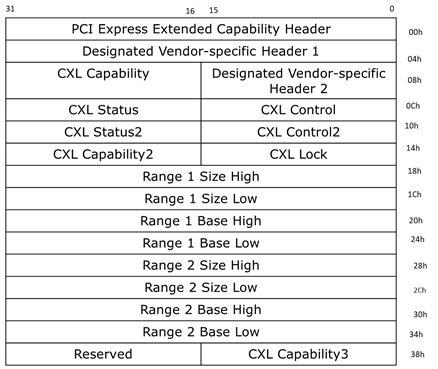
>
> *Original page render @ 150 DPI* — [📄 Full size](figures/chapter_08/page_0502.png)

> **Table 8-4.** PCIe DVSEC CXL Devices - Header ｜ CXL 设备的 PCIe DVSEC – Header
>
> | Register | Bit Location | Field | Value |
> |---|---|---|---|
> | Designated Vendor-Specific Header 1 (Offset 04h) | 15:0 | DVSEC Vendor ID | 1E98h |
> | | 19:16 | DVSEC Revision | 3h |
> | | 31:20 | DVSEC Length | 03Ch |
> | Designated Vendor-Specific Header 2 (Offset 08h) | 15:0 | DVSEC ID | 0000h |

[⬆️ 返回目录](#-本章目录-part-a)

---

### 8.1.3.1 DVSEC CXL Capability (Offset 0Ah) | DVSEC CXL 能力 (偏移 0Ah)

<table>
<thead>
<tr>
<th width="50%">🇬🇧 English</th>
<th width="50%" style="background-color:#e8e8e8">🇨🇳 中文</th>
</tr>
</thead>
<tbody>
<tr><td>The CXL device-specific registers are described in the following subsections.</td><td style="background-color:#e8e8e8">以下各小节描述了 CXL 设备特定寄存器。</td></tr>
</tbody>
</table>

> **Table 8-5.** DVSEC CXL Capability (Offset 0Ah) ｜ DVSEC CXL 能力 (偏移 0Ah)
>
> | Bit | Attributes | Description / 描述 |
> |---|---|---|
> | 0 | RO | **Cache_Capable**: If set, indicates that the CXL.cache protocol is supported when operating in Flex Bus.CXL mode. This must be 0 for all LDs of an MLD. — 若置 1，表示在 Flex Bus.CXL 模式下支持 CXL.cache 协议。MLD 的所有 LD 必须为 0。 |
> | 1 | RO | **IO_Capable**: If set, indicates that the CXL.io protocol is supported when operating in Flex Bus.CXL mode. Must be 1. — 若置 1，表示在 Flex Bus.CXL 模式下支持 CXL.io 协议。必须为 1。 |
> | 2 | RO | **Mem_Capable**: If set, indicates that the CXL.mem protocol is supported when operating in Flex Bus.CXL mode. This must be 1 for all LDs of an MLD. — 若置 1，表示在 Flex Bus.CXL 模式下支持 CXL.mem 协议。MLD 的所有 LD 必须为 1。 |
> | 3 | RO | **Mem_HwInit_Mode**: If set, indicates that this CXL.mem-capable device initializes memory with assistance from hardware and firmware located on the device. If cleared, indicates that memory is initialized by host software such as a device driver. This bit must be ignored when Mem_Capable=0. Functions that implements the Class Code specified in Section 8.1.12.1 shall set this bit to 1. — 若置 1，表示此支持 CXL.mem 的设备借助设备上的硬件和固件初始化内存。若清零，表示由主机软件（例如设备驱动程序）初始化内存。当 Mem_Capable=0 时必须忽略此位。 实现 8.1.12.1 节中规定的 Class Code 的功能应将此位置 1。 |
> | 5:4 | RO | **HDM_Count**: Number of HDM ranges implemented by the CXL device and reported through this function. This field must return 00b if Mem_Capable=0. • 00b = Zero ranges. This setting is illegal when Mem_Capable=1. • 01b = One HDM range. • 10b = Two HDM ranges. • 11b = Reserved. — CXL 设备实现并通过此功能上报的 HDM 范围数量。当 Mem_Capable=0 时该字段必须返回 00b。 • 00b = 0 个范围。当 Mem_Capable=1 时此设置非法。 • 01b = 1 个 HDM 范围。 • 10b = 2 个 HDM 范围。 • 11b = 保留。 |
> | 6 | RO | **Cache Writeback and Invalidate Capable**: If set, indicates that the device implements the Disable Caching and Initiate Cache Write Back and Invalidation control bits in the DVSEC CXL Control2 register, and the Cache Invalid status bit in the DVSEC CXL Status2 register. All devices that are not RCDs shall set this capability bit when Cache_Capable=1.¹ — 若置 1，表示设备实现 DVSEC CXL Control2 寄存器中的 Disable Caching 和 Initiate Cache Write Back and Invalidation 控制位，以及 DVSEC CXL Status2 寄存器中的 Cache Invalid 状态位。当 Cache_Capable=1 时，所有非 RCD 设备应设置此能力位。¹ |
> | 7 | RO | **CXL Reset Capable**: If set, indicates that the device supports CXL Reset and implements the CXL Reset Timeout field in this register, the Initiate CXL Reset bit in the DVSEC CXL Control2 register, and the DVSEC CXL Reset Complete status bit in the DVSEC CXL Status2 register.¹ This bit must report the same value for all LDs of an MLD. — 若置 1，表示设备支持 CXL Reset 并实现此寄存器中的 CXL Reset Timeout 字段、DVSEC CXL Control2 寄存器中的 Initiate CXL Reset 位、以及 DVSEC CXL Status2 寄存器中的 DVSEC CXL Reset Complete 状态位。¹ 此位对 MLD 的所有 LD 必须报告相同的值。 |
> | 10:8 | RO | **CXL Reset Timeout**: If the CXL Reset Capable bit in this register is set, this field indicates the maximum time that the device may take to complete the CXL Reset. If the CXL Reset Mem Clr Capable bit in this register is 1, this time also accounts for the time that is needed for clearing or randomizing of volatile HDM Ranges. If the CXL Reset Complete status bit in the DVSEC CXL Status2 register is not set after the passage of this time duration, software may assume that CXL Reset has failed. This value must be the same for all LDs of an MLD.¹ • 000b = 10 ms • 001b = 100 ms • 010b = 1 second • 011b = 10 second • 100b = 100 second • All other encodings are reserved — 若此寄存器中的 CXL Reset Capable 位置 1，则此字段表示设备完成 CXL Reset 可能所需的最长时间。如果此寄存器中的 CXL Reset Mem Clr Capable 位为 1，则此时间还包括清除或随机化易失性 HDM 范围所需的时间。如果在该时间过后 DVSEC CXL Status2 寄存器中的 CXL Reset Complete 状态位仍未置位，软件可假定 CXL Reset 已失败。MLD 的所有 LD 该值必须相同。¹ • 000b = 10 ms • 001b = 100 ms • 010b = 1 秒 • 011b = 10 秒 • 100b = 100 秒 • 所有其他编码保留 |
> | 11 | HwInit | **CXL Reset Mem Clr Capable**: When set, the Device is capable of clearing or randomizing volatile HDM Ranges during CXL Reset.¹ — 置 1 时，设备能够在 CXL Reset 期间清除或随机化易失性 HDM 范围。¹ |
> | 12 | HwInit | **TSP Capable**: When set, the Device is capable of supporting TSP and shall support TSP requests (see Section 11.5.5) and MemRdFill (see Table 3-41).² — 置 1 时，设备能够支持 TSP，应支持 TSP 请求 (见 11.5.5 节) 和 MemRdFill (见表 3-41)。² |
> | 13 | HwInit | **Multiple Logical Device**: If set, indicates that the Device is a Logical Device (which could be an FM-owned LD) within an MLD. If cleared, indicates that the Device is an SLD or an RCD.¹ — 置 1 时，表示设备是 MLD 内的逻辑设备 (可能是 FM 拥有的 LD)。清零时，表示设备是 SLD 或 RCD。¹ |
> | 14 | RO | **Viral_Capable**: If set, indicates that the CXL device supports Viral handling. This value must be 1 for all devices. — 置 1 时，表示 CXL 设备支持 Viral 处理。所有设备该值必须为 1。 |
> | 15 | HwInit | **PM Init Completion Reporting Capable**: If set, indicates that the CXL device is capable of supporting the Power Management Initialization Complete flag. All devices that are not RCDs shall set this capability bit. RCDs may implement this capability.¹ This capability is not applicable to switches and root ports. Switches and root ports shall hardwire this bit to 0. — 置 1 时，表示 CXL 设备能够支持 Power Management Initialization Complete 标志位。所有非 RCD 设备应设置此能力位。RCD 可以实现此能力。¹ 此能力不适用于交换器和根端口。交换器和根端口应将此位硬连线为 0。 |
>
> 1. This bit/field was introduced as part of DVSEC Revision=1.
> 2. This bit/field was introduced as part of DVSEC Revision=3.
>
> 1. 此位/字段在 DVSEC Revision=1 中引入。
> 2. 此位/字段在 DVSEC Revision=3 中引入。

[⬆️ 返回目录](#-本章目录-part-a)

---

### 8.1.3.2 DVSEC CXL Control (Offset 0Ch) | DVSEC CXL 控制 (偏移 0Ch)

> **Table 8-6.** DVSEC CXL Control (Offset 0Ch) ｜ DVSEC CXL 控制 (偏移 0Ch)
>
> | Bit | Attributes | Description / 描述 |
> |---|---|---|
> | 0 | RWL | **Cache_Enable**: When set to 1, enables CXL.cache protocol operation when in Flex Bus.CXL mode. Locked by the CONFIG_LOCK bit¹. If this bit is 0, the component is permitted to silently drop all CXL.cache transactions. Default value of this bit is 0. — 置 1 时，使能 Flex Bus.CXL 模式下的 CXL.cache 协议操作。由 CONFIG_LOCK 位¹锁定。若此位为 0，则允许组件静默丢弃所有 CXL.cache 事务。 默认值为 0。 |
> | 1 | RO | **IO_Enable**: When set to 1, enables CXL.io protocol operation when in Flex Bus.CXL mode. This bit always returns 1. — 置 1 时，使能 Flex Bus.CXL 模式下的 CXL.io 协议操作。 此位始终返回 1。 |
> | 2 | RWL | **Mem_Enable**: When set to 1, enables CXL.mem protocol operation when in Flex Bus.CXL mode. Locked by the CONFIG_LOCK bit¹. If this bit is 0, the component is permitted to silently drop all CXL.mem transactions. Default value of this bit is 0. — 置 1 时，使能 Flex Bus.CXL 模式下的 CXL.mem 协议操作。由 CONFIG_LOCK 位¹锁定。若此位为 0，则允许组件静默丢弃所有 CXL.mem 事务。 默认值为 0。 |
> | 7:3 | RWL | **Cache_SF_Coverage**: Performance hint to the device. Locked by the CONFIG_LOCK bit¹. • 00h = Indicates no Snoop Filter coverage on the host • For all other values of N = Indicates Snoop Filter coverage on the host of 2^(N+15d) bytes (e.g., value of 5h indicates 1-MB snoop filter coverage) Default value of this field is 00h. — 设备的性能提示。由 CONFIG_LOCK 位¹锁定。 • 00h = 主机上没有 Snoop Filter 覆盖 • 对于 N 的所有其他值 = 主机上的 Snoop Filter 覆盖为 2^(N+15d) 字节 (例如，5h 值表示 1-MB snoop filter 覆盖) 默认值为 00h。 |
> | 10:8 | RWL | **Cache_SF_Granularity**: Performance hint to the device. Locked by the CONFIG_LOCK bit¹. • 000b = Indicates 64B granular tracking on the host • 001b = Indicates 128B granular tracking on the host • 010b = Indicates 256B granular tracking on the host • 011b = Indicates 512B granular tracking on the host • 100b = Indicates 1KB granular tracking on the host • 101b = Indicates 2KB granular tracking on the host • 110b = Indicates 4KB granular tracking on the host • 111b = Reserved Default value of this field is 000b. — 设备的性能提示。由 CONFIG_LOCK 位¹锁定。 • 000b = 主机上 64B 粒度跟踪 • 001b = 主机上 128B 粒度跟踪 • 010b = 主机上 256B 粒度跟踪 • 011b = 主机上 512B 粒度跟踪 • 100b = 主机上 1KB 粒度跟踪 • 101b = 主机上 2KB 粒度跟踪 • 110b = 主机上 4KB 粒度跟踪 • 111b = 保留 默认值为 000b。 |
> | 11 | RWL | **Cache_Clean_Eviction**: Performance hint to the device. Locked by the CONFIG_LOCK bit¹. • 0 = Indicates clean evictions from device caches are needed for best performance • 1 = Indicates clean evictions from device caches are NOT needed for best performance Default value of this bit is 0. — 设备的性能提示。由 CONFIG_LOCK 位¹锁定。 • 0 = 表示需要从设备缓存进行 clean eviction 以获得最佳性能 • 1 = 表示不需要从设备缓存进行 clean eviction 即可获得最佳性能 默认值为 0。 |

[⬆️ 返回目录](#-本章目录-part-a)

---

### 8.1.3.3 DVSEC CXL Status (Offset 0Eh) | DVSEC CXL 状态 (偏移 0Eh)

> **Table 8-7.** DVSEC CXL Status (Offset 0Eh) ｜ DVSEC CXL 状态 (偏移 0Eh)
>
> | Bit | Attributes | Description / 描述 |
> |---|---|---|
> | 13:0 | RsvdZ | Reserved — 保留 |
> | 14 | RW1CS | **Viral_Status**: When set, indicates that the CXL device has encountered a Viral condition. This bit does not indicate that the device is currently in Viral condition. See Section 12.4 for more details. — 置 1 时，表示 CXL 设备已遇到 Viral 状况。此位并不表示设备当前处于 Viral 状态。详见 12.4 节。 |
> | 15 | RsvdZ | Reserved — 保留 |

[⬆️ 返回目录](#-本章目录-part-a)

---

### 8.1.3.4 DVSEC CXL Control2 (Offset 10h) | DVSEC CXL 控制 2 (偏移 10h)

> **Table 8-8.** DVSEC CXL Control2 (Offset 10h) ｜ DVSEC CXL 控制 2 (偏移 10h)
>
> | Bit | Attributes | Description / 描述 |
> |---|---|---|
> | 0 | RW | **Disable Caching**: When set to 1, device shall no longer cache new modified lines in its local cache. Device shall continue to correctly respond to CXL.cache transactions.¹ Default value of this bit is 0. — 置 1 时，设备应不再将其本地缓存中的新修改行进行缓存。设备应继续正确响应 CXL.cache 事务。¹ 默认值为 0。 |
> | 1 | RW | **Initiate Cache Write Back and Invalidation**: When set to 1, the device shall write back all modified lines in the local cache and then invalidate all lines. The device shall send a CacheFlushed message to the host, as required by CXL.cache protocol, to indicate that the device does not hold any modified lines.¹ If this bit is set when Disable Caching=0, the device behavior is undefined. This bit always returns the value of 0 when read by the software. A write of 0 is ignored. — 置 1 时，设备应将本地缓存中的所有修改行回写，然后使所有行失效。设备应按照 CXL.cache 协议要求向主机发送 CacheFlushed 消息，以表明设备不再持有任何修改行。¹ 如果在 Disable Caching=0 时设置此位，则设备行为未定义。 软件读取时，此位始终返回 0。写入 0 被忽略。 |
> | 2 | RW | **Initiate CXL Reset**: When set to 1, the device shall initiate CXL Reset as defined in Section 9.7. This bit always returns the value of 0 when read by the software. A write of 0 is ignored.¹ If Software sets this bit while the previous CXL Reset is in progress, the results are undefined. — 置 1 时，设备应按照 9.7 节定义启动 CXL Reset。软件读取时，此位始终返回 0。写入 0 被忽略。¹ 如果软件在上一次 CXL Reset 尚未完成时设置此位，则结果未定义。 |
> | 3 | RW | **CXL Reset Mem Clr Enable**: When set, and the CXL Reset Mem Clr Capable bit in the DVSEC CXL Capability register returns 1, the device shall clear or randomize volatile HDM ranges as part of the CXL Reset operation. When the CXL Reset Mem Clr Capable bit is cleared, this bit is ignored and volatile HDM ranges may or may not be cleared or randomized during CXL Reset.¹ Default value of this bit is 0. — 置 1 时，如果 DVSEC CXL Capability 寄存器中的 CXL Reset Mem Clr Capable 位返回 1，则设备应作为 CXL Reset 操作的一部分清除或随机化易失性 HDM 范围。当 CXL Reset Mem Clr Capable 位清零时，此位被忽略，CXL Reset 期间易失性 HDM 范围可能清除也可能不清除 (或不随机化)。¹ 默认值为 0。 |
> | 12 | RWL/RsvdP | **Direct P2P Mem Enable**: This bit must be RWL if the Direct P2P Mem Capable bit in the DVSEC CXL Capability³ register is set; otherwise, this bit is permitted to be hardwired to 0. Software must not set this bit unless the Direct P2P Mem Capable bit is set.² When set, enables Direct P2P CXL.mem protocol operation. If this bit is 0, the component is not permitted to initiate Direct P2P CXL.mem transactions. Default value of this bit is 0. Locked by the CONFIG_LOCK bit¹. — 如果 DVSEC CXL Capability³ 寄存器中的 Direct P2P Mem Capable 位置 1，则此位必须为 RWL；否则，此位可硬连线为 0。除非 Direct P2P Mem Capable 位置位，否则软件不得设置此位。² 置 1 时，使能 Direct P2P CXL.mem 协议操作。若此位为 0，则不允许组件发起 Direct P2P CXL.mem 事务。 默认值为 0。由 CONFIG_LOCK 位¹锁定。 |
> | 13 | RsvdP | Reserved — 保留 |
> | 14 | RWL | **Viral_Enable**: When set, enables Viral handling in the CXL device. Locked by the CONFIG_LOCK bit¹. If 0, the CXL device may ignore the viral that it receives. Default value of this bit is 0. — 置 1 时，在 CXL 设备中使能 Viral 处理。由 CONFIG_LOCK 位¹锁定。 若为 0，则 CXL 设备可以忽略其接收到的 viral。 默认值为 0。 |
> | 15 | RsvdP | Reserved — 保留 |
>
> 1. CONFIG_LOCK bit in the DVSEC CXL Lock register.
> 2. This bit was introduced as part of DVSEC Revision=3.
>
> 1. DVSEC CXL Lock 寄存器中的 CONFIG_LOCK 位。
> 2. 此位在 DVSEC Revision=3 中引入。

[⬆️ 返回目录](#-本章目录-part-a)

---

### 8.1.3.5 DVSEC CXL Status2 (Offset 12h) | DVSEC CXL 状态 2 (偏移 12h)

> **Table 8-9.** DVSEC CXL Status2 (Offset 12h) ｜ DVSEC CXL 状态 2 (偏移 12h)
>
> | Bit | Attributes | Description / 描述 |
> |---|---|---|
> | 0 | RO | **Cache Invalid**: When set, the device guarantees that it does not hold any valid lines and Disable Caching=1¹. This bit shall read as 0 when Disable Caching=0.² — 置 1 时，设备保证其不持有任何有效行，且 Disable Caching=1¹。当 Disable Caching=0 时，此位读为 0。² |
> | 1 | RO | **CXL Reset Complete**: When set, the device has successfully completed CXL Reset as defined in Section 9.7.² Device shall clear this bit upon transition of Initiate CXL Reset bit¹ from 0 to 1, prior to initiating the CXL Reset flow. — 置 1 时，设备已按 9.7 节定义成功完成 CXL Reset。² 设备应在 Initiate CXL Reset 位¹ 由 0 跳变到 1 时清除此位 (在启动 CXL Reset 流程之前)。 |
> | 2 | RO | **CXL Reset Error**: When set, the device has completed CXL Reset with errors. Additional information may be available in device error records (see Section 8.2.10.2.1). Host software or Fabric Manager may optionally reissue CXL Reset.² Device shall clear this bit upon transition of the Initiate CXL Reset bit¹ from 0 to 1, prior to initiating the CXL Reset flow. — 置 1 时，设备完成 CXL Reset 时出错。附加信息可能可在设备错误记录中找到 (见 8.2.10.2.1 节)。主机软件或 Fabric Manager 可以选择重新发起 CXL Reset。² 设备应在 Initiate CXL Reset 位¹ 由 0 跳变到 1 时清除此位 (在启动 CXL Reset 流程之前)。 |
> | 3 | RW1CS/ RsvdZ | **Volatile HDM Preservation Error**: This bit shall be set if the Software requested the device to preserve Volatile HDM content across a Hot Reset but the device failed to do so.³ RW1CS if the Volatile HDM State after Hot Reset - Configurability bit in the DVSEC CXL Capability³ register is set; otherwise, it is RsvdZ. — 如果软件请求设备在热复位期间保留易失性 HDM 内容但设备未保留，则该位应置位。³ 如果 DVSEC CXL Capability³ 寄存器中的 Volatile HDM State after Hot Reset - Configurability 位置 1，则为 RW1CS；否则为 RsvdZ。 |
> | 4 | RWS/RO | **Desired Volatile HDM State after Hot Reset**: This bit must be RWS if the Volatile HDM State after Hot Reset - Configurability bit in the DVSEC CXL Capability³ register is set; otherwise, this bit is permitted to be hardwired to 0. Software must not set this bit unless the Volatile HDM State after Hot Reset - Configurability bit is set.² The reset default is 0. • 0 = Follow the Default Volatile HDM State after the Hot Reset bit in the DVSEC CXL Capability³ register • 1 = Device shall preserve the Volatile HDM content across Hot Reset — 如果 DVSEC CXL Capability³ 寄存器中的 Volatile HDM State after Hot Reset - Configurability 位置 1，则此位必须为 RWS；否则，此位可硬连线为 0。除非该 Configurability 位置位，否则软件不得设置此位。² 复位默认值为 0。 • 0 = 遵循 DVSEC CXL Capability³ 寄存器中 Hot Reset 后的 Default Volatile HDM State 位 • 1 = 设备应在热复位期间保留易失性 HDM 内容 |
> | 5 | RW/RO | **Modified Completion Enable**: This bit must be RW if the Modified Completion Capable bit in the DVSEC CXL Capability² register is set; otherwise, this bit is permitted to be hardwired to 0. Software must not set this bit unless the Modified Completion Capable bit is set.³ The reset default is 0. • 0 = This device is not permitted to return modified data • 1 = This device is permitted to return modified data using the Cmp-M response — 如果 DVSEC CXL Capability² 寄存器中的 Modified Completion Capable 位置 1，则此位必须为 RW；否则，此位可硬连线为 0。除非 Modified Completion Capable 位置位，否则软件不得设置此位。³ 复位默认值为 0。 • 0 = 此设备不允许返回修改数据 • 1 = 此设备允许使用 Cmp-M 响应返回修改数据 |
> | 14:6 | RsvdP | Reserved — 保留 |
> | 15 | RO | **Power Management Initialization Complete**: When set, indicates that the device has successfully completed the Power Management Initialization flow described in Figure 3-4 and is ready to process various Power Management messages.² If this bit is not set within 100 ms of link-up, software may conclude that Power Management initialization has failed and may then issue a Secondary Bus Reset to force link re-initialization and Power Management re-initialization. — 置 1 时，表示设备已成功完成图 3-4 中描述的电源管理初始化流程，并准备好处理各种电源管理消息。² 如果在 link-up 后的 100 ms 内该位仍未置位，软件可判定电源管理初始化失败，并可发出 Secondary Bus Reset 以强制链路重新初始化和电源管理重新初始化。 |
>
> 1. This bit was introduced as part of DVSEC Revision=1.
> 2. This bit was introduced as part of DVSEC Revision=2.
> 3. This bit was introduced as part of DVSEC Revision=3.
>
> 1. 此位在 DVSEC Revision=1 中引入。
> 2. 此位在 DVSEC Revision=2 中引入。
> 3. 此位在 DVSEC Revision=3 中引入。

[⬆️ 返回目录](#-本章目录-part-a)

---

### 8.1.3.6 DVSEC CXL Lock (Offset 14h) | DVSEC CXL 锁 (偏移 14h)

> **Table 8-10.** DVSEC CXL Lock (Offset 14h) ｜ DVSEC CXL 锁 (偏移 14h)
>
> | Bit | Attributes | Description / 描述 |
> |---|---|---|
> | 0 | RWO | **CONFIG_LOCK**: When set, all register fields in the PCIe DVSEC for CXL Devices Capability with the RWL attribute become read only. Consult individual register fields for details. This bit is cleared upon device Conventional Reset. This bit and all the fields that are locked by this bit are unaffected by CXL Reset. Default value of this bit is 0. — 置 1 时，PCIe DVSEC for CXL Devices Capability 中具有 RWL 属性的所有寄存器字段变为只读。详情请查阅各寄存器字段。 此位在设备 Conventional Reset 时清零。此位以及由此位锁定的所有字段不受 CXL Reset 影响。 默认值为 0。 |
> | 15:1 | RsvdP | Reserved — 保留 |

[⬆️ 返回目录](#-本章目录-part-a)

---

### 8.1.3.7 DVSEC CXL Capability2 (Offset 16h) | DVSEC CXL 能力 2 (偏移 16h)

> **Table 8-11.** DVSEC CXL Capability2 (Offset 16h) ｜ DVSEC CXL 能力 2 (偏移 16h)
>
> | Bit | Attributes | Description / 描述 |
> |---|---|---|
> | 3:0 | RO | **Cache Size Unit**: A CXL device that is not CXL.cache-capable shall return the value of 0h.¹ • 0h = Cache size is not reported • 1h = 64 KB • 2h = 1 MB • All other encodings are reserved — 不支持 CXL.cache 的 CXL 设备应返回值 0h。¹ • 0h = 未报告缓存大小 • 1h = 64 KB • 2h = 1 MB • 所有其他编码保留 |
> | 5:4 | HwInit | **Fallback Capability**: Defines the fallback operation mode of a Type 2 Device. Fallback operation mode is where the device does not appear as a Type 2 CXL device, yet provides useful functionality. This field is not intended for advertising debug modes of operation.² • 00b = Device either does not support fallback mode or does not advertise fallback mode • 01b = PCIe • 10b = CXL Type 1 • 11b = CXL Type 3 — 定义 Type 2 设备的回退操作模式。回退操作模式是指设备不作为 Type 2 CXL 设备出现，但仍提供有用的功能。此字段不用于公布调试操作模式。² • 00b = 设备不支持回退模式或不公布回退模式 • 01b = PCIe • 10b = CXL Type 1 • 11b = CXL Type 3 |
> | 6 | HwInit | **Modified Completion Capable**: When set to 1, it indicates that this device is capable of returning modified data using the Cmp-M response.³ — 置 1 时，表示此设备能够使用 Cmp-M 响应返回修改数据。³ |
> | 7 | HwInit | **No Clean Writeback**: Specifies that a device shall not issue clean writebacks. This bit shall be set to 1 if the device does not support CXL.cache and does not support Direct P2P CXL.mem as a requester. For DVSEC Revisions = 1h or 2h, software can consider the device 'No Clean Writeback' capable if Cache_Capable is not set.³ • 0 = Device may or may not generate clean writebacks • 1 = Device guarantees to never generate clean writebacks at the device's cacheline granularity — 指定设备不应发起 clean writeback。如果设备不支持 CXL.cache 并且作为请求者不支持 Direct P2P CXL.mem，则此位应设置为 1。对于 DVSEC Revisions = 1h 或 2h，如果 Cache_Capable 未设置，软件可认为设备具备 "No Clean Writeback" 能力。³ • 0 = 设备可能生成也可能不生成 clean writeback • 1 = 设备保证在其 cacheline 粒度上永远不会生成 clean writeback |
> | 15:8 | RO | **Cache Size**: Expressed in multiples of Cache Size Unit. If Cache Size=4 and Cache Size Unit=1h, the device has a 256-KB cache.¹ A CXL device that is not CXL.cache-capable shall return the value of 00h. — 以 Cache Size Unit 的倍数表示。如果 Cache Size=4 且 Cache Size Unit=1h，则设备具有 256-KB 缓存。¹ 不支持 CXL.cache 的 CXL 设备应返回值 00h。 |
>
> 1. This field was introduced as part of DVSEC Revision=1.
> 2. This field was introduced as part of DVSEC Revision=2.
> 3. This bit was introduced as part of DVSEC Revision=3.
>
> 1. 此字段在 DVSEC Revision=1 中引入。
> 2. 此字段在 DVSEC Revision=2 中引入。
> 3. 此位在 DVSEC Revision=3 中引入。

[⬆️ 返回目录](#-本章目录-part-a)

---

### 8.1.3.8 DVSEC CXL Range Registers | DVSEC CXL 范围寄存器

<table>
<thead>
<tr>
<th width="50%">🇬🇧 English</th>
<th width="50%" style="background-color:#e8e8e8">🇨🇳 中文</th>
</tr>
</thead>
<tbody>
<tr><td>These registers are not applicable to an FM-owned LD.</td><td style="background-color:#e8e8e8">这些寄存器不适用于 FM 拥有的 LD。</td></tr>
<tr><td>The DVSEC CXL Range 1 register set must be implemented if Mem_Capable=1 in the DVSEC CXL Capability register. The DVSEC CXL Range 2 register set must be implemented if (Mem_Capable=1 and HDM_Count=10b in the DVSEC CXL Capability register). Each set contains 4 registers - Size High, Size Low, Base High, and Base Low.</td><td style="background-color:#e8e8e8">如果 DVSEC CXL Capability 寄存器中的 Mem_Capable=1，则必须实现 DVSEC CXL Range 1 寄存器组。如果 Mem_Capable=1 且 DVSEC CXL Capability 寄存器中的 HDM_Count=10b，则必须实现 DVSEC CXL Range 2 寄存器组。每组包含 4 个寄存器：Size High、Size Low、Base High 和 Base Low。</td></tr>
<tr><td>A CXL.mem-capable device is permitted to report zero memory size.</td><td style="background-color:#e8e8e8">支持 CXL.mem 的设备允许上报零内存大小。</td></tr>
</tbody>
</table>

#### 8.1.3.8.1 DVSEC CXL Range 1 Size High (Offset 18h) | DVSEC CXL 范围 1 大小高 (偏移 18h)

> **Table 8-12.** DVSEC CXL Range 1 Size High (Offset 18h) ｜ DVSEC CXL 范围 1 大小高 (偏移 18h)
>
> | Bit | Attributes | Description / 描述 |
> |---|---|---|
> | 31:0 | RO | **Memory_Size_High**: Corresponds to bits 63:32 of the CXL Range 1 memory size regardless of whether the device implements CXL HDM Decoder Capability registers. — 对应 CXL 范围 1 内存大小的 bit 63:32，无论设备是否实现 CXL HDM Decoder Capability 寄存器。 |

[⬆️ 返回目录](#-本章目录-part-a)

---

#### 8.1.3.8.2 DVSEC CXL Range 1 Size Low (Offset 1Ch) | DVSEC CXL 范围 1 大小低 (偏移 1Ch)

> **Table 8-13.** DVSEC CXL Range 1 Size Low (Offset 1Ch) ｜ DVSEC CXL 范围 1 大小低 (偏移 1Ch)
>
> | Bit | Attributes | Description / 描述 |
> |---|---|---|
> | 0 | RO | **Memory_Info_Valid**: When set, indicates that the CXL Range 1 Size High and Size Low registers are valid regardless of whether the device implements CXL HDM Decoder Capability registers. Must be set within 1 second of reset deassertion to the CXL device. — 置 1 时，表示 CXL 范围 1 Size High 和 Size Low 寄存器有效，无论设备是否实现 CXL HDM Decoder Capability 寄存器。必须在 CXL 设备复位取消置位后 1 秒内设置。 |
> | 1 | RO | **Memory_Active**: When set, indicates that the CXL Range 1 memory is fully initialized and available for software use regardless of whether the device implements CXL HDM Decoder Capability registers. When cleared, indicates that the CXL Range 1 memory may be unavailable for software use regardless of whether the device implements CXL HDM Decoder Capability registers. Must be set within Range 1 Memory_Active_Timeout of reset deassertion to the CXL device when Mem_HwInit_Mode=1 in the DVSEC CXL Capability register. — 置 1 时，表示 CXL 范围 1 内存已完全初始化并可供软件使用，无论设备是否实现 CXL HDM Decoder Capability 寄存器。清零时，表示 CXL 范围 1 内存可能不可供软件使用。当 DVSEC CXL Capability 寄存器中的 Mem_HwInit_Mode=1 时，必须在 CXL 设备复位取消置位后 Range 1 Memory_Active_Timeout 时间内设置。 |
> | 4:2 | RO | **Media_Type**: Indicates the memory media characteristics regardless of whether the device implements CXL HDM Decoder Capability registers. All CXL.mem devices that are not eRCDs shall set this field to 010b. • 000b = Volatile memory. This setting is deprecated starting with the CXL 2.0 specification. • 001b = Non-volatile memory. This setting is deprecated starting with the CXL 2.0 specification. • 010b = Memory characteristics are communicated via CDAT (see Section 8.1.11) and not via this field.¹ • All other encodings are reserved. — 表示内存介质特性，无论设备是否实现 CXL HDM Decoder Capability 寄存器。所有非 eRCD 的 CXL.mem 设备应将此字段设置为 010b。 • 000b = 易失性内存。此设置从 CXL 2.0 规范起被弃用。 • 001b = 非易失性内存。此设置从 CXL 2.0 规范起被弃用。 • 010b = 内存特性通过 CDAT 通信 (见 8.1.11 节)，不通过此字段。¹ • 所有其他编码保留。 |
> | 7:5 | RO | **Memory_Class**: Indicates the class of memory regardless of whether the device implements CXL HDM Decoder Capability registers. All CXL.mem devices that are not eRCDs shall set this field to 010b. • 000b = Memory Class (e.g., normal DRAM). This setting is deprecated starting with the CXL 2.0 specification. • 001b = Storage Class. This setting is deprecated starting with the CXL 2.0 specification. • 010b = Memory characteristics are communicated via CDAT (see Section 8.1.11) and not via this field.¹ • All other encodings are reserved. — 表示内存的类别，无论设备是否实现 CXL HDM Decoder Capability 寄存器。所有非 eRCD 的 CXL.mem 设备应将此字段设置为 010b。 • 000b = Memory Class (例如普通 DRAM)。此设置从 CXL 2.0 规范起被弃用。 • 001b = Storage Class。此设置从 CXL 2.0 规范起被弃用。 • 010b = 内存特性通过 CDAT 通信 (见 8.1.11 节)，不通过此字段。¹ • 所有其他编码保留。 |
> | 12:8 | RO | **Desired_Interleave**: If a CXL.mem-capable eRCD is connected to a single CPU via multiple CXL links, this field represents the memory interleaving desired by the device. BIOS will configure the CPU to interleave accesses to this HDM range across links at this granularity or to the closest possible value that the host supports. In all other cases, this field represents the minimum desired interleave granularity for optimal device performance regardless of whether the device implements CXL HDM Decoder Capability registers. Software should program the Interleave Granularity (IG) field in the HDM Decoder Control registers (see Section 8.2.4.20.7) to be an exact match or any larger granularity than the device advertises via the CXL HDM Decoder Capability register (see Section 8.2.4.20.1). This field is treated as a hint. The device shall function correctly if the actual value that is programmed in the Interleave Granularity (IG) field in the HDM Decoder Control registers is less than what is reported via this field. • 00h = No Interleave • 01h = 256-Byte Granularity • 02h = 4-KB Interleave • 03h = 512 Bytes¹ • 04h = 1024 Bytes¹ • 05h = 2048 Bytes¹ • 06h = 8192 Bytes¹ • 07h = 16384 Bytes¹ • All other encodings are reserved Note: If a CXL device has different desired interleave values for DPA ranges that are covered by this CXL Range 1, the device should report a value that best fits the requirements for all such ranges (e.g., the maximum of the values). Note: If CXL devices in an Interleave Set advertise different values for this field, Software may choose the smallest value that best fits the set. — 如果支持 CXL.mem 的 eRCD 通过多条 CXL 链路连接到单个 CPU，则此字段表示设备期望的内存交织。BIOS 将配置 CPU 以此粒度或最接近的可用值跨链路交织此 HDM 范围的访问。 在所有其他情况下，此字段表示设备最佳性能所需的最小交织粒度，无论设备是否实现 CXL HDM Decoder Capability 寄存器。软件应将 HDM Decoder Control 寄存器 (见 8.2.4.20.7 节) 中的 Interleave Granularity (IG) 字段编程为完全匹配或任何比设备通过 CXL HDM Decoder Capability 寄存器 (见 8.2.4.20.1 节) 公布的粒度更大的值。此字段视为提示。如果 HDM Decoder Control 寄存器中编程的实际 IG 值小于此字段报告的值，设备应能正确运行。 • 00h = 无交织 • 01h = 256 字节粒度 • 02h = 4-KB 交织 • 03h = 512 字节¹ • 04h = 1024 字节¹ • 05h = 2048 字节¹ • 06h = 8192 字节¹ • 07h = 16384 字节¹ • 所有其他编码保留 注意：如果 CXL 设备对由此 CXL Range 1 覆盖的 DPA 范围具有不同的期望交织值，则设备应报告最适合所有此类范围要求的值 (例如最大值)。 注意：如果 Interleave Set 中的 CXL 设备为此字段公布不同的值，软件可以选择最适合该集合的最小值。 |
> | 15:13 | HwInit | **Memory_Active_Timeout**: For devices that advertise Mem_HwInit_Mode=1 in the DVSEC CXL Capability register, this field indicates the maximum time that the device is permitted to take to set the Memory_Active bit in this register after a hot reset, a warm reset, or a cold reset regardless of whether the device implements CXL HDM Decoder Capability registers. If the Memory_Active bit is not set after the passage of this time duration, software may assume that the HDM reported by this range has failed. This value must be the same for all LDs of an MLD.¹ • 000b = 1 second • 001b = 4 seconds • 010b = 16 seconds • 011b = 64 seconds • 100b = 256 seconds • All other encodings are reserved — 对于在 DVSEC CXL Capability 寄存器中公布 Mem_HwInit_Mode=1 的设备，此字段表示设备在热复位、温复位或冷复位后允许在此寄存器中设置 Memory_Active 位的最长时间，无论设备是否实现 CXL HDM Decoder Capability 寄存器。如果在该时间过后 Memory_Active 位仍未置位，软件可假定此范围所报告的 HDM 失败。MLD 的所有 LD 此值必须相同。¹ • 000b = 1 秒 • 001b = 4 秒 • 010b = 16 秒 • 011b = 64 秒 • 100b = 256 秒 • 所有其他编码保留 |
> | 16 | RO | **Memory_Active_Degraded**: When set, indicates that the CXL Range 1 memory is initialized and available for software use regardless of whether the device implements CXL HDM Decoder Capability registers. When set, it also signifies a reduction in capacity or performance relative to what is expected.² If this bit is 1, the Memory_Active flag in this register shall be 0. If the Memory_Active flag in this register is 1, this bit shall be 0. Either Memory_Active or Memory_Active_Degraded shall be set within Range_1 Memory_Active_Timeout of reset deassertion to the CXL device when Mem_HwInit_Mode=1 in the DVSEC CXL Capability register. — 置 1 时，表示 CXL 范围 1 内存已初始化并可供软件使用，无论设备是否实现 CXL HDM Decoder Capability 寄存器。置 1 时还表示相对于预期容量或性能有所下降。² 如果此位为 1，则此寄存器中的 Memory_Active 标志必须为 0。如果此寄存器中的 Memory_Active 标志为 1，则此位必须为 0。 当 DVSEC CXL Capability 寄存器中的 Mem_HwInit_Mode=1 时，Memory_Active 或 Memory_Active_Degraded 应在 CXL 设备复位取消置位后 Range_1 Memory_Active_Timeout 时间内设置。 |
> | 27:17 | RsvdP | Reserved — 保留 |
> | 31:28 | RO | **Memory_Size_Low**: Corresponds to bits 31:28 of the CXL Range 1 memory size regardless of whether the device implements CXL HDM Decoder Capability registers. — 对应 CXL 范围 1 内存大小的 bit 31:28，无论设备是否实现 CXL HDM Decoder Capability 寄存器。 |
>
> 1. Introduced as part of DVSEC Revision=1.
> 2. This bit was introduced as part of DVSEC Revision=3.

[⬆️ 返回目录](#-本章目录-part-a)

---

#### 8.1.3.8.3 DVSEC CXL Range 1 Base High (Offset 20h) | DVSEC CXL 范围 1 基址高 (偏移 20h)

> **Table 8-14.** DVSEC CXL Range 1 Base High (Offset 20h) ｜ DVSEC CXL 范围 1 基址高 (偏移 20h)
>
> | Bit | Attributes | Description / 描述 |
> |---|---|---|
> | 31:0 | RWL | **Memory_Base_High**: Corresponds to bits 63:32 of CXL Range 1 base in the host address space. Locked by the CONFIG_LOCK bit in the DVSEC CXL Lock register. If a device implements CXL HDM Decoder Capability registers and software has enabled the HDM Decoder by setting the HDM Decoder Enable bit in the CXL HDM Decoder Global Control register, the value of this register is not used during address decode. It is recommended that software program this to match CXL HDM Decoder 0 Base High register for backward compatibility. Default value of this register is 0h. — 对应主机地址空间中 CXL 范围 1 基址的 bit 63:32。由 DVSEC CXL Lock 寄存器中的 CONFIG_LOCK 位锁定。 如果设备实现 CXL HDM Decoder Capability 寄存器并且软件通过设置 CXL HDM Decoder Global Control 寄存器中的 HDM Decoder Enable 位使能了 HDM Decoder，则此寄存器的值不参与地址解码。建议软件将其编程为与 CXL HDM Decoder 0 Base High 寄存器匹配以保持向后兼容。 默认值为 0h。 |

[⬆️ 返回目录](#-本章目录-part-a)

---

#### 8.1.3.8.4 DVSEC CXL Range 1 Base Low (Offset 24h) | DVSEC CXL 范围 1 基址低 (偏移 24h)

> **Table 8-15.** DVSEC CXL Range 1 Base Low (Offset 24h) ｜ DVSEC CXL 范围 1 基址低 (偏移 24h)
>
> | Bit | Attributes | Description / 描述 |
> |---|---|---|
> | 27:0 | RsvdP | Reserved — 保留 |
> | 31:28 | RWL | **Memory_Base_Low**: Corresponds to bits 31:28 of the CXL Range 1 base in the host address space. Locked by the CONFIG_LOCK bit in the DVSEC CXL Lock register. If a device implements CXL HDM Decoder Capability registers and software has enabled the HDM Decoder by setting the HDM Decoder Enable bit in the CXL HDM Decoder Global Control register, the value of this field is not used during address decode. It is recommended that software program this to match CXL HDM Decoder 0 Base Low register for backward compatibility. Default value of this field is 0h. — 对应主机地址空间中 CXL 范围 1 基址的 bit 31:28。由 DVSEC CXL Lock 寄存器中的 CONFIG_LOCK 位锁定。 如果设备实现 CXL HDM Decoder Capability 寄存器并且软件通过设置 CXL HDM Decoder Global Control 寄存器中的 HDM Decoder Enable 位使能了 HDM Decoder，则此字段的值不参与地址解码。建议软件将其编程为与 CXL HDM Decoder 0 Base Low 寄存器匹配以保持向后兼容。 默认值为 0h。 |

<table>
<thead>
<tr>
<th width="50%">🇬🇧 English</th>
<th width="50%" style="background-color:#e8e8e8">🇨🇳 中文</th>
</tr>
</thead>
<tbody>
<tr><td>A CXL.mem-capable device that does not implement CXL HDM Decoder Capability registers directs host accesses to an Address A within its local HDM if the following two equations are satisfied:</td><td style="background-color:#e8e8e8">不支持 CXL HDM Decoder Capability 寄存器的支持 CXL.mem 的设备，如果满足以下两个等式，则将主机访问定向到其本地 HDM 内的地址 A：</td></tr>
</tbody>
</table>

> **Equation 8-1.** Memory_Base[63:28] <= (A >> 28) < Memory_Base[63:28] + Memory_Size[63:28] ｜ 内存基址 [63:28] <= (A >> 28) < 内存基址 [63:28] + 内存大小 [63:28]

> **Equation 8-2.** Memory_Active AND DVSEC CXL Mem_Enable=1 ｜ 内存激活 与 DVSEC CXL Mem_Enable=1

<table>
<thead>
<tr>
<th width="50%">🇬🇧 English</th>
<th width="50%" style="background-color:#e8e8e8">🇨🇳 中文</th>
</tr>
</thead>
<tbody>
<tr><td>where >> represents a bitwise right-shift operation.</td><td style="background-color:#e8e8e8">其中 >> 表示按位右移操作。</td></tr>
<tr><td>A CXL.mem-capable device that implements CXL HDM Decoder Capability registers follows the above behavior as long as the HDM Decoder Enable bit in the CXL HDM Decoder Global Control register (see Section 8.2.4.20.2) is 0.</td><td style="background-color:#e8e8e8">实现 CXL HDM Decoder Capability 寄存器的支持 CXL.mem 的设备，只要 CXL HDM Decoder Global Control 寄存器 (见 8.2.4.20.2 节) 中的 HDM Decoder Enable 位为 0，就遵循上述行为。</td></tr>
<tr><td><strong>Note:</strong> Software is required to set HDM Decoder Enable bit in the CXL HDM Decoder Global Control register to enable the device to generate a BISnp request or allow UIO access to its HDM. Under these scenarios, the DVSEC CXL Range 1 Base Low register, DVSEC CXL Range 1 Base High register, DVSEC CXL Range 2 Base Low register, and DVSEC CXL Range 2 Base High register do not participate in CXL.mem address decode.</td><td style="background-color:#e8e8e8"><strong>注意：</strong>软件需要设置 CXL HDM Decoder Global Control 寄存器中的 HDM Decoder Enable 位，以使设备能够生成 BISnp 请求或允许 UIO 访问其 HDM。在这些情况下，DVSEC CXL Range 1 Base Low 寄存器、DVSEC CXL Range 1 Base High 寄存器、DVSEC CXL Range 2 Base Low 寄存器和 DVSEC CXL Range 2 Base High 寄存器不参与 CXL.mem 地址解码。</td></tr>
<tr><td>If Address A is not backed by real memory (e.g., a device with less than 256 MB of memory), a device that does not implement CXL HDM Decoder Capability registers must gracefully handle those accesses (i.e., return all 1s on reads and drop writes).</td><td style="background-color:#e8e8e8">如果地址 A 不由实际内存支持 (例如，设备的内存小于 256 MB)，则未实现 CXL HDM Decoder Capability 寄存器的设备必须优雅地处理这些访问 (即读时返回全 1，写时丢弃)。</td></tr>
<tr><td>Aliasing (mapping more than one Host Physical Address (HPA) to a single Device Physical Address) is forbidden.</td><td style="background-color:#e8e8e8">禁止别名 (aliasing) (即将多个主机物理地址 (HPA) 映射到单个设备物理地址)。</td></tr>
</tbody>
</table>

[⬆️ 返回目录](#-本章目录-part-a)

---

#### 8.1.3.8.5 DVSEC CXL Range 2 Size High (Offset 28h) | DVSEC CXL 范围 2 大小高 (偏移 28h)

> **Table 8-16.** DVSEC CXL Range 2 Size High (Offset 28h) ｜ DVSEC CXL 范围 2 大小高 (偏移 28h)
>
> | Bit | Attributes | Description / 描述 |
> |---|---|---|
> | 31:0 | RO | **Memory_Size_High**: Corresponds to bits 63:32 of the CXL Range 2 memory size regardless of whether the device implements CXL HDM Decoder Capability registers. — 对应 CXL 范围 2 内存大小的 bit 63:32，无论设备是否实现 CXL HDM Decoder Capability 寄存器。 |

[⬆️ 返回目录](#-本章目录-part-a)

---

#### 8.1.3.8.6 DVSEC CXL Range 2 Size Low (Offset 2Ch) | DVSEC CXL 范围 2 大小低 (偏移 2Ch)

> **Table 8-17.** DVSEC CXL Range 2 Size Low (Offset 2Ch) ｜ DVSEC CXL 范围 2 大小低 (偏移 2Ch)
>
> | Bit | Attributes | Description / 描述 |
> |---|---|---|
> | 0 | RO | **Memory_Info_Valid**: When set, indicates that the CXL Range 2 Size High and Size Low registers are valid regardless of whether the device implements CXL HDM Decoder Capability registers. Must be set within 1 second of reset deassertion to the CXL device. — 置 1 时，表示 CXL 范围 2 Size High 和 Size Low 寄存器有效，无论设备是否实现 CXL HDM Decoder Capability 寄存器。必须在 CXL 设备复位取消置位后 1 秒内设置。 |
> | 1 | RO | **Memory_Active**: When set, indicates that the CXL Range 2 memory is fully initialized and available for software use, regardless of whether the device implements CXL HDM Decoder Capability registers. When cleared, indicates that the CXL Range 2 memory may be unavailable for software use regardless of whether the device implements CXL HDM Decoder Capability registers. Must be set within Range 2 Memory_Active_Timeout of reset deassertion to the CXL device when Mem_HwInit_Mode=1 in the DVSEC CXL Capability register. — 置 1 时，表示 CXL 范围 2 内存已完全初始化并可供软件使用，无论设备是否实现 CXL HDM Decoder Capability 寄存器。清零时，表示 CXL 范围 2 内存可能不可供软件使用。当 DVSEC CXL Capability 寄存器中的 Mem_HwInit_Mode=1 时，必须在 CXL 设备复位取消置位后 Range 2 Memory_Active_Timeout 时间内设置。 |
> | 4:2 | RO | **Media_Type**: Indicates the memory media characteristics regardless of whether the device implements CXL HDM Decoder Capability registers. All CXL.mem devices that are not eRCDs shall set this field to 010b. • 000b = Volatile memory. This setting is deprecated starting with the CXL 2.0 specification. • 001b = Non-volatile memory. This setting is deprecated starting with the CXL 2.0 specification. • 010b = Memory characteristics are communicated via CDAT (see Section 8.1.11) and not via this field.¹ • 111b = Not Memory. This setting is deprecated starting with the CXL 2.0 specification. • All other encodings are reserved. — 表示内存介质特性，无论设备是否实现 CXL HDM Decoder Capability 寄存器。所有非 eRCD 的 CXL.mem 设备应将此字段设置为 010b。 • 000b = 易失性内存。此设置从 CXL 2.0 规范起被弃用。 • 001b = 非易失性内存。此设置从 CXL 2.0 规范起被弃用。 • 010b = 内存特性通过 CDAT 通信 (见 8.1.11 节)，不通过此字段。¹ • 111b = 非内存。此设置从 CXL 2.0 规范起被弃用。 • 所有其他编码保留。 |
> | 7:5 | RO | **Memory_Class**: Indicates the class of memory regardless of whether the device implements CXL HDM Decoder Capability registers. All CXL.mem devices that are not eRCDs shall set this field to 010b. • 000b = Memory Class (e.g., normal DRAM), This setting is deprecated starting with the CXL 2.0 specification. • 001b = Storage Class. This setting is deprecated starting with the CXL 2.0 specification. • 010b = Memory characteristics are communicated via CDAT (see Section 8.1.11) and not via this field.¹ • All other encodings are reserved. — 表示内存的类别，无论设备是否实现 CXL HDM Decoder Capability 寄存器。所有非 eRCD 的 CXL.mem 设备应将此字段设置为 010b。 • 000b = Memory Class (例如普通 DRAM)，此设置从 CXL 2.0 规范起被弃用。 • 001b = Storage Class。此设置从 CXL 2.0 规范起被弃用。 • 010b = 内存特性通过 CDAT 通信 (见 8.1.11 节)，不通过此字段。¹ • 所有其他编码保留。 |
> | 12:8 | RO | **Desired_Interleave**: See the Desired_Interleave field definition in the DVSEC CXL Range 1 Size Low register (see Section 8.1.3.8.2). — 参见 DVSEC CXL 范围 1 大小低寄存器 (见 8.1.3.8.2 节) 中 Desired_Interleave 字段的定义。 |
> | 15:13 | HwInit | **Memory_Active_Timeout**: For devices that advertises Mem_HwInit_Mode=1 in the DVSEC CXL Capability register, this field indicates the maximum time that the device is permitted to take to set the Memory_Active bit in this register after a Conventional Reset regardless of whether the device implements CXL HDM Decoder Capability registers. If the Memory_Active bit is not set after the passage of this time duration, software may assume that the HDM reported by this range has failed. This value must be the same for all LDs of an MLD.¹ • 000b = 1 second • 001b = 4 seconds • 010b = 16 seconds • 011b = 64 seconds • 100b = 256 seconds • All other encodings are reserved — 对于在 DVSEC CXL Capability 寄存器中公布 Mem_HwInit_Mode=1 的设备，此字段表示设备在 Conventional Reset 后允许在此寄存器中设置 Memory_Active 位的最长时间，无论设备是否实现 CXL HDM Decoder Capability 寄存器。如果在该时间过后 Memory_Active 位仍未置位，软件可假定此范围所报告的 HDM 失败。MLD 的所有 LD 此值必须相同。¹ • 000b = 1 秒 • 001b = 4 秒 • 010b = 16 秒 • 011b = 64 秒 • 100b = 256 秒 • 所有其他编码保留 |
> | 16 | RO | **Memory_Active_Degraded**: When set, indicates that the CXL Range 2 memory is initialized and available for software use regardless of whether the device implements CXL HDM Decoder Capability registers. When set, it also signifies a reduction in capacity or performance relative to what is expected.² If this bit is 1, the Memory_Active flag in this register shall be 0. If the Memory_Active flag in this register is 1, this bit shall be 0. Either Memory_Active or Memory_Active_Degraded shall be set within Range_2 Memory_Active_Timeout of reset deassertion to the CXL device when Mem_HwInit_Mode=1 in the DVSEC CXL Capability register. — 置 1 时，表示 CXL 范围 2 内存已初始化并可供软件使用，无论设备是否实现 CXL HDM Decoder Capability 寄存器。置 1 时还表示相对于预期容量或性能有所下降。² 如果此位为 1，则此寄存器中的 Memory_Active 标志必须为 0。如果此寄存器中的 Memory_Active 标志为 1，则此位必须为 0。 当 DVSEC CXL Capability 寄存器中的 Mem_HwInit_Mode=1 时，Memory_Active 或 Memory_Active_Degraded 应在 CXL 设备复位取消置位后 Range_2 Memory_Active_Timeout 时间内设置。 |
> | 27:17 | RsvdP | Reserved — 保留 |
> | 31:28 | RO | **Memory_Size_Low**: Corresponds to bits 31:28 of the CXL Range 2 memory size regardless of whether the device implements CXL HDM Decoder Capability registers. — 对应 CXL 范围 2 内存大小的 bit 31:28，无论设备是否实现 CXL HDM Decoder Capability 寄存器。 |
>
> 1. Introduced as part of DVSEC Revision=1.
> 2. This bit was introduced as part of DVSEC Revision=3.

[⬆️ 返回目录](#-本章目录-part-a)

---

#### 8.1.3.8.7 DVSEC CXL Range 2 Base High (Offset 30h) | DVSEC CXL 范围 2 基址高 (偏移 30h)

> **Table 8-18.** DVSEC CXL Range 2 Base High (Offset 30h) ｜ DVSEC CXL 范围 2 基址高 (偏移 30h)
>
> | Bit | Attributes | Description / 描述 |
> |---|---|---|
> | 31:0 | RWL | **Memory_Base_High**: Corresponds to bits 63:32 of CXL Range 2 base in the host address space. Locked by the CONFIG_LOCK bit in the DVSEC CXL Lock register. If a device implements CXL HDM Decoder Capability registers and software has enabled the HDM Decoder by setting the HDM Decoder Enable bit in the CXL HDM Decoder Global Control register, the value of this register is not used during address decode. It is recommended that software program this to match the corresponding CXL HDM Decoder Base High register for backward compatibility. Default value of this register is 0000 0000h. — 对应主机地址空间中 CXL 范围 2 基址的 bit 63:32。由 DVSEC CXL Lock 寄存器中的 CONFIG_LOCK 位锁定。 如果设备实现 CXL HDM Decoder Capability 寄存器并且软件通过设置 CXL HDM Decoder Global Control 寄存器中的 HDM Decoder Enable 位使能了 HDM Decoder，则此寄存器的值不参与地址解码。建议软件将其编程为与相应的 CXL HDM Decoder Base High 寄存器匹配以保持向后兼容。 默认值为 0000 0000h。 |

[⬆️ 返回目录](#-本章目录-part-a)

---

#### 8.1.3.8.8 DVSEC CXL Range 2 Base Low (Offset 34h) | DVSEC CXL 范围 2 基址低 (偏移 34h)

> **Table 8-19.** DVSEC CXL Range 2 Base Low (Offset 34h) ｜ DVSEC CXL 范围 2 基址低 (偏移 34h)
>
> | Bit | Attributes | Description / 描述 |
> |---|---|---|
> | 27:0 | RsvdP | Reserved — 保留 |
> | 31:28 | RWL | **Memory_Base_Low**: Corresponds to bits 31:28 of the CXL Range 2 base in the host address space. Locked by the CONFIG_LOCK bit in the DVSEC CXL Lock register. If a device implements CXL HDM Decoder Capability registers and software has enabled the HDM Decoder by setting the HDM Decoder Enable bit in the CXL HDM Decoder Global Control register, the value of this field is not used during address decode. It is recommended that software program this to match the corresponding CXL HDM Decoder Base Low register for backward compatibility. Default value of this field is 0h. — 对应主机地址空间中 CXL 范围 2 基址的 bit 31:28。由 DVSEC CXL Lock 寄存器中的 CONFIG_LOCK 位锁定。 如果设备实现 CXL HDM Decoder Capability 寄存器并且软件通过设置 CXL HDM Decoder Global Control 寄存器中的 HDM Decoder Enable 位使能了 HDM Decoder，则此字段的值不参与地址解码。建议软件将其编程为与相应的 CXL HDM Decoder Base Low 寄存器匹配以保持向后兼容。 默认值为 0h。 |

[⬆️ 返回目录](#-本章目录-part-a)

---

### 8.1.3.9 DVSEC CXL Capability3 (Offset 38h) | DVSEC CXL 能力 3 (偏移 38h)

> **Table 8-20.** DVSEC CXL Capability3 (Offset 38h) ｜ DVSEC CXL 能力 3 (偏移 38h)
>
> | Bit | Attributes | Description¹ / 描述¹ |
> |---|---|---|
> | 0 | HwInit | **Default Volatile HDM State after Cold Reset**² • 0 = The Volatile HDM content after a Cold Reset is undefined. The content may or may not be cleared. The content may or may not be randomized. • 1 = The device shall clear or randomize the volatile HDM content after a Cold reset. The clear or randomize operation shall be completed before Memory_Active is set. — 冷复位后易失性 HDM 的默认状态² • 0 = 冷复位后易失性 HDM 内容未定义。内容可能清除也可能不清除。可能已随机化也可能未随机化。 • 1 = 设备应在冷复位后清除或随机化易失性 HDM 内容。清除或随机化操作应在 Memory_Active 置位之前完成。 |
> | 1 | HwInit | **Default Volatile HDM State after Warm Reset**² • 0 = The Volatile HDM content after a Warm Reset is undefined. The content may or may not be cleared. The content may or may not be randomized. • 1 = The device shall clear or randomize the volatile HDM content after a Warm Reset. The clear or randomize operation shall be completed before Memory_Active is set. — 温复位后易失性 HDM 的默认状态² • 0 = 温复位后易失性 HDM 内容未定义。内容可能清除也可能不清除。可能已随机化也可能未随机化。 • 1 = 设备应在温复位后清除或随机化易失性 HDM 内容。清除或随机化操作应在 Memory_Active 置位之前完成。 |
> | 2 | HwInit | **Default Volatile HDM State after Hot Reset**² • 0 = The Volatile HDM content after a Hot Reset is undefined. The content may or may not be cleared. The content may or may not be randomized. • 1 = The device shall clear or randomize the volatile HDM content after a Hot Reset. The clear or randomize operation shall be completed before Memory_Active is set. If the Volatile HDM State after Hot Reset - Configurability bit is set, the software is permitted to override the Default State and request that the memory be preserved across a Hot Reset. — 热复位后易失性 HDM 的默认状态² • 0 = 热复位后易失性 HDM 内容未定义。内容可能清除也可能不清除。可能已随机化也可能未随机化。 • 1 = 设备应在热复位后清除或随机化易失性 HDM 内容。清除或随机化操作应在 Memory_Active 置位之前完成。 如果 Volatile HDM State after Hot Reset - Configurability 位置 1，则软件可以覆盖默认状态并请求在热复位期间保留内存内容。 |
> | 3 | HwInit | **Volatile HDM State after Hot Reset - Configurability**² • 0 = The device does not support preservation of Volatile HDM State across Hot Reset • 1 = The device supports preservation of Volatile HDM State across a Hot Reset. The Software may request the device to preserve Volatile HDM content across a Hot Reset by setting the Desired Volatile HDM State after Hot Reset bit prior to the Hot Reset event. — 热复位后易失性 HDM 状态可配置性² • 0 = 设备不支持在热复位期间保留易失性 HDM 状态 • 1 = 设备支持在热复位期间保留易失性 HDM 状态。软件可以通过在热复位事件之前设置 Desired Volatile HDM State after Hot Reset 位来请求设备在热复位期间保留易失性 HDM 内容。 |
> | 4 | HwInit | **Direct P2P Mem Capable**: If set, indicates that the Direct P2P CXL.mem protocol is supported.³ — 置 1 时，表示支持 Direct P2P CXL.mem 协议。³ |
> | 15:5 | RsvdP | Reserved — 保留 |
>
> 1. This register was added as part of DVSEC Revision=2.
> 2. This bit was introduced as part of DVSEC Revision=2.
> 3. This bit was introduced as part of DVSEC Revision=3.
>
> 1. 此寄存器在 DVSEC Revision=2 中添加。
> 2. 此位在 DVSEC Revision=2 中引入。
> 3. 此位在 DVSEC Revision=3 中引入。

[⬆️ 返回目录](#-本章目录-part-a)

---

## 8.1.4 Non-CXL Function Map DVSEC | 非 CXL 功能映射 DVSEC

<table>
<thead>
<tr>
<th width="50%">🇬🇧 English</th>
<th width="50%" style="background-color:#e8e8e8">🇨🇳 中文</th>
</tr>
</thead>
<tbody>
<tr><td>This DVSEC capability identifies the list of device and function numbers associated with non-virtual functions (i.e., functions that are not a Virtual Function) implemented by CXL device that are not capable of participating in CXL.cache/CXL.mem protocol. The PCIe Configuration Space of Function 0 of a CXL device may include Non-CXL Function Map DVSEC as shown in Figure 8-2. See Table 8-2 for the complete listing. To advertise this capability, the standard DVSEC register fields must be set to the values shown in Table 8-5. The DVSEC Length field must be set to 02Ch bytes to accommodate the registers included in the DVSEC. The DVSEC ID must be set to 0002h to advertise that this is a Non-CXL Function Map DVSEC capability structure for CXL ports.</td><td style="background-color:#e8e8e8">此 DVSEC 能力标识了 CXL 设备实现的非虚拟功能 (即非 Virtual Function) 的设备号和功能号列表，这些功能无法参与 CXL.cache/CXL.mem 协议。CXL 设备功能 0 的 PCIe 配置空间可包含 Non-CXL Function Map DVSEC，如图 8-2 所示。完整列表请参见表 8-2。为了公布此能力，标准 DVSEC 寄存器字段必须设置为表 8-5 中所示的值。DVSEC Length 字段必须设置为 02Ch 字节以容纳 DVSEC 中包含的寄存器。DVSEC ID 必须设置为 0002h，以表明这是 CXL 端口的 Non-CXL Function Map DVSEC 能力结构。</td></tr>
<tr><td>If this DVSEC capability is present, it must be included in Function 0 of a CXL device and the Non-CXL Function Map bit corresponding to that Function shall be 0.</td><td style="background-color:#e8e8e8">如果此 DVSEC 能力存在，则必须包含在 CXL 设备的功能 0 中，并且对应于该功能的 Non-CXL Function Map 位必须为 0。</td></tr>
<tr><td>Absence of Non-CXL Function Map DVSEC indicates that PCIe DVSEC for CXL devices (Section 8.1.3) located on Function 0 governs whether all Functions participate in CXL.cache and CXL.mem protocol.</td><td style="background-color:#e8e8e8">缺少 Non-CXL Function Map DVSEC 表示位于功能 0 上的 PCIe DVSEC for CXL devices (8.1.3 节) 控制所有功能是否参与 CXL.cache 和 CXL.mem 协议。</td></tr>
</tbody>
</table>

> **Figure 8-2.** Non-CXL Function Map DVSEC ｜ 非 CXL 功能映射 DVSEC
>
> 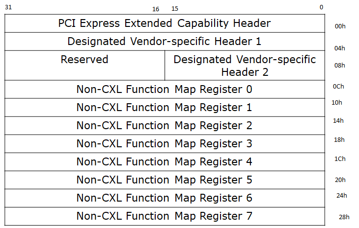
>
> *Original page render @ 150 DPI* — [📄 Full size](figures/chapter_08/page_0514.png)

> **Table 8-21.** Non-CXL Function Map DVSEC - Header ｜ 非 CXL 功能映射 DVSEC – Header
>
> | Register | Bit Location | Field | Value |
> |---|---|---|---|
> | Designated Vendor-Specific Header 1 (Offset 04h) | 15:0 | DVSEC Vendor ID | 1E98h |
> | | 19:16 | DVSEC Revision | 0h |
> | | 31:20 | DVSEC Length | 02Ch |
> | Designated Vendor-Specific Header 2 (Offset 08h) | 15:0 | DVSEC ID | 0002h |

#### 8.1.4.1 Non-CXL Function Map Register 0 (Offset 0Ch) | 非 CXL 功能映射寄存器 0 (偏移 0Ch)

> | Bit | Attributes | Description / 描述 |
> |---|---|---|
> | 31:0 | HwInit | **Non CXL Function**: Each bit represents a non-virtual function number implemented by the device on the same bus as the physical function that carries PCIe DVSEC for CXL devices. When a bit is set, the corresponding Device/Function number or Function number (ARI device) is not capable of participating in CXL.cache or CXL.mem protocol. Bits corresponding to Non-existent Device/Function or Function numbers shall always return 0. If the device does not support ARI, bit x in this register maps to Device x, Function 0. If the device supports ARI, bit x in this register maps to Function x. — 每个 bit 表示由设备在与承载 PCIe DVSEC for CXL devices 的物理功能所在的同一总线上实现的非虚拟功能号。 当某位置 1 时，对应的设备/功能号或功能号 (ARI 设备) 不能参与 CXL.cache 或 CXL.mem 协议。对应于不存在的设备/功能或功能号的位必须始终返回 0。 如果设备不支持 ARI，此寄存器中的 bit x 映射到设备 x、功能 0。 如果设备支持 ARI，此寄存器中的 bit x 映射到功能 x。 |

#### 8.1.4.2 Non-CXL Function Map Register 1 (Offset 10h) | 非 CXL 功能映射寄存器 1 (偏移 10h)

> | Bit | Attributes | Description / 描述 |
> |---|---|---|
> | 31:0 | HwInit | **Non CXL Function**: Each bit represents a non-virtual function number implemented by the device on the same bus as the physical function that carries PCIe DVSEC for CXL devices. When a bit is set, the corresponding Device/Function number or Function number (ARI device) is not capable of participating in CXL.cache or CXL.mem protocol. Bits corresponding to Non-existent Device/Function or Function numbers shall always return 0. If the device does not support ARI, bit x in this register maps to Device x, Function 1. If the device supports ARI, bit x in this register maps to Function x+32. — 如果设备不支持 ARI，此寄存器中的 bit x 映射到设备 x、功能 1。 如果设备支持 ARI，此寄存器中的 bit x 映射到功能 x+32。 |

#### 8.1.4.3 Non-CXL Function Map Register 2 (Offset 14h) | 非 CXL 功能映射寄存器 2 (偏移 14h)

> | Bit | Attributes | Description / 描述 |
> |---|---|---|
> | 31:0 | HwInit | **Non CXL Function**: If the device does not support ARI, bit x in this register maps to Device x, Function 2. If the device supports ARI, bit x in this register maps to Function (x+64). — 如果设备不支持 ARI，此寄存器中的 bit x 映射到设备 x、功能 2。 如果设备支持 ARI，此寄存器中的 bit x 映射到功能 (x+64)。 |

#### 8.1.4.4 Non-CXL Function Map Register 3 (Offset 18h) | 非 CXL 功能映射寄存器 3 (偏移 18h)

> | Bit | Attributes | Description / 描述 |
> |---|---|---|
> | 31:0 | HwInit | **Non CXL Function**: If the device does not support ARI, bit x in this register maps to Device x, Function 3. If the device supports ARI, bit x in this register maps to Function (x+96). — 如果设备不支持 ARI，此寄存器中的 bit x 映射到设备 x、功能 3。 如果设备支持 ARI，此寄存器中的 bit x 映射到功能 (x+96)。 |

#### 8.1.4.5 Non-CXL Function Map Register 4 (Offset 1Ch) | 非 CXL 功能映射寄存器 4 (偏移 1Ch)

> | Bit | Attributes | Description / 描述 |
> |---|---|---|
> | 31:0 | HwInit | **Non CXL Function**: If the device does not support ARI, bit x in this register maps to Device x, Function 4. If the device supports ARI, bit x in this register maps to Function (x+128). — 如果设备不支持 ARI，此寄存器中的 bit x 映射到设备 x、功能 4。 如果设备支持 ARI，此寄存器中的 bit x 映射到功能 (x+128)。 |

#### 8.1.4.6 Non-CXL Function Map Register 5 (Offset 20h) | 非 CXL 功能映射寄存器 5 (偏移 20h)

> | Bit | Attributes | Description / 描述 |
> |---|---|---|
> | 31:0 | HwInit | **Non CXL Function**: If the device does not support ARI, bit x in this register maps to Device x, Function 5. If the device supports ARI, bit x in this register maps to Function (x+160). — 如果设备不支持 ARI，此寄存器中的 bit x 映射到设备 x、功能 5。 如果设备支持 ARI，此寄存器中的 bit x 映射到功能 (x+160)。 |

#### 8.1.4.7 Non-CXL Function Map Register 6 (Offset 24h) | 非 CXL 功能映射寄存器 6 (偏移 24h)

> | Bit | Attributes | Description / 描述 |
> |---|---|---|
> | 31:0 | HwInit | **Non CXL Function**: If the device does not support ARI, bit x in this register maps to Device x, Function 6. If the device supports ARI, bit x in this register maps to Function (x+192). — 如果设备不支持 ARI，此寄存器中的 bit x 映射到设备 x、功能 6。 如果设备支持 ARI，此寄存器中的 bit x 映射到功能 (x+192)。 |

#### 8.1.4.8 Non-CXL Function Map Register 7 (Offset 28h) | 非 CXL 功能映射寄存器 7 (偏移 28h)

> | Bit | Attributes | Description / 描述 |
> |---|---|---|
> | 31:0 | HwInit | **Non CXL Function**: If the device does not support ARI, bit x in this register maps to Device x, Function 7. If the device supports ARI, bit x in this register maps to Function (x+224). — 如果设备不支持 ARI，此寄存器中的 bit x 映射到设备 x、功能 7。 如果设备支持 ARI，此寄存器中的 bit x 映射到功能 (x+224)。 |

[⬆️ 返回目录](#-本章目录-part-a)

---

## 8.1.5 CXL Extensions DVSEC for Ports | 端口的 CXL 扩展 DVSEC

<table>
<thead>
<tr>
<th width="50%">🇬🇧 English</th>
<th width="50%" style="background-color:#e8e8e8">🇨🇳 中文</th>
</tr>
</thead>
<tbody>
<tr><td>The PCIe Configuration Space of a CXL root port, CXL Downstream Switch Port, and CXL Upstream Switch Port must implement this DVSEC capability as shown in Figure 8-3. See Table 8-2 for the complete listing. To advertise this capability, the standard DVSEC register fields must be set to the values shown in Table 8-6. The DVSEC Length field must be set to 028h bytes to accommodate the registers included in the DVSEC. The DVSEC ID must be set to 0003h to advertise that this is a CXL Extension DVSEC capability structure for CXL ports.</td><td style="background-color:#e8e8e8">CXL 根端口、CXL 下行交换端口和 CXL 上行交换端口的 PCIe 配置空间必须实现此 DVSEC 能力，如图 8-3 所示。完整列表请参见表 8-2。为了公布此能力，标准 DVSEC 寄存器字段必须设置为表 8-6 中所示的值。DVSEC Length 字段必须设置为 028h 字节以容纳 DVSEC 中包含的寄存器。DVSEC ID 必须设置为 0003h，以表明这是 CXL 端口的 CXL Extension DVSEC 能力结构。</td></tr>
</tbody>
</table>

> **Figure 8-3.** CXL Extensions DVSEC for Ports ｜ 端口的 CXL 扩展 DVSEC
>
> 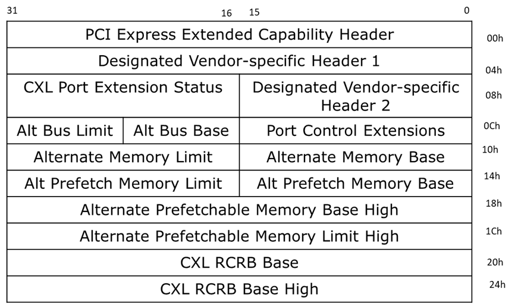
>
> *Original page render @ 150 DPI* — [📄 Full size](figures/chapter_08/page_0517.png)

> **Table 8-22.** CXL Extensions DVSEC for Ports - Header ｜ 端口的 CXL 扩展 DVSEC – Header
>
> | Register | Bit Location | Field | Value |
> |---|---|---|---|
> | Designated Vendor-Specific Header 1 (Offset 04h) | 15:0 | DVSEC Vendor ID | 1E98h |
> | | 19:16 | DVSEC Revision | 0h |
> | | 31:20 | DVSEC Length | 028h |
> | Designated Vendor-Specific Header 2 (Offset 08h) | 15:0 | DVSEC ID | 0003h |

#### 8.1.5.1 CXL Port Extension Status (Offset 0Ah) | CXL 端口扩展状态 (偏移 0Ah)

> **Table 8-23.** CXL Port Extension Status (Offset 0Ah) ｜ CXL 端口扩展状态 (偏移 0Ah)
>
> | Bit | Attributes | Description / 描述 |
> |---|---|---|
> | 0 | RO | **Port Power Management Initialization Complete**: When set, it indicates that the root port, the Upstream Switch Port or the Downstream Switch Port has successfully completed the Power Management Initialization Flow as described in Figure 3-4 and is ready to process various Power Management events. If this bit is not set within 100 ms of link-up, software may conclude that the Power Management initialization has failed and may issue Secondary Bus Reset to force link re-initialization and Power Management re-initialization. See Implementation Note. — 端口电源管理初始化完成：置 1 时，表示根端口、上行交换端口或下行交换端口已成功完成图 3-4 中描述的电源管理初始化流程，并准备好处理各种电源管理事件。 如果在 link-up 后的 100 ms 内该位仍未置位，软件可判定电源管理初始化失败，并可发出 Secondary Bus Reset 以强制链路重新初始化和电源管理重新初始化。参见实现说明。 |
> | 13:1 | RsvdP | Reserved — 保留 |
> | 14 | RW1CS | **Viral Status**: When set, indicates that the Upstream Switch Port or the Downstream Switch Port has entered Viral (see Section 12.4 for more details). This bit is not applicable to Root Ports, and reads shall return the value of 0. — 置 1 时，表示上行交换端口或下行交换端口已进入 Viral (详见 12.4 节)。 此位不适用于根端口，读取时应返回 0。 |
> | 15 | RsvdP | Reserved — 保留 |

> **IMPLEMENTATION NOTE** ｜ 实现说明
>
> Certain conditions such as Link Down, Secondary Bus Reset, or Downstream Port Containment reset the Downstream Component's bus number. If the Component generates the CREDIT_RTN IP2PM message with Requestor Bus=0, the Downstream Port may reject it if software has enabled ACS Source Validation. In this scenario, Power Management initialization may fail to complete and another Secondary Bus Reset alone will not facilitate recovery. Software may use the following sequence to recover from this failure:
>
> 某些情况 (如链路断开、Secondary Bus Reset 或 Downstream Port Containment) 会重置下行组件的总线号。如果组件以 Requestor Bus=0 生成 CREDIT_RTN IP2PM 消息，则在软件启用了 ACS Source Validation 时，下行端口可能会拒绝该消息。在这种情况下，电源管理初始化可能无法完成，单独再进行 Secondary Bus Reset 也不会实现恢复。软件可以使用以下序列从此故障中恢复：
>
> 1. Save the ACS Source Validation bit and the Bus Master Enable bit in the Downstream Port. — 在下行端口中保存 ACS Source Validation 位和 Bus Master Enable 位。
> 2. Clear Downstream Port's Bus Master Enable bit to 0. — 将下行端口的 Bus Master Enable 位清零。
> 3. Clear Downstream Port's ACS Source Validation bit to 0. — 将下行端口的 ACS Source Validation 位清零。
> 4. Generate Secondary Bus Reset. — 生成 Secondary Bus Reset。
> 5. Wait until the Port Power Management Initialization Complete bit is set in the Downstream Port. — 等待下行端口中 Port Power Management Initialization Complete 位置位。
> 6. Restore the ACS Source Validation bit and the Bus Master Enable setting in the Downstream Port. — 恢复下行端口中的 ACS Source Validation 位和 Bus Master Enable 设置。
> 7. Continue with device re-initialization. — 继续设备重新初始化。

#### 8.1.5.2 Port Control Extensions (Offset 0Ch) | 端口控制扩展 (偏移 0Ch)

> **Table 8-24.** Port Control Extensions (Offset 0Ch) ｜ 端口控制扩展 (偏移 0Ch)
>
> | Bit | Attributes | Description / 描述 |
> |---|---|---|
> | 0 | RW | **Unmask SBR**: When 0, SBR bit in Bridge Control register of this Port has no effect. When 1, the Port shall generate hot reset when SBR bit in Bridge Control gets set to 1. Default value of this bit is 0. When the Port is operating in PCIe mode or RCD mode, this field has no effect on SBR functionality and Port shall follow PCIe Base Specification. — 为 0 时，此端口 Bridge Control 寄存器中的 SBR 位无效。 为 1 时，端口应在 Bridge Control 中的 SBR 位置 1 时生成热复位。 默认值为 0。 当端口在 PCIe 模式或 RCD 模式下运行时，此字段对 SBR 功能无影响，端口应遵循 PCIe 基础规范。 |
> | 1 | RW | **Unmask Link Disable**: When 0, Link Disable bit in Link Control register of this Port has no effect. When 1, the Port shall disable the CXL Link when Link Disable bit in Link Control gets set to 1 and Link is re-enabled when Link Disable bit in Link control is cleared to 0. Default value of this bit is 0. When the Port is operating in PCIe mode or RCD mode, this field has no effect on Link Disable functionality and the Port shall follow PCIe Base Specification. — 为 0 时，此端口 Link Control 寄存器中的 Link Disable 位无效。 为 1 时，端口应在 Link Control 中的 Link Disable 位置 1 时禁用 CXL 链路，并在 Link Control 中的 Link Disable 位清零时重新启用链路。 默认值为 0。 当端口在 PCIe 模式或 RCD 模式下运行时，此字段对 Link Disable 功能无影响，端口应遵循 PCIe 基础规范。 |
> | 2 | RW | **Alt Memory and ID Space Enable**: When set to 1, the Port positively decodes downstream transactions to ranges specified in Alternate Memory Base/Limit registers, Alternate Prefetchable Memory Base/Limit, Alternate Prefetchable Base/Limit Upper 32 Bits and Alternate Bus Base/Limit registers regardless of the Memory Space Enable bit in the PCIe Command register. When cleared to 0, the Port does not decode downstream transactions to ranges specified in Alternate Memory Base/Limit registers, Alternate Prefetchable Memory Base/Limit, Alternate Prefetchable Base/Limit Upper 32 Bits and Alternate Bus Base/Limit registers. Default value of this bit is 0. Firmware/Software must ensure this bit is 0 when the Port is operating in PCIe mode. — 置 1 时，端口对 Alternate Memory Base/Limit 寄存器、Alternate Prefetchable Memory Base/Limit、Alternate Prefetchable Base/Limit Upper 32 Bits 和 Alternate Bus Base/Limit 寄存器中指定范围的下行事务进行正解码，与 PCIe Command 寄存器中的 Memory Space Enable 位无关。 清零为 0 时，端口不解码 Alternate Memory Base/Limit 寄存器、Alternate Prefetchable Memory Base/Limit、Alternate Prefetchable Base/Limit Upper 32 Bits 和 Alternate Bus Base/Limit 寄存器中指定范围的下行事务。 默认值为 0。 固件/软件必须确保端口在 PCIe 模式下运行时此位为 0。 |
> | 3 | RW | **Alt BME**: This bit overrides the state of BME bit in Command register if the requester's bus number is within the range specified by Alternate Bus Base and Alternate Bus Limit range. This bit alone controls forwarding of Memory or I/O Requests by a Port in the Upstream direction if the requester's bus number is within the range specified by Alternate Bus Base and Alternate Bus Limit range. If the requester's bus number is within the range specified by Alternate Bus Base and Alternate Bus Limit range and this bit is 0, Memory and I/O Requests received at a Root Port or the Downstream side of a Switch Port must be handled as Unsupported Requests (UR), and for Non-Posted Requests a Completion with UR Completion Status must be returned. This bit does not affect forwarding of Completions in either the Upstream or Downstream direction. Default value of this bit is 0. Firmware/Software must ensure this bit is 0 when the Port is operating in PCIe mode. — 如果请求者的总线号在 Alternate Bus Base 和 Alternate Bus Limit 范围内，则此位覆盖 Command 寄存器中的 BME 位状态。 如果请求者的总线号在 Alternate Bus Base 和 Alternate Bus Limit 范围内，则此位单独控制端口在上行方向上转发内存或 I/O 请求。 如果请求者的总线号在 Alternate Bus Base 和 Alternate Bus Limit 范围内且此位为 0，则在根端口或交换端口下行侧接收的内存和 I/O 请求必须作为不支持请求 (UR) 处理，对于 Non-Posted 请求必须返回具有 UR 完成状态的完成。此位不影响上行或下行方向的完成转发。 默认值为 0。 固件/软件必须确保端口在 PCIe 模式下运行时此位为 0。 |
> | 4 | RW/RsvdP | **UIO To HDM Enable** • DSP that is capable of UIO Direct P2P accesses to HDM: This bit is RW. If 0, return Completer Abort to UIO accesses with Complete of Partial Match. See Table 9-18 for details. The default value of this bit is 0. • All others: This bit is RsvdP. It is permitted to be hardwired to 0 and software must not set this bit. — UIO 至 HDM 使能 • 支持 UIO Direct P2P 访问 HDM 的 DSP：此位为 RW。如果为 0，则对 Complete of Partial Match 的 UIO 访问返回 Completer Abort。详见表 9-18。此位默认值为 0。 • 所有其他：此位为 RsvdP。可硬连线为 0，软件不得设置此位。 |
> | 13:5 | RsvdP | Reserved — 保留 |
> | 14 | RW | **Viral Enable**: When set, enables Viral generation functionality of the Upstream Switch Port or the Downstream Switch Port. See Section 12.4 for more details. If 0, the port shall not generate viral. Default value of this bit is 0. Regardless of the state of this bit, a switch shall always forward viral as described in Section 12.4. This bit is not applicable to root ports, and reads shall return the value of 0. Viral behavior of a Root Port may be controlled by a host specific configuration mechanism. — 置 1 时，使能上行交换端口或下行交换端口的 Viral 生成功能。详见 12.4 节。 若为 0，则端口不应生成 viral。 默认值为 0。 无论此位状态如何，交换器应始终按 12.4 节所述转发 viral。 此位不适用于根端口，读取时应返回 0。根端口的 Viral 行为可由主机特定配置机制控制。 |
> | 15 | RsvdP | Reserved — 保留 |

[⬆️ 返回目录](#-本章目录-part-a)

---

#### 8.1.5.3 Alternate Bus Base (Offset 0Eh) | 备用总线基址 (偏移 0Eh)

<table>
<thead>
<tr>
<th width="50%">🇬🇧 English</th>
<th width="50%" style="background-color:#e8e8e8">🇨🇳 中文</th>
</tr>
</thead>
<tbody>
<tr><td>Alternate Bus Base Number and Alternate Bus Limit Number registers define a bus range that is decoded by the Port in addition to the standard Secondary Bus Number to Subordinate Bus Number range. An ID-routed TLP transaction received from the primary interface is forwarded to the secondary interface if the bus number is not less than the Alternate Bus Base and not greater than the Alternate Bus Limit. See Figure 9-11.</td><td style="background-color:#e8e8e8">Alternate Bus Base Number 和 Alternate Bus Limit Number 寄存器定义了除标准 Secondary Bus Number 到 Subordinate Bus Number 范围之外，端口还应解码的总线范围。如果从主接口接收的 ID 路由 TLP 事务的总线号不小于 Alternate Bus Base 且不大于 Alternate Bus Limit，则将其转发到副接口。参见图 9-11。</td></tr>
</tbody>
</table>

> | Bit | Attributes | Description / 描述 |
> |---|---|---|
> | 7:0 | RW | **Alt Bus Base**: The lowest bus number that is positively decoded by this Port as part of alternate decode path. Default value of this field is 0. — 此端口作为备用解码路径正解码的最低总线号。 此字段默认值为 0。 |

#### 8.1.5.4 Alternate Bus Limit (Offset 0Fh) | 备用总线限值 (偏移 0Fh)

See Section 8.1.5.3, "Alternate Bus Base (Offset 0Eh)." ｜ 参见 8.1.5.3 节 "Alternate Bus Base (Offset 0Eh)"。

> | Bit | Attributes | Description / 描述 |
> |---|---|---|
> | 7:0 | RW | **Alt Bus Limit**: The highest bus number that is positively decoded by this Port as part of alternate decode path. Default value of this field is 0. Alternate bus decoder is disabled if Alt Memory and ID Space Enable=0. — 此端口作为备用解码路径正解码的最高总线号。 此字段默认值为 0。 如果 Alt Memory and ID Space Enable=0，则禁用备用总线解码器。 |

#### 8.1.5.5 Alternate Memory Base (Offset 10h) | 备用内存基址 (偏移 10h)

<table>
<thead>
<tr>
<th width="50%">🇬🇧 English</th>
<th width="50%" style="background-color:#e8e8e8">🇨🇳 中文</th>
</tr>
</thead>
<tbody>
<tr><td>Alternate Memory Base and Alternate Memory Limit registers define a memory mapped address range that is in addition to the standard Memory Base and Memory Limit registers. Alternate Memory Base and Alternate Memory Limit registers are functionally equivalent to PCIe-defined Memory Base and Memory Limit registers. These are used by the Port to determine when to forward memory transactions from one interface to the other. See Figure 9-10.</td><td style="background-color:#e8e8e8">Alternate Memory Base 和 Alternate Memory Limit 寄存器定义了除标准 Memory Base 和 Memory Limit 寄存器之外的内存映射地址范围。Alternate Memory Base 和 Alternate Memory Limit 寄存器在功能上等同于 PCIe 定义的 Memory Base 和 Memory Limit 寄存器。端口使用这些寄存器确定何时将内存事务从一个接口转发到另一个接口。参见图 9-10。</td></tr>
</tbody>
</table>

> | Bit | Attributes | Description / 描述 |
> |---|---|---|
> | 3:0 | RsvdP | Reserved — 保留 |
> | 15:4 | RW | **Alt Mem Base**: Corresponds to A[31:20] of the CXL.io Alternate memory base address. See definition of Memory Base register in PCIe Base Specification. Default value of this field is 000h. — 对应 CXL.io 备用内存基址的 A[31:20]。参见 PCIe 基础规范中 Memory Base 寄存器的定义。 此字段默认值为 000h。 |

#### 8.1.5.6 Alternate Memory Limit (Offset 12h) | 备用内存限值 (偏移 12h)

See Section 8.1.5.5, "Alternate Memory Base (Offset 10h)." ｜ 参见 8.1.5.5 节 "Alternate Memory Base (Offset 10h)"。

> | Bit | Attributes | Description / 描述 |
> |---|---|---|
> | 3:0 | RsvdP | Reserved — 保留 |
> | 15:4 | RW | **Alt Mem Limit**: Corresponds to A[31:20] of the CXL.io Alternate memory limit address. See definition of Memory Limit register in PCIe Base Specification. Default value of this field is 000h. — 对应 CXL.io 备用内存限值的 A[31:20]。参见 PCIe 基础规范中 Memory Limit 寄存器的定义。 此字段默认值为 000h。 |

[⬆️ 返回目录](#-本章目录-part-a)

---

#### 8.1.5.7 Alternate Prefetchable Memory Base (Offset 14h) | 备用可预取内存基址 (偏移 14h)

<table>
<thead>
<tr>
<th width="50%">🇬🇧 English</th>
<th width="50%" style="background-color:#e8e8e8">🇨🇳 中文</th>
</tr>
</thead>
<tbody>
<tr><td>Alternate Prefetchable Memory Base, Alternate Prefetchable Memory Base High, Alternate Prefetchable Memory Limit, and Alternate Prefetchable Memory Limit High registers define a 64-bit memory mapped address range that is in addition to the one defined by the PCIe standard Prefetchable Memory Base, Prefetchable Base Upper 32 bits, Prefetchable Memory Limit, and Prefetchable Limit Upper 32 bits registers. Alternate Prefetchable Memory registers are functionally equivalent to PCIe-defined Prefetchable Memory registers. These are used by the Port to determine when to forward Prefetchable memory transactions from one interface to the other.</td><td style="background-color:#e8e8e8">Alternate Prefetchable Memory Base、Alternate Prefetchable Memory Base High、Alternate Prefetchable Memory Limit 和 Alternate Prefetchable Memory Limit High 寄存器定义了除 PCIe 标准 Prefetchable Memory Base、Prefetchable Base Upper 32 bits、Prefetchable Memory Limit 和 Prefetchable Limit Upper 32 bits 寄存器定义的 64 位内存映射地址范围之外的范围。Alternate Prefetchable Memory 寄存器在功能上等同于 PCIe 定义的 Prefetchable Memory 寄存器。端口使用这些寄存器确定何时将可预取内存事务从一个接口转发到另一个接口。</td></tr>
</tbody>
</table>

> | Bit | Attributes | Description / 描述 |
> |---|---|---|
> | 3:0 | RsvdP | Reserved — 保留 |
> | 15:4 | RW | **Alt Prefetch Mem Base**: Corresponds to A[31:20] of the CXL.io Alternate Prefetchable memory base address. See definition of Prefetchable Memory Base register in PCIe Base Specification. Default value of this field is 000h. — 对应 CXL.io 备用可预取内存基址的 A[31:20]。参见 PCIe 基础规范中 Prefetchable Memory Base 寄存器的定义。 此字段默认值为 000h。 |

#### 8.1.5.8 Alternate Prefetchable Memory Limit (Offset 16h) | 备用可预取内存限值 (偏移 16h)

See Section 8.1.5.7, "Alternate Prefetchable Memory Base (Offset 14h)." ｜ 参见 8.1.5.7 节 "Alternate Prefetchable Memory Base (Offset 14h)"。

> | Bit | Attributes | Description / 描述 |
> |---|---|---|
> | 3:0 | RsvdP | Reserved — 保留 |
> | 15:4 | RW | **Alt Prefetch Mem Limit**: Corresponds to A[31:20] of the CXL.io Alternate Prefetchable memory limit address. See definition of Prefetchable memory limit register in PCIe Base Specification. Default value of this field is 000h. — 对应 CXL.io 备用可预取内存限值的 A[31:20]。参见 PCIe 基础规范中 Prefetchable memory limit 寄存器的定义。 此字段默认值为 000h。 |

#### 8.1.5.9 Alternate Memory Prefetchable Base High (Offset 18h) | 备用内存可预取基址高 (偏移 18h)

See Section 8.1.5.7, "Alternate Prefetchable Memory Base (Offset 14h)." ｜ 参见 8.1.5.7 节 "Alternate Prefetchable Memory Base (Offset 14h)"。

> | Bit | Attributes | Description / 描述 |
> |---|---|---|
> | 31:0 | RW | **Alt Prefetch Base High**: Corresponds to A[63:32] of the CXL.io Alternate Prefetchable memory base address. See definition of Prefetchable Base Upper 32 Bits register in PCIe Base Specification. Default value of this register is 0000 0000h. — 对应 CXL.io 备用可预取内存基址的 A[63:32]。参见 PCIe 基础规范中 Prefetchable Base Upper 32 Bits 寄存器的定义。 此寄存器默认值为 0000 0000h。 |

#### 8.1.5.10 Alternate Prefetchable Memory Limit High (Offset 1Ch) | 备用可预取内存限值高 (偏移 1Ch)

See Section 8.1.5.7, "Alternate Prefetchable Memory Base (Offset 14h)." ｜ 参见 8.1.5.7 节 "Alternate Prefetchable Memory Base (Offset 14h)"。

> | Bit | Attributes | Description / 描述 |
> |---|---|---|
> | 31:0 | RW | **Alt Prefetch Limit High**: Corresponds to A[63:32] of the CXL.io Alternate Prefetchable memory limit address. See definition of Prefetchable Limit Upper 32 Bits register in PCIe Base Specification. Default value of this register is 0000 0000h. — 对应 CXL.io 备用可预取内存限值的 A[63:32]。参见 PCIe 基础规范中 Prefetchable Limit Upper 32 Bits 寄存器的定义。 此寄存器默认值为 0000 0000h。 |

#### 8.1.5.11 CXL RCRB Base (Offset 20h) | CXL RCRB 基址 (偏移 20h)

<table>
<thead>
<tr>
<th width="50%">🇬🇧 English</th>
<th width="50%" style="background-color:#e8e8e8">🇨🇳 中文</th>
</tr>
</thead>
<tbody>
<tr><td>This register is only relevant to CXL root ports and Downstream Switch Ports. Software programs this register to transition a Port to operate using RCD addressing. Software may take this step upon determining that the Port is connected to an eRCD.</td><td style="background-color:#e8e8e8">此寄存器仅与 CXL 根端口和下行交换端口相关。软件通过编程此寄存器将端口转换为使用 RCD 寻址操作。软件可以在确定端口连接到 eRCD 后执行此步骤。</td></tr>
<tr><td>System Firmware must ensure CXL RCRB Enable is 0, whenever the Port is operating in PCIe mode.</td><td style="background-color:#e8e8e8">当端口在 PCIe 模式下运行时，系统固件必须确保 CXL RCRB Enable 为 0。</td></tr>
</tbody>
</table>

> | Bit | Attributes | Description / 描述 |
> |---|---|---|
> | 0 | RW | **CXL RCRB Enable**: When set, the RCRB region is enabled and the registers belonging to this Port can be accessed via RCH Downstream Port RCRB. After this write is complete, the Port registers shall no longer appear in Configuration Space, but rather in MMIO space starting at RCRB Base. Once a Port is transitioned to use RCD addressing, the software is responsible for ensuring it remains in that mode until the next Conventional Reset and RCRB Base Address is not modified; otherwise, the hardware behavior is undefined. Default value of this bit is 0. — 置 1 时，RCRB 区域使能，端口所属寄存器可通过 RCH Downstream Port RCRB 访问。此次写入完成后，端口寄存器应不再出现在配置空间中，而是出现在从 RCRB Base 开始的 MMIO 空间中。一旦端口转换为使用 RCD 寻址，软件应负责确保端口保持此模式直到下一次 Conventional Reset，并且不修改 RCRB Base Address；否则硬件行为未定义。 默认值为 0。 |
> | 12:1 | RsvdP | Reserved — 保留 |
> | 31:13 | RW | **CXL RCRB Base Address Low**: This points to the address bits[31:13] of an 8-KB memory region where the lower 4-KB hosts the RCH Downstream Port RCRB and the upper 4-KB hosts the RCD Upstream Port RCRB. Default value of this field is 0 0000h. — 指向 8-KB 内存区域的地址位 [31:13]，其中低 4-KB 承载 RCH 下行端口 RCRB，高 4-KB 承载 RCD 上行端口 RCRB。 此字段默认值为 0 0000h。 |

#### 8.1.5.12 CXL RCRB Base High (Offset 24h) | CXL RCRB 基址高 (偏移 24h)

> | Bit | Attributes | Description / 描述 |
> |---|---|---|
> | 31:0 | RW | **CXL RCRB Base Address High**: This points to the address bits [63:32] of an 8-KB memory region where the lower 4-KB hosts the RCH Downstream Port RCRB and the upper 4-KB hosts the RCD Upstream Port RCRB. Default value of this register is 0000 0000h. — 指向 8-KB 内存区域的地址位 [63:32]，其中低 4-KB 承载 RCH 下行端口 RCRB，高 4-KB 承载 RCD 上行端口 RCRB。 此寄存器默认值为 0000 0000h。 |

[⬆️ 返回目录](#-本章目录-part-a)

---

## 8.1.6 GPF DVSEC for CXL Port | CXL 端口的 GPF DVSEC

<table>
<thead>
<tr>
<th width="50%">🇬🇧 English</th>
<th width="50%" style="background-color:#e8e8e8">🇨🇳 中文</th>
</tr>
</thead>
<tbody>
<tr><td>The PCIe Configuration Space of CXL Downstream Switch Ports and CXL root ports must implement this DVSEC capability as shown in Figure 8-4. See Table 8-2 for the complete listing.</td><td style="background-color:#e8e8e8">CXL 下行交换端口和 CXL 根端口的 PCIe 配置空间必须实现此 DVSEC 能力，如图 8-4 所示。完整列表请参见表 8-2。</td></tr>
<tr><td>To advertise this capability, the standard DVSEC register fields must be set to the values shown in Table 8-7. The DVSEC Length field must be set to 010h bytes to accommodate the registers included in the DVSEC. The DVSEC ID must be set to 0004h to advertise that this is an GPF DVSEC capability structure for CXL ports.</td><td style="background-color:#e8e8e8">为了公布此能力，标准 DVSEC 寄存器字段必须设置为表 8-7 中所示的值。DVSEC Length 字段必须设置为 010h 字节以容纳 DVSEC 中包含的寄存器。DVSEC ID 必须设置为 0004h，以表明这是 CXL 端口的 GPF DVSEC 能力结构。</td></tr>
</tbody>
</table>

> **Figure 8-4.** GPF DVSEC for CXL Port ｜ CXL 端口的 GPF DVSEC
>
> 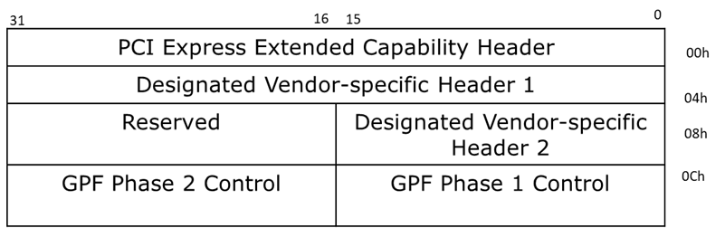
>
> *Original page render @ 150 DPI* — [📄 Full size](figures/chapter_08/page_0522.png)

> **Table 8-25.** GPF DVSEC for CXL Port - Header ｜ CXL 端口的 GPF DVSEC – Header
>
> | Register | Bit Location | Field | Value |
> |---|---|---|---|
> | Designated Vendor-Specific Header 1 (Offset 04h) | 15:0 | DVSEC Vendor ID | 1E98h |
> | | 19:16 | DVSEC Revision | 0h |
> | | 31:20 | DVSEC Length | 010h |
> | Designated Vendor-Specific Header 2 (Offset 08h) | 15:0 | DVSEC ID | 0004h |

#### 8.1.6.1 GPF Phase 1 Control (Offset 0Ch) | GPF 阶段 1 控制 (偏移 0Ch)

> **Table 8-26.** GPF Phase 1 Control (Offset 0Ch) ｜ GPF 阶段 1 控制 (偏移 0Ch)
>
> | Bit | Attributes | Description / 描述 |
> |---|---|---|
> | 3:0 | RW | **Port GPF Phase 1 Timeout Base**: This field determines the GPF Phase 1 timeout. The timeout duration is calculated by multiplying the Timeout Base with the Timeout Scale. — 此字段确定 GPF 阶段 1 的超时值。超时时长由 Timeout Base 乘以 Timeout Scale 计算得出。 |
> | 7:4 | RsvdP | Reserved — 保留 |
> | 11:8 | RW | **Port GPF Phase 1 Timeout Scale**: This field specifies the time scale associated with GPF Phase 1 Timeout. • 0h = 1 us • 1h = 10 us • 2h = 100 us • 3h = 1 ms • 4h = 10 ms • 5h = 100 ms • 6h = 1 s • 7h = 10 s • All other encodings are reserved — 此字段指定与 GPF 阶段 1 超时关联的时间粒度。 • 0h = 1 us • 1h = 10 us • 2h = 100 us • 3h = 1 ms • 4h = 10 ms • 5h = 100 ms • 6h = 1 s • 7h = 10 s • 所有其他编码保留 |
> | 15:12 | RsvdP | Reserved — 保留 |

#### 8.1.6.2 GPF Phase 2 Control (Offset 0Eh) | GPF 阶段 2 控制 (偏移 0Eh)

> **Table 8-27.** GPF Phase 2 Control (Offset 0Eh) ｜ GPF 阶段 2 控制 (偏移 0Eh)
>
> | Bit | Attributes | Description / 描述 |
> |---|---|---|
> | 3:0 | RW | **Port GPF Phase 2 Timeout Base**: This field determines the GPF Phase 2 timeout. The timeout duration is calculated by multiplying the Timeout Base with the Timeout Scale. — 此字段确定 GPF 阶段 2 的超时值。超时时长由 Timeout Base 乘以 Timeout Scale 计算得出。 |
> | 7:4 | RsvdP | Reserved — 保留 |
> | 11:8 | RW | **Port GPF Phase 2 Timeout Scale**: This field specifies the time scale associated with GPF Phase 2 Timeout. • 0h = 1 us • 1h = 10 us • 2h = 100 us • 3h = 1 ms • 4h = 10 ms • 5h = 100 ms • 6h = 1 s • 7h = 10 s • All other encodings are reserved — 此字段指定与 GPF 阶段 2 超时关联的时间粒度。 • 0h = 1 us • 1h = 10 us • 2h = 100 us • 3h = 1 ms • 4h = 10 ms • 5h = 100 ms • 6h = 1 s • 7h = 10 s • 所有其他编码保留 |
> | 15:12 | RsvdP | Reserved — 保留 |

[⬆️ 返回目录](#-本章目录-part-a)

---

## 8.1.7 GPF DVSEC for CXL Device | CXL 设备的 GPF DVSEC

<table>
<thead>
<tr>
<th width="50%">🇬🇧 English</th>
<th width="50%" style="background-color:#e8e8e8">🇨🇳 中文</th>
</tr>
</thead>
<tbody>
<tr><td>Function 0 of CXL.mem-capable devices must implement this DVSEC capability (see Figure 8-5) if the device supports GPF (see Table 8-2 for the complete listing). A device that does not support CXL.mem must not implement DVSEC Revision 0 capability. To advertise this capability, the standard DVSEC register fields must be set to the values shown in Table 8-8. The DVSEC Length field must be set to 010h bytes to accommodate the registers included in the DVSEC. The DVSEC ID must be set to 0005h to advertise that this is an GPF DVSEC structure for CXL devices.</td><td style="background-color:#e8e8e8">如果设备支持 GPF，则支持 CXL.mem 的设备的功能 0 必须实现此 DVSEC 能力 (见图 8-5) (完整列表请参见表 8-2)。不支持 CXL.mem 的设备不得实现 DVSEC Revision 0 能力。为了公布此能力，标准 DVSEC 寄存器字段必须设置为表 8-8 中所示的值。DVSEC Length 字段必须设置为 010h 字节以容纳 DVSEC 中包含的寄存器。DVSEC ID 必须设置为 0005h，以表明这是 CXL 设备的 GPF DVSEC 结构。</td></tr>
</tbody>
</table>

> **Figure 8-5.** GPF DVSEC for CXL Device ｜ CXL 设备的 GPF DVSEC
>
> 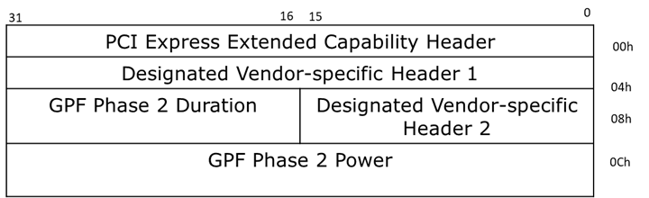
>
> *Original page render @ 150 DPI* — [📄 Full size](figures/chapter_08/page_0524.png)

> **Table 8-28.** GPF DVSEC for CXL Device - Header ｜ CXL 设备的 GPF DVSEC – Header
>
> | Register | Bit Location | Field | Value |
> |---|---|---|---|
> | Designated Vendor-Specific Header 1 (Offset 04h) | 15:0 | DVSEC Vendor ID | 1E98h |
> | | 19:16 | DVSEC Revision | 0h |
> | | 31:20 | DVSEC Length | 010h |
> | Designated Vendor-Specific Header 2 (Offset 08h) | 15:0 | DVSEC ID | 0005h |

#### 8.1.7.1 GPF Phase 2 Duration (Offset 0Ah) | GPF 阶段 2 持续时间 (偏移 0Ah)

> **Table 8-29.** GPF Phase 2 Duration (Offset 0Ah) ｜ GPF 阶段 2 持续时间 (偏移 0Ah)
>
> | Bit | Attributes | Description / 描述 |
> |---|---|---|
> | 3:0 | RO | **Device GPF Phase 2 Time Base**: This field reports the maximum amount of time this device would take to complete GPF Phase 2. The time duration is calculated by multiplying the Time Base with the Time Scale. — 此字段报告此设备完成 GPF 阶段 2 所需的最长时间。时长由 Time Base 乘以 Time Scale 计算得出。 |
> | 7:4 | RsvdP | Reserved — 保留 |
> | 11:8 | RO | **Device GPF Phase 2 Time Scale**: This field specifies the time scale associated with Device GPF Phase 2 Time. • 0h = 1 us • 1h = 10 us • 2h = 100 us • 3h = 1 ms • 4h = 10 ms • 5h = 100 ms • 6h = 1 s • 7h = 10 s • All other encodings are reserved — 此字段指定与设备 GPF 阶段 2 时间关联的时间粒度。 • 0h = 1 us • 1h = 10 us • 2h = 100 us • 3h = 1 ms • 4h = 10 ms • 5h = 100 ms • 6h = 1 s • 7h = 10 s • 所有其他编码保留 |
> | 15:12 | RsvdP | Reserved — 保留 |

#### 8.1.7.2 GPF Phase 2 Power (Offset 0Ch) | GPF 阶段 2 功率 (偏移 0Ch)

> **Table 8-30.** GPF Phase 2 Power (Offset 0Ch) ｜ GPF 阶段 2 功率 (偏移 0Ch)
>
> | Bit | Attributes | Description / 描述 |
> |---|---|---|
> | 31:0 | RO | **GPF Phase 2 Active Power**: Active power consumed by the device during GPF Phase 2. Expressed in multiples of mW. — 设备在 GPF 阶段 2 期间消耗的有效功率。以 mW 的倍数表示。 |

[⬆️ 返回目录](#-本章目录-part-a)

---

## 8.1.8 PCIe DVSEC for Flex Bus Port | Flex Bus 端口的 PCIe DVSEC

<table>
<thead>
<tr>
<th width="50%">🇬🇧 English</th>
<th width="50%" style="background-color:#e8e8e8">🇨🇳 中文</th>
</tr>
</thead>
<tbody>
<tr><td>See Section 8.2.1.3 for the register layout.</td><td style="background-color:#e8e8e8">寄存器布局参见 8.2.1.3 节。</td></tr>
<tr><td>In RCHs and RCDs that implement RCRB, this DVSEC is accessed via RCRB.</td><td style="background-color:#e8e8e8">在实现 RCRB 的 RCH 和 RCD 中，此 DVSEC 通过 RCRB 访问。</td></tr>
<tr><td>The DVSEC associated with all other CXL devices shall be accessible via Function 0 of the device. Upstream Switch Ports, Downstream Switch Ports, and CXL root ports shall implement this DVSEC in the Configuration Space associated with the Port. See Table 8-2 for the complete listing.</td><td style="background-color:#e8e8e8">与所有其他 CXL 设备关联的此 DVSEC 应通过设备的功能 0 访问。上行交换端口、下行交换端口和 CXL 根端口应在与端口关联的配置空间中实现此 DVSEC。完整列表请参见表 8-2。</td></tr>
</tbody>
</table>

[⬆️ 返回目录](#-本章目录-part-a)

---

## 8.1.9 Register Locator DVSEC | 寄存器定位器 DVSEC

<table>
<thead>
<tr>
<th width="50%">🇬🇧 English</th>
<th width="50%" style="background-color:#e8e8e8">🇨🇳 中文</th>
</tr>
</thead>
<tbody>
<tr><td>The PCIe Configuration Space of a CXL root port, CXL Downstream Switch Port, CXL Upstream Switch Port, and non-RCDs must implement this DVSEC capability. If a CXL device implements Register Locator DVSEC, it must appear in Function 0 of the device. This requirement does not apply to CXL Switches.</td><td style="background-color:#e8e8e8">CXL 根端口、CXL 下行交换端口、CXL 上行交换端口以及非 RCD 的 PCIe 配置空间必须实现此 DVSEC 能力。如果 CXL 设备实现 Register Locator DVSEC，则它必须出现在设备的功能 0 中。此要求不适用于 CXL 交换器。</td></tr>
<tr><td>This DVSEC capability contains one or more Register Block entries. Figure 8-6 illustrates a DVSEC Capability with 3 Register Block Entries. See Table 8-2 for the complete listing.</td><td style="background-color:#e8e8e8">此 DVSEC 能力包含一个或多个寄存器块条目。图 8-6 展示了包含 3 个寄存器块条目的 DVSEC 能力。完整列表请参见表 8-2。</td></tr>
<tr><td>Each register block included in the Register Locator DVSEC has an Offset Low and an Offset High register to specify the location of the registers within the Memory Space. The Offset Low register includes an identifier which specifies the type of CXL registers. Each register block identifier shall only occur once in the Register Locator DVSEC structure, except for the Designated Vendor Specific register block identifier or the CPMU register block identifier where multiple instances are allowed. Each register block must be contained within the address range covered by the associated BAR.</td><td style="background-color:#e8e8e8">Register Locator DVSEC 中包含的每个寄存器块都有一个 Offset Low 和 Offset High 寄存器，用于指定寄存器在内存空间中的位置。Offset Low 寄存器包含一个标识符，用于指定 CXL 寄存器的类型。除 Designated Vendor Specific 寄存器块标识符或 CPMU 寄存器块标识符允许多个实例外，每个寄存器块标识符在 Register Locator DVSEC 结构中只能出现一次。每个寄存器块必须包含在关联 BAR 覆盖的地址范围内。</td></tr>
<tr><td>To advertise this capability, the standard DVSEC register fields must be set to the values shown in Table 8-9. The DVSEC Length field must be set to (0Ch+ n * 8) bytes to accommodate the registers included in the DVSEC, where n is the number of Register Blocks described by this Capability. The DVSEC ID must be set to 0008h to advertise that this is a CXL Register Locator DVSEC capability structure.</td><td style="background-color:#e8e8e8">为了公布此能力，标准 DVSEC 寄存器字段必须设置为表 8-9 中所示的值。DVSEC Length 字段必须设置为 (0Ch+ n * 8) 字节以容纳 DVSEC 中包含的寄存器，其中 n 是此能力描述的寄存器块数。DVSEC ID 必须设置为 0008h，以表明这是 CXL Register Locator DVSEC 能力结构。</td></tr>
</tbody>
</table>

> **Figure 8-6.** Register Locator DVSEC with 3 Register Block Entries ｜ 包含 3 个寄存器块条目的 Register Locator DVSEC
>
> 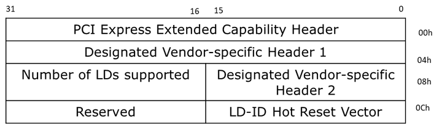
>
> *Original page render @ 150 DPI* — [📄 Full size](figures/chapter_08/page_0527.png)

> **Table 8-31.** Register Locator DVSEC - Header ｜ Register Locator DVSEC – Header
>
> | Register | Bit Location | Field | Value |
> |---|---|---|---|
> | Designated Vendor-Specific Header 1 (Offset 04h) | 15:0 | DVSEC Vendor ID | 1E98h |
> | | 19:16 | DVSEC Revision | 0h |
> | | 31:20 | DVSEC Length | varies |
> | Designated Vendor-Specific Header 2 (Offset 08h) | 15:0 | DVSEC ID | 0008h |

#### 8.1.9.1 Register Offset Low (Offset: Varies) | 寄存器偏移低 (偏移：可变)

<table>
<thead>
<tr>
<th width="50%">🇬🇧 English</th>
<th width="50%" style="background-color:#e8e8e8">🇨🇳 中文</th>
</tr>
</thead>
<tbody>
<tr><td>This register reports the BAR Indicator Register (BIR), the Register Block Identifier, and the lower address bits of the BAR offset associated with the Register Block.</td><td style="background-color:#e8e8e8">此寄存器上报 BAR Indicator Register (BIR)、Register Block Identifier 以及与寄存器块关联的 BAR 偏移的低地址位。</td></tr>
</tbody>
</table>

> | Bit | Attributes | Description / 描述 |
> |---|---|---|
> | 2:0 | HwInit | **Register BIR**: Indicates which one of a Function's BARs, located beginning at Offset 10h in Configuration Space, or entry in the Enhanced Allocation capability with a matching BAR Equivalent Indicator (BEI), is used to map the CXL registers into Memory Space. Defined encodings are: • 000b = Base Address Register 10h • 001b = Base Address Register 14h • 010b = Base Address Register 18h • 011b = Base Address Register 1Ch • 100b = Base Address Register 20h • 101b = Base Address Register 24h • All other encodings are reserved The Register block must be contained within the specified BAR. The specified BAR must be associated with the Function that implements the Register Locator DVSEC. For a 64-bit BAR, the Register BIR indicates the lower DWORD. — 指示功能从配置空间偏移 10h 开始的 BAR 中的哪一个，或 Enhanced Allocation 能力中与 BAR Equivalent Indicator (BEI) 匹配的条目，用于将 CXL 寄存器映射到内存空间。 已定义的编码： • 000b = 基址寄存器 10h • 001b = 基址寄存器 14h • 010b = 基址寄存器 18h • 011b = 基址寄存器 1Ch • 100b = 基址寄存器 20h • 101b = 基址寄存器 24h • 所有其他编码保留 寄存器块必须包含在指定的 BAR 内。指定的 BAR 必须与实现 Register Locator DVSEC 的功能关联。 对于 64 位 BAR，Register BIR 指示低 DWORD。 |
> | 7:3 | RsvdP | Reserved — 保留 |
> | 15:8 | HwInit | **Register Block Identifier**: Identifies the type of CXL registers. Defined encodings are: • 00h = Indicates the register block entry is empty and the Register BIR, Register Block Offset Low, and Register Block Offset High fields are invalid. • 01h = Component Registers. The format of the Component Register block is defined in Section 8.2.3. • 02h = BAR Virtualization ACL Registers. The format of the BAR Virtualization ACL Register Block is defined in Section 8.2.6. • 03h = CXL Device Registers. The format of the CXL Device Register block is defined in Section 8.2.9. • 04h = CPMU Registers. More than one instance per Register Locator DVSEC instance is permitted. The CPMU Register format is defined in Section 8.2.7. • 05h = CHMU Registers. More than one instance per Register Locator DVSEC instance is permitted. The CHMU Register format is defined in Section 8.2.8. • FFh = Designated Vendor Specific Registers. The format of the designated vendor specific register block starts with the header defined in Table 8-10. • All other encodings are reserved. — 标识 CXL 寄存器的类型。 已定义的编码： • 00h = 表示寄存器块条目为空，Register BIR、Register Block Offset Low 和 Register Block Offset High 字段无效。 • 01h = Component Registers。组件寄存器块的格式在 8.2.3 节定义。 • 02h = BAR Virtualization ACL Registers。BAR Virtualization ACL 寄存器块的格式在 8.2.6 节定义。 • 03h = CXL Device Registers。CXL Device 寄存器块的格式在 8.2.9 节定义。 • 04h = CPMU Registers。每个 Register Locator DVSEC 实例允许多个实例。CPMU 寄存器格式在 8.2.7 节定义。 • 05h = CHMU Registers。每个 Register Locator DVSEC 实例允许多个实例。CHMU 寄存器格式在 8.2.8 节定义。 • FFh = Designated Vendor Specific Registers。指定厂商特定寄存器块的格式以表 8-10 定义的 Header 开始。 • 所有其他编码保留。 |
> | 31:16 | HwInit | **Register Block Offset Low**: A[31:16] byte offset from the starting address of the Function's BAR associated with the Register BIR field to point to the base of the Register Block. Register Block Offset is 64-KB aligned. Hence A[15:0] is 0000h. — 从与 Register BIR 字段关联的功能 BAR 起始地址开始的 A[31:16] 字节偏移，指向寄存器块基址。寄存器块偏移按 64-KB 对齐。因此 A[15:0] 为 0000h。 |

[⬆️ 返回目录](#-本章目录-part-a)

---

#### 8.1.9.2 Register Offset High (Offset: Varies) | 寄存器偏移高 (偏移：可变)

<table>
<thead>
<tr>
<th width="50%">🇬🇧 English</th>
<th width="50%" style="background-color:#e8e8e8">🇨🇳 中文</th>
</tr>
</thead>
<tbody>
<tr><td>This register reports the higher address bits of the BAR offset associated with the Register Block. Zeroed if the register block entry in the Register Locator DVSEC is empty.</td><td style="background-color:#e8e8e8">此寄存器上报与寄存器块关联的 BAR 偏移的高地址位。如果 Register Locator DVSEC 中的寄存器块条目为空，则清零。</td></tr>
</tbody>
</table>

> | Bit | Attributes | Description / 描述 |
> |---|---|---|
> | 31:0 | HwInit | **Register Block Offset High**: A[63:32] byte offset from the starting address of the Function's BAR associated with the Register BIR field to point to the base of the Register Block. — 从与 Register BIR 字段关联的功能 BAR 起始地址开始的 A[63:32] 字节偏移，指向寄存器块基址。 |

> **Table 8-32.** Designated Vendor Specific Register Block Header ｜ 指定厂商特定寄存器块 Header
>
> | Offset | Bit Location | Attributes | Description / 描述 |
> |---|---|---|---|
> | 00h | 15:0 | RO | **Vendor ID**: The PCI-SIG assigned Vendor ID for the organization that defined the layout and controls the specification for this register block. — 由 PCI-SIG 分配给定义此寄存器块布局并控制其规范的组织 Vendor ID。 |
> | | 31:16 | RO | **Vendor Register Block ID**: Value defined by the Vendor ID in bits 15:0 that indicates the nature and format of the vendor specific registers. — 由 bit 15:0 中的 Vendor ID 定义的值，指示厂商特定寄存器的性质和格式。 |
> | | 35:32 | RO | **Vendor Register Block Revision**: Version number defined by the Vendor ID in bits 15:0 that indicates the version of the register block. — 由 bit 15:0 中的 Vendor ID 定义的版本号，指示寄存器块的版本。 |
> | | 63:36 | RsvdP | Reserved — 保留 |
> | 08h | 31:0 | RO | **Vendor Register Block Length**: The number of bytes in the register block, including the Designated Vendor Specific Register Block Header and the vendor specific registers. — 寄存器块中的字节数，包括 Designated Vendor Specific Register Block Header 和厂商特定寄存器。 |
> | | 63:32 | RsvdP | Reserved — 保留 |

[⬆️ 返回目录](#-本章目录-part-a)

---

## 8.1.10 MLD DVSEC | MLD DVSEC

<table>
<thead>
<tr>
<th width="50%">🇬🇧 English</th>
<th width="50%" style="background-color:#e8e8e8">🇨🇳 中文</th>
</tr>
</thead>
<tbody>
<tr><td>The MLD DVSEC (see Figure 8-7) applies only to FM-owned LDs and must not be implemented by any other functions. See Table 8-2 for the complete listing.</td><td style="background-color:#e8e8e8">MLD DVSEC (见图 8-7) 仅适用于 FM 拥有的 LD，不得由任何其他功能实现。完整列表请参见表 8-2。</td></tr>
<tr><td>To advertise this capability, the standard DVSEC register fields must be set to the values shown in Table 8-11. The DVSEC Length field must be set to 010h bytes to accommodate the registers included in the DVSEC. The DVSEC ID must be set to 0009h to advertise that this is an MLD DVSEC capability structure.</td><td style="background-color:#e8e8e8">为了公布此能力，标准 DVSEC 寄存器字段必须设置为表 8-11 中所示的值。DVSEC Length 字段必须设置为 010h 字节以容纳 DVSEC 中包含的寄存器。DVSEC ID 必须设置为 0009h，以表明这是 MLD DVSEC 能力结构。</td></tr>
</tbody>
</table>

> **Figure 8-7.** MLD DVSEC ｜ MLD DVSEC
>
> 
>
> *Original page render @ 150 DPI* — [📄 Full size](figures/chapter_08/page_0527.png)

> **Table 8-33.** MLD DVSEC - Header ｜ MLD DVSEC – Header
>
> | Register | Bit Location | Field | Value |
> |---|---|---|---|
> | Designated Vendor-Specific Header 1 (Offset 04h) | 15:0 | DVSEC Vendor ID | 1E98h |
> | | 19:16 | DVSEC Revision | 0h |
> | | 31:20 | DVSEC Length | 010h |
> | Designated Vendor-Specific Header 2 (Offset 08h) | 15:0 | DVSEC ID | 0009h |

#### 8.1.10.1 Number of LD Supported (Offset 0Ah) | 支持的 LD 数量 (偏移 0Ah)

<table>
<thead>
<tr>
<th width="50%">🇬🇧 English</th>
<th width="50%" style="background-color:#e8e8e8">🇨🇳 中文</th>
</tr>
</thead>
<tbody>
<tr><td>This register is used by an MLD to advertise the number of LDs supported.</td><td style="background-color:#e8e8e8">MLD 使用此寄存器公布支持的 LD 数量。</td></tr>
</tbody>
</table>

> | Bit | Attributes | Description / 描述 |
> |---|---|---|
> | 15:0 | HwInit | **Number of LDs Supported**: This field indicates the number of LDs (not counting FM-owned LDs) that are supported. An MLD must be associated with at least one LD. As such, 0000h is an illegal value for this field. Up to 16 LDs are supported; encodings greater than 16 are reserved. — 此字段指示支持的 LD 数量 (不包括 FM 拥有的 LD)。MLD 必须至少与一个 LD 关联。因此，0000h 是此字段的非法值。最多支持 16 个 LD；大于 16 的编码保留。 |

#### 8.1.10.2 LD-ID Hot Reset Vector (Offset 0Ch) | LD-ID 热复位向量 (偏移 0Ch)

<table>
<thead>
<tr>
<th width="50%">🇬🇧 English</th>
<th width="50%" style="background-color:#e8e8e8">🇨🇳 中文</th>
</tr>
</thead>
<tbody>
<tr><td>This register is used by the switch to trigger hot reset of the logical device or devices associated with LD-ID Hot Reset Vector bit positions that are set to a value of 1.</td><td style="background-color:#e8e8e8">交换器使用此寄存器对 LD-ID Hot Reset Vector 中位置 1 的位关联的逻辑设备触发热复位。</td></tr>
</tbody>
</table>

> | Bit | Attributes | Description / 描述 |
> |---|---|---|
> | 15:0 | RW | **LD-ID Hot Reset Vector**: Each bit position in this vector represents an LD-ID. Up to 16 LD-IDs are supported. Setting any bit position to 1 triggers a hot reset of the associated logical device. Multiple bits can be set simultaneously to trigger hot reset of multiple logical devices. Read of this register returns a value of 0000h. — 此向量中的每个位位置代表一个 LD-ID。最多支持 16 个 LD-ID。将任何位位置置 1 都会触发关联逻辑设备的热复位。可以同时设置多个位以触发多个逻辑设备的热复位。读取此寄存器返回 0000h。 |

[⬆️ 返回目录](#-本章目录-part-a)

---

## 8.1.11 Table Access DOE | 表访问 DOE

<table>
<thead>
<tr>
<th width="50%">🇬🇧 English</th>
<th width="50%" style="background-color:#e8e8e8">🇨🇳 中文</th>
</tr>
</thead>
<tbody>
<tr><td>Coherent Device Attributes Table (CDAT) allows a device or a switch to expose its performance attributes such as latency and bandwidth characteristics and other attributes of the device or the switch. A CXL Upstream Switch Port or Function 0 of a CXL device may implement Table Access DOE capability, which can be used to read out CDAT, one entry at a time. See Table 8-3 for the complete listing.</td><td style="background-color:#e8e8e8">Coherent Device Attributes Table (CDAT) 允许设备或交换器公开其性能属性，例如延迟和带宽特性以及设备或交换器的其他属性。CXL 上行交换端口或 CXL 设备的功能 0 可以实现 Table Access DOE 能力，可用于一次读取 CDAT 一条目。完整列表请参见表 8-3。</td></tr>
<tr><td>A device may interrupt the host when CDAT content changes using the MSI associated with this DOE Capability instance. A device may share the instance of this DOE mailbox with other Data Objects.</td><td style="background-color:#e8e8e8">当 CDAT 内容更改时，设备可以使用与此 DOE 能力实例关联的 MSI 中断主机。设备可以将此 DOE 邮箱的实例与其他数据对象共享。</td></tr>
<tr><td>This type of Data Object is identified as shown below. The Vendor ID must be set to the CXL Vendor ID to indicate that this Object Type is defined by the CXL specification. The Data Object Type must be set to 02h to advertise that this is a Table Access type of data object.</td><td style="background-color:#e8e8e8">此类数据对象的标识如下所示。Vendor ID 必须设置为 CXL Vendor ID，以表明此对象类型由 CXL 规范定义。Data Object Type 必须设置为 02h，以表明这是 Table Access 类型的数据对象。</td></tr>
</tbody>
</table>

> **Table 8-34.** Coherent Device Attributes - Data Object Header ｜ Coherent Device Attributes – 数据对象 Header
>
> | Bit Location | Field | Value |
> |---|---|---|
> | 15:0 | Vendor ID | 1E98h |
> | 23:16 | Data Object Type | 02h |

#### 8.1.11.1 Read Entry | 读条目

<table>
<thead>
<tr>
<th width="50%">🇬🇧 English</th>
<th width="50%" style="background-color:#e8e8e8">🇨🇳 中文</th>
</tr>
</thead>
<tbody>
<tr><td>Read the specified entry from the specified table within the device or the switch. For CXL, the table type is always CDAT. If the HDM_Count field in DVSEC CXL Capability is 01b, CDAT content is valid only when the Memory_Info_Valid flag in DVSEC CXL Range 1 Size Low (see Section 8.1.3.8.2) is 1. If the HDM_Count field in DVSEC CXL Capability is 10b, CDAT content is valid only when Memory_Info_Valid flag in DVSEC CXL Range 1 Size Low and DVSEC CXL Range 2 Size Low (see Section 8.1.3.8.6) are both 1.</td><td style="background-color:#e8e8e8">从设备或交换器内的指定表读取指定条目。对于 CXL，表类型始终为 CDAT。如果 DVSEC CXL Capability 中的 HDM_Count 字段为 01b，则仅当 DVSEC CXL Range 1 Size Low (见 8.1.3.8.2 节) 中的 Memory_Info_Valid 标志为 1 时，CDAT 内容才有效。如果 DVSEC CXL Capability 中的 HDM_Count 字段为 10b，则仅当 DVSEC CXL Range 1 Size Low 和 DVSEC CXL Range 2 Size Low (见 8.1.3.8.6 节) 中的 Memory_Info_Valid 标志都为 1 时，CDAT 内容才有效。</td></tr>
</tbody>
</table>

> **Table 8-35.** Read Entry Request ｜ 读条目请求
>
> | Data Object Byte Location | Length in Bytes | Description / 描述 |
> |---|---|---|
> | 00h | 8 | **Standard DOE Request Header**: See PCIe Base Specification. — 标准 DOE 请求 Header：参见 PCIe 基础规范。 |
> | 08h | 1 | **Table Access Request Code**: 0 to indicate this is a request to read an entry. All other values are reserved. — 表访问请求代码：0 表示这是读取条目的请求。 所有其他值保留。 |
> | 09h | 1 | **Table Type** • 0 = CDAT • All other types are reserved — 表类型 • 0 = CDAT • 所有其他类型保留 |
> | 0Ah | 2 | **EntryHandle**: Handle value associated with the entry being requested. For Table Type = 0, EntryHandle = 0 specifies that the request is for the CDAT header and EntryHandle>0 indicates the request is for the CDAT Structure[EntryHandle - 1]. — 与所请求条目关联的句柄值。对于 Table Type = 0，EntryHandle = 0 指定请求的是 CDAT 头，EntryHandle>0 表示请求的是 CDAT Structure[EntryHandle - 1]。 |

> **Table 8-36.** Read Entry Response ｜ 读条目响应
>
> | Data Object Byte Location | Length in Bytes | Description / 描述 |
> |---|---|---|
> | 00h | 8 | **Standard DOE Request Header**: See PCIe Base Specification. — 标准 DOE 请求 Header：参见 PCIe 基础规范。 |
> | 08h | 1 | **Table Access Response Code**: 0 to indicate this is a response to read entry request — 表访问响应代码：0 表示这是读取条目请求的响应 |
> | 09h | 1 | **Table Type**: • 0 = CDAT • All other types are reserved Shall match the input supplied during the matching Read Entry Request. — 表类型： • 0 = CDAT • 所有其他类型保留 必须与匹配的读取条目请求期间提供的输入匹配。 |
> | 0Ah | 2 | **EntryHandle**: EntryHandle value associated with the next entry in the Table. EntryHandle=FFFFh represents the last entry in the table and thus the end of the table. — 与表中下一条目关联的 EntryHandle 值。EntryHandle=FFFFh 表示表中的最后一个条目，因此是表的末尾。 |
> | 0Ch | Variable | **The table entry that corresponds to the EntryHandle field in the Read Entry Request (see Table 8-13).** — 对应于 Read Entry Request (见表 8-13) 中 EntryHandle 字段的表条目。 |

[⬆️ 返回目录](#-本章目录-part-a)

---

## 8.1.12 Memory Device Configuration Space Layout | 内存设备配置空间布局

<table>
<thead>
<tr>
<th width="50%">🇬🇧 English</th>
<th width="50%" style="background-color:#e8e8e8">🇨🇳 中文</th>
</tr>
</thead>
<tbody>
<tr><td>This section defines the Configuration Space registers required for CXL memory devices to advertise support for the memory device capabilities (see Section 8.2.9.5) and memory device command sets (see Section 8.2.10.9).</td><td style="background-color:#e8e8e8">本节定义了 CXL 内存设备为了公布其对内存设备能力 (见 8.2.9.5 节) 和内存设备命令集 (见 8.2.10.9 节) 的支持所需的配置空间寄存器。</td></tr>
</tbody>
</table>

#### 8.1.12.1 PCIe Configuration Space Header - Class Code Register (Offset 09h) | PCIe 配置空间 Header – Class Code 寄存器 (偏移 09h)

<table>
<thead>
<tr>
<th width="50%">🇬🇧 English</th>
<th width="50%" style="background-color:#e8e8e8">🇨🇳 中文</th>
</tr>
</thead>
<tbody>
<tr><td>The PCIe Configuration Space Header, Class Code register (Offset 09h) shall be implemented as follows, indicating the Function is a "CXL Memory Device following the CXL 2.0 or later specification". Such a CXL device shall advertise a Register Locator DVSEC entry with Register Block Identifier=03h.</td><td style="background-color:#e8e8e8">PCIe 配置空间 Header、Class Code 寄存器 (偏移 09h) 应按如下方式实现，表明此功能是 "遵循 CXL 2.0 或更高规范的 CXL 内存设备"。此类 CXL 设备应公布一个 Register Block Identifier=03h 的 Register Locator DVSEC 条目。</td></tr>
</tbody>
</table>

> **Table 8-37.** PCIe Configuration Space Header - Class Code Register (Offset 09h) for CXL Memory Device ｜ CXL 内存设备的 PCIe 配置空间 Header – Class Code 寄存器 (偏移 09h)
>
> | Bit | Attributes | Description / 描述 |
> |---|---|---|
> | 7:0 | RO | **Programming Interface (PI)**: Shall be set to 10h. — 应设置为 10h。 |
> | 15:8 | RO | **Sub Class Code (SCC)**: Indicates the sub class code as CXL memory device. Shall be set to 02h. — 指示子类别代码为 CXL 内存设备。应设置为 02h。 |
> | 23:16 | RO | **Base Class Code (BCC)**: Indicates the base class code as a memory controller. Shall be set to 05h. — 指示基类代码为内存控制器。应设置为 05h。 |

#### 8.1.12.2 Memory Device PCIe Capabilities and Extended Capabilities | 内存设备的 PCIe 能力与扩展能力

<table>
<thead>
<tr>
<th width="50%">🇬🇧 English</th>
<th width="50%" style="background-color:#e8e8e8">🇨🇳 中文</th>
</tr>
</thead>
<tbody>
<tr><td>The optional PCIe capabilities described in this section are required for a CXL memory device that implements the Class Code specified in Section 8.1.12.1. See PCIe Base Specification for definitions of the associated registers.</td><td style="background-color:#e8e8e8">实现 8.1.12.1 节规定的 Class Code 的 CXL 内存设备需要本节中描述的可选 PCIe 能力。相关寄存器的定义请参见 PCIe 基础规范。</td></tr>
</tbody>
</table>

> **Table 8-38.** Memory Device PCIe Capabilities and Extended Capabilities ｜ 内存设备 PCIe 能力与扩展能力
>
> | PCIe Capabilities and Extended Capabilities | Exceptions | Notes |
> |---|---|---|
> | Device Serial Number Extended Capability | Uniquely identifies the CXL memory device. | 唯一标识 CXL 内存设备。 |

[⬆️ 返回目录](#-本章目录-part-a)

---

## 8.1.13 FM Mailbox CCI Configuration Space Layout | FM 邮箱 CCI 配置空间布局

<table>
<thead>
<tr>
<th width="50%">🇬🇧 English</th>
<th width="50%" style="background-color:#e8e8e8">🇨🇳 中文</th>
</tr>
</thead>
<tbody>
<tr><td>This section defines the Configuration Space registers that are required for FM Mailbox CCI (see Section 8.2.9.6) and FM API command sets (see Section 8.2.10.9).</td><td style="background-color:#e8e8e8">本节定义了 FM Mailbox CCI (见 8.2.9.6 节) 和 FM API 命令集 (见 8.2.10.9 节) 所需的配置空间寄存器。</td></tr>
</tbody>
</table>

#### 8.1.13.1 PCIe Configuration Space Header - Class Code Register (Offset 09h) | PCIe 配置空间 Header – Class Code 寄存器 (偏移 09h)

<table>
<thead>
<tr>
<th width="50%">🇬🇧 English</th>
<th width="50%" style="background-color:#e8e8e8">🇨🇳 中文</th>
</tr>
</thead>
<tbody>
<tr><td>To advertise FM Mailbox CCI support, the PCIe Configuration Space Header, Class Code register (Offset 09h) shall be implemented as indicated in Table 8-16, indicating the Function is a "CXL Fabric Management Host Interface controller". Such a CXL Function shall advertise a Register Locator DVSEC entry with Register Block Identifier=03h.</td><td style="background-color:#e8e8e8">为了公布 FM Mailbox CCI 支持，PCIe 配置空间 Header、Class Code 寄存器 (偏移 09h) 应按表 8-16 所示实现，表明此功能是 "CXL Fabric Management Host Interface 控制器"。此类 CXL 功能应公布一个 Register Block Identifier=03h 的 Register Locator DVSEC 条目。</td></tr>
</tbody>
</table>

> **Table 8-39.** PCIe Configuration Space Header - Class Code Register (Offset 09h) for FM Mailbox CCI ｜ FM Mailbox CCI 的 PCIe 配置空间 Header – Class Code 寄存器 (偏移 09h)
>
> | Bit | Attributes | Description / 描述 |
> |---|---|---|
> | 7:0 | RO | **Programming Interface (PI)**: Shall be cleared to 00h. — 应清零为 00h。 |
> | 15:8 | RO | **Sub Class Code (SCC)**: Shall be set to 0Bh. — 应设置为 0Bh。 |
> | 23:16 | RO | **Base Class Code (BCC)**: Shall be set to 0Ch. — 应设置为 0Ch。 |

[⬆️ 返回目录](#-本章目录-part-a)

---

## 8.2 Memory Mapped Registers | 内存映射寄存器

<table>
<thead>
<tr>
<th width="50%">🇬🇧 English</th>
<th width="50%" style="background-color:#e8e8e8">🇨🇳 中文</th>
</tr>
</thead>
<tbody>
<tr><td>CXL memory mapped registers are located in six general regions as specified in Table 8-17. Notably, the RCH Downstream Port and RCD Upstream Port are not discoverable through PCIe Configuration Space. Instead, the RCH Downstream and RCD Upstream Port registers are implemented using PCIe Root Complex register blocks (RCRBs). Additionally, the RCH Downstream Ports and RCD Upstream Ports each implement an MEMBAR0 region (also known as Component registers) to host registers for configuring the CXL subsystem components associated with the respective Port. MEMBAR0 register (Figure 8-9) holds the address of Component registers.</td><td style="background-color:#e8e8e8">CXL 内存映射寄存器位于表 8-17 中指定的六个常规区域中。值得注意的是，RCH 下行端口和 RCD 上行端口不能通过 PCIe 配置空间发现。相反，RCH 下行和 RCD 上行端口寄存器使用 PCIe 根复合体寄存器块 (RCRB) 实现。此外，RCH 下行端口和 RCD 上行端口各自实现一个 MEMBAR0 区域 (也称为 Component 寄存器) 来托管用于配置与各自端口关联的 CXL 子系统组件的寄存器。MEMBAR0 寄存器 (图 8-9) 保存 Component 寄存器的地址。</td></tr>
<tr><td>The RCH Downstream Port and RCD Upstream Port memory mapped register regions appear in memory space as shown in Figure 8-8. Note that the RCRBs do not overlap with the MEMBAR0 regions. Also, note that the RCD Upstream Port's MEMBAR0 region must fall within the range specified by the RCH Downstream Port's memory base and limit register. As long as these requirements are satisfied, the details of how the RCRBs are mapped into memory space are implementation specific.</td><td style="background-color:#e8e8e8">RCH 下行端口和 RCD 上行端口的内存映射寄存器区域在内存空间中如图 8-8 所示。注意，RCRB 不与 MEMBAR0 区域重叠。另请注意，RCD 上行端口的 MEMBAR0 区域必须位于 RCH 下行端口的内存基址和限值寄存器指定的范围内。只要满足这些要求，RCRB 映射到内存空间的具体细节由实现决定。</td></tr>
<tr><td>Software shall use CXL.io Memory Read and Write to access memory mapped register defined in this section. Unless specified otherwise, software shall restrict the accesses width based on the following:</td><td style="background-color:#e8e8e8">软件应使用 CXL.io 内存读和写来访问本节定义的内存映射寄存器。除非另有规定，软件应根据以下规则限制访问宽度：</td></tr>
<tr><td>• A 32-bit register shall be accessed as a 1-byte, 2-byte, or 4-byte quantity.</td><td style="background-color:#e8e8e8">• 32 位寄存器应作为 1 字节、2 字节或 4 字节量访问。</td></tr>
<tr><td>• A 64-bit register shall be accessed as a 1-byte, 2-byte, 4-byte, or 8-byte quantity.</td><td style="background-color:#e8e8e8">• 64 位寄存器应作为 1 字节、2 字节、4 字节或 8 字节量访问。</td></tr>
<tr><td>• The address shall be a multiple of the access width (e.g., when accessing a register as a 4-byte quantity, the address shall be a multiple of 4).</td><td style="background-color:#e8e8e8">• 地址应是访问宽度的倍数 (例如，作为 4 字节量访问寄存器时，地址应是 4 的倍数)。</td></tr>
<tr><td>• The accesses shall map to contiguous bytes.</td><td style="background-color:#e8e8e8">• 访问应映射到连续字节。</td></tr>
<tr><td>If these rules are not followed, the behavior is undefined.</td><td style="background-color:#e8e8e8">如果不遵循这些规则，则行为未定义。</td></tr>
</tbody>
</table>

> **Table 8-40.** CXL Memory Mapped Register Regions ｜ CXL 内存映射寄存器区域
>
> | Memory Mapped Region | Description | Location |
> |---|---|---|
> | RCH Downstream Port RCRB | This is a 4-KB region with registers based upon PCIe defined registers for a root port with deltas listed in this chapter. Includes registers from PCIe Type 1 Config Header and PCIe capabilities and extended capabilities. | This is a contiguous 4-KB memory region relocatable via an implementation specific mechanism. This region is located outside the Downstream Port's MEMBAR0 region. Note: The combined Downstream and Upstream Port RCRBs are a contiguous 8-KB region. — 这是一个 4-KB 区域，其寄存器基于本章列出的根端口的 PCIe 定义寄存器。包括来自 PCIe Type 1 Config Header 和 PCIe 能力与扩展能力的寄存器。这是一个连续的 4-KB 内存区域，可通过实现特定机制重定位。该区域位于下行端口 MEMBAR0 区域之外。 注意：合并的下行和上行端口 RCRB 是连续的 8-KB 区域。 |
> | RCD Upstream Port RCRB | This is a 4-KB region with registers based upon PCIe defined registers for an Upstream Port with deltas listed in this chapter. Includes 64B Config Header and PCIe capabilities and extended capabilities. | This is a contiguous 4-KB memory region relocatable via an implementation specific mechanism. This region is located outside the Upstream Port's MEMBAR0 region. This region may be located within the range specified by the Downstream Port's memory base/limit registers, but that is not a requirement. Note: The combined Downstream and Upstream Port RCRBs are a contiguous 8-KB region. The RCD Upstream Port captures the base of its RCRB from the Address field of the first MMIO Read (MRd) request received after the Conventional Reset. — 这是一个 4-KB 区域，其寄存器基于本章列出的上行端口的 PCIe 定义寄存器。包括 64B Config Header 和 PCIe 能力与扩展能力。这是一个连续的 4-KB 内存区域，可通过实现特定机制重定位。该区域位于上行端口 MEMBAR0 区域之外。此区域可位于下行端口的内存基址/限值寄存器指定的范围内，但这不是必需的。 注意：合并的下行和上行端口 RCRB 是连续的 8-KB 区域。RCD 上行端口从 Conventional Reset 之后接收到的第一个 MMIO Read (MRd) 请求的 Address 字段中获取其 RCRB 的基址。 |
> | RCH Downstream Port Component Registers | This memory region hosts registers that allow software to configure CXL Downstream Port subsystem components, such as the CXL protocol, link, and physical layers and the CXL ARB/MUX. | The location of this region is specified by a 64-bit MEMBAR0 register located at Offsets 10h and 14h of the Downstream Port's RCRB. — 此内存区域托管允许软件配置 CXL 下行端口子系统组件 (例如 CXL 协议、链路和物理层以及 CXL ARB/MUX) 的寄存器。该区域的位置由位于下行端口 RCRB 偏移 10h 和 14h 处的 64 位 MEMBAR0 寄存器指定。 |
> | RCD Upstream Port Component Registers | This memory region hosts registers that allow software to configure CXL Upstream Port subsystem components, such as CXL protocol, link, and physical layers and the CXL ARB/MUX. | The location of this region is specified by a 64-bit MEMBAR0 register located at Offsets 10h and 14h of the Upstream Port's RCRB. This region is located within the range specified by the Downstream Port's memory base/limit registers. — 此内存区域托管允许软件配置 CXL 上行端口子系统组件 (例如 CXL 协议、链路和物理层以及 CXL ARB/MUX) 的寄存器。该区域的位置由位于上行端口 RCRB 偏移 10h 和 14h 处的 64 位 MEMBAR0 寄存器指定。该区域位于下行端口内存基址/限值寄存器指定的范围内。 |
> | Component Registers for All Other CXL Components | This memory region hosts registers that allow software to configure CXL Port subsystem components, such as CXL protocol, link, and physical layers and the CXL ARB/MUX. These are located in CXL root ports, CXL DSPs, CXL USPs, and CXL devices that do not have a CXL RCRB. | The CXL Port specific component registers are mapped in memory space allocated via a standard PCIe BAR associated with the appropriate PCIe non-virtual Function. Register Locator DVSEC structure (see Section 8.1.9) describes the BAR number and the offset within the BAR where these registers are mapped. — 此内存区域托管允许软件配置 CXL 端口子系统组件 (例如 CXL 协议、链路和物理层以及 CXL ARB/MUX) 的寄存器。它们位于 CXL 根端口、CXL DSP、CXL USP 以及没有 CXL RCRB 的 CXL 设备中。特定于 CXL 端口的组件寄存器映射到通过与适当 PCIe 非虚拟功能关联的标准 PCIe BAR 分配的内存空间中。Register Locator DVSEC 结构 (见 8.1.9 节) 描述了映射这些寄存器的 BAR 号和 BAR 内的偏移。 |
> | CXL CHBCR (CXL Host Bridge Component Registers) | This memory region hosts registers that allow software to configure CXL functionality that affects multiple root ports such as Memory Interleaving. | These registers are mapped in memory space, but the base address is discovered via ACPI CEDT (see Section 9.18.1). — 此内存区域托管允许软件配置影响多个根端口的 CXL 功能 (例如内存交织) 的寄存器。这些寄存器映射到内存空间，但基址通过 ACPI CEDT (见 9.18.1 节) 发现。 |

[⬆️ 返回目录](#-本章目录-part-a)

---

## 8.2.1 RCD Upstream Port and RCH Downstream Port Registers | RCD 上行端口和 RCH 下行端口寄存器

#### 8.2.1.1 RCH Downstream Port RCRB | RCH 下行端口 RCRB

<table>
<thead>
<tr>
<th width="50%">🇬🇧 English</th>
<th width="50%" style="background-color:#e8e8e8">🇨🇳 中文</th>
</tr>
</thead>
<tbody>
<tr><td>The RCH Downstream Port RCRB is a 4-KB memory region that contains registers based upon the PCIe-defined registers for a root port. Figure 8-9 illustrates the layout of the CXL RCRB for a Downstream Port. With the exception of the first DWORD, the first 64 bytes of the RCH Downstream Port RCRB implement the registers from a PCIe Type 1 Configuration Header. The first DWORD of the RCRB contains a NULL Extended Capability ID with a Version of 0h and a Next Capability Offset pointer. A 64-bit MEMBAR0 is implemented at Offsets 10h and 14h; this points to a private memory region that hosts registers for configuring Downstream Port subsystem components as specified in Table 8-17. The supported PCIe capabilities and extended capabilities are discovered by following the linked lists of pointers. Supported PCIe capabilities are mapped into the offset range from 040h to 0FFh. Supported PCIe extended capabilities are mapped into the offset range from 100h to FFFh. The RCH Downstream Port supported PCIe capabilities and extended capabilities are listed in Table 8-18; please refer to PCIe Base Specification for definitions of the associated registers.</td><td style="background-color:#e8e8e8">RCH 下行端口 RCRB 是一个 4-KB 内存区域，包含基于根端口的 PCIe 定义寄存器。图 8-9 展示了下行端口的 CXL RCRB 布局。除第一个 DWORD 外，RCH 下行端口 RCRB 的前 64 字节实现 PCIe Type 1 Configuration Header 中的寄存器。RCRB 的第一个 DWORD 包含一个 NULL Extended Capability ID，Version 为 0h，并带有一个 Next Capability Offset 指针。在偏移 10h 和 14h 处实现 64 位 MEMBAR0；它指向一个私有内存区域，该区域托管用于配置下行端口子系统组件的寄存器 (如 表 8-17 所规定)。支持的 PCIe 能力和扩展能力通过跟踪指针链表来发现。受支持的 PCIe 能力映射到偏移范围 040h 至 0FFh。受支持的 PCIe 扩展能力映射到偏移范围 100h 至 FFFh。RCH 下行端口支持的 PCIe 能力和扩展能力在表 8-18 中列出；相关寄存器的定义请参见 PCIe 基础规范。</td></tr>
</tbody>
</table>

> **Figure 8-8.** RCD and RCH Memory Mapped Register Regions ｜ RCD 和 RCH 内存映射寄存器区域
>
> 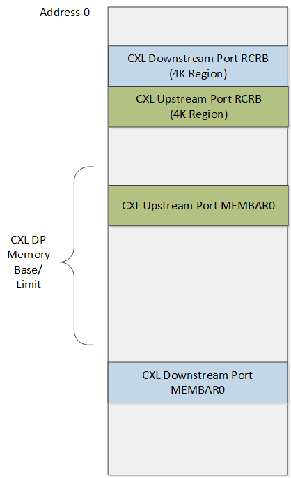
>
> *Original page render @ 150 DPI* — [📄 Full size](figures/chapter_08/page_0532.png)

> **Figure 8-9.** RCH Downstream Port RCRB ｜ RCH 下行端口 RCRB
>
> 
>
> *Original page render @ 150 DPI* — [📄 Full size](figures/chapter_08/page_0533.png)

> **Table 8-41.** RCH Downstream Port PCIe Capabilities and Extended Capabilities (Sheet 1 of 2) ｜ RCH 下行端口 PCIe 能力与扩展能力 (第 1 页/共 2 页)
>
> | PCIe Capabilities and Extended Capabilities | Exceptions¹ | Notes |
> |---|---|---|
> | PCIe Capability | Slot Capabilities, Slot Control, Slot Status, Slot Capabilities 2, Slot Control 2, and Slot Status 2 registers are not applicable. | N/A |
> | PCI Power Management Capability | N/A. Software should ignore. | N/A |
> | MSI Capability | N/A. Software should ignore. | N/A |
> | Advanced Error Reporting Extended Capability | N/A. Software should ignore. | Required for CXL device despite being optional for PCIe. Downstream Port is required to forward ERR_ messages. — 尽管对 PCIe 是可选的，CXL 设备需要此能力。下行端口需要转发 ERR_ 消息。 |
> | ACS Extended Capability | None | N/A |
> | Multicast Extended Capability | N/A. Software should ignore. | N/A |
> | Downstream Port Containment Extended Capability | Use with care. DPC trigger will bring down physical link, reset device state, disrupt CXL.cache and CXL.mem traffic. | N/A |
> | Designated Vendor-Specific Extended Capability (DVSEC) | None | See Section 8.2.1.3 for Flex Bus Port DVSEC definition. |
> | Secondary PCIe Extended Capability | None | None |
> | Data Link Feature Extended Capability | None | None |
> | Physical Layer 16.0 GT/s Extended Capability | None | None |
> | Physical Layer 32.0 GT/s Extended Capability | None | None |
> | Lane Margining at the Receiver Extended Capability | None | None |
> | Alternate Protocol Extended Capability | None | None |
>
> 1. It is the responsibility of software to be aware of the registers within the capabilities that are not applicable in CXL mode in case designs choose to use a common code base for PCIe mode and CXL mode.

#### 8.2.1.2 RCD Upstream Port RCRB | RCD 上行端口 RCRB

<table>
<thead>
<tr>
<th width="50%">🇬🇧 English</th>
<th width="50%" style="background-color:#e8e8e8">🇨🇳 中文</th>
</tr>
</thead>
<tbody>
<tr><td>The RCD Upstream Port RCRB is a 4-KB memory region that contains registers based upon the PCIe Base Specification-defined registers. The Upstream Port captures the upper address bits [63:12] of the first memory read received after link initialization as the base address for the Upstream Port RCRB. Figure 8-10 illustrates the layout of the RCRB for an RCD Upstream Port. With the exception of the first DWORD, the first 64 bytes of the RCD Upstream Port RCRB implement the registers from a PCIe Type 0 Configuration Header. The first DWORD of the RCRB contains a NULL Extended Capability ID with a Version of 0h and a Next Capability Offset pointer. A 64-bit BAR (labeled MEMBAR0) is implemented at Offsets 10h and 14h; this points to a memory region that hosts registers for configuring the Upstream Port subsystem CXL.mem as specified in Table 8-17. The supported PCIe capabilities and extended capabilities are discovered by following the linked lists of pointers. Supported PCIe capabilities are mapped into the offset range from 040h to 0FFh. Supported PCIe extended capabilities are mapped into the offset range from 100h to FFFh. The CXL Upstream Port-supported PCIe capabilities and extended capabilities are listed in Table 8-19; see PCIe Base Specification for definitions of the associated registers.</td><td style="background-color:#e8e8e8">RCD 上行端口 RCRB 是一个 4-KB 内存区域，包含基于 PCIe 基础规范定义寄存器集。上行端口将链路初始化后接收到的第一个内存读的高位地址 [63:12] 作为上行端口 RCRB 的基址。图 8-10 展示了 RCD 上行端口的 RCRB 布局。除第一个 DWORD 外，RCD 上行端口 RCRB 的前 64 字节实现 PCIe Type 0 Configuration Header 中的寄存器。RCRB 的第一个 DWORD 包含一个 NULL Extended Capability ID，Version 为 0h，并带有一个 Next Capability Offset 指针。在偏移 10h 和 14h 处实现 64 位 BAR (标记为 MEMBAR0)；它指向一个内存区域，该区域托管用于配置上行端口子系统 CXL.mem 的寄存器 (如 表 8-17 所规定)。支持的 PCIe 能力和扩展能力通过跟踪指针链表来发现。受支持的 PCIe 能力映射到偏移范围 040h 至 0FFh。受支持的 PCIe 扩展能力映射到偏移范围 100h 至 FFFh。CXL 上行端口支持的 PCIe 能力和扩展能力在表 8-19 中列出；相关寄存器的定义请参见 PCIe 基础规范。</td></tr>
<tr><td>The following standard registers that are part of the PCIe Type 0 header definition are considered reserved and have no effect on the behavior of an RCD Upstream Port:</td><td style="background-color:#e8e8e8">作为 PCIe Type 0 Header 定义一部分的以下标准寄存器被视为保留，并且对 RCD 上行端口的行为没有影响：</td></tr>
<tr><td>• Command register (Offset 04h)</td><td style="background-color:#e8e8e8">• Command 寄存器 (偏移 04h)</td></tr>
<tr><td>• Status register (Offset 06h)</td><td style="background-color:#e8e8e8">• Status 寄存器 (偏移 06h)</td></tr>
<tr><td>Per PCIe Base Specification, the following registers in the PCIe Capability are marked reserved for an RCiEP and shall not be implemented by the Device 0, Function 0 of the RCD:</td><td style="background-color:#e8e8e8">根据 PCIe 基础规范，PCIe 能力中的以下寄存器对于 RCiEP 标记为保留，RCD 的设备 0、功能 0 不应实现：</td></tr>
<tr><td>• Link Registers - Link Capabilities, Link Control, Link Status, Link Capabilities 2, Link Control 2, and Link Status 2</td><td style="background-color:#e8e8e8">• Link 寄存器 - Link Capabilities、Link Control、Link Status、Link Capabilities 2、Link Control 2 和 Link Status 2</td></tr>
<tr><td>• Slot Registers - Slot Capabilities, Slot Control, Slot Status, Slot Capabilities 2, Slot Control 2, and Slot Status 2</td><td style="background-color:#e8e8e8">• Slot 寄存器 - Slot Capabilities、Slot Control、Slot Status、Slot Capabilities 2、Slot Control 2 和 Slot Status 2</td></tr>
<tr><td>• Root Port Registers - Root Capabilities, Root Control, and Root Status</td><td style="background-color:#e8e8e8">• Root Port 寄存器 - Root Capabilities、Root Control 和 Root Status</td></tr>
<tr><td>Software must reference the Link registers in the Upstream Port RCRB PCIe capability structure to discover the link capabilities and link status, and to configure the link properties. These registers shall follow the PCIe Base Specification definition of an Upstream Switch Port. Software must set the ASPM Control field in the Link Control register if it wishes to enable CXL.io L1.</td><td style="background-color:#e8e8e8">软件必须参考上行端口 RCRB PCIe 能力结构中的 Link 寄存器，以发现链路能力和链路状态，并配置链路属性。这些寄存器应遵循 PCIe 基础规范中关于上行交换端口的定义。如果软件希望启用 CXL.io L1，则必须设置 Link Control 寄存器中的 ASPM Control 字段。</td></tr>
<tr><td>All fields in the Upstream Port's Device Capabilities register, Device Control register, Device Status register, Device Capabilities 2 register, Device Control 2 register, and Device Status 2 register are reserved.</td><td style="background-color:#e8e8e8">上行端口的 Device Capabilities 寄存器、Device Control 寄存器、Device Status 寄存器、Device Capabilities 2 寄存器、Device Control 2 寄存器和 Device Status 2 寄存器中的所有字段均为保留。</td></tr>
<tr><td>The Device/Port Type, Slots Implemented and Interrupt Message Number fields in the Upstream Port's Capability register are reserved.</td><td style="background-color:#e8e8e8">上行端口 Capability 寄存器中的 Device/Port Type、Slots Implemented 和 Interrupt Message Number 字段均为保留。</td></tr>
</tbody>
</table>

> **Figure 8-10.** RCD Upstream Port RCRB ｜ RCD 上行端口 RCRB
>
> 
>
> *Original page render @ 150 DPI* — [📄 Full size](figures/chapter_08/page_0535.png)

> **Table 8-42.** RCD Upstream Port PCIe Capabilities and Extended Capabilities ｜ RCD 上行端口 PCIe 能力与扩展能力
>
> | PCIe Capabilities and Extended Capabilities | Exceptions¹ | Notes |
> |---|---|---|
> | PCIe Capability | See Section 8.2.1.2. | None |
> | Advanced Error Reporting Extended Capability | N/A. Software should ignore. | Required for CXL devices despite being optional for PCIe. Link/Protocol errors detected by Upstream Port are logged/reported via RCiEP. — 尽管对 PCIe 是可选的，CXL 设备需要此能力。上行端口检测到的链路/协议错误通过 RCiEP 记录/上报。 |
> | Virtual Channel Extended Capability | None | VC0 and VC1 |
> | Designated Vendor-Specific Extended Capability (DVSEC) | None | See Section 8.2.1.3 for Flex Bus Port DVSEC definition. |
> | Secondary PCIe Extended Capability | None | None |
> | Data Link Feature Extended Capability | None | None |
> | Physical Layer 16.0 GT/s Extended Capability | None | None |
> | Physical Layer 32.0 GT/s Extended Capability | None | None |
> | Lane Margining at the Receiver Extended Capability | None | None |
> | Alternate Protocol Extended Capability | None | None |
>
> 1. It is the responsibility of software to be aware of the registers within the capabilities that are not applicable in CXL mode in case designs choose to use a common code base for PCIe mode and CXL mode.
> 1. 如果设计选择对 PCIe 模式和 CXL 模式使用通用代码库，则软件有责任了解在 CXL 模式下不适用的能力内的寄存器。

#### 8.2.1.3 Flex Bus Port DVSEC | Flex Bus 端口 DVSEC

<table>
<thead>
<tr>
<th width="50%">🇬🇧 English</th>
<th width="50%" style="background-color:#e8e8e8">🇨🇳 中文</th>
</tr>
</thead>
<tbody>
<tr><td>All CXL ports implement a Flex Bus Port DVSEC. This DVSEC is located in the RCRBs of the RCD Upstream Ports and RCH Downstream Ports. RCD and RCH ports may implement DVSEC Revision = 0, 1, or 2 of this DVSEC. See Table 8-2 for the complete listing.</td><td style="background-color:#e8e8e8">所有 CXL 端口都实现 Flex Bus Port DVSEC。此 DVSEC 位于 RCD 上行端口和 RCH 下行端口的 RCRB 中。RCD 和 RCH 端口可以实现此 DVSEC 的 DVSEC Revision = 0、1 或 2。完整列表请参见表 8-2。</td></tr>
<tr><td>This DVSEC is also located in the Configuration Space of CXL root ports, Upstream Switch Ports, Downstream Switch Port, and CXL device's primary function (Function 0) if the device does not implement CXL RCRB. A CXL component that is neither an RCD nor an RCH shall report DVSEC Revision greater than or equal to 1. Revision 2 introduces 3 new registers.</td><td style="background-color:#e8e8e8">如果设备未实现 CXL RCRB，则此 DVSEC 也位于 CXL 根端口、上行交换端口、下行交换端口和 CXL 设备主功能 (功能 0) 的配置空间中。既不是 RCD 也不是 RCH 的 CXL 组件应报告 DVSEC Revision 大于或等于 1。Revision 2 引入了 3 个新寄存器。</td></tr>
<tr><td>Figure 8-11 shows the layout of the Flex Bus Port DVSEC and Table 8-20 shows how the Header 1 and Header 2 registers shall be set. The following subsections give details of the registers defined in the Flex Bus Port DVSEC.</td><td style="background-color:#e8e8e8">图 8-11 展示了 Flex Bus Port DVSEC 的布局，表 8-20 展示了 Header 1 和 Header 2 寄存器应如何设置。以下小节详细介绍了 Flex Bus Port DVSEC 中定义的寄存器。</td></tr>
</tbody>
</table>

> **Figure 8-11.** PCIe DVSEC for Flex Bus Port ｜ Flex Bus 端口的 PCIe DVSEC
>
> 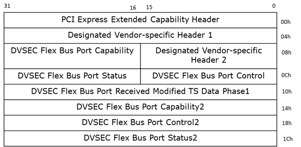
>
> *Original page render @ 150 DPI* — [📄 Full size](figures/chapter_08/page_0537.png)

> **Table 8-43.** PCIe DVSEC Header Register Settings for Flex Bus Port ｜ Flex Bus 端口的 PCIe DVSEC Header 寄存器设置
>
> | Register | Bit Location | Field | Value |
> |---|---|---|---|
> | Designated Vendor-Specific Header 1 (Offset 04h) | 15:0 | DVSEC Vendor ID | 1E98h |
> | | 19:16 | DVSEC Revision | 2h |
> | | 31:20 | DVSEC Length | 020h |
> | Designated Vendor-Specific Header 2 (Offset 08h) | 15:0 | DVSEC ID | 0007h |

##### 8.2.1.3.1 DVSEC Flex Bus Port Capability (Offset 0Ah) | DVSEC Flex Bus 端口能力 (偏移 0Ah)

<table>
<thead>
<tr>
<th width="50%">🇬🇧 English</th>
<th width="50%" style="background-color:#e8e8e8">🇨🇳 中文</th>
</tr>
</thead>
<tbody>
<tr><td><strong>Note:</strong> The Mem_Capable, IO_Capable, and Cache_Capable fields are also present in the Flex Bus DVSEC for the device. This allows for future scalability where multiple devices, each with potentially different capabilities, may be populated behind a single Port.</td><td style="background-color:#e8e8e8"><strong>注意：</strong>Mem_Capable、IO_Capable 和 Cache_Capable 字段也出现在设备的 Flex Bus DVSEC 中。这允许未来扩展，使得在单个端口后面可以部署多个设备，每个设备可能具有不同的能力。</td></tr>
</tbody>
</table>

> **Table 8-44.** DVSEC Flex Bus Port Capability (Offset 0Ah) ｜ DVSEC Flex Bus 端口能力 (偏移 0Ah)
>
> | Bit | Attributes | Description / 描述 |
> |---|---|---|
> | 0 | HwInit | **Cache_Capable**: If set, indicates CXL.cache protocol support when operating in Flex Bus.CXL mode. This should be cleared to 0 for all LDs of an MLD. — 置 1 时，表示在 Flex Bus.CXL 模式下支持 CXL.cache 协议。MLD 的所有 LD 应清零为 0。 |
> | 1 | HwInit | **IO_Capable**: If set, indicates CXL.io protocol support when operating in Flex Bus.CXL mode. Must be 1. — 置 1 时，表示在 Flex Bus.CXL 模式下支持 CXL.io 协议。必须为 1。 |
> | 2 | HwInit | **Mem_Capable**: If set, indicates CXL.mem protocol support when operating in Flex Bus.CXL mode. This must be 1 for all LDs of an MLD. — 置 1 时，表示在 Flex Bus.CXL 模式下支持 CXL.mem 协议。MLD 的所有 LD 必须为 1。 |
> | 4:3 | RsvdP | Reserved — 保留 |
> | 5 | HwInit | **CXL 68B Flit and VH Capable**: Formerly known as CXL2p0_Capable. If set, indicates CXL VH functionality support with 68B flits is available when operating in Flex Bus.CXL mode. This must be 1 for all LDs of an MLD.¹ — 置 1 时，表示在 Flex Bus.CXL 模式下运行时支持 68B flit 的 CXL VH 功能。MLD 的所有 LD 必须为 1。¹ |
> | 6 | HwInit | **CXL_Multi-Logical_Device_Capable**: If set, indicates Multi-Logical Device support available when operating in Flex Bus.CXL mode. This bit must be cleared to 0 on CXL host Downstream Ports. The value must be the same for all LDs of an MLD.¹ — 置 1 时，表示在 Flex Bus.CXL 模式下运行时支持多逻辑设备。此位在 CXL host Downstream Ports 上必须清零为 0。MLD 的所有 LD 该值必须相同。¹ |
> | 12:7 | RsvdP | Reserved — 保留 |
> | 13 | HwInit | **CXL Latency_Optimized_256B_Flit_Capable**: If set, indicates support for latency-optimized 256B flits as described in Section 6.2.3.1.2 when operating in Flex Bus.CXL mode. The value must be the same for all LDs of an MLD.² — 置 1 时，表示在 Flex Bus.CXL 模式下运行时支持 6.2.3.1.2 节中描述的 latency-optimized 256B flit。MLD 的所有 LD 该值必须相同。² |
> | 14 | HwInit | **CXL PBR Flit Capable**: If set, indicates support for PBR flits as described in Table 6-11 when operating in Flex Bus.CXL mode.² — 置 1 时，表示在 Flex Bus.CXL 模式下运行时支持表 6-11 中描述的 PBR flit。² |
> | 15 | RsvdP | Reserved — 保留 |
>
> 1. Introduced as part of DVSEC Revision=1.
> 2. Introduced as part of DVSEC Revision=2.
> 1. 在 DVSEC Revision=1 中引入。
> 2. 在 DVSEC Revision=2 中引入。

##### 8.2.1.3.2 DVSEC Flex Bus Port Control (Offset 0Ch) | DVSEC Flex Bus 端口控制 (偏移 0Ch)

<table>
<thead>
<tr>
<th width="50%">🇬🇧 English</th>
<th width="50%" style="background-color:#e8e8e8">🇨🇳 中文</th>
</tr>
</thead>
<tbody>
<tr><td>The Flex Bus physical layer uses the values that software sets in this register as a starting point for alternate protocol negotiation as long as the corresponding bit in the Flex Bus Port Capability register is set. The Flex Bus physical layer shall sample the values in this register only during exit from the Detect LTSSM state; the physical layer shall ignore any changes to this register in all other LTSSM states.</td><td style="background-color:#e8e8e8">只要 Flex Bus Port Capability 寄存器中的相应位置 1，Flex Bus 物理层就会使用软件在此寄存器中设置的值作为备用协议协商的起点。Flex Bus 物理层仅在退出 Detect LTSSM 状态时才会采样此寄存器中的值；物理层在所有其他 LTSSM 状态中将忽略对此寄存器的任何更改。</td></tr>
</tbody>
</table>

> **Table 8-45.** DVSEC Flex Bus Port Control (Offset 0Ch) ｜ DVSEC Flex Bus 端口控制 (偏移 0Ch)
>
> | Bit | Attributes | Description / 描述 |
> |---|---|---|
> | 0 | RW if Downstream Port; otherwise, HwInit | **Cache_Enable**: When set, enables CXL.cache protocol operation when in Flex Bus.CXL mode. Default value of this bit is 0. — 置 1 时，在 Flex Bus.CXL 模式下使能 CXL.cache 协议操作。 默认值为 0。 |
> | 1 | RO | **IO_Enable**: When set, enables CXL.io protocol operation when in Flex Bus.CXL mode. Must always be set to 1. — 置 1 时，在 Flex Bus.CXL 模式下使能 CXL.io 协议操作。必须始终设置为 1。 |
> | 2 | RW if Downstream Port; otherwise HwInit | **Mem_Enable**: When set, enables CXL.mem protocol operation when in Flex Bus.CXL mode. Default value of this bit is 0. — 置 1 时，在 Flex Bus.CXL 模式下使能 CXL.mem 协议操作。 默认值为 0。 |
> | 3 | HwInit | **CXL_Sync_Hdr_Bypass_Enable**: When set, enables bypass of the 2-bit sync header by the Flex Bus physical layer when operating in Flex Bus.CXL mode. This is a performance optimization. — 置 1 时，在 Flex Bus.CXL 模式下运行时使能 Flex Bus 物理层绕过 2-bit 同步头。这是一种性能优化。 |
> | 4 | HwInit | **Drift_Buffer_Enable**: When set, enables drift buffer (instead of elastic buffer) if there is a common reference clock. — 置 1 时，如果存在公共参考时钟，则使能 drift buffer (而不是 elastic buffer)。 |
> | 5 | RW if Downstream Port; otherwise HwInit | **CXL 68B Flit and VH Enable**: Formerly known as CXL2p0_Enable. When set, enables CXL VH operation with 68B flits when in Flex Bus.CXL mode. This bit is reserved if CXL 68B Flit and VH Capable=0.¹ Default value of this bit is 0. — 置 1 时，在 Flex Bus.CXL 模式下使能 68B flit 的 CXL VH 操作。如果 CXL 68B Flit and VH Capable=0，则此位保留。¹ 默认值为 0。 |
> | 6 | RW if Downstream Port; otherwise HwInit | **CXL_Multi-Logical_Device_Enable**: When set, enable Multi-Logical Device operation when in Flex Bus.CXL mode. This bit shall always be cleared to 0 for CXL root ports and RCH Downstream Ports.¹ Default value of this bit is 0. — 置 1 时，在 Flex Bus.CXL 模式下使能多逻辑设备操作。对于 CXL 根端口和 RCH 下行端口，此位必须始终清零为 0。¹ 默认值为 0。 |
> | 7 | RW if Downstream Port; otherwise HwInit | **Disable_RCD_Training**: Formerly known as Disable_CXL1p1_Training. When set, RCD mode is disabled. Typical usage model is that System Firmware will use this bit to disable Hot-Plug of an eRCD below a CXL root port or DSP. This bit is reserved on all RCD and RCH Upstream Ports.¹ Default value of this bit is 0. — 置 1 时，禁用 RCD 模式。典型的使用场景是系统固件使用此位禁用 CXL 根端口或 DSP 下方 eRCD 的热插拔。此位在所有 RCD 和 RCH 上行端口上保留。¹ 默认值为 0。 |
> | 8 | RW if Downstream Port; otherwise, RsvdP | **Retimer1_Present**: When set, indicates presence of Retimer1. This bit is defined only for a Downstream Port. This bit is reserved for an Upstream Port. Default value of this bit is 0. This bit is only used by RCH Downstream Ports. All other ports shall ignore this bit. — 置 1 时，表示存在 Retimer1。此位仅为下行端口定义。此位对于上行端口保留。 默认值为 0。 此位仅由 RCH 下行端口使用。所有其他端口应忽略此位。 |
> | 9 | RW if Downstream Port; otherwise, RsvdP | **Retimer2_Present**: When set, indicates presence of Retimer2. This bit is defined only for a Downstream Port. This bit is reserved for an Upstream Port. Default value of this bit is 0. This bit is only used by RCH Downstream Ports. All other ports shall ignore this bit. — 置 1 时，表示存在 Retimer2。此位仅为下行端口定义。此位对于上行端口保留。 默认值为 0。 此位仅由 RCH 下行端口使用。所有其他端口应忽略此位。 |
> | 12:10 | RsvdP | Reserved — 保留 |
> | 13 | RW if Downstream Port; otherwise HwInit | **CXL Latency_Optimized_256B_Flit_Enable**: When set, enables latency-optimized 256B flits when in Flex Bus.CXL mode. This bit is reserved on components that do not support 256B Flit mode.² Default value of this bit is 0. — 置 1 时，在 Flex Bus.CXL 模式下使能 latency-optimized 256B flit。不支持 256B Flit 模式的组件上此位保留。² 默认值为 0。 |
> | 14 | RW if Downstream Port; otherwise, HwInit | **CXL PBR Flit Enable**: When set, enables PBR flits when in Flex Bus.CXL mode. This bit is reserved on components that do not support PBR Flit mode. See Table 6-11.² Default value of this bit is 0. — 置 1 时，在 Flex Bus.CXL 模式下使能 PBR flit。不支持 PBR Flit 模式的组件上此位保留。参见表 6-11。² 默认值为 0。 |
> | 15 | RsvdP | Reserved — 保留 |
>
> 1. Introduced as part of DVSEC Revision=1.
> 2. Introduced as part of DVSEC Revision=2.
> 1. 在 DVSEC Revision=1 中引入。
> 2. 在 DVSEC Revision=2 中引入。

##### 8.2.1.3.3 DVSEC Flex Bus Port Status (Offset 0Eh) | DVSEC Flex Bus 端口状态 (偏移 0Eh)

<table>
<thead>
<tr>
<th width="50%">🇬🇧 English</th>
<th width="50%" style="background-color:#e8e8e8">🇨🇳 中文</th>
</tr>
</thead>
<tbody>
<tr><td>The Flex Bus physical layer reports the results of alternate protocol negotiation in this register.</td><td style="background-color:#e8e8e8">Flex Bus 物理层在此寄存器中报告备用协议协商的结果。</td></tr>
</tbody>
</table>

> **Table 8-46.** DVSEC Flex Bus Port Status (Offset 0Eh) ｜ DVSEC Flex Bus 端口状态 (偏移 0Eh)
>
> | Bit | Attributes | Description / 描述 |
> |---|---|---|
> | 0 | RO | **Cache_Enabled**: When set, indicates that CXL.cache protocol operation has been enabled as a result of PCIe alternate protocol negotiation for Flex Bus. — 置 1 时，表示已通过 PCIe 备用协议协商为 Flex Bus 启用 CXL.cache 协议操作。 |
> | 1 | RO | **IO_Enabled**: When set, indicates that CXL.io protocol operation has been enabled as a result of PCIe alternate protocol negotiation for Flex Bus. — 置 1 时，表示已通过 PCIe 备用协议协商为 Flex Bus 启用 CXL.io 协议操作。 |
> | 2 | RO | **Mem_Enabled**: When set, indicates that CXL.mem protocol operation has been enabled as a result of PCIe alternate protocol negotiation for Flex Bus. — 置 1 时，表示已通过 PCIe 备用协议协商为 Flex Bus 启用 CXL.mem 协议操作。 |
> | 3 | RO | **CXL_Sync_Hdr_Bypass_Enabled**: When set, indicates that bypass of the 2-bit sync header by the Flex Bus physical layer has been enabled when operating in Flex Bus.CXL mode as a result of PCIe alternate protocol negotiation for Flex Bus. — 置 1 时，表示已通过 PCIe 备用协议协商在 Flex Bus.CXL 模式下运行时由 Flex Bus 物理层启用绕过 2-bit 同步头。 |
> | 4 | RO | **Drift_Buffer_Enabled**: When set, indicates that the physical layer has enabled its drift buffer instead of its elastic buffer. — 置 1 时，表示物理层已启用其 drift buffer 而非 elastic buffer。 |
> | 5 | RO | **CXL 68B Flit and VH Enabled**: Formerly known as CXL2p0_Enabled. When set, indicates that CXL VH operation with 68B Flit mode has been enabled as a result of PCIe alternate protocol negotiation for Flex Bus.¹ — 置 1 时，表示已通过 PCIe 备用协议协商为 Flex Bus 启用 68B Flit 模式的 CXL VH 操作。¹ |
> | 6 | RO | **CXL_Multi-Logical_Device_Enabled**: When set, indicates that CXL Multi-Logical Device operation has been negotiated.¹ — 置 1 时，表示已协商 CXL 多逻辑设备操作。¹ |
> | 7 | RW1CS | **Even Half Failed**: When set, indicates the Physical Layer detected a CRC error on the even flit half of a post-FEC corrected flit; however, even flit half was previously consumed because the even half passed CRC in the original flit. This bit is reserved in 68B Flit mode. This error is also logged as a Receiver Error in the AER Correctable Status register by the associated root port.² — 置 1 时，表示物理层在后 FEC 校正 flit 的偶数 flit 半部分检测到 CRC 错误；但是偶数 flit 半部分先前已被消费，因为偶数半部分在原始 flit 中通过了 CRC。在 68B Flit 模式下，此位保留。 此错误还由关联根端口作为接收错误记录在 AER Correctable Status 寄存器中。² |
> | 8 | RW1CS | **CXL_Correctable_Protocol_ID_Framing_Error**: See Section 6.2.2 for more details. This bit is reserved in 256B Flit mode. It is recommended that this error also be logged as a Receiver Error in the AER Correctable Status register by the associated root port. — 详见 6.2.2 节。在 256B Flit 模式下，此位保留。 建议此错误也由关联根端口作为接收错误记录在 AER Correctable Status 寄存器中。 |
> | 9 | RW1CS | **CXL_Uncorrectable_Protocol_ID_Framing_Error**: See Section 6.2.2 for more details. This bit is reserved in 256B Flit mode. It is recommended that this error also be logged as a Receiver Error in the AER Correctable Status register by the associated root port. — 详见 6.2.2 节。在 256B Flit 模式下，此位保留。 建议此错误也由关联根端口作为接收错误记录在 AER Correctable Status 寄存器中。 |
> | 10 | RW1CS | **CXL_Unexpected_Protocol_ID_Dropped**: When set, indicates that the physical layer dropped a flit with an unexpected Protocol ID that is not the result of an Uncorrectable Protocol ID Framing Error. See Section 6.2.2 for more details. This bit is reserved in 256B Flit mode. It is recommended that this error also be logged as a Receiver Error in the AER Correctable Status register by the associated root port. — 置 1 时，表示物理层丢弃了一个具有意外协议 ID 的 flit，这并非 Uncorrectable Protocol ID Framing Error 的结果。详见 6.2.2 节。在 256B Flit 模式下，此位保留。 建议此错误也由关联根端口作为接收错误记录在 AER Correctable Status 寄存器中。 |
> | 11 | RW1CS | **CXL_Retimers_Present_Mismatched**: When set, indicates that the Downstream Port physical layer detected an inconsistency in the "Retimers Present" or "Two Retimers Present" bits in the received TS2 Ordered Sets during Polling.Config vs. Config.Complete LTSSM states. The physical layer will force disable of the sync header bypass optimization when this error condition has been detected. See Section 6.4.1.2.1 for more details. This bit is reserved on Upstream Ports. — 置 1 时，表示下行端口物理层在 Polling.Config vs. Config.Complete LTSSM 状态期间检测到接收的 TS2 Ordered Sets 中 "Retimers Present" 或 "Two Retimers Present" 位的不一致。检测到此错误情况时，物理层将强制禁用同步头绕过优化。详见 6.4.1.2.1 节。在上行端口上此位保留。 |
> | 12 | RW1CS | **FlexBusEnableBits_Phase2_Mismatch**: When set, indicates that the Downstream Port physical layer detected that the Upstream Port did not exactly reflect the Flex Bus enable bits located in symbols 12-14 of the modified TS2 during Phase 2 of the negotiation. See Section 6.4.1.1 for more details. This bit is reserved on Upstream Ports. — 置 1 时，表示下行端口物理层检测到上行端口在协商阶段 2 期间未准确反映修改后的 TS2 中符号 12-14 处的 Flex Bus 使能位。详见 6.4.1.1 节。在上行端口上此位保留。 |
> | 13 | RO | **CXL Latency_Optimized_256B_Flit_Enabled**: When set, indicates that latency-optimized 256B flits have been enabled as a result of PCIe alternate protocol negotiation for Flex Bus.² — 置 1 时，表示已通过 PCIe 备用协议协商为 Flex Bus 启用 latency-optimized 256B flit。² |
> | 14 | RO | **CXL PBR Flit Enabled**: When set, indicates that PBR flits have been enabled as a result of PCIe alternate protocol negotiation for Flex Bus. See Table 6-11.² — 置 1 时，表示已通过 PCIe 备用协议协商为 Flex Bus 启用 PBR flit。参见表 6-11。² |
> | 15 | RO | **CXL.io_Throttle_Required_at_64GT/s**: When set, indicates that the partner Upstream Port does not support receiving consecutive CXL.io flits at 64 GT/s (see Section 6.4.1.3). This bit is only defined for Downstream Ports; this bit is reserved on Upstream Ports.² — 置 1 时，表示对端上行端口不支持以 64 GT/s 接收连续的 CXL.io flit (见 6.4.1.3 节)。 此位仅针对下行端口定义；上行端口上此位保留。² |
>
> 1. Introduced as part of DVSEC Revision=1.
> 2. Introduced as part of DVSEC Revision=2.
> 1. 在 DVSEC Revision=1 中引入。
> 2. 在 DVSEC Revision=2 中引入。

##### 8.2.1.3.4 DVSEC Flex Bus Port Received Modified TS Data Phase1 (Offset 10h) | DVSEC Flex Bus 端口接收的修改 TS 数据阶段 1 (偏移 10h)

<table>
<thead>
<tr>
<th width="50%">🇬🇧 English</th>
<th width="50%" style="background-color:#e8e8e8">🇨🇳 中文</th>
</tr>
</thead>
<tbody>
<tr><td>If CXL alternate protocol negotiation is enabled and the Modified TS Received bit is set in the 32.0 GT/s Status register (see PCIe Base Specification), then this register contains the values received in Symbols 12 through 14 of the Modified TS1 Ordered Set during Phase 1 of CXL alternate protocol negotiation.</td><td style="background-color:#e8e8e8">如果启用了 CXL 备用协议协商并且 32.0 GT/s Status 寄存器 (见 PCIe 基础规范) 中的 Modified TS Received 位置 1，则此寄存器包含在 CXL 备用协议协商阶段 1 期间在 Modified TS1 Ordered Set 的符号 12 至 14 中接收的值。</td></tr>
</tbody>
</table>

> **Table 8-47.** DVSEC Flex Bus Port Received Modified TS Data Phase1 (Offset 10h) ｜ DVSEC Flex Bus 端口接收的修改 TS 数据阶段 1 (偏移 10h)
>
> | Bit | Attributes | Description¹ / 描述¹ |
> |---|---|---|
> | 23:0 | RO | **Received_Flex_Bus_Data_Phase_1**: This field contains the values received in Symbols 12 through 14 of the Modified TS1 Ordered Set during Phase 1 of CXL alternate protocol negotiation.² — 此字段包含在 CXL 备用协议协商阶段 1 期间在 Modified TS1 Ordered Set 的符号 12 至 14 中接收的值。² |
> | 31:24 | RsvdZ | Reserved — 保留 |
>
> 1. This register was introduced as part of DVSEC Revision=1.
> 2. This field was introduced as part of DVSEC Revision=1.
> 1. 此寄存器在 DVSEC Revision=1 中引入。
> 2. 此字段在 DVSEC Revision=1 中引入。

##### 8.2.1.3.5 DVSEC Flex Bus Port Capability2 (Offset 14h) | DVSEC Flex Bus 端口能力 2 (偏移 14h)

> **Table 8-48.** DVSEC Flex Bus Port Capability2 (Offset 14h) ｜ DVSEC Flex Bus 端口能力 2 (偏移 14h)
>
> | Bit | Attributes | Description¹ / 描述¹ |
> |---|---|---|
> | 0 | RO | **NOP_Hint_Capable**: If set, indicates support for sending and processing NOP hints when operating with latency-optimized 256B flits in Flex Bus.CXL mode.² — 置 1 时，表示在 Flex Bus.CXL 模式下使用 latency-optimized 256B flit 运行时支持发送和处理 NOP 提示。² |
> | 31:1 | RsvdP | Reserved — 保留 |
>
> 1. This register was introduced as part of DVSEC Revision=2.
> 2. This bit was introduced as part of DVSEC Revision = 2.
> 1. 此寄存器在 DVSEC Revision=2 中引入。
> 2. 此位在 DVSEC Revision=2 中引入。

##### 8.2.1.3.6 DVSEC Flex Bus Port Control2 (Offset 18h) | DVSEC Flex Bus 端口控制 2 (偏移 18h)

> **Table 8-49.** DVSEC Flex Bus Port Control2 (Offset 18h) ｜ DVSEC Flex Bus 端口控制 2 (偏移 18h)
>
> | Bit | Attributes | Description¹ / 描述¹ |
> |---|---|---|
> | 0 | RW | **NOP_Hint_Enable**: If set, enables sending and processing NOP hints when operating with latency-optimized 256B flits in Flex Bus.CXL mode.² The default value of this field is 0. — 置 1 时，在 Flex Bus.CXL 模式下使用 latency-optimized 256B flit 运行时使能发送和处理 NOP 提示。² 此字段默认值为 0。 |
> | 31:1 | RsvdP | Reserved — 保留 |
>
> 1. This register was introduced as part of DVSEC Revision=2.
> 2. This bit was introduced as part of DVSEC Revision = 2.

##### 8.2.1.3.7 DVSEC Flex Bus Port Status2 (Offset 1Ch) | DVSEC Flex Bus 端口状态 2 (偏移 1Ch)

> **Table 8-50.** DVSEC Flex Bus Port Status2 (Offset 1Ch) ｜ DVSEC Flex Bus 端口状态 2 (偏移 1Ch)
>
> | Bit | Attributes | Description¹ / 描述¹ |
> |---|---|---|
> | 1:0 | RO | **NOP_Hint_Info**: The Physical Layer captures what the remote link partner advertises during Phase 1 of link training.² — 物理层捕获对端链路伙伴在链路训练阶段 1 期间公布的内容。² |
> | 31:2 | RsvdP | Reserved — 保留 |
>
> 1. This register was introduced as part of DVSEC Revision=2.
> 2. This field was introduced as part of DVSEC Revision = 2.

[⬆️ 返回目录](#-本章目录-part-a)

---

## 8.2.2 Accessing Component Registers | 访问组件寄存器

<table>
<thead>
<tr>
<th width="50%">🇬🇧 English</th>
<th width="50%" style="background-color:#e8e8e8">🇨🇳 中文</th>
</tr>
</thead>
<tbody>
<tr><td>The RCD Upstream Port maps the Component registers in memory space that are allocated via the MEMBAR0 register of the RCD RCRB if the RCD implements RCRB. Similarly, the RCH Downstream Port maps the Component registers in memory space that are allocated via the MEMBAR0 register of the RCH RCRB. Section 8.2.3 defines the architected registers. Table 8-21 lists the relevant offset ranges from MEMBAR0 for CXL.io, CXL.cache, CXL.mem, and CXL ARB/MUX registers.</td><td style="background-color:#e8e8e8">如果 RCD 实现 RCRB，则 RCD 上行端口在内存空间中映射通过 RCD RCRB 的 MEMBAR0 寄存器分配的 Component 寄存器。类似地，RCH 下行端口在内存空间中映射通过 RCH RCRB 的 MEMBAR0 寄存器分配的 Component 寄存器。8.2.3 节定义了架构寄存器。表 8-21 列出了 MEMBAR0 中 CXL.io、CXL.cache、CXL.mem 和 CXL ARB/MUX 寄存器的相关偏移范围。</td></tr>
<tr><td>For an RCD Upstream Port that does not implement RCRB and for CXL components that are part of a CXL VH, the Component registers are mapped in memory space allocated via a standard PCIe BAR. The Register Locator DVSEC structure (see Section 8.1.9) describes the BAR number and the offset within the BAR where these registers are mapped.</td><td style="background-color:#e8e8e8">对于未实现 RCRB 的 RCD 上行端口以及作为 CXL VH 一部分的 CXL 组件，Component 寄存器映射到通过标准 PCIe BAR 分配的内存空间。Register Locator DVSEC 结构 (见 8.1.9 节) 描述了映射这些寄存器的 BAR 号和 BAR 内的偏移。</td></tr>
<tr><td>A CXL Host Bridge contains Component registers that control the functionality of one or more CXL root ports. These are labeled CHBCR. These registers are also mapped in memory space, and the base address is discovered via ACPI CEDT (see Section 9.18.1.2).</td><td style="background-color:#e8e8e8">CXL Host Bridge 包含控制一个或多个 CXL 根端口功能的 Component 寄存器。这些标记为 CHBCR。这些寄存器也映射到内存空间，基址通过 ACPI CEDT (见 9.18.1.2 节) 发现。</td></tr>
<tr><td>For register layout, see Figure 9-14 and Figure 9-15.</td><td style="background-color:#e8e8e8">有关寄存器布局，请参见图 9-14 和图 9-15。</td></tr>
</tbody>
</table>

[⬆️ 返回目录](#-本章目录-part-a)

---

## 8.2.3 Component Register Layout and Definition | 组件寄存器布局和定义

<table>
<thead>
<tr>
<th width="50%">🇬🇧 English</th>
<th width="50%" style="background-color:#e8e8e8">🇨🇳 中文</th>
</tr>
</thead>
<tbody>
<tr><td>The layout and discovery mechanism of the Component register is identical for all CXL Components and CXL Host Bridges (CHBCR). Table 8-21 lists the relevant offset ranges from the Base of the Component register block for CXL.io, CXL.cache, CXL.mem, and CXL ARB/MUX registers.</td><td style="background-color:#e8e8e8">对于所有 CXL 组件和 CXL Host Bridge (CHBCR)，Component 寄存器的布局和发现机制相同。表 8-21 列出了 Component 寄存器块基址起的 CXL.io、CXL.cache、CXL.mem 和 CXL ARB/MUX 寄存器的相关偏移范围。</td></tr>
<tr><td>Software shall use CXL.io Memory Reads and Writes to access CXL Component registers defined in Section 8.2.4 and Section 8.2.5. Software shall restrict the access width based on the following rules:</td><td style="background-color:#e8e8e8">软件应使用 CXL.io 内存读写访问 8.2.4 节和 8.2.5 节中定义的 CXL Component 寄存器。软件应根据以下规则限制访问宽度：</td></tr>
<tr><td>• A 32-bit register shall be accessed as a 4-byte quantity. Partial reads are not permitted.</td><td style="background-color:#e8e8e8">• 32 位寄存器应作为 4 字节量访问。不允许部分读取。</td></tr>
<tr><td>• A 64-bit register shall be accessed as an 8-byte quantity. Partial reads are not permitted.</td><td style="background-color:#e8e8e8">• 64 位寄存器应作为 8 字节量访问。不允许部分读取。</td></tr>
<tr><td>• Accesses shall map to contiguous bytes.</td><td style="background-color:#e8e8e8">• 访问应映射到连续字节。</td></tr>
<tr><td>If these rules are not followed, the behavior is undefined. Note that these rules are more stringent than the general rules for the memory mapped registers that are specified in Section 8.2.</td><td style="background-color:#e8e8e8">如果不遵循这些规则，则行为未定义。请注意，这些规则比 8.2 节中规定的内存映射寄存器通用规则更严格。</td></tr>
<tr><td>This section and Table 8-22 in this version of the specification do not define the behavior of CXL fabric switches (see Section 2.7) and G-FAM devices (see Section 2.8).</td><td style="background-color:#e8e8e8">本规范此版本的本节和表 8-22 未定义 CXL 交换网交换器 (见 2.7 节) 和 G-FAM 设备 (见 2.8 节) 的行为。</td></tr>
</tbody>
</table>

> **Table 8-51.** CXL Subsystem Component Register Ranges ｜ CXL 子系统组件寄存器范围
>
> | Range | Size | Description / 描述 |
> |---|---|---|
> | 0000 0000h - 0000 0FFFh | 4 KB | Reserved for CXL.io registers. This specification does not define any CXL.io registers, hence the entire range is considered reserved. — 保留供 CXL.io 寄存器使用。本规范未定义任何 CXL.io 寄存器，因此整个范围被视为保留。 |
> | 0000 1000h - 0000 1FFFh | 4 KB | CXL.cachemem Primary Range — CXL.cachemem 主范围 |
> | 0000 2000h - 0000 DFFFh | 48 KB | Implementation specific. May host zero or more instances of CXL.cachemem Extended Ranges. — 实现特定。可托管零个或多个 CXL.cachemem Extended Range 实例。 |
> | 0000 E000h - 0000 E3FFh | 1 KB | CXL ARB/MUX registers — CXL ARB/MUX 寄存器 |
> | 0000 E400h - 0000 FFFFh | 7 KB | Reserved. The range F000-FFFFh may host CXL.cachemem Extended Range. — 保留。范围 F000-FFFFh 可托管 CXL.cachemem Extended Range。 |

[⬆️ 返回目录](#-本章目录-part-a)

---

## 8.2.4 CXL.cache and CXL.mem Registers | CXL.cache 和 CXL.mem 寄存器

<table>
<thead>
<tr>
<th width="50%">🇬🇧 English</th>
<th width="50%" style="background-color:#e8e8e8">🇨🇳 中文</th>
</tr>
</thead>
<tbody>
<tr><td>CXL.cache and CXL.mem registers are located in the CXL.cachemem Primary Range (Offset 1000h-1FFFh) or one of the CXL.cachemem Extended Ranges. Within each of the 4-KB region of memory space assigned to CXL.cache and CXL.mem, the location of architecturally specified registers is described using an array of pointers. The array, described in Table 8-23, is located starting at Offset 00h of this 4-KB region. The first element of the array will declare the version of CXL.cache and CXL.mem protocols, as well as the size of the array. Each subsequent element will then host the pointers to capability-specific register blocks within the 4-KB region. Table 8-24 and Table 8-25 illustrate this concept with an example.</td><td style="background-color:#e8e8e8">CXL.cache 和 CXL.mem 寄存器位于 CXL.cachemem Primary Range (偏移 1000h-1FFFh) 或某个 CXL.cachemem Extended Range 中。在分配给 CXL.cache 和 CXL.mem 的 4-KB 内存区域内，架构规定的寄存器位置使用指针数组来描述。表 8-23 描述的数组从该 4-KB 区域的偏移 00h 处开始。数组的第一个元素将声明 CXL.cache 和 CXL.mem 协议的版本以及数组大小。每个后续元素将承载 4-KB 区域内指向能力特定寄存器块的指针。表 8-24 和表 8-25 通过示例说明了此概念。</td></tr>
<tr><td>Structures with Capability ID of 1 through 0Ah are not permitted to be part of the CXL.cachemem Extended Ranges. Capability ID 0Ah structure identifies the CXL.cachemem Extended Ranges. Structures with Capability ID 0 or Capability ID greater than 0Ah are permitted to be part of the CXL.cachemem Primary Range or any of the CXL.cachemem Extended Ranges.</td><td style="background-color:#e8e8e8">Capability ID 为 1 至 0Ah 的结构不允许成为 CXL.cachemem Extended Range 的一部分。Capability ID 0Ah 结构标识 CXL.cachemem Extended Range。Capability ID 0 或 Capability ID 大于 0Ah 的结构允许成为 CXL.cachemem Primary Range 或任何 CXL.cachemem Extended Range 的一部分。</td></tr>
<tr><td>For each capability ID, CXL_Capability_Version field is incremented whenever the structure is extended to add more functionality. Backward compatibility shall be maintained during this process. For all values of n, CXL_Capability_Version=n+1 structure may extend CXL_Capability_Version=n by replacing fields that are marked as reserved in CXL_Capability_Version= n, but shall not redefine the meaning of existing fields. In addition, CXL_Capability_Version n+1 may append new registers to the CXL_Capability_Version n structure. Software that was written for a lower CXL_Capability_Version may continue to operate on structures with a higher CXL_Capability_Version, but will not be able to take advantage of new functionality.</td><td style="background-color:#e8e8e8">对于每个 capability ID，当结构被扩展以添加更多功能时，CXL_Capability_Version 字段会递增。在此过程中必须保持向后兼容。对于所有 n 值，CXL_Capability_Version=n+1 结构可以通过替换 CXL_Capability_Version=n 中标记为保留的字段来扩展 CXL_Capability_Version=n，但不得重新定义现有字段的含义。此外，CXL_Capability_Version n+1 可以向 CXL_Capability_Version n 结构追加新寄存器。针对较低 CXL_Capability_Version 编写的软件可以继续在具有较高 CXL_Capability_Version 的结构上运行，但将无法利用新功能。</td></tr>
<tr><td>CXL_Capability_ID field represents the functionality and CXL_Capability_Version represents the version of the structure. The following values of CXL_Capability_ID are defined by CXL specification.</td><td style="background-color:#e8e8e8">CXL_Capability_ID 字段表示功能，CXL_Capability_Version 字段表示结构的版本。以下 CXL_Capability_ID 值由 CXL 规范定义。</td></tr>
</tbody>
</table>

> **Table 8-52.** CXL_Capability_ID Assignment ｜ CXL_Capability_ID 分配
>
> | Capability | ID | Highest Version | Mandatory¹ | Not Permitted¹ | Optional¹ |
> |---|---|---|---|---|---|
> | CXL NULL Capability – Software shall ignore this structure and skip to the next CXL Capability | 0 | Undefined | P | D1, D2, LD, FMLD, DP1, UP1, USP, vUSP, DSP, vDSP, R, RC | — |
> | CXL Capability (Section 8.2.4.1) | 1 | 1 | D1, D2, LD, FMLD, UP1, DP1, R, USP, vUSP, DSP, vDSP, RC | P | — |
> | CXL RAS Capability (Section 8.2.4.17) | 2 | 3 | D1, D2, LD, FMLD, UP1, DP1, R, USP, DSP | P, RC | vUSP, vDSP |
> | CXL Security Capability (Section 8.2.4.18) | 3 | 1 | DP1 | All others | — |
> | CXL Link Capability (Section 8.2.4.19) | 4 | 4 | D1, D2, LD, FMLD, UP1, DP1, R, USP, DSP | P, RC, vUSP, vDSP | — |
> | CXL HDM Decoder Capability (Section 8.2.4.20) | 5 | 3 | Type 3 D2, LD, RC except RCH, USP, vUSP | All others | Type 2 D2, D1 |
> | CXL Extended Security Capability (Section 8.2.4.21) | 6 | 2 | RC | All others | — |
> | CXL IDE Capability (Section 8.2.4.22) | 7 | 2 | P, D1, LD, UP1, DP1 | D2, FMLD, R, USP, vUSP, DSP, vDSP | — |
> | CXL Snoop Filter Capability (Section 8.2.4.23) | 8 | 1 | R | P, D1, D2, LD, FMLD, UP1, USP, vUSP, DSP, vDSP, RC | DP1 |
> | CXL Timeout and Isolation Capability (Section 8.2.4.24) | 9 | 1 | P, D1, D2, LD, FMLD, UP1, USP, vUSP, DSP, vDSP, RC | R | — |
> | CXL.cachemem Extended Register Capability (Section 8.2.4.25) | 0Ah | 1 | P | D1, D2, LD, FMLD, UP1, R, USP, vUSP, DSP, vDSP, RC | — |
> | CXL BI Route Table Capability (Section 8.2.4.26) | 0Bh | 1 | USP or vUSPs that requires explicit BI commit | All others | All other USPs or vUSPs |
> | CXL BI Decoder Capability (Section 8.2.4.27) | 0Ch | 1 | DSP or vDSPs or Type 2 D2 that advertises 256B Flit mode | P, D1, FMLD, UP1, DP1, R, USPs, RC | R², all other DSPs, all other vDSPs, all other D2s, LD |
> | CXL Cache ID Route Table Capability (Section 8.2.4.28) | 0Dh | 1 | All others | RC, USP | — |
> | CXL Cache ID Decoder Capability (Section 8.2.4.29) | 0Eh | 1 | P, D1, D2, LD, FMLD, UP1, DP1, R, USP, vUSP, RC | R, DSP, vDSP | — |
> | CXL Extended HDM Decoder Capability (Section 8.2.4.30) | 0Fh | 3 | All others | RC, USP, vUSP | — |
> | CXL Extended Metadata Capability (Section 8.2.4.31) | 10h | 1 | All others | CXL.mem capable LD or D2 that supports 256B Flit Mode | — |
>
> 1. P – PCIe device, D1 – RCD, D2 – CXL device that is not RCD, LD – Logical Device, FMLD – Fabric Manager owned LD FFFFh, UP1 – RCD Upstream Port RCRB, DP1 – RCH Downstream Port, R – CXL root port, RC – CXL Host Bridge registers in CHBCR, USP – CXL Upstream Switch Port, vUSP – see Table 1-1, DSP – CXL Downstream Switch Port, vDSP – see Table 1-1. A physical component may be capable of operating in multiple modes (e.g., a CXL device may operate either in D1 mode or D2 mode based on the link training). In such cases, these definitions refer to the current mode of operation.
> 2. Strongly recommended for a host that supports 256B Flit mode.
> 1. P – PCIe 设备，D1 – RCD，D2 – 非 RCD 的 CXL 设备，LD – 逻辑设备，FMLD – Fabric Manager 拥有的 LD FFFFh，UP1 – RCD 上行端口 RCRB，DP1 – RCH 下行端口，R – CXL 根端口，RC – CHBCR 中的 CXL Host Bridge 寄存器，USP – CXL 上行交换端口，vUSP – 见表 1-1，DSP – CXL 下行交换端口，vDSP – 见表 1-1。一个物理组件可能能够以多种模式运行 (例如，CXL 设备可能基于链路训练以 D1 模式或 D2 模式运行)。在这种情况下，这些定义指的是当前的操作模式。
> 2. 强烈建议支持 256B Flit 模式的主机使用。

> **Table 8-53.** CXL.cache and CXL.mem Architectural Register Discovery ｜ CXL.cache 和 CXL.mem 架构寄存器发现
>
> | Offset | Register Name / 寄存器名称 |
> |---|---|
> | 00h | CXL_Capability_Header |
> | 04h | (Length = n*4, where n is the number of capability headers) An array of individual capability headers. See Table 8-22 for the enumeration. — (长度 = n*4，其中 n 是 capability headers 的数量) 各个 capability headers 的数组。有关枚举，请参见表 8-22。 |

> **Table 8-54.** CXL.cache and CXL.mem Architectural Register Header Example (Primary Range) ｜ CXL.cache 和 CXL.mem 架构寄存器 Header 示例 (主范围)
>
> | Byte Offset | Register Name / 寄存器名称 |
> |---|---|
> | 00h | CXL_Capability_Header |
> | 04h | CXL_RAS_Capability_Header |
> | 08h | CXL_Security_Capability_Header |
> | 0Ch | CXL_Link_Capability_Header |
> | 10h | CXL.cachemem Extended Register Capability Header |

> **Table 8-55.** CXL.cache and CXL.mem Architectural Register Header Example (Any Extended Range) ｜ CXL.cache 和 CXL.mem 架构寄存器 Header 示例 (任意扩展范围)
>
> | Byte Offset | Register Name / 寄存器名称 |
> |---|---|
> | 00h | CXL_Capability_Header |
> | 04h | CXL BI Decoder Capability Header |
> | 08h | CXL NULL Capability Header |
> | 0Ch | CXL Cache ID Decoder Capability Header |

### 8.2.4.1 CXL Capability Header Register (Offset 00h) | CXL 能力 Header 寄存器 (偏移 00h)

> **Table 8-56.** CXL Capability Header Register (Offset 00h) ｜ CXL 能力 Header 寄存器 (偏移 00h)
>
> | Bit Location | Attributes | Description / 描述 |
> |---|---|---|
> | 15:0 | RO | **CXL_Capability_ID**: This defines the nature and format of the CXL_Capability register. For the CXL_Capability_Header register, this field must be 0001h. — 这定义了 CXL_Capability 寄存器的性质和格式。对于 CXL_Capability_Header 寄存器，此字段必须为 0001h。 |
> | 19:16 | RO | **CXL_Capability_Version**: This defines the version number of the CXL_Capability structure present. For this and the prior version of the specification, this field must be 1h. — 这定义了当前 CXL_Capability 结构的版本号。对于本规范及其先前版本，此字段必须为 1h。 |
> | 23:20 | RO | **CXL_Cache_Mem_Version**: This defines the version of the CXL.cachemem Protocol supported. For this and the prior versions of the specification, this field must be 1h. — 这定义了支持的 CXL.cachemem 协议的版本。对于本规范及其先前版本，此字段必须为 1h。 |
> | 31:24 | RO | **Array_Size**: This defines the number of elements present in the CXL_Capability array, not including the CXL_Capability_Header element. Each element is 1 DWORD in size and is located contiguous with previous elements. — 这定义了 CXL_Capability 数组中存在的元素数，不包括 CXL_Capability_Header 元素。每个元素大小为 1 DWORD，并与前一个元素连续。 |

[⬆️ 返回目录](#-本章目录-part-a)

---

### 8.2.4.2 CXL RAS Capability Header (Offset: Varies) | CXL RAS 能力 Header (偏移：可变)

> **Table 8-57.** CXL RAS Capability Header (Offset: Varies) ｜ CXL RAS 能力 Header (偏移：可变)
>
> | Bit Location | Attributes | Description / 描述 |
> |---|---|---|
> | 15:0 | RO | **CXL_Capability_ID**: This defines the nature and format of the CXL_Capability register. For the CXL_RAS_Capability_Pointer register, this field shall be 0002h. — 这定义了 CXL_Capability 寄存器的性质和格式。对于 CXL_RAS_Capability_Pointer 寄存器，此字段必须为 0002h。 |
> | 19:16 | RO | **CXL_Capability_Version**: This defines the version number of the CXL_Capability structure present. Version 3h represents the structure as defined in this specification. — 这定义了当前 CXL_Capability 结构的版本号。版本 3h 表示本规范定义的结构。 |
> | 31:20 | RO | **CXL_RAS_Capability_Pointer**: This defines the offset of the CXL RAS Capability relative to the beginning of the CXL_Capability_Header register. Details in Section 8.2.4.17. — 这定义了 CXL RAS Capability 相对于 CXL_Capability_Header 寄存器起始位置的偏移。详见 8.2.4.17 节。 |

[⬆️ 返回目录](#-本章目录-part-a)

---

### 8.2.4.3 CXL Security Capability Header (Offset: Varies) | CXL 安全能力 Header (偏移：可变)

> **Table 8-58.** CXL Security Capability Header (Offset: Varies) ｜ CXL 安全能力 Header (偏移：可变)
>
> | Bit Location | Attributes | Description / 描述 |
> |---|---|---|
> | 15:0 | RO | **CXL_Capability_ID**: This defines the nature and format of the CXL_Capability register. For the CXL_Security_Capability_Pointer register, this field shall be 0003h. — 这定义了 CXL_Capability 寄存器的性质和格式。对于 CXL_Security_Capability_Pointer 寄存器，此字段必须为 0003h。 |
> | 19:16 | RO | **CXL_Capability_Version**: This defines the version number of the CXL_Capability structure present. For this version of the specification, this field must be 1h. — 这定义了当前 CXL_Capability 结构的版本号。对于本规范版本，此字段必须为 1h。 |
> | 31:20 | RO | **CXL_Security_Capability_Pointer**: This defines the offset of the CXL Security Capability relative to the beginning of the CXL_Capability_Header register. Details in Section 8.2.4.18. — 这定义了 CXL Security Capability 相对于 CXL_Capability_Header 寄存器起始位置的偏移。详见 8.2.4.18 节。 |

[⬆️ 返回目录](#-本章目录-part-a)

---

### 8.2.4.4 CXL Link Capability Header (Offset: Varies) | CXL 链路能力 Header (偏移：可变)

> **Table 8-59.** CXL Link Capability Header (Offset: Varies) ｜ CXL 链路能力 Header (偏移：可变)
>
> | Bit Location | Attributes | Description / 描述 |
> |---|---|---|
> | 15:0 | RO | **CXL_Capability_ID**: This defines the nature and format of the CXL_Capability register. For the CXL_Link_Capability_Pointer register, this field shall be 0004h. — 这定义了 CXL_Capability 寄存器的性质和格式。对于 CXL_Link_Capability_Pointer 寄存器，此字段必须为 0004h。 |
> | 19:16 | RO | **CXL_Capability_Version**: This defines the version number of the CXL_Capability structure present. Version 4h represents the structure as defined in this specification. — 这定义了当前 CXL_Capability 结构的版本号。版本 4h 表示本规范定义的结构。 |
> | 31:20 | RO | **CXL_Link_Capability_Pointer**: This defines the offset of the CXL Link Capability relative to the beginning of the CXL_Capability_Header register. Details in Section 8.2.4.19. — 这定义了 CXL Link Capability 相对于 CXL_Capability_Header 寄存器起始位置的偏移。详见 8.2.4.19 节。 |

[⬆️ 返回目录](#-本章目录-part-a)

---

### 8.2.4.5 CXL HDM Decoder Capability Header (Offset: Varies) | CXL HDM Decoder 能力 Header (偏移：可变)

> **Table 8-60.** CXL HDM Decoder Capability Header (Offset: Varies) ｜ CXL HDM Decoder 能力 Header (偏移：可变)
>
> | Bit Location | Attributes | Description / 描述 |
> |---|---|---|
> | 15:0 | RO | **CXL_Capability_ID**: This defines the nature and format of the CXL_Capability register. For the CXL_HDM_Decoder_Capability_Pointer register, this field shall be 0005h. — 这定义了 CXL_Capability 寄存器的性质和格式。对于 CXL_HDM_Decoder_Capability_Pointer 寄存器，此字段必须为 0005h。 |
> | 19:16 | RO | **CXL_Capability_Version**: This defines the version number of the CXL_Capability structure present. For this version of the specification, this field must be 3h. — 这定义了当前 CXL_Capability 结构的版本号。对于本规范版本，此字段必须为 3h。 |
> | 31:20 | RO | **CXL_HDM_Decoder_Capability_Pointer**: This defines the offset of the CXL HDM Decoder Capability relative to the beginning of the CXL_Capability_Header register. Details in Section 8.2.4.20. — 这定义了 CXL HDM Decoder Capability 相对于 CXL_Capability_Header 寄存器起始位置的偏移。详见 8.2.4.20 节。 |

[⬆️ 返回目录](#-本章目录-part-a)

---

### 8.2.4.6 CXL Extended Security Capability Header (Offset: Varies) | CXL 扩展安全能力 Header (偏移：可变)

> **Table 8-61.** CXL Extended Security Capability Header (Offset: Varies) ｜ CXL 扩展安全能力 Header (偏移：可变)
>
> | Bit Location | Attributes | Description / 描述 |
> |---|---|---|
> | 15:0 | RO | **CXL_Capability_ID**: This defines the nature and format of the CXL_Capability register. For the CXL_Extended Security_Capability_Pointer register, this field shall be 0006h. — 这定义了 CXL_Capability 寄存器的性质和格式。对于 CXL_Extended Security_Capability_Pointer 寄存器，此字段必须为 0006h。 |
> | 19:16 | RO | **CXL_Capability_Version**: This defines the version number of the CXL_Capability structure present. For this version of the specification, this field must be 2h. — 这定义了当前 CXL_Capability 结构的版本号。对于本规范版本，此字段必须为 2h。 |
> | 31:20 | RO | **CXL_Extended_Security_Capability_Pointer**: This defines the offset of the CXL Extended Security Capability relative to the beginning of the CXL_Capability_Header register. Details in Section 8.2.4.21. — 这定义了 CXL Extended Security Capability 相对于 CXL_Capability_Header 寄存器起始位置的偏移。详见 8.2.4.21 节。 |

[⬆️ 返回目录](#-本章目录-part-a)

---

### 8.2.4.7 CXL IDE Capability Header (Offset: Varies) | CXL IDE 能力 Header (偏移：可变)

<table>
<thead>
<tr>
<th width="50%">🇬🇧 English</th>
<th width="50%" style="background-color:#e8e8e8">🇨🇳 中文</th>
</tr>
</thead>
<tbody>
<tr><td>This capability header is present in all ports that implement CXL IDE.</td><td style="background-color:#e8e8e8">此能力 Header 出现在实现 CXL IDE 的所有端口中。</td></tr>
</tbody>
</table>

> **Table 8-62.** CXL IDE Capability Header (Offset: Varies) ｜ CXL IDE 能力 Header (偏移：可变)
>
> | Bit Location | Attributes | Description / 描述 |
> |---|---|---|
> | 15:0 | RO | **CXL_Capability_ID**: This defines the nature and format of the CXL_Capability register. For the CXL_IDE_Capability_Header register, this field shall be 0007h. — 这定义了 CXL_Capability 寄存器的性质和格式。对于 CXL_IDE_Capability_Header 寄存器，此字段必须为 0007h。 |
> | 19:16 | RO | **CXL_Capability_Version**: This defines the version number of the CXL_Capability structure present. For this version of the specification, this field must be 2h. — 这定义了当前 CXL_Capability 结构的版本号。对于本规范版本，此字段必须为 2h。 |
> | 31:20 | RO | **CXL IDE Capability Pointer**: This defines the offset of the CXL IDE Capability relative to the beginning of the CXL_Capability_Header register. Details in Section 8.2.4.22. — 这定义了 CXL IDE Capability 相对于 CXL_Capability_Header 寄存器起始位置的偏移。详见 8.2.4.22 节。 |

[⬆️ 返回目录](#-本章目录-part-a)

---

### 8.2.4.8 CXL Snoop Filter Capability Header (Offset: Varies) | CXL Snoop Filter 能力 Header (偏移：可变)

<table>
<thead>
<tr>
<th width="50%">🇬🇧 English</th>
<th width="50%" style="background-color:#e8e8e8">🇨🇳 中文</th>
</tr>
</thead>
<tbody>
<tr><td>This capability header is required for Root Ports and optional for RCH Downstream Ports.</td><td style="background-color:#e8e8e8">根端口需要此能力 Header，RCH 下行端口可选。</td></tr>
</tbody>
</table>

> **Table 8-63.** CXL Snoop Filter Capability Header (Offset: Varies) ｜ CXL Snoop Filter 能力 Header (偏移：可变)
>
> | Bit Location | Attributes | Description / 描述 |
> |---|---|---|
> | 15:0 | RO | **CXL_Capability_ID**: This defines the nature and format of the CXL_Capability register. For the CXL_Snoop_Filter_Capability_Header register, this field shall be 0008h. — 这定义了 CXL_Capability 寄存器的性质和格式。对于 CXL_Snoop_Filter_Capability_Header 寄存器，此字段必须为 0008h。 |
> | 19:16 | RO | **CXL_Capability_Version**: This defines the version number of the CXL_Capability structure present. For this version of the specification, this field shall be 1h. — 这定义了当前 CXL_Capability 结构的版本号。对于本规范版本，此字段必须为 1h。 |
> | 31:20 | RO | **CXL Snoop Filter Capability Pointer**: This defines the offset of the CXL Snoop Filter Capability relative to the beginning of the CXL_Capability_Header register. Details in Section 8.2.4.23. — 这定义了 CXL Snoop Filter Capability 相对于 CXL_Capability_Header 寄存器起始位置的偏移。详见 8.2.4.23 节。 |

[⬆️ 返回目录](#-本章目录-part-a)

---

### 8.2.4.9 CXL Timeout and Isolation Capability Header (Offset: Varies) | CXL Timeout and Isolation 能力 Header (偏移：可变)

> **Table 8-64.** CXL Timeout and Isolation Capability Header (Offset: Varies) ｜ CXL Timeout and Isolation 能力 Header (偏移：可变)
>
> | Bit Location | Attributes | Description / 描述 |
> |---|---|---|
> | 15:0 | RO | **CXL_Capability_ID**: This defines the nature and format of the CXL Capability register. For the CXL Timeout and Isolation Capability Header register, this field shall be 0009h. — 这定义了 CXL Capability 寄存器的性质和格式。对于 CXL Timeout and Isolation Capability Header 寄存器，此字段必须为 0009h。 |
> | 19:16 | RO | **CXL_Capability_Version**: This defines the version number of the CXL Capability structure present. For this version of the specification, this field must be 1h. — 这定义了当前 CXL Capability 结构的版本号。对于本规范版本，此字段必须为 1h。 |
> | 31:20 | RO | **CXL_Timeout_and_Isolation_Capability_Pointer**: This defines the offset of the CXL Timeout and Isolation Capability structure relative to the beginning of the CXL_Capability_Header register. Details in Section 8.2.4.24. — 这定义了 CXL Timeout and Isolation Capability 结构相对于 CXL_Capability_Header 寄存器起始位置的偏移。详见 8.2.4.24 节。 |

[⬆️ 返回目录](#-本章目录-part-a)

---

### 8.2.4.10 CXL.cachemem Extended Register Capability (Offset: Varies) | CXL.cachemem 扩展寄存器能力 (偏移：可变)

> **Table 8-65.** CXL.cachemem Extended Register Capability (Offset: Varies) ｜ CXL.cachemem 扩展寄存器能力 (偏移：可变)
>
> | Bit Location | Attributes | Description / 描述 |
> |---|---|---|
> | 15:0 | RO | **CXL_Capability_ID**: This defines the nature and format of the CXL Capability register. For the CXL.cachemem Extended Register Capability Header register, this field shall be 000Ah. — 这定义了 CXL Capability 寄存器的性质和格式。对于 CXL.cachemem Extended Register Capability Header 寄存器，此字段必须为 000Ah。 |
> | 19:16 | RO | **CXL_Capability_Version**: This defines the version number of CXL Capability structure present. For this version of the specification, this field must be 1h. — 这定义了当前 CXL Capability 结构的版本号。对于本规范版本，此字段必须为 1h。 |
> | 31:20 | RO | **CXL.cachemem Extended Register Capability Pointer**: This defines the offset of the CXL.cachemem Extended Register Capability structure relative to the beginning of the CXL_Capability_Header register. Details in Section 8.2.4.25. — 这定义了 CXL.cachemem Extended Register Capability 结构相对于 CXL_Capability_Header 寄存器起始位置的偏移。详见 8.2.4.25 节。 |

[⬆️ 返回目录](#-本章目录-part-a)

---

### 8.2.4.11 CXL BI Route Table Capability Header (Offset: Varies) | CXL BI 路由表能力 Header (偏移：可变)

> **Table 8-66.** CXL BI Route Table Capability Header (Offset: Varies) ｜ CXL BI 路由表能力 Header (偏移：可变)
>
> | Bit Location | Attributes | Description / 描述 |
> |---|---|---|
> | 15:0 | RO | **CXL_Capability_ID**: This defines the nature and format of the CXL Capability register. For the CXL BI Route Table Capability Header register, this field shall be 000Bh. — 这定义了 CXL Capability 寄存器的性质和格式。对于 CXL BI Route Table Capability Header 寄存器，此字段必须为 000Bh。 |
> | 19:16 | RO | **CXL_Capability_Version**: This defines the version number of CXL Capability structure present. For this version of the specification, this field must be 1h. — 这定义了当前 CXL Capability 结构的版本号。对于本规范版本，此字段必须为 1h。 |
> | 31:20 | RO | **CXL BI Route Table Capability Pointer**: This defines the offset of the CXL BI Route Table Capability structure relative to the beginning of the CXL_Capability_Header register. Details in Section 8.2.4.26. — 这定义了 CXL BI Route Table Capability 结构相对于 CXL_Capability_Header 寄存器起始位置的偏移。详见 8.2.4.26 节。 |

[⬆️ 返回目录](#-本章目录-part-a)

---

### 8.2.4.12 CXL BI Decoder Capability Header (Offset: Varies) | CXL BI Decoder 能力 Header (偏移：可变)

> **Table 8-67.** CXL BI Decoder Capability Header (Offset: Varies) ｜ CXL BI Decoder 能力 Header (偏移：可变)
>
> | Bit Location | Attributes | Description / 描述 |
> |---|---|---|
> | 15:0 | RO | **CXL_Capability_ID**: This defines the nature and format of the CXL Capability register. For the CXL BI Decoder Capability Header register, this field shall be 000Ch. — 这定义了 CXL Capability 寄存器的性质和格式。对于 CXL BI Decoder Capability Header 寄存器，此字段必须为 000Ch。 |
> | 19:16 | RO | **CXL_Capability_Version**: This defines the version number of CXL Capability structure present. For this version of the specification, this field must be 1h. — 这定义了当前 CXL Capability 结构的版本号。对于本规范版本，此字段必须为 1h。 |
> | 31:20 | RO | **CXL BI Decoder Capability Pointer**: This defines the offset of the CXL BI Decoder Capability structure relative to the beginning of the CXL_Capability_Header register. Details in Section 8.2.4.27. — 这定义了 CXL BI Decoder Capability 结构相对于 CXL_Capability_Header 寄存器起始位置的偏移。详见 8.2.4.27 节。 |

[⬆️ 返回目录](#-本章目录-part-a)

---

### 8.2.4.13 CXL Cache ID Route Table Capability Header (Offset: Varies) | CXL Cache ID 路由表能力 Header (偏移：可变)

> **Table 8-68.** CXL Cache ID Route Table Capability Header (Offset: Varies) ｜ CXL Cache ID 路由表能力 Header (偏移：可变)
>
> | Bit Location | Attributes | Description / 描述 |
> |---|---|---|
> | 15:0 | RO | **CXL_Capability_ID**: This defines the nature and format of the CXL Capability register. For the CXL Cache ID Route Table Capability Header register, this field shall be 000Dh. — 这定义了 CXL Capability 寄存器的性质和格式。对于 CXL Cache ID Route Table Capability Header 寄存器，此字段必须为 000Dh。 |
> | 19:16 | RO | **CXL_Capability_Version**: This defines the version number of CXL Capability structure present. For this version of the specification, this field must be 1h. — 这定义了当前 CXL Capability 结构的版本号。对于本规范版本，此字段必须为 1h。 |
> | 31:20 | RO | **CXL Cache ID Route Table Capability Pointer**: This defines the offset of the CXL Cache ID Route Table Capability structure relative to the beginning of the CXL_Capability_Header register. Details in Section 8.2.4.28. — 这定义了 CXL Cache ID Route Table Capability 结构相对于 CXL_Capability_Header 寄存器起始位置的偏移。详见 8.2.4.28 节。 |

[⬆️ 返回目录](#-本章目录-part-a)

---

### 8.2.4.14 CXL Cache ID Decoder Capability Header (Offset: Varies) | CXL Cache ID Decoder 能力 Header (偏移：可变)

> **Table 8-69.** CXL Cache ID Decoder Capability Header (Offset: Varies) ｜ CXL Cache ID Decoder 能力 Header (偏移：可变)
>
> | Bit Location | Attributes | Description / 描述 |
> |---|---|---|
> | 15:0 | RO | **CXL_Capability_ID**: This defines the nature and format of the CXL Capability register. For the CXL Cache ID Decoder Capability Header register, this field shall be 000Eh. — 这定义了 CXL Capability 寄存器的性质和格式。对于 CXL Cache ID Decoder Capability Header 寄存器，此字段必须为 000Eh。 |
> | 19:16 | RO | **CXL_Capability_Version**: This defines the version number of CXL Capability structure present. For this version of the specification, this field must be 1h. — 这定义了当前 CXL Capability 结构的版本号。对于本规范版本，此字段必须为 1h。 |
> | 31:20 | RO | **CXL Cache ID Local Decoder Capability Pointer**: This defines the offset of the CXL Cache ID Decoder Capability structure relative to the beginning of the CXL_Capability_Header register. Details in Section 8.2.4.29. — 这定义了 CXL Cache ID Decoder Capability 结构相对于 CXL_Capability_Header 寄存器起始位置的偏移。详见 8.2.4.29 节。 |

[⬆️ 返回目录](#-本章目录-part-a)

---

### 8.2.4.15 CXL Extended HDM Decoder Capability Header (Offset: Varies) | CXL 扩展 HDM Decoder 能力 Header (偏移：可变)

> **Table 8-70.** CXL Extended HDM Decoder Capability Header (Offset: Varies) ｜ CXL 扩展 HDM Decoder 能力 Header (偏移：可变)
>
> | Bit Location | Attributes | Description / 描述 |
> |---|---|---|
> | 15:0 | RO | **CXL_Capability_ID**: This defines the nature and format of the CXL Capability register. For the CXL Extended HDM Decoder Capability Header register, this field shall be 000Fh. — 这定义了 CXL Capability 寄存器的性质和格式。对于 CXL Extended HDM Decoder Capability Header 寄存器，此字段必须为 000Fh。 |
> | 19:16 | RO | **CXL_Capability_Version**: This defines the version number of CXL Capability structure present. For this version of the specification, this field must be 3h and shall track the version of the CXL HDM Decoder Capability structure. — 这定义了当前 CXL Capability 结构的版本号。对于本规范版本，此字段必须为 3h，并应跟踪 CXL HDM Decoder Capability 结构的版本。 |
> | 31:20 | RO | **CXL Extended HDM Decoder Capability Pointer**: This defines the offset of the CXL Extended HDM Decoder Capability structure relative to the beginning of the CXL_Capability_Header register. Details in Section 8.2.4.30. — 这定义了 CXL Extended HDM Decoder Capability 结构相对于 CXL_Capability_Header 寄存器起始位置的偏移。详见 8.2.4.30 节。 |

[⬆️ 返回目录](#-本章目录-part-a)

---

### 8.2.4.16 CXL Extended Metadata Capability Header (Offset: Varies) | CXL 扩展元数据能力 Header (偏移：可变)

> **Table 8-71.** CXL Extended Metadata Capability Header (Offset: Varies) ｜ CXL 扩展元数据能力 Header (偏移：可变)
>
> | Bit Location | Attributes | Description / 描述 |
> |---|---|---|
> | 15:0 | RO | **CXL_Capability_ID**: This defines the nature and format of the CXL Capability register. For the CXL Extended Metadata Capability Header register, this field shall be 0010h. — 这定义了 CXL Capability 寄存器的性质和格式。对于 CXL Extended Metadata Capability Header 寄存器，此字段必须为 0010h。 |
> | 19:16 | RO | **CXL_Capability_Version**: This defines the version number of CXL Capability structure present. For this version of the specification, this field must be 1h. — 这定义了当前 CXL Capability 结构的版本号。对于本规范版本，此字段必须为 1h。 |
> | 31:20 | RO | **CXL Extended Metadata Capability Pointer**: This defines the offset of the CXL Extended Metadata Capability structure relative to the beginning of the CXL_Capability_Header register. Details in Section 8.2.4.31. — 这定义了 CXL Extended Metadata Capability 结构相对于 CXL_Capability_Header 寄存器起始位置的偏移。详见 8.2.4.31 节。 |

[⬆️ 返回目录](#-本章目录-part-a)

---

### 8.2.4.17 CXL RAS Capability Structure | CXL RAS 能力结构

> **Table 8-72.** CXL RAS Capability Structure Layout ｜ CXL RAS 能力结构布局
>
> | Offset | Register Name / 寄存器名称 |
> |---|---|
> | 00h | Uncorrectable Error Status Register |
> | 04h | Uncorrectable Error Mask Register |
> | 08h | Uncorrectable Error Severity Register |
> | 0Ch | Correctable Error Status Register |
> | 10h | Correctable Error Mask Register |
> | 14h | Error Capability and Control Register |
> | 18h | Header Log Registers |

#### 8.2.4.17.1 Uncorrectable Error Status Register (Offset 00h) | 不可纠正错误状态寄存器 (偏移 00h)

> **Table 8-73.** Uncorrectable Error Status Register (Offset 00h) ｜ 不可纠正错误状态寄存器 (偏移 00h)
>
> | Bit Location | Attributes | Description / 描述 |
> |---|---|---|
> | 0 | RW1CS | **Cache_Data_Parity**: Internal Uncorrectable Data error such as Data Parity error or Uncorrectable Data ECC error on CXL.cache that are not signaled by using poison on the CXL interface. The Header Log register contains the H2D Data Header if detected by either a host or a DSP. The Header Log register contains the D2H Data Header if detected by either a device or a USP. For CXL RAS Capability Version >=3, DWORD 0 of the Header Log register is reserved and the Data Header shall start at Byte Offset 4 of the Header Log register. For CXL RAS Capability Version <3, the position of the Data Header in the Header Log register is not defined by this specification. — 内部不可纠正数据错误，例如 CXL.cache 上的数据奇偶校验错误或不可纠正数据 ECC 错误，不通过在 CXL 接口上使用 poison 来指示。如果由主机或 DSP 检测到，则 Header Log 寄存器包含 H2D 数据头。如果由设备或 USP 检测到，则 Header Log 寄存器包含 D2H 数据头。 对于 CXL RAS Capability Version >=3，Header Log 寄存器的 DWORD 0 保留，数据头应从 Header Log 寄存器的 Byte Offset 4 开始。 对于 CXL RAS Capability Version <3，本规范未定义数据头在 Header Log 寄存器中的位置。 |
> | 1 | RW1CS | **Cache_Address_Parity**: Internal Uncorrectable Address Parity error or other uncorrectable errors associated with the Address field on CXL.cache. The Header Log register contains the H2D Request Header if detected by either a host or a DSP. The Header Log register contains D2H Request Header if detected by either a device or a USP. For CXL RAS Capability Version >=3, DWORD 0 of the Header Log register is reserved and the Request Header shall start at Byte Offset 4 of the Header Log register. For CXL RAS Capability Version <3, the position of the Request Header in the Header Log register is not defined by this specification. — 内部不可纠正地址奇偶校验错误或与 CXL.cache 上地址字段关联的其他不可纠正错误。如果由主机或 DSP 检测到，则 Header Log 寄存器包含 H2D 请求头。如果由设备或 USP 检测到，则 Header Log 寄存器包含 D2H 请求头。 对于 CXL RAS Capability Version >=3，Header Log 寄存器的 DWORD 0 保留，请求头应从 Header Log 寄存器的 Byte Offset 4 开始。 对于 CXL RAS Capability Version <3，本规范未定义请求头在 Header Log 寄存器中的位置。 |
> | 2 | RW1CS | **Cache_BE_Parity**: Internal Uncorrectable Byte Enable Parity error or other Byte Enable uncorrectable errors on CXL.cache. The Header Log register contains the D2H Data Header if detected by either a device or a USP. For CXL RAS Capability Version >=3, DWORD 0 of the Header Log register is reserved and the Data Header shall start at Byte Offset 4 of the Header Log register. For CXL RAS Capability Version <3, the position of the Data Header in the Header Log register is not defined by this specification. — 内部不可纠正字节使能奇偶校验错误或 CXL.cache 上的其他字节使能不可纠正错误。如果由设备或 USP 检测到，则 Header Log 寄存器包含 D2H 数据头。 对于 CXL RAS Capability Version >=3，Header Log 寄存器的 DWORD 0 保留，数据头应从 Header Log 寄存器的 Byte Offset 4 开始。 对于 CXL RAS Capability Version <3，本规范未定义数据头在 Header Log 寄存器中的位置。 |
> | 3 | RW1CS | **Cache_Data_ECC**: Internal Uncorrectable Data ECC error on CXL.cache that are not signaled using poison on the CXL interface. The Header Log register contains the H2D Data Header if detected by either a host or a DSP. The Header Log register contains the D2H Data Header if detected by either a device or a USP. Note: For CXL RAS Capability Version <3, it is permissible to log any Uncorrectable Data error on CXL.cache in Bit 0 and not in this bit. For CXL RAS Capability Version >=3, this bit is deprecated and all Uncorrectable Data errors on CXL.cache that are not signaled by using CXL poison are logged in bit 0. For CXL RAS Capability Version <3, the position of the Data Header in the Header Log register is not defined by this specification. — CXL.cache 上内部不可纠正数据 ECC 错误，不通过在 CXL 接口上使用 poison 来指示。如果由主机或 DSP 检测到，则 Header Log 寄存器包含 H2D 数据头。如果由设备或 USP 检测到，则 Header Log 寄存器包含 D2H 数据头。 注意：对于 CXL RAS Capability Version <3，允许将 CXL.cache 上的任何不可纠正数据错误记录在 Bit 0 而不是此位中。 对于 CXL RAS Capability Version >=3，此位已弃用，CXL.cache 上未通过使用 CXL poison 指示的所有不可纠正数据错误均记录在 bit 0 中。 对于 CXL RAS Capability Version <3，本规范未定义数据头在 Header Log 寄存器中的位置。 |
> | 4 | RW1CS | **Mem_Data_Parity**: Internal Uncorrectable Data error such as Data Parity error or Uncorrectable Data ECC error on CXL.mem that are not signaled by using poison on the CXL interface. The Header Log register contains the M2S RwD Data Header if detected by either a host or a DSP. The Header Log register contains the S2M DRS Data header if detected by either a device or a USP. For CXL RAS Capability Version >=3, DWORD 0 of the Header Log register is reserved and the Data Header shall start at Byte Offset 4 of the Header Log register. For CXL RAS Capability Version <3, the position of the Data Header in the Header Log register is not defined by this specification. — 内部不可纠正数据错误，例如 CXL.mem 上的数据奇偶校验错误或不可纠正数据 ECC 错误，不通过在 CXL 接口上使用 poison 来指示。如果由主机或 DSP 检测到，则 Header Log 寄存器包含 M2S RwD 数据头。如果由设备或 USP 检测到，则 Header Log 寄存器包含 S2M DRS 数据头。 对于 CXL RAS Capability Version >=3，Header Log 寄存器的 DWORD 0 保留，数据头应从 Header Log 寄存器的 Byte Offset 4 开始。 对于 CXL RAS Capability Version <3，本规范未定义数据头在 Header Log 寄存器中的位置。 |
> | 5 | RW1CS | **Mem_Address_Parity**: Internal Uncorrectable Address Parity error or other uncorrectable errors associated with the Address field on CXL.mem. For CXL RAS Capability Version <3, the position of the M2S Req message or M2S RwD Data Header or a BISnp Req message in the Header Log register is not defined by this specification. • Logging by a Host or a DSP: If bit 0 of the Header Log register is 0, the remainder of the Header Log contains the M2S Req message. If Bit 0 of the Header Log register is 1, the remainder of the Header Log contains the M2S RwD Data Header. • Logging by a Device or a USP: The remainder of the Header Log contains the BISnp message. For CXL RAS Capability Version >=3: • Logging by a Host or a DSP: If DWORD 0 bit 0 of the Header Log register is 0, the Header Log register contains the M2S Req message, starting at Byte offset 4. If DWORD 0 bit 0 of the Header Log register is 1, the remainder of the Header Log contains the M2S RwD Data Header. The Data Header shall start at Byte Offset 4 of the Header Log register. Bits 31:1 of DWORD 0 of the Header Log register are reserved. • Logging by a Device or a USP: Header Log register contains the BISnp Req message, starting at Byte offset 4. — 内部不可纠正地址奇偶校验错误或与 CXL.mem 上地址字段关联的其他不可纠正错误。 对于 CXL RAS Capability Version <3，本规范未定义 Header Log 寄存器中 M2S Req 消息或 M2S RwD 数据头或 BISnp Req 消息的位置。 • 由主机或 DSP 记录：如果 Header Log 寄存器的 bit 0 为 0，则 Header Log 的其余部分包含 M2S Req 消息。如果 Header Log 寄存器的 Bit 0 为 1，则 Header Log 的其余部分包含 M2S RwD 数据头。 • 由设备或 USP 记录：Header Log 的其余部分包含 BISnp 消息。 对于 CXL RAS Capability Version >=3： • 由主机或 DSP 记录：如果 Header Log 寄存器的 DWORD 0 bit 0 为 0，则 Header Log 寄存器包含 M2S Req 消息，从 Byte offset 4 开始。如果 Header Log 寄存器的 DWORD 0 bit 0 为 1，则 Header Log 的其余部分包含 M2S RwD 数据头。数据头应从 Header Log 寄存器的 Byte Offset 4 开始。Header Log 寄存器的 DWORD 0 的 Bits 31:1 保留。 • 由设备或 USP 记录：Header Log 寄存器包含 BISnp Req 消息，从 Byte offset 4 开始。 |
> | 6 | RW1CS | **Mem_BE_Parity**: Internal Uncorrectable Byte Enable Parity error or other Byte Enable uncorrectable errors on CXL.mem. The Header Log register contains the M2S RwD Data Header if detected by either a host or a DSP. For CXL RAS Capability Version >=3, DWORD 0 of the Header Log register is reserved and the Data Header shall start at Byte Offset 4 of the Header Log register. For CXL RAS Capability Version <3, the position of the M2S RwD or S2M DRS Data Header in the Header Log register is not defined by this specification. — 内部不可纠正字节使能奇偶校验错误或 CXL.mem 上的其他字节使能不可纠正错误。如果由主机或 DSP 检测到，则 Header Log 寄存器包含 M2S RwD 数据头。 对于 CXL RAS Capability Version >=3，Header Log 寄存器的 DWORD 0 保留，数据头应从 Header Log 寄存器的 Byte Offset 4 开始。 对于 CXL RAS Capability Version <3，本规范未定义 Header Log 寄存器中 M2S RwD 或 S2M DRS 数据头的位置。 |
> | 7 | RW1CS | **Mem_Data_ECC**: Internal Uncorrectable Data ECC error on CXL.mem. The Header Log register contains the M2S RwD Data Header if detected by either a host or a DSP. The Header Log register contains the S2M DRS Data header if detected by either a device or a USP. Note: For CXL RAS Capability Version <3, it is permissible to log any Uncorrectable Data error on CXL.mem in Bit 4 and not in this bit. For CXL RAS Capability Version >=3, this bit is deprecated and all Uncorrectable Data errors on CXL.mem that are not signaled by using CXL poison are logged in bit 4. For CXL RAS Capability Version <3, the position of the Data Header in the Header Log register is not defined by this specification. — CXL.mem 上内部不可纠正数据 ECC 错误。如果由主机或 DSP 检测到，则 Header Log 寄存器包含 M2S RwD 数据头。如果由设备或 USP 检测到，则 Header Log 寄存器包含 S2M DRS 数据头。 注意：对于 CXL RAS Capability Version <3，允许将 CXL.mem 上的任何不可纠正数据错误记录在 Bit 4 而不是此位中。 对于 CXL RAS Capability Version >=3，此位已弃用，CXL.mem 上未通过使用 CXL poison 指示的所有不可纠正数据错误均记录在 bit 4 中。 对于 CXL RAS Capability Version <3，本规范未定义数据头在 Header Log 寄存器中的位置。 |
> | 8 | RW1CS/RsvdZ | **REINIT_Threshold**: REINIT Threshold Hit (i.e., (NUM_PHY_REINIT >= MAX_NUM_PHY_REINIT). See Section 4.2.8.5.1 for the definitions of NUM_PHY_REINIT and MAX_NUM_PHY_REINIT. Header Log is not applicable. No data is logged in the Header Log. This bit is reserved for 256B Flit mode. — REINIT 阈值命中 (即 (NUM_PHY_REINIT >= MAX_NUM_PHY_REINIT)。有关 NUM_PHY_REINIT 和 MAX_NUM_PHY_REINIT 的定义，请参见 4.2.8.5.1 节。Header Log 不适用。Header Log 中不记录任何数据。 对于 256B Flit 模式，此位保留。 |
> | 9 | RW1CS | **Rsvd_Encoding_Violation**: Received unrecognized encoding. Header Log contains the entire flit received when operating in 68B Flit mode. This bit should be set upon a Link-Layer-related encoding violation. For CXL RAS Capability Version <3 and operating in 68B Flit mode, the scope of encoding checking should include the scope where it falls into the "Reserved" or "RSVD" definitions in Table 4-5, Table 4-6, and Table 4-9. For CXL RAS Capability Version >=3 and operating in 68B Flit mode, the scope of checking shall include the encodings that are marked as "Reserved" or "RSVD" in Table 4-5, Table 4-6, Table 4-9, and Table 4-10. For CXL RAS Capability Version <3 and operating in 256B Flit mode, the content of the Header Log register is not defined by this specification. For CXL RAS Capability Version >=3 and operating in 256B Flit mode, the scope of checking shall include the encodings that are marked as "Reserved" or "RSVD" in Table 4-14, Table 4-15, Table 4-16, Table 4-19, and Table 4-20. In these cases, DWORD 0 of the Header Log register must be either 0 or 1. The component is permitted to log other unsupported encodings beyond what is required by this specification. In that scenario, DWORD 0 must be set to 2. DWORD 0 of the Header Log register indicates what is captured in the remaining DWORDs. • DWORD 0 = 0: DWORD 1 of the Header Log register shall contain the first DWORD in the offending slot • DWORD 0 = 1: The lower 16 bits of DWORD 1 of the Header Log register shall contain the Credit field • DWORD 0 = 2: The layout of the remaining DWORDs in the Header Log register is vendor specific — 接收到无法识别的编码。在 68B Flit 模式下运行时，Header Log 包含接收到的整个 flit。在发生链路层相关编码违规时应设置此位。 对于 CXL RAS Capability Version <3 并在 68B Flit 模式下运行，编码检查的范围应包括表 4-5、表 4-6 和表 4-9 中属于 "Reserved" 或 "RSVD" 定义的范围。 对于 CXL RAS Capability Version >=3 并在 68B Flit 模式下运行，检查范围应包括表 4-5、表 4-6、表 4-9 和表 4-10 中标记为 "Reserved" 或 "RSVD" 的编码。 对于 CXL RAS Capability Version <3 并在 256B Flit 模式下运行，Header Log 寄存器的内容由本规范未定义。 对于 CXL RAS Capability Version >=3 并在 256B Flit 模式下运行，检查范围应包括表 4-14、表 4-15、表 4-16、表 4-19 和表 4-20 中标记为 "Reserved" 或 "RSVD" 的编码。在这些情况下，Header Log 寄存器的 DWORD 0 必须为 0 或 1。允许组件在本规范要求之外记录其他不支持的编码。在这种情况下，DWORD 0 必须设置为 2。Header Log 寄存器的 DWORD 0 指示其余 DWORD 中捕获的内容。 • DWORD 0 = 0：Header Log 寄存器的 DWORD 1 应包含问题 slot 中的第一个 DWORD • DWORD 0 = 1：Header Log 寄存器的 DWORD 1 的低 16 位应包含 Credit 字段 • DWORD 0 = 2：Header Log 寄存器中其余 DWORD 的布局由厂商特定 |
> | 10 | RW1CS | **Poison_Received**: Received Poison from the peer. No data is logged in the Header Log. — 从对端接收到 Poison。Header Log 中不记录任何数据。 |
> | 11 | RW1CS | **Receiver_Overflow** • 0 = A buffer did not overflow • 1 = A buffer overflowed and the receiver of messages is unable to sink a message The first four bits of DWORD 0 of the Header Log register indicate which buffer overflowed, and should be interpreted as follows: • 0000b --> D2H Req (Applicable to the Downstream Port) • 0001b --> D2H Rsp (Applicable to the Downstream Port) • 0010b --> D2H Data (Applicable to the Downstream Port) • 0011b --> M2S Req (Applicable to the Upstream Port) • 0100b --> S2M NDR (Applicable to the Downstream Port) • 0101b --> S2M DRS (Applicable to the Downstream Port) • 0110b --> H2D Req (Applicable to the Upstream Port) • 0111b --> H2D Rsp (Applicable to the Upstream Port) • 1000b --> H2D Data (Applicable to the Upstream Port) • 1001b --> M2S RwD (Applicable to the Upstream Port) • 1010b --> BISnp (Applicable to the Downstream Port) • 1011b --> BIRsp (Applicable to the Upstream Port) • All other encodings are reserved Bits [31:4] of DWORD 0 are reserved. — 接收方溢出 • 0 = 缓冲区未溢出 • 1 = 缓冲区溢出，消息接收方无法接收消息 Header Log 寄存器的 DWORD 0 的前 4 位指示哪个缓冲区溢出，应按以下方式解释： • 0000b --> D2H Req (适用于 Downstream Port) • 0001b --> D2H Rsp (适用于 Downstream Port) • 0010b --> D2H Data (适用于 Downstream Port) • 0011b --> M2S Req (适用于 Upstream Port) • 0100b --> S2M NDR (适用于 Downstream Port) • 0101b --> S2M DRS (适用于 Downstream Port) • 0110b --> H2D Req (适用于 Upstream Port) • 0111b --> H2D Rsp (适用于 Upstream Port) • 1000b --> H2D Data (适用于 Upstream Port) • 1001b --> M2S RwD (适用于 Upstream Port) • 1010b --> BISnp (适用于 Downstream Port) • 1011b --> BIRsp (适用于 Upstream Port) • 所有其他编码保留 DWORD 0 的 Bits [31:4] 保留。 |
> | 13:12 | RsvdZ | Reserved (Do not use) — 保留 (请勿使用) |
> | 14 | RW1CS | **Internal_Error**: Component-specific error. The format of the Header Log is component-specific. — 组件特定错误。Header Log 的格式由组件特定。 |
> | 15 | RW1CS | **CXL_IDE_Tx_Error**: See Section 8.2.4.22.4 for the next level details. No data is logged in the Header Log.¹ — 详见 8.2.4.22.4 节。Header Log 中不记录任何数据。¹ |
> | 16 | RW1CS | **CXL_IDE_Rx_Error**: See Section 8.2.4.22.4 for the next level details.¹ For CXL RAS Capability Version <3, no data is logged in the Header Log. For CXL RAS Capability Version >=3, DWORD 0 defines the content of subsequent DWORDs. If DWORD 0 is 0 (applies to Rx Error Status=6h) • DWORD 1: Current Idle Flit count • DWORD 2: Expected Idle Flit count after early MAC termination • All other DWORDs are reserved If DWORD 0 is 1 (applies to Rx Error Status=7h) • DWORD 1: Current Idle Flit count • DWORD 2: Expected Idle Flit count after Key Refresh • All other DWORDs are reserved If DWORD 0 is 2 (applies to Rx Error Status=7h) • DWORD 1: Current Idle Flit count • DWORD 2: Expected Idle Flit count after IDE termination handshake • All other DWORDs are reserved All other DWORD 0 values are reserved. — 详见 8.2.4.22.4 节。¹ 对于 CXL RAS Capability Version <3，Header Log 中不记录任何数据。 对于 CXL RAS Capability Version >=3，DWORD 0 定义后续 DWORD 的内容。 如果 DWORD 0 为 0 (适用于 Rx Error Status=6h) • DWORD 1：当前 Idle Flit 计数 • DWORD 2：早期 MAC 终止后期望的 Idle Flit 计数 • 所有其他 DWORD 保留 如果 DWORD 0 为 1 (适用于 Rx Error Status=7h) • DWORD 1：当前 Idle Flit 计数 • DWORD 2：Key Refresh 后期望的 Idle Flit 计数 • 所有其他 DWORD 保留 如果 DWORD 0 为 2 (适用于 Rx Error Status=7h) • DWORD 1：当前 Idle Flit 计数 • DWORD 2：IDE 终止握手后期望的 Idle Flit 计数 • 所有其他 DWORD 保留 所有其他 DWORD 0 值保留。 |
> | 17 | RW1CS | **Extended_Metadata Error**: An error associated with Extended Metadata field.² DWORD 0 of the Header Log register captures the type of error: • 0 = A Root Port in an Extended Metadata-aware host received unexpected Extended Metadata on S2M DRS. • 1 = An Extended Metadata-aware device received unexpected Extended Metadata on M2S RwD. • 2 = A Root Port in an Extended Metadata-aware host expected but did not receive Extended Metadata on S2M DRS. • 3 = An Extended Metadata-aware device expected but did not receive Extended Metadata on M2S RwD. DWORD 1 of the Header Log register contains the following: • Bits[15:0]: Tag field associated with the value of the transaction with the EMDErr. • Bits[17:16]: MetaField value of the transaction with the EMDErr. • Bits[19:18]: MetaValue value of the transaction with the EMDErr. • Bit[20]: Indicates that an EMD value was captured with the EMDErr and is stored in DWORD 1. Must be 0 if the Enable Extended Metadata Error Logging bit is 0. DWORD 2 of the Header Log register captures the Extended Metadata field value if bit[20] of DWORD 2[1] is 1. This bit must be 0 if the Enable Extended Metadata Error Logging bit is 0. — 与 Extended Metadata 字段关联的错误。² Header Log 寄存器的 DWORD 0 捕获错误类型： • 0 = Extended Metadata 感知主机中的根端口在 S2M DRS 上接收到意外的 Extended Metadata。 • 1 = Extended Metadata 感知设备在 M2S RwD 上接收到意外的 Extended Metadata。 • 2 = Extended Metadata 感知主机中的根端口预期但未在 S2M DRS 上接收到 Extended Metadata。 • 3 = Extended Metadata 感知设备预期但未在 M2S RwD 上接收到 Extended Metadata。 Header Log 寄存器的 DWORD 1 包含以下内容： • Bits[15:0]：与具有 EMDErr 的事务值关联的 Tag 字段。 • Bits[17:16]：与具有 EMDErr 的事务的 MetaField 值。 • Bits[19:18]：与具有 EMDErr 的事务的 MetaValue 值。 • Bit[20]：指示已使用 EMDErr 捕获 EMD 值并将其存储在 DWORD 1 中。如果 Enable Extended Metadata Error Logging 位为 0，则必须为 0。 Header Log 寄存器的 DWORD 2 捕获 Extended Metadata 字段值 (如果 DWORD 2[1] 的 bit[20] 为 1)。如果 Enable Extended Metadata Error Logging 位为 0，则此位必须为 0。 |
> | 31:18 | RsvdZ | Reserved — 保留 |
>
> 1. Introduced as part of Version=2.
> 2. Introduced as part of Version=3.
> 1. 在 Version=2 中引入。
> 2. 在 Version=3 中引入。

[⬆️ 返回目录](#-本章目录-part-a)

---

#### 8.2.4.17.2 Uncorrectable Error Mask Register (Offset 04h) | 不可纠正错误屏蔽寄存器 (偏移 04h)

<table>
<thead>
<tr>
<th width="50%">🇬🇧 English</th>
<th width="50%" style="background-color:#e8e8e8">🇨🇳 中文</th>
</tr>
</thead>
<tbody>
<tr><td>The Uncorrectable Error Mask register controls reporting of individual errors. When a bit is set, the corresponding error status bit in Uncorrectable Error Status register upon the error event is not set, the error is not recorded or reported in the Header Log and is not signaled.</td><td style="background-color:#e8e8e8">不可纠正错误屏蔽寄存器控制各个错误的上报。某位置 1 时，错误事件发生时不可纠正错误状态寄存器中相应的错误状态位不会置位，错误不会在 Header Log 中记录或上报，也不会发出信号。</td></tr>
</tbody>
</table>

> **Table 8-74.** Uncorrectable Error Mask Register (Offset 04h) ｜ 不可纠正错误屏蔽寄存器 (偏移 04h)
>
> | Bit Location | Attributes | Description / 描述 |
> |---|---|---|
> | 0 | RWS | **Cache_Data_Parity_Mask** Default value for this bit is 1. — 默认值为 1。 |
> | 1 | RWS | **Cache_Address_Parity_Mask** Default value for this bit is 1. — 默认值为 1。 |
> | 2 | RWS | **Cache_BE_Parity_Mask** Default value for this bit is 1. — 默认值为 1。 |
> | 3 | RWS | **Cache_Data_ECC_Mask** Default value for this bit is 1. — 默认值为 1。 |
> | 4 | RWS | **Mem_Data_Parity_Mask** Default value for this bit is 1. — 默认值为 1。 |
> | 5 | RWS | **Mem_Address_Parity_Mask** Default value for this bit is 1. — 默认值为 1。 |
> | 6 | RWS | **Mem_BE_Parity_Mask** Default value for this bit is 1. — 默认值为 1。 |
> | 7 | RWS | **Mem_Data_ECC_Mask** Default value for this bit is 1. — 默认值为 1。 |
> | 8 | RWS/RsvdP | **REINIT_Threshold_Mask** Default value for this bit is 1. This bit is reserved for 256B Flit mode. — 默认值为 1。对于 256B Flit 模式，此位保留。 |
> | 9 | RWS | **Rsvd_Encoding_Violation_Mask** Default value for this bit is 1. — 默认值为 1。 |
> | 10 | RWS | **Poison_Received_Mask** Default value for this bit is 1. — 默认值为 1。 |
> | 11 | RWS | **Receiver_Overflow_Mask** Default value for this bit is 1. — 默认值为 1。 |
> | 13:12 | RsvdP | Reserved (Do not use) — 保留 (请勿使用) |
> | 14 | RWS | **Internal_Error_Mask** Default value for this bit is 1. — 默认值为 1。 |
> | 15 | RWS | **CXL_IDE_Tx_Mask**¹ Default value for this bit is 1. — 默认值为 1。 |
> | 16 | RWS | **CXL_IDE_Rx_Mask**¹ Default value for this bit is 1. — 默认值为 1。 |
> | 17 | RWS | **Extended_Meta_Data_Error_Mask**² Default value for this bit is 1. — 默认值为 1。 |
> | 31:18 | RsvdP | Reserved — 保留 |
>
> 1. Introduced as part of Version=2.
> 2. Introduced as part of Version=3.

[⬆️ 返回目录](#-本章目录-part-a)

---

#### 8.2.4.17.3 Uncorrectable Error Severity Register (Offset 08h) | 不可纠正错误严重性寄存器 (偏移 08h)

<table>
<thead>
<tr>
<th width="50%">🇬🇧 English</th>
<th width="50%" style="background-color:#e8e8e8">🇨🇳 中文</th>
</tr>
</thead>
<tbody>
<tr><td>The Uncorrectable Error Severity register controls whether an individual error is considered Non-fatal or Fatal error. An error is considered fatal uncorrectable when the corresponding error bit in the severity register is Set. If an error is considered fatal and viral is enabled, a Viral indication shall be generated (see Section 12.4). If the bit is Cleared, the corresponding error is considered non-fatal uncorrectable and shall not trigger a Viral indication. This register does not control whether an error is signaled as ERR_FATAL or ERR_NONFATAL over CXL.io.</td><td style="background-color:#e8e8e8">不可纠正错误严重性寄存器控制单个错误是视为 Non-fatal 还是 Fatal 错误。当严重性寄存器中相应的错误位置 1 时，该错误被视为致命的不可纠正错误。如果错误被视为致命错误并且启用了 viral，则应生成 Viral 指示 (见 12.4 节)。如果该位清零，则相应的错误被视为非致命的不可纠正错误，并且不会触发 Viral 指示。此寄存器不控制错误是否通过 CXL.io 发出 ERR_FATAL 或 ERR_NONFATAL 信号。</td></tr>
</tbody>
</table>

> **Table 8-75.** Uncorrectable Error Severity Register (Offset 08h) ｜ 不可纠正错误严重性寄存器 (偏移 08h)
>
> | Bit Location | Attributes | Description / 描述 |
> |---|---|---|
> | 0 | RWS | **Cache_Data_Parity_Severity** Default value for this bit is 1. — 默认值为 1。 |
> | 1 | RWS | **Cache_Address_Parity_Severity** Default value for this bit is 1. — 默认值为 1。 |
> | 2 | RWS | **Cache_BE_Parity_Severity** Default value for this bit is 1. — 默认值为 1。 |
> | 3 | RWS | **Cache_Data_ECC_Severity** Default value for this bit is 1. — 默认值为 1。 |
> | 4 | RWS | **Mem_Data_Parity_Severity** Default value for this bit is 1. — 默认值为 1。 |
> | 5 | RWS | **Mem_Address_Parity_Severity** Default value for this bit is 1. — 默认值为 1。 |
> | 6 | RWS | **Mem_BE_Parity_Severity** Default value for this bit is 1. — 默认值为 1。 |
> | 7 | RWS | **Mem_Data_ECC_Severity** Default value for this bit is 1. — 默认值为 1。 |
> | 8 | RWS/RsvdP | **REINIT_Threshold_Severity** Default value for this bit is 1. This bit is reserved for 256B Flit mode. — 默认值为 1。对于 256B Flit 模式，此位保留。 |
> | 9 | RWS | **Rsvd_Encoding_Violation_Severity** Default value for this bit is 1. — 默认值为 1。 |
> | 10 | RWS | **Poison_Received_Severity** Default value for this bit is 1. — 默认值为 1。 |
> | 11 | RWS | **Receiver_Overflow_Severity** Default value for this bit is 1. — 默认值为 1。 |
> | 13:12 | RsvdP | Reserved (Do not use) — 保留 (请勿使用) |
> | 14 | RWS | **Internal_Error_Severity** Default value for this bit is 1. — 默认值为 1。 |
> | 15 | RWS | **CXL_IDE_Tx_Severity**¹ Default value for this bit is 1. — 默认值为 1。 |
> | 16 | RWS | **CXL_IDE_Rx_Severity**¹ Default value for this bit is 1. — 默认值为 1。 |
> | 17 | RWS | **Extended_Meta_Data_Error_Severity**² Default value for this bit is 1. — 默认值为 1。 |
> | 31:18 | RsvdP | Reserved — 保留 |
>
> 1. Introduced as part of Version=2.
> 2. Introduced as part of Version=3.

[⬆️ 返回目录](#-本章目录-part-a)

---

#### 8.2.4.17.4 Correctable Error Status Register (Offset 0Ch) | 可纠正错误状态寄存器 (偏移 0Ch)

> **Table 8-76.** Correctable Error Status Register (Offset 0Ch) ｜ 可纠正错误状态寄存器 (偏移 0Ch)
>
> | Bit Location | Attributes | Description / 描述 |
> |---|---|---|
> | 0 | RW1CS | **Cache_Data_ECC**: Internal correctable error such as correctable Data ECC error on CXL.cache. — 内部可纠正错误，例如 CXL.cache 上的可纠正数据 ECC 错误。 |
> | 1 | RW1CS | **Mem_Data_ECC**: Internal correctable error such as correctable Data ECC error on CXL.mem. — 内部可纠正错误，例如 CXL.mem 上的可纠正数据 ECC 错误。 |
> | 2 | RW1CS/RsvdZ | **CRC_Threshold**: CRC Threshold Hit. The CRC threshold is component specific. Applicable only to 68B Flit mode. Reserved for 256B Flit mode. — CRC 阈值命中。CRC 阈值由组件特定。仅适用于 68B Flit 模式。对于 256B Flit 模式保留。 |
> | 3 | RW1CS/RsvdZ | **Retry_Threshold**: Retry Threshold Hit. (NUM_RETRY>= MAX_NUM_RETRY). See Section 4.2.8.5.1 for the definitions of NUM_RETRY and MAX_NUM_RETRY. Applicable only to 68B Flit mode. Reserved for 256B Flit mode. — 重试阈值命中 (NUM_RETRY>= MAX_NUM_RETRY)。有关 NUM_RETRY 和 MAX_NUM_RETRY 的定义，请参见 4.2.8.5.1 节。仅适用于 68B Flit 模式。对于 256B Flit 模式保留。 |
> | 4 | RW1CS | **Cache_Poison_Received**: Received Poison from the peer on CXL.cache. — 在 CXL.cache 上从对端接收到 Poison。 |
> | 5 | RW1CS | **Mem_Poison_Received**: Received Poison from the peer on CXL.mem. — 在 CXL.mem 上从对端接收到 Poison。 |
> | 6 | RW1CS | **Physical_Layer_Error**: Received error indication from Physical Layer. The error indication may or may not be associated with a CXL.cachemem flit. — 从物理层接收到错误指示。该错误指示可能与 CXL.cachemem flit 相关，也可能无关。 |
> | 31:7 | RsvdZ | Reserved — 保留 |

[⬆️ 返回目录](#-本章目录-part-a)

---

#### 8.2.4.17.5 Correctable Error Mask Register (Offset 10h) | 可纠正错误屏蔽寄存器 (偏移 10h)

<table>
<thead>
<tr>
<th width="50%">🇬🇧 English</th>
<th width="50%" style="background-color:#e8e8e8">🇨🇳 中文</th>
</tr>
</thead>
<tbody>
<tr><td>The Correctable Error Mask register controls reporting of individual errors. When a bit is set in this register, the corresponding error status bit is not set upon the error event, and the error is not signaled.</td><td style="background-color:#e8e8e8">可纠正错误屏蔽寄存器控制各个错误的上报。此寄存器中某位置 1 时，错误事件发生时相应的错误状态位不会置位，错误也不会发出信号。</td></tr>
</tbody>
</table>

> **Table 8-77.** Correctable Error Mask Register (Offset 10h) ｜ 可纠正错误屏蔽寄存器 (偏移 10h)
>
> | Bit Location | Attributes | Description / 描述 |
> |---|---|---|
> | 0 | RWS | **Cache_Data_ECC_Mask** Default value for this bit is 1. — 默认值为 1。 |
> | 1 | RWS | **Mem_Data_ECC_Mask** Default value for this bit is 1. — 默认值为 1。 |
> | 2 | RWS | **CRC_Threshold_Mask** Default value for this bit is 1. — 默认值为 1。 |
> | 3 | RWS | **Retry_Threshold_Mask** Default value for this bit is 1. — 默认值为 1。 |
> | 4 | RWS | **Cache_Poison_Received_Mask** Default value for this bit is 1. — 默认值为 1。 |
> | 5 | RWS | **Mem_Poison_Received_Mask** Default value for this bit is 1. — 默认值为 1。 |
> | 6 | RWS | **Physical_Layer_Error_Mask** Default value for this bit is 1. — 默认值为 1。 |
> | 31:7 | RsvdP | Reserved — 保留 |

[⬆️ 返回目录](#-本章目录-part-a)

---

*To be continued in Part B (p.556+)*

- [8.2.4.17.6 Error Capabilities and Control Register (Offset 14h)](#sec-8-2-4-17-6)
- [8.2.4.17.7 Header Log Registers (Offset 18h)](#sec-8-2-4-17-7)
- [8.2.4.18 CXL Security Capability Structure](#sec-8-2-4-18)
  - [8.2.4.18.1 CXL Security Policy Register (Offset 00h)](#sec-8-2-4-18-1)
- [8.2.4.19 CXL Link Capability Structure](#sec-8-2-4-19)
  - [8.2.4.19.1 CXL Link Layer Capability Register (Offset 00h)](#sec-8-2-4-19-1)
  - [8.2.4.19.2 CXL Link Layer Control and Status Register (Offset 08h)](#sec-8-2-4-19-2)
  - [8.2.4.19.3 CXL Link Layer Rx Credit Control Register (Offset 10h)](#sec-8-2-4-19-3)
  - [8.2.4.19.4 CXL Link Layer Rx Credit Return Status Register (Offset 18h)](#sec-8-2-4-19-4)
  - [8.2.4.19.5 CXL Link Layer Tx Credit Status Register (Offset 20h)](#sec-8-2-4-19-5)
  - [8.2.4.19.6 CXL Link Layer Ack Timer Control Register (Offset 28h)](#sec-8-2-4-19-6)
  - [8.2.4.19.7 CXL Link Layer Defeature Register (Offset 30h)](#sec-8-2-4-19-7)
  - [8.2.4.19.8 CXL Link Layer Rx Credit Control2 Register (Offset 38h)](#sec-8-2-4-19-8)
  - [8.2.4.19.9 CXL Link Layer Rx Credit Return Status2 Register (Offset 40h)](#sec-8-2-4-19-9)
  - [8.2.4.19.10 CXL Link Layer Tx Credit Status2 Register (Offset 48h)](#sec-8-2-4-19-10)
- [8.2.4.20 CXL HDM Decoder Capability Structure](#sec-8-2-4-20)
  - [8.2.4.20.1 CXL HDM Decoder Capability Register (Offset 00h)](#sec-8-2-4-20-1)
  - [8.2.4.20.2 CXL HDM Decoder Global Control Register (Offset 04h)](#sec-8-2-4-20-2)
  - [8.2.4.20.3 CXL HDM Decoder n Base Low Register (Offset 20h*n+10h)](#sec-8-2-4-20-3)
  - [8.2.4.20.4 CXL HDM Decoder n Base High Register (Offset 20h*n+14h)](#sec-8-2-4-20-4)
  - [8.2.4.20.5 CXL HDM Decoder n Size Low Register (Offset 20h*n+18h)](#sec-8-2-4-20-5)
  - [8.2.4.20.6 CXL HDM Decoder n Size High Register (Offset 20h*n+1Ch)](#sec-8-2-4-20-6)
  - [8.2.4.20.7 CXL HDM Decoder n Control Register (Offset 20h*n+20h)](#sec-8-2-4-20-7)
  - [8.2.4.20.8 CXL HDM Decoder n Target List Low Register (Offset 20h*n+24h)](#sec-8-2-4-20-8)
  - [8.2.4.20.9 CXL HDM Decoder n DPA Skip Low Register (Offset 20h*n+24h)](#sec-8-2-4-20-9)
  - [8.2.4.20.10 CXL HDM Decoder n Target List High Register (Offset 20h*n+28h)](#sec-8-2-4-20-10)
  - [8.2.4.20.11 CXL HDM Decoder n DPA Skip High Register (Offset 20h*n+28h)](#sec-8-2-4-20-11)
  - [8.2.4.20.12 CXL HDM Decoder n Target Port Mask Register](#sec-8-2-4-20-12)
  - [8.2.4.20.13 Lock Mechanism for HDM Decoder Registers](#sec-8-2-4-20-13)
- [8.2.4.21 CXL IDE Capability Structure](#sec-8-2-4-21)
- [8.2.4.22 CXL TSPER Capability Structure](#sec-8-2-4-22)
  - [8.2.4.22.1 TSPER Register Block](#sec-8-2-4-22-1)
  - [8.2.4.22.2 TSPER Capability Register (Offset 00h)](#sec-8-2-4-22-2)
  - [8.2.4.22.3 TSPER Enable Register (Offset 04h)](#sec-8-2-4-22-3)
  - [8.2.4.22.4 TSPER Timestamp Low Register (Offset 08h)](#sec-8-2-4-22-4)
  - [8.2.4.22.5 TSPER Timestamp High Register (Offset 0Ch)](#sec-8-2-4-22-5)
  - [8.2.4.22.6 TSPER Normal Reported Time Low Register (Offset 10h)](#sec-8-2-4-22-6)
  - [8.2.4.22.7 TSPER Normal Reported Time High Register (Offset 14h)](#sec-8-2-4-22-7)
  - [8.2.4.22.8 TSPER Error Reported Time Low Register (Offset 18h)](#sec-8-2-4-22-8)
  - [8.2.4.22.9 TSPER Error Reported Time High Register (Offset 1Ch)](#sec-8-2-4-22-9)
- [8.2.4.23 CXL ACPI Timer Register Block](#sec-8-2-4-23)
  - [8.2.4.23.1 ACPI Timer Control Register](#sec-8-2-4-23-1)
  - [8.2.4.23.2 ACPI Timer Status Register](#sec-8-2-4-23-2)
- [8.2.4.24 CXL RAS Register Block](#sec-8-2-4-24)
  - [8.2.4.24.1 CXL AER Register Block](#sec-8-2-4-24-1)
  - [8.2.4.24.2 CXL RAS Capability Structure](#sec-8-2-4-24-2)
  - [8.2.4.24.3 CXL RAS Error Log Register Block](#sec-8-2-4-24-3)
- [8.2.4.25 Non-CXL Function Map Register Block](#sec-8-2-4-25)
  - [8.2.4.25.1 Non-CXL Function Map Register (Offset 00h)](#sec-8-2-4-25-1)
- [8.2.4.26 CXL GFD Register Block](#sec-8-2-4-26)
  - [8.2.4.26.1 CXL GFD Capability Register (Offset 00h)](#sec-8-2-4-26-1)
  - [8.2.4.26.2 CXL GFD Configuration Register (Offset 04h)](#sec-8-2-4-26-2)
  - [8.2.4.26.3 CXL GFD Status Register (Offset 08h)](#sec-8-2-4-26-3)
- [8.2.4.27 CXL Reset Register Block](#sec-8-2-4-27)
  - [8.2.4.27.1 CXL Reset Capability Register (Offset 00h)](#sec-8-2-4-27-1)
  - [8.2.4.27.2 CXL Reset Control and Status Register (Offset 04h)](#sec-8-2-4-27-2)
  - [8.2.4.27.3 CXL Reset Timeout Range Register (Offset 08h)](#sec-8-2-4-27-3)
- [8.2.4.28 CXL Dynamic Capacity Event Log Register Block](#sec-8-2-4-28)
  - [8.2.4.28.1 CXL DC Event Log Capability Register (Offset 00h)](#sec-8-2-4-28-1)
  - [8.2.4.28.2 CXL DC Event Log Status Register (Offset 04h)](#sec-8-2-4-28-2)
  - [8.2.4.28.3 CXL DC Event Log Start Address Register (Offset 08h)](#sec-8-2-4-28-3)
  - [8.2.4.28.4 CXL DC Event Log Interrupt Mask and Pending Register (Offset 10h)](#sec-8-2-4-28-4)
- [8.2.4.29 CXL Memory Events Register Block](#sec-8-2-4-29)
  - [8.2.4.29.1 Memory Event Status Register (Offset 00h)](#sec-8-2-4-29-1)
  - [8.2.4.29.2 Memory Event Interrupt Enable Register (Offset 04h)](#sec-8-2-4-29-2)
  - [8.2.4.29.3 Memory Event Control Register (Offset 08h)](#sec-8-2-4-29-3)
- [8.2.4.30 CXL PMU Register Block](#sec-8-2-4-30)
- [8.2.4.31 CXL Security Extension Register Block](#sec-8-2-4-31)
  - [8.2.4.31.1 CXL Security Extensions Capability Register (Offset 00h)](#sec-8-2-4-31-1)
  - [8.2.4.31.2 CXL Security Extensions Control Register (Offset 04h)](#sec-8-2-4-31-2)
- [8.2.5 Mailbox Registers](#sec-8-2-5)
  - [8.2.5.1 Mailbox Capabilities Register (Offset 00h)](#sec-8-2-5-1)
  - [8.2.5.2 Mailbox Control Register (Offset 04h)](#sec-8-2-5-2)
  - [8.2.5.3 Mailbox Status Register (Offset 08h)](#sec-8-2-5-3)
  - [8.2.5.4 Mailbox Payload Register (Offset 0Ch)](#sec-8-2-5-4)
  - [8.2.5.5 Mailbox Background Operation Status Register (Offset 10h)](#sec-8-2-5-5)
- [8.2.6 Event Timers](#sec-8-2-6)
  - [8.2.6.1 CXL Cache/Mem Event Timer](#sec-8-2-6-1)
    - [8.2.6.1.1 CXL Cache Event Timer Register (Offset 00h)](#sec-8-2-6-1-1)
    - [8.2.6.1.2 CXL Memory Event Timer Register (Offset 04h)](#sec-8-2-6-1-2)
- [8.2.7 CXL.cache MFVS Register Block](#sec-8-2-7)
  - [8.2.7.1 CXL.cache MFVS Register Block](#sec-8-2-7-1)
    - [8.2.7.1.1 CXL.cache MFVS Capability Register (Offset 00h)](#sec-8-2-7-1-1)
    - [8.2.7.1.2 CXL.cache MFVS Control Register (Offset 04h)](#sec-8-2-7-1-2)
    - [8.2.7.1.3 CXL.cache MFVS Status Register (Offset 08h)](#sec-8-2-7-1-3)
    - [8.2.7.1.4 CXL.cache MFVS Range Size Register (Offset 0Ch)](#sec-8-2-7-1-4)
  - [8.2.7.2 CXL.cache MLD Register Block](#sec-8-2-7-2)
    - [8.2.7.2.1 CXL.cache MLD Capability Register (Offset 00h)](#sec-8-2-7-2-1)
    - [8.2.7.2.2 CXL.cache MLD Control Register (Offset 04h)](#sec-8-2-7-2-2)
    - [8.2.7.2.3 CXL.cache MLD Status Register (Offset 08h)](#sec-8-2-7-2-3)
- [8.2.8 CXL.mem MFVS Register Block](#sec-8-2-8)
  - [8.2.8.1 CXL.mem MFVS Register Block](#sec-8-2-8-1)
  - [8.2.8.2 CXL.mem MLD Register Block](#sec-8-2-8-2)
  - [8.2.8.3 QTG_ID_MAP Register Block](#sec-8-2-8-3)

## 🖼 本章图表 (Part B)

| Page | Image | Description |
|------|-------|-------------|
| p.556 | [page_0556.png](figures/chapter_08/page_0556.png) | Page 556 image |
| p.557 | [page_0557.png](figures/chapter_08/page_0557.png) | Page 557 image |
| ... | ... | ... |

> 注: 每页原始 PDF 已抽取为 PNG, 嵌入位置依据各小节内容在源文档中的页码而定。

## 📊 本章表格 (Part B)

- Table 8-26: Device Trust Level
- Table 8-27: CXL.mem Read Response - Error Cases
- Table 8-28: Decoding of ConfNum for Mask Lock
- Table 8-29: HDM Decoder n Target Port Mask Bit Definition
- Table 8-30: CXL IDE Capability Structure
- Table 8-31: Mailbox Background Operation Status Register
- Table 8-32: Event Timer Encoding
- Table 8-33: Filter ID Encodings
- Table 8-34: CXL.mem MLD Registers
- Table 8-35: CXL.mem MFVS Registers
- Table 8-36: QTG_ID_MAP Register Block Encodings
- Table 8-37: QTG to Memory Device Mapping Encodings

---

## 8.2.4.17.6 Error Capabilities and Control Register (Offset 14h) | 错误能力与控制寄存器 (偏移量 14h)

<table>
<thead>
<tr>
<th width="50%">🇬🇧 English</th>
<th width="50%" style="background-color:#e8e8e8">🇨🇳 中文</th>
</tr>
</thead>
<tbody>
<tr><td>

| Bit Location | Attributes | Description |
|--------------|------------|-------------|
| 5:0 | ROS | First_Error_Pointer: This identifies the bit position of the first error reported in the Uncorrectable Error Status register. |
| 8:6 | RsvdP | Reserved |
| 9 | RO | Multiple_Header_Recording_Capability: If this bit is set, it indicates if recording of more than one error header is supported. |
| 12:10 | RsvdP | Reserved |
| 13 | RWS | Poison_Enabled: If this bit is 0, the CXL port shall treat poison received on CXL.cache or CXL.mem as an uncorrectable error and log the error in the Uncorrectable Error Status register. If this bit is 1, the CXL ports shall treat poison received on CXL.cache or CXL.mem as a correctable error and log the error in the Correctable Error Status register. This bit defaults to 1. This bit is hardwired to 1 in CXL Upstream Switch Port, CXL Downstream Switch Port, and CXL devices that are not eRCDs. |
| 31:14 | RsvdZ | Reserved |

</td><td style="background-color:#e8e8e8">

| 位域 | 属性 | 描述 |
|------|------|------|
| 5:0 | ROS | First_Error_Pointer: 标识在 Uncorrectable Error Status 寄存器中报告的第一个错误的位位置。 |
| 8:6 | RsvdP | 保留 |
| 9 | RO | Multiple_Header_Recording_Capability: 如果该位置位, 表示支持记录多个错误头。 |
| 12:10 | RsvdP | 保留 |
| 13 | RWS | Poison_Enabled: 如果该位为 0, CXL 端口应将在 CXL.cache 或 CXL.mem 上收到的 Poison 视为不可纠正错误, 并将错误记录在 Uncorrectable Error Status 寄存器中。如果该位为 1, CXL 端口应将在 CXL.cache 或 CXL.mem 上收到的 Poison 视为可纠正错误, 并将错误记录在 Correctable Error Status 寄存器中。该位默认为 1。在 CXL 上行交换机端口 (Upstream Switch Port)、CXL 下行交换机端口 (Downstream Switch Port) 以及非 eRCD 的 CXL 设备中, 该位硬连线为 1。 |
| 31:14 | RsvdZ | 保留 |

</td></tr>
</tbody>
</table>

> **Figure 8-26.** Error Capabilities and Control Register layout ｜ 错误能力与控制寄存器布局
>
> 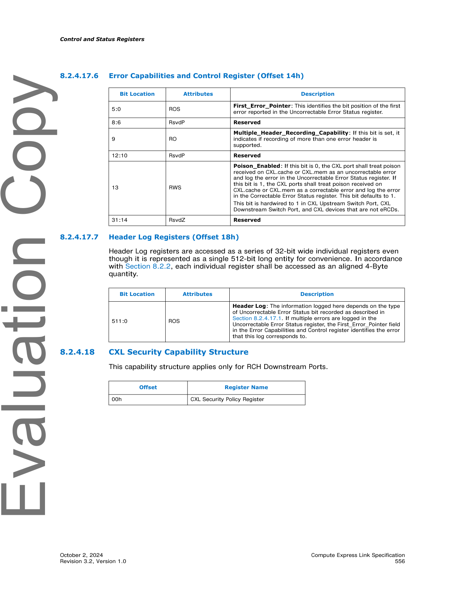
>
> *Original page render @ 150 DPI* — [📄 Full size](figures/chapter_08/page_0556.png)

[⬆️ 返回目录](#-本章目录-part-b)

---

## 8.2.4.17.7 Header Log Registers (Offset 18h) | 头日志寄存器 (偏移量 18h)

<table>
<thead>
<tr>
<th width="50%">🇬🇧 English</th>
<th width="50%" style="background-color:#e8e8e8">🇨🇳 中文</th>
</tr>
</thead>
<tbody>
<tr><td>

Header Log registers are accessed as a series of 32-bit wide individual registers even though it is represented as a single 512-bit long entity for convenience. In accordance with Section 8.2.2, each individual register shall be accessed as an aligned 4-Byte quantity.

| Bit Location | Attributes | Description |
|--------------|------------|-------------|
| 511:0 | ROS | Header Log: The information logged here depends on the type of Uncorrectable Error Status bit recorded as described in Section 8.2.4.17.1. If multiple errors are logged in the Uncorrectable Error Status register, the First_Error_Pointer field in the Error Capabilities and Control register identifies the error that this log corresponds to. |

</td><td style="background-color:#e8e8e8">

头日志 (Header Log) 寄存器虽然为了方便起见表示为单个 512 位长的实体, 但作为一系列 32 位宽的单独寄存器进行访问。根据第 8.2.2 节的规定, 每个单独寄存器应作为对齐的 4 字节量进行访问。

| 位域 | 属性 | 描述 |
|------|------|------|
| 511:0 | ROS | Header Log: 此处记录的信息取决于第 8.2.4.17.1 节中描述的已记录 Uncorrectable Error Status 位的类型。如果在 Uncorrectable Error Status 寄存器中记录了多个错误, 则 Error Capabilities and Control 寄存器中的 First_Error_Pointer 字段标识该日志所对应的错误。 |

</td></tr>
</tbody>
</table>

> **Figure 8-27.** Header Log Register layout ｜ 头日志寄存器布局
>
> 
>
> *Original page render @ 150 DPI* — [📄 Full size](figures/chapter_08/page_0556.png)

[⬆️ 返回目录](#-本章目录-part-b)

---

## 8.2.4.18 CXL Security Capability Structure | CXL 安全能力结构

<table>
<thead>
<tr>
<th width="50%">🇬🇧 English</th>
<th width="50%" style="background-color:#e8e8e8">🇨🇳 中文</th>
</tr>
</thead>
<tbody>
<tr><td>

This capability structure applies only for RCH Downstream Ports.

| Offset | Register Name |
|--------|---------------|
| 00h | CXL Security Policy Register |

</td><td style="background-color:#e8e8e8">

此能力结构仅适用于 RCH 下行端口 (RCH Downstream Port)。

| 偏移量 | 寄存器名称 |
|--------|------------|
| 00h | CXL Security Policy Register |

</td></tr>
</tbody>
</table>

> **Figure 8-28.** CXL Security Capability Structure layout ｜ CXL 安全能力结构布局
>
> 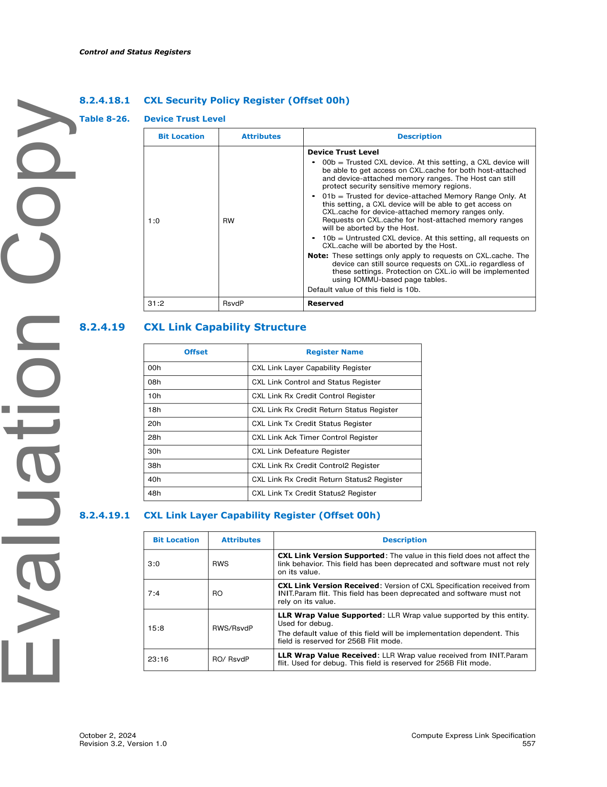
>
> *Original page render @ 150 DPI* — [📄 Full size](figures/chapter_08/page_0557.png)

[⬆️ 返回目录](#-本章目录-part-b)

---

## 8.2.4.18.1 CXL Security Policy Register (Offset 00h) | CXL 安全策略寄存器 (偏移量 00h)

<table>
<thead>
<tr>
<th width="50%">🇬🇧 English</th>
<th width="50%" style="background-color:#e8e8e8">🇨🇳 中文</th>
</tr>
</thead>
<tbody>
<tr><td>

| Bit Location | Attributes | Description |
|--------------|------------|-------------|
| 1:0 | RW | Device Trust Level |
| | | • 00b = Trusted CXL device. At this setting, a CXL device will be able to get access on CXL.cache for both host-attached and device-attached memory ranges. The Host can still protect security sensitive memory regions. |
| | | • 01b = Trusted for device-attached Memory Range Only. At this setting, a CXL device will be able to get access on CXL.cache for device-attached memory ranges only. Requests on CXL.cache for host-attached memory ranges will be aborted by the Host. |
| | | • 10b = Untrusted CXL device. At this setting, all requests on CXL.cache will be aborted by the Host. |
| | | Note: These settings only apply to requests on CXL.cache. The device can still source requests on CXL.io regardless of these settings. Protection on CXL.io will be implemented using IOMMU-based page tables. |
| | | Default value of this field is 10b. |
| 31:2 | RsvdP | Reserved |

</td><td style="background-color:#e8e8e8">

| 位域 | 属性 | 描述 |
|------|------|------|
| 1:0 | RW | 设备信任等级 (Device Trust Level) |
| | | • 00b = 可信的 CXL 设备 (Trusted CXL device)。在此设置下, CXL 设备将能够访问 CXL.cache 上的主机端附加内存范围和设备端附加内存范围。主机仍可保护安全敏感的内存区域。 |
| | | • 01b = 仅信任设备端附加内存范围 (Trusted for device-attached Memory Range Only)。在此设置下, CXL 设备将只能访问 CXL.cache 上的设备端附加内存范围。对主机端附加内存范围的 CXL.cache 请求将被主机中止。 |
| | | • 10b = 不可信 CXL 设备 (Untrusted CXL device)。在此设置下, CXL.cache 上的所有请求都将被主机中止。 |
| | | 注: 这些设置仅适用于 CXL.cache 上的请求。无论这些设置如何, 设备仍可在 CXL.io 上发起请求。CXL.io 上的保护将使用基于 IOMMU 的页表来实现。 |
| | | 此字段的默认值为 10b。 |
| 31:2 | RsvdP | 保留 |

</td></tr>
</tbody>
</table>

> **Table 8-26.** Device Trust Level ｜ 设备信任等级
>
> 
>
> *Original page render @ 150 DPI* — [📄 Full size](figures/chapter_08/page_0557.png)

[⬆️ 返回目录](#-本章目录-part-b)

---

## 8.2.4.19 CXL Link Capability Structure | CXL 链路能力结构

<table>
<thead>
<tr>
<th width="50%">🇬🇧 English</th>
<th width="50%" style="background-color:#e8e8e8">🇨🇳 中文</th>
</tr>
</thead>
<tbody>
<tr><td>

| Offset | Register Name |
|--------|---------------|
| 00h | CXL Link Layer Capability Register |
| 08h | CXL Link Control and Status Register |
| 10h | CXL Link Rx Credit Control Register |
| 18h | CXL Link Rx Credit Return Status Register |
| 20h | CXL Link Tx Credit Status Register |
| 28h | CXL Link Ack Timer Control Register |
| 30h | CXL Link Defeature Register |
| 38h | CXL Link Rx Credit Control2 Register |
| 40h | CXL Link Rx Credit Return Status2 Register |
| 48h | CXL Link Tx Credit Status2 Register |

</td><td style="background-color:#e8e8e8">

| 偏移量 | 寄存器名称 |
|--------|------------|
| 00h | CXL Link Layer Capability Register |
| 08h | CXL Link Control and Status Register |
| 10h | CXL Link Rx Credit Control Register |
| 18h | CXL Link Rx Credit Return Status Register |
| 20h | CXL Link Tx Credit Status Register |
| 28h | CXL Link Ack Timer Control Register |
| 30h | CXL Link Defeature Register |
| 38h | CXL Link Rx Credit Control2 Register |
| 40h | CXL Link Rx Credit Return Status2 Register |
| 48h | CXL Link Tx Credit Status2 Register |

</td></tr>
</tbody>
</table>

[⬆️ 返回目录](#-本章目录-part-b)

---

## 8.2.4.19.1 CXL Link Layer Capability Register (Offset 00h) | CXL 链路层能力寄存器 (偏移量 00h)

<table>
<thead>
<tr>
<th width="50%">🇬🇧 English</th>
<th width="50%" style="background-color:#e8e8e8">🇨🇳 中文</th>
</tr>
</thead>
<tbody>
<tr><td>

| Bit Location | Attributes | Description |
|--------------|------------|-------------|
| 3:0 | RWS | CXL Link Version Supported: The value in this field does not affect the link behavior. This field has been deprecated and software must not rely on its value. |
| 7:4 | RO | CXL Link Version Received: Version of CXL Specification received from INIT.Param flit. This field has been deprecated and software must not rely on its value. |
| 15:8 | RWS/RsvdP | LLR Wrap Value Supported: LLR Wrap value supported by this entity. Used for debug. The default value of this field will be implementation dependent. This field is reserved for 256B Flit mode. |
| 23:16 | RO/RsvdP | LLR Wrap Value Received: LLR Wrap value received from INIT.Param flit. Used for debug. This field is reserved for 256B Flit mode. |
| 28:24 | RO/RsvdP | NUM_Retry_Received: Num_Retry value reflected in the last RETRY.Req message received. Used for debug. This field is reserved for 256B Flit mode. |
| 33:29 | RO/RsvdP | NUM_Phy_Reinit_Received: Num_Phy_Reinit value reflected in the last RETRY.Req message received. Used for debug. This field is reserved for 256B Flit mode. |
| 41:34 | RO/RsvdP | Wr_Ptr_Received: Wr_Ptr value reflected in the last RETRY.Ack message received. This field is reserved for 256B Flit mode. |
| 49:42 | RO/RsvdP | Echo_Eseq_Received: Echo_Eseq value reflected in the last RETRY.Ack message received. This field is reserved for 256B Flit mode. |
| 57:50 | RO/RsvdP | Num_Free_Buf_Received: Num_Free_Buf value reflected in the last RETRY.Ack message received. This field is reserved for 256B Flit mode. |
| 58 | RO/RsvdP | No_LL_Reset_Support: If set, indicates that the LL_Reset configuration bit is not supported.¹ |
| 63:59 | RsvdP | Reserved |

¹ Introduced as part of Version=2.

</td><td style="background-color:#e8e8e8">

| 位域 | 属性 | 描述 |
|------|------|------|
| 3:0 | RWS | CXL Link Version Supported: 此字段的值不影响链路行为。该字段已弃用, 软件不得依赖其值。 |
| 7:4 | RO | CXL Link Version Received: 从 INIT.Param Flit 接收到的 CXL 规范版本。该字段已弃用, 软件不得依赖其值。 |
| 15:8 | RWS/RsvdP | LLR Wrap Value Supported: 此实体支持的 LLR Wrap 值。用于调试。此字段的默认值取决于实现。对于 256B Flit 模式, 该字段保留。 |
| 23:16 | RO/RsvdP | LLR Wrap Value Received: 从 INIT.Param Flit 接收到的 LLR Wrap 值。用于调试。对于 256B Flit 模式, 该字段保留。 |
| 28:24 | RO/RsvdP | NUM_Retry_Received: 上次接收到的 RETRY.Req 消息中反映的 Num_Retry 值。用于调试。对于 256B Flit 模式, 该字段保留。 |
| 33:29 | RO/RsvdP | NUM_Phy_Reinit_Received: 上次接收到的 RETRY.Req 消息中反映的 Num_Phy_Reinit 值。用于调试。对于 256B Flit 模式, 该字段保留。 |
| 41:34 | RO/RsvdP | Wr_Ptr_Received: 上次接收到的 RETRY.Ack 消息中反映的 Wr_Ptr 值。对于 256B Flit 模式, 该字段保留。 |
| 49:42 | RO/RsvdP | Echo_Eseq_Received: 上次接收到的 RETRY.Ack 消息中反映的 Echo_Eseq 值。对于 256B Flit 模式, 该字段保留。 |
| 57:50 | RO/RsvdP | Num_Free_Buf_Received: 上次接收到的 RETRY.Ack 消息中反映的 Num_Free_Buf 值。对于 256B Flit 模式, 该字段保留。 |
| 58 | RO/RsvdP | No_LL_Reset_Support: 如果置位, 表示不支持 LL_Reset 配置位。¹ |
| 63:59 | RsvdP | 保留 |

¹ 作为 Version=2 的一部分引入。

</td></tr>
</tbody>
</table>

> **Figure 8-29.** CXL Link Layer Capability Register layout ｜ CXL 链路层能力寄存器布局
>
> 
>
> *Original page render @ 150 DPI* — [📄 Full size](figures/chapter_08/page_0557.png)

[⬆️ 返回目录](#-本章目录-part-b)

---

## 8.2.4.19.2 CXL Link Layer Control and Status Register (Offset 08h) | CXL 链路层控制与状态寄存器 (偏移量 08h)

<table>
<thead>
<tr>
<th width="50%">🇬🇧 English</th>
<th width="50%" style="background-color:#e8e8e8">🇨🇳 中文</th>
</tr>
</thead>
<tbody>
<tr><td>

| Bit Location | Attributes | Description |
|--------------|------------|-------------|
| 0 | RW | LL_Reset: Re-initialize without resetting values in sticky registers. When this bit is set, the link layer reset is initiated. When link layer reset completes, hardware will clear the bit to 0. Entity triggering LL_Reset should ensure that link is quiesced. Support for this bit is optional. If LL_Reset is not supported, the NO_LL_Reset_Support bit in the CXL Link Layer Capability register shall be set (see Section 8.2.4.19.1). The use of this bit is expected to be for debug. Any production need for Link Layer re-initialization is to be satisfied using CXL Hot Reset. |
| 1 | RWS | LL_Init_Stall: If set, link layer stalls the transmission of the LLCTRL-INIT.Param flit until this bit is cleared. The default value of this bit is 0. |
| 2 | RWS | LL_Crd_Stall: If set, link layer stalls credit initialization until this bit is cleared. The reset default value of this bit is 0. |
| 4:3 | RO | INIT_State: This field reflects the current initialization status of the Link Layer, including any stall conditions controlled by bits 2:1: • 00b = NOT_RDY_FOR_INIT (stalled or unstalled): LLCTRL-INIT.Param flit not sent • 01b = PARAM_EX: LLCTRL-INIT.Param sent and waiting to receive it • 10b = CRD_RETURN_STALL: Parameter exchanged successfully, and Credit return is stalled • 11b = INIT_DONE: Link Initialization Done: LLCTRL-INIT.Param flit sent and received, and initial credit refund not stalled |
| 12:5 | RO/RsvdP | LL_Retry_Buffer_Consumed: Snapshot of link layer retry buffer consumed. This field is reserved for 256B Flit mode. |
| 63:13 | RsvdP | Reserved |

</td><td style="background-color:#e8e8e8">

| 位域 | 属性 | 描述 |
|------|------|------|
| 0 | RW | LL_Reset: 在不清除粘性寄存器值的情况下重新初始化。当该位置位时, 启动链路层复位。当链路层复位完成时, 硬件将该位清零。触发 LL_Reset 的实体应确保链路处于静止状态。该位的支持是可选的。如果不支持 LL_Reset, 则 CXL Link Layer Capability 寄存器中的 NO_LL_Reset_Support 位应置位 (参见第 8.2.4.19.1 节)。该位预期用于调试。任何对链路层重新初始化的生产需求都应通过 CXL 热复位 (Hot Reset) 来满足。 |
| 1 | RWS | LL_Init_Stall: 如果置位, 链路层将暂停 LLCTRL-INIT.Param Flit 的传输, 直到该位被清除。该位的默认值为 0。 |
| 2 | RWS | LL_Crd_Stall: 如果置位, 链路层将暂停信用初始化, 直到该位被清除。该位的复位默认值为 0。 |
| 4:3 | RO | INIT_State: 此字段反映链路层的当前初始化状态, 包括由位 2:1 控制的任何暂停条件: • 00b = NOT_RDY_FOR_INIT (已暂停或未暂停): 未发送 LLCTRL-INIT.Param Flit • 01b = PARAM_EX: 已发送 LLCTRL-INIT.Param, 等待接收 • 10b = CRD_RETURN_STALL: 参数交换成功, 信用返回暂停 • 11b = INIT_DONE: 链路初始化完成: LLCTRL-INIT.Param Flit 已发送和接收, 初始信用退还未暂停 |
| 12:5 | RO/RsvdP | LL_Retry_Buffer_Consumed: 已消耗链路层重试缓冲区的快照。对于 256B Flit 模式, 该字段保留。 |
| 63:13 | RsvdP | 保留 |

</td></tr>
</tbody>
</table>

> **Figure 8-30.** CXL Link Layer Control and Status Register layout ｜ CXL 链路层控制与状态寄存器布局
>
> 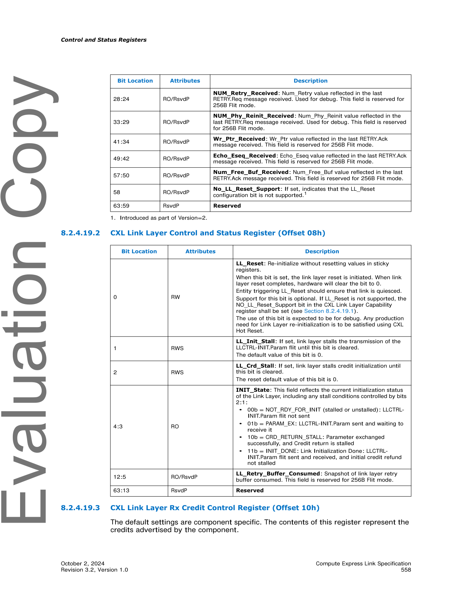
>
> *Original page render @ 150 DPI* — [📄 Full size](figures/chapter_08/page_0558.png)

[⬆️ 返回目录](#-本章目录-part-b)

---

## 8.2.4.19.3 CXL Link Layer Rx Credit Control Register (Offset 10h) | CXL 链路层 Rx 信用控制寄存器 (偏移量 10h)

<table>
<thead>
<tr>
<th width="50%">🇬🇧 English</th>
<th width="50%" style="background-color:#e8e8e8">🇨🇳 中文</th>
</tr>
</thead>
<tbody>
<tr><td>

The default settings are component specific. The contents of this register represent the credits advertised by the component.

| Bit Location | Attributes | Description |
|--------------|------------|-------------|
| 9:0 | RWS | Cache Req Credits: Credits to advertise for CXL.cache Request channel at init. For Upstream Port, this field represents the credits to advertise for CXL.cache H2D Req channel at init. For Downstream Port or Fabric Port, this field represents the credits to advertise for CXL.cache D2H Req channel at init. The default value represents the maximum number of CXL.cache Request channel credits that the component supports. |
| 19:10 | RWS | Cache Rsp Credits: Credits to advertise for CXL.cache Response channel at init. For Upstream Port, this field represents the credits to advertise for CXL.cache H2D Rsp channel at init. For Downstream Port or Fabric Port, this field represents the credits to advertise for CXL.cache D2H Rsp channel at init. The default value represents the maximum number of CXL.cache Response channel credits that the component supports. |
| 29:20 | RWS | Cache Data Credits: Credits to advertise for CXL.cache Data channel at init. For Upstream Port, this field represents the credits to advertise for CXL.cache H2D Data channel at init. For Downstream Port or Fabric Port, this field represents the credits to advertise for CXL.cache D2H Data channel at init. The default value represents the maximum number of CXL.cache Data channel credits that the component supports. |
| 39:30 | RWS | Mem Req_Rsp Credits: For an Upstream Port, this field represents the credits to advertise for CXL.mem Request channel at init. For a Downstream Port or Fabric Port, this field represents the credits to advertise for CXL.mem NDR channel at init. The default value represents the maximum number of credits that the port supports. |
| 49:40 | RWS | Mem Data Credits: Credits to advertise for CXL.mem Data channel at init. For an Upstream Port, this field represents the number of advertised RwD channel credits at init. For a Downstream Port or Fabric Port, this field represents the number of advertised DRS channel credits at init. The default value represents the maximum number of channel credits that the port supports. |
| 59:50 | RWS/RsvdP | BI Credits: For an Upstream Port, this field represents the number of advertised BIRsp channel credits at init. For a Downstream Port or Fabric Port, this field represents the number of advertised BISnp channel credits at init. The default value represents the maximum number of the appropriate Back-Invalidate channel credits of which the port is capable.¹ This field is reserved for 68B Flit mode and for components that do not support BI. |
| 63:60 | RsvdP | Reserved |

¹ Introduced as part of Version=3.

</td><td style="background-color:#e8e8e8">

默认设置是组件特定的。该寄存器的内容表示组件通告的信用。

| 位域 | 属性 | 描述 |
|------|------|------|
| 9:0 | RWS | Cache Req Credits: 初始化时为 CXL.cache 请求信道通告的信用。对于上行端口 (Upstream Port), 此字段表示初始化时为 CXL.cache H2D Req 信道通告的信用。对于下行端口 (Downstream Port) 或结构端口 (Fabric Port), 此字段表示初始化时为 CXL.cache D2H Req 信道通告的信用。默认值表示组件支持的 CXL.cache 请求信道最大信用数。 |
| 19:10 | RWS | Cache Rsp Credits: 初始化时为 CXL.cache 响应信道通告的信用。对于上行端口, 此字段表示初始化时为 CXL.cache H2D Rsp 信道通告的信用。对于下行端口或结构端口, 此字段表示初始化时为 CXL.cache D2H Rsp 信道通告的信用。默认值表示组件支持的 CXL.cache 响应信道最大信用数。 |
| 29:20 | RWS | Cache Data Credits: 初始化时为 CXL.cache 数据信道通告的信用。对于上行端口, 此字段表示初始化时为 CXL.cache H2D Data 信道通告的信用。对于下行端口或结构端口, 此字段表示初始化时为 CXL.cache D2H Data 信道通告的信用。默认值表示组件支持的 CXL.cache 数据信道最大信用数。 |
| 39:30 | RWS | Mem Req_Rsp Credits: 对于上行端口, 此字段表示初始化时为 CXL.mem 请求信道通告的信用。对于下行端口或结构端口, 此字段表示初始化时为 CXL.mem NDR 信道通告的信用。默认值表示端口支持的最大信用数。 |
| 49:40 | RWS | Mem Data Credits: 初始化时为 CXL.mem 数据信道通告的信用。对于上行端口, 此字段表示初始化时通告的 RwD 信道信用数。对于下行端口或结构端口, 此字段表示初始化时通告的 DRS 信道信用数。默认值表示端口支持的最大信道信用数。 |
| 59:50 | RWS/RsvdP | BI Credits: 对于上行端口, 此字段表示初始化时通告的 BIRsp 信道信用数。对于下行端口或结构端口, 此字段表示初始化时通告的 BISnp 信道信用数。默认值表示端口支持的最大相应 Back-Invalidate 信道信用数。¹ 该字段对于 68B Flit 模式以及不支持 BI 的组件保留。 |
| 63:60 | RsvdP | 保留 |

¹ 作为 Version=3 的一部分引入。

</td></tr>
</tbody>
</table>

> **Figure 8-31.** CXL Link Layer Rx Credit Control Register layout ｜ CXL 链路层 Rx 信用控制寄存器布局
>
> 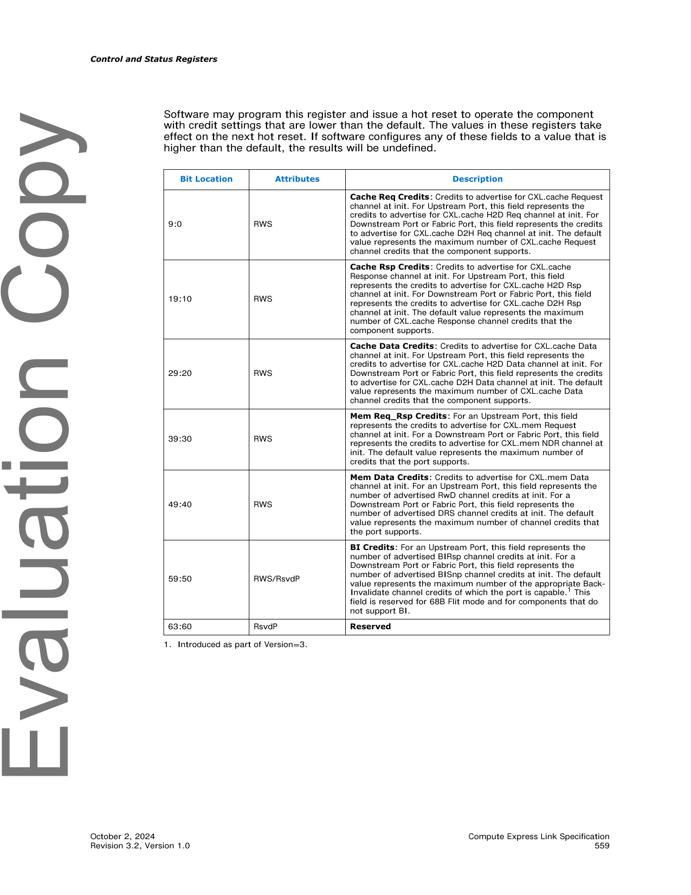
>
> *Original page render @ 150 DPI* — [📄 Full size](figures/chapter_08/page_0559.png)

[⬆️ 返回目录](#-本章目录-part-b)

---

## 8.2.4.19.4 CXL Link Layer Rx Credit Return Status Register (Offset 18h) | CXL 链路层 Rx 信用返回状态寄存器 (偏移量 18h)

<table>
<thead>
<tr>
<th width="50%">🇬🇧 English</th>
<th width="50%" style="background-color:#e8e8e8">🇨🇳 中文</th>
</tr>
</thead>
<tbody>
<tr><td>

| Bit Location | Attributes | Description |
|--------------|------------|-------------|
| 9:0 | RO | Cache Req Credits: Running snapshot of accumulated CXL.cache Request credits to be returned. For Upstream Port, this field represents the running snapshot of the accumulated CXL.cache H2D Req channel credits to be returned. For Downstream Port or Fabric Port, this field represents the running snapshot of the accumulated CXL.cache D2H Req channel credits to be returned. |
| 19:10 | RO | Cache Rsp Credits: Running snapshot of accumulated CXL.cache Response credits to be returned. For Upstream Port, this field represents the running snapshot of the accumulated CXL.cache H2D Rsp channel credits to be returned. For Downstream Port or Fabric Port, this field represents the running snapshot of the accumulated CXL.cache D2H Rsp channel credits to be returned. |
| 29:20 | RO | Cache Data Credits: Running snapshot of accumulated CXL.cache Data credits to be returned. For Upstream Port, this field represents the running snapshot of the accumulated CXL.cache H2D Data channel credits to be returned. For Downstream Port or Fabric Port, this field represents the running snapshot of the accumulated CXL.cache D2H Data channel credits to be returned. |
| 39:30 | RO | Mem Req_Rsp Credits: For an Upstream Port, this field represents the running snapshot of the accumulated CXL.mem Request channel credits to be returned. For a Downstream Port or Fabric Port, this field represents the running snapshot of the accumulated CXL.mem NDR channel credits to be returned. |
| 49:40 | RO | Mem Data Credits: Running snapshot of accumulated CXL.mem Data credits to be returned. For an Upstream Port, this field represents the running snapshot of the accumulated RwD channel credits to be returned. For a Downstream Port or Fabric Port, this field represents the running snapshot of the accumulated DRS channel credits to be returned. |
| 59:50 | RO/RsvdP | BI Credits: For an Upstream Port, this field represents the running snapshot of the accumulated BIRsp channel credits to be returned. For a Downstream Port or Fabric Port, this field represents the running snapshot of accumulated BISnp channel credits to be returned.¹ This field is reserved for 68B Flit mode and for components that do not support BI. |
| 63:60 | RsvdP | Reserved |

¹ Introduced as part of Version=3.

</td><td style="background-color:#e8e8e8">

| 位域 | 属性 | 描述 |
|------|------|------|
| 9:0 | RO | Cache Req Credits: 要返回的累积 CXL.cache 请求信用的运行快照。对于上行端口, 此字段表示要返回的累积 CXL.cache H2D Req 信道信用的运行快照。对于下行端口或结构端口, 此字段表示要返回的累积 CXL.cache D2H Req 信道信用的运行快照。 |
| 19:10 | RO | Cache Rsp Credits: 要返回的累积 CXL.cache 响应信用的运行快照。对于上行端口, 此字段表示要返回的累积 CXL.cache H2D Rsp 信道信用的运行快照。对于下行端口或结构端口, 此字段表示要返回的累积 CXL.cache D2H Rsp 信道信用的运行快照。 |
| 29:20 | RO | Cache Data Credits: 要返回的累积 CXL.cache 数据信用的运行快照。对于上行端口, 此字段表示要返回的累积 CXL.cache H2D Data 信道信用的运行快照。对于下行端口或结构端口, 此字段表示要返回的累积 CXL.cache D2H Data 信道信用的运行快照。 |
| 39:30 | RO | Mem Req_Rsp Credits: 对于上行端口, 此字段表示要返回的累积 CXL.mem 请求信道信用的运行快照。对于下行端口或结构端口, 此字段表示要返回的累积 CXL.mem NDR 信道信用的运行快照。 |
| 49:40 | RO | Mem Data Credits: 要返回的累积 CXL.mem 数据信用的运行快照。对于上行端口, 此字段表示要返回的累积 RwD 信道信用的运行快照。对于下行端口或结构端口, 此字段表示要返回的累积 DRS 信道信用的运行快照。 |
| 59:50 | RO/RsvdP | BI Credits: 对于上行端口, 此字段表示要返回的累积 BIRsp 信道信用的运行快照。对于下行端口或结构端口, 此字段表示要返回的累积 BISnp 信道信用的运行快照。¹ 该字段对于 68B Flit 模式以及不支持 BI 的组件保留。 |
| 63:60 | RsvdP | 保留 |

¹ 作为 Version=3 的一部分引入。

</td></tr>
</tbody>
</table>

> **Figure 8-32.** CXL Link Layer Rx Credit Return Status Register layout ｜ CXL 链路层 Rx 信用返回状态寄存器布局
>
> 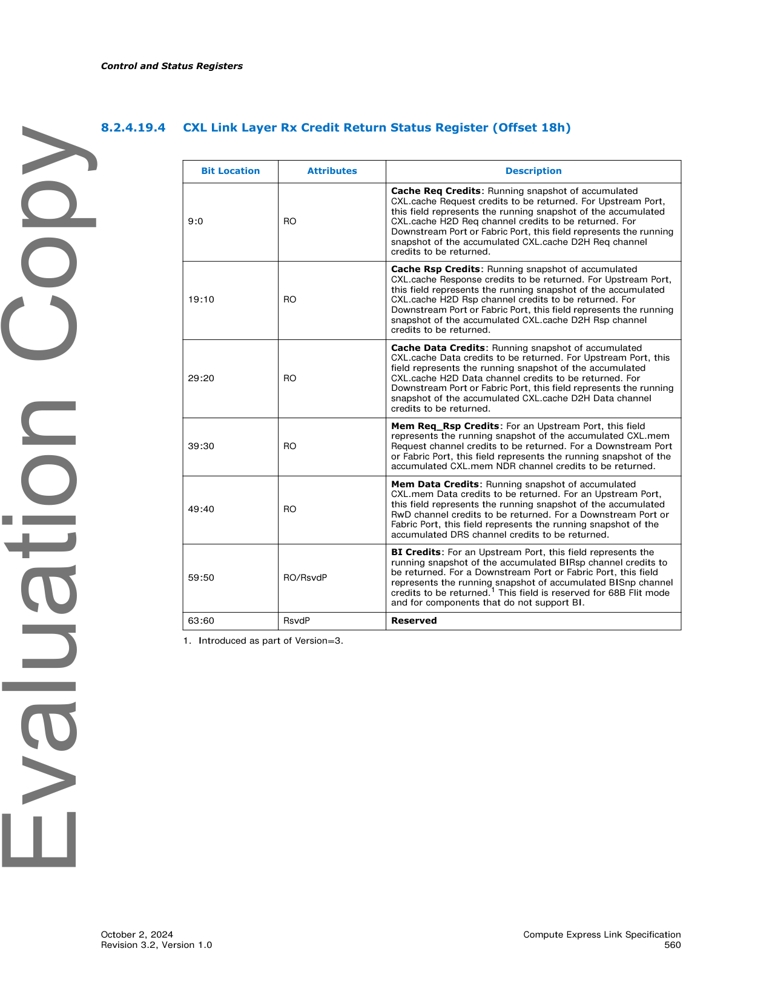
>
> *Original page render @ 150 DPI* — [📄 Full size](figures/chapter_08/page_0560.png)

[⬆️ 返回目录](#-本章目录-part-b)

---

## 8.2.4.19.5 CXL Link Layer Tx Credit Status Register (Offset 20h) | CXL 链路层 Tx 信用状态寄存器 (偏移量 20h)

<table>
<thead>
<tr>
<th width="50%">🇬🇧 English</th>
<th width="50%" style="background-color:#e8e8e8">🇨🇳 中文</th>
</tr>
</thead>
<tbody>
<tr><td>

| Bit Location | Attributes | Description |
|--------------|------------|-------------|
| 9:0 | RO | Cache Req Credits: Running snapshot of CXL.cache Request credits for Tx. For Upstream Port, this field represents the running snapshot of the CXL.cache D2H Req channel credits for Tx. For Downstream Port or Fabric Port, this field represents the running snapshot of the CXL.cache H2D Req channel credits for Tx. |
| 19:10 | RO | Cache Rsp Credits: Running snapshot of CXL.cache Response credits for Tx. For Upstream Port, this field represents the running snapshot of the CXL.cache D2H Rsp channel credits for Tx. For Downstream Port or Fabric Port, this field represents the running snapshot of the CXL.cache H2D Rsp channel credits for Tx. |
| 29:20 | RO | Cache Data Credits: Running snapshot of CXL.cache Data credits for Tx. For Upstream Port, this field represents the running snapshot of the CXL.cache D2H Data channel credits for Tx. For Downstream Port or Fabric Port, this field represents the running snapshot of the CXL.cache H2D Data channel credits for Tx. |
| 39:30 | RO | Mem Req_Rsp Credits: For an Upstream Port, this field represents the running snapshot of the CXL.mem NDR channel credits for Tx. For a Downstream Port or Fabric Port, this field represents the running snapshot of the CXL.mem Request channel credits for Tx. |
| 49:40 | RO | Mem Data Credits: Running snapshot of CXL.mem Data credits for Tx. For an Upstream Port, this field represents the number of DRS channel credits for Tx. For a Downstream Port or Fabric Port, this field represents the number of RwD channel credits for Tx. |
| 59:50 | RO/RsvdP | BI Credits: For an Upstream Port, this field represents the running snapshot of the accumulated BISnp channel credits for Tx. For a Downstream Port or Fabric Port, this field represents the running snapshot of accumulated BIRsp channel credits for Tx.¹ This field is reserved for 68B Flit mode and for components that do not support BI. |
| 63:60 | RsvdP | Reserved |

¹ Introduced as part of Version=3.

</td><td style="background-color:#e8e8e8">

| 位域 | 属性 | 描述 |
|------|------|------|
| 9:0 | RO | Cache Req Credits: Tx 的 CXL.cache 请求信用的运行快照。对于上行端口, 此字段表示 Tx 的 CXL.cache D2H Req 信道信用的运行快照。对于下行端口或结构端口, 此字段表示 Tx 的 CXL.cache H2D Req 信道信用的运行快照。 |
| 19:10 | RO | Cache Rsp Credits: Tx 的 CXL.cache 响应信用的运行快照。对于上行端口, 此字段表示 Tx 的 CXL.cache D2H Rsp 信道信用的运行快照。对于下行端口或结构端口, 此字段表示 Tx 的 CXL.cache H2D Rsp 信道信用的运行快照。 |
| 29:20 | RO | Cache Data Credits: Tx 的 CXL.cache 数据信用的运行快照。对于上行端口, 此字段表示 Tx 的 CXL.cache D2H Data 信道信用的运行快照。对于下行端口或结构端口, 此字段表示 Tx 的 CXL.cache H2D Data 信道信用的运行快照。 |
| 39:30 | RO | Mem Req_Rsp Credits: 对于上行端口, 此字段表示 Tx 的 CXL.mem NDR 信道信用的运行快照。对于下行端口或结构端口, 此字段表示 Tx 的 CXL.mem 请求信道信用的运行快照。 |
| 49:40 | RO | Mem Data Credits: Tx 的 CXL.mem 数据信用的运行快照。对于上行端口, 此字段表示 Tx 的 DRS 信道信用数。对于下行端口或结构端口, 此字段表示 Tx 的 RwD 信道信用数。 |
| 59:50 | RO/RsvdP | BI Credits: 对于上行端口, 此字段表示 Tx 的累积 BISnp 信道信用的运行快照。对于下行端口或结构端口, 此字段表示 Tx 的累积 BIRsp 信道信用的运行快照。¹ 该字段对于 68B Flit 模式以及不支持 BI 的组件保留。 |
| 63:60 | RsvdP | 保留 |

¹ 作为 Version=3 的一部分引入。

</td></tr>
</tbody>
</table>

> **Figure 8-33.** CXL Link Layer Tx Credit Status Register layout ｜ CXL 链路层 Tx 信用状态寄存器布局
>
> 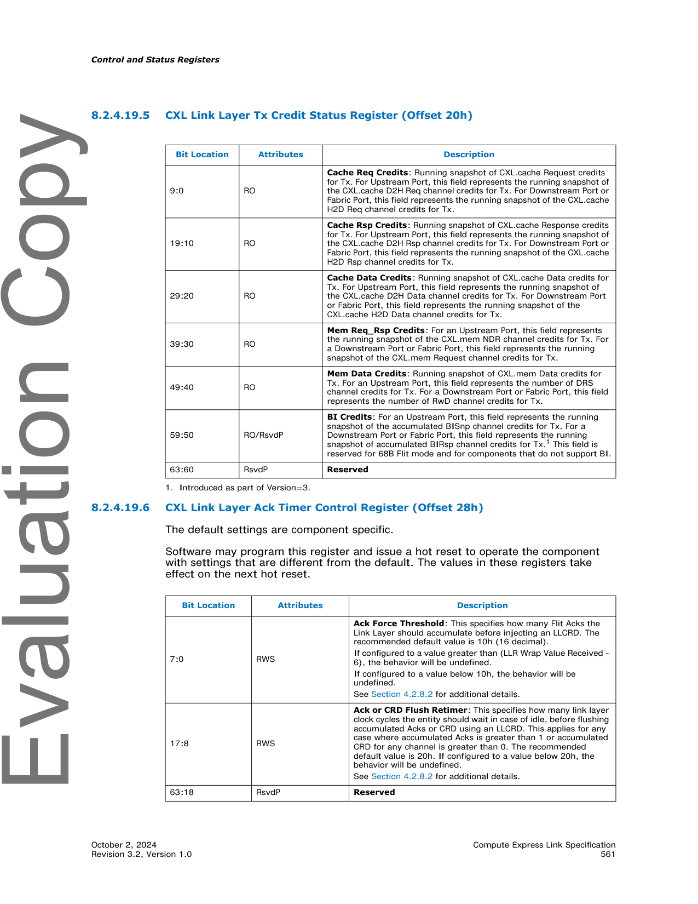
>
> *Original page render @ 150 DPI* — [📄 Full size](figures/chapter_08/page_0561.png)

[⬆️ 返回目录](#-本章目录-part-b)

---

## 8.2.4.19.6 CXL Link Layer Ack Timer Control Register (Offset 28h) | CXL 链路层 Ack 定时器控制寄存器 (偏移量 28h)

<table>
<thead>
<tr>
<th width="50%">🇬🇧 English</th>
<th width="50%" style="background-color:#e8e8e8">🇨🇳 中文</th>
</tr>
</thead>
<tbody>
<tr><td>

The default settings are component specific.

Software may program this register and issue a hot reset to operate the component with settings that are different from the default. The values in these registers take effect on the next hot reset.

| Bit Location | Attributes | Description |
|--------------|------------|-------------|
| 7:0 | RWS | Ack Force Threshold: This specifies how many Flit Acks the Link Layer should accumulate before injecting an LLCRD. The recommended default value is 10h (16 decimal). If configured to a value greater than (LLR Wrap Value Received - 6), the behavior will be undefined. If configured to a value below 10h, the behavior will be undefined. See Section 4.2.8.2 for additional details. |
| 17:8 | RWS | Ack or CRD Flush Retimer: This specifies how many link layer clock cycles the entity should wait in case of idle, before flushing accumulated Acks or CRD using an LLCRD. This applies for any case where accumulated Acks is greater than 1 or accumulated CRD for any channel is greater than 0. The recommended default value is 20h. If configured to a value below 20h, the behavior will be undefined. See Section 4.2.8.2 for additional details. |
| 63:18 | RsvdP | Reserved |

</td><td style="background-color:#e8e8e8">

默认设置是组件特定的。

软件可以编程此寄存器并发出热复位, 以使用与默认不同的设置来操作组件。这些寄存器中的值将在下一次热复位时生效。

| 位域 | 属性 | 描述 |
|------|------|------|
| 7:0 | RWS | Ack Force Threshold: 指定链路层在注入 LLCRD 之前应累积的 Flit Ack 数量。推荐的默认值为 10h (十进制 16)。如果配置为大于 (LLR Wrap Value Received - 6) 的值, 行为将是未定义的。如果配置为低于 10h 的值, 行为将是未定义的。有关更多详细信息, 请参见第 4.2.8.2 节。 |
| 17:8 | RWS | Ack or CRD Flush Retimer: 指定在空闲情况下, 实体在通过 LLCRD 刷新累积的 Ack 或 CRD 之前应等待的链路层时钟周期数。这适用于累积 Ack 大于 1 或任何信道的累积 CRD 大于 0 的任何情况。推荐的默认值为 20h。如果配置为低于 20h 的值, 行为将是未定义的。有关更多详细信息, 请参见第 4.2.8.2 节。 |
| 63:18 | RsvdP | 保留 |

</td></tr>
</tbody>
</table>

> **Figure 8-34.** CXL Link Layer Ack Timer Control Register layout ｜ CXL 链路层 Ack 定时器控制寄存器布局
>
> 
>
> *Original page render @ 150 DPI* — [📄 Full size](figures/chapter_08/page_0561.png)

[⬆️ 返回目录](#-本章目录-part-b)

---

## 8.2.4.19.7 CXL Link Layer Defeature Register (Offset 30h) | CXL 链路层功能禁用寄存器 (偏移量 30h)

<table>
<thead>
<tr>
<th width="50%">🇬🇧 English</th>
<th width="50%" style="background-color:#e8e8e8">🇨🇳 中文</th>
</tr>
</thead>
<tbody>
<tr><td>

| Bit Location | Attributes | Description |
|--------------|------------|-------------|
| 0 | RWS/RsvdP | MDH Disable: Write 1 to disable MDH. Software needs to ensure it programs this value consistently on the Upstream Port and Downstream Port. After programming, a hot reset is required for the disable to take effect. The default value of this bit is 0. |
| 63:1 | RsvdP | Reserved |

</td><td style="background-color:#e8e8e8">

| 位域 | 属性 | 描述 |
|------|------|------|
| 0 | RWS/RsvdP | MDH Disable: 写 1 以禁用 MDH。软件需要确保在上行端口和下行端口上一致地编程此值。编程后, 需要热复位才能使禁用生效。该位的默认值为 0。 |
| 63:1 | RsvdP | 保留 |

</td></tr>
</tbody>
</table>

> **Figure 8-35.** CXL Link Layer Defeature Register layout ｜ CXL 链路层功能禁用寄存器布局
>
> 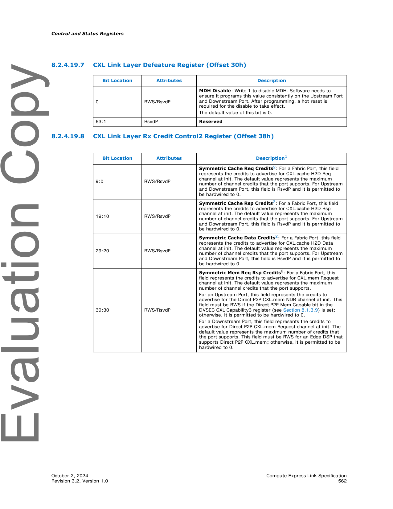
>
> *Original page render @ 150 DPI* — [📄 Full size](figures/chapter_08/page_0562.png)

[⬆️ 返回目录](#-本章目录-part-b)

---

## 8.2.4.19.8 CXL Link Layer Rx Credit Control2 Register (Offset 38h) | CXL 链路层 Rx 信用控制 2 寄存器 (偏移量 38h)

<table>
<thead>
<tr>
<th width="50%">🇬🇧 English</th>
<th width="50%" style="background-color:#e8e8e8">🇨🇳 中文</th>
</tr>
</thead>
<tbody>
<tr><td>

¹ This register was introduced as part of Version=4.
² This field was introduced as part of Version=4.

| Bit Location | Attributes | Description¹ |
|--------------|------------|-------------|
| 9:0 | RWS/RsvdP | Symmetric Cache Req Credits²: For a Fabric Port, this field represents the credits to advertise for CXL.cache H2D Req channel at init. The default value represents the maximum number of channel credits that the port supports. For Upstream and Downstream Port, this field is RsvdP and it is permitted to be hardwired to 0. |
| 19:10 | RWS/RsvdP | Symmetric Cache Rsp Credits²: For a Fabric Port, this field represents the credits to advertise for CXL.cache H2D Rsp channel at init. The default value represents the maximum number of channel credits that the port supports. For Upstream and Downstream Port, this field is RsvdP and it is permitted to be hardwired to 0. |
| 29:20 | RWS/RsvdP | Symmetric Cache Data Credits²: For a Fabric Port, this field represents the credits to advertise for CXL.cache H2D Data channel at init. The default value represents the maximum number of channel credits that the port supports. For Upstream and Downstream Port, this field is RsvdP and it is permitted to be hardwired to 0. |
| 39:30 | RWS/RsvdP | Symmetric Mem Req Rsp Credits²: For a Fabric Port, this field represents the credits to advertise for CXL.mem Request channel at init. The default value represents the maximum number of channel credits that the port supports. For an Upstream Port, this field represents the credits to advertise for the Direct P2P CXL.mem NDR channel at init. This field must be RWS if the Direct P2P Mem Capable bit in the DVSEC CXL Capability³ register (see Section 8.1.3.9) is set; otherwise, it is permitted to be hardwired to 0. For a Downstream Port, this field represents the credits to advertise for Direct P2P CXL.mem Request channel at init. The default value represents the maximum number of credits that the port supports. This field must be RWS for an Edge DSP that supports Direct P2P CXL.mem; otherwise, it is permitted to be hardwired to 0. |
| 49:40 | RWS/RsvdP | Symmetric Mem Data Credits²: For a Fabric Port, this field represents the credits to advertise for CXL.mem RwD channel at init. The default value represents the maximum number of channel credits that the port supports. For an Upstream Port, this field represents the number of advertised Direct P2P CXL.mem DRS channel credits at init. This field must be RWS if the Direct P2P Mem Capable bit in the DVSEC CXL Capability³ register (see Section 8.1.3.9) is set; otherwise, it is permitted to be hardwired to 0. For a Downstream Port, this field represents the number of advertised Direct P2P CXL.mem RwD channel credits at init. The default value represents the maximum number of channel credits of which the port is capable. This field must be RWS for an Edge DSP that supports Direct P2P CXL.mem; otherwise, it is permitted to be hardwired to 0. |
| 59:50 | RWS/RsvdP | Symmetric BI Credits²: For a Fabric Port, this field represents the credits to advertise for BIRsp channel at init. The default value represents the maximum number of channel credits that the port supports. For Upstream and Downstream Port, this field is RsvdP and it is permitted to be hardwired to 0. |
| 63:60 | RsvdP | Reserved |

</td><td style="background-color:#e8e8e8">

¹ 此寄存器作为 Version=4 的一部分引入。
² 此字段作为 Version=4 的一部分引入。

| 位域 | 属性 | 描述¹ |
|------|------|------|
| 9:0 | RWS/RsvdP | Symmetric Cache Req Credits²: 对于结构端口 (Fabric Port), 此字段表示初始化时为 CXL.cache H2D Req 信道通告的信用。默认值表示端口支持的最大信道信用数。对于上行端口和下行端口, 此字段为 RsvdP, 允许硬连线为 0。 |
| 19:10 | RWS/RsvdP | Symmetric Cache Rsp Credits²: 对于结构端口, 此字段表示初始化时为 CXL.cache H2D Rsp 信道通告的信用。默认值表示端口支持的最大信道信用数。对于上行端口和下行端口, 此字段为 RsvdP, 允许硬连线为 0。 |
| 29:20 | RWS/RsvdP | Symmetric Cache Data Credits²: 对于结构端口, 此字段表示初始化时为 CXL.cache H2D Data 信道通告的信用。默认值表示端口支持的最大信道信用数。对于上行端口和下行端口, 此字段为 RsvdP, 允许硬连线为 0。 |
| 39:30 | RWS/RsvdP | Symmetric Mem Req Rsp Credits²: 对于结构端口, 此字段表示初始化时为 CXL.mem 请求信道通告的信用。默认值表示端口支持的最大信道信用数。对于上行端口, 此字段表示初始化时为 Direct P2P CXL.mem NDR 信道通告的信用。如果 DVSEC CXL Capability³ 寄存器 (参见第 8.1.3.9 节) 中的 Direct P2P Mem Capable 位置位, 则此字段必须为 RWS; 否则, 允许硬连线为 0。对于下行端口, 此字段表示初始化时为 Direct P2P CXL.mem 请求信道通告的信用。默认值表示端口支持的最大信用数。对于支持 Direct P2P CXL.mem 的边缘 DSP, 此字段必须为 RWS; 否则, 允许硬连线为 0。 |
| 49:40 | RWS/RsvdP | Symmetric Mem Data Credits²: 对于结构端口, 此字段表示初始化时为 CXL.mem RwD 信道通告的信用。默认值表示端口支持的最大信道信用数。对于上行端口, 此字段表示初始化时通告的 Direct P2P CXL.mem DRS 信道信用数。如果 DVSEC CXL Capability³ 寄存器 (参见第 8.1.3.9 节) 中的 Direct P2P Mem Capable 位置位, 则此字段必须为 RWS; 否则, 允许硬连线为 0。对于下行端口, 此字段表示初始化时通告的 Direct P2P CXL.mem RwD 信道信用数。默认值表示端口支持的最大信道信用数。对于支持 Direct P2P CXL.mem 的边缘 DSP, 此字段必须为 RWS; 否则, 允许硬连线为 0。 |
| 59:50 | RWS/RsvdP | Symmetric BI Credits²: 对于结构端口, 此字段表示初始化时为 BIRsp 信道通告的信用。默认值表示端口支持的最大信道信用数。对于上行端口和下行端口, 此字段为 RsvdP, 允许硬连线为 0。 |
| 63:60 | RsvdP | 保留 |

</td></tr>
</tbody>
</table>

> **Figure 8-36.** CXL Link Layer Rx Credit Control2 Register layout ｜ CXL 链路层 Rx 信用控制 2 寄存器布局
>
> 
>
> *Original page render @ 150 DPI* — [📄 Full size](figures/chapter_08/page_0562.png)

[⬆️ 返回目录](#-本章目录-part-b)

---

## 8.2.4.19.9 CXL Link Layer Rx Credit Return Status2 Register (Offset 40h) | CXL 链路层 Rx 信用返回状态 2 寄存器 (偏移量 40h)

<table>
<thead>
<tr>
<th width="50%">🇬🇧 English</th>
<th width="50%" style="background-color:#e8e8e8">🇨🇳 中文</th>
</tr>
</thead>
<tbody>
<tr><td>

¹ This register was introduced as part of Version=4.
² This field was introduced as part of Version=4.

| Bit Location | Attributes | Description¹ |
|--------------|------------|-------------|
| 9:0 | RO/RsvdP | Symmetric Cache Req Credits²: For a Fabric Port, this field represents the running snapshot of the accumulated CXL.cache H2D Req channel credits to be returned. For Upstream and Downstream Port, this field is RsvdP. |
| 19:10 | RO/RsvdP | Symmetric Cache Rsp Credits²: For a Fabric Port, this field represents the running snapshot of the accumulated CXL.cache H2D Rsp channel credits to be returned. For Upstream and Downstream Port, this field is RsvdP. |
| 29:20 | RO/RsvdP | Symmetric Cache Data Credits²: For a Fabric Port, this field represents the running snapshot of the accumulated CXL.cache H2D Data channel credits to be returned. For Upstream and Downstream Port, this field is RsvdP. |
| 39:30 | RO/RsvdP | Symmetric Mem Req_Rsp Credits²: For a Fabric Port, this field represents the running snapshot of the accumulated CXL.mem Request channel credits to be returned. For an Upstream Port, this field represents the running snapshot of the accumulated Direct P2P CXL.mem NDR channel credits to be returned. This field must be RO if the Direct P2P Mem Capable bit in the DVSEC CXL Capability³ register (see Section 8.1.3.9) is set; otherwise, it is RsvdP. For a Downstream Port, this field represents the running snapshot of the accumulated Direct P2P CXL.mem Request channel credits to be returned. This field must be RO for an Edge DSP that supports Direct P2P CXL.mem; otherwise, it is RsvdP. |
| 49:40 | RO/RsvdP | Symmetric Mem Data Credits²: For a Fabric Port, this field represents the running snapshot of the accumulated CXL.mem RwD channel credits to be returned. For an Upstream Port, this field represents the running snapshot of the accumulated Direct P2P CXL.mem DRS channel credits to be returned. This field must be RO if the Direct P2P Mem Capable bit in the DVSEC CXL Capability³ register (see Section 8.1.3.9) is set; otherwise, it is RsvdP. For a Downstream Port, this field represents the running snapshot of the accumulated Direct P2P CXL.mem RwD channel credits to be returned. This field must be RO for an Edge DSP that supports Direct P2P CXL.mem; otherwise, it is RsvdP. |
| 59:50 | RO/RsvdP | Symmetric BI Credits²: For a Fabric Port, this field represents the running snapshot of the accumulated BIRsp channel credits to be returned. For Upstream and Downstream Port, this field is RsvdP. |
| 63:60 | RsvdP | Reserved |

</td><td style="background-color:#e8e8e8">

¹ 此寄存器作为 Version=4 的一部分引入。
² 此字段作为 Version=4 的一部分引入。

| 位域 | 属性 | 描述¹ |
|------|------|------|
| 9:0 | RO/RsvdP | Symmetric Cache Req Credits²: 对于结构端口, 此字段表示要返回的累积 CXL.cache H2D Req 信道信用的运行快照。对于上行端口和下行端口, 此字段为 RsvdP。 |
| 19:10 | RO/RsvdP | Symmetric Cache Rsp Credits²: 对于结构端口, 此字段表示要返回的累积 CXL.cache H2D Rsp 信道信用的运行快照。对于上行端口和下行端口, 此字段为 RsvdP。 |
| 29:20 | RO/RsvdP | Symmetric Cache Data Credits²: 对于结构端口, 此字段表示要返回的累积 CXL.cache H2D Data 信道信用的运行快照。对于上行端口和下行端口, 此字段为 RsvdP。 |
| 39:30 | RO/RsvdP | Symmetric Mem Req_Rsp Credits²: 对于结构端口, 此字段表示要返回的累积 CXL.mem 请求信道信用的运行快照。对于上行端口, 此字段表示要返回的累积 Direct P2P CXL.mem NDR 信道信用的运行快照。如果 DVSEC CXL Capability³ 寄存器 (参见第 8.1.3.9 节) 中的 Direct P2P Mem Capable 位置位, 则此字段必须为 RO; 否则, 为 RsvdP。对于下行端口, 此字段表示要返回的累积 Direct P2P CXL.mem 请求信道信用的运行快照。对于支持 Direct P2P CXL.mem 的边缘 DSP, 此字段必须为 RO; 否则, 为 RsvdP。 |
| 49:40 | RO/RsvdP | Symmetric Mem Data Credits²: 对于结构端口, 此字段表示要返回的累积 CXL.mem RwD 信道信用的运行快照。对于上行端口, 此字段表示要返回的累积 Direct P2P CXL.mem DRS 信道信用的运行快照。如果 DVSEC CXL Capability³ 寄存器 (参见第 8.1.3.9 节) 中的 Direct P2P Mem Capable 位置位, 则此字段必须为 RO; 否则, 为 RsvdP。对于下行端口, 此字段表示要返回的累积 Direct P2P CXL.mem RwD 信道信用的运行快照。对于支持 Direct P2P CXL.mem 的边缘 DSP, 此字段必须为 RO; 否则, 为 RsvdP。 |
| 59:50 | RO/RsvdP | Symmetric BI Credits²: 对于结构端口, 此字段表示要返回的累积 BIRsp 信道信用的运行快照。对于上行端口和下行端口, 此字段为 RsvdP。 |
| 63:60 | RsvdP | 保留 |

</td></tr>
</tbody>
</table>

> **Figure 8-37.** CXL Link Layer Rx Credit Return Status2 Register layout ｜ CXL 链路层 Rx 信用返回状态 2 寄存器布局
>
> 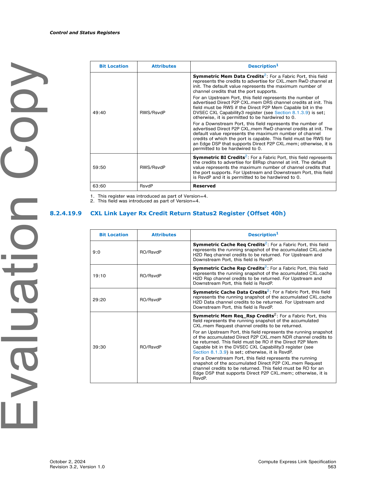
>
> *Original page render @ 150 DPI* — [📄 Full size](figures/chapter_08/page_0563.png)

[⬆️ 返回目录](#-本章目录-part-b)

---

## 8.2.4.19.10 CXL Link Layer Tx Credit Status2 Register (Offset 48h) | CXL 链路层 Tx 信用状态 2 寄存器 (偏移量 48h)

<table>
<thead>
<tr>
<th width="50%">🇬🇧 English</th>
<th width="50%" style="background-color:#e8e8e8">🇨🇳 中文</th>
</tr>
</thead>
<tbody>
<tr><td>

¹ This register was introduced as part of Version=4.
² This field was introduced as part of Version=4.

| Bit Location | Attributes | Description¹ |
|--------------|------------|-------------|
| 9:0 | RO/RsvdP | Symmetric Cache Req Credits²: For a Fabric Port, this field represents the running snapshot of the CXL.cache D2H Req channel credits for Tx. For Upstream and Downstream Port, this field is RsvdP. |
| 19:10 | RO/RsvdP | Symmetric Cache Rsp Credits²: For a Fabric Port, this field represents the running snapshot of the CXL.cache D2H Rsp channel credits for Tx. For Upstream and Downstream Port, this field is RsvdP. |
| 29:20 | RO/RsvdP | Symmetric Cache Data Credits²: For Fabric Port, this field represents the running snapshot of the CXL.cache D2H Data channel credits for Tx. For Upstream and Downstream Port, this field is RsvdP. |
| 39:30 | RO/RsvdP | Symmetric Mem Req_Rsp Credits²: For a Fabric Port, this field represents the running snapshot of the CXL.mem NDR channel credits for Tx. For an Upstream Port, this field represents the running snapshot of the Direct P2P CXL.mem Request channel credits for Tx. This field must be RO if the Direct P2P Mem Capable bit in the DVSEC CXL Capability³ register (see Section 8.1.3.9) is set; otherwise, it is RsvdP. For a Downstream Port, this field represents the running snapshot of the Direct P2P CXL.mem NDR channel credits for Tx. This field must be RO for an Edge DSP that supports Direct P2P CXL.mem; otherwise, it is RsvdP. |
| 49:40 | RO/RsvdP | Symmetric Mem Data Credits²: For a Fabric Port, this field represents the running snapshot of the accumulated DRS channel credits for Tx. For an Upstream Port, this field represents the number of Direct P2P CXL.mem RwD channel credits for Tx. This field must be RO if the Direct P2P Mem Capable bit in the DVSEC CXL Capability³ register (see Section 8.1.3.9) is set; otherwise, it is RsvdP. For a Downstream Port, this field represents the number of Direct P2P CXL.mem DRS channel credits for Tx. This field must be RO for an Edge DSP that supports Direct P2P CXL.mem; otherwise, it is RsvdP. |
| 59:50 | RO/RsvdP | Symmetric BI Credits²: For a Fabric Port, this field represents the running snapshot of the accumulated BISnp channel credits for Tx. For Upstream and Downstream Port, this field is RsvdP. |
| 63:60 | RsvdP | Reserved |

</td><td style="background-color:#e8e8e8">

¹ 此寄存器作为 Version=4 的一部分引入。
² 此字段作为 Version=4 的一部分引入。

| 位域 | 属性 | 描述¹ |
|------|------|------|
| 9:0 | RO/RsvdP | Symmetric Cache Req Credits²: 对于结构端口, 此字段表示 Tx 的 CXL.cache D2H Req 信道信用的运行快照。对于上行端口和下行端口, 此字段为 RsvdP。 |
| 19:10 | RO/RsvdP | Symmetric Cache Rsp Credits²: 对于结构端口, 此字段表示 Tx 的 CXL.cache D2H Rsp 信道信用的运行快照。对于上行端口和下行端口, 此字段为 RsvdP。 |
| 29:20 | RO/RsvdP | Symmetric Cache Data Credits²: 对于结构端口, 此字段表示 Tx 的 CXL.cache D2H Data 信道信用的运行快照。对于上行端口和下行端口, 此字段为 RsvdP。 |
| 39:30 | RO/RsvdP | Symmetric Mem Req_Rsp Credits²: 对于结构端口, 此字段表示 Tx 的 CXL.mem NDR 信道信用的运行快照。对于上行端口, 此字段表示 Tx 的 Direct P2P CXL.mem 请求信道信用的运行快照。如果 DVSEC CXL Capability³ 寄存器 (参见第 8.1.3.9 节) 中的 Direct P2P Mem Capable 位置位, 则此字段必须为 RO; 否则, 为 RsvdP。对于下行端口, 此字段表示 Tx 的 Direct P2P CXL.mem NDR 信道信用的运行快照。对于支持 Direct P2P CXL.mem 的边缘 DSP, 此字段必须为 RO; 否则, 为 RsvdP。 |
| 49:40 | RO/RsvdP | Symmetric Mem Data Credits²: 对于结构端口, 此字段表示 Tx 的累积 DRS 信道信用的运行快照。对于上行端口, 此字段表示 Tx 的 Direct P2P CXL.mem RwD 信道信用数。如果 DVSEC CXL Capability³ 寄存器 (参见第 8.1.3.9 节) 中的 Direct P2P Mem Capable 位置位, 则此字段必须为 RO; 否则, 为 RsvdP。对于下行端口, 此字段表示 Tx 的 Direct P2P CXL.mem DRS 信道信用数。对于支持 Direct P2P CXL.mem 的边缘 DSP, 此字段必须为 RO; 否则, 为 RsvdP。 |
| 59:50 | RO/RsvdP | Symmetric BI Credits²: 对于结构端口, 此字段表示 Tx 的累积 BISnp 信道信用的运行快照。对于上行端口和下行端口, 此字段为 RsvdP。 |
| 63:60 | RsvdP | 保留 |

</td></tr>
</tbody>
</table>

> **Figure 8-38.** CXL Link Layer Tx Credit Status2 Register layout ｜ CXL 链路层 Tx 信用状态 2 寄存器布局
>
> 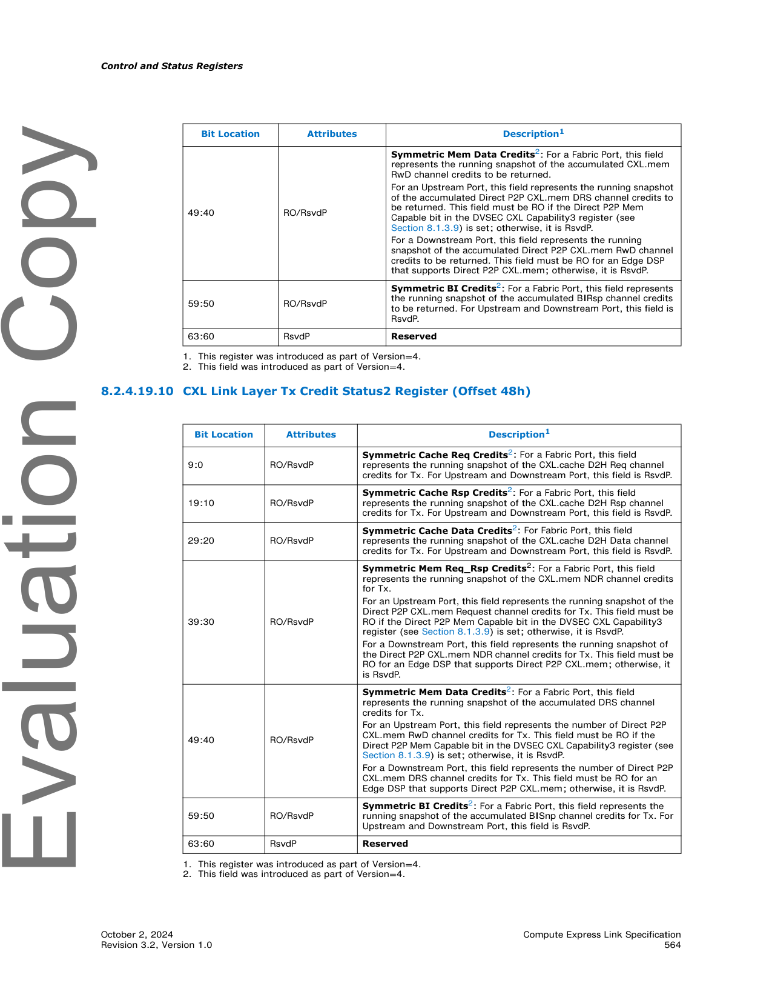
>
> *Original page render @ 150 DPI* — [📄 Full size](figures/chapter_08/page_0564.png)

[⬆️ 返回目录](#-本章目录-part-b)

---

## 8.2.4.20 CXL HDM Decoder Capability Structure | CXL HDM 解码器能力结构

<table>
<thead>
<tr>
<th width="50%">🇬🇧 English</th>
<th width="50%" style="background-color:#e8e8e8">🇨🇳 中文</th>
</tr>
</thead>
<tbody>
<tr><td>

CXL HDM Decoder Capability structure facilitates routing of CXL.mem as well as UIO transactions that target HDM and optionally enables interleaving of HDM across CXL.mem-capable devices.

A CXL Host Bridge is identified as an ACPI device with a Hardware ID (HID) of "ACPI0016" and is associated with one or more CXL root ports. Any CXL Host Bridge that is associated with more than one CXL root port must contain one instance of this capability structure in the CHBCR. This capability structure resolves the target CXL root ports for a given memory address.

A CXL switch component may contain one Upstream Switch Port and one or more Downstream Switch Ports. A CXL Upstream Switch Port that is capable of routing CXL.mem traffic to more than one Downstream Switch Ports shall contain one instance of this capability structure. The capability structure, located in CXL Upstream Switch Port, resolves the target CXL Downstream Switch Ports for a given memory address.

A CXL Type 3 device that is not an eRCD shall contain one instance of this capability structure. A CXL Type 2 device that supports BI or supports UIO access to its HDM shall contain one instance of this capability structure. The capability structure, located in a device, translates the Host Physical Address (HPA) into a Device Physical Address (DPA) after taking any interleaving into account.

| Offset | Register Name |
|--------|---------------|
| 00h | CXL HDM Decoder Capability Register |
| 04h | CXL HDM Decoder Global Control Register |
| 08h | Reserved |
| 0Ch | Reserved |
| **Decoder 0:** | |
| 10h | CXL HDM Decoder 0 Base Low Register |
| 14h | CXL HDM Decoder 0 Base High Register |
| 18h | CXL HDM Decoder 0 Size Low Register |
| 1Ch | CXL HDM Decoder 0 Size High Register |
| 20h | CXL HDM Decoder 0 Control Register |
| 24h | CXL HDM Decoder 0 Target List Low Register (not applicable to devices) / CXL HDM Decoder 0 DPA Skip Low Register (devices only) |
| 28h | CXL HDM Decoder 0 Target List High Register (not applicable to devices) / CXL HDM Decoder 0 DPA Skip High Register (devices only) |
| 2Ch | Reserved |
| **Decoder 1:** | |
| 30h – 4Fh | CXL HDM Decoder 1 registers |
| … | … |
| **Decoder n:** | |
| 20h *n+ 10h: 20h*n + 2Fh | CXL HDM Decoder n registers (see Section 8.2.4.20.3 through Section 8.2.4.20.11). |

0 ≤ n < Raw Decoder Count. The Raw Decoder count is derived from the Decoder Count field in the CXL HDM Decoder Capability register (see Section 8.2.4.20.1).

</td><td style="background-color:#e8e8e8">

CXL HDM 解码器能力结构便于对面向 HDM 的 CXL.mem 以及 UIO 事务进行路由, 并可选择地实现跨 CXL.mem 能力设备的 HDM 交织。

CXL 主机桥 (Host Bridge) 由硬件 ID (HID) 为 "ACPI0016" 的 ACPI 设备标识, 并与一个或多个 CXL 根端口相关联。任何与多个 CXL 根端口相关联的 CXL 主机桥必须在 CHBCR 中包含此能力结构的一个实例。该能力结构解析给定内存地址的目标 CXL 根端口。

CXL 交换机组件可以包含一个上行交换机端口 (Upstream Switch Port) 和一个或多个下行交换机端口 (Downstream Switch Port)。能够将 CXL.mem 流量路由到多个下行交换机端口的 CXL 上行交换机端口应包含此能力结构的一个实例。该能力结构位于 CXL 上行交换机端口中, 解析给定内存地址的目标 CXL 下行交换机端口。

非 eRCD 的 CXL Type 3 设备应包含此能力结构的一个实例。支持 BI 或支持对其 HDM 进行 UIO 访问的 CXL Type 2 设备应包含此能力结构的一个实例。位于设备中的该能力结构在考虑任何交织后, 将主机物理地址 (HPA) 转换为设备物理地址 (DPA)。

| 偏移量 | 寄存器名称 |
|--------|------------|
| 00h | CXL HDM Decoder Capability Register |
| 04h | CXL HDM Decoder Global Control Register |
| 08h | 保留 |
| 0Ch | 保留 |
| **Decoder 0:** | |
| 10h | CXL HDM Decoder 0 Base Low Register |
| 14h | CXL HDM Decoder 0 Base High Register |
| 18h | CXL HDM Decoder 0 Size Low Register |
| 1Ch | CXL HDM Decoder 0 Size High Register |
| 20h | CXL HDM Decoder 0 Control Register |
| 24h | CXL HDM Decoder 0 Target List Low Register (不适用于设备) / CXL HDM Decoder 0 DPA Skip Low Register (仅设备) |
| 28h | CXL HDM Decoder 0 Target List High Register (不适用于设备) / CXL HDM Decoder 0 DPA Skip High Register (仅设备) |
| 2Ch | 保留 |
| **Decoder 1:** | |
| 30h – 4Fh | CXL HDM Decoder 1 寄存器 |
| … | … |
| **Decoder n:** | |
| 20h *n+ 10h: 20h*n + 2Fh | CXL HDM Decoder n 寄存器 (参见第 8.2.4.20.3 节到第 8.2.4.20.11 节)。 |

0 ≤ n < Raw Decoder Count。原始解码器计数源自 CXL HDM Decoder Capability 寄存器中的 Decoder Count 字段 (参见第 8.2.4.20.1 节)。

</td></tr>
</tbody>
</table>

> **Figure 8-39.** CXL HDM Decoder Capability Structure layout ｜ CXL HDM 解码器能力结构布局
>
> 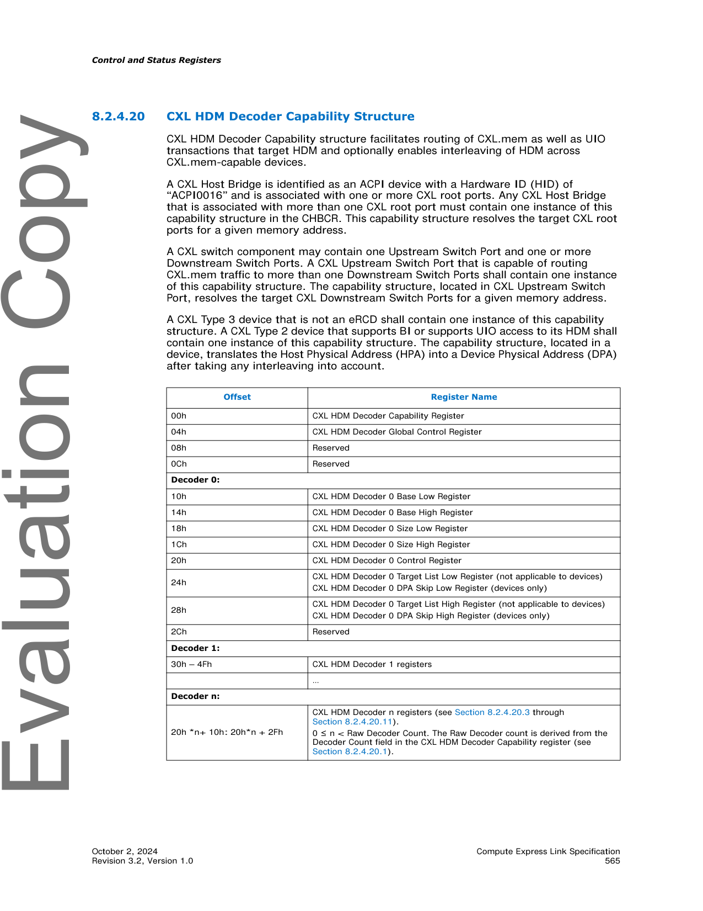
>
> *Original page render @ 150 DPI* — [📄 Full size](figures/chapter_08/page_0565.png)

[⬆️ 返回目录](#-本章目录-part-b)

---

## 8.2.4.20.1 CXL HDM Decoder Capability Register (Offset 00h) | CXL HDM 解码器能力寄存器 (偏移量 00h)

<table>
<thead>
<tr>
<th width="50%">🇬🇧 English</th>
<th width="50%" style="background-color:#e8e8e8">🇨🇳 中文</th>
</tr>
</thead>
<tbody>
<tr><td>

| Bit Location | Attributes | Description |
|--------------|------------|-------------|
| 3:0 | RO | Decoder Count: Reports the number of memory address decoders implemented by the component. CXL devices shall not advertise more than 10 decoders. CXL switches and Host Bridges may advertise up to 32 decoders. • 0h = 1 Decoder • 1h = 2 Decoders • 2h = 4 Decoders • 3h = 6 Decoders • 4h = 8 Decoders • 5h = 10 Decoders • 6h = 12 Decoders² • 7h = 14 Decoders² • 8h = 16 Decoders² • 9h = 20 Decoders² • Ah = 24 Decoders² • Bh = 28 Decoders² • Ch = 32 Decoders² All other encodings are reserved |
| 7:4 | RO | Target Count: The number of target ports each decoder supports (applicable only to Upstream Switch Port and CXL Host Bridge). Maximum of 8. • 1h = 1 target port • 2h = 2 target ports • 4h = 4 target ports • 8h = 8 target ports All other encodings are reserved |
| 8 | RO | A11to8 Interleave Capable: If set, the component supports interleaving based on Address bits [11:8]. CXL Host Bridges and Upstream Switch Ports shall always set this bit indicating support for interleaving based on Address bits [11:8]. |
| 9 | RO | A14to12 Interleave Capable: If set, the component supports interleaving based on Address bits [14:12]. CXL Host Bridges and switches shall always set this bit indicating support for interleaving based on Address bits [14:12]. |
| 10 | RO | Poison On Decode Error Capability: If set, the component is capable of returning poison on read access to addresses that are not positively decoded by any HDM Decoders in this component. If cleared, the component is not capable of returning poison under such scenarios. |
| 11 | RO | 3, 6, 12 Way Interleave Capable: If set, the CXL.mem devices supports 3-way, 6-way and 12-way interleaving, respectively. Not applicable to Upstream Switch Ports and CXL Host Bridges. Upstream Switch Ports and CXL Host Bridges shall hardwire this bit to 0.¹ |
| 12 | RO | 16 Way Interleave Capable: If set, the CXL.mem device supports 16-way interleaving. Not applicable to Upstream Switch Ports and CXL Host Bridges. Upstream Switch Ports and CXL Host Bridges shall hardwire this bit to 0.¹ |
| 13 | HwInit | UIO Capable² • For CXL.mem devices: If set, the device supports UIO accesses to its HDM • For USPs: If set, the switch is capable of routing UIO accesses that target HDM across its ports • For CXL Host Bridges: If set, all the root ports within this Host Bridge are capable of routing UIO requests that target HDM across root ports within this Host Bridge |
| 15:14 | RsvdP | Reserved |

</td><td style="background-color:#e8e8e8">

| 位域 | 属性 | 描述 |
|------|------|------|
| 3:0 | RO | Decoder Count: 报告组件实现的内存地址解码器数量。CXL 设备不得通告超过 10 个解码器。CXL 交换机和主机桥可通告最多 32 个解码器。 • 0h = 1 个解码器 • 1h = 2 个解码器 • 2h = 4 个解码器 • 3h = 6 个解码器 • 4h = 8 个解码器 • 5h = 10 个解码器 • 6h = 12 个解码器² • 7h = 14 个解码器² • 8h = 16 个解码器² • 9h = 20 个解码器² • Ah = 24 个解码器² • Bh = 28 个解码器² • Ch = 32 个解码器² 所有其他编码保留 |
| 7:4 | RO | Target Count: 每个解码器支持的目标端口数 (仅适用于上行交换机端口和 CXL 主机桥)。最大为 8。 • 1h = 1 个目标端口 • 2h = 2 个目标端口 • 4h = 4 个目标端口 • 8h = 8 个目标端口 所有其他编码保留 |
| 8 | RO | A11to8 Interleave Capable: 如果置位, 表示组件支持基于地址位 [11:8] 的交织。CXL 主机桥和上行交换机端口应始终置位该位, 表示支持基于地址位 [11:8] 的交织。 |
| 9 | RO | A14to12 Interleave Capable: 如果置位, 表示组件支持基于地址位 [14:12] 的交织。CXL 主机桥和交换机应始终置位该位, 表示支持基于地址位 [14:12] 的交织。 |
| 10 | RO | Poison On Decode Error Capability: 如果置位, 表示组件能够在对未被此组件中任何 HDM 解码器正确定向解码的地址进行读访问时返回 Poison。如果清零, 则组件在此类场景下不能返回 Poison。 |
| 11 | RO | 3, 6, 12 Way Interleave Capable: 如果置位, 表示 CXL.mem 设备分别支持 3 路、6 路和 12 路交织。不适用于上行交换机端口和 CXL 主机桥。上行交换机端口和 CXL 主机桥应将该位硬连线为 0。¹ |
| 12 | RO | 16 Way Interleave Capable: 如果置位, 表示 CXL.mem 设备支持 16 路交织。不适用于上行交换机端口和 CXL 主机桥。上行交换机端口和 CXL 主机桥应将该位硬连线为 0。¹ |
| 13 | HwInit | UIO Capable² • 对于 CXL.mem 设备: 如果置位, 表示设备支持对其 HDM 的 UIO 访问 • 对于 USP: 如果置位, 表示交换机能够跨其端口路由面向 HDM 的 UIO 访问 • 对于 CXL 主机桥: 如果置位, 表示此主机桥内的所有根端口都能够跨此主机桥内的根端口路由面向 HDM 的 UIO 请求 |
| 15:14 | RsvdP | 保留 |

</td></tr>
</tbody>
</table>

¹ Introduced as part of Version=2.
² Introduced as part of Version=3.

<table>
<thead>
<tr>
<th width="50%">🇬🇧 English (continued)</th>
<th width="50%" style="background-color:#e8e8e8">🇨🇳 中文 (续)</th>
</tr>
</thead>
<tbody>
<tr><td>

| Bit Location | Attributes | Description |
|--------------|------------|-------------|
| 19:16 | HwInit/RsvdP | UIO Capable Decoder Count: Reports the total number of memory address decoders that are implemented by components that support UIO. Software is permitted to set the UIO bit in non-consecutive HDM decoders as long as the number of UIO-enabled decoders does not exceed this count. If the software attempts to set the UIO bit (see Section 8.2.4.20.2) in an HDM decoder beyond this limit, the component shall fail the HDM decoder commit operation. See the Decoder Count field in this register for enumeration. This field is reserved for a component if the UIO Capable bit in this register is 0. This field is reserved for CXL.mem devices. A UIO-capable CXL.mem device is not permitted to limit the number of UIO-capable HDM decoders and must operate correctly even when the UIO bit is set in all of its HDM decoders.² |
| 20 | HwInit | MemData-NXM Capable: If set, the component supports MemData-NXM opcode (see Table 3-53). If cleared, the component does not support MemData-NXM opcode. All 256B Flit mode-capable components shall set this bit to 1. See Table 8-27 for the description of how this bit affects the handling of CXL.mem read requests in case of errors.² |
| 22:21 | HwInit/RsvdP | Supported Coherency Models: Indicates the coherency models that are supported by a CXL.mem device. This field is reserved for all other components.² • 00b = Unknown. • 01b = Device Coherent. The Target Range Type bit in an HDM decoder must be 0 when the HDM decoder is committed; otherwise, the device behavior is undefined. • 10b = Host-Only. The Target Range Type bit in an HDM decoder must be 1 when the HDM decoder is committed; otherwise, the device behavior is undefined. • 11b = Host-Only or Device Coherent. The Target Range Type bit in an HDM decoder is RW and may be set to 1 or cleared to 0 by software before committing the HDM decoder. |
| 31:23 | RsvdP | Reserved |

</td><td style="background-color:#e8e8e8">

| 位域 | 属性 | 描述 |
|------|------|------|
| 19:16 | HwInit/RsvdP | UIO Capable Decoder Count: 报告支持 UIO 的组件所实现的内存地址解码器总数。只要启用了 UIO 的解码器数量不超过此计数, 软件就允许在非连续的 HDM 解码器中设置 UIO 位。如果软件尝试在超出此限制的 HDM 解码器中设置 UIO 位 (参见第 8.2.4.20.2 节), 组件应使 HDM 解码器提交操作失败。有关枚举, 请参见本寄存器中的 Decoder Count 字段。如果本寄存器中的 UIO Capable 位为 0, 则此字段对组件保留。此字段对 CXL.mem 设备保留。支持 UIO 的 CXL.mem 设备不得限制支持 UIO 的 HDM 解码器数量, 并且即使在其所有 HDM 解码器中都设置了 UIO 位, 也必须正确运行。² |
| 20 | HwInit | MemData-NXM Capable: 如果置位, 表示组件支持 MemData-NXM 操作码 (参见表 3-53)。如果清零, 则组件不支持 MemData-NXM 操作码。所有支持 256B Flit 模式的组件应将该位置位为 1。有关此位如何影响错误情况下 CXL.mem 读请求处理的描述, 请参见表 8-27。² |
| 22:21 | HwInit/RsvdP | Supported Coherency Models: 指示 CXL.mem 设备支持的相干模型。此字段对所有其他组件保留。² • 00b = 未知 (Unknown)。 • 01b = 设备相干 (Device Coherent)。当 HDM 解码器被提交时, HDM 解码器中的 Target Range Type 位必须为 0; 否则, 设备行为未定义。 • 10b = 仅主机 (Host-Only)。当 HDM 解码器被提交时, HDM 解码器中的 Target Range Type 位必须为 1; 否则, 设备行为未定义。 • 11b = 仅主机或设备相干 (Host-Only or Device Coherent)。HDM 解码器中的 Target Range Type 位为 RW, 可由软件在提交 HDM 解码器之前设置为 1 或清零为 0。 |
| 31:23 | RsvdP | 保留 |

</td></tr>
</tbody>
</table>

> **Table 8-27.** CXL.mem Read Response - Error Cases ｜ CXL.mem 读响应 - 错误情况
>
> 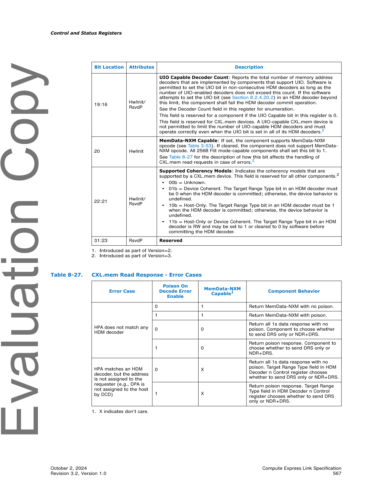
>
> *Original page render @ 150 DPI* — [📄 Full size](figures/chapter_08/page_0567.png)

[⬆️ 返回目录](#-本章目录-part-b)

---

## 8.2.4.20.2 CXL HDM Decoder Global Control Register (Offset 04h) | CXL HDM 解码器全局控制寄存器 (偏移量 04h)

<table>
<thead>
<tr>
<th width="50%">🇬🇧 English</th>
<th width="50%" style="background-color:#e8e8e8">🇨🇳 中文</th>
</tr>
</thead>
<tbody>
<tr><td>

| Bit Location | Attributes | Description |
|--------------|------------|-------------|
| 0 | RW/RO | Poison On Decode Error Enable: This bit is RO and is hardwired to 0 if Poison On Decode Error Capability=0. See Table 8-27 for the description of how this bit affects the handling of CXL.mem read requests in case of errors. Note: Writes to addresses that are not positively decoded shall be dropped and a No Data Response (see Section 3.3.9) shall be sent regardless of the state of this bit. Default value of this bit is 0. |
| 1 | RW | HDM Decoder Enable: This bit is only applicable to CXL.mem devices and shall return 0 on CXL Host Bridges and Upstream Switch Ports. When this bit is set, device shall use HDM decoders to decode CXL.mem transactions and not use HDM Base registers in PCIe DVSEC for CXL devices (see Section 8.1.3.8.3, Section 8.1.3.8.4, Section 8.1.3.8.7, and Section 8.1.3.8.8). CXL Host Bridges and Upstream Switch Ports always use HDM Decoders to decode CXL.mem transactions. Default value of this bit is 0. |
| 31:2 | RsvdP | Reserved |

</td><td style="background-color:#e8e8e8">

| 位域 | 属性 | 描述 |
|------|------|------|
| 0 | RW/RO | Poison On Decode Error Enable: 如果 Poison On Decode Error Capability=0, 则此位为 RO 并硬连线为 0。有关此位如何影响错误情况下 CXL.mem 读请求处理的描述, 请参见表 8-27。注: 写入未正确定向解码的地址应被丢弃, 并且应发送 No Data Response (参见第 3.3.9 节), 而与该位的状态无关。该位的默认值为 0。 |
| 1 | RW | HDM Decoder Enable: 该位仅适用于 CXL.mem 设备, 在 CXL 主机桥和上行交换机端口上应返回 0。当该位置位时, 设备应使用 HDM 解码器来解码 CXL.mem 事务, 而不使用 PCIe DVSEC for CXL devices 中的 HDM Base 寄存器 (参见第 8.1.3.8.3 节、第 8.1.3.8.4 节、第 8.1.3.8.7 节和第 8.1.3.8.8 节)。CXL 主机桥和上行交换机端口始终使用 HDM 解码器来解码 CXL.mem 事务。该位的默认值为 0。 |
| 31:2 | RsvdP | 保留 |

</td></tr>
</tbody>
</table>

> **Figure 8-40.** CXL HDM Decoder Global Control Register layout ｜ CXL HDM 解码器全局控制寄存器布局
>
> 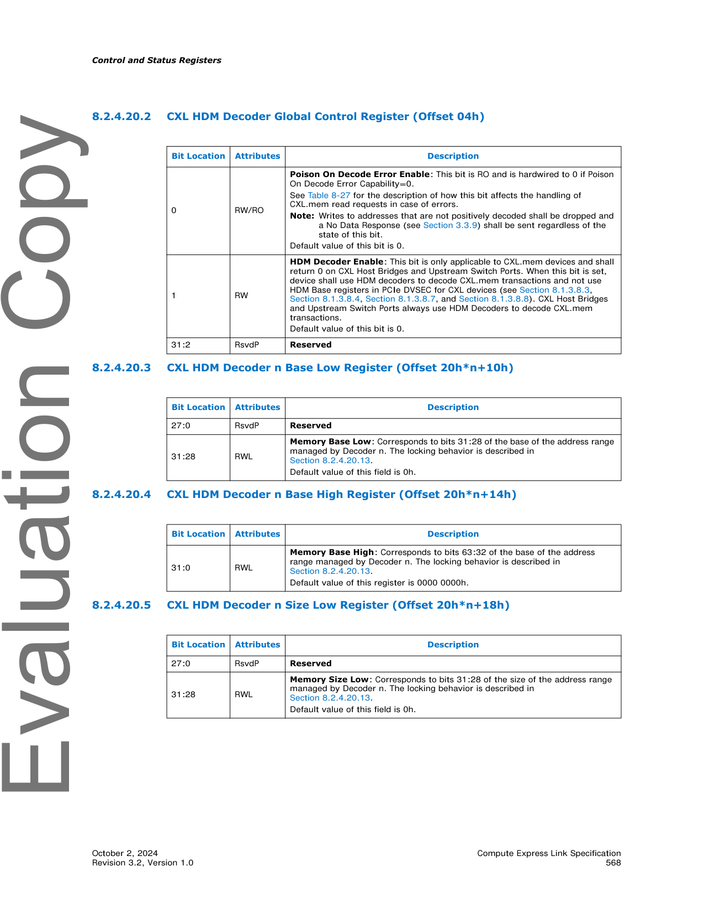
>
> *Original page render @ 150 DPI* — [📄 Full size](figures/chapter_08/page_0568.png)

[⬆️ 返回目录](#-本章目录-part-b)

---

## 8.2.4.20.3 CXL HDM Decoder n Base Low Register (Offset 20h*n+10h) | CXL HDM 解码器 n 基地址低寄存器 (偏移量 20h*n+10h)

<table>
<thead>
<tr>
<th width="50%">🇬🇧 English</th>
<th width="50%" style="background-color:#e8e8e8">🇨🇳 中文</th>
</tr>
</thead>
<tbody>
<tr><td>

| Bit Location | Attributes | Description |
|--------------|------------|-------------|
| 27:0 | RsvdP | Reserved |
| 31:28 | RWL | Memory Base Low: Corresponds to bits 31:28 of the base of the address range managed by Decoder n. The locking behavior is described in Section 8.2.4.20.13. Default value of this field is 0h. |

</td><td style="background-color:#e8e8e8">

| 位域 | 属性 | 描述 |
|------|------|------|
| 27:0 | RsvdP | 保留 |
| 31:28 | RWL | Memory Base Low: 对应于由解码器 n 管理的地址范围的基地址的 31:28 位。锁定行为在第 8.2.4.20.13 节中描述。该字段的默认值为 0h。 |

</td></tr>
</tbody>
</table>

> **Figure 8-41.** CXL HDM Decoder n Base Low Register layout ｜ CXL HDM 解码器 n 基地址低寄存器布局
>
> 
>
> *Original page render @ 150 DPI* — [📄 Full size](figures/chapter_08/page_0568.png)

[⬆️ 返回目录](#-本章目录-part-b)

---

## 8.2.4.20.4 CXL HDM Decoder n Base High Register (Offset 20h*n+14h) | CXL HDM 解码器 n 基地址高寄存器 (偏移量 20h*n+14h)

<table>
<thead>
<tr>
<th width="50%">🇬🇧 English</th>
<th width="50%" style="background-color:#e8e8e8">🇨🇳 中文</th>
</tr>
</thead>
<tbody>
<tr><td>

| Bit Location | Attributes | Description |
|--------------|------------|-------------|
| 31:0 | RWL | Memory Base High: Corresponds to bits 63:32 of the base of the address range managed by Decoder n. The locking behavior is described in Section 8.2.4.20.13. Default value of this register is 0000 0000h. |

</td><td style="background-color:#e8e8e8">

| 位域 | 属性 | 描述 |
|------|------|------|
| 31:0 | RWL | Memory Base High: 对应于由解码器 n 管理的地址范围的基地址的 63:32 位。锁定行为在第 8.2.4.20.13 节中描述。此寄存器的默认值为 0000 0000h。 |

</td></tr>
</tbody>
</table>

> **Figure 8-42.** CXL HDM Decoder n Base High Register layout ｜ CXL HDM 解码器 n 基地址高寄存器布局
>
> 
>
> *Original page render @ 150 DPI* — [📄 Full size](figures/chapter_08/page_0568.png)

[⬆️ 返回目录](#-本章目录-part-b)

---

## 8.2.4.20.5 CXL HDM Decoder n Size Low Register (Offset 20h*n+18h) | CXL HDM 解码器 n 大小低寄存器 (偏移量 20h*n+18h)

<table>
<thead>
<tr>
<th width="50%">🇬🇧 English</th>
<th width="50%" style="background-color:#e8e8e8">🇨🇳 中文</th>
</tr>
</thead>
<tbody>
<tr><td>

| Bit Location | Attributes | Description |
|--------------|------------|-------------|
| 27:0 | RsvdP | Reserved |
| 31:28 | RWL | Memory Size Low: Corresponds to bits 31:28 of the size of the address range managed by Decoder n. The locking behavior is described in Section 8.2.4.20.13. Default value of this field is 0h. |

</td><td style="background-color:#e8e8e8">

| 位域 | 属性 | 描述 |
|------|------|------|
| 27:0 | RsvdP | 保留 |
| 31:28 | RWL | Memory Size Low: 对应于由解码器 n 管理的地址范围的大小的 31:28 位。锁定行为在第 8.2.4.20.13 节中描述。该字段的默认值为 0h。 |

</td></tr>
</tbody>
</table>

> **Figure 8-43.** CXL HDM Decoder n Size Low Register layout ｜ CXL HDM 解码器 n 大小低寄存器布局
>
> 
>
> *Original page render @ 150 DPI* — [📄 Full size](figures/chapter_08/page_0568.png)

[⬆️ 返回目录](#-本章目录-part-b)

---

## 8.2.4.20.6 CXL HDM Decoder n Size High Register (Offset 20h*n+1Ch) | CXL HDM 解码器 n 大小高寄存器 (偏移量 20h*n+1Ch)

<table>
<thead>
<tr>
<th width="50%">🇬🇧 English</th>
<th width="50%" style="background-color:#e8e8e8">🇨🇳 中文</th>
</tr>
</thead>
<tbody>
<tr><td>

| Bit Location | Attributes | Description |
|--------------|------------|-------------|
| 31:0 | RWL | Memory Size High: Corresponds to bits 63:32 of the size of address range managed by Decoder n. The locking behavior is described in Section 8.2.4.20.13. Default value of this register is 0000 0000h. |

</td><td style="background-color:#e8e8e8">

| 位域 | 属性 | 描述 |
|------|------|------|
| 31:0 | RWL | Memory Size High: 对应于由解码器 n 管理的地址范围的大小的 63:32 位。锁定行为在第 8.2.4.20.13 节中描述。此寄存器的默认值为 0000 0000h。 |

</td></tr>
</tbody>
</table>

> **Figure 8-44.** CXL HDM Decoder n Size High Register layout ｜ CXL HDM 解码器 n 大小高寄存器布局
>
> 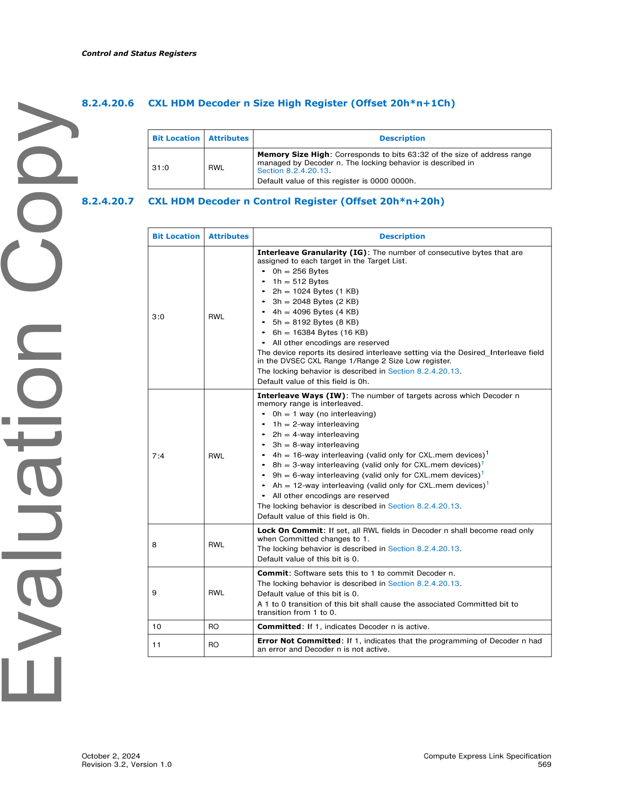
>
> *Original page render @ 150 DPI* — [📄 Full size](figures/chapter_08/page_0569.png)

[⬆️ 返回目录](#-本章目录-part-b)

---

## 8.2.4.20.7 CXL HDM Decoder n Control Register (Offset 20h*n+20h) | CXL HDM 解码器 n 控制寄存器 (偏移量 20h*n+20h)

<table>
<thead>
<tr>
<th width="50%">🇬🇧 English</th>
<th width="50%" style="background-color:#e8e8e8">🇨🇳 中文</th>
</tr>
</thead>
<tbody>
<tr><td>

| Bit Location | Attributes | Description |
|--------------|------------|-------------|
| 3:0 | RWL | Interleave Granularity (IG): The number of consecutive bytes that are assigned to each target in the Target List. • 0h = 256 Bytes • 1h = 512 Bytes • 2h = 1024 Bytes (1 KB) • 3h = 2048 Bytes (2 KB) • 4h = 4096 Bytes (4 KB) • 5h = 8192 Bytes (8 KB) • 6h = 16384 Bytes (16 KB) All other encodings are reserved The device reports its desired interleave setting via the Desired_Interleave field in the DVSEC CXL Range 1/Range 2 Size Low register. The locking behavior is described in Section 8.2.4.20.13. Default value of this field is 0h. |
| 7:4 | RWL | Interleave Ways (IW): The number of targets across which Decoder n memory range is interleaved. • 0h = 1 way (no interleaving) • 1h = 2-way interleaving • 2h = 4-way interleaving • 3h = 8-way interleaving • 4h = 16-way interleaving (valid only for CXL.mem devices)¹ • 8h = 3-way interleaving (valid only for CXL.mem devices)¹ • 9h = 6-way interleaving (valid only for CXL.mem devices)¹ • Ah = 12-way interleaving (valid only for CXL.mem devices)¹ All other encodings are reserved The locking behavior is described in Section 8.2.4.20.13. Default value of this field is 0h. |
| 8 | RWL | Lock On Commit: If set, all RWL fields in Decoder n shall become read only when Committed changes to 1. The locking behavior is described in Section 8.2.4.20.13. Default value of this bit is 0. |
| 9 | RWL | Commit: Software sets this to 1 to commit Decoder n. The locking behavior is described in Section 8.2.4.20.13. Default value of this bit is 0. A 1 to 0 transition of this bit shall cause the associated Committed bit to transition from 1 to 0. |
| 10 | RO | Committed: If 1, indicates Decoder n is active. |
| 11 | RO | Error Not Committed: If 1, indicates that the programming of Decoder n had an error and Decoder n is not active. |
| 12 | RWL/RO | Target Range Type: Formerly known as Target Device Type. This bit is RWL for CXL Host Bridges, and Upstream Switch Ports. This bit is permitted to be RO for devices that do not support this reconfigurability and it may return the value of 0 or 1 to represent the only coherency model that the devices support. • 0 = Target is a Device Coherent Address range (HDM-D or HDM-DB) • 1 = Target is a Host-Only Coherent Address range (HDM-H) The locking behavior is described in Section 8.2.4.20.13. Default value of this bit is 0. |
| 13 | RWL/RsvdP | BI: This bit is RWL for BI-capable components. This bit is reserved for components that do not support BI. Devices that require BI for managing coherency are permitted to hardwire this bit to 1.² • 0 = Device is not permitted to issue BISnp requests to this range • 1 = Device is permitted to issue BISnp requests to this range |
| 14 | RWL | UIO: This bit is RWL if the UIO Capable bit in the CXL HDM Decoder Capability register (see Section 8.2.4.20.1) is set; otherwise, it is permitted to be hardwired to 0. Software must not set this bit unless the UIO Capable bit is set to 1. Default value of this bit is 0. See Table 9-18 for how various components utilize the setting of this bit during the processing of UIO messages.² |
| 15 | RsvdP | Reserved |
| 19:16 | RWL/RsvdP | Upstream Interleave Granularity (UIG): The aggregate interleave granularity applied to the HPA by the HDM decode stages that are upstream of this port. For enumeration of legal values, see the definition of Interleave Granularity in this register.² This bit is RWL for a switch and a Host Bridge if the UIO Capable bit in the CXL HDM Decoder Capability register (see Section 8.2.4.20.1) is set. This field is reserved for CXL.mem devices. This field is also reserved for switches and Host Bridges that are not UIO capable. Default value of this field is 0h. |
| 23:20 | RWL/RsvdP | Upstream Interleave Ways (UIW): The aggregate Interleave granularity ways produced by HDM decode stages that are upstream of this port. For enumeration of legal values, see the definition of Interleave Ways in this register.² This bit is RWL for a switch and a Host Bridge if the UIO Capable bit in the CXL HDM Decoder Capability register (see Section 8.2.4.20.1) is set. This field is reserved for CXL.mem devices. This field is also reserved for switches and Host Bridges that are not UIO capable. Default value of this field is 0h. |
| 27:24 | RWL/RsvdP | Interleave Set Position (ISP): The position of this component in the interleave set formed when all HDM decode stages that are upstream of this port are considered. Expressed as a 0-based quantity. For a switch and a Host Bridge, ISP must be configured to a value that is lower than the number of Upstream Interleave Ways (the raw value, not the encoded value); otherwise, the results are undefined.² This field is RWL for a switch, and a Host Bridge if the UIO Capable bit in the CXL HDM Decoder Capability register (see Section 8.2.4.20.1) is set. This field is RWL for a BI-capable CXL.mem device. This field is reserved for switches, and Host Bridges that are not UIO capable. This field is reserved for CXL.mem devices that are not BI-capable. Default value of this field is 0h. |
| 31:28 | RsvdP | Reserved |

¹ Introduced as part of Version=2.
² Introduced as part of Version=3.

</td><td style="background-color:#e8e8e8">

| 位域 | 属性 | 描述 |
|------|------|------|
| 3:0 | RWL | Interleave Granularity (IG): 分配给 Target List 中每个目标的连续字节数。 • 0h = 256 字节 • 1h = 512 字节 • 2h = 1024 字节 (1 KB) • 3h = 2048 字节 (2 KB) • 4h = 4096 字节 (4 KB) • 5h = 8192 字节 (8 KB) • 6h = 16384 字节 (16 KB) 所有其他编码保留 设备通过 DVSEC CXL Range 1/Range 2 Size Low 寄存器中的 Desired_Interleave 字段报告其期望的交织设置。锁定行为在第 8.2.4.20.13 节中描述。该字段的默认值为 0h。 |
| 7:4 | RWL | Interleave Ways (IW): 解码器 n 内存范围与之交织的目标数。 • 0h = 1 路 (无交织) • 1h = 2 路交织 • 2h = 4 路交织 • 3h = 8 路交织 • 4h = 16 路交织 (仅对 CXL.mem 设备有效)¹ • 8h = 3 路交织 (仅对 CXL.mem 设备有效)¹ • 9h = 6 路交织 (仅对 CXL.mem 设备有效)¹ • Ah = 12 路交织 (仅对 CXL.mem 设备有效)¹ 所有其他编码保留 锁定行为在第 8.2.4.20.13 节中描述。该字段的默认值为 0h。 |
| 8 | RWL | Lock On Commit: 如果置位, 当 Committed 变为 1 时, 解码器 n 中的所有 RWL 字段应变为只读。锁定行为在第 8.2.4.20.13 节中描述。该位的默认值为 0。 |
| 9 | RWL | Commit: 软件将该位置 1 以提交解码器 n。锁定行为在第 8.2.4.20.13 节中描述。该位的默认值为 0。该位从 1 到 0 的转换应导致相关 Committed 位从 1 转换为 0。 |
| 10 | RO | Committed: 如果为 1, 表示解码器 n 处于活动状态。 |
| 11 | RO | Error Not Committed: 如果为 1, 表示解码器 n 的编程存在错误, 解码器 n 未处于活动状态。 |
| 12 | RWL/RO | Target Range Type: 以前称为 Target Device Type。对于 CXL 主机桥和上行交换机端口, 该位为 RWL。对于不支持此重配置功能的设备, 该位允许为 RO, 并且可以返回值 0 或 1 以表示设备支持的唯一相干模型。 • 0 = 目标是设备相干地址范围 (HDM-D 或 HDM-DB) • 1 = 目标是仅主机相干地址范围 (HDM-H) 锁定行为在第 8.2.4.20.13 节中描述。该位的默认值为 0。 |
| 13 | RWL/RsvdP | BI: 对于支持 BI 的组件, 该位为 RWL。对于不支持 BI 的组件, 该位保留。需要 BI 来管理相干性的设备允许将该位硬连线为 1。² • 0 = 不允许设备向此范围发出 BISnp 请求 • 1 = 允许设备向此范围发出 BISnp 请求 |
| 14 | RWL | UIO: 如果 CXL HDM Decoder Capability 寄存器 (参见第 8.2.4.20.1 节) 中的 UIO Capable 位置位, 则该位为 RWL; 否则, 允许硬连线为 0。除非 UIO Capable 位置 1, 否则软件不得设置该位。该位的默认值为 0。有关各种组件在 UIO 消息处理过程中如何使用此位的设置, 请参见表 9-18。² |
| 15 | RsvdP | 保留 |
| 19:16 | RWL/RsvdP | Upstream Interleave Granularity (UIG): 由该端口上游的 HDM 解码阶段应用于 HPA 的聚合交织粒度。有关合法值的枚举, 请参见本寄存器中 Interleave Granularity 的定义。² 如果 CXL HDM Decoder Capability 寄存器 (参见第 8.2.4.20.1 节) 中的 UIO Capable 位置位, 则对于交换机和主机桥, 该位为 RWL。此字段对 CXL.mem 设备保留。此字段对不支持 UIO 的交换机和主机桥也保留。该字段的默认值为 0h。 |
| 23:20 | RWL/RsvdP | Upstream Interleave Ways (UIW): 由该端口上游的 HDM 解码阶段产生的聚合交织粒度方式。有关合法值的枚举, 请参见本寄存器中 Interleave Ways 的定义。² 如果 CXL HDM Decoder Capability 寄存器 (参见第 8.2.4.20.1 节) 中的 UIO Capable 位置位, 则对于交换机和主机桥, 该位为 RWL。此字段对 CXL.mem 设备保留。此字段对不支持 UIO 的交换机和主机桥也保留。该字段的默认值为 0h。 |
| 27:24 | RWL/RsvdP | Interleave Set Position (ISP): 在考虑该端口上游的所有 HDM 解码阶段时形成的交织集中此组件的位置。以 0 为基的数量表示。对于交换机和主机桥, ISP 必须配置为低于 Upstream Interleave Ways 数量 (原始值, 而不是编码值) 的值; 否则, 结果未定义。² 如果 CXL HDM Decoder Capability 寄存器 (参见第 8.2.4.20.1 节) 中的 UIO Capable 位置位, 则对于交换机和主机桥, 此字段为 RWL。对于支持 BI 的 CXL.mem 设备, 此字段为 RWL。此字段对不支持 UIO 的交换机和主机桥保留。此字段对不支持 BI 的 CXL.mem 设备保留。该字段的默认值为 0h。 |
| 31:28 | RsvdP | 保留 |

¹ 作为 Version=2 的一部分引入。
² 作为 Version=3 的一部分引入。

</td></tr>
</tbody>
</table>

> **Figure 8-45.** CXL HDM Decoder n Control Register layout ｜ CXL HDM 解码器 n 控制寄存器布局
>
> 
>
> *Original page render @ 150 DPI* — [📄 Full size](figures/chapter_08/page_0569.png)

[⬆️ 返回目录](#-本章目录-part-b)

---

## 8.2.4.20.8 CXL HDM Decoder n Target List Low Register (Offset 20h*n+24h) | CXL HDM 解码器 n 目标列表低寄存器 (偏移量 20h*n+24h)

<table>
<thead>
<tr>
<th width="50%">🇬🇧 English</th>
<th width="50%" style="background-color:#e8e8e8">🇨🇳 中文</th>
</tr>
</thead>
<tbody>
<tr><td>

This register is not applicable to devices, which use this field as DPA Skip Low as described in Section 8.2.4.20.9. The targets must be distinct and the identifier cannot repeat. For example, Target Port Identifiers for Interleave Way=0, 1, 2, 3 must be distinct if Control.IW=2.

The Target Port Identifier for a given Downstream Port is reported via the Port Number field in the Link Capabilities register (see PCIe Base Specification).

| Bit Location | Attributes | Description |
|--------------|------------|-------------|
| 7:0 | RWL | Target Port Identifier for Interleave Way=0: The locking behavior is described in Section 8.2.4.20.13. Default value of this field is 00h. |
| 15:8 | RWL | Target Port Identifier for Interleave Way=1: Valid if Decoder n Control.IW>0. The locking behavior is described in Section 8.2.4.20.13. Default value of this field is 00h. |
| 23:16 | RWL | Target Port Identifier for Interleave Way=2: Valid if Decoder n Control.IW>1. The locking behavior is described in Section 8.2.4.20.13. Default value of this field is 00h. |
| 31:24 | RWL | Target Port Identifier for Interleave Way=3: Valid if Decoder n Control.IW>1. The locking behavior is described in Section 8.2.4.20.13. Default value of this field is 00h. |

#### IMPLEMENTATION NOTE: UIW, UIG, and ISP Examples

The switch in Figure 9-16 receives all the HPAs within the range 16-20 TB because interleaving is not performed upstream to the switch. If the switch is capable of routing UIO accesses to CXL.mem, then the HDM decoder that spans 16-20 TB in that switch should be configured as follows:
- UIW=0
- ISP=0
- UIG=Any legal value

The 4 CXL.mem devices, from left to right, are assigned ISP=0 through 3, respectively.

The switch in Figure 9-17 receives every other 4K HPA chunk when the host accesses the range 16-20 TB because the Host Bridge is configured to 2-way interleave at 4K granularity. If the switch is capable of routing UIO accesses to CXL.mem, then the HDM decoder that spans 16-20 TB in that switch should be configured as follows:
- UIW=1 (every other chunk, so 2-way)
- ISP=0 because the switch shown in the figure receives the first chunk (ISP=1 for the switch is not shown in the figure)
- UIG= 4 (every chunk is 4K)

The 8 CXL.mem devices, from left to right, are assigned ISP=0 through 7, respectively.

The switch in Figure 9-18 receives every 4th 2K HPA chunk when the host accesses the range 16-20 TB. If the switch is capable of routing UIO accesses to CXL.mem, then the HDM decoder that spans 16-20 TB in that switch should be configured as follows:
- UIW=2 (every fourth chunk, so 4-way)
- ISP=0 because the switch receives the first chunk
- UIG= 3 (every chunk is 2K)

The 8 CXL.mem devices, from left to right, are assigned ISP=0 through 7, respectively.

</td><td style="background-color:#e8e8e8">

此寄存器不适用于设备, 设备将此字段用作 DPA Skip Low, 如第 8.2.4.20.9 节所述。目标必须不同, 标识符不能重复。例如, 如果 Control.IW=2, 则交织方式 = 0、1、2、3 的目标端口标识符必须不同。

给定下行端口的目标端口标识符通过 Link Capabilities 寄存器中的 Port Number 字段报告 (参见 PCIe 基本规范)。

| 位域 | 属性 | 描述 |
|------|------|------|
| 7:0 | RWL | 交织方式 = 0 的目标端口标识符 (Target Port Identifier for Interleave Way=0): 锁定行为在第 8.2.4.20.13 节中描述。该字段的默认值为 00h。 |
| 15:8 | RWL | 交织方式 = 1 的目标端口标识符: 如果解码器 n Control.IW>0 则有效。锁定行为在第 8.2.4.20.13 节中描述。该字段的默认值为 00h。 |
| 23:16 | RWL | 交织方式 = 2 的目标端口标识符: 如果解码器 n Control.IW>1 则有效。锁定行为在第 8.2.4.20.13 节中描述。该字段的默认值为 00h。 |
| 31:24 | RWL | 交织方式 = 3 的目标端口标识符: 如果解码器 n Control.IW>1 则有效。锁定行为在第 8.2.4.20.13 节中描述。该字段的默认值为 00h。 |

#### 实现注意: UIW、UIG 和 ISP 示例

图 9-16 中的交换机接收 16-20 TB 范围内的所有 HPA, 因为在该交换机上游不执行交织。如果交换机能够将 UIO 访问路由到 CXL.mem, 则该交换机中跨越 16-20 TB 的 HDM 解码器应按如下方式配置:
- UIW=0
- ISP=0
- UIG=任何合法值

从左到右, 4 个 CXL.mem 设备分别分配 ISP=0 到 3。

图 9-17 中的交换机在主机访问 16-20 TB 范围时每隔一个 4K HPA 块接收一次, 因为主机桥配置为以 4K 粒度进行 2 路交织。如果交换机能够将 UIO 访问路由到 CXL.mem, 则该交换机中跨越 16-20 TB 的 HDM 解码器应按如下方式配置:
- UIW=1 (每隔一个块, 即 2 路)
- ISP=0, 因为图中所示的交换机接收第一个块 (交换机的 ISP=1 未在图中显示)
- UIG= 4 (每个块为 4K)

从左到右, 8 个 CXL.mem 设备分别分配 ISP=0 到 7。

图 9-18 中的交换机在主机访问 16-20 TB 范围时每第 4 个 2K HPA 块接收一次。如果交换机能够将 UIO 访问路由到 CXL.mem, 则该交换机中跨越 16-20 TB 的 HDM 解码器应按如下方式配置:
- UIW=2 (每第 4 个块, 即 4 路)
- ISP=0, 因为交换机接收第一个块
- UIG= 3 (每个块为 2K)

从左到右, 8 个 CXL.mem 设备分别分配 ISP=0 到 7。

</td></tr>
</tbody>
</table>

> **Figure 8-46.** CXL HDM Decoder n Target List Low Register layout ｜ CXL HDM 解码器 n 目标列表低寄存器布局
>
> 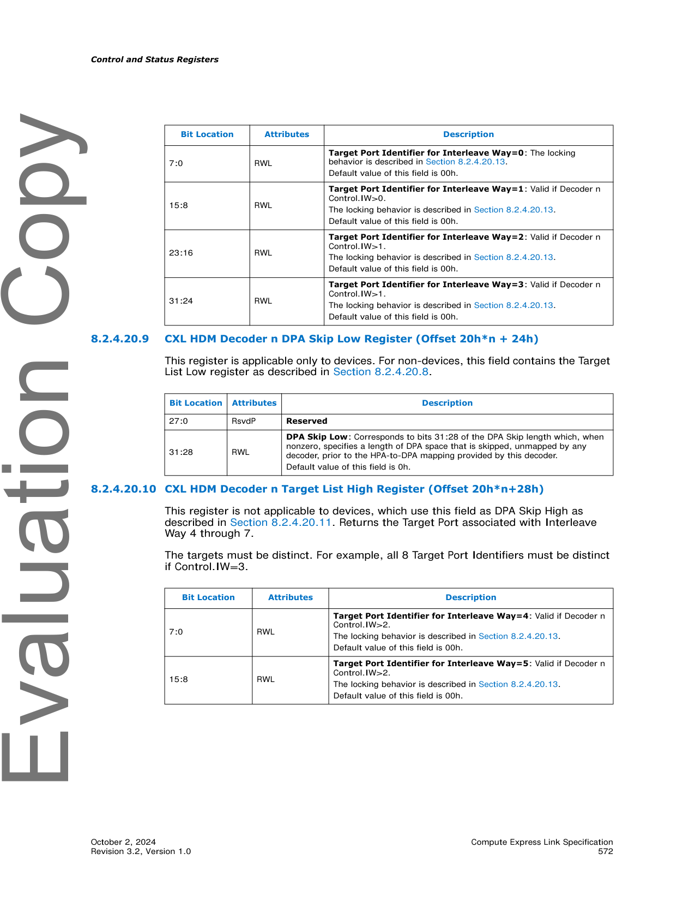
>
> *Original page render @ 150 DPI* — [📄 Full size](figures/chapter_08/page_0572.png)

[⬆️ 返回目录](#-本章目录-part-b)

---

## 8.2.4.20.9 CXL HDM Decoder n DPA Skip Low Register (Offset 20h*n + 24h) | CXL HDM 解码器 n DPA 跳过低寄存器 (偏移量 20h*n + 24h)

<table>
<thead>
<tr>
<th width="50%">🇬🇧 English</th>
<th width="50%" style="background-color:#e8e8e8">🇨🇳 中文</th>
</tr>
</thead>
<tbody>
<tr><td>

This register is applicable only to devices. For non-devices, this field contains the Target List Low register as described in Section 8.2.4.20.8.

| Bit Location | Attributes | Description |
|--------------|------------|-------------|
| 27:0 | RsvdP | Reserved |
| 31:28 | RWL | DPA Skip Low: Corresponds to bits 31:28 of the DPA Skip length which, when nonzero, specifies a length of DPA space that is skipped, unmapped by any decoder, prior to the HPA-to-DPA mapping provided by this decoder. Default value of this field is 0h. |

</td><td style="background-color:#e8e8e8">

此寄存器仅适用于设备。对于非设备, 此字段包含 Target List Low 寄存器, 如第 8.2.4.20.8 节所述。

| 位域 | 属性 | 描述 |
|------|------|------|
| 27:0 | RsvdP | 保留 |
| 31:28 | RWL | DPA Skip Low: 对应于 DPA 跳过长度的 31:28 位, 当非零时, 指定在由此解码器提供的 HPA 到 DPA 映射之前被跳过 (未由任何解码器映射) 的 DPA 空间长度。该字段的默认值为 0h。 |

</td></tr>
</tbody>
</table>

> **Figure 8-47.** CXL HDM Decoder n DPA Skip Low Register layout ｜ CXL HDM 解码器 n DPA 跳过低寄存器布局
>
> 
>
> *Original page render @ 150 DPI* — [📄 Full size](figures/chapter_08/page_0572.png)

[⬆️ 返回目录](#-本章目录-part-b)

---

## 8.2.4.20.10 CXL HDM Decoder n Target List High Register (Offset 20h*n+28h) | CXL HDM 解码器 n 目标列表高寄存器 (偏移量 20h*n+28h)

<table>
<thead>
<tr>
<th width="50%">🇬🇧 English</th>
<th width="50%" style="background-color:#e8e8e8">🇨🇳 中文</th>
</tr>
</thead>
<tbody>
<tr><td>

This register is not applicable to devices, which use this field as DPA Skip High as described in Section 8.2.4.20.11. Returns the Target Port associated with Interleave Way 4 through 7.

The targets must be distinct. For example, all 8 Target Port Identifiers must be distinct if Control.IW=3.

| Bit Location | Attributes | Description |
|--------------|------------|-------------|
| 7:0 | RWL | Target Port Identifier for Interleave Way=4: Valid if Decoder n Control.IW>2. The locking behavior is described in Section 8.2.4.20.13. Default value of this field is 00h. |
| 15:8 | RWL | Target Port Identifier for Interleave Way=5: Valid if Decoder n Control.IW>2. The locking behavior is described in Section 8.2.4.20.13. Default value of this field is 00h. |
| 23:16 | RWL | Target Port Identifier for Interleave Way=6: Valid if Decoder n Control.IW>2. The locking behavior is described in Section 8.2.4.20.13. Default value of this field is 00h. |
| 31:24 | RWL | Target Port Identifier for Interleave Way=7: Valid if Decoder n Control.IW>2. The locking behavior is described in Section 8.2.4.20.13. Default value of this field is 00h. |

</td><td style="background-color:#e8e8e8">

此寄存器不适用于设备, 设备将此字段用作 DPA Skip High, 如第 8.2.4.20.11 节所述。返回与交织方式 4 到 7 关联的目标端口。

目标必须不同。例如, 如果 Control.IW=3, 则所有 8 个目标端口标识符必须不同。

| 位域 | 属性 | 描述 |
|------|------|------|
| 7:0 | RWL | 交织方式 = 4 的目标端口标识符: 如果解码器 n Control.IW>2 则有效。锁定行为在第 8.2.4.20.13 节中描述。该字段的默认值为 00h。 |
| 15:8 | RWL | 交织方式 = 5 的目标端口标识符: 如果解码器 n Control.IW>2 则有效。锁定行为在第 8.2.4.20.13 节中描述。该字段的默认值为 00h。 |
| 23:16 | RWL | 交织方式 = 6 的目标端口标识符: 如果解码器 n Control.IW>2 则有效。锁定行为在第 8.2.4.20.13 节中描述。该字段的默认值为 00h。 |
| 31:24 | RWL | 交织方式 = 7 的目标端口标识符: 如果解码器 n Control.IW>2 则有效。锁定行为在第 8.2.4.20.13 节中描述。该字段的默认值为 00h。 |

</td></tr>
</tbody>
</table>

> **Figure 8-48.** CXL HDM Decoder n Target List High Register layout ｜ CXL HDM 解码器 n 目标列表高寄存器布局
>
> 
>
> *Original page render @ 150 DPI* — [📄 Full size](figures/chapter_08/page_0572.png)

[⬆️ 返回目录](#-本章目录-part-b)

---

## 8.2.4.20.11 CXL HDM Decoder n DPA Skip High Register (Offset 20h*n + 28h) | CXL HDM 解码器 n DPA 跳过高寄存器 (偏移量 20h*n + 28h)

<table>
<thead>
<tr>
<th width="50%">🇬🇧 English</th>
<th width="50%" style="background-color:#e8e8e8">🇨🇳 中文</th>
</tr>
</thead>
<tbody>
<tr><td>

This register is applicable only to devices. For non-devices, this field contains the Target List High register as described in Section 8.2.4.20.10.

| Bit Location | Attributes | Description |
|--------------|------------|-------------|
| 31:0 | RWL | DPA Skip High: Corresponds to bits 63:32 of the DPA Skip length which, when nonzero, specifies a length of DPA space that is skipped, unmapped by any decoder, prior to the HPA-to-DPA mapping provided by this decoder. Default value of this register is 0000 0000h. |

</td><td style="background-color:#e8e8e8">

此寄存器仅适用于设备。对于非设备, 此字段包含 Target List High 寄存器, 如第 8.2.4.20.10 节所述。

| 位域 | 属性 | 描述 |
|------|------|------|
| 31:0 | RWL | DPA Skip High: 对应于 DPA 跳过长度的 63:32 位, 当非零时, 指定在由此解码器提供的 HPA 到 DPA 映射之前被跳过 (未由任何解码器映射) 的 DPA 空间长度。此寄存器的默认值为 0000 0000h。 |

</td></tr>
</tbody>
</table>

> **Figure 8-49.** CXL HDM Decoder n DPA Skip High Register layout ｜ CXL HDM 解码器 n DPA 跳过高寄存器布局
>
> 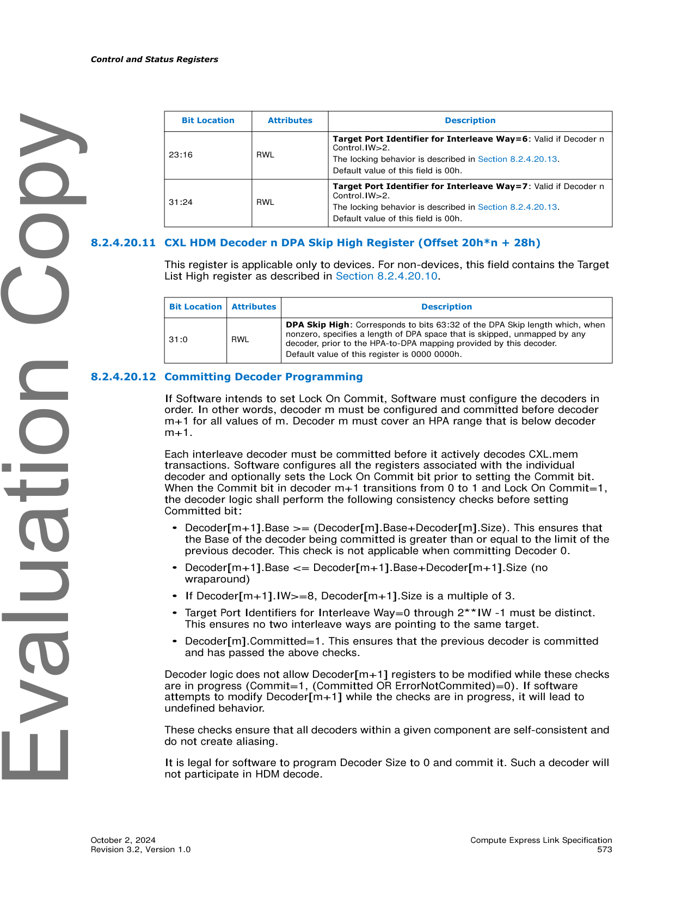
>
> *Original page render @ 150 DPI* — [📄 Full size](figures/chapter_08/page_0573.png)

[⬆️ 返回目录](#-本章目录-part-b)

---

## 8.2.4.20.12 Committing Decoder Programming | 提交解码器编程

<table>
<thead>
<tr>
<th width="50%">🇬🇧 English</th>
<th width="50%" style="background-color:#e8e8e8">🇨🇳 中文</th>
</tr>
</thead>
<tbody>
<tr><td>

If Software intends to set Lock On Commit, Software must configure the decoders in order. In other words, decoder m must be configured and committed before decoder m+1 for all values of m. Decoder m must cover an HPA range that is below decoder m+1.

Each interleave decoder must be committed before it actively decodes CXL.mem transactions. Software configures all the registers associated with the individual decoder and optionally sets the Lock On Commit bit prior to setting the Commit bit. When the Commit bit in decoder m+1 transitions from 0 to 1 and Lock On Commit=1, the decoder logic shall perform the following consistency checks before setting Committed bit:
- Decoder[m+1].Base >= (Decoder[m].Base+Decoder[m].Size). This ensures that the Base of the decoder being committed is greater than or equal to the limit of the previous decoder. This check is not applicable when committing Decoder 0.
- Decoder[m+1].Base <= Decoder[m+1].Base+Decoder[m+1].Size (no wraparound)
- If Decoder[m+1].IW>=8, Decoder[m+1].Size is a multiple of 3.
- Target Port Identifiers for Interleave Way=0 through 2**IW -1 must be distinct. This ensures no two interleave ways are pointing to the same target.
- Decoder[m].Committed=1. This ensures that the previous decoder is committed and has passed the above checks.

Decoder logic does not allow Decoder[m+1] registers to be modified while these checks are in progress (Commit=1, (Committed OR ErrorNotCommited)=0). If software attempts to modify Decoder[m+1] while the checks are in progress, it will lead to undefined behavior.

These checks ensure that all decoders within a given component are self-consistent and do not create aliasing.

It is legal for software to program Decoder Size to 0 and commit it. Such a decoder will not participate in HDM decode.

If these checks fail and the decoder is not committed, decoder logic shall set Error Not Committed flag. Software may remedy this situation by clearing the Commit bit, reprogramming the decoder with legal values and setting Commit bit once again.

If Lock On Commit=0, decoder logic does not implement the address aliasing checks. Software is fully responsible for avoiding aliasing and protecting the HDM Decoder registers via other mechanisms such as CPU page tables.

Regardless of the setting of the Lock on Commit bit, the decoder logic in a UIO-capable switch or root port shall ensure that the number of decoders configured with UIO=1 does not exceed the number of UIO-capable decoders encoded in the CXL HDM Decoder Capability register (see Section 8.2.4.20.1). If software attempts to violate this restriction, the decode logic shall set ErrorOnCommit=1.

If the device requires BI for managing coherency, software must ensure that the BI bit in the HDM Decoder Control register is set before committing the HDM decoder; otherwise, the device operation is undefined. Software must ensure that the device and any applicable DSPs, USPs, and the RP are configured such that the device is able to issue a BISnp request before committing any HDM decoder with the BI bit set; otherwise, the device operation is undefined.

Decoder logic shall set either Committed or Error Not Committed flag within 10 ms of a write to the Commit bit.

</td><td style="background-color:#e8e8e8">

如果软件打算设置 Lock On Commit, 则软件必须按顺序配置解码器。换言之, 对于 m 的所有值, 解码器 m 必须在解码器 m+1 之前被配置和提交。解码器 m 必须覆盖低于解码器 m+1 的 HPA 范围。

每个交织解码器必须在主动解码 CXL.mem 事务之前被提交。软件配置与各个解码器关联的所有寄存器, 并可选择在设置 Commit 位之前设置 Lock On Commit 位。当解码器 m+1 中的 Commit 位从 0 转换为 1 且 Lock On Commit=1 时, 解码器逻辑应在设置 Committed 位之前执行以下一致性检查:
- Decoder[m+1].Base >= (Decoder[m].Base+Decoder[m].Size)。这确保正在提交的解码器的基地址大于或等于前一个解码器的限制。提交解码器 0 时此检查不适用。
- Decoder[m+1].Base <= Decoder[m+1].Base+Decoder[m+1].Size (无回绕)
- 如果 Decoder[m+1].IW>=8, 则 Decoder[m+1].Size 是 3 的倍数。
- 交织方式 = 0 到 2**IW -1 的目标端口标识符必须不同。这确保没有两个交织方式指向同一目标。
- Decoder[m].Committed=1。这确保前一个解码器已被提交并通过了上述检查。

在这些检查进行时 (Commit=1, (Committed OR ErrorNotCommited)=0), 解码器逻辑不允许修改 Decoder[m+1] 寄存器。如果软件尝试在检查进行时修改 Decoder[m+1], 将导致未定义的行为。

这些检查确保给定组件内的所有解码器自洽且不会产生别名。

软件将解码器 Size 编程为 0 并提交它是合法的。这样的解码器将不参与 HDM 解码。

如果这些检查失败且解码器未提交, 则解码器逻辑应设置 Error Not Committed 标志。软件可以通过清除 Commit 位、用合法值重新编程解码器并再次设置 Commit 位来纠正这种情况。

如果 Lock On Commit=0, 则解码器逻辑不实现地址别名检查。软件完全负责避免别名并通过其他机制 (例如 CPU 页表) 保护 HDM 解码器寄存器。

无论 Lock on Commit 位的设置如何, 支持 UIO 的交换机或根端口中的解码器逻辑都应确保 UIO=1 配置的解码器数量不超过 CXL HDM Decoder Capability 寄存器 (参见第 8.2.4.20.1 节) 中编码的支持 UIO 的解码器数量。如果软件尝试违反此限制, 则解码逻辑应设置 ErrorOnCommit=1。

如果设备需要 BI 来管理一致性, 软件必须确保在提交 HDM 解码器之前已设置 HDM Decoder Control 寄存器中的 BI 位; 否则, 设备操作未定义。软件必须确保设备和任何适用的 DSP、USP 以及 RP 已配置为使设备能够在提交任何设置了 BI 位的 HDM 解码器之前发出 BISnp 请求; 否则, 设备操作未定义。

解码器逻辑应在写入 Commit 位后 10 毫秒内设置 Committed 或 Error Not Committed 标志。

</td></tr>
</tbody>
</table>

> **Figure 8-50.** Decoder Commit Flow diagram ｜ 解码器提交流程图
>
> 
>
> *Original page render @ 150 DPI* — [📄 Full size](figures/chapter_08/page_0573.png)

[⬆️ 返回目录](#-本章目录-part-b)

---

## 8.2.4.20.13 Decoder Protection | 解码器保护

<table>
<thead>
<tr>
<th width="50%">🇬🇧 English</th>
<th width="50%" style="background-color:#e8e8e8">🇨🇳 中文</th>
</tr>
</thead>
<tbody>
<tr><td>

Software may choose to set the Lock On Commit bit prior to setting Commit. If the Lock On Commit bit is 1, Decoder logic shall perform alias checks listed in the previous section prior to committing the decoder and further disallow modifications to all RWL fields in that decoder when the decoder is in Committed state.

If the Lock On Commit bit is 0, software may clear the Commit bit, reprogram the decoder fields, and then set the Commit bit again for the new values to take effect. Reprogramming the decoder while the Commit bit is set results in undefined behavior. To avoid misbehavior, software is responsible for quiescing memory traffic that is targeting the decoder while it is being reprogrammed. If decoder logic does not positively decode an address of a read, it may either return all 1s or return poison based on the CXL HDM Decoder Global Control register setting. During reprogramming, software must follow the same restrictions as the initial programming. Specifically, decoder m must be configured and committed before decoder m+1 for all values of m; Decoder m must cover an HPA range that is below decoder m+1 and all Targets must be distinct.

#### IMPLEMENTATION NOTE

Software may set Lock On Commit=1 in systems that do not support Hot-Plug. In such systems, the decoders are generally programmed at boot, can be arranged in increasing HPA order and never modified until the next reset.

If the system supports CXL Hot-Plug, software may need significant flexibility in terms of reprogramming the decoders during runtime. In such systems, software may choose to leave Lock On Commit=0.

#### IMPLEMENTATION NOTE: CXL Host Bridge and Upstream Switch Port Decode Flow

Step 1: Check if the incoming HPA satisfies Base <= HPA < Base+Size for any active decoder. If no decoder satisfies this equation for a write, drop the writes. If no decoder satisfies this equation for a read and Poison On Decode Error Enable=0, return all 1s. If no decoder satisfies this equation for a read and Poison On Decode Error Enable=1, return poison.

Step 2: If Decoder[n] satisfies this equation:
- Extract IW bits starting with bit position IG+8 in HPA¹. This returns the Interleave Way
- Send transactions to Downstream Port=Decoder[n].Target List[Interleave Way]

Example:
- HPA = 129 GB + 1028d
- Decoder[2].Base= 128 GB, Decoder[2].Size = 4 GB.
- Assume IW=2 (4 way), IG = 1 (512 bytes).

Step 1: Decoder[2] positively decodes this address, so n=2.

Step 2: Extracting bits 10:9 from HPA returns Interleave Way=2 (HPA=… xxxx 0000 0100 0000 0100b)

Forward access to Port number Decoder[2].Target List Low[23:16]

¹ In the general case, the bits must be extracted from (HPA – Base[n]). However, Decoder Base is a multiple of 256M and the highest interleave granularity is 16K. Therefore, extracting IW bits from HPA still returns the correct Index value.

#### IMPLEMENTATION NOTE: Device Decode Logic

As part of Commit processing flow, the device decoder logic may accumulate DPABase field for every decoder as follows:
- Decoder[0].DPABase = Decoder[0].DPASkip
- If IW <8, Decoder[m+1]. DPABase = Decoder[m+1].DPASkip + Decoder[m].DPABase + (Decoder[m].Size / 2 ** Decoder[m].IW)
- If IW >=8, Decoder[m+1]. DPABase = Decoder[m+1].DPASkip + Decoder[m].DPABase + (Decoder[m].Size / (3 * 2 ** (Decoder[m].IW-8))

DPABase is not exposed to software, but may be tracked internally by the decoder logic to speed up decode process. Decoder[m].DPABase represents the lowest DPA that the lowest HPA decoded by Decoder[m] maps to. The DPA mappings for a device typically start at DPA 0 for Decoder[0] and are sequentially accumulated with each additional decoder used; however, the DPASkip field in the decoder may be used to leave ranges of DPA unmapped, as required by the needs of the platform.

During the decode:

Step 1: Check if the incoming HPA satisfies Base <= HPA < Base+Size for any active decoder. If no decoder satisfies this equation for a write, drop the writes. If no decoder satisfies this equation for a read and Poison On Decode Error Enable=0, return all 1s. If no decoder satisfies this equation for a read and Poison On Decode Error Enable=1, return poison.

Step 2: If Decoder[n] satisfies this equation.
- Calculate HPAOffset = HPA – Decoder[n].Base
- If IW <8, removes IW bits starting with bit position IG+8 in HPAOffset to get DPAOffset. This operation will right shift the bits above IG+IW+8 by IW positions.
  - DPAOffset[51:IG+8]=(HPAOffset[51:IG+8+IW]
  - DPAOffset[IG+7:0]=HPAOffset[IG+7:0].
- If IW >=8, an integer, divide by 3 operation is involved
  - DPAOffset[51:IG+8]=HPAOffset[51:IG+IW]/ 3
  - DPAOffset[IG+7:0]=HPAOffset[IG+7:0]
- DPA=DPAOffset + Decoder[n].DPABase.

The above calculation is applied by the device regardless of the Interleave Arithmetic field in the corresponding CFMWS entry.

Example:
- HPA = 129 GB + 1028d
- Software programmed Decoder[0].Base= 32 GB, Decoder[0].Size = 32 GB.
- Software programmed Decoder[1].Base= 128 GB, Decoder[1].Size = 4 GB.
- Assume IW=3 (8 way), IG = 1 (512 bytes) for both decoders.
- Decoder[1].DPABase= 32/8 GB = 4 GB

Step 1: Select Decoder[1].

Step 2:
- HPAOffset = 1 GB + 1028d (4000 0404h, 0404h=0000 0100 0000 0100b)
- Removing bits 11:9 from HPA returns DPAOffset=800 0004h.

</td><td style="background-color:#e8e8e8">

软件可以选择在设置 Commit 之前设置 Lock On Commit 位。如果 Lock On Commit 位为 1, 则解码器逻辑应在提交解码器之前执行上一节中列出的别名检查, 并在该解码器处于 Committed 状态时进一步禁止修改该解码器中的所有 RWL 字段。

如果 Lock On Commit 位为 0, 则软件可以清除 Commit 位, 重新编程解码器字段, 然后再次设置 Commit 位以使新值生效。在 Commit 位已设置时重新编程解码器会导致未定义的行为。为避免误操作, 软件有责任在重新编程期间使面向该解码器的内存流量静止。如果解码器逻辑未对读地址进行正确定向解码, 则它可以根据 CXL HDM Decoder Global Control 寄存器设置返回全 1 或返回 Poison。在重新编程期间, 软件必须遵循与初始编程相同的限制。具体而言, 对于 m 的所有值, 解码器 m 必须在解码器 m+1 之前被配置和提交; 解码器 m 必须覆盖低于解码器 m+1 的 HPA 范围, 并且所有 Targets 必须不同。

#### 实现注意

在不支持热插拔的系统中, 软件可以将 Lock On Commit 设置为 1。在此类系统中, 解码器通常在启动时编程, 可以按递增的 HPA 顺序排列, 并且在下次复位之前不会修改。

如果系统支持 CXL 热插拔, 则软件可能需要在运行时重新编程解码器方面具有显著的灵活性。在此类系统中, 软件可以选择将 Lock On Commit 保留为 0。

#### 实现注意: CXL 主机桥和上行交换机端口解码流程

第 1 步: 检查传入的 HPA 是否满足 Base <= HPA < Base+Size 适用于任何活动解码器。如果没有解码器对写入满足此等式, 则丢弃写入。如果没有解码器对读取满足此等式, 且 Poison On Decode Error Enable=0, 则返回全 1。如果没有解码器对读取满足此等式, 且 Poison On Decode Error Enable=1, 则返回 Poison。

第 2 步: 如果 Decoder[n] 满足此等式:
- 从 HPA¹ 中的位位置 IG+8 开始提取 IW 位。这将返回 Interleave Way
- 将事务发送到 Downstream Port=Decoder[n].Target List[Interleave Way]

示例:
- HPA = 129 GB + 1028d
- Decoder[2].Base= 128 GB, Decoder[2].Size = 4 GB。
- 假设 IW=2 (4 路), IG = 1 (512 字节)。

第 1 步: Decoder[2] 对该地址进行正确定向解码, 因此 n=2。

第 2 步: 从 HPA 提取位 10:9 返回 Interleave Way=2 (HPA=… xxxx 0000 0100 0000 0100b)

将访问转发到端口号 Decoder[2].Target List Low[23:16]

¹ 一般情况下, 必须从 (HPA – Base[n]) 中提取位。但是, 解码器 Base 是 256M 的倍数, 最高交织粒度为 16K。因此, 从 HPA 提取 IW 位仍会返回正确的 Index 值。

#### 实现注意: 设备解码逻辑

作为 Commit 处理流程的一部分, 设备解码逻辑可能会为每个解码器累积 DPABase 字段, 如下所示:
- Decoder[0].DPABase = Decoder[0].DPASkip
- 如果 IW <8, Decoder[m+1].DPABase = Decoder[m+1].DPASkip + Decoder[m].DPABase + (Decoder[m].Size / 2 ** Decoder[m].IW)
- 如果 IW >=8, Decoder[m+1].DPABase = Decoder[m+1].DPASkip + Decoder[m].DPABase + (Decoder[m].Size / (3 * 2 ** (Decoder[m].IW-8))

DPABase 不暴露给软件, 但可以由解码器逻辑在内部跟踪以加速解码过程。Decoder[m].DPABase 表示由 Decoder[m] 解码的最低 HPA 映射到的最低 DPA。设备的 DPA 映射通常从 Decoder[0] 的 DPA 0 开始, 并随着使用的每个附加解码器顺序累积; 但是, 解码器中的 DPASkip 字段可用于按需将 DPA 范围保留为未映射状态。

在解码过程中:

第 1 步: 检查传入的 HPA 是否满足 Base <= HPA < Base+Size 适用于任何活动解码器。如果没有解码器对写入满足此等式, 则丢弃写入。如果没有解码器对读取满足此等式, 且 Poison On Decode Error Enable=0, 则返回全 1。如果没有解码器对读取满足此等式, 且 Poison On Decode Error Enable=1, 则返回 Poison。

第 2 步: 如果 Decoder[n] 满足此等式。
- 计算 HPAOffset = HPA – Decoder[n].Base
- 如果 IW <8, 则删除 HPAOffset 中从位位置 IG+8 开始的 IW 位以获得 DPAOffset。此操作会将 IG+IW+8 之上的位右移 IW 位。
  - DPAOffset[51:IG+8]=(HPAOffset[51:IG+8+IW]
  - DPAOffset[IG+7:0]=HPAOffset[IG+7:0]。
- 如果 IW >=8, 则涉及整数除以 3 操作
  - DPAOffset[51:IG+8]=HPAOffset[51:IG+IW]/3
  - DPAOffset[IG+7:0]=HPAOffset[IG+7:0]
- DPA=DPAOffset + Decoder[n].DPABase。

无论相应 CFMWS 条目中的 Interleave Arithmetic 字段如何, 设备都会应用上述计算。

示例:
- HPA = 129 GB + 1028d
- 软件编程 Decoder[0].Base= 32 GB, Decoder[0].Size = 32 GB。
- 软件编程 Decoder[1].Base= 128 GB, Decoder[1].Size = 4 GB。
- 假设两个解码器的 IW=3 (8 路), IG = 1 (512 字节)。
- Decoder[1].DPABase= 32/8 GB = 4 GB

第 1 步: 选择 Decoder[1]。

第 2 步:
- HPAOffset = 1 GB + 1028d (4000 0404h, 0404h=0000 0100 0000 0100b)
- 从 HPA 中删除位 11:9 返回 DPAOffset=800 0004h。

</td></tr>
</tbody>
</table>

> **Figure 8-51.** Decoder Protection Flow ｜ 解码器保护流程
>
> 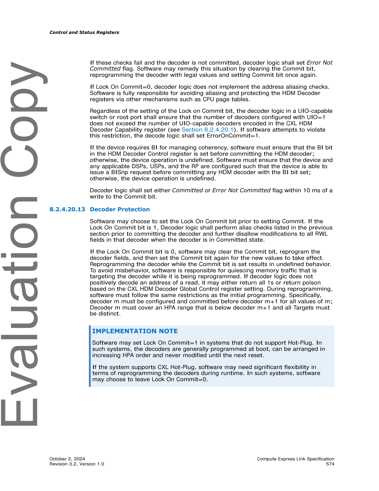
>
> *Original page render @ 150 DPI* — [📄 Full size](figures/chapter_08/page_0574.png)

[⬆️ 返回目录](#-本章目录-part-b)

---

## 8.2.4.21 CXL Extended Security Capability Structure | CXL 扩展安全能力结构

<table>
<thead>
<tr>
<th width="50%">🇬🇧 English</th>
<th width="50%" style="background-color:#e8e8e8">🇨🇳 中文</th>
</tr>
</thead>
<tbody>
<tr><td>

This capability structure applies only to the CXL Host Bridge and may be located in CHBCR.

| Offset | Register Name |
|--------|---------------|
| 00h | CXL Extended Security Structure Entry Count.n (Max 256) |
| 04h | Root Port 1 Security Policy |
| 08h | Root Port 1 ID |
| 0Ch | Root Port 2 Security Policy |
| 10h | Root Port 2 ID |
| … | … |
| 8*n-4 | Root Port n Security Policy |
| 8*n | Root Port n ID |

> **Table 8-28.** CXL Extended Security Structure Entry Count (Offset 00h)
>
> | Bit Location | Attributes | Description |
> |--------------|------------|-------------|
> | 7:0 | HwInit | Root Port Count: The number of Extended Security Structures that are part of this capability structure. The number of entries must match the CXL.cache-capable Root Ports that are associated with this Host Bridge. Each entry consists of two DWORD registers - Security Policy and Root Port ID. |
> | 31:8 | RsvdP | Reserved |

> **Table 8-29.** Root Port n Security Policy Register (Offset 8*n-4)
>
> | Bit Location | Attributes | Description |
> |--------------|------------|-------------|
> | 1:0 | RW | Trust Level: If the host supports only 1 CXL.cache device per VCS, this field defines the Trust Level for the CXL.cache Device below Root Port n (see Table 8-26 for definition of this field). If the host supports more than 1 CXL.cache device per VCS, this field defines the Trust Level that is applied to all the CXL.cache devices below this root port. For an HDM-DB device, Trust Level=01 is equivalent to 00. Default value of this field is 10b. |
> | 31:2 | RsvdP | Reserved |

> **Table 8-30.** Root Port n ID Register (Offset 8*n)
>
> | Bit Location | Attributes | Description |
> |--------------|------------|-------------|
> | 7:0 | HwInit | Port Identifier of Root Port n (referenced using the Port Number field in the Link Capabilities register (see PCIe Base Specification)). |
> | 31:8 | RsvdP | Reserved |

</td><td style="background-color:#e8e8e8">

此能力结构仅适用于 CXL 主机桥, 可以位于 CHBCR 中。

| 偏移量 | 寄存器名称 |
|--------|------------|
| 00h | CXL Extended Security Structure Entry Count.n (最多 256) |
| 04h | Root Port 1 Security Policy |
| 08h | Root Port 1 ID |
| 0Ch | Root Port 2 Security Policy |
| 10h | Root Port 2 ID |
| … | … |
| 8*n-4 | Root Port n Security Policy |
| 8*n | Root Port n ID |

> **表 8-28.** CXL Extended Security Structure Entry Count (偏移量 00h) ｜ CXL 扩展安全结构条目计数
>
> | 位域 | 属性 | 描述 |
> |------|------|------|
> | 7:0 | HwInit | Root Port Count: 属于此能力结构的扩展安全结构数量。条目数必须与与此主机桥相关联的具有 CXL.cache 能力的根端口相匹配。每个条目由两个 DWORD 寄存器组成 - Security Policy 和 Root Port ID。 |
> | 31:8 | RsvdP | 保留 |

> **表 8-29.** Root Port n Security Policy Register (偏移量 8*n-4) ｜ 根端口 n 安全策略寄存器
>
> | 位域 | 属性 | 描述 |
> |------|------|------|
> | 1:0 | RW | Trust Level: 如果主机每个 VCS 仅支持 1 个 CXL.cache 设备, 则此字段定义根端口 n 下方 CXL.cache 设备的 Trust Level (此字段的定义请参见表 8-26)。如果主机每个 VCS 支持多个 CXL.cache 设备, 则此字段定义应用于此根端口下方所有 CXL.cache 设备的 Trust Level。对于 HDM-DB 设备, Trust Level=01 等效于 00。该字段的默认值为 10b。 |
> | 31:2 | RsvdP | 保留 |

> **表 8-30.** Root Port n ID Register (偏移量 8*n) ｜ 根端口 n ID 寄存器
>
> | 位域 | 属性 | 描述 |
> |------|------|------|
> | 7:0 | HwInit | 根端口 n 的端口标识符 (使用 Link Capabilities 寄存器 (参见 PCIe 基本规范) 中的 Port Number 字段引用)。 |
> | 31:8 | RsvdP | 保留 |

</td></tr>
</tbody>
</table>

> **Figure 8-52.** CXL Extended Security Capability Structure layout ｜ CXL 扩展安全能力结构布局
>
> 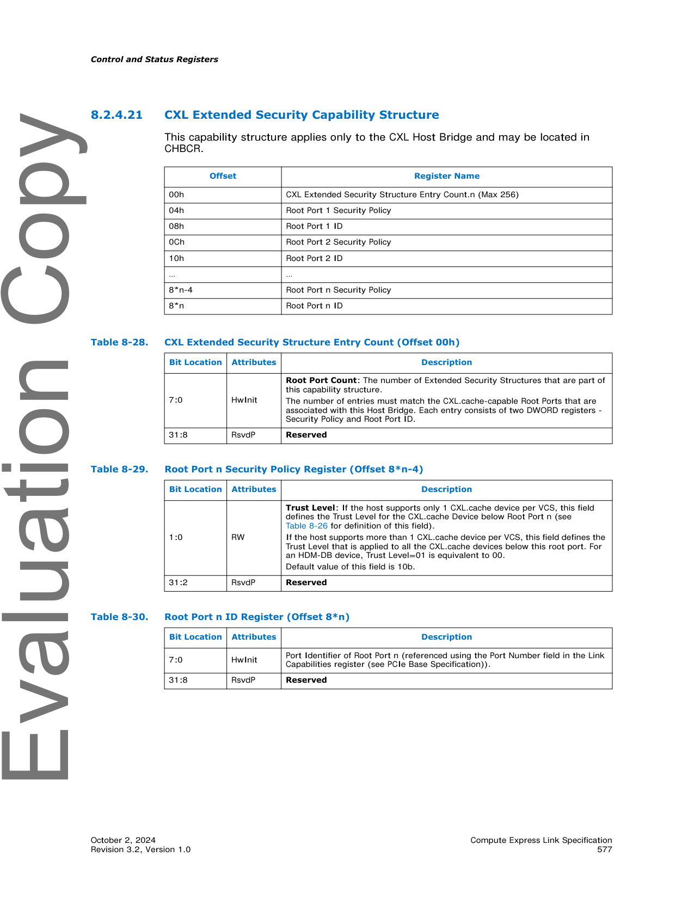
>
> *Original page render @ 150 DPI* — [📄 Full size](figures/chapter_08/page_0577.png)

[⬆️ 返回目录](#-本章目录-part-b)

---

## 8.2.4.22 CXL IDE Capability Structure | CXL IDE 能力结构

<table>
<thead>
<tr>
<th width="50%">🇬🇧 English</th>
<th width="50%" style="background-color:#e8e8e8">🇨🇳 中文</th>
</tr>
</thead>
<tbody>
<tr><td>

| Offset | Register Name |
|--------|---------------|
| 00h | CXL IDE Capability Register |
| 04h | CXL IDE Control |
| 08h | CXL IDE Status |
| 0Ch | CXL IDE Error Status |
| 10h | Key Refresh Time Capability |
| 14h | Truncation Transmit Delay Capability |
| 18h | Key Refresh Time Control |
| 1Ch | Truncation Transmit Delay Control |
| 20h | Key Refresh Time Capability2 |

</td><td style="background-color:#e8e8e8">

| 偏移量 | 寄存器名称 |
|--------|------------|
| 00h | CXL IDE Capability Register |
| 04h | CXL IDE Control |
| 08h | CXL IDE Status |
| 0Ch | CXL IDE Error Status |
| 10h | Key Refresh Time Capability |
| 14h | Truncation Transmit Delay Capability |
| 18h | Key Refresh Time Control |
| 1Ch | Truncation Transmit Delay Control |
| 20h | Key Refresh Time Capability2 |

</td></tr>
</tbody>
</table>

[⬆️ 返回目录](#-本章目录-part-b)

---

### 8.2.4.22.1 CXL IDE Capability (Offset 00h) | CXL IDE 能力 (偏移量 00h)

<table>
<thead>
<tr>
<th width="50%">🇬🇧 English</th>
<th width="50%" style="background-color:#e8e8e8">🇨🇳 中文</th>
</tr>
</thead>
<tbody>
<tr><td>

| Bit Location | Attributes | Description |
|--------------|------------|-------------|
| 0 | HwInit | CXL IDE Capable: When set, indicates that the Port supports CXL IDE. |
| 16:1 | HwInit | Supported CXL IDE Modes: • Bit[1]: If set, Skid mode is supported. • Bit[2]: If set, Containment mode is supported. If bit 0 of this register is set, this bit must be set as well. • Bits[16:3]: Reserved. |
| 21:17 | HwInit | Supported Algorithms: Indicates the supported algorithms for securing CXL IDE, encoded as: • 00h = AES-GCM 256-bit key size, 96-bit MAC • All other encodings are reserved |
| 22 | HwInit/RsvdP | IDE.Stop Capable: Indicates that the port Tx supports generation of IDE.Stop control flit and the port Rx supports processing of IDE.Stop control flit when operating in 256B Flit mode (see Section 11.3.10). This bit is reserved for ports that are not capable of operating in 256B Flit mode.¹ |
| 23 | HwInit/RsvdP | LOpt IDE Capable: If set, this component supports IDE when the link is operating in Latency-Optimized 256B Flit mode (see Figure 11-13 and Figure 11-14).² If 0, this component does not support IDE when the link is operating in Latency-Optimized 256B Flit mode. If the link is operating in Latency-Optimized 256B Flit mode, the System Firmware or System Software must clear the CXL_Latency_Optimized_256B_Flit_Enable bit the DVSEC Flex Bus Port Control register (see Section 8.2.1.3.2) in the Downstream Port and then retrain the link prior to enabling IDE. After IDE is terminated, the System Firmware or System Software may set the CXL_Latency_Optimized_256B_Flit_Enable bit in the Downstream Port and then retrain the link so that the link can transition to Latency-Optimized 256B Flit mode.² |
| 24 | HwInit/RsvdP | IDE Protect LLCTRL Poison Message Capable: If set, this component supports IDE protection of LLCTRL In-band Error poison information. |
| 31:25 | RsvdP | Reserved |

¹ This bit was introduced as part of Version=2.
² This bit was introduced as part of Version=3.

</td><td style="background-color:#e8e8e8">

| 位域 | 属性 | 描述 |
|------|------|------|
| 0 | HwInit | CXL IDE Capable: 置位时, 表示端口支持 CXL IDE。 |
| 16:1 | HwInit | Supported CXL IDE Modes (支持的 CXL IDE 模式): • 位 [1]: 置位时, 支持 Skid 模式。 • 位 [2]: 置位时, 支持 Containment 模式。如果此寄存器的位 0 已置位, 则此位也必须置位。 • 位 [16:3]: 保留。 |
| 21:17 | HwInit | Supported Algorithms: 指示用于保护 CXL IDE 的支持算法, 编码如下: • 00h = AES-GCM 256 位密钥大小, 96 位 MAC • 所有其他编码保留 |
| 22 | HwInit/RsvdP | IDE.Stop Capable: 表示端口 Tx 支持生成 IDE.Stop 控制 Flit, 端口 Rx 支持在以 256B Flit 模式操作时处理 IDE.Stop 控制 Flit (参见第 11.3.10 节)。对于无法以 256B Flit 模式操作的端口, 此位保留。¹ |
| 23 | HwInit/RsvdP | LOpt IDE Capable: 置位时, 此组件在链路以延迟优化 256B Flit 模式操作时支持 IDE (参见图 11-13 和图 11-14)。² 为 0 时, 此组件在链路以延迟优化 256B Flit 模式操作时不支持 IDE。如果链路以延迟优化 256B Flit 模式操作, 则系统固件或系统软件必须清除 DVSEC Flex Bus Port Control 寄存器 (参见第 8.2.1.3.2 节) 下行端口中的 CXL_Latency_Optimized_256B_Flit_Enable 位, 然后在启用 IDE 之前重新训练链路。在 IDE 终止后, 系统固件或系统软件可以设置下行端口中的 CXL_Latency_Optimized_256B_Flit_Enable 位, 然后重新训练链路, 以便链路可以转换到延迟优化 256B Flit 模式。² |
| 24 | HwInit/RsvdP | IDE Protect LLCTRL Poison Message Capable: 置位时, 此组件支持对 LLCTRL 带内错误 Poison 信息的 IDE 保护。 |
| 31:25 | RsvdP | 保留 |

¹ 此位作为 Version=2 的一部分引入。
² 此位作为 Version=3 的一部分引入。

</td></tr>
</tbody>
</table>

> **Figure 8-53.** CXL IDE Capability Register layout ｜ CXL IDE 能力寄存器布局
>
> 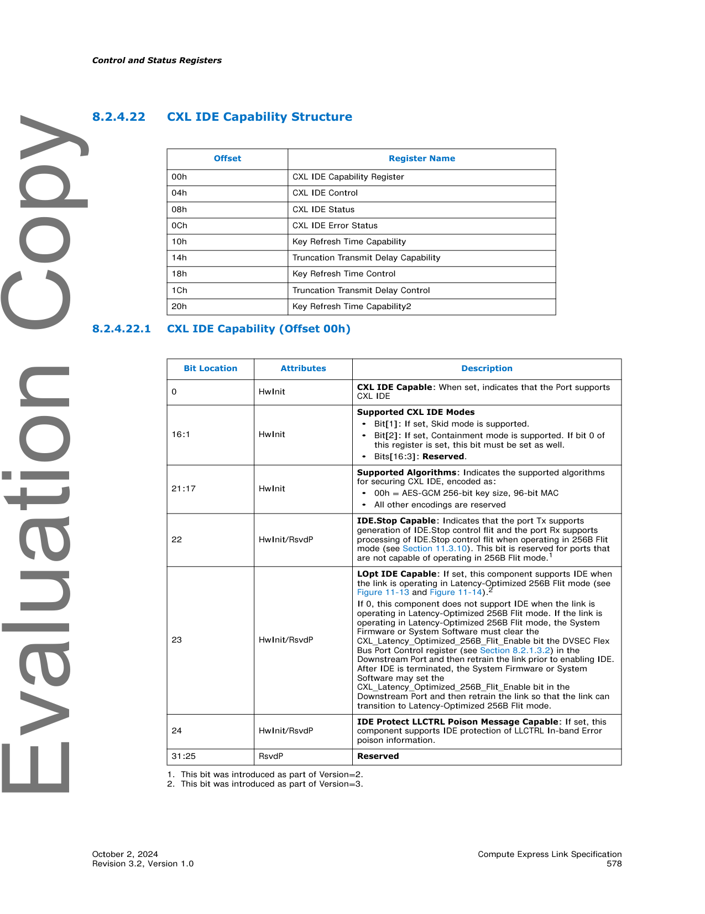
>
> *Original page render @ 150 DPI* — [📄 Full size](figures/chapter_08/page_0578.png)

[⬆️ 返回目录](#-本章目录-part-b)

---

### 8.2.4.22.2 CXL IDE Control (Offset 04h) | CXL IDE 控制 (偏移量 04h)

<table>
<thead>
<tr>
<th width="50%">🇬🇧 English</th>
<th width="50%" style="background-color:#e8e8e8">🇨🇳 中文</th>
</tr>
</thead>
<tbody>
<tr><td>

| Bit Location | Attributes | Description |
|--------------|------------|-------------|
| 0 | RW | PCRC Disable: When set, PCRC generation is disabled and MAC calculation does not include PCRC. Software must ensure that this bit is programmed consistently on both ends of the CXL link. Changes to this bit when CXL.cachemem IDE is active results in undefined behavior. The default value of this bit is 0. |
| 1 | RW/RsvdP | IDE.Stop Enable: Enables generation of IDE.Stop control flit by the port Tx and processing of IDE.Stop control flit by port Rx when operating in 256B Flit mode.¹ This bit must be RW if the IDE Stop Capable bit is set; otherwise, it is permitted to be hardwired to 0. Software must not set this bit unless the IDE.Stop Capable bit is set to 1. The default value of this bit is 0. |
| 2 | RW/RsvdP | IDE Protect LLCTRL Poison Message Enable: Enables IDE protection of LLCTRL In-band Error poison. The bit must be RW if IDE Protect LLCTRL Poison Message Capable bit is set. Software must not set this bit unless both ends of the link have the IDE Protect LLCTRL Poison Message Capable bit set. Default value of this bit is 0. |
| 31:3 | RsvdP | Reserved |

¹ This bit was introduced as part of Version=2.

</td><td style="background-color:#e8e8e8">

| 位域 | 属性 | 描述 |
|------|------|------|
| 0 | RW | PCRC Disable: 置位时, 禁用 PCRC 生成, MAC 计算不包括 PCRC。软件必须确保在 CXL 链路两端一致地编程此位。在 CXL.cachemem IDE 处于活动状态时更改此位会导致未定义的行为。该位的默认值为 0。 |
| 1 | RW/RsvdP | IDE.Stop Enable: 在以 256B Flit 模式操作时, 启用端口 Tx 生成 IDE.Stop 控制 Flit 和端口 Rx 处理 IDE.Stop 控制 Flit。¹ 如果 IDE Stop Capable 位置位, 则此位必须为 RW; 否则, 允许硬连线为 0。除非 IDE.Stop Capable 位置 1, 否则软件不得设置此位。该位的默认值为 0。 |
| 2 | RW/RsvdP | IDE Protect LLCTRL Poison Message Enable: 启用 LLCTRL 带内错误 Poison 的 IDE 保护。如果 IDE Protect LLCTRL Poison Message Capable 位置位, 则该位必须为 RW。除非链路两端都设置了 IDE Protect LLCTRL Poison Message Capable 位, 否则软件不得设置此位。该位的默认值为 0。 |
| 31:3 | RsvdP | 保留 |

¹ 此位作为 Version=2 的一部分引入。

</td></tr>
</tbody>
</table>

> **Figure 8-54.** CXL IDE Control Register layout ｜ CXL IDE 控制寄存器布局
>
> 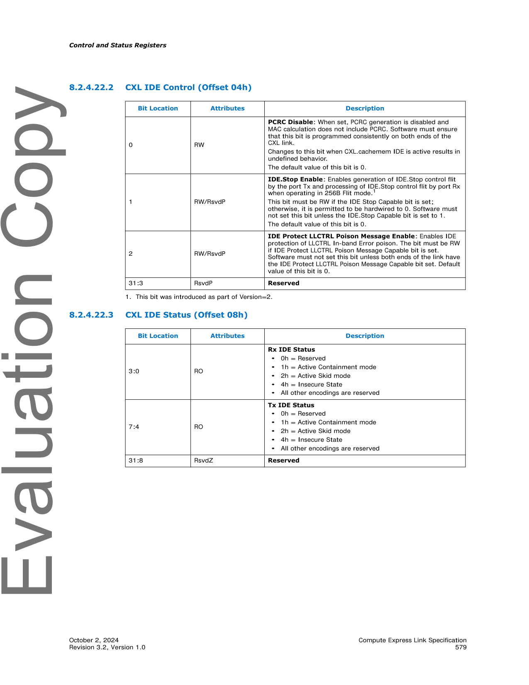
>
> *Original page render @ 150 DPI* — [📄 Full size](figures/chapter_08/page_0579.png)

[⬆️ 返回目录](#-本章目录-part-b)

---

### 8.2.4.22.3 CXL IDE Status (Offset 08h) | CXL IDE 状态 (偏移量 08h)

<table>
<thead>
<tr>
<th width="50%">🇬🇧 English</th>
<th width="50%" style="background-color:#e8e8e8">🇨🇳 中文</th>
</tr>
</thead>
<tbody>
<tr><td>

| Bit Location | Attributes | Description |
|--------------|------------|-------------|
| 3:0 | RO | Rx IDE Status: • 0h = Reserved • 1h = Active Containment mode • 2h = Active Skid mode • 4h = Insecure State • All other encodings are reserved |
| 7:4 | RO | Tx IDE Status: • 0h = Reserved • 1h = Active Containment mode • 2h = Active Skid mode • 4h = Insecure State • All other encodings are reserved |
| 31:8 | RsvdZ | Reserved |

</td><td style="background-color:#e8e8e8">

| 位域 | 属性 | 描述 |
|------|------|------|
| 3:0 | RO | Rx IDE Status (Rx IDE 状态): • 0h = 保留 • 1h = 活动 Containment 模式 • 2h = 活动 Skid 模式 • 4h = 不安全状态 (Insecure State) • 所有其他编码保留 |
| 7:4 | RO | Tx IDE Status (Tx IDE 状态): • 0h = 保留 • 1h = 活动 Containment 模式 • 2h = 活动 Skid 模式 • 4h = 不安全状态 (Insecure State) • 所有其他编码保留 |
| 31:8 | RsvdZ | 保留 |

</td></tr>
</tbody>
</table>

> **Figure 8-55.** CXL IDE Status Register layout ｜ CXL IDE 状态寄存器布局
>
> 
>
> *Original page render @ 150 DPI* — [📄 Full size](figures/chapter_08/page_0579.png)

[⬆️ 返回目录](#-本章目录-part-b)

---

### 8.2.4.22.4 CXL IDE Error Status (Offset 0Ch) | CXL IDE 错误状态 (偏移量 0Ch)

<table>
<thead>
<tr>
<th width="50%">🇬🇧 English</th>
<th width="50%" style="background-color:#e8e8e8">🇨🇳 中文</th>
</tr>
</thead>
<tbody>
<tr><td>

| Bit Location | Attributes | Description |
|--------------|------------|-------------|
| 3:0 | RW1CS | Rx Error Status: Describes the error condition that transitioned the link to Insecure State if IDE stream is active. The component behavior upon this transition is defined in Section 11.3.8. • 0h = No Error • 1h = Integrity failure on received secure traffic • 2h = MAC or Truncated MAC received when the link is not in secure mode (when integrity is not enabled and the receiver detects MAC header) • 3h = MAC header received when not expected (No MAC epoch running, but the receiver detects a MAC header) • 4h = MAC header is not received when expected (MAC header not received within 6 flits after MAC epoch has terminated) • 5h = Truncated MAC flit is received when not expected (if the receiver gets truncated MAC flit corresponding to a completed MAC epoch) • 6h = After early MAC termination, the receiver detects a protocol flit before the truncation delay • 7h = This error code encompasses the following conditions: Protocol flit received earlier than expected after key change (see Section 11.3.7 for the detailed timing requirements); Rx IDE Stop.Enable=1 and a protocol flit received earlier than expected after an IDE Termination Handshake (see Section 11.3.10 for the detailed timing requirements) • 8h = CXL.cachemem IDE Establishment Security error. This error code encompasses the following conditions: IDE.Start is received prior to a successful CXL_KEY_PROG since the last Conventional Reset; IDE.Start is received prior to a successful CXL_KEY_PROG since the last IDE.Start; IDE.Start is received prior to a successful CXL_K_SET_GO since the last Conventional Reset; IDE.Start is received prior to a successful CXL_K_SET_GO since the last IDE.Start; CXL_IDE_KM message received over a different SPDM session (see Section 11.4.2); IDE.Start is received in the middle of a MAC epoch (see Section 11.3.7) All other encodings are reserved |
| 7:4 | RW1CS | Tx IDE Status • 0h = No Error • All other encodings are reserved |
| 8 | RW1CS | Unexpected IDE.Stop Received: This bit is set by the Rx port upon the following conditions: • Received IDE.Stop Link Layer Control flit while CXL.cachemem IDE is active, but prior to a successful CXL_K_SET_STOP since the last IDE.Start (see Section 11.4.6) • Received IDE.Stop Link Layer Control flit while IDE Stop.Enable=0 and IDE Stop.Capable=1 (see Section 11.3.10) • Received IDE.Stop Link Layer Control flit while IDE session is not active (see Section 11.3.10) • Valid TMAC sequence not received before IDE.Stop (see Section 11.3.10) In all of these cases, the Rx shall drop the IDE.Stop but shall not terminate the CXL.cachemem IDE session if one is active. |
| 31:9 | RsvdZ | Reserved |

</td><td style="background-color:#e8e8e8">

| 位域 | 属性 | 描述 |
|------|------|------|
| 3:0 | RW1CS | Rx Error Status: 描述在 IDE 流处于活动状态时使链路转换到不安全状态的错误条件。组件在此转换时的行为在第 11.3.8 节中定义。 • 0h = 无错误 • 1h = 接收到的安全流量上的完整性故障 • 2h = 在链路不处于安全模式时接收到 MAC 或截断 MAC (在未启用完整性且接收方检测到 MAC 头时) • 3h = 在未预期时接收到 MAC 头 (MAC epoch 未运行, 但接收方检测到 MAC 头) • 4h = 在预期时未接收到 MAC 头 (在 MAC epoch 终止后 6 个 Flit 内未接收到 MAC 头) • 5h = 在未预期时接收到截断 MAC Flit (如果接收方接收到与已完成的 MAC epoch 对应的截断 MAC Flit) • 6h = 在提前 MAC 终止后, 接收方在截断延迟之前检测到协议 Flit • 7h = 此错误代码包含以下条件: 密钥更改后比预期更早接收到协议 Flit (详细时序要求参见第 11.3.7 节); Rx IDE Stop.Enable=1 且在 IDE 终止握手之后比预期更早接收到协议 Flit (详细时序要求参见第 11.3.10 节) • 8h = CXL.cachemem IDE 建立安全错误。此错误代码包含以下条件: 自上次常规复位以来在成功执行 CXL_KEY_PROG 之前接收到 IDE.Start; 自上次 IDE.Start 以来在成功执行 CXL_KEY_PROG 之前接收到 IDE.Start; 自上次常规复位以来在成功执行 CXL_K_SET_GO 之前接收到 IDE.Start; 自上次 IDE.Start 以来在成功执行 CXL_K_SET_GO 之前接收到 IDE.Start; 通过不同的 SPDM 会话接收到 CXL_IDE_KM 消息 (参见第 11.4.2 节); 在 MAC epoch 中间接收到 IDE.Start (参见第 11.3.7 节) 所有其他编码保留 |
| 7:4 | RW1CS | Tx IDE Status • 0h = 无错误 • 所有其他编码保留 |
| 8 | RW1CS | Unexpected IDE.Stop Received: 该位由 Rx 端口在以下条件下设置: • 在 CXL.cachemem IDE 处于活动状态时, 但自上次 IDE.Start 以来成功执行 CXL_K_SET_STOP 之前, 接收到 IDE.Stop 链路层控制 Flit (参见第 11.4.6 节) • 在 IDE Stop.Enable=0 且 IDE Stop.Capable=1 时, 接收到 IDE.Stop 链路层控制 Flit (参见第 11.3.10 节) • 在 IDE 会话未处于活动状态时, 接收到 IDE.Stop 链路层控制 Flit (参见第 11.3.10 节) • 在 IDE.Stop 之前未接收到有效的 TMAC 序列 (参见第 11.3.10 节) 在所有这些情况下, Rx 应丢弃 IDE.Stop, 但如果 CXL.cachemem IDE 会话处于活动状态, 则不应终止该会话。 |
| 31:9 | RsvdZ | 保留 |

</td></tr>
</tbody>
</table>

> **Figure 8-56.** CXL IDE Error Status Register layout ｜ CXL IDE 错误状态寄存器布局
>
> 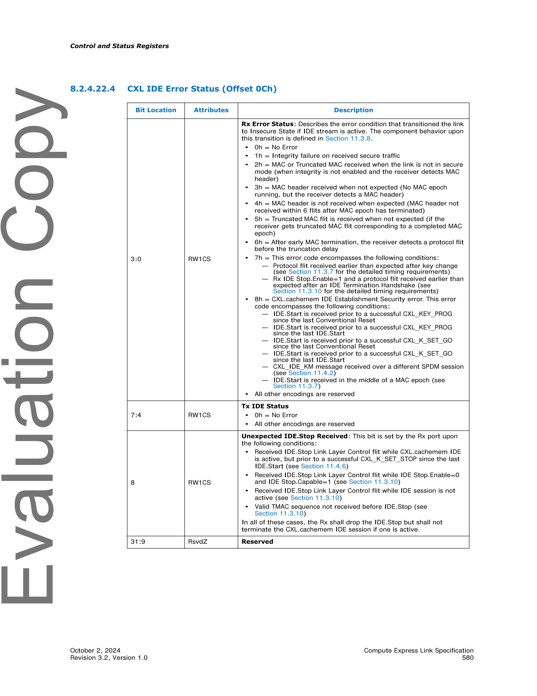
>
> *Original page render @ 150 DPI* — [📄 Full size](figures/chapter_08/page_0580.png)

[⬆️ 返回目录](#-本章目录-part-b)

---

### 8.2.4.22.5 Key Refresh Time Capability (Offset 10h) | 密钥刷新时间能力 (偏移量 10h)

<table>
<thead>
<tr>
<th width="50%">🇬🇧 English</th>
<th width="50%" style="background-color:#e8e8e8">🇨🇳 中文</th>
</tr>
</thead>
<tbody>
<tr><td>

| Bit Location | Attributes | Description |
|--------------|------------|-------------|
| 31:0 | HwInit | Rx Min Key Refresh Time: Number of IDE.Idle flits the receiver needs before it is ready to receive protocol flits after IDE.Start is received when operating in 68B Flit mode. Tx Key Refresh Time (see Section 8.2.4.22.7) field of the transmitter is configured by System Software to block transmission of protocol flits for at least this duration when switching keys (see Section 11.3.7) or terminating IDE (see Section 11.3.10) when the link is operating in 68B Flit mode. |

</td><td style="background-color:#e8e8e8">

| 位域 | 属性 | 描述 |
|------|------|------|
| 31:0 | HwInit | Rx Min Key Refresh Time: 在 68B Flit 模式下操作时, 接收方在接收到 IDE.Start 后准备好接收协议 Flit 所需的 IDE.Idle Flit 数量。发射方的 Tx Key Refresh Time 字段 (参见第 8.2.4.22.7 节) 由系统软件配置, 以在切换密钥 (参见第 11.3.7 节) 或终止 IDE (参见第 11.3.10 节) 时阻止协议 Flit 传输至少持续此时间, 此时链路以 68B Flit 模式操作。 |

</td></tr>
</tbody>
</table>

[⬆️ 返回目录](#-本章目录-part-b)

---

### 8.2.4.22.6 Truncation Transmit Delay Capability (Offset 14h) | 截断传输延迟能力 (偏移量 14h)

<table>
<thead>
<tr>
<th width="50%">🇬🇧 English</th>
<th width="50%" style="background-color:#e8e8e8">🇨🇳 中文</th>
</tr>
</thead>
<tbody>
<tr><td>

| Bit Location | Attributes | Description |
|--------------|------------|-------------|
| 7:0 | HwInit | Rx Min Truncation Transmit Delay: Number of IDE.Idle flits the receiver needs before it is ready to receive protocol flits after a Truncated MAC is received when operating in 68B Flit mode. The Tx Truncation Transmit Delay (see Section 8.2.4.22.8) field of the transmitter is configured, by software, to block transmission of protocol flits for at least this duration when the link is operating in 68B Flit mode. |
| 15:8 | HwInit | Rx Min Truncation Transmit Delay²: Number of IDE.Idle flits the receiver needs before it is ready to receive protocol flits after a Truncated MAC is received when operating in 256B Flit mode. The Tx Truncation Transmit Delay (see Section 8.2.4.22.8) field of the transmitter is configured, by software, to block transmission of protocol flits for at least this duration when the link is operating in 256B Flit mode.¹ |
| 31:16 | RsvdP | Reserved |

¹ This field was introduced as part of Version=2.

</td><td style="background-color:#e8e8e8">

| 位域 | 属性 | 描述 |
|------|------|------|
| 7:0 | HwInit | Rx Min Truncation Transmit Delay: 在 68B Flit 模式下操作时, 接收方在接收到 Truncated MAC 后准备好接收协议 Flit 所需的 IDE.Idle Flit 数量。发射方的 Tx Truncation Transmit Delay 字段 (参见第 8.2.4.22.8 节) 由软件配置, 以在链路以 68B Flit 模式操作时阻止协议 Flit 传输至少持续此时间。 |
| 15:8 | HwInit | Rx Min Truncation Transmit Delay²: 在 256B Flit 模式下操作时, 接收方在接收到 Truncated MAC 后准备好接收协议 Flit 所需的 IDE.Idle Flit 数量。发射方的 Tx Truncation Transmit Delay 字段 (参见第 8.2.4.22.8 节) 由软件配置, 以在链路以 256B Flit 模式操作时阻止协议 Flit 传输至少持续此时间。¹ |
| 31:16 | RsvdP | 保留 |

¹ 此字段作为 Version=2 的一部分引入。

</td></tr>
</tbody>
</table>

[⬆️ 返回目录](#-本章目录-part-b)

---

### 8.2.4.22.7 Key Refresh Time Control (Offset 18h) | 密钥刷新时间控制 (偏移量 18h)

<table>
<thead>
<tr>
<th width="50%">🇬🇧 English</th>
<th width="50%" style="background-color:#e8e8e8">🇨🇳 中文</th>
</tr>
</thead>
<tbody>
<tr><td>

| Bit Location | Attributes | Description |
|--------------|------------|-------------|
| 31:0 | RW | Tx Key Refresh Time: For 68B Flit mode, this register represents the minimum number of flits that the transmitter needs to block transmission of protocol flits after IDE.Start has been sent. For 256B Flit mode, this register represents the minimum number of flits that the transmitter needs to block transmission of protocol flits after IDE.Start has been sent or after IDE.Stop has been sent. Used when switching keys (see Section 11.3.7) or gracefully terminating IDE (256B Flit mode only, see Section 11.3.10). The default value of this field is 0. |

</td><td style="background-color:#e8e8e8">

| 位域 | 属性 | 描述 |
|------|------|------|
| 31:0 | RW | Tx Key Refresh Time: 对于 68B Flit 模式, 此寄存器表示发射方在发送 IDE.Start 之后需要阻止协议 Flit 传输的最少 Flit 数。对于 256B Flit 模式, 此寄存器表示发射方在发送 IDE.Start 之后或发送 IDE.Stop 之后需要阻止协议 Flit 传输的最少 Flit 数。在切换密钥 (参见第 11.3.7 节) 或正常终止 IDE (仅 256B Flit 模式, 参见第 11.3.10 节) 时使用。该字段的默认值为 0。 |

</td></tr>
</tbody>
</table>

[⬆️ 返回目录](#-本章目录-part-b)

---

### 8.2.4.22.8 Truncation Transmit Delay Control (Offset 1Ch) | 截断传输延迟控制 (偏移量 1Ch)

<table>
<thead>
<tr>
<th width="50%">🇬🇧 English</th>
<th width="50%" style="background-color:#e8e8e8">🇨🇳 中文</th>
</tr>
</thead>
<tbody>
<tr><td>

| Bit Location | Attributes | Description |
|--------------|------------|-------------|
| 7:0 | RW | Tx Truncation Transmit Delay: Configuration parameter to account for the potential discarding of any precomputed values by the receiver. This parameter feeds into the computation of the minimum number of IDE.Idle flits that the Transmitter needs to send after sending a truncated MAC flit. See Equation 11-1. The default value of this field is 00h. |
| 31:8 | RsvdP | Reserved |

</td><td style="background-color:#e8e8e8">

| 位域 | 属性 | 描述 |
|------|------|------|
| 7:0 | RW | Tx Truncation Transmit Delay: 用于说明接收方可能丢弃任何预计算值的配置参数。此参数参与计算发射方在发送截断 MAC Flit 后需要发送的 IDE.Idle Flit 最少数量。参见等式 11-1。该字段的默认值为 00h。 |
| 31:8 | RsvdP | 保留 |

</td></tr>
</tbody>
</table>

[⬆️ 返回目录](#-本章目录-part-b)

---

### 8.2.4.22.9 Key Refresh Time Capability2 (Offset 20h) | 密钥刷新时间能力 2 (偏移量 20h)

<table>
<thead>
<tr>
<th width="50%">🇬🇧 English</th>
<th width="50%" style="background-color:#e8e8e8">🇨🇳 中文</th>
</tr>
</thead>
<tbody>
<tr><td>

¹ This register was introduced as part of Version=2.

| Bit Location | Attributes | Description¹ |
|--------------|------------|-------------|
| 31:0 | HwInit | Rx Min Key Refresh Time²: Number of IDE.Idle flits the receiver needs to be ready to receive protocol flits after either IDE.Start or IDE.Stop is received when operating in 256B Flit mode. Tx Key Refresh Time (see Section 8.2.4.22.7) field of the transmitter is configured by System Software to block transmission of protocol flits for at least this duration when switching keys (see Section 11.3.7) or terminating IDE (see Section 11.3.10) when the link is operating in 256B Flit mode. |

</td><td style="background-color:#e8e8e8">

¹ 此寄存器作为 Version=2 的一部分引入。

| 位域 | 属性 | 描述¹ |
|------|------|------|
| 31:0 | HwInit | Rx Min Key Refresh Time²: 在 256B Flit 模式下操作时, 接收方在接收到 IDE.Start 或 IDE.Stop 之后准备好接收协议 Flit 所需的 IDE.Idle Flit 数量。发射方的 Tx Key Refresh Time 字段 (参见第 8.2.4.22.7 节) 由系统软件配置, 以在切换密钥 (参见第 11.3.7 节) 或终止 IDE (参见第 11.3.10 节) 时阻止协议 Flit 传输至少持续此时间, 此时链路以 256B Flit 模式操作。 |

</td></tr>
</tbody>
</table>

[⬆️ 返回目录](#-本章目录-part-b)

---

## 8.2.4.23 CXL Snoop Filter Capability Structure | CXL 窥探过滤器能力结构

<table>
<thead>
<tr>
<th width="50%">🇬🇧 English</th>
<th width="50%" style="background-color:#e8e8e8">🇨🇳 中文</th>
</tr>
</thead>
<tbody>
<tr><td>

| Offset | Register Name |
|--------|---------------|
| 00h | Snoop Filter Group ID |
| 04h | Snoop Filter Capacity |

</td><td style="background-color:#e8e8e8">

| 偏移量 | 寄存器名称 |
|--------|------------|
| 00h | Snoop Filter Group ID |
| 04h | Snoop Filter Capacity |

</td></tr>
</tbody>
</table>

[⬆️ 返回目录](#-本章目录-part-b)

---

### 8.2.4.23.1 Snoop Filter Group ID (Offset 00h) | 窥探过滤器组 ID (偏移量 00h)

<table>
<thead>
<tr>
<th width="50%">🇬🇧 English</th>
<th width="50%" style="background-color:#e8e8e8">🇨🇳 中文</th>
</tr>
</thead>
<tbody>
<tr><td>

| Bit Location | Attributes | Description |
|--------------|------------|-------------|
| 15:0 | HwInit | Group ID: Uniquely identifies a snoop filter instance that is used to track CXL.cache devices below this Port. All Ports that share a single Snoop Filter instance shall set this field to the same value. |
| 31:16 | RsvdP | Reserved |

</td><td style="background-color:#e8e8e8">

| 位域 | 属性 | 描述 |
|------|------|------|
| 15:0 | HwInit | Group ID: 唯一标识用于跟踪此端口下方 CXL.cache 设备的窥探过滤器实例。共享单个 Snoop Filter 实例的所有端口应将此字段设置为相同的值。 |
| 31:16 | RsvdP | 保留 |

</td></tr>
</tbody>
</table>

[⬆️ 返回目录](#-本章目录-part-b)

---

### 8.2.4.23.2 Snoop Filter Effective Size (Offset 04h) | 窥探过滤器有效大小 (偏移量 04h)

<table>
<thead>
<tr>
<th width="50%">🇬🇧 English</th>
<th width="50%" style="background-color:#e8e8e8">🇨🇳 中文</th>
</tr>
</thead>
<tbody>
<tr><td>

| Bit Location | Attributes | Description |
|--------------|------------|-------------|
| 31:0 | HwInit | Capacity: Effective Snoop Filter Capacity representing the size of cache that can be effectively tracked by the Snoop Filter with this Group ID, in multiples of 64K. |

</td><td style="background-color:#e8e8e8">

| 位域 | 属性 | 描述 |
|------|------|------|
| 31:0 | HwInit | Capacity: 有效窥探过滤器容量, 表示可由具有此 Group ID 的 Snoop Filter 有效跟踪的高速缓存大小, 以 64K 的倍数表示。 |

</td></tr>
</tbody>
</table>

[⬆️ 返回目录](#-本章目录-part-b)

---

## 8.2.4.24 CXL Timeout and Isolation Capability Structure | CXL 超时与隔离能力结构

<table>
<thead>
<tr>
<th width="50%">🇬🇧 English</th>
<th width="50%" style="background-color:#e8e8e8">🇨🇳 中文</th>
</tr>
</thead>
<tbody>
<tr><td>

| Offset | Register Name |
|--------|---------------|
| 00h | CXL Timeout and Isolation Capability Register |
| 04h | Reserved |
| 08h | CXL Timeout and Isolation Control Register |
| 0Ch | CXL Timeout and Isolation Status Register |

</td><td style="background-color:#e8e8e8">

| 偏移量 | 寄存器名称 |
|--------|------------|
| 00h | CXL Timeout and Isolation Capability Register |
| 04h | 保留 |
| 08h | CXL Timeout and Isolation Control Register |
| 0Ch | CXL Timeout and Isolation Status Register |

</td></tr>
</tbody>
</table>

[⬆️ 返回目录](#-本章目录-part-b)

---

### 8.2.4.24.1 CXL Timeout and Isolation Capability Register (Offset 00h) | CXL 超时与隔离能力寄存器 (偏移量 00h)

<table>
<thead>
<tr>
<th width="50%">🇬🇧 English</th>
<th width="50%" style="background-color:#e8e8e8">🇨🇳 中文</th>
</tr>
</thead>
<tbody>
<tr><td>

| Bit Location | Attributes | Description |
|--------------|------------|-------------|
| 3:0 | RO | CXL.mem Transaction Timeout Ranges Supported: This field indicates support for transaction timeout ranges on CXL.mem. Four time value ranges are defined: • Range A: Default range: 50us to 10ms. • Range B: 10ms to 250ms • Range C: 250ms to 4s • Range D: 4s to 64s Bits are set according to the values listed below to show the supported timeout value ranges: • 0h = Transaction Timeout programming is not supported – the function must implement a timeout value within the range of 50us to 10ms. • 1h = Range A • 2h = Range B • 3h = Ranges A and B • 6h = Ranges B and C • 7h = Ranges A, B, and C • Eh = Ranges B, C, and D • Fh = Ranges A, B, C, and D All other encodings are reserved |
| 4 | RO | CXL.mem Transaction Timeout Supported: The value of 1 indicates support for CXL.mem Transaction Timeout mechanism. |
| 7:5 | RsvdP | Reserved |
| 11:8 | RO | CXL.cache Transaction Timeout Ranges Supported: This field indicates support for transaction timeout ranges on CXL.cache. Four time value ranges are defined: • Range A: Default range: 50us to 10ms. • Range B: 10ms to 250ms • Range C: 250ms to 4s • Range D: 4s to 64s Bits are set according to the values listed below to show the supported timeout value ranges: • 0h = Transaction Timeout programming is not supported – the function must implement a timeout value within the range of 50us to 10ms. • 1h = Range A • 2h = Range B • 3h = Ranges A and B • 6h = Ranges B and C • 7h = Ranges A, B, and C • Eh = Ranges B, C, and D • Fh = Ranges A, B, C, and D All other encodings are reserved |
| 12 | RO | CXL.cache Transaction Timeout Supported: The value of 1 indicates support for CXL.cache Transaction Timeout mechanism. |
| 15:13 | RsvdP | Reserved |
| 16 | RO | CXL.mem Isolation Supported: This bit indicates support for Isolation on CXL.mem. |
| 17 | RO | CXL.mem Isolation Link Down Supported: This bit indicates support for triggering of Link Down on the CXL port if CXL.mem enters Isolation mode. This bit can only be set to 1 if the CXL.mem Isolation Supported bit is also set to 1. |
| 18 | RO | CXL.cache Isolation Supported: This bit indicates support for Isolation on CXL.cache. |
| 19 | RO | CXL.cache Isolation Link Down Supported: This bit indicates support for triggering of Link Down on the CXL Root Port if CXL.cache enters Isolation mode. This bit can only be set to 1 if the CXL.cache Isolation Supported bit is also set to 1. |
| 24:20 | RsvdP | Reserved |
| 25 | RO | Isolation ERR_COR Signaling Supported: If set, this bit indicates that the Root Port supports the ability to signal with ERR_COR when Isolation is triggered. |
| 26 | RO | Isolation Interrupt Supported: This bit indicates support for signaling an interrupt when Isolation is triggered. |
| 31:27 | RO | Isolation Interrupt Message Number: This field indicates which MSI/MSI-X vector is used for the interrupt message generated in association with the CXL Timeout and Isolation Capability structure. This field is valid only if Isolation Interrupt Supported is 1. For MSI, the value in this field indicates the offset between the base Message Data and the interrupt message that is generated. Hardware is required to update this field so that it is correct if the number of MSI Messages assigned to the Function changes when software writes to the Multiple Message Enable field in the Message Control register for MSI. For MSI-X, the value in this field indicates which MSI-X Table entry is used to generate the interrupt message. The entry must be one of the first 32 entries even if the Function implements more than 32 entries. For a given MSI-X implementation, the entry must remain constant. If both MSI and MSI-X are implemented, they are permitted to use different vectors, though software is permitted to enable only one mechanism at a time. If MSI-X is enabled, the value in this field must indicate the vector for MSI-X. If MSI is enabled or neither is enabled, the value in this field must indicate the vector for MSI. If software enables both MSI and MSI-X at the same time, the value in this field is undefined. |

</td><td style="background-color:#e8e8e8">

| 位域 | 属性 | 描述 |
|------|------|------|
| 3:0 | RO | CXL.mem Transaction Timeout Ranges Supported: 此字段指示 CXL.mem 上事务超时范围的支持。定义了四个时间值范围: • Range A: 默认范围: 50us 至 10ms。 • Range B: 10ms 至 250ms • Range C: 250ms 至 4s • Range D: 4s 至 64s 位根据下面列出的值设置, 以显示支持的超时值范围: • 0h = 不支持事务超时编程 - 功能必须在 50us 至 10ms 范围内实现超时值。 • 1h = Range A • 2h = Range B • 3h = Ranges A 和 B • 6h = Ranges B 和 C • 7h = Ranges A、B 和 C • Eh = Ranges B、C 和 D • Fh = Ranges A、B、C 和 D 所有其他编码保留 |
| 4 | RO | CXL.mem Transaction Timeout Supported: 值 1 表示支持 CXL.mem 事务超时机制。 |
| 7:5 | RsvdP | 保留 |
| 11:8 | RO | CXL.cache Transaction Timeout Ranges Supported: 此字段指示 CXL.cache 上事务超时范围的支持。定义了四个时间值范围: • Range A: 默认范围: 50us 至 10ms。 • Range B: 10ms 至 250ms • Range C: 250ms 至 4s • Range D: 4s 至 64s 位根据下面列出的值设置, 以显示支持的超时值范围: • 0h = 不支持事务超时编程 - 功能必须在 50us 至 10ms 范围内实现超时值。 • 1h = Range A • 2h = Range B • 3h = Ranges A 和 B • 6h = Ranges B 和 C • 7h = Ranges A、B 和 C • Eh = Ranges B、C 和 D • Fh = Ranges A、B、C 和 D 所有其他编码保留 |
| 12 | RO | CXL.cache Transaction Timeout Supported: 值 1 表示支持 CXL.cache 事务超时机制。 |
| 15:13 | RsvdP | 保留 |
| 16 | RO | CXL.mem Isolation Supported: 此位表示 CXL.mem 上对隔离的支持。 |
| 17 | RO | CXL.mem Isolation Link Down Supported: 此位表示在 CXL.mem 进入隔离模式时触发 CXL 端口上链路故障 (Link Down) 的支持。仅当 CXL.mem Isolation Supported 位也设置为 1 时, 此位才能设置为 1。 |
| 18 | RO | CXL.cache Isolation Supported: 此位表示 CXL.cache 上对隔离的支持。 |
| 19 | RO | CXL.cache Isolation Link Down Supported: 此位表示在 CXL.cache 进入隔离模式时触发 CXL 根端口上链路故障 (Link Down) 的支持。仅当 CXL.cache Isolation Supported 位也设置为 1 时, 此位才能设置为 1。 |
| 24:20 | RsvdP | 保留 |
| 25 | RO | Isolation ERR_COR Signaling Supported: 置位时, 此位表示根端口支持在触发隔离时通过 ERR_COR 发信号的能力。 |
| 26 | RO | Isolation Interrupt Supported: 此位表示在触发隔离时发信号通知中断的支持。 |
| 31:27 | RO | Isolation Interrupt Message Number: 此字段指示与 CXL Timeout and Isolation Capability 结构关联生成的中断消息所使用的 MSI/MSI-X 向量。仅当 Isolation Interrupt Supported 为 1 时, 此字段才有效。 对于 MSI, 此字段中的值表示基本消息数据与生成的中断消息之间的偏移量。当软件写入 MSI 消息控制寄存器的 Multiple Message Enable 字段而导致分配给该功能的消息数发生变化时, 硬件需要更新此字段以使其正确。 对于 MSI-X, 此字段中的值指示用于生成中断消息的 MSI-X 表条目。即使该功能实现了 32 个以上条目, 该条目也必须是前 32 个条目之一。对于给定的 MSI-X 实现, 该条目必须保持不变。 如果同时实现了 MSI 和 MSI-X, 则它们允许使用不同的向量, 但软件一次只允许启用一种机制。如果启用了 MSI-X, 则此字段中的值必须指示 MSI-X 的向量。如果启用了 MSI 或两者都未启用, 则此字段中的值必须指示 MSI 的向量。如果软件同时启用 MSI 和 MSI-X, 则此字段中的值未定义。 |

</td></tr>
</tbody>
</table>

> **Figure 8-57.** CXL Timeout and Isolation Capability Register layout ｜ CXL 超时与隔离能力寄存器布局
>
> 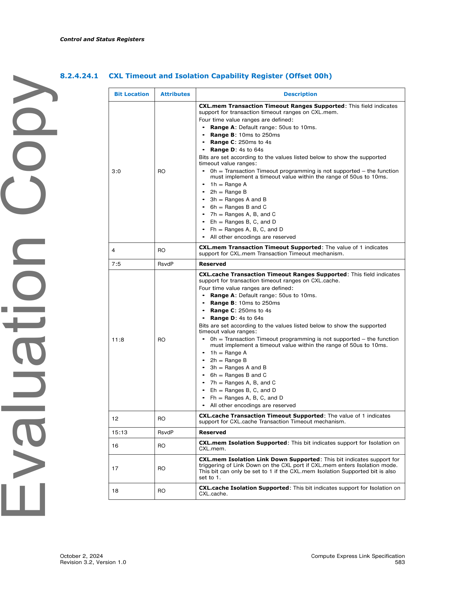
>
> *Original page render @ 150 DPI* — [📄 Full size](figures/chapter_08/page_0583.png)

[⬆️ 返回目录](#-本章目录-part-b)

---

### 8.2.4.24.2 CXL Timeout and Isolation Control Register (Offset 08h) | CXL 超时与隔离控制寄存器 (偏移量 08h)

<table>
<thead>
<tr>
<th width="50%">🇬🇧 English</th>
<th width="50%" style="background-color:#e8e8e8">🇨🇳 中文</th>
</tr>
</thead>
<tbody>
<tr><td>

| Bit Location | Attributes | Description |
|--------------|------------|-------------|
| 3:0 | RW/RO | CXL.mem Transaction Timeout Value: In CXL Root Port Functions that support Transaction Timeout programmability, this field allows system software to modify the Transaction Timeout Value for CXL.mem. Functions that support Transaction Timeout programmability must support the values given below corresponding to the programmability ranges indicated in the CXL.mem Transaction Timeout Ranges Supported field. Defined encodings: • 0h = Default range: 50us to 10ms • Values available if Range A (50us to 10ms) is supported: 1h = 50us to 100us; 2h = 1ms to 10ms • Values available if Range B (10ms to 250ms) is supported: 5h = 16ms to 55ms; 6h = 65ms to 210ms • Values available if Range C (250ms to 4s) is supported: 9h = 260ms to 900ms; Ah = 1s to 3.5s • Values available if Range D (4s to 64s) is supported: Dh = 4s to 13s; Eh = 17s to 64s All other encodings are reserved Software is permitted to change the value in this field at any time. For Requests already pending when the Transaction Timeout Value is changed, hardware is permitted to use either the new or the old value for the outstanding Requests and is permitted to base the start time for each Request on either the time this value was changed or the time each request was issued. This field must be RW if the CXL.mem Transaction Timeout Supported bit is set; otherwise, it is permitted to be hardwired to 0h. The default value for this field is 0h. |
| 4 | RW/RO | CXL.mem Transaction Timeout Enable: When set, this bit enables CXL.mem Transaction Timeout detection mechanism. Software is permitted to set or clear this bit at any time. If there are outstanding Transaction when the bit is set, it is permitted but not required for hardware to apply the completion timeout mechanism to the outstanding Transactions. If this is done, it is permitted to base the start time for each Transaction on either the time this bit was set or the time each Request was issued. This bit must be RW if the CXL.mem Transaction Timeout Supported bit is set; otherwise, it is permitted to be hardwired to 0. Software must not set this bit unless the CXL.mem Transaction Timeout Supported bit is set. The default value for this bit is 0. |
| 7:5 | RsvdP | Reserved |
| 11:8 | RW/RO | CXL.cache Transaction Timeout Value: In CXL Root Port Functions that support Transaction Timeout programmability, this field allows system software to modify the Transaction Timeout Value for CXL.cache. Functions that support Transaction Timeout programmability must support the values given below corresponding to the programmability ranges indicated in the CXL.cache Transaction Timeout Ranges Supported field. Defined encodings: 0h = Default range: 50us to 10ms; Values available if Range A is supported: 1h = 50us to 100us, 2h = 1ms to 10ms; Values available if Range B is supported: 5h = 16ms to 55ms, 6h = 65ms to 210ms; Values available if Range C is supported: 9h = 260ms to 900ms, Ah = 1s to 3.5s; Values available if Range D is supported: Dh = 4s to 13s, Eh = 17s to 64s; All other encodings are reserved Software is permitted to change the value in this field at any time. For Requests already pending when the Transaction Timeout Value is changed, hardware is permitted to use either the new or the old value for the outstanding Requests and is permitted to base the start time for each Request on either the time this value was changed or the time each request was issued. This bit must be RW if the CXL.cache Transaction Timeout Supported bit is set; otherwise, it is permitted to be hardwired to 0h. The default value for this field is 0h. |
| 12 | RW/RO | CXL.cache Transaction Timeout Enable: When set, this bit enables CXL.cache Transaction Timeout detection mechanism. Software is permitted to set or clear this bit at any time. If there are outstanding Transaction when the bit is set, it is permitted but not required for hardware to apply the completion timeout mechanism to the outstanding Transactions. If this is done, it is permitted to base the start time for each Transaction on either the time this bit was set or the time each Request was issued. This bit must be RW if the CXL.cache Transaction Timeout Supported bit is set; otherwise, it is permitted to be hardwired to 0. Software must not set this bit unless the CXL.cache Transaction Timeout Supported bit is set. The default value for this bit is 0. |
| 15:13 | RW/RO | Reserved |
| 16 | RW/RO | CXL.mem Isolation Enable: This field allows System Software to enable CXL.mem Isolation actions. If this field is set, Isolation actions will be triggered if either a CXL.mem Transaction Timeout is detected or if the CXL link went down. This bit must be RW if the CXL.mem Isolation Supported bit is set; otherwise, it is permitted to be hardwired to 0. Software must not set this bit unless the CXL.mem Isolation Supported bit is set. The software is required to quiesce the CXL.mem traffic passing through the Root Port when changing the state of this bit. If Software modifies this bit in the presence of CXL.mem traffic, the results are undefined. |
| 17 | RW/RO | CXL.mem Isolation Link Down Enable: When set, the CXL root port shall trigger a Link Down condition when CXL.mem enters Isolation. This bit must be RW if the CXL.mem Isolation Link Down Supported bit is set; otherwise, it is permitted to be hardwired to 0. Software must not set this bit unless the CXL.mem Isolation Link Down Supported bit is set. |
| 18 | RW/RO | CXL.cache Isolation Enable: This field allows System Software to enable CXL.cache Isolation actions. If this field is set, Isolation actions will be triggered if either a CXL.cache Transaction Timeout is detected or if the CXL link went down. This bit must be RW if the CXL.cache Isolation Supported bit is set; otherwise, it is permitted to be hardwired to 0. Software must not set this bit unless the CXL.cache Isolation Supported bit is set. The software is required to quiesce the CXL.cache traffic passing through the Root Port when changing the state of this bit. If Software modifies this bit in the presence of CXL.cache traffic, the results are undefined. |
| 19 | RW/RO | CXL.cache Isolation Link Down Enable: When set, the CXL root port shall trigger a Link Down condition when CXL.cache enters Isolation. This bit must be RW if the CXL.cache Isolation Link Down Supported bit is set; otherwise, it is permitted to be hardwired to 0. Software must not set this bit unless the CXL.cache Isolation Link Down Supported bit is set. |
| 24:20 | RW/RO | Reserved |
| 25 | RW/RO | Isolation ERR_COR Signaling Enable: When set, this bit enables the sending of an ERR_COR Message to indicate Isolation has been triggered. Default value of this bit is 0. This bit must be RW if the Isolation ERR_COR Signaling Supported bit is set; otherwise, it is permitted to be hardwired to 0. Software must not set this bit unless the Isolation ERR_COR Signaling Supported bit is set. |
| 26 | RW/RO | Isolation Interrupt Enable: When set, this bit enables the generation of an interrupt to indicate that Isolation has been triggered. Default value of this bit is 0. This bit must be RW if the Isolation Interrupt Supported bit is set; otherwise, it is permitted to be hardwired to 0. Software must not set this bit unless the Isolation Interrupt Supported bit is set. |
| 31:27 | RW/RO | Reserved |

</td><td style="background-color:#e8e8e8">

| 位域 | 属性 | 描述 |
|------|------|------|
| 3:0 | RW/RO | CXL.mem Transaction Timeout Value: 在支持事务超时编程的 CXL 根端口功能中, 此字段允许系统软件修改 CXL.mem 的事务超时值。支持事务超时编程的功能必须支持以下对应于 CXL.mem Transaction Timeout Ranges Supported 字段中指示的可编程范围的值。已定义编码: • 0h = 默认范围: 50us 至 10ms • 如果支持 Range A (50us 至 10ms) 可用值: 1h = 50us 至 100us; 2h = 1ms 至 10ms • 如果支持 Range B (10ms 至 250ms) 可用值: 5h = 16ms 至 55ms; 6h = 65ms 至 210ms • 如果支持 Range C (250ms 至 4s) 可用值: 9h = 260ms 至 900ms; Ah = 1s 至 3.5s • 如果支持 Range D (4s 至 64s) 可用值: Dh = 4s 至 13s; Eh = 17s 至 64s 所有其他编码保留 软件允许随时更改此字段中的值。对于在事务超时值更改时已经挂起的请求, 硬件允许对未完成的请求使用新值或旧值, 并允许根据此值的更改时间或每个请求的发出时间确定每个请求的开始时间。 如果 CXL.mem Transaction Timeout Supported 位置位, 则此字段必须为 RW; 否则, 允许硬连线为 0h。 此字段的默认值为 0h。 |
| 4 | RW/RO | CXL.mem Transaction Timeout Enable: 置位时, 此位启用 CXL.mem 事务超时检测机制。 软件允许随时设置或清除此位。如果在该位置位时存在未完成的事务, 则允许但不要求硬件将完成超时机制应用于未完成的事务。如果这样做, 则允许根据该位的设置时间或每个请求的发出时间确定每个事务的开始时间。 如果 CXL.mem Transaction Timeout Supported 位置位, 则此位必须为 RW; 否则, 允许硬连线为 0。除非 CXL.mem Transaction Timeout Supported 位置位, 否则软件不得设置此位。 该位的默认值为 0。 |
| 7:5 | RsvdP | 保留 |
| 11:8 | RW/RO | CXL.cache Transaction Timeout Value: 在支持事务超时编程的 CXL 根端口功能中, 此字段允许系统软件修改 CXL.cache 的事务超时值。支持事务超时编程的功能必须支持以下对应于 CXL.cache Transaction Timeout Ranges Supported 字段中指示的可编程范围的值。已定义编码: 0h = 默认范围: 50us 至 10ms; 如果支持 Range A 可用值: 1h = 50us 至 100us, 2h = 1ms 至 10ms; 如果支持 Range B 可用值: 5h = 16ms 至 55ms, 6h = 65ms 至 210ms; 如果支持 Range C 可用值: 9h = 260ms 至 900ms, Ah = 1s 至 3.5s; 如果支持 Range D 可用值: Dh = 4s 至 13s, Eh = 17s 至 64s; 所有其他编码保留 软件允许随时更改此字段中的值。对于在事务超时值更改时已经挂起的请求, 硬件允许对未完成的请求使用新值或旧值, 并允许根据此值的更改时间或每个请求的发出时间确定每个请求的开始时间。 如果 CXL.cache Transaction Timeout Supported 位置位, 则此位必须为 RW; 否则, 允许硬连线为 0h。 此字段的默认值为 0h。 |
| 12 | RW/RO | CXL.cache Transaction Timeout Enable: 置位时, 此位启用 CXL.cache 事务超时检测机制。 软件允许随时设置或清除此位。如果在该位置位时存在未完成的事务, 则允许但不要求硬件将完成超时机制应用于未完成的事务。如果这样做, 则允许根据该位的设置时间或每个请求的发出时间确定每个事务的开始时间。 如果 CXL.cache Transaction Timeout Supported 位置位, 则此位必须为 RW; 否则, 允许硬连线为 0。除非 CXL.cache Transaction Timeout Supported 位置位, 否则软件不得设置此位。 该位的默认值为 0。 |
| 15:13 | RW/RO | 保留 |
| 16 | RW/RO | CXL.mem Isolation Enable: 此字段允许系统软件启用 CXL.mem Isolation 操作。如果设置了此字段, 则在检测到 CXL.mem 事务超时或 CXL 链路发生故障时将触发隔离操作。 如果 CXL.mem Isolation Supported 位置位, 则此位必须为 RW; 否则, 允许硬连线为 0。除非 CXL.mem Isolation Supported 位置位, 否则软件不得设置此位。在更改此位的状态时, 软件需要使通过根端口的 CXL.mem 流量静止。如果软件在存在 CXL.mem 流量的情况下修改此位, 则结果未定义。 |
| 17 | RW/RO | CXL.mem Isolation Link Down Enable: 置位时, 当 CXL.mem 进入隔离状态时, CXL 根端口应触发链路故障 (Link Down) 状况。 如果 CXL.mem Isolation Link Down Supported 位置位, 则此位必须为 RW; 否则, 允许硬连线为 0。除非 CXL.mem Isolation Link Down Supported 位置位, 否则软件不得设置此位。 |
| 18 | RW/RO | CXL.cache Isolation Enable: 此字段允许系统软件启用 CXL.cache Isolation 操作。如果设置了此字段, 则在检测到 CXL.cache 事务超时或 CXL 链路发生故障时将触发隔离操作。 如果 CXL.cache Isolation Supported 位置位, 则此位必须为 RW; 否则, 允许硬连线为 0。除非 CXL.cache Isolation Supported 位置位, 否则软件不得设置此位。 在更改此位的状态时, 软件需要使通过根端口的 CXL.cache 流量静止。如果软件在存在 CXL.cache 流量的情况下修改此位, 则结果未定义。 |
| 19 | RW/RO | CXL.cache Isolation Link Down Enable: 置位时, 当 CXL.cache 进入隔离状态时, CXL 根端口应触发链路故障 (Link Down) 状况。 如果 CXL.cache Isolation Link Down Supported 位置位, 则此位必须为 RW; 否则, 允许硬连线为 0。除非 CXL.cache Isolation Link Down Supported 位置位, 否则软件不得设置此位。 |
| 24:20 | RW/RO | 保留 |
| 25 | RW/RO | Isolation ERR_COR Signaling Enable: 置位时, 此位启用发送 ERR_COR 消息以指示已触发隔离。该位的默认值为 0。 如果 Isolation ERR_COR Signaling Supported 位置位, 则此位必须为 RW; 否则, 允许硬连线为 0。除非 Isolation ERR_COR Signaling Supported 位置位, 否则软件不得设置此位。 |
| 26 | RW/RO | Isolation Interrupt Enable: 置位时, 此位启用生成中断以指示已触发隔离。该位的默认值为 0。 如果 Isolation Interrupt Supported 位置位, 则此位必须为 RW; 否则, 允许硬连线为 0。除非 Isolation Interrupt Supported 位置位, 否则软件不得设置此位。 |
| 31:27 | RW/RO | 保留 |

</td></tr>
</tbody>
</table>

> **Figure 8-58.** CXL Timeout and Isolation Control Register layout ｜ CXL 超时与隔离控制寄存器布局
>
> 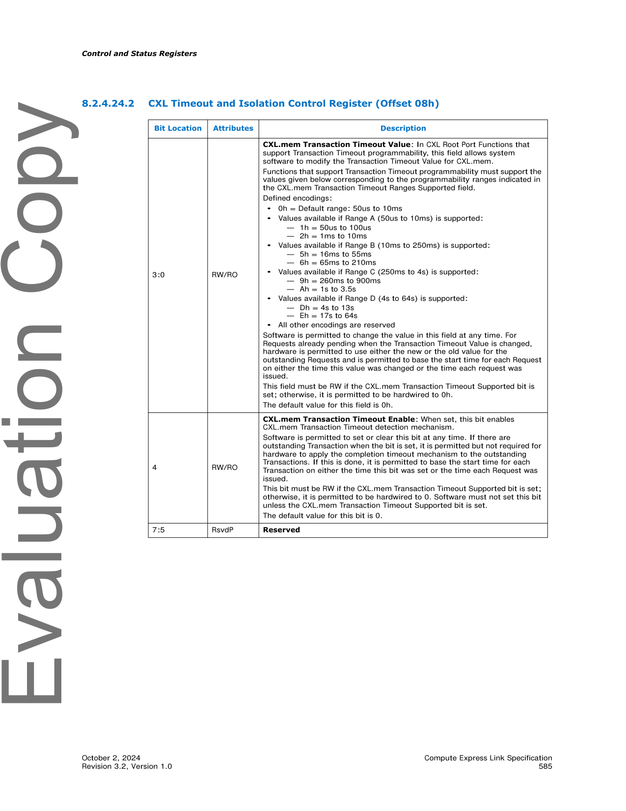
>
> *Original page render @ 150 DPI* — [📄 Full size](figures/chapter_08/page_0585.png)

[⬆️ 返回目录](#-本章目录-part-b)

---

### 8.2.4.24.3 CXL Timeout and Isolation Status Register (Offset 0Ch) | CXL 超时与隔离状态寄存器 (偏移量 0Ch)

<table>
<thead>
<tr>
<th width="50%">🇬🇧 English</th>
<th width="50%" style="background-color:#e8e8e8">🇨🇳 中文</th>
</tr>
</thead>
<tbody>
<tr><td>

| Bit Location | Attributes | Description |
|--------------|------------|-------------|
| 0 | RW1CS/RsvdZ | CXL.mem Transaction Timeout: When set, this indicates that a CXL.mem transaction timed out. |
| 3:1 | RsvdZ | Reserved |
| 4 | RW1CS/RsvdZ | CXL.cache Transaction Timeout: When set, this indicates that a CXL.cache transaction timed out. |
| 7:5 | RsvdZ | Reserved |
| 8 | RW1CS/RsvdZ | CXL.mem Isolation Status: This field indicates that Isolation mode for CXL.mem was triggered. When this bit is set, CXL.mem is in isolation and the link is forced to be down if the CXL.mem Isolation Link Down Enable bit is set. Software is permitted to clear this bit as part of recovery actions regardless of the state of other status bits, after which the CXL Root Port is no longer in Isolation mode for CXL.mem transactions. The link must transition through the Link Down state before software can attempt re-enumeration and device recovery. |
| 9 | RW1CS/RsvdZ | CXL.mem Isolation Link Down Status: This field indicates that Isolation mode for CXL.mem was triggered because of Link Down. |
| 11:10 | RsvdZ | Reserved |
| 12 | RW1CS/RsvdZ | CXL.cache Isolation Status: This bit indicates that Isolation mode for CXL.cache was triggered. When this bit is set, CXL.cache is in isolation and the link is forced to be down if CXL.cache Isolation Link Down Enable is set. Software is permitted to clear this bit as part of recovery actions, after which the CXL Root Port is no longer in Isolation mode for CXL.cache transactions. The link must transition through the Link Down state before software can attempt re-enumeration and device recovery. |
| 13 | RW1CS/RsvdZ | CXL.cache Isolation Link Down Status: This bit indicates that Isolation mode for CXL.cache was triggered because of Link Down. |
| 14 | RO/RsvdZ | CXL RP Busy: When either the CXL.mem Isolation Status bit or the CXL.cache Isolation Status bit is set and this bit is set, the Root Port is busy with internal activity that must complete before software is permitted to clear the CXL.mem Isolation Status bit and the CXL.cache Isolation Status bit. If software violates this requirement, the behavior is undefined. This bit is valid only when either the CXL.mem Isolation Status bit or the CXL.cache Isolation Status bit is set; otherwise, the value of this bit is undefined. Default value of this bit is undefined. |
| 31:15 | RsvdZ | Reserved |

</td><td style="background-color:#e8e8e8">

| 位域 | 属性 | 描述 |
|------|------|------|
| 0 | RW1CS/RsvdZ | CXL.mem Transaction Timeout: 置位时, 表示 CXL.mem 事务已超时。 |
| 3:1 | RsvdZ | 保留 |
| 4 | RW1CS/RsvdZ | CXL.cache Transaction Timeout: 置位时, 表示 CXL.cache 事务已超时。 |
| 7:5 | RsvdZ | 保留 |
| 8 | RW1CS/RsvdZ | CXL.mem Isolation Status: 此字段表示已触发 CXL.mem 的隔离模式。当此位置位时, CXL.mem 处于隔离状态, 如果设置了 CXL.mem Isolation Link Down Enable 位, 则链路被强制为故障状态。 软件允许在恢复操作中清除此位, 而与其它状态位的状态无关, 之后 CXL 根端口不再处于 CXL.mem 事务的隔离模式。在软件尝试重新枚举和设备恢复之前, 链路必须转换通过 Link Down 状态。 |
| 9 | RW1CS/RsvdZ | CXL.mem Isolation Link Down Status: 此字段表示由于 Link Down 触发了 CXL.mem 的隔离模式。 |
| 11:10 | RsvdZ | 保留 |
| 12 | RW1CS/RsvdZ | CXL.cache Isolation Status: 此位表示已触发 CXL.cache 的隔离模式。当此位置位时, CXL.cache 处于隔离状态, 如果设置了 CXL.cache Isolation Link Down Enable 位, 则链路被强制为故障状态。 软件允许在恢复操作中清除此位, 之后 CXL 根端口不再处于 CXL.cache 事务的隔离模式。在软件尝试重新枚举和设备恢复之前, 链路必须转换通过 Link Down 状态。 |
| 13 | RW1CS/RsvdZ | CXL.cache Isolation Link Down Status: 此位表示由于 Link Down 触发了 CXL.cache 的隔离模式。 |
| 14 | RO/RsvdZ | CXL RP Busy: 当 CXL.mem Isolation Status 位或 CXL.cache Isolation Status 位之一置位且此位置位时, 根端口正忙于必须在软件允许清除 CXL.mem Isolation Status 位和 CXL.cache Isolation Status 位之前完成的内部活动。如果软件违反此要求, 则行为未定义。 仅当 CXL.mem Isolation Status 位或 CXL.cache Isolation Status 位之一置位时, 此位才有效; 否则, 此位的值未定义。 该位的默认值未定义。 |
| 31:15 | RsvdZ | 保留 |

</td></tr>
</tbody>
</table>

> **Figure 8-59.** CXL Timeout and Isolation Status Register layout ｜ CXL 超时与隔离状态寄存器布局
>
> 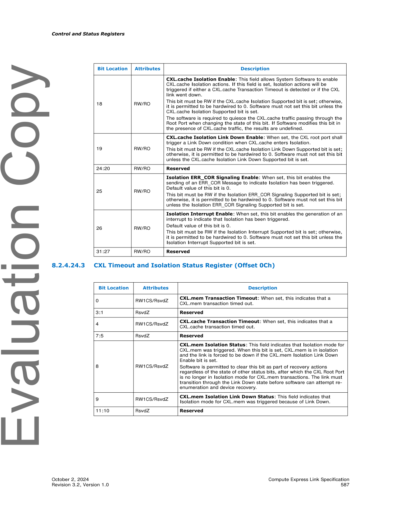
>
> *Original page render @ 150 DPI* — [📄 Full size](figures/chapter_08/page_0587.png)

[⬆️ 返回目录](#-本章目录-part-b)

---

## 8.2.4.25 CXL.cachemem Extended Register Capability | CXL.cachemem 扩展寄存器能力

<table>
<thead>
<tr>
<th width="50%">🇬🇧 English</th>
<th width="50%" style="background-color:#e8e8e8">🇨🇳 中文</th>
</tr>
</thead>
<tbody>
<tr><td>

This capability identifies all the extended 4-KB ranges in the Component Register Space that host CXL.cachemem registers.

| Offset | Register Name |
|--------|---------------|
| 00h | CXL.cachemem Extended Ranges Register |

</td><td style="background-color:#e8e8e8">

此能力标识组件寄存器空间中承载 CXL.cachemem 寄存器的所有扩展 4-KB 范围。

| 偏移量 | 寄存器名称 |
|--------|------------|
| 00h | CXL.cachemem Extended Ranges Register |

</td></tr>
</tbody>
</table>

[⬆️ 返回目录](#-本章目录-part-b)

---

### 8.2.4.25.1 CXL.cachemem Extended Ranges Register (Offset 00h) | CXL.cachemem 扩展范围寄存器 (偏移量 00h)

<table>
<thead>
<tr>
<th width="50%">🇬🇧 English</th>
<th width="50%" style="background-color:#e8e8e8">🇨🇳 中文</th>
</tr>
</thead>
<tbody>
<tr><td>

This register describes which 4-KB ranges in the Component Register Space that host CXL.cachemem Extended Range(s).

| Bit Location | Attributes | Description |
|--------------|------------|-------------|
| 15:0 | HwInit | Extended Ranges Bitmap • Bits [0, 1, 14]: Reserved More than one of the following bits may be set to 1. • Bit[2]: If set, the range 2000h-2FFFh within the Component Register space is a CXL.cachemem extended range • Bit[3]: If set, the range 3000h-3FFFh within the Component Register space is a CXL.cachemem extended range • Bit[4]: If set, the range 4000h-4FFFh within the Component Register space is a CXL.cachemem extended range • Bit[5]: If set, the range 5000h-5FFFh within the Component Register space is a CXL.cachemem extended range • Bit[6]: If set, the range 6000h-6FFFh within the Component Register space is a CXL.cachemem extended range • Bit[7]: If set, the range 7000h-7FFFh within the Component Register space is a CXL.cachemem extended range • Bit[8]: If set, the range 8000h-8FFFh within the Component Register space is a CXL.cachemem extended range • Bit[9]: If set, the range 9000h-9FFFh within the Component Register space is a CXL.cachemem extended range • Bit[10]: If set, the range A000h-AFFFh within the Component Register space is a CXL.cachemem extended range • Bit[11]: If set, the range B000h-BFFFh within the Component Register space is a CXL.cachemem extended range • Bit[12]: If set, the range C000h-CFFFh within the Component Register space is a CXL.cachemem extended range • Bit[13]: If set, the range D000h-DFFFh within the Component Register space is a CXL.cachemem extended range • Bit[15]: If set, the range F000h-FFFFh within the Component Register space is a CXL.cachemem extended range |
| 31:16 | RsvdP | Reserved |

</td><td style="background-color:#e8e8e8">

此寄存器描述组件寄存器空间中承载 CXL.cachemem 扩展范围的哪些 4-KB 范围。

| 位域 | 属性 | 描述 |
|------|------|------|
| 15:0 | HwInit | Extended Ranges Bitmap (扩展范围位图) • 位 [0, 1, 14]: 保留 以下位中可能有多个设置为 1。 • 位 [2]: 置位时, 组件寄存器空间中的 2000h-2FFFh 范围为 CXL.cachemem 扩展范围 • 位 [3]: 置位时, 组件寄存器空间中的 3000h-3FFFh 范围为 CXL.cachemem 扩展范围 • 位 [4]: 置位时, 组件寄存器空间中的 4000h-4FFFh 范围为 CXL.cachemem 扩展范围 • 位 [5]: 置位时, 组件寄存器空间中的 5000h-5FFFh 范围为 CXL.cachemem 扩展范围 • 位 [6]: 置位时, 组件寄存器空间中的 6000h-6FFFh 范围为 CXL.cachemem 扩展范围 • 位 [7]: 置位时, 组件寄存器空间中的 7000h-7FFFh 范围为 CXL.cachemem 扩展范围 • 位 [8]: 置位时, 组件寄存器空间中的 8000h-8FFFh 范围为 CXL.cachemem 扩展范围 • 位 [9]: 置位时, 组件寄存器空间中的 9000h-9FFFh 范围为 CXL.cachemem 扩展范围 • 位 [10]: 置位时, 组件寄存器空间中的 A000h-AFFFh 范围为 CXL.cachemem 扩展范围 • 位 [11]: 置位时, 组件寄存器空间中的 B000h-BFFFh 范围为 CXL.cachemem 扩展范围 • 位 [12]: 置位时, 组件寄存器空间中的 C000h-CFFFh 范围为 CXL.cachemem 扩展范围 • 位 [13]: 置位时, 组件寄存器空间中的 D000h-DFFFh 范围为 CXL.cachemem 扩展范围 • 位 [15]: 置位时, 组件寄存器空间中的 F000h-FFFFh 范围为 CXL.cachemem 扩展范围 |
| 31:16 | RsvdP | 保留 |

</td></tr>
</tbody>
</table>

> **Figure 8-60.** CXL.cachemem Extended Ranges Register layout ｜ CXL.cachemem 扩展范围寄存器布局
>
> 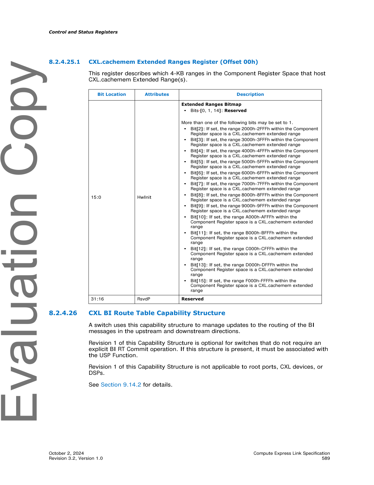
>
> *Original page render @ 150 DPI* — [📄 Full size](figures/chapter_08/page_0589.png)

[⬆️ 返回目录](#-本章目录-part-b)

---

## 8.2.4.26 CXL BI Route Table Capability Structure | CXL BI 路由表能力结构

<table>
<thead>
<tr>
<th width="50%">🇬🇧 English</th>
<th width="50%" style="background-color:#e8e8e8">🇨🇳 中文</th>
</tr>
</thead>
<tbody>
<tr><td>

A switch uses this capability structure to manage updates to the routing of the BI messages in the upstream and downstream directions.

Revision 1 of this Capability Structure is optional for switches that do not require an explicit BI RT Commit operation. If this structure is present, it must be associated with the USP Function.

Revision 1 of this Capability Structure is not applicable to root ports, CXL devices, or DSPs.

See Section 9.14.2 for details.

| Offset | Register Name |
|--------|---------------|
| 00h | BI RT Capability |
| 04h | BI RT Control |
| 08h | BI RT Status |

</td><td style="background-color:#e8e8e8">

交换机使用此能力结构来管理上行和下行方向上 BI 消息路由的更新。

此能力结构的修订版 1 对于不需要显式 BI RT Commit 操作的交换机是可选的。如果存在此结构, 则必须与 USP 功能相关联。

此能力结构的修订版 1 不适用于根端口、CXL 设备或 DSP。

有关详细信息, 请参见第 9.14.2 节。

| 偏移量 | 寄存器名称 |
|--------|------------|
| 00h | BI RT Capability |
| 04h | BI RT Control |
| 08h | BI RT Status |

</td></tr>
</tbody>
</table>

[⬆️ 返回目录](#-本章目录-part-b)

---

### 8.2.4.26.1 BI RT Capability (Offset 00h) | BI RT 能力 (偏移量 00h)

<table>
<thead>
<tr>
<th width="50%">🇬🇧 English</th>
<th width="50%" style="background-color:#e8e8e8">🇨🇳 中文</th>
</tr>
</thead>
<tbody>
<tr><td>

| Bit Location | Attributes | Description |
|--------------|------------|-------------|
| 0 | HwInit | Explicit BI RT Commit Required: If 1, indicates that the software must set the BI RT Commit bit anytime a new BI device is enabled anywhere below this port or any component below this port undergoes bus number re-assignment. If 1, the BI RT Commit bit, the BI RT Committed bit, the BI RT Commit Timeout Scale field, the BI RT Commit Timeout Base field, and BI RT Error Not Committed bit are implemented. BI RT Commit operation may be used by a component to update its internal structures or perform consistency checks. |
| 31:1 | RsvdP | Reserved |

</td><td style="background-color:#e8e8e8">

| 位域 | 属性 | 描述 |
|------|------|------|
| 0 | HwInit | Explicit BI RT Commit Required: 为 1 时, 表示软件必须在此端口下方的任何位置启用新的 BI 设备或此端口下方的任何组件发生总线号重新分配时随时设置 BI RT Commit 位。为 1 时, BI RT Commit 位、BI RT Committed 位、BI RT Commit Timeout Scale 字段、BI RT Commit Timeout Base 字段和 BI RT Error Not Committed 位均被实现。 组件可以使用 BI RT Commit 操作来更新其内部结构或执行一致性检查。 |
| 31:1 | RsvdP | 保留 |

</td></tr>
</tbody>
</table>

[⬆️ 返回目录](#-本章目录-part-b)

---

### 8.2.4.26.2 BI RT Control (Offset 04h) | BI RT 控制 (偏移量 04h)

<table>
<thead>
<tr>
<th width="50%">🇬🇧 English</th>
<th width="50%" style="background-color:#e8e8e8">🇨🇳 中文</th>
</tr>
</thead>
<tbody>
<tr><td>

| Bit Location | Attributes | Description |
|--------------|------------|-------------|
| 0 | RW/RsvdP | BI RT Commit: If Explicit BI RT Commit Required=1, software must cause this bit to transition from 0 to 1 to commit the BI-ID updates. The default value of this bit is 0. This bit must be RW if the Explicit BI RT Commit Required bit is set; otherwise, it is permitted to be hardwired to 0 and the BI Route Table update does not require an explicit commit. Software must not set this bit unless the Explicit BI RT Commit Required bit is set. |
| 31:1 | RsvdP | Reserved |

</td><td style="background-color:#e8e8e8">

| 位域 | 属性 | 描述 |
|------|------|------|
| 0 | RW/RsvdP | BI RT Commit: 如果 Explicit BI RT Commit Required=1, 则软件必须使该位从 0 转换为 1 以提交 BI-ID 更新。该位的默认值为 0。如果 Explicit BI RT Commit Required 位置位, 则此位必须为 RW; 否则, 允许硬连线为 0, BI Route Table 更新不需要显式提交。除非 Explicit BI RT Commit Required 位置位, 否则软件不得设置此位。 |
| 31:1 | RsvdP | 保留 |

</td></tr>
</tbody>
</table>

[⬆️ 返回目录](#-本章目录-part-b)

---

### 8.2.4.26.3 BI RT Status (Offset 08h) | BI RT 状态 (偏移量 08h)

<table>
<thead>
<tr>
<th width="50%">🇬🇧 English</th>
<th width="50%" style="background-color:#e8e8e8">🇨🇳 中文</th>
</tr>
</thead>
<tbody>
<tr><td>

| Bit Location | Attributes | Description |
|--------------|------------|-------------|
| 0 | RO/RsvdP | BI RT Committed: When set to 1, it indicates that the last write that caused BI RT Commit bit to transition from 0 to 1 was successfully processed by the component. This bit is cleared when the software causes the BI RT Commit bit to transition from 1 to 0. This bit is reserved if Explicit BI RT Commit Required=0. |
| 1 | RO/RsvdP | BI RT Error Not Committed: When set to 1, it indicates that the last write that caused the BI RT Commit bit to transition from 0 to 1 was processed by the component, but resulted in an error. This bit is cleared when the software causes the BI RT Commit bit to transition from 1 to 0. This bit is reserved if Explicit BI RT Commit Required=0. |
| 7:2 | RsvdP | Reserved |
| 11:8 | HwInit/RsvdP | BI RT Commit Timeout Scale: This field specifies the time scale associated with BI RT Commit Timeout. • 0000b = 1 us • 0001b = 10 us • 0010b = 100 us • 0011b = 1 ms • 0100b = 10 ms • 0101b = 100 ms • 0110b = 1 second • 0111b = 10 seconds All other encodings are reserved This field is reserved if Explicit BI RT Commit Required=0. |
| 15:12 | HwInit/RsvdP | BI RT Commit Timeout Base: This field determines the BI RT Commit timeout. The timeout duration is calculated by multiplying the Timeout Base with the Timeout Scale. Failure to set either the BI RT Committed bit or the BI RT Error Not Committed bit within the timeout duration is treated as equivalent to commit error. In case of a timeout, the software must clear the BI RT Commit bit to 0 prior to setting it to 1 again. This field is reserved if Explicit BI RT Commit Required=0. |
| 31:16 | RsvdP | Reserved |

</td><td style="background-color:#e8e8e8">

| 位域 | 属性 | 描述 |
|------|------|------|
| 0 | RO/RsvdP | BI RT Committed: 设置为 1 时, 表示导致 BI RT Commit 位从 0 转换为 1 的最后一次写入已被组件成功处理。当软件导致 BI RT Commit 位从 1 转换为 0 时, 该位被清除。如果 Explicit BI RT Commit Required=0, 则此位保留。 |
| 1 | RO/RsvdP | BI RT Error Not Committed: 设置为 1 时, 表示导致 BI RT Commit 位从 0 转换为 1 的最后一次写入已被组件处理, 但导致错误。当软件导致 BI RT Commit 位从 1 转换为 0 时, 该位被清除。如果 Explicit BI RT Commit Required=0, 则此位保留。 |
| 7:2 | RsvdP | 保留 |
| 11:8 | HwInit/RsvdP | BI RT Commit Timeout Scale: 此字段指定与 BI RT Commit Timeout 关联的时间刻度。 • 0000b = 1 us • 0001b = 10 us • 0010b = 100 us • 0011b = 1 ms • 0100b = 10 ms • 0101b = 100 ms • 0110b = 1 秒 • 0111b = 10 秒 所有其他编码保留 如果 Explicit BI RT Commit Required=0, 则此字段保留。 |
| 15:12 | HwInit/RsvdP | BI RT Commit Timeout Base: 此字段确定 BI RT Commit 超时。超时持续时间通过将 Timeout Base 乘以 Timeout Scale 来计算。在超时持续时间内未能设置 BI RT Committed 位或 BI RT Error Not Committed 位被视为等同于提交错误。在超时的情况下, 软件必须在将 BI RT Commit 位再次设置为 1 之前将其清除为 0。如果 Explicit BI RT Commit Required=0, 则此字段保留。 |
| 31:16 | RsvdP | 保留 |

</td></tr>
</tbody>
</table>

> **Figure 8-61.** BI RT Status Register layout ｜ BI RT 状态寄存器布局
>
> 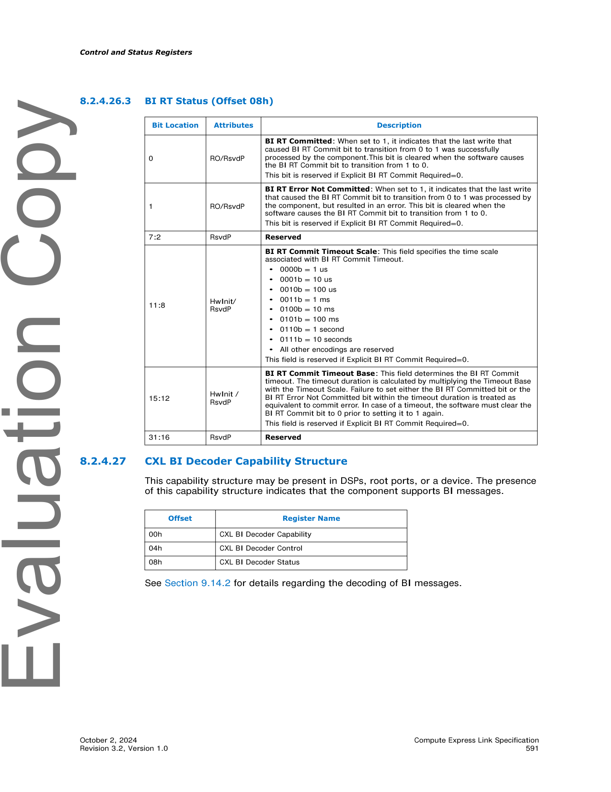
>
> *Original page render @ 150 DPI* — [📄 Full size](figures/chapter_08/page_0591.png)

[⬆️ 返回目录](#-本章目录-part-b)

---

## 8.2.4.27 CXL BI Decoder Capability Structure | CXL BI 解码器能力结构

<table>
<thead>
<tr>
<th width="50%">🇬🇧 English</th>
<th width="50%" style="background-color:#e8e8e8">🇨🇳 中文</th>
</tr>
</thead>
<tbody>
<tr><td>

This capability structure may be present in DSPs, root ports, or a device. The presence of this capability structure indicates that the component supports BI messages.

See Section 9.14.2 for details regarding the decoding of BI messages.

| Offset | Register Name |
|--------|---------------|
| 00h | CXL BI Decoder Capability |
| 04h | CXL BI Decoder Control |
| 08h | CXL BI Decoder Status |

</td><td style="background-color:#e8e8e8">

此能力结构可能存在于 DSP、根端口或设备中。此能力结构的存在表示组件支持 BI 消息。

有关 BI 消息解码的详细信息, 请参见第 9.14.2 节。

| 偏移量 | 寄存器名称 |
|--------|------------|
| 00h | CXL BI Decoder Capability |
| 04h | CXL BI Decoder Control |
| 08h | CXL BI Decoder Status |

</td></tr>
</tbody>
</table>

[⬆️ 返回目录](#-本章目录-part-b)

---

### 8.2.4.27.1 CXL BI Decoder Capability (Offset 00h) | CXL BI 解码器能力 (偏移量 00h)

<table>
<thead>
<tr>
<th width="50%">🇬🇧 English</th>
<th width="50%" style="background-color:#e8e8e8">🇨🇳 中文</th>
</tr>
</thead>
<tbody>
<tr><td>

| Bit Location | Attributes | Description |
|--------------|------------|-------------|
| 0 | HwInit/RsvdP | HDM-D Capable: If 1, it indicates that the Device supports HDM-D flows. If 0, it indicates that the Device does not support HDM-D flows. This bit is reserved for DSPs and Root Ports. |
| 1 | HwInit/RsvdP | Explicit BI Decoder Commit Required: If 1, indicates that the software must set BI Decoder Commit bit anytime a new BI device is enabled anywhere below this port or any component below this port undergoes bus number re-assignment. If 1, the BI Decoder Commit bit, the BI Decoder Committed bit, the BI Decoder Commit timeout Scale field, the BI Decoder Commit Timeout Base field, and BI Decoder Error Not Committed bit are implemented. BI Decoder Commit operation may be used by a component to update its internal structures or perform consistency checks. This bit is reserved for CXL devices and CXL root ports. |
| 31:2 | RsvdP | Reserved |

</td><td style="background-color:#e8e8e8">

| 位域 | 属性 | 描述 |
|------|------|------|
| 0 | HwInit/RsvdP | HDM-D Capable: 为 1 时, 表示设备支持 HDM-D 流。为 0 时, 表示设备不支持 HDM-D 流。对于 DSP 和根端口, 此位保留。 |
| 1 | HwInit/RsvdP | Explicit BI Decoder Commit Required: 为 1 时, 表示软件必须在此端口下方的任何位置启用新的 BI 设备或此端口下方的任何组件发生总线号重新分配时随时设置 BI Decoder Commit 位。为 1 时, BI Decoder Commit 位、BI Decoder Committed 位、BI Decoder Commit Timeout Scale 字段、BI Decoder Commit Timeout Base 字段和 BI Decoder Error Not Committed 位均被实现。 组件可以使用 BI Decoder Commit 操作来更新其内部结构或执行一致性检查。 对于 CXL 设备和 CXL 根端口, 此位保留。 |
| 31:2 | RsvdP | 保留 |

</td></tr>
</tbody>
</table>

> **Figure 8-62.** CXL BI Decoder Capability Register layout ｜ CXL BI 解码器能力寄存器布局
>
> 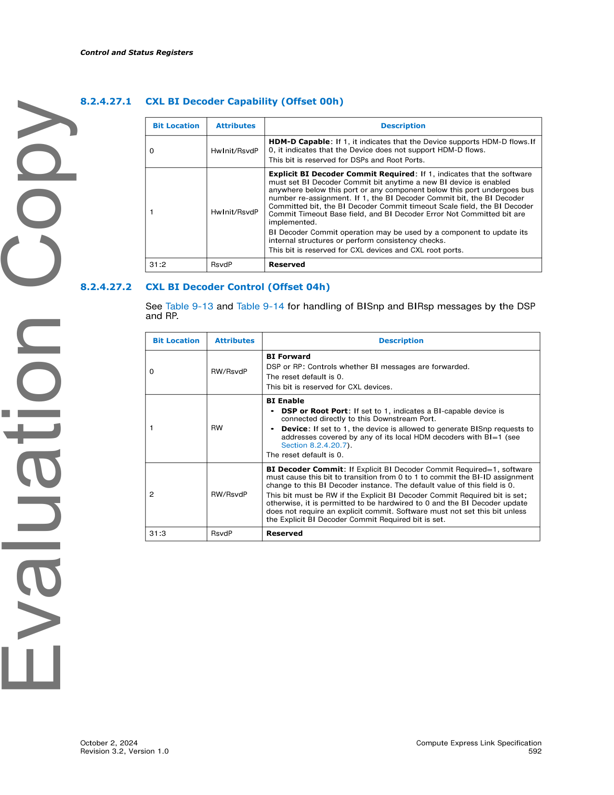
>
> *Original page render @ 150 DPI* — [📄 Full size](figures/chapter_08/page_0592.png)

[⬆️ 返回目录](#-本章目录-part-b)

---

### 8.2.4.27.2 CXL BI Decoder Control (Offset 04h) | CXL BI 解码器控制 (偏移量 04h)

<table>
<thead>
<tr>
<th width="50%">🇬🇧 English</th>
<th width="50%" style="background-color:#e8e8e8">🇨🇳 中文</th>
</tr>
</thead>
<tbody>
<tr><td>

See Table 9-13 and Table 9-14 for handling of BISnp and BIRsp messages by the DSP and RP.

| Bit Location | Attributes | Description |
|--------------|------------|-------------|
| 0 | RW/RsvdP | BI Forward DSP or RP: Controls whether BI messages are forwarded. The reset default is 0. This bit is reserved for CXL devices. |
| 1 | RW | BI Enable • DSP or Root Port: If set to 1, indicates a BI-capable device is connected directly to this Downstream Port. • Device: If set to 1, the device is allowed to generate BISnp requests to addresses covered by any of its local HDM decoders with BI=1 (see Section 8.2.4.20.7). The reset default is 0. |
| 2 | RW/RsvdP | BI Decoder Commit: If Explicit BI Decoder Commit Required=1, software must cause this bit to transition from 0 to 1 to commit the BI-ID assignment change to this BI Decoder instance. The default value of this field is 0. This bit must be RW if the Explicit BI Decoder Commit Required bit is set; otherwise, it is permitted to be hardwired to 0 and the BI Decoder update does not require an explicit commit. Software must not set this bit unless the Explicit BI Decoder Commit Required bit is set. |
| 31:3 | RsvdP | Reserved |

</td><td style="background-color:#e8e8e8">

有关 DSP 和 RP 处理 BISnp 和 BIRsp 消息的信息, 请参见表 9-13 和表 9-14。

| 位域 | 属性 | 描述 |
|------|------|------|
| 0 | RW/RsvdP | BI Forward (BI 转发) DSP 或 RP: 控制是否转发 BI 消息。复位默认值为 0。对于 CXL 设备, 此位保留。 |
| 1 | RW | BI Enable (BI 启用) • DSP 或根端口: 设置为 1 时, 表示具有 BI 能力的设备直接连接到此下行端口。 • 设备: 设置为 1 时, 允许设备向其本地 HDM 解码器 (BI=1, 参见第 8.2.4.20.7 节) 覆盖的地址生成 BISnp 请求。 复位默认值为 0。 |
| 2 | RW/RsvdP | BI Decoder Commit: 如果 Explicit BI Decoder Commit Required=1, 则软件必须使该位从 0 转换为 1 以向此 BI 解码器实例提交 BI-ID 分配更改。该字段的默认值为 0。如果 Explicit BI Decoder Commit Required 位置位, 则此位必须为 RW; 否则, 允许硬连线为 0, BI Decoder 更新不需要显式提交。除非 Explicit BI Decoder Commit Required 位置位, 否则软件不得设置此位。 |
| 31:3 | RsvdP | 保留 |

</td></tr>
</tbody>
</table>

> **Figure 8-63.** CXL BI Decoder Control Register layout ｜ CXL BI 解码器控制寄存器布局
>
> 
>
> *Original page render @ 150 DPI* — [📄 Full size](figures/chapter_08/page_0592.png)

[⬆️ 返回目录](#-本章目录-part-b)

---

### 8.2.4.27.3 CXL BI Decoder Status (Offset 08h) | CXL BI 解码器状态 (偏移量 08h)

<table>
<thead>
<tr>
<th width="50%">🇬🇧 English</th>
<th width="50%" style="background-color:#e8e8e8">🇨🇳 中文</th>
</tr>
</thead>
<tbody>
<tr><td>

| Bit Location | Attributes | Description |
|--------------|------------|-------------|
| 0 | RO | BI Decoder Committed: When set to 1, it indicates that the last write that caused the BI Decoder Commit bit to transition from 0 to 1 was successfully processed by the component. This bit is cleared when the software causes the BI Decoder Commit bit to transition from 1 to 0. |
| 1 | RO | BI Decoder Error Not Committed: When set to 1, it indicates that the last write that caused the BI Decoder Commit bit to transition from 0 to 1 was processed by the component, but resulted in an error. This bit is cleared when the software causes the BI Decoder Commit bit to transition from 1 to 0. |
| 7:2 | RsvdP | Reserved |
| 11:8 | HwInit | BI Decoder Commit Timeout Scale: This field specifies the time scale associated with BI Decoder Commit Timeout. • 0000b = 1 us • 0001b = 10 us • 0010b = 100 us • 0011b = 1 ms • 0100b = 10 ms • 0101b = 100 ms • 0110b = 1 second • 0111b = 10 seconds All other encodings are reserved |
| 15:12 | HwInit | BI Decoder Commit Timeout Base: This field determines the BI Decoder Commit timeout. The timeout duration is calculated by multiplying the Timeout Base with the Timeout Scale. Failure to set either BI Decoder Committed bit or BI Decoder Error Not Committed bit within the timeout duration is treated as equivalent to commit error. In case of a timeout, the software must clear the BI Decoder Commit bit to 0 prior to setting it to 1 again. |
| 31:16 | RsvdP | Reserved |

</td><td style="background-color:#e8e8e8">

| 位域 | 属性 | 描述 |
|------|------|------|
| 0 | RO | BI Decoder Committed: 设置为 1 时, 表示导致 BI Decoder Commit 位从 0 转换为 1 的最后一次写入已被组件成功处理。当软件导致 BI Decoder Commit 位从 1 转换为 0 时, 该位被清除。 |
| 1 | RO | BI Decoder Error Not Committed: 设置为 1 时, 表示导致 BI Decoder Commit 位从 0 转换为 1 的最后一次写入已被组件处理, 但导致错误。当软件导致 BI Decoder Commit 位从 1 转换为 0 时, 该位被清除。 |
| 7:2 | RsvdP | 保留 |
| 11:8 | HwInit | BI Decoder Commit Timeout Scale: 此字段指定与 BI Decoder Commit Timeout 关联的时间刻度。 • 0000b = 1 us • 0001b = 10 us • 0010b = 100 us • 0011b = 1 ms • 0100b = 10 ms • 0101b = 100 ms • 0110b = 1 秒 • 0111b = 10 秒 所有其他编码保留 |
| 15:12 | HwInit | BI Decoder Commit Timeout Base: 此字段确定 BI Decoder Commit 超时。超时持续时间通过将 Timeout Base 乘以 Timeout Scale 来计算。在超时持续时间内未能设置 BI Decoder Committed 位或 BI Decoder Error Not Committed 位被视为等同于提交错误。在超时的情况下, 软件必须在将 BI Decoder Commit 位再次设置为 1 之前将其清除为 0。 |
| 31:16 | RsvdP | 保留 |

</td></tr>
</tbody>
</table>

> **Figure 8-64.** CXL BI Decoder Status Register layout ｜ CXL BI 解码器状态寄存器布局
>
> 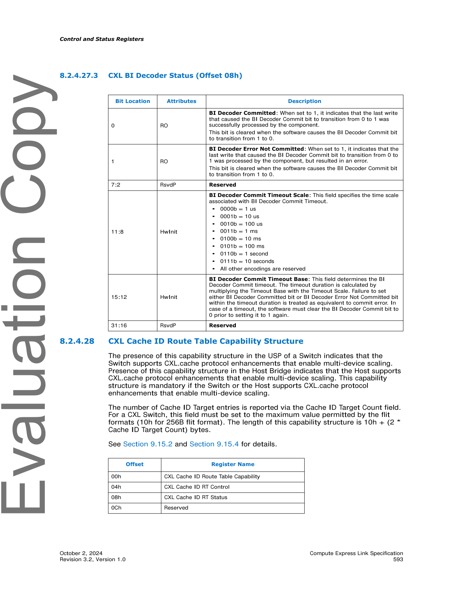
>
> *Original page render @ 150 DPI* — [📄 Full size](figures/chapter_08/page_0593.png)

[⬆️ 返回目录](#-本章目录-part-b)

---

## 8.2.4.28 CXL Cache ID Route Table Capability Structure | CXL 缓存 ID 路由表能力结构

<table>
<thead>
<tr>
<th width="50%">🇬🇧 English</th>
<th width="50%" style="background-color:#e8e8e8">🇨🇳 中文</th>
</tr>
</thead>
<tbody>
<tr><td>

The presence of this capability structure in the USP of a Switch indicates that the Switch supports CXL.cache protocol enhancements that enable multi-device scaling. Presence of this capability structure in the Host Bridge indicates that the Host supports CXL.cache protocol enhancements that enable multi-device scaling. This capability structure is mandatory if the Switch or the Host supports CXL.cache protocol enhancements that enable multi-device scaling.

The number of Cache ID Target entries is reported via the Cache ID Target Count field. For a CXL Switch, this field must be set to the maximum value permitted by the flit formats (10h for 256B flit format). The length of this capability structure is 10h + (2 * Cache ID Target Count) bytes.

See Section 9.15.2 and Section 9.15.4 for details.

| Offset | Register Name |
|--------|---------------|
| 00h | CXL Cache ID Route Table Capability |
| 04h | CXL Cache ID RT Control |
| 08h | CXL Cache ID RT Status |
| 0Ch | Reserved |
| 10h | CXL Cache ID Target 0 |
| 12h | CXL Cache ID Target 1 |
| … | … |

</td><td style="background-color:#e8e8e8">

此能力结构存在于交换机的 USP 中表示交换机支持实现多设备扩展的 CXL.cache 协议增强。此能力结构存在于主机桥中表示主机支持实现多设备扩展的 CXL.cache 协议增强。如果交换机或主机支持实现多设备扩展的 CXL.cache 协议增强, 则此能力结构是必需的。

Cache ID Target 条目数通过 Cache ID Target Count 字段报告。对于 CXL 交换机, 此字段必须设置为 Flit 格式所允许的最大值 (256B Flit 格式为 10h)。此能力结构的长度为 10h + (2 * Cache ID Target Count) 字节。

有关详细信息, 请参见第 9.15.2 节和第 9.15.4 节。

| 偏移量 | 寄存器名称 |
|--------|------------|
| 00h | CXL Cache ID Route Table Capability |
| 04h | CXL Cache ID RT Control |
| 08h | CXL Cache ID RT Status |
| 0Ch | 保留 |
| 10h | CXL Cache ID Target 0 |
| 12h | CXL Cache ID Target 1 |
| … | … |

</td></tr>
</tbody>
</table>

[⬆️ 返回目录](#-本章目录-part-b)

---

### 8.2.4.28.1 CXL Cache ID Route Table Capability (Offset 00h) | CXL 缓存 ID 路由表能力 (偏移量 00h)

<table>
<thead>
<tr>
<th width="50%">🇬🇧 English</th>
<th width="50%" style="background-color:#e8e8e8">🇨🇳 中文</th>
</tr>
</thead>
<tbody>
<tr><td>

| Bit Location | Attributes | Description |
|--------------|------------|-------------|
| 4:0 | HwInit/RsvdP | Cache ID Target Count: The number of Cache ID Target entries in this capability structure. For a CXL switch, this field must be set to the maximum value amongst all the flit formats the switch supports. For example, a switch that supports the 68B flit format and the 256B flit format must set this to 10h even when the USP link is operating in 68B Flit mode. A Host Bridge may report a number that is smaller than the maximum value amongst all the flit formats the host supports. |
| 7:5 | RsvdP | Reserved |
| 11:8 | HwInit/RsvdP | HDM-D Type 2 Device Max Count: The number of Type 2 devices using HDM-D flows that this Host Bridge is capable of supporting. This field is reserved for switches. |
| 15:12 | RsvdP | Reserved |
| 16 | HwInit | Explicit Cache ID RT Commit Required: If 1, indicates that the software must set Cache ID RT Commit bit after any changes to this Cache ID Route Table for those changes to take effect. If 1, the Cache ID RT Commit bit, the Cache ID RT Committed bit, the Cache ID RT Commit timeout Scale field, the Cache ID RT Commit Timeout Base field, and Cache ID RT Error Not Committed bit are implemented. Cache ID RT Commit operation may be used by a component to update its internal structures or perform consistency checks. |
| 31:17 | RsvdP | Reserved |

</td><td style="background-color:#e8e8e8">

| 位域 | 属性 | 描述 |
|------|------|------|
| 4:0 | HwInit/RsvdP | Cache ID Target Count: 此能力结构中 Cache ID Target 条目的数量。对于 CXL 交换机, 此字段必须设置为交换机支持的所有 Flit 格式中的最大值。例如, 支持 68B Flit 格式和 256B Flit 格式的交换机必须将此字段设置为 10h, 即使 USP 链路以 68B Flit 模式操作。主机桥可以报告一个小于主机支持的所有 Flit 格式中最大值的数字。 |
| 7:5 | RsvdP | 保留 |
| 11:8 | HwInit/RsvdP | HDM-D Type 2 Device Max Count: 此主机桥能够支持的、使用 HDM-D 流的 Type 2 设备数量。对于交换机, 此字段保留。 |
| 15:12 | RsvdP | 保留 |
| 16 | HwInit | Explicit Cache ID RT Commit Required: 为 1 时, 表示软件必须在此 Cache ID Route Table 发生任何更改后设置 Cache ID RT Commit 位, 以使这些更改生效。为 1 时, Cache ID RT Commit 位、Cache ID RT Committed 位、Cache ID RT Commit Timeout Scale 字段、Cache ID RT Commit Timeout Base 字段和 Cache ID RT Error Not Committed 位均被实现。 组件可以使用 Cache ID RT Commit 操作来更新其内部结构或执行一致性检查。 |
| 31:17 | RsvdP | 保留 |

</td></tr>
</tbody>
</table>

[⬆️ 返回目录](#-本章目录-part-b)

---

### 8.2.4.28.2 CXL Cache ID RT Control (Offset 04h) | CXL 缓存 ID RT 控制 (偏移量 04h)

<table>
<thead>
<tr>
<th width="50%">🇬🇧 English</th>
<th width="50%" style="background-color:#e8e8e8">🇨🇳 中文</th>
</tr>
</thead>
<tbody>
<tr><td>

| Bit Location | Attributes | Description |
|--------------|------------|-------------|
| 0 | RW/RsvdP | Cache ID RT Commit: If Explicit Cache ID RT Commit Required=1, software must cause this bit to transition from 0 to 1 to commit the contents of this Cache ID Route Table instance. The default value of this field is 0. This bit must be RW if the Cache ID RT Commit Required bit is set; otherwise, it is permitted to be hardwired to 0 and the Cache ID Route Table update does not require an explicit commit. Software must not set this bit unless the Explicit Cache ID RT Commit Required bit is set. |
| 31:1 | RsvdP | Reserved |

</td><td style="background-color:#e8e8e8">

| 位域 | 属性 | 描述 |
|------|------|------|
| 0 | RW/RsvdP | Cache ID RT Commit: 如果 Explicit Cache ID RT Commit Required=1, 则软件必须使该位从 0 转换为 1 以提交此 Cache ID Route Table 实例的内容。该字段的默认值为 0。如果 Cache ID RT Commit Required 位置位, 则此位必须为 RW; 否则, 允许硬连线为 0, Cache ID Route Table 更新不需要显式提交。除非 Explicit Cache ID RT Commit Required 位置位, 否则软件不得设置此位。 |
| 31:1 | RsvdP | 保留 |

</td></tr>
</tbody>
</table>

[⬆️ 返回目录](#-本章目录-part-b)

---

### 8.2.4.28.3 CXL Cache ID RT Status (Offset 08h) | CXL 缓存 ID RT 状态 (偏移量 08h)

<table>
<thead>
<tr>
<th width="50%">🇬🇧 English</th>
<th width="50%" style="background-color:#e8e8e8">🇨🇳 中文</th>
</tr>
</thead>
<tbody>
<tr><td>

| Bit Location | Attributes | Description |
|--------------|------------|-------------|
| 0 | RO/RsvdP | Cache ID RT Committed: When set to 1, it indicates that the last write that caused the Cache ID RT Commit bit to transition from 0 to 1 was successfully processed by the component. This bit is cleared when the software causes the Cache ID RT Commit bit to transition from 1 to 0. This bit is reserved if Explicit Cache ID RT Commit Required=0. |
| 1 | RO/RsvdP | Cache ID RT Error Not Committed: When set to 1, it indicates that the last write that caused the Cache ID RT Commit bit to transition from 0 to 1 was processed by the component, but resulted in an error. This bit is cleared when the software causes the Cache ID RT Commit bit to transition from 1 to 0. This bit is reserved if Explicit Cache ID RT Commit Required=0. |
| 7:2 | RsvdP | Reserved |
| 11:8 | (see below) | Cache ID RT Commit Timeout Scale: This field specifies the time scale associated with Cache ID RT Commit Timeout. • 0000b = 1 us • 0001b = 10 us • 0010b = 100 us • 0011b = 1 ms • 0100b = 10 ms • 0101b = 100 ms • 0110b = 1 second • 0111b = 10 seconds All other encodings are reserved |
| 15:12 | (see below) | Cache ID RT Commit Timeout Base: This field determines the Cache ID RT Commit timeout. The timeout duration is calculated by multiplying the Timeout Base with the Timeout Scale. Failure to set either the Cache ID RT Committed bit or the Cache ID RT Error Not Committed bit within the timeout duration is treated as equivalent to commit error. In case of a timeout, the software must clear the Cache ID RT Commit bit to 0 prior to setting it to 1 again. |
| 31:16 | RsvdP | Reserved |

</td><td style="background-color:#e8e8e8">

| 位域 | 属性 | 描述 |
|------|------|------|
| 0 | RO/RsvdP | Cache ID RT Committed: 设置为 1 时, 表示导致 Cache ID RT Commit 位从 0 转换为 1 的最后一次写入已被组件成功处理。当软件导致 Cache ID RT Commit 位从 1 转换为 0 时, 该位被清除。如果 Explicit Cache ID RT Commit Required=0, 则此位保留。 |
| 1 | RO/RsvdP | Cache ID RT Error Not Committed: 设置为 1 时, 表示导致 Cache ID RT Commit 位从 0 转换为 1 的最后一次写入已被组件处理, 但导致错误。当软件导致 Cache ID RT Commit 位从 1 转换为 0 时, 该位被清除。如果 Explicit Cache ID RT Commit Required=0, 则此位保留。 |
| 7:2 | RsvdP | 保留 |
| 11:8 | (见下文) | Cache ID RT Commit Timeout Scale: 此字段指定与 Cache ID RT Commit Timeout 关联的时间刻度。 • 0000b = 1 us • 0001b = 10 us • 0010b = 100 us • 0011b = 1 ms • 0100b = 10 ms • 0101b = 100 ms • 0110b = 1 秒 • 0111b = 10 秒 所有其他编码保留 |
| 15:12 | (见下文) | Cache ID RT Commit Timeout Base: 此字段确定 Cache ID RT Commit 超时。超时持续时间通过将 Timeout Base 乘以 Timeout Scale 来计算。在超时持续时间内未能设置 Cache ID RT Committed 位或 Cache ID RT Error Not Committed 位被视为等同于提交错误。在超时的情况下, 软件必须在将 Cache ID RT Commit 位再次设置为 1 之前将其清除为 0。 |
| 31:16 | RsvdP | 保留 |

</td></tr>
</tbody>
</table>

[⬆️ 返回目录](#-本章目录-part-b)

---

### 8.2.4.28.4 CXL Cache ID Target N (Offset 10h+ 2*N) | CXL 缓存 ID 目标 N (偏移量 10h+ 2*N)

<table>
<thead>
<tr>
<th width="50%">🇬🇧 English</th>
<th width="50%" style="background-color:#e8e8e8">🇨🇳 中文</th>
</tr>
</thead>
<tbody>
<tr><td>

This section defines the CXL Cache ID Target N register at offset 10h + 2*N. The full register definition for target-specific fields (e.g., target identifier, port mapping) is provided in the Cache ID Route Table specification. See Section 9.15.2 and Section 9.15.4 for details.

</td><td style="background-color:#e8e8e8">

本节定义偏移量 10h + 2*N 处的 CXL Cache ID Target N 寄存器。目标特定字段 (例如目标标识符、端口映射) 的完整寄存器定义在 Cache ID Route Table 规范中提供。有关详细信息, 请参见第 9.15.2 节和第 9.15.4 节。

</td></tr>
</tbody>
</table>

> **Figure 8-65.** CXL Cache ID Route Table layout ｜ CXL 缓存 ID 路由表布局
>
> 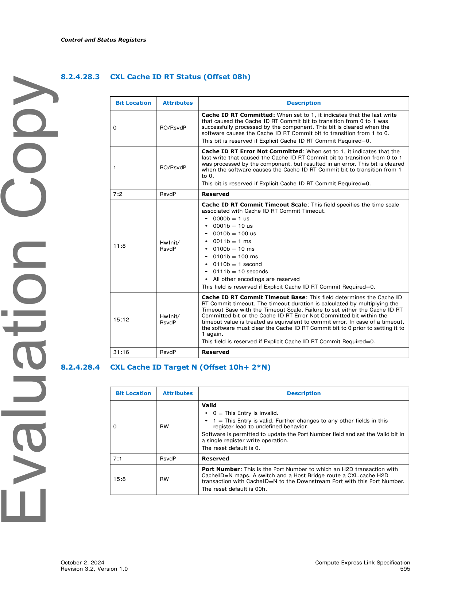
>
> *Original page render @ 150 DPI* — [📄 Full size](figures/chapter_08/page_0595.png)

[⬆️ 返回目录](#-本章目录-part-b)

---

## 8.2.4.29 CXL Cache ID Decoder Capability Structure | CXL 缓存 ID 解码器能力结构

<table>
<thead>
<tr>
<th width="50%">🇬🇧 English</th>
<th width="50%" style="background-color:#e8e8e8">🇨🇳 中文</th>
</tr>
</thead>
<tbody>
<tr><td>

This capability structure may be present in DSPs and root ports. The presence of this capability structure indicates that the component supports CXL.cache protocol enhancements that enable multi-device scaling. This capability structure is mandatory if the switch or the host supports CXL.cache protocol enhancements that enable multi-device scaling. See Section 9.15.2 for details.

| Offset | Register Name |
|--------|---------------|
| 00h | CXL Cache ID Decoder Capability |
| 04h | CXL Cache ID Decoder Control |
| 08h | CXL Cache ID Decoder Status |

</td><td style="background-color:#e8e8e8">

此能力结构可能存在于 DSP 和根端口中。此能力结构的存在表示组件支持实现多设备扩展的 CXL.cache 协议增强。如果交换机或主机支持实现多设备扩展的 CXL.cache 协议增强, 则此能力结构是必需的。有关详细信息, 请参见第 9.15.2 节。

| 偏移量 | 寄存器名称 |
|--------|------------|
| 00h | CXL Cache ID Decoder Capability |
| 04h | CXL Cache ID Decoder Control |
| 08h | CXL Cache ID Decoder Status |

</td></tr>
</tbody>
</table>

[⬆️ 返回目录](#-本章目录-part-b)

---

### 8.2.4.29.1 CXL Cache ID Decoder Capability (Offset 00h) | CXL 缓存 ID 解码器能力 (偏移量 00h)

<table>
<thead>
<tr>
<th width="50%">🇬🇧 English</th>
<th width="50%" style="background-color:#e8e8e8">🇨🇳 中文</th>
</tr>
</thead>
<tbody>
<tr><td>

| Bit Location | Attributes | Description |
|--------------|------------|-------------|
| 0 | HwInit | Explicit Cache ID Decoder Commit Required: If 1, indicates that the software must set the Cache ID Decoder Commit bit anytime a new CXL.cache device is enabled anywhere below this port. Also, the Cache ID Decoder Commit bit, the Cache ID Decoder Committed bit, the Cache ID Decoder Commit Timeout Scale field, the Cache ID Decoder Commit Timeout Base field, and Cache ID Decoder Error Not Committed bit are implemented. Cache ID Decoder Commit operation may be used by a component to update its internal structures or perform consistency checks. |
| 31:1 | RsvdP | Reserved |

</td><td style="background-color:#e8e8e8">

| 位域 | 属性 | 描述 |
|------|------|------|
| 0 | HwInit | Explicit Cache ID Decoder Commit Required: 为 1 时, 表示软件必须在此端口下方的任何位置启用新的 CXL.cache 设备时随时设置 Cache ID Decoder Commit 位。此外, 还实现了 Cache ID Decoder Commit 位、Cache ID Decoder Committed 位、Cache ID Decoder Commit Timeout Scale 字段、Cache ID Decoder Commit Timeout Base 字段和 Cache ID Decoder Error Not Committed 位。 组件可以使用 Cache ID Decoder Commit 操作来更新其内部结构或执行一致性检查。 |
| 31:1 | RsvdP | 保留 |

</td></tr>
</tbody>
</table>

[⬆️ 返回目录](#-本章目录-part-b)

---

### 8.2.4.29.2 CXL Cache ID Decoder Control (Offset 04h) | CXL 缓存 ID 解码器控制 (偏移量 04h)

<table>
<thead>
<tr>
<th width="50%">🇬🇧 English</th>
<th width="50%" style="background-color:#e8e8e8">🇨🇳 中文</th>
</tr>
</thead>
<tbody>
<tr><td>

| Bit Location | Attributes | Description |
|--------------|------------|-------------|
| 0 | RW | Forward Cache ID: 1 indicates that the Port forwards CXL.cache messages in both directions. The reset default is 0. |
| 1 | RW | Assign Cache ID: 1 indicates that this Downstream Port is connected directly to a CXL.cache Device or the link is operating in 68B flit mode. In these cases, the Downstream Port assigns a Cache ID=Local Cache ID to it. The reset default is 0. |
| 2 | RW | HDM-D Type 2 Device Present: 1 indicates that there is a Type 2 Device below this Downstream Port that is using HDM-D flows. The reset default is 0. |
| 3 | RW/RsvdP | Cache ID Decoder Commit: If Explicit Cache ID Decoder Commit Required=1, software must cause this bit to transition from 0 to 1 to commit the Cache ID assignment change to this Cache ID Decoder instance. The default value of this field is 0. This bit must be RW if the Explicit Cache ID Decoder Commit Required bit is set; otherwise, it is permitted to be hardwired to 0 and the Cache ID Decoder update does not require an explicit commit. Software must not set this bit unless the Explicit Cache ID Decoder Commit Required bit is set. |
| 7:4 | RsvdP | Reserved |
| 11:8 | RW | HDM-D Type 2 Device Cache ID: If HDM-D Type 2 Device Present=1, this field represents the Cache ID that has been assigned to the Type 2 device below this Downstream Port that is using HDM-D flows. This field may be used by the port to identify a Type 2 device that is using HDM-D flows and must not be used for assigning a Cache ID. The reset default is 0h. |
| 15:12 | RsvdP | Reserved |
| 19:16 | RW | Local Cache ID: If Assign Cache ID Enable=1, the Port assigns this Cache ID to the directly connected CXL.cache device regardless of whether it is using HDM-D flows or HDM-DB flows. The reset default is 0h. |
| 31:20 | RsvdP | Reserved |

</td><td style="background-color:#e8e8e8">

| 位域 | 属性 | 描述 |
|------|------|------|
| 0 | RW | Forward Cache ID: 1 表示端口在两个方向上转发 CXL.cache 消息。复位默认值为 0。 |
| 1 | RW | Assign Cache ID: 1 表示此下行端口直接连接到 CXL.cache 设备, 或链路以 68B Flit 模式操作。在这些情况下, 下行端口为其分配 Cache ID=Local Cache ID。复位默认值为 0。 |
| 2 | RW | HDM-D Type 2 Device Present: 1 表示此下行端口下方存在使用 HDM-D 流的 Type 2 设备。复位默认值为 0。 |
| 3 | RW/RsvdP | Cache ID Decoder Commit: 如果 Explicit Cache ID Decoder Commit Required=1, 则软件必须使该位从 0 转换为 1 以向此 Cache ID Decoder 实例提交 Cache ID 分配更改。该字段的默认值为 0。如果 Explicit Cache ID Decoder Commit Required 位置位, 则此位必须为 RW; 否则, 允许硬连线为 0, Cache ID Decoder 更新不需要显式提交。除非 Explicit Cache ID Decoder Commit Required 位置位, 否则软件不得设置此位。 |
| 7:4 | RsvdP | 保留 |
| 11:8 | RW | HDM-D Type 2 Device Cache ID: 如果 HDM-D Type 2 Device Present=1, 则此字段表示已分配给此下行下方使用 HDM-D 流的 Type 2 设备的 Cache ID。此字段可被端口用于标识使用 HDM-D 流的 Type 2 设备, 不得用于分配 Cache ID。复位默认值为 0h。 |
| 15:12 | RsvdP | 保留 |
| 19:16 | RW | Local Cache ID: 如果 Assign Cache ID Enable=1, 则端口将此 Cache ID 分配给直接连接的 CXL.cache 设备, 无论其是使用 HDM-D 流还是 HDM-DB 流。复位默认值为 0h。 |
| 31:20 | RsvdP | 保留 |

</td></tr>
</tbody>
</table>

> **Figure 8-66.** CXL Cache ID Decoder Control Register layout ｜ CXL 缓存 ID 解码器控制寄存器布局
>
> 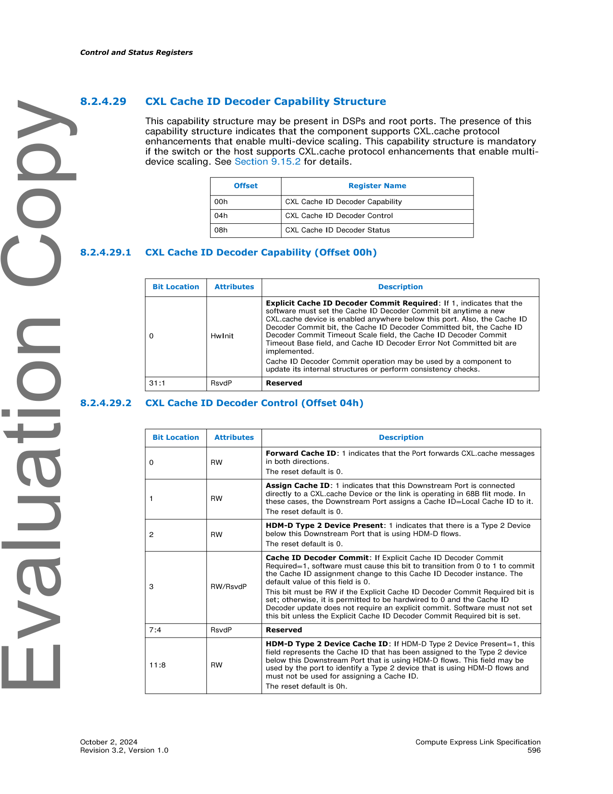
>
> *Original page render @ 150 DPI* — [📄 Full size](figures/chapter_08/page_0596.png)

[⬆️ 返回目录](#-本章目录-part-b)

---

### 8.2.4.29.3 CXL Cache ID Decoder Status (Offset 08h) | CXL 缓存 ID 解码器状态 (偏移量 08h)

<table>
<thead>
<tr>
<th width="50%">🇬🇧 English</th>
<th width="50%" style="background-color:#e8e8e8">🇨🇳 中文</th>
</tr>
</thead>
<tbody>
<tr><td>

| Bit Location | Attributes | Description |
|--------------|------------|-------------|
| 0 | RO/RsvdP | Cache ID Decoder Committed: When set to 1, it indicates that the last write that caused the Cache ID Decoder Commit bit to transition from 0 to 1 was successfully processed by the component. This bit is cleared when the software causes the Cache ID Decoder Commit bit to transition from 1 to 0. This bit is reserved if Explicit Cache ID Decoder Commit Required=0. |
| 1 | RO/RsvdP | Cache ID Decoder Error Not Committed: When set to 1, it indicates that the last write that caused the Cache ID Decoder Commit bit to transition from 0 to 1 was processed by the component, but resulted in an error. This bit is cleared when the software causes the Cache ID Decoder Commit bit to transition from 1 to 0. This bit is reserved if Explicit Cache ID Decoder Commit Required=0. |
| 7:2 | RsvdP | Reserved |
| 11:8 | HwInit/RsvdP | Cache ID Decoder Commit Timeout Scale: This field specifies the time scale associated with Cache ID Decoder Commit Timeout. • 0000b = 1 us • 0001b = 10 us • 0010b = 100 us • 0011b = 1 ms • 0100b = 10 ms • 0101b = 100 ms • 0110b = 1 second • 0111b = 10 seconds All other encodings are reserved This field is reserved if Explicit Cache ID Decoder Commit Required=0. |
| 15:12 | HwInit/RsvdP | Cache ID Decoder Commit Timeout Base: This field determines the Cache ID Decoder Commit timeout. The timeout duration is calculated by multiplying the Timeout Base with the Timeout Scale. Failure to set either the Cache ID Decoder Committed bit or the Cache ID Decoder Error Not Committed bit within the timeout value is treated as equivalent to commit error. In case of a timeout, the software must clear the Cache ID Decoder Commit bit to 0 prior to setting it to 1 again. This field is reserved if Explicit Cache ID Decoder Commit Required=0. |
| 31:16 | RsvdP | Reserved |

</td><td style="background-color:#e8e8e8">

| 位域 | 属性 | 描述 |
|------|------|------|
| 0 | RO/RsvdP | Cache ID Decoder Committed: 设置为 1 时, 表示导致 Cache ID Decoder Commit 位从 0 转换为 1 的最后一次写入已被组件成功处理。当软件导致 Cache ID Decoder Commit 位从 1 转换为 0 时, 该位被清除。如果 Explicit Cache ID Decoder Commit Required=0, 则此位保留。 |
| 1 | RO/RsvdP | Cache ID Decoder Error Not Committed: 设置为 1 时, 表示导致 Cache ID Decoder Commit 位从 0 转换为 1 的最后一次写入已被组件处理, 但导致错误。当软件导致 Cache ID Decoder Commit 位从 1 转换为 0 时, 该位被清除。如果 Explicit Cache ID Decoder Commit Required=0, 则此位保留。 |
| 7:2 | RsvdP | 保留 |
| 11:8 | HwInit/RsvdP | Cache ID Decoder Commit Timeout Scale: 此字段指定与 Cache ID Decoder Commit Timeout 关联的时间刻度。 • 0000b = 1 us • 0001b = 10 us • 0010b = 100 us • 0011b = 1 ms • 0100b = 10 ms • 0101b = 100 ms • 0110b = 1 秒 • 0111b = 10 秒 所有其他编码保留 如果 Explicit Cache ID Decoder Commit Required=0, 则此字段保留。 |
| 15:12 | HwInit/RsvdP | Cache ID Decoder Commit Timeout Base: 此字段确定 Cache ID Decoder Commit 超时。超时持续时间通过将 Timeout Base 乘以 Timeout Scale 来计算。在超时值内未能设置 Cache ID Decoder Committed 位或 Cache ID Decoder Error Not Committed 位被视为等同于提交错误。在超时的情况下, 软件必须在将 Cache ID Decoder Commit 位再次设置为 1 之前将其清除为 0。如果 Explicit Cache ID Decoder Commit Required=0, 则此字段保留。 |
| 31:16 | RsvdP | 保留 |

</td></tr>
</tbody>
</table>

> **Figure 8-67.** CXL Cache ID Decoder Status Register layout ｜ CXL 缓存 ID 解码器状态寄存器布局
>
> 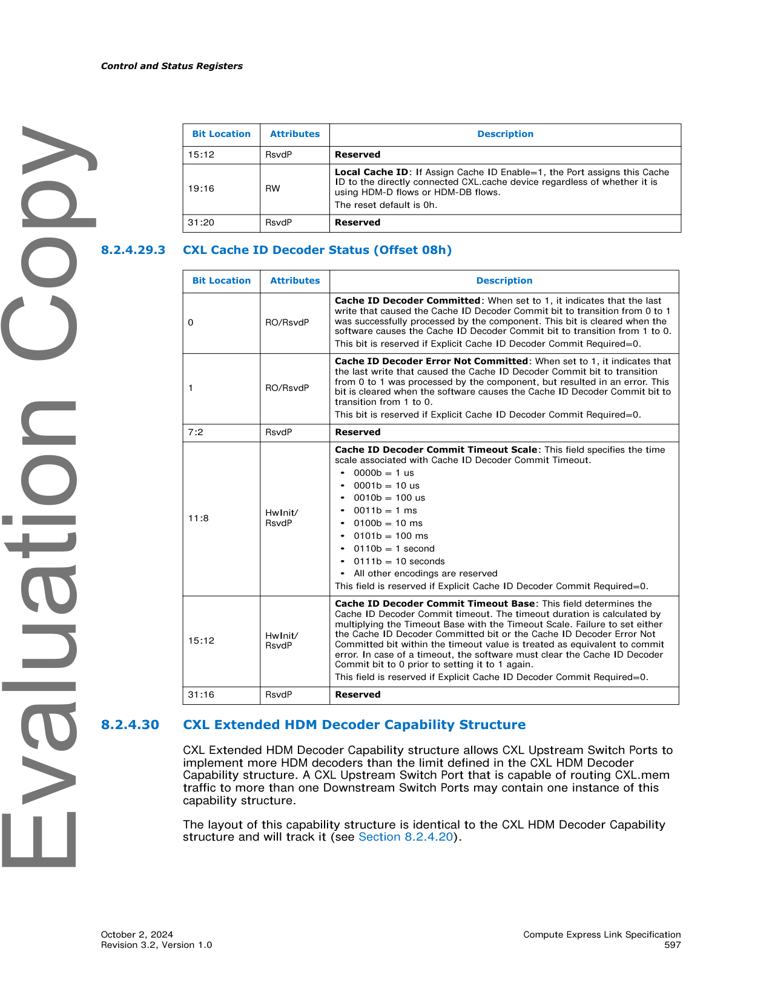
>
> *Original page render @ 150 DPI* — [📄 Full size](figures/chapter_08/page_0597.png)

[⬆️ 返回目录](#-本章目录-part-b)

---

## 8.2.4.30 CXL Extended HDM Decoder Capability Structure | CXL 扩展 HDM 解码器能力结构

<table>
<thead>
<tr>
<th width="50%">🇬🇧 English</th>
<th width="50%" style="background-color:#e8e8e8">🇨🇳 中文</th>
</tr>
</thead>
<tbody>
<tr><td>

CXL Extended HDM Decoder Capability structure allows CXL Upstream Switch Ports to implement more HDM decoders than the limit defined in the CXL HDM Decoder Capability structure. A CXL Upstream Switch Port that is capable of routing CXL.mem traffic to more than one Downstream Switch Ports may contain one instance of this capability structure.

The layout of this capability structure is identical to the CXL HDM Decoder Capability structure and will track it (see Section 8.2.4.20).

</td><td style="background-color:#e8e8e8">

CXL 扩展 HDM 解码器能力结构允许 CXL 上行交换机端口实现比 CXL HDM 解码器能力结构中定义的限制更多的 HDM 解码器。能够将 CXL.mem 流量路由到多个下行交换机端口的 CXL 上行交换机端口可以包含此能力结构的一个实例。

此能力结构的布局与 CXL HDM 解码器能力结构相同, 并将与其保持一致 (参见第 8.2.4.20 节)。

</td></tr>
</tbody>
</table>

> **Figure 8-68.** CXL Extended HDM Decoder Capability Structure layout ｜ CXL 扩展 HDM 解码器能力结构布局
>
> 
>
> *Original page render @ 150 DPI* — [📄 Full size](figures/chapter_08/page_0597.png)

[⬆️ 返回目录](#-本章目录-part-b)

---

## 8.2.4.31 CXL Extended Metadata Capability Register | CXL 扩展元数据能力寄存器

<table>
<thead>
<tr>
<th width="50%">🇬🇧 English</th>
<th width="50%" style="background-color:#e8e8e8">🇨🇳 中文</th>
</tr>
</thead>
<tbody>
<tr><td>

This capability structure may be present in CXL.mem-capable devices that support 256B Flit mode. The presence of this capability structure indicates that the component is capable of storing and returning Extended Metadata.

This specification does not describe how a device with persistent memory capacity may implement Extended Metadata.

See Section 4.3.3.2, Table 3-43, and Table 3-54 for details regarding Extended Metadata transfer over CXL.

| Offset | Register Name |
|--------|---------------|
| 00h | CXL Extended Metadata Capability Register |
| 04h | CXL Extended Metadata Control Register |

</td><td style="background-color:#e8e8e8">

此能力结构可能存在于支持 256B Flit 模式的 CXL.mem 能力设备中。此能力结构的存在表示组件能够存储和返回扩展元数据。

本规范未描述具有持久内存容量的设备如何实现扩展元数据。

有关通过 CXL 传输扩展元数据的详细信息, 请参见第 4.3.3.2 节、表 3-43 和表 3-54。

| 偏移量 | 寄存器名称 |
|--------|------------|
| 00h | CXL Extended Metadata Capability Register |
| 04h | CXL Extended Metadata Control Register |

</td></tr>
</tbody>
</table>

[⬆️ 返回目录](#-本章目录-part-b)

---

### 8.2.4.31.1 CXL Extended Metadata Capability Register (Offset 00h) | CXL 扩展元数据能力寄存器 (偏移量 00h)

<table>
<thead>
<tr>
<th width="50%">🇬🇧 English</th>
<th width="50%" style="background-color:#e8e8e8">🇨🇳 中文</th>
</tr>
</thead>
<tbody>
<tr><td>

| Bit Location | Attributes | Description |
|--------------|------------|-------------|
| 6:0 | RO | Max Size of Extended Metadata: Defines the maximum size of the Extended Metadata Field within the EMD trailer. Valid values are from 1 to 32. • 1 = 1 bit of EMD • … • 32 = 32 bits of EMD |
| 7 | RO | Reserved |
| 8 | RO | Support for Extended Metadata Error Logging: Indicates whether the component is capable of logging Extended Metadata content in the Header Log. |
| 31:9 | RO | Reserved |

</td><td style="background-color:#e8e8e8">

| 位域 | 属性 | 描述 |
|------|------|------|
| 6:0 | RO | Max Size of Extended Metadata: 定义 EMD 尾部内扩展元数据字段的最大大小。有效值从 1 到 32。 • 1 = 1 位 EMD • … • 32 = 32 位 EMD |
| 7 | RO | 保留 |
| 8 | RO | Support for Extended Metadata Error Logging: 指示组件是否能够在头日志 (Header Log) 中记录扩展元数据内容。 |
| 31:9 | RO | 保留 |

</td></tr>
</tbody>
</table>

[⬆️ 返回目录](#-本章目录-part-b)

---

### 8.2.4.31.2 CXL Extended Metadata Control Register (Offset 04h) | CXL 扩展元数据控制寄存器 (偏移量 04h)

<table>
<thead>
<tr>
<th width="50%">🇬🇧 English</th>
<th width="50%" style="background-color:#e8e8e8">🇨🇳 中文</th>
</tr>
</thead>
<tbody>
<tr><td>

The device behavior is undefined if the contents of this register are modified under the following conditions:
- CXL.mem accesses to the device are in progress
- Device is operating in 68B Flit mode

Modification to this register content shall have no impact on the Memory capacity reported via Memory_Size fields in the DVSEC CXL Range Size registers, CDAT content, Identify Memory Device output, and Get Partition Info output.

| Bit Location | Attributes | Description |
|--------------|------------|-------------|
| 6:0 | RWL | Size of Extended Metadata: Defines the Extended Metadata Field size of a transfer. The device behavior is undefined if this register is set to a value that exceeds the Max Size of Extended Metadata reported via the CXL Extended Metadata Capability register. • 1 = 1-bit EMD field. Corresponds to the LSB of the EMD Trailer. • … • 31 = 31-bit EMD field, Corresponds to the 31 least significant bits of the EMD Trailer. • 32 = 32-bit EMD field Locked by the CONFIG_LOCK bit (see Section 8.1.3.6). |
| 7 | RO | Reserved |
| 8 | RWL/RO | Enable Extended Metadata Error Logging: This bit must be RWL if the Support for Extended Metadata Error Logging bit in the CXL Extended Metadata Capability register is set; otherwise, this bit is permitted to be hardwired to 0. Software must not set this bit unless the Support for Extended Metadata Error Logging bit is set. If set, the device logs Extended Metadata content associated with the error, if possible, in the Header Log. See Section 8.2.4.17.1 for details. Locked by the CONFIG_LOCK bit (see Section 8.1.3.6). |
| 30:9 | RO | Reserved |
| 31 | RWL | Enable Extended Metadata Field Transfers: If set, the CXL device expects to receive and send Extended Metadata on data transfers via the trailer. Locked by the CONFIG_LOCK bit (see Section 8.1.3.6). |

</td><td style="background-color:#e8e8e8">

在以下条件下修改此寄存器的内容时, 设备行为未定义:
- 正在进行 CXL.mem 访问设备
- 设备以 68B Flit 模式操作

修改此寄存器内容不应影响通过 DVSEC CXL Range Size 寄存器中的 Memory_Size 字段、CDAT 内容、Identify Memory Device 输出和 Get Partition Info 输出所报告的内存容量。

| 位域 | 属性 | 描述 |
|------|------|------|
| 6:0 | RWL | Size of Extended Metadata: 定义传输的扩展元数据字段大小。如果此寄存器设置为超过通过 CXL Extended Metadata Capability 寄存器报告的 Max Size of Extended Metadata 的值, 则设备行为未定义。 • 1 = 1 位 EMD 字段。对应于 EMD 尾部的 LSB。 • … • 31 = 31 位 EMD 字段, 对应于 EMD 尾部的 31 个最低有效位。 • 32 = 32 位 EMD 字段 由 CONFIG_LOCK 位锁定 (参见第 8.1.3.6 节)。 |
| 7 | RO | 保留 |
| 8 | RWL/RO | Enable Extended Metadata Error Logging: 如果 CXL Extended Metadata Capability 寄存器中的 Support for Extended Metadata Error Logging 位置位, 则此位必须为 RWL; 否则, 此位允许硬连线为 0。除非 Support for Extended Metadata Error Logging 位置位, 否则软件不得设置此位。置位时, 设备在可能的情况下将与错误关联的扩展元数据内容记录在头日志 (Header Log) 中。有关详细信息, 请参见第 8.2.4.17.1 节。由 CONFIG_LOCK 位锁定 (参见第 8.1.3.6 节)。 |
| 30:9 | RO | 保留 |
| 31 | RWL | Enable Extended Metadata Field Transfers: 置位时, CXL 设备预期通过尾部在数据传输上接收和发送扩展元数据。由 CONFIG_LOCK 位锁定 (参见第 8.1.3.6 节)。 |

</td></tr>
</tbody>
</table>

> **Figure 8-69.** CXL Extended Metadata Register layout ｜ CXL 扩展元数据寄存器布局
>
> 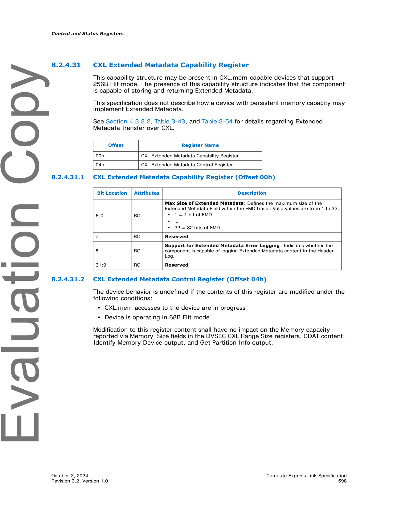
>
> *Original page render @ 150 DPI* — [📄 Full size](figures/chapter_08/page_0598.png)

[⬆️ 返回目录](#-本章目录-part-b)

---

## 8.2.5 CXL ARB/MUX Registers | CXL ARB/MUX 寄存器

<table>
<thead>
<tr>
<th width="50%">🇬🇧 English</th>
<th width="50%" style="background-color:#e8e8e8">🇨🇳 中文</th>
</tr>
</thead>
<tbody>
<tr><td>

The following registers are located within the 1-KB region of memory space assigned to CXL ARB/MUX. The register offsets below are listed from CXL ARB/MUX register space, starting at Offset E000h in the Component Register Range (see Section 8.2.3).

</td><td style="background-color:#e8e8e8">

以下寄存器位于分配给 CXL ARB/MUX 的内存空间的 1-KB 区域内。下面列出的寄存器偏移量来自 CXL ARB/MUX 寄存器空间, 起始于组件寄存器范围内的偏移量 E000h (参见第 8.2.3 节)。

</td></tr>
</tbody>
</table>

[⬆️ 返回目录](#-本章目录-part-b)

---

### 8.2.5.1 ARB/MUX PM Timeout Control Register (Offset 00h) | ARB/MUX PM 超时控制寄存器 (偏移量 00h)

<table>
<thead>
<tr>
<th width="50%">🇬🇧 English</th>
<th width="50%" style="background-color:#e8e8e8">🇨🇳 中文</th>
</tr>
</thead>
<tbody>
<tr><td>

This register configures the ARB/MUX timeout mechanism for a PM Request ALMP that is awaiting a response, when operating in 256B Flit mode (see Section 5.1.2.4.2.2). This register is reserved in 68B Flit mode.

| Bit | Attributes | Description |
|-----|------------|-------------|
| 0 | RW | PMTimeout Enable: When set, this enables the ARB/MUX timeout mechanism for PM Request ALMPs waiting for a response. Default value of this bit is 1. |
| 2:1 | RW | PMTimeout Value: This field configures the timeout value that the ARB/MUX uses while waiting for PM Response ALMPs. • 00b = 1 ms • All other encodings are reserved Default value of this field is 00b. |
| 31:3 | RsvdP | Reserved |

</td><td style="background-color:#e8e8e8">

此寄存器在以 256B Flit 模式操作时 (参见第 5.1.2.4.2.2 节) 为等待响应的 PM Request ALMP 配置 ARB/MUX 超时机制。此寄存器在 68B Flit 模式下保留。

| 位 | 属性 | 描述 |
|-----|------|------|
| 0 | RW | PMTimeout Enable: 置位时, 启用 ARB/MUX 超时机制, 用于等待响应的 PM Request ALMP。该位的默认值为 1。 |
| 2:1 | RW | PMTimeout Value: 此字段配置 ARB/MUX 在等待 PM Response ALMP 时使用的超时值。 • 00b = 1 ms • 所有其他编码保留 此字段的默认值为 00b。 |
| 31:3 | RsvdP | 保留 |

</td></tr>
</tbody>
</table>

[⬆️ 返回目录](#-本章目录-part-b)

---

### 8.2.5.2 ARB/MUX Uncorrectable Error Status Register (Offset 04h) | ARB/MUX 不可纠正错误状态寄存器 (偏移量 04h)

<table>
<thead>
<tr>
<th width="50%">🇬🇧 English</th>
<th width="50%" style="background-color:#e8e8e8">🇨🇳 中文</th>
</tr>
</thead>
<tbody>
<tr><td>

This register logs the timeouts that are encountered during ARB/MUX PM flows when operating in 256B Flit mode. This register is reserved in 68B Flit mode.

| Bit | Attributes | Description |
|-----|------------|-------------|
| 0 | RW1CS | PM Timeout Error: For 256B Flit mode, this bit is set by the ARB/MUX to signal that a PM Request ALMP did not receive a response of ACTIVE.PMNAK or the corresponding PM Status ALMP by the time the PMTimeout counter expires. It must only be logged if PMTimeout Enable is set in the ARB/MUX PM Timeout Control register and the ARB/MUX is operating in 256B Flit mode. |
| 1 | RW1CS | L0p Timeout Error: For 256B Flit mode, this bit is set by the ARB/MUX to signal that an L0p Request ALMP did not receive a response from the remote Link partner by the time the PMTimeout counter expires. It must only be logged if PMTimeout Enable is set in the ARB/MUX PM Timeout Control register and the ARB/MUX is operating in 256B Flit mode. |
| 31:2 | RsvdZ | Reserved |

</td><td style="background-color:#e8e8e8">

此寄存器在以 256B Flit 模式操作时记录 ARB/MUX PM 流程中遇到的超时。此寄存器在 68B Flit 模式下保留。

| 位 | 属性 | 描述 |
|-----|------|------|
| 0 | RW1CS | PM Timeout Error: 对于 256B Flit 模式, 当 PM Request ALMP 在 PMTimeout 计数器到期之前未收到 ACTIVE.PMNAK 响应或相应的 PM Status ALMP 时, 此位由 ARB/MUX 设置以发出信号。仅当在 ARB/MUX PM Timeout Control 寄存器中设置了 PMTimeout Enable 且 ARB/MUX 以 256B Flit 模式操作时, 才应记录此位。 |
| 1 | RW1CS | L0p Timeout Error: 对于 256B Flit 模式, 当 L0p Request ALMP 在 PMTimeout 计数器到期之前未收到来自远程链路伙伴的响应时, 此位由 ARB/MUX 设置以发出信号。仅当在 ARB/MUX PM Timeout Control 寄存器中设置了 PMTimeout Enable 且 ARB/MUX 以 256B Flit 模式操作时, 才应记录此位。 |
| 31:2 | RsvdZ | 保留 |

</td></tr>
</tbody>
</table>

[⬆️ 返回目录](#-本章目录-part-b)

---

### 8.2.5.3 ARB/MUX Uncorrectable Error Mask Register (Offset 08h) | ARB/MUX 不可纠正错误掩码寄存器 (偏移量 08h)

<table>
<thead>
<tr>
<th width="50%">🇬🇧 English</th>
<th width="50%" style="background-color:#e8e8e8">🇨🇳 中文</th>
</tr>
</thead>
<tbody>
<tr><td>

This register controls the logging and signaling of the timeouts that are encountered during ARB/MUX PM flows when operating in 256B Flit mode. This register is reserved in 68B Flit mode.

| Bit | Attributes | Description |
|-----|------------|-------------|
| 0 | RWS | PM Timeout Error Mask • 0 = PM Timeout Error is logged as an Internal Uncorrected Error in the associated root port, similar to CXL.cachemem errors • 1 = PM Timeout Error is not recorded or reported Default value of this bit is 1. |
| 1 | RWS | L0p Timeout Error Mask • 0 = L0p Timeout Error is logged as an Internal Uncorrected Error in the associated root port, similar to CXL.cachemem errors • 1 = L0p Timeout Error is not recorded or reported Default value of this bit is 1. |
| 31:2 | RsvdZ | Reserved |

</td><td style="background-color:#e8e8e8">

此寄存器控制在以 256B Flit 模式操作时 ARB/MUX PM 流程中遇到的超时的记录和信令。此寄存器在 68B Flit 模式下保留。

| 位 | 属性 | 描述 |
|-----|------|------|
| 0 | RWS | PM Timeout Error Mask • 0 = PM Timeout Error 作为内部未纠正错误 (Internal Uncorrected Error) 记录在关联的根端口中, 类似于 CXL.cachemem 错误 • 1 = 不记录或报告 PM Timeout Error 该位的默认值为 1。 |
| 1 | RWS | L0p Timeout Error Mask • 0 = L0p Timeout Error 作为内部未纠正错误记录在关联的根端口中, 类似于 CXL.cachemem 错误 • 1 = 不记录或报告 L0p Timeout Error 该位的默认值为 1。 |
| 31:2 | RsvdZ | 保留 |

</td></tr>
</tbody>
</table>

[⬆️ 返回目录](#-本章目录-part-b)

---

### 8.2.5.4 ARB/MUX Arbitration Control Register for CXL.io (Offset 180h) | CXL.io 的 ARB/MUX 仲裁控制寄存器 (偏移量 180h)

<table>
<thead>
<tr>
<th width="50%">🇬🇧 English</th>
<th width="50%" style="background-color:#e8e8e8">🇨🇳 中文</th>
</tr>
</thead>
<tbody>
<tr><td>

| Bit | Attributes | Description |
|-----|------------|-------------|
| 3:0 | RsvdP | Reserved |
| 7:4 | RW | CXL.io Weighted Round Robin Arbitration Weight: This is the weight assigned to CXL.io in the weighted round-robin arbitration between CXL protocols. Default value of this field is 0h. |
| 31:8 | RsvdP | Reserved |

</td><td style="background-color:#e8e8e8">

| 位 | 属性 | 描述 |
|-----|------|------|
| 3:0 | RsvdP | 保留 |
| 7:4 | RW | CXL.io Weighted Round Robin Arbitration Weight: 这是 CXL.io 在 CXL 协议之间的加权轮询仲裁中分配的权重。此字段的默认值为 0h。 |
| 31:8 | RsvdP | 保留 |

</td></tr>
</tbody>
</table>

[⬆️ 返回目录](#-本章目录-part-b)

---

### 8.2.5.5 ARB/MUX Arbitration Control Register for CXL.cache and CXL.mem (Offset 1C0h) | CXL.cache 和 CXL.mem 的 ARB/MUX 仲裁控制寄存器 (偏移量 1C0h)

<table>
<thead>
<tr>
<th width="50%">🇬🇧 English</th>
<th width="50%" style="background-color:#e8e8e8">🇨🇳 中文</th>
</tr>
</thead>
<tbody>
<tr><td>

| Bit | Attributes | Description |
|-----|------------|-------------|
| 3:0 | RsvdP | Reserved |
| 7:4 | RW | CXL.cache and CXL.mem Weighted Round Robin Arbitration Weight: This is the weight assigned to CXL.cache and CXL.mem in the weighted round-robin arbitration between CXL protocols. Default value of this field is 0h. |
| 31:8 | RsvdP | Reserved |

</td><td style="background-color:#e8e8e8">

| 位 | 属性 | 描述 |
|-----|------|------|
| 3:0 | RsvdP | 保留 |
| 7:4 | RW | CXL.cache and CXL.mem Weighted Round Robin Arbitration Weight: 这是 CXL.cache 和 CXL.mem 在 CXL 协议之间的加权轮询仲裁中分配的权重。此字段的默认值为 0h。 |
| 31:8 | RsvdP | 保留 |

</td></tr>
</tbody>
</table>

[⬆️ 返回目录](#-本章目录-part-b)

---

## 8.2.6 BAR Virtualization ACL Register Block | BAR 虚拟化 ACL 寄存器块

<table>
<thead>
<tr>
<th width="50%">🇬🇧 English</th>
<th width="50%" style="background-color:#e8e8e8">🇨🇳 中文</th>
</tr>
</thead>
<tbody>
<tr><td>

These registers are located at a 64-KB-aligned offset within one of the device's BARs (or BEI) as indicated by the Register Locator DVSEC (see Section 8.1.9) BAR Virtualization ACL Register Base register. They may be implemented by a CXL device that implements the DVSEC BAR Virtualization ACL Register Base register. The registers specify a standard way of communicating to the hypervisors which sections of the device BAR space are safe to assign to a Virtual Machine (VM) when the PF is directly assigned to that VM. Identifying which registers are unsafe for assigning to a VM will depend on the device micro architecture and the device security objectives, and is beyond the scope of this specification. However, examples could include registers that might affect correct operation of the device memory controller, perform device burn-in by altering its frequency or voltage, or bypass hypervisor protections for isolation of device memory assigned to one VM from the remainder of the system.

The registers consist of an array of 3 tuples of register blocks. Each tuple represents a set of contiguous registers that are safe to assign to a VM. The 3 tuples consist of the BAR number (or BAR Equivalent Index), Offset within the BAR to the start of the registers which can be safely assigned (64-KB aligned), and the size of the assigned register block (multiple of 64 KB).

> **Table 8-31.** BAR Virtualization ACL Register Block Layout
>
> | Offset | Register Name |
> |--------|---------------|
> | 00h | BAR Virtualization ACL Size Register |
> | **Entry 0:** | |
> | 08h | BAR Virtualization ACL Array Entry Offset Register[0] |
> | 10h | BAR Virtualization ACL Array Entry Size Register[0] |
> | **Entry 1:** | |
> | 18h | BAR Virtualization ACL Array Entry Offset Register[1] |
> | 20h | BAR Virtualization ACL Array Entry Size Register[1] |
> | **Entry n:** | |
> | 10h *n+ 8 | ... |

</td><td style="background-color:#e8e8e8">

这些寄存器位于设备 BAR (或 BEI) 之一的 64-KB 对齐偏移处, 如 Register Locator DVSEC (参见第 8.1.9 节) BAR Virtualization ACL Register Base 寄存器所示。它们可由实现 DVSEC BAR Virtualization ACL Register Base 寄存器的 CXL 设备实现。这些寄存器指定了一种与虚拟机监控程序 (hypervisor) 通信的标准方式, 即当 PF 直接分配给虚拟机 (VM) 时, 设备 BAR 空间的哪些部分是安全可分配给 VM 的。识别哪些寄存器对于分配给 VM 是不安全的, 将取决于设备微体系结构和设备安全目标, 不在本规范的范围内。然而, 示例可能包括可能影响设备内存控制器正确操作的寄存器、通过改变频率或电压执行设备老化测试, 或绕过虚拟机监控程序保护以将分配给一个 VM 的设备内存与系统其余部分隔离的寄存器。

这些寄存器由一个 3 元组数组的寄存器块组成。每个元组表示一组可以安全分配给 VM 的连续寄存器。这 3 个元组包括 BAR 编号 (或 BAR 等效索引)、可安全分配的寄存器起始 BAR 内的偏移 (64-KB 对齐) 和所分配寄存器块的大小 (64 KB 的倍数)。

> **表 8-31.** BAR 虚拟化 ACL 寄存器块布局
>
> | 偏移量 | 寄存器名称 |
> |--------|------------|
> | 00h | BAR Virtualization ACL Size Register |
> | **Entry 0:** | |
> | 08h | BAR Virtualization ACL Array Entry Offset Register[0] |
> | 10h | BAR Virtualization ACL Array Entry Size Register[0] |
> | **Entry 1:** | |
> | 18h | BAR Virtualization ACL Array Entry Offset Register[1] |
> | 20h | BAR Virtualization ACL Array Entry Size Register[1] |
> | **Entry n:** | |
> | 10h *n+ 8 | ... |

</td></tr>
</tbody>
</table>

[⬆️ 返回目录](#-本章目录-part-b)

---

### 8.2.6.1 BAR Virtualization ACL Size Register (Offset 00h) | BAR 虚拟化 ACL 大小寄存器 (偏移量 00h)

<table>
<thead>
<tr>
<th width="50%">🇬🇧 English</th>
<th width="50%" style="background-color:#e8e8e8">🇨🇳 中文</th>
</tr>
</thead>
<tbody>
<tr><td>

| Bit | Attributes | Description |
|-----|------------|-------------|
| 9:0 | HwInit | Number of Array Entries: Number of array elements starting at Offset 08h in this register block. Each array element consists of two 64-bit registers - Entry offset register, Entry Size register. |
| 31:10 | RsvdP | Reserved |

</td><td style="background-color:#e8e8e8">

| 位 | 属性 | 描述 |
|-----|------|------|
| 9:0 | HwInit | Number of Array Entries: 此寄存器块中从偏移量 08h 开始的数组元素数。每个数组元素由两个 64 位寄存器组成 - 条目偏移寄存器和条目大小寄存器。 |
| 31:10 | RsvdP | 保留 |

</td></tr>
</tbody>
</table>

[⬆️ 返回目录](#-本章目录-part-b)

---

#### 8.2.6.1.1 BAR Virtualization ACL Array Entry Offset Register (Offset: Varies) | BAR 虚拟化 ACL 数组条目偏移寄存器 (偏移量: 可变)

<table>
<thead>
<tr>
<th width="50%">🇬🇧 English</th>
<th width="50%" style="background-color:#e8e8e8">🇨🇳 中文</th>
</tr>
</thead>
<tbody>
<tr><td>

| Bit | Attributes | Description |
|-----|------------|-------------|
| 3:0 | HwInit | Register BIR: Indicates which one of a Function's BARs, located beginning at Offset 10h in Configuration Space, or entry in the Enhanced Allocation capability with a matching BAR Equivalent Indicator (BEI), is being referenced. Defined encodings are: • 0h = Base Address Register 10h • 1h = Base Address Register 14h • 2h = Base Address Register 18h • 3h = Base Address Register 1Ch • 4h = Base Address Register 20h • 5h = Base Address Register 24h All other encodings are reserved |
| 15:4 | RsvdP | Reserved |
| 63:16 | HwInit | Start Offset: Offset[63:16] from the address contained by the function's BAR to the Register block within that BAR that can be safely assigned to a Virtual Machine. The starting offset is 64-KB aligned since Offset[15:0] are assumed to be 0. |

</td><td style="background-color:#e8e8e8">

| 位 | 属性 | 描述 |
|-----|------|------|
| 3:0 | HwInit | Register BIR: 指示正在引用配置的 BAR 中的哪一个 (从配置空间中的偏移量 10h 开始), 或是与匹配 BAR 等效指示符 (BEI) 的增强分配能力中的条目。 已定义编码: • 0h = 基址寄存器 10h • 1h = 基址寄存器 14h • 2h = 基址寄存器 18h • 3h = 基址寄存器 1Ch • 4h = 基址寄存器 20h • 5h = 基址寄存器 24h 所有其他编码保留 |
| 15:4 | RsvdP | 保留 |
| 63:16 | HwInit | Start Offset: 从功能 BAR 所包含的地址到该 BAR 内可安全分配给虚拟机的寄存器块的偏移量 Offset[63:16]。由于 Offset[15:0] 假定为 0, 起始偏移是 64-KB 对齐的。 |

</td></tr>
</tbody>
</table>

[⬆️ 返回目录](#-本章目录-part-b)

---

#### 8.2.6.1.2 BAR Virtualization ACL Array Entry Size Register (Offset: Varies) | BAR 虚拟化 ACL 数组条目大小寄存器 (偏移量: 可变)

<table>
<thead>
<tr>
<th width="50%">🇬🇧 English</th>
<th width="50%" style="background-color:#e8e8e8">🇨🇳 中文</th>
</tr>
</thead>
<tbody>
<tr><td>

| Bit | Attributes | Description |
|-----|------------|-------------|
| 15:0 | RsvdP | Reserved |
| 63:16 | HwInit | Size: Indicates the Size[63:16] of the register space in bytes within the BAR that can be safely assigned to a VM. Size is a multiple of 64 KB since Size[15:0] are assumed to be 0. |

</td><td style="background-color:#e8e8e8">

| 位 | 属性 | 描述 |
|-----|------|------|
| 15:0 | RsvdP | 保留 |
| 63:16 | HwInit | Size: 指示可安全分配给 VM 的 BAR 内寄存器空间的字节大小 Size[63:16]。由于 Size[15:0] 假定为 0, 大小是 64 KB 的倍数。 |

</td></tr>
</tbody>
</table>

[⬆️ 返回目录](#-本章目录-part-b)

---

## 8.2.7 CPMU Register Interface | CPMU 寄存器接口

<table>
<thead>
<tr>
<th width="50%">🇬🇧 English</th>
<th width="50%" style="background-color:#e8e8e8">🇨🇳 中文</th>
</tr>
</thead>
<tbody>
<tr><td>

Each CPMU implements a set of CPMU scoped registers and a set of Counter scoped registers. Unimplemented registers such as Counter Data and Counter Configuration registers for non-existent Counters follow the RsvdP behavior.

> **Table 8-32.** CPMU Register Layout (Version=1) (Sheet 1 of 2)
>
> | Byte Offset | Length in Bytes | Register Name |
> |-------------|-----------------|---------------|
> | 00h | 8 | CPMU Capability (see Section 8.2.7.1.1) |
> | 08h | 8 | Reserved |
> | 10h | 8 | CPMU Overflow Status (see Section 8.2.7.1.2) |
> | 18h | 8 | CPMU Freeze (see Section 8.2.7.1.3) |
> | 20h | 224 | Reserved |
> | 100h | 8 | CPMU Event Capabilities [0] (see Section 8.2.7.1.4) |
> | 108h | 8 | CPMU Event Capabilities [1] |
> | ... | ... | ... |
> | 1F8h | 8 | CPMU Event Capabilities [31] |
> | 200h | 8 | Counter Unit 0 - Counter Configuration (see Section 8.2.7.2.1) |
> | 208h | 8 | Counter Unit 1 - Counter Configuration |
> | ... | ... | ... |
> | 3F8h | 8 | Counter Unit 63 - Counter Configuration |
> | 400h | 4 | Counter Unit 0 Filter ID 0 - Filter Configuration (see Section 8.2.7.2.2) |
> | 404h | 4 | Counter Unit 0 Filter ID 1 - Filter Configuration |
> | ... | ... | ... |
> | 41Ch | 4 | Counter Unit 0 Filter ID 7 - Filter Configuration |
> | 420h | 4 | Counter Unit 1 Filter ID 0 - Filter Configuration |
> | ... | ... | ... |
> | BFCh | 4 | Counter Unit 63 Filter ID 7 - Filter Configuration |
> | C00h | 8 | Counter Unit 0 - Counter Data (see Section 8.2.7.2.3) |
> | C08h | 8 | Counter Unit 1 - Counter Data |
> | ... | ... | ... |
> | DF8h | 8 | Counter Unit 63 - Counter Data |

</td><td style="background-color:#e8e8e8">

每个 CPMU 实现一组 CPMU 作用域寄存器和一组计数器作用域寄存器。未实现的寄存器 (例如不存在计数器的计数器数据寄存器和计数器配置寄存器) 遵循 RsvdP 行为。

> **表 8-32.** CPMU 寄存器布局 (Version=1) (第 1 页, 共 2 页)
>
> | 字节偏移量 | 字节长度 | 寄存器名称 |
> |------------|----------|------------|
> | 00h | 8 | CPMU Capability (参见第 8.2.7.1.1 节) |
> | 08h | 8 | 保留 |
> | 10h | 8 | CPMU Overflow Status (参见第 8.2.7.1.2 节) |
> | 18h | 8 | CPMU Freeze (参见第 8.2.7.1.3 节) |
> | 20h | 224 | 保留 |
> | 100h | 8 | CPMU Event Capabilities [0] (参见第 8.2.7.1.4 节) |
> | 108h | 8 | CPMU Event Capabilities [1] |
> | ... | ... | ... |
> | 1F8h | 8 | CPMU Event Capabilities [31] |
> | 200h | 8 | Counter Unit 0 - Counter Configuration (参见第 8.2.7.2.1 节) |
> | 208h | 8 | Counter Unit 1 - Counter Configuration |
> | ... | ... | ... |
> | 3F8h | 8 | Counter Unit 63 - Counter Configuration |
> | 400h | 4 | Counter Unit 0 Filter ID 0 - Filter Configuration (参见第 8.2.7.2.2 节) |
> | 404h | 4 | Counter Unit 0 Filter ID 1 - Filter Configuration |
> | ... | ... | ... |
> | 41Ch | 4 | Counter Unit 0 Filter ID 7 - Filter Configuration |
> | 420h | 4 | Counter Unit 1 Filter ID 0 - Filter Configuration |
> | ... | ... | ... |
> | BFCh | 4 | Counter Unit 63 Filter ID 7 - Filter Configuration |
> | C00h | 8 | Counter Unit 0 - Counter Data (参见第 8.2.7.2.3 节) |
> | C08h | 8 | Counter Unit 1 - Counter Data |
> | ... | ... | ... |
> | DF8h | 8 | Counter Unit 63 - Counter Data |

</td></tr>
</tbody>
</table>

[⬆️ 返回目录](#-本章目录-part-b)

---

### 8.2.7.1 Per CPMU Registers | 每个 CPMU 寄存器

<table>
<thead>
<tr>
<th width="50%">🇬🇧 English</th>
<th width="50%" style="background-color:#e8e8e8">🇨🇳 中文</th>
</tr>
</thead>
<tbody>
<tr><td>

Each CPMU instance is associated with a CPMU Capability register, a CPMU Overflow Status register, zero or one CPMU Freeze register, and one or more CPMU Event Capabilities registers.

</td><td style="background-color:#e8e8e8">

每个 CPMU 实例与一个 CPMU Capability 寄存器、一个 CPMU Overflow Status 寄存器、零个或一个 CPMU Freeze 寄存器以及一个或多个 CPMU Event Capabilities 寄存器相关联。

</td></tr>
</tbody>
</table>

[⬆️ 返回目录](#-本章目录-part-b)

---

#### 8.2.7.1.1 CPMU Capability (Offset 00h) | CPMU 能力 (偏移量 00h)

<table>
<thead>
<tr>
<th width="50%">🇬🇧 English</th>
<th width="50%" style="background-color:#e8e8e8">🇨🇳 中文</th>
</tr>
</thead>
<tbody>
<tr><td>

The CPMU-wide capabilities shall be enumerated by the CPMU Capability register.

| Bit | Attributes | Description |
|-----|------------|-------------|
| 5:0 | HwInit | Number of Counter Units: The number of Counter Units that are part of this CPMU, represented using 0-based encoding. • 00h = 1 Counter Unit • 01h = 2 Counter Units • … • 3Fh = 64 Counter Units |
| 7:6 | RsvdP | Reserved |
| 15:8 | HwInit | Counter Width: The number of bits supported by every Counter Data register. If the value of this field is n, then each Counter Data register (see Section 8.2.7.2.3) implements n least significant bits and the maximum value it can count is 2^n-1. |
| 19:16 | RsvdP | Reserved |
| 24:20 | HwInit | Number of Event Capabilities Registers Supported: Indicates the number of CPMU Event Capabilities registers, represented using 0-based encoding. • 00h = 1 CPMU Event Capabilities register • 01h = 2 CPMU Event Capabilities registers • … • 1Fh = 32 CPMU Event Capabilities registers |
| 31:25 | RsvdP | Reserved |
| 39:32 | HwInit | Filters Supported: Bitmask that indicates the entire set of Filter IDs are supported by this CPMU. The Filter IDs available for a given Event may be restricted further. Table 13-5 describes which Filter IDs are permitted for each Event. Section 8.2.7.2.2 describes the details for each of the filters supported. The number of Filter Configuration registers per Counter Unit corresponds to the number of 1s in this field. |
| 43:40 | RsvdP | Reserved |
| 47:44 | HwInit | Interrupt Message Number: If Interrupt on Overflow Support=1, this field indicates which MSI/MSI-X vector is used for the interrupt message generated in association with this CPMU instance. For MSI, the value in this field indicates the offset between the base Message Data and the interrupt message that is generated. Hardware is required to update this field so that it is correct if the number of MSI Messages assigned to the Function changes when software writes to the Multiple Message Enable field in the Message Control register for MSI. For MSI-X, the value in this field indicates which MSI-X Table entry is used to generate the interrupt message. The entry shall be one of the first 16 entries even if the Function implements more than 16 entries. The value in this field shall be within the range configured by system software to the device. For a given MSI-X implementation, the entry shall remain constant. If both MSI and MSI-X are implemented, they are permitted to use different vectors, though software is permitted to enable only one mechanism at a time. If MSI-X is enabled, the value in this field shall indicate the vector for MSI-X. If MSI is enabled or neither is enabled, the value in this field indicate the vector for MSI. If software enables both MSI and MSI-X at the same time, the value in this field is undefined. It is recommended that the component allocate a distinct Interrupt Message Number to each CPMU instance. |
| 48 | HwInit | Counters Writable while Frozen • 0 = Indicates that the software must not write to any Counter Data register while that counter is enabled or frozen. If software writes to the Counter data register when counter is enabled or frozen, it leads to undefined behavior. Fixed Function Counter Data registers as well as Configurable Counter Data registers are always writable while disabled regardless of the state of this bit. Free-running Counter Data registers are never writable regardless of the state of this bit. • 1 = Indicates that the software is permitted to write and modify any Fixed-function Counter Data register or any Configurable Counter Data register while it is frozen. |
| 49 | HwInit | Counter Freeze Support • 0 = The CPMU does not support Counter Freeze capability. The CPMU Freeze register and the Global Freeze on Overflow bit in the Counter Configuration registers are reserved. • 1 = The CPMU supports Counter Freeze capability. The CPMU Freeze register and the Global Freeze on Overflow bit in the Counter Configuration registers are implemented. |
| 50 | HwInit | Interrupt on Overflow Support • 0 = The CPMU does not support generation of interrupts upon counter overflow. • 1 = The CPMU supports generation of interrupt upon counter overflow. Interrupt generation is controlled by the Interrupt on Overflow bit in the Counter Configuration register. The interrupt Message Number is reported in the Interrupt Message Number field. |
| 59:51 | RsvdP | Reserved |
| 63:60 | HwInit | Version: Set to 1. The layout of CPMU registers for Version=1 is shown in Table 8-32. The version is incremented whenever the CPMU register structure is extended to add more functionality. Backward compatibility shall be maintained during this process. For all values of n, version n+1 may extend version n by replacing fields that are marked as reserved in version n or appending new registers but must not redefine the meaning of existing fields. Software that was written for a lower version may continue to operate on CPMU registers with a higher version but will not be able to take advantage of new functionality. Each field in the CPMU register structure is assumed to be introduced in version 1 of that structure unless specified otherwise in the field's definition in this specification. |

</td><td style="background-color:#e8e8e8">

CPMU 范围的能力应通过 CPMU Capability 寄存器枚举。

| 位 | 属性 | 描述 |
|-----|------|------|
| 5:0 | HwInit | Number of Counter Units: 此 CPMU 所包含的计数器单元数, 使用基于 0 的编码表示。 • 00h = 1 个 Counter Unit • 01h = 2 个 Counter Unit • … • 3Fh = 64 个 Counter Unit |
| 7:6 | RsvdP | 保留 |
| 15:8 | HwInit | Counter Width: 每个 Counter Data 寄存器支持的位数。如果此字段的值为 n, 则每个 Counter Data 寄存器 (参见第 8.2.7.2.3 节) 实现 n 个最低有效位, 并且它可以计数的最大值为 2^n-1。 |
| 19:16 | RsvdP | 保留 |
| 24:20 | HwInit | Number of Event Capabilities Registers Supported: 指示 CPMU Event Capabilities 寄存器的数量, 使用基于 0 的编码表示。 • 00h = 1 个 CPMU Event Capabilities 寄存器 • 01h = 2 个 CPMU Event Capabilities 寄存器 • … • 1Fh = 32 个 CPMU Event Capabilities 寄存器 |
| 31:25 | RsvdP | 保留 |
| 39:32 | HwInit | Filters Supported: 位掩码, 指示此 CPMU 支持的整个 Filter ID 集。可用于给定事件的 Filter ID 可能会受到进一步限制。表 13-5 描述了每个事件允许的 Filter ID。第 8.2.7.2.2 节描述了每个支持的过滤器的详细信息。每个 Counter Unit 的 Filter Configuration 寄存器数与此字段中 1 的数量相对应。 |
| 43:40 | RsvdP | 保留 |
| 47:44 | HwInit | Interrupt Message Number: 如果 Interrupt on Overflow Support=1, 则此字段指示与此 CPMU 实例关联生成的中断消息所使用的 MSI/MSI-X 向量。 对于 MSI, 此字段中的值表示基本消息数据与生成的中断消息之间的偏移量。当软件写入 MSI 消息控制寄存器的 Multiple Message Enable 字段而导致分配给该功能的消息数发生变化时, 硬件需要更新此字段以使其正确。对于 MSI-X, 此字段中的值指示用于生成中断消息的 MSI-X 表条目。即使该功能实现了 16 个以上条目, 该条目也必须是前 16 个条目之一。此字段中的值应处于系统软件配置给设备的范围内。对于给定的 MSI-X 实现, 该条目应保持不变。 如果同时实现了 MSI 和 MSI-X, 则它们允许使用不同的向量, 但软件一次只允许启用一种机制。如果启用了 MSI-X, 则此字段中的值应指示 MSI-X 的向量。如果启用了 MSI 或两者都未启用, 则此字段中的值指示 MSI 的向量。如果软件同时启用 MSI 和 MSI-X, 则此字段中的值未定义。 建议组件为每个 CPMU 实例分配不同的 Interrupt Message Number。 |
| 48 | HwInit | Counters Writable while Frozen • 0 = 表示在计数器启用或冻结时, 软件不得写入任何 Counter Data 寄存器。如果在计数器启用或冻结时软件写入 Counter Data 寄存器, 则会导致未定义的行为。无论此位的状态如何, 固定功能计数器数据寄存器和可配置计数器数据寄存器在禁用时始终可写。无论此位的状态如何, 自由运行的 Counter Data 寄存器永远不可写。 • 1 = 表示允许软件在冻结时写入和修改任何固定功能 Counter Data 寄存器或任何可配置 Counter Data 寄存器。 |
| 49 | HwInit | Counter Freeze Support • 0 = CPMU 不支持 Counter Freeze 功能。CPMU Freeze 寄存器和 Counter Configuration 寄存器中的 Global Freeze on Overflow 位被保留。 • 1 = CPMU 支持 Counter Freeze 功能。CPMU Freeze 寄存器和 Counter Configuration 寄存器中的 Global Freeze on Overflow 位均被实现。 |
| 50 | HwInit | Interrupt on Overflow Support • 0 = CPMU 不支持在计数器溢出时生成中断。 • 1 = CPMU 支持在计数器溢出时生成中断。中断生成由 Counter Configuration 寄存器中的 Interrupt on Overflow 位控制。中断 Message Number 在 Interrupt Message Number 字段中报告。 |
| 59:51 | RsvdP | 保留 |
| 63:60 | HwInit | Version: 设置为 1。Version=1 的 CPMU 寄存器布局如表 8-32 所示。 每当扩展 CPMU 寄存器结构以添加更多功能时, 版本都会递增。在此过程中应保持向后兼容性。对于 n 的所有值, 版本 n+1 可以通过替换版本 n 中标记为保留的字段或追加新寄存器来扩展版本 n, 但不得重新定义现有字段的含义。为较低版本编写的软件可以继续在较高版本的 CPMU 寄存器上运行, 但将无法利用新功能。除非在规范的字段定义中另有规定, 否则 CPMU 寄存器结构中的每个字段都假定在该结构的版本 1 中引入。 |

</td></tr>
</tbody>
</table>

> **Figure 8-70.** CPMU Register Layout (Version=1) (Sheet 1 of 2) ｜ CPMU 寄存器布局 (Version=1) (第 1 页, 共 2 页)
>
> 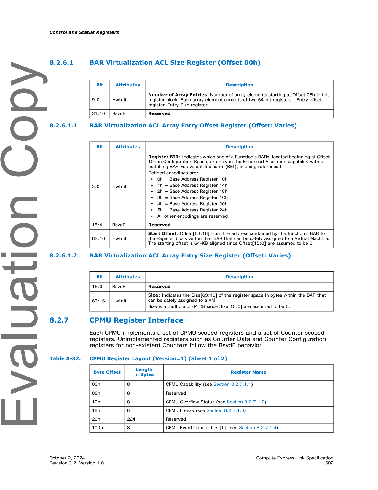
>
> *Original page render @ 150 DPI* — [📄 Full size](figures/chapter_08/page_0602.png)

[⬆️ 返回目录](#-本章目录-part-b)

---

#### 8.2.7.1.2 CPMU Overflow Status (Offset 10h) | CPMU 溢出状态 (偏移量 10h)

<table>
<thead>
<tr>
<th width="50%">🇬🇧 English</th>
<th width="50%" style="background-color:#e8e8e8">🇨🇳 中文</th>
</tr>
</thead>
<tbody>
<tr><td>

The CPMU Overflow Status register indicates the overflow status associated with all the Counter Units.

When any bit in Overflow Status transitions from 0 to 1, the CPMU shall issue an MSI/MSI-X if the Interrupt on Overflow bit for the corresponding Counter Unit is 1.

| Bit | Attributes | Description |
|-----|------------|-------------|
| C:0 | RW1C | Overflow Status: Bitmask with 1 bit per Counter Unit. The bit N indicates whether the Counter Unit N has encountered an overflow condition. • 0 = The Counter Unit N has not encountered an overflow condition • 1 = The Counter Unit N has encountered an overflow condition where 0 <= N <=C. C equals the raw value reported by the Number of Counter Units field in the CPMU Capability register. |
| 63:C+1 | RsvdP | Reserved |

#### IMPLEMENTATION NOTE

If Counter Freeze Support as well as Counters Writable while Frozen are both 1, software may use the following flow to start counting multiple events simultaneously:
1. Freeze the counters that are involved in counting these events.
2. Initialize the Counter Data registers that correspond to these counters.
3. Unfreeze the counters.

</td><td style="background-color:#e8e8e8">

CPMU Overflow Status 寄存器指示与所有 Counter Unit 关联的溢出状态。

当 Overflow Status 中的任何位从 0 转换为 1 时, 如果相应 Counter Unit 的 Interrupt on Overflow 位为 1, 则 CPMU 应发出 MSI/MSI-X。

| 位 | 属性 | 描述 |
|-----|------|------|
| C:0 | RW1C | Overflow Status: 每个 Counter Unit 1 位的位掩码。第 N 位表示 Counter Unit N 是否遇到溢出条件。 • 0 = Counter Unit N 未遇到溢出条件 • 1 = Counter Unit N 遇到溢出条件 其中 0 <= N <=C。 C 等于 CPMU Capability 寄存器中 Number of Counter Units 字段报告的原始值。 |
| 63:C+1 | RsvdP | 保留 |

#### 实现注意

如果 Counter Freeze Support 和 Counters Writable while Frozen 都为 1, 则软件可以使用以下流程同时开始对多个事件进行计数:
1. 冻结涉及对这些事件计数的计数器。
2. 初始化与这些计数器对应的 Counter Data 寄存器。
3. 取消冻结计数器。

</td></tr>
</tbody>
</table>

[⬆️ 返回目录](#-本章目录-part-b)

---

#### 8.2.7.1.3 CPMU Freeze (Offset 18h) | CPMU 冻结 (偏移量 18h)

<table>
<thead>
<tr>
<th width="50%">🇬🇧 English</th>
<th width="50%" style="background-color:#e8e8e8">🇨🇳 中文</th>
</tr>
</thead>
<tbody>
<tr><td>

The CPMU Freeze register indicates the freeze status associated with all the Counter Units and may be used to freeze or unfreeze individual Counter Units. This register is implemented only if the Counter Freeze Support bit in the CPMU Capability register is 1.

| Bit | Attributes | Description |
|-----|------------|-------------|
| C:0 | RW/RsvdZ | Freeze Control and Status: The attribute for the bits corresponding to Free-running Counter Units is RsvdZ. • Writing 0 to bit N: The Counter Unit N is unfrozen and resumes counting unless Counter Enable=0, in which case the Counter Unit remains disabled. If the Counter Unit N is enabled but not currently frozen, it is unaffected and continues to count events. • Writing 1 to bit N: The Counter Unit N, if enabled, is frozen and stops counting further events, and retains its current value. If the Counter Unit N is already frozen when this bit is set, it remains frozen. Reads return the current freeze status of each counter: • If bit N reads as 0: The Counter Unit N is currently not frozen. The Counter Unit N may be disabled (Counter Enable=0), or may be enabled and counting events. • If bit N reads as 1: The Counter Unit N is currently frozen and not counting events. Counter Unit N remains frozen until explicitly unfrozen by software. where 0 <= N <=C. C equals the raw value reported by the Number of Counter Units field in the CPMU Capability register. |
| 63:C | RsvdZ | Reserved |

</td><td style="background-color:#e8e8e8">

CPMU Freeze 寄存器指示与所有 Counter Unit 关联的冻结状态, 可用于冻结或解冻各个 Counter Unit。仅当 CPMU Capability 寄存器中的 Counter Freeze Support 位为 1 时, 才实现此寄存器。

| 位 | 属性 | 描述 |
|-----|------|------|
| C:0 | RW/RsvdZ | Freeze Control and Status: 与自由运行 Counter Unit 对应的位的属性为 RsvdZ。 • 向位 N 写入 0: Counter Unit N 解冻并恢复计数, 除非 Counter Enable=0, 在这种情况下 Counter Unit 保持禁用状态。如果 Counter Unit N 已启用但当前未冻结, 则它不受影响并继续对事件计数。 • 向位 N 写入 1: 如果 Counter Unit N 已启用, 则将其冻结, 停止对更多事件计数, 并保留其当前值。如果在设置该位时 Counter Unit N 已冻结, 则它保持冻结状态。 读取返回每个计数器的当前冻结状态: • 如果位 N 读取为 0: Counter Unit N 当前未冻结。Counter Unit N 可能被禁用 (Counter Enable=0), 或者可能已启用并正在对事件计数。 • 如果位 N 读取为 1: Counter Unit N 当前已冻结且未对事件计数。Counter Unit N 保持冻结状态, 直到软件明确解冻。 其中 0 <= N <=C。 C 等于 CPMU Capability 寄存器中 Number of Counter Units 字段报告的原始值。 |
| 63:C | RsvdZ | 保留 |

</td></tr>
</tbody>
</table>

[⬆️ 返回目录](#-本章目录-part-b)

---

#### 8.2.7.1.4 CPMU Event Capabilities (Offset: Varies) | CPMU 事件能力 (偏移量: 可变)

<table>
<thead>
<tr>
<th width="50%">🇬🇧 English</th>
<th width="50%" style="background-color:#e8e8e8">🇨🇳 中文</th>
</tr>
</thead>
<tbody>
<tr><td>

Each CPMU Event Capabilities register corresponds to an Event group and reports the set of Event IDs supported by the Counter Units in the CPMU for that Event group including the Fixed Counter Units. The number of CPMU Event Capabilities registers corresponds to the Number of Event Groups encoded in the CPMU Capability register.

| Bit | Attributes | Description |
|-----|------------|-------------|
| 31:0 | HwInit | Supported Events: Bitmask that identifies the Event IDs within this Event Group that each Configurable Counter Unit in this CPMU is capable of counting. 0 is not a valid value. |
| 47:32 | HwInit | Event Group ID: The Group ID assigned to this Event Group by the vendor identified by the Event Vendor ID field. |
| 63:48 | HwInit | Event Vendor ID: The Vendor ID assigned by PCI-SIG to the vendor that defined this event. The values of 0000h and FFFFh are reserved per PCIe Base Specification. |

</td><td style="background-color:#e8e8e8">

每个 CPMU Event Capabilities 寄存器对应一个事件组, 并报告该事件组中 CPMU 的 Counter Unit (包括 Fixed Counter Unit) 支持的事件 ID 集。CPMU Event Capabilities 寄存器的数量对应于 CPMU Capability 寄存器中编码的 Number of Event Groups。

| 位 | 属性 | 描述 |
|-----|------|------|
| 31:0 | HwInit | Supported Events: 位掩码, 标识此事件组内此 CPMU 中的每个可配置 Counter Unit 能够计数的事件 ID。0 不是有效值。 |
| 47:32 | HwInit | Event Group ID: 由 Event Vendor ID 字段标识的供应商分配给此事件组的组 ID。 |
| 63:48 | HwInit | Event Vendor ID: 由 PCI-SIG 分配给定义此事件的供应商的供应商 ID。根据 PCIe 基本规范, 0000h 和 FFFFh 的值保留。 |

</td></tr>
</tbody>
</table>

[⬆️ 返回目录](#-本章目录-part-b)

---

### 8.2.7.2 Per Counter Unit Registers | 每个 Counter Unit 寄存器

<table>
<thead>
<tr>
<th width="50%">🇬🇧 English</th>
<th width="50%" style="background-color:#e8e8e8">🇨🇳 中文</th>
</tr>
</thead>
<tbody>
<tr><td>

</td><td style="background-color:#e8e8e8">

</td></tr>
</tbody>
</table>

[⬆️ 返回目录](#-本章目录-part-b)

---

#### 8.2.7.2.1 Counter Configuration (Offset: Varies) | Counter 配置 (偏移量: 可变)

<table>
<thead>
<tr>
<th width="50%">🇬🇧 English</th>
<th width="50%" style="background-color:#e8e8e8">🇨🇳 中文</th>
</tr>
</thead>
<tbody>
<tr><td>

The Counter Configuration registers specify the set of events that are to be monitored by each Counter Unit and how they are counted. They also control interrupt generation behavior and the behavior upon overflow detection. The number of Counter Configuration registers is specified by the Number of Counter Units field of the CPMU Capability register. When a counter is enabled, changes to any field except for the Counter Enable results in undefined behavior.

| Bit | Attributes | Description |
|-----|------------|-------------|
| 1:0 | HwInit | Counter Type • 00b = This is a Free-running Counter Unit. Some of the fields in this register are RO. See individual field definitions. • 01b = This is a Fixed-function Counter Unit. Some of the fields in this register are RO. See individual field definitions. • 10b = This is a Configurable Counter Unit. • 11b = Reserved. |
| 7:2 | RsvdP | Reserved |
| 8 | RW/RO | Counter Enable • 0 = This Counter Unit is disabled • 1 = This Counter Unit is enabled to count events If this is a free-running Counter Unit, this bit is RO and returns 1 to indicate this Counter Unit is always counting. If this bit is RW, the reset default of this bit is 0. |
| 9 | RW/RO | Interrupt on Overflow • 0 = An Interrupt is not generated. • 1 = Generate an Interrupt when this Counter Unit overflows. The interrupt Message Number is reported in the Interrupt Message Number field. This bit must be RW if the Interrupt on Overflow Support bit in the CPMU Capability register is set; otherwise, it is permitted to be hardwired to 0. Software must not set this bit unless the Interrupt on Overflow Support bit is set. If this bit is RW, the reset default of this bit is 0. |
| 10 | RW/RO | Global Freeze on Overflow • 0 = No global freeze • 1 = When this Counter Unit overflows, all Counter Units in the CPMU except the free-running Counter Units are frozen This bit must be RW if the Counter Freeze Support bit in the CPMU Capability register is set; otherwise, it is permitted to be hardwired to 0. Software must not set this bit unless the Counter Freeze Support bit is set. If this bit is RW, the reset default of this bit is 0. |
| 11 | RW/RO | Edge: When Edge is 1, the Counter Data is incremented when the Event State transitions from 0 to 1. The Event State is defined as the OR of the events enabled by the Events mask field. If this is a Free-running Counter Unit, this bit is RO. If this is a Fixed-function Counter Unit, this bit is RO. If this bit is RW, the reset default of this bit is 0. |
| 12 | RW/RO | Invert: See the definition of the Threshold field. If this is a Free-running Counter Unit, this bit is RO. If this is a Fixed-function Counter Unit, this bit is RO. If this bit is RW, the reset default of this bit is 0. |
| 15:13 | RsvdP | Reserved |
| 23:16 | RW/RO | Threshold: Some events may ordinarily increment the Counter Data by more than 1 per cycle. Queue entry count is one example of such an event. For such events, the Threshold field can be used to modify the counting behavior. If Threshold is 0, the Counter Data register is incremented by the raw event count. If Threshold is not 0 and Invert=0, Counter Data register is incremented by 1 every clock cycle where the raw event count is greater than or equal to the Threshold. If Threshold is not 0 and Invert=1, Counter Data register is incremented by 1 every clock cycle where the raw event count is less than or equal to the Threshold. For events that generate no more than one raw event per clock, Threshold shall be set to 1 by software. If this is a Free-running Counter Unit, this field is RO. If this is a Fixed-function Counter Unit, this field is RO. If this field is RW, the reset default of this field is 01h. |
| 55:24 | RW/RO | Events: Bitmask that specifies the set of events that are to be monitored by this counter, corresponding to the Event Group selected by the Event Group ID Index field. The set of supported events depends on the value of Event Group as well as the CPMU implementation. Setting unsupported bits results in undefined behavior. If this is a Free-running Counter Unit, this field is RO. More than one bit may be set. If this is a Fixed Function Counter Unit, this field is RO. More than one bit may be set. If this field is RW, the reset default of this field is 0000 0000h. |
| 58:56 | RsvdP | Reserved |
| 63:59 | RW/RO | Event Group ID Index: Identifies the CPMU Event Capabilities register that describes the Event Group ID. The value of 0 indicates the Event Vendor ID and Event Group ID that is identified by the first CPMU Event Capabilities register. If this is a Free-running Counter Unit, this field shall be RO and return the Event Group ID Index that this counter supports. The Event Group ID Index field for a Configurable Counter Unit must not be set to the Event Group ID Index reported by a Free-running Counter Unit. If this is a Fixed-function Counter Unit, this field shall be RO and return the Event Group ID Index that this counter supports. The Event Group ID Index field for a Configurable Counter Unit must not be set to the Event Group ID Index reported by a Fixed-function Counter Unit. If this field is RW, the reset default of this field is 00h. |

</td><td style="background-color:#e8e8e8">

Counter Configuration 寄存器指定每个 Counter Unit 要监视的事件集以及如何对它们进行计数。它们还控制中断生成行为和溢出检测时的行为。Counter Configuration 寄存器的数量由 CPMU Capability 寄存器的 Number of Counter Units 字段指定。当计数器启用时, 除 Counter Enable 之外的任何字段更改都会导致未定义的行为。

| 位 | 属性 | 描述 |
|-----|------|------|
| 1:0 | HwInit | Counter Type (计数器类型) • 00b = 这是自由运行的 Counter Unit。此寄存器中的一些字段为 RO。请参见各个字段定义。 • 01b = 这是固定功能 Counter Unit。此寄存器中的一些字段为 RO。请参见各个字段定义。 • 10b = 这是可配置 Counter Unit。 • 11b = 保留。 |
| 7:2 | RsvdP | 保留 |
| 8 | RW/RO | Counter Enable (计数器启用) • 0 = 此 Counter Unit 已禁用 • 1 = 此 Counter Unit 已启用, 可对事件进行计数 如果这是自由运行的 Counter Unit, 则此位为 RO 并返回 1, 以指示此 Counter Unit 始终在计数。如果此位为 RW, 则该位的复位默认值为 0。 |
| 9 | RW/RO | Interrupt on Overflow (溢出时中断) • 0 = 不生成中断。 • 1 = 当此 Counter Unit 溢出时生成中断。中断 Message Number 在 Interrupt Message Number 字段中报告。 如果 CPMU Capability 寄存器中的 Interrupt on Overflow Support 位置位, 则此位必须为 RW; 否则, 允许硬连线为 0。除非 Interrupt on Overflow Support 位置位, 否则软件不得设置此位。如果此位为 RW, 则该位的复位默认值为 0。 |
| 10 | RW/RO | Global Freeze on Overflow (溢出时全局冻结) • 0 = 无全局冻结 • 1 = 当此 Counter Unit 溢出时, CPMU 中的所有 Counter Unit (自由运行的 Counter Unit 除外) 都被冻结 如果 CPMU Capability 寄存器中的 Counter Freeze Support 位置位, 则此位必须为 RW; 否则, 允许硬连线为 0。除非 Counter Freeze Support 位置位, 否则软件不得设置此位。如果此位为 RW, 则该位的复位默认值为 0。 |
| 11 | RW/RO | Edge (边沿): 当 Edge 为 1 时, 当 Event State 从 0 转换为 1 时, Counter Data 递增。Event State 定义为由 Events 掩码字段启用的事件的 OR。 如果这是自由运行的 Counter Unit, 则此位为 RO。 如果这是固定功能 Counter Unit, 则此位为 RO。 如果此位为 RW, 则该位的复位默认值为 0。 |
| 12 | RW/RO | Invert (反转): 请参见 Threshold 字段的定义。 如果这是自由运行的 Counter Unit, 则此位为 RO。 如果这是固定功能 Counter Unit, 则此位为 RO。 如果此位为 RW, 则该位的复位默认值为 0。 |
| 15:13 | RsvdP | 保留 |
| 23:16 | RW/RO | Threshold (阈值): 某些事件通常每个周期可能使 Counter Data 递增多于 1。队列条目计数就是此类事件的一个示例。对于此类事件, Threshold 字段可用于修改计数行为。如果 Threshold 为 0, 则 Counter Data 寄存器按原始事件计数递增。如果 Threshold 不为 0 且 Invert=0, 则 Counter Data 寄存器在每个时钟周期内, 当原始事件计数大于或等于 Threshold 时递增 1。如果 Threshold 不为 0 且 Invert=1, 则 Counter Data 寄存器在每个时钟周期内, 当原始事件计数小于或等于 Threshold 时递增 1。 对于每个时钟生成不超过一个原始事件的事件, 软件应将 Threshold 设置为 1。 如果这是自由运行的 Counter Unit, 则此字段为 RO。 如果这是固定功能 Counter Unit, 则此字段为 RO。 如果此字段为 RW, 则该字段的复位默认值为 01h。 |
| 55:24 | RW/RO | Events (事件): 位掩码, 指定此计数器要监视的事件集, 对应于 Event Group ID Index 字段选择的事件组。支持的事件集取决于 Event Group 的值以及 CPMU 实现。设置不受支持的位会导致未定义的行为。 如果这是自由运行的 Counter Unit, 则此字段为 RO。可设置多个位。 如果这是固定功能 Counter Unit, 则此字段为 RO。可设置多个位。 如果此字段为 RW, 则该字段的复位默认值为 0000 0000h。 |
| 58:56 | RsvdP | 保留 |
| 63:59 | RW/RO | Event Group ID Index: 标识描述 Event Group ID 的 CPMU Event Capabilities 寄存器。值 0 表示由第一个 CPMU Event Capabilities 寄存器标识的 Event Vendor ID 和 Event Group ID。 如果这是自由运行的 Counter Unit, 则此字段应为 RO, 并返回此计数器支持的 Event Group ID Index。可配置 Counter Unit 的 Event Group ID Index 字段不得设置为自由运行 Counter Unit 所报告的 Event Group ID Index。 如果这是固定功能 Counter Unit, 则此字段应为 RO, 并返回此计数器支持的 Event Group ID Index。可配置 Counter Unit 的 Event Group ID Index 字段不得设置为固定功能 Counter Unit 所报告的 Event Group ID Index。 如果此字段为 RW, 则该字段的复位默认值为 00h。 |

</td></tr>
</tbody>
</table>

> **Figure 8-71.** Counter Configuration Register layout ｜ Counter 配置寄存器布局
>
> 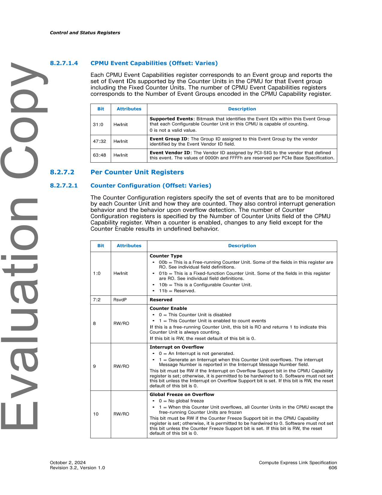
>
> *Original page render @ 150 DPI* — [📄 Full size](figures/chapter_08/page_0606.png)

[⬆️ 返回目录](#-本章目录-part-b)

---

#### 8.2.7.2.2 Filter Configuration (Offset: Varies) | 过滤器配置 (偏移量: 可变)

<table>
<thead>
<tr>
<th width="50%">🇬🇧 English</th>
<th width="50%" style="background-color:#e8e8e8">🇨🇳 中文</th>
</tr>
</thead>
<tbody>
<tr><td>

Each Counter Unit may support a set of Filter Configuration registers, one for each Filter ID. Filters constrain the counting of selected events based on one or more conditions specified in the Filter Configuration registers. For example, Counter Unit N Filter ID 0 - Filter Configuration register selects the HDM decoder(s) to monitor for events in counter N.

Each Counter Unit is associated with zero or more Filter Configuration registers, one for each supported Filter ID. The number of Filter Configuration registers per Counter Unit is derived by counting the 1s in the Filters Supported field in the CPMU Capability register.

If a filter is enabled for an event that it does not apply to, the Counter Unit behavior is undefined. When counting multiple events (multiple bits are set in Events field), Filter Configuration register must be set to all 1s. Otherwise, the Counter Unit behavior is undefined.

When multiple filters are configured for a counter, only the events that satisfy all the specified filters are counted (a logical AND of all the filter conditions).

When a counter is enabled, any changes to this register result in undefined behavior.

| Bit | Attributes | Description |
|-----|------------|-------------|
| 31:0 | RW | Filter Value: Specifies the filter value to be used for the Filter associated with this register. The reset default value is FFFF FFFFh. If this register is set to FFFF FFFFh, filtering is not performed for the associated Filter ID. When set to a value different from FFFF FFFFh, bits beyond the maximum value allowed for that filter are ignored. The encoding of this register varies based on the Filter ID. See Table 8-33 for the encoding. |

> **Table 8-33.** Filter ID and Values
>
> | Filter ID | Description and Definition of the Filter Value Field |
> |-----------|-----------------------------------------------------|
> | 0 | Counts the events associated with the HDM decoder(s) specified in the Filter Value field in the Filter Configuration register. If bit n in the Filter Configuration register is set, events associated with HDM Decoder n are counted. For example, Filter Value=0Ah counts events associated with HDM Decoder 1 and HDM Decoder 3. |
> | 1 | Counts the events associated with the combinations of the Channel, Rank and Bank Groups, and Banks that are specified in the Filter Value field. Refer to Table 8-58 for definitions of these terms. • Bits[7:0]: Bank Number, represented using 0-based encoding. The events associated with this DDR Bank are counted. If set to FFh, the CPMU shall count events associated with all Banks. • Bits[15:8]: Bank Group, represented using 0-based encoding. The events associated with this DDR Bank Group are counted. If set to FFh, the CPMU shall count events associated with all Bank Groups. • Bits[23:16]: Rank Number, represented using 0-based encoding. The events associated with this DDR Rank are counted. If set to FFh, the CPMU shall count events associated with all Ranks. • Bits[31:24]: Channel Number, represented using 0-based encoding. The events associated with this DDR Channel are counted. If set to FFh, the CPMU shall count events associated with all Channels. For example, Filter Value=0004 FF00h counts events associated with Bank 0 in all Bank Groups associated with Rank 4 in Channel 0. |
> | 7:2 | Reserved. Filter ID registers 2-7 for every counter are also reserved. |

</td><td style="background-color:#e8e8e8">

每个 Counter Unit 可以支持一组 Filter Configuration 寄存器, 每个 Filter ID 一个。过滤器根据 Filter Configuration 寄存器中指定的一个或多个条件限制对所选事件的计数。例如, Counter Unit N Filter ID 0 - Filter Configuration 寄存器选择要在计数器 N 中监视事件的 HDM 解码器。

每个 Counter Unit 与零个或多个 Filter Configuration 寄存器相关联, 每个支持的 Filter ID 一个。每个 Counter Unit 的 Filter Configuration 寄存器数通过对 CPMU Capability 寄存器中的 Filters Supported 字段中的 1 的数量得出。

如果为不适用的事件启用了过滤器, 则 Counter Unit 行为未定义。当对多个事件计数时 (Events 字段中设置了多个位), Filter Configuration 寄存器必须设置为全 1。否则, Counter Unit 行为未定义。

当为计数器配置了多个过滤器时, 仅对满足所有指定过滤器的事件进行计数 (所有过滤器条件的逻辑与)。

当计数器启用时, 对此寄存器的任何更改都会导致未定义的行为。

| 位 | 属性 | 描述 |
|-----|------|------|
| 31:0 | RW | Filter Value: 指定要与此寄存器关联的过滤器一起使用的过滤器值。 复位默认值为 FFFF FFFFh。 如果此寄存器设置为 FFFF FFFFh, 则不会对关联的 Filter ID 执行过滤。当设置为不同于 FFFF FFFFh 的值时, 超出该过滤器所允许的最大值的位将被忽略。 此寄存器的编码基于 Filter ID 而变化。有关编码, 请参见表 8-33。 |

> **表 8-33.** 过滤器 ID 和值
>
> | Filter ID | Filter Value 字段的描述和定义 |
> |-----------|------------------------------|
> | 0 | 对与 Filter Configuration 寄存器中 Filter Value 字段指定的 HDM 解码器关联的事件进行计数。如果 Filter Configuration 寄存器中的位 n 置位, 则对与 HDM Decoder n 关联的事件进行计数。例如, Filter Value=0Ah 对与 HDM Decoder 1 和 HDM Decoder 3 关联的事件进行计数。 |
> | 1 | 对与 Filter Value 字段中指定的 Channel、Rank 和 Bank Group 以及 Bank 的组合关联的事件进行计数。有关这些术语的定义, 请参见表 8-58。 • 位 [7:0]: Bank Number, 使用基于 0 的编码表示。对与此 DDR Bank 关联的事件进行计数。如果设置为 FFh, 则 CPMU 应计数与所有 Bank 关联的事件。 • 位 [15:8]: Bank Group, 使用基于 0 的编码表示。对与此 DDR Bank Group 关联的事件进行计数。如果设置为 FFh, 则 CPMU 应计数与所有 Bank Group 关联的事件。 • 位 [23:16]: Rank Number, 使用基于 0 的编码表示。对与此 DDR Rank 关联的事件进行计数。如果设置为 FFh, 则 CPMU 应计数与所有 Rank 关联的事件。 • 位 [31:24]: Channel Number, 使用基于 0 的编码表示。对与此 DDR Channel 关联的事件进行计数。如果设置为 FFh, 则 CPMU 应计数与所有 Channel 关联的事件。 例如, Filter Value=0004 FF00h 对与 Channel 0 中 Rank 4 关联的所有 Bank Group 中的 Bank 0 关联的事件进行计数。 |
> | 7:2 | 保留。每个计数器的 Filter ID 寄存器 2-7 也保留。 |

</td></tr>
</tbody>
</table>

> **Figure 8-72.** Filter Configuration Register layout ｜ 过滤器配置寄存器布局
>
> 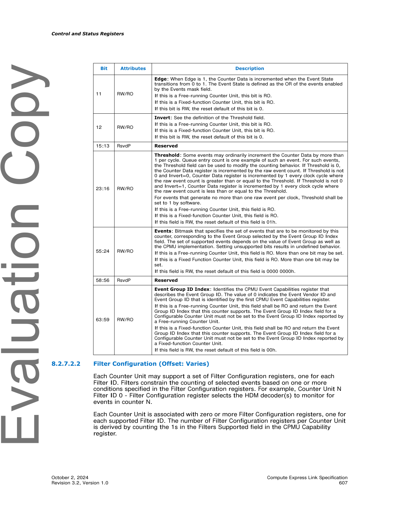
>
> *Original page render @ 150 DPI* — [📄 Full size](figures/chapter_08/page_0607.png)

[⬆️ 返回目录](#-本章目录-part-b)

---

#### 8.2.7.2.3 Counter Data (Offset: Varies) | 计数器数据 (偏移量: 可变)

<table>
<thead>
<tr>
<th width="50%">🇬🇧 English</th>
<th width="50%" style="background-color:#e8e8e8">🇨🇳 中文</th>
</tr>
</thead>
<tbody>
<tr><td>

The Counter Data register must be accessed as an 8-byte quantity.

| Bit | Attributes | Description |
|-----|------------|-------------|
| N-1:0 | RW | Event Count: The current count value. If the Counters Writable while Frozen bit in the CPMU Capability register is 0, any changes to this register while the counter is Enabled or Frozen leads to undefined results. The value N should be chosen such that the counter takes more than one hour before the counter overflows, regardless of which Event it is counting. Once written, the counter continues to increment from the written value. A freeze operation causes the counter to stop accumulating additional events and to retain its value at the time of freeze. An unfreeze operation allows the counter to resume counting subsequent events. When the counter reaches its maximum value, it automatically wraps around upon the next event and starts counting from 0. This transition is defined as the overflow event. Other than the overflow scenario, the counter value is never decremented. N equals the raw value reported by the Counter Width field in the CPMU Capability register. |
| 63:N | RsvdP | Reserved |

</td><td style="background-color:#e8e8e8">

Counter Data 寄存器必须作为 8 字节量进行访问。

| 位 | 属性 | 描述 |
|-----|------|------|
| N-1:0 | RW | Event Count: 当前计数值。 如果 CPMU Capability 寄存器中的 Counters Writable while Frozen 位为 0, 则在计数器启用或冻结时对此寄存器的任何更改都会导致未定义的结果。 应选择 N 值, 使得无论计数器正在计数哪个事件, 计数器溢出前都应超过一个小时。 一旦写入, 计数器从写入的值继续递增。冻结操作会使计数器停止累积更多事件, 并在冻结时保留其值。解冻操作允许计数器恢复对后续事件的计数。当计数器达到其最大值时, 它在下一个事件时自动回绕并从 0 开始计数。此转换定义为溢出事件。除溢出场景外, 计数器值永远不会递减。 N 等于 CPMU Capability 寄存器中 Counter Width 字段报告的原始值。 |
| 63:N | RsvdP | 保留 |

</td></tr>
</tbody>
</table>

> **Figure 8-73.** Counter Data Register layout ｜ 计数器数据寄存器布局
>
> 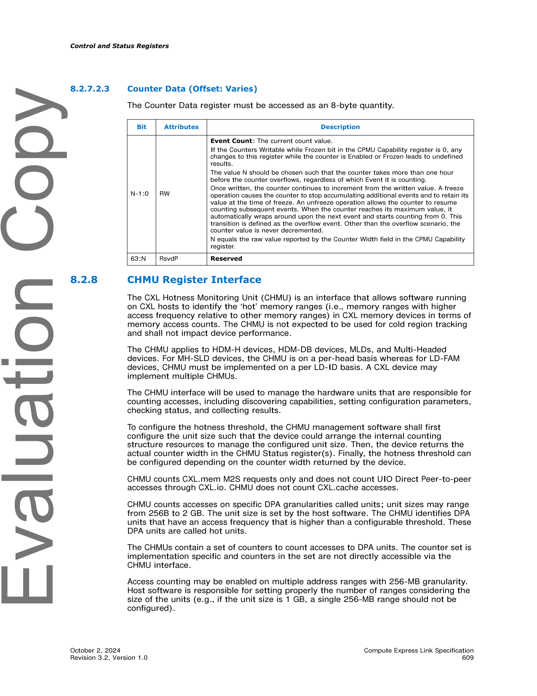
>
> *Original page render @ 150 DPI* — [📄 Full size](figures/chapter_08/page_0609.png)

[⬆️ 返回目录](#-本章目录-part-b)

---

## 8.2.8 CHMU Register Interface | CHMU 寄存器接口

<table>
<thead>
<tr>
<th width="50%">🇬🇧 English</th>
<th width="50%" style="background-color:#e8e8e8">🇨🇳 中文</th>
</tr>
</thead>
<tbody>
<tr><td>

The CXL Hotness Monitoring Unit (CHMU) is an interface that allows software running on CXL hosts to identify the 'hot' memory ranges (i.e., memory ranges with higher access frequency relative to other memory ranges) in CXL memory devices in terms of memory access counts. The CHMU is not expected to be used for cold region tracking and shall not impact device performance.

The CHMU applies to HDM-H devices, HDM-DB devices, MLDs, and Multi-Headed devices. For MH-SLD devices, the CHMU is on a per-head basis whereas for LD-FAM devices, CHMU must be implemented on a per LD-ID basis. A CXL device may implement multiple CHMUs.

The CHMU interface will be used to manage the hardware units that are responsible for counting accesses, including discovering capabilities, setting configuration parameters, checking status, and collecting results.

To configure the hotness threshold, the CHMU management software shall first configure the unit size such that the device could arrange the internal counting structure resources to manage the configured unit size. Then, the device returns the actual counter width in the CHMU Status register(s). Finally, the hotness threshold can be configured depending on the counter width returned by the device.

CHMU counts CXL.mem M2S requests only and does not count UIO Direct Peer-to-peer accesses through CXL.io. CHMU does not count CXL.cache accesses.

CHMU counts accesses on specific DPA granularities called units; unit sizes may range from 256B to 2 GB. The unit size is set by the host software. The CHMU identifies DPA units that have an access frequency that is higher than a configurable threshold. These DPA units are called hot units.

The CHMUs contain a set of counters to count accesses to DPA units. The counter set is implementation specific and counters in the set are not directly accessible via the CHMU interface.

Access counting may be enabled on multiple address ranges with 256-MB granularity. Host software is responsible for setting properly the number of ranges considering the size of the units (e.g., if the unit size is 1 GB, a single 256-MB range should not be configured).

The device counts accesses to DPA units for programmed time intervals called epochs. The device reports the supported minimum and maximum epoch intervals that provide a high level of fidelity for the hotness tracking. Software is expected to program an epoch interval between the minimum and the maximum values. During an epoch, each accessed DPA unit is mapped to a counter within the set according to an implementation-specific mapping function. Examples of mapping function could be direct-mapped, set-associative, hash-function, etc. If the counter is free, it is allocated to the DPA unit and initialized to 1. If the counter is already allocated to the same DPA unit, the counter is incremented. If the counter is allocated to another DPA unit, the access might be not counted. All counters are freed at the end of their epochs.

If the counter related to a specific unit achieves the programmed hotness threshold during an epoch, the unit is considered hot, and is then reported to software. To report hot units to software, CHMU supports a circular structure called the CHMU Hotlist. The Hotlist is accessible through the CHMU's MMIO address space. There is a single Hotlist per CHMU instance for all the address ranges that can be configured on that CHMU. Each CHMU Hotlist entry is a 64-bit structure that contains a DPA unit address, called Unit ID, and its counter value. After the unit size is configured by the software, the remaining bits in the 64-bit entry can be allocated for the counters. Therefore, the hotness threshold can be configured only after setting the unit size. The size of the counters is retrieved through the CHMU Status register.

The CHMU reports new hot units at the Hotlist's Tail pointer and increments the Tail. The software is expected to read the Hotlist entries at the Head pointer and increment the Head. When the Head and the Tail are equal, the Hotlist is considered empty. When the Tail is logically 1 behind the Head, the Hotlist is considered full. The Hotlist can be cleared by setting the Head register to be equal to the Tail register.

Two modes are defined for reporting hot units into the CHMU Hotlist: Epoch-based reporting mode and Always-on reporting mode. Software is responsible for enabling one of the two modes.

When Epoch-based reporting mode is enabled, hot units are reported in the CHMU Hotlist at the end of their counter's current epoch. Even if the counter reaches the hotness threshold before the epoch ends, the counter continues counting until the epoch ends. Consequently, the counter values in the CHMU Hotlist entries will contain the number of hot unit accesses within the epoch. The counters within the counting structure will be freed at the end of their respective epochs.

When Always-on reporting mode is enabled, after the counters achieve the hotness threshold, their corresponding Unit ID is immediately reported in the CHMU Hotlist and becomes visible to the software through the CHMU Hotlist-related registers. The hot unit-related counters are freed when the counters are reported in the Hotlist. The counters within the counting structure will be freed at the end of their respective epochs.

CHMU supports a down-sampling factor for the incoming M2S requests that allows sampling at a configurable rate, or at a rate that is controlled by the device. The down-sampling factor can be either selectable by software (if supported by the device) or can be selected by the device.

The CHMU interface supports MSI/MSI-X interrupts to alert when the:
- CHMU Hotlist overflows
- CHMU Hotlist crosses a level of fullness

If the CHMU Hotlist overflows, the new hot units may be discarded or retained as 'outstanding' hot units that will be reported when space is available in the CHMU Hotlist. The ability to report these outstanding hot units is indicated in the device capabilities. If the CHMU is disabled, any outstanding hot units will be dropped and never added to the CHMU Hotlist.

</td><td style="background-color:#e8e8e8">

CXL 热度监视单元 (CHMU, CXL Hotness Monitoring Unit) 是一个接口, 允许在 CXL 主机上运行的软件根据内存访问计数来识别 CXL 内存设备中的"热"内存范围 (即相对于其他内存范围具有更高访问频率的内存范围)。CHMU 不应用于冷区域跟踪, 且不应影响设备性能。

CHMU 适用于 HDM-H 设备、HDM-DB 设备、MLD 和多头设备。对于 MH-SLD 设备, CHMU 是按头 (per-head) 的; 而对于 LD-FAM 设备, CHMU 必须按 LD-ID 实现。CXL 设备可以实现多个 CHMU。

CHMU 接口将用于管理负责对访问进行计数的硬件单元, 包括发现能力、设置配置参数、检查状态和收集结果。

要配置热度阈值, CHMU 管理软件应首先配置单元大小, 以便设备可以安排内部计数结构资源以管理所配置的单元大小。然后, 设备在 CHMU Status 寄存器中返回实际的计数器宽度。最后, 可以根据设备返回的计数器宽度配置热度阈值。

CHMU 仅对 CXL.mem M2S 请求进行计数, 不对通过 CXL.io 的 UIO Direct Peer-to-peer 访问进行计数。CHMU 不对 CXL.cache 访问进行计数。

CHMU 在称为单元的特定 DPA 粒度上对访问进行计数; 单元大小范围可从 256B 到 2 GB。单元大小由主机软件设置。CHMU 标识访问频率高于可配置阈值的 DPA 单元。这些 DPA 单元称为热单元。

CHMU 包含一组计数器, 用于对 DPA 单元的访问进行计数。计数器集是特定于实现的, 集中的计数器不能通过 CHMU 接口直接访问。

访问计数可以在以 256-MB 粒度的多个地址范围内启用。主机软件负责根据单元的大小正确设置范围数量 (例如, 如果单元大小为 1 GB, 则不应配置单个 256-MB 范围)。

设备对称为 epoch 的编程时间间隔内的 DPA 单元访问进行计数。设备报告支持的最小和最大 epoch 间隔, 这些间隔为热度跟踪提供高保真度。软件应在最小值和最大值之间编程 epoch 间隔。在 epoch 期间, 每个被访问的 DPA 单元根据特定于实现的映射函数映射到集中的一个计数器。映射函数的示例可以是直接映射、组相联、哈希函数等。如果计数器空闲, 则将其分配给 DPA 单元并初始化为 1。如果计数器已分配给同一 DPA 单元, 则计数器递增。如果计数器分配给另一个 DPA 单元, 则访问可能不会被计数。所有计数器在其 epoch 结束时被释放。

如果与特定单元相关的计数器在 epoch 期间达到编程的热度阈值, 则该单元被视为热单元, 然后报告给软件。为了向软件报告热单元, CHMU 支持称为 CHMU Hotlist 的循环结构。Hotlist 可通过 CHMU 的 MMIO 地址空间访问。对于可在该 CHMU 上配置的所有地址范围, 每个 CHMU 实例都有一个 Hotlist。每个 CHMU Hotlist 条目都是一个 64 位结构, 其中包含 DPA 单元地址 (称为 Unit ID) 及其计数器值。软件配置单元大小后, 64 位条目中的剩余位可分配给计数器。因此, 只能在设置单元大小后配置热度阈值。计数器的大小通过 CHMU Status 寄存器检索。

CHMU 在 Hotlist 的 Tail 指针处报告新的热单元并递增 Tail。软件应在 Head 指针处读取 Hotlist 条目并递增 Head。当 Head 和 Tail 相等时, Hotlist 被视为空。当 Tail 在逻辑上比 Head 落后 1 时, Hotlist 视为已满。可以通过将 Head 寄存器设置为等于 Tail 寄存器来清除 Hotlist。

CHMU Hotlist 报告热单元有两种模式: 基于 epoch 的报告模式和始终在线的报告模式。软件负责启用这两种模式之一。

当启用基于 epoch 的报告模式时, 热单元将在其计数器当前 epoch 结束时在 CHMU Hotlist 中报告。即使计数器在 epoch 结束之前达到热度阈值, 计数器也会继续计数直到 epoch 结束。因此, CHMU Hotlist 条目中的计数器值将包含 epoch 内的热单元访问次数。计数结构内的计数器将在其各自 epoch 结束时被释放。

当启用始终在线的报告模式时, 在计数器达到热度阈值后, 它们相应的 Unit ID 立即在 CHMU Hotlist 中报告, 并通过 CHMU Hotlist 相关寄存器对软件可见。热单元相关的计数器在 Hotlist 中报告时被释放。计数结构内的计数器将在其各自 epoch 结束时被释放。

CHMU 支持对传入的 M2S 请求进行下采样, 允许以可配置的速率或由设备控制的速率进行采样。下采样因子可以由软件选择 (如果设备支持) 或由设备选择。

CHMU 接口支持 MSI/MSI-X 中断, 以在以下情况下发出警报:
- CHMU Hotlist 溢出
- CHMU Hotlist 跨越一定的填充水平

如果 CHMU Hotlist 溢出, 新的热单元可能会被丢弃或保留为"未完成"的热单元, 这些单元将在 CHMU Hotlist 中有可用空间时报告。报告这些未完成热单元的能力在设备能力中指示。如果 CHMU 处于禁用状态, 则任何未完成的热单元都将被丢弃, 永远不会添加到 CHMU Hotlist 中。

</td></tr>
</tbody>
</table>

> **Figure 8-74.** CHMU Register Interface Block Diagram ｜ CHMU 寄存器接口框图
>
> 
>
> *Original page render @ 150 DPI* — [📄 Full size](figures/chapter_08/page_0609.png)

[⬆️ 返回目录](#-本章目录-part-b)

---

### 8.2.8.1 CHMU Common Capability Register (Offset 00h) | CHMU 公共能力寄存器 (偏移量 00h)

<table>
<thead>
<tr>
<th width="50%">🇬🇧 English</th>
<th width="50%" style="background-color:#e8e8e8">🇨🇳 中文</th>
</tr>
</thead>
<tbody>
<tr><td>

Each CHMU implements a set of CHMU-scoped registers within a register block. Multiple CHMU register block identifiers are permitted. In this version of the specification, within a CHMU register block, the device can support up to eight CHMU instances, and a single instance is composed of CHMU Capability, CHMU Configuration, CHMU Status, CHMU Hotlist Head, CHMU Hotlist Tail, CHMU Range Configuration Bitmap, and CHMU Hotlist Entry registers. The CHMU Configuration register may be configured only when the CHMU is disabled. When the CHMU is enabled, all the Configuration registers are locked (i.e., Read Only) except the Control field in the CHMU Configuration register. The CHMU Configuration register remains Read Only until the CHMU is disabled again.

The CHMU Common Capability register must be accessed as an 8-byte quantity.

> **Table 8-34.** CHMU Register Layout (Version=1)
>
> | Byte Offset | Length in Bytes | Register Name |
> |-------------|-----------------|---------------|
> | 00h | 16 | CHMU Common Capabilities |
> | 10h | 64 | CHMU Capability [0] |
> | 50h | 32 | CHMU Configuration [0] |
> | 70h | 8 | CHMU Status [0] |
> | 78h | 2 | CHMU Hotlist Head [0] |
> | 7Ah | 2 | CHMU Hotlist Tail [0] |
> | 7Ch | 4 | Reserved |
> | 10h+R0 | 1h | CHMU Range Configuration Bitmap [0]¹ |
> | 10h+H0 | 2- R0 | CHMU Hotlist [0]² |
> | 10h+L4 | M0*8 | CHMU Hotlist [0]³ |
> | 10h+L4 | 64 | CHMU Capability [1]⁴ |
> | 50h+L | 32 | CHMU Configuration [1] |
> | 70h+L | 8 | CHMU Status [1] |
> | 78h+L | 2 | CHMU Hotlist Head [1] |
> | 7Ah+L | 2 | CHMU Hotlist Tail [1] |
> | 7Ch+L | 4 | Reserved |
> | 10h+L+R1 | H1- R1 | CHMU Range Configuration Bitmap [1] |
> | 10h+L+H1 | M1*8 | CHMU Hotlist [1] |
> | ... | ... | ... |
> | 10h+L*7d | 64 | CHMU Capability [7] |
> | 50h+L*7d | 32 | CHMU Configuration [7] |
> | 70h+L*7d | 8 | CHMU Status [7] |
> | 78h+L*7d | 2 | CHMU Hotlist Head [7] |
> | 7Ah+L*7d | 2 | CHMU Hotlist Tail [7] |
> | 7Ch+L*7d | 4 | Reserved |
> | 10h+L*7d+R7 | H7-R7 | CHMU Range Configuration Bitmap [7] |
> | 10h+L*7d+H7 | M7*8 | CHMU Hotlist [7] |
>
> ¹ Value Ri is reported in the CHMU Range Configuration Bitmap register offset of the CHMU Capability register.
> ² Value Hi is reported in the CHMU Hotlist Register Offset of the CHMU Capability register.
> ³ Value Mi depends on the size of the hotlist in the CHMU instance.
> ⁴ Value L corresponds to the value of the CHMU Instance Length field in the CHMU Common Capabilities register.

> **Table 8-35.** CHMU Common Capability Register (Offset 00h)
>
> | Bit | Attributes | Description |
> |-----|------------|-------------|
> | 3:0 | HwInit | Version: Set to 1. The version is incremented whenever the CHMU register structure is extended to add more functionality. Backward compatibility shall be maintained during this process. For all values of n, version n+1 may extend version n by replacing fields that are marked as Reserved in version n or appending new registers but must not redefine the meaning of existing fields. Software that was written for a lower version may continue to operate on CHMU registers with a higher version but will not be able to take advantage of new functionality. Each field in the CHMU register structure is assumed to be introduced in version 1 of that structure unless specified otherwise in the field's definition within this specification. |
> | 7:4 | RsvdP | Reserved |
> | 15:8 | HwInit | Number of Supported CHMU Instances: Number of CHMU instances supported within the CHMU register block. In this version of the specification, the value of this field shall be less than or equal to 8. |
> | 63:16 | RsvdP | Reserved |
> | 79:64 | HwInit | CHMU Instance Length: Length in bytes of a single CHMU instance. |
> | 127:80 | RsvdP | Reserved |

</td><td style="background-color:#e8e8e8">

每个 CHMU 在寄存器块内实现一组 CHMU 作用域的寄存器。允许多个 CHMU 寄存器块标识符。在规范的此版本中, 在 CHMU 寄存器块内, 设备最多可支持八个 CHMU 实例, 单个实例由 CHMU Capability、CHMU Configuration、CHMU Status、CHMU Hotlist Head、CHMU Hotlist Tail、CHMU Range Configuration Bitmap 和 CHMU Hotlist Entry 寄存器组成。仅当 CHMU 处于禁用状态时, CHMU Configuration 寄存器才可配置。当 CHMU 启用时, 除 CHMU Configuration 寄存器中的 Control 字段外, 所有 Configuration 寄存器都被锁定 (即只读)。CHMU Configuration 寄存器保持只读状态, 直到 CHMU 再次被禁用。

CHMU Common Capability 寄存器必须作为 8 字节量进行访问。

> **表 8-34.** CHMU 寄存器布局 (Version=1)
>
> | 字节偏移量 | 字节长度 | 寄存器名称 |
> |------------|----------|------------|
> | 00h | 16 | CHMU Common Capabilities |
> | 10h | 64 | CHMU Capability [0] |
> | 50h | 32 | CHMU Configuration [0] |
> | 70h | 8 | CHMU Status [0] |
> | 78h | 2 | CHMU Hotlist Head [0] |
> | 7Ah | 2 | CHMU Hotlist Tail [0] |
> | 7Ch | 4 | 保留 |
> | 10h+R0 | 1h | CHMU Range Configuration Bitmap [0]¹ |
> | 10h+H0 | 2- R0 | CHMU Hotlist [0]² |
> | 10h+L⁴ | M0*8 | CHMU Hotlist [0]³ |
> | 10h+L⁴ | 64 | CHMU Capability [1]⁴ |
> | 50h+L | 32 | CHMU Configuration [1] |
> | 70h+L | 8 | CHMU Status [1] |
> | 78h+L | 2 | CHMU Hotlist Head [1] |
> | 7Ah+L | 2 | CHMU Hotlist Tail [1] |
> | 7Ch+L | 4 | 保留 |
> | 10h+L+R1 | H1- R1 | CHMU Range Configuration Bitmap [1] |
> | 10h+L+H1 | M1*8 | CHMU Hotlist [1] |
> | ... | ... | ... |
> | 10h+L*7d | 64 | CHMU Capability [7] |
> | 50h+L*7d | 32 | CHMU Configuration [7] |
> | 70h+L*7d | 8 | CHMU Status [7] |
> | 78h+L*7d | 2 | CHMU Hotlist Head [7] |
> | 7Ah+L*7d | 2 | CHMU Hotlist Tail [7] |
> | 7Ch+L*7d | 4 | 保留 |
> | 10h+L*7d+R7 | H7-R7 | CHMU Range Configuration Bitmap [7] |
> | 10h+L*7d+H7 | M7*8 | CHMU Hotlist [7] |
>
> ¹ 值 Ri 在 CHMU Capability 寄存器的 CHMU Range Configuration Bitmap 寄存器偏移量中报告。
> ² 值 Hi 在 CHMU Capability 寄存器的 CHMU Hotlist Register Offset 中报告。
> ³ 值 Mi 取决于 CHMU 实例中 hotlist 的大小。
> ⁴ 值 L 对应于 CHMU Common Capabilities 寄存器中 CHMU Instance Length 字段的值。

> **表 8-35.** CHMU 公共能力寄存器 (偏移量 00h)
>
> | 位 | 属性 | 描述 |
> |-----|------|------|
> | 3:0 | HwInit | Version: 设置为 1。每当扩展 CHMU 寄存器结构以添加更多功能时, 版本都会递增。在此过程中应保持向后兼容性。对于 n 的所有值, 版本 n+1 可以通过替换版本 n 中标记为保留的字段或追加新寄存器来扩展版本 n, 但不得重新定义现有字段的含义。为较低版本编写的软件可以继续在较高版本的 CHMU 寄存器上运行, 但将无法利用新功能。除非在本规范的字段定义中另有规定, 否则 CHMU 寄存器结构中的每个字段都假定在该结构的版本 1 中引入。 |
> | 7:4 | RsvdP | 保留 |
> | 15:8 | HwInit | Number of Supported CHMU Instances: CHMU 寄存器块内支持的 CHMU 实例数。在规范的此版本中, 此字段的值应小于或等于 8。 |
> | 63:16 | RsvdP | 保留 |
> | 79:64 | HwInit | CHMU Instance Length: 单个 CHMU 实例的字节长度。 |
> | 127:80 | RsvdP | 保留 |

</td></tr>
</tbody>
</table>

> **Figure 8-75.** CHMU Common Capability Register layout ｜ CHMU 公共能力寄存器布局
>
> 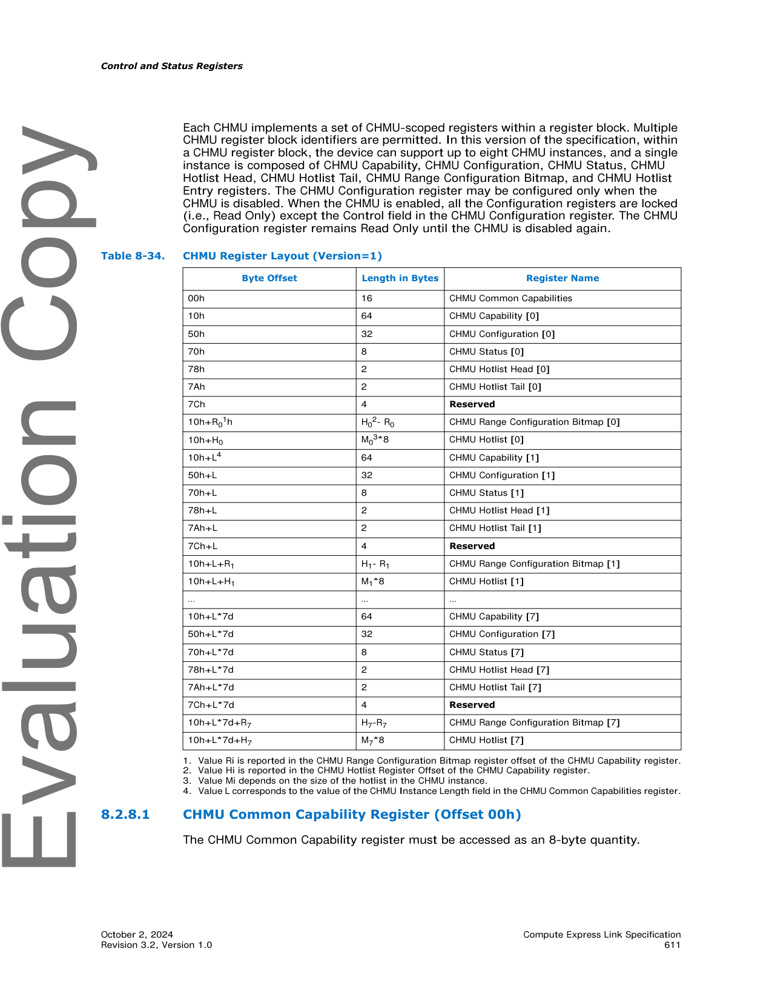
>
> *Original page render @ 150 DPI* — [📄 Full size](figures/chapter_08/page_0611.png)

[⬆️ 返回目录](#-本章目录-part-b)

---

### 8.2.8.2 CHMU Capability Register (Offset 10h + CHMU Instance Length * i¹) | CHMU 能力寄存器 (偏移量 10h + CHMU Instance Length * i¹)

<table>
<thead>
<tr>
<th width="50%">🇬🇧 English</th>
<th width="50%" style="background-color:#e8e8e8">🇨🇳 中文</th>
</tr>
</thead>
<tbody>
<tr><td>

The CHMU Capability register must be accessed as an 8-byte quantity.

¹ i is the index of the CHMU instance. In this version of the specification, the device can support up to 8 CHMU instances.

> **Table 8-36.** CHMU Capability Register (Sheet 1 of 3)
>
> | Bit | Attributes | Description |
> |-----|------------|-------------|
> | 3:0 | HwInit | Interrupt Message Number: If Interrupt on Hotlist Overflow Support=1, this field indicates which MSI/MSI-X vector is used for the interrupt message that is generated in association with this CHMU instance. For MSI, the value in this field indicates the offset between the base Message Data and the interrupt message that is generated. Hardware is required to update this field so that it is correct if the number of MSI Messages assigned to the Function changes when software writes to the Multiple Message Enable field in the Message Control register for MSI. For MSI-X, the value in this field indicates which MSI-X Table entry is used to generate the interrupt message. The entry shall be one of the first 16 entries, regardless of whether the Function implements more than 16 entries. The value in this field shall be within the range configured by system software to the device. For a given MSI-X implementation, the entry shall remain constant. If both MSI and MSI-X are implemented, they are permitted to use different vectors, though software is permitted to enable only one mechanism at a time. If MSI-X is enabled, the value in this field shall indicate the vector for MSI-X. If MSI is enabled or neither is enabled, the value in this field indicates the vector for MSI. If software enables both MSI and MSI-X at the same time, the value in this field is undefined. It is recommended that the component allocate a distinct Interrupt Message Number to each CHMU instance. |
> | 4 | HwInit | Interrupt on Hotlist Overflow Support: • 0 = The CHMU does not support generation of interrupts upon hotlist overflow. • 1 = The CHMU supports generation of interrupts upon hotlist overflow. Interrupt generation is controlled by the Interrupt on Hotlist Overflow bit in the CHMU Configuration register. The Interrupt Message Number is reported in the Interrupt Message Number field of this register. |
> | 5 | HwInit | Interrupt on Hotlist Levels Crossing Support: • 0 = CHMU does not support generation of interrupts upon hotlist levels crossing. • 1 = CHMU supports generation of interrupts upon hotlist levels crossing. Interrupt generation is controlled by the Interrupt on Hotlist Levels Crossing bit in the CHMU Configuration register. The Interrupt Message Number is reported in the Interrupt Message Number field of this register. |
> | 7:6 | HwInit | Epoch Type: • 00b = Global. All counters start and end their epoch simultaneously. • 01b = Per counter. Each counter starts and ends their epoch independently. The counter starts when it is allocated. • All other encodings are Reserved. |
> | 15:8 | HwInit | Tracked M2S Requests: CXL.mem requests that can be tracked by the device. The following values are defined: • Bit[8]: Non-TEE read only (MemRd, MemRdData, MemSpecRd, MemInv) • Bit[9]: Non-TEE write only (MemWr, MemWrPtl) • Bit[10]: Non-TEE read and non-TEE write (MemRd, MemRdData, MemSpecRd, MemInv, MemWr, MemWrPtl) • Bit[11]: Non-TEE and TEE read (MemRd, MemRdData, MemSpecRd, MemInv, MemRdTEE, MemRdDataTEE, MemSpecRdTEE) • Bit[12]: Non-TEE and TEE write (MemWr, MemWrPtl, MemWrTEE, MemWrPtlTEE) • Bit[13]: Non-TEE read, TEE read, non-TEE write, TEE write • Bits[15:14]: Reserved |
> | 31:16 | HwInit | Max Epoch Length: Maximum epoch length that the device supports. • Bits[19:16]: These bits specify the time scale. — 1h = 100 us — 2h = 1 ms — 3h = 10 ms — 4h = 100 ms — 5h = 1 s — All other encodings are Reserved • Bits[31:20]: These bits specify the maximum epoch length, using the time scale indicated in bits[19:16]. Max value is 4095. A value of 0 is not permitted. |
> | 47:32 | HwInit | Min Epoch Length: Minimum epoch length that the device supports. • Bits[35:32]: These bits specify the time scale. — 1h = 100 us — 2h = 1 ms — 3h = 10 ms — 4h = 100 ms — 5h = 1 s — All other encodings are Reserved • Bits[47:36]: These bits specify the minimum epoch length, using the time scale indicated in bits[35:32]. Max value is 4095. A value of 0 is not permitted. |
> | 63:48 | HwInit | Hotlist Size: Maximum number of hotlist entries. The minimum value to be supported is 64. Max value is 65,535. |
> | 95:64 | HwInit | Supported Unit Sizes: Each bit corresponds to the granularity of memory for which accesses are counted separately. Supported values are expressed as a power of 2 and range from 256B to 2 GB. It is recommended to support at least one unit size of 2 MB or smaller granularity. The parameter is represented by a bitmap in which the unit size doubles with each bit increment. • Bit[64]: 256 B • Bit[65]: 512 B • Bit[66]: 1 KB • Bit[67]: 2 KB • Bit[68]: 4 KB • ... • Bit[86]: 1 GB • Bit[87]: 2 GB • Bits[95:88]: Reserved |
> | 111:96 | HwInit | Supported Down-sampling Factor: The device can be configured to track one M2S request over one of the values encoded in this field. • Bit[96]: 1 (the device can sustain the full request rate) • Bit[97]: 2 • Bit[98]: 4 • Bit[99]: 8 • Bit[100]: 16 • Bit[101]: 32 • ... • Bit[111]: 32,768 |
> | 127:112 | HwInit | Capability Flags: Features supported for hotness tracking. • Bit[112]: Epoch-based reporting mode: if set, the device updates the list of hot units in the hotlist at the end of an epoch. • Bit[113]: Always-on Reporting Mode: When set to 1, the device pushes entries into the hotlist as soon as the related unit achieves or exceeds the hotness threshold. • Bit[114]: Randomized Down-sampling: When set to 1, the device supports implementation-specific randomization for selecting accesses to perform down-sampling. • Bit[115]: Address Overlap: When set to 1, the CHMU can overlap address ranges that are covered by other CHMU instances within the same register block. • Bit[116]: Postponed Outstanding Hot Units Insertion in the CHMU Hotlist on Overflow: When set to 1, if the CHMU hotlist overflows, outstanding hot units identified when the hotlist is in Overflow state become visible when one or more CHMU Hotlist entries are freed. The hot units detected in Overflow state will be visible within 10 ms if the number of entries that are freed is sufficient. • Bits[127:117]: Reserved |
> | 191:128 | HwInit | CHMU Range Configuration Bitmap Register Offset: Offset from the first byte of the CHMU Capability register in which the CHMU Range Configuration Bitmap starts. |
> | 255:192 | HwInit | CHMU Hotlist Register Offset. Offset from the first byte of the CHMU Capability register in which the CHMU Hotlist starts. |
> | 511:256 | RsvdP | Reserved |

</td><td style="background-color:#e8e8e8">

CHMU Capability 寄存器必须作为 8 字节量进行访问。

¹ i 是 CHMU 实例的索引。在规范的此版本中, 设备最多可支持 8 个 CHMU 实例。

> **表 8-36.** CHMU 能力寄存器 (第 1 页, 共 3 页)
>
> | 位 | 属性 | 描述 |
> |-----|------|------|
> | 3:0 | HwInit | Interrupt Message Number: 如果 Interrupt on Hotlist Overflow Support=1, 则此字段指示与此 CHMU 实例关联生成的中断消息所使用的 MSI/MSI-X 向量。 对于 MSI, 此字段中的值表示基本消息数据与生成的中断消息之间的偏移量。当软件写入 MSI 消息控制寄存器的 Multiple Message Enable 字段而导致分配给该功能的消息数发生变化时, 硬件需要更新此字段以使其正确。对于 MSI-X, 此字段中的值指示用于生成中断消息的 MSI-X 表条目。即使该功能实现了 16 个以上条目, 该条目也必须是前 16 个条目之一。此字段中的值应处于系统软件配置给设备的范围内。对于给定的 MSI-X 实现, 该条目应保持不变。 如果同时实现了 MSI 和 MSI-X, 则它们允许使用不同的向量, 但软件一次只允许启用一种机制。如果启用了 MSI-X, 则此字段中的值应指示 MSI-X 的向量。如果启用了 MSI 或两者都未启用, 则此字段中的值指示 MSI 的向量。如果软件同时启用 MSI 和 MSI-X, 则此字段中的值未定义。 建议组件为每个 CHMU 实例分配不同的 Interrupt Message Number。 |
> | 4 | HwInit | Interrupt on Hotlist Overflow Support: • 0 = CHMU 不支持在 hotlist 溢出时生成中断。 • 1 = CHMU 支持在 hotlist 溢出时生成中断。中断生成由 CHMU Configuration 寄存器中的 Interrupt on Hotlist Overflow 位控制。Interrupt Message Number 在本寄存器的 Interrupt Message Number 字段中报告。 |
> | 5 | HwInit | Interrupt on Hotlist Levels Crossing Support: • 0 = CHMU 不支持在 hotlist 水平跨越时生成中断。 • 1 = CHMU 支持在 hotlist 水平跨越时生成中断。中断生成由 CHMU Configuration 寄存器中的 Interrupt on Hotlist Levels Crossing 位控制。Interrupt Message Number 在本寄存器的 Interrupt Message Number 字段中报告。 |
> | 7:6 | HwInit | Epoch Type: • 00b = 全局。所有计数器同时开始和结束其 epoch。 • 01b = 每个计数器。每个计数器独立开始和结束其 epoch。计数器在分配时启动。 • 所有其他编码保留。 |
> | 15:8 | HwInit | Tracked M2S Requests: 设备可跟踪的 CXL.mem 请求。定义以下值: • 位 [8]: 仅 Non-TEE 读 (MemRd, MemRdData, MemSpecRd, MemInv) • 位 [9]: 仅 Non-TEE 写 (MemWr, MemWrPtl) • 位 [10]: Non-TEE 读和 Non-TEE 写 (MemRd, MemRdData, MemSpecRd, MemInv, MemWr, MemWrPtl) • 位 [11]: Non-TEE 和 TEE 读 (MemRd, MemRdData, MemSpecRd, MemInv, MemRdTEE, MemRdDataTEE, MemSpecRdTEE) • 位 [12]: Non-TEE 和 TEE 写 (MemWr, MemWrPtl, MemWrTEE, MemWrPtlTEE) • 位 [13]: Non-TEE 读, TEE 读, Non-TEE 写, TEE 写 • 位 [15:14]: 保留 |
> | 31:16 | HwInit | Max Epoch Length: 设备支持的最大 epoch 长度。 • 位 [19:16]: 这些位指定时间刻度。 — 1h = 100 us — 2h = 1 ms — 3h = 10 ms — 4h = 100 ms — 5h = 1 s — 所有其他编码保留 • 位 [31:20]: 这些位使用位 [19:16] 中指示的时间刻度指定最大 epoch 长度。最大值为 4095。不允许值为 0。 |
> | 47:32 | HwInit | Min Epoch Length: 设备支持的最小 epoch 长度。 • 位 [35:32]: 这些位指定时间刻度。 — 1h = 100 us — 2h = 1 ms — 3h = 10 ms — 4h = 100 ms — 5h = 1 s — 所有其他编码保留 • 位 [47:36]: 这些位使用位 [35:32] 中指示的时间刻度指定最小 epoch 长度。最大值为 4095。不允许值为 0。 |
> | 63:48 | HwInit | Hotlist Size: hotlist 条目的最大数量。要支持的最小值为 64。最大值为 65,535。 |
> | 95:64 | HwInit | Supported Unit Sizes: 每个位对应于单独对其访问进行计数的内存粒度。支持的值表示为 2 的幂, 范围从 256B 到 2 GB。建议支持至少 2 MB 或更小粒度的一个单元大小。该参数由位图表示, 其中单元大小随每个位增量翻倍。 • 位 [64]: 256 B • 位 [65]: 512 B • 位 [66]: 1 KB • 位 [67]: 2 KB • 位 [68]: 4 KB • ... • 位 [86]: 1 GB • 位 [87]: 2 GB • 位 [95:88]: 保留 |
> | 111:96 | HwInit | Supported Down-sampling Factor: 设备可配置为通过此字段中编码的值之一跟踪一个 M2S 请求。 • 位 [96]: 1 (设备可以维持完整请求速率) • 位 [97]: 2 • 位 [98]: 4 • 位 [99]: 8 • 位 [100]: 16 • 位 [101]: 32 • ... • 位 [111]: 32,768 |
> | 127:112 | HwInit | Capability Flags: 热度跟踪支持的功能。 • 位 [112]: 基于 epoch 的报告模式: 置位时, 设备在 epoch 结束时更新 hotlist 中的热单元列表。 • 位 [113]: 始终在线报告模式: 设置为 1 时, 只要相关单元达到或超过热度阈值, 设备就会立即将条目推入 hotlist。 • 位 [114]: 随机下采样: 设置为 1 时, 设备支持用于选择访问执行下采样的特定于实现的随机化。 • 位 [115]: 地址重叠: 设置为 1 时, CHMU 可以重叠同一寄存器块内其他 CHMU 实例覆盖的地址范围。 • 位 [116]: 在溢出时将未完成的出色热单元插入到 CHMU Hotlist 中: 设置为 1 时, 如果 CHMU hotlist 溢出, 则在 hotlist 处于 Overflow 状态时识别的未完成的出色热单元在一个或多个 CHMU Hotlist 条目被释放时变为可见。如果释放的条目数量充足, 则在 Overflow 状态中检测到的热单元将在 10 毫秒内可见。 • 位 [127:117]: 保留 |
> | 191:128 | HwInit | CHMU Range Configuration Bitmap Register Offset: 从 CHMU Capability 寄存器的第一个字节开始的偏移量, CHMU Range Configuration Bitmap 在此偏移量处开始。 |
> | 255:192 | HwInit | CHMU Hotlist Register Offset: 从 CHMU Capability 寄存器的第一个字节开始的偏移量, CHMU Hotlist 在此偏移量处开始。 |
> | 511:256 | RsvdP | 保留 |

</td></tr>
</tbody>
</table>

> **Figure 8-76.** CHMU Capability Register layout ｜ CHMU 能力寄存器布局
>
> 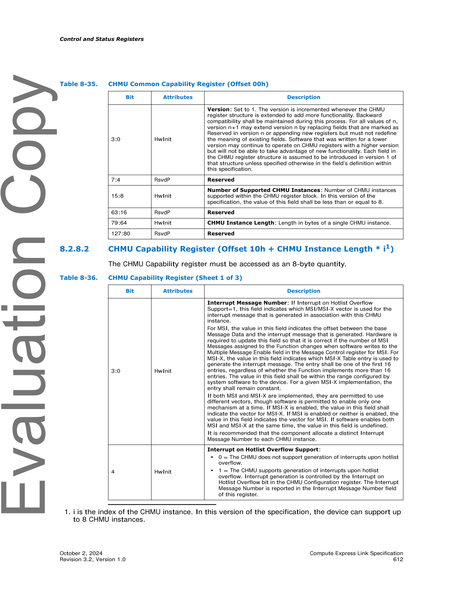
>
> *Original page render @ 150 DPI* — [📄 Full size](figures/chapter_08/page_0612.png)

[⬆️ 返回目录](#-本章目录-part-b)

---

### 8.2.8.3 CHMU Configuration [i] (Offset 50h + CHMU Instance Length * i) | CHMU 配置 [i] (偏移量 50h + CHMU Instance Length * i)

<table>
<thead>
<tr>
<th width="50%">🇬🇧 English</th>
<th width="50%" style="background-color:#e8e8e8">🇨🇳 中文</th>
</tr>
</thead>
<tbody>
<tr><td>

The CHMU Configuration register must be accessed as an 8-byte quantity.

> **Table 8-37.** CHMU Configuration Register (Sheet 1 of 2)
>
> | Bit | Attributes | Description |
> |-----|------------|-------------|
> | 7:0 | RW | M2S Requests to Track: CXL.mem requests to be tracked by the device. The following values are defined: • 01h = Non-TEE read only (MemRd, MemRdData, MemSpecRd, MemInv) • 02h = Non-TEE write only (MemWr, MemWrPtl) • 03h = Non-TEE read and non-TEE write (MemRd, MemRdData, MemSpecRd, MemInv, MemWr, MemWrPtl) • 04h = Non-TEE and TEE read (MemRd, MemRdData, MemSpecRd, MemInv, MemRdTEE, MemRdDataTEE, MemSpecRdTEE) • 05h = Non-TEE and TEE write (MemWr, MemWrPtl, MemWrTEE, MemWrPtlTEE) • 06h = Non-TEE read, TEE read, non-TEE write, TEE write • All other encodings are Reserved |
> | 15:8 | RW | Flags: Features supported for hotness tracking. • Bit[8]: Randomized Down-sampling: When set to 1, the device uses implementation-specific randomization for selecting accesses to perform down-sampling. • Bit[9]: Interrupt on Hotlist Overflow: When set to 1, the device generates an interrupt when the hotlist overflows. The Interrupt Message Number is reported in the Interrupt Message Number field in the CHMU Capability registers. This bit can be set to 1 if the Interrupt on Hotlist Overflow Support bit in the CHMU Capability register is set to 1; otherwise, the bit is permitted to be hardwired to 0. • Bit[10]: Interrupt on Hotlist Levels Crossing: When set to 1, the device generates an interrupt when the hotlist achieves a number of host-configured elements through the Hotness Notification Threshold parameter. The Interrupt Message Number is reported in the Interrupt Message Number field in the CHMU Capability registers. This bit can be set to 1 if the Interrupt on Hotlist Levels Crossing Support bit in the CHMU Capability register is set; otherwise, the bit is permitted to be hardwired to 0. • Bits[15:11]: Reserved. |
> | 31:16 | RW | Control: This field is used to require performing operations on the Hotness Monitoring Unit • Bit[16]: Enable Hotness Monitoring Unit: This bit is set to 1 to enable the Hotness Monitoring Unit, and is cleared to 0 to disable the CHMU. CHMU enablement and/or disablement completion status can be retrieved from the CHMU Status register. • Bit[17]: Reset Counters: This bit is set to 1 to clear the counters in the Hotness Monitoring Unit. The completion of reset counter operation can be established by polling the Operation in Progress field in the CHMU Status register. When the device completes clearing of the counters, this bit returns to a value of 0. The configuration is not affected. • Bits[31:18]: Reserved. |

</td><td style="background-color:#e8e8e8">

CHMU Configuration 寄存器必须作为 8 字节量进行访问。

> **表 8-37.** CHMU 配置寄存器 (第 1 页, 共 2 页)
>
> | 位 | 属性 | 描述 |
> |-----|------|------|
> | 7:0 | RW | M2S Requests to Track: 设备要跟踪的 CXL.mem 请求。定义以下值: • 01h = 仅 Non-TEE 读 (MemRd, MemRdData, MemSpecRd, MemInv) • 02h = 仅 Non-TEE 写 (MemWr, MemWrPtl) • 03h = Non-TEE 读和 Non-TEE 写 (MemRd, MemRdData, MemSpecRd, MemInv, MemWr, MemWrPtl) • 04h = Non-TEE 和 TEE 读 (MemRd, MemRdData, MemSpecRd, MemInv, MemRdTEE, MemRdDataTEE, MemSpecRdTEE) • 05h = Non-TEE 和 TEE 写 (MemWr, MemWrPtl, MemWrTEE, MemWrPtlTEE) • 06h = Non-TEE 读, TEE 读, Non-TEE 写, TEE 写 • 所有其他编码保留 |
> | 15:8 | RW | Flags: 热度跟踪支持的功能。 • 位 [8]: Randomized Down-sampling: 设置为 1 时, 设备使用特定于实现的随机化来选择要执行下采样的访问。 • 位 [9]: Interrupt on Hotlist Overflow: 设置为 1 时, 设备在 hotlist 溢出时生成中断。Interrupt Message Number 在 CHMU Capability 寄存器的 Interrupt Message Number 字段中报告。如果 CHMU Capability 寄存器中的 Interrupt on Hotlist Overflow Support 位置 1, 则此位可设置为 1; 否则, 允许硬连线为 0。 • 位 [10]: Interrupt on Hotlist Levels Crossing: 设置为 1 时, 当 hotlist 通过 Hotness Notification Threshold 参数达到主机配置的元素数量时, 设备生成中断。Interrupt Message Number 在 CHMU Capability 寄存器的 Interrupt Message Number 字段中报告。如果 CHMU Capability 寄存器中的 Interrupt on Hotlist Levels Crossing Support 位置位, 则此位可设置为 1; 否则, 允许硬连线为 0。 • 位 [15:11]: 保留。 |
> | 31:16 | RW | Control: 此字段用于请求对 Hotness Monitoring Unit 执行操作 • 位 [16]: Enable Hotness Monitoring Unit: 该位设置为 1 以启用 Hotness Monitoring Unit, 清零为 0 以禁用 CHMU。CHMU 启用和/或禁用完成状态可从 CHMU Status 寄存器检索。 • 位 [17]: Reset Counters: 该位设置为 1 以清除 Hotness Monitoring Unit 中的计数器。复位计数器操作的完成可以通过轮询 CHMU Status 寄存器中的 Operation in Progress 字段来建立。当设备完成计数器清除时, 该位返回值 0。配置不受影响。 • 位 [31:18]: 保留。 |

</td></tr>
</tbody>
</table>

> **Figure 8-77.** CHMU Configuration Register layout ｜ CHMU 配置寄存器布局
>
> 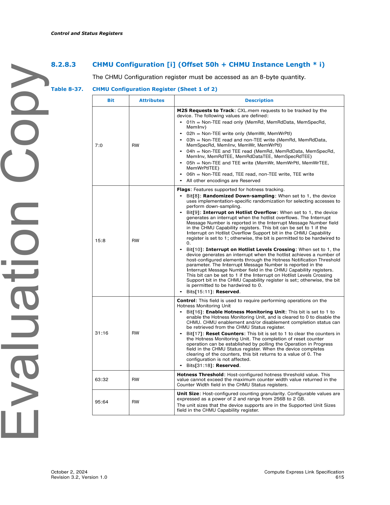
>
> *Original page render @ 150 DPI* — [📄 Full size](figures/chapter_08/page_0615.png)

[⬆️ 返回目录](#-本章目录-part-b)

---

---

## 8.2.8.4 CHMU Status [i] (Offset 70h + CHMU Instance Length * i) | CHMU 状态寄存器 [i]（偏移 70h + CHMU Instance Length * i）

<table>
<thead>
<tr>
<th width="50%">🇬🇧 English</th>
<th width="50%" style="background-color:#e8e8e8">🇨🇳 中文</th>
</tr>
</thead>
<tbody>
<tr><td>The CHMU Status register must be accessed as an 8-byte quantity.</td><td style="background-color:#e8e8e8">CHMU Status 寄存器必须以 8 字节为单位访问。</td></tr>
</tbody>
</table>

> **Table 8-37.** CHMU Configuration Register (Sheet 2 of 2) ｜ CHMU 配置寄存器（第 2 页，共 2 页）
>
> | Bit | Attributes | Description |
> |---|---|---|
> | 103:96 | RW | Down-sampling Factor: If down-sampling is enabled, the device tracks one M2S request over the value encoded in this field. • Bits[99:96]: Down-sampling factor: One of the 16 possible values reported in the Supported Down-sampling Factor field in the CHMU Capability register. • Bits[103:100]: Reserved. | 下采样因子（Down-sampling Factor）：如果启用了下采样，设备对该字段中编码的若干 M2S 请求跟踪一次。 • Bits[99:96]：下采样因子：为 CHMU Capability 寄存器中 Supported Down-sampling Factor 字段所报告的 16 种可能值之一。 • Bits[103:100]：保留。 |
> | 111:104 | RW | Reporting Mode: This field is used to enable one of the reporting modes that the device supports. • 00h = Enable Epoch-based reporting mode. The device ignores this field if the host programs a value that corresponds to an unsupported capability. • 01h = Enable Always-on Reporting Mode. The device ignores this field if the host programs a value that corresponds to an unsupported capability. • All other encodings are Reserved. | 报告模式（Reporting Mode）：此字段用于启用设备所支持的某种报告模式。 • 00h = 启用基于 Epoch 的报告模式。如果主机编程的值对应于不支持的能力，设备将忽略此字段。 • 01h = 启用始终开启报告模式（Always-on Reporting Mode）。如果主机编程的值对应于不支持的能力，设备将忽略此字段。 • 所有其他编码为保留。 |
> | 127:112 | RW | Epoch Length: Host-configured epoch length. • Bits[115:112]: These bits specify the time scale. — 1h = 100 us — 2h = 1 ms — 3h = 10 ms — 4h = 100 ms — 5h = 1 s — All other encodings are Reserved. • Bits[127:116]: These bits specify the epoch length, using the time scale indicated in bits[115:112]. | Epoch 长度（Epoch Length）：主机配置的 epoch 长度。 • Bits[115:112]：这些位指定时间刻度。 — 1h = 100 us — 2h = 1 ms — 3h = 10 ms — 4h = 100 ms — 5h = 1 s — 所有其他编码为保留。 • Bits[127:116]：这些位使用 bits[115:112] 中指示的时间刻度指定 epoch 长度。 |
> | 143:128 | RW | Hotlist Notification Threshold: The device generates an interrupt when the number of entries in the Hotlist is greater than or equal to the value in this field and bit[1] of the Overflow Interrupt Status field, "Hotlist Level Crossed", in the CHMU Status register is equal to 0. Upon this condition, bit[1] of the Overflow Interrupt Status field in the CHMU Status register is set to 1. The value in this field cannot exceed the Hotlist size programmed in the Hotlist Size field in the CHMU Capability register. If the value of this field exceeds the programmed Hotlist size, this field is ignored, and no interrupts are generated. When bit[10] of the Flags field, "Interrupt on Hotlist Levels Crossing", is cleared to 0, this field is ignored. | 热列表通知阈值（Hotlist Notification Threshold）：当热列表中的条目数大于或等于此字段中的值，并且 CHMU Status 寄存器中 Overflow Interrupt Status 字段的 bit[1] "Hotlist Level Crossed" 等于 0 时，设备产生中断。在该条件下，CHMU Status 寄存器中 Overflow Interrupt Status 字段的 bit[1] 被置 1。 此字段的值不能超过 CHMU Capability 寄存器中 Hotlist Size 字段所编程的热列表大小。如果此字段的值超过已编程的热列表大小，则此字段被忽略，不会产生中断。 当 Flags 字段的 bit[10] "Interrupt on Hotlist Levels Crossing" 清零为 0 时，此字段被忽略。 |
> | 255:144 | RsvdP | Reserved | 保留 |

> **Table 8-38.** CHMU Status Register ｜ CHMU 状态寄存器
>
> | Bit | Attributes | Description |
> |---|---|---|
> | 15:0 | RO | Status: This field is used to retrieve CHMU-related status and error information. • Bit[0]: Tracking enabled: When set to 1, the CHMU is enabled. When cleared to 0, the CHMU is disabled. • Bits[15:1]: Reserved. | 状态（Status）：此字段用于检索与 CHMU 相关的状态和错误信息。 • Bit[0]：跟踪已启用（Tracking enabled）：置 1 时，CHMU 已启用；清零时，CHMU 已禁用。 • Bits[15:1]：保留。 |
> | 31:16 | RO | Operation In progress: This status information returns the operation currently in progress. • 0000h = No operation in progress. Indicates that no operations that can be started through the Control field in the CHMU Configuration register are in progress. • 0001h = Enablement in progress. Indicates that enabling of the CHMU is not yet complete. • 0002h = Disablement in progress. Indicates that disabling of the CHMU is not yet complete. • 0003h = Reset counters in progress. Indicates that resetting of the CHMU counters is not yet complete. • All other encodings are Reserved. | 进行中的操作（Operation In progress）：此状态信息返回当前正在进行的操作。 • 0000h = 没有正在进行的操作。表示没有可通过 CHMU Configuration 寄存器中 Control 字段启动的操作正在进行中。 • 0001h = 启用进行中。表示 CHMU 的启用尚未完成。 • 0002h = 禁用进行中。表示 CHMU 的禁用尚未完成。 • 0003h = 计数器复位进行中。表示 CHMU 计数器的复位尚未完成。 • 所有其他编码为保留。 |
> | 39:32 | RO | Counter Width: Current number of bits in each counter used for counting the accesses. This field also indicates the counter width in each Hotlist entry. | 计数器宽度（Counter Width）：用于对访问进行计数的每个计数器中的当前位数。 此字段还指示每个热列表条目中的计数器宽度。 |
> | 47:40 | RW1C | Overflow Interrupt Status: • Bit[40]: Hotlist Overflow. When set to 1, the Hotlist has encountered an overflow condition. Additional Hotlist Overflow interrupts are not generated until software clears this bit. • Bit[41]: Hotlist Level Crossed. When set to 1, the Hotlist has achieved the Hotlist Notification Threshold set by the software. Additional Hotlist Level Crossed interrupts are not generated until software clears this bit to 0. • Bits[47:42]: Reserved. | 溢出中断状态（Overflow Interrupt Status）： • Bit[40]：热列表溢出（Hotlist Overflow）。置 1 时，热列表已遇到溢出条件。在软件清除此位之前，不会再产生额外的热列表溢出中断。 • Bit[41]：达到热列表等级（Hotlist Level Crossed）。置 1 时，热列表已达到软件设置的 Hotlist Notification Threshold。在软件将此位清零之前，不会再产生额外的 Hotlist Level Crossed 中断。 • Bits[47:42]：保留。 |
> | 63:48 | RsvdP | Reserved | 保留 |

> **Figure 8-13 (context).** CXL Device Registers (p.622) — referenced here for CHMU context
>
> 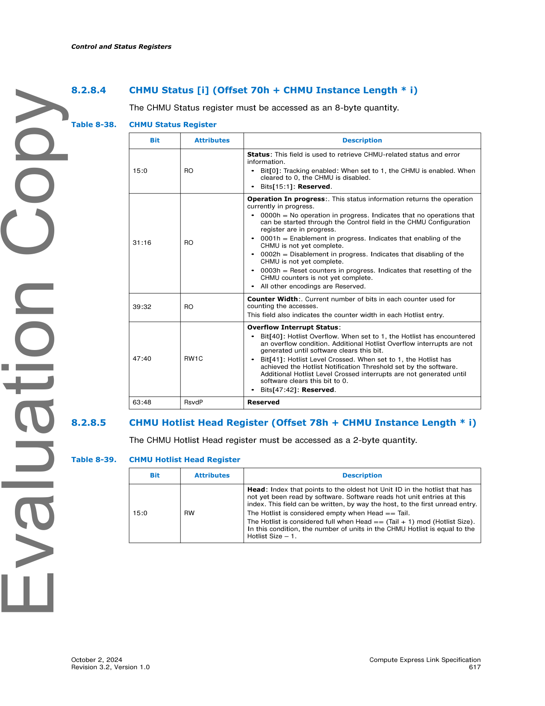
>
> *Original page render @ 150 DPI* — [📄 Full size](figures/chapter_08/page_0617.png)

[⬆️ 返回目录](#-本章目录-part-c-gap)

## 8.2.8.5 CHMU Hotlist Head Register (Offset 78h + CHMU Instance Length * i) | CHMU 热列表头寄存器（偏移 78h + CHMU Instance Length * i）

<table>
<thead>
<tr>
<th width="50%">🇬🇧 English</th>
<th width="50%" style="background-color:#e8e8e8">🇨🇳 中文</th>
</tr>
</thead>
<tbody>
<tr><td>The CHMU Hotlist Head register must be accessed as a 2-byte quantity.</td><td style="background-color:#e8e8e8">CHMU Hotlist Head 寄存器必须以 2 字节为单位访问。</td></tr>
</tbody>
</table>

> **Table 8-39.** CHMU Hotlist Head Register ｜ CHMU 热列表头寄存器
>
> | Bit | Attributes | Description |
> |---|---|---|
> | 15:0 | RW | Head: Index that points to the oldest hot Unit ID in the hotlist that has not yet been read by software. Software reads hot unit entries at this index. This field can be written, by way the host, to the first unread entry. The Hotlist is considered empty when Head == Tail. The Hotlist is considered full when Head == (Tail + 1) mod (Hotlist Size). In this condition, the number of units in the CHMU Hotlist is equal to the Hotlist Size – 1. | 头（Head）：指向热列表中尚未被软件读取的最旧的热 Unit ID 的索引。软件在此索引处读取热单元条目。此字段可由主机写入以指向第一个未读条目。 当 Head == Tail 时，热列表视为空。 当 Head == (Tail + 1) mod (Hotlist Size) 时，热列表视为满。在此条件下，CHMU 热列表中的单元数等于 Hotlist Size – 1。 |

[⬆️ 返回目录](#-本章目录-part-c-gap)

## 8.2.8.6 CHMU Hotlist Tail Register (Offset 7Ah + CHMU Instance Length * i) | CHMU 热列表尾寄存器（偏移 7Ah + CHMU Instance Length * i）

<table>
<thead>
<tr>
<th width="50%">🇬🇧 English</th>
<th width="50%" style="background-color:#e8e8e8">🇨🇳 中文</th>
</tr>
</thead>
<tbody>
<tr><td>The CHMU Hotlist Tail register must be accessed as a 2-byte quantity. The value of this register must not be changed while the CHMU is enabled. If the value is changed while the CHMU is enabled, the device behavior is undefined.</td><td style="background-color:#e8e8e8">CHMU Hotlist Tail 寄存器必须以 2 字节为单位访问。在 CHMU 启用期间不得更改此寄存器的值。如果在 CHMU 启用期间更改其值，则设备行为未定义。</td></tr>
</tbody>
</table>

> **Table 8-40.** CHMU Hotlist Tail Register ｜ CHMU 热列表尾寄存器
>
> | Bit | Attributes | Description |
> |---|---|---|
> | 15:0 | RW | Tail: Index that points to the Hotlist entry in which the device will report the next hot unit. The device increments this field after writing a hot unit entry at this index. The Hotlist is considered empty when Head == Tail. The Hotlist is considered full when Head == (Tail + 1) mod (Hotlist Size). In this condition, the number of units in the CHMU Hotlist is equal to the Hotlist Size – 1. | 尾（Tail）：指向设备将在其中报告下一个热单元的热列表条目的索引。设备在此索引处写入热单元条目后递增此字段。 当 Head == Tail 时，热列表视为空。 当 Head == (Tail + 1) mod (Hotlist Size) 时，热列表视为满。在此条件下，CHMU 热列表中的单元数等于 Hotlist Size – 1。 |

[⬆️ 返回目录](#-本章目录-part-c-gap)

## 8.2.8.7 CHMU Range Configuration Bitmap Register (Offset 10h + CHMU Instance Length * i + CHMU Range Configuration Bitmap Offset[i]) | CHMU 范围配置位图寄存器（偏移 10h + CHMU Instance Length * i + CHMU Range Configuration Bitmap Offset[i]）

<table>
<thead>
<tr>
<th width="50%">🇬🇧 English</th>
<th width="50%" style="background-color:#e8e8e8">🇨🇳 中文</th>
</tr>
</thead>
<tbody>
<tr><td>This register is used to enable tracking with a 256-MB DPA range granularity. The valid number of Range Configuration Bitmap fields will cover the total device memory capacity. The register may be padded with Reserved bits (with values of 0) until the offset indicated by the device through the CHMU Hotlist Register Offset of the CHMU Capability register. The length of the CHMU Range Configuration Bitmap register is equal to CHMU Hotlist Register Offset - CHMU Range Configuration Bitmap Register Offset. These offset parameters are reported in the CHMU Capability register.</td><td style="background-color:#e8e8e8">此寄存器用于以 256-MB DPA 范围粒度启用跟踪。有效的 Range Configuration Bitmap 字段数量将覆盖设备的总内存容量。该寄存器可填充保留位（值为 0），直到设备通过 CHMU Capability 寄存器的 CHMU Hotlist Register Offset 所指示的偏移为止。CHMU Range Configuration Bitmap 寄存器的长度等于 CHMU Hotlist Register Offset - CHMU Range Configuration Bitmap Register Offset。这些偏移参数在 CHMU Capability 寄存器中报告。</td></tr>
<tr><td>The CHMU Range Configuration Bitmap register must be accessed as an 8-byte quantity.</td><td style="background-color:#e8e8e8">CHMU Range Configuration Bitmap 寄存器必须以 8 字节为单位访问。</td></tr>
</tbody>
</table>

> **Table 8-41.** CHMU Range Configuration Bitmap Register ｜ CHMU 范围配置位图寄存器
>
> | Bit | Attributes | Description |
> |---|---|---|
> | 63:0 | RW | Range Configuration Bitmap 0: Bitmap indicating 256-MB DPA ranges that are enabled to track accesses starting from DPA = 0000 0000 0000 0000h. | 范围配置位图 0（Range Configuration Bitmap 0）：位图，指示已启用以跟踪从 DPA = 0000 0000 0000 0000h 开始的访问的 256-MB DPA 范围。 |
> | 127:64 | RW | Range Configuration Bitmap 1: Bitmap indicating 256-MB DPA ranges that are enabled to track accesses starting from DPA = 0000 0004 0000 0000h. | 范围配置位图 1（Range Configuration Bitmap 1）：位图，指示已启用以跟踪从 DPA = 0000 0004 0000 0000h 开始的访问的 256-MB DPA 范围。 |
> | … | RW | … | … |

[⬆️ 返回目录](#-本章目录-part-c-gap)

## 8.2.8.8 CHMU Hotlist Entry Register (Offset 10h + CHMU Instance Length * i + CHMU Hotlist Register Offset[i]) | CHMU 热列表条目寄存器（偏移 10h + CHMU Instance Length * i + CHMU Hotlist Register Offset[i]）

<table>
<thead>
<tr>
<th width="50%">🇬🇧 English</th>
<th width="50%" style="background-color:#e8e8e8">🇨🇳 中文</th>
</tr>
</thead>
<tbody>
<tr><td>The CHMU Hotlist entries provide the Unit ID that exceeds the programmed hotness threshold and the corresponding counter value. The number of bits for the counter values is the same as the one returned by the device in the CHMU Status register after the unit size is programmed by the Unit Size field in the CHMU Configuration register. The number of bits associated with the Unit IDs depend on the programmed unit size. The counter bits will be placed in the least significant bits of the entry.</td><td style="background-color:#e8e8e8">CHMU 热列表条目提供超出已编程热度阈值的 Unit ID 以及相应的计数值。计数器值的位数与 CHMU Configuration 寄存器中 Unit Size 字段对单元大小进行编程后，设备在 CHMU Status 寄存器中返回的位数相同。与 Unit ID 关联的位数取决于已编程的单元大小。计数器位将放置在条目的最低有效位。</td></tr>
<tr><td>Each CHMU Hotlist Entry register must be accessed as an 8-byte quantity.</td><td style="background-color:#e8e8e8">每个 CHMU Hotlist Entry 寄存器必须以 8 字节为单位访问。</td></tr>
</tbody>
</table>

> **Table 8-42.** CHMU Hotlist Register ｜ CHMU 热列表寄存器
>
> | Bit | Attributes | Description |
> |---|---|---|
> | 63:0 | RO | Entry 0: CHMU Hotlist Entry 0, which reports the Unit ID and related counter value that exceeds the programmed Hotness Threshold: • Bits[63:N]: Unit ID • Bits[N-1:0]: Counter value N is the Counter width value returned by the device in the CHMU Status register. The counter value is invalid if Always-on Reporting mode is enabled. | 条目 0（Entry 0）：CHMU 热列表条目 0，报告超出已编程热度阈值（Hotness Threshold）的 Unit ID 和相关计数值： • Bits[63:N]：Unit ID • Bits[N-1:0]：计数值 N 是设备在 CHMU Status 寄存器中返回的计数器宽度值。 如果启用了 Always-on Reporting 模式，则计数值无效。 |
> | 127:64 | RO | Entry 1. CHMU Hotlist Entry 1, which reports the Unit ID and related counter value exceeding the programmed Hotness Threshold: • Bits[63:N] Unit ID • Bits[N-1:0] Counter value N is the Counter width value returned by the device in the CHMU Status register. The counter value is invalid if Always-on Reporting mode is enabled. | 条目 1（Entry 1）。CHMU 热列表条目 1，报告超出已编程热度阈值（Hotness Threshold）的 Unit ID 和相关计数值： • Bits[63:N]：Unit ID • Bits[N-1:0]：计数值 N 是设备在 CHMU Status 寄存器中返回的计数器宽度值。 如果启用了 Always-on Reporting 模式，则计数值无效。 |
> | … | RO | … | … |
> | (64*M-1):(64*(M-1)) | RO | Entry M-1¹. CHMU Hotlist Entry M-1, which reports the Unit ID and related value counter exceeding the programmed Hotness Threshold: • Bits[63:N] Unit ID • Bits[N-1:0] Counter value N is the Counter width value returned by the device in the CHMU Status register. The counter value is Invalid if Always-on Reporting mode is enabled. | 条目 M-1¹（Entry M-1）。CHMU 热列表条目 M-1，报告超出已编程热度阈值（Hotness Threshold）的 Unit ID 和相关计数值： • Bits[63:N]：Unit ID • Bits[N-1:0]：计数值 N 是设备在 CHMU Status 寄存器中返回的计数器宽度值。 如果启用了 Always-on Reporting 模式，则计数值无效。 |
>
> 1. M is the Hotlist Size in the CHMU Capability register.
> 2. 1. M 是 CHMU Capability 寄存器中的 Hotlist Size。

> **Figure 8-12 (context).** Page render for CHMU register continuation (p.619)
>
> 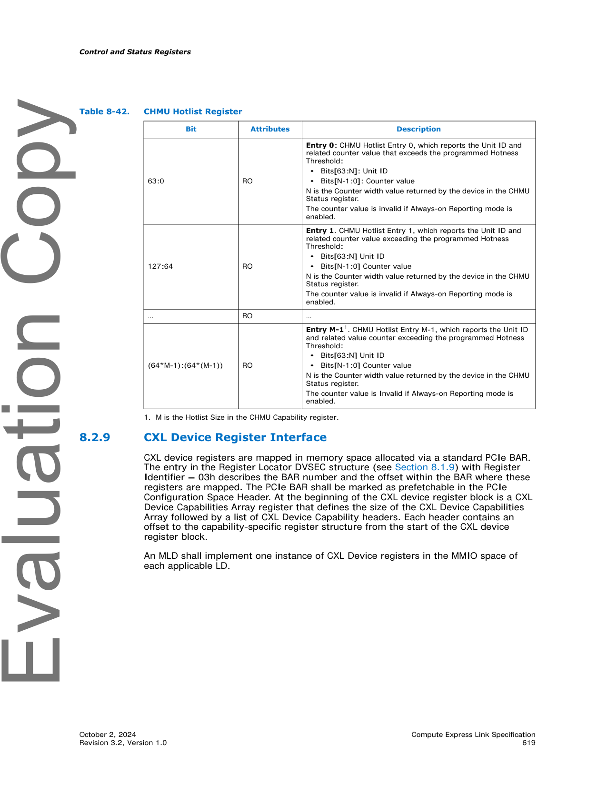
>
> *Original page render @ 150 DPI* — [📄 Full size](figures/chapter_08/page_0619.png)

[⬆️ 返回目录](#-本章目录-part-c-gap)

## 8.2.9 CXL Device Register Interface | CXL 设备寄存器接口

<table>
<thead>
<tr>
<th width="50%">🇬🇧 English</th>
<th width="50%" style="background-color:#e8e8e8">🇨🇳 中文</th>
</tr>
</thead>
<tbody>
<tr><td>CXL device registers are mapped in memory space allocated via a standard PCIe BAR. The entry in the Register Locator DVSEC structure (see Section 8.1.9) with Register Identifier = 03h describes the BAR number and the offset within the BAR where these registers are mapped. The PCIe BAR shall be marked as prefetchable in the PCIe Configuration Space Header. At the beginning of the CXL device register block is a CXL Device Capabilities Array register that defines the size of the CXL Device Capabilities Array followed by a list of CXL Device Capability headers. Each header contains an offset to the capability-specific register structure from the start of the CXL device register block.</td><td style="background-color:#e8e8e8">CXL 设备寄存器映射在通过标准 PCIe BAR 分配的内存空间中。Register Locator DVSEC 结构（参见 8.1.9 节）中 Register Identifier = 03h 的条目描述了这些寄存器所映射到的 BAR 编号以及 BAR 内的偏移。在 PCIe 配置空间头中，该 PCIe BAR 应标记为可预取（prefetchable）。CXL 设备寄存器块的开头是一个 CXL Device Capabilities Array 寄存器，用于定义 CXL Device Capabilities Array 的大小，后跟一个 CXL Device Capability 头列表。每个头包含从 CXL 设备寄存器块开始到特定能力寄存器结构的偏移。</td></tr>
<tr><td>An MLD shall implement one instance of CXL Device registers in the MMIO space of each applicable LD.</td><td style="background-color:#e8e8e8">MLD 应在每个适用 LD 的 MMIO 空间中实现 CXL Device 寄存器的一个实例。</td></tr>
</tbody>
</table>

> **IMPLEMENTATION NOTE — Compatibility with PCIe MMIO Capabilities (MCAP) Register Block | 实现说明 — 与 PCIe MMIO Capabilities (MCAP) 寄存器块的兼容性**
>
> CXL components are expected to transition to the PCIe standard MCAP Register Block that has the same format as the CXL defined capabilities. When doing so, CXL components are required to maintain compatibility with legacy CXL software as portrayed in Figure 8-12.
>
> CXL 组件预计将过渡到具有与 CXL 定义能力相同格式的 PCIe 标准 MCAP Register Block。过渡时，CXL 组件需要与遗留 CXL 软件保持兼容性，如图 8-12 所示。

> **Figure 8-12.** PCIe MCAP / CXL Compatibility ｜ PCIe MCAP / CXL 兼容性
>
> 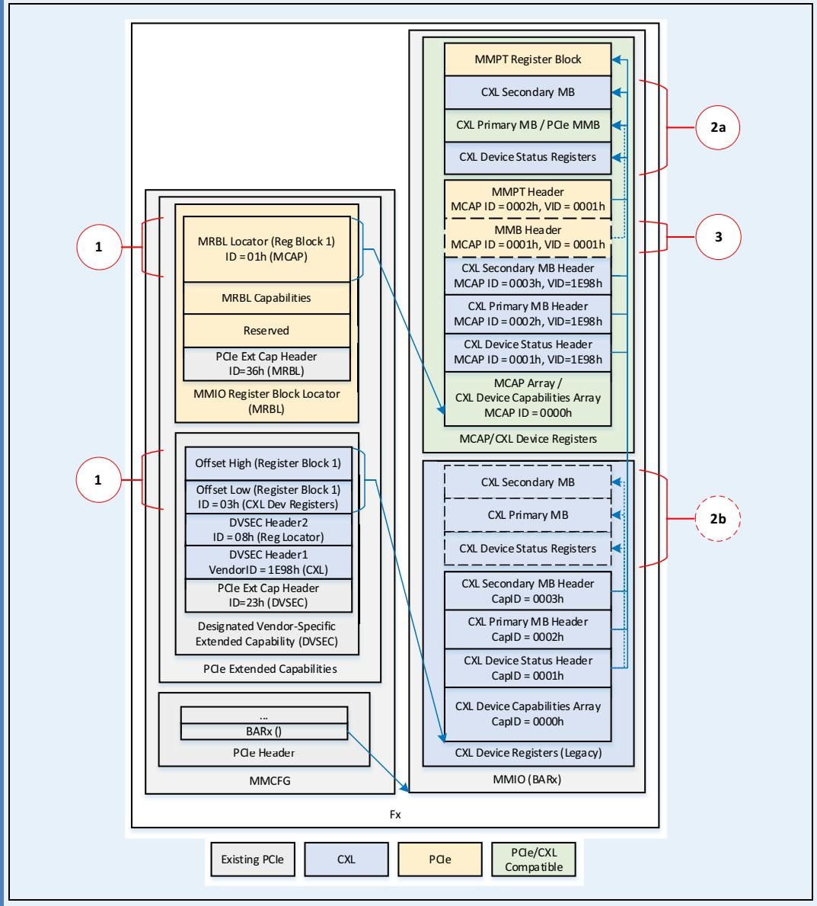
>
> *Original page render @ 150 DPI* — [📄 Full size](figures/chapter_08/page_0620.png)

<table>
<thead>
<tr>
<th width="50%">🇬🇧 English</th>
<th width="50%" style="background-color:#e8e8e8">🇨🇳 中文</th>
</tr>
</thead>
<tbody>
<tr><td>No registers defined in Section 8.2.9 are larger than 64-bit wide so that is the maximum access size allowed for these registers. If this rule is not followed, the behavior is undefined.</td><td style="background-color:#e8e8e8">8.2.9 节中定义的寄存器宽度均不超过 64 位，因此这是这些寄存器允许的最大访问大小。如果不遵守此规则，则行为未定义。</td></tr>
<tr><td>To illustrate how the fields fit together, the layouts in Section 8.2.9.1, Section 8.2.9.2, and Figure 8-14 (Mailbox registers) are shown as wider than a 64-bit register. Implementations are expected to use any size accesses for this information up to 64 bits without loss of functionality – the information is designed to be accessed in chunks, each no greater than 64 bits.</td><td style="background-color:#e8e8e8">为了说明各字段如何组合，8.2.9.1 节、8.2.9.2 节以及图 8-14（邮箱寄存器）中的布局显示为宽于 64 位寄存器。实现应使用不大于 64 位的任意大小访问来获取这些信息而不会损失功能——这些信息设计为可按不超过 64 位的块进行访问。</td></tr>
</tbody>
</table>

> **IMPLEMENTATION NOTE — Continued | 实现说明 — 续**
>
> 1. CXL components are required to advertise CXL defined capabilities in both the legacy CXL Device Capabilities Array and the PCIe MCAP Array. Legacy CXL software discovers the CXL Device Capabilities Array using the entry in the CXL Register Locator DVSEC with Register Identifier = 03h (CXL Device Registers). Updated software discovers the PCIe MCAP Array using the entry in the PCIe MMIO Register Block Locator (MRBL) Extended Capability with Register Block Identifier = 01h (MMIO Capabilities). Updated SW should check the PCIe MCAP Array first and only fallback to the legacy CXL Device Capabilities Array if it's not supported.
>
> 1. CXL 组件需要在遗留 CXL Device Capabilities Array 和 PCIe MCAP Array 中都通告 CXL 定义的能力。遗留 CXL 软件使用 CXL Register Locator DVSEC 中 Register Identifier = 03h（CXL Device Registers）的条目来发现 CXL Device Capabilities Array。更新后的软件使用 PCIe MMIO Register Block Locator (MRBL) Extended Capability 中 Register Block Identifier = 01h（MMIO Capabilities）的条目来发现 PCIe MCAP Array。更新后的软件应首先检查 PCIe MCAP Array，仅当不支持时再回退到遗留 CXL Device Capabilities Array。
>
> 2. While CXL defined capabilities must be advertised in both the legacy CXL Device Capabilities Array and the PCIe MCAP Array, CXL components may choose to implement the register structures for CXL defined capabilities in one of the following ways. In either case, legacy software locates the register structure from the offset specified in the header in the legacy CXL Device Capabilities Array. Updated software locates the register structure from the offset specified in the header in the PCIe MCAP Array.
>
> 2. 虽然 CXL 定义的能力必须在遗留 CXL Device Capabilities Array 和 PCIe MCAP Array 中都进行通告，但 CXL 组件可以选择以下列方式之一来实现 CXL 定义能力的寄存器结构。在任一情况下，遗留软件都根据遗留 CXL Device Capabilities Array 中头所指定的偏移来定位寄存器结构。更新后的软件根据 PCIe MCAP Array 中头所指定的偏移来定位寄存器结构。
>
> &nbsp;&nbsp;&nbsp;&nbsp;a. CXL components may alias the location of CXL defined capabilities specified in the legacy CXL Device Capabilities Array and the PCIe MCAP Array to a single instance of the register structure. In this case, the CXL Device Capabilities Array, the PCIe MCAP Array, and the register structures are required to be located in the same PCIe BAR and both the CXL Device Capabilities Array and the PCIe MCAP Array must be located below the register structures.
>
> &nbsp;&nbsp;&nbsp;&nbsp;a. CXL 组件可以将遗留 CXL Device Capabilities Array 和 PCIe MCAP Array 中指定的 CXL 定义能力位置别名（alias）到寄存器结构的单个实例。在这种情况下，CXL Device Capabilities Array、PCIe MCAP Array 和寄存器结构必须位于同一 PCIe BAR 中，并且 CXL Device Capabilities Array 和 PCIe MCAP Array 都必须位于寄存器结构之下。
>
> &nbsp;&nbsp;&nbsp;&nbsp;b. CXL components may choose to implement two instances of the register structures for CXL defined capabilities; one located from the offset specified in the header in the CXL Device Capabilities Array and one located from the offset specified in the header in the PCIe MCAP Array. Updated software is required to use the instance of the register structure located via the PCIe MCAP Array.
>
> &nbsp;&nbsp;&nbsp;&nbsp;b. CXL 组件可以选择为 CXL 定义能力实现两个寄存器结构实例：一个位于 CXL Device Capabilities Array 中头所指定的偏移处，另一个位于 PCIe MCAP Array 中头所指定的偏移处。更新后的软件需要使用通过 PCIe MCAP Array 定位的寄存器结构实例。
>
> 3. CXL components that support both the CXL primary mailbox and the PCIe MMB are required to alias the PCIe MMB (Vendor ID = 0001h and MCAP ID = 0001h) to the CXL Primary Mailbox registers. Refer to Section 9.20 for complete details.
>
> 3. 同时支持 CXL primary mailbox 和 PCIe MMB 的 CXL 组件需要将 PCIe MMB（Vendor ID = 0001h 且 MCAP ID = 0001h）别名（alias）到 CXL Primary Mailbox 寄存器。完整细节请参见 9.20 节。

[⬆️ 返回目录](#-本章目录-part-c-gap)

## 8.2.9.1 CXL Device Capabilities Array Register (Offset 00h) | CXL 设备能力数组寄存器（偏移 00h）

<table>
<thead>
<tr>
<th width="50%">🇬🇧 English</th>
<th width="50%" style="background-color:#e8e8e8">🇨🇳 中文</th>
</tr>
</thead>
<tbody>
</tbody>
</table>

> **IMPLEMENTATION NOTE | 实现说明**
>
> CXL components are recommended to transition to the equivalent PCIe MCAP Array Register as defined in [PCIe].
>
> 建议 CXL 组件过渡到 [PCIe] 中定义的等效 PCIe MCAP Array Register。

> **Figure 8-13.** CXL Device Registers ｜ CXL 设备寄存器
>
> 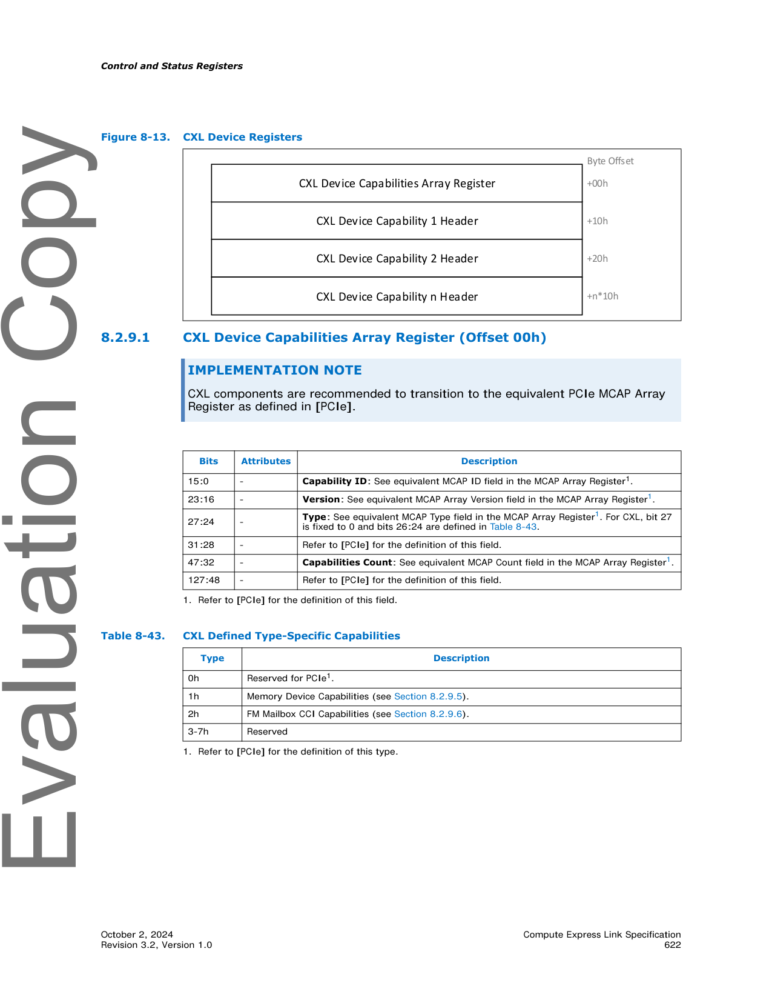
>
> *Original page render @ 150 DPI* — [📄 Full size](figures/chapter_08/page_0622.png)

> **CXL Device Capabilities Array Register Layout | CXL Device Capabilities Array 寄存器布局**
>
> | Bits | Attributes | Description |
> |---|---|---|
> | 15:0 | - | Capability ID: See equivalent MCAP ID field in the MCAP Array Register¹. 1. Refer to [PCIe] for the definition of this field. | Capability ID：请参阅 MCAP Array Register¹ 中等效的 MCAP ID 字段。 1. 此字段的定义请参阅 [PCIe]。 |
> | 23:16 | - | Version: See equivalent MCAP Array Version field in the MCAP Array Register¹. 1. Refer to [PCIe] for the definition of this field. | Version：请参阅 MCAP Array Register¹ 中等效的 MCAP Array Version 字段。 1. 此字段的定义请参阅 [PCIe]。 |
> | 27:24 | - | Type: See equivalent MCAP Type field in the MCAP Array Register¹. For CXL, bit 27 is fixed to 0 and bits 26:24 are defined in Table 8-43. 1. Refer to [PCIe] for the definition of this field. | Type：请参阅 MCAP Array Register¹ 中等效的 MCAP Type 字段。对于 CXL，bit 27 固定为 0，bits 26:24 在表 8-43 中定义。 1. 此字段的定义请参阅 [PCIe]。 |
> | 31:28 | - | Refer to [PCIe] for the definition of this field. | 此字段的定义请参阅 [PCIe]。 |
> | 47:32 | - | Capabilities Count: See equivalent MCAP Count field in the MCAP Array Register¹. 1. Refer to [PCIe] for the definition of this field. | Capabilities Count：请参阅 MCAP Array Register¹ 中等效的 MCAP Count 字段。 1. 此字段的定义请参阅 [PCIe]。 |
> | 127:48 | - | Refer to [PCIe] for the definition of this field. | 此字段的定义请参阅 [PCIe]。 |

> **Table 8-43.** CXL Defined Type-Specific Capabilities ｜ CXL 定义的 Type-Specific 能力
>
> | Type | Description |
> |---|---|
> | 0h | Reserved for PCIe¹. 1. Refer to [PCIe] for the definition of this type. | 为 PCIe¹ 保留。 1. 此类型的定义请参阅 [PCIe]。 |
> | 1h | Memory Device Capabilities (see Section 8.2.9.5). | 内存设备能力（参见 8.2.9.5 节）。 |
> | 2h | FM Mailbox CCI Capabilities (see Section 8.2.9.6). | FM 邮箱 CCI 能力（参见 8.2.9.6 节）。 |
> | 3-7h | Reserved | 保留 |

[⬆️ 返回目录](#-本章目录-part-c-gap)

## 8.2.9.2 CXL Device Capability Header Register (Offset: Varies) | CXL 设备能力头寄存器（偏移：可变）

<table>
<thead>
<tr>
<th width="50%">🇬🇧 English</th>
<th width="50%" style="background-color:#e8e8e8">🇨🇳 中文</th>
</tr>
</thead>
<tbody>
<tr><td>Each capability in the CXL device capabilities array is described by a CXL Device Capability Header register that identifies the specific capability and points to the capability register structure in register space.</td><td style="background-color:#e8e8e8">CXL 设备能力数组中的每个能力由一个 CXL Device Capability Header 寄存器描述，该寄存器标识特定能力并指向寄存器空间中的能力寄存器结构。</td></tr>
</tbody>
</table>

### 8.2.9.2.1 CXL Device Capabilities | CXL 设备能力

<table>
<thead>
<tr>
<th width="50%">🇬🇧 English</th>
<th width="50%" style="background-color:#e8e8e8">🇨🇳 中文</th>
</tr>
</thead>
<tbody>
<tr><td>CXL defined device capability register structures are identified by a 2-byte identifier.</td><td style="background-color:#e8e8e8">CXL 定义的设备能力寄存器结构由 2 字节标识符标识。</td></tr>
<tr><td>• CXL defined capability identifiers 0000h-3FFFh describe generic CXL device capabilities as specified in Table 8-44.</td><td style="background-color:#e8e8e8">• CXL 定义的能力标识符 0000h-3FFFh 描述表 8-44 中规定的通用 CXL 设备能力。</td></tr>
<tr><td>• Capability identifiers 4000h-7FFFh describe type-specific capabilities associated with the type specified in the CXL Device Capabilities Array register (see Section 8.2.9.1).</td><td style="background-color:#e8e8e8">• 能力标识符 4000h-7FFFh 描述与 CXL Device Capabilities Array 寄存器中指定的类型（参见 8.2.9.1 节）相关联的 Type-Specific 能力。</td></tr>
<tr><td>• Capability identifiers 8000h-FFFFh describe vendor specific capabilities.</td><td style="background-color:#e8e8e8">• 能力标识符 8000h-FFFFh 描述厂商特定能力。</td></tr>
<tr><td>CXL defined Capability identifiers 0000h-3FFFh that are not specified in this table are reserved.</td><td style="background-color:#e8e8e8">本表未指定的 CXL 定义能力标识符 0000h-3FFFh 为保留。</td></tr>
</tbody>
</table>

> **IMPLEMENTATION NOTE | 实现说明**
>
> CXL components are recommended to transition to the equivalent PCIe MCAP Header Register as defined in [PCIe].
>
> 建议 CXL 组件过渡到 [PCIe] 中定义的等效 PCIe MCAP Header Register。

> **CXL Device Capability Header Register Layout | CXL Device Capability Header 寄存器布局**
>
> | Bits | Attributes | Description |
> |---|---|---|
> | 15:0 | - | Capability ID: See equivalent MCAP ID field in the MCAP Header Register¹. See Section 8.2.9.2.1 for the list of CXL defined capability identifiers. 1. Refer to [PCIe] for the definition of this field. | Capability ID：请参阅 MCAP Header Register¹ 中等效的 MCAP ID 字段。CXL 定义的能力标识符列表请参见 8.2.9.2.1 节。 1. 此字段的定义请参阅 [PCIe]。 |
> | 23:16 | - | Version: See equivalent MCAP Version field in the MCAP Header Register¹. 1. Refer to [PCIe] for the definition of this field. | Version：请参阅 MCAP Header Register¹ 中等效的 MCAP Version 字段。 1. 此字段的定义请参阅 [PCIe]。 |
> | 31:24 | - | Refer to [PCIe] for the definition of this field. | 此字段的定义请参阅 [PCIe]。 |
> | 63:32 | - | Offset: See equivalent MCAP Offset field in the MCAP Header Register¹. 1. Refer to [PCIe] for the definition of this field. | Offset：请参阅 MCAP Header Register¹ 中等效的 MCAP Offset 字段。 1. 此字段的定义请参阅 [PCIe]。 |
> | 95:64 | - | Length: See equivalent MCAP Length field in the MCAP Header Register¹. 1. Refer to [PCIe] for the definition of this field. | Length：请参阅 MCAP Header Register¹ 中等效的 MCAP Length 字段。 1. 此字段的定义请参阅 [PCIe]。 |
> | 127:96 | - | Refer to [PCIe] for the definition of this field. | 此字段的定义请参阅 [PCIe]。 |

> **Table 8-44.** CXL Defined Capability Identifiers (Vendor ID = 1E98h or 0000h) ｜ CXL 定义的能力标识符（Vendor ID = 1E98h 或 0000h）
>
> | Capability ID | Description | Required¹ | Version |
> |---|---|---|---|
> | 0001h | Device Status Registers: Describes the generic CXL device status registers. Only one instance of this register structure shall exist per device. | M | 02h |
> | 0002h | Primary Mailbox Registers: Describes the primary mailbox registers. Only one instance of this register structure shall exist per device. | M | 01h |
> | 0003h | Secondary Mailbox Registers: Describes the secondary mailbox registers. At most one instance of this register structure shall exist per device. | O | 01h |
>
> | Capability ID | Description | 必需¹ | Version |
> |---|---|---|---|
> | 0001h | Device Status Registers：描述通用 CXL 设备状态寄存器。每个设备只能存在此寄存器结构的一个实例。 | M | 02h |
> | 0002h | Primary Mailbox Registers：描述主邮箱寄存器。每个设备只能存在此寄存器结构的一个实例。 | M | 01h |
> | 0003h | Secondary Mailbox Registers：描述副邮箱寄存器。每个设备最多只能存在此寄存器结构的一个实例。 | O | 01h |
>
> 1. M = Mandatory for all devices that implement the CXL Device Register entry (Register Block Identifier=03h) in the Register Locator DVSEC (see Section 8.1.9). O = Optional.
> 1. M = 在 Register Locator DVSEC（参见 8.1.9 节）中实现 CXL Device Register 条目（Register Block Identifier=03h）的所有设备必需。O = 可选。

[⬆️ 返回目录](#-本章目录-part-c-gap)

## 8.2.9.3 Device Status Registers (Offset: Varies) | 设备状态寄存器（偏移：可变）

### 8.2.9.3.1 Event Status Register (Device Status Registers Capability Offset + 00h) | 事件状态寄存器（设备状态寄存器能力偏移 + 00h）

<table>
<thead>
<tr>
<th width="50%">🇬🇧 English</th>
<th width="50%" style="background-color:#e8e8e8">🇨🇳 中文</th>
</tr>
</thead>
<tbody>
<tr><td>The Event Status register indicates which events are currently ready for host actions, such as fetching event log records. The host may choose to poll for these events by periodically reading this register, or it may choose to enable interrupts for some of these events. The only pollable/interruptible events that are not indicated in this register are mailbox command completions since each set of mailbox registers provides that information.</td><td style="background-color:#e8e8e8">Event Status 寄存器指示当前哪些事件已准备好供主机处理，例如获取事件日志记录。主机可选择通过定期读取此寄存器来轮询这些事件，也可选择为某些事件启用中断。本寄存器中未指示的唯一可轮询/可中断事件是邮箱命令完成，因为每组邮箱寄存器都提供该信息。</td></tr>
<tr><td>Unless specified otherwise in the field definitions below, each field is present in version 1 and later of this structure. The device shall report the version of this structure in the Version field of the CXL Device Capability Header register.</td><td style="background-color:#e8e8e8">除非下面的字段定义另有规定，否则此结构中的每个字段都存在于版本 1 及更高版本中。设备应在 CXL Device Capability Header 寄存器的 Version 字段中报告此结构的版本。</td></tr>
</tbody>
</table>

> **IMPLEMENTATION NOTE | 实现说明**
>
> CXL components are permitted to set the PCIe MCAP Vendor ID to 0000h for CXL defined capabilities. 0000h is a PCI-SIG reserved value for legacy CXL compatibility. However, it is strongly recommended to use the CXL Vendor ID (1E98h) to identify CXL defined capabilities.
>
> 对于 CXL 定义的能力，允许 CXL 组件将 PCIe MCAP Vendor ID 设置为 0000h。0000h 是 PCI-SIG 为遗留 CXL 兼容性保留的值。但是，强烈建议使用 CXL Vendor ID（1E98h）来标识 CXL 定义的能力。

> **Event Status Register Layout | Event Status 寄存器布局**
>
> | Bits | Attributes | Description |
> |---|---|---|
> | 31:0 | RO | Event Status: When set, one or more event records exist in the specified event log. The device implements a single instance of the event log for host use, which can be accessed either via Primary Mailbox or Secondary mailbox, if applicable. The negotiation between the Operating System and the System Firmware for the ownership of Memory Error Event Logs is managed by CXL _OSC mechanism (See Section 9.18.2). Use the Get and Clear Event Records commands to retrieve and clear the event records. Once the event log has zero event records, the bit is cleared. • Bit[0]: Informational Event Log • Bit[1]: Warning Event Log • Bit[2]: Failure Event Log • Bit[3]: Fatal Event Log • Bit[4]: Dynamic Capacity Event Log¹ • Bits[31:5]: Reserved 1. This bit was introduced with Version=2. | Event Status：置位时，指定事件日志中存在一条或多条事件记录。设备为主机使用实现了事件日志的单个实例，可通过 Primary Mailbox 或 Secondary Mailbox（如果适用）访问。操作系统与系统固件之间关于内存错误事件日志所有权的协商由 CXL _OSC 机制管理（参见 9.18.2 节）。 使用 Get and Clear Event Records 命令检索和清除事件记录。一旦事件日志中的事件记录数为零，该位即被清除。 • Bit[0]：Informational Event Log • Bit[1]：Warning Event Log • Bit[2]：Failure Event Log • Bit[3]：Fatal Event Log • Bit[4]：Dynamic Capacity Event Log¹ • Bits[31:5]：保留 1. 此位在 Version=2 中引入。 |
> | 63:32 | RO | Reserved | 保留 |

[⬆️ 返回目录](#-本章目录-part-c-gap)

## 8.2.9.4 Mailbox Registers (Offset: Varies) | 邮箱寄存器（偏移：可变）

<table>
<thead>
<tr>
<th width="50%">🇬🇧 English</th>
<th width="50%" style="background-color:#e8e8e8">🇨🇳 中文</th>
</tr>
</thead>
<tbody>
<tr><td>CXL defined extensions to the PCIe standard MMIO Mailbox Capability (MMB) Registers are described in this section. Refer to the MMIO Mailbox Capability (MMB) Section of the [PCIe MMPT ECN] for the definition of fields not listed.</td><td style="background-color:#e8e8e8">本节描述了对 PCIe 标准 MMIO Mailbox Capability (MMB) 寄存器的 CXL 定义扩展。未列出字段的定义请参阅 [PCIe MMPT ECN] 的 MMIO Mailbox Capability (MMB) 一节。</td></tr>
<tr><td>There are two types of CXL mailboxes provided through the device's register interface: primary and secondary. Each mailbox represents a unique CCI instance in the device and the properties of each instance are defined in Section 9.1.1. The secondary mailbox does not support background operations. The status of a background operation issued to a device's primary mailbox can be retrieved from the Background Command Status register, as detailed in Section 8.2.9.4.7.</td><td style="background-color:#e8e8e8">通过设备的寄存器接口提供两种类型的 CXL 邮箱：主邮箱和副邮箱。每个邮箱代表设备中的一个唯一 CCI 实例，每个实例的属性在 9.1.1 节中定义。副邮箱不支持后台操作。下发给设备主邮箱的后台操作的状态可从 Background Command Status 寄存器获取，详见 8.2.9.4.7 节。</td></tr>
</tbody>
</table>

> **Figure 8-14.** Mailbox Registers ｜ 邮箱寄存器
>
> 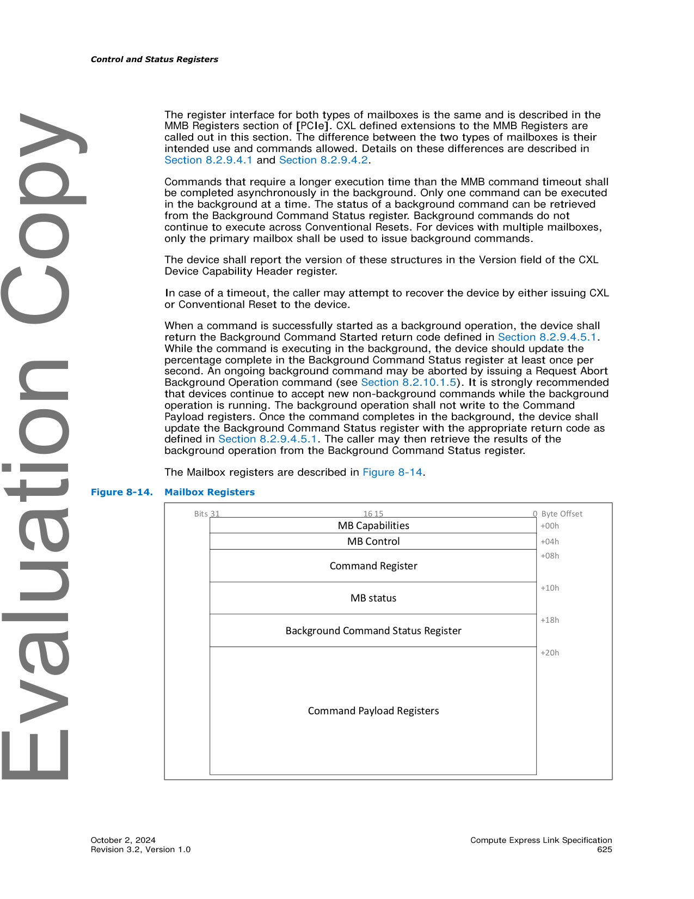
>
> *Original page render @ 150 DPI* — [📄 Full size](figures/chapter_08/page_0625.png)

<table>
<thead>
<tr>
<th width="50%">🇬🇧 English</th>
<th width="50%" style="background-color:#e8e8e8">🇨🇳 中文</th>
</tr>
</thead>
<tbody>
<tr><td>The register interface for both types of mailboxes is the same and is described in the MMB Registers section of [PCIe]. CXL defined extensions to the MMB Registers are called out in this section. The difference between the two types of mailboxes is their intended use and commands allowed. Details on these differences are described in Section 8.2.9.4.1 and Section 8.2.9.4.2.</td><td style="background-color:#e8e8e8">两种邮箱类型的寄存器接口相同，并在 [PCIe] 的 MMB Registers 一节中描述。对 MMB 寄存器的 CXL 定义扩展将在本节中指出。两种邮箱类型的区别在于其预期用途和允许的命令。有关这些区别的详细信息，请参见 8.2.9.4.1 节和 8.2.9.4.2 节。</td></tr>
<tr><td>Commands that require a longer execution time than the MMB command timeout shall be completed asynchronously in the background. Only one command can be executed in the background at a time. The status of a background command can be retrieved from the Background Command Status register. Background commands do not continue to execute across Conventional Resets. For devices with multiple mailboxes, only the primary mailbox shall be used to issue background commands.</td><td style="background-color:#e8e8e8">执行时间超过 MMB 命令超时的命令应在后台异步完成。一次只能执行一个后台命令。后台命令的状态可从 Background Command Status 寄存器获取。后台命令不会在 Conventional Reset 之间继续执行。对于具有多个邮箱的设备，只能使用主邮箱下发后台命令。</td></tr>
<tr><td>The device shall report the version of these structures in the Version field of the CXL Device Capability Header register.</td><td style="background-color:#e8e8e8">设备应在 CXL Device Capability Header 寄存器的 Version 字段中报告这些结构的版本。</td></tr>
<tr><td>In case of a timeout, the caller may attempt to recover the device by either issuing CXL or Conventional Reset to the device.</td><td style="background-color:#e8e8e8">在发生超时的情况下，调用方可以通过向设备下发 CXL Reset 或 Conventional Reset 来尝试恢复设备。</td></tr>
<tr><td>When a command is successfully started as a background operation, the device shall return the Background Command Started return code defined in Section 8.2.9.4.5.1. While the command is executing in the background, the device should update the percentage complete in the Background Command Status register at least once per second. An ongoing background command may be aborted by issuing a Request Abort Background Operation command (see Section 8.2.10.1.5). It is strongly recommended that devices continue to accept new non-background commands while the background operation is running. The background operation shall not write to the Command Payload registers. Once the command completes in the background, the device shall update the Background Command Status register with the appropriate return code as defined in Section 8.2.9.4.5.1. The caller may then retrieve the results of the background operation from the Background Command Status register.</td><td style="background-color:#e8e8e8">当命令作为后台操作成功启动时，设备应返回 8.2.9.4.5.1 节中定义的 Background Command Started 返回码。在命令于后台执行期间，设备应至少每秒更新一次 Background Command Status 寄存器中的完成百分比。可通过下发 Request Abort Background Operation 命令（参见 8.2.10.1.5 节）来中止正在运行的后台命令。强烈建议设备在后台操作运行期间继续接受新的非后台命令。后台操作不应写入 Command Payload 寄存器。一旦命令在后台完成，设备应使用 8.2.9.4.5.1 节中定义的相应返回码更新 Background Command Status 寄存器。然后，调用方可以从 Background Command Status 寄存器中检索后台操作的结果。</td></tr>
<tr><td>The Mailbox registers are described in Figure 8-14.</td><td style="background-color:#e8e8e8">邮箱寄存器如图 8-14 所示。</td></tr>
</tbody>
</table>

[⬆️ 返回目录](#-本章目录-part-c-gap)

### 8.2.9.4.1 Attributes of the Primary Mailbox | 主邮箱的属性

<table>
<thead>
<tr>
<th width="50%">🇬🇧 English</th>
<th width="50%" style="background-color:#e8e8e8">🇨🇳 中文</th>
</tr>
</thead>
<tbody>
<tr><td>The primary mailbox supports all commands described in Section 8.2.10. The primary mailbox also supports the optional feature to provide mailbox completion interrupts, if implemented by a device. Implementation of the primary mailbox is mandatory.</td><td style="background-color:#e8e8e8">主邮箱支持 8.2.10 节中描述的所有命令。如果设备实现了邮箱完成中断，主邮箱还支持提供邮箱完成中断的可选功能。主邮箱的实现是必需的。</td></tr>
<tr><td>The exact details on how the primary mailbox is used may vary. The intended use is to provide the main method for submitting commands to the device, used by both pre-boot software and OS software. The platform shall coordinate the use of the primary mailbox so that only one software entity "owns" the mailbox at a given time and that the transfer of ownership happens in-between mailbox commands so that one entity cannot corrupt the mailbox state of the other. The intended practice is that the pre-boot software uses the primary mailbox until control is transferred to the OS being booted, and at that time the OS takes over sole ownership of the primary mailbox until the OS is shut down. Because the physical address of the primary mailbox can change as the result of a PCIe reconfiguration performed by the primary mailbox owner, each time the primary mailbox changes ownership, the new owner shall read the appropriate configuration registers to discover the current location of the mailbox registers, just as it does during device initialization.</td><td style="background-color:#e8e8e8">主邮箱的详细使用方式可能有所不同。其预期用途是提供向设备下发命令的主要方法，由预启动软件和操作系统软件使用。平台应协调主邮箱的使用，以便在给定时间只有一个软件实体"拥有"邮箱，并且所有权的转移发生在邮箱命令之间，从而一个实体不能破坏另一个实体的邮箱状态。预期做法是：预启动软件使用主邮箱，直到控制权转移给正在启动的操作系统；此时，操作系统接管主邮箱的唯一所有权，直到操作系统关闭。由于主邮箱的物理地址可能因主邮箱所有者执行的 PCIe 重新配置而发生变化，因此每次主邮箱所有权发生变化时，新所有者应读取相应的配置寄存器以发现邮箱寄存器的当前位置，就像在设备初始化期间所做的那样。</td></tr>
</tbody>
</table>

[⬆️ 返回目录](#-本章目录-part-c-gap)

### 8.2.9.4.2 Attributes of the Secondary Mailbox | 副邮箱的属性

<table>
<thead>
<tr>
<th width="50%">🇬🇧 English</th>
<th width="50%" style="background-color:#e8e8e8">🇨🇳 中文</th>
</tr>
</thead>
<tbody>
<tr><td>The secondary mailbox, if implemented by a device, supports only a subset of the commands described in Section 8.2.10. The Command Effects Log shall specify which CXL defined commands are allowed on the secondary mailbox, and all other commands shall return the error Unsupported Mailbox or CCI. The secondary mailbox does not support mailbox completion interrupts. Therefore, any fields related to command interrupts shall be set to 0 on the Secondary MB. Implementation of the secondary mailbox is optional.</td><td style="background-color:#e8e8e8">如果设备实现了副邮箱，则其仅支持 8.2.10 节中描述的命令的子集。Command Effects Log 应指定哪些 CXL 定义的命令在副邮箱上被允许，所有其他命令应返回错误 Unsupported Mailbox or CCI。副邮箱不支持邮箱完成中断。因此，在 Secondary MB 上任何与命令中断相关的字段都应设置为 0。副邮箱的实现是可选的。</td></tr>
<tr><td>The exact details on how the secondary mailbox is used may vary. The intended use is to provide a method for submitting commands to the device by platform firmware that processes events while the OS owns the primary mailbox. By using the secondary mailbox, platform firmware does not corrupt the state of any in-progress mailbox operations on the primary mailbox.</td><td style="background-color:#e8e8e8">副邮箱的详细使用方式可能有所不同。其预期用途是：在操作系统拥有主邮箱的同时，为处理事件的平台固件提供一种向设备下发命令的方法。通过使用副邮箱，平台固件不会破坏主邮箱上任何正在进行的邮箱操作的状态。</td></tr>
<tr><td>The secondary mailbox shall return identical information as the primary mailbox for a Get Log command issued with Log Identifier=CEL. Devices shall indicate which commands are allowed on the secondary mailbox by setting the Secondary Mailbox Supported flag for the supported opcodes in the Command Effects Log. The set of commands that are supported on the secondary mailbox is implementation specific. It is recommended (but not required) that the secondary mailbox supports all commands in the Events, Logs, and Identify command sets defined in Section 8.2.10.</td><td style="background-color:#e8e8e8">对于以 Log Identifier=CEL 下发的 Get Log 命令，副邮箱应返回与主邮箱相同的信息。设备应通过在 Command Effects Log 中为支持的操作码设置 Secondary Mailbox Supported 标志来指示哪些命令在副邮箱上被允许。副邮箱支持的命令集是实现特定的。建议（但非必需）副邮箱支持 8.2.10 节中定义的 Events、Logs 和 Identify 命令集中的所有命令。</td></tr>
<tr><td>Since the physical address of the secondary mailbox can change as a result of a PCIe reconfiguration performed by the primary mailbox owner, each time the secondary mailbox is used, the software using it shall read the appropriate configuration registers to discover the current location of the mailbox registers.</td><td style="background-color:#e8e8e8">由于副邮箱的物理地址可能因主邮箱所有者执行的 PCIe 重新配置而发生变化，因此每次使用副邮箱时，使用它的软件应读取相应的配置寄存器以发现邮箱寄存器的当前位置。</td></tr>
</tbody>
</table>

[⬆️ 返回目录](#-本章目录-part-c-gap)

### 8.2.9.4.3 Mailbox Capabilities Register (Mailbox Registers Capability Offset + 00h) | 邮箱能力寄存器（邮箱寄存器能力偏移 + 00h）

<table>
<thead>
<tr><th width="50%">🇬🇧 English</th><th width="50%" style="background-color:#e8e8e8">🇨🇳 中文</th></tr>
</thead>
<tbody>
<tr><td>The Mailbox Capabilities Register extends the definition of the PCIe MMB Capabilities Register with the following CXL defined fields.</td><td style="background-color:#e8e8e8">Mailbox Capabilities 寄存器扩展了 PCIe MMB Capabilities 寄存器的定义，增加了以下 CXL 定义的字段。</td></tr>
</tbody>
</table>

> **Note**: Refer to [PCIe] for the definition of the fields marked with footnote 1.

<table>
<thead>
<tr><th>Bits</th><th>Attributes</th><th>Description</th></tr>
</thead>
<tbody>
<tr><td>4:0</td><td>= (per PCIe)</td><td><strong>Payload Size:</strong> See equivalent MMB Payload Registers Size field in the MMB Capabilities Register¹.</td></tr>
<tr><td>5</td><td>= (per PCIe)</td><td><strong>MB Doorbell Interrupt Capable:</strong> See equivalent Command Ready Interrupt Capable field in the MMB Capabilities Register¹.</td></tr>
<tr><td>6</td><td>RO</td><td><strong>Background Command Complete Interrupt Capable:</strong> When set, indicates the device supports signaling an MSI/MSI-X interrupt when a command completes in the background. Only valid for the primary mailbox. This bit shall be 0 for the secondary mailbox.</td></tr>
<tr><td>10:7</td><td>= (per PCIe)</td><td><strong>Interrupt Message Number:</strong> See equivalent Interrupt Message Number field in the MMB Capabilities Register¹.</td></tr>
<tr><td>18:11</td><td>= (per PCIe)</td><td><strong>Mailbox Ready Time:</strong> See equivalent MMB Ready Time field in the MMB Capabilities Register¹.</td></tr>
<tr><td>22:19</td><td>= (per PCIe)</td><td><strong>Type:</strong> See equivalent Type field in the MMB Capabilities Register¹. For CXL, bit 22 is fixed to 0 and bits 21:19 are defined in Table 8-45.</td></tr>
<tr><td>31:23</td><td>= (per PCIe)</td><td>Refer to [PCIe] for the definition of this field.</td></tr>
</tbody>
</table>

¹ Refer to [PCIe] for the definition of this field.

**Table 8-45. CXL Defined Mailbox Type Identifiers**

<table>
<thead>
<tr><th>Type</th><th>Description</th></tr>
</thead>
<tbody>
<tr><td>0h</td><td>Reserved for PCIe¹.</td></tr>
<tr><td>1h</td><td>Memory Device Commands (see Section 8.2.10.9).</td></tr>
<tr><td>2h</td><td>FM API Commands (see Section 8.2.10.10).</td></tr>
<tr><td>3-7h</td><td>Reserved</td></tr>
</tbody>
</table>

¹ Refer to [PCIe] for the definition of this type.

[⬆️ 返回目录](#-本章目录-part-c-gap)

### 8.2.9.4.4 Mailbox Control Register (Mailbox Registers Capability Offset + 04h) | 邮箱控制寄存器（邮箱寄存器能力偏移 + 04h）

<table>
<thead>
<tr><th width="50%">🇬🇧 English</th><th width="50%" style="background-color:#e8e8e8">🇨🇳 中文</th></tr>
</thead>
<tbody>
<tr><td>The Mailbox Control Register extends the definition of the PCIe MMB Control Register with the following CXL defined fields.</td><td style="background-color:#e8e8e8">Mailbox Control 寄存器扩展了 PCIe MMB Control 寄存器的定义，增加了以下 CXL 定义的字段。</td></tr>
</tbody>
</table>

<table>
<thead>
<tr><th>Bits</th><th>Attributes</th><th>Description</th></tr>
</thead>
<tbody>
<tr><td>0</td><td>= (per PCIe)</td><td><strong>Doorbell:</strong> See equivalent Doorbell field in the MMB Control Register¹.</td></tr>
<tr><td>1</td><td>= (per PCIe)</td><td><strong>MB Doorbell Interrupt:</strong> See equivalent Command Ready Interrupt Enable field in the MMB Control Register¹.</td></tr>
<tr><td>2</td><td>RW/RO</td><td><strong>Background Command Complete Interrupt:</strong> If background command complete interrupts are supported on this mailbox, this register is set by the caller to enable signaling an interrupt when the command completes in the background. Ignored if the command is not a background command. RO when the doorbell is set. Ignored if background command complete interrupts are not supported on this mailbox instance (Background Command Complete Interrupt Capable = 0 in the Mailbox Capabilities register). • 0 = Disabled • 1 = Enabled</td></tr>
<tr><td>31:3</td><td>= (per PCIe)</td><td>Refer to [PCIe] for the definition of this field.</td></tr>
</tbody>
</table>

¹ Refer to [PCIe] for the definition of this field.

[⬆️ 返回目录](#-本章目录-part-c-gap)

### 8.2.9.4.5 Command Register (Mailbox Registers Capability Offset + 08h) | 命令寄存器（邮箱寄存器能力偏移 + 08h）

<table>
<thead>
<tr><th width="50%">🇬🇧 English</th><th width="50%" style="background-color:#e8e8e8">🇨🇳 中文</th></tr>
</thead>
<tbody>
<tr><td>The Command Register is equivalent to the definition of the PCIe MMB Control Register with the following CXL defined fields.</td><td style="background-color:#e8e8e8">Command 寄存器与 PCIe MMB Control 寄存器的定义等价，具有以下 CXL 定义的字段。</td></tr>
</tbody>
</table>

<table>
<thead>
<tr><th>Bits</th><th>Attributes</th><th>Description</th></tr>
</thead>
<tbody>
<tr><td>15:0</td><td>= (per PCIe)</td><td><strong>Command Opcode:</strong> See equivalent MMB Command Opcode field in the MMB Command Register¹.</td></tr>
<tr><td>36:16</td><td>= (per PCIe)</td><td><strong>Payload Length:</strong> See equivalent MMB Payload Length field in the MMB Command Register¹.</td></tr>
<tr><td>63:37</td><td>= (per PCIe)</td><td>Refer to [PCIe] for the definition of this field.</td></tr>
</tbody>
</table>

¹ Refer to [PCIe] for the definition of this field.

> **IMPLEMENTATION NOTE**
>
> CXL components shall interpret the PCIe MMB Command Opcode Vendor ID = 1E98h as CXL defined commands. 0000h is a PCI-SIG reserved value for legacy compatibility. However, it is strongly recommended for callers to use the CXL Vendor ID (1E98h) to identify CXL defined commands.

[⬆️ 返回目录](#-本章目录-part-c-gap)

#### 8.2.9.4.5.1 Command Return Codes | 命令返回码

<table>
<thead>
<tr><th width="50%">🇬🇧 English</th><th width="50%" style="background-color:#e8e8e8">🇨🇳 中文</th></tr>
</thead>
<tbody>
<tr><td>CXL defined command return codes are only interpreted for CXL defined commands.</td><td style="background-color:#e8e8e8">CXL 定义的命令返回码仅在 CXL 定义的命令中进行解释。</td></tr>
</tbody>
</table>

**Table 8-46. CXL defined Command Return Codes (Vendor ID = 1E98h or 0000h) (Sheet 1 of 2)**

<table>
<thead>
<tr><th>Value</th><th>Definition</th></tr>
</thead>
<tbody>
<tr><td>0000h</td><td><strong>Success:</strong> The command successfully completed.</td></tr>
<tr><td>0001h</td><td><strong>Background Command Started:</strong> The background command successfully started. Refer to the Background Command Status register to retrieve the command result.</td></tr>
<tr><td>0002h</td><td><strong>Invalid Input:</strong> A command input was invalid.</td></tr>
<tr><td>0003h</td><td><strong>Unsupported:</strong> The command is not supported.</td></tr>
<tr><td>0004h</td><td><strong>Internal Error:</strong> The command was not completed because of an internal device error.</td></tr>
<tr><td>0005h</td><td><strong>Retry Required:</strong> The command was not completed because of a temporary error. An optional single retry may resolve the issue.</td></tr>
<tr><td>0006h</td><td><strong>Busy:</strong> The device is currently busy processing a background operation. Wait until background command completes and then retry the command.</td></tr>
<tr><td>0007h</td><td><strong>Media Disabled:</strong> The command could not be completed because it requires media access and media is disabled.</td></tr>
<tr><td>0008h</td><td><strong>FW Transfer in Progress:</strong> Only one FW package can be transferred at a time. Complete the current FW package transfer before starting a new one.</td></tr>
<tr><td>0009h</td><td><strong>FW Transfer Out of Order:</strong> The FW package transfer was aborted because the FW package content was transferred out of order.</td></tr>
<tr><td>000Ah</td><td><strong>FW Verification Failed:</strong> The FW package was not saved to the device because the FW package verification failed.</td></tr>
<tr><td>000Bh</td><td><strong>Invalid Slot:</strong> The FW slot specified is not supported or not valid for the requested operation.</td></tr>
<tr><td>000Ch</td><td><strong>Activation Failed, FW Rolled Back:</strong> The new FW failed to activate and rolled back to the previous active FW.</td></tr>
<tr><td>000Dh</td><td><strong>Activation Failed, Cold Reset Required:</strong> The new FW failed to activate. A cold reset is required.</td></tr>
<tr><td>000Eh</td><td><strong>Invalid Handle:</strong> One or more Event Record Handles were invalid or specified out of order.</td></tr>
</tbody>
</table>

**Table 8-46. CXL defined Command Return Codes (Vendor ID = 1E98h or 0000h) (Sheet 2 of 2)**

<table>
<thead>
<tr><th>Value</th><th>Definition</th></tr>
</thead>
<tbody>
<tr><td>000Fh</td><td><strong>Invalid Physical Address:</strong> The physical address specified is invalid.</td></tr>
<tr><td>0010h</td><td><strong>Inject Poison Limit Reached:</strong> The device's limit on allowed poison injection has been reached. Clear injected poison requests before attempting to inject more.</td></tr>
<tr><td>0011h</td><td><strong>Permanent Media Failure:</strong> The device could not clear poison because of a permanent issue with the media.</td></tr>
<tr><td>0012h</td><td><strong>Aborted:</strong> The background command was aborted by the device, either on its own or as a result of a Request Abort Background Operation command.</td></tr>
<tr><td>0013h</td><td><strong>Invalid Security State:</strong> The command is invalid in the current security state.</td></tr>
<tr><td>0014h</td><td><strong>Incorrect Passphrase:</strong> The passphrase does not match the currently set passphrase.</td></tr>
<tr><td>0015h</td><td><strong>Unsupported Mailbox or CCI:</strong> The command is not supported on the mailbox or CCI it was issued on.</td></tr>
<tr><td>0016h</td><td><strong>Invalid Payload Length:</strong> The input payload length specified for the command is invalid or exceeds the component's Maximum Supported Message Size. The device is required to perform this check prior to processing any command defined in this specification.</td></tr>
<tr><td>0017h</td><td><strong>Invalid Log:</strong> The log page is not supported or not valid.</td></tr>
<tr><td>0018h</td><td><strong>Interrupted:</strong> The command could not be successfully completed because of an asynchronous event.</td></tr>
<tr><td>0019h</td><td><strong>Unsupported Feature Version:</strong> The Feature version in the input payload is not supported.</td></tr>
<tr><td>001Ah</td><td><strong>Unsupported Feature Selection Value:</strong> The selection value in the input payload is not supported.</td></tr>
<tr><td>001Bh</td><td><strong>Feature Transfer in Progress:</strong> Only one Feature data can be transferred at a time for each Feature. Complete the current Feature data transfer before starting a new one.</td></tr>
<tr><td>001Ch</td><td><strong>Feature Transfer Out of Order:</strong> The Feature data transfer was aborted because the Feature data content was transferred out of order.</td></tr>
<tr><td>001Dh</td><td><strong>Resources Exhausted:</strong> The Device cannot perform the operation because resources are exhausted.</td></tr>
<tr><td>001Eh</td><td><strong>Invalid Extent List:</strong> The Dynamic Capacity Extent List contains invalid starting DPA and length that are not contained within the Extent List the device is maintaining.</td></tr>
<tr><td>001Fh</td><td><strong>Transfer Out of Order:</strong> The input parameters data transfer was aborted because it occurred out of order.</td></tr>
<tr><td>0020h</td><td><strong>Request Abort Not Supported by Background Operation:</strong> The ongoing background operation does not support the Request Abort command.</td></tr>
</tbody>
</table>

[⬆️ 返回目录](#-本章目录-part-c-gap)

### 8.2.9.4.6 Mailbox Status Register (Mailbox Registers Capability Offset + 10h) | 邮箱状态寄存器（邮箱寄存器能力偏移 + 10h）

<table>
<thead>
<tr><th width="50%">🇬🇧 English</th><th width="50%" style="background-color:#e8e8e8">🇨🇳 中文</th></tr>
</thead>
<tbody>
<tr><td>The Mailbox Status Register extends the definition of the PCIe MMB Status Register with the following CXL defined fields.</td><td style="background-color:#e8e8e8">Mailbox Status 寄存器扩展了 PCIe MMB Status 寄存器的定义，增加了以下 CXL 定义的字段。</td></tr>
</tbody>
</table>

<table>
<thead>
<tr><th>Bits</th><th>Attributes</th><th>Description</th></tr>
</thead>
<tbody>
<tr><td>0</td><td>RO</td><td><strong>Background Operation:</strong> When set, the device is executing a command in the background. Only one command can be executing in the background; therefore, additional background commands shall be rejected with the busy return code. Refer to the Background Command Status register to retrieve the status of the background command. Only valid for the primary mailbox. This bit shall be 0 for the secondary mailbox.</td></tr>
<tr><td>31:1</td><td>= (per PCIe)</td><td>Refer to [PCIe] for the definition of this field.</td></tr>
<tr><td>47:32</td><td>RO</td><td><strong>Return Code:</strong> See equivalent MMB Return Code field in the MMB Status Register¹.</td></tr>
<tr><td>63:48</td><td>RO</td><td><strong>Vendor Specific Extended Status:</strong> See equivalent Vendor Specific Extended Status field in the MMB Status Register¹.</td></tr>
</tbody>
</table>

¹ Refer to [PCIe] for the definition of this field.

[⬆️ 返回目录](#-本章目录-part-c-gap)

### 8.2.9.4.7 Background Command Status Register (Mailbox Registers Capability Offset + 18h) | 后台命令状态寄存器（邮箱寄存器能力偏移 + 18h）

<table>
<thead>
<tr><th width="50%">🇬🇧 English</th><th width="50%" style="background-color:#e8e8e8">🇨🇳 中文</th></tr>
</thead>
<tbody>
<tr><td>Reports information about the last command executed in the background since the last Conventional Reset. Zeroed if no background command status is available. Valid only for the primary mailbox. This register shall be zeroed on the secondary mailbox.</td><td style="background-color:#e8e8e8">报告自上一次 Conventional Reset 以来在后台执行的最近一条命令的相关信息。若没有可用的后台命令状态，则清零。仅对主邮箱有效。副邮箱上此寄存器应为零。</td></tr>
</tbody>
</table>

<table>
<thead>
<tr><th>Bits</th><th>Attributes</th><th>Description</th></tr>
</thead>
<tbody>
<tr><td>15:0</td><td>RO</td><td><strong>Command Opcode:</strong> The command identifier of the ongoing command or the last command executed in the background. See Section 8.2.10 for the list of command opcodes.</td></tr>
<tr><td>22:16</td><td>RO</td><td><strong>Percentage Complete:</strong> The percentage complete (0-100) of the background command.</td></tr>
<tr><td>31:23</td><td>RsvdP</td><td>Reserved</td></tr>
<tr><td>47:32</td><td>RO</td><td><strong>Return Code:</strong> The result of the command run in the background. Only valid when Percentage Complete = 100 or when the Background Operation bit in the Mailbox Status register is cleared to 0. See Section 8.2.9.4.5.1.</td></tr>
<tr><td>63:48</td><td>RO</td><td><strong>Vendor Specific Extended Status:</strong> The vendor specific extended status of the last background command. Only valid when Percentage Complete = 100.</td></tr>
</tbody>
</table>

[⬆️ 返回目录](#-本章目录-part-c-gap)

### 8.2.9.4.8 Command Payload Registers (Mailbox Registers Capability Offset + 20h) | 命令有效载荷寄存器（邮箱寄存器能力偏移 + 20h）

<table>
<thead>
<tr><th width="50%">🇬🇧 English</th><th width="50%" style="background-color:#e8e8e8">🇨🇳 中文</th></tr>
</thead>
<tbody>
<tr><td>The Command Payload Registers are equivalent to the definition of the PCIe MMB Payload Registers. Refer to [PCIe] for the definition. See Section 8.2.10 for the format of the payload data for each CXL defined command.</td><td style="background-color:#e8e8e8">Command Payload 寄存器与 PCIe MMB Payload 寄存器的定义等价。其定义请参阅 [PCIe]。每个 CXL 定义命令的有效载荷数据格式请参阅 8.2.10 节。</td></tr>
</tbody>
</table>

[⬆️ 返回目录](#-本章目录-part-c-gap)

### 8.2.9.5 Memory Device Capabilities | 内存设备能力

<table>
<thead>
<tr><th width="50%">🇬🇧 English</th><th width="50%" style="background-color:#e8e8e8">🇨🇳 中文</th></tr>
</thead>
<tbody>
<tr><td>This section describes the capability registers specific to CXL memory devices that implement the PCIe Configuration Space Header Class Code register defined in Section 8.1.12.1 or advertise Memory Device Capabilities support in the CXL Device Capabilities Array register (see Section 8.2.9.1).</td><td style="background-color:#e8e8e8">本节描述实现 8.1.12.1 节中定义的 PCIe Configuration Space Header Class Code 寄存器的 CXL 内存设备所特有的能力寄存器,或者在 CXL Device Capabilities Array 寄存器中宣告支持 Memory Device Capabilities 的 CXL 内存设备（见 8.2.9.1 节）。</td></tr>
<tr><td>CXL memory device capability identifiers 4000h-7FFFh that are not specified in Table 8-47 are reserved.</td><td style="background-color:#e8e8e8">表 8-47 中未规定的 CXL 内存设备能力标识符 4000h–7FFFh 为保留。</td></tr>
</tbody>
</table>

**Table 8-47. CXL Defined Memory Device Capabilities Identifiers (Vendor ID = 1E98h or 0000h)**

<table>
<thead>
<tr><th>Capability ID</th><th>Description</th><th>Required¹</th><th>Version</th></tr>
</thead>
<tbody>
<tr><td>4000h</td><td><strong>Memory Device Status Registers:</strong> Describes the memory device-specific status registers. Only one instance of this register structure shall exist per device.</td><td>M</td><td>01h</td></tr>
</tbody>
</table>

¹ M = Mandatory for all CXL memory devices.

> **IMPLEMENTATION NOTE**
>
> CXL components are permitted to set the PCIe MCAP Vendor ID to 0000h for CXL defined device capabilities. 0000h is a PCI-SIG reserved value for legacy CXL compatibility. However, it is strongly recommended to use the CXL Vendor ID (1E98h) to identify CXL defined memory device capabilities.

[⬆️ 返回目录](#-本章目录-part-c-gap)

#### 8.2.9.5.1 Memory Device Status Registers (Offset: Varies) | 内存设备状态寄存器（偏移：可变）

<table>
<thead>
<tr><th width="50%">🇬🇧 English</th><th width="50%" style="background-color:#e8e8e8">🇨🇳 中文</th></tr>
</thead>
<tbody>
<tr><td>The CXL memory device status registers provide information about the status of the memory device.</td><td style="background-color:#e8e8e8">CXL 内存设备状态寄存器提供有关内存设备状态的信息。</td></tr>
</tbody>
</table>

##### 8.2.9.5.1.1 Memory Device Status Register (Memory Device Status Registers Capability Offset + 00h) | 内存设备状态寄存器（内存设备状态寄存器能力偏移 + 00h）

<table>
<thead>
<tr><th width="50%">🇬🇧 English</th><th width="50%" style="background-color:#e8e8e8">🇨🇳 中文</th></tr>
</thead>
<tbody>
<tr><td>Unless specified otherwise in the field definitions below, each field is present in version 1 and later of this structure. The device shall report the version of this structure in the Version field of the CXL Device Capability Header register.</td><td style="background-color:#e8e8e8">除非下面字段定义中另有规定，否则本结构的每个字段在版本 1 及更高版本中存在。设备应在 CXL Device Capability Header 寄存器的 Version 字段中报告本结构的版本。</td></tr>
</tbody>
</table>

<table>
<thead>
<tr><th>Bits</th><th>Attributes</th><th>Description</th></tr>
</thead>
<tbody>
<tr><td>0</td><td>RO</td><td><strong>Device Fatal:</strong> When set, the device has encountered a fatal error. Vendor specific device replacement or recovery is recommended.</td></tr>
<tr><td>1</td><td>RO</td><td><strong>FW Halt:</strong> When set, the device has encountered an FW error and is not responding.</td></tr>
<tr><td>3:2</td><td>RO</td><td><strong>Media Status:</strong> Describes the status of the device media. • 00b = Not Ready. Media training is incomplete. • 01b = Ready. The media trained successfully and is ready for use. • 10b = Error. The media failed to train or encountered an error. • 11b = Disabled. Access to the media is disabled. If the media is not in the Ready state, user data is not accessible.</td></tr>
<tr><td>4</td><td>RO</td><td><strong>Mailbox Interfaces Ready:</strong> When set, the device is ready to accept commands through the mailbox register interfaces. Devices that report a nonzero mailbox ready time shall set this bit after a Conventional or CXL reset within the time reported in the Mailbox Capabilities register and it shall remain set until the next reset or the device encounters an error that prevents any mailbox communication.</td></tr>
<tr><td>7:5</td><td>RO</td><td><strong>Reset Needed:</strong> When nonzero, indicates the least impactful reset type needed to return the device to the operational state. A cold reset is considered more impactful than a warm reset. A warm reset is considered more impactful than a hot reset, which is more impactful than a CXL reset. This field returns nonzero value if FW Halt is set, Media Status is in the Error or Disabled state, or the Mailbox Interfaces Ready does not become set. • 000b = Device is operational and a reset is not required • 001b = Cold Reset • 010b = Warm Reset • 011b = Hot Reset • 100b = CXL Reset (device must not report this value if it does not support CXL Reset) • All other encodings are reserved</td></tr>
<tr><td>63:8</td><td>RsvdP</td><td>Reserved</td></tr>
</tbody>
</table>

[⬆️ 返回目录](#-本章目录-part-c-gap)

### 8.2.9.6 FM Mailbox CCI Capability | FM 邮箱 CCI 能力

<table>
<thead>
<tr><th width="50%">🇬🇧 English</th><th width="50%" style="background-color:#e8e8e8">🇨🇳 中文</th></tr>
</thead>
<tbody>
<tr><td>This section describes the capability registers specific to FM Mailbox CCIs that implement the PCIe Configuration Space Header Class Code register defined in Section 8.1.13.1 or advertise FM Mailbox CCI Capabilities support in the CXL Device Capabilities Array register (see Section 8.2.9.1).</td><td style="background-color:#e8e8e8">本节描述实现 8.1.13.1 节中定义的 PCIe Configuration Space Header Class Code 寄存器的 FM 邮箱 CCI 所特有的能力寄存器,或者在 CXL Device Capabilities Array 寄存器中宣告支持 FM Mailbox CCI Capabilities 的 FM 邮箱 CCI（见 8.2.9.1 节）。</td></tr>
<tr><td>FM Mailbox CCI capability identifiers 4000h-7FFFh that are not specified in Table 8-48 are reserved.</td><td style="background-color:#e8e8e8">表 8-48 中未规定的 FM 邮箱 CCI 能力标识符 4000h–7FFFh 为保留。</td></tr>
</tbody>
</table>

**Table 8-48. CXL Defined FM Mailbox CCI Capabilities Identifiers (Vendor ID = 1E98h or 0000h)**

<table>
<thead>
<tr><th>Capability ID</th><th>Description</th><th>Required¹</th><th>Version</th></tr>
</thead>
<tbody>
<tr><td>4000h</td><td><strong>FM Mailbox CCI Status Registers:</strong> Describes the FM mailbox CCI specific status registers. Only one instance of this register structure shall exist per device.</td><td>M</td><td>01h</td></tr>
</tbody>
</table>

¹ M = Mandatory for all FM Mailbox CCI devices.

> **IMPLEMENTATION NOTE**
>
> CXL components are permitted to set the PCIe MCAP Vendor ID to 0000h for CXL defined device capabilities. 0000h is a PCI-SIG reserved value for legacy CXL compatibility. However, it is strongly recommended to use the CXL Vendor ID (1E98h) to identify CXL defined switch device capabilities.

[⬆️ 返回目录](#-本章目录-part-c-gap)

#### 8.2.9.6.1 FM Mailbox CCI Status Registers (Offset: Varies) | FM 邮箱 CCI 状态寄存器（偏移：可变）

<table>
<thead>
<tr><th width="50%">🇬🇧 English</th><th width="50%" style="background-color:#e8e8e8">🇨🇳 中文</th></tr>
</thead>
<tbody>
<tr><td>The FM Mailbox CCI status registers provide information about the status of the FM's Mailbox interface.</td><td style="background-color:#e8e8e8">FM 邮箱 CCI 状态寄存器提供有关 FM 邮箱接口状态的信息。</td></tr>
</tbody>
</table>

##### 8.2.9.6.1.1 FM Mailbox CCI Status Register (FM Mailbox CCI Status Registers Capability Offset + 00h) | FM 邮箱 CCI 状态寄存器（FM 邮箱 CCI 状态寄存器能力偏移 + 00h）

<table>
<thead>
<tr><th width="50%">🇬🇧 English</th><th width="50%" style="background-color:#e8e8e8">🇨🇳 中文</th></tr>
</thead>
<tbody>
<tr><td>Unless specified otherwise in the field definitions below, each field is present in version 1 and later of this structure. The device shall report the version of this structure in the Version field of the CXL Device Capability Header register.</td><td style="background-color:#e8e8e8">除非下面字段定义中另有规定，否则本结构的每个字段在版本 1 及更高版本中存在。设备应在 CXL Device Capability Header 寄存器的 Version 字段中报告本结构的版本。</td></tr>
</tbody>
</table>

<table>
<thead>
<tr><th>Bits</th><th>Attributes</th><th>Description</th></tr>
</thead>
<tbody>
<tr><td>0</td><td>RO</td><td><strong>Mailbox Interfaces Ready:</strong> When set, the device is ready to accept commands through the mailbox register interfaces. Devices that report a nonzero mailbox ready time shall set this bit after a Conventional or CXL reset within the time reported in the Mailbox Capabilities register and it shall remain set until the next reset or the device encounters an error that prevents any mailbox communication.</td></tr>
<tr><td>63:1</td><td>RsvdP</td><td>Reserved</td></tr>
</tbody>
</table>

[⬆️ 返回目录](#-本章目录-part-c-gap)

### 8.2.10 Component Command Interface | 组件命令接口

<table>
<thead>
<tr><th width="50%">🇬🇧 English</th><th width="50%" style="background-color:#e8e8e8">🇨🇳 中文</th></tr>
</thead>
<tbody>
<tr><td>CXL component commands are identified by a 2-byte Opcode and the CXL Vendor ID (1E98h or 0000h).</td><td style="background-color:#e8e8e8">CXL 组件命令由 2 字节操作码和 CXL Vendor ID（1E98h 或 0000h）标识。</td></tr>
<tr><td>• Opcodes 0000h-3FFFh describe generic CXL component commands as specified in Table 8-49.</td><td style="background-color:#e8e8e8">• 操作码 0000h–3FFFh 描述表 8-49 中规定的通用 CXL 组件命令。</td></tr>
<tr><td>• Opcodes 4000h-BFFFh describe type-specific commands associated with the type specified in the Mailbox Capabilities register (see Section 8.2.9.4.3). Two Type-Specific command sets are defined - Memory Device command (see Table 8-141) and FM API commands (see Table 8-230).</td><td style="background-color:#e8e8e8">• 操作码 4000h–BFFFh 描述与 Mailbox Capabilities 寄存器中指定类型相关联的特定类型命令（见 8.2.9.4.3 节）。定义了两套类型特定命令集——Memory Device 命令（见表 8-141）和 FM API 命令（见表 8-230）。</td></tr>
<tr><td>• Opcodes C000h-FFFFh describe vendor specific commands.</td><td style="background-color:#e8e8e8">• 操作码 C000h–FFFFh 描述厂商特定命令。</td></tr>
<tr><td>Opcodes also provide an implicit major version number, which means a command's definition will not change in an incompatible way in future revisions of this specification. Instead, if an incompatible change is required, the specification defining the change will define a new opcode for the changed command. Commands may evolve by defining new fields in the payload definitions that were originally defined as Reserved or by appending new fields, but only in a way where software written using the earlier definition will continue to work correctly, and software written to the new definition can use the 0 value or the payload size to detect components that do not support the new field. This implicit minor versioning allows software to be written with the understanding that an opcode will only evolve by adding backward-compatible changes. If a component receives an input payload that is less than the size of the structure it has implemented, but greater than or equal to the Minimum Input Payload Length, then the component shall treat the unsent portion of the structure as 0. For each command, any fields in the input payload that are not included in the calculation of the Minimum Input Payload Length are explicitly identified. For commands in which no fields are identified, all the fields in the input payload are to be included in the calculation of the Minimum Input Payload Length.</td><td style="background-color:#e8e8e8">操作码还提供一个隐式主版本号，这意味着命令的定义在本规范的后续修订中不会以不兼容的方式更改。相反，如果需要进行不兼容的更改，则定义该更改的规范将为已更改的命令定义新的操作码。命令可以通过在最初定义为 Reserved 的有效载荷定义中定义新字段或追加新字段来演进，但只能以一种先前定义编写的软件仍能继续正确工作的方式演进，并且按新定义编写的软件可以使用 0 值或有效载荷大小来检测不支持新字段的组件。这种隐式次要版本控制允许软件在理解操作码只能通过添加向后兼容的更改来演进的前提下进行编写。如果组件收到的输入有效载荷小于其实现的结构大小，但大于或等于 Minimum Input Payload Length，则组件应将结构中未发送的部分视为 0。对于每个命令，输入有效载荷中未包含在 Minimum Input Payload Length 计算中的任何字段都将被明确标识。对于未标识任何字段的命令，输入有效载荷中的所有字段都应包含在 Minimum Input Payload Length 的计算中。</td></tr>
<tr><td>For several commands, the size of the payload that needs to be transferred for a unit of operation may exceed the minimum message size permitted by a CCI. Such commands are defined in such a manner that the payload may be split across multiple messages. For example, the device may implement a mailbox with Payload size of 256 Byte, but its Firmware image may be much larger. The Transfer FW (see Section 8.2.10.3.2) command is defined such that the host can split the Firmware image in 256 Byte or smaller chunks and transfer each chunk as a separate message over the Mailbox CCI.</td><td style="background-color:#e8e8e8">对于某些命令，为一个操作单元传输所需的有效载荷大小可能超过 CCI 允许的最小消息大小。这些命令的定义方式允许将有效载荷拆分为多个消息。例如，设备可以实现有效载荷大小为 256 字节的邮箱，但其固件映像可能大得多。Transfer FW（见 8.2.10.3.2 节）命令的定义方式允许主机将固件映像拆分为 256 字节或更小的块，并通过 Mailbox CCI 将每个块作为单独的消息进行传输。</td></tr>
<tr><td>Opcodes within the range of 0000h-3FFFh that are not specified in Table 8-49 are reserved.</td><td style="background-color:#e8e8e8">表 8-49 中未规定的 0000h–3FFFh 范围内的操作码为保留。</td></tr>
<tr><td>Generic CXL Device commands can be sent to devices and to switches as long as the devices and switches advertise support for those commands. FM API commands can be sent to switches and to certain types of devices that support them.</td><td style="background-color:#e8e8e8">只要设备和交换机宣告支持这些命令，就可以向设备和交换机发送通用 CXL 设备命令。FM API 命令可以发送给交换机和支持它们的某些类型的设备。</td></tr>
<tr><td>Some CCIs may receive commands from more than one command set. The command sets use an overlapping command opcode space, so the transport message contains a field to indicate which command set is being used. For MCTP messages, the DMTF-defined message type field indicates the command set. MCTP Base Specification (see DSP0246) describes a method by which the component advertises which command sets it supports.</td><td style="background-color:#e8e8e8">某些 CCI 可能会从多个命令集接收命令。命令集使用重叠的命令操作码空间，因此传输消息中包含一个字段来指示正在使用的命令集。对于 MCTP 消息，DMTF 定义的消息类型字段指示命令集。MCTP Base Specification（见 DSP0246）描述了组件如何宣告其支持的命令集的方法。</td></tr>
</tbody>
</table>

> **Figure 8-13.** CXL Device Registers layout
>
> 
>
> *Original page render @ 150 DPI* — [📄 Full size](figures/chapter_08/page_0622.png)

**Table 8-49. CXL Defined Generic Component Command Opcodes (Vendor ID = 1E98h or 0000h) (Sheet 1 of 2)**

<table>
<thead>
<tr><th>Command Set Bits[15:8]</th><th>Command Bits[7:0]</th><th>Combined Opcode</th><th>Mailbox</th><th>MCTP</th><th>Host Interface²</th><th>FM Interface³</th></tr>
</thead>
<tbody>
<tr><td rowspan="5">00h Information and Status</td><td>01h Identify (Section 8.2.10.1.1)</td><td>0001h</td><td>PMB</td><td>MO</td><td>MS</td><td>MGFD</td><td>MGFD</td></tr>
<tr><td>02h Background Operation Status (Section 8.2.10.1.2)</td><td>0002h</td><td>PMB</td><td>MO</td><td>MS</td><td>MGFD</td><td>MGFD</td></tr>
<tr><td>03h Get Response Message Limit (Section 8.2.10.1.3)</td><td>0003h</td><td>PMB</td><td>MO</td><td>MS</td><td>P</td><td>MGFD</td></tr>
<tr><td>04h Set Response Message Limit (Section 8.2.10.1.4)</td><td>0004h</td><td>PMB</td><td>MO</td><td>MS</td><td>P</td><td>MGFD</td></tr>
<tr><td>05h Request Abort Background Operation (Section 8.2.10.1.5)</td><td>0005h</td><td>0</td><td>0</td><td>0</td><td>P</td><td>0</td></tr>
<tr><td rowspan="11">01h Events</td><td>00h Get Event Records (Section 8.2.10.2.2)</td><td>0100h</td><td>M</td><td>0</td><td>0</td><td>P</td><td>MGFD</td></tr>
<tr><td>01h Clear Event Records (Section 8.2.10.2.3)</td><td>0101h</td><td>M</td><td>0</td><td>0</td><td>P</td><td>MGFD</td></tr>
<tr><td>02h Get Event Interrupt Policy (Section 8.2.10.2.4)</td><td>0102h</td><td>M</td><td>P</td><td>P</td><td>P</td><td>P</td></tr>
<tr><td>03h Set Event Interrupt Policy (Section 8.2.10.2.5)</td><td>0103h</td><td>M</td><td>P</td><td>P</td><td>P</td><td>P</td></tr>
<tr><td>04h Get MCTP Event Interrupt Policy (Section 8.2.10.2.6)</td><td>0104h</td><td>PMB</td><td>0</td><td>0</td><td>P</td><td>MGFD</td></tr>
<tr><td>05h Set MCTP Event Interrupt Policy (Section 8.2.10.2.7)</td><td>0105h</td><td>PMB</td><td>0</td><td>0</td><td>P</td><td>MGFD</td></tr>
<tr><td>06h Event Notification (Section 8.2.10.2.8)</td><td>0106h</td><td>PMB</td><td>0</td><td>0</td><td>P</td><td>MGFD</td></tr>
<tr><td>07h GFD Enhanced Event Notification (Section 8.2.10.2.9)</td><td>0107h</td><td>P</td><td>P</td><td>P</td><td>0</td><td>MGFD</td></tr>
<tr><td>08h GFD to GAE Enhanced Event Notification (Section 8.2.10.2.10)</td><td>0108h</td><td>P</td><td>P</td><td>P</td><td>0</td><td>MGFD</td></tr>
<tr><td>09h Get GAM Buffer (Section 8.2.10.2.11)</td><td>0109h</td><td>P</td><td>P</td><td>MGAE</td><td>P</td><td>P</td></tr>
<tr><td>0Ah Set GAM Buffer (Section 8.2.10.2.12)</td><td>010Ah</td><td>P</td><td>P</td><td>MGAE</td><td>P</td><td>P</td></tr>
<tr><td rowspan="3">02h Firmware Update</td><td>00h Get FW Info (Section 8.2.10.3.1)</td><td>0200h</td><td>0</td><td>0</td><td>0</td><td>P</td><td>0</td></tr>
<tr><td>01h Transfer FW (Section 8.2.10.3.2)</td><td>0201h</td><td>0</td><td>0</td><td>0</td><td>P</td><td>0</td></tr>
<tr><td>02h Activate FW (Section 8.2.10.3.3)</td><td>0202h</td><td>0</td><td>0</td><td>0</td><td>P</td><td>0</td></tr>
</tbody>
</table>

**Table 8-49. CXL Defined Generic Component Command Opcodes (Vendor ID = 1E98h or 0000h) (Sheet 2 of 2)**

<table>
<thead>
<tr><th>Command Set Bits[15:8]</th><th>Command Bits[7:0]</th><th>Combined Opcode</th><th>Mailbox</th><th>MCTP</th><th>Host Interface²</th><th>FM Interface³</th></tr>
</thead>
<tbody>
<tr><td rowspan="2">03h Timestamp</td><td>00h Get Timestamp (Section 8.2.10.4.1)</td><td>0300h</td><td>0</td><td>0</td><td>0</td><td>P</td><td>0</td></tr>
<tr><td>01h Set Timestamp (Section 8.2.10.4.2)</td><td>0301h</td><td>0</td><td>0</td><td>0</td><td>P</td><td>0</td></tr>
<tr><td rowspan="6">04h Logs</td><td>00h Get Supported Logs (Section 8.2.10.5.1)</td><td>0400h</td><td>M</td><td>0⁴</td><td>0</td><td>MGFD</td><td>MGFD</td></tr>
<tr><td>01h Get Log (Section 8.2.10.5.2)</td><td>0401h</td><td>M</td><td>0</td><td>0</td><td>MGFD</td><td>MGFD</td></tr>
<tr><td>02h Get Log Capabilities (Section 8.2.10.5.3)</td><td>0402h</td><td>0</td><td>0</td><td>0</td><td>P</td><td>0</td></tr>
<tr><td>03h Clear Log (Section 8.2.10.5.4)</td><td>0403h</td><td>0</td><td>0</td><td>0</td><td>P</td><td>0</td></tr>
<tr><td>04h Populate Log (Section 8.2.10.5.5)</td><td>0404h</td><td>0</td><td>0</td><td>0</td><td>P</td><td>0</td></tr>
<tr><td>05h Get Supported Logs Sub-List (Section 8.2.10.5.6)</td><td>0405h</td><td>0</td><td>0⁴</td><td>0</td><td>P</td><td>0</td></tr>
<tr><td rowspan="3">05h Features</td><td>00h Get Supported Features (Section 8.2.10.6.1)</td><td>0500h</td><td>0</td><td>0</td><td>0</td><td>P</td><td>0</td></tr>
<tr><td>01h Get Feature (Section 8.2.10.6.2)</td><td>0501h</td><td>0</td><td>0</td><td>0</td><td>P</td><td>0</td></tr>
<tr><td>02h Set Feature (Section 8.2.10.6.3)</td><td>0502h</td><td>0</td><td>0</td><td>0</td><td>P</td><td>0</td></tr>
<tr><td>06h Maintenance</td><td>00h Perform Maintenance (Section 8.2.10.7.1)</td><td>0600h</td><td>0</td><td>0</td><td>0</td><td>P</td><td>0</td></tr>
<tr><td rowspan="3">07h PBR Components</td><td>00h Identify PBR Component (Section 8.2.10.8.1)</td><td>0700h</td><td>0</td><td>MP</td><td>MP</td><td>P</td><td>MGFD</td></tr>
<tr><td>01h Claim Ownership (Section 8.2.10.8.2)</td><td>0701h</td><td>0</td><td>MP</td><td>MP</td><td>P</td><td>MGFD</td></tr>
<tr><td>02h Read CDAT (Section 8.2.10.8.3)</td><td>0702h</td><td>MP</td><td>MP</td><td>MP</td><td>MGFD</td><td>MGFD</td></tr>
</tbody>
</table>

¹ M = Mandatory for all devices that implement the CXL Device Register entry (Identifier 03h) in the Register Locator DVSEC (see Section 8.1.9); PB = Prohibited on the primary and secondary mailboxes; P = Prohibited; MO = Mandatory for components that implement an MCTP-based CCI; MP = Mandatory for PBR Components; MGFD = Mandatory for GFDs; MS = Mandatory on MCTP-based CCIs for components that support the FM API MCTP message type; MGAE = Mandatory for GAEs; O = Optional.
² "Host Interface" refers to commands issued/received via the GFD Proxying mechanism.
³ "FM Interface" refers to commands issued/received via the Fabric Crawl Out mechanism.
⁴ Type 3 devices implementing support for the Get Supported Logs opcode on an MCTP-based CCI shall also support the Get Supported Logs Sub-List opcode.

[⬆️ 返回目录](#-本章目录-part-c-gap)

#### 8.2.10.1 Information and Status Command Set | 信息和状态命令集

<table>
<thead>
<tr><th width="50%">🇬🇧 English</th><th width="50%" style="background-color:#e8e8e8">🇨🇳 中文</th></tr>
</thead>
<tbody>
<tr><td>The Information and Status command set includes commands for querying component capabilities and status.</td><td style="background-color:#e8e8e8">信息和状态命令集包括用于查询组件能力和状态的命令。</td></tr>
</tbody>
</table>

##### 8.2.10.1.1 Identify (Opcode 0001h) | Identify（操作码 0001h）

<table>
<thead>
<tr><th width="50%">🇬🇧 English</th><th width="50%" style="background-color:#e8e8e8">🇨🇳 中文</th></tr>
</thead>
<tbody>
<tr><td>Retrieves status information about the component, including whether it is ready to process commands. A component that is not ready to process commands shall return 'Retry Required'.</td><td style="background-color:#e8e8e8">检索有关组件的状态信息，包括其是否准备好处理命令。尚未准备好处理命令的组件应返回 'Retry Required'。</td></tr>
</tbody>
</table>

**Possible Command Return Codes:**

<table>
<thead>
<tr><th width="50%">🇬🇧 English</th><th width="50%" style="background-color:#e8e8e8">🇨🇳 中文</th></tr>
</thead>
<tbody>
<tr><td>• Success</td><td style="background-color:#e8e8e8">• Success（成功）</td></tr>
<tr><td>• Internal Error</td><td style="background-color:#e8e8e8">• Internal Error（内部错误）</td></tr>
<tr><td>• Retry Required</td><td style="background-color:#e8e8e8">• Retry Required（需要重试）</td></tr>
</tbody>
</table>

**Command Effects:**

<table>
<thead>
<tr><th width="50%">🇬🇧 English</th><th width="50%" style="background-color:#e8e8e8">🇨🇳 中文</th></tr>
</thead>
<tbody>
<tr><td>• None</td><td style="background-color:#e8e8e8">• None（无）</td></tr>
</tbody>
</table>

**Table 8-50. Identify Output Payload (Sheet 1 of 2)**

<table>
<thead>
<tr><th>Byte offset</th><th>Length in Bytes</th><th>Description</th></tr>
</thead>
<tbody>
<tr><td>00h</td><td>2</td><td><strong>PCIe Vendor ID:</strong> Identifies the manufacturer of the component, as defined in PCIe Base Specification.</td></tr>
<tr><td>02h</td><td>2</td><td><strong>PCIe Device ID:</strong> Identifier for this particular component assigned by the vendor, as defined in PCIe Base Specification.</td></tr>
<tr><td>04h</td><td>2</td><td><strong>PCIe Subsystem Vendor ID:</strong> Identifies the manufacturer of the subsystem, as defined in PCIe Base Specification.</td></tr>
<tr><td>06h</td><td>2</td><td><strong>PCIe Subsystem ID:</strong> Identifier for this particular subsystem assigned by the vendor, as defined in PCIe Base Specification.</td></tr>
</tbody>
</table>

**Table 8-50. Identify Output Payload (Sheet 2 of 2)**

<table>
<thead>
<tr><th>Byte offset</th><th>Length in Bytes</th><th>Description</th></tr>
</thead>
<tbody>
<tr><td>08h</td><td>8</td><td><strong>Device Serial Number:</strong> Unique identifier for this device, as defined in the Device Serial Number Extended Capability in PCIe Base Specification.</td></tr>
<tr><td>10h</td><td>1</td><td><strong>Maximum Supported Message Size:</strong> The maximum supported size of the Message Payload (as defined in Figure 7-19) in bytes for any requests sent to this component, expressed as 2^n. The minimum supported size is 256 bytes (n=8) and the maximum supported size is 1024 bytes (n=10). This field is used by the caller to limit the Message Payload size such that the size of the Message Body does not exceed the capabilities of the component. The component shall discard any received messages that exceed the maximum Message Payload size advertised in this field in a manner that prevents any internal receiver hardware errors. The component shall return a response message with the 'Invalid Payload Length' return code for all received request messages with Message Payload Length that exceeds the maximum size advertised in this field. The CXL specification guarantees that the size of the Identify Output Payload shall never exceed 256 bytes.</td></tr>
<tr><td>11h</td><td>1</td><td><strong>Component Type:</strong> Indicates the type of component. 00h = Switch 03h = Type 3 Device 04h = GFD All other encodings are reserved</td></tr>
</tbody>
</table>

[⬆️ 返回目录](#-本章目录-part-c-gap)

##### 8.2.10.1.2 Background Operation Status (Opcode 0002h) | 后台操作状态（操作码 0002h）

<table>
<thead>
<tr><th width="50%">🇬🇧 English</th><th width="50%" style="background-color:#e8e8e8">🇨🇳 中文</th></tr>
</thead>
<tbody>
<tr><td>Retrieve information about outstanding Background Operations processing on the interface from which this command was received.</td><td style="background-color:#e8e8e8">检索正在从此命令所接收的接口上处理的后台操作的相关信息。</td></tr>
</tbody>
</table>

**Possible Command Return Codes:**

<table>
<thead>
<tr><th width="50%">🇬🇧 English</th><th width="50%" style="background-color:#e8e8e8">🇨🇳 中文</th></tr>
</thead>
<tbody>
<tr><td>• Success</td><td style="background-color:#e8e8e8">• Success（成功）</td></tr>
<tr><td>• Internal Error</td><td style="background-color:#e8e8e8">• Internal Error（内部错误）</td></tr>
<tr><td>• Retry Required</td><td style="background-color:#e8e8e8">• Retry Required（需要重试）</td></tr>
<tr><td>• Invalid Payload Length</td><td style="background-color:#e8e8e8">• Invalid Payload Length（无效有效载荷长度）</td></tr>
</tbody>
</table>

**Command Effects:**

<table>
<thead>
<tr><th width="50%">🇬🇧 English</th><th width="50%" style="background-color:#e8e8e8">🇨🇳 中文</th></tr>
</thead>
<tbody>
<tr><td>• None</td><td style="background-color:#e8e8e8">• None（无）</td></tr>
</tbody>
</table>

**Table 8-51. Background Operation Status Output Payload**

<table>
<thead>
<tr><th>Byte offset</th><th>Length in Bytes</th><th>Description</th></tr>
</thead>
<tbody>
<tr><td>00h</td><td>1</td><td><strong>Background Operation Status:</strong> Reports the status of outstanding Background Operations. Bit[0]: Background Operation: Indicates whether a background operation is in progress, as defined in Section 8.2.9.4.6. Bits[7:1]: Percentage Complete: The percentage complete (0-100) of the background command, as defined in Section 8.2.9.4.7.</td></tr>
<tr><td>01h</td><td>1</td><td>Reserved</td></tr>
<tr><td>02h</td><td>2</td><td><strong>Command Opcode:</strong> The command identifier of the last command executed in the background. See Section 8.2.10 for the list of command opcodes.</td></tr>
<tr><td>04h</td><td>2</td><td><strong>Return Code:</strong> The result of the command run in the background. Only valid when Percentage Complete = 100. See Section 8.2.9.4.5.1.</td></tr>
<tr><td>06h</td><td>2</td><td><strong>Vendor Specific Extended Status:</strong> The vendor specific extended status of the last background command. Valid only when Percentage Complete = 100.</td></tr>
</tbody>
</table>

[⬆️ 返回目录](#-本章目录-part-c-gap)

##### 8.2.10.1.3 Get Response Message Limit (Opcode 0003h) | 获取响应消息限制（操作码 0003h）

<table>
<thead>
<tr><th width="50%">🇬🇧 English</th><th width="50%" style="background-color:#e8e8e8">🇨🇳 中文</th></tr>
</thead>
<tbody>
<tr><td>Retrieves the current configured response message limit used by the component. The component shall limit the output payload size of commands with variably sized outputs such that the Message Payload does not exceed the value reported by this command.</td><td style="background-color:#e8e8e8">检索组件当前配置的响应消息限制。组件应限制具有可变大小输出的命令的输出有效载荷大小，使 Message Payload 不超过此命令报告的值。</td></tr>
</tbody>
</table>

**Possible Command Return Codes:**

<table>
<thead>
<tr><th width="50%">🇬🇧 English</th><th width="50%" style="background-color:#e8e8e8">🇨🇳 中文</th></tr>
</thead>
<tbody>
<tr><td>• Success</td><td style="background-color:#e8e8e8">• Success（成功）</td></tr>
<tr><td>• Internal Error</td><td style="background-color:#e8e8e8">• Internal Error（内部错误）</td></tr>
<tr><td>• Retry Required</td><td style="background-color:#e8e8e8">• Retry Required（需要重试）</td></tr>
</tbody>
</table>

**Command Effects:**

<table>
<thead>
<tr><th width="50%">🇬🇧 English</th><th width="50%" style="background-color:#e8e8e8">🇨🇳 中文</th></tr>
</thead>
<tbody>
<tr><td>• None</td><td style="background-color:#e8e8e8">• None（无）</td></tr>
</tbody>
</table>

**Table 8-52. Get Response Message Limit Output Payload**

<table>
<thead>
<tr><th>Byte Offset</th><th>Length in Bytes</th><th>Description</th></tr>
</thead>
<tbody>
<tr><td>00h</td><td>1</td><td><strong>Response Message Limit:</strong> The configured maximum size of the Message Payload for the response message generated by the component (as defined in Figure 7-19) in bytes, expressed as 2^n. The minimum supported size is 256 bytes (n=8) and the maximum supported size is 1024 bytes (n=10).</td></tr>
</tbody>
</table>

[⬆️ 返回目录](#-本章目录-part-c-gap)

##### 8.2.10.1.4 Set Response Message Limit (Opcode 0004h) | 设置响应消息限制（操作码 0004h）

<table>
<thead>
<tr><th width="50%">🇬🇧 English</th><th width="50%" style="background-color:#e8e8e8">🇨🇳 中文</th></tr>
</thead>
<tbody>
<tr><td>Configures the response message limit used by the component. The component shall limit the output payload size of commands with variably sized outputs such that the Message Payload does not exceed the value programmed with this command. Components shall return "Internal Error" if any errors within the component prevent it from limiting its response message size to a value lower than or equal to the requested size.</td><td style="background-color:#e8e8e8">配置组件使用的响应消息限制。组件应限制具有可变大小输出的命令的输出有效载荷大小，使 Message Payload 不超过此命令编程的值。如果组件内的任何错误阻止其将响应消息大小限制为小于或等于所请求大小的值，则组件应返回 "Internal Error"。</td></tr>
</tbody>
</table>

**Possible Command Return Codes:**

<table>
<thead>
<tr><th width="50%">🇬🇧 English</th><th width="50%" style="background-color:#e8e8e8">🇨🇳 中文</th></tr>
</thead>
<tbody>
<tr><td>• Success</td><td style="background-color:#e8e8e8">• Success（成功）</td></tr>
<tr><td>• Invalid Input</td><td style="background-color:#e8e8e8">• Invalid Input（无效输入）</td></tr>
<tr><td>• Internal Error</td><td style="background-color:#e8e8e8">• Internal Error（内部错误）</td></tr>
<tr><td>• Retry Required</td><td style="background-color:#e8e8e8">• Retry Required（需要重试）</td></tr>
<tr><td>• Invalid Payload Length</td><td style="background-color:#e8e8e8">• Invalid Payload Length（无效有效载荷长度）</td></tr>
</tbody>
</table>

**Command Effects:**

<table>
<thead>
<tr><th width="50%">🇬🇧 English</th><th width="50%" style="background-color:#e8e8e8">🇨🇳 中文</th></tr>
</thead>
<tbody>
<tr><td>• None</td><td style="background-color:#e8e8e8">• None（无）</td></tr>
</tbody>
</table>

**Table 8-53. Set Response Message Limit Input Payload**

<table>
<thead>
<tr><th>Byte offset</th><th>Length in Bytes</th><th>Description</th></tr>
</thead>
<tbody>
<tr><td>00h</td><td>1</td><td><strong>Response Message Limit:</strong> The configured maximum size of the Message Payload for response messages generated by the component (as defined in Figure 7-19) in bytes, expressed as 2^n. The minimum supported size is 256 bytes (n=8) and the maximum supported size is 1024 bytes (n=10).</td></tr>
</tbody>
</table>

**Table 8-54. Set Response Message Limit Output Payload**

<table>
<thead>
<tr><th>Byte Offset</th><th>Length in Bytes</th><th>Description</th></tr>
</thead>
<tbody>
<tr><td>00h</td><td>1</td><td><strong>Response Message Limit:</strong> The configured maximum size of the Message Payload for response messages generated by the component (as defined in Figure 7-19) in bytes, expressed as 2^n. The value returned is the Response Message Limit used by the component after processing this request, which may be less than the requested value. The minimum supported size is 256 bytes (n=8) and the maximum supported size is 1024 bytes (n=10). The FM shall discard any messages sent by the component with Message Payload Length that exceed the maximum size set with this field in a manner that prevents any internal receiver hardware errors.</td></tr>
</tbody>
</table>

[⬆️ 返回目录](#-本章目录-part-c-gap)

##### 8.2.10.1.5 Request Abort Background Operation (Opcode 0005h) | 请求中止后台操作（操作码 0005h）

<table>
<thead>
<tr><th width="50%">🇬🇧 English</th><th width="50%" style="background-color:#e8e8e8">🇨🇳 中文</th></tr>
</thead>
<tbody>
<tr><td>Request Abort Background Operation requests the device to abort the ongoing background operation on the same CCI. In response, the device may choose to interrupt the ongoing background operation or may choose to continue its execution until completion. If the background operation is interrupted, a Command Return code of Success shall be returned, the Percentage Complete field in the Background Command Status register shall indicate a value smaller than 100, and the Background Operation field in the Mailbox Status register shall be cleared. If the ongoing background operation does not support abort capability, the Request Abort Background Operation return code shall be set to Request Abort Not Supported by Background Operation. For this command, both the Input Payload and Output Payload are empty.</td><td style="background-color:#e8e8e8">Request Abort Background Operation 请求设备中止同一 CCI 上正在运行的后台操作。作为响应，设备可以选择中断正在运行的后台操作，也可以选择继续执行直到完成。如果后台操作被中断，应返回 Success 的命令返回码，Background Command Status 寄存器中的 Percentage Complete 字段应指示小于 100 的值，且 Mailbox Status 寄存器中的 Background Operation 字段应清零。如果正在运行的后台操作不支持中止功能，则 Request Abort Background Operation 返回码应设置为 Request Abort Not Supported by Background Operation。对于此命令，输入有效载荷和输出有效载荷均为空。</td></tr>
</tbody>
</table>

**Possible Command Return Codes:**

<table>
<thead>
<tr><th width="50%">🇬🇧 English</th><th width="50%" style="background-color:#e8e8e8">🇨🇳 中文</th></tr>
</thead>
<tbody>
<tr><td>• Success</td><td style="background-color:#e8e8e8">• Success（成功）</td></tr>
<tr><td>• Unsupported</td><td style="background-color:#e8e8e8">• Unsupported（不支持）</td></tr>
<tr><td>• Internal Error</td><td style="background-color:#e8e8e8">• Internal Error（内部错误）</td></tr>
<tr><td>• Request Abort Not Supported by Background Operation</td><td style="background-color:#e8e8e8">• Request Abort Not Supported by Background Operation（后台操作不支持请求中止）</td></tr>
</tbody>
</table>

**Command Effects:**

<table>
<thead>
<tr><th width="50%">🇬🇧 English</th><th width="50%" style="background-color:#e8e8e8">🇨🇳 中文</th></tr>
</thead>
<tbody>
<tr><td>• None</td><td style="background-color:#e8e8e8">• None（无）</td></tr>
</tbody>
</table>

[⬆️ 返回目录](#-本章目录-part-c-gap)

#### 8.2.10.2 Events | 事件

<table>
<thead>
<tr><th width="50%">🇬🇧 English</th><th width="50%" style="background-color:#e8e8e8">🇨🇳 中文</th></tr>
</thead>
<tbody>
<tr><td>This section defines the standard event record format that all CXL devices shall use when reporting events to the host. Also defined are the Get Event Record and Clear Event Record commands that operate on those event records. The device shall support at least 1 event record within each event log. Devices shall return event records to the host in the temporal order the device detected the events in. The event occurring the earliest in time, in the specific event log, shall be returned first.</td><td style="background-color:#e8e8e8">本节定义所有 CXL 设备在向主机报告事件时应使用的标准事件记录格式。还定义了 Get Event Record 和 Clear Event Record 命令，它们对这些事件记录进行操作。设备应在每个事件日志中至少支持 1 个事件记录。设备应按照设备检测到事件的时序向主机返回事件记录。在特定事件日志中，最早发生的事件应首先返回。</td></tr>
</tbody>
</table>

##### 8.2.10.2.1 Event Records | 事件记录

<table>
<thead>
<tr><th width="50%">🇬🇧 English</th><th width="50%" style="background-color:#e8e8e8">🇨🇳 中文</th></tr>
</thead>
<tbody>
<tr><td>This section describes the events reported by devices through the Get Event Records command. The device shall use the Common Event Record format when generating events for any event log.</td><td style="background-color:#e8e8e8">本节描述设备通过 Get Event Records 命令报告的事件。设备在为任何事件日志生成事件时应使用 Common Event Record 格式。</td></tr>
<tr><td>A CXL memory device that implements the PCIe Configuration Space Header Class Code defined in Section 8.1.12.1 or advertises Memory Device Command support in the Mailbox Capabilities register (see Section 8.2.9.4.3) shall use the Memory Module Event Record format when reporting general device events and shall use either the General Media Event Record or DRAM Event Record when reporting media events.</td><td style="background-color:#e8e8e8">实现 8.1.12.1 节中定义的 PCIe Configuration Space Header Class Code 的 CXL 内存设备，或在 Mailbox Capabilities 寄存器中宣告支持 Memory Device Command 的 CXL 内存设备（见 8.2.9.4.3 节），在报告常规设备事件时应使用 Memory Module Event Record 格式，在报告介质事件时应使用 General Media Event Record 或 DRAM Event Record。</td></tr>
</tbody>
</table>

**Table 8-55. Common Event Record Format (Sheet 1 of 2)**

<table>
<thead>
<tr><th>Byte Offset</th><th>Length in Bytes</th><th>Description</th></tr>
</thead>
<tbody>
<tr><td>00h</td><td>16h</td><td><strong>Event Record Identifier:</strong> UUID representing the specific Event Record format. The following UUIDs are defined in this spec: • fbcd0a77-c260-417f-85a9-088b1621eba6 - General Media Event Record (see Table 8-57) • 601dcbb3-9c06-4eab-b8af-4e9bfb5c9624 - DRAM Event Record (see Table 8-58) • fe927475-dd59-4339-a586-79bab113b774 - Memory Module Event Record (see Table 8-59) • e71f3a40-2d29-4092-8a39-4d1c966c7c65 - Memory Sparing Event Record (see Table 8-60) • 77cf9271-9c02-470b-9fe4-bc7b75f2da97 - Physical Switch Event Record (see Table 7-77) • 40d26425-3396-4c4d-a5da-3d47263af425 - Virtual Switch Event Record (see Table 7-78) • 8dc44363-0c96-4710-b7bf-04bb99534c3f - MLD Port Event Record (see Table 7-79) • ca95afa7-f183-4018-8c2f-95268e101a2a - Dynamic Capacity Event Record (see Table 8-62)</td></tr>
<tr><td>10h</td><td>1</td><td><strong>Event Record Length:</strong> Number of valid bytes that are in the event record, including all fields.</td></tr>
<tr><td>11h</td><td>3</td><td><strong>Event Record Flags:</strong> Multiple bits may be set. Bits[1:0]: Event Record Severity: The severity of the event.   - 00b = Informational Event   - 01b = Warning Event   - 10b = Failure Event   - 11b = Fatal Event Bit[2]: Permanent Condition: The event reported represents a permanent condition for the device. This shall not be set when reporting Event Record Severity of Informational. Bit[3]: Maintenance Needed: The device requires maintenance. This shall not be set when reporting Event Record Severity of Informational. Bit[4]: Performance Degraded: The device is no longer operating at optimal performance. This shall not be set when reporting Event Record Severity of Informational. Bit[5]: Hardware Replacement Needed: The device should immediately be replaced. This shall not be set when reporting Event Record Severity of Informational. If this bit is set and the Component Identifier field in the event record is valid, the hardware to be replaced is the hardware identified by the Component Identifier field. If this bit is set and the Component Identifier field in the event record is invalid or not part of the event record, the hardware to be replaced is the entire device. Bit[6]: Maintenance Operation Subclass Valid Flag: If set, the Maintenance Operation Subclass is valid. This bit applies only to CXL devices. Bit[7]: LD-ID Valid Flag. If set to 1, the LD-ID field is valid and this event is applicable to only the specified LD. If set to 0, and the Head ID Valid Flag is also 0, the event is applicable to the entire device. If set to 0, and the Head ID Valid Flag is 1, the event is applicable to the entire device head. Bit[8]: Head ID Valid Flag. If set to 1, the Head ID field is valid. MH-SLDs and MH-MLDs shall set this value to 1 if setting the LD-ID Valid Flag to 1. Bits[23:9]: Reserved</td></tr>
<tr><td>14h</td><td>2</td><td><strong>Event Record Handle:</strong> The event log unique handle for this event record. This is the value that the host shall use when requesting the device to clear events using the Clear Event Records command. This value shall be nonzero.</td></tr>
<tr><td>16h</td><td>2</td><td><strong>Related Event Record Handle:</strong> Optional event record handle to another related event in the same event log. If there are no related events, this field shall be cleared to 0000h.</td></tr>
<tr><td>18h</td><td>8</td><td><strong>Event Record Timestamp:</strong> The time the device recorded the event. The number of unsigned nanoseconds that have elapsed since midnight, 01-Jan-1970, UTC. If the device does not have a valid timestamp, return all 0s.</td></tr>
</tbody>
</table>

**Table 8-55. Common Event Record Format (Sheet 2 of 2)**

<table>
<thead>
<tr><th>Byte Offset</th><th>Length in Bytes</th><th>Description</th></tr>
</thead>
<tbody>
<tr><td>20h</td><td>1</td><td><strong>Maintenance Operation Class:</strong> This field indicates the maintenance operation the device requests to initiate. If the device does not have any requests, this field shall be cleared to 00h. This field applies only to CXL devices. See Table 8-125.</td></tr>
<tr><td>21h</td><td>1</td><td><strong>Maintenance Operation Subclass:</strong> This field indicates the maintenance operation subclass that the device recommends to initiate. If the device does not have a specific recommendation for the subclass, the Maintenance Operation Subclass Valid flag shall be 0. This field applies only to CXL devices. See Table 8-125.</td></tr>
<tr><td>22h</td><td>2</td><td><strong>LD-ID:</strong> LD ID of LD from where the event originated. Only valid if LD-ID valid flag is set to 1.</td></tr>
<tr><td>24h</td><td>1</td><td><strong>Head ID:</strong> ID of the Device head, from where the event originated. Only valid if head valid flag is set to 1.</td></tr>
<tr><td>25h</td><td>0Bh</td><td>Reserved</td></tr>
<tr><td>30h</td><td>50h</td><td><strong>Event Record Data:</strong> Format depends on the Event Record Identifier</td></tr>
</tbody>
</table>

<table>
<thead>
<tr><th width="50%">🇬🇧 English</th><th width="50%" style="background-color:#e8e8e8">🇨🇳 中文</th></tr>
</thead>
<tbody>
<tr><td>When reporting events using per-LD level Primary Mailbox or Secondary Mailbox CCI instances, the event consumer considers that LD as an independent device regardless of whether the LD is an SH-SLD, or one of multiple LDs in an SH-MLD, or LD is from an MH-SLD, or LD is from one of multiple LDs in an MH-MLD. As such, it is recommended that the device clear LD-ID Valid Flag to 0 and Head ID Valid Flag to 0, thereby not reporting any LD-ID or Head ID details.</td><td style="background-color:#e8e8e8">当使用每 LD 级别的主邮箱或副邮箱 CCI 实例报告事件时，事件使用者将该 LD 视为独立设备，而不管该 LD 是 SH-SLD、SH-MLD 中多个 LD 之一，还是来自 MH-SLD，或 MH-MLD 中多个 LD 之一。因此，建议设备将 LD-ID Valid Flag 清零并将 Head ID Valid Flag 清零，从而不报告任何 LD-ID 或 Head ID 详细信息。</td></tr>
<tr><td>When reporting events using CCI instances which are potentially common to multiple LDs (e.g. MCTP based CCI instances), the event consumer will be aware of all LDs discoverable through that CCI instance. As such, it is recommended that the device follows the below guidelines for usage of the LD-ID Valid Flag, Head ID Valid Flag, LD-ID, and Head ID fields to inform the event consumer about the origin and scope of the reported events.</td><td style="background-color:#e8e8e8">当使用可能对多个 LD 共同的 CCI 实例（例如基于 MCTP 的 CCI 实例）报告事件时，事件使用者将知道通过该 CCI 实例可发现的所有 LD。因此，建议设备遵循以下关于 LD-ID Valid Flag、Head ID Valid Flag、LD-ID 和 Head ID 字段使用的指南，以通知事件使用者有关报告事件的来源和范围。</td></tr>
</tbody>
</table>

**For SH-SLDs:**

<table>
<thead>
<tr><th width="50%">🇬🇧 English</th><th width="50%" style="background-color:#e8e8e8">🇨🇳 中文</th></tr>
</thead>
<tbody>
<tr><td>The device should choose to clear the LD-ID Valid Flag and Head ID Valid Flag to '0' indicating the LD-ID and Head ID fields are invalid. The event consumer would have already discovered that the device is an SH-SLD as part of the device discovery, initialization, and configuration process; hence, the event consumer already has head and LD association.</td><td style="background-color:#e8e8e8">设备应选择将 LD-ID Valid Flag 和 Head ID Valid Flag 清零，表明 LD-ID 和 Head ID 字段无效。事件使用者已在设备发现、初始化和配置过程中发现该设备是 SH-SLD；因此，事件使用者已具有 head 和 LD 关联。</td></tr>
</tbody>
</table>

**For SH-MLDs:**

<table>
<thead>
<tr><th width="50%">🇬🇧 English</th><th width="50%" style="background-color:#e8e8e8">🇨🇳 中文</th></tr>
</thead>
<tbody>
<tr><td>The device should choose to keep the Head ID Valid Flag set to '0' indicating the Head ID field is invalid, as the event consumer would have already discovered that the device is a Single Headed Device as part of the device discovery, initialization, and configuration process; hence, the event consumer already has head association.</td><td style="background-color:#e8e8e8">设备应选择将 Head ID Valid Flag 保持为 0，表明 Head ID 字段无效，因为事件使用者已在设备发现、初始化和配置过程中发现该设备是 Single Headed Device；因此，事件使用者已具有 head 关联。</td></tr>
<tr><td>If the given event impacts only one LD out of all LDs then the LD-ID Valid Flag should be set to '1' and LD-ID field should contain the LD ID of the impacted LD. If the given event impacts more than one LDs, the device should send multiple events (one for every impacted LD) with the LD-ID Valid Flag set to '1' and the LD-ID field indicating the impacted LD; additionally using "Related Event Record Handle" and "Event Record Timestamp" fields to link all related events together. Separate event records should be generated if the event applies to a specific physical memory location that is shared across multiple LDs, and that physical memory location is represented using different DPAs on those LDs. If the device is impacted by an event which impacts globally to all LDs, the device should choose to send the event with the LD-ID Valid Flag set to 0 indicating the LD-ID field is invalid and the event impacts the entire device.</td><td style="background-color:#e8e8e8">如果给定事件仅影响所有 LD 中的一个 LD，则 LD-ID Valid Flag 应设置为 1，且 LD-ID 字段应包含受影响 LD 的 LD ID。如果给定事件影响多个 LD，则设备应发送多个事件（每个受影响的 LD 一个事件），其中 LD-ID Valid Flag 设置为 1，LD-ID 字段指示受影响的 LD；此外使用 "Related Event Record Handle" 和 "Event Record Timestamp" 字段将所有相关事件链接在一起。如果事件适用于跨多个 LD 共享的特定物理内存位置，并且该物理内存位置在这些 LD 上使用不同的 DPA 表示，则应生成单独的事件记录。如果设备受到全局影响所有 LD 的事件影响，则设备应选择发送 LD-ID Valid Flag 设置为 0 的事件，表明 LD-ID 字段无效且事件影响整个设备。</td></tr>
</tbody>
</table>

**For MH-SLDs and MH-MLDs:**

<table>
<thead>
<tr><th width="50%">🇬🇧 English</th><th width="50%" style="background-color:#e8e8e8">🇨🇳 中文</th></tr>
</thead>
<tbody>
<tr><td>If the given event impacts only one head out of all heads the Head-ID Valid Flag should be set to '1' and the Head ID field should contain the Head ID of the impacted head. If the given event impacts more than one heads, the device should send multiple events (one for every impacted head) with the Head ID Valid Flag set to '1' and the Head ID field indicating the impacted head; additionally using "Related Event Record Handle" and "Event Record Timestamp" fields to link all related events together. Separate event records should be generated if the event applies to a specific physical memory location that is shared across multiple LDs across multiple Heads, and that physical memory location is represented using different DPAs on those LDs across multiple Heads. If the device is impacted by an event which impacts globally to all heads, the device should choose to send the event with the Head ID Valid Flag set to '0' indicating the Head ID field is invalid and the event impacts the entire device.</td><td style="background-color:#e8e8e8">如果给定事件仅影响所有 head 中的一个 head，则 Head-ID Valid Flag 应设置为 1，且 Head ID 字段应包含受影响 head 的 Head ID。如果给定事件影响多个 head，则设备应发送多个事件（每个受影响的 head 一个事件），其中 Head ID Valid Flag 设置为 1，Head ID 字段指示受影响的 head；此外使用 "Related Event Record Handle" 和 "Event Record Timestamp" 字段将所有相关事件链接在一起。如果事件适用于跨多个 Head 共享的特定物理内存位置，并且该物理内存位置在这些 LD 上使用不同的 DPA 表示，则应生成单独的事件记录。如果设备受到全局影响所有 head 的事件影响，则设备应选择发送 Head ID Valid Flag 设置为 0 的事件，表明 Head ID 字段无效且事件影响整个设备。</td></tr>
<tr><td>Additionally, if the given event impacts only one LD out of all LDs on a given head, the LD-ID Valid Flag should be set to '1' and the LD-ID field should contain the LD-ID of the impacted LD. If the given event impacts more than one LDs on a given head, the device should send multiple events (one for every impacted LD) with the LD-ID Valid Flag set to '1' and the LD-ID field indicating the impacted LD; additionally using "Related Event Record Handle" and "Event Record Timestamp" fields to link all related events together. Separate event records should be generated if the event applies to a specific physical memory location that is shared across multiple LDs on given head, and that physical memory location is represented using different DPAs on those LDs on given head. If the device is impacted by an event which impacts globally to all LDs on a given head, the device should choose to send the event with LD-ID Valid Flag set to '0' indicating the LD-ID field is invalid and the event impacts all LDs on the given head.</td><td style="background-color:#e8e8e8">此外，如果给定事件仅影响给定 head 上所有 LD 中的一个 LD，则 LD-ID Valid Flag 应设置为 1，且 LD-ID 字段应包含受影响 LD 的 LD-ID。如果给定事件影响给定 head 上的多个 LD，则设备应发送多个事件（每个受影响的 LD 一个事件），其中 LD-ID Valid Flag 设置为 1，LD-ID 字段指示受影响的 LD；此外使用 "Related Event Record Handle" 和 "Event Record Timestamp" 字段将所有相关事件链接在一起。如果事件适用于给定 head 上跨多个 LD 共享的特定物理内存位置，并且该物理内存位置在这些 LD 上使用不同的 DPA 表示，则应生成单独的事件记录。如果设备受到全局影响给定 head 上所有 LD 的事件影响，则设备应选择发送 LD-ID Valid Flag 设置为 0 的事件，表明 LD-ID 字段无效且事件影响给定 head 上的所有 LD。</td></tr>
<tr><td>Please note that in case of MH-SLDs and MH-MLDs, if the device wants to report an event while setting the LD-ID Valid Flag to 1, the device must set the Head ID Valid Flag to '1' and provide a valid Head ID.</td><td style="background-color:#e8e8e8">请注意，对于 MH-SLD 和 MH-MLD，如果设备要在将 LD-ID Valid Flag 设置为 1 的同时报告事件，则设备必须将 Head ID Valid Flag 设置为 1 并提供有效的 Head ID。</td></tr>
<tr><td>A number of Event Record formats include a Component Identifier Field. The format of this field is defined in Table 8-56.</td><td style="background-color:#e8e8e8">许多事件记录格式包括 Component Identifier 字段。该字段的格式在表 8-56 中定义。</td></tr>
</tbody>
</table>

**Table 8-56. Component Identifier Format**

<table>
<thead>
<tr><th>Byte Offset</th><th>Length in Bytes</th><th>Description</th></tr>
</thead>
<tbody>
<tr><td>00h</td><td>1</td><td><strong>ID Validity Flags:</strong> Indicators of which fields are valid. Bit[0]: If set, PLDM Entity Identification Information is valid Bit[1]: If set, PLDM Resource ID is valid Bits[7:2]: Reserved</td></tr>
<tr><td>01h</td><td>15h</td><td>If ID Validity Flags[1:0] = 00b: • Bytes[14:0] are reserved  If ID Validity Flags[1:0] = 01b: • Bytes[5:0] = PLDM Entity Identification Information for the lowest-level entity impacted • Bytes[14:6] are reserved  If ID Validity Flags[1:0] = 10b: • Bytes[5:0] are reserved • Bytes[9:6] = Resource ID for the lowest-level entity impacted • Bytes[14:10] are reserved.  If ID Validity Flags[1:0] = 11b: • Bytes[5:0] = PLDM Entity Identification Information for the lowest-level entity impacted • Bytes[9:6] = Resource ID for the lowest-level entity impacted • Bytes[14:10] are reserved  The format of the Entity Identification Information (including the endianness) is defined in the Platform-Level Data Model (PLDM) for Platform Monitoring and Control Specification. The format of (including the endianness) is also defined in the PLDM for Platform Monitoring and Control Specification.</td></tr>
</tbody>
</table>

> **IMPLEMENTATION NOTE**
>
> The Component ID field points to the lowest isolated entity of a device's hierarchical model. When the Component ID format is governed by this specification, Entity Identification Information and/or Resource ID are handled as follows:
>
> • If a CXL Type 3 Device has field-replaceable sub-components such as DIMMs and the error is associated with a specific DRAM device, the Entity Identification Information and/or Resource ID for that DRAM device is provided.
>
> • If a specific DIMM on a CXL Type 3 Device fails training, but the device does not know which DRAM device on that DIMM is the source of the error, the Entity Identification Information and/or Resource ID for the failing DIMM is provided.
>
> • If a CXL Type 3 Device reports an event, but it is unable to isolate to a specific sub-component or sub-FRU, then the Entity Identification Information and/or Resource ID for that CXL device is provided.

[⬆️ 返回目录](#-本章目录-part-c-gap)

##### 8.2.10.2.1.1 General Media Event Record | 通用介质事件记录

<table>
<thead>
<tr><th width="50%">🇬🇧 English</th><th width="50%" style="background-color:#e8e8e8">🇨🇳 中文</th></tr>
</thead>
<tbody>
<tr><td>The General Media Event Record defines a general media related event. The device shall generate a General Media Event Record for each general media event occurrence. Unless specifically stated otherwise, event record content shall be generated with information on what triggered the event. For example, when a corrected error threshold is exceeded, the memory address and transaction type for the actual corrected error at the time of being exceeded shall be used.</td><td style="background-color:#e8e8e8">General Media Event Record 定义了与一般介质相关的事件。设备应为每个一般介质事件发生生成一条 General Media Event Record。除非另有明确规定，否则事件记录内容应使用触发该事件的信息生成。例如，当纠正错误阈值被超过时，应使用在超过时刻实际纠正错误的内存地址和事务类型。</td></tr>
<tr><td>If a General Media event occurs on multiple identifiable components related to the same cacheline, and if the Component Identifier field is valid, a General Media Event Record shall be generated for each component. Additionally, the Related Event Record Handle field of the Common Event Record (see Table 8-55) shall be used to describe such relationships.</td><td style="background-color:#e8e8e8">如果 General Media 事件在与同一 cacheline 相关的多个可识别组件上发生，且 Component Identifier 字段有效，则应为每个组件生成一条 General Media Event Record。此外，Common Event Record（见表 8-55）的 Related Event Record Handle 字段应用于描述此类关系。</td></tr>
<tr><td>The layout of a General Media event record is shown in Table 8-57.</td><td style="background-color:#e8e8e8">General Media 事件记录的布局如表 8-57 所示。</td></tr>
</tbody>
</table>

**Table 8-57. General Media Event Record (Sheet 1 of 3)**

<table>
<thead>
<tr><th>Byte offset</th><th>Length in Bytes</th><th>Description</th></tr>
</thead>
<tbody>
<tr><td>00h</td><td>30h</td><td><strong>Common Event Record:</strong> See corresponding common event record fields defined in Section 8.2.10.2.1. The Event Record Identifier field shall be set to fbcd0a77-c260-417f-85a9-088b1621eba6 which identifies a General Media Event Record.</td></tr>
<tr><td>30h</td><td>8</td><td><strong>Physical Address:</strong> The physical address where the memory event occurred. Bit[0]: Volatile: When set, indicates the DPA field is within the volatile memory range. When cleared, indicates the DPA is within the persistent memory range. Bit[1]: DPA not repairable.¹ Bits[5:2]: Reserved. Bits[7:6]: DPA[7:6]. Bits[15:8]: DPA[15:8]. Bits[63:56]: DPA[63:56].</td></tr>
<tr><td>38h</td><td>1</td><td><strong>Memory Event Descriptor:</strong> Additional memory event information. Unless specified below, these shall be valid for every Memory Event Type reported. Bit[0]: Uncorrectable Event: When set, indicates the reported event is uncorrectable by the device. When cleared, indicates the reported event was corrected by the device. Bit[1]: Threshold Event: When set, the event is the result of a threshold on the device having been reached. When cleared, the event is not the result of a threshold limit. Bit[2]: Poison List Overflow Event: When set, the Poison List has overflowed, and this event is not in the Poison List. When cleared, the Poison List has not overflowed. Bits[7:3]: Reserved</td></tr>
<tr><td>39h</td><td>1</td><td><strong>Memory Event Type:</strong> Identifies the type of event that occurred. The specific memory event types logged by the device will depend on the RAS mechanisms implemented in the device and is implementation dependent. 00h = Media ECC Error. ECC error discovered during normal operations or background operations other than scrub operations. 01h = Invalid Address. A host access was for an invalid address range. The DPA field shall contain the invalid DPA the host attempted to access. When returning this event type, the Poison List Overflow Event descriptor does not apply. 02h = Data Path Error. Internal device data path, media link, or internal device structure errors not directly related to the media. 03h = TE State Violation. The device detected a TE State access control violation during a memory request. Access control checks, device behavior, and logging are described in Section 11.5. 04h = Scrub Media ECC Error. ECC error discovered during scrub operations. 05h = Advanced Programmable Corrected Memory Error Counter Expiration. Indicates that corrected memory error counters used by an Advanced Programmable Threshold Feature have expired and reset. If this event type is set, the Threshold Event bit in the Memory Event Descriptor shall be set. 06h = CKID Violation. The device detected a CKID access control violation during a memory request. Access control checks, device behavior, and logging are described in Section 11.5. All other encodings are reserved. Note: The ECC errors event types listed above are detected by the memory media or memory controller.</td></tr>
</tbody>
</table>

**Table 8-57. General Media Event Record (Sheet 2 of 3)**

<table>
<thead>
<tr><th>Byte Offset</th><th>Length in Bytes</th><th>Description</th></tr>
</thead>
<tbody>
<tr><td>3Ah</td><td>1</td><td><strong>Transaction Type:</strong> The first device detected transaction that caused the event to occur. 00h = Unknown/Unreported. 01h = Host Read. 02h = Host Write. 03h = Host Scan Media. 04h = Host Inject Poison. 05h = Media Patrol Scrub. 06h = Media Management. 07h = Internal Media Error Check Scrub. 08h = Media Initialization. Media training and testing before Memory_Active or Memory_Active_Degraded is set. All other encodings are reserved.</td></tr>
<tr><td>3Bh</td><td>2</td><td><strong>Validity Flags:</strong> Indicators of which fields are valid in the returned data. Bit[0]: When set, the Channel field is valid Bit[1]: When set, the Rank field is valid Bit[2]: When set, the Device field is valid Bit[3]: When set, the Component Identifier field is valid Bit[4]: When bit[3] and bit[4] are both set, the format of the Component Identifier field is governed by Table 8-56 Bits[15:5]: Reserved</td></tr>
<tr><td>3Dh</td><td>1</td><td><strong>Channel:</strong> The channel of the memory event location. A channel is defined as an interface that can be independently accessed for a transaction. The CXL device may support one or more channels.</td></tr>
<tr><td>3Eh</td><td>1</td><td><strong>Rank:</strong> The rank of the memory event location. A rank is defined as a set of memory devices on a channel that together execute a transaction. Multiple ranks may share a channel.</td></tr>
<tr><td>3Fh</td><td>3</td><td><strong>Device:</strong> Bitmask that represents all devices in the rank associated with the memory event location.</td></tr>
<tr><td>42h</td><td>10h</td><td><strong>Component Identifier:</strong> Device-specific component identifier for the event. This may describe a field-replaceable sub-component of the device. This field is valid when bit[3] of the Validity Flags field is set. When bit[4] of the Validity Flags field is set, the component identifier is defined by Table 8-56; otherwise, the component identifier format is device specific.</td></tr>
<tr><td>52h</td><td>1</td><td><strong>Advanced Programmable Corrected Memory Error Threshold Event Flags:</strong> Field is valid if the Threshold Event bit is set in the Memory Event Descriptor field and an Advanced Programmable Threshold Feature is enabled. Bit[0]: The device has detected corrected memory errors in more than one memory media component before the counter has expired Bit[1]: The programmable threshold has been exceeded Bits[7:2]: Reserved</td></tr>
</tbody>
</table>

**Table 8-57. General Media Event Record (Sheet 3 of 3)**

<table>
<thead>
<tr><th>Byte offset</th><th>Length in Bytes</th><th>Description</th></tr>
</thead>
<tbody>
<tr><td>53h</td><td>3</td><td><strong>Corrected Memory Error Count at Event:</strong> Accumulated corrected memory error count that is used by an Advanced Programmable Corrected Memory Error Threshold Feature at the time of the event. This field is valid if the Threshold Event bit is set in the Memory Event Descriptor field and an Advanced Programmable Corrected Memory Error Threshold Feature is enabled. For events in which the advanced programmable threshold is exceeded, this field value shall be equal to the threshold that is exceeded. For events in which the advanced programmable threshold counter has expired, this field value shall be a value greater than 0. Counter expiration events in which the corrected memory error count is 0 shall not generate a media event record.</td></tr>
<tr><td>56h</td><td>1</td><td><strong>Memory Event Sub-Type:</strong> Identifies the sub-type of the Memory Event Type that occurred. If Memory Event Type = 02h (Data Path Error), this field is defined as follows: 00h = Memory Event Sub-Type Not Reported 01h = Internal Datapath Error 02h = Media Link Command Training Error 03h = Media Link Control Training Error 04h = Media Link Data Training Error 05h = Media Link CRC Error All other encodings are reserved  Other Memory Event Type values: 00h = Memory Event Sub-Type Not Reported All other encodings are reserved</td></tr>
<tr><td>57h</td><td>29h</td><td>Reserved</td></tr>
</tbody>
</table>

¹ If the DPA needs to be repaired but there is no resource available, then bit[1] of Physical Address field shall be set to 1 and Maintenance Needed bit in Event Record Flags shall be cleared to 0.

[⬆️ 返回目录](#-本章目录-part-c-gap)

##### 8.2.10.2.1.2 DRAM Event Record | DRAM 事件记录

<table>
<thead>
<tr><th width="50%">🇬🇧 English</th><th width="50%" style="background-color:#e8e8e8">🇨🇳 中文</th></tr>
</thead>
<tbody>
<tr><td>The DRAM Event Record defines a DRAM-related event. The device shall generate a DRAM Event Record for each DRAM event occurrence. The layout of a DRAM Event Record is shown Table 8-58. Unless specifically stated otherwise, event record content shall be generated with information on what triggered the event. For example, when a corrected error threshold is exceeded, the memory address and transaction type for the actual corrected error at the time of being exceeded shall be used.</td><td style="background-color:#e8e8e8">DRAM Event Record 定义了与 DRAM 相关的事件。设备应为每个 DRAM 事件发生生成一条 DRAM Event Record。DRAM Event Record 的布局如表 8-58 所示。除非另有明确规定，否则事件记录内容应使用触发该事件的信息生成。例如，当纠正错误阈值被超过时，应使用在超过时刻实际纠正错误的内存地址和事务类型。</td></tr>
<tr><td>If a DRAM event occurs on multiple components related to the same cacheline, and if the Component Identifier field is valid, a DRAM Event Record shall be generated for each component. Additionally, the Related Event Record Handle field of the Common Event Record (see Table 8-55) shall be used to describe such relationships.</td><td style="background-color:#e8e8e8">如果 DRAM 事件在与同一 cacheline 相关的多个组件上发生，且 Component Identifier 字段有效，则应为每个组件生成一条 DRAM Event Record。此外，Common Event Record（见表 8-55）的 Related Event Record Handle 字段应用于描述此类关系。</td></tr>
</tbody>
</table>

**Table 8-58. DRAM Event Record (Sheet 1 of 3)**

<table>
<thead>
<tr><th>Byte Offset</th><th>Length in Bytes</th><th>Description</th></tr>
</thead>
<tbody>
<tr><td>00h</td><td>30h</td><td><strong>Common Event Record:</strong> See corresponding common event record fields defined in Section 8.2.10.2.1. The Event Record Identifier field shall be set to 601dcbb3-9c06-4eab-b8af-4e9bfb5c9624 which identifies a DRAM Event Record.</td></tr>
<tr><td>30h</td><td>8</td><td><strong>Physical Address:</strong> The physical address where the memory event occurred. Bit[0]: Volatile: When set, indicates the DPA field is within the volatile memory range. When cleared, indicates the DPA is within the persistent memory range. Bit[1]: DPA not repairable.¹ Bits[5:2]: Reserved. Bits[7:6]: DPA[7:6]. Bits[15:8]: DPA[15:8]. Bits[63:56]: DPA[63:56].</td></tr>
<tr><td>38h</td><td>1</td><td><strong>Memory Event Descriptor:</strong> Additional memory event information. Unless specified below, these shall be valid for every Memory Event Type reported. Bit[0]: Uncorrectable Event: When set, indicates the reported event is uncorrectable by the device. When cleared, indicates the reported event was corrected by the device. Bit[1]: Threshold Event: When set, the event is the result of a threshold on the device having been reached. When cleared, the event is not the result of a threshold limit. Bit[2]: Poison List Overflow Event: When set, the Poison List has overflowed, and this event is not in the Poison List. Bits[7:3]: Reserved.</td></tr>
<tr><td>39h</td><td>1</td><td><strong>Memory Event Type:</strong> Identifies the type of event that occurred. The specific memory event types logged by the device will depend on the RAS mechanisms implemented in the device and is implementation dependent. 00h = Media ECC Error. ECC error discovered during normal operations or background operations other than scrub operations. 01h = Scrub Media ECC Error. ECC error discovered during scrub operations. 02h = Invalid Address. A host access was for an invalid address. The DPA field shall contain the invalid DPA the host attempted to access. When returning this event type, the Poison List Overflow Event descriptor does not apply. 03h = Data Path Error. Internal device data path, media link, or internal device structure errors not directly related to the media. 04h = TE State Violation. The device detected a Non-TEE access to TEE Exclusive memory or a TEE access to Non-TEE Exclusive memory and has returned all 1s if the Transaction Type is a Host Read or dropped the transaction if the Transaction Type is a Host Write of a partial cacheline. Memory events of this type shall utilize the Informational Event Log and report an Event Record Severity of Informational Event. This is described in Section 11.5. 05h = Advanced Programmable Corrected Memory Error Counter Expiration. Indicates that corrected memory error counters used by an Advanced Programmable Threshold Feature have expired and reset. If this event type is set, the Threshold Event bit in the Memory Event Descriptor shall be set. 06h = CKID Violation. The device detected a CKID value in the memory transaction that was outside the device's configured range, or the memory transaction CKID referenced an OSCKID utilizing a TEE opcode, or the memory transaction CKID referenced a TVMCKID utilizing a non-TEE opcode. Events of this type shall utilize the Informational Event Log and report an Event Record Severity of Informational Event. This is described in Section 11.5. All other encodings are reserved. Note: The ECC errors event types listed above are detected by the memory media or memory controller.</td></tr>
</tbody>
</table>

**Table 8-58. DRAM Event Record (Sheet 2 of 3)**

<table>
<thead>
<tr><th>Byte offset</th><th>Length in Bytes</th><th>Description</th></tr>
</thead>
<tbody>
<tr><td>3Ah</td><td>1</td><td><strong>Transaction Type:</strong> The first device detected transaction that caused the event to occur. 00h = Unknown/Unreported. 01h = Host Read. 02h = Host Write. 03h = Host Scan Media. 04h = Host Inject Poison. 05h = Media Patrol Scrub. 06h = Media Management. 07h = Internal Media Error Check Scrub. 08h = Media Initialization. Media training and testing before Memory_Active or Memory_Active_Degraded is set. All other encodings are reserved.</td></tr>
<tr><td>3Bh</td><td>2</td><td><strong>Validity Flags:</strong> Indicators of which fields are valid in the returned data. Bit[0]: When set, the Channel field is valid Bit[1]: When set, the Rank field is valid Bit[2]: When set, the Nibble Mask field is valid Bit[3]: When set, the Bank Group field is valid Bit[4]: When set, the Bank field is valid Bit[5]: When set, the Row field is valid Bit[6]: When set, the Column field is valid Bit[7]: When set, the Correction Mask field is valid Bit[8]: When set, the Component Identifier field is valid Bit[9]: When bit[8] and bit[9] are both set, the format of the Component Identifier field is governed by Table 8-56 Bit[10]: When set, the Sub-channel field is valid Bits[15:11]: Reserved</td></tr>
<tr><td>3Dh</td><td>1</td><td><strong>Channel:</strong> The channel of the memory event location. A channel is defined as an interface that can be independently accessed for a transaction. The CXL device may support one or more channels.</td></tr>
<tr><td>3Eh</td><td>1</td><td><strong>Rank:</strong> The rank of the memory event location. A rank is defined as a set of memory devices on a channel that together execute a transaction. Multiple ranks may share a channel.</td></tr>
<tr><td>3Fh</td><td>3</td><td><strong>Nibble Mask:</strong> Identifies one or more nibbles in error on the memory bus producing the event. Nibble Mask bit 0 shall be set if nibble 0 on the memory bus produced the event, etc. This field should be valid for corrected memory errors. See the implementation note following this table for an example of how this field is intended to be used.</td></tr>
<tr><td>42h</td><td>1</td><td><strong>Bank Group:</strong> The bank group of the memory event location</td></tr>
<tr><td>43h</td><td>1</td><td><strong>Bank:</strong> The bank number of the memory event location</td></tr>
<tr><td>44h</td><td>3</td><td><strong>Row:</strong> The row number of the memory event location</td></tr>
<tr><td>47h</td><td>2</td><td><strong>Column:</strong> The column number of the memory event location</td></tr>
<tr><td>49h</td><td>20h</td><td><strong>Correction Mask:</strong> Identifies the bits in error within that nibble in error on the memory bus that is producing the event. The lowest nibble in error in the Nibble Mask uses Correction Mask 0, the next-lowest nibble uses Correction Mask 1, etc. Burst position 0 uses Correction Mask nibble 0, etc. Four correction masks allow for up to 4 nibbles in error. This field should be valid for corrected memory errors. See the implementation note following this table for an example of how this field is intended to be used. • Offset 49h: Correction Mask 0 (8 bytes) • Offset 51h: Correction Mask 1 (8 bytes) • Offset 59h: Correction Mask 2 (8 bytes) • Offset 61h: Correction Mask 3 (8 bytes)</td></tr>
</tbody>
</table>

**Table 8-58. DRAM Event Record (Sheet 3 of 3)**

<table>
<thead>
<tr><th>Byte Offset</th><th>Length in Bytes</th><th>Description</th></tr>
</thead>
<tbody>
<tr><td>69h</td><td>10h</td><td><strong>Component Identifier:</strong> Device-specific component identifier for the event. This may describe a field-replaceable sub-component of the device. This field is valid when bit[8] of the Validity Flags field is set. When bit[9] of the Validity Flags field is set, the component identifier is defined by Table 8-56; otherwise, the component identifier format is device specific.</td></tr>
<tr><td>79h</td><td>1</td><td><strong>Sub-channel:</strong> The sub-channel of the memory event location.</td></tr>
<tr><td>7Ah</td><td>1</td><td><strong>Advanced Programmable Corrected Memory Error Threshold Event Flags:</strong> This field is valid if the Threshold Event bit is set in the Memory Event Descriptor field and the Advanced Programmable CVME Threshold Feature is enabled. Bit[0]: The device has detected corrected memory errors in more than one memory media component before the counter has expired Bit[1]: The programmable threshold has been exceeded Bits[7:2]: Reserved</td></tr>
<tr><td>7Bh</td><td>3</td><td><strong>CVME Count at Event:</strong> Accumulated CVME count used by the Advanced Programmable CVME Threshold Feature at the time of the event. This field is valid when the Threshold Event bit is set in the Memory Event Descriptor field and the Advanced Programmable CVME Threshold Feature is enabled. For events in which the advanced programmable threshold is exceeded, this field value shall be equal to the threshold that is exceeded. For events in which the advanced programmable threshold counter has expired, this field value shall be a value greater than 0. Counter expiration events in which the CVME count is 0 shall not generate a DRAM event record.</td></tr>
<tr><td>7Eh</td><td>1</td><td><strong>Memory Event Sub-Type:</strong> Identifies the sub-type of Memory Event Type that occurred. If Memory Event Type = 03h (Data Path Error), this field is defined as follows: 00h = Memory Event Sub-Type Not Reported 01h = Internal Datapath Error 02h = Media Link Command Training Error 03h = Media Link Control Training Error 04h = Media Link Data Training Error 05h = Media Link CRC Error All other encodings are reserved  Other Memory Event Type values: 00h = Memory Event Sub-Type Not Reported All other encodings are reserved</td></tr>
<tr><td>7Fh</td><td>1</td><td>Reserved</td></tr>
</tbody>
</table>

¹ If the DPA needs to be repaired but there is no resource available, then bit[1] of Physical Address field shall be set to 1 and the Maintenance Needed bit in Event Record Flags shall be cleared to 0.

> **IMPLEMENTATION NOTE**
>
> The following example illustrates how the Nibble Mask and Correction Mask are used for a sample DDR4 and DDR5 DRAM implementation behind a CXL memory device where nibble #3 and #9 contain the location of the corrected error.

[⬆️ 返回目录](#-本章目录-part-c-gap)

##### 8.2.10.2.1.3 Memory Module Event Record | 内存模块事件记录

<table>
<thead>
<tr><th width="50%">🇬🇧 English</th><th width="50%" style="background-color:#e8e8e8">🇨🇳 中文</th></tr>
</thead>
<tbody>
<tr><td>The layout of a Memory Module Event Record is shown in Table 8-59.</td><td style="background-color:#e8e8e8">Memory Module Event Record 的布局如表 8-59 所示。</td></tr>
</tbody>
</table>

**Table 8-59. Memory Module Event Record**

<table>
<thead>
<tr><th>Byte Offset</th><th>Length in Bytes</th><th>Description</th></tr>
</thead>
<tbody>
<tr><td>00h</td><td>30h</td><td><strong>Common Event Record:</strong> See corresponding common event record fields defined in Section 8.2.10.2.1. The Event Record Identifier field shall be set to fe927475-dd59-4339-a586-79bab113b774 which identifies a Memory Module Event Record.</td></tr>
<tr><td>30h</td><td>1</td><td><strong>Device Event Type:</strong> Identifies the type of event that occurred. The specific device event types logged by the device will depend on the RAS mechanisms implemented in the device and is implementation dependent. 00h = Health Status Change. 01h = Media Status Change. 02h = Life Used Change. 03h = Temperature Change. 04h = Data Path Error. Internal device data path, media link or internal device structure errors not directly related to the media, training, or CRC. 05h = LSA Error. An error occurred in the device Label Storage Area. 06h = Unrecoverable Internal Sideband Bus Error. 07h = Memory Media FRU Error. 08h = Power Management Fault. All other encodings are reserved.</td></tr>
<tr><td>31h</td><td>12h</td><td><strong>Device Health Information:</strong> A complete copy of the device's health info at the time of the event. The format of this field is described in Table 8-148.</td></tr>
<tr><td>43h</td><td>2</td><td><strong>Validity Flags:</strong> Indicators of which fields within the record are valid. Bit[0]: When set, the Component Identifier field is valid Bit[1]: When bit[0] and bit[1] are both set, the format of the Component Identifier field is governed by Table 8-56 Bits[15:2]: Reserved</td></tr>
<tr><td>45h</td><td>10h</td><td><strong>Component Identifier:</strong> Device-specific component identifier for the event. This may describe a field-replaceable sub-component of the device. This field is valid when bit[0] of the Validity Flags field is set. When bit[1] of the Validity Flags field is set, the component identifier is defined by Table 8-56; otherwise, the component identifier format is device specific.</td></tr>
<tr><td>55h</td><td>1</td><td><strong>Device Event Sub-Type:</strong> Identifies the sub-type of Device Event Type that occurred. If Device Event Type = 07h (Memory Media FRU Error), this field is defined as follows: 00h = Device Event Sub-Type Not Reported. 01h = Invalid Configuration Data. Configuration data (e.g., SPD) for memory media FRU is invalid or corrupt. 02h = Unsupported Configuration Data. Configuration data (e.g., SPD) for memory media FRU is unsupported or unrecognized. 03h = Unsupported Memory Media FRU. All other encodings are reserved.  Other Device Event Type values: 00h = Device Event Sub-Type Not Reported. All other encodings are reserved.</td></tr>
<tr><td>56h</td><td>2Ah</td><td>Reserved</td></tr>
</tbody>
</table>

[⬆️ 返回目录](#-本章目录-part-c-gap)

##### 8.2.10.2.1.4 Memory Sparing Event Record | 内存备用事件记录

<table>
<thead>
<tr><th width="50%">🇬🇧 English</th><th width="50%" style="background-color:#e8e8e8">🇨🇳 中文</th></tr>
</thead>
<tbody>
<tr><td>The layout of a Memory Sparing Event Record is shown in Table 8-60.</td><td style="background-color:#e8e8e8">Memory Sparing Event Record 的布局如表 8-60 所示。</td></tr>
</tbody>
</table>

**Table 8-60. Memory Sparing Event Record (Sheet 1 of 2)**

<table>
<thead>
<tr><th>Byte Offset</th><th>Length in Bytes</th><th>Description</th></tr>
</thead>
<tbody>
<tr><td>00h</td><td>30h</td><td><strong>Common Event Record:</strong> See corresponding common event record fields defined in Section 8.2.10.2.1. The Event Record Identifier field shall be set to e71f3a40-2d29-4092-8a39-4d1c966c7c65 which identifies a Memory Sparing Event Record.</td></tr>
<tr><td>30h</td><td>1</td><td><strong>Maintenance Operation Class:</strong> This field identifies the Class of a maintenance operation. See Table 8-125.</td></tr>
<tr><td>31h</td><td>1</td><td><strong>Maintenance Operation Subclass:</strong> This field identifies the subclass of the maintenance operation together with the Maintenance Operation Class. See Table 8-125.</td></tr>
<tr><td>32h</td><td>1</td><td><strong>Flags:</strong> Bit[0]: Query Resources Flag: If set, the CXL device is responding to a check for resources Bit[1]: Hard Sparing Flag: If set, the host performed a sparing of permanent type; therefore, the sparing will be irreversible and will survive any Conventional Reset Bit[2]: Device Initiated: If set, the CXL device was the originator of the sparing action; otherwise, the host initiated the sparing action Bits[7:3]: Reserved</td></tr>
<tr><td>33h</td><td>1</td><td><strong>Result:</strong> 00h = Success 01h = Resources Exhausted FFh = General Failure All other encodings are reserved</td></tr>
<tr><td>34h</td><td>2</td><td><strong>Validity Flags:</strong> Indicators of which fields are valid within the returned data. Bit[0]: When set, the Channel field is valid Bit[1]: When set, the Rank field is valid Bit[2]: When set, the Nibble Mask field is valid Bit[3]: When set, the Bank Group field is valid Bit[4]: When set, the Bank field is valid Bit[5]: When set, the Row field is valid Bit[6]: When set, the Column field is valid Bit[7]: When set, the Component Identifier field is valid Bit[8]: When bit[8] and bit[9] are both set, the format of the Component Identifier field is governed by Table 8-56 Bit[9]: When set, the Sub-channel field is valid Bits[15:10]: Reserved</td></tr>
<tr><td>36h</td><td>6</td><td>Reserved</td></tr>
<tr><td>3Ch</td><td>2</td><td><strong>Spare Resource Available:</strong> Specifies the remaining quantity of sparing resources available of the same granularity and at the same location in which the sparing occurred after the sparing operation is performed. This field is valid if the Result field is cleared to 00h. 00h = No more resources are available 01h = 1 more resource is available 02h = 2 more resources are available 03h = 3 or more resources are available All other encodings are reserved</td></tr>
<tr><td>3Eh</td><td>1</td><td><strong>Channel:</strong> Spared address as reported in the DRAM event for the errors (see Table 8-58).</td></tr>
<tr><td>3Fh</td><td>1</td><td><strong>Rank:</strong> Rank associated with the spared address as reported in the DRAM event for the errors (see Table 8-58).</td></tr>
</tbody>
</table>

**Table 8-60. Memory Sparing Event Record (Sheet 2 of 2)**

<table>
<thead>
<tr><th>Byte offset</th><th>Length in Bytes</th><th>Description</th></tr>
</thead>
<tbody>
<tr><td>40h</td><td>3</td><td><strong>Nibble Mask:</strong> Mask of the final nibbles that are associated with the spared bits by the command (this could be greater than the requested spare nibble). Format for spared address as reported in the DRAM event for the errors. See Table 8-58.</td></tr>
<tr><td>43h</td><td>1</td><td><strong>Bank Group:</strong> Bank group associated with the spared address as reported in the DRAM event for the errors (see Table 8-58).</td></tr>
<tr><td>44h</td><td>1</td><td><strong>Bank:</strong> Bank associated with the spared address as reported in the DRAM event for the errors (see Table 8-58).</td></tr>
<tr><td>45h</td><td>3</td><td><strong>Row:</strong> Row associated with the spared address as reported in the DRAM event for the errors (see Table 8-58).</td></tr>
<tr><td>48h</td><td>2</td><td><strong>Column:</strong> Column associated with the spared address as reported in the DRAM event for the errors (see Table 8-58).</td></tr>
<tr><td>4Ah</td><td>10h</td><td><strong>Component Identifier:</strong> Device-specific component identifier for the event. This may describe a field-replaceable sub-component of the device. This field is valid when bit[7] of the Validity Flags field is set. When bit[8] of the Validity Flags field is not set, the component identifier is device specific; otherwise, the component identifier format is defined by Table 8-56. This field should be provided for all subclasses of Memory Sparing and PPR.</td></tr>
<tr><td>5Ah</td><td>1</td><td><strong>Sub-Channel:</strong> The sub-Channel field associated with the spared address (see Table 8-58). This field is valid when bit[9] of the Validity Flags field is set. This field should be provided if the Maintenance Operation Class field is Memory Sparing.</td></tr>
<tr><td>5Bh</td><td>25h</td><td>Reserved</td></tr>
</tbody>
</table>

[⬆️ 返回目录](#-本章目录-part-c-gap)

##### 8.2.10.2.1.5 Vendor Specific Event Record | 厂商特定事件记录

<table>
<thead>
<tr><th width="50%">🇬🇧 English</th><th width="50%" style="background-color:#e8e8e8">🇨🇳 中文</th></tr>
</thead>
<tbody>
<tr><td>The layout of a vendor specific event record is shown in Table 8-61.</td><td style="background-color:#e8e8e8">厂商特定事件记录的布局如表 8-61 所示。</td></tr>
</tbody>
</table>

**Table 8-61. Vendor Specific Event Record**

<table>
<thead>
<tr><th>Byte Offset</th><th>Length in Bytes</th><th>Description</th></tr>
</thead>
<tbody>
<tr><td>00h</td><td>30h</td><td><strong>Common Event Record:</strong> See corresponding common event record fields defined in Section 8.2.10.2.1. The Event Record Identifier field shall be set to Vendor specific UUID representing the format of this vendor specific event.</td></tr>
<tr><td>30h</td><td>50h</td><td><strong>Vendor Specific Event Data</strong></td></tr>
</tbody>
</table>

[⬆️ 返回目录](#-本章目录-part-c-gap)

##### 8.2.10.2.1.6 Dynamic Capacity Event Record | 动态容量事件记录

<table>
<thead>
<tr><th width="50%">🇬🇧 English</th><th width="50%" style="background-color:#e8e8e8">🇨🇳 中文</th></tr>
</thead>
<tbody>
<tr><td>All Dynamic Capacity event records shall set the Event Record Severity field in the Common Event Record Format to Informational Event. All Dynamic Capacity related events shall be logged in the Dynamic Capacity Event Log. This definition of the event is for an LD-FAM DCD. See Table 8-62.</td><td style="background-color:#e8e8e8">所有动态容量事件记录应将 Common Event Record Format 中的 Event Record Severity 字段设置为 Informational Event。所有与动态容量相关的事件应记录在 Dynamic Capacity Event Log 中。此事件定义适用于 LD-FAM DCD。见表 8-62。</td></tr>
</tbody>
</table>

**Table 8-62. Dynamic Capacity Event Record (Sheet 1 of 2)**

<table>
<thead>
<tr><th>Byte Offset</th><th>Length in Bytes</th><th>Description</th></tr>
</thead>
<tbody>
<tr><td>00h</td><td>30h</td><td><strong>Common Event Record:</strong> See corresponding common event record fields defined in Section 8.2.10.2.1. The Event Record Identifier field shall be set to ca95afa7-f183-4018-8c2f-95268e101a2a which identifies a Dynamic Capacity Event Record.</td></tr>
<tr><td>30h</td><td>1</td><td><strong>Dynamic Capacity Event Type:</strong> Identifies the type of Dynamic Capacity event that occurred. 00h = Add Capacity. The device is requesting add of Dynamic Capacity for the host and the Dynamic Capacity Extent field in this structure specifies the added capacity. The host shall respond with a single Add Dynamic Capacity Response command. This event shall only be reported to the host. 01h = Release Capacity. The device is requesting release of Dynamic Capacity from the host and the Dynamic Capacity Extent field in this structure specifies the released capacity. The host may respond with zero or more Release Dynamic Capacity requests. This event shall only be reported to the host. 02h = Forced Capacity Release. The device has forcefully released Dynamic Capacity from the host and the Dynamic Capacity Extent field in this structure specifies the released capacity. The host may respond with zero or more Release Dynamic Capacity requests. This event shall only be reported to the host. 03h = Region Configuration Updated. The configuration of a DC Region has been updated, as indicated by the Updated Region Index field. This event shall only be reported to the host. 04h = Add Capacity Response. The host has responded to the Add Capacity event and the Dynamic Capacity Extent field in this structure specifies the capacity accepted by the host. This event shall only be reported to the FM. 05h = Capacity Released. The host has released capacity and the Dynamic Capacity Extent field in this structure specifies the released capacity. This event shall only be reported to the FM. All other encodings are reserved.</td></tr>
<tr><td>31h</td><td>1</td><td><strong>Validity Flags:</strong> Bit[0]: When set, the Number of Available Extents field and the Number of Available Tags field are valid Bits[7:1]: Reserved</td></tr>
<tr><td>32h</td><td>2</td><td><strong>Host ID:</strong> For an LD-FAM device, the LD-ID of the host interface that triggered the generation of the event. For a GFD, the PBR ID (PID) of the Edge_USP of the host that triggered the generation of the event. This field is valid only for events of type Add Capacity Response and Capacity Released.</td></tr>
<tr><td>34h</td><td>1</td><td><strong>Updated Region Index:</strong> Index of region whose configuration was updated. This field is only valid for events of type Region Configuration Updated.</td></tr>
<tr><td>35h</td><td>1</td><td><strong>Flags:</strong> Bit[0]: More:   0 = This is the last (or the only) record associated with this event.   1 = The next Event Record is also associated with this event, providing an additional extent. Records grouped this way shall be continuous in the Event Log, with no unrelated records between them, and shall contain the same Dynamic Capacity Event Type. Bits[7:1]: Reserved</td></tr>
</tbody>
</table>

**Table 8-62. Dynamic Capacity Event Record (Sheet 2 of 2)**

<table>
<thead>
<tr><th>Byte Offset</th><th>Length in Bytes</th><th>Description</th></tr>
</thead>
<tbody>
<tr><td>36h</td><td>2</td><td>Reserved</td></tr>
<tr><td>38h</td><td>28h</td><td><strong>Dynamic Capacity Extent:</strong> See Table 8-63.</td></tr>
<tr><td>60h</td><td>18h</td><td>Reserved</td></tr>
<tr><td>78h</td><td>4</td><td><strong>Number of Available Extents:</strong> The remaining number of extents that the device supports, as defined in Section 9.13.3.3.</td></tr>
<tr><td>7Ch</td><td>4</td><td><strong>Number of Available Tags:</strong> The remaining number of Tag values that the device supports, as defined in Section 9.13.3.3.</td></tr>
</tbody>
</table>

<table>
<thead>
<tr><th width="50%">🇬🇧 English</th><th width="50%" style="background-color:#e8e8e8">🇨🇳 中文</th></tr>
</thead>
<tbody>
<tr><td>For simplicity, Dynamic Capacity Event Records with Dynamic Capacity Event Type field set to Add Capacity is referred to as Add Capacity Event Record. The term Release Capacity Event Record is used elsewhere in the document to refer to Dynamic Capacity Event Records with Dynamic Capacity Event Type set to Release Capacity. The term Forced Release Capacity Event Record is used to refer to Dynamic Capacity Event Records with Dynamic Capacity Event Type set to Forced Capacity Release.</td><td style="background-color:#e8e8e8">为简单起见，将 Dynamic Capacity Event Type 字段设置为 Add Capacity 的 Dynamic Capacity Event Record 称为 Add Capacity Event Record。文档中其他地方使用术语 Release Capacity Event Record 来指代 Dynamic Capacity Event Type 设置为 Release Capacity 的 Dynamic Capacity Event Record。术语 Forced Release Capacity Event Record 用于指代 Dynamic Capacity Event Type 设置为 Forced Capacity Release 的 Dynamic Capacity Event Record。</td></tr>
</tbody>
</table>

**Table 8-63. Dynamic Capacity Extent**

<table>
<thead>
<tr><th>Byte Offset</th><th>Length in Bytes</th><th>Description</th></tr>
</thead>
<tbody>
<tr><td>00h</td><td>08h</td><td><strong>Starting DPA:</strong> The start address of the first block of extent data. Always aligned to the Configured Region Block Size returned in Get Dynamic Capacity Configuration. The extent described by the Starting DPA and Length shall not cross a DC Region boundary. Bits[5:0]: Reserved Bits[63:6]: DPA[63:6]</td></tr>
<tr><td>08h</td><td>08h</td><td><strong>Length:</strong> The number of contiguous bytes of extent data. Always a multiple of the configured Region Block Size returned in Get Dynamic Capacity Configuration. The Length shall be > 0. The extent described by the Starting DPA and Length shall not cross a DC Region boundary.</td></tr>
<tr><td>10h</td><td>10h</td><td><strong>Tag:</strong> Optional opaque context field utilized by implementations making use of the Dynamic Capacity feature. Within sharable regions, all extents targeting the same range this field is required and all Tag values shall be identical for all hosts sharing the same extent. See Section 7.6.7.6.5 for how the Tag field is utilized while setting up sharing.</td></tr>
<tr><td>20h</td><td>02h</td><td><strong>Shared Extent Sequence:</strong> The relative order that hosts place this extent within the virtual address space. Each instance of shared memory is presented to the sharing hosts with the same Tag value. The Shared Extent Sequence is used so that the same offsets reach the same data accessed by all hosts. For extents that describe non-shareable regions, this field shall be 0. For extents describing shareable regions this field shall be within the range of 0 to n-1 where n is the number of extents, with each value appearing only once. Extents may appear in any order and may contain gaps between them in DPA space.</td></tr>
<tr><td>22h</td><td>06h</td><td>Reserved</td></tr>
</tbody>
</table>

[⬆️ 返回目录](#-本章目录-part-c-gap)

##### 8.2.10.2.2 Get Event Records (Opcode 0100h) | 获取事件记录（操作码 0100h）

<table>
<thead>
<tr><th width="50%">🇬🇧 English</th><th width="50%" style="background-color:#e8e8e8">🇨🇳 中文</th></tr>
</thead>
<tbody>
<tr><td>Retrieve the next event records that may exist in the device's requested event log. This command shall retrieve as many event records from the event log that fit into the mailbox output payload. The device shall set the More Event Records indicator if there are more events to get beyond what fits in the output payload. Devices shall return event records to the host in the temporal order the device detected the events in. The event occurring the earliest in time, in the specific event log, shall be returned first.</td><td style="background-color:#e8e8e8">检索设备所请求事件日志中可能存在的下一批事件记录。此命令应从事件日志中检索尽可能多的事件记录，使其适应邮箱输出有效载荷。如果输出有效载荷之外还有更多事件可获取，设备应设置 More Event Records 指示符。设备应按照设备检测到事件的时序向主机返回事件记录。在特定事件日志中，最早发生的事件应首先返回。</td></tr>
<tr><td>Event records shall be cleared from the device for the device to recycle those entries for a future event. Each returned event record includes an event-log specific, nonzero, record handle that the host shall use when clearing events from the device's event log. The device shall maintain unique handles for every event that is placed in each event log.</td><td style="background-color:#e8e8e8">设备应清除事件记录，以便设备回收这些条目以供未来事件使用。每个返回的事件记录包括一个特定于事件日志的、非零的记录句柄，主机在从设备的事件日志中清除事件时应使用该句柄。设备应为放置在每个事件日志中的每个事件维护唯一句柄。</td></tr>
<tr><td>In response to this command, the device shall return an overflow indicator when there are more events detected than could be stored in the specific event log. This indicator shall remain set until the host has consumed one or more events and called Clear Event Records to return the event handles to the device. When an event log overflows, the device shall retain all event records, in the specific event log, that occurred before the overflow event.</td><td style="background-color:#e8e8e8">响应此命令时，当检测到的事件多于可存储在特定事件日志中的事件时，设备应返回溢出指示符。此指示符应保持置位，直到主机已消费一个或多个事件并调用 Clear Event Records 将事件句柄返回给设备为止。当事件日志溢出时，设备应保留在特定事件日志中溢出事件之前发生的所有事件记录。</td></tr>
</tbody>
</table>

**Possible Command Return Codes:**

<table>
<thead>
<tr><th width="50%">🇬🇧 English</th><th width="50%" style="background-color:#e8e8e8">🇨🇳 中文</th></tr>
</thead>
<tbody>
<tr><td>• Success</td><td style="background-color:#e8e8e8">• Success（成功）</td></tr>
<tr><td>• Invalid Input</td><td style="background-color:#e8e8e8">• Invalid Input（无效输入）</td></tr>
<tr><td>• Internal Error</td><td style="background-color:#e8e8e8">• Internal Error（内部错误）</td></tr>
<tr><td>• Retry Required</td><td style="background-color:#e8e8e8">• Retry Required（需要重试）</td></tr>
<tr><td>• Invalid Payload Length</td><td style="background-color:#e8e8e8">• Invalid Payload Length（无效有效载荷长度）</td></tr>
<tr><td>• Media Disabled</td><td style="background-color:#e8e8e8">• Media Disabled（介质已禁用）</td></tr>
<tr><td>• Busy</td><td style="background-color:#e8e8e8">• Busy（忙）</td></tr>
</tbody>
</table>

**Command Effects:**

<table>
<thead>
<tr><th width="50%">🇬🇧 English</th><th width="50%" style="background-color:#e8e8e8">🇨🇳 中文</th></tr>
</thead>
<tbody>
<tr><td>• None</td><td style="background-color:#e8e8e8">• None（无）</td></tr>
</tbody>
</table>

**Table 8-64. Get Event Records Input Payload**

<table>
<thead>
<tr><th>Byte Offset</th><th>Length in Bytes</th><th>Description</th></tr>
</thead>
<tbody>
<tr><td>00h</td><td>1</td><td><strong>Event Log:</strong> The specific device event log for which to retrieve the next event records. 00h = Informational Event Log 01h = Warning Event Log 02h = Failure Event Log 03h = Fatal Event Log 04h = Dynamic Capacity Event Log All other encodings are reserved</td></tr>
</tbody>
</table>

**Table 8-65. Get Event Records Output Payload**

<table>
<thead>
<tr><th>Byte Offset</th><th>Length in Bytes</th><th>Description</th></tr>
</thead>
<tbody>
<tr><td>00h</td><td>1</td><td><strong>Flags:</strong> Bit[0]: Overflow: This bit shall be set by the device when errors occur that the device cannot log without overwriting an existing log event. When set, the Overflow Error Count, First Overflow Event Timestamp and Last Overflow Event Timestamp fields shall be valid. This indicator shall remain set until the host has consumed one or more events and returned the event handles to the device or cleared all the events using the Clear Event Records command. Bit[1]: More Event Records: This bit shall be set by the device if there are more event records in this event log to retrieve than fit into the Get Event Records output payload. The host should continue to retrieve records using this command, until this indicator is no longer set by the device. Bits[7:2]: Reserved.</td></tr>
<tr><td>01h</td><td>1</td><td>Reserved</td></tr>
<tr><td>02h</td><td>2</td><td><strong>Overflow Error Count:</strong> The number of errors detected by the device that were not logged because of an overflow of this event log. The counter does not wrap if more errors occur than can be counted. A value of 0 indicates the device does not have a count of errors that occurred after the overflow was established. This field is only valid if the overflow indicator is set.</td></tr>
<tr><td>04h</td><td>8</td><td><strong>First Overflow Event Timestamp:</strong> The time of the first event that caused the overflow of the event log to occur. This field is only valid if the overflow indicator is set. The number of unsigned nanoseconds that have elapsed since midnight, 01-Jan-1970, UTC. If the device does not have a valid timestamp, return 0.</td></tr>
<tr><td>0Ch</td><td>8</td><td><strong>Last Overflow Event Timestamp:</strong> The time of the last event that the device detected since the overflow of the event log occurred. This field is only valid if the overflow indicator is set. The number of unsigned nanoseconds that have elapsed since midnight, 01-Jan-1970, UTC. If the device does not have a valid timestamp, return 0.</td></tr>
<tr><td>14h</td><td>2</td><td><strong>Event Record Count:</strong> The number of event records in the Event Records list. A value of 0 indicates that there are no more event records to return.</td></tr>
<tr><td>16h</td><td>0Ah</td><td>Reserved</td></tr>
<tr><td>20h</td><td>Varies</td><td><strong>Event Records:</strong> A list of returned Event Records.</td></tr>
</tbody>
</table>

[⬆️ 返回目录](#-本章目录-part-c-gap)

##### 8.2.10.2.3 Clear Event Records (Opcode 0101h) | 清除事件记录（操作码 0101h）

<table>
<thead>
<tr><th width="50%">🇬🇧 English</th><th width="50%" style="background-color:#e8e8e8">🇨🇳 中文</th></tr>
</thead>
<tbody>
<tr><td>Clear Event Records provides a mechanism for the host to clear events that it has consumed from the device's Event Log.</td><td style="background-color:#e8e8e8">Clear Event Records 为主机提供了一种机制来清除其已从设备的事件日志中消费的事件。</td></tr>
<tr><td>If the host has more events to clear than space in the input payload, it shall use multiple calls to Clear Event Records to clear them all.</td><td style="background-color:#e8e8e8">如果主机要清除的事件多于输入有效载荷中的空间，则应多次调用 Clear Event Records 来清除所有事件。</td></tr>
<tr><td>If the Event Log has overflowed, the host may clear all the device's stored event logs for the requested Event Log instead of explicitly clearing each event with the unique handle. Events shall be cleared in temporal order. The device shall verify the event record handles specified in the input payload are in temporal order. If the device detects an older event record that will not be cleared when Clear Event Records is executed, the device shall return the Invalid Handle return code and shall not clear any of the specified event records.</td><td style="background-color:#e8e8e8">如果事件日志已溢出，则主机可以清除所请求事件日志的设备存储的所有事件日志，而不必使用唯一句柄显式清除每个事件。事件应按时序清除。设备应验证输入有效载荷中指定的事件记录句柄是否按时序排列。如果设备检测到在执行 Clear Event Records 时将不会被清除的较旧事件记录，则设备应返回 Invalid Handle 返回码，并且不应清除任何指定的事件记录。</td></tr>
</tbody>
</table>

**Possible Command Return Codes:**

<table>
<thead>
<tr><th width="50%">🇬🇧 English</th><th width="50%" style="background-color:#e8e8e8">🇨🇳 中文</th></tr>
</thead>
<tbody>
<tr><td>• Success</td><td style="background-color:#e8e8e8">• Success（成功）</td></tr>
<tr><td>• Invalid Input</td><td style="background-color:#e8e8e8">• Invalid Input（无效输入）</td></tr>
<tr><td>• Internal Error</td><td style="background-color:#e8e8e8">• Internal Error（内部错误）</td></tr>
<tr><td>• Retry Required</td><td style="background-color:#e8e8e8">• Retry Required（需要重试）</td></tr>
<tr><td>• Invalid Handle</td><td style="background-color:#e8e8e8">• Invalid Handle（无效句柄）</td></tr>
<tr><td>• Invalid Payload Length</td><td style="background-color:#e8e8e8">• Invalid Payload Length（无效有效载荷长度）</td></tr>
<tr><td>• Media Disabled</td><td style="background-color:#e8e8e8">• Media Disabled（介质已禁用）</td></tr>
<tr><td>• Busy</td><td style="background-color:#e8e8e8">• Busy（忙）</td></tr>
</tbody>
</table>

**Command Effects:**

<table>
<thead>
<tr><th width="50%">🇬🇧 English</th><th width="50%" style="background-color:#e8e8e8">🇨🇳 中文</th></tr>
</thead>
<tbody>
<tr><td>• Immediate Log Change</td><td style="background-color:#e8e8e8">• Immediate Log Change（即时日志更改）</td></tr>
</tbody>
</table>

**Table 8-66. Clear Event Records Input Payload**

<table>
<thead>
<tr><th>Byte Offset</th><th>Length in Bytes</th><th>Description</th></tr>
</thead>
<tbody>
<tr><td>00h</td><td>1</td><td><strong>Event Log:</strong> The specific device Event Log for which to clear the Event Records. 00h = Informational Event Log 01h = Warning Event Log 02h = Failure Event Log 03h = Fatal Event Log 04h = Dynamic Capacity Event Log All other encodings are reserved</td></tr>
<tr><td>01h</td><td>1</td><td><strong>Clear Event Flags:</strong> If 0, the device shall clear the event records specified in the Event Record Handles list. Bit[0]: Clear All Events: When set, the device shall clear all events that it currently has stored internally for the requested Event Log. Clear All Events is only allowed when the Event Log has overflowed; otherwise, the device shall return Invalid Input. Bits[7:1]: Reserved.</td></tr>
<tr><td>02h</td><td>1</td><td><strong>Number of Event Record Handles:</strong> The number of Event Record Handles in the Clear Event Records input payload. If Clear All Events is set, this shall be 0.</td></tr>
<tr><td>03h</td><td>3</td><td>Reserved</td></tr>
<tr><td>06h</td><td>Varies</td><td><strong>Event Record Handles:</strong> A list of Event Record Handles the host has consumed and the device shall now remove from its internal Event Log store. These values are device specific and reported to the host in each event record using the Get Event Records command. All event record handles shall be nonzero value. A value of 0 shall be treated by the device as an invalid handle.</td></tr>
</tbody>
</table>

[⬆️ 返回目录](#-本章目录-part-c-gap)

##### 8.2.10.2.4 Get Event Interrupt Policy (Opcode 0102h) | 获取事件中断策略（操作码 0102h）

<table>
<thead>
<tr><th width="50%">🇬🇧 English</th><th width="50%" style="background-color:#e8e8e8">🇨🇳 中文</th></tr>
</thead>
<tbody>
<tr><td>Retrieve the settings for interrupts that are signaled for device events.</td><td style="background-color:#e8e8e8">检索为设备事件发出信号的中断设置。</td></tr>
</tbody>
</table>

**Possible Command Return Codes:**

<table>
<thead>
<tr><th width="50%">🇬🇧 English</th><th width="50%" style="background-color:#e8e8e8">🇨🇳 中文</th></tr>
</thead>
<tbody>
<tr><td>• Success</td><td style="background-color:#e8e8e8">• Success（成功）</td></tr>
<tr><td>• Internal Error</td><td style="background-color:#e8e8e8">• Internal Error（内部错误）</td></tr>
<tr><td>• Retry Required</td><td style="background-color:#e8e8e8">• Retry Required（需要重试）</td></tr>
<tr><td>• Invalid Payload Length</td><td style="background-color:#e8e8e8">• Invalid Payload Length（无效有效载荷长度）</td></tr>
</tbody>
</table>

**Command Effects:**

<table>
<thead>
<tr><th width="50%">🇬🇧 English</th><th width="50%" style="background-color:#e8e8e8">🇨🇳 中文</th></tr>
</thead>
<tbody>
<tr><td>• None</td><td style="background-color:#e8e8e8">• None（无）</td></tr>
</tbody>
</table>

**Table 8-67. Get Event Interrupt Policy Output Payload**

<table>
<thead>
<tr><th>Byte Offset</th><th>Length in Bytes</th><th>Description</th></tr>
</thead>
<tbody>
<tr><td>00h</td><td>1</td><td><strong>Informational Event Log Interrupt Settings:</strong> When enabled, the device shall signal an interrupt when the information event log transitions from having no entries to having one or more entries. Bits[1:0]: Interrupt Mode:   00b = No interrupts   01b = MSI/MSI-X   10b = FW Interrupt (EFN VDM)   11b = Reserved Bits[3:2]: Reserved Bits[7:4]: Interrupt Message Number: See definition below</td></tr>
<tr><td>01h</td><td>1</td><td><strong>Warning Event Log Interrupt Settings:</strong> When enabled, the device shall signal an interrupt when the warning event log transitions from having no entries to having one or more entries. Bits[1:0]: Interrupt Mode:   00b = No interrupts   01b = MSI/MSI-X   10b = FW Interrupt (EFN VDM)   11b = Reserved Bits[3:2]: Reserved Bits[7:4]: Interrupt Message Number: See definition below</td></tr>
<tr><td>02h</td><td>1</td><td><strong>Failure Event Log Interrupt Settings:</strong> When enabled, the device shall signal an interrupt when the failure event log transitions from having no entries to having one or more entries. Bits[1:0]: Interrupt Mode:   00b = No interrupts   01b = MSI/MSI-X   10b = FW Interrupt (EFN VDM)   11b = Reserved Bits[3:2]: Reserved Bits[7:4]: Interrupt Message Number: See definition below</td></tr>
<tr><td>03h</td><td>1</td><td><strong>Fatal Event Log Interrupt Settings:</strong> When enabled, the device shall signal an interrupt when the fatal event log transitions from having no entries to having one or more entries. Bits[1:0]: Interrupt Mode:   00b = No interrupts   01b = MSI/MSI-X   10b = FW Interrupt (EFN VDM)   11b = Reserved Bits[3:2]: Reserved Bits[7:4]: Interrupt Message Number: See definition below</td></tr>
<tr><td>04h</td><td>1</td><td><strong>Dynamic Capacity Event Log Interrupt Settings:</strong> When enabled, the device shall signal an interrupt when the Dynamic Capacity event log transitions from having no entries to having one or more entries. Bits[1:0]: Interrupt Mode:   00b = No interrupts   01b = MSI/MSI-X   10b = Reserved   11b = Reserved Bits[3:2]: Reserved Bits[7:4]: Interrupt Message Number: See definition below</td></tr>
</tbody>
</table>

<table>
<thead>
<tr><th width="50%">🇬🇧 English</th><th width="50%" style="background-color:#e8e8e8">🇨🇳 中文</th></tr>
</thead>
<tbody>
<tr><td>Interrupt Message Number is defined as follows:</td><td style="background-color:#e8e8e8">Interrupt Message Number 定义如下：</td></tr>
<tr><td>If Interrupt Mode = MSI/MSI-X:</td><td style="background-color:#e8e8e8">如果 Interrupt Mode = MSI/MSI-X：</td></tr>
<tr><td>For MSI, interrupt message number indicates the offset between the base Message Data and the interrupt message that is generated. Hardware is required to update this field so that it is correct if the number of MSI Messages assigned to the Function changes when software writes to the Multiple Message Enable field in the Message Control register for MSI.</td><td style="background-color:#e8e8e8">对于 MSI，中断消息号指示基础 Message Data 和生成的中断消息之间的偏移量。当软件写入 MSI 的 Message Control 寄存器中的 Multiple Message Enable 字段时，如果分配给该 Function 的 MSI 消息数量发生变化，则硬件需要更新此字段以使其正确。</td></tr>
<tr><td>For MSI-X, interrupt message number indicates which MSI-X Table entry is used to generate the interrupt message. The entry shall be one of the first 16 entries even if the Function implements more than 16 entries. The value shall be within the range configured by system software to the device. For a given MSI-X implementation, the entry shall remain constant.</td><td style="background-color:#e8e8e8">对于 MSI-X，中断消息号指示用于生成中断消息的 MSI-X Table 条目。即使 Function 实现了 16 个以上的条目，该条目也应是前 16 个条目之一。该值应在系统软件为设备配置的范围内。对于给定的 MSI-X 实现，该条目应保持不变。</td></tr>
<tr><td>If both MSI and MSI-X are implemented, they are permitted to use different vectors, though software is permitted to enable only one mechanism at a time. If MSI-X is enabled, interrupt message number shall indicate the vector for MSI-X. If MSI is enabled or neither is enabled, interrupt message number shall indicate the vector for MSI. If software enables both MSI and MSI-X at the same time, interrupt message number is undefined.</td><td style="background-color:#e8e8e8">如果 MSI 和 MSI-X 都被实现，则它们可以使用不同的向量，但软件一次只允许启用一种机制。如果启用了 MSI-X，则中断消息号应指示 MSI-X 的向量。如果启用了 MSI 或两者都未启用，则中断消息号应指示 MSI 的向量。如果软件同时启用 MSI 和 MSI-X，则中断消息号未定义。</td></tr>
<tr><td>If Interrupt Mode = FW Interrupt:</td><td style="background-color:#e8e8e8">如果 Interrupt Mode = FW Interrupt：</td></tr>
<tr><td>• Interrupt message number is the FW Interrupt vector the device uses to issue Firmware Notification via Event Firmware Notification (EFN) message.</td><td style="background-color:#e8e8e8">• 中断消息号是设备用于通过 Event Firmware Notification (EFN) 消息发出固件通知的 FW Interrupt 向量。</td></tr>
</tbody>
</table>

[⬆️ 返回目录](#-本章目录-part-c-gap)

##### 8.2.10.2.5 Set Event Interrupt Policy (Opcode 0103h) | 设置事件中断策略（操作码 0103h）

<table>
<thead>
<tr><th width="50%">🇬🇧 English</th><th width="50%" style="background-color:#e8e8e8">🇨🇳 中文</th></tr>
</thead>
<tbody>
<tr><td>Change the settings for the interrupts that are signaled for device events. All event log interrupt settings shall be reset to 00b (No Interrupts) by the device on Conventional Reset.</td><td style="background-color:#e8e8e8">更改用于为设备事件发出信号的中断设置。所有事件日志中断设置将在 Conventional Reset 上由设备重置为 00b（无中断）。</td></tr>
</tbody>
</table>

**Possible Command Return Codes:**

<table>
<thead>
<tr><th width="50%">🇬🇧 English</th><th width="50%" style="background-color:#e8e8e8">🇨🇳 中文</th></tr>
</thead>
<tbody>
<tr><td>• Success</td><td style="background-color:#e8e8e8">• Success（成功）</td></tr>
<tr><td>• Invalid Input</td><td style="background-color:#e8e8e8">• Invalid Input（无效输入）</td></tr>
<tr><td>• Internal Error</td><td style="background-color:#e8e8e8">• Internal Error（内部错误）</td></tr>
<tr><td>• Retry Required</td><td style="background-color:#e8e8e8">• Retry Required（需要重试）</td></tr>
<tr><td>• Invalid Payload Length</td><td style="background-color:#e8e8e8">• Invalid Payload Length（无效有效载荷长度）</td></tr>
</tbody>
</table>

**Command Effects:**

<table>
<thead>
<tr><th width="50%">🇬🇧 English</th><th width="50%" style="background-color:#e8e8e8">🇨🇳 中文</th></tr>
</thead>
<tbody>
<tr><td>• Immediate Policy Change</td><td style="background-color:#e8e8e8">• Immediate Policy Change（即时策略更改）</td></tr>
</tbody>
</table>

**Table 8-68. Set Event Interrupt Policy Input Payload**

<table>
<thead>
<tr><th>Byte Offset</th><th>Length in Bytes</th><th>Description</th></tr>
</thead>
<tbody>
<tr><td>00h</td><td>1</td><td><strong>Informational Event Log Interrupt Settings:</strong> Specifies the settings for the interrupt when the information event log transitions from having no entries to having one or more entries. Bits[1:0]: Interrupt Mode:   00b = No interrupts   01b = MSI/MSI-X   10b = FW Interrupt (EFN VDM)   11b = Reserved Bits[3:2]: Reserved. Bits[7:4]: FW Interrupt Message Number: Specifies the FW Interrupt vector the device shall use to issue the firmware notification. Valid only if Interrupt Mode = FW Interrupt.</td></tr>
<tr><td>01h</td><td>1</td><td><strong>Warning Event Log Interrupt Settings:</strong> Specifies the settings for the interrupt when the warning event log transitions from having no entries to having one or more entries. Bits[1:0]: Interrupt Mode:   00b = No interrupts   01b = MSI/MSI-X   10b = FW Interrupt (EFN VDM)   11b = Reserved Bits[3:2]: Reserved. Bits[7:4]: FW Interrupt Message Number: Specifies the FW Interrupt vector the device shall use to issue the firmware notification. Valid only if Interrupt Mode = FW Interrupt.</td></tr>
<tr><td>02h</td><td>1</td><td><strong>Failure Event Log Interrupt Settings:</strong> Specifies the settings for the interrupt when the failure event log transitions from having no entries to having one or more entries. Bits[1:0]: Interrupt Mode:   00b = No interrupts   01b = MSI/MSI-X   10b = FW Interrupt (EFN VDM)   11b = Reserved Bits[3:2]: Reserved. Bits[7:4]: FW Interrupt Message Number: Specifies the FW Interrupt vector the device shall use to issue the firmware notification. Valid only if Interrupt Mode = FW Interrupt.</td></tr>
<tr><td>03h</td><td>1</td><td><strong>Fatal Event Log Interrupt Settings:</strong> Specifies the settings for the interrupt when the fatal event log transitions from having no entries to having one or more entries. Bits[1:0]: Interrupt Mode:   00b = No interrupts   01b = MSI/MSI-X   10b = FW Interrupt (EFN VDM)   11b = Reserved Bits[3:2]: Reserved. Bits[7:4]: FW Interrupt Message Number: Specifies the FW Interrupt vector the device shall use to issue the firmware notification. Valid only if Interrupt Mode = FW Interrupt.</td></tr>
<tr><td>04h</td><td>1</td><td><strong>Dynamic Capacity Event Log Interrupt Settings:</strong> Specifies the settings for the interrupt when the Dynamic Capacity Event Log transitions from having no entries to having one or more entries.¹ Bits[1:0]: Interrupt Mode:   00b = No interrupts   01b = MSI/MSI-X   10b = Reserved   11b = Reserved Bits[7:2]: Reserved</td></tr>
</tbody>
</table>

¹ This field is not included in the Minimum Input Payload Length.

[⬆️ 返回目录](#-本章目录-part-c-gap)

##### 8.2.10.2.6 Get MCTP Event Interrupt Policy (Opcode 0104h) | 获取 MCTP 事件中断策略（操作码 0104h）

<table>
<thead>
<tr><th width="50%">🇬🇧 English</th><th width="50%" style="background-color:#e8e8e8">🇨🇳 中文</th></tr>
</thead>
<tbody>
<tr><td>Retrieve the settings for interrupts that are signaled for component events over MCTP management media. When notifications are enabled for a particular log on a component, the component may issue no more than 1 Event Notification for that log type when the log contents transition from zero entries to one or more entries. The FM must be able to receive at least 1 Event Notification message from the component for each log for which interrupts have been enabled.</td><td style="background-color:#e8e8e8">检索通过 MCTP 管理介质为组件事件发出信号的中断设置。当组件上的特定日志启用通知时，当日志内容从零条目过渡到一个或多个条目时，组件可以为该日志类型发出不超过 1 个 Event Notification。FM 必须能够为每个已启用中断的日志从组件接收至少 1 个 Event Notification 消息。</td></tr>
<tr><td>When notifications are enabled for Background Operation completion, the component shall issue an Event Notification upon the completion of every Background Operation. This setting shall be ignored if the component does not support Background Operations.</td><td style="background-color:#e8e8e8">当为后台操作完成启用通知时，组件应在每次后台操作完成时发出 Event Notification。如果组件不支持后台操作，则应忽略此设置。</td></tr>
</tbody>
</table>

**Possible Command Return Codes:**

<table>
<thead>
<tr><th width="50%">🇬🇧 English</th><th width="50%" style="background-color:#e8e8e8">🇨🇳 中文</th></tr>
</thead>
<tbody>
<tr><td>• Success</td><td style="background-color:#e8e8e8">• Success（成功）</td></tr>
<tr><td>• Internal Error</td><td style="background-color:#e8e8e8">• Internal Error（内部错误）</td></tr>
<tr><td>• Retry Required</td><td style="background-color:#e8e8e8">• Retry Required（需要重试）</td></tr>
<tr><td>• Invalid Payload Length</td><td style="background-color:#e8e8e8">• Invalid Payload Length（无效有效载荷长度）</td></tr>
</tbody>
</table>

**Command Effects:**

<table>
<thead>
<tr><th width="50%">🇬🇧 English</th><th width="50%" style="background-color:#e8e8e8">🇨🇳 中文</th></tr>
</thead>
<tbody>
<tr><td>• None</td><td style="background-color:#e8e8e8">• None（无）</td></tr>
</tbody>
</table>

**Table 8-69. Payload for Get MCTP Event Interrupt Policy Output, Set MCTP Event Interrupt Policy Input, and Set MCTP Event Interrupt Policy Output**

<table>
<thead>
<tr><th>Byte Offset</th><th>Length in Bytes</th><th>Description</th></tr>
</thead>
<tbody>
<tr><td>00h</td><td>2</td><td><strong>Event Interrupt Settings:</strong> Bitmask indicating whether event notifications are enabled (1) or disabled (0) for a particular event. Bit[0]: New uncleared Informational Event Log record(s) Bit[1]: New uncleared Warning Event Log record(s) Bit[2]: New uncleared Failure Event Log record(s) Bit[3]: New uncleared Fatal Event Log record(s) Bit[4]: New uncleared Dynamic Capacity Event Log record(s)</td></tr>
</tbody>
</table>

[⬆️ 返回目录](#-本章目录-part-c-gap)

##### 8.2.10.2.7 Set MCTP Event Interrupt Policy (Opcode 0105h) | 设置 MCTP 事件中断策略（操作码 0105h）

<table>
<thead>
<tr><th width="50%">🇬🇧 English</th><th width="50%" style="background-color:#e8e8e8">🇨🇳 中文</th></tr>
</thead>
<tbody>
<tr><td>Change the settings for the interrupts that are signaled for component events. The receiver may capture the address of the requesting component in a transport-specific way. The subsequent enabled events shall be sent to that address.</td><td style="background-color:#e8e8e8">更改用于为组件事件发出信号的中断设置。接收方可以以传输特定的方式捕获请求组件的地址。后续启用的事件应发送至该地址。</td></tr>
<tr><td>Interrupts shall only be generated for events that occur after this command is received by the component with input parameters that enable logging for the corresponding log type. Components should immediately terminate the retransmission of Event Notification requests that have not been acknowledged if a request of this type has been received with input parameters that disable logging for the corresponding log type.</td><td style="background-color:#e8e8e8">中断应仅为在组件收到此命令（带有为相应日志类型启用日志记录的输入参数）之后发生的事件生成。如果收到此类型的请求且输入参数禁用相应日志类型的日志记录，则组件应立即终止尚未确认的 Event Notification 请求的重传。</td></tr>
</tbody>
</table>

**Possible Command Return Codes:**

<table>
<thead>
<tr><th width="50%">🇬🇧 English</th><th width="50%" style="background-color:#e8e8e8">🇨🇳 中文</th></tr>
</thead>
<tbody>
<tr><td>• Success</td><td style="background-color:#e8e8e8">• Success（成功）</td></tr>
<tr><td>• Invalid Input</td><td style="background-color:#e8e8e8">• Invalid Input（无效输入）</td></tr>
<tr><td>• Internal Error</td><td style="background-color:#e8e8e8">• Internal Error（内部错误）</td></tr>
<tr><td>• Retry Required</td><td style="background-color:#e8e8e8">• Retry Required（需要重试）</td></tr>
<tr><td>• Invalid Payload Length</td><td style="background-color:#e8e8e8">• Invalid Payload Length（无效有效载荷长度）</td></tr>
</tbody>
</table>

**Command Effects:**

<table>
<thead>
<tr><th width="50%">🇬🇧 English</th><th width="50%" style="background-color:#e8e8e8">🇨🇳 中文</th></tr>
</thead>
<tbody>
<tr><td>• Immediate Policy Change</td><td style="background-color:#e8e8e8">• Immediate Policy Change（即时策略更改）</td></tr>
</tbody>
</table>

Input and output payloads for this command are documented in Table 8-69.

[⬆️ 返回目录](#-本章目录-part-c-gap)

##### 8.2.10.2.8 Event Notification (Opcode 0106h) | 事件通知（操作码 0106h）

<table>
<thead>
<tr><th width="50%">🇬🇧 English</th><th width="50%" style="background-color:#e8e8e8">🇨🇳 中文</th></tr>
</thead>
<tbody>
<tr><td>This command is used by a CXL component to send notifications from its MCTP-based CCIs to the agent that issued the Set MCTP Event Interrupt Policy request (see Section 8.2.10.2.7). It is only sent by CXL components. Any commands of this type received by a CXL component's MCTP-based CCI shall be silently discarded.</td><td style="background-color:#e8e8e8">此命令由 CXL 组件用于从其基于 MCTP 的 CCI 向发出 Set MCTP Event Interrupt Policy 请求的代理发送通知（见 8.2.10.2.7 节）。它仅由 CXL 组件发送。CXL 组件的基于 MCTP 的 CCI 收到的任何此类命令应被静默丢弃。</td></tr>
<tr><td>This command is a notification that there are new events to be read from the event logs specified in the "Event" payload field. A notification for log-based events is triggered when both of the following conditions are met: the log transitions from having no entries to having one or more entries and MCTP interrupts have been enabled with the Set MCTP Event Interrupt Policy command. Log entries are cleared with the Clear Event Logs command. After clearing log entries, the Get Event Records command should be used to confirm that all entries have been cleared from the log to ensure that the notification trigger has been re-armed. A notification for Background Operations is sent when a Background Operation completes.</td><td style="background-color:#e8e8e8">此命令是一个通知，表明 "Event" 有效载荷字段中指定的事件日志中有新事件可供读取。当同时满足以下两个条件时，触发基于日志的事件通知：日志从无条目过渡到具有一个或多个条目；以及已使用 Set MCTP Event Interrupt Policy 命令启用了 MCTP 中断。日志条目使用 Clear Event Logs 命令清除。清除日志条目后，应使用 Get Event Records 命令确认已从日志中清除所有条目，以确保通知触发器已重新就绪。后台操作的通知在后台操作完成时发送。</td></tr>
<tr><td>The recipient of this message may optionally acknowledge a notification by returning a response.</td><td style="background-color:#e8e8e8">此消息的接收方可以选择通过返回响应来确认通知。</td></tr>
</tbody>
</table>

**Possible Command Return Codes:**

<table>
<thead>
<tr><th width="50%">🇬🇧 English</th><th width="50%" style="background-color:#e8e8e8">🇨🇳 中文</th></tr>
</thead>
<tbody>
<tr><td>• Success</td><td style="background-color:#e8e8e8">• Success（成功）</td></tr>
<tr><td>• Invalid Input</td><td style="background-color:#e8e8e8">• Invalid Input（无效输入）</td></tr>
<tr><td>• Internal Error</td><td style="background-color:#e8e8e8">• Internal Error（内部错误）</td></tr>
<tr><td>• Retry Required</td><td style="background-color:#e8e8e8">• Retry Required（需要重试）</td></tr>
</tbody>
</table>

**Command Effects:**

<table>
<thead>
<tr><th width="50%">🇬🇧 English</th><th width="50%" style="background-color:#e8e8e8">🇨🇳 中文</th></tr>
</thead>
<tbody>
<tr><td>• None</td><td style="background-color:#e8e8e8">• None（无）</td></tr>
</tbody>
</table>

**Table 8-70. Event Notification Input Payload**

<table>
<thead>
<tr><th>Byte Offset</th><th>Length in Bytes</th><th>Description</th></tr>
</thead>
<tbody>
<tr><td>00h</td><td>2</td><td><strong>Event:</strong> Bitmask that indicates the event. Bit[0]: Informational Event Log has uncleared record(s) Bit[1]: Warning Event Log has uncleared record(s) Bit[2]: Failure Event Log has uncleared record(s) Bit[3]: Fatal Event Log has uncleared record(s) Bit[4]: Dynamic Capacity Event Log has uncleared record(s) Bits[14:5]: Reserved Bit[15]: Background Operation completed</td></tr>
</tbody>
</table>

[⬆️ 返回目录](#-本章目录-part-c-gap)

##### 8.2.10.2.9 GFD Enhanced Event Notification (Opcode 0107h) | GFD 增强型事件通知（操作码 0107h）

<table>
<thead>
<tr><th width="50%">🇬🇧 English</th><th width="50%" style="background-color:#e8e8e8">🇨🇳 中文</th></tr>
</thead>
<tbody>
<tr><td>This VDM payload format is used by a GFD component to send notifications to the FM. It is only sent by GFD components.</td><td style="background-color:#e8e8e8">此 VDM 有效载荷格式由 GFD 组件用于向 FM 发送通知。它仅由 GFD 组件发送。</td></tr>
<tr><td>This is a notification to the FM that there are new events to be read from the event logs specified in the "Event" payload field. A notification for log-based events is triggered when both of the following conditions are true:</td><td style="background-color:#e8e8e8">这是对 FM 的一个通知，表明 "Event" 有效载荷字段中指定的事件日志中有新事件可供读取。当同时满足以下两个条件时，触发基于日志的事件通知：</td></tr>
<tr><td>• Log transitions from having no entries to having one or more entries</td><td style="background-color:#e8e8e8">• 日志从无条目过渡到具有一个或多个条目</td></tr>
<tr><td>• MCTP interrupts have been enabled with the Set MCTP Event Interrupt Policy command</td><td style="background-color:#e8e8e8">• 已使用 Set MCTP Event Interrupt Policy 命令启用 MCTP 中断</td></tr>
<tr><td>Log entries are cleared with the Clear Event Logs command. After clearing log entries, the FM should use the Get Event Records command to confirm that all entries have been cleared from the log to ensure that the notification trigger has been re-armed. A notification for Background Operations is sent when a Background Operation completes.</td><td style="background-color:#e8e8e8">日志条目使用 Clear Event Logs 命令清除。清除日志条目后，FM 应使用 Get Event Records 命令确认已从日志中清除所有条目，以确保通知触发器已重新就绪。后台操作的通知在后台操作完成时发送。</td></tr>
<tr><td>The FM acknowledges a notification by returning a response.</td><td style="background-color:#e8e8e8">FM 通过返回响应来确认通知。</td></tr>
<tr><td>GFDs may use the general Event Notification (see Section 8.2.10.2.8) mechanism to signal the FM, but are highly encouraged to use the Enhanced Event Notification format to deliver more-timely details about the specific event that triggered this notification.</td><td style="background-color:#e8e8e8">GFD 可以使用通用 Event Notification（见 8.2.10.2.8 节）机制来向 FM 发信号，但强烈鼓励使用 Enhanced Event Notification 格式来提供有关触发此通知的特定事件的更及时详细信息。</td></tr>
<tr><td>Because GFDs do not have Event Logs per host, this enhanced event payload format shall be used by GFDs to signal individual host GAEs of specific GFD events that require host notification, such as Dynamic Capacity Change Events or asynchronous write failures.</td><td style="background-color:#e8e8e8">由于 GFD 没有按主机的事件日志，因此 GFD 应使用此增强型事件有效载荷格式向各个主机的 GAE 发出需要主机通知的特定 GFD 事件的信号，例如 Dynamic Capacity Change Events 或异步写入失败。</td></tr>
</tbody>
</table>

**Possible Command Return Codes:**

<table>
<thead>
<tr><th width="50%">🇬🇧 English</th><th width="50%" style="background-color:#e8e8e8">🇨🇳 中文</th></tr>
</thead>
<tbody>
<tr><td>• Success</td><td style="background-color:#e8e8e8">• Success（成功）</td></tr>
<tr><td>• Invalid Input</td><td style="background-color:#e8e8e8">• Invalid Input（无效输入）</td></tr>
<tr><td>• Internal Error</td><td style="background-color:#e8e8e8">• Internal Error（内部错误）</td></tr>
<tr><td>• Retry Required</td><td style="background-color:#e8e8e8">• Retry Required（需要重试）</td></tr>
</tbody>
</table>

**Command Effects:**

<table>
<thead>
<tr><th width="50%">🇬🇧 English</th><th width="50%" style="background-color:#e8e8e8">🇨🇳 中文</th></tr>
</thead>
<tbody>
<tr><td>• None</td><td style="background-color:#e8e8e8">• None（无）</td></tr>
</tbody>
</table>

**Table 8-71. Enhanced Event Notification Input Payload (Sheet 1 of 2)**

<table>
<thead>
<tr><th>Byte Offset</th><th>Length in Bytes</th><th>Description</th></tr>
</thead>
<tbody>
<tr><td>00h</td><td>2</td><td><strong>PBR_ID:</strong> PBR_ID of the GFD that is generating this Notification.</td></tr>
<tr><td>02h</td><td>2</td><td><strong>Event:</strong> Bitmask that indicates the event logs that need attention. Bit[0]: Informational Event Log has uncleared record(s) Bit[1]: Warning Event Log has uncleared record(s) Bit[2]: Failure Event Log has uncleared record(s) Bit[3]: Fatal Event Log has uncleared record(s) Bit[4]: Dynamic Capacity Event Log has uncleared record(s)¹ Bits[14:5]: Reserved Bit[15]: Background Operation completed</td></tr>
<tr><td>04h</td><td>1</td><td><strong>GFD Notification Type:</strong> Encoded as per Table 8-72.</td></tr>
<tr><td>05h</td><td>1</td><td><strong>Notification Type Trigger:</strong> Details of root cause of error or event that triggered this notification. The encoding of this field is dependent on the GFD Notification Type. See Table 8-73 for these encodings.</td></tr>
<tr><td>06h</td><td>2</td><td><strong>RPID:</strong> Requester PID of request that was being processed for which an error was detected and/or this event notification triggered. If no specific request can be identified, the RPID shall not be marked valid. Bits[11:0]: RPID of Request Bits[15:12]: Reserved</td></tr>
<tr><td>08h</td><td>8</td><td><strong>DPA:</strong> Device Physical Address decoded from requester's provided HPA. See Section 7.7.2.4. DPA value is valid only if the Request Associated bit is set AND the DPA valid bit is set.</td></tr>
</tbody>
</table>

**Table 8-71. Enhanced Event Notification Input Payload (Sheet 2 of 2)**

<table>
<thead>
<tr><th>Byte Offset</th><th>Length in Bytes</th><th>Description</th></tr>
</thead>
<tbody>
<tr><td>10h</td><td>8</td><td><strong>HPA:</strong> Host Physical Address extracted from request. See Section 7.7.2.4. HPA value is valid only if the Request Associated bit is set AND the HPA valid bit is set.</td></tr>
<tr><td>18h</td><td>2</td><td><strong>Memory Group ID (GrpID):</strong> The GrpID value decoded from the DPA. GFDs allocate the device's DPA space to Memory Groups (see Section 7.7.2.5), which have a handle (GrpID). Every DPA that has memory allocated to back it must resolve to a defined GrpID. GrpID value is valid only if the Request Associated bit is set AND the Memory Group valid bit is set. Note: If this Enhanced Event Notification is sent to a non-FM PBR_ID, the Memory Group valid bit shall be false and this Memory Group ID field is reserved.</td></tr>
<tr><td>1Ah</td><td>1</td><td><strong>Memory Req Opcode:</strong> The opcode extracted from the memory request. Bits[3:0]: Memory Req Opcode (see Table 3-35) Bits[7:4]: Reserved Memory Req Opcode value is valid only if the Request Associated bit is set AND the Memory Req Opcode bit is set.</td></tr>
<tr><td>1Bh</td><td>1</td><td>Reserved</td></tr>
<tr><td>1Ch</td><td>2</td><td><strong>Flags:</strong> Various valid and condition flags. Bit[0]: Reserved Bit[1]: Request Associated: If 1, device has associated a single memory request with the triggering event, and the request's details may be valid, per remaining flags Bit[2]: DPA Valid: If 1, DPA field is valid Bit[3]: HPA Valid: If 1, HPA field is valid Bit[4]: Memory Group ID Valid: If 1, GrpID value is valid Bit[5]: Memory Req Opcode Valid: If 1, Memory Req Opcode value is valid Bits[15:6]: Reserved</td></tr>
<tr><td>1Eh</td><td>2</td><td><strong>Event Record Handle:</strong> The event log unique handle for the associated event record.</td></tr>
<tr><td>20h</td><td>8</td><td><strong>Timestamp:</strong> Event Record Timestamp per Table 8-55.</td></tr>
</tbody>
</table>

**Table 8-72. GFD Notification Type Values (Sheet 1 of 2)**

<table>
<thead>
<tr><th>Notification Type</th><th>Description</th><th>Encoding</th></tr>
</thead>
<tbody>
<tr><td>No-Op</td><td>Reserved for testing of Enhanced Event Notification delivery process. The FM shall ignore this notification.</td><td>00h</td></tr>
<tr><td>Standard Event Notification</td><td>Standard Event Notification. This command is a notification to the FM that there are new events to be read from the event logs specified in the Event payload field. No more specific Notification Type is applicable; however, some of the Enhanced Event Notification Payload fields may be valid.</td><td>01h</td></tr>
<tr><td>GFD Access Error</td><td>Memory request failed. Device could not validate Host SPID has access permissions to the specific HPA in the request, or could not decode a valid DPA from the supplied HPA.</td><td>02h</td></tr>
<tr><td>GFD Unrecognized Request</td><td>Device does not recognize the request Opcode.</td><td>03h</td></tr>
<tr><td>GFD Unexpected Packet</td><td>Device received a Response packet, a notification packet, or request type reserved for FM, etc., for which it has no associated context.</td><td>04h</td></tr>
<tr><td>GFD Invalid Input</td><td>Request fields contained invalid values or incompatible settings.</td><td>05h</td></tr>
<tr><td>GFD Persistent Flush Failure</td><td>Device's attempts to flush Persistent Memory Write Buffers have failed. This notification may be associated with the state of the Dirty Shutdown Count. See Table 8-148.</td><td>06h</td></tr>
</tbody>
</table>

**Table 8-72. GFD Notification Type Values (Sheet 2 of 2)**

<table>
<thead>
<tr><th>Notification Type</th><th>Description</th><th>Encoding</th></tr>
</thead>
<tbody>
<tr><td>GFD Execution Failure: Non-Fatal</td><td>Device failed to successfully execute a Memory Request, device state is Non-Fatal and device is capable of processing subsequent Memory Requests.</td><td>07h</td></tr>
<tr><td>GFD Execution Failure: Fatal</td><td>Device failed to successfully execute a Memory Request, device state is Fatal and device is not capable of processing subsequent Memory Requests.</td><td>08h</td></tr>
<tr><td>GFD Health Alerts</td><td>Device Health Events have been logged and one or more notification thresholds have been reached.</td><td>09h</td></tr>
<tr><td>GFD Extent List Change</td><td>Dynamic Capacity associated with this host may have changed. Host must reread the Extent List of this GFD.</td><td>0Ah</td></tr>
<tr><td>Reserved</td><td>Reserved</td><td>0Bh - FFh</td></tr>
</tbody>
</table>

**Table 8-73. GFD Notification Type Triggers (Sheet 1 of 2)**

<table>
<thead>
<tr><th>Notification Type</th><th>Notification Type Trigger Values</th></tr>
</thead>
<tbody>
<tr><td>No-Op</td><td>• Bits[7:0]: Reserved</td></tr>
<tr><td>Standard Event Notification</td><td>• Bits[7:0]: Reserved</td></tr>
<tr><td>GFD Access Error</td><td>Bit[0]: HPA-to-DPA mapping is non-existent, HPA was not claimed by any of the host's decoders Bit[1]: DPA-to-HPA snoop mapping failed, Back-Invalidate HPA unresolved Bit[2]: DPA to Memory Group ID (GrpID) failed, GrpID is undefined Bit[3]: SPID access permission denied, GrpAccVec[GrpID] is not set in SAT[SPID] Bits[7:4]: Reserved</td></tr>
<tr><td>GFD Unrecognized Request</td><td>Bit[0]: Not a valid memory request opcode Bit[1]: Not a supported request type Bits[7:2]: Reserved</td></tr>
<tr><td>GFD Unexpected Packet</td><td>Bits[7:0]: Reserved</td></tr>
<tr><td>GFD Invalid Input</td><td>Bits[7:0]: Reserved</td></tr>
<tr><td>GFD Persistent Flush Failure</td><td>Bit[0]: Dirty Shutdown Counter has incremented (detected after reset) Bit[1]: Internal error detected during the flush (detected before reset) Bit[2]: Media error detected during flush (detected before reset) Bits[7:3]: Reserved</td></tr>
<tr><td>GFD Execution Failure: Non-Fatal</td><td>Bit[0]: DPA-to-HPA snoop mapping failed, Back-Invalidate HPA unresolved. Error occurred using a sharer's PBR_ID, not the requester's. Bit[1]: Back-Invalidate request received unsuccessful response Bit[2]: Back-Invalidate request received no response Bit[3]: Transient internal uncorrectable ECC error detected Bits[7:4]: Reserved</td></tr>
</tbody>
</table>

**Table 8-73. GFD Notification Type Triggers (Sheet 2 of 2)**

<table>
<thead>
<tr><th>Notification Type</th><th>Notification Type Trigger Values</th></tr>
</thead>
<tbody>
<tr><td>GFD Execution Failure: Fatal</td><td>• Bit[0]: Persistent internal uncorrectable ECC error detected • Bit[1]: Persistent media access error Bits[7:2]: Reserved</td></tr>
<tr><td>GFD Health Alerts</td><td><strong>Health Alerts:</strong> Indicators of which alert thresholds have been exceeded. Bit[0]: When set, the Life Used Programmable Warning Threshold has tripped Bit[1]: When set, the Device Over-Temperature Programmable Warning Threshold has tripped Bit[2]: When set, the Device Under-Temperature Programmable Warning Threshold has tripped Bit[3]: When set, the Corrected Volatile Memory Error Programmable Warning Threshold has tripped Bit[4]: When set, the Corrected Persistent Memory Error Programmable Warning Threshold has tripped Bits[7:5]: Reserved</td></tr>
</tbody>
</table>

[⬆️ 返回目录](#-本章目录-part-c-gap)

##### 8.2.10.2.10 GFD to GAE Enhanced Event Notification (Opcode 0108h) | GFD 到 GAE 增强型事件通知（操作码 0108h）

<table>
<thead>
<tr><th width="50%">🇬🇧 English</th><th width="50%" style="background-color:#e8e8e8">🇨🇳 中文</th></tr>
</thead>
<tbody>
<tr><td>This command is used by a GFD component to send asynchronous event notifications to a host GAE. It is sent only by GFD components.</td><td style="background-color:#e8e8e8">此命令由 GFD 组件用于向主机的 GAE 发送异步事件通知。它仅由 GFD 组件发送。</td></tr>
<tr><td>Because a GFD does not keep logs on a per-host basis, a standard Event Notification (see Section 8.2.10.2.8) will not suffice when signaling a host of an asynchronous error or event that has occurred as a result of processing a host's request. The host does not have access to the global event logs of the GFD.</td><td style="background-color:#e8e8e8">由于 GFD 不按主机保留日志，因此当向主机发出作为处理主机请求的结果而发生的异步错误或事件的信号时，标准 Event Notification（见 8.2.10.2.8 节）是不够的。主机无法访问 GFD 的全局事件日志。</td></tr>
<tr><td>This enhanced event payload format shall be used by GFDs to signal individual host GAEs of specific GFD events that require host attention, mainly to report asynchronous write failures. The enhanced event notification payload contains relevant fields from the host's failed memory request.</td><td style="background-color:#e8e8e8">GFD 应使用此增强型事件有效载荷格式向各个主机的 GAE 发出需要主机注意的特定 GFD 事件的信号，主要用于报告异步写入失败。增强型事件通知有效载荷包含来自主机失败内存请求的相关字段。</td></tr>
<tr><td>This Event Notification is transported to the target host GAE using the GAM VDM, as described in Section 3.1.11.7. Its payload is logged in the GAM Buffer, a circular buffer in host memory.</td><td style="background-color:#e8e8e8">此 Event Notification 使用 GAM VDM 传输到目标主机 GAE，如 3.1.11.7 节所述。其有效载荷记录在 GAM Buffer 中，即主机内存中的一个循环缓冲区。</td></tr>
</tbody>
</table>

**Possible Command Return Codes:**

<table>
<thead>
<tr><th width="50%">🇬🇧 English</th><th width="50%" style="background-color:#e8e8e8">🇨🇳 中文</th></tr>
</thead>
<tbody>
<tr><td>• Success</td><td style="background-color:#e8e8e8">• Success（成功）</td></tr>
<tr><td>• Invalid Input</td><td style="background-color:#e8e8e8">• Invalid Input（无效输入）</td></tr>
<tr><td>• Internal Error</td><td style="background-color:#e8e8e8">• Internal Error（内部错误）</td></tr>
</tbody>
</table>

**Command Effects:**

<table>
<thead>
<tr><th width="50%">🇬🇧 English</th><th width="50%" style="background-color:#e8e8e8">🇨🇳 中文</th></tr>
</thead>
<tbody>
<tr><td>• None</td><td style="background-color:#e8e8e8">• None（无）</td></tr>
</tbody>
</table>

**Table 8-74. Enhanced Event Notification Input Payload (Sheet 1 of 2)**

<table>
<thead>
<tr><th>Byte Offset</th><th>Length in Bytes</th><th>Description</th></tr>
</thead>
<tbody>
<tr><td>00h</td><td>2</td><td><strong>PBR_ID:</strong> PBR_ID of the GFD that is generating this Notification.</td></tr>
<tr><td>02h</td><td>1</td><td><strong>GFD Notification Type:</strong> Encoded as per Table 8-72.</td></tr>
<tr><td>03h</td><td>1</td><td><strong>Memory Req Opcode:</strong> The Opcode extracted from the memory request. Bits[3:0]: Memory Req Opcode (see Table 3-35) Bits[7:4]: Reserved Memory Req Opcode value is valid only if the Memory Req Opcode bit is set.</td></tr>
</tbody>
</table>

**Table 8-74. Enhanced Event Notification Input Payload (Sheet 2 of 2)**

<table>
<thead>
<tr><th>Byte Offset</th><th>Length in Bytes</th><th>Description</th></tr>
</thead>
<tbody>
<tr><td>04h</td><td>2</td><td><strong>Flags:</strong> Various valid and condition flags. Bit[0]: Reserved Bit[1]: Hardwire to 1 Bit[2]: DPA Valid: If 1, DPA field is valid Bit[3]: HPA Valid: If 1, HPA field is valid Bit[4]: Reserved Bit[5]: Memory Req Opcode Valid: If 1, Memory Req Opcode value is valid Bits[15:6]: Reserved</td></tr>
<tr><td>06h</td><td>2</td><td><strong>RPID:</strong> Requester PID of request that was being processed for which an error was detected and/or this event notification triggered. This PID must match one in use within this host's domain. Bits[11:0]: RPID of Request Bits[15:12]: Reserved</td></tr>
<tr><td>08h</td><td>8</td><td><strong>DPA:</strong> Device Physical Address decoded from requester's provided HPA. See Section 7.7.2.4. DPA value is valid only if the DPA valid bit is set.</td></tr>
<tr><td>10h</td><td>8</td><td><strong>HPA:</strong> Host Physical Address extracted from request. See Section 7.7.2.4. HPA value is valid only if the HPA valid bit is set.</td></tr>
<tr><td>18h</td><td>8</td><td><strong>Timestamp:</strong> Event Record Timestamp per Table 8-55, Common Event Record Format.</td></tr>
</tbody>
</table>

[⬆️ 返回目录](#-本章目录-part-c-gap)

##### 8.2.10.2.11 Get GAM Buffer (Opcode 0109h) | 获取 GAM 缓冲区（操作码 0109h）

<table>
<thead>
<tr><th width="50%">🇬🇧 English</th><th width="50%" style="background-color:#e8e8e8">🇨🇳 中文</th></tr>
</thead>
<tbody>
<tr><td>This command is used by a host to read the local pointer used for the GAM Buffer, as described in Section 3.1.11.7 and Section 8.2.10.2.10. It is supported only by GAEs.</td><td style="background-color:#e8e8e8">此命令由主机用于读取用于 GAM Buffer 的本地指针，如 3.1.11.7 节和 8.2.10.2.10 节所述。它仅由 GAE 支持。</td></tr>
<tr><td>The format of the GAM Buffer entries is defined in Table 8-73.</td><td style="background-color:#e8e8e8">GAM Buffer 条目的格式在表 8-73 中定义。</td></tr>
</tbody>
</table>

**Possible Command Return Codes:**

<table>
<thead>
<tr><th width="50%">🇬🇧 English</th><th width="50%" style="background-color:#e8e8e8">🇨🇳 中文</th></tr>
</thead>
<tbody>
<tr><td>• Success</td><td style="background-color:#e8e8e8">• Success（成功）</td></tr>
<tr><td>• Invalid Input</td><td style="background-color:#e8e8e8">• Invalid Input（无效输入）</td></tr>
<tr><td>• Internal Error</td><td style="background-color:#e8e8e8">• Internal Error（内部错误）</td></tr>
</tbody>
</table>

**Command Effects:**

<table>
<thead>
<tr><th width="50%">🇬🇧 English</th><th width="50%" style="background-color:#e8e8e8">🇨🇳 中文</th></tr>
</thead>
<tbody>
<tr><td>• None</td><td style="background-color:#e8e8e8">• None（无）</td></tr>
</tbody>
</table>

**Table 8-75. Get GAM Buffer Response Payload**

<table>
<thead>
<tr><th>Byte Offset</th><th>Length in Bytes</th><th>Description</th></tr>
</thead>
<tbody>
<tr><td>00h</td><td>8</td><td>Bit[0]: Valid: Indicates whether the GAM Buffer Address is valid (1) or invalid (0) Bit[1]: Buffer Overflow: When set, indicates that the GAE was unable to log a received GAM payload to the GAM Buffer because there were no available entries Bits[4:2]: Reserved Bits[51:5]: GAM Buffer Address[51:5]: Address to which the GAM payload will be written by the GAE Bits[55:52]: Reserved</td></tr>
</tbody>
</table>

[⬆️ 返回目录](#-本章目录-part-c-gap)

##### 8.2.10.2.12 Set GAM Buffer (Opcode 010Ah) | 设置 GAM 缓冲区（操作码 010Ah）

<table>
<thead>
<tr><th width="50%">🇬🇧 English</th><th width="50%" style="background-color:#e8e8e8">🇨🇳 中文</th></tr>
</thead>
<tbody>
<tr><td>This command is used by a host to update the local pointer used for the GAM Buffer, as described in Section 3.1.11.7 and Section 8.2.10.2.10. It is supported only by GAEs.</td><td style="background-color:#e8e8e8">此命令由主机用于更新用于 GAM Buffer 的本地指针，如 3.1.11.7 节和 8.2.10.2.10 节所述。它仅由 GAE 支持。</td></tr>
</tbody>
</table>

**Possible Command Return Codes:**

<table>
<thead>
<tr><th width="50%">🇬🇧 English</th><th width="50%" style="background-color:#e8e8e8">🇨🇳 中文</th></tr>
</thead>
<tbody>
<tr><td>• Success</td><td style="background-color:#e8e8e8">• Success（成功）</td></tr>
<tr><td>• Invalid Input</td><td style="background-color:#e8e8e8">• Invalid Input（无效输入）</td></tr>
<tr><td>• Internal Error</td><td style="background-color:#e8e8e8">• Internal Error（内部错误）</td></tr>
</tbody>
</table>

**Command Effects:**

<table>
<thead>
<tr><th width="50%">🇬🇧 English</th><th width="50%" style="background-color:#e8e8e8">🇨🇳 中文</th></tr>
</thead>
<tbody>
<tr><td>• None</td><td style="background-color:#e8e8e8">• None（无）</td></tr>
</tbody>
</table>

**Table 8-76. Set GAM Buffer Address Request Payload**

<table>
<thead>
<tr><th>Byte Offset</th><th>Length in Bytes</th><th>Description</th></tr>
</thead>
<tbody>
<tr><td>00h</td><td>8</td><td>Bit[0]: Valid: Indicates whether the GAM Buffer Address is valid (1) or invalid (0) Bit[1]: Clear Overflow: When set, clears the "Buffer Overflow" bit reported in Get GAM Buffer Bits[4:2]: Reserved Bits[51:5]: GAM Buffer Address[51:5]: Address to which the GAM payload will be written by the GAE Bits[55:52]: Reserved Bits[63:56]: Tail Index: Indicates the index up to which the host has consumed the GAM Buffer entries</td></tr>
</tbody>
</table>

[⬆️ 返回目录](#-本章目录-part-c-gap)

#### 8.2.10.3 Firmware Update | 固件更新

<table>
<thead>
<tr><th width="50%">🇬🇧 English</th><th width="50%" style="background-color:#e8e8e8">🇨🇳 中文</th></tr>
</thead>
<tbody>
<tr><td>FW Update is an optional feature for devices to provide a mechanism to update the FW. If supported, the Get FW Info command and the Transfer FW command shall be supported; the Activate FW command is optional.</td><td style="background-color:#e8e8e8">FW Update 是设备提供用于更新 FW 的机制的可选功能。如果支持，则应支持 Get FW Info 命令和 Transfer FW 命令；Activate FW 命令是可选的。</td></tr>
<tr><td>FW refers to an FW package that may contain multiple FW images. The management of multiple FW images or the FW on multiple controllers is the responsibility of the device and beyond the scope of this specification. Product vendors can implement any means of managing multiple FW images, provided those means do not conflict with or alter the specifications described herein.</td><td style="background-color:#e8e8e8">FW 指的是可能包含多个 FW 映像的 FW 包。多个 FW 映像或多个控制器上的 FW 的管理是设备的责任，超出了本规范的范围。产品供应商可以实现任何管理多个 FW 映像的方式，前提是这些方式不与本文描述的规范冲突或改变。</td></tr>
<tr><td>The number of FW slots the device supports is vendor specific, up to four. The minimum FW slots supported shall be two, one slot for the active FW and one slot for an FW package that is staged for activation. Only one slot may be active at a time and only one slot may be staged for activation at a time. The staged FW will transition to the active FW on next reset (as specified in the Transfer FW command effects) or upon successful execution of the Activate FW command, if supported. Other FW packages that are fully transferred and stored in a slot shall persist across power cycles.</td><td style="background-color:#e8e8e8">设备支持的 FW slot 数量是厂商特定的，最多为四个。支持的最小 FW slot 数量应为两个，一个用于活动 FW，一个用于已暂存等待激活的 FW 包。一次只能有一个 slot 处于活动状态，一次只能有一个 slot 暂存等待激活。已暂存的 FW 将在下次重置时（按 Transfer FW 命令效果中规定）转换到活动 FW，或在成功执行 Activate FW 命令后（如果支持）转换到活动 FW。完全传输并存储在 slot 中的其他 FW 包应在电源周期中持久存在。</td></tr>
</tbody>
</table>

##### 8.2.10.3.1 Get FW Info (Opcode 0200h) | 获取 FW 信息（操作码 0200h）

<table>
<thead>
<tr><th width="50%">🇬🇧 English</th><th width="50%" style="background-color:#e8e8e8">🇨🇳 中文</th></tr>
</thead>
<tbody>
<tr><td>Retrieve information about the device FW.</td><td style="background-color:#e8e8e8">检索有关设备 FW 的信息。</td></tr>
</tbody>
</table>

**Possible Command Return Codes:**

<table>
<thead>
<tr><th width="50%">🇬🇧 English</th><th width="50%" style="background-color:#e8e8e8">🇨🇳 中文</th></tr>
</thead>
<tbody>
<tr><td>• Success</td><td style="background-color:#e8e8e8">• Success（成功）</td></tr>
<tr><td>• Unsupported</td><td style="background-color:#e8e8e8">• Unsupported（不支持）</td></tr>
<tr><td>• Internal Error</td><td style="background-color:#e8e8e8">• Internal Error（内部错误）</td></tr>
<tr><td>• Retry Required</td><td style="background-color:#e8e8e8">• Retry Required（需要重试）</td></tr>
<tr><td>• Invalid Payload Length</td><td style="background-color:#e8e8e8">• Invalid Payload Length（无效有效载荷长度）</td></tr>
</tbody>
</table>

**Command Effects:**

<table>
<thead>
<tr><th width="50%">🇬🇧 English</th><th width="50%" style="background-color:#e8e8e8">🇨🇳 中文</th></tr>
</thead>
<tbody>
<tr><td>• None</td><td style="background-color:#e8e8e8">• None（无）</td></tr>
</tbody>
</table>

**Table 8-77. Get FW Info Output Payload**

<table>
<thead>
<tr><th>Byte Offset</th><th>Length in Bytes</th><th>Description</th></tr>
</thead>
<tbody>
<tr><td>00h</td><td>1</td><td><strong>FW Slots Supported:</strong> The number of FW slots the device supports, up to four. The minimum FW slots supported shall be two, one slot for the active FW and one slot for an FW that is staged for activation.</td></tr>
<tr><td>01h</td><td>1</td><td><strong>FW Slot Info:</strong> Indicates the active and staged FW slots. Bits[2:0]: The slot number of the active FW version. Only one slot may be active at a time. 0 is an illegal value. Values greater than "FW Slots Supported" are also illegal. Bits[5:3]: The slot number of the FW that will be activated on the next reset or on successful execution of the Activate FW command, if supported. If 0, no FW is currently staged for activation. Refer to the FW Activation Capabilities to determine whether the FW can be activated at runtime. If the FW fails to activate, the device shall fall back to the previously active FW. Only one slot may be staged for activation at a time. Values greater than "FW Slots Supported" are illegal. Bits[7:6]: Reserved</td></tr>
<tr><td>02h</td><td>1</td><td><strong>FW Activation Capabilities:</strong> Defines the capabilities supported by the device for activating a new FW without a reset. Bit[0]: When set, the currently active FW on the device supports online FW activation with the Activate FW command Bit[1]: When set, per slot FW activation information is available. When this bit is 0, then Bit[5:2] at this offset are Reserved. Bit[2]: When set, FW package in Slot 1 is online activatable. If 0, either no FW is available in Slot 1, or the FW package in Slot 1 is not online activatable. Bit[3]: When set, FW package in Slot 2 is online activatable. If 0, either no FW is available in Slot 2, or the FW package in Slot 2 is not online activatable. Bit[4]: When set, FW package in Slot 3 is online activatable. If 0, either no FW is available in Slot 3, or the FW package in Slot 3 is not online activatable. Bit[5]: When set, FW package in Slot 4 is online activatable. If 0, either no FW is available in Slot 4, or the FW package in Slot 4 is not online activatable. Bits[7:6]: Reserved</td></tr>
<tr><td>03h</td><td>13</td><td>Reserved</td></tr>
<tr><td>10h</td><td>16</td><td><strong>Slot 1 FW Revision:</strong> Contains the revision of the FW package in Slot 1 formatted as an ASCII string. If there is no FW in Slot 1, this field shall be cleared to 0.</td></tr>
<tr><td>20h</td><td>16</td><td><strong>Slot 2 FW Revision:</strong> Contains the revision of the FW package in Slot 2 formatted as an ASCII string. If there is no FW in Slot 2, this field shall be cleared to 0.</td></tr>
<tr><td>30h</td><td>16</td><td><strong>Slot 3 FW Revision:</strong> Contains the revision of the FW package in Slot 3 formatted as an ASCII string. If there is no FW in Slot 3 or the device does not support 3 or more FW slots, this field shall be cleared to 0.</td></tr>
<tr><td>40h</td><td>16</td><td><strong>Slot 4 FW Revision:</strong> Contains the revision of the FW package in Slot 4 formatted as an ASCII string. If there is no FW in Slot 4 or the device does not support 4 FW slots, this field shall be cleared to 0.</td></tr>
</tbody>
</table>

[⬆️ 返回目录](#-本章目录-part-c-gap)

##### 8.2.10.3.2 Transfer FW (Opcode 0201h) | 传输 FW（操作码 0201h）

<table>
<thead>
<tr><th width="50%">🇬🇧 English</th><th width="50%" style="background-color:#e8e8e8">🇨🇳 中文</th></tr>
</thead>
<tbody>
<tr><td>Transfer all or part of an FW package from the caller to the device. FW packages and all parts of each FW package shall be 128-byte aligned.</td><td style="background-color:#e8e8e8">将 FW 包的全部或部分从调用方传输到设备。FW 包和每个 FW 包的各部分都应按 128 字节对齐。</td></tr>
<tr><td>If the FW package is transferred in its entirety, the caller makes one call to Update FW with Action = Full FW Transfer.</td><td style="background-color:#e8e8e8">如果 FW 包作为一个整体传输，则调用方使用 Action = Full FW Transfer 调用 Update FW 一次。</td></tr>
<tr><td>If an FW package is transferred in parts, the caller makes one call to Transfer FW with Action = Initiate FW Transfer, zero or more calls with Action = Continue FW Transfer, and one call with Action = End Transfer or Abort Transfer. The FW package parts shall be transferred in order; otherwise, the device shall return the FW Transfer Out of Order return code. Back-to-back retransmission of any FW package part is permitted during a transfer.</td><td style="background-color:#e8e8e8">如果 FW 包分多个部分传输，则调用方使用 Action = Initiate FW Transfer 调用 Transfer FW 一次，使用 Action = Continue FW Transfer 调用零次或多次，并使用 Action = End Transfer 或 Abort Transfer 调用一次。FW 包的各部分应按顺序传输；否则，设备应返回 FW Transfer Out of Order 返回码。在传输期间，允许对任何 FW 包部分进行背靠背重传。</td></tr>
</tbody>
</table>

> **IMPLEMENTATION NOTE**
>
> **Example of FW image transmissions:**
>
> The following example sequence transfers 380h bytes worth of an FW image. Note that the Offset field is expressed in multiples of 80h Bytes:
>
> 1. Transfer FW (Action=Initiate FW Transfer, Slot=x, Offset=0, 100h B package).
> 2. Transfer FW (Action=Continue FW Transfer, Slot=x, Offset=2, 100h B package).
> 3. Transfer FW (Action=Continue FW Transfer, Slot=x, Offset=4, 100h B package).
> 4. Transfer FW (Action=End Transfer, Slot=1, Offset=6, 80h B package).
>
> The following example is also a valid in-order sequence. It also transfers 380h bytes worth of an FW image. Note that Bytes 100h-1FFh are transmitted twice, but are sent back-to-back and are therefore legal:
>
> 1. Transfer FW (Action=Initiate FW Transfer, Slot=x, Offset=0, 100h B package).
> 2. Transfer FW (Action=Continue FW Transfer, Slot=x, Offset=2, 100h B package).
> 3. Transfer FW (Action=Continue FW Transfer, Slot=x, Offset=2, 100h B package).
> 4. Transfer FW (Action=Continue FW Transfer, Slot=x, Offset=4, 100h B package).
> 5. Transfer FW (Action=End Transfer, Slot=1, Offset=6, 80h B package).
>
> The following example is an invalid in-order sequence:
>
> 1. Transfer FW (Action=Initiate FW Transfer, Slot=x, Offset=0, 100h B package).
> 2. Transfer FW (Action=Continue FW Transfer, Slot=x, Offset=2, 100h B package).
> 3. Transfer FW (Action=Continue FW Transfer, Slot=x, Offset=3, 180h B package).
> 4. Transfer FW (Action=End Transfer, Slot=1, Offset=6, 80h B package).
>
> The following example is also an invalid in-order sequence:
>
> 1. Transfer FW (Action=Initiate FW Transfer, Slot=x, Offset=0, 100h B package).
> 2. Transfer FW (Action=Continue FW Transfer, Slot=x, Offset=2, 100h B package).
> 3. Transfer FW (Action=Continue FW Transfer, Slot=x, Offset=5, 80h B package).
> 4. Transfer FW (Action=End Transfer, Slot=1, Offset=6, 80h B package).

<table>
<thead>
<tr><th width="50%">🇬🇧 English</th><th width="50%" style="background-color:#e8e8e8">🇨🇳 中文</th></tr>
</thead>
<tbody>
<tr><td>If an FW package transfer that initiated on a Mailbox CCI is interrupted by a Conventional or CXL reset, the FW package transfer shall be aborted by the device. If a FW package transfer is aborted prior to the entire FW package being successfully stored on the device, the device shall require the FW package transfer to be started from the beginning of the FW package.</td><td style="background-color:#e8e8e8">如果在 Mailbox CCI 上发起的 FW 包传输被 Conventional 或 CXL 重置中断，则设备应中止 FW 包传输。如果 FW 包传输在完整 FW 包成功存储到设备上之前被中止，则设备应要求从 FW 包开头重新开始 FW 包传输。</td></tr>
<tr><td>Only one FW package may be transferred to a single CCI at a time. The device shall return the FW Transfer in Progress return code if it receives a Transfer FW command with Action = Full FW Transfer or Action = Initiate FW Transfer until the current FW package transfer is completed or aborted.</td><td style="background-color:#e8e8e8">一次只能将一个 FW 包传输到单个 CCI。如果设备收到 Action = Full FW Transfer 或 Action = Initiate FW Transfer 的 Transfer FW 命令，则应返回 FW Transfer in Progress 返回码，直到当前 FW 包传输完成或中止。</td></tr>
<tr><td>In case of a device with multiple CCIs, the device shall return the FW Transfer in Progress return code if it receives a Transfer FW request on any other CCI than the CCI that initiated the current FW package transfer until that transfer is completed or aborted. The timeout between FW package parts is 30 seconds, after which point the device shall consider the current FW package transfer aborted.</td><td style="background-color:#e8e8e8">对于具有多个 CCI 的设备，如果在发起当前 FW 包传输的 CCI 之外的任何其他 CCI 上收到 Transfer FW 请求，设备应返回 FW Transfer in Progress 返回码，直到该传输完成或中止。FW 包部分之间的超时为 30 秒，超过此时间后，设备应认为当前 FW 包传输已中止。</td></tr>
<tr><td>Once the entire FW package is fully transferred to the device, the device shall verify the FW package and store it in the specified slot. Verification of the FW package is vendor specific.</td><td style="background-color:#e8e8e8">整个 FW 包完全传输到设备后，设备应验证 FW 包并将其存储在指定的 slot 中。FW 包的验证是厂商特定的。</td></tr>
<tr><td>In support of confidential computing, if the device has been locked while utilizing secure CXL TSP interfaces and the device was not enabled for FW update after being locked, the device shall reject the Transfer FW command by returning Invalid Security State status. See Section 11.5 for details on locking a device and locked device behavior.</td><td style="background-color:#e8e8e8">为了支持机密计算，如果设备在使用安全 CXL TSP 接口时被锁定，且设备在锁定后未启用 FW 更新，则设备应通过返回 Invalid Security State 状态来拒绝 Transfer FW 命令。有关锁定设备和锁定设备行为的详细信息，请参阅 11.5 节。</td></tr>
</tbody>
</table>

**Possible Command Return Codes:**

<table>
<thead>
<tr><th width="50%">🇬🇧 English</th><th width="50%" style="background-color:#e8e8e8">🇨🇳 中文</th></tr>
</thead>
<tbody>
<tr><td>• Success</td><td style="background-color:#e8e8e8">• Success（成功）</td></tr>
<tr><td>• Background Command Started</td><td style="background-color:#e8e8e8">• Background Command Started（后台命令已启动）</td></tr>
<tr><td>• Unsupported</td><td style="background-color:#e8e8e8">• Unsupported（不支持）</td></tr>
<tr><td>• Invalid Input</td><td style="background-color:#e8e8e8">• Invalid Input（无效输入）</td></tr>
<tr><td>• Internal Error</td><td style="background-color:#e8e8e8">• Internal Error（内部错误）</td></tr>
<tr><td>• Retry Required</td><td style="background-color:#e8e8e8">• Retry Required（需要重试）</td></tr>
<tr><td>• Invalid Payload Length</td><td style="background-color:#e8e8e8">• Invalid Payload Length（无效有效载荷长度）</td></tr>
<tr><td>• Media Disabled</td><td style="background-color:#e8e8e8">• Media Disabled（介质已禁用）</td></tr>
<tr><td>• Busy</td><td style="background-color:#e8e8e8">• Busy（忙）</td></tr>
<tr><td>• FW Transfer in Progress</td><td style="background-color:#e8e8e8">• FW Transfer in Progress（FW 传输进行中）</td></tr>
<tr><td>• FW Transfer Out of Order</td><td style="background-color:#e8e8e8">• FW Transfer Out of Order（FW 传输顺序错误）</td></tr>
<tr><td>• FW Verification Failed</td><td style="background-color:#e8e8e8">• FW Verification Failed（FW 验证失败）</td></tr>
<tr><td>• Invalid Slot</td><td style="background-color:#e8e8e8">• Invalid Slot（无效 Slot）</td></tr>
<tr><td>• Aborted</td><td style="background-color:#e8e8e8">• Aborted（已中止）</td></tr>
<tr><td>• Invalid Security State</td><td style="background-color:#e8e8e8">• Invalid Security State（无效安全状态）</td></tr>
</tbody>
</table>

**Command Effects:**

<table>
<thead>
<tr><th width="50%">🇬🇧 English</th><th width="50%" style="background-color:#e8e8e8">🇨🇳 中文</th></tr>
</thead>
<tbody>
<tr><td>• Configuration Change after Cold Reset</td><td style="background-color:#e8e8e8">• Configuration Change after Cold Reset（冷重置后配置更改）</td></tr>
<tr><td>• CEL[11:10] Valid</td><td style="background-color:#e8e8e8">• CEL[11:10] Valid（CEL[11:10] 有效）</td></tr>
<tr><td>• Configuration Change after Conventional Reset</td><td style="background-color:#e8e8e8">• Configuration Change after Conventional Reset（Conventional Reset 后配置更改）</td></tr>
<tr><td>• Configuration Change after CXL Reset</td><td style="background-color:#e8e8e8">• Configuration Change after CXL Reset（CXL 重置后配置更改）</td></tr>
<tr><td>• Background Operation</td><td style="background-color:#e8e8e8">• Background Operation（后台操作）</td></tr>
<tr><td>• Request Abort Background Operation Command Supported</td><td style="background-color:#e8e8e8">• Request Abort Background Operation Command Supported（支持请求中止后台操作命令）</td></tr>
</tbody>
</table>

**Table 8-78. Transfer FW Input Payload**

<table>
<thead>
<tr><th>Byte Offset</th><th>Length in Bytes</th><th>Description</th></tr>
</thead>
<tbody>
<tr><td>00h</td><td>1</td><td><strong>Action:</strong> Specifies the stage of the FW package transfer. 00h = Full FW Transfer 01h = Initiate FW Transfer 02h = Continue FW Transfer 03h = End Transfer 04h = Abort Transfer All other encodings are reserved</td></tr>
<tr><td>01h</td><td>1</td><td><strong>Slot:</strong> Specifies the FW slot number to store the FW once the transfer is complete and the FW package is validated. Shall not be the active FW slot; otherwise, the Invalid Slot return code shall be returned. Valid only if Action = Full transfer or End Transfer; otherwise, ignored.</td></tr>
<tr><td>02h</td><td>2</td><td>Reserved</td></tr>
<tr><td>04h</td><td>4</td><td><strong>Offset:</strong> The byte offset in the FW package data. Expressed in multiples of 128 bytes. Ignored if Action = Full FW Transfer.</td></tr>
<tr><td>08h</td><td>78h</td><td>Reserved</td></tr>
<tr><td>80h</td><td>Varies</td><td><strong>Data:</strong> The FW package data.</td></tr>
</tbody>
</table>

[⬆️ 返回目录](#-本章目录-part-c-gap)

##### 8.2.10.3.3 Activate FW (Opcode 0202h) | 激活 FW（操作码 0202h）

<table>
<thead>
<tr><th width="50%">🇬🇧 English</th><th width="50%" style="background-color:#e8e8e8">🇨🇳 中文</th></tr>
</thead>
<tbody>
<tr><td>Activate FW is an optional command to make a FW previously stored on the device with the Transfer FW command, the active FW. Devices may support activating a new FW while online or on reset, as indicated by the Get FW Info command.</td><td style="background-color:#e8e8e8">Activate FW 是一条可选命令，用于将通过 Transfer FW 命令先前存储在设备上的 FW 设为活动 FW。设备可以支持在线激活新 FW 或在重置时激活新 FW，由 Get FW Info 命令指示。</td></tr>
<tr><td>If a device supports online firmware activation, this command may be executed as a background command as indicated by the command return code.</td><td style="background-color:#e8e8e8">如果设备支持在线固件激活，则此命令可以作为后台命令执行，如命令返回码所示。</td></tr>
<tr><td>If the new FW fails to online activate, the device shall roll back to the previous FW, if possible. A cold reset may be required to restore the operating state of the FW on activation failure.</td><td style="background-color:#e8e8e8">如果新 FW 在线激活失败，设备应尽可能回滚到先前的 FW。在激活失败时可能需要冷重置来恢复 FW 的运行状态。</td></tr>
<tr><td>If Software attempts to online activate a FW package that is not online activatable, the device shall return an error code. It is strongly recommended that the device return Activation Failed, FW Rolled Back in this scenario.</td><td style="background-color:#e8e8e8">如果软件尝试在线激活一个不支持在线激活的 FW 包，则设备应返回错误码。强烈建议设备在这种情况下返回 Activation Failed, FW Rolled Back。</td></tr>
<tr><td>Online FW activation does not affect the data, the metadata bits (if present) and Extended Metadata (if present), that are stored by the device. In addition, CXL requests are correctly processed during online firmware activation.</td><td style="background-color:#e8e8e8">在线 FW 激活不会影响设备存储的数据、元数据位（如果存在）和扩展元数据（如果存在）。此外，在线固件激活期间，CXL 请求会被正确处理。</td></tr>
<tr><td>In support of confidential computing, if the device has been locked while utilizing secure CXL TSP interfaces and the device was not enabled for FW update after being locked, the device shall reject this command by returning Invalid Security State status. See Section 11.5 for details on locking a device and locked device behavior.</td><td style="background-color:#e8e8e8">为了支持机密计算，如果设备在使用安全 CXL TSP 接口时被锁定，且设备在锁定后未启用 FW 更新，则设备应通过返回 Invalid Security State 状态来拒绝此命令。有关锁定设备和锁定设备行为的详细信息，请参阅 11.5 节。</td></tr>
</tbody>
</table>

**Possible Command Return Codes:**

<table>
<thead>
<tr><th width="50%">🇬🇧 English</th><th width="50%" style="background-color:#e8e8e8">🇨🇳 中文</th></tr>
</thead>
<tbody>
<tr><td>• Success</td><td style="background-color:#e8e8e8">• Success（成功）</td></tr>
<tr><td>• Background Command Started</td><td style="background-color:#e8e8e8">• Background Command Started（后台命令已启动）</td></tr>
<tr><td>• Unsupported</td><td style="background-color:#e8e8e8">• Unsupported（不支持）</td></tr>
<tr><td>• Invalid Input</td><td style="background-color:#e8e8e8">• Invalid Input（无效输入）</td></tr>
<tr><td>• Internal Error</td><td style="background-color:#e8e8e8">• Internal Error（内部错误）</td></tr>
<tr><td>• Retry Required</td><td style="background-color:#e8e8e8">• Retry Required（需要重试）</td></tr>
<tr><td>• Invalid Payload Length</td><td style="background-color:#e8e8e8">• Invalid Payload Length（无效有效载荷长度）</td></tr>
<tr><td>• Busy</td><td style="background-color:#e8e8e8">• Busy（忙）</td></tr>
<tr><td>• Activation Failed, FW Rolled Back</td><td style="background-color:#e8e8e8">• Activation Failed, FW Rolled Back（激活失败，FW 已回滚）</td></tr>
<tr><td>• Activation Failed, Cold Reset Required</td><td style="background-color:#e8e8e8">• Activation Failed, Cold Reset Required（激活失败，需要冷重置）</td></tr>
<tr><td>• Invalid Slot</td><td style="background-color:#e8e8e8">• Invalid Slot（无效 Slot）</td></tr>
<tr><td>• Aborted</td><td style="background-color:#e8e8e8">• Aborted（已中止）</td></tr>
<tr><td>• Invalid Security State</td><td style="background-color:#e8e8e8">• Invalid Security State（无效安全状态）</td></tr>
</tbody>
</table>

**Command Effects:**

<table>
<thead>
<tr><th width="50%">🇬🇧 English</th><th width="50%" style="background-color:#e8e8e8">🇨🇳 中文</th></tr>
</thead>
<tbody>
<tr><td>• Configuration Change after Cold Reset</td><td style="background-color:#e8e8e8">• Configuration Change after Cold Reset（冷重置后配置更改）</td></tr>
<tr><td>• CEL[11:10] Valid</td><td style="background-color:#e8e8e8">• CEL[11:10] Valid（CEL[11:10] 有效）</td></tr>
<tr><td>• Configuration Change after Conventional Reset</td><td style="background-color:#e8e8e8">• Configuration Change after Conventional Reset（Conventional Reset 后配置更改）</td></tr>
<tr><td>• Configuration Change after CXL Reset</td><td style="background-color:#e8e8e8">• Configuration Change after CXL Reset（CXL 重置后配置更改）</td></tr>
<tr><td>• Immediate Configuration Change</td><td style="background-color:#e8e8e8">• Immediate Configuration Change（即时配置更改）</td></tr>
<tr><td>• Background Operation</td><td style="background-color:#e8e8e8">• Background Operation（后台操作）</td></tr>
<tr><td>• Request Abort Background Operation Command Supported</td><td style="background-color:#e8e8e8">• Request Abort Background Operation Command Supported（支持请求中止后台操作命令）</td></tr>
</tbody>
</table>

**Table 8-79. Activate FW Input Payload**

<table>
<thead>
<tr><th>Byte Offset</th><th>Length in Bytes</th><th>Description</th></tr>
</thead>
<tbody>
<tr><td>00h</td><td>1</td><td><strong>Action:</strong> Specifies the activation method. 00h = Online 01h = On the next reset (as specified in the command effects) All other encodings are reserved</td></tr>
<tr><td>01h</td><td>1</td><td><strong>Slot:</strong> Specifies the FW slot number to activate. Shall not be the active FW slot; otherwise, the Invalid Slot return code shall be returned.</td></tr>
</tbody>
</table>

[⬆️ 返回目录](#-本章目录-part-c-gap)

#### 8.2.10.4 Timestamp | 时间戳

<table>
<thead>
<tr><th width="50%">🇬🇧 English</th><th width="50%" style="background-color:#e8e8e8">🇨🇳 中文</th></tr>
</thead>
<tbody>
<tr><td>Timestamp is an optional setting that enables the host to set a time value in the device to correlate the device timer with the system time. The use of the timestamp is beyond the scope of this specification. The accuracy of the timestamp after it is set may be affected by vendor specific factors. Therefore, the timestamp shouldn't be used for time sensitive applications. Although the format of the timestamp is in nanoseconds, the resolution of time maintained by the device is implementation specific, so software shall not assume a device provides nanosecond resolution.</td><td style="background-color:#e8e8e8">时间戳是一种可选设置，使主机能够在设备中设置一个时间值，以将设备计时器与系统时间相关联。时间戳的使用超出了本规范的范围。设置后时间戳的精度可能受厂商特定因素的影响。因此，时间戳不应用于对时间敏感的应用。尽管时间戳的格式为纳秒，但设备维护的时间分辨率是实现特定的，因此软件不应假设设备提供纳秒级分辨率。</td></tr>
</tbody>
</table>

##### 8.2.10.4.1 Get Timestamp (Opcode 0300h) | 获取时间戳（操作码 0300h）

<table>
<thead>
<tr><th width="50%">🇬🇧 English</th><th width="50%" style="background-color:#e8e8e8">🇨🇳 中文</th></tr>
</thead>
<tbody>
<tr><td>Get the timestamp from the device. Timestamp is initialized via the Set Timestamp command. If the timestamp has never been set, the output shall be 0.</td><td style="background-color:#e8e8e8">从设备获取时间戳。时间戳通过 Set Timestamp 命令初始化。如果时间戳从未设置，则输出应为 0。</td></tr>
</tbody>
</table>

**Possible Command Return Codes:**

<table>
<thead>
<tr><th width="50%">🇬🇧 English</th><th width="50%" style="background-color:#e8e8e8">🇨🇳 中文</th></tr>
</thead>
<tbody>
<tr><td>• Success</td><td style="background-color:#e8e8e8">• Success（成功）</td></tr>
<tr><td>• Unsupported</td><td style="background-color:#e8e8e8">• Unsupported（不支持）</td></tr>
<tr><td>• Internal Error</td><td style="background-color:#e8e8e8">• Internal Error（内部错误）</td></tr>
<tr><td>• Retry Required</td><td style="background-color:#e8e8e8">• Retry Required（需要重试）</td></tr>
<tr><td>• Invalid Payload Length</td><td style="background-color:#e8e8e8">• Invalid Payload Length（无效有效载荷长度）</td></tr>
</tbody>
</table>

**Command Effects:**

<table>
<thead>
<tr><th width="50%">🇬🇧 English</th><th width="50%" style="background-color:#e8e8e8">🇨🇳 中文</th></tr>
</thead>
<tbody>
<tr><td>• None</td><td style="background-color:#e8e8e8">• None（无）</td></tr>
</tbody>
</table>

**Table 8-80. Get Timestamp Output Payload**

<table>
<thead>
<tr><th>Byte Offset</th><th>Length in Bytes</th><th>Description</th></tr>
</thead>
<tbody>
<tr><td>00h</td><td>8</td><td><strong>Timestamp:</strong> The current device timestamp which represents the value set with the Set Timestamp command plus the number of nanoseconds that have elapsed since the timestamp was set.</td></tr>
</tbody>
</table>

[⬆️ 返回目录](#-本章目录-part-c-gap)

##### 8.2.10.4.2 Set Timestamp (Opcode 0301h) | 设置时间戳（操作码 0301h）

<table>
<thead>
<tr><th width="50%">🇬🇧 English</th><th width="50%" style="background-color:#e8e8e8">🇨🇳 中文</th></tr>
</thead>
<tbody>
<tr><td>Set the timestamp on the device. It is recommended that the host set the timestamp after every Conventional or CXL Reset. Otherwise, the timestamp may be inaccurate.</td><td style="background-color:#e8e8e8">在设备上设置时间戳。建议主机在每次 Conventional 或 CXL Reset 之后设置时间戳。否则，时间戳可能不准确。</td></tr>
</tbody>
</table>

**Possible Command Return Codes:**

<table>
<thead>
<tr><th width="50%">🇬🇧 English</th><th width="50%" style="background-color:#e8e8e8">🇨🇳 中文</th></tr>
</thead>
<tbody>
<tr><td>• Success</td><td style="background-color:#e8e8e8">• Success（成功）</td></tr>
<tr><td>• Unsupported</td><td style="background-color:#e8e8e8">• Unsupported（不支持）</td></tr>
<tr><td>• Invalid Input</td><td style="background-color:#e8e8e8">• Invalid Input（无效输入）</td></tr>
<tr><td>• Internal Error</td><td style="background-color:#e8e8e8">• Internal Error（内部错误）</td></tr>
<tr><td>• Retry Required</td><td style="background-color:#e8e8e8">• Retry Required（需要重试）</td></tr>
<tr><td>• Invalid Payload Length</td><td style="background-color:#e8e8e8">• Invalid Payload Length（无效有效载荷长度）</td></tr>
</tbody>
</table>

**Command Effects:**

<table>
<thead>
<tr><th width="50%">🇬🇧 English</th><th width="50%" style="background-color:#e8e8e8">🇨🇳 中文</th></tr>
</thead>
<tbody>
<tr><td>• Immediate Policy Change</td><td style="background-color:#e8e8e8">• Immediate Policy Change（即时策略更改）</td></tr>
</tbody>
</table>

**Table 8-81. Set Timestamp Input Payload**

<table>
<thead>
<tr><th>Byte Offset</th><th>Length in Bytes</th><th>Description</th></tr>
</thead>
<tbody>
<tr><td>00h</td><td>8</td><td><strong>Timestamp:</strong> The number of unsigned nanoseconds that have elapsed since midnight, 01-Jan-1970, UTC.</td></tr>
</tbody>
</table>

[⬆️ 返回目录](#-本章目录-part-c-gap)

#### 8.2.10.5 Logs | 日志

<table>
<thead>
<tr><th width="50%">🇬🇧 English</th><th width="50%" style="background-color:#e8e8e8">🇨🇳 中文</th></tr>
</thead>
<tbody>
<tr><td>Commands to return device-specific logs.</td><td style="background-color:#e8e8e8">用于返回设备特定日志的命令。</td></tr>
</tbody>
</table>

##### 8.2.10.5.1 Get Supported Logs (Opcode 0400h) | 获取支持的日志（操作码 0400h）

<table>
<thead>
<tr><th width="50%">🇬🇧 English</th><th width="50%" style="background-color:#e8e8e8">🇨🇳 中文</th></tr>
</thead>
<tbody>
<tr><td>Retrieve the list of device-specific logs (identified by UUID) and the maximum size of each Log.</td><td style="background-color:#e8e8e8">检索设备特定日志的列表（由 UUID 标识）以及每个 Log 的最大大小。</td></tr>
</tbody>
</table>

**Possible Command Return Codes:**

<table>
<thead>
<tr><th width="50%">🇬🇧 English</th><th width="50%" style="background-color:#e8e8e8">🇨🇳 中文</th></tr>
</thead>
<tbody>
<tr><td>• Success</td><td style="background-color:#e8e8e8">• Success（成功）</td></tr>
<tr><td>• Internal Error</td><td style="background-color:#e8e8e8">• Internal Error（内部错误）</td></tr>
<tr><td>• Retry Required</td><td style="background-color:#e8e8e8">• Retry Required（需要重试）</td></tr>
<tr><td>• Invalid Payload Length</td><td style="background-color:#e8e8e8">• Invalid Payload Length（无效有效载荷长度）</td></tr>
</tbody>
</table>

**Command Effects:**

<table>
<thead>
<tr><th width="50%">🇬🇧 English</th><th width="50%" style="background-color:#e8e8e8">🇨🇳 中文</th></tr>
</thead>
<tbody>
<tr><td>• None</td><td style="background-color:#e8e8e8">• None（无）</td></tr>
</tbody>
</table>

[⬆️ 返回目录](#-本章目录-part-c-gap)

---

## 📝 翻译完成说明 (Translation Notes)

本章 (Part B, p.556-615) 涵盖 CXL 3.2 规范第 8 章后半部分, 主要内容包括:

- **8.2.4.17-21**: CXL 错误能力寄存器、CXL 安全能力结构、CXL 链路能力结构、CXL 扩展安全能力结构
- **8.2.4.22-24**: CXL IDE 能力结构、CXL 窥探过滤器能力结构、CXL 超时与隔离能力结构
- **8.2.4.25-31**: CXL.cachemem 扩展寄存器、BI 路由表/解码器、缓存 ID 路由表/解码器、扩展 HDM 解码器、扩展元数据
- **8.2.5**: CXL ARB/MUX 寄存器
- **8.2.6**: BAR 虚拟化 ACL 寄存器块
- **8.2.7-8**: CPMU 寄存器接口 (CXL 性能监视单元) 和 CHMU 寄存器接口 (CXL 热度监视单元)

翻译规范:
- 寄存器名/字段名/位定义严格保留英文
- 寄存器描述翻译为中文
- 所有图表面板已嵌入相应页码的图片引用
- 所有 5 级章节均使用 H5 (#####) 标记
- 每个章节末尾添加返回目录链接
- 重要概念术语在首次出现时附注英文原名

> 本章内容涉及 CXL 3.2 规范的核心寄存器定义, 是实现 CXL 主机桥、交换机端口和设备时的重要参考。规范中保留了大量英文术语以确保技术准确性。

#### 8.2.7.1.2 CPMU Overflow Status (Offset 10h) | CPMU 溢出状态 (偏移量 10h)

<table>
<thead>
<tr>
<th width="50%">🇬🇧 English</th>
<th width="50%" style="background-color:#e8e8e8">🇨🇳 中文</th>
</tr>
</thead>
<tbody>
<tr><td>

The CPMU Overflow Status register indicates the overflow status associated with all the Counter Units.

When any bit in Overflow Status transitions from 0 to 1, the CPMU shall issue an MSI/MSI-X if the Interrupt on Overflow bit for the corresponding Counter Unit is 1.

</td><td style="background-color:#e8e8e8">

CPMU Overflow Status 寄存器指示与所有 Counter Unit 关联的溢出状态。

当 Overflow Status 中的任何位从 0 转换为 1 时, 如果相应 Counter Unit 的 Interrupt on Overflow 位为 1, 则 CPMU 应发出 MSI/MSI-X。

</td></tr>
</tbody>
</table>

[⬆️ 返回目录](#-本章目录-part-b)

---

#### 8.2.7.1.3 CPMU Freeze (Offset 18h) | CPMU 冻结 (偏移量 18h)

<table>
<thead>
<tr>
<th width="50%">🇬🇧 English</th>
<th width="50%" style="background-color:#e8e8e8">🇨🇳 中文</th>
</tr>
</thead>
<tbody>
<tr><td>

The CPMU Freeze register indicates the freeze status associated with all the Counter Units.

</td><td style="background-color:#e8e8e8">

CPMU Freeze 寄存器指示与所有 Counter Unit 关联的冻结状态。

</td></tr>
</tbody>
</table>

[⬆️ 返回目录](#-本章目录-part-b)

---

- [8.2.10.5.2 Get Log (Opcode 0401h)](#sec-8-2-10-5-2)
- [8.2.10.5.2.1 Command Effects Log (CEL)](#sec-8-2-10-5-2-1)
- [8.2.10.5.2.2 Vendor Debug Log](#sec-8-2-10-5-2-2)
- [8.2.10.5.2.3 Component State Dump Log](#sec-8-2-10-5-2-3)
- [8.2.10.5.2.4 DDR5 Error Check Scrub (ECS) Log](#sec-8-2-10-5-2-4)
- [8.2.10.5.2.5 Media Test Capability Log](#sec-8-2-10-5-2-5)
- [8.2.10.5.2.6 Media Test Results Logs](#sec-8-2-10-5-2-6)
- [8.2.10.5.3 Get Log Capabilities (Opcode 0402h)](#sec-8-2-10-5-3)
- [8.2.10.5.4 Clear Log (Opcode 0403h)](#sec-8-2-10-5-4)
- [8.2.10.5.5 Populate Log (Opcode 0404h)](#sec-8-2-10-5-5)
- [8.2.10.5.6 Get Supported Logs Sub-List (Opcode 0405h)](#sec-8-2-10-5-6)
- [8.2.10.6 Features](#sec-8-2-10-6)
- [8.2.10.6.1 Get Supported Features (Opcode 0500h)](#sec-8-2-10-6-1)
- [8.2.10.6.2 Get Feature (Opcode 0501h)](#sec-8-2-10-6-2)
- [8.2.10.6.3 Set Feature (Opcode 0502h)](#sec-8-2-10-6-3)
- [8.2.10.6.4 Metabits Storage Feature Discovery and Configuration](#sec-8-2-10-6-4)
- [8.2.10.7 Maintenance](#sec-8-2-10-7)
- [8.2.10.7.1 Perform Maintenance (Opcode 0600h)](#sec-8-2-10-7-1)
- [8.2.10.7.1.1 PPR Maintenance Operations](#sec-8-2-10-7-1-1)
- [8.2.10.7.1.2 sPPR Maintenance Operation](#sec-8-2-10-7-1-2)
- [8.2.10.7.1.3 hPPR Maintenance Operation](#sec-8-2-10-7-1-3)
- [8.2.10.7.1.4 Memory Sparing Maintenance Operations](#sec-8-2-10-7-1-4)
- [8.2.10.7.1.5 Device Built-in Test Operations](#sec-8-2-10-7-1-5)
- [8.2.10.7.2 Features Associated with Maintenance Operations](#sec-8-2-10-7-2)
- [8.2.10.7.2.1 sPPR Feature Discovery and Configuration](#sec-8-2-10-7-2-1)
- [8.2.10.7.2.2 hPPR Feature Discovery and Configuration](#sec-8-2-10-7-2-2)
- [8.2.10.7.2.3 Memory Sparing Features](#sec-8-2-10-7-2-3)
- [8.2.10.8 PBR Component Command Set](#sec-8-2-10-8)
- [8.2.10.8.1 Identify PBR Component (Opcode 0700h)](#sec-8-2-10-8-1)
- [8.2.10.8.2 Claim Ownership (Opcode 0701h)](#sec-8-2-10-8-2)
- [8.2.10.8.3 Read CDAT (Opcode 0702h)](#sec-8-2-10-8-3)
- [8.2.10.9 Memory Device Command Sets](#sec-8-2-10-9)
- [8.2.10.9.1.1 Identify Memory Device (Opcode 4000h)](#sec-8-2-10-9-1-1)
- [8.2.10.9.2.1 Get Partition Info (Opcode 4100h)](#sec-8-2-10-9-2-1)
- [8.2.10.9.2.2 Set Partition Info (Opcode 4101h)](#sec-8-2-10-9-2-2)
- [8.2.10.9.2.3 Get LSA (Opcode 4102h)](#sec-8-2-10-9-2-3)
- [8.2.10.9.2.4 Set LSA (Opcode 4103h)](#sec-8-2-10-9-2-4)
- [8.2.10.9.3.1 Get Health Info (Opcode 4200h)](#sec-8-2-10-9-3-1)
- [8.2.10.9.3.2 Get Alert Configuration (Opcode 4201h)](#sec-8-2-10-9-3-2)
- [8.2.10.9.3.3 Set Alert Configuration (Opcode 4202h)](#sec-8-2-10-9-3-3)
- [8.2.10.9.3.4 Get Shutdown State (Opcode 4203h)](#sec-8-2-10-9-3-4)
- [8.2.10.9.3.5 Set Shutdown State (Opcode 4204h)](#sec-8-2-10-9-3-5)
- [8.2.10.9.4.1 Get Poison List (Opcode 4300h)](#sec-8-2-10-9-4-1)
- [8.2.10.9.4.2 Inject Poison (Opcode 4301h)](#sec-8-2-10-9-4-2)
- [8.2.10.9.4.3 Clear Poison (Opcode 4302h)](#sec-8-2-10-9-4-3)
- [8.2.10.9.4.4 Get Scan Media Capabilities (Opcode 4303h)](#sec-8-2-10-9-4-4)
- [8.2.10.9.4.5 Scan Media (Opcode 4304h)](#sec-8-2-10-9-4-5)
- [8.2.10.9.4.6 Get Scan Media Results (Opcode 4305h)](#sec-8-2-10-9-4-6)

## 🖼 本章图表 (Part C)

- Figure 8-X (page 676): Get Supported Logs Output Payload
- Figure 8-X (page 677): Command Effects Log structure
- Figure 8-X (page 678): CEL Entry Structure
- Figure 8-X (page 681): DDR5 Error Check Scrub (ECS) Log
- Figure 8-X (page 682): Media Test Capability Log
- Figure 8-X (page 685): Media Test Results Logs
- Figure 8-X (page 688): Error Signature
- Figure 8-X (page 690): Get Log Capabilities
- Figure 8-X (page 691): Clear Log / Populate Log Input Payload
- Figure 8-X (page 692): Get Supported Logs Sub-List
- Figure 8-X (page 693): Get Supported Features
- Figure 8-X (page 695): Get Feature Input/Output
- Figure 8-X (page 697): Set Feature Input Payload
- Figure 8-X (page 698): Metabits Storage Feature
- Figure 8-X (page 701): PPR Maintenance Operations
- Figure 8-X (page 704): Memory Sparing
- Figure 8-X (page 705): Device Built-in Test
- Figure 8-X (page 707): Test Parameters Entry
- Figure 8-X (page 708): Maintenance Operation Classes
- Figure 8-X (page 711): sPPR Feature
- Figure 8-X (page 713): hPPR Feature
- Figure 8-X (page 715): Memory Sparing Features
- Figure 8-X (page 716): PBR Component Command Set
- Figure 8-X (page 717): Claim Ownership
- Figure 8-X (page 718): Read CDAT
- Figure 8-X (page 719): CXL Defined Memory Device Command Opcodes
- Figure 8-X (page 722): Identify Memory Device Output Payload
- Figure 8-X (page 724): Get Partition Info
- Figure 8-X (page 725): Set Partition Info
- Figure 8-X (page 726): Get LSA / Set LSA
- Figure 8-X (page 727): Get Health Info Output Payload
- Figure 8-X (page 729): Get Alert Configuration
- Figure 8-X (page 731): Set Alert Configuration
- Figure 8-X (page 732): Get/Set Shutdown State
- Figure 8-X (page 733): Get Poison List
- Figure 8-X (page 735): Media Error Record

## 📊 本章表格 (Part C)

- Table 8-82: Get Supported Logs Output Payload
- Table 8-83: Get Supported Logs Supported Log Entry
- Table 8-84: Get Log Input Payload
- Table 8-85: Get Log Output Payload
- Table 8-86: CEL Output Payload
- Table 8-87: CEL Entry Structure
- Table 8-88: Component State Dump Log Population Methods and Triggers
- Table 8-89: Component State Dump Log Format
- Table 8-90: DDR5 Error Check Scrub (ECS) Log
- Table 8-91: Media Test Capability Log Output Payload
- Table 8-92: Media Test Capability Log Common Header
- Table 8-93: Media Test Capability Log Entry Structure
- Table 8-94: Media Test Results Short Log
- Table 8-95: Media Test Results Short Log Entry Common Header
- Table 8-96: Media Test Results Short Log Entry Structure
- Table 8-97: Media Test Results Long Log
- Table 8-98: Media Test Results Long Log Entry Common Header
- Table 8-99: Media Test Results Long Log Entry Structure
- Table 8-100: Error Signature
- Table 8-101: Get Log Capabilities Input Payload
- Table 8-102: Get Log Capabilities Output Payload
- Table 8-103: Clear Log Input Payload
- Table 8-104: Populate Log Input Payload
- Table 8-105: Get Supported Logs Sub-List Input Payload
- Table 8-106: Get Supported Logs Sub-List Output Payload
- Table 8-107: Get Supported Features Input Payload
- Table 8-108: Get Supported Features Output Payload
- Table 8-109: Get Supported Features Supported Feature Entry
- Table 8-110: Feature Attribute(s) Value after Reset
- Table 8-111: Get Feature Input Payload
- Table 8-112: Get Feature Output Payload
- Table 8-113: Set Feature Input Payload
- Table 8-114: Supported Feature Entry for Metabits Storage Feature
- Table 8-115: Metabits Storage Feature Readable Attributes
- Table 8-116: Metabits Storage Feature Writable Attributes
- Table 8-117: Perform Maintenance Input Payload
- Table 8-118: sPPR Maintenance Input Payload
- Table 8-119: hPPR Maintenance Input Payload
- Table 8-120: Memory Sparing Input Payload
- Table 8-121: Device Built-in Test Input Payload
- Table 8-122: Test Parameters
- Table 8-123: Common Configuration Parameters for Media Test Subclass
- Table 8-124: Test Parameters Entry Media Test Subclass
- Table 8-125: Maintenance Operation: Classes, Subclasses, and Feature UUIDs
- Table 8-126: Common Maintenance Operation Feature Format
- Table 8-127: Supported Feature Entry for the sPPR Feature
- Table 8-128: sPPR Feature Readable Attributes
- Table 8-129: sPPR Feature Writable Attributes
- Table 8-130: Supported Feature Entry for the hPPR Feature
- Table 8-131: hPPR Feature Readable Attributes
- Table 8-132: hPPR Feature Writable Attributes
- Table 8-133: Supported Feature Entry for the Memory Sparing Feature
- Table 8-134: Memory Sparing Feature Readable Attributes
- Table 8-135: Memory Sparing Feature Writable Attributes
- Table 8-136: Identify PBR Component Response Payload
- Table 8-137: Claim Ownership Request Payload
- Table 8-138: Claim Ownership Response Payload
- Table 8-139: Read CDAT Request Payload
- Table 8-140: Read CDAT Response Payload
- Table 8-141: CXL Defined Memory Device Command Opcodes
- Table 8-142: Identify Memory Device Output Payload
- Table 8-143: Get Partition Info Output Payload
- Table 8-144: Set Partition Info Input Payload
- Table 8-145: Get LSA Input Payload
- Table 8-146: Get LSA Output Payload
- Table 8-147: Set LSA Input Payload
- Table 8-148: Get Health Info Output Payload
- Table 8-149: Get Alert Configuration Output Payload
- Table 8-150: Set Alert Configuration Input Payload
- Table 8-151: Get Shutdown State Output Payload
- Table 8-152: Set Shutdown State Input Payload
- Table 8-153: Get Poison List Input Payload
- Table 8-154: Get Poison List Output Payload
- Table 8-155: Media Error Record
- Table 8-156: Inject Poison Input Payload
- Table 8-157: Clear Poison Input Payload
- Table 8-158: Get Scan Media Capabilities Input Payload
- Table 8-159: Get Scan Media Capabilities Output Payload
- Table 8-160: Scan Media Input Payload
- Table 8-161: Get Scan Media Results Output Payload

---

## 8.2.10.5.2 Get Log (Opcode 0401h) | 获取日志 (操作码 0401h)

<table>
<thead>
<tr>
<th width="50%">🇬🇧 English</th>
<th width="50%" style="background-color:#e8e8e8">🇨🇳 中文</th>
</tr>
</thead>
<tbody>
<tr><td>Retrieve a log from the device, identified by a specific UUID. The host shall retrieve the size of the log first using the Get Supported Logs command, then issue enough of these commands to retrieve all the log information, incrementing the Log Offset each time. The device shall return Invalid Input if the Offset or Length fields attempt to access beyond the size of the log as reported by Get Supported Logs.</td><td style="background-color:#e8e8e8">从设备中检索由特定 UUID 标识的日志。主机应首先使用 Get Supported Logs 命令检索日志的大小,然后发出足够数量的此类命令以检索所有日志信息,每次递增 Log Offset。如果 Offset 或 Length 字段尝试访问超出 Get Supported Logs 所报告的日志大小范围,设备应返回 Invalid Input。</td></tr>
<tr><td><b>Possible Command Return Codes:</b> • Success • Invalid Input • Internal Error • Retry Required • Invalid Payload Length • Invalid Log • Media Disabled • Busy</td><td style="background-color:#e8e8e8"><b>可能的命令返回码:</b> • Success(成功) • Invalid Input(无效输入) • Internal Error(内部错误) • Retry Required(需要重试) • Invalid Payload Length(无效负载长度) • Invalid Log(无效日志) • Media Disabled(介质已禁用) • Busy(忙)</td></tr>
</tbody>
</table>

**Table 8-82. Get Supported Logs Output Payload | Get Supported Logs 输出负载**

<table>
<thead>
<tr><th>Byte Offset</th><th>Length in Bytes</th><th>🇬🇧 Description</th><th>🇨🇳 描述</th></tr>
</thead>
<tbody>
<tr><td>00h</td><td>2</td><td>Number of Supported Log Entries: The number of Supported Log Entries returned in the output payload.</td><td>支持的日志条目数:输出负载中返回的 Supported Log Entries 数量。</td></tr>
<tr><td>02h</td><td>6</td><td>Reserved</td><td>保留</td></tr>
<tr><td>08h</td><td>Varies</td><td>Supported Log Entries: Device-specific list of supported log identifier UUIDs and the current size of each log.</td><td>支持的日志条目:设备特定的支持日志标识符 UUID 列表及每个日志的当前大小。</td></tr>
</tbody>
</table>

> **IMPLEMENTATION NOTE | 实现说明**
>
> It is strongly recommended that the Get Supported Logs Sub-List (see Section 8.2.10.5.6) is supported by Components and used by software instead of Get Supported Logs so that requesters may control the output payload size, as needed. Type 3 Devices that implement support for the Get Supported Logs opcode on an MCTP-based CCI shall also support the Get Supported Logs Sub-List opcode.
>
> 强烈建议 Components 支持 Get Supported Logs Sub-List(参见 8.2.10.5.6 节)并由软件使用,以便请求者可以根据需要控制输出负载大小。在 MCTP-based CCI 上实现 Get Supported Logs 操作码支持的 Type 3 设备也应支持 Get Supported Logs Sub-List 操作码。

**Table 8-83. Get Supported Logs Supported Log Entry | Get Supported Logs 支持的日志条目**

<table>
<thead>
<tr><th>Byte Offset</th><th>Length in Bytes</th><th>🇬🇧 Description</th><th>🇨🇳 描述</th></tr>
</thead>
<tbody>
<tr><td>00h</td><td>10h</td><td>Log Identifier: UUID representing the log for which to retrieve data. The following Log Identifier UUIDs are defined in this specification: • 0da9c0b5-bf41-4b78-8f79-96b1623b3f17 – Command Effects Log (CEL) • 5e1819d9-11a9-400c-811f-d60719403d86 – Vendor Debug Log • b3fab4cf-01b6-4332-943e-5e9962f23567 – Component State Dump Log • f1720d60-a7a9-4306-a003-11948f9e077c – DDR5 Error Check Scrub (ECS) Log • e6dfa32c-d13e-4a5c-8ca8-99bebbf731a4 – Media Test Capability Log • 2c255522-8ce4-11ec-b909-0242ac120002 – Media Test Results Short Log • c1fe0b3e-7a00-448e-a24e-a6aabbfe587a – Media Test Results Long Log</td><td>日志标识符(UUID):表示要检索数据的日志的 UUID。本规范定义了以下 Log Identifier UUID: • 0da9c0b5-bf41-4b78-8f79-96b1623b3f17 – Command Effects Log (CEL) • 5e1819d9-11a9-400c-811f-d60719403d86 – Vendor Debug Log(厂商调试日志) • b3fab4cf-01b6-4332-943e-5e9962f23567 – Component State Dump Log • f1720d60-a7a9-4306-a003-11948f9e077c – DDR5 Error Check Scrub (ECS) Log • e6dfa32c-d13e-4a5c-8ca8-99bebbf731a4 – Media Test Capability Log • 2c255522-8ce4-11ec-b909-0242ac120002 – Media Test Results Short Log • c1fe0b3e-7a00-448e-a24e-a6aabbfe587a – Media Test Results Long Log</td></tr>
<tr><td>10h</td><td>4</td><td>Log Size: The maximum number of bytes of log data available to retrieve for the log identifier.</td><td>日志大小:可为该日志标识符检索的日志数据的最大字节数。</td></tr>
</tbody>
</table>

> **Figure 8-X.** Get Supported Logs supported log entry structure (page 676) ｜ Get Supported Logs 支持的日志条目结构
>
> 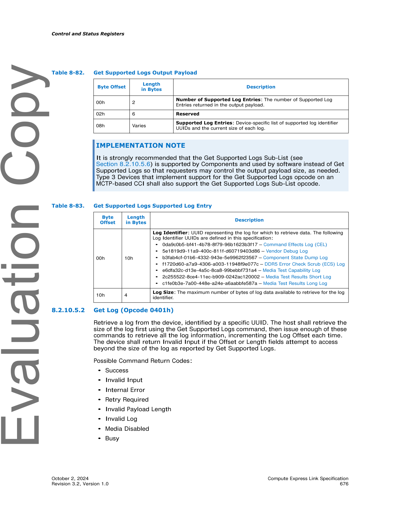
>
> *Original page render @ 150 DPI* — [📄 Full size](figures/chapter_08/page_0676.png)

[⬆️ 返回目录](#-本章目录-part-c)

---

### 8.2.10.5.2.2 Vendor Debug Log | 厂商调试日志

<table>
<thead>
<tr>
<th width="50%">🇬🇧 English</th>
<th width="50%" style="background-color:#e8e8e8">🇨🇳 中文</th>
</tr>
</thead>
<tbody>
<tr><td>All devices that support a debug log shall support the Vendor Debug Log to allow the log to be accessed through a common host driver, for any device, with Log Identifier of: • 5e1819d9-11a9-400c-811f-d60719403d86</td><td style="background-color:#e8e8e8">所有支持调试日志的设备应支持 Vendor Debug Log,以便通过通用主机驱动程序访问任何设备的日志,其 Log Identifier 为: • 5e1819d9-11a9-400c-811f-d60719403d86</td></tr>
<tr><td>The contents of the output payload are vendor specific.</td><td style="background-color:#e8e8e8">输出负载的内容由厂商特定定义。</td></tr>
</tbody>
</table>

> **Figure 8-X.** Vendor Debug Log (page 678) ｜ 厂商调试日志
>
> 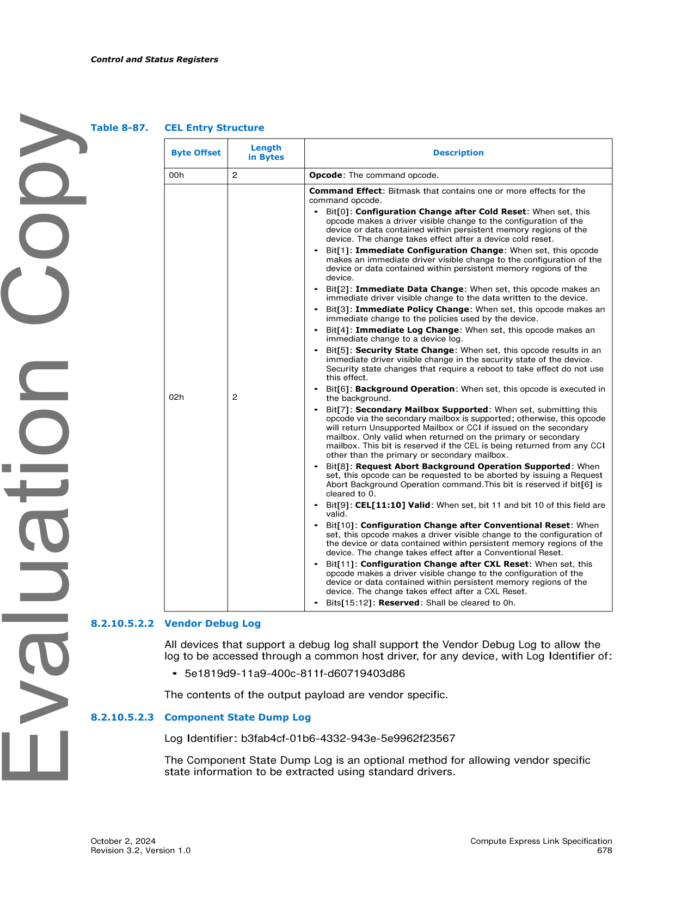
>
> *Original page render @ 150 DPI* — [📄 Full size](figures/chapter_08/page_0678.png)

[⬆️ 返回目录](#-本章目录-part-c)

---

### 8.2.10.5.2.3 Component State Dump Log | 组件状态转储日志

<table>
<thead>
<tr>
<th width="50%">🇬🇧 English</th>
<th width="50%" style="background-color:#e8e8e8">🇨🇳 中文</th>
</tr>
</thead>
<tbody>
<tr><td>Log Identifier: b3fab4cf-01b6-4332-943e-5e9962f23567</td><td style="background-color:#e8e8e8">日志标识符:b3fab4cf-01b6-4332-943e-5e9962f23567</td></tr>
<tr><td>The Component State Dump Log is an optional method for allowing vendor specific state information to be extracted using standard drivers.</td><td style="background-color:#e8e8e8">Component State Dump Log 是一种可选方法,允许使用标准驱动程序提取厂商特定的状态信息。</td></tr>
</tbody>
</table>

**Table 8-87. CEL Entry Structure | CEL 条目结构**

<table>
<thead>
<tr><th>Byte Offset</th><th>Length in Bytes</th><th>🇬🇧 Description</th><th>🇨🇳 描述</th></tr>
</thead>
<tbody>
<tr><td>00h</td><td>2</td><td>Opcode: The command opcode.</td><td>操作码:命令操作码。</td></tr>
<tr><td>02h</td><td>2</td><td>Command Effect: Bitmask that contains one or more effects for the command opcode. • Bit[0]: Configuration Change after Cold Reset • Bit[1]: Immediate Configuration Change • Bit[2]: Immediate Data Change • Bit[3]: Immediate Policy Change • Bit[4]: Immediate Log Change • Bit[5]: Security State Change • Bit[6]: Background Operation • Bit[7]: Secondary Mailbox Supported • Bit[8]: Request Abort Background Operation Supported • Bit[9]: CEL[11:10] Valid • Bit[10]: Configuration Change after Conventional Reset • Bit[11]: Configuration Change after CXL Reset • Bits[15:12]: Reserved: Shall be cleared to 0h.</td><td>命令效果:包含命令操作码的一个或多个效果的位掩码。 • Bit[0]:Cold Reset 后的配置更改 • Bit[1]:立即配置更改 • Bit[2]:立即数据更改 • Bit[3]:立即策略更改 • Bit[4]:立即日志更改 • Bit[5]:安全状态更改 • Bit[6]:后台操作 • Bit[7]:支持 Secondary Mailbox • Bit[8]:支持 Request Abort Background Operation • Bit[9]:CEL[11:10] 有效 • Bit[10]:Conventional Reset 后的配置更改 • Bit[11]:CXL Reset 后的配置更改 • Bits[15:12]:保留:应清零为 0h。</td></tr>
</tbody>
</table>

> **Figure 8-X.** CEL Entry Structure (page 678) ｜ CEL 条目结构
>
> 
>
> *Original page render @ 150 DPI* — [📄 Full size](figures/chapter_08/page_0678.png)

<table>
<thead>
<tr>
<th width="50%">🇬🇧 English</th>
<th width="50%" style="background-color:#e8e8e8">🇨🇳 中文</th>
</tr>
</thead>
<tbody>
<tr><td>The Component State Dump Log can be populated in two ways: • Auto populate • Manual populate using Populate Log</td><td style="background-color:#e8e8e8">Component State Dump Log 可通过两种方式填充: • Auto populate(自动填充) • Manual populate using Populate Log(使用 Populate Log 手动填充)</td></tr>
<tr><td>A component that supports the Component State Dump Log shall support at least one of the above methods.</td><td style="background-color:#e8e8e8">支持 Component State Dump Log 的组件应至少支持上述方法之一。</td></tr>
<tr><td>The two methods and their associated trigger requirements are detailed in Table 8-88. The Component State Dump Log shall be populated by a given method if the trigger occurs, and the logical AND of all the conditions for that trigger is true.</td><td style="background-color:#e8e8e8">这两种方法及其相关触发要求详见表 8-88。如果触发器发生且该触发器的所有条件的逻辑 AND 为真,则 Component State Dump Log 应通过给定方法填充。</td></tr>
<tr><td>The trigger for the auto populate method is vendor specific, but one example may be a severe internal error in the component.</td><td style="background-color:#e8e8e8">Auto populate 方法的触发器由厂商特定定义,但一个示例可能是组件中的严重内部错误。</td></tr>
<tr><td>When a population method triggers and all required conditions are met, any existing Component State Dump Data is cleared before populating the new log contents.</td><td style="background-color:#e8e8e8">当 population 方法触发且满足所有必需条件时,任何现有的 Component State Dump Data 将在填充新日志内容之前被清除。</td></tr>
<tr><td>The log contents should persist across cold reset. The component shall indicate whether the log persists across cold reset using the Persistent Across Cold Reset bit in the Get Log Capabilities Output Payload.</td><td style="background-color:#e8e8e8">日志内容应在冷复位后保留。组件应使用 Get Log Capabilities Output Payload 中的 Persistent Across Cold Reset 位来指示日志是否在冷复位后保留。</td></tr>
<tr><td>If the component has Component State Dump Data available to be reported in the Component State Dump Log after a subsequent reset, the Component State Dump Log contents shall be available when the Mailbox Interfaces Ready bit in the Memory Device Status register is set to 1.</td><td style="background-color:#e8e8e8">如果组件在后续复位后有 Component State Dump Data 可在 Component State Dump Log 中报告,则当 Memory Device Status 寄存器中的 Mailbox Interfaces Ready 位设置为 1 时,Component State Dump Log 内容应可用。</td></tr>
<tr><td>To handle corner cases related to an existing Component State Dump Log being overwritten by an Auto Populate trigger while host software is reading the existing contents of the log, host software must begin each Component State Dump Log fetch sequence by issuing a Get Log command with Offset = 0, followed by zero or more Get Log commands with nonzero offset. If the component is reset, host software must start a new fetch sequence.</td><td style="background-color:#e8e8e8">为了处理与现有 Component State Dump Log 在主机软件读取日志现有内容时被 Auto Populate 触发器覆盖相关的边缘情况,主机软件必须通过发出 Offset = 0 的 Get Log 命令来开始每个 Component State Dump Log 提取序列,然后再发出零个或多个具有非零 offset 的 Get Log 命令。如果组件被重置,主机软件必须开始新的提取序列。</td></tr>
<tr><td>If a Get Log command with nonzero Offset is received requesting the Component State Dump Log, the component shall apply the first applicable case from the following list: • Return Invalid Input if the component has not previously returned Success for a Get Log command with Offset = 0 requesting the Component State Dump Log. • Return Interrupted if the contents of the Component State Dump Log have changed since the last time the component returned Success for a Get Log command with Offset = 0 requesting the Component State Dump Log. • Return Success and provide the log contents of the specified offset corresponding to the state of the Component State Dump Log when the current fetch sequence began (i.e., when the last Get Log command with Offset = 0 requesting the Component State Dump Log was completed with a return code of Success).</td><td style="background-color:#e8e8e8">如果收到具有非零 Offset 的 Get Log 命令请求 Component State Dump Log,组件应从以下列表中应用第一个适用的情况: • 如果组件之前未对请求 Component State Dump Log 且 Offset = 0 的 Get Log 命令返回 Success,则返回 Invalid Input。 • 如果自组件上次对请求 Component State Dump Log 且 Offset = 0 的 Get Log 命令返回 Success 以来,Component State Dump Log 的内容已更改,则返回 Interrupted。 • 返回 Success 并提供与当前提取序列开始时 Component State Dump Log 状态相对应的指定 offset 的日志内容。</td></tr>
</tbody>
</table>

**Table 8-88. Component State Dump Log Population Methods and Triggers | Component State Dump Log 填充方法和触发器**

<table>
<thead>
<tr><th>Method</th><th>Trigger</th><th>Condition</th><th>Condition Reference</th></tr>
</thead>
<tbody>
<tr><td>Auto Populate</td><td>Vendor-specific</td><td>Auto Populate Trigger Count Since Clear = 0</td><td>Table 8-89. Component State Dump Log Format</td></tr>
<tr><td></td><td></td><td>Auto Populate Supported = 1</td><td>Table 8-102. Get Log Capabilities Output Payload</td></tr>
<tr><td>Manual Populate</td><td>Populate Log command received</td><td>Log Identifier = b3fab4cf-01b6-4332-943e-5e9962f23567</td><td>Table 8-104. Populate Log Input Payload</td></tr>
<tr><td></td><td></td><td>Populate Log Supported = 1</td><td>Table 8-102. Get Log Capabilities Output Payload</td></tr>
</tbody>
</table>

> **Figure 8-X.** Component State Dump Log (page 679) ｜ Component State Dump Log
>
> 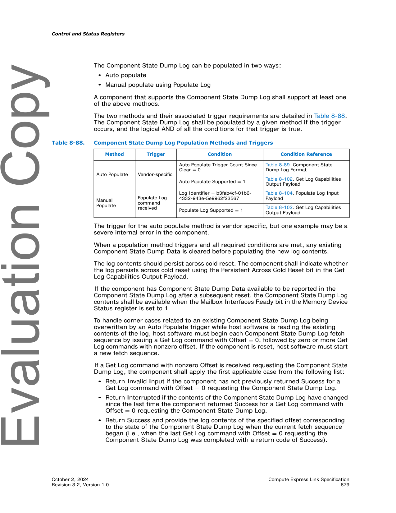
>
> *Original page render @ 150 DPI* — [📄 Full size](figures/chapter_08/page_0679.png)

**Table 8-89. Component State Dump Log Format | Component State Dump Log 格式**

<table>
<thead>
<tr><th>Byte Offset</th><th>Length in Bytes</th><th>🇬🇧 Description</th><th>🇨🇳 描述</th></tr>
</thead>
<tbody>
<tr><td>00h</td><td>4</td><td>Component State Dump Data Length: Length of the Component State Dump Data field in bytes.</td><td>Component State Dump Data 长度(以字节为单位):Component State Dump Data 字段的长度。</td></tr>
<tr><td>04h</td><td>1</td><td>Auto Populate Trigger Count Since Clear: Number of Auto Populate triggers since last clear. Tracking is optional. Saturates at FFh.</td><td>自清除以来的 Auto Populate 触发计数:自上次清除 Component State Dump Log 以来遇到 Auto Populate 触发器的次数。可选跟踪。在 FFh 处饱和。</td></tr>
<tr><td>05h</td><td>1</td><td>Event Log: The Event Log, as defined in Table 8-64 (Get Event Records Input Payload), containing the Associated Event Record Handle.</td><td>Event Log:如表 8-64(Get Event Records Input Payload)所定义的事件日志,包含 Associated Event Record Handle。</td></tr>
<tr><td>06h</td><td>2</td><td>Associated Event Record Handle: The Event Record Handle corresponding to the Auto Populate trigger that generated the Component State Dump Data.</td><td>Associated Event Record Handle:与生成 Component State Dump Data 的 Auto Populate 触发器关联的 Event Record 对应的 Event Record Handle。</td></tr>
<tr><td>08h</td><td>8</td><td>Timestamp: The Timestamp at the time the Component State Dump Data was generated.</td><td>时间戳:Component State Dump Data 生成时的时间戳。</td></tr>
<tr><td>10h</td><td>10h</td><td>Component State Dump Format UUID: Optional value to uniquely identify the format of the Component State Dump Data field. A value of all 0s indicates that the format is not indicated.</td><td>Component State Dump Format UUID:用于唯一标识 Component State Dump Data 字段格式的可选值。全为 0 表示未指示格式。</td></tr>
<tr><td>20h</td><td>4</td><td>Flags • Bit[0]: Auto Populate Data • Bits[31:1]: Reserved</td><td>标志位 • Bit[0]:Auto Populate Data • Bits[31:1]:保留</td></tr>
<tr><td>24h</td><td>1Ch</td><td>Reserved</td><td>保留</td></tr>
<tr><td>40h</td><td>Varies</td><td>Component State Dump Data: Vendor specific.</td><td>Component State Dump Data:厂商特定。</td></tr>
</tbody>
</table>

> **Figure 8-X.** Component State Dump Log Format (page 680) ｜ Component State Dump Log 格式
>
> 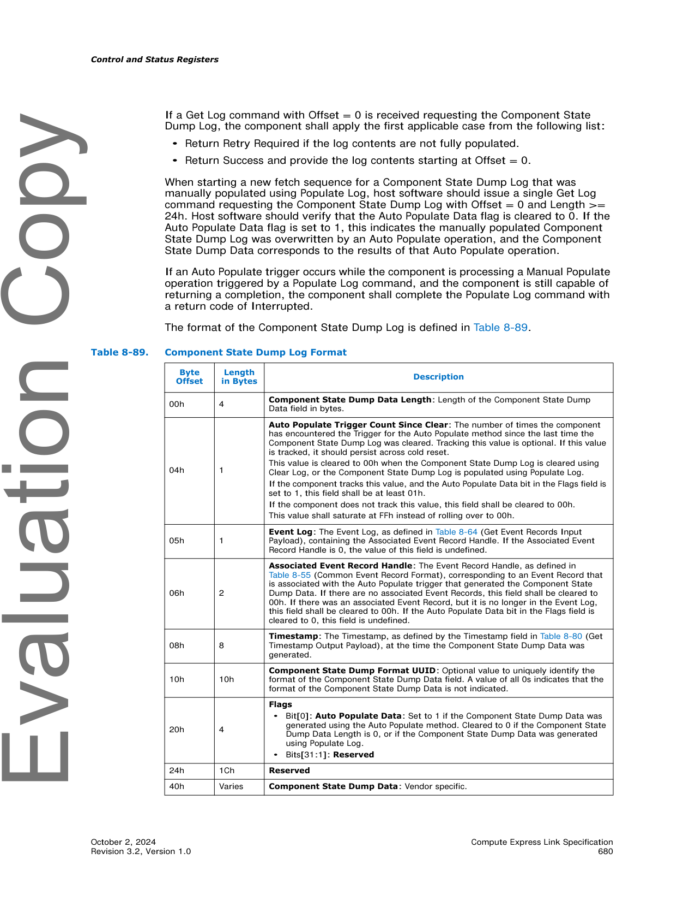
>
> *Original page render @ 150 DPI* — [📄 Full size](figures/chapter_08/page_0680.png)

[⬆️ 返回目录](#-本章目录-part-c)

---

### 8.2.10.5.2.4 DDR5 Error Check Scrub (ECS) Log | DDR5 错误检查清除 (ECS) 日志

<table>
<thead>
<tr>
<th width="50%">🇬🇧 English</th>
<th width="50%" style="background-color:#e8e8e8">🇨🇳 中文</th>
</tr>
</thead>
<tbody>
<tr><td>Log Identifier: f1720d60-a7a9-4306-a003-11948f9e077c</td><td style="background-color:#e8e8e8">日志标识符:f1720d60-a7a9-4306-a003-11948f9e077c</td></tr>
<tr><td>DDR5 ECS Log allows the host to observe the ECS operation results. The format of the DDR5 ECS Log is shown in Table 8-90.</td><td style="background-color:#e8e8e8">DDR5 ECS Log 允许主机观察 ECS 操作结果。DDR5 ECS Log 的格式如表 8-90 所示。</td></tr>
</tbody>
</table>

**Table 8-90. DDR5 Error Check Scrub (ECS) Log | DDR5 错误检查清除 (ECS) 日志**

<table>
<thead>
<tr><th>Byte Offset</th><th>Length in Bytes</th><th>🇬🇧 Description</th><th>🇨🇳 描述</th></tr>
</thead>
<tbody>
<tr><td>00h</td><td>4</td><td>Common Header • Bits[9:0]: Total Number of Entries • Bit[10]: If 0, Component ID field is vendor specific. If 1, the format is defined in Table 8-56. • Bits[12:11]: Entry Type: 00b = Per DRAM; 01b = Per Memory Media FRU; All other encodings reserved. • Bits[31:13]: Reserved</td><td>Common Header • Bits[9:0]:条目总数 • Bit[10]:如果为 0,Component ID 字段由厂商定义。如果为 1,格式由表 8-56 定义。 • Bits[12:11]:条目类型:00b = Per DRAM;01b = Per Memory Media FRU;所有其他编码保留。 • Bits[31:13]:保留</td></tr>
<tr><td>04h</td><td>10h</td><td>Entry 1 Component Identifier</td><td>条目 1 组件标识符</td></tr>
<tr><td>14h</td><td>2</td><td>Entry 1 DDR5 ECS Configurations • Bits[2:0]: ECS Threshold Count per Gb of Memory Cells: 011b = 256 (default); 100b = 1024; 101b = 4096; All other encodings are reserved • Bit[3]: Codeword/Row Count Mode: 0 = ECS counts rows with errors; 1 = ECS counts codewords with errors • Bits[15:4]: Reserved</td><td>条目 1 DDR5 ECS 配置 • Bits[2:0]:每 Gb 内存单元的 ECS 阈值计数:011b = 256(默认);100b = 1024;101b = 4096;所有其他编码保留 • Bit[3]:码字/行计数模式:0 = ECS 计数有错误的行;1 = ECS 计数有错误的码字 • Bits[15:4]:保留</td></tr>
<tr><td>16h</td><td>10h</td><td>Entry 1 Error Count and Address Information • Bit[0]: Error Found • Bits[7:1]: Reserved • Bits[23:8]: Error Count or the Number of Rows or Codeword Errors • Bits[31:24]: Max Row Error Count • Bits[95:32]: Address with Max Errors • Bits[127:96]: Reserved</td><td>条目 1 错误计数和地址信息 • Bit[0]:发现错误 • Bits[7:1]:保留 • Bits[23:8]:错误计数或行/码字错误数 • Bits[31:24]:最大行错误计数 • Bits[95:32]:错误最多的地址 • Bits[127:96]:保留</td></tr>
<tr><td>04h+((n-1)*22h)</td><td>10h</td><td>Entry n Component Identifier</td><td>条目 n 组件标识符</td></tr>
<tr><td>14h+((n-1)*22h)</td><td>2</td><td>Entry n DDR5 ECS Configurations</td><td>条目 n DDR5 ECS 配置</td></tr>
<tr><td>16h+((n-1)*22h)</td><td>10h</td><td>Entry n Error Count and Address Information</td><td>条目 n 错误计数和地址信息</td></tr>
</tbody>
</table>

> **Figure 8-X.** DDR5 ECS Log (page 681-682) ｜ DDR5 ECS 日志
>
> 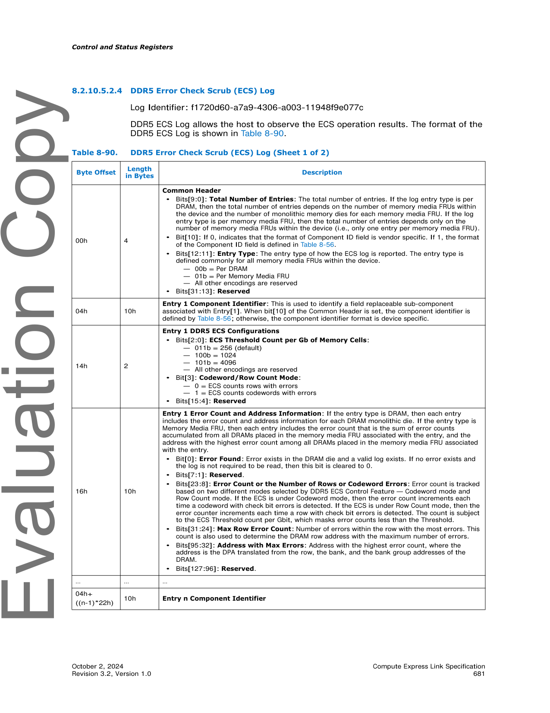
>
> *Original page render @ 150 DPI* — [📄 Full size](figures/chapter_08/page_0681.png)

[⬆️ 返回目录](#-本章目录-part-c)

---

### 8.2.10.5.2.5 Media Test Capability Log | 介质测试能力日志

<table>
<thead>
<tr>
<th width="50%">🇬🇧 English</th>
<th width="50%" style="background-color:#e8e8e8">🇨🇳 中文</th>
</tr>
</thead>
<tbody>
<tr><td>Media Test Capability Log is a variable-length log structure that conveys the attributes of the different media tests that the CXL device supports. It is composed of a common header (see Table 8-91) and Media Test Capability Log Entries (see Table 8-93) for each supported test.</td><td style="background-color:#e8e8e8">Media Test Capability Log 是一种可变长度的日志结构,用于传达 CXL 设备支持的不同介质测试的属性。它由 common header(参见表 8-91)和每个受支持测试的 Media Test Capability Log Entries(参见表 8-93)组成。</td></tr>
<tr><td>Table 8-92 describes the attributes that are common to all the tests that the device supports (e.g., Error Signature List Size, Media Test Result Long, and Short Log versions and Capabilities flags).</td><td style="background-color:#e8e8e8">表 8-92 描述了设备支持的所有测试共有的属性(例如,Error Signature List Size、Media Test Result Long 和 Short Log 版本以及 Capabilities 标志)。</td></tr>
</tbody>
</table>

**Table 8-91. Media Test Capability Log Output Payload | Media Test Capability Log 输出负载**

<table>
<thead>
<tr><th>Byte Offset</th><th>Length in Bytes</th><th>🇬🇧 Description</th><th>🇨🇳 描述</th></tr>
</thead>
<tbody>
<tr><td>00h</td><td>16</td><td>Common Header: Reports attributes applicable to all the tests and general capabilities of the device.</td><td>Common Header:报告适用于所有测试的属性以及设备的一般能力。</td></tr>
<tr><td>10h</td><td>16</td><td>Test 1 Media Test Capability Log Entry</td><td>测试 1 的 Media Test Capability Log 条目</td></tr>
<tr><td>20h</td><td>16</td><td>Test 2 Media Test Capability Log Entry</td><td>测试 2 的 Media Test Capability Log 条目</td></tr>
<tr><td>...</td><td>...</td><td>...</td><td>...</td></tr>
<tr><td>(16+16*(n-1))h</td><td>16</td><td>Test n Media Test Capability Log Entry</td><td>测试 n 的 Media Test Capability Log 条目</td></tr>
</tbody>
</table>

**Table 8-92. Media Test Capability Log Common Header | Media Test Capability Log Common Header**

<table>
<thead>
<tr><th>Byte Offset</th><th>Length in Bytes</th><th>🇬🇧 Description</th><th>🇨🇳 描述</th></tr>
</thead>
<tbody>
<tr><td>00h</td><td>1</td><td>Number of Supported Tests: Total number of test types that the device supports.</td><td>支持的测试数:设备支持的测试类型总数。</td></tr>
<tr><td>01h</td><td>4</td><td>Total Number of Error Signatures</td><td>错误签名总数</td></tr>
<tr><td>05h</td><td>1</td><td>Media Test Result Long Log Version</td><td>Media Test Result Long Log 版本</td></tr>
<tr><td>06h</td><td>1</td><td>Media Test Result Short Log Version</td><td>Media Test Result Short Log 版本</td></tr>
<tr><td>07h</td><td>1</td><td>Capabilities: Bit[0]: Data ECC Disablement Capability; Bit[1]: Metadata ECC Disablement Capability; Bit[2]: Data and Metadata ECC Disablement Capability; Bit[3]: Metadata Area Testing Capability; Bits[7:4]: Reserved</td><td>能力:Bit[0]:数据 ECC 禁用能力;Bit[1]:元数据 ECC 禁用能力;Bit[2]:数据和元数据 ECC 禁用能力;Bit[3]:元数据区域测试能力;Bits[7:4]:保留</td></tr>
<tr><td>08h</td><td>8</td><td>Reserved</td><td>保留</td></tr>
</tbody>
</table>

> **Figure 8-X.** Media Test Capability Log (page 682-683) ｜ Media Test Capability Log
>
> 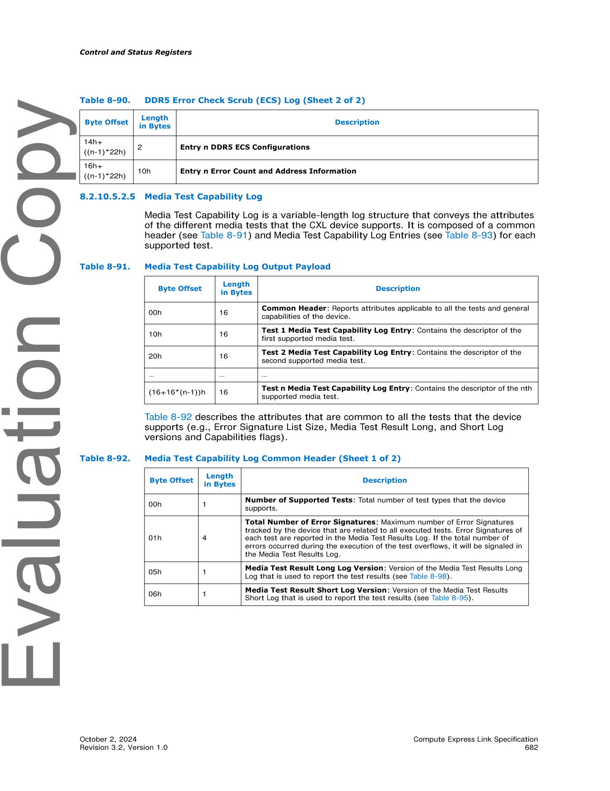
>
> *Original page render @ 150 DPI* — [📄 Full size](figures/chapter_08/page_0682.png)

**Table 8-93. Media Test Capability Log Entry Structure | Media Test Capability Log Entry 结构**

<table>
<thead>
<tr><th>Byte Offset</th><th>Length in Bytes</th><th>🇬🇧 Description</th><th>🇨🇳 描述</th></tr>
</thead>
<tbody>
<tr><td>00h</td><td>2</td><td>Test ID: Unique ID to identify the Test.</td><td>Test ID:用于标识测试的唯一 ID。</td></tr>
<tr><td>02h</td><td>1</td><td>Algorithm: Media test algorithm supported.</td><td>算法:支持的介质测试算法。</td></tr>
<tr><td>03h</td><td>1</td><td>Execution Time: Maximum test execution time per GB.</td><td>执行时间:每 GB 的最大测试执行时间。</td></tr>
<tr><td>04h</td><td>2</td><td>Capabilities: Bit[0]: Address Configurable Flag; Bit[1]: Inverse Pattern Support; Bit[2]: Exit on Uncorrectable Error; Bit[3]: Error Count Threshold Programmable; Bit[4]: Update Poison List on Uncorrectable Error; Bits[8:5]: Addressing Mode</td><td>能力:Bit[0]:地址可配置标志;Bit[1]:反码支持;Bit[2]:遇到不可纠正错误时退出;Bit[3]:错误计数阈值可编程;Bit[4]:在不可纠正错误时更新 Poison List;Bits[8:5]:寻址模式</td></tr>
<tr><td>06h</td><td>2</td><td>Supported Patterns: Bitmap of supported 64B patterns.</td><td>支持的模式:支持的 64B 模式位图。</td></tr>
<tr><td>08h</td><td>1</td><td>PRBS Length: Length of the PRBS sequence.</td><td>PRBS 长度:PRBS 序列的长度。</td></tr>
<tr><td>09h</td><td>7</td><td>Reserved</td><td>保留</td></tr>
</tbody>
</table>

<table>
<thead>
<tr>
<th width="50%">🇬🇧 English</th>
<th width="50%" style="background-color:#e8e8e8">🇨🇳 中文</th>
</tr>
</thead>
<tbody>
<tr><td>For each media test that the device supports, an individual Media Test Capability Log Entry shall be defined. A single test shall be described by the fields defined in Table 8-93, comprising the Test ID, the Algorithm of the Test, the estimated Execution time per GB, etc.</td><td style="background-color:#e8e8e8">对于设备支持的每个介质测试,应定义一个单独的 Media Test Capability Log Entry。单个测试应由表 8-93 中定义的字段描述,包括 Test ID、测试的 Algorithm、每 GB 的估计 Execution time 等。</td></tr>
</tbody>
</table>

> **Figure 8-X.** Media Test Capability Log Entry (page 683-684) ｜ Media Test Capability Log Entry
>
> 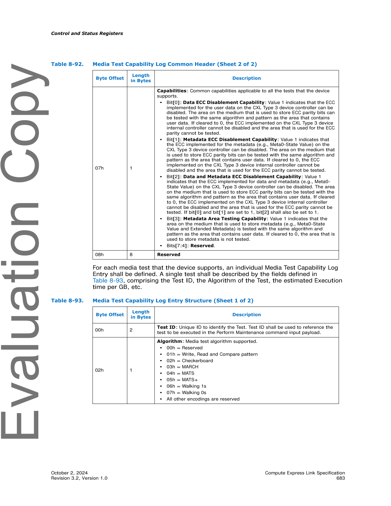
>
> *Original page render @ 150 DPI* — [📄 Full size](figures/chapter_08/page_0683.png)

[⬆️ 返回目录](#-本章目录-part-c)

---

### 8.2.10.5.2.6 Media Test Results Logs | 介质测试结果日志

<table>
<thead>
<tr>
<th width="50%">🇬🇧 English</th>
<th width="50%" style="background-color:#e8e8e8">🇨🇳 中文</th>
</tr>
</thead>
<tbody>
<tr><td>The Media Test Results Logs are variable-length logs that provide the results of one or more Media Tests. Two types of logs are available: • Media Test Results Short Log: Status info and results of the execute tests (see Table 8-94) • Media Test Results Long Log: Detailed error information and error signatures of the executed tests (see Table 8-97)</td><td style="background-color:#e8e8e8">Media Test Results Logs 是可变长度的日志,用于提供一项或多项 Media Tests 的结果。有两种类型的日志可用: • Media Test Results Short Log:已执行测试的状态信息和结果(参见表 8-94) • Media Test Results Long Log:已执行测试的详细错误信息和错误签名(参见表 8-97)</td></tr>
<tr><td>Media Test Result Logs are produced at the end of the execution of the tests and are cleared when a new test starts or when the Clear Log command is issued.</td><td style="background-color:#e8e8e8">Media Test Result Logs 在测试执行结束时生成,并在开始新测试或发出 Clear Log 命令时被清除。</td></tr>
<tr><td>Media Test Results Short Log enumerates the results of the tests executed by the CXL device.</td><td style="background-color:#e8e8e8">Media Test Results Short Log 枚举 CXL 设备执行的测试结果。</td></tr>
<tr><td>Each Media Test Results Short Log Entry contains the results of the test executed (see Table 8-96). They are preceded by a common header described in Table 8-95.</td><td style="background-color:#e8e8e8">每个 Media Test Results Short Log Entry 包含已执行测试的结果(参见表 8-96)。它们前面是表 8-95 中描述的 common header。</td></tr>
</tbody>
</table>

**Table 8-94. Media Test Results Short Log | Media Test Results Short Log**

<table>
<thead>
<tr><th>Byte Offset</th><th>Length in Bytes</th><th>🇬🇧 Description</th><th>🇨🇳 描述</th></tr>
</thead>
<tbody>
<tr><td>00h</td><td>10h</td><td>Common Header: Common output information from test execution.</td><td>Common Header:测试执行的通用输出信息。</td></tr>
<tr><td>10h</td><td>20h</td><td>Test 1 Media Test Results Short Log Entry</td><td>测试 1 的 Media Test Results Short Log Entry</td></tr>
<tr><td>30h</td><td>20h</td><td>Test 2 Media Test Results Short Log Entry</td><td>测试 2 的 Media Test Results Short Log Entry</td></tr>
<tr><td>...</td><td>...</td><td>...</td><td>...</td></tr>
<tr><td>(10h+20h*(n-1))h</td><td>20h</td><td>Test n Media Test Results Short Log Entry</td><td>测试 n 的 Media Test Results Short Log Entry</td></tr>
</tbody>
</table>

**Table 8-95. Media Test Results Short Log Entry Common Header | Media Test Results Short Log Entry Common Header**

<table>
<thead>
<tr><th>Byte Offset</th><th>Length in Bytes</th><th>🇬🇧 Description</th><th>🇨🇳 描述</th></tr>
</thead>
<tbody>
<tr><td>00h</td><td>1</td><td>Number of Tests Executed</td><td>已执行的测试数</td></tr>
<tr><td>01h</td><td>1</td><td>Version: This field shall be set to 01h.</td><td>版本:此字段应设置为 01h。</td></tr>
<tr><td>02h</td><td>1</td><td>Result: 00h = All tests completed successfully; 01h = At least one test completed with failure; 02h = Test execution was interrupted by a Request Abort Background Operation command (all tests that completed, before abort, ended successfully); 03h = Test execution was interrupted by a Request Abort Background Operation command (at least one test completed with failure); All other encodings are reserved</td><td>结果:00h = 所有测试成功完成;01h = 至少一个测试失败完成;02h = 测试执行被 Request Abort Background Operation 命令中断(中止前完成的所有测试均成功结束);03h = 测试执行被 Request Abort Background Operation 命令中断(中止前至少一个测试失败);所有其他编码保留</td></tr>
<tr><td>03h</td><td>Dh</td><td>Reserved</td><td>保留</td></tr>
</tbody>
</table>

> **Figure 8-X.** Media Test Results Short Log (page 685) ｜ Media Test Results Short Log
>
> 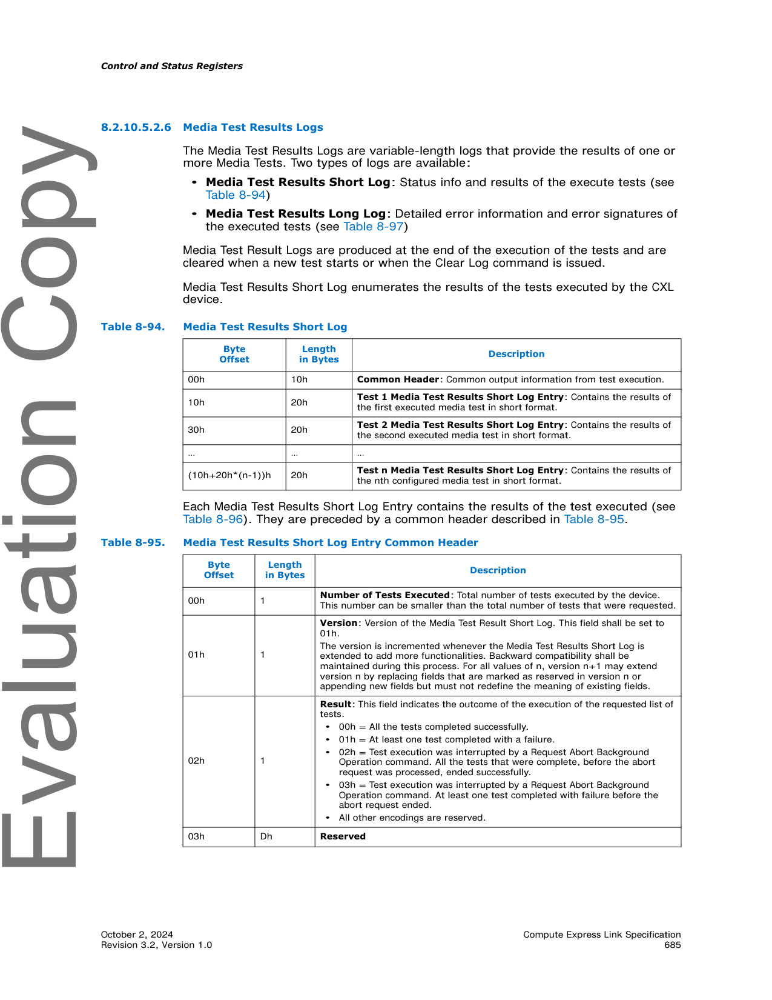
>
> *Original page render @ 150 DPI* — [📄 Full size](figures/chapter_08/page_0685.png)

<table>
<thead>
<tr>
<th width="50%">🇬🇧 English</th>
<th width="50%" style="background-color:#e8e8e8">🇨🇳 中文</th>
</tr>
</thead>
<tbody>
<tr><td>Media Test Results Long Log reports the same fields defined for the Short version. It also includes the capacity tested by the device and the error signature, which consists of: • Test iteration in which the error occurred • Failed DPA with a flag that indicates the error type (i.e., uncorrectable or correctable) • Memory component address following the format defined in the DRAM Event Record</td><td style="background-color:#e8e8e8">Media Test Results Long Log 报告为 Short 版本定义的相同字段。它还包括设备测试的容量和错误签名,后者包括: • 发生错误的测试迭代 • 失败的 DPA 及指示错误类型的标志(即,不可纠正或可纠正) • 遵循 DRAM Event Record 中定义的格式的内存组件地址</td></tr>
<tr><td>When using the Media Test Results Long Log, two reporting options are available: • Complete: Count and report all the error signatures (with and without threshold programmed) • Single error signature: If error count threshold is set, only the signature of the first error after the threshold is exceeded is reported. If error count threshold is not set, only the signature of the first error encountered is reported.</td><td style="background-color:#e8e8e8">使用 Media Test Results Long Log 时,有两种报告选项可用: • Complete(完整):计数并报告所有错误签名(无论是否编程了阈值) • Single error signature(单个错误签名):如果设置了错误计数阈值,则仅报告超过阈值后的第一个错误的签名。如果未设置错误计数阈值,则仅报告遇到的第一个错误的签名。</td></tr>
<tr><td>The device tracks the error information in the Error Signature Lists. The total number of Error Signatures cannot exceed the value indicated by the Total Number of Error Signatures field in the Media Test Capability Log (see Table 8-91). If the Error Signature Configuration bit (see Table 8-123) is set and the total number of errors exceeds the Total Number of Error Signatures, bit[1] in the Flags field shall be set and the test execution shall be interrupted by the device. The test may be resumed from the point at which it was interrupted due to the lack of resources to log the error signatures.</td><td style="background-color:#e8e8e8">设备在 Error Signature Lists 中跟踪错误信息。Error Signatures 的总数不能超过 Media Test Capability Log(参见表 8-91)中 Total Number of Error Signatures 字段所指示的值。如果设置了 Error Signature Configuration 位(参见表 8-123),且错误总数超过 Total Number of Error Signatures,则应设置 Flags 字段中的 bit[1],并且测试执行应被设备中断。可以从由于缺乏记录错误签名的资源而被中断的点恢复测试。</td></tr>
</tbody>
</table>

**Table 8-96. Media Test Results Short Log Entry Structure | Media Test Results Short Log Entry 结构**

<table>
<thead>
<tr><th>Byte Offset</th><th>Length in Bytes</th><th>🇬🇧 Description</th><th>🇨🇳 描述</th></tr>
</thead>
<tbody>
<tr><td>00h</td><td>2</td><td>Test ID: ID of the test.</td><td>Test ID:测试的 ID。</td></tr>
<tr><td>02h</td><td>8</td><td>Start Time: Expressed as timestamp.</td><td>Start Time:以时间戳表示。</td></tr>
<tr><td>0Ah</td><td>8</td><td>End Time: Expressed as timestamp.</td><td>End Time:以时间戳表示。</td></tr>
<tr><td>12h</td><td>1</td><td>Result: 00h = Completed with success; 01h = Completed with failure; 02h = Aborted by a Request Abort Background Operation command; All other encodings are reserved</td><td>结果:00h = 成功完成;01h = 失败完成;02h = 被 Request Abort Background Operation 命令中止;所有其他编码保留</td></tr>
<tr><td>13h</td><td>1</td><td>Flags: Bit[0]: Error Signature List Overflow; Bits[7:1]: Reserved</td><td>标志位:Bit[0]:错误签名列表溢出;Bits[7:1]:保留</td></tr>
<tr><td>14h</td><td>4</td><td>Uncorrectable Error Count: Total number of uncorrectable memory errors that the device detected during the test.</td><td>不可纠正错误计数:设备在测试期间检测到的不可纠正内存错误总数。</td></tr>
<tr><td>18h</td><td>4</td><td>Correctable Error Count: Total number of correctable memory errors that the device detected during the test.</td><td>可纠正错误计数:设备在测试期间检测到的可纠正内存错误总数。</td></tr>
<tr><td>1Ch</td><td>4</td><td>Reserved</td><td>保留</td></tr>
</tbody>
</table>

> **Figure 8-X.** Media Test Results Long Log (page 686-689) ｜ Media Test Results Long Log
>
> 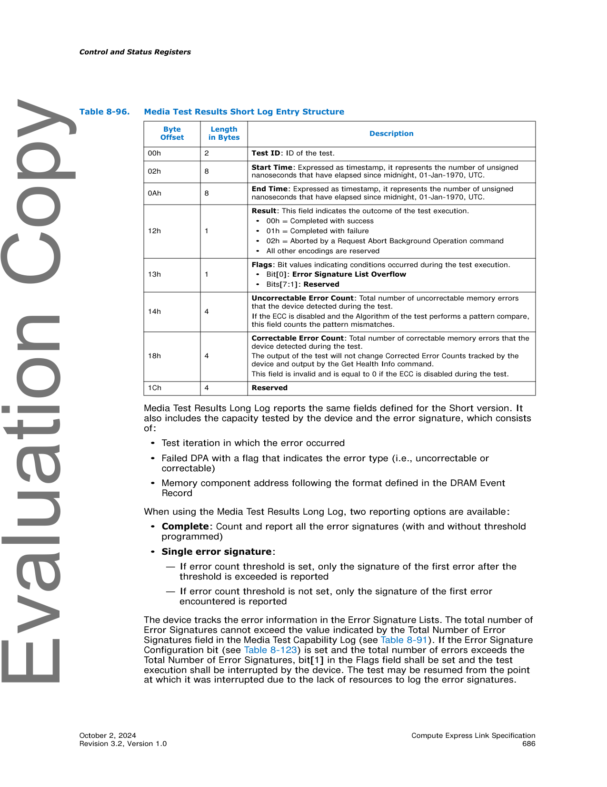
>
> *Original page render @ 150 DPI* — [📄 Full size](figures/chapter_08/page_0686.png)

**Table 8-97. Media Test Results Long Log | Media Test Results Long Log**

<table>
<thead>
<tr><th>Byte Offset</th><th>Length in Bytes</th><th>🇬🇧 Description</th><th>🇨🇳 描述</th></tr>
</thead>
<tbody>
<tr><td>00h</td><td>10h</td><td>Common Header: Common output information from test execution.</td><td>Common Header:测试执行的通用输出信息。</td></tr>
<tr><td>10h</td><td>variable</td><td>Test 1 Media Test Results Long Log Entry</td><td>测试 1 的 Media Test Results Long Log Entry</td></tr>
<tr><td>variable</td><td>variable</td><td>Test 2 Media Test Results Long Log Entry</td><td>测试 2 的 Media Test Results Long Log Entry</td></tr>
<tr><td>...</td><td>...</td><td>...</td><td>...</td></tr>
<tr><td>variable</td><td>variable</td><td>Test n Media Test Results Long Log Entry</td><td>测试 n 的 Media Test Results Long Log Entry</td></tr>
</tbody>
</table>

**Table 8-98. Media Test Results Long Log Entry Common Header | Media Test Results Long Log Entry Common Header**

<table>
<thead>
<tr><th>Byte Offset</th><th>Length in Bytes</th><th>🇬🇧 Description</th><th>🇨🇳 描述</th></tr>
</thead>
<tbody>
<tr><td>00h</td><td>1</td><td>Number of Tests Executed</td><td>已执行的测试数</td></tr>
<tr><td>01h</td><td>1</td><td>Version: This field shall be set to 1.</td><td>版本:此字段应设置为 1。</td></tr>
<tr><td>02h</td><td>1</td><td>Result: 00h = All tests completed successfully; 01h = At least one test completed with failure; 02h = Test execution interrupted (all completed tests ended successfully); 03h = Test execution interrupted (at least one test failed); All other encodings are reserved</td><td>结果:00h = 所有测试成功完成;01h = 至少一个测试失败完成;02h = 测试执行中断(所有已完成的测试均成功);03h = 测试执行中断(至少一个测试失败);所有其他编码保留</td></tr>
<tr><td>03h</td><td>0Dh</td><td>Reserved</td><td>保留</td></tr>
</tbody>
</table>

**Table 8-99. Media Test Results Long Log Entry Structure | Media Test Results Long Log Entry 结构**

<table>
<thead>
<tr><th>Byte Offset</th><th>Length in Bytes</th><th>🇬🇧 Description</th><th>🇨🇳 描述</th></tr>
</thead>
<tbody>
<tr><td>00h</td><td>2</td><td>Test ID: ID of the test.</td><td>Test ID:测试的 ID。</td></tr>
<tr><td>02h</td><td>8</td><td>Start Time</td><td>Start Time(开始时间)</td></tr>
<tr><td>0Ah</td><td>8</td><td>End Time</td><td>End Time(结束时间)</td></tr>
<tr><td>12h</td><td>1</td><td>Result: 00h = Completed with success; 01h = Completed with failure; 02h = Aborted; All other encodings reserved</td><td>结果:00h = 成功完成;01h = 失败完成;02h = 中止;所有其他编码保留</td></tr>
<tr><td>13h</td><td>1</td><td>Flags: Bit[0]: Error Signature List Overflow; Bits[7:1]: Reserved</td><td>标志位:Bit[0]:错误签名列表溢出;Bits[7:1]:保留</td></tr>
<tr><td>14h</td><td>4</td><td>Uncorrectable Error Count</td><td>不可纠正错误计数</td></tr>
<tr><td>18h</td><td>4</td><td>Correctable Error Count</td><td>可纠正错误计数</td></tr>
<tr><td>1Ch</td><td>4</td><td>Reserved</td><td>保留</td></tr>
<tr><td>20h</td><td>8</td><td>Capacity Tested: Expressed in multiples of 256 MB.</td><td>Capacity Tested:以 256 MB 的倍数表示。</td></tr>
<tr><td>28h</td><td>4</td><td>Number of Error Signatures: Total number of error signatures reported by the device in the test.</td><td>Number of Error Signatures:设备在测试中报告的错误签名总数。</td></tr>
<tr><td>2Ch</td><td>4</td><td>Reserved</td><td>保留</td></tr>
<tr><td>30h</td><td>50h</td><td>Error Signature 1</td><td>Error Signature 1</td></tr>
<tr><td>80h</td><td>50h</td><td>Error Signature 2</td><td>Error Signature 2</td></tr>
<tr><td>...</td><td>...</td><td>...</td><td>...</td></tr>
<tr><td>30h+((N-1)*50)h</td><td>50h</td><td>Error Signature N</td><td>Error Signature N</td></tr>
</tbody>
</table>

**Table 8-100. Error Signature | Error Signature**

<table>
<thead>
<tr><th>Byte Offset</th><th>Length in Bytes</th><th>🇬🇧 Description</th><th>🇨🇳 描述</th></tr>
</thead>
<tbody>
<tr><td>00h</td><td>2</td><td>Iteration: This field indicates the test iteration in which the error occurred.</td><td>Iteration:此字段指示发生错误的测试迭代。</td></tr>
<tr><td>02h</td><td>8</td><td>Physical Address: The physical address at which the error occurred during the test execution. • Bit[0]: Volatile: 0 = DPA is within the persistent memory range; 1 = DPA field is within the volatile memory range • Bits[2:1]: Error Type: 00b = Uncorrectable; 01b = Correctable; All other encodings reserved • Bit[3]: Inverse Pattern • Bits[5:4]: Reserved • Bits[63:6]: DPA</td><td>Physical Address:测试执行期间发生错误的物理地址。 • Bit[0]:Volatile:0 = DPA 在持久性内存范围内;1 = DPA 字段在易失性内存范围内 • Bits[2:1]:Error Type:00b = 不可纠正;01b = 可纠正;所有其他编码保留 • Bit[3]:反码 • Bits[5:4]:保留 • Bits[63:6]:DPA</td></tr>
<tr><td>0Ah</td><td>2</td><td>Validity Flags: Indicators of which fields are valid within the returned data. • Bit[0]: Channel field is valid • Bit[1]: Rank field is valid • Bit[2]: Nibble Mask field is valid • Bit[3]: Bank Group field is valid • Bit[4]: Bank field is valid • Bit[5]: Row field is valid • Bit[6]: Column field is valid • Bit[7]: Correction Mask field is valid • Bit[8]: Component Identifier field is valid • Bit[9]: Component Identifier format governed by Table 8-56 • Bit[10]: Sub-channel field is valid • Bits[15:11]: Reserved</td><td>Validity Flags:指示返回数据中哪些字段有效。 • Bit[0]:Channel 字段有效 • Bit[1]:Rank 字段有效 • Bit[2]:Nibble Mask 字段有效 • Bit[3]:Bank Group 字段有效 • Bit[4]:Bank 字段有效 • Bit[5]:Row 字段有效 • Bit[6]:Column 字段有效 • Bit[7]:Correction Mask 字段有效 • Bit[8]:Component Identifier 字段有效 • Bit[9]:Component Identifier 格式由表 8-56 规定 • Bit[10]:Sub-channel 字段有效 • Bits[15:11]:保留</td></tr>
<tr><td>0Ch</td><td>1</td><td>Channel</td><td>Channel(通道)</td></tr>
<tr><td>0Dh</td><td>1</td><td>Rank</td><td>Rank(秩)</td></tr>
<tr><td>0Eh</td><td>3</td><td>Nibble Mask: Identifies one or more nibbles in error on the memory bus producing the event.</td><td>Nibble Mask:标识产生事件的内存总线上一个或多个错误的半字节。</td></tr>
<tr><td>11h</td><td>1</td><td>Bank Group</td><td>Bank Group(Bank 组)</td></tr>
<tr><td>12h</td><td>1</td><td>Bank</td><td>Bank(Bank 号)</td></tr>
<tr><td>13h</td><td>3</td><td>Row</td><td>Row(行号)</td></tr>
<tr><td>16h</td><td>2</td><td>Column</td><td>Column(列号)</td></tr>
<tr><td>18h</td><td>20h</td><td>Correction Mask: Identifies the bits in error within that nibble in error on the memory bus that produced the error.</td><td>Correction Mask:标识产生错误的内存总线上该错误半字节内的错误位。</td></tr>
<tr><td>38h</td><td>10h</td><td>Component Identifier: Device-specific component identifier.</td><td>Component Identifier:设备特定的组件标识符。</td></tr>
<tr><td>48h</td><td>1</td><td>Sub-channel</td><td>Sub-channel(子通道)</td></tr>
<tr><td>49h</td><td>7</td><td>Reserved</td><td>保留</td></tr>
</tbody>
</table>

> **Figure 8-X.** Error Signature (page 688-689) ｜ Error Signature
>
> 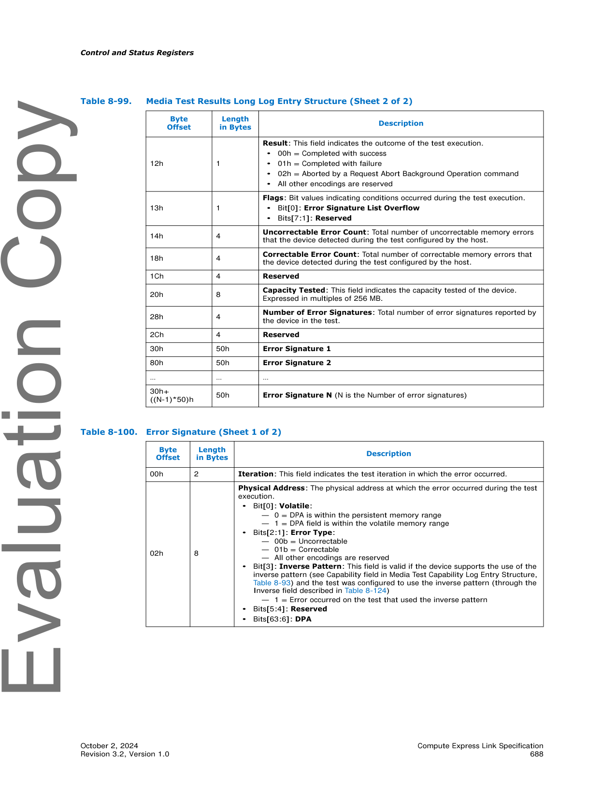
>
> *Original page render @ 150 DPI* — [📄 Full size](figures/chapter_08/page_0688.png)

[⬆️ 返回目录](#-本章目录-part-c)

---

## 8.2.10.5.3 Get Log Capabilities (Opcode 0402h) | 获取日志能力 (操作码 0402h)

<table>
<thead>
<tr>
<th width="50%">🇬🇧 English</th>
<th width="50%" style="background-color:#e8e8e8">🇨🇳 中文</th>
</tr>
</thead>
<tbody>
<tr><td>Gets capabilities related to the specified log. If the component supports this command, it shall be implemented for all Log Identifier UUIDs that the component supports. This command shall return Invalid Log if the specified Log Identifier is not supported by the component.</td><td style="background-color:#e8e8e8">获取与指定日志相关的能力。如果组件支持此命令,则应针对组件支持的所有 Log Identifier UUID 实现此命令。如果组件不支持指定的 Log Identifier,则此命令应返回 Invalid Log。</td></tr>
<tr><td><b>Possible Command Return Codes:</b> • Success • Unsupported • Internal Error • Invalid Log</td><td style="background-color:#e8e8e8"><b>可能的命令返回码:</b> • Success(成功) • Unsupported(不支持) • Internal Error(内部错误) • Invalid Log(无效日志)</td></tr>
<tr><td><b>Command Effects:</b> • None</td><td style="background-color:#e8e8e8"><b>命令效果:</b> • None(无)</td></tr>
</tbody>
</table>

**Table 8-101. Get Log Capabilities Input Payload | Get Log Capabilities 输入负载**

<table>
<thead>
<tr><th>Byte Offset</th><th>Length in Bytes</th><th>🇬🇧 Description</th><th>🇨🇳 描述</th></tr>
</thead>
<tbody>
<tr><td>00h</td><td>10h</td><td>Log Identifier: UUID representing the log for which to get capabilities.</td><td>日志标识符(UUID):表示要获取其能力的日志的 UUID。</td></tr>
</tbody>
</table>

**Table 8-102. Get Log Capabilities Output Payload | Get Log Capabilities 输出负载**

<table>
<thead>
<tr><th>Byte Offset</th><th>Length in Bytes</th><th>🇬🇧 Description</th><th>🇨🇳 描述</th></tr>
</thead>
<tbody>
<tr><td>00h</td><td>4</td><td>Parameter Flags • Bit[0]: Clear Log Supported: This bit is set to 1 if the log supports being cleared via the Clear Log command. • Bit[1]: Populate Log Supported: This bit is set to 1 if the log supports being populated via the Populate Log command. • Bit[2]: Auto Populate Supported: This bit is set to 1 if the log supports the ability of being auto populated. • Bit[3]: Persistent across Cold Reset: This bit is set to 1 if the log is persistent across Cold Reset. • Bits[31:4]: Reserved</td><td>Parameter Flags(参数标志) • Bit[0]:Clear Log Supported:如果日志支持通过 Clear Log 命令清除,则此位设置为 1。 • Bit[1]:Populate Log Supported:如果日志支持通过 Populate Log 命令填充,则此位设置为 1。 • Bit[2]:Auto Populate Supported:如果日志支持自动填充能力,则此位设置为 1。 • Bit[3]:Persistent across Cold Reset:如果日志在冷复位后保留,则此位设置为 1。 • Bits[31:4]:保留</td></tr>
</tbody>
</table>

> **Figure 8-X.** Get Log Capabilities (page 690) ｜ Get Log Capabilities
>
> 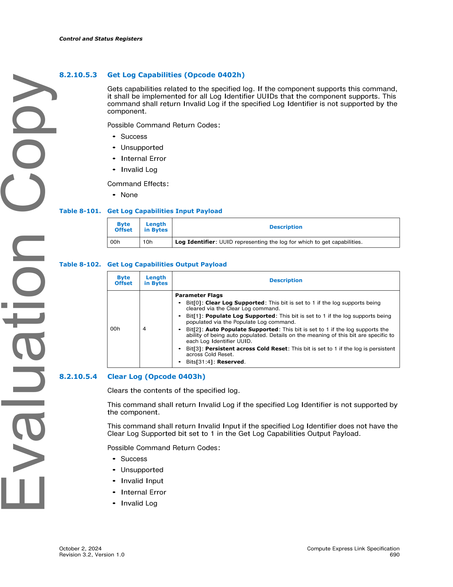
>
> *Original page render @ 150 DPI* — [📄 Full size](figures/chapter_08/page_0690.png)

[⬆️ 返回目录](#-本章目录-part-c)

---

## 8.2.10.5.4 Clear Log (Opcode 0403h) | 清除日志 (操作码 0403h)

<table>
<thead>
<tr>
<th width="50%">🇬🇧 English</th>
<th width="50%" style="background-color:#e8e8e8">🇨🇳 中文</th>
</tr>
</thead>
<tbody>
<tr><td>Clears the contents of the specified log.</td><td style="background-color:#e8e8e8">清除指定日志的内容。</td></tr>
<tr><td>This command shall return Invalid Log if the specified Log Identifier is not supported by the component.</td><td style="background-color:#e8e8e8">如果组件不支持指定的 Log Identifier,则此命令应返回 Invalid Log。</td></tr>
<tr><td>This command shall return Invalid Input if the specified Log Identifier does not have the Clear Log Supported bit set to 1 in the Get Log Capabilities Output Payload.</td><td style="background-color:#e8e8e8">如果指定的 Log Identifier 在 Get Log Capabilities Output Payload 中的 Clear Log Supported 位未设置为 1,则此命令应返回 Invalid Input。</td></tr>
<tr><td><b>Possible Command Return Codes:</b> • Success • Unsupported • Invalid Input • Internal Error • Invalid Log</td><td style="background-color:#e8e8e8"><b>可能的命令返回码:</b> • Success(成功) • Unsupported(不支持) • Invalid Input(无效输入) • Internal Error(内部错误) • Invalid Log(无效日志)</td></tr>
</tbody>
</table>

**Table 8-103. Clear Log Input Payload | Clear Log 输入负载**

<table>
<thead>
<tr><th>Byte Offset</th><th>Length in Bytes</th><th>🇬🇧 Description</th><th>🇨🇳 描述</th></tr>
</thead>
<tbody>
<tr><td>00h</td><td>10h</td><td>Log Identifier: UUID representing the log to clear.</td><td>日志标识符(UUID):表示要清除的日志的 UUID。</td></tr>
</tbody>
</table>

> **Figure 8-X.** Clear Log / Populate Log (page 691) ｜ Clear Log / Populate Log
>
> 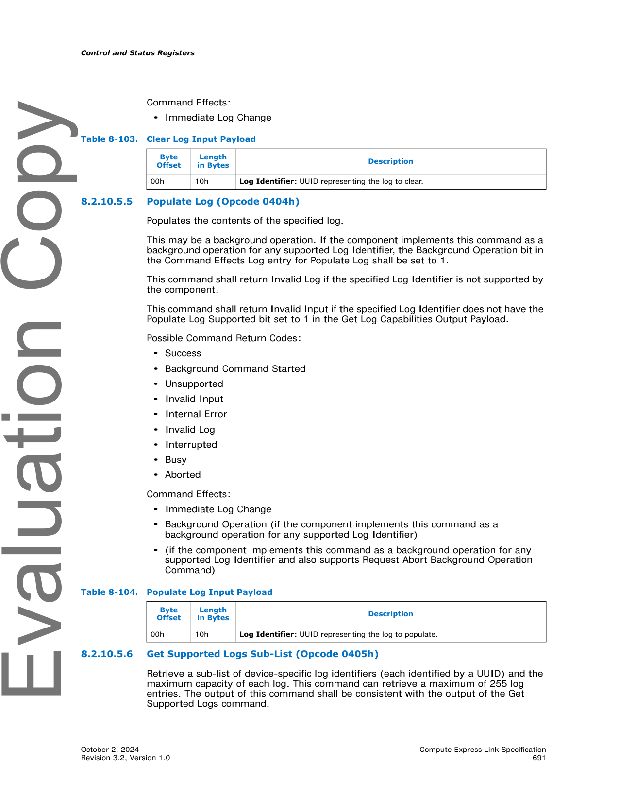
>
> *Original page render @ 150 DPI* — [📄 Full size](figures/chapter_08/page_0691.png)

[⬆️ 返回目录](#-本章目录-part-c)

---

## 8.2.10.5.5 Populate Log (Opcode 0404h) | 填充日志 (操作码 0404h)

<table>
<thead>
<tr>
<th width="50%">🇬🇧 English</th>
<th width="50%" style="background-color:#e8e8e8">🇨🇳 中文</th>
</tr>
</thead>
<tbody>
<tr><td>Populates the contents of the specified log.</td><td style="background-color:#e8e8e8">填充指定日志的内容。</td></tr>
<tr><td>This may be a background operation. If the component implements this command as a background operation for any supported Log Identifier, the Background Operation bit in the Command Effects Log entry for Populate Log shall be set to 1.</td><td style="background-color:#e8e8e8">这可以是后台操作。如果组件对任何受支持的 Log Identifier 将此命令实现为后台操作,则 Populate Log 的 Command Effects Log 条目中的 Background Operation 位应设置为 1。</td></tr>
<tr><td>This command shall return Invalid Log if the specified Log Identifier is not supported by the component.</td><td style="background-color:#e8e8e8">如果组件不支持指定的 Log Identifier,则此命令应返回 Invalid Log。</td></tr>
<tr><td>This command shall return Invalid Input if the specified Log Identifier does not have the Populate Log Supported bit set to 1 in the Get Log Capabilities Output Payload.</td><td style="background-color:#e8e8e8">如果指定的 Log Identifier 在 Get Log Capabilities Output Payload 中的 Populate Log Supported 位未设置为 1,则此命令应返回 Invalid Input。</td></tr>
<tr><td><b>Possible Command Return Codes:</b> • Success • Background Command Started • Unsupported • Invalid Input • Internal Error • Invalid Log • Interrupted • Busy • Aborted</td><td style="background-color:#e8e8e8"><b>可能的命令返回码:</b> • Success(成功) • Background Command Started(后台命令已启动) • Unsupported(不支持) • Invalid Input(无效输入) • Internal Error(内部错误) • Invalid Log(无效日志) • Interrupted(中断) • Busy(忙) • Aborted(中止)</td></tr>
<tr><td><b>Command Effects:</b> • Immediate Log Change • Background Operation (if the component implements this command as a background operation for any supported Log Identifier)</td><td style="background-color:#e8e8e8"><b>命令效果:</b> • Immediate Log Change(立即日志更改) • Background Operation(后台操作)(如果组件对任何受支持的 Log Identifier 将此命令实现为后台操作)</td></tr>
</tbody>
</table>

**Table 8-104. Populate Log Input Payload | Populate Log 输入负载**

<table>
<thead>
<tr><th>Byte Offset</th><th>Length in Bytes</th><th>🇬🇧 Description</th><th>🇨🇳 描述</th></tr>
</thead>
<tbody>
<tr><td>00h</td><td>10h</td><td>Log Identifier: UUID representing the log to populate.</td><td>日志标识符(UUID):表示要填充的日志的 UUID。</td></tr>
</tbody>
</table>

[⬆️ 返回目录](#-本章目录-part-c)

---

## 8.2.10.5.6 Get Supported Logs Sub-List (Opcode 0405h) | 获取支持的日志子列表 (操作码 0405h)

<table>
<thead>
<tr>
<th width="50%">🇬🇧 English</th>
<th width="50%" style="background-color:#e8e8e8">🇨🇳 中文</th>
</tr>
</thead>
<tbody>
<tr><td>Retrieve a sub-list of device-specific log identifiers (each identified by a UUID) and the maximum capacity of each log. This command can retrieve a maximum of 255 log entries. The output of this command shall be consistent with the output of the Get Supported Logs command.</td><td style="background-color:#e8e8e8">检索设备特定日志标识符(每个由 UUID 标识)的子列表以及每个日志的最大容量。此命令最多可检索 255 个日志条目。此命令的输出应与 Get Supported Logs 命令的输出一致。</td></tr>
<tr><td><b>Possible Command Return Codes:</b> • Success • Unsupported • Internal Error • Retry Required • Invalid Payload Length</td><td style="background-color:#e8e8e8"><b>可能的命令返回码:</b> • Success(成功) • Unsupported(不支持) • Internal Error(内部错误) • Retry Required(需要重试) • Invalid Payload Length(无效负载长度)</td></tr>
<tr><td><b>Command Effects:</b> • None</td><td style="background-color:#e8e8e8"><b>命令效果:</b> • None(无)</td></tr>
</tbody>
</table>

**Table 8-105. Get Supported Logs Sub-List Input Payload | Get Supported Logs Sub-List 输入负载**

<table>
<thead>
<tr><th>Byte Offset</th><th>Length in Bytes</th><th>🇬🇧 Description</th><th>🇨🇳 描述</th></tr>
</thead>
<tbody>
<tr><td>00h</td><td>1</td><td>Maximum Number of Supported Log Entries: The maximum number of Supported Log Entries requested. This field shall have a minimum value of 01h.</td><td>Maximum Number of Supported Log Entries:请求的 Supported Log Entries 的最大数量。此字段的最小值应为 01h。</td></tr>
<tr><td>01h</td><td>1</td><td>Start Log Entry Index: Index of the first requested Supported Log Entry.</td><td>Start Log Entry Index:第一个请求的 Supported Log Entry 的索引。</td></tr>
</tbody>
</table>

**Table 8-106. Get Supported Logs Sub-List Output Payload | Get Supported Logs Sub-List 输出负载**

<table>
<thead>
<tr><th>Byte Offset</th><th>Length in Bytes</th><th>🇬🇧 Description</th><th>🇨🇳 描述</th></tr>
</thead>
<tbody>
<tr><td>00h</td><td>1</td><td>Number of Supported Log Entries</td><td>Number of Supported Log Entries(支持的日志条目数)</td></tr>
<tr><td>01h</td><td>1</td><td>Reserved</td><td>保留</td></tr>
<tr><td>02h</td><td>2</td><td>Total Number of Supported Log Entries: The total number of Supported Log Entries supported by the component.</td><td>Total Number of Supported Log Entries:组件支持的 Supported Log Entries 总数。</td></tr>
<tr><td>04h</td><td>1</td><td>Start Log Entry Index: Index of the first Supported Log Entry in the output payload.</td><td>Start Log Entry Index:输出负载中第一个 Supported Log Entry 的索引。</td></tr>
<tr><td>05h</td><td>3</td><td>Reserved</td><td>保留</td></tr>
<tr><td>08h</td><td>Varies</td><td>Supported Log Entries: Device-specific list of supported log identifier UUIDs and the maximum capacity of each log.</td><td>Supported Log Entries:受支持日志标识符 UUID 的设备特定列表以及每个日志的最大容量。</td></tr>
</tbody>
</table>

> **Figure 8-X.** Get Supported Logs Sub-List (page 692) ｜ Get Supported Logs Sub-List
>
> 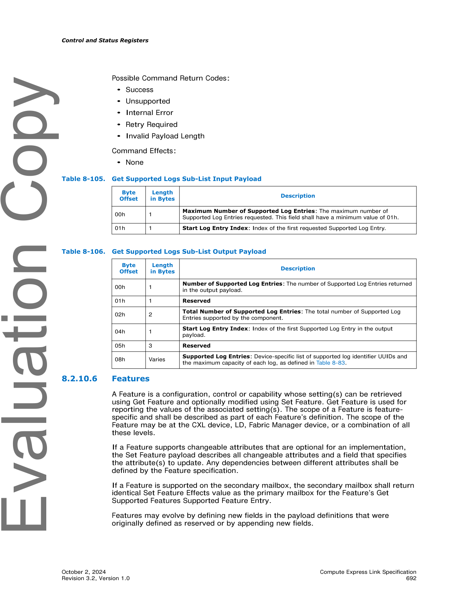
>
> *Original page render @ 150 DPI* — [📄 Full size](figures/chapter_08/page_0692.png)

[⬆️ 返回目录](#-本章目录-part-c)

---

## 8.2.10.6 Features | 特性

<table>
<thead>
<tr>
<th width="50%">🇬🇧 English</th>
<th width="50%" style="background-color:#e8e8e8">🇨🇳 中文</th>
</tr>
</thead>
<tbody>
<tr><td>A Feature is a configuration, control or capability whose setting(s) can be retrieved using Get Feature and optionally modified using Set Feature. Get Feature is used for reporting the values of the associated setting(s). The scope of a Feature is feature-specific and shall be described as part of each Feature's definition. The scope of the Feature may be at the CXL device, LD, Fabric Manager device, or a combination of all these levels.</td><td style="background-color:#e8e8e8">Feature 是一种配置、控制或能力,其设置可以使用 Get Feature 检索,并可选择使用 Set Feature 修改。Get Feature 用于报告相关设置的值。Feature 的范围是特定于 Feature 的,应作为每个 Feature 定义的一部分进行描述。Feature 的范围可在 CXL device、LD、Fabric Manager device 或所有这些级别的组合上。</td></tr>
<tr><td>If a Feature supports changeable attributes that are optional for an implementation, the Set Feature payload describes all changeable attributes and a field that specifies the attribute(s) to update. Any dependencies between different attributes shall be defined by the Feature specification.</td><td style="background-color:#e8e8e8">如果 Feature 支持对实现可选的可更改属性,则 Set Feature 负载描述所有可更改属性以及一个指定要更新的属性的字段。不同属性之间的任何依赖关系应由 Feature 规范定义。</td></tr>
<tr><td>If a Feature is supported on the secondary mailbox, the secondary mailbox shall return identical Set Feature Effects value as the primary mailbox for the Feature's Get Supported Features Supported Feature Entry.</td><td style="background-color:#e8e8e8">如果在 secondary mailbox 上支持 Feature,则 secondary mailbox 应为该 Feature 的 Get Supported Features Supported Feature Entry 返回与 primary mailbox 相同的 Set Feature Effects 值。</td></tr>
<tr><td>Features may evolve by defining new fields in the payload definitions that were originally defined as reserved or by appending new fields.</td><td style="background-color:#e8e8e8">Feature 可以通过在最初定义为保留的负载定义中定义新字段或附加新字段来演进。</td></tr>
</tbody>
</table>

[⬆️ 返回目录](#-本章目录-part-c)

---

### 8.2.10.6.1 Get Supported Features (Opcode 0500h) | 获取支持的特性 (操作码 0500h)

<table>
<thead>
<tr>
<th width="50%">🇬🇧 English</th>
<th width="50%" style="background-color:#e8e8e8">🇨🇳 中文</th>
</tr>
</thead>
<tbody>
<tr><td>Retrieve the list of supported device-specific features (identified by UUID) and general information about each Feature. The device shall return Invalid Input if the Starting Feature Index value is greater than the Device Supported Features value.</td><td style="background-color:#e8e8e8">检索受支持的设备特定 Feature 列表(由 UUID 标识)以及关于每个 Feature 的一般信息。如果 Starting Feature Index 值大于 Device Supported Features 值,设备应返回 Invalid Input。</td></tr>
<tr><td><b>Possible Command Return Codes:</b> • Success • Unsupported • Invalid Input • Internal Error • Retry Required • Invalid Payload Length</td><td style="background-color:#e8e8e8"><b>可能的命令返回码:</b> • Success(成功) • Unsupported(不支持) • Invalid Input(无效输入) • Internal Error(内部错误) • Retry Required(需要重试) • Invalid Payload Length(无效负载长度)</td></tr>
<tr><td><b>Command Effects:</b> • None</td><td style="background-color:#e8e8e8"><b>命令效果:</b> • None(无)</td></tr>
</tbody>
</table>

**Table 8-107. Get Supported Features Input Payload | Get Supported Features 输入负载**

<table>
<thead>
<tr><th>Byte Offset</th><th>Length in Bytes</th><th>🇬🇧 Description</th><th>🇨🇳 描述</th></tr>
</thead>
<tbody>
<tr><td>00h</td><td>4</td><td>Count: Count in bytes of the supported Feature data to return in the output payload. The device shall return no more bytes than requested, but it can return less bytes.</td><td>Count:要在输出负载中返回的受支持 Feature 数据的字节数。设备返回的字节数不应超过请求的字节数,但可以返回较少的字节数。</td></tr>
<tr><td>04h</td><td>2</td><td>Starting Feature Index: Index of the first requested Supported Feature Entry. Feature index is a zero-based value.</td><td>Starting Feature Index:第一个请求的 Supported Feature Entry 的索引。Feature 索引是从零开始的值。</td></tr>
<tr><td>06h</td><td>2</td><td>Reserved</td><td>保留</td></tr>
</tbody>
</table>

**Table 8-108. Get Supported Features Output Payload | Get Supported Features 输出负载**

<table>
<thead>
<tr><th>Byte Offset</th><th>Length in Bytes</th><th>🇬🇧 Description</th><th>🇨🇳 描述</th></tr>
</thead>
<tbody>
<tr><td>00h</td><td>2</td><td>Number of Supported Feature Entries: The number of Supported Feature Entries returned in the output payload.</td><td>Number of Supported Feature Entries:输出负载中返回的 Supported Feature Entries 数量。</td></tr>
<tr><td>02h</td><td>2</td><td>Device Supported Features: The number of supported Features.</td><td>Device Supported Features:受支持 Feature 的数量。</td></tr>
<tr><td>04h</td><td>4</td><td>Reserved</td><td>保留</td></tr>
<tr><td>08h</td><td>Varies</td><td>Supported Feature Entries: Device-specific list of supported feature identifier UUIDs and general information about each feature (see Table 8-109).</td><td>Supported Feature Entries:受支持 Feature 标识符 UUID 的设备特定列表以及有关每个 Feature 的一般信息(参见表 8-109)。</td></tr>
</tbody>
</table>

**Table 8-109. Get Supported Features Supported Feature Entry | Get Supported Features Supported Feature Entry**

<table>
<thead>
<tr><th>Byte Offset</th><th>Length in Bytes</th><th>🇬🇧 Description</th><th>🇨🇳 描述</th></tr>
</thead>
<tbody>
<tr><td>00h</td><td>10h</td><td>Feature Identifier: UUID that represents the feature for which to retrieve data.</td><td>Feature Identifier:表示要检索数据的 Feature 的 UUID。</td></tr>
<tr><td>10h</td><td>2</td><td>Feature Index: A zero-based value that is used to uniquely identify the feature. The Feature Index shall be less than the Device Supported Features value.</td><td>Feature Index:用于唯一标识 Feature 的从零开始的值。Feature Index 应小于 Device Supported Features 值。</td></tr>
<tr><td>12h</td><td>2</td><td>Get Feature Size: The maximum number of bytes that are required to retrieve this Feature data through the Get Feature command(s).</td><td>Get Feature Size:通过 Get Feature 命令检索此 Feature 数据所需的最大字节数。</td></tr>
<tr><td>14h</td><td>2</td><td>Set Feature Size: The maximum number of bytes that are required to update this Feature data through the Set Feature command(s). This field shall have a value of 0 if this Feature cannot be changed.</td><td>Set Feature Size:通过 Set Feature 命令更新此 Feature 数据所需的最大字节数。如果此 Feature 不能更改,则此字段的值为 0。</td></tr>
<tr><td>16h</td><td>4</td><td>Attribute Flags • Bit[0]: Changeable: If set to 1, the Feature attribute(s) can be changed. • Bits[3:1]: Deepest Reset Persistence: 000b = None; 001b = CXL reset; 010b = Hot reset; 011b = Warm reset; 100b = Cold reset; All other encodings are reserved. • Bit[4]: Persist across Firmware Update: If set to 1, the current value of Feature attribute(s) persist across a firmware update. • Bit[5]: Default Selection Supported • Bit[6]: Saved Selection Supported • Bits[31:7]: Reserved</td><td>Attribute Flags(属性标志) • Bit[0]:Changeable:如果设置为 1,则 Feature 属性可以更改。 • Bits[3:1]:Deepest Reset Persistence:000b = None;001b = CXL reset;010b = Hot reset;011b = Warm reset;100b = Cold reset;所有其他编码保留。 • Bit[4]:Persist across Firmware Update:如果设置为 1,则 Feature 属性的当前值在固件更新后保留。 • Bit[5]:Default Selection Supported • Bit[6]:Saved Selection Supported • Bits[31:7]:保留</td></tr>
<tr><td>1Ah</td><td>1</td><td>Get Feature Version</td><td>Get Feature Version</td></tr>
<tr><td>1Bh</td><td>1</td><td>Set Feature Version</td><td>Set Feature Version</td></tr>
<tr><td>1Ch</td><td>2</td><td>Set Feature Effects: Bitmask that contains one or more effects for the Set Feature. See the Command Effect field of the CEL Entry Structure in Table 8-87. This field shall have a value of 0 if the Feature cannot be changed.</td><td>Set Feature Effects:包含 Set Feature 的一个或多个效果的位掩码。请参阅表 8-87 中 CEL Entry Structure 的 Command Effect 字段。如果 Feature 不能更改,则此字段的值为 0。</td></tr>
<tr><td>1Eh</td><td>18</td><td>Reserved</td><td>保留</td></tr>
</tbody>
</table>

> **Figure 8-X.** Get Supported Features (page 693) ｜ Get Supported Features
>
> 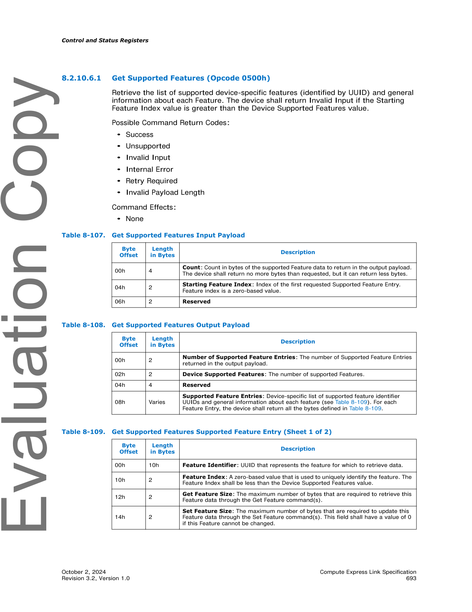
>
> *Original page render @ 150 DPI* — [📄 Full size](figures/chapter_08/page_0693.png)

**Table 8-110. Feature Attribute(s) Value after Reset | 复位后 Feature 属性值**

<table>
<thead>
<tr><th>Reset Event</th><th>0h: None</th><th>1h: CXL Reset</th><th>2h: Hot Reset</th><th>3h: Warm Reset</th><th>4h: Cold Reset</th></tr>
</thead>
<tbody>
<tr><td>CXL Reset</td><td>Default Value</td><td>Saved Value</td><td>Current Value</td><td>Current Value</td><td>Current Value</td></tr>
<tr><td>Hot Reset</td><td>Default Value</td><td>Saved Value</td><td>Saved Value</td><td>Current Value</td><td>Current Value</td></tr>
<tr><td>Warm Reset</td><td>Default Value</td><td>Saved Value</td><td>Saved Value</td><td>Saved Value</td><td>Current Value</td></tr>
<tr><td>Cold Reset</td><td>Default Value</td><td>Saved Value</td><td>Saved Value</td><td>Saved Value</td><td>Saved Value</td></tr>
</tbody>
</table>

<table>
<thead>
<tr>
<th width="50%">🇬🇧 English</th>
<th width="50%" style="background-color:#e8e8e8">🇨🇳 中文</th>
</tr>
</thead>
<tbody>
<tr><td>Default Value: The value set by the vendor when the device is shipped and cannot be changed by the host. If Saved Selection supported flag is 0, the Default Value is the Feature Current Value after reset.</td><td style="background-color:#e8e8e8">Default Value:设备出厂时由厂商设置的值,主机无法更改。如果 Saved Selection supported 标志为 0,则 Default Value 是复位后 Feature 的 Current Value。</td></tr>
<tr><td>Current Value: The current value of Feature attribute(s). If some of Feature attributes are writable, the value used by the device is the current attribute value which may be different than the Default Value or the Saved Value.</td><td style="background-color:#e8e8e8">Current Value:Feature 属性的当前值。如果某些 Feature 属性是可写的,则设备使用的值是当前属性值,该值可能与 Default Value 或 Saved Value 不同。</td></tr>
<tr><td>Saved Value: The value set after reset when Saved Selection Supported is 1. Saved Value shall be equal to Default Value when the device is shipped.</td><td style="background-color:#e8e8e8">Saved Value:当 Saved Selection Supported 为 1 时,复位后设置的值。设备出厂时,Saved Value 应等于 Default Value。</td></tr>
</tbody>
</table>

> **Figure 8-X.** Feature Attribute(s) Value after Reset (page 694) ｜ 复位后 Feature 属性值
>
> 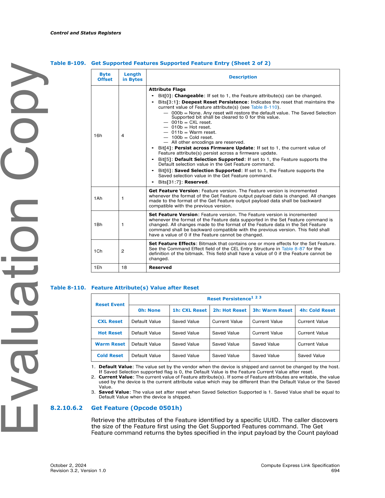
>
> *Original page render @ 150 DPI* — [📄 Full size](figures/chapter_08/page_0694.png)

[⬆️ 返回目录](#-本章目录-part-c)

---

### 8.2.10.6.2 Get Feature (Opcode 0501h) | 获取特性 (操作码 0501h)

<table>
<thead>
<tr>
<th width="50%">🇬🇧 English</th>
<th width="50%" style="background-color:#e8e8e8">🇨🇳 中文</th>
</tr>
</thead>
<tbody>
<tr><td>Retrieve the attributes of the Feature identified by a specific UUID. The caller discovers the size of the Feature first using the Get Supported Features command. The Get Feature command returns the bytes specified in the input payload by the Count payload field and starting from the Offset payload field. The Device shall return Invalid Input if the Offset payload field is beyond the maximum size of the Feature as reported by Get Supported Features. If the Offset is less than the maximum size of the Feature and the sum of Offset and Count is greater than the maximum size of the Feature, the Device shall return the data from Offset to the maximum size of the Feature.</td><td style="background-color:#e8e8e8">检索由特定 UUID 标识的 Feature 的属性。调用者首先使用 Get Supported Features 命令发现 Feature 的大小。Get Feature 命令从 Offset 负载字段开始,返回输入负载中 Count 负载字段指定的字节。如果 Offset 负载字段超出 Get Supported Features 所报告的 Feature 最大大小,设备应返回 Invalid Input。如果 Offset 小于 Feature 的最大大小,并且 Offset 和 Count 之和大于 Feature 的最大大小,则设备应返回从 Offset 到 Feature 最大大小的数据。</td></tr>
<tr><td><b>Possible Command Return Codes:</b> • Success • Unsupported • Unsupported Feature Selection Value • Invalid Input • Internal Error • Retry Required • Invalid Payload Length</td><td style="background-color:#e8e8e8"><b>可能的命令返回码:</b> • Success(成功) • Unsupported(不支持) • Unsupported Feature Selection Value(不支持的 Feature 选择值) • Invalid Input(无效输入) • Internal Error(内部错误) • Retry Required(需要重试) • Invalid Payload Length(无效负载长度)</td></tr>
<tr><td><b>Command Effects:</b> • None</td><td style="background-color:#e8e8e8"><b>命令效果:</b> • None(无)</td></tr>
</tbody>
</table>

**Table 8-111. Get Feature Input Payload | Get Feature 输入负载**

<table>
<thead>
<tr><th>Byte Offset</th><th>Length in Bytes</th><th>🇬🇧 Description</th><th>🇨🇳 描述</th></tr>
</thead>
<tbody>
<tr><td>00h</td><td>10h</td><td>Feature Identifier: UUID representing the Feature identifier for which data is being retrieved.</td><td>Feature Identifier:表示正在检索其数据的 Feature 标识符的 UUID。</td></tr>
<tr><td>10h</td><td>2</td><td>Offset: The offset of the first byte in the Feature data to return in the output payload.</td><td>Offset:输出负载中要返回的 Feature 数据的第一个字节的偏移量。</td></tr>
<tr><td>12h</td><td>2</td><td>Count: Count in bytes of the Feature data to return in the output payload.</td><td>Count:输出负载中要返回的 Feature 数据的字节数。</td></tr>
<tr><td>14h</td><td>1</td><td>Selection: Specifies which value of the Feature to return in the output payload. • 0h = Current value • 1h = Default value • 2h = Saved value • All other encodings are reserved</td><td>Selection:指定输出负载中要返回的 Feature 的值。 • 0h = Current value(当前值) • 1h = Default value(默认值) • 2h = Saved value(保存值) • 所有其他编码保留</td></tr>
</tbody>
</table>

**Table 8-112. Get Feature Output Payload | Get Feature 输出负载**

<table>
<thead>
<tr><th>Byte Offset</th><th>Length in Bytes</th><th>🇬🇧 Description</th><th>🇨🇳 描述</th></tr>
</thead>
<tbody>
<tr><td>00h</td><td>Varies</td><td>Feature Data</td><td>Feature Data(特性数据)</td></tr>
</tbody>
</table>

> **Figure 8-X.** Get Feature (page 695) ｜ Get Feature
>
> 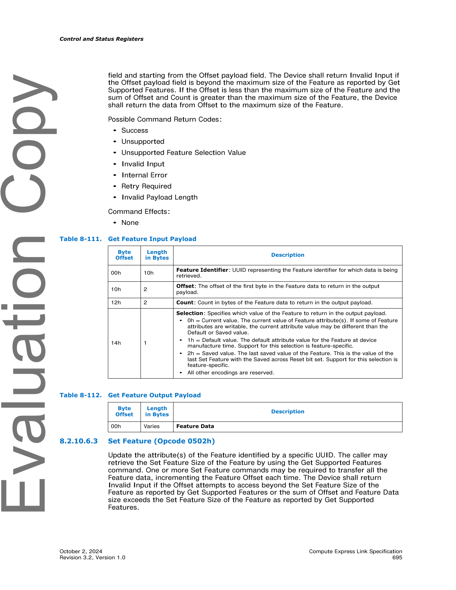
>
> *Original page render @ 150 DPI* — [📄 Full size](figures/chapter_08/page_0695.png)

[⬆️ 返回目录](#-本章目录-part-c)

---

### 8.2.10.6.3 Set Feature (Opcode 0502h) | 设置特性 (操作码 0502h)

<table>
<thead>
<tr>
<th width="50%">🇬🇧 English</th>
<th width="50%" style="background-color:#e8e8e8">🇨🇳 中文</th>
</tr>
</thead>
<tbody>
<tr><td>Update the attribute(s) of the Feature identified by a specific UUID. The caller may retrieve the Set Feature Size of the Feature by using the Get Supported Features command. One or more Set Feature commands may be required to transfer all the Feature data, incrementing the Feature Offset each time. The Device shall return Invalid Input if the Offset attempts to access beyond the Set Feature Size of the Feature as reported by Get Supported Features or the sum of Offset and Feature Data size exceeds the Set Feature Size of the Feature as reported by Get Supported Features.</td><td style="background-color:#e8e8e8">更新由特定 UUID 标识的 Feature 的属性。调用者可以使用 Get Supported Features 命令检索 Feature 的 Set Feature Size。可能需要一个或多个 Set Feature 命令来传输所有 Feature 数据,每次递增 Feature Offset。如果 Offset 尝试访问超出 Get Supported Features 所报告的 Feature 的 Set Feature Size 的范围,或 Offset 和 Feature Data 大小之和超出 Get Supported Features 所报告的 Feature 的 Set Feature Size,则设备应返回 Invalid Input。</td></tr>
<tr><td>If the Feature data is transferred in its entirety, the caller makes one call to Set Feature with Action = Full Data Transfer. The Offset field is not used and shall be ignored.</td><td style="background-color:#e8e8e8">如果 Feature 数据是整体传输的,调用者使用 Action = Full Data Transfer 调用一次 Set Feature。Offset 字段不使用,应被忽略。</td></tr>
<tr><td>If a Feature data is transferred in parts, the caller makes one call to Set Feature with Action = Initiate Data Transfer, zero or more calls with Action = Continue Data Transfer, and one call with Action = Finish Data Transfer or Abort Data Transfer. The Feature data parts shall be transferred in ascending order based on the Offset value, and the Device shall return the Feature Transfer Out of Order return code if data parts are not transferred in ascending order. Back-to-back retransmission of any Set Feature data is permitted during a transfer. The Saved across Reset flag is valid for Set Feature command with Action = Initiate Data Transfer or Action = Full Data Transfer and shall be ignored for all other Action values. A Set Feature with Action = Abort Data Transfer shall be supported for Feature data that can be transferred using multiple Set Feature commands. An attempt to call Set Feature with Action = Abort Data Transfer for a Feature whose data has been fully transferred shall fail with Invalid Input.</td><td style="background-color:#e8e8e8">如果 Feature 数据是分部分传输的,调用者使用 Action = Initiate Data Transfer 调用一次 Set Feature,使用 Action = Continue Data Transfer 调用零次或多次,并使用 Action = Finish Data Transfer 或 Abort Data Transfer 调用一次。Feature 数据部分应基于 Offset 值按升序传输,如果数据部分未按升序传输,设备应返回 Feature Transfer Out of Order 返回码。在传输期间,允许对任何 Set Feature 数据进行背靠背重新传输。Saved across Reset 标志对 Action = Initiate Data Transfer 或 Action = Full Data Transfer 的 Set Feature 命令有效,对所有其他 Action 值应忽略。对于可以使用多个 Set Feature 命令传输的 Feature 数据,应支持 Action = Abort Data Transfer 的 Set Feature。对于数据已完全传输的 Feature 尝试调用 Action = Abort Data Transfer 的 Set Feature 应返回 Invalid Input 失败。</td></tr>
<tr><td>Only one Feature may be updated at a time in the device. The device shall return the Feature Transfer in Progress return code if it receives a Set Feature command with Action = Full Data Transfer or Action = Initiate Data Transfer until the current Feature data transfer is completed or aborted.</td><td style="background-color:#e8e8e8">设备一次只能更新一个 Feature。如果设备收到 Action = Full Data Transfer 或 Action = Initiate Data Transfer 的 Set Feature 命令,直到当前 Feature 数据传输完成或中止,设备应返回 Feature Transfer in Progress 返回码。</td></tr>
<tr><td>If the Feature data transfer is interrupted by a Conventional or CXL reset, the Feature data transfer shall be aborted by the device. If a Feature data transfer is aborted prior to the entire Feature data being transferred, the device shall require the Feature data transfer to be started from the beginning of the Feature data.</td><td style="background-color:#e8e8e8">如果 Feature 数据传输被 Conventional 或 CXL reset 中断,设备应中止 Feature 数据传输。如果在传输整个 Feature 数据之前中止了 Feature 数据传输,设备应要求从 Feature 数据开头重新开始 Feature 数据传输。</td></tr>
<tr><td>Once the entire Feature data is fully transferred to the device (i.e., Action = Full Data Transfer or Action = Finish Data Transfer), the device shall update the attribute(s) of the Feature.</td><td style="background-color:#e8e8e8">一旦整个 Feature 数据完全传输到设备(即 Action = Full Data Transfer 或 Action = Finish Data Transfer),设备应更新 Feature 的属性。</td></tr>
<tr><td>The Command Effects Log (CEL) entry for Set Feature shall describe all possible command effects (i.e., Bits 0 to 5) from supported Features that are changeable.</td><td style="background-color:#e8e8e8">Set Feature 的 Command Effects Log (CEL) 条目应描述可更改的受支持 Feature 的所有可能命令效果(即,Bit 0 到 Bit 5)。</td></tr>
<tr><td>If a component receives an input payload that is less than the size of the structure it has implemented, but is greater than or equal to the Minimum Feature Data Size (as specified in the Feature definition), then it shall treat the unsent portion of the structure as 0. For each feature, any fields in the feature data that are not included in the calculation of the Minimum Feature Data Size are explicitly identified. For features where no fields are identified, all the fields in the feature data are to be included in the calculation of the Minimum Feature Data Size.</td><td style="background-color:#e8e8e8">如果组件收到的输入负载小于其实现的结构大小,但大于或等于 Minimum Feature Data Size(如 Feature 定义中指定),则应将结构的未发送部分视为 0。对于每个 Feature,任何未包含在 Minimum Feature Data Size 计算中的 Feature 数据字段都会被明确标识。对于未标识任何字段的 Feature,Feature 数据中的所有字段都应包含在 Minimum Feature Data Size 的计算中。</td></tr>
<tr><td>In support of confidential computing, if the device has been locked while utilizing secure CXL TSP interfaces, the device shall reject any attempt to alter the features of the locked device by returning Invalid Security State status for this command. See Section 11.5 for details on locking a device and locked device behavior.</td><td style="background-color:#e8e8e8">为了支持机密计算,如果设备在使用安全 CXL TSP 接口时已被锁定,设备应通过返回 Invalid Security State 状态来拒绝任何更改已锁定设备 Feature 的尝试。有关锁定设备和已锁定设备行为的详细信息,请参阅 11.5 节。</td></tr>
<tr><td><b>Possible Command Return Codes:</b> • Success • Unsupported • Unsupported Feature Version • Invalid Input • Internal Error • Retry Required • Invalid Payload Length • Feature Transfer in Progress • Feature Transfer Out of Order • Invalid Security State</td><td style="background-color:#e8e8e8"><b>可能的命令返回码:</b> • Success(成功) • Unsupported(不支持) • Unsupported Feature Version(不支持的 Feature 版本) • Invalid Input(无效输入) • Internal Error(内部错误) • Retry Required(需要重试) • Invalid Payload Length(无效负载长度) • Feature Transfer in Progress(Feature 传输进行中) • Feature Transfer Out of Order(Feature 传输乱序) • Invalid Security State(无效安全状态)</td></tr>
<tr><td><b>Command Effects:</b> • Configuration Change after Cold Reset • Configuration Change after Conventional Reset • Configuration Change after CXL Reset • Immediate Configuration Change • Immediate Data Change • Immediate Policy Change • Immediate Log Change • Security State Change</td><td style="background-color:#e8e8e8"><b>命令效果:</b> • Cold Reset 后的配置更改 • Conventional Reset 后的配置更改 • CXL Reset 后的配置更改 • 立即配置更改 • 立即数据更改 • 立即策略更改 • 立即日志更改 • 安全状态更改</td></tr>
</tbody>
</table>

**Table 8-113. Set Feature Input Payload | Set Feature 输入负载**

<table>
<thead>
<tr><th>Byte Offset</th><th>Length in Bytes</th><th>🇬🇧 Description</th><th>🇨🇳 描述</th></tr>
</thead>
<tbody>
<tr><td>00h</td><td>10h</td><td>Feature Identifier: UUID representing the Feature identifier for which data is being updated. The UUID value of all Fs is a special value that represents the current Feature whose data is in the process of being transferred.</td><td>Feature Identifier:表示正在更新其数据的 Feature 标识符的 UUID。全 F 的 UUID 值是特殊值,表示正在传输其数据的当前 Feature。</td></tr>
<tr><td>10h</td><td>4</td><td>Set Feature Flags • Bits[2:0]: Action: 000b = Full Data Transfer; 001b = Initiate Data Transfer; 010b = Continue Data Transfer; 011b = Finish Data Transfer; 100b = Abort Data Transfer; All other encodings are reserved • Bit[3]: Saved across Reset: If set to 1, the modified value is saved across the Deepest Reset Persistence value for the Feature • Bits[31:4]: Reserved</td><td>Set Feature Flags(设置特性标志) • Bits[2:0]:Action:000b = Full Data Transfer;001b = Initiate Data Transfer;010b = Continue Data Transfer;011b = Finish Data Transfer;100b = Abort Data Transfer;所有其他编码保留 • Bit[3]:Saved across Reset:如果设置为 1,则修改后的值在 Feature 的 Deepest Reset Persistence 值范围内保留 • Bits[31:4]:保留</td></tr>
<tr><td>14h</td><td>2</td><td>Offset: The byte offset of the Feature data to update.</td><td>Offset:要更新的 Feature 数据的字节偏移量。</td></tr>
<tr><td>16h</td><td>1</td><td>Version: Feature version of the data in Feature Data.</td><td>Version:Feature Data 中数据的 Feature 版本。</td></tr>
<tr><td>17h</td><td>9</td><td>Reserved</td><td>保留</td></tr>
<tr><td>20h</td><td>Varies</td><td>Feature Data</td><td>Feature Data(特性数据)</td></tr>
</tbody>
</table>

> **Figure 8-X.** Set Feature (page 697) ｜ Set Feature
>
> 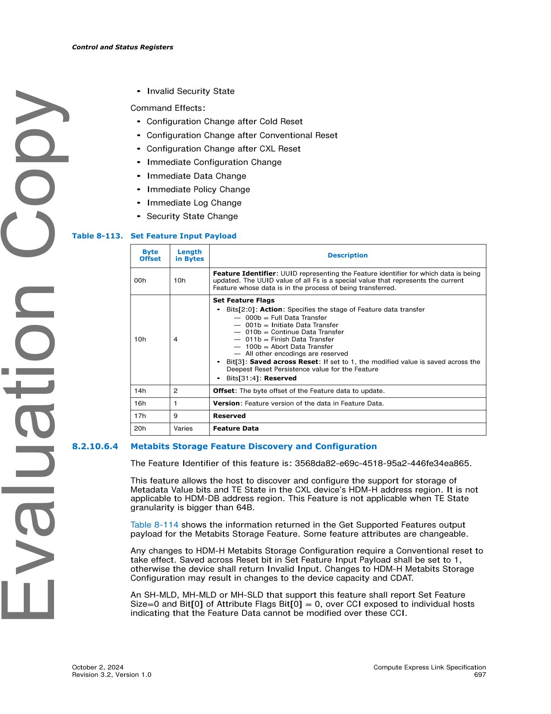
>
> *Original page render @ 150 DPI* — [📄 Full size](figures/chapter_08/page_0697.png)

[⬆️ 返回目录](#-本章目录-part-c)

---

### 8.2.10.6.4 Metabits Storage Feature Discovery and Configuration | Metabits 存储特性发现和配置

<table>
<thead>
<tr>
<th width="50%">🇬🇧 English</th>
<th width="50%" style="background-color:#e8e8e8">🇨🇳 中文</th>
</tr>
</thead>
<tbody>
<tr><td>The Feature Identifier of this feature is: 3568da82-e69c-4518-95a2-446fe34ea865.</td><td style="background-color:#e8e8e8">此特性的 Feature Identifier 是:3568da82-e69c-4518-95a2-446fe34ea865。</td></tr>
<tr><td>This feature allows the host to discover and configure the support for storage of Metadata Value bits and TE State in the CXL device's HDM-H address region. It is not applicable to HDM-DB address region. This Feature is not applicable when TE State granularity is bigger than 64B.</td><td style="background-color:#e8e8e8">此特性允许主机发现和配置 CXL 设备的 HDM-H 地址区域中 Metadata Value 位和 TE State 的存储支持。它不适用于 HDM-DB 地址区域。当 TE State 粒度大于 64B 时,此特性不适用。</td></tr>
<tr><td>Table 8-114 shows the information returned in the Get Supported Features output payload for the Metabits Storage Feature. Some feature attributes are changeable.</td><td style="background-color:#e8e8e8">表 8-114 显示了 Metabits Storage Feature 的 Get Supported Features 输出负载中返回的信息。某些 Feature 属性是可更改的。</td></tr>
<tr><td>Any changes to HDM-H Metabits Storage Configuration require a Conventional reset to take effect. Saved across Reset bit in Set Feature Input Payload shall be set to 1, otherwise the device shall return Invalid Input. Changes to HDM-H Metabits Storage Configuration may result in changes to the device capacity and CDAT.</td><td style="background-color:#e8e8e8">对 HDM-H Metabits Storage Configuration 的任何更改都需要 Conventional reset 才能生效。Set Feature Input Payload 中的 Saved across Reset 位应设置为 1,否则设备应返回 Invalid Input。对 HDM-H Metabits Storage Configuration 的更改可能会导致设备容量和 CDAT 的更改。</td></tr>
<tr><td>An SH-MLD, MH-MLD or MH-SLD that support this feature shall report Set Feature Size=0 and Bit[0] of Attribute Flags Bit[0] = 0, over CCI exposed to individual hosts indicating that the Feature Data cannot be modified over these CCI.</td><td style="background-color:#e8e8e8">支持此特性的 SH-MLD、MH-MLD 或 MH-SLD 应在暴露给各个主机的 CCI 上报告 Set Feature Size=0 和 Attribute Flags Bit[0] 的 Bit[0] = 0,表示不能通过这些 CCI 修改 Feature Data。</td></tr>
</tbody>
</table>

**Table 8-114. Supported Feature Entry for Metabits Storage Feature | Metabits Storage Feature 的 Supported Feature Entry**

<table>
<thead>
<tr><th>Byte offset</th><th>Length in Bytes</th><th>Attribute</th><th>Description</th></tr>
</thead>
<tbody>
<tr><td>00h</td><td>10h</td><td>Feature Identifier</td><td>3568da82-e69c-4518-95a2-446fe34ea865</td></tr>
<tr><td>10h</td><td>2</td><td>Feature Index</td><td>Device Specific</td></tr>
<tr><td>12h</td><td>2</td><td>Get Feature Size</td><td>3 Bytes</td></tr>
<tr><td>14h</td><td>2</td><td>Set Feature Size</td><td>1 Bytes</td></tr>
<tr><td>16h</td><td>4</td><td>Attribute Flags</td><td>• Bit[0]: Vendor-specific value (Changeable) • Bits[3:1]: 010b (Deepest Reset Persistence = Hot Reset). Conventional reset will restore the saved value. • Bit[4]: 1 (Persist across Firmware Update) • Bit[5]: 1 (Default Selection Supported) • Bit[6]: 1 (Saved Selection Supported) • Bits[31:7]: Reserved</td></tr>
<tr><td>1Ah</td><td>1</td><td>Get Feature Version</td><td>01h</td></tr>
<tr><td>1Bh</td><td>1</td><td>Set Feature Version</td><td>01h</td></tr>
<tr><td>1Ch</td><td>2</td><td>Set Feature Effects</td><td>• Bit[0]: 1 (Configuration Change after Cold Reset) • Bit[1]: 0 (Immediate Configuration Change) • Bit[2]: 0 (Immediate Data Change) • Bit[3]: 0 (Immediate Policy Change) • Bit[4]: Vendor-specific value (Immediate Log Change) • Bit[5]: Vendor-specific value (Security State Change) • Bit[6]: 0 (Background Operation) • Bit[7]: Vendor-specific value (Secondary Mailbox Supported) • Bit[8]: 0 (Request Abort Background Operation Supported) • Bit[9]: 1 (CEL[11:10] Valid) • Bit[10]: 1 (Configuration Change after Conventional Reset) • Bit[11]: 0 (Configuration Change after CXL Reset) • Bits[15:12]: 0h</td></tr>
<tr><td>1Eh</td><td>18</td><td>Reserved</td><td>•</td></tr>
</tbody>
</table>

<table>
<thead>
<tr>
<th width="50%">🇬🇧 English</th>
<th width="50%" style="background-color:#e8e8e8">🇨🇳 中文</th>
</tr>
</thead>
<tbody>
<tr><td>An SH-MLD, MH-MLD or MH-SLD that support this feature shall report Set Feature Size=1 and Bit[0] of Attribute Flags Bit[0] = 1, over CCI exposed to the FM indicating that the Feature Data can be modified over these CCI.</td><td style="background-color:#e8e8e8">支持此特性的 SH-MLD、MH-MLD 或 MH-SLD 应在暴露给 FM 的 CCI 上报告 Set Feature Size=1 和 Attribute Flags Bit[0] 的 Bit[0] = 1,表示可以通过这些 CCI 修改 Feature Data。</td></tr>
<tr><td>After a successful CXL reset, a Conventional Reset or a successful Secure Erase operation, a subsequent read to any device cacheline (DPA) shall return Metafield=00b (Meta0-State abbreviation MS0) and MetaValue=00b, if the device is configured with non-zero Metadata bits via this Feature. As per Section 12.2.3, a device must set the MetaField to No-Op in the CXL.cachemem return response when the Metadata is suspect.</td><td style="background-color:#e8e8e8">在成功的 CXL reset、Conventional Reset 或成功的 Secure Erase 操作之后,如果设备通过此特性配置了非零 Metadata 位,则对任何设备 cacheline (DPA) 的后续读取应返回 Metafield=00b(Meta0-State 缩写 MS0)和 MetaValue=00b。根据 12.2.3 节,当 Metadata 不可信时,设备必须在 CXL.cachemem 返回响应中将 MetaField 设置为 No-Op。</td></tr>
</tbody>
</table>

**Table 8-115. Metabits Storage Feature Readable Attributes | Metabits Storage Feature 可读属性**

<table>
<thead>
<tr><th>Byte offset</th><th>Length in Bytes</th><th>🇬🇧 Description</th><th>🇨🇳 描述</th></tr>
</thead>
<tbody>
<tr><td>00h</td><td>2</td><td>HDM-H Metabits Storage Capabilities • Bit[0]: 2 bits of Metadata are supported. 2 bits of storage supported. • Bit[1]: No Metadata is supported. No storage supported. • Bit[2]: 1-bit of Metadata is supported. bit-0 of Meta0-State Value will be stored. One bit of storage supported. • Bit[3]: 1-bit of Metadata is supported. bit-1 of Meta0-State Value will be stored. One bit of storage supported. • Bit[4]: 2 bits of Metadata + 1 TE State bit are supported. Three bits of storage supported. • Bit[5]: No Metadata + 1 TE State bit is supported. One bit of storage supported. • Bit[6]: 1-bit of Metadata + 1 TE State bit are supported. bit-0 of Meta0-State Value will be stored. Two bits of storage supported. • Bit[7]: 1-bit of Metadata + 1 TE State bit are supported. bit-1 of Meta0-State Value will be stored. Two bits of storage supported. • Bits[15:8]: Reserved</td><td>HDM-H Metabits Storage Capabilities(HDM-H Metabits 存储能力) • Bit[0]:支持 2 位 Metadata。支持 2 位存储。 • Bit[1]:不支持 Metadata。不支持存储。 • Bit[2]:支持 1 位 Metadata。将存储 Meta0-State Value 的 bit-0。支持 1 位存储。 • Bit[3]:支持 1 位 Metadata。将存储 Meta0-State Value 的 bit-1。支持 1 位存储。 • Bit[4]:支持 2 位 Metadata + 1 TE State 位。支持 3 位存储。 • Bit[5]:不支持 Metadata + 1 TE State 位。支持 1 位存储。 • Bit[6]:支持 1 位 Metadata + 1 TE State 位。将存储 Meta0-State Value 的 bit-0。支持 2 位存储。 • Bit[7]:支持 1 位 Metadata + 1 TE State 位。将存储 Meta0-State Value 的 bit-1。支持 2 位存储。 • Bits[15:8]:保留</td></tr>
<tr><td>02h</td><td>1</td><td>HDM-H Metabits Storage Configuration • 0h: 2 bits of Metadata • 1h: No Metadata • 2h: 1 bit of Metadata, bit-0 of Meta0-State Value • 3h: 1 bit of Metadata, bit-1 of Meta0-State Value • 4h: 2 bits of Metadata + 1 TE State bit • 5h: No Metadata + 1 TE State bit • 6h: 1 bit of Metadata, bit-0 of Meta0-State Value + 1 TE State bit • 7h: 1 bit of Metadata, bit-1 of Meta0-State Value + 1 TE State bit • Bits[7:3]: Reserved</td><td>HDM-H Metabits Storage Configuration(HDM-H Metabits 存储配置) • 0h:2 位 Metadata • 1h:无 Metadata • 2h:1 位 Metadata,Meta0-State Value 的 bit-0 • 3h:1 位 Metadata,Meta0-State Value 的 bit-1 • 4h:2 位 Metadata + 1 TE State 位 • 5h:无 Metadata + 1 TE State 位 • 6h:1 位 Metadata,Meta0-State Value 的 bit-0 + 1 TE State 位 • 7h:1 位 Metadata,Meta0-State Value 的 bit-1 + 1 TE State 位 • Bits[7:3]:保留</td></tr>
</tbody>
</table>

**Table 8-116. Metabits Storage Feature Writable Attributes | Metabits Storage Feature 可写属性**

<table>
<thead>
<tr><th>Byte offset</th><th>Length in Bytes</th><th>🇬🇧 Description</th><th>🇨🇳 描述</th></tr>
</thead>
<tbody>
<tr><td>0h</td><td>1</td><td>HDM-H Metabits Storage Configuration (Values as defined in Table 8-115)</td><td>HDM-H Metabits Storage Configuration(值如表 8-115 所定义)</td></tr>
</tbody>
</table>

<table>
<thead>
<tr>
<th width="50%">🇬🇧 English</th>
<th width="50%" style="background-color:#e8e8e8">🇨🇳 中文</th>
</tr>
</thead>
<tbody>
<tr><td>Table 8-115 shows the output payload returned by a Get Feature command with Selection set to 0h (Current value), 1h (Default value) or 2h (Saved Value).</td><td style="background-color:#e8e8e8">表 8-115 显示了 Selection 设置为 0h(Current value)、1h(Default value)或 2h(Saved Value)的 Get Feature 命令返回的输出负载。</td></tr>
<tr><td>Table 8-116 shows the input payload for Set Feature command.</td><td style="background-color:#e8e8e8">表 8-116 显示了 Set Feature 命令的输入负载。</td></tr>
</tbody>
</table>

> **Figure 8-X.** Metabits Storage Feature (page 698-699) ｜ Metabits Storage Feature
>
> 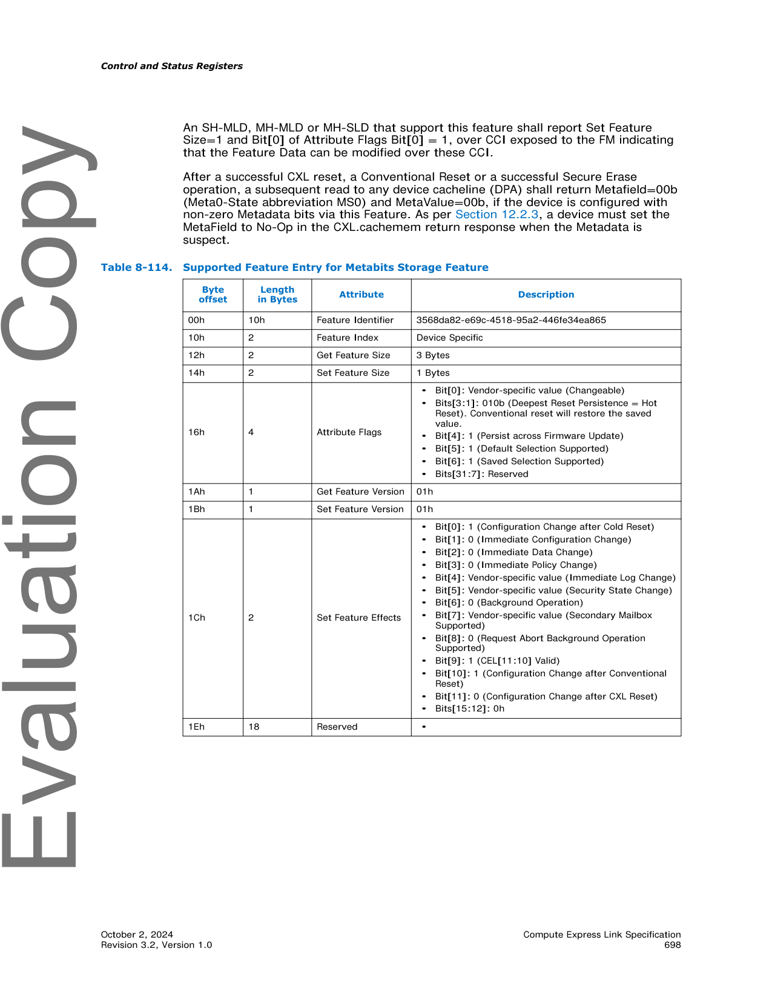
>
> *Original page render @ 150 DPI* — [📄 Full size](figures/chapter_08/page_0698.png)

[⬆️ 返回目录](#-本章目录-part-c)

---

## 8.2.10.7 Maintenance | 维护

[⬆️ 返回目录](#-本章目录-part-c)

---

### 8.2.10.7.1 Perform Maintenance (Opcode 0600h) | 执行维护 (操作码 0600h)

<table>
<thead>
<tr>
<th width="50%">🇬🇧 English</th>
<th width="50%" style="background-color:#e8e8e8">🇨🇳 中文</th>
</tr>
</thead>
<tbody>
<tr><td>This command requests the device to execute the maintenance operation specified by the Maintenance Operation Class and the Maintenance Operation Subclass. If the operation is not supported, the command shall be terminated with Invalid Input Return Code.</td><td style="background-color:#e8e8e8">此命令请求设备执行由 Maintenance Operation Class 和 Maintenance Operation Subclass 指定的维护操作。如果不支持该操作,命令应以 Invalid Input Return Code 终止。</td></tr>
<tr><td>The Perform Maintenance command may be performed in the foreground or in the background, based on the characteristics of the maintenance operation. When the device is executing a Perform Maintenance command in the background, it may indicate operation progress using the Background Command Status register.</td><td style="background-color:#e8e8e8">根据维护操作的特征,Perform Maintenance 命令可以在前台或后台执行。当设备在后台执行 Perform Maintenance 命令时,它可以使用 Background Command Status 寄存器指示操作进度。</td></tr>
<tr><td>No more than one maintenance operation may be initiated at a time.</td><td style="background-color:#e8e8e8">一次最多只能启动一个维护操作。</td></tr>
</tbody>
</table>

**Table 8-117. Perform Maintenance Input Payload | Perform Maintenance 输入负载**

<table>
<thead>
<tr><th>Byte Offset</th><th>Length in Bytes</th><th>🇬🇧 Description</th><th>🇨🇳 描述</th></tr>
</thead>
<tbody>
<tr><td>00h</td><td>1</td><td>Maintenance Operation Class: This field identifies the Class of a maintenance operation. See Table 8-125.</td><td>Maintenance Operation Class(维护操作类):此字段标识维护操作的类。参见表 8-125。</td></tr>
<tr><td>01h</td><td>1</td><td>Maintenance Operation Subclass: This field identifies the maintenance operation together with the Maintenance Operation Class. See Table 8-125.</td><td>Maintenance Operation Subclass(维护操作子类):此字段与 Maintenance Operation Class 一起标识维护操作。参见表 8-125。</td></tr>
<tr><td>02h</td><td>Varies</td><td>Maintenance operation parameters.</td><td>维护操作参数。</td></tr>
</tbody>
</table>

<table>
<thead>
<tr>
<th width="50%">🇬🇧 English</th>
<th width="50%" style="background-color:#e8e8e8">🇨🇳 中文</th>
</tr>
</thead>
<tbody>
<tr><td>The device shall terminate a foreground or background Perform Maintenance command with Busy Return Code if it is already processing a maintenance operation in the background.</td><td style="background-color:#e8e8e8">如果设备已经在后台处理维护操作,则应使用 Busy Return Code 终止前台或后台的 Perform Maintenance 命令。</td></tr>
<tr><td>Some restrictions may apply during the execution of a maintenance operation. For example, it might not be possible to read or write a CXL memory device. These restrictions are specified in the description of the maintenance operation and there can be Feature attributes that indicate device capabilities.</td><td style="background-color:#e8e8e8">在维护操作执行期间,可能适用某些限制。例如,可能无法读取或写入 CXL memory device。这些限制在维护操作的描述中指定,并且可能存在指示设备能力的 Feature 属性。</td></tr>
<tr><td>In support of confidential computing, if the device has been locked while utilizing secure CXL TSP interfaces, the device shall reject any attempt to perform maintenance PPR, sPPR, hPPR, built-in self-tests, and/or other maintenance operations that might alter the data and/or TE State on the device, affect the devices ability to maintain data coherency, and/or compromise the link's integrity by returning Invalid Security State status for this command. See Section 11.5 for details on locking a device and locked device behavior.</td><td style="background-color:#e8e8e8">为了支持机密计算,如果设备在使用安全 CXL TSP 接口时已被锁定,设备应通过返回 Invalid Security State 状态来拒绝任何执行维护 PPR、sPPR、hPPR、内置自检和/或其他可能更改设备上的数据和/或 TE State、影响设备维持数据一致性的能力和/或损害链路完整性的维护操作的尝试。有关锁定设备和已锁定设备行为的详细信息,请参阅 11.5 节。</td></tr>
<tr><td><b>Possible Command Return Codes:</b> • Success • Unsupported • Background Command Started • Invalid Input • Internal Error • Retry Required • Invalid Payload Length • Busy • Transfer Out of Order • Aborted • Invalid Physical Address • Resources Exhausted • Invalid Security State</td><td style="background-color:#e8e8e8"><b>可能的命令返回码:</b> • Success(成功) • Unsupported(不支持) • Background Command Started(后台命令已启动) • Invalid Input(无效输入) • Internal Error(内部错误) • Retry Required(需要重试) • Invalid Payload Length(无效负载长度) • Busy(忙) • Transfer Out of Order(传输乱序) • Aborted(中止) • Invalid Physical Address(无效物理地址) • Resources Exhausted(资源耗尽) • Invalid Security State(无效安全状态)</td></tr>
<tr><td><b>Command Effects:</b> • Immediate Configuration Change if a maintenance operation restricts the operations that a host can do • Immediate Data Change if a maintenance operation impacts the data written to the device • Immediate Log Change if a maintenance operation impacts a device log • Background Operation if a maintenance operation is executed in background • Request Abort Background Operation Command Supported</td><td style="background-color:#e8e8e8"><b>命令效果:</b> • Immediate Configuration Change(立即配置更改)(如果维护操作限制了主机可以执行的操作) • Immediate Data Change(立即数据更改)(如果维护操作影响写入设备的数据) • Immediate Log Change(立即日志更改)(如果维护操作影响设备日志) • Background Operation(后台操作)(如果维护操作在后台执行) • Request Abort Background Operation Command Supported(支持请求中止后台操作命令)</td></tr>
</tbody>
</table>

> **Figure 8-X.** Perform Maintenance (page 700-701) ｜ Perform Maintenance
>
> 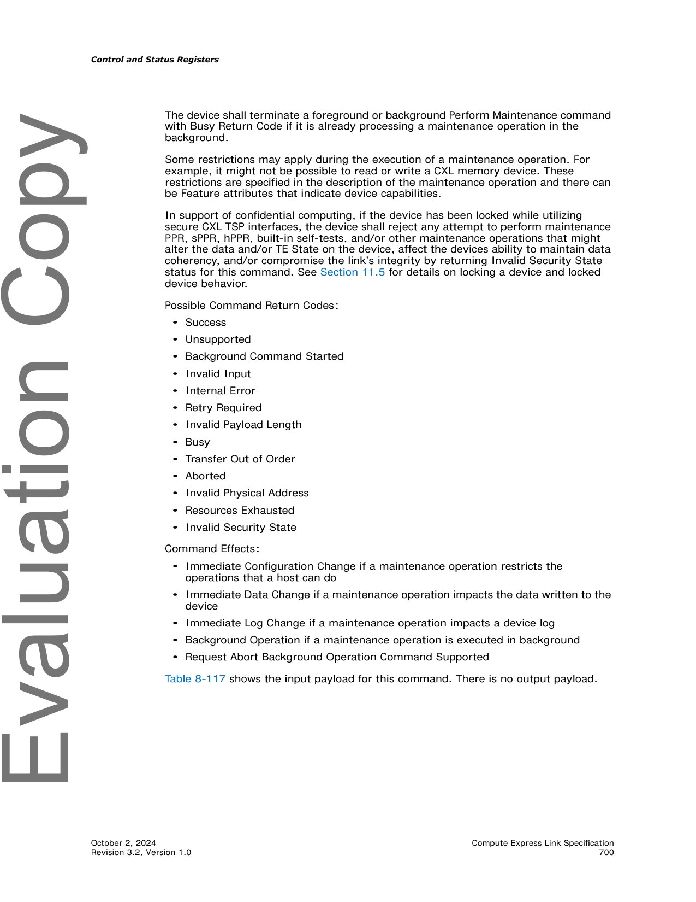
>
> *Original page render @ 150 DPI* — [📄 Full size](figures/chapter_08/page_0700.png)

[⬆️ 返回目录](#-本章目录-part-c)

---

#### 8.2.10.7.1.1 PPR Maintenance Operations | PPR 维护操作

<table>
<thead>
<tr>
<th width="50%">🇬🇧 English</th>
<th width="50%" style="background-color:#e8e8e8">🇨🇳 中文</th>
</tr>
</thead>
<tbody>
<tr><td>Post Package Repair (PPR) maintenance operations may be supported by CXL devices that implement CXL.mem protocol. A PPR maintenance operation requests the CXL device to perform a repair operation on its media.</td><td style="background-color:#e8e8e8">Post Package Repair (PPR) 维护操作可以由实现 CXL.mem 协议的 CXL 设备支持。PPR 维护操作请求 CXL 设备对其介质执行修复操作。</td></tr>
<tr><td>For example, a CXL device with DRAM components that support PPR features may implement PPR Maintenance operations. DRAM components may support two types of PPR: Hard PPR (hPPR), for a permanent row repair, and Soft PPR (sPPR), for a temporary row repair. sPPR is much faster than hPPR, but the repair is lost with a power cycle.</td><td style="background-color:#e8e8e8">例如,具有支持 PPR 功能的 DRAM 组件的 CXL 设备可以实现 PPR 维护操作。DRAM 组件可以支持两种类型的 PPR:Hard PPR (hPPR),用于永久行修复,以及 Soft PPR (sPPR),用于临时行修复。sPPR 比 hPPR 快得多,但修复会在电源循环后丢失。</td></tr>
<tr><td>Based on DRAM PPR features, two maintenance operations are defined: sPPR and hPPR. Note that PPR maintenance operations may also apply to other types of media component.</td><td style="background-color:#e8e8e8">基于 DRAM PPR 功能,定义了两个维护操作:sPPR 和 hPPR。请注意,PPR 维护操作也可能适用于其他类型的介质组件。</td></tr>
<tr><td>During the execution of a PPR Maintenance operation, a CXL memory device: • May or may not retain data • May or may not be able to process CXL.mem requests correctly, including the ones that target the DPA involved in the repair</td><td style="background-color:#e8e8e8">在执行 PPR 维护操作期间,CXL memory device: • 可能保留数据,也可能不保留数据 • 可能能够正确处理 CXL.mem 请求,也可能不能,包括针对修复涉及的 DPA 的请求</td></tr>
<tr><td>If the device is not capable of correctly processing a CXL.mem request during a PPR Maintenance operation, then: • A read shall return poison • A write shall be dropped, and an NDR shall be sent • Any subsequent reads of DPA for which writes may have been incorrectly processed shall return poison</td><td style="background-color:#e8e8e8">如果设备在 PPR 维护操作期间无法正确处理 CXL.mem 请求,则: • 读取应返回 poison • 写入应被丢弃,并发送 NDR • 对于写入可能被错误处理的 DPA 的任何后续读取应返回 poison</td></tr>
<tr><td>These CXL Memory Device capabilities are specified by Restriction Flags in the sPPR Feature and hPPR Feature (see Section 8.2.10.7.2.1 and Section 8.2.10.7.2.2, respectively).</td><td style="background-color:#e8e8e8">这些 CXL Memory Device 能力由 sPPR Feature 和 hPPR Feature 中的 Restriction Flags 指定(分别参见 8.2.10.7.2.1 节和 8.2.10.7.2.2 节)。</td></tr>
<tr><td>sPPR maintenance operation may be executed at runtime, if data is retained and CXL.mem requests are correctly processed. For CXL devices with DRAM components, hPPR maintenance operation may be executed only at boot because data would not be retained.</td><td style="background-color:#e8e8e8">如果保留了数据并正确处理 CXL.mem 请求,则可以在运行时执行 sPPR 维护操作。对于具有 DRAM 组件的 CXL 设备,hPPR 维护操作只能在启动时执行,因为数据将不会被保留。</td></tr>
<tr><td>When a CXL device identifies a failure on a memory component, the device may inform the host about the need for a PPR maintenance operation by using an Event Record, where the Maintenance Needed flag is set. The Event Record specifies the DPA that should be repaired. A CXL device may not keep track of the requests that have already been sent and the information on which DPA should be repaired may be lost upon power cycle.</td><td style="background-color:#e8e8e8">当 CXL 设备识别内存组件上的故障时,设备可以通过使用 Event Record 通知主机需要执行 PPR 维护操作,其中 Maintenance Needed 标志被设置。Event Record 指定应修复的 DPA。CXL 设备可能不跟踪已发送的请求,并且有关应修复哪个 DPA 的信息可能在电源循环后丢失。</td></tr>
<tr><td>The Host or the FM may or may not initiate a PPR Maintenance operation in response to a device request. It is possible to check whether resources are available by issuing a Perform Maintenance command for the PPR maintenance operation with the Query Resources flag set to 1. If the controller does not support reporting whether a resource is available, and a Perform Maintenance operation for PPR is issued with Query Resources set to 1, the controller shall return Invalid Input.</td><td style="background-color:#e8e8e8">主机或 FM 可以根据设备请求启动 PPR 维护操作,也可以不启动。可以通过发出 Query Resources 标志设置为 1 的 PPR 维护操作的 Perform Maintenance 命令来检查资源是否可用。如果控制器不支持报告资源是否可用,并且发出了 Query Resources 设置为 1 的 PPR 的 Perform Maintenance 操作,则控制器应返回 Invalid Input。</td></tr>
<tr><td>If resources are available, then the command shall be completed with the Success Return Code; otherwise, the command shall be completed with the Resources exhausted Return Code.</td><td style="background-color:#e8e8e8">如果资源可用,则命令应以 Success Return Code 完成;否则,命令应以 Resources exhausted Return Code 完成。</td></tr>
<tr><td>The host or the FM may initiate a repair operation by issuing a Perform Maintenance command, setting the Maintenance Operation Class to 01h (PPR), the Maintenance Operation Subclass to either 00h (sPPR) or 01h (hPPR), and indicating the DPA (if supported).</td><td style="background-color:#e8e8e8">主机或 FM 可以通过发出 Perform Maintenance 命令启动修复操作,将 Maintenance Operation Class 设置为 01h (PPR),将 Maintenance Operation Subclass 设置为 00h (sPPR) 或 01h (hPPR),并指示 DPA(如果支持)。</td></tr>
<tr><td>During the execution of a PPR maintenance operation, the device operation may be restricted as indicated by the Restriction Flags in the sPPR Feature and hPPR Feature (see Section 8.2.10.7.2.1 and Section 8.2.10.7.2.2, respectively).</td><td style="background-color:#e8e8e8">在 PPR 维护操作执行期间,设备操作可能受到 sPPR Feature 和 hPPR Feature 中的 Restriction Flags 指示的限制(分别参见 8.2.10.7.2.1 节和 8.2.10.7.2.2 节)。</td></tr>
<tr><td>Upon completion of a PPR maintenance operation, the device shall produce a Memory Sparing Event Record with updated resource availability, if the Memory Sparing Event Record Enable bit is set (see Table 8-128 or Table 8-131).</td><td style="background-color:#e8e8e8">完成 PPR 维护操作后,如果设置了 Memory Sparing Event Record Enable 位(参见表 8-128 或表 8-131),设备应生成一个具有更新资源可用性的 Memory Sparing Event Record。</td></tr>
</tbody>
</table>

> **Figure 8-X.** PPR Maintenance Operations (page 701-702) ｜ PPR 维护操作
>
> 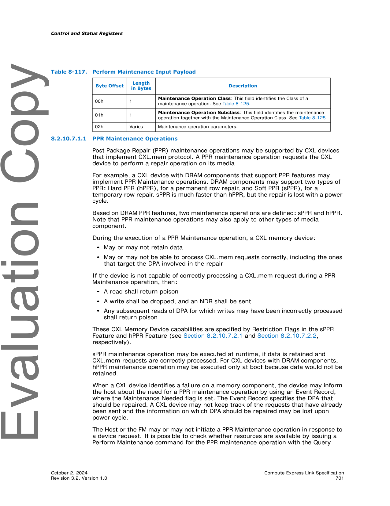
>
> *Original page render @ 150 DPI* — [📄 Full size](figures/chapter_08/page_0701.png)

[⬆️ 返回目录](#-本章目录-part-c)

---

#### 8.2.10.7.1.2 sPPR Maintenance Operation | sPPR 维护操作

<table>
<thead>
<tr>
<th width="50%">🇬🇧 English</th>
<th width="50%" style="background-color:#e8e8e8">🇨🇳 中文</th>
</tr>
</thead>
<tbody>
<tr><td>This maintenance operation requests the device to perform an sPPR operation. The sPPR Feature provides parameters and configurations related to this operation. See Section 8.2.10.7.2.1. Table 8-118 shows the input payload for this maintenance operation.</td><td style="background-color:#e8e8e8">此维护操作请求设备执行 sPPR 操作。sPPR Feature 提供与此操作相关的参数和配置。参见 8.2.10.7.2.1 节。表 8-118 显示了此维护操作的输入负载。</td></tr>
</tbody>
</table>

**Table 8-118. sPPR Maintenance Input Payload | sPPR 维护输入负载**

<table>
<thead>
<tr><th>Byte Offset</th><th>Length in Bytes</th><th>🇬🇧 Description</th><th>🇨🇳 描述</th></tr>
</thead>
<tbody>
<tr><td>00h</td><td>1</td><td>Maintenance Operation Class: It shall be set to 01h.</td><td>Maintenance Operation Class:应设置为 01h。</td></tr>
<tr><td>01h</td><td>1</td><td>Maintenance Operation Subclass: It shall be cleared to 00h.</td><td>Maintenance Operation Subclass:应清零为 00h。</td></tr>
<tr><td>02h</td><td>1</td><td>Flags • Bit[0]: Query Resources Flag: If set, the CXL device checks whether resources are available to perform the sPPR maintenance operation but does not attempt to perform the operation • Bits[7:1]: Reserved</td><td>标志位 • Bit[0]:Query Resources Flag:如果设置,CXL 设备检查是否有可用资源来执行 sPPR 维护操作,但不尝试执行该操作 • Bits[7:1]:保留</td></tr>
<tr><td>03h</td><td>8</td><td>DPA: Physical address to be repaired. This field is ignored if the DPA support flag in the sPPR Feature is cleared to 0 (see Table 8-128).</td><td>DPA:要修复的物理地址。如果 sPPR Feature 中的 DPA support 标志清零为 0(参见表 8-128),则此字段被忽略。</td></tr>
<tr><td>0Bh</td><td>3</td><td>Nibble Mask: Identifies one or more nibbles on the memory bus. A Nibble Mask bit set to 1 indicates the request to perform sPPR operation in the specific device. All Nibble Mask bits set to 1 indicates the request to perform the operation in all devices. This field is ignored if the Nibble support flag in the sPPR Feature is cleared to 0 (see Table 8-128), and the sPPR is performed in all devices.</td><td>Nibble Mask:标识内存总线上的一个或多个半字节。设置为 1 的 Nibble Mask 位表示在特定设备中执行 sPPR 操作的请求。全部 Nibble Mask 位设置为 1 表示在所有设备中执行操作的请求。如果 sPPR Feature 中的 Nibble support 标志清零为 0(参见表 8-128),并且 sPPR 在所有设备中执行,则此字段被忽略。</td></tr>
</tbody>
</table>

[⬆️ 返回目录](#-本章目录-part-c)

---

#### 8.2.10.7.1.3 hPPR Maintenance Operation | hPPR 维护操作

<table>
<thead>
<tr>
<th width="50%">🇬🇧 English</th>
<th width="50%" style="background-color:#e8e8e8">🇨🇳 中文</th>
</tr>
</thead>
<tbody>
<tr><td>This maintenance operation requests the device to perform an hPPR operation. The hPPR Feature provides parameters and configurations related to this operation, see Section 8.2.10.7.2.2. Table 8-119 shows the input payload for this maintenance operation.</td><td style="background-color:#e8e8e8">此维护操作请求设备执行 hPPR 操作。hPPR Feature 提供与此操作相关的参数和配置,参见 8.2.10.7.2.2 节。表 8-119 显示了此维护操作的输入负载。</td></tr>
</tbody>
</table>

**Table 8-119. hPPR Maintenance Input Payload | hPPR 维护输入负载**

<table>
<thead>
<tr><th>Byte Offset</th><th>Length in Bytes</th><th>🇬🇧 Description</th><th>🇨🇳 描述</th></tr>
</thead>
<tbody>
<tr><td>00h</td><td>1</td><td>Maintenance Operation Class: It shall be set to 01h.</td><td>Maintenance Operation Class:应设置为 01h。</td></tr>
<tr><td>01h</td><td>1</td><td>Maintenance Operation Subclass: It shall be set to 01h.</td><td>Maintenance Operation Subclass:应设置为 01h。</td></tr>
<tr><td>02h</td><td>1</td><td>Flags • Bit[0]: Query Resources Flag: If set, the CXL device checks whether resources are available to perform the hPPR maintenance operation • Bits[7:1]: Reserved</td><td>标志位 • Bit[0]:Query Resources Flag:如果设置,CXL 设备检查是否有可用资源来执行 hPPR 维护操作 • Bits[7:1]:保留</td></tr>
<tr><td>03h</td><td>8</td><td>DPA: Physical address to be repaired. This field is ignored if the DPA support flag bit in the hPPR Feature is cleared to 0 (see Table 8-131).</td><td>DPA:要修复的物理地址。如果 hPPR Feature 中的 DPA support 标志位清零为 0(参见表 8-131),则此字段被忽略。</td></tr>
<tr><td>0Bh</td><td>3</td><td>Nibble Mask: Identifies one or more nibbles on the memory bus.</td><td>Nibble Mask:标识内存总线上的一个或多个半字节。</td></tr>
</tbody>
</table>

> **Figure 8-X.** hPPR Maintenance Operation (page 703) ｜ hPPR 维护操作
>
> 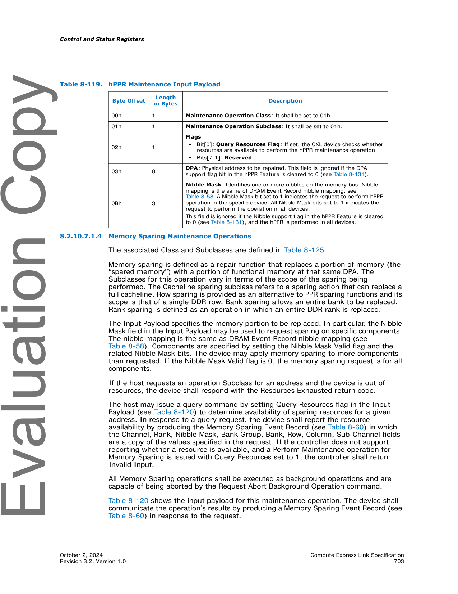
>
> *Original page render @ 150 DPI* — [📄 Full size](figures/chapter_08/page_0703.png)

[⬆️ 返回目录](#-本章目录-part-c)

---

#### 8.2.10.7.1.4 Memory Sparing Maintenance Operations | 内存备用维护操作

<table>
<thead>
<tr>
<th width="50%">🇬🇧 English</th>
<th width="50%" style="background-color:#e8e8e8">🇨🇳 中文</th>
</tr>
</thead>
<tbody>
<tr><td>The associated Class and Subclasses are defined in Table 8-125.</td><td style="background-color:#e8e8e8">相关的 Class 和 Subclasses 在表 8-125 中定义。</td></tr>
<tr><td>Memory sparing is defined as a repair function that replaces a portion of memory (the "spared memory") with a portion of functional memory at that same DPA. The Subclasses for this operation vary in terms of the scope of the sparing being performed. The Cacheline sparing subclass refers to a sparing action that can replace a full cacheline. Row sparing is provided as an alternative to PPR sparing functions and its scope is that of a single DDR row. Bank sparing allows an entire bank to be replaced. Rank sparing is defined as an operation in which an entire DDR rank is replaced.</td><td style="background-color:#e8e8e8">内存备用定义为一种修复功能,用于将一部分内存("被备用的内存")替换为同一 DPA 上的功能性内存。此操作的子类根据所执行的备用范围而有所不同。Cacheline sparing 子类是指可以替换完整 cacheline 的备用操作。Row sparing 作为 PPR 备用功能的替代方案提供,其范围是单个 DDR 行。Bank sparing 允许替换整个 bank。Rank sparing 被定义为替换整个 DDR rank 的操作。</td></tr>
<tr><td>The Input Payload specifies the memory portion to be replaced. In particular, the Nibble Mask field in the Input Payload may be used to request sparing on specific components. The nibble mapping is the same as DRAM Event Record nibble mapping (see Table 8-58). Components are specified by setting the Nibble Mask Valid flag and the related Nibble Mask bits. The device may apply memory sparing to more components than requested. If the Nibble Mask Valid flag is 0, the memory sparing request is for all components.</td><td style="background-color:#e8e8e8">输入负载指定要替换的内存部分。特别是,输入负载中的 Nibble Mask 字段可用于请求对特定组件进行备用。半字节映射与 DRAM Event Record 半字节映射相同(参见表 8-58)。通过设置 Nibble Mask Valid 标志和相关的 Nibble Mask 位来指定组件。设备可以向比请求更多的组件应用内存备用。如果 Nibble Mask Valid 标志为 0,则内存备用请求针对所有组件。</td></tr>
<tr><td>If the host requests an operation Subclass for an address and the device is out of resources, the device shall respond with the Resources Exhausted return code.</td><td style="background-color:#e8e8e8">如果主机为地址请求操作子类,并且设备资源耗尽,则设备应以 Resources Exhausted 返回码响应。</td></tr>
<tr><td>The host may issue a query command by setting Query Resources flag in the Input Payload (see Table 8-120) to determine availability of sparing resources for a given address. In response to a query request, the device shall report the resource availability by producing the Memory Sparing Event Record (see Table 8-60) in which the Channel, Rank, Nibble Mask, Bank Group, Bank, Row, Column, Sub-Channel fields are a copy of the values specified in the request. If the controller does not support reporting whether a resource is available, and a Perform Maintenance operation for Memory Sparing is issued with Query Resources set to 1, the controller shall return Invalid Input.</td><td style="background-color:#e8e8e8">主机可以通过在输入负载中设置 Query Resources 标志(参见表 8-120)来发出查询命令,以确定给定地址的备用资源可用性。作为对查询请求的响应,设备应通过生成 Memory Sparing Event Record(参见表 8-60)来报告资源可用性,其中 Channel、Rank、Nibble Mask、Bank Group、Bank、Row、Column、Sub-Channel 字段是请求中指定值的副本。如果控制器不支持报告资源是否可用,并且发出了 Query Resources 设置为 1 的 Memory Sparing 的 Perform Maintenance 操作,则控制器应返回 Invalid Input。</td></tr>
<tr><td>All Memory Sparing operations shall be executed as background operations and are capable of being aborted by the Request Abort Background Operation command.</td><td style="background-color:#e8e8e8">所有 Memory Sparing 操作应作为后台操作执行,并且能够被 Request Abort Background Operation 命令中止。</td></tr>
<tr><td>Table 8-120 shows the input payload for this maintenance operation. The device shall communicate the operation's results by producing a Memory Sparing Event Record (see Table 8-60) in response to the request.</td><td style="background-color:#e8e8e8">表 8-120 显示了此维护操作的输入负载。设备应通过生成 Memory Sparing Event Record(参见表 8-60)来响应请求并传达操作结果。</td></tr>
</tbody>
</table>

**Table 8-120. Memory Sparing Input Payload | Memory Sparing 输入负载**

<table>
<thead>
<tr><th>Byte Offset</th><th>Length in Bytes</th><th>🇬🇧 Description</th><th>🇨🇳 描述</th></tr>
</thead>
<tbody>
<tr><td>00h</td><td>1</td><td>Maintenance Operation Class: It shall be set to 02h.</td><td>Maintenance Operation Class:应设置为 02h。</td></tr>
<tr><td>01h</td><td>1</td><td>Maintenance Operation Subclass: The legal values are defined in Table 8-125.</td><td>Maintenance Operation Subclass:合法值在表 8-125 中定义。</td></tr>
<tr><td>02h</td><td>1</td><td>Flags • Bit[0]: Query Resources Flag • Bit[1]: Hard Sparing Flag • Bit[2]: Sub-channel Valid Flag • Bit[3]: Nibble Mask Valid Flag • Bits[7:4]: Reserved</td><td>标志位 • Bit[0]:Query Resources Flag • Bit[1]:Hard Sparing Flag • Bit[2]:Sub-channel Valid Flag • Bit[3]:Nibble Mask Valid Flag • Bits[7:4]:保留</td></tr>
<tr><td>03h</td><td>1</td><td>Channel</td><td>Channel(通道)</td></tr>
<tr><td>04h</td><td>1</td><td>Rank</td><td>Rank(秩)</td></tr>
<tr><td>05h</td><td>3</td><td>Nibble Mask</td><td>Nibble Mask(半字节掩码)</td></tr>
<tr><td>08h</td><td>1</td><td>Bank Group</td><td>Bank Group(Bank 组)</td></tr>
<tr><td>09h</td><td>1</td><td>Bank</td><td>Bank(Bank 号)</td></tr>
<tr><td>0Ah</td><td>3</td><td>Row</td><td>Row(行号)</td></tr>
<tr><td>0Dh</td><td>2</td><td>Column</td><td>Column(列号)</td></tr>
<tr><td>0Fh</td><td>1</td><td>Sub-channel</td><td>Sub-channel(子通道)</td></tr>
</tbody>
</table>

> **Figure 8-X.** Memory Sparing (page 704) ｜ Memory Sparing
>
> 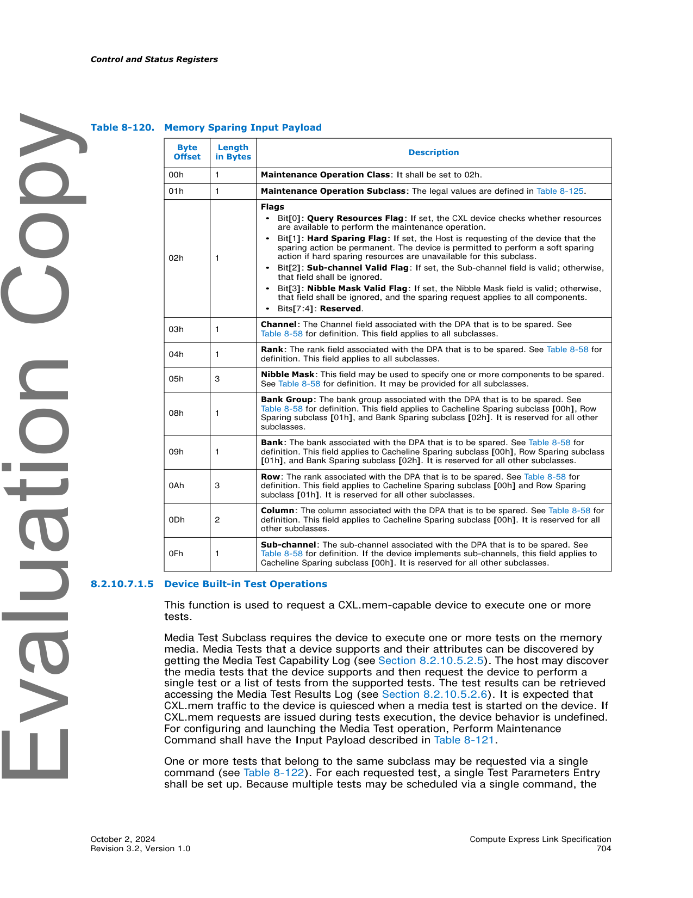
>
> *Original page render @ 150 DPI* — [📄 Full size](figures/chapter_08/page_0704.png)

[⬆️ 返回目录](#-本章目录-part-c)

---

#### 8.2.10.7.1.5 Device Built-in Test Operations | 设备内置测试操作

<table>
<thead>
<tr>
<th width="50%">🇬🇧 English</th>
<th width="50%" style="background-color:#e8e8e8">🇨🇳 中文</th>
</tr>
</thead>
<tbody>
<tr><td>This function is used to request a CXL.mem-capable device to execute one or more tests.</td><td style="background-color:#e8e8e8">此功能用于请求支持 CXL.mem 的设备执行一项或多项测试。</td></tr>
<tr><td>Media Test Subclass requires the device to execute one or more tests on the memory media. Media Tests that a device supports and their attributes can be discovered by getting the Media Test Capability Log (see Section 8.2.10.5.2.5). The host may discover the media tests that the device supports and then request the device to perform a single test or a list of tests from the supported tests. The test results can be retrieved accessing the Media Test Results Log (see Section 8.2.10.5.2.6). It is expected that CXL.mem traffic to the device is quiesced when a media test is started on the device. If CXL.mem requests are issued during tests execution, the device behavior is undefined.</td><td style="background-color:#e8e8e8">Media Test Subclass 要求设备对内存介质执行一项或多项测试。设备支持的 Media Tests 及其属性可以通过获取 Media Test Capability Log(参见 8.2.10.5.2.5 节)来发现。主机可以发现设备支持的介质测试,然后请求设备从受支持的测试中执行单个测试或测试列表。可以通过访问 Media Test Results Log(参见 8.2.10.5.2.6 节)来检索测试结果。当在设备上启动介质测试时,预计到设备的 CXL.mem 流量将处于静止状态。如果在测试执行期间发出 CXL.mem 请求,则设备行为未定义。</td></tr>
<tr><td>For configuring and launching the Media Test operation, Perform Maintenance Command shall have the Input Payload described in Table 8-121.</td><td style="background-color:#e8e8e8">要配置和启动 Media Test 操作,Perform Maintenance Command 应具有表 8-121 中描述的输入负载。</td></tr>
<tr><td>One or more tests that belong to the same subclass may be requested via a single command (see Table 8-122). For each requested test, a single Test Parameters Entry shall be set up. Because multiple tests may be scheduled via a single command, the Test Parameters length is variable. The Test Parameters may be fully transferred in a single chunk or transferred in multiple chunks by issuing multiple Perform Maintenance commands. If the Test Parameters are transferred in its entirety, the caller issues a single Perform Maintenance Command with Action = Full Transfer. If the Test Parameters are transferred in parts, the caller makes one call to Perform Maintenance with Action = Initiate Transfer, zero or more calls with Action = Continue Transfer, and one call with Action = End Transfer or Abort Transfer. The Test Parameters parts shall be transferred in order; otherwise, the device returns the Transfer Out of Order return code.</td><td style="background-color:#e8e8e8">可以通过单个命令请求属于同一子类的一个或多个测试(参见表 8-122)。对于每个请求的测试,应设置单个 Test Parameters Entry。由于可以通过单个命令调度多个测试,因此 Test Parameters 长度是可变的。Test Parameters 可以通过发出多个 Perform Maintenance 命令以单个块完全传输或以多个块传输。如果 Test Parameters 是整体传输的,则调用者发出 Action = Full Transfer 的单个 Perform Maintenance Command。如果 Test Parameters 是分部分传输的,则调用者使用 Action = Initiate Transfer 调用一次 Perform Maintenance,使用 Action = Continue Transfer 调用零次或多次,并使用 Action = End Transfer 或 Abort Transfer 调用一次。Test Parameters 部分应按顺序传输;否则,设备返回 Transfer Out of Order 返回码。</td></tr>
<tr><td>If the test is executing in background, the device may be asked to abort the test via the Request Abort Background Operation mailbox command. If a component supports Perform Maintenance Operation with this class, it must also support the Request Abort Background Operation command.</td><td style="background-color:#e8e8e8">如果测试在后台执行,可以通过 Request Abort Background Operation 邮箱命令请求设备中止测试。如果组件支持此类的 Perform Maintenance Operation,则它还必须支持 Request Abort Background Operation 命令。</td></tr>
</tbody>
</table>

**Table 8-121. Device Built-in Test Input Payload | Device Built-in Test 输入负载**

<table>
<thead>
<tr><th>Byte Offset</th><th>Length in Bytes</th><th>🇬🇧 Description</th><th>🇨🇳 描述</th></tr>
</thead>
<tbody>
<tr><td>00h</td><td>1</td><td>Maintenance Operation Class: It shall be set to 03h.</td><td>Maintenance Operation Class:应设置为 03h。</td></tr>
<tr><td>01h</td><td>1</td><td>Maintenance Operation Subclass • 00h = Media Test • 01h to BCh = Reserved • C0h to FFh = Vendor Specific Test</td><td>Maintenance Operation Subclass • 00h = Media Test • 01h 到 BCh = 保留 • C0h 到 FFh = 厂商特定测试</td></tr>
<tr><td>02h</td><td>1</td><td>Action: 00h = Full Transfer; 01h = Initiate Transfer; 02h = Continue Transfer; 03h = End Transfer; 04h = Abort Transfer; All other encodings are reserved</td><td>Action:00h = Full Transfer;01h = Initiate Transfer;02h = Continue Transfer;03h = End Transfer;04h = Abort Transfer;所有其他编码保留</td></tr>
<tr><td>03h</td><td>4</td><td>Offset: The byte offset in the Test Parameters data. Expressed in multiples of 32 bytes. Ignored if Action = Full Transfer.</td><td>Offset:Test Parameters 数据中的字节偏移量。以 32 字节的倍数表示。如果 Action = Full Transfer 则忽略。</td></tr>
<tr><td>07h</td><td>1</td><td>Reserved</td><td>保留</td></tr>
<tr><td>08h</td><td>20h+20h*n</td><td>Test parameters: See Table 8-122.</td><td>Test parameters:参见表 8-122。</td></tr>
</tbody>
</table>

**Table 8-122. Test Parameters | Test Parameters**

<table>
<thead>
<tr><th>Byte Offset</th><th>Length in Bytes</th><th>🇬🇧 Description</th><th>🇨🇳 描述</th></tr>
</thead>
<tbody>
<tr><td>00h</td><td>20h</td><td>Common Configuration Parameters: Input configuration parameters that apply to all the tests within a given subclass. The common configuration parameters for Media Test are defined in Table 8-123. The common configuration parameters for vendor specific test are defined by the vendor.</td><td>Common Configuration Parameters:适用于给定子类内所有测试的输入配置参数。Media Test 的公共配置参数在表 8-123 中定义。厂商特定测试的公共配置参数由厂商定义。</td></tr>
<tr><td>20h</td><td>20h</td><td>Test 1 Parameters Entry: Input parameters of Test 1. The format of the Test Parameter Entry for Media Test is defined in Table 8-124.</td><td>Test 1 Parameters Entry:测试 1 的输入参数。Media Test 的 Test Parameter Entry 格式在表 8-124 中定义。</td></tr>
<tr><td>40h</td><td>20h</td><td>Test 2 Parameters Entry: Input parameters of Test 2.</td><td>Test 2 Parameters Entry:测试 2 的输入参数。</td></tr>
<tr><td>...</td><td>...</td><td>...</td><td>...</td></tr>
<tr><td>(20h+20h*(n-1))</td><td>20h</td><td>Test n Parameters Entry: Input parameters of Test n.</td><td>Test n Parameters Entry:测试 n 的输入参数。</td></tr>
</tbody>
</table>

> **Figure 8-X.** Device Built-in Test (page 705) ｜ Device Built-in Test
>
> 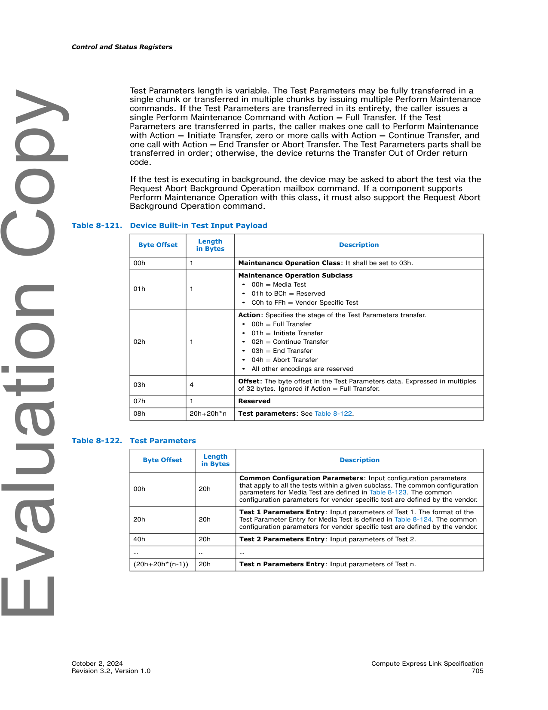
>
> *Original page render @ 150 DPI* — [📄 Full size](figures/chapter_08/page_0705.png)

[⬆️ 返回目录](#-本章目录-part-c)

---

### 8.2.10.7.2 Features Associated with Maintenance Operations | 与维护操作关联的特性

<table>
<thead>
<tr>
<th width="50%">🇬🇧 English</th>
<th width="50%" style="background-color:#e8e8e8">🇨🇳 中文</th>
</tr>
</thead>
<tbody>
<tr><td>Maintenance operations leverage the Features command set (see Section 8.2.10.6).</td><td style="background-color:#e8e8e8">维护操作利用 Features 命令集(参见 8.2.10.6 节)。</td></tr>
<tr><td>A Feature that provides capabilities and configurations may be defined for a maintenance operation. The list of maintenance operations that the device supports can be discovered by analyzing the device's supported Features. This can be accomplished by issuing the Get Supported Features command.</td><td style="background-color:#e8e8e8">可以为维护操作定义提供能力和配置的 Feature。可以通过分析设备受支持的 Feature 来发现设备支持的维护操作列表。这可以通过发出 Get Supported Features 命令来完成。</td></tr>
<tr><td>Table 8-125 shows the Maintenance Operation Classes, Subclasses, and related Feature UUID.</td><td style="background-color:#e8e8e8">表 8-125 显示了 Maintenance Operation Classes、Subclasses 以及相关的 Feature UUID。</td></tr>
</tbody>
</table>

**Table 8-123. Common Configuration Parameters for Media Test Subclass | Media Test Subclass 的公共配置参数**

<table>
<thead>
<tr><th>Byte Offset</th><th>Length in Bytes</th><th>🇬🇧 Description</th><th>🇨🇳 描述</th></tr>
</thead>
<tbody>
<tr><td>00h</td><td>1</td><td>Number of Tests: Total number of tests requested.</td><td>Number of Tests:请求的测试总数。</td></tr>
<tr><td>01h</td><td>8</td><td>Start Address: Start DPA of the test, applies to all the tests.</td><td>Start Address:测试的起始 DPA,适用于所有测试。</td></tr>
<tr><td>09h</td><td>8</td><td>Length: The range of physical addresses to test, applies to all the tests. This length shall be in multiples of 64 bytes.</td><td>Length:要测试的物理地址范围,适用于所有测试。此长度应为 64 字节的倍数。</td></tr>
<tr><td>11h</td><td>1</td><td>Media Test Results Configuration • Bit[0]: Error Signature Configuration: 0 = Complete; 1 = Single error signature • Bits[7:1]: Reserved</td><td>Media Test Results Configuration • Bit[0]:Error Signature Configuration:0 = Complete(完整);1 = Single error signature(单个错误签名) • Bits[7:1]:保留</td></tr>
<tr><td>12h</td><td>1</td><td>Configuration Flags • Bits[1:0]: ECC Disablement: 00b = Data ECC enabled & metadata ECC enabled; 01b = Data ECC disabled & metadata ECC enabled; 10b = Data ECC enabled & metadata ECC disabled; 11b = Data ECC disabled & metadata ECC disabled • Bits[7:2]: Reserved</td><td>Configuration Flags • Bits[1:0]:ECC Disablement:00b = 启用数据 ECC & 启用元数据 ECC;01b = 禁用数据 ECC & 启用元数据 ECC;10b = 启用数据 ECC & 禁用元数据 ECC;11b = 禁用数据 ECC & 禁用元数据 ECC • Bits[7:2]:保留</td></tr>
<tr><td>13h</td><td>Dh</td><td>Reserved</td><td>保留</td></tr>
</tbody>
</table>

**Table 8-124. Test Parameters Entry Media Test Subclass | Test Parameters Entry Media Test Subclass**

<table>
<thead>
<tr><th>Byte Offset</th><th>Length in Bytes</th><th>🇬🇧 Description</th><th>🇨🇳 描述</th></tr>
</thead>
<tbody>
<tr><td>00h</td><td>2</td><td>Test ID: This field identifies the Test. The value discovered through the Media Test Capability Log Entry Structures (see Table 8-93).</td><td>Test ID:此字段标识测试。通过 Media Test Capability Log Entry Structures(参见表 8-93)发现的值。</td></tr>
<tr><td>02h</td><td>1</td><td>Number of iterations: Number of repetitions of the test.</td><td>Number of iterations:测试的重复次数。</td></tr>
<tr><td>03h</td><td>2</td><td>Flags • Bit[0]: Inverse Pattern Enable • Bit[1]: Exit on Uncorrectable Error • Bit[2]: Error Count Threshold Programmed • Bit[3]: Reserved • Bits[7:4]: Addressing Mode: 0h = Ascending; 1h = Descending; 2h = Algorithm Specific; 3h = Random; All other values are reserved • Bit[8]: Update Poison List on Uncorrectable Error • Bits[15:9]: Reserved</td><td>标志位 • Bit[0]:Inverse Pattern Enable • Bit[1]:Exit on Uncorrectable Error • Bit[2]:Error Count Threshold Programmed • Bit[3]:保留 • Bits[7:4]:Addressing Mode:0h = Ascending(升序);1h = Descending(降序);2h = Algorithm Specific(算法特定);3h = Random(随机);所有其他值保留 • Bit[8]:Update Poison List on Uncorrectable Error • Bits[15:9]:保留</td></tr>
<tr><td>05h</td><td>2</td><td>Pattern Type: 00h = User provided; 01h = Vendor specific; 02h = PRBS; 03h = DPA[63:0] by eight; 04h = 55h; 05h = AAh; All other encodings are reserved</td><td>Pattern Type:00h = User provided;01h = Vendor specific;02h = PRBS;03h = DPA[63:0] by eight;04h = 55h;05h = AAh;所有其他编码保留</td></tr>
<tr><td>07h</td><td>1</td><td>Pattern Value: Pattern value provided by the user. This field is reserved if Pattern Type is not 00h.</td><td>Pattern Value:用户提供的 Pattern 值。如果 Pattern Type 不是 00h,则此字段保留。</td></tr>
<tr><td>08h</td><td>2</td><td>Vendor Specific: This field is set if Pattern Type field is 01h. The interpretation of this field is vendor specific.</td><td>Vendor Specific:如果 Pattern Type 字段为 01h,则设置此字段。此字段的解释由厂商定义。</td></tr>
<tr><td>0Ah</td><td>4</td><td>PRBS Seed: User provided PRBS Seed. This field is valid if Pattern Type is PRBS.</td><td>PRBS Seed:用户提供的 PRBS Seed。如果 Pattern Type 是 PRBS,则此字段有效。</td></tr>
<tr><td>0Eh</td><td>2</td><td>Error Count Threshold: User-programmable error count threshold.</td><td>Error Count Threshold:用户可编程错误计数阈值。</td></tr>
<tr><td>10h</td><td>10h</td><td>Reserved</td><td>保留</td></tr>
</tbody>
</table>

> **Figure 8-X.** Test Parameters (page 706-707) ｜ Test Parameters
>
> 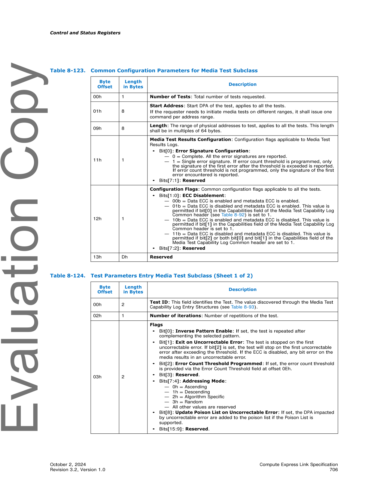
>
> *Original page render @ 150 DPI* — [📄 Full size](figures/chapter_08/page_0706.png)

**Table 8-125. Maintenance Operation: Classes, Subclasses, and Feature UUIDs | 维护操作:类、子类和 Feature UUID**

<table>
<thead>
<tr><th>Maintenance Operation Class</th><th>Class Description</th><th>Maintenance Operation Subclass</th><th>Subclass Description</th><th>UUID</th></tr>
</thead>
<tbody>
<tr><td>00h</td><td>No operation</td><td>00h</td><td>No operation</td><td>-</td></tr>
<tr><td>01h</td><td>PPR</td><td>00h</td><td>Soft PPR</td><td>892ba475-fad8-474e-9d3e-692c917568bb</td></tr>
<tr><td>01h</td><td>PPR</td><td>01h</td><td>Hard PPR</td><td>80ea4521-786f-4127-afb1-ec7459fb0e24</td></tr>
<tr><td>01h</td><td>PPR</td><td>Others</td><td>Reserved</td><td>-</td></tr>
<tr><td>02h</td><td>Memory Sparing</td><td>00h</td><td>Cacheline - Memory Sparing</td><td>96C33386-91dd-44c7-9ecb-fdaf6503baC4</td></tr>
<tr><td>02h</td><td>Memory Sparing</td><td>01h</td><td>Row - Memory Sparing</td><td>450ebf67-b135-4f97-a498-c2d57f279bed</td></tr>
<tr><td>02h</td><td>Memory Sparing</td><td>02h</td><td>Bank - Memory Sparing</td><td>78b79636-90ac-4b64-A4ef-faac5d18a863</td></tr>
<tr><td>02h</td><td>Memory Sparing</td><td>03h</td><td>Rank - Memory Sparing</td><td>34dbaff5-0552-4281-8f76-da0b5e7a76a7</td></tr>
<tr><td>02h</td><td>Memory Sparing</td><td>Others</td><td>Reserved</td><td>-</td></tr>
<tr><td>03h</td><td>Device Built-in Test</td><td>00h</td><td>Media Test</td><td>No associated feature</td></tr>
<tr><td>03h</td><td>Device Built-in Test</td><td>01h to BFh</td><td>Reserved</td><td>-</td></tr>
<tr><td>03h</td><td>Device Built-in Test</td><td>0C0h to 0FFh</td><td>Vendor Specific</td><td>Vendor Specific</td></tr>
<tr><td>04h to DFh</td><td>Reserved</td><td>All</td><td>Reserved</td><td>-</td></tr>
<tr><td>E0h to FFh</td><td>Vendor specific</td><td>All</td><td>Vendor specific</td><td>Vendor specific</td></tr>
</tbody>
</table>

<table>
<thead>
<tr>
<th width="50%">🇬🇧 English</th>
<th width="50%" style="background-color:#e8e8e8">🇨🇳 中文</th>
</tr>
</thead>
<tbody>
<tr><td>These Features represent maintenance operations capabilities and settings. Some fields of the Features are writable to configure the desired device behavior. Table 8-126 shows the Maintenance Operation Feature format. The first 16 bytes are common to all Maintenance Operation Features.</td><td style="background-color:#e8e8e8">这些 Feature 表示维护操作的能力和设置。Feature 的某些字段是可写的,以配置所需的设备行为。表 8-126 显示了 Maintenance Operation Feature 格式。前 16 个字节对于所有 Maintenance Operation Features 是通用的。</td></tr>
<tr><td>Row sparing in the Memory Sparing is equivalent to PPR; however, memory sparing is preferred when possible.</td><td style="background-color:#e8e8e8">Memory Sparing 中的 Row sparing 等同于 PPR;但是,当可能时,首选 memory sparing。</td></tr>
</tbody>
</table>

> **Figure 8-X.** Maintenance Operation Classes/Subclasses (page 707) ｜ 维护操作类/子类
>
> 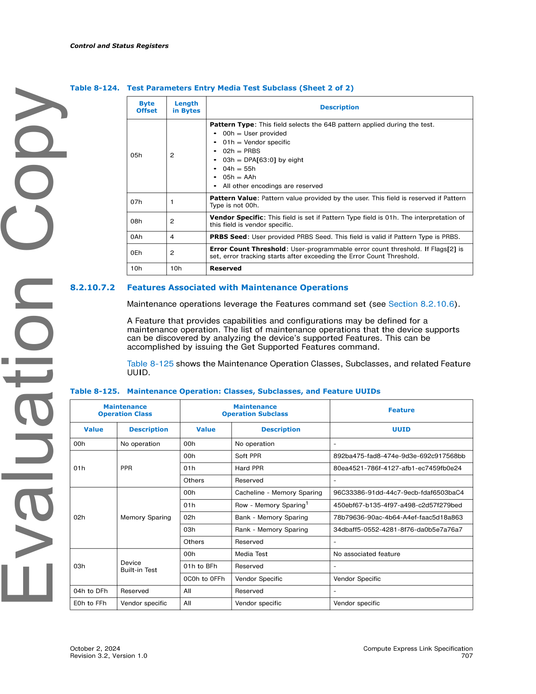
>
> *Original page render @ 150 DPI* — [📄 Full size](figures/chapter_08/page_0707.png)

**Table 8-126. Common Maintenance Operation Feature Format | 通用维护操作 Feature 格式**

<table>
<thead>
<tr><th>Byte Offset</th><th>Length in Bytes</th><th>Attribute</th><th>Description</th></tr>
</thead>
<tbody>
<tr><td>00h</td><td>1</td><td>RO</td><td>Maximum Maintenance Operation Latency: Bits[3:0] specify time scale (0h=1us, 1h=10us, 2h=100us, 3h=1ms, 4h=10ms, 5h=100ms, 6h=1s, 7h=10s); Bits[7:4] specify max operation latency with the time scale indicated in bits[3:0].</td></tr>
<tr><td>01h</td><td>2</td><td>RO</td><td>Operation Capabilities: Bit[0]: Device Initiated Capability; Bits[15:1]: Reserved</td></tr>
<tr><td>03h</td><td>2</td><td>RW</td><td>Operation Mode: Bit[0]: Device Initiated; Bits[15:1]: Reserved. Operation Mode default value is 0000h.</td></tr>
<tr><td>05h</td><td>1</td><td>RO</td><td>Maintenance Operation Class: This field specifies the Maintenance Operation Class.</td></tr>
<tr><td>06h</td><td>1</td><td>RO</td><td>Maintenance Operation Subclass: This field specifies the Maintenance Operation Subclass.</td></tr>
<tr><td>07h</td><td>9</td><td>RsvdZ</td><td>Reserved</td></tr>
<tr><td>10h</td><td>Varies</td><td>-</td><td>Operation specific fields</td></tr>
</tbody>
</table>

> **Figure 8-X.** Common Maintenance Operation Feature (page 708) ｜ 通用维护操作 Feature
>
> 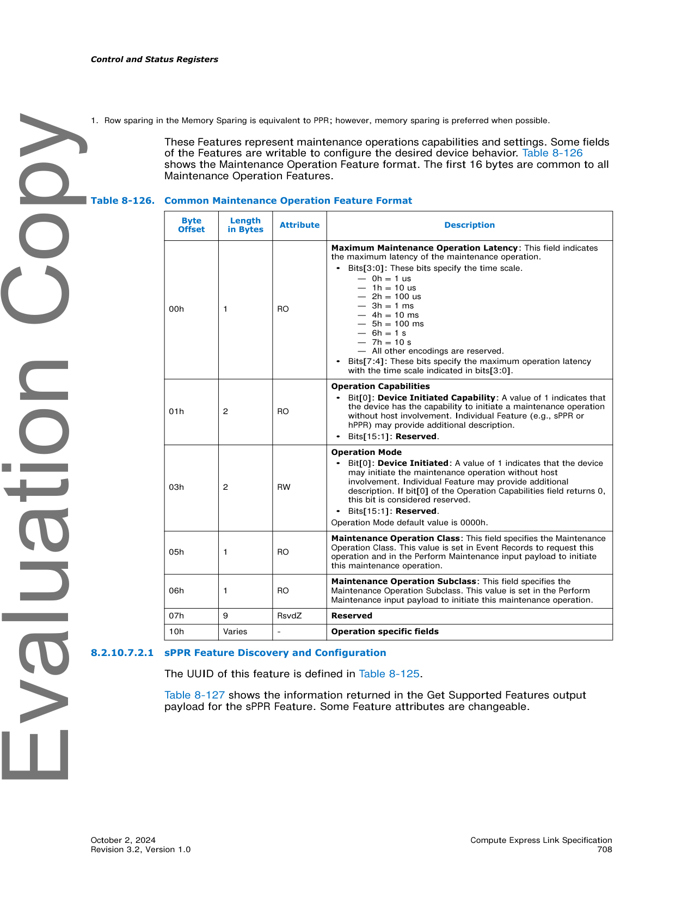
>
> *Original page render @ 150 DPI* — [📄 Full size](figures/chapter_08/page_0708.png)

[⬆️ 返回目录](#-本章目录-part-c)

---

#### 8.2.10.7.2.1 sPPR Feature Discovery and Configuration | sPPR 特性发现和配置

<table>
<thead>
<tr>
<th width="50%">🇬🇧 English</th>
<th width="50%" style="background-color:#e8e8e8">🇨🇳 中文</th>
</tr>
</thead>
<tbody>
<tr><td>The UUID of this feature is defined in Table 8-125.</td><td style="background-color:#e8e8e8">此特性的 UUID 在表 8-125 中定义。</td></tr>
<tr><td>Table 8-127 shows the information returned in the Get Supported Features output payload for the sPPR Feature. Some Feature attributes are changeable.</td><td style="background-color:#e8e8e8">表 8-127 显示了 sPPR Feature 的 Get Supported Features 输出负载中返回的信息。某些 Feature 属性是可更改的。</td></tr>
</tbody>
</table>

**Table 8-127. Supported Feature Entry for the sPPR Feature | sPPR Feature 的 Supported Feature Entry**

<table>
<thead>
<tr><th>Byte Offset</th><th>Length in Bytes</th><th>Attribute</th><th>Value</th></tr>
</thead>
<tbody>
<tr><td>00h</td><td>10h</td><td>Feature Identifier</td><td>892ba475-fad8-474e-9d3e-692c917568bb</td></tr>
<tr><td>10h</td><td>2</td><td>Feature Index</td><td>Device specific</td></tr>
<tr><td>12h</td><td>2</td><td>Get Feature Size</td><td>14h</td></tr>
<tr><td>14h</td><td>2</td><td>Set Feature Size</td><td>03h</td></tr>
<tr><td>16h</td><td>4</td><td>Attribute Flags</td><td>• Bit[0]: Vendor-specific value (Changeable) • Bits[3:1]: 010b if saved selection is supported (Bit[6] = 1); otherwise 000b (Deepest Reset Persistence) • Bit[4]: Vendor-specific value (Persist across Firmware Update) • Bit[5]: 1 (Default Selection Supported) • Bit[6]: Vendor-specific value (Saved Selection Supported) • Bits[31:7]: Reserved</td></tr>
<tr><td>1Ah</td><td>1</td><td>Get Feature Version</td><td>03h</td></tr>
<tr><td>1Bh</td><td>1</td><td>Set Feature Version</td><td>03h</td></tr>
<tr><td>1Ch</td><td>2</td><td>Set Feature Effects</td><td>• Bit[0]: 0 (Configuration Change after Cold Reset) • Bit[1]: 1 (Immediate Configuration Change) • Bit[2]: 0 (Immediate Data Change) • Bit[3]: 0 (Immediate Policy Change) • Bit[4]: Vendor-specific value (Immediate Log Change) • Bit[5]: 0 (Security State Change) • Bit[6]: 0 (Background Operation) • Bit[7]: Vendor-specific value (Secondary Mailbox Supported) • Bit[8]: 0 (Request Abort Background Operation Supported) • Bit[9]: 1 is recommended, 0 is permitted (CEL[11:10] Valid) • Bit[10]: 0 (Configuration Change after Conventional Reset) • Bit[11]: 0 (Configuration Change after CXL Reset) • Bits[15:12]: 0h</td></tr>
<tr><td>1Eh</td><td>18</td><td>Reserved</td><td>All 0s</td></tr>
</tbody>
</table>

**Table 8-128. sPPR Feature Readable Attributes | sPPR Feature 可读属性**

<table>
<thead>
<tr><th>Byte Offset</th><th>Length in Bytes</th><th>🇬🇧 Description</th><th>🇨🇳 描述</th></tr>
</thead>
<tbody>
<tr><td>00h</td><td>1</td><td>Maximum Maintenance Operation Latency: This field is defined in Table 8-126.</td><td>Maximum Maintenance Operation Latency:此字段在表 8-126 中定义。</td></tr>
<tr><td>01h</td><td>2</td><td>Operation Capabilities: This field is defined in Table 8-126. If Device Initiated capability bit is set to 1, the device has the capability to initiate sPPR maintenance without host involvement at runtime. Device Initiated capability bit shall be cleared to 0 if Restriction Flags bit[0] or bit[2] is set to 1.</td><td>Operation Capabilities:此字段在表 8-126 中定义。如果 Device Initiated capability 位设置为 1,则设备能够在运行时无需主机参与启动 sPPR 维护。如果 Restriction Flags 的 bit[0] 或 bit[2] 设置为 1,则 Device Initiated capability 位应清零为 0。</td></tr>
<tr><td>03h</td><td>2</td><td>Operation Mode: This field is defined in Table 8-126. If Device Initiated bit is set to 1, the device may initiate sPPR maintenance without host involvement at runtime.</td><td>Operation Mode:此字段在表 8-126 中定义。如果 Device Initiated 位设置为 1,则设备可以在运行时无需主机参与启动 sPPR 维护。</td></tr>
<tr><td>05h</td><td>1</td><td>Maintenance Operation Class: It shall be set to 01h (PPR).</td><td>Maintenance Operation Class:应设置为 01h (PPR)。</td></tr>
<tr><td>06h</td><td>1</td><td>Maintenance Operation Subclass: It shall be cleared to 00h (Soft PPR).</td><td>Maintenance Operation Subclass:应清零为 00h (Soft PPR)。</td></tr>
<tr><td>07h</td><td>9</td><td>Reserved</td><td>保留</td></tr>
<tr><td>10h</td><td>1</td><td>sPPR Flags • Bit[0]: DPA Support Flag: If set, the device supports DPA argument in the Perform Maintenance command input payload. • Bit[1]: Nibble Support Flag: If set, the device supports Nibble Mask argument in the Perform Maintenance command input payload. • Bit[2]: Memory Sparing Event Record Capability Flag: If set, the device has the capability to produce a Memory Sparing Event Record upon completion of sPPR maintenance operation. • Bit[3]: Device Initiated at Device Boot Capability: A value of 1 indicates that the device has the capability to initiate the sPPR maintenance operation without host involvement when Memory_Active = 0. • Bits[7:4]: Reserved</td><td>sPPR Flags • Bit[0]:DPA Support Flag:如果设置,设备支持 Perform Maintenance 命令输入负载中的 DPA 参数。 • Bit[1]:Nibble Support Flag:如果设置,设备支持 Perform Maintenance 命令输入负载中的 Nibble Mask 参数。 • Bit[2]:Memory Sparing Event Record Capability Flag:如果设置,设备能够在 sPPR 维护操作完成时生成 Memory Sparing Event Record。 • Bit[3]:Device Initiated at Device Boot Capability:值 1 表示设备能够在 Memory_Active = 0 时无需主机参与启动 sPPR 维护操作。 • Bits[7:4]:保留</td></tr>
<tr><td>11h</td><td>2</td><td>Restriction Flags • Bit[0]: 0 = CXL.mem requests are correctly processed; 1 = Media is not accessible. • Bit[1]: Reserved. • Bit[2]: 0 = Data is retained; 1 = Data may or may not be retained. • Bits[15:3]: Reserved.</td><td>Restriction Flags • Bit[0]:0 = 正确处理 CXL.mem 请求;1 = 介质不可访问。 • Bit[1]:保留。 • Bit[2]:0 = 保留数据;1 = 数据可能保留,也可能不保留。 • Bits[15:3]:保留。</td></tr>
<tr><td>13h</td><td>1</td><td>sPPR Operation Mode • Bit[0]: Memory Sparing Event Record Enable • Bit[1]: Device Initiated at Device Boot • Bits[7:2]: Reserved</td><td>sPPR Operation Mode • Bit[0]:Memory Sparing Event Record Enable • Bit[1]:Device Initiated at Device Boot • Bits[7:2]:保留</td></tr>
</tbody>
</table>

**Table 8-129. sPPR Feature Writable Attributes | sPPR Feature 可写属性**

<table>
<thead>
<tr><th>Byte Offset</th><th>Length in Bytes</th><th>🇬🇧 Description</th><th>🇨🇳 描述</th></tr>
</thead>
<tbody>
<tr><td>00h</td><td>2</td><td>Operation Mode: Bit[0]: Device Initiated; Bits[15:1]: Reserved</td><td>Operation Mode:Bit[0]:Device Initiated;Bits[15:1]:保留</td></tr>
<tr><td>02h</td><td>1</td><td>sPPR Operation Mode: Bit[0]: Memory Sparing Event Record Enable; Bit[1]: Device Initiated at Device Boot; Bits[7:2]: Reserved</td><td>sPPR Operation Mode:Bit[0]:Memory Sparing Event Record Enable;Bit[1]:Device Initiated at Device Boot;Bits[7:2]:保留</td></tr>
</tbody>
</table>

> **Figure 8-X.** sPPR Feature (page 709-711) ｜ sPPR Feature
>
> 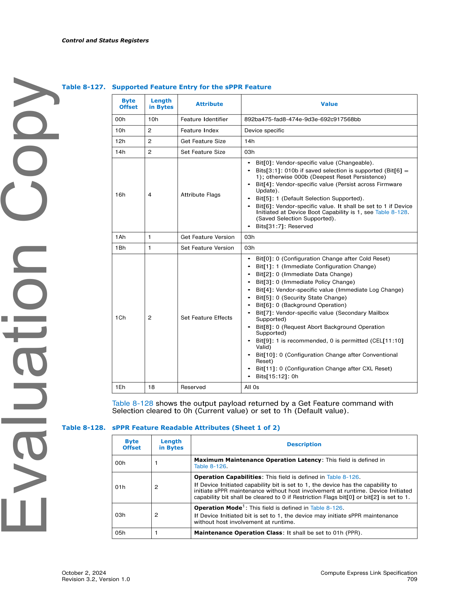
>
> *Original page render @ 150 DPI* — [📄 Full size](figures/chapter_08/page_0709.png)

[⬆️ 返回目录](#-本章目录-part-c)

---

#### 8.2.10.7.2.2 hPPR Feature Discovery and Configuration | hPPR 特性发现和配置

<table>
<thead>
<tr>
<th width="50%">🇬🇧 English</th>
<th width="50%" style="background-color:#e8e8e8">🇨🇳 中文</th>
</tr>
</thead>
<tbody>
<tr><td>The UUID of this feature is defined in Table 8-125.</td><td style="background-color:#e8e8e8">此特性的 UUID 在表 8-125 中定义。</td></tr>
<tr><td>Table 8-130 shows the information returned in the Get Supported Features output payload for the hPPR Feature. Some Feature attributes are changeable.</td><td style="background-color:#e8e8e8">表 8-130 显示了 hPPR Feature 的 Get Supported Features 输出负载中返回的信息。某些 Feature 属性是可更改的。</td></tr>
</tbody>
</table>

**Table 8-130. Supported Feature Entry for the hPPR Feature | hPPR Feature 的 Supported Feature Entry**

<table>
<thead>
<tr><th>Byte Offset</th><th>Length in Bytes</th><th>Attribute</th><th>Value</th></tr>
</thead>
<tbody>
<tr><td>00h</td><td>10h</td><td>Feature Identifier</td><td>80ea4521-786f-4127-afb1-ec7459fb0e24</td></tr>
<tr><td>10h</td><td>2</td><td>Feature Index</td><td>Device specific</td></tr>
<tr><td>12h</td><td>2</td><td>Get Feature Size</td><td>14h</td></tr>
<tr><td>14h</td><td>2</td><td>Set Feature Size</td><td>03h</td></tr>
<tr><td>16h</td><td>4</td><td>Attribute Flags</td><td>• Bit[0]: Vendor-specific value (Changeable) • Bits[3:1]: 010b if saved selection is supported (Bit[6] = 1); otherwise, 000b (Deepest Reset Persistence) • Bit[4]: Vendor-specific value (Persist across Firmware Update) • Bit[5]: 1 (Default Selection Supported) • Bit[6]: Vendor-specific value (Saved Selection Supported) • Bits[31:7]: Reserved</td></tr>
<tr><td>1Ah</td><td>1</td><td>Get Feature Version</td><td>03h</td></tr>
<tr><td>1Bh</td><td>1</td><td>Set Feature Version</td><td>03h</td></tr>
<tr><td>1Ch</td><td>2</td><td>Set Feature Effects</td><td>• Bit[0]: 0 (Configuration Change after Cold Reset) • Bit[1]: 1 (Immediate Configuration Change) • Bit[2]: 0 (Immediate Data Change) • Bit[3]: 0 (Immediate Policy Change) • Bit[4]: Vendor-specific value (Immediate Log change) • Bit[5]: 0 (Security State Change) • Bit[6]: 0 (Background Operation) • Bit[7]: Vendor-specific value (Secondary Mailbox Supported) • Bit[8]: 0 (Request Abort Background Operation Supported) • Bit[9]: 1 is recommended, 0 is permitted (CEL[11:10] Valid) • Bit[10]: 0 (Configuration Change after Conventional Reset) • Bit[11]: 0 (Configuration Change after CXL Reset) • Bits[15:12]: 0h</td></tr>
<tr><td>1Eh</td><td>2</td><td>Reserved</td><td>All 0s</td></tr>
</tbody>
</table>

**Table 8-131. hPPR Feature Readable Attributes | hPPR Feature 可读属性**

<table>
<thead>
<tr><th>Byte Offset</th><th>Length in Bytes</th><th>🇬🇧 Description</th><th>🇨🇳 描述</th></tr>
</thead>
<tbody>
<tr><td>00h</td><td>1</td><td>Maximum Maintenance Operation Latency: This field is defined in Table 8-126.</td><td>Maximum Maintenance Operation Latency:此字段在表 8-126 中定义。</td></tr>
<tr><td>01h</td><td>2</td><td>Operation Capabilities: This field is defined in Table 8-126. If Device Initiated capability bit is set to 1, the device has the capability to initiate hPPR maintenance without host involvement at runtime. Device Initiated capability bit shall be cleared to 0 if Restriction Flags Bit[0] or Bit[2] is set to 1.</td><td>Operation Capabilities:此字段在表 8-126 中定义。如果 Device Initiated capability 位设置为 1,则设备能够在运行时无需主机参与启动 hPPR 维护。如果 Restriction Flags 的 Bit[0] 或 Bit[2] 设置为 1,则 Device Initiated capability 位应清零为 0。</td></tr>
<tr><td>03h</td><td>2</td><td>Operation Mode: This field is defined in Table 8-126. If Device Initiated bit is set to 1, the device may initiate hPPR maintenance without host involvement at runtime.</td><td>Operation Mode:此字段在表 8-126 中定义。如果 Device Initiated 位设置为 1,则设备可以在运行时无需主机参与启动 hPPR 维护。</td></tr>
<tr><td>05h</td><td>1</td><td>Maintenance Operation Class: It shall be set to 01h (PPR).</td><td>Maintenance Operation Class:应设置为 01h (PPR)。</td></tr>
<tr><td>06h</td><td>1</td><td>Maintenance Operation Subclass: It shall be set to 01h (Hard PPR).</td><td>Maintenance Operation Subclass:应设置为 01h (Hard PPR)。</td></tr>
<tr><td>07h</td><td>9</td><td>Reserved</td><td>保留</td></tr>
<tr><td>10h</td><td>1</td><td>hPPR Flags • Bit[0]: DPA Support Flag • Bit[1]: Nibble Support Flag • Bit[2]: Memory Sparing Event Record Capability Flag • Bit[3]: Device Initiated at Device Boot Capability • Bits[7:4]: Reserved</td><td>hPPR Flags • Bit[0]:DPA Support Flag • Bit[1]:Nibble Support Flag • Bit[2]:Memory Sparing Event Record Capability Flag • Bit[3]:Device Initiated at Device Boot Capability • Bits[7:4]:保留</td></tr>
<tr><td>11h</td><td>2</td><td>Restriction Flags • Bit[0]: 0 = CXL.mem requests are correctly processed; 1 = Media is not accessible. • Bit[1]: Reserved. • Bit[2]: 0 = Data is retained; 1 = Data may or may not be retained. • Bits[15:3]: Reserved.</td><td>Restriction Flags • Bit[0]:0 = 正确处理 CXL.mem 请求;1 = 介质不可访问。 • Bit[1]:保留。 • Bit[2]:0 = 保留数据;1 = 数据可能保留,也可能不保留。 • Bits[15:3]:保留。</td></tr>
<tr><td>13h</td><td>1</td><td>hPPR Operation Mode • Bit[0]: Memory Sparing Event Record Enable • Bit[1]: Device Initiated at Device Boot • Bits[7:2]: Reserved</td><td>hPPR Operation Mode • Bit[0]:Memory Sparing Event Record Enable • Bit[1]:Device Initiated at Device Boot • Bits[7:2]:保留</td></tr>
</tbody>
</table>

**Table 8-132. hPPR Feature Writable Attributes | hPPR Feature 可写属性**

<table>
<thead>
<tr><th>Byte Offset</th><th>Length in Bytes</th><th>🇬🇧 Description</th><th>🇨🇳 描述</th></tr>
</thead>
<tbody>
<tr><td>00h</td><td>2</td><td>Operation Mode: Bit[0]: Device Initiated; Bits[15:1]: Reserved</td><td>Operation Mode:Bit[0]:Device Initiated;Bits[15:1]:保留</td></tr>
<tr><td>02h</td><td>1</td><td>hPPR Operation Mode: Bit[0]: Memory Sparing Event Record Enable; Bit[1]: Device Initiated at Device Boot; Bits[7:2]: Reserved</td><td>hPPR Operation Mode:Bit[0]:Memory Sparing Event Record Enable;Bit[1]:Device Initiated at Device Boot;Bits[7:2]:保留</td></tr>
</tbody>
</table>

> **Figure 8-X.** hPPR Feature (page 711-713) ｜ hPPR Feature
>
> 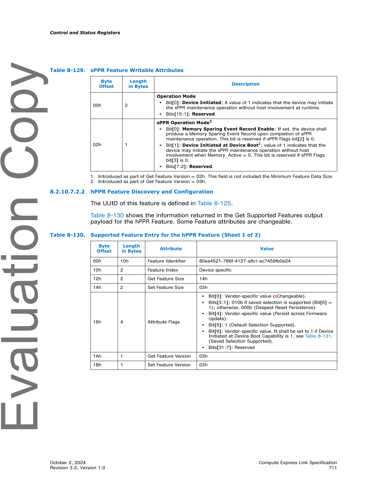
>
> *Original page render @ 150 DPI* — [📄 Full size](figures/chapter_08/page_0711.png)

[⬆️ 返回目录](#-本章目录-part-c)

---

#### 8.2.10.7.2.3 Memory Sparing Features | 内存备用 Feature

<table>
<thead>
<tr>
<th width="50%">🇬🇧 English</th>
<th width="50%" style="background-color:#e8e8e8">🇨🇳 中文</th>
</tr>
</thead>
<tbody>
<tr><td>The UUIDs associated with these features are defined in Table 8-125.</td><td style="background-color:#e8e8e8">与此特性关联的 UUID 在表 8-125 中定义。</td></tr>
<tr><td>Table 8-133 shows the information returned in the Get Supported Features output payload for the Enhanced Memory Sparing Feature. Some Feature attributes are changeable.</td><td style="background-color:#e8e8e8">表 8-133 显示了 Enhanced Memory Sparing Feature 的 Get Supported Features 输出负载中返回的信息。某些 Feature 属性是可更改的。</td></tr>
</tbody>
</table>

**Table 8-133. Supported Feature Entry for the Memory Sparing Feature | Memory Sparing Feature 的 Supported Feature Entry**

<table>
<thead>
<tr><th>Byte Offset</th><th>Length in Bytes</th><th>Attribute</th><th>Value</th></tr>
</thead>
<tbody>
<tr><td>00h</td><td>10h</td><td>Feature Identifier</td><td>Depends on the Maintenance Operation subclass (see Table 8-125 for details)</td></tr>
<tr><td>10h</td><td>2</td><td>Feature Index</td><td>Device specific</td></tr>
<tr><td>12h</td><td>2</td><td>Get Feature Size</td><td>13h</td></tr>
<tr><td>14h</td><td>2</td><td>Set Feature Size</td><td>02h</td></tr>
<tr><td>16h</td><td>4</td><td>Attribute Flags</td><td>• Bit[0]: Vendor-specific value (Changeable) • Bits[3:1]: 000b (Deepest Reset Persistence=None. Any reset will restore the default value.) • Bit[4]: 0 (Persist across Firmware Update) • Bit[5]: 1 (Default Selection Supported) • Bit[6]: Vendor-specific value (Saved Selection Supported) • Bits[31:7]: Reserved</td></tr>
<tr><td>1Ah</td><td>1</td><td>Get Feature Version</td><td>01h</td></tr>
<tr><td>1Bh</td><td>1</td><td>Set Feature Version</td><td>01h</td></tr>
<tr><td>1Ch</td><td>2</td><td>Set Feature Effects</td><td>• Bit[0]: 0 (Configuration Change after Cold Reset) • Bit[1]: 1 (Immediate Configuration Change) • Bit[2]: 0 (Immediate Data Change) • Bit[3]: 0 (Immediate Policy Change) • Bit[4]: Vendor-specific value (Immediate Log Change) • Bit[5]: 0 (Security State Change) • Bit[6]: 0 (Background Operation) • Bit[7]: Vendor-specific value (Secondary Mailbox Supported) • Bit[8]: 0 (Request Abort Background Operation Supported) • Bit[9]: 1 (CEL[11:10] Valid) • Bit[10]: 0 (Configuration Change after Conventional Reset) • Bit[11]: 0 (Configuration Change after CXL Reset) • Bits[15:12]: 0h</td></tr>
<tr><td>1Eh</td><td>12h</td><td>Reserved</td><td>All 0s</td></tr>
</tbody>
</table>

**Table 8-134. Memory Sparing Feature Readable Attributes | Memory Sparing Feature 可读属性**

<table>
<thead>
<tr><th>Byte Offset</th><th>Length in Bytes</th><th>🇬🇧 Description</th><th>🇨🇳 描述</th></tr>
</thead>
<tbody>
<tr><td>00h</td><td>1</td><td>Maximum Maintenance Operation Latency: This field is defined in Table 8-126.</td><td>Maximum Maintenance Operation Latency:此字段在表 8-126 中定义。</td></tr>
<tr><td>01h</td><td>2</td><td>Operation Capabilities: This field is defined in Table 8-126. Device Initiated capability bit shall be cleared to 0 if Restriction flags bit[0] is set to 1.</td><td>Operation Capabilities:此字段在表 8-126 中定义。如果 Restriction flags 的 bit[0] 设置为 1,则 Device Initiated capability 位应清零为 0。</td></tr>
<tr><td>03h</td><td>2</td><td>Operation Mode: This field is defined in Table 8-126.</td><td>Operation Mode:此字段在表 8-126 中定义。</td></tr>
<tr><td>05h</td><td>1</td><td>Maintenance Operation Class: This field shall be set to 02h (Memory Sparing).</td><td>Maintenance Operation Class:此字段应设置为 02h (Memory Sparing)。</td></tr>
<tr><td>06h</td><td>1</td><td>Maintenance Operation Subclass: Depends on the scope of the sparing needed.</td><td>Maintenance Operation Subclass:取决于所需备用的范围。</td></tr>
<tr><td>07h</td><td>0Ah</td><td>Reserved</td><td>保留</td></tr>
<tr><td>11h</td><td>2</td><td>Restriction Flags • Bit[0]: Sparing Side Effects: 0 = The device preserves the memory content and remains responsive to CXL.mem requests during the sparing operation. 1 = The device is permitted to drop CXL.mem write requests, return poison in response to CXL.mem read requests during the sparing operation. The device does not guarantee preservation of HDM contents across the sparing operation. • Bit[1]: Hard Sparing: If set, the device has the capability for performing the sparing that is irreversible and that can survive any Conventional Reset. • Bit[2]: Soft Sparing: If set, the device has the capability for performing the sparing in a non-permanent way; thus, the change will be reverted after any Conventional Reset. • Bits[15:3]: Reserved.</td><td>Restriction Flags • Bit[0]:Sparing Side Effects:0 = 设备在备用操作期间保留内存内容并保持对 CXL.mem 请求的响应。1 = 设备允许在备用操作期间丢弃 CXL.mem 写入请求,并对 CXL.mem 读取请求返回 poison。设备不保证在备用操作期间保留 HDM 内容。 • Bit[1]:Hard Sparing:如果设置,设备具有执行不可逆备用且可在任何 Conventional Reset 后存活的能力。 • Bit[2]:Soft Sparing:如果设置,设备具有以非永久方式执行备用的能力;因此,更改将在任何 Conventional Reset 后被恢复。 • Bits[15:3]:保留。</td></tr>
</tbody>
</table>

**Table 8-135. Memory Sparing Feature Writable Attributes | Memory Sparing Feature 可写属性**

<table>
<thead>
<tr><th>Byte Offset</th><th>Length in Bytes</th><th>🇬🇧 Description</th><th>🇨🇳 描述</th></tr>
</thead>
<tbody>
<tr><td>00h</td><td>2</td><td>Operation Mode: Bit[0]: Device Initiated; Bits[15:1]: Reserved</td><td>Operation Mode:Bit[0]:Device Initiated;Bits[15:1]:保留</td></tr>
</tbody>
</table>

> **Figure 8-X.** Memory Sparing Feature (page 714-715) ｜ Memory Sparing Feature
>
> 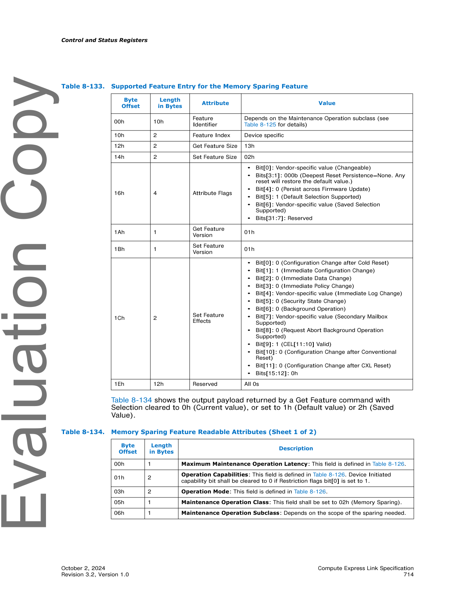
>
> *Original page render @ 150 DPI* — [📄 Full size](figures/chapter_08/page_0714.png)

[⬆️ 返回目录](#-本章目录-part-c)

---

## 8.2.10.8 PBR Component Command Set | PBR 组件命令集

<table>
<thead>
<tr>
<th width="50%">🇬🇧 English</th>
<th width="50%" style="background-color:#e8e8e8">🇨🇳 中文</th>
</tr>
</thead>
<tbody>
<tr><td>Support for this command set is required for all devices that are PBR link capable (i.e., PBR switches and GFDs).</td><td style="background-color:#e8e8e8">所有支持 PBR 链路的设备(即 PBR 交换机和 GFD)都需要支持此命令集。</td></tr>
</tbody>
</table>

[⬆️ 返回目录](#-本章目录-part-c)

---

### 8.2.10.8.1 Identify PBR Component (Opcode 0700h) | 标识 PBR 组件 (操作码 0700h)

<table>
<thead>
<tr>
<th width="50%">🇬🇧 English</th>
<th width="50%" style="background-color:#e8e8e8">🇨🇳 中文</th>
</tr>
</thead>
<tbody>
<tr><td>This command provides information about a component specific to its PBR fabric capabilities.</td><td style="background-color:#e8e8e8">此命令提供有关特定于其 PBR fabric 能力的组件的信息。</td></tr>
<tr><td><b>Possible Command Return Codes:</b> • Success • Unsupported • Internal Error • Retry Required</td><td style="background-color:#e8e8e8"><b>可能的命令返回码:</b> • Success(成功) • Unsupported(不支持) • Internal Error(内部错误) • Retry Required(需要重试)</td></tr>
<tr><td><b>Command Effects:</b> • None</td><td style="background-color:#e8e8e8"><b>命令效果:</b> • None(无)</td></tr>
</tbody>
</table>

**Table 8-136. Identify PBR Component Response Payload | Identify PBR Component 响应负载**

<table>
<thead>
<tr><th>Byte Offset</th><th>Length in Bytes</th><th>🇬🇧 Description</th><th>🇨🇳 描述</th></tr>
</thead>
<tbody>
<tr><td>00h</td><td>2</td><td>• Bits[11:0]: PID: Assigned PID of this device or FFFh if no PID has been assigned • Bits[15:12]: Reserved</td><td>• Bits[11:0]:PID:此设备的分配 PID,或 FFFh(如果尚未分配 PID) • Bits[15:12]:保留</td></tr>
<tr><td>02h</td><td>2</td><td>• Bits[11:0]: Primary FM PID: PID of the FM registered as primary FM. A value of FFFh indicates no primary FM is registered. • Bits[15:12]: Reserved</td><td>• Bits[11:0]:Primary FM PID:注册为 primary FM 的 FM 的 PID。值 FFFh 表示未注册 primary FM。 • Bits[15:12]:保留</td></tr>
<tr><td>04h</td><td>10h</td><td>Primary FM UUID: UUID of the FM registered as primary FM.</td><td>Primary FM UUID:注册为 primary FM 的 FM 的 UUID。</td></tr>
<tr><td>14h</td><td>2</td><td>• Bits[11:0]: Secondary FM PID: PID of the FM registered as secondary FM. A value of FFFh indicates no secondary FM is registered. • Bits[15:12]: Reserved</td><td>• Bits[11:0]:Secondary FM PID:注册为 secondary FM 的 FM 的 PID。值 FFFh 表示未注册 secondary FM。 • Bits[15:12]:保留</td></tr>
<tr><td>16h</td><td>10h</td><td>Secondary FM UUID: UUID of the FM registered as secondary FM.</td><td>Secondary FM UUID:注册为 secondary FM 的 FM 的 UUID。</td></tr>
</tbody>
</table>

> **Figure 8-X.** Identify PBR Component (page 716) ｜ Identify PBR Component
>
> 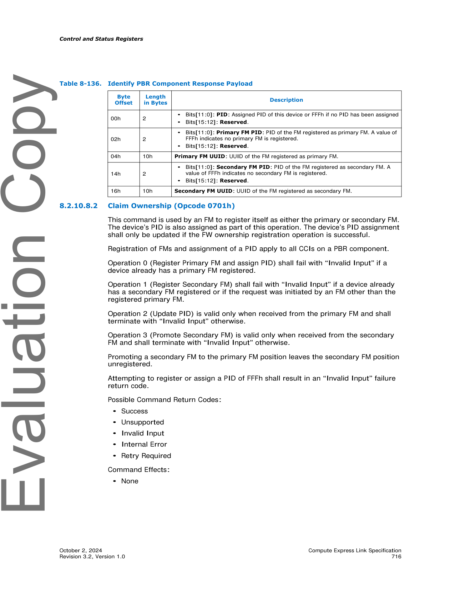
>
> *Original page render @ 150 DPI* — [📄 Full size](figures/chapter_08/page_0716.png)

[⬆️ 返回目录](#-本章目录-part-c)

---

### 8.2.10.8.2 Claim Ownership (Opcode 0701h) | 声明所有权 (操作码 0701h)

<table>
<thead>
<tr>
<th width="50%">🇬🇧 English</th>
<th width="50%" style="background-color:#e8e8e8">🇨🇳 中文</th>
</tr>
</thead>
<tbody>
<tr><td>This command is used by an FM to register itself as either the primary or secondary FM. The device's PID is also assigned as part of this operation. The device's PID assignment shall only be updated if the FW ownership registration operation is successful.</td><td style="background-color:#e8e8e8">此命令由 FM 用于将自身注册为 primary 或 secondary FM。设备的 PID 也作为此操作的一部分进行分配。仅当 FW 所有权注册操作成功时,设备的 PID 分配才会更新。</td></tr>
<tr><td>Registration of FMs and assignment of a PID apply to all CCIs on a PBR component.</td><td style="background-color:#e8e8e8">FM 的注册和 PID 的分配适用于 PBR 组件上的所有 CCI。</td></tr>
<tr><td>Operation 0 (Register Primary FM and assign PID) shall fail with "Invalid Input" if a device already has a primary FM registered.</td><td style="background-color:#e8e8e8">如果设备已注册 primary FM,则操作 0(Register Primary FM and assign PID)应以 "Invalid Input" 失败。</td></tr>
<tr><td>Operation 1 (Register Secondary FM) shall fail with "Invalid Input" if a device already has a secondary FM registered or if the request was initiated by an FM other than the registered primary FM.</td><td style="background-color:#e8e8e8">如果设备已注册 secondary FM,或请求由已注册 primary FM 之外的 FM 发起,则操作 1(Register Secondary FM)应以 "Invalid Input" 失败。</td></tr>
<tr><td>Operation 2 (Update PID) is valid only when received from the primary FM and shall terminate with "Invalid Input" otherwise.</td><td style="background-color:#e8e8e8">操作 2(Update PID)仅当从 primary FM 接收时有效,否则应以 "Invalid Input" 终止。</td></tr>
<tr><td>Operation 3 (Promote Secondary FM) is valid only when received from the secondary FM and shall terminate with "Invalid Input" otherwise.</td><td style="background-color:#e8e8e8">操作 3(Promote Secondary FM)仅当从 secondary FM 接收时有效,否则应以 "Invalid Input" 终止。</td></tr>
<tr><td>Promoting a secondary FM to the primary FM position leaves the secondary FM position unregistered.</td><td style="background-color:#e8e8e8">将 secondary FM 提升到 primary FM 位置会使 secondary FM 位置未注册。</td></tr>
<tr><td>Attempting to register or assign a PID of FFFh shall result in an "Invalid Input" failure return code.</td><td style="background-color:#e8e8e8">尝试注册或分配 PID 为 FFFh 将导致 "Invalid Input" 失败返回码。</td></tr>
<tr><td><b>Possible Command Return Codes:</b> • Success • Unsupported • Invalid Input • Internal Error • Retry Required</td><td style="background-color:#e8e8e8"><b>可能的命令返回码:</b> • Success(成功) • Unsupported(不支持) • Invalid Input(无效输入) • Internal Error(内部错误) • Retry Required(需要重试)</td></tr>
<tr><td><b>Command Effects:</b> • None</td><td style="background-color:#e8e8e8"><b>命令效果:</b> • None(无)</td></tr>
</tbody>
</table>

**Table 8-137. Claim Ownership Request Payload | Claim Ownership 请求负载**

<table>
<thead>
<tr><th>Byte Offset</th><th>Length in Bytes</th><th>🇬🇧 Description</th><th>🇨🇳 描述</th></tr>
</thead>
<tbody>
<tr><td>0h</td><td>1</td><td>Operation: 00h = Register Primary FM and assign PID; 01h = Register Secondary FM; 02h = Update PID; 03h = Promote Secondary FM; All other encodings are reserved</td><td>Operation:00h = Register Primary FM and assign PID;01h = Register Secondary FM;02h = Update PID;03h = Promote Secondary FM;所有其他编码保留</td></tr>
<tr><td>1h</td><td>2</td><td>• Bits[11:0]: FM PID: PID of the FM requesting ownership. Valid only if Operation is cleared to 00h or set to 01h. • Bits[15:12]: Reserved</td><td>• Bits[11:0]:FM PID:请求所有权的 FM 的 PID。仅当 Operation 清零为 00h 或设置为 01h 时有效。 • Bits[15:12]:保留</td></tr>
<tr><td>3h</td><td>10h</td><td>UUID: UUID of the FM requesting ownership. Valid only if Operation is cleared to 00h or set to 01h.</td><td>UUID:请求所有权的 FM 的 UUID。仅当 Operation 清零为 00h 或设置为 01h 时有效。</td></tr>
<tr><td>13h</td><td>2</td><td>• Bits[11:0]: Assigned PID: PID value being assigned to the device. Valid only if Operation is 00h or 02h. • Bits[15:12]: Reserved</td><td>• Bits[11:0]:Assigned PID:分配给设备的 PID 值。仅当 Operation 为 00h 或 02h 时有效。 • Bits[15:12]:保留</td></tr>
</tbody>
</table>

**Table 8-138. Claim Ownership Response Payload | Claim Ownership 响应负载**

<table>
<thead>
<tr><th>Byte Offset</th><th>Length in Bytes</th><th>🇬🇧 Description</th><th>🇨🇳 描述</th></tr>
</thead>
<tbody>
<tr><td>0h</td><td>2</td><td>• Bits[11:0]: Primary FM PID: PID of the FM registered as primary FM. A value of FFFh indicates no primary FM is registered. • Bits[15:12]: Reserved</td><td>• Bits[11:0]:Primary FM PID:注册为 primary FM 的 FM 的 PID。值 FFFh 表示未注册 primary FM。 • Bits[15:12]:保留</td></tr>
<tr><td>2h</td><td>10h</td><td>Primary FM UUID: UUID of the FM registered as primary FM.</td><td>Primary FM UUID:注册为 primary FM 的 FM 的 UUID。</td></tr>
<tr><td>12h</td><td>2</td><td>• Bits[11:0]: Secondary FM PID: PID of the FM registered as secondary FM. A value of FFFh indicates no secondary FM is registered. • Bits[15:12]: Reserved</td><td>• Bits[11:0]:Secondary FM PID:注册为 secondary FM 的 FM 的 PID。值 FFFh 表示未注册 secondary FM。 • Bits[15:12]:保留</td></tr>
<tr><td>14h</td><td>10h</td><td>Secondary FM UUID: UUID of the FM registered as secondary FM.</td><td>Secondary FM UUID:注册为 secondary FM 的 FM 的 UUID。</td></tr>
</tbody>
</table>

> **Figure 8-X.** Claim Ownership (page 717) ｜ Claim Ownership
>
> 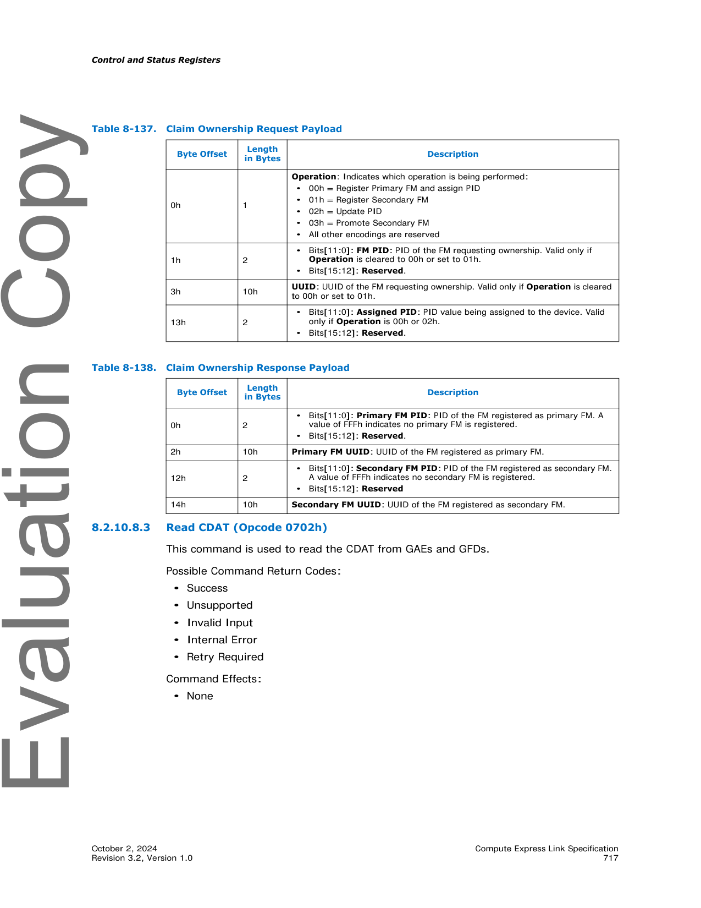
>
> *Original page render @ 150 DPI* — [📄 Full size](figures/chapter_08/page_0717.png)

[⬆️ 返回目录](#-本章目录-part-c)

---

### 8.2.10.8.3 Read CDAT (Opcode 0702h) | 读取 CDAT (操作码 0702h)

<table>
<thead>
<tr>
<th width="50%">🇬🇧 English</th>
<th width="50%" style="background-color:#e8e8e8">🇨🇳 中文</th>
</tr>
</thead>
<tbody>
<tr><td>This command is used to read the CDAT from GAEs and GFDs.</td><td style="background-color:#e8e8e8">此命令用于从 GAE 和 GFD 读取 CDAT。</td></tr>
<tr><td><b>Possible Command Return Codes:</b> • Success • Unsupported • Invalid Input • Internal Error • Retry Required</td><td style="background-color:#e8e8e8"><b>可能的命令返回码:</b> • Success(成功) • Unsupported(不支持) • Invalid Input(无效输入) • Internal Error(内部错误) • Retry Required(需要重试)</td></tr>
<tr><td><b>Command Effects:</b> • None</td><td style="background-color:#e8e8e8"><b>命令效果:</b> • None(无)</td></tr>
</tbody>
</table>

**Table 8-139. Read CDAT Request Payload | Read CDAT 请求负载**

<table>
<thead>
<tr><th>Byte Offset</th><th>Length in Bytes</th><th>🇬🇧 Description</th><th>🇨🇳 描述</th></tr>
</thead>
<tbody>
<tr><td>0h</td><td>2</td><td>• Bits[11:0]: Target PID: PID of device routing path CDAT to query. Valid only for PBR switches. • Bits[15:12]: Reserved</td><td>• Bits[11:0]:Target PID:要查询其 CDAT 的设备路由路径的 PID。仅对 PBR 交换机有效。 • Bits[15:12]:保留</td></tr>
<tr><td>2h</td><td>2</td><td>Reserved</td><td>保留</td></tr>
<tr><td>4h</td><td>8</td><td>Start Byte: Offset in bytes into CDAT Data.</td><td>Start Byte:CDAT 数据中的字节偏移量。</td></tr>
<tr><td>Ch</td><td>8</td><td>Number of Bytes: Size in bytes of CDAT Data requested.</td><td>Number of Bytes:请求的 CDAT 数据的大小(以字节为单位)。</td></tr>
</tbody>
</table>

**Table 8-140. Read CDAT Response Payload | Read CDAT 响应负载**

<table>
<thead>
<tr><th>Byte Offset</th><th>Length in Bytes</th><th>🇬🇧 Description</th><th>🇨🇳 描述</th></tr>
</thead>
<tbody>
<tr><td>0h</td><td>8</td><td>Total CDAT Size: Size in bytes of the full CDAT.</td><td>Total CDAT Size:完整 CDAT 的大小(以字节为单位)。</td></tr>
<tr><td>8h</td><td>8</td><td>Number of Bytes: Size in bytes of returned CDAT Data.</td><td>Number of Bytes:返回的 CDAT 数据的大小(以字节为单位)。</td></tr>
<tr><td>10h</td><td>Varies</td><td>CDAT Data: CDAT for the specified target, as defined in the CDAT Specification.</td><td>CDAT Data:指定目标的 CDAT,定义见 CDAT 规范。</td></tr>
</tbody>
</table>

> **Figure 8-X.** Read CDAT (page 718) ｜ Read CDAT
>
> 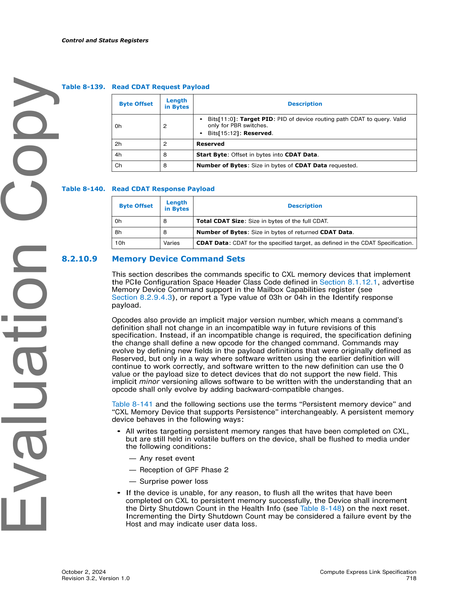
>
> *Original page render @ 150 DPI* — [📄 Full size](figures/chapter_08/page_0718.png)

[⬆️ 返回目录](#-本章目录-part-c)

---

## 8.2.10.9 Memory Device Command Sets | 内存设备命令集

<table>
<thead>
<tr>
<th width="50%">🇬🇧 English</th>
<th width="50%" style="background-color:#e8e8e8">🇨🇳 中文</th>
</tr>
</thead>
<tbody>
<tr><td>This section describes the commands specific to CXL memory devices that implement the PCIe Configuration Space Header Class Code defined in Section 8.1.12.1, advertise Memory Device Command support in the Mailbox Capabilities register (see Section 8.2.9.4.3), or report a Type value of 03h or 04h in the Identify response payload.</td><td style="background-color:#e8e8e8">本节描述特定于 CXL memory device 的命令,这些设备实现 8.1.12.1 节中定义的 PCIe Configuration Space Header Class Code,在 Mailbox Capabilities 寄存器(参见 8.2.9.4.3 节)中通告 Memory Device Command 支持,或在 Identify 响应负载中报告 Type 值为 03h 或 04h。</td></tr>
<tr><td>Opcodes also provide an implicit major version number, which means a command's definition shall not change in an incompatible way in future revisions of this specification. Instead, if an incompatible change is required, the specification defining the change shall define a new opcode for the changed command. Commands may evolve by defining new fields in the payload definitions that were originally defined as Reserved, but only in a way where software written using the earlier definition will continue to work correctly, and software written to the new definition can use the 0 value or the payload size to detect devices that do not support the new field. This implicit minor versioning allows software to be written with the understanding that an opcode shall only evolve by adding backward-compatible changes.</td><td style="background-color:#e8e8e8">操作码还提供隐式的主版本号,这意味着命令定义不应在本规范的未来修订版中以不兼容的方式更改。相反,如果需要不兼容的更改,则定义更改的规范应为更改的命令定义新的操作码。命令可以通过在最初定义为保留的负载定义中定义新字段来演进,但只能以使用早期定义编写的软件将继续正常工作的方式,并且编写为新定义的软件可以使用值 0 或负载大小来检测不支持新字段的设备。这种隐式次要版本控制允许软件在理解以下情况的基础上编写:操作码应仅通过添加向后兼容的更改来演进。</td></tr>
<tr><td>Table 8-141 and the following sections use the terms "Persistent memory device" and "CXL Memory Device that supports Persistence" interchangeably. A persistent memory device behaves in the following ways: • All writes targeting persistent memory ranges that have been completed on CXL, but are still held in volatile buffers on the device, shall be flushed to media under the following conditions:   — Any reset event   — Reception of GPF Phase 2   — Surprise power loss • If the device is unable, for any reason, to flush all the writes that have been completed on CXL to persistent memory successfully, the Device shall increment the Dirty Shutdown Count in the Health Info (see Table 8-148) on the next reset. Incrementing the Dirty Shutdown Count may be considered a failure event by the Host and may indicate user data loss.</td><td style="background-color:#e8e8e8">表 8-141 和以下各节中,术语 "Persistent memory device" 和 "CXL Memory Device that supports Persistence" 可以互换使用。持久性内存设备的行为方式如下: • 所有针对已在 CXL 上完成但仍保留在设备上的易失性缓冲区中的持久性内存范围的写入,应在以下条件下刷新到介质:   — 任何复位事件   — 接收 GPF Phase 2   — 意外断电 • 如果设备由于任何原因无法成功刷新所有已在 CXL 上完成到持久性内存的写入,则设备应在下次复位时增加 Health Info(参见表 8-148)中的 Dirty Shutdown Count。增加 Dirty Shutdown Count 可能被主机视为故障事件,并可能表示用户数据丢失。</td></tr>
</tbody>
</table>

> **Figure 8-X.** CXL Defined Memory Device Command Opcodes (page 719) ｜ CXL 定义的内存设备命令操作码
>
> 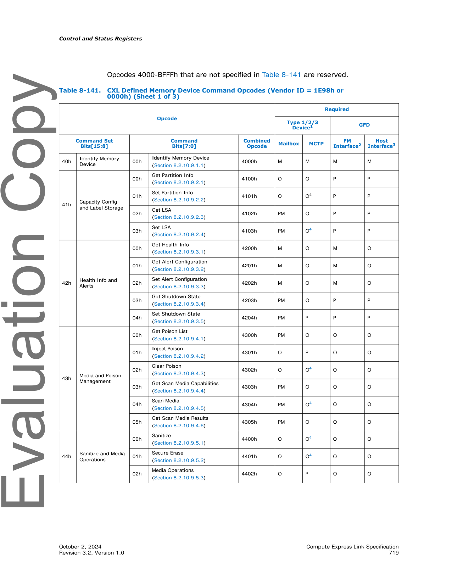
>
> *Original page render @ 150 DPI* — [📄 Full size](figures/chapter_08/page_0719.png)

**Table 8-141. CXL Defined Memory Device Command Opcodes (Vendor ID = 1E98h or 0000h) | CXL 定义的内存设备命令操作码 (Vendor ID = 1E98h 或 0000h)**

<table>
<thead>
<tr><th>Bits[15:8]</th><th>Command</th><th>Bits[7:0]</th><th>Combined Opcode</th><th>Required Type 1/2/3 Device</th><th>Required GFD</th><th>Command Set</th></tr>
</thead>
<tbody>
<tr><td>40h</td><td>Identify Memory Device</td><td>00h</td><td>4000h</td><td>M</td><td>M</td><td>Identify Memory Device (Section 8.2.10.9.1.1)</td></tr>
<tr><td>41h</td><td>Capacity Config and Label Storage</td><td>00h</td><td>4100h</td><td>O</td><td>P</td><td>Get Partition Info (Section 8.2.10.9.2.1)</td></tr>
<tr><td>41h</td><td>Capacity Config and Label Storage</td><td>01h</td><td>4101h</td><td>O</td><td>P</td><td>Set Partition Info (Section 8.2.10.9.2.2)</td></tr>
<tr><td>41h</td><td>Capacity Config and Label Storage</td><td>02h</td><td>4102h</td><td>PM</td><td>P</td><td>Get LSA (Section 8.2.10.9.2.3)</td></tr>
<tr><td>41h</td><td>Capacity Config and Label Storage</td><td>03h</td><td>4103h</td><td>PM</td><td>P</td><td>Set LSA (Section 8.2.10.9.2.4)</td></tr>
<tr><td>42h</td><td>Health Info and Alerts</td><td>00h</td><td>4200h</td><td>M</td><td>M</td><td>Get Health Info (Section 8.2.10.9.3.1)</td></tr>
<tr><td>42h</td><td>Health Info and Alerts</td><td>01h</td><td>4201h</td><td>M</td><td>M</td><td>Get Alert Configuration (Section 8.2.10.9.3.2)</td></tr>
<tr><td>42h</td><td>Health Info and Alerts</td><td>02h</td><td>4202h</td><td>M</td><td>M</td><td>Set Alert Configuration (Section 8.2.10.9.3.3)</td></tr>
<tr><td>42h</td><td>Health Info and Alerts</td><td>03h</td><td>4203h</td><td>PM</td><td>P</td><td>Get Shutdown State (Section 8.2.10.9.3.4)</td></tr>
<tr><td>42h</td><td>Health Info and Alerts</td><td>04h</td><td>4204h</td><td>PM</td><td>P</td><td>Set Shutdown State (Section 8.2.10.9.3.5)</td></tr>
<tr><td>43h</td><td>Media and Poison Management</td><td>00h</td><td>4300h</td><td>PM</td><td>O</td><td>Get Poison List (Section 8.2.10.9.4.1)</td></tr>
<tr><td>43h</td><td>Media and Poison Management</td><td>01h</td><td>4301h</td><td>O</td><td>O</td><td>Inject Poison (Section 8.2.10.9.4.2)</td></tr>
<tr><td>43h</td><td>Media and Poison Management</td><td>02h</td><td>4302h</td><td>O</td><td>O</td><td>Clear Poison (Section 8.2.10.9.4.3)</td></tr>
<tr><td>43h</td><td>Media and Poison Management</td><td>03h</td><td>4303h</td><td>PM</td><td>O</td><td>Get Scan Media Capabilities (Section 8.2.10.9.4.4)</td></tr>
<tr><td>43h</td><td>Media and Poison Management</td><td>04h</td><td>4304h</td><td>PM</td><td>O</td><td>Scan Media (Section 8.2.10.9.4.5)</td></tr>
<tr><td>43h</td><td>Media and Poison Management</td><td>05h</td><td>4305h</td><td>PM</td><td>O</td><td>Get Scan Media Results (Section 8.2.10.9.4.6)</td></tr>
<tr><td>44h</td><td>Sanitize and Media Operations</td><td>00h</td><td>4400h</td><td>O</td><td>O</td><td>Sanitize (Section 8.2.10.9.5.1)</td></tr>
<tr><td>44h</td><td>Sanitize and Media Operations</td><td>01h</td><td>4401h</td><td>O</td><td>O</td><td>Secure Erase (Section 8.2.10.9.5.2)</td></tr>
<tr><td>44h</td><td>Sanitize and Media Operations</td><td>02h</td><td>4402h</td><td>O</td><td>O</td><td>Media Operations (Section 8.2.10.9.5.3)</td></tr>
<tr><td>45h</td><td>Persistent Memory Data-at-rest Security</td><td>00h</td><td>4500h</td><td>O</td><td>P</td><td>Get Security State (Section 8.2.10.9.6.1)</td></tr>
<tr><td>45h</td><td>Persistent Memory Data-at-rest Security</td><td>01h</td><td>4501h</td><td>O</td><td>P</td><td>Set Passphrase (Section 8.2.10.9.6.2)</td></tr>
<tr><td>45h</td><td>Persistent Memory Data-at-rest Security</td><td>02h</td><td>4502h</td><td>O</td><td>P</td><td>Disable Passphrase (Section 8.2.10.9.6.3)</td></tr>
<tr><td>45h</td><td>Persistent Memory Data-at-rest Security</td><td>03h</td><td>4503h</td><td>O</td><td>P</td><td>Unlock (Section 8.2.10.9.6.4)</td></tr>
<tr><td>45h</td><td>Persistent Memory Data-at-rest Security</td><td>04h</td><td>4504h</td><td>O</td><td>P</td><td>Freeze Security State (Section 8.2.10.9.6.5)</td></tr>
<tr><td>45h</td><td>Persistent Memory Data-at-rest Security</td><td>05h</td><td>4505h</td><td>O</td><td>P</td><td>Passphrase Secure Erase (Section 8.2.10.9.6.6)</td></tr>
<tr><td>46h</td><td>Security Passthrough</td><td>00h</td><td>4600h</td><td>O</td><td>P</td><td>Security Send (Section 8.2.10.9.7.1)</td></tr>
<tr><td>46h</td><td>Security Passthrough</td><td>01h</td><td>4601h</td><td>O</td><td>P</td><td>Security Receive (Section 8.2.10.9.7.2)</td></tr>
<tr><td>47h</td><td>SLD QoS Telemetry</td><td>00h</td><td>4700h</td><td>O</td><td>P</td><td>Get SLD QoS Control (Section 8.2.10.9.8.1)</td></tr>
<tr><td>47h</td><td>SLD QoS Telemetry</td><td>01h</td><td>4701h</td><td>O</td><td>P</td><td>Set SLD QoS Control (Section 8.2.10.9.8.2)</td></tr>
<tr><td>47h</td><td>SLD QoS Telemetry</td><td>02h</td><td>4702h</td><td>O</td><td>P</td><td>Get SLD QoS Status (Section 8.2.10.9.8.3)</td></tr>
<tr><td>48h</td><td>Dynamic Capacity for LD-FAM</td><td>00h</td><td>4800h</td><td>DC</td><td>P</td><td>Get Dynamic Capacity Configuration (Section 8.2.10.9.9.1)</td></tr>
<tr><td>48h</td><td>Dynamic Capacity for LD-FAM</td><td>01h</td><td>4801h</td><td>DC</td><td>P</td><td>Get Dynamic Capacity Extent List (Section 8.2.10.9.9.2)</td></tr>
<tr><td>48h</td><td>Dynamic Capacity for LD-FAM</td><td>02h</td><td>4802h</td><td>DC</td><td>P</td><td>Add Dynamic Capacity Response (Section 8.2.10.9.9.3)</td></tr>
<tr><td>48h</td><td>Dynamic Capacity for LD-FAM</td><td>03h</td><td>4803h</td><td>DC</td><td>P</td><td>Release Dynamic Capacity (Section 8.2.10.9.9.4)</td></tr>
<tr><td>5Bh</td><td>GFD Component Management</td><td>00h</td><td>4900h</td><td>P</td><td>M</td><td>Identify GFD (Section 8.2.10.9.10.1)</td></tr>
<tr><td>5Bh</td><td>GFD Component Management</td><td>01h</td><td>4901h</td><td>P</td><td>M</td><td>Get GFD Status (Section 8.2.10.9.10.2)</td></tr>
<tr><td>5Bh</td><td>GFD Component Management</td><td>02h</td><td>4902h</td><td>P</td><td>M</td><td>Get GFD DC Region Configuration (Section 8.2.10.9.10.3)</td></tr>
<tr><td>5Bh</td><td>GFD Component Management</td><td>03h</td><td>4903h</td><td>P</td><td>O</td><td>Set GFD DC Region Configuration (Section 8.2.10.9.10.4)</td></tr>
<tr><td>5Bh</td><td>GFD Component Management</td><td>04h</td><td>4904h</td><td>P</td><td>M</td><td>Get GFD DC Region Extent Lists (Section 8.2.10.9.10.5)</td></tr>
<tr><td>5Bh</td><td>GFD Component Management</td><td>05h</td><td>4905h</td><td>P</td><td>M</td><td>Get GFD DMP Configuration (Section 8.2.10.9.10.6)</td></tr>
<tr><td>5Bh</td><td>GFD Component Management</td><td>06h</td><td>4906h</td><td>P</td><td>O</td><td>Set GFD DMP Configuration (Section 8.2.10.9.10.7)</td></tr>
<tr><td>5Bh</td><td>GFD Component Management</td><td>07h</td><td>4907h</td><td>P</td><td>M</td><td>GFD Dynamic Capacity Add (Section 8.2.10.9.10.8)</td></tr>
<tr><td>5Bh</td><td>GFD Component Management</td><td>08h</td><td>4908h</td><td>P</td><td>M</td><td>GFD Dynamic Capacity Release (Section 8.2.10.9.10.9)</td></tr>
<tr><td>5Bh</td><td>GFD Component Management</td><td>09h</td><td>4909h</td><td>P</td><td>O</td><td>GFD Dynamic Capacity Add Reference (Section 8.2.10.9.10.10)</td></tr>
<tr><td>5Bh</td><td>GFD Component Management</td><td>0Ah</td><td>490Ah</td><td>P</td><td>O</td><td>GFD Dynamic Capacity Remove Reference (Section 8.2.10.9.10.11)</td></tr>
<tr><td>5Bh</td><td>GFD Component Management</td><td>0Bh</td><td>490Bh</td><td>P</td><td>O</td><td>GFD Dynamic Capacity List Tags (Section 8.2.10.9.10.12)</td></tr>
<tr><td>5Bh</td><td>GFD Component Management</td><td>0Ch</td><td>490Ch</td><td>P</td><td>M</td><td>Get GFD SAT Entry (Section 8.2.10.9.10.13)</td></tr>
<tr><td>5Bh</td><td>GFD Component Management</td><td>0Dh</td><td>490Dh</td><td>P</td><td>M</td><td>Set GFD SAT Entry (Section 8.2.10.9.10.14)</td></tr>
<tr><td>5Bh</td><td>GFD Component Management</td><td>0Eh</td><td>490Eh</td><td>P</td><td>M</td><td>Get GFD QoS Control (Section 8.2.10.9.10.15)</td></tr>
<tr><td>5Bh</td><td>GFD Component Management</td><td>0Fh</td><td>490Fh</td><td>P</td><td>M</td><td>Set GFD QoS Control (Section 8.2.10.9.10.16)</td></tr>
<tr><td>5Bh</td><td>GFD Component Management</td><td>10h</td><td>4910h</td><td>P</td><td>M</td><td>Get GFD QoS Status (Section 8.2.10.9.10.17)</td></tr>
<tr><td>5Bh</td><td>GFD Component Management</td><td>11h</td><td>4911h</td><td>P</td><td>M</td><td>Get GFD QoS BW Limit (Section 8.2.10.9.10.18)</td></tr>
<tr><td>5Bh</td><td>GFD Component Management</td><td>12h</td><td>4912h</td><td>P</td><td>M</td><td>Set GFD QoS BW Limit (Section 8.2.10.9.10.19)</td></tr>
<tr><td>5Bh</td><td>GFD Component Management</td><td>13h</td><td>4913h</td><td>P</td><td>M</td><td>Get GDT Configuration (Section 8.2.10.9.10.20)</td></tr>
<tr><td>5Bh</td><td>GFD Component Management</td><td>14h</td><td>4914h</td><td>P</td><td>M</td><td>Set GDT Configuration (Section 8.2.10.9.10.21)</td></tr>
</tbody>
</table>

> **Notes | 注释:**
> 1. M = Mandatory(强制);PM = Mandatory for devices that support persistence(支持持久性设备的强制);DC = mandatory for devices that support Dynamic Capacity(支持动态容量设备的强制);O = Optional(可选);P = Prohibited(禁止)。It is prohibited for switches to support any commands from the Memory Device Command Set(交换机禁止支持 Memory Device Command Set 中的任何命令)。
> 2. "FM Interface" refers to commands issued/received via the Fabric Crawl Out mechanism.
> 3. "Host Interface" refers to commands issued/received via the GFD Proxying mechanism.
> 4. Systems capable of management from Mailbox registers and an MCTP-based CCI shall ensure that these commands are not issued as MCTP messages while a device's mailboxes are operational.

> **Figure 8-X.** CXL Defined Memory Device Command Opcodes Sheet 2-3 (page 720-721) ｜ CXL 定义的内存设备命令操作码(续)
>
> 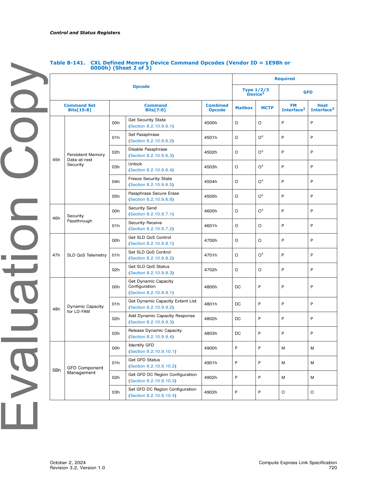
>
> *Original page render @ 150 DPI* — [📄 Full size](figures/chapter_08/page_0720.png)

[⬆️ 返回目录](#-本章目录-part-c)

---

### 8.2.10.9.1.1 Identify Memory Device (Opcode 4000h) | 标识内存设备 (操作码 4000h)

<table>
<thead>
<tr>
<th width="50%">🇬🇧 English</th>
<th width="50%" style="background-color:#e8e8e8">🇨🇳 中文</th>
</tr>
</thead>
<tbody>
<tr><td>Retrieve basic information about the memory device. If the HDM_Count field in DVSEC CXL Capability is 01b, the output payload is valid only if the Memory_Info_Valid flag in DVSEC CXL Range 1 Size Low (see Section 8.1.3.8.2) is 01b. If the HDM_Count field in DVSEC CXL Capability is 10b, the output payload is valid only if the Memory_Info_Valid flag in DVSEC CXL Range 1 Size Low as well as DVSEC CXL Range 2 Size Low (see Section 8.1.3.8.6) are both 1.</td><td style="background-color:#e8e8e8">检索有关内存设备的基本信息。如果 DVSEC CXL Capability 中的 HDM_Count 字段为 01b,则仅当 DVSEC CXL Range 1 Size Low(参见 8.1.3.8.2 节)中的 Memory_Info_Valid 标志为 01b 时,输出负载才有效。如果 DVSEC CXL Capability 中的 HDM_Count 字段为 10b,则仅当 DVSEC CXL Range 1 Size Low 和 DVSEC CXL Range 2 Size Low(参见 8.1.3.8.6 节)中的 Memory_Info_Valid 标志均为 1 时,输出负载才有效。</td></tr>
<tr><td><b>Possible Command Return Codes:</b> • Success • Internal Error • Retry Required • Invalid Payload Length</td><td style="background-color:#e8e8e8"><b>可能的命令返回码:</b> • Success(成功) • Internal Error(内部错误) • Retry Required(需要重试) • Invalid Payload Length(无效负载长度)</td></tr>
<tr><td><b>Command Effects:</b> • None</td><td style="background-color:#e8e8e8"><b>命令效果:</b> • None(无)</td></tr>
</tbody>
</table>

> **IMPLEMENTATION NOTE | 实现说明**
>
> CXL components shall interpret the PCIe MMB Command Opcode Vendor ID = 1E98h or 0000h with CXL defined commands. 0000h is a PCI-SIG reserved value for legacy CXL compatibility. However, it is strongly recommended for callers to use the CXL Vendor ID (1E98h) to identify CXL defined commands.
>
> CXL 组件应使用 CXL 定义命令解释 PCIe MMB Command Opcode Vendor ID = 1E98h 或 0000h。0000h 是 PCI-SIG 为旧版 CXL 兼容性保留的值。但是,强烈建议调用者使用 CXL Vendor ID (1E98h) 来标识 CXL 定义命令。

**Table 8-142. Identify Memory Device Output Payload | Identify Memory Device 输出负载**

<table>
<thead>
<tr><th>Byte Offset</th><th>Length in Bytes</th><th>🇬🇧 Description</th><th>🇨🇳 描述</th></tr>
</thead>
<tbody>
<tr><td>00h</td><td>16</td><td>FW Revision: Contains the revision of the active FW formatted as an ASCII string.</td><td>FW Revision:包含活动 FW 的修订版,格式为 ASCII 字符串。</td></tr>
<tr><td>10h</td><td>8</td><td>Total Capacity: This field indicates the total usable capacity of the device. Expressed in multiples of 256 MB. Total Capacity shall be greater than or equal to the sum of Volatile Only Capacity and Persistent Only Capacity.</td><td>Total Capacity:此字段指示设备的总可用容量。以 256 MB 的倍数表示。Total Capacity 应大于或等于 Volatile Only Capacity 和 Persistent Only Capacity 之和。</td></tr>
<tr><td>18h</td><td>8</td><td>Volatile Only Capacity: This field indicates the total usable capacity of the device that may be used only as volatile memory. Expressed in multiples of 256 MB.</td><td>Volatile Only Capacity:此字段指示设备可用作易失性内存的总可用容量。以 256 MB 的倍数表示。</td></tr>
<tr><td>20h</td><td>8</td><td>Persistent Only Capacity: This field indicates the total usable capacity of the device that may be used only as persistent memory. Expressed in multiples of 256 MB.</td><td>Persistent Only Capacity:此字段指示设备可用作持久性内存的总可用容量。以 256 MB 的倍数表示。</td></tr>
<tr><td>28h</td><td>8</td><td>Partition Alignment: If the device has capacity that may be used as either volatile memory or persistent memory, this field indicates the partition alignment size. Expressed in multiples of 256 MB. Partitionable capacity is equal to Total Capacity - Volatile Only Capacity - Persistent Only Capacity. If 0, the device doesn't support partitioning the capacity into both volatile capacity and persistent capacity.</td><td>Partition Alignment:如果设备具有可用作易失性内存或持久性内存的容量,则此字段指示分区对齐大小。以 256 MB 的倍数表示。可分区容量等于 Total Capacity - Volatile Only Capacity - Persistent Only Capacity。如果为 0,则设备不支持将容量分区为易失性容量和持久性容量。</td></tr>
<tr><td>30h</td><td>2</td><td>Informational Event Log Size: The number of events that the device can store in the Informational Event Log before the log overflows.</td><td>Informational Event Log Size:设备在日志溢出之前可以在 Informational Event Log 中存储的事件数。</td></tr>
<tr><td>32h</td><td>2</td><td>Warning Event Log Size: The number of events that the device can store in the Warning Event Log before the log overflows.</td><td>Warning Event Log Size:设备在日志溢出之前可以在 Warning Event Log 中存储的事件数。</td></tr>
<tr><td>34h</td><td>2</td><td>Failure Event Log Size: The number of events that the device can store in the Failure Event Log before the log overflows.</td><td>Failure Event Log Size:设备在日志溢出之前可以在 Failure Event Log 中存储的事件数。</td></tr>
<tr><td>36h</td><td>2</td><td>Fatal Event Log Size: The number of events that the device can store in the Fatal Event Log before the log overflows.</td><td>Fatal Event Log Size:设备在日志溢出之前可以在 Fatal Event Log 中存储的事件数。</td></tr>
<tr><td>38h</td><td>4</td><td>LSA Size: The size of the Label Storage Area. Expressed in bytes.</td><td>LSA Size:Label Storage Area 的大小。以字节为单位表示。</td></tr>
<tr><td>3Ch</td><td>3</td><td>Poison List Maximum Media Error Records: The maximum number of Media Error Records that the device can track in its Poison List.</td><td>Poison List Maximum Media Error Records:设备可以在其 Poison List 中跟踪的最大 Media Error Records 数。</td></tr>
<tr><td>3Fh</td><td>2</td><td>Inject Poison Limit: The device's supported maximum number of physical addresses that can be poisoned by the Inject Poison command. When 0, the device does not have a poison injection limit. When nonzero, the device has a maximum limit of poison that can be injected using the Inject Poison command.</td><td>Inject Poison Limit:设备支持的可由 Inject Poison 命令注入 poison 的最大物理地址数。当为 0 时,设备没有 poison 注入限制。当非零时,设备具有可使用 Inject Poison 命令注入的最大 poison 限制。</td></tr>
<tr><td>41h</td><td>1</td><td>Poison Handling Capabilities • Bit[0]: Injects Persistent Poison: When set and the device supports poison injection, any poison injected in non-volatile DPA shall remain persistent across all types of device resets. When cleared and the device supports poison injection, Conventional or CXL Reset shall automatically clear the injected poison. • Bit[1]: Scans for Poison: When set, the device shall periodically scan its media for errors and shall automatically alert the host of those errors. If cleared, the device does not periodically scan for memory errors and does not generate an alert. • Bits[7:2]: Reserved.</td><td>Poison Handling Capabilities • Bit[0]:Injects Persistent Poison:当设置且设备支持 poison 注入时,在非易失性 DPA 中注入的任何 poison 应在所有类型的设备复位后保持持久性。当清除且设备支持 poison 注入时,Conventional 或 CXL Reset 应自动清除注入的 poison。 • Bit[1]:Scans for Poison:当设置时,设备应定期扫描其介质以查找错误,并应自动将这些错误警报通知主机。如果清除,设备不定期扫描内存错误,也不生成警报。 • Bits[7:2]:保留。</td></tr>
<tr><td>42h</td><td>1</td><td>QoS Telemetry Capabilities • Bit[0]: Egress Port Congestion Supported • Bit[1]: Temporary Throughput Reduction Supported • Bits[7:2]: Reserved</td><td>QoS Telemetry Capabilities • Bit[0]:支持 Egress Port Congestion • Bit[1]:支持 Temporary Throughput Reduction • Bits[7:2]:保留</td></tr>
<tr><td>43h</td><td>2</td><td>Dynamic Capacity Event Log Size: The number of events that the device can store in the Dynamic Capacity Event Log before the log overflows.</td><td>Dynamic Capacity Event Log Size:设备在日志溢出之前可以在 Dynamic Capacity Event Log 中存储的事件数。</td></tr>
</tbody>
</table>

> **Figure 8-X.** Identify Memory Device Output Payload (page 722-723) ｜ Identify Memory Device 输出负载
>
> 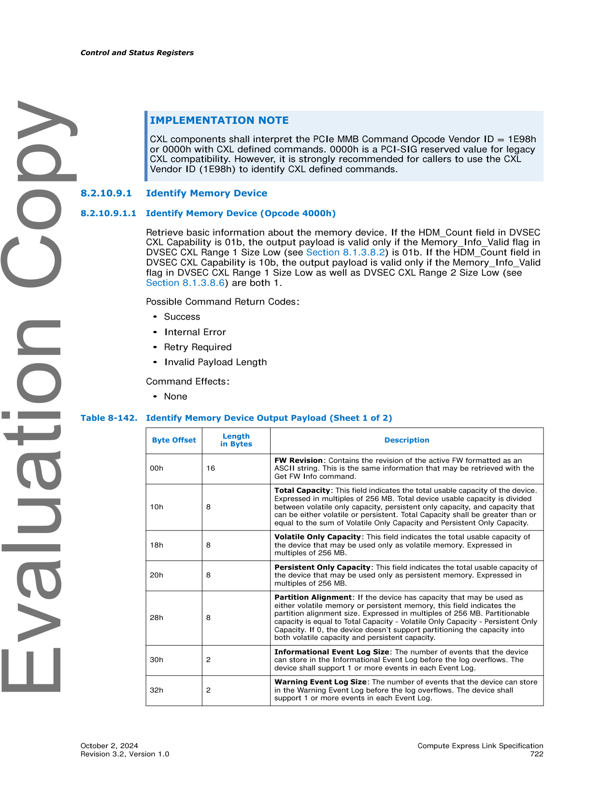
>
> *Original page render @ 150 DPI* — [📄 Full size](figures/chapter_08/page_0722.png)

[⬆️ 返回目录](#-本章目录-part-c)

---

### 8.2.10.9.2.1 Get Partition Info (Opcode 4100h) | 获取分区信息 (操作码 4100h)

<table>
<thead>
<tr>
<th width="50%">🇬🇧 English</th>
<th width="50%" style="background-color:#e8e8e8">🇨🇳 中文</th>
</tr>
</thead>
<tbody>
<tr><td>Get the Active and Next capacity settings for a memory device, describing the amount of volatile and persistent memory capacities available. The Active values describe the current capacities provided by the device in the currently active configuration. The Next values describe a new configuration that has not yet taken effect, to become active on the next reset (as specified in the Set Partition command effects). If the HDM_Count field in DVSEC CXL Capability is 01b, the output payload is valid only if the Memory_Info_Valid flag in DVSEC CXL Range 1 Size Low (see Section 8.1.3.8.2) is 01b.</td><td style="background-color:#e8e8e8">获取内存设备的 Active 和 Next 容量设置,描述可用的易失性和持久性内存容量。Active 值描述设备在当前活动配置中提供的当前容量。Next 值描述尚未生效的新配置,将在下次复位时生效(如 Set Partition 命令效果中所指定)。如果 DVSEC CXL Capability 中的 HDM_Count 字段为 01b,则仅当 DVSEC CXL Range 1 Size Low(参见 8.1.3.8.2 节)中的 Memory_Info_Valid 标志为 01b 时,输出负载才有效。</td></tr>
<tr><td>If the HDM_Count field in DVSEC CXL Capability is 10b, the output payload is valid only if the Memory_Info_Valid flag in DVSEC CXL Range 1 Size Low as well as DVSEC CXL Range 2 Size Low (see Section 8.1.3.8.6) are both 1.</td><td style="background-color:#e8e8e8">如果 DVSEC CXL Capability 中的 HDM_Count 字段为 10b,则仅当 DVSEC CXL Range 1 Size Low 和 DVSEC CXL Range 2 Size Low(参见 8.1.3.8.6 节)中的 Memory_Info_Valid 标志均为 1 时,输出负载才有效。</td></tr>
<tr><td><b>Possible Command Return Codes:</b> • Success • Unsupported • Internal Error • Retry Required • Invalid Payload Length</td><td style="background-color:#e8e8e8"><b>可能的命令返回码:</b> • Success(成功) • Unsupported(不支持) • Internal Error(内部错误) • Retry Required(需要重试) • Invalid Payload Length(无效负载长度)</td></tr>
<tr><td><b>Command Effects:</b> • None</td><td style="background-color:#e8e8e8"><b>命令效果:</b> • None(无)</td></tr>
</tbody>
</table>

**Table 8-143. Get Partition Info Output Payload | Get Partition Info 输出负载**

<table>
<thead>
<tr><th>Byte Offset</th><th>Length in Bytes</th><th>🇬🇧 Description</th><th>🇨🇳 描述</th></tr>
</thead>
<tbody>
<tr><td>00h</td><td>8</td><td>Active Volatile Capacity: Total device volatile memory capacity in multiples of 256 MB. This is the sum of the device's Volatile Only capacity and the capacity that is partitioned for volatile use. The device shall provide this volatile capacity starting at DPA 0.</td><td>Active Volatile Capacity:设备易失性内存总容量(以 256 MB 的倍数表示)。这是设备的 Volatile Only 容量和分区用于易失性使用的容量之和。设备应从 DPA 0 开始提供此易失性容量。</td></tr>
<tr><td>08h</td><td>8</td><td>Active Persistent Capacity: Total device persistent memory capacity in multiples of 256 MB. This is the sum of the device's Persistent Only capacity and the capacity that is partitioned for persistent use. The device shall provide this persistent capacity starting at the DPA immediately following the volatile capacity.</td><td>Active Persistent Capacity:设备持久性内存总容量(以 256 MB 的倍数表示)。这是设备的 Persistent Only 容量和分区用于持久性使用的容量之和。设备应从紧跟易失性容量之后的 DPA 开始提供此持久性容量。</td></tr>
<tr><td>10h</td><td>8</td><td>Next Volatile Capacity: If nonzero, this value shall become the Active Volatile Capacity on the next reset (as specified in the Set Partition command effects). If both this field and the Next Persistent Capacity field are 0, there is no pending change to the partitioning.</td><td>Next Volatile Capacity:如果非零,此值应在下次复位时成为 Active Volatile Capacity(如 Set Partition 命令效果中所指定)。如果此字段和 Next Persistent Capacity 字段均为 0,则没有待处理的分区更改。</td></tr>
<tr><td>18h</td><td>8</td><td>Next Persistent Capacity: If nonzero, this value shall become the Active Persistent Capacity on the next reset (as specified in the Set Partition command effects). If both this field and the Next Volatile Capacity field are 0, there is no pending change to the partitioning.</td><td>Next Persistent Capacity:如果非零,此值应在下次复位时成为 Active Persistent Capacity(如 Set Partition 命令效果中所指定)。如果此字段和 Next Volatile Capacity 字段均为 0,则没有待处理的分区更改。</td></tr>
</tbody>
</table>

> **Figure 8-X.** Get Partition Info (page 724) ｜ Get Partition Info
>
> 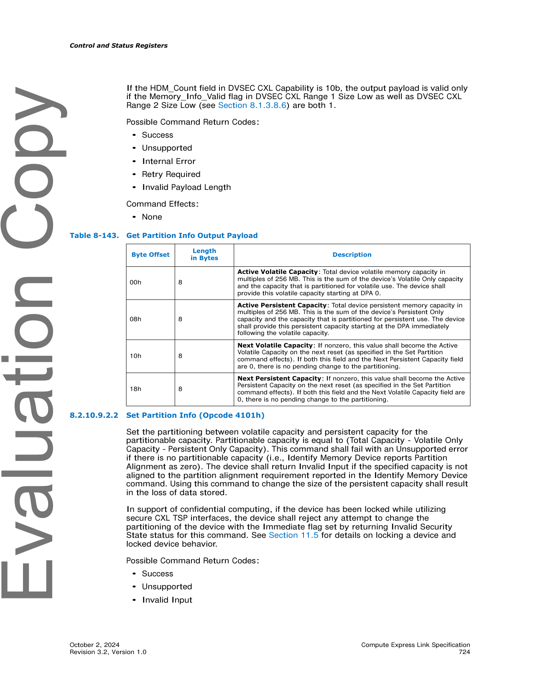
>
> *Original page render @ 150 DPI* — [📄 Full size](figures/chapter_08/page_0724.png)

[⬆️ 返回目录](#-本章目录-part-c)

---

### 8.2.10.9.2.2 Set Partition Info (Opcode 4101h) | 设置分区信息 (操作码 4101h)

<table>
<thead>
<tr>
<th width="50%">🇬🇧 English</th>
<th width="50%" style="background-color:#e8e8e8">🇨🇳 中文</th>
</tr>
</thead>
<tbody>
<tr><td>Set the partitioning between volatile capacity and persistent capacity for the partitionable capacity. Partitionable capacity is equal to (Total Capacity - Volatile Only Capacity - Persistent Only Capacity). This command shall fail with an Unsupported error if there is no partitionable capacity (i.e., Identify Memory Device reports Partition Alignment as zero). The device shall return Invalid Input if the specified capacity is not aligned to the partition alignment requirement reported in the Identify Memory Device command. Using this command to change the size of the persistent capacity shall result in the loss of data stored.</td><td style="background-color:#e8e8e8">为可分区容量设置易失性容量和持久性容量之间的分区。可分区容量等于(Total Capacity - Volatile Only Capacity - Persistent Only Capacity)。如果没有可分区容量(即,Identify Memory Device 报告 Partition Alignment 为零),此命令应以 Unsupported 错误失败。如果指定的容量与 Identify Memory Device 命令中报告的分区对齐要求不一致,设备应返回 Invalid Input。使用此命令更改持久性容量的大小将导致存储的数据丢失。</td></tr>
<tr><td>In support of confidential computing, if the device has been locked while utilizing secure CXL TSP interfaces, the device shall reject any attempt to change the partitioning of the device with the Immediate flag set by returning Invalid Security State status for this command. See Section 11.5 for details on locking a device and locked device behavior.</td><td style="background-color:#e8e8e8">为了支持机密计算,如果设备在使用安全 CXL TSP 接口时已被锁定,设备应通过返回 Invalid Security State 状态来拒绝任何设置 Immediate 标志的更改设备分区的尝试。有关锁定设备和已锁定设备行为的详细信息,请参阅 11.5 节。</td></tr>
<tr><td><b>Possible Command Return Codes:</b> • Success • Unsupported • Invalid Input • Internal Error • Retry Required • Invalid Payload Length • Media Disabled • Busy • Invalid Security State</td><td style="background-color:#e8e8e8"><b>可能的命令返回码:</b> • Success(成功) • Unsupported(不支持) • Invalid Input(无效输入) • Internal Error(内部错误) • Retry Required(需要重试) • Invalid Payload Length(无效负载长度) • Media Disabled(介质已禁用) • Busy(忙) • Invalid Security State(无效安全状态)</td></tr>
<tr><td><b>Command Effects:</b> • Configuration Change after Cold Reset • CEL[11:10] Valid • Configuration Change after Conventional Reset • Configuration Change after CXL Reset • Immediate Configuration Change • Immediate Data Change</td><td style="background-color:#e8e8e8"><b>命令效果:</b> • Cold Reset 后的配置更改 • CEL[11:10] 有效 • Conventional Reset 后的配置更改 • CXL Reset 后的配置更改 • 立即配置更改 • 立即数据更改</td></tr>
</tbody>
</table>

**Table 8-144. Set Partition Info Input Payload | Set Partition Info 输入负载**

<table>
<thead>
<tr><th>Byte Offset</th><th>Length in Bytes</th><th>🇬🇧 Description</th><th>🇨🇳 描述</th></tr>
</thead>
<tbody>
<tr><td>00h</td><td>8</td><td>Volatile Capacity: The amount of partitionable capacity that shall be allocated to volatile capacity, in multiples of 256 MB aligned to the partition alignment requirement reported in the Identify Memory Device command. The remainder of the partitionable capacity shall be allocated to persistent capacity.</td><td>Volatile Capacity:应分配给易失性容量的可分区容量大小(以 256 MB 的倍数表示),并与 Identify Memory Device 命令中报告的分区对齐要求对齐。可分区容量的其余部分应分配给持久性容量。</td></tr>
<tr><td>08h</td><td>1</td><td>Flags • Bit[0]: Immediate: When set, the change is immediately requested. If cleared, the change in partitioning shall become the "next" configuration, to become active on the next reset (as specified in the command effects). In this case, the new configuration shall be reported in the Next Volatile Capacity and Next Persistent Capacity fields returned by the Get Partition Info command. It is the caller's responsibility to avoid immediate changes to the partitioning when the device is in use. • Bits[7:1]: Reserved.</td><td>标志位 • Bit[0]:Immediate:当设置时,立即请求更改。如果清除,分区的更改将成为 "next" 配置,在下次复位时生效(如命令效果中所指定)。在这种情况下,新配置应在 Get Partition Info 命令返回的 Next Volatile Capacity 和 Next Persistent Capacity 字段中报告。调用者有责任在设备使用时避免对分区的立即更改。 • Bits[7:1]:保留。</td></tr>
</tbody>
</table>

> **Figure 8-X.** Set Partition Info (page 725) ｜ Set Partition Info
>
> 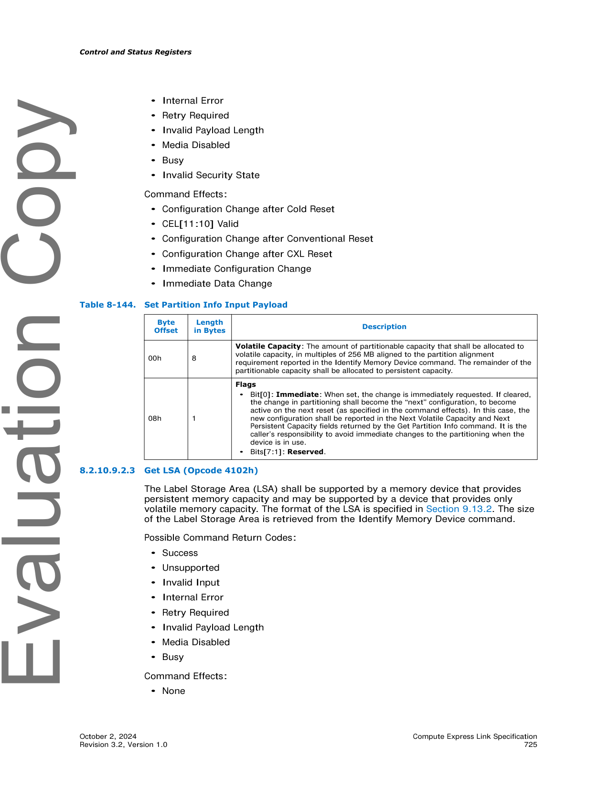
>
> *Original page render @ 150 DPI* — [📄 Full size](figures/chapter_08/page_0725.png)

[⬆️ 返回目录](#-本章目录-part-c)

---

### 8.2.10.9.2.3 Get LSA (Opcode 4102h) | 获取 LSA (操作码 4102h)

<table>
<thead>
<tr>
<th width="50%">🇬🇧 English</th>
<th width="50%" style="background-color:#e8e8e8">🇨🇳 中文</th>
</tr>
</thead>
<tbody>
<tr><td>The Label Storage Area (LSA) shall be supported by a memory device that provides persistent memory capacity and may be supported by a device that provides only volatile memory capacity. The format of the LSA is specified in Section 9.13.2. The size of the Label Storage Area is retrieved from the Identify Memory Device command.</td><td style="background-color:#e8e8e8">提供持久性内存容量的内存设备应支持 Label Storage Area (LSA),并且可以由仅提供易失性内存容量的设备支持。LSA 的格式在 9.13.2 节中指定。Label Storage Area 的大小是从 Identify Memory Device 命令检索的。</td></tr>
<tr><td><b>Possible Command Return Codes:</b> • Success • Unsupported • Invalid Input • Internal Error • Retry Required • Invalid Payload Length • Media Disabled • Busy</td><td style="background-color:#e8e8e8"><b>可能的命令返回码:</b> • Success(成功) • Unsupported(不支持) • Invalid Input(无效输入) • Internal Error(内部错误) • Retry Required(需要重试) • Invalid Payload Length(无效负载长度) • Media Disabled(介质已禁用) • Busy(忙)</td></tr>
<tr><td><b>Command Effects:</b> • None</td><td style="background-color:#e8e8e8"><b>命令效果:</b> • None(无)</td></tr>
</tbody>
</table>

**Table 8-145. Get LSA Input Payload | Get LSA 输入负载**

<table>
<thead>
<tr><th>Byte Offset</th><th>Length in Bytes</th><th>🇬🇧 Description</th><th>🇨🇳 描述</th></tr>
</thead>
<tbody>
<tr><td>00h</td><td>4</td><td>Offset: The byte offset in the LSA to return in the output payload.</td><td>Offset:在 LSA 中返回到输出负载的字节偏移量。</td></tr>
<tr><td>04h</td><td>4</td><td>Length: Length in bytes of LSA to return in the output payload.</td><td>Length:输出负载中返回的 LSA 的字节长度。</td></tr>
</tbody>
</table>

**Table 8-146. Get LSA Output Payload | Get LSA 输出负载**

<table>
<thead>
<tr><th>Byte Offset</th><th>Length in Bytes</th><th>🇬🇧 Description</th><th>🇨🇳 描述</th></tr>
</thead>
<tbody>
<tr><td>00h</td><td>Varies</td><td>Data: Requested bytes from the LSA.</td><td>Data:来自 LSA 的请求字节。</td></tr>
</tbody>
</table>

[⬆️ 返回目录](#-本章目录-part-c)

---

### 8.2.10.9.2.4 Set LSA (Opcode 4103h) | 设置 LSA (操作码 4103h)

<table>
<thead>
<tr>
<th width="50%">🇬🇧 English</th>
<th width="50%" style="background-color:#e8e8e8">🇨🇳 中文</th>
</tr>
</thead>
<tbody>
<tr><td>The format of the Label Storage Area is specified in Section 9.13.2.</td><td style="background-color:#e8e8e8">Label Storage Area 的格式在 9.13.2 节中指定。</td></tr>
<tr><td><b>Possible Command Return Codes:</b> • Success • Unsupported • Invalid Input • Internal Error • Retry Required • Invalid Payload Length • Media Disabled • Busy • Invalid Security State</td><td style="background-color:#e8e8e8"><b>可能的命令返回码:</b> • Success(成功) • Unsupported(不支持) • Invalid Input(无效输入) • Internal Error(内部错误) • Retry Required(需要重试) • Invalid Payload Length(无效负载长度) • Media Disabled(介质已禁用) • Busy(忙) • Invalid Security State(无效安全状态)</td></tr>
<tr><td><b>Command Effects:</b> • Immediate Configuration Change • Immediate Data Change</td><td style="background-color:#e8e8e8"><b>命令效果:</b> • 立即配置更改 • 立即数据更改</td></tr>
</tbody>
</table>

**Table 8-147. Set LSA Input Payload | Set LSA 输入负载**

<table>
<thead>
<tr><th>Byte Offset</th><th>Length in Bytes</th><th>🇬🇧 Description</th><th>🇨🇳 描述</th></tr>
</thead>
<tbody>
<tr><td>00h</td><td>4</td><td>Offset: The byte offset in the LSA.</td><td>Offset:LSA 中的字节偏移量。</td></tr>
<tr><td>04h</td><td>4</td><td>Reserved</td><td>保留</td></tr>
<tr><td>08h</td><td>Varies</td><td>Data: The data to be written to LSA at the specified offset.</td><td>Data:要在指定偏移量处写入 LSA 的数据。</td></tr>
</tbody>
</table>

> **Figure 8-X.** Get LSA / Set LSA (page 726) ｜ Get LSA / Set LSA
>
> 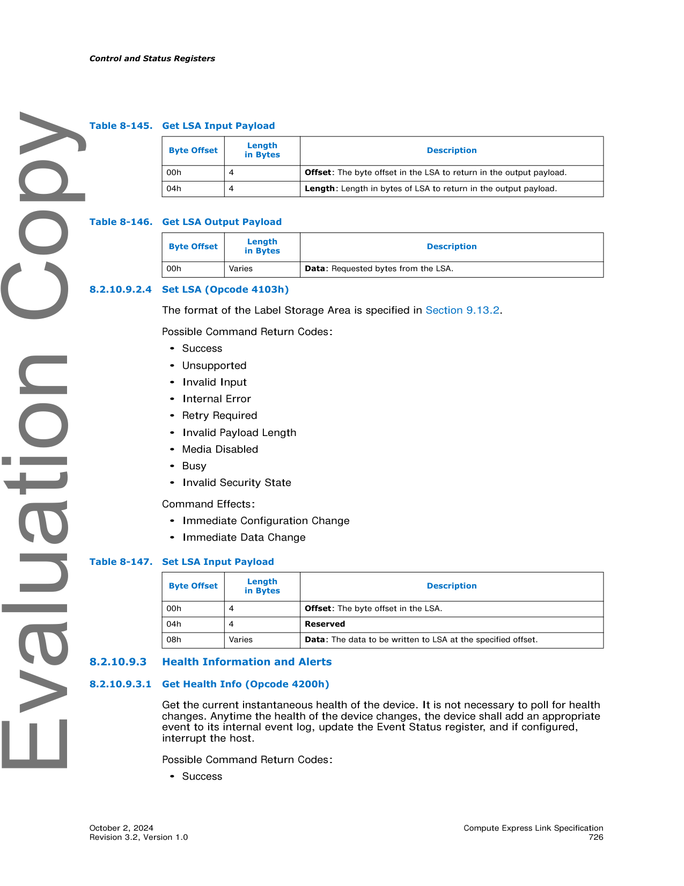
>
> *Original page render @ 150 DPI* — [📄 Full size](figures/chapter_08/page_0726.png)

[⬆️ 返回目录](#-本章目录-part-c)

---

### 8.2.10.9.3.1 Get Health Info (Opcode 4200h) | 获取健康信息 (操作码 4200h)

<table>
<thead>
<tr>
<th width="50%">🇬🇧 English</th>
<th width="50%" style="background-color:#e8e8e8">🇨🇳 中文</th>
</tr>
</thead>
<tbody>
<tr><td>Get the current instantaneous health of the device. It is not necessary to poll for health changes. Anytime the health of the device changes, the device shall add an appropriate event to its internal event log, update the Event Status register, and if configured, interrupt the host.</td><td style="background-color:#e8e8e8">获取设备当前的瞬时健康状态。不需要轮询健康变化。每当设备的健康状态发生变化时,设备应将适当的事件添加到其内部事件日志,更新 Event Status 寄存器,并在配置时中断主机。</td></tr>
<tr><td><b>Possible Command Return Codes:</b> • Success • Unsupported • Internal Error • Retry Required • Invalid Payload Length</td><td style="background-color:#e8e8e8"><b>可能的命令返回码:</b> • Success(成功) • Unsupported(不支持) • Internal Error(内部错误) • Retry Required(需要重试) • Invalid Payload Length(无效负载长度)</td></tr>
<tr><td><b>Command Effects:</b> • None</td><td style="background-color:#e8e8e8"><b>命令效果:</b> • None(无)</td></tr>
</tbody>
</table>

**Table 8-148. Get Health Info Output Payload | Get Health Info 输出负载**

<table>
<thead>
<tr><th>Byte Offset</th><th>Length in Bytes</th><th>🇬🇧 Description</th><th>🇨🇳 描述</th></tr>
</thead>
<tbody>
<tr><td>00h</td><td>1</td><td>Health Status: Overall device health summary. Normal health status is all bits cleared. • Bit[0]: Maintenance Needed • Bit[1]: Performance Degraded • Bit[2]: Hardware Replacement Needed • Bit[3]: Memory Capacity Degraded • Bits[7:4]: Reserved</td><td>Health Status:设备整体健康摘要。正常的健康状态是所有位都清零。 • Bit[0]:Maintenance Needed(需要维护) • Bit[1]:Performance Degraded(性能降级) • Bit[2]:Hardware Replacement Needed(需要更换硬件) • Bit[3]:Memory Capacity Degraded(内存容量降级) • Bits[7:4]:保留</td></tr>
<tr><td>01h</td><td>1</td><td>Media Status: Overall media health summary. • 00h = Normal. The device's media is operating normally. • 01h = Not Ready. The device's media is not ready. • 02h = Write persistency Lost. The device cannot persist write requests but is able to read stored data. • 03h = All data lost. All data has been lost from the device. • 04h = Write Persistency Loss in the Event of Power Loss • 05h = Write Persistency Loss in Event of Shutdown • 06h = Write Persistency Loss Imminent • 07h = All Data Loss in the Event of Power Loss • 08h = All Data Loss in the Event of Shutdown • 09h = All Data Loss Imminent • All other encodings are reserved.</td><td>Media Status:介质整体健康摘要。 • 00h = Normal。设备的介质正常运行。 • 01h = Not Ready。设备的介质未就绪。 • 02h = Write persistency Lost。设备无法持久化写入请求,但能够读取存储的数据。 • 03h = All data lost。设备上的所有数据都已丢失。 • 04h = 断电时写入持久性丢失 • 05h = 关闭时写入持久性丢失 • 06h = 即将丢失写入持久性 • 07h = 断电时所有数据丢失 • 08h = 关闭时所有数据丢失 • 09h = 即将丢失所有数据 • 所有其他编码保留。</td></tr>
<tr><td>02h</td><td>1</td><td>Additional Status • Bits[1:0]: Life Used: 00b = Normal; 01b = Warning; 10b = Critical; 11b = Reserved. • Bits[3:2]: Device Temperature: 00b = Normal; 01b = Warning; 10b = Critical; 11b = Reserved. • Bit[4]: Corrected Volatile Error Count: 0 = Normal; 1 = Warning or Failure. • Bit[5]: Corrected Persistent Error Count: 0 = Normal; 1 = Warning. • Bits[7:6]: Reserved.</td><td>Additional Status • Bits[1:0]:Life Used(已使用寿命):00b = 正常;01b = 警告;10b = 严重;11b = 保留。 • Bits[3:2]:Device Temperature(设备温度):00b = 正常;01b = 警告;10b = 严重;11b = 保留。 • Bit[4]:Corrected Volatile Error Count(已纠正易失性错误计数):0 = 正常;1 = 警告或故障。 • Bit[5]:Corrected Persistent Error Count(已纠正持久性错误计数):0 = 正常;1 = 警告。 • Bits[7:6]:保留。</td></tr>
<tr><td>03h</td><td>1</td><td>Life Used: The device's used life as a percentage value (0-100) of factory-expected life span. Returns FFh if not implemented.</td><td>Life Used(已使用寿命):设备的已使用寿命,占出厂预期寿命的百分比值(0-100)。如果未实现,则返回 FFh。</td></tr>
<tr><td>04h</td><td>2</td><td>Device Temperature: The device's current temperature in degrees Celsius, represented as a 2's complement value. Returns 7FFFh if not implemented.</td><td>Device Temperature(设备温度):设备的当前温度(以摄氏度为单位),表示为 2 的补码值。如果未实现,则返回 7FFFh。</td></tr>
<tr><td>06h</td><td>4</td><td>Dirty Shutdown Count: A monotonically increasing counter that is incremented whenever the device fails to save and/or flush data to the persistent media or is unable to determine whether data loss may have occurred. The count is persistent across power loss and wraps back to 0 at overflow.</td><td>Dirty Shutdown Count(脏关机计数):单调递增的计数器,每当设备无法将数据保存和/或刷新到持久性介质,或无法确定是否可能发生数据丢失时,计数器递增。计数在断电后保留,并在溢出时回绕到 0。</td></tr>
<tr><td>0Ah</td><td>4</td><td>Corrected Volatile Error Count: The total number of correctable memory errors that the device has detected as having occurred in the volatile memory partition.</td><td>Corrected Volatile Error Count(已纠正易失性错误计数):设备检测到的在易失性内存分区中发生的可纠正内存错误总数。</td></tr>
<tr><td>0Eh</td><td>4</td><td>Corrected Persistent Error Count: The total number of correctable memory errors that the device has detected as having occurred in the persistent memory partition.</td><td>Corrected Persistent Error Count(已纠正持久性错误计数):设备检测到的在持久性内存分区中发生的可纠正内存错误总数。</td></tr>
</tbody>
</table>

> **Figure 8-X.** Get Health Info Output Payload (page 727-728) ｜ Get Health Info 输出负载
>
> 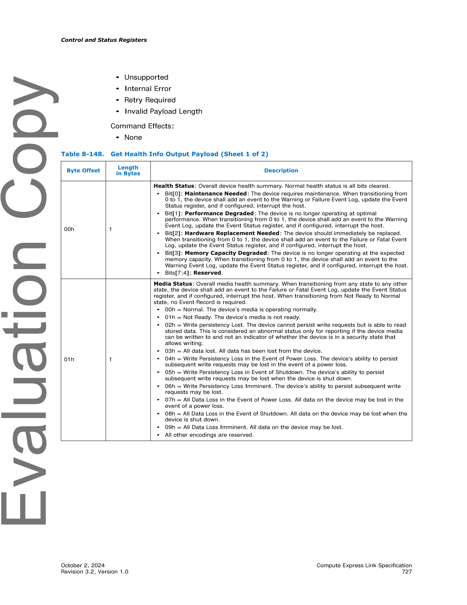
>
> *Original page render @ 150 DPI* — [📄 Full size](figures/chapter_08/page_0727.png)

[⬆️ 返回目录](#-本章目录-part-c)

---

### 8.2.10.9.3.2 Get Alert Configuration (Opcode 4201h) | 获取警报配置 (操作码 4201h)

<table>
<thead>
<tr>
<th width="50%">🇬🇧 English</th>
<th width="50%" style="background-color:#e8e8e8">🇨🇳 中文</th>
</tr>
</thead>
<tbody>
<tr><td>Retrieve the device's critical alert and programmable warning configuration. Critical alerts shall automatically be configured by the device after a Conventional Reset. If supported, programmable warning thresholds shall be initialized to vendor-recommended defaults by the device on a Conventional Reset.</td><td style="background-color:#e8e8e8">检索设备的关键警报和可编程警告配置。关键警报应在 Conventional Reset 后由设备自动配置。如果支持,可编程警告阈值应在 Conventional Reset 时由设备初始化为厂商推荐的默认值。</td></tr>
<tr><td><b>Possible Command Return Codes:</b> • Success • Unsupported • Internal Error • Retry Required • Invalid Payload Length</td><td style="background-color:#e8e8e8"><b>可能的命令返回码:</b> • Success(成功) • Unsupported(不支持) • Internal Error(内部错误) • Retry Required(需要重试) • Invalid Payload Length(无效负载长度)</td></tr>
<tr><td><b>Command Effects:</b> • None</td><td style="background-color:#e8e8e8"><b>命令效果:</b> • None(无)</td></tr>
</tbody>
</table>

**Table 8-149. Get Alert Configuration Output Payload | Get Alert Configuration 输出负载**

<table>
<thead>
<tr><th>Byte Offset</th><th>Length in Bytes</th><th>🇬🇧 Description</th><th>🇨🇳 描述</th></tr>
</thead>
<tbody>
<tr><td>00h</td><td>1</td><td>Valid Alerts: Indicators of which alert fields are valid in the returned data. • Bit[0]: When set, the Life Used Programmable Warning Threshold field is valid • Bit[1]: When set, the Device Over-Temperature Programmable Warning Threshold field is valid • Bit[2]: When set, the Device Under-Temperature Programmable Warning Threshold field is valid • Bit[3]: When set, the Corrected Volatile Memory Error Programmable Warning Threshold field is valid • Bit[4]: When set, the Corrected Persistent Memory Error Programmable Warning Threshold field is valid • Bits[7:5]: Reserved</td><td>Valid Alerts(有效警报):返回数据中哪些警报字段有效的指示符。 • Bit[0]:当设置时,Life Used Programmable Warning Threshold 字段有效 • Bit[1]:当设置时,Device Over-Temperature Programmable Warning Threshold 字段有效 • Bit[2]:当设置时,Device Under-Temperature Programmable Warning Threshold 字段有效 • Bit[3]:当设置时,Corrected Volatile Memory Error Programmable Warning Threshold 字段有效 • Bit[4]:当设置时,Corrected Persistent Memory Error Programmable Warning Threshold 字段有效 • Bits[7:5]:保留</td></tr>
<tr><td>01h</td><td>1</td><td>Programmable Alerts: Indicators of which device alerts are programmable by the host. • Bit[0]: When set, the Life Used Programmable Warning Threshold is programmable by the host • Bit[1]: When set, the Device Over-Temperature Programmable Warning Threshold field is programmable by the host • Bit[2]: When set, the Device Under-Temperature Programmable Warning Threshold field is programmable by the host • Bit[3]: When set, the Corrected Volatile Memory Error Programmable Warning is programmable by the host • Bit[4]: When set, the Corrected Persistent Memory Error Programmable Warning is programmable by the host • Bits[7:5]: Reserved</td><td>Programmable Alerts(可编程警报):主机可编程哪些设备警报的指示符。 • Bit[0]:当设置时,Life Used Programmable Warning Threshold 可由主机编程 • Bit[1]:当设置时,Device Over-Temperature Programmable Warning Threshold 字段可由主机编程 • Bit[2]:当设置时,Device Under-Temperature Programmable Warning Threshold 字段可由主机编程 • Bit[3]:当设置时,Corrected Volatile Memory Error Programmable Warning 可由主机编程 • Bit[4]:当设置时,Corrected Persistent Memory Error Programmable Warning 可由主机编程 • Bits[7:5]:保留</td></tr>
<tr><td>02h</td><td>1</td><td>Life Used Critical Alert Threshold: The device's default alert when the Life Used rises above this percentage-based value. Valid values are 0-100.</td><td>Life Used Critical Alert Threshold(Life Used 关键警报阈值):当 Life Used 超过此基于百分比的值时,设备的默认警报。有效值为 0-100。</td></tr>
<tr><td>03h</td><td>1</td><td>Life Used Programmable Warning Threshold: The device's currently programmed warning threshold when the life used rises to or above this percentage-based value. Valid values are 0-100. The life used warning threshold shall be less than the life used critical alert value.</td><td>Life Used Programmable Warning Threshold(Life Used 可编程警告阈值):当已使用寿命达到或超过此基于百分比的值时,设备当前编程的警告阈值。有效值为 0-100。Life used 警告阈值应小于 Life used 关键警报值。</td></tr>
<tr><td>04h</td><td>2</td><td>Device Over-Temperature Critical Alert Threshold: The device's default critical over-temperature alert threshold when the device temperature rises to or above this threshold in degrees Celsius, represented as a 2's complement value.</td><td>Device Over-Temperature Critical Alert Threshold(设备过温关键警报阈值):当设备温度达到或超过此阈值(以摄氏度为单位,表示为 2 的补码值)时,设备的默认关键过温警报阈值。</td></tr>
<tr><td>06h</td><td>2</td><td>Device Under-Temperature Critical Alert Threshold: The device's default critical under-temperature alert threshold when the device temperature falls to or below this threshold in degrees Celsius, represented as a 2's complement value.</td><td>Device Under-Temperature Critical Alert Threshold(设备低温关键警报阈值):当设备温度降至或低于此阈值(以摄氏度为单位,表示为 2 的补码值)时,设备的默认关键低温警报阈值。</td></tr>
<tr><td>08h</td><td>2</td><td>Device Over-Temperature Programmable Warning Threshold: The device's currently programmed over-temperature warning threshold when the device temperature rises to or above this threshold in degrees Celsius, represented as a 2's complement value.</td><td>Device Over-Temperature Programmable Warning Threshold(设备过温可编程警告阈值):当设备温度达到或超过此阈值(以摄氏度为单位,表示为 2 的补码值)时,设备当前编程的过温警告阈值。</td></tr>
<tr><td>0Ah</td><td>2</td><td>Device Under-Temperature Programmable Warning Threshold: The device's currently programmed under-temperature warning threshold when the device temperature falls to or below this threshold in degrees Celsius, represented as a 2's complement value.</td><td>Device Under-Temperature Programmable Warning Threshold(设备低温可编程警告阈值):当设备温度降至或低于此阈值(以摄氏度为单位,表示为 2 的补码值)时,设备当前编程的低温警告阈值。</td></tr>
<tr><td>0Ch</td><td>2</td><td>Corrected Volatile Memory Error Programmable Warning Threshold: The device's currently programmed warning threshold for corrected volatile memory errors before signaling a corrected error event to the host.</td><td>Corrected Volatile Memory Error Programmable Warning Threshold(已纠正易失性内存错误可编程警告阈值):在向主机发出已纠正错误事件之前,设备当前编程的已纠正易失性内存错误警告阈值。</td></tr>
<tr><td>0Eh</td><td>2</td><td>Corrected Persistent Memory Error Programmable Warning Threshold: The device's currently programmed warning threshold for corrected persistent memory errors before signaling a corrected error event to the host.</td><td>Corrected Persistent Memory Error Programmable Warning Threshold(已纠正持久性内存错误可编程警告阈值):在向主机发出已纠正错误事件之前,设备当前编程的已纠正持久性内存错误警告阈值。</td></tr>
</tbody>
</table>

> **Figure 8-X.** Get Alert Configuration (page 729-730) ｜ Get Alert Configuration
>
> 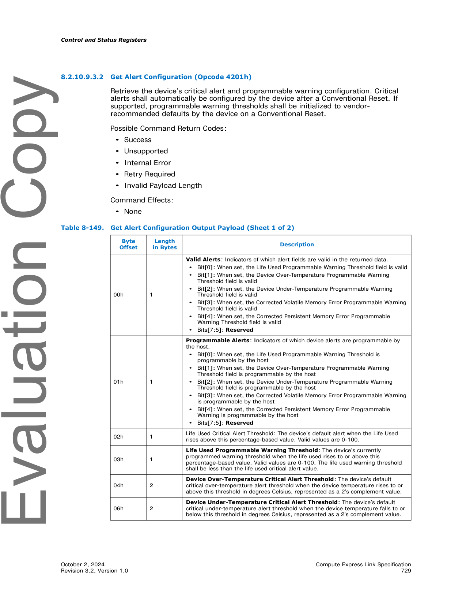
>
> *Original page render @ 150 DPI* — [📄 Full size](figures/chapter_08/page_0729.png)

[⬆️ 返回目录](#-本章目录-part-c)

---

### 8.2.10.9.3.3 Set Alert Configuration (Opcode 4202h) | 设置警报配置 (操作码 4202h)

<table>
<thead>
<tr>
<th width="50%">🇬🇧 English</th>
<th width="50%" style="background-color:#e8e8e8">🇨🇳 中文</th>
</tr>
</thead>
<tbody>
<tr><td>Set Alert Configuration allows the host to configure programmable warning thresholds optionally. If supported, programmable warning thresholds shall be initialized to vendor-recommended defaults by the device on a Conventional Reset. After completion of this command, the requested programmable warning thresholds shall replace any previously programmed warning thresholds.</td><td style="background-color:#e8e8e8">Set Alert Configuration 允许主机选择性地配置可编程警告阈值。如果支持,可编程警告阈值应在 Conventional Reset 时由设备初始化为厂商推荐的默认值。此命令完成后,请求的可编程警告阈值应替换任何先前编程的警告阈值。</td></tr>
<tr><td>Any time a programmed warning threshold is reached, the device shall add an appropriate event record to its event log, update the Event Status register, and if configured, interrupt the host. If the conditions are already met for the newly programmed warning at the time this command is executed, the device shall immediately generate the event record and interrupt for the alert.</td><td style="background-color:#e8e8e8">每当达到编程的警告阈值时,设备应将适当的事件记录添加到其事件日志,更新 Event Status 寄存器,并在配置时中断主机。如果在执行此命令时已满足新编程的警告条件,则设备应立即生成事件记录并中断警报。</td></tr>
<tr><td><b>Possible Command Return Codes:</b> • Success • Unsupported • Invalid Input • Internal Error • Retry Required • Invalid Payload Length</td><td style="background-color:#e8e8e8"><b>可能的命令返回码:</b> • Success(成功) • Unsupported(不支持) • Invalid Input(无效输入) • Internal Error(内部错误) • Retry Required(需要重试) • Invalid Payload Length(无效负载长度)</td></tr>
<tr><td><b>Command Effects:</b> • Immediate Policy Change</td><td style="background-color:#e8e8e8"><b>命令效果:</b> • Immediate Policy Change(立即策略更改)</td></tr>
</tbody>
</table>

**Table 8-150. Set Alert Configuration Input Payload | Set Alert Configuration 输入负载**

<table>
<thead>
<tr><th>Byte Offset</th><th>Length in Bytes</th><th>🇬🇧 Description</th><th>🇨🇳 描述</th></tr>
</thead>
<tbody>
<tr><td>00h</td><td>1</td><td>Valid Alert Actions: Indicators of which alert fields are valid in the supplied input payload. • Bit[0]: When set, the Life Used Programmable Warning Threshold Enable Alert Action and field shall be valid • Bit[1]: When set, the Device Over-Temperature Programmable Warning Threshold Enable Alert Action and field shall be valid • Bit[2]: When set, the Device Under-Temperature Programmable Warning Threshold Enable Alert Action and field shall be valid • Bit[3]: When set, the Corrected Volatile Memory Error Programmable Warning Threshold Enable Alert Action and field shall be valid • Bit[4]: When set, the Corrected Persistent Memory Error Programmable Warning Threshold Enable Alert Action and field shall be valid • Bits[7:5]: Reserved</td><td>Valid Alert Actions(有效警报操作):提供的输入负载中哪些警报字段有效的指示符。 • Bit[0]:当设置时,Life Used Programmable Warning Threshold Enable Alert Action 和字段应有效 • Bit[1]:当设置时,Device Over-Temperature Programmable Warning Threshold Enable Alert Action 和字段应有效 • Bit[2]:当设置时,Device Under-Temperature Programmable Warning Threshold Enable Alert Action 和字段应有效 • Bit[3]:当设置时,Corrected Volatile Memory Error Programmable Warning Threshold Enable Alert Action 和字段应有效 • Bit[4]:当设置时,Corrected Persistent Memory Error Programmable Warning Threshold Enable Alert Action 和字段应有效 • Bits[7:5]:保留</td></tr>
<tr><td>01h</td><td>1</td><td>Enable Alert Actions: The device shall enable the following programmable alerts. • Bit[0]: When set, the device shall enable its Life Used Programmable Warning Threshold. • Bit[1]: When set, the device shall enable its Device Over-Temperature Programmable Warning Threshold. • Bit[2]: When set, the device shall enable its Device Under-Temperature Programmable Warning Threshold. • Bit[3]: When set, the device shall enable its Corrected Volatile Memory Error Programmable Warning Threshold. • Bit[4]: When set, the device shall enable its Corrected Persistent Memory Error Programmable Warning Threshold. • Bits[7:5]: Reserved.</td><td>Enable Alert Actions(启用警报操作):设备应启用以下可编程警报。 • Bit[0]:当设置时,设备应启用其 Life Used Programmable Warning Threshold。 • Bit[1]:当设置时,设备应启用其 Device Over-Temperature Programmable Warning Threshold。 • Bit[2]:当设置时,设备应启用其 Device Under-Temperature Programmable Warning Threshold。 • Bit[3]:当设置时,设备应启用其 Corrected Volatile Memory Error Programmable Warning Threshold。 • Bit[4]:当设置时,设备应启用其 Corrected Persistent Memory Error Programmable Warning Threshold。 • Bits[7:5]:保留。</td></tr>
<tr><td>02h</td><td>1</td><td>Life Used Programmable Warning Threshold: The device's updated life used programmable warning threshold.</td><td>Life Used Programmable Warning Threshold:设备更新的 Life Used 可编程警告阈值。</td></tr>
<tr><td>03h</td><td>1</td><td>Reserved</td><td>保留</td></tr>
<tr><td>04h</td><td>2</td><td>Device Over-Temperature Programmable Warning Threshold: The device's updated Over-Temperature programmable warning threshold.</td><td>Device Over-Temperature Programmable Warning Threshold:设备更新的过温可编程警告阈值。</td></tr>
<tr><td>06h</td><td>2</td><td>Device Under-Temperature Programmable Warning Threshold: The device's updated Under-Temperature programmable warning threshold.</td><td>Device Under-Temperature Programmable Warning Threshold:设备更新的低温可编程警告阈值。</td></tr>
<tr><td>08h</td><td>2</td><td>Corrected Volatile Memory Error Programmable Warning Threshold: The device's updated programmable warning threshold for corrected volatile memory errors.</td><td>Corrected Volatile Memory Error Programmable Warning Threshold:设备更新的已纠正易失性内存错误可编程警告阈值。</td></tr>
<tr><td>0Ah</td><td>2</td><td>Corrected Persistent Memory Error Programmable Warning Threshold: The device's updated programmable warning threshold for corrected persistent memory errors.</td><td>Corrected Persistent Memory Error Programmable Warning Threshold:设备更新的已纠正持久性内存错误可编程警告阈值。</td></tr>
</tbody>
</table>

> **Figure 8-X.** Set Alert Configuration (page 731) ｜ Set Alert Configuration
>
> 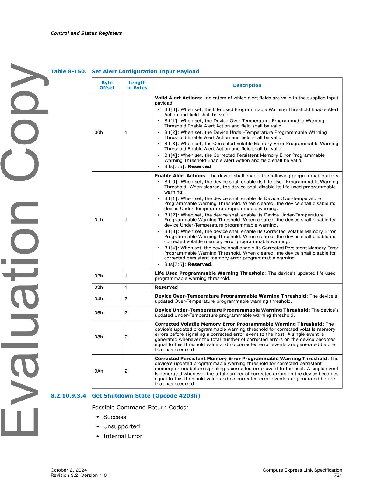
>
> *Original page render @ 150 DPI* — [📄 Full size](figures/chapter_08/page_0731.png)

[⬆️ 返回目录](#-本章目录-part-c)

---

### 8.2.10.9.3.4 Get Shutdown State (Opcode 4203h) | 获取关闭状态 (操作码 4203h)

<table>
<thead>
<tr>
<th width="50%">🇬🇧 English</th>
<th width="50%" style="background-color:#e8e8e8">🇨🇳 中文</th>
</tr>
</thead>
<tbody>
<tr><td><b>Possible Command Return Codes:</b> • Success • Unsupported • Internal Error • Retry Required • Invalid Payload Length • Media Disabled</td><td style="background-color:#e8e8e8"><b>可能的命令返回码:</b> • Success(成功) • Unsupported(不支持) • Internal Error(内部错误) • Retry Required(需要重试) • Invalid Payload Length(无效负载长度) • Media Disabled(介质已禁用)</td></tr>
<tr><td><b>Command Effects:</b> • None</td><td style="background-color:#e8e8e8"><b>命令效果:</b> • None(无)</td></tr>
</tbody>
</table>

**Table 8-151. Get Shutdown State Output Payload | Get Shutdown State 输出负载**

<table>
<thead>
<tr><th>Byte Offset</th><th>Length in Bytes</th><th>🇬🇧 Description</th><th>🇨🇳 描述</th></tr>
</thead>
<tbody>
<tr><td>00h</td><td>1</td><td>State: The current Shutdown State. • Bit[0]: Dirty: A 1 value indicates the device's internal Shutdown State is "dirty". A 0 value indicates "clean". • Bits[7:1]: Reserved.</td><td>State:当前 Shutdown State。 • Bit[0]:Dirty(脏):值 1 表示设备的内部 Shutdown State 为 "dirty"。值 0 表示 "clean"。 • Bits[7:1]:保留。</td></tr>
</tbody>
</table>

[⬆️ 返回目录](#-本章目录-part-c)

---

### 8.2.10.9.3.5 Set Shutdown State (Opcode 4204h) | 设置关闭状态 (操作码 4204h)

<table>
<thead>
<tr>
<th width="50%">🇬🇧 English</th>
<th width="50%" style="background-color:#e8e8e8">🇨🇳 中文</th>
</tr>
</thead>
<tbody>
<tr><td><b>Possible Command Return Codes:</b> • Success • Unsupported • Internal Error • Retry Required • Invalid Payload Length • Media Disabled</td><td style="background-color:#e8e8e8"><b>可能的命令返回码:</b> • Success(成功) • Unsupported(不支持) • Internal Error(内部错误) • Retry Required(需要重试) • Invalid Payload Length(无效负载长度) • Media Disabled(介质已禁用)</td></tr>
<tr><td><b>Command Effects:</b> • Immediate Policy Change</td><td style="background-color:#e8e8e8"><b>命令效果:</b> • Immediate Policy Change(立即策略更改)</td></tr>
</tbody>
</table>

**Table 8-152. Set Shutdown State Input Payload | Set Shutdown State 输入负载**

<table>
<thead>
<tr><th>Byte Offset</th><th>Length in Bytes</th><th>🇬🇧 Description</th><th>🇨🇳 描述</th></tr>
</thead>
<tbody>
<tr><td>00h</td><td>1</td><td>State: The current Shutdown State. • Bit[0]: Dirty: A 1 value sets the device's internal Shutdown State to "dirty". A 0 value sets it to "clean". The device shall persistently store this state and use it after the next Conventional Reset to determine whether the Dirty Shutdown Count described in Section 8.2.10.9.3.1 gets updated. If the Shutdown State is "dirty", the device shall increment the Dirty Shutdown Count and then set the Shutdown State to "clean". This post-reset logic shall occur before the device accepts any commands or memory I/O. The value set by this mailbox command shall be overridden by the device in two cases:   — On a successful GPF flow, the device shall set the Shutdown State to "clean"   — When handling a shutdown/reset, if the device detects an internal failure that jeopardizes data integrity (e.g., a failed internal flush), the device shall set the Shutdown State to "dirty" • Bits[7:1]: Reserved</td><td>State:当前 Shutdown State。 • Bit[0]:Dirty(脏):值 1 将设备的内部 Shutdown State 设置为 "dirty"。值 0 将其设置为 "clean"。设备应持续存储此状态,并在下一次 Conventional Reset 后使用它来确定是否更新 8.2.10.9.3.1 节中描述的 Dirty Shutdown Count。如果 Shutdown State 为 "dirty",设备应增加 Dirty Shutdown Count,然后将 Shutdown State 设置为 "clean"。此复位后逻辑应在设备接受任何命令或内存 I/O 之前发生。此邮箱命令设置的值将在两种情况下被设备覆盖:   — 在成功的 GPF 流程中,设备应将 Shutdown State 设置为 "clean"   — 在处理关闭/复位时,如果设备检测到危及数据完整性的内部故障(例如,内部刷新失败),设备应将 Shutdown State 设置为 "dirty" • Bits[7:1]:保留</td></tr>
</tbody>
</table>

> **Figure 8-X.** Get/Set Shutdown State (page 732) ｜ Get/Set Shutdown State
>
> 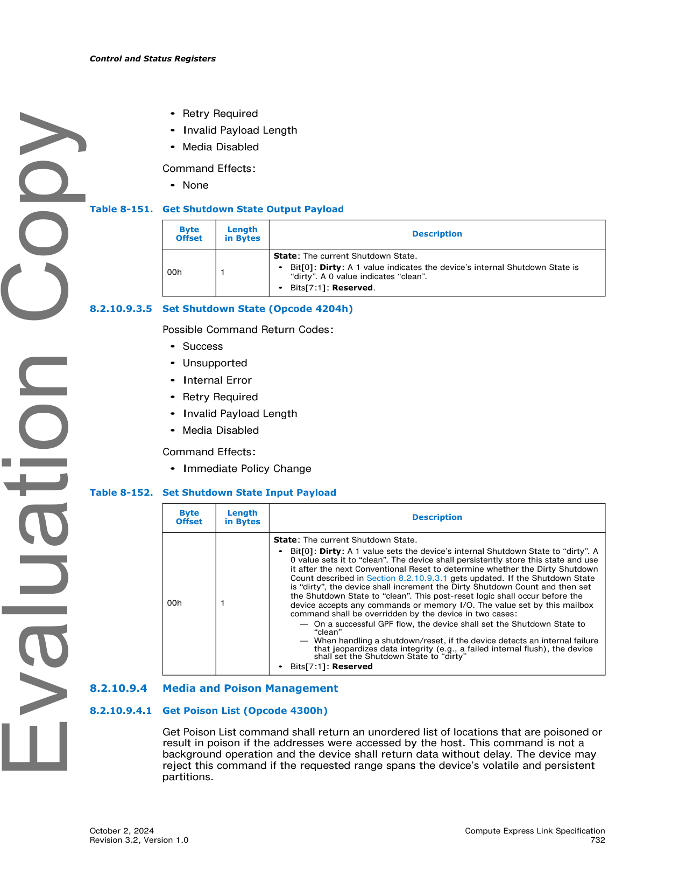
>
> *Original page render @ 150 DPI* — [📄 Full size](figures/chapter_08/page_0732.png)

[⬆️ 返回目录](#-本章目录-part-c)

---

### 8.2.10.9.4.1 Get Poison List (Opcode 4300h) | 获取 Poison List (操作码 4300h)

<table>
<thead>
<tr>
<th width="50%">🇬🇧 English</th>
<th width="50%" style="background-color:#e8e8e8">🇨🇳 中文</th>
</tr>
</thead>
<tbody>
<tr><td>Get Poison List command shall return an unordered list of locations that are poisoned or result in poison if the addresses were accessed by the host. This command is not a background operation and the device shall return data without delay. The device may reject this command if the requested range spans the device's volatile and persistent partitions.</td><td style="background-color:#e8e8e8">Get Poison List 命令应返回主机访问时已 poison 或导致 poison 的位置的无序列表。此命令不是后台操作,设备应无延迟地返回数据。如果请求的范围跨越设备的易失性和持久性分区,设备可以拒绝此命令。</td></tr>
<tr><td>The device shall return the known list of locations with media errors for the requested address range when the device processes the command. Any time that the device detects a new poisoned location, the device shall add the DPA to the Poison List, add an appropriate event to its Warning, Informational, or Failure Event Log, update the Event Status register, and if configured, interrupt the host. In response, the host should reissue this command to retrieve the updated Poison List.</td><td style="background-color:#e8e8e8">设备应在处理命令时返回所请求地址范围内具有介质错误的已知位置列表。每当设备检测到新的 poison 位置时,设备应将 DPA 添加到 Poison List,将适当的事件添加到其 Warning、Informational 或 Failure Event Log,更新 Event Status 寄存器,并在配置时中断主机。作为响应,主机应重新发出此命令以检索更新的 Poison List。</td></tr>
<tr><td>When poison is written: • Using CXL.mem: The device shall add the new DPA to the device's Poison List and then shall set the error source to an external error. • Using a CXL-defined poison injection interface (e.g., Inject Poison command): The device shall add the new DPA to the device's Poison List and then shall set the error source to an injected error. • By the device because of a device-detected internal error (e.g., device media scrub discovers new media error): The device shall add the new DPA to the device's Poison List and then shall set the error source to an internal error.</td><td style="background-color:#e8e8e8">当写入 poison 时: • 使用 CXL.mem:设备应将新的 DPA 添加到设备的 Poison List,然后将错误源设置为外部错误。 • 使用 CXL 定义的 poison 注入接口(例如,Inject Poison 命令):设备应将新的 DPA 添加到设备的 Poison List,然后将错误源设置为注入错误。 • 由设备由于设备检测到的内部错误(例如,设备介质扫描发现新的介质错误):设备应将新的 DPA 添加到设备的 Poison List,然后将错误源设置为内部错误。</td></tr>
<tr><td>When poison is cleared, the DPA shall no longer be reported in the device's Poison List.</td><td style="background-color:#e8e8e8">当 poison 被清除时,DPA 将不再在设备的 Poison List 中报告。</td></tr>
<tr><td>If the device does not support poison list for volatile ranges and any location in the requested list maps to volatile, the device shall return Invalid Physical Address.</td><td style="background-color:#e8e8e8">如果设备不支持易失性范围的 poison 列表,并且请求列表中的任何位置映射到易失性,则设备应返回 Invalid Physical Address。</td></tr>
<tr><td><b>Possible Command Return Codes:</b> • Success • Unsupported • Invalid Input • Internal Error • Retry Required • Invalid Payload Length • Media Disabled • Invalid Physical Address • Invalid Security State</td><td style="background-color:#e8e8e8"><b>可能的命令返回码:</b> • Success(成功) • Unsupported(不支持) • Invalid Input(无效输入) • Internal Error(内部错误) • Retry Required(需要重试) • Invalid Payload Length(无效负载长度) • Media Disabled(介质已禁用) • Invalid Physical Address(无效物理地址) • Invalid Security State(无效安全状态)</td></tr>
<tr><td><b>Command Effects:</b> • None</td><td style="background-color:#e8e8e8"><b>命令效果:</b> • None(无)</td></tr>
</tbody>
</table>

**Table 8-153. Get Poison List Input Payload | Get Poison List 输入负载**

<table>
<thead>
<tr><th>Byte Offset</th><th>Length in Bytes</th><th>🇬🇧 Description</th><th>🇨🇳 描述</th></tr>
</thead>
<tbody>
<tr><td>00h</td><td>8</td><td>Poison List Flags: Flags that affect the returned list. • Bit[0]: Restart Request: If set to 1, the device shall send the Poison List starting from the first entry, even if a previous transfer was incomplete. A device supporting this flag shall set the Restart Ack bit in the output payload in response to this flag being set. A device that does not support this flag must not set the Restart Ack bit. • Bits[5:1]: Reserved. Get Poison List Physical Address: The starting DPA for which to retrieve the Poison List. • Bits[7:6]: DPA[7:6] • Bits[15:8]: DPA[15:8] • … • Bits[63:56]: DPA[63:56]</td><td>Poison List Flags:影响返回列表的标志。 • Bit[0]:Restart Request(重启请求):如果设置为 1,设备应从第一个条目开始发送 Poison List,即使先前的传输未完成。支持此标志的设备应在响应此标志被设置时在输出负载中设置 Restart Ack 位。不支持此标志的设备不得设置 Restart Ack 位。 • Bits[5:1]:保留。 Get Poison List Physical Address:要检索 Poison List 的起始 DPA。 • Bits[7:6]:DPA[7:6] • Bits[15:8]:DPA[15:8] • … • Bits[63:56]:DPA[63:56]</td></tr>
<tr><td>08h</td><td>8</td><td>Get Poison List Physical Address Length: The range of physical addresses for which to retrieve the Poison List. This length shall be in units of 64 bytes (e.g., if this field is 2h, that indicates the length is 128 bytes).</td><td>Get Poison List Physical Address Length:要检索 Poison List 的物理地址范围。此长度应以 64 字节为单位(例如,如果此字段为 2h,则表示长度为 128 字节)。</td></tr>
</tbody>
</table>

**Table 8-154. Get Poison List Output Payload | Get Poison List 输出负载**

<table>
<thead>
<tr><th>Byte Offset</th><th>Length in Bytes</th><th>🇬🇧 Description</th><th>🇨🇳 描述</th></tr>
</thead>
<tbody>
<tr><td>00h</td><td>1</td><td>Poison List Flags: Flags that describe the returned list. • Bit[0]: More Media Error Records: When set, the device has more Media Error Records to return for the given Get Poison List address range. • Bit[1]: Poison List Overflow: When set, the returned list has overflowed, and the returned list can no longer be considered a complete list. • Bit[2]: Scan Media in Progress: When set, a background operation to scan the media is executing. • Bit[3]: Restart Ack: Set by a device that supports the Restart Request flag in response to that flag being set in the Input Payload. • Bits[7:4]: Reserved.</td><td>Poison List Flags:描述返回列表的标志。 • Bit[0]:More Media Error Records(更多介质错误记录):当设置时,设备有更多 Media Error Records 要针对给定的 Get Poison List 地址范围返回。 • Bit[1]:Poison List Overflow(Poison List 溢出):当设置时,返回的列表已溢出,返回的列表不再被视为完整列表。 • Bit[2]:Scan Media in Progress(扫描介质进行中):当设置时,扫描介质的后台操作正在执行。 • Bit[3]:Restart Ack(重启确认):由支持 Restart Request 标志的设备在响应输入负载中设置该标志时设置。 • Bits[7:4]:保留。</td></tr>
<tr><td>01h</td><td>1</td><td>Reserved</td><td>保留</td></tr>
<tr><td>02h</td><td>8</td><td>Overflow Timestamp: The time at which the device determined the poison list overflowed. The number of unsigned nanoseconds that have elapsed since midnight, 01-Jan-1970, UTC.</td><td>Overflow Timestamp(溢出时间戳):设备确定 poison list 溢出的时间。自 1970 年 1 月 1 日午夜 UTC 以来经过的无符号纳秒数。</td></tr>
<tr><td>0Ah</td><td>2</td><td>Media Error Record Count: Number of records in the Media Error Records list.</td><td>Media Error Record Count:Media Error Records 列表中的记录数。</td></tr>
<tr><td>0Ch</td><td>14h</td><td>Reserved</td><td>保留</td></tr>
<tr><td>20h</td><td>Varies</td><td>Media Error Records: The list of media error records.</td><td>Media Error Records:介质错误记录列表。</td></tr>
</tbody>
</table>

> **Figure 8-X.** Get Poison List (page 733-734) ｜ Get Poison List
>
> 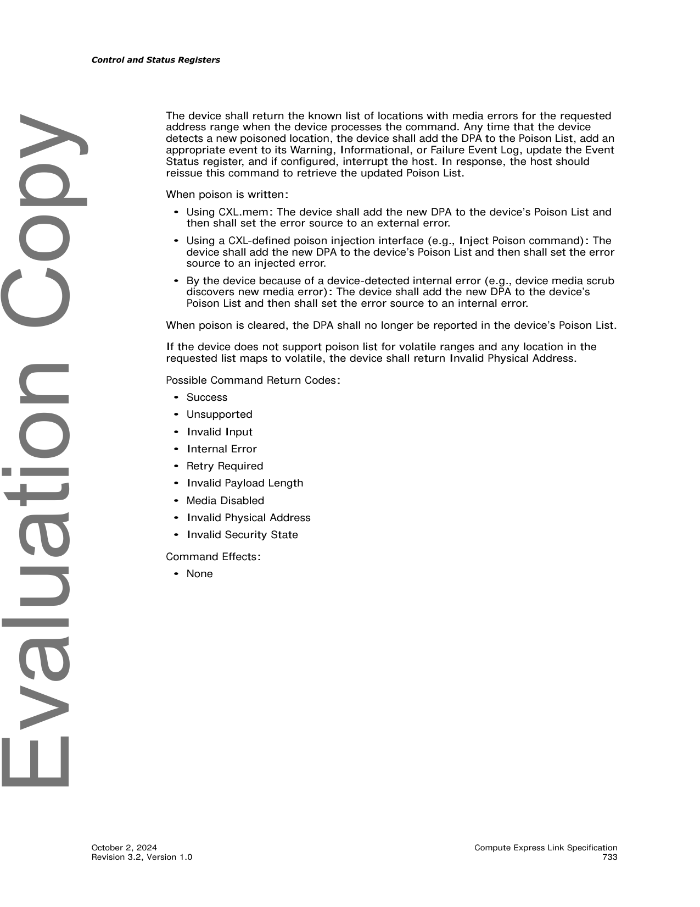
>
> *Original page render @ 150 DPI* — [📄 Full size](figures/chapter_08/page_0733.png)

[⬆️ 返回目录](#-本章目录-part-c)

---

### 8.2.10.9.4.2 Inject Poison (Opcode 4301h) | 注入 Poison (操作码 4301h)

<table>
<thead>
<tr>
<th width="50%">🇬🇧 English</th>
<th width="50%" style="background-color:#e8e8e8">🇨🇳 中文</th>
</tr>
</thead>
<tbody>
<tr><td>An optional command to inject poison into a requested physical address. If the host injects poison using this command, the device shall return poison when the address is accessed through the CXL.mem bus.</td><td style="background-color:#e8e8e8">用于将 poison 注入到请求的物理地址的可选命令。如果主机使用此命令注入 poison,则当通过 CXL.mem 总线访问该地址时,设备应返回 poison。</td></tr>
<tr><td>Injecting poison shall add the new physical address to the device's poison list and the error source shall be set to an injected error. In addition, the device shall add an appropriate poison creation event to its internal Informational Event Log, update the Event Status register, and if configured, interrupt the host.</td><td style="background-color:#e8e8e8">注入 poison 应将新的物理地址添加到设备的 poison 列表,并且错误源应设置为注入错误。此外,设备应将适当的 poison 创建事件添加到其内部 Informational Event Log,更新 Event Status 寄存器,并在配置时中断主机。</td></tr>
<tr><td>It is not an error to inject poison into a DPA that already has poison present and no error is returned.</td><td style="background-color:#e8e8e8">向已存在 poison 的 DPA 注入 poison 不是错误,不返回错误。</td></tr>
<tr><td>In support of confidential computing, if the device has been locked while utilizing secure CXL TSP interfaces, the device shall reject any attempt to change the data on the device or inject poison by returning Invalid Security State status for this command. See Section 11.5 for details on locking a device and locked device behavior.</td><td style="background-color:#e8e8e8">为了支持机密计算,如果设备在使用安全 CXL TSP 接口时已被锁定,设备应通过返回 Invalid Security State 状态来拒绝任何更改设备上的数据或注入 poison 的尝试。有关锁定设备和已锁定设备行为的详细信息,请参阅 11.5 节。</td></tr>
<tr><td><b>Possible Command Return Codes:</b> • Success • Unsupported • Internal Error • Retry Required • Invalid Payload Length • Media Disabled • Invalid Physical Address • Inject Poison Limit Reached • Invalid Security State</td><td style="background-color:#e8e8e8"><b>可能的命令返回码:</b> • Success(成功) • Unsupported(不支持) • Internal Error(内部错误) • Retry Required(需要重试) • Invalid Payload Length(无效负载长度) • Media Disabled(介质已禁用) • Invalid Physical Address(无效物理地址) • Inject Poison Limit Reached(达到注入 Poison 限制) • Invalid Security State(无效安全状态)</td></tr>
</tbody>
</table>

**Table 8-155. Media Error Record | Media Error Record**

<table>
<thead>
<tr><th>Byte Offset</th><th>Length in Bytes</th><th>🇬🇧 Description</th><th>🇨🇳 描述</th></tr>
</thead>
<tbody>
<tr><td>00h</td><td>8</td><td>Media Error Address: The DPA of the memory error and error source. • Bits[2:0]: Error Source: 000b = Unknown; 001b = External. Poison received from a source external to the device; 010b = Internal. The device generated poison from an internal source; 011b = Injected. The error was injected into the device for testing purposes; 111b = Vendor Specific. All other encodings are reserved. • Bits[5:3]: Reserved • Bits[7:6]: DPA[7:6] • Bits[15:8]: DPA[15:8] • … • Bits[63:56]: DPA[63:56]</td><td>Media Error Address:内存错误和错误源的 DPA。 • Bits[2:0]:Error Source(错误源):000b = Unknown(未知);001b = External(外部)。从设备外部的源接收的 poison;010b = Internal(内部)。设备从内部源生成 poison;011b = Injected(注入)。错误被注入到设备中以进行测试;111b = Vendor Specific(厂商特定)。所有其他编码保留。 • Bits[5:3]:保留 • Bits[7:6]:DPA[7:6] • Bits[15:8]:DPA[15:8] • … • Bits[63:56]:DPA[63:56]</td></tr>
<tr><td>08h</td><td>4</td><td>Media Error Length: The number of adjacent DPAs in this media error record. This shall be nonzero. Devices may coalesce adjacent memory errors into a single entry. This length shall be in units of 64 bytes.</td><td>Media Error Length:此介质错误记录中相邻 DPA 的数量。这应是非零的。设备可以将相邻的内存错误合并为单个条目。此长度应以 64 字节为单位。</td></tr>
<tr><td>0Ch</td><td>4</td><td>Reserved</td><td>保留</td></tr>
</tbody>
</table>

> **Figure 8-X.** Media Error Record (page 735) ｜ Media Error Record
>
> 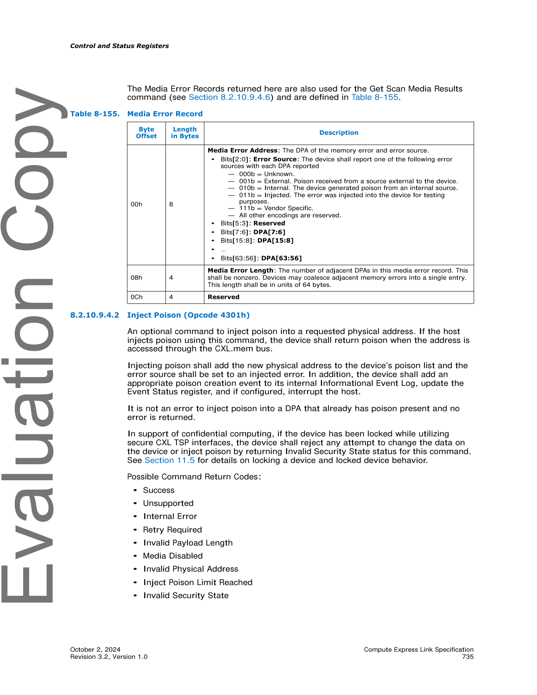
>
> *Original page render @ 150 DPI* — [📄 Full size](figures/chapter_08/page_0735.png)

[⬆️ 返回目录](#-本章目录-part-c)

---

### 8.2.10.9.4.3 Clear Poison (Opcode 4302h) | 清除 Poison (操作码 4302h)

<table>
<thead>
<tr>
<th width="50%">🇬🇧 English</th>
<th width="50%" style="background-color:#e8e8e8">🇨🇳 中文</th>
</tr>
</thead>
<tbody>
<tr><td>An optional command to clear poison from the requested physical address and atomically write the included data in its place. This provides the same functionality as the host directly writing new data to the device.</td><td style="background-color:#e8e8e8">用于从请求的物理地址清除 poison 并以原子方式将包含的数据写入其位置的可选命令。这提供了与主机直接将新数据写入设备相同的功能。</td></tr>
<tr><td>Clearing poison shall remove the physical address from the device's Poison List. It is not an error to clear poison from an address that does not have poison set. If the device detects that it is not possible to clear poison from the physical address, the device shall return a permanent media failure code for this command.</td><td style="background-color:#e8e8e8">清除 poison 应将物理地址从设备的 Poison List 中删除。从未设置 poison 的地址清除 poison 不是错误。如果设备检测到无法从物理地址清除 poison,则设备应为此命令返回永久性介质失败代码。</td></tr>
<tr><td>In support of confidential computing, if the device has been locked while utilizing secure CXL TSP interfaces, the device shall reject any attempt to change the data on the device or clear poison by returning Invalid Security State status for this command. See Section 11.5 for details on locking a device and locked device behavior.</td><td style="background-color:#e8e8e8">为了支持机密计算,如果设备在使用安全 CXL TSP 接口时已被锁定,设备应通过返回 Invalid Security State 状态来拒绝任何更改设备上的数据或清除 poison 的尝试。有关锁定设备和已锁定设备行为的详细信息,请参阅 11.5 节。</td></tr>
<tr><td>This command must not modify the content of the Extended Metadata field associated with this address. If the device is configured with non-zero Metadata bits as defined by HDM-H Metabits Storage Configuration field in Table 8-115, for subsequent read to the DPA, the device shall return Metafield=00b (Meta0-State abbreviation MS0) and MetaValue=00b.</td><td style="background-color:#e8e8e8">此命令不得修改与此地址关联的 Extended Metadata 字段的内容。如果设备配置了表 8-115 中 HDM-H Metabits Storage Configuration 字段所定义的非零 Metadata 位,则对于对 DPA 的后续读取,设备应返回 Metafield=00b(Meta0-State 缩写 MS0)和 MetaValue=00b。</td></tr>
<tr><td><b>Possible Command Return Codes:</b> • Success • Unsupported • Invalid Input • Internal Error • Retry Required • Invalid Payload Length • Media Disabled • Permanent Media Failure • Invalid Physical Address • Invalid Security State</td><td style="background-color:#e8e8e8"><b>可能的命令返回码:</b> • Success(成功) • Unsupported(不支持) • Invalid Input(无效输入) • Internal Error(内部错误) • Retry Required(需要重试) • Invalid Payload Length(无效负载长度) • Media Disabled(介质已禁用) • Permanent Media Failure(永久性介质故障) • Invalid Physical Address(无效物理地址) • Invalid Security State(无效安全状态)</td></tr>
<tr><td><b>Command Effects:</b> • Immediate Data Change</td><td style="background-color:#e8e8e8"><b>命令效果:</b> • Immediate Data Change(立即数据更改)</td></tr>
</tbody>
</table>

**Table 8-156. Inject Poison Input Payload | Inject Poison 输入负载**

<table>
<thead>
<tr><th>Byte Offset</th><th>Length in Bytes</th><th>🇬🇧 Description</th><th>🇨🇳 描述</th></tr>
</thead>
<tbody>
<tr><td>00h</td><td>8</td><td>Inject Poison Physical Address: The requested DPA at which poison shall be injected by the device. • Bits[5:0]: Reserved • Bits[7:6]: DPA[7:6] • Bits[15:8]: DPA[15:8] • … • Bits[63:56]: DPA[63:56]</td><td>Inject Poison Physical Address:设备应在该处注入 poison 的请求 DPA。 • Bits[5:0]:保留 • Bits[7:6]:DPA[7:6] • Bits[15:8]:DPA[15:8] • … • Bits[63:56]:DPA[63:56]</td></tr>
</tbody>
</table>

**Table 8-157. Clear Poison Input Payload | Clear Poison 输入负载**

<table>
<thead>
<tr><th>Byte Offset</th><th>Length in Bytes</th><th>🇬🇧 Description</th><th>🇨🇳 描述</th></tr>
</thead>
<tbody>
<tr><td>00h</td><td>8</td><td>Clear Poison Physical Address: The requested DPA from which poison shall be cleared by the device. • Bits[5:0]: Reserved • Bits[7:6]: DPA[7:6] • Bits[15:8]: DPA[15:8] • … • Bits[63:56]: DPA[63:56]</td><td>Clear Poison Physical Address:设备应从该处清除 poison 的请求 DPA。 • Bits[5:0]:保留 • Bits[7:6]:DPA[7:6] • Bits[15:8]:DPA[15:8] • … • Bits[63:56]:DPA[63:56]</td></tr>
<tr><td>08h</td><td>64</td><td>Clear Poison Write Data: The data the device shall always write into the requested physical address, atomically, while clearing poison if the location is marked as being poisoned.</td><td>Clear Poison Write Data:设备应在清除 poison(如果该位置被标记为已 poison)时以原子方式始终写入到请求的物理地址的数据。</td></tr>
</tbody>
</table>

[⬆️ 返回目录](#-本章目录-part-c)

---

### 8.2.10.9.4.4 Get Scan Media Capabilities (Opcode 4303h) | 获取扫描介质能力 (操作码 4303h)

<table>
<thead>
<tr>
<th width="50%">🇬🇧 English</th>
<th width="50%" style="background-color:#e8e8e8">🇨🇳 中文</th>
</tr>
</thead>
<tbody>
<tr><td>This command allows the device to report capabilities and options for the Scan Media feature based on the requested range. The device may reject this command if the range requested spans the device's volatile and persistent partitions.</td><td style="background-color:#e8e8e8">此命令允许设备根据请求的范围报告 Scan Media 特性的能力和选项。如果请求的范围跨越设备的易失性和持久性分区,设备可以拒绝此命令。</td></tr>
<tr><td><b>Possible Command Return Codes:</b> • Success • Unsupported • Invalid Input • Internal Error • Retry Required • Invalid Payload Length • Media Disabled • Invalid Physical Address • Invalid Security State</td><td style="background-color:#e8e8e8"><b>可能的命令返回码:</b> • Success(成功) • Unsupported(不支持) • Invalid Input(无效输入) • Internal Error(内部错误) • Retry Required(需要重试) • Invalid Payload Length(无效负载长度) • Media Disabled(介质已禁用) • Invalid Physical Address(无效物理地址) • Invalid Security State(无效安全状态)</td></tr>
<tr><td><b>Command Effects:</b> • None</td><td style="background-color:#e8e8e8"><b>命令效果:</b> • None(无)</td></tr>
</tbody>
</table>

**Table 8-158. Get Scan Media Capabilities Input Payload | Get Scan Media Capabilities 输入负载**

<table>
<thead>
<tr><th>Byte Offset</th><th>Length in Bytes</th><th>🇬🇧 Description</th><th>🇨🇳 描述</th></tr>
</thead>
<tbody>
<tr><td>00h</td><td>8</td><td>Get Scan Media Capabilities Start Physical Address: The starting DPA from which to retrieve Scan Media capabilities. • Bits[5:0]: Reserved • Bits[7:6]: DPA[7:6] • Bits[15:8]: DPA[15:8] • … • Bits[63:56]: DPA[63:56]</td><td>Get Scan Media Capabilities Start Physical Address:要检索 Scan Media 能力的起始 DPA。 • Bits[5:0]:保留 • Bits[7:6]:DPA[7:6] • Bits[15:8]:DPA[15:8] • … • Bits[63:56]:DPA[63:56]</td></tr>
<tr><td>08h</td><td>8</td><td>Get Scan Media Capabilities Physical Address Length: The range of physical addresses for which to retrieve Scan Media capabilities. This length shall be in units of 64 bytes.</td><td>Get Scan Media Capabilities Physical Address Length:要检索 Scan Media 能力的物理地址范围。此长度应以 64 字节为单位。</td></tr>
</tbody>
</table>

**Table 8-159. Get Scan Media Capabilities Output Payload | Get Scan Media Capabilities 输出负载**

<table>
<thead>
<tr><th>Byte Offset</th><th>Length in Bytes</th><th>🇬🇧 Description</th><th>🇨🇳 描述</th></tr>
</thead>
<tbody>
<tr><td>00h</td><td>4</td><td>Estimated Scan Media Time: The number of milliseconds that the device estimates are required to complete the Scan Media request over the range specified in the input.</td><td>Estimated Scan Media Time:设备估计完成输入中指定范围的 Scan Media 请求所需的毫秒数。</td></tr>
</tbody>
</table>

[⬆️ 返回目录](#-本章目录-part-c)

---

### 8.2.10.9.4.5 Scan Media (Opcode 4304h) | 扫描介质 (操作码 4304h)

<table>
<thead>
<tr>
<th width="50%">🇬🇧 English</th>
<th width="50%" style="background-color:#e8e8e8">🇨🇳 中文</th>
</tr>
</thead>
<tbody>
<tr><td>The Scan Media command causes the device to initiate a scan of a portion of its media for locations that are poisoned or result in poison if the addresses were accessed by the host. The device may update its Poison List as a result of executing the scan and shall complete any changes to the Poison List before signally completion of the Scan Media background operation. If the device updates its Poison List while the Scan Media background operation is executing, the device shall indicate that a media scan is in progress if Get Poison List is called during the scan. The host should use this command only if the poison list has overflowed and is no longer a complete list of the memory errors that exist on the media. The device may reject this command if the requested range spans the device's volatile and persistent partitions.</td><td style="background-color:#e8e8e8">Scan Media 命令导致设备启动对其部分介质的扫描,以查找主机访问时已 poison 或导致 poison 的位置。设备可能会由于执行扫描而更新其 Poison List,并应在发出 Scan Media 后台操作完成信号之前完成对 Poison List 的任何更改。如果设备在 Scan Media 后台操作执行时更新其 Poison List,则如果在扫描期间调用 Get Poison List,设备应指示介质扫描正在进行。主机仅在 poison list 已溢出且不再是介质上存在的内存错误的完整列表时才应使用此命令。如果请求的范围跨越设备的易失性和持久性分区,设备可以拒绝此命令。</td></tr>
<tr><td>If interrupts are enabled for reporting internally or externally generated poison, and the poison list has not overflowed, the host should avoid using this command. It is expensive and may impact the performance of other operations on the device. This is intended only as a backup to retrieve the list of memory error locations in the event the poison list has overflowed.</td><td style="background-color:#e8e8e8">如果已启用用于报告内部或外部生成的 poison 的中断,并且 poison list 尚未溢出,则主机应避免使用此命令。它是昂贵的,并且可能会影响设备上其他操作的性能。这仅用作在 poison list 溢出时检索内存错误位置列表的备份。</td></tr>
<tr><td>Because the execution of a media scan may take significant time to complete, it is considered a background operation. The Scan Media command shall initiate the background operation and provide immediate status on the device's ability to start the scan operation. Any previous Scan Media results are discarded by the device upon receiving a new Scan Media command. Once the Scan Media command is successfully started, the Background Command Status register is used to retrieve the status. The Get Scan Media Results command shall return the list of poisoned memory locations.</td><td style="background-color:#e8e8e8">由于介质扫描的执行可能需要大量时间才能完成,因此它被视为后台操作。Scan Media 命令应启动后台操作,并立即提供有关设备启动扫描操作的能力的状态。设备在收到新的 Scan Media 命令时会丢弃任何先前的 Scan Media 结果。一旦 Scan Media 命令成功启动,Background Command Status 寄存器用于检索状态。Get Scan Media Results 命令应返回已 poison 的内存位置列表。</td></tr>
<tr><td><b>Possible Command Return Codes:</b> • Success • Unsupported • Background Command Started • Invalid Input • Internal Error • Retry Required • Invalid Payload Length • Media Disabled • Busy • Aborted • Invalid Physical Address • Invalid Security State</td><td style="background-color:#e8e8e8"><b>可能的命令返回码:</b> • Success(成功) • Unsupported(不支持) • Background Command Started(后台命令已启动) • Invalid Input(无效输入) • Internal Error(内部错误) • Retry Required(需要重试) • Invalid Payload Length(无效负载长度) • Media Disabled(介质已禁用) • Busy(忙) • Aborted(中止) • Invalid Physical Address(无效物理地址) • Invalid Security State(无效安全状态)</td></tr>
<tr><td><b>Command Effects:</b> • Background Operation • Request Abort Background Operation Command Supported</td><td style="background-color:#e8e8e8"><b>命令效果:</b> • Background Operation(后台操作) • 支持 Request Abort Background Operation Command</td></tr>
</tbody>
</table>

**Table 8-160. Scan Media Input Payload | Scan Media 输入负载**

<table>
<thead>
<tr><th>Byte Offset</th><th>Length in Bytes</th><th>🇬🇧 Description</th><th>🇨🇳 描述</th></tr>
</thead>
<tbody>
<tr><td>00h</td><td>8</td><td>Scan Media Physical Address: The starting DPA from which to start the scan. • Bits[5:0]: Reserved • Bits[7:6]: DPA[7:6] • Bits[15:8]: DPA[15:8] • … • Bits[63:56]: DPA[63:56]</td><td>Scan Media Physical Address:开始扫描的起始 DPA。 • Bits[5:0]:保留 • Bits[7:6]:DPA[7:6] • Bits[15:8]:DPA[15:8] • … • Bits[63:56]:DPA[63:56]</td></tr>
<tr><td>08h</td><td>8</td><td>Scan Media Physical Address Length: The range of physical addresses to scan. This length shall be in units of 64 bytes.</td><td>Scan Media Physical Address Length:要扫描的物理地址范围。此长度应以 64 字节为单位。</td></tr>
<tr><td>10h</td><td>1</td><td>Scan Media Flags • Bit[0]: No Event Log: When set, the device shall not generate event logs for media errors found during the Scan Media operation. • Bits[7:1]: Reserved.</td><td>Scan Media Flags • Bit[0]:No Event Log(无事件日志):当设置时,设备不应为 Scan Media 操作期间发现的介质错误生成事件日志。 • Bits[7:1]:保留。</td></tr>
</tbody>
</table>

[⬆️ 返回目录](#-本章目录-part-c)

---

### 8.2.10.9.4.6 Get Scan Media Results (Opcode 4305h) | 获取扫描介质结果 (操作码 4305h)

<table>
<thead>
<tr>
<th width="50%">🇬🇧 English</th>
<th width="50%" style="background-color:#e8e8e8">🇨🇳 中文</th>
</tr>
</thead>
<tbody>
<tr><td>Get Scan Media Results returns an unordered list of poisoned memory locations, in response to the Scan Media command. If the Scan Media command has not been called since the last Conventional Reset, the device shall return the Unsupported return code. The completion status for the Scan Media command is returned in the Background Command Status register and is not repeated here.</td><td style="background-color:#e8e8e8">Get Scan Media Results 返回已 poison 内存位置的无序列表,作为对 Scan Media 命令的响应。如果自上次 Conventional Reset 以来未调用 Scan Media 命令,则设备应返回 Unsupported 返回码。Scan Media 命令的完成状态在 Background Command Status 寄存器中返回,此处不再重复。</td></tr>
<tr><td>Because the returned list can be larger than the output payload size, it is possible to return the list in multiple calls to Get Scan Media Results. The More Media Error Records indicator shall be set by the device anytime there are more records to retrieve. The caller should continue to issue this command until this indicator is no longer set.</td><td style="background-color:#e8e8e8">由于返回的列表可能大于输出负载大小,因此可以通过多次调用 Get Scan Media Results 返回列表。每当有更多记录要检索时,设备应设置 More Media Error Records 指示符。调用者应继续发出此命令,直到此指示符不再设置。</td></tr>
<tr><td>If the device cannot complete the scan and requires the host to retrieve scan media results before the device can continue the scan, the device shall set the Scan Media Stopped Prematurely indicator, return a valid Scan Media Restart Physical Address and Scan Media Restart Physical Address Length. This is the physical address range the device would require the Scan Media command to be called again with to continue the scan. It is the responsibility of the host to issue the Scan Media command, using this restart context, to guarantee that the Device's entire physical address range is eventually scanned.</td><td style="background-color:#e8e8e8">如果设备无法完成扫描并且需要主机在设备能够继续扫描之前检索扫描介质结果,则设备应设置 Scan Media Stopped Prematurely 指示符,返回有效的 Scan Media Restart Physical Address 和 Scan Media Restart Physical Address Length。这是设备需要再次调用 Scan Media 命令才能继续扫描的物理地址范围。主机有责任使用此重启上下文发出 Scan Media 命令,以保证设备的整个物理地址范围最终被扫描。</td></tr>
<tr><td><b>Possible Command Return Codes:</b> • Success • Unsupported • Internal Error • Retry Required • Invalid Payload Length • Media Disabled • Busy • Invalid Security State</td><td style="background-color:#e8e8e8"><b>可能的命令返回码:</b> • Success(成功) • Unsupported(不支持) • Internal Error(内部错误) • Retry Required(需要重试) • Invalid Payload Length(无效负载长度) • Media Disabled(介质已禁用) • Busy(忙) • Invalid Security State(无效安全状态)</td></tr>
<tr><td><b>Command Effects:</b> • None</td><td style="background-color:#e8e8e8"><b>命令效果:</b> • None(无)</td></tr>
</tbody>
</table>

**Table 8-161. Get Scan Media Results Output Payload | Get Scan Media Results 输出负载**

<table>
<thead>
<tr><th>Byte Offset</th><th>Length in Bytes</th><th>🇬🇧 Description</th><th>🇨🇳 描述</th></tr>
</thead>
<tbody>
<tr><td>00h</td><td>8</td><td>Scan Media Restart Physical Address: The location from which the host should restart the Scan Media operation if the device could not complete the requested scan.</td><td>Scan Media Restart Physical Address:如果设备无法完成请求的扫描,主机应从该位置重新启动 Scan Media 操作。</td></tr>
<tr><td>08h</td><td>8</td><td>Scan Media Restart Physical Address Length: The remaining range from which the host should restart the Scan Media operation if the device could not complete the requested scan.</td><td>Scan Media Restart Physical Address Length:如果设备无法完成请求的扫描,主机应从该剩余范围重新启动 Scan Media 操作。</td></tr>
<tr><td>10h</td><td>1</td><td>Scan Media Flags • Bit[0]: More Media Error Records: When set, the device has more Media Error Records to return for the given Scan Media address range. • Bit[1]: Scan Stopped Prematurely: The device has run out of internal storage space for the error list. • Bits[7:2]: Reserved.</td><td>Scan Media Flags • Bit[0]:More Media Error Records(更多介质错误记录):当设置时,设备有更多 Media Error Records 要针对给定的 Scan Media 地址范围返回。 • Bit[1]:Scan Stopped Prematurely(扫描过早停止):设备的错误列表内部存储空间已用完。 • Bits[7:2]:保留。</td></tr>
<tr><td>11h</td><td>1</td><td>Reserved</td><td>保留</td></tr>
<tr><td>12h</td><td>2</td><td>Media Error Record Count: The number of records in the Media Error Records list.</td><td>Media Error Record Count:Media Error Records 列表中的记录数。</td></tr>
<tr><td>14h</td><td>0Ch</td><td>Reserved</td><td>保留</td></tr>
<tr><td>20h</td><td>Varies</td><td>Media Error Records: The list of media error records.</td><td>Media Error Records:介质错误记录列表。</td></tr>
</tbody>
</table>

[⬆️ 返回目录](#-本章目录-part-c)

---

### 8.2.10.5.2.1 Command Effects Log (CEL) | 命令效果日志 (CEL)

<table>
<thead>
<tr>
<th width="50%">🇬🇧 English</th>
<th width="50%" style="background-color:#e8e8e8">🇨🇳 中文</th>
</tr>
</thead>
<tbody>
<tr><td>The Command Effects Log (CEL) is a variable-length log page that reports each CXL defined command supported by the CCI that was queried (with the exception of the secondary mailbox, as described in Section 8.2.9.4.2) and the effect each command may have on the device subsystem. The effects of a given command may be different based on various factors (e.g., the input payload specified when the command was issued). Therefore, all possible command effects for a given command shall be reported by the device in the CEL.</td><td style="background-color:#e8e8e8">命令效果日志 (CEL) 是一个可变长度的日志页,用于报告所查询 CCI 支持的每个 CXL 定义命令(secondary mailbox 除外,详见 8.2.9.4.2 节)以及每个命令可能对设备子系统产生的影响。给定命令的效果可能因各种因素而异(例如,发出命令时指定的输入负载)。因此,设备应在 CEL 中报告给定命令的所有可能命令效果。</td></tr>
<tr><td>Devices shall implement the CEL for all commands supported by the device, including any vendor specific commands that extend beyond those specified in this specification.</td><td style="background-color:#e8e8e8">设备应为其支持的所有命令实现 CEL,包括超出本规范规定的任何厂商特定命令。</td></tr>
<tr><td>Some host drivers may not allow unspecified commands to be passed through to the device if the commands are not advertised in the CEL.</td><td style="background-color:#e8e8e8">某些主机驱动程序可能不允许将未在 CEL 中通告的未指定命令传递到设备。</td></tr>
<tr><td>The CEL shall use a Log Identifier of: • 0da9c0b5-bf41-4b78-8f79-96b1623b3f17</td><td style="background-color:#e8e8e8">CEL 应使用以下 Log Identifier: • 0da9c0b5-bf41-4b78-8f79-96b1623b3f17</td></tr>
<tr><td>Each CEL entry shall have a specific set of bit definitions describing the effect of issuing the command as outlined below.</td><td style="background-color:#e8e8e8">每个 CEL 条目应具有一组特定的位定义,用于描述发出命令的影响,如下所述。</td></tr>
</tbody>
</table>

> **Figure 8-X.** Get Log / CEL structures (page 677) ｜ Get Log / CEL 结构
>
> 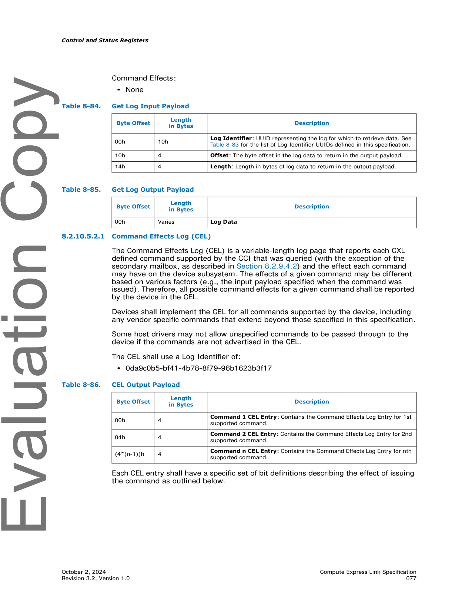
>
> *Original page render @ 150 DPI* — [📄 Full size](figures/chapter_08/page_0677.png)

**Table 8-84. Get Log Input Payload | Get Log 输入负载**

<table>
<thead>
<tr><th>Byte Offset</th><th>Length in Bytes</th><th>🇬🇧 Description</th><th>🇨🇳 描述</th></tr>
</thead>
<tbody>
<tr><td>00h</td><td>10h</td><td>Log Identifier: UUID representing the log for which to retrieve data. See Table 8-83 for the list of Log Identifier UUIDs defined in this specification.</td><td>日志标识符(UUID):表示要检索数据的日志的 UUID。有关本规范中定义的 Log Identifier UUID 列表,请参见表 8-83。</td></tr>
<tr><td>10h</td><td>4</td><td>Offset: The byte offset in the log data to return in the output payload.</td><td>Offset:在日志数据中返回到输出负载的字节偏移量。</td></tr>
<tr><td>14h</td><td>4</td><td>Length: Length in bytes of log data to return in the output payload.</td><td>Length:在输出负载中返回的日志数据的字节长度。</td></tr>
</tbody>
</table>

**Table 8-85. Get Log Output Payload | Get Log 输出负载**

<table>
<thead>
<tr><th>Byte Offset</th><th>Length in Bytes</th><th>🇬🇧 Description</th><th>🇨🇳 描述</th></tr>
</thead>
<tbody>
<tr><td>00h</td><td>Varies</td><td>Log Data</td><td>日志数据</td></tr>
</tbody>
</table>

**Table 8-86. CEL Output Payload | CEL 输出负载**

<table>
<thead>
<tr><th>Byte Offset</th><th>Length in Bytes</th><th>🇬🇧 Description</th><th>🇨🇳 描述</th></tr>
</thead>
<tbody>
<tr><td>00h</td><td>4</td><td>Command 1 CEL Entry: Contains the Command Effects Log Entry for 1st supported command.</td><td>命令 1 的 CEL 条目:包含第一个受支持命令的命令效果日志条目。</td></tr>
<tr><td>04h</td><td>4</td><td>Command 2 CEL Entry: Contains the Command Effects Log Entry for 2nd supported command.</td><td>命令 2 的 CEL 条目:包含第二个受支持命令的命令效果日志条目。</td></tr>
<tr><td>(4*(n-1))h</td><td>4</td><td>Command n CEL Entry: Contains the Command Effects Log Entry for nth supported command.</td><td>命令 n 的 CEL 条目:包含第 n 个受支持命令的命令效果日志条目。</td></tr>
</tbody>
</table>

[⬆️ 返回目录](#-本章目录-part-c)

---

### 8.2.10.5.2.2 Vendor Debug Log | 厂商调试日志

<table>
<thead>
<tr>
<th width="50%">🇬🇧 English</th>
<th width="50%" style="background-color:#e8e8e8">🇨🇳 中文</th>
</tr>
</thead>
<tbody>
<tr><td>All devices that support a debug log shall support the Vendor Debug Log to allow the log to be accessed through a common host driver, for any device, with Log Identifier of: • 5e1819d9-11a9-400c-811f-d60719403d86</td><td style="background-color:#e8e8e8">所有支持调试日志的设备应支持 Vendor Debug Log,以便通过通用主机驱动程序访问任何设备的日志,其 Log Identifier 为: • 5e1819d9-11a9-400c-811f-d60719403d86</td></tr>
<tr><td>The contents of the output payload are vendor specific.</td><td style="background-color:#e8e8e8">输出负载的内容由厂商特定定义。</td></tr>
</tbody>
</table>

> **Figure 8-X.** Vendor Debug Log (page 678) ｜ 厂商调试日志
>
> 
>
> *Original page render @ 150 DPI* — [📄 Full size](figures/chapter_08/page_0678.png)

[⬆️ 返回目录](#-本章目录-part-c)

---

### 8.2.10.5.2.3 Component State Dump Log | 组件状态转储日志

<table>
<thead>
<tr>
<th width="50%">🇬🇧 English</th>
<th width="50%" style="background-color:#e8e8e8">🇨🇳 中文</th>
</tr>
</thead>
<tbody>
<tr><td>Log Identifier: b3fab4cf-01b6-4332-943e-5e9962f23567</td><td style="background-color:#e8e8e8">日志标识符:b3fab4cf-01b6-4332-943e-5e9962f23567</td></tr>
<tr><td>The Component State Dump Log is an optional method for allowing vendor specific state information to be extracted using standard drivers.</td><td style="background-color:#e8e8e8">Component State Dump Log 是一种可选方法,允许使用标准驱动程序提取厂商特定的状态信息。</td></tr>
</tbody>
</table>

**Table 8-87. CEL Entry Structure | CEL 条目结构**

<table>
<thead>
<tr><th>Byte Offset</th><th>Length in Bytes</th><th>🇬🇧 Description</th><th>🇨🇳 描述</th></tr>
</thead>
<tbody>
<tr><td>00h</td><td>2</td><td>Opcode: The command opcode.</td><td>操作码:命令操作码。</td></tr>
<tr><td>02h</td><td>2</td><td>Command Effect: Bitmask that contains one or more effects for the command opcode. • Bit[0]: Configuration Change after Cold Reset • Bit[1]: Immediate Configuration Change • Bit[2]: Immediate Data Change • Bit[3]: Immediate Policy Change • Bit[4]: Immediate Log Change • Bit[5]: Security State Change • Bit[6]: Background Operation • Bit[7]: Secondary Mailbox Supported • Bit[8]: Request Abort Background Operation Supported • Bit[9]: CEL[11:10] Valid • Bit[10]: Configuration Change after Conventional Reset • Bit[11]: Configuration Change after CXL Reset • Bits[15:12]: Reserved: Shall be cleared to 0h.</td><td>命令效果:包含命令操作码的一个或多个效果的位掩码。 • Bit[0]:Cold Reset 后的配置更改 • Bit[1]:立即配置更改 • Bit[2]:立即数据更改 • Bit[3]:立即策略更改 • Bit[4]:立即日志更改 • Bit[5]:安全状态更改 • Bit[6]:后台操作 • Bit[7]:支持 Secondary Mailbox • Bit[8]:支持 Request Abort Background Operation • Bit[9]:CEL[11:10] 有效 • Bit[10]:Conventional Reset 后的配置更改 • Bit[11]:CXL Reset 后的配置更改 • Bits[15:12]:保留:应清零为 0h。</td></tr>
</tbody>
</table>

> **Figure 8-X.** CEL Entry Structure (page 678) ｜ CEL 条目结构
>
> 
>
> *Original page render @ 150 DPI* — [📄 Full size](figures/chapter_08/page_0678.png)

<table>
<thead>
<tr>
<th width="50%">🇬🇧 English</th>
<th width="50%" style="background-color:#e8e8e8">🇨🇳 中文</th>
</tr>
</thead>
<tbody>
<tr><td>The Component State Dump Log can be populated in two ways: • Auto populate • Manual populate using Populate Log</td><td style="background-color:#e8e8e8">Component State Dump Log 可通过两种方式填充: • Auto populate(自动填充) • Manual populate using Populate Log(使用 Populate Log 手动填充)</td></tr>
<tr><td>A component that supports the Component State Dump Log shall support at least one of the above methods.</td><td style="background-color:#e8e8e8">支持 Component State Dump Log 的组件应至少支持上述方法之一。</td></tr>
<tr><td>The two methods and their associated trigger requirements are detailed in Table 8-88. The Component State Dump Log shall be populated by a given method if the trigger occurs, and the logical AND of all the conditions for that trigger is true.</td><td style="background-color:#e8e8e8">这两种方法及其相关触发要求详见表 8-88。如果触发器发生且该触发器的所有条件的逻辑 AND 为真,则 Component State Dump Log 应通过给定方法填充。</td></tr>
<tr><td>The trigger for the auto populate method is vendor specific, but one example may be a severe internal error in the component.</td><td style="background-color:#e8e8e8">Auto populate 方法的触发器由厂商特定定义,但一个示例可能是组件中的严重内部错误。</td></tr>
<tr><td>When a population method triggers and all required conditions are met, any existing Component State Dump Data is cleared before populating the new log contents.</td><td style="background-color:#e8e8e8">当 population 方法触发且满足所有必需条件时,任何现有的 Component State Dump Data 将在填充新日志内容之前被清除。</td></tr>
<tr><td>The log contents should persist across cold reset. The component shall indicate whether the log persists across cold reset using the Persistent Across Cold Reset bit in the Get Log Capabilities Output Payload.</td><td style="background-color:#e8e8e8">日志内容应在冷复位后保留。组件应使用 Get Log Capabilities Output Payload 中的 Persistent Across Cold Reset 位来指示日志是否在冷复位后保留。</td></tr>
<tr><td>If the component has Component State Dump Data available to be reported in the Component State Dump Log after a subsequent reset, the Component State Dump Log contents shall be available when the Mailbox Interfaces Ready bit in the Memory Device Status register is set to 1.</td><td style="background-color:#e8e8e8">如果组件在后续复位后有 Component State Dump Data 可在 Component State Dump Log 中报告,则当 Memory Device Status 寄存器中的 Mailbox Interfaces Ready 位设置为 1 时,Component State Dump Log 内容应可用。</td></tr>
<tr><td>To handle corner cases related to an existing Component State Dump Log being overwritten by an Auto Populate trigger while host software is reading the existing contents of the log, host software must begin each Component State Dump Log fetch sequence by issuing a Get Log command with Offset = 0, followed by zero or more Get Log commands with nonzero offset. If the component is reset, host software must start a new fetch sequence.</td><td style="background-color:#e8e8e8">为了处理与现有 Component State Dump Log 在主机软件读取日志现有内容时被 Auto Populate 触发器覆盖相关的边缘情况,主机软件必须通过发出 Offset = 0 的 Get Log 命令来开始每个 Component State Dump Log 提取序列,然后再发出零个或多个具有非零 offset 的 Get Log 命令。如果组件被重置,主机软件必须开始新的提取序列。</td></tr>
<tr><td>If a Get Log command with nonzero Offset is received requesting the Component State Dump Log, the component shall apply the first applicable case from the following list: • Return Invalid Input if the component has not previously returned Success for a Get Log command with Offset = 0 requesting the Component State Dump Log. • Return Interrupted if the contents of the Component State Dump Log have changed since the last time the component returned Success for a Get Log command with Offset = 0 requesting the Component State Dump Log. • Return Success and provide the log contents of the specified offset corresponding to the state of the Component State Dump Log when the current fetch sequence began (i.e., when the last Get Log command with Offset = 0 requesting the Component State Dump Log was completed with a return code of Success).</td><td style="background-color:#e8e8e8">如果收到具有非零 Offset 的 Get Log 命令请求 Component State Dump Log,组件应从以下列表中应用第一个适用的情况: • 如果组件之前未对请求 Component State Dump Log 且 Offset = 0 的 Get Log 命令返回 Success,则返回 Invalid Input。 • 如果自组件上次对请求 Component State Dump Log 且 Offset = 0 的 Get Log 命令返回 Success 以来,Component State Dump Log 的内容已更改,则返回 Interrupted。 • 返回 Success 并提供与当前提取序列开始时 Component State Dump Log 状态相对应的指定 offset 的日志内容。</td></tr>
</tbody>
</table>

**Table 8-88. Component State Dump Log Population Methods and Triggers | Component State Dump Log 填充方法和触发器**

<table>
<thead>
<tr><th>Method</th><th>Trigger</th><th>Condition</th><th>Condition Reference</th></tr>
</thead>
<tbody>
<tr><td>Auto Populate</td><td>Vendor-specific</td><td>Auto Populate Trigger Count Since Clear = 0</td><td>Table 8-89. Component State Dump Log Format</td></tr>
<tr><td></td><td></td><td>Auto Populate Supported = 1</td><td>Table 8-102. Get Log Capabilities Output Payload</td></tr>
<tr><td>Manual Populate</td><td>Populate Log command received</td><td>Log Identifier = b3fab4cf-01b6-4332-943e-5e9962f23567</td><td>Table 8-104. Populate Log Input Payload</td></tr>
<tr><td></td><td></td><td>Populate Log Supported = 1</td><td>Table 8-102. Get Log Capabilities Output Payload</td></tr>
</tbody>
</table>

> **Figure 8-X.** Component State Dump Log (page 679) ｜ Component State Dump Log
>
> 
>
> *Original page render @ 150 DPI* — [📄 Full size](figures/chapter_08/page_0679.png)

**Table 8-89. Component State Dump Log Format | Component State Dump Log 格式**

<table>
<thead>
<tr><th>Byte Offset</th><th>Length in Bytes</th><th>🇬🇧 Description</th><th>🇨🇳 描述</th></tr>
</thead>
<tbody>
<tr><td>00h</td><td>4</td><td>Component State Dump Data Length: Length of the Component State Dump Data field in bytes.</td><td>Component State Dump Data 长度(以字节为单位):Component State Dump Data 字段的长度。</td></tr>
<tr><td>04h</td><td>1</td><td>Auto Populate Trigger Count Since Clear: Number of Auto Populate triggers since last clear. Tracking is optional. Saturates at FFh.</td><td>自清除以来的 Auto Populate 触发计数:自上次清除 Component State Dump Log 以来遇到 Auto Populate 触发器的次数。可选跟踪。在 FFh 处饱和。</td></tr>
<tr><td>05h</td><td>1</td><td>Event Log: The Event Log, as defined in Table 8-64 (Get Event Records Input Payload), containing the Associated Event Record Handle.</td><td>Event Log:如表 8-64(Get Event Records Input Payload)所定义的事件日志,包含 Associated Event Record Handle。</td></tr>
<tr><td>06h</td><td>2</td><td>Associated Event Record Handle: The Event Record Handle corresponding to the Auto Populate trigger that generated the Component State Dump Data.</td><td>Associated Event Record Handle:与生成 Component State Dump Data 的 Auto Populate 触发器关联的 Event Record 对应的 Event Record Handle。</td></tr>
<tr><td>08h</td><td>8</td><td>Timestamp: The Timestamp at the time the Component State Dump Data was generated.</td><td>时间戳:Component State Dump Data 生成时的时间戳。</td></tr>
<tr><td>10h</td><td>10h</td><td>Component State Dump Format UUID: Optional value to uniquely identify the format of the Component State Dump Data field. A value of all 0s indicates that the format is not indicated.</td><td>Component State Dump Format UUID:用于唯一标识 Component State Dump Data 字段格式的可选值。全为 0 表示未指示格式。</td></tr>
<tr><td>20h</td><td>4</td><td>Flags • Bit[0]: Auto Populate Data • Bits[31:1]: Reserved</td><td>标志位 • Bit[0]:Auto Populate Data • Bits[31:1]:保留</td></tr>
<tr><td>24h</td><td>1Ch</td><td>Reserved</td><td>保留</td></tr>
<tr><td>40h</td><td>Varies</td><td>Component State Dump Data: Vendor specific.</td><td>Component State Dump Data:厂商特定。</td></tr>
</tbody>
</table>

> **Figure 8-X.** Component State Dump Log Format (page 680) ｜ Component State Dump Log 格式
>
> 
>
> *Original page render @ 150 DPI* — [📄 Full size](figures/chapter_08/page_0680.png)

[⬆️ 返回目录](#-本章目录-part-c)

---

### 8.2.10.5.2.4 DDR5 Error Check Scrub (ECS) Log | DDR5 错误检查清除 (ECS) 日志

<table>
<thead>
<tr>
<th width="50%">🇬🇧 English</th>
<th width="50%" style="background-color:#e8e8e8">🇨🇳 中文</th>
</tr>
</thead>
<tbody>
<tr><td>Log Identifier: f1720d60-a7a9-4306-a003-11948f9e077c</td><td style="background-color:#e8e8e8">日志标识符:f1720d60-a7a9-4306-a003-11948f9e077c</td></tr>
<tr><td>DDR5 ECS Log allows the host to observe the ECS operation results. The format of the DDR5 ECS Log is shown in Table 8-90.</td><td style="background-color:#e8e8e8">DDR5 ECS Log 允许主机观察 ECS 操作结果。DDR5 ECS Log 的格式如表 8-90 所示。</td></tr>
</tbody>
</table>

**Table 8-90. DDR5 Error Check Scrub (ECS) Log | DDR5 错误检查清除 (ECS) 日志**

<table>
<thead>
<tr><th>Byte Offset</th><th>Length in Bytes</th><th>🇬🇧 Description</th><th>🇨🇳 描述</th></tr>
</thead>
<tbody>
<tr><td>00h</td><td>4</td><td>Common Header • Bits[9:0]: Total Number of Entries • Bit[10]: If 0, Component ID field is vendor specific. If 1, the format is defined in Table 8-56. • Bits[12:11]: Entry Type: 00b = Per DRAM; 01b = Per Memory Media FRU; All other encodings reserved. • Bits[31:13]: Reserved</td><td>Common Header • Bits[9:0]:条目总数 • Bit[10]:如果为 0,Component ID 字段由厂商定义。如果为 1,格式由表 8-56 定义。 • Bits[12:11]:条目类型:00b = Per DRAM;01b = Per Memory Media FRU;所有其他编码保留。 • Bits[31:13]:保留</td></tr>
<tr><td>04h</td><td>10h</td><td>Entry 1 Component Identifier</td><td>条目 1 组件标识符</td></tr>
<tr><td>14h</td><td>2</td><td>Entry 1 DDR5 ECS Configurations • Bits[2:0]: ECS Threshold Count per Gb of Memory Cells: 011b = 256 (default); 100b = 1024; 101b = 4096; All other encodings are reserved • Bit[3]: Codeword/Row Count Mode: 0 = ECS counts rows with errors; 1 = ECS counts codewords with errors • Bits[15:4]: Reserved</td><td>条目 1 DDR5 ECS 配置 • Bits[2:0]:每 Gb 内存单元的 ECS 阈值计数:011b = 256(默认);100b = 1024;101b = 4096;所有其他编码保留 • Bit[3]:码字/行计数模式:0 = ECS 计数有错误的行;1 = ECS 计数有错误的码字 • Bits[15:4]:保留</td></tr>
<tr><td>16h</td><td>10h</td><td>Entry 1 Error Count and Address Information • Bit[0]: Error Found • Bits[7:1]: Reserved • Bits[23:8]: Error Count or the Number of Rows or Codeword Errors • Bits[31:24]: Max Row Error Count • Bits[95:32]: Address with Max Errors • Bits[127:96]: Reserved</td><td>条目 1 错误计数和地址信息 • Bit[0]:发现错误 • Bits[7:1]:保留 • Bits[23:8]:错误计数或行/码字错误数 • Bits[31:24]:最大行错误计数 • Bits[95:32]:错误最多的地址 • Bits[127:96]:保留</td></tr>
<tr><td>04h+((n-1)*22h)</td><td>10h</td><td>Entry n Component Identifier</td><td>条目 n 组件标识符</td></tr>
<tr><td>14h+((n-1)*22h)</td><td>2</td><td>Entry n DDR5 ECS Configurations</td><td>条目 n DDR5 ECS 配置</td></tr>
<tr><td>16h+((n-1)*22h)</td><td>10h</td><td>Entry n Error Count and Address Information</td><td>条目 n 错误计数和地址信息</td></tr>
</tbody>
</table>

> **Figure 8-X.** DDR5 ECS Log (page 681-682) ｜ DDR5 ECS 日志
>
> 
>
> *Original page render @ 150 DPI* — [📄 Full size](figures/chapter_08/page_0681.png)

[⬆️ 返回目录](#-本章目录-part-c)

---

### 8.2.10.5.2.5 Media Test Capability Log | 介质测试能力日志

<table>
<thead>
<tr>
<th width="50%">🇬🇧 English</th>
<th width="50%" style="background-color:#e8e8e8">🇨🇳 中文</th>
</tr>
</thead>
<tbody>
<tr><td>Media Test Capability Log is a variable-length log structure that conveys the attributes of the different media tests that the CXL device supports. It is composed of a common header (see Table 8-91) and Media Test Capability Log Entries (see Table 8-93) for each supported test.</td><td style="background-color:#e8e8e8">Media Test Capability Log 是一种可变长度的日志结构,用于传达 CXL 设备支持的不同介质测试的属性。它由 common header(参见表 8-91)和每个受支持测试的 Media Test Capability Log Entries(参见表 8-93)组成。</td></tr>
<tr><td>Table 8-92 describes the attributes that are common to all the tests that the device supports (e.g., Error Signature List Size, Media Test Result Long, and Short Log versions and Capabilities flags).</td><td style="background-color:#e8e8e8">表 8-92 描述了设备支持的所有测试共有的属性(例如,Error Signature List Size、Media Test Result Long 和 Short Log 版本以及 Capabilities 标志)。</td></tr>
</tbody>
</table>

**Table 8-91. Media Test Capability Log Output Payload | Media Test Capability Log 输出负载**

<table>
<thead>
<tr><th>Byte Offset</th><th>Length in Bytes</th><th>🇬🇧 Description</th><th>🇨🇳 描述</th></tr>
</thead>
<tbody>
<tr><td>00h</td><td>16</td><td>Common Header: Reports attributes applicable to all the tests and general capabilities of the device.</td><td>Common Header:报告适用于所有测试的属性以及设备的一般能力。</td></tr>
<tr><td>10h</td><td>16</td><td>Test 1 Media Test Capability Log Entry</td><td>测试 1 的 Media Test Capability Log 条目</td></tr>
<tr><td>20h</td><td>16</td><td>Test 2 Media Test Capability Log Entry</td><td>测试 2 的 Media Test Capability Log 条目</td></tr>
<tr><td>...</td><td>...</td><td>...</td><td>...</td></tr>
<tr><td>(16+16*(n-1))h</td><td>16</td><td>Test n Media Test Capability Log Entry</td><td>测试 n 的 Media Test Capability Log 条目</td></tr>
</tbody>
</table>

**Table 8-92. Media Test Capability Log Common Header | Media Test Capability Log Common Header**

<table>
<thead>
<tr><th>Byte Offset</th><th>Length in Bytes</th><th>🇬🇧 Description</th><th>🇨🇳 描述</th></tr>
</thead>
<tbody>
<tr><td>00h</td><td>1</td><td>Number of Supported Tests: Total number of test types that the device supports.</td><td>支持的测试数:设备支持的测试类型总数。</td></tr>
<tr><td>01h</td><td>4</td><td>Total Number of Error Signatures</td><td>错误签名总数</td></tr>
<tr><td>05h</td><td>1</td><td>Media Test Result Long Log Version</td><td>Media Test Result Long Log 版本</td></tr>
<tr><td>06h</td><td>1</td><td>Media Test Result Short Log Version</td><td>Media Test Result Short Log 版本</td></tr>
<tr><td>07h</td><td>1</td><td>Capabilities: Bit[0]: Data ECC Disablement Capability; Bit[1]: Metadata ECC Disablement Capability; Bit[2]: Data and Metadata ECC Disablement Capability; Bit[3]: Metadata Area Testing Capability; Bits[7:4]: Reserved</td><td>能力:Bit[0]:数据 ECC 禁用能力;Bit[1]:元数据 ECC 禁用能力;Bit[2]:数据和元数据 ECC 禁用能力;Bit[3]:元数据区域测试能力;Bits[7:4]:保留</td></tr>
<tr><td>08h</td><td>8</td><td>Reserved</td><td>保留</td></tr>
</tbody>
</table>

> **Figure 8-X.** Media Test Capability Log (page 682-683) ｜ Media Test Capability Log
>
> 
>
> *Original page render @ 150 DPI* — [📄 Full size](figures/chapter_08/page_0682.png)

**Table 8-93. Media Test Capability Log Entry Structure | Media Test Capability Log Entry 结构**

<table>
<thead>
<tr><th>Byte Offset</th><th>Length in Bytes</th><th>🇬🇧 Description</th><th>🇨🇳 描述</th></tr>
</thead>
<tbody>
<tr><td>00h</td><td>2</td><td>Test ID: Unique ID to identify the Test.</td><td>Test ID:用于标识测试的唯一 ID。</td></tr>
<tr><td>02h</td><td>1</td><td>Algorithm: Media test algorithm supported.</td><td>算法:支持的介质测试算法。</td></tr>
<tr><td>03h</td><td>1</td><td>Execution Time: Maximum test execution time per GB.</td><td>执行时间:每 GB 的最大测试执行时间。</td></tr>
<tr><td>04h</td><td>2</td><td>Capabilities: Bit[0]: Address Configurable Flag; Bit[1]: Inverse Pattern Support; Bit[2]: Exit on Uncorrectable Error; Bit[3]: Error Count Threshold Programmable; Bit[4]: Update Poison List on Uncorrectable Error; Bits[8:5]: Addressing Mode</td><td>能力:Bit[0]:地址可配置标志;Bit[1]:反码支持;Bit[2]:遇到不可纠正错误时退出;Bit[3]:错误计数阈值可编程;Bit[4]:在不可纠正错误时更新 Poison List;Bits[8:5]:寻址模式</td></tr>
<tr><td>06h</td><td>2</td><td>Supported Patterns: Bitmap of supported 64B patterns.</td><td>支持的模式:支持的 64B 模式位图。</td></tr>
<tr><td>08h</td><td>1</td><td>PRBS Length: Length of the PRBS sequence.</td><td>PRBS 长度:PRBS 序列的长度。</td></tr>
<tr><td>09h</td><td>7</td><td>Reserved</td><td>保留</td></tr>
</tbody>
</table>

<table>
<thead>
<tr>
<th width="50%">🇬🇧 English</th>
<th width="50%" style="background-color:#e8e8e8">🇨🇳 中文</th>
</tr>
</thead>
<tbody>
<tr><td>For each media test that the device supports, an individual Media Test Capability Log Entry shall be defined. A single test shall be described by the fields defined in Table 8-93, comprising the Test ID, the Algorithm of the Test, the estimated Execution time per GB, etc.</td><td style="background-color:#e8e8e8">对于设备支持的每个介质测试,应定义一个单独的 Media Test Capability Log Entry。单个测试应由表 8-93 中定义的字段描述,包括 Test ID、测试的 Algorithm、每 GB 的估计 Execution time 等。</td></tr>
</tbody>
</table>

> **Figure 8-X.** Media Test Capability Log Entry (page 683-684) ｜ Media Test Capability Log Entry
>
> 
>
> *Original page render @ 150 DPI* — [📄 Full size](figures/chapter_08/page_0683.png)

[⬆️ 返回目录](#-本章目录-part-c)

---

### 8.2.10.5.2.6 Media Test Results Logs | 介质测试结果日志

<table>
<thead>
<tr>
<th width="50%">🇬🇧 English</th>
<th width="50%" style="background-color:#e8e8e8">🇨🇳 中文</th>
</tr>
</thead>
<tbody>
<tr><td>The Media Test Results Logs are variable-length logs that provide the results of one or more Media Tests. Two types of logs are available: • Media Test Results Short Log: Status info and results of the execute tests (see Table 8-94) • Media Test Results Long Log: Detailed error information and error signatures of the executed tests (see Table 8-97)</td><td style="background-color:#e8e8e8">Media Test Results Logs 是可变长度的日志,用于提供一项或多项 Media Tests 的结果。有两种类型的日志可用: • Media Test Results Short Log:已执行测试的状态信息和结果(参见表 8-94) • Media Test Results Long Log:已执行测试的详细错误信息和错误签名(参见表 8-97)</td></tr>
<tr><td>Media Test Result Logs are produced at the end of the execution of the tests and are cleared when a new test starts or when the Clear Log command is issued.</td><td style="background-color:#e8e8e8">Media Test Result Logs 在测试执行结束时生成,并在开始新测试或发出 Clear Log 命令时被清除。</td></tr>
<tr><td>Media Test Results Short Log enumerates the results of the tests executed by the CXL device.</td><td style="background-color:#e8e8e8">Media Test Results Short Log 枚举 CXL 设备执行的测试结果。</td></tr>
<tr><td>Each Media Test Results Short Log Entry contains the results of the test executed (see Table 8-96). They are preceded by a common header described in Table 8-95.</td><td style="background-color:#e8e8e8">每个 Media Test Results Short Log Entry 包含已执行测试的结果(参见表 8-96)。它们前面是表 8-95 中描述的 common header。</td></tr>
</tbody>
</table>

**Table 8-94. Media Test Results Short Log | Media Test Results Short Log**

<table>
<thead>
<tr><th>Byte Offset</th><th>Length in Bytes</th><th>🇬🇧 Description</th><th>🇨🇳 描述</th></tr>
</thead>
<tbody>
<tr><td>00h</td><td>10h</td><td>Common Header: Common output information from test execution.</td><td>Common Header:测试执行的通用输出信息。</td></tr>
<tr><td>10h</td><td>20h</td><td>Test 1 Media Test Results Short Log Entry</td><td>测试 1 的 Media Test Results Short Log Entry</td></tr>
<tr><td>30h</td><td>20h</td><td>Test 2 Media Test Results Short Log Entry</td><td>测试 2 的 Media Test Results Short Log Entry</td></tr>
<tr><td>...</td><td>...</td><td>...</td><td>...</td></tr>
<tr><td>(10h+20h*(n-1))h</td><td>20h</td><td>Test n Media Test Results Short Log Entry</td><td>测试 n 的 Media Test Results Short Log Entry</td></tr>
</tbody>
</table>

**Table 8-95. Media Test Results Short Log Entry Common Header | Media Test Results Short Log Entry Common Header**

<table>
<thead>
<tr><th>Byte Offset</th><th>Length in Bytes</th><th>🇬🇧 Description</th><th>🇨🇳 描述</th></tr>
</thead>
<tbody>
<tr><td>00h</td><td>1</td><td>Number of Tests Executed</td><td>已执行的测试数</td></tr>
<tr><td>01h</td><td>1</td><td>Version: This field shall be set to 01h.</td><td>版本:此字段应设置为 01h。</td></tr>
<tr><td>02h</td><td>1</td><td>Result: 00h = All tests completed successfully; 01h = At least one test completed with failure; 02h = Test execution was interrupted by a Request Abort Background Operation command (all tests that completed, before abort, ended successfully); 03h = Test execution was interrupted by a Request Abort Background Operation command (at least one test completed with failure); All other encodings are reserved</td><td>结果:00h = 所有测试成功完成;01h = 至少一个测试失败完成;02h = 测试执行被 Request Abort Background Operation 命令中断(中止前完成的所有测试均成功结束);03h = 测试执行被 Request Abort Background Operation 命令中断(中止前至少一个测试失败);所有其他编码保留</td></tr>
<tr><td>03h</td><td>Dh</td><td>Reserved</td><td>保留</td></tr>
</tbody>
</table>

> **Figure 8-X.** Media Test Results Short Log (page 685) ｜ Media Test Results Short Log
>
> 
>
> *Original page render @ 150 DPI* — [📄 Full size](figures/chapter_08/page_0685.png)

<table>
<thead>
<tr>
<th width="50%">🇬🇧 English</th>
<th width="50%" style="background-color:#e8e8e8">🇨🇳 中文</th>
</tr>
</thead>
<tbody>
<tr><td>Media Test Results Long Log reports the same fields defined for the Short version. It also includes the capacity tested by the device and the error signature, which consists of: • Test iteration in which the error occurred • Failed DPA with a flag that indicates the error type (i.e., uncorrectable or correctable) • Memory component address following the format defined in the DRAM Event Record</td><td style="background-color:#e8e8e8">Media Test Results Long Log 报告为 Short 版本定义的相同字段。它还包括设备测试的容量和错误签名,后者包括: • 发生错误的测试迭代 • 失败的 DPA 及指示错误类型的标志(即,不可纠正或可纠正) • 遵循 DRAM Event Record 中定义的格式的内存组件地址</td></tr>
<tr><td>When using the Media Test Results Long Log, two reporting options are available: • Complete: Count and report all the error signatures (with and without threshold programmed) • Single error signature: If error count threshold is set, only the signature of the first error after the threshold is exceeded is reported. If error count threshold is not set, only the signature of the first error encountered is reported.</td><td style="background-color:#e8e8e8">使用 Media Test Results Long Log 时,有两种报告选项可用: • Complete(完整):计数并报告所有错误签名(无论是否编程了阈值) • Single error signature(单个错误签名):如果设置了错误计数阈值,则仅报告超过阈值后的第一个错误的签名。如果未设置错误计数阈值,则仅报告遇到的第一个错误的签名。</td></tr>
<tr><td>The device tracks the error information in the Error Signature Lists. The total number of Error Signatures cannot exceed the value indicated by the Total Number of Error Signatures field in the Media Test Capability Log (see Table 8-91). If the Error Signature Configuration bit (see Table 8-123) is set and the total number of errors exceeds the Total Number of Error Signatures, bit[1] in the Flags field shall be set and the test execution shall be interrupted by the device. The test may be resumed from the point at which it was interrupted due to the lack of resources to log the error signatures.</td><td style="background-color:#e8e8e8">设备在 Error Signature Lists 中跟踪错误信息。Error Signatures 的总数不能超过 Media Test Capability Log(参见表 8-91)中 Total Number of Error Signatures 字段所指示的值。如果设置了 Error Signature Configuration 位(参见表 8-123),且错误总数超过 Total Number of Error Signatures,则应设置 Flags 字段中的 bit[1],并且测试执行应被设备中断。可以从由于缺乏记录错误签名的资源而被中断的点恢复测试。</td></tr>
</tbody>
</table>

**Table 8-96. Media Test Results Short Log Entry Structure | Media Test Results Short Log Entry 结构**

<table>
<thead>
<tr><th>Byte Offset</th><th>Length in Bytes</th><th>🇬🇧 Description</th><th>🇨🇳 描述</th></tr>
</thead>
<tbody>
<tr><td>00h</td><td>2</td><td>Test ID: ID of the test.</td><td>Test ID:测试的 ID。</td></tr>
<tr><td>02h</td><td>8</td><td>Start Time: Expressed as timestamp.</td><td>Start Time:以时间戳表示。</td></tr>
<tr><td>0Ah</td><td>8</td><td>End Time: Expressed as timestamp.</td><td>End Time:以时间戳表示。</td></tr>
<tr><td>12h</td><td>1</td><td>Result: 00h = Completed with success; 01h = Completed with failure; 02h = Aborted by a Request Abort Background Operation command; All other encodings are reserved</td><td>结果:00h = 成功完成;01h = 失败完成;02h = 被 Request Abort Background Operation 命令中止;所有其他编码保留</td></tr>
<tr><td>13h</td><td>1</td><td>Flags: Bit[0]: Error Signature List Overflow; Bits[7:1]: Reserved</td><td>标志位:Bit[0]:错误签名列表溢出;Bits[7:1]:保留</td></tr>
<tr><td>14h</td><td>4</td><td>Uncorrectable Error Count: Total number of uncorrectable memory errors that the device detected during the test.</td><td>不可纠正错误计数:设备在测试期间检测到的不可纠正内存错误总数。</td></tr>
<tr><td>18h</td><td>4</td><td>Correctable Error Count: Total number of correctable memory errors that the device detected during the test.</td><td>可纠正错误计数:设备在测试期间检测到的可纠正内存错误总数。</td></tr>
<tr><td>1Ch</td><td>4</td><td>Reserved</td><td>保留</td></tr>
</tbody>
</table>

> **Figure 8-X.** Media Test Results Long Log (page 686-689) ｜ Media Test Results Long Log
>
> 
>
> *Original page render @ 150 DPI* — [📄 Full size](figures/chapter_08/page_0686.png)

**Table 8-97. Media Test Results Long Log | Media Test Results Long Log**

<table>
<thead>
<tr><th>Byte Offset</th><th>Length in Bytes</th><th>🇬🇧 Description</th><th>🇨🇳 描述</th></tr>
</thead>
<tbody>
<tr><td>00h</td><td>10h</td><td>Common Header: Common output information from test execution.</td><td>Common Header:测试执行的通用输出信息。</td></tr>
<tr><td>10h</td><td>variable</td><td>Test 1 Media Test Results Long Log Entry</td><td>测试 1 的 Media Test Results Long Log Entry</td></tr>
<tr><td>variable</td><td>variable</td><td>Test 2 Media Test Results Long Log Entry</td><td>测试 2 的 Media Test Results Long Log Entry</td></tr>
<tr><td>...</td><td>...</td><td>...</td><td>...</td></tr>
<tr><td>variable</td><td>variable</td><td>Test n Media Test Results Long Log Entry</td><td>测试 n 的 Media Test Results Long Log Entry</td></tr>
</tbody>
</table>

**Table 8-98. Media Test Results Long Log Entry Common Header | Media Test Results Long Log Entry Common Header**

<table>
<thead>
<tr><th>Byte Offset</th><th>Length in Bytes</th><th>🇬🇧 Description</th><th>🇨🇳 描述</th></tr>
</thead>
<tbody>
<tr><td>00h</td><td>1</td><td>Number of Tests Executed</td><td>已执行的测试数</td></tr>
<tr><td>01h</td><td>1</td><td>Version: This field shall be set to 1.</td><td>版本:此字段应设置为 1。</td></tr>
<tr><td>02h</td><td>1</td><td>Result: 00h = All tests completed successfully; 01h = At least one test completed with failure; 02h = Test execution interrupted (all completed tests ended successfully); 03h = Test execution interrupted (at least one test failed); All other encodings are reserved</td><td>结果:00h = 所有测试成功完成;01h = 至少一个测试失败完成;02h = 测试执行中断(所有已完成的测试均成功);03h = 测试执行中断(至少一个测试失败);所有其他编码保留</td></tr>
<tr><td>03h</td><td>0Dh</td><td>Reserved</td><td>保留</td></tr>
</tbody>
</table>

**Table 8-99. Media Test Results Long Log Entry Structure | Media Test Results Long Log Entry 结构**

<table>
<thead>
<tr><th>Byte Offset</th><th>Length in Bytes</th><th>🇬🇧 Description</th><th>🇨🇳 描述</th></tr>
</thead>
<tbody>
<tr><td>00h</td><td>2</td><td>Test ID: ID of the test.</td><td>Test ID:测试的 ID。</td></tr>
<tr><td>02h</td><td>8</td><td>Start Time</td><td>Start Time(开始时间)</td></tr>
<tr><td>0Ah</td><td>8</td><td>End Time</td><td>End Time(结束时间)</td></tr>
<tr><td>12h</td><td>1</td><td>Result: 00h = Completed with success; 01h = Completed with failure; 02h = Aborted; All other encodings reserved</td><td>结果:00h = 成功完成;01h = 失败完成;02h = 中止;所有其他编码保留</td></tr>
<tr><td>13h</td><td>1</td><td>Flags: Bit[0]: Error Signature List Overflow; Bits[7:1]: Reserved</td><td>标志位:Bit[0]:错误签名列表溢出;Bits[7:1]:保留</td></tr>
<tr><td>14h</td><td>4</td><td>Uncorrectable Error Count</td><td>不可纠正错误计数</td></tr>
<tr><td>18h</td><td>4</td><td>Correctable Error Count</td><td>可纠正错误计数</td></tr>
<tr><td>1Ch</td><td>4</td><td>Reserved</td><td>保留</td></tr>
<tr><td>20h</td><td>8</td><td>Capacity Tested: Expressed in multiples of 256 MB.</td><td>Capacity Tested:以 256 MB 的倍数表示。</td></tr>
<tr><td>28h</td><td>4</td><td>Number of Error Signatures: Total number of error signatures reported by the device in the test.</td><td>Number of Error Signatures:设备在测试中报告的错误签名总数。</td></tr>
<tr><td>2Ch</td><td>4</td><td>Reserved</td><td>保留</td></tr>
<tr><td>30h</td><td>50h</td><td>Error Signature 1</td><td>Error Signature 1</td></tr>
<tr><td>80h</td><td>50h</td><td>Error Signature 2</td><td>Error Signature 2</td></tr>
<tr><td>...</td><td>...</td><td>...</td><td>...</td></tr>
<tr><td>30h+((N-1)*50)h</td><td>50h</td><td>Error Signature N</td><td>Error Signature N</td></tr>
</tbody>
</table>

**Table 8-100. Error Signature | Error Signature**

<table>
<thead>
<tr><th>Byte Offset</th><th>Length in Bytes</th><th>🇬🇧 Description</th><th>🇨🇳 描述</th></tr>
</thead>
<tbody>
<tr><td>00h</td><td>2</td><td>Iteration: This field indicates the test iteration in which the error occurred.</td><td>Iteration:此字段指示发生错误的测试迭代。</td></tr>
<tr><td>02h</td><td>8</td><td>Physical Address: The physical address at which the error occurred during the test execution. • Bit[0]: Volatile: 0 = DPA is within the persistent memory range; 1 = DPA field is within the volatile memory range • Bits[2:1]: Error Type: 00b = Uncorrectable; 01b = Correctable; All other encodings reserved • Bit[3]: Inverse Pattern • Bits[5:4]: Reserved • Bits[63:6]: DPA</td><td>Physical Address:测试执行期间发生错误的物理地址。 • Bit[0]:Volatile:0 = DPA 在持久性内存范围内;1 = DPA 字段在易失性内存范围内 • Bits[2:1]:Error Type:00b = 不可纠正;01b = 可纠正;所有其他编码保留 • Bit[3]:反码 • Bits[5:4]:保留 • Bits[63:6]:DPA</td></tr>
<tr><td>0Ah</td><td>2</td><td>Validity Flags: Indicators of which fields are valid within the returned data. • Bit[0]: Channel field is valid • Bit[1]: Rank field is valid • Bit[2]: Nibble Mask field is valid • Bit[3]: Bank Group field is valid • Bit[4]: Bank field is valid • Bit[5]: Row field is valid • Bit[6]: Column field is valid • Bit[7]: Correction Mask field is valid • Bit[8]: Component Identifier field is valid • Bit[9]: Component Identifier format governed by Table 8-56 • Bit[10]: Sub-channel field is valid • Bits[15:11]: Reserved</td><td>Validity Flags:指示返回数据中哪些字段有效。 • Bit[0]:Channel 字段有效 • Bit[1]:Rank 字段有效 • Bit[2]:Nibble Mask 字段有效 • Bit[3]:Bank Group 字段有效 • Bit[4]:Bank 字段有效 • Bit[5]:Row 字段有效 • Bit[6]:Column 字段有效 • Bit[7]:Correction Mask 字段有效 • Bit[8]:Component Identifier 字段有效 • Bit[9]:Component Identifier 格式由表 8-56 规定 • Bit[10]:Sub-channel 字段有效 • Bits[15:11]:保留</td></tr>
<tr><td>0Ch</td><td>1</td><td>Channel</td><td>Channel(通道)</td></tr>
<tr><td>0Dh</td><td>1</td><td>Rank</td><td>Rank(秩)</td></tr>
<tr><td>0Eh</td><td>3</td><td>Nibble Mask: Identifies one or more nibbles in error on the memory bus producing the event.</td><td>Nibble Mask:标识产生事件的内存总线上一个或多个错误的半字节。</td></tr>
<tr><td>11h</td><td>1</td><td>Bank Group</td><td>Bank Group(Bank 组)</td></tr>
<tr><td>12h</td><td>1</td><td>Bank</td><td>Bank(Bank 号)</td></tr>
<tr><td>13h</td><td>3</td><td>Row</td><td>Row(行号)</td></tr>
<tr><td>16h</td><td>2</td><td>Column</td><td>Column(列号)</td></tr>
<tr><td>18h</td><td>20h</td><td>Correction Mask: Identifies the bits in error within that nibble in error on the memory bus that produced the error.</td><td>Correction Mask:标识产生错误的内存总线上该错误半字节内的错误位。</td></tr>
<tr><td>38h</td><td>10h</td><td>Component Identifier: Device-specific component identifier.</td><td>Component Identifier:设备特定的组件标识符。</td></tr>
<tr><td>48h</td><td>1</td><td>Sub-channel</td><td>Sub-channel(子通道)</td></tr>
<tr><td>49h</td><td>7</td><td>Reserved</td><td>保留</td></tr>
</tbody>
</table>

> **Figure 8-X.** Error Signature (page 688-689) ｜ Error Signature
>
> 
>
> *Original page render @ 150 DPI* — [📄 Full size](figures/chapter_08/page_0688.png)

[⬆️ 返回目录](#-本章目录-part-c)

---

## 8.2.10.5.3 Get Log Capabilities (Opcode 0402h) | 获取日志能力 (操作码 0402h)

<table>
<thead>
<tr>
<th width="50%">🇬🇧 English</th>
<th width="50%" style="background-color:#e8e8e8">🇨🇳 中文</th>
</tr>
</thead>
<tbody>
<tr><td>Gets capabilities related to the specified log. If the component supports this command, it shall be implemented for all Log Identifier UUIDs that the component supports. This command shall return Invalid Log if the specified Log Identifier is not supported by the component.</td><td style="background-color:#e8e8e8">获取与指定日志相关的能力。如果组件支持此命令,则应针对组件支持的所有 Log Identifier UUID 实现此命令。如果组件不支持指定的 Log Identifier,则此命令应返回 Invalid Log。</td></tr>
<tr><td><b>Possible Command Return Codes:</b> • Success • Unsupported • Internal Error • Invalid Log</td><td style="background-color:#e8e8e8"><b>可能的命令返回码:</b> • Success(成功) • Unsupported(不支持) • Internal Error(内部错误) • Invalid Log(无效日志)</td></tr>
<tr><td><b>Command Effects:</b> • None</td><td style="background-color:#e8e8e8"><b>命令效果:</b> • None(无)</td></tr>
</tbody>
</table>

**Table 8-101. Get Log Capabilities Input Payload | Get Log Capabilities 输入负载**

<table>
<thead>
<tr><th>Byte Offset</th><th>Length in Bytes</th><th>🇬🇧 Description</th><th>🇨🇳 描述</th></tr>
</thead>
<tbody>
<tr><td>00h</td><td>10h</td><td>Log Identifier: UUID representing the log for which to get capabilities.</td><td>日志标识符(UUID):表示要获取其能力的日志的 UUID。</td></tr>
</tbody>
</table>

**Table 8-102. Get Log Capabilities Output Payload | Get Log Capabilities 输出负载**

<table>
<thead>
<tr><th>Byte Offset</th><th>Length in Bytes</th><th>🇬🇧 Description</th><th>🇨🇳 描述</th></tr>
</thead>
<tbody>
<tr><td>00h</td><td>4</td><td>Parameter Flags • Bit[0]: Clear Log Supported: This bit is set to 1 if the log supports being cleared via the Clear Log command. • Bit[1]: Populate Log Supported: This bit is set to 1 if the log supports being populated via the Populate Log command. • Bit[2]: Auto Populate Supported: This bit is set to 1 if the log supports the ability of being auto populated. • Bit[3]: Persistent across Cold Reset: This bit is set to 1 if the log is persistent across Cold Reset. • Bits[31:4]: Reserved</td><td>Parameter Flags(参数标志) • Bit[0]:Clear Log Supported:如果日志支持通过 Clear Log 命令清除,则此位设置为 1。 • Bit[1]:Populate Log Supported:如果日志支持通过 Populate Log 命令填充,则此位设置为 1。 • Bit[2]:Auto Populate Supported:如果日志支持自动填充能力,则此位设置为 1。 • Bit[3]:Persistent across Cold Reset:如果日志在冷复位后保留,则此位设置为 1。 • Bits[31:4]:保留</td></tr>
</tbody>
</table>

> **Figure 8-X.** Get Log Capabilities (page 690) ｜ Get Log Capabilities
>
> 
>
> *Original page render @ 150 DPI* — [📄 Full size](figures/chapter_08/page_0690.png)

[⬆️ 返回目录](#-本章目录-part-c)

---

## 8.2.10.5.4 Clear Log (Opcode 0403h) | 清除日志 (操作码 0403h)

<table>
<thead>
<tr>
<th width="50%">🇬🇧 English</th>
<th width="50%" style="background-color:#e8e8e8">🇨🇳 中文</th>
</tr>
</thead>
<tbody>
<tr><td>Clears the contents of the specified log.</td><td style="background-color:#e8e8e8">清除指定日志的内容。</td></tr>
<tr><td>This command shall return Invalid Log if the specified Log Identifier is not supported by the component.</td><td style="background-color:#e8e8e8">如果组件不支持指定的 Log Identifier,则此命令应返回 Invalid Log。</td></tr>
<tr><td>This command shall return Invalid Input if the specified Log Identifier does not have the Clear Log Supported bit set to 1 in the Get Log Capabilities Output Payload.</td><td style="background-color:#e8e8e8">如果指定的 Log Identifier 在 Get Log Capabilities Output Payload 中的 Clear Log Supported 位未设置为 1,则此命令应返回 Invalid Input。</td></tr>
<tr><td><b>Possible Command Return Codes:</b> • Success • Unsupported • Invalid Input • Internal Error • Invalid Log</td><td style="background-color:#e8e8e8"><b>可能的命令返回码:</b> • Success(成功) • Unsupported(不支持) • Invalid Input(无效输入) • Internal Error(内部错误) • Invalid Log(无效日志)</td></tr>
</tbody>
</table>

**Table 8-103. Clear Log Input Payload | Clear Log 输入负载**

<table>
<thead>
<tr><th>Byte Offset</th><th>Length in Bytes</th><th>🇬🇧 Description</th><th>🇨🇳 描述</th></tr>
</thead>
<tbody>
<tr><td>00h</td><td>10h</td><td>Log Identifier: UUID representing the log to clear.</td><td>日志标识符(UUID):表示要清除的日志的 UUID。</td></tr>
</tbody>
</table>

> **Figure 8-X.** Clear Log / Populate Log (page 691) ｜ Clear Log / Populate Log
>
> 
>
> *Original page render @ 150 DPI* — [📄 Full size](figures/chapter_08/page_0691.png)

[⬆️ 返回目录](#-本章目录-part-c)

---

## 8.2.10.5.5 Populate Log (Opcode 0404h) | 填充日志 (操作码 0404h)

<table>
<thead>
<tr>
<th width="50%">🇬🇧 English</th>
<th width="50%" style="background-color:#e8e8e8">🇨🇳 中文</th>
</tr>
</thead>
<tbody>
<tr><td>Populates the contents of the specified log.</td><td style="background-color:#e8e8e8">填充指定日志的内容。</td></tr>
<tr><td>This may be a background operation. If the component implements this command as a background operation for any supported Log Identifier, the Background Operation bit in the Command Effects Log entry for Populate Log shall be set to 1.</td><td style="background-color:#e8e8e8">这可以是后台操作。如果组件对任何受支持的 Log Identifier 将此命令实现为后台操作,则 Populate Log 的 Command Effects Log 条目中的 Background Operation 位应设置为 1。</td></tr>
<tr><td>This command shall return Invalid Log if the specified Log Identifier is not supported by the component.</td><td style="background-color:#e8e8e8">如果组件不支持指定的 Log Identifier,则此命令应返回 Invalid Log。</td></tr>
<tr><td>This command shall return Invalid Input if the specified Log Identifier does not have the Populate Log Supported bit set to 1 in the Get Log Capabilities Output Payload.</td><td style="background-color:#e8e8e8">如果指定的 Log Identifier 在 Get Log Capabilities Output Payload 中的 Populate Log Supported 位未设置为 1,则此命令应返回 Invalid Input。</td></tr>
<tr><td><b>Possible Command Return Codes:</b> • Success • Background Command Started • Unsupported • Invalid Input • Internal Error • Invalid Log • Interrupted • Busy • Aborted</td><td style="background-color:#e8e8e8"><b>可能的命令返回码:</b> • Success(成功) • Background Command Started(后台命令已启动) • Unsupported(不支持) • Invalid Input(无效输入) • Internal Error(内部错误) • Invalid Log(无效日志) • Interrupted(中断) • Busy(忙) • Aborted(中止)</td></tr>
<tr><td><b>Command Effects:</b> • Immediate Log Change • Background Operation (if the component implements this command as a background operation for any supported Log Identifier)</td><td style="background-color:#e8e8e8"><b>命令效果:</b> • Immediate Log Change(立即日志更改) • Background Operation(后台操作)(如果组件对任何受支持的 Log Identifier 将此命令实现为后台操作)</td></tr>
</tbody>
</table>

**Table 8-104. Populate Log Input Payload | Populate Log 输入负载**

<table>
<thead>
<tr><th>Byte Offset</th><th>Length in Bytes</th><th>🇬🇧 Description</th><th>🇨🇳 描述</th></tr>
</thead>
<tbody>
<tr><td>00h</td><td>10h</td><td>Log Identifier: UUID representing the log to populate.</td><td>日志标识符(UUID):表示要填充的日志的 UUID。</td></tr>
</tbody>
</table>

[⬆️ 返回目录](#-本章目录-part-c)

---

## 8.2.10.5.6 Get Supported Logs Sub-List (Opcode 0405h) | 获取支持的日志子列表 (操作码 0405h)

<table>
<thead>
<tr>
<th width="50%">🇬🇧 English</th>
<th width="50%" style="background-color:#e8e8e8">🇨🇳 中文</th>
</tr>
</thead>
<tbody>
<tr><td>Retrieve a sub-list of device-specific log identifiers (each identified by a UUID) and the maximum capacity of each log. This command can retrieve a maximum of 255 log entries. The output of this command shall be consistent with the output of the Get Supported Logs command.</td><td style="background-color:#e8e8e8">检索设备特定日志标识符(每个由 UUID 标识)的子列表以及每个日志的最大容量。此命令最多可检索 255 个日志条目。此命令的输出应与 Get Supported Logs 命令的输出一致。</td></tr>
<tr><td><b>Possible Command Return Codes:</b> • Success • Unsupported • Internal Error • Retry Required • Invalid Payload Length</td><td style="background-color:#e8e8e8"><b>可能的命令返回码:</b> • Success(成功) • Unsupported(不支持) • Internal Error(内部错误) • Retry Required(需要重试) • Invalid Payload Length(无效负载长度)</td></tr>
<tr><td><b>Command Effects:</b> • None</td><td style="background-color:#e8e8e8"><b>命令效果:</b> • None(无)</td></tr>
</tbody>
</table>

**Table 8-105. Get Supported Logs Sub-List Input Payload | Get Supported Logs Sub-List 输入负载**

<table>
<thead>
<tr><th>Byte Offset</th><th>Length in Bytes</th><th>🇬🇧 Description</th><th>🇨🇳 描述</th></tr>
</thead>
<tbody>
<tr><td>00h</td><td>1</td><td>Maximum Number of Supported Log Entries: The maximum number of Supported Log Entries requested. This field shall have a minimum value of 01h.</td><td>Maximum Number of Supported Log Entries:请求的 Supported Log Entries 的最大数量。此字段的最小值应为 01h。</td></tr>
<tr><td>01h</td><td>1</td><td>Start Log Entry Index: Index of the first requested Supported Log Entry.</td><td>Start Log Entry Index:第一个请求的 Supported Log Entry 的索引。</td></tr>
</tbody>
</table>

**Table 8-106. Get Supported Logs Sub-List Output Payload | Get Supported Logs Sub-List 输出负载**

<table>
<thead>
<tr><th>Byte Offset</th><th>Length in Bytes</th><th>🇬🇧 Description</th><th>🇨🇳 描述</th></tr>
</thead>
<tbody>
<tr><td>00h</td><td>1</td><td>Number of Supported Log Entries</td><td>Number of Supported Log Entries(支持的日志条目数)</td></tr>
<tr><td>01h</td><td>1</td><td>Reserved</td><td>保留</td></tr>
<tr><td>02h</td><td>2</td><td>Total Number of Supported Log Entries: The total number of Supported Log Entries supported by the component.</td><td>Total Number of Supported Log Entries:组件支持的 Supported Log Entries 总数。</td></tr>
<tr><td>04h</td><td>1</td><td>Start Log Entry Index: Index of the first Supported Log Entry in the output payload.</td><td>Start Log Entry Index:输出负载中第一个 Supported Log Entry 的索引。</td></tr>
<tr><td>05h</td><td>3</td><td>Reserved</td><td>保留</td></tr>
<tr><td>08h</td><td>Varies</td><td>Supported Log Entries: Device-specific list of supported log identifier UUIDs and the maximum capacity of each log.</td><td>Supported Log Entries:受支持日志标识符 UUID 的设备特定列表以及每个日志的最大容量。</td></tr>
</tbody>
</table>

> **Figure 8-X.** Get Supported Logs Sub-List (page 692) ｜ Get Supported Logs Sub-List
>
> 
>
> *Original page render @ 150 DPI* — [📄 Full size](figures/chapter_08/page_0692.png)

[⬆️ 返回目录](#-本章目录-part-c)

---

## 8.2.10.6 Features | 特性

<table>
<thead>
<tr>
<th width="50%">🇬🇧 English</th>
<th width="50%" style="background-color:#e8e8e8">🇨🇳 中文</th>
</tr>
</thead>
<tbody>
<tr><td>A Feature is a configuration, control or capability whose setting(s) can be retrieved using Get Feature and optionally modified using Set Feature. Get Feature is used for reporting the values of the associated setting(s). The scope of a Feature is feature-specific and shall be described as part of each Feature's definition. The scope of the Feature may be at the CXL device, LD, Fabric Manager device, or a combination of all these levels.</td><td style="background-color:#e8e8e8">Feature 是一种配置、控制或能力,其设置可以使用 Get Feature 检索,并可选择使用 Set Feature 修改。Get Feature 用于报告相关设置的值。Feature 的范围是特定于 Feature 的,应作为每个 Feature 定义的一部分进行描述。Feature 的范围可在 CXL device、LD、Fabric Manager device 或所有这些级别的组合上。</td></tr>
<tr><td>If a Feature supports changeable attributes that are optional for an implementation, the Set Feature payload describes all changeable attributes and a field that specifies the attribute(s) to update. Any dependencies between different attributes shall be defined by the Feature specification.</td><td style="background-color:#e8e8e8">如果 Feature 支持对实现可选的可更改属性,则 Set Feature 负载描述所有可更改属性以及一个指定要更新的属性的字段。不同属性之间的任何依赖关系应由 Feature 规范定义。</td></tr>
<tr><td>If a Feature is supported on the secondary mailbox, the secondary mailbox shall return identical Set Feature Effects value as the primary mailbox for the Feature's Get Supported Features Supported Feature Entry.</td><td style="background-color:#e8e8e8">如果在 secondary mailbox 上支持 Feature,则 secondary mailbox 应为该 Feature 的 Get Supported Features Supported Feature Entry 返回与 primary mailbox 相同的 Set Feature Effects 值。</td></tr>
<tr><td>Features may evolve by defining new fields in the payload definitions that were originally defined as reserved or by appending new fields.</td><td style="background-color:#e8e8e8">Feature 可以通过在最初定义为保留的负载定义中定义新字段或附加新字段来演进。</td></tr>
</tbody>
</table>

[⬆️ 返回目录](#-本章目录-part-c)

---

### 8.2.10.6.1 Get Supported Features (Opcode 0500h) | 获取支持的特性 (操作码 0500h)

<table>
<thead>
<tr>
<th width="50%">🇬🇧 English</th>
<th width="50%" style="background-color:#e8e8e8">🇨🇳 中文</th>
</tr>
</thead>
<tbody>
<tr><td>Retrieve the list of supported device-specific features (identified by UUID) and general information about each Feature. The device shall return Invalid Input if the Starting Feature Index value is greater than the Device Supported Features value.</td><td style="background-color:#e8e8e8">检索受支持的设备特定 Feature 列表(由 UUID 标识)以及关于每个 Feature 的一般信息。如果 Starting Feature Index 值大于 Device Supported Features 值,设备应返回 Invalid Input。</td></tr>
<tr><td><b>Possible Command Return Codes:</b> • Success • Unsupported • Invalid Input • Internal Error • Retry Required • Invalid Payload Length</td><td style="background-color:#e8e8e8"><b>可能的命令返回码:</b> • Success(成功) • Unsupported(不支持) • Invalid Input(无效输入) • Internal Error(内部错误) • Retry Required(需要重试) • Invalid Payload Length(无效负载长度)</td></tr>
<tr><td><b>Command Effects:</b> • None</td><td style="background-color:#e8e8e8"><b>命令效果:</b> • None(无)</td></tr>
</tbody>
</table>

**Table 8-107. Get Supported Features Input Payload | Get Supported Features 输入负载**

<table>
<thead>
<tr><th>Byte Offset</th><th>Length in Bytes</th><th>🇬🇧 Description</th><th>🇨🇳 描述</th></tr>
</thead>
<tbody>
<tr><td>00h</td><td>4</td><td>Count: Count in bytes of the supported Feature data to return in the output payload. The device shall return no more bytes than requested, but it can return less bytes.</td><td>Count:要在输出负载中返回的受支持 Feature 数据的字节数。设备返回的字节数不应超过请求的字节数,但可以返回较少的字节数。</td></tr>
<tr><td>04h</td><td>2</td><td>Starting Feature Index: Index of the first requested Supported Feature Entry. Feature index is a zero-based value.</td><td>Starting Feature Index:第一个请求的 Supported Feature Entry 的索引。Feature 索引是从零开始的值。</td></tr>
<tr><td>06h</td><td>2</td><td>Reserved</td><td>保留</td></tr>
</tbody>
</table>

**Table 8-108. Get Supported Features Output Payload | Get Supported Features 输出负载**

<table>
<thead>
<tr><th>Byte Offset</th><th>Length in Bytes</th><th>🇬🇧 Description</th><th>🇨🇳 描述</th></tr>
</thead>
<tbody>
<tr><td>00h</td><td>2</td><td>Number of Supported Feature Entries: The number of Supported Feature Entries returned in the output payload.</td><td>Number of Supported Feature Entries:输出负载中返回的 Supported Feature Entries 数量。</td></tr>
<tr><td>02h</td><td>2</td><td>Device Supported Features: The number of supported Features.</td><td>Device Supported Features:受支持 Feature 的数量。</td></tr>
<tr><td>04h</td><td>4</td><td>Reserved</td><td>保留</td></tr>
<tr><td>08h</td><td>Varies</td><td>Supported Feature Entries: Device-specific list of supported feature identifier UUIDs and general information about each feature (see Table 8-109).</td><td>Supported Feature Entries:受支持 Feature 标识符 UUID 的设备特定列表以及有关每个 Feature 的一般信息(参见表 8-109)。</td></tr>
</tbody>
</table>

**Table 8-109. Get Supported Features Supported Feature Entry | Get Supported Features Supported Feature Entry**

<table>
<thead>
<tr><th>Byte Offset</th><th>Length in Bytes</th><th>🇬🇧 Description</th><th>🇨🇳 描述</th></tr>
</thead>
<tbody>
<tr><td>00h</td><td>10h</td><td>Feature Identifier: UUID that represents the feature for which to retrieve data.</td><td>Feature Identifier:表示要检索数据的 Feature 的 UUID。</td></tr>
<tr><td>10h</td><td>2</td><td>Feature Index: A zero-based value that is used to uniquely identify the feature. The Feature Index shall be less than the Device Supported Features value.</td><td>Feature Index:用于唯一标识 Feature 的从零开始的值。Feature Index 应小于 Device Supported Features 值。</td></tr>
<tr><td>12h</td><td>2</td><td>Get Feature Size: The maximum number of bytes that are required to retrieve this Feature data through the Get Feature command(s).</td><td>Get Feature Size:通过 Get Feature 命令检索此 Feature 数据所需的最大字节数。</td></tr>
<tr><td>14h</td><td>2</td><td>Set Feature Size: The maximum number of bytes that are required to update this Feature data through the Set Feature command(s). This field shall have a value of 0 if this Feature cannot be changed.</td><td>Set Feature Size:通过 Set Feature 命令更新此 Feature 数据所需的最大字节数。如果此 Feature 不能更改,则此字段的值为 0。</td></tr>
<tr><td>16h</td><td>4</td><td>Attribute Flags • Bit[0]: Changeable: If set to 1, the Feature attribute(s) can be changed. • Bits[3:1]: Deepest Reset Persistence: 000b = None; 001b = CXL reset; 010b = Hot reset; 011b = Warm reset; 100b = Cold reset; All other encodings are reserved. • Bit[4]: Persist across Firmware Update: If set to 1, the current value of Feature attribute(s) persist across a firmware update. • Bit[5]: Default Selection Supported • Bit[6]: Saved Selection Supported • Bits[31:7]: Reserved</td><td>Attribute Flags(属性标志) • Bit[0]:Changeable:如果设置为 1,则 Feature 属性可以更改。 • Bits[3:1]:Deepest Reset Persistence:000b = None;001b = CXL reset;010b = Hot reset;011b = Warm reset;100b = Cold reset;所有其他编码保留。 • Bit[4]:Persist across Firmware Update:如果设置为 1,则 Feature 属性的当前值在固件更新后保留。 • Bit[5]:Default Selection Supported • Bit[6]:Saved Selection Supported • Bits[31:7]:保留</td></tr>
<tr><td>1Ah</td><td>1</td><td>Get Feature Version</td><td>Get Feature Version</td></tr>
<tr><td>1Bh</td><td>1</td><td>Set Feature Version</td><td>Set Feature Version</td></tr>
<tr><td>1Ch</td><td>2</td><td>Set Feature Effects: Bitmask that contains one or more effects for the Set Feature. See the Command Effect field of the CEL Entry Structure in Table 8-87. This field shall have a value of 0 if the Feature cannot be changed.</td><td>Set Feature Effects:包含 Set Feature 的一个或多个效果的位掩码。请参阅表 8-87 中 CEL Entry Structure 的 Command Effect 字段。如果 Feature 不能更改,则此字段的值为 0。</td></tr>
<tr><td>1Eh</td><td>18</td><td>Reserved</td><td>保留</td></tr>
</tbody>
</table>

> **Figure 8-X.** Get Supported Features (page 693) ｜ Get Supported Features
>
> 
>
> *Original page render @ 150 DPI* — [📄 Full size](figures/chapter_08/page_0693.png)

**Table 8-110. Feature Attribute(s) Value after Reset | 复位后 Feature 属性值**

<table>
<thead>
<tr><th>Reset Event</th><th>0h: None</th><th>1h: CXL Reset</th><th>2h: Hot Reset</th><th>3h: Warm Reset</th><th>4h: Cold Reset</th></tr>
</thead>
<tbody>
<tr><td>CXL Reset</td><td>Default Value</td><td>Saved Value</td><td>Current Value</td><td>Current Value</td><td>Current Value</td></tr>
<tr><td>Hot Reset</td><td>Default Value</td><td>Saved Value</td><td>Saved Value</td><td>Current Value</td><td>Current Value</td></tr>
<tr><td>Warm Reset</td><td>Default Value</td><td>Saved Value</td><td>Saved Value</td><td>Saved Value</td><td>Current Value</td></tr>
<tr><td>Cold Reset</td><td>Default Value</td><td>Saved Value</td><td>Saved Value</td><td>Saved Value</td><td>Saved Value</td></tr>
</tbody>
</table>

<table>
<thead>
<tr>
<th width="50%">🇬🇧 English</th>
<th width="50%" style="background-color:#e8e8e8">🇨🇳 中文</th>
</tr>
</thead>
<tbody>
<tr><td>Default Value: The value set by the vendor when the device is shipped and cannot be changed by the host. If Saved Selection supported flag is 0, the Default Value is the Feature Current Value after reset.</td><td style="background-color:#e8e8e8">Default Value:设备出厂时由厂商设置的值,主机无法更改。如果 Saved Selection supported 标志为 0,则 Default Value 是复位后 Feature 的 Current Value。</td></tr>
<tr><td>Current Value: The current value of Feature attribute(s). If some of Feature attributes are writable, the value used by the device is the current attribute value which may be different than the Default Value or the Saved Value.</td><td style="background-color:#e8e8e8">Current Value:Feature 属性的当前值。如果某些 Feature 属性是可写的,则设备使用的值是当前属性值,该值可能与 Default Value 或 Saved Value 不同。</td></tr>
<tr><td>Saved Value: The value set after reset when Saved Selection Supported is 1. Saved Value shall be equal to Default Value when the device is shipped.</td><td style="background-color:#e8e8e8">Saved Value:当 Saved Selection Supported 为 1 时,复位后设置的值。设备出厂时,Saved Value 应等于 Default Value。</td></tr>
</tbody>
</table>

> **Figure 8-X.** Feature Attribute(s) Value after Reset (page 694) ｜ 复位后 Feature 属性值
>
> 
>
> *Original page render @ 150 DPI* — [📄 Full size](figures/chapter_08/page_0694.png)

[⬆️ 返回目录](#-本章目录-part-c)

---

### 8.2.10.6.2 Get Feature (Opcode 0501h) | 获取特性 (操作码 0501h)

<table>
<thead>
<tr>
<th width="50%">🇬🇧 English</th>
<th width="50%" style="background-color:#e8e8e8">🇨🇳 中文</th>
</tr>
</thead>
<tbody>
<tr><td>Retrieve the attributes of the Feature identified by a specific UUID. The caller discovers the size of the Feature first using the Get Supported Features command. The Get Feature command returns the bytes specified in the input payload by the Count payload field and starting from the Offset payload field. The Device shall return Invalid Input if the Offset payload field is beyond the maximum size of the Feature as reported by Get Supported Features. If the Offset is less than the maximum size of the Feature and the sum of Offset and Count is greater than the maximum size of the Feature, the Device shall return the data from Offset to the maximum size of the Feature.</td><td style="background-color:#e8e8e8">检索由特定 UUID 标识的 Feature 的属性。调用者首先使用 Get Supported Features 命令发现 Feature 的大小。Get Feature 命令从 Offset 负载字段开始,返回输入负载中 Count 负载字段指定的字节。如果 Offset 负载字段超出 Get Supported Features 所报告的 Feature 最大大小,设备应返回 Invalid Input。如果 Offset 小于 Feature 的最大大小,并且 Offset 和 Count 之和大于 Feature 的最大大小,则设备应返回从 Offset 到 Feature 最大大小的数据。</td></tr>
<tr><td><b>Possible Command Return Codes:</b> • Success • Unsupported • Unsupported Feature Selection Value • Invalid Input • Internal Error • Retry Required • Invalid Payload Length</td><td style="background-color:#e8e8e8"><b>可能的命令返回码:</b> • Success(成功) • Unsupported(不支持) • Unsupported Feature Selection Value(不支持的 Feature 选择值) • Invalid Input(无效输入) • Internal Error(内部错误) • Retry Required(需要重试) • Invalid Payload Length(无效负载长度)</td></tr>
<tr><td><b>Command Effects:</b> • None</td><td style="background-color:#e8e8e8"><b>命令效果:</b> • None(无)</td></tr>
</tbody>
</table>

**Table 8-111. Get Feature Input Payload | Get Feature 输入负载**

<table>
<thead>
<tr><th>Byte Offset</th><th>Length in Bytes</th><th>🇬🇧 Description</th><th>🇨🇳 描述</th></tr>
</thead>
<tbody>
<tr><td>00h</td><td>10h</td><td>Feature Identifier: UUID representing the Feature identifier for which data is being retrieved.</td><td>Feature Identifier:表示正在检索其数据的 Feature 标识符的 UUID。</td></tr>
<tr><td>10h</td><td>2</td><td>Offset: The offset of the first byte in the Feature data to return in the output payload.</td><td>Offset:输出负载中要返回的 Feature 数据的第一个字节的偏移量。</td></tr>
<tr><td>12h</td><td>2</td><td>Count: Count in bytes of the Feature data to return in the output payload.</td><td>Count:输出负载中要返回的 Feature 数据的字节数。</td></tr>
<tr><td>14h</td><td>1</td><td>Selection: Specifies which value of the Feature to return in the output payload. • 0h = Current value • 1h = Default value • 2h = Saved value • All other encodings are reserved</td><td>Selection:指定输出负载中要返回的 Feature 的值。 • 0h = Current value(当前值) • 1h = Default value(默认值) • 2h = Saved value(保存值) • 所有其他编码保留</td></tr>
</tbody>
</table>

**Table 8-112. Get Feature Output Payload | Get Feature 输出负载**

<table>
<thead>
<tr><th>Byte Offset</th><th>Length in Bytes</th><th>🇬🇧 Description</th><th>🇨🇳 描述</th></tr>
</thead>
<tbody>
<tr><td>00h</td><td>Varies</td><td>Feature Data</td><td>Feature Data(特性数据)</td></tr>
</tbody>
</table>

> **Figure 8-X.** Get Feature (page 695) ｜ Get Feature
>
> 
>
> *Original page render @ 150 DPI* — [📄 Full size](figures/chapter_08/page_0695.png)

[⬆️ 返回目录](#-本章目录-part-c)

---

### 8.2.10.6.3 Set Feature (Opcode 0502h) | 设置特性 (操作码 0502h)

<table>
<thead>
<tr>
<th width="50%">🇬🇧 English</th>
<th width="50%" style="background-color:#e8e8e8">🇨🇳 中文</th>
</tr>
</thead>
<tbody>
<tr><td>Update the attribute(s) of the Feature identified by a specific UUID. The caller may retrieve the Set Feature Size of the Feature by using the Get Supported Features command. One or more Set Feature commands may be required to transfer all the Feature data, incrementing the Feature Offset each time. The Device shall return Invalid Input if the Offset attempts to access beyond the Set Feature Size of the Feature as reported by Get Supported Features or the sum of Offset and Feature Data size exceeds the Set Feature Size of the Feature as reported by Get Supported Features.</td><td style="background-color:#e8e8e8">更新由特定 UUID 标识的 Feature 的属性。调用者可以使用 Get Supported Features 命令检索 Feature 的 Set Feature Size。可能需要一个或多个 Set Feature 命令来传输所有 Feature 数据,每次递增 Feature Offset。如果 Offset 尝试访问超出 Get Supported Features 所报告的 Feature 的 Set Feature Size 的范围,或 Offset 和 Feature Data 大小之和超出 Get Supported Features 所报告的 Feature 的 Set Feature Size,则设备应返回 Invalid Input。</td></tr>
<tr><td>If the Feature data is transferred in its entirety, the caller makes one call to Set Feature with Action = Full Data Transfer. The Offset field is not used and shall be ignored.</td><td style="background-color:#e8e8e8">如果 Feature 数据是整体传输的,调用者使用 Action = Full Data Transfer 调用一次 Set Feature。Offset 字段不使用,应被忽略。</td></tr>
<tr><td>If a Feature data is transferred in parts, the caller makes one call to Set Feature with Action = Initiate Data Transfer, zero or more calls with Action = Continue Data Transfer, and one call with Action = Finish Data Transfer or Abort Data Transfer. The Feature data parts shall be transferred in ascending order based on the Offset value, and the Device shall return the Feature Transfer Out of Order return code if data parts are not transferred in ascending order. Back-to-back retransmission of any Set Feature data is permitted during a transfer. The Saved across Reset flag is valid for Set Feature command with Action = Initiate Data Transfer or Action = Full Data Transfer and shall be ignored for all other Action values. A Set Feature with Action = Abort Data Transfer shall be supported for Feature data that can be transferred using multiple Set Feature commands. An attempt to call Set Feature with Action = Abort Data Transfer for a Feature whose data has been fully transferred shall fail with Invalid Input.</td><td style="background-color:#e8e8e8">如果 Feature 数据是分部分传输的,调用者使用 Action = Initiate Data Transfer 调用一次 Set Feature,使用 Action = Continue Data Transfer 调用零次或多次,并使用 Action = Finish Data Transfer 或 Abort Data Transfer 调用一次。Feature 数据部分应基于 Offset 值按升序传输,如果数据部分未按升序传输,设备应返回 Feature Transfer Out of Order 返回码。在传输期间,允许对任何 Set Feature 数据进行背靠背重新传输。Saved across Reset 标志对 Action = Initiate Data Transfer 或 Action = Full Data Transfer 的 Set Feature 命令有效,对所有其他 Action 值应忽略。对于可以使用多个 Set Feature 命令传输的 Feature 数据,应支持 Action = Abort Data Transfer 的 Set Feature。对于数据已完全传输的 Feature 尝试调用 Action = Abort Data Transfer 的 Set Feature 应返回 Invalid Input 失败。</td></tr>
<tr><td>Only one Feature may be updated at a time in the device. The device shall return the Feature Transfer in Progress return code if it receives a Set Feature command with Action = Full Data Transfer or Action = Initiate Data Transfer until the current Feature data transfer is completed or aborted.</td><td style="background-color:#e8e8e8">设备一次只能更新一个 Feature。如果设备收到 Action = Full Data Transfer 或 Action = Initiate Data Transfer 的 Set Feature 命令,直到当前 Feature 数据传输完成或中止,设备应返回 Feature Transfer in Progress 返回码。</td></tr>
<tr><td>If the Feature data transfer is interrupted by a Conventional or CXL reset, the Feature data transfer shall be aborted by the device. If a Feature data transfer is aborted prior to the entire Feature data being transferred, the device shall require the Feature data transfer to be started from the beginning of the Feature data.</td><td style="background-color:#e8e8e8">如果 Feature 数据传输被 Conventional 或 CXL reset 中断,设备应中止 Feature 数据传输。如果在传输整个 Feature 数据之前中止了 Feature 数据传输,设备应要求从 Feature 数据开头重新开始 Feature 数据传输。</td></tr>
<tr><td>Once the entire Feature data is fully transferred to the device (i.e., Action = Full Data Transfer or Action = Finish Data Transfer), the device shall update the attribute(s) of the Feature.</td><td style="background-color:#e8e8e8">一旦整个 Feature 数据完全传输到设备(即 Action = Full Data Transfer 或 Action = Finish Data Transfer),设备应更新 Feature 的属性。</td></tr>
<tr><td>The Command Effects Log (CEL) entry for Set Feature shall describe all possible command effects (i.e., Bits 0 to 5) from supported Features that are changeable.</td><td style="background-color:#e8e8e8">Set Feature 的 Command Effects Log (CEL) 条目应描述可更改的受支持 Feature 的所有可能命令效果(即,Bit 0 到 Bit 5)。</td></tr>
<tr><td>If a component receives an input payload that is less than the size of the structure it has implemented, but is greater than or equal to the Minimum Feature Data Size (as specified in the Feature definition), then it shall treat the unsent portion of the structure as 0. For each feature, any fields in the feature data that are not included in the calculation of the Minimum Feature Data Size are explicitly identified. For features where no fields are identified, all the fields in the feature data are to be included in the calculation of the Minimum Feature Data Size.</td><td style="background-color:#e8e8e8">如果组件收到的输入负载小于其实现的结构大小,但大于或等于 Minimum Feature Data Size(如 Feature 定义中指定),则应将结构的未发送部分视为 0。对于每个 Feature,任何未包含在 Minimum Feature Data Size 计算中的 Feature 数据字段都会被明确标识。对于未标识任何字段的 Feature,Feature 数据中的所有字段都应包含在 Minimum Feature Data Size 的计算中。</td></tr>
<tr><td>In support of confidential computing, if the device has been locked while utilizing secure CXL TSP interfaces, the device shall reject any attempt to alter the features of the locked device by returning Invalid Security State status for this command. See Section 11.5 for details on locking a device and locked device behavior.</td><td style="background-color:#e8e8e8">为了支持机密计算,如果设备在使用安全 CXL TSP 接口时已被锁定,设备应通过返回 Invalid Security State 状态来拒绝任何更改已锁定设备 Feature 的尝试。有关锁定设备和已锁定设备行为的详细信息,请参阅 11.5 节。</td></tr>
<tr><td><b>Possible Command Return Codes:</b> • Success • Unsupported • Unsupported Feature Version • Invalid Input • Internal Error • Retry Required • Invalid Payload Length • Feature Transfer in Progress • Feature Transfer Out of Order • Invalid Security State</td><td style="background-color:#e8e8e8"><b>可能的命令返回码:</b> • Success(成功) • Unsupported(不支持) • Unsupported Feature Version(不支持的 Feature 版本) • Invalid Input(无效输入) • Internal Error(内部错误) • Retry Required(需要重试) • Invalid Payload Length(无效负载长度) • Feature Transfer in Progress(Feature 传输进行中) • Feature Transfer Out of Order(Feature 传输乱序) • Invalid Security State(无效安全状态)</td></tr>
<tr><td><b>Command Effects:</b> • Configuration Change after Cold Reset • Configuration Change after Conventional Reset • Configuration Change after CXL Reset • Immediate Configuration Change • Immediate Data Change • Immediate Policy Change • Immediate Log Change • Security State Change</td><td style="background-color:#e8e8e8"><b>命令效果:</b> • Cold Reset 后的配置更改 • Conventional Reset 后的配置更改 • CXL Reset 后的配置更改 • 立即配置更改 • 立即数据更改 • 立即策略更改 • 立即日志更改 • 安全状态更改</td></tr>
</tbody>
</table>

**Table 8-113. Set Feature Input Payload | Set Feature 输入负载**

<table>
<thead>
<tr><th>Byte Offset</th><th>Length in Bytes</th><th>🇬🇧 Description</th><th>🇨🇳 描述</th></tr>
</thead>
<tbody>
<tr><td>00h</td><td>10h</td><td>Feature Identifier: UUID representing the Feature identifier for which data is being updated. The UUID value of all Fs is a special value that represents the current Feature whose data is in the process of being transferred.</td><td>Feature Identifier:表示正在更新其数据的 Feature 标识符的 UUID。全 F 的 UUID 值是特殊值,表示正在传输其数据的当前 Feature。</td></tr>
<tr><td>10h</td><td>4</td><td>Set Feature Flags • Bits[2:0]: Action: 000b = Full Data Transfer; 001b = Initiate Data Transfer; 010b = Continue Data Transfer; 011b = Finish Data Transfer; 100b = Abort Data Transfer; All other encodings are reserved • Bit[3]: Saved across Reset: If set to 1, the modified value is saved across the Deepest Reset Persistence value for the Feature • Bits[31:4]: Reserved</td><td>Set Feature Flags(设置特性标志) • Bits[2:0]:Action:000b = Full Data Transfer;001b = Initiate Data Transfer;010b = Continue Data Transfer;011b = Finish Data Transfer;100b = Abort Data Transfer;所有其他编码保留 • Bit[3]:Saved across Reset:如果设置为 1,则修改后的值在 Feature 的 Deepest Reset Persistence 值范围内保留 • Bits[31:4]:保留</td></tr>
<tr><td>14h</td><td>2</td><td>Offset: The byte offset of the Feature data to update.</td><td>Offset:要更新的 Feature 数据的字节偏移量。</td></tr>
<tr><td>16h</td><td>1</td><td>Version: Feature version of the data in Feature Data.</td><td>Version:Feature Data 中数据的 Feature 版本。</td></tr>
<tr><td>17h</td><td>9</td><td>Reserved</td><td>保留</td></tr>
<tr><td>20h</td><td>Varies</td><td>Feature Data</td><td>Feature Data(特性数据)</td></tr>
</tbody>
</table>

> **Figure 8-X.** Set Feature (page 697) ｜ Set Feature
>
> 
>
> *Original page render @ 150 DPI* — [📄 Full size](figures/chapter_08/page_0697.png)

[⬆️ 返回目录](#-本章目录-part-c)

---

### 8.2.10.6.4 Metabits Storage Feature Discovery and Configuration | Metabits 存储特性发现和配置

<table>
<thead>
<tr>
<th width="50%">🇬🇧 English</th>
<th width="50%" style="background-color:#e8e8e8">🇨🇳 中文</th>
</tr>
</thead>
<tbody>
<tr><td>The Feature Identifier of this feature is: 3568da82-e69c-4518-95a2-446fe34ea865.</td><td style="background-color:#e8e8e8">此特性的 Feature Identifier 是:3568da82-e69c-4518-95a2-446fe34ea865。</td></tr>
<tr><td>This feature allows the host to discover and configure the support for storage of Metadata Value bits and TE State in the CXL device's HDM-H address region. It is not applicable to HDM-DB address region. This Feature is not applicable when TE State granularity is bigger than 64B.</td><td style="background-color:#e8e8e8">此特性允许主机发现和配置 CXL 设备的 HDM-H 地址区域中 Metadata Value 位和 TE State 的存储支持。它不适用于 HDM-DB 地址区域。当 TE State 粒度大于 64B 时,此特性不适用。</td></tr>
<tr><td>Table 8-114 shows the information returned in the Get Supported Features output payload for the Metabits Storage Feature. Some feature attributes are changeable.</td><td style="background-color:#e8e8e8">表 8-114 显示了 Metabits Storage Feature 的 Get Supported Features 输出负载中返回的信息。某些 Feature 属性是可更改的。</td></tr>
<tr><td>Any changes to HDM-H Metabits Storage Configuration require a Conventional reset to take effect. Saved across Reset bit in Set Feature Input Payload shall be set to 1, otherwise the device shall return Invalid Input. Changes to HDM-H Metabits Storage Configuration may result in changes to the device capacity and CDAT.</td><td style="background-color:#e8e8e8">对 HDM-H Metabits Storage Configuration 的任何更改都需要 Conventional reset 才能生效。Set Feature Input Payload 中的 Saved across Reset 位应设置为 1,否则设备应返回 Invalid Input。对 HDM-H Metabits Storage Configuration 的更改可能会导致设备容量和 CDAT 的更改。</td></tr>
<tr><td>An SH-MLD, MH-MLD or MH-SLD that support this feature shall report Set Feature Size=0 and Bit[0] of Attribute Flags Bit[0] = 0, over CCI exposed to individual hosts indicating that the Feature Data cannot be modified over these CCI.</td><td style="background-color:#e8e8e8">支持此特性的 SH-MLD、MH-MLD 或 MH-SLD 应在暴露给各个主机的 CCI 上报告 Set Feature Size=0 和 Attribute Flags Bit[0] 的 Bit[0] = 0,表示不能通过这些 CCI 修改 Feature Data。</td></tr>
</tbody>
</table>

**Table 8-114. Supported Feature Entry for Metabits Storage Feature | Metabits Storage Feature 的 Supported Feature Entry**

<table>
<thead>
<tr><th>Byte offset</th><th>Length in Bytes</th><th>Attribute</th><th>Description</th></tr>
</thead>
<tbody>
<tr><td>00h</td><td>10h</td><td>Feature Identifier</td><td>3568da82-e69c-4518-95a2-446fe34ea865</td></tr>
<tr><td>10h</td><td>2</td><td>Feature Index</td><td>Device Specific</td></tr>
<tr><td>12h</td><td>2</td><td>Get Feature Size</td><td>3 Bytes</td></tr>
<tr><td>14h</td><td>2</td><td>Set Feature Size</td><td>1 Bytes</td></tr>
<tr><td>16h</td><td>4</td><td>Attribute Flags</td><td>• Bit[0]: Vendor-specific value (Changeable) • Bits[3:1]: 010b (Deepest Reset Persistence = Hot Reset). Conventional reset will restore the saved value. • Bit[4]: 1 (Persist across Firmware Update) • Bit[5]: 1 (Default Selection Supported) • Bit[6]: 1 (Saved Selection Supported) • Bits[31:7]: Reserved</td></tr>
<tr><td>1Ah</td><td>1</td><td>Get Feature Version</td><td>01h</td></tr>
<tr><td>1Bh</td><td>1</td><td>Set Feature Version</td><td>01h</td></tr>
<tr><td>1Ch</td><td>2</td><td>Set Feature Effects</td><td>• Bit[0]: 1 (Configuration Change after Cold Reset) • Bit[1]: 0 (Immediate Configuration Change) • Bit[2]: 0 (Immediate Data Change) • Bit[3]: 0 (Immediate Policy Change) • Bit[4]: Vendor-specific value (Immediate Log Change) • Bit[5]: Vendor-specific value (Security State Change) • Bit[6]: 0 (Background Operation) • Bit[7]: Vendor-specific value (Secondary Mailbox Supported) • Bit[8]: 0 (Request Abort Background Operation Supported) • Bit[9]: 1 (CEL[11:10] Valid) • Bit[10]: 1 (Configuration Change after Conventional Reset) • Bit[11]: 0 (Configuration Change after CXL Reset) • Bits[15:12]: 0h</td></tr>
<tr><td>1Eh</td><td>18</td><td>Reserved</td><td>•</td></tr>
</tbody>
</table>

<table>
<thead>
<tr>
<th width="50%">🇬🇧 English</th>
<th width="50%" style="background-color:#e8e8e8">🇨🇳 中文</th>
</tr>
</thead>
<tbody>
<tr><td>An SH-MLD, MH-MLD or MH-SLD that support this feature shall report Set Feature Size=1 and Bit[0] of Attribute Flags Bit[0] = 1, over CCI exposed to the FM indicating that the Feature Data can be modified over these CCI.</td><td style="background-color:#e8e8e8">支持此特性的 SH-MLD、MH-MLD 或 MH-SLD 应在暴露给 FM 的 CCI 上报告 Set Feature Size=1 和 Attribute Flags Bit[0] 的 Bit[0] = 1,表示可以通过这些 CCI 修改 Feature Data。</td></tr>
<tr><td>After a successful CXL reset, a Conventional Reset or a successful Secure Erase operation, a subsequent read to any device cacheline (DPA) shall return Metafield=00b (Meta0-State abbreviation MS0) and MetaValue=00b, if the device is configured with non-zero Metadata bits via this Feature. As per Section 12.2.3, a device must set the MetaField to No-Op in the CXL.cachemem return response when the Metadata is suspect.</td><td style="background-color:#e8e8e8">在成功的 CXL reset、Conventional Reset 或成功的 Secure Erase 操作之后,如果设备通过此特性配置了非零 Metadata 位,则对任何设备 cacheline (DPA) 的后续读取应返回 Metafield=00b(Meta0-State 缩写 MS0)和 MetaValue=00b。根据 12.2.3 节,当 Metadata 不可信时,设备必须在 CXL.cachemem 返回响应中将 MetaField 设置为 No-Op。</td></tr>
</tbody>
</table>

**Table 8-115. Metabits Storage Feature Readable Attributes | Metabits Storage Feature 可读属性**

<table>
<thead>
<tr><th>Byte offset</th><th>Length in Bytes</th><th>🇬🇧 Description</th><th>🇨🇳 描述</th></tr>
</thead>
<tbody>
<tr><td>00h</td><td>2</td><td>HDM-H Metabits Storage Capabilities • Bit[0]: 2 bits of Metadata are supported. 2 bits of storage supported. • Bit[1]: No Metadata is supported. No storage supported. • Bit[2]: 1-bit of Metadata is supported. bit-0 of Meta0-State Value will be stored. One bit of storage supported. • Bit[3]: 1-bit of Metadata is supported. bit-1 of Meta0-State Value will be stored. One bit of storage supported. • Bit[4]: 2 bits of Metadata + 1 TE State bit are supported. Three bits of storage supported. • Bit[5]: No Metadata + 1 TE State bit is supported. One bit of storage supported. • Bit[6]: 1-bit of Metadata + 1 TE State bit are supported. bit-0 of Meta0-State Value will be stored. Two bits of storage supported. • Bit[7]: 1-bit of Metadata + 1 TE State bit are supported. bit-1 of Meta0-State Value will be stored. Two bits of storage supported. • Bits[15:8]: Reserved</td><td>HDM-H Metabits Storage Capabilities(HDM-H Metabits 存储能力) • Bit[0]:支持 2 位 Metadata。支持 2 位存储。 • Bit[1]:不支持 Metadata。不支持存储。 • Bit[2]:支持 1 位 Metadata。将存储 Meta0-State Value 的 bit-0。支持 1 位存储。 • Bit[3]:支持 1 位 Metadata。将存储 Meta0-State Value 的 bit-1。支持 1 位存储。 • Bit[4]:支持 2 位 Metadata + 1 TE State 位。支持 3 位存储。 • Bit[5]:不支持 Metadata + 1 TE State 位。支持 1 位存储。 • Bit[6]:支持 1 位 Metadata + 1 TE State 位。将存储 Meta0-State Value 的 bit-0。支持 2 位存储。 • Bit[7]:支持 1 位 Metadata + 1 TE State 位。将存储 Meta0-State Value 的 bit-1。支持 2 位存储。 • Bits[15:8]:保留</td></tr>
<tr><td>02h</td><td>1</td><td>HDM-H Metabits Storage Configuration • 0h: 2 bits of Metadata • 1h: No Metadata • 2h: 1 bit of Metadata, bit-0 of Meta0-State Value • 3h: 1 bit of Metadata, bit-1 of Meta0-State Value • 4h: 2 bits of Metadata + 1 TE State bit • 5h: No Metadata + 1 TE State bit • 6h: 1 bit of Metadata, bit-0 of Meta0-State Value + 1 TE State bit • 7h: 1 bit of Metadata, bit-1 of Meta0-State Value + 1 TE State bit • Bits[7:3]: Reserved</td><td>HDM-H Metabits Storage Configuration(HDM-H Metabits 存储配置) • 0h:2 位 Metadata • 1h:无 Metadata • 2h:1 位 Metadata,Meta0-State Value 的 bit-0 • 3h:1 位 Metadata,Meta0-State Value 的 bit-1 • 4h:2 位 Metadata + 1 TE State 位 • 5h:无 Metadata + 1 TE State 位 • 6h:1 位 Metadata,Meta0-State Value 的 bit-0 + 1 TE State 位 • 7h:1 位 Metadata,Meta0-State Value 的 bit-1 + 1 TE State 位 • Bits[7:3]:保留</td></tr>
</tbody>
</table>

**Table 8-116. Metabits Storage Feature Writable Attributes | Metabits Storage Feature 可写属性**

<table>
<thead>
<tr><th>Byte offset</th><th>Length in Bytes</th><th>🇬🇧 Description</th><th>🇨🇳 描述</th></tr>
</thead>
<tbody>
<tr><td>0h</td><td>1</td><td>HDM-H Metabits Storage Configuration (Values as defined in Table 8-115)</td><td>HDM-H Metabits Storage Configuration(值如表 8-115 所定义)</td></tr>
</tbody>
</table>

<table>
<thead>
<tr>
<th width="50%">🇬🇧 English</th>
<th width="50%" style="background-color:#e8e8e8">🇨🇳 中文</th>
</tr>
</thead>
<tbody>
<tr><td>Table 8-115 shows the output payload returned by a Get Feature command with Selection set to 0h (Current value), 1h (Default value) or 2h (Saved Value).</td><td style="background-color:#e8e8e8">表 8-115 显示了 Selection 设置为 0h(Current value)、1h(Default value)或 2h(Saved Value)的 Get Feature 命令返回的输出负载。</td></tr>
<tr><td>Table 8-116 shows the input payload for Set Feature command.</td><td style="background-color:#e8e8e8">表 8-116 显示了 Set Feature 命令的输入负载。</td></tr>
</tbody>
</table>

> **Figure 8-X.** Metabits Storage Feature (page 698-699) ｜ Metabits Storage Feature
>
> 
>
> *Original page render @ 150 DPI* — [📄 Full size](figures/chapter_08/page_0698.png)

[⬆️ 返回目录](#-本章目录-part-c)

---

## 8.2.10.7 Maintenance | 维护

[⬆️ 返回目录](#-本章目录-part-c)

---

### 8.2.10.7.1 Perform Maintenance (Opcode 0600h) | 执行维护 (操作码 0600h)

<table>
<thead>
<tr>
<th width="50%">🇬🇧 English</th>
<th width="50%" style="background-color:#e8e8e8">🇨🇳 中文</th>
</tr>
</thead>
<tbody>
<tr><td>This command requests the device to execute the maintenance operation specified by the Maintenance Operation Class and the Maintenance Operation Subclass. If the operation is not supported, the command shall be terminated with Invalid Input Return Code.</td><td style="background-color:#e8e8e8">此命令请求设备执行由 Maintenance Operation Class 和 Maintenance Operation Subclass 指定的维护操作。如果不支持该操作,命令应以 Invalid Input Return Code 终止。</td></tr>
<tr><td>The Perform Maintenance command may be performed in the foreground or in the background, based on the characteristics of the maintenance operation. When the device is executing a Perform Maintenance command in the background, it may indicate operation progress using the Background Command Status register.</td><td style="background-color:#e8e8e8">根据维护操作的特征,Perform Maintenance 命令可以在前台或后台执行。当设备在后台执行 Perform Maintenance 命令时,它可以使用 Background Command Status 寄存器指示操作进度。</td></tr>
<tr><td>No more than one maintenance operation may be initiated at a time.</td><td style="background-color:#e8e8e8">一次最多只能启动一个维护操作。</td></tr>
</tbody>
</table>

**Table 8-117. Perform Maintenance Input Payload | Perform Maintenance 输入负载**

<table>
<thead>
<tr><th>Byte Offset</th><th>Length in Bytes</th><th>🇬🇧 Description</th><th>🇨🇳 描述</th></tr>
</thead>
<tbody>
<tr><td>00h</td><td>1</td><td>Maintenance Operation Class: This field identifies the Class of a maintenance operation. See Table 8-125.</td><td>Maintenance Operation Class(维护操作类):此字段标识维护操作的类。参见表 8-125。</td></tr>
<tr><td>01h</td><td>1</td><td>Maintenance Operation Subclass: This field identifies the maintenance operation together with the Maintenance Operation Class. See Table 8-125.</td><td>Maintenance Operation Subclass(维护操作子类):此字段与 Maintenance Operation Class 一起标识维护操作。参见表 8-125。</td></tr>
<tr><td>02h</td><td>Varies</td><td>Maintenance operation parameters.</td><td>维护操作参数。</td></tr>
</tbody>
</table>

<table>
<thead>
<tr>
<th width="50%">🇬🇧 English</th>
<th width="50%" style="background-color:#e8e8e8">🇨🇳 中文</th>
</tr>
</thead>
<tbody>
<tr><td>The device shall terminate a foreground or background Perform Maintenance command with Busy Return Code if it is already processing a maintenance operation in the background.</td><td style="background-color:#e8e8e8">如果设备已经在后台处理维护操作,则应使用 Busy Return Code 终止前台或后台的 Perform Maintenance 命令。</td></tr>
<tr><td>Some restrictions may apply during the execution of a maintenance operation. For example, it might not be possible to read or write a CXL memory device. These restrictions are specified in the description of the maintenance operation and there can be Feature attributes that indicate device capabilities.</td><td style="background-color:#e8e8e8">在维护操作执行期间,可能适用某些限制。例如,可能无法读取或写入 CXL memory device。这些限制在维护操作的描述中指定,并且可能存在指示设备能力的 Feature 属性。</td></tr>
<tr><td>In support of confidential computing, if the device has been locked while utilizing secure CXL TSP interfaces, the device shall reject any attempt to perform maintenance PPR, sPPR, hPPR, built-in self-tests, and/or other maintenance operations that might alter the data and/or TE State on the device, affect the devices ability to maintain data coherency, and/or compromise the link's integrity by returning Invalid Security State status for this command. See Section 11.5 for details on locking a device and locked device behavior.</td><td style="background-color:#e8e8e8">为了支持机密计算,如果设备在使用安全 CXL TSP 接口时已被锁定,设备应通过返回 Invalid Security State 状态来拒绝任何执行维护 PPR、sPPR、hPPR、内置自检和/或其他可能更改设备上的数据和/或 TE State、影响设备维持数据一致性的能力和/或损害链路完整性的维护操作的尝试。有关锁定设备和已锁定设备行为的详细信息,请参阅 11.5 节。</td></tr>
<tr><td><b>Possible Command Return Codes:</b> • Success • Unsupported • Background Command Started • Invalid Input • Internal Error • Retry Required • Invalid Payload Length • Busy • Transfer Out of Order • Aborted • Invalid Physical Address • Resources Exhausted • Invalid Security State</td><td style="background-color:#e8e8e8"><b>可能的命令返回码:</b> • Success(成功) • Unsupported(不支持) • Background Command Started(后台命令已启动) • Invalid Input(无效输入) • Internal Error(内部错误) • Retry Required(需要重试) • Invalid Payload Length(无效负载长度) • Busy(忙) • Transfer Out of Order(传输乱序) • Aborted(中止) • Invalid Physical Address(无效物理地址) • Resources Exhausted(资源耗尽) • Invalid Security State(无效安全状态)</td></tr>
<tr><td><b>Command Effects:</b> • Immediate Configuration Change if a maintenance operation restricts the operations that a host can do • Immediate Data Change if a maintenance operation impacts the data written to the device • Immediate Log Change if a maintenance operation impacts a device log • Background Operation if a maintenance operation is executed in background • Request Abort Background Operation Command Supported</td><td style="background-color:#e8e8e8"><b>命令效果:</b> • Immediate Configuration Change(立即配置更改)(如果维护操作限制了主机可以执行的操作) • Immediate Data Change(立即数据更改)(如果维护操作影响写入设备的数据) • Immediate Log Change(立即日志更改)(如果维护操作影响设备日志) • Background Operation(后台操作)(如果维护操作在后台执行) • Request Abort Background Operation Command Supported(支持请求中止后台操作命令)</td></tr>
</tbody>
</table>

> **Figure 8-X.** Perform Maintenance (page 700-701) ｜ Perform Maintenance
>
> 
>
> *Original page render @ 150 DPI* — [📄 Full size](figures/chapter_08/page_0700.png)

[⬆️ 返回目录](#-本章目录-part-c)

---

#### 8.2.10.7.1.1 PPR Maintenance Operations | PPR 维护操作

<table>
<thead>
<tr>
<th width="50%">🇬🇧 English</th>
<th width="50%" style="background-color:#e8e8e8">🇨🇳 中文</th>
</tr>
</thead>
<tbody>
<tr><td>Post Package Repair (PPR) maintenance operations may be supported by CXL devices that implement CXL.mem protocol. A PPR maintenance operation requests the CXL device to perform a repair operation on its media.</td><td style="background-color:#e8e8e8">Post Package Repair (PPR) 维护操作可以由实现 CXL.mem 协议的 CXL 设备支持。PPR 维护操作请求 CXL 设备对其介质执行修复操作。</td></tr>
<tr><td>For example, a CXL device with DRAM components that support PPR features may implement PPR Maintenance operations. DRAM components may support two types of PPR: Hard PPR (hPPR), for a permanent row repair, and Soft PPR (sPPR), for a temporary row repair. sPPR is much faster than hPPR, but the repair is lost with a power cycle.</td><td style="background-color:#e8e8e8">例如,具有支持 PPR 功能的 DRAM 组件的 CXL 设备可以实现 PPR 维护操作。DRAM 组件可以支持两种类型的 PPR:Hard PPR (hPPR),用于永久行修复,以及 Soft PPR (sPPR),用于临时行修复。sPPR 比 hPPR 快得多,但修复会在电源循环后丢失。</td></tr>
<tr><td>Based on DRAM PPR features, two maintenance operations are defined: sPPR and hPPR. Note that PPR maintenance operations may also apply to other types of media component.</td><td style="background-color:#e8e8e8">基于 DRAM PPR 功能,定义了两个维护操作:sPPR 和 hPPR。请注意,PPR 维护操作也可能适用于其他类型的介质组件。</td></tr>
<tr><td>During the execution of a PPR Maintenance operation, a CXL memory device: • May or may not retain data • May or may not be able to process CXL.mem requests correctly, including the ones that target the DPA involved in the repair</td><td style="background-color:#e8e8e8">在执行 PPR 维护操作期间,CXL memory device: • 可能保留数据,也可能不保留数据 • 可能能够正确处理 CXL.mem 请求,也可能不能,包括针对修复涉及的 DPA 的请求</td></tr>
<tr><td>If the device is not capable of correctly processing a CXL.mem request during a PPR Maintenance operation, then: • A read shall return poison • A write shall be dropped, and an NDR shall be sent • Any subsequent reads of DPA for which writes may have been incorrectly processed shall return poison</td><td style="background-color:#e8e8e8">如果设备在 PPR 维护操作期间无法正确处理 CXL.mem 请求,则: • 读取应返回 poison • 写入应被丢弃,并发送 NDR • 对于写入可能被错误处理的 DPA 的任何后续读取应返回 poison</td></tr>
<tr><td>These CXL Memory Device capabilities are specified by Restriction Flags in the sPPR Feature and hPPR Feature (see Section 8.2.10.7.2.1 and Section 8.2.10.7.2.2, respectively).</td><td style="background-color:#e8e8e8">这些 CXL Memory Device 能力由 sPPR Feature 和 hPPR Feature 中的 Restriction Flags 指定(分别参见 8.2.10.7.2.1 节和 8.2.10.7.2.2 节)。</td></tr>
<tr><td>sPPR maintenance operation may be executed at runtime, if data is retained and CXL.mem requests are correctly processed. For CXL devices with DRAM components, hPPR maintenance operation may be executed only at boot because data would not be retained.</td><td style="background-color:#e8e8e8">如果保留了数据并正确处理 CXL.mem 请求,则可以在运行时执行 sPPR 维护操作。对于具有 DRAM 组件的 CXL 设备,hPPR 维护操作只能在启动时执行,因为数据将不会被保留。</td></tr>
<tr><td>When a CXL device identifies a failure on a memory component, the device may inform the host about the need for a PPR maintenance operation by using an Event Record, where the Maintenance Needed flag is set. The Event Record specifies the DPA that should be repaired. A CXL device may not keep track of the requests that have already been sent and the information on which DPA should be repaired may be lost upon power cycle.</td><td style="background-color:#e8e8e8">当 CXL 设备识别内存组件上的故障时,设备可以通过使用 Event Record 通知主机需要执行 PPR 维护操作,其中 Maintenance Needed 标志被设置。Event Record 指定应修复的 DPA。CXL 设备可能不跟踪已发送的请求,并且有关应修复哪个 DPA 的信息可能在电源循环后丢失。</td></tr>
<tr><td>The Host or the FM may or may not initiate a PPR Maintenance operation in response to a device request. It is possible to check whether resources are available by issuing a Perform Maintenance command for the PPR maintenance operation with the Query Resources flag set to 1. If the controller does not support reporting whether a resource is available, and a Perform Maintenance operation for PPR is issued with Query Resources set to 1, the controller shall return Invalid Input.</td><td style="background-color:#e8e8e8">主机或 FM 可以根据设备请求启动 PPR 维护操作,也可以不启动。可以通过发出 Query Resources 标志设置为 1 的 PPR 维护操作的 Perform Maintenance 命令来检查资源是否可用。如果控制器不支持报告资源是否可用,并且发出了 Query Resources 设置为 1 的 PPR 的 Perform Maintenance 操作,则控制器应返回 Invalid Input。</td></tr>
<tr><td>If resources are available, then the command shall be completed with the Success Return Code; otherwise, the command shall be completed with the Resources exhausted Return Code.</td><td style="background-color:#e8e8e8">如果资源可用,则命令应以 Success Return Code 完成;否则,命令应以 Resources exhausted Return Code 完成。</td></tr>
<tr><td>The host or the FM may initiate a repair operation by issuing a Perform Maintenance command, setting the Maintenance Operation Class to 01h (PPR), the Maintenance Operation Subclass to either 00h (sPPR) or 01h (hPPR), and indicating the DPA (if supported).</td><td style="background-color:#e8e8e8">主机或 FM 可以通过发出 Perform Maintenance 命令启动修复操作,将 Maintenance Operation Class 设置为 01h (PPR),将 Maintenance Operation Subclass 设置为 00h (sPPR) 或 01h (hPPR),并指示 DPA(如果支持)。</td></tr>
<tr><td>During the execution of a PPR maintenance operation, the device operation may be restricted as indicated by the Restriction Flags in the sPPR Feature and hPPR Feature (see Section 8.2.10.7.2.1 and Section 8.2.10.7.2.2, respectively).</td><td style="background-color:#e8e8e8">在 PPR 维护操作执行期间,设备操作可能受到 sPPR Feature 和 hPPR Feature 中的 Restriction Flags 指示的限制(分别参见 8.2.10.7.2.1 节和 8.2.10.7.2.2 节)。</td></tr>
<tr><td>Upon completion of a PPR maintenance operation, the device shall produce a Memory Sparing Event Record with updated resource availability, if the Memory Sparing Event Record Enable bit is set (see Table 8-128 or Table 8-131).</td><td style="background-color:#e8e8e8">完成 PPR 维护操作后,如果设置了 Memory Sparing Event Record Enable 位(参见表 8-128 或表 8-131),设备应生成一个具有更新资源可用性的 Memory Sparing Event Record。</td></tr>
</tbody>
</table>

> **Figure 8-X.** PPR Maintenance Operations (page 701-702) ｜ PPR 维护操作
>
> 
>
> *Original page render @ 150 DPI* — [📄 Full size](figures/chapter_08/page_0701.png)

[⬆️ 返回目录](#-本章目录-part-c)

---

#### 8.2.10.7.1.2 sPPR Maintenance Operation | sPPR 维护操作

<table>
<thead>
<tr>
<th width="50%">🇬🇧 English</th>
<th width="50%" style="background-color:#e8e8e8">🇨🇳 中文</th>
</tr>
</thead>
<tbody>
<tr><td>This maintenance operation requests the device to perform an sPPR operation. The sPPR Feature provides parameters and configurations related to this operation. See Section 8.2.10.7.2.1. Table 8-118 shows the input payload for this maintenance operation.</td><td style="background-color:#e8e8e8">此维护操作请求设备执行 sPPR 操作。sPPR Feature 提供与此操作相关的参数和配置。参见 8.2.10.7.2.1 节。表 8-118 显示了此维护操作的输入负载。</td></tr>
</tbody>
</table>

**Table 8-118. sPPR Maintenance Input Payload | sPPR 维护输入负载**

<table>
<thead>
<tr><th>Byte Offset</th><th>Length in Bytes</th><th>🇬🇧 Description</th><th>🇨🇳 描述</th></tr>
</thead>
<tbody>
<tr><td>00h</td><td>1</td><td>Maintenance Operation Class: It shall be set to 01h.</td><td>Maintenance Operation Class:应设置为 01h。</td></tr>
<tr><td>01h</td><td>1</td><td>Maintenance Operation Subclass: It shall be cleared to 00h.</td><td>Maintenance Operation Subclass:应清零为 00h。</td></tr>
<tr><td>02h</td><td>1</td><td>Flags • Bit[0]: Query Resources Flag: If set, the CXL device checks whether resources are available to perform the sPPR maintenance operation but does not attempt to perform the operation • Bits[7:1]: Reserved</td><td>标志位 • Bit[0]:Query Resources Flag:如果设置,CXL 设备检查是否有可用资源来执行 sPPR 维护操作,但不尝试执行该操作 • Bits[7:1]:保留</td></tr>
<tr><td>03h</td><td>8</td><td>DPA: Physical address to be repaired. This field is ignored if the DPA support flag in the sPPR Feature is cleared to 0 (see Table 8-128).</td><td>DPA:要修复的物理地址。如果 sPPR Feature 中的 DPA support 标志清零为 0(参见表 8-128),则此字段被忽略。</td></tr>
<tr><td>0Bh</td><td>3</td><td>Nibble Mask: Identifies one or more nibbles on the memory bus. A Nibble Mask bit set to 1 indicates the request to perform sPPR operation in the specific device. All Nibble Mask bits set to 1 indicates the request to perform the operation in all devices. This field is ignored if the Nibble support flag in the sPPR Feature is cleared to 0 (see Table 8-128), and the sPPR is performed in all devices.</td><td>Nibble Mask:标识内存总线上的一个或多个半字节。设置为 1 的 Nibble Mask 位表示在特定设备中执行 sPPR 操作的请求。全部 Nibble Mask 位设置为 1 表示在所有设备中执行操作的请求。如果 sPPR Feature 中的 Nibble support 标志清零为 0(参见表 8-128),并且 sPPR 在所有设备中执行,则此字段被忽略。</td></tr>
</tbody>
</table>

[⬆️ 返回目录](#-本章目录-part-c)

---

#### 8.2.10.7.1.3 hPPR Maintenance Operation | hPPR 维护操作

<table>
<thead>
<tr>
<th width="50%">🇬🇧 English</th>
<th width="50%" style="background-color:#e8e8e8">🇨🇳 中文</th>
</tr>
</thead>
<tbody>
<tr><td>This maintenance operation requests the device to perform an hPPR operation. The hPPR Feature provides parameters and configurations related to this operation, see Section 8.2.10.7.2.2. Table 8-119 shows the input payload for this maintenance operation.</td><td style="background-color:#e8e8e8">此维护操作请求设备执行 hPPR 操作。hPPR Feature 提供与此操作相关的参数和配置,参见 8.2.10.7.2.2 节。表 8-119 显示了此维护操作的输入负载。</td></tr>
</tbody>
</table>

**Table 8-119. hPPR Maintenance Input Payload | hPPR 维护输入负载**

<table>
<thead>
<tr><th>Byte Offset</th><th>Length in Bytes</th><th>🇬🇧 Description</th><th>🇨🇳 描述</th></tr>
</thead>
<tbody>
<tr><td>00h</td><td>1</td><td>Maintenance Operation Class: It shall be set to 01h.</td><td>Maintenance Operation Class:应设置为 01h。</td></tr>
<tr><td>01h</td><td>1</td><td>Maintenance Operation Subclass: It shall be set to 01h.</td><td>Maintenance Operation Subclass:应设置为 01h。</td></tr>
<tr><td>02h</td><td>1</td><td>Flags • Bit[0]: Query Resources Flag: If set, the CXL device checks whether resources are available to perform the hPPR maintenance operation • Bits[7:1]: Reserved</td><td>标志位 • Bit[0]:Query Resources Flag:如果设置,CXL 设备检查是否有可用资源来执行 hPPR 维护操作 • Bits[7:1]:保留</td></tr>
<tr><td>03h</td><td>8</td><td>DPA: Physical address to be repaired. This field is ignored if the DPA support flag bit in the hPPR Feature is cleared to 0 (see Table 8-131).</td><td>DPA:要修复的物理地址。如果 hPPR Feature 中的 DPA support 标志位清零为 0(参见表 8-131),则此字段被忽略。</td></tr>
<tr><td>0Bh</td><td>3</td><td>Nibble Mask: Identifies one or more nibbles on the memory bus.</td><td>Nibble Mask:标识内存总线上的一个或多个半字节。</td></tr>
</tbody>
</table>

> **Figure 8-X.** hPPR Maintenance Operation (page 703) ｜ hPPR 维护操作
>
> 
>
> *Original page render @ 150 DPI* — [📄 Full size](figures/chapter_08/page_0703.png)

[⬆️ 返回目录](#-本章目录-part-c)

---

#### 8.2.10.7.1.4 Memory Sparing Maintenance Operations | 内存备用维护操作

<table>
<thead>
<tr>
<th width="50%">🇬🇧 English</th>
<th width="50%" style="background-color:#e8e8e8">🇨🇳 中文</th>
</tr>
</thead>
<tbody>
<tr><td>The associated Class and Subclasses are defined in Table 8-125.</td><td style="background-color:#e8e8e8">相关的 Class 和 Subclasses 在表 8-125 中定义。</td></tr>
<tr><td>Memory sparing is defined as a repair function that replaces a portion of memory (the "spared memory") with a portion of functional memory at that same DPA. The Subclasses for this operation vary in terms of the scope of the sparing being performed. The Cacheline sparing subclass refers to a sparing action that can replace a full cacheline. Row sparing is provided as an alternative to PPR sparing functions and its scope is that of a single DDR row. Bank sparing allows an entire bank to be replaced. Rank sparing is defined as an operation in which an entire DDR rank is replaced.</td><td style="background-color:#e8e8e8">内存备用定义为一种修复功能,用于将一部分内存("被备用的内存")替换为同一 DPA 上的功能性内存。此操作的子类根据所执行的备用范围而有所不同。Cacheline sparing 子类是指可以替换完整 cacheline 的备用操作。Row sparing 作为 PPR 备用功能的替代方案提供,其范围是单个 DDR 行。Bank sparing 允许替换整个 bank。Rank sparing 被定义为替换整个 DDR rank 的操作。</td></tr>
<tr><td>The Input Payload specifies the memory portion to be replaced. In particular, the Nibble Mask field in the Input Payload may be used to request sparing on specific components. The nibble mapping is the same as DRAM Event Record nibble mapping (see Table 8-58). Components are specified by setting the Nibble Mask Valid flag and the related Nibble Mask bits. The device may apply memory sparing to more components than requested. If the Nibble Mask Valid flag is 0, the memory sparing request is for all components.</td><td style="background-color:#e8e8e8">输入负载指定要替换的内存部分。特别是,输入负载中的 Nibble Mask 字段可用于请求对特定组件进行备用。半字节映射与 DRAM Event Record 半字节映射相同(参见表 8-58)。通过设置 Nibble Mask Valid 标志和相关的 Nibble Mask 位来指定组件。设备可以向比请求更多的组件应用内存备用。如果 Nibble Mask Valid 标志为 0,则内存备用请求针对所有组件。</td></tr>
<tr><td>If the host requests an operation Subclass for an address and the device is out of resources, the device shall respond with the Resources Exhausted return code.</td><td style="background-color:#e8e8e8">如果主机为地址请求操作子类,并且设备资源耗尽,则设备应以 Resources Exhausted 返回码响应。</td></tr>
<tr><td>The host may issue a query command by setting Query Resources flag in the Input Payload (see Table 8-120) to determine availability of sparing resources for a given address. In response to a query request, the device shall report the resource availability by producing the Memory Sparing Event Record (see Table 8-60) in which the Channel, Rank, Nibble Mask, Bank Group, Bank, Row, Column, Sub-Channel fields are a copy of the values specified in the request. If the controller does not support reporting whether a resource is available, and a Perform Maintenance operation for Memory Sparing is issued with Query Resources set to 1, the controller shall return Invalid Input.</td><td style="background-color:#e8e8e8">主机可以通过在输入负载中设置 Query Resources 标志(参见表 8-120)来发出查询命令,以确定给定地址的备用资源可用性。作为对查询请求的响应,设备应通过生成 Memory Sparing Event Record(参见表 8-60)来报告资源可用性,其中 Channel、Rank、Nibble Mask、Bank Group、Bank、Row、Column、Sub-Channel 字段是请求中指定值的副本。如果控制器不支持报告资源是否可用,并且发出了 Query Resources 设置为 1 的 Memory Sparing 的 Perform Maintenance 操作,则控制器应返回 Invalid Input。</td></tr>
<tr><td>All Memory Sparing operations shall be executed as background operations and are capable of being aborted by the Request Abort Background Operation command.</td><td style="background-color:#e8e8e8">所有 Memory Sparing 操作应作为后台操作执行,并且能够被 Request Abort Background Operation 命令中止。</td></tr>
<tr><td>Table 8-120 shows the input payload for this maintenance operation. The device shall communicate the operation's results by producing a Memory Sparing Event Record (see Table 8-60) in response to the request.</td><td style="background-color:#e8e8e8">表 8-120 显示了此维护操作的输入负载。设备应通过生成 Memory Sparing Event Record(参见表 8-60)来响应请求并传达操作结果。</td></tr>
</tbody>
</table>

**Table 8-120. Memory Sparing Input Payload | Memory Sparing 输入负载**

<table>
<thead>
<tr><th>Byte Offset</th><th>Length in Bytes</th><th>🇬🇧 Description</th><th>🇨🇳 描述</th></tr>
</thead>
<tbody>
<tr><td>00h</td><td>1</td><td>Maintenance Operation Class: It shall be set to 02h.</td><td>Maintenance Operation Class:应设置为 02h。</td></tr>
<tr><td>01h</td><td>1</td><td>Maintenance Operation Subclass: The legal values are defined in Table 8-125.</td><td>Maintenance Operation Subclass:合法值在表 8-125 中定义。</td></tr>
<tr><td>02h</td><td>1</td><td>Flags • Bit[0]: Query Resources Flag • Bit[1]: Hard Sparing Flag • Bit[2]: Sub-channel Valid Flag • Bit[3]: Nibble Mask Valid Flag • Bits[7:4]: Reserved</td><td>标志位 • Bit[0]:Query Resources Flag • Bit[1]:Hard Sparing Flag • Bit[2]:Sub-channel Valid Flag • Bit[3]:Nibble Mask Valid Flag • Bits[7:4]:保留</td></tr>
<tr><td>03h</td><td>1</td><td>Channel</td><td>Channel(通道)</td></tr>
<tr><td>04h</td><td>1</td><td>Rank</td><td>Rank(秩)</td></tr>
<tr><td>05h</td><td>3</td><td>Nibble Mask</td><td>Nibble Mask(半字节掩码)</td></tr>
<tr><td>08h</td><td>1</td><td>Bank Group</td><td>Bank Group(Bank 组)</td></tr>
<tr><td>09h</td><td>1</td><td>Bank</td><td>Bank(Bank 号)</td></tr>
<tr><td>0Ah</td><td>3</td><td>Row</td><td>Row(行号)</td></tr>
<tr><td>0Dh</td><td>2</td><td>Column</td><td>Column(列号)</td></tr>
<tr><td>0Fh</td><td>1</td><td>Sub-channel</td><td>Sub-channel(子通道)</td></tr>
</tbody>
</table>

> **Figure 8-X.** Memory Sparing (page 704) ｜ Memory Sparing
>
> 
>
> *Original page render @ 150 DPI* — [📄 Full size](figures/chapter_08/page_0704.png)

[⬆️ 返回目录](#-本章目录-part-c)

---

#### 8.2.10.7.1.5 Device Built-in Test Operations | 设备内置测试操作

<table>
<thead>
<tr>
<th width="50%">🇬🇧 English</th>
<th width="50%" style="background-color:#e8e8e8">🇨🇳 中文</th>
</tr>
</thead>
<tbody>
<tr><td>This function is used to request a CXL.mem-capable device to execute one or more tests.</td><td style="background-color:#e8e8e8">此功能用于请求支持 CXL.mem 的设备执行一项或多项测试。</td></tr>
<tr><td>Media Test Subclass requires the device to execute one or more tests on the memory media. Media Tests that a device supports and their attributes can be discovered by getting the Media Test Capability Log (see Section 8.2.10.5.2.5). The host may discover the media tests that the device supports and then request the device to perform a single test or a list of tests from the supported tests. The test results can be retrieved accessing the Media Test Results Log (see Section 8.2.10.5.2.6). It is expected that CXL.mem traffic to the device is quiesced when a media test is started on the device. If CXL.mem requests are issued during tests execution, the device behavior is undefined.</td><td style="background-color:#e8e8e8">Media Test Subclass 要求设备对内存介质执行一项或多项测试。设备支持的 Media Tests 及其属性可以通过获取 Media Test Capability Log(参见 8.2.10.5.2.5 节)来发现。主机可以发现设备支持的介质测试,然后请求设备从受支持的测试中执行单个测试或测试列表。可以通过访问 Media Test Results Log(参见 8.2.10.5.2.6 节)来检索测试结果。当在设备上启动介质测试时,预计到设备的 CXL.mem 流量将处于静止状态。如果在测试执行期间发出 CXL.mem 请求,则设备行为未定义。</td></tr>
<tr><td>For configuring and launching the Media Test operation, Perform Maintenance Command shall have the Input Payload described in Table 8-121.</td><td style="background-color:#e8e8e8">要配置和启动 Media Test 操作,Perform Maintenance Command 应具有表 8-121 中描述的输入负载。</td></tr>
<tr><td>One or more tests that belong to the same subclass may be requested via a single command (see Table 8-122). For each requested test, a single Test Parameters Entry shall be set up. Because multiple tests may be scheduled via a single command, the Test Parameters length is variable. The Test Parameters may be fully transferred in a single chunk or transferred in multiple chunks by issuing multiple Perform Maintenance commands. If the Test Parameters are transferred in its entirety, the caller issues a single Perform Maintenance Command with Action = Full Transfer. If the Test Parameters are transferred in parts, the caller makes one call to Perform Maintenance with Action = Initiate Transfer, zero or more calls with Action = Continue Transfer, and one call with Action = End Transfer or Abort Transfer. The Test Parameters parts shall be transferred in order; otherwise, the device returns the Transfer Out of Order return code.</td><td style="background-color:#e8e8e8">可以通过单个命令请求属于同一子类的一个或多个测试(参见表 8-122)。对于每个请求的测试,应设置单个 Test Parameters Entry。由于可以通过单个命令调度多个测试,因此 Test Parameters 长度是可变的。Test Parameters 可以通过发出多个 Perform Maintenance 命令以单个块完全传输或以多个块传输。如果 Test Parameters 是整体传输的,则调用者发出 Action = Full Transfer 的单个 Perform Maintenance Command。如果 Test Parameters 是分部分传输的,则调用者使用 Action = Initiate Transfer 调用一次 Perform Maintenance,使用 Action = Continue Transfer 调用零次或多次,并使用 Action = End Transfer 或 Abort Transfer 调用一次。Test Parameters 部分应按顺序传输;否则,设备返回 Transfer Out of Order 返回码。</td></tr>
<tr><td>If the test is executing in background, the device may be asked to abort the test via the Request Abort Background Operation mailbox command. If a component supports Perform Maintenance Operation with this class, it must also support the Request Abort Background Operation command.</td><td style="background-color:#e8e8e8">如果测试在后台执行,可以通过 Request Abort Background Operation 邮箱命令请求设备中止测试。如果组件支持此类的 Perform Maintenance Operation,则它还必须支持 Request Abort Background Operation 命令。</td></tr>
</tbody>
</table>

**Table 8-121. Device Built-in Test Input Payload | Device Built-in Test 输入负载**

<table>
<thead>
<tr><th>Byte Offset</th><th>Length in Bytes</th><th>🇬🇧 Description</th><th>🇨🇳 描述</th></tr>
</thead>
<tbody>
<tr><td>00h</td><td>1</td><td>Maintenance Operation Class: It shall be set to 03h.</td><td>Maintenance Operation Class:应设置为 03h。</td></tr>
<tr><td>01h</td><td>1</td><td>Maintenance Operation Subclass • 00h = Media Test • 01h to BCh = Reserved • C0h to FFh = Vendor Specific Test</td><td>Maintenance Operation Subclass • 00h = Media Test • 01h 到 BCh = 保留 • C0h 到 FFh = 厂商特定测试</td></tr>
<tr><td>02h</td><td>1</td><td>Action: 00h = Full Transfer; 01h = Initiate Transfer; 02h = Continue Transfer; 03h = End Transfer; 04h = Abort Transfer; All other encodings are reserved</td><td>Action:00h = Full Transfer;01h = Initiate Transfer;02h = Continue Transfer;03h = End Transfer;04h = Abort Transfer;所有其他编码保留</td></tr>
<tr><td>03h</td><td>4</td><td>Offset: The byte offset in the Test Parameters data. Expressed in multiples of 32 bytes. Ignored if Action = Full Transfer.</td><td>Offset:Test Parameters 数据中的字节偏移量。以 32 字节的倍数表示。如果 Action = Full Transfer 则忽略。</td></tr>
<tr><td>07h</td><td>1</td><td>Reserved</td><td>保留</td></tr>
<tr><td>08h</td><td>20h+20h*n</td><td>Test parameters: See Table 8-122.</td><td>Test parameters:参见表 8-122。</td></tr>
</tbody>
</table>

**Table 8-122. Test Parameters | Test Parameters**

<table>
<thead>
<tr><th>Byte Offset</th><th>Length in Bytes</th><th>🇬🇧 Description</th><th>🇨🇳 描述</th></tr>
</thead>
<tbody>
<tr><td>00h</td><td>20h</td><td>Common Configuration Parameters: Input configuration parameters that apply to all the tests within a given subclass. The common configuration parameters for Media Test are defined in Table 8-123. The common configuration parameters for vendor specific test are defined by the vendor.</td><td>Common Configuration Parameters:适用于给定子类内所有测试的输入配置参数。Media Test 的公共配置参数在表 8-123 中定义。厂商特定测试的公共配置参数由厂商定义。</td></tr>
<tr><td>20h</td><td>20h</td><td>Test 1 Parameters Entry: Input parameters of Test 1. The format of the Test Parameter Entry for Media Test is defined in Table 8-124.</td><td>Test 1 Parameters Entry:测试 1 的输入参数。Media Test 的 Test Parameter Entry 格式在表 8-124 中定义。</td></tr>
<tr><td>40h</td><td>20h</td><td>Test 2 Parameters Entry: Input parameters of Test 2.</td><td>Test 2 Parameters Entry:测试 2 的输入参数。</td></tr>
<tr><td>...</td><td>...</td><td>...</td><td>...</td></tr>
<tr><td>(20h+20h*(n-1))</td><td>20h</td><td>Test n Parameters Entry: Input parameters of Test n.</td><td>Test n Parameters Entry:测试 n 的输入参数。</td></tr>
</tbody>
</table>

> **Figure 8-X.** Device Built-in Test (page 705) ｜ Device Built-in Test
>
> 
>
> *Original page render @ 150 DPI* — [📄 Full size](figures/chapter_08/page_0705.png)

[⬆️ 返回目录](#-本章目录-part-c)

---

### 8.2.10.7.2 Features Associated with Maintenance Operations | 与维护操作关联的特性

<table>
<thead>
<tr>
<th width="50%">🇬🇧 English</th>
<th width="50%" style="background-color:#e8e8e8">🇨🇳 中文</th>
</tr>
</thead>
<tbody>
<tr><td>Maintenance operations leverage the Features command set (see Section 8.2.10.6).</td><td style="background-color:#e8e8e8">维护操作利用 Features 命令集(参见 8.2.10.6 节)。</td></tr>
<tr><td>A Feature that provides capabilities and configurations may be defined for a maintenance operation. The list of maintenance operations that the device supports can be discovered by analyzing the device's supported Features. This can be accomplished by issuing the Get Supported Features command.</td><td style="background-color:#e8e8e8">可以为维护操作定义提供能力和配置的 Feature。可以通过分析设备受支持的 Feature 来发现设备支持的维护操作列表。这可以通过发出 Get Supported Features 命令来完成。</td></tr>
<tr><td>Table 8-125 shows the Maintenance Operation Classes, Subclasses, and related Feature UUID.</td><td style="background-color:#e8e8e8">表 8-125 显示了 Maintenance Operation Classes、Subclasses 以及相关的 Feature UUID。</td></tr>
</tbody>
</table>

**Table 8-123. Common Configuration Parameters for Media Test Subclass | Media Test Subclass 的公共配置参数**

<table>
<thead>
<tr><th>Byte Offset</th><th>Length in Bytes</th><th>🇬🇧 Description</th><th>🇨🇳 描述</th></tr>
</thead>
<tbody>
<tr><td>00h</td><td>1</td><td>Number of Tests: Total number of tests requested.</td><td>Number of Tests:请求的测试总数。</td></tr>
<tr><td>01h</td><td>8</td><td>Start Address: Start DPA of the test, applies to all the tests.</td><td>Start Address:测试的起始 DPA,适用于所有测试。</td></tr>
<tr><td>09h</td><td>8</td><td>Length: The range of physical addresses to test, applies to all the tests. This length shall be in multiples of 64 bytes.</td><td>Length:要测试的物理地址范围,适用于所有测试。此长度应为 64 字节的倍数。</td></tr>
<tr><td>11h</td><td>1</td><td>Media Test Results Configuration • Bit[0]: Error Signature Configuration: 0 = Complete; 1 = Single error signature • Bits[7:1]: Reserved</td><td>Media Test Results Configuration • Bit[0]:Error Signature Configuration:0 = Complete(完整);1 = Single error signature(单个错误签名) • Bits[7:1]:保留</td></tr>
<tr><td>12h</td><td>1</td><td>Configuration Flags • Bits[1:0]: ECC Disablement: 00b = Data ECC enabled & metadata ECC enabled; 01b = Data ECC disabled & metadata ECC enabled; 10b = Data ECC enabled & metadata ECC disabled; 11b = Data ECC disabled & metadata ECC disabled • Bits[7:2]: Reserved</td><td>Configuration Flags • Bits[1:0]:ECC Disablement:00b = 启用数据 ECC & 启用元数据 ECC;01b = 禁用数据 ECC & 启用元数据 ECC;10b = 启用数据 ECC & 禁用元数据 ECC;11b = 禁用数据 ECC & 禁用元数据 ECC • Bits[7:2]:保留</td></tr>
<tr><td>13h</td><td>Dh</td><td>Reserved</td><td>保留</td></tr>
</tbody>
</table>

**Table 8-124. Test Parameters Entry Media Test Subclass | Test Parameters Entry Media Test Subclass**

<table>
<thead>
<tr><th>Byte Offset</th><th>Length in Bytes</th><th>🇬🇧 Description</th><th>🇨🇳 描述</th></tr>
</thead>
<tbody>
<tr><td>00h</td><td>2</td><td>Test ID: This field identifies the Test. The value discovered through the Media Test Capability Log Entry Structures (see Table 8-93).</td><td>Test ID:此字段标识测试。通过 Media Test Capability Log Entry Structures(参见表 8-93)发现的值。</td></tr>
<tr><td>02h</td><td>1</td><td>Number of iterations: Number of repetitions of the test.</td><td>Number of iterations:测试的重复次数。</td></tr>
<tr><td>03h</td><td>2</td><td>Flags • Bit[0]: Inverse Pattern Enable • Bit[1]: Exit on Uncorrectable Error • Bit[2]: Error Count Threshold Programmed • Bit[3]: Reserved • Bits[7:4]: Addressing Mode: 0h = Ascending; 1h = Descending; 2h = Algorithm Specific; 3h = Random; All other values are reserved • Bit[8]: Update Poison List on Uncorrectable Error • Bits[15:9]: Reserved</td><td>标志位 • Bit[0]:Inverse Pattern Enable • Bit[1]:Exit on Uncorrectable Error • Bit[2]:Error Count Threshold Programmed • Bit[3]:保留 • Bits[7:4]:Addressing Mode:0h = Ascending(升序);1h = Descending(降序);2h = Algorithm Specific(算法特定);3h = Random(随机);所有其他值保留 • Bit[8]:Update Poison List on Uncorrectable Error • Bits[15:9]:保留</td></tr>
<tr><td>05h</td><td>2</td><td>Pattern Type: 00h = User provided; 01h = Vendor specific; 02h = PRBS; 03h = DPA[63:0] by eight; 04h = 55h; 05h = AAh; All other encodings are reserved</td><td>Pattern Type:00h = User provided;01h = Vendor specific;02h = PRBS;03h = DPA[63:0] by eight;04h = 55h;05h = AAh;所有其他编码保留</td></tr>
<tr><td>07h</td><td>1</td><td>Pattern Value: Pattern value provided by the user. This field is reserved if Pattern Type is not 00h.</td><td>Pattern Value:用户提供的 Pattern 值。如果 Pattern Type 不是 00h,则此字段保留。</td></tr>
<tr><td>08h</td><td>2</td><td>Vendor Specific: This field is set if Pattern Type field is 01h. The interpretation of this field is vendor specific.</td><td>Vendor Specific:如果 Pattern Type 字段为 01h,则设置此字段。此字段的解释由厂商定义。</td></tr>
<tr><td>0Ah</td><td>4</td><td>PRBS Seed: User provided PRBS Seed. This field is valid if Pattern Type is PRBS.</td><td>PRBS Seed:用户提供的 PRBS Seed。如果 Pattern Type 是 PRBS,则此字段有效。</td></tr>
<tr><td>0Eh</td><td>2</td><td>Error Count Threshold: User-programmable error count threshold.</td><td>Error Count Threshold:用户可编程错误计数阈值。</td></tr>
<tr><td>10h</td><td>10h</td><td>Reserved</td><td>保留</td></tr>
</tbody>
</table>

> **Figure 8-X.** Test Parameters (page 706-707) ｜ Test Parameters
>
> 
>
> *Original page render @ 150 DPI* — [📄 Full size](figures/chapter_08/page_0706.png)

**Table 8-125. Maintenance Operation: Classes, Subclasses, and Feature UUIDs | 维护操作:类、子类和 Feature UUID**

<table>
<thead>
<tr><th>Maintenance Operation Class</th><th>Class Description</th><th>Maintenance Operation Subclass</th><th>Subclass Description</th><th>UUID</th></tr>
</thead>
<tbody>
<tr><td>00h</td><td>No operation</td><td>00h</td><td>No operation</td><td>-</td></tr>
<tr><td>01h</td><td>PPR</td><td>00h</td><td>Soft PPR</td><td>892ba475-fad8-474e-9d3e-692c917568bb</td></tr>
<tr><td>01h</td><td>PPR</td><td>01h</td><td>Hard PPR</td><td>80ea4521-786f-4127-afb1-ec7459fb0e24</td></tr>
<tr><td>01h</td><td>PPR</td><td>Others</td><td>Reserved</td><td>-</td></tr>
<tr><td>02h</td><td>Memory Sparing</td><td>00h</td><td>Cacheline - Memory Sparing</td><td>96C33386-91dd-44c7-9ecb-fdaf6503baC4</td></tr>
<tr><td>02h</td><td>Memory Sparing</td><td>01h</td><td>Row - Memory Sparing</td><td>450ebf67-b135-4f97-a498-c2d57f279bed</td></tr>
<tr><td>02h</td><td>Memory Sparing</td><td>02h</td><td>Bank - Memory Sparing</td><td>78b79636-90ac-4b64-A4ef-faac5d18a863</td></tr>
<tr><td>02h</td><td>Memory Sparing</td><td>03h</td><td>Rank - Memory Sparing</td><td>34dbaff5-0552-4281-8f76-da0b5e7a76a7</td></tr>
<tr><td>02h</td><td>Memory Sparing</td><td>Others</td><td>Reserved</td><td>-</td></tr>
<tr><td>03h</td><td>Device Built-in Test</td><td>00h</td><td>Media Test</td><td>No associated feature</td></tr>
<tr><td>03h</td><td>Device Built-in Test</td><td>01h to BFh</td><td>Reserved</td><td>-</td></tr>
<tr><td>03h</td><td>Device Built-in Test</td><td>0C0h to 0FFh</td><td>Vendor Specific</td><td>Vendor Specific</td></tr>
<tr><td>04h to DFh</td><td>Reserved</td><td>All</td><td>Reserved</td><td>-</td></tr>
<tr><td>E0h to FFh</td><td>Vendor specific</td><td>All</td><td>Vendor specific</td><td>Vendor specific</td></tr>
</tbody>
</table>

<table>
<thead>
<tr>
<th width="50%">🇬🇧 English</th>
<th width="50%" style="background-color:#e8e8e8">🇨🇳 中文</th>
</tr>
</thead>
<tbody>
<tr><td>These Features represent maintenance operations capabilities and settings. Some fields of the Features are writable to configure the desired device behavior. Table 8-126 shows the Maintenance Operation Feature format. The first 16 bytes are common to all Maintenance Operation Features.</td><td style="background-color:#e8e8e8">这些 Feature 表示维护操作的能力和设置。Feature 的某些字段是可写的,以配置所需的设备行为。表 8-126 显示了 Maintenance Operation Feature 格式。前 16 个字节对于所有 Maintenance Operation Features 是通用的。</td></tr>
<tr><td>Row sparing in the Memory Sparing is equivalent to PPR; however, memory sparing is preferred when possible.</td><td style="background-color:#e8e8e8">Memory Sparing 中的 Row sparing 等同于 PPR;但是,当可能时,首选 memory sparing。</td></tr>
</tbody>
</table>

> **Figure 8-X.** Maintenance Operation Classes/Subclasses (page 707) ｜ 维护操作类/子类
>
> 
>
> *Original page render @ 150 DPI* — [📄 Full size](figures/chapter_08/page_0707.png)

**Table 8-126. Common Maintenance Operation Feature Format | 通用维护操作 Feature 格式**

<table>
<thead>
<tr><th>Byte Offset</th><th>Length in Bytes</th><th>Attribute</th><th>Description</th></tr>
</thead>
<tbody>
<tr><td>00h</td><td>1</td><td>RO</td><td>Maximum Maintenance Operation Latency: Bits[3:0] specify time scale (0h=1us, 1h=10us, 2h=100us, 3h=1ms, 4h=10ms, 5h=100ms, 6h=1s, 7h=10s); Bits[7:4] specify max operation latency with the time scale indicated in bits[3:0].</td></tr>
<tr><td>01h</td><td>2</td><td>RO</td><td>Operation Capabilities: Bit[0]: Device Initiated Capability; Bits[15:1]: Reserved</td></tr>
<tr><td>03h</td><td>2</td><td>RW</td><td>Operation Mode: Bit[0]: Device Initiated; Bits[15:1]: Reserved. Operation Mode default value is 0000h.</td></tr>
<tr><td>05h</td><td>1</td><td>RO</td><td>Maintenance Operation Class: This field specifies the Maintenance Operation Class.</td></tr>
<tr><td>06h</td><td>1</td><td>RO</td><td>Maintenance Operation Subclass: This field specifies the Maintenance Operation Subclass.</td></tr>
<tr><td>07h</td><td>9</td><td>RsvdZ</td><td>Reserved</td></tr>
<tr><td>10h</td><td>Varies</td><td>-</td><td>Operation specific fields</td></tr>
</tbody>
</table>

> **Figure 8-X.** Common Maintenance Operation Feature (page 708) ｜ 通用维护操作 Feature
>
> 
>
> *Original page render @ 150 DPI* — [📄 Full size](figures/chapter_08/page_0708.png)

[⬆️ 返回目录](#-本章目录-part-c)

---

#### 8.2.10.7.2.1 sPPR Feature Discovery and Configuration | sPPR 特性发现和配置

<table>
<thead>
<tr>
<th width="50%">🇬🇧 English</th>
<th width="50%" style="background-color:#e8e8e8">🇨🇳 中文</th>
</tr>
</thead>
<tbody>
<tr><td>The UUID of this feature is defined in Table 8-125.</td><td style="background-color:#e8e8e8">此特性的 UUID 在表 8-125 中定义。</td></tr>
<tr><td>Table 8-127 shows the information returned in the Get Supported Features output payload for the sPPR Feature. Some Feature attributes are changeable.</td><td style="background-color:#e8e8e8">表 8-127 显示了 sPPR Feature 的 Get Supported Features 输出负载中返回的信息。某些 Feature 属性是可更改的。</td></tr>
</tbody>
</table>

**Table 8-127. Supported Feature Entry for the sPPR Feature | sPPR Feature 的 Supported Feature Entry**

<table>
<thead>
<tr><th>Byte Offset</th><th>Length in Bytes</th><th>Attribute</th><th>Value</th></tr>
</thead>
<tbody>
<tr><td>00h</td><td>10h</td><td>Feature Identifier</td><td>892ba475-fad8-474e-9d3e-692c917568bb</td></tr>
<tr><td>10h</td><td>2</td><td>Feature Index</td><td>Device specific</td></tr>
<tr><td>12h</td><td>2</td><td>Get Feature Size</td><td>14h</td></tr>
<tr><td>14h</td><td>2</td><td>Set Feature Size</td><td>03h</td></tr>
<tr><td>16h</td><td>4</td><td>Attribute Flags</td><td>• Bit[0]: Vendor-specific value (Changeable) • Bits[3:1]: 010b if saved selection is supported (Bit[6] = 1); otherwise 000b (Deepest Reset Persistence) • Bit[4]: Vendor-specific value (Persist across Firmware Update) • Bit[5]: 1 (Default Selection Supported) • Bit[6]: Vendor-specific value (Saved Selection Supported) • Bits[31:7]: Reserved</td></tr>
<tr><td>1Ah</td><td>1</td><td>Get Feature Version</td><td>03h</td></tr>
<tr><td>1Bh</td><td>1</td><td>Set Feature Version</td><td>03h</td></tr>
<tr><td>1Ch</td><td>2</td><td>Set Feature Effects</td><td>• Bit[0]: 0 (Configuration Change after Cold Reset) • Bit[1]: 1 (Immediate Configuration Change) • Bit[2]: 0 (Immediate Data Change) • Bit[3]: 0 (Immediate Policy Change) • Bit[4]: Vendor-specific value (Immediate Log Change) • Bit[5]: 0 (Security State Change) • Bit[6]: 0 (Background Operation) • Bit[7]: Vendor-specific value (Secondary Mailbox Supported) • Bit[8]: 0 (Request Abort Background Operation Supported) • Bit[9]: 1 is recommended, 0 is permitted (CEL[11:10] Valid) • Bit[10]: 0 (Configuration Change after Conventional Reset) • Bit[11]: 0 (Configuration Change after CXL Reset) • Bits[15:12]: 0h</td></tr>
<tr><td>1Eh</td><td>18</td><td>Reserved</td><td>All 0s</td></tr>
</tbody>
</table>

**Table 8-128. sPPR Feature Readable Attributes | sPPR Feature 可读属性**

<table>
<thead>
<tr><th>Byte Offset</th><th>Length in Bytes</th><th>🇬🇧 Description</th><th>🇨🇳 描述</th></tr>
</thead>
<tbody>
<tr><td>00h</td><td>1</td><td>Maximum Maintenance Operation Latency: This field is defined in Table 8-126.</td><td>Maximum Maintenance Operation Latency:此字段在表 8-126 中定义。</td></tr>
<tr><td>01h</td><td>2</td><td>Operation Capabilities: This field is defined in Table 8-126. If Device Initiated capability bit is set to 1, the device has the capability to initiate sPPR maintenance without host involvement at runtime. Device Initiated capability bit shall be cleared to 0 if Restriction Flags bit[0] or bit[2] is set to 1.</td><td>Operation Capabilities:此字段在表 8-126 中定义。如果 Device Initiated capability 位设置为 1,则设备能够在运行时无需主机参与启动 sPPR 维护。如果 Restriction Flags 的 bit[0] 或 bit[2] 设置为 1,则 Device Initiated capability 位应清零为 0。</td></tr>
<tr><td>03h</td><td>2</td><td>Operation Mode: This field is defined in Table 8-126. If Device Initiated bit is set to 1, the device may initiate sPPR maintenance without host involvement at runtime.</td><td>Operation Mode:此字段在表 8-126 中定义。如果 Device Initiated 位设置为 1,则设备可以在运行时无需主机参与启动 sPPR 维护。</td></tr>
<tr><td>05h</td><td>1</td><td>Maintenance Operation Class: It shall be set to 01h (PPR).</td><td>Maintenance Operation Class:应设置为 01h (PPR)。</td></tr>
<tr><td>06h</td><td>1</td><td>Maintenance Operation Subclass: It shall be cleared to 00h (Soft PPR).</td><td>Maintenance Operation Subclass:应清零为 00h (Soft PPR)。</td></tr>
<tr><td>07h</td><td>9</td><td>Reserved</td><td>保留</td></tr>
<tr><td>10h</td><td>1</td><td>sPPR Flags • Bit[0]: DPA Support Flag: If set, the device supports DPA argument in the Perform Maintenance command input payload. • Bit[1]: Nibble Support Flag: If set, the device supports Nibble Mask argument in the Perform Maintenance command input payload. • Bit[2]: Memory Sparing Event Record Capability Flag: If set, the device has the capability to produce a Memory Sparing Event Record upon completion of sPPR maintenance operation. • Bit[3]: Device Initiated at Device Boot Capability: A value of 1 indicates that the device has the capability to initiate the sPPR maintenance operation without host involvement when Memory_Active = 0. • Bits[7:4]: Reserved</td><td>sPPR Flags • Bit[0]:DPA Support Flag:如果设置,设备支持 Perform Maintenance 命令输入负载中的 DPA 参数。 • Bit[1]:Nibble Support Flag:如果设置,设备支持 Perform Maintenance 命令输入负载中的 Nibble Mask 参数。 • Bit[2]:Memory Sparing Event Record Capability Flag:如果设置,设备能够在 sPPR 维护操作完成时生成 Memory Sparing Event Record。 • Bit[3]:Device Initiated at Device Boot Capability:值 1 表示设备能够在 Memory_Active = 0 时无需主机参与启动 sPPR 维护操作。 • Bits[7:4]:保留</td></tr>
<tr><td>11h</td><td>2</td><td>Restriction Flags • Bit[0]: 0 = CXL.mem requests are correctly processed; 1 = Media is not accessible. • Bit[1]: Reserved. • Bit[2]: 0 = Data is retained; 1 = Data may or may not be retained. • Bits[15:3]: Reserved.</td><td>Restriction Flags • Bit[0]:0 = 正确处理 CXL.mem 请求;1 = 介质不可访问。 • Bit[1]:保留。 • Bit[2]:0 = 保留数据;1 = 数据可能保留,也可能不保留。 • Bits[15:3]:保留。</td></tr>
<tr><td>13h</td><td>1</td><td>sPPR Operation Mode • Bit[0]: Memory Sparing Event Record Enable • Bit[1]: Device Initiated at Device Boot • Bits[7:2]: Reserved</td><td>sPPR Operation Mode • Bit[0]:Memory Sparing Event Record Enable • Bit[1]:Device Initiated at Device Boot • Bits[7:2]:保留</td></tr>
</tbody>
</table>

**Table 8-129. sPPR Feature Writable Attributes | sPPR Feature 可写属性**

<table>
<thead>
<tr><th>Byte Offset</th><th>Length in Bytes</th><th>🇬🇧 Description</th><th>🇨🇳 描述</th></tr>
</thead>
<tbody>
<tr><td>00h</td><td>2</td><td>Operation Mode: Bit[0]: Device Initiated; Bits[15:1]: Reserved</td><td>Operation Mode:Bit[0]:Device Initiated;Bits[15:1]:保留</td></tr>
<tr><td>02h</td><td>1</td><td>sPPR Operation Mode: Bit[0]: Memory Sparing Event Record Enable; Bit[1]: Device Initiated at Device Boot; Bits[7:2]: Reserved</td><td>sPPR Operation Mode:Bit[0]:Memory Sparing Event Record Enable;Bit[1]:Device Initiated at Device Boot;Bits[7:2]:保留</td></tr>
</tbody>
</table>

> **Figure 8-X.** sPPR Feature (page 709-711) ｜ sPPR Feature
>
> 
>
> *Original page render @ 150 DPI* — [📄 Full size](figures/chapter_08/page_0709.png)

[⬆️ 返回目录](#-本章目录-part-c)

---

#### 8.2.10.7.2.2 hPPR Feature Discovery and Configuration | hPPR 特性发现和配置

<table>
<thead>
<tr>
<th width="50%">🇬🇧 English</th>
<th width="50%" style="background-color:#e8e8e8">🇨🇳 中文</th>
</tr>
</thead>
<tbody>
<tr><td>The UUID of this feature is defined in Table 8-125.</td><td style="background-color:#e8e8e8">此特性的 UUID 在表 8-125 中定义。</td></tr>
<tr><td>Table 8-130 shows the information returned in the Get Supported Features output payload for the hPPR Feature. Some Feature attributes are changeable.</td><td style="background-color:#e8e8e8">表 8-130 显示了 hPPR Feature 的 Get Supported Features 输出负载中返回的信息。某些 Feature 属性是可更改的。</td></tr>
</tbody>
</table>

**Table 8-130. Supported Feature Entry for the hPPR Feature | hPPR Feature 的 Supported Feature Entry**

<table>
<thead>
<tr><th>Byte Offset</th><th>Length in Bytes</th><th>Attribute</th><th>Value</th></tr>
</thead>
<tbody>
<tr><td>00h</td><td>10h</td><td>Feature Identifier</td><td>80ea4521-786f-4127-afb1-ec7459fb0e24</td></tr>
<tr><td>10h</td><td>2</td><td>Feature Index</td><td>Device specific</td></tr>
<tr><td>12h</td><td>2</td><td>Get Feature Size</td><td>14h</td></tr>
<tr><td>14h</td><td>2</td><td>Set Feature Size</td><td>03h</td></tr>
<tr><td>16h</td><td>4</td><td>Attribute Flags</td><td>• Bit[0]: Vendor-specific value (Changeable) • Bits[3:1]: 010b if saved selection is supported (Bit[6] = 1); otherwise, 000b (Deepest Reset Persistence) • Bit[4]: Vendor-specific value (Persist across Firmware Update) • Bit[5]: 1 (Default Selection Supported) • Bit[6]: Vendor-specific value (Saved Selection Supported) • Bits[31:7]: Reserved</td></tr>
<tr><td>1Ah</td><td>1</td><td>Get Feature Version</td><td>03h</td></tr>
<tr><td>1Bh</td><td>1</td><td>Set Feature Version</td><td>03h</td></tr>
<tr><td>1Ch</td><td>2</td><td>Set Feature Effects</td><td>• Bit[0]: 0 (Configuration Change after Cold Reset) • Bit[1]: 1 (Immediate Configuration Change) • Bit[2]: 0 (Immediate Data Change) • Bit[3]: 0 (Immediate Policy Change) • Bit[4]: Vendor-specific value (Immediate Log change) • Bit[5]: 0 (Security State Change) • Bit[6]: 0 (Background Operation) • Bit[7]: Vendor-specific value (Secondary Mailbox Supported) • Bit[8]: 0 (Request Abort Background Operation Supported) • Bit[9]: 1 is recommended, 0 is permitted (CEL[11:10] Valid) • Bit[10]: 0 (Configuration Change after Conventional Reset) • Bit[11]: 0 (Configuration Change after CXL Reset) • Bits[15:12]: 0h</td></tr>
<tr><td>1Eh</td><td>2</td><td>Reserved</td><td>All 0s</td></tr>
</tbody>
</table>

**Table 8-131. hPPR Feature Readable Attributes | hPPR Feature 可读属性**

<table>
<thead>
<tr><th>Byte Offset</th><th>Length in Bytes</th><th>🇬🇧 Description</th><th>🇨🇳 描述</th></tr>
</thead>
<tbody>
<tr><td>00h</td><td>1</td><td>Maximum Maintenance Operation Latency: This field is defined in Table 8-126.</td><td>Maximum Maintenance Operation Latency:此字段在表 8-126 中定义。</td></tr>
<tr><td>01h</td><td>2</td><td>Operation Capabilities: This field is defined in Table 8-126. If Device Initiated capability bit is set to 1, the device has the capability to initiate hPPR maintenance without host involvement at runtime. Device Initiated capability bit shall be cleared to 0 if Restriction Flags Bit[0] or Bit[2] is set to 1.</td><td>Operation Capabilities:此字段在表 8-126 中定义。如果 Device Initiated capability 位设置为 1,则设备能够在运行时无需主机参与启动 hPPR 维护。如果 Restriction Flags 的 Bit[0] 或 Bit[2] 设置为 1,则 Device Initiated capability 位应清零为 0。</td></tr>
<tr><td>03h</td><td>2</td><td>Operation Mode: This field is defined in Table 8-126. If Device Initiated bit is set to 1, the device may initiate hPPR maintenance without host involvement at runtime.</td><td>Operation Mode:此字段在表 8-126 中定义。如果 Device Initiated 位设置为 1,则设备可以在运行时无需主机参与启动 hPPR 维护。</td></tr>
<tr><td>05h</td><td>1</td><td>Maintenance Operation Class: It shall be set to 01h (PPR).</td><td>Maintenance Operation Class:应设置为 01h (PPR)。</td></tr>
<tr><td>06h</td><td>1</td><td>Maintenance Operation Subclass: It shall be set to 01h (Hard PPR).</td><td>Maintenance Operation Subclass:应设置为 01h (Hard PPR)。</td></tr>
<tr><td>07h</td><td>9</td><td>Reserved</td><td>保留</td></tr>
<tr><td>10h</td><td>1</td><td>hPPR Flags • Bit[0]: DPA Support Flag • Bit[1]: Nibble Support Flag • Bit[2]: Memory Sparing Event Record Capability Flag • Bit[3]: Device Initiated at Device Boot Capability • Bits[7:4]: Reserved</td><td>hPPR Flags • Bit[0]:DPA Support Flag • Bit[1]:Nibble Support Flag • Bit[2]:Memory Sparing Event Record Capability Flag • Bit[3]:Device Initiated at Device Boot Capability • Bits[7:4]:保留</td></tr>
<tr><td>11h</td><td>2</td><td>Restriction Flags • Bit[0]: 0 = CXL.mem requests are correctly processed; 1 = Media is not accessible. • Bit[1]: Reserved. • Bit[2]: 0 = Data is retained; 1 = Data may or may not be retained. • Bits[15:3]: Reserved.</td><td>Restriction Flags • Bit[0]:0 = 正确处理 CXL.mem 请求;1 = 介质不可访问。 • Bit[1]:保留。 • Bit[2]:0 = 保留数据;1 = 数据可能保留,也可能不保留。 • Bits[15:3]:保留。</td></tr>
<tr><td>13h</td><td>1</td><td>hPPR Operation Mode • Bit[0]: Memory Sparing Event Record Enable • Bit[1]: Device Initiated at Device Boot • Bits[7:2]: Reserved</td><td>hPPR Operation Mode • Bit[0]:Memory Sparing Event Record Enable • Bit[1]:Device Initiated at Device Boot • Bits[7:2]:保留</td></tr>
</tbody>
</table>

**Table 8-132. hPPR Feature Writable Attributes | hPPR Feature 可写属性**

<table>
<thead>
<tr><th>Byte Offset</th><th>Length in Bytes</th><th>🇬🇧 Description</th><th>🇨🇳 描述</th></tr>
</thead>
<tbody>
<tr><td>00h</td><td>2</td><td>Operation Mode: Bit[0]: Device Initiated; Bits[15:1]: Reserved</td><td>Operation Mode:Bit[0]:Device Initiated;Bits[15:1]:保留</td></tr>
<tr><td>02h</td><td>1</td><td>hPPR Operation Mode: Bit[0]: Memory Sparing Event Record Enable; Bit[1]: Device Initiated at Device Boot; Bits[7:2]: Reserved</td><td>hPPR Operation Mode:Bit[0]:Memory Sparing Event Record Enable;Bit[1]:Device Initiated at Device Boot;Bits[7:2]:保留</td></tr>
</tbody>
</table>

> **Figure 8-X.** hPPR Feature (page 711-713) ｜ hPPR Feature
>
> 
>
> *Original page render @ 150 DPI* — [📄 Full size](figures/chapter_08/page_0711.png)

[⬆️ 返回目录](#-本章目录-part-c)

---

#### 8.2.10.7.2.3 Memory Sparing Features | 内存备用 Feature

<table>
<thead>
<tr>
<th width="50%">🇬🇧 English</th>
<th width="50%" style="background-color:#e8e8e8">🇨🇳 中文</th>
</tr>
</thead>
<tbody>
<tr><td>The UUIDs associated with these features are defined in Table 8-125.</td><td style="background-color:#e8e8e8">与此特性关联的 UUID 在表 8-125 中定义。</td></tr>
<tr><td>Table 8-133 shows the information returned in the Get Supported Features output payload for the Enhanced Memory Sparing Feature. Some Feature attributes are changeable.</td><td style="background-color:#e8e8e8">表 8-133 显示了 Enhanced Memory Sparing Feature 的 Get Supported Features 输出负载中返回的信息。某些 Feature 属性是可更改的。</td></tr>
</tbody>
</table>

**Table 8-133. Supported Feature Entry for the Memory Sparing Feature | Memory Sparing Feature 的 Supported Feature Entry**

<table>
<thead>
<tr><th>Byte Offset</th><th>Length in Bytes</th><th>Attribute</th><th>Value</th></tr>
</thead>
<tbody>
<tr><td>00h</td><td>10h</td><td>Feature Identifier</td><td>Depends on the Maintenance Operation subclass (see Table 8-125 for details)</td></tr>
<tr><td>10h</td><td>2</td><td>Feature Index</td><td>Device specific</td></tr>
<tr><td>12h</td><td>2</td><td>Get Feature Size</td><td>13h</td></tr>
<tr><td>14h</td><td>2</td><td>Set Feature Size</td><td>02h</td></tr>
<tr><td>16h</td><td>4</td><td>Attribute Flags</td><td>• Bit[0]: Vendor-specific value (Changeable) • Bits[3:1]: 000b (Deepest Reset Persistence=None. Any reset will restore the default value.) • Bit[4]: 0 (Persist across Firmware Update) • Bit[5]: 1 (Default Selection Supported) • Bit[6]: Vendor-specific value (Saved Selection Supported) • Bits[31:7]: Reserved</td></tr>
<tr><td>1Ah</td><td>1</td><td>Get Feature Version</td><td>01h</td></tr>
<tr><td>1Bh</td><td>1</td><td>Set Feature Version</td><td>01h</td></tr>
<tr><td>1Ch</td><td>2</td><td>Set Feature Effects</td><td>• Bit[0]: 0 (Configuration Change after Cold Reset) • Bit[1]: 1 (Immediate Configuration Change) • Bit[2]: 0 (Immediate Data Change) • Bit[3]: 0 (Immediate Policy Change) • Bit[4]: Vendor-specific value (Immediate Log Change) • Bit[5]: 0 (Security State Change) • Bit[6]: 0 (Background Operation) • Bit[7]: Vendor-specific value (Secondary Mailbox Supported) • Bit[8]: 0 (Request Abort Background Operation Supported) • Bit[9]: 1 (CEL[11:10] Valid) • Bit[10]: 0 (Configuration Change after Conventional Reset) • Bit[11]: 0 (Configuration Change after CXL Reset) • Bits[15:12]: 0h</td></tr>
<tr><td>1Eh</td><td>12h</td><td>Reserved</td><td>All 0s</td></tr>
</tbody>
</table>

**Table 8-134. Memory Sparing Feature Readable Attributes | Memory Sparing Feature 可读属性**

<table>
<thead>
<tr><th>Byte Offset</th><th>Length in Bytes</th><th>🇬🇧 Description</th><th>🇨🇳 描述</th></tr>
</thead>
<tbody>
<tr><td>00h</td><td>1</td><td>Maximum Maintenance Operation Latency: This field is defined in Table 8-126.</td><td>Maximum Maintenance Operation Latency:此字段在表 8-126 中定义。</td></tr>
<tr><td>01h</td><td>2</td><td>Operation Capabilities: This field is defined in Table 8-126. Device Initiated capability bit shall be cleared to 0 if Restriction flags bit[0] is set to 1.</td><td>Operation Capabilities:此字段在表 8-126 中定义。如果 Restriction flags 的 bit[0] 设置为 1,则 Device Initiated capability 位应清零为 0。</td></tr>
<tr><td>03h</td><td>2</td><td>Operation Mode: This field is defined in Table 8-126.</td><td>Operation Mode:此字段在表 8-126 中定义。</td></tr>
<tr><td>05h</td><td>1</td><td>Maintenance Operation Class: This field shall be set to 02h (Memory Sparing).</td><td>Maintenance Operation Class:此字段应设置为 02h (Memory Sparing)。</td></tr>
<tr><td>06h</td><td>1</td><td>Maintenance Operation Subclass: Depends on the scope of the sparing needed.</td><td>Maintenance Operation Subclass:取决于所需备用的范围。</td></tr>
<tr><td>07h</td><td>0Ah</td><td>Reserved</td><td>保留</td></tr>
<tr><td>11h</td><td>2</td><td>Restriction Flags • Bit[0]: Sparing Side Effects: 0 = The device preserves the memory content and remains responsive to CXL.mem requests during the sparing operation. 1 = The device is permitted to drop CXL.mem write requests, return poison in response to CXL.mem read requests during the sparing operation. The device does not guarantee preservation of HDM contents across the sparing operation. • Bit[1]: Hard Sparing: If set, the device has the capability for performing the sparing that is irreversible and that can survive any Conventional Reset. • Bit[2]: Soft Sparing: If set, the device has the capability for performing the sparing in a non-permanent way; thus, the change will be reverted after any Conventional Reset. • Bits[15:3]: Reserved.</td><td>Restriction Flags • Bit[0]:Sparing Side Effects:0 = 设备在备用操作期间保留内存内容并保持对 CXL.mem 请求的响应。1 = 设备允许在备用操作期间丢弃 CXL.mem 写入请求,并对 CXL.mem 读取请求返回 poison。设备不保证在备用操作期间保留 HDM 内容。 • Bit[1]:Hard Sparing:如果设置,设备具有执行不可逆备用且可在任何 Conventional Reset 后存活的能力。 • Bit[2]:Soft Sparing:如果设置,设备具有以非永久方式执行备用的能力;因此,更改将在任何 Conventional Reset 后被恢复。 • Bits[15:3]:保留。</td></tr>
</tbody>
</table>

**Table 8-135. Memory Sparing Feature Writable Attributes | Memory Sparing Feature 可写属性**

<table>
<thead>
<tr><th>Byte Offset</th><th>Length in Bytes</th><th>🇬🇧 Description</th><th>🇨🇳 描述</th></tr>
</thead>
<tbody>
<tr><td>00h</td><td>2</td><td>Operation Mode: Bit[0]: Device Initiated; Bits[15:1]: Reserved</td><td>Operation Mode:Bit[0]:Device Initiated;Bits[15:1]:保留</td></tr>
</tbody>
</table>

> **Figure 8-X.** Memory Sparing Feature (page 714-715) ｜ Memory Sparing Feature
>
> 
>
> *Original page render @ 150 DPI* — [📄 Full size](figures/chapter_08/page_0714.png)

[⬆️ 返回目录](#-本章目录-part-c)

---

## 8.2.10.8 PBR Component Command Set | PBR 组件命令集

<table>
<thead>
<tr>
<th width="50%">🇬🇧 English</th>
<th width="50%" style="background-color:#e8e8e8">🇨🇳 中文</th>
</tr>
</thead>
<tbody>
<tr><td>Support for this command set is required for all devices that are PBR link capable (i.e., PBR switches and GFDs).</td><td style="background-color:#e8e8e8">所有支持 PBR 链路的设备(即 PBR 交换机和 GFD)都需要支持此命令集。</td></tr>
</tbody>
</table>

[⬆️ 返回目录](#-本章目录-part-c)

---

### 8.2.10.8.1 Identify PBR Component (Opcode 0700h) | 标识 PBR 组件 (操作码 0700h)

<table>
<thead>
<tr>
<th width="50%">🇬🇧 English</th>
<th width="50%" style="background-color:#e8e8e8">🇨🇳 中文</th>
</tr>
</thead>
<tbody>
<tr><td>This command provides information about a component specific to its PBR fabric capabilities.</td><td style="background-color:#e8e8e8">此命令提供有关特定于其 PBR fabric 能力的组件的信息。</td></tr>
<tr><td><b>Possible Command Return Codes:</b> • Success • Unsupported • Internal Error • Retry Required</td><td style="background-color:#e8e8e8"><b>可能的命令返回码:</b> • Success(成功) • Unsupported(不支持) • Internal Error(内部错误) • Retry Required(需要重试)</td></tr>
<tr><td><b>Command Effects:</b> • None</td><td style="background-color:#e8e8e8"><b>命令效果:</b> • None(无)</td></tr>
</tbody>
</table>

**Table 8-136. Identify PBR Component Response Payload | Identify PBR Component 响应负载**

<table>
<thead>
<tr><th>Byte Offset</th><th>Length in Bytes</th><th>🇬🇧 Description</th><th>🇨🇳 描述</th></tr>
</thead>
<tbody>
<tr><td>00h</td><td>2</td><td>• Bits[11:0]: PID: Assigned PID of this device or FFFh if no PID has been assigned • Bits[15:12]: Reserved</td><td>• Bits[11:0]:PID:此设备的分配 PID,或 FFFh(如果尚未分配 PID) • Bits[15:12]:保留</td></tr>
<tr><td>02h</td><td>2</td><td>• Bits[11:0]: Primary FM PID: PID of the FM registered as primary FM. A value of FFFh indicates no primary FM is registered. • Bits[15:12]: Reserved</td><td>• Bits[11:0]:Primary FM PID:注册为 primary FM 的 FM 的 PID。值 FFFh 表示未注册 primary FM。 • Bits[15:12]:保留</td></tr>
<tr><td>04h</td><td>10h</td><td>Primary FM UUID: UUID of the FM registered as primary FM.</td><td>Primary FM UUID:注册为 primary FM 的 FM 的 UUID。</td></tr>
<tr><td>14h</td><td>2</td><td>• Bits[11:0]: Secondary FM PID: PID of the FM registered as secondary FM. A value of FFFh indicates no secondary FM is registered. • Bits[15:12]: Reserved</td><td>• Bits[11:0]:Secondary FM PID:注册为 secondary FM 的 FM 的 PID。值 FFFh 表示未注册 secondary FM。 • Bits[15:12]:保留</td></tr>
<tr><td>16h</td><td>10h</td><td>Secondary FM UUID: UUID of the FM registered as secondary FM.</td><td>Secondary FM UUID:注册为 secondary FM 的 FM 的 UUID。</td></tr>
</tbody>
</table>

> **Figure 8-X.** Identify PBR Component (page 716) ｜ Identify PBR Component
>
> 
>
> *Original page render @ 150 DPI* — [📄 Full size](figures/chapter_08/page_0716.png)

[⬆️ 返回目录](#-本章目录-part-c)

---

### 8.2.10.8.2 Claim Ownership (Opcode 0701h) | 声明所有权 (操作码 0701h)

<table>
<thead>
<tr>
<th width="50%">🇬🇧 English</th>
<th width="50%" style="background-color:#e8e8e8">🇨🇳 中文</th>
</tr>
</thead>
<tbody>
<tr><td>This command is used by an FM to register itself as either the primary or secondary FM. The device's PID is also assigned as part of this operation. The device's PID assignment shall only be updated if the FW ownership registration operation is successful.</td><td style="background-color:#e8e8e8">此命令由 FM 用于将自身注册为 primary 或 secondary FM。设备的 PID 也作为此操作的一部分进行分配。仅当 FW 所有权注册操作成功时,设备的 PID 分配才会更新。</td></tr>
<tr><td>Registration of FMs and assignment of a PID apply to all CCIs on a PBR component.</td><td style="background-color:#e8e8e8">FM 的注册和 PID 的分配适用于 PBR 组件上的所有 CCI。</td></tr>
<tr><td>Operation 0 (Register Primary FM and assign PID) shall fail with "Invalid Input" if a device already has a primary FM registered.</td><td style="background-color:#e8e8e8">如果设备已注册 primary FM,则操作 0(Register Primary FM and assign PID)应以 "Invalid Input" 失败。</td></tr>
<tr><td>Operation 1 (Register Secondary FM) shall fail with "Invalid Input" if a device already has a secondary FM registered or if the request was initiated by an FM other than the registered primary FM.</td><td style="background-color:#e8e8e8">如果设备已注册 secondary FM,或请求由已注册 primary FM 之外的 FM 发起,则操作 1(Register Secondary FM)应以 "Invalid Input" 失败。</td></tr>
<tr><td>Operation 2 (Update PID) is valid only when received from the primary FM and shall terminate with "Invalid Input" otherwise.</td><td style="background-color:#e8e8e8">操作 2(Update PID)仅当从 primary FM 接收时有效,否则应以 "Invalid Input" 终止。</td></tr>
<tr><td>Operation 3 (Promote Secondary FM) is valid only when received from the secondary FM and shall terminate with "Invalid Input" otherwise.</td><td style="background-color:#e8e8e8">操作 3(Promote Secondary FM)仅当从 secondary FM 接收时有效,否则应以 "Invalid Input" 终止。</td></tr>
<tr><td>Promoting a secondary FM to the primary FM position leaves the secondary FM position unregistered.</td><td style="background-color:#e8e8e8">将 secondary FM 提升到 primary FM 位置会使 secondary FM 位置未注册。</td></tr>
<tr><td>Attempting to register or assign a PID of FFFh shall result in an "Invalid Input" failure return code.</td><td style="background-color:#e8e8e8">尝试注册或分配 PID 为 FFFh 将导致 "Invalid Input" 失败返回码。</td></tr>
<tr><td><b>Possible Command Return Codes:</b> • Success • Unsupported • Invalid Input • Internal Error • Retry Required</td><td style="background-color:#e8e8e8"><b>可能的命令返回码:</b> • Success(成功) • Unsupported(不支持) • Invalid Input(无效输入) • Internal Error(内部错误) • Retry Required(需要重试)</td></tr>
<tr><td><b>Command Effects:</b> • None</td><td style="background-color:#e8e8e8"><b>命令效果:</b> • None(无)</td></tr>
</tbody>
</table>

**Table 8-137. Claim Ownership Request Payload | Claim Ownership 请求负载**

<table>
<thead>
<tr><th>Byte Offset</th><th>Length in Bytes</th><th>🇬🇧 Description</th><th>🇨🇳 描述</th></tr>
</thead>
<tbody>
<tr><td>0h</td><td>1</td><td>Operation: 00h = Register Primary FM and assign PID; 01h = Register Secondary FM; 02h = Update PID; 03h = Promote Secondary FM; All other encodings are reserved</td><td>Operation:00h = Register Primary FM and assign PID;01h = Register Secondary FM;02h = Update PID;03h = Promote Secondary FM;所有其他编码保留</td></tr>
<tr><td>1h</td><td>2</td><td>• Bits[11:0]: FM PID: PID of the FM requesting ownership. Valid only if Operation is cleared to 00h or set to 01h. • Bits[15:12]: Reserved</td><td>• Bits[11:0]:FM PID:请求所有权的 FM 的 PID。仅当 Operation 清零为 00h 或设置为 01h 时有效。 • Bits[15:12]:保留</td></tr>
<tr><td>3h</td><td>10h</td><td>UUID: UUID of the FM requesting ownership. Valid only if Operation is cleared to 00h or set to 01h.</td><td>UUID:请求所有权的 FM 的 UUID。仅当 Operation 清零为 00h 或设置为 01h 时有效。</td></tr>
<tr><td>13h</td><td>2</td><td>• Bits[11:0]: Assigned PID: PID value being assigned to the device. Valid only if Operation is 00h or 02h. • Bits[15:12]: Reserved</td><td>• Bits[11:0]:Assigned PID:分配给设备的 PID 值。仅当 Operation 为 00h 或 02h 时有效。 • Bits[15:12]:保留</td></tr>
</tbody>
</table>

**Table 8-138. Claim Ownership Response Payload | Claim Ownership 响应负载**

<table>
<thead>
<tr><th>Byte Offset</th><th>Length in Bytes</th><th>🇬🇧 Description</th><th>🇨🇳 描述</th></tr>
</thead>
<tbody>
<tr><td>0h</td><td>2</td><td>• Bits[11:0]: Primary FM PID: PID of the FM registered as primary FM. A value of FFFh indicates no primary FM is registered. • Bits[15:12]: Reserved</td><td>• Bits[11:0]:Primary FM PID:注册为 primary FM 的 FM 的 PID。值 FFFh 表示未注册 primary FM。 • Bits[15:12]:保留</td></tr>
<tr><td>2h</td><td>10h</td><td>Primary FM UUID: UUID of the FM registered as primary FM.</td><td>Primary FM UUID:注册为 primary FM 的 FM 的 UUID。</td></tr>
<tr><td>12h</td><td>2</td><td>• Bits[11:0]: Secondary FM PID: PID of the FM registered as secondary FM. A value of FFFh indicates no secondary FM is registered. • Bits[15:12]: Reserved</td><td>• Bits[11:0]:Secondary FM PID:注册为 secondary FM 的 FM 的 PID。值 FFFh 表示未注册 secondary FM。 • Bits[15:12]:保留</td></tr>
<tr><td>14h</td><td>10h</td><td>Secondary FM UUID: UUID of the FM registered as secondary FM.</td><td>Secondary FM UUID:注册为 secondary FM 的 FM 的 UUID。</td></tr>
</tbody>
</table>

> **Figure 8-X.** Claim Ownership (page 717) ｜ Claim Ownership
>
> 
>
> *Original page render @ 150 DPI* — [📄 Full size](figures/chapter_08/page_0717.png)

[⬆️ 返回目录](#-本章目录-part-c)

---

### 8.2.10.8.3 Read CDAT (Opcode 0702h) | 读取 CDAT (操作码 0702h)

<table>
<thead>
<tr>
<th width="50%">🇬🇧 English</th>
<th width="50%" style="background-color:#e8e8e8">🇨🇳 中文</th>
</tr>
</thead>
<tbody>
<tr><td>This command is used to read the CDAT from GAEs and GFDs.</td><td style="background-color:#e8e8e8">此命令用于从 GAE 和 GFD 读取 CDAT。</td></tr>
<tr><td><b>Possible Command Return Codes:</b> • Success • Unsupported • Invalid Input • Internal Error • Retry Required</td><td style="background-color:#e8e8e8"><b>可能的命令返回码:</b> • Success(成功) • Unsupported(不支持) • Invalid Input(无效输入) • Internal Error(内部错误) • Retry Required(需要重试)</td></tr>
<tr><td><b>Command Effects:</b> • None</td><td style="background-color:#e8e8e8"><b>命令效果:</b> • None(无)</td></tr>
</tbody>
</table>

**Table 8-139. Read CDAT Request Payload | Read CDAT 请求负载**

<table>
<thead>
<tr><th>Byte Offset</th><th>Length in Bytes</th><th>🇬🇧 Description</th><th>🇨🇳 描述</th></tr>
</thead>
<tbody>
<tr><td>0h</td><td>2</td><td>• Bits[11:0]: Target PID: PID of device routing path CDAT to query. Valid only for PBR switches. • Bits[15:12]: Reserved</td><td>• Bits[11:0]:Target PID:要查询其 CDAT 的设备路由路径的 PID。仅对 PBR 交换机有效。 • Bits[15:12]:保留</td></tr>
<tr><td>2h</td><td>2</td><td>Reserved</td><td>保留</td></tr>
<tr><td>4h</td><td>8</td><td>Start Byte: Offset in bytes into CDAT Data.</td><td>Start Byte:CDAT 数据中的字节偏移量。</td></tr>
<tr><td>Ch</td><td>8</td><td>Number of Bytes: Size in bytes of CDAT Data requested.</td><td>Number of Bytes:请求的 CDAT 数据的大小(以字节为单位)。</td></tr>
</tbody>
</table>

**Table 8-140. Read CDAT Response Payload | Read CDAT 响应负载**

<table>
<thead>
<tr><th>Byte Offset</th><th>Length in Bytes</th><th>🇬🇧 Description</th><th>🇨🇳 描述</th></tr>
</thead>
<tbody>
<tr><td>0h</td><td>8</td><td>Total CDAT Size: Size in bytes of the full CDAT.</td><td>Total CDAT Size:完整 CDAT 的大小(以字节为单位)。</td></tr>
<tr><td>8h</td><td>8</td><td>Number of Bytes: Size in bytes of returned CDAT Data.</td><td>Number of Bytes:返回的 CDAT 数据的大小(以字节为单位)。</td></tr>
<tr><td>10h</td><td>Varies</td><td>CDAT Data: CDAT for the specified target, as defined in the CDAT Specification.</td><td>CDAT Data:指定目标的 CDAT,定义见 CDAT 规范。</td></tr>
</tbody>
</table>

> **Figure 8-X.** Read CDAT (page 718) ｜ Read CDAT
>
> 
>
> *Original page render @ 150 DPI* — [📄 Full size](figures/chapter_08/page_0718.png)

[⬆️ 返回目录](#-本章目录-part-c)

---

## 8.2.10.9 Memory Device Command Sets | 内存设备命令集

<table>
<thead>
<tr>
<th width="50%">🇬🇧 English</th>
<th width="50%" style="background-color:#e8e8e8">🇨🇳 中文</th>
</tr>
</thead>
<tbody>
<tr><td>This section describes the commands specific to CXL memory devices that implement the PCIe Configuration Space Header Class Code defined in Section 8.1.12.1, advertise Memory Device Command support in the Mailbox Capabilities register (see Section 8.2.9.4.3), or report a Type value of 03h or 04h in the Identify response payload.</td><td style="background-color:#e8e8e8">本节描述特定于 CXL memory device 的命令,这些设备实现 8.1.12.1 节中定义的 PCIe Configuration Space Header Class Code,在 Mailbox Capabilities 寄存器(参见 8.2.9.4.3 节)中通告 Memory Device Command 支持,或在 Identify 响应负载中报告 Type 值为 03h 或 04h。</td></tr>
<tr><td>Opcodes also provide an implicit major version number, which means a command's definition shall not change in an incompatible way in future revisions of this specification. Instead, if an incompatible change is required, the specification defining the change shall define a new opcode for the changed command. Commands may evolve by defining new fields in the payload definitions that were originally defined as Reserved, but only in a way where software written using the earlier definition will continue to work correctly, and software written to the new definition can use the 0 value or the payload size to detect devices that do not support the new field. This implicit minor versioning allows software to be written with the understanding that an opcode shall only evolve by adding backward-compatible changes.</td><td style="background-color:#e8e8e8">操作码还提供隐式的主版本号,这意味着命令定义不应在本规范的未来修订版中以不兼容的方式更改。相反,如果需要不兼容的更改,则定义更改的规范应为更改的命令定义新的操作码。命令可以通过在最初定义为保留的负载定义中定义新字段来演进,但只能以使用早期定义编写的软件将继续正常工作的方式,并且编写为新定义的软件可以使用值 0 或负载大小来检测不支持新字段的设备。这种隐式次要版本控制允许软件在理解以下情况的基础上编写:操作码应仅通过添加向后兼容的更改来演进。</td></tr>
<tr><td>Table 8-141 and the following sections use the terms "Persistent memory device" and "CXL Memory Device that supports Persistence" interchangeably. A persistent memory device behaves in the following ways: • All writes targeting persistent memory ranges that have been completed on CXL, but are still held in volatile buffers on the device, shall be flushed to media under the following conditions:   — Any reset event   — Reception of GPF Phase 2   — Surprise power loss • If the device is unable, for any reason, to flush all the writes that have been completed on CXL to persistent memory successfully, the Device shall increment the Dirty Shutdown Count in the Health Info (see Table 8-148) on the next reset. Incrementing the Dirty Shutdown Count may be considered a failure event by the Host and may indicate user data loss.</td><td style="background-color:#e8e8e8">表 8-141 和以下各节中,术语 "Persistent memory device" 和 "CXL Memory Device that supports Persistence" 可以互换使用。持久性内存设备的行为方式如下: • 所有针对已在 CXL 上完成但仍保留在设备上的易失性缓冲区中的持久性内存范围的写入,应在以下条件下刷新到介质:   — 任何复位事件   — 接收 GPF Phase 2   — 意外断电 • 如果设备由于任何原因无法成功刷新所有已在 CXL 上完成到持久性内存的写入,则设备应在下次复位时增加 Health Info(参见表 8-148)中的 Dirty Shutdown Count。增加 Dirty Shutdown Count 可能被主机视为故障事件,并可能表示用户数据丢失。</td></tr>
</tbody>
</table>

> **Figure 8-X.** CXL Defined Memory Device Command Opcodes (page 719) ｜ CXL 定义的内存设备命令操作码
>
> 
>
> *Original page render @ 150 DPI* — [📄 Full size](figures/chapter_08/page_0719.png)

**Table 8-141. CXL Defined Memory Device Command Opcodes (Vendor ID = 1E98h or 0000h) | CXL 定义的内存设备命令操作码 (Vendor ID = 1E98h 或 0000h)**

<table>
<thead>
<tr><th>Bits[15:8]</th><th>Command</th><th>Bits[7:0]</th><th>Combined Opcode</th><th>Required Type 1/2/3 Device</th><th>Required GFD</th><th>Command Set</th></tr>
</thead>
<tbody>
<tr><td>40h</td><td>Identify Memory Device</td><td>00h</td><td>4000h</td><td>M</td><td>M</td><td>Identify Memory Device (Section 8.2.10.9.1.1)</td></tr>
<tr><td>41h</td><td>Capacity Config and Label Storage</td><td>00h</td><td>4100h</td><td>O</td><td>P</td><td>Get Partition Info (Section 8.2.10.9.2.1)</td></tr>
<tr><td>41h</td><td>Capacity Config and Label Storage</td><td>01h</td><td>4101h</td><td>O</td><td>P</td><td>Set Partition Info (Section 8.2.10.9.2.2)</td></tr>
<tr><td>41h</td><td>Capacity Config and Label Storage</td><td>02h</td><td>4102h</td><td>PM</td><td>P</td><td>Get LSA (Section 8.2.10.9.2.3)</td></tr>
<tr><td>41h</td><td>Capacity Config and Label Storage</td><td>03h</td><td>4103h</td><td>PM</td><td>P</td><td>Set LSA (Section 8.2.10.9.2.4)</td></tr>
<tr><td>42h</td><td>Health Info and Alerts</td><td>00h</td><td>4200h</td><td>M</td><td>M</td><td>Get Health Info (Section 8.2.10.9.3.1)</td></tr>
<tr><td>42h</td><td>Health Info and Alerts</td><td>01h</td><td>4201h</td><td>M</td><td>M</td><td>Get Alert Configuration (Section 8.2.10.9.3.2)</td></tr>
<tr><td>42h</td><td>Health Info and Alerts</td><td>02h</td><td>4202h</td><td>M</td><td>M</td><td>Set Alert Configuration (Section 8.2.10.9.3.3)</td></tr>
<tr><td>42h</td><td>Health Info and Alerts</td><td>03h</td><td>4203h</td><td>PM</td><td>P</td><td>Get Shutdown State (Section 8.2.10.9.3.4)</td></tr>
<tr><td>42h</td><td>Health Info and Alerts</td><td>04h</td><td>4204h</td><td>PM</td><td>P</td><td>Set Shutdown State (Section 8.2.10.9.3.5)</td></tr>
<tr><td>43h</td><td>Media and Poison Management</td><td>00h</td><td>4300h</td><td>PM</td><td>O</td><td>Get Poison List (Section 8.2.10.9.4.1)</td></tr>
<tr><td>43h</td><td>Media and Poison Management</td><td>01h</td><td>4301h</td><td>O</td><td>O</td><td>Inject Poison (Section 8.2.10.9.4.2)</td></tr>
<tr><td>43h</td><td>Media and Poison Management</td><td>02h</td><td>4302h</td><td>O</td><td>O</td><td>Clear Poison (Section 8.2.10.9.4.3)</td></tr>
<tr><td>43h</td><td>Media and Poison Management</td><td>03h</td><td>4303h</td><td>PM</td><td>O</td><td>Get Scan Media Capabilities (Section 8.2.10.9.4.4)</td></tr>
<tr><td>43h</td><td>Media and Poison Management</td><td>04h</td><td>4304h</td><td>PM</td><td>O</td><td>Scan Media (Section 8.2.10.9.4.5)</td></tr>
<tr><td>43h</td><td>Media and Poison Management</td><td>05h</td><td>4305h</td><td>PM</td><td>O</td><td>Get Scan Media Results (Section 8.2.10.9.4.6)</td></tr>
<tr><td>44h</td><td>Sanitize and Media Operations</td><td>00h</td><td>4400h</td><td>O</td><td>O</td><td>Sanitize (Section 8.2.10.9.5.1)</td></tr>
<tr><td>44h</td><td>Sanitize and Media Operations</td><td>01h</td><td>4401h</td><td>O</td><td>O</td><td>Secure Erase (Section 8.2.10.9.5.2)</td></tr>
<tr><td>44h</td><td>Sanitize and Media Operations</td><td>02h</td><td>4402h</td><td>O</td><td>O</td><td>Media Operations (Section 8.2.10.9.5.3)</td></tr>
<tr><td>45h</td><td>Persistent Memory Data-at-rest Security</td><td>00h</td><td>4500h</td><td>O</td><td>P</td><td>Get Security State (Section 8.2.10.9.6.1)</td></tr>
<tr><td>45h</td><td>Persistent Memory Data-at-rest Security</td><td>01h</td><td>4501h</td><td>O</td><td>P</td><td>Set Passphrase (Section 8.2.10.9.6.2)</td></tr>
<tr><td>45h</td><td>Persistent Memory Data-at-rest Security</td><td>02h</td><td>4502h</td><td>O</td><td>P</td><td>Disable Passphrase (Section 8.2.10.9.6.3)</td></tr>
<tr><td>45h</td><td>Persistent Memory Data-at-rest Security</td><td>03h</td><td>4503h</td><td>O</td><td>P</td><td>Unlock (Section 8.2.10.9.6.4)</td></tr>
<tr><td>45h</td><td>Persistent Memory Data-at-rest Security</td><td>04h</td><td>4504h</td><td>O</td><td>P</td><td>Freeze Security State (Section 8.2.10.9.6.5)</td></tr>
<tr><td>45h</td><td>Persistent Memory Data-at-rest Security</td><td>05h</td><td>4505h</td><td>O</td><td>P</td><td>Passphrase Secure Erase (Section 8.2.10.9.6.6)</td></tr>
<tr><td>46h</td><td>Security Passthrough</td><td>00h</td><td>4600h</td><td>O</td><td>P</td><td>Security Send (Section 8.2.10.9.7.1)</td></tr>
<tr><td>46h</td><td>Security Passthrough</td><td>01h</td><td>4601h</td><td>O</td><td>P</td><td>Security Receive (Section 8.2.10.9.7.2)</td></tr>
<tr><td>47h</td><td>SLD QoS Telemetry</td><td>00h</td><td>4700h</td><td>O</td><td>P</td><td>Get SLD QoS Control (Section 8.2.10.9.8.1)</td></tr>
<tr><td>47h</td><td>SLD QoS Telemetry</td><td>01h</td><td>4701h</td><td>O</td><td>P</td><td>Set SLD QoS Control (Section 8.2.10.9.8.2)</td></tr>
<tr><td>47h</td><td>SLD QoS Telemetry</td><td>02h</td><td>4702h</td><td>O</td><td>P</td><td>Get SLD QoS Status (Section 8.2.10.9.8.3)</td></tr>
<tr><td>48h</td><td>Dynamic Capacity for LD-FAM</td><td>00h</td><td>4800h</td><td>DC</td><td>P</td><td>Get Dynamic Capacity Configuration (Section 8.2.10.9.9.1)</td></tr>
<tr><td>48h</td><td>Dynamic Capacity for LD-FAM</td><td>01h</td><td>4801h</td><td>DC</td><td>P</td><td>Get Dynamic Capacity Extent List (Section 8.2.10.9.9.2)</td></tr>
<tr><td>48h</td><td>Dynamic Capacity for LD-FAM</td><td>02h</td><td>4802h</td><td>DC</td><td>P</td><td>Add Dynamic Capacity Response (Section 8.2.10.9.9.3)</td></tr>
<tr><td>48h</td><td>Dynamic Capacity for LD-FAM</td><td>03h</td><td>4803h</td><td>DC</td><td>P</td><td>Release Dynamic Capacity (Section 8.2.10.9.9.4)</td></tr>
<tr><td>5Bh</td><td>GFD Component Management</td><td>00h</td><td>4900h</td><td>P</td><td>M</td><td>Identify GFD (Section 8.2.10.9.10.1)</td></tr>
<tr><td>5Bh</td><td>GFD Component Management</td><td>01h</td><td>4901h</td><td>P</td><td>M</td><td>Get GFD Status (Section 8.2.10.9.10.2)</td></tr>
<tr><td>5Bh</td><td>GFD Component Management</td><td>02h</td><td>4902h</td><td>P</td><td>M</td><td>Get GFD DC Region Configuration (Section 8.2.10.9.10.3)</td></tr>
<tr><td>5Bh</td><td>GFD Component Management</td><td>03h</td><td>4903h</td><td>P</td><td>O</td><td>Set GFD DC Region Configuration (Section 8.2.10.9.10.4)</td></tr>
<tr><td>5Bh</td><td>GFD Component Management</td><td>04h</td><td>4904h</td><td>P</td><td>M</td><td>Get GFD DC Region Extent Lists (Section 8.2.10.9.10.5)</td></tr>
<tr><td>5Bh</td><td>GFD Component Management</td><td>05h</td><td>4905h</td><td>P</td><td>M</td><td>Get GFD DMP Configuration (Section 8.2.10.9.10.6)</td></tr>
<tr><td>5Bh</td><td>GFD Component Management</td><td>06h</td><td>4906h</td><td>P</td><td>O</td><td>Set GFD DMP Configuration (Section 8.2.10.9.10.7)</td></tr>
<tr><td>5Bh</td><td>GFD Component Management</td><td>07h</td><td>4907h</td><td>P</td><td>M</td><td>GFD Dynamic Capacity Add (Section 8.2.10.9.10.8)</td></tr>
<tr><td>5Bh</td><td>GFD Component Management</td><td>08h</td><td>4908h</td><td>P</td><td>M</td><td>GFD Dynamic Capacity Release (Section 8.2.10.9.10.9)</td></tr>
<tr><td>5Bh</td><td>GFD Component Management</td><td>09h</td><td>4909h</td><td>P</td><td>O</td><td>GFD Dynamic Capacity Add Reference (Section 8.2.10.9.10.10)</td></tr>
<tr><td>5Bh</td><td>GFD Component Management</td><td>0Ah</td><td>490Ah</td><td>P</td><td>O</td><td>GFD Dynamic Capacity Remove Reference (Section 8.2.10.9.10.11)</td></tr>
<tr><td>5Bh</td><td>GFD Component Management</td><td>0Bh</td><td>490Bh</td><td>P</td><td>O</td><td>GFD Dynamic Capacity List Tags (Section 8.2.10.9.10.12)</td></tr>
<tr><td>5Bh</td><td>GFD Component Management</td><td>0Ch</td><td>490Ch</td><td>P</td><td>M</td><td>Get GFD SAT Entry (Section 8.2.10.9.10.13)</td></tr>
<tr><td>5Bh</td><td>GFD Component Management</td><td>0Dh</td><td>490Dh</td><td>P</td><td>M</td><td>Set GFD SAT Entry (Section 8.2.10.9.10.14)</td></tr>
<tr><td>5Bh</td><td>GFD Component Management</td><td>0Eh</td><td>490Eh</td><td>P</td><td>M</td><td>Get GFD QoS Control (Section 8.2.10.9.10.15)</td></tr>
<tr><td>5Bh</td><td>GFD Component Management</td><td>0Fh</td><td>490Fh</td><td>P</td><td>M</td><td>Set GFD QoS Control (Section 8.2.10.9.10.16)</td></tr>
<tr><td>5Bh</td><td>GFD Component Management</td><td>10h</td><td>4910h</td><td>P</td><td>M</td><td>Get GFD QoS Status (Section 8.2.10.9.10.17)</td></tr>
<tr><td>5Bh</td><td>GFD Component Management</td><td>11h</td><td>4911h</td><td>P</td><td>M</td><td>Get GFD QoS BW Limit (Section 8.2.10.9.10.18)</td></tr>
<tr><td>5Bh</td><td>GFD Component Management</td><td>12h</td><td>4912h</td><td>P</td><td>M</td><td>Set GFD QoS BW Limit (Section 8.2.10.9.10.19)</td></tr>
<tr><td>5Bh</td><td>GFD Component Management</td><td>13h</td><td>4913h</td><td>P</td><td>M</td><td>Get GDT Configuration (Section 8.2.10.9.10.20)</td></tr>
<tr><td>5Bh</td><td>GFD Component Management</td><td>14h</td><td>4914h</td><td>P</td><td>M</td><td>Set GDT Configuration (Section 8.2.10.9.10.21)</td></tr>
</tbody>
</table>

> **Notes | 注释:**
> 1. M = Mandatory(强制);PM = Mandatory for devices that support persistence(支持持久性设备的强制);DC = mandatory for devices that support Dynamic Capacity(支持动态容量设备的强制);O = Optional(可选);P = Prohibited(禁止)。It is prohibited for switches to support any commands from the Memory Device Command Set(交换机禁止支持 Memory Device Command Set 中的任何命令)。
> 2. "FM Interface" refers to commands issued/received via the Fabric Crawl Out mechanism.
> 3. "Host Interface" refers to commands issued/received via the GFD Proxying mechanism.
> 4. Systems capable of management from Mailbox registers and an MCTP-based CCI shall ensure that these commands are not issued as MCTP messages while a device's mailboxes are operational.

> **Figure 8-X.** CXL Defined Memory Device Command Opcodes Sheet 2-3 (page 720-721) ｜ CXL 定义的内存设备命令操作码(续)
>
> 
>
> *Original page render @ 150 DPI* — [📄 Full size](figures/chapter_08/page_0720.png)

[⬆️ 返回目录](#-本章目录-part-c)

---

### 8.2.10.9.1.1 Identify Memory Device (Opcode 4000h) | 标识内存设备 (操作码 4000h)

<table>
<thead>
<tr>
<th width="50%">🇬🇧 English</th>
<th width="50%" style="background-color:#e8e8e8">🇨🇳 中文</th>
</tr>
</thead>
<tbody>
<tr><td>Retrieve basic information about the memory device. If the HDM_Count field in DVSEC CXL Capability is 01b, the output payload is valid only if the Memory_Info_Valid flag in DVSEC CXL Range 1 Size Low (see Section 8.1.3.8.2) is 01b. If the HDM_Count field in DVSEC CXL Capability is 10b, the output payload is valid only if the Memory_Info_Valid flag in DVSEC CXL Range 1 Size Low as well as DVSEC CXL Range 2 Size Low (see Section 8.1.3.8.6) are both 1.</td><td style="background-color:#e8e8e8">检索有关内存设备的基本信息。如果 DVSEC CXL Capability 中的 HDM_Count 字段为 01b,则仅当 DVSEC CXL Range 1 Size Low(参见 8.1.3.8.2 节)中的 Memory_Info_Valid 标志为 01b 时,输出负载才有效。如果 DVSEC CXL Capability 中的 HDM_Count 字段为 10b,则仅当 DVSEC CXL Range 1 Size Low 和 DVSEC CXL Range 2 Size Low(参见 8.1.3.8.6 节)中的 Memory_Info_Valid 标志均为 1 时,输出负载才有效。</td></tr>
<tr><td><b>Possible Command Return Codes:</b> • Success • Internal Error • Retry Required • Invalid Payload Length</td><td style="background-color:#e8e8e8"><b>可能的命令返回码:</b> • Success(成功) • Internal Error(内部错误) • Retry Required(需要重试) • Invalid Payload Length(无效负载长度)</td></tr>
<tr><td><b>Command Effects:</b> • None</td><td style="background-color:#e8e8e8"><b>命令效果:</b> • None(无)</td></tr>
</tbody>
</table>

> **IMPLEMENTATION NOTE | 实现说明**
>
> CXL components shall interpret the PCIe MMB Command Opcode Vendor ID = 1E98h or 0000h with CXL defined commands. 0000h is a PCI-SIG reserved value for legacy CXL compatibility. However, it is strongly recommended for callers to use the CXL Vendor ID (1E98h) to identify CXL defined commands.
>
> CXL 组件应使用 CXL 定义命令解释 PCIe MMB Command Opcode Vendor ID = 1E98h 或 0000h。0000h 是 PCI-SIG 为旧版 CXL 兼容性保留的值。但是,强烈建议调用者使用 CXL Vendor ID (1E98h) 来标识 CXL 定义命令。

**Table 8-142. Identify Memory Device Output Payload | Identify Memory Device 输出负载**

<table>
<thead>
<tr><th>Byte Offset</th><th>Length in Bytes</th><th>🇬🇧 Description</th><th>🇨🇳 描述</th></tr>
</thead>
<tbody>
<tr><td>00h</td><td>16</td><td>FW Revision: Contains the revision of the active FW formatted as an ASCII string.</td><td>FW Revision:包含活动 FW 的修订版,格式为 ASCII 字符串。</td></tr>
<tr><td>10h</td><td>8</td><td>Total Capacity: This field indicates the total usable capacity of the device. Expressed in multiples of 256 MB. Total Capacity shall be greater than or equal to the sum of Volatile Only Capacity and Persistent Only Capacity.</td><td>Total Capacity:此字段指示设备的总可用容量。以 256 MB 的倍数表示。Total Capacity 应大于或等于 Volatile Only Capacity 和 Persistent Only Capacity 之和。</td></tr>
<tr><td>18h</td><td>8</td><td>Volatile Only Capacity: This field indicates the total usable capacity of the device that may be used only as volatile memory. Expressed in multiples of 256 MB.</td><td>Volatile Only Capacity:此字段指示设备可用作易失性内存的总可用容量。以 256 MB 的倍数表示。</td></tr>
<tr><td>20h</td><td>8</td><td>Persistent Only Capacity: This field indicates the total usable capacity of the device that may be used only as persistent memory. Expressed in multiples of 256 MB.</td><td>Persistent Only Capacity:此字段指示设备可用作持久性内存的总可用容量。以 256 MB 的倍数表示。</td></tr>
<tr><td>28h</td><td>8</td><td>Partition Alignment: If the device has capacity that may be used as either volatile memory or persistent memory, this field indicates the partition alignment size. Expressed in multiples of 256 MB. Partitionable capacity is equal to Total Capacity - Volatile Only Capacity - Persistent Only Capacity. If 0, the device doesn't support partitioning the capacity into both volatile capacity and persistent capacity.</td><td>Partition Alignment:如果设备具有可用作易失性内存或持久性内存的容量,则此字段指示分区对齐大小。以 256 MB 的倍数表示。可分区容量等于 Total Capacity - Volatile Only Capacity - Persistent Only Capacity。如果为 0,则设备不支持将容量分区为易失性容量和持久性容量。</td></tr>
<tr><td>30h</td><td>2</td><td>Informational Event Log Size: The number of events that the device can store in the Informational Event Log before the log overflows.</td><td>Informational Event Log Size:设备在日志溢出之前可以在 Informational Event Log 中存储的事件数。</td></tr>
<tr><td>32h</td><td>2</td><td>Warning Event Log Size: The number of events that the device can store in the Warning Event Log before the log overflows.</td><td>Warning Event Log Size:设备在日志溢出之前可以在 Warning Event Log 中存储的事件数。</td></tr>
<tr><td>34h</td><td>2</td><td>Failure Event Log Size: The number of events that the device can store in the Failure Event Log before the log overflows.</td><td>Failure Event Log Size:设备在日志溢出之前可以在 Failure Event Log 中存储的事件数。</td></tr>
<tr><td>36h</td><td>2</td><td>Fatal Event Log Size: The number of events that the device can store in the Fatal Event Log before the log overflows.</td><td>Fatal Event Log Size:设备在日志溢出之前可以在 Fatal Event Log 中存储的事件数。</td></tr>
<tr><td>38h</td><td>4</td><td>LSA Size: The size of the Label Storage Area. Expressed in bytes.</td><td>LSA Size:Label Storage Area 的大小。以字节为单位表示。</td></tr>
<tr><td>3Ch</td><td>3</td><td>Poison List Maximum Media Error Records: The maximum number of Media Error Records that the device can track in its Poison List.</td><td>Poison List Maximum Media Error Records:设备可以在其 Poison List 中跟踪的最大 Media Error Records 数。</td></tr>
<tr><td>3Fh</td><td>2</td><td>Inject Poison Limit: The device's supported maximum number of physical addresses that can be poisoned by the Inject Poison command. When 0, the device does not have a poison injection limit. When nonzero, the device has a maximum limit of poison that can be injected using the Inject Poison command.</td><td>Inject Poison Limit:设备支持的可由 Inject Poison 命令注入 poison 的最大物理地址数。当为 0 时,设备没有 poison 注入限制。当非零时,设备具有可使用 Inject Poison 命令注入的最大 poison 限制。</td></tr>
<tr><td>41h</td><td>1</td><td>Poison Handling Capabilities • Bit[0]: Injects Persistent Poison: When set and the device supports poison injection, any poison injected in non-volatile DPA shall remain persistent across all types of device resets. When cleared and the device supports poison injection, Conventional or CXL Reset shall automatically clear the injected poison. • Bit[1]: Scans for Poison: When set, the device shall periodically scan its media for errors and shall automatically alert the host of those errors. If cleared, the device does not periodically scan for memory errors and does not generate an alert. • Bits[7:2]: Reserved.</td><td>Poison Handling Capabilities • Bit[0]:Injects Persistent Poison:当设置且设备支持 poison 注入时,在非易失性 DPA 中注入的任何 poison 应在所有类型的设备复位后保持持久性。当清除且设备支持 poison 注入时,Conventional 或 CXL Reset 应自动清除注入的 poison。 • Bit[1]:Scans for Poison:当设置时,设备应定期扫描其介质以查找错误,并应自动将这些错误警报通知主机。如果清除,设备不定期扫描内存错误,也不生成警报。 • Bits[7:2]:保留。</td></tr>
<tr><td>42h</td><td>1</td><td>QoS Telemetry Capabilities • Bit[0]: Egress Port Congestion Supported • Bit[1]: Temporary Throughput Reduction Supported • Bits[7:2]: Reserved</td><td>QoS Telemetry Capabilities • Bit[0]:支持 Egress Port Congestion • Bit[1]:支持 Temporary Throughput Reduction • Bits[7:2]:保留</td></tr>
<tr><td>43h</td><td>2</td><td>Dynamic Capacity Event Log Size: The number of events that the device can store in the Dynamic Capacity Event Log before the log overflows.</td><td>Dynamic Capacity Event Log Size:设备在日志溢出之前可以在 Dynamic Capacity Event Log 中存储的事件数。</td></tr>
</tbody>
</table>

> **Figure 8-X.** Identify Memory Device Output Payload (page 722-723) ｜ Identify Memory Device 输出负载
>
> 
>
> *Original page render @ 150 DPI* — [📄 Full size](figures/chapter_08/page_0722.png)

[⬆️ 返回目录](#-本章目录-part-c)

---

### 8.2.10.9.2.1 Get Partition Info (Opcode 4100h) | 获取分区信息 (操作码 4100h)

<table>
<thead>
<tr>
<th width="50%">🇬🇧 English</th>
<th width="50%" style="background-color:#e8e8e8">🇨🇳 中文</th>
</tr>
</thead>
<tbody>
<tr><td>Get the Active and Next capacity settings for a memory device, describing the amount of volatile and persistent memory capacities available. The Active values describe the current capacities provided by the device in the currently active configuration. The Next values describe a new configuration that has not yet taken effect, to become active on the next reset (as specified in the Set Partition command effects). If the HDM_Count field in DVSEC CXL Capability is 01b, the output payload is valid only if the Memory_Info_Valid flag in DVSEC CXL Range 1 Size Low (see Section 8.1.3.8.2) is 01b.</td><td style="background-color:#e8e8e8">获取内存设备的 Active 和 Next 容量设置,描述可用的易失性和持久性内存容量。Active 值描述设备在当前活动配置中提供的当前容量。Next 值描述尚未生效的新配置,将在下次复位时生效(如 Set Partition 命令效果中所指定)。如果 DVSEC CXL Capability 中的 HDM_Count 字段为 01b,则仅当 DVSEC CXL Range 1 Size Low(参见 8.1.3.8.2 节)中的 Memory_Info_Valid 标志为 01b 时,输出负载才有效。</td></tr>
<tr><td>If the HDM_Count field in DVSEC CXL Capability is 10b, the output payload is valid only if the Memory_Info_Valid flag in DVSEC CXL Range 1 Size Low as well as DVSEC CXL Range 2 Size Low (see Section 8.1.3.8.6) are both 1.</td><td style="background-color:#e8e8e8">如果 DVSEC CXL Capability 中的 HDM_Count 字段为 10b,则仅当 DVSEC CXL Range 1 Size Low 和 DVSEC CXL Range 2 Size Low(参见 8.1.3.8.6 节)中的 Memory_Info_Valid 标志均为 1 时,输出负载才有效。</td></tr>
<tr><td><b>Possible Command Return Codes:</b> • Success • Unsupported • Internal Error • Retry Required • Invalid Payload Length</td><td style="background-color:#e8e8e8"><b>可能的命令返回码:</b> • Success(成功) • Unsupported(不支持) • Internal Error(内部错误) • Retry Required(需要重试) • Invalid Payload Length(无效负载长度)</td></tr>
<tr><td><b>Command Effects:</b> • None</td><td style="background-color:#e8e8e8"><b>命令效果:</b> • None(无)</td></tr>
</tbody>
</table>

**Table 8-143. Get Partition Info Output Payload | Get Partition Info 输出负载**

<table>
<thead>
<tr><th>Byte Offset</th><th>Length in Bytes</th><th>🇬🇧 Description</th><th>🇨🇳 描述</th></tr>
</thead>
<tbody>
<tr><td>00h</td><td>8</td><td>Active Volatile Capacity: Total device volatile memory capacity in multiples of 256 MB. This is the sum of the device's Volatile Only capacity and the capacity that is partitioned for volatile use. The device shall provide this volatile capacity starting at DPA 0.</td><td>Active Volatile Capacity:设备易失性内存总容量(以 256 MB 的倍数表示)。这是设备的 Volatile Only 容量和分区用于易失性使用的容量之和。设备应从 DPA 0 开始提供此易失性容量。</td></tr>
<tr><td>08h</td><td>8</td><td>Active Persistent Capacity: Total device persistent memory capacity in multiples of 256 MB. This is the sum of the device's Persistent Only capacity and the capacity that is partitioned for persistent use. The device shall provide this persistent capacity starting at the DPA immediately following the volatile capacity.</td><td>Active Persistent Capacity:设备持久性内存总容量(以 256 MB 的倍数表示)。这是设备的 Persistent Only 容量和分区用于持久性使用的容量之和。设备应从紧跟易失性容量之后的 DPA 开始提供此持久性容量。</td></tr>
<tr><td>10h</td><td>8</td><td>Next Volatile Capacity: If nonzero, this value shall become the Active Volatile Capacity on the next reset (as specified in the Set Partition command effects). If both this field and the Next Persistent Capacity field are 0, there is no pending change to the partitioning.</td><td>Next Volatile Capacity:如果非零,此值应在下次复位时成为 Active Volatile Capacity(如 Set Partition 命令效果中所指定)。如果此字段和 Next Persistent Capacity 字段均为 0,则没有待处理的分区更改。</td></tr>
<tr><td>18h</td><td>8</td><td>Next Persistent Capacity: If nonzero, this value shall become the Active Persistent Capacity on the next reset (as specified in the Set Partition command effects). If both this field and the Next Volatile Capacity field are 0, there is no pending change to the partitioning.</td><td>Next Persistent Capacity:如果非零,此值应在下次复位时成为 Active Persistent Capacity(如 Set Partition 命令效果中所指定)。如果此字段和 Next Volatile Capacity 字段均为 0,则没有待处理的分区更改。</td></tr>
</tbody>
</table>

> **Figure 8-X.** Get Partition Info (page 724) ｜ Get Partition Info
>
> 
>
> *Original page render @ 150 DPI* — [📄 Full size](figures/chapter_08/page_0724.png)

[⬆️ 返回目录](#-本章目录-part-c)

---

### 8.2.10.9.2.2 Set Partition Info (Opcode 4101h) | 设置分区信息 (操作码 4101h)

<table>
<thead>
<tr>
<th width="50%">🇬🇧 English</th>
<th width="50%" style="background-color:#e8e8e8">🇨🇳 中文</th>
</tr>
</thead>
<tbody>
<tr><td>Set the partitioning between volatile capacity and persistent capacity for the partitionable capacity. Partitionable capacity is equal to (Total Capacity - Volatile Only Capacity - Persistent Only Capacity). This command shall fail with an Unsupported error if there is no partitionable capacity (i.e., Identify Memory Device reports Partition Alignment as zero). The device shall return Invalid Input if the specified capacity is not aligned to the partition alignment requirement reported in the Identify Memory Device command. Using this command to change the size of the persistent capacity shall result in the loss of data stored.</td><td style="background-color:#e8e8e8">为可分区容量设置易失性容量和持久性容量之间的分区。可分区容量等于(Total Capacity - Volatile Only Capacity - Persistent Only Capacity)。如果没有可分区容量(即,Identify Memory Device 报告 Partition Alignment 为零),此命令应以 Unsupported 错误失败。如果指定的容量与 Identify Memory Device 命令中报告的分区对齐要求不一致,设备应返回 Invalid Input。使用此命令更改持久性容量的大小将导致存储的数据丢失。</td></tr>
<tr><td>In support of confidential computing, if the device has been locked while utilizing secure CXL TSP interfaces, the device shall reject any attempt to change the partitioning of the device with the Immediate flag set by returning Invalid Security State status for this command. See Section 11.5 for details on locking a device and locked device behavior.</td><td style="background-color:#e8e8e8">为了支持机密计算,如果设备在使用安全 CXL TSP 接口时已被锁定,设备应通过返回 Invalid Security State 状态来拒绝任何设置 Immediate 标志的更改设备分区的尝试。有关锁定设备和已锁定设备行为的详细信息,请参阅 11.5 节。</td></tr>
<tr><td><b>Possible Command Return Codes:</b> • Success • Unsupported • Invalid Input • Internal Error • Retry Required • Invalid Payload Length • Media Disabled • Busy • Invalid Security State</td><td style="background-color:#e8e8e8"><b>可能的命令返回码:</b> • Success(成功) • Unsupported(不支持) • Invalid Input(无效输入) • Internal Error(内部错误) • Retry Required(需要重试) • Invalid Payload Length(无效负载长度) • Media Disabled(介质已禁用) • Busy(忙) • Invalid Security State(无效安全状态)</td></tr>
<tr><td><b>Command Effects:</b> • Configuration Change after Cold Reset • CEL[11:10] Valid • Configuration Change after Conventional Reset • Configuration Change after CXL Reset • Immediate Configuration Change • Immediate Data Change</td><td style="background-color:#e8e8e8"><b>命令效果:</b> • Cold Reset 后的配置更改 • CEL[11:10] 有效 • Conventional Reset 后的配置更改 • CXL Reset 后的配置更改 • 立即配置更改 • 立即数据更改</td></tr>
</tbody>
</table>

**Table 8-144. Set Partition Info Input Payload | Set Partition Info 输入负载**

<table>
<thead>
<tr><th>Byte Offset</th><th>Length in Bytes</th><th>🇬🇧 Description</th><th>🇨🇳 描述</th></tr>
</thead>
<tbody>
<tr><td>00h</td><td>8</td><td>Volatile Capacity: The amount of partitionable capacity that shall be allocated to volatile capacity, in multiples of 256 MB aligned to the partition alignment requirement reported in the Identify Memory Device command. The remainder of the partitionable capacity shall be allocated to persistent capacity.</td><td>Volatile Capacity:应分配给易失性容量的可分区容量大小(以 256 MB 的倍数表示),并与 Identify Memory Device 命令中报告的分区对齐要求对齐。可分区容量的其余部分应分配给持久性容量。</td></tr>
<tr><td>08h</td><td>1</td><td>Flags • Bit[0]: Immediate: When set, the change is immediately requested. If cleared, the change in partitioning shall become the "next" configuration, to become active on the next reset (as specified in the command effects). In this case, the new configuration shall be reported in the Next Volatile Capacity and Next Persistent Capacity fields returned by the Get Partition Info command. It is the caller's responsibility to avoid immediate changes to the partitioning when the device is in use. • Bits[7:1]: Reserved.</td><td>标志位 • Bit[0]:Immediate:当设置时,立即请求更改。如果清除,分区的更改将成为 "next" 配置,在下次复位时生效(如命令效果中所指定)。在这种情况下,新配置应在 Get Partition Info 命令返回的 Next Volatile Capacity 和 Next Persistent Capacity 字段中报告。调用者有责任在设备使用时避免对分区的立即更改。 • Bits[7:1]:保留。</td></tr>
</tbody>
</table>

> **Figure 8-X.** Set Partition Info (page 725) ｜ Set Partition Info
>
> 
>
> *Original page render @ 150 DPI* — [📄 Full size](figures/chapter_08/page_0725.png)

[⬆️ 返回目录](#-本章目录-part-c)

---

### 8.2.10.9.2.3 Get LSA (Opcode 4102h) | 获取 LSA (操作码 4102h)

<table>
<thead>
<tr>
<th width="50%">🇬🇧 English</th>
<th width="50%" style="background-color:#e8e8e8">🇨🇳 中文</th>
</tr>
</thead>
<tbody>
<tr><td>The Label Storage Area (LSA) shall be supported by a memory device that provides persistent memory capacity and may be supported by a device that provides only volatile memory capacity. The format of the LSA is specified in Section 9.13.2. The size of the Label Storage Area is retrieved from the Identify Memory Device command.</td><td style="background-color:#e8e8e8">提供持久性内存容量的内存设备应支持 Label Storage Area (LSA),并且可以由仅提供易失性内存容量的设备支持。LSA 的格式在 9.13.2 节中指定。Label Storage Area 的大小是从 Identify Memory Device 命令检索的。</td></tr>
<tr><td><b>Possible Command Return Codes:</b> • Success • Unsupported • Invalid Input • Internal Error • Retry Required • Invalid Payload Length • Media Disabled • Busy</td><td style="background-color:#e8e8e8"><b>可能的命令返回码:</b> • Success(成功) • Unsupported(不支持) • Invalid Input(无效输入) • Internal Error(内部错误) • Retry Required(需要重试) • Invalid Payload Length(无效负载长度) • Media Disabled(介质已禁用) • Busy(忙)</td></tr>
<tr><td><b>Command Effects:</b> • None</td><td style="background-color:#e8e8e8"><b>命令效果:</b> • None(无)</td></tr>
</tbody>
</table>

**Table 8-145. Get LSA Input Payload | Get LSA 输入负载**

<table>
<thead>
<tr><th>Byte Offset</th><th>Length in Bytes</th><th>🇬🇧 Description</th><th>🇨🇳 描述</th></tr>
</thead>
<tbody>
<tr><td>00h</td><td>4</td><td>Offset: The byte offset in the LSA to return in the output payload.</td><td>Offset:在 LSA 中返回到输出负载的字节偏移量。</td></tr>
<tr><td>04h</td><td>4</td><td>Length: Length in bytes of LSA to return in the output payload.</td><td>Length:输出负载中返回的 LSA 的字节长度。</td></tr>
</tbody>
</table>

**Table 8-146. Get LSA Output Payload | Get LSA 输出负载**

<table>
<thead>
<tr><th>Byte Offset</th><th>Length in Bytes</th><th>🇬🇧 Description</th><th>🇨🇳 描述</th></tr>
</thead>
<tbody>
<tr><td>00h</td><td>Varies</td><td>Data: Requested bytes from the LSA.</td><td>Data:来自 LSA 的请求字节。</td></tr>
</tbody>
</table>

[⬆️ 返回目录](#-本章目录-part-c)

---

### 8.2.10.9.2.4 Set LSA (Opcode 4103h) | 设置 LSA (操作码 4103h)

<table>
<thead>
<tr>
<th width="50%">🇬🇧 English</th>
<th width="50%" style="background-color:#e8e8e8">🇨🇳 中文</th>
</tr>
</thead>
<tbody>
<tr><td>The format of the Label Storage Area is specified in Section 9.13.2.</td><td style="background-color:#e8e8e8">Label Storage Area 的格式在 9.13.2 节中指定。</td></tr>
<tr><td><b>Possible Command Return Codes:</b> • Success • Unsupported • Invalid Input • Internal Error • Retry Required • Invalid Payload Length • Media Disabled • Busy • Invalid Security State</td><td style="background-color:#e8e8e8"><b>可能的命令返回码:</b> • Success(成功) • Unsupported(不支持) • Invalid Input(无效输入) • Internal Error(内部错误) • Retry Required(需要重试) • Invalid Payload Length(无效负载长度) • Media Disabled(介质已禁用) • Busy(忙) • Invalid Security State(无效安全状态)</td></tr>
<tr><td><b>Command Effects:</b> • Immediate Configuration Change • Immediate Data Change</td><td style="background-color:#e8e8e8"><b>命令效果:</b> • 立即配置更改 • 立即数据更改</td></tr>
</tbody>
</table>

**Table 8-147. Set LSA Input Payload | Set LSA 输入负载**

<table>
<thead>
<tr><th>Byte Offset</th><th>Length in Bytes</th><th>🇬🇧 Description</th><th>🇨🇳 描述</th></tr>
</thead>
<tbody>
<tr><td>00h</td><td>4</td><td>Offset: The byte offset in the LSA.</td><td>Offset:LSA 中的字节偏移量。</td></tr>
<tr><td>04h</td><td>4</td><td>Reserved</td><td>保留</td></tr>
<tr><td>08h</td><td>Varies</td><td>Data: The data to be written to LSA at the specified offset.</td><td>Data:要在指定偏移量处写入 LSA 的数据。</td></tr>
</tbody>
</table>

> **Figure 8-X.** Get LSA / Set LSA (page 726) ｜ Get LSA / Set LSA
>
> 
>
> *Original page render @ 150 DPI* — [📄 Full size](figures/chapter_08/page_0726.png)

[⬆️ 返回目录](#-本章目录-part-c)

---

### 8.2.10.9.3.1 Get Health Info (Opcode 4200h) | 获取健康信息 (操作码 4200h)

<table>
<thead>
<tr>
<th width="50%">🇬🇧 English</th>
<th width="50%" style="background-color:#e8e8e8">🇨🇳 中文</th>
</tr>
</thead>
<tbody>
<tr><td>Get the current instantaneous health of the device. It is not necessary to poll for health changes. Anytime the health of the device changes, the device shall add an appropriate event to its internal event log, update the Event Status register, and if configured, interrupt the host.</td><td style="background-color:#e8e8e8">获取设备当前的瞬时健康状态。不需要轮询健康变化。每当设备的健康状态发生变化时,设备应将适当的事件添加到其内部事件日志,更新 Event Status 寄存器,并在配置时中断主机。</td></tr>
<tr><td><b>Possible Command Return Codes:</b> • Success • Unsupported • Internal Error • Retry Required • Invalid Payload Length</td><td style="background-color:#e8e8e8"><b>可能的命令返回码:</b> • Success(成功) • Unsupported(不支持) • Internal Error(内部错误) • Retry Required(需要重试) • Invalid Payload Length(无效负载长度)</td></tr>
<tr><td><b>Command Effects:</b> • None</td><td style="background-color:#e8e8e8"><b>命令效果:</b> • None(无)</td></tr>
</tbody>
</table>

**Table 8-148. Get Health Info Output Payload | Get Health Info 输出负载**

<table>
<thead>
<tr><th>Byte Offset</th><th>Length in Bytes</th><th>🇬🇧 Description</th><th>🇨🇳 描述</th></tr>
</thead>
<tbody>
<tr><td>00h</td><td>1</td><td>Health Status: Overall device health summary. Normal health status is all bits cleared. • Bit[0]: Maintenance Needed • Bit[1]: Performance Degraded • Bit[2]: Hardware Replacement Needed • Bit[3]: Memory Capacity Degraded • Bits[7:4]: Reserved</td><td>Health Status:设备整体健康摘要。正常的健康状态是所有位都清零。 • Bit[0]:Maintenance Needed(需要维护) • Bit[1]:Performance Degraded(性能降级) • Bit[2]:Hardware Replacement Needed(需要更换硬件) • Bit[3]:Memory Capacity Degraded(内存容量降级) • Bits[7:4]:保留</td></tr>
<tr><td>01h</td><td>1</td><td>Media Status: Overall media health summary. • 00h = Normal. The device's media is operating normally. • 01h = Not Ready. The device's media is not ready. • 02h = Write persistency Lost. The device cannot persist write requests but is able to read stored data. • 03h = All data lost. All data has been lost from the device. • 04h = Write Persistency Loss in the Event of Power Loss • 05h = Write Persistency Loss in Event of Shutdown • 06h = Write Persistency Loss Imminent • 07h = All Data Loss in the Event of Power Loss • 08h = All Data Loss in the Event of Shutdown • 09h = All Data Loss Imminent • All other encodings are reserved.</td><td>Media Status:介质整体健康摘要。 • 00h = Normal。设备的介质正常运行。 • 01h = Not Ready。设备的介质未就绪。 • 02h = Write persistency Lost。设备无法持久化写入请求,但能够读取存储的数据。 • 03h = All data lost。设备上的所有数据都已丢失。 • 04h = 断电时写入持久性丢失 • 05h = 关闭时写入持久性丢失 • 06h = 即将丢失写入持久性 • 07h = 断电时所有数据丢失 • 08h = 关闭时所有数据丢失 • 09h = 即将丢失所有数据 • 所有其他编码保留。</td></tr>
<tr><td>02h</td><td>1</td><td>Additional Status • Bits[1:0]: Life Used: 00b = Normal; 01b = Warning; 10b = Critical; 11b = Reserved. • Bits[3:2]: Device Temperature: 00b = Normal; 01b = Warning; 10b = Critical; 11b = Reserved. • Bit[4]: Corrected Volatile Error Count: 0 = Normal; 1 = Warning or Failure. • Bit[5]: Corrected Persistent Error Count: 0 = Normal; 1 = Warning. • Bits[7:6]: Reserved.</td><td>Additional Status • Bits[1:0]:Life Used(已使用寿命):00b = 正常;01b = 警告;10b = 严重;11b = 保留。 • Bits[3:2]:Device Temperature(设备温度):00b = 正常;01b = 警告;10b = 严重;11b = 保留。 • Bit[4]:Corrected Volatile Error Count(已纠正易失性错误计数):0 = 正常;1 = 警告或故障。 • Bit[5]:Corrected Persistent Error Count(已纠正持久性错误计数):0 = 正常;1 = 警告。 • Bits[7:6]:保留。</td></tr>
<tr><td>03h</td><td>1</td><td>Life Used: The device's used life as a percentage value (0-100) of factory-expected life span. Returns FFh if not implemented.</td><td>Life Used(已使用寿命):设备的已使用寿命,占出厂预期寿命的百分比值(0-100)。如果未实现,则返回 FFh。</td></tr>
<tr><td>04h</td><td>2</td><td>Device Temperature: The device's current temperature in degrees Celsius, represented as a 2's complement value. Returns 7FFFh if not implemented.</td><td>Device Temperature(设备温度):设备的当前温度(以摄氏度为单位),表示为 2 的补码值。如果未实现,则返回 7FFFh。</td></tr>
<tr><td>06h</td><td>4</td><td>Dirty Shutdown Count: A monotonically increasing counter that is incremented whenever the device fails to save and/or flush data to the persistent media or is unable to determine whether data loss may have occurred. The count is persistent across power loss and wraps back to 0 at overflow.</td><td>Dirty Shutdown Count(脏关机计数):单调递增的计数器,每当设备无法将数据保存和/或刷新到持久性介质,或无法确定是否可能发生数据丢失时,计数器递增。计数在断电后保留,并在溢出时回绕到 0。</td></tr>
<tr><td>0Ah</td><td>4</td><td>Corrected Volatile Error Count: The total number of correctable memory errors that the device has detected as having occurred in the volatile memory partition.</td><td>Corrected Volatile Error Count(已纠正易失性错误计数):设备检测到的在易失性内存分区中发生的可纠正内存错误总数。</td></tr>
<tr><td>0Eh</td><td>4</td><td>Corrected Persistent Error Count: The total number of correctable memory errors that the device has detected as having occurred in the persistent memory partition.</td><td>Corrected Persistent Error Count(已纠正持久性错误计数):设备检测到的在持久性内存分区中发生的可纠正内存错误总数。</td></tr>
</tbody>
</table>

> **Figure 8-X.** Get Health Info Output Payload (page 727-728) ｜ Get Health Info 输出负载
>
> 
>
> *Original page render @ 150 DPI* — [📄 Full size](figures/chapter_08/page_0727.png)

[⬆️ 返回目录](#-本章目录-part-c)

---

### 8.2.10.9.3.2 Get Alert Configuration (Opcode 4201h) | 获取警报配置 (操作码 4201h)

<table>
<thead>
<tr>
<th width="50%">🇬🇧 English</th>
<th width="50%" style="background-color:#e8e8e8">🇨🇳 中文</th>
</tr>
</thead>
<tbody>
<tr><td>Retrieve the device's critical alert and programmable warning configuration. Critical alerts shall automatically be configured by the device after a Conventional Reset. If supported, programmable warning thresholds shall be initialized to vendor-recommended defaults by the device on a Conventional Reset.</td><td style="background-color:#e8e8e8">检索设备的关键警报和可编程警告配置。关键警报应在 Conventional Reset 后由设备自动配置。如果支持,可编程警告阈值应在 Conventional Reset 时由设备初始化为厂商推荐的默认值。</td></tr>
<tr><td><b>Possible Command Return Codes:</b> • Success • Unsupported • Internal Error • Retry Required • Invalid Payload Length</td><td style="background-color:#e8e8e8"><b>可能的命令返回码:</b> • Success(成功) • Unsupported(不支持) • Internal Error(内部错误) • Retry Required(需要重试) • Invalid Payload Length(无效负载长度)</td></tr>
<tr><td><b>Command Effects:</b> • None</td><td style="background-color:#e8e8e8"><b>命令效果:</b> • None(无)</td></tr>
</tbody>
</table>

**Table 8-149. Get Alert Configuration Output Payload | Get Alert Configuration 输出负载**

<table>
<thead>
<tr><th>Byte Offset</th><th>Length in Bytes</th><th>🇬🇧 Description</th><th>🇨🇳 描述</th></tr>
</thead>
<tbody>
<tr><td>00h</td><td>1</td><td>Valid Alerts: Indicators of which alert fields are valid in the returned data. • Bit[0]: When set, the Life Used Programmable Warning Threshold field is valid • Bit[1]: When set, the Device Over-Temperature Programmable Warning Threshold field is valid • Bit[2]: When set, the Device Under-Temperature Programmable Warning Threshold field is valid • Bit[3]: When set, the Corrected Volatile Memory Error Programmable Warning Threshold field is valid • Bit[4]: When set, the Corrected Persistent Memory Error Programmable Warning Threshold field is valid • Bits[7:5]: Reserved</td><td>Valid Alerts(有效警报):返回数据中哪些警报字段有效的指示符。 • Bit[0]:当设置时,Life Used Programmable Warning Threshold 字段有效 • Bit[1]:当设置时,Device Over-Temperature Programmable Warning Threshold 字段有效 • Bit[2]:当设置时,Device Under-Temperature Programmable Warning Threshold 字段有效 • Bit[3]:当设置时,Corrected Volatile Memory Error Programmable Warning Threshold 字段有效 • Bit[4]:当设置时,Corrected Persistent Memory Error Programmable Warning Threshold 字段有效 • Bits[7:5]:保留</td></tr>
<tr><td>01h</td><td>1</td><td>Programmable Alerts: Indicators of which device alerts are programmable by the host. • Bit[0]: When set, the Life Used Programmable Warning Threshold is programmable by the host • Bit[1]: When set, the Device Over-Temperature Programmable Warning Threshold field is programmable by the host • Bit[2]: When set, the Device Under-Temperature Programmable Warning Threshold field is programmable by the host • Bit[3]: When set, the Corrected Volatile Memory Error Programmable Warning is programmable by the host • Bit[4]: When set, the Corrected Persistent Memory Error Programmable Warning is programmable by the host • Bits[7:5]: Reserved</td><td>Programmable Alerts(可编程警报):主机可编程哪些设备警报的指示符。 • Bit[0]:当设置时,Life Used Programmable Warning Threshold 可由主机编程 • Bit[1]:当设置时,Device Over-Temperature Programmable Warning Threshold 字段可由主机编程 • Bit[2]:当设置时,Device Under-Temperature Programmable Warning Threshold 字段可由主机编程 • Bit[3]:当设置时,Corrected Volatile Memory Error Programmable Warning 可由主机编程 • Bit[4]:当设置时,Corrected Persistent Memory Error Programmable Warning 可由主机编程 • Bits[7:5]:保留</td></tr>
<tr><td>02h</td><td>1</td><td>Life Used Critical Alert Threshold: The device's default alert when the Life Used rises above this percentage-based value. Valid values are 0-100.</td><td>Life Used Critical Alert Threshold(Life Used 关键警报阈值):当 Life Used 超过此基于百分比的值时,设备的默认警报。有效值为 0-100。</td></tr>
<tr><td>03h</td><td>1</td><td>Life Used Programmable Warning Threshold: The device's currently programmed warning threshold when the life used rises to or above this percentage-based value. Valid values are 0-100. The life used warning threshold shall be less than the life used critical alert value.</td><td>Life Used Programmable Warning Threshold(Life Used 可编程警告阈值):当已使用寿命达到或超过此基于百分比的值时,设备当前编程的警告阈值。有效值为 0-100。Life used 警告阈值应小于 Life used 关键警报值。</td></tr>
<tr><td>04h</td><td>2</td><td>Device Over-Temperature Critical Alert Threshold: The device's default critical over-temperature alert threshold when the device temperature rises to or above this threshold in degrees Celsius, represented as a 2's complement value.</td><td>Device Over-Temperature Critical Alert Threshold(设备过温关键警报阈值):当设备温度达到或超过此阈值(以摄氏度为单位,表示为 2 的补码值)时,设备的默认关键过温警报阈值。</td></tr>
<tr><td>06h</td><td>2</td><td>Device Under-Temperature Critical Alert Threshold: The device's default critical under-temperature alert threshold when the device temperature falls to or below this threshold in degrees Celsius, represented as a 2's complement value.</td><td>Device Under-Temperature Critical Alert Threshold(设备低温关键警报阈值):当设备温度降至或低于此阈值(以摄氏度为单位,表示为 2 的补码值)时,设备的默认关键低温警报阈值。</td></tr>
<tr><td>08h</td><td>2</td><td>Device Over-Temperature Programmable Warning Threshold: The device's currently programmed over-temperature warning threshold when the device temperature rises to or above this threshold in degrees Celsius, represented as a 2's complement value.</td><td>Device Over-Temperature Programmable Warning Threshold(设备过温可编程警告阈值):当设备温度达到或超过此阈值(以摄氏度为单位,表示为 2 的补码值)时,设备当前编程的过温警告阈值。</td></tr>
<tr><td>0Ah</td><td>2</td><td>Device Under-Temperature Programmable Warning Threshold: The device's currently programmed under-temperature warning threshold when the device temperature falls to or below this threshold in degrees Celsius, represented as a 2's complement value.</td><td>Device Under-Temperature Programmable Warning Threshold(设备低温可编程警告阈值):当设备温度降至或低于此阈值(以摄氏度为单位,表示为 2 的补码值)时,设备当前编程的低温警告阈值。</td></tr>
<tr><td>0Ch</td><td>2</td><td>Corrected Volatile Memory Error Programmable Warning Threshold: The device's currently programmed warning threshold for corrected volatile memory errors before signaling a corrected error event to the host.</td><td>Corrected Volatile Memory Error Programmable Warning Threshold(已纠正易失性内存错误可编程警告阈值):在向主机发出已纠正错误事件之前,设备当前编程的已纠正易失性内存错误警告阈值。</td></tr>
<tr><td>0Eh</td><td>2</td><td>Corrected Persistent Memory Error Programmable Warning Threshold: The device's currently programmed warning threshold for corrected persistent memory errors before signaling a corrected error event to the host.</td><td>Corrected Persistent Memory Error Programmable Warning Threshold(已纠正持久性内存错误可编程警告阈值):在向主机发出已纠正错误事件之前,设备当前编程的已纠正持久性内存错误警告阈值。</td></tr>
</tbody>
</table>

> **Figure 8-X.** Get Alert Configuration (page 729-730) ｜ Get Alert Configuration
>
> 
>
> *Original page render @ 150 DPI* — [📄 Full size](figures/chapter_08/page_0729.png)

[⬆️ 返回目录](#-本章目录-part-c)

---

### 8.2.10.9.3.3 Set Alert Configuration (Opcode 4202h) | 设置警报配置 (操作码 4202h)

<table>
<thead>
<tr>
<th width="50%">🇬🇧 English</th>
<th width="50%" style="background-color:#e8e8e8">🇨🇳 中文</th>
</tr>
</thead>
<tbody>
<tr><td>Set Alert Configuration allows the host to configure programmable warning thresholds optionally. If supported, programmable warning thresholds shall be initialized to vendor-recommended defaults by the device on a Conventional Reset. After completion of this command, the requested programmable warning thresholds shall replace any previously programmed warning thresholds.</td><td style="background-color:#e8e8e8">Set Alert Configuration 允许主机选择性地配置可编程警告阈值。如果支持,可编程警告阈值应在 Conventional Reset 时由设备初始化为厂商推荐的默认值。此命令完成后,请求的可编程警告阈值应替换任何先前编程的警告阈值。</td></tr>
<tr><td>Any time a programmed warning threshold is reached, the device shall add an appropriate event record to its event log, update the Event Status register, and if configured, interrupt the host. If the conditions are already met for the newly programmed warning at the time this command is executed, the device shall immediately generate the event record and interrupt for the alert.</td><td style="background-color:#e8e8e8">每当达到编程的警告阈值时,设备应将适当的事件记录添加到其事件日志,更新 Event Status 寄存器,并在配置时中断主机。如果在执行此命令时已满足新编程的警告条件,则设备应立即生成事件记录并中断警报。</td></tr>
<tr><td><b>Possible Command Return Codes:</b> • Success • Unsupported • Invalid Input • Internal Error • Retry Required • Invalid Payload Length</td><td style="background-color:#e8e8e8"><b>可能的命令返回码:</b> • Success(成功) • Unsupported(不支持) • Invalid Input(无效输入) • Internal Error(内部错误) • Retry Required(需要重试) • Invalid Payload Length(无效负载长度)</td></tr>
<tr><td><b>Command Effects:</b> • Immediate Policy Change</td><td style="background-color:#e8e8e8"><b>命令效果:</b> • Immediate Policy Change(立即策略更改)</td></tr>
</tbody>
</table>

**Table 8-150. Set Alert Configuration Input Payload | Set Alert Configuration 输入负载**

<table>
<thead>
<tr><th>Byte Offset</th><th>Length in Bytes</th><th>🇬🇧 Description</th><th>🇨🇳 描述</th></tr>
</thead>
<tbody>
<tr><td>00h</td><td>1</td><td>Valid Alert Actions: Indicators of which alert fields are valid in the supplied input payload. • Bit[0]: When set, the Life Used Programmable Warning Threshold Enable Alert Action and field shall be valid • Bit[1]: When set, the Device Over-Temperature Programmable Warning Threshold Enable Alert Action and field shall be valid • Bit[2]: When set, the Device Under-Temperature Programmable Warning Threshold Enable Alert Action and field shall be valid • Bit[3]: When set, the Corrected Volatile Memory Error Programmable Warning Threshold Enable Alert Action and field shall be valid • Bit[4]: When set, the Corrected Persistent Memory Error Programmable Warning Threshold Enable Alert Action and field shall be valid • Bits[7:5]: Reserved</td><td>Valid Alert Actions(有效警报操作):提供的输入负载中哪些警报字段有效的指示符。 • Bit[0]:当设置时,Life Used Programmable Warning Threshold Enable Alert Action 和字段应有效 • Bit[1]:当设置时,Device Over-Temperature Programmable Warning Threshold Enable Alert Action 和字段应有效 • Bit[2]:当设置时,Device Under-Temperature Programmable Warning Threshold Enable Alert Action 和字段应有效 • Bit[3]:当设置时,Corrected Volatile Memory Error Programmable Warning Threshold Enable Alert Action 和字段应有效 • Bit[4]:当设置时,Corrected Persistent Memory Error Programmable Warning Threshold Enable Alert Action 和字段应有效 • Bits[7:5]:保留</td></tr>
<tr><td>01h</td><td>1</td><td>Enable Alert Actions: The device shall enable the following programmable alerts. • Bit[0]: When set, the device shall enable its Life Used Programmable Warning Threshold. • Bit[1]: When set, the device shall enable its Device Over-Temperature Programmable Warning Threshold. • Bit[2]: When set, the device shall enable its Device Under-Temperature Programmable Warning Threshold. • Bit[3]: When set, the device shall enable its Corrected Volatile Memory Error Programmable Warning Threshold. • Bit[4]: When set, the device shall enable its Corrected Persistent Memory Error Programmable Warning Threshold. • Bits[7:5]: Reserved.</td><td>Enable Alert Actions(启用警报操作):设备应启用以下可编程警报。 • Bit[0]:当设置时,设备应启用其 Life Used Programmable Warning Threshold。 • Bit[1]:当设置时,设备应启用其 Device Over-Temperature Programmable Warning Threshold。 • Bit[2]:当设置时,设备应启用其 Device Under-Temperature Programmable Warning Threshold。 • Bit[3]:当设置时,设备应启用其 Corrected Volatile Memory Error Programmable Warning Threshold。 • Bit[4]:当设置时,设备应启用其 Corrected Persistent Memory Error Programmable Warning Threshold。 • Bits[7:5]:保留。</td></tr>
<tr><td>02h</td><td>1</td><td>Life Used Programmable Warning Threshold: The device's updated life used programmable warning threshold.</td><td>Life Used Programmable Warning Threshold:设备更新的 Life Used 可编程警告阈值。</td></tr>
<tr><td>03h</td><td>1</td><td>Reserved</td><td>保留</td></tr>
<tr><td>04h</td><td>2</td><td>Device Over-Temperature Programmable Warning Threshold: The device's updated Over-Temperature programmable warning threshold.</td><td>Device Over-Temperature Programmable Warning Threshold:设备更新的过温可编程警告阈值。</td></tr>
<tr><td>06h</td><td>2</td><td>Device Under-Temperature Programmable Warning Threshold: The device's updated Under-Temperature programmable warning threshold.</td><td>Device Under-Temperature Programmable Warning Threshold:设备更新的低温可编程警告阈值。</td></tr>
<tr><td>08h</td><td>2</td><td>Corrected Volatile Memory Error Programmable Warning Threshold: The device's updated programmable warning threshold for corrected volatile memory errors.</td><td>Corrected Volatile Memory Error Programmable Warning Threshold:设备更新的已纠正易失性内存错误可编程警告阈值。</td></tr>
<tr><td>0Ah</td><td>2</td><td>Corrected Persistent Memory Error Programmable Warning Threshold: The device's updated programmable warning threshold for corrected persistent memory errors.</td><td>Corrected Persistent Memory Error Programmable Warning Threshold:设备更新的已纠正持久性内存错误可编程警告阈值。</td></tr>
</tbody>
</table>

> **Figure 8-X.** Set Alert Configuration (page 731) ｜ Set Alert Configuration
>
> 
>
> *Original page render @ 150 DPI* — [📄 Full size](figures/chapter_08/page_0731.png)

[⬆️ 返回目录](#-本章目录-part-c)

---

### 8.2.10.9.3.4 Get Shutdown State (Opcode 4203h) | 获取关闭状态 (操作码 4203h)

<table>
<thead>
<tr>
<th width="50%">🇬🇧 English</th>
<th width="50%" style="background-color:#e8e8e8">🇨🇳 中文</th>
</tr>
</thead>
<tbody>
<tr><td><b>Possible Command Return Codes:</b> • Success • Unsupported • Internal Error • Retry Required • Invalid Payload Length • Media Disabled</td><td style="background-color:#e8e8e8"><b>可能的命令返回码:</b> • Success(成功) • Unsupported(不支持) • Internal Error(内部错误) • Retry Required(需要重试) • Invalid Payload Length(无效负载长度) • Media Disabled(介质已禁用)</td></tr>
<tr><td><b>Command Effects:</b> • None</td><td style="background-color:#e8e8e8"><b>命令效果:</b> • None(无)</td></tr>
</tbody>
</table>

**Table 8-151. Get Shutdown State Output Payload | Get Shutdown State 输出负载**

<table>
<thead>
<tr><th>Byte Offset</th><th>Length in Bytes</th><th>🇬🇧 Description</th><th>🇨🇳 描述</th></tr>
</thead>
<tbody>
<tr><td>00h</td><td>1</td><td>State: The current Shutdown State. • Bit[0]: Dirty: A 1 value indicates the device's internal Shutdown State is "dirty". A 0 value indicates "clean". • Bits[7:1]: Reserved.</td><td>State:当前 Shutdown State。 • Bit[0]:Dirty(脏):值 1 表示设备的内部 Shutdown State 为 "dirty"。值 0 表示 "clean"。 • Bits[7:1]:保留。</td></tr>
</tbody>
</table>

[⬆️ 返回目录](#-本章目录-part-c)

---

### 8.2.10.9.3.5 Set Shutdown State (Opcode 4204h) | 设置关闭状态 (操作码 4204h)

<table>
<thead>
<tr>
<th width="50%">🇬🇧 English</th>
<th width="50%" style="background-color:#e8e8e8">🇨🇳 中文</th>
</tr>
</thead>
<tbody>
<tr><td><b>Possible Command Return Codes:</b> • Success • Unsupported • Internal Error • Retry Required • Invalid Payload Length • Media Disabled</td><td style="background-color:#e8e8e8"><b>可能的命令返回码:</b> • Success(成功) • Unsupported(不支持) • Internal Error(内部错误) • Retry Required(需要重试) • Invalid Payload Length(无效负载长度) • Media Disabled(介质已禁用)</td></tr>
<tr><td><b>Command Effects:</b> • Immediate Policy Change</td><td style="background-color:#e8e8e8"><b>命令效果:</b> • Immediate Policy Change(立即策略更改)</td></tr>
</tbody>
</table>

**Table 8-152. Set Shutdown State Input Payload | Set Shutdown State 输入负载**

<table>
<thead>
<tr><th>Byte Offset</th><th>Length in Bytes</th><th>🇬🇧 Description</th><th>🇨🇳 描述</th></tr>
</thead>
<tbody>
<tr><td>00h</td><td>1</td><td>State: The current Shutdown State. • Bit[0]: Dirty: A 1 value sets the device's internal Shutdown State to "dirty". A 0 value sets it to "clean". The device shall persistently store this state and use it after the next Conventional Reset to determine whether the Dirty Shutdown Count described in Section 8.2.10.9.3.1 gets updated. If the Shutdown State is "dirty", the device shall increment the Dirty Shutdown Count and then set the Shutdown State to "clean". This post-reset logic shall occur before the device accepts any commands or memory I/O. The value set by this mailbox command shall be overridden by the device in two cases:   — On a successful GPF flow, the device shall set the Shutdown State to "clean"   — When handling a shutdown/reset, if the device detects an internal failure that jeopardizes data integrity (e.g., a failed internal flush), the device shall set the Shutdown State to "dirty" • Bits[7:1]: Reserved</td><td>State:当前 Shutdown State。 • Bit[0]:Dirty(脏):值 1 将设备的内部 Shutdown State 设置为 "dirty"。值 0 将其设置为 "clean"。设备应持续存储此状态,并在下一次 Conventional Reset 后使用它来确定是否更新 8.2.10.9.3.1 节中描述的 Dirty Shutdown Count。如果 Shutdown State 为 "dirty",设备应增加 Dirty Shutdown Count,然后将 Shutdown State 设置为 "clean"。此复位后逻辑应在设备接受任何命令或内存 I/O 之前发生。此邮箱命令设置的值将在两种情况下被设备覆盖:   — 在成功的 GPF 流程中,设备应将 Shutdown State 设置为 "clean"   — 在处理关闭/复位时,如果设备检测到危及数据完整性的内部故障(例如,内部刷新失败),设备应将 Shutdown State 设置为 "dirty" • Bits[7:1]:保留</td></tr>
</tbody>
</table>

> **Figure 8-X.** Get/Set Shutdown State (page 732) ｜ Get/Set Shutdown State
>
> 
>
> *Original page render @ 150 DPI* — [📄 Full size](figures/chapter_08/page_0732.png)

[⬆️ 返回目录](#-本章目录-part-c)

---

### 8.2.10.9.4.1 Get Poison List (Opcode 4300h) | 获取 Poison List (操作码 4300h)

<table>
<thead>
<tr>
<th width="50%">🇬🇧 English</th>
<th width="50%" style="background-color:#e8e8e8">🇨🇳 中文</th>
</tr>
</thead>
<tbody>
<tr><td>Get Poison List command shall return an unordered list of locations that are poisoned or result in poison if the addresses were accessed by the host. This command is not a background operation and the device shall return data without delay. The device may reject this command if the requested range spans the device's volatile and persistent partitions.</td><td style="background-color:#e8e8e8">Get Poison List 命令应返回主机访问时已 poison 或导致 poison 的位置的无序列表。此命令不是后台操作,设备应无延迟地返回数据。如果请求的范围跨越设备的易失性和持久性分区,设备可以拒绝此命令。</td></tr>
<tr><td>The device shall return the known list of locations with media errors for the requested address range when the device processes the command. Any time that the device detects a new poisoned location, the device shall add the DPA to the Poison List, add an appropriate event to its Warning, Informational, or Failure Event Log, update the Event Status register, and if configured, interrupt the host. In response, the host should reissue this command to retrieve the updated Poison List.</td><td style="background-color:#e8e8e8">设备应在处理命令时返回所请求地址范围内具有介质错误的已知位置列表。每当设备检测到新的 poison 位置时,设备应将 DPA 添加到 Poison List,将适当的事件添加到其 Warning、Informational 或 Failure Event Log,更新 Event Status 寄存器,并在配置时中断主机。作为响应,主机应重新发出此命令以检索更新的 Poison List。</td></tr>
<tr><td>When poison is written: • Using CXL.mem: The device shall add the new DPA to the device's Poison List and then shall set the error source to an external error. • Using a CXL-defined poison injection interface (e.g., Inject Poison command): The device shall add the new DPA to the device's Poison List and then shall set the error source to an injected error. • By the device because of a device-detected internal error (e.g., device media scrub discovers new media error): The device shall add the new DPA to the device's Poison List and then shall set the error source to an internal error.</td><td style="background-color:#e8e8e8">当写入 poison 时: • 使用 CXL.mem:设备应将新的 DPA 添加到设备的 Poison List,然后将错误源设置为外部错误。 • 使用 CXL 定义的 poison 注入接口(例如,Inject Poison 命令):设备应将新的 DPA 添加到设备的 Poison List,然后将错误源设置为注入错误。 • 由设备由于设备检测到的内部错误(例如,设备介质扫描发现新的介质错误):设备应将新的 DPA 添加到设备的 Poison List,然后将错误源设置为内部错误。</td></tr>
<tr><td>When poison is cleared, the DPA shall no longer be reported in the device's Poison List.</td><td style="background-color:#e8e8e8">当 poison 被清除时,DPA 将不再在设备的 Poison List 中报告。</td></tr>
<tr><td>If the device does not support poison list for volatile ranges and any location in the requested list maps to volatile, the device shall return Invalid Physical Address.</td><td style="background-color:#e8e8e8">如果设备不支持易失性范围的 poison 列表,并且请求列表中的任何位置映射到易失性,则设备应返回 Invalid Physical Address。</td></tr>
<tr><td><b>Possible Command Return Codes:</b> • Success • Unsupported • Invalid Input • Internal Error • Retry Required • Invalid Payload Length • Media Disabled • Invalid Physical Address • Invalid Security State</td><td style="background-color:#e8e8e8"><b>可能的命令返回码:</b> • Success(成功) • Unsupported(不支持) • Invalid Input(无效输入) • Internal Error(内部错误) • Retry Required(需要重试) • Invalid Payload Length(无效负载长度) • Media Disabled(介质已禁用) • Invalid Physical Address(无效物理地址) • Invalid Security State(无效安全状态)</td></tr>
<tr><td><b>Command Effects:</b> • None</td><td style="background-color:#e8e8e8"><b>命令效果:</b> • None(无)</td></tr>
</tbody>
</table>

**Table 8-153. Get Poison List Input Payload | Get Poison List 输入负载**

<table>
<thead>
<tr><th>Byte Offset</th><th>Length in Bytes</th><th>🇬🇧 Description</th><th>🇨🇳 描述</th></tr>
</thead>
<tbody>
<tr><td>00h</td><td>8</td><td>Poison List Flags: Flags that affect the returned list. • Bit[0]: Restart Request: If set to 1, the device shall send the Poison List starting from the first entry, even if a previous transfer was incomplete. A device supporting this flag shall set the Restart Ack bit in the output payload in response to this flag being set. A device that does not support this flag must not set the Restart Ack bit. • Bits[5:1]: Reserved. Get Poison List Physical Address: The starting DPA for which to retrieve the Poison List. • Bits[7:6]: DPA[7:6] • Bits[15:8]: DPA[15:8] • … • Bits[63:56]: DPA[63:56]</td><td>Poison List Flags:影响返回列表的标志。 • Bit[0]:Restart Request(重启请求):如果设置为 1,设备应从第一个条目开始发送 Poison List,即使先前的传输未完成。支持此标志的设备应在响应此标志被设置时在输出负载中设置 Restart Ack 位。不支持此标志的设备不得设置 Restart Ack 位。 • Bits[5:1]:保留。 Get Poison List Physical Address:要检索 Poison List 的起始 DPA。 • Bits[7:6]:DPA[7:6] • Bits[15:8]:DPA[15:8] • … • Bits[63:56]:DPA[63:56]</td></tr>
<tr><td>08h</td><td>8</td><td>Get Poison List Physical Address Length: The range of physical addresses for which to retrieve the Poison List. This length shall be in units of 64 bytes (e.g., if this field is 2h, that indicates the length is 128 bytes).</td><td>Get Poison List Physical Address Length:要检索 Poison List 的物理地址范围。此长度应以 64 字节为单位(例如,如果此字段为 2h,则表示长度为 128 字节)。</td></tr>
</tbody>
</table>

**Table 8-154. Get Poison List Output Payload | Get Poison List 输出负载**

<table>
<thead>
<tr><th>Byte Offset</th><th>Length in Bytes</th><th>🇬🇧 Description</th><th>🇨🇳 描述</th></tr>
</thead>
<tbody>
<tr><td>00h</td><td>1</td><td>Poison List Flags: Flags that describe the returned list. • Bit[0]: More Media Error Records: When set, the device has more Media Error Records to return for the given Get Poison List address range. • Bit[1]: Poison List Overflow: When set, the returned list has overflowed, and the returned list can no longer be considered a complete list. • Bit[2]: Scan Media in Progress: When set, a background operation to scan the media is executing. • Bit[3]: Restart Ack: Set by a device that supports the Restart Request flag in response to that flag being set in the Input Payload. • Bits[7:4]: Reserved.</td><td>Poison List Flags:描述返回列表的标志。 • Bit[0]:More Media Error Records(更多介质错误记录):当设置时,设备有更多 Media Error Records 要针对给定的 Get Poison List 地址范围返回。 • Bit[1]:Poison List Overflow(Poison List 溢出):当设置时,返回的列表已溢出,返回的列表不再被视为完整列表。 • Bit[2]:Scan Media in Progress(扫描介质进行中):当设置时,扫描介质的后台操作正在执行。 • Bit[3]:Restart Ack(重启确认):由支持 Restart Request 标志的设备在响应输入负载中设置该标志时设置。 • Bits[7:4]:保留。</td></tr>
<tr><td>01h</td><td>1</td><td>Reserved</td><td>保留</td></tr>
<tr><td>02h</td><td>8</td><td>Overflow Timestamp: The time at which the device determined the poison list overflowed. The number of unsigned nanoseconds that have elapsed since midnight, 01-Jan-1970, UTC.</td><td>Overflow Timestamp(溢出时间戳):设备确定 poison list 溢出的时间。自 1970 年 1 月 1 日午夜 UTC 以来经过的无符号纳秒数。</td></tr>
<tr><td>0Ah</td><td>2</td><td>Media Error Record Count: Number of records in the Media Error Records list.</td><td>Media Error Record Count:Media Error Records 列表中的记录数。</td></tr>
<tr><td>0Ch</td><td>14h</td><td>Reserved</td><td>保留</td></tr>
<tr><td>20h</td><td>Varies</td><td>Media Error Records: The list of media error records.</td><td>Media Error Records:介质错误记录列表。</td></tr>
</tbody>
</table>

> **Figure 8-X.** Get Poison List (page 733-734) ｜ Get Poison List
>
> 
>
> *Original page render @ 150 DPI* — [📄 Full size](figures/chapter_08/page_0733.png)

[⬆️ 返回目录](#-本章目录-part-c)

---

### 8.2.10.9.4.2 Inject Poison (Opcode 4301h) | 注入 Poison (操作码 4301h)

<table>
<thead>
<tr>
<th width="50%">🇬🇧 English</th>
<th width="50%" style="background-color:#e8e8e8">🇨🇳 中文</th>
</tr>
</thead>
<tbody>
<tr><td>An optional command to inject poison into a requested physical address. If the host injects poison using this command, the device shall return poison when the address is accessed through the CXL.mem bus.</td><td style="background-color:#e8e8e8">用于将 poison 注入到请求的物理地址的可选命令。如果主机使用此命令注入 poison,则当通过 CXL.mem 总线访问该地址时,设备应返回 poison。</td></tr>
<tr><td>Injecting poison shall add the new physical address to the device's poison list and the error source shall be set to an injected error. In addition, the device shall add an appropriate poison creation event to its internal Informational Event Log, update the Event Status register, and if configured, interrupt the host.</td><td style="background-color:#e8e8e8">注入 poison 应将新的物理地址添加到设备的 poison 列表,并且错误源应设置为注入错误。此外,设备应将适当的 poison 创建事件添加到其内部 Informational Event Log,更新 Event Status 寄存器,并在配置时中断主机。</td></tr>
<tr><td>It is not an error to inject poison into a DPA that already has poison present and no error is returned.</td><td style="background-color:#e8e8e8">向已存在 poison 的 DPA 注入 poison 不是错误,不返回错误。</td></tr>
<tr><td>In support of confidential computing, if the device has been locked while utilizing secure CXL TSP interfaces, the device shall reject any attempt to change the data on the device or inject poison by returning Invalid Security State status for this command. See Section 11.5 for details on locking a device and locked device behavior.</td><td style="background-color:#e8e8e8">为了支持机密计算,如果设备在使用安全 CXL TSP 接口时已被锁定,设备应通过返回 Invalid Security State 状态来拒绝任何更改设备上的数据或注入 poison 的尝试。有关锁定设备和已锁定设备行为的详细信息,请参阅 11.5 节。</td></tr>
<tr><td><b>Possible Command Return Codes:</b> • Success • Unsupported • Internal Error • Retry Required • Invalid Payload Length • Media Disabled • Invalid Physical Address • Inject Poison Limit Reached • Invalid Security State</td><td style="background-color:#e8e8e8"><b>可能的命令返回码:</b> • Success(成功) • Unsupported(不支持) • Internal Error(内部错误) • Retry Required(需要重试) • Invalid Payload Length(无效负载长度) • Media Disabled(介质已禁用) • Invalid Physical Address(无效物理地址) • Inject Poison Limit Reached(达到注入 Poison 限制) • Invalid Security State(无效安全状态)</td></tr>
</tbody>
</table>

**Table 8-155. Media Error Record | Media Error Record**

<table>
<thead>
<tr><th>Byte Offset</th><th>Length in Bytes</th><th>🇬🇧 Description</th><th>🇨🇳 描述</th></tr>
</thead>
<tbody>
<tr><td>00h</td><td>8</td><td>Media Error Address: The DPA of the memory error and error source. • Bits[2:0]: Error Source: 000b = Unknown; 001b = External. Poison received from a source external to the device; 010b = Internal. The device generated poison from an internal source; 011b = Injected. The error was injected into the device for testing purposes; 111b = Vendor Specific. All other encodings are reserved. • Bits[5:3]: Reserved • Bits[7:6]: DPA[7:6] • Bits[15:8]: DPA[15:8] • … • Bits[63:56]: DPA[63:56]</td><td>Media Error Address:内存错误和错误源的 DPA。 • Bits[2:0]:Error Source(错误源):000b = Unknown(未知);001b = External(外部)。从设备外部的源接收的 poison;010b = Internal(内部)。设备从内部源生成 poison;011b = Injected(注入)。错误被注入到设备中以进行测试;111b = Vendor Specific(厂商特定)。所有其他编码保留。 • Bits[5:3]:保留 • Bits[7:6]:DPA[7:6] • Bits[15:8]:DPA[15:8] • … • Bits[63:56]:DPA[63:56]</td></tr>
<tr><td>08h</td><td>4</td><td>Media Error Length: The number of adjacent DPAs in this media error record. This shall be nonzero. Devices may coalesce adjacent memory errors into a single entry. This length shall be in units of 64 bytes.</td><td>Media Error Length:此介质错误记录中相邻 DPA 的数量。这应是非零的。设备可以将相邻的内存错误合并为单个条目。此长度应以 64 字节为单位。</td></tr>
<tr><td>0Ch</td><td>4</td><td>Reserved</td><td>保留</td></tr>
</tbody>
</table>

> **Figure 8-X.** Media Error Record (page 735) ｜ Media Error Record
>
> 
>
> *Original page render @ 150 DPI* — [📄 Full size](figures/chapter_08/page_0735.png)

[⬆️ 返回目录](#-本章目录-part-c)

---

### 8.2.10.9.4.3 Clear Poison (Opcode 4302h) | 清除 Poison (操作码 4302h)

<table>
<thead>
<tr>
<th width="50%">🇬🇧 English</th>
<th width="50%" style="background-color:#e8e8e8">🇨🇳 中文</th>
</tr>
</thead>
<tbody>
<tr><td>An optional command to clear poison from the requested physical address and atomically write the included data in its place. This provides the same functionality as the host directly writing new data to the device.</td><td style="background-color:#e8e8e8">用于从请求的物理地址清除 poison 并以原子方式将包含的数据写入其位置的可选命令。这提供了与主机直接将新数据写入设备相同的功能。</td></tr>
<tr><td>Clearing poison shall remove the physical address from the device's Poison List. It is not an error to clear poison from an address that does not have poison set. If the device detects that it is not possible to clear poison from the physical address, the device shall return a permanent media failure code for this command.</td><td style="background-color:#e8e8e8">清除 poison 应将物理地址从设备的 Poison List 中删除。从未设置 poison 的地址清除 poison 不是错误。如果设备检测到无法从物理地址清除 poison,则设备应为此命令返回永久性介质失败代码。</td></tr>
<tr><td>In support of confidential computing, if the device has been locked while utilizing secure CXL TSP interfaces, the device shall reject any attempt to change the data on the device or clear poison by returning Invalid Security State status for this command. See Section 11.5 for details on locking a device and locked device behavior.</td><td style="background-color:#e8e8e8">为了支持机密计算,如果设备在使用安全 CXL TSP 接口时已被锁定,设备应通过返回 Invalid Security State 状态来拒绝任何更改设备上的数据或清除 poison 的尝试。有关锁定设备和已锁定设备行为的详细信息,请参阅 11.5 节。</td></tr>
<tr><td>This command must not modify the content of the Extended Metadata field associated with this address. If the device is configured with non-zero Metadata bits as defined by HDM-H Metabits Storage Configuration field in Table 8-115, for subsequent read to the DPA, the device shall return Metafield=00b (Meta0-State abbreviation MS0) and MetaValue=00b.</td><td style="background-color:#e8e8e8">此命令不得修改与此地址关联的 Extended Metadata 字段的内容。如果设备配置了表 8-115 中 HDM-H Metabits Storage Configuration 字段所定义的非零 Metadata 位,则对于对 DPA 的后续读取,设备应返回 Metafield=00b(Meta0-State 缩写 MS0)和 MetaValue=00b。</td></tr>
<tr><td><b>Possible Command Return Codes:</b> • Success • Unsupported • Invalid Input • Internal Error • Retry Required • Invalid Payload Length • Media Disabled • Permanent Media Failure • Invalid Physical Address • Invalid Security State</td><td style="background-color:#e8e8e8"><b>可能的命令返回码:</b> • Success(成功) • Unsupported(不支持) • Invalid Input(无效输入) • Internal Error(内部错误) • Retry Required(需要重试) • Invalid Payload Length(无效负载长度) • Media Disabled(介质已禁用) • Permanent Media Failure(永久性介质故障) • Invalid Physical Address(无效物理地址) • Invalid Security State(无效安全状态)</td></tr>
<tr><td><b>Command Effects:</b> • Immediate Data Change</td><td style="background-color:#e8e8e8"><b>命令效果:</b> • Immediate Data Change(立即数据更改)</td></tr>
</tbody>
</table>

**Table 8-156. Inject Poison Input Payload | Inject Poison 输入负载**

<table>
<thead>
<tr><th>Byte Offset</th><th>Length in Bytes</th><th>🇬🇧 Description</th><th>🇨🇳 描述</th></tr>
</thead>
<tbody>
<tr><td>00h</td><td>8</td><td>Inject Poison Physical Address: The requested DPA at which poison shall be injected by the device. • Bits[5:0]: Reserved • Bits[7:6]: DPA[7:6] • Bits[15:8]: DPA[15:8] • … • Bits[63:56]: DPA[63:56]</td><td>Inject Poison Physical Address:设备应在该处注入 poison 的请求 DPA。 • Bits[5:0]:保留 • Bits[7:6]:DPA[7:6] • Bits[15:8]:DPA[15:8] • … • Bits[63:56]:DPA[63:56]</td></tr>
</tbody>
</table>

**Table 8-157. Clear Poison Input Payload | Clear Poison 输入负载**

<table>
<thead>
<tr><th>Byte Offset</th><th>Length in Bytes</th><th>🇬🇧 Description</th><th>🇨🇳 描述</th></tr>
</thead>
<tbody>
<tr><td>00h</td><td>8</td><td>Clear Poison Physical Address: The requested DPA from which poison shall be cleared by the device. • Bits[5:0]: Reserved • Bits[7:6]: DPA[7:6] • Bits[15:8]: DPA[15:8] • … • Bits[63:56]: DPA[63:56]</td><td>Clear Poison Physical Address:设备应从该处清除 poison 的请求 DPA。 • Bits[5:0]:保留 • Bits[7:6]:DPA[7:6] • Bits[15:8]:DPA[15:8] • … • Bits[63:56]:DPA[63:56]</td></tr>
<tr><td>08h</td><td>64</td><td>Clear Poison Write Data: The data the device shall always write into the requested physical address, atomically, while clearing poison if the location is marked as being poisoned.</td><td>Clear Poison Write Data:设备应在清除 poison(如果该位置被标记为已 poison)时以原子方式始终写入到请求的物理地址的数据。</td></tr>
</tbody>
</table>

[⬆️ 返回目录](#-本章目录-part-c)

---

### 8.2.10.9.4.4 Get Scan Media Capabilities (Opcode 4303h) | 获取扫描介质能力 (操作码 4303h)

<table>
<thead>
<tr>
<th width="50%">🇬🇧 English</th>
<th width="50%" style="background-color:#e8e8e8">🇨🇳 中文</th>
</tr>
</thead>
<tbody>
<tr><td>This command allows the device to report capabilities and options for the Scan Media feature based on the requested range. The device may reject this command if the range requested spans the device's volatile and persistent partitions.</td><td style="background-color:#e8e8e8">此命令允许设备根据请求的范围报告 Scan Media 特性的能力和选项。如果请求的范围跨越设备的易失性和持久性分区,设备可以拒绝此命令。</td></tr>
<tr><td><b>Possible Command Return Codes:</b> • Success • Unsupported • Invalid Input • Internal Error • Retry Required • Invalid Payload Length • Media Disabled • Invalid Physical Address • Invalid Security State</td><td style="background-color:#e8e8e8"><b>可能的命令返回码:</b> • Success(成功) • Unsupported(不支持) • Invalid Input(无效输入) • Internal Error(内部错误) • Retry Required(需要重试) • Invalid Payload Length(无效负载长度) • Media Disabled(介质已禁用) • Invalid Physical Address(无效物理地址) • Invalid Security State(无效安全状态)</td></tr>
<tr><td><b>Command Effects:</b> • None</td><td style="background-color:#e8e8e8"><b>命令效果:</b> • None(无)</td></tr>
</tbody>
</table>

**Table 8-158. Get Scan Media Capabilities Input Payload | Get Scan Media Capabilities 输入负载**

<table>
<thead>
<tr><th>Byte Offset</th><th>Length in Bytes</th><th>🇬🇧 Description</th><th>🇨🇳 描述</th></tr>
</thead>
<tbody>
<tr><td>00h</td><td>8</td><td>Get Scan Media Capabilities Start Physical Address: The starting DPA from which to retrieve Scan Media capabilities. • Bits[5:0]: Reserved • Bits[7:6]: DPA[7:6] • Bits[15:8]: DPA[15:8] • … • Bits[63:56]: DPA[63:56]</td><td>Get Scan Media Capabilities Start Physical Address:要检索 Scan Media 能力的起始 DPA。 • Bits[5:0]:保留 • Bits[7:6]:DPA[7:6] • Bits[15:8]:DPA[15:8] • … • Bits[63:56]:DPA[63:56]</td></tr>
<tr><td>08h</td><td>8</td><td>Get Scan Media Capabilities Physical Address Length: The range of physical addresses for which to retrieve Scan Media capabilities. This length shall be in units of 64 bytes.</td><td>Get Scan Media Capabilities Physical Address Length:要检索 Scan Media 能力的物理地址范围。此长度应以 64 字节为单位。</td></tr>
</tbody>
</table>

**Table 8-159. Get Scan Media Capabilities Output Payload | Get Scan Media Capabilities 输出负载**

<table>
<thead>
<tr><th>Byte Offset</th><th>Length in Bytes</th><th>🇬🇧 Description</th><th>🇨🇳 描述</th></tr>
</thead>
<tbody>
<tr><td>00h</td><td>4</td><td>Estimated Scan Media Time: The number of milliseconds that the device estimates are required to complete the Scan Media request over the range specified in the input.</td><td>Estimated Scan Media Time:设备估计完成输入中指定范围的 Scan Media 请求所需的毫秒数。</td></tr>
</tbody>
</table>

[⬆️ 返回目录](#-本章目录-part-c)

---

### 8.2.10.9.4.5 Scan Media (Opcode 4304h) | 扫描介质 (操作码 4304h)

<table>
<thead>
<tr>
<th width="50%">🇬🇧 English</th>
<th width="50%" style="background-color:#e8e8e8">🇨🇳 中文</th>
</tr>
</thead>
<tbody>
<tr><td>The Scan Media command causes the device to initiate a scan of a portion of its media for locations that are poisoned or result in poison if the addresses were accessed by the host. The device may update its Poison List as a result of executing the scan and shall complete any changes to the Poison List before signally completion of the Scan Media background operation. If the device updates its Poison List while the Scan Media background operation is executing, the device shall indicate that a media scan is in progress if Get Poison List is called during the scan. The host should use this command only if the poison list has overflowed and is no longer a complete list of the memory errors that exist on the media. The device may reject this command if the requested range spans the device's volatile and persistent partitions.</td><td style="background-color:#e8e8e8">Scan Media 命令导致设备启动对其部分介质的扫描,以查找主机访问时已 poison 或导致 poison 的位置。设备可能会由于执行扫描而更新其 Poison List,并应在发出 Scan Media 后台操作完成信号之前完成对 Poison List 的任何更改。如果设备在 Scan Media 后台操作执行时更新其 Poison List,则如果在扫描期间调用 Get Poison List,设备应指示介质扫描正在进行。主机仅在 poison list 已溢出且不再是介质上存在的内存错误的完整列表时才应使用此命令。如果请求的范围跨越设备的易失性和持久性分区,设备可以拒绝此命令。</td></tr>
<tr><td>If interrupts are enabled for reporting internally or externally generated poison, and the poison list has not overflowed, the host should avoid using this command. It is expensive and may impact the performance of other operations on the device. This is intended only as a backup to retrieve the list of memory error locations in the event the poison list has overflowed.</td><td style="background-color:#e8e8e8">如果已启用用于报告内部或外部生成的 poison 的中断,并且 poison list 尚未溢出,则主机应避免使用此命令。它是昂贵的,并且可能会影响设备上其他操作的性能。这仅用作在 poison list 溢出时检索内存错误位置列表的备份。</td></tr>
<tr><td>Because the execution of a media scan may take significant time to complete, it is considered a background operation. The Scan Media command shall initiate the background operation and provide immediate status on the device's ability to start the scan operation. Any previous Scan Media results are discarded by the device upon receiving a new Scan Media command. Once the Scan Media command is successfully started, the Background Command Status register is used to retrieve the status. The Get Scan Media Results command shall return the list of poisoned memory locations.</td><td style="background-color:#e8e8e8">由于介质扫描的执行可能需要大量时间才能完成,因此它被视为后台操作。Scan Media 命令应启动后台操作,并立即提供有关设备启动扫描操作的能力的状态。设备在收到新的 Scan Media 命令时会丢弃任何先前的 Scan Media 结果。一旦 Scan Media 命令成功启动,Background Command Status 寄存器用于检索状态。Get Scan Media Results 命令应返回已 poison 的内存位置列表。</td></tr>
<tr><td><b>Possible Command Return Codes:</b> • Success • Unsupported • Background Command Started • Invalid Input • Internal Error • Retry Required • Invalid Payload Length • Media Disabled • Busy • Aborted • Invalid Physical Address • Invalid Security State</td><td style="background-color:#e8e8e8"><b>可能的命令返回码:</b> • Success(成功) • Unsupported(不支持) • Background Command Started(后台命令已启动) • Invalid Input(无效输入) • Internal Error(内部错误) • Retry Required(需要重试) • Invalid Payload Length(无效负载长度) • Media Disabled(介质已禁用) • Busy(忙) • Aborted(中止) • Invalid Physical Address(无效物理地址) • Invalid Security State(无效安全状态)</td></tr>
<tr><td><b>Command Effects:</b> • Background Operation • Request Abort Background Operation Command Supported</td><td style="background-color:#e8e8e8"><b>命令效果:</b> • Background Operation(后台操作) • 支持 Request Abort Background Operation Command</td></tr>
</tbody>
</table>

**Table 8-160. Scan Media Input Payload | Scan Media 输入负载**

<table>
<thead>
<tr><th>Byte Offset</th><th>Length in Bytes</th><th>🇬🇧 Description</th><th>🇨🇳 描述</th></tr>
</thead>
<tbody>
<tr><td>00h</td><td>8</td><td>Scan Media Physical Address: The starting DPA from which to start the scan. • Bits[5:0]: Reserved • Bits[7:6]: DPA[7:6] • Bits[15:8]: DPA[15:8] • … • Bits[63:56]: DPA[63:56]</td><td>Scan Media Physical Address:开始扫描的起始 DPA。 • Bits[5:0]:保留 • Bits[7:6]:DPA[7:6] • Bits[15:8]:DPA[15:8] • … • Bits[63:56]:DPA[63:56]</td></tr>
<tr><td>08h</td><td>8</td><td>Scan Media Physical Address Length: The range of physical addresses to scan. This length shall be in units of 64 bytes.</td><td>Scan Media Physical Address Length:要扫描的物理地址范围。此长度应以 64 字节为单位。</td></tr>
<tr><td>10h</td><td>1</td><td>Scan Media Flags • Bit[0]: No Event Log: When set, the device shall not generate event logs for media errors found during the Scan Media operation. • Bits[7:1]: Reserved.</td><td>Scan Media Flags • Bit[0]:No Event Log(无事件日志):当设置时,设备不应为 Scan Media 操作期间发现的介质错误生成事件日志。 • Bits[7:1]:保留。</td></tr>
</tbody>
</table>

[⬆️ 返回目录](#-本章目录-part-c)

---

### 8.2.10.9.4.6 Get Scan Media Results (Opcode 4305h) | 获取扫描介质结果 (操作码 4305h)

<table>
<thead>
<tr>
<th width="50%">🇬🇧 English</th>
<th width="50%" style="background-color:#e8e8e8">🇨🇳 中文</th>
</tr>
</thead>
<tbody>
<tr><td>Get Scan Media Results returns an unordered list of poisoned memory locations, in response to the Scan Media command. If the Scan Media command has not been called since the last Conventional Reset, the device shall return the Unsupported return code. The completion status for the Scan Media command is returned in the Background Command Status register and is not repeated here.</td><td style="background-color:#e8e8e8">Get Scan Media Results 返回已 poison 内存位置的无序列表,作为对 Scan Media 命令的响应。如果自上次 Conventional Reset 以来未调用 Scan Media 命令,则设备应返回 Unsupported 返回码。Scan Media 命令的完成状态在 Background Command Status 寄存器中返回,此处不再重复。</td></tr>
<tr><td>Because the returned list can be larger than the output payload size, it is possible to return the list in multiple calls to Get Scan Media Results. The More Media Error Records indicator shall be set by the device anytime there are more records to retrieve. The caller should continue to issue this command until this indicator is no longer set.</td><td style="background-color:#e8e8e8">由于返回的列表可能大于输出负载大小,因此可以通过多次调用 Get Scan Media Results 返回列表。每当有更多记录要检索时,设备应设置 More Media Error Records 指示符。调用者应继续发出此命令,直到此指示符不再设置。</td></tr>
<tr><td>If the device cannot complete the scan and requires the host to retrieve scan media results before the device can continue the scan, the device shall set the Scan Media Stopped Prematurely indicator, return a valid Scan Media Restart Physical Address and Scan Media Restart Physical Address Length. This is the physical address range the device would require the Scan Media command to be called again with to continue the scan. It is the responsibility of the host to issue the Scan Media command, using this restart context, to guarantee that the Device's entire physical address range is eventually scanned.</td><td style="background-color:#e8e8e8">如果设备无法完成扫描并且需要主机在设备能够继续扫描之前检索扫描介质结果,则设备应设置 Scan Media Stopped Prematurely 指示符,返回有效的 Scan Media Restart Physical Address 和 Scan Media Restart Physical Address Length。这是设备需要再次调用 Scan Media 命令才能继续扫描的物理地址范围。主机有责任使用此重启上下文发出 Scan Media 命令,以保证设备的整个物理地址范围最终被扫描。</td></tr>
<tr><td><b>Possible Command Return Codes:</b> • Success • Unsupported • Internal Error • Retry Required • Invalid Payload Length • Media Disabled • Busy • Invalid Security State</td><td style="background-color:#e8e8e8"><b>可能的命令返回码:</b> • Success(成功) • Unsupported(不支持) • Internal Error(内部错误) • Retry Required(需要重试) • Invalid Payload Length(无效负载长度) • Media Disabled(介质已禁用) • Busy(忙) • Invalid Security State(无效安全状态)</td></tr>
<tr><td><b>Command Effects:</b> • None</td><td style="background-color:#e8e8e8"><b>命令效果:</b> • None(无)</td></tr>
</tbody>
</table>

**Table 8-161. Get Scan Media Results Output Payload | Get Scan Media Results 输出负载**

<table>
<thead>
<tr><th>Byte Offset</th><th>Length in Bytes</th><th>🇬🇧 Description</th><th>🇨🇳 描述</th></tr>
</thead>
<tbody>
<tr><td>00h</td><td>8</td><td>Scan Media Restart Physical Address: The location from which the host should restart the Scan Media operation if the device could not complete the requested scan.</td><td>Scan Media Restart Physical Address:如果设备无法完成请求的扫描,主机应从该位置重新启动 Scan Media 操作。</td></tr>
<tr><td>08h</td><td>8</td><td>Scan Media Restart Physical Address Length: The remaining range from which the host should restart the Scan Media operation if the device could not complete the requested scan.</td><td>Scan Media Restart Physical Address Length:如果设备无法完成请求的扫描,主机应从该剩余范围重新启动 Scan Media 操作。</td></tr>
<tr><td>10h</td><td>1</td><td>Scan Media Flags • Bit[0]: More Media Error Records: When set, the device has more Media Error Records to return for the given Scan Media address range. • Bit[1]: Scan Stopped Prematurely: The device has run out of internal storage space for the error list. • Bits[7:2]: Reserved.</td><td>Scan Media Flags • Bit[0]:More Media Error Records(更多介质错误记录):当设置时,设备有更多 Media Error Records 要针对给定的 Scan Media 地址范围返回。 • Bit[1]:Scan Stopped Prematurely(扫描过早停止):设备的错误列表内部存储空间已用完。 • Bits[7:2]:保留。</td></tr>
<tr><td>11h</td><td>1</td><td>Reserved</td><td>保留</td></tr>
<tr><td>12h</td><td>2</td><td>Media Error Record Count: The number of records in the Media Error Records list.</td><td>Media Error Record Count:Media Error Records 列表中的记录数。</td></tr>
<tr><td>14h</td><td>0Ch</td><td>Reserved</td><td>保留</td></tr>
<tr><td>20h</td><td>Varies</td><td>Media Error Records: The list of media error records.</td><td>Media Error Records:介质错误记录列表。</td></tr>
</tbody>
</table>

[⬆️ 返回目录](#-本章目录-part-c)

---

- [8.2.10.9.4.3 Clear Poison (Opcode 4302h)](#sec-8-2-10-9-4-3)
- [8.2.10.9.4.4 Get Scan Media Capabilities (Opcode 4303h)](#sec-8-2-10-9-4-4)
- [8.2.10.9.4.5 Scan Media (Opcode 4304h)](#sec-8-2-10-9-4-5)
- [8.2.10.9.4.6 Get Scan Media Results (Opcode 4305h)](#sec-8-2-10-9-4-6)
- [8.2.10.9.5 Sanitize](#sec-8-2-10-9-5)
  - [8.2.10.9.5.1 Sanitize (Opcode 4400h)](#sec-8-2-10-9-5-1)
  - [8.2.10.9.5.2 Secure Erase (Opcode 4401h)](#sec-8-2-10-9-5-2)
  - [8.2.10.9.5.3 Media Operation (Opcode 4402h)](#sec-8-2-10-9-5-3)
- [8.2.10.9.6 Persistent Memory Security](#sec-8-2-10-9-6)
  - [8.2.10.9.6.1 Get Security State (Opcode 4500h)](#sec-8-2-10-9-6-1)
  - [8.2.10.9.6.2 Set Passphrase (Opcode 4501h)](#sec-8-2-10-9-6-2)
  - [8.2.10.9.6.3 Disable Passphrase (Opcode 4502h)](#sec-8-2-10-9-6-3)
  - [8.2.10.9.6.4 Unlock (Opcode 4503h)](#sec-8-2-10-9-6-4)
  - [8.2.10.9.6.5 Freeze Security State (Opcode 4504h)](#sec-8-2-10-9-6-5)
  - [8.2.10.9.6.6 Passphrase Secure Erase (Opcode 4505h)](#sec-8-2-10-9-6-6)
- [8.2.10.9.7 Security Passthrough](#sec-8-2-10-9-7)
  - [8.2.10.9.7.1 Security Send (Opcode 4600h)](#sec-8-2-10-9-7-1)
  - [8.2.10.9.7.2 Security Receive (Opcode 4601h)](#sec-8-2-10-9-7-2)
- [8.2.10.9.8 SLD QoS Telemetry](#sec-8-2-10-9-8)
  - [8.2.10.9.8.1 Get SLD QoS Control (Opcode 4700h)](#sec-8-2-10-9-8-1)
  - [8.2.10.9.8.2 Set SLD QoS Control (Opcode 4701h)](#sec-8-2-10-9-8-2)
  - [8.2.10.9.8.3 Get SLD QoS Status (Opcode 4702h)](#sec-8-2-10-9-8-3)
- [8.2.10.9.9 Dynamic Capacity](#sec-8-2-10-9-9)
  - [8.2.10.9.9.1 Get Dynamic Capacity Configuration (Opcode 4800h)](#sec-8-2-10-9-9-1)
  - [8.2.10.9.9.2 Get Dynamic Capacity Extent List (Opcode 4801h)](#sec-8-2-10-9-9-2)
  - [8.2.10.9.9.3 Add Dynamic Capacity Response (Opcode 4802h)](#sec-8-2-10-9-9-3)
  - [8.2.10.9.9.4 Release Dynamic Capacity (Opcode 4803h)](#sec-8-2-10-9-9-4)
- [8.2.10.9.10 GFD Component Management Command Set](#sec-8-2-10-9-10)
  - [8.2.10.9.10.1 Identify GFD (Opcode 4900h)](#sec-8-2-10-9-10-1)
  - [8.2.10.9.10.2 Get GFD Status (Opcode 4901h)](#sec-8-2-10-9-10-2)
  - [8.2.10.9.10.3 Get GFD DC Region Configuration (Opcode 4902h)](#sec-8-2-10-9-10-3)
  - [8.2.10.9.10.4 Set GFD DC Region Configuration (Opcode 4903h)](#sec-8-2-10-9-10-4)
  - [8.2.10.9.10.5 Get GFD DC Region Extent Lists (Opcode 4904h)](#sec-8-2-10-9-10-5)
  - [8.2.10.9.10.6 Get GFD DMP Configuration (Opcode 4905h)](#sec-8-2-10-9-10-6)
  - [8.2.10.9.10.7 Set GFD DMP Configuration (Opcode 4906h)](#sec-8-2-10-9-10-7)
  - [8.2.10.9.10.8 GFD Dynamic Capacity Add (Opcode 4907h)](#sec-8-2-10-9-10-8)
  - [8.2.10.9.10.9 GFD Dynamic Capacity Release (Opcode 4908h)](#sec-8-2-10-9-10-9)
  - [8.2.10.9.10.10 GFD Dynamic Capacity Add Reference (Opcode 4909h)](#sec-8-2-10-9-10-10)
  - [8.2.10.9.10.11 GFD Dynamic Capacity Remove Reference (Opcode 490Ah)](#sec-8-2-10-9-10-11)
  - [8.2.10.9.10.12 GFD Dynamic Capacity List Tags (Opcode 490Bh)](#sec-8-2-10-9-10-12)
  - [8.2.10.9.10.13 Get GFD SAT Entry (Opcode 490Ch)](#sec-8-2-10-9-10-13)
  - [8.2.10.9.10.14 Set GFD SAT Entry (Opcode 490Dh)](#sec-8-2-10-9-10-14)
  - [8.2.10.9.10.15 Get GFD QoS Control (Opcode 490Eh)](#sec-8-2-10-9-10-15)
  - [8.2.10.9.10.16 Set GFD QoS Control (Opcode 490Fh)](#sec-8-2-10-9-10-16)
  - [8.2.10.9.10.17 Get GFD QoS Status (Opcode 4910h)](#sec-8-2-10-9-10-17)
  - [8.2.10.9.10.18 Get GFD QoS BW Limit (Opcode 4911h)](#sec-8-2-10-9-10-18)
  - [8.2.10.9.10.19 Set GFD QoS BW Limit (Opcode 4912h)](#sec-8-2-10-9-10-19)
  - [8.2.10.9.10.20 Get GDT Configuration (Opcode 4913h)](#sec-8-2-10-9-10-20)
  - [8.2.10.9.10.21 Set GDT Configuration (Opcode 4914h)](#sec-8-2-10-9-10-21)
- [8.2.10.9.11 Memory Device Features](#sec-8-2-10-9-11)
  - [8.2.10.9.11.1 Device Patrol Scrub Control Feature](#sec-8-2-10-9-11-1)
  - [8.2.10.9.11.2 DDR5 Error Check Scrub Control Feature](#sec-8-2-10-9-11-2)
  - [8.2.10.9.11.3 Advanced Programmable Corrected Volatile Memory Error Threshold Feature Discovery and Configuration](#sec-8-2-10-9-11-3)
- [8.2.10.10 FM API Commands](#sec-8-2-10-10)

## 🖼 本章图表 (Part E)

- Figure 8-X (page 736): Clear Poison (Inject Poison Input Payload table)
- Figure 8-X (page 737): Get Scan Media Capabilities (Clear Poison Input Payload)
- Figure 8-X (page 738): Scan Media (Get Scan Media Capabilities Output Payload)
- Figure 8-X (page 739): Get Scan Media Results (Scan Media Input Payload)
- Figure 8-X (page 740): Get Scan Media Results Output Payload
- Figure 8-X (page 742): Media Operation (DPA Range Format)
- Figure 8-X (page 743): Media Operations Classes and Subclasses / Discovery Arguments
- Figure 8-X (page 744): Get Security State (Supported Operations List Entries)
- Figure 8-X (page 745): Set Passphrase (Get Security State Output Payload)
- Figure 8-X (page 746): Disable Passphrase (Set Passphrase Input Payload)
- Figure 8-X (page 747): Passphrase Secure Erase
- Figure 8-X (page 748): Security Send
- Figure 8-X (page 749): Security Receive (Security Send Input Payload)
- Figure 8-X (page 750): Get SLD QoS Control / Set SLD QoS Control
- Figure 8-X (page 751): Get SLD QoS Status (Get Dynamic Capacity Configuration)
- Figure 8-X (page 752): Get Dynamic Capacity Configuration (DC Region Configuration)
- Figure 8-X (page 753): Get Dynamic Capacity Extent List (Add Dynamic Capacity Response)
- Figure 8-X (page 754): Add Dynamic Capacity Response (Updated Extent)
- Figure 8-X (page 755): Release Dynamic Capacity
- Figure 8-X (page 756): Identify GFD (Release Dynamic Capacity Input Payload)
- Figure 8-X (page 757): Identify GFD Response Payload (Sheet 2 of 3)
- Figure 8-X (page 758): Get GFD Status (Identify GFD Response Payload Sheet 3 of 3)
- Figure 8-X (page 759): Get GFD Status Response Payload (Sheet 2 of 2)
- Figure 8-X (page 760): Get GFD DC Region Configuration
- Figure 8-X (page 761): Set GFD DC Region Configuration
- Figure 8-X (page 762): Get GFD DC Region Extent Lists
- Figure 8-X (page 763): Get GFD DMP Configuration
- Figure 8-X (page 764): Set GFD DMP Configuration
- Figure 8-X (page 765): GFD Dynamic Capacity Add
- Figure 8-X (page 766): GFD Dynamic Capacity Add Request
- Figure 8-X (page 767): GFD Dynamic Capacity Add Response
- Figure 8-X (page 768): GFD Dynamic Capacity Release
- Figure 8-X (page 770): GFD Dynamic Capacity Add Reference
- Figure 8-X (page 771): GFD Dynamic Capacity Remove Reference
- Figure 8-X (page 772): GFD Dynamic Capacity List Tags
- Figure 8-X (page 773): Get GFD SAT Entry
- Figure 8-X (page 774): Set GFD SAT Entry
- Figure 8-X (page 775): Get GFD QoS Control
- Figure 8-X (page 776): Set GFD QoS Control
- Figure 8-X (page 777): Get GFD QoS Status / Get GFD QoS BW Limit
- Figure 8-X (page 778): Set GFD QoS BW Limit
- Figure 8-X (page 779): Get GDT Configuration
- Figure 8-X (page 780): Set GDT Configuration
- Figure 8-X (page 781): Device Patrol Scrub Control Feature
- Figure 8-X (page 782): Device Patrol Scrub Control Feature Readable Attributes
- Figure 8-X (page 783): Device Patrol Scrub Control Feature Writable Attributes
- Figure 8-X (page 784): DDR5 ECS Control Feature
- Figure 8-X (page 785): DDR5 ECS Control Feature Readable Attributes
- Figure 8-X (page 786): DDR5 ECS Control Feature Writable Attributes / Advanced Programmable CVME Threshold
- Figure 8-X (page 787): Advanced Programmable CVME Threshold Feature Readable Attributes (1/4)
- Figure 8-X (page 788): Advanced Programmable CVME Threshold Feature Readable Attributes (2/4)
- Figure 8-X (page 789): Advanced Programmable CVME Threshold Feature Readable Attributes (3/4)
- Figure 8-X (page 790): Advanced Programmable CVME Threshold Feature Readable Attributes (4/4)
- Figure 8-X (page 791): Advanced Programmable CVME Threshold Feature Writable Attributes (1/3)
- Figure 8-X (page 792): Advanced Programmable CVME Threshold Feature Writable Attributes (2/3)
- Figure 8-X (page 793): Advanced Programmable CVME Threshold Feature Writable Attributes (3/3) / FM API Commands
- Figure 8-X (page 794): CXL Defined FM API Command Opcodes (1/5)
- Figure 8-X (page 795): CXL Defined FM API Command Opcodes (2/5)
- Figure 8-X (page 796): CXL Defined FM API Command Opcodes (3/5)
- Figure 8-X (page 797): CXL Defined FM API Command Opcodes (4/5)
- Figure 8-X (page 798): CXL Defined FM API Command Opcodes (5/5)

> 注: 每页原始 PDF 已抽取为 PNG, 嵌入位置依据各小节内容在源文档中的页码而定。

## 📊 本章表格 (Part E)

- Table 8-156: Inject Poison Input Payload
- Table 8-157: Clear Poison Input Payload
- Table 8-158: Get Scan Media Capabilities Input Payload
- Table 8-159: Get Scan Media Capabilities Output Payload
- Table 8-160: Scan Media Input Payload
- Table 8-161: Get Scan Media Results Output Payload
- Table 8-162: Media Operation Input Payload
- Table 8-163: DPA Range Format
- Table 8-164: Media Operations Classes and Subclasses
- Table 8-165: Discovery Operation-specific Arguments
- Table 8-166: Media Operations Output Payload – Discovery Operation
- Table 8-167: Supported Operations List Entries
- Table 8-168: Get Security State Output Payload
- Table 8-169: Set Passphrase Input Payload
- Table 8-170: Disable Passphrase Input Payload
- Table 8-171: Unlock Input Payload
- Table 8-172: Passphrase Secure Erase Input Payload
- Table 8-173: Security Send Input Payload
- Table 8-174: Security Receive Input Payload
- Table 8-175: Security Receive Output Payload
- Table 8-176: Get SLD QoS Control Output Payload and Set SLD QoS Control Input Payload
- Table 8-177: Get SLD QoS Status Output Payload
- Table 8-178: Get Dynamic Capacity Configuration Input Payload
- Table 8-179: Get Dynamic Capacity Configuration Output Payload
- Table 8-180: DC Region Configuration
- Table 8-181: Get Dynamic Capacity Extent List Input Payload
- Table 8-182: Get Dynamic Capacity Extent List Output Payload
- Table 8-183: Add Dynamic Capacity Response Input Payload
- Table 8-184: Updated Extent
- Table 8-185: Release Dynamic Capacity Input Payload
- Table 8-186: Identify GFD Response Payload
- Table 8-187: Get GFD Status Response Payload
- Table 8-188: Get GFD DC Region Configuration Request Payload
- Table 8-189: Get GFD DC Region Configuration Response Payload
- Table 8-190: GFD DC Region Configuration
- Table 8-191: Set GFD DC Region Configuration Request Payload
- Table 8-192: Get GFD DC Region Extent Lists Request Payload
- Table 8-193: Get GFD DC Region Extent Lists Response Payload
- Table 8-194: Get GFD DMP Configuration Request Payload
- Table 8-195: Get GFD DMP Configuration Response Payload
- Table 8-196: GFD DMP Configuration
- Table 8-197: Set GFD DMP Configuration Request Payload
- Table 8-198: GFD Dynamic Capacity Add Request Payload
- Table 8-199: GFD Dynamic Capacity Add Response Payload
- Table 8-200: Initiate Dynamic Capacity Release Request Payload
- Table 8-201: GFD Dynamic Capacity Release Response Payload
- Table 8-202: GFD Dynamic Capacity Add Reference Request Payload
- Table 8-203: GFD Dynamic Capacity Remove Reference Request Payload
- Table 8-204: GFD Dynamic Capacity List Tags Request Payload
- Table 8-205: GFD Dynamic Capacity List Tags Response Payload
- Table 8-206: GFD Dynamic Capacity Tag Information
- Table 8-207: Get GFD SAT Entry Request Payload
- Table 8-208: Get GFD SAT Entry Response Payload
- Table 8-209: GFD SAT Entry Format
- Table 8-210: Set GFD SAT Entry Request Payload
- Table 8-211: GFD SAT Update Format
- Table 8-212: QOS Payload for Get GFD QoS Control Response, Set GFD QoS Control Request, and Set GFD QoS Control Response
- Table 8-213: Get GFD QoS Status Response Payload
- Table 8-214: Payload for Get GFD QoS BW Limit Request
- Table 8-215: Payload for Get GFD QoS BW Limit Response
- Table 8-216: Payload for Set GFD BW Limit Request and Set GFD QoS BW Limit Response
- Table 8-217: Get GDT Configuration Request Payload
- Table 8-218: Get GDT Configuration Response Payload
- Table 8-219: GDT Entry Format
- Table 8-220: Set GDT Configuration Request Payload
- Table 8-221: Supported Feature Entry for the Device Patrol Scrub Control Feature
- Table 8-222: Device Patrol Scrub Control Feature Readable Attributes
- Table 8-223: Device Patrol Scrub Control Feature Writable Attributes
- Table 8-224: Supported Feature Entry for the DDR5 ECS Control Feature
- Table 8-225: DDR5 ECS Control Feature Readable Attributes
- Table 8-226: DDR5 ECS Control Feature Writable Attributes
- Table 8-227: Supported Feature Entry for the Advanced Programmable Corrected Volatile Memory Error Threshold Feature
- Table 8-228: Advanced Programmable Corrected Volatile Memory Error Threshold Feature Readable Attributes
- Table 8-229: Advanced Programmable Corrected Volatile Memory Error Threshold Feature Writable Attributes
- Table 8-230: CXL Defined FM API Command Opcodes (Vendor ID = 1E98h or 0000h)

---

### 8.2.10.9.4.3 Clear Poison (Opcode 4302h) | 清除 Poison (操作码 4302h)

<table>
<thead>
<tr>
<th width="50%">🇬🇧 English</th>
<th width="50%" style="background-color:#e8e8e8">🇨🇳 中文</th>
</tr>
</thead>
<tbody>
<tr><td>An optional command to clear poison from the requested physical address and atomically write the included data in its place. This provides the same functionality as the host directly writing new data to the device.</td><td style="background-color:#e8e8e8">用于从请求的物理地址清除 poison 并以原子方式将包含的数据写入其位置的可选命令。这提供了与主机直接将新数据写入设备相同的功能。</td></tr>
<tr><td>Clearing poison shall remove the physical address from the device's Poison List. It is not an error to clear poison from an address that does not have poison set. If the device detects that it is not possible to clear poison from the physical address, the device shall return a permanent media failure code for this command.</td><td style="background-color:#e8e8e8">清除 poison 应将物理地址从设备的 Poison List 中删除。从未设置 poison 的地址清除 poison 不是错误。如果设备检测到无法从物理地址清除 poison,则设备应为此命令返回永久性介质失败代码。</td></tr>
<tr><td>In support of confidential computing, if the device has been locked while utilizing secure CXL TSP interfaces, the device shall reject any attempt to change the data on the device or clear poison by returning Invalid Security State status for this command. See Section 11.5 for details on locking a device and locked device behavior.</td><td style="background-color:#e8e8e8">为了支持机密计算,如果设备在使用安全 CXL TSP 接口时已被锁定,设备应通过返回 Invalid Security State 状态来拒绝任何更改设备上的数据或清除 poison 的尝试。有关锁定设备和已锁定设备行为的详细信息,请参阅 11.5 节。</td></tr>
<tr><td>This command must not modify the content of the Extended Metadata field associated with this address. If the device is configured with non-zero Metadata bits as defined by HDM-H Metabits Storage Configuration field in Table 8-115, for subsequent read to the DPA, the device shall return Metafield=00b (Meta0-State abbreviation MS0) and MetaValue=00b.</td><td style="background-color:#e8e8e8">此命令不得修改与此地址关联的 Extended Metadata 字段的内容。如果设备配置了表 8-115 中 HDM-H Metabits Storage Configuration 字段所定义的非零 Metadata 位,则对于对 DPA 的后续读取,设备应返回 Metafield=00b(Meta0-State 缩写 MS0)和 MetaValue=00b。</td></tr>
<tr><td><b>Possible Command Return Codes:</b> • Success • Unsupported • Invalid Input • Internal Error • Retry Required • Invalid Payload Length • Media Disabled • Permanent Media Failure • Invalid Physical Address • Invalid Security State</td><td style="background-color:#e8e8e8"><b>可能的命令返回码:</b> • Success(成功) • Unsupported(不支持) • Invalid Input(无效输入) • Internal Error(内部错误) • Retry Required(需要重试) • Invalid Payload Length(无效负载长度) • Media Disabled(介质已禁用) • Permanent Media Failure(永久性介质故障) • Invalid Physical Address(无效物理地址) • Invalid Security State(无效安全状态)</td></tr>
<tr><td><b>Command Effects:</b> • Immediate Data Change</td><td style="background-color:#e8e8e8"><b>命令效果:</b> • Immediate Data Change(立即数据更改)</td></tr>
</tbody>
</table>

**Table 8-156. Inject Poison Input Payload | Inject Poison 输入负载**

<table>
<thead>
<tr><th>Byte Offset</th><th>Length in Bytes</th><th>🇬🇧 Description</th><th>🇨🇳 描述</th></tr>
</thead>
<tbody>
<tr><td>00h</td><td>8</td><td>Inject Poison Physical Address: The requested DPA at which poison shall be injected by the device. • Bits[5:0]: Reserved • Bits[7:6]: DPA[7:6] • Bits[15:8]: DPA[15:8] • … • Bits[63:56]: DPA[63:56]</td><td>Inject Poison Physical Address:设备应在该处注入 poison 的请求 DPA。 • Bits[5:0]:保留 • Bits[7:6]:DPA[7:6] • Bits[15:8]:DPA[15:8] • … • Bits[63:56]:DPA[63:56]</td></tr>
</tbody>
</table>

**Table 8-157. Clear Poison Input Payload | Clear Poison 输入负载**

<table>
<thead>
<tr><th>Byte Offset</th><th>Length in Bytes</th><th>🇬🇧 Description</th><th>🇨🇳 描述</th></tr>
</thead>
<tbody>
<tr><td>00h</td><td>8</td><td>Clear Poison Physical Address: The requested DPA from which poison shall be cleared by the device. • Bits[5:0]: Reserved • Bits[7:6]: DPA[7:6] • Bits[15:8]: DPA[15:8] • … • Bits[63:56]: DPA[63:56]</td><td>Clear Poison Physical Address:设备应从该处清除 poison 的请求 DPA。 • Bits[5:0]:保留 • Bits[7:6]:DPA[7:6] • Bits[15:8]:DPA[15:8] • … • Bits[63:56]:DPA[63:56]</td></tr>
<tr><td>08h</td><td>64</td><td>Clear Poison Write Data: The data the device shall always write into the requested physical address, atomically, while clearing poison if the location is marked as being poisoned.</td><td>Clear Poison Write Data:设备应在清除 poison(如果该位置被标记为已 poison)时以原子方式始终写入到请求的物理地址的数据。</td></tr>
</tbody>
</table>

> **Figure 8-X.** Clear Poison (page 736-737) ｜ Clear Poison
>
> 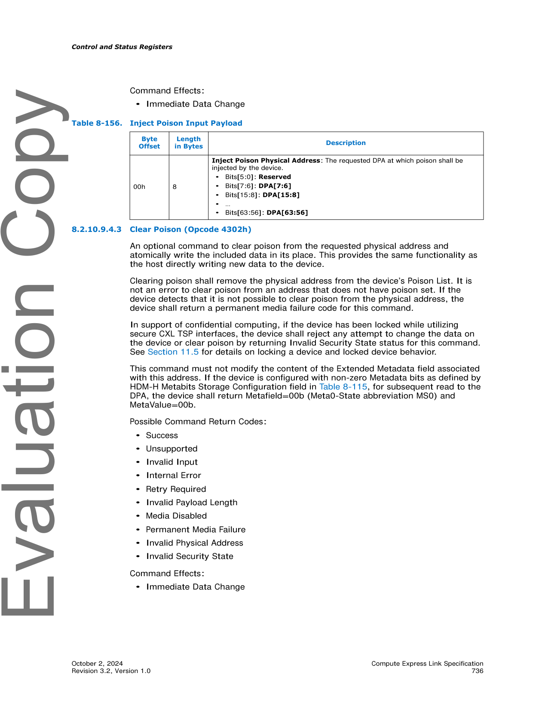
>
> *Original page render @ 150 DPI* — [📄 Full size](figures/chapter_08/page_0736.png)

[⬆️ 返回目录](#-本章目录-part-e)

---

### 8.2.10.9.4.4 Get Scan Media Capabilities (Opcode 4303h) | 获取 Scan Media 能力 (操作码 4303h)

<table>
<thead>
<tr>
<th width="50%">🇬🇧 English</th>
<th width="50%" style="background-color:#e8e8e8">🇨🇳 中文</th>
</tr>
</thead>
<tbody>
<tr><td>This command allows the device to report capabilities and options for the Scan Media feature based on the requested range. The device may reject this command if the range requested spans the device's volatile and persistent partitions.</td><td style="background-color:#e8e8e8">此命令允许设备根据请求范围报告 Scan Media 功能的能力和选项。如果请求的范围跨越设备的易失性和持久性分区,设备可以拒绝此命令。</td></tr>
<tr><td><b>Possible Command Return Codes:</b> • Success • Unsupported • Invalid Input • Internal Error • Retry Required • Invalid Payload Length • Media Disabled • Invalid Physical Address • Invalid Security State</td><td style="background-color:#e8e8e8"><b>可能的命令返回码:</b> • Success(成功) • Unsupported(不支持) • Invalid Input(无效输入) • Internal Error(内部错误) • Retry Required(需要重试) • Invalid Payload Length(无效负载长度) • Media Disabled(介质已禁用) • Invalid Physical Address(无效物理地址) • Invalid Security State(无效安全状态)</td></tr>
<tr><td><b>Command Effects:</b> • None</td><td style="background-color:#e8e8e8"><b>命令效果:</b> • None(无)</td></tr>
</tbody>
</table>

**Table 8-158. Get Scan Media Capabilities Input Payload | Get Scan Media Capabilities 输入负载**

<table>
<thead>
<tr><th>Byte Offset</th><th>Length in Bytes</th><th>🇬🇧 Description</th><th>🇨🇳 描述</th></tr>
</thead>
<tbody>
<tr><td>00h</td><td>8</td><td>Get Scan Media Capabilities Start Physical Address: The starting DPA from which to retrieve Scan Media capabilities. • Bits[5:0]: Reserved • Bits[7:6]: DPA[7:6] • Bits[15:8]: DPA[15:8] • … • Bits[63:56]: DPA[63:56]</td><td>Get Scan Media Capabilities Start Physical Address:要检索 Scan Media 能力的起始 DPA。 • Bits[5:0]:保留 • Bits[7:6]:DPA[7:6] • Bits[15:8]:DPA[15:8] • … • Bits[63:56]:DPA[63:56]</td></tr>
<tr><td>08h</td><td>8</td><td>Get Scan Media Capabilities Physical Address Length: The range of physical addresses for which to retrieve Scan Media capabilities. This length shall be in units of 64 bytes.</td><td>Get Scan Media Capabilities Physical Address Length:要检索 Scan Media 能力的物理地址范围。此长度应以 64 字节为单位。</td></tr>
</tbody>
</table>

> **Figure 8-X.** Get Scan Media Capabilities (page 737) ｜ Get Scan Media Capabilities
>
> 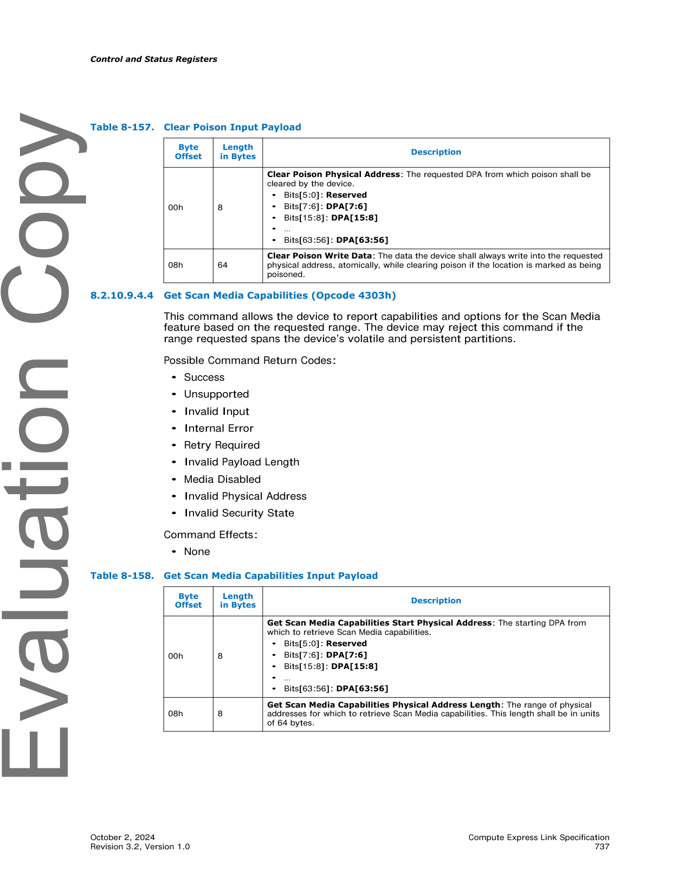
>
> *Original page render @ 150 DPI* — [📄 Full size](figures/chapter_08/page_0737.png)

[⬆️ 返回目录](#-本章目录-part-e)

---

### 8.2.10.9.4.5 Scan Media (Opcode 4304h) | 扫描介质 (操作码 4304h)

<table>
<thead>
<tr>
<th width="50%">🇬🇧 English</th>
<th width="50%" style="background-color:#e8e8e8">🇨🇳 中文</th>
</tr>
</thead>
<tbody>
<tr><td>The Scan Media command causes the device to initiate a scan of a portion of its media for locations that are poisoned or result in poison if the addresses were accessed by the host. The device may update its Poison List as a result of executing the scan and shall complete any changes to the Poison List before signally completion of the Scan Media background operation. If the device updates its Poison List while the Scan Media background operation is executing, the device shall indicate that a media scan is in progress if Get Poison List is called during the scan. The host should use this command only if the poison list has overflowed and is no longer a complete list of the memory errors that exist on the media. The device may reject this command if the requested range spans the device's volatile and persistent partitions.</td><td style="background-color:#e8e8e8">Scan Media 命令使设备启动对其介质一部分的扫描,以查找已 poison 的位置或主机访问这些地址时会导致 poison 的位置。设备可作为执行扫描的结果更新其 Poison List,并应在发出 Scan Media 后台操作完成信号之前完成对 Poison List 的任何更改。如果在 Scan Media 后台操作执行期间设备更新其 Poison List,则在扫描期间调用 Get Poison List 时,设备应指示正在执行介质扫描。仅当 poison list 已溢出且不再是介质上存在的内存错误的完整列表时,主机才应使用此命令。如果请求的范围跨越设备的易失性和持久性分区,设备可以拒绝此命令。</td></tr>
<tr><td>If interrupts are enabled for reporting internally or externally generated poison, and the poison list has not overflowed, the host should avoid using this command. It is expensive and may impact the performance of other operations on the device. This is intended only as a backup to retrieve the list of memory error locations in the event the poison list has overflowed.</td><td style="background-color:#e8e8e8">如果已启用用于报告内部或外部生成的 poison 的中断,且 poison list 尚未溢出,则主机应避免使用此命令。该命令开销大,可能会影响设备上其他操作的性能。它仅作为在 poison list 溢出时检索内存错误位置列表的备份手段。</td></tr>
<tr><td>Because the execution of a media scan may take significant time to complete, it is considered a background operation. The Scan Media command shall initiate the background operation and provide immediate status on the device's ability to start the scan operation. Any previous Scan Media results are discarded by the device upon receiving a new Scan Media command. Once the Scan Media command is successfully started, the Background Command Status register is used to retrieve the status. The Get Scan Media Results command shall return the list of poisoned memory locations.</td><td style="background-color:#e8e8e8">由于介质扫描的执行可能需要大量时间才能完成,因此它被视为后台操作。Scan Media 命令应启动该后台操作,并立即提供设备启动扫描操作的能力状态。设备在收到新的 Scan Media 命令时会丢弃之前所有的 Scan Media 结果。Scan Media 命令成功启动后,使用 Background Command Status 寄存器检索状态。Get Scan Media Results 命令应返回已 poison 内存位置的列表。</td></tr>
<tr><td><b>Possible Command Return Codes:</b> • Success • Unsupported • Background Command Started • Invalid Input • Internal Error • Retry Required • Invalid Payload Length • Media Disabled • Busy • Aborted • Invalid Physical Address • Invalid Security State</td><td style="background-color:#e8e8e8"><b>可能的命令返回码:</b> • Success(成功) • Unsupported(不支持) • Background Command Started(后台命令已启动) • Invalid Input(无效输入) • Internal Error(内部错误) • Retry Required(需要重试) • Invalid Payload Length(无效负载长度) • Media Disabled(介质已禁用) • Busy(忙) • Aborted(中止) • Invalid Physical Address(无效物理地址) • Invalid Security State(无效安全状态)</td></tr>
<tr><td><b>Command Effects:</b> • Background Operation • Request Abort Background Operation Command Supported</td><td style="background-color:#e8e8e8"><b>命令效果:</b> • Background Operation(后台操作) • Request Abort Background Operation Command Supported(支持请求中止后台操作命令)</td></tr>
</tbody>
</table>

**Table 8-159. Get Scan Media Capabilities Output Payload | Get Scan Media Capabilities 输出负载**

<table>
<thead>
<tr><th>Byte Offset</th><th>Length in Bytes</th><th>🇬🇧 Description</th><th>🇨🇳 描述</th></tr>
</thead>
<tbody>
<tr><td>00h</td><td>4</td><td>Estimated Scan Media Time: The number of milliseconds that the device estimates are required to complete the Scan Media request over the range specified in the input. The device shall return all 0s if it cannot estimate a time for the specified range.</td><td>Estimated Scan Media Time:设备估算完成输入中所指定范围的 Scan Media 请求所需的毫秒数。如果设备无法估算指定范围的时间,则应返回全 0。</td></tr>
</tbody>
</table>

**Table 8-160. Scan Media Input Payload | Scan Media 输入负载**

<table>
<thead>
<tr><th>Byte Offset</th><th>Length in Bytes</th><th>🇬🇧 Description</th><th>🇨🇳 描述</th></tr>
</thead>
<tbody>
<tr><td>00h</td><td>8</td><td>Scan Media Physical Address: The starting DPA from which to start the scan. • Bits[5:0]: Reserved • Bits[7:6]: DPA[7:6] • Bits[15:8]: DPA[15:8] • … • Bits[63:56]: DPA[63:56]</td><td>Scan Media Physical Address:开始扫描的起始 DPA。 • Bits[5:0]:保留 • Bits[7:6]:DPA[7:6] • Bits[15:8]:DPA[15:8] • … • Bits[63:56]:DPA[63:56]</td></tr>
<tr><td>08h</td><td>8</td><td>Scan Media Physical Address Length: The range of physical addresses to scan. This length shall be in units of 64 bytes.</td><td>Scan Media Physical Address Length:要扫描的物理地址范围。此长度应以 64 字节为单位。</td></tr>
<tr><td>10h</td><td>1</td><td>Scan Media Flags • Bit[0]: No Event Log: When set, the device shall not generate event logs for media errors found during the Scan Media operation. • Bits[7:1]: Reserved.</td><td>Scan Media Flags:扫描介质标志。 • Bit[0]:No Event Log(无事件日志):设置时,设备不应为 Scan Media 操作期间发现的介质错误生成事件日志。 • Bits[7:1]:保留。</td></tr>
</tbody>
</table>

> **Figure 8-X.** Scan Media (page 738-739) ｜ Scan Media
>
> 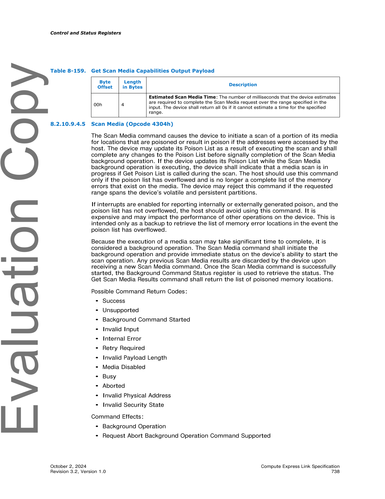
>
> *Original page render @ 150 DPI* — [📄 Full size](figures/chapter_08/page_0738.png)

[⬆️ 返回目录](#-本章目录-part-e)

---

### 8.2.10.9.4.6 Get Scan Media Results (Opcode 4305h) | 获取 Scan Media 结果 (操作码 4305h)

<table>
<thead>
<tr>
<th width="50%">🇬🇧 English</th>
<th width="50%" style="background-color:#e8e8e8">🇨🇳 中文</th>
</tr>
</thead>
<tbody>
<tr><td>Get Scan Media Results returns an unordered list of poisoned memory locations, in response to the Scan Media command. If the Scan Media command has not been called since the last Conventional Reset, the device shall return the Unsupported return code. The completion status for the Scan Media command is returned in the Background Command Status register and is not repeated here.</td><td style="background-color:#e8e8e8">Get Scan Media Results 返回对 Scan Media 命令响应的已 poison 内存位置的无序列表。如果自上次 Conventional Reset 以来未调用过 Scan Media 命令,则设备应返回 Unsupported 返回码。Scan Media 命令的完成状态在 Background Command Status 寄存器中返回,此处不再重复。</td></tr>
<tr><td>Because the returned list can be larger than the output payload size, it is possible to return the list in multiple calls to Get Scan Media Results. The More Media Error Records indicator shall be set by the device anytime there are more records to retrieve. The caller should continue to issue this command until this indicator is no longer set.</td><td style="background-color:#e8e8e8">由于返回的列表可能大于输出负载大小,因此可以通过多次调用 Get Scan Media Results 来返回列表。每当有更多记录需要检索时,设备应设置 More Media Error Records 指示符。调用方应继续发出此命令,直到该指示符不再被设置。</td></tr>
<tr><td>If the device cannot complete the scan and requires the host to retrieve scan media results before the device can continue the scan, the device shall set the Scan Media Stopped Prematurely indicator, return a valid Scan Media Restart Physical Address and Scan Media Restart Physical Address Length. This is the physical address range the device would require the Scan Media command to be called again with to continue the scan. It is the responsibility of the host to issue the Scan Media command, using this restart context, to guarantee that the Device's entire physical address range is eventually scanned.</td><td style="background-color:#e8e8e8">如果设备无法完成扫描并且需要主机在设备继续扫描之前检索扫描介质结果,则设备应设置 Scan Media Stopped Prematurely 指示符,并返回有效的 Scan Media Restart Physical Address 和 Scan Media Restart Physical Address Length。这是设备要求再次调用 Scan Media 命令以继续扫描的物理地址范围。主机有责任使用此重启上下文发出 Scan Media 命令,以保证设备的整个物理地址范围最终都会被扫描。</td></tr>
<tr><td><b>Possible Command Return Codes:</b> • Success • Unsupported • Internal Error • Retry Required • Invalid Payload Length • Media Disabled • Busy • Invalid Security State</td><td style="background-color:#e8e8e8"><b>可能的命令返回码:</b> • Success(成功) • Unsupported(不支持) • Internal Error(内部错误) • Retry Required(需要重试) • Invalid Payload Length(无效负载长度) • Media Disabled(介质已禁用) • Busy(忙) • Invalid Security State(无效安全状态)</td></tr>
<tr><td><b>Command Effects:</b> • None</td><td style="background-color:#e8e8e8"><b>命令效果:</b> • None(无)</td></tr>
<tr><td>The Media Error Records returned here are also used for the Get Poison List command (see Section 8.2.10.9.4.1) and are defined in Table 8-155.</td><td style="background-color:#e8e8e8">此处返回的 Media Error Records 也用于 Get Poison List 命令(请参阅 8.2.10.9.4.1 节),其定义见 Table 8-155。</td></tr>
</tbody>
</table>

**Table 8-161. Get Scan Media Results Output Payload | Get Scan Media Results 输出负载**

<table>
<thead>
<tr><th>Byte Offset</th><th>Length in Bytes</th><th>🇬🇧 Description</th><th>🇨🇳 描述</th></tr>
</thead>
<tbody>
<tr><td>00h</td><td>8</td><td>Scan Media Restart Physical Address: The location from which the host should restart the Scan Media operation if the device could not complete the requested scan. The device shall report a valid restart address if it returns Scan Media Stopped Prematurely status. • Bits[5:0]: Reserved • Bits[7:6]: DPA[7:6] • Bits[15:8]: DPA[15:8] • … • Bits[63:56]: DPA[63:56]</td><td>Scan Media Restart Physical Address:如果设备无法完成请求的扫描,主机应从该位置重启 Scan Media 操作。如果设备返回 Scan Media Stopped Prematurely 状态,则应报告有效的重启地址。 • Bits[5:0]:保留 • Bits[7:6]:DPA[7:6] • Bits[15:8]:DPA[15:8] • … • Bits[63:56]:DPA[63:56]</td></tr>
<tr><td>08h</td><td>8</td><td>Scan Media Restart Physical Address Length: The remaining range from which the host should restart the Scan Media operation if the device could not complete the requested scan. The device shall report a valid restart length if it returns Scan Media Stopped Prematurely status. This length shall be in units of 64 bytes.</td><td>Scan Media Restart Physical Address Length:如果设备无法完成请求的扫描,主机应从该剩余范围重启 Scan Media 操作。如果设备返回 Scan Media Stopped Prematurely 状态,则应报告有效的重启长度。此长度应以 64 字节为单位。</td></tr>
<tr><td>10h</td><td>1</td><td>Scan Media Flags • Bit[0]: More Media Error Records: When set, the device has more Media Error Records to return for the given Scan Media address range. The host should keep issuing the Get Scan Media Results command with the same Scan Media Physical Address & Scan Media Physical Address Length and retrieve records until this indicator is no longer set. • Bit[1]: Scan Stopped Prematurely: The device has run out of internal storage space for the error list. The device shall report a valid Scan Media Restart Physical Address and Scan Media Restart Physical Address Length to allow the host to restart the Scan Media command after retrieving the errors from the current scan. • Bits[7:2]: Reserved.</td><td>Scan Media Flags:扫描介质标志。 • Bit[0]:More Media Error Records(更多介质错误记录):设置时,设备有更多 Media Error Records 要针对给定的 Scan Media 地址范围返回。主机应继续使用相同的 Scan Media Physical Address 和 Scan Media Physical Address Length 发出 Get Scan Media Results 命令,并检索记录,直到该指示符不再被设置。 • Bit[1]:Scan Stopped Prematurely(扫描过早停止):设备的错误列表内部存储空间已用完。设备应报告有效的 Scan Media Restart Physical Address 和 Scan Media Restart Physical Address Length,以便主机在从当前扫描中检索错误后重启 Scan Media 命令。 • Bits[7:2]:保留。</td></tr>
<tr><td>11h</td><td>1</td><td>Reserved</td><td>保留</td></tr>
<tr><td>12h</td><td>2</td><td>Media Error Record Count: The number of records in the Media Error Records list.</td><td>Media Error Record Count:Media Error Records 列表中的记录数。</td></tr>
<tr><td>14h</td><td>0Ch</td><td>Reserved</td><td>保留</td></tr>
<tr><td>20h</td><td>Varies</td><td>Media Error Records: The list of media error records.</td><td>Media Error Records:介质错误记录列表。</td></tr>
</tbody>
</table>

> **Figure 8-X.** Get Scan Media Results (page 739-740) ｜ Get Scan Media Results
>
> 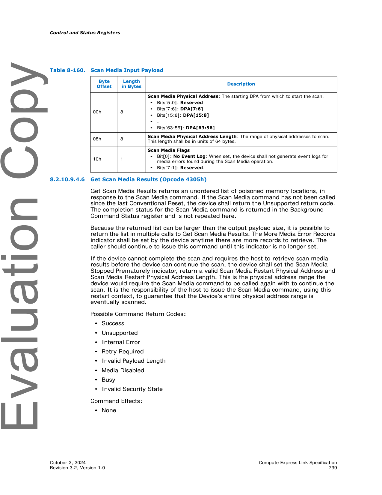
>
> *Original page render @ 150 DPI* — [📄 Full size](figures/chapter_08/page_0739.png)

[⬆️ 返回目录](#-本章目录-part-e)

---

#### 8.2.10.9.5 Sanitize | 清理

---

##### 8.2.10.9.5.1 Sanitize (Opcode 4400h) | 清理 (操作码 4400h)

<table>
<thead>
<tr>
<th width="50%">🇬🇧 English</th>
<th width="50%" style="background-color:#e8e8e8">🇨🇳 中文</th>
</tr>
</thead>
<tbody>
<tr><td>Sanitize the device to securely repurpose or decommission it. This is done by ensuring that all user data and metadata, whether it resides in persistent capacity, volatile capacity, or the label storage area, is made permanently unavailable by whatever means is appropriate for the media type. The exact method used to sanitize is vendor specific. Sanitize also deletes all event logs on the device. Sanitize does not reset any internal usage statistics or counters and shall not artificially prolong the life of the device in any way. Unlike Secure Erase, which erases data by changing encryption keys, a successful Sanitize command ensures that no user data is available, encrypted or otherwise.</td><td style="background-color:#e8e8e8">清理设备以安全地重新利用或停用。这是通过确保所有用户数据和元数据(无论其驻留在持久容量、易失性容量还是标签存储区中)通过适合介质类型的任何方式永久不可用来实现的。用于清理的确切方法是供应商特定的。Sanitize 还会删除设备上的所有事件日志。Sanitize 不会重置任何内部使用统计信息或计数器,且不应以任何方式人为延长设备的使用寿命。与通过更改加密密钥来擦除数据的 Secure Erase 不同,成功的 Sanitize 命令可确保没有用户数据可用(无论是否加密)。</td></tr>
<tr><td>Once the Sanitize command has started successfully, the device shall be placed in the media disabled state. If the command fails or is interrupted by a reset or power failure, it shall remain in the media disabled state until a successful Sanitize command has been completed. In this state, the Media Status field in the Memory Device Status register will indicate 11b (Disabled), all memory writes to the device will have no effect, and all memory reads will return random values (no user data returned, even for locations that the failed Sanitize operation didn't sanitize yet). Mailbox commands shall still be processed in the disabled state, except that commands that access Sanitized areas shall fail with the Media Disabled error code (Get/Set LSA, for example).</td><td style="background-color:#e8e8e8">Sanitize 命令成功启动后,设备应进入介质禁用状态。如果该命令失败或被复位或电源故障中断,则应保持在介质禁用状态,直到成功的 Sanitize 命令完成为止。在此状态下,Memory Device Status 寄存器中的 Media Status 字段将指示 11b(Disabled),对设备的所有内存写入将无效,所有内存读取将返回随机值(不返回用户数据,即使是失败的 Sanitize 操作尚未清理的位置)。在禁用状态下,Mailbox 命令仍将被处理,但访问 Sanitize 区域的命令应失败并返回 Media Disabled 错误码(例如 Get/Set LSA)。</td></tr>
<tr><td>Prior to using the sanitize command, any security applied to the user data areas of the device shall be disabled.</td><td style="background-color:#e8e8e8">在使用 sanitize 命令之前,必须禁用应用于设备用户数据区域的任何安全保护。</td></tr>
<tr><td>This command does not have any input or output payloads.</td><td style="background-color:#e8e8e8">此命令没有任何输入或输出负载。</td></tr>
<tr><td>In support of confidential computing, if the device has been locked while utilizing secure CXL TSP interfaces, the device shall reject any attempt to change the data or TE State on the device by returning Invalid Security State status for this command. See Section 11.5 for details on locking a device and locked device behavior.</td><td style="background-color:#e8e8e8">为了支持机密计算,如果设备在使用安全 CXL TSP 接口时已被锁定,设备应通过返回 Invalid Security State 状态来拒绝任何更改设备上的数据或 TE State 的尝试。有关锁定设备和已锁定设备行为的详细信息,请参阅 11.5 节。</td></tr>
<tr><td><b>Possible Command Return Codes:</b> • Success • Unsupported • Background Command Started • Internal Error • Retry Required • Invalid Payload Length • Media Disabled • Busy • Aborted • Invalid Security State</td><td style="background-color:#e8e8e8"><b>可能的命令返回码:</b> • Success(成功) • Unsupported(不支持) • Background Command Started(后台命令已启动) • Internal Error(内部错误) • Retry Required(需要重试) • Invalid Payload Length(无效负载长度) • Media Disabled(介质已禁用) • Busy(忙) • Aborted(中止) • Invalid Security State(无效安全状态)</td></tr>
<tr><td><b>Command Effects:</b> • Immediate Data Change • Security State Change • Background Operation • Request Abort Background Operation Command Supported</td><td style="background-color:#e8e8e8"><b>命令效果:</b> • Immediate Data Change(立即数据更改) • Security State Change(安全状态更改) • Background Operation(后台操作) • Request Abort Background Operation Command Supported(支持请求中止后台操作命令)</td></tr>
</tbody>
</table>

> **Figure 8-X.** Sanitize (page 740-741) ｜ Sanitize
>
> 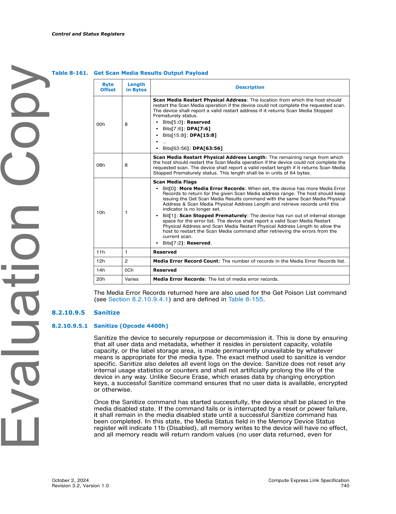
>
> *Original page render @ 150 DPI* — [📄 Full size](figures/chapter_08/page_0740.png)

[⬆️ 返回目录](#-本章目录-part-e)

---

##### 8.2.10.9.5.2 Secure Erase (Opcode 4401h) | 安全擦除 (操作码 4401h)

<table>
<thead>
<tr>
<th width="50%">🇬🇧 English</th>
<th width="50%" style="background-color:#e8e8e8">🇨🇳 中文</th>
</tr>
</thead>
<tbody>
<tr><td>Erase user data by changing the media encryption keys for all user data areas of the device.</td><td style="background-color:#e8e8e8">通过更改设备所有用户数据区域的介质加密密钥来擦除用户数据。</td></tr>
<tr><td>Prior to using the secure erase command, any security applied to the user data areas of the device shall be disabled or unlocked.</td><td style="background-color:#e8e8e8">在使用 secure erase 命令之前,必须禁用或解锁应用于设备用户数据区域的任何安全保护。</td></tr>
<tr><td>This command does not have any input or output payloads.</td><td style="background-color:#e8e8e8">此命令没有任何输入或输出负载。</td></tr>
<tr><td>In support of confidential computing, if the device has been locked while utilizing secure CXL TSP interfaces, the device shall reject any attempt to change the data or TE State on the device by returning Invalid Security State status for this command. See Section 11.5 for details on locking a device and locked device behavior.</td><td style="background-color:#e8e8e8">为了支持机密计算,如果设备在使用安全 CXL TSP 接口时已被锁定,设备应通过返回 Invalid Security State 状态来拒绝任何更改设备上的数据或 TE State 的尝试。有关锁定设备和已锁定设备行为的详细信息,请参阅 11.5 节。</td></tr>
<tr><td><b>Possible Command Return Codes:</b> • Success • Unsupported • Internal Error • Retry Required • Invalid Payload Length • Media Disabled • Invalid Security State</td><td style="background-color:#e8e8e8"><b>可能的命令返回码:</b> • Success(成功) • Unsupported(不支持) • Internal Error(内部错误) • Retry Required(需要重试) • Invalid Payload Length(无效负载长度) • Media Disabled(介质已禁用) • Invalid Security State(无效安全状态)</td></tr>
<tr><td><b>Command Effects:</b> • Immediate Data Change • Security State Change</td><td style="background-color:#e8e8e8"><b>命令效果:</b> • Immediate Data Change(立即数据更改) • Security State Change(安全状态更改)</td></tr>
</tbody>
</table>

> **Figure 8-X.** Secure Erase (page 741-742) ｜ Secure Erase
>
> 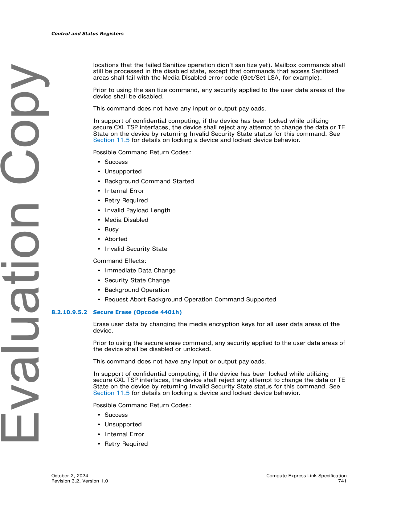
>
> *Original page render @ 150 DPI* — [📄 Full size](figures/chapter_08/page_0741.png)

[⬆️ 返回目录](#-本章目录-part-e)

---

##### 8.2.10.9.5.3 Media Operation (Opcode 4402h) | 介质操作 (操作码 4402h)

<table>
<thead>
<tr>
<th width="50%">🇬🇧 English</th>
<th width="50%" style="background-color:#e8e8e8">🇨🇳 中文</th>
</tr>
</thead>
<tbody>
<tr><td>This command runs an operation on ranges of media. An output payload is provided only if defined for the specified operation.</td><td style="background-color:#e8e8e8">此命令在介质范围上运行操作。仅当为指定操作定义时才提供输出负载。</td></tr>
<tr><td>The device shall respond with Invalid Input if the DPA range list refers to invalid media locations (e.g., blocks that are not present in the host's DC extent list), the Start DPA is not aligned to the DCD's DPA range granularity, the Length is not a multiple of the DPA range granularity, and/or an unsupported operation has been specified.</td><td style="background-color:#e8e8e8">如果 DPA 范围列表引用无效的介质位置(例如,主机的 DC extent list 中不存在的块)、Start DPA 未与 DCD 的 DPA 范围粒度对齐、Length 不是 DPA 范围粒度的倍数,和/或指定了不受支持的操作,设备应使用 Invalid Input 响应。</td></tr>
<tr><td>Changes to the contents of a cacheline whose coherency is managed under the HDM-DB model shall cause BISnp requests to be generated if required per Section 2.2.1.</td><td style="background-color:#e8e8e8">根据 2.2.1 节,如果需要,对在 HDM-DB 模型下管理一致性的 cacheline 内容的更改应导致生成 BISnp 请求。</td></tr>
<tr><td><b>Possible Command Return Codes:</b> • Unsupported • Background Command Started • Invalid Input • Internal Error • Retry Required • Busy</td><td style="background-color:#e8e8e8"><b>可能的命令返回码:</b> • Unsupported(不支持) • Background Command Started(后台命令已启动) • Invalid Input(无效输入) • Internal Error(内部错误) • Retry Required(需要重试) • Busy(忙)</td></tr>
<tr><td><b>Command Effects:</b> • Immediate Data Change • Background Operation</td><td style="background-color:#e8e8e8"><b>命令效果:</b> • Immediate Data Change(立即数据更改) • Background Operation(后台操作)</td></tr>
</tbody>
</table>

**Table 8-162. Media Operation Input Payload | Media Operation 输入负载**

<table>
<thead>
<tr><th>Byte Offset</th><th>Length in Bytes</th><th>🇬🇧 Description</th><th>🇨🇳 描述</th></tr>
</thead>
<tbody>
<tr><td>00h</td><td>1</td><td>Media Operation Class: This field identifies the Class of a media operation. See Table 8-164.</td><td>Media Operation Class:此字段标识介质操作的类。请参阅 Table 8-164。</td></tr>
<tr><td>01h</td><td>1</td><td>Media Operation Subclass: This field identifies the media operation together with the Media Operation Class. See Table 8-164.</td><td>Media Operation Subclass:此字段与 Media Operation Class 一起标识介质操作。请参阅 Table 8-164。</td></tr>
<tr><td>02h</td><td>2</td><td>Reserved</td><td>保留</td></tr>
<tr><td>04h</td><td>4</td><td>DPA Range Count: The number of entries in the list of DPA ranges. A value of 0 for this field is valid and indicates that the DPA Range List parameter is not included in the request payload.</td><td>DPA Range Count:DPA 范围列表中的条目数。此字段的值为 0 是有效的,表示请求负载中不包含 DPA Range List 参数。</td></tr>
<tr><td>08h</td><td>Varies</td><td>DPA Range List: List of DPA ranges on which to run the operation as defined in Table 8-163.</td><td>DPA Range List:在其上运行操作的 DPA 范围列表,定义见 Table 8-163。</td></tr>
<tr><td>Varies</td><td>Varies</td><td>Operation-specific Arguments: Additional arguments, as specified by Operation definition.</td><td>Operation-specific Arguments:操作定义所指定的附加参数。</td></tr>
</tbody>
</table>

**Table 8-163. DPA Range Format | DPA 范围格式**

<table>
<thead>
<tr><th>Byte Offset</th><th>Length in Bytes</th><th>🇬🇧 Description</th><th>🇨🇳 描述</th></tr>
</thead>
<tbody>
<tr><td>00h</td><td>8</td><td>Starting DPA • Bits[5:0]: Reserved • Bits[63:6]: DPA[63:6]</td><td>Starting DPA(起始 DPA): • Bits[5:0]:保留 • Bits[63:6]:DPA[63:6]</td></tr>
<tr><td>08h</td><td>8</td><td>Length: Expressed as number of bytes.</td><td>Length(长度):以字节数表示。</td></tr>
</tbody>
</table>

**Table 8-164. Media Operations Classes and Subclasses | 介质操作类与子类**

<table>
<thead>
<tr><th>Class</th><th>Subclass</th><th>🇬🇧 Description</th><th>🇨🇳 描述</th></tr>
</thead>
<tbody>
<tr><td>00h – General</td><td>00h – Discovery</td><td>The discovery operation returns a list of all Media Operations that the device supports, with the exception of the Discovery operation (Class=0, Subclass=0). Requests shall always specify a DPA Range Count of 0. The input payload is defined in Table 8-162. This operation defines operation-specific arguments as defined in Table 8-165. The output payload is defined in Table 8-166. The device shall return Invalid Input if DPA Range Count is not 0 or if Start Index exceeds the maximum list length of supported Media Operations.</td><td>Discovery 操作返回设备支持的所有 Media Operations 的列表,但 Discovery 操作(Class=0、Subclass=0)除外。请求应始终指定 DPA Range Count 为 0。输入负载在 Table 8-162 中定义。此操作定义 Table 8-165 中定义的操作特定参数。输出负载在 Table 8-166 中定义。如果 DPA Range Count 不为 0 或 Start Index 超过受支持 Media Operations 的最大列表长度,设备应返回 Invalid Input。</td></tr>
<tr><td>01h – Sanitize</td><td>00h – Sanitize</td><td>Device shall sanitize all media in the specified DPA ranges as a result of this request using the method described in Section 8.2.10.9.5.1. The input payload is defined in Table 8-162. No operation-specific arguments are defined. No output payload is provided.</td><td>设备应根据此请求使用 8.2.10.9.5.1 节中描述的方法清理指定 DPA 范围内的所有介质。输入负载在 Table 8-162 中定义。未定义操作特定参数。不提供输出负载。</td></tr>
<tr><td></td><td>01h – Zero</td><td>Device shall write 0s to all addresses spanning the DPA ranges such that a subsequent read from the host would return 0. The input payload is defined in Table 8-162. No operation-specific arguments are defined. No output payload is provided.</td><td>设备应将 0 写入跨 DPA 范围的所有地址,以便主机的后续读取返回 0。输入负载在 Table 8-162 中定义。未定义操作特定参数。不提供输出负载。</td></tr>
</tbody>
</table>

**Table 8-165. Discovery Operation-specific Arguments | Discovery 操作特定参数**

<table>
<thead>
<tr><th>Byte Offset</th><th>Length in Bytes</th><th>🇬🇧 Description</th><th>🇨🇳 描述</th></tr>
</thead>
<tbody>
<tr><td>0h</td><td>2</td><td>Start Index: Index of the first Media Operation to return.</td><td>Start Index(起始索引):要返回的第一个 Media Operation 的索引。</td></tr>
<tr><td>2h</td><td>2</td><td>Number of Supported Operations: Maximum number of Media Operation to return.</td><td>Number of Supported Operations(支持的操作数):要返回的 Media Operation 的最大数量。</td></tr>
</tbody>
</table>

**Table 8-166. Media Operations Output Payload – Discovery Operation | Media Operations 输出负载 – Discovery 操作**

<table>
<thead>
<tr><th>Byte Offset</th><th>Length in Bytes</th><th>🇬🇧 Description</th><th>🇨🇳 描述</th></tr>
</thead>
<tbody>
<tr><td>00h</td><td>8</td><td>DPA Range Granularity: Minimum granularity in bytes at which the DPA ranges can be specified for Media Operations. Must be a power of 2 and a multiple of 40h.</td><td>DPA Range Granularity(DPA 范围粒度):可以为 Media Operations 指定 DPA 范围的最小粒度(以字节为单位)。必须是 2 的幂且为 40h 的倍数。</td></tr>
<tr><td>08h</td><td>2</td><td>Total Number of Supported Operations: Total number of operations that the device supports.</td><td>Total Number of Supported Operations(支持的操作总数):设备支持的操作总数。</td></tr>
<tr><td>0Ah</td><td>2</td><td>Number of Supported Operations: Number of entries in the Supported Operations List.</td><td>Number of Supported Operations(支持的操作数):Supported Operations List 中的条目数。</td></tr>
<tr><td>0Ch</td><td>Varies</td><td>Supported Operations List: List of supported Media Operations, as defined in Table 8-167.</td><td>Supported Operations List(支持的操作列表):支持的 Media Operations 列表,定义见 Table 8-167。</td></tr>
</tbody>
</table>

> **Figure 8-X.** Media Operation (page 742-744) ｜ Media Operation
>
> 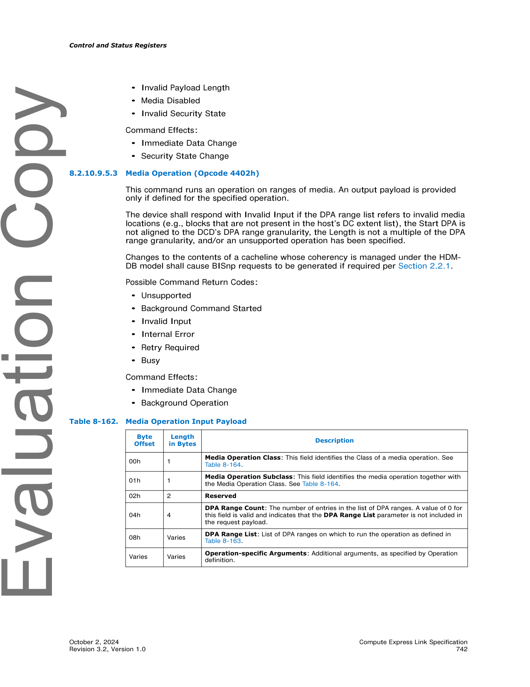
>
> *Original page render @ 150 DPI* — [📄 Full size](figures/chapter_08/page_0742.png)

[⬆️ 返回目录](#-本章目录-part-e)

---

#### 8.2.10.9.6 Persistent Memory Security | 持久内存安全

<table>
<thead>
<tr>
<th width="50%">🇬🇧 English</th>
<th width="50%" style="background-color:#e8e8e8">🇨🇳 中文</th>
</tr>
</thead>
<tbody>
<tr><td>Persistent Memory security is an optional feature that gates access to persistent memory with a user passphrase. When enabled, the persistent memory shall be locked on a Conventional Reset until the user passphrase is supplied with the Unlock command. When the persistent memory is locked, any commands that require access to the media shall return the Invalid Security State return code.</td><td style="background-color:#e8e8e8">持久内存安全是一种可选功能,它使用用户口令来控制对持久内存的访问。启用后,在使用 Unlock 命令提供用户口令之前,持久内存在 Conventional Reset 上应保持锁定状态。当持久内存被锁定时,任何需要访问介质的命令都应返回 Invalid Security State 返回码。</td></tr>
<tr><td>A master passphrase may optionally be supported to passphrase secure erase the persistent memory and disable security should the user passphrase be lost.</td><td style="background-color:#e8e8e8">可选择支持主口令,以便在用户口令丢失时通过口令安全擦除持久内存并禁用安全保护。</td></tr>
</tbody>
</table>

---

##### 8.2.10.9.6.1 Get Security State (Opcode 4500h) | 获取安全状态 (操作码 4500h)

<table>
<thead>
<tr>
<th width="50%">🇬🇧 English</th>
<th width="50%" style="background-color:#e8e8e8">🇨🇳 中文</th>
</tr>
</thead>
<tbody>
<tr><td>This command retrieves the current persistent memory security state.</td><td style="background-color:#e8e8e8">此命令检索当前的持久内存安全状态。</td></tr>
<tr><td><b>Possible Command Return Codes:</b> • Success • Unsupported • Internal Error • Retry Required • Invalid Payload Length</td><td style="background-color:#e8e8e8"><b>可能的命令返回码:</b> • Success(成功) • Unsupported(不支持) • Internal Error(内部错误) • Retry Required(需要重试) • Invalid Payload Length(无效负载长度)</td></tr>
<tr><td><b>Command Effects:</b> • None</td><td style="background-color:#e8e8e8"><b>命令效果:</b> • None(无)</td></tr>
</tbody>
</table>

**Table 8-167. Supported Operations List Entries | 支持的操作列表条目**

<table>
<thead>
<tr><th>Byte Offset</th><th>Length in Bytes</th><th>🇬🇧 Description</th><th>🇨🇳 描述</th></tr>
</thead>
<tbody>
<tr><td>0h</td><td>1</td><td>Media Operation Class: This field identifies the Class of a media operation, as defined in Table 8-164.</td><td>Media Operation Class:此字段标识介质操作的类,定义见 Table 8-164。</td></tr>
<tr><td>1h</td><td>1</td><td>Media Operation Subclass: This field identifies the media operation together with the Media Operation Class, as defined in Table 8-164.</td><td>Media Operation Subclass:此字段与 Media Operation Class 一起标识介质操作,定义见 Table 8-164。</td></tr>
</tbody>
</table>

**Table 8-168. Get Security State Output Payload | Get Security State 输出负载**

<table>
<thead>
<tr><th>Byte Offset</th><th>Length in Bytes</th><th>🇬🇧 Description</th><th>🇨🇳 描述</th></tr>
</thead>
<tbody>
<tr><td>00h</td><td>4</td><td>Security State: Describes the current persistent memory security state. • Bit[0]: User Passphrase Set: The user passphrase is set. Persistent memory security is enabled. • Bit[1]: Master Passphrase Set: The master passphrase is set. • Bit[2]: Locked: The persistent memory is currently locked. • Bit[3]: Frozen: No changes can be made to the persistent memory security state of the device until a Cold Reset. • Bit[4]: User Passphrase Attempt Count Reached: An incorrect user passphrase was supplied three times in a row. A Cold Reset is required to reset the user passphrase attempt count. Until then, commands that require a user passphrase shall return Invalid Security State. • Bit[5]: Master Passphrase Attempt Count Reached: An incorrect master passphrase was supplied three times in a row. A Cold Reset is required to reset the master passphrase attempt count. Until then, commands that require a master passphrase shall return Invalid Security State. • Bits[31:6]: Reserved.</td><td>Security State(安全状态):描述当前的持久内存安全状态。 • Bit[0]:User Passphrase Set(已设置用户口令):用户口令已设置。持久内存安全已启用。 • Bit[1]:Master Passphrase Set(已设置主口令):主口令已设置。 • Bit[2]:Locked(已锁定):持久内存当前已锁定。 • Bit[3]:Frozen(已冻结):在 Cold Reset 之前,无法对设备的持久内存安全状态进行任何更改。 • Bit[4]:User Passphrase Attempt Count Reached(达到用户口令尝试次数):连续三次提供不正确的用户口令。需要 Cold Reset 才能重置用户口令尝试次数。在此之前,需要用户口令的命令应返回 Invalid Security State。 • Bit[5]:Master Passphrase Attempt Count Reached(达到主口令尝试次数):连续三次提供不正确的主口令。需要 Cold Reset 才能重置主口令尝试次数。在此之前,需要主口令的命令应返回 Invalid Security State。 • Bits[31:6]:保留。</td></tr>
</tbody>
</table>

> **Figure 8-X.** Get Security State (page 744-745) ｜ Get Security State
>
> 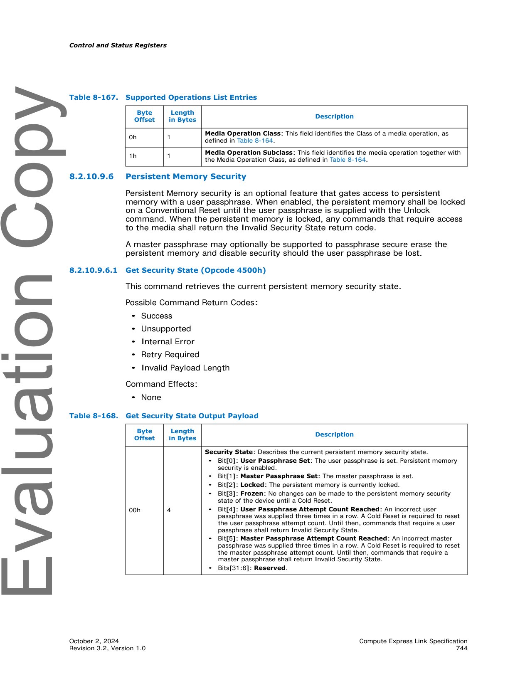
>
> *Original page render @ 150 DPI* — [📄 Full size](figures/chapter_08/page_0744.png)

[⬆️ 返回目录](#-本章目录-part-e)

---

##### 8.2.10.9.6.2 Set Passphrase (Opcode 4501h) | 设置口令 (操作码 4501h)

<table>
<thead>
<tr>
<th width="50%">🇬🇧 English</th>
<th width="50%" style="background-color:#e8e8e8">🇨🇳 中文</th>
</tr>
</thead>
<tbody>
<tr><td>This command sets or changes the user or master passphrase. When the user passphrase is set, the device persistent memory shall be locked on Conventional Reset until the user passphrase is supplied. When the master passphrase is set, the master passphrase may be used to passphrase secure erase the device if the user passphrase is lost. The master passphrase shall only be set in the security disabled state when the user passphrase is not set.</td><td style="background-color:#e8e8e8">此命令设置或更改用户或主口令。当设置了用户口令时,设备的持久内存在 Conventional Reset 上应保持锁定,直到提供用户口令为止。当设置了主口令时,如果用户口令丢失,可使用主口令对口令安全擦除设备。主口令只能在安全禁用状态且未设置用户口令时设置。</td></tr>
<tr><td><b>Possible Command Return Codes:</b> • Success • Unsupported • Invalid Input • Internal Error • Retry Required • Invalid Payload Length • Incorrect Passphrase • Busy • Invalid Security State</td><td style="background-color:#e8e8e8"><b>可能的命令返回码:</b> • Success(成功) • Unsupported(不支持) • Invalid Input(无效输入) • Internal Error(内部错误) • Retry Required(需要重试) • Invalid Payload Length(无效负载长度) • Incorrect Passphrase(口令错误) • Busy(忙) • Invalid Security State(无效安全状态)</td></tr>
<tr><td><b>Command Effects:</b> • Security State Change</td><td style="background-color:#e8e8e8"><b>命令效果:</b> • Security State Change(安全状态更改)</td></tr>
</tbody>
</table>

**Table 8-169. Set Passphrase Input Payload | Set Passphrase 输入负载**

<table>
<thead>
<tr><th>Byte Offset</th><th>Length in Bytes</th><th>🇬🇧 Description</th><th>🇨🇳 描述</th></tr>
</thead>
<tbody>
<tr><td>00h</td><td>1</td><td>Passphrase Type: Specifies the type of passphrase supplied in the input payload. • 00h = Master passphrase • 01h = User passphrase • All other encodings are reserved</td><td>Passphrase Type(口令类型):指定输入负载中提供的口令类型。 • 00h = Master passphrase(主口令) • 01h = User passphrase(用户口令) • 所有其他编码保留</td></tr>
<tr><td>01h</td><td>1Fh</td><td>Reserved</td><td>保留</td></tr>
<tr><td>20h</td><td>20h</td><td>Current Passphrase: The current passphrase. Ignored if the passphrase is not currently set.</td><td>Current Passphrase(当前口令):当前口令。如果当前未设置口令,则忽略。</td></tr>
<tr><td>40h</td><td>20h</td><td>New Passphrase: The new passphrase.</td><td>New Passphrase(新口令):新口令。</td></tr>
</tbody>
</table>

> **Figure 8-X.** Set Passphrase (page 745) ｜ Set Passphrase
>
> 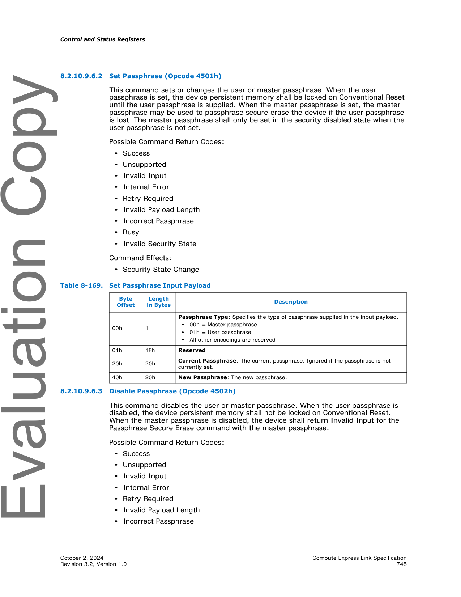
>
> *Original page render @ 150 DPI* — [📄 Full size](figures/chapter_08/page_0745.png)

[⬆️ 返回目录](#-本章目录-part-e)

---

##### 8.2.10.9.6.3 Disable Passphrase (Opcode 4502h) | 禁用口令 (操作码 4502h)

<table>
<thead>
<tr>
<th width="50%">🇬🇧 English</th>
<th width="50%" style="background-color:#e8e8e8">🇨🇳 中文</th>
</tr>
</thead>
<tbody>
<tr><td>This command disables the user or master passphrase. When the user passphrase is disabled, the device persistent memory shall not be locked on Conventional Reset. When the master passphrase is disabled, the device shall return Invalid Input for the Passphrase Secure Erase command with the master passphrase.</td><td style="background-color:#e8e8e8">此命令禁用用户或主口令。当用户口令被禁用时,设备的持久内存在 Conventional Reset 上不应被锁定。当主口令被禁用时,设备应对带主口令的 Passphrase Secure Erase 命令返回 Invalid Input。</td></tr>
<tr><td><b>Possible Command Return Codes:</b> • Success • Unsupported • Invalid Input • Internal Error • Retry Required • Invalid Payload Length • Incorrect Passphrase • Busy • Invalid Security State</td><td style="background-color:#e8e8e8"><b>可能的命令返回码:</b> • Success(成功) • Unsupported(不支持) • Invalid Input(无效输入) • Internal Error(内部错误) • Retry Required(需要重试) • Invalid Payload Length(无效负载长度) • Incorrect Passphrase(口令错误) • Busy(忙) • Invalid Security State(无效安全状态)</td></tr>
<tr><td><b>Command Effects:</b> • Security State Change</td><td style="background-color:#e8e8e8"><b>命令效果:</b> • Security State Change(安全状态更改)</td></tr>
</tbody>
</table>

**Table 8-170. Disable Passphrase Input Payload | Disable Passphrase 输入负载**

<table>
<thead>
<tr><th>Byte Offset</th><th>Length in Bytes</th><th>🇬🇧 Description</th><th>🇨🇳 描述</th></tr>
</thead>
<tbody>
<tr><td>00h</td><td>1</td><td>Passphrase Type: Specifies the type of passphrase supplied in the input payload. • 00h = Master passphrase • 01h = User passphrase • All other encodings are reserved</td><td>Passphrase Type(口令类型):指定输入负载中提供的口令类型。 • 00h = Master passphrase(主口令) • 01h = User passphrase(用户口令) • 所有其他编码保留</td></tr>
<tr><td>01h</td><td>1Fh</td><td>Reserved</td><td>保留</td></tr>
<tr><td>20h</td><td>20h</td><td>Current Passphrase: The current passphrase.</td><td>Current Passphrase(当前口令):当前口令。</td></tr>
</tbody>
</table>

> **Figure 8-X.** Disable Passphrase (page 745-746) ｜ Disable Passphrase
>
> 
>
> *Original page render @ 150 DPI* — [📄 Full size](figures/chapter_08/page_0745.png)

[⬆️ 返回目录](#-本章目录-part-e)

---

##### 8.2.10.9.6.4 Unlock (Opcode 4503h) | 解锁 (操作码 4503h)

<table>
<thead>
<tr>
<th width="50%">🇬🇧 English</th>
<th width="50%" style="background-color:#e8e8e8">🇨🇳 中文</th>
</tr>
</thead>
<tbody>
<tr><td>This command supplies the user passphrase to unlock the device persistent memory.</td><td style="background-color:#e8e8e8">此命令提供用户口令以解锁设备的持久内存。</td></tr>
<tr><td><b>Possible Command Return Codes:</b> • Success • Unsupported • Internal Error • Retry Required • Invalid Payload Length • Incorrect Passphrase • Busy • Invalid Security State</td><td style="background-color:#e8e8e8"><b>可能的命令返回码:</b> • Success(成功) • Unsupported(不支持) • Internal Error(内部错误) • Retry Required(需要重试) • Invalid Payload Length(无效负载长度) • Incorrect Passphrase(口令错误) • Busy(忙) • Invalid Security State(无效安全状态)</td></tr>
<tr><td><b>Command Effects:</b> • Security State Change</td><td style="background-color:#e8e8e8"><b>命令效果:</b> • Security State Change(安全状态更改)</td></tr>
</tbody>
</table>

**Table 8-171. Unlock Input Payload | Unlock 输入负载**

<table>
<thead>
<tr><th>Byte Offset</th><th>Length in Bytes</th><th>🇬🇧 Description</th><th>🇨🇳 描述</th></tr>
</thead>
<tbody>
<tr><td>00h</td><td>20h</td><td>Current Passphrase: The current user passphrase.</td><td>Current Passphrase(当前口令):当前用户口令。</td></tr>
</tbody>
</table>

> **Figure 8-X.** Unlock (page 746) ｜ Unlock
>
> 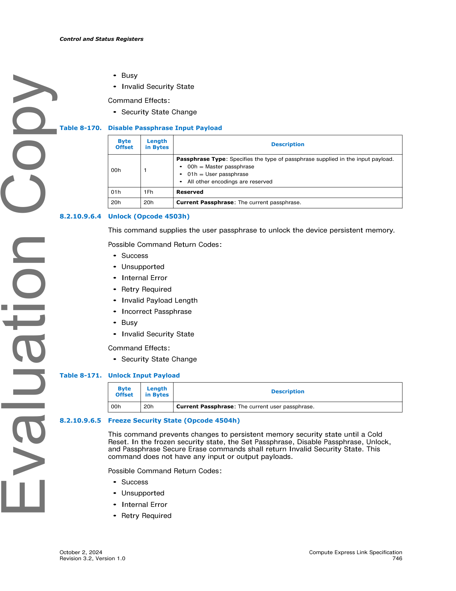
>
> *Original page render @ 150 DPI* — [📄 Full size](figures/chapter_08/page_0746.png)

[⬆️ 返回目录](#-本章目录-part-e)

---

##### 8.2.10.9.6.5 Freeze Security State (Opcode 4504h) | 冻结安全状态 (操作码 4504h)

<table>
<thead>
<tr>
<th width="50%">🇬🇧 English</th>
<th width="50%" style="background-color:#e8e8e8">🇨🇳 中文</th>
</tr>
</thead>
<tbody>
<tr><td>This command prevents changes to persistent memory security state until a Cold Reset. In the frozen security state, the Set Passphrase, Disable Passphrase, Unlock, and Passphrase Secure Erase commands shall return Invalid Security State. This command does not have any input or output payloads.</td><td style="background-color:#e8e8e8">此命令可防止对持久内存安全状态的更改,直至 Cold Reset。在冻结的安全状态下,Set Passphrase、Disable Passphrase、Unlock 和 Passphrase Secure Erase 命令应返回 Invalid Security State。此命令没有任何输入或输出负载。</td></tr>
<tr><td><b>Possible Command Return Codes:</b> • Success • Unsupported • Internal Error • Retry Required • Invalid Payload Length • Invalid Security State</td><td style="background-color:#e8e8e8"><b>可能的命令返回码:</b> • Success(成功) • Unsupported(不支持) • Internal Error(内部错误) • Retry Required(需要重试) • Invalid Payload Length(无效负载长度) • Invalid Security State(无效安全状态)</td></tr>
<tr><td><b>Command Effects:</b> • Security State Change</td><td style="background-color:#e8e8e8"><b>命令效果:</b> • Security State Change(安全状态更改)</td></tr>
</tbody>
</table>

> **Figure 8-X.** Freeze Security State (page 746-747) ｜ Freeze Security State
>
> 
>
> *Original page render @ 150 DPI* — [📄 Full size](figures/chapter_08/page_0746.png)

[⬆️ 返回目录](#-本章目录-part-e)

---

##### 8.2.10.9.6.6 Passphrase Secure Erase (Opcode 4505h) | 口令安全擦除 (操作码 4505h)

<table>
<thead>
<tr>
<th width="50%">🇬🇧 English</th>
<th width="50%" style="background-color:#e8e8e8">🇨🇳 中文</th>
</tr>
</thead>
<tbody>
<tr><td>This command erases the device persistent memory by changing the media encryption keys. The user passphrase shall be disabled after secure erase, but the master passphrase, if set, shall be unchanged.</td><td style="background-color:#e8e8e8">此命令通过更改介质加密密钥来擦除设备的持久内存。安全擦除后,用户口令应被禁用,但主口令(如果已设置)应保持不变。</td></tr>
<tr><td>In support of confidential computing, if the device has been locked while utilizing secure CXL TSP interfaces, the device shall reject any attempt to change the data or TE State on the device by returning Invalid Security State status for this command. See Section 11.5 for details on locking a device and locked device behavior.</td><td style="background-color:#e8e8e8">为了支持机密计算,如果设备在使用安全 CXL TSP 接口时已被锁定,设备应通过返回 Invalid Security State 状态来拒绝任何更改设备上的数据或 TE State 的尝试。有关锁定设备和已锁定设备行为的详细信息,请参阅 11.5 节。</td></tr>
<tr><td><b>Possible Command Return Codes:</b> • Success • Unsupported • Invalid Input • Internal Error • Retry Required • Invalid Payload Length • Media Disabled • Incorrect Passphrase • Invalid Security State</td><td style="background-color:#e8e8e8"><b>可能的命令返回码:</b> • Success(成功) • Unsupported(不支持) • Invalid Input(无效输入) • Internal Error(内部错误) • Retry Required(需要重试) • Invalid Payload Length(无效负载长度) • Media Disabled(介质已禁用) • Incorrect Passphrase(口令错误) • Invalid Security State(无效安全状态)</td></tr>
<tr><td><b>Command Effects:</b> • Immediate Data Change • Security State Change</td><td style="background-color:#e8e8e8"><b>命令效果:</b> • Immediate Data Change(立即数据更改) • Security State Change(安全状态更改)</td></tr>
</tbody>
</table>

**Table 8-172. Passphrase Secure Erase Input Payload | Passphrase Secure Erase 输入负载**

<table>
<thead>
<tr><th>Byte Offset</th><th>Length in Bytes</th><th>🇬🇧 Description</th><th>🇨🇳 描述</th></tr>
</thead>
<tbody>
<tr><td>00h</td><td>1</td><td>Passphrase Type: Specifies the type of passphrase supplied in the input payload. • 00h = Master passphrase • 01h = User passphrase • All other encodings are reserved</td><td>Passphrase Type(口令类型):指定输入负载中提供的口令类型。 • 00h = Master passphrase(主口令) • 01h = User passphrase(用户口令) • 所有其他编码保留</td></tr>
<tr><td>01h</td><td>1Fh</td><td>Reserved</td><td>保留</td></tr>
<tr><td>20h</td><td>20h</td><td>Current Passphrase: The current passphrase. If Passphrase Type is 01h (User Passphrase) and the user passphrase is not currently set or is not supported by the device, this value is ignored. If Passphrase Type is 00h (Master Passphrase), the master passphrase is required.</td><td>Current Passphrase(当前口令):当前口令。如果 Passphrase Type 为 01h(User Passphrase)且用户口令当前未设置或设备不支持,则忽略此值。如果 Passphrase Type 为 00h(Master Passphrase),则需要主口令。</td></tr>
</tbody>
</table>

> **Figure 8-X.** Passphrase Secure Erase (page 747) ｜ Passphrase Secure Erase
>
> 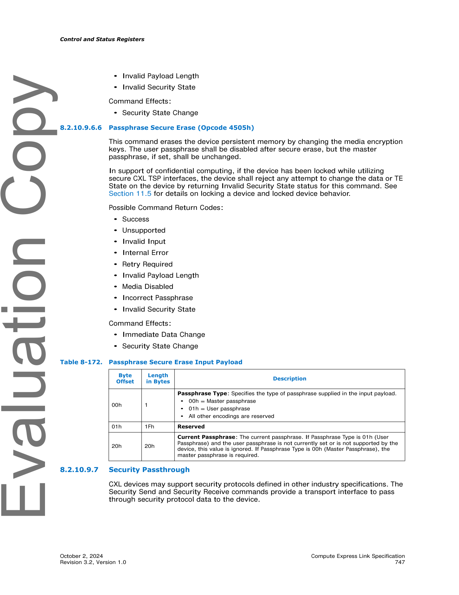
>
> *Original page render @ 150 DPI* — [📄 Full size](figures/chapter_08/page_0747.png)

[⬆️ 返回目录](#-本章目录-part-e)

---

#### 8.2.10.9.7 Security Passthrough | 安全直通

<table>
<thead>
<tr>
<th width="50%">🇬🇧 English</th>
<th width="50%" style="background-color:#e8e8e8">🇨🇳 中文</th>
</tr>
</thead>
<tbody>
<tr><td>CXL devices may support security protocols defined in other industry specifications. The Security Send and Security Receive commands provide a transport interface to pass through security protocol data to the device.</td><td style="background-color:#e8e8e8">CXL 设备可以支持其他行业规范中定义的安全协议。Security Send 和 Security Receive 命令提供了将安全协议数据传递到设备的传输接口。</td></tr>
</tbody>
</table>

---

##### 8.2.10.9.7.1 Security Send (Opcode 4600h) | Security Send (操作码 4600h)

<table>
<thead>
<tr>
<th width="50%">🇬🇧 English</th>
<th width="50%" style="background-color:#e8e8e8">🇨🇳 中文</th>
</tr>
</thead>
<tbody>
<tr><td>The Security Send command is used to transfer security protocol data to the device. The data structure transferred to the device as part of this command contains security protocol specific commands to be performed by the device. The data structure transferred may also contain data or parameters associated with the security protocol commands. Status and data that is to be returned to the host for the security protocol commands submitted by a Security Send command are retrieved with the Security Receive command.</td><td style="background-color:#e8e8e8">Security Send 命令用于将安全协议数据传输到设备。作为此命令的一部分传输到设备的数据结构包含要由设备执行的安全协议特定命令。传输的数据结构还可能包含与安全协议命令关联的数据或参数。要为通过 Security Send 命令提交的安全协议命令返回给主机的状态和数据,可使用 Security Receive 命令检索。</td></tr>
<tr><td>The association between a Security Send command and subsequent Security Receive command is Security Protocol field dependent as defined in the Security Features for SCSI Commands (SFSC). Available from webstore.ansi.org.</td><td style="background-color:#e8e8e8">Security Send 命令与后续 Security Receive 命令之间的关联取决于 Security Protocol 字段,如 SCSI 命令安全功能 (SFSC) 中所定义。可从 webstore.ansi.org 获取。</td></tr>
<tr><td>In support of confidential computing, if the device has been locked while utilizing secure CXL TSP interfaces, the device shall reject any attempt to send security commands that could change the data or TE State on the device by returning Invalid Security State status for this command. See Section 11.5 for details on locking a device and locked device behavior.</td><td style="background-color:#e8e8e8">为了支持机密计算,如果设备在使用安全 CXL TSP 接口时已被锁定,设备应通过返回 Invalid Security State 状态来拒绝任何发送可能更改设备上的数据或 TE State 的安全命令的尝试。有关锁定设备和已锁定设备行为的详细信息,请参阅 11.5 节。</td></tr>
<tr><td><b>Possible Command Return Codes:</b> • Success • Unsupported • Invalid Input • Internal Error • Retry Required • Invalid Payload Length • Busy • Invalid Security State</td><td style="background-color:#e8e8e8"><b>可能的命令返回码:</b> • Success(成功) • Unsupported(不支持) • Invalid Input(无效输入) • Internal Error(内部错误) • Retry Required(需要重试) • Invalid Payload Length(无效负载长度) • Busy(忙) • Invalid Security State(无效安全状态)</td></tr>
<tr><td><b>Command Effects:</b> • Security State Change</td><td style="background-color:#e8e8e8"><b>命令效果:</b> • Security State Change(安全状态更改)</td></tr>
</tbody>
</table>

**Table 8-173. Security Send Input Payload | Security Send 输入负载**

<table>
<thead>
<tr><th>Byte Offset</th><th>Length in Bytes</th><th>🇬🇧 Description</th><th>🇨🇳 描述</th></tr>
</thead>
<tbody>
<tr><td>00h</td><td>1</td><td>Security Protocol: Identifies the security command protocol interface.</td><td>Security Protocol(安全协议):标识安全命令协议接口。</td></tr>
<tr><td>01h</td><td>2</td><td>SP Specific: Contains bits 15:0 of the Security Protocol Specific Field defined in SFSC.</td><td>SP Specific(SP 特定):包含 SFSC 中定义的 Security Protocol Specific Field 的位 15:0。</td></tr>
<tr><td>03h</td><td>5</td><td>Reserved</td><td>保留</td></tr>
<tr><td>08h</td><td>Varies</td><td>Data</td><td>Data(数据)。</td></tr>
</tbody>
</table>

> **Figure 8-X.** Security Send (page 748) ｜ Security Send
>
> 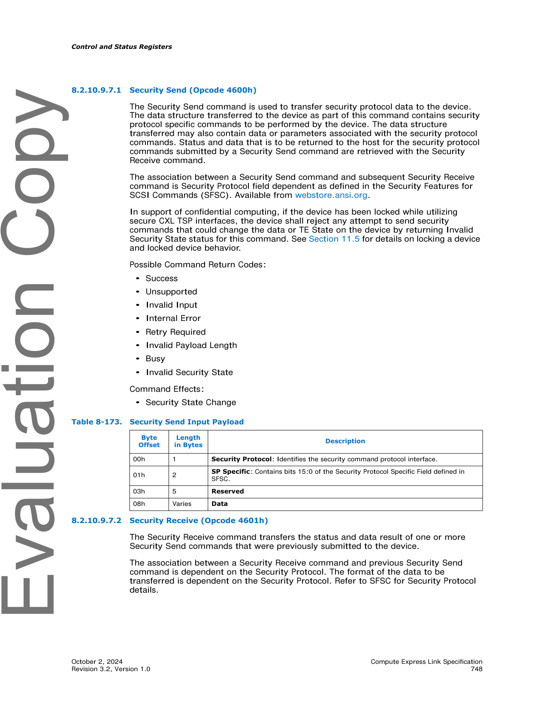
>
> *Original page render @ 150 DPI* — [📄 Full size](figures/chapter_08/page_0748.png)

[⬆️ 返回目录](#-本章目录-part-e)

---

##### 8.2.10.9.7.2 Security Receive (Opcode 4601h) | Security Receive (操作码 4601h)

<table>
<thead>
<tr>
<th width="50%">🇬🇧 English</th>
<th width="50%" style="background-color:#e8e8e8">🇨🇳 中文</th>
</tr>
</thead>
<tbody>
<tr><td>The Security Receive command transfers the status and data result of one or more Security Send commands that were previously submitted to the device.</td><td style="background-color:#e8e8e8">Security Receive 命令传输先前提交给设备的一个或多个 Security Send 命令的状态和数据结果。</td></tr>
<tr><td>The association between a Security Receive command and previous Security Send command is dependent on the Security Protocol. The format of the data to be transferred is dependent on the Security Protocol. Refer to SFSC for Security Protocol details.</td><td style="background-color:#e8e8e8">Security Receive 命令与先前 Security Send 命令之间的关联取决于 Security Protocol。要传输的数据格式取决于 Security Protocol。有关 Security Protocol 的详细信息,请参阅 SFSC。</td></tr>
<tr><td>Each Security Receive command returns the appropriate data corresponding to a Security Send command as defined by the rules of the Security Protocol. The Security Receive command data may or may not be retained if there is a loss of communication between the device and the host, or if a device Conventional Reset occurs.</td><td style="background-color:#e8e8e8">每个 Security Receive 命令根据 Security Protocol 的规则返回与 Security Send 命令相对应的适当数据。如果设备与主机之间通信丢失或发生设备 Conventional Reset,则 Security Receive 命令数据可能会或可能不会被保留。</td></tr>
<tr><td><b>Possible Command Return Codes:</b> • Success • Unsupported • Invalid Input • Internal Error • Retry Required • Invalid Payload Length</td><td style="background-color:#e8e8e8"><b>可能的命令返回码:</b> • Success(成功) • Unsupported(不支持) • Invalid Input(无效输入) • Internal Error(内部错误) • Retry Required(需要重试) • Invalid Payload Length(无效负载长度)</td></tr>
<tr><td><b>Command Effects:</b> • None</td><td style="background-color:#e8e8e8"><b>命令效果:</b> • None(无)</td></tr>
</tbody>
</table>

**Table 8-174. Security Receive Input Payload | Security Receive 输入负载**

<table>
<thead>
<tr><th>Byte Offset</th><th>Length in Bytes</th><th>🇬🇧 Description</th><th>🇨🇳 描述</th></tr>
</thead>
<tbody>
<tr><td>00h</td><td>1</td><td>Security Protocol: Identifies the security command protocol interface.</td><td>Security Protocol(安全协议):标识安全命令协议接口。</td></tr>
<tr><td>01h</td><td>2</td><td>SP Specific: Contains bits 15:0 of the Security Protocol Specific Field defined in SFSC.</td><td>SP Specific(SP 特定):包含 SFSC 中定义的 Security Protocol Specific Field 的位 15:0。</td></tr>
<tr><td>03h</td><td>5</td><td>Reserved</td><td>保留</td></tr>
</tbody>
</table>

**Table 8-175. Security Receive Output Payload | Security Receive 输出负载**

<table>
<thead>
<tr><th>Byte Offset</th><th>Length in Bytes</th><th>🇬🇧 Description</th><th>🇨🇳 描述</th></tr>
</thead>
<tbody>
<tr><td>00h</td><td>Varies</td><td>Data</td><td>Data(数据)。</td></tr>
</tbody>
</table>

> **Figure 8-X.** Security Receive (page 748-749) ｜ Security Receive
>
> 
>
> *Original page render @ 150 DPI* — [📄 Full size](figures/chapter_08/page_0748.png)

[⬆️ 返回目录](#-本章目录-part-e)

---

#### 8.2.10.9.8 SLD QoS Telemetry | SLD QoS 遥测

<table>
<thead>
<tr>
<th width="50%">🇬🇧 English</th>
<th width="50%" style="background-color:#e8e8e8">🇨🇳 中文</th>
</tr>
</thead>
<tbody>
<tr><td>These commands enable system software to manage QoS Telemetry features in SLDs.</td><td style="background-color:#e8e8e8">这些命令使系统软件能够管理 SLD 中的 QoS 遥测功能。</td></tr>
</tbody>
</table>

---

##### 8.2.10.9.8.1 Get SLD QoS Control (Opcode 4700h) | 获取 SLD QoS 控制 (操作码 4700h)

<table>
<thead>
<tr>
<th width="50%">🇬🇧 English</th>
<th width="50%" style="background-color:#e8e8e8">🇨🇳 中文</th>
</tr>
</thead>
<tbody>
<tr><td>This command retrieves the SLD's QoS control parameters, as defined in Table 8-176. This command is mandatory if the Egress Port Congestion Supported bit or the Temporary Throughput Reduction Supported bit is set (see Table 8-142).</td><td style="background-color:#e8e8e8">此命令检索 SLD 的 QoS 控制参数,如 Table 8-176 中所定义。如果设置了 Egress Port Congestion Supported 位或 Temporary Throughput Reduction Supported 位(请参阅 Table 8-142),则此命令是必需的。</td></tr>
<tr><td><b>Possible Command Return Codes:</b> • Success • Unsupported • Internal Error • Retry Required • Invalid Payload Length</td><td style="background-color:#e8e8e8"><b>可能的命令返回码:</b> • Success(成功) • Unsupported(不支持) • Internal Error(内部错误) • Retry Required(需要重试) • Invalid Payload Length(无效负载长度)</td></tr>
<tr><td><b>Command Effects:</b> • None</td><td style="background-color:#e8e8e8"><b>命令效果:</b> • None(无)</td></tr>
</tbody>
</table>

> **Figure 8-X.** Get SLD QoS Control (page 749-750) ｜ Get SLD QoS Control
>
> 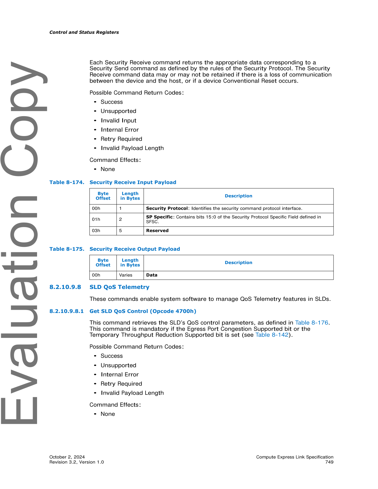
>
> *Original page render @ 150 DPI* — [📄 Full size](figures/chapter_08/page_0749.png)

[⬆️ 返回目录](#-本章目录-part-e)

---

##### 8.2.10.9.8.2 Set SLD QoS Control (Opcode 4701h) | 设置 SLD QoS 控制 (操作码 4701h)

<table>
<thead>
<tr>
<th width="50%">🇬🇧 English</th>
<th width="50%" style="background-color:#e8e8e8">🇨🇳 中文</th>
</tr>
</thead>
<tbody>
<tr><td>This command sets the SLD's QoS control parameters. The input payload is defined in Table 8-176. The device must complete the set operation before returning the response. The command response does not return a payload. This command will fail, returning Invalid Input, if any of the parameters are outside their valid range.</td><td style="background-color:#e8e8e8">此命令设置 SLD 的 QoS 控制参数。输入负载在 Table 8-176 中定义。设备必须在返回响应之前完成设置操作。命令响应不返回负载。如果任何参数超出其有效范围,此命令将失败并返回 Invalid Input。</td></tr>
<tr><td>This command is mandatory if the Egress Port Congestion Supported bit or the Temporary Throughput Reduction Supported bit is set (see Table 8-142).</td><td style="background-color:#e8e8e8">如果设置了 Egress Port Congestion Supported 位或 Temporary Throughput Reduction Supported 位(请参阅 Table 8-142),则此命令是必需的。</td></tr>
<tr><td><b>Possible Command Return Codes:</b> • Success • Unsupported • Invalid Input • Internal Error • Retry Required • Invalid Payload Length</td><td style="background-color:#e8e8e8"><b>可能的命令返回码:</b> • Success(成功) • Unsupported(不支持) • Invalid Input(无效输入) • Internal Error(内部错误) • Retry Required(需要重试) • Invalid Payload Length(无效负载长度)</td></tr>
<tr><td><b>Command Effects:</b> • Immediate Policy Change</td><td style="background-color:#e8e8e8"><b>命令效果:</b> • Immediate Policy Change(立即策略更改)</td></tr>
</tbody>
</table>

**Table 8-176. Get SLD QoS Control Output Payload and Set SLD QoS Control Input Payload | Get SLD QoS Control 输出负载和 Set SLD QoS Control 输入负载**

<table>
<thead>
<tr><th>Byte Offset</th><th>Length in Bytes</th><th>🇬🇧 Description</th><th>🇨🇳 描述</th></tr>
</thead>
<tbody>
<tr><td>00h</td><td>1</td><td>QoS Telemetry Control: Default is 00h. • Bit[0]: Egress Port Congestion Enable (see Section 3.3.4.3.4) • Bit[1]: Temporary Throughput Reduction Enable (see Section 3.3.4.3.5) • Bits[7:2]: Reserved</td><td>QoS Telemetry Control(QoS 遥测控制):默认为 00h。 • Bit[0]:Egress Port Congestion Enable(出口端口拥塞启用)(请参阅 3.3.4.3.4 节) • Bit[1]:Temporary Throughput Reduction Enable(临时吞吐量降低启用)(请参阅 3.3.4.3.5 节) • Bits[7:2]:保留</td></tr>
<tr><td>01h</td><td>1</td><td>Egress Moderate Percentage: Threshold in percent for the Egress Port Congestion mechanism to indicate moderate congestion. Valid range is 1-100. Default is 10.</td><td>Egress Moderate Percentage(出口中等拥塞百分比):Egress Port Congestion 机制指示中等拥塞的百分比阈值。有效范围为 1-100。默认值为 10。</td></tr>
<tr><td>02h</td><td>1</td><td>Egress Severe Percentage: Threshold in percent for the Egress Port Congestion mechanism to indicate severe congestion. Valid range is 1-100. Default is 25.</td><td>Egress Severe Percentage(出口严重拥塞百分比):Egress Port Congestion 机制指示严重拥塞的百分比阈值。有效范围为 1-100。默认值为 25。</td></tr>
<tr><td>03h</td><td>1</td><td>Backpressure Sample Interval: Interval in ns for the Egress Port Congestion mechanism to take samples. Valid range is 0-15. Default is 8-ns sample interval, which corresponds to 800 ns of history. Value of 0 disables the mechanism. See Section 3.3.4.3.6.</td><td>Backpressure Sample Interval(背压采样间隔):Egress Port Congestion 机制采样的间隔(以纳秒为单位)。有效范围为 0-15。默认值为 8 ns 采样间隔(对应 800 ns 的历史记录)。值为 0 禁用该机制。请参阅 3.3.4.3.6 节。</td></tr>
</tbody>
</table>

> **Figure 8-X.** Set SLD QoS Control (page 750) ｜ Set SLD QoS Control
>
> 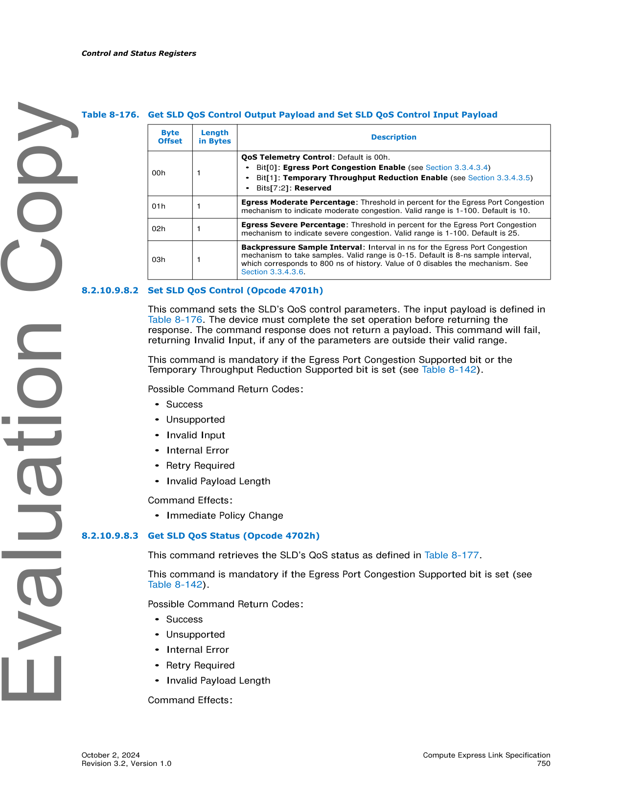
>
> *Original page render @ 150 DPI* — [📄 Full size](figures/chapter_08/page_0750.png)

[⬆️ 返回目录](#-本章目录-part-e)

---

##### 8.2.10.9.8.3 Get SLD QoS Status (Opcode 4702h) | 获取 SLD QoS 状态 (操作码 4702h)

<table>
<thead>
<tr>
<th width="50%">🇬🇧 English</th>
<th width="50%" style="background-color:#e8e8e8">🇨🇳 中文</th>
</tr>
</thead>
<tbody>
<tr><td>This command retrieves the SLD's QoS status as defined in Table 8-177.</td><td style="background-color:#e8e8e8">此命令检索 SLD 的 QoS 状态,如 Table 8-177 中所定义。</td></tr>
<tr><td>This command is mandatory if the Egress Port Congestion Supported bit is set (see Table 8-142).</td><td style="background-color:#e8e8e8">如果设置了 Egress Port Congestion Supported 位(请参阅 Table 8-142),则此命令是必需的。</td></tr>
<tr><td><b>Possible Command Return Codes:</b> • Success • Unsupported • Internal Error • Retry Required • Invalid Payload Length</td><td style="background-color:#e8e8e8"><b>可能的命令返回码:</b> • Success(成功) • Unsupported(不支持) • Internal Error(内部错误) • Retry Required(需要重试) • Invalid Payload Length(无效负载长度)</td></tr>
<tr><td><b>Command Effects:</b> • None</td><td style="background-color:#e8e8e8"><b>命令效果:</b> • None(无)</td></tr>
</tbody>
</table>

**Table 8-177. Get SLD QoS Status Output Payload | Get SLD QoS Status 输出负载**

<table>
<thead>
<tr><th>Byte Offset</th><th>Length in Bytes</th><th>🇬🇧 Description</th><th>🇨🇳 描述</th></tr>
</thead>
<tbody>
<tr><td>00h</td><td>1</td><td>Backpressure Average Percentage: Current snapshot of the measured Egress Port average congestion (see Section 3.3.4.3.9).</td><td>Backpressure Average Percentage(平均背压百分比):测量的 Egress Port 平均拥塞的当前快照(请参阅 3.3.4.3.9 节)。</td></tr>
</tbody>
</table>

> **Figure 8-X.** Get SLD QoS Status (page 750-751) ｜ Get SLD QoS Status
>
> 
>
> *Original page render @ 150 DPI* — [📄 Full size](figures/chapter_08/page_0750.png)

[⬆️ 返回目录](#-本章目录-part-e)

---

#### 8.2.10.9.9 Dynamic Capacity | 动态容量

<table>
<thead>
<tr>
<th width="50%">🇬🇧 English</th>
<th width="50%" style="background-color:#e8e8e8">🇨🇳 中文</th>
</tr>
</thead>
<tbody>
<tr><td>See Section 9.13.3 for an overview of Dynamic Capacity Device (DCD).</td><td style="background-color:#e8e8e8">有关 Dynamic Capacity Device (DCD) 的概述,请参阅 9.13.3 节。</td></tr>
</tbody>
</table>

---

##### 8.2.10.9.9.1 Get Dynamic Capacity Configuration (Opcode 4800h) | 获取动态容量配置 (操作码 4800h)

<table>
<thead>
<tr>
<th width="50%">🇬🇧 English</th>
<th width="50%" style="background-color:#e8e8e8">🇨🇳 中文</th>
</tr>
</thead>
<tbody>
<tr><td>Retrieve the DC Region configuration of the LD-FAM DCD. The returned Region Base and Length allow the device to report the DPA range that the host shall account for when programming the HDM decoders for Dynamic Capacity.</td><td style="background-color:#e8e8e8">检索 LD-FAM DCD 的 DC Region 配置。返回的 Region Base 和 Length 允许设备报告在为 Dynamic Capacity 编程 HDM 解码器时主机应负责的 DPA 范围。</td></tr>
<tr><td><b>Possible Command Return Codes:</b> • Success • Unsupported • Invalid Input • Internal Error</td><td style="background-color:#e8e8e8"><b>可能的命令返回码:</b> • Success(成功) • Unsupported(不支持) • Invalid Input(无效输入) • Internal Error(内部错误)</td></tr>
<tr><td><b>Command Effects:</b> • None</td><td style="background-color:#e8e8e8"><b>命令效果:</b> • None(无)</td></tr>
</tbody>
</table>

**Table 8-178. Get Dynamic Capacity Configuration Input Payload | Get Dynamic Capacity Configuration 输入负载**

<table>
<thead>
<tr><th>Byte Offset</th><th>Length in Bytes</th><th>🇬🇧 Description</th><th>🇨🇳 描述</th></tr>
</thead>
<tbody>
<tr><td>0h</td><td>1</td><td>Region Count: The maximum number of region configuration structures to return in the output payload.</td><td>Region Count(区域计数):要在输出负载中返回的区域配置结构的最大数量。</td></tr>
<tr><td>1h</td><td>1</td><td>Starting Region Index: The zero-based index of the first requested region.</td><td>Starting Region Index(起始区域索引):所请求的第一个区域的从零开始的索引。</td></tr>
</tbody>
</table>

**Table 8-179. Get Dynamic Capacity Configuration Output Payload (Sheet 1 of 2) | Get Dynamic Capacity Configuration 输出负载 (第 1 张,共 2 张)**

<table>
<thead>
<tr><th>Byte Offset</th><th>Length in Bytes</th><th>🇬🇧 Description</th><th>🇨🇳 描述</th></tr>
</thead>
<tbody>
<tr><td>00h</td><td>1</td><td>Number of Available Regions: The device shall report the total number of available Dynamic Capacity Regions. Each region may be unconfigured or configured with a different block size and capacity. A DCD shall report between 1 and 8 regions. All other values are reserved.</td><td>Number of Available Regions(可用区域数):设备应报告可用的 Dynamic Capacity Regions 的总数。每个区域可以是未配置的,也可以配置为不同的块大小和容量。DCD 应报告 1 到 8 个区域之间的值。所有其他值保留。</td></tr>
<tr><td>01h</td><td>1</td><td>Regions Returned: The number of region configurations returned in this payload.</td><td>Regions Returned(返回的区域数):此负载中返回的区域配置数。</td></tr>
<tr><td>02h</td><td>6</td><td>Reserved</td><td>保留</td></tr>
<tr><td>08h</td><td>Varies</td><td>Region Configuration Structure: The current configuration of the regions (see Table 8-180) starting with Starting Region Index and ending with Min(Number of Available Regions-1, Starting Region Index+Region Count-1).</td><td>Region Configuration Structure(区域配置结构):区域的当前配置(请参阅 Table 8-180),从 Starting Region Index 开始,到 Min(可用区域数-1, Starting Region Index+Region Count-1) 结束。</td></tr>
<tr><td>Varies</td><td>4</td><td>Total Number of Supported Extents: Total number of extents that the device supports on this LD.</td><td>Total Number of Supported Extents(支持的 Extent 总数):设备在此 LD 上支持的 extent 总数。</td></tr>
<tr><td>Varies</td><td>4</td><td>Number of Available Extents: Remaining number of extents that the device supports, as defined in Section 9.13.3.3.</td><td>Number of Available Extents(可用 Extent 数):设备支持的剩余 extent 数,定义见 9.13.3.3 节。</td></tr>
<tr><td>Varies</td><td>4</td><td>Total Number of Supported Tags: Total number of Tag values that the device supports on this LD.</td><td>Total Number of Supported Tags(支持的 Tag 总数):设备在此 LD 上支持的 Tag 值总数。</td></tr>
<tr><td>Varies</td><td>4</td><td>Number of Available Tags: Remaining number of Tag values that the device supports, as defined in Section 9.13.3.3.</td><td>Number of Available Tags(可用 Tag 数):设备支持的剩余 Tag 值数,定义见 9.13.3.3 节。</td></tr>
</tbody>
</table>

**Table 8-180. DC Region Configuration | DC Region 配置**

<table>
<thead>
<tr><th>Byte Offset</th><th>Length in Bytes</th><th>🇬🇧 Description</th><th>🇨🇳 描述</th></tr>
</thead>
<tbody>
<tr><td>00h</td><td>8</td><td>Region Base: The device-assigned DPA base of this region aligned to 256 MB. All extents for this region shall describe a memory range ≥ the Region Base and < the Region Base + Region Decode Length.</td><td>Region Base(区域基址):此区域设备分配的 DPA 基址,对齐到 256 MB。此区域的所有 extent 应描述 ≥ Region Base 且 < Region Base + Region Decode Length 的内存范围。</td></tr>
<tr><td>08h</td><td>8</td><td>Region Decode Length: The device-assigned number of bytes of DPA that this region consumes, in multiples of 256 MB. This specifies the size of the DPA range that should be accounted for when programming HDM decoders for this region. All extents for this region shall describe a memory range ≥ the Region Base and < the Region Base + Region Decode Length. Report 0 if the region is unavailable for Dynamic Capacity.</td><td>Region Decode Length(区域解码长度):此区域消耗的设备分配的 DPA 字节数,以 256 MB 的倍数表示。这指定了为此区域编程 HDM 解码器时应负责的 DPA 范围的大小。此区域的所有 extent 应描述 ≥ Region Base 且 < Region Base + Region Decode Length 的内存范围。如果该区域不适用于 Dynamic Capacity,则报告 0。</td></tr>
<tr><td>10h</td><td>8</td><td>Region Length: The actual usable length of the region in bytes. This field shall be evenly divisible by the Region Block Size and shall be ≤ Region Decode Length. Report 0 if the region is unavailable for Dynamic Capacity.</td><td>Region Length(区域长度):区域的实际可用长度(以字节为单位)。此字段应能被 Region Block Size 整除,且应 ≤ Region Decode Length。如果该区域不适用于 Dynamic Capacity,则报告 0。</td></tr>
<tr><td>18h</td><td>8</td><td>Region Block Size: The Dynamic Capacity block size for this region in bytes. All Starting DPAs in all extents for this region shall be aligned to this block size. All Lengths in all extents for this region shall be multiples of this block size. Report 0 if the region is unavailable for Dynamic Capacity. Region Block Size must be a power of 2 and a multiple of 40h.</td><td>Region Block Size(区域块大小):此区域的 Dynamic Capacity 块大小(以字节为单位)。此区域所有 extent 中的所有 Starting DPA 都应对齐到此块大小。此区域所有 extent 中的所有 Length 都应是此块大小的倍数。如果该区域不适用于 Dynamic Capacity,则报告 0。Region Block Size 必须是 2 的幂且为 40h 的倍数。</td></tr>
<tr><td>20h</td><td>4</td><td>DSMADHandle: The CDAT DSMAD instance with which this region can be utilized. The CDAT is utilized to describe the attributes associated with each region of memory and this provides the association to a specific CDAT DSMAS entry.</td><td>DSMADHandle:可利用此区域的 CDAT DSMAD 实例。CDAT 用于描述与每个内存区域关联的属性,这提供了与特定 CDAT DSMAS 条目的关联。</td></tr>
<tr><td>24h</td><td>1</td><td>Flags • Bit[0]: Sanitize on Release: If 1, the device has been configured such that capacity released from this region will be sanitized using the method defined in Section 8.2.10.9.5.1 before it is made available to any host. • Bits[7:1]: Reserved.</td><td>Flags(标志): • Bit[0]:Sanitize on Release(发布时清理):如果为 1,则设备已配置,使得从该区域释放的容量在提供给任何主机之前将使用 8.2.10.9.5.1 节中定义的方法进行清理。 • Bits[7:1]:保留。</td></tr>
<tr><td>25h</td><td>3</td><td>Reserved</td><td>保留</td></tr>
</tbody>
</table>

> **Figure 8-X.** Get Dynamic Capacity Configuration (page 751-752) ｜ Get Dynamic Capacity Configuration
>
> 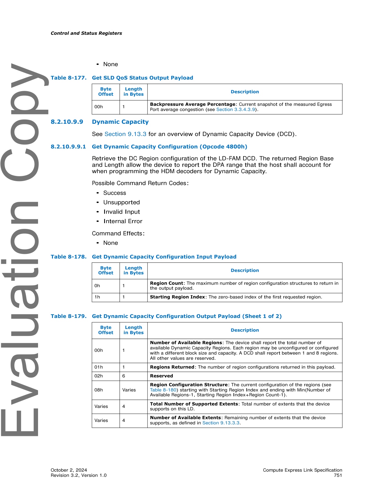
>
> *Original page render @ 150 DPI* — [📄 Full size](figures/chapter_08/page_0751.png)

[⬆️ 返回目录](#-本章目录-part-e)

---

##### 8.2.10.9.9.2 Get Dynamic Capacity Extent List (Opcode 4801h) | 获取动态容量 Extent List (操作码 4801h)

<table>
<thead>
<tr>
<th width="50%">🇬🇧 English</th>
<th width="50%" style="background-color:#e8e8e8">🇨🇳 中文</th>
</tr>
</thead>
<tbody>
<tr><td>Retrieve the Dynamic Capacity Extent List of the LD-FAM DCD. Since the Extent List is DPA based, a single Extent List can describe multiple regions. The host shall retrieve the complete Extent List using this command after enabling the Dynamic Capacity feature or anytime the Dynamic Capacity Event Log overflows. The device shall return Invalid Input if the Starting Extent Index value is greater than the Total Extent Count value. The Generation Number is used by the host to detect a changing Extent List during a multi-step list retrieval. The device shall report any changes to the Extent List utilizing the Dynamic Capacity Event Record mechanism.</td><td style="background-color:#e8e8e8">检索 LD-FAM DCD 的 Dynamic Capacity Extent List。由于 Extent List 是基于 DPA 的,单个 Extent List 可以描述多个区域。在启用 Dynamic Capacity 功能后或在 Dynamic Capacity Event Log 溢出时,主机应使用此命令检索完整的 Extent List。如果 Starting Extent Index 值大于 Total Extent Count 值,设备应返回 Invalid Input。Generation Number 由主机用于在多步列表检索过程中检测 Extent List 的变化。设备应使用 Dynamic Capacity Event Record 机制报告对 Extent List 的任何更改。</td></tr>
<tr><td><b>Possible Command Return Codes:</b> • Success • Unsupported • Invalid Input • Internal Error</td><td style="background-color:#e8e8e8"><b>可能的命令返回码:</b> • Success(成功) • Unsupported(不支持) • Invalid Input(无效输入) • Internal Error(内部错误)</td></tr>
<tr><td><b>Command Effects:</b> • None</td><td style="background-color:#e8e8e8"><b>命令效果:</b> • None(无)</td></tr>
</tbody>
</table>

**Table 8-181. Get Dynamic Capacity Extent List Input Payload | Get Dynamic Capacity Extent List 输入负载**

<table>
<thead>
<tr><th>Byte Offset</th><th>Length in Bytes</th><th>🇬🇧 Description</th><th>🇨🇳 描述</th></tr>
</thead>
<tbody>
<tr><td>0h</td><td>4</td><td>Extent Count: The maximum number of extents to return in the output payload. The device shall not return more extents than requested, but it may return fewer extents. If this field is cleared to 0, the device shall return the Total Extent Count and Extent List Generation Number without returning any extent data.</td><td>Extent Count(Extent 计数):输出负载中要返回的 extent 的最大数量。设备不应返回多于请求的 extent,但可以返回较少的 extent。如果此字段清零,设备应返回 Total Extent Count 和 Extent List Generation Number,而不返回任何 extent 数据。</td></tr>
<tr><td>4h</td><td>4</td><td>Starting Extent Index: Index of the first requested extent. A value of 0 specifies the first extent in the list.</td><td>Starting Extent Index(起始 Extent 索引):所请求的第一个 extent 的索引。值 0 指定列表中的第一个 extent。</td></tr>
</tbody>
</table>

**Table 8-182. Get Dynamic Capacity Extent List Output Payload | Get Dynamic Capacity Extent List 输出负载**

<table>
<thead>
<tr><th>Byte Offset</th><th>Length in Bytes</th><th>🇬🇧 Description</th><th>🇨🇳 描述</th></tr>
</thead>
<tbody>
<tr><td>00h</td><td>4</td><td>Returned Extent Count: The number of extents returned in the output payload. Utilized when calculating the next Starting Extent Index when calling this command multiple times to retrieve the complete list.</td><td>Returned Extent Count(返回的 Extent 数):输出负载中返回的 extent 数。在多次调用此命令检索完整列表时,用于计算下一个 Starting Extent Index。</td></tr>
<tr><td>04h</td><td>4</td><td>Total Extent Count: The total number of extents in the list.</td><td>Total Extent Count(Extent 总数):列表中的 extent 总数。</td></tr>
<tr><td>08h</td><td>4</td><td>Extent List Generation Number: A device-generated value that is used to indicate whether the list has changed.</td><td>Extent List Generation Number(Extent List 生成号):设备生成的值,用于指示列表是否已更改。</td></tr>
<tr><td>0Ch</td><td>4</td><td>Reserved</td><td>保留</td></tr>
<tr><td>10h</td><td>Varies</td><td>Dynamic Capacity Extent[ ]: See Table 8-63.</td><td>Dynamic Capacity Extent:请参阅 Table 8-63。</td></tr>
</tbody>
</table>

> **Figure 8-X.** Get Dynamic Capacity Extent List (page 752-753) ｜ Get Dynamic Capacity Extent List
>
> 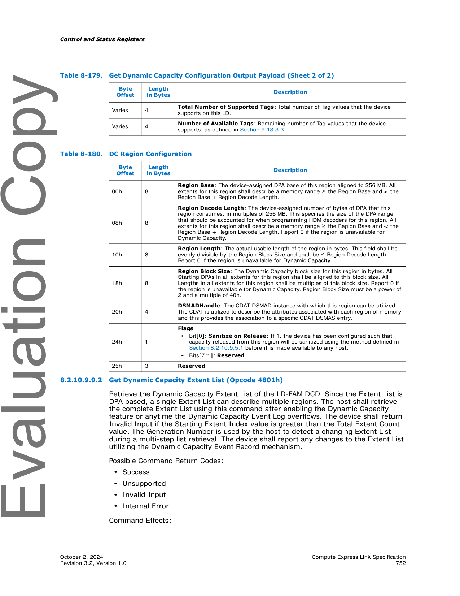
>
> *Original page render @ 150 DPI* — [📄 Full size](figures/chapter_08/page_0752.png)

[⬆️ 返回目录](#-本章目录-part-e)

---

##### 8.2.10.9.9.3 Add Dynamic Capacity Response (Opcode 4802h) | 添加动态容量响应 (操作码 4802h)

<table>
<thead>
<tr>
<th width="50%">🇬🇧 English</th>
<th width="50%" style="background-color:#e8e8e8">🇨🇳 中文</th>
</tr>
</thead>
<tbody>
<tr><td>In response to an Add Capacity Event Record, or multiple Add Capacity Event records grouped via the More flag (see Table 8-62), the host is expected to respond with exactly one Add Dynamic Capacity Response acknowledgment, corresponding to the order of the Add Capacity Events received. If the order does not match, the device shall return Invalid Input. The Add Dynamic Capacity Response acknowledgement must be in sent in the same as order as the Add Capacity Event Records.</td><td style="background-color:#e8e8e8">作为对 Add Capacity Event Record 或通过 More 标志分组的多个 Add Capacity Event 记录(请参阅 Table 8-62)的响应,主机预期以与接收到的 Add Capacity Event 顺序相对应的方式,响应恰好一个 Add Dynamic Capacity Response 确认。如果顺序不匹配,设备应返回 Invalid Input。Add Dynamic Capacity Response 确认必须按与 Add Capacity Event Records 相同的顺序发送。</td></tr>
<tr><td>The Add Dynamic Capacity Response acknowledgment is used to communicate to the LD-FAM DCD the explicit portions of the added Dynamic Capacity that the host is now utilizing. The acknowledgment operation may consist of multiple back-to-back Add Dynamic Capacity Response messages that are linked using the More flag in the Input Payload (see Table 8-183). For non-sharable capacity, the host may send the Add Dynamic Capacity Response command with no Extent List, if the host does not utilize any of the added capacity, or an Extent List describing a subset of the original Extents present in the Add Capacity Event Record. This device shall respond with success when the Extent List is empty even when the pending extent is part of a Dead Extent Group (see Section 9.13.3) After this command is received, the device is free to reclaim capacity that the host does not utilize. For sharable capacity, the host shall respond with either no Extent List or an Extent List that describes the full capacity — it shall accept all or none of the sharable capacity or the device shall return Invalid Extent List.</td><td style="background-color:#e8e8e8">Add Dynamic Capacity Response 确认用于向 LD-FAM DCD 通知主机正在使用所添加的 Dynamic Capacity 的明确部分。确认操作可由多个背靠背的 Add Dynamic Capacity Response 消息组成,这些消息使用输入负载中的 More 标志链接(请参阅 Table 8-183)。对于不可共享容量,如果主机不使用任何已添加的容量,主机可以发送没有 Extent List 的 Add Dynamic Capacity Response 命令,或者发送描述 Add Capacity Event Record 中存在的原始 Extent 子集的 Extent List。当 Extent List 为空时,设备应返回 success,即使挂起的 extent 是 Dead Extent Group 的一部分(请参阅 9.13.3 节)。接收到此命令后,设备可以自由回收主机未使用的容量。对于可共享容量,主机应使用没有 Extent List 或描述全部容量的 Extent List 进行响应——它应接受可共享容量的全部或部分,或者设备应返回 Invalid Extent List。</td></tr>
<tr><td>The device shall report Invalid Physical Address if: • One or more extents in the updated extent list specify a DPA range that is outside the of range of the Extent List contained in the Add Capacity Event Record associated with this response. If the device receives an out of order Add Dynamic Capacity Response with a non-zero Updated Extent List Size, it will result in this condition. • One or more extents in the updated extent list specify a DPA range that has already been added with a previous call to Add Dynamic Capacity Response • The Extent Group referred to by the Add Capacity Event Record is Dead as a result of forced removal of one or more of its extents.</td><td style="background-color:#e8e8e8">设备应在以下情况下报告 Invalid Physical Address: • 更新后的 extent 列表中的一个或多个 extent 指定的 DPA 范围超出与此响应关联的 Add Capacity Event Record 中包含的 Extent List 的范围。如果设备收到具有非零 Updated Extent List Size 的乱序 Add Dynamic Capacity Response,则会导致此情况。 • 更新后的 extent 列表中的一个或多个 extent 指定的 DPA 范围已通过先前的 Add Dynamic Capacity Response 调用添加。 • Add Capacity Event Record 引用的 Extent Group 由于强制移除其一个或多个 extent 而成为 Dead。</td></tr>
<tr><td>The device shall report Invalid Extent List if it detects a malformed Extent List. Examples of a malformed Extent List include: • Overlapping DPA ranges for multiple extents • Starting DPA not aligned to the Region Block Size • Length not a multiple of the Region Block Size</td><td style="background-color:#e8e8e8">如果设备检测到格式错误的 Extent List,则应报告 Invalid Extent List。格式错误的 Extent List 的示例包括: • 多个 extent 的 DPA 范围重叠 • Starting DPA 未与 Region Block Size 对齐 • Length 不是 Region Block Size 的倍数</td></tr>
<tr><td>The device shall report Resources Exhausted if the Updated Extent List would cause the device to exceed its extent tracking ability.</td><td style="background-color:#e8e8e8">如果 Updated Extent List 会导致设备超出其 extent 跟踪能力,设备应报告 Resources Exhausted。</td></tr>
<tr><td><b>Possible Command Return Codes:</b> • Success • Unsupported • Invalid Input • Internal Error • Invalid Physical Address • Invalid Extent List • Resources Exhausted</td><td style="background-color:#e8e8e8"><b>可能的命令返回码:</b> • Success(成功) • Unsupported(不支持) • Invalid Input(无效输入) • Internal Error(内部错误) • Invalid Physical Address(无效物理地址) • Invalid Extent List(无效 Extent List) • Resources Exhausted(资源耗尽)</td></tr>
<tr><td><b>Command Effects:</b> • Immediate Configuration Change</td><td style="background-color:#e8e8e8"><b>命令效果:</b> • Immediate Configuration Change(立即配置更改)</td></tr>
</tbody>
</table>

**Table 8-183. Add Dynamic Capacity Response Input Payload | Add Dynamic Capacity Response 输入负载**

<table>
<thead>
<tr><th>Byte Offset</th><th>Length in Bytes</th><th>🇬🇧 Description</th><th>🇨🇳 描述</th></tr>
</thead>
<tbody>
<tr><td>0h</td><td>4</td><td>Updated Extent List Size: The number of added Extent List entries that follow. May be 0 if no capacity is added.</td><td>Updated Extent List Size(更新后的 Extent List 大小):后续添加的 Extent List 条目数。如果未添加任何容量,则可以为 0。</td></tr>
<tr><td>4h</td><td>1</td><td>Flags • Bit[0]: More: — 0 = This is the last (or only) payload associated with this operation. — 1 = The next Add Dynamic Capacity Response Input Payload is also associated with this operation, providing additional extents. Payloads can be grouped this way to overcome limits due to maximum mailbox payload sizes. • Bits[7:1]: Reserved</td><td>Flags(标志): • Bit[0]:More(更多): — 0 = 这是与此操作关联的最后一个(或仅有的)负载。 — 1 = 下一个 Add Dynamic Capacity Response 输入负载也与该操作关联,提供其他 extent。可通过这种方式对负载进行分组,以克服由于最大邮箱负载大小所造成的限制。 • Bits[7:1]:保留</td></tr>
<tr><td>5h</td><td>3</td><td>Reserved</td><td>保留</td></tr>
<tr><td>8h</td><td>Varies</td><td>Updated Extent List: List of Updated Extents. See Table 8-184 for format of each entry. This list may be empty.</td><td>Updated Extent List(更新后的 Extent List):已更新 Extent 的列表。每个条目的格式请参阅 Table 8-184。此列表可以为空。</td></tr>
</tbody>
</table>

**Table 8-184. Updated Extent | 更新的 Extent**

<table>
<thead>
<tr><th>Byte Offset</th><th>Length in Bytes</th><th>🇬🇧 Description</th><th>🇨🇳 描述</th></tr>
</thead>
<tbody>
<tr><td>00h</td><td>8</td><td>Starting DPA: The address of the first block for this extent. • Bits[5:0]: Reserved • Bits[63:6]: DPA[63:6]</td><td>Starting DPA(起始 DPA):此 extent 的第一个块的地址。 • Bits[5:0]:保留 • Bits[63:6]:DPA[63:6]</td></tr>
<tr><td>08h</td><td>8</td><td>Length: The number of contiguous bytes for this extent. Length shall be > 0.</td><td>Length(长度):此 extent 的连续字节数。Length 应 > 0。</td></tr>
<tr><td>10h</td><td>8</td><td>Reserved</td><td>保留</td></tr>
</tbody>
</table>

> **Figure 8-X.** Add Dynamic Capacity Response (page 753-755) ｜ Add Dynamic Capacity Response
>
> 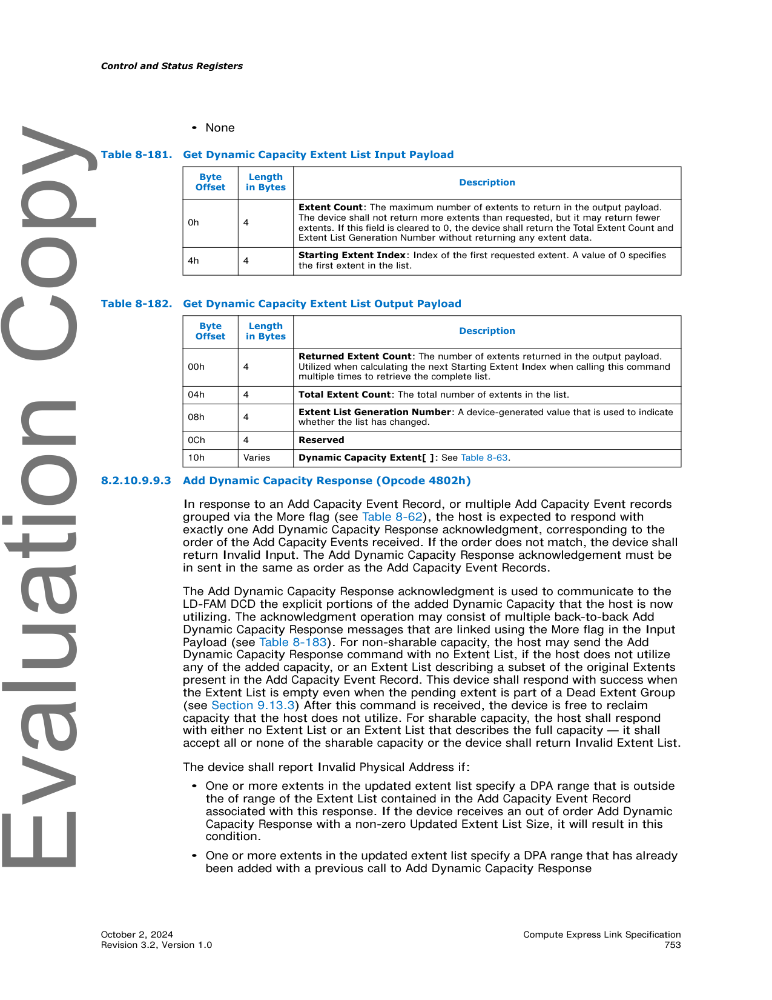
>
> *Original page render @ 150 DPI* — [📄 Full size](figures/chapter_08/page_0753.png)

[⬆️ 返回目录](#-本章目录-part-e)

---

##### 8.2.10.9.9.4 Release Dynamic Capacity (Opcode 4803h) | 释放动态容量 (操作码 4803h)

<table>
<thead>
<tr>
<th width="50%">🇬🇧 English</th>
<th width="50%" style="background-color:#e8e8e8">🇨🇳 中文</th>
</tr>
</thead>
<tbody>
<tr><td>Release Dynamic Capacity back to the LD-FAM DCD. This may be in response to a Release Capacity Event Record or multiple Release Capacity Event records grouped via the More flag (see Table 8-62), a Forced Release Capacity Event Record or multiple Force Release Capacity Event records grouped via the More flag (see Table 8-62), or an unsolicited release of capacity that is not associated with an event. This command is only called if the host has capacity to release to the device and the updated Extent List in the input payload describes the portions of the capacity that the host has released.</td><td style="background-color:#e8e8e8">将 Dynamic Capacity 释放回 LD-FAM DCD。这可能是对 Release Capacity Event Record 或通过 More 标志分组的多个 Release Capacity Event 记录(请参阅 Table 8-62)、Forced Release Capacity Event Record 或通过 More 标志分组的多个 Force Release Capacity Event 记录(请参阅 Table 8-62)的响应,或与事件无关的未经请求的容量释放。仅当主机有要释放给设备的容量,并且输入负载中已更新的 Extent List 描述了主机已释放的容量部分时,才调用此命令。</td></tr>
<tr><td>The device shall report Invalid Physical Address if: • One or more extents in the updated extent list specify a DPA range that is out of range of a current Extent List maintained by the device • One or more extents in the updated extent list specify a DPA range that has already been released with a previous call to Release Dynamic Capacity</td><td style="background-color:#e8e8e8">设备应在以下情况下报告 Invalid Physical Address: • 更新后的 extent 列表中的一个或多个 extent 指定的 DPA 范围超出设备维护的当前 Extent List 的范围 • 更新后的 extent 列表中的一个或多个 extent 指定的 DPA 范围已通过先前的 Release Dynamic Capacity 调用释放</td></tr>
<tr><td>The device shall report Invalid Extent List if it detects a malformed Extent List. Examples of a malformed Extent List include: • Overlapping DPA range for multiple extents • Starting DPA not aligned to the Region Block Size • Length not a multiple of the Region Block Size • The Extent List covers only a portion of a tagged sharable capacity</td><td style="background-color:#e8e8e8">如果设备检测到格式错误的 Extent List,则应报告 Invalid Extent List。格式错误的 Extent List 的示例包括: • 多个 extent 的 DPA 范围重叠 • Starting DPA 未与 Region Block Size 对齐 • Length 不是 Region Block Size 的倍数 • Extent List 仅覆盖带标签的可共享容量的一部分</td></tr>
<tr><td>In support of confidential computing, if the device has been locked while utilizing secure CXL TSP interfaces, the device shall overwrite or cryptographically scramble the data and reset the TE State to 0 for all memory contained in the released capacity extent list, before the device allows the released memory capacity to be added to another host. This prevents a host from injecting data that could be silently consumed by another host when Dynamic Capacity is moved. See Section 11.5 for details on locking a device and locked device behavior.</td><td style="background-color:#e8e8e8">为了支持机密计算,如果设备在使用安全 CXL TSP 接口时已被锁定,在设备允许将已释放的内存容量添加到另一台主机之前,设备应覆盖或以加密方式加扰已释放容量 extent 列表中包含的所有内存的数据,并将 TE State 重置为 0。这可防止主机在移动 Dynamic Capacity 时注入可能被另一台主机静默使用的数据。有关锁定设备和已锁定设备行为的详细信息,请参阅 11.5 节。</td></tr>
<tr><td>The device shall report Resources Exhausted if the Updated Extent List would cause the device to exceed its extent tracking ability.</td><td style="background-color:#e8e8e8">如果 Updated Extent List 会导致设备超出其 extent 跟踪能力,设备应报告 Resources Exhausted。</td></tr>
<tr><td><b>Possible Command Return Codes:</b> • Success • Unsupported • Invalid Input • Internal Error • Invalid Physical Address • Invalid Extent List • Resources Exhausted</td><td style="background-color:#e8e8e8"><b>可能的命令返回码:</b> • Success(成功) • Unsupported(不支持) • Invalid Input(无效输入) • Internal Error(内部错误) • Invalid Physical Address(无效物理地址) • Invalid Extent List(无效 Extent List) • Resources Exhausted(资源耗尽)</td></tr>
<tr><td><b>Command Effects:</b> • Immediate Configuration Change</td><td style="background-color:#e8e8e8"><b>命令效果:</b> • Immediate Configuration Change(立即配置更改)</td></tr>
</tbody>
</table>

**Table 8-185. Release Dynamic Capacity Input Payload | Release Dynamic Capacity 输入负载**

<table>
<thead>
<tr><th>Byte Offset</th><th>Length in Bytes</th><th>🇬🇧 Description</th><th>🇨🇳 描述</th></tr>
</thead>
<tbody>
<tr><td>0h</td><td>4</td><td>Updated Extent List Size: The number of host-released Extent List entries that follow. Shall be > 0.</td><td>Updated Extent List Size(更新后的 Extent List 大小):后续的主机已释放 Extent List 条目数。应 > 0。</td></tr>
<tr><td>4h</td><td>1</td><td>Flags • Bit[0]: More: — 0 = This is the last (or only) payload associated with this operation. — 1 = The next Release Dynamic Capacity Input Payload is also associated with this operation, providing additional extents. Payloads can be grouped this way to overcome limits due to maximum mailbox payload sizes. Payloads grouped this way shall be submitted with no unrelated records between them and shall contain the same mailbox opcode. • Bits[7:1]: Reserved</td><td>Flags(标志): • Bit[0]:More(更多): — 0 = 这是与此操作关联的最后一个(或仅有的)负载。 — 1 = 下一个 Release Dynamic Capacity 输入负载也与该操作关联,提供其他 extent。可通过这种方式对负载进行分组,以克服由于最大邮箱负载大小所造成的限制。以这种方式分组的负载应在提交时在它们之间不包含任何不相关的记录,并且应包含相同的邮箱操作码。 • Bits[7:1]:保留</td></tr>
<tr><td>5h</td><td>3</td><td>Reserved</td><td>保留</td></tr>
<tr><td>8h</td><td>Varies</td><td>Updated Extent List[ ]: The extents that have been released by the host. For format, see Table 8-184.</td><td>Updated Extent List:主机已释放的 extent。有关格式,请参阅 Table 8-184。</td></tr>
</tbody>
</table>

> **Figure 8-X.** Release Dynamic Capacity (page 755-756) ｜ Release Dynamic Capacity
>
> 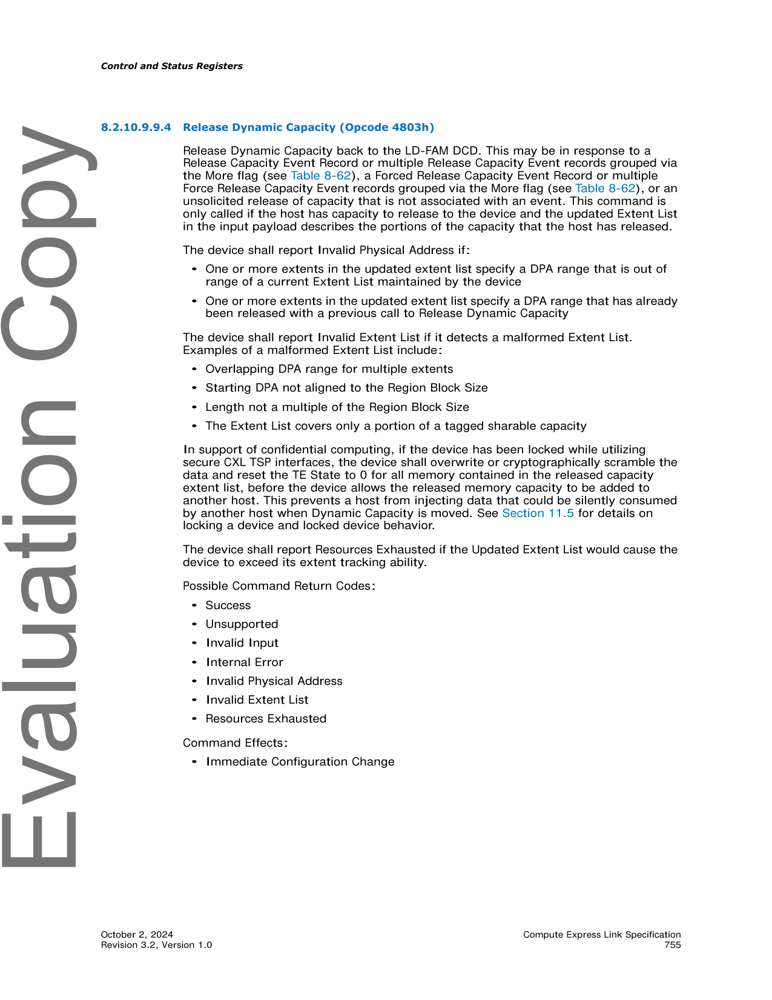
>
> *Original page render @ 150 DPI* — [📄 Full size](figures/chapter_08/page_0755.png)

[⬆️ 返回目录](#-本章目录-part-e)

---

#### 8.2.10.9.10 GFD Component Management Command Set | GFD 组件管理命令集

---

##### 8.2.10.9.10.1 Identify GFD (Opcode 4900h) | Identify GFD (操作码 4900h)

<table>
<thead>
<tr>
<th width="50%">🇬🇧 English</th>
<th width="50%" style="background-color:#e8e8e8">🇨🇳 中文</th>
</tr>
</thead>
<tbody>
<tr><td>This command retrieves the number of supported Memory Groups, total Dynamic Capacity of the device, the volatile and non-volatile dynamic capacities, the number of Device Media Partitions (DMPs; see Section 8.2.10.9.10.6), and supported DC Region configurations. In addition, a GFD will return the currently available capacity and media type details.</td><td style="background-color:#e8e8e8">此命令检索支持的 Memory Groups 数、设备的总 Dynamic Capacity、易失性和非易失性动态容量、Device Media Partitions (DMP;请参阅 8.2.10.9.10.6 节)的数量以及支持的 DC Region 配置。此外,GFD 还将返回当前可用容量和介质类型详细信息。</td></tr>
<tr><td>A GFD has only one DPA space and one set of DC Regions, thus every host and the FM see the same values. A GFD also has DMPs that are mapped to this one DPA space and associated with the one set of DC Regions. Thus, the GFD FM API enables the FM to establish the relationships of DMPs and DC Regions to the one DPA space.</td><td style="background-color:#e8e8e8">GFD 只有一个 DPA 空间和一组 DC Regions,因此每个主机和 FM 看到的值都相同。GFD 还具有映射到此一个 DPA 空间并与一组 DC Regions 关联的 DMP。因此,GFD FM API 使 FM 能够建立 DMP 和 DC Regions 与一个 DPA 空间的关系。</td></tr>
<tr><td><b>Possible Command Return Codes:</b> • Success • Unsupported • Internal Error • Retry Required</td><td style="background-color:#e8e8e8"><b>可能的命令返回码:</b> • Success(成功) • Unsupported(不支持) • Internal Error(内部错误) • Retry Required(需要重试)</td></tr>
<tr><td><b>Command Effects:</b> • None</td><td style="background-color:#e8e8e8"><b>命令效果:</b> • None(无)</td></tr>
</tbody>
</table>

**Table 8-186. Identify GFD Response Payload (Sheet 1 of 3) | Identify GFD 响应负载 (第 1 张,共 3 张)**

<table>
<thead>
<tr><th>Byte Offset</th><th>Length in Bytes</th><th>🇬🇧 Description</th><th>🇨🇳 描述</th></tr>
</thead>
<tbody>
<tr><td>00h</td><td>1</td><td>Number of Supported Device Media Partitions (DMPs): Device shall report the total number of available DMPs. GFDs shall report between 1 and 4 available DMPs. All other encodings are reserved.</td><td>Number of Supported Device Media Partitions (DMPs)(支持的 DMP 数量):设备应报告可用 DMP 的总数。GFD 应报告 1 到 4 个可用 DMP。所有其他编码保留。</td></tr>
<tr><td>01h</td><td>1</td><td>Number of Supported DC Regions: Device shall report the total number of Dynamic Capacity Regions available per host. GFDs shall report between 1 and 8 regions. All other encodings are reserved.</td><td>Number of Supported DC Regions(支持的 DC Region 数量):设备应报告每个主机可用的 Dynamic Capacity Regions 总数。GFD 应报告 1 到 8 个区域。所有其他编码保留。</td></tr>
<tr><td>02h</td><td>2</td><td>Number of Supported Memory Group IDs (GrpIDs): Device shall report the total number of GrpIDs that the device supports.</td><td>Number of Supported Memory Group IDs (GrpIDs)(支持的 GrpID 数量):设备应报告设备支持的 GrpID 总数。</td></tr>
<tr><td>04h</td><td>2</td><td>• Bits[3:0]: Supported Add Capacity Selection Policies: Bitmask that specifies the selection policies, as defined in Section 7.6.7.6.5, that the device supports when capacity is added. At least one policy shall be supported. A value of 1 indicates that a policy is supported, and a value of 0 indicates that a policy is not supported: — Bit[0]: Free — Bit[1]: Contiguous — Bit[2]: Prescriptive — Bit[3]: Must be 0 • Bits[15:4]: Reserved</td><td>• Bits[3:0]:Supported Add Capacity Selection Policies(支持的添加容量选择策略):位掩码,指定 7.6.7.6.5 节中定义的设备在添加容量时支持的选择策略。必须支持至少一个策略。值 1 表示支持该策略,值 0 表示不支持: — Bit[0]:Free(空闲) — Bit[1]:Contiguous(连续) — Bit[2]:Prescriptive(指定) — Bit[3]:必须为 0 • Bits[15:4]:保留</td></tr>
<tr><td>06h</td><td>1</td><td>QoS Telemetry Capability: Optional QoS Telemetry for memory GFD capabilities for management by an FM (see Section 3.3.4): • Bit[0]: Egress Port Congestion Supported: When set, the associated feature is supported and the Get QoS Status command must be implemented (see Section 3.3.4.3.8) • Bit[1]: Temporary Throughput Reduction Supported: When set, the associated feature is supported (see Section 3.3.4.3.5) • Bits[7:2]: Reserved</td><td>QoS Telemetry Capability(QoS 遥测能力):供 FM 管理的内存 GFD 能力的可选 QoS 遥测(请参阅 3.3.4 节): • Bit[0]:Egress Port Congestion Supported(支持出口端口拥塞):设置时,表示支持关联的功能,必须实现 Get QoS Status 命令(请参阅 3.3.4.3.8 节) • Bit[1]:Temporary Throughput Reduction Supported(支持临时吞吐量降低):设置时,表示支持关联的功能(请参阅 3.3.4.3.5 节) • Bits[7:2]:保留</td></tr>
<tr><td>07h</td><td>1</td><td>Reserved</td><td>保留</td></tr>
<tr><td>08h</td><td>2</td><td>• Bits[1:0]: Supported Release Capacity Removal Policies: Bitmask that specifies the removal policies, as defined in Section 7.6.7.6.5, that the device supports when capacity is released. At least one policy shall be supported. A value of 1 indicates that a policy is supported, and a value of 0 indicates that a policy is not supported: — Bit[0]: Tag-based — Bit[1]: Prescriptive • Bits[15:2]: Reserved</td><td>• Bits[1:0]:Supported Release Capacity Removal Policies(支持的释放容量移除策略):位掩码,指定 7.6.7.6.5 节中定义的设备在释放容量时支持的移除策略。必须支持至少一个策略。值 1 表示支持该策略,值 0 表示不支持: — Bit[0]:Tag-based(基于标签) — Bit[1]:Prescriptive(指定) • Bits[15:2]:保留</td></tr>
<tr><td>0Ah</td><td>1</td><td>Sanitize on Release Configuration Support Mask: Bitmask, where bit position corresponds to region number, indicating whether the Sanitize on Release capability is configurable (1) or not configurable (0) for that region.</td><td>Sanitize on Release Configuration Support Mask(发布时清理配置支持掩码):位掩码,其中位位置对应区域号,指示该区域的 Sanitize on Release 能力是可配置的(1)还是不可配置的(0)。</td></tr>
<tr><td>0Bh</td><td>1</td><td>Reserved</td><td>保留</td></tr>
<tr><td>0Ch</td><td>8</td><td>Total Dynamic Capacity: Total memory media capacity of the device available for dynamic assignment to a memory group in multiples of 256 MB.</td><td>Total Dynamic Capacity(总动态容量):设备可用于动态分配给内存组的总内存介质容量,以 256 MB 的倍数表示。</td></tr>
<tr><td>14h</td><td>8</td><td>Region 0 Supported Block Size Mask: Indicates the block sizes that the region supports. Each bit indicates a power of 2 supported block size, where bit n being set indicates that block size 2^n is supported. Bits[5:0] and bits[63:52] shall be 0. At least one block size shall be supported.</td><td>Region 0 Supported Block Size Mask(区域 0 支持的块大小掩码):指示该区域支持的块大小。每个位表示 2 的幂支持的块大小,其中位 n 置 1 表示支持块大小 2^n。Bits[5:0] 和 bits[63:52] 应为 0。必须支持至少一个块大小。</td></tr>
<tr><td>1Ch</td><td>8</td><td>Region 1 Supported Block Size Mask: As defined in Region 0 Supported Block Size Mask. Valid only if Number of Supported Regions > 1.</td><td>Region 1 Supported Block Size Mask(区域 1 支持的块大小掩码):如区域 0 支持的块大小掩码中所定义。仅在支持的区域数 > 1 时有效。</td></tr>
<tr><td>24h</td><td>8</td><td>Region 2 Supported Block Size Mask: As defined in Region 0 Supported Block Size Mask. Valid only if Number of Supported Regions > 2.</td><td>Region 2 支持的块大小掩码:如区域 0 支持的块大小掩码中所定义。仅在支持的区域数 > 2 时有效。</td></tr>
<tr><td>2Ch</td><td>8</td><td>Region 3 Supported Block Size Mask: As defined in Region 0 Supported Block Size Mask. Valid only if Number of Supported Regions > 3.</td><td>Region 3 支持的块大小掩码:如区域 0 支持的块大小掩码中所定义。仅在支持的区域数 > 3 时有效。</td></tr>
<tr><td>34h</td><td>8</td><td>Region 4 Supported Block Size Mask: As defined in Region 0 Supported Block Size Mask. Valid only if Number of Supported Regions > 4.</td><td>Region 4 支持的块大小掩码:如区域 0 支持的块大小掩码中所定义。仅在支持的区域数 > 4 时有效。</td></tr>
<tr><td>3Ch</td><td>8</td><td>Region 5 Supported Block Size Mask: As defined in Region 0 Supported Block Size Mask. Valid only if Number of Supported Regions > 5.</td><td>Region 5 支持的块大小掩码:如区域 0 支持的块大小掩码中所定义。仅在支持的区域数 > 5 时有效。</td></tr>
<tr><td>44h</td><td>8</td><td>Region 6 Supported Block Size Mask: As defined in Region 0 Supported Block Size Mask. Valid only if Number of Supported Regions > 6.</td><td>Region 6 支持的块大小掩码:如区域 0 支持的块大小掩码中所定义。仅在支持的区域数 > 6 时有效。</td></tr>
<tr><td>4Ch</td><td>8</td><td>Region 7 Supported Block Size Mask: As defined in Region 0 Supported Block Size Mask. Valid only if Number of Supported Regions > 7.</td><td>Region 7 支持的块大小掩码:如区域 0 支持的块大小掩码中所定义。仅在支持的区域数 > 7 时有效。</td></tr>
<tr><td>54h</td><td>8</td><td>DMP 0 Supported Block Size Mask: Indicates the block sizes that DMP 0 supports. Each bit indicates a power of 2 supported block size, where bit n being set indicates that block size 2^n is supported. Bits[5:0] and bits[63:52] shall be 0. At least one block size shall be supported.</td><td>DMP 0 支持的块大小掩码:指示 DMP 0 支持的块大小。每个位表示 2 的幂支持的块大小,其中位 n 置 1 表示支持块大小 2^n。Bits[5:0] 和 bits[63:52] 应为 0。必须支持至少一个块大小。</td></tr>
<tr><td>5Ch</td><td>8</td><td>DMP 1 Supported Block Size Mask: As defined in DMP 0 Supported Block Size Mask. Valid only if Number of Supported DMPs > 1.</td><td>DMP 1 支持的块大小掩码:如 DMP 0 支持的块大小掩码中所定义。仅在支持的 DMP 数 > 1 时有效。</td></tr>
<tr><td>64h</td><td>8</td><td>DMP 2 Supported Block Size Mask: As defined in DMP 0 Supported Block Size Mask. Valid only if Number of Supported DMPs > 2.</td><td>DMP 2 支持的块大小掩码:如 DMP 0 支持的块大小掩码中所定义。仅在支持的 DMP 数 > 2 时有效。</td></tr>
<tr><td>6Ch</td><td>8</td><td>DMP 3 Supported Block Size Mask: As defined in DMP 0 Supported Block Size Mask. Valid only if Number of Supported DMPs > 3.</td><td>DMP 3 支持的块大小掩码:如 DMP 0 支持的块大小掩码中所定义。仅在支持的 DMP 数 > 3 时有效。</td></tr>
<tr><td>74h</td><td>8</td><td>Volatile Only Capacity: This field indicates the total usable capacity of the device that may be used only as volatile memory. Expressed in multiples of 256 MB.</td><td>Volatile Only Capacity(仅易失性容量):此字段指示设备可仅用作易失性内存的总可用容量。以 256 MB 的倍数表示。</td></tr>
<tr><td>8Ch</td><td>8</td><td>Persistent Only Capacity: This field indicates the total usable capacity of the device that may be used only as persistent memory. Expressed in multiples of 256 MB.</td><td>Persistent Only Capacity(仅持久性容量):此字段指示设备可仅用作持久内存的总可用容量。以 256 MB 的倍数表示。</td></tr>
</tbody>
</table>

> **Figure 8-X.** Identify GFD (page 756-758) ｜ Identify GFD
>
> 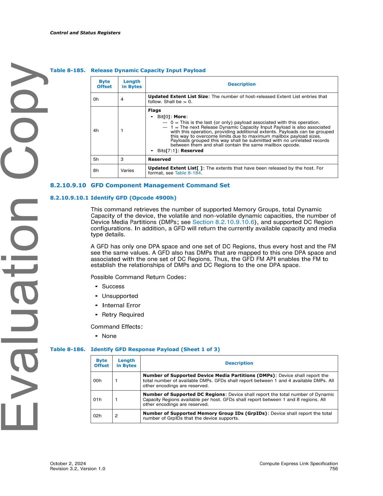
>
> *Original page render @ 150 DPI* — [📄 Full size](figures/chapter_08/page_0756.png)

[⬆️ 返回目录](#-本章目录-part-e)

---

##### 8.2.10.9.10.2 Get GFD Status (Opcode 4901h) | 获取 GFD 状态 (操作码 4901h)

<table>
<thead>
<tr>
<th width="50%">🇬🇧 English</th>
<th width="50%" style="background-color:#e8e8e8">🇨🇳 中文</th>
</tr>
</thead>
<tbody>
<tr><td>This command retrieves the GFD's Status.</td><td style="background-color:#e8e8e8">此命令检索 GFD 的状态。</td></tr>
<tr><td><b>Possible Command Return Codes:</b> • Success • Unsupported • Invalid Input • Internal Error • Retry Required</td><td style="background-color:#e8e8e8"><b>可能的命令返回码:</b> • Success(成功) • Unsupported(不支持) • Invalid Input(无效输入) • Internal Error(内部错误) • Retry Required(需要重试)</td></tr>
<tr><td><b>Command Effects:</b> • None</td><td style="background-color:#e8e8e8"><b>命令效果:</b> • None(无)</td></tr>
</tbody>
</table>

**Table 8-187. Get GFD Status Response Payload (Sheet 1 of 2) | Get GFD Status 响应负载 (第 1 张,共 2 张)**

<table>
<thead>
<tr><th>Byte Offset</th><th>Length in Bytes</th><th>🇬🇧 Description</th><th>🇨🇳 描述</th></tr>
</thead>
<tbody>
<tr><td>0h</td><td>1</td><td>• Bit[0]: Device Fatal: When set, the device has encountered a fatal error. Vendor specific device replacement or recovery is recommended. • Bit[1]: FW Halt: When set, the device has encountered an FW error and is not responding. • Bits[3:2]: Media Status: Describes the status of the device media. — 00b = Not Ready. Media training is incomplete. — 01b = Ready. The media trained successfully and is ready for use. — 10b = Error. The media failed to train or encountered an error. — 11b = Disabled. Access to the media is disabled. If the media is not in the Ready state, user data is not accessible. • Bit[4]: Reserved. • Bits[7:5]: Reset Needed: When nonzero, indicates the least impactful reset type needed to return the device to the operational state. A cold reset is considered more impactful than a warm reset. A warm reset is considered more impactful that a hot reset, which is more impactful than a CXL reset. This field returns a nonzero value if FW Halt is set, Media Status is in the Error or Disabled state, or the Mailbox Interfaces Ready bit does not become set. — 000b = Device is operational and a reset is not required — 001b = Cold Reset — 010b = Warm Reset — 011b = Hot Reset — 100b = CXL Reset (device must not report this value if it does not support CXL Reset) — All other encodings are reserved</td><td>• Bit[0]:Device Fatal(设备致命):设置时,设备遇到致命错误。建议进行供应商特定的设备更换或恢复。 • Bit[1]:FW Halt(FW 停止):设置时,设备遇到 FW 错误且无响应。 • Bits[3:2]:Media Status(介质状态):描述设备介质的状态。 — 00b = Not Ready(未就绪)。介质训练未完成。 — 01b = Ready(就绪)。介质已成功训练并可供使用。 — 10b = Error(错误)。介质训练失败或遇到错误。 — 11b = Disabled(已禁用)。对介质的访问被禁用。如果介质未处于 Ready 状态,则用户数据不可访问。 • Bit[4]:保留。 • Bits[7:5]:Reset Needed(需要复位):非零时,指示将设备恢复到操作状态所需的影响最小的复位类型。Cold Reset 被认为比 Warm Reset 影响更大。Warm Reset 被认为比 Hot Reset 影响更大,Hot Reset 被认为比 CXL Reset 影响更大。如果设置了 FW Halt、Media Status 处于 Error 或 Disabled 状态,或 Mailbox Interfaces Ready 位未变为设置状态,则此字段返回非零值。 — 000b = 设备正在运行,不需要复位 — 001b = Cold Reset — 010b = Warm Reset — 011b = Hot Reset — 100b = CXL Reset(如果设备不支持 CXL Reset,则不得报告此值) — 所有其他编码保留</td></tr>
<tr><td>1h</td><td>1</td><td>• Bits[3:0]: Negotiated Link Mode: — 0h = Connection is not CXL or is disconnected — 1h = RCD mode — 2h = CXL 68B Flit and VH mode — 3h = Standard 256B Flit mode — 4h = CXL Latency-Optimized 256B Flit mode — 5h = PBR mode — All other encodings are reserved • Bits[7:4]: Reserved.</td><td>• Bits[3:0]:Negotiated Link Mode(协商链路模式): — 0h = 连接不是 CXL 或已断开 — 1h = RCD 模式 — 2h = CXL 68B Flit 和 VH 模式 — 3h = 标准 256B Flit 模式 — 4h = CXL 延迟优化的 256B Flit 模式 — 5h = PBR 模式 — 所有其他编码保留 • Bits[7:4]:保留。</td></tr>
<tr><td>2h</td><td>1</td><td>• Bits[5:0]: Maximum Link Width: Value encoding matches the Maximum Link Width field in the PCIe Link Capabilities register in the PCIe Capability structure. • Bits[7:6]: Reserved.</td><td>• Bits[5:0]:Maximum Link Width(最大链路宽度):值编码与 PCIe Capability 结构中 PCIe Link Capabilities 寄存器的 Maximum Link Width 字段相匹配。 • Bits[7:6]:保留。</td></tr>
<tr><td>3h</td><td>1</td><td>• Bits[5:0]: Negotiated Link Width: Value encoding matches the Negotiated Link Width field in PCIe Link Capabilities register in the PCIe Capability structure. • Bits[7:6]: Reserved.</td><td>• Bits[5:0]:Negotiated Link Width(协商的链路宽度):值编码与 PCIe Capability 结构中 PCIe Link Capabilities 寄存器的 Negotiated Link Width 字段相匹配。 • Bits[7:6]:保留。</td></tr>
<tr><td>4h</td><td>1</td><td>• Bits[5:0]: Supported Link Speeds Vector: Value encoding matches the Supported Link Speeds Vector field in the PCIe Link Capabilities 2 register in the PCIe Capability structure. • Bits[7:6]: Reserved.</td><td>• Bits[5:0]:Supported Link Speeds Vector(支持的链路速度向量):值编码与 PCIe Capability 结构中 PCIe Link Capabilities 2 寄存器的 Supported Link Speeds Vector 字段相匹配。 • Bits[7:6]:保留。</td></tr>
<tr><td>5h</td><td>1</td><td>• Bits[5:0]: Max Link Speed: Value encoding matches the Max Link Speed field in the PCIe Link Capabilities register in the PCIe Capability structure. • Bits[7:6]: Reserved.</td><td>• Bits[5:0]:Max Link Speed(最大链路速度):值编码与 PCIe Capability 结构中 PCIe Link Capabilities 寄存器的 Max Link Speed 字段相匹配。 • Bits[7:6]:保留。</td></tr>
<tr><td>6h</td><td>1</td><td>• Bits[5:0]: Current Link Speed: Value encoding matches the Current Link Speed field in the PCIe Link Status register in the PCIe Capability structure. • Bits[7:6]: Reserved.</td><td>• Bits[5:0]:Current Link Speed(当前链路速度):值编码与 PCIe Capability 结构中 PCIe Link Status 寄存器的 Current Link Speed 字段相匹配。 • Bits[7:6]:保留。</td></tr>
<tr><td>7h</td><td>1</td><td>LTSSM State: Current link LTSSM Major state: • 00h = Detect • 01h = Polling • 02h = Configuration • 03h = Recovery • 04h = L0 • 05h = L0s • 06h = L1 • 07h = L2 • 08h = Disabled • 09h = Loopback • 0Ah = Hot Reset • All other encodings are reserved Link substates should be reported through vendor-defined diagnostics commands.</td><td>LTSSM State(LTSSM 状态):当前链路 LTSSM 主要状态: • 00h = Detect • 01h = Polling • 02h = Configuration • 03h = Recovery • 04h = L0 • 05h = L0s • 06h = L1 • 07h = L2 • 08h = Disabled • 09h = Loopback • 0Ah = Hot Reset • 所有其他编码保留 链路子状态应通过供应商定义的诊断命令进行报告。</td></tr>
<tr><td>8h</td><td>1</td><td>First Negotiated Lane Number</td><td>First Negotiated Lane Number(首次协商的通道号)。</td></tr>
<tr><td>9h</td><td>2</td><td>Link State Flags • Bit[0]: Lane Reversal State: — 0 = Standard lane ordering — 1 = Reversed lane ordering • Bit[1]: Port PCIe Reset State (PERST#): — 0 = Not in reset — 1 = In reset • Bit[2]: Port Presence Pin State (PRSNT#): — 0 = Not present — 1 = Present • Bit[3]: Power Control State: — 0 = Power on — 1 = Power off • Bits[15:4]: Reserved</td><td>Link State Flags(链路状态标志): • Bit[0]:Lane Reversal State(通道反转状态): — 0 = 标准通道顺序 — 1 = 反转的通道顺序 • Bit[1]:Port PCIe Reset State (PERST#)(端口 PCIe 复位状态): — 0 = 未处于复位状态 — 1 = 处于复位状态 • Bit[2]:Port Presence Pin State (PRSNT#)(端口存在引脚状态): — 0 = 不存在 — 1 = 存在 • Bit[3]:Power Control State(电源控制状态): — 0 = 电源开启 — 1 = 电源关闭 • Bits[15:4]:保留</td></tr>
</tbody>
</table>

> **Figure 8-X.** Get GFD Status (page 758-760) ｜ Get GFD Status
>
> 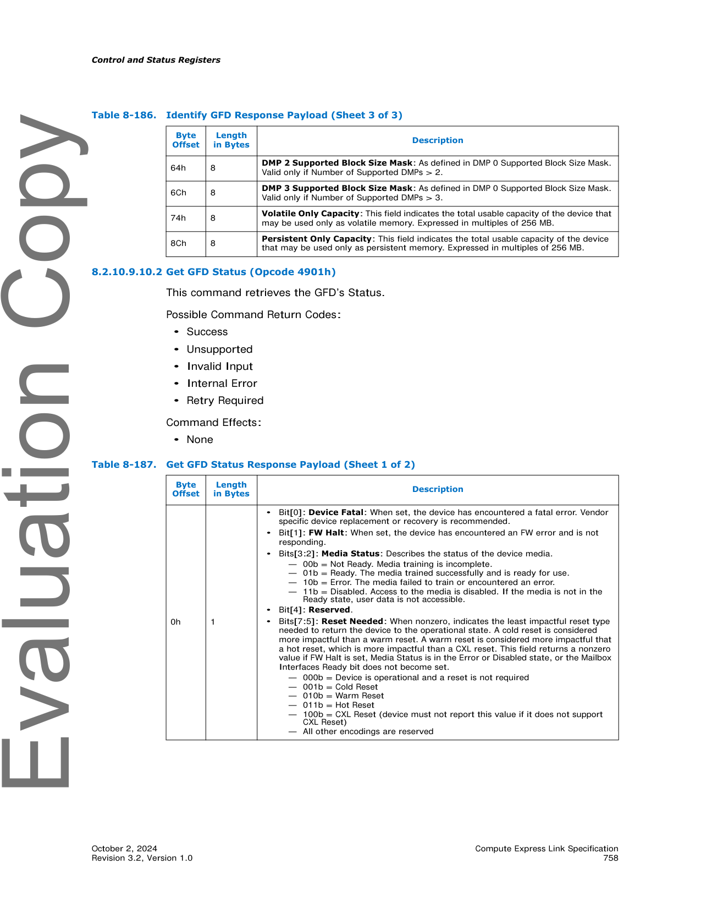
>
> *Original page render @ 150 DPI* — [📄 Full size](figures/chapter_08/page_0758.png)

[⬆️ 返回目录](#-本章目录-part-e)

---

##### 8.2.10.9.10.3 Get GFD DC Region Configuration (Opcode 4902h) | 获取 GFD DC Region 配置 (操作码 4902h)

<table>
<thead>
<tr>
<th width="50%">🇬🇧 English</th>
<th width="50%" style="background-color:#e8e8e8">🇨🇳 中文</th>
</tr>
</thead>
<tbody>
<tr><td>This command retrieves the GFD's Dynamic Capacity Region configurations.</td><td style="background-color:#e8e8e8">此命令检索 GFD 的 Dynamic Capacity Region 配置。</td></tr>
<tr><td><b>Possible Command Return Codes:</b> • Success • Unsupported • Invalid Input • Internal Error • Retry Required</td><td style="background-color:#e8e8e8"><b>可能的命令返回码:</b> • Success(成功) • Unsupported(不支持) • Invalid Input(无效输入) • Internal Error(内部错误) • Retry Required(需要重试)</td></tr>
<tr><td><b>Command Effects:</b> • None</td><td style="background-color:#e8e8e8"><b>命令效果:</b> • None(无)</td></tr>
</tbody>
</table>

**Table 8-188. Get GFD DC Region Configuration Request Payload | Get GFD DC Region Configuration 请求负载**

<table>
<thead>
<tr><th>Byte Offset</th><th>Length in Bytes</th><th>🇬🇧 Description</th><th>🇨🇳 描述</th></tr>
</thead>
<tbody>
<tr><td>0h</td><td>2</td><td>Reserved</td><td>保留</td></tr>
<tr><td>2h</td><td>1</td><td>Region Count: Maximum number of region configurations to return in the response payload.</td><td>Region Count(区域计数):响应负载中要返回的区域配置的最大数量。</td></tr>
<tr><td>3h</td><td>1</td><td>Starting Region Index: Index of the first requested region.</td><td>Starting Region Index(起始区域索引):所请求的第一个区域的索引。</td></tr>
</tbody>
</table>

**Table 8-189. Get GFD DC Region Configuration Response Payload | Get GFD DC Region Configuration 响应负载**

<table>
<thead>
<tr><th>Byte Offset</th><th>Length in Bytes</th><th>🇬🇧 Description</th><th>🇨🇳 描述</th></tr>
</thead>
<tbody>
<tr><td>0h</td><td>2</td><td>Reserved</td><td>保留</td></tr>
<tr><td>2h</td><td>1</td><td>Number of Available Regions: As defined in Get Dynamic Capacity Configuration Output Payload.</td><td>Number of Available Regions(可用区域数):如 Get Dynamic Capacity Configuration 输出负载中所定义。</td></tr>
<tr><td>3h</td><td>1</td><td>Number of Regions Returned: Number of entries in the Region Configuration List.</td><td>Number of Regions Returned(返回的区域数):Region Configuration List 中的条目数。</td></tr>
<tr><td>4h</td><td>Varies</td><td>Region Configuration List: GFD DC Region Info for region specified via Starting Region Index input field. The format of each entry is defined in Table 8-190.</td><td>Region Configuration List(区域配置列表):通过 Starting Region Index 输入字段指定的区域的 GFD DC Region Info。每个条目的格式在 Table 8-190 中定义。</td></tr>
<tr><td>Varies</td><td>4</td><td>Total Number of Supported Extents: Total number of extents that the device supports.</td><td>Total Number of Supported Extents(支持的 Extent 总数):设备支持的 extent 总数。</td></tr>
<tr><td>Varies</td><td>4</td><td>Number of Available Extents: Remaining number of extents that the device supports, as defined in Section 9.13.3.3.</td><td>Number of Available Extents(可用 Extent 数):设备支持的剩余 extent 数,定义见 9.13.3.3 节。</td></tr>
<tr><td>Varies</td><td>4</td><td>Total Number of Supported Tags: Total number of Tag values that the device supports.</td><td>Total Number of Supported Tags(支持的 Tag 总数):设备支持的 Tag 值总数。</td></tr>
<tr><td>Varies</td><td>4</td><td>Number of Available Tags: Remaining number of Tag values that the device supports, as defined in Section 9.13.3.3.</td><td>Number of Available Tags(可用 Tag 数):设备支持的剩余 Tag 值数,定义见 9.13.3.3 节。</td></tr>
</tbody>
</table>

**Table 8-190. GFD DC Region Configuration (Sheet 1 of 2) | GFD DC Region 配置 (第 1 张,共 2 张)**

<table>
<thead>
<tr><th>Byte Offset</th><th>Length in Bytes</th><th>🇬🇧 Description</th><th>🇨🇳 描述</th></tr>
</thead>
<tbody>
<tr><td>00h</td><td>8</td><td>Region Base: As defined in Table 8-180.</td><td>Region Base(区域基址):如 Table 8-180 中所定义。</td></tr>
<tr><td>08h</td><td>8</td><td>Region Decode Length: As defined in Table 8-180.</td><td>Region Decode Length(区域解码长度):如 Table 8-180 中所定义。</td></tr>
<tr><td>10h</td><td>8</td><td>Region Length: As defined in Table 8-180.</td><td>Region Length(区域长度):如 Table 8-180 中所定义。</td></tr>
<tr><td>18h</td><td>8</td><td>Region Block Size: As defined in Table 8-180.</td><td>Region Block Size(区域块大小):如 Table 8-180 中所定义。</td></tr>
<tr><td>20h</td><td>1</td><td>Note: More than one bit may be set at a time. • Bits[1:0]: Reserved • Bit[2]: NonVolatile: As defined in the Flags field of Device Scoped Memory Affinity Structure defined in CDAT Specification • Bit[3]: Sharable: As defined in the Flags field of Device Scoped Memory Affinity Structure defined in CDAT Specification • Bit[4]: Hardware Managed Coherency: As defined in the Flags field of Device Scoped Memory Affinity Structure defined in CDAT Specification • Bit[5]: Interconnect specific Dynamic Capacity Management: As defined in the Flags field of Device Scoped Memory Affinity Structure defined in CDAT Specification • Bit[6]: Read-Only: As defined in the Flags field of Device Scoped Memory Affinity Structure defined in CDAT Specification • Bit[7]: Reserved</td><td>注:可一次设置多个位。 • Bits[1:0]:保留 • Bit[2]:NonVolatile(非易失性):如 CDAT 规范中定义的 Device Scoped Memory Affinity Structure 的 Flags 字段中所定义 • Bit[3]:Sharable(可共享):如 CDAT 规范中定义的 Device Scoped Memory Affinity Structure 的 Flags 字段中所定义 • Bit[4]:Hardware Managed Coherency(硬件管理一致性):如 CDAT 规范中定义的 Device Scoped Memory Affinity Structure 的 Flags 字段中所定义 • Bit[5]:Interconnect specific Dynamic Capacity Management(互连特定的动态容量管理):如 CDAT 规范中定义的 Device Scoped Memory Affinity Structure 的 Flags 字段中所定义 • Bit[6]:Read-Only(只读):如 CDAT 规范中定义的 Device Scoped Memory Affinity Structure 的 Flags 字段中所定义 • Bit[7]:保留</td></tr>
<tr><td>21h</td><td>3</td><td>Reserved</td><td>保留</td></tr>
<tr><td>24h</td><td>1</td><td>• Bit[0]: Sanitize on Release: As defined in Table 8-180 • Bits[7:1]: Reserved</td><td>• Bit[0]:Sanitize on Release(发布时清理):如 Table 8-180 中所定义 • Bits[7:1]:保留</td></tr>
<tr><td>25h</td><td>3</td><td>Reserved</td><td>保留</td></tr>
</tbody>
</table>

> **Figure 8-X.** Get GFD DC Region Configuration (page 760-761) ｜ Get GFD DC Region Configuration
>
> 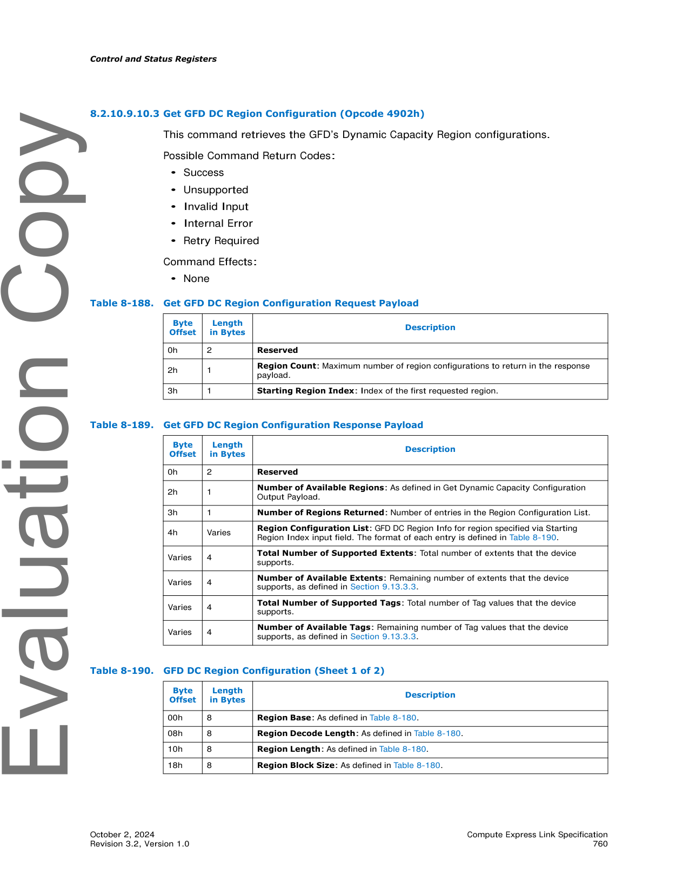
>
> *Original page render @ 150 DPI* — [📄 Full size](figures/chapter_08/page_0760.png)

[⬆️ 返回目录](#-本章目录-part-e)

---

##### 8.2.10.9.10.4 Set GFD DC Region Configuration (Opcode 4903h) | 设置 GFD DC Region 配置 (操作码 4903h)

<table>
<thead>
<tr>
<th width="50%">🇬🇧 English</th>
<th width="50%" style="background-color:#e8e8e8">🇨🇳 中文</th>
</tr>
</thead>
<tbody>
<tr><td>This command sets the configuration of a DC Region. For a GFD, this command will set not only the block size, but the region base DPA, the region length, and the region decode length because these parameters are tied to the GFD's Device Memory Partitions.</td><td style="background-color:#e8e8e8">此命令设置 DC Region 的配置。对于 GFD,此命令不仅会设置块大小,还会设置 region base DPA、region length 和 region decode length,因为这些参数与 GFD 的 Device Memory Partitions 相关联。</td></tr>
<tr><td>This command shall fail with Unsupported when the Sanitize on Release field does not match the region's configuration, as reported from the Get GFD DC Region Configuration, and the device does not support reconfiguration of the Sanitize on Release setting, as advertised by the Sanitize on Release Configuration Support Mask in the Identify GFD response payload.</td><td style="background-color:#e8e8e8">当 Sanitize on Release 字段与 Get GFD DC Region Configuration 报告的区域配置不匹配,且设备不支持 Sanitize on Release 设置的重新配置(由 Identify GFD 响应负载中的 Sanitize on Release Configuration Support Mask 公布)时,此命令应失败并返回 Unsupported。</td></tr>
<tr><td><b>Possible Command Return Codes:</b> • Success • Unsupported • Invalid Input • Internal Error • Retry Required</td><td style="background-color:#e8e8e8"><b>可能的命令返回码:</b> • Success(成功) • Unsupported(不支持) • Invalid Input(无效输入) • Internal Error(内部错误) • Retry Required(需要重试)</td></tr>
<tr><td><b>Command Effects:</b> • Configuration Change after Cold Reset • Immediate Configuration Change • Immediate Data Change</td><td style="background-color:#e8e8e8"><b>命令效果:</b> • Configuration Change after Cold Reset(Cold Reset 后配置更改) • Immediate Configuration Change(立即配置更改) • Immediate Data Change(立即数据更改)</td></tr>
</tbody>
</table>

**Table 8-191. Set GFD DC Region Configuration Request Payload (Sheet 1 of 2) | Set GFD DC Region Configuration 请求负载 (第 1 张,共 2 张)**

<table>
<thead>
<tr><th>Byte Offset</th><th>Length in Bytes</th><th>🇬🇧 Description</th><th>🇨🇳 描述</th></tr>
</thead>
<tbody>
<tr><td>00h</td><td>1</td><td>Region ID: Specifies which region to configure. Valid range is from 0 to 7.</td><td>Region ID(区域 ID):指定要配置的区域。有效范围为 0 到 7。</td></tr>
<tr><td>01h</td><td>3</td><td>Reserved</td><td>保留</td></tr>
<tr><td>04h</td><td>8</td><td>Region Block Size: As defined in Table 8-180.</td><td>Region Block Size(区域块大小):如 Table 8-180 中所定义。</td></tr>
</tbody>
</table>

> **Figure 8-X.** Set GFD DC Region Configuration (page 761-762) ｜ Set GFD DC Region Configuration
>
> 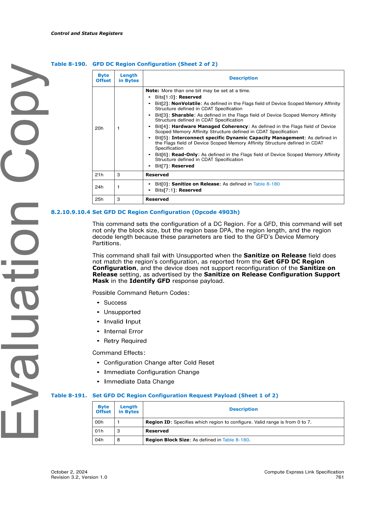
>
> *Original page render @ 150 DPI* — [📄 Full size](figures/chapter_08/page_0761.png)

[⬆️ 返回目录](#-本章目录-part-e)

---

##### 8.2.10.9.10.5 Get GFD DC Region Extent Lists (Opcode 4904h) | 获取 GFD DC Region Extent Lists (操作码 4904h)

<table>
<thead>
<tr>
<th width="50%">🇬🇧 English</th>
<th width="50%" style="background-color:#e8e8e8">🇨🇳 中文</th>
</tr>
</thead>
<tbody>
<tr><td>This command retrieves the Dynamic Capacity Extent List for a specified Memory Group ID (GrpID). This command shall fail with 'Invalid Input' if proxied from a host with no access rights to the specified Memory Group.</td><td style="background-color:#e8e8e8">此命令检索指定 Memory Group ID (GrpID) 的 Dynamic Capacity Extent List。如果从对指定 Memory Group 没有访问权限的主机代理,则此命令应失败并返回 'Invalid Input'。</td></tr>
<tr><td><b>Possible Command Return Codes:</b> • Success • Unsupported • Invalid Input • Internal Error • Retry Required</td><td style="background-color:#e8e8e8"><b>可能的命令返回码:</b> • Success(成功) • Unsupported(不支持) • Invalid Input(无效输入) • Internal Error(内部错误) • Retry Required(需要重试)</td></tr>
<tr><td><b>Command Effects:</b> • None</td><td style="background-color:#e8e8e8"><b>命令效果:</b> • None(无)</td></tr>
</tbody>
</table>

**Table 8-192. Get GFD DC Region Extent Lists Request Payload | Get GFD DC Region Extent Lists 请求负载**

<table>
<thead>
<tr><th>Byte Offset</th><th>Length in Bytes</th><th>🇬🇧 Description</th><th>🇨🇳 描述</th></tr>
</thead>
<tbody>
<tr><td>0h</td><td>2</td><td>GrpID: GFD's Memory Group ID for which the Extent List is requested.</td><td>GrpID:请求 Extent List 的 GFD Memory Group ID。</td></tr>
<tr><td>2h</td><td>2</td><td>Reserved</td><td>保留</td></tr>
<tr><td>4h</td><td>4</td><td>Extent Count: Maximum number of extents to return in the output payload. The device may not return more extents than requested; however, the device can return fewer extents. 0 is valid and allows the FM to retrieve the Total Extent Count and Extent List Generation Number without retrieving any extent data.</td><td>Extent Count(Extent 计数):输出负载中要返回的 extent 的最大数量。设备可能不会返回多于请求的 extent;但是,设备可以返回较少的 extent。0 是有效的,允许 FM 检索 Total Extent Count 和 Extent List Generation Number,而不检索任何 extent 数据。</td></tr>
<tr><td>8h</td><td>4</td><td>Starting Extent Index: Index of the first requested extent. A value of 0 will retrieve the first extent in the list.</td><td>Starting Extent Index(起始 Extent 索引):所请求的第一个 extent 的索引。值 0 将检索列表中的第一个 extent。</td></tr>
</tbody>
</table>

**Table 8-193. Get GFD DC Region Extent Lists Response Payload (Sheet 1 of 2) | Get GFD DC Region Extent Lists 响应负载 (第 1 张,共 2 张)**

<table>
<thead>
<tr><th>Byte Offset</th><th>Length in Bytes</th><th>🇬🇧 Description</th><th>🇨🇳 描述</th></tr>
</thead>
<tbody>
<tr><td>00h</td><td>2</td><td>GrpID: GFD's Memory Group ID for which the Extent List is requested.</td><td>GrpID:请求 Extent List 的 GFD Memory Group ID。</td></tr>
<tr><td>02h</td><td>2</td><td>Reserved</td><td>保留</td></tr>
<tr><td>04h</td><td>4</td><td>Starting Extent Index: Index of the first extent in the list.</td><td>Starting Extent Index(起始 Extent 索引):列表中第一个 extent 的索引。</td></tr>
<tr><td>08h</td><td>4</td><td>Returned Extent Count: Number of extents returned in Extent List[ ].</td><td>Returned Extent Count(返回的 Extent 数):Extent List[] 中返回的 extent 数。</td></tr>
<tr><td>0Ch</td><td>4</td><td>Total Extent Count: Total number of extents in the list for the given GrpID.</td><td>Total Extent Count(Extent 总数):给定 GrpID 的列表中的 extent 总数。</td></tr>
<tr><td>10h</td><td>4</td><td>Extent List Generation Number: Device-generated value that is used to indicate that the list has changed.</td><td>Extent List Generation Number(Extent List 生成号):设备生成的值,用于指示列表已更改。</td></tr>
<tr><td>14h</td><td>4</td><td>Reserved</td><td>保留</td></tr>
<tr><td>18h</td><td>Varies</td><td>Extent List[ ]: Extent list for the specified Memory Group as defined in Table 8-63.</td><td>Extent List:如 Table 8-63 中所定义的指定 Memory Group 的 extent 列表。</td></tr>
</tbody>
</table>

> **Figure 8-X.** Get GFD DC Region Extent Lists (page 762-763) ｜ Get GFD DC Region Extent Lists
>
> 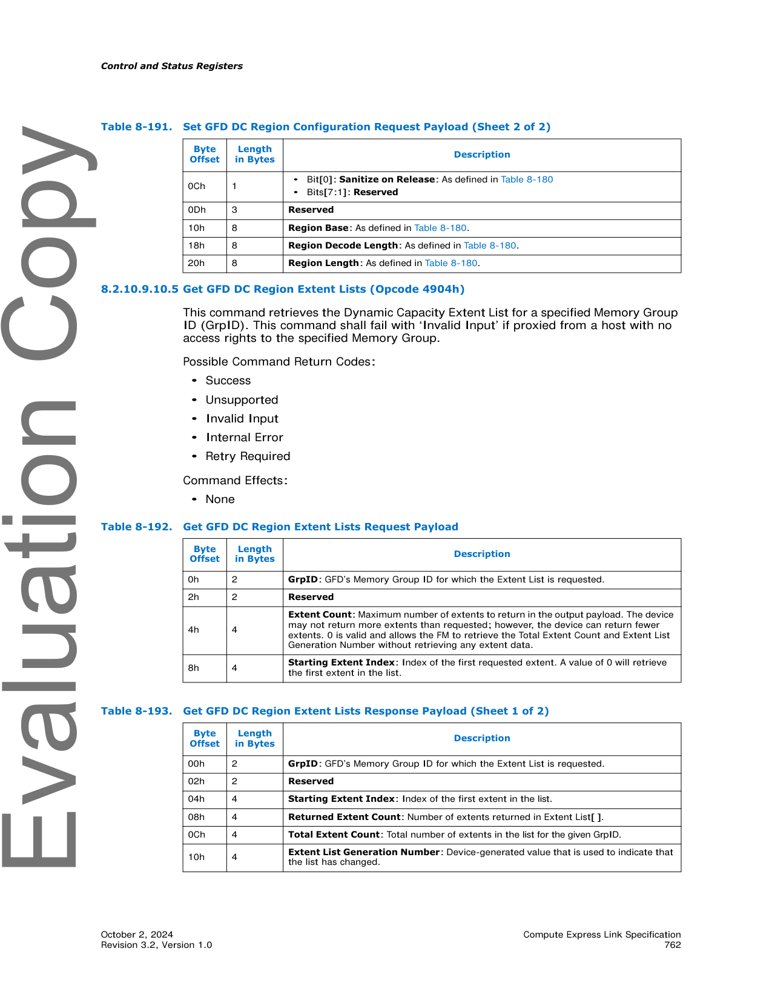
>
> *Original page render @ 150 DPI* — [📄 Full size](figures/chapter_08/page_0762.png)

[⬆️ 返回目录](#-本章目录-part-e)

---

##### 8.2.10.9.10.6 Get GFD DMP Configuration (Opcode 4905h) | 获取 GFD DMP 配置 (操作码 4905h)

<table>
<thead>
<tr>
<th width="50%">🇬🇧 English</th>
<th width="50%" style="background-color:#e8e8e8">🇨🇳 中文</th>
</tr>
</thead>
<tbody>
<tr><td>This command retrieves the GFD's Device Memory Partition configurations. A GFD's DMP configuration details are a mix of attributes that are set by the device based on media attributes and quantities, and those that are set by the FM to organize the available media capacities into associated DPA ranges.</td><td style="background-color:#e8e8e8">此命令检索 GFD 的 Device Memory Partition 配置。GFD 的 DMP 配置详细信息是设备基于介质属性和数量设置的属性与 FM 设置以将可用介质容量组织为关联 DPA 范围的属性的混合。</td></tr>
<tr><td>On a GFD, DC Region block size and memory attributes shall align with those of the DMP that sources the media capacity. To which DMP a given DC Region is associated is determined by the respective DPA ranges claimed.</td><td style="background-color:#e8e8e8">在 GFD 上,DC Region 块大小和内存属性应与提供介质容量的 DMP 的属性一致。给定的 DC Region 与哪个 DMP 关联由所声明的各 DPA 范围决定。</td></tr>
<tr><td><b>Possible Command Return Codes:</b> • Success • Unsupported • Invalid Input • Internal Error • Retry Required</td><td style="background-color:#e8e8e8"><b>可能的命令返回码:</b> • Success(成功) • Unsupported(不支持) • Invalid Input(无效输入) • Internal Error(内部错误) • Retry Required(需要重试)</td></tr>
<tr><td><b>Command Effects:</b> • None</td><td style="background-color:#e8e8e8"><b>命令效果:</b> • None(无)</td></tr>
</tbody>
</table>

**Table 8-194. Get GFD DMP Configuration Request Payload | Get GFD DMP Configuration 请求负载**

<table>
<thead>
<tr><th>Byte Offset</th><th>Length in Bytes</th><th>🇬🇧 Description</th><th>🇨🇳 描述</th></tr>
</thead>
<tbody>
<tr><td>0h</td><td>2</td><td>Reserved</td><td>保留</td></tr>
<tr><td>2h</td><td>1</td><td>DMP Count: Maximum number of DMP configurations to return in the response payload. Value should be >0 and less than (Max DMPs Supported).</td><td>DMP Count(DMP 计数):响应负载中要返回的 DMP 配置的最大数量。值应 > 0 且小于(Max DMPs Supported)。</td></tr>
<tr><td>3h</td><td>1</td><td>Starting DMP Index: Index of the first requested DMP. An index of 0 shall return the configuration of the 1st DMP.</td><td>Starting DMP Index(起始 DMP 索引):所请求的第一个 DMP 的索引。索引 0 应返回第 1 个 DMP 的配置。</td></tr>
</tbody>
</table>

**Table 8-195. Get GFD DMP Configuration Response Payload | Get GFD DMP Configuration 响应负载**

<table>
<thead>
<tr><th>Byte Offset</th><th>Length in Bytes</th><th>🇬🇧 Description</th><th>🇨🇳 描述</th></tr>
</thead>
<tbody>
<tr><td>0h</td><td>2</td><td>Reserved</td><td>保留</td></tr>
<tr><td>2h</td><td>1</td><td>Number of Available DMPs: As defined in Get GFD DCD Info response.</td><td>Number of Available DMPs(可用 DMP 数):如 Get GFD DCD Info 响应中所定义。</td></tr>
<tr><td>3h</td><td>1</td><td>Number of DMP Configurations Returned: The number of entries in the DMP Configuration List.</td><td>Number of DMP Configurations Returned(返回的 DMP 配置数):DMP Configuration List 中的条目数。</td></tr>
<tr><td>4h</td><td>Varies</td><td>DMP Configuration List[ ]: DMP Info for region specified via Starting DMP Index input field. The format of each entry is defined in Table 8-196.</td><td>DMP Configuration List:通过 Starting DMP Index 输入字段指定的区域的 DMP Info。每个条目的格式在 Table 8-196 中定义。</td></tr>
</tbody>
</table>

> **Figure 8-X.** Get GFD DMP Configuration (page 763-764) ｜ Get GFD DMP Configuration
>
> 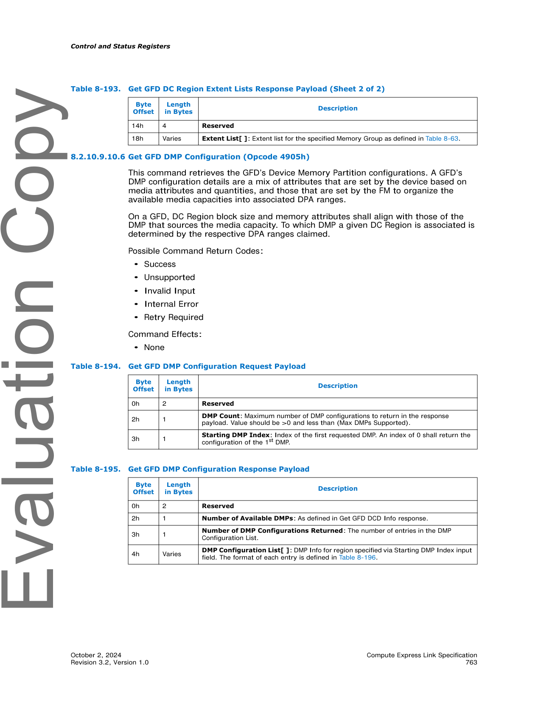
>
> *Original page render @ 150 DPI* — [📄 Full size](figures/chapter_08/page_0763.png)

[⬆️ 返回目录](#-本章目录-part-e)

---

##### 8.2.10.9.10.7 Set GFD DMP Configuration (Opcode 4906h) | 设置 GFD DMP 配置 (操作码 4906h)

<table>
<thead>
<tr>
<th width="50%">🇬🇧 English</th>
<th width="50%" style="background-color:#e8e8e8">🇨🇳 中文</th>
</tr>
</thead>
<tbody>
<tr><td>This command sets the configuration of a DMP. For a GFD, this command will set not only the block size, but the DMP base DPA, the region length, and the region decode length. This command does not set the media attributes as those are supplied by the device. This command is intended for use only at initial configuration of a GFD, or when the target DMP's current claimed DPA range is not in use (no valid bits set in the DMP's associated GDT entries).</td><td style="background-color:#e8e8e8">此命令设置 DMP 的配置。对于 GFD,此命令不仅会设置块大小,还会设置 DMP base DPA、region length 和 region decode length。此命令不设置介质属性,因为介质属性由设备提供。此命令仅用于 GFD 的初始配置,或当目标 DMP 当前声明的 DPA 范围未被使用时(DMP 关联的 GDT 条目中未设置有效位)。</td></tr>
<tr><td>This command shall fail with Invalid Input when the device has any defined Memory Groups active in the DMP's decoded DPA range.</td><td style="background-color:#e8e8e8">当设备在 DMP 的解码 DPA 范围内有任何已定义的 Memory Groups 处于活动状态时,此命令应失败并返回 Invalid Input。</td></tr>
<tr><td><b>Possible Command Return Codes:</b> • Success • Unsupported • Invalid Input • Internal Error • Retry Required</td><td style="background-color:#e8e8e8"><b>可能的命令返回码:</b> • Success(成功) • Unsupported(不支持) • Invalid Input(无效输入) • Internal Error(内部错误) • Retry Required(需要重试)</td></tr>
<tr><td><b>Command Effects:</b> • Immediate Configuration Change</td><td style="background-color:#e8e8e8"><b>命令效果:</b> • Immediate Configuration Change(立即配置更改)</td></tr>
</tbody>
</table>

**Table 8-196. GFD DMP Configuration | GFD DMP 配置**

<table>
<thead>
<tr><th>Byte Offset</th><th>Length in Bytes</th><th>🇬🇧 Description</th><th>🇨🇳 描述</th></tr>
</thead>
<tbody>
<tr><td>00h</td><td>8</td><td>DMP Base: As defined for DC Regions in Table 8-180.</td><td>DMP Base(DMP 基址):如 Table 8-180 中为 DC Regions 所定义。</td></tr>
<tr><td>08h</td><td>8</td><td>DMP Decode Length: As defined for DC Regions in Table 8-180.</td><td>DMP Decode Length(DMP 解码长度):如 Table 8-180 中为 DC Regions 所定义。</td></tr>
<tr><td>10h</td><td>8</td><td>DMP Length: As defined for DC Regions in Table 8-180 (expected to be the same as DMP Decode Length).</td><td>DMP Length(DMP 长度):如 Table 8-180 中为 DC Regions 所定义(预期与 DMP Decode Length 相同)。</td></tr>
<tr><td>18h</td><td>8</td><td>DMP Block Size: As defined for DC Regions in Table 8-180.</td><td>DMP Block Size(DMP 块大小):如 Table 8-180 中为 DC Regions 所定义。</td></tr>
<tr><td>20h</td><td>1</td><td>Note: More than one bit may be set at a time. • Bits[1:0]: Reserved • Bit[2]: NonVolatile: As defined in the Flags field of Device Scoped Memory Affinity Structure defined in Coherent Device Attribute Table (CDAT) Specification • Bit[3]: Sharable: As defined in the Flags field of Device Scoped Memory Affinity Structure defined in CDAT Specification • Bit[4]: Hardware Managed Coherency: As defined in the Flags field of Device Scoped Memory Affinity Structure defined in CDAT Specification • Bit[5]: Interconnect specific Dynamic Capacity Management: As defined in the Flags field of Device Scoped Memory Affinity Structure defined in CDAT Specification • Bit[6]: Read-Only: As defined in the Flags field of Device Scoped Memory Affinity Structure defined in CDAT Specification • Bit[7]: Reserved</td><td>注:可一次设置多个位。 • Bits[1:0]:保留 • Bit[2]:NonVolatile(非易失性):如 Coherent Device Attribute Table (CDAT) 规范中定义的 Device Scoped Memory Affinity Structure 的 Flags 字段中所定义 • Bit[3]:Sharable(可共享):如 CDAT 规范中定义的 Device Scoped Memory Affinity Structure 的 Flags 字段中所定义 • Bit[4]:Hardware Managed Coherency(硬件管理一致性):如 CDAT 规范中定义的 Device Scoped Memory Affinity Structure 的 Flags 字段中所定义 • Bit[5]:Interconnect specific Dynamic Capacity Management(互连特定的动态容量管理):如 CDAT 规范中定义的 Device Scoped Memory Affinity Structure 的 Flags 字段中所定义 • Bit[6]:Read-Only(只读):如 CDAT 规范中定义的 Device Scoped Memory Affinity Structure 的 Flags 字段中所定义 • Bit[7]:保留</td></tr>
<tr><td>21h</td><td>1</td><td>DMP Index: Index of this DMP.</td><td>DMP Index(DMP 索引):此 DMP 的索引。</td></tr>
<tr><td>22h</td><td>2</td><td>Reserved</td><td>保留</td></tr>
<tr><td>24h</td><td>1</td><td>• Bit[0]: Sanitize on Release: As defined in Table 8-180 • Bits[7:1]: Reserved</td><td>• Bit[0]:Sanitize on Release(发布时清理):如 Table 8-180 中所定义 • Bits[7:1]:保留</td></tr>
<tr><td>25h</td><td>3</td><td>Reserved</td><td>保留</td></tr>
</tbody>
</table>

**Table 8-197. Set GFD DMP Configuration Request Payload | Set GFD DMP Configuration 请求负载**

<table>
<thead>
<tr><th>Byte Offset</th><th>Length in Bytes</th><th>🇬🇧 Description</th><th>🇨🇳 描述</th></tr>
</thead>
<tbody>
<tr><td>0h</td><td>2</td><td>Reserved</td><td>保留</td></tr>
<tr><td>2h</td><td>1</td><td>DMP Count: Number of DMP configurations that are described in the DMP_List[ ]. Value should be >0 and not more than (Max DMPs Supported).</td><td>DMP Count(DMP 计数):DMP_List[] 中描述的 DMP 配置数。值应 > 0 且不超过(Max DMPs Supported)。</td></tr>
<tr><td>3h</td><td>1</td><td>Starting DMP Index: Index of the first requested DMP. An index of 0 shall return the configuration of the 1st DMP.</td><td>Starting DMP Index(起始 DMP 索引):所请求的第一个 DMP 的索引。索引 0 应返回第 1 个 DMP 的配置。</td></tr>
<tr><td>4h</td><td>Varies</td><td>DMP Configuration List[ ]: Info for DMP specified via Starting DMP Index input field. The format of each entry is defined in Table 8-196.</td><td>DMP Configuration List:通过 Starting DMP Index 输入字段指定的 DMP 的 Info。每个条目的格式在 Table 8-196 中定义。</td></tr>
</tbody>
</table>

> **Figure 8-X.** Set GFD DMP Configuration (page 764-765) ｜ Set GFD DMP Configuration
>
> 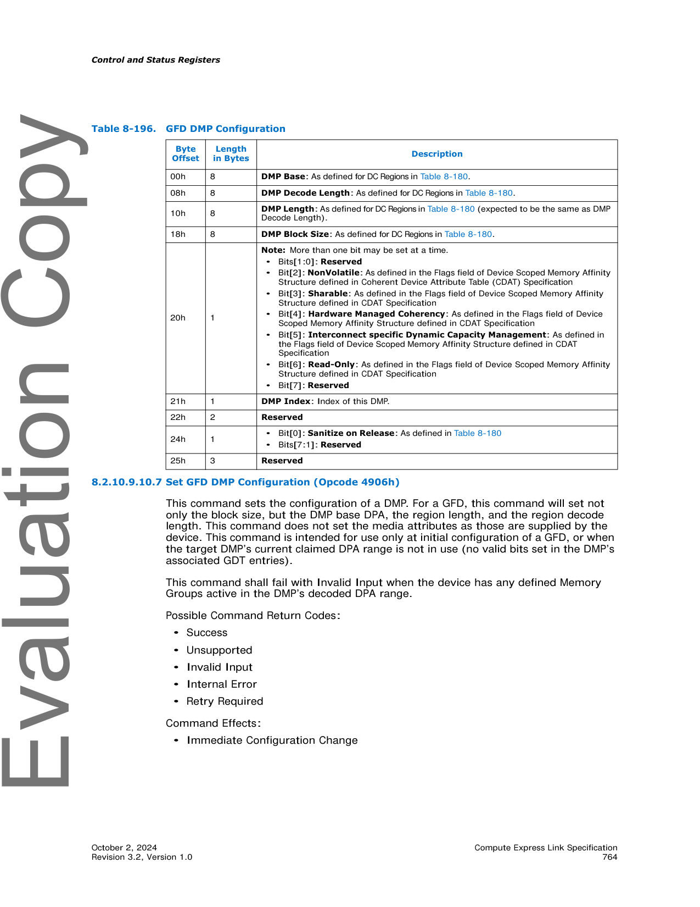
>
> *Original page render @ 150 DPI* — [📄 Full size](figures/chapter_08/page_0764.png)

[⬆️ 返回目录](#-本章目录-part-e)

---

##### 8.2.10.9.10.8 GFD Dynamic Capacity Add (Opcode 4907h) | GFD 动态容量添加 (操作码 4907h)

<table>
<thead>
<tr>
<th width="50%">🇬🇧 English</th>
<th width="50%" style="background-color:#e8e8e8">🇨🇳 中文</th>
</tr>
</thead>
<tbody>
<tr><td>This command adds Dynamic Capacity to the specified Memory Group ID (GrpID). It returns the list of all DC Extents that are mapped to the Memory Group ID.</td><td style="background-color:#e8e8e8">此命令将 Dynamic Capacity 添加到指定的 Memory Group ID (GrpID)。它返回映射到 Memory Group ID 的所有 DC Extent 的列表。</td></tr>
<tr><td>A Selection Policy is specified to govern the device's selection of which memory resources to add: • Free: Unassigned extents are selected by the device, with no requirement for contiguous blocks • Contiguous: Unassigned extents are selected by the device and shall be contiguous • Prescriptive: Extent list of capacity to assign is included in the request payload • Enable Shared Access: Enable access to extent(s) previously added to another Memory Group in a region that reports the "Sharable" flag, as designated by the specified tag value</td><td style="background-color:#e8e8e8">指定 Selection Policy 以管理设备对要添加的内存资源的选择: • Free(空闲):由设备选择未分配的 extent,不要求连续块 • Contiguous(连续):由设备选择未分配的 extent,且应连续 • Prescriptive(指定):要分配的容量的 extent 列表包含在请求负载中 • Enable Shared Access(启用共享访问):启用对先前添加到报告"Sharable"标志的区域中另一个 Memory Group 的 extent 的访问,由指定的 tag 值指定</td></tr>
<tr><td>The FM might use the following example sequence to set up sharing of GFD Memory Groups between hosts: • Issue GFD Dynamic Capacity Add Request with the GrpID for the associated Memory Group. The DC Region number must correspond to a region that is advertised as sharable and has the required memory attributes. • If the above request is successful, all allowed hosts can be enabled for access to the new memory group, using the Set GFD SAT commands (see Section 7.7.2.5). • The Set GFD SAT commands enable access by specific hosts to specific Memory Groups. The FM may enable the GFD to send a GFD Asynchronous Message VDM to the impacted hosts upon completion of a Set GFD SAT command. This notification causes each impacted host to reread the associated Extent Lists and thus learn of newly shared Extents.</td><td style="background-color:#e8e8e8">FM 可以使用以下示例序列来设置主机之间 GFD Memory Groups 的共享: • 使用关联 Memory Group 的 GrpID 发出 GFD Dynamic Capacity Add 请求。DC Region 编号必须对应于公布为可共享且具有所需内存属性的区域。 • 如果上述请求成功,可以使用 Set GFD SAT 命令(请参阅 7.7.2.5 节)为所有允许的主机启用对新内存组的访问。 • Set GFD SAT 命令启用特定主机对特定 Memory Groups 的访问。FM 可以使 GFD 在 Set GFD SAT 命令完成时向受影响的主机发送 GFD Asynchronous Message VDM。此通知使每个受影响的主机重新读取关联的 Extent Lists,从而了解新共享的 Extent。</td></tr>
<tr><td>If the FM is adding capacity to an already defined Memory Group, the current users (if any) of the Group are not automatically notified of a change in capacity. The FM can trigger such notifications from the GFD to the impacted hosts by reissuing the Set GFD SAT Entry command for each host with the Notify RPID bit set to 1 (see Section 8.2.10.9.10.14).</td><td style="background-color:#e8e8e8">如果 FM 正在向已定义的 Memory Group 添加容量,则该组的当前用户(如果有)不会自动收到容量更改的通知。FM 可以通过对每个主机的 Set GFD SAT Entry 命令重新发布 Notify RPID 位设置为 1 来触发从 GFD 到受影响的主机的此类通知(请参阅 8.2.10.9.10.14 节)。</td></tr>
<tr><td>The FM might use the following example sequence to allocate a set of tagged capacity and allow it to be initialized by a host in one Memory Group and then shared with one or more hosts as read-only in another sharable region. 1. Issue a GFD Dynamic Capacity Add with the Selection Policy set to Free or Contiguous or Prescriptive, with the Memory Group ID associated with the first host. The region number must correspond to a region that is advertised as writable and sharable. 2. If the above request is successful, the tagged sharable capacity can be initialized by the first host. 3. Issue a GFD Dynamic Capacity Add Reference for the tag associated with the capacity. Holding this Reference prevents the tagged capacity from being freed and sanitized in step 4. 4. After the first host has initialized the tagged sharable capacity, issue GFD Dynamic Capacity Release for the tag associated with the capacity. The capacity associated with the Tag is preserved but is not accessible from any Memory Groups. 5. Issue GFD Dynamic Capacity Add with Selection Policy set to Enable Shared Access with the Memory Group ID associated with the second host, specifying a region that is Sharable and read-only. The Tag field must match the Tag value used in step 1. 6. Any other hosts that need to share the tagged capacity can be added to the Memory Group specified in step 5. 7. Issue a GFD Dynamic Capacity Remove Reference to remove the FM reference to the tagged capacity. 8. To withdraw the shared capacity, issue a GFD Dynamic Capacity Release command for the Memory Group. 9. When the tagged capacity has been released from all hosts, if the FM does not hold a reference, the tagged capacity will be sanitized (if appropriate) and freed, at which point the tag no longer exists and the capacity is available for future use.</td><td style="background-color:#e8e8e8">FM 可以使用以下示例序列来分配一组标记的容量,并允许它由一个 Memory Group 中的主机初始化,然后在另一个可共享区域中与一个或多个主机共享为只读。 1. 使用设置为 Free、Contiguous 或 Prescriptive 的 Selection Policy,使用与第一个主机关联的 Memory Group ID 发出 GFD Dynamic Capacity Add。区域编号必须对应于公布为可写且可共享的区域。 2. 如果上述请求成功,标记的可共享容量可由第一个主机初始化。 3. 为与该容量关联的 tag 发出 GFD Dynamic Capacity Add Reference。保持此引用可防止标记的容量在步骤 4 中被释放和清理。 4. 在第一个主机初始化了标记的可共享容量后,为与该容量关联的 tag 发出 GFD Dynamic Capacity Release。与 Tag 关联的容量被保留,但不能从任何 Memory Groups 访问。 5. 使用设置为 Enable Shared Access 的 Selection Policy,使用与第二个主机关联的 Memory Group ID 发出 GFD Dynamic Capacity Add,指定可共享且只读的区域。Tag 字段必须与步骤 1 中使用的 Tag 值匹配。 6. 需要共享标记容量的任何其他主机可以添加到步骤 5 中指定的 Memory Group。 7. 发出 GFD Dynamic Capacity Remove Reference 以删除 FM 对标记容量的引用。 8. 要撤回共享的容量,请为 Memory Group 发出 GFD Dynamic Capacity Release 命令。 9. 当标记的容量已从所有主机释放后,如果 FM 不保留引用,则标记的容量将被清理(如适用)并释放,此时 tag 不再存在,容量可供将来使用。</td></tr>
<tr><td>The command shall fail with Invalid Input under the following conditions: • When the command is sent with an invalid Memory Group ID, or an invalid region number, or an unsupported Selection Policy • When the Length field is not a multiple of the Block size</td><td style="background-color:#e8e8e8">在以下情况下,此命令应失败并返回 Invalid Input: • 当命令使用无效的 Memory Group ID、无效的区域编号或不受支持的 Selection Policy 发送时 • 当 Length 字段不是块大小的倍数时</td></tr>
<tr><td>The command, with selection policy Enable Shared Access, shall also fail with Invalid Input under the following conditions: • When the specified region is not Sharable • When the tagged capacity is already mapped to any Host Group via a non-Sharable region • When the tagged capacity cannot be added to the requested region due to device-imposed restrictions • When the same tagged capacity is currently accessible by the same Memory Group</td><td style="background-color:#e8e8e8">使用 selection policy Enable Shared Access 的命令在以下情况下也应失败并返回 Invalid Input: • 当指定区域不可共享时 • 当标记的容量已通过不可共享区域映射到任何 Host Group 时 • 由于设备施加的限制,标记的容量无法添加到所请求的区域时 • 当同一标记的容量当前可由同一 Memory Group 访问时</td></tr>
<tr><td>The command shall fail with Retry Required when the device determines that its FM CCI interface is already busy and cannot queue this command for execution at this time. (Forward progress of retried commands is beyond the scope of this specification.)</td><td style="background-color:#e8e8e8">当设备确定其 FM CCI 接口已忙且此时无法将命令排队等待执行时,此命令应失败并返回 Retry Required。(重试命令的前进进度不在本规范的范围内。)</td></tr>
<tr><td>The command shall fail with Invalid Extent List under the following conditions: • When the Selection Policy is set to Prescriptive and the Extent Count is invalid • When the Selection Policy is set to Prescriptive and any of the DPAs are already accessible to the same Host Group</td><td style="background-color:#e8e8e8">在以下情况下,此命令应失败并返回 Invalid Extent List: • 当 Selection Policy 设置为 Prescriptive 且 Extent Count 无效时 • 当 Selection Policy 设置为 Prescriptive 且任何 DPA 已可由同一 Host Group 访问时</td></tr>
<tr><td>The command shall fail with Resources Exhausted under the following conditions: • When the length of the added capacity plus the current capacity present in all extents associated with the specified region exceeds the decode length for that region. • If the total capacity requested cannot be added. The GFD shall not partially fulfill a GFD Dynamic Capacity Add request. These requests are 'All or Nothing' in nature, and the device shall atomically update impacted Extent Lists and Memory Groups upon success or leave them unchanged upon failure. • There is insufficient contiguous space to satisfy a request with Selection Policy set to Contiguous.</td><td style="background-color:#e8e8e8">在以下情况下,此命令应失败并返回 Resources Exhausted: • 当所添加容量的长度加上与指定区域关联的所有 extent 中存在的当前容量超过该区域的解码长度时。 • 如果无法添加请求的总容量。GFD 不应部分满足 GFD Dynamic Capacity Add 请求。这些请求本质上是"全有或全无",设备应在成功时以原子方式更新受影响的 Extent Lists 和 Memory Groups,或在失败时使其保持不变。 • 没有足够的连续空间来满足 Selection Policy 设置为 Contiguous 的请求。</td></tr>
<tr><td>The device shall report Resources Exhausted if the Updated Extent List would cause the device to exceed its extent tracking ability.</td><td style="background-color:#e8e8e8">如果 Updated Extent List 会导致设备超出其 extent 跟踪能力,设备应报告 Resources Exhausted。</td></tr>
<tr><td><b>Possible Command Return Codes:</b> • Success • Unsupported • Invalid Input • Internal Error • Retry Required • Invalid Extent List • Resources Exhausted</td><td style="background-color:#e8e8e8"><b>可能的命令返回码:</b> • Success(成功) • Unsupported(不支持) • Invalid Input(无效输入) • Internal Error(内部错误) • Retry Required(需要重试) • Invalid Extent List(无效 Extent List) • Resources Exhausted(资源耗尽)</td></tr>
<tr><td><b>Command Effects:</b> • Immediate Configuration Change</td><td style="background-color:#e8e8e8"><b>命令效果:</b> • Immediate Configuration Change(立即配置更改)</td></tr>
</tbody>
</table>

**Table 8-198. GFD Dynamic Capacity Add Request Payload | GFD Dynamic Capacity Add 请求负载**

<table>
<thead>
<tr><th>Byte Offset</th><th>Length in Bytes</th><th>🇬🇧 Description</th><th>🇨🇳 描述</th></tr>
</thead>
<tbody>
<tr><td>00h</td><td>2</td><td>GrpID: Memory Group ID to which the requested capacity is to be added. If the GrpID is new and not in use, the device creates the Memory Group and attempts to assign the requested capacity to it. If the GrpID already exists, the device attempts to increase the existing capacity accordingly. The GrpID values start at 0, and continue consecutively up to (maximum number of supported Memory Group IDs – 1). All other GrpID values are reserved.</td><td>GrpID:要向其添加请求容量的 Memory Group ID。如果 GrpID 是新的且未在使用,则设备将创建 Memory Group 并尝试将请求的容量分配给它。如果 GrpID 已存在,设备将尝试相应地增加现有容量。GrpID 值从 0 开始,连续到(支持的最大 Memory Group ID 数 – 1)。所有其他 GrpID 值保留。</td></tr>
<tr><td>02h</td><td>1</td><td>• Bits[3:0]: Selection Policy: Specifies the policy to use for selecting which extents comprise the added capacity: — 0h = Free — 1h = Contiguous — 2h = Prescriptive — 3h = Enable Shared Access — All other encodings are reserved • Bits[7:4]: Reserved</td><td>• Bits[3:0]:Selection Policy(选择策略):指定用于选择哪些 extent 构成所添加容量的策略: — 0h = Free(空闲) — 1h = Contiguous(连续) — 2h = Prescriptive(指定) — 3h = Enable Shared Access(启用共享访问) — 所有其他编码保留 • Bits[7:4]:保留</td></tr>
<tr><td>03h</td><td>1</td><td>Region Number: Dynamic Capacity Region to which the capacity is being added. Valid range is from 0 to 7. This field is reserved when the Selection Policy is set to Prescriptive.</td><td>Region Number(区域号):正在添加容量的 Dynamic Capacity Region。有效范围为 0 到 7。当 Selection Policy 设置为 Prescriptive 时,此字段保留。</td></tr>
<tr><td>04h</td><td>8</td><td>Length: Number of bytes of capacity to add. Always a multiple of the configured Region Block Size returned in Get DCD Info. Shall be > 0. This field is reserved when the Selection Policy is set to Prescriptive or Enable Shared Access.</td><td>Length(长度):要添加的容量字节数。始终是 Get DCD Info 中返回的已配置 Region Block Size 的倍数。应 > 0。当 Selection Policy 设置为 Prescriptive 或 Enable Shared Access 时,此字段保留。</td></tr>
<tr><td>0Ch</td><td>10h</td><td>Tag: Context field utilized by implementations that make use of the Dynamic Capacity feature. This field is reserved when the Selection Policy is set to Prescriptive.</td><td>Tag(标签):实现使用 Dynamic Capacity 功能时所使用的上下文字段。当 Selection Policy 设置为 Prescriptive 时,此字段保留。</td></tr>
<tr><td>1Ch</td><td>4</td><td>Extent Count: Number of extents in the Extent List. Present only when the Selection Policy is set to Prescriptive.</td><td>Extent Count(Extent 计数):Extent List 中的 extent 数。仅当 Selection Policy 设置为 Prescriptive 时才存在。</td></tr>
<tr><td>20h</td><td>4</td><td>Max Response Extent List Size: Maximum number of Extent List members to be returned in the response. The FM may use this field to limit the size of the response message.</td><td>Max Response Extent List Size(最大响应 Extent List 大小):响应中要返回的 Extent List 成员的最大数量。FM 可以使用此字段来限制响应消息的大小。</td></tr>
<tr><td>24h</td><td>Varies</td><td>Extent List: Extent list of capacity to add as defined in Table 8-63. Present only when the Selection Policy is set to Prescriptive.</td><td>Extent List(Extent 列表):如 Table 8-63 中所定义的添加容量的 extent 列表。仅当 Selection Policy 设置为 Prescriptive 时才存在。</td></tr>
</tbody>
</table>

**Table 8-199. GFD Dynamic Capacity Add Response Payload | GFD Dynamic Capacity Add 响应负载**

<table>
<thead>
<tr><th>Byte Offset</th><th>Length in Bytes</th><th>🇬🇧 Description</th><th>🇨🇳 描述</th></tr>
</thead>
<tbody>
<tr><td>00h</td><td>2</td><td>GrpID: Memory Group ID to which the requested capacity was to be added.</td><td>GrpID:要向其添加请求容量的 Memory Group ID。</td></tr>
<tr><td>02h</td><td>2</td><td>Reserved</td><td>保留</td></tr>
<tr><td>04h</td><td>4</td><td>Starting Extent Index: Index of the first extent in the list.</td><td>Starting Extent Index(起始 Extent 索引):列表中第一个 extent 的索引。</td></tr>
<tr><td>08h</td><td>4</td><td>Returned Extent Count: Number of extents returned in Extent List[ ].</td><td>Returned Extent Count(返回的 Extent 数):Extent List[] 中返回的 extent 数。</td></tr>
<tr><td>0Ch</td><td>4</td><td>Total Extent Count: Total number of extents in the list for that Memory Group. If the Total Extent Count is greater than the Returned Extent Count, the requester must use the Get GFD DC Region Extent Lists command to obtain the full list.</td><td>Total Extent Count(Extent 总数):该 Memory Group 的列表中的 extent 总数。如果 Total Extent Count 大于 Returned Extent Count,则请求者必须使用 Get GFD DC Region Extent Lists 命令获取完整列表。</td></tr>
<tr><td>10h</td><td>4</td><td>Extent List Generation Number: Device-generated value that is used to indicate that the list has changed.</td><td>Extent List Generation Number(Extent List 生成号):设备生成的值,用于指示列表已更改。</td></tr>
<tr><td>14h</td><td>4</td><td>Reserved</td><td>保留</td></tr>
<tr><td>18h</td><td>Varies</td><td>Extent List[ ]: Extent list for the specified Memory Group, as defined in Table 8-63. Unless limited by the requester to Max Response Extent List Size, this Extent List[ ] shall contain all capacity that is currently assigned to the Memory Group ID (GrpID).</td><td>Extent List:如 Table 8-63 中所定义的指定 Memory Group 的 extent 列表。除非请求者通过 Max Response Extent List Size 限制,否则此 Extent List[] 应包含当前分配给 Memory Group ID (GrpID) 的所有容量。</td></tr>
</tbody>
</table>

> **Figure 8-X.** GFD Dynamic Capacity Add (page 765-768) ｜ GFD Dynamic Capacity Add
>
> 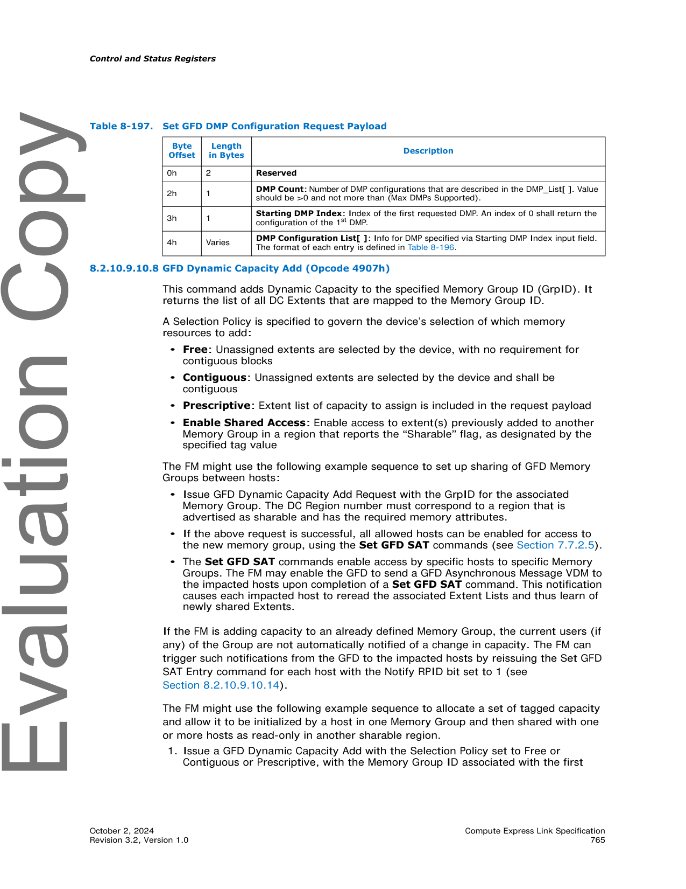
>
> *Original page render @ 150 DPI* — [📄 Full size](figures/chapter_08/page_0765.png)

[⬆️ 返回目录](#-本章目录-part-e)

---

##### 8.2.10.9.10.9 GFD Dynamic Capacity Release (Opcode 4908h) | GFD 动态容量释放 (操作码 4908h)

<table>
<thead>
<tr>
<th width="50%">🇬🇧 English</th>
<th width="50%" style="background-color:#e8e8e8">🇨🇳 中文</th>
</tr>
</thead>
<tbody>
<tr><td>This command initiates the release of Dynamic Capacity from a GFD Memory Group. It returns the list of all DC Extents that are mapped to the Memory Group ID after this command was executed.</td><td style="background-color:#e8e8e8">此命令启动从 GFD Memory Group 释放 Dynamic Capacity。它返回在此命令执行后映射到 Memory Group ID 的所有 DC Extent 的列表。</td></tr>
<tr><td>The FM is responsible for negotiating with all impacted hosts through out-of-band channels (beyond the scope of this specification) about the release of a DCD capacity in a GFD. After all impacted consumers have given up access attempts to the capacity to be reclaimed: 1. FM determines which Memory Group has capacity that needs to be reclaimed. The capacity of a Memory Group can be reduced, but only by reclaiming entire Extents. Further, if Extents are tagged (as they should be for all GFD allocations), tagged capacity should be reclaimed all at once. Thus, the FM must describe the capacity to be reclaimed as one or more sets of tagged extents. 2. Given the desired tagged extents, the FM must now negotiate with all impacted hosts through out-of-band channels (beyond the scope for this specification) about the release of any DCD capacity in a GFD. 3. After all impacted consumers have given up access attempts to the capacity to be reclaimed, the FM can issue the appropriate GFD Dynamic Capacity Release command for the targeted Memory Group with the list of tagged extents. 4. GFD will send the list of tagged extents that remain associated with the Memory Group in the response to the FM. 5. FM shall examine the remaining Extents of the Memory Group to validate that the correct capacity reduction has occurred. Because the FM had previously recalled all impacted capacity from the working images of the hosts, there should be no subsequent requests for these DPAs; thus, any capacity remaining within the Memory Group can still be in use. 6. If the Memory Group is devoid of any remaining capacity, the FM should remove all impacted hosts from the Memory Groups enabled list. 7. If the Memory Group has no remaining capacity, and no enabled RPIDs, the associated GrpID is automatically reclaimed to the 'unused' list by the GFD.</td><td style="background-color:#e8e8e8">FM 负责通过带外信道(超出本规范的范围)与所有受影响的主机协商 GFD 中 DCD 容量的释放。在所有受影响的消费者放弃对要回收容量的访问尝试后: 1. FM 确定哪个 Memory Group 具有需要回收的容量。Memory Group 的容量可以减少,但只能通过回收整个 Extent 来减少。此外,如果 Extent 是带标签的(对于所有 GFD 分配应如此),则应一次性回收带标签的容量。因此,FM 必须将要回收的容量描述为一组或多组带标签的 extent。 2. 给定所需的带标签的 extent,FM 现在必须通过带外信道(超出本规范的范围)与所有受影响的主机协商 GFD 中任何 DCD 容量的释放。 3. 在所有受影响的消费者放弃对要回收容量的访问尝试后,FM 可以针对目标 Memory Group 使用带标签的 extent 列表发出相应的 GFD Dynamic Capacity Release 命令。 4. GFD 将在对 FM 的响应中发送仍与 Memory Group 关联的带标签的 extent 列表。 5. FM 应检查 Memory Group 的剩余 Extent 以确认已发生正确的容量减少。由于 FM 之前已从主机的工作映像中回收了所有受影响的容量,因此不应再有对这些 DPA 的后续请求;因此,Memory Group 内剩余的任何容量仍可使用。 6. 如果 Memory Group 没有任何剩余容量,FM 应从 Memory Groups 启用列表中删除所有受影响的主机。 7. 如果 Memory Group 没有剩余容量且没有启用的 RPID,则关联的 GrpID 由 GFD 自动回收至"未使用"列表。</td></tr>
<tr><td>The FM uses the following sequence to remove a host's access to shared GFD Memory Groups: 1. FM disables hosts' accesses to given Memory Groups, utilizing the Set GFD SAT command (see Section 8.2.10.9.10.14). 2. Set GFD SAT command enables or disables access by specific hosts, but it does not automatically notify the hosts that their access rights or any DCD capacity changes have been made. The FM can enable the GFD to send such notifications by setting the Notify RPID bit in the command request.</td><td style="background-color:#e8e8e8">FM 使用以下序列来删除主机对共享 GFD Memory Groups 的访问: 1. FM 使用 Set GFD SAT 命令禁用主机对给定 Memory Groups 的访问(请参阅 8.2.10.9.10.14 节)。 2. Set GFD SAT 命令启用或禁用特定主机的访问,但它不会自动通知主机其访问权限或任何 DCD 容量已更改。FM 可以通过在命令请求中设置 Notify RPID 位来使 GFD 发送此类通知。</td></tr>
<tr><td>A removal policy is specified to govern the device's selection of which memory resources to remove: • Tag-based: Extents are selected by the device based on tag, with no requirement for contiguous extents • Prescriptive: Extent list of capacity to release is included in request payload</td><td style="background-color:#e8e8e8">指定移除策略以管理设备对要移除的内存资源的选择: • Tag-based(基于标签):由设备根据 tag 选择 extent,不要求连续的 extent • Prescriptive(指定):要释放的容量的 extent 列表包含在请求负载中</td></tr>
<tr><td>The command shall fail with Invalid Input under the following conditions: • When the command is sent with an invalid GrpID, or an invalid region number, or an unsupported Removal Policy • When the command is sent with a Removal Policy of Tag-based and the input Tag does not correspond to any currently allocated capacity • When Sanitize on Release is set but is not supported by the device</td><td style="background-color:#e8e8e8">在以下情况下,此命令应失败并返回 Invalid Input: • 当命令使用无效的 GrpID、无效的区域编号或不受支持的 Removal Policy 发送时 • 当命令使用 Tag-based 的 Removal Policy 发送且输入的 Tag 与任何当前分配的容量不对应时 • 当设置了 Sanitize on Release 但设备不支持时</td></tr>
<tr><td>The command shall fail with Invalid Extent List under the following conditions: • When the Removal Policy is set to Prescriptive and the Extent Count is invalid • When the Removal Policy is set to Prescriptive and any extents are part of sharable, tagged capacity • When the Extent List includes blocks that are not currently assigned to the region</td><td style="background-color:#e8e8e8">在以下情况下,此命令应失败并返回 Invalid Extent List: • 当 Removal Policy 设置为 Prescriptive 且 Extent Count 无效时 • 当 Removal Policy 设置为 Prescriptive 且任何 extent 是可共享、带标签容量的一部分时 • 当 Extent List 包含当前未分配给该区域的块时</td></tr>
<tr><td>The command shall fail with Resources Exhausted when the length of the removed capacity exceeds the total assigned capacity for that region or for the specified tag when the Removal Policy is set to Tag-based.</td><td style="background-color:#e8e8e8">当所移除容量的长度超过该区域或指定 tag(当 Removal Policy 设置为 Tag-based 时)的总分配容量时,此命令应失败并返回 Resources Exhausted。</td></tr>
<tr><td>The device shall report Resources Exhausted if the Updated Extent List would cause the device to exceed its extent tracking ability.</td><td style="background-color:#e8e8e8">如果 Updated Extent List 会导致设备超出其 extent 跟踪能力,设备应报告 Resources Exhausted。</td></tr>
<tr><td><b>Possible Command Return Codes:</b> • Success • Unsupported • Invalid Input • Internal Error • Retry Required • Invalid Extent List • Resources Exhausted</td><td style="background-color:#e8e8e8"><b>可能的命令返回码:</b> • Success(成功) • Unsupported(不支持) • Invalid Input(无效输入) • Internal Error(内部错误) • Retry Required(需要重试) • Invalid Extent List(无效 Extent List) • Resources Exhausted(资源耗尽)</td></tr>
<tr><td><b>Command Effects:</b> • Configuration Change after Cold Reset • Immediate Configuration Change • Immediate Data Change</td><td style="background-color:#e8e8e8"><b>命令效果:</b> • Configuration Change after Cold Reset(Cold Reset 后配置更改) • Immediate Configuration Change(立即配置更改) • Immediate Data Change(立即数据更改)</td></tr>
</tbody>
</table>

**Table 8-200. Initiate Dynamic Capacity Release Request Payload | Initiate Dynamic Capacity Release 请求负载**

<table>
<thead>
<tr><th>Byte Offset</th><th>Length in Bytes</th><th>🇬🇧 Description</th><th>🇨🇳 描述</th></tr>
</thead>
<tbody>
<tr><td>00h</td><td>2</td><td>GrpID: the Memory Group ID from which the capacity is being released.</td><td>GrpID:正从中释放容量的 Memory Group ID。</td></tr>
<tr><td>02h</td><td>1</td><td>Flags • Bits[3:0]: Removal Policy: Specifies the policy to use for selecting which extents comprise the released capacity: — 0h = Tag-based — 1h = Prescriptive — All other encodings are reserved • Bit[4]: Reserved • Bit[5]: Sanitize on Release: — 1 = Device shall sanitize all released capacity as a result of this request using the method described in Section 8.2.10.9.5.1. If this is a shared capacity, the sanitize operation shall be performed after the last host has released the capacity. • Bits[7:6]: Reserved</td><td>Flags(标志): • Bits[3:0]:Removal Policy(移除策略):指定用于选择哪些 extent 构成已释放容量的策略: — 0h = Tag-based(基于标签) — 1h = Prescriptive(指定) — 所有其他编码保留 • Bit[4]:保留 • Bit[5]:Sanitize on Release(发布时清理): — 1 = 设备应使用 8.2.10.9.5.1 节中描述的方法对作为此请求结果释放的所有容量执行清理。如果这是共享容量,则清理操作应在最后一个主机释放容量后执行。 • Bits[7:6]:保留</td></tr>
<tr><td>03h</td><td>1</td><td>Reserved</td><td>保留</td></tr>
<tr><td>04h</td><td>8</td><td>Length: Number of bytes of capacity to remove. Always a multiple of the configured Region Block Size returned in Get GFD DCD Info. Shall be > 0. This field is reserved when the Removal Policy is set to Prescriptive.</td><td>Length(长度):要移除的容量字节数。始终是 Get GFD DCD Info 中返回的已配置 Region Block Size 的倍数。应 > 0。当 Removal Policy 设置为 Prescriptive 时,此字段保留。</td></tr>
<tr><td>0Ch</td><td>10h</td><td>Tag: Tag associated with the capacity to be released, if the Removal Policy is set to Tag-Based. This field is reserved when the Removal Policy is set to Prescriptive.</td><td>Tag(标签):当 Removal Policy 设置为 Tag-Based 时,与要释放的容量关联的 Tag。当 Removal Policy 设置为 Prescriptive 时,此字段保留。</td></tr>
<tr><td>1Ch</td><td>4</td><td>Extent Count: Number of extents in the Extent List. Present only when the Removal Policy is set to Prescriptive.</td><td>Extent Count(Extent 计数):Extent List 中的 extent 数。仅当 Removal Policy 设置为 Prescriptive 时才存在。</td></tr>
<tr><td>20h</td><td>4</td><td>Max Response Extent List Size: Maximum number of Extent List members to be returned in the response. The FM may use this field to limit the size of the response message.</td><td>Max Response Extent List Size(最大响应 Extent List 大小):响应中要返回的 Extent List 成员的最大数量。FM 可以使用此字段来限制响应消息的大小。</td></tr>
<tr><td>24h</td><td>Varies</td><td>Extent List: Extent list of capacity to release as defined in Table 8-63. Present only when the Removal Policy is set to Prescriptive.</td><td>Extent List(Extent 列表):如 Table 8-63 中所定义的释放容量的 extent 列表。仅当 Removal Policy 设置为 Prescriptive 时才存在。</td></tr>
</tbody>
</table>

**Table 8-201. GFD Dynamic Capacity Release Response Payload | GFD Dynamic Capacity Release 响应负载**

<table>
<thead>
<tr><th>Byte Offset</th><th>Length in Bytes</th><th>🇬🇧 Description</th><th>🇨🇳 描述</th></tr>
</thead>
<tbody>
<tr><td>00h</td><td>2</td><td>GrpID: The Memory Group ID to which the requested capacity was to be released.</td><td>GrpID:要向其释放请求容量的 Memory Group ID。</td></tr>
<tr><td>02h</td><td>2</td><td>Reserved</td><td>保留</td></tr>
<tr><td>04h</td><td>4</td><td>Starting Extent Index: Index of the first extent in the list.</td><td>Starting Extent Index(起始 Extent 索引):列表中第一个 extent 的索引。</td></tr>
<tr><td>08h</td><td>4</td><td>Returned Extent Count: Number of extents returned in Extent List[ ].</td><td>Returned Extent Count(返回的 Extent 数):Extent List[] 中返回的 extent 数。</td></tr>
<tr><td>0Ch</td><td>4</td><td>Total Extent Count: Total number of extents in the list for that Memory Group. If the Total Extent Count is greater than the Returned Extent Count, the requester must use the Get GFD DC Region Extent Lists command to obtain the full list.</td><td>Total Extent Count(Extent 总数):该 Memory Group 的列表中的 extent 总数。如果 Total Extent Count 大于 Returned Extent Count,则请求者必须使用 Get GFD DC Region Extent Lists 命令获取完整列表。</td></tr>
<tr><td>10h</td><td>4</td><td>Extent List Generation Number: Device-generated value that is used to indicate that the list has changed.</td><td>Extent List Generation Number(Extent List 生成号):设备生成的值,用于指示列表已更改。</td></tr>
<tr><td>14h</td><td>4</td><td>Reserved</td><td>保留</td></tr>
<tr><td>18h</td><td>Varies</td><td>Extent List[ ]: Extent list for the specified Memory Group, as defined in Table 8-63. Unless limited by the requester to Max Response Extent List Size, this Extent List[ ] shall contain all capacity that is currently assigned to the Memory Group ID (GrpID).</td><td>Extent List:如 Table 8-63 中所定义的指定 Memory Group 的 extent 列表。除非请求者通过 Max Response Extent List Size 限制,否则此 Extent List[] 应包含当前分配给 Memory Group ID (GrpID) 的所有容量。</td></tr>
</tbody>
</table>

> **Figure 8-X.** GFD Dynamic Capacity Release (page 768-770) ｜ GFD Dynamic Capacity Release
>
> 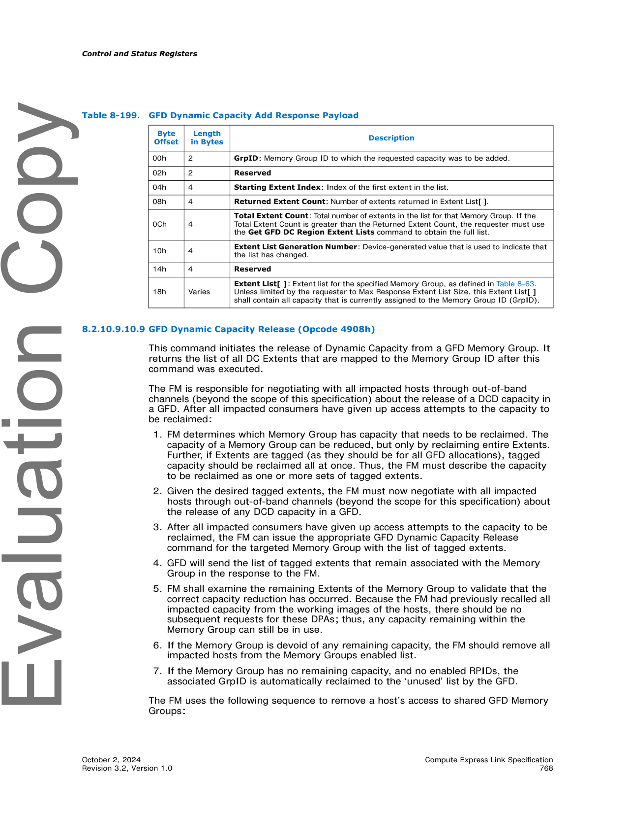
>
> *Original page render @ 150 DPI* — [📄 Full size](figures/chapter_08/page_0768.png)

[⬆️ 返回目录](#-本章目录-part-e)

---

##### 8.2.10.9.10.10 GFD Dynamic Capacity Add Reference (Opcode 4909h) | GFD 动态容量添加引用 (操作码 4909h)

<table>
<thead>
<tr>
<th width="50%">🇬🇧 English</th>
<th width="50%" style="background-color:#e8e8e8">🇨🇳 中文</th>
</tr>
</thead>
<tbody>
<tr><td>This command prevents the tagged sharable capacity from being sanitized, freed, or reallocated, regardless of whether it is currently visible to any host groups via extent lists. The tagged capacity will remain allocated, and contents will be preserved even if all DCD Extents that reference it are removed.</td><td style="background-color:#e8e8e8">此命令可防止对带标签的可共享容量进行清理、释放或重新分配,无论其当前是否通过 extent 列表对任何主机组可见。即使移除所有引用它的 DCD Extent,带标签的容量也将保持分配状态,并且内容将被保留。</td></tr>
<tr><td>This command has no effect and will return Success if the FM has already added a reference to the tagged capacity.</td><td style="background-color:#e8e8e8">如果 FM 已将引用添加到带标签的容量,则此命令无效并将返回 Success。</td></tr>
<tr><td>This command shall return Invalid Input if the Tag in the payload does not match an existing sharable tag.</td><td style="background-color:#e8e8e8">如果负载中的 Tag 与现有可共享 tag 不匹配,则此命令应返回 Invalid Input。</td></tr>
<tr><td><b>Possible Command Return Codes:</b> • Success • Unsupported • Invalid Input • Internal Error • Retry Required</td><td style="background-color:#e8e8e8"><b>可能的命令返回码:</b> • Success(成功) • Unsupported(不支持) • Invalid Input(无效输入) • Internal Error(内部错误) • Retry Required(需要重试)</td></tr>
<tr><td><b>Command Effects:</b> • Configuration Change after Cold Reset • Configuration Change after Conventional Reset • Configuration Change after CXL Reset • Immediate Configuration Change</td><td style="background-color:#e8e8e8"><b>命令效果:</b> • Configuration Change after Cold Reset(Cold Reset 后配置更改) • Configuration Change after Conventional Reset(Conventional Reset 后配置更改) • Configuration Change after CXL Reset(CXL Reset 后配置更改) • Immediate Configuration Change(立即配置更改)</td></tr>
</tbody>
</table>

**Table 8-202. GFD Dynamic Capacity Add Reference Request Payload | GFD Dynamic Capacity Add Reference 请求负载**

<table>
<thead>
<tr><th>Byte Offset</th><th>Length in Bytes</th><th>🇬🇧 Description</th><th>🇨🇳 描述</th></tr>
</thead>
<tbody>
<tr><td>0h</td><td>10h</td><td>Tag: Tag that is associated with the memory capacity to be preserved.</td><td>Tag(标签):与要保留的内存容量关联的 tag。</td></tr>
</tbody>
</table>

> **Figure 8-X.** GFD Dynamic Capacity Add Reference (page 770-771) ｜ GFD Dynamic Capacity Add Reference
>
> 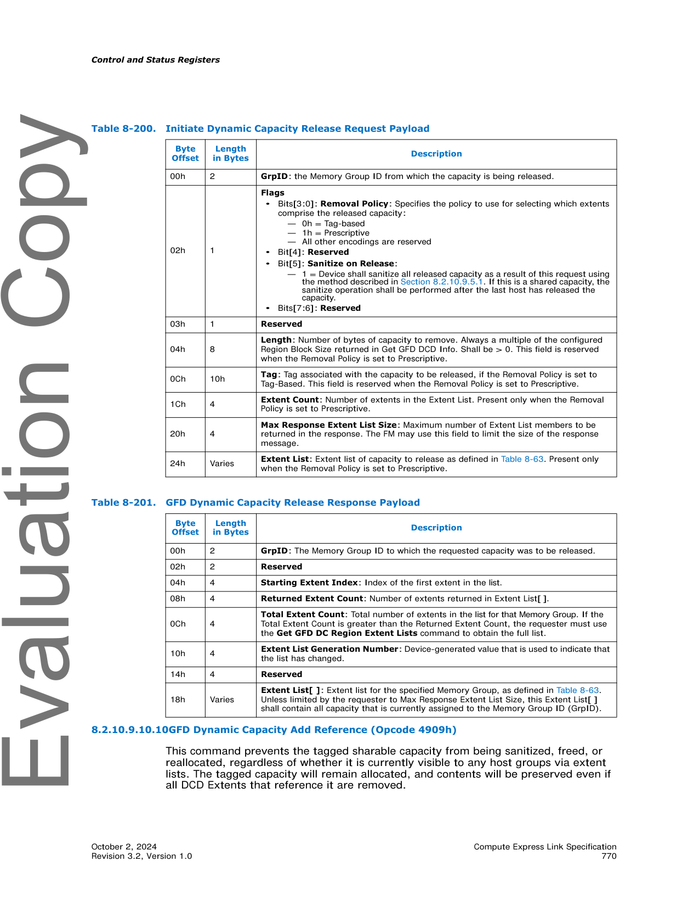
>
> *Original page render @ 150 DPI* — [📄 Full size](figures/chapter_08/page_0770.png)

[⬆️ 返回目录](#-本章目录-part-e)

---

##### 8.2.10.9.10.11 GFD Dynamic Capacity Remove Reference (Opcode 490Ah) | GFD 动态容量移除引用 (操作码 490Ah)

<table>
<thead>
<tr>
<th width="50%">🇬🇧 English</th>
<th width="50%" style="background-color:#e8e8e8">🇨🇳 中文</th>
</tr>
</thead>
<tbody>
<tr><td>This command removes a reference to tagged sharable capacity that was previously added via GFD Dynamic Capacity Add Reference (see Section 8.2.10.9.10.10). If there are no remaining extent lists that reference the tagged capacity, the memory will be freed and sanitized if appropriate.</td><td style="background-color:#e8e8e8">此命令移除先前通过 GFD Dynamic Capacity Add Reference 添加的带标签可共享容量的引用(请参阅 8.2.10.9.10.10 节)。如果没有引用该带标签容量的剩余 extent 列表,则该内存将在适当的情况下被释放和清理。</td></tr>
<tr><td>This command shall return Invalid Input if the Tag in the payload does not match an existing sharable tag.</td><td style="background-color:#e8e8e8">如果负载中的 Tag 与现有可共享 tag 不匹配,则此命令应返回 Invalid Input。</td></tr>
<tr><td><b>Possible Command Return Codes:</b> • Success • Unsupported • Invalid Input • Internal Error • Retry Required</td><td style="background-color:#e8e8e8"><b>可能的命令返回码:</b> • Success(成功) • Unsupported(不支持) • Invalid Input(无效输入) • Internal Error(内部错误) • Retry Required(需要重试)</td></tr>
<tr><td><b>Command Effects:</b> • Configuration Change after Cold Reset (if freed) • Configuration Change after Conventional Reset (if freed) • Configuration Change after CXL Reset (if freed) • Immediate Configuration Change (if freed)</td><td style="background-color:#e8e8e8"><b>命令效果:</b> • Configuration Change after Cold Reset(Cold Reset 后配置更改)(若释放) • Configuration Change after Conventional Reset(Conventional Reset 后配置更改)(若释放) • Configuration Change after CXL Reset(CXL Reset 后配置更改)(若释放) • Immediate Configuration Change(立即配置更改)(若释放)</td></tr>
</tbody>
</table>

**Table 8-203. GFD Dynamic Capacity Remove Reference Request Payload | GFD Dynamic Capacity Remove Reference 请求负载**

<table>
<thead>
<tr><th>Byte Offset</th><th>Length in Bytes</th><th>🇬🇧 Description</th><th>🇨🇳 描述</th></tr>
</thead>
<tbody>
<tr><td>0h</td><td>10h</td><td>Tag: Tag that is associated with the memory capacity.</td><td>Tag(标签):与内存容量关联的 tag。</td></tr>
</tbody>
</table>

> **Figure 8-X.** GFD Dynamic Capacity Remove Reference (page 771-772) ｜ GFD Dynamic Capacity Remove Reference
>
> 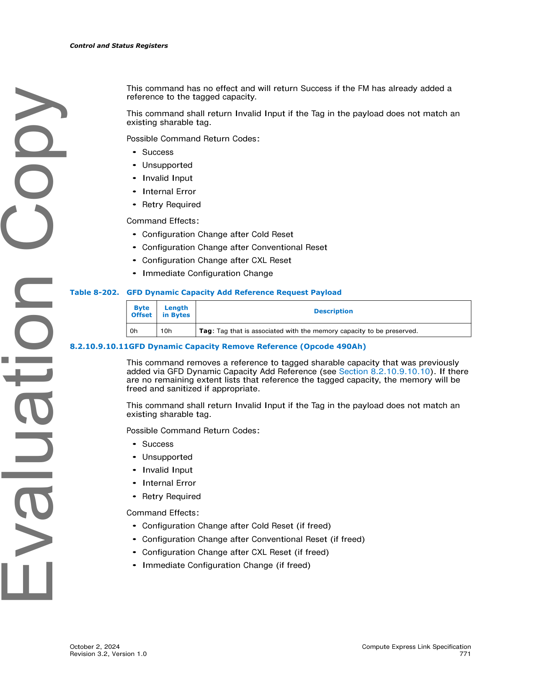
>
> *Original page render @ 150 DPI* — [📄 Full size](figures/chapter_08/page_0771.png)

[⬆️ 返回目录](#-本章目录-part-e)

---

##### 8.2.10.9.10.12 GFD Dynamic Capacity List Tags (Opcode 490Bh) | GFD 动态容量列表标签 (操作码 490Bh)

<table>
<thead>
<tr>
<th width="50%">🇬🇧 English</th>
<th width="50%" style="background-color:#e8e8e8">🇨🇳 中文</th>
</tr>
</thead>
<tbody>
<tr><td>This command allows an FM to re-establish context by receiving a list of all existing tags and a flag indicating whether the FM holds a reference.</td><td style="background-color:#e8e8e8">此命令允许 FM 通过接收所有现有 tag 的列表以及指示 FM 是否持有引用的标志来重新建立上下文。</td></tr>
<tr><td><b>Possible Command Return Codes:</b> • Success • Unsupported • Invalid Input • Internal Error • Retry Required</td><td style="background-color:#e8e8e8"><b>可能的命令返回码:</b> • Success(成功) • Unsupported(不支持) • Invalid Input(无效输入) • Internal Error(内部错误) • Retry Required(需要重试)</td></tr>
<tr><td><b>Command Effects:</b> • None</td><td style="background-color:#e8e8e8"><b>命令效果:</b> • None(无)</td></tr>
</tbody>
</table>

**Table 8-204. GFD Dynamic Capacity List Tags Request Payload | GFD Dynamic Capacity List Tags 请求负载**

<table>
<thead>
<tr><th>Byte Offset</th><th>Length in Bytes</th><th>🇬🇧 Description</th><th>🇨🇳 描述</th></tr>
</thead>
<tbody>
<tr><td>0h</td><td>4</td><td>Starting Index: Index of the first tag to return.</td><td>Starting Index(起始索引):要返回的第一个 tag 的索引。</td></tr>
<tr><td>4h</td><td>4</td><td>Max Tags: Maximum number of tags to return in the response payload. If max tags is 0, no tags list will be returned; however, the Generation Number shall be valid.</td><td>Max Tags(最大 Tag 数):响应负载中要返回的 tag 的最大数量。如果 max tags 为 0,则不返回 tag 列表;但是,Generation Number 应有效。</td></tr>
</tbody>
</table>

**Table 8-205. GFD Dynamic Capacity List Tags Response Payload | GFD Dynamic Capacity List Tags 响应负载**

<table>
<thead>
<tr><th>Byte Offset</th><th>Length in Bytes</th><th>🇬🇧 Description</th><th>🇨🇳 描述</th></tr>
</thead>
<tbody>
<tr><td>0h</td><td>4</td><td>Generation Number: Generation number of the tags list. This number shall change every time the remainder of the command's payload would change.</td><td>Generation Number(生成号):tag 列表的生成号。每当命令负载的其余部分将发生更改时,此编号应更改。</td></tr>
<tr><td>4h</td><td>4</td><td>Total Number of Tags: Maximum number of tags to return in the response payload.</td><td>Total Number of Tags(Tag 总数):响应负载中要返回的 tag 的最大数量。</td></tr>
<tr><td>8h</td><td>4</td><td>Reserved</td><td>保留</td></tr>
<tr><td>Ch</td><td>Varies</td><td>Tags List: List of GFD Dynamic Capacity Tag Information structures. The format of each entry is defined in Table 8-206.</td><td>Tags List(Tag 列表):GFD Dynamic Capacity Tag Information 结构的列表。每个条目的格式在 Table 8-206 中定义。</td></tr>
</tbody>
</table>

**Table 8-206. GFD Dynamic Capacity Tag Information | GFD Dynamic Capacity Tag 信息**

<table>
<thead>
<tr><th>Byte Offset</th><th>Length in Bytes</th><th>🇬🇧 Description</th><th>🇨🇳 描述</th></tr>
</thead>
<tbody>
<tr><td>00h</td><td>10h</td><td>Tag: Tag that is associated with the memory capacity.</td><td>Tag(标签):与内存容量关联的 tag。</td></tr>
<tr><td>10h</td><td>1</td><td>Flags • Bit[0]: FM Holds Reference: When set, this bit indicates that the FM holds a reference on this Tag • Bits[7:1]: Reserved</td><td>Flags(标志): • Bit[0]:FM Holds Reference(FM 持有引用):设置时,此位指示 FM 持有对此 Tag 的引用 • Bits[7:1]:保留</td></tr>
<tr><td>11h</td><td>3</td><td>Reserved</td><td>保留</td></tr>
</tbody>
</table>

> **Figure 8-X.** GFD Dynamic Capacity List Tags (page 772-773) ｜ GFD Dynamic Capacity List Tags
>
> 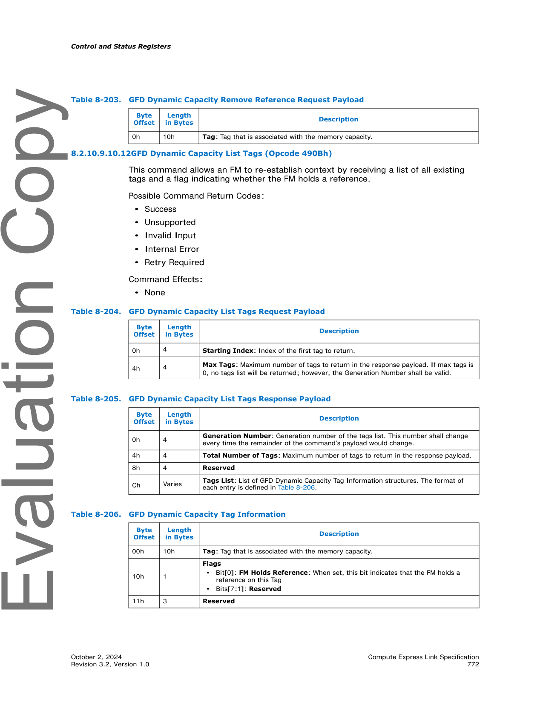
>
> *Original page render @ 150 DPI* — [📄 Full size](figures/chapter_08/page_0772.png)

[⬆️ 返回目录](#-本章目录-part-e)

---

##### 8.2.10.9.10.13 Get GFD SAT Entry (Opcode 490Ch) | 获取 GFD SAT 条目 (操作码 490Ch)

<table>
<thead>
<tr>
<th width="50%">🇬🇧 English</th>
<th width="50%" style="background-color:#e8e8e8">🇨🇳 中文</th>
</tr>
</thead>
<tbody>
<tr><td>This command retrieves the GFD's SPID Access Table (SAT) entry for a specific RPID. The RPID is the PID that defines a CXL.mem request initiator. For a host, the RPID is the host's Edge Switch's USP PID. Note that a host and its associated CXL devices will each have a unique RPID, and therefore each will use a different entry in the GDT.</td><td style="background-color:#e8e8e8">此命令检索特定 RPID 的 GFD SPID Access Table (SAT) 条目。RPID 是定义 CXL.mem 请求发起方的 PID。对于主机,RPID 是其 Edge Switch 的 USP PID。请注意,主机及其关联的 CXL 设备各自具有唯一的 RPID,因此每个将使用 GDT 中的不同条目。</td></tr>
<tr><td>The SAT entry is an N-bit vector (GrpAccVec). Each bitk of the GrpAccVec is the enable access control for a specific Memory Group ID (GrpID). Each memory request initiator is given access to a specific memory group number GrpID by setting bitk of the SAT vector, where k=GrpID. An SAT entry is therefore a list of Memory Groups to which a given memory requester (known by the given RPID) has access.</td><td style="background-color:#e8e8e8">SAT 条目是 N 位向量 (GrpAccVec)。GrpAccVec 的每个位 k 是对特定 Memory Group ID (GrpID) 的启用访问控制。通过设置 SAT 向量的位 k(其中 k=GrpID),每个内存请求发起方被授予对特定内存组编号 GrpID 的访问权限。因此,SAT 条目是给定内存请求者(由给定 RPID 标识)有权访问的 Memory Groups 的列表。</td></tr>
<tr><td>An FM enables multiple hosts and other requesters to share access to a given Memory Group by setting the corresponding Memory Group Mask bit in each requester's SAT entry.</td><td style="background-color:#e8e8e8">FM 通过在每个请求者的 SAT 条目中设置相应的 Memory Group Mask 位,使多个主机和其他请求者能够共享对给定 Memory Group 的访问。</td></tr>
<tr><td><b>Possible Command Return Codes:</b> • Success • Unsupported • Invalid Input • Internal Error • Retry Required</td><td style="background-color:#e8e8e8"><b>可能的命令返回码:</b> • Success(成功) • Unsupported(不支持) • Invalid Input(无效输入) • Internal Error(内部错误) • Retry Required(需要重试)</td></tr>
<tr><td><b>Command Effects:</b> • None</td><td style="background-color:#e8e8e8"><b>命令效果:</b> • None(无)</td></tr>
</tbody>
</table>

**Table 8-207. Get GFD SAT Entry Request Payload | Get GFD SAT Entry 请求负载**

<table>
<thead>
<tr><th>Byte Offset</th><th>Length in Bytes</th><th>🇬🇧 Description</th><th>🇨🇳 描述</th></tr>
</thead>
<tbody>
<tr><td>0h</td><td>2</td><td>Reserved</td><td>保留</td></tr>
<tr><td>2h</td><td>2</td><td>SAT Entry Count: Number of SAT entries to return in the response payload. Value should be >0 and not greater than 4096.</td><td>SAT Entry Count(SAT 条目数):响应负载中要返回的 SAT 条目数。值应 > 0 且不大于 4096。</td></tr>
<tr><td>4h</td><td>2</td><td>Starting RPID Index: Index of the first requested SAT entry. An index of 0 shall return the SAT for RPID = 0.</td><td>Starting RPID Index(起始 RPID 索引):所请求的第一个 SAT 条目的索引。索引 0 应返回 RPID = 0 的 SAT。</td></tr>
</tbody>
</table>

**Table 8-208. Get GFD SAT Entry Response Payload | Get GFD SAT Entry 响应负载**

<table>
<thead>
<tr><th>Byte Offset</th><th>Length in Bytes</th><th>🇬🇧 Description</th><th>🇨🇳 描述</th></tr>
</thead>
<tbody>
<tr><td>0h</td><td>2</td><td>Reserved</td><td>保留</td></tr>
<tr><td>2h</td><td>2</td><td>Number of SAT Entries Returned: Number of entries in the SAT Entry List.</td><td>Number of SAT Entries Returned(返回的 SAT 条目数):SAT Entry List 中的条目数。</td></tr>
<tr><td>4h</td><td>2</td><td>Starting RPID Index: Index of the first SAT entry in the SAT_Entry_List[ ]. An index of 0 shall return the SAT for SPID = 0.</td><td>Starting RPID Index(起始 RPID 索引):SAT_Entry_List[] 中第一个 SAT 条目的索引。索引 0 应返回 SPID = 0 的 SAT。</td></tr>
<tr><td>5h</td><td>Varies</td><td>SAT_Entry List[ ]: List of SAT entries requested via request. The format of each entry is defined in Table 8-209.</td><td>SAT_Entry List:通过请求请求的 SAT 条目列表。每个条目的格式在 Table 8-209 中定义。</td></tr>
</tbody>
</table>

**Table 8-209. GFD SAT Entry Format | GFD SAT 条目格式**

<table>
<thead>
<tr><th>Byte Offset</th><th>Length in Bytes</th><th>🇬🇧 Description</th><th>🇨🇳 描述</th></tr>
</thead>
<tbody>
<tr><td>00h</td><td>4</td><td>GrpAccVec: NG-bit permission mask for a given RPID. NG = Number of Memory Groups supported by this device. Note: More than one bit may be set at a time. • Bits[NG-1:0]: GrpAccVec: — If GrpAccVec[k] = 0: Memory Group ID (where k = GrpID) is not accessible to requesters that use the RPID associated with this SAT entry — If GrpAccVec[k] = 1: Memory Group ID (where k = GrpID) is accessible with full RW access to requesters that use the RPID associated with this SAT entry • Bits[31:NG]: Reserved Note: There is no mechanism to select read-only access on a per-RPID basis using the SAT entries. Writes to writable regions will be allowed, but writes to read-only regions will be dropped.</td><td>GrpAccVec:给定 RPID 的 NG 位权限掩码。NG = 此设备支持的 Memory Group 数。注:可一次设置多个位。 • Bits[NG-1:0]:GrpAccVec: — 如果 GrpAccVec[k] = 0:Memory Group ID(其中 k = GrpID)不可由使用与此 SAT 条目关联的 RPID 的请求者访问 — 如果 GrpAccVec[k] = 1:Memory Group ID(其中 k = GrpID)可由使用与此 SAT 条目关联的 RPID 的请求者以完全 RW 访问访问 • Bits[31:NG]:保留 注:没有使用 SAT 条目在每个 RPID 基础上选择只读访问的机制。将允许对可写区域的写入,但对只读区域的写入将被丢弃。</td></tr>
</tbody>
</table>

> **Figure 8-X.** Get GFD SAT Entry (page 773-774) ｜ Get GFD SAT Entry
>
> 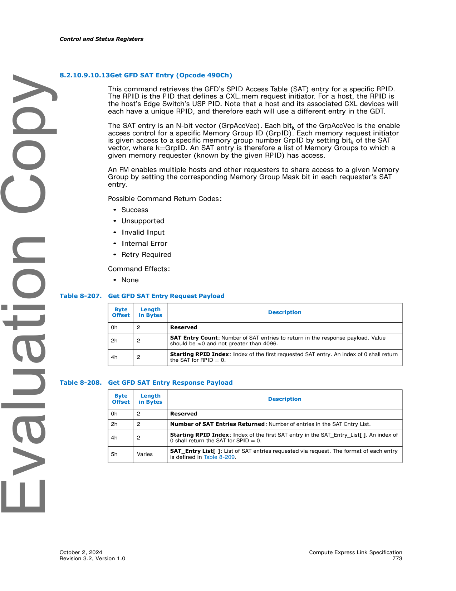
>
> *Original page render @ 150 DPI* — [📄 Full size](figures/chapter_08/page_0773.png)

[⬆️ 返回目录](#-本章目录-part-e)

---

##### 8.2.10.9.10.14 Set GFD SAT Entry (Opcode 490Dh) | 设置 GFD SAT 条目 (操作码 490Dh)

<table>
<thead>
<tr>
<th width="50%">🇬🇧 English</th>
<th width="50%" style="background-color:#e8e8e8">🇨🇳 中文</th>
</tr>
</thead>
<tbody>
<tr><td>This command updates the GFD's SPID Access Table (SAT) entry for a specific RPID. The RPID is the PID that defines a CXL.mem request initiator. For a host, the RPID is the host's Edge Switch's USP PID. Note that a host and its associated CXL devices will each have a unique RPID, and therefore each will use a different entry in the GDT.</td><td style="background-color:#e8e8e8">此命令更新特定 RPID 的 GFD SPID Access Table (SAT) 条目。RPID 是定义 CXL.mem 请求发起方的 PID。对于主机,RPID 是其 Edge Switch 的 USP PID。请注意,主机及其关联的 CXL 设备各自具有唯一的 RPID,因此每个将使用 GDT 中的不同条目。</td></tr>
<tr><td>The SAT entry is an N-bit vector (GrpAccVec). Each bitk of the vector is the enable access control for a specific Memory Group ID (GrpID). Each memory request initiator is given access to a specific memory group number GrpID by setting bitk of the SAT vector, where k=GrpID. An SAT entry is therefore a list of Memory Groups to which a given memory requester (known by the given RPID) has access. The FM grants specific memory requesters access to different Memory Groups by setting the corresponding Memory Group Mask bit in that requester's SAT entry.</td><td style="background-color:#e8e8e8">SAT 条目是 N 位向量 (GrpAccVec)。向量的每个位 k 是对特定 Memory Group ID (GrpID) 的启用访问控制。通过设置 SAT 向量的位 k(其中 k=GrpID),每个内存请求发起方被授予对特定内存组编号 GrpID 的访问权限。因此,SAT 条目是给定内存请求者(由给定 RPID 标识)有权访问的 Memory Groups 的列表。FM 通过在该请求者的 SAT 条目中设置相应的 Memory Group Mask 位,授予特定内存请求者对不同 Memory Groups 的访问权限。</td></tr>
<tr><td>An FM enables multiple hosts and other requesters to share access to a given Memory Group by setting the corresponding GrpAccVec bit in each requester's SAT entry.</td><td style="background-color:#e8e8e8">FM 通过在每个请求者的 SAT 条目中设置相应的 GrpAccVec 位,使多个主机和其他请求者能够共享对给定 Memory Group 的访问。</td></tr>
<tr><td>The FM may enable the GFD to send a GFD Asynchronous Message VDM to the impacted hosts upon completion of a Set GFD SAT command. This notification causes each impacted host to reread the associated Extent Lists and thus learn of changed permissions.</td><td style="background-color:#e8e8e8">FM 可以使 GFD 在 Set GFD SAT 命令完成时向受影响的主机发送 GFD Asynchronous Message VDM。此通知使每个受影响的主机重新读取关联的 Extent Lists,从而了解已更改的权限。</td></tr>
<tr><td>This command shall return Invalid Input when any bit GrpAccVec[k] is set when k is larger than (max Memory Groups -1) because this attempts to enable a Memory Group that cannot exist.</td><td style="background-color:#e8e8e8">当任何位 GrpAccVec[k] 被设置且 k 大于(max Memory Groups -1)时,此命令应返回 Invalid Input,因为这会尝试启用无法存在的 Memory Group。</td></tr>
<tr><td>The device shall make single GrpAccVec updates atomically; the single GrpAccVec update is completely successful, or the failed attempt has no impact on the original GrpAccVec contents. If more than one GrpAccVec update is requested (i.e., more than one SPID's GrpAccVec is requested), each may atomically succeed, or fail. However, this command shall not return Success if multiple SAT GrpAccVec updates are requested and any one of them fails for any reason.</td><td style="background-color:#e8e8e8">设备应以原子方式执行单个 GrpAccVec 更新;单个 GrpAccVec 更新完全成功,或失败的尝试对原始 GrpAccVec 内容没有影响。如果请求多个 GrpAccVec 更新(即,请求多个 SPID 的 GrpAccVec),则每个可以原子方式成功或失败。但是,如果请求多个 SAT GrpAccVec 更新并且其中任何一个因任何原因失败,则此命令不应返回 Success。</td></tr>
<tr><td>In the event of an unsuccessful request of a multiple GrpAccVec update request, the FM should perform an appropriate Get GFD SAT Entry request to determine which of the requested updates were successful, and which were unsuccessful.</td><td style="background-color:#e8e8e8">在多 GrpAccVec 更新请求不成功的情况下,FM 应执行适当的 Get GFD SAT Entry 请求,以确定所请求的更新中哪些是成功的,哪些是不成功的。</td></tr>
<tr><td><b>Possible Command Return Codes:</b> • Success • Unsupported • Invalid Input • Internal Error • Retry Required</td><td style="background-color:#e8e8e8"><b>可能的命令返回码:</b> • Success(成功) • Unsupported(不支持) • Invalid Input(无效输入) • Internal Error(内部错误) • Retry Required(需要重试)</td></tr>
<tr><td><b>Command Effects:</b> • Immediate Configuration Change</td><td style="background-color:#e8e8e8"><b>命令效果:</b> • Immediate Configuration Change(立即配置更改)</td></tr>
</tbody>
</table>

**Table 8-210. Set GFD SAT Entry Request Payload | Set GFD SAT Entry 请求负载**

<table>
<thead>
<tr><th>Byte Offset</th><th>Length in Bytes</th><th>🇬🇧 Description</th><th>🇨🇳 描述</th></tr>
</thead>
<tbody>
<tr><td>0h</td><td>2</td><td>SAT Update Count: Number of SAT entries to be updated by this request. Value should be >0 and not greater than 4096, and shall further be limited by the maximum size of request payload that the device will accept.</td><td>SAT Update Count(SAT 更新数):此请求要更新的 SAT 条目数。值应 > 0 且不大于 4096,且应进一步受设备将接受的最大请求负载大小的限制。</td></tr>
<tr><td>2h</td><td>Varies</td><td>SAT Update List[ ]: List of SAT updates to be made. The format of each entry is defined in Table 8-211. Note: The SAT update list format for a Set command is different than the SAT_Entry_List of the Get command.</td><td>SAT Update List:要进行的 SAT 更新的列表。每个条目的格式在 Table 8-211 中定义。注:Set 命令的 SAT 更新列表格式与 Get 命令的 SAT_Entry_List 不同。</td></tr>
</tbody>
</table>

**Table 8-211. GFD SAT Update Format | GFD SAT 更新格式**

<table>
<thead>
<tr><th>Byte Offset</th><th>Length in Bytes</th><th>🇬🇧 Description</th><th>🇨🇳 描述</th></tr>
</thead>
<tbody>
<tr><td>0h</td><td>2</td><td>• Bits[11:0]: RPID: Requester PID to which the following GrpAccVec is to be assigned • Bits[15:12]: Reserved</td><td>• Bits[11:0]:RPID:以下 GrpAccVec 要分配给的 Requester PID • Bits[15:12]:保留</td></tr>
<tr><td>2h</td><td>4</td><td>GrpAccVec: NG-bit permission mask for a given RPID. NG = Number of Memory Groups supported by this device. Note: More than one bit may be set at a time. • Bits[NG-1:0]: GrpAccVec: — If GrpAccVec[k] = 0: Memory Group ID (where k = GrpID) is not accessible to requesters that use the RPID associated with this SAT entry — If GrpAccVec[k] = 1: Memory Group ID (where k = GrpID) is accessible with full RW access to requesters that use the RPID associated with this SAT entry • Bits[30:NG]: Reserved • Bit[31]: Notify RPID: If set to 1, the GFD shall send a GFD Asynchronous Message VDM to the RPID whose GrpAccVec is being updated Note: There is no mechanism to select read-only access on a per-RPID basis using the SAT entries. Writes to writable regions will be allowed, but writes to read-only regions will be dropped.</td><td>GrpAccVec:给定 RPID 的 NG 位权限掩码。NG = 此设备支持的 Memory Group 数。注:可一次设置多个位。 • Bits[NG-1:0]:GrpAccVec: — 如果 GrpAccVec[k] = 0:Memory Group ID(其中 k = GrpID)不可由使用与此 SAT 条目关联的 RPID 的请求者访问 — 如果 GrpAccVec[k] = 1:Memory Group ID(其中 k = GrpID)可由使用与此 SAT 条目关联的 RPID 的请求者以完全 RW 访问访问 • Bits[30:NG]:保留 • Bit[31]:Notify RPID(通知 RPID):如果设置为 1,GFD 应向正在更新其 GrpAccVec 的 RPID 发送 GFD Asynchronous Message VDM 注:没有使用 SAT 条目在每个 RPID 基础上选择只读访问的机制。将允许对可写区域的写入,但对只读区域的写入将被丢弃。</td></tr>
</tbody>
</table>

> **Figure 8-X.** Set GFD SAT Entry (page 774-775) ｜ Set GFD SAT Entry
>
> 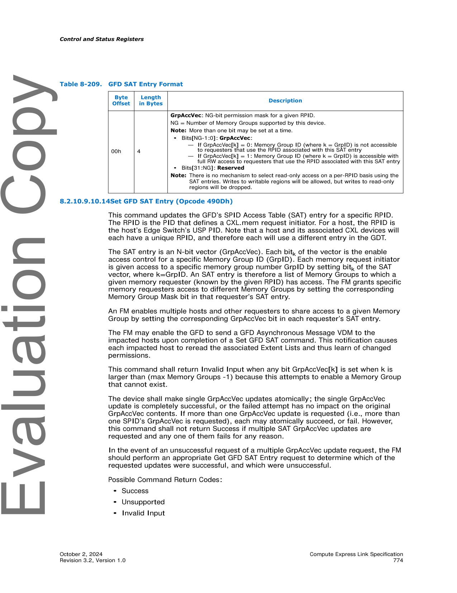
>
> *Original page render @ 150 DPI* — [📄 Full size](figures/chapter_08/page_0774.png)

[⬆️ 返回目录](#-本章目录-part-e)

---

##### 8.2.10.9.10.15 Get GFD QoS Control (Opcode 490Eh) | 获取 GFD QoS 控制 (操作码 490Eh)

<table>
<thead>
<tr>
<th width="50%">🇬🇧 English</th>
<th width="50%" style="background-color:#e8e8e8">🇨🇳 中文</th>
</tr>
</thead>
<tbody>
<tr><td>This command retrieves the GFD's QoS control parameters.</td><td style="background-color:#e8e8e8">此命令检索 GFD 的 QoS 控制参数。</td></tr>
<tr><td><b>Possible Command Return Codes:</b> • Success • Unsupported • Internal Error • Retry Required • Invalid Payload Length</td><td style="background-color:#e8e8e8"><b>可能的命令返回码:</b> • Success(成功) • Unsupported(不支持) • Internal Error(内部错误) • Retry Required(需要重试) • Invalid Payload Length(无效负载长度)</td></tr>
<tr><td><b>Command Effects:</b> • None</td><td style="background-color:#e8e8e8"><b>命令效果:</b> • None(无)</td></tr>
</tbody>
</table>

> **Figure 8-X.** Get GFD QoS Control (page 775-776) ｜ Get GFD QoS Control
>
> 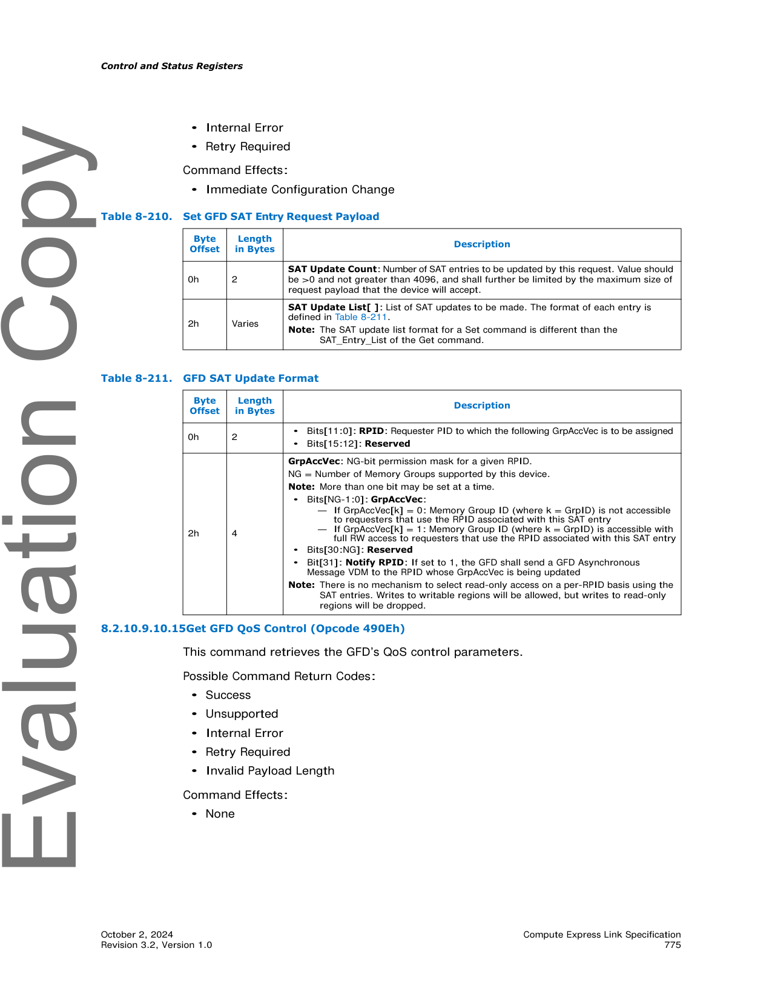
>
> *Original page render @ 150 DPI* — [📄 Full size](figures/chapter_08/page_0775.png)

[⬆️ 返回目录](#-本章目录-part-e)

---

##### 8.2.10.9.10.16 Set GFD QoS Control (Opcode 490Fh) | 设置 GFD QoS 控制 (操作码 490Fh)

<table>
<thead>
<tr>
<th width="50%">🇬🇧 English</th>
<th width="50%" style="background-color:#e8e8e8">🇨🇳 中文</th>
</tr>
</thead>
<tbody>
<tr><td>This command sets the GFD's QoS control parameters, as defined in Table 8-212. The device must complete the set operation before returning the response. The command response returns the resulting QoS control parameters, as defined in the same table. This command will fail, returning Invalid Input, if any of the parameters are outside their valid range.</td><td style="background-color:#e8e8e8">此命令设置 GFD 的 QoS 控制参数,如 Table 8-212 中所定义。设备必须在返回响应之前完成设置操作。命令响应返回所产生的 QoS 控制参数,如同一表中所定义。如果任何参数超出其有效范围,此命令将失败并返回 Invalid Input。</td></tr>
<tr><td><b>Possible Command Codes:</b> • Success • Unsupported • Invalid Input • Internal Error • Retry Required • Invalid Payload Length</td><td style="background-color:#e8e8e8"><b>可能的命令返回码:</b> • Success(成功) • Unsupported(不支持) • Invalid Input(无效输入) • Internal Error(内部错误) • Retry Required(需要重试) • Invalid Payload Length(无效负载长度)</td></tr>
<tr><td><b>Command Effects:</b> • Immediate Policy Change</td><td style="background-color:#e8e8e8"><b>命令效果:</b> • Immediate Policy Change(立即策略更改)</td></tr>
<tr><td>Payload for Set GFD QoS Control Request and Response is documented in Table 8-212.</td><td style="background-color:#e8e8e8">Set GFD QoS Control 请求和响应的负载在 Table 8-212 中记录。</td></tr>
</tbody>
</table>

**Table 8-212. QOS Payload for Get GFD QoS Control Response, Set GFD QoS Control Request, and Set GFD QoS Control Response | Get GFD QoS Control 响应、Set GFD QoS Control 请求和 Set GFD QoS Control 响应的 QOS 负载**

<table>
<thead>
<tr><th>Byte Offset</th><th>Length in Bytes</th><th>🇬🇧 Description</th><th>🇨🇳 描述</th></tr>
</thead>
<tbody>
<tr><td>0h</td><td>1</td><td>QoS Telemetry Control: Default is 00h. • Bit[0]: Egress Port Congestion Enable: See Section 3.3.4.3.8 • Bit[1]: Temporary Throughput Reduction Enable: See Section 3.3.4.3.5 • Bits[7:2]: Reserved</td><td>QoS Telemetry Control(QoS 遥测控制):默认为 00h。 • Bit[0]:Egress Port Congestion Enable(出口端口拥塞启用):请参阅 3.3.4.3.8 节 • Bit[1]:Temporary Throughput Reduction Enable(临时吞吐量降低启用):请参阅 3.3.4.3.5 节 • Bits[7:2]:保留</td></tr>
<tr><td>1h</td><td>1</td><td>Egress Moderate Percentage: Threshold in percent for Egress Port Congestion mechanism to indicate moderate congestion. Valid range is 1-100. Default is 10.</td><td>Egress Moderate Percentage(出口中等拥塞百分比):Egress Port Congestion 机制指示中等拥塞的百分比阈值。有效范围为 1-100。默认值为 10。</td></tr>
<tr><td>2h</td><td>1</td><td>Egress Severe Percentage: Threshold in percent for Egress Port Congestion mechanism to indicate severe congestion. Valid range is 1-100. Default is 25.</td><td>Egress Severe Percentage(出口严重拥塞百分比):Egress Port Congestion 机制指示严重拥塞的百分比阈值。有效范围为 1-100。默认值为 25。</td></tr>
<tr><td>3h</td><td>1</td><td>Backpressure Sample Interval: Interval in ns for Egress Port Congestion mechanism to take samples. Valid range is 0-15. Default is 8 (800 ns of history for 100 samples). Value of 0 disables the mechanism. See Section 3.3.4.3.4.</td><td>Backpressure Sample Interval(背压采样间隔):Egress Port Congestion 机制采样的间隔(以纳秒为单位)。有效范围为 0-15。默认值为 8(800 ns 的历史记录,对应 100 个样本)。值为 0 禁用该机制。请参阅 3.3.4.3.4 节。</td></tr>
<tr><td>4h</td><td>2</td><td>ReqCmpBasis: Estimated maximum sustained sum of requests and recent responses across the entire device, serving as the basis for QoS Limit Fraction. Valid range is 0-65,535. Value of 0 disables the mechanism. Default is 0. See Section 3.3.4.3.7.</td><td>ReqCmpBasis(请求完成基准):整个设备上请求和最近响应的估计最大持续总和,作为 QoS Limit Fraction 的基础。有效范围为 0-65,535。值为 0 禁用该机制。默认值为 0。请参阅 3.3.4.3.7 节。</td></tr>
<tr><td>6h</td><td>1</td><td>Completion Collection Interval: Interval in ns for Completion Counting mechanism to collect the number of transmitted responses in a single counter. Valid range is 0-255. Default is 64 (1.024 us of history, given 16 counters). See Section 3.3.4.3.9.</td><td>Completion Collection Interval(完成收集间隔):Completion Counting 机制在单个计数器中收集已传输响应数的间隔(以纳秒为单位)。有效范围为 0-255。默认值为 64(1.024 us 的历史记录,对应 16 个计数器)。请参阅 3.3.4.3.9 节。</td></tr>
</tbody>
</table>

> **Figure 8-X.** Set GFD QoS Control (page 776) ｜ Set GFD QoS Control
>
> 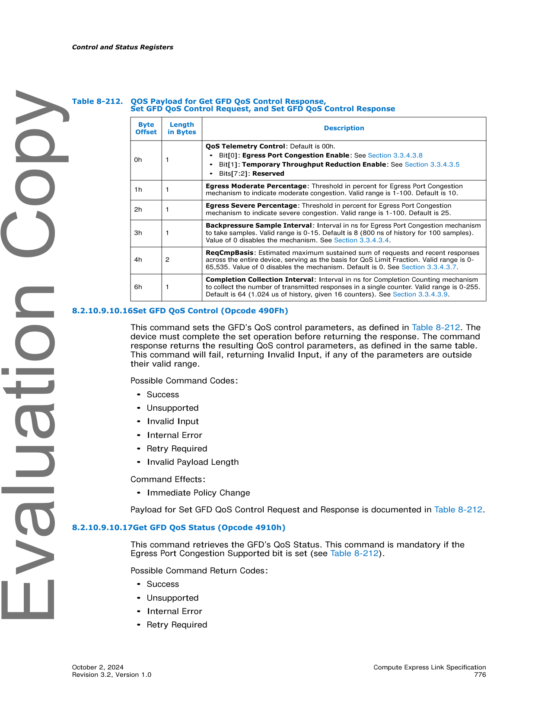
>
> *Original page render @ 150 DPI* — [📄 Full size](figures/chapter_08/page_0776.png)

[⬆️ 返回目录](#-本章目录-part-e)

---

##### 8.2.10.9.10.17 Get GFD QoS Status (Opcode 4910h) | 获取 GFD QoS 状态 (操作码 4910h)

<table>
<thead>
<tr>
<th width="50%">🇬🇧 English</th>
<th width="50%" style="background-color:#e8e8e8">🇨🇳 中文</th>
</tr>
</thead>
<tbody>
<tr><td>This command retrieves the GFD's QoS Status. This command is mandatory if the Egress Port Congestion Supported bit is set (see Table 8-212).</td><td style="background-color:#e8e8e8">此命令检索 GFD 的 QoS 状态。如果设置了 Egress Port Congestion Supported 位(请参阅 Table 8-212),则此命令是必需的。</td></tr>
<tr><td><b>Possible Command Return Codes:</b> • Success • Unsupported • Internal Error • Retry Required • Invalid Payload Length</td><td style="background-color:#e8e8e8"><b>可能的命令返回码:</b> • Success(成功) • Unsupported(不支持) • Internal Error(内部错误) • Retry Required(需要重试) • Invalid Payload Length(无效负载长度)</td></tr>
<tr><td><b>Command Effects:</b> • None</td><td style="background-color:#e8e8e8"><b>命令效果:</b> • None(无)</td></tr>
</tbody>
</table>

**Table 8-213. Get GFD QoS Status Response Payload | Get GFD QoS Status 响应负载**

<table>
<thead>
<tr><th>Byte Offset</th><th>Length in Bytes</th><th>🇬🇧 Description</th><th>🇨🇳 描述</th></tr>
</thead>
<tbody>
<tr><td>0h</td><td>1</td><td>Backpressure Average Percentage: Current snapshot of the measured Egress Port average congestion (see Section 3.3.4.3.4).</td><td>Backpressure Average Percentage(平均背压百分比):测量的 Egress Port 平均拥塞的当前快照(请参阅 3.3.4.3.4 节)。</td></tr>
</tbody>
</table>

> **Figure 8-X.** Get GFD QoS Status (page 776-777) ｜ Get GFD QoS Status
>
> 
>
> *Original page render @ 150 DPI* — [📄 Full size](figures/chapter_08/page_0776.png)

[⬆️ 返回目录](#-本章目录-part-e)

---

##### 8.2.10.9.10.18 Get GFD QoS BW Limit (Opcode 4911h) | 获取 GFD QoS 带宽限制 (操作码 4911h)

<table>
<thead>
<tr>
<th width="50%">🇬🇧 English</th>
<th width="50%" style="background-color:#e8e8e8">🇨🇳 中文</th>
</tr>
</thead>
<tbody>
<tr><td>This command retrieves the GFD's QoS bandwidth limit on a per-RPID basis (see Section 3.3.4.3.7).</td><td style="background-color:#e8e8e8">此命令在每个 RPID 基础上检索 GFD 的 QoS 带宽限制(请参阅 3.3.4.3.7 节)。</td></tr>
<tr><td><b>Possible Command Return Codes:</b> • Success • Unsupported • Invalid Input • Internal Error • Retry Required • Invalid Payload Length</td><td style="background-color:#e8e8e8"><b>可能的命令返回码:</b> • Success(成功) • Unsupported(不支持) • Invalid Input(无效输入) • Internal Error(内部错误) • Retry Required(需要重试) • Invalid Payload Length(无效负载长度)</td></tr>
<tr><td><b>Command Effects:</b> • None</td><td style="background-color:#e8e8e8"><b>命令效果:</b> • None(无)</td></tr>
</tbody>
</table>

**Table 8-214. Payload for Get GFD QoS BW Limit Request | Get GFD QoS BW Limit 请求负载**

<table>
<thead>
<tr><th>Byte Offset</th><th>Length in Bytes</th><th>🇬🇧 Description</th><th>🇨🇳 描述</th></tr>
</thead>
<tbody>
<tr><td>0h</td><td>2</td><td>Number of RPIDs: Number of RPIDs queried. This field shall have a minimum value of 1.</td><td>Number of RPIDs(RPID 数):查询的 RPID 数。此字段的最小值应为 1。</td></tr>
<tr><td>2h</td><td>2</td><td>• Bits[11:0]: Start RPID: ID of the first RPID in the QoS BW Limit List • Bits[15:12]: Reserved</td><td>• Bits[11:0]:Start RPID(起始 RPID):QoS BW Limit List 中第一个 RPID 的 ID • Bits[15:12]:保留</td></tr>
</tbody>
</table>

**Table 8-215. Payload for Get GFD QoS BW Limit Response | Get GFD QoS BW Limit 响应负载**

<table>
<thead>
<tr><th>Byte Offset</th><th>Length in Bytes</th><th>🇬🇧 Description</th><th>🇨🇳 描述</th></tr>
</thead>
<tbody>
<tr><td>0h</td><td>2</td><td>Number of RPIDs: Number of RPIDs queried.</td><td>Number of RPIDs(RPID 数):查询的 RPID 数。</td></tr>
<tr><td>2h</td><td>2</td><td>• Bits[11:0]: Start RPID: ID of the first RPID in the QoS BW Limit List • Bits[15:12]: Reserved</td><td>• Bits[11:0]:Start RPID(起始 RPID):QoS BW Limit List 中第一个 RPID 的 ID • Bits[15:12]:保留</td></tr>
<tr><td>4h</td><td>Number of RPIDs</td><td>QoS Limit Fraction: Byte array of allocated bandwidth limit fractions for RPIDs, starting at Start RPID. The valid range of each array element is 0-255. Default value is 0. Value in each byte is the fraction multiplied by 256.</td><td>QoS Limit Fraction(QoS 限制比例):RPID 的已分配带宽限制比例的字节数组,从 Start RPID 开始。每个数组元素的有效范围为 0-255。默认值为 0。每个字节中的值是比例乘以 256。</td></tr>
</tbody>
</table>

> **Figure 8-X.** Get GFD QoS BW Limit (page 777) ｜ Get GFD QoS BW Limit
>
> 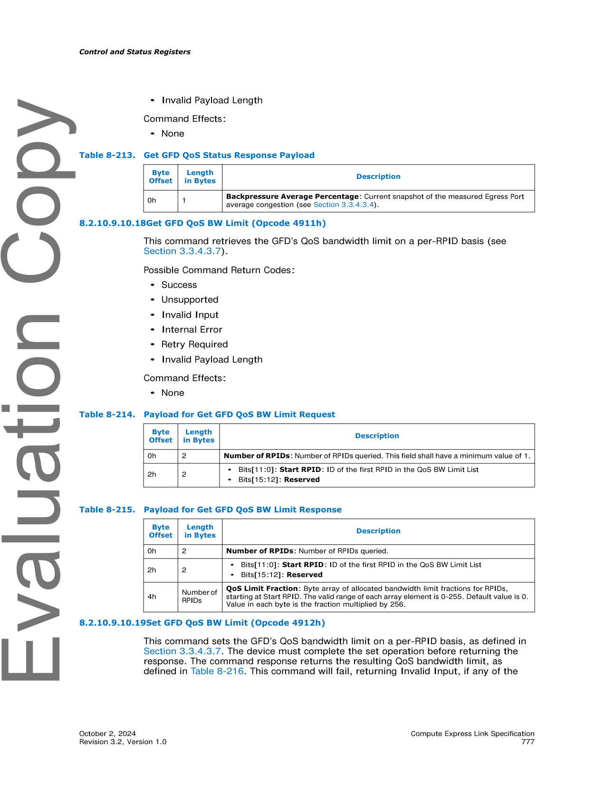
>
> *Original page render @ 150 DPI* — [📄 Full size](figures/chapter_08/page_0777.png)

[⬆️ 返回目录](#-本章目录-part-e)

---

##### 8.2.10.9.10.19 Set GFD QoS BW Limit (Opcode 4912h) | 设置 GFD QoS 带宽限制 (操作码 4912h)

<table>
<thead>
<tr>
<th width="50%">🇬🇧 English</th>
<th width="50%" style="background-color:#e8e8e8">🇨🇳 中文</th>
</tr>
</thead>
<tbody>
<tr><td>This command sets the GFD's QoS bandwidth limit on a per-RPID basis, as defined in Section 3.3.4.3.7. The device must complete the set operation before returning the response. The command response returns the resulting QoS bandwidth limit, as defined in Table 8-216. This command will fail, returning Invalid Input, if any of the parameters are outside their valid range. This command will fail, returning Internal Error, if the device was able to set the QoS BW Limit for some of the RPIDs in the request, but not all the RPIDs.</td><td style="background-color:#e8e8e8">此命令在每个 RPID 基础上设置 GFD 的 QoS 带宽限制,如 3.3.4.3.7 节中所定义。设备必须在返回响应之前完成设置操作。命令响应返回所产生的 QoS 带宽限制,如 Table 8-216 中所定义。如果任何参数超出其有效范围,此命令将失败并返回 Invalid Input。如果设备能够为请求中的某些 RPID 设置 QoS BW Limit,但不能为所有 RPID 设置,则此命令将失败并返回 Internal Error。</td></tr>
<tr><td><b>Possible Command Return Codes:</b> • Success • Unsupported • Invalid Input • Internal Error • Retry Required • Invalid Payload Length</td><td style="background-color:#e8e8e8"><b>可能的命令返回码:</b> • Success(成功) • Unsupported(不支持) • Invalid Input(无效输入) • Internal Error(内部错误) • Retry Required(需要重试) • Invalid Payload Length(无效负载长度)</td></tr>
<tr><td><b>Command Effects:</b> • Configuration Change after Cold Reset • Immediate Configuration Change • Immediate Data Change</td><td style="background-color:#e8e8e8"><b>命令效果:</b> • Configuration Change after Cold Reset(Cold Reset 后配置更改) • Immediate Configuration Change(立即配置更改) • Immediate Data Change(立即数据更改)</td></tr>
</tbody>
</table>

**Table 8-216. Payload for Set GFD BW Limit Request and Set GFD QoS BW Limit Response | Set GFD BW Limit 请求和 Set GFD QoS BW Limit 响应负载**

<table>
<thead>
<tr><th>Byte Offset</th><th>Length in Bytes</th><th>🇬🇧 Description</th><th>🇨🇳 描述</th></tr>
</thead>
<tbody>
<tr><td>0h</td><td>2</td><td>Number of RPIDs: Number of RPIDs queried.</td><td>Number of RPIDs(RPID 数):查询的 RPID 数。</td></tr>
<tr><td>2h</td><td>2</td><td>• Bits[11:0]: Start RPID: ID of the first RPID in the QoS BW Limit List • Bits[15:12]: Reserved</td><td>• Bits[11:0]:Start RPID(起始 RPID):QoS BW Limit List 中第一个 RPID 的 ID • Bits[15:12]:保留</td></tr>
<tr><td>4h</td><td>Number of RPIDs</td><td>QoS Limit Fraction: Byte array of allocated bandwidth limit fractions for RPIDs, starting at Start RPID. The valid range of each array element is 0-255. Default value is 0. Value in each byte is the fraction multiplied by 256.</td><td>QoS Limit Fraction(QoS 限制比例):RPID 的已分配带宽限制比例的字节数组,从 Start RPID 开始。每个数组元素的有效范围为 0-255。默认值为 0。每个字节中的值是比例乘以 256。</td></tr>
</tbody>
</table>

> **Figure 8-X.** Set GFD QoS BW Limit (page 777-778) ｜ Set GFD QoS BW Limit
>
> 
>
> *Original page render @ 150 DPI* — [📄 Full size](figures/chapter_08/page_0777.png)

[⬆️ 返回目录](#-本章目录-part-e)

---

##### 8.2.10.9.10.20 Get GDT Configuration (Opcode 4913h) | 获取 GDT 配置 (操作码 4913h)

<table>
<thead>
<tr>
<th width="50%">🇬🇧 English</th>
<th width="50%" style="background-color:#e8e8e8">🇨🇳 中文</th>
</tr>
</thead>
<tbody>
<tr><td>This command retrieves the Host's GDT decoder configurations. The HPA base address, the DPA base address, and the decoded length establish the Host's chosen HPA-to-DPA mapping.</td><td style="background-color:#e8e8e8">此命令检索主机的 GDT 解码器配置。HPA 基址、DPA 基址和解码长度确定主机选择的 HPA 到 DPA 的映射。</td></tr>
<tr><td><b>Note:</b> The Host ID included in the CCI request and response is the PBR_ID for the SPID that an actual memory request will contain.</td><td style="background-color:#e8e8e8"><b>注:</b> CCI 请求和响应中包含的 Host ID 是实际内存请求将包含的 SPID 的 PBR_ID。</td></tr>
<tr><td><b>Possible Command Return Codes:</b> • Success • Unsupported • Invalid Input • Internal Error • Retry Required</td><td style="background-color:#e8e8e8"><b>可能的命令返回码:</b> • Success(成功) • Unsupported(不支持) • Invalid Input(无效输入) • Internal Error(内部错误) • Retry Required(需要重试)</td></tr>
<tr><td><b>Command Effects:</b> • None</td><td style="background-color:#e8e8e8"><b>命令效果:</b> • None(无)</td></tr>
</tbody>
</table>

**Table 8-217. Get GDT Configuration Request Payload | Get GDT Configuration 请求负载**

<table>
<thead>
<tr><th>Byte Offset</th><th>Length in Bytes</th><th>🇬🇧 Description</th><th>🇨🇳 描述</th></tr>
</thead>
<tbody>
<tr><td>0h</td><td>2</td><td>• Bits[11:0]: RPID: PID of the host's Edge USP, or the PBR_ID of an accelerator functioning as a host. This is the PBR_ID that will be listed as the SPID in a memory request being validated against these GDT entries. • Bits[15:12]: Reserved.</td><td>• Bits[11:0]:RPID:主机 Edge USP 的 PID,或充当主机的加速器的 PBR_ID。这将在针对这些 GDT 条目进行验证的内存请求中作为 SPID 列出。 • Bits[15:12]:保留。</td></tr>
<tr><td>2h</td><td>2</td><td>Reserved</td><td>保留</td></tr>
<tr><td>4h</td><td>1</td><td>GDT Count: Number of GDT configurations to return in the response payload. The device may not return more GDT configurations than requested; however, it can return fewer configurations. 0 is valid and allows the Host to retrieve the Total GDT Count without retrieving any GDT config data. Shall not be greater than 8.</td><td>GDT Count(GDT 计数):响应负载中要返回的 GDT 配置数。设备可能不会返回多于请求的 GDT 配置;但是,它可以返回较少的配置。0 是有效的,允许主机检索 Total GDT Count,而不检索任何 GDT 配置数据。应不大于 8。</td></tr>
<tr><td>5h</td><td>1</td><td>Starting GDT Index: Index of the first requested GDT configuration. A value of 0 will retrieve the first GDT entry in the table.</td><td>Starting GDT Index(起始 GDT 索引):所请求的第一个 GDT 配置的索引。值 0 将检索表中的第一个 GDT 条目。</td></tr>
</tbody>
</table>

**Table 8-218. Get GDT Configuration Response Payload | Get GDT Configuration 响应负载**

<table>
<thead>
<tr><th>Byte Offset</th><th>Length in Bytes</th><th>🇬🇧 Description</th><th>🇨🇳 描述</th></tr>
</thead>
<tbody>
<tr><td>0h</td><td>2</td><td>• Bits[11:0]: RPID: PID of the host's Edge USP, or the PBR_ID of an accelerator functioning as a host (see Section 7.7.2). This is the PBR_ID that will be listed as the SPID in a memory request being validated against these GDT entries. • Bits[15:12]: Reserved.</td><td>• Bits[11:0]:RPID:主机 Edge USP 的 PID,或充当主机的加速器的 PBR_ID(请参阅 7.7.2 节)。这将在针对这些 GDT 条目进行验证的内存请求中作为 SPID 列出。 • Bits[15:12]:保留。</td></tr>
<tr><td>2h</td><td>2</td><td>Reserved</td><td>保留</td></tr>
<tr><td>4h</td><td>1</td><td>Starting GDT Index: Index of the first GDT configuration in the GDT.</td><td>Starting GDT Index(起始 GDT 索引):GDT 中第一个 GDT 配置的索引。</td></tr>
<tr><td>5h</td><td>1</td><td>Returned GDT Count: Number of entries returned in GDT_Entry List[ ].</td><td>Returned GDT Count(返回的 GDT 数):GDT_Entry List[] 中返回的条目数。</td></tr>
<tr><td>6h</td><td>1</td><td>Total GDT Count: Total number of available GDT entries.</td><td>Total GDT Count(GDT 总数):可用 GDT 条目的总数。</td></tr>
<tr><td>7h</td><td>1</td><td>Reserved</td><td>保留</td></tr>
<tr><td>8h</td><td>Varies</td><td>GDT Entry List[ ]: List of GDT Entries as defined in Table 8-219.</td><td>GDT Entry List:如 Table 8-219 中所定义的 GDT 条目列表。</td></tr>
</tbody>
</table>

**Table 8-219. GDT Entry Format (Sheet 1 of 2) | GDT 条目格式 (第 1 张,共 2 张)**

<table>
<thead>
<tr><th>Byte Offset</th><th>Length in Bytes</th><th>🇬🇧 Description</th><th>🇨🇳 描述</th></tr>
</thead>
<tbody>
<tr><td>00h</td><td>1</td><td>GDT Index: Entry number of this configuration description within the GDT.</td><td>GDT Index(GDT 索引):此配置描述在 GDT 中的条目编号。</td></tr>
<tr><td>01h</td><td>1</td><td>V: Valid entry setting: • Bit[0]: — 1 = Configuration Data in entry is valid — 0 = Configuration Data in entry is invalid • Bits[7:1]: Reserved</td><td>V:有效条目设置: • Bit[0]: — 1 = 条目中的配置数据有效 — 0 = 条目中的配置数据无效 • Bits[7:1]:保留</td></tr>
<tr><td>02h</td><td>1</td><td>Coh: Hardware Coherency Enabled setting: • Bit[0]: — 1 = Hardware Coherency is enabled — 0 = Hardware Coherency is disabled • Bits[7:1]: Reserved</td><td>Coh:硬件一致性启用设置: • Bit[0]: — 1 = 硬件一致性已启用 — 0 = 硬件一致性已禁用 • Bits[7:1]:保留</td></tr>
<tr><td>03h</td><td>1</td><td>Reserved</td><td>保留</td></tr>
<tr><td>04h</td><td>8</td><td>HPABase: The 64-bit host physical address that forms the base of the HPA range claimed by this decoder. The HPA base must be aligned with the block size of the DC Region being claimed by this decoder entry. • Bits[5:0]: Reserved • Bits[63:6]: HPA[63:6]</td><td>HPABase(HPA 基址):构成此解码器声明的 HPA 范围基址的 64 位主机物理地址。HPA 基址必须与此解码器条目所声明的 DC Region 的块大小对齐。 • Bits[5:0]:保留 • Bits[63:6]:HPA[63:6]</td></tr>
<tr><td>0Ch</td><td>8</td><td>DPABase: DPA of the first byte of the range claimed by this decoder. The DPA base must be aligned with the block size of the DC Region being claimed by this decoder entry. • Bits[5:0]: Reserved • Bits[63:6]: DPA[63:6]</td><td>DPABase(DPA 基址):此解码器声明的范围第一个字节的 DPA。DPA 基址必须与此解码器条目所声明的 DC Region 的块大小对齐。 • Bits[5:0]:保留 • Bits[63:6]:DPA[63:6]</td></tr>
<tr><td>14h</td><td>8</td><td>DPALen: Length of the DPA range claimed by this decoder: • Bits[5:0]: Reserved • Bits[63:6]: Size of decoded range</td><td>DPALen(DPA 长度):此解码器声明的 DPA 范围的长度: • Bits[5:0]:保留 • Bits[63:6]:解码范围的大小</td></tr>
<tr><td>1Ch</td><td>1</td><td>Intlv: Number of interleave ways: • Bits[3:0]: Intlv value, as defined in Table 7-82 • Bits[7:4]: Reserved</td><td>Intlv(交织方式数): • Bits[3:0]:Intlv 值,如 Table 7-82 中所定义 • Bits[7:4]:保留</td></tr>
<tr><td>1Dh</td><td>1</td><td>Gran: Granularity of the interleaving: • Bits[3:0]: Gran value, as defined in Table 7-83 • Bits[7:4]: Reserved</td><td>Gran(交织粒度): • Bits[3:0]:Gran 值,如 Table 7-83 中所定义 • Bits[7:4]:保留</td></tr>
<tr><td>1Eh</td><td>1</td><td>Way: This GFD is 'way' or member number of the interleave set.</td><td>Way(方式):此 GFD 是交织集的"方式"或成员编号。</td></tr>
<tr><td>1Fh</td><td>1</td><td>Reserved</td><td>保留</td></tr>
</tbody>
</table>

> **Figure 8-X.** Get GDT Configuration (page 779-780) ｜ Get GDT Configuration
>
> 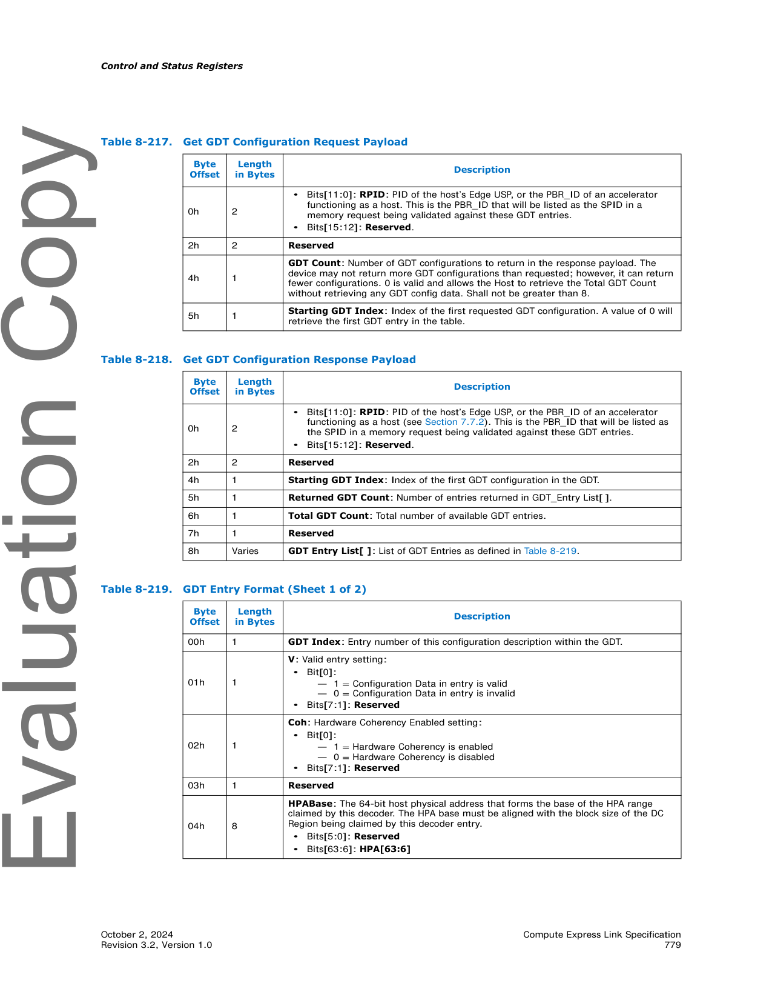
>
> *Original page render @ 150 DPI* — [📄 Full size](figures/chapter_08/page_0779.png)

[⬆️ 返回目录](#-本章目录-part-e)

---

##### 8.2.10.9.10.21 Set GDT Configuration (Opcode 4914h) | 设置 GDT 配置 (操作码 4914h)

<table>
<thead>
<tr>
<th width="50%">🇬🇧 English</th>
<th width="50%" style="background-color:#e8e8e8">🇨🇳 中文</th>
</tr>
</thead>
<tbody>
<tr><td>This command sets the Host's GDT decoder configurations. The HPA base address, the DPA base address, and the decoded length establish the Host's chosen HPA-to-DPA mapping.</td><td style="background-color:#e8e8e8">此命令设置主机的 GDT 解码器配置。HPA 基址、DPA 基址和解码长度确定主机选择的 HPA 到 DPA 的映射。</td></tr>
<tr><td>The device shall report Unsupported if the Coh (hardware coherency enable) bit is set for a decoder range that is not mapped to a DC Region that supports hardware coherency.</td><td style="background-color:#e8e8e8">如果为未映射到支持硬件一致性的 DC Region 的解码器范围设置了 Coh(硬件一致性启用)位,设备应报告 Unsupported。</td></tr>
<tr><td>The device shall report Invalid Input if it detects: • Overlapping Starting DPA and Lengths for multiple GDT entries • Starting DPA not aligned to the GDT Block Size • Length not a multiple of the GDT Block Size</td><td style="background-color:#e8e8e8">如果设备检测到以下情况,应报告 Invalid Input: • 多个 GDT 条目的 Starting DPA 和 Lengths 重叠 • Starting DPA 未与 GDT Block Size 对齐 • Length 不是 GDT Block Size 的倍数</td></tr>
<tr><td>The device shall report Resources Exhausted if the number of GDT entries submitted exceed the number of GDT decoders that are available to this host.</td><td style="background-color:#e8e8e8">如果提交的 GDT 条目数超过该主机可用的 GDT 解码器数,设备应报告 Resources Exhausted。</td></tr>
<tr><td><b>Possible Command Return Codes:</b> • Success • Unsupported • Invalid Input • Internal Error • Retry Required • Resources Exhausted</td><td style="background-color:#e8e8e8"><b>可能的命令返回码:</b> • Success(成功) • Unsupported(不支持) • Invalid Input(无效输入) • Internal Error(内部错误) • Retry Required(需要重试) • Resources Exhausted(资源耗尽)</td></tr>
<tr><td><b>Command Effects:</b> • Immediate Configuration Change</td><td style="background-color:#e8e8e8"><b>命令效果:</b> • Immediate Configuration Change(立即配置更改)</td></tr>
</tbody>
</table>

**Table 8-220. Set GDT Configuration Request Payload | Set GDT Configuration 请求负载**

<table>
<thead>
<tr><th>Byte Offset</th><th>Length in Bytes</th><th>🇬🇧 Description</th><th>🇨🇳 描述</th></tr>
</thead>
<tbody>
<tr><td>0h</td><td>2</td><td>• Bits[11:0]: RPID: PID of the host's Edge USP, or the PBR_ID of an accelerator functioning as a host (see Section 7.7.6). This is the PBR_ID that will be listed as the SPID in a memory request being validated against these GDT entries. • Bits[15:12]: Reserved.</td><td>• Bits[11:0]:RPID:主机 Edge USP 的 PID,或充当主机的加速器的 PBR_ID(请参阅 7.7.6 节)。这将在针对这些 GDT 条目进行验证的内存请求中作为 SPID 列出。 • Bits[15:12]:保留。</td></tr>
<tr><td>2h</td><td>2</td><td>Reserved</td><td>保留</td></tr>
<tr><td>4h</td><td>1</td><td>GDT Count: Number of GDT configurations contained in this request payload. Count shall be greater than 0. Shall not be greater than 8.</td><td>GDT Count(GDT 计数):此请求负载中包含的 GDT 配置数。计数应大于 0。应不大于 8。</td></tr>
<tr><td>5h</td><td>1</td><td>Starting GDT Index: Index of the first GDT to be configured. A value of 0 will configure the first GDT entry in the table.</td><td>Starting GDT Index(起始 GDT 索引):要配置的第一个 GDT 的索引。值 0 将配置表中的第一个 GDT 条目。</td></tr>
<tr><td>6h</td><td>Varies</td><td>GDT_Entry List[ ]: List of GDT entry configurations for the specified host, formatted as defined in Table 8-219.</td><td>GDT_Entry List:如 Table 8-219 中定义格式的指定主机的 GDT 条目配置列表。</td></tr>
</tbody>
</table>

> **Figure 8-X.** Set GDT Configuration (page 780-781) ｜ Set GDT Configuration
>
> 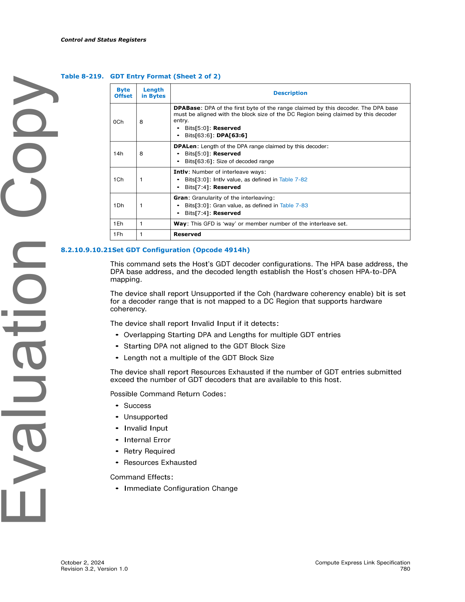
>
> *Original page render @ 150 DPI* — [📄 Full size](figures/chapter_08/page_0780.png)

[⬆️ 返回目录](#-本章目录-part-e)

---

#### 8.2.10.9.11 Memory Device Features | 内存设备功能

---

##### 8.2.10.9.11.1 Device Patrol Scrub Control Feature | 设备 Patrol Scrub 控制功能

<table>
<thead>
<tr>
<th width="50%">🇬🇧 English</th>
<th width="50%" style="background-color:#e8e8e8">🇨🇳 中文</th>
</tr>
</thead>
<tbody>
<tr><td>The UUID of this feature is defined in Table 8-221.</td><td style="background-color:#e8e8e8">此功能的 UUID 在 Table 8-221 中定义。</td></tr>
<tr><td>The Device Patrol Scrub proactively locates and makes corrections to errors during normal device operation. The patrol scrub control allows the requester to configure patrol scrub configurations during system boot or at runtime.</td><td style="background-color:#e8e8e8">设备 Patrol Scrub 在正常设备运行期间主动定位并纠正错误。patrol scrub 控制允许请求者在系统引导时或运行时配置 patrol scrub 配置。</td></tr>
<tr><td>The patrol scrub control feature allows the requester to specify the number of hours during which the patrol scrub cycles must be completed, provided that the requested number is not less than the minimum number of hours for the patrol scrub cycle of which the device is capable. In addition, the patrol scrub controls allow the host to disable and enable Patrol Scrub. When the patrol scrub cycle duration is reported to the host via the Get Feature, the number of hours for the configured patrol scrub cycle returns the default value or the current value depending on the Selection field.</td><td style="background-color:#e8e8e8">patrol scrub 控制功能允许请求者指定 patrol scrub 周期必须完成的时数,前提是请求的时数不小于设备能够实现的 patrol scrub 周期的最小时数。此外,patrol scrub 控制允许主机禁用和启用 Patrol Scrub。通过 Get Feature 向主机报告 patrol scrub 周期持续时间时,所配置的 patrol scrub 周期的时数根据 Selection 字段返回默认值或当前值。</td></tr>
<tr><td>For memory errors that are detected during the patrol scrub, the CXL device shall generate either the General Media Event Record or the DRAM Event Record when the number of memory errors detected exceeds the configured threshold. Handling of both uncorrectable errors and corrected errors are expected by the patrol scrub. For the General Media Event Record, the Memory Event Type field is set to Scrub Media ECC error (04h). For the DRAM Event Record, the Memory Event Type field is set to Scrub Media ECC error (01h). In both cases, Transaction Type field is set to Media Patrol Scrub (05h).</td><td style="background-color:#e8e8e8">对于在 patrol scrub 期间检测到的内存错误,当检测到的内存错误数超过配置的阈值时,CXL 设备应生成 General Media Event Record 或 DRAM Event Record。patrol scrub 应处理不可纠正错误和可纠正错误。对于 General Media Event Record,Memory Event Type 字段设置为 Scrub Media ECC error (04h)。对于 DRAM Event Record,Memory Event Type 字段设置为 Scrub Media ECC error (01h)。在这两种情况下,Transaction Type 字段都设置为 Media Patrol Scrub (05h)。</td></tr>
<tr><td>Table 8-221 shows the information returned in the Get Supported Features output payload for the Device Patrol Scrub Control Feature. Some feature attributes are changeable.</td><td style="background-color:#e8e8e8">Table 8-221 显示了在 Get Supported Features 输出负载中为 Device Patrol Scrub Control Feature 返回的信息。某些功能属性是可更改的。</td></tr>
</tbody>
</table>

**Table 8-221. Supported Feature Entry for the Device Patrol Scrub Control Feature (Sheet 1 of 2) | Device Patrol Scrub Control Feature 的支持功能条目 (第 1 张,共 2 张)**

<table>
<thead>
<tr><th>Byte Offset</th><th>Length in Bytes</th><th>Attribute</th><th>🇬🇧 Description</th><th>🇨🇳 描述</th></tr>
</thead>
<tbody>
<tr><td>00h</td><td>10h</td><td>Feature Identifier</td><td>96dad7d6-fde8-482b-a733-75774e06db8a</td><td>96dad7d6-fde8-482b-a733-75774e06db8a</td></tr>
<tr><td>10h</td><td>2</td><td>Feature Index</td><td>Device Specific</td><td>Device Specific(设备特定)</td></tr>
<tr><td>12h</td><td>2</td><td>Get Feature Size</td><td>4</td><td>4</td></tr>
<tr><td>14h</td><td>2</td><td>Set Feature Size</td><td>2</td><td>2</td></tr>
<tr><td>16h</td><td>4</td><td>Attribute Flags</td><td>• Bit[0]: 1 (Changeable) • Bits[3:1]: 000b (Deepest Reset Persistence=None. Any reset will restore the default value.) • Bit[4]: 0 (Persist across Firmware Update) • Bit[5]: 1 (Default Selection Supported) • Bit[6]: 0 (Saved Selection Supported) • Bits[31:7]: Reserved</td><td>• Bit[0]:1(可更改) • Bits[3:1]:000b(最深重置持久性=无。任何重置都将恢复默认值。) • Bit[4]:0(跨固件更新持久) • Bit[5]:1(支持默认选择) • Bit[6]:0(支持已保存选择) • Bits[31:7]:保留</td></tr>
<tr><td>1Ah</td><td>1</td><td>Get Feature Version</td><td>01h</td><td>01h</td></tr>
<tr><td>1Bh</td><td>1</td><td>Set Feature Version</td><td>01h</td><td>01h</td></tr>
<tr><td>1Ch</td><td>2</td><td>Set Feature Effects</td><td>• Bit[0]: 0 (Configuration Change after Cold Reset) • Bit[1]: 1 (Immediate Configuration Change) • Bit[2]: 0 (Immediate Data Change) • Bit[3]: 0 (Immediate Policy Change) • Bit[4]: Vendor-specific value (Immediate Log Change) • Bit[5]: 0 (Security State Change) • Bit[6]: 0 (Background Operation) • Bit[7]: Vendor-specific value (Secondary Mailbox Supported) • Bit[8]: 0 (Request Abort Background Operation Supported) • Bit[9]: 1 (CEL[11:10] Valid) • Bit[10]: 0 (Configuration Change after Conventional Reset) • Bit[11]: 0 (Configuration Change after CXL Reset) • Bits[15:12]: 0h</td><td>• Bit[0]:0(Cold Reset 后配置更改) • Bit[1]:1(立即配置更改) • Bit[2]:0(立即数据更改) • Bit[3]:0(立即策略更改) • Bit[4]:供应商特定值(立即日志更改) • Bit[5]:0(安全状态更改) • Bit[6]:0(后台操作) • Bit[7]:供应商特定值(支持辅助邮箱) • Bit[8]:0(支持请求中止后台操作) • Bit[9]:1(CEL[11:10] 有效) • Bit[10]:0(Conventional Reset 后配置更改) • Bit[11]:0(CXL Reset 后配置更改) • Bits[15:12]:0h</td></tr>
<tr><td>1Eh</td><td>12h</td><td>Reserved</td><td>All 0s</td><td>All 0s(全 0)</td></tr>
</tbody>
</table>

Table 8-222 shows the output payload returned by a Get Feature command with Selection cleared to 0h (Current value) or set to 1h (Default value).

**Table 8-222. Device Patrol Scrub Control Feature Readable Attributes (Sheet 1 of 2) | Device Patrol Scrub Control Feature 可读属性 (第 1 张,共 2 张)**

<table>
<thead>
<tr><th>Byte Offset</th><th>Length in Bytes</th><th>🇬🇧 Description</th><th>🇨🇳 描述</th></tr>
</thead>
<tbody>
<tr><td>0h</td><td>1</td><td>Device Patrol Scrub Capabilities • Bit[0]: Patrol Scrub Cycle Change Capable: If set, scrub cycle (the interval of scrub results reported) can be changed to a value other than the default value. • Bit[1]: Patrol Scrub Real-time Reporting Capable: If set, event records are generated as the device finds errors. Otherwise, event records are generated at the end of the scrub cycle.</td><td>Device Patrol Scrub Capabilities(设备 Patrol Scrub 能力): • Bit[0]:Patrol Scrub Cycle Change Capable(可更改 Patrol Scrub 周期):如果设置,scrub 周期(报告 scrub 结果的间隔)可以更改为默认值以外的值。 • Bit[1]:Patrol Scrub Real-time Reporting Capable(支持 Patrol Scrub 实时报告):如果设置,则在设备发现错误时生成事件记录。否则,事件记录将在 scrub 周期结束时生成。</td></tr>
<tr><td>1h</td><td>2</td><td>Device Patrol Scrub Cycle Support • Bits[7:0]: Number of Hours for the Configured Patrol Scrub Cycle: A nonzero value that represents the currently configured scrub cycle in hours. If the Set Feature Effects field in the Supported Feature Entry is set to output default selection, then the default patrol scrub cycle will be shown. If the Set Feature Effects field is set to output saved selection, then the currently saved patrol scrub cycle updated by the host request will be shown. • Bits[15:8]: Smallest Number of Hours for the Patrol Scrub Cycle Supported by the Device: It indicates the shortest scrub intervals that the device can support, expressed in hours. Legal value ranges from 01h to FFh.</td><td>Device Patrol Scrub Cycle Support(设备 Patrol Scrub 周期支持): • Bits[7:0]:Number of Hours for the Configured Patrol Scrub Cycle(所配置 Patrol Scrub 周期的时数):表示当前配置的 scrub 周期(以小时为单位)的非零值。如果 Supported Feature Entry 中的 Set Feature Effects 字段设置为输出默认选择,则将显示默认的 patrol scrub 周期。如果 Set Feature Effects 字段设置为输出已保存选择,则将显示由主机请求更新的当前已保存的 patrol scrub 周期。 • Bits[15:8]:Smallest Number of Hours for the Patrol Scrub Cycle Supported by the Device(设备支持的 Patrol Scrub 周期的最小时数):指示设备可以支持的最短 scrub 间隔(以小时为单位)。合法值范围为 01h 到 FFh。</td></tr>
<tr><td>3h</td><td>1</td><td>Device Patrol Scrub Flags • Bit[0]: Patrol Scrub Enabled — 0 = Scrub is disabled — 1 = Scrub is enabled • Bits[7:1]: Reserved</td><td>Device Patrol Scrub Flags(设备 Patrol Scrub 标志): • Bit[0]:Patrol Scrub Enabled(Patrol Scrub 已启用) — 0 = Scrub 已禁用 — 1 = Scrub 已启用 • Bits[7:1]:保留</td></tr>
</tbody>
</table>

Table 8-223 shows the Feature Data for Set Feature command.

**Table 8-223. Device Patrol Scrub Control Feature Writable Attributes | Device Patrol Scrub Control Feature 可写属性**

<table>
<thead>
<tr><th>Byte Offset</th><th>Length in Bytes</th><th>🇬🇧 Description</th><th>🇨🇳 描述</th></tr>
</thead>
<tbody>
<tr><td>0h</td><td>1</td><td>Device Patrol Scrub Cycle Change Request • Bits[7:0]: Number of Hours for the Configured Scrub Cycle: A nonzero value that represents the currently configured scrub cycle in hours. Only the range of numbers greater than or equal to the smallest number of hours for the Patrol Scrub Cycle supported by the device is valid; any number outside the range is invalid and the Command Return Code of Invalid Input shall be returned. This field is reserved if Patrol Scrub Cycle Change Capable bit (see Table 8-222) is cleared to 0.</td><td>Device Patrol Scrub Cycle Change Request(设备 Patrol Scrub 周期更改请求): • Bits[7:0]:Number of Hours for the Configured Scrub Cycle(所配置 Scrub 周期的时数):表示当前配置的 scrub 周期(以小时为单位)的非零值。只有大于或等于设备支持的 Patrol Scrub 周期的最小时数的数字范围才有效;任何超出该范围的数字都无效,并且应返回 Invalid Input 的命令返回码。如果 Patrol Scrub Cycle Change Capable 位(请参阅 Table 8-222)清零,则此字段保留。</td></tr>
<tr><td>1h</td><td>1</td><td>Device Patrol Scrub Flags • Bit[0]: Patrol Scrub Enable — 0 = Disable Scrub — 1 = Enable Scrub • Bits[7:1]: Reserved</td><td>Device Patrol Scrub Flags(设备 Patrol Scrub 标志): • Bit[0]:Patrol Scrub Enable(Patrol Scrub 启用) — 0 = 禁用 Scrub — 1 = 启用 Scrub • Bits[7:1]:保留</td></tr>
</tbody>
</table>

> **Figure 8-X.** Device Patrol Scrub Control Feature (page 781-783) ｜ Device Patrol Scrub Control Feature
>
> 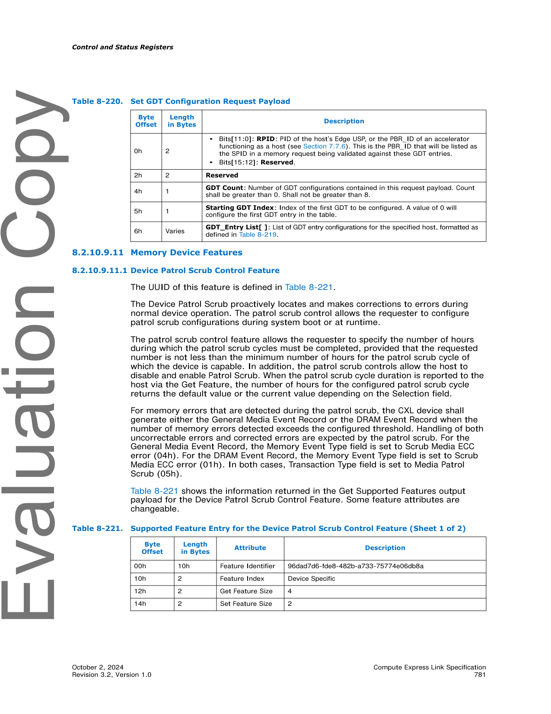
>
> *Original page render @ 150 DPI* — [📄 Full size](figures/chapter_08/page_0781.png)

[⬆️ 返回目录](#-本章目录-part-e)

---

##### 8.2.10.9.11.2 DDR5 Error Check Scrub Control Feature | DDR5 错误检查 Scrub 控制功能

<table>
<thead>
<tr>
<th width="50%">🇬🇧 English</th>
<th width="50%" style="background-color:#e8e8e8">🇨🇳 中文</th>
</tr>
</thead>
<tbody>
<tr><td>The UUID of this feature is defined in Table 8-224.</td><td style="background-color:#e8e8e8">此功能的 UUID 在 Table 8-224 中定义。</td></tr>
<tr><td>The Error Check Scrub (ECS) is a feature defined in JEDEC DDR5 SDRAM Specification (JESD79-5) and allows the DRAM to internally read, correct single-bit errors, and write back corrected data bits to the DRAM array while providing transparency to error counts. The ECS control feature may be used to configure ECS parameters.</td><td style="background-color:#e8e8e8">错误检查 Scrub (ECS) 是 JEDEC DDR5 SDRAM 规范 (JESD79-5) 中定义的一项功能,允许 DRAM 内部读取、纠正单位错误,并将纠正后的数据位写回 DRAM 阵列,同时提供错误计数的透明性。ECS 控制功能可用于配置 ECS 参数。</td></tr>
<tr><td>The ECS control allows the requester to change the ECS threshold count provided that the request is within the definition specified in DDR5 mode registers, change the mode of operation between codeword count mode and row count mode, and reset the ECS counter.</td><td style="background-color:#e8e8e8">ECS 控制允许请求者更改 ECS 阈值计数(前提是请求在 DDR5 模式寄存器中指定的定义范围内),在码字数模式和行数模式之间更改操作模式,以及重置 ECS 计数器。</td></tr>
<tr><td>The outputs from the ECS operation including the error count and the row address with the most errors are accessible from the DDR5 ECS Log, defined in Table 8-90.</td><td style="background-color:#e8e8e8">ECS 操作的输出(包括错误计数和错误最多的行地址)可从 DDR5 ECS Log 访问,定义见 Table 8-90。</td></tr>
<tr><td>DDR5 ECS is able to handle corrected errors only. When a corrected error is fixed by ECS, the CXL device shall generate a DRAM Event Record or a Generic Media Event Record with the following attributes: • Memory Event Type = Scrub Media ECC error (01h) • Transaction Type = Internal Media Error Check Scrub (07h)</td><td style="background-color:#e8e8e8">DDR5 ECS 只能处理可纠正错误。当 ECS 修复可纠正错误时,CXL 设备应生成具有以下属性的 DRAM Event Record 或 Generic Media Event Record: • Memory Event Type = Scrub Media ECC error (01h) • Transaction Type = Internal Media Error Check Scrub (07h)</td></tr>
</tbody>
</table>

**Table 8-224. Supported Feature Entry for the DDR5 ECS Control Feature | DDR5 ECS Control Feature 的支持功能条目**

<table>
<thead>
<tr><th>Byte Offset</th><th>Length in Bytes</th><th>Attribute</th><th>🇬🇧 Description</th><th>🇨🇳 描述</th></tr>
</thead>
<tbody>
<tr><td>00h</td><td>10h</td><td>Feature Identifier</td><td>e5b13f22-2328-4a14-b8ba-b9691e893386</td><td>e5b13f22-2328-4a14-b8ba-b9691e893386</td></tr>
<tr><td>10h</td><td>2</td><td>Feature Index</td><td>Device Specific</td><td>Device Specific(设备特定)</td></tr>
<tr><td>12h</td><td>2</td><td>Get Feature Size</td><td>Varies (n*4+1, where n is the number of memory media FRUs in the device)</td><td>Varies (n*4+1,其中 n 是设备中内存介质 FRU 的数量)</td></tr>
<tr><td>14h</td><td>2</td><td>Set Feature Size</td><td>Varies (n*2+1, where n is the number of memory media FRUs in the device)</td><td>Varies (n*2+1,其中 n 是设备中内存介质 FRU 的数量)</td></tr>
<tr><td>16h</td><td>4</td><td>Attribute Flags</td><td>• Bit[0]: 1 (Changeable) • Bits[3:1]: 000b (Deepest Reset Persistence=None. Any reset will restore the default value.) • Bit[4]: 0 (Persist across Firmware Update) • Bit[5]: 1 (Default Selection Supported) • Bit[6]: 0 (Saved Selection Supported) • Bits[31:7]: Reserved</td><td>• Bit[0]:1(可更改) • Bits[3:1]:000b(最深重置持久性=无。任何重置都将恢复默认值。) • Bit[4]:0(跨固件更新持久) • Bit[5]:1(支持默认选择) • Bit[6]:0(支持已保存选择) • Bits[31:7]:保留</td></tr>
<tr><td>1Ah</td><td>1</td><td>Get Feature Version</td><td>01h</td><td>01h</td></tr>
<tr><td>1Bh</td><td>1</td><td>Set Feature Version</td><td>01h</td><td>01h</td></tr>
<tr><td>1Ch</td><td>2</td><td>Set Feature Effects</td><td>• Bit[0]: 0 (Configuration Change after Cold Reset) • Bit[1]: 1 (Immediate Configuration Change) • Bit[2]: 0 (Immediate Data Change) • Bit[3]: 0 (Immediate Policy Change) • Bit[4]: Vendor-specific value (Immediate Log Change) • Bit[5]: 0 (Security State Change) • Bit[6]: 0 (Background Operation) • Bit[7]: Vendor-specific value (Secondary Mailbox Supported) • Bit[8]: 0 (Request Abort Background Operation Supported) • Bit[9]: 1 (CEL[11:10] Valid) • Bit[10]: 0 (Configuration Change after Conventional Reset) • Bit[11]: 0 (Configuration Change after CXL Reset) • Bits[15:12]: 0h</td><td>• Bit[0]:0(Cold Reset 后配置更改) • Bit[1]:1(立即配置更改) • Bit[2]:0(立即数据更改) • Bit[3]:0(立即策略更改) • Bit[4]:供应商特定值(立即日志更改) • Bit[5]:0(安全状态更改) • Bit[6]:0(后台操作) • Bit[7]:供应商特定值(支持辅助邮箱) • Bit[8]:0(支持请求中止后台操作) • Bit[9]:1(CEL[11:10] 有效) • Bit[10]:0(Conventional Reset 后配置更改) • Bit[11]:0(CXL Reset 后配置更改) • Bits[15:12]:0h</td></tr>
<tr><td>1Eh</td><td>12h</td><td>Reserved</td><td>All 0s</td><td>All 0s(全 0)</td></tr>
</tbody>
</table>

Table 8-225 shows the output payload returned by a Get Feature command with Selection cleared to 0h (Current value) or set to 1h (Default value).

**Table 8-225. DDR5 ECS Control Feature Readable Attributes | DDR5 ECS Control Feature 可读属性**

<table>
<thead>
<tr><th>Byte Offset</th><th>Length in Bytes</th><th>🇬🇧 Description</th><th>🇨🇳 描述</th></tr>
</thead>
<tbody>
<tr><td>00h</td><td>1</td><td>Common DDR5 ECS Log Capabilities • Bits[1:0]: Log Entry Type: The log entry type of how the ECS log is reported. The entry type is defined commonly for all memory media FRUs within the device. — 00b = Per DRAM — 01b = Per Memory Media FRU — All other encodings are reserved • Bits[7:2]: Reserved.</td><td>Common DDR5 ECS Log Capabilities(通用 DDR5 ECS 日志能力): • Bits[1:0]:Log Entry Type(日志条目类型):ECS 日志的报告方式的日志条目类型。条目类型对设备内的所有内存介质 FRU 进行通用定义。 — 00b = Per DRAM(每个 DRAM) — 01b = Per Memory Media FRU(每个内存介质 FRU) — 所有其他编码保留 • Bits[7:2]:保留。</td></tr>
<tr><td>01h</td><td>1</td><td>Memory Media FRU 1 DDR5 ECS Capabilities • Bit[0]: ECS Real-time Reporting Capable: If capable, scrub events are generated as the device finds errors. If not capable, reporting is available only at the end of the scrub cycle. Per definition in JESD79-5, this bit shall be cleared to 0 because ECS is not capable of real-time reporting. • Bits[7:1]: Reserved.</td><td>Memory Media FRU 1 DDR5 ECS Capabilities(内存介质 FRU 1 DDR5 ECS 能力): • Bit[0]:ECS Real-time Reporting Capable(支持 ECS 实时报告):如果支持,则在设备发现错误时生成 scrub 事件。如果不支持,则只能在 scrub 周期结束时进行报告。根据 JESD79-5 中的定义,该位应清零,因为 ECS 不支持实时报告。 • Bits[7:1]:保留。</td></tr>
<tr><td>02h</td><td>2</td><td>Memory Media FRU 1 DDR5 ECS Configurations • Bits[2:0]: ECS Threshold Count per Gb of Memory Cells: — 011b = 256 (default) — 100b = 1024 — 101b = 4096 — All other encodings are reserved • Bit[3]: Codeword/Row Count Mode: — 0 = ECS counts rows with errors — 1 = ECS counts codewords with errors • Bits[15:4]: Reserved</td><td>Memory Media FRU 1 DDR5 ECS Configurations(内存介质 FRU 1 DDR5 ECS 配置): • Bits[2:0]:ECS Threshold Count per Gb of Memory Cells(每 Gb 内存单元的 ECS 阈值计数): — 011b = 256(默认) — 100b = 1024 — 101b = 4096 — 所有其他编码保留 • Bit[3]:Codeword/Row Count Mode(码字/行计数模式): — 0 = ECS 对有错误的行进行计数 — 1 = ECS 对有错误的码字进行计数 • Bits[15:4]:保留</td></tr>
<tr><td>04h</td><td>1</td><td>Memory Media FRU 1 ECS Flags • Bits[7:0]: Reserved</td><td>Memory Media FRU 1 ECS Flags(内存介质 FRU 1 ECS 标志): • Bits[7:0]:保留</td></tr>
<tr><td>…</td><td>…</td><td>…</td><td>…</td></tr>
<tr><td>(1+4*(n-1))</td><td>1</td><td>Memory Media FRU n DDR5 ECS Capabilities: ECS capabilities of the nth memory media FRU of the device,</td><td>Memory Media FRU n DDR5 ECS Capabilities(内存介质 FRU n DDR5 ECS 能力):设备第 n 个内存介质 FRU 的 ECS 能力。</td></tr>
<tr><td>(2+4*(n-1))</td><td>2</td><td>Memory Media FRU n DDR5 ECS Configurations: ECS configurations of the nth memory media FRU of the device,</td><td>Memory Media FRU n DDR5 ECS Configurations(内存介质 FRU n DDR5 ECS 配置):设备第 n 个内存介质 FRU 的 ECS 配置。</td></tr>
<tr><td>(4*n)</td><td>1</td><td>Memory Media FRU n ECS Flags: ECS flags of the nth memory media FRU of the device,</td><td>Memory Media FRU n ECS Flags(内存介质 FRU n ECS 标志):设备第 n 个内存介质 FRU 的 ECS 标志。</td></tr>
</tbody>
</table>

Table 8-226 shows the Feature Data for Set Feature command.

**Table 8-226. DDR5 ECS Control Feature Writable Attributes | DDR5 ECS Control Feature 可写属性**

<table>
<thead>
<tr><th>Byte Offset</th><th>Length in Bytes</th><th>🇬🇧 Description</th><th>🇨🇳 描述</th></tr>
</thead>
<tbody>
<tr><td>00h</td><td>1</td><td>Common DDR5 ECS Log Capabilities • Bits[1:0]: Log Entry Type: The log entry type of how the ECS log is reported. The entry type is defined commonly for all memory media FRUs within the device. — 00b = Per DRAM — 01b = Per Memory Media FRU — All other encodings are reserved • Bits[7:2]: Reserved.</td><td>Common DDR5 ECS Log Capabilities(通用 DDR5 ECS 日志能力): • Bits[1:0]:Log Entry Type(日志条目类型):ECS 日志的报告方式的日志条目类型。条目类型对设备内的所有内存介质 FRU 进行通用定义。 — 00b = Per DRAM(每个 DRAM) — 01b = Per Memory Media FRU(每个内存介质 FRU) — 所有其他编码保留 • Bits[7:2]:保留。</td></tr>
<tr><td>01h</td><td>2</td><td>Memory Media FRU 1 DDR5 ECS Configurations • Bits[2:0]: ECS Threshold Count per Gb of Memory Cells: — 011b = 256 (default) — 100b = 1024 — 101b = 4096 — All other encodings are reserved • Bit[3]: Codeword/Row Count Mode: — 0 = ECS counts rows with errors — 1 = ECS counts codewords with errors • Bit[4]: ECS Reset Counter: — 0 = Normal, counter running actively (default) — 1 = Reset ECC counter to default value (automatically cleared to 0 by the device after the reset is complete) • Bits[15:5]: Reserved</td><td>Memory Media FRU 1 DDR5 ECS Configurations(内存介质 FRU 1 DDR5 ECS 配置): • Bits[2:0]:ECS Threshold Count per Gb of Memory Cells(每 Gb 内存单元的 ECS 阈值计数): — 011b = 256(默认) — 100b = 1024 — 101b = 4096 — 所有其他编码保留 • Bit[3]:Codeword/Row Count Mode(码字/行计数模式): — 0 = ECS 对有错误的行进行计数 — 1 = ECS 对有错误的码字进行计数 • Bit[4]:ECS Reset Counter(ECS 重置计数器): — 0 = 正常,计数器主动运行(默认) — 1 = 将 ECC 计数器重置为默认值(重置完成后由设备自动清零) • Bits[15:5]:保留</td></tr>
<tr><td>…</td><td>…</td><td>…</td><td>…</td></tr>
<tr><td>(1+2*(n-1))</td><td>2</td><td>Memory Media FRU n DDR5 ECS Configurations</td><td>Memory Media FRU n DDR5 ECS Configurations(内存介质 FRU n DDR5 ECS 配置)。</td></tr>
</tbody>
</table>

> **Figure 8-X.** DDR5 ECS Control Feature (page 784-786) ｜ DDR5 ECS Control Feature
>
> 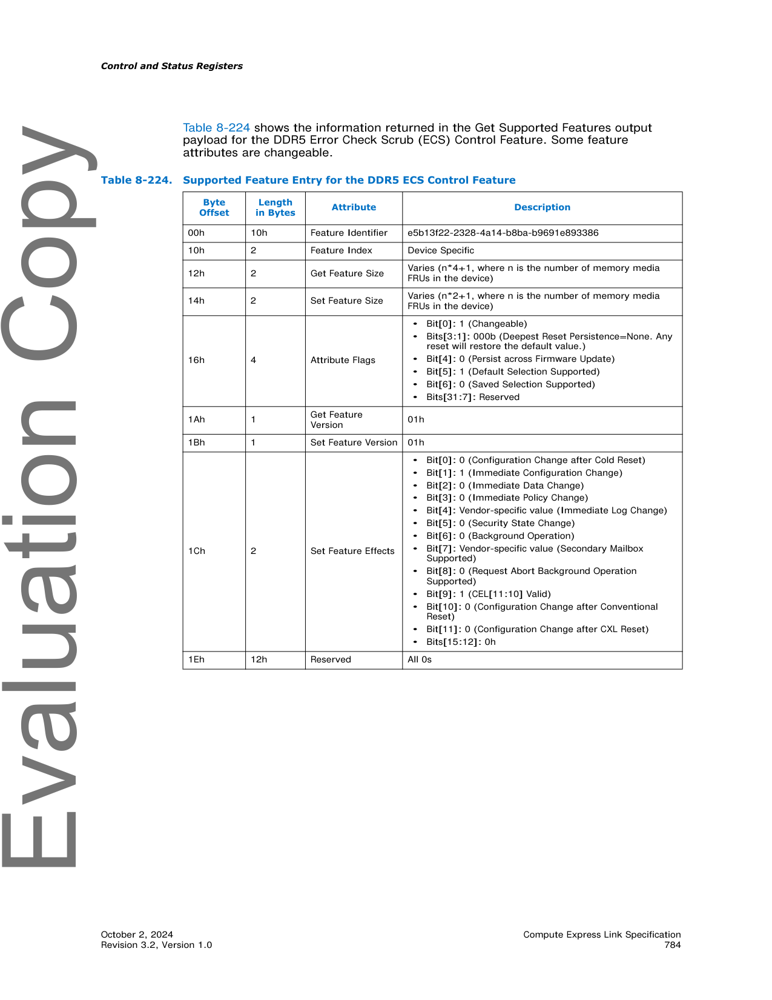
>
> *Original page render @ 150 DPI* — [📄 Full size](figures/chapter_08/page_0784.png)

[⬆️ 返回目录](#-本章目录-part-e)

---

##### 8.2.10.9.11.3 Advanced Programmable Corrected Volatile Memory Error Threshold Feature Discovery and Configuration | 高级可编程可纠正易失性内存错误阈值功能发现和配置

<table>
<thead>
<tr>
<th width="50%">🇬🇧 English</th>
<th width="50%" style="background-color:#e8e8e8">🇨🇳 中文</th>
</tr>
</thead>
<tbody>
<tr><td>The UUID of this feature is defined in Table 8-227.</td><td style="background-color:#e8e8e8">此功能的 UUID 在 Table 8-227 中定义。</td></tr>
<tr><td>Table 8-227 shows the information returned in the Get Supported Features output payload for the Advanced Programmable Corrected Volatile Memory Error (CVME) Threshold Feature. Some feature attributes are changeable. Feature attributes cannot be saved.</td><td style="background-color:#e8e8e8">Table 8-227 显示了在 Get Supported Features 输出负载中为 Advanced Programmable Corrected Volatile Memory Error (CVME) Threshold Feature 返回的信息。某些功能属性是可更改的。功能属性无法保存。</td></tr>
</tbody>
</table>

**Table 8-227. Supported Feature Entry for the Advanced Programmable Corrected Volatile Memory Error Threshold Feature (Sheet 1 of 2) | Advanced Programmable Corrected Volatile Memory Error Threshold Feature 的支持功能条目 (第 1 张,共 2 张)**

<table>
<thead>
<tr><th>Byte Offset</th><th>Length in Bytes</th><th>Attribute</th><th>🇬🇧 Description</th><th>🇨🇳 描述</th></tr>
</thead>
<tbody>
<tr><td>00h</td><td>10h</td><td>Feature Identifier</td><td>1478ad9d-ce00-4733-9db8-f392a4c2d0cc</td><td>1478ad9d-ce00-4733-9db8-f392a4c2d0cc</td></tr>
<tr><td>10h</td><td>2</td><td>Feature Index</td><td>Device Specific</td><td>Device Specific(设备特定)</td></tr>
<tr><td>12h</td><td>2</td><td>Get Feature Size</td><td>20h</td><td>20h</td></tr>
<tr><td>14h</td><td>2</td><td>Set Feature Size</td><td>20h</td><td>20h</td></tr>
<tr><td>16h</td><td>4</td><td>Attribute Flags</td><td>• Bit[0]: 1 (Changeable) • Bits[3:1]: 000b (Deepest Reset Persistence=None. Any reset will restore the default value.) • Bit[4]: 0 (Persist across Firmware Update) • Bit[5]: 1 (Default Selection Supported) • Bit[6]: 0 (Saved Selection Supported) • Bits[31:7]: Reserved</td><td>• Bit[0]:1(可更改) • Bits[3:1]:000b(最深重置持久性=无。任何重置都将恢复默认值。) • Bit[4]:0(跨固件更新持久) • Bit[5]:1(支持默认选择) • Bit[6]:0(支持已保存选择) • Bits[31:7]:保留</td></tr>
<tr><td>1Ah</td><td>1</td><td>Get Feature Version</td><td>01h</td><td>01h</td></tr>
<tr><td>1Bh</td><td>1</td><td>Set Feature Version</td><td>01h</td><td>01h</td></tr>
<tr><td>1Ch</td><td>2</td><td>Set Feature Effects</td><td>• Bit[0]: 0 (Configuration Change after Cold Reset) • Bit[1]: 1 (Immediate Configuration Change) • Bit[2]: 0 (Immediate Data Change) • Bit[3]: 0 (Immediate Policy Change) • Bit[4]: Vendor-specific value (Immediate Log Change) • Bit[5]: 0 (Security State Change) • Bit[6]: 0 (Background Operation) • Bit[7]: Vendor-specific value (Secondary Mailbox Supported) • Bit[8]:0 (Request Abort Background Operation Supported) • Bit[9]: 1 (CEL[11:10] Valid) • Bit[10]: 0 (Configuration Change after Conventional Reset) • Bit[11]: 0 (Configuration Change after CXL Reset) • Bits[15:12]: 0h</td><td>• Bit[0]:0(Cold Reset 后配置更改) • Bit[1]:1(立即配置更改) • Bit[2]:0(立即数据更改) • Bit[3]:0(立即策略更改) • Bit[4]:供应商特定值(立即日志更改) • Bit[5]:0(安全状态更改) • Bit[6]:0(后台操作) • Bit[7]:供应商特定值(支持辅助邮箱) • Bit[8]:0(支持请求中止后台操作) • Bit[9]:1(CEL[11:10] 有效) • Bit[10]:0(Conventional Reset 后配置更改) • Bit[11]:0(CXL Reset 后配置更改) • Bits[15:12]:0h</td></tr>
<tr><td>1Eh</td><td>12h</td><td>Reserved</td><td>All 0s</td><td>All 0s(全 0)</td></tr>
</tbody>
</table>

Table 8-228 shows the output payload returned by a Get Feature command with Selection cleared to 0h (Current value) or set to 1h (Default value).

**Table 8-228. Advanced Programmable Corrected Volatile Memory Error Threshold Feature Readable Attributes (Sheet 1 of 4) | Advanced Programmable Corrected Volatile Memory Error Threshold Feature 可读属性 (第 1 张,共 4 张)**

<table>
<thead>
<tr><th>Byte Offset</th><th>Length in Bytes</th><th>🇬🇧 Description</th><th>🇨🇳 描述</th></tr>
</thead>
<tbody>
<tr><td>00h</td><td>1</td><td>Supported Corrected Volatile Memory Error (CVME) Threshold Granularity Flags • Bit[0]: Per Memory Media FRU Granularity: If set, the device implements a dedicated CVME counter for each memory media FRU (e.g., counter per DIMM). The device shall generate a memory media event record when the CVME counter for a given memory media FRU exceeds a programmed threshold. • Bit[1]: Per Rank Granularity: If set, the device implements a dedicated CVME counter for each rank of media on the device. The device shall generate a memory media event record when the CVME counter for a given rank exceeds a programmed threshold. • Bits[7:2]: Reserved. All memory devices support Full HDM Range Granularity as available by the Set Alert Configuration command.</td><td>Supported Corrected Volatile Memory Error (CVME) Threshold Granularity Flags(支持的 CVME 阈值粒度标志): • Bit[0]:Per Memory Media FRU Granularity(每个内存介质 FRU 粒度):如果设置,设备为每个内存介质 FRU(例如,每个 DIMM 一个计数器)实现专用的 CVME 计数器。当给定内存介质 FRU 的 CVME 计数器超过编程阈值时,设备应生成内存介质事件记录。 • Bit[1]:Per Rank Granularity(每个 Rank 粒度):如果设置,设备为设备上的每个介质 Rank 实现专用的 CVME 计数器。当给定 Rank 的 CVME 计数器超过编程阈值时,设备应生成内存介质事件记录。 • Bits[7:2]:保留。 所有内存设备都支持 Set Alert Configuration 命令可用的 Full HDM Range Granularity。</td></tr>
<tr><td>01h</td><td>1</td><td>Configured Corrected Volatile Memory Error (CVME) Threshold Granularity • 00h = Full HDM Range Granularity. When used, the programmable thresholds shall cover the entire range of HDM on the device. The device shall maintain a global CVME counter for the entire device HDM. When the global CVME counter exceeds a programmed threshold, the device shall generate a memory media event record. • 01h = Per Memory Media FRU Granularity. When used, the programmable thresholds are at a per-memory media FRU granularity (e.g., threshold per DIMM) across all memory media FRUs. The device shall maintain a separate CVME counter for each memory media FRU connected to the device. When the CVME counter for a given memory media FRU exceeds a programmed threshold, the device shall generate a memory media event record. • 02h = Per Rank Granularity. When used, the programmable thresholds are at a per-rank of device granularity (e.g., threshold per rank) across all ranks. The device shall maintain a separate CVME counter for each rank of media on the device. When the CVME counter for a given rank exceeds a programmed threshold, the device shall generate a memory media event record. • All other encodings are reserved.</td><td>Configured Corrected Volatile Memory Error (CVME) Threshold Granularity(已配置的 CVME 阈值粒度): • 00h = Full HDM Range Granularity(完整 HDM 范围粒度)。使用时,可编程阈值应覆盖设备上的整个 HDM 范围。设备应为整个设备 HDM 维护一个全局 CVME 计数器。当全局 CVME 计数器超过编程阈值时,设备应生成内存介质事件记录。 • 01h = Per Memory Media FRU Granularity(每个内存介质 FRU 粒度)。使用时,可编程阈值在所有内存介质 FRU 中以每个内存介质 FRU 的粒度(例如,每个 DIMM 一个阈值)。设备应为连接到设备的每个内存介质 FRU 维护一个单独的 CVME 计数器。当给定内存介质 FRU 的 CVME 计数器超过编程阈值时,设备应生成内存介质事件记录。 • 02h = Per Rank Granularity(每个 Rank 粒度)。使用时,可编程阈值在所有 Rank 中以每个设备 Rank 的粒度(例如,每个 Rank 一个阈值)。设备应为设备上的每个介质 Rank 维护一个单独的 CVME 计数器。当给定 Rank 的 CVME 计数器超过编程阈值时,设备应生成内存介质事件记录。 • 所有其他编码保留。</td></tr>
</tbody>
</table>

> **Figure 8-X.** Advanced Programmable CVME Threshold Feature (page 786-787) ｜ Advanced Programmable CVME Threshold Feature
>
> 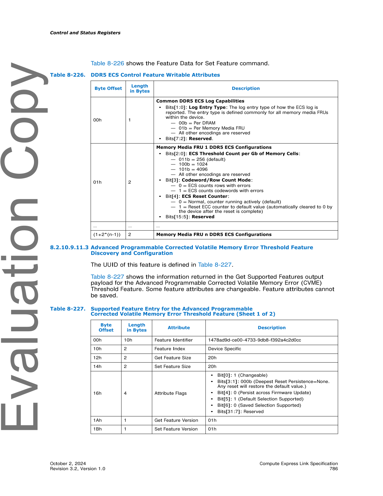
>
> *Original page render @ 150 DPI* — [📄 Full size](figures/chapter_08/page_0786.png)

[⬆️ 返回目录](#-本章目录-part-e)

---

**Table 8-228 (Sheet 2 of 4). Advanced Programmable CVME Threshold Feature Readable Attributes | Advanced Programmable CVME Threshold Feature 可读属性 (第 2 张,共 4 张)**

<table>
<thead>
<tr><th>Byte Offset</th><th>Length in Bytes</th><th>🇬🇧 Description</th><th>🇨🇳 描述</th></tr>
</thead>
<tbody>
<tr><td>02h</td><td>1</td><td>Supported Corrected Volatile Memory Error (CVME) Threshold Configuration Flags • Bit[0]: Corrected Error Type Filtering Supported: When set, the device is capable of filtering out corrected single bit errors and corrected multi-bit errors from its CVME counters used for advanced thresholding. • Bit[1]: Patrol Scrub CVME Threshold Supported: When set, the device is capable of maintaining separate counters and thresholds for CVMEs detected during patrol scrub accesses. CVME counters used by Patrol Scrub CVME Thresholds are automatically reset at the end of every Patrol Scrub cycle. • Bits[7:2]: Reserved. Flags in this field apply to all severity thresholds (e.g., Informational, Warning, etc.). Feature does not support individual filtering per severity threshold.</td><td>Supported Corrected Volatile Memory Error (CVME) Threshold Configuration Flags(支持的 CVME 阈值配置标志): • Bit[0]:Corrected Error Type Filtering Supported(支持可纠正错误类型过滤):设置时,设备能够从用于高级阈值的 CVME 计数器中过滤掉已纠正的单位错误和已纠正的多位错误。 • Bit[1]:Patrol Scrub CVME Threshold Supported(支持 Patrol Scrub CVME 阈值):设置时,设备能够为在 patrol scrub 访问期间检测到的 CVME 维护单独的计数器和阈值。Patrol Scrub CVME 阈值使用的 CVME 计数器在每个 Patrol Scrub 周期结束时自动重置。 • Bits[7:2]:保留。 此字段中的标志适用于所有严重性阈值(例如,Informational、Warning 等)。功能不支持按严重性阈值进行单独过滤。</td></tr>
<tr><td>03h</td><td>1</td><td>Configured Corrected Volatile Memory (CVME) Error Threshold Configuration Flags • Bit[0]: Single Bit Error Mask: When set, the device shall not include single bit errors in the corrected volatile memory errors count for the advanced programmable volatile memory error thresholds and subsequent memory media events associated with those thresholds. • Bit[1]: Corrected Multi Bit Error Mask: When set, the device shall not include corrected multi-bit errors in the corrected volatile memory errors count for the advanced programmable volatile memory error thresholds and subsequent memory media events associated with those thresholds. • Bit[2]: Enable Patrol Scrub CVME Threshold: When set, the device shall maintain separate counters and thresholds for CVMEs detected during patrol scrub. CVME counters used by Patrol Scrub CVME Thresholds are automatically reset at the end of every Patrol Scrub cycle. When cleared, the device shall combine CVME counts from patrol scrub and non-patrol scrub accesses. Additionally, when cleared, the device shall ignore all other parameters related to Patrol Scrub CVME Thresholds. • Bit[3]: Enable Counter Expiration: When set, the device shall expire and restart all CVME counters used by the Advanced Programmable CVME Threshold Feature after a configured time duration. Counter expiration does not apply to Patrol Scrub CVME counters if Patrol Scrub Thresholds are enabled. If Patrol Scrub Thresholds are disabled, CVMEs counted by the patrol scrubber will reset alongside non-patrol scrub CVMEs when the counter expires. • Bit[4]: Enable Counter Expiration Reporting: When set, the device shall generate a media event record each time the CVME counter has expired. Media event records are created with Informational severity and a flag to indicate Threshold Expiration. Counter expiration must be enabled and its timer input correctly configured for the device to report counter expiration. If the CVME count is 0 at the time of counter expiration, the device shall not generate a media event record. Use of this flag and a low expiration timer may yield a large number of events generated. • Bits[7:5]: Reserved. Flags in this field apply to all severity thresholds (e.g., Informational, Warning, etc.). Feature does not support individual filtering per severity threshold. Enabling all filters may still result in corrected error counting and thresholding for other error types not filterable by this feature.</td><td>Configured Corrected Volatile Memory (CVME) Error Threshold Configuration Flags(已配置的 CVME 错误阈值配置标志): • Bit[0]:Single Bit Error Mask(单位错误掩码):设置时,设备不应将单位错误计入高级可编程易失性内存错误阈值以及与这些阈值关联的后续内存介质事件的已纠正易失性内存错误计数中。 • Bit[1]:Corrected Multi Bit Error Mask(已纠正多位错误掩码):设置时,设备不应将已纠正的多位错误计入高级可编程易失性内存错误阈值以及与这些阈值关联的后续内存介质事件的已纠正易失性内存错误计数中。 • Bit[2]:Enable Patrol Scrub CVME Threshold(启用 Patrol Scrub CVME 阈值):设置时,设备应为在 patrol scrub 期间检测到的 CVME 维护单独的计数器和阈值。Patrol Scrub CVME 阈值使用的 CVME 计数器在每个 Patrol Scrub 周期结束时自动重置。清除时,设备应合并 patrol scrub 和非 patrol scrub 访问的 CVME 计数。此外,清除时,设备应忽略与 Patrol Scrub CVME 阈值相关的所有其他参数。 • Bit[3]:Enable Counter Expiration(启用计数器到期):设置时,设备应在配置的持续时间之后使 Advanced Programmable CVME Threshold Feature 使用的所有 CVME 计数器到期并重新启动。如果启用了 Patrol Scrub 阈值,则计数器到期不适用于 Patrol Scrub CVME 计数器。如果禁用了 Patrol Scrub 阈值,则在计数器到期时,由 patrol scrubber 计数的 CVME 将与非 patrol scrub CVME 一起重置。 • Bit[4]:Enable Counter Expiration Reporting(启用计数器到期报告):设置时,设备应在 CVME 计数器每次到期时生成介质事件记录。介质事件记录以 Informational 严重性创建,并带有指示 Threshold Expiration 的标志。必须启用计数器到期并正确配置其计时器输入,设备才能报告计数器到期。如果在计数器到期时 CVME 计数为 0,则设备不应生成介质事件记录。使用此标志和较低的到期计时器可能会产生大量事件。 • Bits[7:5]:保留。 此字段中的标志适用于所有严重性阈值(例如,Informational、Warning 等)。功能不支持按严重性阈值进行单独过滤。启用所有过滤器仍可能导致此功能无法过滤的其他错误类型的已纠正错误计数和阈值。</td></tr>
<tr><td>04h</td><td>3</td><td>Configured Corrected Volatile Memory Error Counter Expiration Timer: Time in seconds after which the device shall expire and restart all corrected volatile memory error programmable counters. An input of 00 0000h shall render the expiration timer as disabled. Counter expiration does not apply to Patrol Scrub CVME counters if Patrol Scrub Thresholds are enabled.</td><td>Configured Corrected Volatile Memory Error Counter Expiration Timer(已配置的可纠正易失性内存错误计数器到期计时器):设备应到期并重新启动所有可纠正易失性内存错误可编程计数器的时间(以秒为单位)。输入 00 0000h 将使到期计时器禁用。如果启用了 Patrol Scrub 阈值,则计数器到期不适用于 Patrol Scrub CVME 计数器。</td></tr>
</tbody>
</table>

> **Figure 8-X.** Advanced Programmable CVME Threshold Feature Sheet 2 (page 787-788) ｜ Advanced Programmable CVME Threshold Feature 第 2 张
>
> 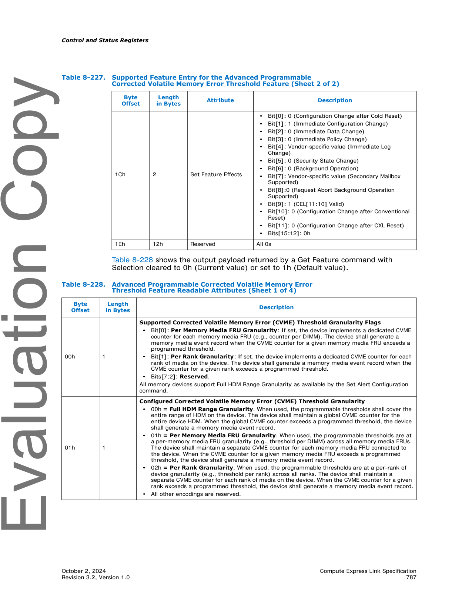
>
> *Original page render @ 150 DPI* — [📄 Full size](figures/chapter_08/page_0787.png)

[⬆️ 返回目录](#-本章目录-part-e)

---

**Table 8-228 (Sheet 3 of 4). Advanced Programmable CVME Threshold Feature Readable Attributes | Advanced Programmable CVME Threshold Feature 可读属性 (第 3 张,共 4 张)**

<table>
<thead>
<tr><th>Byte Offset</th><th>Length in Bytes</th><th>🇬🇧 Description</th><th>🇨🇳 描述</th></tr>
</thead>
<tbody>
<tr><td>07h</td><td>1</td><td>Configured Corrected Volatile Memory Error Threshold Event Records Flags: Enabling an advanced CVME threshold shall cause the device to automatically disable any CVME thresholds set by other methods (such as the one set by the Set Alert Configuration command). Those CVME thresholds are not automatically re-enabled whenever advanced CVME thresholds are disabled. Enabling other CVME thresholds shall cause the device to automatically disable any advanced CVME thresholds. Advanced CVME thresholds also do not automatically re-enable when other CVME thresholds are disabled. If Patrol Scrub CVME Thresholds are enabled, the settings in this parameter shall only apply to non-patrol scrub CVMEs counters and thresholds. • Bit[0]: Enable Programmable Informational Threshold: When set, the device shall enable the advanced programmable informational threshold and generate any informational memory media event records associated with that threshold. • Bit[1]: Enable Programmable Warning Threshold: When set, the device shall enable the advanced programmable warning threshold and generate any warning memory media event records associated with that threshold. • Bit[2]: Enable Programmable Failure Threshold: When set, the device shall enable the advanced programmable failure threshold and generate any failure memory media event records associated with that threshold. • Bit[3]: Enable Programmable Hardware Replacement Flags for Warning Events: When set, the device shall generate memory media events caused by the advanced programmable warning threshold using the 'Hardware Replacement Needed' flag. • Bit[4]: Enable Programmable Hardware Replacement Flags for Failure Events: When set, the device shall generate memory media events caused by the advanced programmable failure threshold using the 'Hardware Replacement Needed' flag. • Bits[7:5]: Reserved.</td><td>Configured Corrected Volatile Memory Error Threshold Event Records Flags(已配置的可纠正易失性内存错误阈值事件记录标志):启用高级 CVME 阈值将导致设备自动禁用由其他方法设置的任何 CVME 阈值(例如由 Set Alert Configuration 命令设置的阈值)。每当禁用高级 CVME 阈值时,这些 CVME 阈值不会自动重新启用。启用其他 CVME 阈值将导致设备自动禁用任何高级 CVME 阈值。当禁用其他 CVME 阈值时,高级 CVME 阈值也不会自动重新启用。 如果启用了 Patrol Scrub CVME 阈值,则此参数中的设置仅适用于非 patrol scrub CVME 计数器和阈值。 • Bit[0]:Enable Programmable Informational Threshold(启用可编程 Informational 阈值):设置时,设备应启用高级可编程 informational 阈值,并生成与该阈值关联的任何 informational 内存介质事件记录。 • Bit[1]:Enable Programmable Warning Threshold(启用可编程 Warning 阈值):设置时,设备应启用高级可编程 warning 阈值,并生成与该阈值关联的任何 warning 内存介质事件记录。 • Bit[2]:Enable Programmable Failure Threshold(启用可编程 Failure 阈值):设置时,设备应启用高级可编程 failure 阈值,并生成与该阈值关联的任何 failure 内存介质事件记录。 • Bit[3]:Enable Programmable Hardware Replacement Flags for Warning Events(为 Warning 事件启用可编程 Hardware Replacement 标志):设置时,设备应使用 'Hardware Replacement Needed' 标志生成由高级可编程 warning 阈值引起的内存介质事件。 • Bit[4]:Enable Programmable Hardware Replacement Flags for Failure Events(为 Failure 事件启用可编程 Hardware Replacement 标志):设置时,设备应使用 'Hardware Replacement Needed' 标志生成由高级可编程 failure 阈值引起的内存介质事件。 • Bits[7:5]:保留。</td></tr>
<tr><td>08h</td><td>3</td><td>Programmable Corrected Volatile Memory Error Informational Event Threshold: The device's current programmable informational threshold for corrected volatile memory errors. A single memory media event record with informational severity is generated once the total number of CVMEs for the programmed threshold granularity becomes equal to or greater than this threshold value. The device may generate additional event records if the threshold expiration function is used. An input of 00 0000h shall render the Programmable CVME Informational Event Threshold as disabled. If Patrol Scrub CVME Thresholds are enabled, this parameter shall only apply to non-patrol scrub CVMEs regardless of whether the Patrol Scrub CVME Informational Event Threshold is disabled.</td><td>Programmable Corrected Volatile Memory Error Informational Event Threshold(可纠正易失性内存错误 Informational 事件可编程阈值):设备对可纠正易失性内存错误的当前可编程 informational 阈值。一旦已编程阈值粒度的 CVME 总数等于或大于此阈值,就会生成一个具有 informational 严重性的内存介质事件记录。如果使用阈值到期功能,设备可能生成其他事件记录。输入 00 0000h 将禁用 Programmable CVME Informational Event Threshold。如果启用了 Patrol Scrub CVME 阈值,则无论 Patrol Scrub CVME Informational Event Threshold 是否禁用,此参数仅适用于非 patrol scrub CVME。</td></tr>
<tr><td>0Bh</td><td>3</td><td>Programmable Corrected Volatile Memory Error Warning Event Threshold: The device's current programmable warning threshold for corrected volatile memory errors. A single memory media event record with warning severity is generated once the total number of CVMEs for the programmed threshold granularity becomes equal to or greater than this threshold value. The device may generate additional event records if the threshold expiration function is used. An input of 00 0000h shall render the Programmable CVME Warning Event Threshold as disabled. If Patrol Scrub CVME Thresholds are enabled, this parameter shall only apply to non-patrol scrub CVMEs regardless of whether the Patrol Scrub CVME Warning Event Threshold is disabled.</td><td>Programmable Corrected Volatile Memory Error Warning Event Threshold(可纠正易失性内存错误 Warning 事件可编程阈值):设备对可纠正易失性内存错误的当前可编程 warning 阈值。一旦已编程阈值粒度的 CVME 总数等于或大于此阈值,就会生成一个具有 warning 严重性的内存介质事件记录。如果使用阈值到期功能,设备可能生成其他事件记录。输入 00 0000h 将禁用 Programmable CVME Warning Event Threshold。如果启用了 Patrol Scrub CVME 阈值,则无论 Patrol Scrub CVME Warning Event Threshold 是否禁用,此参数仅适用于非 patrol scrub CVME。</td></tr>
<tr><td>0Eh</td><td>3</td><td>Programmable Corrected Volatile Memory Error Failure Event Threshold: The device's current programmable failure threshold for corrected volatile memory errors. A single memory media event record with failure severity is generated once the total number of CVMEs for the programmed threshold granularity becomes equal to or greater than this threshold value. The device may generate additional event records if the threshold expiration function is used. An input of 00 0000h shall render the Programmable CVME Failure Event Threshold as disabled. If Patrol Scrub CVME Thresholds are enabled, this parameter shall only apply to non-patrol scrub CVMEs regardless of whether the Patrol Scrub CVME Failure Event Threshold is disabled.</td><td>Programmable Corrected Volatile Memory Error Failure Event Threshold(可纠正易失性内存错误 Failure 事件可编程阈值):设备对可纠正易失性内存错误的当前可编程 failure 阈值。一旦已编程阈值粒度的 CVME 总数等于或大于此阈值,就会生成一个具有 failure 严重性的内存介质事件记录。如果使用阈值到期功能,设备可能生成其他事件记录。输入 00 0000h 将禁用 Programmable CVME Failure Event Threshold。如果启用了 Patrol Scrub CVME 阈值,则无论 Patrol Scrub CVME Failure Event Threshold 是否禁用,此参数仅适用于非 patrol scrub CVME。</td></tr>
</tbody>
</table>

> **Figure 8-X.** Advanced Programmable CVME Threshold Feature Sheet 3 (page 788-790) ｜ Advanced Programmable CVME Threshold Feature 第 3 张
>
> 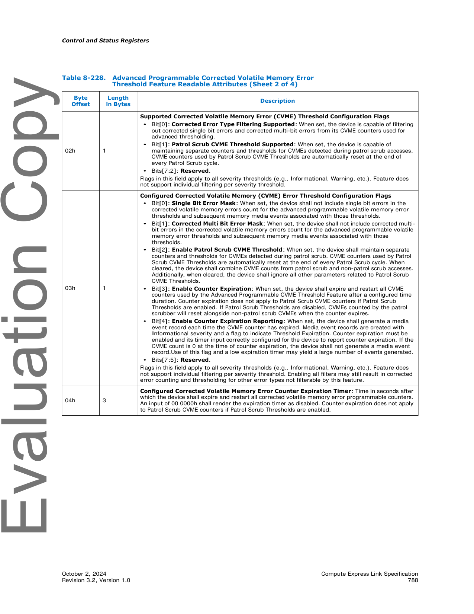
>
> *Original page render @ 150 DPI* — [📄 Full size](figures/chapter_08/page_0788.png)

[⬆️ 返回目录](#-本章目录-part-e)

---

**Table 8-228 (Sheet 4 of 4). Advanced Programmable CVME Threshold Feature Readable Attributes | Advanced Programmable CVME Threshold Feature 可读属性 (第 4 张,共 4 张)**

<table>
<thead>
<tr><th>Byte Offset</th><th>Length in Bytes</th><th>🇬🇧 Description</th><th>🇨🇳 描述</th></tr>
</thead>
<tbody>
<tr><td>11h</td><td>1</td><td>Configured Patrol Scrub CVME Threshold Event Records Flags: Enabling a Patrol Scrub CVME threshold shall cause the device to automatically disable any CVME thresholds set by other methods (such as the one set by the Set Alert Configuration command) regardless of whether Non-Patrol Scrub CVME thresholds are disabled. Those other CVME thresholds are not automatically re-enabled whenever Patrol Scrub CVME thresholds are disabled. Enabling other CVME thresholds shall cause the device to automatically disable any Patrol Scrub CVME thresholds. Patrol Scrub CVME thresholds also do not automatically re-enable when other CVME thresholds are disabled. Settings for this parameter are ignored if Patrol Scrub CVME Threshold is disabled. • Bit[0]: Enable Programmable Informational Patrol Scrub Threshold: When set, the device shall enable the advanced programmable informational patrol scrub threshold and generate any informational memory media event records associated with that threshold. • Bit[1]: Enable Programmable Warning Patrol Scrub Threshold: When set, the device shall enable the advanced programmable warning patrol scrub threshold and generate any warning memory media event records associated with that threshold. • Bit[2]: Enable Programmable Failure Patrol Scrub Threshold: When set, the device shall enable the advanced programmable failure patrol scrub threshold and generate any failure memory media event records associated with that threshold. • Bit[3]: Enable Programmable Hardware Replacement Flags for Warning Patrol Scrub Events: When set, the device shall generate memory media events caused by the advanced programmable warning patrol scrub threshold using the 'Hardware Replacement Needed' flag. • Bit[4]: Enable Programmable Hardware Replacement Flags for Failure Patrol Scrub Events: When set, the device shall generate memory media events caused by the advanced programmable failure patrol scrub threshold using the 'Hardware Replacement Needed' flag. • Bits[7:5]: Reserved.</td><td>Configured Patrol Scrub CVME Threshold Event Records Flags(已配置的 Patrol Scrub CVME 阈值事件记录标志):启用 Patrol Scrub CVME 阈值将导致设备自动禁用由其他方法设置的任何 CVME 阈值(例如由 Set Alert Configuration 命令设置的阈值),无论 Non-Patrol Scrub CVME 阈值是否被禁用。每当禁用 Patrol Scrub CVME 阈值时,这些其他 CVME 阈值不会自动重新启用。启用其他 CVME 阈值将导致设备自动禁用任何 Patrol Scrub CVME 阈值。当禁用其他 CVME 阈值时,Patrol Scrub CVME 阈值也不会自动重新启用。 如果 Patrol Scrub CVME 阈值被禁用,则此参数的设置将被忽略。 • Bit[0]:Enable Programmable Informational Patrol Scrub Threshold(启用可编程 Informational Patrol Scrub 阈值):设置时,设备应启用高级可编程 informational patrol scrub 阈值,并生成与该阈值关联的任何 informational 内存介质事件记录。 • Bit[1]:Enable Programmable Warning Patrol Scrub Threshold(启用可编程 Warning Patrol Scrub 阈值):设置时,设备应启用高级可编程 warning patrol scrub 阈值,并生成与该阈值关联的任何 warning 内存介质事件记录。 • Bit[2]:Enable Programmable Failure Patrol Scrub Threshold(启用可编程 Failure Patrol Scrub 阈值):设置时,设备应启用高级可编程 failure patrol scrub 阈值,并生成与该阈值关联的任何 failure 内存介质事件记录。 • Bit[3]:Enable Programmable Hardware Replacement Flags for Warning Patrol Scrub Events(为 Warning Patrol Scrub 事件启用可编程 Hardware Replacement 标志):设置时,设备应使用 'Hardware Replacement Needed' 标志生成由高级可编程 warning patrol scrub 阈值引起的内存介质事件。 • Bit[4]:Enable Programmable Hardware Replacement Flags for Failure Patrol Scrub Events(为 Failure Patrol Scrub 事件启用可编程 Hardware Replacement 标志):设置时,设备应使用 'Hardware Replacement Needed' 标志生成由高级可编程 failure patrol scrub 阈值引起的内存介质事件。 • Bits[7:5]:保留。</td></tr>
<tr><td>12h</td><td>3</td><td>Programmable Patrol Scrub CVME Informational Event Threshold: The device's current programmable informational threshold for corrected volatile memory errors found by the patrol scrubber. A single memory media event record with informational severity is generated whenever the total number of patrol scrub CVMEs for the programmed threshold granularity becomes equal to or greater than this threshold value. The device may generate additional event records after the patrol scrub cycle has completed and restarted its counters. An input of 00 0000h shall render the Programmable Patrol Scrub CVME Informational Event Threshold as disabled.</td><td>Programmable Patrol Scrub CVME Informational Event Threshold(可编程 Patrol Scrub CVME Informational 事件阈值):设备对由 patrol scrubber 找到的可纠正易失性内存错误的当前可编程 informational 阈值。一旦已编程阈值粒度的 patrol scrub CVME 总数等于或大于此阈值,就会生成一个具有 informational 严重性的内存介质事件记录。设备可能在 patrol scrub 周期完成并重新启动其计数器后生成其他事件记录。输入 00 0000h 将禁用 Programmable Patrol Scrub CVME Informational Event Threshold。</td></tr>
<tr><td>15h</td><td>3</td><td>Programmable Patrol Scrub CVME Warning Event Threshold: The device's current programmable warning threshold for corrected volatile memory errors found by the patrol scrubber. A single memory media event record with warning severity is generated whenever the total number of patrol scrub CVMEs for the programmed threshold granularity becomes equal to or greater than this threshold value. The device may generate additional event records after the patrol scrub cycle has completed and restarted its counters. An input of 00 0000h shall render the Programmable Patrol Scrub CVME Warning Event Threshold as disabled.</td><td>Programmable Patrol Scrub CVME Warning Event Threshold(可编程 Patrol Scrub CVME Warning 事件阈值):设备对由 patrol scrubber 找到的可纠正易失性内存错误的当前可编程 warning 阈值。一旦已编程阈值粒度的 patrol scrub CVME 总数等于或大于此阈值,就会生成一个具有 warning 严重性的内存介质事件记录。设备可能在 patrol scrub 周期完成并重新启动其计数器后生成其他事件记录。输入 00 0000h 将禁用 Programmable Patrol Scrub CVME Warning Event Threshold。</td></tr>
<tr><td>18h</td><td>3</td><td>Programmable Patrol Scrub CVME Failure Event Threshold: The device's current programmable failure threshold for corrected volatile memory errors found by the patrol scrubber. A single memory media event record with failure severity is generated whenever the total number of patrol scrub CVMEs for the programmed threshold granularity becomes equal to or greater than this threshold value. The device may generate additional event records after the patrol scrub cycle has completed and restarted its counters. An input of 00 0000h shall render the Programmable Patrol Scrub CVME Failure Event Threshold as disabled.</td><td>Programmable Patrol Scrub CVME Failure Event Threshold(可编程 Patrol Scrub CVME Failure 事件阈值):设备对由 patrol scrubber 找到的可纠正易失性内存错误的当前可编程 failure 阈值。一旦已编程阈值粒度的 patrol scrub CVME 总数等于或大于此阈值,就会生成一个具有 failure 严重性的内存介质事件记录。设备可能在 patrol scrub 周期完成并重新启动其计数器后生成其他事件记录。输入 00 0000h 将禁用 Programmable Patrol Scrub CVME Failure Event Threshold。</td></tr>
<tr><td>1Bh</td><td>5</td><td>Reserved</td><td>保留</td></tr>
</tbody>
</table>

> **Figure 8-X.** Advanced Programmable CVME Threshold Feature Sheet 4 (page 790) ｜ Advanced Programmable CVME Threshold Feature 第 4 张
>
> 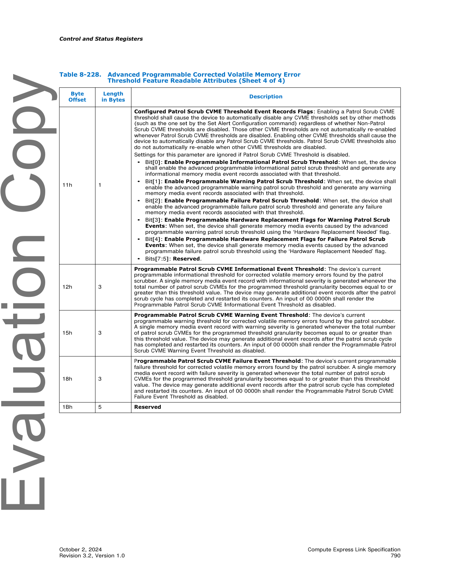
>
> *Original page render @ 150 DPI* — [📄 Full size](figures/chapter_08/page_0790.png)

[⬆️ 返回目录](#-本章目录-part-e)

---

Table 8-229 shows the Feature Data for the Set Feature command.

**Table 8-229. Advanced Programmable Corrected Volatile Memory Error Threshold Feature Writable Attributes (Sheet 1 of 3) | Advanced Programmable Corrected Volatile Memory Error Threshold Feature 可写属性 (第 1 张,共 3 张)**

<table>
<thead>
<tr><th>Byte Offset</th><th>Length in Bytes</th><th>🇬🇧 Description</th><th>🇨🇳 描述</th></tr>
</thead>
<tbody>
<tr><td>00h</td><td>1</td><td>Configured Corrected Volatile Memory Error Threshold Granularity • 00h = Full HDM Range Granularity. When used, the programmable thresholds shall cover the entire range of HDM on the device. The device shall maintain a global CVME counter for the entire device HDM. When the global CVME counter exceeds a programmed threshold, the device shall generate a memory media event record. • 01h = Per Memory Media FRU Granularity. When used, the programmable thresholds are at a per-memory media FRU granularity (e.g., threshold per DIMM) across all memory media FRUs. The device shall maintain a separate CVME counter for each memory media FRU connected to the device. When the CVME counter for a given memory media FRU exceeds a programmed threshold, the device shall generate a memory media event record. • 02h = Per Rank Granularity. When used, the programmable thresholds are at a per-rank of device granularity (e.g., threshold per rank) across all ranks. The device shall maintain a separate CVME counter for each rank of media on the device. When the CVME counter for a given rank exceeds a programmed threshold, the device shall generate a memory media event record. • All other encodings are reserved.</td><td>Configured Corrected Volatile Memory Error Threshold Granularity(已配置的可纠正易失性内存错误阈值粒度): • 00h = Full HDM Range Granularity(完整 HDM 范围粒度)。使用时,可编程阈值应覆盖设备上的整个 HDM 范围。设备应为整个设备 HDM 维护一个全局 CVME 计数器。当全局 CVME 计数器超过编程阈值时,设备应生成内存介质事件记录。 • 01h = Per Memory Media FRU Granularity(每个内存介质 FRU 粒度)。使用时,可编程阈值在所有内存介质 FRU 中以每个内存介质 FRU 的粒度(例如,每个 DIMM 一个阈值)。设备应为连接到设备的每个内存介质 FRU 维护一个单独的 CVME 计数器。当给定内存介质 FRU 的 CVME 计数器超过编程阈值时,设备应生成内存介质事件记录。 • 02h = Per Rank Granularity(每个 Rank 粒度)。使用时,可编程阈值在所有 Rank 中以每个设备 Rank 的粒度(例如,每个 Rank 一个阈值)。设备应为设备上的每个介质 Rank 维护一个单独的 CVME 计数器。当给定 Rank 的 CVME 计数器超过编程阈值时,设备应生成内存介质事件记录。 • 所有其他编码保留。</td></tr>
<tr><td>01h</td><td>1</td><td>Configured Corrected Volatile Memory (CVME) Error Threshold Configuration Flags: Flags in this field apply to all severity thresholds (e.g., Informational, Warning, etc.). Feature does not support individual filtering per severity threshold. Enabling all filters may still result in corrected error counting and thresholding for other error types not filterable by this feature. • Bit[0]: Enable Single Bit Error Mask: When set, the device shall not include single bit errors in the corrected volatile memory errors count for the advanced programmable volatile memory error thresholds and subsequent memory media events associated with those thresholds. • Bit[1]: Enable Corrected Multi Bit Error Mask: When set, the device shall not include corrected multi-bit errors in the corrected volatile memory errors count for the advanced programmable volatile memory error thresholds and subsequent memory media events associated with those thresholds. • Bit[2]: Enable Patrol Scrub CVME Threshold: When set, the device shall maintain separate counters and thresholds for CVMEs detected during patrol scrub and non-patrol scrub accesses. CVME counters used by Patrol Scrub CVME Thresholds are automatically reset at the end of every Patrol Scrub cycle. When disabled, the device shall combine CVME counts from patrol scrub and non-patrol scrub accesses. Additionally, when disabled, the device shall ignore all other parameters related to Patrol Scrub CVME Thresholds. • Bit[3]: Enable Counter Expiration: When set, the device shall expire and restart all CVME counters used by the Advanced Programmable CVME Threshold Feature after a configured time duration. Counter expiration does not apply to Patrol Scrub CVME counters if Patrol Scrub Thresholds are enabled. If Patrol Scrub Thresholds are disabled, CVMEs counted by the patrol scrubber will reset alongside non-patrol scrub CVMEs when the counter expires. • Bit[4]: Enable Counter Expiration Reporting: When set, the device shall generate a media event record each time the CVME counter has expired. Media event records are created with Informational severity and a flag to indicate Threshold Expiration. Counter Expiration must be enabled and its timer input correctly configured for the device to report counter expiration. If the CVME count is 0 at the time of counter expiration, the device shall not generate a media event record. • Bits[7:5]: Reserved.</td><td>Configured Corrected Volatile Memory (CVME) Error Threshold Configuration Flags(已配置的 CVME 错误阈值配置标志):此字段中的标志适用于所有严重性阈值(例如,Informational、Warning 等)。功能不支持按严重性阈值进行单独过滤。启用所有过滤器仍可能导致此功能无法过滤的其他错误类型的已纠正错误计数和阈值。 • Bit[0]:Enable Single Bit Error Mask(启用单位错误掩码):设置时,设备不应将单位错误计入高级可编程易失性内存错误阈值以及与这些阈值关联的后续内存介质事件的已纠正易失性内存错误计数中。 • Bit[1]:Enable Corrected Multi Bit Error Mask(启用已纠正多位错误掩码):设置时,设备不应将已纠正的多位错误计入高级可编程易失性内存错误阈值以及与这些阈值关联的后续内存介质事件的已纠正易失性内存错误计数中。 • Bit[2]:Enable Patrol Scrub CVME Threshold(启用 Patrol Scrub CVME 阈值):设置时,设备应为在 patrol scrub 和非 patrol scrub 访问期间检测到的 CVME 维护单独的计数器和阈值。Patrol Scrub CVME 阈值使用的 CVME 计数器在每个 Patrol Scrub 周期结束时自动重置。禁用时,设备应合并 patrol scrub 和非 patrol scrub 访问的 CVME 计数。此外,禁用时,设备应忽略与 Patrol Scrub CVME 阈值相关的所有其他参数。 • Bit[3]:Enable Counter Expiration(启用计数器到期):设置时,设备应在配置的持续时间之后使 Advanced Programmable CVME Threshold Feature 使用的所有 CVME 计数器到期并重新启动。如果启用了 Patrol Scrub 阈值,则计数器到期不适用于 Patrol Scrub CVME 计数器。如果禁用了 Patrol Scrub 阈值,则在计数器到期时,由 patrol scrubber 计数的 CVME 将与非 patrol scrub CVME 一起重置。 • Bit[4]:Enable Counter Expiration Reporting(启用计数器到期报告):设置时,设备应在 CVME 计数器每次到期时生成介质事件记录。介质事件记录以 Informational 严重性创建,并带有指示 Threshold Expiration 的标志。必须启用 Counter Expiration 并正确配置其计时器输入,设备才能报告计数器到期。如果在计数器到期时 CVME 计数为 0,则设备不应生成介质事件记录。 • Bits[7:5]:保留。</td></tr>
<tr><td>02h</td><td>3</td><td>Configured Corrected Volatile Memory Error Counter Expiration Timer: Time in seconds after which the device shall expire and restart all corrected volatile memory error programmable counters. An input of 00 0000h shall render the expiration timer as disabled. Counter expiration does not apply to Patrol Scrub CVME counters if Patrol Scrub Thresholds are enabled.</td><td>Configured Corrected Volatile Memory Error Counter Expiration Timer(已配置的可纠正易失性内存错误计数器到期计时器):设备应到期并重新启动所有可纠正易失性内存错误可编程计数器的时间(以秒为单位)。输入 00 0000h 将使到期计时器禁用。如果启用了 Patrol Scrub 阈值,则计数器到期不适用于 Patrol Scrub CVME 计数器。</td></tr>
</tbody>
</table>

> **Figure 8-X.** Advanced Programmable CVME Threshold Feature Writable Sheet 1 (page 791) ｜ Advanced Programmable CVME Threshold Feature 可写第 1 张
>
> 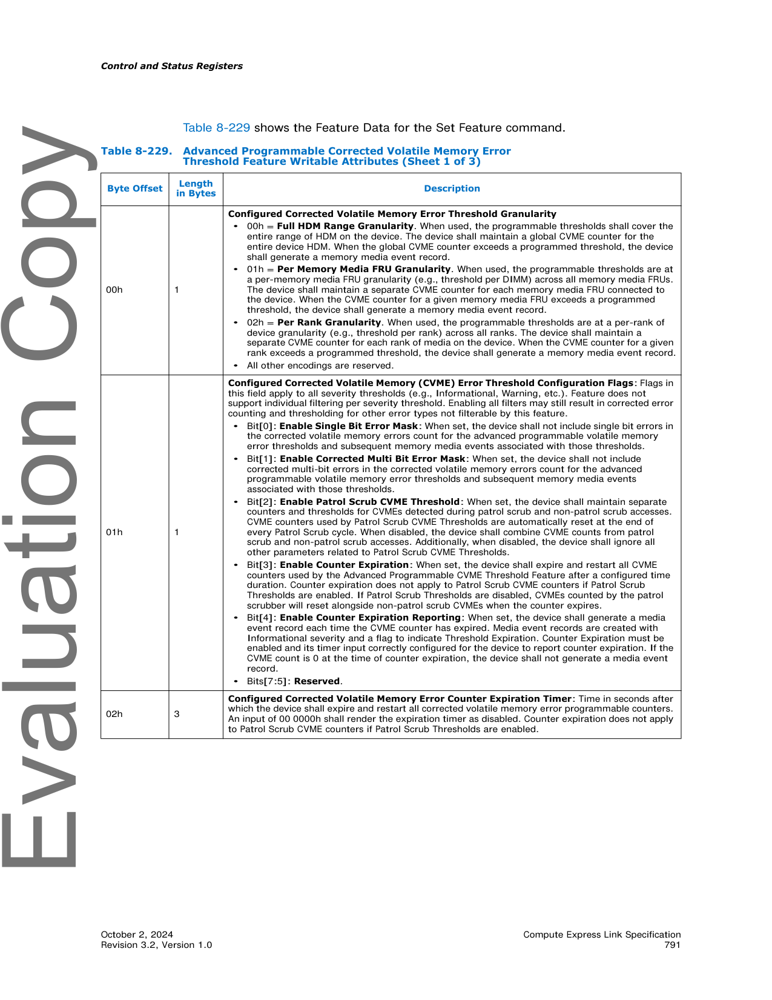
>
> *Original page render @ 150 DPI* — [📄 Full size](figures/chapter_08/page_0791.png)

[⬆️ 返回目录](#-本章目录-part-e)

---

**Table 8-229 (Sheet 2 of 3). Advanced Programmable CVME Threshold Feature Writable Attributes | Advanced Programmable CVME Threshold Feature 可写属性 (第 2 张,共 3 张)**

<table>
<thead>
<tr><th>Byte Offset</th><th>Length in Bytes</th><th>🇬🇧 Description</th><th>🇨🇳 描述</th></tr>
</thead>
<tbody>
<tr><td>05h</td><td>1</td><td>Configured Corrected Volatile Memory Error Threshold Event Records Flags: Enabling an advanced CVME threshold shall cause the device to automatically disable any CVME thresholds set by other methods (such as the one set by the Set Alert Configuration command). Those CVME thresholds are not automatically re-enabled whenever advanced CVME thresholds are disabled. Enabling other CVME thresholds shall cause the device to automatically disable any advanced CVME thresholds. Advanced CVME thresholds also do not automatically re-enable when other CVME thresholds are disabled. If Patrol Scrub CVME Thresholds are enabled, the settings in this parameter shall only apply to non-patrol scrub CVMEs counters and thresholds. • Bit[0]: Enable Programmable Informational Threshold: When set, the device shall enable the advanced programmable informational threshold and generate any informational memory media event records associated with that threshold. • Bit[1]: Enable Programmable Warning Threshold: When set, the device shall enable the advanced programmable warning threshold and generate any warning memory media event records associated with that threshold. • Bit[2]: Enable Programmable Failure Threshold: When set, the device shall enable the advanced programmable failure threshold and generate any failure memory media event records associated with that threshold. • Bit[3]: Enable Programmable Hardware Replacement Flags for Warning Events: When set, the device shall generate memory media events caused by the advanced programmable warning threshold using the 'Hardware Replacement Needed' flag. • Bit[4]: Enable Programmable Hardware Replacement Flags for Failure Events: When set, the device shall generate memory media events caused by the advanced programmable failure threshold using the 'Hardware Replacement Needed' flag. • Bits[7:5]: Reserved.</td><td>Configured Corrected Volatile Memory Error Threshold Event Records Flags(已配置的可纠正易失性内存错误阈值事件记录标志):启用高级 CVME 阈值将导致设备自动禁用由其他方法设置的任何 CVME 阈值(例如由 Set Alert Configuration 命令设置的阈值)。每当禁用高级 CVME 阈值时,这些 CVME 阈值不会自动重新启用。启用其他 CVME 阈值将导致设备自动禁用任何高级 CVME 阈值。当禁用其他 CVME 阈值时,高级 CVME 阈值也不会自动重新启用。 如果启用了 Patrol Scrub CVME 阈值,则此参数中的设置仅适用于非 patrol scrub CVME 计数器和阈值。 • Bit[0]:Enable Programmable Informational Threshold(启用可编程 Informational 阈值):设置时,设备应启用高级可编程 informational 阈值,并生成与该阈值关联的任何 informational 内存介质事件记录。 • Bit[1]:Enable Programmable Warning Threshold(启用可编程 Warning 阈值):设置时,设备应启用高级可编程 warning 阈值,并生成与该阈值关联的任何 warning 内存介质事件记录。 • Bit[2]:Enable Programmable Failure Threshold(启用可编程 Failure 阈值):设置时,设备应启用高级可编程 failure 阈值,并生成与该阈值关联的任何 failure 内存介质事件记录。 • Bit[3]:Enable Programmable Hardware Replacement Flags for Warning Events(为 Warning 事件启用可编程 Hardware Replacement 标志):设置时,设备应使用 'Hardware Replacement Needed' 标志生成由高级可编程 warning 阈值引起的内存介质事件。 • Bit[4]:Enable Programmable Hardware Replacement Flags for Failure Events(为 Failure 事件启用可编程 Hardware Replacement 标志):设置时,设备应使用 'Hardware Replacement Needed' 标志生成由高级可编程 failure 阈值引起的内存介质事件。 • Bits[7:5]:保留。</td></tr>
<tr><td>06h</td><td>3</td><td>Programmable Corrected Volatile Memory Error Informational Event Threshold: The device's programmable informational threshold for corrected volatile memory errors. A single memory media event record with informational severity is generated whenever the total number of CVMEs for the programmed threshold granularity becomes equal to or greater than this threshold value. The device may generate additional event records if the threshold expiration function is used. An input of 00 0000h shall render the Programmable CVME Informational Event Threshold as disabled. If Patrol Scrub CVME Thresholds are enabled, this parameter shall only apply to non-patrol scrub CVMEs regardless of whether the Patrol Scrub CVME Informational Event Threshold is disabled.</td><td>Programmable Corrected Volatile Memory Error Informational Event Threshold(可纠正易失性内存错误 Informational 事件可编程阈值):设备对可纠正易失性内存错误的可编程 informational 阈值。每当已编程阈值粒度的 CVME 总数等于或大于此阈值,就会生成一个具有 informational 严重性的内存介质事件记录。如果使用阈值到期功能,设备可能生成其他事件记录。输入 00 0000h 将禁用 Programmable CVME Informational Event Threshold。如果启用了 Patrol Scrub CVME 阈值,则无论 Patrol Scrub CVME Informational Event Threshold 是否禁用,此参数仅适用于非 patrol scrub CVME。</td></tr>
<tr><td>09h</td><td>3</td><td>Programmable Corrected Volatile Memory Error Warning Event Threshold: The device's programmable warning threshold for corrected volatile memory errors. A single memory media event record with warning severity is generated whenever the total number of CVMEs for the programmed threshold granularity becomes equal to or greater than this threshold value. The device may generate additional event records if the threshold expiration function is used. An input of 00 0000h shall render the Programmable CVME Warning Event Threshold as disabled. If Patrol Scrub CVME Thresholds are enabled, this parameter shall only apply to non-patrol scrub CVMEs regardless of whether the Patrol Scrub CVME Warning Event Threshold is disabled.</td><td>Programmable Corrected Volatile Memory Error Warning Event Threshold(可纠正易失性内存错误 Warning 事件可编程阈值):设备对可纠正易失性内存错误的可编程 warning 阈值。每当已编程阈值粒度的 CVME 总数等于或大于此阈值,就会生成一个具有 warning 严重性的内存介质事件记录。如果使用阈值到期功能,设备可能生成其他事件记录。输入 00 0000h 将禁用 Programmable CVME Warning Event Threshold。如果启用了 Patrol Scrub CVME 阈值,则无论 Patrol Scrub CVME Warning Event Threshold 是否禁用,此参数仅适用于非 patrol scrub CVME。</td></tr>
<tr><td>0Ch</td><td>3</td><td>Programmable Corrected Volatile Memory Error Failure Event Threshold: The device's programmable failure threshold for corrected volatile memory errors. A single memory media event record with failure severity is generated whenever the total number of CVMEs for the programmed threshold granularity becomes equal to or greater than this threshold value. The device may generate additional event records if the threshold expiration function is used. An input of 00 0000h shall render the Programmable CVME Failure Event Threshold as disabled. If Patrol Scrub CVME Thresholds are enabled, this parameter shall only apply to non-patrol scrub CVMEs regardless of whether the Patrol Scrub CVME Failure Event Threshold is disabled.</td><td>Programmable Corrected Volatile Memory Error Failure Event Threshold(可纠正易失性内存错误 Failure 事件可编程阈值):设备对可纠正易失性内存错误的可编程 failure 阈值。每当已编程阈值粒度的 CVME 总数等于或大于此阈值,就会生成一个具有 failure 严重性的内存介质事件记录。如果使用阈值到期功能,设备可能生成其他事件记录。输入 00 0000h 将禁用 Programmable CVME Failure Event Threshold。如果启用了 Patrol Scrub CVME 阈值,则无论 Patrol Scrub CVME Failure Event Threshold 是否禁用,此参数仅适用于非 patrol scrub CVME。</td></tr>
</tbody>
</table>

> **Figure 8-X.** Advanced Programmable CVME Threshold Feature Writable Sheet 2 (page 792) ｜ Advanced Programmable CVME Threshold Feature 可写第 2 张
>
> 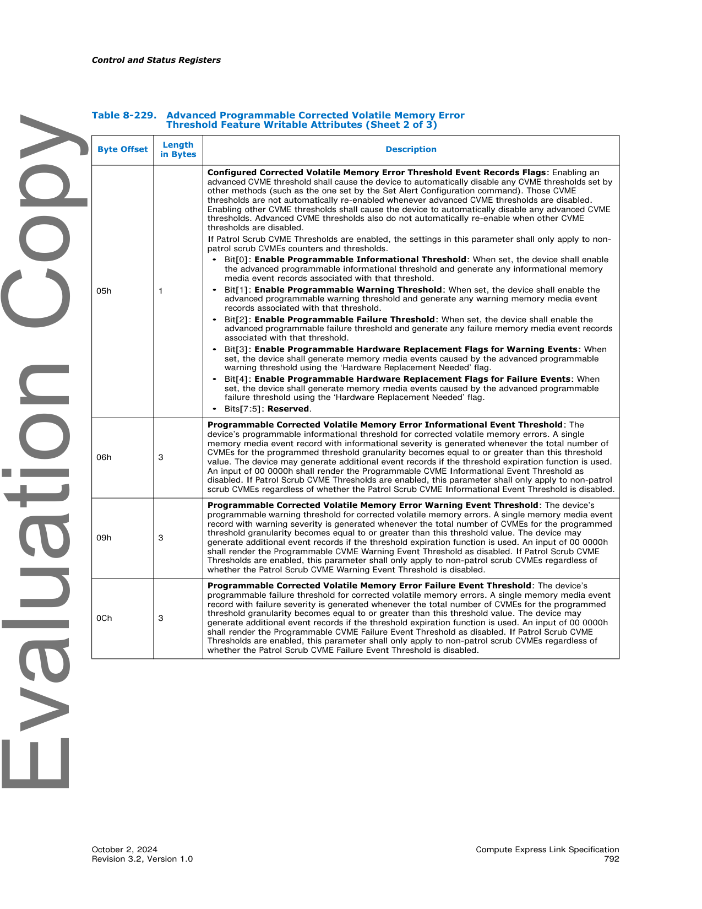
>
> *Original page render @ 150 DPI* — [📄 Full size](figures/chapter_08/page_0792.png)

[⬆️ 返回目录](#-本章目录-part-e)

---

**Table 8-229 (Sheet 3 of 3). Advanced Programmable CVME Threshold Feature Writable Attributes | Advanced Programmable CVME Threshold Feature 可写属性 (第 3 张,共 3 张)**

<table>
<thead>
<tr><th>Byte Offset</th><th>Length in Bytes</th><th>🇬🇧 Description</th><th>🇨🇳 描述</th></tr>
</thead>
<tbody>
<tr><td>0Fh</td><td>1</td><td>Configured Patrol Scrub CVME Threshold Event Records Flags: Enabling a Patrol Scrub CVME threshold shall cause the device to automatically disable any CVME thresholds set by other methods (such as the one set by the Set Alert Configuration command) regardless of whether Non-Patrol Scrub CVME thresholds are disabled. Those other CVME thresholds are not automatically re-enabled whenever Patrol Scrub CVME thresholds are disabled. Enabling other CVMe thresholds shall cause the device to automatically disable any Patrol Scrub CVME thresholds. Patrol Scrub CVME thresholds also do not automatically re-enable when other CVME thresholds are disabled. Settings for this parameter are ignored if Patrol Scrub CVME Threshold is disabled. • Bit[0]: Enable Programmable Informational Patrol Scrub Threshold: When set, the device shall enable the advanced programmable informational patrol scrub threshold and generate any informational memory media event records associated with that threshold. • Bit[1]: Enable Programmable Warning Patrol Scrub Threshold: When set, the device shall enable the advanced programmable warning patrol scrub threshold and generate any warning memory media event records associated with that threshold. • Bit[2]: Enable Programmable Failure Patrol Scrub Threshold: When set, the device shall enable the advanced programmable failure patrol scrub threshold and generate any failure memory media event records associated with that threshold. • Bit[3]: Enable Programmable Hardware Replacement Flags for Warning Patrol Scrub Events: When set, the device shall generate memory media events caused by the advanced programmable warning patrol scrub threshold using the 'Hardware Replacement Needed' flag. • Bit[4]: Enable Programmable Hardware Replacement Flags for Failure Patrol Scrub Events: When set, the device shall generate memory media events caused by the advanced programmable failure patrol scrub threshold using the 'Hardware Replacement Needed' flag. • Bits[7:5]: Reserved.</td><td>Configured Patrol Scrub CVME Threshold Event Records Flags(已配置的 Patrol Scrub CVME 阈值事件记录标志):启用 Patrol Scrub CVME 阈值将导致设备自动禁用由其他方法设置的任何 CVME 阈值(例如由 Set Alert Configuration 命令设置的阈值),无论 Non-Patrol Scrub CVME 阈值是否被禁用。每当禁用 Patrol Scrub CVME 阈值时,这些其他 CVME 阈值不会自动重新启用。启用其他 CVME 阈值将导致设备自动禁用任何 Patrol Scrub CVME 阈值。当禁用其他 CVME 阈值时,Patrol Scrub CVME 阈值也不会自动重新启用。 如果 Patrol Scrub CVME 阈值被禁用,则此参数的设置将被忽略。 • Bit[0]:Enable Programmable Informational Patrol Scrub Threshold(启用可编程 Informational Patrol Scrub 阈值):设置时,设备应启用高级可编程 informational patrol scrub 阈值,并生成与该阈值关联的任何 informational 内存介质事件记录。 • Bit[1]:Enable Programmable Warning Patrol Scrub Threshold(启用可编程 Warning Patrol Scrub 阈值):设置时,设备应启用高级可编程 warning patrol scrub 阈值,并生成与该阈值关联的任何 warning 内存介质事件记录。 • Bit[2]:Enable Programmable Failure Patrol Scrub Threshold(启用可编程 Failure Patrol Scrub 阈值):设置时,设备应启用高级可编程 failure patrol scrub 阈值,并生成与该阈值关联的任何 failure 内存介质事件记录。 • Bit[3]:Enable Programmable Hardware Replacement Flags for Warning Patrol Scrub Events(为 Warning Patrol Scrub 事件启用可编程 Hardware Replacement 标志):设置时,设备应使用 'Hardware Replacement Needed' 标志生成由高级可编程 warning patrol scrub 阈值引起的内存介质事件。 • Bit[4]:Enable Programmable Hardware Replacement Flags for Failure Patrol Scrub Events(为 Failure Patrol Scrub 事件启用可编程 Hardware Replacement 标志):设置时,设备应使用 'Hardware Replacement Needed' 标志生成由高级可编程 failure patrol scrub 阈值引起的内存介质事件。 • Bits[7:5]:保留。</td></tr>
<tr><td>10h</td><td>3</td><td>Programmable Patrol Scrub CVME Informational Event Threshold: The device's programmable informational threshold for corrected volatile memory errors found by the patrol scrubber. A single memory media event record with informational severity is generated whenever the total number of patrol scrub CVMEs for the programmed threshold granularity becomes equal to or greater than this threshold value. The device may generate additional event records after the patrol scrub cycle has completed and restarted its counters. An input of 00 0000h shall render the Programmable Patrol Scrub CVME Informational Event Threshold as disabled.</td><td>Programmable Patrol Scrub CVME Informational Event Threshold(可编程 Patrol Scrub CVME Informational 事件阈值):设备对由 patrol scrubber 找到的可纠正易失性内存错误的可编程 informational 阈值。每当已编程阈值粒度的 patrol scrub CVME 总数等于或大于此阈值,就会生成一个具有 informational 严重性的内存介质事件记录。设备可能在 patrol scrub 周期完成并重新启动其计数器后生成其他事件记录。输入 00 0000h 将禁用 Programmable Patrol Scrub CVME Informational Event Threshold。</td></tr>
<tr><td>13h</td><td>3</td><td>Programmable Patrol Scrub CVME Warning Event Threshold: The device's programmable warning threshold for corrected volatile memory errors found by the patrol scrubber. A single memory media event record with warning severity is generated whenever the total number of patrol scrub CVMEs for the programmed threshold granularity becomes equal to or greater than this threshold value. The device may generate additional event records after the patrol scrub cycle has completed and restarted its counters. An input of 00 0000h shall render the Programmable Patrol Scrub CVME Warning Event Threshold as disabled.</td><td>Programmable Patrol Scrub CVME Warning Event Threshold(可编程 Patrol Scrub CVME Warning 事件阈值):设备对由 patrol scrubber 找到的可纠正易失性内存错误的可编程 warning 阈值。每当已编程阈值粒度的 patrol scrub CVME 总数等于或大于此阈值,就会生成一个具有 warning 严重性的内存介质事件记录。设备可能在 patrol scrub 周期完成并重新启动其计数器后生成其他事件记录。输入 00 0000h 将禁用 Programmable Patrol Scrub CVME Warning Event Threshold。</td></tr>
<tr><td>16h</td><td>3</td><td>Programmable Patrol Scrub CVME Failure Event Threshold: The device's programmable failure threshold for corrected volatile memory errors found by the patrol scrubber. A single memory media event record with failure severity is generated whenever the total number of patrol scrub CVMEs for the programmed threshold granularity becomes equal to or greater than this threshold value. The device may generate additional event records after the patrol scrub cycle has completed and restarted its counters. An input of 00 0000h shall render the Programmable Patrol Scrub CVME Failure Event Threshold as disabled.</td><td>Programmable Patrol Scrub CVME Failure Event Threshold(可编程 Patrol Scrub CVME Failure 事件阈值):设备对由 patrol scrubber 找到的可纠正易失性内存错误的可编程 failure 阈值。每当已编程阈值粒度的 patrol scrub CVME 总数等于或大于此阈值,就会生成一个具有 failure 严重性的内存介质事件记录。设备可能在 patrol scrub 周期完成并重新启动其计数器后生成其他事件记录。输入 00 0000h 将禁用 Programmable Patrol Scrub CVME Failure Event Threshold。</td></tr>
<tr><td>19h</td><td>7</td><td>Reserved</td><td>保留</td></tr>
</tbody>
</table>

> **Figure 8-X.** Advanced Programmable CVME Threshold Feature Writable Sheet 3 (page 793) ｜ Advanced Programmable CVME Threshold Feature 可写第 3 张
>
> 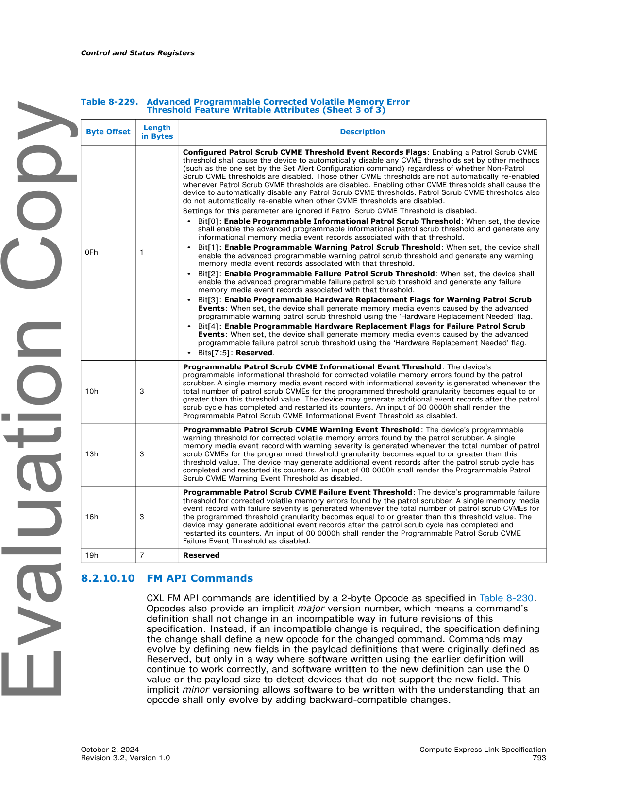
>
> *Original page render @ 150 DPI* — [📄 Full size](figures/chapter_08/page_0793.png)

[⬆️ 返回目录](#-本章目录-part-e)

---

### 8.2.10.10 FM API Commands | FM API 命令

<table>
<thead>
<tr>
<th width="50%">🇬🇧 English</th>
<th width="50%" style="background-color:#e8e8e8">🇨🇳 中文</th>
</tr>
</thead>
<tbody>
<tr><td>CXL FM API commands are identified by a 2-byte Opcode as specified in Table 8-230. Opcodes also provide an implicit major version number, which means a command's definition shall not change in an incompatible way in future revisions of this specification. Instead, if an incompatible change is required, the specification defining the change shall define a new opcode for the changed command. Commands may evolve by defining new fields in the payload definitions that were originally defined as Reserved, but only in a way where software written using the earlier definition will continue to work correctly, and software written to the new definition can use the 0 value or the payload size to detect devices that do not support the new field. This implicit minor versioning allows software to be written with the understanding that an opcode shall only evolve by adding backward-compatible changes.</td><td style="background-color:#e8e8e8">CXL FM API 命令由一个 2 字节的 Opcode 标识,如 Table 8-230 中所指定。Opcode 还提供一个隐式的主版本号,这意味着命令的定义不应在本规范的未来修订版中以不兼容的方式更改。相反,如果需要进行不兼容的更改,则定义该更改的规范应为已更改的命令定义新的 Opcode。命令可通过在最初定义为保留的负载定义中定义新字段来发展,但只能以一种方式进行:使用早期定义编写的软件将继续正常工作,而使用新定义编写的软件可以使用 0 值或负载大小来检测不支持新字段的设备。这种隐式次要版本控制允许编写的软件理解 Opcode 应仅通过添加向后兼容的更改来发展。</td></tr>
</tbody>
</table>

**Table 8-230. CXL Defined FM API Command Opcodes (Vendor ID = 1E98h or 0000h) (Sheet 1 of 5) | CXL 定义的 FM API 命令操作码 (Vendor ID = 1E98h 或 0000h) (第 1 张,共 5 张)**

<table>
<thead>
<tr><th>Opcode Bits[15:8]</th><th>Command Set</th><th>Command Bits[7:0]</th><th>Command</th><th>Combined Opcode</th><th>Type 1/2/3 Device Mailbox</th><th>Type 1/2/3 Device MCTP</th><th>Switch Host Mailbox</th><th>Switch MCTP</th></tr>
</thead>
<tbody>
<tr><td>51h</td><td>Physical Switch</td><td>00h</td><td>Identify Switch Device (Section 7.6.7.1.1)</td><td>5100h</td><td>P</td><td>P</td><td>MSW</td><td>MSW</td></tr>
<tr><td></td><td></td><td>01h</td><td>Get Physical Port State (Section 7.6.7.1.2)</td><td>5101h</td><td>P</td><td>P</td><td>MSW</td><td>MSW</td></tr>
<tr><td></td><td></td><td>02h</td><td>Physical Port Control (Section 7.6.7.1.3)</td><td>5102h</td><td>P</td><td>P</td><td>P</td><td>O</td></tr>
<tr><td></td><td></td><td>03h</td><td>Send PPB CXL.io Configuration Request (Section 7.6.7.1.4)</td><td>5103h</td><td>P</td><td>P</td><td>P</td><td>O</td></tr>
<tr><td></td><td></td><td>04h</td><td>Get Domain Validation SV State (Section 7.6.7.1.5)</td><td>5104h</td><td>P</td><td>P</td><td>O</td><td>O</td></tr>
<tr><td></td><td></td><td>05h</td><td>Set Domain Validation SV (Section 7.6.7.1.6)</td><td>5105h</td><td>P</td><td>P</td><td>O</td><td>P</td></tr>
<tr><td></td><td></td><td>06h</td><td>Get VCS Domain Validation SV State (Section 7.6.7.1.7)</td><td>5106h</td><td>P</td><td>P</td><td>P</td><td>O</td></tr>
<tr><td></td><td></td><td>07h</td><td>Get Domain Validation SV (Section 7.6.7.1.8)</td><td>5107h</td><td>P</td><td>P</td><td>P</td><td>O</td></tr>
<tr><td>52h</td><td>Virtual Switch</td><td>00h</td><td>Get Virtual CXL Switch Info (Section 7.6.7.2.1)</td><td>5200h</td><td>P</td><td>P</td><td>P</td><td>O</td></tr>
<tr><td></td><td></td><td>01h</td><td>Bind vPPB (Section 7.6.7.2.2)</td><td>5201h</td><td>P</td><td>P</td><td>P</td><td>O</td></tr>
<tr><td></td><td></td><td>02h</td><td>Unbind vPPB (Section 7.6.7.2.3)</td><td>5202h</td><td>P</td><td>P</td><td>P</td><td>O</td></tr>
<tr><td></td><td></td><td>03h</td><td>Generate AER Event (Section 7.6.7.2.4)</td><td>5203h</td><td>P</td><td>P</td><td>P</td><td>O</td></tr>
<tr><td>53h</td><td>MLD Port</td><td>00h</td><td>Tunnel Management Command (Section 7.6.7.3.1)</td><td>5300h</td><td>P</td><td>MO</td><td>P</td><td>O</td></tr>
<tr><td></td><td></td><td>01h</td><td>Send LD CXL.io Configuration Request (Section 7.6.7.3.2)</td><td>5301h</td><td>P</td><td>P</td><td>P</td><td>O</td></tr>
<tr><td></td><td></td><td>02h</td><td>Send LD CXL.io Memory Request (Section 7.6.7.3.3)</td><td>5302h</td><td>P</td><td>P</td><td>P</td><td>O</td></tr>
</tbody>
</table>

> **Figure 8-X.** CXL Defined FM API Command Opcodes (1/5) (page 794) ｜ CXL 定义的 FM API 命令操作码 (1/5)
>
> 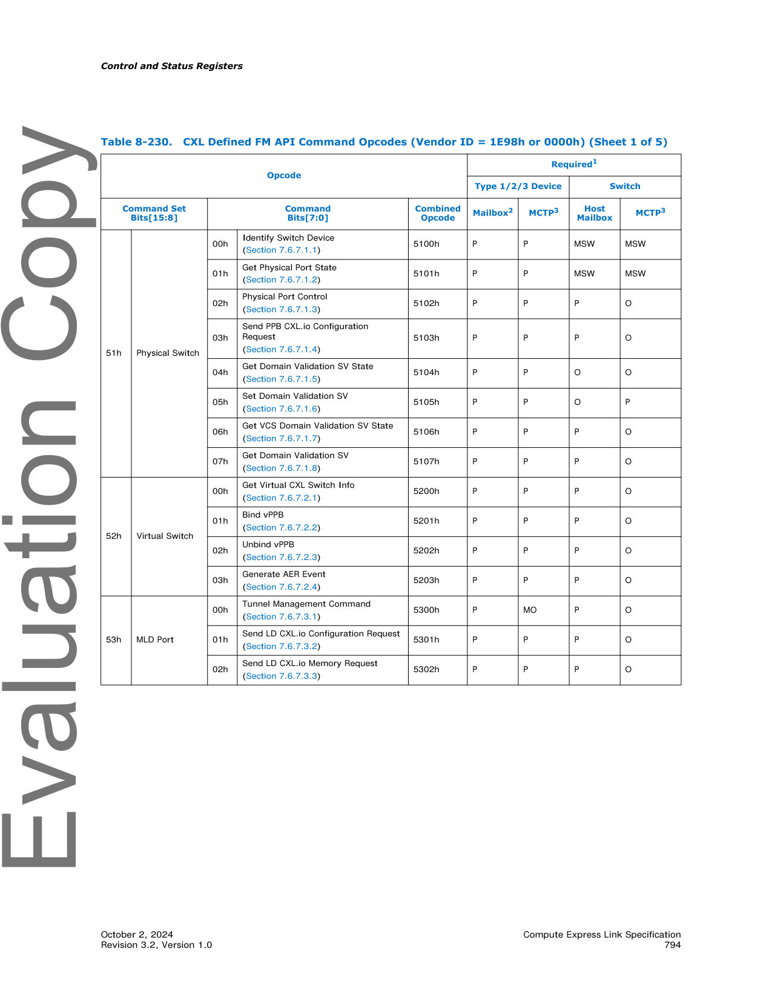
>
> *Original page render @ 150 DPI* — [📄 Full size](figures/chapter_08/page_0794.png)

[⬆️ 返回目录](#-本章目录-part-e)

---

**Table 8-230 (Sheet 2 of 5). CXL Defined FM API Command Opcodes | CXL 定义的 FM API 命令操作码 (第 2 张,共 5 张)**

<table>
<thead>
<tr><th>Opcode Bits[15:8]</th><th>Command Set</th><th>Command Bits[7:0]</th><th>Command</th><th>Combined Opcode</th><th>Type 1/2/3 Device Mailbox</th><th>Type 1/2/3 Device MCTP</th><th>Switch Host Mailbox</th><th>Switch MCTP</th></tr>
</thead>
<tbody>
<tr><td>54h</td><td>MLD Components</td><td>00h</td><td>Get LD Info (Section 7.6.7.4.1)</td><td>5400h</td><td>MM</td><td>MMS</td><td>P</td><td>P</td></tr>
<tr><td></td><td></td><td>01h</td><td>Get LD Allocations (Section 7.6.7.4.2)</td><td>5401h</td><td>MM</td><td>MO</td><td>P</td><td>P</td></tr>
<tr><td></td><td></td><td>02h</td><td>Set LD Allocations (Section 7.6.7.4.3)</td><td>5402h</td><td>MO</td><td>MO</td><td>P</td><td>P</td></tr>
<tr><td></td><td></td><td>03h</td><td>Get QoS Control (Section 7.6.7.4.4)</td><td>5403h</td><td>MM</td><td>MO</td><td>P</td><td>P</td></tr>
<tr><td></td><td></td><td>04h</td><td>Set QoS Control (Section 7.6.7.4.5)</td><td>5404h</td><td>MM</td><td>MO</td><td>P</td><td>P</td></tr>
<tr><td></td><td></td><td>05h</td><td>Get QoS Status (Section 7.6.7.4.6)</td><td>5405h</td><td>MO</td><td>MO</td><td>P</td><td>P</td></tr>
<tr><td></td><td></td><td>06h</td><td>Get QoS Allocated BW (Section 7.6.7.4.7)</td><td>5406h</td><td>MM</td><td>MO</td><td>P</td><td>P</td></tr>
<tr><td></td><td></td><td>07h</td><td>Set QoS Allocated BW (Section 7.6.7.4.8)</td><td>5407h</td><td>MM</td><td>MO</td><td>P</td><td>P</td></tr>
<tr><td></td><td></td><td>08h</td><td>Get QoS BW Limit (Section 7.6.7.4.9)</td><td>5408h</td><td>MM</td><td>MO</td><td>P</td><td>P</td></tr>
<tr><td></td><td></td><td>09h</td><td>Set QoS BW Limit (Section 7.6.7.4.10)</td><td>5409h</td><td>MM</td><td>MO</td><td>P</td><td>P</td></tr>
<tr><td>55h</td><td>Multi-Headed Devices</td><td>00h</td><td>Get Multi-Headed Info (Section 7.6.7.5.1)</td><td>5500h</td><td>MHO</td><td>MHS</td><td>P</td><td>P</td></tr>
<tr><td></td><td></td><td>01h</td><td>Get Head Info (Section 7.6.7.5.2)</td><td>5501h</td><td>MHO</td><td>MHO</td><td>P</td><td>P</td></tr>
<tr><td>56h</td><td>DCD Management for LD-FAM</td><td>00h</td><td>Get DCD Info (Section 7.6.7.6.1)</td><td>5600h</td><td>DCO</td><td>DCS</td><td>P</td><td>P</td></tr>
<tr><td></td><td></td><td>01h</td><td>Get Host DC Region Configuration (Section 7.6.7.6.2)</td><td>5601h</td><td>DCO</td><td>DCS</td><td>P</td><td>P</td></tr>
<tr><td></td><td></td><td>02h</td><td>Set DC Region Configuration (Section 7.6.7.6.3)</td><td>5602h</td><td>DCO</td><td>DCS</td><td>P</td><td>P</td></tr>
<tr><td></td><td></td><td>03h</td><td>Get DC Region Extent Lists (Section 7.6.7.6.4)</td><td>5603h</td><td>DCO</td><td>DCS</td><td>P</td><td>P</td></tr>
<tr><td></td><td></td><td>04h</td><td>Initiate Dynamic Capacity Add (Section 7.6.7.6.5)</td><td>5604h</td><td>DCO</td><td>DCS</td><td>P</td><td>P</td></tr>
<tr><td></td><td></td><td>05h</td><td>Initiate Dynamic Capacity Release (Section 7.6.7.6.6)</td><td>5605h</td><td>DCO</td><td>DCS</td><td>P</td><td>P</td></tr>
<tr><td></td><td></td><td>06h</td><td>Dynamic Capacity Add Reference (Section 7.6.7.6.7)</td><td>5606h</td><td>DCO</td><td>DCS</td><td>P</td><td>P</td></tr>
<tr><td></td><td></td><td>07h</td><td>Dynamic Capacity Remove Reference (Section 7.6.7.6.8)</td><td>5607h</td><td>DCO</td><td>DCS</td><td>P</td><td>P</td></tr>
<tr><td></td><td></td><td>08h</td><td>Dynamic Capacity List Tags (Section 7.6.7.6.9)</td><td>5608h</td><td>DCO</td><td>DCS</td><td>P</td><td>P</td></tr>
</tbody>
</table>

> **Figure 8-X.** CXL Defined FM API Command Opcodes (2/5) (page 795) ｜ CXL 定义的 FM API 命令操作码 (2/5)
>
> 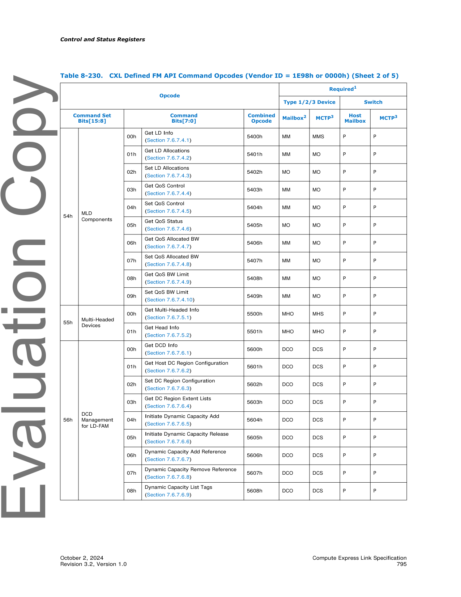
>
> *Original page render @ 150 DPI* — [📄 Full size](figures/chapter_08/page_0795.png)

[⬆️ 返回目录](#-本章目录-part-e)

---

**Table 8-230 (Sheet 3 of 5). CXL Defined FM API Command Opcodes | CXL 定义的 FM API 命令操作码 (第 3 张,共 5 张)**

<table>
<thead>
<tr><th>Opcode Bits[15:8]</th><th>Command Set</th><th>Command Bits[7:0]</th><th>Command</th><th>Combined Opcode</th><th>Type 1/2/3 Device Mailbox</th><th>Type 1/2/3 Device MCTP</th><th>Switch Host Mailbox</th><th>Switch MCTP</th></tr>
</thead>
<tbody>
<tr><td>57h</td><td>PBR Switch</td><td>00h</td><td>Identify PBR Switch (Section 7.7.13.1)</td><td>5700h</td><td>P</td><td>P</td><td>P</td><td>MPSW</td></tr>
<tr><td></td><td></td><td>01h</td><td>Fabric Crawl Out (Section 7.7.13.2)</td><td>5701h</td><td>P</td><td>P</td><td>P</td><td>MPSW</td></tr>
<tr><td></td><td></td><td>02h</td><td>Get PBR Link Partner Info (Section 7.7.13.3)</td><td>5702h</td><td>P</td><td>P</td><td>P</td><td>MPSW</td></tr>
<tr><td></td><td></td><td>03h</td><td>Get PID Target List (Section 7.7.13.4)</td><td>5703h</td><td>P</td><td>P</td><td>P</td><td>MPSW</td></tr>
<tr><td></td><td></td><td>04h</td><td>Configure PID Assignment (Section 7.7.13.5)</td><td>5704h</td><td>P</td><td>P</td><td>P</td><td>MPSW</td></tr>
<tr><td></td><td></td><td>05h</td><td>Get PID Binding (Section 7.7.13.6)</td><td>5705h</td><td>P</td><td>P</td><td>P</td><td>MPSW</td></tr>
<tr><td></td><td></td><td>06h</td><td>Configure PID Binding (Section 7.7.13.7)</td><td>5706h</td><td>P</td><td>P</td><td>P</td><td>MPSW</td></tr>
<tr><td></td><td></td><td>07h</td><td>Get Table Descriptors (Section 7.7.13.8)</td><td>5707h</td><td>P</td><td>P</td><td>P</td><td>MPSW</td></tr>
<tr><td></td><td></td><td>08h</td><td>Get DRT (Section 7.7.13.9)</td><td>5708h</td><td>P</td><td>P</td><td>P</td><td>MPSW</td></tr>
<tr><td></td><td></td><td>09h</td><td>Set DRT (Section 7.7.13.10)</td><td>5709h</td><td>P</td><td>P</td><td>P</td><td>MPSW</td></tr>
<tr><td></td><td></td><td>0Ah</td><td>Get RGT (Section 7.7.13.11)</td><td>570Ah</td><td>P</td><td>P</td><td>P</td><td>O</td></tr>
<tr><td></td><td></td><td>0Bh</td><td>Set RGT (Section 7.7.13.12)</td><td>570Bh</td><td>P</td><td>P</td><td>P</td><td>O</td></tr>
<tr><td></td><td></td><td>0Ch</td><td>Get LDST/IDT Capabilities (Section 7.7.13.13)</td><td>570Ch</td><td>P</td><td>P</td><td>O</td><td>P4</td></tr>
<tr><td></td><td></td><td>0Dh</td><td>Set LDST/IDT Configuration (Section 7.7.13.14)</td><td>570Dh</td><td>P</td><td>P</td><td>O</td><td>P4</td></tr>
<tr><td></td><td></td><td>0Eh</td><td>Get LDST Segment Entries (Section 7.7.13.15)</td><td>570Eh</td><td>P</td><td>P</td><td>O</td><td>P4</td></tr>
<tr><td></td><td></td><td>0Fh</td><td>Set LDST Segment Entries (Section 7.7.13.16)</td><td>570Fh</td><td>P</td><td>P</td><td>O</td><td>P4</td></tr>
<tr><td></td><td></td><td>10h</td><td>Get LDST IDT DPID Entries (Section 7.7.13.17)</td><td>5710h</td><td>P</td><td>P</td><td>O</td><td>P4</td></tr>
<tr><td></td><td></td><td>11h</td><td>Set LDST IDT DPID Entries (Section 7.7.13.18)</td><td>5711h</td><td>P</td><td>P</td><td>O</td><td>P4</td></tr>
<tr><td></td><td></td><td>12h</td><td>Get Completer ID-Based Re-Router Entries (Section 7.7.13.19)</td><td>5712h</td><td>P</td><td>P</td><td>O</td><td>P4</td></tr>
<tr><td></td><td></td><td>13h</td><td>Set Completer ID-Based Re-Router Entries (Section 7.7.13.20)</td><td>5713h</td><td>P</td><td>P</td><td>O</td><td>P4</td></tr>
<tr><td></td><td></td><td>14h</td><td>Get LDST Access Vector (Section 7.7.13.21)</td><td>5714h</td><td>P</td><td>P</td><td>O</td><td>P4</td></tr>
</tbody>
</table>

> **Figure 8-X.** CXL Defined FM API Command Opcodes (3/5) (page 796) ｜ CXL 定义的 FM API 命令操作码 (3/5)
>
> 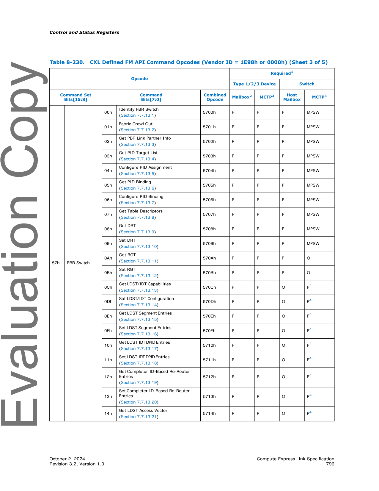
>
> *Original page render @ 150 DPI* — [📄 Full size](figures/chapter_08/page_0796.png)

[⬆️ 返回目录](#-本章目录-part-e)

---

**Table 8-230 (Sheet 4 of 5). CXL Defined FM API Command Opcodes | CXL 定义的 FM API 命令操作码 (第 4 张,共 5 张)**

<table>
<thead>
<tr><th>Opcode Bits[15:8]</th><th>Command Set</th><th>Command Bits[7:0]</th><th>Command</th><th>Combined Opcode</th><th>Type 1/2/3 Device Mailbox</th><th>Type 1/2/3 Device MCTP</th><th>Switch Host Mailbox</th><th>Switch MCTP</th></tr>
</thead>
<tbody>
<tr><td>57h</td><td>PBR Switch</td><td>15h</td><td>Get VCS LDST Access Vector (Section 7.7.13.22)</td><td>5715h</td><td>P</td><td>P</td><td>P</td><td>O</td></tr>
<tr><td></td><td></td><td>16h</td><td>Configure VCS LDST Access (Section 7.7.13.23)</td><td>5716h</td><td>P</td><td>P</td><td>P</td><td>O</td></tr>
<tr><td>58h</td><td>Global Memory Access Endpoint</td><td>00h</td><td>Identify GAE (Section 7.7.14.1)</td><td>5800h</td><td>P</td><td>P</td><td>MG</td><td>P4</td></tr>
<tr><td></td><td></td><td>01h</td><td>Get PID Interrupt Vector (Section 7.7.14.2)</td><td>5801h</td><td>P</td><td>P</td><td>MG</td><td>P4</td></tr>
<tr><td></td><td></td><td>02h</td><td>Get PID Access Vectors (Section 7.7.14.3)</td><td>5802h</td><td>P</td><td>P</td><td>MG</td><td>P4</td></tr>
<tr><td></td><td></td><td>03h</td><td>Get FAST/IDT Capabilities (Section 7.7.14.4)</td><td>5803h</td><td>P</td><td>P</td><td>MG</td><td>P4</td></tr>
<tr><td></td><td></td><td>04h</td><td>Set FAST/IDT Configuration (Section 7.7.14.5)</td><td>5804h</td><td>P</td><td>P</td><td>MG</td><td>P4</td></tr>
<tr><td></td><td></td><td>05h</td><td>Get FAST Segment Entries (Section 7.7.14.6)</td><td>5805h</td><td>P</td><td>P</td><td>MG</td><td>P4</td></tr>
<tr><td></td><td></td><td>06h</td><td>Set FAST Segment Entries (Section 7.7.14.7)</td><td>5806h</td><td>P</td><td>P</td><td>MG</td><td>P4</td></tr>
<tr><td></td><td></td><td>07h</td><td>Get IDT DPID Entries (Section 7.7.14.8)</td><td>5807h</td><td>P</td><td>P</td><td>MG</td><td>P4</td></tr>
<tr><td></td><td></td><td>08h</td><td>Set IDT DPID Entries (Section 7.7.13.18)</td><td>5808h</td><td>P</td><td>P</td><td>MG</td><td>P4</td></tr>
<tr><td></td><td></td><td>09h</td><td>Proxy GFD Management Command (Section 7.7.14.10)</td><td>5809h</td><td>P</td><td>P</td><td>MG</td><td>P4</td></tr>
<tr><td></td><td></td><td>0Ah</td><td>Get Proxy Thread Status (Section 7.7.14.11)</td><td>580Ah</td><td>P</td><td>P</td><td>MG</td><td>P4</td></tr>
<tr><td></td><td></td><td>0Bh</td><td>Cancel Proxy Thread (Section 7.7.14.12)</td><td>580Bh</td><td>P</td><td>P</td><td>MG</td><td>P4</td></tr>
</tbody>
</table>

> **Figure 8-X.** CXL Defined FM API Command Opcodes (4/5) (page 797) ｜ CXL 定义的 FM API 命令操作码 (4/5)
>
> 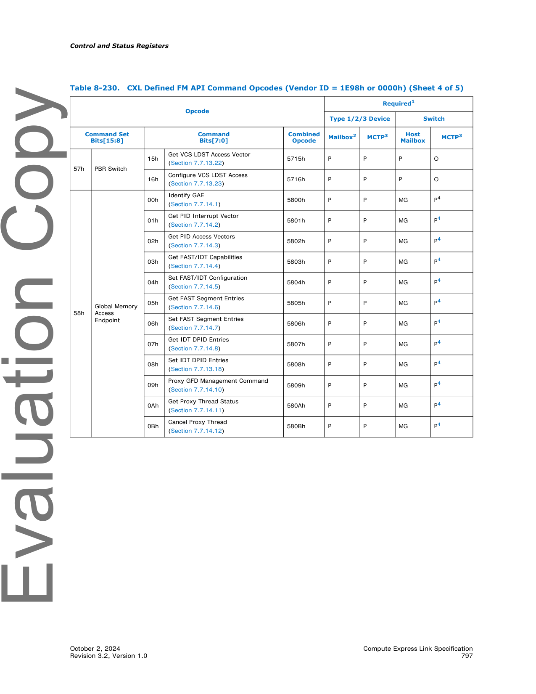
>
> *Original page render @ 150 DPI* — [📄 Full size](figures/chapter_08/page_0797.png)

[⬆️ 返回目录](#-本章目录-part-e)

---

**Table 8-230 (Sheet 5 of 5). CXL Defined FM API Command Opcodes | CXL 定义的 FM API 命令操作码 (第 5 张,共 5 张)**

<table>
<thead>
<tr><th>Opcode Bits[15:8]</th><th>Command Set</th><th>Command Bits[7:0]</th><th>Command</th><th>Combined Opcode</th><th>Type 1/2/3 Device Mailbox</th><th>Type 1/2/3 Device MCTP</th><th>Switch Host Mailbox</th><th>Switch MCTP</th></tr>
</thead>
<tbody>
<tr><td>59h</td><td>Global Memory Access Endpoint Management</td><td>00h</td><td>Identify VCS GAE (Section 7.7.15.1)</td><td>5900h</td><td>P</td><td>P</td><td>P</td><td>MG</td></tr>
<tr><td></td><td></td><td>01h</td><td>Get VCS PID Access Vectors (Section 7.7.15.2)</td><td>5901h</td><td>P</td><td>P</td><td>P</td><td>MG</td></tr>
<tr><td></td><td></td><td>02h</td><td>Configure VCS PID Access (Section 7.7.15.3)</td><td>5902h</td><td>P</td><td>P</td><td>P</td><td>MG</td></tr>
<tr><td></td><td></td><td>03h</td><td>Get VendPrefixL0 State (Section 7.7.15.4)</td><td>5903h</td><td>P</td><td>P</td><td>P</td><td>O</td></tr>
<tr><td></td><td></td><td>04h</td><td>Set VendPrefixL0 State (Section 7.7.15.5)</td><td>5904h</td><td>P</td><td>P</td><td>P</td><td>O</td></tr>
</tbody>
</table>

> **Notes for Table 8-230:**
>
> 1. O = Optional, P = Prohibited, MM = Mandatory for all MLD components (prohibited for SLD components), MO = Optional for MLD components (prohibited for SLD components), MMS = Mandatory for all MLD components that implement an MCTP-based CCI (prohibited for SLD components), MHO = Optional for Multi-Headed devices, MHS = Mandatory for all Multi-Headed devices that implement an MCTP-based CCI, DCO = Optional for DCDs, DCS = Mandatory for all DCDs that implement an MCTP-based CCI, MSW = mandatory on MCTP-based CCIs for all switches that support the FM API MCTP message type, MPSW = Mandatory for PBR Switches, MG = Mandatory for GAE.
> 2. Any host-visible LD in an MLD or MH-SLD or MH-MLD may implement FM Mailbox in a separate Function number. See Section 8.1.13.
> 3. CXL Fabric Manager API over MCTP Binding Specification (DSP0234).
> 4. A Mailbox CCI configured for FM use is permitted to also operate as a GAE. In such a case, these commands may optionally be supported.

> 1. O = Optional(可选),P = Prohibited(禁止),MM = Mandatory for all MLD components (prohibited for SLD components)(所有 MLD 组件必需(禁止用于 SLD 组件)),MO = Optional for MLD components (prohibited for SLD components)(MLD 组件可选(禁止用于 SLD 组件)),MMS = Mandatory for all MLD components that implement an MCTP-based CCI (prohibited for SLD components)(实现基于 MCTP 的 CCI 的所有 MLD 组件必需(禁止用于 SLD 组件)),MHO = Optional for Multi-Headed devices(多宿主设备可选),MHS = Mandatory for all Multi-Headed devices that implement an MCTP-based CCI(实现基于 MCTP 的 CCI 的所有多宿主设备必需),DCO = Optional for DCDs(DCD 可选),DCS = Mandatory for all DCDs that implement an MCTP-based CCI(实现基于 MCTP 的 CCI 的所有 DCD 必需),MSW = mandatory on MCTP-based CCIs for all switches that support the FM API MCTP message type(对支持 FM API MCTP 消息类型的所有交换机,在基于 MCTP 的 CCI 上是必需的),MPSW = Mandatory for PBR Switches(PBR 交换机必需),MG = Mandatory for GAE(GAE 必需)。
> 2. MLD 或 MH-SLD 或 MH-MLD 中的任何主机可见 LD 可在单独的 Function number 中实现 FM Mailbox。请参阅 8.1.13 节。
> 3. CXL Fabric Manager API over MCTP Binding Specification (DSP0234)。
> 4. 配置为 FM 使用的 Mailbox CCI 也允许作为 GAE 运行。在这种情况下,这些命令可以被选择性地支持。

> **IMPLEMENTATION NOTE**
>
> CXL components shall interpret the PCIe MMB Command Opcode Vendor ID = 1E98h or 0000h with CXL defined commands. 0000h is a PCI-SIG reserved value for legacy CXL compatibility. However, it is strongly recommended for callers to use the CXL Vendor ID (1E98h) to identify CXL defined commands.
>
> **实现说明:**
> CXL 组件应使用 CXL 定义的命令解释 PCIe MMB 命令操作码 Vendor ID = 1E98h 或 0000h。0000h 是 PCI-SIG 为传统 CXL 兼容性保留的值。但是,强烈建议调用方使用 CXL Vendor ID (1E98h) 来标识 CXL 定义的命令。

> **Figure 8-X.** CXL Defined FM API Command Opcodes (5/5) (page 798) ｜ CXL 定义的 FM API 命令操作码 (5/5)
>
> 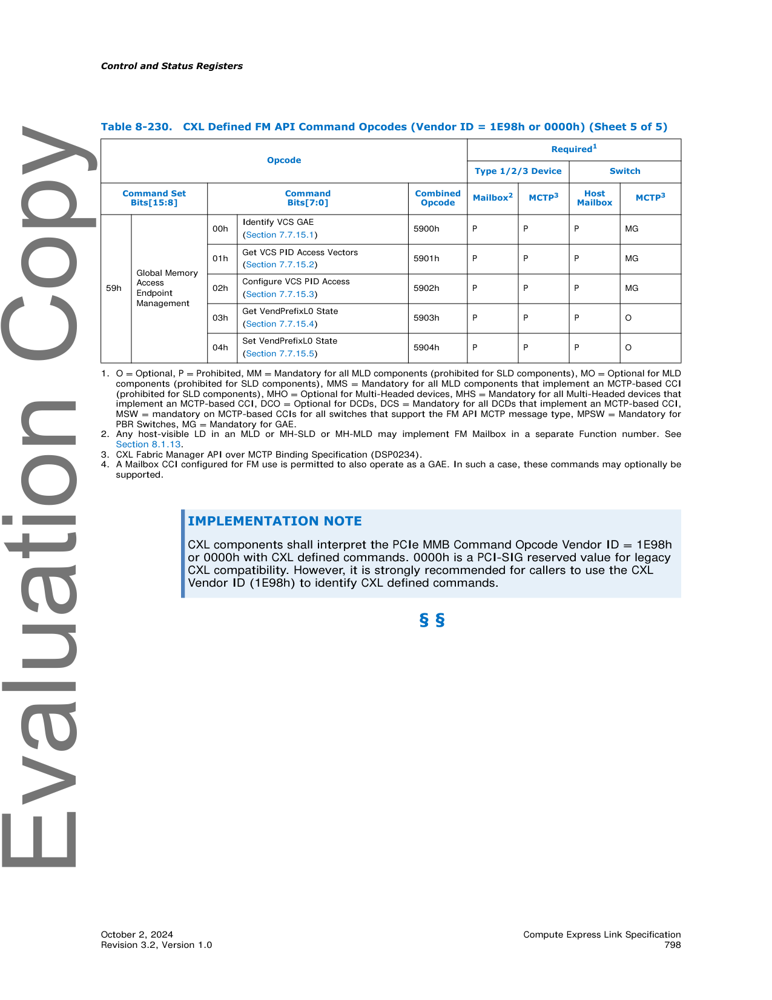
>
> *Original page render @ 150 DPI* — [📄 Full size](figures/chapter_08/page_0798.png)

[⬆️ 返回目录](#-本章目录-part-e)

---

