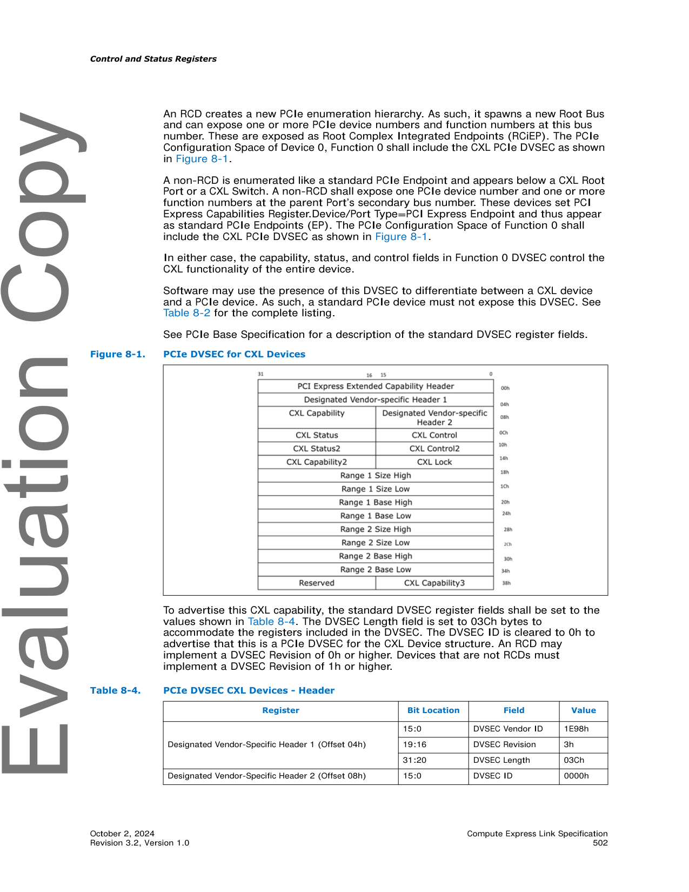

# 📘 第 8 章　控制与状态寄存器 (Chapter 8. Control and Status Registers) — Part A

> **Source pages**: 499–600 (Part A) | **File**: chapter_08a.md | **Format**: 中英对照双语

---

## 📑 本章目录 (Part A)

- [8.0 Control and Status Registers | 控制与状态寄存器](#sec-8-0) (p.499)
- [8.1 Configuration Space Registers | 配置空间寄存器](#sec-8-1) (p.500)
  - [8.1.1 PCIe DVSEC ID Assignment | PCIe DVSEC ID 分配](#sec-8-1-1) (p.500)
  - [8.1.2 CXL Data Object Exchange (DOE) Type Assignment | CXL DOE 类型分配](#sec-8-1-2) (p.501)
  - [8.1.3 PCIe DVSEC for CXL Devices | CXL 设备的 PCIe DVSEC](#sec-8-1-3) (p.501)
    - [8.1.3.1 DVSEC CXL Capability (Offset 0Ah)](#sec-8-1-3-1) (p.503)
    - [8.1.3.2 DVSEC CXL Control (Offset 0Ch)](#sec-8-1-3-2) (p.504)
    - [8.1.3.3 DVSEC CXL Status (Offset 0Eh)](#sec-8-1-3-3) (p.505)
    - [8.1.3.4 DVSEC CXL Control2 (Offset 10h)](#sec-8-1-3-4) (p.505)
    - [8.1.3.5 DVSEC CXL Status2 (Offset 12h)](#sec-8-1-3-5) (p.506)
    - [8.1.3.6 DVSEC CXL Lock (Offset 14h)](#sec-8-1-3-6) (p.507)
    - [8.1.3.7 DVSEC CXL Capability2 (Offset 16h)](#sec-8-1-3-7) (p.507)
    - [8.1.3.8 DVSEC CXL Range Registers](#sec-8-1-3-8) (p.507)
    - [8.1.3.9 DVSEC CXL Capability3 (Offset 38h)](#sec-8-1-3-9) (p.513)
  - [8.1.4 Non-CXL Function Map DVSEC | 非 CXL Function Map DVSEC](#sec-8-1-4) (p.514)
  - [8.1.5 CXL Extensions DVSEC for Ports | 端口的 CXL Extensions DVSEC](#sec-8-1-5) (p.517)
  - [8.1.6 GPF DVSEC for CXL Port | CXL 端口的 GPF DVSEC](#sec-8-1-6) (p.522)
  - [8.1.7 GPF DVSEC for CXL Device | CXL 设备的 GPF DVSEC](#sec-8-1-7) (p.524)
  - [8.1.8 PCIe DVSEC for Flex Bus Port | Flex Bus 端口的 PCIe DVSEC](#sec-8-1-8) (p.525)
  - [8.1.9 Register Locator DVSEC | Register Locator DVSEC](#sec-8-1-9) (p.525)
  - [8.1.10 MLD DVSEC | MLD DVSEC](#sec-8-1-10) (p.527)
  - [8.1.11 Table Access DOE | Table Access DOE](#sec-8-1-11) (p.528)
  - [8.1.12 Memory Device Configuration Space Layout | 内存设备配置空间布局](#sec-8-1-12) (p.529)
  - [8.1.13 FM Mailbox CCI Configuration Space Layout | FM 邮箱 CCI 配置空间布局](#sec-8-1-13) (p.530)
- [8.2 Memory Mapped Registers | 内存映射寄存器](#sec-8-2) (p.530)
  - [8.2.1 RCD Upstream Port and RCH Downstream Port Registers](#sec-8-2-1) (p.532)
  - [8.2.2 Accessing Component Registers](#sec-8-2-2) (p.541)
  - [8.2.3 Component Register Layout and Definition](#sec-8-2-3) (p.541)
  - [8.2.4 CXL.cache and CXL.mem Registers](#sec-8-2-4) (p.542)
    - [8.2.4.1 CXL Capability Header Register](#sec-8-2-4-1) (p.544)
    - [8.2.4.2–8.2.4.16 Capability Headers (CXL RAS, Security, Link, HDM Decoder, etc.)](#sec-8-2-4-2) (p.545-548)
    - [8.2.4.17 CXL RAS Capability Structure](#sec-8-2-4-17) (p.549)
    - [8.2.4.18 CXL Security Capability Structure](#sec-8-2-4-18) (p.556)
    - [8.2.4.19 CXL Link Capability Structure](#sec-8-2-4-19) (p.557)
    - [8.2.4.20 CXL HDM Decoder Capability Structure](#sec-8-2-4-20) (p.565)
    - [8.2.4.21 CXL Extended Security Capability Structure](#sec-8-2-4-21) (p.577)
    - [8.2.4.22 CXL IDE Capability Structure](#sec-8-2-4-22) (p.578)
    - [8.2.4.23 CXL Snoop Filter Capability Structure](#sec-8-2-4-23) (p.582)
    - [8.2.4.24 CXL Timeout and Isolation Capability Structure](#sec-8-2-4-24) (p.582)
    - [8.2.4.25 CXL.cachemem Extended Register Capability](#sec-8-2-4-25) (p.588)
    - [8.2.4.26 CXL BI Route Table Capability Structure](#sec-8-2-4-26) (p.589)
    - [8.2.4.27 CXL BI Decoder Capability Structure](#sec-8-2-4-27) (p.591)
    - [8.2.4.28 CXL Cache ID Route Table Capability Structure](#sec-8-2-4-28) (p.593)
    - [8.2.4.29 CXL Cache ID Decoder Capability Structure](#sec-8-2-4-29) (p.596)
    - [8.2.4.30 CXL Extended HDM Decoder Capability Structure](#sec-8-2-4-30) (p.597)
    - [8.2.4.31 CXL Extended Metadata Capability Register](#sec-8-2-4-31) (p.598)
  - [8.2.5 CXL ARB/MUX Registers](#sec-8-2-5) (p.599)

## 🖼 本章图表 (Part A)

- Figure 8-1 PCIe DVSEC for CXL Devices (p.502)
- Figure 8-2 Non-CXL Function Map DVSEC (p.514)
- Figure 8-3 CXL Extensions DVSEC for Ports (p.517)
- Figure 8-4 GPF DVSEC for CXL Port (p.522)
- Figure 8-5 GPF DVSEC for CXL Device (p.524)
- Figure 8-6 Register Locator DVSEC with 3 Register Block Entries (p.525)
- Figure 8-7 MLD DVSEC (p.527)
- Figure 8-8 RCD and RCH Memory Mapped Register Regions (p.532)
- Figure 8-9 RCH Downstream Port RCRB (p.533)
- Figure 8-10 RCD Upstream Port RCRB (p.535)
- Figure 8-11 PCIe DVSEC for Flex Bus Port (p.537)

## 📊 本章表格 (Part A)

- Table 8-1 Register Attributes (p.499)
- Table 8-2 CXL DVSEC ID Assignment (Sheet 1-2) (p.500-501)
- Table 8-3 CXL DOE Type Assignment (p.501)
- Table 8-4 PCIe DVSEC CXL Devices - Header (p.502)
- Table 8-5 Non-CXL Function Map DVSEC - Header (p.514)
- Table 8-6 CXL Extensions DVSEC for Ports - Header (p.517)
- Table 8-7 GPF DVSEC for CXL Port - Header (p.522)
- Table 8-8 GPF DVSEC for CXL Device - Header (p.524)
- Table 8-9 Register Locator DVSEC - Header (p.526)
- Table 8-10 Designated Vendor Specific Register Block Header (p.527)
- Table 8-11 MLD DVSEC - Header (p.528)
- Table 8-12 Coherent Device Attributes - Data Object Header (p.528)
- Table 8-13 Read Entry Request (p.529)
- Table 8-14 Read Entry Response (p.529)
- Table 8-15 Memory Device PCIe Capabilities and Extended Capabilities (p.530)
- Table 8-16 Class Code Register for FM Mailbox CCI (p.530)
- Table 8-17 CXL Memory Mapped Register Regions (p.530-531)
- Table 8-18 RCH Downstream Port PCIe Capabilities and Extended Capabilities (p.533-534)
- Table 8-19 RCD Upstream Port PCIe Capabilities and Extended Capabilities (p.536)
- Table 8-20 PCIe DVSEC Header Register Settings for Flex Bus Port (p.537)
- Table 8-21 CXL Subsystem Component Register Ranges (p.542)
- Table 8-22 CXL_Capability_ID Assignment (p.543)
- Table 8-23 CXL.cache and CXL.mem Architectural Register Discovery (p.544)
- Table 8-24 CXL.cache and CXL.mem Architectural Register Header Example (Primary Range) (p.544)
- Table 8-25 CXL.cache and CXL.mem Architectural Register Header Example (Any Extended Range) (p.544)
- Table 8-26 Device Trust Level (p.557)
- Table 8-27 CXL.mem Read Response - Error Cases (p.567)
- Table 8-28 CXL Extended Security Structure Entry Count (p.577)
- Table 8-29 Root Port n Security Policy Register (p.577)
- Table 8-30 Root Port n ID Register (p.577)

---

## 8.0 Control and Status Registers | 控制与状态寄存器

<table>
<thead>
<tr>
<th width="50%">🇬🇧 English</th>
<th width="50%" style="background-color:#e8e8e8">🇨🇳 中文</th>
</tr>
</thead>
<tbody>
<tr><td>The CXL component control and status registers are mapped into separate spaces:

• Configuration Space: Registers are accessed using configuration reads and configuration writes
• Memory mapped space: Registers are accessed using memory reads and memory writes

Table 8-1 summarizes the attributes for the register bits defined in this chapter. Unless specified otherwise, the definition of these attributes is consistent with PCIe* Base Specification.

All numeric values in various registers and data structures are always encoded in little-endian format. All UUIDs in this section follow the format defined in the IETF RFC 4122 specification.

CXL components have the same requirements as PCIe with respect to hardware initializing the register fields to their default values, with notable exceptions for system-integrated devices. See PCIe Base Specification for details.</td><td style="background-color:#e8e8e8">CXL 组件的控制与状态寄存器被映射到独立的地址空间中:

• 配置空间 (Configuration Space): 通过配置读和配置写访问寄存器
• 内存映射空间 (Memory Mapped Space): 通过内存读和内存写访问寄存器

表 8-1 总结了本章所定义寄存器位的属性。除非另有说明,这些属性的定义与 PCIe* Base Specification 一致。

各种寄存器和数据结构中的所有数值始终以小端格式编码。本节中的所有 UUID 遵循 IETF RFC 4122 规范定义的格式。

CXL 组件在硬件将寄存器字段初始化为其默认值方面与 PCIe 具有相同的要求,系统集成设备除外。详情请参见 PCIe Base Specification。</td></tr>
</tbody>
</table>

> **Table 8-1.** Register Attributes | 寄存器属性
>
> | Attribute | Description |
> |-----------|-------------|
> | RO | Read Only |
> | ROS | Read Only Sticky: Not affected by CXL Reset. Otherwise, the behavior follows PCIe Base Specification. |
> | RW | Read-Write |
> | RWS | Read-Write-Sticky: Not affected by CXL Reset. Otherwise, the behavior follows PCIe Base Specification. |
> | RWO | Read-Write-One-To-Lock: This attribute is not defined in PCIe Base Specification and is unique to CXL. Field becomes RO after writing 1 to it. Cleared by a hot reset, a warm reset, or a cold reset. Not affected by CXL Reset. |
> | RWL | Read-Write-Lockable: This attribute is not defined in PCIe Base Specification and is unique to CXL. These bits follow RW behavior until they are locked. After the bits are locked, the value cannot be altered by software until the next hot reset, warm reset, or cold reset. Upon hot reset, warm reset, or cold reset, the behavior reverts back to RW. Not affected by CXL Reset after the bits are locked. |
> | RW1C | Read-Write-One-To-Clear |
> | RW1CS | Read-Write-One-To-Clear-Sticky: Not affected by CXL Reset. Otherwise, the behavior follows PCIe Base Specification. |
> | HwInit | Hardware Initialized |
> | RsvdP | Reserved and Preserved |
> | RsvdZ | Reserved and Zero |
>
> *Source: p.499-500*

[⬆️ 返回目录](#-本章目录-part-a)

---

## 8.1 Configuration Space Registers | 配置空间寄存器

<table>
<thead>
<tr>
<th width="50%">🇬🇧 English</th>
<th width="50%" style="background-color:#e8e8e8">🇨🇳 中文</th>
</tr>
</thead>
<tbody>
<tr><td>This section describes the Configuration Space registers that may be used to discover and configure CXL functionality. RCH Downstream Port does not map any registers into Configuration Space.</td><td style="background-color:#e8e8e8">本节描述可用于发现和配置 CXL 功能的配置空间寄存器。RCH Downstream Port 不将任何寄存器映射到配置空间中。</td></tr>
</tbody>
</table>

[⬆️ 返回目录](#-本章目录-part-a)

---

### 8.1.1 PCIe Designated Vendor-Specific Extended Capability (DVSEC) ID Assignment | PCIe 指定供应商特定扩展能力 (DVSEC) ID 分配

<table>
<thead>
<tr>
<th width="50%">🇬🇧 English</th>
<th width="50%" style="background-color:#e8e8e8">🇨🇳 中文</th>
</tr>
</thead>
<tbody>
<tr><td>The CXL specification-defined Configuration Space registers are grouped into blocks, and each block is enumerated as a PCIe Designated Vendor-Specific Extended Capability (DVSEC) structure. The DVSEC Vendor ID field is set to 1E98h to indicate that these Capability structures are defined by the CXL specification.

The DVSEC Revision field represents the version of the DVSEC structure. The DVSEC Revision is incremented whenever the structure is extended to add more functionality. Backward compatibility shall be maintained during this process. For all values of n, a DVSEC Revision n+1 structure may extend Revision n by replacing fields that are marked as reserved in Revision n, but must not redefine the meaning of existing fields. In addition, Revision n+1 may append new registers to Revision n structure and thereby increasing the DVSEC Length field. Software that was written for a lower Revision may continue to operate on CXL DVSEC structures with a higher Revision, but will not be able to take advantage of new functionality.

The following values of DVSEC ID, as listed in Table 8-2, are defined by the CXL specification.

Table 8-2 in this version of the specification does not define the behavior of the CXL fabric switches (see Section 2.7) and G-FAM devices (see Section 2.8).</td><td style="background-color:#e8e8e8">CXL 规范定义的配置空间寄存器被分组为多个块,每个块被枚举为 PCIe 指定供应商特定扩展能力 (Designated Vendor-Specific Extended Capability, DVSEC) 结构。DVSEC Vendor ID 字段被设置为 1E98h,以表明这些能力结构由 CXL 规范定义。

DVSEC Revision 字段表示 DVSEC 结构的版本。每当扩展该结构以添加更多功能时,DVSEC Revision 就会递增。在此过程中应保持向后兼容性。对于所有 n 值,DVSEC Revision n+1 结构可以通过替换 Revision n 中标记为保留的字段来扩展 Revision n,但不得重新定义现有字段的含义。此外,Revision n+1 可以向 Revision n 结构追加新寄存器,从而增加 DVSEC Length 字段。为较低 Revision 编写的软件可以继续在较高 Revision 的 CXL DVSEC 结构上运行,但将无法利用新功能。

表 8-2 中所列的 DVSEC ID 值由 CXL 规范定义。

本版本规范中的表 8-2 没有定义 CXL 交换机 (见 2.7 节) 和 G-FAM 设备 (见 2.8 节) 的行为。</td></tr>
</tbody>
</table>

> **Table 8-2.** CXL DVSEC ID Assignment (Sheet 1 of 2) | CXL DVSEC ID 分配 (第 1 页共 2 页)
>
> | CXL Capability | DVSEC ID | Highest DVSEC Revision | Mandatory¹ | Not Permitted¹ | Optional¹ |
> |----------------|----------|------------------------|------------|----------------|-----------|
> | PCIe DVSEC for CXL Devices (see Section 8.1.3) | 0000h | 3 | D1, D2, LD, FMLD | P, UP¹, DP¹, R, USP, DSP | |
> | Non-CXL Function Map DVSEC (see Section 8.1.4) | 0002h | 0 | P, UP¹, DP¹, R, DSP | D1, D2, LD, FMLD, USP² | |
> | CXL Extensions DVSEC for Ports (formerly CXL 2.0 Extensions DVSEC for Ports; see Section 8.1.5) | 0003h | 0 | R, USP, DSP | P, D1, D2, LD, FMLD, UP¹, DP¹ | |
> | GPF DVSEC for CXL Ports (see Section 8.1.6) | 0004h | 0 | R, DSP | P, D1, D2, LD, FMLD, UP¹, DP¹, USP | |
> | GPF DVSEC for CXL Devices (see Section 8.1.7) | 0005h | 0 | D2, LD | P, UP¹, DP¹, R, USP, DSP, FMLD | D1 |
> | PCIe DVSEC for Flex Bus Port (see Section 8.1.8) | 0007h | 2 | D1, D2, LD, FMLD, UP¹, DP¹, R, USP, DSP | P | |
>
> *Source: p.500-501*
>
> 1. P - PCIe device, D1 - RCD, D2 - SLD, LD - Logical Device, FMLD - Fabric Manager owned LD FFFFh, UP¹ - RCD Upstream Port, DP¹ - RCH Downstream Port, R - CXL root port, USP - CXL Upstream Switch Port, DSP - CXL Downstream Switch Port. A physical component may be capable of operating in multiple modes. For example, a CXL device may operate either as an RCD or SLD based on the link training. In such cases, these definitions refer to the current mode of operation.
> 2. Non-CXL Function Map DVSEC is mandatory for CXL USPs that include a Switch Mailbox CCI as an additional Function.

> **Table 8-2.** CXL DVSEC ID Assignment (Sheet 2 of 2) | CXL DVSEC ID 分配 (第 2 页共 2 页)
>
> | CXL Capability | DVSEC ID | Highest DVSEC Revision | Mandatory¹ | Not Permitted¹ | Optional¹ |
> |----------------|----------|------------------------|------------|----------------|-----------|
> | Register Locator DVSEC (see Section 8.1.9) | 0008h | 0 | D2, LD, FMLD, R, USP, DSP | P | D1, UP¹, DP¹ |
> | MLD DVSEC (see Section 8.1.10) | 0009h | 0 | FMLD | P, D1, D2, LD, UP¹, DP¹, R, USP, DSP | |
> | PCIe DVSEC for Test Capability (see Section 14.16.1) | 000Ah | 0 | D1 | P, LD, FMLD, DP¹, UP¹, R, USP, DSP | D2 |
> | Compliance (see Chapter 14.0)² | 0 | LD, FMLD | P, UP¹, DP¹, R, USP, DSP | D1, D2 | Reserved | 1 |
> | Table Access (Coherent Device Attributes; see Section 8.1.11) | 2 | D2, LD, USP | FMLD, P, UP¹, DP¹, R, DSP | D1 | |
>
> *Source: p.501*
>
> 2. eRCDs are required to implement PCIe DVSEC for Test Capability (see Section 14.16.1). For all other Devices, support for the Compliance DOE Type is highly recommended and PCIe DVSEC for Test Capability is not required if the Compliance DOE Type is implemented. If Compliance DOE Type is not implemented by a device, the device shall implement PCIe DVSEC for Test Capability (see Section 14.16.1).

[⬆️ 返回目录](#-本章目录-part-a)

---

### 8.1.2 CXL Data Object Exchange (DOE) Type Assignment | CXL 数据对象交换 (DOE) 类型分配

<table>
<thead>
<tr>
<th width="50%">🇬🇧 English</th>
<th width="50%" style="background-color:#e8e8e8">🇨🇳 中文</th>
</tr>
</thead>
<tbody>
<tr><td>Data Object Exchange (DOE) is a PCI-SIG-defined mechanism for the host to perform data object exchanges with a PCIe Function.

The following values of DOE Type are defined by the CXL specification. The CXL specification-defined DOE Messages use Vendor ID 1E98h.

Table 8-3 in this version of the specification does not define the behavior of CXL fabric switches (see Section 2.7) and G-FAM devices (see Section 2.8).</td><td style="background-color:#e8e8e8">数据对象交换 (Data Object Exchange, DOE) 是 PCI-SIG 定义的机制,用于主机与 PCIe Function 之间执行数据对象交换。

以下 DOE Type 值由 CXL 规范定义。CXL 规范定义的 DOE 消息使用 Vendor ID 1E98h。

本版本规范中的表 8-3 没有定义 CXL 交换机 (见 2.7 节) 和 G-FAM 设备 (见 2.8 节) 的行为。</td></tr>
</tbody>
</table>

> **Table 8-3.** CXL DOE Type Assignment | CXL DOE 类型分配
>
> | CXL Capability | DOE Type | Mandatory¹ |
> |----------------|----------|------------|
> | Compliance (see Chapter 14.0)² | 0 | LD, FMLD |
> | Table Access (Coherent Device Attributes; see Section 8.1.11) | 2 | D2, LD, USP |
>
> *Source: p.501*
>
> 1. P - PCIe device, D1 - RCD, D2 - SLD, LD - Logical Device, FMLD - Fabric Manager owned LD FFFFh, UP¹ - RCD Upstream Port, DP¹ - RCH Downstream Port, R - CXL root port, USP - CXL Upstream Switch Port, DSP - CXL Downstream Switch Port.
> 2. eRCDs are required to implement PCIe DVSEC for Test Capability (see Section 14.16.1). For all other Devices, support for the Compliance DOE Type is highly recommended.

[⬆️ 返回目录](#-本章目录-part-a)

---

### 8.1.3 PCIe DVSEC for CXL Devices | CXL 设备的 PCIe DVSEC

<table>
<thead>
<tr>
<th width="50%">🇬🇧 English</th>
<th width="50%" style="background-color:#e8e8e8">🇨🇳 中文</th>
</tr>
</thead>
<tbody>
<tr><td>**Note:** The CXL 1.1 specification referred to this DVSEC as "PCIe DVSEC for Flex Bus Device" and used the term "Flex Bus" while referring to various register names and fields. The CXL 2.0 specification renamed the DVSEC and the register/field names by replacing the term "Flex Bus" with the term "CXL" while retaining the functionality.</td><td style="background-color:#e8e8e8">**注:** CXL 1.1 规范将此 DVSEC 称为"PCIe DVSEC for Flex Bus Device",并在引用各种寄存器名称和字段时使用术语"Flex Bus"。CXL 2.0 规范通过将术语"Flex Bus"替换为"CXL"来重命名 DVSEC 以及寄存器/字段名称,同时保留其功能。</td></tr>
<tr><td>An RCD creates a new PCIe enumeration hierarchy. As such, it spawns a new Root Bus and can expose one or more PCIe device numbers and function numbers at this bus number. These are exposed as Root Complex Integrated Endpoints (RCiEP). The PCIe Configuration Space of Device 0, Function 0 shall include the CXL PCIe DVSEC as shown in Figure 8-1.

A non-RCD is enumerated like a standard PCIe Endpoint and appears below a CXL Root Port or a CXL Switch. A non-RCD shall expose one PCIe device number and one or more function numbers at the parent Port's secondary bus number. These devices set PCI Express Capabilities Register.Device/Port Type=PCI Express Endpoint and thus appear as standard PCIe Endpoints (EP). The PCIe Configuration Space of Function 0 shall include the CXL PCIe DVSEC as shown in Figure 8-1.

In either case, the capability, status, and control fields in Function 0 DVSEC control the CXL functionality of the entire device.

Software may use the presence of this DVSEC to differentiate between a CXL device and a PCIe device. As such, a standard PCIe device must not expose this DVSEC. See Table 8-2 for the complete listing.

See PCIe Base Specification for a description of the standard DVSEC register fields.

To advertise this CXL capability, the standard DVSEC register fields shall be set to the values shown in Table 8-4. The DVSEC Length field is set to 03Ch bytes to accommodate the registers included in the DVSEC. The DVSEC ID is cleared to 0h to advertise that this is a PCIe DVSEC for the CXL Device structure. An RCD may implement a DVSEC Revision of 0h or higher. Devices that are not RCDs must implement a DVSEC Revision of 1h or higher.</td><td style="background-color:#e8e8e8">RCD 创建新的 PCIe 枚举层次结构。因此,它会生成一个新的 Root Bus,并可以在该总线号上公开一个或多个 PCIe 设备号和功能号。这些作为 Root Complex Integrated Endpoints (RCiEP) 公开。Device 0、Function 0 的 PCIe 配置空间应包括 CXL PCIe DVSEC,如图 8-1 所示。

非 RCD 设备像标准 PCIe Endpoint 一样被枚举,出现在 CXL Root Port 或 CXL Switch 之下。非 RCD 设备应在父端口的 secondary bus number 上公开一个 PCIe 设备号和一个或多个功能号。这些设备设置 PCI Express Capabilities Register.Device/Port Type=PCI Express Endpoint,因此显示为标准 PCIe Endpoints (EP)。Function 0 的 PCIe 配置空间应包括 CXL PCIe DVSEC,如图 8-1 所示。

在任何一种情况下,Function 0 DVSEC 中的能力、状态和控制字段控制整个设备的 CXL 功能。

软件可以使用此 DVSEC 的存在来区分 CXL 设备和 PCIe 设备。因此,标准 PCIe 设备不得公开此 DVSEC。完整列表请参见表 8-2。

标准 DVSEC 寄存器字段的描述请参见 PCIe Base Specification。

为了通告此 CXL 能力,标准 DVSEC 寄存器字段应设置为表 8-4 中所示的值。DVSEC Length 字段设置为 03Ch 字节以容纳 DVSEC 中包含的寄存器。DVSEC ID 清零为 0h,以通告这是 CXL Device 结构的 PCIe DVSEC。RCD 可以实现 DVSEC Revision 0h 或更高版本。非 RCD 的设备必须实现 DVSEC Revision 1h 或更高版本。</td></tr>
</tbody>
</table>

> **Figure 8-1.** PCIe DVSEC for CXL Devices | CXL 设备的 PCIe DVSEC
>
> 
>
> *Original page render @ 150 DPI* — [📄 Full size](figures/chapter_08/page_0502.png)

> **Table 8-4.** PCIe DVSEC CXL Devices - Header | PCIe DVSEC CXL 设备 - 头部
>
> | Register | Bit Location | Field | Value |
> |----------|--------------|-------|-------|
> | Designated Vendor-Specific Header 1 (Offset 04h) | 15:0 | DVSEC Vendor ID | 1E98h |
> | | 19:16 | DVSEC Revision | 3h |
> | | 31:20 | DVSEC Length | 03Ch |
> | Designated Vendor-Specific Header 2 (Offset 08h) | 15:0 | DVSEC ID | 0000h |
>
> *Source: p.502*

[⬆️ 返回目录](#-本章目录-part-a)

---

#### 8.1.3.1 DVSEC CXL Capability (Offset 0Ah) | DVSEC CXL 能力

<table>
<thead>
<tr>
<th width="50%">🇬🇧 English</th>
<th width="50%" style="background-color:#e8e8e8">🇨🇳 中文</th>
</tr>
</thead>
<tbody>
<tr><td>The CXL device-specific registers are described in the following subsections.</td><td style="background-color:#e8e8e8">CXL 设备特定寄存器将在以下小节中描述。</td></tr>
</tbody>
</table>

> **DVSEC CXL Capability (Offset 0Ah)**
>
> | Bit | Attributes | Description |
> |-----|-----------|-------------|
> | 0 | RO | **Cache_Capable:** If set, indicates that the CXL.cache protocol is supported when operating in Flex Bus.CXL mode. This must be 0 for all LDs of an MLD. |
> | 1 | RO | **IO_Capable:** If set, indicates that the CXL.io protocol is supported when operating in Flex Bus.CXL mode. Must be 1. |
> | 2 | RO | **Mem_Capable:** If set, indicates that the CXL.mem protocol is supported when operating in Flex Bus.CXL mode. This must be 1 for all LDs of an MLD. |
> | 3 | RO | **Mem_HwInit_Mode:** If set, indicates that this CXL.mem-capable device initializes memory with assistance from hardware and firmware located on the device. If cleared, indicates that memory is initialized by host software such as a device driver. This bit must be ignored when Mem_Capable=0. Functions that implements the Class Code specified in Section 8.1.12.1 shall set this bit to 1. |
> | 5:4 | RO | **HDM_Count:** Number of HDM ranges implemented by the CXL device and reported through this function. This field must return 00b if Mem_Capable=0. • 00b = Zero ranges. This setting is illegal when Mem_Capable=1. • 01b = One HDM range. • 10b = Two HDM ranges. • 11b = Reserved. |
> | 6 | RO | **Cache Writeback and Invalidate Capable:** If set, indicates that the device implements the Disable Caching and Initiate Cache Write Back and Invalidation control bits in the DVSEC CXL Control2 register, and the Cache Invalid status bit in the DVSEC CXL Status2 register. All devices that are not RCDs shall set this capability bit when Cache_Capable=1.¹ |
> | 7 | RO | **CXL Reset Capable:** If set, indicates that the device supports CXL Reset and implements the CXL Reset Timeout field in this register, the Initiate CXL Reset bit in the DVSEC CXL Control2 register, and the DVSEC CXL Reset Complete status bit in the DVSEC CXL Status2 register.¹ This bit must report the same value for all LDs of an MLD. |
> | 10:8 | RO | **CXL Reset Timeout:** If the CXL Reset Capable bit in this register is set, this field indicates the maximum time that the device may take to complete the CXL Reset. If the CXL Reset Mem Clr Capable bit in this register is 1, this time also accounts for the time that is needed for clearing or randomizing of volatile HDM Ranges. If the CXL Reset Complete status bit in the DVSEC CXL Status2 register is not set after the passage of this time duration, software may assume that CXL Reset has failed. This value must be the same for all LDs of an MLD.¹ • 000b = 10 ms • 001b = 100 ms • 010b = 1 second • 011b = 10 second • 100b = 100 second • All other encodings are reserved |
> | 11 | HwInit | **CXL Reset Mem Clr Capable:** When set, the Device is capable of clearing or randomizing volatile HDM Ranges during CXL Reset.¹ |
> | 12 | HwInit | **TSP Capable:** When set, the Device is capable of supporting TSP and shall support TSP requests (see Section 11.5.5) and MemRdFill (see Table 3-41).² |
> | 13 | HwInit | **Multiple Logical Device:** If set, indicates that the Device is a Logical Device (which could be an FM-owned LD) within an MLD. If cleared, indicates that the Device is an SLD or an RCD.¹ |
> | 14 | RO | **Viral_Capable:** If set, indicates that the CXL device supports Viral handling. This value must be 1 for all devices. |
> | 15 | HwInit | **PM Init Completion Reporting Capable:** If set, indicates that the CXL device is capable of supporting the Power Management Initialization Complete flag. All devices that are not RCDs shall set this capability bit. RCDs may implement this capability.¹ This capability is not applicable to switches and root ports. Switches and root ports shall hardwire this bit to 0. |
>
> *Source: p.503-504*
>
> 1. This bit/field was introduced as part of DVSEC Revision=1.
> 2. This bit/field was introduced as part of DVSEC Revision=3.

[⬆️ 返回目录](#-本章目录-part-a)

---

#### 8.1.3.2 DVSEC CXL Control (Offset 0Ch) | DVSEC CXL 控制寄存器

> **DVSEC CXL Control (Offset 0Ch)**
>
> | Bit | Attributes | Description |
> |-----|-----------|-------------|
> | 0 | RWL | **Cache_Enable:** When set to 1, enables CXL.cache protocol operation when in Flex Bus.CXL mode. Locked by the CONFIG_LOCK bit¹. If this bit is 0, the component is permitted to silently drop all CXL.cache transactions. Default value of this bit is 0. |
> | 1 | RO | **IO_Enable:** When set to 1, enables CXL.io protocol operation when in Flex Bus.CXL mode. This bit always returns 1. |
> | 2 | RWL | **Mem_Enable:** When set to 1, enables CXL.mem protocol operation when in Flex Bus.CXL mode. Locked by the CONFIG_LOCK bit¹. If this bit is 0, the component is permitted to silently drop all CXL.mem transactions. Default value of this bit is 0. |
> | 7:3 | RWL | **Cache_SF_Coverage:** Performance hint to the device. Locked by the CONFIG_LOCK bit¹. • 00h = Indicates no Snoop Filter coverage on the host • For all other values of N = Indicates Snoop Filter coverage on the host of 2^(N+15d) bytes (e.g., value of 5h indicates 1-MB snoop filter coverage) Default value of this field is 00h. |
> | 10:8 | RWL | **Cache_SF_Granularity:** Performance hint to the device. Locked by the CONFIG_LOCK bit¹. • 000b = Indicates 64B granular tracking on the host • 001b = Indicates 128B granular tracking on the host • 010b = Indicates 256B granular tracking on the host • 011b = Indicates 512B granular tracking on the host • 100b = Indicates 1KB granular tracking on the host • 101b = Indicates 2KB granular tracking on the host • 110b = Indicates 4KB granular tracking on the host • 111b = Reserved Default value of this field is 000b. |
> | 11 | RWL | **Cache_Clean_Eviction:** Performance hint to the device. Locked by the CONFIG_LOCK bit¹. • 0 = Indicates clean evictions from device caches are needed for best performance • 1 = Indicates clean evictions from device caches are NOT needed for best performance Default value of this bit is 0. |
> | 12 | RWL/RsvdP | **Direct P2P Mem Enable:** This bit must be RWL if the Direct P2P Mem Capable bit in the DVSEC CXL Capability³ register is set; otherwise, this bit is permitted to be hardwired to 0. Software must not set this bit unless the Direct P2P Mem Capable bit is set.² When set, enables Direct P2P CXL.mem protocol operation. If this bit is 0, the component is not permitted to initiate Direct P2P CXL.mem transactions. Default value of this bit is 0. Locked by the CONFIG_LOCK bit¹. |
> | 13 | RsvdP | Reserved |
> | 14 | RWL | **Viral_Enable:** When set, enables Viral handling in the CXL device. Locked by the CONFIG_LOCK bit¹. If 0, the CXL device may ignore the viral that it receives. Default value of this bit is 0. |
> | 15 | RsvdP | Reserved |
>
> *Source: p.504-505*
>
> 1. CONFIG_LOCK bit in the DVSEC CXL Lock register.
> 2. This bit was introduced as part of DVSEC Revision=3.

[⬆️ 返回目录](#-本章目录-part-a)

---

#### 8.1.3.3 DVSEC CXL Status (Offset 0Eh) | DVSEC CXL 状态寄存器

> **DVSEC CXL Status (Offset 0Eh)**
>
> | Bit | Attributes | Description |
> |-----|-----------|-------------|
> | 13:0 | RsvdZ | Reserved |
> | 14 | RW1CS | **Viral_Status:** When set, indicates that the CXL device has encountered a Viral condition. This bit does not indicate that the device is currently in Viral condition. See Section 12.4 for more details. |
> | 15 | RsvdZ | Reserved |
>
> *Source: p.505*

[⬆️ 返回目录](#-本章目录-part-a)

---

#### 8.1.3.4 DVSEC CXL Control2 (Offset 10h) | DVSEC CXL 控制寄存器 2

> **DVSEC CXL Control2 (Offset 10h)**
>
> | Bit | Attributes | Description |
> |-----|-----------|-------------|
> | 0 | RW | **Disable Caching:** When set to 1, device shall no longer cache new modified lines in its local cache. Device shall continue to correctly respond to CXL.cache transactions.¹ Default value of this bit is 0. |
> | 1 | RW | **Initiate Cache Write Back and Invalidation:** When set to 1, the device shall write back all modified lines in the local cache and then invalidate all lines. The device shall send a CacheFlushed message to the host, as required by CXL.cache protocol, to indicate that the device does not hold any modified lines.¹ If this bit is set when Disable Caching=0, the device behavior is undefined. This bit always returns the value of 0 when read by the software. A write of 0 is ignored. |
> | 2 | RW | **Initiate CXL Reset:** When set to 1, the device shall initiate CXL Reset as defined in Section 9.7. This bit always returns the value of 0 when read by the software. A write of 0 is ignored.¹ If Software sets this bit while the previous CXL Reset is in progress, the results are undefined. |
> | 3 | RW | **CXL Reset Mem Clr Enable:** When set, and the CXL Reset Mem Clr Capable bit in the DVSEC CXL Capability register returns 1, the device shall clear or randomize volatile HDM ranges as part of the CXL Reset operation. When the CXL Reset Mem Clr Capable bit is cleared, this bit is ignored and volatile HDM ranges may or may not be cleared or randomized during CXL Reset.¹ Default value of this bit is 0. |
> | 4 | RWS/RO | **Desired Volatile HDM State after Hot Reset:** This bit must be RWS if the Volatile HDM State after Hot Reset - Configurability bit in the DVSEC CXL Capability³ register is set; otherwise, this bit is permitted to be hardwired to 0. Software must not set this bit unless the Volatile HDM State after Hot Reset - Configurability bit is set.² The reset default is 0. • 0 = Follow the Default Volatile HDM State after the Hot Reset bit in the DVSEC CXL Capability³ register • 1 = Device shall preserve the Volatile HDM content across Hot Reset |
> | 5 | RW/RO | **Modified Completion Enable:** This bit must be RW if the Modified Completion Capable bit in the DVSEC CXL Capability² register is set; otherwise, this bit is permitted to be hardwired to 0. Software must not set this bit unless the Modified Completion Capable bit is set.³ The reset default is 0. • 0 = This device is not permitted to return modified data • 1 = This device is permitted to return modified data using the Cmp-M response |
> | 15:6 | RsvdP | Reserved |
>
> *Source: p.505-506*
>
> 1. This bit was introduced as part of DVSEC Revision=1.
> 2. This bit was introduced as part of DVSEC Revision=2.
> 3. This bit was introduced as part of DVSEC Revision=3.

[⬆️ 返回目录](#-本章目录-part-a)

---

#### 8.1.3.5 DVSEC CXL Status2 (Offset 12h) | DVSEC CXL 状态寄存器 2

> **DVSEC CXL Status2 (Offset 12h)**
>
> | Bit | Attributes | Description |
> |-----|-----------|-------------|
> | 0 | RO | **Cache Invalid:** When set, the device guarantees that it does not hold any valid lines and Disable Caching=1¹. This bit shall read as 0 when Disable Caching=0.² |
> | 1 | RO | **CXL Reset Complete:** When set, the device has successfully completed CXL Reset as defined in Section 9.7.² Device shall clear this bit upon transition of Initiate CXL Reset bit¹ from 0 to 1, prior to initiating the CXL Reset flow. |
> | 2 | RO | **CXL Reset Error:** When set, the device has completed CXL Reset with errors. Additional information may be available in device error records (see Section 8.2.10.2.1). Host software or Fabric Manager may optionally reissue CXL Reset.² Device shall clear this bit upon transition of the Initiate CXL Reset bit¹ from 0 to 1, prior to initiating the CXL Reset flow. |
> | 3 | RW1CS/RsvdZ | **Volatile HDM Preservation Error:** This bit shall be set if the Software requested the device to preserve Volatile HDM content across a Hot Reset but the device failed to do so.³ RW1CS if the Volatile HDM State after Hot Reset - Configurability bit in the DVSEC CXL Capability³ register is set; otherwise, it is RsvdZ. |
> | 14:4 | RsvdZ | Reserved |
> | 15 | RO | **Power Management Initialization Complete:** When set, indicates that the device has successfully completed the Power Management Initialization flow described in Figure 3-4 and is ready to process various Power Management messages.² If this bit is not set within 100 ms of link-up, software may conclude that Power Management initialization has failed and may then issue a Secondary Bus Reset to force link re-initialization and Power Management re-initialization. |
>
> *Source: p.506-507*
>
> 1. Bit in the DVSEC CXL Control2 register.
> 2. This bit was introduced as part of DVSEC Revision=1.
> 3. This bit was introduced as part of DVSEC Revision=2.

[⬆️ 返回目录](#-本章目录-part-a)

---

#### 8.1.3.6 DVSEC CXL Lock (Offset 14h) | DVSEC CXL 锁定寄存器

> **DVSEC CXL Lock (Offset 14h)**
>
> | Bit | Attributes | Description |
> |-----|-----------|-------------|
> | 0 | RWO | **CONFIG_LOCK:** When set, all register fields in the PCIe DVSEC for CXL Devices Capability with the RWL attribute become read only. Consult individual register fields for details. This bit is cleared upon device Conventional Reset. This bit and all the fields that are locked by this bit are unaffected by CXL Reset. Default value of this bit is 0. |
> | 15:1 | RsvdP | Reserved |
>
> *Source: p.507*

[⬆️ 返回目录](#-本章目录-part-a)

---

#### 8.1.3.7 DVSEC CXL Capability2 (Offset 16h) | DVSEC CXL 能力 2

> **DVSEC CXL Capability2 (Offset 16h)**
>
> | Bit | Attributes | Description |
> |-----|-----------|-------------|
> | 3:0 | RO | **Cache Size Unit:** A CXL device that is not CXL.cache-capable shall return the value of 0h.¹ • 0h = Cache size is not reported • 1h = 64 KB • 2h = 1 MB • All other encodings are reserved |
> | 5:4 | HwInit | **Fallback Capability:** Defines the fallback operation mode of a Type 2 Device. Fallback operation mode is where the device does not appear as a Type 2 CXL device, yet provides useful functionality. This field is not intended for advertising debug modes of operation.² • 00b = Device either does not support fallback mode or does not advertise fallback mode • 01b = PCIe • 10b = CXL Type 1 • 11b = CXL Type 3 |
> | 6 | HwInit | **Modified Completion Capable:** When set to 1, it indicates that this device is capable of returning modified data using the Cmp-M response.³ |
> | 7 | HwInit | **No Clean Writeback:** Specifies that a device shall not issue clean writebacks. This bit shall be set to 1 if the device does not support CXL.cache and does not support Direct P2P CXL.mem as a requester. For DVSEC Revisions = 1h or 2h, software can consider the device 'No Clean Writeback' capable if Cache_Capable is not set.³ • 0 = Device may or may not generate clean writebacks • 1 = Device guarantees to never generate clean writebacks at the device's cacheline granularity |
> | 15:8 | RO | **Cache Size:** Expressed in multiples of Cache Size Unit. If Cache Size=4 and Cache Size Unit=1h, the device has a 256-KB cache.¹ A CXL device that is not CXL.cache-capable shall return the value of 00h. |
>
> *Source: p.507*
>
> 1. This field was introduced as part of DVSEC Revision=1.
> 2. This field was introduced as part of DVSEC Revision=2.
> 3. This bit was introduced as part of DVSEC Revision=3.

[⬆️ 返回目录](#-本章目录-part-a)

---

#### 8.1.3.8 DVSEC CXL Range Registers | DVSEC CXL 范围寄存器

<table>
<thead>
<tr>
<th width="50%">🇬🇧 English</th>
<th width="50%" style="background-color:#e8e8e8">🇨🇳 中文</th>
</tr>
</thead>
<tbody>
<tr><td>These registers are not applicable to an FM-owned LD.

The DVSEC CXL Range 1 register set must be implemented if Mem_Capable=1 in the DVSEC CXL Capability register. The DVSEC CXL Range 2 register set must be implemented if (Mem_Capable=1 and HDM_Count=10b in the DVSEC CXL Capability register). Each set contains 4 registers - Size High, Size Low, Base High, and Base Low.

A CXL.mem-capable device is permitted to report zero memory size.</td><td style="background-color:#e8e8e8">这些寄存器不适用于 FM-owned LD。

如果 DVSEC CXL Capability 寄存器中 Mem_Capable=1,则必须实现 DVSEC CXL Range 1 寄存器集。如果 (Mem_Capable=1 且 DVSEC CXL Capability 寄存器中 HDM_Count=10b),则必须实现 DVSEC CXL Range 2 寄存器集。每个寄存器集包含 4 个寄存器 - Size High、Size Low、Base High 和 Base Low。

允许 CXL.mem-capable 设备报告零内存大小。</td></tr>
</tbody>
</table>

##### 8.1.3.8.1 DVSEC CXL Range 1 Size High (Offset 18h)

> | Bit | Attributes | Description |
> |-----|-----------|-------------|
> | 31:0 | RO | **Memory_Size_High:** Corresponds to bits 63:32 of the CXL Range 1 memory size regardless of whether the device implements CXL HDM Decoder Capability registers. |
>
> *Source: p.508*

##### 8.1.3.8.2 DVSEC CXL Range 1 Size Low (Offset 1Ch)

> | Bit | Attributes | Description |
> |-----|-----------|-------------|
> | 0 | RO | **Memory_Info_Valid:** When set, indicates that the CXL Range 1 Size High and Size Low registers are valid regardless of whether the device implements CXL HDM Decoder Capability registers. Must be set within 1 second of reset deassertion to the CXL device. |
> | 1 | RO | **Memory_Active:** When set, indicates that the CXL Range 1 memory is fully initialized and available for software use regardless of whether the device implements CXL HDM Decoder Capability registers. When cleared, indicates that the CXL Range 1 memory may be unavailable for software use regardless of whether the device implements CXL HDM Decoder Capability registers. Must be set within Range 1 Memory_Active_Timeout of reset deassertion to the CXL device when Mem_HwInit_Mode=1 in the DVSEC CXL Capability register. |
> | 4:2 | RO | **Media_Type:** Indicates the memory media characteristics regardless of whether the device implements CXL HDM Decoder Capability registers. All CXL.mem devices that are not eRCDs shall set this field to 010b. • 000b = Volatile memory. This setting is deprecated starting with the CXL 2.0 specification. • 001b = Non-volatile memory. This setting is deprecated starting with the CXL 2.0 specification. • 010b = Memory characteristics are communicated via CDAT (see Section 8.1.11) and not via this field.¹ • All other encodings are reserved. |
> | 7:5 | RO | **Memory_Class:** Indicates the class of memory regardless of whether the device implements CXL HDM Decoder Capability registers. All CXL.mem devices that are not eRCDs shall set this field to 010b. • 000b = Memory Class (e.g., normal DRAM). This setting is deprecated starting with the CXL 2.0 specification. • 001b = Storage Class. This setting is deprecated starting with the CXL 2.0 specification. • 010b = Memory characteristics are communicated via CDAT (see Section 8.1.11) and not via this field.¹ • All other encodings are reserved. |
> | 12:8 | RO | **Desired_Interleave:** If a CXL.mem-capable eRCD is connected to a single CPU via multiple CXL links, this field represents the memory interleaving desired by the device. BIOS will configure the CPU to interleave accesses to this HDM range across links at this granularity or to the closest possible value that the host supports. In all other cases, this field represents the minimum desired interleave granularity for optimal device performance regardless of whether the device implements CXL HDM Decoder Capability registers. Software should program the Interleave Granularity (IG) field in the HDM Decoder Control registers (see Section 8.2.4.20.7) to be an exact match or any larger granularity than the device advertises via the CXL HDM Decoder Capability register (see Section 8.2.4.20.1). This field is treated as a hint. • 00h = No Interleave • 01h = 256-Byte Granularity • 02h = 4-KB Interleave • 03h = 512 Bytes¹ • 04h = 1024 Bytes¹ • 05h = 2048 Bytes¹ • 06h = 8192 Bytes¹ • 07h = 16384 Bytes¹ • All other encodings are reserved |
> | 15:13 | HwInit | **Memory_Active_Timeout:** For devices that advertise Mem_HwInit_Mode=1 in the DVSEC CXL Capability register, this field indicates the maximum time that the device is permitted to take to set the Memory_Active bit in this register after a hot reset, a warm reset, or a cold reset regardless of whether the device implements CXL HDM Decoder Capability registers. If the Memory_Active bit is not set after the passage of this time duration, software may assume that the HDM reported by this range has failed. This value must be the same for all LDs of an MLD.¹ • 000b = 1 second • 001b = 4 seconds • 010b = 16 seconds • 011b = 64 seconds • 100b = 256 seconds • All other encodings are reserved |
> | 16 | RO | **Memory_Active_Degraded:** When set, indicates that the CXL Range 1 memory is initialized and available for software use regardless of whether the device implements CXL HDM Decoder Capability registers. When set, it also signifies a reduction in capacity or performance relative to what is expected.² If this bit is 1, the Memory_Active flag in this register shall be 0. If the Memory_Active flag in this register is 1, this bit shall be 0. Either Memory_Active or Memory_Active_Degraded shall be set within Range_1 Memory_Active_Timeout of reset deassertion to the CXL device when Mem_HwInit_Mode=1 in the DVSEC CXL Capability register. |
> | 27:17 | RsvdP | Reserved |
> | 31:28 | RO | **Memory_Size_Low:** Corresponds to bits 31:28 of the CXL Range 1 memory size regardless of whether the device implements CXL HDM Decoder Capability registers. |
>
> *Source: p.508-509*
>
> 1. Introduced as part of DVSEC Revision=1.
> 2. This bit was introduced as part of DVSEC Revision=3.

[⬆️ 返回目录](#-本章目录-part-a)

---

- [8.2.10.5.2 Get Log (Opcode 0401h)](#sec-8-2-10-5-2)
  - [8.2.10.5.2.1 Command Effects Log (CEL)](#sec-8-2-10-5-2-1)
  - [8.2.10.5.2.2 Vendor Debug Log](#sec-8-2-10-5-2-2)
  - [8.2.10.5.2.3 Component State Dump Log](#sec-8-2-10-5-2-3)
  - [8.2.10.5.2.4 DDR5 Error Check Scrub (ECS) Log](#sec-8-2-10-5-2-4)
  - [8.2.10.5.2.5 Media Test Capability Log](#sec-8-2-10-5-2-5)
  - [8.2.10.5.2.6 Media Test Results Logs](#sec-8-2-10-5-2-6)
- [8.2.10.5.3 Get Log Capabilities (Opcode 0402h)](#sec-8-2-10-5-3)
- [8.2.10.5.4 Clear Log (Opcode 0403h)](#sec-8-2-10-5-4)
- [8.2.10.5.5 Populate Log (Opcode 0404h)](#sec-8-2-10-5-5)
- [8.2.10.5.6 Get Supported Logs Sub-List (Opcode 0405h)](#sec-8-2-10-5-6)
- [8.2.10.6 Features](#sec-8-2-10-6)
  - [8.2.10.6.1 Get Supported Features (Opcode 0500h)](#sec-8-2-10-6-1)
  - [8.2.10.6.2 Get Feature (Opcode 0501h)](#sec-8-2-10-6-2)
  - [8.2.10.6.3 Set Feature (Opcode 0502h)](#sec-8-2-10-6-3)
  - [8.2.10.6.4 Metabits Storage Feature Discovery and Configuration](#sec-8-2-10-6-4)
- [8.2.10.7 Maintenance](#sec-8-2-10-7)
  - [8.2.10.7.1 Perform Maintenance (Opcode 0600h)](#sec-8-2-10-7-1)
    - [8.2.10.7.1.1 PPR Maintenance Operations](#sec-8-2-10-7-1-1)
    - [8.2.10.7.1.2 sPPR Maintenance Operation](#sec-8-2-10-7-1-2)
    - [8.2.10.7.1.3 hPPR Maintenance Operation](#sec-8-2-10-7-1-3)
    - [8.2.10.7.1.4 Memory Sparing Maintenance Operations](#sec-8-2-10-7-1-4)
    - [8.2.10.7.1.5 Device Built-in Test Operations](#sec-8-2-10-7-1-5)
  - [8.2.10.7.2 Features Associated with Maintenance Operations](#sec-8-2-10-7-2)
    - [8.2.10.7.2.1 sPPR Feature Discovery and Configuration](#sec-8-2-10-7-2-1)
    - [8.2.10.7.2.2 hPPR Feature Discovery and Configuration](#sec-8-2-10-7-2-2)
    - [8.2.10.7.2.3 Memory Sparing Features](#sec-8-2-10-7-2-3)
- [8.2.10.8 PBR Component Command Set](#sec-8-2-10-8)
  - [8.2.10.8.1 Identify PBR Component (Opcode 0700h)](#sec-8-2-10-8-1)
  - [8.2.10.8.2 Claim Ownership (Opcode 0701h)](#sec-8-2-10-8-2)
  - [8.2.10.8.3 Read CDAT (Opcode 0702h)](#sec-8-2-10-8-3)
- [8.2.10.9 Memory Device Command Sets](#sec-8-2-10-9)
  - [8.2.10.9.1 Identify Memory Device](#sec-8-2-10-9-1)
    - [8.2.10.9.1.1 Identify Memory Device (Opcode 4000h)](#sec-8-2-10-9-1-1)
  - [8.2.10.9.2 Capacity Configuration and Label Storage](#sec-8-2-10-9-2)
    - [8.2.10.9.2.1 Get Partition Info (Opcode 4100h)](#sec-8-2-10-9-2-1)
    - [8.2.10.9.2.2 Set Partition Info (Opcode 4101h)](#sec-8-2-10-9-2-2)
    - [8.2.10.9.2.3 Get LSA (Opcode 4102h)](#sec-8-2-10-9-2-3)
    - [8.2.10.9.2.4 Set LSA (Opcode 4103h)](#sec-8-2-10-9-2-4)
  - [8.2.10.9.3 Health Information and Alerts](#sec-8-2-10-9-3)
    - [8.2.10.9.3.1 Get Health Info (Opcode 4200h)](#sec-8-2-10-9-3-1)
    - [8.2.10.9.3.2 Get Alert Configuration (Opcode 4201h)](#sec-8-2-10-9-3-2)
    - [8.2.10.9.3.3 Set Alert Configuration (Opcode 4202h)](#sec-8-2-10-9-3-3)
    - [8.2.10.9.3.4 Get Shutdown State (Opcode 4203h)](#sec-8-2-10-9-3-4)
    - [8.2.10.9.3.5 Set Shutdown State (Opcode 4204h)](#sec-8-2-10-9-3-5)
  - [8.2.10.9.4 Media and Poison Management](#sec-8-2-10-9-4)
    - [8.2.10.9.4.1 Get Poison List (Opcode 4300h)](#sec-8-2-10-9-4-1)
    - [8.2.10.9.4.2 Inject Poison (Opcode 4301h)](#sec-8-2-10-9-4-2)

## 🖼 本章图表 (Part D)

本部分以表格为主 (Table 8-82 至 Table 8-155),主要章节级页面渲染如下:

- p.676 — Get Log / Get Supported Logs 描述
- p.680 — Component State Dump Log Format
- p.681-682 — DDR5 ECS Log
- p.682-684 — Media Test Capability Log
- p.685-689 — Media Test Results Logs
- p.693-694 — Get Supported Features
- p.697-699 — Metabits Storage Feature
- p.701-705 — Perform Maintenance
- p.708-715 — Maintenance Operation Features
- p.716-717 — PBR Component Command Set
- p.722-728 — Identify Memory Device / Health Info
- p.729-735 — Alert Configuration / Shutdown State / Poison List

## 📊 本章表格 (Part D)

| 表格 | 标题 |
|------|------|
| Table 8-82 | Get Supported Logs Output Payload |
| Table 8-83 | Get Supported Logs Supported Log Entry |
| Table 8-84 | Get Log Input Payload |
| Table 8-85 | Get Log Output Payload |
| Table 8-86 | CEL Output Payload |
| Table 8-87 | CEL Entry Structure |
| Table 8-88 | Component State Dump Log Population Methods and Triggers |
| Table 8-89 | Component State Dump Log Format |
| Table 8-90 | DDR5 Error Check Scrub (ECS) Log |
| Table 8-91 | Media Test Capability Log Output Payload |
| Table 8-92 | Media Test Capability Log Common Header |
| Table 8-93 | Media Test Capability Log Entry Structure |
| Table 8-94 | Media Test Results Short Log |
| Table 8-95 | Media Test Results Short Log Entry Common Header |
| Table 8-96 | Media Test Results Short Log Entry Structure |
| Table 8-97 | Media Test Results Long Log |
| Table 8-98 | Media Test Results Long Log Entry Common Header |
| Table 8-99 | Media Test Results Long Log Entry Structure |
| Table 8-100 | Error Signature |
| Table 8-101 | Get Log Capabilities Input Payload |
| Table 8-102 | Get Log Capabilities Output Payload |
| Table 8-103 | Clear Log Input Payload |
| Table 8-104 | Populate Log Input Payload |
| Table 8-105 | Get Supported Logs Sub-List Input Payload |
| Table 8-106 | Get Supported Logs Sub-List Output Payload |
| Table 8-107 | Get Supported Features Input Payload |
| Table 8-108 | Get Supported Features Output Payload |
| Table 8-109 | Get Supported Features Supported Feature Entry |
| Table 8-110 | Feature Attribute(s) Value after Reset |
| Table 8-111 | Get Feature Input Payload |
| Table 8-112 | Get Feature Output Payload |
| Table 8-113 | Set Feature Input Payload |
| Table 8-114 | Supported Feature Entry for Metabits Storage Feature |
| Table 8-115 | Metabits Storage Feature Readable Attributes |
| Table 8-116 | Metabits Storage Feature Writable Attributes |
| Table 8-117 | Perform Maintenance Input Payload |
| Table 8-118 | sPPR Maintenance Input Payload |
| Table 8-119 | hPPR Maintenance Input Payload |
| Table 8-120 | Memory Sparing Input Payload |
| Table 8-121 | Device Built-in Test Input Payload |
| Table 8-122 | Test Parameters |
| Table 8-123 | Common Configuration Parameters for Media Test Subclass |
| Table 8-124 | Test Parameters Entry Media Test Subclass |
| Table 8-125 | Maintenance Operation: Classes, Subclasses, and Feature UUIDs |
| Table 8-126 | Common Maintenance Operation Feature Format |
| Table 8-127 | Supported Feature Entry for the sPPR Feature |
| Table 8-128 | sPPR Feature Readable Attributes |
| Table 8-129 | sPPR Feature Writable Attributes |
| Table 8-130 | Supported Feature Entry for the hPPR Feature |
| Table 8-131 | hPPR Feature Readable Attributes |
| Table 8-132 | hPPR Feature Writable Attributes |
| Table 8-133 | Supported Feature Entry for the Memory Sparing Feature |
| Table 8-134 | Memory Sparing Feature Readable Attributes |
| Table 8-135 | Memory Sparing Feature Writable Attributes |
| Table 8-136 | Identify PBR Component Response Payload |
| Table 8-137 | Claim Ownership Request Payload |
| Table 8-138 | Claim Ownership Response Payload |
| Table 8-139 | Read CDAT Request Payload |
| Table 8-140 | Read CDAT Response Payload |
| Table 8-141 | CXL Defined Memory Device Command Opcodes |
| Table 8-142 | Identify Memory Device Output Payload |
| Table 8-143 | Get Partition Info Output Payload |
| Table 8-144 | Set Partition Info Input Payload |
| Table 8-145 | Get LSA Input Payload |
| Table 8-146 | Get LSA Output Payload |
| Table 8-147 | Set LSA Input Payload |
| Table 8-148 | Get Health Info Output Payload |
| Table 8-149 | Get Alert Configuration Output Payload |
| Table 8-150 | Set Alert Configuration Input Payload |
| Table 8-151 | Get Shutdown State Output Payload |
| Table 8-152 | Set Shutdown State Input Payload |
| Table 8-153 | Get Poison List Input Payload |
| Table 8-154 | Get Poison List Output Payload |
| Table 8-155 | Media Error Record |

---

- [8.2.10.9.4.3 Clear Poison (Opcode 4302h) | 清除毒化 (Opcode 4302h)](#sec-8-2-10-9-4-3)
- [8.2.10.9.4.4 Get Scan Media Capabilities (Opcode 4303h) | 获取介质扫描能力 (Opcode 4303h)](#sec-8-2-10-9-4-4)
- [8.2.10.9.4.5 Scan Media (Opcode 4304h) | 扫描介质 (Opcode 4304h)](#sec-8-2-10-9-4-5)
- [8.2.10.9.4.6 Get Scan Media Results (Opcode 4305h) | 获取介质扫描结果 (Opcode 4305h)](#sec-8-2-10-9-4-6)
- [8.2.10.9.5 Sanitize | 清理 (Sanitize)](#sec-8-2-10-9-5)
  - [8.2.10.9.5.1 Sanitize (Opcode 4400h) | 清理 (Opcode 4400h)](#sec-8-2-10-9-5-1)
  - [8.2.10.9.5.2 Secure Erase (Opcode 4401h) | 安全擦除 (Opcode 4401h)](#sec-8-2-10-9-5-2)
  - [8.2.10.9.5.3 Media Operation (Opcode 4402h) | 介质操作 (Opcode 4402h)](#sec-8-2-10-9-5-3)
- [8.2.10.9.6 Persistent Memory Security | 持久内存安全](#sec-8-2-10-9-6)
  - [8.2.10.9.6.1 Get Security State (Opcode 4500h) | 获取安全状态 (Opcode 4500h)](#sec-8-2-10-9-6-1)
  - [8.2.10.9.6.2 Set Passphrase (Opcode 4501h) | 设置口令 (Opcode 4501h)](#sec-8-2-10-9-6-2)
  - [8.2.10.9.6.3 Disable Passphrase (Opcode 4502h) | 禁用口令 (Opcode 4502h)](#sec-8-2-10-9-6-3)
  - [8.2.10.9.6.4 Unlock (Opcode 4503h) | 解锁 (Opcode 4503h)](#sec-8-2-10-9-6-4)
  - [8.2.10.9.6.5 Freeze Security State (Opcode 4504h) | 冻结安全状态 (Opcode 4504h)](#sec-8-2-10-9-6-5)
  - [8.2.10.9.6.6 Passphrase Secure Erase (Opcode 4505h) | 口令安全擦除 (Opcode 4505h)](#sec-8-2-10-9-6-6)
- [8.2.10.9.7 Security Passthrough | 安全透传](#sec-8-2-10-9-7)
  - [8.2.10.9.7.1 Security Send (Opcode 4600h) | 发送安全协议 (Opcode 4600h)](#sec-8-2-10-9-7-1)
  - [8.2.10.9.7.2 Security Receive (Opcode 4601h) | 接收安全协议 (Opcode 4601h)](#sec-8-2-10-9-7-2)
- [8.2.10.9.8 SLD QoS Telemetry | SLD QoS 遥测](#sec-8-2-10-9-8)
  - [8.2.10.9.8.1 Get SLD QoS Control (Opcode 4700h) | 获取 SLD QoS 控制 (Opcode 4700h)](#sec-8-2-10-9-8-1)
  - [8.2.10.9.8.2 Set SLD QoS Control (Opcode 4701h) | 设置 SLD QoS 控制 (Opcode 4701h)](#sec-8-2-10-9-8-2)
  - [8.2.10.9.8.3 Get SLD QoS Status (Opcode 4702h) | 获取 SLD QoS 状态 (Opcode 4702h)](#sec-8-2-10-9-8-3)
- [8.2.10.9.9 Dynamic Capacity | 动态容量](#sec-8-2-10-9-9)
  - [8.2.10.9.9.1 Get Dynamic Capacity Configuration (Opcode 4800h) | 获取动态容量配置 (Opcode 4800h)](#sec-8-2-10-9-9-1)
  - [8.2.10.9.9.2 Get Dynamic Capacity Extent List (Opcode 4801h) | 获取动态容量范围列表 (Opcode 4801h)](#sec-8-2-10-9-9-2)
  - [8.2.10.9.9.3 Add Dynamic Capacity Response (Opcode 4802h) | 添加动态容量响应 (Opcode 4802h)](#sec-8-2-10-9-9-3)
  - [8.2.10.9.9.4 Release Dynamic Capacity (Opcode 4803h) | 释放动态容量 (Opcode 4803h)](#sec-8-2-10-9-9-4)
- [8.2.10.9.10 GFD Component Management Command Set | GFD 组件管理命令集](#sec-8-2-10-9-10)
  - [8.2.10.9.10.1 Identify GFD (Opcode 4900h) | 识别 GFD (Opcode 4900h)](#sec-8-2-10-9-10-1)
  - [8.2.10.9.10.2 Get GFD Status (Opcode 4901h) | 获取 GFD 状态 (Opcode 4901h)](#sec-8-2-10-9-10-2)
  - [8.2.10.9.10.3 Get GFD DC Region Configuration (Opcode 4902h) | 获取 GFD DC 区域配置 (Opcode 4902h)](#sec-8-2-10-9-10-3)
  - [8.2.10.9.10.4 Set GFD DC Region Configuration (Opcode 4903h) | 设置 GFD DC 区域配置 (Opcode 4903h)](#sec-8-2-10-9-10-4)
  - [8.2.10.9.10.5 Get GFD DC Region Extent Lists (Opcode 4904h) | 获取 GFD DC 区域范围列表 (Opcode 4904h)](#sec-8-2-10-9-10-5)
  - [8.2.10.9.10.6 Get GFD DMP Configuration (Opcode 4905h) | 获取 GFD DMP 配置 (Opcode 4905h)](#sec-8-2-10-9-10-6)
  - [8.2.10.9.10.7 Set GFD DMP Configuration (Opcode 4906h) | 设置 GFD DMP 配置 (Opcode 4906h)](#sec-8-2-10-9-10-7)
  - [8.2.10.9.10.8 GFD Dynamic Capacity Add (Opcode 4907h) | GFD 动态容量添加 (Opcode 4907h)](#sec-8-2-10-9-10-8)
  - [8.2.10.9.10.9 GFD Dynamic Capacity Release (Opcode 4908h) | GFD 动态容量释放 (Opcode 4908h)](#sec-8-2-10-9-10-9)
  - [8.2.10.9.10.10 GFD Dynamic Capacity Add Reference (Opcode 4909h) | GFD 动态容量添加引用 (Opcode 4909h)](#sec-8-2-10-9-10-10)
  - [8.2.10.9.10.11 GFD Dynamic Capacity Remove Reference (Opcode 490Ah) | GFD 动态容量移除引用 (Opcode 490Ah)](#sec-8-2-10-9-10-11)
  - [8.2.10.9.10.12 GFD Dynamic Capacity List Tags (Opcode 490Bh) | GFD 动态容量列出标签 (Opcode 490Bh)](#sec-8-2-10-9-10-12)
  - [8.2.10.9.10.13 Get GFD SAT Entry (Opcode 490Ch) | 获取 GFD SAT 条目 (Opcode 490Ch)](#sec-8-2-10-9-10-13)
  - [8.2.10.9.10.14 Set GFD SAT Entry (Opcode 490Dh) | 设置 GFD SAT 条目 (Opcode 490Dh)](#sec-8-2-10-9-10-14)
  - [8.2.10.9.10.15 Get GFD QoS Control (Opcode 490Eh) | 获取 GFD QoS 控制 (Opcode 490Eh)](#sec-8-2-10-9-10-15)
  - [8.2.10.9.10.16 Set GFD QoS Control (Opcode 490Fh) | 设置 GFD QoS 控制 (Opcode 490Fh)](#sec-8-2-10-9-10-16)
  - [8.2.10.9.10.17 Get GFD QoS Status (Opcode 4910h) | 获取 GFD QoS 状态 (Opcode 4910h)](#sec-8-2-10-9-10-17)
  - [8.2.10.9.10.18 Get GFD QoS BW Limit (Opcode 4911h) | 获取 GFD QoS 带宽限制 (Opcode 4911h)](#sec-8-2-10-9-10-18)
  - [8.2.10.9.10.19 Set GFD QoS BW Limit (Opcode 4912h) | 设置 GFD QoS 带宽限制 (Opcode 4912h)](#sec-8-2-10-9-10-19)
  - [8.2.10.9.10.20 Get GDT Configuration (Opcode 4913h) | 获取 GDT 配置 (Opcode 4913h)](#sec-8-2-10-9-10-20)
  - [8.2.10.9.10.21 Set GDT Configuration (Opcode 4914h) | 设置 GDT 配置 (Opcode 4914h)](#sec-8-2-10-9-10-21)
- [8.2.10.9.11 Memory Device Features | 内存设备特性](#sec-8-2-10-9-11)
  - [8.2.10.9.11.1 Device Patrol Scrub Control Feature | 设备巡检清理控制特性](#sec-8-2-10-9-11-1)
  - [8.2.10.9.11.2 DDR5 Error Check Scrub Control Feature | DDR5 错误检查清理控制特性](#sec-8-2-10-9-11-2)
  - [8.2.10.9.11.3 Advanced Programmable Corrected Volatile Memory Error Threshold Feature Discovery and Configuration | 高级可编程可纠正易失性内存错误阈值特性发现与配置](#sec-8-2-10-9-11-3)
- [8.2.10.10 FM API Commands | FM API 命令](#sec-8-2-10-10)

## 🖼 本章图表 (Part E)

| Page | Figure | Title (EN) | 标题 (中) |
|------|--------|------------|-----------|
| 0736 | page_0736.png | Clear Poison / Inject Poison Payload | 清除毒化 / 注入毒化载荷 |
| 0737 | page_0737.png | Clear Poison / Get Scan Media Capabilities Payload | 清除毒化 / 获取扫描介质能力载荷 |
| 0738 | page_0738.png | Scan Media / Get Scan Media Capabilities Output | 扫描介质 / 获取扫描介质能力输出 |
| 0739 | page_0739.png | Get Scan Media Results / Scan Media Input | 获取扫描介质结果 / 扫描介质输入 |
| 0740 | page_0740.png | Get Scan Media Results Output / Sanitize | 获取扫描介质结果输出 / 清理 |
| 0741 | page_0741.png | Sanitize / Secure Erase | 清理 / 安全擦除 |
| 0742 | page_0742.png | Media Operation Input Payload | 介质操作输入载荷 |
| 0743 | page_0743.png | Media Operation Classes | 介质操作类 |
| 0744 | page_0744.png | Persistent Memory Security / Get Security State | 持久内存安全 / 获取安全状态 |
| 0745 | page_0745.png | Set Passphrase / Disable Passphrase | 设置口令 / 禁用口令 |
| 0746 | page_0746.png | Unlock / Disable Passphrase | 解锁 / 禁用口令 |
| 0747 | page_0747.png | Passphrase Secure Erase / Security Passthrough | 口令安全擦除 / 安全透传 |
| 0748 | page_0748.png | Security Send / Security Receive | 发送安全协议 / 接收安全协议 |
| 0749 | page_0749.png | Security Receive | 接收安全协议 |
| 0750 | page_0750.png | SLD QoS Telemetry | SLD QoS 遥测 |
| 0751 | page_0751.png | Get SLD QoS Status / Dynamic Capacity | 获取 SLD QoS 状态 / 动态容量 |
| 0752 | page_0752.png | DC Region Configuration | DC 区域配置 |
| 0753 | page_0753.png | Add Dynamic Capacity Response | 添加动态容量响应 |
| 0754 | page_0754.png | Updated Extent | 更新的范围 |
| 0755 | page_0755.png | Release Dynamic Capacity | 释放动态容量 |
| 0756 | page_0756.png | Identify GFD / Release Dynamic Capacity | 识别 GFD / 释放动态容量 |
| 0757 | page_0757.png | Identify GFD Response | 识别 GFD 响应 |
| 0758 | page_0758.png | Get GFD Status / Identify GFD | 获取 GFD 状态 / 识别 GFD |
| 0759 | page_0759.png | Get GFD Status Response | 获取 GFD 状态响应 |
| 0760 | page_0760.png | Get GFD DC Region Configuration | 获取 GFD DC 区域配置 |
| 0761 | page_0761.png | GFD DC Region Configuration | GFD DC 区域配置 |
| 0762 | page_0762.png | Get GFD DC Region Extent Lists | 获取 GFD DC 区域范围列表 |
| 0763 | page_0763.png | Get GFD DMP Configuration | 获取 GFD DMP 配置 |
| 0764 | page_0764.png | GFD DMP Configuration / Set GFD DMP | GFD DMP 配置 / 设置 GFD DMP |
| 0765 | page_0765.png | GFD Dynamic Capacity Add | GFD 动态容量添加 |
| 0766 | page_0766.png | GFD Dynamic Capacity Add | GFD 动态容量添加 |
| 0767 | page_0767.png | GFD Dynamic Capacity Add Request | GFD 动态容量添加请求 |
| 0768 | page_0768.png | GFD Dynamic Capacity Release | GFD 动态容量释放 |
| 0769 | page_0769.png | GFD Dynamic Capacity Release | GFD 动态容量释放 |
| 0770 | page_0770.png | GFD Dynamic Capacity Add Reference | GFD 动态容量添加引用 |
| 0771 | page_0771.png | GFD Dynamic Capacity Add Reference | GFD 动态容量添加引用 |
| 0772 | page_0772.png | GFD Dynamic Capacity List Tags | GFD 动态容量列出标签 |
| 0773 | page_0773.png | Get GFD SAT Entry | 获取 GFD SAT 条目 |
| 0774 | page_0774.png | Set GFD SAT Entry / GFD SAT Entry Format | 设置 GFD SAT 条目 / GFD SAT 条目格式 |
| 0775 | page_0775.png | Get GFD QoS Control / Set GFD SAT | 获取 GFD QoS 控制 / 设置 GFD SAT |
| 0776 | page_0776.png | Set GFD QoS Control / Get GFD QoS Status | 设置 GFD QoS 控制 / 获取 GFD QoS 状态 |
| 0777 | page_0777.png | Get GFD QoS BW Limit / Set GFD QoS BW Limit | 获取 GFD QoS 带宽限制 / 设置 GFD QoS 带宽限制 |
| 0778 | page_0778.png | Set GFD QoS BW Limit | 设置 GFD QoS 带宽限制 |
| 0779 | page_0779.png | Get GDT Configuration | 获取 GDT 配置 |
| 0780 | page_0780.png | GDT Entry Format / Set GDT Configuration | GDT 条目格式 / 设置 GDT 配置 |
| 0781 | page_0781.png | Device Patrol Scrub Control Feature | 设备巡检清理控制特性 |
| 0782 | page_0782.png | Device Patrol Scrub Control | 设备巡检清理控制 |
| 0783 | page_0783.png | DDR5 ECS Control Feature | DDR5 ECS 控制特性 |
| 0784 | page_0784.png | DDR5 ECS Control | DDR5 ECS 控制 |
| 0785 | page_0785.png | DDR5 ECS Readable Attributes | DDR5 ECS 可读属性 |
| 0786 | page_0786.png | DDR5 ECS Writable / Advanced CVME | DDR5 ECS 可写 / 高级 CVME |
| 0787 | page_0787.png | Advanced CVME Threshold | 高级 CVME 阈值 |
| 0788 | page_0788.png | Advanced CVME Threshold | 高级 CVME 阈值 |
| 0789 | page_0789.png | Advanced CVME Threshold | 高级 CVME 阈值 |
| 0790 | page_0790.png | Advanced CVME Threshold | 高级 CVME 阈值 |
| 0791 | page_0791.png | Advanced CVME Writable | 高级 CVME 可写 |
| 0792 | page_0792.png | Advanced CVME Writable | 高级 CVME 可写 |
| 0793 | page_0793.png | FM API Commands | FM API 命令 |
| 0794 | page_0794.png | FM API Command Opcodes | FM API 命令操作码 |
| 0795 | page_0795.png | FM API Command Opcodes | FM API 命令操作码 |
| 0796 | page_0796.png | FM API Command Opcodes | FM API 命令操作码 |
| 0797 | page_0797.png | FM API Command Opcodes | FM API 命令操作码 |
| 0798 | page_0798.png | FM API Command Opcodes | FM API 命令操作码 |

## 📊 本章表格 (Part E)

| 表格号 | 标题 (EN) | 标题 (中) | 页码 |
|--------|-----------|-----------|------|
| Table 8-156 | Inject Poison Input Payload | 注入毒化输入载荷 | 736 |
| Table 8-157 | Clear Poison Input Payload | 清除毒化输入载荷 | 737 |
| Table 8-158 | Get Scan Media Capabilities Input Payload | 获取扫描介质能力输入载荷 | 737 |
| Table 8-159 | Get Scan Media Capabilities Output Payload | 获取扫描介质能力输出载荷 | 738 |
| Table 8-160 | Scan Media Input Payload | 扫描介质输入载荷 | 739 |
| Table 8-161 | Get Scan Media Results Output Payload | 获取扫描介质结果输出载荷 | 740 |
| Table 8-162 | Media Operation Input Payload | 介质操作输入载荷 | 742 |
| Table 8-163 | DPA Range Format | DPA 范围格式 | 743 |
| Table 8-164 | Media Operations Classes and Subclasses | 介质操作类与子类 | 743 |
| Table 8-165 | Discovery Operation-specific Arguments | 发现操作专属参数 | 743 |
| Table 8-166 | Media Operations Output Payload – Discovery Operation | 介质操作输出载荷 – 发现操作 | 743 |
| Table 8-167 | Supported Operations List Entries | 支持的操作列表条目 | 744 |
| Table 8-168 | Get Security State Output Payload | 获取安全状态输出载荷 | 744 |
| Table 8-169 | Set Passphrase Input Payload | 设置口令输入载荷 | 745 |
| Table 8-170 | Disable Passphrase Input Payload | 禁用口令输入载荷 | 746 |
| Table 8-171 | Unlock Input Payload | 解锁输入载荷 | 746 |
| Table 8-172 | Passphrase Secure Erase Input Payload | 口令安全擦除输入载荷 | 747 |
| Table 8-173 | Security Send Input Payload | 发送安全协议输入载荷 | 748 |
| Table 8-174 | Security Receive Input Payload | 接收安全协议输入载荷 | 749 |
| Table 8-175 | Security Receive Output Payload | 接收安全协议输出载荷 | 749 |
| Table 8-176 | Get SLD QoS Control Output / Set SLD QoS Control Input | 获取/设置 SLD QoS 控制载荷 | 750 |
| Table 8-177 | Get SLD QoS Status Output Payload | 获取 SLD QoS 状态输出载荷 | 751 |
| Table 8-178 | Get Dynamic Capacity Configuration Input | 获取动态容量配置输入 | 751 |
| Table 8-179 | Get Dynamic Capacity Configuration Output | 获取动态容量配置输出 | 751-752 |
| Table 8-180 | DC Region Configuration | DC 区域配置 | 752 |
| Table 8-181 | Get Dynamic Capacity Extent List Input | 获取动态容量范围列表输入 | 753 |
| Table 8-182 | Get Dynamic Capacity Extent List Output | 获取动态容量范围列表输出 | 753 |
| Table 8-183 | Add Dynamic Capacity Response Input | 添加动态容量响应输入 | 754 |
| Table 8-184 | Updated Extent | 更新的范围 | 754 |
| Table 8-185 | Release Dynamic Capacity Input | 释放动态容量输入 | 756 |
| Table 8-186 | Identify GFD Response Payload | 识别 GFD 响应载荷 | 756-758 |
| Table 8-187 | Get GFD Status Response Payload | 获取 GFD 状态响应载荷 | 758-759 |
| Table 8-188 | Get GFD DC Region Configuration Request | 获取 GFD DC 区域配置请求 | 760 |
| Table 8-189 | Get GFD DC Region Configuration Response | 获取 GFD DC 区域配置响应 | 760 |
| Table 8-190 | GFD DC Region Configuration | GFD DC 区域配置 | 760-761 |
| Table 8-191 | Set GFD DC Region Configuration Request | 设置 GFD DC 区域配置请求 | 761-762 |
| Table 8-192 | Get GFD DC Region Extent Lists Request | 获取 GFD DC 区域范围列表请求 | 762 |
| Table 8-193 | Get GFD DC Region Extent Lists Response | 获取 GFD DC 区域范围列表响应 | 762-763 |
| Table 8-194 | Get GFD DMP Configuration Request | 获取 GFD DMP 配置请求 | 763 |
| Table 8-195 | Get GFD DMP Configuration Response | 获取 GFD DMP 配置响应 | 763 |
| Table 8-196 | GFD DMP Configuration | GFD DMP 配置 | 764 |
| Table 8-197 | Set GFD DMP Configuration Request | 设置 GFD DMP 配置请求 | 765 |
| Table 8-198 | GFD Dynamic Capacity Add Request | GFD 动态容量添加请求 | 767 |
| Table 8-199 | GFD Dynamic Capacity Add Response | GFD 动态容量添加响应 | 768 |
| Table 8-200 | Initiate Dynamic Capacity Release Request | 发起动态容量释放请求 | 770 |
| Table 8-201 | GFD Dynamic Capacity Release Response | GFD 动态容量释放响应 | 770 |
| Table 8-202 | GFD Dynamic Capacity Add Reference Request | GFD 动态容量添加引用请求 | 771 |
| Table 8-203 | GFD Dynamic Capacity Remove Reference Request | GFD 动态容量移除引用请求 | 772 |
| Table 8-204 | GFD Dynamic Capacity List Tags Request | GFD 动态容量列出标签请求 | 772 |
| Table 8-205 | GFD Dynamic Capacity List Tags Response | GFD 动态容量列出标签响应 | 772 |
| Table 8-206 | GFD Dynamic Capacity Tag Information | GFD 动态容量标签信息 | 772 |
| Table 8-207 | Get GFD SAT Entry Request | 获取 GFD SAT 条目请求 | 773 |
| Table 8-208 | Get GFD SAT Entry Response | 获取 GFD SAT 条目响应 | 773 |
| Table 8-209 | GFD SAT Entry Format | GFD SAT 条目格式 | 774 |
| Table 8-210 | Set GFD SAT Entry Request | 设置 GFD SAT 条目请求 | 775 |
| Table 8-211 | GFD SAT Update Format | GFD SAT 更新格式 | 775 |
| Table 8-212 | QOS Payload for Get/Set GFD QoS Control | GFD QoS 控制 QOS 载荷 | 776 |
| Table 8-213 | Get GFD QoS Status Response | 获取 GFD QoS 状态响应 | 777 |
| Table 8-214 | Get GFD QoS BW Limit Request | 获取 GFD QoS 带宽限制请求 | 777 |
| Table 8-215 | Get GFD QoS BW Limit Response | 获取 GFD QoS 带宽限制响应 | 777 |
| Table 8-216 | Set GFD BW Limit Request / Set GFD QoS BW Limit Response | 设置 GFD 带宽限制请求/响应 | 778 |
| Table 8-217 | Get GDT Configuration Request | 获取 GDT 配置请求 | 779 |
| Table 8-218 | Get GDT Configuration Response | 获取 GDT 配置响应 | 779 |
| Table 8-219 | GDT Entry Format | GDT 条目格式 | 779-780 |
| Table 8-220 | Set GDT Configuration Request | 设置 GDT 配置请求 | 781 |
| Table 8-221 | Supported Feature Entry for Device Patrol Scrub | 设备巡检清理支持特性条目 | 781-782 |
| Table 8-222 | Device Patrol Scrub Readable Attributes | 设备巡检清理可读属性 | 782-783 |
| Table 8-223 | Device Patrol Scrub Writable Attributes | 设备巡检清理可写属性 | 783 |
| Table 8-224 | Supported Feature Entry for DDR5 ECS | DDR5 ECS 支持特性条目 | 784 |
| Table 8-225 | DDR5 ECS Readable Attributes | DDR5 ECS 可读属性 | 785 |
| Table 8-226 | DDR5 ECS Writable Attributes | DDR5 ECS 可写属性 | 786 |
| Table 8-227 | Supported Feature Entry for Advanced CVME Threshold | 高级 CVME 阈值支持特性条目 | 786-787 |
| Table 8-228 | Advanced CVME Threshold Readable Attributes | 高级 CVME 阈值可读属性 | 787-790 |
| Table 8-229 | Advanced CVME Threshold Writable Attributes | 高级 CVME 阈值可写属性 | 791-793 |
| Table 8-230 | CXL Defined FM API Command Opcodes | CXL 定义 FM API 命令操作码 | 794-798 |

---

## 8.2.10.9.4.3 Clear Poison (Opcode 4302h) | 清除毒化 (Opcode 4302h)

<table>
<thead>
<tr>
<th width="50%">🇬🇧 English</th>
<th width="50%" style="background-color:#e8e8e8">🇨🇳 中文</th>
</tr>
</thead>
<tbody>
<tr><td>An optional command to clear poison from the requested physical address and atomically write the included data in its place. This provides the same functionality as the host directly writing new data to the device.</td><td style="background-color:#e8e8e8">一种可选命令，用于从请求的物理地址清除毒化（poison），并以原子方式将所含数据写入该位置。这提供的功能与主机直接向设备写入新数据相同。</td></tr>
<tr><td>Clearing poison shall remove the physical address from the device's Poison List. It is not an error to clear poison from an address that does not have poison set. If the device detects that it is not possible to clear poison from the physical address, the device shall return a permanent media failure code for this command.</td><td style="background-color:#e8e8e8">清除毒化应将该物理地址从设备的毒化列表（Poison List）中移除。对未设置毒化的地址执行清除毒化操作不算错误。如果设备检测到无法从该物理地址清除毒化，则应针对此命令返回永久性介质失败（Permanent Media Failure）返回码。</td></tr>
<tr><td>In support of confidential computing, if the device has been locked while utilizing secure CXL TSP interfaces, the device shall reject any attempt to change the data on the device or clear poison by returning Invalid Security State status for this command. See Section 11.5 for details on locking a device and locked device behavior.</td><td style="background-color:#e8e8e8">为了支持机密计算，如果设备在使用安全 CXL TSP 接口期间已被锁定，则设备应通过返回 Invalid Security State（无效安全状态）来拒绝任何更改设备数据或清除毒化的尝试。有关锁定设备和被锁定设备行为的详细信息，请参见第 11.5 节。</td></tr>
<tr><td>This command must not modify the content of the Extended Metadata field associated with this address. If the device is configured with non-zero Metadata bits as defined by HDM-H Metabits Storage Configuration field in Table 8-115, for subsequent read to the DPA, the device shall return Metafield=00b (Meta0-State abbreviation MS0) and MetaValue=00b.</td><td style="background-color:#e8e8e8">此命令不得修改与此地址关联的扩展元数据字段（Extended Metadata）的内容。如果设备配置了非零的元数据位（由表 8-115 中的 HDM-H Metabits Storage Configuration 字段定义），则对于后续对该 DPA 的读取，设备应返回 Metafield=00b（Meta0-State 缩写 MS0）和 MetaValue=00b。</td></tr>
<tr><td>Possible Command Return Codes:</td><td style="background-color:#e8e8e8">可能的命令返回码：</td></tr>
<tr><td>• Success • Unsupported • Invalid Input • Internal Error • Retry Required • Invalid Payload Length • Media Disabled • Permanent Media Failure • Invalid Physical Address • Invalid Security State</td><td style="background-color:#e8e8e8">• Success（成功） • Unsupported（不支持） • Invalid Input（无效输入） • Internal Error（内部错误） • Retry Required（需要重试） • Invalid Payload Length（无效载荷长度） • Media Disabled（介质已禁用） • Permanent Media Failure（永久性介质故障） • Invalid Physical Address（无效物理地址） • Invalid Security State（无效安全状态）</td></tr>
<tr><td>Command Effects:</td><td style="background-color:#e8e8e8">命令效果：</td></tr>
<tr><td>• Immediate Data Change</td><td style="background-color:#e8e8e8">• Immediate Data Change（立即数据变更）</td></tr>
</tbody>
</table>

> **Table 8-156. Inject Poison Input Payload ｜ 表 8-156 注入毒化输入载荷**
>
> | Byte Offset | Length in Bytes | Description |
> |---|---|---|
> | 00h | 8 | **Inject Poison Physical Address**: The requested DPA at which poison shall be injected by the device. • Bits[5:0]: Reserved • Bits[7:6]: DPA[7:6] • Bits[15:8]: DPA[15:8] • … • Bits[63:56]: DPA[63:56] |
>
> 
>
> *Original page render @ 150 DPI* — [📄 Full size](figures/chapter_08/page_0736.png)

[⬆️ 返回目录](#-本章目录-part-e)

## 8.2.10.9.4.4 Get Scan Media Capabilities (Opcode 4303h) | 获取扫描介质能力 (Opcode 4303h)

<table>
<thead>
<tr>
<th width="50%">🇬🇧 English</th>
<th width="50%" style="background-color:#e8e8e8">🇨🇳 中文</th>
</tr>
</thead>
<tbody>
<tr><td>This command allows the device to report capabilities and options for the Scan Media feature based on the requested range. The device may reject this command if the range requested spans the device's volatile and persistent partitions.</td><td style="background-color:#e8e8e8">此命令允许设备根据请求的范围报告 Scan Media 特性的能力和选项。如果所请求的范围跨越设备的易失性（volatile）和持久性（persistent）分区，则设备可以拒绝此命令。</td></tr>
<tr><td>Possible Command Return Codes:</td><td style="background-color:#e8e8e8">可能的命令返回码：</td></tr>
<tr><td>• Success • Unsupported • Invalid Input • Internal Error • Retry Required • Invalid Payload Length • Media Disabled • Invalid Physical Address • Invalid Security State</td><td style="background-color:#e8e8e8">• Success（成功） • Unsupported（不支持） • Invalid Input（无效输入） • Internal Error（内部错误） • Retry Required（需要重试） • Invalid Payload Length（无效载荷长度） • Media Disabled（介质已禁用） • Invalid Physical Address（无效物理地址） • Invalid Security State（无效安全状态）</td></tr>
<tr><td>Command Effects:</td><td style="background-color:#e8e8e8">命令效果：</td></tr>
<tr><td>• None</td><td style="background-color:#e8e8e8">• None（无）</td></tr>
</tbody>
</table>

> **Table 8-157. Clear Poison Input Payload ｜ 表 8-157 清除毒化输入载荷**
>
> | Byte Offset | Length in Bytes | Description |
> |---|---|---|
> | 00h | 8 | **Clear Poison Physical Address**: The requested DPA from which poison shall be cleared by the device. • Bits[5:0]: Reserved • Bits[7:6]: DPA[7:6] • Bits[15:8]: DPA[15:8] • … • Bits[63:56]: DPA[63:56] |
> | 08h | 64 | **Clear Poison Write Data**: The data the device shall always write into the requested physical address, atomically, while clearing poison if the location is marked as being poisoned. |
>
> 
>
> *Original page render @ 150 DPI* — [📄 Full size](figures/chapter_08/page_0737.png)

> **Table 8-158. Get Scan Media Capabilities Input Payload ｜ 表 8-158 获取扫描介质能力输入载荷**
>
> | Byte Offset | Length in Bytes | Description |
> |---|---|---|
> | 00h | 8 | **Get Scan Media Capabilities Start Physical Address**: The starting DPA from which to retrieve Scan Media capabilities. • Bits[5:0]: Reserved • Bits[7:6]: DPA[7:6] • Bits[15:8]: DPA[15:8] • … • Bits[63:56]: DPA[63:56] |
> | 08h | 8 | **Get Scan Media Capabilities Physical Address Length**: The range of physical addresses for which to retrieve Scan Media capabilities. This length shall be in units of 64 bytes. |
>
> *See page 0737 for table rendering.*

[⬆️ 返回目录](#-本章目录-part-e)

## 8.2.10.9.4.5 Scan Media (Opcode 4304h) | 扫描介质 (Opcode 4304h)

<table>
<thead>
<tr>
<th width="50%">🇬🇧 English</th>
<th width="50%" style="background-color:#e8e8e8">🇨🇳 中文</th>
</tr>
</thead>
<tbody>
<tr><td>The Scan Media command causes the device to initiate a scan of a portion of its media for locations that are poisoned or result in poison if the addresses were accessed by the host. The device may update its Poison List as a result of executing the scan and shall complete any changes to the Poison List before signally completion of the Scan Media background operation. If the device updates its Poison List while the Scan Media background operation is executing, the device shall indicate that a media scan is in progress if Get Poison List is called during the scan. The host should use this command only if the poison list has overflowed and is no longer a complete list of the memory errors that exist on the media. The device may reject this command if the requested range spans the device's volatile and persistent partitions.</td><td style="background-color:#e8e8e8">Scan Media 命令使设备对其部分介质进行扫描，以查找已被毒化（poisoned）或在被主机访问时会导致毒化的位置。设备可以通过执行扫描来更新其毒化列表（Poison List），并且应在发出 Scan Media 后台操作完成信号之前完成对毒化列表的任何更改。如果设备在 Scan Media 后台操作执行期间更新毒化列表，则在该扫描期间调用 Get Poison List 时，设备应指示介质扫描正在进行。仅当毒化列表已溢出且不再是介质上存在的内存错误的完整列表时，主机才应使用此命令。如果所请求的范围跨越设备的易失性（volatile）和持久性（persistent）分区，则设备可以拒绝此命令。</td></tr>
<tr><td>If interrupts are enabled for reporting internally or externally generated poison, and the poison list has not overflowed, the host should avoid using this command. It is expensive and may impact the performance of other operations on the device. This is intended only as a backup to retrieve the list of memory error locations in the event the poison list has overflowed.</td><td style="background-color:#e8e8e8">如果为内部或外部产生的毒化上报启用了中断，并且毒化列表尚未溢出，则主机应避免使用此命令。该命令开销较大，可能影响设备上其他操作的性能。它仅用作在毒化列表溢出时检索内存错误位置列表的备用手段。</td></tr>
<tr><td>Because the execution of a media scan may take significant time to complete, it is considered a background operation. The Scan Media command shall initiate the background operation and provide immediate status on the device's ability to start the scan operation. Any previous Scan Media results are discarded by the device upon receiving a new Scan Media command. Once the Scan Media command is successfully started, the Background Command Status register is used to retrieve the status. The Get Scan Media Results command shall return the list of poisoned memory locations.</td><td style="background-color:#e8e8e8">由于介质扫描的执行可能需要大量时间才能完成，因此被视为后台操作。Scan Media 命令应启动该后台操作，并即时提供设备启动扫描操作的能力状态。设备在收到新的 Scan Media 命令时将丢弃先前的 Scan Media 结果。Scan Media 命令成功启动后，可使用 Background Command Status 寄存器检索状态。Get Scan Media Results 命令应返回已被毒化的内存位置列表。</td></tr>
<tr><td>Possible Command Return Codes:</td><td style="background-color:#e8e8e8">可能的命令返回码：</td></tr>
<tr><td>• Success • Unsupported • Background Command Started • Invalid Input • Internal Error • Retry Required • Invalid Payload Length • Media Disabled • Busy • Aborted • Invalid Physical Address • Invalid Security State</td><td style="background-color:#e8e8e8">• Success（成功） • Unsupported（不支持） • Background Command Started（后台命令已启动） • Invalid Input（无效输入） • Internal Error（内部错误） • Retry Required（需要重试） • Invalid Payload Length（无效载荷长度） • Media Disabled（介质已禁用） • Busy（忙） • Aborted（已中止） • Invalid Physical Address（无效物理地址） • Invalid Security State（无效安全状态）</td></tr>
<tr><td>Command Effects:</td><td style="background-color:#e8e8e8">命令效果：</td></tr>
<tr><td>• Background Operation • Request Abort Background Operation Command Supported</td><td style="background-color:#e8e8e8">• Background Operation（后台操作） • Request Abort Background Operation Command Supported（支持请求中止后台操作命令）</td></tr>
</tbody>
</table>

> **Table 8-159. Get Scan Media Capabilities Output Payload ｜ 表 8-159 获取扫描介质能力输出载荷**
>
> | Byte Offset | Length in Bytes | Description |
> |---|---|---|
> | 00h | 4 | **Estimated Scan Media Time**: The number of milliseconds that the device estimates are required to complete the Scan Media request over the range specified in the input. The device shall return all 0s if it cannot estimate a time for the specified range. |
>
> 
>
> *Original page render @ 150 DPI* — [📄 Full size](figures/chapter_08/page_0738.png)

[⬆️ 返回目录](#-本章目录-part-e)

