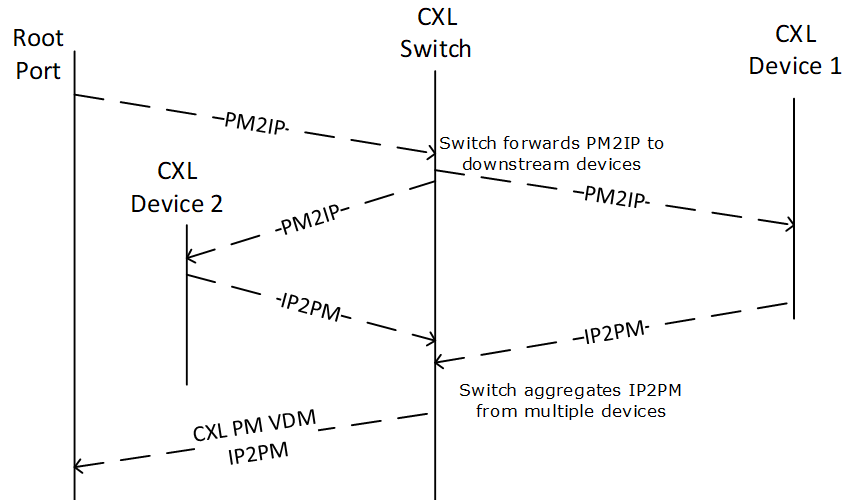
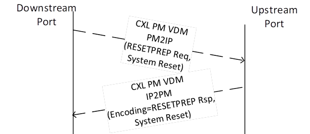
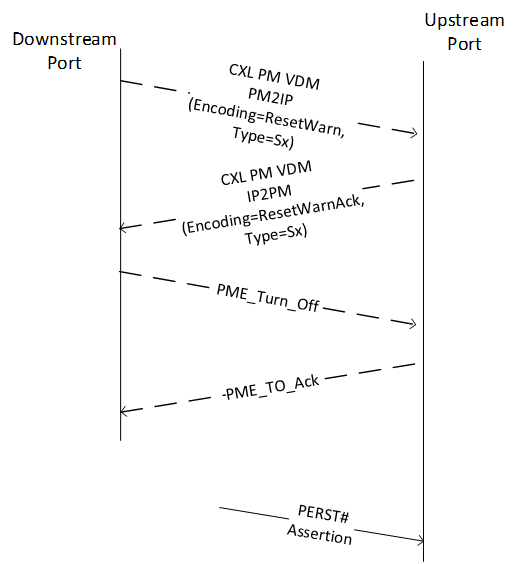

# 📘 第 9 章　复位、初始化、配置与管理 (Chapter 9. Reset, Initialization, Configuration, and Manageability)

> **Source pages**: 799–878 | **File**: chapter_09.md | **Format**: 中英对照双语

---

## 📑 本章目录

- [9.0 复位、初始化、配置与管理 (Reset, Initialization, Configuration, and Manageability)](#sec-9-0)
- [9.1 CXL 启动与复位概述 (CXL Boot and Reset Overview)](#sec-9-1)
  - [9.1.1 概述 (General)](#sec-9-1-1)
  - [9.1.2 比较 CXL 与 PCIe 行为 (Comparing CXL and PCIe Behavior)](#sec-9-1-2)
    - [9.1.2.1 交换机行为 (Switch Behavior)](#sec-9-1-2-1)
- [9.2 CXL 设备启动流程 (CXL Device Boot Flow)](#sec-9-2)
- [9.3 CXL 系统复位进入流程 (CXL System Reset Entry Flow)](#sec-9-3)
- [9.4 CXL 设备睡眠状态进入流程 (CXL Device Sleep State Entry Flow)](#sec-9-4)
- [9.5 功能级复位 (Function Level Reset, FLR)](#sec-9-5)
- [9.6 缓存管理 (Cache Management)](#sec-9-6)
- [9.7 CXL 复位 (CXL Reset)](#sec-9-7)
  - [9.7.1 对易失 HDM 内容的影响 (Effect on the Contents of the Volatile HDM)](#sec-9-7-1)
  - [9.7.2 软件操作 (Software Actions)](#sec-9-7-2)
  - [9.7.3 CXL 复位与请求重试状态 (CXL Reset and Request Retry Status, RRS)](#sec-9-7-3)
- [9.8 全局持久刷新 (Global Persistent Flush, GPF)](#sec-9-8)
  - [9.8.1 主机与交换机职责 (Host and Switch Responsibilities)](#sec-9-8-1)
  - [9.8.2 设备职责 (Device Responsibilities)](#sec-9-8-2)
  - [9.8.3 能源预算 (Energy Budgeting)](#sec-9-8-3)
- [9.9 热插拔 (Hot-Plug)](#sec-9-9)
- [9.10 软件枚举 (Software Enumeration)](#sec-9-10)
- [9.11 RCD 枚举 (RCD Enumeration)](#sec-9-11)
  - [9.11.1 RCD 模式 (RCD Mode)](#sec-9-11-1)
  - [9.11.2 RCH 与 RCD 的 PCIe 软件视图 (PCIe Software View of an RCH and RCD)](#sec-9-11-2)
  - [9.11.3 RCH 与 RCD 的系统固件视图 (System Firmware View of an RCH and RCD)](#sec-9-11-3)
  - [9.11.4 RCH 与 RCD 的操作系统视图 (OS View of an RCH and RCD)](#sec-9-11-4)
  - [9.11.5 基于系统固件的 RCD 枚举流程 (System Firmware-based RCD Enumeration Flow)](#sec-9-11-5)
  - [9.11.6 RCD 发现 (RCD Discovery)](#sec-9-11-6)
  - [9.11.7 多 Flex Bus 链路的 eRCD (eRCDs with Multiple Flex Bus Links)](#sec-9-11-7)
    - [9.11.7.1 单 CPU 拓扑 (Single CPU Topology)](#sec-9-11-7-1)
    - [9.11.7.2 多 CPU 拓扑 (Multiple CPU Topology)](#sec-9-11-7-2)
  - [9.11.8 连接到 RCH 的 CXL 设备 (CXL Devices Attached to an RCH)](#sec-9-11-8)
- [9.12 CXL VH 枚举 (CXL VH Enumeration)](#sec-9-12)
  - [9.12.1 CXL 根端口 (CXL Root Ports)](#sec-9-12-1)
  - [9.12.2 CXL 虚拟层级 (CXL Virtual Hierarchy)](#sec-9-12-2)
  - [9.12.3 枚举 CXL RP 与 DSP (Enumerating CXL RPs and DSPs)](#sec-9-12-3)
  - [9.12.4 连接到 CXL RP 或 DSP 的 eRCD (eRCD Connected to a CXL RP or DSP)](#sec-9-12-4)
    - [9.12.4.1 引导时重新配置 CXL RP 或 DSP 以启用 eRCD (Boot time Reconfiguration of CXL RP or DSP to Enable an eRCD)](#sec-9-12-4-1)
  - [9.12.5 CXL RP 与 DSP 下的 CXL eRCD — 示例 (CXL eRCD below a CXL RP and DSP - Example)](#sec-9-12-5)
  - [9.12.6 CXL VH 中链路与协议寄存器的映射 (Mapping of Link and Protocol Registers in CXL VH)](#sec-9-12-6)
- [9.13 HDM 的软件视图 (Software View of HDM)](#sec-9-13)
  - [9.13.1 内存交织 (Memory Interleaving)](#sec-9-13-1)
    - [9.13.1.1 合法交织配置:12 路、6 路与 3 路 (Legal Interleaving Configurations: 12-way, 6-way, and 3-way)](#sec-9-13-1-1)
  - [9.13.2 CXL 内存设备标签存储区 (CXL Memory Device Label Storage Area)](#sec-9-13-2)
    - [9.13.2.1 LSA 总体布局 (Overall LSA Layout)](#sec-9-13-2-1)
    - [9.13.2.2 标签索引块 (Label Index Blocks)](#sec-9-13-2-2)
    - [9.13.2.3 标签通用属性 (Common Label Properties)](#sec-9-13-2-3)
    - [9.13.2.4 区域标签 (Region Labels)](#sec-9-13-2-4)
    - [9.13.2.5 命名空间标签 (Namespace Labels)](#sec-9-13-2-5)
    - [9.13.2.6 厂商特定标签 (Vendor-specific Labels)](#sec-9-13-2-6)
  - [9.13.3 动态容量设备 (Dynamic Capacity Device, DCD)](#sec-9-13-3)
    - [9.13.3.1 FM 对 DCD 的管理 (DCD Management By FM)](#sec-9-13-3-1)
    - [9.13.3.2 设置内存共享 (Setting up Memory Sharing)](#sec-9-13-3-2)
    - [9.13.3.3 范围列表跟踪 (Extent List Tracking)](#sec-9-13-3-3)
  - [9.13.4 容量或性能降级 (Capacity or Performance Degradation)](#sec-9-13-4)
- [9.14 反向失效配置 (Back-Invalidate Configuration)](#sec-9-14)
  - [9.14.1 发现 (Discovery)](#sec-9-14-1)
  - [9.14.2 配置 (Configuration)](#sec-9-14-2)
  - [9.14.3 混合配置 (Mixed Configurations)](#sec-9-14-3)
    - [9.14.3.1 支持 BI 的 Type 2 设备 (BI-capable Type 2 Device)](#sec-9-14-3-1)
    - [9.14.3.2 Type 2 设备回退模式 (Type 2 Device Fallback Modes)](#sec-9-14-3-2)
    - [9.14.3.3 支持 BI 的 Type 3 设备 (BI-capable Type 3 Device)](#sec-9-14-3-3)
- [9.15 Cache ID 配置与路由 (Cache ID Configuration and Routing)](#sec-9-15)
  - [9.15.1 主机能力 (Host Capabilities)](#sec-9-15-1)
  - [9.15.2 下游端口解码功能 (Downstream Port Decode Functionality)](#sec-9-15-2)
  - [9.15.3 上游交换机端口路由功能 (Upstream Switch Port Routing Functionality)](#sec-9-15-3)
  - [9.15.4 主机桥路由功能 (Host Bridge Routing Functionality)](#sec-9-15-4)
- [9.16 UIO 直连 P2P 到 HDM (UIO Direct P2P to HDM)](#sec-9-16)
  - [9.16.1 UIO 直连 P2P 到 HDM 消息的处理 (Processing of UIO Direct P2P to HDM Messages)](#sec-9-16-1)
    - [9.16.1.1 UIO 地址匹配 (DSP 与根端口) (UIO Address Match (DSP and Root Port))](#sec-9-16-1-1)
    - [9.16.1.2 UIO 地址匹配 (CXL.mem 设备) (UIO Address Match (CXL.mem Device))](#sec-9-16-1-2)
- [9.17 加速器的直连 P2P CXL.mem (Direct P2P CXL.mem for Accelerators)](#sec-9-17)
  - [9.17.1 对等 SLD 配置 (Peer SLD Configuration)](#sec-9-17-1)
  - [9.17.2 对等 MLD 配置 (Peer MLD Configuration)](#sec-9-17-2)
  - [9.17.3 对等 GFD 配置 (Peer GFD Configuration)](#sec-9-17-3)
- [9.18 CXL 操作系统固件接口扩展 (CXL OS Firmware Interface Extensions)](#sec-9-18)
  - [9.18.1 CXL 早期发现表 (CXL Early Discovery Table, CEDT)](#sec-9-18-1)
    - [9.18.1.1 CEDT 头 (CEDT Header)](#sec-9-18-1-1)
    - [9.18.1.2 CXL 主机桥结构 (CXL Host Bridge Structure, CHBS)](#sec-9-18-1-2)
    - [9.18.1.3 CXL 固定内存窗口结构 (CXL Fixed Memory Window Structure, CFMWS)](#sec-9-18-1-3)
    - [9.18.1.4 CXL XOR 交织数学结构 (CXL XOR Interleave Math Structure, CXIMS)](#sec-9-18-1-4)
    - [9.18.1.5 RCEC 下游端口关联结构 (RCEC Downstream Port Association Structure, RDPAS)](#sec-9-18-1-5)
    - [9.18.1.6 CXL 系统描述结构 (CXL System Description Structure, CSDS)](#sec-9-18-1-6)
  - [9.18.2 CXL _OSC](#sec-9-18-2)
    - [9.18.2.1 评估 _OSC 的规则 (Rules for Evaluating _OSC)](#sec-9-18-2-1)
      - [9.18.2.1.1 查询支持标志 (Query Support Flag)](#sec-9-18-2-1-1)
      - [9.18.2.1.2 评估条件 (Evaluation Conditions)](#sec-9-18-2-1-2)
      - [9.18.2.1.3 _OSC 调用顺序 (Sequence of _OSC Calls)](#sec-9-18-2-1-3)
      - [9.18.2.1.4 ASL 示例 (ASL Example)](#sec-9-18-2-1-4)
  - [9.18.3 CXL 根设备特定方法 (_DSM) (CXL Root Device Specific Methods (_DSM))](#sec-9-18-3)
    - [9.18.3.1 用于检索 QTG ID 的 _DSM 函数 (_DSM Function for Retrieving QTG ID)](#sec-9-18-3-1)
- [9.19 CXL 设备可管理性模型 (Manageability Model for CXL Devices)](#sec-9-19)
- [9.20 组件命令接口 (Component Command Interface)](#sec-9-20)
  - [9.20.1 CCI 属性 (CCI Properties)](#sec-9-20-1)
  - [9.20.2 基于 MCTP 的 CCI 属性 (MCTP-based CCI Properties)](#sec-9-20-2)

## 🖼 本章图表

| 图表 | 英文标题 | 中文标题 | 页码 |
|---|---|---|---|
| Figure 9-1 | PMREQ/RESETPREP Propagation by CXL Switch | CXL 交换机对 PMREQ/RESETPREP 的传播 | 801 |
| Figure 9-2 | CXL Device Reset Entry Flow | CXL 设备复位进入流程 | 802 |
| Figure 9-3 | CXL Device Sleep State Entry Flow | CXL 设备睡眠状态进入流程 | 803 |
| Figure 9-4 | PCIe Software View of an RCH and RCD | RCH 与 RCD 的 PCIe 软件视图 | 816 |
| Figure 9-5 | One CPU Connected to a Dual-Headed RCD by Two Flex Bus Links | 一颗 CPU 通过两条 Flex Bus 链路连接双端口 RCD | 819 |
| Figure 9-6 | Two CPUs Connected to One CXL Device by Two Flex Bus Links | 两颗 CPU 通过两条 Flex Bus 链路连接一个 CXL 设备 | 820 |
| Figure 9-7 | CXL Device Remaps Upstream Port and Component Registers | CXL 设备重新映射上游端口和组件寄存器 | 822 |
| Figure 9-8 | CXL Device that Does Not Remap Upstream Port and Component Registers | 不重新映射上游端口和组件寄存器的 CXL 设备 | 823 |
| Figure 9-9 | CXL Root Port/DSP State Diagram | CXL 根端口/DSP 状态图 | 826 |
| Figure 9-10 | eRCD MMIO Address Decode - Example | eRCD MMIO 地址解码示例 | 828 |
| Figure 9-11 | eRCD Configuration Space Decode - Example | eRCD 配置空间解码示例 | 829 |
| Figure 9-12 | Physical Topology - Example | 物理拓扑示例 | 830 |
| Figure 9-13 | Software View | 软件视图 | 831 |
| Figure 9-14 | CXL Link/Protocol Register Mapping in a CXL VH | CXL VH 中链路/协议寄存器的映射 | 832 |
| Figure 9-15 | CXL Link/Protocol Registers in a CXL Switch | CXL 交换机中链路/协议寄存器的映射 | 832 |
| Figure 9-16 | One-level Interleaving at Switch - Example | 交换机处单层交织示例 | 835 |
| Figure 9-17 | Two-level Interleaving | 双层交织 | 835 |
| Figure 9-18 | Three-level Interleaving Example | 三层交织示例 | 836 |
| Figure 9-19 | Overall LSA Layout | LSA 总体布局 | 838 |
| Figure 9-20 | Fletcher64 Checksum Algorithm in C | C 语言中的 Fletcher64 校验和算法 | 839 |
| Figure 9-21 | Sequence Numbers in Label Index Blocks | 标签索引块中的序列号 | 840 |
| Figure 9-22 | Extent List Example (No Sharing) | 范围列表示例 (无共享) | 845 |
| Figure 9-23 | Shared Extent List Example | 共享范围列表示例 | 845 |
| Figure 9-24 | DCD DPA Space Example | DCD DPA 空间示例 | 846 |
| Figure 9-25 | UIO Direct P2P to Interleaved HDM | UIO 直连 P2P 到交织 HDM | 860 |

## 📊 本章表格

| 表格 | 英文标题 | 中文标题 | 页码 |
|---|---|---|---|
| Table 9-1 | Event Sequencing for Reset and Sx Flows | 复位与 Sx 流程的事件顺序 | 800 |
| Table 9-2 | CXL Switch Behavior Message Aggregation Rules | CXL 交换机消息聚合规则 | 800–801 |
| Table 9-3 | GPF Energy Calculation Example | GPF 能量计算示例 | 811 |
| Table 9-4 | Memory Decode Rules in Presence of One CPU/Two Flex Bus Links | 一个 CPU / 两条 Flex Bus 链路下的内存解码规则 | 819 |
| Table 9-5 | Memory Decode Rules in Presence of Two CPU/Two Flex Bus Links | 两个 CPU / 两条 Flex Bus 链路下的内存解码规则 | 821 |
| Table 9-6 | 12-Way Device-level Interleave at IGB | 在 IGB 下的 12 路设备级交织 | 837 |
| Table 9-7 | 6-Way Device-level Interleave at IGB | 在 IGB 下的 6 路设备级交织 | 837 |
| Table 9-8 | 3-Way Device-level Interleave at IGB | 在 IGB 下的 3 路设备级交织 | 837 |
| Table 9-9 | Label Index Block Layout | 标签索引块布局 | 840 |
| Table 9-10 | Region Label Layout | 区域标签布局 | 842 |
| Table 9-11 | Namespace Label Layout | 命名空间标签布局 | 843 |
| Table 9-12 | Vendor Specific Label Layout | 厂商特定标签布局 | 844 |
| Table 9-13 | Downstream Port Handling of BISnp | 下游端口对 BISnp 的处理 | 851 |
| Table 9-14 | Downstream Port Handling of BIRsp | 下游端口对 BIRsp 的处理 | 851 |
| Table 9-15 | CXL Type 2 Device Behavior in Fallback Operation Mode | 回退操作模式下 CXL Type 2 设备的行为 | 855 |
| Table 9-16 | Downstream Port Handling of D2H Request Messages | 下游端口对 D2H 请求消息的处理 | 857 |
| Table 9-17 | Downstream Port Handling of H2D Response Message and H2D Request Message | 下游端口对 H2D 响应消息和 H2D 请求消息的处理 | 857 |
| Table 9-18 | Handling of UIO Accesses | UIO 访问的处理 | 861 |
| Table 9-19 | CEDT Header | CEDT 头 | 864 |
| Table 9-20 | CEDT Structure Types | CEDT 结构类型 | 864 |
| Table 9-21 | CHBS Structure | CHBS 结构 | 865 |
| Table 9-22 | CFMWS Structure | CFMWS 结构 | 866–868 |
| Table 9-23 | CXIMS Structure | CXIMS 结构 | 868 |
| Table 9-24 | RDPAS Structure | RDPAS 结构 | 869 |
| Table 9-25 | CSDS Structure | CSDS 结构 | 870 |
| Table 9-26 | _OSC Capabilities Buffer DWORDs | _OSC 能力缓冲区 DWORD | 871 |
| Table 9-27 | Interpretation of CXL _OSC Support Field | CXL _OSC 支持字段含义 | 871 |
| Table 9-28 | Interpretation of CXL _OSC Control Field, Passed in via Arg3 | 通过 Arg3 传入的 CXL _OSC 控制字段含义 | 872 |
| Table 9-29 | Interpretation of CXL _OSC Control Field, Returned Value | CXL _OSC 控制字段返回值的含义 | 872 |
| Table 9-30 | _DSM Definitions for CXL Root Device | CXL 根设备的 _DSM 定义 | 874 |
| Table 9-31 | _DSM for Retrieving QTG, Inputs, and Outputs | 用于检索 QTG 的 _DSM 输入与输出 | 875 |

---

## 9.0 Reset, Initialization, Configuration, and Manageability | 复位、初始化、配置与管理

<table>
<thead>
<tr>
<th width="50%">🇬🇧 English</th>
<th width="50%" style="background-color:#e8e8e8">🇨🇳 中文</th>
</tr>
</thead>
<tbody>
<tr><td><strong>9.0 Reset, Initialization, Configuration, and Manageability</strong></td><td style="background-color:#e8e8e8"><strong>9.0 复位、初始化、配置与管理</strong></td></tr>
</tbody>
</table>

[⬆️ 返回目录](#-本章目录)

## 9.1 CXL Boot and Reset Overview | CXL 启动与复位概述

<table>
<thead>
<tr>
<th width="50%">🇬🇧 English</th>
<th width="50%" style="background-color:#e8e8e8">🇨🇳 中文</th>
</tr>
</thead>
<tbody>
<tr><td><strong>9.1 CXL Boot and Reset Overview</strong></td><td style="background-color:#e8e8e8"><strong>9.1 CXL 启动与复位概述</strong></td></tr>
</tbody>
</table>

### 9.1.1 General | 概述

<table>
<thead>
<tr>
<th width="50%">🇬🇧 English</th>
<th width="50%" style="background-color:#e8e8e8">🇨🇳 中文</th>
</tr>
</thead>
<tbody>
<tr><td>Boot and Power-up sequencing of CXL devices follows the applicable form-factor specifications and as such, will not be discussed in detail in this section.</td><td style="background-color:#e8e8e8">CXL 设备的启动与上电顺序遵循适用的形态因子 (Form Factor) 规范,因此本节将不进行详细讨论。</td></tr>
<tr><td>CXL devices can encounter three types of resets.</td><td style="background-color:#e8e8e8">CXL 设备可能遇到三种类型的复位。</td></tr>
<tr><td>• Hot Reset – Triggered via link (via LTSSM or Link Down)</td><td style="background-color:#e8e8e8">• 热复位 (Hot Reset) – 通过链路触发 (通过 LTSSM 或 Link Down)</td></tr>
<tr><td>• Warm Reset – Triggered via external signal, PERST# (or equivalent, form-factor-specific mechanism)</td><td style="background-color:#e8e8e8">• 暖复位 (Warm Reset) – 通过外部信号 PERST# (或等效的、形态因子特定的机制) 触发</td></tr>
<tr><td>• Cold Reset – Involves main Power removal and PERST# (or equivalent, form-factor-specific mechanism)</td><td style="background-color:#e8e8e8">• 冷复位 (Cold Reset) – 涉及主电源移除和 PERST# (或等效的、形态因子特定的机制)</td></tr>
<tr><td>These three reset types are labeled as Conventional Reset. Function Level Reset (see Section 9.5) and CXL Reset (see Section 9.7) are not considered to be Conventional Resets. These definitions are consistent with PCIe* Base Specification.</td><td style="background-color:#e8e8e8">这三种复位类型被标记为传统复位 (Conventional Reset)。功能级复位 (Function Level Reset, FLR,见 9.5 节) 和 CXL 复位 (CXL Reset,见 9.7 节) 不被视为传统复位。这些定义与 PCIe* 基本规范 (PCIe Base Specification) 一致。</td></tr>
<tr><td>Flex Bus Physical Layer link states across cold reset, warm reset, surprise reset, and Sx entry match PCIe Physical Layer link states.</td><td style="background-color:#e8e8e8">Flex Bus 物理层链路状态在冷复位、暖复位、意外复位 (Surprise Reset) 以及 Sx 进入期间与 PCIe 物理层链路状态一致。</td></tr>
<tr><td>This chapter highlights the differences that exist between CXL and native PCIe for these reset operations.</td><td style="background-color:#e8e8e8">本章重点说明在这些复位操作中 CXL 与原生 PCIe 之间存在的差异。</td></tr>
<tr><td>A PCIe device generally cannot determine which system-level flow triggered a Conventional Reset. System-level reset and Sx-entry flows require coordinated coherency domain shutdown before the sequence can progress. Therefore, the CXL flow will adhere to the following rules:</td><td style="background-color:#e8e8e8">PCIe 设备通常无法确定是哪个系统级流程触发了传统复位。系统级复位和 Sx 进入流程在进行下一步之前,需要协调关闭一致性域 (Coherency Domain)。因此,CXL 流程将遵循以下规则:</td></tr>
<tr><td>• Warnings shall be issued to all CXL devices before the system initiates system-level reset and Sx-entry transitions.</td><td style="background-color:#e8e8e8">• 在系统启动系统级复位和 Sx 进入转换之前,应向所有 CXL 设备发出警告。</td></tr>
<tr><td>• CXL PM messages shall be used to communicate between the host and the device. Devices must respond to these messages with the correct acknowledge, even if no actions are actually performed on the device. To prevent deadlock in cases where one or more downstream components do not respond, the host must implement a timeout, after which the host proceeds as if the response has been received.</td><td style="background-color:#e8e8e8">• 主机与设备之间的通信应使用 CXL PM 消息。即使设备实际上未执行任何操作,也必须以正确的确认 (Acknowledge, Ack) 响应这些消息。为防止在一个或多个下游组件无响应时产生死锁,主机必须实现一个超时机制,在此之后主机将假定已收到响应并继续执行。</td></tr>
<tr><td>• A device shall correctly process the reset trigger regardless of whether they are preceded by these warning messages. Not all device resets are preceded by a warning message. For example, setting Secondary Bus Reset bit in a Downstream Port above the device results in a device hot-reset, but it is not preceded by any warning message. It is also possible that the PM VDM warning message may be lost due to an error condition.</td><td style="background-color:#e8e8e8">• 无论是否带有这些警告消息,设备都应正确处理复位触发。并非所有设备复位都带有警告消息。例如,在设备上方的下游端口中设置 Secondary Bus Reset 位会导致设备热复位,但该复位之前没有任何警告消息。PM VDM 警告消息也可能由于错误条件而丢失。</td></tr>
<tr><td>Sx states are system Sleep States and are enumerated in ACPI Specification.</td><td style="background-color:#e8e8e8">Sx 状态是系统睡眠状态,在 ACPI 规范中定义。</td></tr>
</tbody>
</table>

[⬆️ 返回目录](#-本章目录)

### 9.1.2 Comparing CXL and PCIe Behavior | 比较 CXL 与 PCIe 行为

<table>
<thead>
<tr>
<th width="50%">🇬🇧 English</th>
<th width="50%" style="background-color:#e8e8e8">🇨🇳 中文</th>
</tr>
</thead>
<tbody>
<tr><td><strong>9.1.2 Comparing CXL and PCIe Behavior</strong></td><td style="background-color:#e8e8e8"><strong>9.1.2 比较 CXL 与 PCIe 行为</strong></td></tr>
<tr><td>Table 9-1 summarizes the difference in event sequencing and signaling methods across System Reset and Sx flows, for CXL.io, CXL.cache, CXL.mem, and PCIe.</td><td style="background-color:#e8e8e8">表 9-1 总结了 CXL.io、CXL.cache、CXL.mem 和 PCIe 在系统复位和 Sx 流程之间的事件顺序和信令方法的差异。</td></tr>
<tr><td>The terms used in the table are as follows:</td><td style="background-color:#e8e8e8">表中使用的术语如下:</td></tr>
<tr><td>• Warning: An early notification of the upcoming event. Devices with coherent cache or memory are required to complete outstanding transactions, flush internal caches as needed, and then place memory in a safe state such as Self-refresh as required. Devices are required to complete all internal actions and then respond with a correct Ack to the processor.</td><td style="background-color:#e8e8e8">• 警告 (Warning):对即将发生事件的提前通知。具有一致性缓存或内存的设备需要完成所有未完成的事务,根据需要刷新内部缓存,然后根据需要将内存置于安全状态 (如自刷新,Self-refresh)。设备需要完成所有内部操作,然后向处理器返回正确的确认 (Ack)。</td></tr>
<tr><td>• Signaling: Actual initiation of the state transition, using either wires and/or link-layer messaging.</td><td style="background-color:#e8e8e8">• 信令 (Signaling):使用物理信号线或链路层消息,实际启动状态转换。</td></tr>
</tbody>
</table>

> **Table 9-1.** Event Sequencing for Reset and Sx Flows | 复位与 Sx 流程的事件顺序
>
> | Case (事件) | PCIe | CXL |
> |---|---|---|
> | System Reset Entry (系统复位进入) | Warning: None. Signaling: LTSSM Hot Reset. | Warning: PM2IP (ResetWarn, System Reset)¹. Signaling: LTSSM Hot Reset. |
> | Surprise System Reset Entry (意外系统复位进入) | Warning: None. Signaling: LTSSM detect-entry or PERST#. | Warning: None. Signaling: LTSSM detect-entry or PERST#. |
> | System Sx Entry (系统 Sx 进入) | Warning: PME_Turn_Off/Ack. Signaling: PERST# (Main power will go down). | Warning: PM2IP (ResetWarn, Sx)¹. PME_Turn_Off/Ack. Signaling: PERST# (Main power will go down). |
> | System Power Failure (系统掉电) | Warning: None. | Warning: PM2IP (GPF Phase 1 and Phase 2)¹; see Section 9.8. |
>
> ¹ CXL PM VDM with different encodings for different events. If CXL.io devices do not respond to the CXL PM VDM, the host may still end up in the correct state due to timeouts. | ¹ CXL PM VDM 针对不同事件使用不同编码。如果 CXL.io 设备未响应 CXL PM VDM,主机仍可能因超时机制而进入正确状态。
>
> *Original page render @ 150 DPI* — [📄 Full size](figures/chapter_09/page_0800.png)

#### 9.1.2.1 Switch Behavior | 交换机行为

<table>
<thead>
<tr>
<th width="50%">🇬🇧 English</th>
<th width="50%" style="background-color:#e8e8e8">🇨🇳 中文</th>
</tr>
</thead>
<tbody>
<tr><td><strong>9.1.2.1 Switch Behavior</strong></td><td style="background-color:#e8e8e8"><strong>9.1.2.1 交换机行为</strong></td></tr>
<tr><td>When a CXL Switch (physical or virtual) is present, the Switch shall forward PM2IP messages received on its primary interface to CXL components on the secondary interface subject to rules specified below. The Switch shall aggregate IP2PM messages from the secondary interface prior to responding on its primary interface subject to rules specified below. (See Table 3-1 for PM Commands.) When communicating with a pooled device, these messages shall carry LD-ID TLP Prefix in both directions.</td><td style="background-color:#e8e8e8">当存在 CXL 交换机 (物理或虚拟) 时,交换机应将其主端口接收到的 PM2IP 消息转发到次端口上的 CXL 组件,具体遵循以下规则。交换机应在主端口响应之前先聚合来自次端口的 IP2PM 消息,具体遵循以下规则。(PM 命令参见表 3-1)。在与池化设备 (Pooled Device) 通信时,这些消息在两个方向上都应携带 LD-ID TLP 前缀。</td></tr>
</tbody>
</table>

> **Table 9-2.** CXL Switch Behavior Message Aggregation Rules | CXL 交换机消息聚合规则
>
> | PM Logical Opcode Value | PM Command | Action |
> |---|---|---|
> | 0 | AGENT_INFO | • Do not forward PM2IP messages to downstream Devices. • Execute Credits and PM Initialization flow against the downstream entity whenever a link trains up in CXL mode. • Save CAPABILITY_VECTOR from the response. |
> | 2 | RESETPREP | • Never forward PM2IP messages to PCIe links. • Forward PM2IP messages to all active downstream CXL links. • Gather the IP2PM messages from all active downstream CXL links. |
> | 4 | PMREQ | • Never forward PM2IP messages to PCIe links. • Forward PM2IP messages to all active downstream CXL links. • Gather the IP2PM messages from all active downstream CXL links. "Conglomerate" Latency Tolerance Reporting (LTR) requests from all Devices by following the rules defined in LTR Mechanism section in PCIe Base Specification. |
> | 6 | GPF | • Never forward PM2IP messages to PCIe links. • Never forward PM2IP messages to all downstream CXL links that returned CAPABILITY_VECTOR[1]=0. • Forward PM2IP messages to all downstream CXL links that returned CAPABILITY_VECTOR[1]=1 and gather the IP2PM responses from all such links. |
> | FEh | CREDIT_RTN | • Do not forward PM2IP message to downstream Devices. • PM Credit management on the primary interface is independent of PM credit management on the secondary interface. |
>
> *Original page render @ 150 DPI* — [📄 Full size](figures/chapter_09/page_0800.png)

> **Figure 9-1.** PMREQ/RESETPREP Propagation by CXL Switch | CXL 交换机对 PMREQ/RESETPREP 的传播
>
> 
>
> *Original page render @ 150 DPI* — [📄 Full size](figures/chapter_09/fig_0801_1.png)

[⬆️ 返回目录](#-本章目录)

## 9.2 CXL Device Boot Flow | CXL 设备启动流程

<table>
<thead>
<tr>
<th width="50%">🇬🇧 English</th>
<th width="50%" style="background-color:#e8e8e8">🇨🇳 中文</th>
</tr>
</thead>
<tbody>
<tr><td><strong>9.2 CXL Device Boot Flow</strong></td><td style="background-color:#e8e8e8"><strong>9.2 CXL 设备启动流程</strong></td></tr>
<tr><td>CXL devices shall follow the appropriate form factor specification regarding the boot flows.</td><td style="background-color:#e8e8e8">CXL 设备应遵循适用的形态因子规范中关于启动流程的规定。</td></tr>
<tr><td>This specification uses the terms "Warm Reset" and "Cold Reset" in a manner that is consistent with PCIe Base Specification.</td><td style="background-color:#e8e8e8">本规范中"暖复位"和"冷复位"术语的使用与 PCIe 基本规范一致。</td></tr>
</tbody>
</table>

[⬆️ 返回目录](#-本章目录)

## 9.3 CXL System Reset Entry Flow | CXL 系统复位进入流程

<table>
<thead>
<tr>
<th width="50%">🇬🇧 English</th>
<th width="50%" style="background-color:#e8e8e8">🇨🇳 中文</th>
</tr>
</thead>
<tbody>
<tr><td><strong>9.3 CXL System Reset Entry Flow</strong></td><td style="background-color:#e8e8e8"><strong>9.3 CXL 系统复位进入流程</strong></td></tr>
<tr><td>In an OS-orchestrated reset flow, it is expected that the CXL devices are already in an Inactive State with their contexts flushed to the system memory or CXL-attached memory before the platform reset flow is triggered.</td><td style="background-color:#e8e8e8">在操作系统编排的复位流程中,期望在平台复位流程触发之前,CXL 设备已经处于非活动状态 (Inactive State),其上下文已刷新到系统内存或 CXL 连接的内存中。</td></tr>
<tr><td>In a platform-triggered reset flow (e.g., due to a fatal error), a CXL device may not be in an Inactive State when the device receives the ResetPrep message.</td><td style="background-color:#e8e8e8">在平台触发的复位流程中 (例如,由于致命错误),CXL 设备在接收到 ResetPrep 消息时可能未处于非活动状态。</td></tr>
<tr><td>During system reset flow, the host shall issue a CXL PM VDM (see Table 3-1) to the downstream CXL components with the following values:</td><td style="background-color:#e8e8e8">在系统复位流程中,主机应向下游 CXL 组件发出 CXL PM VDM (见表 3-1),其值如下:</td></tr>
<tr><td>• PM Logical Opcode[7:0]=RESETPREP</td><td style="background-color:#e8e8e8">• PM 逻辑操作码 [7:0]=RESETPREP</td></tr>
<tr><td>• Parameter[15:0]=REQUEST</td><td style="background-color:#e8e8e8">• 参数 [15:0]=REQUEST (请求)</td></tr>
<tr><td>• ResetType = System Reset</td><td style="background-color:#e8e8e8">• ResetType = System Reset (系统复位)</td></tr>
<tr><td>• PrepType = General Prep</td><td style="background-color:#e8e8e8">• PrepType = General Prep (通用准备)</td></tr>
<tr><td>The CXL device shall flush any relevant context to the host, clean up the data serving the host, and then place any CXL device connected memory into a safe state such as self-refresh. The CXL device shall take any additional steps that are necessary for the CXL host to enter LTSSM Hot Reset. After all the Reset preparation is complete, the CXL device shall issue a CXL PM VDM with the following value:</td><td style="background-color:#e8e8e8">CXL 设备应将任何相关的上下文刷新到主机,清理为主机服务的数据,然后将任何 CXL 设备连接的内存置于安全状态 (例如自刷新)。CXL 设备应采取 CXL 主机进入 LTSSM Hot Reset 状态所需的任何额外步骤。在完成所有复位准备工作后,CXL 设备应发出以下值的 CXL PM VDM:</td></tr>
<tr><td>• PM Logical Opcode[7:0]=RESETPREP</td><td style="background-color:#e8e8e8">• PM 逻辑操作码 [7:0]=RESETPREP</td></tr>
<tr><td>• Parameter[15:0]=RESPONSE</td><td style="background-color:#e8e8e8">• 参数 [15:0]=RESPONSE (响应)</td></tr>
<tr><td>• ResetType = System Reset</td><td style="background-color:#e8e8e8">• ResetType = System Reset</td></tr>
<tr><td>• PrepType = General Prep</td><td style="background-color:#e8e8e8">• PrepType = General Prep</td></tr>
<tr><td>The CXL device may have PERST# asserted after the reset handshake is complete. On PERST# assertion, the CXL device should clear any sticky content internal to the device unless they are on auxiliary power. The CXL device's handling of sticky register state is consistent with PCIe Base Specification.</td><td style="background-color:#e8e8e8">在复位握手完成后,CXL 设备的 PERST# 可能会被断言。在 PERST# 断言时,除非设备由辅助电源供电,否则 CXL 设备应清除设备内部的任何粘滞 (Sticky) 内容。CXL 设备对粘滞寄存器状态的处理与 PCIe 基本规范一致。</td></tr>
<tr><td>To prevent a deadlock in the case where one or more downstream components do not respond with an Ack, the host must implement a timeout, after which the host proceeds as if the response has been received.</td><td style="background-color:#e8e8e8">为防止在一个或多个下游组件未以 Ack 响应时发生死锁,主机必须实现超时机制,在此之后主机假定已收到响应并继续执行。</td></tr>
</tbody>
</table>

> **Figure 9-2.** CXL Device Reset Entry Flow | CXL 设备复位进入流程
>
> 
>
> *Original page render @ 150 DPI* — [📄 Full size](figures/chapter_09/fig_0802_1.png)

[⬆️ 返回目录](#-本章目录)

## 9.4 CXL Device Sleep State Entry Flow | CXL 设备睡眠状态进入流程

<table>
<thead>
<tr>
<th width="50%">🇬🇧 English</th>
<th width="50%" style="background-color:#e8e8e8">🇨🇳 中文</th>
</tr>
</thead>
<tbody>
<tr><td><strong>9.4 CXL Device Sleep State Entry Flow</strong></td><td style="background-color:#e8e8e8"><strong>9.4 CXL 设备睡眠状态进入流程</strong></td></tr>
<tr><td>Since OS is always the orchestrator of Sx entry flows, it is expected that the CXL devices are already in an Inactive State with their contexts flushed to the CPU-attached memory or CXL-attached memory before the Sx entry flow is triggered.</td><td style="background-color:#e8e8e8">由于操作系统始终是 Sx 进入流程的编排者,期望在 Sx 进入流程触发之前,CXL 设备已经处于非活动状态,其上下文已刷新到 CPU 连接的内存或 CXL 连接的内存中。</td></tr>
<tr><td>During Sx entry flow, the host shall issue a CXL PM VDM (see Table 3-1) to the downstream components with the following values:</td><td style="background-color:#e8e8e8">在 Sx 进入流程中,主机应向下游组件发出 CXL PM VDM (见表 3-1),其值如下:</td></tr>
<tr><td>• PM Logical Opcode[7:0]=RESETPREP</td><td style="background-color:#e8e8e8">• PM 逻辑操作码 [7:0]=RESETPREP</td></tr>
<tr><td>• Parameter[15:0]=REQUEST</td><td style="background-color:#e8e8e8">• 参数 [15:0]=REQUEST</td></tr>
<tr><td>• ResetType = System transition from S0 to Sx (S1, S3, S4, or S5)</td><td style="background-color:#e8e8e8">• ResetType = 系统从 S0 到 Sx 的转换 (S1、S3、S4 或 S5)</td></tr>
<tr><td>• PrepType = General Prep</td><td style="background-color:#e8e8e8">• PrepType = General Prep</td></tr>
<tr><td>The CXL device shall flush any relevant context to the host, clean up the data serving the host, and then place any CXL device connected memory into a safe state such as self-refresh. The CXL device shall take any additional steps that are necessary for the CXL host to initiate an L2 entry flow. After all the Sx preparation is complete, the CXL device shall issue a CXL PM VDM with the following values:</td><td style="background-color:#e8e8e8">CXL 设备应将任何相关的上下文刷新到主机,清理为主机服务的数据,然后将任何 CXL 设备连接的内存置于安全状态 (如自刷新)。CXL 设备应采取 CXL 主机启动 L2 进入流程所需的任何额外步骤。在完成所有 Sx 准备工作后,CXL 设备应发出以下值的 CXL PM VDM:</td></tr>
<tr><td>• PM Logical Opcode[7:0]=RESETPREP</td><td style="background-color:#e8e8e8">• PM 逻辑操作码 [7:0]=RESETPREP</td></tr>
<tr><td>• Parameter[15:0]=RESPONSE</td><td style="background-color:#e8e8e8">• 参数 [15:0]=RESPONSE</td></tr>
<tr><td>• ResetType = System transition from S0 to Sx (based on the target sleep state)</td><td style="background-color:#e8e8e8">• ResetType = 系统从 S0 到 Sx 的转换 (基于目标睡眠状态)</td></tr>
<tr><td>• PrepType = General Prep</td><td style="background-color:#e8e8e8">• PrepType = General Prep</td></tr>
<tr><td>PERST# to the CXL device may be asserted any time after this handshake is complete. On PERST# assertion, the CXL device should clear any sticky content internal to the device unless they are on auxiliary power. The CXL device's handling of sticky register state is consistent with PCIe Base Specification.</td><td style="background-color:#e8e8e8">在该握手完成后的任何时间,CXL 设备的 PERST# 都可能被断言。在 PERST# 断言时,除非设备由辅助电源供电,否则 CXL 设备应清除设备内部的任何粘滞内容。CXL 设备对粘滞寄存器状态的处理与 PCIe 基本规范一致。</td></tr>
<tr><td>CXL.mem-capable adapters may need auxiliary power to retain memory context across S3.</td><td style="background-color:#e8e8e8">支持 CXL.mem 的适配器可能需要辅助电源以在 S3 期间保留内存上下文。</td></tr>
<tr><td>Note: PERST# shall always be asserted for CXL Sx Entry flows.</td><td style="background-color:#e8e8e8">注:对于 CXL Sx 进入流程,必须始终断言 PERST#。</td></tr>
</tbody>
</table>

> **Figure 9-3.** CXL Device Sleep State Entry Flow | CXL 设备睡眠状态进入流程
>
> 
>
> *Original page render @ 150 DPI* — [📄 Full size](figures/chapter_09/fig_0803_1.png)

[⬆️ 返回目录](#-本章目录)

## 9.5 Function Level Reset (FLR) | 功能级复位 (FLR)

<table>
<thead>
<tr>
<th width="50%">🇬🇧 English</th>
<th width="50%" style="background-color:#e8e8e8">🇨🇳 中文</th>
</tr>
</thead>
<tbody>
<tr><td><strong>9.5 Function Level Reset (FLR)</strong></td><td style="background-color:#e8e8e8"><strong>9.5 功能级复位 (FLR)</strong></td></tr>
<tr><td>The PCIe FLR mechanism enables software to quiesce and reset Endpoint hardware with Function-level granularity. CXL devices expose one or more PCIe functions to host software. These functions can expose FLR capability and existing PCIe-compatible software can issue an FLR to these functions. PCIe Base Specification provides specific guidelines regarding the impact of an FLR on PCIe function level state and control registers. For compatibility with existing PCIe software, CXL PCIe functions shall follow those guidelines if the Functions support FLR. For example, any software-readable state that potentially includes secret information associated with any preceding use of the Function must be cleared by an FLR.</td><td style="background-color:#e8e8e8">PCIe FLR 机制使软件能够以功能 (Function) 级粒度静默并复位 Endpoint 硬件。CXL 设备向主机软件公开一个或多个 PCIe 功能。这些功能可以公开 FLR 能力,且现有的兼容 PCIe 的软件可以对这些功能发出 FLR。PCIe 基本规范提供了关于 FLR 对 PCIe 功能级状态和控制寄存器影响的具体准则。为了与现有 PCIe 软件兼容,如果这些功能支持 FLR,CXL PCIe 功能应遵循这些准则。例如,任何可能包含与该功能先前使用相关的秘密信息的软件可读状态必须由 FLR 清除。</td></tr>
<tr><td>FLRs do not affect the CXL.cache and CXL.mem protocols. Any CXL.cache-related and CXL.mem-related control registers, including CXL DVSEC structures and state held by the CXL device, are not affected by FLRs. The memory controller that hosts the HDM is not reset by an FLR. After an FLR, all address translations associated with the corresponding Function are invalidated in accordance with PCIe Base Specification. Since the CXL Function accesses cache using the system physical address held in the address translation cache, the Function is unable to access any cachelines after the FLR until software explicitly re-enables ATS. The device is not required to write back its cache during an FLR flow. To avoid an adverse effect on the performance of other Functions, it is strongly recommended that the device not write back its cache content during an FLR if the cache is shared by multiple functions. Cache coherency must be maintained.</td><td style="background-color:#e8e8e8">FLR 不会影响 CXL.cache 和 CXL.mem 协议。任何与 CXL.cache 和 CXL.mem 相关的控制寄存器 (包括 CXL DVSEC 结构和 CXL 设备持有的状态) 都不受 FLR 影响。托管 HDM 的内存控制器也不会被 FLR 复位。FLR 之后,与对应功能相关的所有地址转换 (Address Translation) 将按照 PCIe 基本规范失效。由于 CXL 功能使用地址转换缓存中保存的系统物理地址访问缓存,因此在 FLR 之后,在软件明确重新启用 ATS 之前,该功能无法访问任何缓存行。设备在 FLR 流程中不需要回写其缓存。为避免对其他功能的性能产生不利影响,强烈建议设备在 FLR 期间,当缓存由多个功能共享时不要回写其缓存内容。必须保持缓存一致性。</td></tr>
<tr><td>In some cases, system software may use an FLR to attempt error recovery. In the context of CXL devices, errors in CXL.cache logic and in CXL.mem logic cannot be recovered by an FLR. An FLR may succeed in recovering from CXL.io domain errors.</td><td style="background-color:#e8e8e8">在某些情况下,系统软件可能会使用 FLR 尝试错误恢复。在 CXL 设备的上下文中,CXL.cache 逻辑和 CXL.mem 逻辑中的错误无法通过 FLR 恢复。FLR 可能会成功恢复 CXL.io 域错误。</td></tr>
<tr><td>In a CXL device other than an eRCD, all Functions that participate in CXL.cache or CXL.mem are required to support either FLR or CXL Reset (see Section 9.7).</td><td style="background-color:#e8e8e8">在除 eRCD 以外的 CXL 设备中,所有参与 CXL.cache 或 CXL.mem 的功能必须支持 FLR 或 CXL 复位 (见 9.7 节)。</td></tr>
</tbody>
</table>

[⬆️ 返回目录](#-本章目录)

## 9.6 Cache Management | 缓存管理

<table>
<thead>
<tr>
<th width="50%">🇬🇧 English</th>
<th width="50%" style="background-color:#e8e8e8">🇨🇳 中文</th>
</tr>
</thead>
<tbody>
<tr><td><strong>9.6 Cache Management</strong></td><td style="background-color:#e8e8e8"><strong>9.6 缓存管理</strong></td></tr>
<tr><td>A CXL-unaware OS or PCIe bus driver is unaware of CXL.cache capability. The device driver is expected to be aware of this CXL.cache capability and may manage the CXL.cache. Software shall not assume that lines in device cache that map to HDM will be flushed by CPU cache flush instructions. The behavior may vary from one host to another.</td><td style="background-color:#e8e8e8">不支持 CXL 的操作系统或 PCIe 总线驱动不知道 CXL.cache 能力。设备驱动程序应了解此 CXL.cache 能力并可能管理 CXL.cache。软件不应假设映射到 HDM 的设备缓存行会通过 CPU 缓存刷新指令被刷新。不同主机的行为可能有所不同。</td></tr>
<tr><td>System software may wish to ensure that a CXL.cache-capable device does not contain any valid cachelines without resetting the system or the entire device. Since a device is not required to clear cache contents upon FLR, separate control and status bits are defined for this purpose. This capability is highly recommended for CXL.cache-capable eRCDs and mandatory for all other CXL.cache-capable devices. The capability is advertised via the Cache Writeback and Invalidate Capable flag in the DVSEC CXL Capability register (see Section 8.1.3.1).</td><td style="background-color:#e8e8e8">系统软件可能希望确保支持 CXL.cache 的设备在不复位系统或整个设备的情况下不包含任何有效的缓存行。由于 FLR 时设备不需要清除缓存内容,因此为此目的定义了单独的控制位和状态位。该能力对于支持 CXL.cache 的 eRCD 强烈建议使用,对于所有其他支持 CXL.cache 的设备则是强制性的。该能力通过 DVSEC CXL Capability 寄存器中的 Cache Writeback and Invalidate Capable 标志来公布 (见 8.1.3.1 节)。</td></tr>
<tr><td>Software shall take the following steps to ensure that the Device does not contain any valid cachelines:</td><td style="background-color:#e8e8e8">软件应采取以下步骤以确保设备不包含任何有效的缓存行:</td></tr>
<tr><td>1. Set Disable Caching=1. This bit is located in the DVSEC CXL Control2 register (see Section 8.1.3.4).</td><td style="background-color:#e8e8e8">1. 设置 Disable Caching=1。此位位于 DVSEC CXL Control2 寄存器中 (见 8.1.3.4 节)。</td></tr>
<tr><td>2. Set Initiate Cache Write Back and Invalidation=1. This step may be combined with the previous step as a single configuration space register write to the DVSEC CXL Control2 register (see Section 8.1.3.4).</td><td style="background-color:#e8e8e8">2. 设置 Initiate Cache Write Back and Invalidation=1。此步骤可以与上一步合并,作为对 DVSEC CXL Control2 寄存器的一次配置空间寄存器写入 (见 8.1.3.4 节)。</td></tr>
<tr><td>3. Wait until Cache Invalid=1. This bit is located in the DVSEC CXL Status2 register (see Section 8.1.3.5). Software may leverage the cache size reported in the DVSEC CXL Capability2 register (see Section 8.1.3.7) to compute a suitable timeout value.</td><td style="background-color:#e8e8e8">3. 等待直到 Cache Invalid=1。此位位于 DVSEC CXL Status2 寄存器中 (见 8.1.3.5 节)。软件可以利用 DVSEC CXL Capability2 寄存器 (见 8.1.3.7 节) 中报告的缓存大小来计算合适的超时值。</td></tr>
<tr><td>Software is required to Set Disable Caching=0 to re-enable caching. When the Disable Caching bit transitions from 1 to 0, the device shall transition the Cache Invalid bit to 0 if it was previously set to 1.</td><td style="background-color:#e8e8e8">软件必须将 Disable Caching 设置为 0 以重新启用缓存。当 Disable Caching 位从 1 转换为 0 时,如果之前 Cache Invalid 位被设置为 1,则设备应将 Cache Invalid 位转换为 0。</td></tr>
</tbody>
</table>

[⬆️ 返回目录](#-本章目录)

## 9.7 CXL Reset | CXL 复位

<table>
<thead>
<tr>
<th width="50%">🇬🇧 English</th>
<th width="50%" style="background-color:#e8e8e8">🇨🇳 中文</th>
</tr>
</thead>
<tbody>
<tr><td><strong>9.7 CXL Reset</strong></td><td style="background-color:#e8e8e8"><strong>9.7 CXL 复位</strong></td></tr>
<tr><td>CXL.cache resources and CXL.mem resources such as controllers, buffers, and caches are likely to be shared at the device level. CXL Reset is a mechanism that is used to reset all CXL.cache states and CXL.mem states in addition to CXL.io in all non-Virtual Functions that support CXL.cache protocols and/or CXL.mem protocols. Reset of CXL.io has the same scope as FLR. Section 9.5 describes FLR in the context of CXL devices.</td><td style="background-color:#e8e8e8">CXL.cache 资源和 CXL.mem 资源 (如控制器、缓冲区和缓存) 可能在设备级别共享。CXL 复位是一种机制,用于在支持 CXL.cache 协议和/或 CXL.mem 协议的所有非虚拟功能 (Non-Virtual Function) 中复位所有 CXL.cache 状态和 CXL.mem 状态以及 CXL.io 状态。CXL.io 复位的范围与 FLR 相同。9.5 节描述了 CXL 设备中的 FLR。</td></tr>
<tr><td>CXL Reset will not affect non-CXL Functions or the physical link. Non-CXL Function Map DVSEC capability is used to advertise to the System Software which non-Virtual Functions are considered non-CXL (i.e., they neither participate in CXL.cache nor in CXL.mem).</td><td style="background-color:#e8e8e8">CXL 复位不会影响非 CXL 功能或物理链路。Non-CXL Function Map DVSEC 能力用于向系统软件通告哪些非虚拟功能被视为非 CXL (即它们既不参与 CXL.cache 也不参与 CXL.mem)。</td></tr>
<tr><td>All Functions in an SLD that participate in CXL.cache or CXL.mem are required to support either FLR or CXL Reset. MLDs, on the other hand, are required to support CXL Reset.</td><td style="background-color:#e8e8e8">SLD 中所有参与 CXL.cache 或 CXL.mem 的功能必须支持 FLR 或 CXL 复位。另一方面,MLD 必须支持 CXL 复位。</td></tr>
<tr><td>Capability, Control, and Status fields for CXL Reset are exposed in configuration space of Function 0 of a CXL device but these affect all physical and virtual functions within the device that participate in CXL.cache or CXL.mem.</td><td style="background-color:#e8e8e8">CXL 复位的能力 (Capability)、控制 (Control) 和状态 (Status) 字段在 CXL 设备 Function 0 的配置空间中公开,但这些字段会影响设备中所有参与 CXL.cache 或 CXL.mem 的物理功能和虚拟功能。</td></tr>
<tr><td>The system software is responsible for quiescing all the Functions that are impacted due to reset of the CXL.cache state and CXL.mem state in the device and offlining any associated HDM ranges. Once the CXL Reset is complete, all CXL Functions on the device must be re-initialized prior to use.</td><td style="background-color:#e8e8e8">系统软件负责静默设备中所有受 CXL.cache 状态和 CXL.mem 状态复位影响的功能,并下线任何相关的 HDM 范围。一旦 CXL 复位完成,设备上的所有 CXL 功能必须在使用前重新初始化。</td></tr>
<tr><td>CXL Reset may be issued by the System Software or the Fabric Manager. To quiesce the impacted non-virtual Functions prior to issuing CXL Reset, the System Software shall complete the following actions for each of the CXL non-virtual Functions:</td><td style="background-color:#e8e8e8">CXL 复位可由系统软件或 Fabric Manager (FM) 发出。为了在发出 CXL 复位之前静默受影响的非虚拟功能,系统软件应为每个 CXL 非虚拟功能完成以下操作:</td></tr>
<tr><td>1. Offline any volatile or persistent HDM Ranges. When offlining is complete, there shall be no outstanding or new CXL.mem transactions to the affected CXL Functions.</td><td style="background-color:#e8e8e8">1. 下线任何易失或持久 HDM 范围。下线完成后,不应有未完成或新的 CXL.mem 事务指向受影响的 CXL 功能。</td></tr>
<tr><td>2. Configure these Functions to stop initiating new CXL.io requests. This procedure is identical to that for FLR.</td><td style="background-color:#e8e8e8">2. 配置这些功能以停止发起新的 CXL.io 请求。此过程与 FLR 相同。</td></tr>
<tr><td>The FM may issue CXL Reset for various cases described in Chapter 7.0. In the case of the FM use of CXL Reset, there may be outstanding commands in the device which shall be silently discarded.</td><td style="background-color:#e8e8e8">FM 可针对第 7 章中描述的各种情况发出 CXL 复位。在 FM 使用 CXL 复位的情况下,设备中可能存在应被静默丢弃的未完成命令。</td></tr>
<tr><td>CXL.io reset of the device shall follow the definition of FLR in PCIe Base Specification. Note that only PCIe-mapped memory shall be cleared or randomized by the non-virtual Functions during FLR.</td><td style="background-color:#e8e8e8">设备的 CXL.io 复位应遵循 PCIe 基本规范中 FLR 的定义。请注意,在 FLR 期间,只有 PCIe 映射的内存应由非虚拟功能清除或随机化。</td></tr>
<tr><td>Reset of the CXL.cache state and CXL.mem state as part of the CXL Reset flow at the device level has the following behavior:</td><td style="background-color:#e8e8e8">作为设备级 CXL 复位流程的一部分,对 CXL.cache 状态和 CXL.mem 状态的复位具有以下行为:</td></tr>
<tr><td>• All outstanding or new CXL.mem reads shall be silently discarded. Previously accepted writes to persistent HDM ranges shall be persisted. Writes to volatile HDM ranges may be discarded.</td><td style="background-color:#e8e8e8">• 所有未完成或新的 CXL.mem 读操作应被静默丢弃。先前接受的持久 HDM 范围写入应被持久化。对易失 HDM 范围的写入可被丢弃。</td></tr>
<tr><td>• The device caches (Type 1 Devices and Type 2 Devices) shall be written back and invalidated by the device. Software is not required to write back and invalidate the device cache (see Section 9.6) prior to issuing the CXL Reset.</td><td style="background-color:#e8e8e8">• 设备缓存 (Type 1 设备和 Type 2 设备) 应由设备回写并使其失效。在发出 CXL 复位之前,软件无需回写并使设备缓存失效 (见 9.6 节)。</td></tr>
<tr><td>• No new CXL.cache requests shall be issued except for the above cache-flushing operation. Snoops shall continue to be serviced.</td><td style="background-color:#e8e8e8">• 除上述缓存刷新操作外,不应发出新的 CXL.cache 请求。窥探 (Snoop) 应继续被服务。</td></tr>
<tr><td>• Contents of volatile HDM ranges may or may not be retained and the device may optionally clear or randomize these ranges if this capability is supported and is requested during CXL Reset (see the CXL Reset Mem Clr Capable bit in the DVSEC CXL Capability register and the CXL Reset Mem Clr Enable bit in the DVSEC CXL Control2 register in Section 8.1.3.1 and Section 8.1.3.4, respectively). Contents of the persistent HDM ranges will be retained by the device.</td><td style="background-color:#e8e8e8">• 易失 HDM 范围的内容可能会也可能不会被保留,并且如果支持此能力并在 CXL 复位期间被请求,设备可选择清除或随机化这些范围 (分别参见 8.1.3.1 节中 DVSEC CXL Capability 寄存器的 CXL Reset Mem Clr Capable 位和 8.1.3.4 节中 DVSEC CXL Control2 寄存器的 CXL Reset Mem Clr Enable 位)。持久 HDM 范围的内容将由设备保留。</td></tr>
<tr><td>• Any errors during a CXL Reset shall be logged in the error status registers in the usual manner. Failure to complete a CXL Reset shall result in the CXL Reset Error bit in the DVSEC CXL Status2 Register being set. The system software may choose to retry CXL Reset, assert other types of device resets, or restart the system in response to a CXL Reset failure.</td><td style="background-color:#e8e8e8">• CXL 复位期间的任何错误应以通常方式记录在错误状态寄存器中。未能完成 CXL 复位将导致 DVSEC CXL Status2 寄存器中的 CXL Reset Error 位置位。系统软件可选择重试 CXL 复位、断言其他类型的设备复位或响应 CXL 复位失败而重新启动系统。</td></tr>
<tr><td>• Unless specified otherwise, all non-sticky registers defined in this specification shall be initialized to their default values upon CXL Reset. The CONFIG_LOCK bit in the DVSEC Config Lock register (see Section 8.1.3.6) and any register fields that are locked by CONFIG_LOCK shall not be affected by CXL Reset. Any sticky registers, such as the error status registers, shall be preserved across CXL Reset. If the device is in the viral state, it shall remain in that state after a CXL Reset.</td><td style="background-color:#e8e8e8">• 除非另有规定,本规范中定义的所有非粘滞寄存器应在 CXL 复位时初始化为其默认值。DVSEC Config Lock 寄存器中的 CONFIG_LOCK 位 (见 8.1.3.6 节) 以及被 CONFIG_LOCK 锁定的任何寄存器字段不受 CXL 复位影响。任何粘滞寄存器 (如错误状态寄存器) 应在 CXL 复位期间保留。如果设备处于病毒 (Viral) 状态,则在 CXL 复位后应保持该状态。</td></tr>
<tr><td>If the device is unable to complete CXL Reset within the specified timeout period, the System Software shall consider this a failure and may choose to take action similar to when the CXL Reset Error bit is set.</td><td style="background-color:#e8e8e8">如果设备在指定的超时时间内无法完成 CXL 复位,系统软件应将其视为失败,并可选择采取与 CXL Reset Error 位置位时类似的措施。</td></tr>
<tr><td>A pooled Type 3 device (MLD) must ensure that only the LD assigned to the host that is issuing CXL Reset is impacted. This includes the clearing or randomizing of the volatile HDM ranges on the device. Other LDs must continue to operate normally.</td><td style="background-color:#e8e8e8">池化的 Type 3 设备 (MLD) 必须确保只有分配给发出 CXL 复位的主机的 LD 受影响。这包括清除或随机化设备上的易失 HDM 范围。其他 LD 必须继续正常运行。</td></tr>
</tbody>
</table>

### 9.7.1 Effect on the Contents of the Volatile HDM | 对易失 HDM 内容的影响

<table>
<thead>
<tr>
<th width="50%">🇬🇧 English</th>
<th width="50%" style="background-color:#e8e8e8">🇨🇳 中文</th>
</tr>
</thead>
<tbody>
<tr><td><strong>9.7.1 Effect on the Contents of the Volatile HDM</strong></td><td style="background-color:#e8e8e8"><strong>9.7.1 对易失 HDM 内容的影响</strong></td></tr>
<tr><td>Because ownership of the volatile HDM ranges may change following a CXL Reset, it is important to ensure that there is no leak of volatile memory content that was present prior to the CXL Reset. (This condition does not apply to persistent memory content whose security is ensured by other means not discussed here.)</td><td style="background-color:#e8e8e8">由于易失 HDM 范围的所有权可能在 CXL 复位后发生变化,因此必须确保 CXL 复位之前存在的易失内存内容不会泄露。(此条件不适用于持久内存内容,其安全性由此处未讨论的其他方式确保。)</td></tr>
<tr><td>There are two cases to consider:</td><td style="background-color:#e8e8e8">需要考虑两种情况:</td></tr>
<tr><td>• The device remains bound to the same host and the System Software reallocates the volatile HDM ranges to a different software entity. The System Software is often responsible for ensuring that the memory range is re-initialized prior to any allocation. The device may implement an optional capability to perform clearing or randomizing of all impacted volatile HDM ranges. This may be invoked using the optional Secure Erase function (see Section 8.2.10.9.5.2). Optionally, the device may be capable of clearing or randomizing volatile HDM content as part of CXL Reset. If this capability is available, the System Software may take advantage of it. However, since this is an optional capability, the System Software should not depend on it.</td><td style="background-color:#e8e8e8">• 设备仍绑定到同一主机,系统软件将易失 HDM 范围重新分配给不同的软件实体。系统软件通常负责确保在任何分配之前重新初始化内存范围。设备可实现可选能力以执行所有受影响的易失 HDM 范围的清除或随机化。这可以使用可选的 Secure Erase 函数 (见 8.2.10.9.5.2 节) 调用。可选地,设备可以能够作为 CXL 复位的一部分来清除或随机化易失 HDM 内容。如果此能力可用,系统软件可利用它。但是,由于这是可选能力,系统软件不应依赖它。</td></tr>
<tr><td>• The device is migrated to a different host with FM involvement as described in Chapter 7.0. The FM must use either Secure Erase operation (see Section 8.2.10.9.5.2) or utilize CXL Reset if the CXL Reset Mem Clr capability exists to clear or randomize any volatile HDM ranges prior to re-assigning device to a different host.</td><td style="background-color:#e8e8e8">• 设备在 FM 参与下迁移到另一台主机 (如第 7 章所述)。FM 必须使用 Secure Erase 操作 (见 8.2.10.9.5.2 节) 或利用 CXL 复位 (如果存在 CXL Reset Mem Clr 能力) 以便在将设备重新分配给另一台主机之前清除或随机化任何易失 HDM 范围。</td></tr>
<tr><td>Capability for clearing and randomizing volatile HDM ranges in the device is reported by the CXL Reset Mem Clr Capable bit in the DVSEC CXL Capability register. If present, this capability may optionally be used by setting the CXL Reset Mem Clr Enable bit in the DVSEC CXL Control2 register.</td><td style="background-color:#e8e8e8">设备中清除和随机化易失 HDM 范围的能力由 DVSEC CXL Capability 寄存器中的 CXL Reset Mem Clr Capable 位报告。如果存在,则可以通过设置 DVSEC CXL Control2 寄存器中的 CXL Reset Mem Clr Enable 位来选择性地使用此能力。</td></tr>
</tbody>
</table>

### 9.7.2 Software Actions | 软件操作

<table>
<thead>
<tr>
<th width="50%">🇬🇧 English</th>
<th width="50%" style="background-color:#e8e8e8">🇨🇳 中文</th>
</tr>
</thead>
<tbody>
<tr><td><strong>9.7.2 Software Actions</strong></td><td style="background-color:#e8e8e8"><strong>9.7.2 软件操作</strong></td></tr>
<tr><td>System Software or Fabric Manager shall follow these steps while performing CXL Reset:</td><td style="background-color:#e8e8e8">在执行 CXL 复位时,系统软件或 Fabric Manager 应遵循以下步骤:</td></tr>
<tr><td>1. Verify that the device supports CXL Reset by consulting the CXL Reset Capable bit in the DVSEC CXL Capability register (see Section 8.1.3.1).</td><td style="background-color:#e8e8e8">1. 通过查看 DVSEC CXL Capability 寄存器中的 CXL Reset Capable 位,确认设备支持 CXL 复位 (见 8.1.3.1 节)。</td></tr>
<tr><td>2. Prepare the system for CXL Reset as described in Section 9.7.</td><td style="background-color:#e8e8e8">2. 按照 9.7 节所述为 CXL 复位准备系统。</td></tr>
<tr><td>3. Determine whether the device supports the CXL Reset Mem Clr capability bit by consulting the DVSEC CXL Capability register (see Section 8.1.3.1).</td><td style="background-color:#e8e8e8">3. 通过查看 DVSEC CXL Capability 寄存器 (见 8.1.3.1 节),确定设备是否支持 CXL Reset Mem Clr 能力位。</td></tr>
<tr><td>4. If the device supports the CXL Reset Mem Clr capability, program the CXL Reset Mem Clr Enable bit in the DVSEC CXL Control2 register (see Section 8.1.3.4) as required.</td><td style="background-color:#e8e8e8">4. 如果设备支持 CXL Reset Mem Clr 能力,则根据需要编程 DVSEC CXL Control2 寄存器 (见 8.1.3.4 节) 中的 CXL Reset Mem Clr Enable 位。</td></tr>
<tr><td>5. Determine the timeout for completion by consulting the CXL Reset Timeout field in the DVSEC CXL Capability register.</td><td style="background-color:#e8e8e8">5. 通过查看 DVSEC CXL Capability 寄存器中的 CXL Reset Timeout 字段,确定完成的超时时间。</td></tr>
<tr><td>6. Set the Initiate CXL Reset=1 in the DVSEC CXL Control2 register.</td><td style="background-color:#e8e8e8">6. 在 DVSEC CXL Control2 寄存器中设置 Initiate CXL Reset=1。</td></tr>
<tr><td>7. Wait for CXL Reset Complete=1 or CXL Reset Error=1 in the DVSEC CXL Status2 register (see Section 8.1.3.5) for up to the timeout period.</td><td style="background-color:#e8e8e8">7. 在 DVSEC CXL Status2 寄存器 (见 8.1.3.5 节) 中等待 CXL Reset Complete=1 或 CXL Reset Error=1,等待时间最长不超过超时时间。</td></tr>
<tr><td>System Software should follow these steps while re-initializing and onlining a device:</td><td style="background-color:#e8e8e8">在重新初始化并上线设备时,系统软件应遵循以下步骤:</td></tr>
<tr><td>1. Set up the device as required to enable functions impacted by CXL Reset.</td><td style="background-color:#e8e8e8">1. 根据需要设置设备以启用受 CXL 复位影响的功能。</td></tr>
<tr><td>2. Optionally check whether the device performed clearing or randomizing of memory during the CXL Reset. If yes, skip software-based initialization prior to re-allocation. If not, perform software-based initialization.</td><td style="background-color:#e8e8e8">2. 可选地检查设备是否在 CXL 复位期间执行了内存清除或随机化。如果是,则在重新分配之前跳过基于软件的初始化。如果不是,则执行基于软件的初始化。</td></tr>
</tbody>
</table>

### 9.7.3 CXL Reset and Request Retry Status (RRS) | CXL 复位与请求重试状态 (RRS)

<table>
<thead>
<tr>
<th width="50%">🇬🇧 English</th>
<th width="50%" style="background-color:#e8e8e8">🇨🇳 中文</th>
</tr>
</thead>
<tbody>
<tr><td><strong>9.7.3 CXL Reset and Request Retry Status (RRS)</strong></td><td style="background-color:#e8e8e8"><strong>9.7.3 CXL 复位与请求重试状态 (RRS)</strong></td></tr>
<tr><td>The device must successfully complete the configuration write that triggered the CXL Reset. The device behavior in response to Configuration Space access to the device within 100 ms of initiating a CXL Reset is undefined. After 100 ms from the issuance of CXL Reset, the CXL Function is permitted to return RRS for all Configuration Space accesses except to the CXL Status2 register. After 100 ms from the issuance of CXL Reset, software should not access any device register other than the CXL Status2 register until CXL Reset completion, timeout, or error.</td><td style="background-color:#e8e8e8">设备必须成功完成触发 CXL 复位的配置写入。设备对在启动 CXL 复位 100 ms 内对设备的配置空间访问的响应是未定义的。从发出 CXL 复位起 100 ms 后,CXL 功能可对除 CXL Status2 寄存器之外的所有配置空间访问返回 RRS。从发出 CXL 复位起 100 ms 后,在 CXL 复位完成、超时或出错之前,软件不应访问 CXL Status2 寄存器以外的任何设备寄存器。</td></tr>
</tbody>
</table>

[⬆️ 返回目录](#-本章目录)

