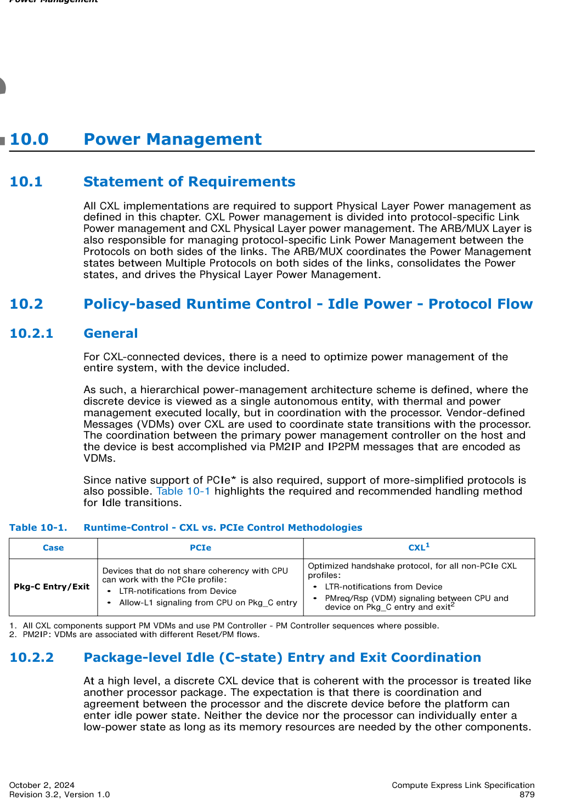
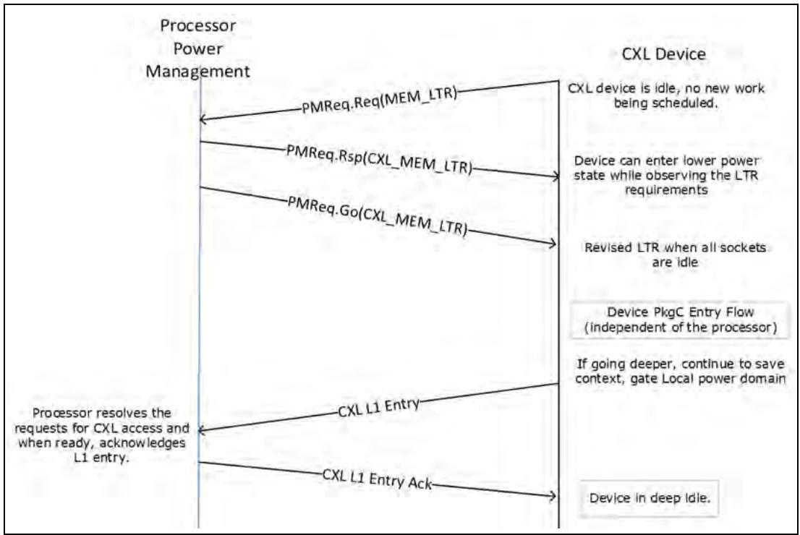
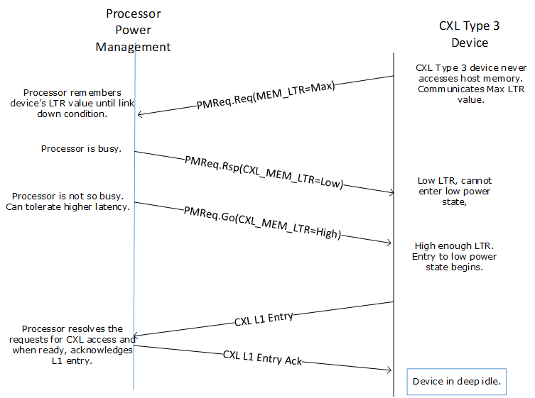
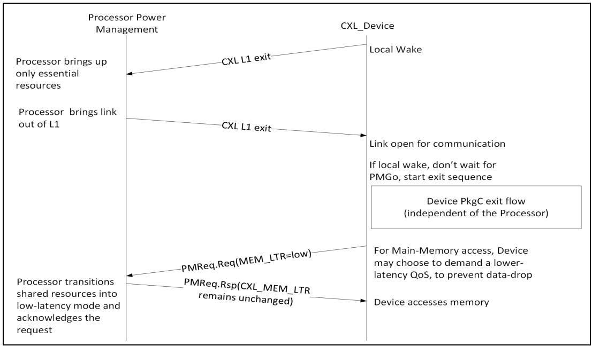
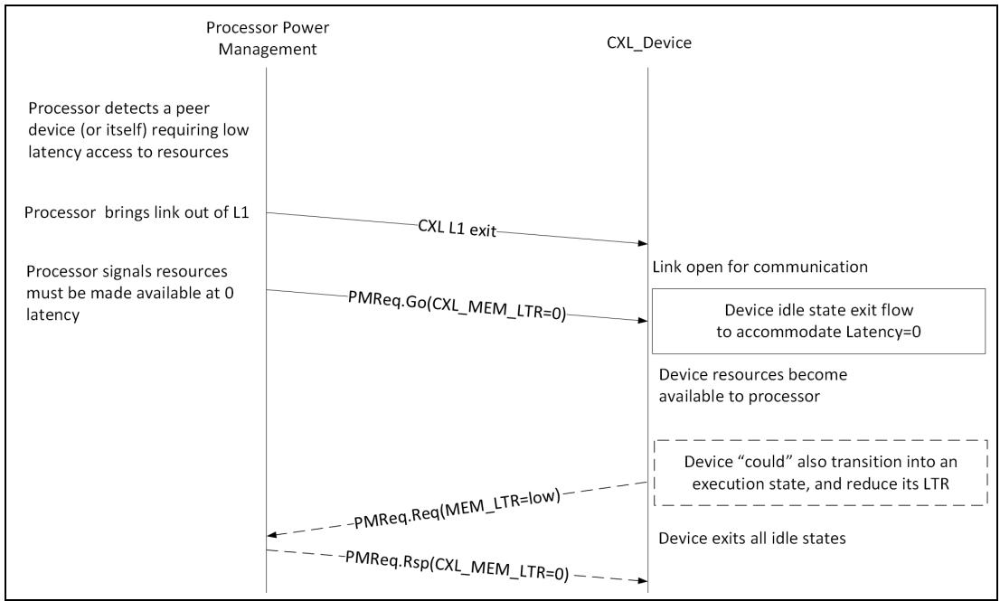
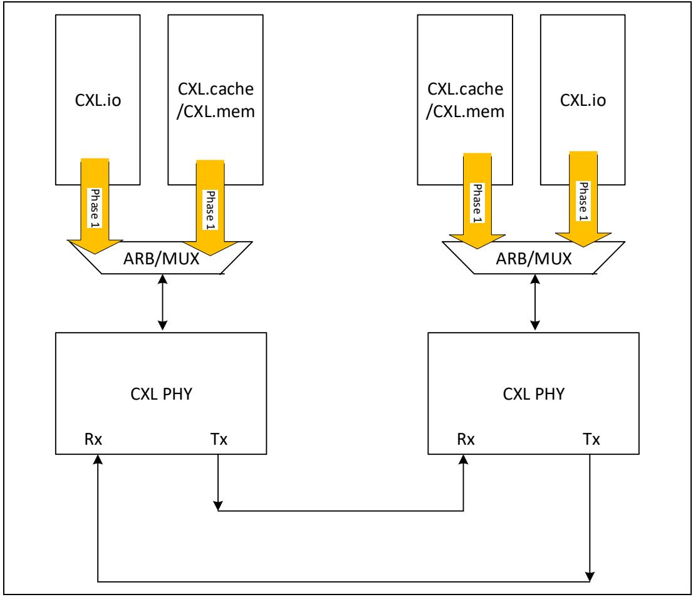
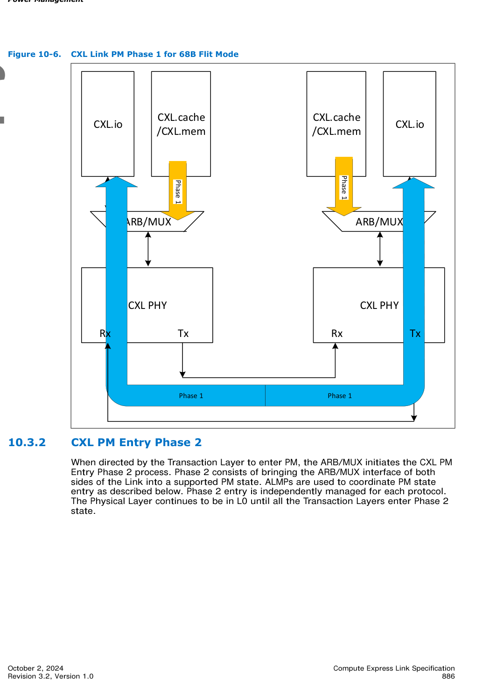
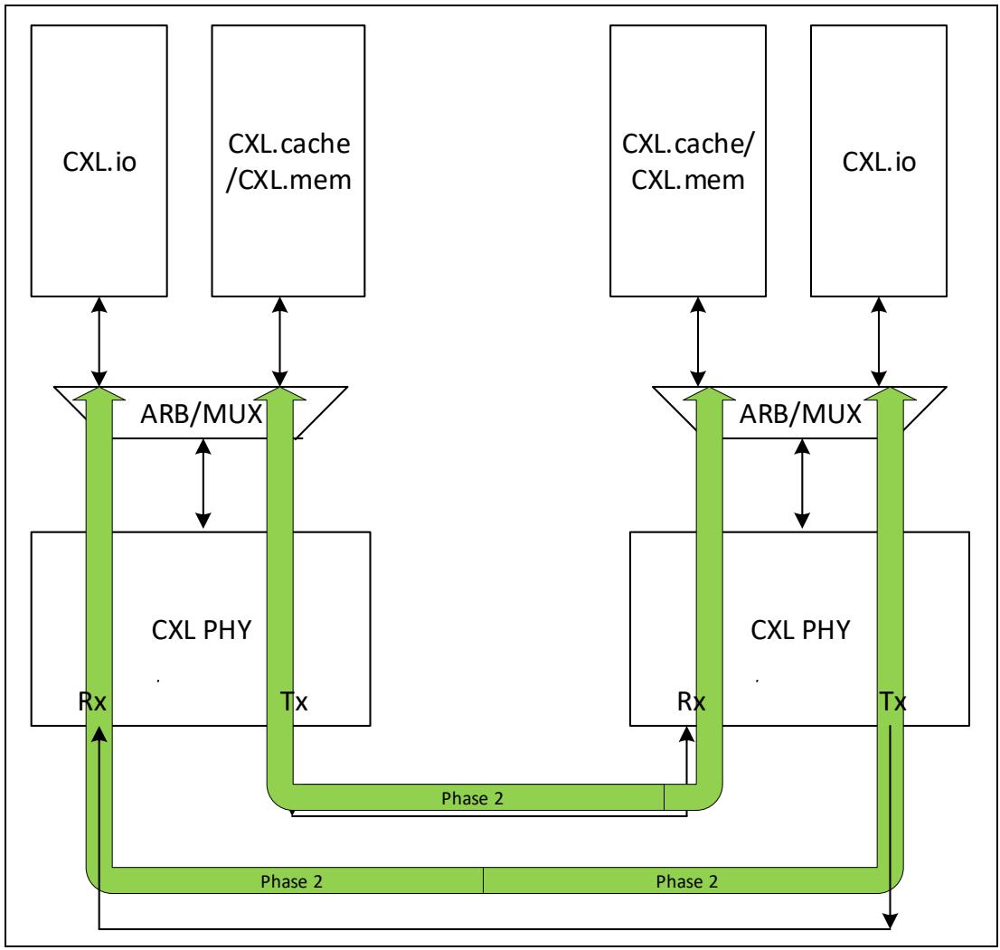
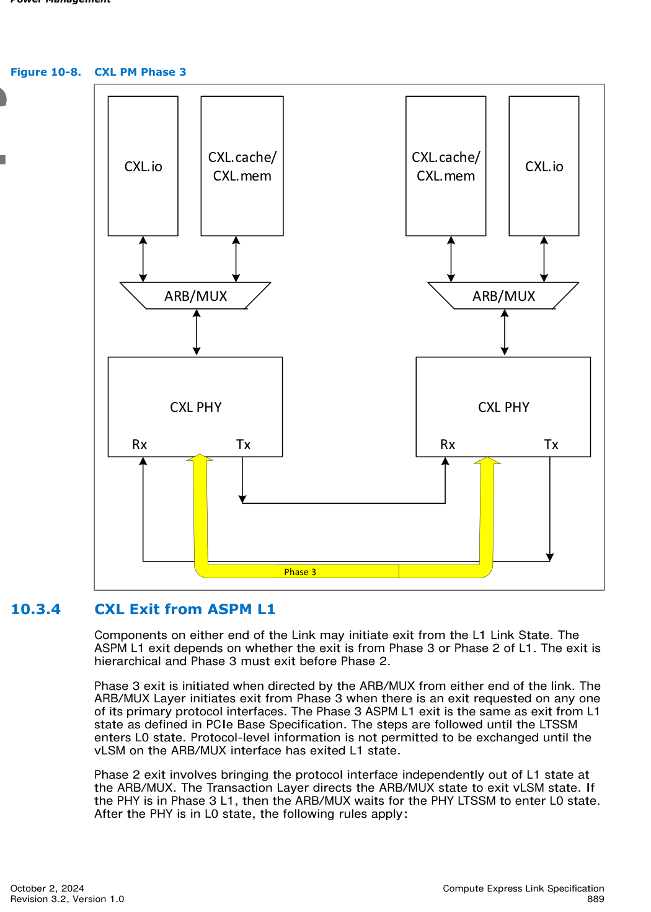

# 📘 第 10 章　电源管理 (Chapter 10. Power Management)

**Compute Express Link® (CXL®) Specification — Revision 3.2, Version 1.0 — October 2, 2024**

> 📄 **Source pages**: 879–891 | 📁 **File**: `chapter_10.md`
> 🎨 **Format**: 中英对照双语 · 图表原始保留 · 中文背景色灰色 · GitHub Flavored Markdown

---

## 📑 本章目录 (Table of Contents)

| # | Section | 小节 | Page |
|:-:|:--------|:----|:----:|
| 10.0 | [Power Management](#sec-10-0) | 电源管理 | p.879 |
| 10.1 | [Statement of Requirements](#sec-10-1) | 需求声明 | p.879 |
| 10.2 | [Policy-based Runtime Control - Idle Power - Protocol Flow](#sec-10-2) | 基于策略的运行时控制 - 空闲电源 - 协议流程 | p.879–880 |
| 10.2.1 | [General](#sec-10-2-1) | 概述 | p.879–880 |
| 10.2.2 | [Package-level Idle (C-state) Entry and Exit Coordination](#sec-10-2-2) | 封装级空闲（C 状态）进入与退出协调 | p.880 |
| 10.2.2.1 | [PMReq Message Generation and Processing Rules](#sec-10-2-2-1) | PMReq 消息生成与处理规则 | p.880–881 |
| 10.2.3 | [PkgC Entry Flows](#sec-10-2-3) | PkgC 进入流程 | p.881–882 |
| 10.2.4 | [PkgC Exit Flows](#sec-10-2-4) | PkgC 退出流程 | p.883–884 |
| 10.2.5 | [CXL Physical Layer Power Management States](#sec-10-2-5) | CXL 物理层电源管理状态 | p.884 |
| 10.3 | [CXL Power Management](#sec-10-3) | CXL 电源管理 | p.884–889 |
| 10.3.1 | [CXL PM Entry Phase 1](#sec-10-3-1) | CXL PM 进入阶段 1 | p.885 |
| 10.3.2 | [CXL PM Entry Phase 2](#sec-10-3-2) | CXL PM 进入阶段 2 | p.886–888 |
| 10.3.3 | [CXL PM Entry Phase 3](#sec-10-3-3) | CXL PM 进入阶段 3 | p.888 |
| 10.3.4 | [CXL Exit from ASPM L1](#sec-10-3-4) | CXL 从 ASPM L1 退出 | p.889–890 |
| 10.3.5 | [L0p Negotiation for 256B Flit Mode](#sec-10-3-5) | 256B Flit 模式的 L0p 协商 | p.890 |
| 10.4 | [CXL.io Link Power Management](#sec-10-4) | CXL.io 链路电源管理 | p.890 |
| 10.4.1 | [CXL.io ASPM Entry Phase 1 for 256B Flit Mode](#sec-10-4-1) | 256B Flit 模式 CXL.io ASPM 进入阶段 1 | p.890 |
| 10.4.2 | [CXL.io ASPM L1 Entry Phase 1 for 68B Flit Mode](#sec-10-4-2) | 68B Flit 模式 CXL.io ASPM L1 进入阶段 1 | p.890 |
| 10.4.3 | [CXL.io ASPM L1 Entry Phase 2](#sec-10-4-3) | CXL.io ASPM L1 进入阶段 2 | p.891 |
| 10.4.4 | [CXL.io ASPM Entry Phase 3](#sec-10-4-4) | CXL.io ASPM 进入阶段 3 | p.891 |
| 10.5 | [CXL.cache + CXL.mem Link Power Management](#sec-10-5) | CXL.cache + CXL.mem 链路电源管理 | p.891 |

## 🖼 本章图表 (Figures)

| Figure | Title | 图标题 | Page |
|:------:|:------|:-------|:----:|
| 10-1 | PkgC Entry Flow Initiated by Device - Example | 由设备发起的 PkgC 进入流程 — 示例 | p.881 |
| 10-2 | PkgC Entry Flows for CXL Type 3 Device - Example | CXL Type 3 设备的 PkgC 进入流程 — 示例 | p.882 |
| 10-3 | PkgC Exit Flows - Triggered by Device Access to System Memory | PkgC 退出流程 — 由设备访问系统内存触发 | p.883 |
| 10-4 | PkgC Exit Flows - Execution Required by Processor | PkgC 退出流程 — 由处理器请求执行 | p.884 |
| 10-5 | CXL Link PM Phase 1 for 256B Flit Mode | 256B Flit 模式 CXL 链路 PM 阶段 1 | p.885 |
| 10-6 | CXL Link PM Phase 1 for 68B Flit Mode | 68B Flit 模式 CXL 链路 PM 阶段 1 | p.886 |
| 10-7 | CXL Link PM Phase 2 | CXL 链路 PM 阶段 2 | p.887 |
| 10-8 | CXL PM Phase 3 | CXL PM 阶段 3 | p.889 |

## 📊 本章表格 (Tables)

| Table | Title | 表标题 | Page |
|:-----:|:------|:-------|:----:|
| 10-1 | Runtime-Control - CXL vs. PCIe Control Methodologies | 运行时控制 - CXL 与 PCIe 控制方法对比 | p.879–880 |
| 10-2 | PMReq(), PMRsp(), and PMGo() Encoding | PMReq()、PMRsp() 与 PMGo() 编码 | p.881 |

> 💡 **查看原图**：所有原图已抽取为 PNG 存放在 [`figures/chapter_10/`](figures/chapter_10/)（13 张全页渲染 + 4 张嵌入图）。

---

## 10.0 Power Management | 电源管理

<table>
<thead>
<tr>
<th width="50%">🇬🇧 English</th>
<th width="50%" style="background-color:#e8e8e8">🇨🇳 中文</th>
</tr>
</thead>
<tbody>
<tr>
<td>

Power Management

</td>
<td style="background-color:#e8e8e8">

电源管理

</td>
</tr>
</tbody>
</table>

[⬆️ 返回目录](#-本章目录-table-of-contents)

---

## 10.1 Statement of Requirements | 需求声明

<table>
<thead>
<tr>
<th width="50%">🇬🇧 English</th>
<th width="50%" style="background-color:#e8e8e8">🇨🇳 中文</th>
</tr>
</thead>
<tbody>
<tr>
<td>

All CXL implementations are required to support Physical Layer Power management as defined in this chapter. CXL Power management is divided into protocol-specific Link Power management and CXL Physical Layer power management. The ARB/MUX Layer is also responsible for managing protocol-specific Link Power Management between the Protocols on both sides of the links. The ARB/MUX coordinates the Power Management states between Multiple Protocols on both sides of the links, consolidates the Power states, and drives the Physical Layer Power Management.

</td>
<td style="background-color:#e8e8e8">

所有 CXL 实现都必须支持本章定义的物理层电源管理。CXL 电源管理分为协议相关的链路电源管理和 CXL 物理层电源管理。ARB/MUX 层还负责管理链路两侧各协议之间的协议相关链路电源管理。ARB/MUX 协调链路两侧多协议之间的电源管理状态，整合电源状态，并驱动物理层电源管理。

</td>
</tr>
</tbody>
</table>

[⬆️ 返回目录](#-本章目录-table-of-contents)

---

## 10.2 Policy-based Runtime Control - Idle Power - Protocol Flow | 基于策略的运行时控制 - 空闲电源 - 协议流程

### 10.2.1 General | 概述

<table>
<thead>
<tr>
<th width="50%">🇬🇧 English</th>
<th width="50%" style="background-color:#e8e8e8">🇨🇳 中文</th>
</tr>
</thead>
<tbody>
<tr>
<td>

For CXL-connected devices, there is a need to optimize power management of the entire system, with the device included.

As such, a hierarchical power-management architecture scheme is defined, where the discrete device is viewed as a single autonomous entity, with thermal and power management executed locally, but in coordination with the processor. Vendor-defined Messages (VDMs) over CXL are used to coordinate state transitions with the processor. The coordination between the primary power management controller on the host and the device is best accomplished via PM2IP and IP2PM messages that are encoded as VDMs.

Since native support of PCIe* is also required, support of more-simplified protocols is also possible. Table 10-1 highlights the required and recommended handling method for Idle transitions.

</td>
<td style="background-color:#e8e8e8">

对于通过 CXL 连接的设备，有必要优化包括设备在内的整个系统的电源管理。

因此，本规范定义了一种分层电源管理架构方案：把独立设备视为一个独立的自治实体，其热管理与电源管理在本地执行，但与处理器协同工作。通过 CXL 上的 Vendor-defined Messages（VDMs，供应商自定义消息）来与处理器协调状态切换。主机上主电源管理控制器与设备之间的协调，最适合通过以 VDM 编码的 PM2IP 和 IP2PM 消息来完成。

由于本规范同样要求原生支持 PCIe*，因此也可以支持更为简化的协议。表 10-1 列出了对空闲（Idle）转换所必需和推荐的处理方法。

</td>
</tr>
</tbody>
</table>

> **Table 10-1.** Runtime-Control - CXL vs. PCIe Control Methodologies ｜ 运行时控制 - CXL 与 PCIe 控制方法对比
>
> 
>
> *Original page render @ 150 DPI* — [📄 Full size](figures/chapter_10/page_0879.png)

[⬆️ 返回目录](#-本章目录-table-of-contents)

---

### 10.2.2 Package-level Idle (C-state) Entry and Exit Coordination | 封装级空闲（C 状态）进入与退出协调

<table>
<thead>
<tr>
<th width="50%">🇬🇧 English</th>
<th width="50%" style="background-color:#e8e8e8">🇨🇳 中文</th>
</tr>
</thead>
<tbody>
<tr>
<td>

At a high level, a discrete CXL device that is coherent with the processor is treated like another processor package. The expectation is that there is coordination and agreement between the processor and the discrete device before the platform can enter idle power state. Neither the device nor the processor can individually enter a low-power state as long as its memory resources are needed by the other components.

</td>
<td style="background-color:#e8e8e8">

从高层次看，与处理器保持一致性的独立 CXL 设备被视为另一个处理器封装。预期在平台进入空闲电源状态之前，处理器与独立设备之间应进行协调并达成一致。只要其内存资源仍被其他组件所需，设备和处理器都不能单独进入低功耗状态。

</td>
</tr>
<tr>
<td>

For example, in a case where the device may contain shared High-Bandwidth memory (HBM), while the processor controls the system's DDR, if the device wants to be able to enter a low-power state, the Device must take into account the processor's need for accessing the HBM. Likewise, if the processor wants to enter a low-power state, the processor must take into account, among other things, the need for the device to access DDR. These requirements are encapsulated in the LTR requirements that are provided by entities that need QoS for memory access. In this case, we would have a notion of LTR for DDR access and LTR for HBM access. We would expect the device to inform the processor about its LTR with regard to DDR, and the processor to inform the device about its LTR with regard to HBM.

</td>
<td style="background-color:#e8e8e8">

例如，在设备可能包含共享 High-Bandwidth Memory（HBM，高带宽内存）、而处理器控制系统的 DDR 的情况下，若设备希望进入低功耗状态，则设备必须考虑处理器访问 HBM 的需求。类似地，若处理器希望进入低功耗状态，则处理器必须综合考虑（例如）设备访问 DDR 的需求。这些需求被封装在由需要内存访问 QoS 的实体所提供的 LTR（Latency Tolerance Reporting，延迟容忍上报）需求中。在这种情况下，我们会针对 DDR 访问和 HBM 访问分别有 LTR 的概念。我们期望设备就 DDR 方面向处理器通报其 LTR，而处理器就 HBM 方面向设备通报其 LTR。

</td>
</tr>
<tr>
<td>

Latency requirements can be managed by using either of the following two methods:

- CXL devices that do not share coherency with the CPU (i.e., either a shared coherent memory or a coherent cache), can notify the processor of changes in its latency tolerance via the PMReq() and PMRsp() messages. When appropriate latency is supported and the processor execution has stopped, the processor will enter an Idle state and proceed to transition the Link to L1 (see Link-Layer Section 10.3).
- CXL devices that include a coherent cache or memory device are required to coordinate their state transitions using the CXL-optimized, VDM-based protocol, which includes the ResetPrep(), PMReq(), PMRsp(), and PMGo() messages, to prevent memory coherency loss.

</td>
<td style="background-color:#e8e8e8">

延迟需求可通过以下两种方法之一来管理：

- 与 CPU 不共享一致性（即既不是共享一致内存，也不是一致性高速缓存）的 CXL 设备，可通过 PMReq() 和 PMRsp() 消息向处理器通知其延迟容忍度的变化。当支持适当的延迟、且处理器执行已停止时，处理器将进入空闲（Idle）状态并继续将链路切换到 L1（参见第 10.3 节链路层）。
- 包含一致性高速缓存或内存设备的 CXL 设备，必须使用 CXL 优化的、基于 VDM 的协议（包含 ResetPrep()、PMReq()、PMRsp() 和 PMGo() 消息）来协调其状态转换，以防止内存一致性丢失。

</td>
</tr>
</tbody>
</table>

[⬆️ 返回目录](#-本章目录-table-of-contents)

---

#### 10.2.2.1 PMReq Message Generation and Processing Rules | PMReq 消息生成与处理规则

<table>
<thead>
<tr>
<th width="50%">🇬🇧 English</th>
<th width="50%" style="background-color:#e8e8e8">🇨🇳 中文</th>
</tr>
</thead>
<tbody>
<tr>
<td>

The rules associated with generation and processing of PMReq.Req, PMReq.Rsp, and PMReq.Go messages are as follows:

- A CXL device communicates its latency tolerance via a PMReq.Req message. A host communicates it latency tolerance either via a PMReq.Rsp message or a PMReq.Go message.
- A CXL device is permitted to unilaterally generate a PMReq.Req message as long as the Device has the necessary credits. A host shall not generate a PMReq.Req message.
- A CXL device shall not generate a PMReq.Rsp message. A host is permitted to unilaterally generate a PMReq.Rsp message as long as the Host has the necessary credits, even if the Host has never received a PMReq.Req message. A CXL device must process a PMReq.Rsp message normally, even if that CXL device has never previously issued a PMReq.Req message.
- A CXL device is not permitted to generate a PMReq.Go message. A host is permitted to unilaterally generate a PMReq.Go message as long as the Host has the necessary credits, even if the Host has never received a PMReq.Req message. A CXL device must process a PMReq.Go message normally, even if that CXL device has never:
  - Previously issued a PMReq.Req message.
  - Received a PMReq.Rsp message.
- A CXL device must continue to operate correctly, even if the device never receives a PMReq.Rsp in response to the device generating a PMReq.Req.
- A CXL device must continue to operate correctly, even if the device never receives a PMReq.Go in response to the device generating PMReq.Req.
- The Requirement bit associated with the non-snoop Latency Tolerance field in the PMReq messages must be cleared to 0 by all non-eRCD components.

</td>
<td style="background-color:#e8e8e8">

与 PMReq.Req、PMReq.Rsp 和 PMReq.Go 消息的生成与处理相关的规则如下：

- CXL 设备通过 PMReq.Req 消息来传达其延迟容忍度。主机通过 PMReq.Rsp 消息或 PMReq.Go 消息来传达其延迟容忍度。
- 在设备拥有必要信用（credits）的前提下，允许 CXL 设备单方面地生成 PMReq.Req 消息。主机不应生成 PMReq.Req 消息。
- CXL 设备不应生成 PMReq.Rsp 消息。在主机拥有必要信用的前提下，即使主机从未收到过 PMReq.Req 消息，也允许主机单方面地生成 PMReq.Rsp 消息。即使 CXL 设备此前从未发出过 PMReq.Req 消息，也必须正常处理 PMReq.Rsp 消息。
- 不允许 CXL 设备生成 PMReq.Go 消息。在主机拥有必要信用的前提下，即使主机从未收到过 PMReq.Req 消息，也允许主机单方面地生成 PMReq.Go 消息。即使 CXL 设备从未满足以下任一情况，也必须正常处理 PMReq.Go 消息：
  - 此前曾发出过 PMReq.Req 消息。
  - 收到过 PMReq.Rsp 消息。
- 即使设备在生成 PMReq.Req 后从未收到 PMReq.Rsp，CXL 设备也必须继续正确运行。
- 即使设备在生成 PMReq.Req 后从未收到 PMReq.Go，CXL 设备也必须继续正确运行。
- PMReq 消息中与非监听（non-snoop）延迟容忍字段相关联的 Requirement 位必须由所有非 eRCD 组件清零。

</td>
</tr>
<tr>
<td>

Section 10.2.3 and Section 10.2.4 include example flows that illustrate these rules.

</td>
<td style="background-color:#e8e8e8">

第 10.2.3 节和第 10.2.4 节包含用于说明这些规则的示例流程。

</td>
</tr>
</tbody>
</table>

[⬆️ 返回目录](#-本章目录-table-of-contents)

---

### 10.2.3 PkgC Entry Flows | PkgC 进入流程

<table>
<thead>
<tr>
<th width="50%">🇬🇧 English</th>
<th width="50%" style="background-color:#e8e8e8">🇨🇳 中文</th>
</tr>
</thead>
<tbody>
<tr>
<td>

Figure 10-1 illustrates the PkgC entry flow. When a Device needs to enter a higher-latency Idle state, in which the CPU is not active, the Device will issue a PMReq.Req with the LTR field marking the memory-access tolerance of the entity. As specified in Section 10.2.2.1, a device may unilaterally generate PMReq.Req to communicate any changes to its latency, without any dependency on receipt of a prior PMReq.Rsp or PMReq.Go. Specifically, a device may transmit two PMReq.Req messages without an intervening PMReq.Rsp from the host. The LTR value communicated by the device is labeled MEM_LTR, and represents the Device's latency tolerance regarding CXL.cache accesses and it could be different from what is communicated via LTR messages over CXL.io.

</td>
<td style="background-color:#e8e8e8">

图 10-1 说明了 PkgC 进入流程。当设备需要进入 CPU 不活跃的高延迟空闲（Idle）状态时，设备将发出一个 PMReq.Req，其中 LTR 字段标记该实体的内存访问容忍度。如第 10.2.2.1 节所述，设备可单方面地生成 PMReq.Req，以传达其延迟的任何变化，而无需依赖先前是否已收到 PMReq.Rsp 或 PMReq.Go。具体而言，设备可在主机未介入发送 PMReq.Rsp 的情况下连续发送两个 PMReq.Req 消息。设备所传达的 LTR 值标记为 MEM_LTR，代表设备针对 CXL.cache 访问的延迟容忍度，其可能与通过 CXL.io 上的 LTR 消息所传达的值不同。

</td>
</tr>
<tr>
<td>

If Idle state is allowed, the processor will respond with a matching PMReq.Rsp message, with the negotiated allowable latency-tolerance LTR (labeled CXL_MEM_LTR). Both entities can independently enter an Idle state without coordination as long as the shared resources remain accessible.

</td>
<td style="background-color:#e8e8e8">

如果允许进入空闲（Idle）状态，处理器将以一个匹配的 PMReq.Rsp 消息进行响应，其中包含经协商后允许的延迟容忍度 LTR（标记为 CXL_MEM_LTR）。只要共享资源仍可访问，两端实体即可独立进入空闲（Idle）状态而无需协调。

</td>
</tr>
<tr>
<td>

For a full PkgC entry, both entities need to negotiate as to the depth/latency tolerance by responding with a PMReq.Rsp message that includes the agreeable latency tolerance. After the master power management agent has coordinated LTR across all the agents within the system, the agent will send a PMReq.Go() with the correct Latency field set (labeled CXL_MEM_LTR), indicating that local idle power actions can be taken subject to the communicated latency-tolerance value.

</td>
<td style="background-color:#e8e8e8">

对于完整的 PkgC 进入，两端实体需要通过以包含商定延迟容忍度的 PMReq.Rsp 消息进行响应来协商深度/延迟容忍度。当主电源管理代理在整个系统的所有代理之间完成 LTR 协调后，代理将发送一个设置了正确 Latency 字段（标记为 CXL_MEM_LTR）的 PMReq.Go()，表明可在所传达的延迟容忍度值范围内采取本地空闲电源动作。

</td>
</tr>
<tr>
<td>

In case of a transition into deep-idle states, mostly typical of client systems, the device will initiate a CXL transition into L1.

</td>
<td style="background-color:#e8e8e8">

在进入深度空闲（deep-idle）状态（主要为客户端系统的典型场景）时，设备将发起 CXL 到 L1 状态的转换。

</td>
</tr>
<tr>
<td>

These diagrams represent sequences, but do not imply any timing requirements. A host may respond much later with a PMReq.Rsp to a PMReq.Req from a device when the Host is ready to enter a low-power state, or the Host may not respond at all. A device, having sent a PMReq.Req, shall not implement a timeout to wait for PMReq.Rsp or PMReq.Go. Similarly, a device is not required to reissue PMReq.Req if the Device's latency-tolerance requirements have not changed since previous communication and the link has remained up. As shown in Figure 10-2, a CXL Type 3 device may issue PMReq.Req after the link is up to indicate to the host that the Device either has no latency requirements or has a high latency tolerance. The host may communicate any changes to its latency expectations to such a device. Such a device may initiate low-power entry based only on the latency-tolerance value that the Device receives from the host, as shown in Figure 10-2. When the host communicates a sufficiently high latency-tolerance value to the device, the device may enter a low-power state. A CXL Type 3 device may enter and exit a low-power state based only on the PMReq.Go message that the Device received from the host, without dependency on a prior PMReq.Rsp.

</td>
<td style="background-color:#e8e8e8">

这些图示表示的是一系列顺序关系，但并不意味着任何时序要求。当主机准备好进入低功耗状态时，主机可能会在较晚时间才以 PMReq.Rsp 响应设备发出的 PMReq.Req，也可能根本不响应。在已发出 PMReq.Req 之后，设备不应实现用于等待 PMReq.Rsp 或 PMReq.Go 的超时机制。类似地，若设备的延迟容忍度需求自前一次通信以来未发生变化且链路一直保持 up 状态，则设备不需要重新发出 PMReq.Req。如图 10-2 所示，CXL Type 3 设备可在链路 up 之后发出 PMReq.Req，以向主机表明该设备要么没有延迟需求，要么具有较高的延迟容忍度。主机可向该设备传达其延迟期望的任何变化。此类设备可以仅基于从主机接收到的延迟容忍度值来发起低功耗进入操作，如图 10-2 所示。当主机向设备传达了足够高的延迟容忍度值时，设备即可进入低功耗状态。CXL Type 3 设备可仅基于从主机接收到的 PMReq.Go 消息进入和退出低功耗状态，而不依赖于之前的 PMReq.Rsp。

</td>
</tr>
</tbody>
</table>

> **Table 10-2.** PMReq(), PMRsp(), and PMGo() Encoding ｜ PMReq()、PMRsp() 与 PMGo() 编码
>
> | Message | PM Logical Opcode[7:0] | Parameter[15:0] |
> |:--------|:----------------------:|:---------------:|
> | PMReq.Req, abbreviated as PMReq | 04h | 0001h |
> | PMReq.Rsp, abbreviated as PMRsp | 04h | 0000h |
> | PMReq.Go, abbreviated as PMGo | 04h | 0004h or 0005h |

> **Figure 10-1.** PkgC Entry Flow Initiated by Device - Example ｜ 由设备发起的 PkgC 进入流程 — 示例
>
> 
>
> *Original figure extract* — [📄 Full size](figures/chapter_10/fig_0881_1.png)

> **Figure 10-2.** PkgC Entry Flows for CXL Type 3 Device - Example ｜ CXL Type 3 设备的 PkgC 进入流程 — 示例
>
> 
>
> *Original figure extract* — [📄 Full size](figures/chapter_10/fig_0882_1.png)

[⬆️ 返回目录](#-本章目录-table-of-contents)

---

### 10.2.4 PkgC Exit Flows | PkgC 退出流程

<table>
<thead>
<tr>
<th width="50%">🇬🇧 English</th>
<th width="50%" style="background-color:#e8e8e8">🇨🇳 中文</th>
</tr>
</thead>
<tbody>
<tr>
<td>

Figure 10-3 illustrates the PkgC exit flow initiated by the device. Link state during Idle may be in one of the select L1.x states, during Deep-Idle (as depicted here). In-band wake signaling will be used to transition the link back to L0. For more details, see Section 10.3.

</td>
<td style="background-color:#e8e8e8">

图 10-3 说明了由设备发起的 PkgC 退出流程。空闲期间的链路状态可以处于所选的 L1.x 状态之一，如本图所描绘的深度空闲（Deep-Idle）状态。将使用带内唤醒信令将链路转回 L0。更多详细信息请参见第 10.3 节。

</td>
</tr>
<tr>
<td>

After the CXL link exits L1, signaling can be used to transfer the device into a PkgC state, in which shared resources are available across CXL. The device requests a low-latency tolerance value to the processor. Based on that value, the processor will bring the shared resources out of Idle and communicate its latest latency requirements with a PMReq.Rsp().

</td>
<td style="background-color:#e8e8e8">

CXL 链路退出 L1 之后，可使用信令将设备转入 PkgC 状态，在该状态下 CXL 范围内可访问共享资源。设备向处理器请求一个低延迟容忍度值。处理器将基于该值将共享资源退出空闲（Idle）状态，并通过 PMReq.Rsp() 传达其最新的延迟需求。

</td>
</tr>
<tr>
<td>

Figure 10-4 illustrates the PkgC exit flow initiated by the processor. In the case where the processor, or one of the peer devices connected to the processor, must have coherent low-latency access to system memory, the processor will initiate a Link L1 exit toward the device.

</td>
<td style="background-color:#e8e8e8">

图 10-4 说明了由处理器发起的 PkgC 退出流程。在处理器或连接到处理器的某个对等设备必须以一致性的低延迟访问系统内存的情况下，处理器将向该设备发起链路 L1 退出。

</td>
</tr>
<tr>
<td>

After the link is running, the processor will follow with a PMGo(Latency=0), indicating some device in the platform requires low-latency access to coherent memory and resources. A device that receives PMReq.Go with Latency=0 must ensure that further low-power actions that might impede memory access are not taken.

</td>
<td style="background-color:#e8e8e8">

链路恢复运行后，处理器将随后发出一个 PMGo(Latency=0)，以表明平台中的某些设备需要对一致性内存和资源进行低延迟访问。接收到 Latency=0 的 PMReq.Go 的设备必须确保不再采取可能妨碍内存访问的进一步低功耗动作。

</td>
</tr>
</tbody>
</table>

> **Figure 10-3.** PkgC Exit Flows - Triggered by Device Access to System Memory ｜ PkgC 退出流程 — 由设备访问系统内存触发
>
> 
>
> *Original figure extract* — [📄 Full size](figures/chapter_10/fig_0883_1.png)

> **Figure 10-4.** PkgC Exit Flows - Execution Required by Processor ｜ PkgC 退出流程 — 由处理器请求执行
>
> 
>
> *Original figure extract* — [📄 Full size](figures/chapter_10/fig_0884_1.png)

[⬆️ 返回目录](#-本章目录-table-of-contents)

---

### 10.2.5 CXL Physical Layer Power Management States | CXL 物理层电源管理状态

<table>
<thead>
<tr>
<th width="50%">🇬🇧 English</th>
<th width="50%" style="background-color:#e8e8e8">🇨🇳 中文</th>
</tr>
</thead>
<tbody>
<tr>
<td>

CXL Physical layer supports L1 and L2 states as defined in PCIe Base Specification. CXL Physical Layer does not support L0s. The entry and exit conditions from these states are also as defined in PCIe Base Specification. The notable difference is that for CXL Physical Layer, entry and exit from Physical Layer Power Management states is directed by the CXL ARB/MUX.

</td>
<td style="background-color:#e8e8e8">

CXL 物理层支持 PCIe 基础规范中定义的 L1 和 L2 状态。CXL 物理层不支持 L0s。这些状态的进入和退出条件同样如 PCIe 基础规范中所定义。值得注意的差异在于：对于 CXL 物理层，进入和退出物理层电源管理状态由 CXL ARB/MUX 主导。

</td>
</tr>
</tbody>
</table>

[⬆️ 返回目录](#-本章目录-table-of-contents)

---

## 10.3 CXL Power Management | CXL 电源管理

<table>
<thead>
<tr>
<th width="50%">🇬🇧 English</th>
<th width="50%" style="background-color:#e8e8e8">🇨🇳 中文</th>
</tr>
</thead>
<tbody>
<tr>
<td>

CXL Link Power Management supports Active Link State Power Management (ASPM), and L1 and L2 are the only 2 Power states supported. For 256B Flit mode, L0p negotiation is also supported. The PM Entry/Exit process is further divided into 3 phases as described below.

</td>
<td style="background-color:#e8e8e8">

CXL 链路电源管理支持活动链路状态电源管理（ASPM, Active Link State Power Management），且 L1 和 L2 是所支持的仅有的 2 种电源状态。对于 256B Flit 模式，还支持 L0p 协商。PM 进入/退出过程进一步分为 3 个阶段，如下所述。

</td>
</tr>
<tr>
<td>

For 68B Flit mode, if the LTSSM goes through Recovery before the ARB/MUX vLSM moves to PM state, then the PM Entry process must restart from Phase 1, if the conditions for PM entry are still met after exit from Recovery and ARB/MUX Status Synchronization Protocol. For 256B Flit mode, the PM entry handshakes are not impacted by Link Recovery transitions because Link Recovery is not forwarded to the ARB/MUX vLSMs.

</td>
<td style="background-color:#e8e8e8">

对于 68B Flit 模式，若 LTSSM 在 ARB/MUX vLSM 转入 PM 状态之前经历了 Recovery，则只要在退出 Recovery 以及 ARB/MUX 状态同步协议之后 PM 进入条件仍然满足，PM 进入过程必须从阶段 1 重新开始。对于 256B Flit 模式，由于链路恢复（Link Recovery）不会被转发到 ARB/MUX vLSM，因此 PM 进入握手过程不会受到 Link Recovery 转换的影响。

</td>
</tr>
</tbody>
</table>

[⬆️ 返回目录](#-本章目录-table-of-contents)

---

### 10.3.1 CXL PM Entry Phase 1 | CXL PM 进入阶段 1

<table>
<thead>
<tr>
<th width="50%">🇬🇧 English</th>
<th width="50%" style="background-color:#e8e8e8">🇨🇳 中文</th>
</tr>
</thead>
<tbody>
<tr>
<td>

CXL PM Entry Phase 1 involves protocol-specific mechanisms to negotiate entry into a supported PM state. As shown in Figure 10-5, in 256B Flit mode, this transition does not require any synchronization between the ARB/MUX instances on the two ends. 68B Flit mode, however, does require such synchronization (see Figure 10-6). After the conditions to enter the PM state as defined in Section 10.2 are satisfied, the Transaction Layer is ready for Phase 2 entry and directs the ARB/MUX to enter the PM State.

</td>
<td style="background-color:#e8e8e8">

CXL PM 进入阶段 1 涉及协议特定的机制，用于协商进入所支持的 PM 状态。如图 10-5 所示，在 256B Flit 模式下，此转换不需要两端 ARB/MUX 实例之间的任何同步。而 68B Flit 模式则确实需要这种同步（见图 10-6）。在满足第 10.2 节中定义的进入 PM 状态的条件后，事务层（Transaction Layer）已为进入阶段 2 做好准备，并指示 ARB/MUX 进入 PM 状态。

</td>
</tr>
</tbody>
</table>

> **Figure 10-5.** CXL Link PM Phase 1 for 256B Flit Mode ｜ 256B Flit 模式 CXL 链路 PM 阶段 1
>
> 
>
> *Original page render @ 150 DPI* — [📄 Full size](figures/chapter_10/page_0885.png)

[⬆️ 返回目录](#-本章目录-table-of-contents)

---

### 10.3.2 CXL PM Entry Phase 2 | CXL PM 进入阶段 2

<table>
<thead>
<tr>
<th width="50%">🇬🇧 English</th>
<th width="50%" style="background-color:#e8e8e8">🇨🇳 中文</th>
</tr>
</thead>
<tbody>
<tr>
<td>

When directed by the Transaction Layer to enter PM, the ARB/MUX initiates the CXL PM Entry Phase 2 process. Phase 2 consists of bringing the ARB/MUX interface of both sides of the Link into a supported PM state. ALMPs are used to coordinate PM state entry as described below. Phase 2 entry is independently managed for each protocol. The Physical Layer continues to be in L0 until all the Transaction Layers enter Phase 2 state.

</td>
<td style="background-color:#e8e8e8">

当事务层（Transaction Layer）指示进入 PM 时，ARB/MUX 启动 CXL PM 进入阶段 2 过程。阶段 2 包含将链路两侧的 ARB/MUX 接口引入所支持的 PM 状态。如下所述，使用 ALMP 来协调 PM 状态进入。阶段 2 的进入对每个协议是独立管理的。在所有事务层都进入阶段 2 状态之前，物理层继续保持 L0 状态。

</td>
</tr>
<tr>
<td>

Rules for the Phase 2 entry into ASPM are as follows (summarized in Figure 10-7):

1. Phase 2 Entry into the supported PM State is always initiated by the ARB/MUX on the Downstream Component.
2. When directed by the Transaction Layer, the ARB/MUX on the Downstream Component must transmit an ALMP request to enter vLSM state PM.
3. When the ARB/MUX on the Upstream Component is directed to enter L1 and receives an ALMP request from the Downstream Component, the Upstream Component responds with an ALMP response indicating acceptance of entry into L1 state. The Transaction Layer on the Upstream Component must also be notified that the ARB/MUX port has accepted entry into the supported PM state.
4. The Upstream Component ARB/MUX port does not respond with an ALMP response if not directed by the upper layers to enter PM state.
5. When the ARB/MUX on the Downstream Component is directed to enter L1 and receives an ALMP response from the Upstream Component, the ARB/MUX notifies acceptance of entry into the PM state to the Transaction Layer on the Downstream Component.
6. The Downstream Component ARB/MUX port must wait for at least 1 ms (not including time spent in recovery states) for a response from the Upstream Component before retrying PM entry. The Downstream Component ARB/MUX is permitted to abort the PM entry before the 1-ms timeout by sending an Active Request ALMP for the corresponding vLSM.
7. L2 entry is an exception to Rule 6. Protocol must ensure that the Upstream Component is directed to enter L2 before setting up the conditions for the Downstream Component to request L2 state entry. This ensures that L2 abort or L2 Retry conditions do not exist. The Downstream Component may use indications such as the PME_Turn_Off message or a RESETPREP VDM to trigger L2 state entry.
8. The Transaction Layer on either side of the Link is permitted to directly exit from L1 state after the ARB/MUX interface enters L1 state.

</td>
<td style="background-color:#e8e8e8">

进入 ASPM 阶段 2 的规则如下（汇总于图 10-7）：

1. 进入所支持的 PM 状态的阶段 2 始终由 Downstream Component（下游组件）上的 ARB/MUX 发起。
2. 在事务层指示下，Downstream Component 上的 ARB/MUX 必须发送一个 ALMP 请求以进入 vLSM 状态 PM。
3. 当 Upstream Component（上游组件）上的 ARB/MUX 被指示进入 L1、并收到来自 Downstream Component 的 ALMP 请求时，Upstream Component 以一个表示接受进入 L1 状态的 ALMP 响应进行回复。还必须通知 Upstream Component 上的事务层：ARB/MUX 端口已接受进入所支持的 PM 状态。
4. 若上层未指示进入 PM 状态，则 Upstream Component ARB/MUX 端口不会以 ALMP 响应进行回复。
5. 当 Downstream Component 上的 ARB/MUX 被指示进入 L1、并收到来自 Upstream Component 的 ALMP 响应时，ARB/MUX 通知 Downstream Component 上的事务层已接受进入 PM 状态。
6. Downstream Component ARB/MUX 端口在重试 PM 进入之前，必须至少等待 1 ms（不包括处于 recovery 状态的时间）以等待来自 Upstream Component 的响应。在该 1 ms 超时之前，Downstream Component ARB/MUX 允许通过为相应 vLSM 发送 Active Request ALMP 来中止 PM 进入。
7. L2 进入是规则 6 的例外。协议必须确保在为 Downstream Component 请求进入 L2 状态而建立条件之前，Upstream Component 已被指示进入 L2。这可保证不会出现 L2 abort 或 L2 Retry 情况。Downstream Component 可使用诸如 PME_Turn_Off 消息或 RESETPREP VDM 等指示来触发 L2 状态进入。
8. 在 ARB/MUX 接口进入 L1 状态之后，链路任意一侧的事务层都允许直接退出 L1 状态。

</td>
</tr>
</tbody>
</table>

> **Figure 10-6.** CXL Link PM Phase 1 for 68B Flit Mode ｜ 68B Flit 模式 CXL 链路 PM 阶段 1
>
> 
>
> *Original page render @ 150 DPI* — [📄 Full size](figures/chapter_10/page_0886.png)

> **Figure 10-7.** CXL Link PM Phase 2 ｜ CXL 链路 PM 阶段 2
>
> 
>
> *Original page render @ 150 DPI* — [📄 Full size](figures/chapter_10/page_0887.png)

[⬆️ 返回目录](#-本章目录-table-of-contents)

---

### 10.3.3 CXL PM Entry Phase 3 | CXL PM 进入阶段 3

<table>
<thead>
<tr>
<th width="50%">🇬🇧 English</th>
<th width="50%" style="background-color:#e8e8e8">🇨🇳 中文</th>
</tr>
</thead>
<tbody>
<tr>
<td>

CXL PM Entry Phase 3 is a conditional phase of PM entry and is executed only when all the Protocol interfaces of ARB/MUX have entered the same virtual PM state. The phase consists of bringing the Tx lanes to electrical idle and is always initiated by the Downstream Component. As shown in Figure 10-8, the PHY Layers on the two ends of the link communicate. If the link transitions to recovery during or after entry into electrical idle, the Downstream Component must wait for at least 1 us after entering L0 before re-initiating entry into electrical idle. This is to allow sufficient time for an Active State Request ALMP transfer to occur in case either side wants to initiate a PM exit (and to provide sufficient time for the remote ARB/MUX to stop requesting PM entry to LogPHY). The electrical idle entry flow is defined in the "Power Management" chapter of PCIe Base Specification.

</td>
<td style="background-color:#e8e8e8">

CXL PM 进入阶段 3 是 PM 进入的一个条件性阶段，仅当 ARB/MUX 的所有协议接口都已进入同一虚拟 PM 状态时才会执行。该阶段包含将 Tx 通道引入电气空闲（electrical idle），且始终由 Downstream Component 发起。如图 10-8 所示，链路两端的 PHY 层进行通信。如果在进入电气空闲期间或之后链路转入 recovery，则 Downstream Component 必须在进入 L0 之后等待至少 1 us，再重新发起进入电气空闲。这是为了在任一侧希望发起 PM 退出的情况下，为 Active State Request ALMP 传输的发生留出充足时间（并为远端 ARB/MUX 停止向 LogPHY 请求 PM 进入留出充足时间）。电气空闲进入流程在 PCIe 基础规范的“电源管理”章节中定义。

</td>
</tr>
</tbody>
</table>

[⬆️ 返回目录](#-本章目录-table-of-contents)

---

### 10.3.4 CXL Exit from ASPM L1 | CXL 从 ASPM L1 退出

<table>
<thead>
<tr>
<th width="50%">🇬🇧 English</th>
<th width="50%" style="background-color:#e8e8e8">🇨🇳 中文</th>
</tr>
</thead>
<tbody>
<tr>
<td>

Components on either end of the Link may initiate exit from the L1 Link State. The ASPM L1 exit depends on whether the exit is from Phase 3 or Phase 2 of L1. The exit is hierarchical and Phase 3 must exit before Phase 2.

</td>
<td style="background-color:#e8e8e8">

链路任意一端的组件都可以发起从 L1 链路状态退出。ASPM L1 退出取决于退出是从 L1 的阶段 3 还是阶段 2 发起的。该退出是分层的，阶段 3 必须先于阶段 2 退出。

</td>
</tr>
<tr>
<td>

Phase 3 exit is initiated when directed by the ARB/MUX from either end of the link. The ARB/MUX Layer initiates exit from Phase 3 when there is an exit requested on any one of its primary protocol interfaces. The Phase 3 ASPM L1 exit is the same as exit from L1 state as defined in PCIe Base Specification. The steps are followed until the LTSSM enters L0 state. Protocol-level information is not permitted to be exchanged until the vLSM on the ARB/MUX interface has exited L1 state.

</td>
<td style="background-color:#e8e8e8">

阶段 3 退出在链路任一端的 ARB/MUX 指示下发起。当其任一主协议接口上请求退出时，ARB/MUX 层即启动阶段 3 的退出。阶段 3 ASPM L1 退出与 PCIe 基础规范中定义的从 L1 状态的退出相同。按步骤执行，直至 LTSSM 进入 L0 状态。在 ARB/MUX 接口上的 vLSM 退出 L1 状态之前，不允许交换协议级信息。

</td>
</tr>
<tr>
<td>

Phase 2 exit involves bringing the protocol interface independently out of L1 state at the ARB/MUX. The Transaction Layer directs the ARB/MUX state to exit vLSM state. If the PHY is in Phase 3 L1, then the ARB/MUX waits for the PHY LTSSM to enter L0 state. After the PHY is in L0 state, the following rules apply:

</td>
<td style="background-color:#e8e8e8">

阶段 2 退出涉及在 ARB/MUX 处将协议接口独立地移出 L1 状态。事务层指示 ARB/MUX 状态退出 vLSM 状态。如果 PHY 处于阶段 3 L1，则 ARB/MUX 等待 PHY LTSSM 进入 L0 状态。在 PHY 进入 L0 状态后，适用以下规则：

</td>
</tr>
<tr>
<td>

1. The ARB/MUX on the protocol side that is triggering an exit transmits an ALMP requesting entry into Active state.
2. Any ARB/MUX interface that receives the ALMP request to enter Active State must transmit an ALMP acknowledge response on behalf of that interface. The ALMP acknowledge response is an indication that the corresponding protocol side is ready to process received packets.
3. Any ARB/MUX interface that receives the ALMP request to enter Active State must also transmit an ALMP Active State request on behalf of that interface if not already sent.
4. Protocol-level transmission must be permitted by the ARB/MUX after an Active State Status ALMP is transmitted and received. This guarantees that the receiving protocol is ready to process packets.

</td>
<td style="background-color:#e8e8e8">

1. 在触发退出的协议侧，ARB/MUX 发送一个请求进入 Active 状态的 ALMP。
2. 任何接收到请求进入 Active 状态的 ALMP 请求的 ARB/MUX 接口，都必须代表该接口发送一个 ALMP 确认（acknowledge）响应。该 ALMP 确认响应表示相应协议侧已准备好处理所接收到的数据包。
3. 任何接收到请求进入 Active 状态的 ALMP 请求的 ARB/MUX 接口，若尚未发送，则也必须代表该接口发送一个 ALMP Active State 请求。
4. 在 Active State Status ALMP 被发送并接收之后，ARB/MUX 必须允许进行协议级传输。这可保证接收方协议已准备好处理数据包。

</td>
</tr>
</tbody>
</table>

> **Figure 10-8.** CXL PM Phase 3 ｜ CXL PM 阶段 3
>
> 
>
> *Original page render @ 150 DPI* — [📄 Full size](figures/chapter_10/page_0889.png)

[⬆️ 返回目录](#-本章目录-table-of-contents)

---

### 10.3.5 L0p Negotiation for 256B Flit Mode | 256B Flit 模式的 L0p 协商

<table>
<thead>
<tr>
<th width="50%">🇬🇧 English</th>
<th width="50%" style="background-color:#e8e8e8">🇨🇳 中文</th>
</tr>
</thead>
<tbody>
<tr>
<td>

See Chapter 5.0 for the L0p negotiation rules.

</td>
<td style="background-color:#e8e8e8">

关于 L0p 协商规则，请参见第 5.0 章。

</td>
</tr>
</tbody>
</table>

[⬆️ 返回目录](#-本章目录-table-of-contents)

---

## 10.4 CXL.io Link Power Management | CXL.io 链路电源管理

<table>
<thead>
<tr>
<th width="50%">🇬🇧 English</th>
<th width="50%" style="background-color:#e8e8e8">🇨🇳 中文</th>
</tr>
</thead>
<tbody>
<tr>
<td>

CXL.io Link Power Management is as defined in PCIe Base Specification with the following notable differences:

- RCD links support ASPM-directed L1 entry but do not support PCI-PM-directed L1 entry. An eRCD is not required to initiate entry into L1 state when software transitions the device into D3Hot or D1 device state. When a component is not operating in RCD mode, the component shall support PCI-PM and optionally support ASPM L1. As such, a component not operating in RCD mode shall initiate CXL.io L1 entry when the device is placed in D3Hot or D1 device state.
- L0s state is not supported.

</td>
<td style="background-color:#e8e8e8">

CXL.io 链路电源管理如 PCIe 基础规范中所定义，但有以下值得注意的差异：

- RCD 链路支持 ASPM 主导的 L1 进入，但不支持 PCI-PM 主导的 L1 进入。当软件将设备转换到 D3Hot 或 D1 设备状态时，eRCD 不需要发起进入 L1 状态。当组件未运行在 RCD 模式时，该组件应支持 PCI-PM 并可选择支持 ASPM L1。因此，未运行在 RCD 模式的组件应在设备被置于 D3Hot 或 D1 设备状态时，发起 CXL.io L1 进入。
- 不支持 L0s 状态。

</td>
</tr>
<tr>
<td>

All CXL functions shall implement PCI Power Management Capability Structure as defined in PCIe Base Specification and shall support D0 and D3 device states.

</td>
<td style="background-color:#e8e8e8">

所有 CXL 功能都应实现 PCIe 基础规范中定义的 PCI Power Management Capability Structure（PCI 电源管理能力结构），并应支持 D0 和 D3 设备状态。

</td>
</tr>
</tbody>
</table>

[⬆️ 返回目录](#-本章目录-table-of-contents)

---

### 10.4.1 CXL.io ASPM Entry Phase 1 for 256B Flit Mode | 256B Flit 模式 CXL.io ASPM 进入阶段 1

<table>
<thead>
<tr>
<th width="50%">🇬🇧 English</th>
<th width="50%" style="background-color:#e8e8e8">🇨🇳 中文</th>
</tr>
</thead>
<tbody>
<tr>
<td>

There must not be any DLLP exchanges initiated for PM entry for 256B Flit mode. The Link Layer on each side independently requests its local ARB/MUX to enter a PM state. The ARB/MUX Layers on both sides of the Link coordinate entry into a PM state using ALMPs as part of Phase 2.

</td>
<td style="background-color:#e8e8e8">

对于 256B Flit 模式，不得为 PM 进入而发起任何 DLLP 交换。每侧的链路层独立请求其本地 ARB/MUX 进入 PM 状态。链路两侧的 ARB/MUX 层使用 ALMP 作为阶段 2 的一部分来协调进入 PM 状态。

</td>
</tr>
</tbody>
</table>

[⬆️ 返回目录](#-本章目录-table-of-contents)

---

### 10.4.2 CXL.io ASPM L1 Entry Phase 1 for 68B Flit Mode | 68B Flit 模式 CXL.io ASPM L1 进入阶段 1

<table>
<thead>
<tr>
<th width="50%">🇬🇧 English</th>
<th width="50%" style="background-color:#e8e8e8">🇨🇳 中文</th>
</tr>
</thead>
<tbody>
<tr>
<td>

The first phase consists of completing the ASPM L1 negotiation rules as defined in PCIe Base Specification with the following notable exception for the rules in case of acceptance of ASPM L1 Entry:

- All rules up to the completion of the ASPM L1 handshake are maintained; however, the process of bringing the Transmit Lanes into Electrical Idle state are divided into 2 additional phases described in Section 10.3.

</td>
<td style="background-color:#e8e8e8">

第一阶段包含完成 PCIe 基础规范中定义的 ASPM L1 协商规则，但在接受 ASPM L1 进入这一情形下，存在以下值得注意的例外：

- 直至 ASPM L1 握手完成为止的所有规则都予以保留；但是，将发送通道（Transmit Lanes）引入电气空闲（Electrical Idle）状态的过程被划分为 2 个额外的阶段，如第 10.3 节所述。

</td>
</tr>
<tr>
<td>

See PCIe Base Specification for the PCIe ASPM L1 Entry flow.

</td>
<td style="background-color:#e8e8e8">

有关 PCIe ASPM L1 进入流程，请参见 PCIe 基础规范。

</td>
</tr>
</tbody>
</table>

[⬆️ 返回目录](#-本章目录-table-of-contents)

---

### 10.4.3 CXL.io ASPM L1 Entry Phase 2 | CXL.io ASPM L1 进入阶段 2

<table>
<thead>
<tr>
<th width="50%">🇬🇧 English</th>
<th width="50%" style="background-color:#e8e8e8">🇨🇳 中文</th>
</tr>
</thead>
<tbody>
<tr>
<td>

Phase 2 of L1 entry consists of bringing the CXL.io ARB/MUX interface of both sides of the Link into L1 state. ALMPs are used to coordinate L1 state entry. For 256B Flit mode, the ALMP exchange rules are the same for CXL.io and CXL.cachemem, and are defined in Chapter 5.0.

</td>
<td style="background-color:#e8e8e8">

L1 进入的阶段 2 包含将链路两侧的 CXL.io ARB/MUX 接口引入 L1 状态。使用 ALMP 来协调 L1 状态进入。对于 256B Flit 模式，CXL.io 和 CXL.cachemem 的 ALMP 交换规则相同，并在第 5.0 章中定义。

</td>
</tr>
<tr>
<td>

The rules for Phase 2 entry into ASPM L1 for 68B Flit mode are as follows:

1. CXL.io on the Upstream Component must direct the ARB/MUX to be ready to enter L1 before returning the PM_Request_Ack DLLPs as shown above in Phase 1.
2. When the PM_Request_Ack DLLPs are successfully received by the CXL.io on the Downstream Component, the CXL.io must direct the ARB/MUX on the Downstream Component to transmit the ALMP request to enter vLSM state L1.
3. When the ARB/MUX on the Upstream Component is directed to enter L1 and receives an ALMP request from the Downstream Component, the ARB/MUX notifies the CXL.io that the interface has received an ALMP request to enter L1 state and has entered L1 state.
4. When the Upstream Component is notified of the vLSM state L1 entry, the Upstream Component ceases sending PM_Request_Ack DLLPs.
5. When the ARB/MUX on the Downstream Component is directed to enter L1 and receives ALMP Status from the Upstream Component, the ARB/MUX notifies the CXL.io that the interface has entered L1 state.

</td>
<td style="background-color:#e8e8e8">

68B Flit 模式 ASPM L1 阶段 2 进入的规则如下：

1. 在阶段 1 中返回 PM_Request_Ack DLLP 之前，Upstream Component 上的 CXL.io 必须指示 ARB/MUX 准备好进入 L1。
2. 当 PM_Request_Ack DLLP 成功被 Downstream Component 上的 CXL.io 接收时，CXL.io 必须指示 Downstream Component 上的 ARB/MUX 发送请求进入 vLSM 状态 L1 的 ALMP 请求。
3. 当 Upstream Component 上的 ARB/MUX 被指示进入 L1，并收到来自 Downstream Component 的 ALMP 请求时，ARB/MUX 通知 CXL.io：该接口已收到进入 L1 状态的 ALMP 请求，并已进入 L1 状态。
4. 当 Upstream Component 被通知 vLSM 状态进入 L1 后，Upstream Component 停止发送 PM_Request_Ack DLLP。
5. 当 Downstream Component 上的 ARB/MUX 被指示进入 L1，并收到来自 Upstream Component 的 ALMP Status 时，ARB/MUX 通知 CXL.io：该接口已进入 L1 状态。

</td>
</tr>
</tbody>
</table>

[⬆️ 返回目录](#-本章目录-table-of-contents)

---

### 10.4.4 CXL.io ASPM Entry Phase 3 | CXL.io ASPM 进入阶段 3

<table>
<thead>
<tr>
<th width="50%">🇬🇧 English</th>
<th width="50%" style="background-color:#e8e8e8">🇨🇳 中文</th>
</tr>
</thead>
<tbody>
<tr>
<td>

Phase 3 entry is dependent on the vLSM state of multiple protocols and is managed by the ARB/MUX as described in Section 10.3.3.

</td>
<td style="background-color:#e8e8e8">

阶段 3 进入取决于多协议的 vLSM 状态，并由 ARB/MUX 进行管理，如第 10.3.3 节所述。

</td>
</tr>
</tbody>
</table>

[⬆️ 返回目录](#-本章目录-table-of-contents)

---

## 10.5 CXL.cache + CXL.mem Link Power Management | CXL.cache + CXL.mem 链路电源管理

<table>
<thead>
<tr>
<th width="50%">🇬🇧 English</th>
<th width="50%" style="background-color:#e8e8e8">🇨🇳 中文</th>
</tr>
</thead>
<tbody>
<tr>
<td>

CXL.cache and CXL.mem both support only ASPM. Unlike CXL.io, there is no PM Entry handshake defined between the Link Layers. Each side independently requests the ARB/MUX to enter L1. The ARB/MUX Layers on both sides of the Link coordinate the entry into a PM state using ALMPs. CXL.cache + CXL.mem Link Power Management follows the process for PM entry and exit as defined in Section 10.3.

</td>
<td style="background-color:#e8e8e8">

CXL.cache 和 CXL.mem 都仅支持 ASPM。与 CXL.io 不同，链路层之间没有定义 PM 进入握手。每一侧独立地请求 ARB/MUX 进入 L1。链路两侧的 ARB/MUX 层使用 ALMP 协调进入 PM 状态。CXL.cache + CXL.mem 链路电源管理遵循第 10.3 节中定义的 PM 进入和退出过程。

</td>
</tr>
</tbody>
</table>

§ §

[⬆️ 返回目录](#-本章目录-table-of-contents)

## 🖼 图补遗 (Figure Supplement)

> 本节为 MinerU Standard API 在原始 markdown 之外额外提取的 figures, 已用 Part A 风格 4 行 blockquote 补齐双语 caption, 但未插入正文具体节 (内容可能与正文有重复, 仅供参考)。

> **Figure p.0881.** (见正文 Figure 10-1, 此处为重复条目已删)
>
> _(此条目与正文 Figure 10-1 重复, 主体改用 .png 后已统一, 删此占位)_
>
> ~~~~
>
> *Source*: 已合并到正文 Figure 10-1

