# 📘 第 11 章　CXL 安全 (Chapter 11. CXL Security)

> **Source pages**: 892–997 | **File**: chapter_11.md | **Format**: 中英对照双语

---

## 📑 本章目录

- [11.0 CXL Security (CXL 安全)](#sec-11-0)
- [11.1 CXL IDE Overview (CXL IDE 概述)](#sec-11-1)
- [11.2 CXL.io IDE](#sec-11-2)
- [11.3 CXL.cachemem IDE](#sec-11-3)
  - [11.3.1 CXL.cachemem IDE Architecture in 68B Flit Mode (68B Flit 模式下的 CXL.cachemem IDE 架构)](#sec-11-3-1)
  - [11.3.2 CXL.cachemem IDE Architecture in 256B Flit Mode (256B Flit 模式下的 CXL.cachemem IDE 架构)](#sec-11-3-2)
  - [11.3.3 Encrypted PCRC (加密 PCRC)](#sec-11-3-3)
  - [11.3.4 Cryptographic Keys and IV (加密密钥与 IV)](#sec-11-3-4)
  - [11.3.5 CXL.cachemem IDE Modes (CXL.cachemem IDE 模式)](#sec-11-3-5)
    - [11.3.5.1 Discovery of Integrity Modes and Settings (完整性模式与设置的发现)](#sec-11-3-5-1)
    - [11.3.5.2 Negotiation of Operating Mode and Settings (工作模式与设置的协商)](#sec-11-3-5-2)
    - [11.3.5.3 Rules for MAC Aggregation (MAC 聚合规则)](#sec-11-3-5-3)
  - [11.3.6 Early MAC Termination (MAC 提前终止)](#sec-11-3-6)
  - [11.3.7 Handshake to Trigger the Use of Keys (触发密钥使用的握手)](#sec-11-3-7)
  - [11.3.8 Error Handling (错误处理)](#sec-11-3-8)
  - [11.3.9 Switch Support (交换机支持)](#sec-11-3-9)
  - [11.3.10 IDE Termination Handshake (IDE 终止握手)](#sec-11-3-10)
  - [11.3.11 Poison handling (毒化处理)](#sec-11-3-11)
    - [11.3.11.1 Late poison with CRC corruption flow (带 CRC 损坏的延迟毒化流程)](#sec-11-3-11-1)
    - [11.3.11.2 Support of authenticated LLCTRL Poison messages (支持已认证的 LLCTRL Poison 消息)](#sec-11-3-11-2)
- [11.4 CXL.cachemem IDE Key Management (CXL_IDE_KM) (CXL.cachemem IDE 密钥管理)](#sec-11-4)
  - [11.4.1 CXL_IDE_KM Protocol Overview (CXL_IDE_KM 协议概述)](#sec-11-4-1)
  - [11.4.2 Secure Messaging Layer Rules (安全消息层规则)](#sec-11-4-2)
  - [11.4.3 CXL_IDE_KM Common Data Structures (CXL_IDE_KM 通用数据结构)](#sec-11-4-3)
  - [11.4.4 Discovery Messages (发现消息)](#sec-11-4-4)
  - [11.4.5 Key Programming Messages (密钥编程消息)](#sec-11-4-5)
  - [11.4.6 Activation/Key Refresh Messages (激活/密钥刷新消息)](#sec-11-4-6)
  - [11.4.7 Get Key Messages (获取密钥消息)](#sec-11-4-7)
- [11.5 CXL Trusted Execution Environments Security Protocol (TSP) (CXL 可信执行环境安全协议)](#sec-11-5)
  - [11.5.1 Overview (概述)](#sec-11-5-1)
  - [11.5.2 Scope (范围)](#sec-11-5-2)
  - [11.5.3 Threat Model (威胁模型)](#sec-11-5-3)
    - [11.5.3.1 Definitions (定义)](#sec-11-5-3-1)
    - [11.5.3.2 Assumptions (假设)](#sec-11-5-3-2)
    - [11.5.3.3 Threats and Mitigations (威胁与缓解措施)](#sec-11-5-3-3)
  - [11.5.4 Reference Architecture (参考架构)](#sec-11-5-4)
    - [11.5.4.1 Architectural Scope (架构范围)](#sec-11-5-4-1)
    - [11.5.4.2 Determining TSP Support (确定 TSP 支持)](#sec-11-5-4-2)
    - [11.5.4.3 CMA/SPDM](#sec-11-5-4-3)
    - [11.5.4.4 Authentication and Attestation (认证与证明)](#sec-11-5-4-4)
    - [11.5.4.5 TE State Changes and Access Control (TE 状态变更与访问控制)](#sec-11-5-4-5)
      - [11.5.4.5.1 TEUpdate Memory Transaction (TEUpdate 内存事务)](#sec-11-5-4-5-1)
      - [11.5.4.5.2 Implicit TE State Changes (隐式 TE 状态变更)](#sec-11-5-4-5-2)
        - [11.5.4.5.2.1 Partial Write Handling with Implicit TE State Changes (隐式 TE 状态变更下的部分写处理)](#sec-11-5-4-5-2-1)
      - [11.5.4.5.3 Explicit TE State Changes (显式 TE 状态变更)](#sec-11-5-4-5-3)
        - [11.5.4.5.3.1 Optional Explicit In-band TE State Change (可选显式带内 TE 状态变更)](#sec-11-5-4-5-3-1)
        - [11.5.4.5.3.2 Optional Explicit Out-of-Band TE State Change (可选显式带外 TE 状态变更)](#sec-11-5-4-5-3-2)
      - [11.5.4.5.4 Write Access Control (写访问控制)](#sec-11-5-4-5-4)
        - [11.5.4.5.4.1 Partial Write Handling with Write Access Control (写访问控制下的部分写处理)](#sec-11-5-4-5-4-1)
      - [11.5.4.5.5 Read Access Control (读访问控制)](#sec-11-5-4-5-5)
      - [11.5.4.5.6 MetaValue Updates for HDM-H (HDM-H 的 MetaValue 更新)](#sec-11-5-4-5-6)
      - [11.5.4.5.7 Extended Metadata Updates (扩展元数据更新)](#sec-11-5-4-5-7)
    - [11.5.4.6 Memory Encryption (内存加密)](#sec-11-5-4-6)
      - [11.5.4.6.1 Initiator-based Memory Encryption (基于发起方的内存加密)](#sec-11-5-4-6-1)
      - [11.5.4.6.2 Target-based Memory Encryption (基于目标的内存加密)](#sec-11-5-4-6-2)
        - [11.5.4.6.2.1 CKID-based Memory Encryption (基于 CKID 的内存加密)](#sec-11-5-4-6-2-1)
        - [11.5.4.6.2.2 Range-based Memory Encryption (基于范围的内存加密)](#sec-11-5-4-6-2-2)
    - [11.5.4.7 Transport Security (传输安全)](#sec-11-5-4-7)
    - [11.5.4.8 Configuration (配置)](#sec-11-5-4-8)
      - [11.5.4.8.1 Locking the Target (锁定目标)](#sec-11-5-4-8-1)
      - [11.5.4.8.2 Considerations for Securing the Host (保护主机的考量)](#sec-11-5-4-8-2)
      - [11.5.4.8.3 Reset and Error Handling Behavior of the Target (目标的复位与错误处理行为)](#sec-11-5-4-8-3)
        - [11.5.4.8.3.1 Conventional Reset and Link Failures (常规复位与链路故障)](#sec-11-5-4-8-3-1)
        - [11.5.4.8.3.2 CXL Reset, Transport Security Failures, SecondarySession(s) Termination, and PrimarySession Restart (CXL 复位、传输安全失败、二级会话终止与主会话重启)](#sec-11-5-4-8-3-2)
    - [11.5.4.9 Component Command Interfaces (组件命令接口)](#sec-11-5-4-9)
    - [11.5.4.10 Dynamic Capacity (动态容量)](#sec-11-5-4-10)
      - [11.5.4.10.1 TE State Changes (TE 状态变更)](#sec-11-5-4-10-1)
      - [11.5.4.10.2 Multiple Host Considerations (多主机考量)](#sec-11-5-4-10-2)
    - [11.5.4.11 HDM-DB](#sec-11-5-4-11)
      - [11.5.4.11.1 Determining TSP Support with HDM-DB (在 HDM-DB 下确定 TSP 支持)](#sec-11-5-4-11-1)
      - [11.5.4.11.2 Requestor Coherency State (RCS) (请求者一致性状态)](#sec-11-5-4-11-2)
      - [11.5.4.11.3 Device Tracked Requestor Coherency State (DTRCS) (设备追踪的请求者一致性状态)](#sec-11-5-4-11-3)
      - [11.5.4.11.4 TE State Changes (TE 状态变更)](#sec-11-5-4-11-4)
      - [11.5.4.11.5 BISnp S2M Requests with TE State (带 TE 状态的 BISnp S2M 请求)](#sec-11-5-4-11-5)
      - [11.5.4.11.6 MemRd M2S Requests with TEE Intent (带 TEE 意图的 MemRd M2S 请求)](#sec-11-5-4-11-6)
      - [11.5.4.11.7 MemRd S2M Responses with TE State (带 TE 状态的 MemRd S2M 响应)](#sec-11-5-4-11-7)
      - [11.5.4.11.8 MemInv M2S Requests with TEE Intent (带 TEE 意图的 MemInv M2S 请求)](#sec-11-5-4-11-8)
      - [11.5.4.11.9 MemInvP M2S Requests with TEE Intent (带 TEE 意图的 MemInvP M2S 请求)](#sec-11-5-4-11-9)
      - [11.5.4.11.10 MemInv & MemInvP S2M Responses with TE State (带 TE 状态的 MemInv 与 MemInvP S2M 响应)](#sec-11-5-4-11-10)
      - [11.5.4.11.11 MemRdData M2S Req Requests with TEE Intent (带 TEE 意图的 MemRdData M2S Req 请求)](#sec-11-5-4-11-11)
      - [11.5.4.11.12 MemRdData S2M DRS Responses with TE State (带 TE 状态的 MemRdData S2M DRS 响应)](#sec-11-5-4-11-12)
      - [11.5.4.11.13 MemSpecRd M2S Req Requests with TEE Intent (带 TEE 意图的 MemSpecRd M2S Req 请求)](#sec-11-5-4-11-13)
      - [11.5.4.11.14 MemClnEvct M2S Req Requests without TEE Intent (不带 TEE 意图的 MemClnEvct M2S Req 请求)](#sec-11-5-4-11-14)
      - [11.5.4.11.15 MemClnEvct M2S Req Requests with TEE Intent (带 TEE 意图的 MemClnEvct M2S Req 请求)](#sec-11-5-4-11-15)
      - [11.5.4.11.16 MemClnEvct S2M NDR Responses with TE State (带 TE 状态的 MemClnEvct S2M NDR 响应)](#sec-11-5-4-11-16)
      - [11.5.4.11.17 Buried State Behavior (埋置状态行为)](#sec-11-5-4-11-17)
  - [11.5.5 TSP Requests and Responses (TSP 请求与响应)](#sec-11-5-5)
    - [11.5.5.1 TSP Request Overview (TSP 请求概述)](#sec-11-5-5-1)
    - [11.5.5.2 TSP Response Overview (TSP 响应概述)](#sec-11-5-5-2)
    - [11.5.5.3 Request Response and CMA/SPDM Sessions (请求响应与 CMA/SPDM 会话)](#sec-11-5-5-3)
    - [11.5.5.4 Version (版本)](#sec-11-5-5-4)
      - [11.5.5.4.1 TSP Version Negotiation (TSP 版本协商)](#sec-11-5-5-4-1)
      - [11.5.5.4.2 Get Target TSP Version](#sec-11-5-5-4-2)
      - [11.5.5.4.3 Get Target TSP Version Response](#sec-11-5-5-4-3)
    - [11.5.5.5 Target Capabilities (目标能力)](#sec-11-5-5-5)
      - [11.5.5.5.1 Get Target Capabilities](#sec-11-5-5-5-1)
      - [11.5.5.5.2 Get Target Capabilities Response](#sec-11-5-5-5-2)
    - [11.5.5.6 Target Configuration (目标配置)](#sec-11-5-5-6)
      - [11.5.5.6.1 Set Target Configuration](#sec-11-5-5-6-1)
      - [11.5.5.6.2 Set Target Configuration Response](#sec-11-5-5-6-2)
      - [11.5.5.6.3 Get Target Configuration](#sec-11-5-5-6-3)
      - [11.5.5.6.4 Get Target Configuration Response](#sec-11-5-5-6-4)
      - [11.5.5.6.5 Get Target Configuration Report](#sec-11-5-5-6-5)
      - [11.5.5.6.6 Get Target Configuration Report Response](#sec-11-5-5-6-6)
      - [11.5.5.6.7 Lock Target Configuration](#sec-11-5-5-6-7)
      - [11.5.5.6.8 Lock Target Configuration Response](#sec-11-5-5-6-8)
    - [11.5.5.7 Optional Explicit TE State Change Requests and Responses (可选显式 TE 状态变更请求与响应)](#sec-11-5-5-7)
      - [11.5.5.7.1 Set Target TE State (Out-of-band) (带外设置目标 TE 状态)](#sec-11-5-5-7-1)
      - [11.5.5.7.2 Set Target TE State Response (Out-of-band) (带外设置目标 TE 状态响应)](#sec-11-5-5-7-2)
    - [11.5.5.8 Optional Target-based Memory Encryption Requests and Responses (可选基于目标的内存加密请求与响应)](#sec-11-5-5-8)
      - [11.5.5.8.1 Set Target CKID Specific Key](#sec-11-5-5-8-1)
      - [11.5.5.8.2 Set Target CKID Specific Key Response](#sec-11-5-5-8-2)
      - [11.5.5.8.3 Set Target CKID Random Key](#sec-11-5-5-8-3)
      - [11.5.5.8.4 Set Target CKID Random Key Response](#sec-11-5-5-8-4)
      - [11.5.5.8.5 Clear Target CKID Key](#sec-11-5-5-8-5)
      - [11.5.5.8.6 Clear Target CKID Key Response](#sec-11-5-5-8-6)
      - [11.5.5.8.7 Set Target Range Specific Key](#sec-11-5-5-8-7)
      - [11.5.5.8.8 Set Target Range Specific Key Response](#sec-11-5-5-8-8)
      - [11.5.5.8.9 Set Target Range Random Key](#sec-11-5-5-8-9)
      - [11.5.5.8.10 Set Target Range Random Key Response](#sec-11-5-5-8-10)
      - [11.5.5.8.11 Clear Target Range Key](#sec-11-5-5-8-11)
      - [11.5.5.8.12 Clear Target Range Key Response](#sec-11-5-5-8-12)
    - [11.5.5.9 Optional Delayed Completion Requests and Responses (可选延迟完成请求与响应)](#sec-11-5-5-9)
      - [11.5.5.9.1 Delayed Response (延迟响应)](#sec-11-5-5-9-1)
      - [11.5.5.9.2 Check Target Delayed Completion (检查目标延迟完成)](#sec-11-5-5-9-2)
      - [11.5.5.9.3 Check Target Delayed Completion Response](#sec-11-5-5-9-3)
    - [11.5.5.10 Error Response (错误响应)](#sec-11-5-5-10)

## 🖼 本章图表

| Figure | English Title | 中文标题 | Page |
|--------|---------------|----------|------|
| Figure 11-1 | 68B Flit: CXL.cachemem IDE Showing Aggregation of 5 Flits | 68B Flit：CXL.cachemem IDE 展示 5 个 Flit 的聚合 | 895 |
| Figure 11-2 | 68B Flit: CXL.cachemem IDE Showing Aggregation across 5 Flits where One Flit Contains MAC Header in Slot 0 | 68B Flit：CXL.cachemem IDE 展示 5 个 Flit 的聚合，其中一个 Flit 的 Slot 0 携带 MAC Header | 896 |
| Figure 11-3 | 68B Flit: More-detailed View of a 5-Flit MAC Epoch Example | 68B Flit：5-Flit MAC 周期示例的更详细视图 | 897 |
| Figure 11-4 | 68B Flit: Mapping of AAD Bytes for the Example Shown in Figure 11-3 | 68B Flit：图 11-3 示例中 AAD 字节的映射 | 897 |
| Figure 11-5 | 256B Flit: Handling of Slot 0 when it Carries H8 | 256B Flit：Slot 0 携带 H8 时的处理 | 899 |
| Figure 11-6 | 256B Flit: Handling of Slot 0 when it Does Not Carry H8 | 256B Flit：Slot 0 不携带 H8 时的处理 | 899 |
| Figure 11-7 | 256B Flit: Handling of Slot 15 | 256B Flit：Slot 15 的处理 | 900 |
| Figure 11-8 | Mapping of Integrity-only Protected Bits to AAD - Case 1 | 仅完整性保护位到 AAD 的映射 — 情形 1 | 900 |
| Figure 11-9 | Mapping of Integrity-only Protected Bits to AAD - Case 2 | 仅完整性保护位到 AAD 的映射 — 情形 2 | 900 |
| Figure 11-10 | Mapping of Integrity-only Protected Bits to AAD - Case 3 | 仅完整性保护位到 AAD 的映射 — 情形 3 | 901 |
| Figure 11-11 | Standard 256B Flit - Mapping to AAD and P bits when Slot 0 carries H8 | 标准 256B Flit — Slot 0 携带 H8 时到 AAD 和 P 位的映射 | 901 |
| Figure 11-12 | Standard 256B Flit - Mapping to AAD and P bits when Slot 0 Does Not Carry H8 | 标准 256B Flit — Slot 0 不携带 H8 时到 AAD 和 P 位的映射 | 902 |
| Figure 11-13 | Latency-Optimized 256B Flit - Mapping to AAD and P Bits when Slot 0 Carries H8 | 延迟优化 256B Flit — Slot 0 携带 H8 时到 AAD 和 P 位的映射 | 903 |
| Figure 11-14 | Latency-Optimized 256B Flit - Mapping to AAD and P Bits when Slot 0 Does Not Carry H8 | 延迟优化 256B Flit — Slot 0 不携带 H8 时到 AAD 和 P 位的映射 | 904 |
| Figure 11-15 | Inclusion of the PCRC Mechanism in the AES-GCM Advanced Encryption Function | AES-GCM 高级加密函数中 PCRC 机制的引入 | 905 |
| Figure 11-16 | Inclusion of the PCRC Mechanism in the AES-GCM Advanced Decryption Function | AES-GCM 高级解密函数中 PCRC 机制的引入 | 905 |
| Figure 11-17 | MAC Epochs and MAC Transmission in Case of Back-to-Back Traffic | 背靠背流量情况下的 MAC 周期与 MAC 传输 | 908 |
| Figure 11-18 | Example of MAC Header Being Received in the First Flit of the Current MAC Epoch | 在当前 MAC 周期的第一个 Flit 中接收到 MAC Header 的示例 | 909 |
| Figure 11-19 | Early Termination and Transmission of Truncated MAC Flit | 提前终止与截断 MAC Flit 的传输 | 911 |
| Figure 11-20 | CXL.cachemem IDE Transmission with Truncated MAC Flit | 使用截断 MAC Flit 的 CXL.cachemem IDE 传输 | 911 |
| Figure 11-21 | Link Idle Case after Transmission of Aggregation Flit Count Number of Flits | 传输完聚合 Flit 数量后的链路空闲情形 | 912 |
| Figure 11-22 | Containment Mode example illustrating the AAD construction for the case of two protocol flits that are part of the current MAC Epoch with an in-band LLCTRL Poison sent prior to first flit of the MAC Epoch | 包含模式示例：展示属于当前 MAC 周期的两个协议 Flit 的 AAD 构造，在 MAC 周期第一个 Flit 之前发送带内 LLCTRL Poison | 917 |
| Figure 11-23 | Containment Mode example illustrating the AAD construction for the case of two protocol flits that are part of the current MAC Epoch with an in-band LLCTRL Poison message sent after first flit of the MAC Epoch | 包含模式示例：展示属于当前 MAC 周期的两个协议 Flit 的 AAD 构造，在 MAC 周期第一个 Flit 之后发送带内 LLCTRL Poison | 917 |
| Figure 11-24 | Various Interface Standards that are Referenced by this Specification and their Lineage | 本规范引用的各种接口标准及其谱系 | 919 |
| Figure 11-25 | Active and Pending Key State Transitions | 活动密钥与待定密钥的状态转换 | 930 |
| Figure 11-26 | Reference Architecture | 参考架构 | 937 |
| Figure 11-27 | CMA/SPDM, CXL IDE, and CXL TSP Message Relationship | CMA/SPDM、CXL IDE 与 CXL TSP 消息关系 | 938 |
| Figure 11-28 | CMA/SPDM Sessions Creation Sequence | CMA/SPDM 会话创建顺序 | 940 |
| Figure 11-29 | Optional Explicit In-band TE State Change Architecture | 可选显式带内 TE 状态变更架构 | 945 |
| Figure 11-30 | CKID-based Memory Encryption Utilizing CKID Base | 使用 CKID Base 的基于 CKID 的内存加密 | 950 |
| Figure 11-31 | Range-based Memory Encryption | 基于范围的内存加密 | 952 |
| Figure 11-32 | Target TSP Security States | 目标 TSP 安全状态 | 953 |

## 📊 本章表格

| Table | English Title | 中文标题 | Page |
|-------|---------------|----------|------|
| Table 11-1 | Mapping of PCIe IDE to CXL.io | PCIe IDE 到 CXL.io 的映射 | 894 |
| Table 11-2 | CXL_IDE_KM Request Header | CXL_IDE_KM 请求头 | 921 |
| Table 11-3 | CXL_IDE_KM Successful Response Header | CXL_IDE_KM 成功响应头 | 921 |
| Table 11-4 | CXL_IDE_KM Generic Error Conditions | CXL_IDE_KM 通用错误条件 | 921 |
| Table 11-5 | CXL_QUERY Request | CXL_QUERY 请求 | 922 |
| Table 11-6 | CXL_QUERY Processing Errors | CXL_QUERY 处理错误 | 922 |
| Table 11-7 | Successful CXL_QUERY_RESP Response (Sheet 1/2) | 成功的 CXL_QUERY_RESP 响应（第 1/2 页） | 922–923 |
| Table 11-8 | CXL_KEY_PROG Request | CXL_KEY_PROG 请求 | 924 |
| Table 11-9 | CXL_KEY_PROG Processing Errors | CXL_KEY_PROG 处理错误 | 925 |
| Table 11-10 | CXL_KP_ACK Response | CXL_KP_ACK 响应 | 925 |
| Table 11-11 | CXL_K_SET_GO Request | CXL_K_SET_GO 请求 | 927 |
| Table 11-12 | CXL_K_SET_GO Error Conditions | CXL_K_SET_GO 错误条件 | 927 |
| Table 11-13 | CXL_K_SET_STOP Request | CXL_K_SET_STOP 请求 | 928 |
| Table 11-14 | CXL_K_SET_STOP Error Conditions | CXL_K_SET_STOP 错误条件 | 928 |
| Table 11-15 | CXL_K_GOSTOP_ACK Response (Sheet 1/2) | CXL_K_GOSTOP_ACK 响应（第 1/2 页） | 928–929 |
| Table 11-16 | CXL_GETKEY Request | CXL_GETKEY 请求 | 929 |
| Table 11-17 | CXL_GETKEY Processing Error | CXL_GETKEY 处理错误 | 929 |
| Table 11-18 | CXL_GETKEY_ACK Response | CXL_GETKEY_ACK 响应 | 930 |
| Table 11-19 | Security Threats and Mitigations | 安全威胁与缓解措施 | 936 |
| Table 11-20 | Target Behavior for Implicit TE State Changes | 隐式 TE 状态变更的目标行为 | 943 |
| Table 11-21 | Target Behavior for Explicit In-band TE State Changes | 显式带内 TE 状态变更的目标行为 | 945 |
| Table 11-22 | Target Behavior for Explicit Out-of-band TE State Changes | 显式带外 TE 状态变更的目标行为 | 946 |
| Table 11-23 | Target Behavior for Write Access Control | 写访问控制的目标行为 | 946 |
| Table 11-24 | Target Behavior for Read Access Control | 读访问控制的目标行为 | 947 |
| Table 11-25 | Target Behavior for Invalid CKID Ranges | CKID 范围无效时的目标行为 | 950 |
| Table 11-26 | Target Behavior for Verifying CKID Type | 验证 CKID 类型时的目标行为 | 951 |
| Table 11-27 | TSP Request Overview (Sheet 1/2) | TSP 请求概述（第 1/2 页） | 969–970 |
| Table 11-28 | TSP Response Overview | TSP 响应概述 | 970 |
| Table 11-29 | TSP Request Response and CMA/SPDM Sessions | TSP 请求响应与 CMA/SPDM 会话 | 971 |
| Table 11-30 | Get Target TSP Version | 获取目标 TSP 版本 | 972 |
| Table 11-31 | Get Target TSP Version Response | 获取目标 TSP 版本响应 | 972 |
| Table 11-32 | Get Target Capabilities | 获取目标能力 | 973 |
| Table 11-33 | Get Target Capabilities Response (Sheet 1/3) | 获取目标能力响应（第 1/3 页） | 973–975 |
| Table 11-34 | Explicit In-band TE State Granularity Entry | 显式带内 TE 状态粒度条目 | 976 |
| Table 11-35 | Set Target Configuration (Sheet 1/4) | 设置目标配置（第 1/4 页） | 976–979 |
| Table 11-36 | Set Target Configuration Response | 设置目标配置响应 | 979 |
| Table 11-37 | Get Target Configuration | 获取目标配置 | 980 |
| Table 11-38 | Get Target Configuration Response (Sheet 1/3) | 获取目标配置响应（第 1/3 页） | 980–982 |
| Table 11-39 | Get Target Configuration Report | 获取目标配置报告 | 982 |
| Table 11-40 | Get Target Configuration Report Response | 获取目标配置报告响应 | 983 |
| Table 11-41 | TSP Report | TSP 报告 | 983 |
| Table 11-42 | Lock Target Configuration | 锁定目标配置 | 984 |
| Table 11-43 | Lock Target Configuration Response | 锁定目标配置响应 | 984 |
| Table 11-44 | Memory Range | 内存范围 | 986 |
| Table 11-45 | Set Target TE State | 设置目标 TE 状态 | 986 |
| Table 11-46 | Set Target TE State Response | 设置目标 TE 状态响应 | 986 |
| Table 11-47 | Set Target CKID Specific Key (Sheet 1/2) | 设置目标 CKID 特定密钥（第 1/2 页） | 987–988 |
| Table 11-48 | Set Target CKID Specific Key Response | 设置目标 CKID 特定密钥响应 | 988 |
| Table 11-49 | Set Target CKID Random Key | 设置目标 CKID 随机密钥 | 989 |
| Table 11-50 | Set Target CKID Random Key Response | 设置目标 CKID 随机密钥响应 | 989 |
| Table 11-51 | Clear Target CKID Key | 清除目标 CKID 密钥 | 990 |
| Table 11-52 | Clear Target CKID Key Response | 清除目标 CKID 密钥响应 | 990 |
| Table 11-53 | Set Target Range Specific Key (Sheet 1/2) | 设置目标范围特定密钥（第 1/2 页） | 991–992 |
| Table 11-54 | Set Target Range Specific Key Response | 设置目标范围特定密钥响应 | 992 |
| Table 11-55 | Set Target Range Random Key | 设置目标范围随机密钥 | 993 |
| Table 11-56 | Set Target Range Random Key Response | 设置目标范围随机密钥响应 | 993 |
| Table 11-57 | Clear Target Range Key | 清除目标范围密钥 | 994 |
| Table 11-58 | Clear Target Range Key Response | 清除目标范围密钥响应 | 994 |
| Table 11-59 | Delayed Response | 延迟响应 | 995 |
| Table 11-60 | Check Target Delayed Completion | 检查目标延迟完成 | 995 |
| Table 11-61 | Get Target TE State Change Completion Response | 获取目标 TE 状态变更完成响应 | 996 |
| Table 11-62 | Error Response | 错误响应 | 996 |
| Table 11-63 | Error Response — Error Code, Error Data, Extended Error Data (Sheet 1/2) | 错误响应 — 错误码、错误数据、扩展错误数据（第 1/2 页） | 996–997 |

---

## 11.0 CXL Security | CXL 安全

<table>
<thead>
<tr>
<th width="50%">🇬🇧 English</th>
<th width="50%" style="background-color:#e8e8e8">🇨🇳 中文</th>
</tr>
</thead>
<tbody>
<tr><td colspan="2" style="background-color:#f0f0f0">Chapter 11. CXL Security</td></tr>
</tbody>
</table>

[⬆️ 返回目录](#-本章目录)

## 11.1 CXL IDE Overview | CXL IDE 概述

<table>
<thead>
<tr>
<th width="50%">🇬🇧 English</th>
<th width="50%" style="background-color:#e8e8e8">🇨🇳 中文</th>
</tr>
</thead>
<tbody>
<tr><td>CXL Integrity and Data Encryption (CXL IDE) defines mechanisms for providing Confidentiality, Integrity, and Replay protection for data that traverses the CXL link. The cryptographic schemes are aligned with current industry best practices. CXL IDE supports a variety of usage models while providing for broad interoperability. CXL IDE can be used to secure traffic within a Trusted Execution Environment (TEE) that is composed of multiple components (see Section 11.5).</td><td style="background-color:#e8e8e8">CXL 完整性与数据加密（CXL IDE）定义了用于为跨越 CXL 链路的数据提供机密性、完整性和重放保护的机制。其加密方案与当前业界最佳实践保持一致。CXL IDE 在提供广泛互操作性的同时，支持多种使用模型。CXL IDE 可用于在由多个组件构成的可信执行环境（TEE）内保护流量安全（见第 11.5 节）。</td></tr>
<tr><td>This chapter focuses on the changes for CXL.cache and CXL.mem traffic that traverses the link, and updates and constraints to PCIe* Base Specification that govern CXL.io traffic.</td><td style="background-color:#e8e8e8">本章重点关注跨越链路的 CXL.cache 与 CXL.mem 流量的相关变更，以及管理 CXL.io 流量的 PCIe 基础规范中的更新与约束。</td></tr>
<tr><td>• CXL.io IDE definition including CXL.io IDE key establishment is based on PCIe IDE. Differences and constraints for CXL.io usage are identified in Section 11.2.</td><td style="background-color:#e8e8e8">• CXL.io IDE 定义（包括 CXL.io IDE 密钥建立）基于 PCIe IDE。针对 CXL.io 使用的差异与约束见第 11.2 节。</td></tr>
<tr><td>• CXL.cachemem IDE may use the CXL.io-based mechanisms for discovery, negotiation, device attestation, and key negotiation using a standard mechanism as described in Section 11.4.</td><td style="background-color:#e8e8e8">• CXL.cachemem IDE 可使用基于 CXL.io 的机制，通过第 11.4 节所述的标准机制进行发现、协商、设备证明与密钥协商。</td></tr>
<tr><td>In this specification, the term CXL IDE is used to refer to the scheme that protects CXL.io, CXL.cache, and CXL.mem traffic. The term CXL.cachemem IDE is used to refer to the protections associated with CXL.cache and CXL.mem traffic.</td><td style="background-color:#e8e8e8">在本规范中，术语 CXL IDE 用于指代保护 CXL.io、CXL.cache 与 CXL.mem 流量的方案。术语 CXL.cachemem IDE 用于指代与 CXL.cache 和 CXL.mem 流量相关的保护机制。</td></tr>
</tbody>
</table>

> **IMPLEMENTATION NOTE: SECURITY MODEL**
>
> **Assets**
>
> Assets that are in scope are as follows:
> • Transactions (data + metadata communicated) between the two sides of the physical link. Only the definition for providing integrity, replay protection and encryption/decryption of traffic between the ports is included in this specification.
>
> Notes:
> • This threat model does not cover the security exposure due to inadequate Device implementation.
> • Agents that are on each side of the physical link are within the trust boundary of the respective devices/hardware blocks in which they reside. These agents will need to provide implementation-specific mechanisms to protect data internal to the device and any external connections over which such data can be sent by the device. Mechanisms for such protection are beyond the scope of this definition.
> • Symmetric cryptographic keys are used to provide confidentiality, integrity, and replay protection of data in transit between physically connected CXL ports. This specification does not define mechanisms for protecting these keys inside the host and the device.
> • Certificates and asymmetric keys that are used for device authentication and key exchange are beyond the scope of this specification. The device attestation and key exchange mechanism determine the security model for those assets.
>
> **TCB**
>
> The TCB (Trusted Computing Base, 可信计算基) consists of the following:
> • Functional blocks on each side of the link that implement the link encryption and integrity.
> • Agents that are used to configure the cryptographic engines in the functional blocks on each side of link. For example, trusted firmware/software agent and/or security agent hardware and firmware that implement key exchange protocol or facilitate programming of the keys.
> • Other hardware blocks in the device that may have direct or indirect access to the assets, including those that perform operations such as reset, debug, and link power management.
>
> **Adversaries and Threats**
> • Threats from physical attacks on links, including cases where an adversary can examine data intended to be confidential, modify data or protocol metadata, record and replay recorded transactions, reorder and/or delete data flits, inject transactions including requests/data or non-data responses, using lab equipment, purpose-built interposers, and/or malicious Extension Devices.
> • Threats arising from physical replacement of a trusted device with an untrusted device, and/or removal of a trusted device and accessing the trusted device with a system that is under an adversary's control.
> • CXL.cachemem IDE provides point-to-point protection. Any switches present in the path between the Host and the Endpoint, or between two Endpoints, must support this specification. In these cases, such switches will be in the TCB.
>
> Denial of service attacks are beyond the scope of this specification.

[⬆️ 返回目录](#-本章目录)

## 11.2 CXL.io IDE | CXL.io IDE

<table>
<thead>
<tr>
<th width="50%">🇬🇧 English</th>
<th width="50%" style="background-color:#e8e8e8">🇨🇳 中文</th>
</tr>
</thead>
<tbody>
<tr><td>CXL.io IDE follows the PCIe IDE definition. This section covers the notable constraints and differences between the CXL.io IDE definition and the PCIe IDE definition.</td><td style="background-color:#e8e8e8">CXL.io IDE 遵循 PCIe IDE 定义。本节介绍 CXL.io IDE 定义与 PCIe IDE 定义之间的显著约束与差异。</td></tr>
<tr><td>One of the PCIe IDE reserved sub-stream encodings (1000b) is assigned for CXL.cachemem usage.</td><td style="background-color:#e8e8e8">PCIe IDE 保留的子流编码之一（1000b）被分配用于 CXL.cachemem。</td></tr>
</tbody>
</table>

**Table 11-1. Mapping of PCIe IDE to CXL.io (PCIe IDE 到 CXL.io 的映射)** — page 894

<table>
<thead>
<tr>
<th>PCIe IDE Definition</th>
<th style="background-color:#e8e8e8">CXL.io Support</th>
<th style="background-color:#e8e8e8">Notes</th>
</tr>
</thead>
<tbody>
<tr><td>Link IDE stream</td><td style="background-color:#e8e8e8">Supported</td><td style="background-color:#e8e8e8">—</td></tr>
<tr><td>Selective IDE stream</td><td style="background-color:#e8e8e8">Supported</td><td style="background-color:#e8e8e8">Selective IDE stream applies only to CXL.io.</td></tr>
<tr><td>Aggregation</td><td style="background-color:#e8e8e8">Supported</td><td style="background-color:#e8e8e8">PCIe-defined aggregation levels apply only to CXL.io traffic.</td></tr>
<tr><td>Switches with flow-through selective IDE streams</td><td style="background-color:#e8e8e8">Supported</td><td style="background-color:#e8e8e8">CXL switches may support CXL.io link IDE streams. CXL Switches may either operate as a boundary for selective IDE streams or forward the IDE streams toward Endpoints.</td></tr>
<tr><td>PCRC mechanism</td><td style="background-color:#e8e8e8">Supported</td><td style="background-color:#e8e8e8">PCRC mechanism may be optionally enabled for the CXL.io ports.</td></tr>
</tbody>
</table>

[⬆️ 返回目录](#-本章目录)

## 11.3 CXL.cachemem IDE | CXL.cachemem IDE

<table>
<thead>
<tr>
<th width="50%">🇬🇧 English</th>
<th width="50%" style="background-color:#e8e8e8">🇨🇳 中文</th>
</tr>
</thead>
<tbody>
<tr><td>All protocol-level retryable flits are encrypted and integrity protected.</td><td style="background-color:#e8e8e8">所有协议级可重试 flit 都被加密并受完整性保护。</td></tr>
<tr><td>When operating in 68B Flit mode:</td><td style="background-color:#e8e8e8">在 68B Flit 模式下运行时：</td></tr>
<tr><td>• Link Layer control flits and flit CRC are not encrypted or integrity protected. There is no confidentiality or integrity on these flits.</td><td style="background-color:#e8e8e8">• 链路层控制 flit 和 flit CRC 不加密也不受完整性保护。这些 flit 没有机密性或完整性保护。</td></tr>
<tr><td>• Link CRC shall be calculated on encrypted flits. Link retries occur first and only flits that pass Link CRC will be decrypted and then integrity checked.</td><td style="background-color:#e8e8e8">• Link CRC 应在加密的 flit 上计算。链路重试优先发生，只有通过 Link CRC 的 flit 才会被解密，然后进行完整性检查。</td></tr>
<tr><td>When operating in 256B Flit mode:</td><td style="background-color:#e8e8e8">在 256B Flit 模式下运行时：</td></tr>
<tr><td>• Link Layer control information, flit header, and flit CRC/FEC is not encrypted or integrity protected. There is no confidentiality protection, integrity protection, or replay protection for this content.</td><td style="background-color:#e8e8e8">• 链路层控制信息、flit 头和 flit CRC/FEC 不加密也不受完整性保护。此内容不具有机密性保护、完整性保护或重放保护。</td></tr>
<tr><td>• Link CRC shall be calculated on encrypted flits. Link retries occur first and only flits that pass Link CRC will be decrypted and then integrity checked.</td><td style="background-color:#e8e8e8">• Link CRC 应在加密的 flit 上计算。链路重试优先发生，只有通过 Link CRC 的 flit 才会被解密，然后进行完整性检查。</td></tr>
<tr><td>Any integrity check failures shall result in all future secure traffic being dropped.</td><td style="background-color:#e8e8e8">任何完整性检查失败都应导致所有未来的安全流量被丢弃。</td></tr>
<tr><td>Multi-Data Header capability must be supported. This allows packing of multiple (up to 4) data headers into a single slot, followed immediately by 16 slots of all-data.</td><td style="background-color:#e8e8e8">必须支持多数据头（Multi-Data Header）能力。这允许将多个（最多 4 个）数据头打包到单个 slot 中，紧接着是 16 个全数据的 slot。</td></tr>
<tr><td>IDE will operate on a flit granularity for CXL.cache and CXL.mem protocols. IDE makes use of the Advanced Encryption Standard-Galois Counter Mode Advanced Encryption and Advanced Decryption Functions (referred to herein as AES-GCM), as defined in NIST* Special Publication 800-38D. AES-GCM with a 256-bit key size shall be used for confidentiality protection, integrity protection, and replay protection. The AES-GCM Functions take three inputs:</td><td style="background-color:#e8e8e8">IDE 在 CXL.cache 与 CXL.mem 协议上以 flit 粒度运行。IDE 使用高级加密标准-伽罗瓦计数器模式（Galois Counter Mode）下的高级加密与高级解密函数（本文中称为 AES-GCM），定义见 NIST 特别出版物 800-38D。应使用 256 位密钥长度的 AES-GCM 来提供机密性保护、完整性保护和重放保护。AES-GCM 函数接受三个输入：</td></tr>
<tr><td>• additional authentication data (AAD; denoted as A)</td><td style="background-color:#e8e8e8">• 附加认证数据（AAD，记为 A）</td></tr>
<tr><td>• plaintext (denoted as P)</td><td style="background-color:#e8e8e8">• 明文（记为 P）</td></tr>
<tr><td>• initialization vector (denoted as IV)</td><td style="background-color:#e8e8e8">• 初始化向量（记为 IV）</td></tr>
</tbody>
</table>

### 11.3.1 CXL.cachemem IDE Architecture in 68B Flit Mode | 68B Flit 模式下的 CXL.cachemem IDE 架构

<table>
<thead>
<tr>
<th width="50%">🇬🇧 English</th>
<th width="50%" style="background-color:#e8e8e8">🇨🇳 中文</th>
</tr>
</thead>
<tbody>
<tr><td>IDE shall operate on a flit granularity for CXL.cachemem protocols. IDE makes use of the AES-GCM algorithm, and AES-GCM takes three inputs – A, P, and IV – as described earlier in Section 11.3.</td><td style="background-color:#e8e8e8">IDE 在 CXL.cachemem 协议上以 flit 粒度运行。IDE 使用 AES-GCM 算法，AES-GCM 接受三个输入——A、P 和 IV——如第 11.3 节所述。</td></tr>
<tr><td>In the case of CXL.cachemem protocol header flits, the 32 bits of the flit header that are part of Slot 0 map to A – it is not encrypted, but it is integrity protected. The remainder of the Slot 0/1/2/3 contents maps to P, which is encrypted and integrity protected (see handling of MAC slot below). CXL.cachemem protocol also supports ADF. In the case of an ADF, all 4 slots in the flit map to P.</td><td style="background-color:#e8e8e8">对于 CXL.cachemem 协议头 flit，属于 Slot 0 的 32 位 flit 头映射到 A——不加密，但受完整性保护。Slot 0/1/2/3 其余内容映射到 P，被加密并受完整性保护（参见下文 MAC slot 的处理）。CXL.cachemem 协议也支持 ADF。在 ADF 情况下，flit 中的所有 4 个 slot 都映射到 P。</td></tr>
<tr><td>The link CRC is not encrypted or integrity protected. The CRC is calculated on the flit content after the flit has been encrypted.</td><td style="background-color:#e8e8e8">链路 CRC 不加密也不受完整性保护。CRC 在 flit 被加密之后在 flit 内容上计算。</td></tr>
<tr><td>As with other protocol flits, IDE flits shall be covered by link layer mechanisms for detecting and correcting errors. This process shall operate on flits after the flits are cryptographically processed by the transmitter and before the flits are submitted for cryptographic processing by the receiver.</td><td style="background-color:#e8e8e8">与其他协议 flit 一样，IDE flit 应由链路层错误检测和纠正机制覆盖。该过程应在发射机对 flit 进行加密处理之后、接收机对 flit 进行加密处理之前进行。</td></tr>
<tr><td>AES-GCM is applied to an aggregation of multiple flits referred to as a MAC epoch. The number of flits in the aggregation is determined by the Aggregation Flit Count (see Section 11.3.5 for details). If PCRC (see Section 11.3.3) is enabled in the CXL IDE Control register (see Section 8.2.4.22.2), the 32 bits of PCRC shall be appended to the end of the aggregated flit content to contribute to the final P value that is integrity protected. However, the 32 bits of PCRC are not transmitted across the link.</td><td style="background-color:#e8e8e8">AES-GCM 应用于多个 flit 的聚合，称为 MAC 周期。聚合中的 flit 数量由聚合 Flit 计数（Aggregation Flit Count）决定（详见第 11.3.5 节）。如果 CXL IDE 控制寄存器（第 8.2.4.22.2 节）中启用了 PCRC（第 11.3.3 节），则 32 位 PCRC 应附加到聚合 flit 内容的末尾，以贡献到受完整性保护的最终 P 值。但是，这 32 位 PCRC 不通过链路传输。</td></tr>
<tr><td>Figure 11-1 shows the mapping of the flit contents into A and P for the case of aggregation of MAC across 5 flits.</td><td style="background-color:#e8e8e8">图 11-1 展示了在 5 个 flit 上聚合 MAC 的情况下，flit 内容到 A 和 P 的映射。</td></tr>
</tbody>
</table>

> **Figure 11-1.** 68B Flit: CXL.cachemem IDE Showing Aggregation of 5 Flits ｜ 68B Flit：CXL.cachemem IDE 展示 5 个 Flit 的聚合
>
> 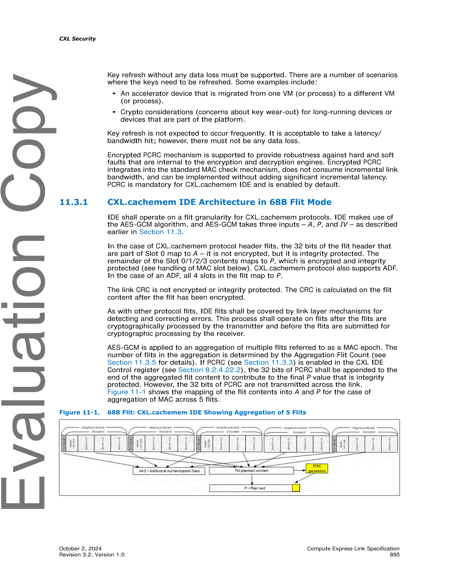
>
> *Original page render @ 150 DPI* — [📄 Full size](figures/chapter_11/page_0895.png)

<table>
<thead>
<tr>
<th width="50%">🇬🇧 English</th>
<th width="50%" style="background-color:#e8e8e8">🇨🇳 中文</th>
</tr>
</thead>
<tbody>
<tr><td>The Message Authentication Code (MAC), also referred to as the authentication tag in NIST Special Publication 800-38D, shall be 96 bits. The MAC must be transmitted in a Slot 0 header of type H6 (see Figure 4-12). Unlike other Slot 0 headers, the MAC itself is neither encrypted nor integrity protected. Figure 11-2 shows the mapping of flit contents to A and P for the case of aggregation of MAC across 5 flits with one of the flits carrying a MAC.</td><td style="background-color:#e8e8e8">消息认证码（Message Authentication Code, MAC），在 NIST 特别出版物 800-38D 中也称为认证标签，应为 96 位。MAC 必须在类型为 H6 的 Slot 0 头中传输（见图 4-12）。与其他 Slot 0 头不同，MAC 本身既不加密也不受完整性保护。图 11-2 展示了在 5 个 flit 上聚合 MAC（其中一个 flit 携带 MAC）的情况下，flit 内容到 A 和 P 的映射。</td></tr>
<tr><td>Figure 11-3 provides a more-detailed view of the 5-flit MAC epoch example. Flit0 shown on the top is the first flit to be transmitted in this MAC epoch. The figure shows the header fields that are only integrity protected, and plaintext content that is encrypted and integrity protected. Flit0 plaintext0 byte0 is the first byte of the plaintext. Flit1 plaintext0 byte0 shall immediately follow flit0 plaintext3 byte15.</td><td style="background-color:#e8e8e8">图 11-3 提供了 5-flit MAC 周期示例的更详细视图。顶部显示的 Flit0 是本 MAC 周期中要传输的第一个 flit。该图显示了仅受完整性保护的头字段，以及被加密并受完整性保护的明文内容。Flit0 plaintext0 byte0 是明文的第一个字节。Flit1 plaintext0 byte0 应紧跟 Flit0 plaintext3 byte15。</td></tr>
</tbody>
</table>

> **Figure 11-2.** 68B Flit: CXL.cachemem IDE Showing Aggregation across 5 Flits where One Flit Contains MAC Header in Slot 0 ｜ 68B Flit：CXL.cachemem IDE 展示 5 个 Flit 的聚合，其中一个 Flit 的 Slot 0 携带 MAC Header
>
> 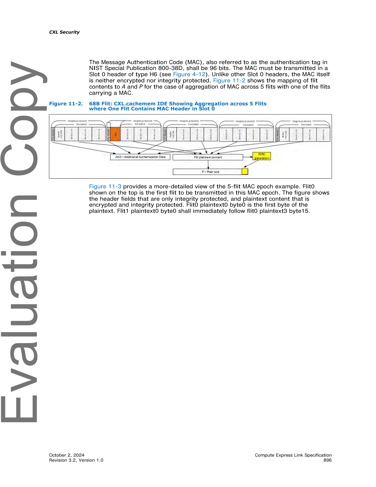
>
> *Original page render @ 150 DPI* — [📄 Full size](figures/chapter_11/page_0896.png)

> **Figure 11-3.** 68B Flit: More-detailed View of a 5-Flit MAC Epoch Example ｜ 68B Flit：5-Flit MAC 周期示例的更详细视图
>
> 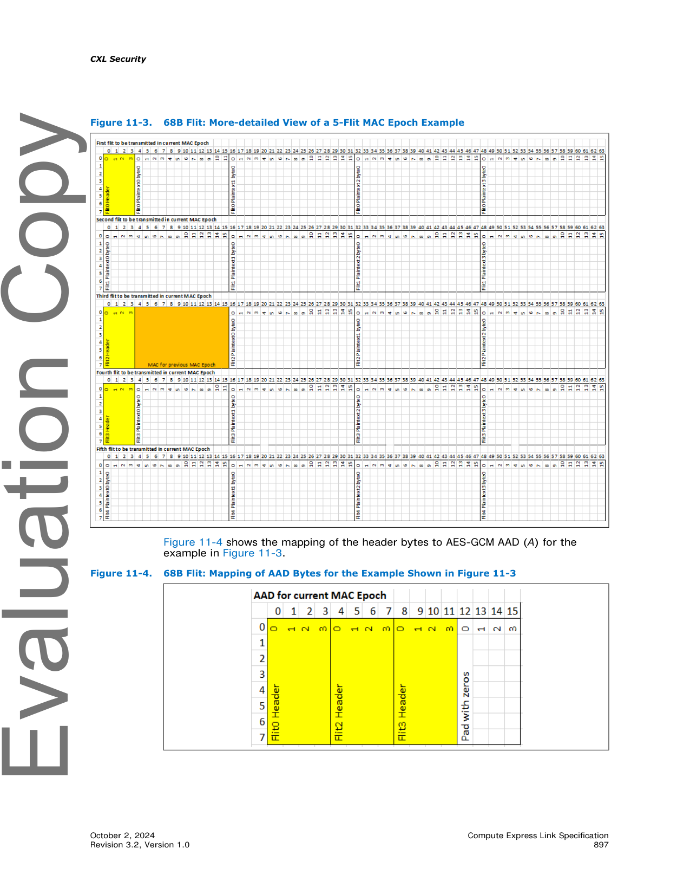
>
> *Original page render @ 150 DPI* — [📄 Full size](figures/chapter_11/page_0897.png)

<table>
<thead>
<tr>
<th width="50%">🇬🇧 English</th>
<th width="50%" style="background-color:#e8e8e8">🇨🇳 中文</th>
</tr>
</thead>
<tbody>
<tr><td>Figure 11-4 shows the mapping of the header bytes to AES-GCM AAD (A) for the example in Figure 11-3.</td><td style="background-color:#e8e8e8">图 11-4 展示了图 11-3 示例中头字节到 AES-GCM AAD（A）的映射。</td></tr>
</tbody>
</table>

> **Figure 11-4.** 68B Flit: Mapping of AAD Bytes for the Example Shown in Figure 11-3 ｜ 68B Flit：图 11-3 示例中 AAD 字节的映射
>
> 
>
> *Original page render @ 150 DPI* — [📄 Full size](figures/chapter_11/page_0897.png)

[⬆️ 返回目录](#-本章目录)

### 11.3.2 CXL.cachemem IDE Architecture in 256B Flit Mode | 256B Flit 模式下的 CXL.cachemem IDE 架构

<table>
<thead>
<tr>
<th width="50%">🇬🇧 English</th>
<th width="50%" style="background-color:#e8e8e8">🇨🇳 中文</th>
</tr>
</thead>
<tbody>
<tr><td>If the header slot is used for sending control messages other than IDE.MAC, the entire flit shall not carry any protocol traffic. This applies for other usages of IDE type (IDE.TMAC, IDE.Start, and IDE.Idle), In-band Error, and INIT.</td><td style="background-color:#e8e8e8">如果头 slot 用于发送除 IDE.MAC 之外的控件消息，则整个 flit 不应携带任何协议流量。这适用于 IDE 类型（IDE.TMAC、IDE.Start 和 IDE.Idle）、带内错误（In-band Error）和 INIT 的其他用途。</td></tr>
<tr><td>The receiver uses 4 bits of the header slot that encode the slot type to determine whether the slot contains control or protocol information. If the header slot is carrying protocol information, then 4 bits of the header slot that encode the slot type will map to AES-GCM input A. Although the slot type will not be encrypted, it is integrity protected. If the header slot is carrying control information, then the entire slot is neither encrypted nor integrity protected.</td><td style="background-color:#e8e8e8">接收器使用头 slot 中编码 slot 类型的 4 位来确定该 slot 包含控件还是协议信息。如果头 slot 携带协议信息，则头 slot 中编码 slot 类型的 4 位将映射到 AES-GCM 输入 A。尽管 slot 类型不会被加密，但受到完整性保护。如果头 slot 携带控件信息，则整个 slot 既不加密也不受完整性保护。</td></tr>
<tr><td>In case the header slot is carrying protocol information, then the plaintext (P) starts at bit 20. To simplify implementation and align to the AES block size of 128 bits, 20 bits of 0s shall be padded in front of the header slot content and the padded 128 bits of information shall be mapped to AES-GCM input P.</td><td style="background-color:#e8e8e8">如果头 slot 携带协议信息，则明文（P）从 bit 20 开始。为简化实现并与 128 位的 AES 块大小对齐，应在头 slot 内容前面填充 20 位 0，填充后的 128 位信息应映射到 AES-GCM 输入 P。</td></tr>
<tr><td>• The padded header slot will be used when calculating PCRC (see Section 11.3.3).</td><td style="background-color:#e8e8e8">• 填充后的头 slot 将用于 PCRC 计算（见第 11.3.3 节）。</td></tr>
<tr><td>• Encrypted pad will not be transmitted on the link. Receiver must reconstruct the ciphertext for the padded region when calculating the AES-GCM MAC.</td><td style="background-color:#e8e8e8">• 加密的填充内容不会在链路上传输。在计算 AES-GCM MAC 时，接收器必须重建填充区域的密文。</td></tr>
<tr><td>Credit return (CRD) field does not carry any confidential data. The CRD field needs to be integrity protected, so the CRD field shall map to AES-GCM input A.</td><td style="background-color:#e8e8e8">信用返回（Credit Return, CRD）字段不携带任何机密数据。CRD 字段需要受完整性保护，因此 CRD 字段应映射到 AES-GCM 输入 A。</td></tr>
<tr><td>The rules for handling latency-optimized flits are as follows:</td><td style="background-color:#e8e8e8">处理延迟优化 flit 的规则如下：</td></tr>
<tr><td>• Slot 7 bytes shall be packed together before mapping to AES-GCM input P.</td><td style="background-color:#e8e8e8">• Slot 7 的字节应在映射到 AES-GCM 输入 P 之前打包在一起。</td></tr>
<tr><td>• Slot 8 is only 12 bytes long. It shall be padded with 32 bits of 0 at the end of slot content. This will enable subsequent slots to be aligned on the 128-bit AES block boundary.</td><td style="background-color:#e8e8e8">• Slot 8 只有 12 字节长。应在 slot 内容末尾填充 32 位 0。这将使后续 slot 在 128 位 AES 块边界上对齐。</td></tr>
<tr><td>• Packed Slot 7 and padded Slot 8 should be used when calculating PCRC (see Section 11.3.3).</td><td style="background-color:#e8e8e8">• 打包后的 Slot 7 和填充后的 Slot 8 应在计算 PCRC 时使用（见第 11.3.3 节）。</td></tr>
<tr><td>• Receiver must reconstruct the ciphertext for the padded region in Slot 8 when calculating AES-GCM MAC.</td><td style="background-color:#e8e8e8">• 在计算 AES-GCM MAC 时，接收器必须重建 Slot 8 中填充区域的密文。</td></tr>
<tr><td>• AES-GCM input A for each flit shall be padded with 0s to align it to 32 bits.</td><td style="background-color:#e8e8e8">• 每个 flit 的 AES-GCM 输入 A 应填充 0 以对齐到 32 位。</td></tr>
<tr><td>• Header slot contains protocol header: slot_type|CRD|012.</td><td style="background-color:#e8e8e8">• 头 slot 包含协议头：slot_type|CRD|012。</td></tr>
<tr><td>• Header slot contains MAC: CRD|016.</td><td style="background-color:#e8e8e8">• 头 slot 包含 MAC：CRD|016。</td></tr>
<tr><td>In the case of 256B flits, only Slot 0 and Slot 15 contribute to the AAD. Figure 11-5, Figure 11-6, Figure 11-7, Figure 11-8, Figure 11-9, and Figure 11-10 depict handling of the AAD field.</td><td style="background-color:#e8e8e8">对于 256B flit，只有 Slot 0 和 Slot 15 对 AAD 有贡献。图 11-5、图 11-6、图 11-7、图 11-8、图 11-9 和图 11-10 描述了 AAD 字段的处理。</td></tr>
<tr><td>Figure 11-5 depicts the case when Slot 0 contains LLCTRL (H8) slot format encoding with an IDE.MAC message. In this case, Slot 0 does not contain any bits that require integrity protection; therefore, Slot 0 is not IDE protected.</td><td style="background-color:#e8e8e8">图 11-5 描述了 Slot 0 包含带 IDE.MAC 消息的 LLCTRL（H8）slot 格式编码的情况。在这种情况下，Slot 0 不包含任何需要完整性保护的位，因此 Slot 0 不受 IDE 保护。</td></tr>
</tbody>
</table>

> **Figure 11-5.** 256B Flit: Handling of Slot 0 when it Carries H8 ｜ 256B Flit：Slot 0 携带 H8 时的处理
>
> 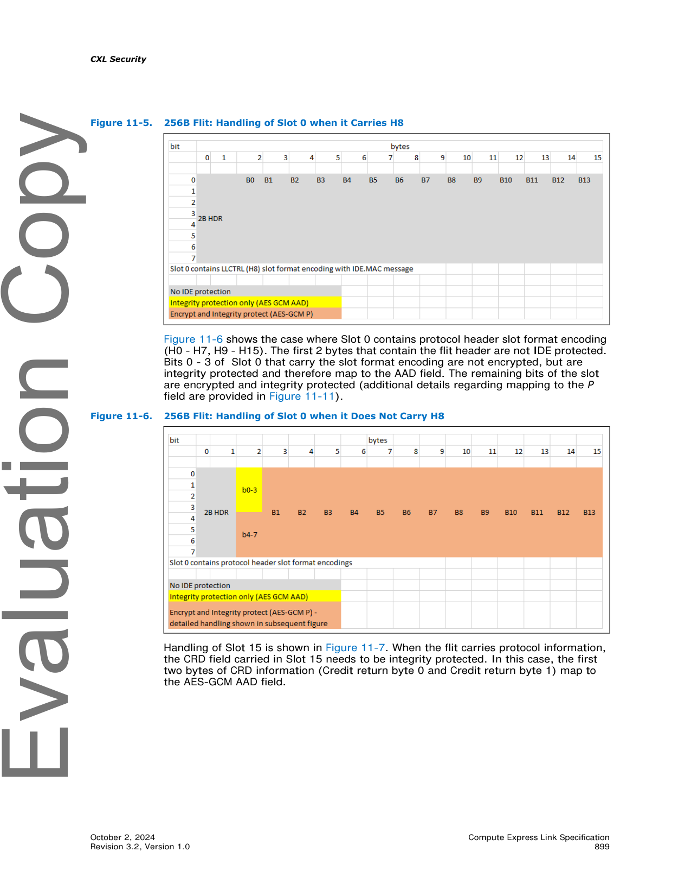
>
> *Original page render @ 150 DPI* — [📄 Full size](figures/chapter_11/page_0899.png)

> **Figure 11-6.** 256B Flit: Handling of Slot 0 when it Does Not Carry H8 ｜ 256B Flit：Slot 0 不携带 H8 时的处理
>
> 
>
> *Original page render @ 150 DPI* — [📄 Full size](figures/chapter_11/page_0899.png)

<table>
<thead>
<tr>
<th width="50%">🇬🇧 English</th>
<th width="50%" style="background-color:#e8e8e8">🇨🇳 中文</th>
</tr>
</thead>
<tbody>
<tr><td>Figure 11-6 shows the case where Slot 0 contains protocol header slot format encoding (H0 - H7, H9 - H15). The first 2 bytes that contain the flit header are not IDE protected. Bits 0 - 3 of Slot 0 that carry the slot format encoding are not encrypted, but are integrity protected and therefore map to the AAD field. The remaining bits of the slot are encrypted and integrity protected (additional details regarding mapping to the P field are provided in Figure 11-11).</td><td style="background-color:#e8e8e8">图 11-6 展示了 Slot 0 包含协议头 slot 格式编码（H0 - H7、H9 - H15）的情况。包含 flit 头的前 2 个字节不受 IDE 保护。Slot 0 中携带 slot 格式编码的 bit 0 - 3 不加密，但受完整性保护，因此映射到 AAD 字段。Slot 的其余位被加密并受完整性保护（关于到 P 字段映射的更多细节见图 11-11）。</td></tr>
<tr><td>Handling of Slot 15 is shown in Figure 11-7. When the flit carries protocol information, the CRD field carried in Slot 15 needs to be integrity protected. In this case, the first two bytes of CRD information (Credit return byte 0 and Credit return byte 1) map to the AES-GCM AAD field.</td><td style="background-color:#e8e8e8">Slot 15 的处理如图 11-7 所示。当 flit 携带协议信息时，Slot 15 中携带的 CRD 字段需要受完整性保护。在这种情况下，CRD 信息的前两个字节（Credit return byte 0 和 Credit return byte 1）映射到 AES-GCM AAD 字段。</td></tr>
</tbody>
</table>

> **Figure 11-7.** 256B Flit: Handling of Slot 15 ｜ 256B Flit：Slot 15 的处理
>
> 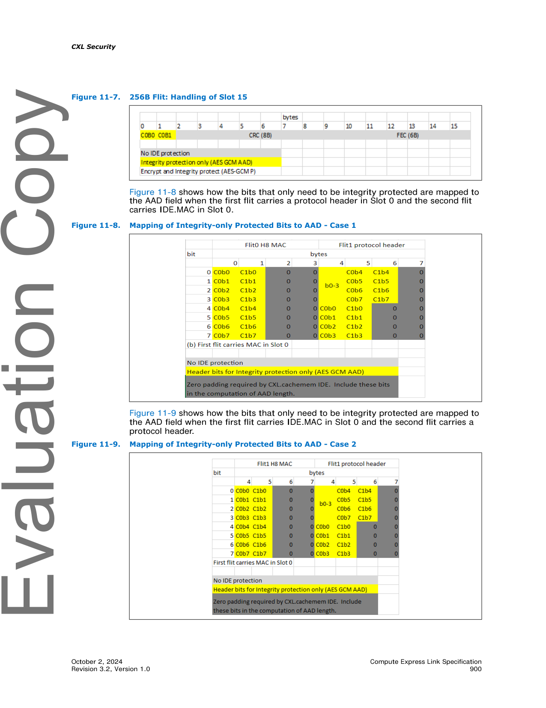
>
> *Original page render @ 150 DPI* — [📄 Full size](figures/chapter_11/page_0900.png)

> **Figure 11-8.** Mapping of Integrity-only Protected Bits to AAD - Case 1 ｜ 仅完整性保护位到 AAD 的映射 — 情形 1
>
> 
>
> *Original page render @ 150 DPI* — [📄 Full size](figures/chapter_11/page_0900.png)

> **Figure 11-9.** Mapping of Integrity-only Protected Bits to AAD - Case 2 ｜ 仅完整性保护位到 AAD 的映射 — 情形 2
>
> 
>
> *Original page render @ 150 DPI* — [📄 Full size](figures/chapter_11/page_0900.png)

<table>
<thead>
<tr>
<th width="50%">🇬🇧 English</th>
<th width="50%" style="background-color:#e8e8e8">🇨🇳 中文</th>
</tr>
</thead>
<tbody>
<tr><td>Figure 11-8 shows how the bits that only need to be integrity protected are mapped to the AAD field when the first flit carries a protocol header in Slot 0 and the second flit carries IDE.MAC in Slot 0.</td><td style="background-color:#e8e8e8">图 11-8 展示了当第一个 flit 在 Slot 0 中携带协议头、第二个 flit 在 Slot 0 中携带 IDE.MAC 时，仅需受完整性保护的位如何映射到 AAD 字段。</td></tr>
<tr><td>Figure 11-9 shows how the bits that only need to be integrity protected are mapped to the AAD field when the first flit carries IDE.MAC in Slot 0 and the second flit carries a protocol header.</td><td style="background-color:#e8e8e8">图 11-9 展示了当第一个 flit 在 Slot 0 中携带 IDE.MAC、第二个 flit 携带协议头时，仅需受完整性保护的位如何映射到 AAD 字段。</td></tr>
<tr><td>Figure 11-10 shows the third case of how the bits that only need to be integrity protected are mapped to the AAD field. In this case, both flits carry protocol headers in Slot 0. When the flit carries a protocol header, there are 20 bits that require integrity protection. These 20 bits are made up of 4 bits of Slot encoding (Slot 0) and 16 bits of CRD (Slot 15). These are padded with trailing 0s to create a 32-bit AAD input.</td><td style="background-color:#e8e8e8">图 11-10 展示了仅需受完整性保护的位映射到 AAD 字段的第三种情况。在这种情况下，两个 flit 都在 Slot 0 中携带协议头。当 flit 携带协议头时，有 20 位需要完整性保护。这 20 位由 4 位 Slot 编码（Slot 0）和 16 位 CRD（Slot 15）组成。这些位用尾随 0 填充以创建 32 位的 AAD 输入。</td></tr>
<tr><td>Because there can be only one IDE.MAC within any given MAC epoch, it is impossible for both flits to carry IDE.MAC. Such a case does not exist and hence not shown here.</td><td style="background-color:#e8e8e8">因为在任何给定的 MAC 周期内只能有一个 IDE.MAC，所以两个 flit 不可能同时携带 IDE.MAC。这种情况不存在，因此未在此处显示。</td></tr>
<tr><td>Figure 11-11 shows the transmitter's handling of bits that require both encryption and integrity protection for the standard 256B flit when Slot 0 contains LLCTRL (H8) Slot format encoding with an IDE.MAC message. Slot 0 content is not IDE protected. Slots 1 - 14 are mapped to P.</td><td style="background-color:#e8e8e8">图 11-11 展示了当 Slot 0 包含带 IDE.MAC 消息的 LLCTRL（H8）slot 格式编码时，发射机对标准 256B flit 中既需要加密又需要完整性保护的位的处理。Slot 0 内容不受 IDE 保护。Slot 1 - 14 映射到 P。</td></tr>
</tbody>
</table>

> **Figure 11-10.** Mapping of Integrity-only Protected Bits to AAD - Case 3 ｜ 仅完整性保护位到 AAD 的映射 — 情形 3
>
> 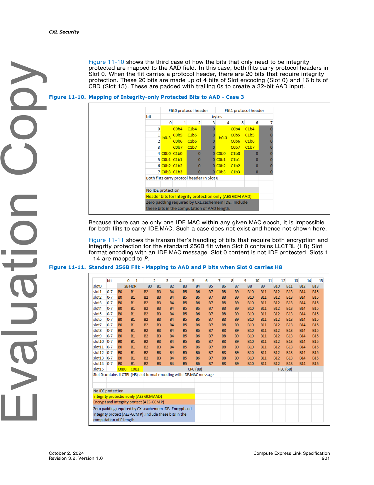
>
> *Original page render @ 150 DPI* — [📄 Full size](figures/chapter_11/page_0901.png)

> **Figure 11-11.** Standard 256B Flit - Mapping to AAD and P bits when Slot 0 carries H8 ｜ 标准 256B Flit — Slot 0 携带 H8 时到 AAD 和 P 位的映射
>
> 
>
> *Original page render @ 150 DPI* — [📄 Full size](figures/chapter_11/page_0901.png)

<table>
<thead>
<tr>
<th width="50%">🇬🇧 English</th>
<th width="50%" style="background-color:#e8e8e8">🇨🇳 中文</th>
</tr>
</thead>
<tbody>
<tr><td>Figure 11-12 shows the transmitter's handling of bits that require both encryption and integrity protection for the standard 256B flit when Slot 0 contains protocol header slot format encoding (H0 - H7, H9 - H 15). Slot 0 contains 108 bits, starting from bit 4 of the slot header. These bits are padded with leading 0s to align the content to a 128-bit boundary. The padded Slot 0 content, and Slots 1 - 14, are mapped to P.</td><td style="background-color:#e8e8e8">图 11-12 展示了当 Slot 0 包含协议头 slot 格式编码（H0 - H7、H9 - H15）时，发射机对标准 256B flit 中既需要加密又需要完整性保护的位的处理。Slot 0 包含 108 位，从 slot 头的 bit 4 开始。这些位用前导 0 填充以将内容对齐到 128 位边界。填充后的 Slot 0 内容以及 Slot 1 - 14 映射到 P。</td></tr>
</tbody>
</table>

> **Figure 11-12.** Standard 256B Flit - Mapping to AAD and P bits when Slot 0 Does Not Carry H8 ｜ 标准 256B Flit — Slot 0 不携带 H8 时到 AAD 和 P 位的映射
>
> 
>
> *Original page render @ 150 DPI* — [📄 Full size](figures/chapter_11/page_0902.png)

<table>
<thead>
<tr>
<th width="50%">🇬🇧 English</th>
<th width="50%" style="background-color:#e8e8e8">🇨🇳 中文</th>
</tr>
</thead>
<tbody>
<tr><td>Figure 11-13 shows the transmitter's handling of bits that require both encryption and integrity protection for the latency-optimized 256B flit when Slot 0 contains LLCTRL (H8) Slot format encoding with an IDE.MAC message. Slot 0 content is not IDE protected. Slots 1 - 14 are mapped to P.</td><td style="background-color:#e8e8e8">图 11-13 展示了当 Slot 0 包含带 IDE.MAC 消息的 LLCTRL（H8）slot 格式编码时，发射机对延迟优化 256B flit 中既需要加密又需要完整性保护的位的处理。Slot 0 内容不受 IDE 保护。Slot 1 - 14 映射到 P。</td></tr>
</tbody>
</table>

> **Figure 11-13.** Latency-Optimized 256B Flit - Mapping to AAD and P Bits when Slot 0 Carries H8 ｜ 延迟优化 256B Flit — Slot 0 携带 H8 时到 AAD 和 P 位的映射
>
> 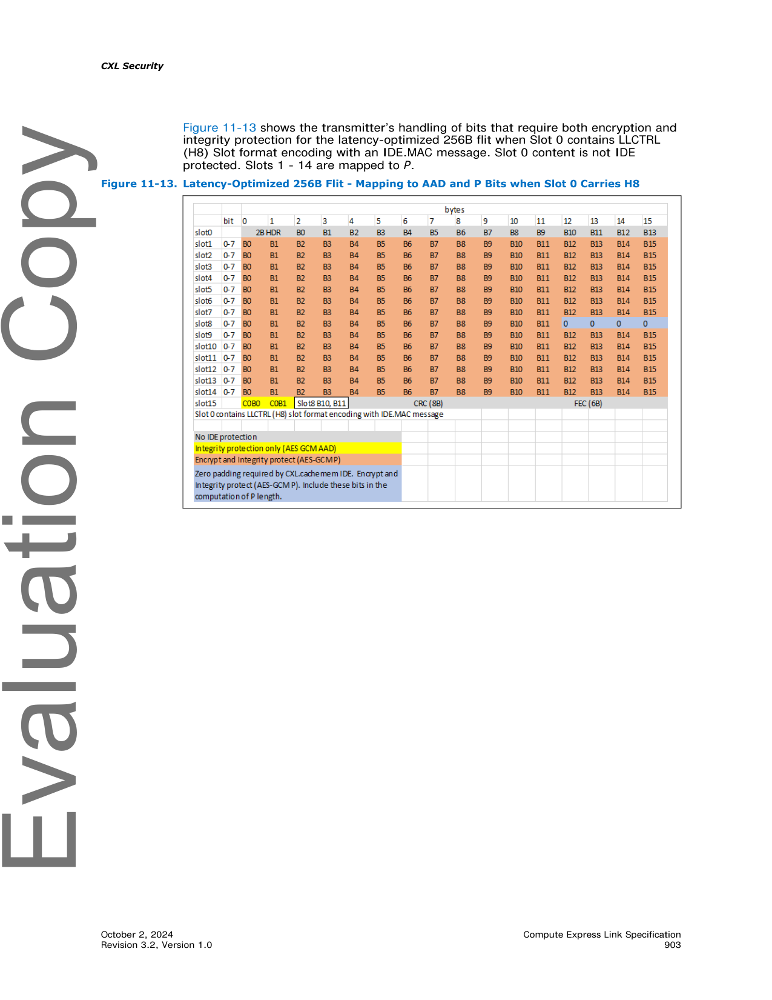
>
> *Original page render @ 150 DPI* — [📄 Full size](figures/chapter_11/page_0903.png)

<table>
<thead>
<tr>
<th width="50%">🇬🇧 English</th>
<th width="50%" style="background-color:#e8e8e8">🇨🇳 中文</th>
</tr>
</thead>
<tbody>
<tr><td>Figure 11-14 shows the transmitter's handling of bits that require both encryption and integrity protection for the latency-optimized 256B flit when Slot 0 contains protocol header slot format encoding (H0 - H7, H9 - H 15). Slot 0 contains 108 bits, starting from bit 4 of the slot header. These bits are padded with leading 0s to align the content to a 128-bit boundary. The padded Slot 0 content, and Slots 1 - 14, are mapped to P.</td><td style="background-color:#e8e8e8">图 11-14 展示了当 Slot 0 包含协议头 slot 格式编码（H0 - H7、H9 - H15）时，发射机对延迟优化 256B flit 中既需要加密又需要完整性保护的位的处理。Slot 0 包含 108 位，从 slot 头的 bit 4 开始。这些位用前导 0 填充以将内容对齐到 128 位边界。填充后的 Slot 0 内容以及 Slot 1 - 14 映射到 P。</td></tr>
<tr><td>When operating in Skid mode, implementations can choose to maximize the benefits of latency optimization by decrypting and processing Slot 8 bytes 0 - 9, and Slots 9 - 14 as soon as they are received. Only MAC computation and decryption of Slot 8 bytes 10 - 11 needs to wait until Slot 14 is received. In such cases, implementation-specific mechanisms should exist to unwind IDE processing if CRC/FEC checks fail.</td><td style="background-color:#e8e8e8">在滑行模式（Skid mode）下运行时，实现可以选择通过在收到 Slot 8 的字节 0 - 9 以及 Slot 9 - 14 后立即对其解密和处理，从而最大化延迟优化的收益。只有 MAC 计算和 Slot 8 字节 10 - 11 的解密需要等到 Slot 14 收到后才能进行。在这种情况下，应存在实现特定的机制，以便在 CRC/FEC 检查失败时撤销 IDE 处理。</td></tr>
</tbody>
</table>

> **Figure 11-14.** Latency-Optimized 256B Flit - Mapping to AAD and P Bits when Slot 0 Does Not Carry H8 ｜ 延迟优化 256B Flit — Slot 0 不携带 H8 时到 AAD 和 P 位的映射
>
> 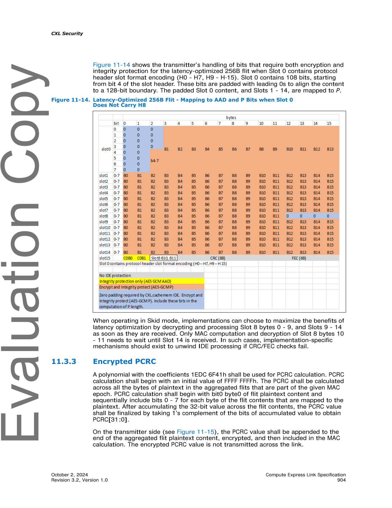
>
> *Original page render @ 150 DPI* — [📄 Full size](figures/chapter_11/page_0904.png)

[⬆️ 返回目录](#-本章目录)

### 11.3.3 Encrypted PCRC | 加密 PCRC

<table>
<thead>
<tr>
<th width="50%">🇬🇧 English</th>
<th width="50%" style="background-color:#e8e8e8">🇨🇳 中文</th>
</tr>
</thead>
<tbody>
<tr><td>A polynomial with the coefficients 1EDC 6F41h shall be used for PCRC calculation. PCRC calculation shall begin with an initial value of FFFF FFFFh. The PCRC shall be calculated across all the bytes of plaintext in the aggregated flits that are part of the given MAC epoch. PCRC calculation shall begin with bit0 byte0 of flit plaintext content and sequentially include bits 0 - 7 for each byte of the flit contents that are mapped to the plaintext. After accumulating the 32-bit value across the flit contents, the PCRC value shall be finalized by taking 1's complement of the bits of accumulated value to obtain PCRC[31:0].</td><td style="background-color:#e8e8e8">PCRC 计算应使用系数为 1EDC 6F41h 的多项式。PCRC 计算应从初始值 FFFF FFFFh 开始。PCRC 应在属于给定 MAC 周期的聚合 flit 的所有明文字节上计算。PCRC 计算应从 flit 明文内容的 bit0 byte0 开始，并按顺序为映射到明文的每个 flit 内容的字节包含 bit 0 - 7。在跨 flit 内容累加 32 位值后，应通过对累加值的位取 1 的补码来完成 PCRC 值，以获得 PCRC[31:0]。</td></tr>
<tr><td>On the transmitter side (see Figure 11-15), the PCRC value shall be appended to the end of the aggregated flit plaintext content, encrypted, and then included in the MAC calculation. The encrypted PCRC value is not transmitted across the link.</td><td style="background-color:#e8e8e8">在发射端（见图 11-15），PCRC 值应附加到聚合 flit 明文内容的末尾，进行加密，然后包含在 MAC 计算中。加密的 PCRC 值不通过链路传输。</td></tr>
</tbody>
</table>

> **Figure 11-15.** Inclusion of the PCRC Mechanism in the AES-GCM Advanced Encryption Function ｜ AES-GCM 高级加密函数中 PCRC 机制的引入
>
> 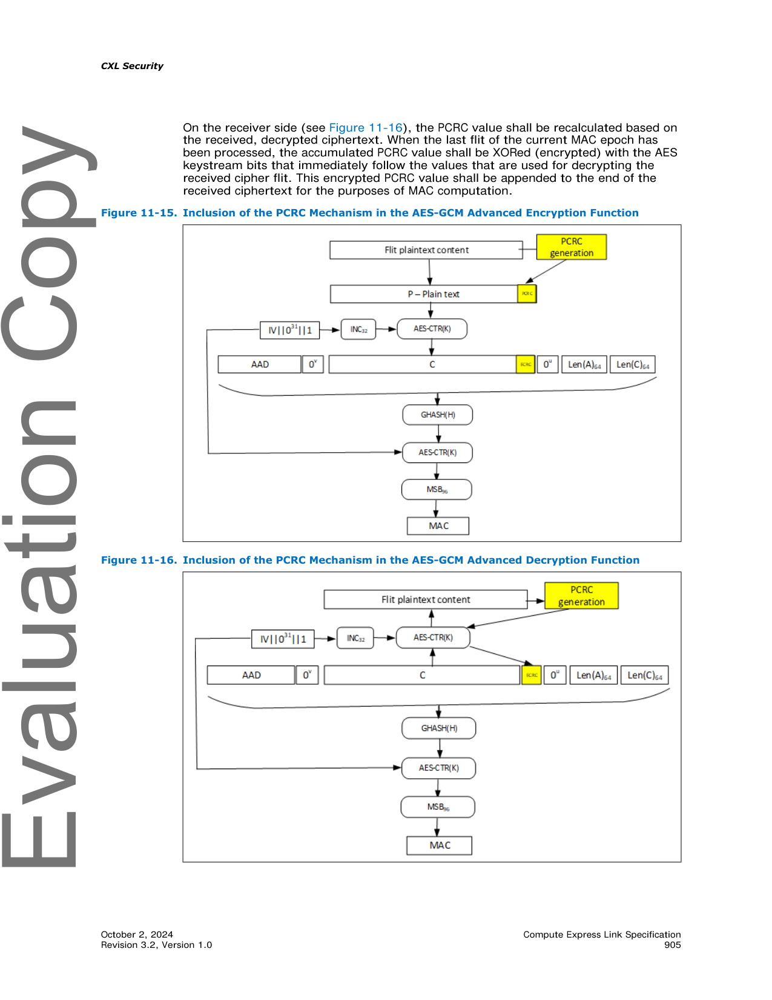
>
> *Original page render @ 150 DPI* — [📄 Full size](figures/chapter_11/page_0905.png)

> **Figure 11-16.** Inclusion of the PCRC Mechanism in the AES-GCM Advanced Decryption Function ｜ AES-GCM 高级解密函数中 PCRC 机制的引入
>
> 
>
> *Original page render @ 150 DPI* — [📄 Full size](figures/chapter_11/page_0905.png)

<table>
<thead>
<tr>
<th width="50%">🇬🇧 English</th>
<th width="50%" style="background-color:#e8e8e8">🇨🇳 中文</th>
</tr>
</thead>
<tbody>
<tr><td>On the receiver side (see Figure 11-16), the PCRC value shall be recalculated based on the received, decrypted ciphertext. When the last flit of the current MAC epoch has been processed, the accumulated PCRC value shall be XORed (encrypted) with the AES keystream bits that immediately follow the values that are used for decrypting the received cipher flit. This encrypted PCRC value shall be appended to the end of the received ciphertext for the purposes of MAC computation.</td><td style="background-color:#e8e8e8">在接收端（见图 11-16），应基于接收到的、解密后的密文重新计算 PCRC 值。当当前 MAC 周期的最后一个 flit 已被处理时，累加的 PCRC 值应与紧随用于解密接收到的密文 flit 的值之后的 AES 密钥流位进行异或（加密）。该加密的 PCRC 值应附加到接收到的密文末尾以用于 MAC 计算。</td></tr>
</tbody>
</table>

[⬆️ 返回目录](#-本章目录)

### 11.3.4 Cryptographic Keys and IV | 加密密钥与 IV

<table>
<thead>
<tr>
<th width="50%">🇬🇧 English</th>
<th width="50%" style="background-color:#e8e8e8">🇨🇳 中文</th>
</tr>
</thead>
<tbody>
<tr><td>Initialization of a CXL.cachemem IDE Stream involves multiple steps. It is possible that some of these steps can be merged or performed in a different order. The first step is to establish the authenticity and identity of the components that contain the two ports that operate as endpoints for a CXL.cachemem IDE Stream. The second step is to establish the IDE Stream keys. In some cases, these two steps may be combined. Third, the IDE is configured. Finally, the establishment of the IDE Stream is triggered.</td><td style="background-color:#e8e8e8">CXL.cachemem IDE 流的初始化涉及多个步骤。这些步骤中的一些可以合并或以不同顺序执行。第一步是建立作为 CXL.cachemem IDE 流端点运行的两个端口所在组件的真实性和身份。第二步是建立 IDE 流密钥。在某些情况下，这两个步骤可以合并。第三，配置 IDE。最后，触发 IDE 流的建立。</td></tr>
<tr><td>CXL.cachemem IDE may make use of CXL.io IDE mechanisms for device attestation and key exchange using a standard mechanism, as described in Section 11.4.</td><td style="background-color:#e8e8e8">CXL.cachemem IDE 可使用 CXL.io IDE 机制，通过第 11.4 节所述的标准机制进行设备证明和密钥交换。</td></tr>
<tr><td>IV construction of CXL.cachemem IDE is described below. A 96-bit IV of deterministic construction is used as per NIST Special Publication 800-38D for AES-GCM.</td><td style="background-color:#e8e8e8">CXL.cachemem IDE 的 IV 构造如下所述。根据 NIST 特别出版物 800-38D 中针对 AES-GCM 的规定，使用确定性构造的 96 位 IV。</td></tr>
<tr><td>All ports shall support the Default IV Construction. The default IV construction is as follows:</td><td style="background-color:#e8e8e8">所有端口都应支持默认 IV 构造。默认 IV 构造如下：</td></tr>
<tr><td>• A fixed field is located at bits 95:64 of the IV, where bits 95:92 contain the sub-stream identifier, 1000b, and bits 91:64 are all 0s. The same sub-stream encoding is used for both transmitted and received flits; however, the keys that the port uses during transmit and receive flows must be distinct.</td><td style="background-color:#e8e8e8">• IV 的 bit 95:64 有一个固定字段，其中 bit 95:92 包含子流标识符 1000b，bit 91:64 全为 0。传输和接收 flit 使用相同的子流编码；但是端口在发送和接收流中使用的密钥必须不同。</td></tr>
<tr><td>• Bits 63:0 of the IV are referred to as the invocation field. The invocation field contains a monotonically incrementing counter with rollover properties. The invocation field is initially set to the value 0000 0001h for each sub-stream upon establishment of the IDE Stream including a rekeying flow. If the CXL.cachemem IV Generation Capable bit in CXL_QUERY_RESP returns the value of 1, the port is capable of initially setting IV to a value other than what is generated via the Default IV Construction. See the CXL_KEY_PROG message definition (see Section 11.4.5) for details.</td><td style="background-color:#e8e8e8">• IV 的 bit 63:0 称为调用字段（invocation field）。调用字段包含具有回绕属性的单调递增计数器。在建立 IDE 流（包括重新密钥流程）时，每个子流的调用字段初始设置为 0000 0001h。如果 CXL_QUERY_RESP 中的 CXL.cachemem IV Generation Capable 位返回 1，则该端口能够将 IV 初始设置为不同于通过默认 IV 构造生成的值。有关详细信息，请参阅 CXL_KEY_PROG 消息定义（第 11.4.5 节）。</td></tr>
<tr><td>In either case, the invocation field is incremented every time an IV is consumed. Neither the transmitter nor the receiver are required to detect IV rollover1 and are not required to take any special action when the IV rolls over.</td><td style="background-color:#e8e8e8">无论哪种情况，每次消耗一个 IV 时，调用字段都会递增。发射机和接收机都不需要检测 IV 回滚1，也不需要在 IV 回绕时采取任何特殊操作。</td></tr>
</tbody>
</table>

> 1 For a x16 link operating at 32 GT/s, a 64-bit IV will take longer than 1000 years to roll over.
>
> 1 对于以 32 GT/s 运行的 x16 链路，64 位 IV 需要超过 1000 年才能回绕。

[⬆️ 返回目录](#-本章目录)

### 11.3.5 CXL.cachemem IDE Modes | CXL.cachemem IDE 模式

<table>
<thead>
<tr>
<th width="50%">🇬🇧 English</th>
<th width="50%" style="background-color:#e8e8e8">🇨🇳 中文</th>
</tr>
</thead>
<tbody>
<tr><td>CXL.cachemem IDE supports two modes of operation:</td><td style="background-color:#e8e8e8">CXL.cachemem IDE 支持两种工作模式：</td></tr>
<tr><td>• Containment mode: In Containment mode, the data is released for further processing only after the integrity check passes. This mode impacts both latency and bandwidth. The latency impact is due to the need to buffer several flits until the integrity value has been received and checked. The bandwidth impact comes from the fact that integrity value is sent quite frequently. If Containment mode is supported and enabled, the devices (and hosts) shall use an Aggregation Flit Count of 5 in 68B Flit mode and 2 in 256B Flit mode.</td><td style="background-color:#e8e8e8">• 包含模式（Containment mode）：在包含模式下，数据只有在完整性检查通过后才会被释放以供进一步处理。这种模式会影响延迟和带宽。延迟影响源于需要缓冲多个 flit 直到接收到并检查完整性值。带宽影响源于完整性值发送得非常频繁。如果支持并启用包含模式，则设备（和主机）在 68B Flit 模式下应使用 5 的聚合 Flit 计数，在 256B Flit 模式下使用 2。</td></tr>
<tr><td>• Skid mode: Skid mode allows the data to be released for further processing without waiting for the integrity value to be received and checked. This allows for less-frequent transmission of the integrity value. Skid mode allows for near-zero latency overhead and low bandwidth overhead. In this mode, data modified by an adversary is potentially consumed by software; however, such an attack will subsequently be detected when the integrity value is received and checked. If Skid mode is supported and enabled, all devices (and hosts) shall use an Aggregation Flit Count of 128 in 68B Flit mode and of 32 in 256B Flit mode. When using this mode, the software and application stack must be capable of tolerating attacks within a narrow time window, or the result is undefined.</td><td style="background-color:#e8e8e8">• 滑行模式（Skid mode）：滑行模式允许在收到并检查完整性值之前释放数据以供进一步处理。这允许以更低的频率传输完整性值。滑行模式允许接近零的延迟开销和较低的带宽开销。在这种模式下，被对手修改的数据可能会被软件消费；然而，这种攻击随后在收到并检查完整性值时会被检测到。如果支持并启用滑行模式，则所有设备（和主机）在 68B Flit 模式下应使用 128 的聚合 Flit 计数，在 256B Flit 模式下使用 32。在使用此模式时，软件和应用堆栈必须能够容忍在狭窄时间窗口内的攻击，否则结果未定义。</td></tr>
</tbody>
</table>

#### 11.3.5.1 Discovery of Integrity Modes and Settings | 完整性模式与设置的发现

<table>
<thead>
<tr>
<th width="50%">🇬🇧 English</th>
<th width="50%" style="background-color:#e8e8e8">🇨🇳 中文</th>
</tr>
</thead>
<tbody>
<tr><td>Each port shall enumerate the modes that the port supports and other capabilities via registers in the CXL IDE Capability Structure (see Section 8.2.4.22). All devices adherent to this specification shall support Containment mode.</td><td style="background-color:#e8e8e8">每个端口应通过 CXL IDE 能力结构（第 8.2.4.22 节）中的寄存器枚举端口支持的模式和其他能力。符合本规范的所有设备应支持包含模式。</td></tr>
</tbody>
</table>

#### 11.3.5.2 Negotiation of Operating Mode and Settings | 工作模式与设置的协商

<table>
<thead>
<tr>
<th width="50%">🇬🇧 English</th>
<th width="50%" style="background-color:#e8e8e8">🇨🇳 中文</th>
</tr>
</thead>
<tbody>
<tr><td>The operating mode and timing parameters are configured in the CXL IDE Capability Structure (see Section 8.2.4.22) prior to enabling of CXL.cachemem IDE.</td><td style="background-color:#e8e8e8">工作模式和时序参数在启用 CXL.cachemem IDE 之前在 CXL IDE 能力结构（第 8.2.4.22 节）中配置。</td></tr>
</tbody>
</table>

#### 11.3.5.3 Rules for MAC Aggregation | MAC 聚合规则

<table>
<thead>
<tr>
<th width="50%">🇬🇧 English</th>
<th width="50%" style="background-color:#e8e8e8">🇨🇳 中文</th>
</tr>
</thead>
<tbody>
<tr><td>The rules for generation and transfer of MAC are as follows:</td><td style="background-color:#e8e8e8">MAC 的生成和传输规则如下：</td></tr>
<tr><td>• MAC epoch: A MAC epoch is defined as the set of consecutive flits that are part of a given aggregation unit. The IDE mode (see Section 11.3.5) determines the number of flits in a standard MAC epoch. This number is known as Aggregation Flit Count (referred to as N below). Every MAC epoch with the exception of early MAC termination (see Section 11.3.6) carries N flits. A given MAC header shall contain the tag for exactly one MAC epoch. The transmitter shall accumulate the integrity value over flits in exactly one MAC epoch (that is at most N flits) prior to transmitting the MAC epoch.</td><td style="background-color:#e8e8e8">• MAC 周期：MAC 周期定义为一组属于给定聚合单元的连续 flit。IDE 模式（见第 11.3.5 节）决定标准 MAC 周期中的 flit 数量。这个数字称为聚合 Flit 计数（以下称为 N）。除 MAC 提前终止（见第 11.3.6 节）外，每个 MAC 周期携带 N 个 flit。给定的 MAC 头应仅包含一个 MAC 周期的标签。发射机应在传输 MAC 周期之前，对正好一个 MAC 周期（最多 N 个 flit）中的 flit 累加完整性值。</td></tr>
<tr><td>• In all cases, the transmitter must send MACs in the same order as MAC epochs.</td><td style="background-color:#e8e8e8">• 在所有情况下，发射机必须按照与 MAC 周期相同的顺序发送 MAC。</td></tr>
<tr><td>• Figure 11-17 shows an example of MAC generation and transmission for one MAC epoch in the presence of back-to-back protocol traffic for the 68B flit format. Figure 11-17 (a) shows that the earliest MAC may be transmitted, assuming that the transmitter completes MAC computation (and gets MAC ready) one cycle after the MAC epoch completes. The earliest flit to be transmitted or received is shown on the top of the figure. Thus, Flits 0 to N-1 (shown in yellow) belonging to MAC Epoch 1 are transmitted in that order. The MAC is calculated over Flits 0 to N-1.</td><td style="background-color:#e8e8e8">• 图 11-17 展示了在 68B flit 格式下存在背靠背协议流量时一个 MAC 周期的 MAC 生成和传输示例。图 11-17 (a) 展示了最早可以传输的 MAC，假设发射机在 MAC 周期完成一个周期后完成 MAC 计算（并准备好 MAC）。图中顶部显示了要传输或接收的最早 flit。因此，属于 MAC 周期 1 的 Flit 0 到 N-1（黄色显示）按该顺序传输。MAC 在 Flit 0 到 N-1 上计算。</td></tr>
</tbody>
</table>

> **Figure 11-17.** MAC Epochs and MAC Transmission in Case of Back-to-Back Traffic ｜ 背靠背流量情况下的 MAC 周期与 MAC 传输
>
> 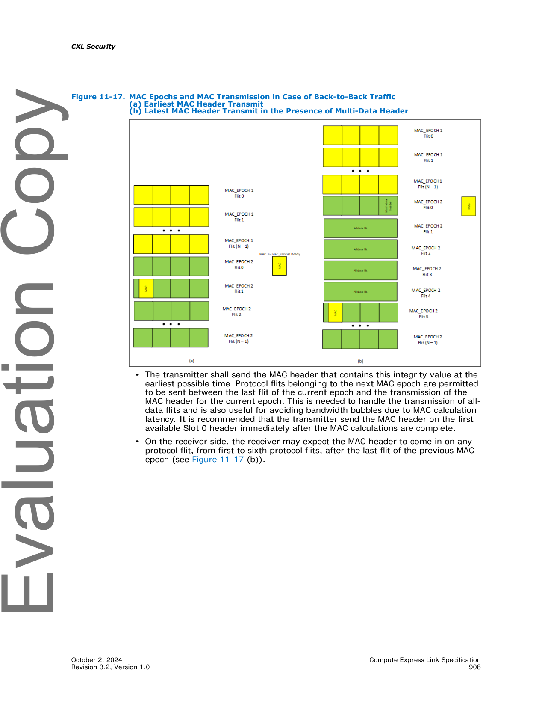
>
> *Original page render @ 150 DPI* — [📄 Full size](figures/chapter_11/page_0908.png)

> **Figure 11-18.** Example of MAC Header Being Received in the First Flit of the Current MAC Epoch ｜ 在当前 MAC 周期的第一个 Flit 中接收到 MAC Header 的示例
>
> 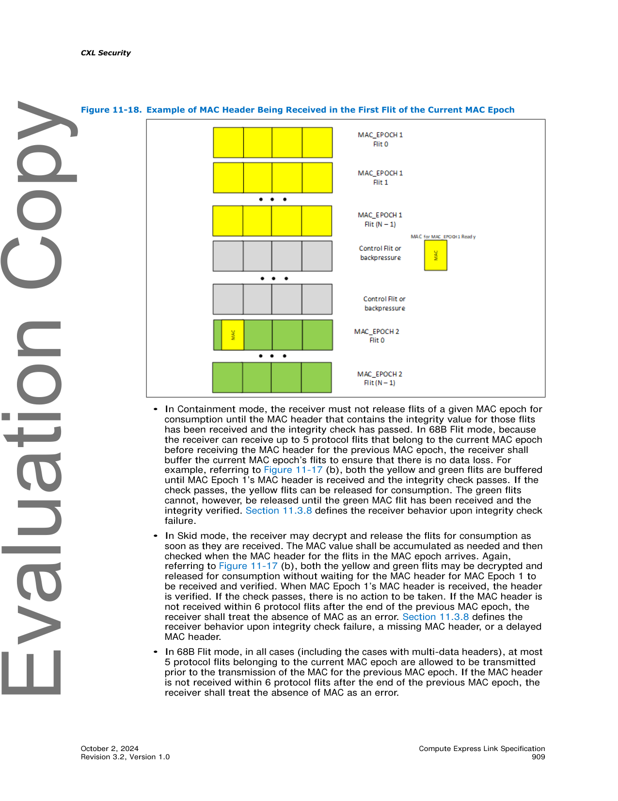
>
> *Original page render @ 150 DPI* — [📄 Full size](figures/chapter_11/page_0909.png)

<table>
<thead>
<tr>
<th width="50%">🇬🇧 English</th>
<th width="50%" style="background-color:#e8e8e8">🇨🇳 中文</th>
</tr>
</thead>
<tbody>
<tr><td>• The transmitter shall send the MAC header that contains this integrity value at the earliest possible time. Protocol flits belonging to the next MAC epoch are permitted to be sent between the last flit of the current epoch and the transmission of the MAC header for the current epoch. This is needed to handle the transmission of all-data flits and is also useful for avoiding bandwidth bubbles due to MAC calculation latency. It is recommended that the transmitter send the MAC header on the first available Slot 0 header immediately after the MAC calculations are complete.</td><td style="background-color:#e8e8e8">• 发射机应尽早发送包含此完整性值的 MAC 头。属于下一个 MAC 周期的协议 flit 允许在当前周期的最后一个 flit 与当前周期的 MAC 头的传输之间发送。这对于处理全数据 flit 的传输是必要的，并且还有助于避免由于 MAC 计算延迟而导致的带宽气泡。建议发射机在 MAC 计算完成后立即在第一个可用的 Slot 0 头上发送 MAC 头。</td></tr>
<tr><td>• On the receiver side, the receiver may expect the MAC header to come in on any protocol flit, from first to sixth protocol flits, after the last flit of the previous MAC epoch (see Figure 11-17 (b)).</td><td style="background-color:#e8e8e8">• 在接收端，接收机可以预期 MAC 头在前一个 MAC 周期最后一个 flit 之后的任何协议 flit（从第一个到第六个协议 flit）上到达（见图 11-17 (b)）。</td></tr>
<tr><td>• In Containment mode, the receiver must not release flits of a given MAC epoch for consumption until the MAC header that contains the integrity value for those flits has been received and the integrity check has passed. In 68B Flit mode, because the receiver can receive up to 5 protocol flits that belong to the current MAC epoch before receiving the MAC header for the previous MAC epoch, the receiver shall buffer the current MAC epoch's flits to ensure that there is no data loss. For example, referring to Figure 11-17 (b), both the yellow and green flits are buffered until MAC Epoch 1's MAC header is received and the integrity check passes. If the check passes, the yellow flits can be released for consumption. The green flits cannot, however, be released until the green MAC flit has been received and the integrity verified. Section 11.3.8 defines the receiver behavior upon integrity check failure.</td><td style="background-color:#e8e8e8">• 在包含模式下，接收机在接收到包含这些 flit 完整性值的 MAC 头并通过完整性检查之前，不得释放给定 MAC 周期的 flit 以供消费。在 68B Flit 模式下，由于接收机在收到上一个 MAC 周期的 MAC 头之前最多可以收到 5 个属于当前 MAC 周期的协议 flit，因此接收机应缓冲当前 MAC 周期的 flit 以确保没有数据丢失。例如，参考图 11-17 (b)，黄色和绿色 flit 都被缓冲，直到收到 MAC 周期 1 的 MAC 头并通过完整性检查。如果检查通过，则可以释放黄色 flit 以供消费。但是，绿色 flit 在收到绿色 MAC flit 并验证完整性之前不能被释放。第 11.3.8 节定义了完整性检查失败时接收机的行为。</td></tr>
<tr><td>• In Skid mode, the receiver may decrypt and release the flits for consumption as soon as they are received. The MAC value shall be accumulated as needed and then checked when the MAC header for the flits in the MAC epoch arrives. Again, referring to Figure 11-17 (b), both the yellow and green flits may be decrypted and released for consumption without waiting for the MAC header for MAC Epoch 1 to be received and verified. When MAC Epoch 1's MAC header is received, the header is verified. If the check passes, there is no action to be taken. If the MAC header is not received within 6 protocol flits after the end of the previous MAC epoch, the receiver shall treat the absence of MAC as an error. Section 11.3.8 defines the receiver behavior upon integrity check failure, a missing MAC header, or a delayed MAC header.</td><td style="background-color:#e8e8e8">• 在滑行模式下，接收机可以在收到 flit 后立即解密并释放它们以供消费。MAC 值应根据需要累加，然后在 MAC 周期中 flit 的 MAC 头到达时检查。同样，参考图 11-17 (b)，黄色和绿色 flit 都可以被解密并释放以供消费，而无需等待收到并验证 MAC 周期 1 的 MAC 头。收到 MAC 周期 1 的 MAC 头时，将验证该头。如果检查通过，则无需采取任何操作。如果在上一个 MAC 周期结束后的 6 个协议 flit 内未收到 MAC 头，则接收机应将 MAC 缺失视为错误。第 11.3.8 节定义了完整性检查失败、MAC 头缺失或 MAC 头延迟时接收机的行为。</td></tr>
<tr><td>• In 68B Flit mode, in all cases (including the cases with multi-data headers), at most 5 protocol flits belonging to the current MAC epoch are allowed to be transmitted prior to the transmission of the MAC for the previous MAC epoch. If the MAC header is not received within 6 protocol flits after the end of the previous MAC epoch, the receiver shall treat the absence of MAC as an error.</td><td style="background-color:#e8e8e8">• 在 68B Flit 模式下，在所有情况下（包括具有多数据头的情况），在传输上一个 MAC 周期的 MAC 之前，最多允许传输 5 个属于当前 MAC 周期的协议 flit。如果在上一个 MAC 周期结束后的 6 个协议 flit 内未收到 MAC 头，则接收机应将 MAC 缺失视为错误。</td></tr>
<tr><td>• In 256B Flit mode, in all cases, at most 1 protocol flit that belongs to the current MAC epoch is allowed to be transmitted prior to the transmission of the MAC for the previous MAC epoch. If the MAC header is not received within 2 protocol flits after the end of the previous MAC epoch, the receiver shall treat the absence of MAC as an error.</td><td style="background-color:#e8e8e8">• 在 256B Flit 模式下，在所有情况下，在传输上一个 MAC 周期的 MAC 之前，最多允许传输 1 个属于当前 MAC 周期的协议 flit。如果在上一个 MAC 周期结束后的 2 个协议 flit 内未收到 MAC 头，则接收机应将 MAC 缺失视为错误。</td></tr>
</tbody>
</table>

[⬆️ 返回目录](#-本章目录)

### 11.3.6 Early MAC Termination | MAC 提前终止

<table>
<thead>
<tr>
<th width="50%">🇬🇧 English</th>
<th width="50%" style="background-color:#e8e8e8">🇨🇳 中文</th>
</tr>
</thead>
<tbody>
<tr><td>A transmitter is permitted to terminate the MAC epoch early and transmit the MAC for the flits in a truncated MAC epoch when fewer than the Aggregation Flit Count of flits have been transmitted in the current MAC epoch. This can occur as part of link idle handling. The link may be ready to go idle after the transmission of a number of protocol flits, less than the Aggregation Flit Count, in the current MAC epoch.</td><td style="background-color:#e8e8e8">当在当前 MAC 周期中传输的 flit 数量少于聚合 Flit 计数时，允许发射机提前终止 MAC 周期并传输截断 MAC 周期中 flit 的 MAC。这可能作为链路空闲处理的一部分发生。在当前 MAC 周期中传输了少于聚合 Flit 计数的协议 flit 之后，链路可能准备进入空闲状态。</td></tr>
<tr><td>The following rules shall apply to the early MAC epoch termination and the MAC transmission.</td><td style="background-color:#e8e8e8">以下规则应适用于 MAC 周期提前终止和 MAC 传输。</td></tr>
<tr><td>• The transmitter is permitted to terminate the MAC epoch early if and only if the number of protocol flits in the current MAC epoch is less than Aggregation Flit Count. The MAC for this truncated MAC epoch shall be transmitted by itself in the IDE.TMAC Link Layer Control flit (see Table 4-10). This subtype is referred to as a Truncated MAC flit within this specification.</td><td style="background-color:#e8e8e8">• 当且仅当当前 MAC 周期中的协议 flit 数量少于聚合 Flit 计数时，发射机才允许提前终止 MAC 周期。此截断 MAC 周期的 MAC 应通过 IDE.TMAC 链路层控制 flit（见表 4-10）单独传输。此子类型在本规范中称为截断 MAC flit。</td></tr>
<tr><td>• Any subsequent protocol flits would become part of a new MAC epoch and would be transmitted after the Truncated MAC flit.</td><td style="background-color:#e8e8e8">• 任何后续的协议 flit 将成为新 MAC 周期的一部分，并在截断 MAC flit 之后传输。</td></tr>
<tr><td>• The MAC for the truncated MAC epoch is calculated identically to the MAC calculation for normal cases, except that it is accumulated over fewer flits.</td><td style="background-color:#e8e8e8">• 截断 MAC 周期的 MAC 的计算方式与正常情况下的 MAC 计算方式相同，只是它是在更少的 flit 上累加的。</td></tr>
<tr><td>Figure 11-20 shows an example of truncating the current MAC epoch after 3 protocol flits. Flits in current MAC epoch can contain any valid protocol flit including a header flit that contains the MAC for the previous MAC epoch. The MAC for the current MAC epoch shall be sent using a Truncated MAC flit. The Truncated MAC flit will be transmitted following the three protocol flits of the current MAC epoch with no other intervening protocol flits from the next MAC epoch.</td><td style="background-color:#e8e8e8">图 11-20 展示了在 3 个协议 flit 之后截断当前 MAC 周期的示例。当前 MAC 周期中的 flit 可以包含任何有效的协议 flit，包括包含上一个 MAC 周期 MAC 的头 flit。当前 MAC 周期的 MAC 应使用截断 MAC flit 发送。截断 MAC flit 将在当前 MAC 周期的三个协议 flit 之后传输，且没有来自下一个 MAC 周期的其他介入协议 flit。</td></tr>
</tbody>
</table>

> **IMPLEMENTATION NOTE**
>
> In Containment mode, the receiver must not release any decrypted flits for consumption unless their associated MAC check has been performed and passed. This complies with the algorithm for the AES-GCM Authenticated Decryption Function as defined in NIST Special Publication 800-38D.
>
> In Skid mode, the receiver is permitted to release any decrypted flits for consumption without waiting for their associated MAC check to be performed. Unless there are additional device-specific mechanisms to prevent this consumption, the use of Skid mode will not meet the requirements of the above-mentioned algorithm.
>
> Solution stack designers must carefully weigh the benefits vs. the constraints when choosing between Containment mode and Skid mode. Containment mode guarantees that potentially corrupted data will not be consumed. Skid mode provides data privacy and eventual detection of data integrity loss, with significantly less latency impact and link-bandwidth loss compared to Containment mode. However, the use of Skid mode may be more vulnerable to security attacks and will require additional device-specific mechanisms if it is necessary to prevent corrupt data from being consumed.

> **实现说明**
>
> 在包含模式下，接收机在执行并通过关联的 MAC 检查之前，不得释放任何解密的 flit 以供消费。这符合 NIST 特别出版物 800-38D 中定义的 AES-GCM 已认证解密函数算法。
>
> 在滑行模式下，接收机可以释放任何解密的 flit 以供消费，而无需等待执行其关联的 MAC 检查。除非有额外的设备特定机制来防止这种消费，否则使用滑行模式将不满足上述算法的要求。
>
> 解决方案堆栈设计人员在包含模式和滑行模式之间进行选择时，必须仔细权衡收益与约束。包含模式保证潜在的损坏数据不会被消费。滑行模式提供数据隐私和数据完整性损失的最终检测，与包含模式相比，延迟影响和链路带宽损失显著降低。然而，使用滑行模式可能更容易受到安全攻击，并且如果需要防止损坏数据被消费，则需要额外的设备特定机制。

<table>
<thead>
<tr>
<th width="50%">🇬🇧 English</th>
<th width="50%" style="background-color:#e8e8e8">🇨🇳 中文</th>
</tr>
</thead>
<tbody>
<tr><td>In the case where the link goes idle after sending exactly the Aggregation Flit Count number of flits in the MAC epoch, then the Truncated MAC flit as defined above must not be used. The MAC header must be part of the next MAC epoch. This new MAC epoch is permitted to be terminated early using the Truncated MAC flit (see Figure 11-21).</td><td style="background-color:#e8e8e8">如果在 MAC 周期中恰好发送了聚合 Flit 计数数量的 flit 之后链路进入空闲，则不得使用如上定义的截断 MAC flit。MAC 头必须是下一个 MAC 周期的一部分。允许使用截断 MAC flit 提前终止此新 MAC 周期（见图 11-21）。</td></tr>
</tbody>
</table>

> **Figure 11-19.** Early Termination and Transmission of Truncated MAC Flit ｜ 提前终止与截断 MAC Flit 的传输
>
> 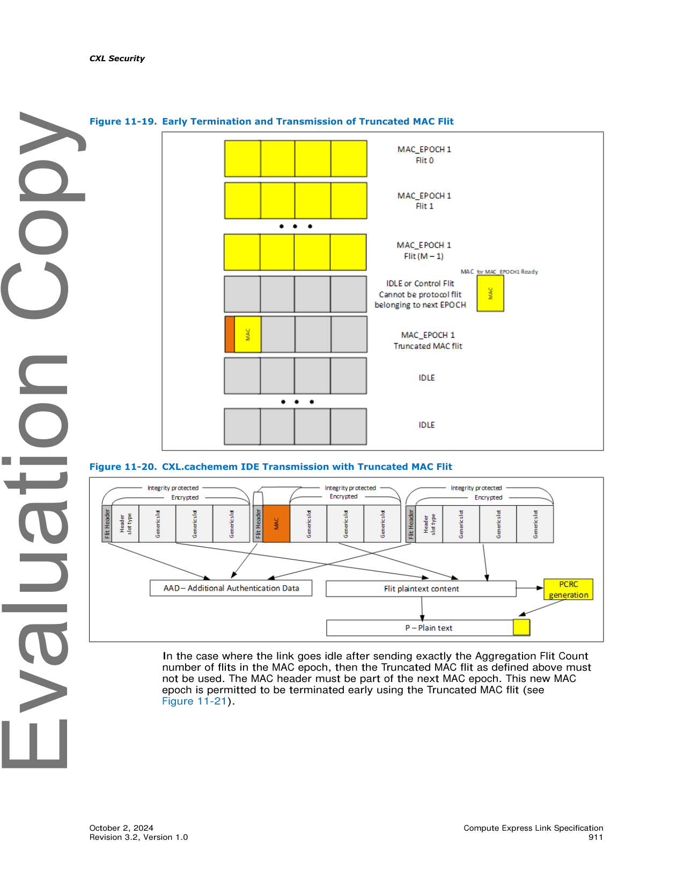
>
> *Original page render @ 150 DPI* — [📄 Full size](figures/chapter_11/page_0911.png)

> **Figure 11-20.** CXL.cachemem IDE Transmission with Truncated MAC Flit ｜ 使用截断 MAC Flit 的 CXL.cachemem IDE 传输
>
> 
>
> *Original page render @ 150 DPI* — [📄 Full size](figures/chapter_11/page_0911.png)

> **Figure 11-21.** Link Idle Case after Transmission of Aggregation Flit Count Number of Flits ｜ 传输完聚合 Flit 数量后的链路空闲情形
>
> 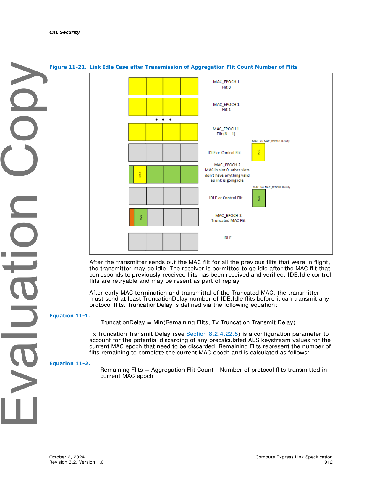
>
> *Original page render @ 150 DPI* — [📄 Full size](figures/chapter_11/page_0912.png)

<table>
<thead>
<tr>
<th width="50%">🇬🇧 English</th>
<th width="50%" style="background-color:#e8e8e8">🇨🇳 中文</th>
</tr>
</thead>
<tbody>
<tr><td>After the transmitter sends out the MAC flit for all the previous flits that were in flight, the transmitter may go idle. The receiver is permitted to go idle after the MAC flit that corresponds to previously received flits has been received and verified. IDE.Idle control flits are retryable and may be resent as part of replay.</td><td style="background-color:#e8e8e8">在发射机为所有正在传输的先前 flit 发出 MAC flit 之后，发射机可以进入空闲状态。在接收到并验证与先前接收的 flit 相对应的 MAC flit 之后，允许接收机进入空闲状态。IDE.Idle 控制 flit 是可重试的，可以作为重放的一部分重新发送。</td></tr>
<tr><td>After early MAC termination and transmittal of the Truncated MAC, the transmitter must send at least TruncationDelay number of IDE.Idle flits before it can transmit any protocol flits. TruncationDelay is defined via the following equation:</td><td style="background-color:#e8e8e8">在 MAC 提前终止和截断 MAC 发送之后，发射机必须在能够传输任何协议 flit 之前发送至少 TruncationDelay 数量的 IDE.Idle flit。TruncationDelay 由以下等式定义：</td></tr>
</tbody>
</table>

> **Equation 11-1.**
>
> TruncationDelay = Min(Remaining Flits, Tx Truncation Transmit Delay)
>
> Tx Truncation Transmit Delay (see Section 8.2.4.22.8) is a configuration parameter to account for the potential discarding of any precalculated AES keystream values for the current MAC epoch that need to be discarded. Remaining Flits represent the number of flits remaining to complete the current MAC epoch and is calculated as follows:
>
> **方程 11-1.**
>
> TruncationDelay = Min(剩余 Flit, Tx 截断传输延迟)
>
> Tx 截断传输延迟（见第 8.2.4.22.8 节）是一个配置参数，用于说明可能需要丢弃的当前 MAC 周期的任何预计算 AES 密钥流值。剩余 Flit 表示完成当前 MAC 周期还需的 flit 数量，计算如下：

> **Equation 11-2.**
>
> Remaining Flits = Aggregation Flit Count - Number of protocol flits transmitted in current MAC epoch
>
> **方程 11-2.**
>
> 剩余 Flit = 聚合 Flit 计数 - 当前 MAC 周期中已传输的协议 flit 数量

[⬆️ 返回目录](#-本章目录)

### 11.3.7 Handshake to Trigger the Use of Keys | 触发密钥使用的握手

<table>
<thead>
<tr>
<th width="50%">🇬🇧 English</th>
<th width="50%" style="background-color:#e8e8e8">🇨🇳 中文</th>
</tr>
</thead>
<tbody>
<tr><td>Each port exposes a register interface that software can use to program the transmit and receive keys and their associated parameters. These programmed keys remain pending in registers until activation. While the keys are in the process of being exchanged and configured in the Upstream and Downstream Ports, the link may actively be using a previously configured key. The new keys shall not take effect until the actions described below are taken.</td><td style="background-color:#e8e8e8">每个端口都公开一个寄存器接口，软件可以使用该接口来编程发送和接收密钥及其相关参数。这些编程的密钥在激活之前一直处于寄存器中的待定状态。在上游和下游端口交换和配置密钥的过程中，链路可能正在主动使用先前配置的密钥。在采取下面描述的操作之前，新密钥不应生效。</td></tr>
<tr><td>The mechanism described below is used to switch the backup keys to the active state. This is needed to ensure that the Transmitter and Receiver change to using the programmed keys in a coordinated manner.</td><td style="background-color:#e8e8e8">下述机制用于将备份密钥切换到活动状态。这是为了确保发射机和接收机以协调的方式切换到使用编程的密钥。</td></tr>
<tr><td>After the keys are programmed into pending registers on both sides of the link, receipt of the CXL_K_SET_GO request shall cause each transmitter on each port to trigger the transmission of an IDE.Start Link Layer Control flit (see Table 4-3).</td><td style="background-color:#e8e8e8">在密钥被编程到链路两侧的待定寄存器中后，收到 CXL_K_SET_GO 请求应使每个端口上的每个发射机触发传输 IDE.Start 链路层控制 flit（见表 4-3）。</td></tr>
<tr><td>After the IDE.Start flit has been sent, all future protocol flits shall be protected by the new keys. To allow the receiver to prepare to receive the flits protected by the new key, the Transmitter is required to send IDE.Idle flits, as defined in Table 4-10 for the number of flits specified by the Tx Key Refresh Time field in the Key Refresh Time Control register (see Section 8.2.4.22.7) prior to sending any protocol flits with the new key. These IDE.Idle flits are not encrypted or integrity protected. To prepare to use the new keys, the Tx Key Refresh Time in the transmitter must be configured to a value that is higher than the worst-case latency in the receiver, which is advertised by the receiver via Rx Min Key Refresh Time field in the Key Refresh Time Capability register (see Section 8.2.4.22.5) or Rx Min Key Refresh Time2 field in the Key Refresh Time Capability2 register (see Section 8.2.4.22.9), depending on the Flit mode.</td><td style="background-color:#e8e8e8">在 IDE.Start flit 发送之后，所有未来的协议 flit 都应受到新密钥的保护。为了允许接收机准备接收受新密钥保护的 flit，发射机需要在发送任何带新密钥的协议 flit 之前，按照表 4-10 中定义的以及 Key Refresh Time Control 寄存器（第 8.2.4.22.7 节）中 Tx Key Refresh Time 字段指定的 flit 数量发送 IDE.Idle flit。这些 IDE.Idle flit 不加密也不受完整性保护。为了准备使用新密钥，发射机中的 Tx Key Refresh Time 必须配置为高于接收机中最坏情况延迟的值，该值由接收机通过 Key Refresh Time Capability 寄存器（第 8.2.4.22.5 节）中的 Rx Min Key Refresh Time 字段或 Key Refresh Time Capability2 寄存器（第 8.2.4.22.9 节）中的 Rx Min Key Refresh Time2 字段（取决于 Flit 模式）公布。</td></tr>
<tr><td>After receiving the IDE.Start flit, the receiver must change to using the new keys if the transmitter has met the AES-GCM requirements. During key refresh, it is recommended that the transmitter send an IDE.TMAC before sending an IDE.Start.</td><td style="background-color:#e8e8e8">在收到 IDE.Start flit 后，如果发射机已满足 AES-GCM 要求，接收机必须切换到使用新密钥。在密钥刷新期间，建议发射机在发送 IDE.Start 之前发送 IDE.TMAC。</td></tr>
<tr><td>It is also permissible for the transmitter to send an IDE.Start after the MAC epoch ends but before the corresponding MAC header is transmitted. In this scenario, the receiver must use the old keys to decrypt the message and to check the MAC.</td><td style="background-color:#e8e8e8">发射机也允许在 MAC 周期结束后但在相应 MAC 头传输之前发送 IDE.Start。在这种情况下，接收机必须使用旧密钥来解密消息并检查 MAC。</td></tr>
<tr><td>The transmitter must not send an IDE.Start in the middle of a MAC epoch because doing so violates the fundamental AES-GCM requirement that a single key be used as the input. If the IDE.Start is received in the middle of a MAC epoch, then the receiver shall drop the IDE.Start. The receiver may also set the Rx Error Status field in the CXL IDE Error Status register (see Section 8.2.4.22.4) to CXL.cachemem IDE Establishment Security error and may transition to Insecure State upon detecting this condition.</td><td style="background-color:#e8e8e8">发射机不得在 MAC 周期中间发送 IDE.Start，因为这样做违反了 AES-GCM 的基本要求——必须将单个密钥用作输入。如果在 MAC 周期中间收到 IDE.Start，则接收机应丢弃 IDE.Start。接收机还可以将 CXL IDE 错误状态寄存器（第 8.2.4.22.4 节）中的 Rx 错误状态字段设置为 CXL.cachemem IDE 建立安全错误，并在检测到此情况时转换到不安全状态。</td></tr>
<tr><td>The IDE.Start flit shall be ordered with respect to the protocol flits. In case of link-level retries, the receiver shall complete retries of previously sent protocol flits before handling the IDE.Start flit and changing to the new key. Other events such as link retraining can occur in the middle of this flow as long as the ordering specified above is maintained.</td><td style="background-color:#e8e8e8">IDE.Start flit 应相对于协议 flit 有序。在链路级重试的情况下，接收机应在处理 IDE.Start flit 并切换到新密钥之前完成先前发送的协议 flit 的重试。只要保持上述排序，其他事件（如链路重训练）也可以在此流程中间发生。</td></tr>
</tbody>
</table>

[⬆️ 返回目录](#-本章目录)

### 11.3.8 Error Handling | 错误处理

<table>
<thead>
<tr>
<th width="50%">🇬🇧 English</th>
<th width="50%" style="background-color:#e8e8e8">🇨🇳 中文</th>
</tr>
</thead>
<tbody>
<tr><td>CXL IDE does not impact or require any changes to the link CRC error handling and the link retry flow.</td><td style="background-color:#e8e8e8">CXL IDE 不会影响或要求更改链路 CRC 错误处理和链路重试流程。</td></tr>
<tr><td>CXL.cachemem IDE error conditions are enumerated and logged in the Rx Error Status field, Tx Error Status or Unexpected IDE.Stop received fields in the CXL IDE Error Status register (see Section 8.2.4.22.4). When a CXL.cachemem IDE error is detected, the appropriate bits in the Uncorrectable Error Status register (see Section 8.2.4.17.1) are also set and the error is signaled using the standard CXL.cachemem protocol error signaling mechanism.</td><td style="background-color:#e8e8e8">CXL.cachemem IDE 错误条件在 CXL IDE 错误状态寄存器（第 8.2.4.22.4 节）的 Rx 错误状态字段、Tx 错误状态或意外 IDE.Stop 接收字段中枚举和记录。当检测到 CXL.cachemem IDE 错误时，不可纠正错误状态寄存器（第 8.2.4.17.1 节）中的相应位也会被置位，并使用标准的 CXL.cachemem 协议错误信令机制发出错误信号。</td></tr>
<tr><td>Unless stated otherwise, errors logged in Rx Error Status field or Tx Error Status field cause the CXL.cachemem IDE stream to transition from Active State to Insecure State if it is Active at the time of the error. Note that some of the error conditions that are logged under CXL.cachemem IDE Establishment may not always result in termination of CXL.cachemem IDE stream.</td><td style="background-color:#e8e8e8">除非另有说明，否则记录在 Rx 错误状态字段或 Tx 错误状态字段中的错误会导致 CXL.cachemem IDE 流在错误发生时处于活动状态的情况下从活动状态转换到不安全状态。请注意，在 CXL.cachemem IDE 建立下记录的一些错误条件可能并不总是导致 CXL.cachemem IDE 流的终止。</td></tr>
<tr><td>Upon transition to Insecure state:</td><td style="background-color:#e8e8e8">转换到不安全状态时：</td></tr>
<tr><td>• Any buffered protocol flits are dropped and all subsequent protocol traffic is dropped until the link is reset.</td><td style="background-color:#e8e8e8">• 任何缓冲的协议 flit 都会被丢弃，所有后续的协议流量也会被丢弃，直到链路被复位。</td></tr>
<tr><td>• Components shall prevent any leakage of keys or user data. The component may need to implement mechanisms to clear the data/state or have access control to prevent leakage of secrets. Such mechanisms and actions are component specific and beyond the scope of this specification.</td><td style="background-color:#e8e8e8">• 组件应防止任何密钥或用户数据的泄露。组件可能需要实现机制来清除数据/状态或具有访问控制以防止秘密泄露。这种机制和操作是组件特定的，超出了本规范的范围。</td></tr>
</tbody>
</table>

[⬆️ 返回目录](#-本章目录)

### 11.3.9 Switch Support | 交换机支持

<table>
<thead>
<tr>
<th width="50%">🇬🇧 English</th>
<th width="50%" style="background-color:#e8e8e8">🇨🇳 中文</th>
</tr>
</thead>
<tbody>
<tr><td>CXL switches that support CXL.cachemem IDE may optionally support CXL.io IDE and may support link IDE or selective IDE streams for CXL.io traffic, including flow through. If supporting CXL.io IDE, CXL switches should follow PCIe IDE switch rules for CXL.io traffic.</td><td style="background-color:#e8e8e8">支持 CXL.cachemem IDE 的 CXL 交换机可以选择支持 CXL.io IDE，并可以支持 CXL.io 流量的链路 IDE 或选择性 IDE 流，包括流通过。如果支持 CXL.io IDE，则 CXL 交换机应针对 CXL.io 流量遵循 PCIe IDE 交换机规则。</td></tr>
<tr><td>A CXL switch may also optionally support Selective Stream IDE for CXL.io traffic, including flow-through Selective IDE Streams. A CXL switch may only support Selective Stream IDE in flow-through mode for CXL.io traffic. In this case, CXL.cachemem IDE cannot be enabled on the host side. In the case of multi-VCS capable switches, CXL IDE may be enabled on a per-root port basis. However, after any root port has enabled CXL IDE, the downstream link from the switch to the MLDs that support CXL IDE, must also have Link IDE enabled. Thus, the traffic from a root port which has not enabled CXL IDE that is targeting an MLD that has enabled CXL IDE would be encrypted and integrity protected between the switch and the device.</td><td style="background-color:#e8e8e8">CXL 交换机也可以选择支持 CXL.io 流量的选择性流 IDE，包括流通过选择性 IDE 流。CXL 交换机只能以流通过模式为 CXL.io 流量支持选择性流 IDE。在这种情况下，主机端无法启用 CXL.cachemem IDE。对于支持多 VCS 的交换机，可以按根端口启用 CXL IDE。但是，在任何根端口启用了 CXL IDE 之后，从交换机到支持 CXL IDE 的 MLD 的下行链路也必须启用链路 IDE。因此，来自未启用 CXL IDE 的根端口、目标是已启用 CXL IDE 的 MLD 的流量将在交换机和设备之间进行加密和完整性保护。</td></tr>
</tbody>
</table>

[⬆️ 返回目录](#-本章目录)

### 11.3.10 IDE Termination Handshake | IDE 终止握手

<table>
<thead>
<tr>
<th width="50%">🇬🇧 English</th>
<th width="50%" style="background-color:#e8e8e8">🇨🇳 中文</th>
</tr>
</thead>
<tbody>
<tr><td>This section describes a mechanism that disables IDE on both the transmitter and receiver. This is accomplished via IDE.Stop control flit (see Table 4-20). This optional capability for 256B Flit mode simplifies the software synchronization and quiescing requirements. This ensures that the transmitter and receiver disable CXL.cachemem IDE in a coordinated manner.</td><td style="background-color:#e8e8e8">本节描述了在发射机和接收机上都禁用 IDE 的机制。这通过 IDE.Stop 控制 flit（见表 4-20）完成。此 256B Flit 模式的可选功能简化了软件同步和静默要求。这确保了发射机和接收机以协调的方式禁用 CXL.cachemem IDE。</td></tr>
<tr><td>After IDE is enabled and functional, receipt of a CXL_K_SET_STOP request shall cause each transmitter on each IDE.Stop capable port to trigger the transmission of an IDE.Stop Link Layer Control flit (see Table 4-20) if enabled by programming CXL IDE Control register (see Section 8.2.4.22.2). The transmitter shall ensure that the currently active MAC epoch is terminated using an IDE.TMAC prior to sending an IDE.Stop message with no intervening protocol flits. IDE.TMAC sent before IDE.Stop shall follow the standard rules for early MAC termination defined in Section 11.3.6. If a valid TMAC sequence is not received before IDE.Stop, the IDE.Stop shall be dropped and Unexpected IDE.Stop received bit in the CXL IDE Error Status register (see Section 8.2.4.22.4) shall be set.</td><td style="background-color:#e8e8e8">在 IDE 启用并正常运行后，收到 CXL_K_SET_STOP 请求应使每个 IDE.Stop 可用端口上的每个发射机触发传输 IDE.Stop 链路层控制 flit（见表 4-20），前提是通过编程 CXL IDE 控制寄存器（第 8.2.4.22.2 节）启用了该功能。发射机应确保在发送 IDE.Stop 消息之前使用 IDE.TMAC 终止当前活动的 MAC 周期，且中间没有介入的协议 flit。在 IDE.Stop 之前发送的 IDE.TMAC 应遵循第 11.3.6 节中定义的 MAC 提前终止的标准规则。如果在 IDE.Stop 之前未收到有效的 TMAC 序列，则应丢弃 IDE.Stop，并应设置 CXL IDE 错误状态寄存器（第 8.2.4.22.4 节）中的"意外 IDE.Stop 接收"位。</td></tr>
<tr><td>After the IDE.Stop is sent, all future protocol flits shall not be IDE protected. To allow the receiver to cleanly clear any pending IDE states, including precomputed information, the transmitter is required to send IDE.Idle flits, as defined in Table 4-10, for the number of flits specified by the Tx Key Refresh Time field in the Key Refresh Time Control register (see Section 8.2.4.22.7) prior to sending any protocol flits without IDE protection.</td><td style="background-color:#e8e8e8">在 IDE.Stop 发送之后，所有未来的协议 flit 都不应受 IDE 保护。为了允许接收机干净地清除任何待定的 IDE 状态（包括预计算的信息），发射机需要在发送任何不带 IDE 保护的协议 flit 之前，按照表 4-10 中定义的以及 Key Refresh Time Control 寄存器（第 8.2.4.22.7 节）中 Tx Key Refresh Time 字段指定的 flit 数量发送 IDE.Idle flit。</td></tr>
<tr><td>After receiving an IDE.Stop flit, the receiver must complete all pending actions for the currently active MAC epoch prior to disabling IDE.</td><td style="background-color:#e8e8e8">在收到 IDE.Stop flit 后，接收机必须在禁用 IDE 之前完成当前活动 MAC 周期的所有待定操作。</td></tr>
</tbody>
</table>

> **IMPLEMENTATION NOTE: IDE CONFIGURATION OF CXL SWITCHES**
>
> The following examples describe three different models for configuring the CXL.cachemem IDE and performing key exchanges with the CXL switches and the devices attached to them.
>
> **Model A**
> Host performs key exchange with the CXL switch and enables CXL IDE. The host will then enumerate the Downstream Ports in the CXL switch and perform key exchange with those downstream devices that support CXL IDE. The Host then programs the keys into the respective Downstream Ports of the switch and enables CXL IDE.
>
> **Model B**
> Host performs key exchange with the CXL switch and enables CXL IDE. In parallel, CXL switch will enumerate downstream devices and then perform key exchange with those downstream devices that support CXL IDE. The Switch then programs the keys into the respective Downstream Ports of the switch and enables CXL IDE. Host may obtain a report from the CXL switch regarding the enabling of CXL IDE for downstream devices, which includes information about the public key that was used to attest to the device EP. Host may directly obtain an attestation from the device Endpoint and confirm that the Endpoint in question has the same public key that the Switch used as part of the key exchange.
>
> **Model C**
> An out-of-band agent may configure keys into the host, switch, and devices via out-of-band means and then directly enable CXL IDE.

> **实现说明：CXL 交换机的 IDE 配置**
>
> 以下示例描述了用于配置 CXL.cachemem IDE 并与 CXL 交换机及其连接的设备执行密钥交换的三种不同模型。
>
> **模型 A**
> 主机与 CXL 交换机执行密钥交换并启用 CXL IDE。然后，主机将枚举 CXL 交换机中的下游端口，并与那些支持 CXL IDE 的下游设备执行密钥交换。然后，主机将密钥编程到交换机的相应下游端口并启用 CXL IDE。
>
> **模型 B**
> 主机与 CXL 交换机执行密钥交换并启用 CXL IDE。同时，CXL 交换机将枚举下游设备，然后与那些支持 CXL IDE 的下游设备执行密钥交换。然后，交换机将密钥编程到交换机的相应下游端口并启用 CXL IDE。主机可以从 CXL 交换机获取有关为下游设备启用 CXL IDE 的报告，其中包括用于证明设备 EP 的公钥信息。主机可以直接从设备端点获取证明，并确认相关端点具有与交换机在密钥交换中使用的公钥相同的公钥。
>
> **模型 C**
> 带外代理可以通过带外方式将密钥配置到主机、交换机和设备中，然后直接启用 CXL IDE。

<table>
<thead>
<tr>
<th width="50%">🇬🇧 English</th>
<th width="50%" style="background-color:#e8e8e8">🇨🇳 中文</th>
</tr>
</thead>
<tbody>
<tr><td>Any IDE.Stop message that is received prior to a successful CXL_K_SET_STOP shall be dropped and the Unexpected IDE.Stop received bit in the CXL IDE Error Status register (see Section 8.2.4.22.4) shall be set.</td><td style="background-color:#e8e8e8">在成功执行 CXL_K_SET_STOP 之前收到的任何 IDE.Stop 消息都应被丢弃，并应设置 CXL IDE 错误状态寄存器（第 8.2.4.22.4 节）中的"意外 IDE.Stop 接收"位。</td></tr>
<tr><td>If the IDE.Stop is received by a receiver that is IDE.Stop Capable but is not configured to process IDE.Stop, it shall drop the IDE.Stop flit and the Unexpected IDE.Stop received bit in the CXL IDE Error Status register (see Section 8.2.4.22.4) shall be set.</td><td style="background-color:#e8e8e8">如果 IDE.Stop 被支持 IDE.Stop 但未配置为处理 IDE.Stop 的接收机接收，则它应丢弃 IDE.Stop flit，并应设置 CXL IDE 错误状态寄存器（第 8.2.4.22.4 节）中的"意外 IDE.Stop 接收"位。</td></tr>
<tr><td>If the Rx port receives an IDE.Stop while the IDE stream is inactive, the Rx port shall drop the IDE.Stop flit and set the Unexpected IDE.Stop received bit in the CXL IDE Error Status register (see Section 8.2.4.22.4).</td><td style="background-color:#e8e8e8">如果 Rx 端口在 IDE 流处于非活动状态时收到 IDE.Stop，则 Rx 端口应丢弃 IDE.Stop flit，并设置 CXL IDE 错误状态寄存器（第 8.2.4.22.4 节）中的"意外 IDE.Stop 接收"位。</td></tr>
</tbody>
</table>

[⬆️ 返回目录](#-本章目录)

### 11.3.11 Poison handling | 毒化处理

<table>
<thead>
<tr>
<th width="50%">🇬🇧 English</th>
<th width="50%" style="background-color:#e8e8e8">🇨🇳 中文</th>
</tr>
</thead>
<tbody>
<tr><td>The CXL.cachemem protocol has two mechanisms for conveying poison:</td><td style="background-color:#e8e8e8">CXL.cachemem 协议有两种传达毒化（poison）的机制：</td></tr>
<tr><td>• Use the poison bit in the headers that have poisoned data associated with them (see the poison bit in the CXL.cache D2H Data Header, H2D Request and the CXL.mem flit definitions).</td><td style="background-color:#e8e8e8">• 使用具有关联毒化数据的头中的毒化位（请参阅 CXL.cache D2H 数据头、H2D 请求和 CXL.mem flit 定义中的毒化位）。</td></tr>
<tr><td>• Utilize 256 byte flits with the LLCTRL message with Subtype Poison. This message can be carried in an H slot for standard flits and in an H or HS slot for LOpt flits (see the link layer Late Poison description in section 4.3.6.3 ). The LLCTRL message includes a payload encoding that indicates the data message offset where the poison applies. Since multiple data messages can be outstanding at the same time, there can be multiple in-band LLCTRL Poison messages outstanding at the same time.</td><td style="background-color:#e8e8e8">• 将 256 字节的 flit 与子类型为 Poison 的 LLCTRL 消息一起使用。此消息可以承载在标准 flit 的 H slot 中，以及 LOpt flit 的 H 或 HS slot 中（请参阅第 4.3.6.3 节中关于链路层延迟毒化的描述）。LLCTRL 消息包含有效负载编码，用于指示毒化所应用的数据消息偏移量。由于可以同时有多个数据消息未完成，因此可以同时有多个带内 LLCTRL Poison 消息未完成。</td></tr>
<tr><td>In general, IDE does not apply to LLCTRL messages. However, the Poison message needs to have integrity protection by CXL.cachemem IDE. Otherwise, an adversary can inject/delete an in-band LLCTRL Poison message without detection by IDE. Injection of a LLCTRL Poison message is not a concern as it only impacts the availability of the TCB (which an adversary has many other simpler ways to achieve). However, deleting or modifying an in-band LLCTRL Poison message is problematic as it can lead to silent consumption of data that should have been poisoned.</td><td style="background-color:#e8e8e8">通常，IDE 不适用于 LLCTRL 消息。但是，Poison 消息需要通过 CXL.cachemem IDE 进行完整性保护。否则，对手可以在不被 IDE 检测到的情况下注入/删除带内 LLCTRL Poison 消息。注入 LLCTRL Poison 消息不是问题，因为它只会影响 TCB 的可用性（对手有许多其他更简单的方法可以实现这一点）。但是，删除或修改带内 LLCTRL Poison 消息是有问题的，因为它可能导致应该被毒化的数据被静默消费。</td></tr>
<tr><td>When LLCTRL Poison is present in the H slot of a flit, the payload information of the message shall be treated as additional bits of AAD. There are 4 bits of payload defined in the specification. Each LLCTRL Poison message shall result in 32 bits of AAD (4 bits of payload along with 28 bits of padding). The remaining slots of the flit carrying the poison indication shall be considered reserved and those slots shall not be encrypted, or integrity protected. This AAD value shall be treated as additional AAD for the next protocol flit. Thus, the flit carrying LLCTRL Poison in the H slot does not count towards MAC Epoch (see Figure 11-22 & Figure 11-23 below). The MAC Epoch is still defined based on the protocol flits. Since the poison payload is incorporated into the integrity calculations as AAD, it can be authenticated without impacting IDE encryption.</td><td style="background-color:#e8e8e8">当 LLCTRL Poison 出现在 flit 的 H slot 中时，消息的有效负载信息应被视为 AAD 的附加位。规范中定义了 4 位的有效负载。每个 LLCTRL Poison 消息应生成 32 位的 AAD（4 位有效负载加上 28 位填充）。携带毒化指示的 flit 的其余 slot 应视为保留，这些 slot 不应加密或受完整性保护。此 AAD 值应被视为下一个协议 flit 的附加 AAD。因此，在 H slot 中携带 LLCTRL Poison 的 flit 不计入 MAC 周期（请参阅下面的图 11-22 和图 11-23）。MAC 周期仍然根据协议 flit 定义。由于毒化有效负载作为 AAD 合并到完整性计算中，因此可以在不影响 IDE 加密的情况下对其进行身份验证。</td></tr>
<tr><td>When a LLCTRL Poison message is present in an HS slot of a flit, and the rest of the flit already contains valid protocol information, then there is no change required to the current IDE definition as the HS slot is already authenticated.</td><td style="background-color:#e8e8e8">当 LLCTRL Poison 消息出现在 flit 的 HS slot 中，并且 flit 的其余部分已包含有效的协议信息时，由于 HS slot 已经过身份验证，因此不需要对当前 IDE 定义进行更改。</td></tr>
</tbody>
</table>

> **Figure 11-22.** Containment Mode example illustrating the AAD construction for the case of two protocol flits that are part of the current MAC Epoch with an in-band LLCTRL Poison sent prior to first flit of the MAC Epoch ｜ 包含模式示例：展示属于当前 MAC 周期的两个协议 Flit 的 AAD 构造，在 MAC 周期第一个 Flit 之前发送带内 LLCTRL Poison
>
> 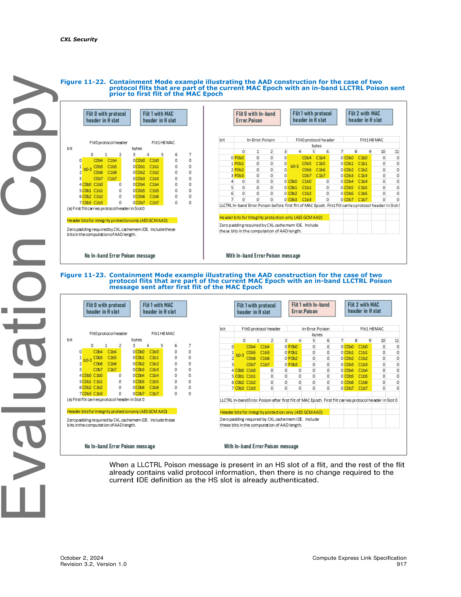
>
> *Original page render @ 150 DPI* — [📄 Full size](figures/chapter_11/page_0917.png)

> **Figure 11-23.** Containment Mode example illustrating the AAD construction for the case of two protocol flits that are part of the current MAC Epoch with an in-band LLCTRL Poison message sent after first flit of the MAC Epoch ｜ 包含模式示例：展示属于当前 MAC 周期的两个协议 Flit 的 AAD 构造，在 MAC 周期第一个 Flit 之后发送带内 LLCTRL Poison
>
> 
>
> *Original page render @ 150 DPI* — [📄 Full size](figures/chapter_11/page_0917.png)

#### 11.3.11.1 Late poison with CRC corruption flow | 带 CRC 损坏的延迟毒化流程

<table>
<thead>
<tr>
<th width="50%">🇬🇧 English</th>
<th width="50%" style="background-color:#e8e8e8">🇨🇳 中文</th>
</tr>
</thead>
<tbody>
<tr><td>There is a variant of late poison in the case where all of the data that needs to be poisoned is packed into the current flit (see the link layer Late Poison description in Section 4.3.6.3). In this case, the CRC of the flit is corrupted before transmission. This ensures a retry condition will be triggered. When the retry request is received, the LLCTRL Poison message is sent first, followed by the original flit, without CRC corruption. The approach described previously will work with the late poison flow for standard flits and LOpt flits where the CRC of the first half of the flit is corrupted and the LLCTRL Poison message is carried in the H slot of the flit. The transmitter shall ensure that the original flit with the corrupted CRC, the LLCTRL Poison flit, and the original flit with good CRC are sent sequentially, with no intervening protocol flits. The transmitter shall also ensure that the MAC for the current MAC Epoch that includes the CRC corrupted flit is not transmitted ahead of the CRC corruption flow, as the MAC will need to be recomputed to include the AAD values from the LLCRTL Poison payload.</td><td style="background-color:#e8e8e8">在需要毒化的所有数据都打包到当前 flit 中的情况下，存在一种延迟毒化的变体（请参阅第 4.3.6.3 节中关于链路层延迟毒化的描述）。在这种情况下，flit 的 CRC 在传输前被损坏。这确保将触发重试条件。当收到重试请求时，首先发送 LLCTRL Poison 消息，然后发送不带 CRC 损坏的原始 flit。前面描述的方法适用于标准 flit 和 LOpt flit 的延迟毒化流程，其中 flit 前半部分的 CRC 被损坏，LLCTRL Poison 消息承载在 flit 的 H slot 中。发射机应确保损坏 CRC 的原始 flit、LLCTRL Poison flit 和良好 CRC 的原始 flit 按顺序发送，中间没有介入的协议 flit。发射机还应确保包含 CRC 损坏 flit 的当前 MAC 周期的 MAC 不会在 CRC 损坏流程之前传输，因为 MAC 将需要重新计算以包含来自 LLCRTL Poison 有效负载的 AAD 值。</td></tr>
<tr><td>As noted in Viral Injection and Containment (see Section 4.3.6.2), IDE cannot be supported with the LOpt flit with CRC corruption of the second half of the flit. When IDE is enabled, any error containment shall be either detected sufficiently early enough to corrupt the CRC of the first half of flit or must be injected as an HS slot LLCTRL Poison message without needing to corrupt the CRC of the second half of the flit.</td><td style="background-color:#e8e8e8">如病毒注入与遏制中所述（见第 4.3.6.2 节），LOpt flit 损坏 flit 后半部分 CRC 的情况无法支持 IDE。当 IDE 启用时，任何错误遏制应要么足够早地被检测到以损坏 flit 前半部分的 CRC，要么必须作为 HS slot LLCTRL Poison 消息注入，而无需损坏 flit 后半部分的 CRC。</td></tr>
</tbody>
</table>

#### 11.3.11.2 Support of authenticated LLCTRL Poison messages | 支持已认证的 LLCTRL Poison 消息

<table>
<thead>
<tr>
<th width="50%">🇬🇧 English</th>
<th width="50%" style="background-color:#e8e8e8">🇨🇳 中文</th>
</tr>
</thead>
<tbody>
<tr><td>Devices supporting the inclusion of the LLCTRL Poison message in the AAD shall declare support by setting the IDE Protect LLCTRL Poison Message Capable bit in the CXL IDE Capability register. Hosts wishing to enable this feature on the device shall set the IDE Protect LLCTRL Poison Message Enable bit in the CXL IDE Control register.</td><td style="background-color:#e8e8e8">支持将 LLCTRL Poison 消息包含在 AAD 中的设备应通过在 CXL IDE 能力寄存器中设置 IDE Protect LLCTRL Poison Message Capable 位来声明支持。希望在设备上启用此功能的主机应在 CXL IDE 控制寄存器中设置 IDE Protect LLCTRL Poison Message Enable 位。</td></tr>
</tbody>
</table>

[⬆️ 返回目录](#-本章目录)

## 11.4 CXL.cachemem IDE Key Management (CXL_IDE_KM) | CXL.cachemem IDE 密钥管理

<table>
<thead>
<tr>
<th width="50%">🇬🇧 English</th>
<th width="50%" style="background-color:#e8e8e8">🇨🇳 中文</th>
</tr>
</thead>
<tbody>
<tr><td>System software or system firmware may follow this specification to configure the ports at both ends of a CXL link that have matching CXL.cachemem IDE keys, Initial IV, and other settings, in an interoperable way. The software or firmware entity that performs this activity is referred to as CXL.cachemem IDE Key Management Agent (CIKMA).</td><td style="background-color:#e8e8e8">系统软件或系统固件可以遵循本规范，以可互操作的方式配置 CXL 链路两端的端口，使其具有匹配的 CXL.cachemem IDE 密钥、初始 IV 和其他设置。执行此活动的软件或固件实体称为 CXL.cachemem IDE 密钥管理代理（CIKMA）。</td></tr>
<tr><td>The port pairs, also called the partner ports, may consist of the following:</td><td style="background-color:#e8e8e8">端口对（也称为伙伴端口）可以由以下组成：</td></tr>
<tr><td>• A CXL RP and a CXL USP</td><td style="background-color:#e8e8e8">• 一个 CXL RP 和一个 CXL USP</td></tr>
<tr><td>• A CXL RP and a CXL EP</td><td style="background-color:#e8e8e8">• 一个 CXL RP 和一个 CXL EP</td></tr>
<tr><td>• A CXL DSP and a CXL EP</td><td style="background-color:#e8e8e8">• 一个 CXL DSP 和一个 CXL EP</td></tr>
<tr><td>CXL root port CXL.cachemem IDE key programming may be performed via host-specific method and may not use the programming steps described in this section.</td><td style="background-color:#e8e8e8">CXL 根端口的 CXL.cachemem IDE 密钥编程可以通过主机特定的方法执行，可能不使用本节中描述的编程步骤。</td></tr>
<tr><td>The CXL.cachemem IDE Establishment flow consists of three major steps:</td><td style="background-color:#e8e8e8">CXL.cachemem IDE 建立流程包括三个主要步骤：</td></tr>
<tr><td>1. CIKMA reads CXL IDE capability registers on both ends of the CXL link and configures various CXL.cachemem IDE control registers on both ends of the CXL link. See Section 8.2.4.21 for definition of these registers and the programming guidelines.</td><td style="background-color:#e8e8e8">1. CIKMA 读取 CXL 链路两端的 CXL IDE 能力寄存器，并配置 CXL 链路两端的各个 CXL.cachemem IDE 控制寄存器。有关这些寄存器的定义和编程指南，请参阅第 8.2.4.21 节。</td></tr>
<tr><td>2. CIKMA sets up an SPDM secure session with each of the partner ports that are being set up. This is accomplished by issuing SPDM key exchange messages over transports such as PCIe DOE or MCTP. If one of the partner ports is an RP and the RP supports a proprietary IDE programming flow, an SPDM secure session with RP may not be needed.</td><td style="background-color:#e8e8e8">2. CIKMA 与正在设置的每个伙伴端口建立 SPDM 安全会话。这通过在 PCIe DOE 或 MCTP 等传输上发出 SPDM 密钥交换消息来完成。如果伙伴端口之一是 RP，并且该 RP 支持专有 IDE 编程流程，则可能不需要与 RP 建立 SPDM 安全会话。</td></tr>
<tr><td>3. CIKMA queries port capabilities, optionally obtains locally generated key and IV from each port if they are capable, configures CXL.cachemem IDE Rx/Tx keys/IV, and enables CXL.cachemem IDE using CXL_IDE_KM messages that are defined in Section 11.4.1. These messages are secured using the SPDM session key that was established by CIKMA via the previous step.</td><td style="background-color:#e8e8e8">3. CIKMA 查询端口能力，如果端口有能力，则可选择从每个端口获取本地生成的密钥和 IV，配置 CXL.cachemem IDE Rx/Tx 密钥/IV，并使用第 11.4.1 节中定义的 CXL_IDE_KM 消息启用 CXL.cachemem IDE。这些消息使用 CIKMA 通过上一步建立的 SPDM 会话密钥进行保护。</td></tr>
</tbody>
</table>

### 11.4.1 CXL_IDE_KM Protocol Overview | CXL_IDE_KM 协议概述

<table>
<thead>
<tr>
<th width="50%">🇬🇧 English</th>
<th width="50%" style="background-color:#e8e8e8">🇨🇳 中文</th>
</tr>
</thead>
<tbody>
<tr><td>CXL_IDE_KM Messages are constructed as SPDM vendor-defined requests and SPDM vendor-defined responses. All request messages begin with a standard Request Header (see Table 11-2) and all response messages carry a standard Response Header (see Table 11-3). For the definition of individual fields in the Request and Response Header, please refer to DSP0274. Unless specified otherwise, the behaviors specified in DSP0236, DSP0237, DSP0238, DSP0274, DSP0275, DSP0276, DSP0277, and PCIe Base Specification apply.</td><td style="background-color:#e8e8e8">CXL_IDE_KM 消息构造为 SPDM 供应商定义请求和 SPDM 供应商定义响应。所有请求消息都以标准请求头（见表 11-2）开头，所有响应消息都带有标准响应头（见表 11-3）。有关请求和响应头中各个字段的定义，请参阅 DSP0274。除非另有规定，否则 DSP0236、DSP0237、DSP0238、DSP0274、DSP0275、DSP0276、DSP0277 和 PCIe 基础规范中规定的行为均适用。</td></tr>
</tbody>
</table>

> **Figure 11-24.** Various Interface Standards that are Referenced by this Specification and their Lineage ｜ 本规范引用的各种接口标准及其谱系
>
> 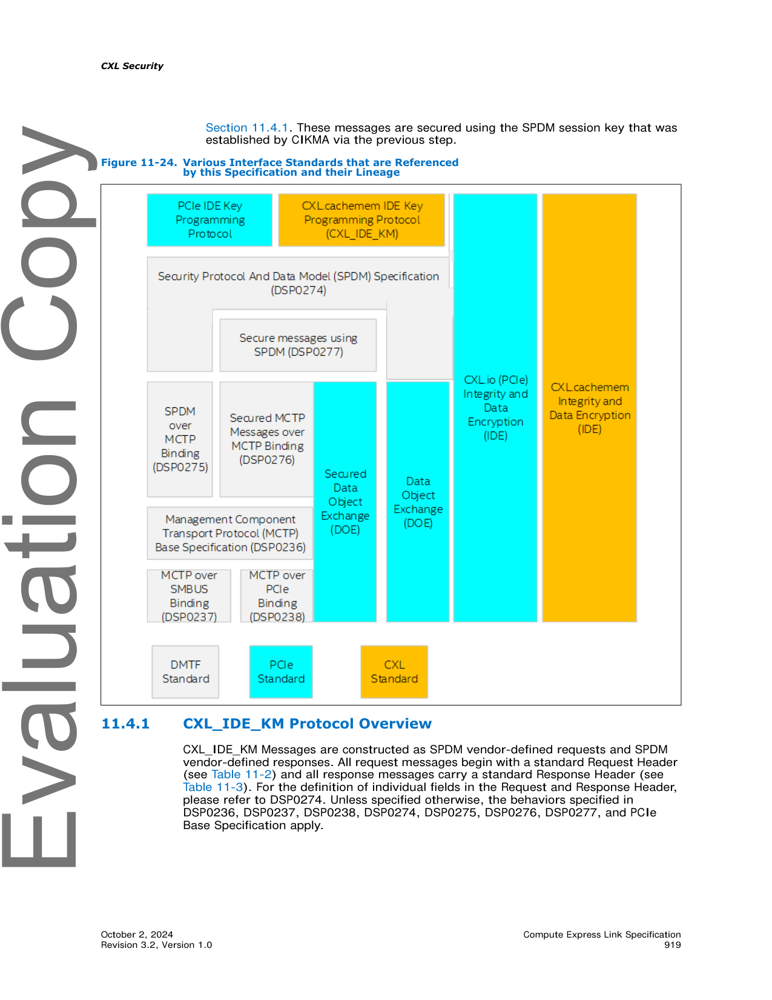
>
> *Original page render @ 150 DPI* — [📄 Full size](figures/chapter_11/page_0919.png)

<table>
<thead>
<tr>
<th width="50%">🇬🇧 English</th>
<th width="50%" style="background-color:#e8e8e8">🇨🇳 中文</th>
</tr>
</thead>
<tbody>
<tr><td>CXL_IDE_KM Messages shall be confidentiality and integrity protected in accordance with DSP0277. These secured messages may be sent over a variety of transports, including Secured CMA/SPDM Messages over DOE (see PCIe Base Specification) or Secured Messages over MCTP (see DSP0276).</td><td style="background-color:#e8e8e8">CXL_IDE_KM 消息应按照 DSP0277 进行机密性和完整性保护。这些受保护的消息可以通过各种传输发送，包括通过 DOE 的安全 CMA/SPDM 消息（见 PCIe 基础规范）或通过 MCTP 的安全消息（见 DSP0276）。</td></tr>
<tr><td>All CXL.cachemem IDE-capable CXL Switches and Endpoints shall support CMA/SPDM and Secured CMA/SPDM Data Object types over PCIe DOE mailbox. The specific rules regarding the placement of the DOE mailbox are governed by PCIe Base Specification. These data object types are defined in PCIe Base Specification. All CXL.cachemem IDE-capable switches and devices shall support CXL_IDE_KM protocol and CXL_IDE_KM being sent as Secured CMA/SPDM Data Objects.</td><td style="background-color:#e8e8e8">所有支持 CXL.cachemem IDE 的 CXL 交换机和端点应支持通过 PCIe DOE 邮箱的 CMA/SPDM 和安全 CMA/SPDM 数据对象类型。有关 DOE 邮箱放置的具体规则由 PCIe 基础规范管理。这些数据对象类型在 PCIe 基础规范中定义。所有支持 CXL.cachemem IDE 的交换机和设备应支持 CXL_IDE_KM 协议和作为安全 CMA/SPDM 数据对象发送的 CXL_IDE_KM。</td></tr>
<tr><td>CXL.cachemem IDE-capable switches and devices may optionally support CXL_IDE_KM messages over MCTP.</td><td style="background-color:#e8e8e8">支持 CXL.cachemem IDE 的交换机和设备可以选择通过 MCTP 支持 CXL_IDE_KM 消息。</td></tr>
<tr><td>The maximum amount of time that the Responder has to provide a response to a CXL_IDE_KM request is 1 second. The requester shall wait for 1 second plus the transport-specific, round-trip transport delay prior to concluding that the request resulted in an error.</td><td style="background-color:#e8e8e8">响应者对 CXL_IDE_KM 请求提供响应的最长时间为 1 秒。请求者应等待 1 秒加上特定于传输的往返传输延迟，然后再得出请求导致错误的结论。</td></tr>
</tbody>
</table>

[⬆️ 返回目录](#-本章目录)

### 11.4.2 Secure Messaging Layer Rules | 安全消息层规则

<table>
<thead>
<tr>
<th width="50%">🇬🇧 English</th>
<th width="50%" style="background-color:#e8e8e8">🇨🇳 中文</th>
</tr>
</thead>
<tbody>
<tr><td>CXL_IDE_KM messages shall not be issued before an SPDM secure session has been established between the two ports. Any CXL_IDE_KM messages that are not secured shall be silently dropped by the receiver. The first CXL_IDE_KM request message after the SPDM secure session setup shall be CXL_QUERY.</td><td style="background-color:#e8e8e8">在两个端口之间建立 SPDM 安全会话之前，不应发出 CXL_IDE_KM 消息。任何未受保护的 CXL_IDE_KM 消息都应被接收器静默丢弃。在 SPDM 安全会话建立之后的第一个 CXL_IDE_KM 请求消息应为 CXL_QUERY。</td></tr>
<tr><td>After a successful response to CXL_QUERY, this SPDM session may be used to establish a CXL.cachemem IDE Stream. While this SPDM Session is in progress, any CXL_IDE_KM messages received using a different Session ID shall be silently dropped and shall not generate a CXL_IDE_KM response. Any CXL_IDE_KM messages that fail integrity check shall be silently dropped and shall not generate a CXL_IDE_KM response. The act of terminating this SPDM Session or establishment of a different SPDM Secure session by themselves shall not affect the state of the CXL.cachemem IDE stream.</td><td style="background-color:#e8e8e8">在成功响应 CXL_QUERY 之后，此 SPDM 会话可用于建立 CXL.cachemem IDE 流。在此 SPDM 会话进行期间，使用不同会话 ID 接收的任何 CXL_IDE_KM 消息都应被静默丢弃，且不应生成 CXL_IDE_KM 响应。完整性检查失败的任何 CXL_IDE_KM 消息都应被静默丢弃，且不应生成 CXL_IDE_KM 响应。终止此 SPDM 会话或建立不同的 SPDM 安全会话本身不应影响 CXL.cachemem IDE 流的状态。</td></tr>
<tr><td>If SPDM Session S1 is used to establish a CXL.cachemem IDE Stream I1, termination of SPDM Session S1 followed by receipt of any valid CXL_IDE_KM message with a new Session S2 shall transition CXL.cachemem IDE Stream I1 to Insecure State. The transition shall occur prior to processing the newly received CXL_IDE_KM message unless the receiver can ensure, via mechanisms not defined here, that S1 and S2 were set up by the same entity; otherwise, the receiver drops the CXL_IDE_KM message with a new Session S2. If the CXL.cachemem IDE stream enters Insecure State due to this condition, the receiver shall set the Rx Error Status field in the CXL IDE Error Status register (see Section 8.2.4.22.4) to CXL.cachemem IDE Establishment Security error.</td><td style="background-color:#e8e8e8">如果使用 SPDM 会话 S1 建立 CXL.cachemem IDE 流 I1，则终止 SPDM 会话 S1 后接收到具有新会话 S2 的任何有效 CXL_IDE_KM 消息应将 CXL.cachemem IDE 流 I1 转换为不安全状态。转换应在处理新接收的 CXL_IDE_KM 消息之前发生，除非接收器能通过此未定义的机制确保 S1 和 S2 由同一实体建立；否则，接收器丢弃具有新会话 S2 的 CXL_IDE_KM 消息。如果 CXL.cachemem IDE 流由于此条件进入不安全状态，则接收器应将 CXL IDE 错误状态寄存器（第 8.2.4.22.4 节）中的 Rx 错误状态字段设置为 CXL.cachemem IDE 建立安全错误。</td></tr>
<tr><td>It is permitted for a single DOE mailbox instance be used to service CXL_IDE_KM messages as well as CXL.io IDE_KM messages. It is permitted for a single SPDM session be used to set up CXL.io IDE stream as well as CXL.cachemem IDE stream with a component. The operation and the establishment of CXL.cachemem IDE stream is independent of the operation and establishment of CXL.io IDE stream. It is permitted for a component to support CXL.io IDE but not CXL.cachemem IDE, and vice versa. If a component supports both CXL.io IDE and CXL.cachemem IDE, it may be operated in a mode where only one of the two is active. It is permitted for CXL_IDE_KM messages to be interleaved with IDE_KM messages. CIKMA shall ensure there is at most one outstanding SPDM request of any kind at any time in accordance with DSP0274.</td><td style="background-color:#e8e8e8">允许使用单个 DOE 邮箱实例为 CXL_IDE_KM 消息和 CXL.io IDE_KM 消息提供服务。允许使用单个 SPDM 会话设置 CXL.io IDE 流以及与组件的 CXL.cachemem IDE 流。CXL.cachemem IDE 流的操作和建立独立于 CXL.io IDE 流的操作和建立。允许组件支持 CXL.io IDE 但不支持 CXL.cachemem IDE，反之亦然。如果组件同时支持 CXL.io IDE 和 CXL.cachemem IDE，则它可以以仅其中一个活动的模式运行。允许 CXL_IDE_KM 消息与 IDE_KM 消息交错。CIKMA 应根据 DSP0274 确保任何时候最多只有一个未完成的 SPDM 请求。</td></tr>
</tbody>
</table>

[⬆️ 返回目录](#-本章目录)

### 11.4.3 CXL_IDE_KM Common Data Structures | CXL_IDE_KM 通用数据结构

<table>
<thead>
<tr>
<th width="50%">🇬🇧 English</th>
<th width="50%" style="background-color:#e8e8e8">🇨🇳 中文</th>
</tr>
</thead>
<tbody>
<tr><td>For consistency and reuse reasons, the names of the individual messages follow PCIe Base Specification except for the addition of the prefix CXL, and the message contents closely match PCIe Base Specification.</td><td style="background-color:#e8e8e8">出于一致性和重用性的原因，各个消息的名称遵循 PCIe 基础规范，但添加了前缀 CXL，并且消息内容与 PCIe 基础规范非常接近。</td></tr>
<tr><td>Unless specified otherwise, all fields are defined as little-endian.</td><td style="background-color:#e8e8e8">除非另有规定，否则所有字段均定义为小端字节序。</td></tr>
<tr><td>Please refer to DSP0274 for definitions of the fields in the CXL_IDE_KM Request header and Response header.</td><td style="background-color:#e8e8e8">有关 CXL_IDE_KM 请求头和响应头中字段的定义，请参阅 DSP0274。</td></tr>
<tr><td>Table 11-4 lists the various generic error conditions that a responder may encounter during the processing of CXL_IDE_KM messages and how the conditions are handled.</td><td style="background-color:#e8e8e8">表 11-4 列出了响应者在处理 CXL_IDE_KM 消息期间可能遇到的各种通用错误条件以及如何处理这些条件。</td></tr>
</tbody>
</table>

**Table 11-2. CXL_IDE_KM Request Header (CXL_IDE_KM 请求头)** — page 921

<table>
<thead>
<tr><th>Byte Offset</th><th>Length in Bytes</th><th>Description</th><th style="background-color:#e8e8e8">中文描述</th></tr>
</thead>
<tbody>
<tr><td>0h</td><td>1</td><td>SPDMVersion</td><td style="background-color:#e8e8e8">SPDM 版本</td></tr>
<tr><td>1h</td><td>1</td><td>RequestResponseCode: Value is 0FEh (VENDOR_DEFINED_REQUEST).</td><td style="background-color:#e8e8e8">请求响应代码：值为 0FEh（VENDOR_DEFINED_REQUEST）。</td></tr>
<tr><td>2h</td><td>1</td><td>Reserved</td><td style="background-color:#e8e8e8">保留</td></tr>
<tr><td>3h</td><td>1</td><td>Reserved</td><td style="background-color:#e8e8e8">保留</td></tr>
<tr><td>4h</td><td>2</td><td>StandardsID: Value is 03h (PCI-SIG), indicating that the Vendor ID is assigned by the PCI-SIG.</td><td style="background-color:#e8e8e8">标准 ID：值为 03h（PCI-SIG），表示 Vendor ID 由 PCI-SIG 分配。</td></tr>
<tr><td>6h</td><td>1</td><td>Length of Vendor ID: Value is 02h.</td><td style="background-color:#e8e8e8">Vendor ID 长度：值为 02h。</td></tr>
<tr><td>7h</td><td>2</td><td>Vendor ID: Value is 1E98h (CXL).</td><td style="background-color:#e8e8e8">Vendor ID：值为 1E98h（CXL）。</td></tr>
<tr><td>9h</td><td>2</td><td>Request Length: The number of bytes in the message that follow this field. Varies based on the operation that is being requested.</td><td style="background-color:#e8e8e8">请求长度：此字段之后的消息字节数。根据所请求的操作而变化。</td></tr>
</tbody>
</table>

**Table 11-3. CXL_IDE_KM Successful Response Header (CXL_IDE_KM 成功响应头)** — page 921

<table>
<thead>
<tr><th>Byte Offset</th><th>Length in Bytes</th><th>Description</th><th style="background-color:#e8e8e8">中文描述</th></tr>
</thead>
<tbody>
<tr><td>0h</td><td>1</td><td>SPDMVersion</td><td style="background-color:#e8e8e8">SPDM 版本</td></tr>
<tr><td>1h</td><td>1</td><td>RequestResponseCode: Value is 07Eh (VENDOR_DEFINED_RESPONSE).</td><td style="background-color:#e8e8e8">请求响应代码：值为 07Eh（VENDOR_DEFINED_RESPONSE）。</td></tr>
<tr><td>2h</td><td>1</td><td>Reserved</td><td style="background-color:#e8e8e8">保留</td></tr>
<tr><td>3h</td><td>1</td><td>Reserved</td><td style="background-color:#e8e8e8">保留</td></tr>
<tr><td>4h</td><td>2</td><td>StandardsID: Value is 03h (PCI-SIG), indicating that the Vendor ID is assigned by the PCI-SIG.</td><td style="background-color:#e8e8e8">标准 ID：值为 03h（PCI-SIG），表示 Vendor ID 由 PCI-SIG 分配。</td></tr>
<tr><td>6h</td><td>1</td><td>Length of Vendor ID: Value is 02h.</td><td style="background-color:#e8e8e8">Vendor ID 长度：值为 02h。</td></tr>
<tr><td>7h</td><td>2</td><td>Vendor ID: Value is 1E98h (CXL).</td><td style="background-color:#e8e8e8">Vendor ID：值为 1E98h（CXL）。</td></tr>
<tr><td>9h</td><td>2</td><td>Response Length: The number of bytes in the message that follow this field. Varies based on the operation that was requested.</td><td style="background-color:#e8e8e8">响应长度：此字段之后的消息字节数。根据所请求的操作而变化。</td></tr>
</tbody>
</table>

**Table 11-4. CXL_IDE_KM Generic Error Conditions (CXL_IDE_KM 通用错误条件)** — page 921

<table>
<thead>
<tr><th>Error Condition</th><th>Response</th><th>Effect on an Active CXL.cachemem IDE Stream</th></tr>
</thead>
<tbody>
<tr><td>CXL_IDE_KM message carries an Object ID that is not defined in this specification</td><td>No response is generated. The request is silently dropped.</td><td>No change</td></tr>
<tr><td>Unrecognized SPDM major version</td><td>No response is generated. The request is silently dropped.</td><td>No change</td></tr>
<tr><td>Invalid Request Length</td><td>No response is generated. The request is silently dropped.</td><td>No change</td></tr>
<tr><td>Reserved bits or fields set to non-zero values</td><td>No response is generated. The request is silently dropped.</td><td>No change</td></tr>
</tbody>
</table>

[⬆️ 返回目录](#-本章目录)

