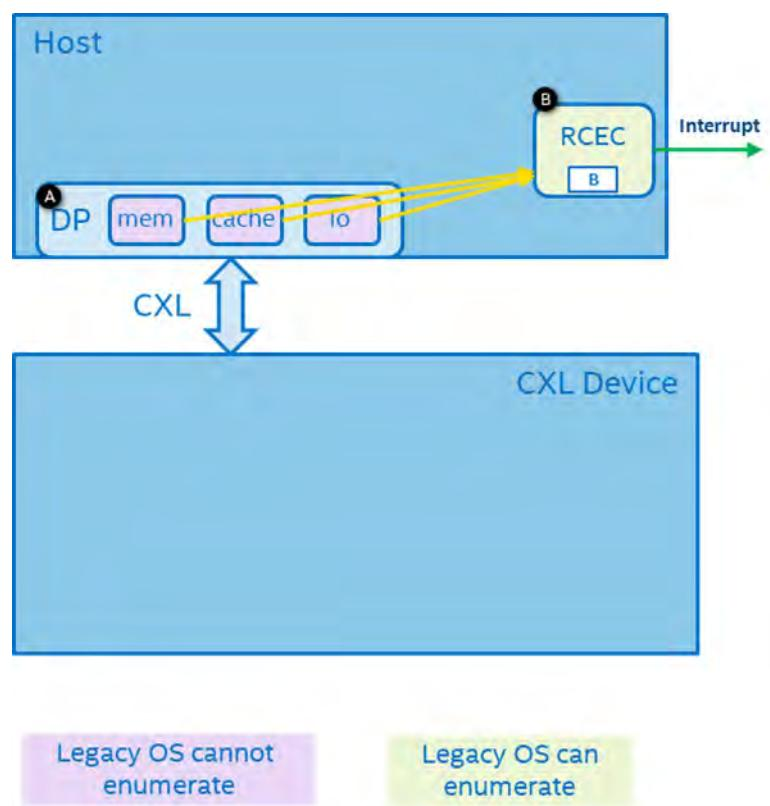
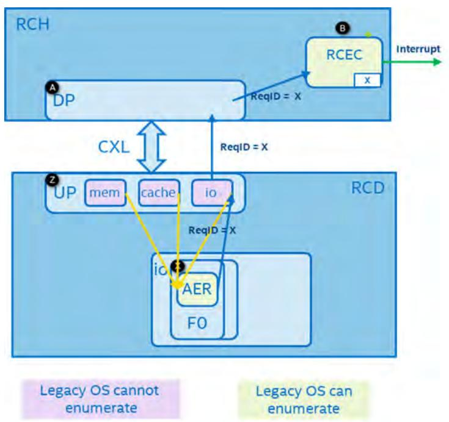
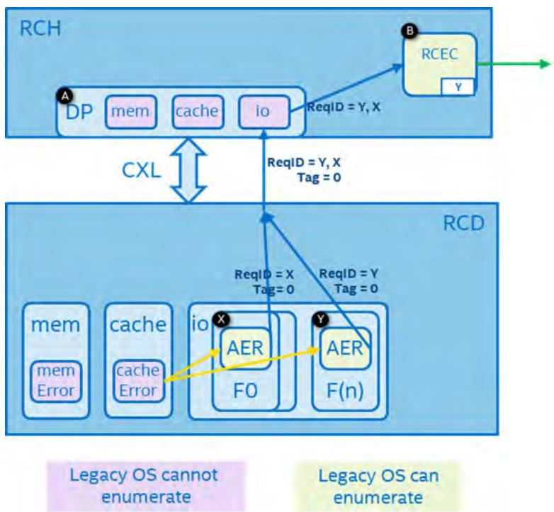
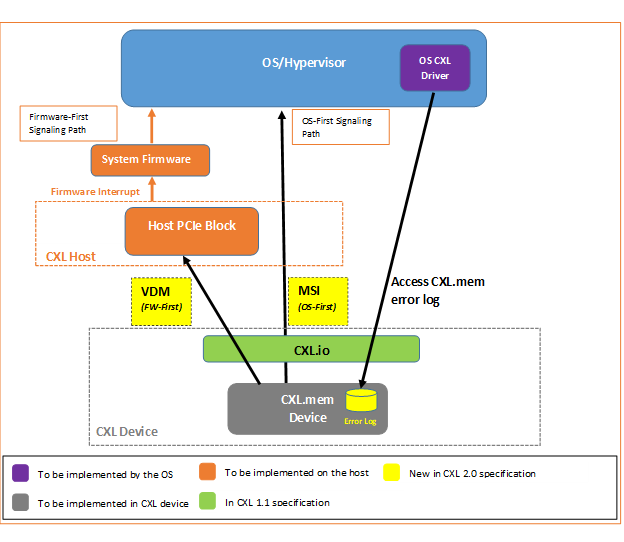

# 📘 第 12 章　可靠性、可用性与可服务性 (Chapter 12. Reliability, Availability, and Serviceability)

> **Source pages**: 998–1010 | **File**: chapter_12.md | **Format**: 中英对照双语

---

## 📑 本章目录

- [12.0 Reliability, Availability, and Serviceability | 可靠性、可用性与可服务性](#sec-12-0)
- [12.1 Supported RAS Features | 支持的 RAS 特性](#sec-12-1)
- [12.2 CXL Error Handling | CXL 错误处理](#sec-12-2)
  - [12.2.1 Protocol and Link Layer Error Reporting | 协议层与链路层错误报告](#sec-12-2-1)
    - [12.2.1.1 RCH Downstream Port-detected Errors | RCH 下游端口检测到的错误](#sec-12-2-1-1)
    - [12.2.1.2 RCD Upstream Port-detected Errors | RCD 上游端口检测到的错误](#sec-12-2-1-2)
    - [12.2.1.3 RCD RCiEP-detected Errors | RCD RCiEP 检测到的错误](#sec-12-2-1-3)
    - [12.2.1.4 Header Log and Handling of Multiple Errors | Header Log 与多错误处理](#sec-12-2-1-4)
  - [12.2.2 CXL Root Ports, Downstream Switch Ports, and Upstream Switch Ports | CXL 根端口、下游交换端口与上游交换端口](#sec-12-2-2)
  - [12.2.3 CXL Device Error Handling | CXL 设备错误处理](#sec-12-2-3)
    - [12.2.3.1 CXL.cache and CXL.mem Errors | CXL.cache 与 CXL.mem 错误](#sec-12-2-3-1)
    - [12.2.3.2 Memory Error Logging and Signaling Enhancements | 内存错误记录与信令增强](#sec-12-2-3-2)
    - [12.2.3.3 CXL Device Error Handling Flows | CXL 设备错误处理流程](#sec-12-2-3-3)
  - [12.3 Isolation on CXL.cache and CXL.mem | CXL.cache 与 CXL.mem 上的隔离](#sec-12-3)
    - [12.3.1 CXL.cache Transaction Layer Behavior during Isolation | 隔离期间 CXL.cache 事务层行为](#sec-12-3-1)
    - [12.3.2 CXL.mem Transaction Layer Behavior during Isolation | 隔离期间 CXL.mem 事务层行为](#sec-12-3-2)
  - [12.4 CXL Viral Handling | CXL Viral 处理](#sec-12-4)
    - [12.4.1 Switch Considerations | 交换机相关考量](#sec-12-4-1)
    - [12.4.2 Device Considerations | 设备相关考量](#sec-12-4-2)
  - [12.5 Maintenance | 维护](#sec-12-5)
  - [12.6 CXL Error Injection | CXL 错误注入](#sec-12-6)

## 🖼 本章图表

| Figure | 英文标题 | 中文标题 | 页码 |
|---|---|---|---|
| Figure 12-1 | RCH Downstream Port Detects Error | RCH 下游端口检测到错误 | 999 |
| Figure 12-2 | RCD Upstream Port Detects Error | RCD 上游端口检测到错误 | 1000 |
| Figure 12-3 | RCD RCiEP Detects Error | RCD RCiEP 检测到错误 | 1002 |
| Figure 12-4 | CXL Memory Error Reporting Enhancements | CXL 内存错误报告增强 | 1005 |

## 📊 本章表格

| Table | 英文标题 | 中文标题 | 页码 |
|---|---|---|---|
| Table 12-1 | CXL RAS Features | CXL RAS 特性 | 998 |
| Table 12-2 | Device-specific Error Reporting and Nomenclature Guidelines | 设备专用错误报告与命名规范指南 | 1004 |

---

## 12.0 Reliability, Availability, and Serviceability | 可靠性、可用性与可服务性

<table>
<thead>
<tr>
<th width="50%">🇬🇧 English</th>
<th width="50%" style="background-color:#e8e8e8">🇨🇳 中文</th>
</tr>
</thead>
<tbody>
<tr><td>CXL RAS capabilities are built on top of PCIe*. Additional capabilities are introduced to address cache coherency and memory as listed below.</td><td style="background-color:#e8e8e8">CXL 的 RAS (Reliability, Availability, and Serviceability, 可靠性、可用性与可服务性) 能力构建于 PCIe* 之上。为了应对缓存一致性与内存相关问题，引入了如下额外的功能。</td></tr>
</tbody>
</table>

[⬆️ 返回目录](#-本章目录)

---

## 12.1 Supported RAS Features | 支持的 RAS 特性

<table>
<thead>
<tr>
<th width="50%">🇬🇧 English</th>
<th width="50%" style="background-color:#e8e8e8">🇨🇳 中文</th>
</tr>
</thead>
<tbody>
<tr><td>Table 12-1 lists the RAS features supported by CXL and their applicability to CXL.io vs. CXL.cache and CXL.mem.</td><td style="background-color:#e8e8e8">Table 12-1 列出了 CXL 所支持的 RAS 特性，以及它们在 CXL.io 与 CXL.cache/CXL.mem 中的适用性。</td></tr>
</tbody>
</table>

<table>
<thead>
<tr>
<th>Feature (特性)</th>
<th>CXL.io</th>
<th>CXL.cache and CXL.mem</th>
</tr>
</thead>
<tbody>
<tr><td>Link CRC and Retry (链路 CRC 与重试)</td><td>Required (必选)</td><td>Required (必选)</td></tr>
<tr><td>Link Retraining and Recovery (链路重训练与恢复)</td><td>Required (必选)</td><td>Required (必选)</td></tr>
<tr><td>eDPC</td><td>Optional (可选)</td><td>Leverage CXL.io capability (复用 CXL.io 能力) CXL.cache 或 CXL.mem 错误可通过 ERR_FATAL 或 ERR_NONFATAL 进行上报，并可能触发 eDPC</td></tr>
<tr><td>ECRC</td><td>Optional (可选)</td><td>N/A (不适用)</td></tr>
<tr><td>Hot-Plug (热插拔)</td><td>Not Supported in RCD mode (RCD 模式下不支持) Managed Hot-Plug is supported in CXL VH mode (在 CXL VH 模式下支持受控热插拔)</td><td>Same as CXL.io (与 CXL.io 相同)</td></tr>
<tr><td>Data Poisoning (数据污染)</td><td>Required (必选)</td><td>Required (必选)</td></tr>
<tr><td>CXL Isolation (CXL 隔离)</td><td>N/A (不适用)</td><td>Optional (可选, 参见 Section 12.3)</td></tr>
<tr><td>Viral (病毒式传播)</td><td>N/A (不适用)</td><td>Required (必选, 参见 Section 12.4)</td></tr>
</tbody>
</table>

> **Table 12-1.** CXL RAS Features ｜ CXL RAS 特性
>
> *Original page render @ 150 DPI* — [📄 Full size](figures/chapter_12/page_0998.png)

[⬆️ 返回目录](#-本章目录)

---

## 12.2 CXL Error Handling | CXL 错误处理

<table>
<thead>
<tr>
<th width="50%">🇬🇧 English</th>
<th width="50%" style="background-color:#e8e8e8">🇨🇳 中文</th>
</tr>
</thead>
<tbody>
<tr><td>CXL Error handling can be subdivided into two parts:</td><td style="background-color:#e8e8e8">CXL 错误处理可划分为两部分：</td></tr>
<tr><td>• Link and Protocol Errors, which apply to the CXL component-to-component communication mechanism. These include errors detected by CXL.cache and CXL.mem protocol logic. This is further described in Section 12.2.1 and Section 12.2.2.</td><td style="background-color:#e8e8e8">• 链路与协议错误 (Link and Protocol Errors)，适用于 CXL 组件之间的通信机制。这包括由 CXL.cache 和 CXL.mem 协议逻辑检测到的错误。该部分将在 Section 12.2.1 和 Section 12.2.2 中进一步描述。</td></tr>
<tr><td>• Device Errors, which apply exclusively to the device itself. This is further described in Section 12.2.3.</td><td style="background-color:#e8e8e8">• 设备错误 (Device Errors)，仅适用于设备自身。该部分将在 Section 12.2.3 中进一步描述。</td></tr>
</tbody>
</table>

[⬆️ 返回目录](#-本章目录)

---

## 12.2.1 Protocol and Link Layer Error Reporting | 协议层与链路层错误报告

<table>
<thead>
<tr>
<th width="50%">🇬🇧 English</th>
<th width="50%" style="background-color:#e8e8e8">🇨🇳 中文</th>
</tr>
</thead>
<tbody>
<tr><td>Protocol and Link errors are detected and communicated to the Host where the errors can be exposed and handled. Errors may also be reflected to Platform software if so configured. There are no error pins that connect CXL devices to the Host. Errors are communicated between the Host and the CXL device via messages over CXL.io.</td><td style="background-color:#e8e8e8">协议错误与链路错误被检测并上报至 Host (主机)，以便在主机端进行暴露和处理。如果进行了相应配置，错误也可反映给平台软件 (Platform software)。CXL 设备与 Host 之间没有专用的错误引脚，错误是通过 CXL.io 上的消息在 Host 与 CXL 设备之间进行通信的。</td></tr>
<tr><td>CXL Protocol and Link errors detected by components that are part of a CXL VH are escalated and reported using standard PCIe error reporting mechanisms over CXL.io as UIEs and/or CIEs. See PCIe Base Specification for details.</td><td style="background-color:#e8e8e8">由属于 CXL VH (Virtual Hierarchy, 虚拟层级) 的组件检测到的 CXL 协议与链路错误，会通过 CXL.io 上的标准 PCIe 错误上报机制作为 UIE (Uncorrectable Internal Error, 不可纠正内部错误) 和/或 CIE (Correctable Internal Error, 可纠正内部错误) 进行升级与上报。详情请参见 PCIe Base Specification。</td></tr>
<tr><td>Reporting and logging of CXL Protocol and Link errors in RCD mode is described in this section.</td><td style="background-color:#e8e8e8">RCD (Restricted CXL Device, 受限 CXL 设备) 模式下 CXL 协议与链路错误的上报与记录将在本节中描述。</td></tr>
</tbody>
</table>

[⬆️ 返回目录](#-本章目录)

---

## 12.2.1.1 RCH Downstream Port-detected Errors | RCH 下游端口检测到的错误

<table>
<thead>
<tr>
<th width="50%">🇬🇧 English</th>
<th width="50%" style="background-color:#e8e8e8">🇨🇳 中文</th>
</tr>
</thead>
<tbody>
<tr><td>RCH Downstream Port-detected CXL Protocol errors are escalated and reported via the Root Complex error-reporting mechanisms as UIEs and/or CIEs. The various signaling and logging steps are listed below and illustrated in Figure 12-1.</td><td style="background-color:#e8e8e8">由 RCH (Restricted Host, 受限主机) 下游端口检测到的 CXL 协议错误，会通过 Root Complex (RC, 根联合体) 的错误上报机制作为 UIE 和/或 CIE 进行升级与上报。具体的信令与记录步骤如下，并示于 Figure 12-1。</td></tr>
<tr><td>1. DPA CXL.io-detected errors are logged in the local AER Extended Capability in DPA RCRB. Software must ensure that the Root Port Control register in the DPA AER Extended Capability is not configured to generate interrupts.</td><td style="background-color:#e8e8e8">1. DPA (Downstream Port Assembly, 下游端口组件) 中由 CXL.io 检测到的错误会记录到 DPA RCRB (Root Complex Register Block, 根联合体寄存器块) 的本地 AER (Advanced Error Reporting, 高级错误报告) Extended Capability 中。软件必须确保 DPA AER Extended Capability 中的 Root Port Control 寄存器未被配置为产生中断。</td></tr>
<tr><td>2. DPA CXL.cache and CXL.mem log errors in the CXL RAS Capability (see Section 8.2.4.17).</td><td style="background-color:#e8e8e8">2. DPA 中由 CXL.cache 和 CXL.mem 检测到的错误会记录到 CXL RAS Capability 中 (参见 Section 8.2.4.17)。</td></tr>
<tr><td>3. DPA CXL.cache, CXL.mem, or CXL.io sends error message(s) to RCEC.</td><td style="background-color:#e8e8e8">3. DPA 中的 CXL.cache、CXL.mem 或 CXL.io 向 RCEC (Root Complex Event Collector, 根联合体事件收集器) 发送错误消息。</td></tr>
<tr><td>4. RCEC logs UIEs and/or CIEs. The RCEC Error Source Identification register shall log the RCEC's Bus, Device, and Function Numbers because the RCH Downstream Port is not associated with one.</td><td style="background-color:#e8e8e8">4. RCEC 记录 UIE 和/或 CIE。由于 RCH 下游端口不与某个具体的 Bus/Device/Function (BDF) 关联，RCEC 的 Error Source Identification 寄存器应记录 RCEC 自身的 Bus、Device 和 Function 号。</td></tr>
<tr><td>5. RCEC generates an MSI/MSI-X, if enabled.</td><td style="background-color:#e8e8e8">5. 如果使能，RCEC 产生 MSI/MSI-X 中断。</td></tr>
<tr><td>The OS error handler may begin by inspecting the RCEC AER Extended Capability and following PCIe rules to discover the error source. The RCEC Error Source Identification register is insufficient for identifying the error source. The OS error handler may rely on RDPAS structures (see Section 9.18.1.5), if present, to identify such Downstream Port(s). The Platform Software Error Handler may interrogate the Platform-specific error logs in addition to the error logs defined in PCIe Base Specification and this specification.</td><td style="background-color:#e8e8e8">OS 错误处理例程可以首先检查 RCEC 的 AER Extended Capability，并遵循 PCIe 规则来发现错误源。RCEC 的 Error Source Identification 寄存器不足以识别错误源。如果存在，OS 错误处理例程可以依赖 RDPAS (RCEC Downstream Port Association Structure, RCEC 下游端口关联结构) 结构 (参见 Section 9.18.1.5) 来识别此类 Downstream Port。Platform Software Error Handler 除了可查看 PCIe Base Specification 与本规范定义的错误日志外，还可查询平台专用 (Platform-specific) 的错误日志。</td></tr>
</tbody>
</table>

> **Figure 12-1.** RCH Downstream Port Detects Error ｜ RCH 下游端口检测到错误
>
> 
>
> *Original page render @ 150 DPI* — [📄 Full size](figures/chapter_12/page_0999.png)
>
> *Note: DP = Downstream Port.*

[⬆️ 返回目录](#-本章目录)

---

## 12.2.1.2 RCD Upstream Port-detected Errors | RCD 上游端口检测到的错误

<table>
<thead>
<tr>
<th width="50%">🇬🇧 English</th>
<th width="50%" style="background-color:#e8e8e8">🇨🇳 中文</th>
</tr>
</thead>
<tbody>
<tr><td>RCD Upstream Port-detected CXL protocol errors are also escalated and reported via the RCEC. The various signaling and logging steps are listed below and illustrated in Figure 12-2.</td><td style="background-color:#e8e8e8">由 RCD Upstream Port (上游端口) 检测到的 CXL 协议错误同样会通过 RCEC 进行升级与上报。具体的信令与记录步骤如下，并示于 Figure 12-2。</td></tr>
<tr><td>1. If a CXL.cache or CXL.mem logic block in UPZ detects a protocol or link error, the block shall log the error in the CXL RAS Capability (see Section 8.2.4.17).</td><td style="background-color:#e8e8e8">1. 如果 UPZ (Upstream Port Zone, 上游端口区域) 中的 CXL.cache 或 CXL.mem 逻辑块检测到协议或链路错误，该逻辑块应将错误记录到 CXL RAS Capability 中 (参见 Section 8.2.4.17)。</td></tr>
<tr><td>2. Upstream Port RCRB shall not implement the AER Extended Capability.</td><td style="background-color:#e8e8e8">2. Upstream Port RCRB 不应实现 AER Extended Capability。</td></tr>
<tr><td>3. UPZ sends an error message to all CXL.io Functions that are affected by this error. (This example shows a device with a single function. The message must include all the details that the CXL.io function needs for constructing an AER record.)</td><td style="background-color:#e8e8e8">3. UPZ 向受该错误影响的所有 CXL.io Function 发送错误消息。(本示例展示的是单 Function 设备。该消息必须包含 CXL.io Function 构造 AER 记录所需的全部细节。)</td></tr>
<tr><td>4. CXL.io Functions log the received message in their respective AER Extended Capability.</td><td style="background-color:#e8e8e8">4. CXL.io Function 将收到的消息记录到各自的 AER Extended Capability 中。</td></tr>
<tr><td>5. Each affected CXL.io Function sends an ERR_ message to UPZ with its own Requester ID.</td><td style="background-color:#e8e8e8">5. 每个受影响的 CXL.io Function 使用其自身的 Requester ID 向 UPZ 发送 ERR_ 消息。</td></tr>
<tr><td>6. UPZ forwards this Error message across the Link without logging.</td><td style="background-color:#e8e8e8">6. UPZ 跨链路转发该错误消息，但不进行记录。</td></tr>
<tr><td>7. DPA forwards the Error message to the RCEC.</td><td style="background-color:#e8e8e8">7. DPA 将该错误消息转发给 RCEC。</td></tr>
<tr><td>8. RCEC logs the error in the Root Error Status register and then signals an interrupt, if enabled, in accordance with PCIe Base Specification. The Error Source Identification register in the RCEC shall point to the CXL.io Function that sent the ERR_ message.</td><td style="background-color:#e8e8e8">8. RCEC 将错误记录到 Root Error Status 寄存器中，然后按 PCIe Base Specification 的规定在使能时发出中断信号。RCEC 的 Error Source Identification 寄存器应指向发出该 ERR_ 消息的 CXL.io Function。</td></tr>
</tbody>
</table>

> **Figure 12-2.** RCD Upstream Port Detects Error ｜ RCD 上游端口检测到错误
>
> 
>
> *Original page render @ 150 DPI* — [📄 Full size](figures/chapter_12/page_1000.png)
>
> *Note: UP = Upstream Port. DP = Downstream Port.*

[⬆️ 返回目录](#-本章目录)

---

## 12.2.1.3 RCD RCiEP-detected Errors | RCD RCiEP 检测到的错误

<table>
<thead>
<tr>
<th width="50%">🇬🇧 English</th>
<th width="50%" style="background-color:#e8e8e8">🇨🇳 中文</th>
</tr>
</thead>
<tbody>
<tr><td>CXL protocol errors detected by the RCD RCiEP are also escalated and reported via the RCEC. The various signaling and logging steps are listed below and illustrated in Figure 12-3.</td><td style="background-color:#e8e8e8">由 RCD RCiEP (Root Complex integrated Endpoint, 根联合体集成端点) 检测到的 CXL 协议错误同样会通过 RCEC 进行升级与上报。具体的信令与记录步骤如下，并示于 Figure 12-3。</td></tr>
<tr><td>1. CXL.cache (or CXL.mem) notifies all affected CXL.io Functions of the errors.</td><td style="background-color:#e8e8e8">1. CXL.cache (或 CXL.mem) 将错误通知给所有受影响的 CXL.io Function。</td></tr>
<tr><td>2. All affected CXL.io Functions log the UIEs and/or CIEs in their respective AER Extended Capability.</td><td style="background-color:#e8e8e8">2. 所有受影响的 CXL.io Function 将 UIE 和/或 CIE 记录到各自的 AER Extended Capability 中。</td></tr>
<tr><td>3. CXL.io Functions generate PCIe ERR_ messages on the Link with Tag = 0.</td><td style="background-color:#e8e8e8">3. CXL.io Function 在链路上生成 Tag = 0 的 PCIe ERR_ 消息。</td></tr>
<tr><td>4. DPA forwards the ERR_ messages to the RCEC.</td><td style="background-color:#e8e8e8">4. DPA 将 ERR_ 消息转发给 RCEC。</td></tr>
<tr><td>5. RCEC logs the errors in the Root Error Status register and then generates an MSI/MSI-X, if enabled, in accordance with PCIe Base Specification.</td><td style="background-color:#e8e8e8">5. RCEC 将错误记录到 Root Error Status 寄存器中，然后按 PCIe Base Specification 的规定在使能时产生 MSI/MSI-X 中断。</td></tr>
</tbody>
</table>

> **Figure 12-3.** RCD RCiEP Detects Error ｜ RCD RCiEP 检测到错误
>
> 
>
> *Original page render @ 150 DPI* — [📄 Full size](figures/chapter_12/page_1001.png)
>
> *Note: DP = Downstream Port.*

[⬆️ 返回目录](#-本章目录)

---

## 12.2.1.4 Header Log and Handling of Multiple Errors | Header Log 与多错误处理

<table>
<thead>
<tr>
<th width="50%">🇬🇧 English</th>
<th width="50%" style="background-color:#e8e8e8">🇨🇳 中文</th>
</tr>
</thead>
<tbody>
<tr><td>Unmasked CXL protocol and link errors are captured in the Uncorrectable Error Status register and the Correctable Error Status register (see Section 8.2.4.17.1 and Section 8.2.4.17.4, respectively). In the scenarios where multiple bits are set in the Uncorrectable Error Status register, the First Error Pointer field in the Error Capabilities and Control register (see Section 8.2.4.17.6), if valid, points to the first uncorrectable error that was captured. The First Error Pointer is valid if the associated bit of the Uncorrectable Error Status register is set. Otherwise, it is invalid. By definition, First Error Pointer is considered invalid if bit 5 of that field is set to 1. For certain uncorrectable errors, the specification requires that the component capture part of the message header, called Error Header, in the Header Log register. Section 8.2.4.17.1 defines the format of the Error Header for each error.</td><td style="background-color:#e8e8e8">未被屏蔽的 CXL 协议与链路错误会同时被捕获到 Uncorrectable Error Status 寄存器和 Correctable Error Status 寄存器中 (分别参见 Section 8.2.4.17.1 和 Section 8.2.4.17.4)。在 Uncorrectable Error Status 寄存器中存在多个 bit 被置位的场景下，Error Capabilities and Control 寄存器 (参见 Section 8.2.4.17.6) 中的 First Error Pointer 字段 (如果有效) 会指向被捕获到的第一个不可纠正错误。First Error Pointer 在 Uncorrectable Error Status 寄存器中对应 bit 被置位时为有效，否则为无效。根据定义，如果该字段的 bit 5 被置 1，则 First Error Pointer 被视为无效。对于某些不可纠正错误，规范要求组件将消息头的一部分 (称为 Error Header) 记录到 Header Log 寄存器中。Section 8.2.4.17.1 定义了每种错误的 Error Header 格式。</td></tr>
<tr><td>If the Multiple_Header_Recording_Capability bit in the Error Capabilities and Control register (see Section 8.2.4.17.6) is set, the component is capable of recording multiple Error Headers in the order in which they are detected. If header logging resources are unavailable when an unmasked uncorrectable error is detected, the corresponding error status bit is set to 1; however, the Error Header is not recorded in the Header Log register. After software has consumed the error to which the First Error Pointer points, software writes 1 to the corresponding error status bit to indicate that. The error status bit may remain set if there was another occurrence of the same error. If any bit in the Uncorrectable Error Status register remains set after this software action, the component must atomically update the Header Log register and the First Error Pointer to point to the next recorded error. If no other error is recorded, the component shall update the First Error Pointer to an invalid value. If Multiple_Header_Recording_Capability=1, it is recommended that software not clear the Status bit other than the one pointed to by the First Error Pointer. If software violates this condition, the state of the Header Log register in the presence of other recorded errors is undefined.</td><td style="background-color:#e8e8e8">如果 Error Capabilities and Control 寄存器 (参见 Section 8.2.4.17.6) 中的 Multiple_Header_Recording_Capability bit 被置位，则组件能够按照错误检测到的顺序记录多个 Error Header。当检测到未被屏蔽的不可纠正错误时若没有可用的 Header 记录资源，则对应的错误状态 bit 会被置 1，但 Error Header 不会被记录到 Header Log 寄存器中。在软件处理完 First Error Pointer 所指向的错误后，软件会向对应的错误状态 bit 写 1 以示确认。如果同一错误再次发生，则错误状态 bit 可能仍然保持置位。如果在软件完成该操作之后 Uncorrectable Error Status 寄存器中仍有任何 bit 处于置位状态，则组件必须以原子方式更新 Header Log 寄存器和 First Error Pointer，使其指向下一个被记录的错误。如果没有其他错误被记录，组件应将 First Error Pointer 更新为无效值。当 Multiple_Header_Recording_Capability=1 时，建议软件不要清除 First Error Pointer 所指 bit 之外的 Status bit。如果软件违反了该条件，则在其他错误已被记录的情况下，Header Log 寄存器的状态是未定义的 (undefined)。</td></tr>
</tbody>
</table>

[⬆️ 返回目录](#-本章目录)

---

## 12.2.2 CXL Root Ports, Downstream Switch Ports, and Upstream Switch Ports | CXL 根端口、下游交换端口与上游交换端口

<table>
<thead>
<tr>
<th width="50%">🇬🇧 English</th>
<th width="50%" style="background-color:#e8e8e8">🇨🇳 中文</th>
</tr>
</thead>
<tbody>
<tr><td>CXL protocol errors detected by CXL root ports, DSPs, and USPs are escalated and reported using PCIe error-reporting mechanisms as UIEs and/or CIEs. It is strongly recommended that CXL.cachemem protocol errors that are detected by a CXL root port be logged as CIEs or UIEs in the root port's AER Extended Capability. The Error Source Identification register logs the Bus, Device, and Function Numbers of the Root Port itself. If the CXL.cachemem protocol errors detected by a CXL root port are logged as CIEs or UIEs in an RCEC's AER Extended Capability, it is recommended that the System Firmware populate an RDPAS record (see Section 9.18.1.5) to establish the association between the RCEC and the root port.</td><td style="background-color:#e8e8e8">由 CXL Root Port (根端口)、DSP (Downstream Switch Port, 下游交换端口) 和 USP (Upstream Switch Port, 上游交换端口) 检测到的 CXL 协议错误，会通过 PCIe 错误上报机制作为 UIE 和/或 CIE 进行升级与上报。强烈建议将 CXL 根端口检测到的 CXL.cachemem 协议错误作为 CIE 或 UIE 记录到该根端口的 AER Extended Capability 中。Error Source Identification 寄存器记录 Root Port 自身的 Bus、Device 和 Function 号。如果 CXL 根端口检测到的 CXL.cachemem 协议错误被作为 CIE 或 UIE 记录到 RCEC 的 AER Extended Capability 中，建议由 System Firmware (系统固件) 生成一条 RDPAS 记录 (参见 Section 9.18.1.5)，以建立 RCEC 与该根端口之间的关联。</td></tr>
<tr><td>The OS error handler may begin by inspecting the Root Port AER Extended Capability and follow PCIe rules to discover the error source. The Platform Software Error Handler may interrogate the Platform-specific error logs in addition to the error logs defined in PCIe Base Specification and this specification.</td><td style="background-color:#e8e8e8">OS 错误处理例程可以首先检查 Root Port 的 AER Extended Capability，并遵循 PCIe 规则来发现错误源。Platform Software Error Handler 除了可查看 PCIe Base Specification 与本规范定义的错误日志外，还可查询平台专用 (Platform-specific) 的错误日志。</td></tr>
<tr><td>If the CXL.cachemem errors are logged in an RCEC and the CEDT includes RDPAS structures (see Section 9.18.1.5) that reference the RCEC, the OS handler may consult those RDPAS structures to locate the CXL root port that is the error source.</td><td style="background-color:#e8e8e8">如果 CXL.cachemem 错误被记录在某个 RCEC 中，并且 CEDT (CXL Early Discovery Table, CXL 早期发现表) 包含引用该 RCEC 的 RDPAS 结构 (参见 Section 9.18.1.5)，则 OS 处理例程可以查阅这些 RDPAS 结构以定位作为错误源的 CXL Root Port。</td></tr>
</tbody>
</table>

[⬆️ 返回目录](#-本章目录)

---

## 12.2.3 CXL Device Error Handling | CXL 设备错误处理

<table>
<thead>
<tr>
<th width="50%">🇬🇧 English</th>
<th width="50%" style="background-color:#e8e8e8">🇨🇳 中文</th>
</tr>
</thead>
<tbody>
<tr><td>Whenever a CXL device returns data that is either known to be bad or suspect, the device must ensure that the consumer of the data is made aware of the nature of the data, either at the time of consumption or prior to data consumption. This allows the consumer to take appropriate containment action.</td><td style="background-color:#e8e8e8">无论何时，只要 CXL 设备返回的数据已知是错误的或可疑的，设备就必须确保数据的消费方在该数据被使用之时或之前知晓该数据的性质。这样消费方才能采取适当的遏制措施。</td></tr>
<tr><td>CXL defines two containment mechanisms - poison and viral:</td><td style="background-color:#e8e8e8">CXL 定义了两种遏制机制：poison (污染) 和 viral (病毒式传播)：</td></tr>
<tr><td>• Poison: Return data on CXL.io and CXL.cachemem may be tagged as poisoned.</td><td style="background-color:#e8e8e8">• Poison：通过 CXL.io 和 CXL.cachemem 返回的数据可以被标记为 poisoned (已污染)。</td></tr>
<tr><td>• Viral: CXL.cachemem supports viral, which is mainly used to indicate more-severe error conditions at the device (see Section 12.4). Any data returned by a device on CXL.cachemem after the device has communicated Viral is considered suspect, even if the data is not explicitly poisoned.</td><td style="background-color:#e8e8e8">• Viral：CXL.cachemem 支持 viral 机制，主要用于指示设备端出现的更严重错误状况 (参见 Section 12.4)。设备在 CXL.cachemem 上传达 Viral 之后通过 CXL.cachemem 返回的任何数据，都将被视为可疑数据，即使该数据未被显式标记为 poisoned。</td></tr>
<tr><td>A device must set the MetaField to No-Op in the CXL.cachemem return response when the Metadata is suspect.</td><td style="background-color:#e8e8e8">当 Metadata (元数据) 可疑时，设备必须将 CXL.cachemem 返回响应中的 MetaField 字段设置为 No-Op。</td></tr>
<tr><td>If a CXL component is not in the Viral condition, the component shall poison the data message on the CXL interface whenever the data being included is known to be bad or suspect.</td><td style="background-color:#e8e8e8">如果 CXL 组件未处于 Viral 状态，则只要其发送的数据已知是错误的或可疑的，组件就应在 CXL 接口上将数据消息标记为 poisoned。</td></tr>
<tr><td>If Viral is enabled and a CXL component is in the Viral condition, it is recommended that the component not poison the subsequent data responses on the CXL.cachemem interface to avoid error pollution.</td><td style="background-color:#e8e8e8">如果 Viral 已使能且 CXL 组件处于 Viral 状态，建议组件不要对 CXL.cachemem 接口上后续的数据响应执行 poison 操作，以避免错误扩散 (error pollution)。</td></tr>
<tr><td>The Host may send poisoned data to the CXL-connected device. How the CXL device responds to Poison is device specific but must follow PCIe guidelines. The device must consciously make a decision about how to handle poisoned data. In some cases, simply ignoring poisoned data may lead to Silent Data Corruption (SDC). A CXL device is required to keep track of any poison data that the device receives on a 64-byte granularity.</td><td style="background-color:#e8e8e8">Host 可以将已被 poisoned 的数据发送给 CXL 设备。CXL 设备如何响应 Poison 属于设备特定行为，但必须遵循 PCIe 规范。设备必须有意识地决定如何处理 poisoned 数据。在某些情况下，简单地忽略 poisoned 数据可能导致静默数据损坏 (Silent Data Corruption, SDC)。CXL 设备需要按 64 字节粒度跟踪其收到的所有 poisoned 数据。</td></tr>
</tbody>
</table>

> **Figure 12-4.** CXL Memory Error Reporting Enhancements ｜ CXL 内存错误报告增强
>
> 
>
> *Original page render @ 150 DPI* — [📄 Full size](figures/chapter_12/page_1005.png)

[⬆️ 返回目录](#-本章目录)

---

## 12.2.3.1 CXL.cache and CXL.mem Errors | CXL.cache 与 CXL.mem 错误

<table>
<thead>
<tr>
<th width="50%">🇬🇧 English</th>
<th width="50%" style="background-color:#e8e8e8">🇨🇳 中文</th>
</tr>
</thead>
<tbody>
<tr><td>Any device errors that cannot be handled with Poison indication shall be signaled by the device back to the Host as messages since there are no error pins. To that end, Table 12-2 shows a summary of the error types and their mappings, and error reporting guidelines for devices that do not implement Memory Error Logging and Signaling Enhancements (see Section 12.2.3.2).</td><td style="background-color:#e8e8e8">由于没有错误引脚，任何无法通过 Poison 指示处理的设备错误都应由设备以消息的形式回传给 Host。为此，Table 12-2 给出了错误类型及其映射关系的摘要，并给出了未实现 Memory Error Logging and Signaling Enhancements 的设备的错误报告指南 (参见 Section 12.2.3.2)。</td></tr>
<tr><td>For devices that implement Memory Error Logging and Signaling Enhancements, Section 12.2.3.2 describes how memory errors are logged and signaled. Such devices should follow Table 12-2 for dealing with all non-memory errors.</td><td style="background-color:#e8e8e8">对于实现了 Memory Error Logging and Signaling Enhancements 的设备，Section 12.2.3.2 描述了内存错误如何被记录和信令。此类设备在处理所有非内存错误时也应遵循 Table 12-2。</td></tr>
<tr><td>In keeping with the standard error logging requirements, all error logs should be sticky.</td><td style="background-color:#e8e8e8">为符合标准错误记录要求，所有错误日志都应保持粘滞 (sticky)。</td></tr>
<tr><td>If demand accesses to memory result in an uncorrected data error, the CXL device must return data with poison. The requester (processor core or a peer device) is responsible for dealing with the poison indication. The CXL device should not signal an uncorrected error along with the poison. If the processor core consumes the poison, the error will be logged and signaled by the Host.</td><td style="background-color:#e8e8e8">如果对内存的需求访问 (demand access) 产生了未纠正的数据错误，CXL 设备必须返回带 poison 的数据。由请求方 (处理器核或对端设备) 负责处理该 poison 指示。CXL 设备不应在带 poison 的同时再上报未纠正错误。如果处理器核使用了带 poison 的数据，则该错误将由 Host 进行记录和信令。</td></tr>
<tr><td>Any non-demand uncorrected errors detected by a device (e.g., memory scrub logic in CXL device memory controller) that does not support the Memory Error Logging and Signaling Enhancements (see Section 12.2.3.2) will be signaled to the device driver via a device MSI or MSI-X. Any corrected memory errors will be signaled to the device driver via a device MSI or MSI-X. The driver may choose to deallocate memory pages that have repeated errors. Neither the platform firmware nor the OS directly deal with these errors. An eRCD may implement the capabilities described in Section 12.2.3.2, in which case a device driver is not required.</td><td style="background-color:#e8e8e8">设备 (例如 CXL 设备内存控制器中的内存 scrub 逻辑) 检测到的任何非需求 (non-demand) 未纠正错误，若该设备不支持 Memory Error Logging and Signaling Enhancements (参见 Section 12.2.3.2)，将通过设备的 MSI 或 MSI-X 中断上报给设备驱动。任何已纠正的内存错误也将通过设备的 MSI 或 MSI-X 上报给设备驱动。驱动可以选择回收反复出错的内存页。平台固件和 OS 都不直接处理这些错误。eRCD 可以实现 Section 12.2.3.2 中描述的能力，在这种情况下不需要设备驱动。</td></tr>
<tr><td>If a CXL component is unable to positively decode a CXL.mem address, the handling is described in Section 8.2.4.20.2. If a component does not implement HDM Decoders (see Section 8.2.4.20), the component shall drop such a write transaction and return all 1s in response to such a read transaction.</td><td style="background-color:#e8e8e8">如果 CXL 组件无法对 CXL.mem 地址进行肯定的解码 (positively decode)，其处理方式在 Section 8.2.4.20.2 中描述。如果组件未实现 HDM (Host-managed Device Memory, 主机管理设备内存) Decoder (参见 Section 8.2.4.20)，则该组件应丢弃此类写事务，并对此类读事务返回全 1。</td></tr>
</tbody>
</table>

<table>
<thead>
<tr>
<th>Error Severity (错误严重性)</th>
<th>Definition/Example (定义/示例)</th>
<th>Signaling Options (信令选项) (SW picks one)</th>
<th>Logging¹ (记录)</th>
<th>Host HW/FW/SW Response (Host 端响应)</th>
</tr>
</thead>
<tbody>
<tr><td>Corrected (已纠正)</td><td>Memory single bit error corrected via ECC (通过 ECC 纠正的内存单位错误)</td><td>MSI or MSI-X to Device driver (向设备驱动发 MSI 或 MSI-X)</td><td>Device-specific registers (设备专用寄存器)</td><td>Device-specific flow in Device driver (设备驱动中的设备专用流程)</td></tr>
<tr><td>Uncorrected Recoverable (未纠正可恢复)</td><td>UC errors from which the Device can recover, with minimal or no software help (e.g., error localized to single computation) (设备可在最少或无需软件协助下恢复的 UC 错误，例如错误局限于单次计算)</td><td>MSI or MSI-X to driver (向驱动发 MSI 或 MSI-X)</td><td>Device-specific registers (设备专用寄存器)</td><td>Device-specific flow in driver (e.g., discard results of suspect computation) (驱动中的设备专用流程，例如丢弃可疑计算的结果)</td></tr>
<tr><td rowspan="2">Uncorrected NonFatal (未纠正非致命)</td><td rowspan="2">Equivalent to PCIe UCNF, contained by the device (e.g., write failed, memory error that affects many computations) (等同于 PCIe UCNF，由设备遏制，例如写失败、影响多次计算的内存错误)</td><td>MSI or MSI-X to Device Driver (向设备驱动发 MSI 或 MSI-X)</td><td>Device-specific registers (设备专用寄存器)</td><td>Device-specific (e.g., reset affected device) flow in driver. Driver can escalate through software. (驱动中的设备专用流程，例如复位受影响的设备。驱动可通过软件进行升级处理。)</td></tr>
<tr><td>PCIe AER Internal Error (PCIe AER 内部错误)</td><td>Device-specific registers + PCIe AER (设备专用寄存器 + PCIe AER)</td><td>System FW/SW AER flow, ends in reset (系统 FW/SW AER 流程，以复位结束)</td></tr>
<tr><td rowspan="2">Uncorrected Fatal (未纠正致命)</td><td rowspan="2">Equivalent to PCIe UCF, poses containment risk (e.g., command/parity error, Power management Unit ROM error) (等同于 PCIe UCF，存在遏制风险，例如命令/奇偶校验错误、电源管理单元 ROM 错误)</td><td>PCIe AER Internal error (PCIe AER 内部错误)</td><td>Device-specific registers + PCIe AER (设备专用寄存器 + PCIe AER)</td><td>System FW/SW AER flow, ends in reset (系统 FW/SW AER 流程，以复位结束)</td></tr>
<tr><td>AER + Viral</td><td></td><td>System FW/SW Viral flow (系统 FW/SW Viral 流程)</td></tr>
</tbody>
</table>

> ¹ For CXL devices that implement memory error logging and signaling enhancements (see Section 12.2.3.2), the memory error logging and signaling mechanisms are defined by the CXL specification. (对于实现了内存错误记录和信令增强的 CXL 设备 (参见 Section 12.2.3.2)，其内存错误记录和信令机制由 CXL 规范定义。)

> **Table 12-2.** Device-specific Error Reporting and Nomenclature Guidelines ｜ 设备专用错误报告与命名规范指南
>
> *Original page render @ 150 DPI* — [📄 Full size](figures/chapter_12/page_1004.png)

[⬆️ 返回目录](#-本章目录)

---

## 12.2.3.2 Memory Error Logging and Signaling Enhancements | 内存错误记录与信令增强

<table>
<thead>
<tr>
<th width="50%">🇬🇧 English</th>
<th width="50%" style="background-color:#e8e8e8">🇨🇳 中文</th>
</tr>
</thead>
<tbody>
<tr><td>Errors in memory may be encountered during a demand access or independent of any request issued to the memory. It is important to log sufficient data about such errors to enable the use of host platform-level RAS features, such as page retirement, without dependence on a driver.</td><td style="background-color:#e8e8e8">内存错误可能在需求访问 (demand access) 过程中出现，也可能在与发往内存的任何请求无关的情况下出现。对这些错误记录充分的数据非常重要，这样就可以在不依赖驱动的情况下使用 Host 平台级 RAS 特性 (例如页面退役 (page retirement))。</td></tr>
<tr><td>In addition, general device events that are unrelated to the media, including changes in the device's health or environmental conditions detected by the device, need to be reported using the same general-event logging facility.</td><td style="background-color:#e8e8e8">此外，与介质无关的通用设备事件 (包括设备检测到的健康状况或环境条件变化) 也需要使用相同的通用事件记录机制进行上报。</td></tr>
<tr><td>Figure 12-4 illustrates a use case where the two methods of signaling supported by a CXL.mem device - VDM and MSI/MSI-X – are used by a host to implement Firmware-first and OS-first error handling.</td><td style="background-color:#e8e8e8">Figure 12-4 展示了一个用例：CXL.mem 设备所支持的两种信令方式 (VDM (Vendor-Defined Message, 厂商自定义消息) 和 MSI/MSI-X) 如何被 Host 用于实现 Firmware-first 和 OS-first 错误处理。</td></tr>
<tr><td>A CXL device that supports the Memory Error Logging and Signaling Enhancements capability must log such errors locally and expose the error log to system software via the MMIO Mailbox (see Section 8.2.9.4.3). Reading an error record from the mailbox will not automatically result in deletion of the error record on the device. An explicit clear operation is required to delete an error record from the device. To support error record access and deletion, the device shall implement the Get Event Records and Clear Event Records commands.</td><td style="background-color:#e8e8e8">支持 Memory Error Logging and Signaling Enhancements 能力的 CXL 设备必须将这些错误在本地进行记录，并通过 MMIO Mailbox (参见 Section 8.2.9.4.3) 将错误日志暴露给系统软件。从 Mailbox 中读取错误记录并不会自动导致设备上错误记录的删除。删除设备上的错误记录需要显式的 clear (清除) 操作。为支持错误记录的访问与删除，设备应实现 Get Event Records (获取事件记录) 和 Clear Event Records (清除事件记录) 命令。</td></tr>
<tr><td>Both operations must execute atomically. Furthermore, all writes or updates to the error records by the CXL.mem device must also execute atomically.</td><td style="background-color:#e8e8e8">两种操作都必须以原子方式执行。此外，CXL.mem 设备对错误记录的所有写入或更新操作也必须以原子方式执行。</td></tr>
<tr><td>Using these two operations, a host can retrieve an error record as follows:</td><td style="background-color:#e8e8e8">通过这两种操作，Host 可以按如下方式获取错误记录：</td></tr>
<tr><td>1. The host reads a number of event records using the Get Event Records command.</td><td style="background-color:#e8e8e8">1. Host 使用 Get Event Records 命令读取多条事件记录。</td></tr>
<tr><td>2. When complete, the host clears the event records from the device with the Clear Event Records command, supplying one or more event record handles to clear.</td><td style="background-color:#e8e8e8">2. 完成后，Host 使用 Clear Event Records 命令并提供一个或多个待清除的事件记录句柄 (event record handle)，将事件记录从设备上清除。</td></tr>
<tr><td>The error records will be owned by the host firmware or OS so that all logged errors are made available to the host to support platform-level RAS features.</td><td style="background-color:#e8e8e8">错误记录将由 Host 固件或 OS 拥有，以便将所有已记录的错误提供给 Host，以支持平台级 RAS 特性。</td></tr>
<tr><td>Error records stored on the CXL device must be sticky across device resets. The records must not be initialized or modified by a hot reset, an FLR, or CXL Reset (see Section 9.7). Devices that consume auxiliary power must preserve the error records when auxiliary power consumption is enabled. In these cases, the error records are neither initialized nor modified by hot reset, warm reset, or cold reset.</td><td style="background-color:#e8e8e8">存储在 CXL 设备上的错误记录必须在设备复位期间保持粘滞 (sticky)。这些记录不能被热复位 (hot reset)、FLR (Function Level Reset) 或 CXL Reset (参见 Section 9.7) 所初始化或修改。消耗辅助电源 (auxiliary power) 的设备在使能辅助电源消耗时必须保留这些错误记录。在这种情况下，热复位 (hot reset)、暖复位 (warm reset) 和冷复位 (cold reset) 既不会初始化也不会修改错误记录。</td></tr>
</tbody>
</table>

[⬆️ 返回目录](#-本章目录)

---

## 12.2.3.3 CXL Device Error Handling Flows | CXL 设备错误处理流程

<table>
<thead>
<tr>
<th width="50%">🇬🇧 English</th>
<th width="50%" style="background-color:#e8e8e8">🇨🇳 中文</th>
</tr>
</thead>
<tbody>
<tr><td>RCD errors may be sourced from a Root Port (RP) or Endpoint (RCiEP). For the purpose of differentiation, RCiEP-sourced errors shall use a tag value of 0, whereas RP-sourced errors shall use a tag of nonzero value.</td><td style="background-color:#e8e8e8">RCD 错误的来源可以是 Root Port (RP) 或 Endpoint (RCiEP)。为了加以区分，源自 RCiEP 的错误应使用 tag 值 0，而源自 RP 的错误应使用非零 tag 值。</td></tr>
<tr><td>Errors detected by the CXL device shall be communicated to the host via PCIe Error messages across the CXL.io link. Errors that are not related to a specific Function within the device (Non-Function errors) and not reported via an MSI/MSI-X are reported to the Host via PCIe error messages where the errors can be escalated to the platform.</td><td style="background-color:#e8e8e8">CXL 设备检测到的错误应通过 CXL.io 链路上 PCIe 错误消息的形式上报给 Host。设备内与特定 Function 无关的错误 (Non-Function 错误)，若未通过 MSI/MSI-X 报告，则应通过 PCIe 错误消息上报给 Host，并由其升级至平台。</td></tr>
<tr><td>The Upstream Port reports non-function errors to all EPs/RCiEPs where they are logged. Each EP/RCiEP reports the non-function-specific errors to the host via PCIe error messages. Software should be aware that although an RCiEP does not have a software-visible link, the RCiEP may still log link-related errors.</td><td style="background-color:#e8e8e8">Upstream Port 将非 Function 错误上报给所有 EP/RCiEP，由它们进行记录。每个 EP/RCiEP 再通过 PCIe 错误消息将与 Function 无关的错误上报给 Host。软件应当注意，尽管 RCiEP 没有软件可见的链路，RCiEP 仍可能记录与链路相关的错误。</td></tr>
<tr><td>At most, one error message of a given severity is generated for a multi-function device. The error message must include the Requester ID of a function that is enabled to send the error message. Error messages with the same Requester ID may be merged for different errors with the same severity. No error message is sent if no function is enabled to do so. If different functions are enabled to send error messages of different severity, at most one error of each severity level is sent.</td><td style="background-color:#e8e8e8">对于多功能 (multi-function) 设备，每种严重性至多生成一条错误消息。该错误消息必须包含某个被使能发送错误消息的 Function 的 Requester ID。相同 Requester ID 且相同严重性的不同错误消息可以进行合并。如果没有任何 Function 被使能发送错误消息，则不发送任何错误消息。如果不同的 Function 被使能发送不同严重性的错误消息，则每种严重性至多发送一条错误消息。</td></tr>
<tr><td>Errors generated by the RCD RCiEP will be sent to the corresponding RCEC. Each RCiEP must be associated with no more than one RCEC. Errors generated by a CXL component that is part of a CXL VH shall be logged in the CXL Root Port.</td><td style="background-color:#e8e8e8">由 RCD RCiEP 产生的错误将被发送给对应的 RCEC。每个 RCiEP 必须关联不超过一个 RCEC。由 CXL VH 中的 CXL 组件所产生的错误应记录在 CXL Root Port 中。</td></tr>
</tbody>
</table>

[⬆️ 返回目录](#-本章目录)

---

## 12.3 Isolation on CXL.cache and CXL.mem | CXL.cache 与 CXL.mem 上的隔离

<table>
<thead>
<tr>
<th width="50%">🇬🇧 English</th>
<th width="50%" style="background-color:#e8e8e8">🇨🇳 中文</th>
</tr>
</thead>
<tbody>
<tr><td>Isolation on CXL.cache and CXL.mem is an optional normative capability of a CXL Root Port. Such isolation halts traffic on the respective protocol. Further, once triggered, the Root Port synthesizes the response for all pending and subsequent transactions on that protocol. This is further described in Section 12.3.1 and Section 12.3.2, respectively.</td><td style="background-color:#e8e8e8">CXL.cache 与 CXL.mem 上的隔离 (Isolation) 是 CXL Root Port 的一项可选规范能力。隔离动作会停止相应协议上的流量。此外，一旦触发，Root Port 会对该协议上所有挂起及后续的事务合成 (synthesize) 响应。该部分将在 Section 12.3.1 与 Section 12.3.2 中进一步描述。</td></tr>
<tr><td>The specification defines two trigger mechanisms:</td><td style="background-color:#e8e8e8">本规范定义了两种触发机制：</td></tr>
<tr><td>• Link Down – If a Root Port supports CXL.cache isolation and software enables CXL.cache isolation, a Link Down condition shall unconditionally trigger CXL.cache isolation. If a Root Port supports CXL.mem isolation and software enables CXL.mem isolation, a Link Down condition shall unconditionally trigger CXL.mem isolation.</td><td style="background-color:#e8e8e8">• Link Down (链路断开) – 如果 Root Port 支持 CXL.cache 隔离并且软件使能了 CXL.cache 隔离，则 Link Down 条件应无条件触发 CXL.cache 隔离。如果 Root Port 支持 CXL.mem 隔离并且软件使能了 CXL.mem 隔离，则 Link Down 条件应无条件触发 CXL.mem 隔离。</td></tr>
<tr><td>• Transaction timeout – A Root Port that supports CXL.cache isolation may be capable of being configured in such a way that a CXL.cache timeout triggers CXL.cache isolation. A Root Port that supports CXL.mem isolation may be capable of being configured in such a way that a CXL.mem timeout triggers CXL.mem isolation.</td><td style="background-color:#e8e8e8">• Transaction timeout (事务超时) – 支持 CXL.cache 隔离的 Root Port 可以被配置为在 CXL.cache 超时时触发 CXL.cache 隔离。支持 CXL.mem 隔离的 Root Port 可以被配置为在 CXL.mem 超时时触发 CXL.mem 隔离。</td></tr>
<tr><td>Note: Transaction Timeout Value settings for CXL.cache and CXL.mem: The system needs to ensure that timeouts are appropriately set up. For example, a timeout should not be so short that isolation is triggered due to a non-erroneous, long-latency access to a CXL device. Software may need to temporarily disable the triggering of isolation upon timeout if one or more devices are being transitioned to a state (e.g., firmware update) where the device may violate the timeout.</td><td style="background-color:#e8e8e8">注：CXL.cache 和 CXL.mem 的 Transaction Timeout Value 设置：系统需要确保超时被正确设置。例如，超时值不应过短，以避免由于对 CXL 设备的非错误性长延迟访问而触发隔离。当一个或多个设备正在被迁移到某种状态 (例如固件更新) 而可能违反超时时，软件可能需要临时禁用基于超时的隔离触发。</td></tr>
<tr><td>The primary purpose of the isolation action is to complete pending and subsequent transactions that are associated with the isolated root port quickly, with architected semantics, after isolation is triggered. Since system memory and system caches must generally be assumed to be corrupted, software recovery generally relies on software to identify all software threads, VMs, containers, etc., whose system state might be corrupted, and then terminating them. Other software recovery mechanisms are also possible, and they are beyond the scope of this specification.</td><td style="background-color:#e8e8e8">隔离动作的主要目的是在隔离触发后，使用既定的语义 (architected semantics) 快速完成与被隔离的 Root Port 相关的所有挂起及后续事务。由于通常必须假定系统内存和系统缓存已被破坏，软件恢复通常依赖于软件识别出系统状态可能被破坏的所有软件线程、VM、容器等，然后将它们终止。也存在其他软件恢复机制，这些机制超出了本规范的范围。</td></tr>
<tr><td>A Root Port indicates support for Isolation by implementing the CXL Timeout and Isolation Capability structure (see Section 8.2.4.24). The structure contains the capability, control, and status bits for both Transaction Timeout and Isolation on both CXL.cache and CXL.mem. Both Timeout and Isolation are disabled by default and must be explicitly and individually enabled by software for each protocol before they can be triggered. When Isolation is enabled for either CXL.cache or CXL.mem, software can optionally configure the Root Port to force a Link Down condition if the respective protocol enters Isolation.</td><td style="background-color:#e8e8e8">Root Port 通过实现 CXL Timeout and Isolation Capability 结构 (参见 Section 8.2.4.24) 来表明其对 Isolation 的支持。该结构包含 CXL.cache 与 CXL.mem 上 Transaction Timeout 和 Isolation 各自的能力、控制与状态 bit。Timeout 和 Isolation 在默认情况下都是禁用的 (disabled)，必须由软件针对每种协议显式且单独地使能才能被触发。当 CXL.cache 或 CXL.mem 的 Isolation 被使能后，软件可以选择性地配置 Root Port，使得在相应协议进入 Isolation 时强制产生 Link Down 条件。</td></tr>
<tr><td>When Isolation is entered, the Root Port, if capable, signals an MSI/MSI-X or send an ERR_COR Message if enabled. Software may also choose to rely only on mandatory synchronous exception handling (see Section 12.3.1 and Section 12.3.2). Software may read the CXL Timeout and Isolation Status register to determine whether a Timeout or Isolation has occurred on CXL.cache and/or CXL.mem and if the Isolation was triggered due to a Timeout or due to a Link Down condition. The software must explicitly clear the corresponding Isolation status bits (see Section 8.2.4.24.3) for the root port to exit Isolation. The link must transition through the Link Down state before software can attempt re-enumeration and device recovery.</td><td style="background-color:#e8e8e8">当进入 Isolation 时，Root Port (若具备能力) 会在使能的情况下发出 MSI/MSI-X 或 ERR_COR 消息。软件也可以选择仅依赖强制的同步异常处理 (参见 Section 12.3.1 和 Section 12.3.2)。软件可以读取 CXL Timeout and Isolation Status 寄存器，以确定 CXL.cache 和/或 CXL.mem 上是否发生了 Timeout 或 Isolation，以及该 Isolation 是因 Timeout 还是 Link Down 条件所触发。软件必须显式清除相应的 Isolation 状态 bit (参见 Section 8.2.4.24.3)，Root Port 才能退出 Isolation。链路必须先经过 Link Down 状态，软件才能尝试重新枚举和设备恢复。</td></tr>
</tbody>
</table>

[⬆️ 返回目录](#-本章目录)

---

## 12.3.1 CXL.cache Transaction Layer Behavior during Isolation | 隔离期间 CXL.cache 事务层行为

<table>
<thead>
<tr>
<th width="50%">🇬🇧 English</th>
<th width="50%" style="background-color:#e8e8e8">🇨🇳 中文</th>
</tr>
</thead>
<tbody>
<tr><td>This section specifies the CXL.cache Transaction Layer's behavior while the Root Port is in Isolation.</td><td style="background-color:#e8e8e8">本节规定了 Root Port 处于 Isolation 期间 CXL.cache 事务层 (Transaction Layer) 的行为。</td></tr>
<tr><td>The Root Port shall handle host requests that would ordinarily be mapped to (H2D) CXL.cache messages in the following manner.</td><td style="background-color:#e8e8e8">Root Port 应按以下方式处理通常会被映射为 (H2D, Host-to-Device) CXL.cache 消息的 Host 请求。</td></tr>
<tr><td>For each host snoop that would ordinarily be mapped to (H2D) CXL.cache request messages:</td><td style="background-color:#e8e8e8">对于通常会被映射为 (H2D) CXL.cache request 消息的每个 Host snoop (嗅探)：</td></tr>
<tr><td>• If the host is tracking the device as a possible exclusive owner of the line, then data is treated as poison.</td><td style="background-color:#e8e8e8">• 如果 Host 将该设备视作该 cache line 的可能独占拥有者 (exclusive owner)，则数据被视为 poison。</td></tr>
<tr><td>• Else if the host knows the device can only have a Shared or Invalid state for the line, then the device cache is considered Invalid (no data poisoning is needed).</td><td style="background-color:#e8e8e8">• 否则，如果 Host 知道该设备对该 line 只能处于 Shared (共享) 或 Invalid (无效) 状态，则将设备 cache 视为 Invalid (无需对数据进行 poison)。</td></tr>
<tr><td>The Root Port timeout detection logic shall account for partial responses. For example, if the Root Port observes that the data is returned on the D2H Data channel in a timely manner, but no D2H Rsp was observed for a sufficient length of time, the Root Port shall treat it as a CXL.cache timeout.</td><td style="background-color:#e8e8e8">Root Port 的超时检测逻辑必须考虑部分响应 (partial responses) 的情况。例如，如果 Root Port 观察到 D2H (Device-to-Host) Data 通道上的数据已及时返回，但在足够长的时间内未观察到 D2H Rsp，则 Root Port 应将其视为 CXL.cache timeout。</td></tr>
<tr><td>IMPLEMENTATION NOTE: Exclusive vs. Shared/Invalid may be known based on an internal state within the host.</td><td style="background-color:#e8e8e8">实现注：Exclusive 与 Shared/Invalid 的判断可以基于 Host 内部的某种状态得到。</td></tr>
<tr><td>For each pending Pull that is mapped to H2D CXL.cache Response of type *WritePull* which expects a data return, the Root Port must treat the returned data as poison.</td><td style="background-color:#e8e8e8">对于映射到 H2D CXL.cache 类型为 *WritePull* 的 Response 且预期会返回数据的每个挂起 Pull，Root Port 必须将返回的数据视为 poison。</td></tr>
</tbody>
</table>

[⬆️ 返回目录](#-本章目录)

---

## 12.3.2 CXL.mem Transaction Layer Behavior during Isolation | 隔离期间 CXL.mem 事务层行为

<table>
<thead>
<tr>
<th width="50%">🇬🇧 English</th>
<th width="50%" style="background-color:#e8e8e8">🇨🇳 中文</th>
</tr>
</thead>
<tbody>
<tr><td>This section specifies the CXL.mem Transaction Layer's behavior while the CXL Root Port is in Isolation.</td><td style="background-color:#e8e8e8">本节规定了 CXL Root Port 处于 Isolation 期间 CXL.mem 事务层的行为。</td></tr>
<tr><td>The Root Port shall handle host requests that it would ordinarily map to (M2S) CXL.mem messages in the following manner:</td><td style="background-color:#e8e8e8">Root Port 应按以下方式处理其通常会映射为 (M2S, Manager-to-Subordinate) CXL.mem 消息的 Host 请求：</td></tr>
<tr><td>• For each host request that would ordinarily be mapped to CXL.mem Req and RwD:</td><td style="background-color:#e8e8e8">• 对于通常会被映射为 CXL.mem Req 和 RwD 的每个 Host 请求：</td></tr>
<tr><td>— For Read transactions, the CXL Root Port synthesizes a synchronous exception response. The specific mechanism of synchronous exception response is CXL Root Port implementation specific. An example of a synchronous exception response would be returning data with Poison.</td><td style="background-color:#e8e8e8">— 对于读事务，CXL Root Port 合成 (synthesize) 同步异常响应。同步异常响应的具体机制由 CXL Root Port 自行实现。同步异常响应的一个示例是返回带 Poison 的数据。</td></tr>
<tr><td>— For non-read transactions, the CXL Root Port synthesizes a response as appropriate. The specific mechanism of the synthesized response is implementation specific. An example would be returning a completion (NDR) for a write (RwD) transaction.</td><td style="background-color:#e8e8e8">— 对于非读事务，CXL Root Port 视情况合成响应。所合成响应的具体机制由实现自行决定。一个示例是针对一次写 (RwD) 事务返回 completion (NDR)。</td></tr>
</tbody>
</table>

[⬆️ 返回目录](#-本章目录)

---

## 12.4 CXL Viral Handling | CXL Viral 处理

<table>
<thead>
<tr>
<th width="50%">🇬🇧 English</th>
<th width="50%" style="background-color:#e8e8e8">🇨🇳 中文</th>
</tr>
</thead>
<tbody>
<tr><td>CXL links and CXL devices are expected to be Viral compliant. Viral is an error-containment mechanism. A platform must choose to enable Viral at boot. The Host implementation of Viral allows the platform to enable the Viral feature by writing into a register. Similarly, a BIOS-accessible control register on the device is written to enable Viral behavior (both receiving and sending) on the device. Viral support capability and control for enabling are reflected in the DVSEC.</td><td style="background-color:#e8e8e8">CXL 链路和 CXL 设备应满足 Viral 合规要求。Viral 是一种错误遏制 (error-containment) 机制。平台必须在启动时选择使能 Viral。Viral 在 Host 端的实现允许平台通过写入寄存器来使能 Viral 特性。类似地，设备上存在一个 BIOS 可访问的控制寄存器，对其写入即可在设备上使能 Viral 行为 (包括接收和发送)。对 Viral 能力的支持及使能控制由 DVSEC (Designated Vendor-Specific Extended Capability, 厂商指定扩展能力) 体现。</td></tr>
<tr><td>When enabled, a Viral indication is generated whenever an Uncorrected_Fatal error is detected. Viral is not a replacement for existing error-reporting mechanisms. Instead, its purpose is an additional error-containment mechanism. The detector of the error is responsible for reporting the error through AER and generating a Viral indication. Any entity that is capable of reporting Uncorrected_Fatal errors must also be capable of generating a Viral indication.</td><td style="background-color:#e8e8e8">使能后，每当检测到 Uncorrected_Fatal 错误时都会产生 Viral 指示。Viral 并非用于替代现有的错误上报机制，而是作为一种额外的错误遏制机制。错误的检测者负责通过 AER 上报该错误并产生 Viral 指示。任何能够上报 Uncorrected_Fatal 错误的实体都必须能够产生 Viral 指示。</td></tr>
<tr><td>CXL.cache and CXL.mem are pre-enabled with the Viral concept. Viral needs to be communicated in both directions. When Viral is enabled and the Host runs into a Viral condition, the Host shall communicate Viral across CXL.cache and/or CXL.mem to all downstream components. The Viral indication must arrive before any data that may have been affected by the error (general Viral requirement). If the host receives a Viral indication from any CXL components, the Host shall propagate Viral to all downstream components.</td><td style="background-color:#e8e8e8">CXL.cache 和 CXL.mem 预先支持 Viral 概念。Viral 需要在两个方向上进行通信。当 Viral 已使能且 Host 触发 Viral 状况时，Host 应通过 CXL.cache 和/或 CXL.mem 将 Viral 传达给所有下游组件。Viral 指示必须先于任何可能受该错误影响的数据到达 (这是一般 Viral 要求)。如果 Host 从任何 CXL 组件接收到 Viral 指示，Host 应将 Viral 传播给所有下游组件。</td></tr>
<tr><td>All types of Conventional Resets shall clear the viral condition. CXL Resets and FLRs shall have no effect on the viral condition.</td><td style="background-color:#e8e8e8">所有类型的 Conventional Reset (常规复位) 都应清除 viral 状况。CXL Reset 和 FLR 不应对 viral 状况产生影响。</td></tr>
</tbody>
</table>

[⬆️ 返回目录](#-本章目录)

---

## 12.4.1 Switch Considerations | 交换机相关考量

<table>
<thead>
<tr>
<th width="50%">🇬🇧 English</th>
<th width="50%" style="background-color:#e8e8e8">🇨🇳 中文</th>
</tr>
</thead>
<tbody>
<tr><td>Viral is enabled on a per-vPPB basis and the expectation is that if Viral is enabled on one or more DSPs, then Viral will also be enabled on the USP within a VCS.</td><td style="background-color:#e8e8e8">Viral 按 vPPB (virtual PCI-to-PCI Bridge, 虚拟 PCI-to-PCI 桥) 粒度使能，预期是：如果一个或多个 DSP 上使能了 Viral，那么在 VCS (Virtual CXL Switch, 虚拟 CXL 交换机) 内的 USP 上也将使能 Viral。</td></tr>
<tr><td>A Viral indication received on any port transitions that VCS into the Viral state, but does not trigger a new uncorrected fatal error inside the switch. A Viral indication in one VCS has no effect on other VCSs within the switch component. The switch continues to process all CXL.io traffic targeting the switch and forward all traffic. All CXL.cache and CXL.mem traffic sent to all ports within the VCS is considered to have the Viral bit set.</td><td style="background-color:#e8e8e8">在任何端口上收到的 Viral 指示会使该 VCS 转入 Viral 状态，但不会在交换机内部触发新的未纠正致命错误。一个 VCS 中的 Viral 指示对交换机组件内的其他 VCS 没有影响。交换机会继续处理所有指向该交换机的 CXL.io 流量并转发所有流量。发往 VCS 内所有端口的所有 CXL.cache 和 CXL.mem 流量都被视为带有 Viral bit 置位。</td></tr>
<tr><td>The Viral indication shall propagate from an input port to all output ports in the VCS faster than any subsequent CXL.cache or CXL.mem transaction. The Viral bit is propagated across upstream links and links connected to SLDs with the Viral LD-ID Vector (see Table 4-10) set to 0 for compatibility with the CXL 1.1 specification.</td><td style="background-color:#e8e8e8">Viral 指示在 VCS 内的传播速度必须快于其后的任何 CXL.cache 或 CXL.mem 事务。Viral bit 会在上游链路以及连接到 SLD (Single Logical Device, 单逻辑设备) 的链路上传播，并将 Viral LD-ID Vector (参见 Table 4-10) 设为 0，以保持与 CXL 1.1 规范的兼容性。</td></tr>
<tr><td>If the switch detects an uncorrected fatal error, the switch must determine whether that error affects one or multiple VCSs. Any affected VCS enters the Viral state, sets the Viral_Status bit (see Section 8.1.3.3) to indicate that a Viral condition has occurred, asserts the Viral bit in all CXL.cache and CXL.mem traffic sent to all ports within the VCS, and then sends an AER message. The affected VCS continues to forward all CXL traffic.</td><td style="background-color:#e8e8e8">如果交换机检测到未纠正致命错误，则交换机必须确定该错误影响一个还是多个 VCS。任何受影响的 VCS 将进入 Viral 状态，将 Viral_Status bit (参见 Section 8.1.3.3) 置位以表示已发生 Viral 状况，在 VCS 内发往所有端口的所有 CXL.cache 和 CXL.mem 流量中置位 Viral bit，然后发送 AER 消息。受影响的 VCS 继续转发所有 CXL 流量。</td></tr>
<tr><td>Hot-remove and hot-add of devices below DSPs have no effect on the Viral state of the VCS within the switch.</td><td style="background-color:#e8e8e8">DSP 下设备的 hot-remove (热移除) 和 hot-add (热添加) 对交换机内 VCS 的 Viral 状态没有影响。</td></tr>
<tr><td>If the switch has configured and enabled MLD ports, then there are additional considerations. When a VCS with an MLD port enters the Viral state, the VCS propagates the Viral indication to LDs within the MLD Component by setting the Viral bit in the Viral LD-ID Vector (see Table 4-10) for the LDs in that VCS. If an uncorrected fatal error causes one or more VCSs to enter the Viral state, then the corresponding bits in the Viral LD-ID Vector shall be set. An LD within an MLD component that has entered the Viral state sets the Viral bit in CXL.mem traffic with the Viral LD-ID Vector mask set to identify all the LD-IDs associated with all the affected VCSs. The indication from each LD-ID propagates the Viral state to all associated VCSs that have Viral containment enabled.</td><td style="background-color:#e8e8e8">如果交换机已经配置并使能了 MLD (Multi-Logical Device, 多逻辑设备) 端口，则还有一些额外考量。当带有 MLD 端口的 VCS 进入 Viral 状态时，该 VCS 通过将 Viral LD-ID Vector (参见 Table 4-10) 中属于该 VCS 的 LD 对应 bit 置位，将 Viral 指示传播给 MLD Component 内的 LD。如果某个未纠正致命错误导致一个或多个 VCS 进入 Viral 状态，则 Viral LD-ID Vector 中对应的 bit 应被置位。已进入 Viral 状态的 MLD Component 内的 LD 会在 CXL.mem 流量中置位 Viral bit，并使用 Viral LD-ID Vector 掩码 (mask) 来标识与所有受影响 VCS 关联的全部 LD-ID。来自每个 LD-ID 的指示会将 Viral 状态传播给所有已使能 Viral 遏制的关联 VCS。</td></tr>
</tbody>
</table>

[⬆️ 返回目录](#-本章目录)

---

## 12.4.2 Device Considerations | 设备相关考量

<table>
<thead>
<tr>
<th width="50%">🇬🇧 English</th>
<th width="50%" style="background-color:#e8e8e8">🇨🇳 中文</th>
</tr>
</thead>
<tbody>
<tr><td>Although the device's reaction to Viral is device specific, the device is expected to take error-containment actions that are consistent with Viral requirements. Mainly, the device must prevent bad data from being committed to permanent storage. If the device is connected to any permanent storage or to an external interface that may be connected to permanent storage, then the device is required to self-isolate to be Viral compliant. This means that the device has to take containment actions without depending on help from the Host.</td><td style="background-color:#e8e8e8">尽管设备对 Viral 的反应是设备特定的，但设备应采取与 Viral 要求一致的错误遏制动作。最主要的是，设备必须防止坏数据被提交 (commit) 到永久存储。如果设备连接到了任何永久存储，或者连接到了可能连接到永久存储的外部接口，那么该设备必须 self-isolate (自隔离) 才能满足 Viral 合规要求。这意味着设备必须在不依赖 Host 帮助的情况下采取遏制动作。</td></tr>
<tr><td>The containment actions taken by the device must not prevent the Host from making forward progress. This is important for diagnostic purposes as well as for avoiding error pollution (e.g., withholding data for read transactions to device memory may cause cascading timeouts in the Hosts). Therefore, on Viral detection, in addition to the containment requirements, the device shall:</td><td style="background-color:#e8e8e8">设备所采取的遏制动作不得妨碍 Host 继续推进 (forward progress)。这对诊断目的以及避免错误扩散 (error pollution) 都非常重要 (例如，若对设备内存的读事务拒绝返回数据，可能导致 Host 端出现级联超时)。因此，在检测到 Viral 时，除了遏制要求之外，设备还应：</td></tr>
<tr><td>• Drop writes to the persistent HDM ranges on the device or connected to the device.</td><td style="background-color:#e8e8e8">• 丢弃对设备上或设备所连接的持久 (persistent) HDM 范围的写操作。</td></tr>
<tr><td>• Always return a Completion response.</td><td style="background-color:#e8e8e8">• 始终返回 Completion 响应。</td></tr>
<tr><td>• Set MetaField to No-Op in all responses that carry MetaField.</td><td style="background-color:#e8e8e8">• 在所有携带 MetaField 的响应中将 MetaField 置为 No-Op。</td></tr>
<tr><td>• Fail the Set Shutdown State command (defined in Section 8.2.10.9.3.5) with an Internal Error when attempting to change the state from "dirty" to "clean".</td><td style="background-color:#e8e8e8">• 当尝试将状态从 "dirty" 改为 "clean" 时，以 Internal Error 失败 Set Shutdown State 命令 (定义见 Section 8.2.10.9.3.5)。</td></tr>
<tr><td>• Not transition the Shutdown State to "clean" after a GPF flow.</td><td style="background-color:#e8e8e8">• 在 GPF (Granular Power Fail, 粒度电源故障) 流程之后，不将 Shutdown State 转换为 "clean"。</td></tr>
<tr><td>• Commit to the persistent HDM ranges any writes that were completed over the CXL interface before receipt of the viral condition.</td><td style="background-color:#e8e8e8">• 在收到 viral 状况之前已通过 CXL 接口完成的写操作，必须被提交 (commit) 到持久 HDM 范围。</td></tr>
<tr><td>• Keep responding to snoops.</td><td style="background-color:#e8e8e8">• 持续响应 snoop (嗅探)。</td></tr>
<tr><td>• Complete pending writes to Host memory.</td><td style="background-color:#e8e8e8">• 完成对 Host 内存的挂起写操作。</td></tr>
<tr><td>• Complete all reads and writes to Device volatile memory.</td><td style="background-color:#e8e8e8">• 完成对设备易失性内存 (volatile memory) 的所有读和写操作。</td></tr>
<tr><td>When the device itself runs into a Viral condition and Viral is enabled, the device shall:</td><td style="background-color:#e8e8e8">当设备自身触发 Viral 状况且 Viral 已使能时，设备应：</td></tr>
<tr><td>• Set the Viral Status bit to indicate that a Viral condition has occurred</td><td style="background-color:#e8e8e8">• 将 Viral Status bit 置位，以表示已发生 Viral 状况</td></tr>
<tr><td>• Containment – Take steps to contain the error within the device (or logical device in an MLD component) and follow the Viral containment steps listed above.</td><td style="background-color:#e8e8e8">• 遏制 (Containment) – 采取措施将错误遏制在设备 (或 MLD Component 中的逻辑设备) 内部，并遵循上文列出的 Viral 遏制步骤。</td></tr>
<tr><td>• Communicate the Viral condition back up to CXL.cache and CXL.mem, toward the Host.</td><td style="background-color:#e8e8e8">• 沿 CXL.cache 和 CXL.mem 将 Viral 状况向上回传给 Host。</td></tr>
<tr><td>— Viral propagates to all devices in the Virtual Hierarchy, including to the host.</td><td style="background-color:#e8e8e8">— Viral 会传播到 Virtual Hierarchy (虚拟层级) 中的所有设备，包括 Host。</td></tr>
<tr><td>Viral Control and Status bits are defined in the DVSEC (see Chapter 3.0 for details).</td><td style="background-color:#e8e8e8">Viral 的 Control 与 Status bit 在 DVSEC 中定义 (详见 Chapter 3.0)。</td></tr>
</tbody>
</table>

[⬆️ 返回目录](#-本章目录)

---

## 12.5 Maintenance | 维护

<table>
<thead>
<tr>
<th width="50%">🇬🇧 English</th>
<th width="50%" style="background-color:#e8e8e8">🇨🇳 中文</th>
</tr>
</thead>
<tbody>
<tr><td>Maintenance operations may include media maintenance, media testing, module testing, etc. A maintenance operation is identified by a Maintenance Operation Class and a Maintenance Operation Subclass. A Device may support one or more Maintenance Operation Subclasses related to a Maintenance Operation Class. See Table 8-117.</td><td style="background-color:#e8e8e8">维护 (Maintenance) 操作可包括介质维护、介质测试、模块测试等。维护操作由 Maintenance Operation Class (维护操作类) 和 Maintenance Operation Subclass (维护操作子类) 标识。一个 Device 可以在某个 Maintenance Operation Class 下支持一个或多个 Maintenance Operation Subclass。参见 Table 8-117。</td></tr>
<tr><td>The Device may use Event Records to notify the System Software or System Firmware about needing a maintenance operation. When the Device requires maintenance, the Maintenance Needed bit in the Event Record Flags is set to 1, while the class of recommended maintenance operation is indicated by the Maintenance Operation Class field. See Table 8-55.</td><td style="background-color:#e8e8e8">Device 可以使用 Event Record (事件记录) 通知 System Software 或 System Firmware 其需要执行维护操作。当 Device 需要维护时，Event Record Flags 中的 Maintenance Needed bit 被置 1，而推荐维护操作的类别由 Maintenance Operation Class 字段指示。参见 Table 8-55。</td></tr>
<tr><td>The Perform Maintenance command (see Section 8.2.10.7.1) initiates a maintenance operation. The maintenance operation to be executed is specified in the input payload by the Maintenance Operation Class field and the Maintenance Operation Subclass field.</td><td style="background-color:#e8e8e8">Perform Maintenance 命令 (参见 Section 8.2.10.7.1) 用于发起一次维护操作。待执行的维护操作在输入负载 (input payload) 中由 Maintenance Operation Class 字段和 Maintenance Operation Subclass 字段指定。</td></tr>
</tbody>
</table>

[⬆️ 返回目录](#-本章目录)

---

## 12.6 CXL Error Injection | CXL 错误注入

<table>
<thead>
<tr>
<th width="50%">🇬🇧 English</th>
<th width="50%" style="background-color:#e8e8e8">🇨🇳 中文</th>
</tr>
</thead>
<tbody>
<tr><td>The major aim of error-injection mechanisms is to allow system validation and system firmware/software development, etc., the means to create error scenarios and error-handling flows. To this end, a CXL Upstream Port and Downstream Port are recommended to implement the following error injection hooks to a specified address (where applicable):</td><td style="background-color:#e8e8e8">错误注入 (error-injection) 机制的主要目的是为系统验证以及系统固件/软件开发等提供创建错误场景和错误处理流程的手段。为此，建议 CXL Upstream Port 和 Downstream Port 实现以下针对指定地址的错误注入钩子 (error injection hooks, 在适用的情况下)：</td></tr>
<tr><td>• One type of CXL.io UC error (optional - similar to PCIe)</td><td style="background-color:#e8e8e8">• 一种 CXL.io UC 错误 (可选 - 类似于 PCIe)</td></tr>
<tr><td>— CXL.io is always present in any CXL connection</td><td style="background-color:#e8e8e8">— CXL.io 始终存在于任何 CXL 连接中</td></tr>
<tr><td>• One type of CXL.cache UC error (if applicable)</td><td style="background-color:#e8e8e8">• 一种 CXL.cache UC 错误 (如果适用)</td></tr>
<tr><td>• One type of CXL.mem UC error (if applicable)</td><td style="background-color:#e8e8e8">• 一种 CXL.mem UC 错误 (如果适用)</td></tr>
<tr><td>• Link Correctable errors</td><td style="background-color:#e8e8e8">• 链路 Correctable 错误</td></tr>
<tr><td>— Transient errors and</td><td style="background-color:#e8e8e8">— 瞬时错误 (transient errors)，以及</td></tr>
<tr><td>— Persistent errors</td><td style="background-color:#e8e8e8">— 持久性错误 (persistent errors)</td></tr>
<tr><td>• Returning Poison on a read to a specified address (CXL.mem only)</td><td style="background-color:#e8e8e8">• 在对指定地址的读操作中返回 Poison (仅限 CXL.mem)</td></tr>
<tr><td>Error injection interfaces are documented in Chapter 14.0.</td><td style="background-color:#e8e8e8">错误注入接口在 Chapter 14.0 中描述。</td></tr>
</tbody>
</table>

[⬆️ 返回目录](#-本章目录)

---
