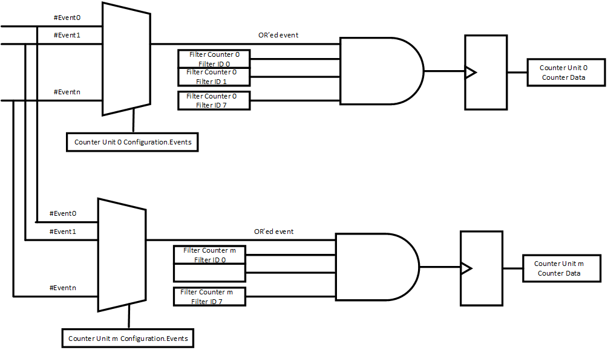

# 📘 第 13 章　性能考量 (Chapter 13. Performance Considerations)

> **Source pages**: 1011–1019 | **File**: chapter_13.md | **Format**: 中英对照双语

---

## 📑 本章目录

| 小节 | 标题 (EN) | 标题 (中文) | 页码 |
| --- | --- | --- | --- |
| 13.0 | Performance Considerations | 性能考量 | 1011 |
| 13.1 | Performance Recommendations | 性能建议 | 1011 |
| 13.2 | Performance Monitoring | 性能监控 | 1013 |
| 13.2.1 | CXL Performance Monitoring Unit (CPMU) | CXL 性能监控单元 (CPMU) | 1013 |

## 🖼 本章图表

| Figure | 英文标题 | 中文标题 | 页码 |
| --- | --- | --- | --- |
| Figure 13-1 | Event Selection and Counting Summary | 事件选择与计数摘要 | 1019 |

## 📊 本章表格

| Table | 英文标题 | 中文标题 | 页码 |
| --- | --- | --- | --- |
| Table 13-1 | CXL Performance Attributes | CXL 性能属性 | 1011 |
| Table 13-2 | Recommended Latency Targets for Selected CXL Transactions | 选定 CXL 事务的推荐延迟目标 | 1012 |
| Table 13-3 | Recommended Maximum Link Layer Latency Targets | 推荐的最大链路层延迟目标 | 1012 |
| Table 13-4 | CPMU Counter Units | CPMU 计数器单元 | 1013 |
| Table 13-5 | Events under CXL Vendor ID (Sheet 1 of 5) | CXL 厂商 ID 下的事件 (第 1/5 页) | 1014 |
| Table 13-5 | Events under CXL Vendor ID (Sheet 2 of 5) | CXL 厂商 ID 下的事件 (第 2/5 页) | 1015 |
| Table 13-5 | Events under CXL Vendor ID (Sheet 3 of 5) | CXL 厂商 ID 下的事件 (第 3/5 页) | 1016 |
| Table 13-5 | Events under CXL Vendor ID (Sheet 4 of 5) | CXL 厂商 ID 下的事件 (第 4/5 页) | 1017 |
| Table 13-5 | Events under CXL Vendor ID (Sheet 5 of 5) | CXL 厂商 ID 下的事件 (第 5/5 页) | 1018 |

---

## 13.0 Performance Considerations | 性能考量

<table>
<thead>
<tr>
<th width="50%">🇬🇧 English</th>
<th width="50%" style="background-color:#e8e8e8">🇨🇳 中文</th>
</tr>
</thead>
<tbody>
<tr><td>CXL provides a low-latency, high-bandwidth path for an accelerator to access the system. Performance on CXL is dependent on a variety of factors. Table 13-1 captures the main CXL performance attributes.</td><td style="background-color:#e8e8e8">CXL 为加速器访问系统提供了一条低延迟、高带宽的通路。CXL 的性能取决于多种因素。表 13-1 概括了 CXL 的主要性能属性。</td></tr>
<tr><td>In general, it is expected that the Upstream Ports and Downstream Ports are rate-matched. However, if the implementations are not rate-matched, it would require the faster of the implementations to limit the rate of its protocol traffic to match the slower (including bursts) whenever there is no explicit flow-control loop.</td><td style="background-color:#e8e8e8">通常情况下,要求上游端口 (Upstream Port) 和下游端口 (Downstream Port) 之间进行速率匹配 (rate-matched)。但是,如果实现之间没有进行速率匹配,那么在没有显式流控制回路的情况下,需要由速度较快的实现方限制其协议流量的速率 (包括突发),以匹配较慢的一方。</td></tr>
<tr><td>CXL allows accelerators/devices to coherently access host memory, and allows memory attached to an accelerator/device to be mapped into the system address map and to be accessed directly by the host as writeback memory. To support this, it supports Coherency models as described in Section 2.2.1 and Section 2.2.2.</td><td style="background-color:#e8e8e8">CXL 允许加速器/设备以一致 (coherent) 方式访问主机内存,也允许挂接在加速器/设备上的内存被映射到系统地址空间中,并以回写 (writeback) 内存的形式被主机直接访问。为支持这些特性,CXL 实现了第 2.2.1 节和第 2.2.2 节中所描述的一致性模型。</td></tr>
</tbody>
</table>

### Table 13-1. CXL Performance Attributes | 表 13-1. CXL 性能属性

<table>
<thead>
<tr>
<th width="30%">Characteristic 特性</th>
<th width="17%">CXL via Flex Bus (if PCIe Gen 4) 经由 Flex Bus 的 CXL (PCIe Gen 4)</th>
<th width="17%">CXL via Flex Bus (if PCIe Gen 5) 经由 Flex Bus 的 CXL (PCIe Gen 5)</th>
<th width="17%">CXL via Flex Bus (if PCIe Gen 6) 经由 Flex Bus 的 CXL (PCIe Gen 6)</th>
<th width="19%" style="background-color:#e8e8e8">注</th>
</tr>
</thead>
<tbody>
<tr><td>Width 宽度</td><td colspan="3">16 Lanes / 16 条通道</td><td style="background-color:#e8e8e8">—</td></tr>
<tr><td>Link Speed 链路速率</td><td>16 GT/s</td><td>32 GT/s</td><td>64 GT/s</td><td style="background-color:#e8e8e8">—</td></tr>
<tr><td>Total Bandwidth per link1 每条链路总带宽1</td><td>32 GB/s</td><td>64 GB/s</td><td>128 GB/s</td><td style="background-color:#e8e8e8">—</td></tr>
</tbody>
</table>

> 1. Achieved bandwidth depends on protocol and payload size. Expect 60-90% efficiency on CXL.cache and CXL.mem. Efficiency similar to PCIe* on CXL.io.
> 1. 实际可达的带宽取决于协议和有效负载大小。在 CXL.cache 和 CXL.mem 上,效率约为 60%–90%。在 CXL.io 上,效率与 PCIe* 类似。

[⬆️ 返回目录](#-本章目录)

---

## 13.1 Performance Recommendations | 性能建议

<table>
<thead>
<tr>
<th width="50%">🇬🇧 English</th>
<th width="50%" style="background-color:#e8e8e8">🇨🇳 中文</th>
</tr>
</thead>
<tbody>
<tr><td>To minimize buffering requirements and provide good responsiveness, CXL components need to strive for low latency. Specific transaction flows merit special attention, depending on component type, to ensure the system performance is not negatively impacted.</td><td style="background-color:#e8e8e8">为了尽量减小对缓冲区 (buffering) 的需求并提供良好的响应性,CXL 组件应致力于实现低延迟。根据组件类型的不同,某些特定的事务流 (transaction flow) 值得特别关注,以确保不会对系统性能产生负面影响。</td></tr>
<tr><td>It is recommended that components meet the latency targets listed in Table 13-2. These targets are measured at the component pins in an otherwise idle system. Measurements are for average idle response times, meaning that a single message is transmitted to the component and the response is received from the component before another message is transmitted to the component. Messages used for average measurements should have their addresses randomly distributed. All the targets listed in Table 13-2 assume a x16 link at full speed (64 GT/s) with IDE disabled.</td><td style="background-color:#e8e8e8">建议各组件满足表 13-2 中所列的延迟目标。这些目标在系统其余部分空闲的情况下于组件引脚处测量。测量的是平均空闲响应时间,即向组件发送一条消息后,在向其发送下一条消息之前,需要接收到该组件对该消息的响应。用于平均测量的消息应使其地址随机分布。表 13-2 中所列的全部目标均假设为 x16 链路以全速 (64 GT/s) 运行,且 IDE 已禁用。</td></tr>
</tbody>
</table>

<table>
<thead>
<tr>
<th width="50%">🇬🇧 English</th>
<th width="50%" style="background-color:#e8e8e8">🇨🇳 中文</th>
</tr>
</thead>
<tbody>
<tr><td>For CXL devices and switches, CDAT (see Section 8.1.11) provides a mechanism for reporting both lowest latency and highest bandwidth to Host software (see ACPI Specification for the definition of the System Locality Latency and Bandwidth Information Structure). That reporting structure, however, only assists Host software. Hardware and system designers must consider the topologies and components of interest at design time. Hardware designers should consider the maximum latency that their component needs to tolerate while still maintaining high-link bandwidth, sizing outstanding requests, and data buffers accordingly.</td><td style="background-color:#e8e8e8">对于 CXL 设备和交换机,CDAT (参见第 8.1.11 节) 提供了一种向主机软件 (Host software) 上报最低延迟和最高带宽的机制 (System Locality Latency and Bandwidth Information Structure 的定义请参见 ACPI 规范)。然而,该上报结构仅用于辅助主机软件。硬件和系统设计者必须在设计阶段就考虑相关的拓扑结构和组件。硬件设计者应当考虑其组件在维持高链路带宽时所需容忍的最大延迟,并据此合理地设置未完成请求 (outstanding request) 的数量以及数据缓冲区的大小。</td></tr>
<tr><td>The QoS Telemetry mechanism (see Section 3.3.4) defines a mechanism by which Hosts can dynamically adjust their request rate to avoid overloading memory devices. This mechanism is particularly important for MLD components that are shared among multiple Hosts.</td><td style="background-color:#e8e8e8">QoS 遥测 (QoS Telemetry) 机制 (参见第 3.3.4 节) 定义了一种机制,允许主机动态地调整其请求速率,以避免使内存设备过载。该机制对于在多主机之间共享的 MLD 组件尤为重要。</td></tr>
<tr><td>At the Link Layer, the maximum loaded latencies listed in Table 13-3 are recommended. If not adhered to, the link between two ports risks being throttled to less than the line rate. These recommendations apply to all CXL ports and both the CXL.cache and CXL.mem interfaces. The targets assume a x16 link with IDE disabled.</td><td style="background-color:#e8e8e8">在链路层 (Link Layer),建议遵循表 13-3 中所列的最大负载延迟。如果不遵守,两端口之间的链路存在被限速到低于线速 (line rate) 的风险。这些建议适用于所有 CXL 端口,以及 CXL.cache 和 CXL.mem 两种接口。这些目标假设为 x16 链路且 IDE 已禁用。</td></tr>
</tbody>
</table>

### Table 13-2. Recommended Latency Targets for Selected CXL Transactions | 表 13-2. 选定 CXL 事务的推荐延迟目标

<table>
<thead>
<tr>
<th width="8%">Case1 用例1</th>
<th width="14%">Component 组件</th>
<th width="14%">Protocol 协议</th>
<th width="21%">Received Message 接收消息</th>
<th width="21%">Transmitted Message 发送消息</th>
<th width="22%">Latency Target 延迟目标</th>
</tr>
</thead>
<tbody>
<tr><td>1</td><td>Type 1/Type 2</td><td>CXL.cache</td><td>H2D Req Snoop (Miss Case) H2D 请求 探测 (未命中情形)</td><td>D2H Resp Snoop Response D2H 响应 探测响应</td><td>90-150 ns</td></tr>
<tr><td>2</td><td>—</td><td>—</td><td>H2D Resp WritePull H2D 响应 WritePull</td><td>D2H Data D2H 数据</td><td>65 ns</td></tr>
<tr><td>3</td><td>Type 3 (DDR)</td><td>CXL.mem</td><td>M2S Req MemRd M2S 请求 MemRd</td><td>S2M DRS MemData S2M DRS MemData</td><td>80 ns</td></tr>
<tr><td>4</td><td>—</td><td>—</td><td>M2S RwD MemWr M2S RwD MemWr</td><td>S2M NDR Cmp S2M NDR Cmp</td><td>40 ns</td></tr>
<tr><td>5</td><td>Host / 主机</td><td>—</td><td>S2M BISnp S2M BISnp</td><td>M2S BIRsp M2S BIRsp</td><td>90 ns</td></tr>
</tbody>
</table>

> **Notes 注释:**
> 1. **Case 1**: The range provided accounts for implementation trade-offs, with a dedicated CXL interface snoop filter providing the lowest latency, and snoop filters embedded in the Device cache hierarchy resulting in higher latency.
> 1. **用例 1**: 所给延迟范围反映了实现上的权衡:专用 CXL 接口探测过滤器 (snoop filter) 可提供最低延迟,而嵌入在设备缓存层次结构中的探测器 (snoop filter) 则会导致较高的延迟。
> 2. **Case 2**: Assumes write data is ready to transmit in a CXL output buffer.
> 2. **用例 2**: 假设写数据已就绪并可在 CXL 输出缓冲区中发送。
> 3. **Cases 3 and 4**: Applies to Type 3 Devices using DRAM media intended to provide system-level performance comparable to DDR DIMMs. Such Devices are assumed to be relatively simple, small, and low-power, and not complex, multi-ported, or pooled-memory Devices. Noting that Case 3 is more aggressive than the targets in Table 13-3, the Table 13-3 targets will be lower than the Case 3 target in these Devices. Memory Devices that use slower media, such as some persistent-memory types, will have longer latencies that must be considered by system designers.
> 3. **用例 3 与 4**: 适用于使用 DRAM 介质、以提供与 DDR DIMM 相当系统级性能为目标的 Type 3 设备。此类设备被假定为相对简单、容量较小且低功耗,而非复杂的多端口或池化内存设备。值得注意的是,用例 3 比表 13-3 中的目标更激进,在此类设备中表 13-3 的目标将低于用例 3 的目标。使用较慢介质 (如某些持久性内存类型) 的内存设备将具有更长的延迟,系统设计者必须予以考虑。
> 4. **Case 5**: The BISnp will cause the host to resolve coherence for an HDM-DB memory address owned by a device that sent the BISnp. The target latency for resolving coherence is for the simple case in which the host does not have the cacheline in any host-managed cache (this scope includes peer CXL devices that are using CXL.cache).
> 4. **用例 5**: BISnp 将使主机为发送该 BISnp 的设备所拥有的 HDM-DB 内存地址解决一致性 (coherence) 问题。此处解决一致性的目标延迟针对的是一种简单情形,即主机在任何主机管理的缓存 (host-managed cache) 中都不持有该缓存行 (cacheline) (该范围包括正在使用 CXL.cache 的对端 CXL 设备)。

### Table 13-3. Recommended Maximum Link Layer Latency Targets | 表 13-3. 推荐的最大链路层延迟目标

<table>
<thead>
<tr>
<th width="10%">Case1 用例1</th>
<th width="50%">Condition 条件</th>
<th width="40%">Latency Target 延迟目标</th>
</tr>
</thead>
<tbody>
<tr><td>1</td><td>Message received to Ack Transmitted 从消息接收到 Ack 发送</td><td>65 ns</td></tr>
<tr><td>2</td><td>Credit Received to Flit transmitted 从信用接收到 Flit 发送</td><td>50 ns</td></tr>
</tbody>
</table>

> **Notes 注释:**
> 1. **Case 1**: Accounts for a sequence of 8 back-to-back flits with a clean CRC that needs to accumulate before the Ack can be transmitted. Applies only to links operating in 68B Flit mode and thus assumes a full link speed of 32 GT/s. Links operating in 256B Flit mode share Ack/Retry logic with PCIe and fall under any guidelines or requirements provided in PCIe Base Specification.
> 1. **用例 1**: 考虑了 8 个背靠背 flit 串 (其 CRC 均为正确) 在累积之后才能发送 Ack 的情形。仅适用于以 68B Flit 模式运行的链路,因此假设链路全速为 32 GT/s。以 256B Flit 模式运行的链路与 PCIe 共享 Ack/Retry 逻辑,适用 PCIe 基础规范中所提供的任何指南或要求。
> 2. **Case 2**: In this case, the port lacks the Link Layer credits that are needed to transmit a message and then receives a credit update that enables transmission of the message. Assumes full link speed of 64 GT/s.
> 2. **用例 2**: 在此情形下,端口缺少发送某条消息所需的链路层信用,之后才接收到允许其发送该消息的信用更新。假设链路全速为 64 GT/s。

[⬆️ 返回目录](#-本章目录)

---

## 13.2 Performance Monitoring | 性能监控

<table>
<thead>
<tr>
<th width="50%">🇬🇧 English</th>
<th width="50%" style="background-color:#e8e8e8">🇨🇳 中文</th>
</tr>
</thead>
<tbody>
<tr><td>Performance tuning and performance debug activities rely on performance counters that are located within different system components. This section introduces the Performance Monitoring infrastructure for CXL components.</td><td style="background-color:#e8e8e8">性能调优与性能调试活动依赖于位于不同系统组件中的性能计数器 (performance counter)。本节介绍 CXL 组件的性能监控 (Performance Monitoring) 基础架构。</td></tr>
<tr><td>The base hardware unit is called the CXL Performance Monitoring Unit (CPMU). A CXL component may have zero or more CPMU instances. Each CPMU instance includes one or more Counter Units. The registers associated with a CPMU are located by following the CXL Register Locator DVSEC with Register Block Identifier=4. Each CPMU instance in a Switch shall count events that are associated with a single Port. The CPMU instance associated with the Port can be identified by following the CXL Register Locator DVSEC in the Configuration Space of that Port. If a CXL multi-function device implements one or more CPMU instances, the Register Locator DVSEC that is associated with Function 0 shall point to them.</td><td style="background-color:#e8e8e8">基础硬件单元称为 CXL 性能监控单元 (CXL Performance Monitoring Unit, CPMU)。一个 CXL 组件可以包含零个或多个 CPMU 实例。每个 CPMU 实例包含一个或多个计数器单元 (Counter Unit)。与某个 CPMU 相关的寄存器可通过跟踪 CXL Register Locator DVSEC (其 Register Block Identifier=4) 来定位。交换机中的每个 CPMU 实例应当对与单一端口相关的事件进行计数。与某端口相关联的 CPMU 实例可通过跟踪该端口配置空间中的 CXL Register Locator DVSEC 来识别。如果某个 CXL 多功能设备 (multi-function device) 实现了多个 CPMU 实例,则与 Function 0 相关联的 Register Locator DVSEC 应当指向这些实例。</td></tr>
<tr><td>A CXL Event is defined as the occurrence of a specific component activity that is relevant to the operation of the CXL component. Events are grouped into Event Groups based on the type of activity that the Events represent. The pair &lt;Event Vendor ID, Event Group ID&gt; identifies an Event Group. Each Event Group can have up to 32 different types of events and each event is identified by a 5-bit Event ID. The tuple &lt;Event Vendor ID, Event Group ID, Event ID&gt; uniquely identifies the type of the Event. See Table 13-5 for the list of CXL Events that are defined by this specification. The Filter column lists all the Filter ID values that are applicable to the Event Group. The Multiple Event Counting (MEC) column defines the Counter Unit behavior when it is configured to simultaneously count more than one event within the Event Group by setting multiple bits. If the MEC column indicates ADD, the Counter Unit shall add the occurrences of all the enabled events every clock, which may result in the Counter Data being incremented by a value of more than one within a single clock. If the MEC column indicates OR, the Counter Unit shall logically or the occurrences of all the enabled events every clock and the Counter Data shall never increment by more than one within any single clock.</td><td style="background-color:#e8e8e8">CXL 事件 (CXL Event) 被定义为 CXL 组件运行过程中某种特定组件活动的发生。事件根据其所代表的活动类型被归入相应的事件组 (Event Group)。&lt;Event Vendor ID, Event Group ID&gt; 这一对值可标识一个事件组。每个事件组最多可包含 32 种不同类型的事件,每个事件由一个 5 位的 Event ID 标识。元组 &lt;Event Vendor ID, Event Group ID, Event ID&gt; 唯一地标识事件的类型。本规范所定义的 CXL 事件列表请参见表 13-5。Filter 列列出了适用于该事件组的所有 Filter ID 取值。多事件计数 (Multiple Event Counting, MEC) 列定义了当计数器单元被配置为通过置位多个比特以同时对事件组内多个事件进行计数时的行为。如果 MEC 列指示为 ADD,则计数器单元应当在每个时钟周期对所有已启用事件的发生次数求和,这可能导致计数器数据 (Counter Data) 在单个时钟周期内被递增 1 以上的值。如果 MEC 列指示为 OR,则计数器单元应当在每个时钟周期对所有已启用事件的发生次数执行逻辑或运算,计数器数据在任何单个时钟周期内都不会被递增超过 1。</td></tr>
<tr><td>None of the events defined in this specification are capable of incrementing the Counter Data by more than one per cycle. As such, software must set the Threshold field in the Counter Configuration register (see Section 8.2.7.2) to 1 when counting any event specified here.</td><td style="background-color:#e8e8e8">本规范中定义的所有事件均不能使计数器数据在每个时钟周期内被递增超过 1。因此,在对这里所指定的任何事件进行计数时,软件必须将 Counter Configuration 寄存器 (参见第 8.2.7.2 节) 中的 Threshold 字段设置为 1。</td></tr>
<tr><td>A Counter Unit is capable of counting the occurrence of one or more events. Counter Units are capable of being configured to count a subset of the Events that the Counter Unit is capable of counting. A Counter Unit may be capable of being configured to take certain predefined actions when the count overflows. Table 13-4 describes the three types of Counter Units.</td><td style="background-color:#e8e8e8">计数器单元能够对一个或多个事件的发生进行计数。计数器单元可被配置为对其能够计数的事件的某个子集进行计数。计数器单元还可被配置为在计数溢出时执行某些预定义动作。表 13-4 描述了三种类型的计数器单元。</td></tr>
<tr><td>The CPMU register interface is defined in Section 8.2.7. These registers are for Host Software or System Firmware consumption. The component must not expose CPMU registers or the underlying resources to an out-of-band agent if such an access may interfere with the Host Software actions. Although a component may choose to implement a separate set of counters for out-of-band usage, use of such a mechanism is beyond the scope of this specification.</td><td style="background-color:#e8e8e8">CPMU 寄存器接口在第 8.2.7 节中定义。这些寄存器供主机软件 (Host Software) 或系统固件 (System Firmware) 使用。如果对 CPMU 寄存器或其底层资源的带外 (out-of-band) 访问可能干扰主机软件的操作,则组件不得将这些寄存器或资源暴露给带外代理 (out-of-band agent)。虽然组件可以选择为带外使用实现一套单独的计数器,但此类机制的使用已超出本规范的范围。</td></tr>
</tbody>
</table>

### Table 13-4. CPMU Counter Units | 表 13-4. CPMU 计数器单元

<table>
<thead>
<tr>
<th width="25%">Counter Unit Type 计数器单元类型</th>
<th width="75%">Description 说明</th>
</tr>
</thead>
<tbody>
<tr><td>Fixed Function 固定功能 (Fixed Function)</td><td>Capable of counting a fixed set of one or more events within a single Event Group. Counting is halted when the Counter Unit is Frozen or Counter Enable=0. 能够对单一事件组内一固定集合的一个或多个事件进行计数。当计数器单元被冻结 (Frozen) 或 Counter Enable=0 时,计数停止。</td></tr>
<tr><td>Free-running 自由运行 (Free-running)</td><td>Capable of counting a fixed set of one or more events within a single Event Group. Not affected by freeze. The Counter Enabled bit is RO and always returns 1. 能够对单一事件组内一固定集合的一个或多个事件进行计数。不受冻结 (freeze) 影响。Counter Enabled 位为只读 (RO),始终返回 1。</td></tr>
<tr><td>Configurable 可配置 (Configurable)</td><td>Capable of counting any Events that are identified via CPMU Event Capabilities register (see Section 8.2.7.1.4), and may be configured by software to count a specific set of events in a specific manner. Counting is halted when the Counter Unit is Frozen or Counter Enable=0. 能够对通过 CPMU Event Capabilities 寄存器 (参见第 8.2.7.1.4 节) 标识的任何事件进行计数,并可由软件配置为以特定方式对一特定集合的事件进行计数。当计数器单元被冻结 (Frozen) 或 Counter Enable=0 时,计数停止。</td></tr>
</tbody>
</table>

[⬆️ 返回目录](#-本章目录)

---

## 13.2.1 CXL Performance Monitoring Unit (CPMU) | CXL 性能监控单元 (CPMU)

<table>
<thead>
<tr>
<th width="50%">🇬🇧 English</th>
<th width="50%" style="background-color:#e8e8e8">🇨🇳 中文</th>
</tr>
</thead>
<tbody>
<tr><td>The remainder of this section enumerates the CXL-defined Events for the CXL Vendor ID. The Event Group, Event ID, Mnemonic, Event Description, Filters, and MEC columns are described in Section 13.2.</td><td style="background-color:#e8e8e8">本节的其余部分枚举 CXL 厂商 ID 下的 CXL 自定义事件。Event Group、Event ID、Mnemonic、Event Description、Filters 与 MEC 各列的含义在第 13.2 节中描述。</td></tr>
</tbody>
</table>

### Table 13-5. Events under CXL Vendor ID (Sheet 1 of 5) | 表 13-5. CXL 厂商 ID 下的事件 (第 1/5 页)

<table>
<thead>
<tr>
<th width="12%">Event Group 事件组</th>
<th width="10%">Event ID 事件 ID</th>
<th width="18%">Mnemonic 助记符</th>
<th width="42%">Event Description 事件描述</th>
<th width="10%">Filters 过滤器</th>
<th width="8%">MEC1 多事件计数1</th>
</tr>
</thead>
<tbody>
<tr><td>00h (Base)</td><td>00h</td><td>Clock Ticks</td><td>Count the clock ticks of the always-on fixed-frequency clock that is used to increment the Counters. Every CPMU must allow counting of this event, either via a Fixed Function Counter Unit or via a Configurable Counter Unit. 对用于递增计数器的、常开 (always-on) 固定频率时钟的时钟节拍数进行计数。每个 CPMU 必须允许对该事件进行计数,可通过 Fixed Function Counter Unit 或 Configurable Counter Unit 实现。</td><td>None</td><td>N/A</td></tr>
<tr><td></td><td>01h-0Fh</td><td>00h - 1Fh</td><td>Reserved / 保留</td><td>Reserved / 保留</td><td>N/A</td></tr>
<tr><td>10h (CXL.cache D2H Req Channel)</td><td>D2H Req Opcode encoding</td><td>D2HReq.Opcode mnemonic</td><td>Counts the number of messages in the D2H Req message class with Opcode=Event ID that were initiated, or forwarded, or received by the component. The D2H Req message class Opcode mnemonics and the Opcode encodings are enumerated in Table 3-22. All Event ID values corresponding to unused D2H Req message class Opcode encodings are reserved. For example, the mnemonic associated with the Event Group=10h, Event ID=01h is D2HReq.RdCurr and counts the number of RdCurr requests. 对组件发起、转发或接收的、D2H Req 消息类中 Opcode=Event ID 的消息数量进行计数。D2H Req 消息类的 Opcode 助记符及 Opcode 编码在表 3-22 中列出。与未使用的 D2H Req 消息类 Opcode 编码相对应的所有 Event ID 均为保留值。例如,Event Group=10h、Event ID=01h 所对应的助记符为 D2HReq.RdCurr,用于对 RdCurr 请求的数量进行计数。</td><td>None</td><td>ADD</td></tr>
<tr><td>11h (CXL.cache D2H Rsp Channel)</td><td>D2H Rsp Opcode encoding</td><td>D2HRsp.Opcode mnemonic</td><td>Counts the number of messages in the D2H Rsp message class with Opcode=Event ID that were initiated, or forwarded, or received by the component. D2H Rsp message class Opcode mnemonics and Opcode encodings are enumerated in Table 3-25. All Event ID values corresponding to unused D2H Rsp message class Opcode encodings are reserved. For example, the mnemonic associated with the Event Group=11h, Event ID=05h is D2HRsp.RspIHitSE and counts the number of RspIHitSE messages. 对组件发起、转发或接收的、D2H Rsp 消息类中 Opcode=Event ID 的消息数量进行计数。D2H Rsp 消息类的 Opcode 助记符及 Opcode 编码在表 3-25 中列出。与未使用的 D2H Rsp 消息类 Opcode 编码相对应的所有 Event ID 均为保留值。例如,Event Group=11h、Event ID=05h 所对应的助记符为 D2HRsp.RspIHitSE,用于对 RspIHitSE 消息的数量进行计数。</td><td>None</td><td>ADD</td></tr>
<tr><td>12h (CXL.cache H2D Req Channel)</td><td>H2D Req Opcode encoding</td><td>H2DReq.Opcode mnemonic</td><td>Counts the number of messages in the H2D Req message class with Opcode=Event ID that were initiated, or forwarded, or received by the component. The H2D Req message class Opcode mnemonics and the Opcode encodings are enumerated in Table 3-26. All Event ID values corresponding to unused H2D Req message class Opcode encodings are reserved. For example, the mnemonic associated with the Event Group=12h, Event ID=02h is H2DReq.SnpInv and counts the number of SnpInv requests. 对组件发起、转发或接收的、H2D Req 消息类中 Opcode=Event ID 的消息数量进行计数。H2D Req 消息类的 Opcode 助记符及 Opcode 编码在表 3-26 中列出。与未使用的 H2D Req 消息类 Opcode 编码相对应的所有 Event ID 均为保留值。例如,Event Group=12h、Event ID=02h 所对应的助记符为 H2DReq.SnpInv,用于对 SnpInv 请求的数量进行计数。</td><td>None</td><td>ADD</td></tr>
<tr><td>13h (CXL.cache H2D Rsp Channel)</td><td>H2D Rsp Opcode encoding</td><td>H2DRsp.Opcode mnemonic</td><td>Counts the number of messages in the H2D Rsp message class with Opcode=Event ID that were initiated, or forwarded, or received by the component. H2D Rsp message class Opcode mnemonics and Opcode encodings are enumerated in Table 3-27. All Event ID values corresponding to unused D2H Rsp message class Opcode encodings are reserved. For example, the mnemonic associated with the Event Group=13h, Event ID=01h is H2DRsp.WritePull and counts the number of WritePull messages. 对组件发起、转发或接收的、H2D Rsp 消息类中 Opcode=Event ID 的消息数量进行计数。H2D Rsp 消息类的 Opcode 助记符及 Opcode 编码在表 3-27 中列出。与未使用的 D2H Rsp 消息类 Opcode 编码相对应的所有 Event ID 均为保留值。例如,Event Group=13h、Event ID=01h 所对应的助记符为 H2DRsp.WritePull,用于对 WritePull 消息的数量进行计数。</td><td>None</td><td>ADD</td></tr>
<tr><td rowspan="3">14h (CXL.cache Data)</td><td>00h</td><td>D2H Data</td><td>Counts the number of D2H Data messages that were initiated, or forwarded, or received by the component. 对组件发起、转发或接收的 D2H Data 消息的数量进行计数。</td><td>None</td><td>ADD</td></tr>
<tr><td>01h</td><td>H2D Data</td><td>Counts the number of H2D Data messages that were initiated, or forwarded, or received by the component. 对组件发起、转发或接收的 H2D Data 消息的数量进行计数。</td><td>None</td><td></td></tr>
<tr><td>02h - 1Fh</td><td>Reserved / 保留</td><td>Reserved / 保留</td><td>N/A</td><td>N/A</td></tr>
<tr><td>15h-1Fh</td><td>00h - 1Fh</td><td>Reserved / 保留</td><td>Reserved / 保留</td><td>N/A</td><td>N/A</td></tr>
</tbody>
</table>

### Table 13-5. Events under CXL Vendor ID (Sheet 2 of 5) | 表 13-5. CXL 厂商 ID 下的事件 (第 2/5 页)

<table>
<thead>
<tr>
<th width="12%">Event Group 事件组</th>
<th width="10%">Event ID 事件 ID</th>
<th width="18%">Mnemonic 助记符</th>
<th width="42%">Event Description 事件描述</th>
<th width="10%">Filters 过滤器</th>
<th width="8%">MEC1 多事件计数1</th>
</tr>
</thead>
<tbody>
<tr><td>20h (CXL.mem M2S Req Channel)</td><td>M2S Req Opcode encoding</td><td>M2SReq.Opcode mnemonic</td><td>Counts the number of messages in the M2S Req message class with Opcode=Event ID that were initiated, or forwarded, or received by the component. The M2S Req message class Opcode mnemonics and the Opcode encodings are enumerated in Table 3-35. All Event ID values corresponding to unused M2S Req message class Opcode encodings are reserved. For example, the mnemonic associated with the Event Group=20h, Event ID=00h is M2SReq.MemInv and counts the number of MemInv requests. 对组件发起、转发或接收的、M2S Req 消息类中 Opcode=Event ID 的消息数量进行计数。M2S Req 消息类的 Opcode 助记符及 Opcode 编码在表 3-35 中列出。与未使用的 M2S Req 消息类 Opcode 编码相对应的所有 Event ID 均为保留值。例如,Event Group=20h、Event ID=00h 所对应的助记符为 M2SReq.MemInv,用于对 MemInv 请求的数量进行计数。</td><td>Filter ID=0</td><td>ADD</td></tr>
<tr><td>21h (CXL.mem M2S RwD Channel)</td><td>M2S RwD Opcode encoding</td><td>M2SRwD.Opcode mnemonic</td><td>Counts the number of messages in the M2S RwD message class with Opcode=Event ID that were initiated, or forwarded, or received by the component. The M2S RwD message class Opcode mnemonics and the Opcode encodings are enumerated in Table 3-41. All Event ID values corresponding to unused M2S Req message class Opcode encodings are reserved. For example, the mnemonic associated with the Event Group=21h, Event ID=02h is M2SRwd.MemWrPtl and counts the number of MemWrPtl requests. 对组件发起、转发或接收的、M2S RwD 消息类中 Opcode=Event ID 的消息数量进行计数。M2S RwD 消息类的 Opcode 助记符及 Opcode 编码在表 3-41 中列出。与未使用的 M2S Req 消息类 Opcode 编码相对应的所有 Event ID 均为保留值。例如,Event Group=21h、Event ID=02h 所对应的助记符为 M2SRwd.MemWrPtl,用于对 MemWrPtl 请求的数量进行计数。</td><td>Filter ID=0</td><td>ADD</td></tr>
<tr><td>22h (CXL.mem M2S BIRsp Channel)</td><td>M2S BIRsp Opcode encoding</td><td>M2SBIRsp.Opcode mnemonic</td><td>Counts the number of messages in the M2S BIRsp message class with Opcode=Event ID that were initiated, or forwarded, or received by the component. The M2S BIRsp message class Opcode mnemonics and the Opcode encodings are enumerated in Table 3-45. All Event ID values corresponding to unused M2S BIRsp message class Opcode encodings are reserved. For example, the mnemonic associated with the Event Group=22h, Event ID=00h is M2SBIRsp.BIRspI and counts the number of BIRspI messages. 对组件发起、转发或接收的、M2S BIRsp 消息类中 Opcode=Event ID 的消息数量进行计数。M2S BIRsp 消息类的 Opcode 助记符及 Opcode 编码在表 3-45 中列出。与未使用的 M2S BIRsp 消息类 Opcode 编码相对应的所有 Event ID 均为保留值。例如,Event Group=22h、Event ID=00h 所对应的助记符为 M2SBIRsp.BIRspI,用于对 BIRspI 消息的数量进行计数。</td><td>Filter ID=0</td><td>ADD</td></tr>
<tr><td>23h (CXL.mem S2M BISnp Channel)</td><td>S2M BISnp Opcode encoding</td><td>S2MBISnp.Opcode mnemonic</td><td>Counts the number of messages in the S2M BISnp message class with Opcode=Event ID that were initiated, or forwarded, or received by the component. The S2M BISnp message class Opcode mnemonics and the Opcode encodings are enumerated in Table 3-47. All Event ID values corresponding to unused S2M BISnp message class Opcode encodings are reserved. For example, the mnemonic associated with the Event Group=23h, Event ID=00h is S2MBISnp.BISnpCur and counts the number of BISnpCur requests. 对组件发起、转发或接收的、S2M BISnp 消息类中 Opcode=Event ID 的消息数量进行计数。S2M BISnp 消息类的 Opcode 助记符及 Opcode 编码在表 3-47 中列出。与未使用的 S2M BISnp 消息类 Opcode 编码相对应的所有 Event ID 均为保留值。例如,Event Group=23h、Event ID=00h 所对应的助记符为 S2MBISnp.BISnpCur,用于对 BISnpCur 请求的数量进行计数。</td><td>Filter ID=0</td><td>ADD</td></tr>
<tr><td>24h (CXL.mem S2M NDR Channel)</td><td>S2M NDR Opcode encoding</td><td>S2MNDR.Opcode mnemonic</td><td>Counts the number of messages in the S2M NDR message class with Opcode=Event ID that were initiated, or forwarded, or received by the component. The S2M NDR message class Opcode mnemonics and the Opcode encodings are enumerated in Table 3-50. All Event ID values corresponding to unused S2M NDR message class Opcode encodings are reserved. For example, the mnemonic associated with the Event Group=24h, Event ID=02h is S2MNDR.Cmp-E and counts the number of Cmp-E messages. 对组件发起、转发或接收的、S2M NDR 消息类中 Opcode=Event ID 的消息数量进行计数。S2M NDR 消息类的 Opcode 助记符及 Opcode 编码在表 3-50 中列出。与未使用的 S2M NDR 消息类 Opcode 编码相对应的所有 Event ID 均为保留值。例如,Event Group=24h、Event ID=02h 所对应的助记符为 S2MNDR.Cmp-E,用于对 Cmp-E 消息的数量进行计数。</td><td>Filter ID=0</td><td>ADD</td></tr>
<tr><td>25h (CXL.mem S2M DRS Channel)</td><td>S2M DRS Opcode encoding</td><td>S2MDRS.Opcode mnemonic</td><td>Counts the number of messages in the S2M DRS message class with Opcode=Event ID that were initiated, or forwarded, or received by the component. The S2M DRS message class Opcode mnemonics and the Opcode encodings are enumerated in Table 3-53. All Event ID values corresponding to unused S2M DRS message class Opcode encodings are reserved. For example, the mnemonic associated with the Event Group=25h, Event ID=00h is S2MDRS.MemData and counts the number of MemData messages. 对组件发起、转发或接收的、S2M DRS 消息类中 Opcode=Event ID 的消息数量进行计数。S2M DRS 消息类的 Opcode 助记符及 Opcode 编码在表 3-53 中列出。与未使用的 S2M DRS 消息类 Opcode 编码相对应的所有 Event ID 均为保留值。例如,Event Group=25h、Event ID=00h 所对应的助记符为 S2MDRS.MemData,用于对 MemData 消息的数量进行计数。</td><td>Filter ID=0</td><td>ADD</td></tr>
<tr><td>26h - 2Fh</td><td>Reserved / 保留</td><td>Reserved / 保留</td><td>Reserved / 保留</td><td>NA</td><td>NA</td></tr>
</tbody>
</table>

### Table 13-5. Events under CXL Vendor ID (Sheet 3 of 5) | 表 13-5. CXL 厂商 ID 下的事件 (第 3/5 页)

<table>
<thead>
<tr>
<th width="12%">Event Group 事件组</th>
<th width="10%">Event ID 事件 ID</th>
<th width="18%">Mnemonic 助记符</th>
<th width="42%">Event Description 事件描述</th>
<th width="10%">Filters 过滤器</th>
<th width="8%">MEC1 多事件计数1</th>
</tr>
</thead>
<tbody>
<tr><td>30h (Devload)</td><td>Devload encoding</td><td>Devload signaled by the device</td><td>Count the # of clock cycles the device is in devload= event ID condition. 对设备处于 devload=Event ID 条件下的时钟周期数进行计数。</td><td>NA</td><td></td></tr>
<tr><td rowspan="3">31h (M2S Residency)</td><td>0h</td><td>M2S Req residency count</td><td>The accumulative number of clock cycles there is any outstanding M2S Req pending for completion to be sent out to host. This counter can be used to determine average latency over large number of transaction when combined with command counts 累计的时钟周期数,表示存在任何尚未完成、等待向主机发送完成响应的未完成 M2S Req。该计数器在与命令计数结合使用时,可用于确定大量事务的平均延迟。</td><td>NA</td><td></td></tr>
<tr><td>1h</td><td>M2S RwD residency count</td><td>The accumulative number of clock cycles there is any outstanding M2S RwD pending for completion to be sent out to host. This counter can be used to determine average latency over large number of transaction when combined with command counts 累计的时钟周期数,表示存在任何尚未完成、等待向主机发送完成响应的未完成 M2S RwD。该计数器在与命令计数结合使用时,可用于确定大量事务的平均延迟。</td><td>NA</td><td></td></tr>
<tr><td>2h - 1Fh</td><td>Reserved / 保留</td><td>Reserved / 保留</td><td></td><td></td></tr>
<tr><td>32h - 7FFFh</td><td>Reserved / 保留</td><td>Reserved / 保留</td><td>Reserved / 保留</td><td>N/A</td><td>N/A</td></tr>
</tbody>
</table>

### Table 13-5. Events under CXL Vendor ID (Sheet 4 of 5) | 表 13-5. CXL 厂商 ID 下的事件 (第 4/5 页)

<table>
<thead>
<tr>
<th width="12%">Event Group 事件组</th>
<th width="10%">Event ID 事件 ID</th>
<th width="18%">Mnemonic 助记符</th>
<th width="42%">Event Description 事件描述</th>
<th width="10%">Filters 过滤器</th>
<th width="8%">MEC1 多事件计数1</th>
</tr>
</thead>
<tbody>
<tr><td rowspan="17">8000h (DDR Interface)2</td><td>00h</td><td>ACT Count</td><td>Counts the number of DRAM Activate commands that were issued by the Memory Controller associated with this CPMU. 对与此 CPMU 关联的内存控制器所发出的 DRAM Activate 命令数量进行计数。</td><td>Filter ID=1</td><td>ADD</td></tr>
<tr><td>01h</td><td>PRE Count</td><td>Counts the number of all DRAM Precharge commands that were issued by the Memory Controller associated with this CPMU. 对与此 CPMU 关联的内存控制器所发出的全部 DRAM Precharge 命令数量进行计数。</td><td>Filter ID=1</td><td></td></tr>
<tr><td>02h</td><td>CAS Rd</td><td>Counts the number of all DRAM Column Address Strobe read commands that were issued by the Memory Controller associated with this CPMU. 对与此 CPMU 关联的内存控制器所发出的全部 DRAM Column Address Strobe 读命令数量进行计数。</td><td>Filter ID=1</td><td></td></tr>
<tr><td>03h</td><td>CAS Wr</td><td>Counts the number of all DRAM Column Address Strobe write commands that were issued by the Memory Controller associated with this CPMU. 对与此 CPMU 关联的内存控制器所发出的全部 DRAM Column Address Strobe 写命令数量进行计数。</td><td>Filter ID=1</td><td></td></tr>
<tr><td>04h</td><td>Refresh</td><td>Counts the number of all DRAM Refresh commands that were issued by the Memory Controller associated with this CPMU. 对与此 CPMU 关联的内存控制器所发出的全部 DRAM Refresh 命令数量进行计数。</td><td>Filter ID=1</td><td></td></tr>
<tr><td>05h</td><td>Self Refresh Entry</td><td>Counts the number of Self Refresh Entry commands that were issued by the Memory Controller associated with this CPMU. 对与此 CPMU 关联的内存控制器所发出的 Self Refresh Entry 命令数量进行计数。</td><td>Filter ID=1</td><td></td></tr>
<tr><td>06h</td><td>RFM</td><td>Counts the number of Refresh Management (RFM) commands that were issued by the Memory Controller associated with this CPMU. 对与此 CPMU 关联的内存控制器所发出的 Refresh Management (RFM) 命令数量进行计数。</td><td>Filter ID=1</td><td></td></tr>
<tr><td>07h</td><td>CAS Rd AP</td><td>Counts the number of DRAM Column Address Strobe read Commands with Auto Precharge that were issued by the Memory Controller associated with this CPMU. 对与此 CPMU 关联的内存控制器所发出的、带有 Auto Precharge 的 DRAM Column Address Strobe 读命令数量进行计数。</td><td>Filter ID=1</td><td></td></tr>
<tr><td>08h</td><td>CAS Wr AP</td><td>Counts the number of DRAM Column Address Strobe write Commands with Auto Precharge that were issued by the Memory Controller associated with this CPMU. 对与此 CPMU 关联的内存控制器所发出的、带有 Auto Precharge 的 DRAM Column Address Strobe 写命令数量进行计数。</td><td>Filter ID=1</td><td></td></tr>
<tr><td>09h</td><td>Refresh All Banks</td><td>Counts the number of DRAM Refresh All banks that were issued by the Memory Controller associated with this CPMU. 对与此 CPMU 关联的内存控制器所发出的 DRAM Refresh All Banks 数量进行计数。</td><td>Filter ID=1</td><td></td></tr>
<tr><td>0Ah</td><td>Refresh Same Bank</td><td>Counts the number of DRAM Refresh Same banks that were issued by the Memory Controller associated with this CPMU. 对与此 CPMU 关联的内存控制器所发出的 DRAM Refresh Same Bank 数量进行计数。</td><td>Filter ID=1</td><td></td></tr>
<tr><td>0Bh</td><td>Power Down Entry</td><td>Counts the number of DRAM Power down Entry that were issued by the Memory Controller associated with this CPMU. 对与此 CPMU 关联的内存控制器所发出的 DRAM Power Down Entry 数量进行计数。</td><td>Filter ID=1</td><td></td></tr>
<tr><td>0Ch</td><td>Power Down Exit</td><td>Counts the number of DRAM Power down Exit that were issued by the Memory Controller associated with this CPMU. 对与此 CPMU 关联的内存控制器所发出的 DRAM Power Down Exit 数量进行计数。</td><td>Filter ID=1</td><td></td></tr>
<tr><td>0Dh</td><td>RD/WR DDR bus switching</td><td>count the number of times -Read to write or vice versa DDR bus mode switching (DDR turnarounds) for memory controller bus 对内存控制器总线上 DDR 总线模式切换 (DDR turnaround) (读转写或写转读) 的次数进行计数。</td><td>Filter ID=1</td><td></td></tr>
<tr><td>0Eh</td><td>Incoming Read requests</td><td>Command count for incoming read requests at memory controller interface. The event is supported only in CPMU associated with memory controller block. Memory controller interface point and requests being counted are vendor specific, additional vendor-supplied information may be needed. 对到达内存控制器接口的输入读请求 (incoming read requests) 的命令数量进行计数。该事件仅在与内存控制器模块相关联的 CPMU 中受支持。内存控制器接口点以及被计数的请求为厂商特定 (vendor specific),可能需要额外的厂商提供的信息。</td><td>Filter ID=1</td><td></td></tr>
<tr><td>0Fh</td><td>Incoming write requests</td><td>Command count for incoming write requests at memory controller interface. The event is supported only in CPMU associated with memory controller block. Memory controller interface point and requests being counted are vendor specific, additional vendor-supplied information may be needed. 对到达内存控制器接口的输入写请求 (incoming write requests) 的命令数量进行计数。该事件仅在与内存控制器模块相关联的 CPMU 中受支持。内存控制器接口点以及被计数的请求为厂商特定 (vendor specific),可能需要额外的厂商提供的信息。</td><td>Filter ID=1</td><td></td></tr>
<tr><td>10h - 1Fh</td><td>Reserved / 保留</td><td>Reserved / 保留</td><td>N/A</td><td>N/A</td></tr>
</tbody>
</table>

> **Notes 注释:**
> 2. See JEDEC DDR5 Specification for the definition of the specific commands that are referenced in the Event Description column.
> 2. Event Description 列中所引用的具体命令的定义请参见 JEDEC DDR5 规范。

### Table 13-5. Events under CXL Vendor ID (Sheet 5 of 5) | 表 13-5. CXL 厂商 ID 下的事件 (第 5/5 页)

<table>
<thead>
<tr>
<th width="12%">Event Group 事件组</th>
<th width="10%">Event ID 事件 ID</th>
<th width="18%">Mnemonic 助记符</th>
<th width="42%">Event Description 事件描述</th>
<th width="10%">Filters 过滤器</th>
<th width="8%">MEC1 多事件计数1</th>
</tr>
</thead>
<tbody>
<tr><td rowspan="4">8001h (Queue occupancy)</td><td>0h</td><td>RD Queue Occupancy</td><td># of clock cycles read queue occupied is above the specified threshold in the counter configuration. The event is supported only when the controller implements separate read and write queues. 读队列占用高于 counter configuration 中指定阈值的时钟周期数。该事件仅在控制器实现独立的读/写队列时受支持。</td><td>Filter ID=1</td><td>NA</td></tr>
<tr><td>1h</td><td>WR Queue Occupancy</td><td># of clock cycles write queue occupied is above the specified threshold in the counter configuration. The event is supported only when the controller implements separate read and write queues. 写队列占用高于 counter configuration 中指定阈值的时钟周期数。该事件仅在控制器实现独立的读/写队列时受支持。</td><td>Filter ID=1</td><td>NA</td></tr>
<tr><td>2h</td><td>Rd/WR merged Queue Occupancy</td><td># of clock cycles merged RD/WR queue occupied is above the specified threshold in the counter configuration. The event is supported only when the controller does not implement separate read and write queues. 合并 RD/WR 队列占用高于 counter configuration 中指定阈值的时钟周期数。该事件仅在控制器未实现独立的读/写队列时受支持。</td><td>Filter ID=1</td><td>NA</td></tr>
<tr><td>03h</td><td>pwrdn event</td><td>CKE power down cycles or residency in PDN state (# of clocks ) CKE 下电周期数或在 PDN 状态下的驻留时间 (以时钟周期数计)。</td><td>Filter ID=1</td><td>NA</td></tr>
<tr><td></td><td>4 - 1Fh</td><td>Reserved / 保留</td><td>Reserved / 保留</td><td></td><td></td></tr>
<tr><td rowspan="3">8002h (Queue Residency)</td><td>0h</td><td>Memory controller Read residency count</td><td>The accumulative number of clock cycles there is any outstanding read pending for completion to be sent out from memory controller. This counter can be used to determine average latency over large number of transactions when combined with command counts 累计的时钟周期数,表示存在任何尚未完成、等待从内存控制器发送完成响应的未完成读操作。该计数器在与命令计数结合使用时,可用于确定大量事务的平均延迟。</td><td>Filter ID=1</td><td>NA</td></tr>
<tr><td>1h</td><td>Memory controller write residency count</td><td>The accumulative number of clock cycles there is any outstanding write pending for completion to be sent out from memory controller. This counter can be used to determine average latency over large number of transactions when combined with command counts 累计的时钟周期数,表示存在任何尚未完成、等待从内存控制器发送完成响应的未完成写操作。该计数器在与命令计数结合使用时,可用于确定大量事务的平均延迟。</td><td>Filter ID=1</td><td>NA</td></tr>
<tr><td>02h - 1Fh</td><td>Reserved / 保留</td><td>Reserved / 保留</td><td></td><td></td></tr>
<tr><td rowspan="5">8003h (Retry Events)</td><td>0h</td><td>Retry event triggered by read crc</td><td>Count the retry event triggered by listed error event for the memory controller associated with this CPMU. Include host issued transaction and/or internal (patrol scrub) 对与此 CPMU 关联的内存控制器因所列错误事件而触发的重试事件 (retry event) 进行计数。包括主机发起的事务和/或内部 (巡打扫刷,patrol scrub) 事务。</td><td>Filter ID=1</td><td>ADD</td></tr>
<tr><td>1h</td><td>Retry event triggered by write crc</td><td>Count the retry event triggered by listed error event for the memory controller associated with this CPMU. Include host issued transaction and/or internal (patrol scrub) 对与此 CPMU 关联的内存控制器因所列错误事件而触发的重试事件 (retry event) 进行计数。包括主机发起的事务和/或内部 (巡打扫刷,patrol scrub) 事务。</td><td>Filter ID=1</td><td>ADD</td></tr>
<tr><td>2h</td><td>Retry event triggered by CA parity</td><td>Count the retry event triggered by listed error event for the memory controller associated with this CPMU. Include host issued transaction and/or internal (patrol scrub) 对与此 CPMU 关联的内存控制器因所列错误事件而触发的重试事件 (retry event) 进行计数。包括主机发起的事务和/或内部 (巡打扫刷,patrol scrub) 事务。</td><td>Filter ID=1</td><td>ADD</td></tr>
<tr><td>3h</td><td>Retry event triggered by ECC</td><td>Count the retry event triggered by listed error event for the memory controller associated with this CPMU. Include host issued transaction and/or internal (patrol scrub) 对与此 CPMU 关联的内存控制器因所列错误事件而触发的重试事件 (retry event) 进行计数。包括主机发起的事务和/或内部 (巡打扫刷,patrol scrub) 事务。</td><td>Filter ID=1</td><td>ADD</td></tr>
<tr><td>4h - 1Fh</td><td>Reserved / 保留</td><td>Reserved / 保留</td><td></td><td></td></tr>
<tr><td rowspan="3">8004h (Throttle Events)</td><td>0h</td><td>Thermal Throttle event</td><td>Count of cycles (# of clocks) when the CXL memory device is in any thermally throttled state (throttle state definition is left to implementation choice) 对 CXL 内存设备处于任何热限速 (thermally throttled) 状态下的周期数 (以时钟周期计) 进行计数 (限速状态的定义由实现决定)。</td><td>NA</td><td></td></tr>
<tr><td>1h</td><td>Power Throttle event</td><td>Count of cycles (# of clocks) when the CXL memory device is in any power throttled state (throttle state definition is left to implementation choice) 对 CXL 内存设备处于任何功率限速 (power throttled) 状态下的周期数 (以时钟周期计) 进行计数 (限速状态的定义由实现决定)。</td><td>NA</td><td></td></tr>
<tr><td>2h - 1Fh</td><td>Reserved / 保留</td><td>Reserved / 保留</td><td>NA</td><td>NA</td></tr>
<tr><td>8005h - FFFFh</td><td>Reserved / 保留</td><td>Reserved / 保留</td><td>Reserved / 保留</td><td>N/A</td><td>N/A</td></tr>
</tbody>
</table>

> **Notes 注释:**
> 1. In the MEC column, ADD indicates that the Counter Unit shall add the occurrences of all the enabled events every clock, which may result in the Counter Data being incremented by a value of more than one within a single clock. In the MEC column, OR indicates that the Counter Unit shall logically or the occurrences of all the enabled events every clock and the Counter Data shall never increment by more than one within any single clock.
> 1. 在 MEC 列中,ADD 表示计数器单元应当在每个时钟周期对所有已启用事件的发生次数求和,这可能导致计数器数据 (Counter Data) 在单个时钟周期内被递增 1 以上的值。在 MEC 列中,OR 表示计数器单元应当在每个时钟周期对所有已启用事件的发生次数执行逻辑或运算,计数器数据在任何单个时钟周期内都不会被递增超过 1。
> 2. See JEDEC DDR5 Specification for the definition of the specific commands that are referenced in the Event Description column.
> 2. Event Description 列中所引用的具体命令的定义请参见 JEDEC DDR5 规范。

[⬆️ 返回目录](#-本章目录)

---

### Figure 13-1. Event Selection and Counting Summary | 事件选择与计数摘要

> **IMPLEMENTATION NOTE 实现说明**
>
> This diagram pictorially represents how a simple CPMU that supports a single Event Group and two Configurable Counters counts events.
>
> 本图以图形方式表示一个支持单一事件组 (Event Group) 与两个可配置计数器 (Configurable Counter) 的简单 CPMU 是如何对事件进行计数的。
>
> 1. Every clock, the events selected via the Events field in the Counter Configuration register are OR'ed together.
> 1. 在每个时钟周期,通过 Counter Configuration 寄存器的 Events 字段所选中的事件被一起进行逻辑或 (OR) 运算。
> 2. The output of step 1, labeled "OR'ed event" is subjected to various configured filters.
> 2. 步骤 1 的输出 (标记为 "OR'ed event") 会被施加各种已配置的过滤器 (filter)。
> 3. The output of step 2 is added to the Counter Data.
> 3. 步骤 2 的输出被加到 Counter Data 上。
>
> **Note 注意:** For readability, the Threshold, Edge, and Invert controls are not shown.
> 为保持图面简洁可读,Threshold、Edge 与 Invert 控制信号未在图中示出。

> **Figure 13-1.** Event Selection and Counting Summary ｜ 事件选择与计数摘要
>
> 
>
> *Original page render @ 150 DPI* — [📄 Full size](figures/chapter_13/fig_1019_1.png)

[⬆️ 返回目录](#-本章目录)
