# 📘 第 14 章　CXL 一致性测试 (Chapter 14. CXL Compliance Testing) — Part A

> **Source pages**: 1020–1130 (Part A) | **File**: chapter_14a.md | **Format**: 中英对照双语

---

## 📑 本章目录 (Part A)

| 小节 | 标题 (EN) | 标题 (中文) | 页码 |
| --- | --- | --- | --- |
| 14.0 | CXL Compliance Testing | CXL 一致性测试 | 1020 |
| 14.1 | Applicable Devices under Test (DUTs) | 适用的被测设备 (DUT) | 1020 |
| 14.2 | Starting Configuration/Topology (Common for All Tests) | 起始配置/拓扑 (所有测试通用) | 1020 |
| 14.2.1 | Test Topologies | 测试拓扑 | 1021 |
| 14.2.1.1 | Single Host, Direct Attached SLD EP (SHDA) | 单主机、直接连接 SLD EP (SHDA) | 1021 |
| 14.2.1.2 | Single Host, Switch Attached SLD EP (SHSW) | 单主机、交换机连接 SLD EP (SHSW) | 1021 |
| 14.2.1.3 | Single Host, Fabric Managed, Switch Attached SLD EP (SHSW-FM) | 单主机、Fabric 管理、交换机连接 SLD EP (SHSW-FM) | 1022 |
| 14.2.1.4 | Dual Host, Fabric Managed, Switch Attached SLD EP (DHSW-FM) | 双主机、Fabric 管理、交换机连接 SLD EP (DHSW-FM) | 1023 |
| 14.2.1.5 | Dual Host, Fabric Managed, Switch Attached MLD EP (DHSW-FM-MLD) | 双主机、Fabric 管理、交换机连接 MLD EP (DHSW-FM-MLD) | 1024 |
| 14.2.1.6 | Cascaded Switch Topologies | 级联交换机拓扑 | 1025 |
| 14.3 | CXL.io and CXL.cache Application Layer/Transaction Layer Testing | CXL.io 和 CXL.cache 应用层/事务层测试 | 1026 |
| 14.3.1 | General Testing Overview | 测试总体概述 | 1026 |
| 14.3.2 | Algorithms | 算法 | 1027 |
| 14.3.3 | Algorithm 1a: Multiple Write Streaming | 算法 1a:多路写流 (Multiple Write Streaming) | 1027 |
| 14.3.4 | Algorithm 1b: Multiple Write Streaming with Bogus Writes | 算法 1b:带伪写 (Bogus Writes) 的多路写流 | 1028 |
| 14.3.5 | Algorithm 2: Producer Consumer Test | 算法 2:生产者-消费者测试 | 1029 |
| 14.3.6 | Test Descriptions | 测试描述 | 1030 |
| 14.3.6.1 | Application Layer/Transaction Layer Tests | 应用层/事务层测试 | 1030 |
| 14.3.6.1.1 | CXL.io Load/Store Test | CXL.io 加载/存储测试 | 1030 |
| 14.3.6.1.2 | CXL.cache Coherency Test | CXL.cache 一致性测试 | 1031 |
| 14.3.6.1.3 | CXL Test for Receiving GO-ERR | 接收 GO-ERR 的 CXL 测试 | 1032 |
| 14.3.6.1.4 | CXL.mem Test | CXL.mem 测试 | 1032 |
| 14.3.6.1.5 | Egress Port Backpressure Test | 出口端口背压测试 | 1033 |
| 14.3.6.1.6 | Temporary Throughput Reduction Test | 临时吞吐量降低测试 | 1034 |
| 14.4 | Link Layer Testing | 链路层测试 | 1035 |
| 14.4.1 | RSVD Field Testing CXL.cachemem | CXL.cachemem 的 RSVD 字段测试 | 1035 |
| 14.4.1.1 | Device Test | 设备测试 | 1035 |
| 14.4.1.2 | Host Test | 主机测试 | 1036 |
| 14.4.2 | CRC Error Injection RETRY_PHY_REINIT | CRC 错误注入 RETRY_PHY_REINIT | 1036 |
| 14.4.3 | CRC Error Injection RETRY_ABORT | CRC 错误注入 RETRY_ABORT | 1037 |
| 14.5 | ARB/MUX | ARB/MUX | 1038 |
| 14.5.1 | Reset to Active Transition | 复位到 Active 状态的迁移 | 1038 |
| 14.5.2 | ARB/MUX Multiplexing | ARB/MUX 多路复用 | 1039 |
| 14.5.3 | Active to L1.x Transition (If Applicable) | Active 到 L1.x 状态的迁移 (如适用) | 1040 |
| 14.5.4 | L1.x State Resolution (If Applicable) | L1.x 状态协商 (如适用) | 1040 |
| 14.5.5 | Active to L2 Transition | Active 到 L2 状态的迁移 | 1041 |
| 14.5.6 | L1 to Active Transition (If Applicable) | L1 到 Active 状态的迁移 (如适用) | 1042 |
| 14.5.7 | Reset Entry | 复位入口 | 1042 |
| 14.5.8 | Entry into L0 Synchronization | 进入 L0 同步 | 1043 |
| 14.5.9 | ARB/MUX Tests Requiring Injection Capabilities | 需要注入能力的 ARB/MUX 测试 | 1043 |
| 14.5.9.1 | ARB/MUX Bypass (Deprecated) | ARB/MUX Bypass (已弃用) | 1043 |
| 14.5.9.2 | PM State Request Rejection | PM 状态请求拒绝 | 1043 |
| 14.5.9.3 | Unexpected Status ALMP | 非预期的 Status ALMP | 1044 |
| 14.5.9.4 | ALMP Error | ALMP 错误 | 1044 |
| 14.5.9.5 | Recovery Re-entry | 恢复重入 | 1045 |
| 14.5.10 | L0p Feature | L0p 特性 | 1045 |
| 14.5.10.1 | Positive ACK for L0p | L0p 正向 ACK | 1045 |
| 14.5.10.2 | Force NAK for L0p Request | 强制 NAK L0p 请求 | 1046 |
| 14.6 | Physical Layer | 物理层 | 1046 |
| 14.6.1 | Tests Applicable to 68B Flit Mode | 适用于 68B Flit 模式的测试 | 1046 |
| 14.6.1.1 | Protocol ID Checks | 协议 ID 检查 | 1046 |
| 14.6.1.2 | NULL Flit | NULL Flit | 1047 |
| 14.6.1.3 | EDS Token | EDS Token | 1047 |
| 14.6.1.4 | Correctable Protocol ID Error | 可纠正的协议 ID 错误 | 1047 |
| 14.6.1.5 | Uncorrectable Protocol ID Error | 不可纠正的协议 ID 错误 | 1048 |
| 14.6.1.6 | Unexpected Protocol ID | 非预期的协议 ID | 1048 |
| 14.6.1.7 | Recovery.Idle/Config.Idle Transition to L0 | Recovery.Idle/Config.Idle 到 L0 的迁移 | 1049 |
| 14.6.1.8 | Uncorrectable Mismatched Protocol ID Error | 不可纠正的协议 ID 失配错误 | 1049 |
| 14.6.2 | Drift Buffer (If Applicable) | Drift Buffer (如适用) | 1050 |
| 14.6.3 | SKP OS Scheduling/Alternation (If Applicable) | SKP OS 调度/交替 (如适用) | 1050 |
| 14.6.4 | SKP OS Exiting the Data Stream (If Applicable) | SKP OS 退出数据流 (如适用) | 1050 |
| 14.6.5 | Link Initialization Resolution | 链路初始化协商 | 1051 |
| 14.6.6 | Hot Add Link Initialization Resolution | 热添加链路初始化协商 | 1052 |
| 14.6.7 | Link Speed Advertisement | 链路速率宣告 | 1053 |
| 14.6.8 | Link Speed Degradation - CXL Mode | 链路速率降级 - CXL 模式 | 1053 |
| 14.6.9 | Link Speed Degradation below 8 GT/s | 链路速率降级到 8 GT/s 以下 | 1054 |
| 14.6.10 | Tests Requiring Injection Capabilities | 需要注入能力的测试 | 1054 |
| 14.6.10.1 | TLP Ends on Flit Boundary | TLP 结束于 Flit 边界 | 1054 |
| 14.6.10.2 | Failed CXL Mode Link Up | CXL 模式链路建立失败 | 1054 |
| 14.6.11 | Link Initialization in Standard 256B Flit Mode | 标准 256B Flit 模式下的链路初始化 | 1055 |
| 14.6.12 | Link Initialization in Latency-Optimized 256B Flit Mode | 延迟优化 256B Flit 模式下的链路初始化 | 1055 |
| 14.6.13 | Sync Header Bypass (If Applicable) | Sync Header Bypass (如适用) | 1056 |
| 14.7 | Switch Tests | 交换机测试 | 1057 |
| 14.7.1 | Introduction to Switch Types | 交换机类型简介 | 1057 |
| 14.7.2 | Compliance Testing | 一致性测试 | 1057 |
| 14.7.2.1 | HBR Switch Assumptions | HBR 交换机假设 | 1057 |
| 14.7.2.2 | PBR Switch Assumptions | PBR 交换机假设 | 1059 |
| 14.7.3 | Unmanaged HBR Switch | 非托管 HBR 交换机 | 1060 |
| 14.7.4 | Reset Propagation | 复位传播 | 1061 |
| 14.7.4.1 | Host PERST# Propagation | 主机 PERST# 传播 | 1061 |
| 14.7.4.1.1 | Host PERST# Propagation to an SLD Component (HBR Switch) | 主机 PERST# 传播到 SLD 组件 (HBR 交换机) | 1061 |
| 14.7.4.1.2 | Host PERST# Propagation to an SLD Component (PBR Switch) | 主机 PERST# 传播到 SLD 组件 (PBR 交换机) | 1061 |
| 14.7.4.1.3 | Host PERST# Propagation to an MLD Port (HBR Switch Only) | 主机 PERST# 传播到 MLD 端口 (仅 HBR 交换机) | 1062 |
| 14.7.4.2 | LTSSM Hot Reset | LTSSM 热复位 | 1062 |
| 14.7.4.2.1 | LTSSM Hot Reset Propagation to SLDs (HBR Switch) | LTSSM 热复位传播到 SLD (HBR 交换机) | 1062 |
| 14.7.4.2.2 | LTSSM Hot Reset Propagation to SLDs (PBR Switch) | LTSSM 热复位传播到 SLD (PBR 交换机) | 1063 |
| 14.7.4.2.3 | LTSSM Hot Reset Propagation to SLDs (PBR+HBR Switch) | LTSSM 热复位传播到 SLD (PBR+HBR 交换机) | 1063 |
| 14.7.4.2.4 | LTSSM Hot Reset Propagation to an MLD Component (HBR Switch Only) | LTSSM 热复位传播到 MLD 组件 (仅 HBR 交换机) | 1064 |
| 14.7.4.3 | Secondary Bus Reset (SBR) Propagation | Secondary Bus Reset (SBR) 传播 | 1064 |
| 14.7.4.3.1 | Secondary Bus Reset (SBR) Propagation to All Ports of a VCS with SLD Components | Secondary Bus Reset (SBR) 传播到含 SLD 组件的 VCS 的所有端口 | 1064 |
| 14.7.4.3.2 | Secondary Bus Reset (SBR) Propagation to All Ports of a VCS Including an MLD Component | Secondary Bus Reset (SBR) 传播到含 MLD 组件的 VCS 的所有端口 | 1065 |
| 14.7.4.3.3 | Secondary Bus Reset (SBR) Hot Reset Propagation to SLDs (PBR+HBR Switch) | Secondary Bus Reset (SBR) 热复位传播到 SLD (PBR+HBR 交换机) | 1066 |
| 14.7.4.3.4 | Secondary Bus Reset (SBR) Propagation to One Specific Downstream Port (SLD) (HBR Switch) | Secondary Bus Reset (SBR) 传播到指定下游端口 (SLD) (HBR 交换机) | 1066 |
| 14.7.4.3.5 | Secondary Bus Reset (SBR) Propagation to One Specific Downstream Port (SLD) (PBR + HBR Switch) | Secondary Bus Reset (SBR) 传播到指定下游端口 (SLD) (PBR + HBR 交换机) | 1067 |
| 14.7.4.3.6 | Secondary Bus Reset (SBR) Propagation to One Specific Shared Downstream Port (MLD) (HBR Switches Only) | Secondary Bus Reset (SBR) 传播到指定共享下游端口 (MLD) (仅 HBR 交换机) | 1067 |
| 14.7.5 | Managed Hot-Plug - Adding a New Endpoint Device | 托管热插拔 - 添加新的端点设备 | 1068 |
| 14.7.5.1 | Managed Add of an SLD Component | 托管添加 SLD 组件 | 1068 |
| 14.7.5.1.1 | Incremental Add of an SLD to a VCS (HBR Switch) | 增量添加 SLD 到 VCS (HBR 交换机) | 1068 |
| 14.7.5.1.2 | Incremental Add of an SLD to a VCS (PBR Switch) | 增量添加 SLD 到 VCS (PBR 交换机) | 1068 |
| 14.7.5.2 | Managed Add of an MLD Component (HBR Switch Only) | 托管添加 MLD 组件 (仅 HBR 交换机) | 1069 |
| 14.7.5.3 | Managed Add of an MLD Component to an SLD Port (HBR Switch Only) | 托管添加 MLD 组件到 SLD 端口 (仅 HBR 交换机) | 1069 |
| 14.7.6 | Managed Hot-Plug Removal of an Endpoint Device | 端点设备的托管热插拔移除 | 1070 |
| 14.7.6.1 | Managed Removal of an SLD Component from a VCS (HBR Switch) | 从 VCS 托管移除 SLD 组件 (HBR 交换机) | 1070 |
| 14.7.6.2 | Managed Removal of an SLD Component (PBR Switch) | 托管移除 SLD 组件 (PBR 交换机) | 1070 |
| 14.7.6.3 | Managed Removal of an MLD Component from a Switch (HBR Switch Only) | 从交换机托管移除 MLD 组件 (仅 HBR 交换机) | 1070 |
| 14.7.6.4 | Removal of a Device from an Unbound Port | 从未绑定端口移除设备 | 1071 |
| 14.7.7 | Bind/Unbind and Port Access Operations | 绑定/解绑和端口访问操作 | 1071 |
| 14.7.7.1 | Binding and Granting Port Access of Pooled Resources to Hosts | 绑定和授予主机对池化资源的端口访问 | 1071 |
| 14.7.7.1.1 | Bind a Pooled SLD to a vPPB in an FM-Managed HBR Switch | 在 FM 管理的 HBR 交换机中将池化 SLD 绑定到 vPPB | 1071 |
| 14.7.7.1.2 | Assign Port Access of a Pooled SLD to a PBR Switch | 在 PBR 交换机中授予池化 SLD 的端口访问 | 1072 |
| 14.7.7.1.3 | Binding an MLD to Two Different VCSs (HBR Switch Only) | 将 MLD 绑定到两个不同的 VCS (仅 HBR 交换机) | 1072 |
| 14.7.7.2 | Unbinding Resources from Hosts without Removing the Endpoint Devices | 在不删除端点设备的情况下从主机解绑资源 | 1073 |
| 14.7.7.2.1 | Unbind an SLD from a VCS (HBR Switch) | 从 VCS 解绑 SLD (HBR 交换机) | 1073 |
| 14.7.7.2.2 | Deallocate an SLD from a Host (PBR Switch) | 从主机取消 SLD 分配 (PBR 交换机) | 1073 |
| 14.7.7.2.3 | Unbind LDs from Two Host VCSs (HBR Switch Only) | 从两个主机 VCS 解绑 LD (仅 HBR 交换机) | 1074 |
| 14.7.8 | Error Injection | 错误注入 | 1074 |
| 14.7.8.1 | AER Error Injection | AER 错误注入 | 1074 |
| 14.7.8.1.1 | AER Uncorrectable Error Injection for MLD Ports | MLD 端口的 AER 不可纠正错误注入 | 1074 |
| 14.7.8.1.2 | AER Correctable Error Injection for MLD Ports | MLD 端口的 AER 可纠正错误注入 | 1075 |
| 14.7.8.1.3 | AER Uncorrectable Error Injection for SLD Ports | SLD 端口的 AER 不可纠正错误注入 | 1075 |
| 14.7.8.1.4 | AER Correctable Error Injection for SLD Ports | SLD 端口的 AER 可纠正错误注入 | 1076 |
| 14.8 | Configuration Register Tests | 配置寄存器测试 | 1076 |
| 14.8.1 | Device Presence | 设备存在性 | 1076 |
| 14.8.2 | CXL Device Capabilities | CXL 设备能力 | 1077 |
| 14.8.3 | DOE Capabilities | DOE 能力 | 1078 |
| 14.8.4 | DVSEC Control Structure | DVSEC 控制结构 | 1079 |
| 14.8.5 | DVSEC CXL Capability | DVSEC CXL 能力 | 1080 |
| 14.8.6 | DVSEC CXL Control | DVSEC CXL 控制 | 1080 |
| 14.8.7 | DVSEC CXL Lock | DVSEC CXL 锁 | 1081 |
| 14.8.8 | DVSEC CXL Capability2 | DVSEC CXL Capability2 | 1082 |
| 14.8.9 | Non-CXL Function Map DVSEC | Non-CXL Function Map DVSEC | 1082 |
| 14.8.10 | CXL Extensions DVSEC for Ports Header | 端口的 CXL Extensions DVSEC 头 | 1083 |
| 14.8.11 | Port Control Override | 端口控制覆盖 | 1084 |
| 14.8.12 | GPF DVSEC Port Capability | GPF DVSEC 端口能力 | 1085 |
| 14.8.13 | GPF Port Phase 1 Control | GPF 端口 Phase 1 控制 | 1085 |
| 14.8.14 | GPF Port Phase 2 Control | GPF 端口 Phase 2 控制 | 1086 |
| 14.8.15 | GPF DVSEC Device Capability | GPF DVSEC 设备能力 | 1086 |
| 14.8.16 | GPF Device Phase 2 Duration | GPF 设备 Phase 2 时长 | 1087 |
| 14.8.17 | Flex Bus Port DVSEC Capability Header | Flex Bus 端口 DVSEC 能力头 | 1088 |
| 14.8.18 | DVSEC Flex Bus Port Capability | DVSEC Flex Bus 端口能力 | 1088 |
| 14.8.19 | Register Locator | 寄存器定位器 | 1089 |
| 14.8.20 | MLD DVSEC Capability Header | MLD DVSEC 能力头 | 1089 |
| 14.8.21 | MLD DVSEC Number of LD Supported | MLD DVSEC 支持的 LD 数量 | 1090 |
| 14.8.22 | Table Access DOE | Table Access DOE | 1091 |
| 14.8.23 | PCIe Configuration Space Header - Class Code Register | PCIe 配置空间头 - Class Code 寄存器 | 1091 |
| 14.8.24 | CHMU Register Capability | CHMU 寄存器能力 | 1092 |
| 14.9 | Reset and Initialization Tests | 复位和初始化测试 | 1093 |
| 14.9.1 | Warm Reset Test | 暖复位测试 | 1093 |
| 14.9.2 | Cold Reset Test | 冷复位测试 | 1093 |
| 14.9.3 | Sleep State Test | 睡眠状态测试 | 1094 |
| 14.9.4 | Function Level Reset Test | Function Level Reset (FLR) 测试 | 1094 |
| 14.9.5 | CXL Range Setup Time | CXL Range 建立时间 | 1094 |
| 14.9.6 | FLR Memory | FLR 内存 | 1095 |
| 14.9.7 | CXL_Reset Test | CXL_Reset 测试 | 1095 |
| 14.9.8 | Global Persistent Flush (GPF) | Global Persistent Flush (GPF) | 1097 |
| 14.9.8.1 | Host and Switch Test | 主机和交换机测试 | 1098 |
| 14.9.8.2 | Device Test | 设备测试 | 1098 |
| 14.9.9 | Hot-Plug Test | 热插拔测试 | 1099 |
| 14.9.10 | Device to Host Cache Viral Injection | 设备到主机 Cache Viral 注入 | 1099 |
| 14.9.11 | Device to Host Mem Viral Injection | 设备到主机 Mem Viral 注入 | 1100 |
| 14.10 | Power Management Tests | 电源管理测试 | 1100 |
| 14.10.1 | Pkg-C Entry (Device Test) | Pkg-C 入口 (设备测试) | 1100 |
| 14.10.2 | Pkg-C Entry Reject (Device Test) | Pkg-C 入口拒绝 (设备测试) | 1101 |
| 14.10.3 | Pkg-C Entry (Host Test) | Pkg-C 入口 (主机测试) | 1102 |
| 14.11 | Security | 安全 | 1102 |
| 14.11.1 | Component Measurement and Authentication | 组件度量与认证 | 1102 |
| 14.11.1.1 | DOE CMA Instance | DOE CMA 实例 | 1102 |
| 14.11.1.2 | FLR while Processing DOE CMA Request | 处理 DOE CMA 请求期间的 FLR | 1103 |
| 14.11.1.3 | OOB CMA while in Fundamental Reset | Fundamental Reset 期间的 OOB CMA | 1103 |
| 14.11.1.4 | OOB CMA while Function Gets FLR | Function 接收 FLR 期间的 OOB CMA | 1104 |
| 14.11.1.5 | OOB CMA during Conventional Reset | 常规复位期间的 OOB CMA | 1105 |
| 14.11.2 | Link Integrity and Data Encryption CXL.io IDE | 链路完整性和数据加密 CXL.io IDE | 1105 |
| 14.11.2.1 | CXL.io Link IDE Streams Functional | CXL.io Link IDE 流功能测试 | 1106 |
| 14.11.2.2 | CXL.io Link IDE Streams Aggregation | CXL.io Link IDE 流的聚合 | 1106 |
| 14.11.2.3 | CXL.io Link IDE Streams PCRC | CXL.io Link IDE 流的 PCRC | 1107 |
| 14.11.2.4 | CXL.io Selective IDE Stream Functional | CXL.io Selective IDE 流功能测试 | 1108 |
| 14.11.2.5 | CXL.io Selective IDE Streams Aggregation | CXL.io Selective IDE 流的聚合 | 1108 |
| 14.11.2.6 | CXL.io Selective IDE Streams PCRC | CXL.io Selective IDE 流的 PCRC | 1109 |
| 14.11.3 | CXL.cachemem IDE | CXL.cachemem IDE | 1110 |
| 14.11.3.1 | CXL.cachemem IDE Capability (SHDA, SHSW) | CXL.cachemem IDE 能力 (SHDA, SHSW) | 1110 |
| 14.11.3.2 | Establish CXL.cachemem IDE (SHDA) in Standard 256B Flit Mode | 在标准 256B Flit 模式下建立 CXL.cachemem IDE (SHDA) | 1110 |
| 14.11.3.3 | Establish CXL.cachemem IDE (SHSW) | 建立 CXL.cachemem IDE (SHSW) | 1111 |
| 14.11.3.4 | Establish CXL.cachemem IDE (SHDA) Latency-Optimized 256B Flit Mode | 建立 CXL.cachemem IDE (SHDA) 延迟优化 256B Flit 模式 | 1112 |
| 14.11.3.5 | Establish CXL.cachemem IDE (SHDA) 68B Flit Mode | 建立 CXL.cachemem IDE (SHDA) 68B Flit 模式 | 1113 |
| 14.11.3.6 | Locally Generate IV (SHDA) | 本地生成 IV (SHDA) | 1114 |
| 14.11.3.7 | Data Encryption – Decryption and Integrity Testing with Containment Mode for MAC Generation and Checking | 数据加密 - 用于 MAC 生成和检查的 Containment 模式下的解密和完整性测试 | 1115 |
| 14.11.3.8 | Data Encryption – Decryption and Integrity Testing with Skid Mode for MAC Generation and Checking | 数据加密 - 用于 MAC 生成和检查的 Skid 模式下的解密和完整性测试 | 1115 |
| 14.11.3.9 | Key Refresh | 密钥刷新 | 1116 |
| 14.11.3.10 | Asynchronous Key Refresh | 异步密钥刷新 | 1116 |
| 14.11.3.11 | Early MAC Termination | 提前 MAC 终止 | 1117 |
| 14.11.3.12 | Error Handling | 错误处理 | 1118 |
| 14.11.3.12.1 | Invalid Keys (Host and Device Keys Are Not Synced) | 无效密钥 (主机和设备密钥未同步) | 1118 |
| 14.11.3.12.2 | Inject MAC Delay | 注入 MAC 延迟 | 1118 |
| 14.11.3.12.3 | Inject Unexpected MAC | 注入非预期 MAC | 1119 |
| 14.11.3.12.4 | Invalid CXL Query Request (SHDA) | 无效的 CXL Query 请求 (SHDA) | 1120 |
| 14.11.3.12.5 | Invalid CXL_KEY_PROG Request (SHDA) | 无效的 CXL_KEY_PROG 请求 (SHDA) | 1121 |
| 14.11.3.12.6 | Invalid SPDM Session ID on CXL_IDE_KM for CXL_KEY_PROG Request (SHDA) | CXL_IDE_KM 上 CXL_KEY_PROG 请求的 SPDM Session ID 无效 (SHDA) | 1121 |
| 14.11.3.12.7 | Invalid Key/IV Pair (SHDA, SHSW) | 无效的 Key/IV 对 (SHDA, SHSW) | 1122 |
| 14.11.4 | Certificate Format/Certificate Chain | 证书格式/证书链 | 1123 |
| 14.11.5 | Security RAS | 安全 RAS | 1124 |
| 14.11.5.1 | CXL.io Poison Inject from Device | 来自设备的 CXL.io Poison 注入 | 1124 |
| 14.11.5.2 | CXL.cache Poison Inject from Device | 来自设备的 CXL.cache Poison 注入 | 1124 |
| 14.11.5.3 | CXL.cache CRC Inject from Device | 来自设备的 CXL.cache CRC 注入 | 1126 |
| 14.11.5.4 | CXL.mem Poison Injection | CXL.mem Poison 注入 | 1128 |
| 14.11.5.5 | CXL.mem CRC Injection | CXL.mem CRC 注入 | 1128 |
| 14.11.5.6 | Flow Control Injection | 流控注入 | 1129 |
| 14.11.5.7 | Unexpected Completion Injection | 非预期完成注入 | 1130 |

## 🖼 本章图表 (Part A)

| Figure | 英文标题 | 中文标题 | 页码 |
| --- | --- | --- | --- |
| Figure 14-1 | Example Test Topology | 示例测试拓扑 | 1020 |
| Figure 14-2 | Example SHDA Topology | 示例 SHDA 拓扑 | 1021 |
| Figure 14-3 | Example Single Host, Switch Attached, SLD EP (SHSW) Topology | 示例单主机、交换机连接 SLD EP (SHSW) 拓扑 | 1021 |
| Figure 14-4 | Example SHSW-FM Topology | 示例 SHSW-FM 拓扑 | 1022 |
| Figure 14-5 | Example DHSW-FM Topology | 示例 DHSW-FM 拓扑 | 1023 |
| Figure 14-6 | Example DHSW-FM-MLD Topology | 示例 DHSW-FM-MLD 拓扑 | 1024 |
| Figure 14-7 | Example Topology for Two PBR Switches | 两台 PBR 交换机的示例拓扑 | 1025 |
| Figure 14-8 | Example Topology for a PBR Switch and an HBR Switch | 一台 PBR 交换机和一台 HBR 交换机的示例拓扑 | 1026 |
| Figure 14-9 | Representation of False Sharing between Cores (on Host) and CXL Devices | 主机核与 CXL 设备之间伪共享的表示 | 1027 |
| Figure 14-10 | Flow Chart of Algorithm 1a | 算法 1a 的流程图 | 1028 |
| Figure 14-11 | Flow Chart of Algorithm 1b | 算法 1b 的流程图 | 1029 |
| Figure 14-12 | Execute Phase for Algorithm 2 | 算法 2 的执行阶段 | 1030 |
| Figure 14-13 | Compliance Testing Topology for an HBR Switch with a Single Host | 单主机下 HBR 交换机的一致性测试拓扑 | 1057 |
| Figure 14-14 | Compliance Testing Topology for an HBR Switch with Two Hosts | 双主机下 HBR 交换机的一致性测试拓扑 | 1058 |
| Figure 14-15 | Compliance Testing Topology for Two PBR Switches | 两台 PBR 交换机的一致性测试拓扑 | 1059 |
| Figure 14-16 | Compliance Testing Topology for a PBR Switch and an HBR Switch | 一台 PBR 交换机和一台 HBR 交换机的一致性测试拓扑 | 1060 |
| Figure 14-17 | LTSSM Hot Reset Propagation to SLDs (PBR+HBR Switch) | LTSSM 热复位传播到 SLD (PBR+HBR 交换机) | 1063 |
| Figure 14-18 | Secondary Bus Reset (SBR) Hot Reset Propagation to SLDs (PBR+HBR Switch) | SBR 热复位传播到 SLD (PBR+HBR 交换机) | 1066 |

## 📊 本章表格 (Part A)

| Table | 英文标题 | 中文标题 | 页码 |
| --- | --- | --- | --- |
| Table 14-1 | CRC Error Injection RETRY_PHY_REINIT: Cache CRC Injection Request | CRC 错误注入 RETRY_PHY_REINIT:Cache CRC 注入请求 | 1036 |
| Table 14-2 | CRC Error Injection RETRY_ABORT: Cache CRC Injection Request | CRC 错误注入 RETRY_ABORT:Cache CRC 注入请求 | 1037 |
| Table 14-3 | Link Initialization Resolution Table (Sheet 1 of 2) | 链路初始化协商表 (第 1/2 页) | 1051 |
| Table 14-3 | Link Initialization Resolution Table (Sheet 2 of 2) | 链路初始化协商表 (第 2/2 页) | 1052 |
| Table 14-4 | Hot Add Link Initialization Resolution Table | 热添加链路初始化协商表 | 1052 |
| Table 14-5 | Inject MAC Delay Setup | 注入 MAC 延迟设置 | 1119 |
| Table 14-6 | Inject Unexpected MAC Setup | 注入非预期 MAC 设置 | 1120 |
| Table 14-7 | CXL.io Poison Inject from Device: I/O Poison Injection Request | 来自设备的 CXL.io Poison 注入:I/O Poison 注入请求 | 1124 |
| Table 14-8 | CXL.io Poison Inject from Device: Multi-Write Streaming Request (Sheet 1 of 2) | 来自设备的 CXL.io Poison 注入:多路写流请求 (第 1/2 页) | 1124 |
| Table 14-8 | CXL.io Poison Inject from Device: Multi-Write Streaming Request (Sheet 2 of 2) | 来自设备的 CXL.io Poison 注入:多路写流请求 (第 2/2 页) | 1125 |
| Table 14-9 | CXL.cache Poison Inject from Device: Cache Poison Injection Request | 来自设备的 CXL.cache Poison 注入:Cache Poison 注入请求 | 1125 |
| Table 14-10 | CXL.cache Poison Inject from Device: Multi-Write Streaming Request | 来自设备的 CXL.cache Poison 注入:多路写流请求 | 1126 |
| Table 14-11 | CXL.cache CRC Inject from Device: Cache CRC Injection Request | 来自设备的 CXL.cache CRC 注入:Cache CRC 注入请求 | 1127 |
| Table 14-12 | CXL.cache CRC Inject from Device: Multi-Write Streaming Request | 来自设备的 CXL.cache CRC 注入:多路写流请求 | 1127 |
| Table 14-13 | CXL.mem Poison Injection: Mem-Poison Injection Request | CXL.mem Poison 注入:Mem-Poison 注入请求 | 1128 |
| Table 14-14 | CXL.mem CRC Injection: MEM CRC Injection Request | CXL.mem CRC 注入:MEM CRC 注入请求 | 1129 |
| Table 14-15 | Flow Control Injection: Flow Control Injection Request | 流控注入:流控注入请求 | 1129 |
| Table 14-16 | Flow Control Injection: Multi-Write Streaming Request | 流控注入:多路写流请求 | 1130 |

---

## 14.0 CXL Compliance Testing | CXL 一致性测试

<table>
<thead>
<tr>
<th width="50%">🇬🇧 English</th>
<th width="50%" style="background-color:#e8e8e8">🇨🇳 中文</th>
</tr>
</thead>
<tbody>
<tr><td>CXL Compliance Testing</td><td style="background-color:#e8e8e8">CXL 一致性测试</td></tr>
</tbody>
</table>

[⬆️ 返回目录](#-本章目录-part-a)

---

## 14.1 Applicable Devices under Test (DUTs) | 适用的被测设备 (DUT)

<table>
<thead>
<tr>
<th width="50%">🇬🇧 English</th>
<th width="50%" style="background-color:#e8e8e8">🇨🇳 中文</th>
</tr>
</thead>
<tbody>
<tr><td>The tests outlined in this chapter are applicable to all devices that support alternate protocol negotiation and are capable of CXL only or CXL and PCIe* protocols. The tests are broken into the different categories corresponding to the different chapters of CXL specification, starting with Chapter 3.0.</td><td style="background-color:#e8e8e8">本章所列出的测试适用于所有支持 alternate protocol negotiation (替代协议协商) 且能够运行 CXL only 或 CXL and PCIe* 协议的设备。这些测试按 CXL 规范的不同章节进行分类,起点为第 3.0 章。</td></tr>
</tbody>
</table>

[⬆️ 返回目录](#-本章目录-part-a)

---

## 14.2 Starting Configuration/Topology (Common for All Tests) | 起始配置/拓扑 (所有测试通用)

<table>
<thead>
<tr>
<th width="50%">🇬🇧 English</th>
<th width="50%" style="background-color:#e8e8e8">🇨🇳 中文</th>
</tr>
</thead>
<tbody>
<tr><td>In most tests, the initial conditions assumed are as follows (deviations from these conditions are pointed out in specific tests, if applicable): System is powered on, running in test environment OS, device-specific drivers have loaded on device, and link has trained to supported CXL modes. All error status registers should be cleared on the DUT.</td><td style="background-color:#e8e8e8">在大多数测试中,假设的初始条件如下 (如适用,与这些条件的偏差会在具体测试中指出):系统已上电,在测试环境 OS 中运行,设备特定驱动已加载到设备上,链路已训练到所支持的 CXL 模式。DUT 上的所有错误状态寄存器都应被清除。</td></tr>
<tr><td>Some tests make assumptions about only one CXL device being present in the system – this is identified in relevant tests. If nothing is mentioned, there is no limit on the number of CXL devices present in the system; however, the number of DUTs is limited to what the test software can support.</td><td style="background-color:#e8e8e8">部分测试会假设系统中只有一台 CXL 设备 — 在相关测试中会予以标识。如果未提及,则对系统中 CXL 设备的数量没有限制;但 DUT 的数量受限于测试软件所能支持的范围。</td></tr>
<tr><td>Certain tests may also require the presence of a protocol analyzer to monitor flits on the physical link for determining Pass or Fail results.</td><td style="background-color:#e8e8e8">某些测试还可能需要使用协议分析仪 (protocol analyzer) 监测物理链路上的 flit,以便判定 Pass 或 Fail 结果。</td></tr>
<tr><td>Each category of tests has certain device capability requirements to exercise the test patterns. The associated registers and programming is defined in the following sections.</td><td style="background-color:#e8e8e8">每一类测试都有特定的设备能力要求,以执行测试模式。相关的寄存器和编程定义在后续小节中。</td></tr>
<tr><td>See Section 14.16 for the registers that are applicable to the tests in the following sections.</td><td style="background-color:#e8e8e8">关于适用于后续小节测试的寄存器,请参见 14.16 节。</td></tr>
</tbody>
</table>

> **Figure 14-1.** Example Test Topology ｜ 示例测试拓扑
>
> 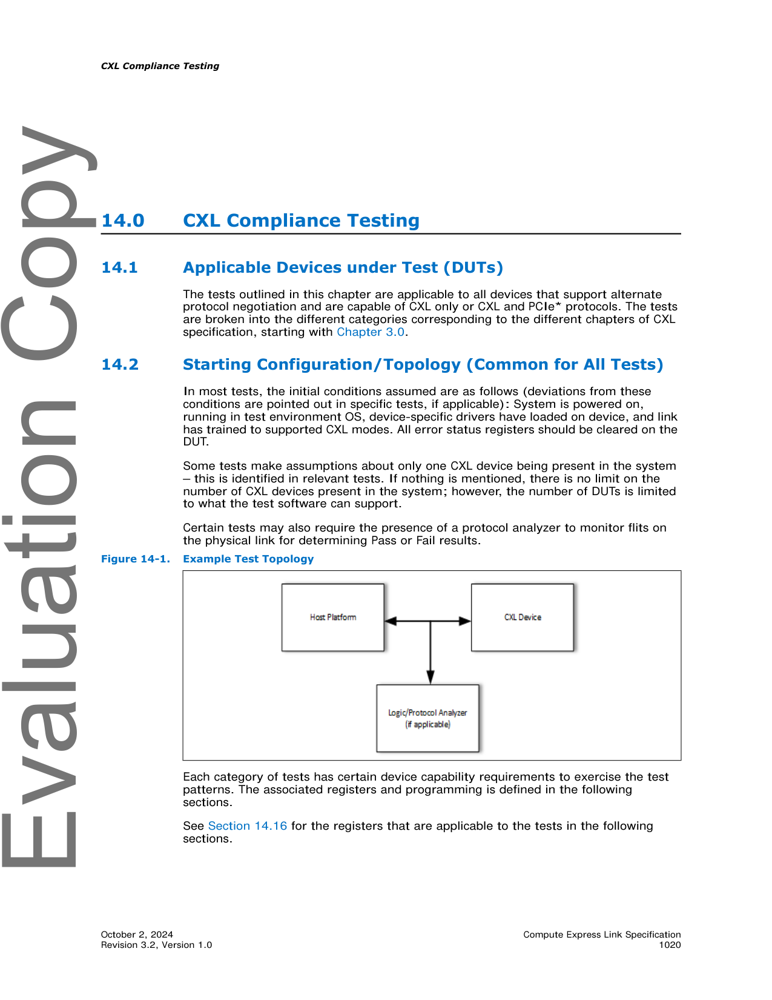
>
> *Original page render @ 150 DPI* — [📄 Full size](figures/chapter_14/page_1020.png)

### 14.2.1 Test Topologies | 测试拓扑

<table>
<thead>
<tr>
<th width="50%">🇬🇧 English</th>
<th width="50%" style="background-color:#e8e8e8">🇨🇳 中文</th>
</tr>
</thead>
<tbody>
<tr><td>Some tests may require a specific topology to achieve the desired requirements. Throughout this chapter there will be references to these topologies as required. This section of the document will describe these topologies at a high level to provide context for the intended test configuration.</td><td style="background-color:#e8e8e8">某些测试可能需要特定的拓扑以达到期望的需求。本章中将根据需要引用这些拓扑。本节将在较高层次上描述这些拓扑,以便为预期的测试配置提供上下文。</td></tr>
</tbody>
</table>

#### 14.2.1.1 Single Host, Direct Attached SLD EP (SHDA) | 单主机、直接连接 SLD EP (SHDA)

<table>
<thead>
<tr>
<th width="50%">🇬🇧 English</th>
<th width="50%" style="background-color:#e8e8e8">🇨🇳 中文</th>
</tr>
</thead>
<tbody>
<tr><td>Figure 14-2 is the most direct connected topology between a root port and an endpoint device.</td><td style="background-color:#e8e8e8">图 14-2 显示了根端口与端点设备之间最直接连接的拓扑。</td></tr>
</tbody>
</table>

> **Figure 14-2.** Example SHDA Topology ｜ 示例 SHDA 拓扑
>
> 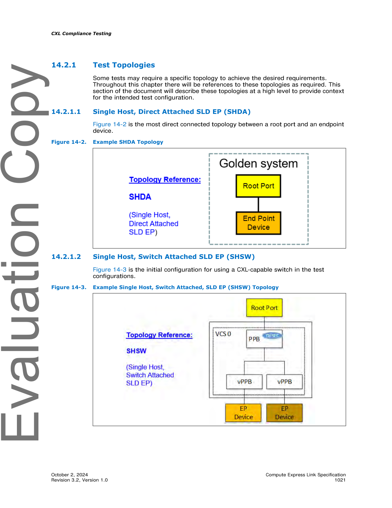
>
> *Original page render @ 150 DPI* — [📄 Full size](figures/chapter_14/page_1021.png)

#### 14.2.1.2 Single Host, Switch Attached SLD EP (SHSW) | 单主机、交换机连接 SLD EP (SHSW)

<table>
<thead>
<tr>
<th width="50%">🇬🇧 English</th>
<th width="50%" style="background-color:#e8e8e8">🇨🇳 中文</th>
</tr>
</thead>
<tbody>
<tr><td>Figure 14-3 is the initial configuration for using a CXL-capable switch in the test configurations.</td><td style="background-color:#e8e8e8">图 14-3 显示了测试配置中使用 CXL 能力交换机的初始配置。</td></tr>
</tbody>
</table>

> **Figure 14-3.** Example Single Host, Switch Attached, SLD EP (SHSW) Topology ｜ 示例单主机、交换机连接 SLD EP (SHSW) 拓扑
>
> 
>
> *Original page render @ 150 DPI* — [📄 Full size](figures/chapter_14/page_1021.png)

[⬆️ 返回目录](#-本章目录-part-a)

---

#### 14.2.1.3 Single Host, Fabric Managed, Switch Attached SLD EP (SHSW-FM) | 单主机、Fabric 管理、交换机连接 SLD EP (SHSW-FM)

<table>
<thead>
<tr>
<th width="50%">🇬🇧 English</th>
<th width="50%" style="background-color:#e8e8e8">🇨🇳 中文</th>
</tr>
</thead>
<tbody>
<tr><td>Figure 14-4 shows the configuration which will use the Fabric Manager as part of the test configuration.</td><td style="background-color:#e8e8e8">图 14-4 显示了测试配置中包含 Fabric Manager 的配置。</td></tr>
</tbody>
</table>

> **Figure 14-4.** Example SHSW-FM Topology ｜ 示例 SHSW-FM 拓扑
>
> 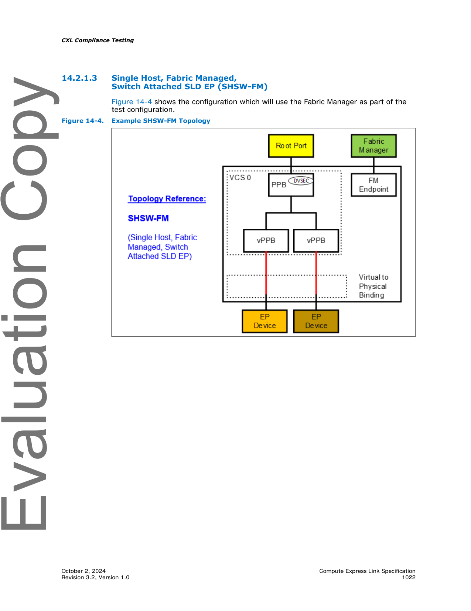
>
> *Original page render @ 150 DPI* — [📄 Full size](figures/chapter_14/page_1022.png)

#### 14.2.1.4 Dual Host, Fabric Managed, Switch Attached SLD EP (DHSW-FM) | 双主机、Fabric 管理、交换机连接 SLD EP (DHSW-FM)

<table>
<thead>
<tr>
<th width="50%">🇬🇧 English</th>
<th width="50%" style="background-color:#e8e8e8">🇨🇳 中文</th>
</tr>
</thead>
<tbody>
<tr><td>Figure 14-5 shows an example configuration topology for having dual hosts during a test.</td><td style="background-color:#e8e8e8">图 14-5 显示了在测试过程中包含双主机的示例配置拓扑。</td></tr>
</tbody>
</table>

> **Figure 14-5.** Example DHSW-FM Topology ｜ 示例 DHSW-FM 拓扑
>
> 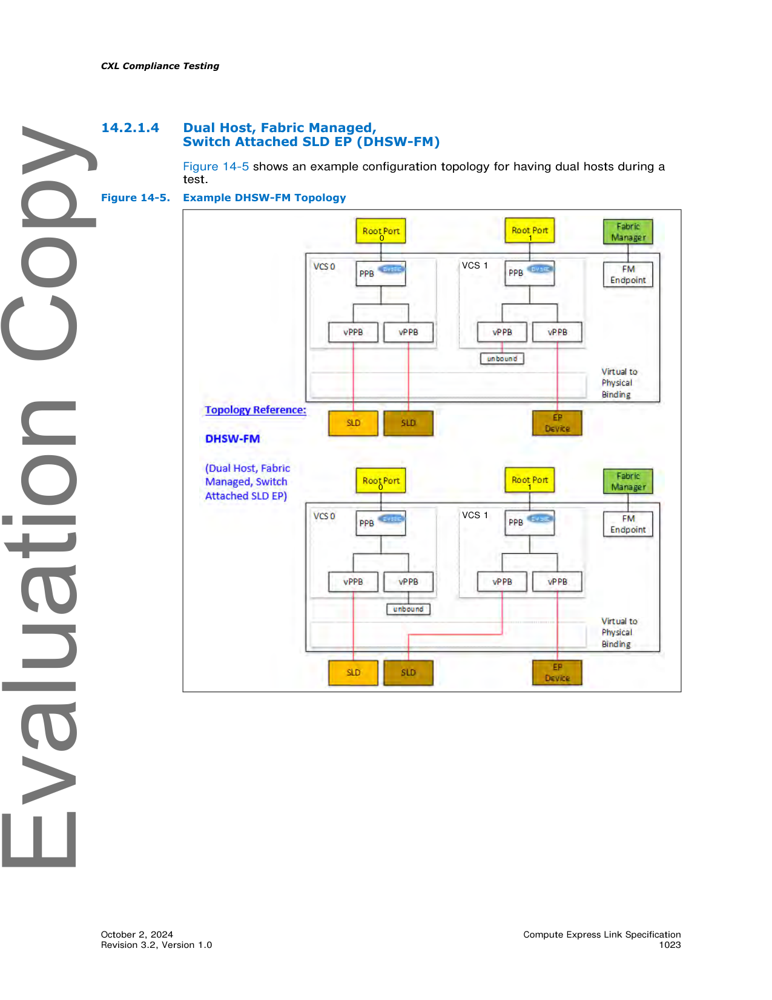
>
> *Original page render @ 150 DPI* — [📄 Full size](figures/chapter_14/page_1023.png)

#### 14.2.1.5 Dual Host, Fabric Managed, Switch Attached MLD EP (DHSW-FM-MLD) | 双主机、Fabric 管理、交换机连接 MLD EP (DHSW-FM-MLD)

<table>
<thead>
<tr>
<th width="50%">🇬🇧 English</th>
<th width="50%" style="background-color:#e8e8e8">🇨🇳 中文</th>
</tr>
</thead>
<tbody>
<tr><td>Figure 14-6 shows the topology for having dual hosts in a managed environment with multiple logical devices.</td><td style="background-color:#e8e8e8">图 14-6 显示了在具有多个逻辑设备的管理环境中包含双主机的拓扑。</td></tr>
</tbody>
</table>

> **Figure 14-6.** Example DHSW-FM-MLD Topology ｜ 示例 DHSW-FM-MLD 拓扑
>
> 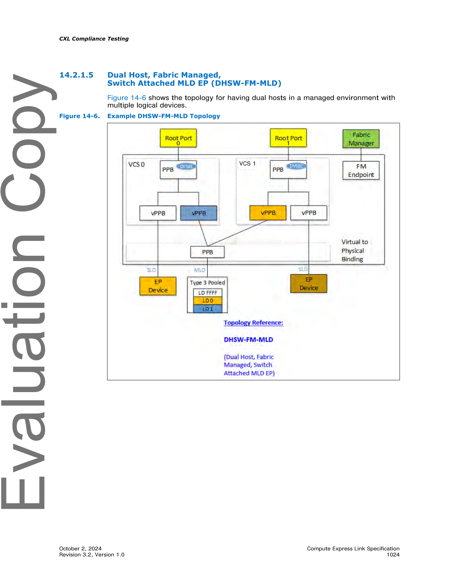
>
> *Original page render @ 150 DPI* — [📄 Full size](figures/chapter_14/page_1024.png)

#### 14.2.1.6 Cascaded Switch Topologies | 级联交换机拓扑

<table>
<thead>
<tr>
<th width="50%">🇬🇧 English</th>
<th width="50%" style="background-color:#e8e8e8">🇨🇳 中文</th>
</tr>
</thead>
<tbody>
<tr><td>PBR switches enable cascaded and mesh topologies. Figure 14-7 shows a cascaded switch topology that is supported by PBR switches. PBR switches use PBR flits for Inter-switch links. A Fabric Manager is required to configure the fabric port routing. HBR switches may be attached to a PBR switch fabric.</td><td style="background-color:#e8e8e8">PBR 交换机支持级联和网状拓扑。图 14-7 显示了 PBR 交换机所支持的级联交换机拓扑。PBR 交换机在交换机间链路上使用 PBR flit。需要 Fabric Manager 来配置 fabric port routing。可以将 HBR 交换机挂接到 PBR 交换机 fabric。</td></tr>
</tbody>
</table>

> **Figure 14-7.** Example Topology for Two PBR Switches ｜ 两台 PBR 交换机的示例拓扑
>
> 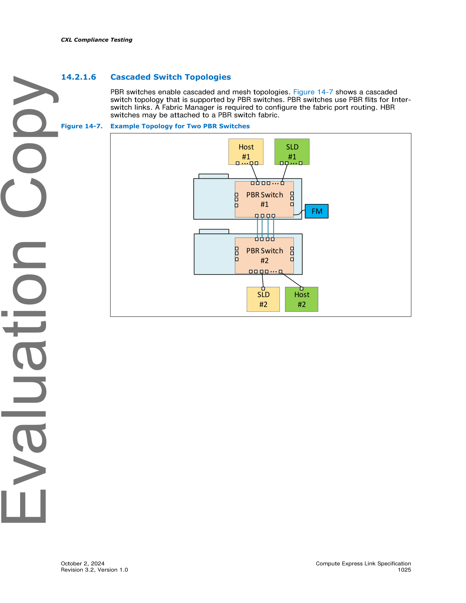
>
> *Original page render @ 150 DPI* — [📄 Full size](figures/chapter_14/page_1025.png)

<table>
<thead>
<tr>
<th width="50%">🇬🇧 English</th>
<th width="50%" style="background-color:#e8e8e8">🇨🇳 中文</th>
</tr>
</thead>
<tbody>
<tr><td>In a topology that has a single PBR switch and a single HBR switch (see Figure 14-8), the host devices are connected to the PBR switch and the HBR switch's Upstream Switch Ports (USPs) are connected to the PBR switch, to allow for multiple-host routing. The HBR switch configures a unique VCS for each host.</td><td style="background-color:#e8e8e8">在包含单个 PBR 交换机和单个 HBR 交换机的拓扑中 (见图 14-8),主机设备连接到 PBR 交换机,HBR 交换机的 Upstream Switch Ports (USPs) 连接到 PBR 交换机,以允许多主机路由。HBR 交换机为每个主机配置一个唯一的 VCS。</td></tr>
</tbody>
</table>

> **Figure 14-8.** Example Topology for a PBR Switch and an HBR Switch ｜ 一台 PBR 交换机和一台 HBR 交换机的示例拓扑
>
> 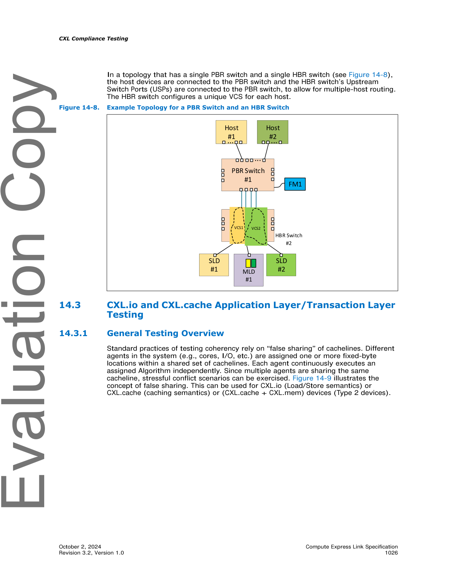
>
> *Original page render @ 150 DPI* — [📄 Full size](figures/chapter_14/page_1026.png)

[⬆️ 返回目录](#-本章目录-part-a)

---

## 14.3 CXL.io and CXL.cache Application Layer/Transaction Layer Testing | CXL.io 和 CXL.cache 应用层/事务层测试

<table>
<thead>
<tr>
<th width="50%">🇬🇧 English</th>
<th width="50%" style="background-color:#e8e8e8">🇨🇳 中文</th>
</tr>
</thead>
<tbody>
<tr><td>CXL.io and CXL.cache Application Layer/Transaction Layer Testing</td><td style="background-color:#e8e8e8">CXL.io 和 CXL.cache 应用层/事务层测试</td></tr>
</tbody>
</table>

### 14.3.1 General Testing Overview | 测试总体概述

<table>
<thead>
<tr>
<th width="50%">🇬🇧 English</th>
<th width="50%" style="background-color:#e8e8e8">🇨🇳 中文</th>
</tr>
</thead>
<tbody>
<tr><td>Standard practices of testing coherency rely on "false sharing" of cachelines. Different agents in the system (e.g., cores, I/O, etc.) are assigned one or more fixed-byte locations within a shared set of cachelines. Each agent continuously executes an assigned Algorithm independently. Since multiple agents are sharing the same cacheline, stressful conflict scenarios can be exercised. Figure 14-9 illustrates the concept of false sharing. This can be used for CXL.io (Load/Store semantics) or CXL.cache (caching semantics) or (CXL.cache + CXL.mem) devices (Type 2 devices).</td><td style="background-color:#e8e8e8">测试一致性的标准做法依赖于 cacheline 的"伪共享 (false sharing)"。系统中的不同 agent (如 cores、I/O 等) 被分配到共享 cacheline 集合内的一个或多个固定字节位置。每个 agent 独立地持续执行所分配的算法。由于多个 agent 共享同一条 cacheline,因此可以施加高强度的冲突场景。图 14-9 展示了伪共享的概念。该方法可用于 CXL.io (Load/Store 语义) 或 CXL.cache (缓存语义) 或 (CXL.cache + CXL.mem) 设备 (Type 2 设备)。</td></tr>
</tbody>
</table>

> **Figure 14-9.** Representation of False Sharing between Cores (on Host) and CXL Devices ｜ 主机核与 CXL 设备之间伪共享的表示
>
> 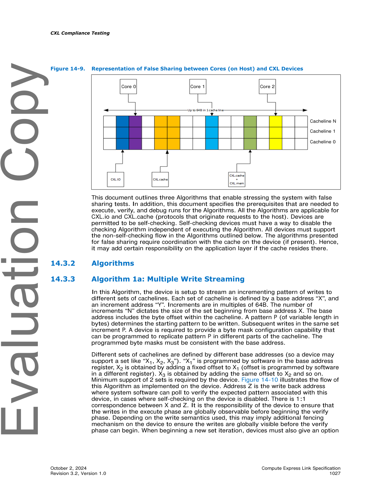
>
> *Original page render @ 150 DPI* — [📄 Full size](figures/chapter_14/page_1027.png)

### 14.3.2 Algorithms | 算法

<table>
<thead>
<tr>
<th width="50%">🇬🇧 English</th>
<th width="50%" style="background-color:#e8e8e8">🇨🇳 中文</th>
</tr>
</thead>
<tbody>
<tr><td>This document outlines three Algorithms that enable stressing the system with false sharing tests. In addition, this document specifies the prerequisites that are needed to execute, verify, and debug runs for the Algorithms. All the Algorithms are applicable for CXL.io and CXL.cache (protocols that originate requests to the host). Devices are permitted to be self-checking. Self-checking devices must have a way to disable the checking Algorithm independent of executing the Algorithm. All devices must support the non-self-checking flow in the Algorithms outlined below. The algorithms presented for false sharing require coordination with the cache on the device (if present). Hence, it may add certain responsibility on the application layer if the cache resides there.</td><td style="background-color:#e8e8e8">本文档概述了三种算法,用于通过伪共享测试对系统进行加压。此外,本文档还规定了执行、验证和调试这些算法运行所必需的先决条件。所有算法都适用于 CXL.io 和 CXL.cache (向主机发起请求的协议)。允许设备进行 self-checking (自检)。自检设备必须能够独立于执行算法来禁用检查算法。所有设备必须支持下文所列算法中的非自检流程。所介绍的伪共享算法需要与设备上的 cache (若存在) 进行协调。因此,如果 cache 位于应用层,可能会给应用层增加一定的责任。</td></tr>
</tbody>
</table>

### 14.3.3 Algorithm 1a: Multiple Write Streaming | 算法 1a:多路写流 (Multiple Write Streaming)

<table>
<thead>
<tr>
<th width="50%">🇬🇧 English</th>
<th width="50%" style="background-color:#e8e8e8">🇨🇳 中文</th>
</tr>
</thead>
<tbody>
<tr><td>In this Algorithm, the device is setup to stream an incrementing pattern of writes to different sets of cachelines. Each set of cacheline is defined by a base address "X", and an increment address "Y". Increments are in multiples of 64B. The number of increments "N" dictates the size of the set beginning from base address X. The base address includes the byte offset within the cacheline. A pattern P (of variable length in bytes) determines the starting pattern to be written. Subsequent writes in the same set increment P. A device is required to provide a byte mask configuration capability that can be programmed to replicate pattern P in different parts of the cacheline. The programmed byte masks must be consistent with the base address.</td><td style="background-color:#e8e8e8">在该算法中,设备被设置为将一系列递增的写入模式 (incrementing pattern of writes) 流向不同组的 cacheline。每组 cacheline 由基地址 "X" 和增量地址 "Y" 定义。增量以 64B 为单位。增量次数 "N" 决定了从基地址 X 开始的集合大小。基地址包含 cacheline 内的字节偏移。模式 P (字节长度可变) 决定要写入的起始模式。同一集合内的后续写入将 P 递增。设备必须提供 byte mask configuration (字节掩码配置) 能力,可被编程以在 cacheline 的不同部分复制模式 P。所编程的字节掩码必须与基地址一致。</td></tr>
<tr><td>Different sets of cachelines are defined by different base addresses (so a device may support a set like "X1, X2, X3"). "X1" is programmed by software in the base address register, X2 is obtained by adding a fixed offset to X1 (offset is programmed by software in a different register). X3 is obtained by adding the same offset to X2 and so on. Minimum support of 2 sets is required by the device. Figure 14-10 illustrates the flow of this Algorithm as implemented on the device. Address Z is the write back address where system software can poll to verify the expected pattern associated with this device, in cases where self-checking on the device is disabled. There is 1:1 correspondence between X and Z. It is the responsibility of the device to ensure that the writes in the execute phase are globally observable before beginning the verify phase. Depending on the write semantics used, this may imply additional fencing mechanism on the device to ensure the writes are globally visible before the verify phase can begin. When beginning a new set iteration, devices must also give an option to use "P" again for the new set, or continue incrementing "P" for the next set. The select is programmed by software in "PatternParameter" field described in the register section.</td><td style="background-color:#e8e8e8">不同的 cacheline 组由不同的基地址定义 (因此设备可以支持形如 "X1, X2, X3" 的集合)。"X1" 由软件在基地址寄存器中编程,X2 通过将固定偏移量加到 X1 得到 (偏移量由软件在另一个寄存器中编程),X3 通过将同一偏移量加到 X2 得到,以此类推。设备最少必须支持 2 个集合。图 14-10 展示了该算法在设备上实现的流程。地址 Z 是回写 (write back) 地址,系统软件可以在设备上禁用自检时轮询该地址,以验证与此设备关联的预期模式。X 与 Z 存在一一对应关系。设备有责任确保执行阶段中的写入在开始验证阶段之前是 globally observable (全局可观察) 的。根据所使用的写入语义,这可能意味着设备上需要额外的 fencing (栅栏) 机制,以确保在验证阶段开始之前写入是全局可见的。在开始新一轮集合迭代时,设备还必须提供一种选择,允许在新集合中再次使用 "P",或为下一集合继续递增 "P"。该选择由软件在寄存器小节中所述的 "PatternParameter" 字段中进行编程。</td></tr>
<tr><td>Open: PatternParameter was in Table 14-41, which was removed in r3.0, v0.7. Please search the PDF for this term and determine how it and surrounding text should be revised. (Also appears in Figure 14-10 and Figure 14-11.)</td><td style="background-color:#e8e8e8">Open:PatternParameter 出现在表 14-41 中,该表已在 r3.0、v0.7 中删除。请在 PDF 中搜索该术语,并确定该术语及其周边文本应如何修订。(同样出现在图 14-10 和图 14-11 中。)</td></tr>
</tbody>
</table>

> **Figure 14-10.** Flow Chart of Algorithm 1a ｜ 算法 1a 的流程图
>
> 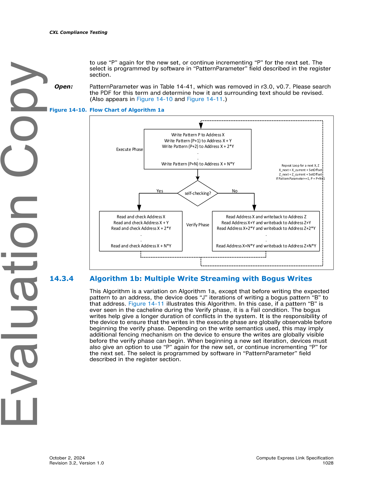
>
> *Original page render @ 150 DPI* — [📄 Full size](figures/chapter_14/page_1028.png)

[⬆️ 返回目录](#-本章目录-part-a)

---

### 14.3.4 Algorithm 1b: Multiple Write Streaming with Bogus Writes | 算法 1b:带伪写 (Bogus Writes) 的多路写流

<table>
<thead>
<tr>
<th width="50%">🇬🇧 English</th>
<th width="50%" style="background-color:#e8e8e8">🇨🇳 中文</th>
</tr>
</thead>
<tbody>
<tr><td>This Algorithm is a variation on Algorithm 1a, except that before writing the expected pattern to an address, the device does "J" iterations of writing a bogus pattern "B" to that address. Figure 14-11 illustrates this Algorithm. In this case, if a pattern "B" is ever seen in the cacheline during the Verify phase, it is a Fail condition. The bogus writes help give a longer duration of conflicts in the system. It is the responsibility of the device to ensure that the writes in the execute phase are globally observable before beginning the verify phase. Depending on the write semantics used, this may imply additional fencing mechanism on the device to ensure the writes are globally visible before the verify phase can begin. When beginning a new set iteration, devices must also give an option to use "P" again for the new set, or continue incrementing "P" for the next set. The select is programmed by software in "PatternParameter" field described in the register section.</td><td style="background-color:#e8e8e8">该算法是算法 1a 的一个变体,不同之处在于,在向某一地址写入预期模式之前,设备会向该地址执行 "J" 次 bogus pattern "B" 的写入。图 14-11 展示了该算法。在这种情况下,如果在验证阶段任何时候在 cacheline 中观察到模式 "B",则视为 Fail (失败) 条件。伪写有助于在系统中产生更长时间的冲突。设备有责任确保执行阶段中的写入在开始验证阶段之前是 globally observable (全局可观察) 的。根据所使用的写入语义,这可能意味着设备上需要额外的 fencing (栅栏) 机制,以确保在验证阶段开始之前写入是全局可见的。在开始新一轮集合迭代时,设备还必须提供一种选择,允许在新集合中再次使用 "P",或为下一集合继续递增 "P"。该选择由软件在寄存器小节中所述的 "PatternParameter" 字段中进行编程。</td></tr>
</tbody>
</table>

> **Figure 14-11.** Flow Chart of Algorithm 1b ｜ 算法 1b 的流程图
>
> 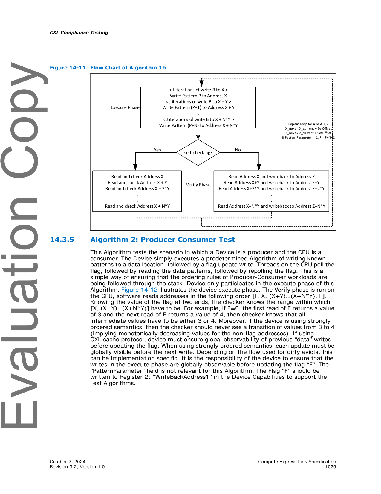
>
> *Original page render @ 150 DPI* — [📄 Full size](figures/chapter_14/page_1029.png)

### 14.3.5 Algorithm 2: Producer Consumer Test | 算法 2:生产者-消费者测试

<table>
<thead>
<tr>
<th width="50%">🇬🇧 English</th>
<th width="50%" style="background-color:#e8e8e8">🇨🇳 中文</th>
</tr>
</thead>
<tbody>
<tr><td>This Algorithm tests the scenario in which a Device is a producer and the CPU is a consumer. The Device simply executes a predetermined Algorithm of writing known patterns to a data location, followed by a flag update write. Threads on the CPU poll the flag, followed by reading the data patterns, followed by repolling the flag. This is a simple way of ensuring that the ordering rules of Producer-Consumer workloads are being followed through the stack. Device only participates in the execute phase of this Algorithm. Figure 14-12 illustrates the device execute phase. The Verify phase is run on the CPU, software reads addresses in the following order [F, X, (X+Y)…(X+N*Y), F]. Knowing the value of the flag at two ends, the checker knows the range within which [X, (X+Y)…(X+N*Y)] have to be. For example, if P=0, the first read of F returns a value of 3 and the next read of F returns a value of 4, then checker knows that all intermediate values have to be either 3 or 4. Moreover, if the device is using strongly ordered semantics, then the checker should never see a transition of values from 3 to 4 (implying monotonically decreasing values for the non-flag addresses). If using CXL.cache protocol, device must ensure global observability of previous "data" writes before updating the flag. When using strongly ordered semantics, each update must be globally visible before the next write. Depending on the flow used for dirty evicts, this can be implementation specific. It is the responsibility of the device to ensure that the writes in the execute phase are globally observable before updating the flag "F". The "PatternParameter" field is not relevant for this Algorithm. The Flag "F" should be written to Register 2: "WriteBackAddress1" in the Device Capabilities to support the Test Algorithms.</td><td style="background-color:#e8e8e8">该算法测试的场景中,设备是生产者 (producer),CPU 是消费者 (consumer)。设备仅执行一个预定算法,即将已知模式写入数据位置,然后再写入一个 flag 更新。CPU 上的线程会轮询该 flag,然后读取数据模式,接着再次轮询 flag。这是确保 Producer-Consumer 工作负载的排序规则贯穿整个协议栈的一种简单方法。设备仅参与该算法的执行阶段。图 14-12 展示了设备的执行阶段。验证阶段在 CPU 上运行,软件按以下顺序读取地址:[F, X, (X+Y)…(X+N*Y), F]。根据 flag 在两端上的值,检查器就知道 [X, (X+Y)…(X+N*Y)] 应当落入的取值范围。例如,若 P=0,第一次读取 F 返回值 3,下一次读取 F 返回值 4,那么检查器就知道所有中间值都必须是 3 或 4。此外,如果设备使用 strongly ordered semantics (强排序语义),则检查器不应看到从 3 到 4 的值跳变 (即非 flag 地址上的值应当单调递减)。如果使用 CXL.cache 协议,设备必须在更新 flag 之前确保先前的 "data" 写入具有 global observability (全局可观察性)。在使用强排序语义时,每次更新必须在下次写入之前具有全局可见性。根据 dirty evicts 所使用的流程,这可能是与实现相关的。设备有责任确保执行阶段中的写入在更新 flag "F" 之前是 globally observable (全局可观察) 的。"PatternParameter" 字段与本算法无关。Flag "F" 应写入 Device Capabilities 中的寄存器 2:"WriteBackAddress1",以支持这些测试算法。</td></tr>
</tbody>
</table>

> **Figure 14-12.** Execute Phase for Algorithm 2 ｜ 算法 2 的执行阶段
>
> 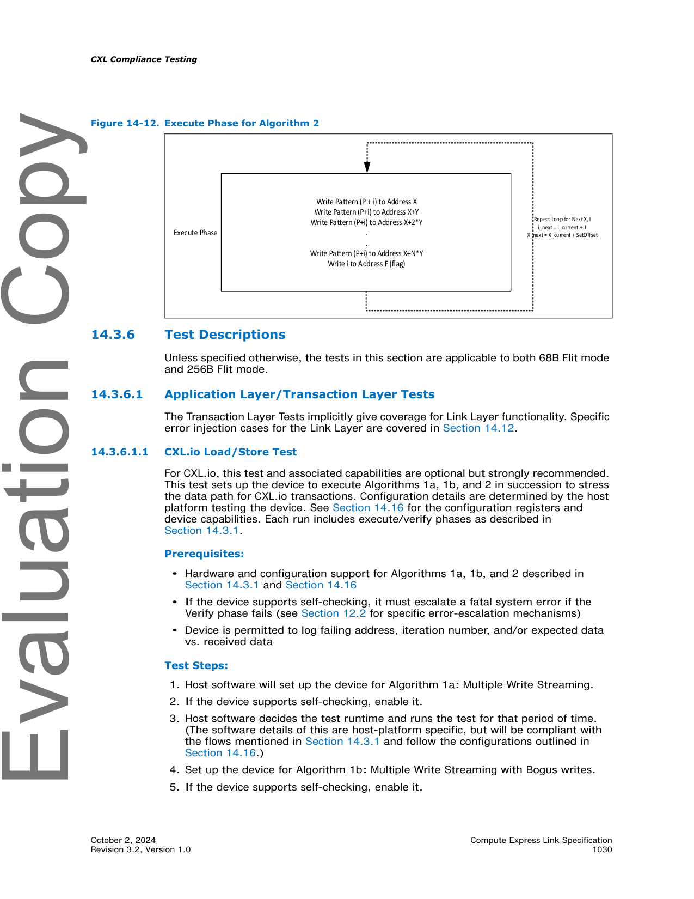
>
> *Original page render @ 150 DPI* — [📄 Full size](figures/chapter_14/page_1030.png)

### 14.3.6 Test Descriptions | 测试描述

<table>
<thead>
<tr>
<th width="50%">🇬🇧 English</th>
<th width="50%" style="background-color:#e8e8e8">🇨🇳 中文</th>
</tr>
</thead>
<tbody>
<tr><td>Unless specified otherwise, the tests in this section are applicable to both 68B Flit mode and 256B Flit mode.</td><td style="background-color:#e8e8e8">除非另有说明,本节中的测试同时适用于 68B Flit 模式和 256B Flit 模式。</td></tr>
</tbody>
</table>

#### 14.3.6.1 Application Layer/Transaction Layer Tests | 应用层/事务层测试

<table>
<thead>
<tr>
<th width="50%">🇬🇧 English</th>
<th width="50%" style="background-color:#e8e8e8">🇨🇳 中文</th>
</tr>
</thead>
<tbody>
<tr><td>The Transaction Layer Tests implicitly give coverage for Link Layer functionality. Specific error injection cases for the Link Layer are covered in Section 14.12.</td><td style="background-color:#e8e8e8">事务层测试隐式地覆盖了链路层功能。链路层的具体错误注入用例在 14.12 节中介绍。</td></tr>
</tbody>
</table>

##### 14.3.6.1.1 CXL.io Load/Store Test | CXL.io 加载/存储测试

<table>
<thead>
<tr>
<th width="50%">🇬🇧 English</th>
<th width="50%" style="background-color:#e8e8e8">🇨🇳 中文</th>
</tr>
</thead>
<tbody>
<tr><td>For CXL.io, this test and associated capabilities are optional but strongly recommended. This test sets up the device to execute Algorithms 1a, 1b, and 2 in succession to stress the data path for CXL.io transactions. Configuration details are determined by the host platform testing the device. See Section 14.16 for the configuration registers and device capabilities. Each run includes execute/verify phases as described in Section 14.3.1.</td><td style="background-color:#e8e8e8">对于 CXL.io,本测试和相关能力是可选的,但强烈建议实施。本测试将设备设置为依次执行算法 1a、1b 和 2,以对 CXL.io 事务的数据通路施加压力。配置细节由测试该设备的主机平台决定。配置寄存器和设备能力参见 14.16 节。每次运行都包含 14.3.1 节中所述的执行/验证阶段。</td></tr>
<tr><td><strong>Prerequisites:</strong></td><td style="background-color:#e8e8e8"><strong>先决条件:</strong></td></tr>
<tr><td>• Hardware and configuration support for Algorithms 1a, 1b, and 2 described in Section 14.3.1 and Section 14.16</td><td style="background-color:#e8e8e8">• 14.3.1 节和 14.16 节所述的算法 1a、1b 和 2 的硬件和配置支持</td></tr>
<tr><td>• If the device supports self-checking, it must escalate a fatal system error if the Verify phase fails (see Section 12.2 for specific error-escalation mechanisms)</td><td style="background-color:#e8e8e8">• 如果设备支持 self-checking (自检),则必须在验证阶段失败时升级为 fatal system error (致命的系统错误) (具体错误升级机制参见 12.2 节)</td></tr>
<tr><td>• Device is permitted to log failing address, iteration number, and/or expected data vs. received data</td><td style="background-color:#e8e8e8">• 允许设备记录失败地址、迭代次数和/或预期数据与接收数据</td></tr>
<tr><td><strong>Test Steps:</strong></td><td style="background-color:#e8e8e8"><strong>测试步骤:</strong></td></tr>
<tr><td>1. Host software will set up the device for Algorithm 1a: Multiple Write Streaming.</td><td style="background-color:#e8e8e8">1. 主机软件将为算法 1a (Multiple Write Streaming) 配置设备。</td></tr>
<tr><td>2. If the device supports self-checking, enable it.</td><td style="background-color:#e8e8e8">2. 如果设备支持 self-checking (自检),则启用它。</td></tr>
<tr><td>3. Host software decides the test runtime and runs the test for that period of time. (The software details of this are host-platform specific, but will be compliant with the flows mentioned in Section 14.3.1 and follow the configurations outlined in Section 14.16.)</td><td style="background-color:#e8e8e8">3. 主机软件决定测试运行时长,并运行测试至该时长。(其软件细节因主机平台而异,但应符合 14.3.1 节中提到的流程,并遵循 14.16 节中列出的配置。)</td></tr>
<tr><td>4. Set up the device for Algorithm 1b: Multiple Write Streaming with Bogus writes.</td><td style="background-color:#e8e8e8">4. 为算法 1b (带伪写的多路写流) 配置设备。</td></tr>
<tr><td>5. If the device supports self-checking, enable it.</td><td style="background-color:#e8e8e8">5. 如果设备支持 self-checking (自检),则启用它。</td></tr>
<tr><td>6. Host software decides the test runtime and runs the test for that period of time.</td><td style="background-color:#e8e8e8">6. 主机软件决定测试运行时长,并运行测试至该时长。</td></tr>
<tr><td>7. Set up the device for Algorithm 2: Producer Consumer Test.</td><td style="background-color:#e8e8e8">7. 为算法 2 (Producer Consumer 测试) 配置设备。</td></tr>
<tr><td>8. Host software decides the test runtime and runs the test for that period of time.</td><td style="background-color:#e8e8e8">8. 主机软件决定测试运行时长,并运行测试至该时长。</td></tr>
<tr><td><strong>Pass Criteria:</strong></td><td style="background-color:#e8e8e8"><strong>通过条件:</strong></td></tr>
<tr><td>• No data corruptions or system errors are reported</td><td style="background-color:#e8e8e8">• 未报告数据损坏或系统错误</td></tr>
<tr><td><strong>Fail Conditions:</strong></td><td style="background-color:#e8e8e8"><strong>失败条件:</strong></td></tr>
<tr><td>• Data corruptions or system errors are reported</td><td style="background-color:#e8e8e8">• 报告数据损坏或系统错误</td></tr>
</tbody>
</table>

[⬆️ 返回目录](#-本章目录-part-a)

---

##### 14.3.6.1.2 CXL.cache Coherency Test | CXL.cache 一致性测试

<table>
<thead>
<tr>
<th width="50%">🇬🇧 English</th>
<th width="50%" style="background-color:#e8e8e8">🇨🇳 中文</th>
</tr>
</thead>
<tbody>
<tr><td>This test sets up the device and the host to execute Algorithms 1a, 1b, and 2 in succession to stress the data path for CXL.cache transactions. This test should only be run if the device and the host support CXL.cache or CXL.cache + CXL.mem protocols. Configuration details are determined by the host platform testing the device. See Section 14.16 for the configuration registers and device capabilities. Each run includes execute/verify phases as described in Section 14.3.1.</td><td style="background-color:#e8e8e8">本测试配置设备和主机依次执行算法 1a、1b 和 2,以对 CXL.cache 事务的数据通路施加压力。只有当设备和主机支持 CXL.cache 或 CXL.cache + CXL.mem 协议时,才应运行此测试。配置细节由测试该设备的主机平台决定。配置寄存器和设备能力参见 14.16 节。每次运行都包含 14.3.1 节中所述的执行/验证阶段。</td></tr>
<tr><td><strong>Prerequisites:</strong></td><td style="background-color:#e8e8e8"><strong>先决条件:</strong></td></tr>
<tr><td>• Device is CXL.cache capable</td><td style="background-color:#e8e8e8">• 设备具备 CXL.cache 能力</td></tr>
<tr><td>• Hardware and configuration support for Algorithms 1a, 1b, and 2 described in Section 14.3.1 and Section 14.16</td><td style="background-color:#e8e8e8">• 14.3.1 节和 14.16 节所述的算法 1a、1b 和 2 的硬件和配置支持</td></tr>
<tr><td>• If a Device supports self-checking, it must escalate a fatal system error if the Verify phase fails (see Section 12.2 for specific error-escalation mechanisms)</td><td style="background-color:#e8e8e8">• 如果设备支持 self-checking (自检),则必须在验证阶段失败时升级为 fatal system error (致命的系统错误) (具体错误升级机制参见 12.2 节)</td></tr>
<tr><td>• Device is permitted to log failing address, iteration number, and/or expected data vs. received data</td><td style="background-color:#e8e8e8">• 允许设备记录失败地址、迭代次数和/或预期数据与接收数据</td></tr>
<tr><td><strong>Test Steps:</strong></td><td style="background-color:#e8e8e8"><strong>测试步骤:</strong></td></tr>
<tr><td>1. Host software will set up the device and the host for Algorithm 1a: Multiple Write Streaming. An equivalent version of the algorithm is setup to be executed by host software so as to enable false sharing of the cachelines.</td><td style="background-color:#e8e8e8">1. 主机软件将为算法 1a (Multiple Write Streaming) 配置设备和主机。设置一个等效版本的算法,由主机软件执行,以便对 cacheline 启用伪共享。</td></tr>
<tr><td>2. Set the Mem_Enable bit in the CXL Control register on both the host and device side CXL.$m controllers.</td><td style="background-color:#e8e8e8">2. 在主机和设备两侧 CXL.$m 控制器的 CXL Control 寄存器中设置 Mem_Enable 位。</td></tr>
<tr><td>3. If the device supports self-checking, enable it.</td><td style="background-color:#e8e8e8">3. 如果设备支持 self-checking (自检),则启用它。</td></tr>
<tr><td>4. Host software decides the test runtime and runs the test for that period of time. (The software details of this are host-platform specific, but will be compliant with the flows mentioned in Section 14.3.1 and follow the configurations outlined in Section 14.16.)</td><td style="background-color:#e8e8e8">4. 主机软件决定测试运行时长,并运行测试至该时长。(其软件细节因主机平台而异,但应符合 14.3.1 节中提到的流程,并遵循 14.16 节中列出的配置。)</td></tr>
<tr><td>5. Set up the device for Algorithm 1b: Multiple Write Streaming with Bogus writes.</td><td style="background-color:#e8e8e8">5. 为算法 1b (带伪写的多路写流) 配置设备。</td></tr>
<tr><td>6. If the device supports self-checking, enable it.</td><td style="background-color:#e8e8e8">6. 如果设备支持 self-checking (自检),则启用它。</td></tr>
<tr><td>7. Host software decides the test runtime and runs the test for that period of time.</td><td style="background-color:#e8e8e8">7. 主机软件决定测试运行时长,并运行测试至该时长。</td></tr>
<tr><td>8. Set up the device for Algorithm 2: Producer Consumer Test.</td><td style="background-color:#e8e8e8">8. 为算法 2 (Producer Consumer 测试) 配置设备。</td></tr>
<tr><td>9. Host software decides the test runtime and runs the test for that period of time.</td><td style="background-color:#e8e8e8">9. 主机软件决定测试运行时长,并运行测试至该时长。</td></tr>
<tr><td><strong>Pass Criteria:</strong></td><td style="background-color:#e8e8e8"><strong>通过条件:</strong></td></tr>
<tr><td>• No data corruptions or system errors are reported</td><td style="background-color:#e8e8e8">• 未报告数据损坏或系统错误</td></tr>
<tr><td>• Reads to the written address locations must return same data. Data integrity needs to be maintained.</td><td style="background-color:#e8e8e8">• 对已写入地址位置的读取必须返回相同的数据。必须保持数据完整性。</td></tr>
<tr><td><strong>Fail Conditions:</strong></td><td style="background-color:#e8e8e8"><strong>失败条件:</strong></td></tr>
<tr><td>• Data corruptions or system errors are reported</td><td style="background-color:#e8e8e8">• 报告数据损坏或系统错误</td></tr>
</tbody>
</table>

##### 14.3.6.1.3 CXL Test for Receiving GO-ERR | 接收 GO-ERR 的 CXL 测试

<table>
<thead>
<tr>
<th width="50%">🇬🇧 English</th>
<th width="50%" style="background-color:#e8e8e8">🇨🇳 中文</th>
</tr>
</thead>
<tbody>
<tr><td>This test is applicable only for devices that support CXL.cache protocols. This test sets up the device to execute Algorithm 1a while mapping one of the sets of the address to a memory range that is not accessible by the device. Test system software and configuration details are determined by the host platform and are system specific.</td><td style="background-color:#e8e8e8">本测试仅适用于支持 CXL.cache 协议的设备。本测试在将其中一组地址映射到设备不可访问的内存范围的同时,设置设备执行算法 1a。测试系统软件和配置细节由主机平台决定,且与具体系统相关。</td></tr>
<tr><td><strong>Prerequisites:</strong></td><td style="background-color:#e8e8e8"><strong>先决条件:</strong></td></tr>
<tr><td>• Device is CXL.cache capable</td><td style="background-color:#e8e8e8">• 设备具备 CXL.cache 能力</td></tr>
<tr><td>• Support for Algorithm 1a</td><td style="background-color:#e8e8e8">• 支持算法 1a</td></tr>
<tr><td><strong>Test Steps:</strong></td><td style="background-color:#e8e8e8"><strong>测试步骤:</strong></td></tr>
<tr><td>1. Configure device for Algorithm 1a, and set up one of the base addresses to be an address not accessible by the DUT.</td><td style="background-color:#e8e8e8">1. 为算法 1a 配置设备,并将其中一个基地址设置为 DUT 不可访问的地址。</td></tr>
<tr><td>2. Disable self-checking in the DUT.</td><td style="background-color:#e8e8e8">2. 在 DUT 中禁用 self-checking (自检)。</td></tr>
<tr><td>3. Host software decides test runtime and runs test for that period of time.</td><td style="background-color:#e8e8e8">3. 主机软件决定测试运行时长,并运行测试至该时长。</td></tr>
<tr><td><strong>Pass Criteria:</strong></td><td style="background-color:#e8e8e8"><strong>通过条件:</strong></td></tr>
<tr><td>• No data corruptions or system errors are reported</td><td style="background-color:#e8e8e8">• 未报告数据损坏或系统错误</td></tr>
<tr><td>• No fatal device errors on receiving GO-ERR</td><td style="background-color:#e8e8e8">• 接收 GO-ERR 时未发生致命的设备错误</td></tr>
<tr><td>• Inaccessible memory range has not been modified by the device</td><td style="background-color:#e8e8e8">• 设备未修改不可访问的内存范围</td></tr>
<tr><td><strong>Fail Conditions:</strong></td><td style="background-color:#e8e8e8"><strong>失败条件:</strong></td></tr>
<tr><td>• Data corruptions or system errors reported</td><td style="background-color:#e8e8e8">• 报告数据损坏或系统错误</td></tr>
<tr><td>• Fatal device errors on receiving GO-ERR</td><td style="background-color:#e8e8e8">• 接收 GO-ERR 时发生致命的设备错误</td></tr>
<tr><td>• Inaccessible memory range modified by the device (host error)</td><td style="background-color:#e8e8e8">• 设备修改了不可访问的内存范围 (主机错误)</td></tr>
</tbody>
</table>

##### 14.3.6.1.4 CXL.mem Test | CXL.mem 测试

<table>
<thead>
<tr>
<th width="50%">🇬🇧 English</th>
<th width="50%" style="background-color:#e8e8e8">🇨🇳 中文</th>
</tr>
</thead>
<tbody>
<tr><td>This test sets up the host and the device to execute Algorithms 1a, 1b, and 2 in succession to stress the data path for CXL.mem transactions. An equivalent version of the algorithm is setup to be executed by host software so as to enable false sharing of the cachelines. Test system software and configuration details are determined by the host platform and are system specific.</td><td style="background-color:#e8e8e8">本测试配置主机和设备依次执行算法 1a、1b 和 2,以对 CXL.mem 事务的数据通路施加压力。设置一个等效版本的算法,由主机软件执行,以便对 cacheline 启用伪共享。测试系统软件和配置细节由主机平台决定,且与具体系统相关。</td></tr>
<tr><td><strong>Prerequisites:</strong></td><td style="background-color:#e8e8e8"><strong>先决条件:</strong></td></tr>
<tr><td>• Device is CXL.mem capable</td><td style="background-color:#e8e8e8">• 设备具备 CXL.mem 能力</td></tr>
<tr><td><strong>Test Steps:</strong></td><td style="background-color:#e8e8e8"><strong>测试步骤:</strong></td></tr>
<tr><td>1. Set the Mem_Enable bit in CXL Control register on both the host and device side CXL.$m controllers.</td><td style="background-color:#e8e8e8">1. 在主机和设备两侧 CXL.$m 控制器的 CXL Control 寄存器中设置 Mem_Enable 位。</td></tr>
<tr><td>2. Map the device-attached memory to a test-memory range that is accessible by the host.</td><td style="background-color:#e8e8e8">2. 将设备挂接的内存 (device-attached memory) 映射到主机可访问的 test-memory 范围。</td></tr>
<tr><td>3. Run the equivalent of Algorithms 1a, 1b, and 2 on the host and the device targeting device-attached memory.</td><td style="background-color:#e8e8e8">3. 在主机和设备上,针对设备挂接的内存运行等效的算法 1a、1b 和 2。</td></tr>
<tr><td><strong>Pass Criteria:</strong></td><td style="background-color:#e8e8e8"><strong>通过条件:</strong></td></tr>
<tr><td>• No data corruptions or system errors are reported</td><td style="background-color:#e8e8e8">• 未报告数据损坏或系统错误</td></tr>
<tr><td>• Reads to the written address locations must return same data. Data integrity needs to be maintained.</td><td style="background-color:#e8e8e8">• 对已写入地址位置的读取必须返回相同的数据。必须保持数据完整性。</td></tr>
<tr><td><strong>Fail Conditions:</strong></td><td style="background-color:#e8e8e8"><strong>失败条件:</strong></td></tr>
<tr><td>• Data corruptions or system errors are reported</td><td style="background-color:#e8e8e8">• 报告数据损坏或系统错误</td></tr>
</tbody>
</table>

[⬆️ 返回目录](#-本章目录-part-a)

---

##### 14.3.6.1.5 Egress Port Backpressure Test | 出口端口背压测试

<table>
<thead>
<tr>
<th width="50%">🇬🇧 English</th>
<th width="50%" style="background-color:#e8e8e8">🇨🇳 中文</th>
</tr>
</thead>
<tbody>
<tr><td>This test applies to an MLD that supports FM API or an SLD that supports the Memory Device command set. This test sets up the device to execute Algorithms 1a, 1b, and 2 in succession to stress the data path for CXL.mem transactions. An equivalent version of the algorithm is setup to be executed by host software so as to enable false sharing of the cachelines. Test system software and configuration details are determined by the host platform and are system specific. NUMBER_OF_QOS_TEST_LOOPS, NUMBER_OF_CHECK_AVERAGE, and BackpressureSample Interval setting in the test steps below is decided upon by the testing platform/software.</td><td style="background-color:#e8e8e8">本测试适用于支持 FM API 的 MLD 或支持 Memory Device 命令集的 SLD。本测试将设备设置为依次执行算法 1a、1b 和 2,以对 CXL.mem 事务的数据通路施加压力。设置一个等效版本的算法,由主机软件执行,以便对 cacheline 启用伪共享。测试系统软件和配置细节由主机平台决定,且与具体系统相关。下列测试步骤中的 NUMBER_OF_QOS_TEST_LOOPS、NUMBER_OF_CHECK_AVERAGE 和 BackpressureSample Interval 设置由测试平台/软件自行决定。</td></tr>
<tr><td><strong>Prerequisites:</strong></td><td style="background-color:#e8e8e8"><strong>先决条件:</strong></td></tr>
<tr><td>• Device is CXL.mem capable</td><td style="background-color:#e8e8e8">• 设备具备 CXL.mem 能力</td></tr>
<tr><td><strong>Test Steps:</strong></td><td style="background-color:#e8e8e8"><strong>测试步骤:</strong></td></tr>
<tr><td><strong>For an MLD:</strong></td><td style="background-color:#e8e8e8"><strong>对于 MLD:</strong></td></tr>
<tr><td>1. Through the FM API, check if Egress Port Congestion Supported is set by issuing a Get LD Info command.</td><td style="background-color:#e8e8e8">1. 通过 FM API,发出 Get LD Info 命令以检查 Egress Port Congestion Supported 是否已设置。</td></tr>
<tr><td>2. If Egress Port Congestion Supported is enabled:</td><td style="background-color:#e8e8e8">2. 如果 Egress Port Congestion Supported 已启用:</td></tr>
<tr><td>Repeat for NUMBER_OF_QOS_TEST_LOOPS:</td><td style="background-color:#e8e8e8">对 NUMBER_OF_QOS_TEST_LOOPS 进行循环:</td></tr>
<tr><td>a. Set the BackpressureSample Interval setting to a value between 1 -31 through the Set QoS Control command.</td><td style="background-color:#e8e8e8">a. 通过 Set QoS Control 命令,将 BackpressureSample Interval 设置为 1-31 之间的值。</td></tr>
<tr><td>b. Set the Egress Port Congestion Enable bit through the Set QoS Control command.</td><td style="background-color:#e8e8e8">b. 通过 Set QoS Control 命令设置 Egress Port Congestion Enable 位。</td></tr>
<tr><td>c. Check that the Egress Port Congestion Enable bit was set successfully in the Get QoS Control Response.</td><td style="background-color:#e8e8e8">c. 在 Get QoS Control Response 中检查 Egress Port Congestion Enable 位已成功设置。</td></tr>
<tr><td>d. Run the equivalent of Algorithms 1a, 1b, and 2 in succession on the host and the device targeting device-attached memory.</td><td style="background-color:#e8e8e8">d. 在主机和设备上,针对设备挂接的内存,依次运行等效的算法 1a、1b 和 2。</td></tr>
<tr><td>e. While Algorithms 1a, 1b, and 2 are running: Check the reported Backpressure Average Percentage through the Get QoS Status command and response. It should report values within the valid range which is 0 – 100. Repeat this step NUMBER_OF_CHECK_AVERAGE times at a certain interval.</td><td style="background-color:#e8e8e8">e. 在算法 1a、1b 和 2 运行期间:通过 Get QoS Status 命令及其响应检查所报告的 Backpressure Average Percentage。其报告值应处于有效范围 0 – 100 内。以一定间隔重复本步骤 NUMBER_OF_CHECK_AVERAGE 次。</td></tr>
<tr><td><strong>For an SLD:</strong></td><td style="background-color:#e8e8e8"><strong>对于 SLD:</strong></td></tr>
<tr><td>1. Check if Egress Port Congestion Supported is set by issuing an Identify Memory Device, and checking the corresponding Identify Memory Device Output Payload.</td><td style="background-color:#e8e8e8">1. 发出 Identify Memory Device 命令,并检查相应的 Identify Memory Device Output Payload,以验证 Egress Port Congestion Supported 是否已设置。</td></tr>
<tr><td>2. If Egress Port Congestion Supported is enabled, repeat for NUMBER_OF_QOS_TEST_LOOPS:</td><td style="background-color:#e8e8e8">2. 如果 Egress Port Congestion Supported 已启用,则对 NUMBER_OF_QOS_TEST_LOOPS 进行循环:</td></tr>
<tr><td>a. Set the BackpressureSample Interval setting to a value between 1 - 31 through the Set SLD QoS Control Request command.</td><td style="background-color:#e8e8e8">a. 通过 Set SLD QoS Control Request 命令,将 BackpressureSample Interval 设置为 1-31 之间的值。</td></tr>
<tr><td>b. Set the Egress Port Congestion Enable bit through the Set SLD QoS Control Request.</td><td style="background-color:#e8e8e8">b. 通过 Set SLD QoS Control Request 设置 Egress Port Congestion Enable 位。</td></tr>
<tr><td>c. Check that the Egress Port Congestion Enable bit was set successfully in the Get SLD QoS Control Response.</td><td style="background-color:#e8e8e8">c. 在 Get SLD QoS Control Response 中检查 Egress Port Congestion Enable 位已成功设置。</td></tr>
<tr><td>d. Check the reported Backpressure Average Percentage through the Get QoS Status command and response.</td><td style="background-color:#e8e8e8">d. 通过 Get QoS Status 命令及其响应检查所报告的 Backpressure Average Percentage。</td></tr>
<tr><td>e. Run the equivalent of Algorithms 1a, 1b, and 2 in succession on the host and the device targeting device-attached memory.</td><td style="background-color:#e8e8e8">e. 在主机和设备上,针对设备挂接的内存,依次运行等效的算法 1a、1b 和 2。</td></tr>
<tr><td>f. While Algorithms 1a, 1b, and 2 are running: Check the reported Backpressure Average Percentage through the Get SLD QoS Status command and response. It should report values within the valid range which is 0 – 100. Repeat this step NUMBER_OF_CHECK_AVERAGE times at a certain interval.</td><td style="background-color:#e8e8e8">f. 在算法 1a、1b 和 2 运行期间:通过 Get SLD QoS Status 命令及其响应检查所报告的 Backpressure Average Percentage。其报告值应处于有效范围 0 – 100 内。以一定间隔重复本步骤 NUMBER_OF_CHECK_AVERAGE 次。</td></tr>
<tr><td><strong>Pass Criteria:</strong></td><td style="background-color:#e8e8e8"><strong>通过条件:</strong></td></tr>
<tr><td>• Egress Port Congestion Enable is set after enabling it</td><td style="background-color:#e8e8e8">• 启用后 Egress Port Congestion Enable 被设置</td></tr>
<tr><td>• Backpressure Average Percentage reports valid values within 0-100.</td><td style="background-color:#e8e8e8">• Backpressure Average Percentage 报告处于 0-100 范围内的有效值。</td></tr>
<tr><td>• No data corruptions or system errors are reported while executing Algorithms 1a, 1b, and 2</td><td style="background-color:#e8e8e8">• 执行算法 1a、1b 和 2 期间未报告数据损坏或系统错误</td></tr>
<tr><td><strong>Fail Conditions:</strong></td><td style="background-color:#e8e8e8"><strong>失败条件:</strong></td></tr>
<tr><td>• Egress Port Congestion Enable is not set after enabling it</td><td style="background-color:#e8e8e8">• 启用后 Egress Port Congestion Enable 未被设置</td></tr>
<tr><td>• Backpressure Average Percentage reports any value outside the valid 0-100 range</td><td style="background-color:#e8e8e8">• Backpressure Average Percentage 报告超出 0-100 有效范围的任何值</td></tr>
<tr><td>• Data corruptions or system errors reported while executing Algorithms 1a, 1b, and 2</td><td style="background-color:#e8e8e8">• 执行算法 1a、1b 和 2 期间报告数据损坏或系统错误</td></tr>
</tbody>
</table>

##### 14.3.6.1.6 Temporary Throughput Reduction Test | 临时吞吐量降低测试

<table>
<thead>
<tr>
<th width="50%">🇬🇧 English</th>
<th width="50%" style="background-color:#e8e8e8">🇨🇳 中文</th>
</tr>
</thead>
<tbody>
<tr><td>This test applies to an MLD that supports FM API or an SLD that supports the Memory Device Command set. This test sets up the device to execute Algorithms 1a, 1b, and 2 in succession to stress the data path for CXL.mem transactions. For Type 3 (MLD or SLD), it is the responsibility of the host to take care of running the algorithms as appropriate. An equivalent version of the algorithm is setup to be executed by Host software so as to enable false sharing of the cachelines. Test system software and configuration details are determined by the host platform and are system specific. NUMBER_OF_QOS_TEST_LOOPS in the test steps is decided upon by the testing platform/software.</td><td style="background-color:#e8e8e8">本测试适用于支持 FM API 的 MLD 或支持 Memory Device 命令集的 SLD。本测试将设备设置为依次执行算法 1a、1b 和 2,以对 CXL.mem 事务的数据通路施加压力。对于 Type 3 (MLD 或 SLD),由主机负责按需运行这些算法。设置一个等效版本的算法,由主机软件执行,以便对 cacheline 启用伪共享。测试系统软件和配置细节由主机平台决定,且与具体系统相关。测试步骤中的 NUMBER_OF_QOS_TEST_LOOPS 由测试平台/软件自行决定。</td></tr>
<tr><td><strong>Prerequisites:</strong></td><td style="background-color:#e8e8e8"><strong>先决条件:</strong></td></tr>
<tr><td>• Device is CXL.mem capable</td><td style="background-color:#e8e8e8">• 设备具备 CXL.mem 能力</td></tr>
<tr><td><strong>Test Steps:</strong></td><td style="background-color:#e8e8e8"><strong>测试步骤:</strong></td></tr>
<tr><td><strong>For an MLD:</strong></td><td style="background-color:#e8e8e8"><strong>对于 MLD:</strong></td></tr>
<tr><td>1. Through the FM API, check if Temporary Throughput Reduction Supported is set by issuing a Get LD Info command.</td><td style="background-color:#e8e8e8">1. 通过 FM API,发出 Get LD Info 命令以检查 Temporary Throughput Reduction Supported 是否已设置。</td></tr>
<tr><td>2. If Temporary Throughput Reduction Supported is enabled, repeat for NUMBER_OF_QOS_TEST_LOOPS:</td><td style="background-color:#e8e8e8">2. 如果 Temporary Throughput Reduction Supported 已启用,则对 NUMBER_OF_QOS_TEST_LOOPS 进行循环:</td></tr>
<tr><td>a. Set the Temporary Throughput Reduction Enable bit by issuing the Set QoS Control command.</td><td style="background-color:#e8e8e8">a. 通过发出 Set QoS Control 命令设置 Temporary Throughput Reduction Enable 位。</td></tr>
<tr><td>b. Check that the Temporary Throughput Reduction Enable bit was set successfully in the Get QoS Control Response.</td><td style="background-color:#e8e8e8">b. 在 Get QoS Control Response 中检查 Temporary Throughput Reduction Enable 位已成功设置。</td></tr>
<tr><td>c. Run the equivalent of Algorithms 1a, 1b, and 2 in succession on the host and the device targeting device-attached memory.</td><td style="background-color:#e8e8e8">c. 在主机和设备上,针对设备挂接的内存,依次运行等效的算法 1a、1b 和 2。</td></tr>
<tr><td><strong>For an SLD:</strong></td><td style="background-color:#e8e8e8"><strong>对于 SLD:</strong></td></tr>
<tr><td>1. Through the Memory Device Command set, check if Temporary Throughput Reduction Supported is set by issuing an Identify Memory Device, and checking corresponding Identify Memory Device Output Payload.</td><td style="background-color:#e8e8e8">1. 通过 Memory Device 命令集,发出 Identify Memory Device 并检查相应的 Identify Memory Device Output Payload,以验证 Temporary Throughput Reduction Supported 是否已设置。</td></tr>
<tr><td>2. If Temporary Throughput Reduction Supported is enabled, repeat for NUMBER_OF_QOS_TEST_LOOPS:</td><td style="background-color:#e8e8e8">2. 如果 Temporary Throughput Reduction Supported 已启用,则对 NUMBER_OF_QOS_TEST_LOOPS 进行循环:</td></tr>
<tr><td>a. Set the Temporary Throughput Reduction Enable bit through the Set SLD QoS Control Request.</td><td style="background-color:#e8e8e8">a. 通过 Set SLD QoS Control Request 设置 Temporary Throughput Reduction Enable 位。</td></tr>
<tr><td>b. Check that the Temporary Throughput Reduction Enable bit was set successfully in the Get SLD QoS Control Response.</td><td style="background-color:#e8e8e8">b. 在 Get SLD QoS Control Response 中检查 Temporary Throughput Reduction Enable 位已成功设置。</td></tr>
<tr><td>c. Run the equivalent of Algorithms 1a, 1b, and 2 in succession on the host and the device targeting device-attached memory.</td><td style="background-color:#e8e8e8">c. 在主机和设备上,针对设备挂接的内存,依次运行等效的算法 1a、1b 和 2。</td></tr>
<tr><td><strong>Pass Criteria:</strong></td><td style="background-color:#e8e8e8"><strong>通过条件:</strong></td></tr>
<tr><td>• Temporary Throughput Reduction Enable is set after enabling it</td><td style="background-color:#e8e8e8">• 启用后 Temporary Throughput Reduction Enable 被设置</td></tr>
<tr><td>• No data corruptions or system errors are reported while executing Algorithms 1a, 1b, and 2</td><td style="background-color:#e8e8e8">• 执行算法 1a、1b 和 2 期间未报告数据损坏或系统错误</td></tr>
<tr><td><strong>Fail Conditions:</strong></td><td style="background-color:#e8e8e8"><strong>失败条件:</strong></td></tr>
<tr><td>• Temporary Throughput Reduction Enable is not set after enabling it</td><td style="background-color:#e8e8e8">• 启用后 Temporary Throughput Reduction Enable 未被设置</td></tr>
<tr><td>• Data corruptions or system errors reported while executing Algorithms 1a, 1b, and 2</td><td style="background-color:#e8e8e8">• 执行算法 1a、1b 和 2 期间报告数据损坏或系统错误</td></tr>
</tbody>
</table>

[⬆️ 返回目录](#-本章目录-part-a)

---

## 14.4 Link Layer Testing | 链路层测试

<table>
<thead>
<tr>
<th width="50%">🇬🇧 English</th>
<th width="50%" style="background-color:#e8e8e8">🇨🇳 中文</th>
</tr>
</thead>
<tbody>
<tr><td>Link Layer Testing</td><td style="background-color:#e8e8e8">链路层测试</td></tr>
</tbody>
</table>

### 14.4.1 RSVD Field Testing CXL.cachemem | CXL.cachemem 的 RSVD 字段测试

<table>
<thead>
<tr>
<th width="50%">🇬🇧 English</th>
<th width="50%" style="background-color:#e8e8e8">🇨🇳 中文</th>
</tr>
</thead>
<tbody>
<tr><td><strong>Test Equipment:</strong></td><td style="background-color:#e8e8e8"><strong>测试设备:</strong></td></tr>
<tr><td>• Exerciser</td><td style="background-color:#e8e8e8">• Exerciser (练习器)</td></tr>
<tr><td><strong>Prerequisites:</strong></td><td style="background-color:#e8e8e8"><strong>先决条件:</strong></td></tr>
<tr><td>• Applicable for 68B and 256B Flit modes</td><td style="background-color:#e8e8e8">• 适用于 68B 和 256B Flit 模式</td></tr>
<tr><td>• Device is CXL.cachemem capable</td><td style="background-color:#e8e8e8">• 设备具备 CXL.cachemem 能力</td></tr>
<tr><td>• CXL link is up</td><td style="background-color:#e8e8e8">• CXL 链路已建立</td></tr>
</tbody>
</table>

#### 14.4.1.1 Device Test | 设备测试

<table>
<thead>
<tr>
<th width="50%">🇬🇧 English</th>
<th width="50%" style="background-color:#e8e8e8">🇨🇳 中文</th>
</tr>
</thead>
<tbody>
<tr><td><strong>Test Steps:</strong></td><td style="background-color:#e8e8e8"><strong>测试步骤:</strong></td></tr>
<tr><td>1. Send from host Link Layer Control.INIT.Param with all RSVD fields set to 1.</td><td style="background-color:#e8e8e8">1. 从主机发送 Link Layer Control.INIT.Param,并将所有 RSVD 字段设置为 1。</td></tr>
<tr><td>2. Wait for Control-INIT.Param from the device.</td><td style="background-color:#e8e8e8">2. 等待来自设备的 Control-INIT.Param。</td></tr>
<tr><td>3. Wait for the Link to reach L0 state and the device is in a configured state.</td><td style="background-color:#e8e8e8">3. 等待链路达到 L0 状态,且设备处于已配置 (configured) 状态。</td></tr>
<tr><td><strong>Pass Criteria:</strong></td><td style="background-color:#e8e8e8"><strong>通过条件:</strong></td></tr>
<tr><td>• CXL Link Layer Control and Status Register INIT_State is 11b</td><td style="background-color:#e8e8e8">• CXL Link Layer Control and Status 寄存器的 INIT_State 为 11b</td></tr>
<tr><td>• Link Layer initialization is successful and Reserved fields are ignored</td><td style="background-color:#e8e8e8">• 链路层初始化成功,且 Reserved 字段被忽略</td></tr>
<tr><td><strong>Fail Conditions:</strong></td><td style="background-color:#e8e8e8"><strong>失败条件:</strong></td></tr>
<tr><td>• Pass criteria is not met</td><td style="background-color:#e8e8e8">• 未满足通过条件</td></tr>
</tbody>
</table>

#### 14.4.1.2 Host Test | 主机测试

<table>
<thead>
<tr>
<th width="50%">🇬🇧 English</th>
<th width="50%" style="background-color:#e8e8e8">🇨🇳 中文</th>
</tr>
</thead>
<tbody>
<tr><td><strong>Test Steps:</strong></td><td style="background-color:#e8e8e8"><strong>测试步骤:</strong></td></tr>
<tr><td>1. Send from device Link Layer Control.INIT.Param with all RSVD fields set to 1.</td><td style="background-color:#e8e8e8">1. 从设备发送 Link Layer Control.INIT.Param,并将所有 RSVD 字段设置为 1。</td></tr>
<tr><td>2. Wait for Link to reach L0 state.</td><td style="background-color:#e8e8e8">2. 等待链路达到 L0 状态。</td></tr>
<tr><td><strong>Pass Criteria:</strong></td><td style="background-color:#e8e8e8"><strong>通过条件:</strong></td></tr>
<tr><td>• CXL Link Layer Control and Status Register INIT_State is 11b</td><td style="background-color:#e8e8e8">• CXL Link Layer Control and Status 寄存器的 INIT_State 为 11b</td></tr>
<tr><td>• Link Layer initialization is successful and Reserved fields are ignored</td><td style="background-color:#e8e8e8">• 链路层初始化成功,且 Reserved 字段被忽略</td></tr>
<tr><td><strong>Fail Conditions:</strong></td><td style="background-color:#e8e8e8"><strong>失败条件:</strong></td></tr>
<tr><td>• Pass criteria is not met</td><td style="background-color:#e8e8e8">• 未满足通过条件</td></tr>
</tbody>
</table>

### 14.4.2 CRC Error Injection RETRY_PHY_REINIT | CRC 错误注入 RETRY_PHY_REINIT

<table>
<thead>
<tr>
<th width="50%">🇬🇧 English</th>
<th width="50%" style="background-color:#e8e8e8">🇨🇳 中文</th>
</tr>
</thead>
<tbody>
<tr><td><strong>Test Equipment:</strong></td><td style="background-color:#e8e8e8"><strong>测试设备:</strong></td></tr>
<tr><td>• Protocol Analyzer</td><td style="background-color:#e8e8e8">• Protocol Analyzer (协议分析仪)</td></tr>
<tr><td>• Protocol Exerciser</td><td style="background-color:#e8e8e8">• Protocol Exerciser (协议练习器)</td></tr>
<tr><td><strong>Prerequisites:</strong></td><td style="background-color:#e8e8e8"><strong>先决条件:</strong></td></tr>
<tr><td>• Applicable for 68B Flit mode only</td><td style="background-color:#e8e8e8">• 仅适用于 68B Flit 模式</td></tr>
<tr><td>• CXL Host must support Algorithm 1a</td><td style="background-color:#e8e8e8">• CXL 主机必须支持算法 1a</td></tr>
<tr><td>• CXL Host must support Link Layer Error Injection capabilities for CXL.cache</td><td style="background-color:#e8e8e8">• CXL 主机必须支持针对 CXL.cache 的链路层错误注入能力</td></tr>
<tr><td><strong>Test Steps:</strong></td><td style="background-color:#e8e8e8"><strong>测试步骤:</strong></td></tr>
<tr><td>1. Setup is the same as Test 14.3.6.1.2.</td><td style="background-color:#e8e8e8">1. 设置与 Test 14.3.6.1.2 相同。</td></tr>
<tr><td>2. While a test is running, software will insert the following error injection. The Protocol Exerciser will retry the flit for at least MAX_NUM_RETRY times upon detecting a CRC error.</td><td style="background-color:#e8e8e8">2. 在测试运行期间,软件将插入以下错误注入。Protocol Exerciser 在检测到 CRC 错误时,将对该 flit 至少重试 MAX_NUM_RETRY 次。</td></tr>
<tr><td><strong>Pass Criteria:</strong></td><td style="background-color:#e8e8e8"><strong>通过条件:</strong></td></tr>
<tr><td>• Same as Test 14.3.6.1.2</td><td style="background-color:#e8e8e8">• 与 Test 14.3.6.1.2 相同</td></tr>
</tbody>
</table>

### Table 14-1. CRC Error Injection RETRY_PHY_REINIT: Cache CRC Injection Request | 表 14-1. CRC 错误注入 RETRY_PHY_REINIT:Cache CRC 注入请求

<table>
<thead>
<tr>
<th width="25%" style="background-color:#f0f0f0">Data Object 数据对象</th>
<th width="15%" style="background-color:#f0f0f0">Byte Offset 字节偏移</th>
<th width="15%" style="background-color:#f0f0f0">Length in Bytes 长度 (字节)</th>
<th width="35%" style="background-color:#f0f0f0">Description 描述</th>
<th width="10%" style="background-color:#f0f0f0">Value 值</th>
</tr>
</thead>
<tbody>
<tr><td></td><td>0h</td><td>8</td><td>Standard DOE Request Header</td><td></td></tr>
<tr><td></td><td>8h</td><td>1</td><td>Request Code</td><td>7, CRC Injection</td></tr>
<tr><td></td><td>9h</td><td>1</td><td>Version</td><td>2</td></tr>
<tr><td></td><td>Ah</td><td>2</td><td>Reserved</td><td></td></tr>
<tr><td></td><td>Ch</td><td>1</td><td>Protocol</td><td>2</td></tr>
<tr><td></td><td>Dh</td><td>1</td><td>Num Bits Flipped</td><td>1</td></tr>
<tr><td></td><td>Eh</td><td>1</td><td>Num Flits Injected</td><td>1</td></tr>
</tbody>
</table>

<table>
<thead>
<tr>
<th width="50%">🇬🇧 English</th>
<th width="50%" style="background-color:#e8e8e8">🇨🇳 中文</th>
</tr>
</thead>
<tbody>
<tr><td>• Monitor and verify that CRC errors are injected (using the Protocol Analyzer), and that Retries are triggered as a result</td><td style="background-color:#e8e8e8">• 使用 Protocol Analyzer 监测并验证已注入 CRC 错误,且因此触发了重试 (Retries)</td></tr>
<tr><td>• Five RETRY.Frame Flits are sent before RETRY.Req and RETRY.Ack (protocol analyzer)</td><td style="background-color:#e8e8e8">• 在 RETRY.Req 和 RETRY.Ack 之前会发送 5 个 RETRY.Frame Flit (协议分析仪)</td></tr>
<tr><td>• Check that link enters RETRY_PHY_REINIT</td><td style="background-color:#e8e8e8">• 检查链路进入 RETRY_PHY_REINIT</td></tr>
<tr><td>• Means value of NUM_Phy_Reinit_Received: Num_Phy_Reinit value reflected in the last RETRY.Req message received in CXL Link Layer Capability register is greater than 1</td><td style="background-color:#e8e8e8">• 表示 NUM_Phy_Reinit_Received 的值:CXL Link Layer Capability 寄存器中,最后接收到的 RETRY.Req 消息所反映的 Num_Phy_Reinit 值大于 1</td></tr>
<tr><td><strong>Fail Conditions:</strong></td><td style="background-color:#e8e8e8"><strong>失败条件:</strong></td></tr>
<tr><td>• Same as Test 14.3.6.1.2</td><td style="background-color:#e8e8e8">• 与 Test 14.3.6.1.2 相同</td></tr>
<tr><td>• Link does not reach RETRY_PHY_REINIT</td><td style="background-color:#e8e8e8">• 链路未进入 RETRY_PHY_REINIT</td></tr>
</tbody>
</table>

### 14.4.3 CRC Error Injection RETRY_ABORT | CRC 错误注入 RETRY_ABORT

<table>
<thead>
<tr>
<th width="50%">🇬🇧 English</th>
<th width="50%" style="background-color:#e8e8e8">🇨🇳 中文</th>
</tr>
</thead>
<tbody>
<tr><td><strong>Test Equipment:</strong></td><td style="background-color:#e8e8e8"><strong>测试设备:</strong></td></tr>
<tr><td>• Protocol Analyzer</td><td style="background-color:#e8e8e8">• Protocol Analyzer (协议分析仪)</td></tr>
<tr><td>• Protocol Exerciser</td><td style="background-color:#e8e8e8">• Protocol Exerciser (协议练习器)</td></tr>
<tr><td><strong>Prerequisites:</strong></td><td style="background-color:#e8e8e8"><strong>先决条件:</strong></td></tr>
<tr><td>• Applicable for 68B Flit mode only</td><td style="background-color:#e8e8e8">• 仅适用于 68B Flit 模式</td></tr>
<tr><td>• CXL device must support Algorithm 1a</td><td style="background-color:#e8e8e8">• CXL 设备必须支持算法 1a</td></tr>
<tr><td>• CXL device must support Link Layer Error Injection capabilities for CXL.cache</td><td style="background-color:#e8e8e8">• CXL 设备必须支持针对 CXL.cache 的链路层错误注入能力</td></tr>
<tr><td><strong>Test Steps:</strong></td><td style="background-color:#e8e8e8"><strong>测试步骤:</strong></td></tr>
<tr><td>1. Set up is the same as Test 14.3.6.1.2.</td><td style="background-color:#e8e8e8">1. 设置与 Test 14.3.6.1.2 相同。</td></tr>
<tr><td>2. While a test is running, software will insert the following error injection. The Protocol Exerciser will retry the flit for at least (MAX_NUM_RETRY x MAX_NUM_PHY_REINIT) times upon detecting a CRC error:</td><td style="background-color:#e8e8e8">2. 在测试运行期间,软件将插入以下错误注入。Protocol Exerciser 在检测到 CRC 错误时,将对 flit 至少重试 (MAX_NUM_RETRY x MAX_NUM_PHY_REINIT) 次:</td></tr>
<tr><td><strong>Pass Criteria:</strong></td><td style="background-color:#e8e8e8"><strong>通过条件:</strong></td></tr>
<tr><td>• Same as Test 14.3.6.1.2</td><td style="background-color:#e8e8e8">• 与 Test 14.3.6.1.2 相同</td></tr>
<tr><td>• Monitor and verify that CRC errors are injected (using the Protocol Analyzer), and that Retries are triggered as a result</td><td style="background-color:#e8e8e8">• 使用 Protocol Analyzer 监测并验证已注入 CRC 错误,且因此触发了重试 (Retries)</td></tr>
</tbody>
</table>

[⬆️ 返回目录](#-本章目录-part-a)

---
### Table 14-2. CRC Error Injection RETRY_ABORT: Cache CRC Injection Request | 表 14-2. CRC 错误注入 RETRY_ABORT:Cache CRC 注入请求

<table>
<thead>
<tr>
<th width="25%" style="background-color:#f0f0f0">Data Object 数据对象</th>
<th width="15%" style="background-color:#f0f0f0">Byte Offset 字节偏移</th>
<th width="15%" style="background-color:#f0f0f0">Length in Bytes 长度 (字节)</th>
<th width="35%" style="background-color:#f0f0f0">Description 描述</th>
<th width="10%" style="background-color:#f0f0f0">Value 值</th>
</tr>
</thead>
<tbody>
<tr><td></td><td>0h</td><td>8</td><td>Standard DOE Request Header</td><td></td></tr>
<tr><td></td><td>8h</td><td>1</td><td>Request Code</td><td>7, CRC Injection</td></tr>
<tr><td></td><td>9h</td><td>1</td><td>Version</td><td>2</td></tr>
<tr><td></td><td>Ah</td><td>2</td><td>Reserved</td><td></td></tr>
<tr><td></td><td>Ch</td><td>1</td><td>Protocol</td><td>2</td></tr>
<tr><td></td><td>Dh</td><td>1</td><td>Num Bits Flipped</td><td>1</td></tr>
<tr><td></td><td>Eh</td><td>1</td><td>Num Flits Injected</td><td>1</td></tr>
</tbody>
</table>

<table>
<thead>
<tr>
<th width="50%">🇬🇧 English</th>
<th width="50%" style="background-color:#e8e8e8">🇨🇳 中文</th>
</tr>
</thead>
<tbody>
<tr><td>• Five RETRY.Frame Flits are sent before RETRY.Req and RETRY.Ack (protocol analyzer)</td><td style="background-color:#e8e8e8">• 在 RETRY.Req 和 RETRY.Ack 之前会发送 5 个 RETRY.Frame Flit (协议分析仪)</td></tr>
<tr><td>• Link retrains for MAX_NUM_PHY_REINIT number of times and fails to recover</td><td style="background-color:#e8e8e8">• 链路重训 MAX_NUM_PHY_REINIT 次数后仍无法恢复</td></tr>
<tr><td><strong>Fail Conditions:</strong></td><td style="background-color:#e8e8e8"><strong>失败条件:</strong></td></tr>
<tr><td>• Same as Test 14.3.6.1.2</td><td style="background-color:#e8e8e8">• 与 Test 14.3.6.1.2 相同</td></tr>
<tr><td>• Link does not reach RETRY_PHY_REINIT</td><td style="background-color:#e8e8e8">• 链路未进入 RETRY_PHY_REINIT</td></tr>
<tr><td>• Link does not reach RETRY_ABORT</td><td style="background-color:#e8e8e8">• 链路未进入 RETRY_ABORT</td></tr>
</tbody>
</table>

## 14.5 ARB/MUX | ARB/MUX

<table>
<thead>
<tr>
<th width="50%">🇬🇧 English</th>
<th width="50%" style="background-color:#e8e8e8">🇨🇳 中文</th>
</tr>
</thead>
<tbody>
<tr><td>ARB/MUX</td><td style="background-color:#e8e8e8">ARB/MUX</td></tr>
</tbody>
</table>

### 14.5.1 Reset to Active Transition | 复位到 Active 状态的迁移

<table>
<thead>
<tr>
<th width="50%">🇬🇧 English</th>
<th width="50%" style="background-color:#e8e8e8">🇨🇳 中文</th>
</tr>
</thead>
<tbody>
<tr><td><strong>Test Equipment:</strong></td><td style="background-color:#e8e8e8"><strong>测试设备:</strong></td></tr>
<tr><td>• Protocol Analyzer</td><td style="background-color:#e8e8e8">• Protocol Analyzer (协议分析仪)</td></tr>
<tr><td><strong>Prerequisites:</strong></td><td style="background-color:#e8e8e8"><strong>先决条件:</strong></td></tr>
<tr><td>• Applicable for 68B Flit mode, 256B Flit mode, and Latency-Optimized 256B Flit mode</td><td style="background-color:#e8e8e8">• 适用于 68B Flit 模式、256B Flit 模式和延迟优化 256B Flit 模式</td></tr>
<tr><td>• CXL link is not assumed to be up</td><td style="background-color:#e8e8e8">• 不假设 CXL 链路已建立</td></tr>
<tr><td>• Device drivers are not assumed to have been loaded</td><td style="background-color:#e8e8e8">• 不假设设备驱动已加载</td></tr>
<tr><td><strong>Test Steps:</strong></td><td style="background-color:#e8e8e8"><strong>测试步骤:</strong></td></tr>
<tr><td>1. With the link in Reset state, Link layer sends a Request to enter Active.</td><td style="background-color:#e8e8e8">1. 当链路处于 Reset 状态时,链路层发送 Request 以进入 Active。</td></tr>
<tr><td>2. ARB/MUX waits to receive indication of Active from Physical Layer.</td><td style="background-color:#e8e8e8">2. ARB/MUX 等待从物理层接收 Active 指示。</td></tr>
<tr><td><strong>Pass Criteria:</strong></td><td style="background-color:#e8e8e8"><strong>通过条件:</strong></td></tr>
<tr><td>• ALMP Status sync exchange completes before ALMP Request{Active} sent by Local ARB/MUX (if applicable)</td><td style="background-color:#e8e8e8">• 在本地 ARB/MUX 发送 ALMP Request{Active} 之前,ALMP Status 同步交换完成 (如适用)</td></tr>
<tr><td>• Local ARB/MUX sends ALMP Request{Active} to the remote ARB/MUX</td><td style="background-color:#e8e8e8">• 本地 ARB/MUX 向远端 ARB/MUX 发送 ALMP Request{Active}</td></tr>
<tr><td>• Validate the first ALMP on the initial bring up is from the Downstream Port to the Upstream Port</td><td style="background-color:#e8e8e8">• 验证在初始启动时,第一条 ALMP 是从 Downstream Port 发送到 Upstream Port 的</td></tr>
<tr><td>• Local ARB/MUX waits for ALMP Status{Active} and ALMP Request{Active} from remote ARB/MUX</td><td style="background-color:#e8e8e8">• 本地 ARB/MUX 等待来自远端 ARB/MUX 的 ALMP Status{Active} 和 ALMP Request{Active}</td></tr>
<tr><td>• Local ARB/MUX sends ALMP Status{Active} in response to Request</td><td style="background-color:#e8e8e8">• 本地 ARB/MUX 响应 Request 发送 ALMP Status{Active}</td></tr>
<tr><td>• Link transitions to Active after the ALMP handshake completes</td><td style="background-color:#e8e8e8">• 在 ALMP 握手完成后,链路迁移到 Active</td></tr>
<tr><td>• Link successfully enters Active state with no errors</td><td style="background-color:#e8e8e8">• 链路成功进入 Active 状态,且无错误</td></tr>
<tr><td><strong>Fail Conditions:</strong></td><td style="background-color:#e8e8e8"><strong>失败条件:</strong></td></tr>
<tr><td>• Link hangs and does not enter Active state</td><td style="background-color:#e8e8e8">• 链路挂起,未进入 Active 状态</td></tr>
<tr><td>• Any error occurs before transition to Active state</td><td style="background-color:#e8e8e8">• 在迁移到 Active 状态之前发生任何错误</td></tr>
</tbody>
</table>

### 14.5.2 ARB/MUX Multiplexing | ARB/MUX 多路复用

<table>
<thead>
<tr>
<th width="50%">🇬🇧 English</th>
<th width="50%" style="background-color:#e8e8e8">🇨🇳 中文</th>
</tr>
</thead>
<tbody>
<tr><td><strong>Test Equipment:</strong></td><td style="background-color:#e8e8e8"><strong>测试设备:</strong></td></tr>
<tr><td>• Protocol Analyzer (used to ensure that traffic is sent simultaneously on both CXL.io and CXL.cachemem)</td><td style="background-color:#e8e8e8">• Protocol Analyzer (用于确保 CXL.io 和 CXL.cachemem 上的流量同时被发送)</td></tr>
<tr><td><strong>Prerequisites:</strong></td><td style="background-color:#e8e8e8"><strong>先决条件:</strong></td></tr>
<tr><td>• Applicable for 68B Flit mode, 256B Flit mode, and Latency-Optimized 256B Flit mode</td><td style="background-color:#e8e8e8">• 适用于 68B Flit 模式、256B Flit 模式和延迟优化 256B Flit 模式</td></tr>
<tr><td>• Device is CXL.cache and/or CXL.mem capable</td><td style="background-color:#e8e8e8">• 设备具备 CXL.cache 和/或 CXL.mem 能力</td></tr>
<tr><td>• Host-generated traffic or Device-generated traffic</td><td style="background-color:#e8e8e8">• 主机生成的流量或设备生成的流量</td></tr>
<tr><td>• Support for Algorithm 1a, 1b, or 2</td><td style="background-color:#e8e8e8">• 支持算法 1a、1b 或 2</td></tr>
<tr><td><strong>Test Steps:</strong></td><td style="background-color:#e8e8e8"><strong>测试步骤:</strong></td></tr>
<tr><td>1. Bring the link up into CXL mode with CXL.io and CXL.cache and/or CXL.mem enabled.</td><td style="background-color:#e8e8e8">1. 在启用 CXL.io 和 CXL.cache 和/或 CXL.mem 的情况下,将链路启动到 CXL 模式。</td></tr>
<tr><td>2. Ensure the arbitration weight is a nonzero value for both interfaces.</td><td style="background-color:#e8e8e8">2. 确保两个接口的 arbitration weight (仲裁权重) 都为非零值。</td></tr>
<tr><td>3. Send continuous traffic on both CXL.io and CXL.cache and/or CXL.mem using Algorithm 1a, 1b, or 2.</td><td style="background-color:#e8e8e8">3. 使用算法 1a、1b 或 2 在 CXL.io 和 CXL.cache 和/或 CXL.mem 上发送连续流量。</td></tr>
<tr><td>4. Allow time for traffic transmission while snooping the bus.</td><td style="background-color:#e8e8e8">4. 在总线侦听期间,留出流量传输的时间。</td></tr>
<tr><td><strong>Pass Criteria:</strong></td><td style="background-color:#e8e8e8"><strong>通过条件:</strong></td></tr>
<tr><td>• Data from both CXL.io and CXL.cache and/or CXL.mem are sent across the link by the ARB/MUX</td><td style="background-color:#e8e8e8">• CXL.io 和 CXL.cache 和/或 CXL.mem 的数据均由 ARB/MUX 跨链路发送</td></tr>
<tr><td><strong>Fail Conditions:</strong></td><td style="background-color:#e8e8e8"><strong>失败条件:</strong></td></tr>
<tr><td>• Data on the link is only CXL.io</td><td style="background-color:#e8e8e8">• 链路上的数据仅为 CXL.io</td></tr>
<tr><td>• Data on the link is only CXL.cache or CXL.mem (CXL.cache and CXL.mem share a single Protocol ID; see Table 6-2)</td><td style="background-color:#e8e8e8">• 链路上的数据仅为 CXL.cache 或 CXL.mem (CXL.cache 和 CXL.mem 共享单一 Protocol ID;参见表 6-2)</td></tr>
<tr><td><strong>Test Steps (256B Flit Mode):</strong></td><td style="background-color:#e8e8e8"><strong>测试步骤 (256B Flit 模式):</strong></td></tr>
<tr><td>1. Upstream Port sends PM state Request ALMP.</td><td style="background-color:#e8e8e8">1. Upstream Port 发送 PM state Request ALMP。</td></tr>
<tr><td>2. Wait for an ALMP Request for entry to a PM state.</td><td style="background-color:#e8e8e8">2. 等待进入 PM 状态的 ALMP Request。</td></tr>
<tr><td>3. Downstream Port rejects the request by responding Active.PMNAK Status ALMP.</td><td style="background-color:#e8e8e8">3. Downstream Port 通过响应 Active.PMNAK Status ALMP 来拒绝该请求。</td></tr>
<tr><td>4. On receiving Active.PMNAK Status ALMP, the Upstream Port must transition the corresponding vLSM to Active.PMNAK state.</td><td style="background-color:#e8e8e8">4. 在接收到 Active.PMNAK Status ALMP 时,Upstream Port 必须将相应的 vLSM 迁移到 Active.PMNAK 状态。</td></tr>
<tr><td>5. After Active.PMNAK is observed, the Link Layer must request Active to the ARB/MUX and then wait for the vLSM to transition to Active before transmitting flits.</td><td style="background-color:#e8e8e8">5. 在观察到 Active.PMNAK 之后,Link Layer 必须向 ARB/MUX 请求 Active,然后等待 vLSM 迁移到 Active,再开始发送 flit。</td></tr>
<tr><td><strong>Pass Criteria:</strong></td><td style="background-color:#e8e8e8"><strong>通过条件:</strong></td></tr>
<tr><td>• Upstream Port must continue to receive and process flits while the vLSM state is Active or Active.PMNAK</td><td style="background-color:#e8e8e8">• 当 vLSM 状态为 Active 或 Active.PMNAK 时,Upstream Port 必须继续接收并处理 flit</td></tr>
<tr><td>• Upstream Port must transition back to Active state</td><td style="background-color:#e8e8e8">• Upstream Port 必须迁移回 Active 状态</td></tr>
<tr><td>• For Upstream Ports, after the Link Layer has requested PM entry, the Link Layer must not change this request until it observes the vLSM status change to either the requested state or to Active.PMNAK or to one of the non-virtual states (LinkError, LinkReset, LinkDisable, or Reset)</td><td style="background-color:#e8e8e8">• 对于 Upstream Port,在 Link Layer 已请求进入 PM 之后,Link Layer 不得更改此请求,直到观察到 vLSM 状态变为所请求的状态、Active.PMNAK 或某一非虚拟状态 (LinkError、LinkReset、LinkDisable 或 Reset) 为止</td></tr>
<tr><td><strong>Fail Conditions:</strong></td><td style="background-color:#e8e8e8"><strong>失败条件:</strong></td></tr>
<tr><td>• Any system error</td><td style="background-color:#e8e8e8">• 任何系统错误</td></tr>
</tbody>
</table>

[⬆️ 返回目录](#-本章目录-part-a)

---

### 14.5.3 Active to L1.x Transition (If Applicable) | Active 到 L1.x 状态的迁移 (如适用)

<table>
<thead>
<tr>
<th width="50%">🇬🇧 English</th>
<th width="50%" style="background-color:#e8e8e8">🇨🇳 中文</th>
</tr>
</thead>
<tbody>
<tr><td><strong>Test Equipment:</strong></td><td style="background-color:#e8e8e8"><strong>测试设备:</strong></td></tr>
<tr><td>• Protocol Analyzer</td><td style="background-color:#e8e8e8">• Protocol Analyzer (协议分析仪)</td></tr>
<tr><td><strong>Prerequisites:</strong></td><td style="background-color:#e8e8e8"><strong>先决条件:</strong></td></tr>
<tr><td>• Applicable for 68B Flit mode, 256B Flit mode, and Latency-Optimized 256B Flit mode</td><td style="background-color:#e8e8e8">• 适用于 68B Flit 模式、256B Flit 模式和延迟优化 256B Flit 模式</td></tr>
<tr><td>• Support for ASPM L1</td><td style="background-color:#e8e8e8">• 支持 ASPM L1</td></tr>
<tr><td><strong>Test Steps:</strong></td><td style="background-color:#e8e8e8"><strong>测试步骤:</strong></td></tr>
<tr><td>1. Force the remote and local link layer to send a request to the ARB/MUX for L1.x state.</td><td style="background-color:#e8e8e8">1. 强制远端和本地链路层向 ARB/MUX 发送 L1.x 状态的请求。</td></tr>
<tr><td>2. This test should be run separately for each Link Layer independently (to test one Link Layer's L1 entry while the other Link Layer is in ACTIVE), as well as both Link Layers concurrently requesting L1 entry.</td><td style="background-color:#e8e8e8">2. 本测试应针对每个 Link Layer 独立运行 (即在一个 Link Layer 进入 L1 的同时,另一个 Link Layer 保持 ACTIVE),以及两个 Link Layer 同时请求进入 L1 的场景。</td></tr>
<tr><td><strong>Pass Criteria:</strong></td><td style="background-color:#e8e8e8"><strong>通过条件:</strong></td></tr>
<tr><td>• Upstream Port ARB/MUX sends ALMP Request{L1.x}</td><td style="background-color:#e8e8e8">• Upstream Port ARB/MUX 发送 ALMP Request{L1.x}</td></tr>
<tr><td>• Downstream Port ARB/MUX sends ALMP Status{L1.x} in response</td><td style="background-color:#e8e8e8">• Downstream Port ARB/MUX 响应发送 ALMP Status{L1.x}</td></tr>
<tr><td>• L1.x is entered after the local ARB/MUX receives ALMP Status</td><td style="background-color:#e8e8e8">• 在本地 ARB/MUX 收到 ALMP Status 后,进入 L1.x</td></tr>
<tr><td>• State transition doesn't occur until ALMP handshake is complete</td><td style="background-color:#e8e8e8">• 在 ALMP 握手完成之前,不会发生状态迁移</td></tr>
<tr><td>• LogPHY enters L1 ONLY after both Link Layers enter L1 (applies to CXL mode only)</td><td style="background-color:#e8e8e8">• 仅当两个 Link Layer 都进入 L1 后,LogPHY 才进入 L1 (仅适用于 CXL 模式)</td></tr>
<tr><td><strong>Fail Conditions:</strong></td><td style="background-color:#e8e8e8"><strong>失败条件:</strong></td></tr>
<tr><td>• Error in ALMP handshake</td><td style="background-color:#e8e8e8">• ALMP 握手出错</td></tr>
<tr><td>• Protocol layer packets sent after ALMP L1.x handshake is complete (requires Protocol Analyzer)</td><td style="background-color:#e8e8e8">• 在 ALMP L1.x 握手完成后仍发送协议层数据包 (需要 Protocol Analyzer)</td></tr>
<tr><td>• State transition occurs before ALMP handshake completed</td><td style="background-color:#e8e8e8">• 在 ALMP 握手完成前发生状态迁移</td></tr>
</tbody>
</table>

### 14.5.4 L1.x State Resolution (If Applicable) | L1.x 状态协商 (如适用)

<table>
<thead>
<tr>
<th width="50%">🇬🇧 English</th>
<th width="50%" style="background-color:#e8e8e8">🇨🇳 中文</th>
</tr>
</thead>
<tbody>
<tr><td><strong>Test Equipment:</strong></td><td style="background-color:#e8e8e8"><strong>测试设备:</strong></td></tr>
<tr><td>• Protocol Analyzer</td><td style="background-color:#e8e8e8">• Protocol Analyzer (协议分析仪)</td></tr>
<tr><td><strong>Prerequisites:</strong></td><td style="background-color:#e8e8e8"><strong>先决条件:</strong></td></tr>
<tr><td>• Applicable for 68B Flit mode, 256B Flit mode, and Latency-Optimized 256B Flit mode</td><td style="background-color:#e8e8e8">• 适用于 68B Flit 模式、256B Flit 模式和延迟优化 256B Flit 模式</td></tr>
<tr><td>• Support for ASPM L1</td><td style="background-color:#e8e8e8">• 支持 ASPM L1</td></tr>
<tr><td><strong>Test Steps:</strong></td><td style="background-color:#e8e8e8"><strong>测试步骤:</strong></td></tr>
<tr><td>1. Force the remote and local link layer to send a request to the ARB/MUX for different L1.x states.</td><td style="background-color:#e8e8e8">1. 强制远端和本地链路层向 ARB/MUX 发送不同的 L1.x 状态请求。</td></tr>
<tr><td><strong>Pass Criteria:</strong></td><td style="background-color:#e8e8e8"><strong>通过条件:</strong></td></tr>
<tr><td>• Upstream Port ARB/MUX sends ALMP Request{L1.x} according to what the link layer requested</td><td style="background-color:#e8e8e8">• Upstream Port ARB/MUX 根据链路层所请求的内容,发送 ALMP Request{L1.x}</td></tr>
<tr><td>• Upstream Port ARB/MUX sends ALMP Status{L1.y} response</td><td style="background-color:#e8e8e8">• Upstream Port ARB/MUX 发送 ALMP Status{L1.y} 响应</td></tr>
<tr><td>• The state in the Status ALMP is the more-shallow L1.y state</td><td style="background-color:#e8e8e8">• Status ALMP 中的状态是更浅的 L1.y 状态</td></tr>
<tr><td>• L1.y is entered after the local ARB/MUX receives ALMP Status</td><td style="background-color:#e8e8e8">• 在本地 ARB/MUX 收到 ALMP Status 后,进入 L1.y</td></tr>
<tr><td>• State transition doesn't occur until the ALMP handshake is complete</td><td style="background-color:#e8e8e8">• 在 ALMP 握手完成之前,不会发生状态迁移</td></tr>
<tr><td>• LogPHY enters L1 ONLY after both protocols enter L1 (applies to CXL mode only)</td><td style="background-color:#e8e8e8">• 仅当两个协议都进入 L1 后,LogPHY 才进入 L1 (仅适用于 CXL 模式)</td></tr>
<tr><td><strong>Fail Conditions:</strong></td><td style="background-color:#e8e8e8"><strong>失败条件:</strong></td></tr>
<tr><td>• Error in ALMP handshake</td><td style="background-color:#e8e8e8">• ALMP 握手出错</td></tr>
<tr><td>• Protocol layer packets sent after ALMP L1.x handshake is complete (requires Protocol Analyzer)</td><td style="background-color:#e8e8e8">• 在 ALMP L1.x 握手完成后仍发送协议层数据包 (需要 Protocol Analyzer)</td></tr>
<tr><td>• State transition occurs before ALMP handshake completed</td><td style="background-color:#e8e8e8">• 在 ALMP 握手完成前发生状态迁移</td></tr>
</tbody>
</table>

### 14.5.5 Active to L2 Transition | Active 到 L2 状态的迁移

<table>
<thead>
<tr>
<th width="50%">🇬🇧 English</th>
<th width="50%" style="background-color:#e8e8e8">🇨🇳 中文</th>
</tr>
</thead>
<tbody>
<tr><td><strong>Test Equipment:</strong></td><td style="background-color:#e8e8e8"><strong>测试设备:</strong></td></tr>
<tr><td>• Protocol Analyzer</td><td style="background-color:#e8e8e8">• Protocol Analyzer (协议分析仪)</td></tr>
<tr><td><strong>Prerequisites:</strong></td><td style="background-color:#e8e8e8"><strong>先决条件:</strong></td></tr>
<tr><td>• Applicable for 68B Flit mode, 256B Flit mode, and Latency-Optimized 256B Flit mode</td><td style="background-color:#e8e8e8">• 适用于 68B Flit 模式、256B Flit 模式和延迟优化 256B Flit 模式</td></tr>
<tr><td><strong>Test Steps:</strong></td><td style="background-color:#e8e8e8"><strong>测试步骤:</strong></td></tr>
<tr><td>1. Force the remote and local link layer to send a request to the ARB/MUX for L2 state.</td><td style="background-color:#e8e8e8">1. 强制远端和本地链路层向 ARB/MUX 发送 L2 状态请求。</td></tr>
<tr><td><strong>Pass Criteria:</strong></td><td style="background-color:#e8e8e8"><strong>通过条件:</strong></td></tr>
<tr><td>• Upstream Port ARB/MUX sends ALMP Request{L2} to the remote vLSM</td><td style="background-color:#e8e8e8">• Upstream Port ARB/MUX 向远端 vLSM 发送 ALMP Request{L2}</td></tr>
<tr><td>• Upstream Port ARB/MUX waits for ALMP Status{L2} from the remote vLSM</td><td style="background-color:#e8e8e8">• Upstream Port ARB/MUX 等待来自远端 vLSM 的 ALMP Status{L2}</td></tr>
<tr><td>• L2 is entered after the local ARB/MUX receives ALMP Status</td><td style="background-color:#e8e8e8">• 在本地 ARB/MUX 收到 ALMP Status 后,进入 L2</td></tr>
<tr><td>• If there are multiple link layers, repeat the above steps for all link layers</td><td style="background-color:#e8e8e8">• 如果存在多个链路层,则对所有链路层重复上述步骤</td></tr>
<tr><td>• Physical link enters L2</td><td style="background-color:#e8e8e8">• 物理链路进入 L2</td></tr>
<tr><td>• vLSM and physical link state transitions don't occur until ALMP handshake is complete</td><td style="background-color:#e8e8e8">• 在 ALMP 握手完成之前,vLSM 和物理链路状态不会发生迁移</td></tr>
<tr><td><strong>Fail Conditions:</strong></td><td style="background-color:#e8e8e8"><strong>失败条件:</strong></td></tr>
<tr><td>• Error in ALMP handshake</td><td style="background-color:#e8e8e8">• ALMP 握手出错</td></tr>
<tr><td>• Protocol layer packets sent after ALMP L2 handshake is complete (requires Protocol Analyzer)</td><td style="background-color:#e8e8e8">• 在 ALMP L2 握手完成后仍发送协议层数据包 (需要 Protocol Analyzer)</td></tr>
<tr><td>• State transition occurs before ALMP handshake completed</td><td style="background-color:#e8e8e8">• 在 ALMP 握手完成前发生状态迁移</td></tr>
</tbody>
</table>

### 14.5.6 L1 to Active Transition (If Applicable) | L1 到 Active 状态的迁移 (如适用)

<table>
<thead>
<tr>
<th width="50%">🇬🇧 English</th>
<th width="50%" style="background-color:#e8e8e8">🇨🇳 中文</th>
</tr>
</thead>
<tbody>
<tr><td><strong>Test Equipment:</strong></td><td style="background-color:#e8e8e8"><strong>测试设备:</strong></td></tr>
<tr><td>• Protocol Analyzer Required</td><td style="background-color:#e8e8e8">• 需要 Protocol Analyzer</td></tr>
<tr><td><strong>Prerequisites:</strong></td><td style="background-color:#e8e8e8"><strong>先决条件:</strong></td></tr>
<tr><td>• Applicable for 68B Flit mode, 256B Flit mode, and Latency-Optimized 256B Flit mode</td><td style="background-color:#e8e8e8">• 适用于 68B Flit 模式、256B Flit 模式和延迟优化 256B Flit 模式</td></tr>
<tr><td>• Support for ASPM L1</td><td style="background-color:#e8e8e8">• 支持 ASPM L1</td></tr>
<tr><td><strong>Test Steps:</strong></td><td style="background-color:#e8e8e8"><strong>测试步骤:</strong></td></tr>
<tr><td>1. Bring the link into L1 state.</td><td style="background-color:#e8e8e8">1. 将链路带入 L1 状态。</td></tr>
<tr><td>2. Force the link layer to send a request to the ARB/MUX to exit L1.</td><td style="background-color:#e8e8e8">2. 强制链路层向 ARB/MUX 发送退出 L1 的请求。</td></tr>
<tr><td><strong>Pass Criteria:</strong></td><td style="background-color:#e8e8e8"><strong>通过条件:</strong></td></tr>
<tr><td>• Local ARB/MUX sends L1 exit notification to the Physical Layer</td><td style="background-color:#e8e8e8">• 本地 ARB/MUX 向物理层发送 L1 exit 通知</td></tr>
<tr><td>• Link exits L1</td><td style="background-color:#e8e8e8">• 链路退出 L1</td></tr>
<tr><td>• Link enters L0 correctly</td><td style="background-color:#e8e8e8">• 链路正确进入 L0</td></tr>
<tr><td>• 68B Flit mode</td><td style="background-color:#e8e8e8">• 68B Flit 模式</td></tr>
<tr><td>— Status synchronization handshake completes successfully</td><td style="background-color:#e8e8e8">— Status 同步握手成功完成</td></tr>
<tr><td>— Active ALMP exchange to exit vLSM L1 and transition to Active successfully</td><td style="background-color:#e8e8e8">— Active ALMP 交换以退出 vLSM L1 并成功迁移到 Active</td></tr>
<tr><td>• 256B Flit mode and Latency-Optimized 256B Flit mode</td><td style="background-color:#e8e8e8">• 256B Flit 模式和延迟优化 256B Flit 模式</td></tr>
<tr><td>— Active ALMP request and receive Active Status ALMP to exit vLSM L1 and transition to Active</td><td style="background-color:#e8e8e8">— 发送 Active ALMP 请求并接收 Active Status ALMP,以退出 vLSM L1 并迁移到 Active</td></tr>
<tr><td><strong>Fail Conditions:</strong></td><td style="background-color:#e8e8e8"><strong>失败条件:</strong></td></tr>
<tr><td>• Link transition to L0 has not occurred</td><td style="background-color:#e8e8e8">• 链路未迁移到 L0</td></tr>
<tr><td>• 68B Flit mode</td><td style="background-color:#e8e8e8">• 68B Flit 模式</td></tr>
<tr><td>— No status exchange happened or</td><td style="background-color:#e8e8e8">— 未发生 status 交换,或</td></tr>
<tr><td>— Active ALMP exchange has not occurred</td><td style="background-color:#e8e8e8">— 未发生 Active ALMP 交换</td></tr>
<tr><td>• 256B Flit mode</td><td style="background-color:#e8e8e8">• 256B Flit 模式</td></tr>
<tr><td>— Active ALMP exchange has not occurred</td><td style="background-color:#e8e8e8">— 未发生 Active ALMP 交换</td></tr>
</tbody>
</table>

### 14.5.7 Reset Entry | 复位入口

<table>
<thead>
<tr>
<th width="50%">🇬🇧 English</th>
<th width="50%" style="background-color:#e8e8e8">🇨🇳 中文</th>
</tr>
</thead>
<tbody>
<tr><td><strong>Prerequisites:</strong></td><td style="background-color:#e8e8e8"><strong>先决条件:</strong></td></tr>
<tr><td>• Applicable for 256B Flit mode and Latency-Optimized 256B Flit mode</td><td style="background-color:#e8e8e8">• 适用于 256B Flit 模式和延迟优化 256B Flit 模式</td></tr>
<tr><td><strong>Test Steps:</strong></td><td style="background-color:#e8e8e8"><strong>测试步骤:</strong></td></tr>
<tr><td>1. Initiate warm reset flow.</td><td style="background-color:#e8e8e8">1. 启动 warm reset 流程。</td></tr>
<tr><td><strong>Pass Criteria:</strong></td><td style="background-color:#e8e8e8"><strong>通过条件:</strong></td></tr>
<tr><td>• Link sees hot reset and transitions to Detect state</td><td style="background-color:#e8e8e8">• 链路看到热复位 (hot reset),并迁移到 Detect 状态</td></tr>
<tr><td><strong>Fail Conditions:</strong></td><td style="background-color:#e8e8e8"><strong>失败条件:</strong></td></tr>
<tr><td>• Link does not enter Detect</td><td style="background-color:#e8e8e8">• 链路未进入 Detect</td></tr>
</tbody>
</table>

### 14.5.8 Entry into L0 Synchronization | 进入 L0 同步

<table>
<thead>
<tr>
<th width="50%">🇬🇧 English</th>
<th width="50%" style="background-color:#e8e8e8">🇨🇳 中文</th>
</tr>
</thead>
<tbody>
<tr><td><strong>Test Equipment:</strong></td><td style="background-color:#e8e8e8"><strong>测试设备:</strong></td></tr>
<tr><td>• Protocol Analyzer</td><td style="background-color:#e8e8e8">• Protocol Analyzer (协议分析仪)</td></tr>
<tr><td><strong>Prerequisites:</strong></td><td style="background-color:#e8e8e8"><strong>先决条件:</strong></td></tr>
<tr><td>• Applicable for 68B Flit mode</td><td style="background-color:#e8e8e8">• 适用于 68B Flit 模式</td></tr>
<tr><td><strong>Test Steps:</strong></td><td style="background-color:#e8e8e8"><strong>测试步骤:</strong></td></tr>
<tr><td>1. Place the link into Retrain state.</td><td style="background-color:#e8e8e8">1. 将链路置入 Retrain 状态。</td></tr>
<tr><td>2. After exit from Retrain, check Status ALMPs to synchronize interfaces across the link.</td><td style="background-color:#e8e8e8">2. 退出 Retrain 后,检查 Status ALMP 以同步链路两侧的接口。</td></tr>
<tr><td><strong>Pass Criteria:</strong></td><td style="background-color:#e8e8e8"><strong>通过条件:</strong></td></tr>
<tr><td>• State contained in the Status ALMP is the same state the link was in before entry to Retrain</td><td style="background-color:#e8e8e8">• Status ALMP 中所包含的状态与链路在进入 Retrain 之前所处的状态相同</td></tr>
<tr><td><strong>Fail Conditions:</strong></td><td style="background-color:#e8e8e8"><strong>失败条件:</strong></td></tr>
<tr><td>• No Status ALMPs are sent after exit from Retrain state</td><td style="background-color:#e8e8e8">• 在退出 Retrain 状态后未发送 Status ALMP</td></tr>
<tr><td>• State in Status ALMPs different from the state that the link was in before the link went into Retrain</td><td style="background-color:#e8e8e8">• Status ALMP 中的状态与链路进入 Retrain 之前所处的状态不同</td></tr>
<tr><td>• Other communication occurred on the link after Retrain before the Status ALMP handshake for synchronization completed</td><td style="background-color:#e8e8e8">• 在 Retrain 之后、用于同步的 Status ALMP 握手完成之前,链路上发生了其他通信</td></tr>
</tbody>
</table>

[⬆️ 返回目录](#-本章目录-part-a)

---

### 14.5.9 ARB/MUX Tests Requiring Injection Capabilities | 需要注入能力的 ARB/MUX 测试

<table>
<thead>
<tr>
<th width="50%">🇬🇧 English</th>
<th width="50%" style="background-color:#e8e8e8">🇨🇳 中文</th>
</tr>
</thead>
<tbody>
<tr><td>The tests in this section are optional but strongly recommended. The test configuration control registers for the tests in this section are implementation specific.</td><td style="background-color:#e8e8e8">本节中的测试是可选的,但强烈建议实施。本节测试的测试配置控制寄存器与具体实现相关。</td></tr>
</tbody>
</table>

#### 14.5.9.1 ARB/MUX Bypass (Deprecated) | ARB/MUX Bypass (已弃用)

#### 14.5.9.2 PM State Request Rejection | PM 状态请求拒绝

<table>
<thead>
<tr>
<th width="50%">🇬🇧 English</th>
<th width="50%" style="background-color:#e8e8e8">🇨🇳 中文</th>
</tr>
</thead>
<tbody>
<tr><td><strong>Test Equipment:</strong></td><td style="background-color:#e8e8e8"><strong>测试设备:</strong></td></tr>
<tr><td>• Protocol Analyzer</td><td style="background-color:#e8e8e8">• Protocol Analyzer (协议分析仪)</td></tr>
<tr><td><strong>Prerequisites:</strong></td><td style="background-color:#e8e8e8"><strong>先决条件:</strong></td></tr>
<tr><td>• Applicable for 68B Flit mode, 256B Flit mode, and Latency-Optimized 256B Flit mode</td><td style="background-color:#e8e8e8">• 适用于 68B Flit 模式、256B Flit 模式和延迟优化 256B Flit 模式</td></tr>
<tr><td>• Host capability to place the host into a state where it will reject any PM request ALMP</td><td style="background-color:#e8e8e8">• 主机具有将主机置于会拒绝任何 PM request ALMP 状态的能力</td></tr>
<tr><td><strong>Test Steps:</strong></td><td style="background-color:#e8e8e8"><strong>测试步骤:</strong></td></tr>
<tr><td>1. Upstream Port sends PM state Request ALMP.</td><td style="background-color:#e8e8e8">1. Upstream Port 发送 PM state Request ALMP。</td></tr>
<tr><td>2. Wait for an ALMP Request for entry to a PM State.</td><td style="background-color:#e8e8e8">2. 等待进入 PM 状态的 ALMP Request。</td></tr>
<tr><td>3. Downstream Port rejects the request by not responding to the Request ALMP.</td><td style="background-color:#e8e8e8">3. Downstream Port 通过不响应 Request ALMP 来拒绝该请求。</td></tr>
<tr><td>4. After a certain time (determined by the test), the Upstream Port aborts PM transition on its end and sends transactions to the Downstream Port. In the case of a Type 3 device, the host will issue a CXL.mem M2S request, which the DUT will honor by aborting CXL.mem L1 entry.</td><td style="background-color:#e8e8e8">4. 经过由测试决定的一段时间后,Upstream Port 在其本端中止 PM 迁移,并向 Downstream Port 发送事务。对于 Type 3 设备,主机将发出 CXL.mem M2S 请求,DUT 将通过中止 CXL.mem L1 进入来响应该请求。</td></tr>
<tr><td><strong>Pass Criteria:</strong></td><td style="background-color:#e8e8e8"><strong>通过条件:</strong></td></tr>
<tr><td>• Upstream Port continues operation despite no Status received and initiates an Active Request</td><td style="background-color:#e8e8e8">• 即使未收到 Status,Upstream Port 仍继续运行,并发起 Active Request</td></tr>
<tr><td><strong>Fail Conditions:</strong></td><td style="background-color:#e8e8e8"><strong>失败条件:</strong></td></tr>
<tr><td>• Any system error</td><td style="background-color:#e8e8e8">• 任何系统错误</td></tr>
</tbody>
</table>

#### 14.5.9.3 Unexpected Status ALMP | 非预期的 Status ALMP

<table>
<thead>
<tr>
<th width="50%">🇬🇧 English</th>
<th width="50%" style="background-color:#e8e8e8">🇨🇳 中文</th>
</tr>
</thead>
<tbody>
<tr><td><strong>Prerequisites:</strong></td><td style="background-color:#e8e8e8"><strong>先决条件:</strong></td></tr>
<tr><td>• Applicable for 68B Flit mode only</td><td style="background-color:#e8e8e8">• 仅适用于 68B Flit 模式</td></tr>
<tr><td>• Device capability to force the ARB/MUX to send a Status ALMP at any time</td><td style="background-color:#e8e8e8">• 设备具有强制 ARB/MUX 在任意时刻发送 Status ALMP 的能力</td></tr>
<tr><td><strong>Test Steps:</strong></td><td style="background-color:#e8e8e8"><strong>测试步骤:</strong></td></tr>
<tr><td>1. While the link is in Active state, force the ARB/MUX to send a Status ALMP without first receiving a Request ALMP.</td><td style="background-color:#e8e8e8">1. 当链路处于 Active 状态时,强制 ARB/MUX 在未先收到 Request ALMP 的情况下发送 Status ALMP。</td></tr>
<tr><td><strong>Pass Criteria:</strong></td><td style="background-color:#e8e8e8"><strong>通过条件:</strong></td></tr>
<tr><td>• Link enters Retrain state without any errors being reported</td><td style="background-color:#e8e8e8">• 链路进入 Retrain 状态,且未报告任何错误</td></tr>
<tr><td><strong>Fail Conditions:</strong></td><td style="background-color:#e8e8e8"><strong>失败条件:</strong></td></tr>
<tr><td>• No error on the link and normal operation continues</td><td style="background-color:#e8e8e8">• 链路上无错误,且正常运行继续</td></tr>
<tr><td>• System errors are observed</td><td style="background-color:#e8e8e8">• 观察到系统错误</td></tr>
</tbody>
</table>

#### 14.5.9.4 ALMP Error | ALMP 错误

<table>
<thead>
<tr>
<th width="50%">🇬🇧 English</th>
<th width="50%" style="background-color:#e8e8e8">🇨🇳 中文</th>
</tr>
</thead>
<tbody>
<tr><td><strong>Prerequisites:</strong></td><td style="background-color:#e8e8e8"><strong>先决条件:</strong></td></tr>
<tr><td>• Applicable for 68B Flit mode only</td><td style="background-color:#e8e8e8">• 仅适用于 68B Flit 模式</td></tr>
<tr><td>• Device capability that allows the device to inject errors into a flit</td><td style="background-color:#e8e8e8">• 设备具有向 flit 注入错误的能力</td></tr>
<tr><td><strong>Test Steps:</strong></td><td style="background-color:#e8e8e8"><strong>测试步骤:</strong></td></tr>
<tr><td>1. Inject a single bit error into the lower 16 bytes of a 528-bit flit.</td><td style="background-color:#e8e8e8">1. 向 528-bit flit 的低 16 字节注入单比特错误。</td></tr>
<tr><td>2. Send data across the link.</td><td style="background-color:#e8e8e8">2. 通过链路发送数据。</td></tr>
<tr><td>3. ARB/MUX detects error and enters Retrain.</td><td style="background-color:#e8e8e8">3. ARB/MUX 检测到错误,并进入 Retrain。</td></tr>
<tr><td>4. Repeat Steps 1-3 with a double-bit error.</td><td style="background-color:#e8e8e8">4. 使用双比特错误重复步骤 1-3。</td></tr>
<tr><td><strong>Pass Criteria:</strong></td><td style="background-color:#e8e8e8"><strong>通过条件:</strong></td></tr>
<tr><td>• Link enters Retrain</td><td style="background-color:#e8e8e8">• 链路进入 Retrain</td></tr>
<tr><td><strong>Fail Conditions:</strong></td><td style="background-color:#e8e8e8"><strong>失败条件:</strong></td></tr>
<tr><td>• No errors are detected</td><td style="background-color:#e8e8e8">• 未检测到错误</td></tr>
</tbody>
</table>

#### 14.5.9.5 Recovery Re-entry | 恢复重入

<table>
<thead>
<tr>
<th width="50%">🇬🇧 English</th>
<th width="50%" style="background-color:#e8e8e8">🇨🇳 中文</th>
</tr>
</thead>
<tbody>
<tr><td><strong>Prerequisites:</strong></td><td style="background-color:#e8e8e8"><strong>先决条件:</strong></td></tr>
<tr><td>• Applicable for 68B Flit mode only</td><td style="background-color:#e8e8e8">• 仅适用于 68B Flit 模式</td></tr>
<tr><td>• Device capability that allows the device to ignore ALMP State Requests</td><td style="background-color:#e8e8e8">• 设备具有忽略 ALMP State Requests 的能力</td></tr>
<tr><td><strong>Test Steps:</strong></td><td style="background-color:#e8e8e8"><strong>测试步骤:</strong></td></tr>
<tr><td>1. Place the link into Active state.</td><td style="background-color:#e8e8e8">1. 将链路置入 Active 状态。</td></tr>
<tr><td>2. Request link to enter Retrain State.</td><td style="background-color:#e8e8e8">2. 请求链路进入 Retrain 状态。</td></tr>
<tr><td>3. Prevent the Local ARB/MUX from entering Retrain.</td><td style="background-color:#e8e8e8">3. 阻止本地 ARB/MUX 进入 Retrain。</td></tr>
<tr><td>4. Remote ARB/MUX enters Retrain state.</td><td style="background-color:#e8e8e8">4. 远端 ARB/MUX 进入 Retrain 状态。</td></tr>
<tr><td>5. Remote ARB/MUX exits Retrain state and sends ALMP Status{Active} to synchronize.</td><td style="background-color:#e8e8e8">5. 远端 ARB/MUX 退出 Retrain 状态,并发送 ALMP Status{Active} 以进行同步。</td></tr>
<tr><td>6. Local ARB/MUX receives Status ALMP for synchronization but does not send.</td><td style="background-color:#e8e8e8">6. 本地 ARB/MUX 收到用于同步的 Status ALMP,但不发送。</td></tr>
<tr><td>7. Local ARB/MUX triggers re-entry to Retrain.</td><td style="background-color:#e8e8e8">7. 本地 ARB/MUX 触发重入 Retrain。</td></tr>
<tr><td><strong>Pass Criteria:</strong></td><td style="background-color:#e8e8e8"><strong>通过条件:</strong></td></tr>
<tr><td>• Link successfully enters Retrain on re-entry attempt</td><td style="background-color:#e8e8e8">• 在重入尝试时,链路成功进入 Retrain</td></tr>
<tr><td><strong>Fail Conditions:</strong></td><td style="background-color:#e8e8e8"><strong>失败条件:</strong></td></tr>
<tr><td>• Link continues operation without proper synchronization</td><td style="background-color:#e8e8e8">• 链路在未正确同步的情况下继续运行</td></tr>
</tbody>
</table>

### 14.5.10 L0p Feature | L0p 特性

#### 14.5.10.1 Positive ACK for L0p | L0p 正向 ACK

<table>
<thead>
<tr>
<th width="50%">🇬🇧 English</th>
<th width="50%" style="background-color:#e8e8e8">🇨🇳 中文</th>
</tr>
</thead>
<tbody>
<tr><td><strong>Test Equipment:</strong></td><td style="background-color:#e8e8e8"><strong>测试设备:</strong></td></tr>
<tr><td>• Protocol Analyzer</td><td style="background-color:#e8e8e8">• Protocol Analyzer (协议分析仪)</td></tr>
<tr><td><strong>Prerequisites:</strong></td><td style="background-color:#e8e8e8"><strong>先决条件:</strong></td></tr>
<tr><td>• Link negotiation in 256B Flit mode is supported</td><td style="background-color:#e8e8e8">• 支持 256B Flit 模式下的链路协商</td></tr>
<tr><td>• L0p feature is supported</td><td style="background-color:#e8e8e8">• 支持 L0p 特性</td></tr>
<tr><td><strong>Test Steps:</strong></td><td style="background-color:#e8e8e8"><strong>测试步骤:</strong></td></tr>
<tr><td>1. Get current Link Width.</td><td style="background-color:#e8e8e8">1. 获取当前 Link Width。</td></tr>
<tr><td>2. If Link Width = 1 and Link capability > 1:</td><td style="background-color:#e8e8e8">2. 如果 Link Width = 1 且 Link capability > 1:</td></tr>
<tr><td>a. Request L0p scale up to maximum supported width.</td><td style="background-color:#e8e8e8">a. 请求 L0p 升宽 (scale up) 到所支持的最大宽度。</td></tr>
<tr><td>b. Successful Link scale up (assuming ACK).</td><td style="background-color:#e8e8e8">b. 链路成功升宽 (假设为 ACK)。</td></tr>
<tr><td>c. Continue ALMP and traffic during L0p phases as normal.</td><td style="background-color:#e8e8e8">c. 在 L0p 各阶段中,继续按正常进行 ALMP 和流量传输。</td></tr>
<tr><td><strong>Pass Criteria:</strong></td><td style="background-color:#e8e8e8"><strong>通过条件:</strong></td></tr>
<tr><td>• No packet errors</td><td style="background-color:#e8e8e8">• 无数据包错误</td></tr>
<tr><td>• Link Width scale up to value indicated is successful; else Link Width > 1</td><td style="background-color:#e8e8e8">• 链路宽度成功升宽至所指示的值;否则 Link Width > 1</td></tr>
<tr><td>• Request L0p scale down to 1</td><td style="background-color:#e8e8e8">• 请求 L0p 降宽 (scale down) 到 1</td></tr>
<tr><td><strong>Fail Conditions:</strong></td><td style="background-color:#e8e8e8"><strong>失败条件:</strong></td></tr>
<tr><td>• Pass criteria is not met</td><td style="background-color:#e8e8e8">• 未满足通过条件</td></tr>
</tbody>
</table>

#### 14.5.10.2 Force NAK for L0p Request | 强制 NAK L0p 请求

<table>
<thead>
<tr>
<th width="50%">🇬🇧 English</th>
<th width="50%" style="background-color:#e8e8e8">🇨🇳 中文</th>
</tr>
</thead>
<tbody>
<tr><td><strong>Test Equipment:</strong></td><td style="background-color:#e8e8e8"><strong>测试设备:</strong></td></tr>
<tr><td>• Protocol Analyzer</td><td style="background-color:#e8e8e8">• Protocol Analyzer (协议分析仪)</td></tr>
<tr><td><strong>Prerequisites:</strong></td><td style="background-color:#e8e8e8"><strong>先决条件:</strong></td></tr>
<tr><td>• Link Negotiation in 256B Flit mode is supported</td><td style="background-color:#e8e8e8">• 支持 256B Flit 模式下的链路协商</td></tr>
<tr><td>• L0p feature is supported</td><td style="background-color:#e8e8e8">• 支持 L0p 特性</td></tr>
<tr><td><strong>Test Steps:</strong></td><td style="background-color:#e8e8e8"><strong>测试步骤:</strong></td></tr>
<tr><td>1. For L0p request, force a NAK.</td><td style="background-color:#e8e8e8">1. 对于 L0p 请求,强制产生 NAK。</td></tr>
<tr><td><strong>Pass Criteria:</strong></td><td style="background-color:#e8e8e8"><strong>通过条件:</strong></td></tr>
<tr><td>• No change with Negotiated Link Width register</td><td style="background-color:#e8e8e8">• Negotiated Link Width 寄存器无变化</td></tr>
<tr><td><strong>Fail Conditions:</strong></td><td style="background-color:#e8e8e8"><strong>失败条件:</strong></td></tr>
<tr><td>• Up/down scaling</td><td style="background-color:#e8e8e8">• 发生了升/降宽</td></tr>
<tr><td>• Data error transfers</td><td style="background-color:#e8e8e8">• 数据传输出错</td></tr>
</tbody>
</table>

[⬆️ 返回目录](#-本章目录-part-a)

---

## 14.6 Physical Layer | 物理层

<table>
<thead>
<tr>
<th width="50%">🇬🇧 English</th>
<th width="50%" style="background-color:#e8e8e8">🇨🇳 中文</th>
</tr>
</thead>
<tbody>
<tr><td>Physical Layer</td><td style="background-color:#e8e8e8">物理层</td></tr>
</tbody>
</table>

### 14.6.1 Tests Applicable to 68B Flit Mode | 适用于 68B Flit 模式的测试

<table>
<thead>
<tr>
<th width="50%">🇬🇧 English</th>
<th width="50%" style="background-color:#e8e8e8">🇨🇳 中文</th>
</tr>
</thead>
<tbody>
<tr><td><strong>Prerequisites:</strong></td><td style="background-color:#e8e8e8"><strong>先决条件:</strong></td></tr>
<tr><td>• Applicable only when the link is expected to train to 68B Flit mode (see Table 6-12)</td><td style="background-color:#e8e8e8">• 仅当预期链路训练到 68B Flit 模式时适用 (参见表 6-12)</td></tr>
</tbody>
</table>

#### 14.6.1.1 Protocol ID Checks | 协议 ID 检查

<table>
<thead>
<tr>
<th width="50%">🇬🇧 English</th>
<th width="50%" style="background-color:#e8e8e8">🇨🇳 中文</th>
</tr>
</thead>
<tbody>
<tr><td><strong>Test Equipment:</strong></td><td style="background-color:#e8e8e8"><strong>测试设备:</strong></td></tr>
<tr><td>• Protocol Analyzer</td><td style="background-color:#e8e8e8">• Protocol Analyzer (协议分析仪)</td></tr>
<tr><td><strong>Test Steps:</strong></td><td style="background-color:#e8e8e8"><strong>测试步骤:</strong></td></tr>
<tr><td>1. Bring the link up to Active state.</td><td style="background-color:#e8e8e8">1. 将链路建立到 Active 状态。</td></tr>
<tr><td>2. Send one or more flits from the CXL.io interface, and then check for the correct Protocol ID.</td><td style="background-color:#e8e8e8">2. 从 CXL.io 接口发送一个或多个 flit,然后检查 Protocol ID 是否正确。</td></tr>
<tr><td>3. If applicable, send one or more flits from the CXL.cache and/or CXL.mem interface, and then check for the correct Protocol ID.</td><td style="background-color:#e8e8e8">3. 如适用,从 CXL.cache 和/或 CXL.mem 接口发送一个或多个 flit,然后检查 Protocol ID 是否正确。</td></tr>
<tr><td>4. Send one or more flits from the ARB/MUX, and then check for the correct Protocol ID.</td><td style="background-color:#e8e8e8">4. 从 ARB/MUX 发送一个或多个 flit,然后检查 Protocol ID 是否正确。</td></tr>
<tr><td><strong>Pass Criteria:</strong></td><td style="background-color:#e8e8e8"><strong>通过条件:</strong></td></tr>
<tr><td>• All Protocol IDs are correct</td><td style="background-color:#e8e8e8">• 所有 Protocol ID 都正确</td></tr>
<tr><td><strong>Fail Conditions:</strong></td><td style="background-color:#e8e8e8"><strong>失败条件:</strong></td></tr>
<tr><td>• Errors occur during test</td><td style="background-color:#e8e8e8">• 测试期间发生错误</td></tr>
<tr><td>• No communication</td><td style="background-color:#e8e8e8">• 没有通信</td></tr>
</tbody>
</table>

#### 14.6.1.2 NULL Flit | NULL Flit

<table>
<thead>
<tr>
<th width="50%">🇬🇧 English</th>
<th width="50%" style="background-color:#e8e8e8">🇨🇳 中文</th>
</tr>
</thead>
<tbody>
<tr><td><strong>Test Equipment:</strong></td><td style="background-color:#e8e8e8"><strong>测试设备:</strong></td></tr>
<tr><td>• Protocol Analyzer</td><td style="background-color:#e8e8e8">• Protocol Analyzer (协议分析仪)</td></tr>
<tr><td><strong>Test Steps:</strong></td><td style="background-color:#e8e8e8"><strong>测试步骤:</strong></td></tr>
<tr><td>1. Bring the link up to Active state.</td><td style="background-color:#e8e8e8">1. 将链路建立到 Active 状态。</td></tr>
<tr><td>2. Delay flits from the Link Layer.</td><td style="background-color:#e8e8e8">2. 延迟来自 Link Layer 的 flit。</td></tr>
<tr><td>3. Check for NULL flits from the Physical Layer.</td><td style="background-color:#e8e8e8">3. 检查来自物理层的 NULL flit。</td></tr>
<tr><td>4. Check that NULL flits have correct Protocol ID.</td><td style="background-color:#e8e8e8">4. 检查 NULL flit 是否具有正确的 Protocol ID。</td></tr>
<tr><td><strong>Pass Criteria:</strong></td><td style="background-color:#e8e8e8"><strong>通过条件:</strong></td></tr>
<tr><td>• NULL flits seen on the bus when Link Layer delayed</td><td style="background-color:#e8e8e8">• 当 Link Layer 延迟时,在总线上可观察到 NULL flit</td></tr>
<tr><td>• NULL flits have correct Protocol ID</td><td style="background-color:#e8e8e8">• NULL flit 具有正确的 Protocol ID</td></tr>
<tr><td>• NULL flits contain all zero data</td><td style="background-color:#e8e8e8">• NULL flit 的数据全为 0</td></tr>
<tr><td><strong>Fail Conditions:</strong></td><td style="background-color:#e8e8e8"><strong>失败条件:</strong></td></tr>
<tr><td>• No NULL flits are sent from the Physical Layer</td><td style="background-color:#e8e8e8">• 物理层未发送 NULL flit</td></tr>
<tr><td>• Errors are logged during tests in the CXL DVSEC Port Status register</td><td style="background-color:#e8e8e8">• 测试期间在 CXL DVSEC Port Status 寄存器中记录了错误</td></tr>
</tbody>
</table>

#### 14.6.1.3 EDS Token | EDS Token

<table>
<thead>
<tr>
<th width="50%">🇬🇧 English</th>
<th width="50%" style="background-color:#e8e8e8">🇨🇳 中文</th>
</tr>
</thead>
<tbody>
<tr><td><strong>Test Equipment:</strong></td><td style="background-color:#e8e8e8"><strong>测试设备:</strong></td></tr>
<tr><td>• Protocol Analyzer</td><td style="background-color:#e8e8e8">• Protocol Analyzer (协议分析仪)</td></tr>
<tr><td><strong>Test Steps:</strong></td><td style="background-color:#e8e8e8"><strong>测试步骤:</strong></td></tr>
<tr><td>1. Bring the link up to Active state.</td><td style="background-color:#e8e8e8">1. 将链路建立到 Active 状态。</td></tr>
<tr><td>2. Send a flit with an implied EDS token.</td><td style="background-color:#e8e8e8">2. 发送一个带有 implied EDS token 的 flit。</td></tr>
<tr><td><strong>Pass Criteria:</strong></td><td style="background-color:#e8e8e8"><strong>通过条件:</strong></td></tr>
<tr><td>• A flit with an implied EDS token is the last flit in the data block</td><td style="background-color:#e8e8e8">• 带有 implied EDS token 的 flit 是数据块中的最后一个 flit</td></tr>
<tr><td>• Next Block after a flit with an implied EDS token is an ordered set (OS)</td><td style="background-color:#e8e8e8">• 在带有 implied EDS token 的 flit 之后的 Next Block 是 ordered set (OS)</td></tr>
<tr><td>• OS block follows the data block that contains a flit with the implied EDS token</td><td style="background-color:#e8e8e8">• OS 块跟随在包含 implied EDS token 的 flit 的数据块之后</td></tr>
<tr><td><strong>Fail Conditions:</strong></td><td style="background-color:#e8e8e8"><strong>失败条件:</strong></td></tr>
<tr><td>• Errors logged during test</td><td style="background-color:#e8e8e8">• 测试期间记录了错误</td></tr>
</tbody>
</table>

#### 14.6.1.4 Correctable Protocol ID Error | 可纠正的协议 ID 错误

<table>
<thead>
<tr>
<th width="50%">🇬🇧 English</th>
<th width="50%" style="background-color:#e8e8e8">🇨🇳 中文</th>
</tr>
</thead>
<tbody>
<tr><td>This test is optional but strongly recommended.</td><td style="background-color:#e8e8e8">本测试是可选的,但强烈建议实施。</td></tr>
<tr><td><strong>Test Equipment:</strong></td><td style="background-color:#e8e8e8"><strong>测试设备:</strong></td></tr>
<tr><td>• Protocol Analyzer</td><td style="background-color:#e8e8e8">• Protocol Analyzer (协议分析仪)</td></tr>
<tr><td><strong>Test Steps:</strong></td><td style="background-color:#e8e8e8"><strong>测试步骤:</strong></td></tr>
<tr><td>1. Bring the link up to Active state.</td><td style="background-color:#e8e8e8">1. 将链路建立到 Active 状态。</td></tr>
<tr><td>2. Create a correctable Protocol ID framing error by injecting an error into one 8-bit encoding group of the Protocol ID such that the new 8b encoding is invalid.</td><td style="background-color:#e8e8e8">2. 通过向 Protocol ID 的一个 8-bit 编码组注入错误,使新的 8b 编码无效,以此构造一个可纠正的 Protocol ID 帧错误。</td></tr>
<tr><td>3. Check that an error is logged and normal processing continues.</td><td style="background-color:#e8e8e8">3. 检查是否记录了错误,且正常处理继续进行。</td></tr>
<tr><td><strong>Pass Criteria:</strong></td><td style="background-color:#e8e8e8"><strong>通过条件:</strong></td></tr>
<tr><td>• Error correctly logged in DVSEC Flex Bus Port Status register</td><td style="background-color:#e8e8e8">• 错误正确地记录在 DVSEC Flex Bus Port Status 寄存器中</td></tr>
<tr><td>• Correct 8-bit encoding group used for normal operation</td><td style="background-color:#e8e8e8">• 正常运行使用了正确的 8-bit 编码组</td></tr>
<tr><td><strong>Fail Conditions:</strong></td><td style="background-color:#e8e8e8"><strong>失败条件:</strong></td></tr>
<tr><td>• No errors are logged</td><td style="background-color:#e8e8e8">• 未记录任何错误</td></tr>
<tr><td>• Flit with error dropped</td><td style="background-color:#e8e8e8">• 出错的 flit 被丢弃</td></tr>
<tr><td>• Error causes retrain</td><td style="background-color:#e8e8e8">• 错误引发重训</td></tr>
<tr><td>• Normal operation does not resume after error</td><td style="background-color:#e8e8e8">• 错误后无法恢复正常运行</td></tr>
</tbody>
</table>

#### 14.6.1.5 Uncorrectable Protocol ID Error | 不可纠正的协议 ID 错误

<table>
<thead>
<tr>
<th width="50%">🇬🇧 English</th>
<th width="50%" style="background-color:#e8e8e8">🇨🇳 中文</th>
</tr>
</thead>
<tbody>
<tr><td>This test is optional but strongly recommended.</td><td style="background-color:#e8e8e8">本测试是可选的,但强烈建议实施。</td></tr>
<tr><td><strong>Test Equipment:</strong></td><td style="background-color:#e8e8e8"><strong>测试设备:</strong></td></tr>
<tr><td>• Protocol Analyzer</td><td style="background-color:#e8e8e8">• Protocol Analyzer (协议分析仪)</td></tr>
<tr><td><strong>Test Steps:</strong></td><td style="background-color:#e8e8e8"><strong>测试步骤:</strong></td></tr>
<tr><td>1. Bring the link up to Active state.</td><td style="background-color:#e8e8e8">1. 将链路建立到 Active 状态。</td></tr>
<tr><td>2. Create an uncorrectable framing error by injecting an error into both 8-bit encoding groups of the Protocol ID such that both 8b encodings are invalid.</td><td style="background-color:#e8e8e8">2. 通过向 Protocol ID 的两个 8-bit 编码组都注入错误,使两个 8b 编码均无效,以此构造一个不可纠正的帧错误。</td></tr>
<tr><td>3. Check that an error is logged and that the flit is dropped.</td><td style="background-color:#e8e8e8">3. 检查是否记录了错误,且 flit 被丢弃。</td></tr>
<tr><td>4. Link enters Retrain state.</td><td style="background-color:#e8e8e8">4. 链路进入 Retrain 状态。</td></tr>
<tr><td><strong>Pass Criteria:</strong></td><td style="background-color:#e8e8e8"><strong>通过条件:</strong></td></tr>
<tr><td>• Error is correctly logged in the DVSEC Flex Bus Port Status register</td><td style="background-color:#e8e8e8">• 错误正确地记录在 DVSEC Flex Bus Port Status 寄存器中</td></tr>
<tr><td>• Link enters Retrain state</td><td style="background-color:#e8e8e8">• 链路进入 Retrain 状态</td></tr>
<tr><td><strong>Fail Conditions:</strong></td><td style="background-color:#e8e8e8"><strong>失败条件:</strong></td></tr>
<tr><td>• No errors are logged in the DVSEC Flex Bus Port Status register</td><td style="background-color:#e8e8e8">• 在 DVSEC Flex Bus Port Status 寄存器中未记录任何错误</td></tr>
</tbody>
</table>

#### 14.6.1.6 Unexpected Protocol ID | 非预期的协议 ID

<table>
<thead>
<tr>
<th width="50%">🇬🇧 English</th>
<th width="50%" style="background-color:#e8e8e8">🇨🇳 中文</th>
</tr>
</thead>
<tbody>
<tr><td>This test is informational only.</td><td style="background-color:#e8e8e8">本测试仅供参考。</td></tr>
<tr><td><strong>Test Equipment:</strong></td><td style="background-color:#e8e8e8"><strong>测试设备:</strong></td></tr>
<tr><td>• Protocol Analyzer</td><td style="background-color:#e8e8e8">• Protocol Analyzer (协议分析仪)</td></tr>
<tr><td><strong>Test Steps:</strong></td><td style="background-color:#e8e8e8"><strong>测试步骤:</strong></td></tr>
<tr><td>1. Bring the link up to Active state.</td><td style="background-color:#e8e8e8">1. 将链路建立到 Active 状态。</td></tr>
<tr><td>2. Send a flit with an unexpected Protocol ID.</td><td style="background-color:#e8e8e8">2. 发送一个带有非预期 Protocol ID 的 flit。</td></tr>
<tr><td>3. Check that an error is logged and that the flit is dropped.</td><td style="background-color:#e8e8e8">3. 检查是否记录了错误,且 flit 被丢弃。</td></tr>
<tr><td>4. Link enters Retrain state.</td><td style="background-color:#e8e8e8">4. 链路进入 Retrain 状态。</td></tr>
<tr><td><strong>Pass Criteria:</strong></td><td style="background-color:#e8e8e8"><strong>通过条件:</strong></td></tr>
<tr><td>• Error is correctly logged in the DVSEC Flex Bus Port Status register</td><td style="background-color:#e8e8e8">• 错误正确地记录在 DVSEC Flex Bus Port Status 寄存器中</td></tr>
<tr><td>• Link enters Retrain state</td><td style="background-color:#e8e8e8">• 链路进入 Retrain 状态</td></tr>
<tr><td><strong>Fail Conditions:</strong></td><td style="background-color:#e8e8e8"><strong>失败条件:</strong></td></tr>
<tr><td>• No Errors are logged in the DVSEC Flex Bus Port Status register</td><td style="background-color:#e8e8e8">• 在 DVSEC Flex Bus Port Status 寄存器中未记录任何错误</td></tr>
</tbody>
</table>

[⬆️ 返回目录](#-本章目录-part-a)

---

#### 14.6.1.7 Recovery.Idle/Config.Idle Transition to L0 | Recovery.Idle/Config.Idle 到 L0 的迁移

<table>
<thead>
<tr>
<th width="50%">🇬🇧 English</th>
<th width="50%" style="background-color:#e8e8e8">🇨🇳 中文</th>
</tr>
</thead>
<tbody>
<tr><td><strong>Test Equipment:</strong></td><td style="background-color:#e8e8e8"><strong>测试设备:</strong></td></tr>
<tr><td>• Protocol Analyzer</td><td style="background-color:#e8e8e8">• Protocol Analyzer (协议分析仪)</td></tr>
<tr><td><strong>Test Steps:</strong></td><td style="background-color:#e8e8e8"><strong>测试步骤:</strong></td></tr>
<tr><td>1. Bring the link up in CXL mode to Recovery.Idle or Config.Idle state.</td><td style="background-color:#e8e8e8">1. 在 CXL 模式下将链路建立到 Recovery.Idle 或 Config.Idle 状态。</td></tr>
<tr><td>2. Wait for the NULL flit to be received by the DUT.</td><td style="background-color:#e8e8e8">2. 等待 DUT 收到 NULL flit。</td></tr>
<tr><td>3. Check that the DUT sends NULL flits after receiving NULL flits.</td><td style="background-color:#e8e8e8">3. 检查 DUT 在收到 NULL flit 后是否发送 NULL flit。</td></tr>
<tr><td><strong>Pass Criteria:</strong></td><td style="background-color:#e8e8e8"><strong>通过条件:</strong></td></tr>
<tr><td>• LTSSM transitions to L0 after 8 NULL flits are sent and at least 4 NULL flits are received</td><td style="background-color:#e8e8e8">• 在发送 8 个 NULL flit 并至少接收到 4 个 NULL flit 后,LTSSM 迁移到 L0</td></tr>
<tr><td><strong>Fail Conditions:</strong></td><td style="background-color:#e8e8e8"><strong>失败条件:</strong></td></tr>
<tr><td>• LTSSM remains in IDLE</td><td style="background-color:#e8e8e8">• LTSSM 停留在 IDLE</td></tr>
</tbody>
</table>

#### 14.6.1.8 Uncorrectable Mismatched Protocol ID Error | 不可纠正的协议 ID 失配错误

<table>
<thead>
<tr>
<th width="50%">🇬🇧 English</th>
<th width="50%" style="background-color:#e8e8e8">🇨🇳 中文</th>
</tr>
</thead>
<tbody>
<tr><td>This test is optional but strongly recommended.</td><td style="background-color:#e8e8e8">本测试是可选的,但强烈建议实施。</td></tr>
<tr><td><strong>Prerequisites:</strong></td><td style="background-color:#e8e8e8"><strong>先决条件:</strong></td></tr>
<tr><td>• Protocol ID error perception in the device Log PHY (device can forcibly react as though there is an error even if the Protocol ID is correct)</td><td style="background-color:#e8e8e8">• 设备的 Log PHY 中存在 Protocol ID 错误感知 (即使 Protocol ID 正确,设备也可以强制地表现为出现错误)</td></tr>
<tr><td><strong>Test Steps:</strong></td><td style="background-color:#e8e8e8"><strong>测试步骤:</strong></td></tr>
<tr><td>1. Bring the link up to Active state.</td><td style="background-color:#e8e8e8">1. 将链路建立到 Active 状态。</td></tr>
<tr><td>2. Create an uncorrectable Protocol ID framing error by injecting a flit such that both 8-bit encoding groups of the Protocol ID are valid but do not match.</td><td style="background-color:#e8e8e8">2. 注入一个 flit,使 Protocol ID 的两个 8-bit 编码组各自有效但彼此不匹配,从而构造一个不可纠正的 Protocol ID 帧错误。</td></tr>
<tr><td>3. Check that an error is logged and that the flit is dropped.</td><td style="background-color:#e8e8e8">3. 检查是否记录了错误,且 flit 被丢弃。</td></tr>
<tr><td>4. Link enters Retrain state.</td><td style="background-color:#e8e8e8">4. 链路进入 Retrain 状态。</td></tr>
<tr><td><strong>Pass Criteria:</strong></td><td style="background-color:#e8e8e8"><strong>通过条件:</strong></td></tr>
<tr><td>• Error is correctly logged in the DVSEC Flex Bus Port Status register</td><td style="background-color:#e8e8e8">• 错误正确地记录在 DVSEC Flex Bus Port Status 寄存器中</td></tr>
<tr><td>• Link enters Retrain state</td><td style="background-color:#e8e8e8">• 链路进入 Retrain 状态</td></tr>
<tr><td><strong>Fail Conditions:</strong></td><td style="background-color:#e8e8e8"><strong>失败条件:</strong></td></tr>
<tr><td>• No errors are logged</td><td style="background-color:#e8e8e8">• 未记录任何错误</td></tr>
<tr><td>• Error is corrected</td><td style="background-color:#e8e8e8">• 错误被纠正</td></tr>
</tbody>
</table>

### 14.6.2 Drift Buffer (If Applicable) | Drift Buffer (如适用)

<table>
<thead>
<tr>
<th width="50%">🇬🇧 English</th>
<th width="50%" style="background-color:#e8e8e8">🇨🇳 中文</th>
</tr>
</thead>
<tbody>
<tr><td><strong>Prerequisites:</strong></td><td style="background-color:#e8e8e8"><strong>先决条件:</strong></td></tr>
<tr><td>• Drift buffer is supported</td><td style="background-color:#e8e8e8">• 支持 Drift buffer</td></tr>
<tr><td><strong>Test Steps:</strong></td><td style="background-color:#e8e8e8"><strong>测试步骤:</strong></td></tr>
<tr><td>1. Enable the Drift buffer.</td><td style="background-color:#e8e8e8">1. 启用 Drift buffer。</td></tr>
<tr><td><strong>Pass Criteria:</strong></td><td style="background-color:#e8e8e8"><strong>通过条件:</strong></td></tr>
<tr><td>• Drift buffer is logged in the Flex Bus DVSEC</td><td style="background-color:#e8e8e8">• Drift buffer 在 Flex Bus DVSEC 中被记录</td></tr>
<tr><td><strong>Fail Conditions:</strong></td><td style="background-color:#e8e8e8"><strong>失败条件:</strong></td></tr>
<tr><td>• No log in the Flex Bus DVSEC</td><td style="background-color:#e8e8e8">• Flex Bus DVSEC 中没有记录</td></tr>
</tbody>
</table>

### 14.6.3 SKP OS Scheduling/Alternation (If Applicable) | SKP OS 调度/交替 (如适用)

<table>
<thead>
<tr>
<th width="50%">🇬🇧 English</th>
<th width="50%" style="background-color:#e8e8e8">🇨🇳 中文</th>
</tr>
</thead>
<tbody>
<tr><td><strong>Test Equipment:</strong></td><td style="background-color:#e8e8e8"><strong>测试设备:</strong></td></tr>
<tr><td>• Protocol Analyzer</td><td style="background-color:#e8e8e8">• Protocol Analyzer (协议分析仪)</td></tr>
<tr><td><strong>Prerequisites:</strong></td><td style="background-color:#e8e8e8"><strong>先决条件:</strong></td></tr>
<tr><td>• Applicable only when the link trains to 32 GT/s or lower</td><td style="background-color:#e8e8e8">• 仅当链路训练到 32 GT/s 或更低速率时适用</td></tr>
<tr><td>• Support Sync Header Bypass</td><td style="background-color:#e8e8e8">• 支持 Sync Header Bypass</td></tr>
<tr><td><strong>Test Steps:</strong></td><td style="background-color:#e8e8e8"><strong>测试步骤:</strong></td></tr>
<tr><td>1. Bring the link up in CXL mode with Sync Header Bypass enabled.</td><td style="background-color:#e8e8e8">1. 在 CXL 模式下,以启用 Sync Header Bypass 的方式建立链路。</td></tr>
<tr><td>2. Check for SKP OS.</td><td style="background-color:#e8e8e8">2. 检查 SKP OS。</td></tr>
<tr><td><strong>Pass Criteria:</strong></td><td style="background-color:#e8e8e8"><strong>通过条件:</strong></td></tr>
<tr><td>• Physical Layer schedules SKP OS every 340 data blocks</td><td style="background-color:#e8e8e8">• 物理层每 340 个数据块调度一次 SKP OS</td></tr>
<tr><td>• Control SKP OS and standard SKP OS alternate at 16 GT/s or higher</td><td style="background-color:#e8e8e8">• 在 16 GT/s 或更高速率下,Control SKP OS 和 standard SKP OS 交替出现</td></tr>
<tr><td>• Standard SKP OS is used only at 8 GT/s</td><td style="background-color:#e8e8e8">• Standard SKP OS 仅在 8 GT/s 下使用</td></tr>
<tr><td><strong>Fail Conditions:</strong></td><td style="background-color:#e8e8e8"><strong>失败条件:</strong></td></tr>
<tr><td>• No SKP OS is observed</td><td style="background-color:#e8e8e8">• 未观察到 SKP OS</td></tr>
<tr><td>• SKP OS is observed at an interval other than 340 data blocks</td><td style="background-color:#e8e8e8">• SKP OS 的出现间隔不是 340 个数据块</td></tr>
</tbody>
</table>

### 14.6.4 SKP OS Exiting the Data Stream (If Applicable) | SKP OS 退出数据流 (如适用)

<table>
<thead>
<tr>
<th width="50%">🇬🇧 English</th>
<th width="50%" style="background-color:#e8e8e8">🇨🇳 中文</th>
</tr>
</thead>
<tbody>
<tr><td><strong>Test Equipment:</strong></td><td style="background-color:#e8e8e8"><strong>测试设备:</strong></td></tr>
<tr><td>• Protocol Analyzer</td><td style="background-color:#e8e8e8">• Protocol Analyzer (协议分析仪)</td></tr>
<tr><td><strong>Prerequisites:</strong></td><td style="background-color:#e8e8e8"><strong>先决条件:</strong></td></tr>
<tr><td>• Applicable only when the link trains to 32 GT/s or lower</td><td style="background-color:#e8e8e8">• 仅当链路训练到 32 GT/s 或更低速率时适用</td></tr>
<tr><td>• Support Sync Header Bypass</td><td style="background-color:#e8e8e8">• 支持 Sync Header Bypass</td></tr>
<tr><td><strong>Test Steps:</strong></td><td style="background-color:#e8e8e8"><strong>测试步骤:</strong></td></tr>
<tr><td>1. Bring the link up in CXL mode with Sync Header Bypass enabled.</td><td style="background-color:#e8e8e8">1. 在 CXL 模式下,以启用 Sync Header Bypass 的方式建立链路。</td></tr>
<tr><td>2. Exit Active state.</td><td style="background-color:#e8e8e8">2. 退出 Active 状态。</td></tr>
<tr><td><strong>Pass Criteria:</strong></td><td style="background-color:#e8e8e8"><strong>通过条件:</strong></td></tr>
<tr><td>• Physical Layer replaces SKP OS with EIOS or EIEOS</td><td style="background-color:#e8e8e8">• 物理层将 SKP OS 替换为 EIOS 或 EIEOS</td></tr>
<tr><td><strong>Fail Conditions:</strong></td><td style="background-color:#e8e8e8"><strong>失败条件:</strong></td></tr>
<tr><td>• SKP OS is not replaced by the Physical Layer</td><td style="background-color:#e8e8e8">• 物理层未替换 SKP OS</td></tr>
</tbody>
</table>

[⬆️ 返回目录](#-本章目录-part-a)

---

### 14.6.5 Link Initialization Resolution | 链路初始化协商

<table>
<thead>
<tr>
<th width="50%">🇬🇧 English</th>
<th width="50%" style="background-color:#e8e8e8">🇨🇳 中文</th>
</tr>
</thead>
<tbody>
<tr><td>See Section 14.2.1 for the list of configurations that are used by this test.</td><td style="background-color:#e8e8e8">有关本测试所使用的配置列表,请参见 14.2.1 节。</td></tr>
<tr><td><strong>Test Equipment:</strong></td><td style="background-color:#e8e8e8"><strong>测试设备:</strong></td></tr>
<tr><td>• Protocol Analyzer</td><td style="background-color:#e8e8e8">• Protocol Analyzer (协议分析仪)</td></tr>
<tr><td><strong>Test Steps:</strong></td><td style="background-color:#e8e8e8"><strong>测试步骤:</strong></td></tr>
<tr><td>1. For the DUT, set up the system as described in the Configurations to Test column of Table 14-3.</td><td style="background-color:#e8e8e8">1. 对于 DUT,按表 14-3 中 "Configurations to Test" 列所述配置系统。</td></tr>
<tr><td>2. In each of the configurations marked "Yes" in the Retimer Check Required (If Present) column, if there are CXL-aware retimer(s) present in the path, ensure that bit 12 and bit 14 (in Symbols 12-14) of the Modified TS1/TS2 Ordered Set are set to 1 (as applicable). In addition, ensure that Sync Header Bypass capable/enable is set.</td><td style="background-color:#e8e8e8">2. 在 "Retimer Check Required (If Present)" 列中标为 "Yes" 的每种配置中,如果路径上存在 CXL 感知 retimer,则确保 Modified TS1/TS2 Ordered Set (在 Symbols 12-14 中) 的 bit 12 和 bit 14 被设置为 1 (如适用)。此外,确保 Sync Header Bypass capable/enable 已设置。</td></tr>
<tr><td>3. Negotiate for CXL during PCIe alternate protocol negotiation.</td><td style="background-color:#e8e8e8">3. 在 PCIe alternate protocol negotiation 期间协商 CXL。</td></tr>
</tbody>
</table>

### Table 14-3. Link Initialization Resolution Table (Sheet 1 of 2) | 表 14-3. 链路初始化协商表 (第 1/2 页)

<table>
<thead>
<tr>
<th width="15%" style="background-color:#f0f0f0">DUT DUT</th>
<th width="20%" style="background-color:#f0f0f0">Upstream Component 上游组件</th>
<th width="20%" style="background-color:#f0f0f0">Downstream Component 下游组件</th>
<th width="15%" style="background-color:#f0f0f0">Retimer Check Required (If Present) 需要检查 Retimer (若存在)</th>
<th width="15%" style="background-color:#f0f0f0">Configurations to Test 待测配置</th>
<th width="15%" style="background-color:#f0f0f0">Verify 验证</th>
</tr>
</thead>
<tbody>
<tr><td>CXL Switch</td><td>Host - CXL VH capable</td><td>DUT</td><td>Yes</td><td>SHSW</td><td>Link initializes to L0 in CXL VH mode</td></tr>
<tr><td></td><td>Host - RCH</td><td>DUT</td><td></td><td>SHSW</td><td>Link doesn't initialize to L0 in CXL mode</td></tr>
<tr><td>DUT</td><td>Endpoint - CXL VH capable</td><td></td><td>Yes</td><td>SHSW</td><td>Link initializes to L0 in CXL VH mode</td></tr>
<tr><td>DUT</td><td>Endpoint - eRCD</td><td></td><td>Yes</td><td>SHSW</td><td>Link initializes to CXL VH mode</td></tr>
<tr><td></td><td>Host - CXL VH capable</td><td>DUT</td><td></td><td>SHSW</td><td>Link initializes to L0 in CXL VH mode</td></tr>
<tr><td>DUT</td><td>Endpoint - CXL VH capable</td><td></td><td>Yes</td><td>SHDA</td><td>Link initializes to L0 in CXL VH mode</td></tr>
<tr><td>DUT</td><td>Endpoint - eRCD</td><td></td><td>Yes</td><td>SHDA</td><td>Link initializes to L0 in RCD mode</td></tr>
</tbody>
</table>

### Table 14-3. Link Initialization Resolution Table (Sheet 2 of 2) | 表 14-3. 链路初始化协商表 (第 2/2 页)

<table>
<thead>
<tr>
<th width="15%" style="background-color:#f0f0f0">DUT DUT</th>
<th width="20%" style="background-color:#f0f0f0">Upstream Component 上游组件</th>
<th width="20%" style="background-color:#f0f0f0">Downstream Component 下游组件</th>
<th width="15%" style="background-color:#f0f0f0">Retimer Check Required (If Present) 需要检查 Retimer (若存在)</th>
<th width="15%" style="background-color:#f0f0f0">Configurations to Test 待测配置</th>
<th width="15%" style="background-color:#f0f0f0">Verify 验证</th>
</tr>
</thead>
<tbody>
<tr><td>Endpoint - CXL VH capable</td><td>Host - CXL VH capable</td><td>DUT</td><td></td><td>SHDA</td><td>Link initializes to L0 in CXL VH mode</td></tr>
<tr><td>CXL Switch</td><td>DUT</td><td></td><td></td><td>SHSW</td><td>Link initializes to L0 in CXL VH mode</td></tr>
<tr><td></td><td>Host - RCH</td><td>DUT</td><td>Yes</td><td>SHDA</td><td>Link initializes to L0 in RCD mode</td></tr>
</tbody>
</table>

<table>
<thead>
<tr>
<th width="50%">🇬🇧 English</th>
<th width="50%" style="background-color:#e8e8e8">🇨🇳 中文</th>
</tr>
</thead>
<tbody>
<tr><td><strong>Pass Criteria:</strong></td><td style="background-color:#e8e8e8"><strong>通过条件:</strong></td></tr>
<tr><td>• For a given type of DUT (column 1), all Verify Conditions in Table 14-3 are met</td><td style="background-color:#e8e8e8">• 对于给定类型的 DUT (第 1 列),表 14-3 中的所有 Verify Conditions 均得到满足</td></tr>
<tr><td>• For cases where it is expected that the link initializes to CXL VH mode, IO_Enabled is set and either one or both of Cache_Enabled and Mem_Enabled are set in the DVSEC Flex Bus Port Status register</td><td style="background-color:#e8e8e8">• 对于预期链路初始化为 CXL VH 模式的情况,在 DVSEC Flex Bus Port Status 寄存器中 IO_Enabled 被设置,且 Cache_Enabled 和 Mem_Enabled 中至少一个被设置</td></tr>
<tr><td><strong>Fail Conditions:</strong></td><td style="background-color:#e8e8e8"><strong>失败条件:</strong></td></tr>
<tr><td>• For a given type of DUT (column 1), any of the Verify Conditions in Table 14-3 are not met</td><td style="background-color:#e8e8e8">• 对于给定类型的 DUT (第 1 列),表 14-3 中的任意 Verify Condition 未得到满足</td></tr>
<tr><td>• For cases where it is expected that the link initializes to CXL VH mode, neither Cache_Enabled nor Mem_Enabled are set in the DVSEC Flex Bus Port Status register</td><td style="background-color:#e8e8e8">• 对于预期链路初始化为 CXL VH 模式的情况,在 DVSEC Flex Bus Port Status 寄存器中 Cache_Enabled 和 Mem_Enabled 都没有被设置</td></tr>
</tbody>
</table>

### 14.6.6 Hot Add Link Initialization Resolution | 热添加链路初始化协商

<table>
<thead>
<tr>
<th width="50%">🇬🇧 English</th>
<th width="50%" style="background-color:#e8e8e8">🇨🇳 中文</th>
</tr>
</thead>
<tbody>
<tr><td>See Section 14.2.1 for the list of configurations that are used by this test.</td><td style="background-color:#e8e8e8">有关本测试所使用的配置列表,请参见 14.2.1 节。</td></tr>
<tr><td><strong>Test Steps:</strong></td><td style="background-color:#e8e8e8"><strong>测试步骤:</strong></td></tr>
<tr><td>1. Set up the system as described in the Configurations to Test column of Table 14-4.</td><td style="background-color:#e8e8e8">1. 按表 14-4 中 "Configurations to Test" 列所述配置系统。</td></tr>
<tr><td>2. Attempt to Hot-Add the DUT in CXL mode in each configuration.</td><td style="background-color:#e8e8e8">2. 在每种配置中,尝试以 CXL 模式热添加 (Hot-Add) DUT。</td></tr>
</tbody>
</table>

### Table 14-4. Hot Add Link Initialization Resolution Table | 表 14-4. 热添加链路初始化协商表

<table>
<thead>
<tr>
<th width="15%" style="background-color:#f0f0f0">DUT DUT</th>
<th width="20%" style="background-color:#f0f0f0">Upstream Component 上游组件</th>
<th width="20%" style="background-color:#f0f0f0">Downstream Component 下游组件</th>
<th width="15%" style="background-color:#f0f0f0">Configurations to Test 待测配置</th>
<th width="30%" style="background-color:#f0f0f0">Verify 验证</th>
</tr>
</thead>
<tbody>
<tr><td>CXL Switch</td><td>Host - CXL VH capable</td><td>DUT</td><td>SHSW</td><td>Hot-Add - Link initializes to L0 in CXL VH mode</td></tr>
<tr><td>DUT</td><td>Endpoint - CXL VH capable</td><td></td><td>SHSW</td><td>Hot-Add - Link initializes to L0 in CXL VH mode</td></tr>
<tr><td>DUT</td><td>Endpoint - eRCD</td><td></td><td>SHSW</td><td>Link doesn't initialize to L0 in CXL mode for Hot-Add</td></tr>
<tr><td>Host</td><td>DUT</td><td>CXL Switch</td><td>SHSW</td><td>Hot-Add - Link initializes to L0 in CXL VH mode</td></tr>
<tr><td>DUT</td><td>Endpoint - CXL VH capable</td><td></td><td>SHDA</td><td>Hot-Add - Link initializes to L0 in CXL VH mode</td></tr>
<tr><td>DUT</td><td>Endpoint - eRCD</td><td></td><td>SHDA</td><td>Link doesn't initialize to L0 in CXL mode for Hot-Add</td></tr>
<tr><td>Endpoint - CXL VH capable</td><td>Host - CXL VH capable</td><td>DUT</td><td>SHDA</td><td>Hot-Add - Link initializes to L0 in CXL VH mode</td></tr>
<tr><td>CXL Switch</td><td>DUT</td><td></td><td>SHSW</td><td>Hot-Add - Link initializes to L0 in CXL VH mode</td></tr>
</tbody>
</table>

<table>
<thead>
<tr>
<th width="50%">🇬🇧 English</th>
<th width="50%" style="background-color:#e8e8e8">🇨🇳 中文</th>
</tr>
</thead>
<tbody>
<tr><td><strong>Pass Criteria:</strong></td><td style="background-color:#e8e8e8"><strong>通过条件:</strong></td></tr>
<tr><td>• For a given type of DUT (column 1), all Verify Conditions in Table 14-4 are met</td><td style="background-color:#e8e8e8">• 对于给定类型的 DUT (第 1 列),表 14-4 中的所有 Verify Conditions 均得到满足</td></tr>
<tr><td>• For cases where it is expected that the link initializes to CXL VH mode, IO_Enabled is set and either one or both of Cache_Enabled and Mem_Enabled are set in the DVSEC Flex Bus Port Status register</td><td style="background-color:#e8e8e8">• 对于预期链路初始化为 CXL VH 模式的情况,在 DVSEC Flex Bus Port Status 寄存器中 IO_Enabled 被设置,且 Cache_Enabled 和 Mem_Enabled 中至少一个被设置</td></tr>
<tr><td><strong>Fail Conditions:</strong></td><td style="background-color:#e8e8e8"><strong>失败条件:</strong></td></tr>
<tr><td>• For a given type of DUT (column 1), any of the Verify Conditions in Table 14-4 are not met</td><td style="background-color:#e8e8e8">• 对于给定类型的 DUT (第 1 列),表 14-4 中的任意 Verify Condition 未得到满足</td></tr>
<tr><td>• For cases where it is expected that the link initializes to CXL VH mode, neither Cache_Enabled nor Mem_Enabled are set in the DVSEC Flex Bus Port Status register</td><td style="background-color:#e8e8e8">• 对于预期链路初始化为 CXL VH 模式的情况,在 DVSEC Flex Bus Port Status 寄存器中 Cache_Enabled 和 Mem_Enabled 都没有被设置</td></tr>
</tbody>
</table>

### 14.6.7 Link Speed Advertisement | 链路速率宣告

<table>
<thead>
<tr>
<th width="50%">🇬🇧 English</th>
<th width="50%" style="background-color:#e8e8e8">🇨🇳 中文</th>
</tr>
</thead>
<tbody>
<tr><td><strong>Test Equipment:</strong></td><td style="background-color:#e8e8e8"><strong>测试设备:</strong></td></tr>
<tr><td>• Protocol Analyzer</td><td style="background-color:#e8e8e8">• Protocol Analyzer (协议分析仪)</td></tr>
<tr><td><strong>Prerequisites:</strong></td><td style="background-color:#e8e8e8"><strong>先决条件:</strong></td></tr>
<tr><td>• Applicable only for devices that support 8 GT/s or 16 GT/s in addition to also supporting 32 GT/s</td><td style="background-color:#e8e8e8">• 仅适用于除支持 32 GT/s 外,还支持 8 GT/s 或 16 GT/s 的设备</td></tr>
<tr><td><strong>Test Steps:</strong></td><td style="background-color:#e8e8e8"><strong>测试步骤:</strong></td></tr>
<tr><td>1. Wait for initial link training at 2.5 GT/s.</td><td style="background-color:#e8e8e8">1. 等待以 2.5 GT/s 进行初始链路训练。</td></tr>
<tr><td>2. Check speed advertisement before alternate protocol negotiations have completed (i.e., LTSSM enters Configuration.Idle with LinkUp=0 at 2.5 GT/s).</td><td style="background-color:#e8e8e8">2. 在 alternate protocol negotiations 完成之前,检查速率宣告 (即 LTSSM 在 2.5 GT/s 下以 LinkUp=0 进入 Configuration.Idle)。</td></tr>
<tr><td><strong>Pass Criteria:</strong></td><td style="background-color:#e8e8e8"><strong>通过条件:</strong></td></tr>
<tr><td>• Advertised CXL speed is 32 GT/s until Configuration.Complete state is exited</td><td style="background-color:#e8e8e8">• 在退出 Configuration.Complete 状态之前,所宣告的 CXL 速率为 32 GT/s</td></tr>
<tr><td><strong>Fail Conditions:</strong></td><td style="background-color:#e8e8e8"><strong>失败条件:</strong></td></tr>
<tr><td>• Speed advertisement is not 32 GT/s</td><td style="background-color:#e8e8e8">• 速率宣告不是 32 GT/s</td></tr>
</tbody>
</table>

### 14.6.8 Link Speed Degradation - CXL Mode | 链路速率降级 - CXL 模式

<table>
<thead>
<tr>
<th width="50%">🇬🇧 English</th>
<th width="50%" style="background-color:#e8e8e8">🇨🇳 中文</th>
</tr>
</thead>
<tbody>
<tr><td><strong>Test Steps:</strong></td><td style="background-color:#e8e8e8"><strong>测试步骤:</strong></td></tr>
<tr><td>1. Train the CXL link up to the highest speed possible (at least 16 GT/s).</td><td style="background-color:#e8e8e8">1. 将 CXL 链路训练到可能的最高速率 (至少 16 GT/s)。</td></tr>
<tr><td>2. Degrade the Link Down to a lower CXL mode speed.</td><td style="background-color:#e8e8e8">2. 将链路降速到较低的 CXL 模式速率。</td></tr>
<tr><td><strong>Pass Criteria:</strong></td><td style="background-color:#e8e8e8"><strong>通过条件:</strong></td></tr>
<tr><td>• Link degrades to slower speed without going through mode negotiation</td><td style="background-color:#e8e8e8">• 链路在不经由模式协商的情况下降速到较慢速率</td></tr>
<tr><td><strong>Fail Conditions:</strong></td><td style="background-color:#e8e8e8"><strong>失败条件:</strong></td></tr>
<tr><td>• Link leaves CXL mode</td><td style="background-color:#e8e8e8">• 链路离开 CXL 模式</td></tr>
</tbody>
</table>

### 14.6.9 Link Speed Degradation below 8 GT/s | 链路速率降级到 8 GT/s 以下

<table>
<thead>
<tr>
<th width="50%">🇬🇧 English</th>
<th width="50%" style="background-color:#e8e8e8">🇨🇳 中文</th>
</tr>
</thead>
<tbody>
<tr><td><strong>Test Steps:</strong></td><td style="background-color:#e8e8e8"><strong>测试步骤:</strong></td></tr>
<tr><td>1. Train the CXL link up to the highest speed possible (at least 8 GT/s).</td><td style="background-color:#e8e8e8">1. 将 CXL 链路训练到可能的最高速率 (至少 8 GT/s)。</td></tr>
<tr><td>2. Degrade the Link Down to a speed below CXL mode operation.</td><td style="background-color:#e8e8e8">2. 将链路降速到 CXL 模式运行速率以下。</td></tr>
<tr><td>3. Link enters Detect state.</td><td style="background-color:#e8e8e8">3. 链路进入 Detect 状态。</td></tr>
<tr><td><strong>Pass Criteria:</strong></td><td style="background-color:#e8e8e8"><strong>通过条件:</strong></td></tr>
<tr><td>• Link degrades to slower speed</td><td style="background-color:#e8e8e8">• 链路降速到较慢速率</td></tr>
<tr><td>• Link enters Detect state</td><td style="background-color:#e8e8e8">• 链路进入 Detect 状态</td></tr>
<tr><td><strong>Fail Conditions:</strong></td><td style="background-color:#e8e8e8"><strong>失败条件:</strong></td></tr>
<tr><td>• Link remains in CXL mode</td><td style="background-color:#e8e8e8">• 链路保持在 CXL 模式</td></tr>
<tr><td>• Link does not change speed</td><td style="background-color:#e8e8e8">• 链路未改变速率</td></tr>
</tbody>
</table>

[⬆️ 返回目录](#-本章目录-part-a)

---

### 14.6.10 Tests Requiring Injection Capabilities | 需要注入能力的测试

<table>
<thead>
<tr>
<th width="50%">🇬🇧 English</th>
<th width="50%" style="background-color:#e8e8e8">🇨🇳 中文</th>
</tr>
</thead>
<tbody>
<tr><td>The tests in this section are optional but strongly recommended. The test configuration control registers for the tests in this section are implementation specific.</td><td style="background-color:#e8e8e8">本节中的测试是可选的,但强烈建议实施。本节测试的测试配置控制寄存器与具体实现相关。</td></tr>
</tbody>
</table>

#### 14.6.10.1 TLP Ends on Flit Boundary | TLP 结束于 Flit 边界

<table>
<thead>
<tr>
<th width="50%">🇬🇧 English</th>
<th width="50%" style="background-color:#e8e8e8">🇨🇳 中文</th>
</tr>
</thead>
<tbody>
<tr><td><strong>Test Equipment:</strong></td><td style="background-color:#e8e8e8"><strong>测试设备:</strong></td></tr>
<tr><td>• Protocol Analyzer</td><td style="background-color:#e8e8e8">• Protocol Analyzer (协议分析仪)</td></tr>
<tr><td><strong>Prerequisites:</strong></td><td style="background-color:#e8e8e8"><strong>先决条件:</strong></td></tr>
<tr><td>• Applicable only when the link trains to 68B Flit mode</td><td style="background-color:#e8e8e8">• 仅当链路训练到 68B Flit 模式时适用</td></tr>
<tr><td><strong>Test Steps:</strong></td><td style="background-color:#e8e8e8"><strong>测试步骤:</strong></td></tr>
<tr><td>1. Bring the link up to Active state.</td><td style="background-color:#e8e8e8">1. 将链路建立到 Active 状态。</td></tr>
<tr><td>2. CXL.io sends a TLP that ends on a flit boundary.</td><td style="background-color:#e8e8e8">2. CXL.io 发送一个结束于 flit 边界的 TLP。</td></tr>
<tr><td>3. Check that next flit sent by the Link Layer contains IDLE tokens, EDB, or more data.</td><td style="background-color:#e8e8e8">3. 检查链路层发送的下一个 flit 是否包含 IDLE token、EDB 或更多数据。</td></tr>
<tr><td><strong>Pass Criteria:</strong></td><td style="background-color:#e8e8e8"><strong>通过条件:</strong></td></tr>
<tr><td>• TLP that ends on flit boundary is not processed until a subsequent flit is transmitted</td><td style="background-color:#e8e8e8">• 结束于 flit 边界的 TLP 在后续 flit 传输之前不会被处理</td></tr>
<tr><td>• IDLE tokens, EDB, or more data is observed after a TLP that ends on the flit boundary</td><td style="background-color:#e8e8e8">• 在结束于 flit 边界的 TLP 之后,可观察到 IDLE token、EDB 或更多数据</td></tr>
<tr><td><strong>Fail Conditions:</strong></td><td style="background-color:#e8e8e8"><strong>失败条件:</strong></td></tr>
<tr><td>• Errors are logged</td><td style="background-color:#e8e8e8">• 记录了错误</td></tr>
<tr><td>• No IDLE, EDB, or data observed after TLP flit</td><td style="background-color:#e8e8e8">• 在 TLP flit 之后未观察到 IDLE、EDB 或数据</td></tr>
</tbody>
</table>

#### 14.6.10.2 Failed CXL Mode Link Up | CXL 模式链路建立失败

<table>
<thead>
<tr>
<th width="50%">🇬🇧 English</th>
<th width="50%" style="background-color:#e8e8e8">🇨🇳 中文</th>
</tr>
</thead>
<tbody>
<tr><td><strong>Test Equipment:</strong></td><td style="background-color:#e8e8e8"><strong>测试设备:</strong></td></tr>
<tr><td>• Protocol Exerciser</td><td style="background-color:#e8e8e8">• Protocol Exerciser (协议练习器)</td></tr>
<tr><td><strong>Test Steps:</strong></td><td style="background-color:#e8e8e8"><strong>测试步骤:</strong></td></tr>
<tr><td>1. Negotiate for CXL during PCIe alternate protocol negotiation.</td><td style="background-color:#e8e8e8">1. 在 PCIe alternate protocol negotiation 期间协商 CXL。</td></tr>
<tr><td>2. Once the link trains to L0 at 2.5 GT/s, direct a speed change to 8 GT/s (or higher) such that the speed change is unsuccessful at the device under test.</td><td style="background-color:#e8e8e8">2. 一旦链路在 2.5 GT/s 下训练到 L0,触发一次到 8 GT/s (或更高) 的速率切换,但该速率切换在被测设备处不成功。</td></tr>
<tr><td><strong>Pass Criteria:</strong></td><td style="background-color:#e8e8e8"><strong>通过条件:</strong></td></tr>
<tr><td>• Link transitions back to detect after being unable to reach 8 GT/s speed (or higher)</td><td style="background-color:#e8e8e8">• 在无法达到 8 GT/s (或更高) 速率后,链路迁移回 detect</td></tr>
<tr><td>• Link training does not complete in CXL Mode</td><td style="background-color:#e8e8e8">• 链路训练在 CXL 模式下未完成</td></tr>
<tr><td><strong>Fail Conditions:</strong></td><td style="background-color:#e8e8e8"><strong>失败条件:</strong></td></tr>
<tr><td>• Link does not transition to detect</td><td style="background-color:#e8e8e8">• 链路未迁移到 detect</td></tr>
<tr><td><strong>Implementation Detail:</strong></td><td style="background-color:#e8e8e8"><strong>实现细节:</strong></td></tr>
<tr><td>• Timing, false fail possible. Backoff time before check may need to be tuned.</td><td style="background-color:#e8e8e8">• 时序可能导致误判 (false fail)。检查前的退避时间可能需要进行调整。</td></tr>
</tbody>
</table>

### 14.6.11 Link Initialization in Standard 256B Flit Mode | 标准 256B Flit 模式下的链路初始化

<table>
<thead>
<tr>
<th width="50%">🇬🇧 English</th>
<th width="50%" style="background-color:#e8e8e8">🇨🇳 中文</th>
</tr>
</thead>
<tbody>
<tr><td><strong>Prerequisites:</strong></td><td style="background-color:#e8e8e8"><strong>先决条件:</strong></td></tr>
<tr><td>• Upstream Ports and Downstream Ports support PCIe Flit mode</td><td style="background-color:#e8e8e8">• 上游端口和下游端口支持 PCIe Flit 模式</td></tr>
<tr><td><strong>Test Steps:</strong></td><td style="background-color:#e8e8e8"><strong>测试步骤:</strong></td></tr>
<tr><td>1. Train the CXL link up at the highest possible speed.</td><td style="background-color:#e8e8e8">1. 以可能的最高速率训练 CXL 链路。</td></tr>
<tr><td><strong>Pass Criteria:</strong></td><td style="background-color:#e8e8e8"><strong>通过条件:</strong></td></tr>
<tr><td>• Link trains to L0 state</td><td style="background-color:#e8e8e8">• 链路训练到 L0 状态</td></tr>
<tr><td>• PCIe Flit mode is selected during training - Flit Mode Status in the Link Status 2 register is set</td><td style="background-color:#e8e8e8">• 训练期间选择 PCIe Flit 模式 - Link Status 2 寄存器中的 Flit Mode Status 被设置</td></tr>
<tr><td>• DVSEC Flex Bus Port Status register has IO_Enabled set and either one or both of Cache_Enabled and Mem_Enabled are set</td><td style="background-color:#e8e8e8">• DVSEC Flex Bus Port Status 寄存器的 IO_Enabled 被设置,且 Cache_Enabled 和 Mem_Enabled 中至少一个被设置</td></tr>
<tr><td><strong>Fail Conditions:</strong></td><td style="background-color:#e8e8e8"><strong>失败条件:</strong></td></tr>
<tr><td>• Link training is incomplete</td><td style="background-color:#e8e8e8">• 链路训练未完成</td></tr>
<tr><td>• PCIe Flit mode is not selected during training - Flit Mode Status in the Link Status 2 register is not set</td><td style="background-color:#e8e8e8">• 训练期间未选择 PCIe Flit 模式 - Link Status 2 寄存器中的 Flit Mode Status 未被设置</td></tr>
<tr><td>• DVSEC Flex Bus Port Status register has IO_Enabled not set</td><td style="background-color:#e8e8e8">• DVSEC Flex Bus Port Status 寄存器的 IO_Enabled 未被设置</td></tr>
<tr><td>• DVSEC Flex Bus Port Status register has both Cache_Enabled and Mem_Enabled not set</td><td style="background-color:#e8e8e8">• DVSEC Flex Bus Port Status 寄存器的 Cache_Enabled 和 Mem_Enabled 均未被设置</td></tr>
</tbody>
</table>

### 14.6.12 Link Initialization in Latency-Optimized 256B Flit Mode | 延迟优化 256B Flit 模式下的链路初始化

<table>
<thead>
<tr>
<th width="50%">🇬🇧 English</th>
<th width="50%" style="background-color:#e8e8e8">🇨🇳 中文</th>
</tr>
</thead>
<tbody>
<tr><td><strong>Prerequisites:</strong></td><td style="background-color:#e8e8e8"><strong>先决条件:</strong></td></tr>
<tr><td>• Upstream Ports and Downstream Ports support PCIe Flit mode</td><td style="background-color:#e8e8e8">• 上游端口和下游端口支持 PCIe Flit 模式</td></tr>
<tr><td>• Upstream Ports and Downstream Ports are Latency-Optimized 256B Flit capable</td><td style="background-color:#e8e8e8">• 上游端口和下游端口具备延迟优化 256B Flit 能力</td></tr>
<tr><td><strong>Test Steps:</strong></td><td style="background-color:#e8e8e8"><strong>测试步骤:</strong></td></tr>
<tr><td>1. Train the CXL link up at the highest possible speed.</td><td style="background-color:#e8e8e8">1. 以可能的最高速率训练 CXL 链路。</td></tr>
<tr><td>a. During link training, set the CXL Latency_Optimized_256B_Flit_Enable bit in the Downstream Port's DVSEC Flex Bus Port Control register.</td><td style="background-color:#e8e8e8">a. 在链路训练期间,在 Downstream Port 的 DVSEC Flex Bus Port Control 寄存器中设置 CXL Latency_Optimized_256B_Flit_Enable 位。</td></tr>
<tr><td><strong>Pass Criteria:</strong></td><td style="background-color:#e8e8e8"><strong>通过条件:</strong></td></tr>
<tr><td>• Link trains to L0 state</td><td style="background-color:#e8e8e8">• 链路训练到 L0 状态</td></tr>
<tr><td>• PCIe Flit mode is selected during training - Flit Mode Status in the Link Status 2 register is set</td><td style="background-color:#e8e8e8">• 训练期间选择 PCIe Flit 模式 - Link Status 2 寄存器中的 Flit Mode Status 被设置</td></tr>
<tr><td>• DVSEC Flex Bus Port Status register has CXL Latency_Optimized_256B_Flit_Enabled set</td><td style="background-color:#e8e8e8">• DVSEC Flex Bus Port Status 寄存器的 CXL Latency_Optimized_256B_Flit_Enabled 被设置</td></tr>
<tr><td>• DVSEC Flex Bus Port Status register has IO_Enabled set and either one or both of Cache_Enabled and Mem_Enabled set</td><td style="background-color:#e8e8e8">• DVSEC Flex Bus Port Status 寄存器的 IO_Enabled 被设置,且 Cache_Enabled 和 Mem_Enabled 中至少一个被设置</td></tr>
<tr><td><strong>Fail Conditions:</strong></td><td style="background-color:#e8e8e8"><strong>失败条件:</strong></td></tr>
<tr><td>• Link training is incomplete</td><td style="background-color:#e8e8e8">• 链路训练未完成</td></tr>
<tr><td>• PCIe Flit mode is not selected during training - Flit Mode Status in Link Status 2 register is not set</td><td style="background-color:#e8e8e8">• 训练期间未选择 PCIe Flit 模式 - Link Status 2 寄存器中的 Flit Mode Status 未被设置</td></tr>
<tr><td>• DVSEC Flex Bus Port Status register has CXL Latency_Optimized_256B_Flit_Enable not set</td><td style="background-color:#e8e8e8">• DVSEC Flex Bus Port Status 寄存器的 CXL Latency_Optimized_256B_Flit_Enable 未被设置</td></tr>
<tr><td>• DVSEC Flex Bus Port Status register has IO_Enabled not set</td><td style="background-color:#e8e8e8">• DVSEC Flex Bus Port Status 寄存器的 IO_Enabled 未被设置</td></tr>
<tr><td>• DVSEC Flex Bus Port Status register has both Cache_Enabled and Mem_Enabled not set</td><td style="background-color:#e8e8e8">• DVSEC Flex Bus Port Status 寄存器的 Cache_Enabled 和 Mem_Enabled 均未被设置</td></tr>
</tbody>
</table>

### 14.6.13 Sync Header Bypass (If Applicable) | Sync Header Bypass (如适用)

<table>
<thead>
<tr>
<th width="50%">🇬🇧 English</th>
<th width="50%" style="background-color:#e8e8e8">🇨🇳 中文</th>
</tr>
</thead>
<tbody>
<tr><td><strong>Test Equipment:</strong></td><td style="background-color:#e8e8e8"><strong>测试设备:</strong></td></tr>
<tr><td>• Protocol Analyzer</td><td style="background-color:#e8e8e8">• Protocol Analyzer (协议分析仪)</td></tr>
<tr><td><strong>Prerequisites:</strong></td><td style="background-color:#e8e8e8"><strong>先决条件:</strong></td></tr>
<tr><td>• Support for Sync Header Bypass</td><td style="background-color:#e8e8e8">• 支持 Sync Header Bypass</td></tr>
<tr><td><strong>Test Steps:</strong></td><td style="background-color:#e8e8e8"><strong>测试步骤:</strong></td></tr>
<tr><td>1. Negotiate for Sync Header Bypass during PCIe alternate protocol negotiation.</td><td style="background-color:#e8e8e8">1. 在 PCIe alternate protocol negotiation 期间协商 Sync Header Bypass。</td></tr>
<tr><td>2. Link trains to 2.5 GT/s.</td><td style="background-color:#e8e8e8">2. 链路训练到 2.5 GT/s。</td></tr>
<tr><td>3. Transition to each of the device-supported speeds: 8 GT/s, 16 GT/s, and 32 GT/s.</td><td style="background-color:#e8e8e8">3. 依次切换到设备所支持的各个速率:8 GT/s、16 GT/s 和 32 GT/s。</td></tr>
<tr><td>4. Check for Sync headers.</td><td style="background-color:#e8e8e8">4. 检查 Sync header。</td></tr>
<tr><td><strong>Pass Criteria:</strong></td><td style="background-color:#e8e8e8"><strong>通过条件:</strong></td></tr>
<tr><td>• No Sync Headers are observed after 8 GT/s transition</td><td style="background-color:#e8e8e8">• 在 8 GT/s 切换之后未观察到 Sync header</td></tr>
<tr><td><strong>Fail Conditions:</strong></td><td style="background-color:#e8e8e8"><strong>失败条件:</strong></td></tr>
<tr><td>• Link training is incomplete</td><td style="background-color:#e8e8e8">• 链路训练未完成</td></tr>
<tr><td>• Sync headers are observed at 8 GT/s or higher</td><td style="background-color:#e8e8e8">• 在 8 GT/s 或更高速率下观察到 Sync header</td></tr>
<tr><td>• All conditions specified in Table 6-14 are not met while no Sync headers are observed</td><td style="background-color:#e8e8e8">• 在未观察到 Sync header 时,表 6-14 中规定的所有条件未全部满足</td></tr>
<tr><td>• LTSSM transitions before the exchange of NULL flits is complete</td><td style="background-color:#e8e8e8">• 在 NULL flit 交换完成之前 LTSSM 就发生迁移</td></tr>
</tbody>
</table>

[⬆️ 返回目录](#-本章目录-part-a)

---

## 14.7 Switch Tests | 交换机测试

<table>
<thead>
<tr>
<th width="50%">🇬🇧 English</th>
<th width="50%" style="background-color:#e8e8e8">🇨🇳 中文</th>
</tr>
</thead>
<tbody>
<tr><td>Switch Tests</td><td style="background-color:#e8e8e8">交换机测试</td></tr>
</tbody>
</table>

### 14.7.1 Introduction to Switch Types | 交换机类型简介

<table>
<thead>
<tr>
<th width="50%">🇬🇧 English</th>
<th width="50%" style="background-color:#e8e8e8">🇨🇳 中文</th>
</tr>
</thead>
<tbody>
<tr><td>CXL supports two types of switches (see Section 7.7.5):</td><td style="background-color:#e8e8e8">CXL 支持两种类型的交换机 (参见 7.7.5 节):</td></tr>
<tr><td>• HBR (Hierarchy Based Routing)</td><td style="background-color:#e8e8e8">• HBR (Hierarchy Based Routing,基于层次的路由)</td></tr>
<tr><td>• PBR (Port Based Routing)</td><td style="background-color:#e8e8e8">• PBR (Port Based Routing,基于端口的路由)</td></tr>
</tbody>
</table>

### 14.7.2 Compliance Testing | 一致性测试

<table>
<thead>
<tr>
<th width="50%">🇬🇧 English</th>
<th width="50%" style="background-color:#e8e8e8">🇨🇳 中文</th>
</tr>
</thead>
<tbody>
<tr><td>Compliance testing of switches requires a "Golden reference" host and endpoint devices. These are devices that have been tested and are trusted to operate in accordance with the CXL specifications.</td><td style="background-color:#e8e8e8">交换机的一致性测试需要 "Golden reference" (黄金参考) 的主机和端点设备。这些是经过测试、可信任地按 CXL 规范运行的设备。</td></tr>
<tr><td>Assemble a topology to allow testing of the switches to confirm that the CXL protocol is unencumbered by the switches for interoperability, to include the following:</td><td style="background-color:#e8e8e8">搭建一种拓扑以允许对交换机进行测试,从而确认 CXL 协议在交换机之间不会因交换机而妨碍互操作性,包括:</td></tr>
<tr><td>• Validate all EP devices and address ranges are identified and accessible to the host (root port)</td><td style="background-color:#e8e8e8">• 验证所有 EP 设备和地址范围均被识别且对主机 (根端口) 可访问</td></tr>
<tr><td>• Run tests to verify that attached memory is visible to the host and operates correctly</td><td style="background-color:#e8e8e8">• 运行测试以验证所挂接的内存对主机可见且运行正确</td></tr>
<tr><td>• Testing by function</td><td style="background-color:#e8e8e8">• 按功能测试</td></tr>
<tr><td>• Managed device removal</td><td style="background-color:#e8e8e8">• 托管设备移除</td></tr>
<tr><td>• Managed addition of devices</td><td style="background-color:#e8e8e8">• 设备的托管添加</td></tr>
<tr><td>• Link Down testing, link recovery for switched ports</td><td style="background-color:#e8e8e8">• 交换机端口的 Link Down 测试、链路恢复</td></tr>
<tr><td>• Device reset events for individual EP devices</td><td style="background-color:#e8e8e8">• 各个 EP 设备的设备复位事件</td></tr>
</tbody>
</table>

#### 14.7.2.1 HBR Switch Assumptions | HBR 交换机假设

<table>
<thead>
<tr>
<th width="50%">🇬🇧 English</th>
<th width="50%" style="background-color:#e8e8e8">🇨🇳 中文</th>
</tr>
</thead>
<tbody>
<tr><td>The minimum configuration for an HBR switch is not managed by an FM and is defined as one Virtual CXL Switch (VCS) that has a USP and two or more DSPs. Compliance tests for a single VCS.</td><td style="background-color:#e8e8e8">HBR 交换机的最小配置不受 FM 管理,定义为一个 Virtual CXL Switch (VCS),其具有一个 USP 和两个或更多 DSP。针对单个 VCS 进行一致性测试。</td></tr>
</tbody>
</table>

> **Figure 14-13.** Compliance Testing Topology for an HBR Switch with a Single Host ｜ 单主机下 HBR 交换机的一致性测试拓扑
>
> 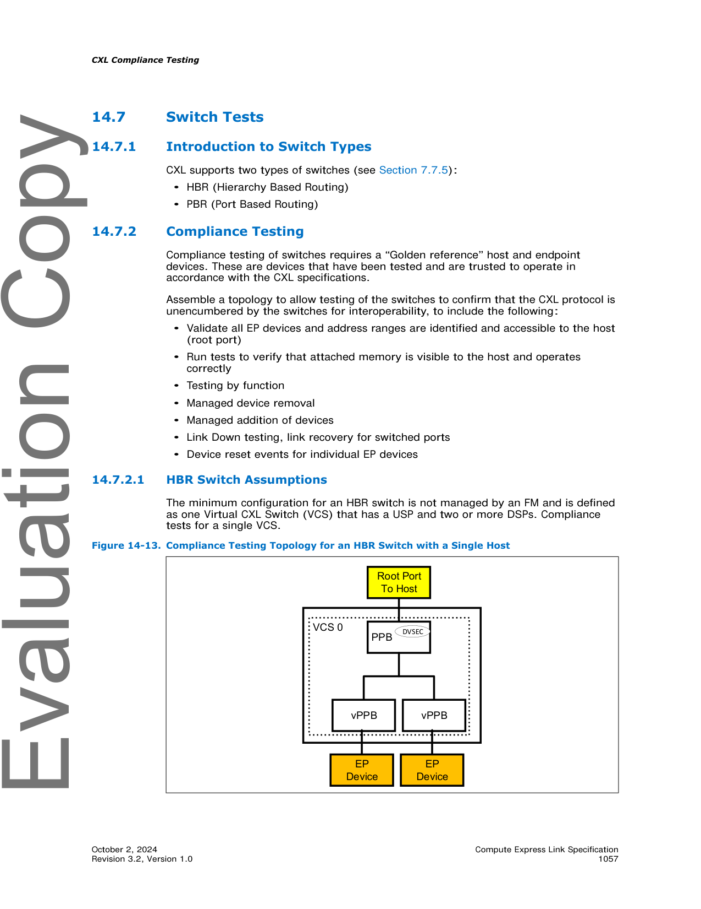
>
> *Original page render @ 150 DPI* — [📄 Full size](figures/chapter_14/page_1057.png)

<table>
<thead>
<tr>
<th width="50%">🇬🇧 English</th>
<th width="50%" style="background-color:#e8e8e8">🇨🇳 中文</th>
</tr>
</thead>
<tbody>
<tr><td>The minimum configuration for a managed switch is defined as two VCS: each VCS has one USP and two or more DSPs.</td><td style="background-color:#e8e8e8">受管交换机的最小配置定义为两个 VCS:每个 VCS 具有一个 USP 和两个或更多 DSP。</td></tr>
<tr><td>Known good Host devices are required to support managed Hot-Plug and managed removal of devices.</td><td style="background-color:#e8e8e8">已知良好的主机设备必须支持设备的托管 Hot-Plug 和托管移除。</td></tr>
<tr><td>All connectors used in these tests must support Hot-Plug sideband signals.</td><td style="background-color:#e8e8e8">这些测试中使用的所有连接器都必须支持 Hot-Plug sideband 信号。</td></tr>
<tr><td>An HBR switch that is not FM managed should have all ports bound to a VCS. An unmanaged switch cannot support unbound ports and MLDs because there is no managing function to control LD bindings.</td><td style="background-color:#e8e8e8">不受 FM 管理的 HBR 交换机应将所有端口绑定到某个 VCS。非托管交换机无法支持未绑定端口和 MLD,因为没有管理功能来控制 LD 绑定。</td></tr>
<tr><td>An FM-managed HBR switch should have at least two VCSs configured for these test purposes, so that interactions between hosts on different VCSs can be monitored. Devices may be connected to unbound ports for a managed switch (i.e., an unallocated resource). Unbound ports may be bound to any VCS at any time. The switch is managed by a Fabric Manager of the vendor's choice and supports MLDs.</td><td style="background-color:#e8e8e8">受 FM 管理的 HBR 交换机应至少配置两个 VCS 以用于这些测试目的,以便能够监测不同 VCS 上主机之间的交互。对于托管交换机,设备可以连接到未绑定端口 (即未分配的资源)。未绑定端口可在任何时候绑定到任意 VCS。交换机由厂商选定的 Fabric Manager 管理,并支持 MLD。</td></tr>
<tr><td>A known good Endpoint should support Hot-Plug and should have passed previous tests in a direct attached system.</td><td style="background-color:#e8e8e8">已知良好的端点应支持 Hot-Plug,且应已通过直接连接系统中的先前测试。</td></tr>
</tbody>
</table>

> **Figure 14-14.** Compliance Testing Topology for an HBR Switch with Two Hosts ｜ 双主机下 HBR 交换机的一致性测试拓扑
>
> 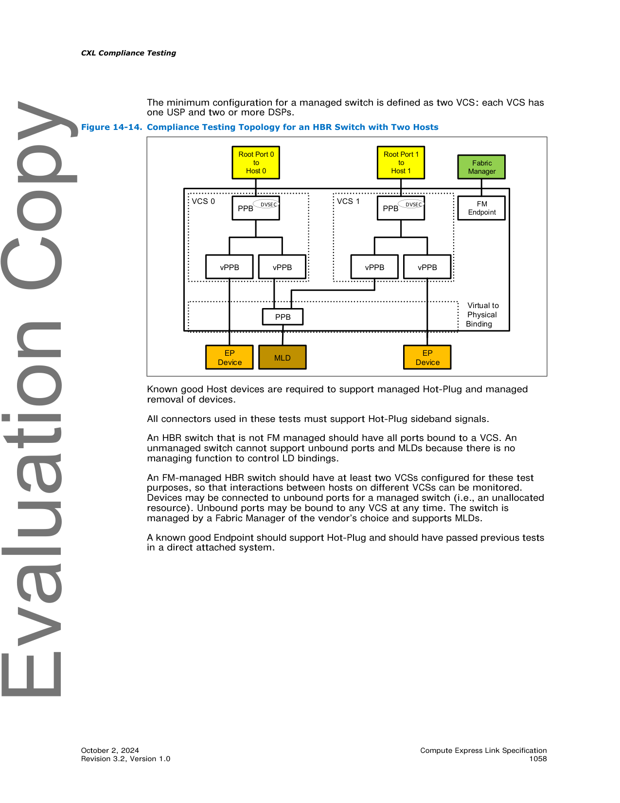
>
> *Original page render @ 150 DPI* — [📄 Full size](figures/chapter_14/page_1058.png)

#### 14.7.2.2 PBR Switch Assumptions | PBR 交换机假设

<table>
<thead>
<tr>
<th width="50%">🇬🇧 English</th>
<th width="50%" style="background-color:#e8e8e8">🇨🇳 中文</th>
</tr>
</thead>
<tbody>
<tr><td>The minimum configuration for PBR switches is composed of two cascaded switches, at least one of which shall be a PBR switch. Switches shall be FM managed.</td><td style="background-color:#e8e8e8">PBR 交换机的最小配置由两台级联交换机组成,其中至少一台应为 PBR 交换机。这些交换机应由 FM 管理。</td></tr>
</tbody>
</table>

> **Figure 14-15.** Compliance Testing Topology for Two PBR Switches ｜ 两台 PBR 交换机的一致性测试拓扑
>
> 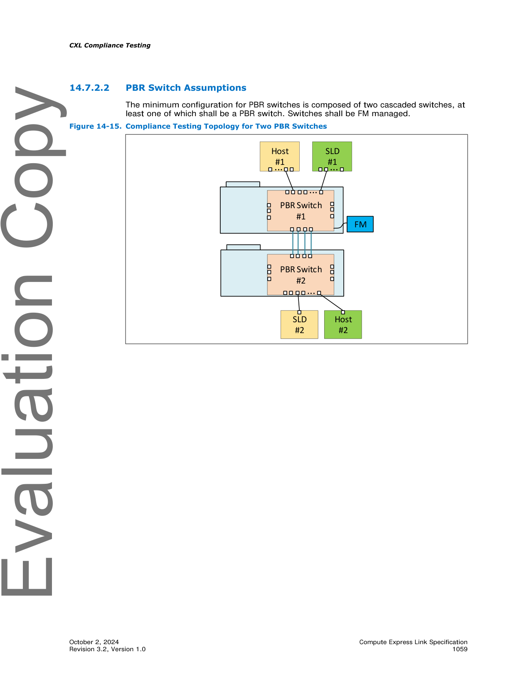
>
> *Original page render @ 150 DPI* — [📄 Full size](figures/chapter_14/page_1059.png)

<table>
<thead>
<tr>
<th width="50%">🇬🇧 English</th>
<th width="50%" style="background-color:#e8e8e8">🇨🇳 中文</th>
</tr>
</thead>
<tbody>
<tr><td>In a topology with a single PBR switch and a single HBR switch, the host devices are connected to the PBR switch and the HBR switch's USPs are connected to the PBR switch, to allow for multiple-host routing. The HBR switch configures a unique VCS for each host.</td><td style="background-color:#e8e8e8">在包含单个 PBR 交换机和单个 HBR 交换机的拓扑中,主机设备连接到 PBR 交换机,HBR 交换机的 USP 连接到 PBR 交换机,以允许多主机路由。HBR 交换机为每个主机配置一个唯一的 VCS。</td></tr>
</tbody>
</table>

### 14.7.3 Unmanaged HBR Switch | 非托管 HBR 交换机

<table>
<thead>
<tr>
<th width="50%">🇬🇧 English</th>
<th width="50%" style="background-color:#e8e8e8">🇨🇳 中文</th>
</tr>
</thead>
<tbody>
<tr><td>This is a fixed-configuration test. This test is used for an HBR switch that has the ability for bindings to be preconfigured and immediately accessible to the attached host after power-up. This test is suitable only for SLDs because MLDs require management to determine which LDs to bind to each VCS. All port bindings that define the VCS are configured and allocated at boot time without any interaction from a Fabric Manager device.</td><td style="background-color:#e8e8e8">这是一个 fixed-configuration (固定配置) 测试。本测试用于能够在开机后预先配置绑定并使所连接主机可立即访问的 HBR 交换机。本测试仅适用于 SLD,因为 MLD 需要管理来决定哪些 LD 绑定到每个 VCS。用于定义 VCS 的所有端口绑定在引导时进行配置和分配,无需 Fabric Manager 设备的任何交互。</td></tr>
<tr><td><strong>Test Steps:</strong></td><td style="background-color:#e8e8e8"><strong>测试步骤:</strong></td></tr>
<tr><td>1. An HBR switch that is not FM managed shall have all port bindings defined to be active at power-up.</td><td style="background-color:#e8e8e8">1. 不受 FM 管理的 HBR 交换机应将所有端口绑定定义为在开机时即处于 active 状态。</td></tr>
<tr><td>2. An FM-managed HBR switch should be configured so that at least one port is bound to a VCS on power-up.</td><td style="background-color:#e8e8e8">2. 受 FM 管理的 HBR 交换机应配置为在开机时至少有一个端口绑定到某个 VCS。</td></tr>
<tr><td>3. At least one SLD component shall be attached to a port.</td><td style="background-color:#e8e8e8">3. 至少应将一个 SLD 组件连接到某个端口。</td></tr>
<tr><td>4. Power-on or initialize the system (host, switch, and EP device).</td><td style="background-color:#e8e8e8">4. 上电或初始化系统 (主机、交换机和 EP 设备)。</td></tr>
<tr><td><strong>Pass Criteria:</strong></td><td style="background-color:#e8e8e8"><strong>通过条件:</strong></td></tr>
<tr><td>• Devices attached to bound ports are identified by the host at initialization without any external intervention by a Fabric Manager, if any</td><td style="background-color:#e8e8e8">• 主机在初始化时识别连接到已绑定端口的设备,无需 Fabric Manager (若有) 的任何外部干预</td></tr>
<tr><td><strong>Fail Conditions:</strong></td><td style="background-color:#e8e8e8"><strong>失败条件:</strong></td></tr>
<tr><td>• Devices attached to bound ports are not identified by the host on initialization</td><td style="background-color:#e8e8e8">• 主机在初始化时未识别连接到已绑定端口的设备</td></tr>
</tbody>
</table>

> **Figure 14-16.** Compliance Testing Topology for a PBR Switch and an HBR Switch ｜ 一台 PBR 交换机和一台 HBR 交换机的一致性测试拓扑
>
> 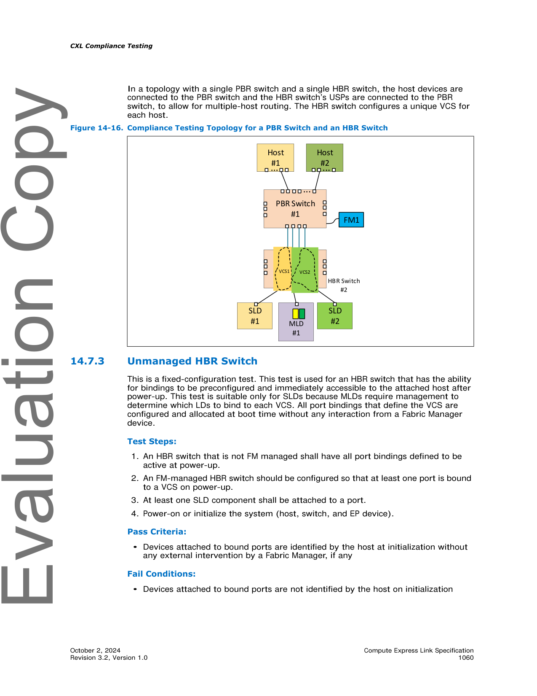
>
> *Original page render @ 150 DPI* — [📄 Full size](figures/chapter_14/page_1060.png)

[⬆️ 返回目录](#-本章目录-part-a)

---

### 14.7.4 Reset Propagation | 复位传播

#### 14.7.4.1 Host PERST# Propagation | 主机 PERST# 传播

<table>
<thead>
<tr>
<th width="50%">🇬🇧 English</th>
<th width="50%" style="background-color:#e8e8e8">🇨🇳 中文</th>
</tr>
</thead>
<tbody>
<tr><td>HBR switch overview: If an HBR switch receives a USP PERST#, then only devices or SLDs that are bound to the VCS for that USP shall be reset; other VCSs and ports shall not be reset. For an MLD component, only LDs that are bound to the VCS that received the USP PERST# shall be reset. LDs that are bound to another VCS shall be unaffected and shall continue to operate normally.</td><td style="background-color:#e8e8e8">HBR 交换机概述:如果 HBR 交换机接收到 USP PERST#,则只有绑定到该 USP 对应 VCS 的设备或 SLD 会被复位;其他 VCS 和端口不会被复位。对于 MLD 组件,只有绑定到接收到 USP PERST# 的 VCS 的 LD 才会被复位。绑定到其他 VCS 的 LD 不受影响,将继续正常运行。</td></tr>
<tr><td>PBR switch overview: If a PBR switch receives a PERST#, then only devices attached to ports with access to the receiving port shall be reset. No other ports shall be reset. MLDs are not supported by PBR switches. All other ports shall continue to operate normally.</td><td style="background-color:#e8e8e8">PBR 交换机概述:如果 PBR 交换机接收到 PERST#,则只有连接到具有对接收端口访问权限的端口的设备才会被复位。其他端口不会被复位。PBR 交换机不支持 MLD。所有其他端口将继续正常运行。</td></tr>
</tbody>
</table>

##### 14.7.4.1.1 Host PERST# Propagation to an SLD Component (HBR Switch) | 主机 PERST# 传播到 SLD 组件 (HBR 交换机)

<table>
<thead>
<tr>
<th width="50%">🇬🇧 English</th>
<th width="50%" style="background-color:#e8e8e8">🇨🇳 中文</th>
</tr>
</thead>
<tbody>
<tr><td><strong>Test Steps:</strong></td><td style="background-color:#e8e8e8"><strong>测试步骤:</strong></td></tr>
<tr><td>1. One or more SLDs are bound to a VCS.</td><td style="background-color:#e8e8e8">1. 一个或多个 SLD 绑定到某个 VCS。</td></tr>
<tr><td>2. Assert PERST# from the host to the USP of the VCS.</td><td style="background-color:#e8e8e8">2. 主机向该 VCS 的 USP 断言 PERST#。</td></tr>
<tr><td><strong>Pass Criteria:</strong></td><td style="background-color:#e8e8e8"><strong>通过条件:</strong></td></tr>
<tr><td>• Switch propagates reset to all SLDs that are connected to the VCS</td><td style="background-color:#e8e8e8">• 交换机将复位传播到连接到该 VCS 的所有 SLD</td></tr>
<tr><td>• All SLDs that are bound to the VCS go through a Link Down and the host unloads the associated device drivers</td><td style="background-color:#e8e8e8">• 绑定到该 VCS 的所有 SLD 经过 Link Down,主机卸载相关设备驱动</td></tr>
<tr><td>• Hosts and all devices that are bound to any other VCS shall continue to be connected and bound; reset events shall not occur</td><td style="background-color:#e8e8e8">• 主机及绑定到任何其他 VCS 的所有设备应继续保持连接和绑定;不应发生复位事件</td></tr>
<tr><td><strong>Fail Conditions:</strong></td><td style="background-color:#e8e8e8"><strong>失败条件:</strong></td></tr>
<tr><td>• One or more SLDs that are bound to the VCS under test fails to go through a Link Down</td><td style="background-color:#e8e8e8">• 受测 VCS 中一个或多个绑定的 SLD 未经过 Link Down</td></tr>
<tr><td>• Hosts or SLDs that are bound to any other VCS are reset</td><td style="background-color:#e8e8e8">• 绑定到任何其他 VCS 的主机或 SLD 被复位</td></tr>
</tbody>
</table>

##### 14.7.4.1.2 Host PERST# Propagation to an SLD Component (PBR Switch) | 主机 PERST# 传播到 SLD 组件 (PBR 交换机)

<table>
<thead>
<tr>
<th width="50%">🇬🇧 English</th>
<th width="50%" style="background-color:#e8e8e8">🇨🇳 中文</th>
</tr>
</thead>
<tbody>
<tr><td><strong>Test Steps:</strong></td><td style="background-color:#e8e8e8"><strong>测试步骤:</strong></td></tr>
<tr><td>1. One or more SLDs has port access to a host.</td><td style="background-color:#e8e8e8">1. 一个或多个 SLD 拥有对主机的端口访问权限。</td></tr>
<tr><td>2. PERST# is asserted by the host.</td><td style="background-color:#e8e8e8">2. 主机断言 PERST#。</td></tr>
<tr><td><strong>Pass Criteria:</strong></td><td style="background-color:#e8e8e8"><strong>通过条件:</strong></td></tr>
<tr><td>• Switch propagates reset to all SLDs with port access to the host</td><td style="background-color:#e8e8e8">• 交换机将复位传播到所有对主机具有端口访问权限的 SLD</td></tr>
<tr><td>• All SLD port access to the host goes through a Link Down and the host unloads the associated device drivers</td><td style="background-color:#e8e8e8">• 所有对主机的 SLD 端口访问经过 Link Down,主机卸载相关设备驱动</td></tr>
<tr><td>• Hosts and all devices connected to other switch ports shall continue to be connected and no reset events occur</td><td style="background-color:#e8e8e8">• 主机及连接到其他交换机端口的所有设备应继续保持连接,无复位事件发生</td></tr>
<tr><td><strong>Fail Conditions:</strong></td><td style="background-color:#e8e8e8"><strong>失败条件:</strong></td></tr>
<tr><td>• One or more SLDs with port access to the host under test fail to go through a Link Down</td><td style="background-color:#e8e8e8">• 受测主机下,具有端口访问权限的一个或多个 SLD 未经过 Link Down</td></tr>
<tr><td>• Hosts or SLDs connected to other switch ports are reset</td><td style="background-color:#e8e8e8">• 连接到其他交换机端口的主机或 SLD 被复位</td></tr>
</tbody>
</table>

##### 14.7.4.1.3 Host PERST# Propagation to an MLD Port (HBR Switch Only) | 主机 PERST# 传播到 MLD 端口 (仅 HBR 交换机)

<table>
<thead>
<tr>
<th width="50%">🇬🇧 English</th>
<th width="50%" style="background-color:#e8e8e8">🇨🇳 中文</th>
</tr>
</thead>
<tbody>
<tr><td><strong>Prerequisites:</strong></td><td style="background-color:#e8e8e8"><strong>先决条件:</strong></td></tr>
<tr><td>• Not applicable to PBR switches</td><td style="background-color:#e8e8e8">• 不适用于 PBR 交换机</td></tr>
<tr><td>• Switch with a minimum of two VCSs that are connected to respective Hosts</td><td style="background-color:#e8e8e8">• 至少具有两个分别连接到各自主机的 VCS 的交换机</td></tr>
<tr><td>• An MLD with at least one LD that is bound to each VCS (i.e., at least two bound LDs)</td><td style="background-color:#e8e8e8">• 一个 MLD,至少有一个 LD 绑定到每个 VCS (即至少两个绑定的 LD)</td></tr>
<tr><td>• Optionally, SLDs may also be attached to each VCS</td><td style="background-color:#e8e8e8">• 可选,每个 VCS 也可挂接 SLD</td></tr>
<tr><td><strong>Test Steps:</strong></td><td style="background-color:#e8e8e8"><strong>测试步骤:</strong></td></tr>
<tr><td>1. Host 0 asserts USP PERST#.</td><td style="background-color:#e8e8e8">1. Host 0 断言 USP PERST#。</td></tr>
<tr><td>2. Reset is propagated to all VCS 0 vPPBs.</td><td style="background-color:#e8e8e8">2. 复位被传播到 VCS 0 的所有 vPPB。</td></tr>
<tr><td><strong>Pass Criteria:</strong></td><td style="background-color:#e8e8e8"><strong>通过条件:</strong></td></tr>
<tr><td>• Host 0 processes a Link Down for each LD that is bound to VCS 0 and unloads the associated device drivers</td><td style="background-color:#e8e8e8">• Host 0 对绑定到 VCS 0 的每个 LD 处理 Link Down,并卸载相关设备驱动</td></tr>
<tr><td>• All SLDs that are connected to VCS 0 go through a Link Down and Host 0 unloads the associated device drivers</td><td style="background-color:#e8e8e8">• 连接到 VCS 0 的所有 SLD 经过 Link Down,Host 0 卸载相关设备驱动</td></tr>
<tr><td>• MLD remains link up</td><td style="background-color:#e8e8e8">• MLD 保持 link up</td></tr>
<tr><td>• Other hosts do not receive a Link Down for any LDs that are connected to them</td><td style="background-color:#e8e8e8">• 其他主机不会因连接到它们的任何 LD 收到 Link Down</td></tr>
<tr><td><strong>Fail Conditions:</strong></td><td style="background-color:#e8e8e8"><strong>失败条件:</strong></td></tr>
<tr><td>• Host 0 does not process a Link Down for the LDs and SLDs that are bound to VCS 0</td><td style="background-color:#e8e8e8">• Host 0 未对绑定到 VCS 0 的 LD 和 SLD 处理 Link Down</td></tr>
<tr><td>• Any other host processes a Link Down for LDs of the shared MLD</td><td style="background-color:#e8e8e8">• 任何其他主机对共享 MLD 的 LD 处理了 Link Down</td></tr>
<tr><td>• MLD goes through a Link Down</td><td style="background-color:#e8e8e8">• MLD 经过 Link Down</td></tr>
</tbody>
</table>

#### 14.7.4.2 LTSSM Hot Reset | LTSSM 热复位

<table>
<thead>
<tr>
<th width="50%">🇬🇧 English</th>
<th width="50%" style="background-color:#e8e8e8">🇨🇳 中文</th>
</tr>
</thead>
<tbody>
<tr><td>HBR switch overview: If a switch USP receives an LTSSM Hot Reset, then the USP vPPB shall propagate a reset to all vPPBs for that VCS. Other vPPBs shall not be reset. In a topology where an HBR switch is connected to a PBR switch, the USP of a VCS that is reset should reset the inter-switch link for the VCS USP.</td><td style="background-color:#e8e8e8">HBR 交换机概述:如果交换机 USP 接收到 LTSSM 热复位,则该 USP 的 vPPB 应将复位传播到该 VCS 的所有 vPPB。其他 vPPB 不应被复位。在 HBR 交换机连接到 PBR 交换机的拓扑中,被复位的 VCS 的 USP 应复位该 VCS USP 的 inter-switch link。</td></tr>
<tr><td>PBR switch overview: If a PBR switch host port receives an LTSSM Hot Reset, then all switch ports with access to the host port shall be reset. No other ports shall be reset. Inter-switch links should not be reset.</td><td style="background-color:#e8e8e8">PBR 交换机概述:如果 PBR 交换机的主机端口接收到 LTSSM 热复位,则所有对该主机端口具有访问权限的交换机端口都应被复位。其他端口不应被复位。不应复位 inter-switch link。</td></tr>
</tbody>
</table>

##### 14.7.4.2.1 LTSSM Hot Reset Propagation to SLDs (HBR Switch) | LTSSM 热复位传播到 SLD (HBR 交换机)

<table>
<thead>
<tr>
<th width="50%">🇬🇧 English</th>
<th width="50%" style="background-color:#e8e8e8">🇨🇳 中文</th>
</tr>
</thead>
<tbody>
<tr><td><strong>Test Steps:</strong></td><td style="background-color:#e8e8e8"><strong>测试步骤:</strong></td></tr>
<tr><td>1. One or more SLDs are bound to a VCS.</td><td style="background-color:#e8e8e8">1. 一个或多个 SLD 绑定到某个 VCS。</td></tr>
<tr><td>2. Initiate LTSSM Hot Reset from the host to the switch.</td><td style="background-color:#e8e8e8">2. 从主机向交换机发起 LTSSM 热复位。</td></tr>
<tr><td><strong>Pass Criteria:</strong></td><td style="background-color:#e8e8e8"><strong>通过条件:</strong></td></tr>
<tr><td>• Switch propagates hot reset to all SLDs that are connected to the VCS and their links go down</td><td style="background-color:#e8e8e8">• 交换机将热复位传播到连接到该 VCS 的所有 SLD,它们的链路 down</td></tr>
<tr><td>• Hosts and devices bound to any other VCS must not receive the reset</td><td style="background-color:#e8e8e8">• 绑定到任何其他 VCS 的主机和设备不得接收到该复位</td></tr>
<tr><td><strong>Fail Conditions:</strong></td><td style="background-color:#e8e8e8"><strong>失败条件:</strong></td></tr>
<tr><td>• Switch fails to send a hot reset to any SLDs that are connected to the VCS</td><td style="background-color:#e8e8e8">• 交换机未对连接到该 VCS 的任何 SLD 发送热复位</td></tr>
<tr><td>• Hosts or devices bound to any other VCS are reset</td><td style="background-color:#e8e8e8">• 绑定到任何其他 VCS 的主机或设备被复位</td></tr>
</tbody>
</table>

##### 14.7.4.2.2 LTSSM Hot Reset Propagation to SLDs (PBR Switch) | LTSSM 热复位传播到 SLD (PBR 交换机)

<table>
<thead>
<tr>
<th width="50%">🇬🇧 English</th>
<th width="50%" style="background-color:#e8e8e8">🇨🇳 中文</th>
</tr>
</thead>
<tbody>
<tr><td><strong>Test Steps:</strong></td><td style="background-color:#e8e8e8"><strong>测试步骤:</strong></td></tr>
<tr><td>1. One or more SLDs have port access to the host port under test.</td><td style="background-color:#e8e8e8">1. 一个或多个 SLD 拥有对受测主机端口的端口访问权限。</td></tr>
<tr><td>2. Initiate LTSSM Hot Reset from the host to the switch.</td><td style="background-color:#e8e8e8">2. 从主机向交换机发起 LTSSM 热复位。</td></tr>
<tr><td><strong>Pass Criteria:</strong></td><td style="background-color:#e8e8e8"><strong>通过条件:</strong></td></tr>
<tr><td>• Switch propagates hot reset to all SLDs that are connected with port access to the host and their links go down</td><td style="background-color:#e8e8e8">• 交换机将热复位传播到与主机具有端口访问权限的所有 SLD,它们的链路 down</td></tr>
<tr><td>• Hosts and devices connected to other ports shall not receive a connection reset</td><td style="background-color:#e8e8e8">• 连接到其他端口的主机和设备不应接收到连接复位</td></tr>
<tr><td><strong>Fail Conditions:</strong></td><td style="background-color:#e8e8e8"><strong>失败条件:</strong></td></tr>
<tr><td>• Switch fails to send a hot reset to any SLDs that have port access to the host</td><td style="background-color:#e8e8e8">• 交换机未对任何对主机具有端口访问权限的 SLD 发送热复位</td></tr>
<tr><td>• Hosts or devices connected to other ports are reset</td><td style="background-color:#e8e8e8">• 连接到其他端口的主机或设备被复位</td></tr>
</tbody>
</table>

##### 14.7.4.2.3 LTSSM Hot Reset Propagation to SLDs (PBR+HBR Switch) | LTSSM 热复位传播到 SLD (PBR+HBR 交换机)

<table>
<thead>
<tr>
<th width="50%">🇬🇧 English</th>
<th width="50%" style="background-color:#e8e8e8">🇨🇳 中文</th>
</tr>
</thead>
<tbody>
<tr><td><strong>Test Steps:</strong></td><td style="background-color:#e8e8e8"><strong>测试步骤:</strong></td></tr>
<tr><td>1. A PBR switch and an HBR switch compose the topology, with the host connected to the PBR switch.</td><td style="background-color:#e8e8e8">1. 由一台 PBR 交换机和一台 HBR 交换机组成拓扑,主机连接到 PBR 交换机。</td></tr>
<tr><td>2. One or more SLDs have port access to the host port under test.</td><td style="background-color:#e8e8e8">2. 一个或多个 SLD 拥有对受测主机端口的端口访问权限。</td></tr>
<tr><td>3. Initiate LTSSM Hot Reset from the host to the switch.</td><td style="background-color:#e8e8e8">3. 从主机向交换机发起 LTSSM 热复位。</td></tr>
</tbody>
</table>

> **Figure 14-17.** LTSSM Hot Reset Propagation to SLDs (PBR+HBR Switch) ｜ LTSSM 热复位传播到 SLD (PBR+HBR 交换机)
>
> 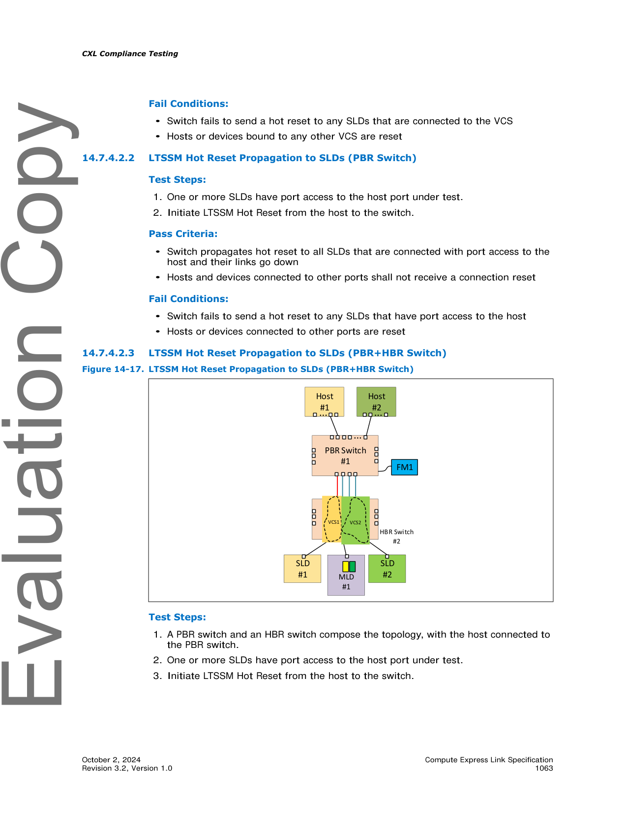
>
> *Original page render @ 150 DPI* — [📄 Full size](figures/chapter_14/page_1063.png)

<table>
<thead>
<tr>
<th width="50%">🇬🇧 English</th>
<th width="50%" style="background-color:#e8e8e8">🇨🇳 中文</th>
</tr>
</thead>
<tbody>
<tr><td><strong>Pass Criteria:</strong></td><td style="background-color:#e8e8e8"><strong>通过条件:</strong></td></tr>
<tr><td>• Switch propagates hot reset to all SLDs that are connected with port access to the host and their links go down</td><td style="background-color:#e8e8e8">• 交换机将热复位传播到与主机具有端口访问权限的所有 SLD,它们的链路 down</td></tr>
<tr><td>• The inter-switch link for the USP for the VCS of the HBR switch shall be reset (shown red in Figure 14-17 (leftmost/first connecting line between the two switches), where VCS 1 received LTSSM reset)</td><td style="background-color:#e8e8e8">• HBR 交换机 VCS 的 USP 的 inter-switch link 应被复位 (在图 14-17 中以红色显示,即两台交换机之间最左侧/第一条连接线),VCS 1 接收到了 LTSSM 复位</td></tr>
<tr><td>• Hosts and devices connected to other ports shall not receive a connection reset</td><td style="background-color:#e8e8e8">• 连接到其他端口的主机和设备不应接收到连接复位</td></tr>
<tr><td><strong>Fail Conditions:</strong></td><td style="background-color:#e8e8e8"><strong>失败条件:</strong></td></tr>
<tr><td>• Switch fails to send a hot reset to any SLDs that have port access to the host</td><td style="background-color:#e8e8e8">• 交换机未对任何对主机具有端口访问权限的 SLD 发送热复位</td></tr>
<tr><td>• Hosts or devices connected to other ports are reset</td><td style="background-color:#e8e8e8">• 连接到其他端口的主机或设备被复位</td></tr>
</tbody>
</table>

##### 14.7.4.2.4 LTSSM Hot Reset Propagation to an MLD Component (HBR Switch Only) | LTSSM 热复位传播到 MLD 组件 (仅 HBR 交换机)

<table>
<thead>
<tr>
<th width="50%">🇬🇧 English</th>
<th width="50%" style="background-color:#e8e8e8">🇨🇳 中文</th>
</tr>
</thead>
<tbody>
<tr><td><strong>Prerequisites:</strong></td><td style="background-color:#e8e8e8"><strong>先决条件:</strong></td></tr>
<tr><td>• Not applicable to PBR switches</td><td style="background-color:#e8e8e8">• 不适用于 PBR 交换机</td></tr>
<tr><td>• Switch with a minimum of two VCSs that are connected to respective Hosts</td><td style="background-color:#e8e8e8">• 至少具有两个分别连接到各自主机的 VCS 的交换机</td></tr>
<tr><td>• An MLD with at least one LD that is bound to each VCS (i.e., at least two bound LDs)</td><td style="background-color:#e8e8e8">• 一个 MLD,至少有一个 LD 绑定到每个 VCS (即至少两个绑定的 LD)</td></tr>
<tr><td>• Optionally, SLDs may also be attached to each VCS</td><td style="background-color:#e8e8e8">• 可选,每个 VCS 也可挂接 SLD</td></tr>
<tr><td><strong>Test Steps:</strong></td><td style="background-color:#e8e8e8"><strong>测试步骤:</strong></td></tr>
<tr><td>1. Host 0 asserts LTSSM Hot Reset to the switch.</td><td style="background-color:#e8e8e8">1. Host 0 向交换机断言 LTSSM 热复位。</td></tr>
<tr><td>2. The USP propagates a reset to all vPPBs associated with VCS 0.</td><td style="background-color:#e8e8e8">2. USP 将复位传播到与 VCS 0 关联的所有 vPPB。</td></tr>
<tr><td><strong>Pass Criteria:</strong></td><td style="background-color:#e8e8e8"><strong>通过条件:</strong></td></tr>
<tr><td>• Host 0 processes a Link Down for all LDs and SLDs that are bound to VCS 0</td><td style="background-color:#e8e8e8">• Host 0 对绑定到 VCS 0 的所有 LD 和 SLD 处理 Link Down</td></tr>
<tr><td>• Host 1 does not receive a Link Down for any LDs that are bound to VCS 1</td><td style="background-color:#e8e8e8">• Host 1 不会因任何绑定到 VCS 1 的 LD 收到 Link Down</td></tr>
<tr><td><strong>Fail Conditions:</strong></td><td style="background-color:#e8e8e8"><strong>失败条件:</strong></td></tr>
<tr><td>• MLD port goes through a Link Down</td><td style="background-color:#e8e8e8">• MLD 端口经过 Link Down</td></tr>
<tr><td>• Host 1 processes a Link Down for LDs of the shared MLD</td><td style="background-color:#e8e8e8">• Host 1 对共享 MLD 的 LD 处理了 Link Down</td></tr>
<tr><td>• Host 0 does not process a Link Down for any LD or SLD that is bound to VCS 0</td><td style="background-color:#e8e8e8">• Host 0 未对任何绑定到 VCS 0 的 LD 或 SLD 处理 Link Down</td></tr>
</tbody>
</table>

[⬆️ 返回目录](#-本章目录-part-a)

---

#### 14.7.4.3 Secondary Bus Reset (SBR) Propagation | Secondary Bus Reset (SBR) 传播

##### 14.7.4.3.1 Secondary Bus Reset (SBR) Propagation to All Ports of a VCS with SLD Components | Secondary Bus Reset (SBR) 传播到含 SLD 组件的 VCS 的所有端口

<table>
<thead>
<tr>
<th width="50%">🇬🇧 English</th>
<th width="50%" style="background-color:#e8e8e8">🇨🇳 中文</th>
</tr>
</thead>
<tbody>
<tr><td><strong>Test Steps:</strong></td><td style="background-color:#e8e8e8"><strong>测试步骤:</strong></td></tr>
<tr><td>1. One or more SLDs are bound to a VCS.</td><td style="background-color:#e8e8e8">1. 一个或多个 SLD 绑定到某个 VCS。</td></tr>
<tr><td>2. The Host sets the SBR bit in the Bridge Control register of the USP vPPB.</td><td style="background-color:#e8e8e8">2. 主机在 USP vPPB 的 Bridge Control 寄存器中设置 SBR 位。</td></tr>
<tr><td><strong>Pass Criteria:</strong></td><td style="background-color:#e8e8e8"><strong>通过条件:</strong></td></tr>
<tr><td>• Switch sends a hot reset to all SLDs that are connected to the VCS and their links go down</td><td style="background-color:#e8e8e8">• 交换机向连接到该 VCS 的所有 SLD 发送热复位,它们的链路 down</td></tr>
<tr><td>• The Host processes a Link Down for all SLDs that are bound to the VCS and unloads the associated device drivers</td><td style="background-color:#e8e8e8">• 主机对绑定到该 VCS 的所有 SLD 处理 Link Down,并卸载相关设备驱动</td></tr>
<tr><td><strong>Fail Conditions:</strong></td><td style="background-color:#e8e8e8"><strong>失败条件:</strong></td></tr>
<tr><td>• Switch fails to send a hot reset to any SLDs that are connected to the VCS</td><td style="background-color:#e8e8e8">• 交换机未对连接到该 VCS 的任何 SLD 发送热复位</td></tr>
<tr><td>• The Host fails to unload an associated device driver for a device that is connected to the VCS</td><td style="background-color:#e8e8e8">• 主机未对连接到该 VCS 的设备卸载相关设备驱动</td></tr>
</tbody>
</table>

##### 14.7.4.3.2 Secondary Bus Reset (SBR) Propagation to All Ports of a VCS Including an MLD Component | Secondary Bus Reset (SBR) 传播到含 MLD 组件的 VCS 的所有端口

<table>
<thead>
<tr>
<th width="50%">🇬🇧 English</th>
<th width="50%" style="background-color:#e8e8e8">🇨🇳 中文</th>
</tr>
</thead>
<tbody>
<tr><td><strong>Prerequisites:</strong></td><td style="background-color:#e8e8e8"><strong>先决条件:</strong></td></tr>
<tr><td>• Switch with a minimum of two VCSs that are connected to respective Hosts</td><td style="background-color:#e8e8e8">• 至少具有两个分别连接到各自主机的 VCS 的交换机</td></tr>
<tr><td>• An MLD with at least one LD that is bound to each VCS (i.e., at least two bound LDs)</td><td style="background-color:#e8e8e8">• 一个 MLD,至少有一个 LD 绑定到每个 VCS (即至少两个绑定的 LD)</td></tr>
<tr><td>• Optionally, SLDs may also be attached to each VCS</td><td style="background-color:#e8e8e8">• 可选,每个 VCS 也可挂接 SLD</td></tr>
<tr><td><strong>Test Steps:</strong></td><td style="background-color:#e8e8e8"><strong>测试步骤:</strong></td></tr>
<tr><td>1. Host 0 sets the SBR bit in the Bridge Control register associated with the USP vPPB of the VCS under test.</td><td style="background-color:#e8e8e8">1. Host 0 在受测 VCS 的 USP vPPB 关联的 Bridge Control 寄存器中设置 SBR 位。</td></tr>
<tr><td><strong>Pass Criteria:</strong></td><td style="background-color:#e8e8e8"><strong>通过条件:</strong></td></tr>
<tr><td>• Host 0 processes a Link Down for the LDs and SLDs that are bound to VCS 0 and unloads the associated device drivers</td><td style="background-color:#e8e8e8">• Host 0 对绑定到 VCS 0 的 LD 和 SLD 处理 Link Down,并卸载相关设备驱动</td></tr>
<tr><td>• MLD port remains Link Up</td><td style="background-color:#e8e8e8">• MLD 端口保持 Link Up</td></tr>
<tr><td>• Other Hosts that share the MLD are unaffected</td><td style="background-color:#e8e8e8">• 共享该 MLD 的其他主机不受影响</td></tr>
<tr><td><strong>Fail Conditions:</strong></td><td style="background-color:#e8e8e8"><strong>失败条件:</strong></td></tr>
<tr><td>• MLD port goes through a Link Down</td><td style="background-color:#e8e8e8">• MLD 端口经过 Link Down</td></tr>
<tr><td>• Any other host processes a Link Down</td><td style="background-color:#e8e8e8">• 任何其他主机处理了 Link Down</td></tr>
<tr><td>• Host 0 does not process a Link Down for any LDs that are bound to VCS 0</td><td style="background-color:#e8e8e8">• Host 0 未对任何绑定到 VCS 0 的 LD 处理 Link Down</td></tr>
<tr><td>• Host 0 does not process a Link Down for any SLDs that are connected to VCS 0</td><td style="background-color:#e8e8e8">• Host 0 未对任何连接到 VCS 0 的 SLD 处理 Link Down</td></tr>
</tbody>
</table>

##### 14.7.4.3.3 Secondary Bus Reset (SBR) Hot Reset Propagation to SLDs (PBR+HBR Switch) | Secondary Bus Reset (SBR) 热复位传播到 SLD (PBR+HBR 交换机)

<table>
<thead>
<tr>
<th width="50%">🇬🇧 English</th>
<th width="50%" style="background-color:#e8e8e8">🇨🇳 中文</th>
</tr>
</thead>
<tbody>
<tr><td><strong>Test Steps:</strong></td><td style="background-color:#e8e8e8"><strong>测试步骤:</strong></td></tr>
<tr><td>1. A PBR switch and an HBR switch compose the topology, with the host connected to the PBR switch.</td><td style="background-color:#e8e8e8">1. 由一台 PBR 交换机和一台 HBR 交换机组成拓扑,主机连接到 PBR 交换机。</td></tr>
<tr><td>2. One or more SLDs have port access to the host port under test.</td><td style="background-color:#e8e8e8">2. 一个或多个 SLD 拥有对受测主机端口的端口访问权限。</td></tr>
<tr><td>3. Initiate LTSSM Hot Reset from the host to the switch.</td><td style="background-color:#e8e8e8">3. 从主机向交换机发起 LTSSM 热复位。</td></tr>
<tr><td><strong>Pass Criteria:</strong></td><td style="background-color:#e8e8e8"><strong>通过条件:</strong></td></tr>
<tr><td>• Switch propagates hot reset to all SLDs that are connected with port access to the host and their links go down</td><td style="background-color:#e8e8e8">• 交换机将热复位传播到与主机具有端口访问权限的所有 SLD,它们的链路 down</td></tr>
<tr><td>• The inter-switch link for the USP for the VCS of the HBR switch shall be reset (shown red in Figure 14-18 (leftmost/first connecting line between the two switches), where VCS 1 received LTSSM reset)</td><td style="background-color:#e8e8e8">• HBR 交换机 VCS 的 USP 的 inter-switch link 应被复位 (在图 14-18 中以红色显示,即两台交换机之间最左侧/第一条连接线),VCS 1 接收到了 LTSSM 复位</td></tr>
<tr><td>• Hosts and devices connected to other ports shall not receive a connection reset</td><td style="background-color:#e8e8e8">• 连接到其他端口的主机和设备不应接收到连接复位</td></tr>
<tr><td><strong>Fail Conditions:</strong></td><td style="background-color:#e8e8e8"><strong>失败条件:</strong></td></tr>
<tr><td>• Switch fails to send a hot reset to any SLDs that have port access to the host</td><td style="background-color:#e8e8e8">• 交换机未对任何对主机具有端口访问权限的 SLD 发送热复位</td></tr>
<tr><td>• Hosts or devices connected to other ports are reset</td><td style="background-color:#e8e8e8">• 连接到其他端口的主机或设备被复位</td></tr>
</tbody>
</table>

##### 14.7.4.3.4 Secondary Bus Reset (SBR) Propagation to One Specific Downstream Port (SLD) (HBR Switch) | Secondary Bus Reset (SBR) 传播到指定下游端口 (SLD) (HBR 交换机)

<table>
<thead>
<tr>
<th width="50%">🇬🇧 English</th>
<th width="50%" style="background-color:#e8e8e8">🇨🇳 中文</th>
</tr>
</thead>
<tbody>
<tr><td>All links in the path between the host and specific SLD shall be reset.</td><td style="background-color:#e8e8e8">主机与指定 SLD 之间路径上的所有链路都应被复位。</td></tr>
<tr><td><strong>Test Steps:</strong></td><td style="background-color:#e8e8e8"><strong>测试步骤:</strong></td></tr>
<tr><td>1. vPPB under test is connected to an SLD component.</td><td style="background-color:#e8e8e8">1. 受测 vPPB 连接到一个 SLD 组件。</td></tr>
<tr><td>2. Host sets the SBR bit in the Bridge Control register of the vPPB to be reset.</td><td style="background-color:#e8e8e8">2. 主机在待复位 vPPB 的 Bridge Control 寄存器中设置 SBR 位。</td></tr>
</tbody>
</table>

> **Figure 14-18.** Secondary Bus Reset (SBR) Hot Reset Propagation to SLDs (PBR+HBR Switch) ｜ SBR 热复位传播到 SLD (PBR+HBR 交换机)
>
> 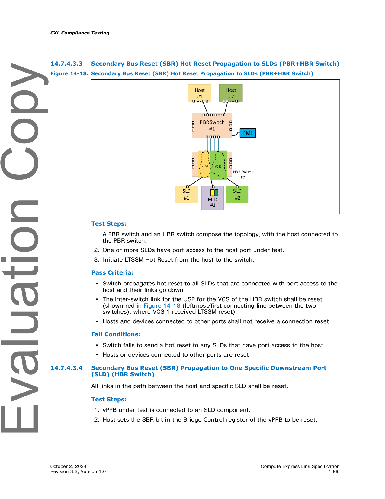
>
> *Original page render @ 150 DPI* — [📄 Full size](figures/chapter_14/page_1066.png)

<table>
<thead>
<tr>
<th width="50%">🇬🇧 English</th>
<th width="50%" style="background-color:#e8e8e8">🇨🇳 中文</th>
</tr>
</thead>
<tbody>
<tr><td><strong>Pass Criteria:</strong></td><td style="background-color:#e8e8e8"><strong>通过条件:</strong></td></tr>
<tr><td>• Host processes a Link Down for the vPPB under test and unloads the device driver</td><td style="background-color:#e8e8e8">• 主机对受测 vPPB 处理 Link Down,并卸载设备驱动</td></tr>
<tr><td>• All other ports in the VCS remain unaffected</td><td style="background-color:#e8e8e8">• 该 VCS 中所有其他端口不受影响</td></tr>
<tr><td><strong>Fail Conditions:</strong></td><td style="background-color:#e8e8e8"><strong>失败条件:</strong></td></tr>
<tr><td>• Port under test does not go Link Down</td><td style="background-color:#e8e8e8">• 受测端口未 Link Down</td></tr>
<tr><td>• Any other port goes Link Down</td><td style="background-color:#e8e8e8">• 任何其他端口 Link Down</td></tr>
</tbody>
</table>

##### 14.7.4.3.5 Secondary Bus Reset (SBR) Propagation to One Specific Downstream Port (SLD) (PBR + HBR Switch) | Secondary Bus Reset (SBR) 传播到指定下游端口 (SLD) (PBR + HBR 交换机)

<table>
<thead>
<tr>
<th width="50%">🇬🇧 English</th>
<th width="50%" style="background-color:#e8e8e8">🇨🇳 中文</th>
</tr>
</thead>
<tbody>
<tr><td>All links in the path between the host and the specific SLD shall be reset, including the VCS USP for the VCS connected to the specific SLD being reset.</td><td style="background-color:#e8e8e8">主机与指定 SLD 之间路径上的所有链路都应被复位,包括连接到被复位的指定 SLD 的 VCS 的 VCS USP。</td></tr>
<tr><td><strong>Test Steps:</strong></td><td style="background-color:#e8e8e8"><strong>测试步骤:</strong></td></tr>
<tr><td>1. A PBR switch and an HBR switch compose the topology, with the host connected to the PBR switch.</td><td style="background-color:#e8e8e8">1. 由一台 PBR 交换机和一台 HBR 交换机组成拓扑,主机连接到 PBR 交换机。</td></tr>
<tr><td>2. One or more SLDs have port access to the host port under test.</td><td style="background-color:#e8e8e8">2. 一个或多个 SLD 拥有对受测主机端口的端口访问权限。</td></tr>
<tr><td>3. Initiate an SBR from the host to the switch for a specific SLD.</td><td style="background-color:#e8e8e8">3. 从主机向交换机发起针对指定 SLD 的 SBR。</td></tr>
<tr><td><strong>Pass Criteria:</strong></td><td style="background-color:#e8e8e8"><strong>通过条件:</strong></td></tr>
<tr><td>• Host processes a Link Down for the SLD port under test</td><td style="background-color:#e8e8e8">• 主机对受测 SLD 端口处理 Link Down</td></tr>
<tr><td>• Reset the ISL of the VCS USP containing the SLD that received the SBR</td><td style="background-color:#e8e8e8">• 复位包含接收到 SBR 的 SLD 的 VCS USP 的 ISL</td></tr>
<tr><td>• All other ports remain unaffected</td><td style="background-color:#e8e8e8">• 所有其他端口不受影响</td></tr>
<tr><td><strong>Fail Conditions:</strong></td><td style="background-color:#e8e8e8"><strong>失败条件:</strong></td></tr>
<tr><td>• Port under test does not go Link Down</td><td style="background-color:#e8e8e8">• 受测端口未 Link Down</td></tr>
<tr><td>• ISL of the VCS USP containing the SLD that received the SBR failed to be reset</td><td style="background-color:#e8e8e8">• 包含接收到 SBR 的 SLD 的 VCS USP 的 ISL 未被复位</td></tr>
<tr><td>• Any other port goes Link Down</td><td style="background-color:#e8e8e8">• 任何其他端口 Link Down</td></tr>
</tbody>
</table>

##### 14.7.4.3.6 Secondary Bus Reset (SBR) Propagation to One Specific Shared Downstream Port (MLD) (HBR Switches Only) | Secondary Bus Reset (SBR) 传播到指定共享下游端口 (MLD) (仅 HBR 交换机)

<table>
<thead>
<tr>
<th width="50%">🇬🇧 English</th>
<th width="50%" style="background-color:#e8e8e8">🇨🇳 中文</th>
</tr>
</thead>
<tbody>
<tr><td><strong>Prerequisites:</strong></td><td style="background-color:#e8e8e8"><strong>先决条件:</strong></td></tr>
<tr><td>• Not applicable to PBR switches</td><td style="background-color:#e8e8e8">• 不适用于 PBR 交换机</td></tr>
<tr><td>• Switch with a minimum of two VCSs that are connected to respective Hosts</td><td style="background-color:#e8e8e8">• 至少具有两个分别连接到各自主机的 VCS 的交换机</td></tr>
<tr><td>• Each VCS is bound to an LD each from the MLD component</td><td style="background-color:#e8e8e8">• 每个 VCS 各绑定 MLD 组件中的一个 LD</td></tr>
<tr><td><strong>Test Steps:</strong></td><td style="background-color:#e8e8e8"><strong>测试步骤:</strong></td></tr>
<tr><td>1. For the VCS under test, the host sets the SBR bit in the Bridge Control register of the vPPB bound to the LD.</td><td style="background-color:#e8e8e8">1. 对于受测 VCS,主机在绑定到该 LD 的 vPPB 的 Bridge Control 寄存器中设置 SBR 位。</td></tr>
<tr><td><strong>Pass Criteria:</strong></td><td style="background-color:#e8e8e8"><strong>通过条件:</strong></td></tr>
<tr><td>• Host processes a Link Down for the vPPB under test and unloads the device driver</td><td style="background-color:#e8e8e8">• 主机对受测 vPPB 处理 Link Down,并卸载设备驱动</td></tr>
<tr><td>• MLD port remains Link Up</td><td style="background-color:#e8e8e8">• MLD 端口保持 Link Up</td></tr>
<tr><td>• Other Hosts sharing the MLD are unaffected</td><td style="background-color:#e8e8e8">• 共享该 MLD 的其他主机不受影响</td></tr>
<tr><td><strong>Fail Conditions:</strong></td><td style="background-color:#e8e8e8"><strong>失败条件:</strong></td></tr>
<tr><td>• Host processes a Link Down for the vPPB not under test</td><td style="background-color:#e8e8e8">• 主机对未受测的 vPPB 处理了 Link Down</td></tr>
<tr><td>• Host does not process a Link Down for the vPPB under test</td><td style="background-color:#e8e8e8">• 主机未对受测 vPPB 处理 Link Down</td></tr>
<tr><td>• Any switch port goes through a Link Down</td><td style="background-color:#e8e8e8">• 任何交换机端口经过 Link Down</td></tr>
</tbody>
</table>

[⬆️ 返回目录](#-本章目录-part-a)

---

- [14.11.5.7 CXL.io Viral Inject from Device](#sec-14-11-5-7)
- [14.11.5.8 Completion Timeout Injection](#sec-14-11-5-8)
- [14.11.5.9 Memory Error Injection and Logging](#sec-14-11-5-9)
- [14.11.5.10 CXL.io Viral Inject from Device](#sec-14-11-5-10)
- [14.11.5.11 CXL.cache Viral Inject from Device](#sec-14-11-5-11)
- [14.11.6 Security Protocol and Data Model](#sec-14-11-6)
  - [14.11.6.1 SPDM GET_VERSION](#sec-14-11-6-1)
  - [14.11.6.2 SPDM GET_CAPABILITIES](#sec-14-11-6-2)
  - [14.11.6.3 SPDM NEGOTIATE_ALGORITHMS](#sec-14-11-6-3)
  - [14.11.6.4 SPDM GET_DIGESTS](#sec-14-11-6-4)
  - [14.11.6.5 SPDM GET_CERTIFICATE](#sec-14-11-6-5)
  - [14.11.6.6 SPDM CHALLENGE](#sec-14-11-6-6)
  - [14.11.6.7 SPDM GET_MEASUREMENTS Count](#sec-14-11-6-7)
  - [14.11.6.8 SPDM GET_MEASUREMENTS All](#sec-14-11-6-8)
  - [14.11.6.9 SPDM GET_MEASUREMENTS Repeat with Signature](#sec-14-11-6-9)
  - [14.11.6.10 SPDM CHALLENGE Sequences](#sec-14-11-6-10)
  - [14.11.6.11 SPDM ErrorCode Unsupported Request](#sec-14-11-6-11)
  - [14.11.6.12 SPDM Major Version Invalid](#sec-14-11-6-12)
  - [14.11.6.13 SPDM ErrorCode UnexpectedRequest](#sec-14-11-6-13)
- [14.11.7 CXL.cachemem TSP](#sec-14-11-7)
  - [14.11.7.1 TSP Support](#sec-14-11-7-1)
  - [14.11.7.2 Version](#sec-14-11-7-2)
  - [14.11.7.3 Capabilities](#sec-14-11-7-3)
  - [14.11.7.4 Implicit TE State Changes](#sec-14-11-7-4)
  - [14.11.7.5 Implicit TE State Changes w Read Access Control](#sec-14-11-7-5)
  - [14.11.7.6 Explicit In-band TE State Changes w Read and Write Access Control](#sec-14-11-7-6)
  - [14.11.7.7 Explicit Out-of-band TE State Changes w Read and Write Access Control](#sec-14-11-7-7)
  - [14.11.7.8 Initiator-based memory encryption](#sec-14-11-7-8)
  - [14.11.7.9 Target-based CKID-based memory encryption invalid CKID range](#sec-14-11-7-9)
  - [14.11.7.10 Target-based CKID-based memory encryption invalid CKID Type](#sec-14-11-7-10)
  - [14.11.7.11 Target-based CKID-based memory encryption clearing keys](#sec-14-11-7-11)
  - [14.11.7.12 Target-based range-based memory encryption](#sec-14-11-7-12)
  - [14.11.7.13 Target-based range-based memory encryption clearing keys](#sec-14-11-7-13)
- [14.12 Reliability, Availability, and Serviceability](#sec-14-12)
  - [14.12.1 RAS Configuration](#sec-14-12-1)
    - [14.12.1.1 AER Support](#sec-14-12-1-1)
    - [14.12.1.2 CXL.io Poison Injection from Device to Host](#sec-14-12-1-2)
    - [14.12.1.3 CXL.cache Poison Injection](#sec-14-12-1-3)
      - [14.12.1.3.1 Device to Host Poison Injection](#sec-14-12-1-3-1)
      - [14.12.1.3.2 Host to Device Poison Injection](#sec-14-12-1-3-2)
    - [14.12.1.4 CXL.cache CRC Injection](#sec-14-12-1-4)
      - [14.12.1.4.1 Device to Host CRC Injection](#sec-14-12-1-4-1)
      - [14.12.1.4.2 Host to Device CRC Injection](#sec-14-12-1-4-2)
    - [14.12.1.5 CXL.mem Link Poison Injection](#sec-14-12-1-5)
    - [14.12.1.6 CXL.mem CRC Injection](#sec-14-12-1-6)
    - [14.12.1.7 Flow Control Injection](#sec-14-12-1-7)
    - [14.12.1.8 Unexpected Completion Injection](#sec-14-12-1-8)
    - [14.12.1.9 Completion Timeout](#sec-14-12-1-9)
    - [14.12.1.10 CXL.mem Media Poison Injection](#sec-14-12-1-10)
    - [14.12.1.11 CXL.mem LSA Poison Injection](#sec-14-12-1-11)
    - [14.12.1.12 CXL.mem Device Health Injection](#sec-14-12-1-12)
- [14.13 Memory Mapped Registers](#sec-14-13)
  - [14.13.1 CXL Capability Header](#sec-14-13-1)
  - [14.13.2 CXL RAS Capability Header](#sec-14-13-2)
  - [14.13.3 CXL Security Capability Header](#sec-14-13-3)
  - [14.13.4 CXL Link Capability Header](#sec-14-13-4)
  - [14.13.5 CXL HDM Decoder Capability Header](#sec-14-13-5)
  - [14.13.6 CXL Extended Security Capability Header](#sec-14-13-6)
  - [14.13.7 CXL IDE Capability Header](#sec-14-13-7)
  - [14.13.8 CXL HDM Decoder Capability Register](#sec-14-13-8)
  - [14.13.9 CXL HDM Decoder Commit](#sec-14-13-9)
  - [14.13.10 CXL HDM Decoder Zero Size Commit](#sec-14-13-10)
  - [14.13.11 CXL Snoop Filter Capability Header](#sec-14-13-11)
  - [14.13.12 CXL Device Capabilities Array Register](#sec-14-13-12)
  - [14.13.13 Device Status Registers Capabilities Header Register](#sec-14-13-13)
  - [14.13.14 Primary Mailbox Registers Capabilities Header Register](#sec-14-13-14)
  - [14.13.15 Secondary Mailbox Registers Capabilities Header Register](#sec-14-13-15)
  - [14.13.16 Memory Device Status Registers Capabilities Header Register](#sec-14-13-16)
  - [14.13.17 CXL Timeout and Isolation Capability Header](#sec-14-13-17)
  - [14.13.18 CXL.cachemem Extended Register Header](#sec-14-13-18)
  - [14.13.19 CXL BI Route Table Capability Header](#sec-14-13-19)
  - [14.13.20 CXL BI Decoder Capability Header](#sec-14-13-20)
  - [14.13.21 CXL Cache ID Route Table Header](#sec-14-13-21)
  - [14.13.22 CXL Cache ID Decoder Capability Header](#sec-14-13-22)
  - [14.13.23 CXL Extended HDM Decoder Capability Header](#sec-14-13-23)
- [14.14 Memory Device Tests](#sec-14-14)
  - [14.14.1 DVSEC CXL Range 1 Size Low Registers](#sec-14-14-1)
  - [14.14.2 DVSEC CXL Range 2 Size Low Registers](#sec-14-14-2)
- [14.15 Sticky Register Tests](#sec-14-15)
  - [14.15.1 Sticky Register Test](#sec-14-15-1)
- [14.16 Device Capability and Test Configuration Control](#sec-14-16)
  - [14.16.1 CXL Device Test Capability Advertisement](#sec-14-16-1)
  - [14.16.2 Debug Capabilities in Device](#sec-14-16-2)
    - [14.16.2.1 Error Logging](#sec-14-16-2-1)
    - [14.16.2.2 Event Monitors](#sec-14-16-2-2)
  - [14.16.3 Compliance Mode DOE](#sec-14-16-3)
    - [14.16.3.1 Compliance Mode Capability](#sec-14-16-3-1)
    - [14.16.3.2 Compliance Mode Status](#sec-14-16-3-2)
    - [14.16.3.3 Compliance Mode Halt All](#sec-14-16-3-3)
    - [14.16.3.4 Compliance Mode Multiple Write Streaming](#sec-14-16-3-4)
    - [14.16.3.5 Compliance Mode Producer-Consumer](#sec-14-16-3-5)
    - [14.16.3.6 Test Algorithm 1b Multiple Write Streaming with Bogus Writes](#sec-14-16-3-6)
    - [14.16.3.7 Inject Link Poison](#sec-14-16-3-7)
    - [14.16.3.8 Inject CRC](#sec-14-16-3-8)
    - [14.16.3.9 Inject Flow Control](#sec-14-16-3-9)
    - [14.16.3.10 Toggle Cache Flush](#sec-14-16-3-10)
    - [14.16.3.11 Inject MAC Delay](#sec-14-16-3-11)
    - [14.16.3.12 Insert Unexpected MAC](#sec-14-16-3-12)
    - [14.16.3.13 Inject Viral](#sec-14-16-3-13)
    - [14.16.3.14 Inject ALMP in Any State](#sec-14-16-3-14)
    - [14.16.3.15 Ignore Received ALMP](#sec-14-16-3-15)
    - [14.16.3.16 Inject Bit Error in Flit](#sec-14-16-3-16)
    - [14.16.3.17 Inject Memory Device Poison](#sec-14-16-3-17)
- [附录 A. Taxonomy](#appendix-a)
  - [A.1 Accelerator Usage Taxonomy](#sec-a-1)
  - [A.2 Bias Model Flow Example – From CPU](#sec-a-2)
  - [A.3 CPU Support for Bias Modes](#sec-a-3)
  - [A.4 Giant Cache Model](#sec-a-4)
- [附录 B. Unordered I/O to Support Peer-to-Peer Directly to HDM-DB](#appendix-b)
- [附录 C. Memory Protocol Tables](#appendix-c)
  - [C.1 HDM-DB Requests with TEE Support](#sec-c-1)
  - [C.2 HDM-H Requests](#sec-c-2)
  - [C.3 HDM-D/HDM-DB RwD](#sec-c-3)
  - [C.4 HDM-H RwD](#sec-c-4)

## 🖼 本章图表 (Part B)

- **Figure 14-19.** PCIe DVSEC for Test Capability — p.1194
- **Figure A-1.** Profile D - Giant Cache Model — p.1215

## 📊 本章表格 (Part B)

本部分包含大量 Table（Table 14-17 至 Table 14-86，以及附录 Table A-1、Table C-1 至 Table C-8），覆盖 DOE 请求、RAS 注入、内存映射寄存器、HDM 协议流程等。

---

## 14.11.5.7 CXL.io Viral Inject from Device | CXL.io 病毒态注入 (从设备)

<table>
<thead>
<tr>
<th width="50%">🇬🇧 English</th>
<th width="50%" style="background-color:#e8e8e8">🇨🇳 中文</th>
</tr>
</thead>
<tbody>
<tr><td>c. Write Compliance mode DOE with the following request:</td><td style="background-color:#e8e8e8">c. 使用以下请求写入 Compliance 模式 DOE：</td></tr>
<tr><td>Pass Criteria:</td><td style="background-color:#e8e8e8">通过条件：</td></tr>
<tr><td>• Receiver (host) logs poisoned received error</td><td style="background-color:#e8e8e8">• 接收方（主机）记录接收到的 poison 错误</td></tr>
<tr><td>• CXL.io IDE link state remains secured</td><td style="background-color:#e8e8e8">• CXL.io IDE 链路状态保持为 secured</td></tr>
<tr><td>Fail Conditions:</td><td style="background-color:#e8e8e8">失败条件：</td></tr>
<tr><td>• Pass criteria is not met</td><td style="background-color:#e8e8e8">• 未满足通过条件</td></tr>
</tbody>
</table>

**Table 14-17. Unexpected Completion Injection: Unexpected Completion Injection Request**

<table>
<thead>
<tr>
<th>Data Object</th>
<th>Byte Offset</th>
<th>Length in Bytes</th>
<th>Description</th>
<th>Value</th>
</tr>
</thead>
<tbody>
<tr><td>Standard DOE Request Header</td><td>0h</td><td>8</td><td>—</td><td>—</td></tr>
<tr><td>Request Code</td><td>8h</td><td>1</td><td>—</td><td>Ah, Unexpected Completion Injection</td></tr>
<tr><td>Version</td><td>9h</td><td>1</td><td>—</td><td>2</td></tr>
<tr><td>Reserved</td><td>Ah</td><td>2</td><td>—</td><td>—</td></tr>
<tr><td>Protocol</td><td>Ch</td><td>1</td><td>—</td><td>0</td></tr>
</tbody>
</table>

**Table 14-18. Unexpected Completion Injection: Multi-Write Streaming Request**

<table>
<thead>
<tr>
<th>Data Object</th>
<th>Byte Offset</th>
<th>Length in Bytes</th>
<th>Description</th>
<th>Value</th>
</tr>
</thead>
<tbody>
<tr><td>Standard DOE Request Header</td><td>00h</td><td>8</td><td>—</td><td>—</td></tr>
<tr><td>Request Code</td><td>08h</td><td>1</td><td>—</td><td>3, Multiple Write Streaming</td></tr>
<tr><td>Version</td><td>09h</td><td>1</td><td>—</td><td>2</td></tr>
<tr><td>Reserved</td><td>0Ah</td><td>2</td><td>—</td><td>—</td></tr>
<tr><td>Protocol</td><td>0Ch</td><td>1</td><td>—</td><td>1</td></tr>
<tr><td>Virtual Address</td><td>0Dh</td><td>1</td><td>—</td><td>0</td></tr>
<tr><td>Self-checking</td><td>0Eh</td><td>1</td><td>—</td><td>0</td></tr>
<tr><td>Verify Read Semantics</td><td>0Fh</td><td>1</td><td>—</td><td>0</td></tr>
<tr><td>Num Increments</td><td>10h</td><td>1</td><td>—</td><td>0</td></tr>
<tr><td>Num Sets</td><td>11h</td><td>1</td><td>—</td><td>0</td></tr>
<tr><td>Num Loops</td><td>12h</td><td>1</td><td>—</td><td>1</td></tr>
<tr><td>Reserved</td><td>13h</td><td>1</td><td>—</td><td>—</td></tr>
<tr><td>Start Address</td><td>14h</td><td>8</td><td>—</td><td>A1</td></tr>
<tr><td>Write Address</td><td>1Ch</td><td>8</td><td>—</td><td>0</td></tr>
<tr><td>WriteBackAddress</td><td>24h</td><td>8</td><td>—</td><td>A2 (Must be distinct from A1)</td></tr>
<tr><td>Byte Mask</td><td>2Ch</td><td>8</td><td>—</td><td>FFFF FFFF FFFF FFFFh</td></tr>
<tr><td>Address Increment</td><td>34h</td><td>4</td><td>—</td><td>0</td></tr>
<tr><td>Set Offset</td><td>38h</td><td>4</td><td>—</td><td>0</td></tr>
<tr><td>Pattern "P"</td><td>3Ch</td><td>4</td><td>—</td><td>AAh</td></tr>
<tr><td>Increment Pattern "B"</td><td>40h</td><td>4</td><td>—</td><td>0</td></tr>
</tbody>
</table>

[⬆️ 返回目录](#-本章目录-part-b)

---

## 14.11.5.8 Completion Timeout Injection | 完成超时注入

<table>
<thead>
<tr>
<th width="50%">🇬🇧 English</th>
<th width="50%" style="background-color:#e8e8e8">🇨🇳 中文</th>
</tr>
</thead>
<tbody>
<tr><td><b>Prerequisites:</b></td><td style="background-color:#e8e8e8"><b>前置条件：</b></td></tr>
<tr><td>• CXL device must support Algorithm 1a</td><td style="background-color:#e8e8e8">• CXL 设备必须支持 Algorithm 1a</td></tr>
<tr><td>• CXL device must support Link Layer Error Injection capabilities</td><td style="background-color:#e8e8e8">• CXL 设备必须支持链路层错误注入能力</td></tr>
<tr><td><b>Test Steps:</b></td><td style="background-color:#e8e8e8"><b>测试步骤：</b></td></tr>
<tr><td>1. Set up the device for Multiple Write streaming:</td><td style="background-color:#e8e8e8">1. 配置设备为 Multiple Write 流模式：</td></tr>
<tr><td>a. Write a pattern {64{8'hFF}} to cache-aligned Address A1.</td><td style="background-color:#e8e8e8">a. 向 cache-aligned 地址 A1 写入模式 {64{8'hFF}}。</td></tr>
<tr><td>b. Write a Compliance mode DOE to inject an unexpected completion error:</td><td style="background-color:#e8e8e8">b. 写入 Compliance 模式 DOE 以注入 unexpected completion 错误：</td></tr>
<tr><td>c. Write Compliance mode DOE with the following request:</td><td style="background-color:#e8e8e8">c. 使用以下请求写入 Compliance 模式 DOE：</td></tr>
</tbody>
</table>

**Table 14-19. Completion Timeout Injection: Completion Timeout Injection Request**

<table>
<thead>
<tr>
<th>Data Object</th>
<th>Byte Offset</th>
<th>Length in Bytes</th>
<th>Description</th>
<th>Value</th>
</tr>
</thead>
<tbody>
<tr><td>Standard DOE Request Header</td><td>0h</td><td>8</td><td>—</td><td>—</td></tr>
<tr><td>Request Code</td><td>8h</td><td>1</td><td>—</td><td>Ah, Completion Timeout Injection</td></tr>
<tr><td>Version</td><td>9h</td><td>1</td><td>—</td><td>2</td></tr>
<tr><td>Reserved</td><td>Ah</td><td>2</td><td>—</td><td>—</td></tr>
<tr><td>Protocol</td><td>Ch</td><td>1</td><td>—</td><td>0</td></tr>
</tbody>
</table>

**Table 14-20. Completion Timeout Injection: Multi-Write Streaming Request (Sheet 1 of 2)**

<table>
<thead>
<tr>
<th>Data Object</th>
<th>Byte Offset</th>
<th>Length in Bytes</th>
<th>Description</th>
<th>Value</th>
</tr>
</thead>
<tbody>
<tr><td>Standard DOE Request Header</td><td>00h</td><td>8</td><td>—</td><td>—</td></tr>
<tr><td>Request Code</td><td>08h</td><td>1</td><td>—</td><td>3, Multiple Write Streaming</td></tr>
<tr><td>Version</td><td>09h</td><td>1</td><td>—</td><td>2</td></tr>
<tr><td>Reserved</td><td>0Ah</td><td>2</td><td>—</td><td>—</td></tr>
<tr><td>Protocol</td><td>0Ch</td><td>1</td><td>—</td><td>1</td></tr>
<tr><td>Virtual Address</td><td>0Dh</td><td>1</td><td>—</td><td>0</td></tr>
<tr><td>Self-checking</td><td>0Eh</td><td>1</td><td>—</td><td>0</td></tr>
<tr><td>Verify Read Semantics</td><td>0Fh</td><td>1</td><td>—</td><td>0</td></tr>
<tr><td>Num Increments</td><td>10h</td><td>1</td><td>—</td><td>0</td></tr>
<tr><td>Num Sets</td><td>11h</td><td>1</td><td>—</td><td>0</td></tr>
<tr><td>Num Loops</td><td>12h</td><td>1</td><td>—</td><td>1</td></tr>
<tr><td>Reserved</td><td>13h</td><td>1</td><td>—</td><td>—</td></tr>
<tr><td>Start Address</td><td>14h</td><td>8</td><td>—</td><td>A1</td></tr>
<tr><td>Write Address</td><td>1Ch</td><td>8</td><td>—</td><td>0</td></tr>
<tr><td>WriteBackAddress</td><td>24h</td><td>8</td><td>—</td><td>A2 (Must be distinct from A1)</td></tr>
<tr><td>Byte Mask</td><td>2Ch</td><td>8</td><td>—</td><td>FFFF FFFF FFFF FFFFh</td></tr>
<tr><td>Address Increment</td><td>34h</td><td>4</td><td>—</td><td>0</td></tr>
</tbody>
</table>

**Table 14-20. Completion Timeout Injection: Multi-Write Streaming Request (Sheet 2 of 2)**

<table>
<thead>
<tr>
<th>Data Object</th>
<th>Byte Offset</th>
<th>Length in Bytes</th>
<th>Description</th>
<th>Value</th>
</tr>
</thead>
<tbody>
<tr><td>Set Offset</td><td>38h</td><td>4</td><td>—</td><td>0</td></tr>
<tr><td>Pattern "P"</td><td>3Ch</td><td>4</td><td>—</td><td>AAh</td></tr>
<tr><td>Increment Pattern "B"</td><td>40h</td><td>4</td><td>—</td><td>0</td></tr>
</tbody>
</table>

<table>
<thead>
<tr>
<th width="50%">🇬🇧 English</th>
<th width="50%" style="background-color:#e8e8e8">🇨🇳 中文</th>
</tr>
</thead>
<tbody>
<tr><td><b>Pass Criteria:</b></td><td style="background-color:#e8e8e8"><b>通过条件：</b></td></tr>
<tr><td>• CXL.cache IDE link state remains secure</td><td style="background-color:#e8e8e8">• CXL.cache IDE 链路状态保持 secure</td></tr>
<tr><td>• Host Receiver logs link error</td><td style="background-color:#e8e8e8">• 主机接收方记录链路错误</td></tr>
<tr><td><b>Fail Conditions:</b></td><td style="background-color:#e8e8e8"><b>失败条件：</b></td></tr>
<tr><td>• Pass criteria is not met</td><td style="background-color:#e8e8e8">• 未满足通过条件</td></tr>
</tbody>
</table>

[⬆️ 返回目录](#-本章目录-part-b)

---

## 14.11.5.9 Memory Error Injection and Logging | 内存错误注入与日志

<table>
<thead>
<tr>
<th width="50%">🇬🇧 English</th>
<th width="50%" style="background-color:#e8e8e8">🇨🇳 中文</th>
</tr>
</thead>
<tbody>
<tr><td><b>Prerequisites:</b></td><td style="background-color:#e8e8e8"><b>前置条件：</b></td></tr>
<tr><td>• CXL device must support Algorithm 1a</td><td style="background-color:#e8e8e8">• CXL 设备必须支持 Algorithm 1a</td></tr>
<tr><td>• CXL device must support Link Layer Error Injection capabilities</td><td style="background-color:#e8e8e8">• CXL 设备必须支持链路层错误注入能力</td></tr>
<tr><td>• CXL Type 2 device or Type 3 device must support Memory Logging and Reporting</td><td style="background-color:#e8e8e8">• CXL Type 2 或 Type 3 设备必须支持 Memory Logging and Reporting</td></tr>
<tr><td>• CXL device must support Error Injection for Memory Logging and Reporting</td><td style="background-color:#e8e8e8">• CXL 设备必须支持 Memory Logging and Reporting 的错误注入</td></tr>
<tr><td><b>Test Steps:</b></td><td style="background-color:#e8e8e8"><b>测试步骤：</b></td></tr>
<tr><td>1. Set up the device for Multiple Write streaming:</td><td style="background-color:#e8e8e8">1. 配置设备为 Multiple Write 流模式：</td></tr>
<tr><td>a. Write a pattern {64{8'hFF}} to cache-aligned Address A1.</td><td style="background-color:#e8e8e8">a. 向 cache-aligned 地址 A1 写入模式 {64{8'hFF}}。</td></tr>
<tr><td>b. Write a Compliance mode DOE to inject poison:</td><td style="background-color:#e8e8e8">b. 写入 Compliance 模式 DOE 以注入 poison：</td></tr>
<tr><td>c. Write Compliance mode DOE with the following request:</td><td style="background-color:#e8e8e8">c. 使用以下请求写入 Compliance 模式 DOE：</td></tr>
</tbody>
</table>

**Table 14-21. Memory Error Injection and Logging: Poison Injection Request**

<table>
<thead>
<tr>
<th>Data Object</th>
<th>Byte Offset</th>
<th>Length in Bytes</th>
<th>Description</th>
<th>Value</th>
</tr>
</thead>
<tbody>
<tr><td>Standard DOE Request Header</td><td>0h</td><td>8</td><td>—</td><td>—</td></tr>
<tr><td>Request Code</td><td>8h</td><td>1</td><td>—</td><td>6, Poison Injection</td></tr>
<tr><td>Version</td><td>9h</td><td>1</td><td>—</td><td>2</td></tr>
<tr><td>Reserved</td><td>Ah</td><td>2</td><td>—</td><td>—</td></tr>
<tr><td>Protocol</td><td>Ch</td><td>1</td><td>—</td><td>3</td></tr>
</tbody>
</table>

**Table 14-22. Memory Error Injection and Logging: Multi-Write Streaming Request (Sheet 1 of 2)**

<table>
<thead>
<tr>
<th>Data Object</th>
<th>Byte Offset</th>
<th>Length in Bytes</th>
<th>Description</th>
<th>Value</th>
</tr>
</thead>
<tbody>
<tr><td>Standard DOE Request Header</td><td>00h</td><td>8</td><td>—</td><td>—</td></tr>
<tr><td>Request Code</td><td>08h</td><td>1</td><td>—</td><td>3, Multiple Write Streaming</td></tr>
<tr><td>Version</td><td>09h</td><td>1</td><td>—</td><td>2</td></tr>
<tr><td>Reserved</td><td>0Ah</td><td>2</td><td>—</td><td>—</td></tr>
<tr><td>Protocol</td><td>0Ch</td><td>1</td><td>—</td><td>3</td></tr>
<tr><td>Virtual Address</td><td>0Dh</td><td>1</td><td>—</td><td>0</td></tr>
<tr><td>Self-checking</td><td>0Eh</td><td>1</td><td>—</td><td>0</td></tr>
<tr><td>Verify Read Semantics</td><td>0Fh</td><td>1</td><td>—</td><td>0</td></tr>
<tr><td>Num Increments</td><td>10h</td><td>1</td><td>—</td><td>0</td></tr>
<tr><td>Num Sets</td><td>11h</td><td>1</td><td>—</td><td>0</td></tr>
<tr><td>Num Loops</td><td>12h</td><td>1</td><td>—</td><td>1</td></tr>
<tr><td>Reserved</td><td>13h</td><td>1</td><td>—</td><td>—</td></tr>
<tr><td>Start Address</td><td>14h</td><td>8</td><td>—</td><td>A1</td></tr>
<tr><td>Write Address</td><td>1Ch</td><td>8</td><td>—</td><td>0</td></tr>
<tr><td>WriteBackAddress</td><td>24h</td><td>8</td><td>—</td><td>A2 (Must be distinct from A1)</td></tr>
<tr><td>Byte Mask</td><td>2Ch</td><td>8</td><td>—</td><td>FFFF FFFF FFFF FFFFh</td></tr>
<tr><td>Address Increment</td><td>34h</td><td>4</td><td>—</td><td>0</td></tr>
</tbody>
</table>

**Table 14-22. Memory Error Injection and Logging: Multi-Write Streaming Request (Sheet 2 of 2)**

<table>
<thead>
<tr>
<th>Data Object</th>
<th>Byte Offset</th>
<th>Length in Bytes</th>
<th>Description</th>
<th>Value</th>
</tr>
</thead>
<tbody>
<tr><td>Set Offset</td><td>38h</td><td>4</td><td>—</td><td>0</td></tr>
<tr><td>Pattern "P"</td><td>3Ch</td><td>4</td><td>—</td><td>AAh</td></tr>
<tr><td>Increment Pattern "B"</td><td>40h</td><td>4</td><td>—</td><td>0</td></tr>
</tbody>
</table>

<table>
<thead>
<tr>
<th width="50%">🇬🇧 English</th>
<th width="50%" style="background-color:#e8e8e8">🇨🇳 中文</th>
</tr>
</thead>
<tbody>
<tr><td><b>Pass Criteria:</b></td><td style="background-color:#e8e8e8"><b>通过条件：</b></td></tr>
<tr><td>• Receiver (host) logs error into DOE and error is signaled to the host</td><td style="background-color:#e8e8e8">• 接收方（主机）将错误记录到 DOE 并向主机报告错误</td></tr>
<tr><td>• CXL.cache IDE link state remains secured</td><td style="background-color:#e8e8e8">• CXL.cache IDE 链路状态保持 secured</td></tr>
<tr><td><b>Fail Conditions:</b></td><td style="background-color:#e8e8e8"><b>失败条件：</b></td></tr>
<tr><td>• Pass criteria is not met</td><td style="background-color:#e8e8e8">• 未满足通过条件</td></tr>
</tbody>
</table>

[⬆️ 返回目录](#-本章目录-part-b)

---

## 14.11.5.10 CXL.io Viral Inject from Device | CXL.io 病毒态注入 (从设备)

<table>
<thead>
<tr>
<th width="50%">🇬🇧 English</th>
<th width="50%" style="background-color:#e8e8e8">🇨🇳 中文</th>
</tr>
</thead>
<tbody>
<tr><td><b>Prerequisites:</b></td><td style="background-color:#e8e8e8"><b>前置条件：</b></td></tr>
<tr><td>• CXL device must support Algorithm 1a</td><td style="background-color:#e8e8e8">• CXL 设备必须支持 Algorithm 1a</td></tr>
<tr><td>• CXL device must support Link Layer Error Injection capabilities</td><td style="background-color:#e8e8e8">• CXL 设备必须支持链路层错误注入能力</td></tr>
<tr><td><b>Test Steps:</b></td><td style="background-color:#e8e8e8"><b>测试步骤：</b></td></tr>
<tr><td>1. Set up the device for Multiple Write streaming:</td><td style="background-color:#e8e8e8">1. 配置设备为 Multiple Write 流模式：</td></tr>
<tr><td>a. Write a pattern {64{8'hFF}} to cache-aligned Address A1.</td><td style="background-color:#e8e8e8">a. 向 cache-aligned 地址 A1 写入模式 {64{8'hFF}}。</td></tr>
<tr><td>b. Write a Compliance mode DOE to inject poison viral.</td><td style="background-color:#e8e8e8">b. 写入 Compliance 模式 DOE 以注入 poison viral。</td></tr>
<tr><td>c. Write Compliance mode DOE with the following request:</td><td style="background-color:#e8e8e8">c. 使用以下请求写入 Compliance 模式 DOE：</td></tr>
<tr><td><b>Pass Criteria:</b></td><td style="background-color:#e8e8e8"><b>通过条件：</b></td></tr>
<tr><td>• Receiver (host) logs poisoned received error</td><td style="background-color:#e8e8e8">• 接收方（主机）记录接收到的 poison 错误</td></tr>
<tr><td>• CXL.io IDE link state remains secured</td><td style="background-color:#e8e8e8">• CXL.io IDE 链路状态保持 secured</td></tr>
<tr><td><b>Fail Conditions:</b></td><td style="background-color:#e8e8e8"><b>失败条件：</b></td></tr>
<tr><td>• Pass criteria is not met</td><td style="background-color:#e8e8e8">• 未满足通过条件</td></tr>
</tbody>
</table>

**Table 14-23. CXL.io Viral Inject from Device: I/O Viral Injection Request (Sheet 1 of 2)**

<table>
<thead>
<tr>
<th>Data Object</th>
<th>Byte Offset</th>
<th>Length in Bytes</th>
<th>Description</th>
<th>Value</th>
</tr>
</thead>
<tbody>
<tr><td>Standard DOE Request Header</td><td>0h</td><td>8</td><td>—</td><td>—</td></tr>
<tr><td>Request Code</td><td>8h</td><td>1</td><td>—</td><td>Ch, Viral Injection</td></tr>
<tr><td>Version</td><td>9h</td><td>1</td><td>—</td><td>2</td></tr>
<tr><td>Reserved</td><td>Ah</td><td>2</td><td>—</td><td>—</td></tr>
<tr><td>Protocol</td><td>Ch</td><td>1</td><td>—</td><td>0</td></tr>
</tbody>
</table>

**Table 14-23. CXL.io Viral Inject from Device: I/O Viral Injection Request (Sheet 2 of 2)**

<table>
<thead>
<tr>
<th>Data Object</th>
<th>Byte Offset</th>
<th>Length in Bytes</th>
<th>Description</th>
<th>Value</th>
</tr>
</thead>
<tbody>
<tr><td colspan="5">(无附加字段)</td></tr>
</tbody>
</table>

**Table 14-24. CXL.io Viral Inject from Device: Multi-Write Streaming Request**

<table>
<thead>
<tr>
<th>Data Object</th>
<th>Byte Offset</th>
<th>Length in Bytes</th>
<th>Description</th>
<th>Value</th>
</tr>
</thead>
<tbody>
<tr><td>Standard DOE Request Header</td><td>00h</td><td>8</td><td>—</td><td>—</td></tr>
<tr><td>Request Code</td><td>08h</td><td>1</td><td>—</td><td>3, Multiple Write Streaming</td></tr>
<tr><td>Version</td><td>09h</td><td>1</td><td>—</td><td>2</td></tr>
<tr><td>Reserved</td><td>0Ah</td><td>2</td><td>—</td><td>—</td></tr>
<tr><td>Protocol</td><td>0Ch</td><td>1</td><td>—</td><td>1 CXL.io</td></tr>
<tr><td>Virtual Address</td><td>0Dh</td><td>1</td><td>—</td><td>0</td></tr>
<tr><td>Self-checking</td><td>0Eh</td><td>1</td><td>—</td><td>0</td></tr>
<tr><td>Verify Read Semantics</td><td>0Fh</td><td>1</td><td>—</td><td>0</td></tr>
<tr><td>Num Increments</td><td>10h</td><td>1</td><td>—</td><td>0</td></tr>
<tr><td>Num Sets</td><td>11h</td><td>1</td><td>—</td><td>0</td></tr>
<tr><td>Num Loops</td><td>12h</td><td>1</td><td>—</td><td>1</td></tr>
<tr><td>Reserved</td><td>13h</td><td>1</td><td>—</td><td>—</td></tr>
<tr><td>Start Address</td><td>14h</td><td>8</td><td>—</td><td>A1</td></tr>
<tr><td>Write Address</td><td>1Ch</td><td>8</td><td>—</td><td>0</td></tr>
<tr><td>WriteBackAddress</td><td>24h</td><td>8</td><td>—</td><td>A2 (Must be distinct from A1)</td></tr>
<tr><td>Byte Mask</td><td>2Ch</td><td>8</td><td>—</td><td>FFFF FFFF FFFF FFFFh</td></tr>
<tr><td>Address Increment</td><td>34h</td><td>4</td><td>—</td><td>0</td></tr>
</tbody>
</table>

[⬆️ 返回目录](#-本章目录-part-b)

---

## 14.11.5.11 CXL.cache Viral Inject from Device | CXL.cache 病毒态注入 (从设备)

<table>
<thead>
<tr>
<th width="50%">🇬🇧 English</th>
<th width="50%" style="background-color:#e8e8e8">🇨🇳 中文</th>
</tr>
</thead>
<tbody>
<tr><td><b>Prerequisites:</b></td><td style="background-color:#e8e8e8"><b>前置条件：</b></td></tr>
<tr><td>• Device is CXL.cache capable</td><td style="background-color:#e8e8e8">• 设备支持 CXL.cache</td></tr>
<tr><td>• CXL device must support Algorithm 1a</td><td style="background-color:#e8e8e8">• CXL 设备必须支持 Algorithm 1a</td></tr>
<tr><td>• CXL device must support Link Layer Error Injection capabilities</td><td style="background-color:#e8e8e8">• CXL 设备必须支持链路层错误注入能力</td></tr>
<tr><td><b>Test Steps:</b></td><td style="background-color:#e8e8e8"><b>测试步骤：</b></td></tr>
<tr><td>1. Set up the device for Multiple Write streaming:</td><td style="background-color:#e8e8e8">1. 配置设备为 Multiple Write 流模式：</td></tr>
<tr><td>a. Write a pattern {64{8'hFF}} to cache-aligned Address A1.</td><td style="background-color:#e8e8e8">a. 向 cache-aligned 地址 A1 写入模式 {64{8'hFF}}。</td></tr>
<tr><td>b. Write a Compliance mode DOE to inject poison viral:</td><td style="background-color:#e8e8e8">b. 写入 Compliance 模式 DOE 以注入 poison viral：</td></tr>
<tr><td>c. Write Compliance mode DOE with the following request:</td><td style="background-color:#e8e8e8">c. 使用以下请求写入 Compliance 模式 DOE：</td></tr>
<tr><td><b>Pass Criteria:</b></td><td style="background-color:#e8e8e8"><b>通过条件：</b></td></tr>
<tr><td>• Receiver (host) logs poisoned received error</td><td style="background-color:#e8e8e8">• 接收方（主机）记录接收到的 poison 错误</td></tr>
<tr><td>• CXL.cache IDE link state remains secured</td><td style="background-color:#e8e8e8">• CXL.cache IDE 链路状态保持 secured</td></tr>
<tr><td><b>Fail Conditions:</b></td><td style="background-color:#e8e8e8"><b>失败条件：</b></td></tr>
<tr><td>• Pass criteria is not met</td><td style="background-color:#e8e8e8">• 未满足通过条件</td></tr>
</tbody>
</table>

**Table 14-25. CXL.cache Viral Inject from Device: Cache Viral Injection Request**

<table>
<thead>
<tr>
<th>Data Object</th>
<th>Byte Offset</th>
<th>Length in Bytes</th>
<th>Description</th>
<th>Value</th>
</tr>
</thead>
<tbody>
<tr><td>Standard DOE Request Header</td><td>0h</td><td>8</td><td>—</td><td>—</td></tr>
<tr><td>Request Code</td><td>8h</td><td>1</td><td>—</td><td>Ch, Viral Injection</td></tr>
<tr><td>Version</td><td>9h</td><td>1</td><td>—</td><td>2</td></tr>
<tr><td>Reserved</td><td>Ah</td><td>2</td><td>—</td><td>—</td></tr>
<tr><td>Protocol</td><td>Ch</td><td>1</td><td>—</td><td>2 CXL.cache</td></tr>
</tbody>
</table>

**Table 14-26. CXL.cache Viral Inject from Device: Multi-Write Streaming Request**

<table>
<thead>
<tr>
<th>Data Object</th>
<th>Byte Offset</th>
<th>Length in Bytes</th>
<th>Description</th>
<th>Value</th>
</tr>
</thead>
<tbody>
<tr><td>Standard DOE Request Header</td><td>00h</td><td>8</td><td>—</td><td>—</td></tr>
<tr><td>Request Code</td><td>08h</td><td>1</td><td>—</td><td>3, Multiple Write Streaming</td></tr>
<tr><td>Version</td><td>09h</td><td>1</td><td>—</td><td>2</td></tr>
<tr><td>Reserved</td><td>0Ah</td><td>2</td><td>—</td><td>—</td></tr>
<tr><td>Protocol</td><td>0Ch</td><td>1</td><td>—</td><td>2 CXL.cache</td></tr>
<tr><td>Virtual Address</td><td>0Dh</td><td>1</td><td>—</td><td>0</td></tr>
<tr><td>Self-checking</td><td>0Eh</td><td>1</td><td>—</td><td>0</td></tr>
<tr><td>Verify Read Semantics</td><td>0Fh</td><td>1</td><td>—</td><td>0</td></tr>
<tr><td>Num Increments</td><td>10h</td><td>1</td><td>—</td><td>0</td></tr>
<tr><td>Num Sets</td><td>11h</td><td>1</td><td>—</td><td>0</td></tr>
<tr><td>Num Loops</td><td>12h</td><td>1</td><td>—</td><td>1</td></tr>
<tr><td>Reserved</td><td>13h</td><td>1</td><td>—</td><td>—</td></tr>
<tr><td>Start Address</td><td>14h</td><td>8</td><td>—</td><td>A1</td></tr>
<tr><td>Write Address</td><td>1Ch</td><td>8</td><td>—</td><td>0</td></tr>
<tr><td>WriteBackAddress</td><td>24h</td><td>8</td><td>—</td><td>A2 (Must be distinct from A1)</td></tr>
<tr><td>Byte Mask</td><td>2Ch</td><td>8</td><td>—</td><td>FFFF FFFF FFFF FFFFh</td></tr>
<tr><td>Address Increment</td><td>34h</td><td>4</td><td>—</td><td>0</td></tr>
</tbody>
</table>

[⬆️ 返回目录](#-本章目录-part-b)

---

## 14.11.6 Security Protocol and Data Model | 安全协议与数据模型

<table>
<thead>
<tr>
<th width="50%">🇬🇧 English</th>
<th width="50%" style="background-color:#e8e8e8">🇨🇳 中文</th>
</tr>
</thead>
<tbody>
<tr><td>This section covers SPDM (Security Protocol and Data Model) compliance testing for CXL devices, including GET_VERSION, GET_CAPABILITIES, NEGOTIATE_ALGORITHMS, GET_DIGESTS, GET_CERTIFICATE, CHALLENGE, GET_MEASUREMENTS, and various error injection tests.</td><td style="background-color:#e8e8e8">本节涵盖 CXL 设备的 SPDM（Security Protocol and Data Model，安全协议与数据模型）合规性测试，包括 GET_VERSION、GET_CAPABILITIES、NEGOTIATE_ALGORITHMS、GET_DIGESTS、GET_CERTIFICATE、CHALLENGE、GET_MEASUREMENTS 以及各种错误注入测试。</td></tr>
</tbody>
</table>

[⬆️ 返回目录](#-本章目录-part-b)

---

### 14.11.6.1 SPDM GET_VERSION | SPDM GET_VERSION

<table>
<thead>
<tr>
<th width="50%">🇬🇧 English</th>
<th width="50%" style="background-color:#e8e8e8">🇨🇳 中文</th>
</tr>
</thead>
<tbody>
<tr><td><b>Prerequisites:</b></td><td style="background-color:#e8e8e8"><b>前置条件：</b></td></tr>
<tr><td>• SPDM version 1.0 or higher</td><td style="background-color:#e8e8e8">• SPDM 1.0 或更高版本</td></tr>
<tr><td>• DOE for CMA (should include DOE Discovery Data object protocol and the CMA data object protocol)</td><td style="background-color:#e8e8e8">• DOE for CMA（应包括 DOE Discovery Data object protocol 和 CMA data object protocol）</td></tr>
<tr><td>• CMA over MCTP/SMBus for out-of-band validation should function while device is held in fundamental reset</td><td style="background-color:#e8e8e8">• 当设备处于 fundamental reset 时，CMA over MCTP/SMBus 用于带外验证应能正常工作</td></tr>
<tr><td>• A fundamental link reset shall not impact the CMA connection over out-of-band</td><td style="background-color:#e8e8e8">• fundamental link reset 不应影响带外 CMA 连接</td></tr>
<tr><td>• Compliance Software must keep track of all transactions (per SPDM spec, Table 21a: Request ordering and message transcript computation rules for M1/M2) to complete the CHALLENGE request after the sequence of test assertions are complete</td><td style="background-color:#e8e8e8">• Compliance Software 必须记录所有事务（依据 SPDM 规范 Table 21a：M1/M2 的请求排序与消息 transcript 计算规则）以在测试断言序列完成后完成 CHALLENGE 请求</td></tr>
<tr><td><b>Modes:</b></td><td style="background-color:#e8e8e8"><b>模式：</b></td></tr>
<tr><td>• CXL.io</td><td style="background-color:#e8e8e8">• CXL.io</td></tr>
<tr><td>• OOB CMA</td><td style="background-color:#e8e8e8">• OOB CMA</td></tr>
<tr><td><b>Topologies:</b></td><td style="background-color:#e8e8e8"><b>拓扑：</b></td></tr>
<tr><td>• SHDA</td><td style="background-color:#e8e8e8">• SHDA</td></tr>
<tr><td>• SHSW</td><td style="background-color:#e8e8e8">• SHSW</td></tr>
<tr><td>• SHSW-FM</td><td style="background-color:#e8e8e8">• SHSW-FM</td></tr>
<tr><td><b>Test Steps:</b></td><td style="background-color:#e8e8e8"><b>测试步骤：</b></td></tr>
<tr><td>1. Issue GET_VERSION over SPDM to target the device over DOE/CMA using HOST capabilities for SPDM version 1.0.</td><td style="background-color:#e8e8e8">1. 通过 DOE/CMA 向目标设备发出 GET_VERSION，使用主机的 SPDM 1.0 能力。</td></tr>
<tr><td>2. Optional OOB: Issue the Discovery command to gather version information over out-of-band.</td><td style="background-color:#e8e8e8">2. 可选 OOB：发出 Discovery 命令以收集带外版本信息。</td></tr>
<tr><td>3. Validate that the VERSION response matches the host's capabilities and meets the minimum SPDM version 1.0 requirements.</td><td style="background-color:#e8e8e8">3. 验证 VERSION 响应与主机的能力匹配并满足最低 SPDM 1.0 版本要求。</td></tr>
<tr><td>4. Optional OOB: Valid JSON file is returned from the Discovery command for version.</td><td style="background-color:#e8e8e8">4. 可选 OOB：从 Discovery 命令返回版本的有效 JSON 文件。</td></tr>
<tr><td>5. Optional: Repeat for next version of SPDM if the Responder VERSION response includes a version that is higher than 1.0 and the Requester supports the same version. The higher version is then used throughout SPDM for the remaining test assertions.</td><td style="background-color:#e8e8e8">5. 可选：如果 Responder 的 VERSION 响应包含高于 1.0 的版本且 Requester 支持相同版本，则对 SPDM 的下一版本重复执行。在剩余测试断言中将使用更高版本。</td></tr>
<tr><td><b>Pass Criteria:</b></td><td style="background-color:#e8e8e8"><b>通过条件：</b></td></tr>
<tr><td>• Shall return a VERSION response over the DOE interface (transfer is performed from the host over DOE/SPDM following the CMA interface)</td><td style="background-color:#e8e8e8">• 应通过 DOE 接口返回 VERSION 响应（传输由主机经 DOE/SPDM 遵循 CMA 接口完成）</td></tr>
<tr><td>• Responder answers with VERSION Request ResponseCode = 04h containing 10h, 11h, or 12h</td><td style="background-color:#e8e8e8">• Responder 以 VERSION Request ResponseCode = 04h 应答，包含 10h、11h 或 12h</td></tr>
<tr><td>• A valid version of 1.0, or higher version of 1.1 shall be returned in the VERSION response</td><td style="background-color:#e8e8e8">• 应在 VERSION 响应中返回有效的 1.0 版本或更高的 1.1 版本</td></tr>
<tr><td>• Optional OOB: JSON file shall contain a version of 1.0 or higher for SPDM for the target device</td><td style="background-color:#e8e8e8">• 可选 OOB：JSON 文件应包含目标设备 SPDM 的 1.0 或更高版本</td></tr>
<tr><td><b>Fail Conditions:</b></td><td style="background-color:#e8e8e8"><b>失败条件：</b></td></tr>
<tr><td>• ErrorCode=ResponseNotReady or 100-ms timeout</td><td style="background-color:#e8e8e8">• ErrorCode=ResponseNotReady 或 100ms 超时</td></tr>
<tr><td>• CXL Compliance test suite should error/time out after 100 ms if a VERSION response is not received</td><td style="background-color:#e8e8e8">• 若未收到 VERSION 响应，CXL Compliance 测试套件应在 100ms 后报错/超时</td></tr>
<tr><td>• Version is not 1.0 or higher and does not match a version on the host</td><td style="background-color:#e8e8e8">• 版本低于 1.0 且与主机上的版本不匹配</td></tr>
</tbody>
</table>

[⬆️ 返回目录](#-本章目录-part-b)

---

### 14.11.6.2 SPDM GET_CAPABILITIES | SPDM GET_CAPABILITIES

<table>
<thead>
<tr>
<th width="50%">🇬🇧 English</th>
<th width="50%" style="background-color:#e8e8e8">🇨🇳 中文</th>
</tr>
</thead>
<tbody>
<tr><td><b>Prerequisites:</b></td><td style="background-color:#e8e8e8"><b>前置条件：</b></td></tr>
<tr><td>• Test steps must directly follow successful GET_VERSION test assertion following SPDM protocol</td><td style="background-color:#e8e8e8">• 测试步骤必须紧接 SPDM 协议中成功完成的 GET_VERSION 测试断言</td></tr>
<tr><td><b>Modes:</b></td><td style="background-color:#e8e8e8"><b>模式：</b></td></tr>
<tr><td>• CXL.io</td><td style="background-color:#e8e8e8">• CXL.io</td></tr>
<tr><td>• OOB CMA</td><td style="background-color:#e8e8e8">• OOB CMA</td></tr>
<tr><td><b>Topologies:</b></td><td style="background-color:#e8e8e8"><b>拓扑：</b></td></tr>
<tr><td>• SHDA</td><td style="background-color:#e8e8e8">• SHDA</td></tr>
<tr><td>• SHSW</td><td style="background-color:#e8e8e8">• SHSW</td></tr>
<tr><td>• SHSW-FM</td><td style="background-color:#e8e8e8">• SHSW-FM</td></tr>
<tr><td><b>Test Steps:</b></td><td style="background-color:#e8e8e8"><b>测试步骤：</b></td></tr>
<tr><td>1. Issue GET_CAPABILITIES over SPDM to target the device over DOE/CMA, using Host capabilities for SPDM version 1.0 or higher as negotiated in the GET_VERSION test assertion.</td><td style="background-color:#e8e8e8">1. 通过 DOE/CMA 向目标设备发出 GET_CAPABILITIES，使用 GET_VERSION 测试断言中协商的 SPDM 1.0 或更高版本的主机能力。</td></tr>
<tr><td>2. Optional OOB: Issue the Discovery command to gather capabilities information over out-of-band. Skip this step if performed in the GET_VERSION test assertion as JSON should be the same.</td><td style="background-color:#e8e8e8">2. 可选 OOB：发出 Discovery 命令以收集带外能力信息。如果在 GET_VERSION 测试断言中已执行此步骤则跳过，因为 JSON 应相同。</td></tr>
<tr><td>3. Validate that the CAPABILITIES response matches the host's capabilities and meets the minimum SPDM version 1.0 requirements.</td><td style="background-color:#e8e8e8">3. 验证 CAPABILITIES 响应与主机的能力匹配并满足最低 SPDM 1.0 版本要求。</td></tr>
<tr><td>4. Record Flags for the device capabilities and capture CTExponent for use in timeout of CHALLENGE response and MEASUREMENTS timeout.</td><td style="background-color:#e8e8e8">4. 记录设备能力的 Flags 并捕获 CTExponent，用于 CHALLENGE 响应超时和 MEASUREMENTS 超时。</td></tr>
<tr><td>5. Validate the CTExponent value within the range for the CMA Spec device. Crypto timeout (CT) time should be less than 2^23 us.</td><td style="background-color:#e8e8e8">5. 验证 CTExponent 值在 CMA Spec 设备范围内。加密超时（CT）时间应小于 2^23 μs。</td></tr>
<tr><td>6. Optional OOB: Validate JSON file that is returned from the Discovery command for capabilities. The capabilities should match those of in-band.</td><td style="background-color:#e8e8e8">6. 可选 OOB：验证从 Discovery 命令返回的能力 JSON 文件。能力应与带内匹配。</td></tr>
<tr><td><b>Pass Criteria:</b></td><td style="background-color:#e8e8e8"><b>通过条件：</b></td></tr>
<tr><td>• Valid CAPABILITIES response received that contains RequestResponseCode = 61h for CAPABILITIES and valid Flags (CACHE_CAP, CERT_CAP, CHAL_CAP, MEAS_CAP, MEAS_FRESH_CAP)</td><td style="background-color:#e8e8e8">• 收到有效的 CAPABILITIES 响应，包含 RequestResponseCode = 61h 以及有效的 Flags（CACHE_CAP、CERT_CAP、CHAL_CAP、MEAS_CAP、MEAS_FRESH_CAP）</td></tr>
<tr><td>• Flags returned determine whether optional capability test assertions apply</td><td style="background-color:#e8e8e8">• 返回的 Flags 决定是否应用可选的能力测试断言</td></tr>
<tr><td>• If CERT_CAP is not set, then SPDM-based test assertions end after NEGOTIATE_ALGORITHMS and there is no Certificate test supported</td><td style="background-color:#e8e8e8">• 如果未设置 CERT_CAP，则基于 SPDM 的测试断言在 NEGOTIATE_ALGORITHMS 之后结束，且不支持 Certificate 测试</td></tr>
<tr><td>• Valid value for CTExponent should be populated in the CAPABILITIES response</td><td style="background-color:#e8e8e8">• CAPABILITIES 响应中应填充有效的 CTExponent 值</td></tr>
<tr><td>• CTExponent Value must be less than 23</td><td style="background-color:#e8e8e8">• CTExponent 值必须小于 23</td></tr>
<tr><td>• MEAS_CAP: Confirm the Responder's MEASUREMENTS capabilities. If the responder returns:</td><td style="background-color:#e8e8e8">• MEAS_CAP：确认 Responder 的 MEASUREMENTS 能力。如果 Responder 返回：</td></tr>
<tr><td>— 00b: The Responder does not support MEASUREMENTS capabilities (i.e., the Measurement Test Assertion does not apply)</td><td style="background-color:#e8e8e8">— 00b：Responder 不支持 MEASUREMENTS 能力（即 Measurement 测试断言不适用）</td></tr>
<tr><td>— 01b: The Responder supports MEASUREMENTS capabilities, but cannot perform signature generation (only the Measurement with Signature test assertion does not apply)</td><td style="background-color:#e8e8e8">— 01b：Responder 支持 MEASUREMENTS 能力，但无法执行签名生成（仅带签名的 Measurement 测试断言不适用）</td></tr>
<tr><td>— 10b: The Responder supports MEASUREMENTS capabilities and can generate signatures (all Measurement Test Assertions apply)</td><td style="background-color:#e8e8e8">— 10b：Responder 支持 MEASUREMENTS 能力且能生成签名（所有 Measurement 测试断言均适用）</td></tr>
<tr><td>— If MEAS_FRESH_CAP is set, then fresh measurements are expected on each MEASUREMENTS request and delays may be observed by Compliance Software</td><td style="background-color:#e8e8e8">— 如果设置了 MEAS_FRESH_CAP，则每次 MEASUREMENTS 请求都预期获得新的 measurement，Compliance Software 可能会观察到延迟</td></tr>
<tr><td><b>Fail Conditions:</b></td><td style="background-color:#e8e8e8"><b>失败条件：</b></td></tr>
<tr><td>• ErrorCode=ResponsNotReady or 100-ms timeout (CXL Compliance test suite should error/timeout after 100 ms if no response to GET_VERSION is received)</td><td style="background-color:#e8e8e8">• ErrorCode=ResponseNotReady 或 100ms 超时（若未收到 GET_VERSION 响应，CXL Compliance 测试套件应在 100ms 后报错/超时）</td></tr>
<tr><td>• Invalid Flags or no value for CTExponent</td><td style="background-color:#e8e8e8">• Flags 无效或 CTExponent 无值</td></tr>
<tr><td>• CTExponent larger than 23</td><td style="background-color:#e8e8e8">• CTExponent 大于 23</td></tr>
</tbody>
</table>

[⬆️ 返回目录](#-本章目录-part-b)

---

