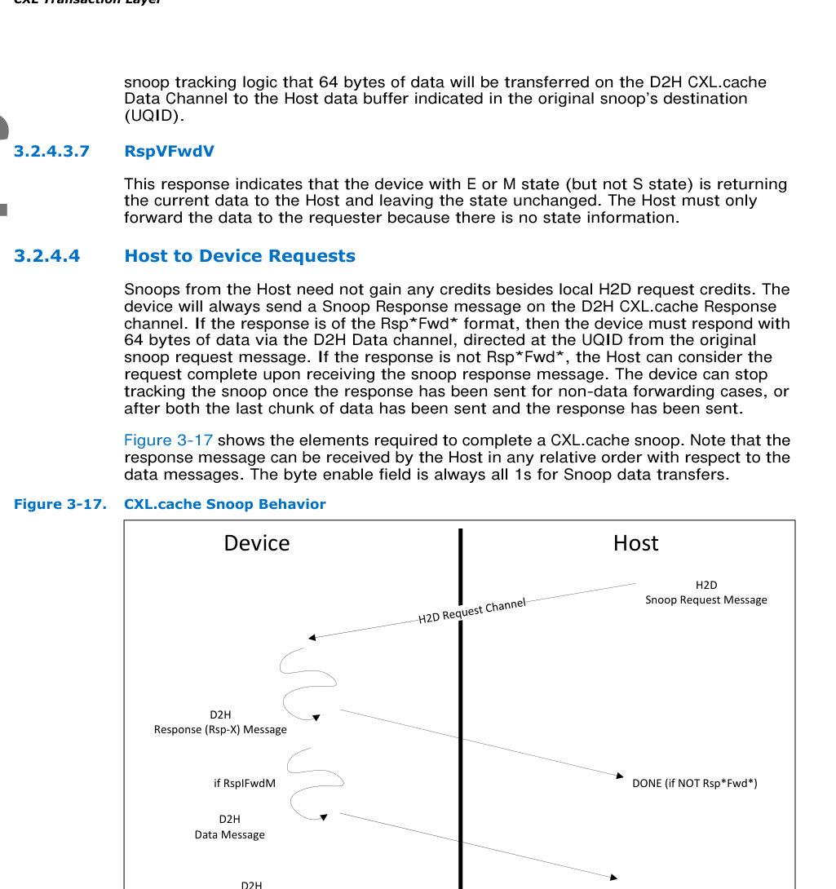
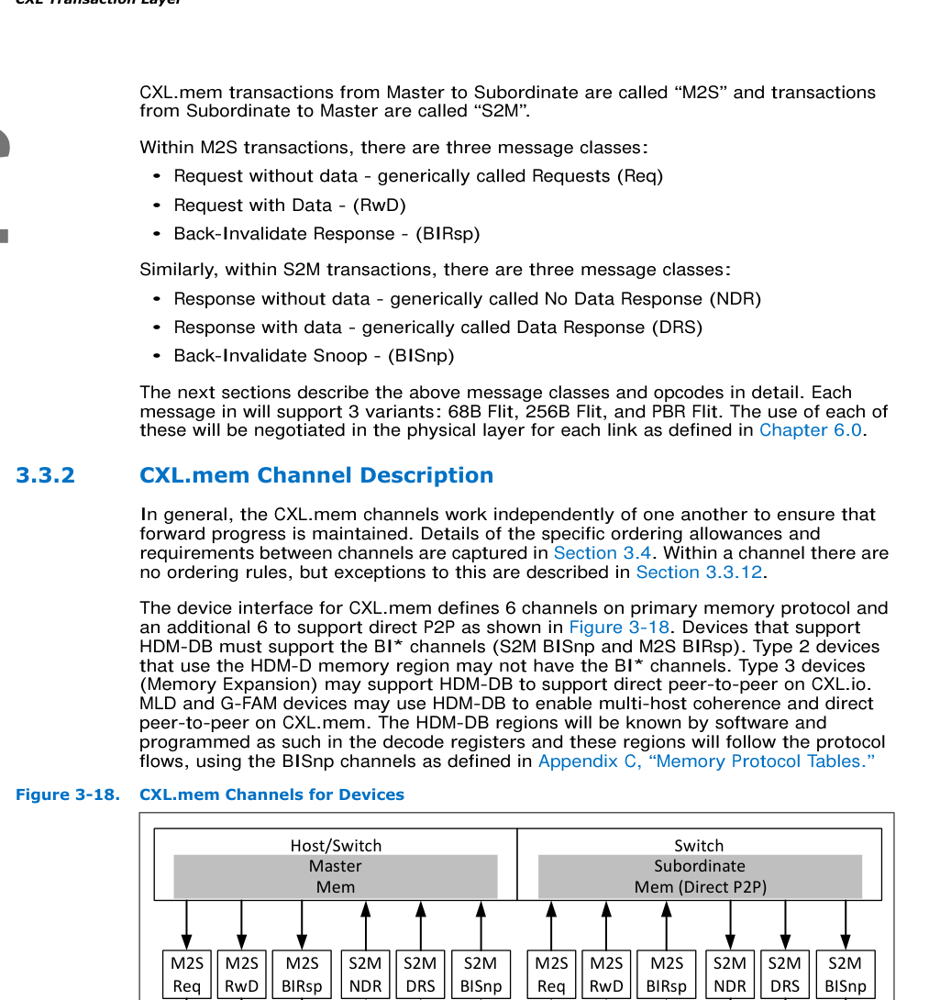
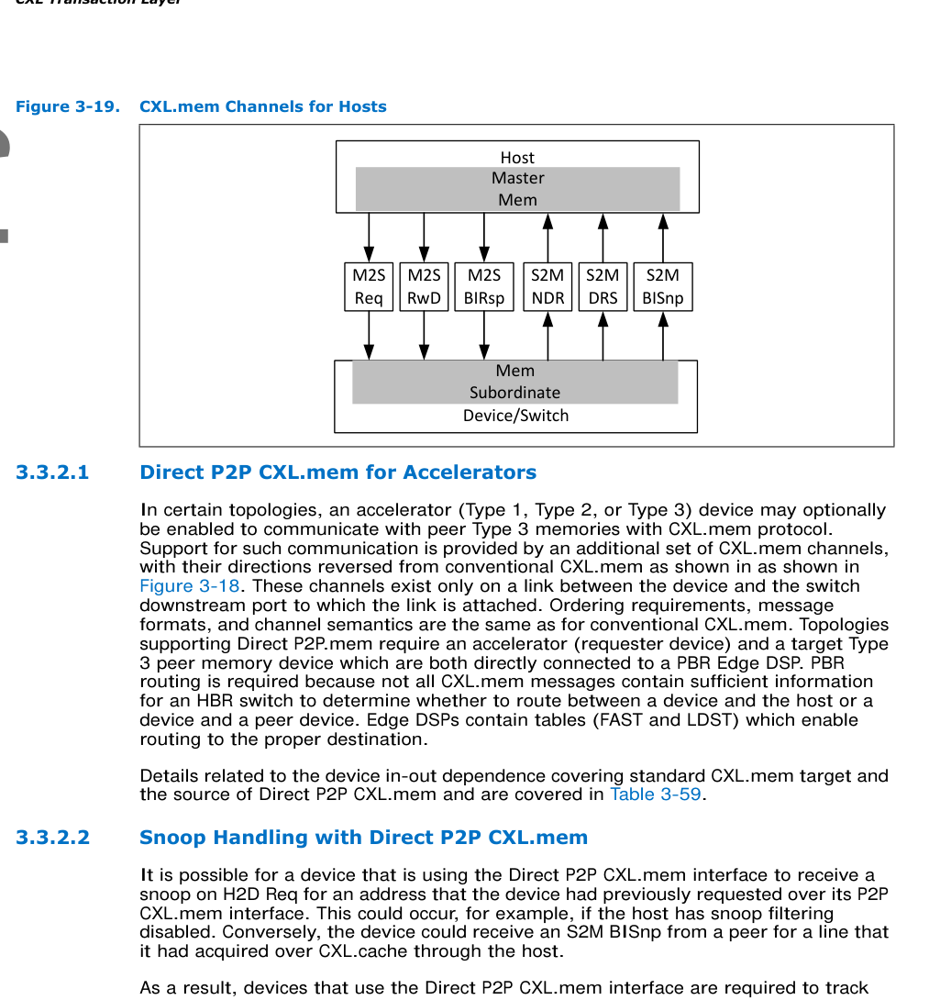
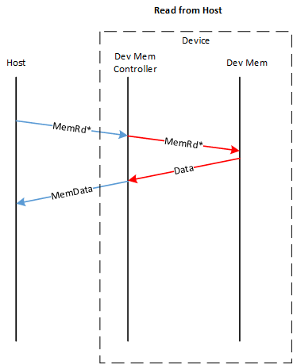
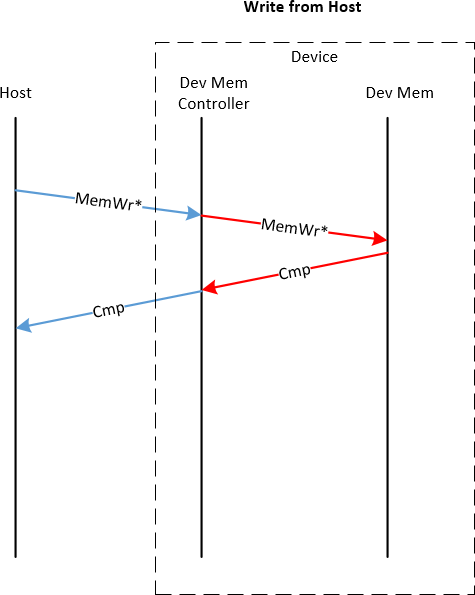

# 📘 第 3 章 CXL 事务层 -- 补遗内容 (Gap Fill)

> **注意**: 本文件为 Chapter 3 MD 文件的补遗，包含原 MD 文件中缺失的章节 3.2.4.3 至 3.6。
> 此内容应插入原文件 section 3.2.4.2.20 (CacheFlushed) 之后，"🖼 图补遗" 之前。

---

# CXL 3.2 Specification Translation | CXL 3.2 规范翻译

## Sections 3.2.4.3 - 3.2.5 | 第3.2.4.3节 - 第3.2.5节

> **Note:** This document provides a bilingual (EN/CN) translation of CXL Specification Revision 3.2, Version 1.0, sections 3.2.4.3 through 3.2.5.
> **说明：** 本文档提供 CXL 规范 3.2 版 1.0 版本第 3.2.4.3 节至第 3.2.5 节的双语（英文/中文）翻译。

---

### 3.2.4.3 Device to Host Response | 设备到主机响应

<table>
<thead>
<tr>
<th width="50%">English</th>
<th width="50%" style="background-color:#e8e8e8">中文</th>
</tr>
</thead>
<tbody>
<tr>
<td>Responses are directed at the Host entry indicated in the UQID field in the original H2D request message.</td>
<td style="background-color:#e8e8e8">响应定向到原始H2D请求消息中UQID字段所指示的主机条目。</td>
</tr>
</tbody>
</table>

---

#### 3.2.4.3.1 RspIHitI | RspIHitI

<table>
<thead>
<tr>
<th width="50%">English</th>
<th width="50%" style="background-color:#e8e8e8">中文</th>
</tr>
</thead>
<tbody>
<tr>
<td>In general, this is the response that a device provides to a snoop when the line was not found in any caches. If the device returns RspIHitI for a snoop, the Host can assume the line has been cleared from that device.</td>
<td style="background-color:#e8e8e8">一般来说，这是设备在侦听（snoop）未在任何缓存中找到该缓存行时所提供的响应。如果设备针对某个侦听返回RspIHitI，则主机可假定该缓存行已从该设备中清除。</td>
</tr>
</tbody>
</table>

---

#### 3.2.4.3.2 RspVHitV | RspVHitV

<table>
<thead>
<tr>
<th width="50%">English</th>
<th width="50%" style="background-color:#e8e8e8">中文</th>
</tr>
</thead>
<tbody>
<tr>
<td>In general, this is the response that a device provides to a snoop when the line was hit in the cache and no state change occurred. If the device returns an RspVHitV for a snoop, the Host can assume a copy of the line is present in one or more places in that device.</td>
<td style="background-color:#e8e8e8">一般来说，这是设备在侦听命中缓存且未发生状态变化时所提供的响应。如果设备针对某个侦听返回RspVHitV，则主机可假定该缓存行的一个副本存在于该设备的一个或多个位置。</td>
</tr>
</tbody>
</table>

---

#### 3.2.4.3.3 RspIHitSE | RspIHitSE

<table>
<thead>
<tr>
<th width="50%">English</th>
<th width="50%" style="background-color:#e8e8e8">中文</th>
</tr>
</thead>
<tbody>
<tr>
<td>In general, this is the response that a device provides to a snoop when the line was hit in a clean state in at least one cache and is now invalid. If the device returns an RspIHitSE for a snoop, the Host can assume the line has been cleared from that device.</td>
<td style="background-color:#e8e8e8">一般来说，这是设备在侦听命中了至少一个缓存中的干净（clean）状态且该缓存行现已无效时所提供的响应。如果设备针对某个侦听返回RspIHitSE，则主机可假定该缓存行已从该设备中清除。</td>
</tr>
</tbody>
</table>

---

#### 3.2.4.3.4 RspSHitSE | RspSHitSE

<table>
<thead>
<tr>
<th width="50%">English</th>
<th width="50%" style="background-color:#e8e8e8">中文</th>
</tr>
</thead>
<tbody>
<tr>
<td>In general, this is the response that a device provides to a snoop when the line was hit in a clean state in at least one cache and is now downgraded to shared state. If the device returns an RspSHitSE for a snoop, the Host should assume the line is still in the device.</td>
<td style="background-color:#e8e8e8">一般来说，这是设备在侦听命中了至少一个缓存中的干净状态且该缓存行现已降级为共享（Shared）状态时所提供的响应。如果设备针对某个侦听返回RspSHitSE，则主机应当假定该缓存行仍在设备中。</td>
</tr>
</tbody>
</table>

---

#### 3.2.4.3.5 RspSFwdM | RspSFwdM

<table>
<thead>
<tr>
<th width="50%">English</th>
<th width="50%" style="background-color:#e8e8e8">中文</th>
</tr>
</thead>
<tbody>
<tr>
<td>This response indicates to the Host that the line being snooped is now in S state in the device, after having hit the line in Modified state. The device may choose to downgrade the line to Invalid. This response also indicates to the Host snoop tracking logic that 64 bytes of data is transferred on the D2H CXL.cache Data Channel to the Host data buffer indicated in the original snoop's destination (UQID).</td>
<td style="background-color:#e8e8e8">此响应向主机表明，被侦听的缓存行在Modified状态下命中后，现在设备中处于S状态。设备可选择将该缓存行降级为Invalid。此响应还向主机的侦听跟踪逻辑表明，64字节的数据将通过D2H CXL.cache数据通道传输到原始侦听目的地（UQID）所指示的主机数据缓冲区。</td>
</tr>
</tbody>
</table>

---

#### 3.2.4.3.6 RspIFwdM | RspIFwdM

<table>
<thead>
<tr>
<th width="50%">English</th>
<th width="50%" style="background-color:#e8e8e8">中文</th>
</tr>
</thead>
<tbody>
<tr>
<td>This response indicates to the Host that the line being snooped is now in I state in the device, after having hit the line in Modified state. The Host may now assume the device contains no more cached copies of this line. This response also indicates to the Host snoop tracking logic that 64 bytes of data will be transferred on the D2H CXL.cache Data Channel to the Host data buffer indicated in the original snoop's destination (UQID).</td>
<td style="background-color:#e8e8e8">此响应向主机表明，被侦听的缓存行在Modified状态下命中后，现在设备中处于I状态。此时主机可假定该设备不再包含此缓存行的任何缓存副本。此响应还向主机的侦听跟踪逻辑表明，64字节的数据将通过D2H CXL.cache数据通道传输到原始侦听目的地（UQID）所指示的主机数据缓冲区。</td>
</tr>
</tbody>
</table>

---

**Table 3-25. D2H Response Encodings | 表3-25. D2H响应编码**

<table>
<thead>
<tr>
<th width="50%">English</th>
<th width="50%" style="background-color:#e8e8e8">中文</th>
</tr>
</thead>
<tbody>
<tr><td><strong>Device CXL.cache Rsp</strong></td><td style="background-color:#e8e8e8"><strong>设备 CXL.cache 响应</strong></td></tr>
<tr><td><strong>Opcode</strong></td><td style="background-color:#e8e8e8"><strong>操作码（Opcode）</strong></td></tr>
<tr><td>RspIHitI</td><td style="background-color:#e8e8e8">RspIHitI</td></tr>
<tr><td>0 0100b</td><td style="background-color:#e8e8e8">0 0100b</td></tr>
<tr><td>RspVHitV</td><td style="background-color:#e8e8e8">RspVHitV</td></tr>
<tr><td>0 0110b</td><td style="background-color:#e8e8e8">0 0110b</td></tr>
<tr><td>RspIHitSE</td><td style="background-color:#e8e8e8">RspIHitSE</td></tr>
<tr><td>0 0101b</td><td style="background-color:#e8e8e8">0 0101b</td></tr>
<tr><td>RspSHitSE</td><td style="background-color:#e8e8e8">RspSHitSE</td></tr>
<tr><td>0 0001b</td><td style="background-color:#e8e8e8">0 0001b</td></tr>
<tr><td>RspSFwdM</td><td style="background-color:#e8e8e8">RspSFwdM</td></tr>
<tr><td>0 0111b</td><td style="background-color:#e8e8e8">0 0111b</td></tr>
<tr><td>RspIFwdM</td><td style="background-color:#e8e8e8">RspIFwdM</td></tr>
<tr><td>0 1111b</td><td style="background-color:#e8e8e8">0 1111b</td></tr>
<tr><td>RspVFwdV</td><td style="background-color:#e8e8e8">RspVFwdV</td></tr>
<tr><td>1 0110b</td><td style="background-color:#e8e8e8">1 0110b</td></tr>
</tbody>
</table>

---

#### 3.2.4.3.7 RspVFwdV | RspVFwdV

<table>
<thead>
<tr>
<th width="50%">English</th>
<th width="50%" style="background-color:#e8e8e8">中文</th>
</tr>
</thead>
<tbody>
<tr>
<td>This response indicates that the device with E or M state (but not S state) is returning the current data to the Host and leaving the state unchanged. The Host must only forward the data to the requester because there is no state information.</td>
<td style="background-color:#e8e8e8">此响应表明，处于E或M状态（但不包括S状态）的设备正在将当前数据返回给主机，并保持状态不变。主机必须仅将数据转发给请求者，因为不携带状态信息。</td>
</tr>
</tbody>
</table>

[⬆️ 返回目录](#-本章目录)

---

### 3.2.4.4 Host to Device Requests | 主机到设备请求

<table>
<thead>
<tr>
<th width="50%">English</th>
<th width="50%" style="background-color:#e8e8e8">中文</th>
</tr>
</thead>
<tbody>
<tr>
<td>Snoops from the Host need not gain any credits besides local H2D request credits. The device will always send a Snoop Response message on the D2H CXL.cache Response channel. If the response is of the Rsp*Fwd* format, then the device must respond with 64 bytes of data via the D2H Data channel, directed at the UQID from the original snoop request message. If the response is not Rsp*Fwd*, the Host can consider the request complete upon receiving the snoop response message. The device can stop tracking the snoop once the response has been sent for non-data forwarding cases, or after both the last chunk of data has been sent and the response has been sent.</td>
<td style="background-color:#e8e8e8">来自主机的侦听除了本地的H2D请求信用（credit）外，无需获取任何其他信用。设备将始终在D2H CXL.cache响应通道上发送侦听响应消息。如果响应属于Rsp*Fwd*格式，则设备必须通过D2H数据通道响应64字节的数据，定向到原始侦听请求消息中的UQID。如果响应不是Rsp*Fwd*，则主机可在收到侦听响应消息后认为请求已完成。对于非数据转发的情况，设备可在发送响应后停止跟踪该侦听；对于需要转发数据的情况，则在发送完最后一个数据块且发送响应之后停止跟踪。</td>
</tr>
</tbody>
</table>

> **Figure 3-17. CXL.cache Snoop Behavior | 图3-17. CXL.cache侦听行为**
>
> 
>
> *Original page render @ 150 DPI* — [Full size](figures/chapter_03/page_0126.png)

<table>
<thead>
<tr>
<th width="50%">English</th>
<th width="50%" style="background-color:#e8e8e8">中文</th>
</tr>
</thead>
<tbody>
<tr>
<td>Figure 3-17 shows the elements required to complete a CXL.cache snoop. Note that the response message can be received by the Host in any relative order with respect to the data messages. The byte enable field is always all 1s for Snoop data transfers.</td>
<td style="background-color:#e8e8e8">图3-17展示了完成CXL.cache侦听所需的元素。请注意，响应消息可由主机以相对于数据消息的任意顺序接收。对于侦听数据传输，字节使能（byte enable）字段始终全为1。</td>
</tr>
</tbody>
</table>

---

#### 3.2.4.4.1 SnpData | SnpData

<table>
<thead>
<tr>
<th width="50%">English</th>
<th width="50%" style="background-color:#e8e8e8">中文</th>
</tr>
</thead>
<tbody>
<tr>
<td>These are snoop requests from the Host for lines that are intended to be cached in either Shared or Exclusive state at the requester (the Exclusive state can be cached at the requester only if all devices respond with RspI). This type of snoop is typically triggered by data read requests. A device that receives this snoop must either invalidate or downgrade all cachelines to Shared state. If the device holds dirty data it must return it to the Host.</td>
<td style="background-color:#e8e8e8">这些是来自主机的侦听请求，针对计划在请求者处以Shared或Exclusive状态缓存的缓存行（仅当所有设备都以RspI响应时，请求者方可缓存Exclusive状态）。此类侦听通常由数据读取请求触发。接收此侦听的设备必须将所有缓存行无效化（invalidate）或降级（downgrade）为Shared状态。如果设备持有脏数据（dirty data），则必须将其返回给主机。</td>
</tr>
</tbody>
</table>

---

#### 3.2.4.4.2 SnpInv | SnpInv

<table>
<thead>
<tr>
<th width="50%">English</th>
<th width="50%" style="background-color:#e8e8e8">中文</th>
</tr>
</thead>
<tbody>
<tr>
<td>These are snoop requests from the Host for lines that are intended to be granted ownership and Exclusive state at the requester. This type of snoop is typically triggered by write requests. A device that receives this snoop must invalidate all cachelines. If the device holds dirty data it must return it to the Host.</td>
<td style="background-color:#e8e8e8">这些是来自主机的侦听请求，针对计划在请求者处授予所有权（ownership）和Exclusive状态的缓存行。此类侦听通常由写请求触发。接收此侦听的设备必须将所有缓存行无效化。如果设备持有脏数据，则必须将其返回给主机。</td>
</tr>
</tbody>
</table>

---

#### 3.2.4.4.3 SnpCur | SnpCur

<table>
<thead>
<tr>
<th width="50%">English</th>
<th width="50%" style="background-color:#e8e8e8">中文</th>
</tr>
</thead>
<tbody>
<tr>
<td>This snoop gets the current version of the line, but doesn't require change of any cache state in the hierarchy. It is only sent on behalf of the RdCurr request. If the device holds data in Modified state it must return it to the Host. The cache state can remain unchanged in both the device and Host, and the Host should not update its caches. To allow for varied cache implementations, devices are allowed to change cache state as captured in Table 3-26, but it is recommended to not change cache state.</td>
<td style="background-color:#e8e8e8">此侦听获取缓存行的当前版本，但不要求更改层次结构中的任何缓存状态。它仅为RdCurr请求而发送。如果设备持有Modified状态的数据，则必须将其返回给主机。设备和主机中的缓存状态均可保持不变，且主机不应更新其缓存。为适应各种缓存实现，设备允许按表3-26所述更改缓存状态，但建议不更改缓存状态。</td>
</tr>
</tbody>
</table>

[⬆️ 返回目录](#-本章目录)

---

### 3.2.4.5 Host to Device Response | 主机到设备响应

**Table 3-26. CXL.cache -- Mapping of H2D Requests to D2H Responses | 表3-26. CXL.cache -- H2D请求到D2H响应的映射**

<table>
<thead>
<tr>
<th width="50%">English</th>
<th width="50%" style="background-color:#e8e8e8">中文</th>
</tr>
</thead>
<tbody>
<tr><td><strong>Opcode</strong></td><td style="background-color:#e8e8e8"><strong>操作码</strong></td></tr>
<tr><td>RspIHitI</td><td style="background-color:#e8e8e8">RspIHitI</td></tr>
<tr><td>RspVhitV</td><td style="background-color:#e8e8e8">RspVhitV</td></tr>
<tr><td>RspSHitSE</td><td style="background-color:#e8e8e8">RspSHitSE</td></tr>
<tr><td>RspIHitSE</td><td style="background-color:#e8e8e8">RspIHitSE</td></tr>
<tr><td>RspSFwdM</td><td style="background-color:#e8e8e8">RspSFwdM</td></tr>
<tr><td>RspIFwdM</td><td style="background-color:#e8e8e8">RspIFwdM</td></tr>
<tr><td>RspVFwdV</td><td style="background-color:#e8e8e8">RspVFwdV</td></tr>
</tbody>
</table>

<table>
<thead>
<tr>
<th>Opcode</th>
<th>RspIHitI</th>
<th>RspVhitV</th>
<th>RspSHitSE</th>
<th>RspIHitSE</th>
<th>RspSFwdM</th>
<th>RspIFwdM</th>
<th>RspVFwdV</th>
</tr>
</thead>
<tbody>
<tr>
<td><strong>SnpData</strong> 001b</td>
<td></td>
<td>X</td>
<td>X</td>
<td>X</td>
<td></td>
<td>X</td>
<td></td>
</tr>
<tr>
<td><strong>SnpInv</strong> 010b</td>
<td></td>
<td></td>
<td></td>
<td>X</td>
<td></td>
<td>X</td>
<td></td>
</tr>
<tr>
<td><strong>SnpCur</strong> 011b</td>
<td>X</td>
<td>X</td>
<td></td>
<td></td>
<td>X</td>
<td>X</td>
<td>X</td>
</tr>
</tbody>
</table>

<table>
<thead>
<tr>
<th width="50%">English Note</th>
<th width="50%" style="background-color:#e8e8e8">中文说明</th>
</tr>
</thead>
<tbody>
<tr>
<td>"X" marks indicate valid D2H response opcodes permitted for each H2D snoop request type.</td>
<td style="background-color:#e8e8e8">"X"标记表示每种H2D侦听请求类型所允许的有效D2H响应操作码。</td>
</tr>
</tbody>
</table>

---

**Table 3-27. H2D Response Opcode Encodings | 表3-27. H2D响应操作码编码**

<table>
<thead>
<tr>
<th width="50%">English</th>
<th width="50%" style="background-color:#e8e8e8">中文</th>
</tr>
</thead>
<tbody>
<tr><td><strong>H2D Response Class</strong></td><td style="background-color:#e8e8e8"><strong>H2D响应类别</strong></td></tr>
<tr><td><strong>Encoding</strong></td><td style="background-color:#e8e8e8"><strong>编码</strong></td></tr>
<tr><td>RspData</td><td style="background-color:#e8e8e8">RspData</td></tr>
<tr><td>WritePull</td><td style="background-color:#e8e8e8">WritePull</td></tr>
<tr><td>0001b</td><td style="background-color:#e8e8e8">0001b</td></tr>
<tr><td>UQID</td><td style="background-color:#e8e8e8">UQID</td></tr>
<tr><td>GO</td><td style="background-color:#e8e8e8">GO</td></tr>
<tr><td>0100b</td><td style="background-color:#e8e8e8">0100b</td></tr>
<tr><td>MESI1</td><td style="background-color:#e8e8e8">MESI1</td></tr>
<tr><td>GO_WritePull</td><td style="background-color:#e8e8e8">GO_WritePull</td></tr>
<tr><td>0101b</td><td style="background-color:#e8e8e8">0101b</td></tr>
<tr><td>UQID</td><td style="background-color:#e8e8e8">UQID</td></tr>
<tr><td>ExtCmp</td><td style="background-color:#e8e8e8">ExtCmp</td></tr>
<tr><td>0110b</td><td style="background-color:#e8e8e8">0110b</td></tr>
<tr><td>Don't Care</td><td style="background-color:#e8e8e8">无关（Don't Care）</td></tr>
<tr><td>GO_WritePull_Drop</td><td style="background-color:#e8e8e8">GO_WritePull_Drop</td></tr>
<tr><td>1000b</td><td style="background-color:#e8e8e8">1000b</td></tr>
<tr><td>UQID</td><td style="background-color:#e8e8e8">UQID</td></tr>
<tr><td>Reserved</td><td style="background-color:#e8e8e8">保留（Reserved）</td></tr>
<tr><td>1100b</td><td style="background-color:#e8e8e8">1100b</td></tr>
<tr><td>Don't Care</td><td style="background-color:#e8e8e8">无关（Don't Care）</td></tr>
<tr><td>Fast_GO_WritePull</td><td style="background-color:#e8e8e8">Fast_GO_WritePull</td></tr>
<tr><td>1101b</td><td style="background-color:#e8e8e8">1101b</td></tr>
<tr><td>UQID</td><td style="background-color:#e8e8e8">UQID</td></tr>
<tr><td>GO_ERR_WritePull</td><td style="background-color:#e8e8e8">GO_ERR_WritePull</td></tr>
<tr><td>1111b</td><td style="background-color:#e8e8e8">1111b</td></tr>
<tr><td>UQID</td><td style="background-color:#e8e8e8">UQID</td></tr>
</tbody>
</table>

<table>
<thead>
<tr>
<th width="50%">English Note</th>
<th width="50%" style="background-color:#e8e8e8">中文说明</th>
</tr>
</thead>
<tbody>
<tr>
<td>1 4-bit MESI encoding is in LSB and the upper bits are Reserved.</td>
<td style="background-color:#e8e8e8">1 4位MESI编码位于LSB，高位为保留位。</td>
</tr>
</tbody>
</table>

---

#### 3.2.4.5.1 WritePull | WritePull

<table>
<thead>
<tr>
<th width="50%">English</th>
<th width="50%" style="background-color:#e8e8e8">中文</th>
</tr>
</thead>
<tbody>
<tr>
<td>This response instructs the device to send the write data to the Host, but not to change the state of the line. This is used for WrInv where the data is needed before the GO-I can be sent. This is because GO-I is the notification that the write was completed.</td>
<td style="background-color:#e8e8e8">此响应指示设备将写数据发送到主机，但不更改缓存行的状态。这用于WrInv，因为在发送GO-I之前需要数据。这是因为GO-I是写操作已完成的通知。</td>
</tr>
</tbody>
</table>

---

#### 3.2.4.5.2 GO | GO

<table>
<thead>
<tr>
<th width="50%">English</th>
<th width="50%" style="background-color:#e8e8e8">中文</th>
</tr>
</thead>
<tbody>
<tr>
<td>The Global Observation (GO) message conveys that read requests are coherent and that write requests are coherent and consistent. It is an indication that the transaction has been observed by the system device and the MESI state that is encoded in the RspType field indicates into which state the data associated with the transaction should be placed for the requester's caches. Details in Table 3-20.</td>
<td style="background-color:#e8e8e8">全局观测（Global Observation，GO）消息传达读请求已达成一致性（coherent）以及写请求已达成一致性并持久化（consistent）。它表明事务已被系统设备观测到，并且编码在RspType字段中的MESI状态指示与该事务关联的数据应被置于请求者缓存的何种状态。详细信息见表3-20。</td>
</tr>
<tr>
<td>If the Host returns Modified state to the device, then the device is responsible for the dirty data and cannot drop the line without writing it back to the Host.</td>
<td style="background-color:#e8e8e8">如果主机向设备返回Modified状态，则设备负责该脏数据，并且在将其写回主机之前不能丢弃该缓存行。</td>
</tr>
<tr>
<td>If the Host returns Invalid or Error state to the device, then the device must use the data at most once and not cache the data. Error responses to reads and cacheable write requests (for example, RdOwn or ItoMWr) will always be the result of an abort condition, so modified data can be safely dropped in the device.</td>
<td style="background-color:#e8e8e8">如果主机向设备返回Invalid或Error状态，则设备最多只能使用该数据一次，且不得缓存该数据。对读操作和可缓存写请求（例如RdOwn或ItoMWr）的错误响应始终是中止（abort）条件的结果，因此设备中的已修改数据可以安全丢弃。</td>
</tr>
</tbody>
</table>

---

#### 3.2.4.5.3 GO_WritePull | GO_WritePull

<table>
<thead>
<tr>
<th width="50%">English</th>
<th width="50%" style="background-color:#e8e8e8">中文</th>
</tr>
</thead>
<tbody>
<tr>
<td>This is a combined GO + WritePull message. No cache state is transferred to the device. The GO+WritePull message is used for write types that do not require a later message to know whether write data is visible.</td>
<td style="background-color:#e8e8e8">这是一个组合的GO + WritePull消息。不向设备传输缓存状态。GO+WritePull消息用于不需要后续消息来确认写数据是否可见的写类型。</td>
</tr>
</tbody>
</table>

---

#### 3.2.4.5.4 ExtCmp | ExtCmp

<table>
<thead>
<tr>
<th width="50%">English</th>
<th width="50%" style="background-color:#e8e8e8">中文</th>
</tr>
</thead>
<tbody>
<tr>
<td>This response indicates that the data that was previously locally ordered (FastGO) has been observed throughout the system. Most importantly, accesses to memory will return the most up-to-date data.</td>
<td style="background-color:#e8e8e8">此响应表明先前已本地排序（FastGO）的数据现在已在全系统范围内被观测到。最重要的是，对内存的访问将返回最新的数据。</td>
</tr>
</tbody>
</table>

---

#### 3.2.4.5.5 GO_WritePull_Drop | GO_WritePull_Drop

<table>
<thead>
<tr>
<th width="50%">English</th>
<th width="50%" style="background-color:#e8e8e8">中文</th>
</tr>
</thead>
<tbody>
<tr>
<td>This message has the same semantics as GO_WritePull, except that the device should not send data to the Host. This response can be sent in place of GO_WritePull when the Host determines that the data is not required. This response will never be sent for partial writes because the byte enables will always need to be transferred.</td>
<td style="background-color:#e8e8e8">此消息具有与GO_WritePull相同的语义，不同之处在于设备不应向主机发送数据。当主机确定不需要数据时，可发送此响应来代替GO_WritePull。此响应绝不会针对部分写（partial writes）发送，因为字节使能始终需要被传输。</td>
</tr>
</tbody>
</table>

---

#### 3.2.4.5.6 Fast_GO_WritePull | Fast_GO_WritePull

<table>
<thead>
<tr>
<th width="50%">English</th>
<th width="50%" style="background-color:#e8e8e8">中文</th>
</tr>
</thead>
<tbody>
<tr>
<td>Similar to GO_WritePull, but only indicates that the request is locally observed. There will be a later ExtCmp message when the transaction is fully observable in memory. Devices that do not implement the Fast_GO feature may ignore the GO message and wait for the ExtCMP. Data must always be sent for the WritePull. No cache state is transferred to the device.</td>
<td style="background-color:#e8e8e8">类似于GO_WritePull，但仅表明请求已被本地观测到。当事务在内存中完全可观测时，将有后续的ExtCmp消息到来。未实现Fast_GO特性的设备可忽略GO消息并等待ExtCMP。对于WritePull，数据必须始终被发送。不向设备传输缓存状态。</td>
</tr>
<tr>
<td>Locally Observed, in this context, is a host-specific coherence domain that may be a subset of the global coherence domain. An example is a Last Level Cache that the requesting device shares with other CXL.cache devices that are connected below a host-bridge. In that example, local observation is only within the Last Level Cache and not between other Last Level Caches.</td>
<td style="background-color:#e8e8e8">在此上下文中，"本地观测"（Locally Observed）是主机特定的一致性域，可能是全局一致性域的子集。一个例子是请求设备与连接在同一主机桥（host-bridge）下方的其他CXL.cache设备共享的末级缓存（Last Level Cache）。在该例子中，本地观测仅在末级缓存内部有效，而非跨不同末级缓存之间。</td>
</tr>
</tbody>
</table>

---

#### 3.2.4.5.7 GO_ERR_WritePull | GO_ERR_WritePull

<table>
<thead>
<tr>
<th width="50%">English</th>
<th width="50%" style="background-color:#e8e8e8">中文</th>
</tr>
</thead>
<tbody>
<tr>
<td>Similar to GO_WritePull, but indicates that there was an error with the transaction that should be handled correctly in the device. Data must be sent to the Host for the WritePull, and the Host will drop the data. No cache state is transferred to the device (assumed Error). An ExtCmp is still sent if it is expected by the originating request.</td>
<td style="background-color:#e8e8e8">类似于GO_WritePull，但表明事务存在错误，设备应正确处理该错误。对于WritePull，数据必须发送到主机，而主机将丢弃该数据。不向设备传输缓存状态（假定为Error）。如果原始请求期望ExtCmp，则仍会发送ExtCmp。</td>
</tr>
</tbody>
</table>

[⬆️ 返回目录](#-本章目录)

---

### 3.2.5 Cacheability Details and Request Restrictions | 可缓存性详情及请求限制

<table>
<thead>
<tr>
<th width="50%">English</th>
<th width="50%" style="background-color:#e8e8e8">中文</th>
</tr>
</thead>
<tbody>
<tr>
<td>These details and restrictions apply to all devices.</td>
<td style="background-color:#e8e8e8">以下详情和限制适用于所有设备。</td>
</tr>
</tbody>
</table>

---

#### 3.2.5.1 GO-M Responses | GO-M响应

<table>
<thead>
<tr>
<th width="50%">English</th>
<th width="50%" style="background-color:#e8e8e8">中文</th>
</tr>
</thead>
<tbody>
<tr>
<td>GO-M responses from the host indicate that the device is being granted the sole copy of modified data. The device must cache this data and write it back when it is done.</td>
<td style="background-color:#e8e8e8">主机的GO-M响应表明设备正被授予已修改数据的唯一副本。设备必须缓存该数据，并在使用完毕后将其写回。</td>
</tr>
</tbody>
</table>

---

#### 3.2.5.2 Device/Host Snoop-GO-Data Assumptions | 设备/主机侦听-GO-数据假设

<table>
<thead>
<tr>
<th width="50%">English</th>
<th width="50%" style="background-color:#e8e8e8">中文</th>
</tr>
</thead>
<tbody>
<tr>
<td>When the host returns a GO response to a device, the expectation is that a snoop arriving to the same address of the request receiving the GO would see the results of that GO. For example, if the host sends GO-E for an RdOwn request followed by a snoop to the same address immediately afterwards, then one would expect the device to transition the line to M state and reply with an RspIFwdM response back to the Host. To implement this principle, the CXL.cache link layer ensures that the device will receive the two messages in separate slots to make the order completely unambiguous.</td>
<td style="background-color:#e8e8e8">当主机向设备返回GO响应时，期望后续到达该接收GO请求的相同地址的侦听能够看到该GO的结果。例如，如果主机为RdOwn请求发送GO-E，随后立即向相同地址发送侦听，则期望设备将该缓存行转换为M状态，并向主机回复RspIFwdM响应。为实现此原则，CXL.cache链路层确保设备将在不同的时隙（slot）中接收这两条消息，从而使顺序完全无歧义。</td>
</tr>
<tr>
<td>When the host is sending a snoop to the device, the requirement is that no GO response will be sent to any requests with that address in the device until after the Host has received a response for the snoop and all implicit writeback (IWB) data (dirty data forwarded in response to a snoop) has been received.</td>
<td style="background-color:#e8e8e8">当主机向设备发送侦听时，要求是：在主机收到该侦听的响应以及所有隐式写回（Implicit Writeback，IWB）数据（响应侦听而转发的脏数据）之前，不得向设备中该地址的任何请求发送GO响应。</td>
</tr>
<tr>
<td>When the host returns data to the device for a read type request, and GO for that request has not yet been sent to the device, the host may not send a snoop to that address until after the GO message has been sent. Because the new cache state is encoded in the response message for reads, sending a snoop to an address without having received GO, but after having received data, is ambiguous to the device as to what the snoop response should be in that situation.</td>
<td style="background-color:#e8e8e8">当主机为读类型请求向设备返回数据，且该请求的GO尚未发送给设备时，主机在GO消息发送之前不得向该地址发送侦听。由于新的缓存状态编码在读取的响应消息中，在收到数据但尚未收到GO的情况下向某个地址发送侦听，对于设备而言，在该情况下应返回何种侦听响应是模糊不清的。</td>
</tr>
<tr>
<td>Fundamentally, the GO that is associated with a read request also applies to the data returned with that request. Sending data for a read request implies that data is valid, meaning the device can consume it even if the GO has not yet arrived. The GO will arrive later and inform the device what state to cache the line in (if at all) and whether the data was the result of an error condition (e.g., hitting an address region that the device was not allowed to access).</td>
<td style="background-color:#e8e8e8">从根本上说，与读请求相关联的GO同样适用于随该请求返回的数据。为读请求发送数据意味着该数据是有效的，即设备即使GO尚未到达也可以使用该数据。GO将在稍后到达，并告知设备应以何种状态缓存该缓存行（如果有的话），以及该数据是否由错误条件导致（例如，访问了设备不允许访问的地址区域）。</td>
</tr>
</tbody>
</table>

---

#### 3.2.5.3 Device/Host Snoop/WritePull Assumptions | 设备/主机侦听/WritePull假设

<table>
<thead>
<tr>
<th width="50%">English</th>
<th width="50%" style="background-color:#e8e8e8">中文</th>
</tr>
</thead>
<tbody>
<tr>
<td>The device requires that the host cannot have both a WritePull and H2D Snoop active on CXL.cache to a given 64-byte address. The host may not launch a snoop to a 64-byte address until all WritePull data from that address has been received by the host. Conversely, the host may not launch a WritePull for a write until the host has received the snoop response (including data in case of Rsp*Fwd*) for any snoops to the pending write's address. Any violation of these requirements will mean that the Bogus field on the D2H Data channel will be unreliable.</td>
<td style="background-color:#e8e8e8">设备要求主机不能同时对给定64字节地址在CXL.cache上同时活动的WritePull和H2D侦听。在主机收到该地址的所有WritePull数据之前，主机不得对该64字节地址发起侦听。反之，在主机收到针对待处理写地址的任何侦听的侦听响应（对于Rsp*Fwd*情况，还包括数据）之前，主机不得为写操作发起WritePull。任何违反这些要求的行为将导致D2H数据通道上的Bogus字段不可靠。</td>
</tr>
</tbody>
</table>

---

#### 3.2.5.4 Snoop Responses and Data Transfer on CXL.cache Evicts | CXL.cache逐出时的侦听响应与数据传输

<table>
<thead>
<tr>
<th width="50%">English</th>
<th width="50%" style="background-color:#e8e8e8">中文</th>
</tr>
</thead>
<tbody>
<tr>
<td>To snoop cache evictions (for example, DirtyEvict) and maintain an orderly transfer of snoop ownership from the device to the host, cache evictions on CXL.cache must adhere to the following protocol.</td>
<td style="background-color:#e8e8e8">为侦听缓存逐出（例如DirtyEvict）并维护从设备到主机的侦听所有权的有序转移，CXL.cache上的缓存逐出必须遵守以下协议。</td>
</tr>
<tr>
<td>If a device Evict transaction has been issued on the CXL.cache D2H request channel, but has not yet processed its WritePull from the host, and a snoop hits the writeback, the device must track this snoop hit if cache state is changed, which excludes the case when SnpCur results in a RspVFwdV response. When the device begins to process the WritePull, if snoop hit is tracked the device must set the Bogus field in all the D2H data messages sent to the host. The intent is to communicate to the host that the request data was already sent as IWB data, so the data from the Evict is potentially stale.</td>
<td style="background-color:#e8e8e8">如果设备的逐出（Evict）事务已在CXL.cache D2H请求通道上发出，但尚未从主机处理其WritePull，而此时侦听命中该写回（writeback），则在缓存状态发生更改的情况下（不包括SnpCur导致RspVFwdV响应的情况），设备必须跟踪此侦听命中。当设备开始处理WritePull时，如果跟踪到了侦听命中，则设备必须在发送给主机的所有D2H数据消息中设置Bogus字段。其目的是向主机传达该请求数据已作为IWB数据发送，因此来自逐出的数据可能是过时的（stale）。</td>
</tr>
</tbody>
</table>

---

#### 3.2.5.5 Multiple Snoops to the Same Address | 同一地址的多次侦听

<table>
<thead>
<tr>
<th width="50%">English</th>
<th width="50%" style="background-color:#e8e8e8">中文</th>
</tr>
</thead>
<tbody>
<tr>
<td>The host is only allowed to have one snoop pending at a time per cacheline address per device. The host must wait until it has received both the snoop response and all IWB data (if any) before sending the next snoop to that address.</td>
<td style="background-color:#e8e8e8">对于每个设备的每个缓存行地址，主机每次仅允许有一个待处理（pending）的侦听。主机必须等待，直到收到该侦听的侦听响应和所有IWB数据（如有）之后，才能向该地址发送下一个侦听。</td>
</tr>
</tbody>
</table>

---

#### 3.2.5.6 Multiple Reads to the Same Cacheline | 同一缓存行的多次读取

<table>
<thead>
<tr>
<th width="50%">English</th>
<th width="50%" style="background-color:#e8e8e8">中文</th>
</tr>
</thead>
<tbody>
<tr>
<td>Multiple read requests (cacheable or uncacheable) to the same cacheline are allowed only in the following specific cases where host tracking state is consistent regardless of the order requests are processed. The host can freely reorder requests, so the device is responsible for ordering requests when required.</td>
<td style="background-color:#e8e8e8">只有在以下特定情况下，才允许对同一缓存行发出多个读请求（可缓存或不可缓存），在这些情况下无论请求以何种顺序处理，主机的跟踪状态均保持一致。主机可自由重排请求顺序，因此设备负责在需要时对请求进行排序。</td>
</tr>
<tr>
<td>For host memory, multiple RdCurr and/or CLFlush are allowed. For these commands the device ends in I-state, so there is no inconsistent state possible for host tracking of a device cache.</td>
<td style="background-color:#e8e8e8">对于主机内存，允许多个RdCurr和/或CLFlush。对于这些命令，设备最终处于I状态，因此主机对设备缓存的跟踪不可能出现不一致状态。</td>
</tr>
<tr>
<td>With Type 2 devices that use HDM-D memory, in addition to RdCurr and/or CLFlush, multiple RdOwnNoData (bias flip requests) are allowed for device-attached memory. This case is allowed because with device-attached memory, the host does not track the device's cache so re-ordering in the host will not create an ambiguous state between the device and the host.</td>
<td style="background-color:#e8e8e8">对于使用HDM-D内存的Type 2设备，除了RdCurr和/或CLFlush之外，还允许多个RdOwnNoData（偏置翻转请求）用于设备连接内存。这种情况是允许的，因为对于设备连接内存，主机不跟踪设备的缓存，因此主机中的重排序不会在设备和主机之间产生歧义状态。</td>
</tr>
</tbody>
</table>

---

#### 3.2.5.7 Multiple Evicts to the Same Cacheline | 同一缓存行的多次逐出

<table>
<thead>
<tr>
<th width="50%">English</th>
<th width="50%" style="background-color:#e8e8e8">中文</th>
</tr>
</thead>
<tbody>
<tr>
<td>Multiple Evicts to the same cacheline are not allowed. All Evict messages from the device provide a guarantee to the host that the evicted cacheline will no longer be present in the device's caches.</td>
<td style="background-color:#e8e8e8">不允许对同一缓存行进行多次逐出（Evict）。来自设备的所有逐出消息向主机提供保证：被逐出的缓存行将不再存在于设备的缓存中。</td>
</tr>
<tr>
<td>Thus, it is a coherence violation to send another Evict for the same cacheline without an intervening cacheable Read/Read0 request to that address.</td>
<td style="background-color:#e8e8e8">因此，在没有介于其间的可缓存Read/Read0请求到该地址的情况下，对同一缓存行发送另一个逐出将构成一致性违规（coherence violation）。</td>
</tr>
</tbody>
</table>

---

#### 3.2.5.8 Multiple Write Requests to the Same Cacheline | 同一缓存行的多次写请求

<table>
<thead>
<tr>
<th width="50%">English</th>
<th width="50%" style="background-color:#e8e8e8">中文</th>
</tr>
</thead>
<tbody>
<tr>
<td>Multiple WrInv/WOWrInv/ItoMWr/WrCur to the same cacheline are allowed to be outstanding on CXL.cache. The host or switch can freely reorder requests, and the device may receive corresponding H2D Responses in reordered manner. However, it is generally recommended that the device should issue no more than one outstanding Write request for a given cacheline, and order multiple write requests to the same cacheline one after another whenever stringent ordering is warranted.</td>
<td style="background-color:#e8e8e8">允许多个WrInv/WOWrInv/ItoMWr/WrCur对同一缓存行在CXL.cache上处于未完成状态。主机或交换机可自由重排请求顺序，设备可能以重排后的顺序接收对应的H2D响应。然而，一般建议设备对于给定缓存行发起的未完成写请求不应超过一个，且在需要严格排序时，应将同一缓存行的多个写请求按顺序依次发出。</td>
</tr>
</tbody>
</table>

---

#### 3.2.5.9 Multiple Read and Write Requests to the Same Cacheline | 同一缓存行的多次读和写请求

<table>
<thead>
<tr>
<th width="50%">English</th>
<th width="50%" style="background-color:#e8e8e8">中文</th>
</tr>
</thead>
<tbody>
<tr>
<td>Multiple RdCur/CLFlush/WrInv/WOWrInv/ItoMWr/WrCur may be issued in parallel from devices to the same cacheline address. Other reads need to issue one at a time (also known as "serialize"). To serialize, the read must not be issued until all other outstanding accesses to same cacheline address have received GO. Additionally, after the serializing read is issued, no other accesses to the same cacheline address may be issued until it has received GO.</td>
<td style="background-color:#e8e8e8">多个RdCur/CLFlush/WrInv/WOWrInv/ItoMWr/WrCur可从设备并行发出到同一缓存行地址。其他读取需要一次发出一个（也称为"串行化"）。要串行化，读取必须在同一缓存行地址的所有其他未完成访问都收到GO之后才能发出。此外，在串行化读取发出之后，直到其收到GO之前，不得再对同一缓存行地址发出任何其他访问。</td>
</tr>
</tbody>
</table>

---

#### 3.2.5.10 Normal Global Observation (GO) | 常规全局观测（GO）

<table>
<thead>
<tr>
<th width="50%">English</th>
<th width="50%" style="background-color:#e8e8e8">中文</th>
</tr>
</thead>
<tbody>
<tr>
<td>Normal Global Observation (GO) responses are sent only after the host has guaranteed that request will have next ownership of the requested cacheline. GO messages for requests carry the cacheline state permitted through the MESI state or indicate that the data should only be used once and whether an error occurred.</td>
<td style="background-color:#e8e8e8">常规全局观测（GO）响应仅在主机保证请求将拥有所请求缓存行的下一所有权（next ownership）之后才发送。用于请求的GO消息携带通过MESI状态所允许的缓存行状态，或指示数据应仅使用一次以及是否发生了错误。</td>
</tr>
</tbody>
</table>

---

#### 3.2.5.11 Relaxed Global Observation (FastGO) | 宽松全局观测（FastGO）

<table>
<thead>
<tr>
<th width="50%">English</th>
<th width="50%" style="background-color:#e8e8e8">中文</th>
</tr>
</thead>
<tbody>
<tr>
<td>FastGO is only allowed for requests that do not require strict ordering. The Host may return the FastGO once the request is guaranteed next ownership of the requested cacheline within an implementation dependent sub-domain (e.g., CPU socket), but not necessarily within the system. Requests that receive a FastGO response and require completion messages are usually of the write combining memory type and the ordering requirement is that there will be a final completion (ExtCmp) message indicating that the request is at the stage where it is fully observed throughout the system.</td>
<td style="background-color:#e8e8e8">FastGO仅允许用于不需要严格排序的请求。一旦请求在实现相关的子域（例如CPU socket）内被保证拥有所请求缓存行的下一所有权（但不一定在整个系统范围内），主机即可返回FastGO。收到FastGO响应且需要完成消息的请求通常属于写合并（write combining）内存类型，其排序要求是：将有一个最终的完成（ExtCmp）消息，表明请求已处于在整个系统范围内被完全观测到的阶段。</td>
</tr>
<tr>
<td>To make use of FastGO, devices have specific knowledge of the FastGO boundary of the CXL hierarchy and know the consumer of the data is within that hierarchy; otherwise, they must wait for the ExtCmp to know the data will be visible.</td>
<td style="background-color:#e8e8e8">要使用FastGO，设备须明确了解CXL层次结构的FastGO边界，并知道数据的使用者位于该层次结构内；否则，设备必须等待ExtCmp以确认数据将可见。</td>
</tr>
</tbody>
</table>

---

#### 3.2.5.12 Evict to Device-attached Memory | 逐出到设备连接内存

<table>
<thead>
<tr>
<th width="50%">English</th>
<th width="50%" style="background-color:#e8e8e8">中文</th>
</tr>
</thead>
<tbody>
<tr>
<td>Device Evicts to device-attached memory are not allowed on CXL.cache. Evictions are expected to go directly to the device's own memory; however, a device may use non-Evict writes (e.g., ItoMWr, WrCur) to write data to the host to device-attached memory.</td>
<td style="background-color:#e8e8e8">CXL.cache上不允许设备将逐出发送到设备连接内存。逐出预期应直接进入设备自身的内存；然而，设备可使用非逐出写操作（例如ItoMWr、WrCur）将数据从主机写入设备连接内存。</td>
</tr>
</tbody>
</table>

---

#### 3.2.5.13 Memory Type on CXL.cache | CXL.cache上的内存类型

<table>
<thead>
<tr>
<th width="50%">English</th>
<th width="50%" style="background-color:#e8e8e8">中文</th>
</tr>
</thead>
<tbody>
<tr>
<td>To source requests on CXL.cache, devices need to get the Host Physical Address (HPA) from the Host by means of an ATS request on CXL.io. Due to memory type restrictions, on the ATS completion, the Host indicates to the device if an HPA can only be issued on CXL.io as described in Section 3.1.6. The device is not allowed to issue requests to such HPAs on CXL.cache. For requests that target ranges within the Device's local HDM range, the HPA is permitted to be obtained by means of an ATS request on CXL.io, or by using device-specific means.</td>
<td style="background-color:#e8e8e8">要通过CXL.cache发起请求，设备需要借助CXL.io上的ATS请求从主机获取主机物理地址（HPA）。由于内存类型限制，在ATS完成时，主机会按照Section 3.1.6所述向设备指明某个HPA是否仅可在CXL.io上发出。设备不得在CXL.cache上对此类HPA发出请求。对于目标地址位于设备本地HDM范围内的请求，允许通过CXL.io上的ATS请求或使用设备特定的方式获取HPA。</td>
</tr>
</tbody>
</table>

---

#### 3.2.5.14 General Assumptions | 通用假设

<table>
<thead>
<tr>
<th width="50%">English</th>
<th width="50%" style="background-color:#e8e8e8">中文</th>
</tr>
</thead>
<tbody>
<tr>
<td>1. The Host will NOT preserve ordering of the CXL.cache requests as delivered by the device. The device must maintain the ordering of requests for the case(s) where ordering matters. For example, if D2H memory writes need to be ordered with respect to an MSI (on CXL.io), it is up to the device to implement the ordering. This is made possible by the non-posted nature of all requests on CXL.cache.</td>
<td style="background-color:#e8e8e8">1. 主机不会保持设备所发出的CXL.cache请求的排序。在排序至关重要的情况下，设备必须维护请求的排序。例如，如果D2H内存写需要相对于MSI（在CXL.io上）进行排序，则由设备来实现该排序。由于CXL.cache上所有请求的非Posted（non-posted）特性，这一点是可行的。</td>
</tr>
<tr>
<td>2. The order chosen by the Host will be conveyed differently for reads and writes. For reads, a Global Observation (GO) message conveys next ownership of the addressed cacheline; the data message conveys ordering with respect to other transactions. For writes, the GO message conveys both next ownership of the line and ordering with respect to other transactions.</td>
<td style="background-color:#e8e8e8">2. 主机所选定的顺序对于读和写将以不同方式传达。对于读操作，全局观测（GO）消息传达所寻址缓存行的下一所有权；数据消息传达相对于其他事务的排序。对于写操作，GO消息同时传达该缓存行的下一所有权以及相对于其他事务的排序。</td>
</tr>
<tr>
<td>3. The device may cache ownership and internally order writes to an address if a prior read to that address received either GO-E or GO-M.</td>
<td style="background-color:#e8e8e8">3. 如果先前对该地址的读操作收到了GO-E或GO-M，设备可缓存所有权并在内部对写入该地址的操作进行排序。</td>
</tr>
<tr>
<td>4. For reads from the device, the Host transfers ownership of the cacheline with the GO message, even if the data response has not yet been received by the device. The device must respond to a snoop to a cacheline which has received GO, but if data from the current transaction is required (e.g., a RdOwn to write the line) the data portion of the snoop is delayed until the data response is received.</td>
<td style="background-color:#e8e8e8">4. 对于来自设备的读操作，主机通过GO消息转移缓存行的所有权，即使设备尚未收到数据响应。设备必须对已收到GO的缓存行的侦听做出响应，但如果需要当前事务的数据（例如用RdOwn来写入该缓存行），则侦听的数据部分将被延迟，直到收到数据响应。</td>
</tr>
<tr>
<td>5. The Host must not send a snoop for an address where it has sent a data response for a previous read transaction but has not yet sent the GO. Ordering will ensure that the device observes the GO in this case before any later snoop. Refer to Section 3.2.5.2 for additional details.</td>
<td style="background-color:#e8e8e8">5. 主机不得对已发送前一个读事务的数据响应但尚未发送GO的地址发送侦听。排序将确保设备在任何后续侦听之前先观测到GO。更多详细信息请参阅Section 3.2.5.2。</td>
</tr>
<tr>
<td>6. Write requests (other than Evicts) such as WrInv, WOWrInv*, ItoMWr, and WrCur will never respond to WritePulls with data marked as Bogus.</td>
<td style="background-color:#e8e8e8">6. 除逐出（Evict）以外的写请求，如WrInv、WOWrInv*、ItoMWr和WrCur，绝不会以标记为Bogus的数据响应WritePull。</td>
</tr>
<tr>
<td>7. The Host must not send two cacheline data responses to the same device request. The device may assume one-time use ownership (based on the request) and begin processing for any part of a cacheline received by the device before the GO message. Final state information will arrive with the GO message, at which time the device can either cache the line or drop it depending on the response.</td>
<td style="background-color:#e8e8e8">7. 主机不得对同一设备请求发送两个缓存行数据响应。设备可假定为一次性使用所有权（基于请求），并在GO消息到达之前开始处理设备收到的缓存行的任何部分。最终状态信息将随GO消息一起到达，此时设备可根据响应决定是缓存该缓存行还是丢弃该缓存行。</td>
</tr>
<tr>
<td>8. For a given transaction, H2D Data transfers must come in consecutive packets in natural order with no interleaved transfers from other lines.</td>
<td style="background-color:#e8e8e8">8. 对于给定事务，H2D数据传输必须以自然顺序连续到达，不得与其他缓存行的传输交织。</td>
</tr>
<tr>
<td>9. D2H Data transfer of a cacheline must come in consecutive packets with no interleaved transfers from other lines. The data must come in natural chunk order, that is, 64B transfers must complete the lower 32B half first because snoops are always cacheline aligned.</td>
<td style="background-color:#e8e8e8">9. 缓存行的D2H数据传输必须以自然块顺序连续到达，不得与其他缓存行的传输交织。数据必须以自然块顺序到达，即64字节传输必须首先完成低32字节的一半，因为侦听始终是缓存行对齐的。</td>
</tr>
<tr>
<td>10. Device snoop responses in D2H Response must not be dependent on any other channel or on any other requests in the device besides the availability of credits in the D2H Response channel. The Host must guarantee that the responses will eventually be serviced and return credits to the device.</td>
<td style="background-color:#e8e8e8">10. D2H响应中的设备侦听响应不得依赖于任何其他通道或设备中的任何其他请求，除了D2H响应通道中信用的可用性之外。主机必须保证这些响应最终会被服务并将信用返回给设备。</td>
</tr>
<tr>
<td>11. The Host must not send a second snoop request to an address until all responses, plus data if required, for the prior snoop are collected.</td>
<td style="background-color:#e8e8e8">11. 在收集完前一个侦听的所有响应（以及如需要的数据）之前，主机不得向该地址发送第二个侦听请求。</td>
</tr>
<tr>
<td>12. H2D Response and H2D Data messages to the device must drain without the need for any other transaction to make progress.</td>
<td style="background-color:#e8e8e8">12. 发送到设备的H2D响应和H2D数据消息必须无需任何其他事务推进即可排空（drain）。</td>
</tr>
<tr>
<td>13. The Host must not return GO-M for data that is not actually modified with respect to memory.</td>
<td style="background-color:#e8e8e8">13. 主机不得对实际上相对于内存未被修改的数据返回GO-M。</td>
</tr>
<tr>
<td>14. The Host must not write unmodified data back to memory.</td>
<td style="background-color:#e8e8e8">14. 主机不得将未修改的数据写回内存。</td>
</tr>
<tr>
<td>15. Except for WOWrInv and WOWrInF, all other writes are strongly ordered.</td>
<td style="background-color:#e8e8e8">15. 除WOWrInv和WOWrInF外，所有其他写操作均为强排序（strongly ordered）。</td>
</tr>
</tbody>
</table>

---

#### 3.2.5.15 Buried Cache State Rules | 埋藏缓存状态规则

<table>
<thead>
<tr>
<th width="50%">English</th>
<th width="50%" style="background-color:#e8e8e8">中文</th>
</tr>
</thead>
<tbody>
<tr>
<td>Buried Cache state refers to the state of the cacheline registered in the Device's Coherency engine (DCOH) when a CXL.cache request is being sent for that cacheline from the device.</td>
<td style="background-color:#e8e8e8">埋藏缓存（Buried Cache）状态是指设备从自身发出针对某缓存行的CXL.cache请求时，该缓存行在设备一致性引擎（DCOH）中所登记的状态。</td>
</tr>
<tr>
<td>The Buried Cache state rules for a device when issuing CXL.cache requests are as follows:</td>
<td style="background-color:#e8e8e8">设备发出CXL.cache请求时的埋藏缓存状态规则如下：</td>
</tr>
</tbody>
</table>

- Must not issue a Read if the cacheline is buried in Modified, Exclusive, or Shared state.
- Must not issue RdOwnNoData if the cacheline is buried in Modified or Exclusive state. The Device may request for ownership in Exclusive state as an upgrade request from Shared state.
- Must not issue a Read0-Write if the cacheline is buried in Modified, Exclusive, or Shared state.
- All *Evict opcodes must adhere to apropos use case. For example, the Device is allowed to issue DirtyEvict for a cacheline only when it is buried in Modified state. For performance benefits, it is recommended that the Device should not silently drop a cacheline in Exclusive or Shared state and instead use CleanEvict* opcodes toward the Host.
- The CacheFlushed Opcode is not specific to a cacheline, it is an indication to the Host that all the Device's caches are flushed. Thus, the Device must not issue CacheFlushed if there is any cacheline buried in Modified, Exclusive, or Shared state.

 

<table>
<thead>
<tr>
<th width="50%">English</th>
<th width="50%" style="background-color:#e8e8e8">中文</th>
</tr>
</thead>
<tbody>
<tr>
<td>

- 不得在缓存行处于Modified、Exclusive或Shared埋藏状态时发出Read。
- 不得在缓存行处于Modified或Exclusive埋藏状态时发出RdOwnNoData。设备可从Shared状态请求Exclusive状态的所有权作为升级请求。
- 不得在缓存行处于Modified、Exclusive或Shared埋藏状态时发出Read0-Write。
- 所有*Evict操作码必须遵守相应的使用场景。例如，仅当缓存行处于Modified埋藏状态时，设备方可为其发出DirtyEvict。为获得性能优势，建议设备不应在Exclusive或Shared状态下静默丢弃缓存行，而应使用CleanEvict*操作码向主机报告。
- CacheFlushed操作码并非针对特定缓存行，而是向主机表明所有设备的缓存均已刷新。因此，如果存在任何处于Modified、Exclusive或Shared埋藏状态的缓存行，设备不得发出CacheFlushed。

</td>
<td style="background-color:#e8e8e8">（请参见左侧英文原文。）</td>
</tr>
</tbody>
</table>

> **IMPLEMENTATION NOTE | 实现注**
>
<table>
<thead>
<tr>
<th width="50%">English</th>
<th width="50%" style="background-color:#e8e8e8">中文</th>
</tr>
</thead>
<tbody>
<tr>
<td>Buried state rules are requirements at the requester's Transaction Layer. It is possible snoops in flight to change the state observed at the host before the host processes the request. An example case is SnpInv sent from the host at the same time as the device issues a CleanEvictNoData from E-state, the snoop will cause the cache state in the device to change to I-state before the CleanEvictNoData is processed in the host, so the host must allow for this degraded cache state in its coherence tracking.</td>
<td style="background-color:#e8e8e8">埋藏状态规则是请求方事务层的要求。在主机处理请求之前，正在传输中的侦听可能会改变主机所观测到的状态。一个例子是主机发送SnpInv的同时，设备从E状态发出CleanEvictNoData，该侦听将导致设备中的缓存状态在CleanEvictNoData于主机中被处理之前变为I状态，因此主机必须在其一致性跟踪中允许这种降级的缓存状态。</td>
</tr>
</tbody>
</table>

 

**Table 3-28. Allowed Opcodes for D2H Requests per Buried Cache State | 表3-28. 每种埋藏缓存状态下D2H请求允许的操作码**

<table>
<thead>
<tr>
<th>D2H Requests Opcodes</th>
<th>Semantic</th>
<th>Modified</th>
<th>Exclusive</th>
<th>Shared</th>
<th>Invalid</th>
</tr>
</thead>
<tbody>
<tr>
<td>RdCurr</td>
<td>Read</td>
<td></td>
<td></td>
<td></td>
<td>X</td>
</tr>
<tr>
<td>RdOwn</td>
<td>Read</td>
<td></td>
<td></td>
<td></td>
<td>X</td>
</tr>
<tr>
<td>RdShared</td>
<td>Read</td>
<td></td>
<td></td>
<td></td>
<td>X</td>
</tr>
<tr>
<td>RdAny</td>
<td>Read</td>
<td></td>
<td></td>
<td></td>
<td>X</td>
</tr>
<tr>
<td>RdOwnNoData</td>
<td>Read0</td>
<td></td>
<td></td>
<td>X</td>
<td>X</td>
</tr>
<tr>
<td>ItoMWr</td>
<td>Read0-Write</td>
<td></td>
<td></td>
<td></td>
<td>X</td>
</tr>
<tr>
<td>WrCur</td>
<td>Read0-Write</td>
<td></td>
<td></td>
<td></td>
<td>X</td>
</tr>
<tr>
<td>CLFlush</td>
<td>Read0</td>
<td></td>
<td></td>
<td></td>
<td>X</td>
</tr>
<tr>
<td>CleanEvict</td>
<td>Write</td>
<td></td>
<td>X</td>
<td></td>
<td></td>
</tr>
<tr>
<td>DirtyEvict</td>
<td>Write</td>
<td>X</td>
<td></td>
<td></td>
<td></td>
</tr>
<tr>
<td>CleanEvictNoData</td>
<td>Write</td>
<td></td>
<td>X</td>
<td>X</td>
<td></td>
</tr>
<tr>
<td>WOWrInv</td>
<td>Write</td>
<td></td>
<td></td>
<td></td>
<td>X</td>
</tr>
<tr>
<td>WOWrInvF</td>
<td>Write</td>
<td></td>
<td></td>
<td></td>
<td>X</td>
</tr>
<tr>
<td>WrInv</td>
<td>Write</td>
<td></td>
<td></td>
<td></td>
<td>X</td>
</tr>
<tr>
<td>CacheFlushed</td>
<td>Read0</td>
<td></td>
<td></td>
<td></td>
<td>X</td>
</tr>
</tbody>
</table>

 

<table>
<thead>
<tr>
<th width="50%">English</th>
<th width="50%" style="background-color:#e8e8e8">中文</th>
</tr>
</thead>
<tbody>
<tr>
<td>Table 3-28 describes which Opcodes in D2H requests are allowed for a given Buried Cache State.</td>
<td style="background-color:#e8e8e8">表3-28描述了在给定埋藏缓存状态下，D2H请求中允许哪些操作码。</td>
</tr>
</tbody>
</table>

---

#### 3.2.5.16 H2D Req Targeting Device-attached Memory | 针对设备连接内存的H2D请求

<table>
<thead>
<tr>
<th width="50%">English</th>
<th width="50%" style="background-color:#e8e8e8">中文</th>
</tr>
</thead>
<tbody>
<tr>
<td>H2D Req messages are sent by a host to a device because the host believes that the device may own a cacheline that the device previously received from this same host. The very principle of a Type 2 Device is to provide direct access to Device-attached Memory (i.e., without going through its host). Host coherence for this region is managed by using the M2S Req channel. These statements combined could lead a Type 2 Device to assume that H2D Req messages can never target addresses that belong to the Device-attached memory by design.</td>
<td style="background-color:#e8e8e8">H2D Req消息由主机发送到设备，因为主机认为设备可能拥有该设备先前从同一主机收到的缓存行。Type 2设备的基本原理正是提供对设备连接内存的直接访问（即无需经由其主机）。此区域的主机一致性通过M2S Req通道管理。这些陈述结合起来，可能使Type 2设备假定H2D Req消息在设计中永远不会以属于设备连接内存的地址为目标。</td>
</tr>
<tr>
<td>However, a host may decide to snoop more cache peers than strictly required, without any other consideration than the cache peer being visible to the host. This type of behavior is allowed by the CXL protocol and can occur for multiple reasons, including coarse tracking and proprietary RAS features. In that context, a host may generate an H2D Req to a Type 2 device on addresses that belong to the Device-attached Memory.</td>
<td style="background-color:#e8e8e8">然而，主机可能决定侦听比严格所需更多的缓存对等体，除了缓存对等体对主机可见之外，没有其他考虑。此类行为是CXL协议所允许的，并且可能出于多种原因发生，包括粗略跟踪和专有RAS特性。在此情况下，主机可能对属于设备连接内存的地址向Type 2设备生成H2D Req。</td>
</tr>
<tr>
<td>An H2D Req from the host that targets Device-attached memory can cause coherency issues if the device were to respond with data and, more generally speaking, protocol corner cases.</td>
<td style="background-color:#e8e8e8">如果设备以数据响应，来自主机的以设备连接内存为目标的H2D Req可能会引起一致性问题，更一般来说，会引起协议边界情况（corner cases）。</td>
</tr>
<tr>
<td>To avoid these issues, both HDM-D Type 2 devices and HDM-DB Type 2 devices are required to:</td>
<td style="background-color:#e8e8e8">为避免这些问题，HDM-D Type 2设备和HDM-DB Type 2设备均须满足以下要求：</td>
</tr>
</tbody>
</table>

- Detect H2D Req that target Device-attached Memory
- When detected, unconditionally respond with RspIHitI, disregarding all internal states and without changing any internal states (e.g., don't touch the cache)

 

<table>
<thead>
<tr>
<th width="50%">English</th>
<th width="50%" style="background-color:#e8e8e8">中文</th>
</tr>
</thead>
<tbody>
<tr>
<td>

- 检测以设备连接内存为目标的H2D Req
- 一旦检测到，无条件地以RspIHitI响应，忽略所有内部状态且不更改任何内部状态（例如，不触碰缓存）

</td>
<td style="background-color:#e8e8e8">（请参见左侧英文原文。）</td>
</tr>
</tbody>
</table>

[⬆️ 返回目录](#-本章目录)

---

## Summary | 内容概要

This translation covers:

| Section | Description |
|---------|-------------|
| 3.2.4.3 | D2H Response -- 7 response types (RspIHitI, RspVHitV, RspIHitSE, RspSHitSE, RspSFwdM, RspIFwdM, RspVFwdV) with encoding Table 3-25 |
| 3.2.4.4 | H2D Requests -- 3 snoop types (SnpData, SnpInv, SnpCur) with Figure 3-17 |
| 3.2.4.5 | H2D Response -- 7 response classes (WritePull, GO, GO_WritePull, ExtCmp, GO_WritePull_Drop, Fast_GO_WritePull, GO_ERR_WritePull) with Tables 3-26, 3-27 |
| 3.2.5 | Cacheability Details -- 16 subsections covering GO-M, snoop/GO/data assumptions, Evict protocol, ordering rules, FastGO, Buried Cache State rules, and H2D Req to device-attached memory with Table 3-28 |

| 节 | 描述 |
|----|------|
| 3.2.4.3 | D2H响应 -- 7种响应类型及编码表3-25 |
| 3.2.4.4 | H2D请求 -- 3种侦听类型及图3-17 |
| 3.2.4.5 | H2D响应 -- 7种响应类别及表3-26、3-27 |
| 3.2.5 | 可缓存性详情 -- 16个子节，涵盖GO-M、侦听/GO/数据假设、逐出协议、排序规则、FastGO、埋藏缓存状态规则及针对设备连接内存的H2D请求，含表3-28 |

## 3.3 CXL.mem | CXL.mem

### 3.3.1 Introduction | 介绍

<table>
<thead>
<tr>
<th width="50%">🇬🇧 English</th>
<th width="50%" style="background-color:#e8e8e8">🇨🇳 中文</th>
</tr>
</thead>
<tbody>
<tr>
<td>The CXL Memory Protocol is called CXL.mem, and it is a transactional interface between the CPU and Memory. It uses the phy and link layer of CXL when communicating across dies. The protocol can be used for multiple different Memory attach options including when the Memory Controller is located in the Host CPU, when the Memory Controller is within an Accelerator device, or when the Memory Controller is moved to a memory buffer chip. It applies to different Memory types (e.g., volatile, persistent, etc.) and configurations (e.g., flat, hierarchical, etc.) as well.</td>
<td style="background-color:#e8e8e8">CXL 内存协议称为 CXL.mem，它是 CPU 与内存之间的事务性接口。当跨芯片通信时，它使用 CXL 的物理层和链路层。该协议可用于多种不同的内存连接选项，包括当内存控制器位于主机 CPU 中时、当内存控制器位于加速器设备内时，或当内存控制器被移至内存缓冲芯片时。它同样适用于不同的内存类型（如易失性、持久性等）和配置（如扁平、分层等）。</td>
</tr>
<tr>
<td>The CXL.mem provides 3 basic coherence models for CXL.mem Host-managed Device Memory (HDM) address regions exposed by the CXL.mem protocol:</td>
<td style="background-color:#e8e8e8">CXL.mem 为 CXL.mem 协议暴露的 CXL.mem 主机管理设备内存（HDM）地址区域提供了 3 种基本一致性模型：</td>
</tr>
<tr>
<td>&#8226; HDM-H (Host-only Coherent): Used only for Type 3 Devices &#8226; HDM-D (Device Coherent): Used only for legacy Type 2 Devices that rely on CXL.cache to manage coherence with the Host &#8226; HDM-DB (Device Coherent using Back-Invalidate): Can be used by Type 2 Devices or Type 3 Devices</td>
<td style="background-color:#e8e8e8">&#8226; HDM-H（仅主机一致性）：仅用于 Type 3 设备 &#8226; HDM-D（设备一致性）：仅用于依赖 CXL.cache 管理与主机一致性的传统 Type 2 设备 &#8226; HDM-DB（使用 Back-Invalidate 的设备一致性）：可由 Type 2 设备或 Type 3 设备使用</td>
</tr>
<tr>
<td>Note: The view of the address region must be consistent on the CXL.mem path between the Host and the Device.</td>
<td style="background-color:#e8e8e8">注：在主机与设备之间的 CXL.mem 路径上，地址区域的视图必须保持一致。</td>
</tr>
<tr>
<td>The coherency engine in the CPU interfaces with the Memory (Mem) using CXL.mem requests and responses. In this configuration, the CPU coherency engine is regarded as the CXL.mem Master and the Mem device is regarded as the CXL.mem Subordinate. The CXL.mem Master is the agent which is responsible for sourcing CXL.mem requests (e.g., reads, writes, etc.) and a CXL.mem Subordinate is the agent which is responsible for responding to CXL.mem requests (e.g., data, completions, etc.).</td>
<td style="background-color:#e8e8e8">CPU 中的一致性引擎使用 CXL.mem 请求和响应与内存（Mem）进行交互。在此配置中，CPU 一致性引擎被视为 CXL.mem 主设备（Master），而 Mem 设备被视为 CXL.mem 从设备（Subordinate）。CXL.mem Master 是负责发起 CXL.mem 请求（如读取、写入等）的代理，CXL.mem Subordinate 是负责响应 CXL.mem 请求（如数据、完成等）的代理。</td>
</tr>
<tr>
<td>When the Subordinate maps HDM-D/HDM-DB, CXL.mem protocol assumes the presence of a device coherency engine (DCOH). This agent is assumed to be responsible for implementing coherency related functions such as snooping of device caches based on CXL.mem commands and update of Metadata fields.</td>
<td style="background-color:#e8e8e8">当 Subordinate 映射 HDM-D/HDM-DB 时，CXL.mem 协议假定存在设备一致性引擎（DCOH）。该代理被假定负责实现一致性相关功能，例如基于 CXL.mem 命令对设备缓存进行探测（snooping）以及更新 Metadata 字段。</td>
</tr>
<tr>
<td>Support for memory with Metadata is optional but this needs to be negotiated with the Host in advance. If the device supports &#8220;Metabits Storage&#8221; Feature, this mechanism may be used to negotiate the Metadata configuration. Other negotiation mechanisms are beyond the scope of this specification. If Metadata is not supported by device-attached memory, the DCOH will still need to use the Host supplied Metadata updates to interpret the commands. If Metadata is supported by device-attached memory, it can be used by Host to implement a coarse snoop filter for CPU sockets. In the HDM-H address region, the usage is defined by the Host. The protocol allows for 2 bits of Metadata to be stored and returned.</td>
<td style="background-color:#e8e8e8">对带有 Metadata 的内存的支撑是可选的，但需要提前与主机协商。如果设备支持&#8220;Metabits Storage&#8221;特性，可使用该机制协商 Metadata 配置。其他协商机制超出了本规范的范畴。如果设备连接的内存不支持 Metadata，则 DCOH 仍需使用主机提供的 Metadata 更新来解释命令。如果设备连接的内存支持 Metadata，则主机可将其用于实现 CPU 插槽的粗粒度探测过滤器（snoop filter）。在 HDM-H 地址区域中，其用法由主机定义。该协议允许存储并返回 2 位 Metadata。</td>
</tr>
<tr>
<td>CXL.mem transactions from Master to Subordinate are called &#8220;M2S&#8221; and transactions from Subordinate to Master are called &#8220;S2M&#8221;.</td>
<td style="background-color:#e8e8e8">从 Master 到 Subordinate 的 CXL.mem 事务称为&#8220;M2S&#8221;，从 Subordinate 到 Master 的事务称为&#8220;S2M&#8221;。</td>
</tr>
<tr>
<td>Within M2S transactions, there are three message classes: &#8226; Request without data - generically called Requests (Req) &#8226; Request with Data - (RwD) &#8226; Back-Invalidate Response - (BIRsp)</td>
<td style="background-color:#e8e8e8">在 M2S 事务中，有三类消息： &#8226; 无数据请求 —— 通常称为 Requests（Req） &#8226; 带数据请求 ——（RwD） &#8226; Back-Invalidate 响应 ——（BIRsp）</td>
</tr>
<tr>
<td>Similarly, within S2M transactions, there are three message classes: &#8226; Response without data - generically called No Data Response (NDR) &#8226; Response with data - generically called Data Response (DRS) &#8226; Back-Invalidate Snoop - (BISnp)</td>
<td style="background-color:#e8e8e8">类似地，在 S2M 事务中，有三类消息： &#8226; 无数据响应 —— 通常称为 No Data Response（NDR） &#8226; 带数据响应 —— 通常称为 Data Response（DRS） &#8226; Back-Invalidate 探测 ——（BISnp）</td>
</tr>
<tr>
<td>The next sections describe the above message classes and opcodes in detail. Each message in will support 3 variants: 68B Flit, 256B Flit, and PBR Flit. The use of each of these will be negotiated in the physical layer for each link as defined in Chapter 6.0.</td>
<td style="background-color:#e8e8e8">后续章节将详细描述以上消息类和操作码。每个消息将支持 3 种变体：68B Flit、256B Flit 和 PBR Flit。如第 6.0 章所定义，每种变体的使用将在每条链路的物理层中协商确定。</td>
</tr>
</tbody>
</table>

[⬆️ 返回目录](#-本章目录)

### 3.3.2 CXL.mem Channel Description | CXL.mem 通道描述

<table>
<thead>
<tr>
<th width="50%">🇬🇧 English</th>
<th width="50%" style="background-color:#e8e8e8">🇨🇳 中文</th>
</tr>
</thead>
<tbody>
<tr>
<td>In general, the CXL.mem channels work independently of one another to ensure that forward progress is maintained. Details of the specific ordering allowances and requirements between channels are captured in Section 3.4. Within a channel there are no ordering rules, but exceptions to this are described in Section 3.3.12.</td>
<td style="background-color:#e8e8e8">总体而言，CXL.mem 通道彼此独立工作，以确保保持前向进展。通道之间特定排序允许和要求的详细信息见第 3.4 节。在通道内部没有排序规则，但例外情况见第 3.3.12 节所述。</td>
</tr>
<tr>
<td>The device interface for CXL.mem defines 6 channels on primary memory protocol and an additional 6 to support direct P2P as shown in Figure 3-18. Devices that support HDM-DB must support the BI* channels (S2M BISnp and M2S BIRsp). Type 2 devices that use the HDM-D memory region may not have the BI* channels. Type 3 devices (Memory Expansion) may support HDM-DB to support direct peer-to-peer on CXL.io. MLD and G-FAM devices may use HDM-DB to enable multi-host coherence and direct peer-to-peer on CXL.mem. The HDM-DB regions will be known by software and programmed as such in the decode registers and these regions will follow the protocol flows, using the BISnp channels as defined in Appendix C, &#8220;Memory Protocol Tables.&#8221;</td>
<td style="background-color:#e8e8e8">CXL.mem 的设备接口在主要内存协议上定义了 6 个通道，并额外定义了 6 个通道以支持 direct P2P，如图 3-18 所示。支持 HDM-DB 的设备必须支持 BI* 通道（S2M BISnp 和 M2S BIRsp）。使用 HDM-D 内存区域的 Type 2 设备可能没有 BI* 通道。Type 3 设备（内存扩展）可支持 HDM-DB 以支持 CXL.io 上的直接对等通信。MLD 和 G-FAM 设备可使用 HDM-DB 启用多主机一致性和 CXL.mem 上的直接对等通信。HDM-DB 区域将由软件感知并在解码寄存器中相应编程，这些区域将遵循协议流，使用 BISnp 通道，如附录 C &#8220;Memory Protocol Tables&#8221;中所定义。</td>
</tr>
<tr>
<td>For Hosts, the number of channels are defined in Figure 3-19. The channel definition is the same as for devices.</td>
<td style="background-color:#e8e8e8">对于主机，通道数量在图 3-19 中定义。通道定义与设备相同。</td>
</tr>
</tbody>
</table>

> **Figure 3-18.** CXL.mem Channels for Devices | CXL.mem 设备通道
>
> 
>
> *Original page render @ 150 DPI* — [📄 Full size](figures/chapter_03/page_0135.png)

[⬆️ 返回目录](#-本章目录)

#### 3.3.2.1 Direct P2P CXL.mem for Accelerators | 加速器的 Direct P2P CXL.mem

<table>
<thead>
<tr>
<th width="50%">🇬🇧 English</th>
<th width="50%" style="background-color:#e8e8e8">🇨🇳 中文</th>
</tr>
</thead>
<tbody>
<tr>
<td>In certain topologies, an accelerator (Type 1, Type 2, or Type 3) device may optionally be enabled to communicate with peer Type 3 memories with CXL.mem protocol. Support for such communication is provided by an additional set of CXL.mem channels, with their directions reversed from conventional CXL.mem as shown in as shown in Figure 3-18. These channels exist only on a link between the device and the switch downstream port to which the link is attached. Ordering requirements, message formats, and channel semantics are the same as for conventional CXL.mem. Topologies supporting Direct P2P.mem require an accelerator (requester device) and a target Type 3 peer memory device which are both directly connected to a PBR Edge DSP. PBR routing is required because not all CXL.mem messages contain sufficient information for an HBR switch to determine whether to route between a device and the host or a device and a peer device. Edge DSPs contain tables (FAST and LDST) which enable routing to the proper destination.</td>
<td style="background-color:#e8e8e8">在某些拓扑中，加速器（Type 1、Type 2 或 Type 3）设备可选择启用与对等 Type 3 内存的 CXL.mem 协议通信。对此类通信的支撑由一组额外的 CXL.mem 通道提供，其方向与传统 CXL.mem 相反，如图 3-18 所示。这些通道仅存在于设备与其所连接的交换机下游端口之间的链路上。排序要求、消息格式和通道语义与传统 CXL.mem 相同。支撑 Direct P2P.mem 的拓扑需要一个加速器（请求方设备）和一个目标 Type 3 对等内存设备，两者都直接连接到一个 PBR Edge DSP。需要 PBR 路由是因为并非所有 CXL.mem 消息都包含足够的信息，使 HBR 交换机无法确定是在设备与主机之间路由还是在设备与对等设备之间路由。Edge DSP 包含表（FAST 和 LDST），这些表能够将消息路由到正确的目的地。</td>
</tr>
<tr>
<td>Details related to the device in-out dependence covering standard CXL.mem target and the source of Direct P2P CXL.mem and are covered in Table 3-59.</td>
<td style="background-color:#e8e8e8">与设备输入输出依赖关系相关的详细信息，涵盖标准 CXL.mem 目标和 Direct P2P CXL.mem 的源端，见 Table 3-59。</td>
</tr>
</tbody>
</table>

[⬆️ 返回目录](#-本章目录)

#### 3.3.2.2 Snoop Handling with Direct P2P CXL.mem | Direct P2P CXL.mem 的探测处理

<table>
<thead>
<tr>
<th width="50%">🇬🇧 English</th>
<th width="50%" style="background-color:#e8e8e8">🇨🇳 中文</th>
</tr>
</thead>
<tbody>
<tr>
<td>It is possible for a device that is using the Direct P2P CXL.mem interface to receive a snoop on H2D Req for an address that the device had previously requested over its P2P CXL.mem interface. This could occur, for example, if the host has snoop filtering disabled. Conversely, the device could receive an S2M BISnp from a peer for a line that it had acquired over CXL.cache through the host.</td>
<td style="background-color:#e8e8e8">使用 Direct P2P CXL.mem 接口的设备可能在 H2D Req 上收到针对其先前通过 P2P CXL.mem 接口请求过的地址的探测（snoop）。例如，如果主机禁用了探测过滤，就可能发生这种情况。反过来，设备可能从对等方收到 S2M BISnp，针对的是它通过主机经 CXL.cache 获取的缓存行。</td>
</tr>
<tr>
<td>As a result, devices that use the Direct P2P CXL.mem interface are required to track which interface was used when a cacheline was requested and respond normally to snoops using this channel. If the device receives a snoop on a different interface, the device shall respond as though it does not have the address cached returning RspIHitI or BIRspI and shall not change the cacheline state.</td>
<td style="background-color:#e8e8e8">因此，使用 Direct P2P CXL.mem 接口的设备应跟踪请求缓存行时使用的是哪个接口，并对使用该通道的探测做出正常响应。如果设备在不同的接口上收到探测，设备应按其未缓存该地址的情况做出响应，返回 RspIHitI 或 BIRspI，并且不得更改缓存行状态。</td>
</tr>
</tbody>
</table>

> **Figure 3-19.** CXL.mem Channels for Hosts | CXL.mem 主机通道
>
> 
>
> *Original page render @ 150 DPI* — [📄 Full size](figures/chapter_03/page_0136.png)

[⬆️ 返回目录](#-本章目录)

### 3.3.3 Back-Invalidate Snoop | Back-Invalidate 探测

<table>
<thead>
<tr>
<th width="50%">🇬🇧 English</th>
<th width="50%" style="background-color:#e8e8e8">🇨🇳 中文</th>
</tr>
</thead>
<tbody>
<tr>
<td>To enable a device to implement an inclusive Snoop Filter for tracking host caching of device memory, a Back-Invalidate Snoop (BISnp) is initiated from the device to change the cache state of the host. The flows related to this channel are captured in Section 3.5.1. The definition of &#8220;inclusive Snoop Filter&#8221; for the purpose of CXL is a device structure that tracks cacheline granular host caching and is a limited size that is a small subset of the total Host Physical Address space supported by the device.</td>
<td style="background-color:#e8e8e8">为使设备能够实现一个 Inclusive Snoop Filter 以跟踪主机对设备内存的缓存，设备会发起 Back-Invalidate Snoop（BISnp）来更改主机的缓存状态。与此通道相关的流程见第 3.5.1 节。就 CXL 而言，&#8220;Inclusive Snoop Filter&#8221;的定义是一个设备结构，它以缓存行粒度跟踪主机的缓存，并且其有限大小是设备所支持的整个主机物理地址空间的一个小子集。</td>
</tr>
<tr>
<td>In 68B flits, only the CXL.cache D2H Request flows can be used for device-attached memory to manage coherence with the host as shown in Section 3.5.2.3. This flow is used for addresses with the HDM-D memory attribute. A major constraint with this flow is that the D2H Req channel can be blocked waiting on forward progress of the M2S Request channel which disallows an inclusive Snoop Filter architecture. For the HDM-DB memory region, the BISnp channel (instead of CXL.cache) is used to resolve coherence. CXL host implementations may have a mix of devices with HDM-DB and HDM-D below a Root Port.</td>
<td style="background-color:#e8e8e8">在 68B flit 中，只有 CXL.cache D2H Request 流可用于设备连接内存以管理与主机的一致性，如第 3.5.2.3 节所示。此流用于具有 HDM-D 内存属性的地址。该流的一个主要约束是 D2H Req 通道可能因等待 M2S Request 通道的前向进展而被阻塞，这不允许 Inclusive Snoop Filter 架构。对于 HDM-DB 内存区域，BISnp 通道（而非 CXL.cache）用于解析一致性。CXL 主机实现在一个 Root Port 下可能有 HDM-DB 和 HDM-D 设备的混合。</td>
</tr>
<tr>
<td>The rules related to Back-Invalidate are spread around in different areas of the specification. The following list captures a summary and pointers to requirements:</td>
<td style="background-color:#e8e8e8">与 Back-Invalidate 相关的规则分布在规范的各个部分。以下列表总结了各项要求和相关章节的索引：</td>
</tr>
<tr>
<td>&#8226; Ordering rules in Section 3.4 &#8226; Conflict detection flows and blocking in Section 3.5.1 &#8226; Protocol Tables in Section C.1.2 &#8226; BI-ID configuration in Section 9.14 &#8226; If an outstanding S2M BISnp is pending to an address the device must block M2S Req to the same address until the S2M BISnp is completed with the corresponding M2S BIRsp &#8226; M2S RwD channel must complete/drain without dependence on M2S Req or S2M BISnp</td>
<td style="background-color:#e8e8e8">&#8226; 排序规则见第 3.4 节 &#8226; 冲突检测流和阻塞见第 3.5.1 节 &#8226; 协议表见第 C.1.2 节 &#8226; BI-ID 配置见第 9.14 节 &#8226; 如果针对某个地址有一个未完成的 S2M BISnp，设备必须阻塞对该同一地址的 M2S Req，直到 S2M BISnp 通过相应的 M2S BIRsp 完成 &#8226; M2S RwD 通道必须在不依赖 M2S Req 或 S2M BISnp 的情况下完成/排空</td>
</tr>
</tbody>
</table>

<table>
<thead>
<tr>
<th width="50%">🇬🇧 English</th>
<th width="50%" style="background-color:#e8e8e8">🇨🇳 中文</th>
</tr>
</thead>
<tbody>
<tr>
<td><strong>IMPLEMENTATION NOTE</strong>  How the device tracks which interface was used to request each cacheline is implementation dependent. One method of tracking could be for the device to maintain a table of address ranges, programmed by software with an indication for each range whether the CXL.cache or Direct P2P CXL.mem interface should be used. This table could then be looked up when snoops are received. Other methods may also be used.</td>
<td style="background-color:#e8e8e8"><strong>实现注</strong>  设备如何跟踪每个缓存行是使用哪个接口请求的，取决于具体实现。一种跟踪方法是，设备维护一个地址范围表，由软件编程，为每个范围指示应使用 CXL.cache 还是 Direct P2P CXL.mem 接口。然后在收到探测时查找此表。也可以使用其他方法。</td>
</tr>
</tbody>
</table>

<table>
<thead>
<tr>
<th width="50%">🇬🇧 English</th>
<th width="50%" style="background-color:#e8e8e8">🇨🇳 中文</th>
</tr>
</thead>
<tbody>
<tr>
<td><strong>IMPLEMENTATION NOTE</strong>  Detailed performance implications of the implementation of an Inclusive Snoop Filter are beyond the scope of this specification, but high-level considerations are captured here:  &#8226; The number of cachelines that are tracked in an Inclusive Snoop Filter is determined based on host-processor caching of the address space. This is a function of the use model and the cache size in the host processor with upsizing of 4x or more. The 4x is based on an imprecise estimation of the unknowns in future host implementations and mismatch in Host cache ways/sectors as compared to Snoop-Filter ways/sectors.  &#8226; Device should have the capability to track BISnp messages triggered by Snoop Filter capacity evictions without immediately blocking requests on the M2S Req channel when the Inclusive Snoop Filter becomes full. In the case that the BISnp tracking structure becomes full the M2S Req channel will need to be blocked for functional correctness, but the design should size this BISnp tracker to ensure that blocking of the M2S Req channel is a rare event.  &#8226; The state per cacheline could be implemented as 2 states or 3 states. For 2 states, it would track the host in I vs. A, where A-state would represent &#8220;Any&#8221; possible MESI state in the host. For 3 states, it would add the precision of S-state tracking in which the Host may have at most a shared copy of the cacheline.</td>
<td style="background-color:#e8e8e8"><strong>实现注</strong>  Inclusive Snoop Filter 实现的详细性能影响超出了本规范的范畴，但以下总结了高层考虑因素：  &#8226; Inclusive Snoop Filter 中跟踪的缓存行数量根据主机处理器对地址空间的缓存来确定。这是使用模型和主机处理器缓存大小的函数，需要放大 4 倍或更多。4 倍是基于对未来主机实现中未知因素的不精确估计，以及主机缓存路/扇区与 Snoop-Filter 路/扇区之间的不匹配。  &#8226; 设备应当有能力跟踪由 Snoop Filter 容量驱逐触发的 BISnp 消息，而不在 Inclusive Snoop Filter 变满时立即阻塞 M2S Req 通道上的请求。在 BISnp 跟踪结构变满的情况下，为了功能正确性需要阻塞 M2S Req 通道，但设计应当调整此 BISnp 跟踪器的大小，以确保阻塞 M2S Req 通道是罕见事件。  &#8226; 每个缓存行的状态可实现为 2 状态或 3 状态。对于 2 状态，它将主机的 I 与 A 状态分开跟踪，其中 A 状态表示主机中&#8220;任何&#8221;可能的 MESI 状态。对于 3 状态，它将添加 S 状态跟踪的精确性，其中主机最多可有该缓存行的共享副本。</td>
</tr>
</tbody>
</table>

[⬆️ 返回目录](#-本章目录)

### 3.3.4 QoS Telemetry for Memory | 内存 QoS 遥测

<table>
<thead>
<tr>
<th width="50%">🇬🇧 English</th>
<th width="50%" style="background-color:#e8e8e8">🇨🇳 中文</th>
</tr>
</thead>
<tbody>
<tr>
<td>QoS Telemetry for Memory is a mechanism for memory devices to indicate their current load level (DevLoad) in each response message for CXL.mem requests and each completion for (CXL.io) UIO requests. This enables the host or peer requester to meter the issue rate of CXL.mem requests and UIO requests to portions of devices, individual devices, or groups of devices as a function of their load level, optimizing the performance of those memory devices while limiting fabric congestion. This is especially important for CXL hierarchies containing multiple memory types (e.g., DRAM and persistent memory), Multi-Logical-Device (MLD) components, and/or G-FAM Devices (GFDs).</td>
<td style="background-color:#e8e8e8">内存 QoS 遥测是一种机制，允许内存设备在 CXL.mem 请求的每个响应消息和（CXL.io）UIO 请求的每个完成中指示其当前的负载水平（DevLoad）。这使得主机或对等请求方能够根据负载水平来计量 CXL.mem 请求和 UIO 请求对设备各部分、单个设备或设备组的发出速率，从而优化这些内存设备的性能，同时限制网络拥塞。这对于包含多种内存类型（如 DRAM 和持久内存）、多逻辑设备（MLD）组件和/或 G-FAM 设备（GFD）的 CXL 层次结构尤为重要。</td>
</tr>
<tr>
<td>In addition to use cases with hosts that access memory devices, QoS Telemetry for memory supports the UIO Direct P2P to HDM (see Section 7.7.9) and Direct P2P CXL.mem for Accelerators (see Section 7.7.10) use cases. For these, the peer requester for each UIO or .mem request receives a DevLoad indication in each UIO completion or .mem response. For the UIO Direct P2P use case, the peer requester may be native PCIe or CXL. Within this section, &#8220;hosts/peers&#8221; is a shorthand for referring to host and/or peer requesters that access HDM devices.</td>
<td style="background-color:#e8e8e8">除了主机访问内存设备的用例之外，内存 QoS 遥测还支撑 UIO Direct P2P to HDM（见第 7.7.9 节）和 Direct P2P CXL.mem for Accelerators（见第 7.7.10 节）用例。对于这些用例，每个 UIO 或 .mem 请求的对等请求方会在每个 UIO 完成或 .mem 响应中收到 DevLoad 指示。对于 UIO Direct P2P 用例，对等请求方可以是原生 PCIe 或 CXL。在本节中，&#8220;主机/对等方（hosts/peers）&#8221;是访问 HDM 设备的主机和/或对等请求方的简写。</td>
</tr>
<tr>
<td>Certain aspects of QoS Telemetry are mandatory for current CXL memory devices while other aspects are optional. CXL switches have no unique requirements for supporting QoS Telemetry. It is strongly recommended for Hosts to support QoS Telemetry as guided by the reference model contained in this section. For peer requesters, the importance of supporting QoS Telemetry depends on the device type, its capabilities, and its specific use case(s).</td>
<td style="background-color:#e8e8e8">QoS 遥测的某些方面对当前 CXL 内存设备是强制性的，而其他方面是可选的。CXL 交换机对支撑 QoS 遥测没有独特的要求。强烈建议主机根据本节中包含的参考模型来支撑 QoS 遥测。对于对等请求方，支撑 QoS 遥测的重要性取决于设备类型、其能力及其具体用例。</td>
</tr>
</tbody>
</table>

[⬆️ 返回目录](#-本章目录)

#### 3.3.4.1 QoS Telemetry Overview | QoS 遥测概述

<table>
<thead>
<tr>
<th width="50%">🇬🇧 English</th>
<th width="50%" style="background-color:#e8e8e8">🇨🇳 中文</th>
</tr>
</thead>
<tbody>
<tr>
<td>The overall goal of QoS Telemetry is for memory devices to provide immediate and ongoing DevLoad feedback to their associated hosts/peers, for use in dynamically adjusting their request-rate throttling. If a device or set of Devices become overloaded, the associated hosts/peers increase their amount of request rate throttling. If such Devices become underutilized, the associated hosts/peers reduce their amount of request rate throttling. QoS Telemetry is architected to help hosts/peers avoid overcompensating and/or undercompensating.</td>
<td style="background-color:#e8e8e8">QoS 遥测的总体目标是让内存设备向其关联的主机/对等方提供即时和持续的 DevLoad 反馈，用于动态调整其请求速率节流。如果一个设备或一组设备变得过载，则关联的主机/对等方会增加其请求速率节流量。如果此类设备变得利用不足，则关联的主机/对等方会减少其请求速率节流量。QoS 遥测的架构旨在帮助主机/对等方避免过度补偿和/或补偿不足。</td>
</tr>
<tr>
<td>Host/peer memory request rate throttling is optional and primarily implementation specific.</td>
<td style="background-color:#e8e8e8">主机/对等方内存请求速率节流是可选的，且主要是实现相关的。</td>
</tr>
<tr>
<td>To accommodate memory devices supporting multiple types of memory more optimally, a device is permitted to implement multiple QoS Classes, which are identified sets of traffic, between which the device supports differentiated QoS and significant performance isolation. For example, a device supporting both DRAM and persistent memory might implement two QoS Classes, one for each type of supported memory. Providing significant performance isolation may require independent internal resources (e.g., individual request queues for each QoS Class).</td>
<td style="background-color:#e8e8e8">为更优化地适应支撑多种内存类型的内存设备，允许设备实现多个 QoS Class，即已标识的流量集合，设备在这些流量之间支撑差异化的 QoS 和显著的性能隔离。例如，同时支撑 DRAM 和持久内存的设备可能实现两个 QoS Class，每种支撑的内存类型一个。提供显著的性能隔离可能需要独立的内部资源（例如，每个 QoS Class 单独的请求队列）。</td>
</tr>
<tr>
<td>This version of the specification does not provide architected controls for providing bandwidth management between device QoS Classes.</td>
<td style="background-color:#e8e8e8">本版本规范不提供在设备 QoS Class 之间进行带宽管理的架构化控制。</td>
</tr>
<tr>
<td>MLDs provide differentiated QoS on a per-LD basis. MLDs have architected controls specifying the allocated bandwidth fraction for each LD when the MLD becomes overloaded. When the MLD is not overloaded, LDs can use more than their allocated bandwidth fraction, up to specified fraction limits based on maximum sustained device bandwidth.</td>
<td style="background-color:#e8e8e8">MLD 在每个 LD 的基础上提供差异化的 QoS。MLD 具有架构化的控制，指定在 MLD 过载时每个 LD 的分配带宽比例。当 MLD 未过载时，LD 可以超出其分配的带宽比例，最高可达基于最大持续设备带宽的指定比例限制。</td>
</tr>
<tr>
<td>GFDs provide differentiated QoS on a per-host/peer basis. GFDs have architected controls that specify a QoS Limit Fraction value for each host/peer, based on maximum sustained device bandwidth.</td>
<td style="background-color:#e8e8e8">GFD 在每个主机/对等方的基础上提供差异化的 QoS。GFD 具有架构化的控制，为每个主机/对等方指定 QoS Limit Fraction 值，基于最大持续设备带宽。</td>
</tr>
<tr>
<td>HDM-DB devices send BISnp requests and receive BIRsp responses as a part of processing requests that they receive from host/peer requesters. BISnp and BIRsp messages shall not be tracked by QoS Telemetry mechanisms. If a BISnp triggers a host/peer requester writing back cached data, those transactions will be tracked by QoS Telemetry.</td>
<td style="background-color:#e8e8e8">HDM-DB 设备在处理从主机/对等请求方收到的请求时，会发送 BISnp 请求并接收 BIRsp 响应。BISnp 和 BIRsp 消息不应被 QoS 遥测机制跟踪。如果 BISnp 触发主机/对等请求方写回缓存数据，这些事务将被 QoS 遥测跟踪。</td>
</tr>
<tr>
<td>The DevLoad indication from CXL 1.1 memory devices will always indicate Light Load, allowing those devices to operate as best they can with hosts/peers that support QoS Telemetry, though they cannot have their memory request rate actively metered by the host/peer. Light Load is used instead of Optimal Load in case any CXL 1.1 devices share the same host/peer throttling range with current memory devices. If CXL 1.1 devices were to indicate Optimal Load, they would overshadow the DevLoad of any current devices indicating Light Load.</td>
<td style="background-color:#e8e8e8">来自 CXL 1.1 内存设备的 DevLoad 指示将始终指示 Light Load，允许这些设备与支撑 QoS 遥测的主机/对等方尽可能地正常操作，尽管它们的内存请求速率无法被主机/对等方主动计量。使用 Light Load 而非 Optimal Load 是为了防止任何 CXL 1.1 设备与当前内存设备共享同一主机/对等方节流范围时出现问题。如果 CXL 1.1 设备指示 Optimal Load，它们将掩盖任何指示 Light Load 的当前设备的 DevLoad。</td>
</tr>
</tbody>
</table>

[⬆️ 返回目录](#-本章目录)

#### 3.3.4.2 Reference Model for Host/Peer Support of QoS Telemetry | 主机/对等方支撑 QoS 遥测的参考模型

<table>
<thead>
<tr>
<th width="50%">🇬🇧 English</th>
<th width="50%" style="background-color:#e8e8e8">🇨🇳 中文</th>
</tr>
</thead>
<tbody>
<tr>
<td>Host/peer support for QoS Telemetry is strongly recommended but not mandatory.</td>
<td style="background-color:#e8e8e8">主机/对等方对 QoS 遥测的支撑是强烈建议的，但不是强制性的。</td>
</tr>
<tr>
<td>QoS Telemetry provides no architected controls for mechanisms in hosts/peers. However, if a host/peer implements independent throttling for multiple distinct sets of memory devices through a given port, the throttling must be based on HDM ranges, which are referred to as host/peer throttling ranges.</td>
<td style="background-color:#e8e8e8">QoS 遥测不为主机/对等方中的机制提供架构化的控制。然而，如果主机/对等方通过给定端口对多组不同的内存设备实现独立的节流，则节流必须基于 HDM 范围，这些范围被称为主机/对等方节流范围。</td>
</tr>
</tbody>
</table>

<table>
<thead>
<tr>
<th width="50%">🇬🇧 English</th>
<th width="50%" style="background-color:#e8e8e8">🇨🇳 中文</th>
</tr>
</thead>
<tbody>
<tr>
<td colspan="2"><strong>Table 3-29. Impact of DevLoad Indication on Host/Peer Request Rate Throttling</strong> | <strong>Table 3-29. DevLoad 指示对主机/对等方请求速率节流的影响</strong></td>
</tr>
<tr>
<td><strong>DevLoad Indication Returned in Responses</strong></td>
<td style="background-color:#e8e8e8"><strong>响应中返回的 DevLoad 指示</strong></td>
</tr>
<tr>
<td><strong>Host/Peer Request Rate Throttling</strong></td>
<td style="background-color:#e8e8e8"><strong>主机/对等方请求速率节流</strong></td>
</tr>
<tr>
<td>Light Load</td>
<td style="background-color:#e8e8e8">Light Load（轻负载）</td>
</tr>
<tr>
<td>Reduce throttling (if any) soon</td>
<td style="background-color:#e8e8e8">尽快减少节流（如有）</td>
</tr>
<tr>
<td>Optimal Load</td>
<td style="background-color:#e8e8e8">Optimal Load（最优负载）</td>
</tr>
<tr>
<td>Make no change to throttling</td>
<td style="background-color:#e8e8e8">不更改节流</td>
</tr>
<tr>
<td>Moderate Overload</td>
<td style="background-color:#e8e8e8">Moderate Overload（中度过载）</td>
</tr>
<tr>
<td>Increase throttling immediately</td>
<td style="background-color:#e8e8e8">立即增加节流</td>
</tr>
<tr>
<td>Severe Overload</td>
<td style="background-color:#e8e8e8">Severe Overload（严重过载）</td>
</tr>
<tr>
<td>Invoke heavy throttling immediately</td>
<td style="background-color:#e8e8e8">立即调用重度节流</td>
</tr>
</tbody>
</table>

<table>
<thead>
<tr>
<th width="50%">🇬🇧 English</th>
<th width="50%" style="background-color:#e8e8e8">🇨🇳 中文</th>
</tr>
</thead>
<tbody>
<tr>
<td>The reference model in this section covers recommended aspects for how a host/peer should support QoS Telemetry. Such aspects are not mandatory, but they should help maximize the effectiveness of QoS Telemetry in optimizing memory device performance while providing differentiated QoS and reducing CXL fabric congestion.</td>
<td style="background-color:#e8e8e8">本节中的参考模型涵盖了主机/对等方应当如何支撑 QoS 遥测的推荐方面。这些方面不是强制性的，但应当有助于最大化 QoS 遥测在优化内存设备性能方面的有效性，同时提供差异化的 QoS 并减少 CXL 网络拥塞。</td>
</tr>
<tr>
<td>Each host/peer is assumed to support distinct throttling levels on a throttling-range basis, represented by Throttle[Range]. Throttle[Range] is periodically adjusted by conceptual parameters NormalDelta and SevereDelta. During each sampling period for a given Throttle[Range], the host/peer records the highest DevLoad indication reported for that throttling range, referred to as LoadMax.</td>
<td style="background-color:#e8e8e8">假定每个主机/对等方在每个节流范围的基础上支撑不同的节流级别，由 Throttle[Range] 表示。Throttle[Range] 通过概念参数 NormalDelta 和 SevereDelta 定期调整。在给定 Throttle[Range] 的每个采样周期内，主机/对等方记录该节流范围内报告的最高 DevLoad 指示，称为 LoadMax。</td>
</tr>
<tr>
<td>Any increments or decrements to Throttle[Range] should not overflow or underflow legal values, respectively.</td>
<td style="background-color:#e8e8e8">Throttle[Range] 的任何增加或减少应当分别不超过或低于合法值的范围。</td>
</tr>
<tr>
<td>Throttle[Range] is expected to be adjusted periodically, every tH nanoseconds unless a more immediate adjustment is warranted. The tH parameter should be configurable by platform-specific software, and ideally configurable on a per-throttling-range basis. When tH expires, the host/peer should update Throttle[Range] based on LoadMax, as shown in Table 3-30, and then reset LoadMax to its minimal value.</td>
<td style="background-color:#e8e8e8">Throttle[Range] 预计每 tH 纳秒定期调整一次，除非需要进行更即时的调整。tH 参数应当可由平台特定软件配置，理想情况下可按每个节流范围进行配置。当 tH 到期时，主机/对等方应当基于 LoadMax 更新 Throttle[Range]，如表 3-30 所示，然后将 LoadMax 重置为其最小值。</td>
</tr>
<tr>
<td>Round-trip fabric time is the sum of the time for a request message to travel from host/peer to Device, plus the time for a response message to travel from Device to host/peer. The optimal value for tH is anticipated to be a bit larger than the average round-trip fabric time for the associated set of devices (e.g., a few hundred nanoseconds). To avoid overcompensation by the host/peer, time is needed for the received stream of DevLoad indications in responses to reflect the last Throttle[Range] adjustment before the host/peer makes a new adjustment.</td>
<td style="background-color:#e8e8e8">往返网络时间是请求消息从主机/对等方传输到设备的时间加上响应消息从设备传输到主机/对等方的时间之和。tH 的最优值预计将略大于关联设备组的平均往返网络时间（例如，几百纳秒）。为避免主机/对等方过度补偿，需要时间让响应中收到的 DevLoad 指示流反映出上一次 Throttle[Range] 调整，然后主机/对等方才进行新的调整。</td>
</tr>
<tr>
<td>If the host/peer receives a Moderate Overload or Severe Overload indication, it is strongly recommended for the host/peer to make an immediate adjustment in throttling, without waiting for the end of the current tH sampling period. Following that, the host/peer should reset LoadMax and then wait tH nanoseconds before making an additional throttling adjustment, to avoid overcompensating.</td>
<td style="background-color:#e8e8e8">如果主机/对等方收到 Moderate Overload 或 Severe Overload 指示，强烈建议主机/对等方立即进行节流调整，而不等待当前 tH 采样周期结束。之后，主机/对等方应当重置 LoadMax，然后等待 tH 纳秒再进行额外的节流调整，以避免过度补偿。</td>
</tr>
</tbody>
</table>

<table>
<thead>
<tr>
<th width="50%">🇬🇧 English</th>
<th width="50%" style="background-color:#e8e8e8">🇨🇳 中文</th>
</tr>
</thead>
<tbody>
<tr>
<td colspan="2"><strong>Table 3-30. Recommended Host/Peer Adjustment to Request Rate Throttling</strong> | <strong>Table 3-30. 推荐的主机/对等方请求速率节流调整</strong></td>
</tr>
<tr>
<td><strong>LoadMax Recorded by Host/Peer</strong></td>
<td style="background-color:#e8e8e8"><strong>主机/对等方记录的 LoadMax</strong></td>
</tr>
<tr>
<td><strong>Recommended Adjustment to Request Rate Throttling</strong></td>
<td style="background-color:#e8e8e8"><strong>推荐的请求速率节流调整</strong></td>
</tr>
<tr>
<td>Light Load</td>
<td style="background-color:#e8e8e8">Light Load（轻负载）</td>
</tr>
<tr>
<td>Throttle[Range] decremented by NormalDelta</td>
<td style="background-color:#e8e8e8">Throttle[Range] 减少 NormalDelta</td>
</tr>
<tr>
<td>Optimal Load</td>
<td style="background-color:#e8e8e8">Optimal Load（最优负载）</td>
</tr>
<tr>
<td>Throttle[Range] unchanged</td>
<td style="background-color:#e8e8e8">Throttle[Range] 保持不变</td>
</tr>
<tr>
<td>Moderate Overload</td>
<td style="background-color:#e8e8e8">Moderate Overload（中度过载）</td>
</tr>
<tr>
<td>Throttle[Range] incremented by NormalDelta</td>
<td style="background-color:#e8e8e8">Throttle[Range] 增加 NormalDelta</td>
</tr>
<tr>
<td>Severe Overload</td>
<td style="background-color:#e8e8e8">Severe Overload（严重过载）</td>
</tr>
<tr>
<td>Throttle[Range] incremented by SevereDelta</td>
<td style="background-color:#e8e8e8">Throttle[Range] 增加 SevereDelta</td>
</tr>
</tbody>
</table>

[⬆️ 返回目录](#-本章目录)

#### 3.3.4.3 Memory Device Support for QoS Telemetry | 内存设备对 QoS 遥测的支撑

##### 3.3.4.3.1 QoS Telemetry Register Interfaces | QoS 遥测寄存器接口

<table>
<thead>
<tr>
<th width="50%">🇬🇧 English</th>
<th width="50%" style="background-color:#e8e8e8">🇨🇳 中文</th>
</tr>
</thead>
<tbody>
<tr>
<td>An MLD must support a specified set of MLD commands from the MLD Component Command Set as documented in Section 7.6.7.4. These MLD commands provide access to a variety of architected capability, control, and status registers for a Fabric Manager to use via the FM API.</td>
<td style="background-color:#e8e8e8">MLD 必须支撑 MLD Component Command Set 中指定的一组 MLD 命令，如第 7.6.7.4 节所述。这些 MLD 命令提供了对各种架构化的能力、控制和状态寄存器的访问，供 Fabric Manager 通过 FM API 使用。</td>
</tr>
<tr>
<td>A GFD must support a specified set of GFD commands from the GFD Component Management Command Set as documented in Section 8.2.10.9.10. These GFD commands provide access to a variety of architected capability, control, and status registers for a Fabric Manager to use via the FM API.</td>
<td style="background-color:#e8e8e8">GFD 必须支撑 GFD Component Management Command Set 中指定的一组 GFD 命令，如第 8.2.10.9.10 节所述。这些 GFD 命令提供了对各种架构化的能力、控制和状态寄存器的访问，供 Fabric Manager 通过 FM API 使用。</td>
</tr>
<tr>
<td>If an SLD supports the Memory Device Command set, it must support a specified set of SLD QoS Telemetry commands. See Section 8.2.10.9. These SLD commands provide access to a variety of architected capability, control, and status fields for management by system software via the CXL Device Register interface.</td>
<td style="background-color:#e8e8e8">如果 SLD 支撑 Memory Device Command set，则它必须支撑指定的一组 SLD QoS 遥测命令。见第 8.2.10.9 节。这些 SLD 命令提供了对各种架构化的能力、控制和状态字段的访问，供系统软件通过 CXL Device Register 接口进行管理。</td>
</tr>
<tr>
<td>Each &#8220;architected QoS Telemetry&#8221; register is one that is accessible via the above mentioned MLD commands, GFD commands, and/or SLD commands.</td>
<td style="background-color:#e8e8e8">每个&#8220;架构化的 QoS 遥测&#8221;寄存器均可通过上述 MLD 命令、GFD 命令和/或 SLD 命令进行访问。</td>
</tr>
</tbody>
</table>

[⬆️ 返回目录](#-本章目录)

##### 3.3.4.3.2 Memory Device QoS Class Support | 内存设备 QoS Class 支撑

<table>
<thead>
<tr>
<th width="50%">🇬🇧 English</th>
<th width="50%" style="background-color:#e8e8e8">🇨🇳 中文</th>
</tr>
</thead>
<tbody>
<tr>
<td>Each CXL memory device may support one or more QoS Classes. The anticipated typical number is one to four, but higher numbers are not precluded. If a device supports only one type of media, it may be common for it to support one QoS Class. If a device supports two types of media, it may be common for it to support two QoS Classes. A device supporting multiple QoS Classes is referred to as a multi-QoS device.</td>
<td style="background-color:#e8e8e8">每个 CXL 内存设备可支撑一个或多个 QoS Class。预期的典型数量为一到四个，但不排除更高的数量。如果设备仅支撑一种介质类型，通常可能支撑一个 QoS Class。如果设备支撑两种介质类型，通常可能支撑两个 QoS Class。支撑多个 QoS Class 的设备称为 multi-QoS 设备。</td>
</tr>
<tr>
<td>This version of the specification does not provide architected controls for providing bandwidth management between device QoS Classes. Still, it is strongly recommended that multi-QoS devices track and report DevLoad indications for different QoS Classes independently, and that implementations provide as much performance isolation between different QoS Classes as possible.</td>
<td style="background-color:#e8e8e8">本版本规范不提供在设备 QoS Class 之间进行带宽管理的架构化控制。然而，强烈建议 multi-QoS 设备独立跟踪和报告不同 QoS Class 的 DevLoad 指示，并且实现应尽可能在不同 QoS Class 之间提供尽可能多的性能隔离。</td>
</tr>
</tbody>
</table>

[⬆️ 返回目录](#-本章目录)

##### 3.3.4.3.3 Memory Device Internal Loading (IntLoad) | 内存设备内部负载（IntLoad）

<table>
<thead>
<tr>
<th width="50%">🇬🇧 English</th>
<th width="50%" style="background-color:#e8e8e8">🇨🇳 中文</th>
</tr>
</thead>
<tbody>
<tr>
<td>A CXL memory device must continuously track its internal loading, referred to as IntLoad. A multi-QoS device should do so on a per-QoS-Class basis.</td>
<td style="background-color:#e8e8e8">CXL 内存设备必须持续跟踪其内部负载，称为 IntLoad。multi-QoS 设备应当按每个 QoS Class 进行跟踪。</td>
</tr>
<tr>
<td>A device must determine IntLoad based at least on its internal request queuing. For example, a simple device may monitor the instantaneous request queue depth to determine which of the four IntLoad indications to report. It may also incorporate other internal resource utilizations, as summarized in Table 3-31.</td>
<td style="background-color:#e8e8e8">设备必须至少基于其内部请求排队来确定 IntLoad。例如，一个简单的设备可监控即时的请求队列深度，以确定报告四种 IntLoad 指示中的哪一种。它还可以结合其他内部资源利用率，如表 3-31 所述。</td>
</tr>
<tr>
<td>The actual method of IntLoad determination is device-specific, but it is strongly recommended that multi-QoS devices implement separate request queues for each QoS Class. For complex devices, it is recommended for them to determine IntLoad based on internal resource utilization beyond just request queue depth monitoring.</td>
<td style="background-color:#e8e8e8">IntLoad 确定的具体方法是设备特定的，但强烈建议 multi-QoS 设备为每个 QoS Class 实现单独的请求队列。对于复杂设备，建议它们基于内部资源利用率来确定 IntLoad，而不仅仅是请求队列深度监控。</td>
</tr>
<tr>
<td>Although the IntLoad described in this section is a primary factor in determining which DevLoad indication is returned in device responses, there are other factors that may need to be considered, depending upon the situation (see Section 3.3.4.3.4 and Section 3.3.4.3.5).</td>
<td style="background-color:#e8e8e8">虽然本节描述的 IntLoad 是确定在设备响应中返回哪个 DevLoad 指示的主要因素，但根据具体情况，可能还需要考虑其他因素（见第 3.3.4.3.4 节和第 3.3.4.3.5 节）。</td>
</tr>
</tbody>
</table>

<table>
<thead>
<tr>
<th width="50%">🇬🇧 English</th>
<th width="50%" style="background-color:#e8e8e8">🇨🇳 中文</th>
</tr>
</thead>
<tbody>
<tr>
<td colspan="2"><strong>Table 3-31. Factors for Determining IntLoad</strong> | <strong>Table 3-31. 确定 IntLoad 的因素</strong></td>
</tr>
<tr>
<td><strong>IntLoad</strong></td>
<td style="background-color:#e8e8e8"><strong>IntLoad</strong></td>
</tr>
<tr>
<td><strong>Queuing Delay inside Device</strong></td>
<td style="background-color:#e8e8e8"><strong>设备内部排队延迟</strong></td>
</tr>
<tr>
<td><strong>Device Internal Resource Utilization</strong></td>
<td style="background-color:#e8e8e8"><strong>设备内部资源利用率</strong></td>
</tr>
<tr>
<td>Light Load</td>
<td style="background-color:#e8e8e8">Light Load（轻负载）</td>
</tr>
<tr>
<td>Minimal</td>
<td style="background-color:#e8e8e8">最小</td>
</tr>
<tr>
<td>Readily handles more requests</td>
<td style="background-color:#e8e8e8">轻松处理更多请求</td>
</tr>
<tr>
<td>Optimal Load</td>
<td style="background-color:#e8e8e8">Optimal Load（最优负载）</td>
</tr>
<tr>
<td>Modest to Moderate</td>
<td style="background-color:#e8e8e8">轻度到中度</td>
</tr>
<tr>
<td>Optimally utilized</td>
<td style="background-color:#e8e8e8">最优利用</td>
</tr>
<tr>
<td>Moderate Overload</td>
<td style="background-color:#e8e8e8">Moderate Overload（中度过载）</td>
</tr>
<tr>
<td>Significant</td>
<td style="background-color:#e8e8e8">显著</td>
</tr>
<tr>
<td>Limiting throughput and/or degrading efficiency</td>
<td style="background-color:#e8e8e8">限制吞吐量和/或降低效率</td>
</tr>
<tr>
<td>Severe Overload</td>
<td style="background-color:#e8e8e8">Severe Overload（严重过载）</td>
</tr>
<tr>
<td>High</td>
<td style="background-color:#e8e8e8">高</td>
</tr>
<tr>
<td>Heavily overloaded and/or degrading efficiency</td>
<td style="background-color:#e8e8e8">严重过载和/或降低效率</td>
</tr>
</tbody>
</table>

[⬆️ 返回目录](#-本章目录)

##### 3.3.4.3.4 Egress Port Backpressure | 出口端口背压

<table>
<thead>
<tr>
<th width="50%">🇬🇧 English</th>
<th width="50%" style="background-color:#e8e8e8">🇨🇳 中文</th>
</tr>
</thead>
<tbody>
<tr>
<td>Even under a consistent Light Load, a memory device may experience flow control backpressure at its egress port. This is readily caused if an RP is oversubscribed by multiple memory devices below a switch. Prolonged egress port backpressure usually indicates that one or more upstream traffic queues between the device and the RP are full, and the delivery of responses from the device to the host/peer is significantly delayed. This makes the QoS Telemetry feedback loop less responsive and the overall mechanism less effective. Egress Port Backpressure is an optional normative mechanism to help mitigate the negative effects of this condition.</td>
<td style="background-color:#e8e8e8">即使在持续的 Light Load 下，内存设备也可能在其出口端口经历流控背压。如果 RP 被交换机下的多个内存设备超额订阅，这种情况很容易发生。长时间的出口端口背压通常表明设备与 RP 之间的一个或多个上游流量队列已满，并且从设备到主机/对等方的响应传递被显著延迟。这使得 QoS 遥测反馈回路变得不那么灵敏，整体机制效果降低。出口端口背压是一种可选的标准机制，用于帮助缓解此状况的负面影响。</td>
</tr>
<tr>
<td>The Egress Port Congestion Supported capability bit and the Egress Port Congestion Enable control bit are architected QoS Telemetry bits, which indicate support for this optional mechanism plus a means to enable or disable it. The architected Backpressure Average Percentage status field returns a current snapshot of the measured egress port average congestion.</td>
<td style="background-color:#e8e8e8">Egress Port Congestion Supported 能力位和 Egress Port Congestion Enable 控制位是架构化的 QoS 遥测位，表示对此可选机制的支撑以及启用或禁用该机制的方法。架构化的 Backpressure Average Percentage 状态字段返回测量的出口端口平均拥塞的当前快照。</td>
</tr>
<tr>
<td>QoS Telemetry architects two thresholds for the percentage of time that the egress port experiences flow control backpressure. This condition is defined as the egress port having flits or messages waiting for transmission but is unable to transmit them due to a lack of suitable flow control credits. If the percentage of congested time is greater than or equal to Egress Moderate Percentage, the device may return a DevLoad indication of Moderate Overload. If the percentage of congested time is greater than or equal to Egress Severe Percentage, the device may return a DevLoad indication of Severe Overload. The actual DevLoad indication returned for a given response may be the result of other factors as well.</td>
<td style="background-color:#e8e8e8">QoS 遥测为出口端口经历流控背压的时间百分比架构了两个阈值。此状况定义为出口端口有 flit 或消息等待传输，但由于缺少合适的流控信用而无法传输。如果拥塞时间百分比大于或等于 Egress Moderate Percentage，设备可返回 Moderate Overload 的 DevLoad 指示。如果拥塞时间百分比大于或等于 Egress Severe Percentage，设备可返回 Severe Overload 的 DevLoad 指示。给定响应返回的实际 DevLoad 指示也可能是其他因素的结果。</td>
</tr>
<tr>
<td>A hardware mechanism for measuring Egress Port Congestion is described in Section 3.3.4.3.9.</td>
<td style="background-color:#e8e8e8">测量出口端口拥塞的硬件机制见第 3.3.4.3.9 节所述。</td>
</tr>
</tbody>
</table>

<table>
<thead>
<tr>
<th width="50%">🇬🇧 English</th>
<th width="50%" style="background-color:#e8e8e8">🇨🇳 中文</th>
</tr>
</thead>
<tbody>
<tr>
<td><strong>IMPLEMENTATION NOTE</strong>  <strong>Egress Port Backpressure Leading to Larger Request Queue Swings</strong>  When the QoS Telemetry feedback loop is less responsive, the device&#8217;s request queue depth is prone to larger swings than normal.  When the queue depth is increasing, the delay in the host/peer receiving Moderate Overload or Severe Overload indications results in the queue getting more full than normal, in extreme cases filling completely and forcing the ingress port to exert backpressure to incoming downstream traffic.  When the queue depth is decreasing, the delay in the host/peer receiving Light Load indications results in the queue getting more empty than normal, in extreme cases emptying completely, and causing device throughput to drop unnecessarily.  Use of the Egress Port Backpressure mechanism helps avoid upstream traffic queues between the device and its RP from filling for extended periods, reducing the delay of responses from the device to the host/peer. This makes the QoS Telemetry feedback loop more responsive, helping avoid excessive request queue swings.</td>
<td style="background-color:#e8e8e8"><strong>实现注</strong>  <strong>出口端口背压导致更大的请求队列波动</strong>  当 QoS 遥测反馈回路不灵敏时，设备的请求队列深度容易出现比正常情况更大的波动。  当队列深度增加时，主机/对等方收到 Moderate Overload 或 Severe Overload 指示的延迟会导致队列比正常情况下更满，在极端情况下会完全填满，迫使入口端口对传入的下行流量施加背压。  当队列深度减小时，主机/对等方收到 Light Load 指示的延迟会导致队列比正常情况下更空，在极端情况下会完全清空，导致设备吞吐量不必要地下降。  使用出口端口背压机制有助于避免设备与其 RP 之间的上游流量队列长时间填满，减少从设备到主机/对等方的响应延迟。这使 QoS 遥测反馈回路更灵敏，有助于避免过度的请求队列波动。</td>
</tr>
</tbody>
</table>

<table>
<thead>
<tr>
<th width="50%">🇬🇧 English</th>
<th width="50%" style="background-color:#e8e8e8">🇨🇳 中文</th>
</tr>
</thead>
<tbody>
<tr>
<td><strong>IMPLEMENTATION NOTE</strong>  <strong>Minimizing Head-of-Line Blocking with Upstream Responses from MLDs/GFDs</strong>  When one or more upstream traffic queues become full between the MLD and one or more of its congested RPs, head-of-line (HOL) blocking associated with this congestion can delay or block traffic targeting other RPs that are not congested.  Egress port backpressure for extended periods usually indicates that the ingress port queue in the Downstream Switch Port above the device is often full. Responses in that queue targeting congested RPs can block responses targeting uncongested RPs, reducing overall device throughput unnecessarily.  Use of the Egress Port Backpressure mechanism helps reduce the average depth of queues carrying upstream traffic. This reduces the delay of traffic targeting uncongested RPs, increasing overall device throughput.</td>
<td style="background-color:#e8e8e8"><strong>实现注</strong>  <strong>最小化 MLD/GFD 上游响应中的队头阻塞</strong>  当一个或多个上游流量队列在 MLD 与其一个或多个拥塞的 RP 之间变满时，与此拥塞相关的队头（HOL）阻塞可能会延迟或阻塞目标为其他未拥塞 RP 的流量。  长时间的出口端口背压通常表明设备上方下游交换机端口中的入口端口队列经常是满的。该队列中目标为拥塞 RP 的响应可能会阻塞目标为未拥塞 RP 的响应，从而不必要地降低整体设备吞吐量。  使用出口端口背压机制有助于减少承载上游流量的队列的平均深度。这减少了目标为未拥塞 RP 的流量的延迟，从而提高了整体设备吞吐量。</td>
</tr>
</tbody>
</table>

[⬆️ 返回目录](#-本章目录)

##### 3.3.4.3.5 Temporary Throughput Reduction | 临时吞吐量降低

<table>
<thead>
<tr>
<th width="50%">🇬🇧 English</th>
<th width="50%" style="background-color:#e8e8e8">🇨🇳 中文</th>
</tr>
</thead>
<tbody>
<tr>
<td>There are certain conditions under which a device may temporarily reduce its throughput. Envisioned examples include a non-volatile memory (NVM) device undergoing media maintenance, a device cutting back its throughput for power/thermal reasons, and a DRAM device performing refresh. If a device is significantly reducing its throughput capacity for a temporary period, it may help mitigate this condition by indicating Moderate Overload or Severe Overload in its responses shortly before the condition occurs and only as long as really necessary. This is a device-specific optional mechanism.</td>
<td style="background-color:#e8e8e8">在某些条件下，设备可能会暂时降低其吞吐量。预想的例子包括正在进行介质维护的非易失性内存（NVM）设备、出于功耗/散热原因削减吞吐量的设备，以及执行刷新的 DRAM 设备。如果设备在临时期间显著降低其吞吐量能力，则可通过在状况发生前不久以及仅在确实必要的期间在其响应中指示 Moderate Overload 或 Severe Overload 来帮助缓解此状况。这是一种设备特定的可选机制。</td>
</tr>
<tr>
<td>The Temporary Throughput Reduction mechanism can give proactive advanced warning to associated hosts/peers, which can then increase their throttling in time to avoid the device&#8217;s internal request queue(s) from filling up and potentially causing ingress port congestion. The optimum amount of time for providing advanced warning is highly device-specific, and a function of several factors, including the current request rate, the amount of device internal buffering, the level/duration of throughput reduction, and the fabric round-trip time.</td>
<td style="background-color:#e8e8e8">临时吞吐量降低机制可以向关联的主机/对等方提供主动提前警告，使其能够及时增加节流，以避免设备内部请求队列填满并可能造成入口端口拥塞。提供提前警告的最佳时间是高度设备特定的，取决于多个因素，包括当前请求速率、设备内部缓冲量、吞吐量降低的水平/持续时间以及网络往返时间。</td>
</tr>
<tr>
<td>A device should not use the mechanism unless conditions truly warrant its use. For example, if the device is currently under Light Load, it&#8217;s probably not necessary or appropriate to indicate an Overload condition in preparation for a coming event. Similarly, a device that indicates an Overload condition should not continue to indicate the Overload condition past the point where it&#8217;s needed.</td>
<td style="background-color:#e8e8e8">除非条件确实需要使用该机制，否则设备不应当使用该机制。例如，如果设备当前处于 Light Load 状态，在为即将到来的事件做准备时指示 Overload 状态可能是不必要或不适当的。同样，指示 Overload 状态的设备在不再需要时不应继续指示 Overload 状态。</td>
</tr>
<tr>
<td>The Temporary Throughput Reduction Supported capability bit and the Temporary Throughput Reduction Enable control bit are architected QoS Telemetry bits, which indicate support for this optional mechanism plus a means to enable or disable it.</td>
<td style="background-color:#e8e8e8">Temporary Throughput Reduction Supported 能力位和 Temporary Throughput Reduction Enable 控制位是架构化的 QoS 遥测位，表示对此可选机制的支撑以及启用或禁用该机制的方法。</td>
</tr>
</tbody>
</table>

<table>
<thead>
<tr>
<th width="50%">🇬🇧 English</th>
<th width="50%" style="background-color:#e8e8e8">🇨🇳 中文</th>
</tr>
</thead>
<tbody>
<tr>
<td><strong>IMPLEMENTATION NOTE</strong>  <strong>Avoid Unnecessary Use of Temporary Throughput Reduction</strong>  Ideally, a device should be designed to limit the severity and/or duration of its temporary throughput reduction events enough to where the use of this mechanism is not needed.</td>
<td style="background-color:#e8e8e8"><strong>实现注</strong>  <strong>避免不必要地使用临时吞吐量降低</strong>  理想情况下，设备设计应当将其临时吞吐量降低事件的严重性和/或持续时间限制到不需要使用此机制的程度。</td>
</tr>
</tbody>
</table>

[⬆️ 返回目录](#-本章目录)

##### 3.3.4.3.6 DevLoad Indication by Multi-QoS and Single-QoS SLDs | Multi-QoS 和 Single-QoS SLD 的 DevLoad 指示

<table>
<thead>
<tr>
<th width="50%">🇬🇧 English</th>
<th width="50%" style="background-color:#e8e8e8">🇨🇳 中文</th>
</tr>
</thead>
<tbody>
<tr>
<td>For SLDs, the DevLoad indication returned in each response is determined by the maximum of the device&#8217;s IntLoad, Egress Port Congestion state, and Temporary Throughput Reduction state, as detailed in Section 3.3.4.3.3, Section 3.3.4.3.4, and Section 3.3.4.3.5. For example, if IntLoad indicates Light Load, Egress Port Congestion indicates Moderate Overload, and Temporary Throughput Reduction does not indicate an overload, the resulting DevLoad indication for the response is Moderate Overload.</td>
<td style="background-color:#e8e8e8">对于 SLD，每个响应中返回的 DevLoad 指示由设备的 IntLoad、Egress Port Congestion 状态和 Temporary Throughput Reduction 状态的最大值决定，如第 3.3.4.3.3 节、第 3.3.4.3.4 节和第 3.3.4.3.5 节所详述。例如，如果 IntLoad 指示 Light Load，Egress Port Congestion 指示 Moderate Overload，而 Temporary Throughput Reduction 未指示过载，则响应产生的 DevLoad 指示为 Moderate Overload。</td>
</tr>
</tbody>
</table>

[⬆️ 返回目录](#-本章目录)

##### 3.3.4.3.7 DevLoad Indication by Multi-QoS and Single-QoS MLDs | Multi-QoS 和 Single-QoS MLD 的 DevLoad 指示

<table>
<thead>
<tr>
<th width="50%">🇬🇧 English</th>
<th width="50%" style="background-color:#e8e8e8">🇨🇳 中文</th>
</tr>
</thead>
<tbody>
<tr>
<td>For MLDs, the DevLoad indication returned in each response is determined by the same factors as for SLDs, with additional factors used for providing differentiated QoS on a per-LD basis. Architected controls specify the allocated bandwidth for each LD as a fraction of total LD traffic when the MLD becomes overloaded. When the MLD is not overloaded, LDs can use more than their allocated bandwidth fraction, up to specified fraction limits based on maximum sustained device bandwidth, independent of overall LD activity.</td>
<td style="background-color:#e8e8e8">对于 MLD，每个响应中返回的 DevLoad 指示由与 SLD 相同的因素决定，另外还有用于在每个 LD 的基础上提供差异化 QoS 的额外因素。架构化的控制指定了当 MLD 过载时每个 LD 的分配带宽占总 LD 流量的比例。当 MLD 未过载时，LD 可以超出其分配的带宽比例，最高可达基于最大持续设备带宽的指定比例限制，与整体的 LD 活动无关。</td>
</tr>
<tr>
<td>Bandwidth utilization for each LD is measured continuously based on current requests being serviced, plus the recent history of requests that have been completed.</td>
<td style="background-color:#e8e8e8">每个 LD 的带宽利用率根据当前正在服务的请求以及最近已完成的请求历史持续测量。</td>
</tr>
<tr>
<td>Current requests being serviced are tracked by ReqCnt[LD] counters, with one counter per LD. The ReqCnt counter for an LD is incremented each time a request for that LD is received. The ReqCnt counter for an LD is decremented each time a response by that LD is transmitted. ReqCnt reflects instantaneous &#8220;committed&#8221; utilization, allowing the rapid reflection of incoming requests, especially when requests come in bursts.</td>
<td style="background-color:#e8e8e8">当前正在服务的请求由 ReqCnt[LD] 计数器跟踪，每个 LD 一个计数器。当收到针对某个 LD 的请求时，该 LD 的 ReqCnt 计数器递增。当发送该 LD 的响应时，该 LD 的 ReqCnt 计数器递减。ReqCnt 反映即时的&#8220;已提交&#8221;利用率，允许快速反映传入请求，特别是当请求以突发方式到达时。</td>
</tr>
<tr>
<td>The recent history of requests completed is tracked by CmpCnt[LD, Hist] registers, with one set of 16 Hist registers per LD. An architected configurable Completion Collection Interval control for the MLD determines the time interval over which transmitted responses are counted in the active (newest) Hist register/counter. At the end of each interval, the Hist register values for the LD are shifted from newer to older Hist registers, with the oldest value being discarded, and the active (newest) Hist register/counter being cleared. Further details on the hardware mechanism for CmpCnt[LD, Hist] are described in Section 3.3.4.3.10.</td>
<td style="background-color:#e8e8e8">最近已完成的请求历史由 CmpCnt[LD, Hist] 寄存器跟踪，每个 LD 一组 16 个 Hist 寄存器。MLD 的架构化可配置 Completion Collection Interval 控制决定了在活动（最新）Hist 寄存器/计数器中计数的已发送响应的时间间隔。在每个间隔结束时，该 LD 的 Hist 寄存器值从较新的 Hist 寄存器移位到较旧的 Hist 寄存器，最旧的值被丢弃，活动（最新）Hist 寄存器/计数器被清零。关于 CmpCnt[LD, Hist] 硬件机制的进一步详细信息见第 3.3.4.3.10 节所述。</td>
</tr>
<tr>
<td>Controls for LD bandwidth management consist of per-LD sets of registers called QoS Allocation Fraction[LD] and QoS Limit Fraction[LD]. For each LD, QoS Allocation Fraction specifies the fraction of current device utilization allocated for the LD across all its QoS classes. QoS Limit Fraction for each LD specifies the fraction of maximum sustained device utilization as a fixed limit for the LD across all its QoS classes, independent of overall MLD activity.</td>
<td style="background-color:#e8e8e8">LD 带宽管理的控制由每组每 LD 的寄存器组成，称为 QoS Allocation Fraction[LD] 和 QoS Limit Fraction[LD]。对于每个 LD，QoS Allocation Fraction 指定当前设备利用率中分配给该 LD 的比例，跨其所有 QoS class。每个 LD 的 QoS Limit Fraction 指定最大持续设备利用率中该 LD 的固定限制比例，跨其所有 QoS class，与整体 MLD 活动无关。</td>
</tr>
<tr>
<td>Bandwidth utilization for each LD is based on the sum of its associated ReqCnt and CmpCnt[Hist] counters/registers. CmpCnt[Hist] reflects recently completed requests, and Completion Collection Interval controls how long this period of history covers (i.e., how quickly completed requests are &#8220;forgotten&#8221;). CmpCnt reflects recent utilization to help avoid overcompensating for bursts of requests.</td>
<td style="background-color:#e8e8e8">每个 LD 的带宽利用率基于其关联的 ReqCnt 和 CmpCnt[Hist] 计数器/寄存器之和。CmpCnt[Hist] 反映最近已完成的请求，Completion Collection Interval 控制此历史周期涵盖的时间长度（即已完成请求被&#8220;遗忘&#8221;的速度）。CmpCnt 反映最近利用率以帮助避免对突发请求过度补偿。</td>
</tr>
<tr>
<td>Together, ReqCnt and CmpCnt[Hist] provide a simple, fair, and tunable way to compute average utilization. A shorter response history emphasizes instantaneous committed utilization, improving responsiveness. A longer response history smooths the average utilization, reducing overcompensation.</td>
<td style="background-color:#e8e8e8">ReqCnt 和 CmpCnt[Hist] 一起提供了一种简单、公平且可调的计算平均利用率的方法。较短的响应历史强调即时的已提交利用率，提高响应性。较长的响应历史平滑平均利用率，减少过度补偿。</td>
</tr>
<tr>
<td>ReqCmpBasis is an architected control register that provides the basis for limiting each LD&#8217;s utilization of the device, independent of overall MLD activity. Because ReqCmpBasis is compared against the sum of ReqCnt[ ] and CmpCnt[ ], its maximum value must be based on the maximum values of ReqCnt[ ] and CmpCnt[ ] summed across all configured LDs. The maximum value of Sum(ReqCnt[*]) is a function of the device&#8217;s internal queuing and how many requests it can concurrently service. The maximum value of Sum(CmpCnt[*,*]) is a function of the device&#8217;s maximum request service rate over the period of completion history recorded by CmpCnt[ ], which is directly influenced by the setting of Completion Collection Interval.</td>
<td style="background-color:#e8e8e8">ReqCmpBasis 是一个架构化控制寄存器，提供限制每个 LD 对设备利用率的基础，与整体 MLD 活动无关。由于 ReqCmpBasis 与 ReqCnt[ ] 和 CmpCnt[ ] 之和进行比较，其最大值必须基于所有已配置 LD 的 ReqCnt[ ] 和 CmpCnt[ ] 之和的最大值。Sum(ReqCnt[*]) 的最大值是设备内部排队和它可并发服务的请求数量的函数。Sum(CmpCnt[*,*]) 的最大值是设备在 CmpCnt[ ] 记录的完成历史周期内最大请求服务速率的函数，这直接受 Completion Collection Interval 设置的影响。</td>
</tr>
<tr>
<td>The FM programs ReqCmpBasis, the QoS Allocation Fraction array, and the QoS Limit Fraction array to control differentiated QoS between LDs. The FM is permitted to derate ReqCmpBasis below its maximum sustained estimate as a means of limiting power and heat dissipation.</td>
<td style="background-color:#e8e8e8">FM 编程 ReqCmpBasis、QoS Allocation Fraction 数组和 QoS Limit Fraction 数组来控制 LD 之间的差异化 QoS。允许 FM 将 ReqCmpBasis 降低至其最大持续估计值以下，作为限制功耗和散热的一种手段。</td>
</tr>
<tr>
<td>To determine the DevLoad indication to return in each response, the device performs the following calculation:</td>
<td style="background-color:#e8e8e8">为了确定在每个响应中返回的 DevLoad 指示，设备执行以下计算：</td>
</tr>
<tr>
<td>Calculate TotalLoad = max(IntLoad[QoS], Egress Port Congestion state, Temporary Throughput Reduction state);</td>
<td style="background-color:#e8e8e8">计算 TotalLoad = max(IntLoad[QoS], Egress Port Congestion state, Temporary Throughput Reduction state);</td>
</tr>
</tbody>
</table>

<table>
<thead>
<tr>
<th width="50%">🇬🇧 English</th>
<th width="50%" style="background-color:#e8e8e8">🇨🇳 中文</th>
</tr>
</thead>
<tbody>
<tr>
<td>Calculate ReqCmpTotal and populate ReqCmpCnt[LD] array element  ReqCmpTotal = 0; For each LD &nbsp;&nbsp;ReqCmpCnt[LD] = ReqCnt[LD] + Sum(CmpCnt[LD, *]); &nbsp;&nbsp;ReqCmpTotal += ReqCmpCnt[LD];</td>
<td style="background-color:#e8e8e8">计算 ReqCmpTotal 并填充 ReqCmpCnt[LD] 数组元素  ReqCmpTotal = 0; 对于每个 LD &nbsp;&nbsp;ReqCmpCnt[LD] = ReqCnt[LD] + Sum(CmpCnt[LD, *]); &nbsp;&nbsp;ReqCmpTotal += ReqCmpCnt[LD];</td>
</tr>
</tbody>
</table>

<table>
<thead>
<tr>
<th width="50%">🇬🇧 English</th>
<th width="50%" style="background-color:#e8e8e8">🇨🇳 中文</th>
</tr>
</thead>
<tbody>
<tr>
<td>In subsequent algorithms, certain registers have integer and fraction portions, optimized for implementing the algorithms in dedicated hardware. The integer portion is described as being 16 bits unsigned, although it is permitted to be smaller or larger as needed by the specific implementation. It must be sized such that it will never overflow during normal operation. The fractional portion must be 8 bits. These registers are indicated by their name being in italics.</td>
<td style="background-color:#e8e8e8">在后续算法中，某些寄存器具有整数部分和小数部分，针对在专用硬件中实现算法进行了优化。整数部分被描述为 16 位无符号，尽管允许根据具体实现的需要更小或更大。其大小必须确保在正常操作期间永远不会溢出。小数部分必须为 8 位。这些寄存器通过其名称以斜体表示来标识。</td>
</tr>
</tbody>
</table>

<table>
<thead>
<tr>
<th width="50%">🇬🇧 English</th>
<th width="50%" style="background-color:#e8e8e8">🇨🇳 中文</th>
</tr>
</thead>
<tbody>
<tr>
<td>If TotalLoad is Moderate Overload or Severe Overload, calculate the adjusted allocated bandwidth:</td>
<td style="background-color:#e8e8e8">如果 TotalLoad 为 Moderate Overload 或 Severe Overload，则计算调整后的分配带宽：</td>
</tr>
<tr>
<td>ClaimAllocTotal = 0; SurplusTotal = 0; For each LD &nbsp;&nbsp;AllocCnt = QoS Allocation Fraction[LD] * ReqCmpTotal; &nbsp;&nbsp;If this LD is the (single) LD associated with the response &nbsp;&nbsp;&nbsp;&nbsp;AllocCntSaved = AllocCnt; &nbsp;&nbsp;If ReqCmpCnt[LD] > AllocCnt then &nbsp;&nbsp;&nbsp;&nbsp;ClaimAllocTotal += AllocCnt; &nbsp;&nbsp;Else &nbsp;&nbsp;&nbsp;&nbsp;SurplusTotal += AllocCnt - ReqCmpCnt[LD]; For the single LD associated with the response &nbsp;&nbsp;If ReqCmpCnt[LD] > (AllocCntSaved + AllocCntSaved * SurplusTotal / ClaimAllocTotal) then LD is over its adjusted allocated bandwidth; &nbsp;&nbsp;// Use this result in the subsequent table // Perform the bandwidth limit calculation for this LD If ReqCmpCnt[LD] > QoS Limit Fraction[LD] * ReqCmpBasis then LD is over its limit BW;</td>
<td style="background-color:#e8e8e8">ClaimAllocTotal = 0; SurplusTotal = 0; 对于每个 LD &nbsp;&nbsp;AllocCnt = QoS Allocation Fraction[LD] * ReqCmpTotal; &nbsp;&nbsp;如果此 LD 是与响应关联的（单个）LD &nbsp;&nbsp;&nbsp;&nbsp;AllocCntSaved = AllocCnt; &nbsp;&nbsp;如果 ReqCmpCnt[LD] > AllocCnt 则 &nbsp;&nbsp;&nbsp;&nbsp;ClaimAllocTotal += AllocCnt; &nbsp;&nbsp;否则 &nbsp;&nbsp;&nbsp;&nbsp;SurplusTotal += AllocCnt - ReqCmpCnt[LD]; 对于与响应关联的单个 LD &nbsp;&nbsp;如果 ReqCmpCnt[LD] > (AllocCntSaved + AllocCntSaved * SurplusTotal / ClaimAllocTotal) 则该 LD 超出其调整后的分配带宽； &nbsp;&nbsp;// 在后续表格中使用此结果 // 对此 LD 执行带宽限制计算 如果 ReqCmpCnt[LD] > QoS Limit Fraction[LD] * ReqCmpBasis 则该 LD 超出其限制带宽（BW）；</td>
</tr>
</tbody>
</table>

<table>
<thead>
<tr>
<th width="50%">🇬🇧 English</th>
<th width="50%" style="background-color:#e8e8e8">🇨🇳 中文</th>
</tr>
</thead>
<tbody>
<tr>
<td><strong>IMPLEMENTATION NOTE</strong>  <strong>Avoiding Recalculation of ReqCmpTotal and ReqCmpCnt[ ] Array</strong>  ReqCmpCnt[ ] is an array that avoids having to recalculate its values later in the algorithm.  To avoid recalculating ReqCmpTotal and ReqCmpCnt[ ] array from scratch to determine the DevLoad indication to return in each response, it is strongly recommended that an implementation maintains these values on a running basis, only incrementally updating them as new requests arrive and responses are transmitted. The details are implementation specific.</td>
<td style="background-color:#e8e8e8"><strong>实现注</strong>  <strong>避免重新计算 ReqCmpTotal 和 ReqCmpCnt[ ] 数组</strong>  ReqCmpCnt[ ] 是一个数组，用于避免在算法后续步骤中重新计算其值。  为避免从头重新计算 ReqCmpTotal 和 ReqCmpCnt[ ] 数组以确定每个响应中返回的 DevLoad 指示，强烈建议实现以运行方式维护这些值，仅在收到新请求和发送响应时增量更新它们。具体细节是实现相关的。</td>
</tr>
</tbody>
</table>

<table>
<thead>
<tr>
<th width="50%">🇬🇧 English</th>
<th width="50%" style="background-color:#e8e8e8">🇨🇳 中文</th>
</tr>
</thead>
<tbody>
<tr>
<td><strong>IMPLEMENTATION NOTE</strong>  <strong>Calculating the Adjusted Allocation Bandwidth</strong>  When the MLD is overloaded, some LDs may be over their allocation while others are within their allocation.  &#8226; Those LDs under their allocation (especially inactive LDs) contribute to a &#8220;surplus&#8221; of bandwidth that can be distributed across active LDs that are above their allocation. &#8226; Those LDs over their allocation claim &#8220;their fair share&#8221; of that surplus based on their allocation, and the load value for these LDs is based on an &#8220;adjusted allocated bandwidth&#8221; that includes a prorated share of the surplus.  This adjusted allocation bandwidth algorithm avoids anomalies that otherwise occur when some LDs are using well below their allocation, especially if they are idle.</td>
<td style="background-color:#e8e8e8"><strong>实现注</strong>  <strong>计算调整后的分配带宽</strong>  当 MLD 过载时，某些 LD 可能超出其分配，而其他 LD 在其分配范围内。  &#8226; 那些低于其分配的 LD（特别是不活动的 LD）贡献了带宽的&#8220;盈余&#8221;，这些盈余可分配给超出其分配的活动 LD。 &#8226; 那些超出其分配的 LD 根据其分配索取该盈余中&#8220;其应得的份额&#8221;，这些 LD 的负载值基于&#8220;调整后的分配带宽&#8221;，该带宽包括了盈余的按比例份额。  这种调整后的分配带宽算法避免了当某些 LD 的使用远低于其分配（尤其是空闲时）时出现的异常。</td>
</tr>
</tbody>
</table>

<table>
<thead>
<tr>
<th width="50%">🇬🇧 English</th>
<th width="50%" style="background-color:#e8e8e8">🇨🇳 中文</th>
</tr>
</thead>
<tbody>
<tr>
<td><strong>IMPLEMENTATION NOTE</strong>  <strong>Registers with Integer and Fraction Portions</strong>  These registers can hold the product of a 16-bit unsigned integer and an 8-bit fraction, resulting in 24 bits with the radix point being between the upper 16 bits and the lower 8 bits. Rounding to an integer is readily accomplished by adding 0000.80h (0.5 decimal) and truncating the lower 8 bits.</td>
<td style="background-color:#e8e8e8"><strong>实现注</strong>  <strong>具有整数部分和小数部分的寄存器</strong>  这些寄存器可保存 16 位无符号整数与 8 位小数的乘积，产生 24 位，小数点位于高 16 位和低 8 位之间。四舍五入到整数可通过加上 0000.80h（十进制 0.5）并截断低 8 位轻松完成。</td>
</tr>
</tbody>
</table>

<table>
<thead>
<tr>
<th width="50%">🇬🇧 English</th>
<th width="50%" style="background-color:#e8e8e8">🇨🇳 中文</th>
</tr>
</thead>
<tbody>
<tr>
<td><strong>IMPLEMENTATION NOTE</strong>  <strong>Determination of an LD Being Above its Adjusted Allocated Bandwidth</strong>  The preceding equation requires a division, which is relatively expensive to implement in hardware dedicated for this determination. To enable hardware making this determination more efficiently, the following derived equivalent equation is strongly recommended:  ReqCmpCnt[LD] > (AllocCntSaved + AllocCntSaved * SurplusTotal / ClaimAllocTotal)  (ReqCmpCnt[LD] * ClaimAllocTotal) > (AllocCntSaved * ClaimAllocTotal + AllocCntSaved * SurplusTotal)  (ReqCmpCnt[LD] * ClaimAllocTotal) > (AllocCntSaved * (ClaimAllocTotal + SurplusTotal))</td>
<td style="background-color:#e8e8e8"><strong>实现注</strong>  <strong>判定 LD 超出其调整后的分配带宽</strong>  前述方程需要除法，这在专用于此判定的硬件中实现相对昂贵。为了使硬件更高效地做出此判定，强烈建议使用以下推导的等效方程：  ReqCmpCnt[LD] > (AllocCntSaved + AllocCntSaved * SurplusTotal / ClaimAllocTotal)  (ReqCmpCnt[LD] * ClaimAllocTotal) > (AllocCntSaved * ClaimAllocTotal + AllocCntSaved * SurplusTotal)  (ReqCmpCnt[LD] * ClaimAllocTotal) > (AllocCntSaved * (ClaimAllocTotal + SurplusTotal))</td>
</tr>
</tbody>
</table>

<table>
<thead>
<tr>
<th width="50%">🇬🇧 English</th>
<th width="50%" style="background-color:#e8e8e8">🇨🇳 中文</th>
</tr>
</thead>
<tbody>
<tr>
<td colspan="2"><strong>Table 3-32. Additional Factors for Determining DevLoad in MLDs (Sheet 1 of 2)</strong> | <strong>Table 3-32. 确定 MLD 中 DevLoad 的额外因素（表 1/2）</strong></td>
</tr>
<tr>
<td>TotalLoad</td>
<td style="background-color:#e8e8e8">TotalLoad</td>
</tr>
<tr>
<td>LD over Limit BW?</td>
<td style="background-color:#e8e8e8">LD 超出限制带宽？</td>
</tr>
<tr>
<td>LD over Adjusted Allocated BW?</td>
<td style="background-color:#e8e8e8">LD 超出调整后的分配带宽？</td>
</tr>
<tr>
<td>Returned DevLoad Indication</td>
<td style="background-color:#e8e8e8">返回的 DevLoad 指示</td>
</tr>
<tr>
<td>Light Load or Optimal Load</td>
<td style="background-color:#e8e8e8">Light Load 或 Optimal Load</td>
</tr>
<tr>
<td>No</td>
<td style="background-color:#e8e8e8">否</td>
</tr>
<tr>
<td>-</td>
<td style="background-color:#e8e8e8">-</td>
</tr>
<tr>
<td>TotalLoad</td>
<td style="background-color:#e8e8e8">TotalLoad</td>
</tr>
<tr>
<td>Yes</td>
<td style="background-color:#e8e8e8">是</td>
</tr>
<tr>
<td>-</td>
<td style="background-color:#e8e8e8">-</td>
</tr>
<tr>
<td>Moderate Overload</td>
<td style="background-color:#e8e8e8">Moderate Overload</td>
</tr>
</tbody>
</table>

<table>
<thead>
<tr>
<th width="50%">🇬🇧 English</th>
<th width="50%" style="background-color:#e8e8e8">🇨🇳 中文</th>
</tr>
</thead>
<tbody>
<tr>
<td colspan="2"><strong>Table 3-32. Additional Factors for Determining DevLoad in MLDs (Sheet 2 of 2)</strong> | <strong>Table 3-32. 确定 MLD 中 DevLoad 的额外因素（表 2/2）</strong></td>
</tr>
<tr>
<td>TotalLoad</td>
<td style="background-color:#e8e8e8">TotalLoad</td>
</tr>
<tr>
<td>LD over Limit BW?</td>
<td style="background-color:#e8e8e8">LD 超出限制带宽？</td>
</tr>
<tr>
<td>LD over Adjusted Allocated BW?</td>
<td style="background-color:#e8e8e8">LD 超出调整后的分配带宽？</td>
</tr>
<tr>
<td>Returned DevLoad Indication</td>
<td style="background-color:#e8e8e8">返回的 DevLoad 指示</td>
</tr>
<tr>
<td>Moderate Overload</td>
<td style="background-color:#e8e8e8">Moderate Overload</td>
</tr>
<tr>
<td>No</td>
<td style="background-color:#e8e8e8">否</td>
</tr>
<tr>
<td>No</td>
<td style="background-color:#e8e8e8">否</td>
</tr>
<tr>
<td>Optimal Load</td>
<td style="background-color:#e8e8e8">Optimal Load</td>
</tr>
<tr>
<td>No</td>
<td style="background-color:#e8e8e8">否</td>
</tr>
<tr>
<td>Yes</td>
<td style="background-color:#e8e8e8">是</td>
</tr>
<tr>
<td>Moderate Overload</td>
<td style="background-color:#e8e8e8">Moderate Overload</td>
</tr>
<tr>
<td>Yes</td>
<td style="background-color:#e8e8e8">是</td>
</tr>
<tr>
<td>-</td>
<td style="background-color:#e8e8e8">-</td>
</tr>
<tr>
<td>Moderate Overload</td>
<td style="background-color:#e8e8e8">Moderate Overload</td>
</tr>
<tr>
<td>Severe Overload</td>
<td style="background-color:#e8e8e8">Severe Overload</td>
</tr>
<tr>
<td>-</td>
<td style="background-color:#e8e8e8">-</td>
</tr>
<tr>
<td>No</td>
<td style="background-color:#e8e8e8">否</td>
</tr>
<tr>
<td>Moderate Overload</td>
<td style="background-color:#e8e8e8">Moderate Overload</td>
</tr>
<tr>
<td>-</td>
<td style="background-color:#e8e8e8">-</td>
</tr>
<tr>
<td>Yes</td>
<td style="background-color:#e8e8e8">是</td>
</tr>
<tr>
<td>Severe Overload</td>
<td style="background-color:#e8e8e8">Severe Overload</td>
</tr>
</tbody>
</table>

<table>
<thead>
<tr>
<th width="50%">🇬🇧 English</th>
<th width="50%" style="background-color:#e8e8e8">🇨🇳 中文</th>
</tr>
</thead>
<tbody>
<tr>
<td>The preceding table is based on the following policies for LD bandwidth management:</td>
<td style="background-color:#e8e8e8">上表基于以下 LD 带宽管理策略：</td>
</tr>
<tr>
<td>&#8226; The LD is always subject to its QoS Limit Fraction &#8226; For TotalLoad indications of Light Load or Optimal Load, the LD can exceed its QoS Allocation Fraction, up to its QoS Limit Fraction &#8226; For TotalLoad indications of Moderate Overload or Severe Overload, LDs with loads up to QoS Allocation Fraction get throttled less than LDs with loads that exceed QoS Allocation Fraction</td>
<td style="background-color:#e8e8e8">&#8226; LD 始终受其 QoS Limit Fraction 约束 &#8226; 对于 Light Load 或 Optimal Load 的 TotalLoad 指示，LD 可以超出其 QoS Allocation Fraction，最高可达其 QoS Limit Fraction &#8226; 对于 Moderate Overload 或 Severe Overload 的 TotalLoad 指示，负载在 QoS Allocation Fraction 以内的 LD 比负载超出 QoS Allocation Fraction 的 LD 受到更少的节流</td>
</tr>
</tbody>
</table>

[⬆️ 返回目录](#-本章目录)

##### 3.3.4.3.8 DevLoad Indication by Multi-QoS and Single-QoS GFDs | Multi-QoS 和 Single-QoS GFD 的 DevLoad 指示

<table>
<thead>
<tr>
<th width="50%">🇬🇧 English</th>
<th width="50%" style="background-color:#e8e8e8">🇨🇳 中文</th>
</tr>
</thead>
<tbody>
<tr>
<td>DevLoad indication for GFDs is similar to that for MLDs, with the exception that 12-bit GFD host/peer requester PIDs (RPIDs) scale much higher than the 4-bit LDs for MLDs, and the QoS Allocation Fraction mechanism (based on current device utilization) is not supported for GFDs due to architectural scaling challenges. However, the QoS Limit Fraction mechanism (based on a fixed maximum sustained device utilization) is supported for GFDs, and architected controls specify the fraction limits.</td>
<td style="background-color:#e8e8e8">GFD 的 DevLoad 指示与 MLD 类似，不同之处在于 12 位的 GFD 主机/对等请求方 PID（RPID）的量级远高于 MLD 的 4 位 LD，并且由于架构性扩展挑战，GFD 不支持 QoS Allocation Fraction 机制（基于当前设备利用率）。然而，GFD 支持 QoS Limit Fraction 机制（基于固定的最大持续设备利用率），且架构化的控制指定了比例限制。</td>
</tr>
<tr>
<td>Bandwidth utilization for each RPID is measured continuously based on current requests being serviced, plus the recent history of requests that have been completed.</td>
<td style="background-color:#e8e8e8">每个 RPID 的带宽利用率根据当前正在服务的请求以及最近已完成的请求历史持续测量。</td>
</tr>
<tr>
<td>Current requests that are being serviced are tracked by ReqCnt[RPID] counters, with one counter per RPID. The ReqCnt counter for an RPID is incremented each time a request from that RPID is received. The ReqCnt counter for an RPID is decremented each time a response to that RPID is transmitted. ReqCnt reflects instantaneous &#8220;committed&#8221; utilization, allowing the rapid reflection of incoming requests, especially when requests come in bursts.</td>
<td style="background-color:#e8e8e8">当前正在服务的请求由 ReqCnt[RPID] 计数器跟踪，每个 RPID 一个计数器。当收到来自某个 RPID 的请求时，该 RPID 的 ReqCnt 计数器递增。当发送针对该 RPID 的响应时，该 RPID 的 ReqCnt 计数器递减。ReqCnt 反映即时的&#8220;已提交&#8221;利用率，允许快速反映传入请求，特别是当请求以突发方式到达时。</td>
</tr>
<tr>
<td>The recent history of requests completed is tracked by CmpCnt[RPID, Hist] registers, with one set of 16 Hist registers per RPID. An architected configurable Completion Collection Interval control for the GFD determines the time interval over which transmitted responses are counted in the active (newest) Hist register/counter. At the end of each interval, the Hist register values for the RPID are shifted from newer to older Hist registers, with the oldest value being discarded, and the active (newest) Hist register/counter being cleared. Further details on the hardware mechanism for CmpCnt[RPID, Hist] are described in Section 3.3.4.3.10.</td>
<td style="background-color:#e8e8e8">最近已完成的请求历史由 CmpCnt[RPID, Hist] 寄存器跟踪，每个 RPID 一组 16 个 Hist 寄存器。GFD 的架构化可配置 Completion Collection Interval 控制决定了在活动（最新）Hist 寄存器/计数器中计数的已发送响应的时间间隔。在每个间隔结束时，该 RPID 的 Hist 寄存器值从较新的 Hist 寄存器移位到较旧的 Hist 寄存器，最旧的值被丢弃，活动（最新）Hist 寄存器/计数器被清零。关于 CmpCnt[RPID, Hist] 硬件机制的进一步详细信息见第 3.3.4.3.10 节所述。</td>
</tr>
<tr>
<td>Controls for RPID bandwidth management consist of per-RPID sets of registers called QoS Limit Fraction[RPID]. QoS Limit Fraction for each RPID specifies the fraction of maximum sustained device utilization as a fixed limit for the RPID across all its QoS classes, independent of overall GFD activity.</td>
<td style="background-color:#e8e8e8">RPID 带宽管理的控制由每组每 RPID 的寄存器组成，称为 QoS Limit Fraction[RPID]。每个 RPID 的 QoS Limit Fraction 指定最大持续设备利用率中该 RPID 的固定限制比例，跨其所有 QoS class，与整体 GFD 活动无关。</td>
</tr>
<tr>
<td>Bandwidth utilization for each RPID is based on the sum of its associated ReqCnt and CmpCnt[Hist] counters/registers. CmpCnt[Hist] reflects recently completed requests, and Completion Collection Interval controls how long this period of history covers (i.e., how quickly completed requests are &#8220;forgotten&#8221;). CmpCnt reflects recent utilization to help avoid overcompensating for bursts of requests.</td>
<td style="background-color:#e8e8e8">每个 RPID 的带宽利用率基于其关联的 ReqCnt 和 CmpCnt[Hist] 计数器/寄存器之和。CmpCnt[Hist] 反映最近已完成的请求，Completion Collection Interval 控制此历史周期涵盖的时间长度（即已完成请求被&#8220;遗忘&#8221;的速度）。CmpCnt 反映最近利用率以帮助避免对突发请求过度补偿。</td>
</tr>
<tr>
<td>Together, ReqCnt and CmpCnt[Hist] provide a simple, fair, and tunable way to compute average utilization. A shorter response history emphasizes instantaneous committed utilization, thus improving responsiveness. A longer response history smooths the average utilization, thus reducing overcompensation.</td>
<td style="background-color:#e8e8e8">ReqCnt 和 CmpCnt[Hist] 一起提供了一种简单、公平且可调的计算平均利用率的方法。较短的响应历史强调即时的已提交利用率，从而提高响应性。较长的响应历史平滑平均利用率，从而减少过度补偿。</td>
</tr>
<tr>
<td>ReqCmpBasis is an architected control register that provides the basis for limiting each RPID&#8217;s utilization of the device, independent of overall GFD activity. Because ReqCmpBasis is compared against the sum of ReqCnt[ ] and CmpCnt[ ], its maximum value must be based on the maximum values of ReqCnt[ ] and CmpCnt[ ] summed across all configured RPIDs. The maximum value of Sum(ReqCnt[*]) is a function of the device&#8217;s internal queuing and how many requests it can concurrently service. The maximum value of Sum(CmpCnt[*,*]) is a function of the device&#8217;s maximum request service rate over the period of completion history recorded by CmpCnt[ ], which is directly influenced by the setting of Completion Collection Interval.</td>
<td style="background-color:#e8e8e8">ReqCmpBasis 是一个架构化控制寄存器，提供限制每个 RPID 对设备利用率的基础，与整体 GFD 活动无关。由于 ReqCmpBasis 与 ReqCnt[ ] 和 CmpCnt[ ] 之和进行比较，其最大值必须基于所有已配置 RPID 的 ReqCnt[ ] 和 CmpCnt[ ] 之和的最大值。Sum(ReqCnt[*]) 的最大值是设备内部排队和它可并发服务的请求数量的函数。Sum(CmpCnt[*,*]) 的最大值是设备在 CmpCnt[ ] 记录的完成历史周期内最大请求服务速率的函数，这直接受 Completion Collection Interval 设置的影响。</td>
</tr>
<tr>
<td>The FM programs ReqCmpBasis and the QoS Limit Fraction array to control differentiated QoS between RPIDs. The FM is permitted to derate ReqCmpBasis below its maximum sustained estimate as a means of limiting power and heat dissipation.</td>
<td style="background-color:#e8e8e8">FM 编程 ReqCmpBasis 和 QoS Limit Fraction 数组来控制 RPID 之间的差异化 QoS。允许 FM 将 ReqCmpBasis 降低至其最大持续估计值以下，作为限制功耗和散热的一种手段。</td>
</tr>
<tr>
<td>To determine the DevLoad indication to return in each response, the device performs the following calculation:</td>
<td style="background-color:#e8e8e8">为了确定在每个响应中返回的 DevLoad 指示，设备执行以下计算：</td>
</tr>
<tr>
<td>Calculate TotalLoad = max(IntLoad[QoS], Egress Port Congestion state, Temporary Throughput Reduction state); // Perform the bandwidth limit calculation for this RPID If ReqCmpCnt[RPID] > QoS Limit Fraction[RPID] * ReqCmpBasis then the RPID is over its limit BW;</td>
<td style="background-color:#e8e8e8">计算 TotalLoad = max(IntLoad[QoS], Egress Port Congestion state, Temporary Throughput Reduction state); // 对此 RPID 执行带宽限制计算 如果 ReqCmpCnt[RPID] > QoS Limit Fraction[RPID] * ReqCmpBasis 则该 RPID 超出其限制带宽（BW）；</td>
</tr>
</tbody>
</table>

<table>
<thead>
<tr>
<th width="50%">🇬🇧 English</th>
<th width="50%" style="background-color:#e8e8e8">🇨🇳 中文</th>
</tr>
</thead>
<tbody>
<tr>
<td>Table 3-33 is based on the following policies for RPID bandwidth management:  &#8226; The RPID is always subject to its QoS Limit Fraction &#8226; For TotalLoad indications of Moderate Overload, RPIDs with loads up to QoS Limit Fraction get throttled less than RPIDs with loads that exceed QoS Limit Fraction</td>
<td style="background-color:#e8e8e8">Table 3-33 基于以下 RPID 带宽管理策略：  &#8226; RPID 始终受其 QoS Limit Fraction 约束 &#8226; 对于 Moderate Overload 的 TotalLoad 指示，负载在 QoS Limit Fraction 以内的 RPID 比负载超出 QoS Limit Fraction 的 RPID 受到更少的节流</td>
</tr>
</tbody>
</table>

<table>
<thead>
<tr>
<th width="50%">🇬🇧 English</th>
<th width="50%" style="background-color:#e8e8e8">🇨🇳 中文</th>
</tr>
</thead>
<tbody>
<tr>
<td colspan="2"><strong>Table 3-33. Additional Factors for Determining DevLoad in MLDs/GFDs</strong> | <strong>Table 3-33. 确定 MLD/GFD 中 DevLoad 的额外因素</strong></td>
</tr>
<tr>
<td>TotalLoad</td>
<td style="background-color:#e8e8e8">TotalLoad</td>
</tr>
<tr>
<td>RPID over Limit BW?</td>
<td style="background-color:#e8e8e8">RPID 超出限制带宽？</td>
</tr>
<tr>
<td>Returned DevLoad Indication</td>
<td style="background-color:#e8e8e8">返回的 DevLoad 指示</td>
</tr>
<tr>
<td>Light Load or Optimal Load</td>
<td style="background-color:#e8e8e8">Light Load 或 Optimal Load</td>
</tr>
<tr>
<td>No</td>
<td style="background-color:#e8e8e8">否</td>
</tr>
<tr>
<td>TotalLoad</td>
<td style="background-color:#e8e8e8">TotalLoad</td>
</tr>
<tr>
<td>Yes</td>
<td style="background-color:#e8e8e8">是</td>
</tr>
<tr>
<td>Moderate Overload</td>
<td style="background-color:#e8e8e8">Moderate Overload</td>
</tr>
<tr>
<td>Moderate Overload</td>
<td style="background-color:#e8e8e8">Moderate Overload</td>
</tr>
<tr>
<td>No</td>
<td style="background-color:#e8e8e8">否</td>
</tr>
<tr>
<td>Moderate Overload</td>
<td style="background-color:#e8e8e8">Moderate Overload</td>
</tr>
<tr>
<td>Yes</td>
<td style="background-color:#e8e8e8">是</td>
</tr>
<tr>
<td>Severe Overload</td>
<td style="background-color:#e8e8e8">Severe Overload</td>
</tr>
<tr>
<td>Severe Overload</td>
<td style="background-color:#e8e8e8">Severe Overload</td>
</tr>
<tr>
<td>-</td>
<td style="background-color:#e8e8e8">-</td>
</tr>
<tr>
<td>Severe Overload</td>
<td style="background-color:#e8e8e8">Severe Overload</td>
</tr>
</tbody>
</table>

[⬆️ 返回目录](#-本章目录)

##### 3.3.4.3.9 Egress Port Congestion Measurement Mechanism | 出口端口拥塞测量机制

<table>
<thead>
<tr>
<th width="50%">🇬🇧 English</th>
<th width="50%" style="background-color:#e8e8e8">🇨🇳 中文</th>
</tr>
</thead>
<tbody>
<tr>
<td>This hardware mechanism measures the average egress port congestion on a rolling percentage basis.</td>
<td style="background-color:#e8e8e8">此硬件机制以滚动百分比的方式测量平均出口端口拥塞。</td>
</tr>
<tr>
<td>FCBP (Flow Control Backpressured): this binary condition indicates the instantaneous state of the egress port. It is true if the port has messages or flits available to transmit but is unable to transmit any of them due to a lack of suitable flow control credits.</td>
<td style="background-color:#e8e8e8">FCBP（Flow Control Backpressured）：此二元状况指示出口端口的即时状态。如果端口有可传输的消息或 flit，但由于缺少合适的流控信用而无法传输其中任何一个，则该状况为 true。</td>
</tr>
<tr>
<td>Backpressure Sample Interval register: this architected control register specifies the fixed interval in nanoseconds at which FCBP is sampled. It has a range of 0-31. One hundred samples are recorded, so a setting of 1 yields 100 ns of history. A setting of 31 yields 3.1 us of history. A setting of 0 disables the measurement mechanism, and it must indicate an average congestion percentage of 0.</td>
<td style="background-color:#e8e8e8">Backpressure Sample Interval 寄存器：此架构化控制寄存器指定采样 FCBP 的固定间隔（以纳秒为单位）。范围为 0-31。记录 100 个样本，因此设置为 1 产生 100 ns 的历史记录。设置为 31 产生 3.1 us 的历史记录。设置为 0 禁用测量机制，并且必须指示平均拥塞百分比为 0。</td>
</tr>
<tr>
<td>BPhist[100] bit array: this stores the 100 most-recent FCBP samples. It is not accessible by software.</td>
<td style="background-color:#e8e8e8">BPhist[100] 位数组：存储最近 100 个 FCBP 样本。软件无法访问。</td>
</tr>
<tr>
<td>Backpressure Average Percentage: when this architected status register is read, it indicates the current number of Set bits in BPhist[100]. It ranges in value from 0 to 100.</td>
<td style="background-color:#e8e8e8">Backpressure Average Percentage：当读取此架构化状态寄存器时，它指示 BPhist[100] 中当前 Set 位的数量。取值范围为 0 到 100。</td>
</tr>
<tr>
<td>The actual implementation of BPhist[100] and Backpressure Average Percentage is device specific. Here is a possible implementation approach:</td>
<td style="background-color:#e8e8e8">BPhist[100] 和 Backpressure Average Percentage 的实际实现是设备特定的。以下是一种可能的实现方法：</td>
</tr>
<tr>
<td>&#8226; BPhist[100] is a shift register &#8226; Backpressure Average Percentage is an up/down counter &#8226; With each new FCBP sample: &#8212; If the new sample (not yet in BPhist) and the oldest sample in BPhist are both 0 or both 1, no change is made to Backpressure Average Percentage. &#8212; If the new sample is 1 and the oldest sample is 0, increment Backpressure Average Percentage. &#8212; If the new sample is 0 and the oldest sample is 1, decrement Backpressure Average Percentage. &#8226; Shift BPhist[100], discarding the oldest sample and entering the new sample</td>
<td style="background-color:#e8e8e8">&#8226; BPhist[100] 是一个移位寄存器 &#8226; Backpressure Average Percentage 是一个升/降计数器 &#8226; 对于每个新的 FCBP 样本： &#8212; 如果新样本（尚未在 BPhist 中）和 BPhist 中最旧的样本均为 0 或均为 1，则不更改 Backpressure Average Percentage。 &#8212; 如果新样本为 1 且最旧样本为 0，则递增 Backpressure Average Percentage。 &#8212; 如果新样本为 0 且最旧样本为 1，则递减 Backpressure Average Percentage。 &#8226; 移位 BPhist[100]，丢弃最旧样本并填入新样本</td>
</tr>
</tbody>
</table>

[⬆️ 返回目录](#-本章目录)

##### 3.3.4.3.10 Recent Transmitted Responses Measurement Mechanism | 最近已发送响应测量机制

<table>
<thead>
<tr>
<th width="50%">🇬🇧 English</th>
<th width="50%" style="background-color:#e8e8e8">🇨🇳 中文</th>
</tr>
</thead>
<tbody>
<tr>
<td>This hardware mechanism measures the number of recently transmitted responses on a per-host/peer basis in the most recent 16 intervals of a configured time period. Hosts are identified by a Requester ID (ReqID), which is the LD-ID for MLDs and the RPID for GFDs.</td>
<td style="background-color:#e8e8e8">此硬件机制在配置时间段内最近 16 个间隔中，按每个主机/对等方测量最近已发送响应的数量。主机由 Requester ID（ReqID）标识，对于 MLD 为 LD-ID，对于 GFD 为 RPID。</td>
</tr>
<tr>
<td>Completion Collection Interval register: this architected control register specifies the interval over which transmitted responses are counted in an active Hist register. It has a range is 0-127. A setting of 1 yields 16 nanoseconds of history. A setting of 127 yields about 2 us of history. A setting of 0 disables the measurement mechanism, and it must indicate a response count of 0.</td>
<td style="background-color:#e8e8e8">Completion Collection Interval 寄存器：此架构化控制寄存器指定在活动 Hist 寄存器中计数已发送响应的时间间隔。范围为 0-127。设置为 1 产生 16 纳秒的历史记录。设置为 127 产生约 2 us 的历史记录。设置为 0 禁用测量机制，并且必须指示响应计数为 0。</td>
</tr>
<tr>
<td>CmpCnt[ReqID, 16] registers: these registers track the total of recent transmitted responses on a per-host/peer basis. CmpCnt[ReqID, 0] is a counter and is the newest value, while CmpCnt[ReqID, 1:15] are registers. These registers are not directly visible to software.</td>
<td style="background-color:#e8e8e8">CmpCnt[ReqID, 16] 寄存器：这些寄存器按每个主机/对等方跟踪最近已发送响应的总数。CmpCnt[ReqID, 0] 是一个计数器，是最新的值，而 CmpCnt[ReqID, 1:15] 是寄存器。这些寄存器对软件不直接可见。</td>
</tr>
<tr>
<td>For each ReqID, at the end of each Completion Collection Interval:</td>
<td style="background-color:#e8e8e8">对于每个 ReqID，在每个 Completion Collection Interval 结束时：</td>
</tr>
<tr>
<td>&#8226; The 16 CmpCnt[ReqID, *] register values are shifted from newer to older &#8226; The CmpCnt[ReqID, 15] Hist register value is discarded &#8226; The CmpCnt[ReqID, 0] register is cleared and it is armed to count transmitted responses in the next interval</td>
<td style="background-color:#e8e8e8">&#8226; 16 个 CmpCnt[ReqID, *] 寄存器值从较新移位到较旧 &#8226; CmpCnt[ReqID, 15] Hist 寄存器值被丢弃 &#8226; CmpCnt[ReqID, 0] 寄存器被清零，并准备在下一个间隔中计数已发送响应</td>
</tr>
</tbody>
</table>

[⬆️ 返回目录](#-本章目录)

### 3.3.5 M2S Request (Req) | M2S 请求 (Req)

<table>
<thead>
<tr>
<th width="50%">&nbsp;</th>
<th width="50%" style="background-color:#e8e8e8">&nbsp;</th>
</tr>
</thead>
<tbody>

<tr><td>The Req message class generically contains reads, invalidates, and signals going from the Master to the Subordinate.</td><td style="background-color:#e8e8e8">Req 消息类通常包含从 Master 到 Subordinate 的读取、无效化和信号。</td></tr>

</tbody>
</table>

**Table 3-34. M2S Request Fields (Sheet 1 of 2) | 表 3-34. M2S 请求字段（第 1 页，共 2 页）**

<table>
<thead>
<tr>
<th width="50%">EN English</th>
<th width="50%" style="background-color:#e8e8e8">CN 中文</th>
</tr>
</thead>
<tbody>

<tr><td><b>Valid:</b> 1 bit. The valid signal indicates that this is a valid request.</td><td style="background-color:#e8e8e8"><b>Valid：</b>1 位。有效信号指示这是一个有效的请求。</td></tr>

<tr><td><b>MemOpcode:</b> 4 bits. Memory Operation: This specifies which, if any, operation needs to be performed on the data and associated information. Details in Table 3-35.</td><td style="background-color:#e8e8e8"><b>MemOpcode：</b>4 位。内存操作：指定需要对数据及相关信息执行何种操作（如果有）。详见 Table 3-35。</td></tr>

<tr><td><b>SnpType:</b> 3 bits. Snoop Type: This specifies what snoop type, if any, needs to be issued by the DCOH and the minimum coherency state required by the Host. Details in Table 3-38. This field is used to indicate the Length Index for the TEUpdate opcode.</td><td style="background-color:#e8e8e8"><b>SnpType：</b>3 位。侦听类型：指定 DCOH 需要发出何种侦听类型（如果有），以及 Host 所需的最低一致性状态。详见 Table 3-38。对于 TEUpdate 操作码，此字段用于指示 Length Index。</td></tr>

<tr><td><b>MetaField:</b> 2 bits. Metadata Field: Up to 3 Metadata Fields can be addressed. This specifies which, if any, Metadata Field needs to be updated. Details of Metadata Field in Table 3-36. If the Subordinate does not support memory with Metadata, this field will still be used by the DCOH for interpreting Host commands as described in Table 3-37.</td><td style="background-color:#e8e8e8"><b>MetaField：</b>2 位。元数据字段：最多可寻址 3 个元数据字段。指定需要更新哪个元数据字段（如果有）。元数据字段详见 Table 3-36。如果 Subordinate 不支持带元数据的内存，DCOH 仍会使用此字段来解释 Host 命令，如 Table 3-37 所述。</td></tr>

<tr><td><b>MetaValue:</b> 2 bits. Metadata Value: When MetaField is not No-Op, this specifies the value to which the field needs to be updated. Details in Table 3-37. If the Subordinate does not support memory with Metadata, this field will still be used by the device coherence engine for interpreting Host commands as described in Table 3-37. For the TEUpdate message, this field carries the TE state change value where 00b is TE cleared and 01b is TE set.</td><td style="background-color:#e8e8e8"><b>MetaValue：</b>2 位。元数据值：当 MetaField 不是 No-Op 时，指定该字段需要更新到的值。详见 Table 3-37。如果 Subordinate 不支持带元数据的内存，设备一致性引擎仍会使用此字段来解释 Host 命令，如 Table 3-37 所述。对于 TEUpdate 消息，此字段携带 TE 状态变更值，其中 00b 表示 TE 清除，01b 表示 TE 置位。</td></tr>

<tr><td><b>Tag:</b> 16 bits. The Tag field is used to specify the source entry in the Master which is pre-allocated for the duration of the CXL.mem transaction. This value needs to be reflected with the response from the Subordinate so the response can be routed appropriately. The exceptions are the MemRdFwd and MemWrFwd opcodes as described in Table 3-35.  Note: The Tag field has no explicit requirement to be unique.</td><td style="background-color:#e8e8e8"><b>Tag：</b>16 位。Tag 字段用于指定 Master 中的源条目，该条目在 CXL.mem 事务期间预先分配。此值需随 Subordinate 的响应一并反射，以便响应能被正确路由。例外情况是 MemRdFwd 和 MemWrFwd 操作码，如 Table 3-35 所述。  注：Tag 字段没有明确的唯一性要求。</td></tr>

<tr><td><b>Address[5]:</b> 1 bit (68B Flit) / 0 bits (256B/PBR Flit). Address[5] is provisioned for future usages such as critical chunk first for 68B flit, but this is not included in a 256B flit.</td><td style="background-color:#e8e8e8"><b>Address[5]：</b>1 位（68B Flit）/ 0 位（256B/PBR Flit）。Address[5] 预留给未来用途，如 68B Flit 的 critical chunk first，但在 256B Flit 中不包含此位。</td></tr>

<tr><td><b>Address[51:6]:</b> 46 bits. This field specifies the Host Physical Address associated with the MemOpcode.</td><td style="background-color:#e8e8e8"><b>Address[51:6]：</b>46 位。此字段指定与 MemOpcode 关联的 Host 物理地址。</td></tr>

<tr><td><b>LD-ID[3:0]:</b> 4 bits (68B Flit) / 0 bits (256B/PBR Flit). Logical Device Identifier: This identifies a Logical Device within a Multiple-Logical Device. Not applicable in PBR mode where SPID infers this field.</td><td style="background-color:#e8e8e8"><b>LD-ID[3:0]：</b>4 位（68B Flit）/ 0 位（256B/PBR Flit）。逻辑设备标识符：标识多逻辑设备中的一个逻辑设备。在 PBR 模式下不适用，此时 SPID 可推断此字段。</td></tr>

<tr><td><b>SPID:</b> 0 bits (68B Flit) / 12 bits (256B/PBR Flit). Source PID.</td><td style="background-color:#e8e8e8"><b>SPID：</b>0 位（68B Flit）/ 12 位（256B/PBR Flit）。源 PID。</td></tr>

<tr><td><b>DPID:</b> 0 bits (68B Flit) / 12 bits (256B/PBR Flit). Destination PID.</td><td style="background-color:#e8e8e8"><b>DPID：</b>0 位（68B Flit）/ 12 位（256B/PBR Flit）。目标 PID。</td></tr>

<tr><td><b>CKID:</b> 0 bits (68B Flit) / 13 bits (256B/PBR Flit). Context Key ID: Optional key ID that references preconfigured key material utilized for device-based data-at-rest encryption. If the device has been configured to utilize CKID-based device encryption and locked utilizing the CXL Trusted Execution Environment (TEE) Security Protocol (TSP), then this field shall be valid for Data Read access types (MemRd/MemRdTEE/MemRdData*/MemSpecRd*) and treated as reserved for other messages.</td><td style="background-color:#e8e8e8"><b>CKID：</b>0 位（68B Flit）/ 13 位（256B/PBR Flit）。Context Key ID：可选密钥 ID，引用用于基于设备的静态数据加密的预配置密钥材料。如果设备已配置为使用基于 CKID 的设备加密，并已使用 CXL 可信执行环境 (TEE) 安全协议 (TSP) 锁定，则对于 Data Read 访问类型（MemRd/MemRdTEE/MemRdData*/MemSpecRd*），此字段应有效；对于其他消息，视为 Reserved。</td></tr>

<tr><td><b>RSVD:</b> 6 bits (68B Flit) / 7 bits (256B Flit). Reserved.</td><td style="background-color:#e8e8e8"><b>RSVD：</b>6 位（68B Flit）/ 7 位（256B Flit）。保留。</td></tr>

<tr><td><b>TC:</b> 2 bits. Traffic Class: This can be used by the Master to specify the Quality of Service associated with the request. This is reserved for future usage.</td><td style="background-color:#e8e8e8"><b>TC：</b>2 位。流量类别：可由 Master 用于指定与请求关联的服务质量。此字段保留供未来使用。</td></tr>

<tr><td><b>Total:</b> 87 bits (68B Flit) / 100 bits (256B Flit) / 120 bits (PBR Flit).</td><td style="background-color:#e8e8e8"><b>总计：</b>87 位（68B Flit）/ 100 位（256B Flit）/ 120 位（PBR Flit）。</td></tr>

</tbody>
</table>

**Table 3-35. M2S Req Memory Opcodes (Sheet 1 of 2) | 表 3-35. M2S Req 内存操作码（第 1 页，共 2 页）**

<table>
<thead>
<tr>
<th width="50%">EN English</th>
<th width="50%" style="background-color:#e8e8e8">CN 中文</th>
</tr>
</thead>
<tbody>

<tr><td><b>MemInv</b> (0000b). Invalidation request from the Master. Primarily for Metadata updates. No data read or write required. If SnpType field contains valid commands, perform required snoops.</td><td style="background-color:#e8e8e8"><b>MemInv</b> (0000b)。来自 Master 的无效化请求。主要用于元数据更新。无需数据读取或写入。如果 SnpType 字段包含有效命令，则执行所需的侦听。</td></tr>

<tr><td><b>MemRd</b> (0001b). Normal memory data read operation. If MetaField contains valid commands, perform Metadata updates. If SnpType field contains valid commands, perform required snoops.</td><td style="background-color:#e8e8e8"><b>MemRd</b> (0001b)。正常内存数据读取操作。如果 MetaField 包含有效命令，则执行元数据更新。如果 SnpType 字段包含有效命令，则执行所需的侦听。</td></tr>

<tr><td><b>MemRdData</b> (0010b). Normal Memory data read operation. MetaField has no impact on the coherence state. MetaValue is to be ignored. Instead, update Meta0-State as follows: If initial Meta0-State value = "I", update Meta0-State value to "A". Else, no update required. If SnpType field contains valid commands, perform required snoops. MetaField encoding of Extended Meta-State (EMS) follows the rules for it in Table 3-36.</td><td style="background-color:#e8e8e8"><b>MemRdData</b> (0010b)。正常内存数据读取操作。MetaField 对一致性状态无影响。MetaValue 应被忽略。相反，按如下方式更新 Meta0-State：如果初始 Meta0-State 值 = "I"，则将 Meta0-State 值更新为 "A"。否则，无需更新。如果 SnpType 字段包含有效命令，则执行所需的侦听。Extended Meta-State (EMS) 的 MetaField 编码遵循 Table 3-36 中的规则。</td></tr>

<tr><td><b>MemRdFwd</b> (0011b). This is an indication from the Host that data can be directly forwarded from device-attached memory to the device without any completion to the Host. This is only sent as a result of a CXL.cache D2H read request to device-attached memory that is mapped as HDM-D. The Tag field contains the reflected CQID sent along with the D2H read request. The SnpType is always No-Op for this Opcode. The caching state of the line is reflected in the Meta0-State value.  Note: This message is not sent to devices that have device-attached memory that is mapped only as HDM-H or HDM-DB.</td><td style="background-color:#e8e8e8"><b>MemRdFwd</b> (0011b)。这是来自 Host 的指示，表明数据可以直接从设备连接的内存转发到设备，而无需向 Host 发送任何完成确认。仅当对映射为 HDM-D 的设备连接内存发出 CXL.cache D2H 读取请求时，才会发送此消息。Tag 字段包含随 D2H 读取请求一起发送的反射 CQID。对于此操作码，SnpType 始终为 No-Op。缓存行的缓存状态反映在 Meta0-State 值中。  注：此消息不会发送到仅将设备连接内存映射为 HDM-H 或 HDM-DB 的设备。</td></tr>

<tr><td><b>MemWrFwd</b> (0100b). This is an indication from the Host to the device that it owns the line and can update it without any completion to the Host. This is only sent as a result of a CXL.cache D2H write request to device-attached memory that is mapped as HDM-D. The Tag field contains the reflected CQID sent along with the D2H write request. The SnpType is always No-Op for this Opcode. The caching state of the line is reflected in the Meta0-State value.  Note: This message is not sent to devices that have device-attached memory that is mapped only as HDM-H or HDM-DB.</td><td style="background-color:#e8e8e8"><b>MemWrFwd</b> (0100b)。这是来自 Host 向设备的指示，表明 Host 拥有该缓存行并可以更新它，而无需向 Host 发送任何完成确认。仅当对映射为 HDM-D 的设备连接内存发出 CXL.cache D2H 写入请求时，才会发送此消息。Tag 字段包含随 D2H 写入请求一起发送的反射 CQID。对于此操作码，SnpType 始终为 No-Op。缓存行的缓存状态反映在 Meta0-State 值中。  注：此消息不会发送到仅将设备连接内存映射为 HDM-H 或 HDM-DB 的设备。</td></tr>

<tr><td><b>MemRdTEE</b> (0101b)1. Same as MemRd but with the Trusted Execution Environment (TEE) attribute. See Section 11.5.4.5 for description of TEE attribute handling.</td><td style="background-color:#e8e8e8"><b>MemRdTEE</b> (0101b)1。与 MemRd 相同，但带有可信执行环境 (TEE) 属性。TEE 属性处理说明见 Section 11.5.4.5。</td></tr>

<tr><td><b>MemRdDataTEE</b> (0110b)1. Same as MemRdData but with the Trusted Execution Environment (TEE) attribute. See Section 11.5.4.5 for description of TEE attribute handling.</td><td style="background-color:#e8e8e8"><b>MemRdDataTEE</b> (0110b)1。与 MemRdData 相同，但带有可信执行环境 (TEE) 属性。TEE 属性处理说明见 Section 11.5.4.5。</td></tr>

<tr><td><b>MemInvTEE</b> (0111b). Same as MemInv but with the Trusted Execution Environment (TEE) attribute. See Section 11.5.4.5 for description of TEE attribute handling.</td><td style="background-color:#e8e8e8"><b>MemInvTEE</b> (0111b)。与 MemInv 相同，但带有可信执行环境 (TEE) 属性。TEE 属性处理说明见 Section 11.5.4.5。</td></tr>

<tr><td><b>MemSpecRd</b> (1000b). Memory Speculative Read is issued to start a memory access before the home agent has resolved coherence to reduce access latency. This command does not receive a completion message. The Tag, MetaField, MetaValue, and SnpType are reserved. See Section 3.5.3.1 for a description of the use case.</td><td style="background-color:#e8e8e8"><b>MemSpecRd</b> (1000b)。内存推测读取在 Home Agent 解决一致性之前发出，以启动内存访问，从而减少访问延迟。此命令不接收完成消息。Tag、MetaField、MetaValue 和 SnpType 均为 Reserved。用例说明见 Section 3.5.3.1。</td></tr>

<tr><td><b>MemInvNT</b> (1001b). This is similar to the MemInv command except that the NT is a hint that indicates the invalidation is non-temporal and the writeback is expected soon. However, this is a hint and not a guarantee. If the target is locked utilizing TSP, the target shall decode this opcode as MemInvP. If the target is not locked, the target shall decode this opcode as MemInvNT. See Section 11.5 for TSP.</td><td style="background-color:#e8e8e8"><b>MemInvNT</b> (1001b)。与 MemInv 命令类似，但 NT 是一个提示，表明该无效化是非临时的，预计很快会进行写回。然而，这只是一个提示，而非保证。如果目标已使用 TSP 锁定，则目标应将此操作码解码为 MemInvP。如果目标未锁定，则目标应将此操作码解码为 MemInvNT。TSP 详见 Section 11.5。</td></tr>

<tr><td><b>MemInvP</b> (1001b). Memory invalidation with precise TE State. If the target is locked utilizing TSP, the target shall decode this opcode as MemInvP. If the target is not locked, the target shall decode this opcode as MemInvNT. See Section 11.5 for TSP.</td><td style="background-color:#e8e8e8"><b>MemInvP</b> (1001b)。带精确 TE State 的内存无效化。如果目标已使用 TSP 锁定，则目标应将此操作码解码为 MemInvP。如果目标未锁定，则目标应将此操作码解码为 MemInvNT。TSP 详见 Section 11.5。</td></tr>

</tbody>
</table>

**Table 3-35. M2S Req Memory Opcodes (Sheet 2 of 2) | 表 3-35. M2S Req 内存操作码（第 2 页，共 2 页）**

<table>
<thead>
<tr>
<th width="50%">EN English</th>
<th width="50%" style="background-color:#e8e8e8">CN 中文</th>
</tr>
</thead>
<tbody>

<tr><td><b>MemClnEvct</b> (1010b). Memory Clean Evict is a message that is similar to MemInv, but intent to indicate host going to I-state and does not require Meta0-State return. This message is supported only to the HDM-DB address region.</td><td style="background-color:#e8e8e8"><b>MemClnEvct</b> (1010b)。Memory Clean Evict 是一条与 MemInv 类似的消息，但意图指示 Host 进入 I-state，且不需要返回 Meta0-State。此消息仅支持 HDM-DB 地址区域。</td></tr>

<tr><td><b>MemInvPTEE</b> (1011b). Same as MemInvP but with the Trusted Execution Environment (TEE) attribute. See Section 11.5.4.5 for description of TEE attribute handling.</td><td style="background-color:#e8e8e8"><b>MemInvPTEE</b> (1011b)。与 MemInvP 相同，但带有可信执行环境 (TEE) 属性。TEE 属性处理说明见 Section 11.5.4.5。</td></tr>

<tr><td><b>MemSpecRdTEE</b> (1100b)1. Same as MemSpecRd but with Trusted Execution Environment (TEE) attribute. See Section 11.5.4.5 for description of TEE attribute handling.</td><td style="background-color:#e8e8e8"><b>MemSpecRdTEE</b> (1100b)1。与 MemSpecRd 相同，但带有可信执行环境 (TEE) 属性。TEE 属性处理说明见 Section 11.5.4.5。</td></tr>

<tr><td><b>TEUpdate</b> (1101b)1. Update of the TE state for the memory region. The memory region update is defined by the length-index field (passed in SnpType bits). The lower address bits in the message may be set to allow routing of the message to reach the correct interleave set target; however, the lower bits are masked to the natural alignment of the length when updating TE state. The MetaValue field defines the new TE state that supports 00b to clear and 01b to set. See details of the use of this message in Section 11.5.4.5.3.</td><td style="background-color:#e8e8e8"><b>TEUpdate</b> (1101b)1。更新内存区域的 TE 状态。内存区域更新由 length-index 字段（通过 SnpType 位传递）定义。消息中的低地址位可以设置，以允许消息路由到达正确的交错集目标；但是，在更新 TE 状态时，低地址位会被掩码到长度的自然对齐边界。MetaValue 字段定义新的 TE 状态，支持 00b 清除和 01b 置位。此消息的使用详见 Section 11.5.4.5.3。</td></tr>

<tr><td><b>MemClnEvctTEE</b> (1110b). Same as MemClnEvct but with the Trusted Execution Environment (TEE) attribute. See Section 11.5.4.5 for description of TEE attribute handling.</td><td style="background-color:#e8e8e8"><b>MemClnEvctTEE</b> (1110b)。与 MemClnEvct 相同，但带有可信执行环境 (TEE) 属性。TEE 属性处理说明见 Section 11.5.4.5。</td></tr>

<tr><td><b>MemClnEvctU</b> (1111b). Same as MemClnEvct but TE State is not conveyed and assumed to be unknown.</td><td style="background-color:#e8e8e8"><b>MemClnEvctU</b> (1111b)。与 MemClnEvct 相同，但 TE State 不传达且假定为未知。</td></tr>

</tbody>
</table>

1 仅在 256B 和 PBR Flit 消息中支持，在 68B Flit 消息中视为 Reserved。

**Table 3-36. Metadata Field Definition | 表 3-36. 元数据字段定义**

<table>
<thead>
<tr>
<th width="50%">EN English</th>
<th width="50%" style="background-color:#e8e8e8">CN 中文</th>
</tr>
</thead>
<tbody>

<tr><td><b>Meta0-State</b> (00b). Update the Metadata bits with the value in the Metadata Value field. Details of MetaValue associated with Meta0-State in Table 3-37.</td><td style="background-color:#e8e8e8"><b>Meta0-State</b> (00b)。使用 MetaValue 字段中的值更新元数据位。与 Meta0-State 关联的 MetaValue 详见 Table 3-37。</td></tr>

<tr><td><b>Extended Meta-State (EMS)</b> (01b). This encoding has different interpretation in different channels: - M2S Req usage indicates that the request requires the Extended MetaValue to be returned from the device in the response unless an error condition occurs. - M2S RwD and S2M DRS use this to indication that the Extended MetaValue is attached to the message as a Trailer. This size of the MetaValue is configurable up to 32 bits. - Other channels do not use this encoding and it should be considered Reserved.  For HDM-DB, the MetaValue is defined in Table 3-37 for coherence resolution, Reserved for HDM-H. This encoding is not used for HDM-D.</td><td style="background-color:#e8e8e8"><b>Extended Meta-State (EMS)</b> (01b)。此编码在不同通道中有不同解释： - M2S Req 使用表示请求需要设备在响应中返回 Extended MetaValue，除非发生错误条件。 - M2S RwD 和 S2M DRS 使用表示 Extended MetaValue 作为 Trailer 附加到消息中。MetaValue 的大小可配置，最高达 32 位。 - 其他通道不使用此编码，应视为 Reserved。  对于 HDM-DB，MetaValue 在 Table 3-37 中定义，用于一致性解决；对于 HDM-H 为 Reserved。此编码不用于 HDM-D。</td></tr>

<tr><td><b>Reserved</b> (10b). Reserved.</td><td style="background-color:#e8e8e8"><b>Reserved</b> (10b)。保留。</td></tr>

<tr><td><b>No-Op</b> (11b). No Metadata operation. The MetaValue field is Reserved. For NDR/DRS messages that would return Metadata, this encoding can be used in case of an error in Metadata storage (standard 2-bits or EMD) or if the device does not store Metadata.</td><td style="background-color:#e8e8e8"><b>No-Op</b> (11b)。无元数据操作。MetaValue 字段为 Reserved。对于会返回元数据的 NDR/DRS 消息，如果元数据存储（标准 2 位或 EMD）发生错误，或者设备不存储元数据，则可以使用此编码。</td></tr>

</tbody>
</table>

Valid uses of M2S request semantics are described in Table 3-39 but are not the complete set of legal flows. For a complete set of legal combinations, see Appendix C. | M2S 请求语义的有效用法见 Table 3-39，但并非完整的合法流程集。完整的合法组合集见 Appendix C。

**Table 3-37. Meta0-State Value Definition (HDM-D/HDM-DB Devices)1 | 表 3-37. Meta0-State 值定义（HDM-D/HDM-DB 设备）1**

1 Type 3 设备中 HDM-H 用例的 Meta0-State 定义是 Host 特定的，因此本表中的定义不适用于设备中的 HDM-H 地址区域。

<table>
<thead>
<tr>
<th width="50%">EN English</th>
<th width="50%" style="background-color:#e8e8e8">CN 中文</th>
</tr>
</thead>
<tbody>

<tr><td><b>Invalid (I)</b> (00b). Indicates the host does not have a cacheable copy of the line. The DCOH can use this information to grant exclusive ownership of the line to the device.  Note: When paired with a MemOpcode = MemInv and SnpType = SnpInv, this is used to communicate that the device should flush this line from its caches, if cached, to device-attached memory resulting in all caches ending in I.</td><td style="background-color:#e8e8e8"><b>Invalid (I)</b> (00b)。指示 Host 没有该缓存行的可缓存副本。DCOH 可以使用此信息向设备授予该缓存行的独占所有权。  注：当与 MemOpcode = MemInv 且 SnpType = SnpInv 配对时，此用于通知设备如果已缓存该行，应将其从其缓存中刷新到设备连接内存，导致所有缓存最终处于 I 状态。</td></tr>

<tr><td><b>Explicit No-Op</b> (01b). Used only when MetaField is Extended Meta-State in HDM-DB requests to indicate that a coherence state update is not requested. For all other cases this is considered a Reserved.</td><td style="background-color:#e8e8e8"><b>Explicit No-Op</b> (01b)。仅在 HDM-DB 请求中 MetaField 为 Extended Meta-State 时使用，表示不请求一致性状态更新。对于所有其他情况，此视为 Reserved。</td></tr>

<tr><td><b>Any (A)</b> (10b). Indicates the host may have a shared, exclusive, or modified copy of the line. The DCOH can use this information to interpret that the Host likely wants to update the line and the device should not be given a copy of the line without resolving coherence with the host using the flow appropriate for the memory type.</td><td style="background-color:#e8e8e8"><b>Any (A)</b> (10b)。指示 Host 可能拥有该缓存行的共享、独占或已修改副本。DCOH 可以使用此信息推断 Host 可能想要更新该行，且未经使用适合该内存类型的流程与 Host 解决一致性，不应向设备提供该行的副本。</td></tr>

<tr><td><b>Shared (S)</b> (11b). Indicates the host may have at most a shared copy of the line. The DCOH can use this information to interpret that the Host does not have an exclusive or modified copy of the line. If the device wants a shared or current copy of the line, the DCOH can provide this without informing the Host. If the device wants an exclusive copy of the line, the DCOH must resolve coherence with the Host using the flow appropriate for the memory type.</td><td style="background-color:#e8e8e8"><b>Shared (S)</b> (11b)。指示 Host 最多拥有该缓存行的共享副本。DCOH 可以使用此信息推断 Host 没有该行的独占或已修改副本。如果设备想要该行的共享或当前副本，DCOH 可以在不通知 Host 的情况下提供此副本。如果设备想要该行的独占副本，DCOH 必须使用适合该内存类型的流程与 Host 解决一致性。</td></tr>

</tbody>
</table>

**Table 3-38. Snoop Type Definition | 表 3-38. 侦听类型定义**

<table>
<thead>
<tr>
<th width="50%">EN English</th>
<th width="50%" style="background-color:#e8e8e8">CN 中文</th>
</tr>
</thead>
<tbody>

<tr><td><b>No-Op</b> (000b). No snoop needs to be performed.</td><td style="background-color:#e8e8e8"><b>No-Op</b> (000b)。无需执行侦听。</td></tr>

<tr><td><b>SnpData</b> (001b). Snoop may be required - the requester needs at least a Shared copy of the line. Device may choose to give an exclusive copy of the line as well.</td><td style="background-color:#e8e8e8"><b>SnpData</b> (001b)。可能需要侦听 — 请求者至少需要该缓存行的 Shared 副本。设备也可以选择提供独占副本。</td></tr>

<tr><td><b>SnpCur</b> (010b). Snoop may be required - the requester needs the current value of the line. Requester guarantees the line will not be cached. Device need not change the state of the line in its caches, if present.</td><td style="background-color:#e8e8e8"><b>SnpCur</b> (010b)。可能需要侦听 — 请求者需要该行的当前值。请求者保证该行不会被缓存。设备无需更改其缓存中该行的状态（如果存在）。</td></tr>

<tr><td><b>SnpInv</b> (011b). Snoop may be required - the requester needs an exclusive copy of the line.</td><td style="background-color:#e8e8e8"><b>SnpInv</b> (011b)。可能需要侦听 — 请求者需要该行的独占副本。</td></tr>

<tr><td><b>Reserved</b> (1xxb). Reserved.</td><td style="background-color:#e8e8e8"><b>Reserved</b> (1xxb)。保留。</td></tr>

</tbody>
</table>

**Table 3-39. M2S Req Usage (Sheet 1 of 2) | 表 3-39. M2S Req 用法（第 1 页，共 2 页）**

<table>
<thead>
<tr>
<th width="50%">EN English</th>
<th width="50%" style="background-color:#e8e8e8">CN 中文</th>
</tr>
</thead>
<tbody>

<tr><td><b>MemRd</b> + Meta0-State + A + SnpInv -> Cmp-E / MemData: The Host wants an exclusive copy of the line.</td><td style="background-color:#e8e8e8"><b>MemRd</b> + Meta0-State + A + SnpInv -> Cmp-E / MemData：Host 想要该缓存行的独占副本。</td></tr>

<tr><td><b>MemRd</b> + Meta0-State + S + SnpData -> Cmp-S or Cmp-E / MemData: The Host wants a shared copy of the line.</td><td style="background-color:#e8e8e8"><b>MemRd</b> + Meta0-State + S + SnpData -> Cmp-S 或 Cmp-E / MemData：Host 想要该缓存行的共享副本。</td></tr>

<tr><td><b>MemRd</b> + No-Op + N/A1 + SnpCur -> Cmp / MemData: The Host wants a non-cacheable but current value of the line.</td><td style="background-color:#e8e8e8"><b>MemRd</b> + No-Op + N/A1 + SnpCur -> Cmp / MemData：Host 想要该行的不可缓存但当前的值。</td></tr>

<tr><td><b>MemRd</b> + No-Op + N/A1 + SnpInv -> Cmp / MemData: The Host wants a non-cacheable value of the line and the device should invalidate the line from its caches.</td><td style="background-color:#e8e8e8"><b>MemRd</b> + No-Op + N/A1 + SnpInv -> Cmp / MemData：Host 想要该行的不可缓存值，且设备应将其缓存中的该行无效化。</td></tr>

<tr><td><b>MemInv</b> + Meta0-State + A + SnpInv -> Cmp-E / N/A: The Host wants ownership of the line without data.</td><td style="background-color:#e8e8e8"><b>MemInv</b> + Meta0-State + A + SnpInv -> Cmp-E / N/A：Host 想要该行的所有权，但不需要数据。</td></tr>

<tr><td><b>MemInvNT</b> + Meta0-State + A + SnpInv -> Cmp-E / N/A: The Host wants ownership of the line without data. However, the Host expects this to be non-temporal and may do a writeback soon.</td><td style="background-color:#e8e8e8"><b>MemInvNT</b> + Meta0-State + A + SnpInv -> Cmp-E / N/A：Host 想要该行的所有权，但不需要数据。然而，Host 预期这是非临时的，可能很快会进行写回。</td></tr>

<tr><td><b>MemInv</b> + Meta0-State + I + SnpInv -> Cmp / N/A: The Host wants the device to invalidate the line from its caches.</td><td style="background-color:#e8e8e8"><b>MemInv</b> + Meta0-State + I + SnpInv -> Cmp / N/A：Host 希望设备将其缓存中的该行无效化。</td></tr>

<tr><td><b>MemRdData</b> + No-Op + N/A1 + SnpData -> Cmp-S or Cmp-E / MemData: The Host wants a cacheable copy in either exclusive or shared state.</td><td style="background-color:#e8e8e8"><b>MemRdData</b> + No-Op + N/A1 + SnpData -> Cmp-S 或 Cmp-E / MemData：Host 想要独占或共享状态的可缓存副本。</td></tr>

<tr><td><b>MemClnEvct</b> + Meta0-State + I + No-Op -> Cmp / N/A: Host is dropping E or S state from its cache and leaving the line in I-state. This message allows the Device to clean the Snoop Filter (or BIAS table).</td><td style="background-color:#e8e8e8"><b>MemClnEvct</b> + Meta0-State + I + No-Op -> Cmp / N/A：Host 正在从其缓存中丢弃 E 或 S 状态，并将该行保留为 I-state。此消息允许设备清理侦听过滤器（或 BIAS 表）。</td></tr>

</tbody>
</table>

1 N/A in the MetaValue indicates that the entire field is considered Reserved (cleared to 0 by sender and ignored by receiver). | MetaValue 中的 N/A 表示整个字段被视为 Reserved（发送方清零，接收方忽略）。

### 3.3.6 M2S Request with Data (RwD) | M2S 带数据请求 (RwD)

<table>
<thead>
<tr>
<th width="50%">EN English</th>
<th width="50%" style="background-color:#e8e8e8">CN 中文</th>
</tr>
</thead>
<tbody>

<tr><td>The Request with Data (RwD) message class generally contains writes from the Master to the Subordinate.</td><td style="background-color:#e8e8e8">Request with Data (RwD) 消息类通常包含从 Master 到 Subordinate 的写入。</td></tr>

</tbody>
</table>

**Table 3-40. M2S RwD Fields (Sheet 1 of 2) | 表 3-40. M2S RwD 字段（第 1 页，共 2 页）**

<table>
<thead>
<tr>
<th width="50%">EN English</th>
<th width="50%" style="background-color:#e8e8e8">CN 中文</th>
</tr>
</thead>
<tbody>

<tr><td><b>Valid:</b> 1 bit. The valid signal indicates that this is a valid request.</td><td style="background-color:#e8e8e8"><b>Valid：</b>1 位。有效信号指示这是一个有效的请求。</td></tr>

<tr><td><b>MemOpcode:</b> 4 bits. Memory Operation: This specifies which, if any, operation needs to be performed on the data and associated information. Details in Table 3-41.</td><td style="background-color:#e8e8e8"><b>MemOpcode：</b>4 位。内存操作：指定需要对数据及相关信息执行何种操作（如果有）。详见 Table 3-41。</td></tr>

<tr><td><b>SnpType:</b> 3 bits. Snoop Type: This specifies what snoop type, if any, needs to be issued by the DCOH and the minimum coherency state required by the Host. Details in Table 3-38.</td><td style="background-color:#e8e8e8"><b>SnpType：</b>3 位。侦听类型：指定 DCOH 需要发出何种侦听类型（如果有），以及 Host 所需的最低一致性状态。详见 Table 3-38。</td></tr>

<tr><td><b>MetaField:</b> 2 bits. Metadata Field: Up to 3 Metadata Fields can be addressed. This specifies which, if any, Metadata Field needs to be updated. Details of Metadata Field in Table 3-36. If the Subordinate does not support memory with Metadata, this field will still be used by the DCOH for interpreting Host commands as described in Table 3-37.</td><td style="background-color:#e8e8e8"><b>MetaField：</b>2 位。元数据字段：最多可寻址 3 个元数据字段。指定需要更新哪个元数据字段（如果有）。元数据字段详见 Table 3-36。如果 Subordinate 不支持带元数据的内存，DCOH 仍会使用此字段来解释 Host 命令，如 Table 3-37 所述。</td></tr>

<tr><td><b>MetaValue:</b> 2 bits. Metadata Value: When MetaField is not No-Op, this specifies the value the field needs to be updated to. Details in Table 3-37. If the Subordinate does not support memory with Metadata, this field will still be used by the device coherence engine for interpreting Host commands as described in Table 3-37.</td><td style="background-color:#e8e8e8"><b>MetaValue：</b>2 位。元数据值：当 MetaField 不是 No-Op 时，指定该字段需要更新到的值。详见 Table 3-37。如果 Subordinate 不支持带元数据的内存，设备一致性引擎仍会使用此字段来解释 Host 命令，如 Table 3-37 所述。</td></tr>

<tr><td><b>Tag:</b> 16 bits. The Tag field is used to specify the source entry in the Master which is pre-allocated for the duration of the CXL.mem transaction. This value needs to be reflected with the response from the Subordinate so the response can be routed appropriately.  For BIConflict, the tag encoding must use the same value as the pending M2S Req message (if one exists) which the BISnp found to be in conflict. This requirement is necessary to use Tag for fabric ordering of S2M NDR (Cmp* and BIConflictAck ordering for same tag).  Note: The Tag field has no explicit requirement to be unique.</td><td style="background-color:#e8e8e8"><b>Tag：</b>16 位。Tag 字段用于指定 Master 中的源条目，该条目在 CXL.mem 事务期间预先分配。此值需随 Subordinate 的响应一并反射，以便响应能被正确路由。  对于 BIConflict，tag 编码必须使用与 BISnp 发现冲突的挂起 M2S Req 消息（如果存在）相同的值。此要求对于使用 Tag 进行 S2M NDR 的 fabric ordering（相同 tag 的 Cmp* 和 BIConflictAck 排序）是必要的。  注：Tag 字段没有明确的唯一性要求。</td></tr>

<tr><td><b>Address[51:6]:</b> 46 bits. This field specifies the Host Physical Address associated with the MemOpcode.</td><td style="background-color:#e8e8e8"><b>Address[51:6]：</b>46 位。此字段指定与 MemOpcode 关联的 Host 物理地址。</td></tr>

<tr><td><b>Poison:</b> 1 bit. The Poison bit indicates that the data contains an error. The handling of poisoned data is device specific. See Chapter 12.0 for more details.</td><td style="background-color:#e8e8e8"><b>Poison：</b>1 位。Poison 位指示数据包含错误。中毒数据的处理是设备特定的。详见 Chapter 12.0。</td></tr>

<tr><td><b>TRP</b> (formerly BEP): 0 bits (68B Flit) / 1 bit (256B/PBR Flit). Trailer Present: Indicates that a trailer is included on the message. The trailer size for RwD is defined in Table 3-43. The trailer is observed in the Link Layer as a G-Slot following a 64B data payload.  The baseline requirement for this bit is to enable only Byte Enables for partial writes (MemWrPtl). This bit is also optionally extended for Extend-Metadata indication.  Note: This bit was formerly referred to as Byte-Enables Present (BEP), but has been redefined as part of an optional extension to support message trailers.</td><td style="background-color:#e8e8e8"><b>TRP</b>（原名 BEP）：0 位（68B Flit）/ 1 位（256B/PBR Flit）。Trailer Present：指示消息中包含 trailer。RwD 的 trailer 大小在 Table 3-43 中定义。trailer 在链路层中作为 64B 数据载荷之后的 G-Slot 被观察。  此位的基线要求是仅为部分写入 (MemWrPtl) 启用 Byte Enables。此位还可选择性地扩展用于 Extended-Metadata 指示。  注：此位以前称为 Byte-Enables Present (BEP)，但已被重新定义为支持消息 trailer 的可选扩展的一部分。</td></tr>

<tr><td><b>LD-ID[3:0]:</b> 4 bits (68B Flit) / 0 bits (256B/PBR Flit). Logical Device Identifier: This identifies a logical device within a multiple-logical device. Not applicable in PBR messages where SPID infers this field.</td><td style="background-color:#e8e8e8"><b>LD-ID[3:0]：</b>4 位（68B Flit）/ 0 位（256B/PBR Flit）。逻辑设备标识符：标识多逻辑设备中的一个逻辑设备。在 PBR 消息中不适用，此时 SPID 可推断此字段。</td></tr>

<tr><td><b>SPID:</b> 0 bits (68B Flit) / 12 bits (256B/PBR Flit). Source PID.</td><td style="background-color:#e8e8e8"><b>SPID：</b>0 位（68B Flit）/ 12 位（256B/PBR Flit）。源 PID。</td></tr>

<tr><td><b>DPID:</b> 0 bits (68B Flit) / 12 bits (256B/PBR Flit). Destination PID.</td><td style="background-color:#e8e8e8"><b>DPID：</b>0 位（68B Flit）/ 12 位（256B/PBR Flit）。目标 PID。</td></tr>

<tr><td><b>CKID:</b> 0 bits (68B Flit) / 13 bits (256B/PBR Flit). Context Key ID: Optional key ID that references preconfigured key material utilized for device-based data-at-rest encryption. If the device has been configured to utilize CKID-based device encryption and locked utilizing the CXL Trusted Execution Environment (TEE) Security Protocol (TSP), then this field shall be valid for accesses that carry a non-reserved payload or cause a memory read to occur (MemWr*, MemRdFill*) and reserved for other cases (BIConflict).</td><td style="background-color:#e8e8e8"><b>CKID：</b>0 位（68B Flit）/ 13 位（256B/PBR Flit）。Context Key ID：可选密钥 ID，引用用于基于设备的静态数据加密的预配置密钥材料。如果设备已配置为使用基于 CKID 的设备加密并使用 CXL TEE 安全协议 (TSP) 锁定，则对于携带非保留载荷或导致内存读取发生的访问（MemWr*、MemRdFill*），此字段应有效；对于其他情况（BIConflict）则为保留。</td></tr>

<tr><td><b>RSVD:</b> 6 bits (68B Flit) / 9 bits (256B Flit). Reserved.</td><td style="background-color:#e8e8e8"><b>RSVD：</b>6 位（68B Flit）/ 9 位（256B Flit）。保留。</td></tr>

<tr><td><b>TC:</b> 2 bits. Traffic Class: This can be used by the Master to specify the Quality of Service associated with the request. This is reserved for future usage.</td><td style="background-color:#e8e8e8"><b>TC：</b>2 位。流量类别：可由 Master 用于指定与请求关联的服务质量。此字段保留供未来使用。</td></tr>

<tr><td><b>Total:</b> 87 bits (68B Flit) / 104 bits (256B Flit) / 124 bits (PBR Flit).</td><td style="background-color:#e8e8e8"><b>总计：</b>87 位（68B Flit）/ 104 位（256B Flit）/ 124 位（PBR Flit）。</td></tr>

</tbody>
</table>

**Table 3-41. M2S RwD Memory Opcodes (Sheet 1 of 2) | 表 3-41. M2S RwD 内存操作码（第 1 页，共 2 页）**

<table>
<thead>
<tr>
<th width="50%">EN English</th>
<th width="50%" style="background-color:#e8e8e8">CN 中文</th>
</tr>
</thead>
<tbody>

<tr><td><b>MemWr</b> (0001b). Memory write command. Used for full cacheline writes. If MetaField contains valid commands, perform Metadata updates. If SnpType field contains valid commands, perform required snoops. If the snoop hits a Modified cacheline in the device, the DCOH will invalidate the cache and write the data from the Host to device-attached memory.</td><td style="background-color:#e8e8e8"><b>MemWr</b> (0001b)。内存写入命令。用于完整缓存行写入。如果 MetaField 包含有效命令，则执行元数据更新。如果 SnpType 字段包含有效命令，则执行所需的侦听。如果侦听命中设备中的 Modified 缓存行，DCOH 将使缓存无效化，并将数据从 Host 写入到设备连接内存。</td></tr>

<tr><td><b>MemWrPtl</b> (0010b). Memory Write Partial. Contains 64 byte enables, one for each byte of data. If MetaField contains valid commands, perform Metadata updates. If SnpType field contains valid commands, perform required snoops. If the snoop hits a Modified cacheline in the device, the DCOH will need to perform a merge, invalidate the cache, and write the contents back to device-attached memory.  Note: This command cannot be used with host-side memory encryption unless byte-enable encodings are aligned with encryption boundaries (32B aligned is an example which may be allowed).</td><td style="background-color:#e8e8e8"><b>MemWrPtl</b> (0010b)。内存部分写入。包含 64 个字节使能位，每个数据字节一个。如果 MetaField 包含有效命令，则执行元数据更新。如果 SnpType 字段包含有效命令，则执行所需的侦听。如果侦听命中设备中的 Modified 缓存行，DCOH 需要执行合并、使缓存无效化，并将内容写回设备连接内存。  注：除非字节使能编码与加密边界对齐（32B 对齐是一个可能允许的示例），否则此命令不能与 Host 端内存加密一起使用。</td></tr>

<tr><td><b>BIConflict</b> (0100b). Part of conflict flow for BISnp indicating that the host observed a conflicting coherent request to the same cacheline address. See Section 3.5.1 for details.  This message carries a 64B payload as required by the RwD channel, but the payload bytes are reserved (cleared to all 0s). This message is sent on the RwD channel because the dependence rules on this channel allow for a low-complexity flow from a deadlock-avoidance point of view.</td><td style="background-color:#e8e8e8"><b>BIConflict</b> (0100b)。BISnp 冲突流程的一部分，指示 Host 观察到对同一缓存行地址的冲突一致性请求。详见 Section 3.5.1。  此消息按 RwD 通道的要求携带 64B 载荷，但载荷字节为 Reserved（全部清零）。此消息在 RwD 通道上发送，因为该通道的依赖规则允许从避免死锁的角度实现低复杂度流程。</td></tr>

</tbody>
</table>

**Table 3-41. M2S RwD Memory Opcodes (Sheet 2 of 2) | 表 3-41. M2S RwD 内存操作码（第 2 页，共 2 页）**

<table>
<thead>
<tr>
<th width="50%">EN English</th>
<th width="50%" style="background-color:#e8e8e8">CN 中文</th>
</tr>
</thead>
<tbody>

<tr><td><b>MemRdFill</b> (0101b)1. This is a simple read command equivalent to MemRd but never changes coherence state (MetaField=No-Op, SnpType=No-Op). The use of this command is intended for partial write data that is merging in the host with host-side encryption. With host-side encryption, it is not possible to merge partial data in the device as an attribute of the way encryption works.  This message carries a 64B payload as required by the RwD channel; however, the payload bytes are reserved (i.e., cleared to all 0s). This message is sent on the RwD channel because the dependence rules on this channel allow for a low-complexity flow from a deadlock-avoidance point of view.</td><td style="background-color:#e8e8e8"><b>MemRdFill</b> (0101b)1。这是一个简单的读取命令，等同于 MemRd，但从不改变一致性状态（MetaField=No-Op，SnpType=No-Op）。此命令的用途是用于在 Host 端使用 Host 端加密合并部分写入数据。使用 Host 端加密时，由于加密的工作方式特性，无法在设备中合并部分数据。  此消息按 RwD 通道的要求携带 64B 载荷；但是，载荷字节为 Reserved（即全部清零）。此消息在 RwD 通道上发送，因为该通道的依赖规则允许从避免死锁的角度实现低复杂度流程。</td></tr>

<tr><td><b>MemWrTEE</b> (1001b)1. Same as MemWr but with the Trusted Execution Environment (TEE) attribute. See Section 11.5.4.5 for description of TEE attribute handling.</td><td style="background-color:#e8e8e8"><b>MemWrTEE</b> (1001b)1。与 MemWr 相同，但带有可信执行环境 (TEE) 属性。TEE 属性处理说明见 Section 11.5.4.5。</td></tr>

<tr><td><b>MemWrPtlTEE</b> (1010b)1. Same as MemWrPtl but with the Trusted Execution Environment (TEE) attribute. See Section 11.5.4.5 for description of TEE attribute handling.</td><td style="background-color:#e8e8e8"><b>MemWrPtlTEE</b> (1010b)1。与 MemWrPtl 相同，但带有可信执行环境 (TEE) 属性。TEE 属性处理说明见 Section 11.5.4.5。</td></tr>

<tr><td><b>MemRdFillTEE</b> (1101b)1. Same as MemRdFill but with the Trusted Execution Environment (TEE) attribute. See Section 11.5.4.5 for description of TEE attribute handling.</td><td style="background-color:#e8e8e8"><b>MemRdFillTEE</b> (1101b)1。与 MemRdFill 相同，但带有可信执行环境 (TEE) 属性。TEE 属性处理说明见 Section 11.5.4.5。</td></tr>

<tr><td><b>Reserved</b> (&lt;Others&gt;). Reserved.</td><td style="background-color:#e8e8e8"><b>Reserved</b>（其他）。保留。</td></tr>

</tbody>
</table>

1 仅在 256B 和 PBR Flit 消息中支持，在 68B Flit 消息中视为 Reserved。

**Table 3-42. M2S RwD Usage | 表 3-42. M2S RwD 用法**

<table>
<thead>
<tr>
<th width="50%">EN English</th>
<th width="50%" style="background-color:#e8e8e8">CN 中文</th>
</tr>
</thead>
<tbody>

<tr><td><b>MemWr</b> + Meta0-State + I + No-Op -> Cmp: The Host wants to write the cacheline back to memory and does not retain a cacheable copy.</td><td style="background-color:#e8e8e8"><b>MemWr</b> + Meta0-State + I + No-Op -> Cmp：Host 想要将缓存行写回内存，且不保留可缓存副本。</td></tr>

<tr><td><b>MemWr</b> + Meta0-State + A + No-Op -> Cmp: The Host wants to write the cacheline back to memory and retains a cacheable copy in shared, exclusive or modified state.</td><td style="background-color:#e8e8e8"><b>MemWr</b> + Meta0-State + A + No-Op -> Cmp：Host 想要将缓存行写回内存，并保留共享、独占或已修改状态的可缓存副本。</td></tr>

<tr><td><b>MemWr</b> + Meta0-State + I + SnpInv -> Cmp: The Host wants to write the cacheline to memory and does not retain a cacheable copy. In addition, the Host did not get ownership of the cacheline before doing this write and needs the device to snoop-invalidate its caches before performing the writeback to memory.</td><td style="background-color:#e8e8e8"><b>MemWr</b> + Meta0-State + I + SnpInv -> Cmp：Host 想要将缓存行写入内存，且不保留可缓存副本。此外，Host 在进行此写入之前未获取该缓存行的所有权，需要设备在执行写回到内存之前侦听无效化其缓存。</td></tr>

<tr><td><b>MemWrPtl</b> + Meta0-State + I + SnpInv -> Cmp: Same as the above row except the data being written is partial and the device needs to merge the data if it finds a copy of the cacheline in its caches.</td><td style="background-color:#e8e8e8"><b>MemWrPtl</b> + Meta0-State + I + SnpInv -> Cmp：与上一行相同，只是被写入的数据是部分的，如果设备在其缓存中找到该缓存行的副本，则需要合并数据。</td></tr>

</tbody>
</table>

The definition of other fields are consistent with M2S Req (see Section 3.3.12). Valid uses of M2S RwD semantics are described in Table 3-42 but are not complete set of legal flows. For a complete set of legal combinations, see Appendix C. | 其他字段的定义与 M2S Req 一致（见 Section 3.3.12）。M2S RwD 语义的有效用法见 Table 3-42，但并非完整的合法流程集。完整的合法组合集见 Appendix C。

#### 3.3.6.1 Trailer Present for RwD (256B Flit) | RwD 的 Trailer Present（256B Flit）

<table>
<thead>
<tr>
<th width="50%">EN English</th>
<th width="50%" style="background-color:#e8e8e8">CN 中文</th>
</tr>
</thead>
<tbody>

<tr><td>In 256B Flit mode, a Trailer Present bit (TRP; formerly BEP, Byte-Enables Present) bit is included with the message header that indicates whether a Trailer slot is included at the end of the message. The trailer can be up to 96 bits.</td><td style="background-color:#e8e8e8">在 256B Flit 模式下，消息头中包含一个 Trailer Present 位（TRP；原名 BEP，Byte-Enables Present），用于指示消息末尾是否包含 Trailer 槽。trailer 最多可达 96 位。</td></tr>

<tr><td>Byte Enables field is 64 bits wide and indicates which of the bytes are valid for the contained data.</td><td style="background-color:#e8e8e8">Byte Enables 字段宽度为 64 位，指示包含的数据中哪些字节是有效的。</td></tr>

<tr><td>The Extended Metadata (EMD) trailer can be up to 32 bits. Section 8.2.4.31 describes the registers that aid in discovery of device's EMD capability and EMD related configuration of the device. The mechanism for discovering the host's EMD capabilities and EMD related configuration of the host is host-specific. The host and the device must be configured in a consistent manner.</td><td style="background-color:#e8e8e8">Extended Metadata (EMD) trailer 最多可达 32 位。Section 8.2.4.31 描述了有助于发现设备 EMD 能力和 EMD 相关配置的寄存器。发现 Host 的 EMD 能力和 EMD 相关配置的机制是 Host 特定的。Host 和设备必须以一致的方式进行配置。</td></tr>

</tbody>
</table>

**Table 3-43. RwD Trailers | 表 3-43. RwD Trailers**

<table>
<thead>
<tr>
<th width="50%">EN English</th>
<th width="50%" style="background-color:#e8e8e8">CN 中文</th>
</tr>
</thead>
<tbody>

<tr><td><b>MemWr / MemWrTEE</b> + EMS + TRP=1: 32 bits trailer. Bits[31:0] defined as EMD.</td><td style="background-color:#e8e8e8"><b>MemWr / MemWrTEE</b> + EMS + TRP=1：32 位 trailer。Bits[31:0] 定义为 EMD。</td></tr>

<tr><td><b>MemWr / MemWrTEE</b> + No-Op/MS0 + TRP=0: No Trailer.</td><td style="background-color:#e8e8e8"><b>MemWr / MemWrTEE</b> + No-Op/MS0 + TRP=0：无 Trailer。</td></tr>

<tr><td><b>MemWrPtl / MemWrPtlTEE</b> + EMS + TRP=1: 96 bits trailer. Bits[63:0] defined as Byte Enables. Bits[95:64] defined as EMD.</td><td style="background-color:#e8e8e8"><b>MemWrPtl / MemWrPtlTEE</b> + EMS + TRP=1：96 位 trailer。Bits[63:0] 定义为 Byte Enables。Bits[95:64] 定义为 EMD。</td></tr>

<tr><td><b>MemWrPtl / MemWrPtlTEE</b> + No-Op/MS0 + TRP=1: 64 bits trailer. Bits[63:0] defined as Byte Enables.</td><td style="background-color:#e8e8e8"><b>MemWrPtl / MemWrPtlTEE</b> + No-Op/MS0 + TRP=1：64 位 trailer。Bits[63:0] 定义为 Byte Enables。</td></tr>

<tr><td><b>&lt;Others&gt;</b> + N/A + TRP=0: No Trailer. Other combinations do not encode trailers.</td><td style="background-color:#e8e8e8"><b>其他</b> + N/A + TRP=0：无 Trailer。其他组合不对 trailer 进行编码。</td></tr>

</tbody>
</table>

### 3.3.7 M2S Back-Invalidate Response (BIRsp) | M2S 反向无效化响应 (BIRsp)

<table>
<thead>
<tr>
<th width="50%">EN English</th>
<th width="50%" style="background-color:#e8e8e8">CN 中文</th>
</tr>
</thead>
<tbody>

<tr><td>The Back-Invalidate Response (BIRsp) message class contains response messages from the Master to the Subordinate as a result of Back-Invalidate Snoops. This message class is not supported in 68B Flit mode.</td><td style="background-color:#e8e8e8">Back-Invalidate Response (BIRsp) 消息类包含由 Back-Invalidate Snoops 引起的从 Master 到 Subordinate 的响应消息。此消息类在 68B Flit 模式下不支持。</td></tr>

</tbody>
</table>

**Table 3-44. M2S BIRsp Fields | 表 3-44. M2S BIRsp 字段**

<table>
<thead>
<tr>
<th width="50%">EN English</th>
<th width="50%" style="background-color:#e8e8e8">CN 中文</th>
</tr>
</thead>
<tbody>

<tr><td><b>Valid:</b> N/A (68B Flit) / 1 bit (256B/PBR Flit). The valid signal indicates that this is a valid response.</td><td style="background-color:#e8e8e8"><b>Valid：</b>N/A（68B Flit）/ 1 位（256B/PBR Flit）。有效信号指示这是一个有效的响应。</td></tr>

<tr><td><b>Opcode:</b> 4 bits. Response type with encodings in Table 3-45.</td><td style="background-color:#e8e8e8"><b>Opcode：</b>4 位。响应类型，编码见 Table 3-45。</td></tr>

<tr><td><b>BI-ID:</b> 12 bits (68B Flit) / 0 bits (PBR Flit). BI-ID of the device that is the destination of the message. See Section 9.14 for details on how this field is assigned to devices. Not applicable in PBR messages where DPID infers this field.</td><td style="background-color:#e8e8e8"><b>BI-ID：</b>12 位（68B Flit）/ 0 位（PBR Flit）。消息目标设备的 BI-ID。关于如何将此字段分配给设备，详见 Section 9.14。在 PBR 消息中不适用，此时 DPID 可推断此字段。</td></tr>

<tr><td><b>BITag:</b> 12 bits. Tracking ID from the device.</td><td style="background-color:#e8e8e8"><b>BITag：</b>12 位。来自设备的跟踪 ID。</td></tr>

<tr><td><b>LowAddr:</b> 2 bits (256B Flit). The lower 2 bits of Cacheline address (Address[7:6]). This is needed to differentiate snoop responses when a Block Snoop is sent and receives snoop response for each cacheline. For block response (opcode names *Blk), this field is reserved.</td><td style="background-color:#e8e8e8"><b>LowAddr：</b>2 位（256B Flit）。缓存行地址的低 2 位（Address[7:6]）。当发送 Block Snoop 并为每个缓存行接收侦听响应时，需要此字段来区分侦听响应。对于 Block 响应（操作码名称含 *Blk），此字段为 Reserved。</td></tr>

<tr><td><b>SPID:</b> 0 bits (68B/256B Flit) / 12 bits (PBR Flit). Source PID.</td><td style="background-color:#e8e8e8"><b>SPID：</b>0 位（68B/256B Flit）/ 12 位（PBR Flit）。源 PID。</td></tr>

<tr><td><b>DPID:</b> 0 bits (68B/256B Flit) / 12 bits (PBR Flit). Destination PID.</td><td style="background-color:#e8e8e8"><b>DPID：</b>0 位（68B/256B Flit）/ 12 位（PBR Flit）。目标 PID。</td></tr>

<tr><td><b>RSVD:</b> 9 bits.</td><td style="background-color:#e8e8e8"><b>RSVD：</b>9 位。</td></tr>

<tr><td><b>Total:</b> 40 bits (68B Flit) / 52 bits (256B/PBR Flit).</td><td style="background-color:#e8e8e8"><b>总计：</b>40 位（68B Flit）/ 52 位（256B/PBR Flit）。</td></tr>

</tbody>
</table>

**Table 3-45. M2S BIRsp Memory Opcodes (Sheet 1 of 2) | 表 3-45. M2S BIRsp 内存操作码（第 1 页，共 2 页）**

<table>
<thead>
<tr>
<th width="50%">EN English</th>
<th width="50%" style="background-color:#e8e8e8">CN 中文</th>
</tr>
</thead>
<tbody>

<tr><td><b>BIRspI</b> (0000b). Host completed the Back-Invalidate Snoop for one cacheline and the host cache state is I.</td><td style="background-color:#e8e8e8"><b>BIRspI</b> (0000b)。Host 完成了一个缓存行的 Back-Invalidate Snoop，Host 缓存状态为 I。</td></tr>

<tr><td><b>BIRspS</b> (0001b). Host completed the Back-Invalidate Snoop for one cacheline and the host cache state is S.</td><td style="background-color:#e8e8e8"><b>BIRspS</b> (0001b)。Host 完成了一个缓存行的 Back-Invalidate Snoop，Host 缓存状态为 S。</td></tr>

<tr><td><b>BIRspE</b> (0010b). Host completed the Back-Invalidate Snoop for one cacheline and the host cache state is E.</td><td style="background-color:#e8e8e8"><b>BIRspE</b> (0010b)。Host 完成了一个缓存行的 Back-Invalidate Snoop，Host 缓存状态为 E。</td></tr>

<tr><td><b>BIRspIBlk</b> (0100b). Same as BIRspI except that the message applies to the entire block of cachelines. The size of the block is explicit in the BISnp*Blk message for which this is a response.</td><td style="background-color:#e8e8e8"><b>BIRspIBlk</b> (0100b)。与 BIRspI 相同，但消息适用于整个缓存行块。块的大小在其作为响应的 BISnp*Blk 消息中显式指定。</td></tr>

<tr><td><b>BIRspSBlk</b> (0101b). Same as BIRspS except that the message applies to the entire block of cachelines. The size of the block is explicit in the BISnp*Blk message for which this is a response.</td><td style="background-color:#e8e8e8"><b>BIRspSBlk</b> (0101b)。与 BIRspS 相同，但消息适用于整个缓存行块。块的大小在其作为响应的 BISnp*Blk 消息中显式指定。</td></tr>

<tr><td><b>BIRspEBlk</b> (0110b). Same as BIRspE except that the message applies to the entire block of cachelines. The size of the block is explicit in the BISnp*Blk message for which this is a response.</td><td style="background-color:#e8e8e8"><b>BIRspEBlk</b> (0110b)。与 BIRspE 相同，但消息适用于整个缓存行块。块的大小在其作为响应的 BISnp*Blk 消息中显式指定。</td></tr>

<tr><td><b>Reserved</b> (&lt;Others&gt;). Reserved.</td><td style="background-color:#e8e8e8"><b>Reserved</b>（其他）。保留。</td></tr>

</tbody>
</table>

[⬆️ 返回目录](#-本章目录)

### 3.3.8 S2M Back-Invalidate Snoop (BISnp) | S2M 反向无效化侦听 (BISnp)

<table>
<thead>
<tr>
<th width="50%">EN English</th>
<th width="50%" style="background-color:#e8e8e8">CN 中文</th>
</tr>
</thead>
<tbody>

<tr><td>The Back-Invalidate Snoop (BISnp) message class contains Snoop messages from the Subordinate to the Master. This message class is not supported in 68B Flit mode.</td><td style="background-color:#e8e8e8">Back-Invalidate Snoop (BISnp) 消息类包含从 Subordinate 到 Master 的侦听消息。此消息类在 68B Flit 模式下不支持。</td></tr>

</tbody>
</table>

**Table 3-46. S2M BISnp Fields | 表 3-46. S2M BISnp 字段**

<table>
<thead>
<tr>
<th width="50%">EN English</th>
<th width="50%" style="background-color:#e8e8e8">CN 中文</th>
</tr>
</thead>
<tbody>

<tr><td><b>Valid:</b> N/A (68B Flit) / 1 bit (256B/PBR Flit). The valid signal indicates that this is a valid request.</td><td style="background-color:#e8e8e8"><b>Valid：</b>N/A（68B Flit）/ 1 位（256B/PBR Flit）。有效信号指示这是一个有效的请求。</td></tr>

<tr><td><b>Opcode:</b> 4 bits. Snoop type with encodings in Table 3-47.</td><td style="background-color:#e8e8e8"><b>Opcode：</b>4 位。侦听类型，编码见 Table 3-47。</td></tr>

<tr><td><b>BI-ID:</b> 12 bits (68B Flit) / 0 bits (PBR Flit). BI-ID of the device that issued the message. See Section 9.14 for details on how this field is assigned. Not applicable in PBR messages where SPID infers this field.</td><td style="background-color:#e8e8e8"><b>BI-ID：</b>12 位（68B Flit）/ 0 位（PBR Flit）。发出消息的设备的 BI-ID。关于如何分配此字段，详见 Section 9.14。在 PBR 消息中不适用，此时 SPID 可推断此字段。</td></tr>

<tr><td><b>BITag:</b> 12 bits. Tracking ID from the device.</td><td style="background-color:#e8e8e8"><b>BITag：</b>12 位。来自设备的跟踪 ID。</td></tr>

<tr><td><b>Address[51:6]:</b> 46 bits. Host Physical Address. For *Blk opcodes, the lower 2 bits (Address[7:6]) are encoded as defined in Table 3-48. Used for all other opcodes that represent the standard definition of Host Physical Address.</td><td style="background-color:#e8e8e8"><b>Address[51:6]：</b>46 位。Host 物理地址。对于 *Blk 操作码，低 2 位（Address[7:6]）按 Table 3-48 中的定义编码。用于表示 Host 物理地址标准定义的所有其他操作码。</td></tr>

<tr><td><b>SPID:</b> 0 bits (68B/256B Flit) / 12 bits (PBR Flit). Source PID.</td><td style="background-color:#e8e8e8"><b>SPID：</b>0 位（68B/256B Flit）/ 12 位（PBR Flit）。源 PID。</td></tr>

<tr><td><b>DPID:</b> 0 bits (68B/256B Flit) / 12 bits (PBR Flit). Destination PID.</td><td style="background-color:#e8e8e8"><b>DPID：</b>0 位（68B/256B Flit）/ 12 位（PBR Flit）。目标 PID。</td></tr>

<tr><td><b>RSVD:</b> 9 bits.</td><td style="background-color:#e8e8e8"><b>RSVD：</b>9 位。</td></tr>

<tr><td><b>Total:</b> 84 bits (68B Flit) / 96 bits (256B/PBR Flit).</td><td style="background-color:#e8e8e8"><b>总计：</b>84 位（68B Flit）/ 96 位（256B/PBR Flit）。</td></tr>

</tbody>
</table>

**Table 3-47. S2M BISnp Opcodes (Sheet 1 of 2) | 表 3-47. S2M BISnp 操作码（第 1 页，共 2 页）**

<table>
<thead>
<tr>
<th width="50%">EN English</th>
<th width="50%" style="background-color:#e8e8e8">CN 中文</th>
</tr>
</thead>
<tbody>

<tr><td><b>BISnpCur</b> (0000b). Device requesting Current copy of the line but not requiring caching state.</td><td style="background-color:#e8e8e8"><b>BISnpCur</b> (0000b)。设备请求该行的当前副本，但不需要缓存状态。</td></tr>

<tr><td><b>BISnpData</b> (0001b). Device requesting Shared or Exclusive copy.</td><td style="background-color:#e8e8e8"><b>BISnpData</b> (0001b)。设备请求 Shared 或 Exclusive 副本。</td></tr>

<tr><td><b>BISnpInv</b> (0010b). Device requesting Exclusive Copy.</td><td style="background-color:#e8e8e8"><b>BISnpInv</b> (0010b)。设备请求 Exclusive 副本。</td></tr>

<tr><td><b>BISnpCurBlk</b> (0100b). Same as BISnpCur except covering 2 or 4 cachelines that are naturally aligned and contiguous. The Block Enable encoding is in Address[7:6] and defined in Table 3-48. The host may give per cacheline response or a single block response applying to all cachelines in the block. More details are in Section 3.3.8.1.</td><td style="background-color:#e8e8e8"><b>BISnpCurBlk</b> (0100b)。与 BISnpCur 相同，但覆盖 2 或 4 个自然对齐且连续的缓存行。Block Enable 编码在 Address[7:6] 中，定义见 Table 3-48。Host 可以给出每个缓存行的响应，或给出适用于块中所有缓存行的单一 Block 响应。详见 Section 3.3.8.1。</td></tr>

<tr><td><b>BISnpDataBlk</b> (0101b). Same as BISnpData except covering 2 or 4 cachelines that are naturally aligned and contiguous. The Block Enable encoding is in Address[7:6] and defined in Table 3-48. The host may give per cacheline response or a single block response applying to all cachelines in the block. More details are in Section 3.3.8.1.</td><td style="background-color:#e8e8e8"><b>BISnpDataBlk</b> (0101b)。与 BISnpData 相同，但覆盖 2 或 4 个自然对齐且连续的缓存行。Block Enable 编码在 Address[7:6] 中，定义见 Table 3-48。Host 可以给出每个缓存行的响应，或给出适用于块中所有缓存行的单一 Block 响应。详见 Section 3.3.8.1。</td></tr>

<tr><td><b>BISnpInvBlk</b> (0110b). Same as BISnpInv except covering 2 or 4 cachelines that are naturally aligned and contiguous. The Block Enable encoding is in Address[7:6] and defined in Table 3-48. The host may give per cacheline response or a single block response applying to all cachelines in the block. More details are in Section 3.3.8.1.</td><td style="background-color:#e8e8e8"><b>BISnpInvBlk</b> (0110b)。与 BISnpInv 相同，但覆盖 2 或 4 个自然对齐且连续的缓存行。Block Enable 编码在 Address[7:6] 中，定义见 Table 3-48。Host 可以给出每个缓存行的响应，或给出适用于块中所有缓存行的单一 Block 响应。详见 Section 3.3.8.1。</td></tr>

</tbody>
</table>

**Table 3-47. S2M BISnp Opcodes (Sheet 2 of 2) | 表 3-47. S2M BISnp 操作码（第 2 页，共 2 页）**

<table>
<thead>
<tr>
<th width="50%">EN English</th>
<th width="50%" style="background-color:#e8e8e8">CN 中文</th>
</tr>
</thead>
<tbody>

<tr><td><b>BISnpCurTEE</b> (1000b). Same as BISnpCur but with the Trusted Execution Environment (TEE) attribute. See Section 11.5.4.5 for description of TEE attribute handling.</td><td style="background-color:#e8e8e8"><b>BISnpCurTEE</b> (1000b)。与 BISnpCur 相同，但带有可信执行环境 (TEE) 属性。TEE 属性处理说明见 Section 11.5.4.5。</td></tr>

<tr><td><b>BISnpDataTEE</b> (1001b). Same as BISnpData but with the Trusted Execution Environment (TEE) attribute. See Section 11.5.4.5 for description of TEE attribute handling.</td><td style="background-color:#e8e8e8"><b>BISnpDataTEE</b> (1001b)。与 BISnpData 相同，但带有可信执行环境 (TEE) 属性。TEE 属性处理说明见 Section 11.5.4.5。</td></tr>

<tr><td><b>BISnpInvTEE</b> (1010b). Same as BISnpInv but with the Trusted Execution Environment (TEE) attribute. See Section 11.5.4.5 for description of TEE attribute handling.</td><td style="background-color:#e8e8e8"><b>BISnpInvTEE</b> (1010b)。与 BISnpInv 相同，但带有可信执行环境 (TEE) 属性。TEE 属性处理说明见 Section 11.5.4.5。</td></tr>

<tr><td><b>BISnpCurBlkTEE</b> (1100b). Same as BISnpCurBlk but with the Trusted Execution Environment (TEE) attribute. See Section 11.5.4.5 for description of TEE attribute handling.</td><td style="background-color:#e8e8e8"><b>BISnpCurBlkTEE</b> (1100b)。与 BISnpCurBlk 相同，但带有可信执行环境 (TEE) 属性。TEE 属性处理说明见 Section 11.5.4.5。</td></tr>

<tr><td><b>BISnpDataBlkTEE</b> (1101b). Same as BISnpDataBlk but with the Trusted Execution Environment (TEE) attribute. See Section 11.5.4.5 for description of TEE attribute handling.</td><td style="background-color:#e8e8e8"><b>BISnpDataBlkTEE</b> (1101b)。与 BISnpDataBlk 相同，但带有可信执行环境 (TEE) 属性。TEE 属性处理说明见 Section 11.5.4.5。</td></tr>

<tr><td><b>BISnpInvBlkTEE</b> (1110b). Same as BISnpInvBlk but with the Trusted Execution Environment (TEE) attribute. See Section 11.5.4.5 for description of TEE attribute handling.</td><td style="background-color:#e8e8e8"><b>BISnpInvBlkTEE</b> (1110b)。与 BISnpInvBlk 相同，但带有可信执行环境 (TEE) 属性。TEE 属性处理说明见 Section 11.5.4.5。</td></tr>

<tr><td><b>Reserved</b> (&lt;Others&gt;). Reserved.</td><td style="background-color:#e8e8e8"><b>Reserved</b>（其他）。保留。</td></tr>

</tbody>
</table>

**Table 3-48. Block (Blk) Enable Encoding in Address[7:6] | 表 3-48. Address[7:6] 中的 Block (Blk) Enable 编码**

<table>
<thead>
<tr>
<th width="50%">EN English</th>
<th width="50%" style="background-color:#e8e8e8">CN 中文</th>
</tr>
</thead>
<tbody>

<tr><td><b>00b:</b> Reserved.</td><td style="background-color:#e8e8e8"><b>00b：</b>保留。</td></tr>

<tr><td><b>01b:</b> Lower 128B block is valid, Lower is defined as Address[7]=0.</td><td style="background-color:#e8e8e8"><b>01b：</b>低 128B 块有效，低块定义为 Address[7]=0。</td></tr>

<tr><td><b>10b:</b> Upper 128B block is valid, Upper is defined as Address[7]=1.</td><td style="background-color:#e8e8e8"><b>10b：</b>高 128B 块有效，高块定义为 Address[7]=1。</td></tr>

<tr><td><b>11b:</b> 256B block is valid.</td><td style="background-color:#e8e8e8"><b>11b：</b>256B 块有效。</td></tr>

</tbody>
</table>

#### 3.3.8.1 Rules for Block Back-Invalidate Snoops | Block Back-Invalidate Snoop 规则

<table>
<thead>
<tr>
<th width="50%">EN English</th>
<th width="50%" style="background-color:#e8e8e8">CN 中文</th>
</tr>
</thead>
<tbody>

<tr><td>A Block Back-Invalidate Snoop applies to multiple naturally aligned contiguous cachelines (2 or 4 cachelines). The host must ensure that coherence is resolved for each line and may send combined or individual responses for each in arbitrary order. In the presence of address conflicts, it is necessary that the host resolve conflicts for each cacheline separately. This special address encoding applies only to BISnp*Blk messages.</td><td style="background-color:#e8e8e8">Block Back-Invalidate Snoop 适用于多个自然对齐的连续缓存行（2 个或 4 个缓存行）。Host 必须确保对每个缓存行都解决一致性，并且可以按任意顺序发送组合或单独的响应。在存在地址冲突的情况下，Host 必须分别解决每个缓存行的冲突。此特殊地址编码仅适用于 BISnp*Blk 消息。</td></tr>

</tbody>
</table>

[⬆️ 返回目录](#-本章目录)

### 3.3.9 S2M No Data Response (NDR) | S2M 无数据响应 (NDR)

<table>
<thead>
<tr>
<th width="50%">EN English</th>
<th width="50%" style="background-color:#e8e8e8">CN 中文</th>
</tr>
</thead>
<tbody>

<tr><td>The NDR message class contains completions and indications from the Subordinate to the Master.</td><td style="background-color:#e8e8e8">NDR 消息类包含从 Subordinate 到 Master 的完成确认和指示。</td></tr>

</tbody>
</table>

Opcodes for the NDR message class are defined in Table 3-50. | NDR 消息类的操作码在 Table 3-50 中定义。

Table 3-51 defines the DevLoad value used in NDR and DRS messages. The encodings were assigned to allow CXL 1.1 backward compatibility such that the 00b value would cause the least impact in the host. | Table 3-51 定义了 NDR 和 DRS 消息中使用的 DevLoad 值。编码的分配方式允许 CXL 1.1 向后兼容，使得 00b 值对 Host 的影响最小。

**Table 3-49. S2M NDR Fields | 表 3-49. S2M NDR 字段**

<table>
<thead>
<tr>
<th width="50%">EN English</th>
<th width="50%" style="background-color:#e8e8e8">CN 中文</th>
</tr>
</thead>
<tbody>

<tr><td><b>Valid:</b> 1 bit. The valid signal indicates that this is a valid request.</td><td style="background-color:#e8e8e8"><b>Valid：</b>1 位。有效信号指示这是一个有效的请求。</td></tr>

<tr><td><b>Opcode:</b> 3 bits. Memory Operation: This specifies which, if any, operation needs to be performed on the data and associated information. Details in Table 3-50.</td><td style="background-color:#e8e8e8"><b>Opcode：</b>3 位。内存操作：指定需要对数据及相关信息执行何种操作（如果有）。详见 Table 3-50。</td></tr>

<tr><td><b>MetaField:</b> 2 bits. Metadata Field: For devices that support memory with Metadata, this field may be encoded with Meta0-State in response to an M2S Req. For devices that do not support memory with Metadata or in response to an M2S RwD, this field must be set to the No-Op encoding. No-Op may also be used by devices if the Metadata is unreliable or corrupted in the device.</td><td style="background-color:#e8e8e8"><b>MetaField：</b>2 位。元数据字段：对于支持带元数据内存的设备，此字段可在响应 M2S Req 时编码为 Meta0-State。对于不支持带元数据内存的设备，或响应 M2S RwD 时，此字段必须设置为 No-Op 编码。如果设备中的元数据不可靠或已损坏，设备也可以使用 No-Op。</td></tr>

<tr><td><b>MetaValue:</b> 2 bits. Metadata Value: If MetaField is No-Op, this field is don't care; otherwise, it is Metadata Field as read from memory.</td><td style="background-color:#e8e8e8"><b>MetaValue：</b>2 位。元数据值：如果 MetaField 为 No-Op，此字段为任意值（don't care）；否则，为从内存读取的元数据字段。</td></tr>

<tr><td><b>Tag:</b> 16 bits. Tag: This is a reflection of the Tag field sent with the associated M2S Req or M2S RwD.</td><td style="background-color:#e8e8e8"><b>Tag：</b>16 位。Tag：这是随关联的 M2S Req 或 M2S RwD 发送的 Tag 字段的反射。</td></tr>

<tr><td><b>LD-ID[3:0]:</b> 4 bits (68B Flit) / 0 bits (256B/PBR Flit). Logical Device Identifier: This identifies a logical device within a multiple-logical device. Not applicable in PBR messages where DPID infers this field.</td><td style="background-color:#e8e8e8"><b>LD-ID[3:0]：</b>4 位（68B Flit）/ 0 位（256B/PBR Flit）。逻辑设备标识符：标识多逻辑设备中的一个逻辑设备。在 PBR 消息中不适用，此时 DPID 可推断此字段。</td></tr>

<tr><td><b>DevLoad:</b> 2 bits. Device Load: Indicates device load as defined in Table 3-51. Values are used to enforce QoS as described in Section 3.3.4.</td><td style="background-color:#e8e8e8"><b>DevLoad：</b>2 位。设备负载：指示设备负载，定义见 Table 3-51。值用于强制执行 QoS，如 Section 3.3.4 所述。</td></tr>

<tr><td><b>DPID:</b> 0 bits (68B/256B Flit) / 12 bits (PBR Flit). Destination PID.</td><td style="background-color:#e8e8e8"><b>DPID：</b>0 位（68B/256B Flit）/ 12 位（PBR Flit）。目标 PID。</td></tr>

<tr><td><b>RSVD:</b> 0 bits (68B Flit) / 10 bits (256B Flit).</td><td style="background-color:#e8e8e8"><b>RSVD：</b>0 位（68B Flit）/ 10 位（256B Flit）。</td></tr>

<tr><td><b>Total:</b> 30 bits (68B Flit) / 40 bits (256B Flit) / 48 bits (PBR Flit).</td><td style="background-color:#e8e8e8"><b>总计：</b>30 位（68B Flit）/ 40 位（256B Flit）/ 48 位（PBR Flit）。</td></tr>

</tbody>
</table>

**Table 3-50. S2M NDR Opcodes | 表 3-50. S2M NDR 操作码**

<table>
<thead>
<tr>
<th width="50%">EN English</th>
<th width="50%" style="background-color:#e8e8e8">CN 中文</th>
</tr>
</thead>
<tbody>

<tr><td><b>Cmp</b> (000b). Completions for Writebacks, Reads and Invalidates.</td><td style="background-color:#e8e8e8"><b>Cmp</b> (000b)。写回、读取和无效化的完成确认。</td></tr>

<tr><td><b>Cmp-S</b> (001b). Indication from the DCOH to the Host for Shared state.</td><td style="background-color:#e8e8e8"><b>Cmp-S</b> (001b)。DCOH 向 Host 发出 Shared 状态的指示。</td></tr>

<tr><td><b>Cmp-E</b> (010b). Indication from the DCOH to the Host for Exclusive ownership.</td><td style="background-color:#e8e8e8"><b>Cmp-E</b> (010b)。DCOH 向 Host 发出 Exclusive 所有权的指示。</td></tr>

<tr><td><b>Cmp-M</b> (011b). Indication from the DCOH to the Host for Modified state. This is optionally supported by host implementations and devices must support disabling of this response.</td><td style="background-color:#e8e8e8"><b>Cmp-M</b> (011b)。DCOH 向 Host 发出 Modified 状态的指示。Host 实现可选支持此功能，设备必须支持禁用此响应。</td></tr>

<tr><td><b>BI-ConflictAck</b> (100b)1. Completion of the Back-Invalidate conflict handshake.</td><td style="background-color:#e8e8e8"><b>BI-ConflictAck</b> (100b)1。Back-Invalidate 冲突握手的完成确认。</td></tr>

<tr><td><b>CmpTEE</b> (101b)1. Completion for Writes (MemWr*) with TEE intent. Does not apply to any M2S Req.</td><td style="background-color:#e8e8e8"><b>CmpTEE</b> (101b)1。带 TEE 意图的写入 (MemWr*) 完成确认。不适用于任何 M2S Req。</td></tr>

<tr><td><b>CmpTEE-S</b> (110b). Indication from the DCOH to the Host for Shared state with TEE intent.</td><td style="background-color:#e8e8e8"><b>CmpTEE-S</b> (110b)。DCOH 向 Host 发出带 TEE 意图的 Shared 状态的指示。</td></tr>

<tr><td><b>CmpTEE-E</b> (111b). Indication from the DCOH to the Host for Exclusive ownership with TEE intent.</td><td style="background-color:#e8e8e8"><b>CmpTEE-E</b> (111b)。DCOH 向 Host 发出带 TEE 意图的 Exclusive 所有权的指示。</td></tr>

</tbody>
</table>

1 仅在 256B Flit 模式下支持。

Definition of other fields are the same as for M2S message classes. | 其他字段的定义与 M2S 消息类相同。

[⬆️ 返回目录](#-本章目录)

### 3.3.10 S2M Data Response (DRS) | S2M 数据响应 (DRS)

<table>
<thead>
<tr>
<th width="50%">EN English</th>
<th width="50%" style="background-color:#e8e8e8">CN 中文</th>
</tr>
</thead>
<tbody>

<tr><td>The DRS message class contains memory read data from the Subordinate to the Master.</td><td style="background-color:#e8e8e8">DRS 消息类包含从 Subordinate 到 Master 的内存读取数据。</td></tr>

</tbody>
</table>

The fields of the DRS message class are defined in Table 3-52. | DRS 消息类的字段在 Table 3-52 中定义。

**Table 3-51. DevLoad Definition | 表 3-51. DevLoad 定义**

<table>
<thead>
<tr>
<th width="50%">EN English</th>
<th width="50%" style="background-color:#e8e8e8">CN 中文</th>
</tr>
</thead>
<tbody>

<tr><td><b>Light Load</b> (00b). Minimal queuing delay inside device. Readily handles more requests.</td><td style="background-color:#e8e8e8"><b>Light Load（轻负载）</b> (00b)。设备内部排队延迟最小。可轻松处理更多请求。</td></tr>

<tr><td><b>Optimal Load</b> (01b). Modest to Moderate queuing delay. Optimally utilized.</td><td style="background-color:#e8e8e8"><b>Optimal Load（最优负载）</b> (01b)。排队延迟适中。设备利用率最优。</td></tr>

<tr><td><b>Moderate Overload</b> (10b). Significant queuing delay. Limiting request throughput and/or degrading efficiency.</td><td style="background-color:#e8e8e8"><b>Moderate Overload（中度过载）</b> (10b)。排队延迟显著。限制请求吞吐量和/或降低效率。</td></tr>

<tr><td><b>Severe Overload</b> (11b). High queuing delay. Heavily overloaded and/or degrading efficiency.</td><td style="background-color:#e8e8e8"><b>Severe Overload（严重过载）</b> (11b)。排队延迟高。严重过载和/或降低效率。</td></tr>

</tbody>
</table>

**Table 3-52. S2M DRS Fields | 表 3-52. S2M DRS 字段**

<table>
<thead>
<tr>
<th width="50%">EN English</th>
<th width="50%" style="background-color:#e8e8e8">CN 中文</th>
</tr>
</thead>
<tbody>

<tr><td><b>Valid:</b> 1 bit. The valid signal indicates that this is a valid request.</td><td style="background-color:#e8e8e8"><b>Valid：</b>1 位。有效信号指示这是一个有效的请求。</td></tr>

<tr><td><b>Opcode:</b> 3 bits. Memory Operation: This specifies which, if any, operation needs to be performed on the data and associated information. Details in Table 3-53.</td><td style="background-color:#e8e8e8"><b>Opcode：</b>3 位。内存操作：指定需要对数据及相关信息执行何种操作（如果有）。详见 Table 3-53。</td></tr>

<tr><td><b>MetaField:</b> 2 bits. Metadata Field: For devices that support memory with Metadata, this field can be encoded as Meta0-State. For devices that do not, this field must be encoded as No-Op. No-Op encoding may also be used by devices if the Metadata is unreliable or corrupted in the device.</td><td style="background-color:#e8e8e8"><b>MetaField：</b>2 位。元数据字段：对于支持带元数据内存的设备，此字段可编码为 Meta0-State。对于不支持的设备，此字段必须编码为 No-Op。如果设备中的元数据不可靠或已损坏，设备也可以使用 No-Op 编码。</td></tr>

<tr><td><b>MetaValue:</b> 2 bits. Metadata Value: If MetaField is No-Op, this field is don't care; otherwise, it must encode the Metadata field as read from Memory.</td><td style="background-color:#e8e8e8"><b>MetaValue：</b>2 位。元数据值：如果 MetaField 为 No-Op，此字段为任意值（don't care）；否则，必须编码为从内存读取的元数据字段。</td></tr>

<tr><td><b>Tag:</b> 16 bits. Tag: This is a reflection of the Tag field sent with the associated M2S Req or M2S RwD.</td><td style="background-color:#e8e8e8"><b>Tag：</b>16 位。Tag：这是随关联的 M2S Req 或 M2S RwD 发送的 Tag 字段的反射。</td></tr>

<tr><td><b>Poison:</b> 1 bit. The Poison bit indicates that the data contains an error. The handling of poisoned data is Host specific. See Chapter 12.0 for more details.</td><td style="background-color:#e8e8e8"><b>Poison：</b>1 位。Poison 位指示数据包含错误。中毒数据的处理是 Host 特定的。详见 Chapter 12.0。</td></tr>

<tr><td><b>LD-ID[3:0]:</b> 4 bits (68B Flit) / 0 bits (256B/PBR Flit). Logical Device Identifier: This identifies a logical device within a multiple-logical device. Not applicable in PBR mode where DPID infers this field.</td><td style="background-color:#e8e8e8"><b>LD-ID[3:0]：</b>4 位（68B Flit）/ 0 位（256B/PBR Flit）。逻辑设备标识符：标识多逻辑设备中的一个逻辑设备。在 PBR 模式下不适用，此时 DPID 可推断此字段。</td></tr>

<tr><td><b>DevLoad:</b> 2 bits. Device Load: Indicates device load as defined in Table 3-51. Values are used to enforce QoS as described in Section 3.3.4.</td><td style="background-color:#e8e8e8"><b>DevLoad：</b>2 位。设备负载：指示设备负载，定义见 Table 3-51。值用于强制执行 QoS，如 Section 3.3.4 所述。</td></tr>

<tr><td><b>DPID:</b> 0 bits (68B/256B Flit) / 12 bits (PBR Flit). Destination PID.</td><td style="background-color:#e8e8e8"><b>DPID：</b>0 位（68B/256B Flit）/ 12 位（PBR Flit）。目标 PID。</td></tr>

<tr><td><b>TRP:</b> 0 bits (68B Flit) / 1 bit (256B Flit). Trailer Present: Indicates that a trailer is included after the 64B payload. The Trailer size and legal encodings for DRS are defined in Table 3-54.</td><td style="background-color:#e8e8e8"><b>TRP：</b>0 位（68B Flit）/ 1 位（256B Flit）。Trailer Present：指示在 64B 载荷之后包含 trailer。DRS 的 Trailer 大小和合法编码在 Table 3-54 中定义。</td></tr>

<tr><td><b>RSVD:</b> 9 bits (68B/256B Flit) / 8 bits (PBR Flit).</td><td style="background-color:#e8e8e8"><b>RSVD：</b>9 位（68B/256B Flit）/ 8 位（PBR Flit）。</td></tr>

<tr><td><b>Total:</b> 40 bits (68B/256B Flit) / 48 bits (PBR Flit).</td><td style="background-color:#e8e8e8"><b>总计：</b>40 位（68B/256B Flit）/ 48 位（PBR Flit）。</td></tr>

</tbody>
</table>

#### 3.3.10.1 Trailer Present for DRS (256B Flit) | DRS 的 Trailer Present（256B Flit）

<table>
<thead>
<tr>
<th width="50%">EN English</th>
<th width="50%" style="background-color:#e8e8e8">CN 中文</th>
</tr>
</thead>
<tbody>

<tr><td>In 256B Flit mode, a Trailer Present (TRP) bit is included with the message header that indicates whether a trailer slot is included with the message. The trailer can be up to 32 bits for DRS.</td><td style="background-color:#e8e8e8">在 256B Flit 模式下，消息头中包含一个 Trailer Present (TRP) 位，用于指示消息中是否包含 trailer 槽。对于 DRS，trailer 最多可达 32 位。</td></tr>

<tr><td>The TRP bit can be inferred by other field decode as defined in Table 3-54 for DRS. It is included to enable simple decode in the Link Layer.</td><td style="background-color:#e8e8e8">TRP 位可以通过其他字段的解码来推断，如 DRS 的 Table 3-54 所定义。包含此位是为了在链路层中实现简单解码。</td></tr>

<tr><td>The Extended Metadata (EMD) trailer is the only trailer supported. The Extended Metadata (EMD) trailer can be up to 32 bits. Section 8.2.4.31 describes the registers that aid in discovery of device's EMD capability and EMD related configuration of the device. The mechanism for discovering the host's EMD capabilities and EMD related configuration of the host is host-specific. The host and the device must be configured in a consistent manner.</td><td style="background-color:#e8e8e8">Extended Metadata (EMD) trailer 是唯一支持的 trailer。Extended Metadata (EMD) trailer 最多可达 32 位。Section 8.2.4.31 描述了有助于发现设备 EMD 能力和 EMD 相关配置的寄存器。发现 Host 的 EMD 能力和 EMD 相关配置的机制是 Host 特定的。Host 和设备必须以一致的方式进行配置。</td></tr>

</tbody>
</table>

**Table 3-53. S2M DRS Opcodes | 表 3-53. S2M DRS 操作码**

<table>
<thead>
<tr>
<th width="50%">EN English</th>
<th width="50%" style="background-color:#e8e8e8">CN 中文</th>
</tr>
</thead>
<tbody>

<tr><td><b>MemData</b> (000b). Memory read data. Sent in response to Reads.</td><td style="background-color:#e8e8e8"><b>MemData</b> (000b)。内存读取数据。响应读取时发送。</td></tr>

<tr><td><b>MemData-NXM</b> (001b). Memory Read Data to Non-existent Memory region. This response is only used to indicate that the device or the switch was unable to positively decode the address of the MemRd as either HDM-H or HDM-D*. Must encode the payload with all 1s and set poison if poison is enabled.  This special opcode is needed because the host will have expectation of a DRS only for HDM-H or a DRS+NDR for HDM-D*, and this opcode allows devices/switches to send a single response to the host, allowing a deallocation of host tracking structures in an otherwise ambiguous case.  See Section 3.3.11 for additional details.</td><td style="background-color:#e8e8e8"><b>MemData-NXM</b> (001b)。对 Non-existent Memory 区域的内存读取数据。此响应仅用于指示设备或交换机无法将 MemRd 的地址明确解码为 HDM-H 或 HDM-D*。必须将载荷编码为全 1，如果启用了 poison，则置位 poison。  需要此特殊操作码的原因是，Host 对于 HDM-H 仅期望 DRS，对于 HDM-D* 则期望 DRS+NDR，而此操作码允许设备/交换机向 Host 发送单个响应，从而在一个原本模糊的情况下允许释放 Host 跟踪结构。  其他详细信息见 Section 3.3.11。</td></tr>

<tr><td><b>MemDataTEE</b> (010b)1. Same as MemData but in response to MemRd* with TEE attribute.</td><td style="background-color:#e8e8e8"><b>MemDataTEE</b> (010b)1。与 MemData 相同，但用于响应带 TEE 属性的 MemRd*。</td></tr>

<tr><td><b>Reserved</b> (&lt;Others&gt;). Reserved.</td><td style="background-color:#e8e8e8"><b>Reserved</b>（其他）。保留。</td></tr>

</tbody>
</table>

1 仅在 256B Flit 模式下支持。

**Table 3-54. DRS Trailers | 表 3-54. DRS Trailers**

<table>
<thead>
<tr>
<th width="50%">EN English</th>
<th width="50%" style="background-color:#e8e8e8">CN 中文</th>
</tr>
</thead>
<tbody>

<tr><td><b>MemData / MemDataTEE</b> + EMS + TRP=1: 32 bits trailer. Bits[31:0] defined as EMD.</td><td style="background-color:#e8e8e8"><b>MemData / MemDataTEE</b> + EMS + TRP=1：32 位 trailer。Bits[31:0] 定义为 EMD。</td></tr>

<tr><td><b>MemData / MemDataTEE</b> + No-Op/MS0 + TRP=0: No Trailer.</td><td style="background-color:#e8e8e8"><b>MemData / MemDataTEE</b> + No-Op/MS0 + TRP=0：无 Trailer。</td></tr>

<tr><td><b>&lt;Others&gt;</b> + N/A + TRP=0: No Trailer.</td><td style="background-color:#e8e8e8"><b>其他</b> + N/A + TRP=0：无 Trailer。</td></tr>

</tbody>
</table>

[⬆️ 返回目录](#-本章目录)

### 3.3.11 Responses for Requests Targeting NXM | 对目标为 NXM 的请求的响应

<table>
<thead>
<tr>
<th width="50%">EN English</th>
<th width="50%" style="background-color:#e8e8e8">CN 中文</th>
</tr>
</thead>
<tbody>

<tr><td>Device responses to CXL.mem requests differ between HDM-H regions and HDM-D/HDM-DB regions, which creates an ambiguity when device receives a CXL.mem request it cannot map to a specific memory region. In this situation, devices shall respond according to Table 3-55. CXL.mem Responses for Requests to Non-existent Memory requesting device must accept and properly handle these responses regardless of its memory region decode results.</td><td style="background-color:#e8e8e8">设备对 CXL.mem 请求的响应在 HDM-H 区域和 HDM-D/HDM-DB 区域之间存在差异，这导致当设备接收到无法映射到特定内存区域的 CXL.mem 请求时产生歧义。在这种情况下，设备应按 Table 3-55 进行响应。请求设备必须接受并正确处理这些针对 Non-existent Memory 的 CXL.mem 响应，无论其内存区域解码结果如何。</td></tr>

<tr><td>The ambiguity mentioned above is for reads and for some MemInv* cases. For reads, the response is DRS only for HDM-H or a DRS+NDR for HDM-D*. For MemInv*, HDM-H returns Cmp opcode and HDM-D/HDM-DB may expect only Cmp-E or Cmp-S as show in Table C-3, "HDM-DB Memory Requests with TE state".</td><td style="background-color:#e8e8e8">上述歧义涉及读取和某些 MemInv* 情况。对于读取，HDM-H 的响应仅为 DRS，而 HDM-D* 的响应为 DRS+NDR。对于 MemInv*，HDM-H 返回 Cmp 操作码，而 HDM-D/HDM-DB 可能只期望 Cmp-E 或 Cmp-S，如 Table C-3 "HDM-DB Memory Requests with TE state" 所示。</td></tr>

<tr><td>The capability to support MemData-NXM is exposed in the "CXL HDM Decoder Capability Register" bit 20 (see Section 8.2.4.20.1).</td><td style="background-color:#e8e8e8">支持 MemData-NXM 的能力在 "CXL HDM Decoder Capability Register" 第 20 位中公布（见 Section 8.2.4.20.1）。</td></tr>

</tbody>
</table>

**Table 3-55. CXL.mem Responses for Requests to Non-existent Memory | 表 3-55. 对 Non-existent Memory 请求的 CXL.mem 响应**

<table>
<thead>
<tr>
<th width="50%">EN English</th>
<th width="50%" style="background-color:#e8e8e8">CN 中文</th>
</tr>
</thead>
<tbody>

<tr><td><b>CXL.mem Request1:</b> MemRd, MemRdData, MemRdFill, MemRdTEE, MemRdDataTEE, MemRdFillTEE <b>Device Response when NXM:</b> MemData-NXM. See Table 8-27, "CXL.mem Read Response - Error Cases" for additional details.</td><td style="background-color:#e8e8e8"><b>CXL.mem 请求1：</b>MemRd、MemRdData、MemRdFill、MemRdTEE、MemRdDataTEE、MemRdFillTEE <b>NXM 时的设备响应：</b>MemData-NXM。其他详细信息见 Table 8-27 "CXL.mem Read Response - Error Cases"。</td></tr>

<tr><td><b>CXL.mem Request1:</b> MemInv, MemInvNT, MemClnEvct, MemWr, MemWrPtl, MemWrTEE, MemWrPtlTEE <b>Device Response when NXM:</b> Cmp</td><td style="background-color:#e8e8e8"><b>CXL.mem 请求1：</b>MemInv、MemInvNT、MemClnEvct、MemWr、MemWrPtl、MemWrTEE、MemWrPtlTEE <b>NXM 时的设备响应：</b>Cmp</td></tr>

</tbody>
</table>

1 TEE 请求具有非 TEE 响应，以允许请求者执行适当的安全策略。

[⬆️ 返回目录](#-本章目录)

### 3.3.12 Forward Progress and Ordering Rules | 前向进展和排序规则

<table>
<thead>
<tr>
<th width="50%">EN English</th>
<th width="50%" style="background-color:#e8e8e8">CN 中文</th>
</tr>
</thead>
<tbody>

<tr><td>Req may be blocked by BISnp to the Host, but RwD cannot be blocked by BISnp to the Host.  - This rule impacts RwD MemWr* to Shared FAM HDM-DB uniquely requiring SnpType=No-Op to avoid causing BISnp to other requesters that are sharing the memory which could deadlock. The resulting is a requirement that the requester must first get ownership of the cacheline using M2S Req message referred to as a 2-phase write as described in Section 2.4.4.</td><td style="background-color:#e8e8e8">Req 可以被发往 Host 的 BISnp 阻塞，但 RwD 不能被发往 Host 的 BISnp 阻塞。  - 此规则独特地影响对 Shared FAM HDM-DB 的 RwD MemWr*，要求 SnpType=No-Op 以避免向共享内存的其他请求者发出可能导致死锁的 BISnp。其结果是要求请求者必须首先使用 M2S Req 消息获取缓存行的所有权，这称为两阶段写入，如 Section 2.4.4 所述。</td></tr>

<tr><td>A CXL.mem Request in the M2S Req channel must not pass a MemRdFwd or a MemWrFwd, if the Request and MemRdFwd or MemWrFwd are to the same cacheline address.  - Reason: As described in Table 3-35, MemRdFwd and MemWrFwd opcodes, sent on the M2S Req channel are, in fact, responses to CXL.cache D2H requests. The reason the response for certain CXL.cache D2H requests are on CXL.mem M2S Req channel is to ensure subsequent requests from the Host to the same address remain ordered behind it. This allows the host and device to avoid race conditions. Examples of transaction flows using MemRdFwd are shown in Figure 3-35 and Figure 3-40. Apart from the above, there is no ordering requirement for the Req, RwD, NDR, and DRS message classes or for different addresses within the Req message class.</td><td style="background-color:#e8e8e8">M2S Req 通道中的 CXL.mem 请求不得越过 MemRdFwd 或 MemWrFwd，如果该请求与 MemRdFwd 或 MemWrFwd 针对相同的缓存行地址。  - 原因：如 Table 3-35 所述，在 M2S Req 通道上发送的 MemRdFwd 和 MemWrFwd 操作码实际上是对 CXL.cache D2H 请求的响应。某些 CXL.cache D2H 请求的响应在 CXL.mem M2S Req 通道上发送的原因是为了确保 Host 对同一地址的后续请求保持排序在其之后。这允许 Host 和设备避免竞争条件。使用 MemRdFwd 的事务流示例见 Figure 3-35 和 Figure 3-40。除上述之外，Req、RwD、NDR 和 DRS 消息类之间，或 Req 消息类内的不同地址之间，没有排序要求。</td></tr>

<tr><td>NDR and DRS message classes, each, need to be pre-allocated at the request source. This guarantees that the responses can sink and ensures forward progress.</td><td style="background-color:#e8e8e8">NDR 和 DRS 消息类各自都需要在请求源处预先分配。这保证了响应可以被接收，并确保前向进展。</td></tr>

<tr><td>On CXL.mem, write data is only guaranteed to be visible to a later access after the write is complete.</td><td style="background-color:#e8e8e8">在 CXL.mem 上，写入数据仅在写入完成后才保证对后续访问可见。</td></tr>

<tr><td>CXL.mem requests need to make forward progress at the device without any dependency on any device initiated request except for BISnp messages. This includes any request from the device on CXL.io or CXL.cache.</td><td style="background-color:#e8e8e8">CXL.mem 请求需要在设备端取得前向进展，而不依赖于除 BISnp 消息之外的任何设备发起的请求。这包括设备在 CXL.io 或 CXL.cache 上的任何请求。</td></tr>

<tr><td>S2M and M2S Data transfer of a cacheline must occur with no interleaved transfers.</td><td style="background-color:#e8e8e8">缓存行的 S2M 和 M2S 数据传输必须不发生交错传输。</td></tr>

</tbody>
</table>

#### 3.3.12.1 Buried Cache State Rules for HDM-D/HDM-DB | HDM-D/HDM-DB 的 Buried Cache 状态规则

<table>
<thead>
<tr>
<th width="50%">EN English</th>
<th width="50%" style="background-color:#e8e8e8">CN 中文</th>
</tr>
</thead>
<tbody>

<tr><td>Buried Cache state for CXL.mem protocol refers to the state of the cacheline registered by the Master's Home Agent logic (HA) for a cacheline address when a new Req or RwD message is being sent. This cache state could be a cache that is controlled by the host, but does not cover the cache in the device that is the owner of the HDM-D/HDM-DB memory. These rules are applicable to only HDM-D/HDM-DB memory where the device is managing coherence.</td><td style="background-color:#e8e8e8">CXL.mem 协议的 Buried Cache 状态是指当发送新的 Req 或 RwD 消息时，Master 的 Home Agent 逻辑 (HA) 为缓存行地址记录的缓存行状态。此缓存状态可以是 Host 控制的缓存，但不涵盖拥有 HDM-D/HDM-DB 内存的设备中的缓存。这些规则仅适用于设备管理一致性的 HDM-D/HDM-DB 内存。</td></tr>

<tr><td>For implementations that allow multiple outstanding requests to the same address, the possible future cache state must be included as part of the buried cache state. To avoid this complexity, it is recommended to limit to one Req/RwD per cacheline address.</td><td style="background-color:#e8e8e8">对于允许对相同地址有多个挂起请求的实现，可能的未来缓存状态必须作为 Buried Cache 状态的一部分包含在内。为避免这种复杂性，建议每个缓存行地址限制为一个 Req/RwD。</td></tr>

</tbody>
</table>

<b>Buried Cache state rules for Master-issued CXL.mem Req/RwD messages | Master 发出的 CXL.mem Req/RwD 消息的 Buried Cache 状态规则：</b>

<table>
<thead>
<tr>
<th width="50%">EN English</th>
<th width="50%" style="background-color:#e8e8e8">CN 中文</th>
</tr>
</thead>
<tbody>

<tr><td>Must not issue a MemRd/MemInv/MemInvNT (MetaValue=I) if the cacheline is buried in Modified, Exclusive, or Shared state.</td><td style="background-color:#e8e8e8">如果缓存行处于 Modified、Exclusive 或 Shared 状态的 Buried 状态，则不得发出 MemRd/MemInv/MemInvNT (MetaValue=I)。</td></tr>

<tr><td>Shall not issue a MemRd/MemInv/MemInvNT (MetaValue=S) or MemRdData if the cacheline is buried in Modified or Exclusive state, but is allowed to issue when the host has Shared or Invalid state.</td><td style="background-color:#e8e8e8">如果缓存行处于 Modified 或 Exclusive 状态的 Buried 状态，则不应发出 MemRd/MemInv/MemInvNT (MetaValue=S) 或 MemRdData；但当 Host 具有 Shared 或 Invalid 状态时，允许发出。</td></tr>

<tr><td>May issue a MemRd/MemInv/MemInvNT (MetaValue = A) from any state.</td><td style="background-color:#e8e8e8">可从任何状态发出 MemRd/MemInv/MemInvNT (MetaValue = A)。</td></tr>

<tr><td>May issue a MemRd/MemInv/MemInvNT (MetaField = No-Op) from any state. Note that the final host cache state may result in a downgraded state such as Invalid when initial buried state exists and conflicting BISnp results in the buried state being downgraded.</td><td style="background-color:#e8e8e8">可从任何状态发出 MemRd/MemInv/MemInvNT (MetaField = No-Op)。注意，当存在初始 Buried 状态且冲突的 BISnp 导致 Buried 状态被降级时，最终的 Host 缓存状态可能导致降级状态（如 Invalid）。</td></tr>

<tr><td>May issue MemClnEvct from Shared or Exclusive state.</td><td style="background-color:#e8e8e8">可从 Shared 或 Exclusive 状态发出 MemClnEvct。</td></tr>

<tr><td>May issue MemWr with SnpType=SnpInv only from I-state. Use of this encoding is not allowed for HDM-DB memory regions in which coherence extends to multiple hosts (e.g., Coherent Shared FAM as described in Section 2.4.4).</td><td style="background-color:#e8e8e8">仅可从 I-state 发出带 SnpType=SnpInv 的 MemWr。对于一致性扩展到多个 Host 的 HDM-DB 内存区域（例如 Section 2.4.4 中描述的 Coherent Shared FAM），不允许使用此编码。</td></tr>

<tr><td>MemWr with SnpType=No-Op may be issued only from Modified state.</td><td style="background-color:#e8e8e8">带 SnpType=No-Op 的 MemWr 仅可从 Modified 状态发出。</td></tr>

</tbody>
</table>

<b>Note | 注：</b>

<table>
<thead>
<tr>
<th width="50%">EN English</th>
<th width="50%" style="background-color:#e8e8e8">CN 中文</th>
</tr>
</thead>
<tbody>

<tr><td>The Master may silently degrade clean cache state (E to S, E to I, S to I) and as such the Subordinate may have more conservative view of the Master's cache state. This section is discussing cache state from the Master's view.</td><td style="background-color:#e8e8e8">Master 可以静默地降级干净的缓存状态（E 到 S、E 到 I、S 到 I），因此 Subordinate 可能对 Master 的缓存状态持有更保守的视图。本节讨论的是从 Master 视角看的缓存状态。</td></tr>

</tbody>
</table>

<b>IMPLEMENTATION NOTE | 实现注：</b>

<table>
<thead>
<tr>
<th width="50%">EN English</th>
<th width="50%" style="background-color:#e8e8e8">CN 中文</th>
</tr>
</thead>
<tbody>

<tr><td>There are two cases of bypassing with device-attached memory where messages in the M2S RwD channel may pass messages for the same cacheline address in M2S Req channel.  1. Host generated weakly ordered writes (as showing in Figure 3-32) may bypass MemRdFwd and MemWrFwd. The result is the weakly ordered write may bypass older reads or writes from the Device.  2. For Device initiated RdCurr to the Host, the Host will send a MemRdFwd to the device after resolving coherency (as shown in Figure 3-35). After sending the MemRdFwd the Host may have an exclusive copy of the line (because RdCurr does not downgrade the coherency state at the target) allowing the Host to subsequently modify this line and send a MemWr to this address. This MemWr will not be ordered with respect to the previously sent MemRdFwd.  Both examples are legal because weakly ordered stores (in Case #1) and RdCurr (in Case #2) do not guarantee strong consistency.</td><td style="background-color:#e8e8e8">在使用设备连接内存时，存在两种旁路情况，其中 M2S RwD 通道中的消息可能越过 M2S Req 通道中针对相同缓存行地址的消息。  1. Host 生成的弱排序写入（如 Figure 3-32 所示）可能越过 MemRdFwd 和 MemWrFwd。其结果是弱排序写入可能越过来自设备的较早读取或写入。  2. 对于设备向 Host 发起的 RdCurr，Host 在解决一致性后将向设备发送 MemRdFwd（如 Figure 3-35 所示）。在发送 MemRdFwd 之后，Host 可能拥有该行的独占副本（因为 RdCurr 不会降级目标处的一致性状态），从而允许 Host 随后修改此行并向此地址发送 MemWr。此 MemWr 将不会相对于先前发送的 MemRdFwd 进行排序。  这两个示例都是合法的，因为弱排序存储（在情况 #1 中）和 RdCurr（在情况 #2 中）不保证强一致性。</td></tr>

</tbody>
</table>

Table 3-56 summarizes the Req message and RwD message allowance for Buried Cache state. MemRdFwd/MemWrFwd/BIConflict are excluded from this table because they are response messages. | Table 3-56 总结了 Req 消息和 RwD 消息在 Buried Cache 状态下的允许情况。MemRdFwd/MemWrFwd/BIConflict 被排除在此表之外，因为它们是响应消息。

**Table 3-56. Allowed Opcodes for HDM-D/HDM-DB Req and RwD Messages per Buried Cache State | 表 3-56. 每种 Buried Cache 状态下 HDM-D/HDM-DB Req 和 RwD 消息的允许操作码**

<table>
<thead>
<tr>
<th width="50%">EN English</th>
<th width="50%" style="background-color:#e8e8e8">CN 中文</th>
</tr>
</thead>
<tbody>

<tr><td><b>MemRdData</b> (All Legal Combinations): Allowed from Shared or Invalid buried state (X). Not allowed from Modified or Exclusive (--).</td><td style="background-color:#e8e8e8"><b>MemRdData</b>（所有合法组合）：允许从 Shared 或 Invalid Buried 状态发出 (X)。不允许从 Modified 或 Exclusive 发出 (--)。</td></tr>

<tr><td><b>MemClnEvct:</b> Allowed from Shared or Exclusive buried state (X). Not allowed from Modified or Invalid (--).</td><td style="background-color:#e8e8e8"><b>MemClnEvct：</b>允许从 Shared 或 Exclusive Buried 状态发出 (X)。不允许从 Modified 或 Invalid 发出 (--)。</td></tr>

<tr><td><b>MemRd / MemInv / MemInvNT</b> (MS0/EMD + A): Allowed from any buried state (X).1</td><td style="background-color:#e8e8e8"><b>MemRd / MemInv / MemInvNT</b> (MS0/EMD + A)：允许从任何 Buried 状态发出 (X)。1</td></tr>

<tr><td><b>MemRd / MemInv / MemInvNT</b> (MS0/EMD + S): Allowed from Shared or Invalid (X). Not allowed from Modified or Exclusive (--).</td><td style="background-color:#e8e8e8"><b>MemRd / MemInv / MemInvNT</b> (MS0/EMD + S)：允许从 Shared 或 Invalid 发出 (X)。不允许从 Modified 或 Exclusive 发出 (--)。</td></tr>

<tr><td><b>MemRd / MemInv / MemInvNT</b> (MS0/EMD + I): Allowed only from Invalid (X). Not allowed from Modified, Exclusive, or Shared (--).</td><td style="background-color:#e8e8e8"><b>MemRd / MemInv / MemInvNT</b> (MS0/EMD + I)：仅允许从 Invalid 发出 (X)。不允许从 Modified、Exclusive 或 Shared 发出 (--)。</td></tr>

<tr><td><b>MemRd / MemInv / MemInvNT</b> (No-Op + N/A): Allowed from any buried state (X).1</td><td style="background-color:#e8e8e8"><b>MemRd / MemInv / MemInvNT</b> (No-Op + N/A)：允许从任何 Buried 状态发出 (X)。1</td></tr>

<tr><td><b>MemRd / MemInv / MemInvNT</b> (EMD + Explicit No-Op): (Covered by the EMD+A case above).</td><td style="background-color:#e8e8e8"><b>MemRd / MemInv / MemInvNT</b> (EMD + Explicit No-Op)：（由上述 EMD+A 情况覆盖）。</td></tr>

<tr><td><b>MemWr</b> (All Legal Combinations + No-Op): Allowed only from Modified (X). Not allowed from Exclusive, Shared, or Invalid (--).</td><td style="background-color:#e8e8e8"><b>MemWr</b>（所有合法组合 + No-Op）：仅允许从 Modified 发出 (X)。不允许从 Exclusive、Shared 或 Invalid 发出 (--)。</td></tr>

<tr><td><b>MemWr</b> (SnpInv): Allowed only from Invalid (X). Not allowed from Modified, Exclusive, or Shared (--).</td><td style="background-color:#e8e8e8"><b>MemWr</b> (SnpInv)：仅允许从 Invalid 发出 (X)。不允许从 Modified、Exclusive 或 Shared 发出 (--)。</td></tr>

<tr><td><b>MemRdFill / MemRdFillTEE / MemRdDataTEE / MemRdTEE / MemWrTEE:</b> N/A (Commands not supported for HDM-D/HDM-DB).</td><td style="background-color:#e8e8e8"><b>MemRdFill / MemRdFillTEE / MemRdDataTEE / MemRdTEE / MemWrTEE：</b>N/A（这些命令不支持 HDM-D/HDM-DB）。</td></tr>

</tbody>
</table>

1 具有活跃读取且 Buried 状态为 M 的请求者必须预期数据返回可能是过时的。请求者有责任确保在所有情况下（包括与 BISnp 冲突）都处理可能出现过时数据的情况。

[⬆️ 返回目录](#-本章目录)

## 3.4 Transaction Ordering Summary | 事务排序总结

<table>
<thead>
<tr>
<th width="50%">🇬🇧 English</th>
<th width="50%" style="background-color:#e8e8e8">🇨🇳 中文</th>
</tr>
</thead>
<tbody>
<tr>
<td>This section presents CXL ordering rules in a series of tables and descriptions. Table 3-57 captures the upstream ordering cases. Table 3-58 captures the downstream ordering cases.</td>
<td style="background-color:#e8e8e8">本节以一系列表格和描述的方式呈现 CXL 排序规则。表 3-57 涵盖上游排序情况。表 3-58 涵盖下游排序情况。</td>
</tr>
<tr>
<td>For CXL.mem and CXL.cache, the term upstream describes traffic on all S2M and D2H message classes, and the term downstream describes traffic on all M2S and H2D message classes, regardless of the physical direction of travel.</td>
<td style="background-color:#e8e8e8">对于 CXL.mem 和 CXL.cache，术语"上游"(upstream)描述所有 S2M 和 D2H 消息类上的流量，术语"下游"(downstream)描述所有 M2S 和 H2D 消息类上的流量，无论物理传输方向如何。</td>
</tr>
<tr>
<td>Where upstream and downstream traffic coexist in the same physical direction within PBR switches and on Inter Switch Links (ISLs) or on links from a device that issues direct P2P CXL.mem, the upstream and downstream Ordering Tables each apply to their corresponding subset of the traffic and each subset shall be independent and not block one another.</td>
<td style="background-color:#e8e8e8">在 PBR 交换机内部、交换机间链路(Inter Switch Links, ISLs)上，或从发出直接 P2P CXL.mem 的设备的链路上，当上游和下游流量在同一物理方向上共存时，上游和下游排序表各自适用于其对应的流量子集，且每个子集应相互独立，不得相互阻塞。</td>
</tr>
<tr>
<td>Table 3-59 lists the Device in-out dependence. Table 3-60 lists the Host in-out dependence. Additional detail is provided in Section 3.2.2.1 for CXL.cache and in Section 3.3.12 for CXL.mem.</td>
<td style="background-color:#e8e8e8">表 3-59 列出了设备输入-输出依赖关系。表 3-60 列出了主机输入-输出依赖关系。关于 CXL.cache 的更多细节见第 3.2.2.1 节，关于 CXL.mem 的更多细节见第 3.3.12 节。</td>
</tr>
<tr>
<td>In Table 3-57 and Table 3-58, the columns represent a first-issued message and the rows represent a subsequently issued message. The table entry indicates the ordering relationship between the two messages. The table entries are defined as follows:</td>
<td style="background-color:#e8e8e8">在表 3-57 和表 3-58 中，列表示先发出的消息，行表示后续发出的消息。表项表示两条消息之间的排序关系。表项定义如下：</td>
</tr>
<tr>
<td>
<ul>
<li><b>Yes</b>: The second message (row) must be allowed to pass the first message (column) to avoid deadlock. (When blocking occurs, the second message is required to pass the first message.)</li>
<li><b>Y/N</b>: There are no ordering requirements. The second message may optionally pass the first message or may be blocked by it.</li>
<li><b>No</b>: The second message must not be allowed to pass the first message. This is required to support the protocol ordering model.</li>
</ul>
</td>
<td style="background-color:#e8e8e8">
<ul>
<li><b>Yes</b>：第二条消息(行)必须被允许超越第一条消息(列)，以避免死锁。(当发生阻塞时，要求第二条消息超越第一条消息。)</li>
<li><b>Y/N</b>：没有排序要求。第二条消息可选择超越第一条消息，也可被其阻塞。</li>
<li><b>No</b>：第二条消息不得被允许超越第一条消息。这是支持协议排序模型所必需的。</li>
</ul>
</td>
</tr>
<tr>
<td><b>Note:</b> Passing, where permitted, must not be allowed to cause the starvation of any message class.</td>
<td style="background-color:#e8e8e8"><b>注：</b> 在允许超越的情况下，不得允许其导致任何消息类的饥饿(starvation)。</td>
</tr>
</tbody>
</table>

### 3.4.1 Table 3-56: Allowed Opcodes for HDM-D/HDM-DB Req and RwD Messages per Buried Cache State | 表 3-56: HDM-D/HDM-DB 请求和 RwD 消息按 Buried Cache 状态允许的操作码

<table>
<thead>
<tr>
<th width="50%">🇬🇧 English</th>
<th width="50%" style="background-color:#e8e8e8">🇨🇳 中文</th>
</tr>
</thead>
<tbody>
<tr>
<td>

**Table 3-56. Allowed Opcodes for HDM-D/HDM-DB Req and RwD Messages per Buried Cache State**

| CXL.mem Req/RwD | Buried Cache State | Opcodes | MetaField | MetaValue | SnpType |
|---|---|---|---|---|---|
| MemRdData | All Legal Combinations | All Legal Combinations | X | X | Modified, Exclusive, Shared, Invalid |
| MemClnEvct | | | X | X | Modified, Exclusive |
| MemRd / MemInv / MemInvNT | | MS0/EMD | A | X1 | Modified |
| | | | S | X | Exclusive, Shared |
| | | | I | X | Invalid |
| No-Op | | N/A | | X1 | Modified |
| | | EMD | Explicit No-Op | | Exclusive, Shared, Invalid |
| MemWr | | All Legal Combinations | No-Op | X | Modified |
| SnpInv | | | | X | |
| MemRdFill / MemRdFillTEE / MemRdDataTEE / MemRdTEE / MemWrTEE | N/A (Commands not supported for HDM-D/HDM-DB) | | | | |

1 Requesters that have active reads with buried-M state must expect data return to be stale. It is up to the requester to ensure that possible stale data case is handled in all cases including conflicts with BISnp.

</td>
<td style="background-color:#e8e8e8">

<b>表 3-56. HDM-D/HDM-DB Req 和 RwD 消息按 Buried Cache 状态允许的操作码</b>

| CXL.mem Req/RwD | Buried Cache 状态 | 操作码 | MetaField | MetaValue | SnpType |
|---|---|---|---|---|---|
| MemRdData | 所有合法组合 | 所有合法组合 | X | X | Modified, Exclusive, Shared, Invalid |
| MemClnEvct | | | X | X | Modified, Exclusive |
| MemRd / MemInv / MemInvNT | | MS0/EMD | A | X1 | Modified |
| | | | S | X | Exclusive, Shared |
| | | | I | X | Invalid |
| No-Op | | N/A | | X1 | Modified |
| | | EMD | Explicit No-Op | | Exclusive, Shared, Invalid |
| MemWr | | 所有合法组合 | No-Op | X | Modified |
| SnpInv | | | | X | |
| MemRdFill / MemRdFillTEE / MemRdDataTEE / MemRdTEE / MemWrTEE | N/A（HDM-D/HDM-DB 不支持这些命令） | | | | |

1 具有 buried-M 状态活动读操作的请求者必须预期数据返回可能是过时的(stale)。请求者有责任确保在所有情况下（包括与 BISnp 冲突的情况）都处理可能的过时数据情况。

</td>
</tr>
</tbody>
</table>

### 3.4.2 Upstream Ordering | 上游排序

<table>
<thead>
<tr>
<th width="50%">🇬🇧 English</th>
<th width="50%" style="background-color:#e8e8e8">🇨🇳 中文</th>
</tr>
</thead>
<tbody>
<tr>
<td><b>Explanation of row and column headers:</b> 
M7 requires BISnp to pass D2H Req in accordance with dependence relationship: D2H Req depends on M2S Req depends on S2M BISnp. 
E6a requires that within the NDR channel, BIConflictAck must not pass prior Cmp* messages with the same Cacheline Address (implied by the tag field). 
E6b other cases not covered by rule E6a are Y/N.</td>
<td style="background-color:#e8e8e8"><b>行和列标题说明：</b> 
M7 要求 BISnp 根据依赖关系超越 D2H Req：D2H Req 依赖于 M2S Req，M2S Req 依赖于 S2M BISnp。 
E6a 要求在 NDR 通道内，BIConflictAck 不得超越具有相同 Cacheline Address（由 tag 字段隐含）的先前的 Cmp* 消息。 
E6b 规则 E6a 未涵盖的其他情况为 Y/N。</td>
</tr>
</tbody>
</table>

<table>
<thead>
<tr>
<th width="50%">🇬🇧 English</th>
<th width="50%" style="background-color:#e8e8e8">🇨🇳 中文</th>
</tr>
</thead>
<tbody>
<tr>
<td>

**Table 3-57. Upstream Ordering Summary**

| Row Pass Column? | CXL.io TLPs (Col 2-5) | S2M NDR/DRS D2H Rsp/Data (Col 6) | D2H Req (Col 7) | S2M BISnp (Col 13) |
|---|---|---|---|---|
| **CXL.io TLPs (Row A-D)** | PCIe Base | Yes(1) | Yes(1) | Yes(1) |
| **S2M NDR/DRS D2H Rsp/Data (Row E)** | Yes(1) | a. No(3) b. Y/N | Yes(2) | Yes(2)(4) |
| **D2H Req (Row F)** | Yes(1) | Y/N | Y/N | Y/N |
| **S2M BISnp (Row M)** | Yes(1)(4) | Y/N | Yes(4) | Y/N |

</td>
<td style="background-color:#e8e8e8">

<b>表 3-57. 上游排序汇总</b>

| 行超越列? | CXL.io TLPs (列 2-5) | S2M NDR/DRS D2H Rsp/Data (列 6) | D2H Req (列 7) | S2M BISnp (列 13) |
|---|---|---|---|---|
| **CXL.io TLPs (行 A-D)** | PCIe Base | Yes(1) | Yes(1) | Yes(1) |
| **S2M NDR/DRS D2H Rsp/Data (行 E)** | Yes(1) | a. No(3) b. Y/N | Yes(2) | Yes(2)(4) |
| **D2H Req (行 F)** | Yes(1) | Y/N | Y/N | Y/N |
| **S2M BISnp (行 M)** | Yes(1)(4) | Y/N | Yes(4) | Y/N |

</td>
</tr>
</tbody>
</table>

<table>
<thead>
<tr>
<th width="50%">🇬🇧 English</th>
<th width="50%" style="background-color:#e8e8e8">🇨🇳 中文</th>
</tr>
</thead>
<tbody>
<tr>
<td>

**Color-coded rationale for cells in Table 3-57:**

| Code | Rationale |
|---|---|
| Yes(1) | CXL architecture requirement for ARB/MUX. |
| Yes(2) | CXL.cachemem: Required for deadlock avoidance. |
| No(3) | Type 2/3 devices where BIConflictAck must not pass prior Cmp* to the same address. |
| Yes(4) | Required for deadlock avoidance with the introduction of the BISnp channel. For CXL.io Unordered I/O, this is necessary because Unordered I/O can trigger BISnp. |

</td>
<td style="background-color:#e8e8e8">

<b>表 3-57 中单元格的颜色编码原理说明：</b>

| 代码 | 原理说明 |
|---|---|
| Yes(1) | CXL 架构对 ARB/MUX 的要求。 |
| Yes(2) | CXL.cachemem：死锁避免所需。 |
| No(3) | Type 2/3 设备中 BIConflictAck 不得超越同一地址上先前的 Cmp* 消息。 |
| Yes(4) | 引入 BISnp 通道后死锁避免所需。对于 CXL.io Unordered I/O，这是必要的，因为 Unordered I/O 可触发 BISnp。 |

</td>
</tr>
</tbody>
</table>

### 3.4.3 Downstream Ordering | 下游排序

<table>
<thead>
<tr>
<th width="50%">🇬🇧 English</th>
<th width="50%" style="background-color:#e8e8e8">🇨🇳 中文</th>
</tr>
</thead>
<tbody>
<tr>
<td>In Downstream direction pre-allocated channels are kept separate because of unique ordering requirements in each.</td>
<td style="background-color:#e8e8e8">在下游方向上，预分配通道保持分离，因为每个通道都有独特的排序要求。</td>
</tr>
<tr>
<td>

<b>Explanation of table entries:</b> 
<b>G8a</b> MemRd*/MemInv* must not pass prior Mem*Fwd messages to the same cacheline address. This rule is applicable only for HDM-D memory regions in devices which result in receiving Mem*Fwd messages (Type 3 devices with no HDM-D don't need to implement this rule). This rule does not apply to Type 2 devices that implement the HDM-DB memory region which use the BI* channels because they do not support Mem*Fwd. 
<b>G8b</b> All other cases not covered by rule G8a do not have ordering requirements (Y/N). 
<b>H8a</b> applies to components that support the BISnp/BIRsp message classes to ensure that the RwD channel can drain to the device even if the Req channel is blocked. 
<b>H8b</b> applies to components that do not support the BISnp/BIRsp message classes. 
<b>I9a</b> applies for PBR-capable switches, for ISLs, and for devices that can initiate P2P CXL.mem. (Possible future use case for Host-to-Host CXL.mem will require host to apply this ordering rule.) 
<b>I9b</b> applies to all other cases. 
<b>I11a</b> Snoops must not pass prior GO* messages to the same cacheline address. GO messages do not carry the address, so implementations where address cannot be inferred from UQID in the GO message will need to strictly apply this rule across all messages. 
<b>I11b</b> Other case not covered by I11a are Y/N.

</td>
<td style="background-color:#e8e8e8">

<b>表项说明：</b> 
<b>G8a</b> MemRd*/MemInv* 不得超越到同一 cacheline 地址上先前的 Mem*Fwd 消息。此规则仅适用于设备中导致接收 Mem*Fwd 消息的 HDM-D 内存区域（没有 HDM-D 的 Type 3 设备不需要实现此规则）。此规则不适用于实现了 HDM-DB 内存区域的 Type 2 设备，因为它们使用 BI* 通道且不支持 Mem*Fwd。 
<b>G8b</b> 规则 G8a 未涵盖的所有其他情况没有排序要求(Y/N)。 
<b>H8a</b> 适用于支持 BISnp/BIRsp 消息类的组件，以确保即使 Req 通道被阻塞，RwD 通道也能将数据排空到设备。 
<b>H8b</b> 适用于不支持 BISnp/BIRsp 消息类的组件。 
<b>I9a</b> 适用于支持 PBR 的交换机、ISLs 以及可发起 P2P CXL.mem 的设备。（未来可能的主机到主机 CXL.mem 用例将要求主机应用此排序规则。） 
<b>I9b</b> 适用于所有其他情况。 
<b>I11a</b> Snoops 不得超越到同一 cacheline 地址上先前的 GO* 消息。GO 消息不携带地址，因此无法从 GO 消息中的 UQID 推断地址的实现将需要严格对所有消息应用此规则。 
<b>I11b</b> I11a 未涵盖的其他情况为 Y/N。

</td>
</tr>
</tbody>
</table>

<table>
<thead>
<tr>
<th width="50%">🇬🇧 English</th>
<th width="50%" style="background-color:#e8e8e8">🇨🇳 中文</th>
</tr>
</thead>
<tbody>
<tr>
<td>

**Table 3-58. Downstream Ordering Summary (Sheet 1 of 2)**

| Row Pass Column? | CXL.io TLPs (Col 2-5) | M2S Req (Col 8) | M2S RwD (Col 9) | H2D Req (Col 10) | H2D Rsp (Col 11) | H2D Data (Col 12) | M2S BIRsp (Col 14) |
|---|---|---|---|---|---|---|---|
| **CXL.io TLPs (Row A-D)** | PCIe Base | Yes(1) | Yes(1) | Yes(1) | Yes(1) | Yes(1) | Yes(1) |
| **M2S Req (Row G)** | Yes(1) | a. No(5) b. Y/N | Y/N | Y/N(3) | Y/N | Y/N | Y/N |
| **M2S RwD (Row H)** | Yes(1)(6) | a. Yes(6) b. Y/N | Y/N | Yes(3) | Y/N | Y/N | Y/N |
| **H2D Req (Row I)** | Yes(1) | Yes(2)(6) | a. Yes(2) b. Y/N | Y/N | a. No(4) b. Y/N | Y/N(3) | Y/N |

</td>
<td style="background-color:#e8e8e8">

<b>表 3-58. 下游排序汇总（第 1 页，共 2 页）</b>

| 行超越列? | CXL.io TLPs (列 2-5) | M2S Req (列 8) | M2S RwD (列 9) | H2D Req (列 10) | H2D Rsp (列 11) | H2D Data (列 12) | M2S BIRsp (列 14) |
|---|---|---|---|---|---|---|---|
| **CXL.io TLPs (行 A-D)** | PCIe Base | Yes(1) | Yes(1) | Yes(1) | Yes(1) | Yes(1) | Yes(1) |
| **M2S Req (行 G)** | Yes(1) | a. No(5) b. Y/N | Y/N | Y/N(3) | Y/N | Y/N | Y/N |
| **M2S RwD (行 H)** | Yes(1)(6) | a. Yes(6) b. Y/N | Y/N | Yes(3) | Y/N | Y/N | Y/N |
| **H2D Req (行 I)** | Yes(1) | Yes(2)(6) | a. Yes(2) b. Y/N | Y/N | a. No(4) b. Y/N | Y/N(3) | Y/N |

</td>
</tr>
</tbody>
</table>

<table>
<thead>
<tr>
<th width="50%">🇬🇧 English</th>
<th width="50%" style="background-color:#e8e8e8">🇨🇳 中文</th>
</tr>
</thead>
<tbody>
<tr>
<td>

**Table 3-58. Downstream Ordering Summary (Sheet 2 of 2)**

| Row Pass Column? | CXL.io TLPs (Col 2-5) | M2S Req (Col 8) | M2S RwD (Col 9) | H2D Req (Col 10) | H2D Rsp (Col 11) | H2D Data (Col 12) | M2S BIRsp (Col 14) |
|---|---|---|---|---|---|---|---|
| **H2D Rsp (Row J)** | Yes(1) | Yes(2) | Yes(2) | Yes(2) | Y/N | Y/N | Y/N |
| **H2D Data (Row K)** | Yes(1) | Yes(2) | Yes(2) | Yes(2) | Y/N | Y/N | Y/N |
| **M2S BIRsp (Row N)** | Yes(1)(6) | Yes(2) | Yes(2) | Yes(2) | Y/N | Y/N | Y/N |

</td>
<td style="background-color:#e8e8e8">

<b>表 3-58. 下游排序汇总（第 2 页，共 2 页）</b>

| 行超越列? | CXL.io TLPs (列 2-5) | M2S Req (列 8) | M2S RwD (列 9) | H2D Req (列 10) | H2D Rsp (列 11) | H2D Data (列 12) | M2S BIRsp (列 14) |
|---|---|---|---|---|---|---|---|
| **H2D Rsp (行 J)** | Yes(1) | Yes(2) | Yes(2) | Yes(2) | Y/N | Y/N | Y/N |
| **H2D Data (行 K)** | Yes(1) | Yes(2) | Yes(2) | Yes(2) | Y/N | Y/N | Y/N |
| **M2S BIRsp (行 N)** | Yes(1)(6) | Yes(2) | Yes(2) | Yes(2) | Y/N | Y/N | Y/N |

</td>
</tr>
</tbody>
</table>

<table>
<thead>
<tr>
<th width="50%">🇬🇧 English</th>
<th width="50%" style="background-color:#e8e8e8">🇨🇳 中文</th>
</tr>
</thead>
<tbody>
<tr>
<td>

**Color-coded rationale for cells in Table 3-58:**

| Code | Rationale |
|---|---|
| Yes(1) | CXL architecture requirement for ARB/MUX. |
| Yes(2) | CXL.cachemem: Required for deadlock avoidance. |
| Yes(3) | CXL.cachemem: Performance optimization. |
| Y/N(3) | CXL.cachemem: Non-blocking recommended for performance optimization. |
| No(4) | Type 1/2 device: Snoop push GO requirement. |
| No(5) | Type 2 device: MemRd*/MemInv* push Mem*Fwd requirement. |
| Yes(6) | Required for deadlock avoidance with the introduction of the BISnp channel. |

</td>
<td style="background-color:#e8e8e8">

<b>表 3-58 中单元格的颜色编码原理说明：</b>

| 代码 | 原理说明 |
|---|---|
| Yes(1) | CXL 架构对 ARB/MUX 的要求。 |
| Yes(2) | CXL.cachemem：死锁避免所需。 |
| Yes(3) | CXL.cachemem：性能优化。 |
| Y/N(3) | CXL.cachemem：建议非阻塞以优化性能。 |
| No(4) | Type 1/2 设备：Snoop push GO 要求。 |
| No(5) | Type 2 设备：MemRd*/MemInv* push Mem*Fwd 要求。 |
| Yes(6) | 引入 BISnp 通道后死锁避免所需。 |

</td>
</tr>
</tbody>
</table>

### 3.4.4 Device In-Out Ordering | 设备输入-输出排序

<table>
<thead>
<tr>
<th width="50%">🇬🇧 English</th>
<th width="50%" style="background-color:#e8e8e8">🇨🇳 中文</th>
</tr>
</thead>
<tbody>
<tr>
<td>In the device ordering, the row represents incoming message class and the column represents the outgoing message class. The cases in this table show when incoming must be independent of outgoing (Yes) and when it is allowed to block incoming based on outgoing (Y/N).</td>
<td style="background-color:#e8e8e8">在设备排序中，行表示输入消息类，列表示输出消息类。此表中的情况显示了何时输入必须独立于输出(Yes)，以及何时允许基于输出阻塞输入(Y/N)。</td>
</tr>
</tbody>
</table>

<table>
<thead>
<tr>
<th width="50%">🇬🇧 English</th>
<th width="50%" style="background-color:#e8e8e8">🇨🇳 中文</th>
</tr>
</thead>
<tbody>
<tr>
<td>

**Table 3-59. Device In-Out Ordering Summary**

| Row (in) Independent of Column (out)? | CXL.io TLPs (Col A-D) | S2M NDR/DRS D2H Rsp/Data (Col E) | D2H Req (Col F) | S2M BISnp (Col M) | M2S Req (Col N)1 | M2S RwD (Col O)1 | M2S BIRsp (Col P)1 |
|---|---|---|---|---|---|---|---|
| **CXL.io TLPs (Row 2-5)** | PCIe Base | Yes(3) | Yes(3) | Yes(3) | Yes(3) | Yes(3) | Yes(3) |
| **S2M NDR/DRS D2H Rsp/Data (Row 6)** | Yes(1) | Y/N(1) | Y/N(1) | Y/N(1) | Y/N(1) | Y/N(1) | Y/N(1) |
| **D2H Req (Row 7)** | Yes(1) | Y/N | Y/N | Y/N | Y/N | Y/N | Y/N |
| **S2M BISnp (Row 13)** | Yes(1)(2) | Y/N | Y/N | Y/N | Y/N | Y/N | Y/N |
| **M2S Req (Row 8)** | Yes(1) | Y/N | Yes(2) | Y/N | Yes(2) | Y/N | Y/N |
| **M2S RwD (Row 9)** | Yes(1)(2) | Y/N | Yes(2) | Yes(2) | Yes(2) | Yes(2) | Y/N |
| **H2D Req (Row 10)** | Yes(1) | Y/N | Yes(2) | Yes(2) | Yes(2) | Yes(2) | Y/N |
| **H2D Rsp (Row 11)** | Yes(1) | Yes(2) | Yes(2) | Yes(2) | Yes(2) | Yes(2) | Yes(2) |
| **H2D Data (Row 12)** | Yes(1) | Yes(2) | Yes(2) | Yes(2) | Yes(2) | Yes(2) | Yes(2) |
| **M2S BIRsp (Row 14)** | Yes(1)(2) | Yes(2) | Yes(2) | Yes(2) | Yes(2) | Yes(2) | Yes(2) |
| **S2M NDR/DRS (Row 15)1** | Yes(1) | Yes(2) | Yes(2) | Yes(2) | Yes(2) | Yes(2) | Y/N |
| **S2M BISnp (Row 16)1** | Yes(1) | Y/N | Yes(2) | Yes(2) | Yes(2) | Y/N | Y/N |

1 These rows and columns are supported only by devices that have Direct P2P CXL.mem enabled.

</td>
<td style="background-color:#e8e8e8">

<b>表 3-59. 设备输入-输出排序汇总</b>

| 行(输入)独立于列(输出)? | CXL.io TLPs (列 A-D) | S2M NDR/DRS D2H Rsp/Data (列 E) | D2H Req (列 F) | S2M BISnp (列 M) | M2S Req (列 N)1 | M2S RwD (列 O)1 | M2S BIRsp (列 P)1 |
|---|---|---|---|---|---|---|---|
| **CXL.io TLPs (行 2-5)** | PCIe Base | Yes(3) | Yes(3) | Yes(3) | Yes(3) | Yes(3) | Yes(3) |
| **S2M NDR/DRS D2H Rsp/Data (行 6)** | Yes(1) | Y/N(1) | Y/N(1) | Y/N(1) | Y/N(1) | Y/N(1) | Y/N(1) |
| **D2H Req (行 7)** | Yes(1) | Y/N | Y/N | Y/N | Y/N | Y/N | Y/N |
| **S2M BISnp (行 13)** | Yes(1)(2) | Y/N | Y/N | Y/N | Y/N | Y/N | Y/N |
| **M2S Req (行 8)** | Yes(1) | Y/N | Yes(2) | Y/N | Yes(2) | Y/N | Y/N |
| **M2S RwD (行 9)** | Yes(1)(2) | Y/N | Yes(2) | Yes(2) | Yes(2) | Yes(2) | Y/N |
| **H2D Req (行 10)** | Yes(1) | Y/N | Yes(2) | Yes(2) | Yes(2) | Yes(2) | Y/N |
| **H2D Rsp (行 11)** | Yes(1) | Yes(2) | Yes(2) | Yes(2) | Yes(2) | Yes(2) | Yes(2) |
| **H2D Data (行 12)** | Yes(1) | Yes(2) | Yes(2) | Yes(2) | Yes(2) | Yes(2) | Yes(2) |
| **M2S BIRsp (行 14)** | Yes(1)(2) | Yes(2) | Yes(2) | Yes(2) | Yes(2) | Yes(2) | Yes(2) |
| **S2M NDR/DRS (行 15)1** | Yes(1) | Yes(2) | Yes(2) | Yes(2) | Yes(2) | Yes(2) | Y/N |
| **S2M BISnp (行 16)1** | Yes(1) | Y/N | Yes(2) | Yes(2) | Yes(2) | Y/N | Y/N |

1 这些行和列仅由启用了 Direct P2P CXL.mem 的设备支持。

</td>
</tr>
</tbody>
</table>

<table>
<thead>
<tr>
<th width="50%">🇬🇧 English</th>
<th width="50%" style="background-color:#e8e8e8">🇨🇳 中文</th>
</tr>
</thead>
<tbody>
<tr>
<td>

**Color-coded rationale for cells in Table 3-59:**

| Code | Rationale |
|---|---|
| Yes(1) | CXL.cachemem is independent of outgoing CXL.io. |
| Y/N(1) | CXL.io traffic, except UIO Completions, may be blocked by CXL.cachemem. |
| Yes(2) | CXL.cachemem: Required for deadlock avoidance. |
| Yes(3) | CXL UIO completions are independent of CXL.cachemem. |

</td>
<td style="background-color:#e8e8e8">

<b>表 3-59 中单元格的颜色编码原理说明：</b>

| 代码 | 原理说明 |
|---|---|
| Yes(1) | CXL.cachemem 独立于输出 CXL.io。 |
| Y/N(1) | CXL.io 流量（UIO Completions 除外）可被 CXL.cachemem 阻塞。 |
| Yes(2) | CXL.cachemem：死锁避免所需。 |
| Yes(3) | CXL UIO completions 独立于 CXL.cachemem。 |

</td>
</tr>
</tbody>
</table>

### 3.4.5 Host In-Out Ordering | 主机输入-输出排序

<table>
<thead>
<tr>
<th width="50%">🇬🇧 English</th>
<th width="50%" style="background-color:#e8e8e8">🇨🇳 中文</th>
</tr>
</thead>
<tbody>
<tr>
<td>In the host ordering, the row represents incoming message class and the column represents the outgoing message class. The cases in this table show when incoming must be independent of outgoing (Yes) and when it is allowed to block incoming based on outgoing (Y/N).</td>
<td style="background-color:#e8e8e8">在主机排序中，行表示输入消息类，列表示输出消息类。此表中的情况显示了何时输入必须独立于输出(Yes)，以及何时允许基于输出阻塞输入(Y/N)。</td>
</tr>
</tbody>
</table>

<table>
<thead>
<tr>
<th width="50%">🇬🇧 English</th>
<th width="50%" style="background-color:#e8e8e8">🇨🇳 中文</th>
</tr>
</thead>
<tbody>
<tr>
<td>

**Table 3-60. Host In-Out Ordering Summary (Sheet 1 of 2)**

| Row (in) Independent of Column (out)? | CXL.io TLPs (Col A-D) | M2S Req (Col G) | M2S RwD (Col H) | H2D Req (Col I) | H2D Rsp (Col J) | H2D Data (Col K) | M2S BIRsp (Col N) |
|---|---|---|---|---|---|---|---|
| **CXL.io TLPs (Row 2-5)** | PCIe Base | Yes(3) | Yes(3) | Yes(3) | Yes(3) | Yes(3) | Yes(3) |
| **S2M NDR/DRS D2H Rsp/Data (Row 6)** | Yes(1)(2) | Yes(2) | Yes(2) | Yes(2) | Y/N | Y/N | Y/N |
| **D2H Req (Row 7)** | Yes(1) | Y/N | Y/N | Y/N | Y/N | Y/N | Y/N |
| **S2M BISnp (Row 13)** | Yes(1)(2) | Yes(2) | Y/N | Y/N | Y/N | Y/N | Y/N |
| **M2S Req (Row 8)** | Yes(1) | Y/N(1) | Y/N(1) | Y/N(1) | Y/N(1) | Y/N(1) | Y/N(1) |
| **M2S RwD (Row 9)** | Yes(1) | Y/N(1) | Y/N(1) | Y/N(1) | Y/N(1) | Y/N(1) | Y/N(1) |

</td>
<td style="background-color:#e8e8e8">

<b>表 3-60. 主机输入-输出排序汇总（第 1 页，共 2 页）</b>

| 行(输入)独立于列(输出)? | CXL.io TLPs (列 A-D) | M2S Req (列 G) | M2S RwD (列 H) | H2D Req (列 I) | H2D Rsp (列 J) | H2D Data (列 K) | M2S BIRsp (列 N) |
|---|---|---|---|---|---|---|---|
| **CXL.io TLPs (行 2-5)** | PCIe Base | Yes(3) | Yes(3) | Yes(3) | Yes(3) | Yes(3) | Yes(3) |
| **S2M NDR/DRS D2H Rsp/Data (行 6)** | Yes(1)(2) | Yes(2) | Yes(2) | Yes(2) | Y/N | Y/N | Y/N |
| **D2H Req (行 7)** | Yes(1) | Y/N | Y/N | Y/N | Y/N | Y/N | Y/N |
| **S2M BISnp (行 13)** | Yes(1)(2) | Yes(2) | Y/N | Y/N | Y/N | Y/N | Y/N |
| **M2S Req (行 8)** | Yes(1) | Y/N(1) | Y/N(1) | Y/N(1) | Y/N(1) | Y/N(1) | Y/N(1) |
| **M2S RwD (行 9)** | Yes(1) | Y/N(1) | Y/N(1) | Y/N(1) | Y/N(1) | Y/N(1) | Y/N(1) |

</td>
</tr>
</tbody>
</table>

<table>
<thead>
<tr>
<th width="50%">🇬🇧 English</th>
<th width="50%" style="background-color:#e8e8e8">🇨🇳 中文</th>
</tr>
</thead>
<tbody>
<tr>
<td>

**Table 3-60. Host In-Out Ordering Summary (Sheet 2 of 2)**

| Row (in) Independent of Column (out)? | CXL.io TLPs (Col A-D) | M2S Req (Col G) | M2S RwD (Col H) | H2D Req (Col I) | H2D Rsp (Col J) | H2D Data (Col K) | M2S BIRsp (Col N) |
|---|---|---|---|---|---|---|---|
| **H2D Req (Row 10)** | Yes(1) | Y/N(1) | Y/N(1) | Y/N(1) | Y/N(1) | Y/N(1) | Y/N(1) |
| **H2D Rsp (Row 11)** | Yes(1) | Y/N(1) | Y/N(1) | Y/N(1) | Y/N(1) | Y/N(1) | Y/N(1) |
| **H2D Data (Row 12)** | Yes(1) | Y/N(1) | Y/N(1) | Y/N(1) | Y/N(1) | Y/N(1) | Y/N(1) |
| **M2S BIRsp (Row 14)** | Yes(1) | Y/N(1) | Y/N(1) | Y/N(1) | Y/N(1) | Y/N(1) | Y/N(1) |

</td>
<td style="background-color:#e8e8e8">

<b>表 3-60. 主机输入-输出排序汇总（第 2 页，共 2 页）</b>

| 行(输入)独立于列(输出)? | CXL.io TLPs (列 A-D) | M2S Req (列 G) | M2S RwD (列 H) | H2D Req (列 I) | H2D Rsp (列 J) | H2D Data (列 K) | M2S BIRsp (列 N) |
|---|---|---|---|---|---|---|---|
| **H2D Req (行 10)** | Yes(1) | Y/N(1) | Y/N(1) | Y/N(1) | Y/N(1) | Y/N(1) | Y/N(1) |
| **H2D Rsp (行 11)** | Yes(1) | Y/N(1) | Y/N(1) | Y/N(1) | Y/N(1) | Y/N(1) | Y/N(1) |
| **H2D Data (行 12)** | Yes(1) | Y/N(1) | Y/N(1) | Y/N(1) | Y/N(1) | Y/N(1) | Y/N(1) |
| **M2S BIRsp (行 14)** | Yes(1) | Y/N(1) | Y/N(1) | Y/N(1) | Y/N(1) | Y/N(1) | Y/N(1) |

</td>
</tr>
</tbody>
</table>

<table>
<thead>
<tr>
<th width="50%">🇬🇧 English</th>
<th width="50%" style="background-color:#e8e8e8">🇨🇳 中文</th>
</tr>
</thead>
<tbody>
<tr>
<td>

**Color-coded rationale for cells in Table 3-60:**

| Code | Rationale |
|---|---|
| Yes(1) | Incoming CXL.cachemem must not be blocked by outgoing CXL.io. |
| Y/N(1) | Incoming CXL.io may be blocked by outgoing CXL.cachemem. |
| Yes(2) | CXL.cachemem: Required for deadlock avoidance. |
| Yes(3) | CXL UIO completions are independent of CXL.cachemem. |

</td>
<td style="background-color:#e8e8e8">

<b>表 3-60 中单元格的颜色编码原理说明：</b>

| 代码 | 原理说明 |
|---|---|
| Yes(1) | 输入 CXL.cachemem 不得被输出 CXL.io 阻塞。 |
| Y/N(1) | 输入 CXL.io 可被输出 CXL.cachemem 阻塞。 |
| Yes(2) | CXL.cachemem：死锁避免所需。 |
| Yes(3) | CXL UIO completions 独立于 CXL.cachemem。 |

</td>
</tr>
</tbody>
</table>

[⬆️ 返回目录](#-本章目录)

## 3.5 Transaction Flows to Device-attached Memory | 设备附加内存的事务流

### 3.5.1 Flows for Back-Invalidate Snoops on CXL.mem | CXL.mem 上的反向失效探测流

#### 3.5.1.1 Notes and Assumptions | 注释与假设

<table>
<thead>
<tr>
<th width="50%">🇬🇧 English</th>
<th width="50%" style="background-color:#e8e8e8">🇨🇳 中文</th>
</tr>
</thead>
<tbody>
<tr><td>The Back-Invalidate Snoop (BISnp) channel provides a dedicated channel S2M to allow the owner of an HDM region to snoop a host that may have a cached copy of the line. The forward progress rules as defined in Section 3.4 ensure that the device can complete the BISnp while blocking new requests (M2S Req).</td><td style="background-color:#e8e8e8">反向失效探测（BISnp）通道提供了一个专用的 S2M 通道，允许 HDM 区域的所有者探测可能持有该缓存行副本的主机。第 3.4 节中定义的前向进展规则确保设备可以在阻塞新请求（M2S Req）的同时完成 BISnp。</td></tr>
<tr><td>The term Snoop Filter (SF) in the following diagrams is a structure in the device that is inclusively tracking any host caching of device memory and is assumed to have a size that may be less than the total possible caching in the host. The Snoop Filter is kept inclusive of host caching by sending "Back-Invalidate Snoops" to the host when it becomes full. This full trigger that forces the BISnp is referred to as "SF Victim". In the diagrams, an "SF Miss" that is caused by an M2S request implies that the device must also allocate a new SF entry if the host is requesting a cached copy of the line. When allocating an SF entry, it may also trigger an SF Victim for a different cacheline address if the SF is full.</td><td style="background-color:#e8e8e8">以下图表中的术语探测过滤器（Snoop Filter, SF）是设备中的一个结构，它以包容方式跟踪主机对设备内存的任何缓存，并且假设其大小可能小于主机中总的可能缓存量。当 SF 变满时，通过向主机发送"反向失效探测"来保持 SF 对主机缓存的包容性。这种迫使 BISnp 的满触发称为"SF Victim（SF 牺牲项）"。在图表中，由 M2S 请求引起的"SF Miss（SF 未命中）"意味着如果主机请求该缓存行的可缓存副本，设备还必须分配一个新的 SF 条目。在分配 SF 条目时，如果 SF 已满，也可能触发针对不同缓存行地址的 SF Victim。</td></tr>
<tr><td>Figure 3-20 provides the legend for the Back-Invalidate Snoop flow diagrams that appear in the subsections that follow. The "CXL.mem BI" type will cover the BI channel messages and any conflict message/flow (e.g., BIConflict) that flow on the RwD channels. Note that the "Dev/Host Specific" messages are just short-hand flows for the type of flow expected in the host or device.</td><td style="background-color:#e8e8e8">图 3-20 提供了后续各小节中出现的反向失效探测流图表的图例。"CXL.mem BI"类型将涵盖 BI 通道消息以及在 RwD 通道上流动的任何冲突消息/流（例如 BIConflict）。请注意，"Dev/Host Specific（设备/主机特定）"消息仅是主机或设备中预期流类型的简写流表示。</td></tr>
</tbody>
</table>

> **Figure 3-20.** Flows for Back-Invalidate Snoops on CXL.mem Legend ｜ CXL.mem 上的反向失效探测流图例
>
> 
>
> *Original page render @ 150 DPI* — [📄 Full size](figures/chapter_03/page_170.png)

#### 3.5.1.2 BISnp Blocking Example | BISnp 阻塞示例

<table>
<thead>
<tr>
<th width="50%">🇬🇧 English</th>
<th width="50%" style="background-color:#e8e8e8">🇨🇳 中文</th>
</tr>
</thead>
<tbody>
<tr><td>Figure 3-21 starts out with MemRd that is an SF Miss in the device. The SF is full, which prevents SF allocation; thus, the device must create room in the SF by triggering an SF Victim for Address Y before it can complete the read. In this example, the read to device memory Address X is started in parallel with the BISnpInv to Address Y, but the device will be unable to complete the MemRd until it can allocate an SF which requires the BISnp to Y to complete.</td><td style="background-color:#e8e8e8">图 3-21 以设备中的 MemRd（SF Miss）开始。SF 已满，阻止了 SF 分配；因此，设备必须通过触发针对地址 Y 的 SF Victim 来在 SF 中腾出空间，然后才能完成读取。在本示例中，对设备内存地址 X 的读取与对地址 Y 的 BISnpInv 并行启动，但设备在能够分配 SF 之前无法完成 MemRd，而这需要针对 Y 的 BISnp 完成。</td></tr>
<tr><td>As part of the BISnpInv, the host finds modified data for Y which must be flushed to the device before the BISnpInv can complete. The device completes the MemWr to Y, which allows the host to complete the BISnpInv to Y with the BIRspI. That completion allows the SF allocation to occur for Address X, which enables the Cmp-E and MemData to be sent.</td><td style="background-color:#e8e8e8">作为 BISnpInv 的一部分，主机发现 Y 的已修改数据，这些数据必须在 BISnpInv 完成之前刷新到设备。设备完成对 Y 的 MemWr，这允许主机通过 BIRspI 完成对 Y 的 BISnpInv。该完成允许对地址 X 进行 SF 分配，从而使 Cmp-E 和 MemData 能够被发送。</td></tr>
</tbody>
</table>

> **Figure 3-21.** Example BISnp with Blocking of M2S Req ｜ BISnp 阻塞 M2S Req 示例
>
> 
>
> *Original page render @ 150 DPI* — [📄 Full size](figures/chapter_03/page_170.png)

#### 3.5.1.3 Conflict Handling | 冲突处理

<table>
<thead>
<tr>
<th width="50%">🇬🇧 English</th>
<th width="50%" style="background-color:#e8e8e8">🇨🇳 中文</th>
</tr>
</thead>
<tbody>
<tr><td>A conflict is defined as a case where S2M BISnp and M2S Req are active at the same time to the same address. There are two cases to consider: Early Conflict and Late Conflict. The two cases are ambiguous to the host side of the link until observation of a Cmp message relative to BIConflictAck.</td><td style="background-color:#e8e8e8">冲突定义为 S2M BISnp 和 M2S Req 同时针对同一地址处于活动状态的情况。需要考虑两种情况：早期冲突（Early Conflict）和晚期冲突（Late Conflict）。在观察到 Cmp 消息相对于 BIConflictAck 的位置之前，这两种情况对于链路的主机侧来说是模糊的。</td></tr>
<tr><td>The conflict handshake starts when by the host detecting a BISnp to the same address as a pending Req. The host sends a BIConflict with the Tag of the M2S Req and device responds to a BIConflict with a BIConflictAck which must push prior Cmp* messages within the NDR channel. This ordering relationship is fundamental to allow the host to correctly resolve the two cases.</td><td style="background-color:#e8e8e8">冲突握手始于主机检测到 BISnp 与待处理的 Req 针对相同地址。主机发送带有 M2S Req 的 Tag 的 BIConflict，设备以 BIConflictAck 响应 BIConflict，BIConflictAck 必须推动 NDR 通道中先前的 Cmp* 消息。这种排序关系对于允许主机正确区分这两种情况至关重要。</td></tr>
<tr><td>The Early Conflict case in Figure 3-22 is defined as a case where M2S Req is blocked (or in flight) at the device while S2M BISnp is active. The host observing BIConflictAck before Cmp-E determines the M2S MemRd is still pending so that it can reply with RspI.</td><td style="background-color:#e8e8e8">图 3-22 中的早期冲突情况定义为 M2S Req 在设备处被阻塞（或正在传输中）而 S2M BISnp 处于活动状态的情况。主机在 Cmp-E 之前观察到 BIConflictAck，确定 M2S MemRd 仍处于待处理状态，从而能够以 RspI 进行回复。</td></tr>
</tbody>
</table>

> **Figure 3-22.** BISnp Early Conflict ｜ BISnp 早期冲突
>
> 
>
> *Original page render @ 150 DPI* — [📄 Full size](figures/chapter_03/page_171.png)

<table>
<thead>
<tr>
<th width="50%">🇬🇧 English</th>
<th width="50%" style="background-color:#e8e8e8">🇨🇳 中文</th>
</tr>
</thead>
<tbody>
<tr><td>Late conflict is captured in Figure 3-23 and is defined as the case where M2S Req was processed and completions are in flight when BISnp is started. In the example below, the Cmp-E message is observed at the host before BIConflictAck, so the host must process the BISnpInv with E-state ownership, which requires it to degrade E to I before completing the BISnpInv with BIRspI. Note that MemData has no ordering requirement and can be observed either before or after the BIConflictAck, although this example shows it after which delays the host's ability to immediately process the internal SnpInv X.</td><td style="background-color:#e8e8e8">晚期冲突在图 3-23 中展示，定义为 M2S Req 已被处理且完成消息正在传输中时 BISnp 启动的情况。在下述示例中，Cmp-E 消息在 BIConflictAck 之前在主机处被观察到，因此主机必须以 E 状态所有权处理 BISnpInv，这要求它在通过 BIRspI 完成 BISnpInv 之前将 E 降级为 I。请注意，MemData 没有排序要求，可以在 BIConflictAck 之前或之后被观察到，尽管本示例显示其在之后，这延迟了主机立即处理内部 SnpInv X 的能力。</td></tr>
</tbody>
</table>

> **Figure 3-23.** BISnp Late Conflict ｜ BISnp 晚期冲突
>
> 
>
> *Original page render @ 150 DPI* — [📄 Full size](figures/chapter_03/page_172.png)

#### 3.5.1.4 Block Back-Invalidate Snoops | 块反向失效探测

<table>
<thead>
<tr>
<th width="50%">🇬🇧 English</th>
<th width="50%" style="background-color:#e8e8e8">🇨🇳 中文</th>
</tr>
</thead>
<tbody>
<tr><td>To support increased efficient snooping the BISnp channel defines messages that can Snoop multiple cachelines in the host in a single message. These messages support either 2 or 4 cachelines where the base address must be naturally aligned with the length (128B or 256B). The host is allowed to respond with either a single block response or individual snoop responses per cacheline.</td><td style="background-color:#e8e8e8">为支持更高的探测效率，BISnp 通道定义了可以在单条消息中探测主机中多个缓存行的消息。这些消息支持 2 或 4 个缓存行，其中基地址必须与长度（128B 或 256B）自然对齐。主机可使用单个块响应或每个缓存行单独的探测响应进行回复。</td></tr>
<tr><td>Figure 3-24 is an example of a Block response case. In this example the host receives the BISnpInvBlk for Y, which is a 256B block. Internally the host logic is showing resolving coherence by snooping Y0 and Y2 and the host HA tracker knows the other portions of the block Y1 and Y3 are already in the invalid state, so it does not need to snoop for that portion of the 256B block. Once snoop responses for Y0 and Y2 are completed, the Host HA can send the BIRspIBlk indicating that the entire block is in I-state within the host, thereby allowing the device to have Exclusive access to the block. This results in the SF in I-state for the block and the device cache in E-state.</td><td style="background-color:#e8e8e8">图 3-24 是一个块响应（Block Response）情况的示例。在此示例中，主机接收到针对 Y 的 BISnpInvBlk，即一个 256B 的块。在内部，主机逻辑通过探测 Y0 和 Y2 来解决一致性问题，并且主机 HA 跟踪器知道该块的其他部分 Y1 和 Y3 已处于无效状态，因此不需要对该 256B 块的那些部分进行探测。一旦 Y0 和 Y2 的探测响应完成，主机 HA 即可发送 BIRspIBlk，表示整个块在主机内处于 I 状态，从而允许设备对该块拥有独占访问权。这导致该块的 SF 处于 I 状态，而设备缓存处于 E 状态。</td></tr>
</tbody>
</table>

> **Figure 3-24.** Block BISnp with Block Response ｜ 块 BISnp 与块响应
>
> 
>
> *Original page render @ 150 DPI* — [📄 Full size](figures/chapter_03/page_173.png)

<table>
<thead>
<tr>
<th width="50%">🇬🇧 English</th>
<th width="50%" style="background-color:#e8e8e8">🇨🇳 中文</th>
</tr>
</thead>
<tbody>
<tr><td>Figure 3-25 is an example where the host sends individual cacheline responses on CXL.mem for each cacheline of the block. The host encodes the 2-bit Lower Address (LowAddr) of the cacheline (Address[7:6]) with each cacheline response to allow the device to determine for which portion of the block the response is intended. The device may see the response messages in any order, which is why LA must be explicitly sent. In a Block, BISnp Address[7:6] is used to indicate the offset and length of the block as defined in Table 3-48 and is naturally aligned to the length.</td><td style="background-color:#e8e8e8">图 3-25 是主机在 CXL.mem 上为块的每个缓存行发送单独缓存行响应的示例。主机将缓存行的 2 位低位地址（LowAddr，即 Address[7:6]）编码到每个缓存行响应中，以允许设备确定该响应针对块的哪个部分。设备可能以任意顺序看到响应消息，这就是为什么 LA 必须被显式发送的原因。在块 BISnp 中，Address[7:6] 用于指示块的偏移量和长度，如第 3-48 表所定义，并与长度自然对齐。</td></tr>
</tbody>
</table>

> **Figure 3-25.** Block BISnp with Cacheline Response ｜ 块 BISnp 与缓存行响应
>
> 
>
> *Original page render @ 150 DPI* — [📄 Full size](figures/chapter_03/page_174.png)

[⬆️ 返回目录](#-本章目录)

### 3.5.2 Flows for Type 1 Devices and Type 2 Devices | Type 1 设备和 Type 2 设备的流

#### 3.5.2.1 Notes and Assumptions | 注释与假设

<table>
<thead>
<tr>
<th width="50%">🇬🇧 English</th>
<th width="50%" style="background-color:#e8e8e8">🇨🇳 中文</th>
</tr>
</thead>
<tbody>
<tr><td>The transaction flow diagrams below are intended to be illustrative of the flows between the Host and device for access to device-attached Memory using the Bias-Based Coherency mechanism described in Section 2.2.2. However, these flows are not comprehensive of every Host and device interaction.</td><td style="background-color:#e8e8e8">以下事务流图表旨在说明主机与设备之间使用第 2.2.2 节中描述的基于偏差的一致性机制（Bias-Based Coherency）访问设备附加内存的流。然而，这些流并未涵盖每一种主机与设备交互。</td></tr>
<tr><td>The diagrams below make the following assumptions:</td><td style="background-color:#e8e8e8">以下图表基于以下假设：</td></tr>
<tr><td>The device contains a coherency engine which is called DCOH in the diagrams below.</td><td style="background-color:#e8e8e8">设备包含一个一致性引擎，在以下图表中称为 DCOH。</td></tr>
<tr><td>The DCOH contains a Snoop Filter which tracks any caches (called Dev cache) implemented on the device. This is not strictly required, and the device is free to choose an implementation specific mechanism as long as the coherency rules are obeyed.</td><td style="background-color:#e8e8e8">DCOH 包含一个探测过滤器（Snoop Filter），用于跟踪设备上实现的任何缓存（称为 Dev cache）。这不是严格必需的，设备可以自由选择实现特定的机制，只要遵守一致性规则即可。</td></tr>
<tr><td>The DCOH contains host coherence tracking logic for the device-attached memory. This tracking logic is referred to as a Bias Table in the context of the HDM-D memory region. For HDM-DB, it is referred to as a Directory or a Host Snoop Filter. The implementation of this is device specific.</td><td style="background-color:#e8e8e8">DCOH 包含用于设备附加内存的主机一致性跟踪逻辑。在 HDM-D 内存区域的上下文中，此跟踪逻辑称为偏差表（Bias Table）。对于 HDM-DB，它称为目录（Directory）或主机探测过滤器（Host Snoop Filter）。其实现是设备特定的。</td></tr>
<tr><td>The device-specific aspects of the flow, illustrated using red flow arrows, need not conform exactly to the diagrams below. These can be implemented in a device-specific manner.</td><td style="background-color:#e8e8e8">流中设备特定的方面（使用红色流箭头表示）不必完全符合以下图表。这些可以以设备特定的方式实现。</td></tr>
<tr><td>Device-attached Memory exposed in a Type 2 device can be either HDM-D or HDM-DB. HDM-D will resolve coherence using a request that is issued on CXL.cache and the Host will send a Mem*Fwd as a response on the CXL.mem Req channel. The HDM-DB region uses the separate CXL.mem BISnp channel to manage coherence with detailed flows covered in Section 3.5.1. This section will indicate where the flows differ.</td><td style="background-color:#e8e8e8">在 Type 2 设备中暴露的设备附加内存可以是 HDM-D 或 HDM-DB。HDM-D 将使用在 CXL.cache 上发出的请求来解决一致性问题，主机将在 CXL.mem Req 通道上发送 Mem*Fwd 作为响应。HDM-DB 区域使用单独的 CXL.mem BISnp 通道来管理一致性问题，详细流在第 3.5.1 节中涵盖。本节将指出流的不同之处。</td></tr>
<tr><td>Figure 3-26 provides the legend for the diagrams that follow.</td><td style="background-color:#e8e8e8">图 3-26 提供了后续图表的图例。</td></tr>
</tbody>
</table>

> **Figure 3-26.** Flows for Type 1 Devices and Type 2 Devices Legend ｜ Type 1 设备和 Type 2 设备的流图例
>
> 
>
> *Original page render @ 150 DPI* — [📄 Full size](figures/chapter_03/page_175.png)

#### 3.5.2.2 Requests from Host | 来自主机的请求

<table>
<thead>
<tr>
<th width="50%">🇬🇧 English</th>
<th width="50%" style="background-color:#e8e8e8">🇨🇳 中文</th>
</tr>
</thead>
<tbody>
<tr><td>Please note that the flows shown in this section (Requests from Host) do not change on the CXL interface regardless of the bias state of the target region. This effectively means that the device needs to give the Host a consistent response, as expected by the Host and shown in Figure 3-27.</td><td style="background-color:#e8e8e8">请注意，本节中所示的流（来自主机的请求）在 CXL 接口上不会改变，无论目标区域的偏差状态如何。这实际上意味着设备需要向主机提供一致的响应，如主机所期望的并在图 3-27 中所示。</td></tr>
</tbody>
</table>

> **Figure 3-27.** Example Cacheable Read from Host ｜ 来自主机的可缓存读取示例
>
> 
>
> *Original page render @ 150 DPI* — [📄 Full size](figures/chapter_03/page_175.png)

<table>
<thead>
<tr>
<th width="50%">🇬🇧 English</th>
<th width="50%" style="background-color:#e8e8e8">🇨🇳 中文</th>
</tr>
</thead>
<tbody>
<tr><td>In the above example, the Host requested a cacheable non-exclusive copy of the line. The non-exclusive aspect of the request is communicated using the "SnpData" semantic. In this example, the request got a snoop filter hit in the DCOH, which caused the device cache to be snooped. The device cache downgraded the state from Exclusive to Shared and returned the Shared data copy to the Host. The Host is told of the state of the line using the Cmp-S semantic.</td><td style="background-color:#e8e8e8">在上述示例中，主机请求了该缓存行的可缓存非独占副本。请求的非独占属性使用"SnpData"语义进行传达。在本示例中，请求在 DCOH 中获得了探测过滤器命中（snoop filter hit），这导致对设备缓存进行探测。设备缓存将状态从独占（Exclusive）降级为共享（Shared），并将共享数据副本返回给主机。主机通过 Cmp-S 语义获知该缓存行的状态。</td></tr>
</tbody>
</table>

> **Figure 3-28.** Example Read for Ownership from Host ｜ 来自主机的所有权读取示例
>
> 
>
> *Original page render @ 150 DPI* — [📄 Full size](figures/chapter_03/page_176.png)

<table>
<thead>
<tr>
<th width="50%">🇬🇧 English</th>
<th width="50%" style="background-color:#e8e8e8">🇨🇳 中文</th>
</tr>
</thead>
<tbody>
<tr><td>In the above example, the Host requested a cacheable exclusive copy of the line. The exclusive aspect of the request is communicated using the "SnpInv" semantic, which asks the device to invalidate its caches. In this example, the request got a snoop filter hit in the DCOH, which caused the device cache to be snooped. The device cache downgraded the state from Exclusive to Invalid and returned the Exclusive data copy to the Host. The Cmp-E semantic is used to communicate the line state to the Host.</td><td style="background-color:#e8e8e8">在上述示例中，主机请求了该缓存行的可缓存独占副本。请求的独占属性使用"SnpInv"语义进行传达，该语义要求设备使其缓存失效。在本示例中，请求在 DCOH 中获得了探测过滤器命中，这导致对设备缓存进行探测。设备缓存将状态从独占（Exclusive）降级为无效（Invalid），并将独占数据副本返回给主机。Cmp-E 语义用于向主机传达该缓存行的状态。</td></tr>
</tbody>
</table>

> **Figure 3-29.** Example Non Cacheable Read from Host ｜ 来自主机的不可缓存读取示例
>
> 
>
> *Original page render @ 150 DPI* — [📄 Full size](figures/chapter_03/page_177.png)

<table>
<thead>
<tr>
<th width="50%">🇬🇧 English</th>
<th width="50%" style="background-color:#e8e8e8">🇨🇳 中文</th>
</tr>
</thead>
<tbody>
<tr><td>In the above example, the Host requested a non-cacheable copy of the line. The non-cacheable aspect of the request is communicated using the "SnpCur" semantic. In this example, the request got a snoop filter hit in the DCOH, which caused the device cache to be snooped. The device cache did not need to change its caching state; however, it gave the current snapshot of the data. The Host is told that it is not allowed to cache the line using the Cmp semantic.</td><td style="background-color:#e8e8e8">在上述示例中，主机请求了该缓存行的不可缓存副本。请求的不可缓存属性使用"SnpCur"语义进行传达。在本示例中，请求在 DCOH 中获得了探测过滤器命中，这导致对设备缓存进行探测。设备缓存不需要更改其缓存状态；然而，它提供了数据的当前快照。主机通过 Cmp 语义获知其不允许缓存该行。</td></tr>
</tbody>
</table>

> **Figure 3-30.** Example Ownership Request from Host - No Data Required ｜ 来自主机的所有权请求示例 - 无需数据
>
> 
>
> *Original page render @ 150 DPI* — [📄 Full size](figures/chapter_03/page_178.png)

<table>
<thead>
<tr>
<th width="50%">🇬🇧 English</th>
<th width="50%" style="background-color:#e8e8e8">🇨🇳 中文</th>
</tr>
</thead>
<tbody>
<tr><td>In the above example, the Host requested exclusive access to a line without requiring the device to send data. It communicates that to the device using an opcode of MemInv with a MetaValue of 10b (Any), which is significant in this case. It also asks the device to invalidate its caches with the SnpInv command. The device invalidates its caches and gives exclusive ownership to the Host as communicated using the Cmp-E semantic.</td><td style="background-color:#e8e8e8">在上述示例中，主机请求对某缓存行的独占访问，而不要求设备发送数据。它使用 opcode 为 MemInv、MetaValue 为 10b (Any) 的方式将此传达给设备，这在本例中很重要。它还通过 SnpInv 命令要求设备使其缓存失效。设备使其缓存失效并将独占所有权授予主机，如通过 Cmp-E 语义所传达。</td></tr>
</tbody>
</table>

> **Figure 3-31.** Example Flush from Host ｜ 来自主机的刷新示例
>
> 
>
> *Original page render @ 150 DPI* — [📄 Full size](figures/chapter_03/page_179.png)

<table>
<thead>
<tr>
<th width="50%">🇬🇧 English</th>
<th width="50%" style="background-color:#e8e8e8">🇨🇳 中文</th>
</tr>
</thead>
<tbody>
<tr><td>In the above example, the Host wants to flush a line from all caches, including the device's caches, to device memory. To do so, it uses an opcode of MemInv with a MetaValue of 00b (Invalid) and a SnpInv. The device flushes its caches and returns a Cmp indication to the Host.</td><td style="background-color:#e8e8e8">在上述示例中，主机希望将某缓存行从所有缓存（包括设备缓存）刷新到设备内存中。为此，它使用 opcode 为 MemInv、MetaValue 为 00b (Invalid) 的请求以及 SnpInv。设备刷新其缓存并向主机返回 Cmp 指示。</td></tr>
</tbody>
</table>

> **Figure 3-32.** Example Weakly Ordered Write from Host ｜ 来自主机的弱排序写入示例
>
> 
>
> *Original page render @ 150 DPI* — [📄 Full size](figures/chapter_03/page_180.png)

<table>
<thead>
<tr>
<th width="50%">🇬🇧 English</th>
<th width="50%" style="background-color:#e8e8e8">🇨🇳 中文</th>
</tr>
</thead>
<tbody>
<tr><td>In the above example, the Host issues a weakly ordered write (partial or full line). The weakly ordered semantic is communicated by the embedded SnpInv. In this example, the device had a copy of the line cached. This resulted in a merge within the device before writing it back to memory and sending a Cmp indication to the Host.</td><td style="background-color:#e8e8e8">在上述示例中，主机发出一个弱排序写入（部分或完整缓存行）。弱排序语义通过嵌入的 SnpInv 进行传达。在本示例中，设备缓存了该行的副本。这导致数据在设备内部进行合并，然后写回内存并向主机发送 Cmp 指示。</td></tr>
<tr><td>The term "weakly ordered" in this context refers to an expected-use model in the host CPU in which ordering of the data is not guaranteed until after the Cmp message is received. This is in contrast to a "data visibility is guaranteed with the host" CPU cache in M-state.</td><td style="background-color:#e8e8e8">此上下文中的术语"weakly ordered（弱排序）"指的是主机 CPU 中的一种预期使用模型，在该模型中，数据的排序在收到 Cmp 消息之前不被保证。这与处于 M 状态的"数据对主机可见性已保证"的 CPU 缓存形成对比。</td></tr>
</tbody>
</table>

> **Figure 3-33.** Example Write from Host with Invalid Host Caches ｜ 主机缓存无效时来自主机的写入示例
>
> 
>
> *Original page render @ 150 DPI* — [📄 Full size](figures/chapter_03/page_181.png)

<table>
<thead>
<tr>
<th width="50%">🇬🇧 English</th>
<th width="50%" style="background-color:#e8e8e8">🇨🇳 中文</th>
</tr>
</thead>
<tbody>
<tr><td>In the above example, the Host performed a write while guaranteeing to the device that it no longer has a valid cached copy of the line. The fact that the Host didn't need to snoop the device's caches means that the Host previously acquired an exclusive copy of the line. The guarantee on no valid cached copy is indicated by a MetaValue of 00b (Invalid).</td><td style="background-color:#e8e8e8">在上述示例中，主机执行了写入操作，同时向设备保证其不再持有该缓存行的有效缓存副本。主机不需要探测设备缓存这一事实意味着主机之前已获取了该缓存行的独占副本。无有效缓存副本的保证由 MetaValue 为 00b (Invalid) 表示。</td></tr>
</tbody>
</table>

> **Figure 3-34.** Example Write from Host with Valid Host Caches ｜ 主机缓存有效时来自主机的写入示例
>
> 
>
> *Original page render @ 150 DPI* — [📄 Full size](figures/chapter_03/page_182.png)

<table>
<thead>
<tr>
<th width="50%">🇬🇧 English</th>
<th width="50%" style="background-color:#e8e8e8">🇨🇳 中文</th>
</tr>
</thead>
<tbody>
<tr><td>The above example is the same as the previous one except that the Host chose to retain a valid cacheable copy of the line after the write. This is communicated to the device using a MetaValue of not 00b (Invalid).</td><td style="background-color:#e8e8e8">上述示例与前一个示例相同，不同之处在于主机选择在写入后保留该缓存行的有效可缓存副本。这通过使用非 00b (Invalid) 的 MetaValue 传达给设备。</td></tr>
</tbody>
</table>

[⬆️ 返回目录](#-本章目录)

#### 3.5.2.3 Requests from Device in Host and Device Bias | 设备和主机偏差下的设备请求

<table>
<thead>
<tr>
<th width="50%">🇬🇧 English</th>
<th width="50%" style="background-color:#e8e8e8">🇨🇳 中文</th>
</tr>
</thead>
<tbody>
<tr><td>The two flows in Figure 3-35 both start with an internal CXL.cache request (RdAny) that targets the device's HDM-D address region.</td><td style="background-color:#e8e8e8">图 3-35 中的两个流都以针对设备 HDM-D 地址区域的内部 CXL.cache 请求（RdAny）开始。</td></tr>
<tr><td>In the first flow in Figure 3-35, a device read to device attached memory happened to find the line in Host bias. Because it is in Host bias, the device needs to send the request to the Host to resolve coherency. The Host, after resolving coherency, sends a MemRdFwd on CXL.mem to complete the transaction, at which point the device can internally complete the read.</td><td style="background-color:#e8e8e8">在图 3-35 的第一个流中，设备对设备附加内存的读取恰好发现该缓存行处于主机偏差（Host Bias）。由于它处于主机偏差，设备需要将请求发送到主机以解决一致性问题。主机在解决一致性问题后，在 CXL.mem 上发送 MemRdFwd 以完成事务，此时设备可以在内部完成读取。</td></tr>
<tr><td>In the second flow in Figure 3-35, the device read happened to find the line in Device Bias. Because it is in Device Bias, the read can be completed entirely within the device itself and a request doesn't need to be sent to the Host.</td><td style="background-color:#e8e8e8">在图 3-35 的第二个流中，设备读取恰好发现该缓存行处于设备偏差（Device Bias）。由于它处于设备偏差，读取可以完全在设备自身内部完成，不需要向主机发送请求。</td></tr>
</tbody>
</table>

> **Figure 3-35.** Example Device Read to Device-attached Memory (HDM-D) ｜ 设备读取设备附加内存示例 (HDM-D)
>
> 
>
> *Original page render @ 150 DPI* — [📄 Full size](figures/chapter_03/page_183.png)

<table>
<thead>
<tr>
<th width="50%">🇬🇧 English</th>
<th width="50%" style="background-color:#e8e8e8">🇨🇳 中文</th>
</tr>
</thead>
<tbody>
<tr><td>The same device request is shown in Figure 3-36, but in this case the target is the HDM-DB address region, meaning that the BISnp channel is used to resolve coherence with the host. In this flow, the difference is that the SF Hit (similar to BIAS=host) indicates that the host could have a cached copy, so BISnpData is sent to the host to resolve coherence. After the host resolves coherence, the host responds with BIRspI indicating that the host is in I-state and that the device can proceed to access its data.</td><td style="background-color:#e8e8e8">相同的设备请求在图 3-36 中展示，但在这种情况下目标是 HDM-DB 地址区域，这意味着使用 BISnp 通道来解决与主机的一致性问题。在此流中，不同之处在于 SF Hit（类似于 BIAS=host）指示主机可能具有缓存副本，因此向主机发送 BISnpData 以解决一致性问题。在主机解决一致性问题后，主机以 BIRspI 响应，表示主机处于 I 状态，设备可以继续访问其数据。</td></tr>
</tbody>
</table>

> **Figure 3-36.** Example Device Read to Device-attached Memory (HDM-DB) ｜ 设备读取设备附加内存示例 (HDM-DB)
>
> 
>
> *Original page render @ 150 DPI* — [📄 Full size](figures/chapter_03/page_184.png)

<table>
<thead>
<tr>
<th width="50%">🇬🇧 English</th>
<th width="50%" style="background-color:#e8e8e8">🇨🇳 中文</th>
</tr>
</thead>
<tbody>
<tr><td>There are two flows shown above in Figure 3-37 for the HDM-D region. Both start with the line in Host Bias: a weakly ordered write request and a strongly ordered write request.</td><td style="background-color:#e8e8e8">图 3-37 中显示了 HDM-D 区域的两种流。两者都以缓存行处于主机偏差（Host Bias）开始：一个弱排序写入请求和一个强排序写入请求。</td></tr>
</tbody>
</table>

> **Figure 3-37.** Example Device Write to Device-Attached Memory in Host Bias (HDM-D) ｜ 主机偏差下设备写入设备附加内存示例 (HDM-D)
>
> 
>
> *Original page render @ 150 DPI* — [📄 Full size](figures/chapter_03/page_185.png)

<table>
<thead>
<tr>
<th width="50%">🇬🇧 English</th>
<th width="50%" style="background-color:#e8e8e8">🇨🇳 中文</th>
</tr>
</thead>
<tbody>
<tr><td>In the case of the weakly ordered write request, the request is issued by the device to the Host to resolve coherency. The Host resolves coherency and sends a CXL.mem MemWrFwd opcode, which carries the completion for the WOWrInv* command on CXL.cache. The CQID associated with the CXL.cache WOWrInv* command is reflected in the Tag of the CXL.mem MemWrFwd command. At this point, the device is allowed to complete the write internally. After sending the MemWrFwd, because the Host no longer prevents future accesses to the same line, this is considered a weakly ordered write.</td><td style="background-color:#e8e8e8">在弱排序写入请求的情况下，请求由设备向主机发出以解决一致性问题。主机解决一致性问题并发送 CXL.mem MemWrFwd opcode，该 opcode 携带 CXL.cache 上 WOWrInv* 命令的完成信息。与 CXL.cache WOWrInv* 命令关联的 CQID 反映在 CXL.mem MemWrFwd 命令的 Tag 中。此时，设备可以在内部完成写入。在发送 MemWrFwd 之后，由于主机不再阻止对同一缓存行的未来访问，这被视为弱排序写入。</td></tr>
</tbody>
</table>

> **Figure 3-38.** Example Device Write to Device-attached Memory in Host Bias (HDM-DB) ｜ 主机偏差下设备写入设备附加内存示例 (HDM-DB)
>
> 
>
> *Original page render @ 150 DPI* — [📄 Full size](figures/chapter_03/page_186.png)

<table>
<thead>
<tr>
<th width="50%">🇬🇧 English</th>
<th width="50%" style="background-color:#e8e8e8">🇨🇳 中文</th>
</tr>
</thead>
<tbody>
<tr><td>In the second flow, the write is strongly ordered. To preserve the strongly ordered semantic, the Host can prevent future accesses to the same line while this write completes. However, as can be seen, this involves two transfers of the data across the link, which is inefficient. Unless strongly ordered writes are absolutely required, better performance can be achieved with weakly ordered writes.</td><td style="background-color:#e8e8e8">在第二个流中，写入是强排序的。为保持强排序语义，主机可以在该写入完成期间阻止对同一缓存行的未来访问。然而，可以看出，这涉及数据在链路上的两次传输，这是低效的。除非绝对需要强排序写入，否则使用弱排序写入可以获得更好的性能。</td></tr>
</tbody>
</table>

<table>
<thead>
<tr>
<th width="50%">🇬🇧 English</th>
<th width="50%" style="background-color:#e8e8e8">🇨🇳 中文</th>
</tr>
</thead>
<tbody>
<tr><td>Figure 3-38 for HDM-DB is in contrast to Figure 3-37 for the HDM-D region. In the HDM-DB flow, the BISnp channel in the CXL.mem protocol is used to resolve coherence with the host for the internal weakly ordered write. The strongly ordered write follows the same flow for both HDM-DB and HDM-D.</td><td style="background-color:#e8e8e8">图 3-38（HDM-DB）与图 3-37（HDM-D 区域）形成对比。在 HDM-DB 流中，CXL.mem 协议中的 BISnp 通道用于为内部弱排序写入解决与主机的一致性问题。强排序写入对于 HDM-DB 和 HDM-D 都遵循相同的流。</td></tr>
</tbody>
</table>

<table>
<thead>
<tr>
<th width="50%">🇬🇧 English</th>
<th width="50%" style="background-color:#e8e8e8">🇨🇳 中文</th>
</tr>
</thead>
<tbody>
<tr><td>Again, two flows are shown above in Figure 3-39. In the first case, if a weakly or strongly ordered write finds the line in Device Bias, the write can be completed entirely within the device without having to send any indication to the Host.</td><td style="background-color:#e8e8e8">图 3-39 中也显示了两种流。在第一种情况下，如果弱排序或强排序写入发现缓存行处于设备偏差（Device Bias），则写入可以完全在设备内部完成，无需向主机发送任何指示。</td></tr>
<tr><td>The second flow shows a device writeback to device-attached memory. Note that if the device is doing a writeback to device-attached memory, regardless of bias state, the request can be completed within the device without having to send a request to the Host.</td><td style="background-color:#e8e8e8">第二个流显示了设备到设备附加内存的写回（writeback）。请注意，如果设备正在对设备附加内存执行写回，无论偏差状态如何，请求都可以在设备内部完成，无需向主机发送请求。</td></tr>
<tr><td>The HDM-DB vs. HDM-D regions have the same basic assumption in these flows such that no interaction is required with the host.</td><td style="background-color:#e8e8e8">HDM-DB 与 HDM-D 区域在这些流中具有相同的基本假设，即不需要与主机进行交互。</td></tr>
</tbody>
</table>

> **Figure 3-39.** Example Device Write to Device-attached Memory ｜ 设备写入设备附加内存示例
>
> 
>
> *Original page render @ 150 DPI* — [📄 Full size](figures/chapter_03/page_187.png)

<table>
<thead>
<tr>
<th width="50%">🇬🇧 English</th>
<th width="50%" style="background-color:#e8e8e8">🇨🇳 中文</th>
</tr>
</thead>
<tbody>
<tr><td>Figure 3-40 captures the "Bias Flip" flows for HDM-D memory. For the HDM-DB memory region, see Section 3.3.3 for details regarding how this case is handled. Please note that the MemRdFwd will carry the CQID of the RdOwnNoData transaction in the Tag. The reason for putting the RdOwnNoData completion (MemRdFwd) on CXL.mem is to ensure that subsequent M2S Req Channel requests from the Host to the same address are ordered behind the MemRdFwd. This allows the device to assume ownership of a line as soon as the device receives a MemRdFwd without having to monitor requests from the Host.</td><td style="background-color:#e8e8e8">图 3-40 展示了 HDM-D 内存的"偏差翻转（Bias Flip）"流。对于 HDM-DB 内存区域，有关如何处理这种情况的详细信息，请参见第 3.3.3 节。请注意，MemRdFwd 将在 Tag 中携带 RdOwnNoData 事务的 CQID。将 RdOwnNoData 完成消息（MemRdFwd）放在 CXL.mem 上的原因是为了确保来自主机的、针对同一地址的后续 M2S Req Channel 请求排序在 MemRdFwd 之后。这允许设备在收到 MemRdFwd 后立即假定对某缓存行的所有权，而无需监控来自主机的请求。</td></tr>
</tbody>
</table>

> **Figure 3-40.** Example Host to Device Bias Flip (HDM-D) ｜ 主机到设备偏差翻转示例 (HDM-D)
>
> 
>
> *Original page render @ 150 DPI* — [📄 Full size](figures/chapter_03/page_188.png)

[⬆️ 返回目录](#-本章目录)

### 3.5.3 Type 2 Memory Flows and Type 3 Memory Flows | Type 2 内存流和 Type 3 内存流

#### 3.5.3.1 Speculative Memory Read | 推测性内存读取

<table>
<thead>
<tr>
<th width="50%">🇬🇧 English</th>
<th width="50%" style="background-color:#e8e8e8">🇨🇳 中文</th>
</tr>
</thead>
<tbody>
<tr><td>To support latency saving, CXL.mem includes a speculative memory read command (MemSpecRd) which is used to start memory access before the home agent has resolved coherence. This command does not receive a completion message and can be arbitrarily dropped. The host, after resolving coherence, may issue a demand read (i.e., MemRd or MemRdData) that the device should merge with the earlier MemSpecRd to achieve latency savings. See Figure 3-41 for an example of this type of flow.</td><td style="background-color:#e8e8e8">为支持延迟节省，CXL.mem 包含一个推测性内存读取命令（MemSpecRd），用于在归属代理（home agent）解决一致性问题之前启动内存访问。该命令不接收完成消息，并且可以被任意丢弃。主机在解决一致性问题后，可以发出一个按需读取（即 MemRd 或 MemRdData），设备应当将其与先前的 MemSpecRd 合并以实现延迟节省。有关此类流的示例，请参见图 3-41。</td></tr>
<tr><td>The MemSpecRd command can be observed while another memory access is in progress in the device to the same cacheline address. In this condition, it is recommended that the device drops the MemSpecRd.</td><td style="background-color:#e8e8e8">当设备中对同一缓存行地址的另一个内存访问正在进行时，可能会观察到 MemSpecRd 命令。在这种情况下，建议设备丢弃该 MemSpecRd。</td></tr>
<tr><td>To avoid performance impact, it is recommended that MemSpecRd commands are treated as low priority to avoid adding latency to demand accesses. Under loaded conditions the MemSpecRd can hurt performance because of the extra bandwidth it consumes and should be dropped when loading of memory or loading of the CXL link is detected. QoS Telemetry data as indicated by the DevLoad field is one way that loading of memory can be detected in the host or switch.</td><td style="background-color:#e8e8e8">为避免性能影响，建议将 MemSpecRd 命令视为低优先级，以避免增加按需访问的延迟。在负载条件下，MemSpecRd 可能因其消耗的额外带宽而损害性能，并且在检测到内存负载或 CXL 链路负载时应当被丢弃。DevLoad 字段所指示的 QoS 遥测数据是在主机或交换机中检测内存负载的一种方式。</td></tr>
</tbody>
</table>

> **Figure 3-41.** Example MemSpecRd Flow ｜ MemSpecRd 流示例
>
> 
>
> *Original page render @ 150 DPI* — [📄 Full size](figures/chapter_03/page_189.png)

[⬆️ 返回目录](#-本章目录)

## 3.6 Flows to HDM-H in a Type 3 Device | Type 3 设备中 HDM-H 的流

<table>
<thead>
<tr>
<th width="50%">🇬🇧 English</th>
<th width="50%" style="background-color:#e8e8e8">🇨🇳 中文</th>
</tr>
</thead>
<tbody>
<tr>
<td>

The HDM-H address region in a Type 3 device is used as a memory expander or for Shared FAM device with software coherence where the device does not require active management of coherence with the Host. Thus, access to HDM-H does not use a DCOH agent. This allows the transaction flows to HDM-H to be simplified to just two classes, reads and writes, as shown below.

</td>
<td style="background-color:#e8e8e8">

Type 3 设备中的 HDM-H 地址区域用作内存扩展器，或用于具有软件一致性的 Shared FAM 设备，在此场景中设备不需要主动管理与 Host 的一致性。因此，对 HDM-H 的访问不使用 DCOH agent。这使得指向 HDM-H 的事务流可以简化为仅两类：读和写，如下所示。

</td>
</tr>
<tr>
<td>

In Figure 3-42, the optimized read flow is shown for the HDM-H address region. In this flow, only a Data message is returned. In contrast, in the HDM-D/HDM-DB address region, both NDR and Data are returned. The legend shown in Figure 3-26 also applies to the transaction flows.

</td>
<td style="background-color:#e8e8e8">

图 3-42 展示了 HDM-H 地址区域的优化读流程。在该流程中，仅返回一条 Data 消息。相比之下，在 HDM-D/HDM-DB 地址区域中，会同时返回 NDR 和 Data。图 3-26 中所示的图例同样适用于这些事务流。

</td>
</tr>
</tbody>
</table>

> **Figure 3-42.** Read from Host to HDM-H ｜ 从 Host 读取 HDM-H
>
> 
>
> *Original page render @ 150 DPI* — [📄 Full size](figures/chapter_03/page_0189.png)

<table>
<thead>
<tr>
<th width="50%">🇬🇧 English</th>
<th width="50%" style="background-color:#e8e8e8">🇨🇳 中文</th>
</tr>
</thead>
<tbody>
<tr>
<td>

Unlike reads, writes to the HDM-H region use the same flow as the HDM-D/HDM-DB region and always complete with an S2M NDR Cmp message. This common write flow is shown in Figure 3-43.

</td>
<td style="background-color:#e8e8e8">

与读操作不同，对 HDM-H 区域的写操作使用与 HDM-D/HDM-DB 区域相同的流程，且始终以一条 S2M NDR Cmp 消息完成。此通用写流程如图 3-43 所示。

</td>
</tr>
</tbody>
</table>

> **Figure 3-43.** Write from Host to All HDM Regions ｜ 从 Host 写入所有 HDM 区域
>
> 
>
> *Original page render @ 150 DPI* — [📄 Full size](figures/chapter_03/page_0190.png)

[⬆️ 返回目录](#-本章目录)
