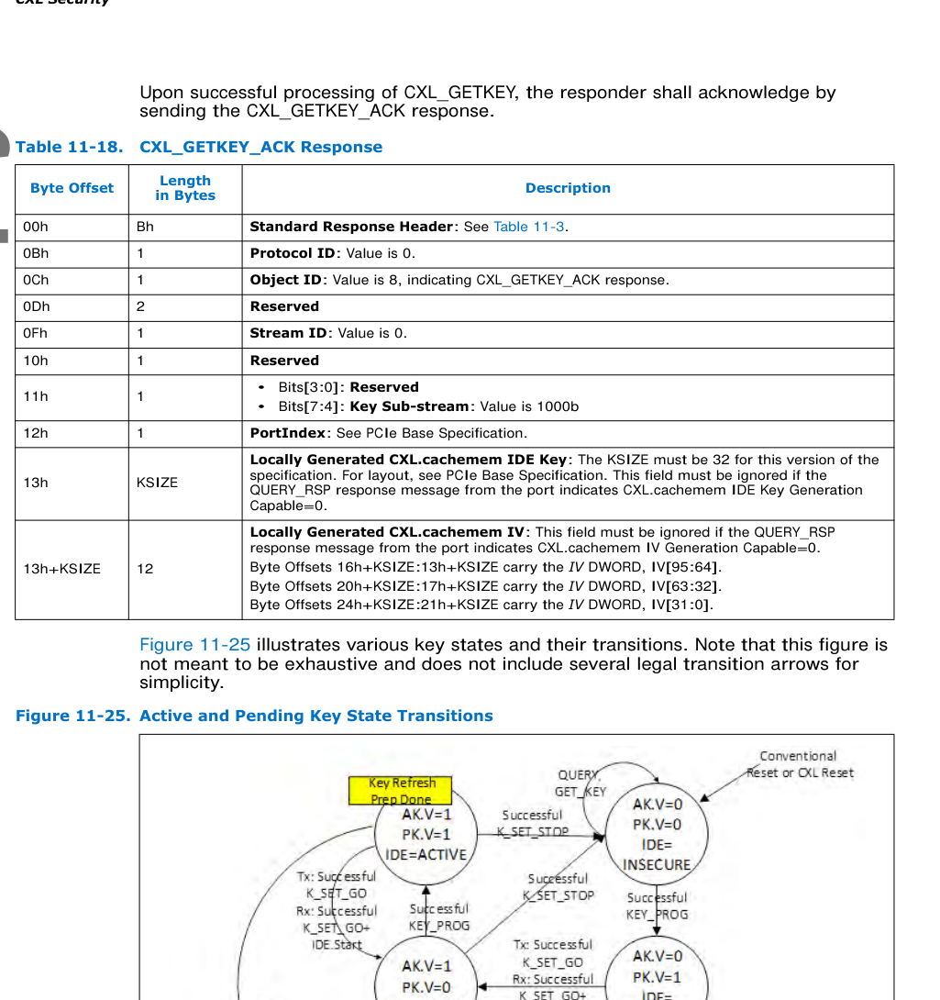
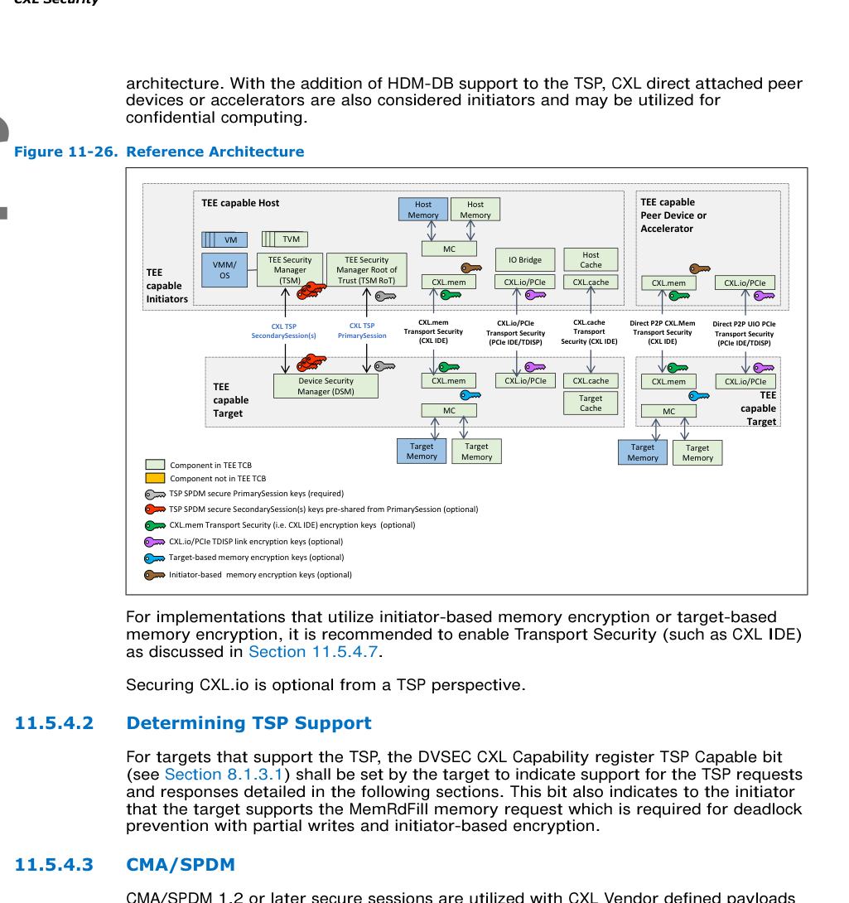
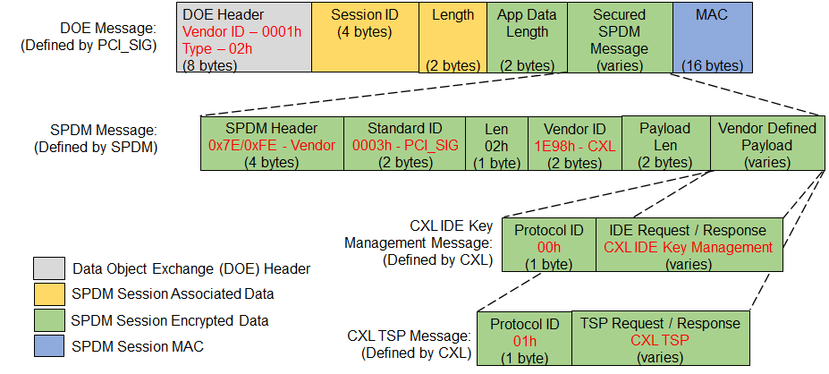
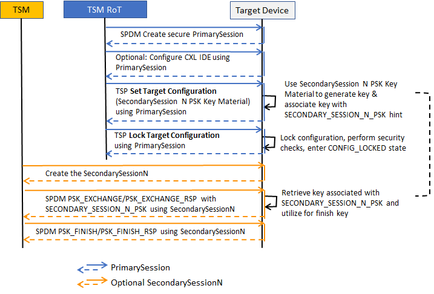
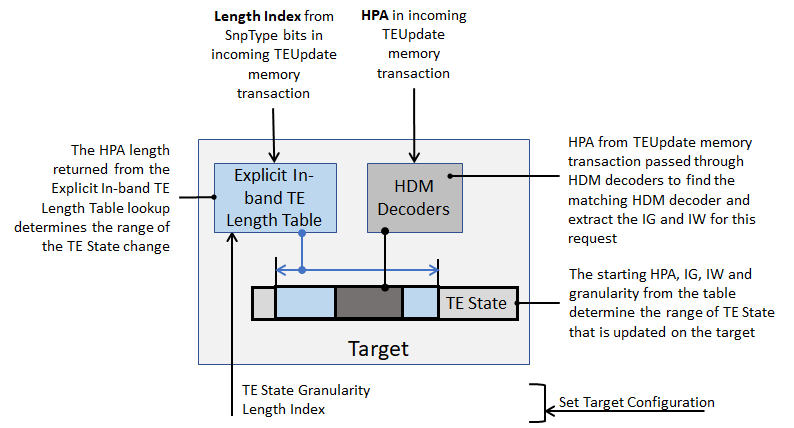
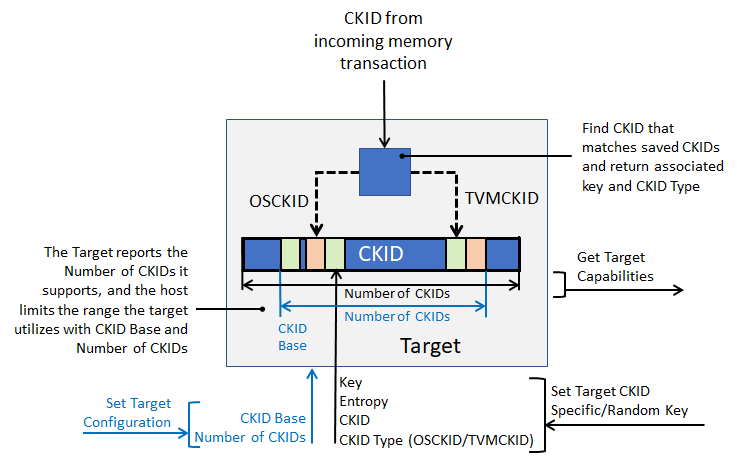
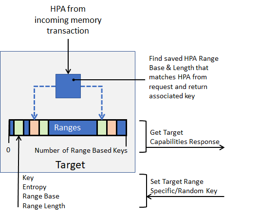
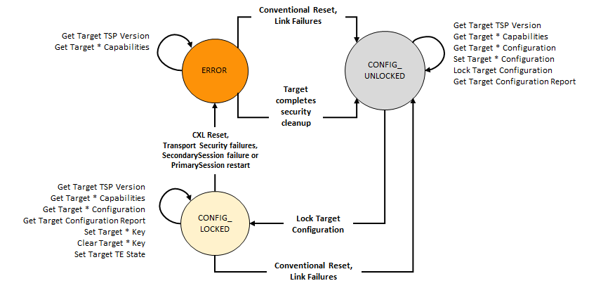

# 📘 第 11 章　CXL 安全 — 补充内容 (Chapter 11. CXL Security — Gap Fill)

> **Source pages**: 922–997 | **Content**: Sections 11.4.4–11.5.5.10 | **Format**: 中英对照双语

---

## 📑 本补充内容目录

- [11.4.4 Discovery Messages (发现消息)](#sec-11-4-4)
- [11.4.5 Key Programming Messages (密钥编程消息)](#sec-11-4-5)
- [11.4.6 Activation/Key Refresh Messages (激活/密钥刷新消息)](#sec-11-4-6)
- [11.4.7 Get Key Messages (获取密钥消息)](#sec-11-4-7)
- [11.5 CXL Trusted Execution Environments Security Protocol (TSP) (CXL 可信执行环境安全协议)](#sec-11-5)
- [11.5.1 Overview (概述)](#sec-11-5-1)
- [11.5.2 Scope (范围)](#sec-11-5-2)
- [11.5.3 Threat Model (威胁模型)](#sec-11-5-3)
  - [11.5.3.1 Definitions (定义)](#sec-11-5-3-1)
  - [11.5.3.2 Assumptions (假设)](#sec-11-5-3-2)
  - [11.5.3.3 Threats and Mitigations (威胁与缓解措施)](#sec-11-5-3-3)
- [11.5.4 Reference Architecture (参考架构)](#sec-11-5-4)
  - [11.5.4.1 Architectural Scope (架构范围)](#sec-11-5-4-1)
  - [11.5.4.2 Determining TSP Support (确定 TSP 支持)](#sec-11-5-4-2)
  - [11.5.4.3 CMA/SPDM](#sec-11-5-4-3)
  - [11.5.4.4 Authentication and Attestation (认证与证明)](#sec-11-5-4-4)
  - [11.5.4.5 TE State Changes and Access Control (TE 状态变更与访问控制)](#sec-11-5-4-5)
  - [11.5.4.6 Memory Encryption (内存加密)](#sec-11-5-4-6)
  - [11.5.4.7 Transport Security (传输安全)](#sec-11-5-4-7)
  - [11.5.4.8 Configuration (配置)](#sec-11-5-4-8)
  - [11.5.4.9 Component Command Interfaces (组件命令接口)](#sec-11-5-4-9)
  - [11.5.4.10 Dynamic Capacity (动态容量)](#sec-11-5-4-10)
  - [11.5.4.11 HDM-DB](#sec-11-5-4-11)
- [11.5.5 TSP Requests and Responses (TSP 请求与响应)](#sec-11-5-5)
  - [11.5.5.1 TSP Request Overview (TSP 请求概述)](#sec-11-5-5-1)
  - [11.5.5.2 TSP Response Overview (TSP 响应概述)](#sec-11-5-5-2)
  - [11.5.5.3 Request Response and CMA/SPDM Sessions](#sec-11-5-5-3)
  - [11.5.5.4 Version (版本)](#sec-11-5-5-4)
  - [11.5.5.5 Target Capabilities (目标能力)](#sec-11-5-5-5)
  - [11.5.5.6 Target Configuration (目标配置)](#sec-11-5-5-6)
  - [11.5.5.7 Optional Explicit TE State Change Requests and Responses](#sec-11-5-5-7)
  - [11.5.5.8 Optional Target-based Memory Encryption Requests and Responses](#sec-11-5-5-8)
  - [11.5.5.9 Optional Delayed Completion Requests and Responses](#sec-11-5-5-9)
  - [11.5.5.10 Error Response (错误响应)](#sec-11-5-5-10)

---

> **Note**: This file supplements [CXL3.2_Spec_ch11_CXL_Security_CXL安全.md](CXL3.2_Spec_ch11_CXL_Security_CXL安全.md) which covers sections 11.0–11.4.3. Sections 11.4.4–11.5.5.10 are provided here as a gap fill.

---

### 11.4.4 Discovery Messages | 发现消息

<table>
<thead>
<tr>
<th width="50%">🇬🇧 English</th>
<th width="50%" style="background-color:#e8e8e8">🇨🇳 中文</th>
</tr>
</thead>
<tbody>
<tr><td>The CXL_QUERY request is used to discover the CXL.cachemem IDE capabilities and the current configuration of a port. The port supplies this information in the form of CXL_QUERY_RESP response. CIKMA shall not issue another type of CXL_IDE_KM request after CXL_QUERY until CIKMA has received a successful CXL_QUERY_RESP response. If CXL_QUERY request is not successful, CIKMA is permitted to retry it.</td><td style="background-color:#e8e8e8">CXL_QUERY 请求用于发现端口的 CXL.cachemem IDE 能力和当前配置。端口以 CXL_QUERY_RESP 响应的形式提供此信息。在收到成功的 CXL_QUERY_RESP 响应之前，CIKMA 不应发出另一种类型的 CXL_IDE_KM 请求。如果 CXL_QUERY 请求不成功，CIKMA 可以重试。</td></tr>
<tr><td>CIKMA may cross-check the CXL IDE Capability Structure contents that are returned by CXL_QUERY_RESP against the component's CXL IDE Capability Structure register values. CIKMA shall abort the CXL.cachemem IDE Establishment flow if CIKMA detects a mismatch.</td><td style="background-color:#e8e8e8">CIKMA 可以将 CXL_QUERY_RESP 返回的 CXL IDE 能力结构内容与组件的 CXL IDE 能力结构寄存器值进行交叉检查。如果 CIKMA 检测到不匹配，则 CIKMA 应中止 CXL.cachemem IDE 建立流程。</td></tr>
<tr><td>Table 11-6 lists the various error conditions that a responder may encounter that are unique to CXL_QUERY and how the conditions are handled.</td><td style="background-color:#e8e8e8">表 11-6 列出了响应者可能遇到的、特定于 CXL_QUERY 的各种错误条件以及如何处理这些条件。</td></tr>
</tbody>
</table>

**Table 11-5. CXL_QUERY Request (CXL_QUERY 请求)** — page 922

<table>
<thead>
<tr><th>Byte Offset</th><th>Length (Bytes)</th><th>Description</th><th style="background-color:#e8e8e8">中文描述</th></tr>
</thead>
<tbody>
<tr><td>0h</td><td>Bh</td><td>Standard Request Header: See Table 11-2.</td><td style="background-color:#e8e8e8">标准请求头：见表 11-2。</td></tr>
<tr><td>Bh</td><td>1</td><td>Protocol ID: Value is 0.</td><td style="background-color:#e8e8e8">协议 ID：值为 0。</td></tr>
<tr><td>Ch</td><td>1</td><td>Object ID: Value is 0, indicating CXL_QUERY request.</td><td style="background-color:#e8e8e8">对象 ID：值为 0，表示 CXL_QUERY 请求。</td></tr>
<tr><td>Dh</td><td>1</td><td>Reserved</td><td style="background-color:#e8e8e8">保留</td></tr>
<tr><td>Eh</td><td>1</td><td>PortIndex: See PCIe Base Specification.</td><td style="background-color:#e8e8e8">端口索引：见 PCIe 基础规范。</td></tr>
</tbody>
</table>

**Table 11-6. CXL_QUERY Processing Errors (CXL_QUERY 处理错误)** — page 922

<table>
<thead>
<tr><th>Error Condition</th><th>Response</th><th>Effect on an Active CXL.cachemem IDE Stream</th><th style="background-color:#e8e8e8">中文</th></tr>
</thead>
<tbody>
<tr><td>Protocol ID is nonzero</td><td>No response is generated. The request is silently dropped.</td><td>No change</td><td style="background-color:#e8e8e8">协议 ID 非零：不生成响应，请求被静默丢弃，无变更</td></tr>
<tr><td>Invalid Request Length</td><td>No response is generated. The request is silently dropped.</td><td>No change</td><td style="background-color:#e8e8e8">无效请求长度：不生成响应，请求被静默丢弃，无变更</td></tr>
<tr><td>PortIndex does not correspond to a valid port</td><td>No response is generated. The request is silently dropped.</td><td>No change</td><td style="background-color:#e8e8e8">PortIndex 不对应有效端口：不生成响应，请求被静默丢弃，无变更</td></tr>
</tbody>
</table>

**Table 11-7. Successful CXL_QUERY_RESP Response (Sheet 1/2) (成功的 CXL_QUERY_RESP 响应，第 1/2 页)** — pages 922–923

<table>
<thead>
<tr><th>Byte Offset</th><th>Length (Bytes)</th><th>Description</th><th style="background-color:#e8e8e8">中文描述</th></tr>
</thead>
<tbody>
<tr><td>00h</td><td>Bh</td><td>Standard Response Header: See Table 11-3.</td><td style="background-color:#e8e8e8">标准响应头：见表 11-3。</td></tr>
<tr><td>0Bh</td><td>1</td><td>Protocol ID: Value is 0.</td><td style="background-color:#e8e8e8">协议 ID：值为 0。</td></tr>
<tr><td>0Ch</td><td>1</td><td>Object ID: Value is 1, indicating CXL_QUERY response.</td><td style="background-color:#e8e8e8">对象 ID：值为 1，表示 CXL_QUERY 响应。</td></tr>
<tr><td>0Dh</td><td>1</td><td>Reserved</td><td style="background-color:#e8e8e8">保留</td></tr>
<tr><td>0Eh</td><td>1</td><td>PortIndex: See PCIe Base Specification.</td><td style="background-color:#e8e8e8">端口索引：见 PCIe 基础规范。</td></tr>
<tr><td>0Fh</td><td>1</td><td>Dev/Fun Number: See PCIe Base Specification.</td><td style="background-color:#e8e8e8">设备/功能号：见 PCIe 基础规范。</td></tr>
<tr><td>10h</td><td>1</td><td>Bus Number: See PCIe Base Specification.</td><td style="background-color:#e8e8e8">总线号：见 PCIe 基础规范。</td></tr>
<tr><td>11h</td><td>1</td><td>Segment: See PCIe Base Specification.</td><td style="background-color:#e8e8e8">段：见 PCIe 基础规范。</td></tr>
<tr><td>12h</td><td>1</td><td>MaxPortIndex: See PCIe Base Specification.</td><td style="background-color:#e8e8e8">最大端口索引：见 PCIe 基础规范。</td></tr>
</tbody>
</table>

**Table 11-7. Successful CXL_QUERY_RESP Response (Sheet 2/2) (成功的 CXL_QUERY_RESP 响应，第 2/2 页)** — page 923

<table>
<thead>
<tr><th>Byte Offset</th><th>Length (Bytes)</th><th>Description</th><th style="background-color:#e8e8e8">中文描述</th></tr>
</thead>
<tbody>
<tr><td>13h</td><td>1</td><td>Bits[3:0]: CXL IDE Capability Version: Must be set to 1. Bits[4-7]: capability flags</td><td style="background-color:#e8e8e8">Bit[3:0]: CXL IDE 能力版本，必须为 1。Bit[4-7]: 能力标志</td></tr>
<tr><td>—</td><td>—</td><td>Bit[4]: CXL.cachemem IV Generation Capable: 0=uses default IV; 1=capable of locally generating 96-bit IV</td><td style="background-color:#e8e8e8">Bit[4]: CXL.cachemem IV 生成能力：0=使用默认 IV；1=能够在本地生成 96 位 IV</td></tr>
<tr><td>—</td><td>—</td><td>Bit[5]: CXL.cachemem IDE Key Generation Capable: 0=not capable; 1=capable of locally generating IDE key</td><td style="background-color:#e8e8e8">Bit[5]: CXL.cachemem IDE Key 生成能力：0=不能；1=能够在本地生成 IDE 密钥</td></tr>
<tr><td>—</td><td>—</td><td>Bit[6]: CXL_K_SET_STOP Capable: 0=not supported; 1=supported</td><td style="background-color:#e8e8e8">Bit[6]: CXL_K_SET_STOP 能力：0=不支持；1=支持</td></tr>
<tr><td>—</td><td>—</td><td>Bit[7]: Reserved</td><td style="background-color:#e8e8e8">Bit[7]: 保留</td></tr>
<tr><td>14h</td><td>Varies</td><td>CXL IDE Capability Structure: For version=1, length shall be 20h. Carries contents of CXL IDE Capability Structure (see Section 8.2.4.21).</td><td style="background-color:#e8e8e8">CXL IDE 能力结构：版本 1 时长度应为 20h。携带 CXL IDE 能力结构内容（见第 8.2.4.21 节）。</td></tr>
</tbody>
</table>

[⬆️ 返回目录](#-本补充内容目录)

---

### 11.4.5 Key Programming Messages | 密钥编程消息

<table>
<thead>
<tr>
<th width="50%">🇬🇧 English</th>
<th width="50%" style="background-color:#e8e8e8">🇨🇳 中文</th>
</tr>
</thead>
<tbody>
<tr><td>Each CXL.cachemem IDE-capable port shall be capable of storing four keys - Rx active, Tx active, Rx pending, and Tx pending. If CXL.cachemem IDE is active, the Tx active key is used to encrypt the flits and generate the MAC. If CXL.cachemem IDE is active, the Rx active key is used to decrypt the flits and verify the MAC in the Rx direction. This specification does not define a mechanism for directly updating the active keys.</td><td style="background-color:#e8e8e8">每个支持 CXL.cachemem IDE 的端口应能够存储四个密钥——Rx 活动、Tx 活动、Rx 待定和 Tx 待定。如果 CXL.cachemem IDE 处于活动状态，则 Tx 活动密钥用于加密 flit 并生成 MAC。如果 CXL.cachemem IDE 处于活动状态，则 Rx 活动密钥用于解密 flit 并在 Rx 方向上验证 MAC。本规范未定义直接更新活动密钥的机制。</td></tr>
<tr><td>A Conventional Reset shall reset the active CXL.cachemem IDE Stream and transition the stream to Insecure State. A CXL reset shall reset the active CXL.cachemem IDE Stream and transition the stream to Insecure State. Transition of the CXL.cachemem IDE session to Insecure State shall clear all the keys, make the keys unreadable, and then mark the keys as invalid. An FLR shall not affect an active CXL.cachemem IDE Stream or the CXL.cachemem IDE keys.</td><td style="background-color:#e8e8e8">常规复位（Conventional Reset）应复位活动的 CXL.cachemem IDE 流并将流转换到不安全状态。CXL 复位应复位活动的 CXL.cachemem IDE 流并将流转换到不安全状态。CXL.cachemem IDE 会话转换到不安全状态时应清除所有密钥，使密钥不可读，然后将密钥标记为无效。FLR 不应影响活动的 CXL.cachemem IDE 流或 CXL.cachemem IDE 密钥。</td></tr>
<tr><td>The CXL_KEY_PROG request is used to supply the pending keys. Offset 11h, Bit 1, is used to select between the Rx and the Tx. If CXL.cachemem IV Generation Capable=1, the CXL_KEY_PROG request may also be used to establish the Initial CXL.cachemem IDE IV value to be used with the new IDE session including the rekeying flow.</td><td style="background-color:#e8e8e8">CXL_KEY_PROG 请求用于提供待定密钥。偏移量 11h 的 Bit 1 用于在 Rx 和 Tx 之间进行选择。如果 CXL.cachemem IV Generation Capable=1，则 CXL_KEY_PROG 请求还可用于建立与新 IDE 会话（包括重新密钥流程）一起使用的初始 CXL.cachemem IDE IV 值。</td></tr>
<tr><td>If both ports return CXL.cachemem IV Generation Capable=1 in QUERY_RSP, it is recommended that CIKMA issue a CXL_GETKEY request to both ports and obtain Locally generated CXL.cachemem IV values. When issuing a CXL_KEY_PROG message to Port1 Rx and Port2 Tx, CIKMA should initialize the Initial CXL.cachemem IDE IV field to match the Port2 Locally generated CXL.cachemem IV and set Default IV=0.</td><td style="background-color:#e8e8e8">如果两个端口在 QUERY_RSP 中都返回 CXL.cachemem IV Generation Capable=1，则建议 CIKMA 向两个端口发出 CXL_GETKEY 请求并获取本地生成的 CXL.cachemem IV 值。当向 Port1 Rx 和 Port2 Tx 发出 CXL_KEY_PROG 消息时，CIKMA 应将 Initial CXL.cachemem IDE IV 字段初始化为与 Port2 本地生成的 CXL.cachemem IV 匹配，并设置 Default IV=0。</td></tr>
<tr><td>If either port returns CXL.cachemem IV Generation Capable=0 in QUERY_RSP, CIKMA should set Use Default IV=1 in the CXL_KEY_PROG messages to both ports to indicate that the ports should use the default IV construction in Rx directions and Tx directions.</td><td style="background-color:#e8e8e8">如果任一端口在 QUERY_RSP 中返回 CXL.cachemem IV Generation Capable=0，则 CIKMA 应在发往两个端口的 CXL_KEY_PROG 消息中设置 Use Default IV=1，以指示端口应在 Rx 方向和 Tx 方向使用默认 IV 构造。</td></tr>
<tr><td>If Port1 returns CXL.cachemem IDE Key Generation Capable=1 in QUERY_RSP, it is recommended that CIKMA issue a CXL_GETKEY request to Port1 and obtain its Locally generated CXL.cachemem IDE Key. When issuing the CXL_KEY_PROG message to Port1 Tx and Port2 Rx, CIKMA should initialize the CXL.cachemem IDE Key field to match the Port1 Locally generated key.</td><td style="background-color:#e8e8e8">如果 Port1 在 QUERY_RSP 中返回 CXL.cachemem IDE Key Generation Capable=1，则建议 CIKMA 向 Port1 发出 CXL_GETKEY 请求并获取其本地生成的 CXL.cachemem IDE Key。当向 Port1 Tx 和 Port2 Rx 发出 CXL_KEY_PROG 消息时，CIKMA 应将 CXL.cachemem IDE Key 字段初始化为与 Port1 本地生成的密钥匹配。</td></tr>
</tbody>
</table>

**Table 11-8. CXL_KEY_PROG Request (CXL_KEY_PROG 请求)** — page 924

<table>
<thead>
<tr><th>Byte Offset</th><th>Length (Bytes)</th><th>Description</th><th style="background-color:#e8e8e8">中文描述</th></tr>
</thead>
<tbody>
<tr><td>00h</td><td>Bh</td><td>Standard Request Header: See Table 11-2.</td><td style="background-color:#e8e8e8">标准请求头：见表 11-2。</td></tr>
<tr><td>0Bh</td><td>1</td><td>Protocol ID: Value is 0.</td><td style="background-color:#e8e8e8">协议 ID：值为 0。</td></tr>
<tr><td>0Ch</td><td>1</td><td>Object ID: Value is 2, indicating CXL_KEY_PROG request.</td><td style="background-color:#e8e8e8">对象 ID：值为 2，表示 CXL_KEY_PROG 请求。</td></tr>
<tr><td>0Dh</td><td>2</td><td>Reserved</td><td style="background-color:#e8e8e8">保留</td></tr>
<tr><td>0Fh</td><td>1</td><td>Stream ID: Value is 0.</td><td style="background-color:#e8e8e8">流 ID：值为 0。</td></tr>
<tr><td>10h</td><td>1</td><td>Reserved</td><td style="background-color:#e8e8e8">保留</td></tr>
<tr><td>11h</td><td>1</td><td>Bit[0]: Reserved; Bit[1]: RxTxB (0=Rx, 1=Tx); Bit[2]: Reserved; Bit[3]: Use Default IV (0=use Initial IV at offset 13h+KSIZE, 1=use Default IV construction); Bits[7:4]: Key Sub-stream=1000b</td><td style="background-color:#e8e8e8">Bit[0]: 保留; Bit[1]: RxTxB (0=Rx, 1=Tx); Bit[2]: 保留; Bit[3]: Use Default IV (0=使用偏移 13h+KSIZE 处的初始 IV, 1=使用默认 IV 构造); Bit[7:4]: Key Sub-stream=1000b</td></tr>
<tr><td>12h</td><td>1</td><td>PortIndex: See PCIe Base Specification.</td><td style="background-color:#e8e8e8">端口索引：见 PCIe 基础规范。</td></tr>
<tr><td>13h</td><td>KSIZE</td><td>CXL.cachemem IDE Key: Program the Pending Key with this value. KSIZE must be 32 for this version.</td><td style="background-color:#e8e8e8">CXL.cachemem IDE Key：使用此值编程待定密钥。KSIZE 在本版本中必须为 32。</td></tr>
<tr><td>13h+KSIZE</td><td>12h</td><td>Initial CXL.cachemem IDE IV: Overwrites the Pending Initial IV. Ignored if Use Default IV=1. IV[95:64], IV[63:32], IV[31:0].</td><td style="background-color:#e8e8e8">初始 CXL.cachemem IDE IV：覆盖待定初始 IV。如果 Use Default IV=1 则忽略。IV[95:64], IV[63:32], IV[31:0]。</td></tr>
</tbody>
</table>

**Table 11-9. CXL_KEY_PROG Processing Errors (CXL_KEY_PROG 处理错误)** — page 925

<table>
<thead>
<tr><th>Error Condition</th><th>Response</th><th>Effect on an Active CXL.cachemem IDE Stream</th></tr>
</thead>
<tbody>
<tr><td>Invalid Request Length</td><td>Return CXL_KP_ACK with Status=01h, do not update key and IV</td><td>No change</td></tr>
<tr><td>PortIndex does not correspond to a valid port</td><td>Return CXL_KP_ACK with Status=01h</td><td>No change</td></tr>
<tr><td>Protocol ID is nonzero</td><td>Return CXL_KP_ACK with Status=01h</td><td>No change</td></tr>
<tr><td>Stream ID is nonzero</td><td>Return CXL_KP_ACK with Status=01h</td><td>No change</td></tr>
<tr><td>Key Sub-stream is not 1000b</td><td>Return CXL_KP_ACK with Status=01h</td><td>No change</td></tr>
<tr><td>CXL_KEY_PROG received prior to CXL_QUERY</td><td>Return CXL_KP_ACK with Status=01h</td><td>No change</td></tr>
<tr><td>Request to set Tx Key, but input Tx key identical to current Rx Pending Key (optional check)</td><td>Return CXL_KP_ACK with Status=01h</td><td>No change</td></tr>
<tr><td>Request to set Rx Key, but input Rx key identical to current Tx Pending Key (optional check)</td><td>Return CXL_KP_ACK with Status=01h</td><td>No change</td></tr>
<tr><td>Pending key slot has a valid key</td><td>Return CXL_KP_ACK with Status=01h</td><td>No change</td></tr>
<tr><td>Supplied key does not match locally generated key from last CXL_GETKEY_ACK</td><td>Return CXL_KP_ACK with Status=08h</td><td>No change</td></tr>
</tbody>
</table>

**Table 11-10. CXL_KP_ACK Response (CXL_KP_ACK 响应)** — page 925

<table>
<thead>
<tr><th>Byte Offset</th><th>Length (Bytes)</th><th>Description</th><th style="background-color:#e8e8e8">中文描述</th></tr>
</thead>
<tbody>
<tr><td>00h</td><td>Bh</td><td>Standard Response Header: See Table 11-3.</td><td style="background-color:#e8e8e8">标准响应头：见表 11-3。</td></tr>
<tr><td>0Bh</td><td>1</td><td>Protocol ID: Value is 0.</td><td style="background-color:#e8e8e8">协议 ID：值为 0。</td></tr>
<tr><td>0Ch</td><td>1</td><td>Object ID: Value is 3, indicating CXL_KP_ACK response.</td><td style="background-color:#e8e8e8">对象 ID：值为 3，表示 CXL_KP_ACK 响应。</td></tr>
<tr><td>0Dh</td><td>2</td><td>Reserved</td><td style="background-color:#e8e8e8">保留</td></tr>
<tr><td>0Fh</td><td>1</td><td>Stream ID: Value is 0.</td><td style="background-color:#e8e8e8">流 ID：值为 0。</td></tr>
<tr><td>10h</td><td>1</td><td>Status: See Table 11-9. 0=Success.</td><td style="background-color:#e8e8e8">状态：见表 11-9。0=成功。</td></tr>
<tr><td>11h</td><td>1</td><td>Bit[1]: RxTxB; Bits[7:4]: Key Sub-stream=1000b</td><td style="background-color:#e8e8e8">Bit[1]: RxTxB; Bit[7:4]: Key Sub-stream=1000b</td></tr>
<tr><td>12h</td><td>1</td><td>PortIndex: See PCIe Base Specification.</td><td style="background-color:#e8e8e8">端口索引：见 PCIe 基础规范。</td></tr>
</tbody>
</table>

[⬆️ 返回目录](#-本补充内容目录)

---

### 11.4.6 Activation/Key Refresh Messages | 激活/密钥刷新消息

<table>
<thead>
<tr>
<th width="50%">🇬🇧 English</th>
<th width="50%" style="background-color:#e8e8e8">🇨🇳 中文</th>
</tr>
</thead>
<tbody>
<tr><td>The CXL_K_SET_GO request is used to prepare an Rx port for a CXL.cachemem IDE Stream. The port shall respond with a CXL_K_GOSTOP_ACK message to indicate that the port is ready. The CXL_K_SET_GO request is also used to instruct a Tx port to generate an IDE.Start Link Layer Control flit and to start a CXL.cachemem IDE Stream that is protected with the pending Tx key as outlined in Section 11.3.7.</td><td style="background-color:#e8e8e8">CXL_K_SET_GO 请求用于为 CXL.cachemem IDE 流准备 Rx 端口。端口应使用 CXL_K_GOSTOP_ACK 消息响应以表示端口已就绪。CXL_K_SET_GO 请求也用于指示 Tx 端口生成 IDE.Start 链路层控制 flit 并启动使用待定 Tx 密钥保护的 CXL.cachemem IDE 流，如第 11.3.7 节所述。</td></tr>
<tr><td>As part of successful CXL_K_SET_GO processing, the Tx port shall copy the pending key to be the active key and mark the pending key slot as invalid. If CXL.cachemem IV Generation Capable=1 and the last CXL_KEY_PROG request indicated Use Default IV=0, the Initial CXL.cachemem IDE IV shall also be re-initialized to the value supplied as part of the CXL_KEY_PROG request. If CXL.cachemem IV Generation Capable=0 or Use Default IV=1, Default IV construction shall be used. All subsequent protocol flits shall be protected by the new active key until the port enters Insecure State.</td><td style="background-color:#e8e8e8">作为成功处理 CXL_K_SET_GO 的一部分，Tx 端口应将待定密钥复制为活动密钥，并将待定密钥槽标记为无效。如果 CXL.cachemem IV Generation Capable=1 且上一个 CXL_KEY_PROG 请求指示 Use Default IV=0，则初始 CXL.cachemem IDE IV 也应重新初始化为 CXL_KEY_PROG 请求中提供的值。如果 CXL.cachemem IV Generation Capable=0 或 Use Default IV=1，则应使用默认 IV 构造。所有后续协议 flit 都应受新活动密钥保护，直到端口进入不安全状态。</td></tr>
<tr><td>Upon receipt of an IDE.Start Link Layer Control flit, the Rx port shall copy the pending key to the active key slot and then mark the pending key slot as invalid. The same IV initialization rules apply. All subsequent protocol flits shall be protected by the new active key until the port enters Insecure State.</td><td style="background-color:#e8e8e8">收到 IDE.Start 链路层控制 flit 后，Rx 端口应将待定密钥复制到活动密钥槽，然后将待定密钥槽标记为无效。适用相同的 IV 初始化规则。所有后续协议 flit 都应受新活动密钥保护，直到端口进入不安全状态。</td></tr>
<tr><td>If the Rx port receives an IDE.Start Link Layer Control flit prior to a successful CXL_KEY_PROG since the last Conventional Reset, the Rx port shall drop the IDE.Start flit and then optionally set the Rx Error Status field in the CXL IDE Error Status register to CXL.cachemem IDE Establishment Security error. If CXL.cachemem IDE is active but prior to a successful CXL_KEY_PROG since the last IDE.Start, the Rx port shall either (1) drop the IDE.Start flit and optionally program Rx Error Status=8h, or (2) set Rx Error Status=8h and transition to Insecure State.</td><td style="background-color:#e8e8e8">如果自上次常规复位以来，Rx 端口在成功执行 CXL_KEY_PROG 之前收到 IDE.Start 链路层控制 flit，则 Rx 端口应丢弃 IDE.Start flit，然后可选择将 CXL IDE 错误状态寄存器中的 Rx 错误状态字段设置为 CXL.cachemem IDE 建立安全错误。如果 CXL.cachemem IDE 处于活动状态但自上次 IDE.Start 以来尚未成功执行 CXL_KEY_PROG，则 Rx 端口应：(1) 丢弃 IDE.Start flit 并可选择将 Rx 错误状态设置为 8h，或 (2) 将 Rx 错误状态设置为 8h 并转换到不安全状态。</td></tr>
<tr><td>CIKMA should issue a CXL_K_SET_GO request message to an Rx port and wait for success before issuing a CXL_K_SET_GO request message to the partner Tx port.</td><td style="background-color:#e8e8e8">CIKMA 应先向 Rx 端口发出 CXL_K_SET_GO 请求消息并等待成功，然后再向伙伴 Tx 端口发出 CXL_K_SET_GO 请求消息。</td></tr>
<tr><td>When a port receives a valid CXL_K_SET_STOP request, the port shall clear the active and pending CXL.cachemem IDE keys and then transition to IDE Insecure State. No errors shall be logged in the IDE Status register when an IDE stream is terminated in response to CXL_K_SET_STOP because this is not an error condition.</td><td style="background-color:#e8e8e8">当端口收到有效的 CXL_K_SET_STOP 请求时，端口应清除活动和待定的 CXL.cachemem IDE 密钥，然后转换到 IDE 不安全状态。当 IDE 流因响应 CXL_K_SET_STOP 而终止时，不应在 IDE 状态寄存器中记录错误，因为这不是错误条件。</td></tr>
<tr><td>If both ports support the IDE.Stop message, CIKMA may enable IDE.Stop on both ends of the link. If IDE.Stop is enabled on both ends, it is unnecessary to quiesce the CXL.cache and CXL.mem traffic prior to issuing the CXL_K_SET_STOP request. If IDE.Stop is enabled, CIKMA is required to issue a CXL_K_SET_STOP to the Rx and then wait for an acknowledgment before issuing a CXL_K_SET_STOP to the Tx. If IDE.Stop is not enabled, Software is expected to quiesce the CXL.cache and CXL.mem traffic prior to issuing a CXL_K_SET_STOP request.</td><td style="background-color:#e8e8e8">如果两个端口都支持 IDE.Stop 消息，CIKMA 可以在链路两端启用 IDE.Stop。如果在两端都启用了 IDE.Stop，则在发出 CXL_K_SET_STOP 请求之前无需静默 CXL.cache 和 CXL.mem 流量。如果启用了 IDE.Stop，则 CIKMA 需要先向 Rx 发出 CXL_K_SET_STOP，然后等待确认，再向 Tx 发出 CXL_K_SET_STOP。如果未启用 IDE.Stop，则期望软件在发出 CXL_K_SET_STOP 请求之前静默 CXL.cache 和 CXL.mem 流量。</td></tr>
<tr><td>If the Rx port receives an IDE.Stop Link Layer Control flit while CXL.cachemem IDE is active, but prior to a successful CXL_K_SET_STOP since the last IDE.Start or any other CXL IDE Key Programming message, the Rx port shall drop the IDE.Stop flit, set the Unexpected IDE.Stop received bit in the CXL IDE Error Status register but not transition to Insecure State.</td><td style="background-color:#e8e8e8">如果在 CXL.cachemem IDE 处于活动状态时，Rx 端口收到 IDE.Stop 链路层控制 flit，但自上次 IDE.Start 或任何其他 CXL IDE Key Programming 消息以来尚未成功执行 CXL_K_SET_STOP，则 Rx 端口应丢弃 IDE.Stop flit，设置 CXL IDE 错误状态寄存器中的"意外 IDE.Stop 接收"位，但不转换到不安全状态。</td></tr>
</tbody>
</table>

**Table 11-11. CXL_K_SET_GO Request (CXL_K_SET_GO 请求)** — page 927

<table>
<thead>
<tr><th>Byte Offset</th><th>Length (Bytes)</th><th>Description</th><th style="background-color:#e8e8e8">中文描述</th></tr>
</thead>
<tbody>
<tr><td>00h</td><td>Bh</td><td>Standard Request Header: See Table 11-2.</td><td style="background-color:#e8e8e8">标准请求头：见表 11-2。</td></tr>
<tr><td>0Bh</td><td>1</td><td>Protocol ID: Value is 0.</td><td style="background-color:#e8e8e8">协议 ID：值为 0。</td></tr>
<tr><td>0Ch</td><td>1</td><td>Object ID: Value is 4, indicating CXL_K_SET_GO structure.</td><td style="background-color:#e8e8e8">对象 ID：值为 4，表示 CXL_K_SET_GO 结构。</td></tr>
<tr><td>0Dh</td><td>2</td><td>Reserved</td><td style="background-color:#e8e8e8">保留</td></tr>
<tr><td>0Fh</td><td>1</td><td>Stream ID: Value is 0.</td><td style="background-color:#e8e8e8">流 ID：值为 0。</td></tr>
<tr><td>10h</td><td>1</td><td>Reserved</td><td style="background-color:#e8e8e8">保留</td></tr>
<tr><td>11h</td><td>1</td><td>Bit[1]: RxTxB; Bit[3]: CXL IDE Mode (0=Skid mode, 1=Containment mode); Bits[7:4]: Key Sub-stream=1000b</td><td style="background-color:#e8e8e8">Bit[1]: RxTxB; Bit[3]: CXL IDE 模式 (0=滑行模式, 1=包含模式); Bit[7:4]: Key Sub-stream=1000b</td></tr>
<tr><td>12h</td><td>1</td><td>PortIndex: See PCIe Base Specification.</td><td style="background-color:#e8e8e8">端口索引：见 PCIe 基础规范。</td></tr>
</tbody>
</table>

**Table 11-12. CXL_K_SET_GO Error Conditions (CXL_K_SET_GO 错误条件)** — page 927

<table>
<thead>
<tr><th>Error Condition</th><th>Response</th><th>Effect on an Active CXL.cachemem IDE Stream</th></tr>
</thead>
<tbody>
<tr><td>Pending key is invalid</td><td>No response generated. Request silently dropped.</td><td>No change</td></tr>
<tr><td>IDE mode is not supported</td><td>No response generated. Request silently dropped.</td><td>No change</td></tr>
<tr><td>IDE active and current mode does not match new request</td><td>No response generated. Request silently dropped.</td><td>No change</td></tr>
<tr><td>Protocol ID is nonzero</td><td>No response generated. Request silently dropped.</td><td>No change</td></tr>
<tr><td>Stream ID is nonzero</td><td>No response generated. Request silently dropped.</td><td>No change</td></tr>
<tr><td>Key Sub-stream is not 1000b</td><td>No response generated. Request silently dropped.</td><td>No change</td></tr>
<tr><td>PortIndex does not correspond to a valid port</td><td>No response generated. Request silently dropped.</td><td>No change</td></tr>
<tr><td>Invalid Request Length</td><td>No response generated. Request silently dropped.</td><td>No change</td></tr>
</tbody>
</table>

**Table 11-13. CXL_K_SET_STOP Request (CXL_K_SET_STOP 请求)** — page 928

<table>
<thead>
<tr><th>Byte Offset</th><th>Length (Bytes)</th><th>Description</th><th style="background-color:#e8e8e8">中文描述</th></tr>
</thead>
<tbody>
<tr><td>00h</td><td>Bh</td><td>Standard Request Header: See Table 11-2.</td><td style="background-color:#e8e8e8">标准请求头：见表 11-2。</td></tr>
<tr><td>0Bh</td><td>1</td><td>Protocol ID: Value is 0.</td><td style="background-color:#e8e8e8">协议 ID：值为 0。</td></tr>
<tr><td>0Ch</td><td>1</td><td>Object ID: Value is 5, indicating CXL_K_SET_STOP structure.</td><td style="background-color:#e8e8e8">对象 ID：值为 5，表示 CXL_K_SET_STOP 结构。</td></tr>
<tr><td>0Dh</td><td>2</td><td>Reserved</td><td style="background-color:#e8e8e8">保留</td></tr>
<tr><td>0Fh</td><td>1</td><td>Stream ID: Value is 0.</td><td style="background-color:#e8e8e8">流 ID：值为 0。</td></tr>
<tr><td>10h</td><td>1</td><td>Reserved</td><td style="background-color:#e8e8e8">保留</td></tr>
<tr><td>11h</td><td>1</td><td>Bit[1]: RxTxB; Bits[7:4]: Key Sub-stream=1000b</td><td style="background-color:#e8e8e8">Bit[1]: RxTxB; Bit[7:4]: Key Sub-stream=1000b</td></tr>
<tr><td>12h</td><td>1</td><td>PortIndex: See PCIe Base Specification.</td><td style="background-color:#e8e8e8">端口索引：见 PCIe 基础规范。</td></tr>
</tbody>
</table>

**Table 11-14. CXL_K_SET_STOP Error Conditions (CXL_K_SET_STOP 错误条件)** — page 928

<table>
<thead>
<tr><th>Error Condition</th><th>Response</th><th>Effect on an Active CXL.cachemem IDE Stream</th></tr>
</thead>
<tbody>
<tr><td>Port does not support CXL_K_SET_STOP (Capable=0)</td><td>No response generated. Request silently dropped.</td><td>No change</td></tr>
<tr><td>Protocol ID is nonzero</td><td>No response generated. Request silently dropped.</td><td>No change</td></tr>
<tr><td>Stream ID is nonzero</td><td>No response generated. Request silently dropped.</td><td>No change</td></tr>
<tr><td>Key Sub-stream is not 1000b</td><td>No response generated. Request silently dropped.</td><td>No change</td></tr>
<tr><td>PortIndex invalid / Invalid Request Length</td><td>No response generated. Request silently dropped.</td><td>No change</td></tr>
</tbody>
</table>

**Table 11-15. CXL_K_GOSTOP_ACK Response (Sheet 1/2) (CXL_K_GOSTOP_ACK 响应，第 1/2 页)** — pages 928–929

<table>
<thead>
<tr><th>Byte Offset</th><th>Length (Bytes)</th><th>Description</th><th style="background-color:#e8e8e8">中文描述</th></tr>
</thead>
<tbody>
<tr><td>00h</td><td>Bh</td><td>Standard Response Header: See Table 11-3.</td><td style="background-color:#e8e8e8">标准响应头：见表 11-3。</td></tr>
<tr><td>0Bh</td><td>1</td><td>Protocol ID: Value is 0.</td><td style="background-color:#e8e8e8">协议 ID：值为 0。</td></tr>
<tr><td>0Ch</td><td>1</td><td>Object ID: Value is 6, indicating CXL_K_GOSTOP_ACK structure.</td><td style="background-color:#e8e8e8">对象 ID：值为 6，表示 CXL_K_GOSTOP_ACK 结构。</td></tr>
<tr><td>0Dh</td><td>2</td><td>Reserved</td><td style="background-color:#e8e8e8">保留</td></tr>
<tr><td>0Fh</td><td>1</td><td>Stream ID: Value is 0.</td><td style="background-color:#e8e8e8">流 ID：值为 0。</td></tr>
</tbody>
</table>

**Table 11-15. CXL_K_GOSTOP_ACK Response (Sheet 2/2) (CXL_K_GOSTOP_ACK 响应，第 2/2 页)** — page 929

<table>
<thead>
<tr><th>Byte Offset</th><th>Length (Bytes)</th><th>Description</th><th style="background-color:#e8e8e8">中文描述</th></tr>
</thead>
<tbody>
<tr><td>10h</td><td>1</td><td>Reserved</td><td style="background-color:#e8e8e8">保留</td></tr>
<tr><td>11h</td><td>1</td><td>Bit[1]: RxTxB; Bits[7:4]: Key Sub-stream=1000b</td><td style="background-color:#e8e8e8">Bit[1]: RxTxB; Bit[7:4]: Key Sub-stream=1000b</td></tr>
<tr><td>12h</td><td>1</td><td>PortIndex: See PCIe Base Specification.</td><td style="background-color:#e8e8e8">端口索引：见 PCIe 基础规范。</td></tr>
</tbody>
</table>

[⬆️ 返回目录](#-本补充内容目录)

---

### 11.4.7 Get Key Messages | 获取密钥消息

<table>
<thead>
<tr>
<th width="50%">🇬🇧 English</th>
<th width="50%" style="background-color:#e8e8e8">🇨🇳 中文</th>
</tr>
</thead>
<tbody>
<tr><td>If the QUERY_RSP response message from the port indicates CXL.cachemem IDE Key Generation Capable=1 or CXL.cachemem IV Generation Capable=1, the port shall support the CXL_GETKEY message.</td><td style="background-color:#e8e8e8">如果来自端口的 QUERY_RSP 响应消息指示 CXL.cachemem IDE Key Generation Capable=1 或 CXL.cachemem IV Generation Capable=1，则该端口应支持 CXL_GETKEY 消息。</td></tr>
<tr><td>The CXL_GETKEY message is used to get the Locally generated CXL.cachemem IDE Key from the port and Locally generated CXL.cachemem IV.</td><td style="background-color:#e8e8e8">CXL_GETKEY 消息用于从端口获取本地生成的 CXL.cachemem IDE Key 以及本地生成的 CXL.cachemem IV。</td></tr>
<tr><td>Upon successful processing of CXL_GETKEY, the responder shall acknowledge by sending the CXL_GETKEY_ACK response.</td><td style="background-color:#e8e8e8">在成功处理 CXL_GETKEY 后，响应者应通过发送 CXL_GETKEY_ACK 响应来确认。</td></tr>
<tr><td>Figure 11-25 illustrates various key states and their transitions. Note that this figure is not meant to be exhaustive and does not include several legal transition arrows for simplicity.</td><td style="background-color:#e8e8e8">图 11-25 展示了各种密钥状态及其转换。请注意，此图并非详尽无遗，为简化起见未包含若干合法的转换箭头。</td></tr>
</tbody>
</table>

> **Figure 11-25.** Active and Pending Key State Transitions ｜ 活动密钥与待定密钥的状态转换
>
> 
>
> *Original page render @ 150 DPI* — [📄 Full size](figures/chapter_11/page_0930.png)

**Table 11-16. CXL_GETKEY Request (CXL_GETKEY 请求)** — page 929

<table>
<thead>
<tr><th>Byte Offset</th><th>Length (Bytes)</th><th>Description</th><th style="background-color:#e8e8e8">中文描述</th></tr>
</thead>
<tbody>
<tr><td>00h</td><td>Bh</td><td>Standard Request Header: See Table 11-2.</td><td style="background-color:#e8e8e8">标准请求头：见表 11-2。</td></tr>
<tr><td>0Bh</td><td>1</td><td>Protocol ID: Value is 0.</td><td style="background-color:#e8e8e8">协议 ID：值为 0。</td></tr>
<tr><td>0Ch</td><td>1</td><td>Object ID: Value is 7, indicating CXL_GETKEY request.</td><td style="background-color:#e8e8e8">对象 ID：值为 7，表示 CXL_GETKEY 请求。</td></tr>
<tr><td>0Dh</td><td>2</td><td>Reserved</td><td style="background-color:#e8e8e8">保留</td></tr>
<tr><td>0Fh</td><td>1</td><td>Stream ID: Value is 0.</td><td style="background-color:#e8e8e8">流 ID：值为 0。</td></tr>
<tr><td>10h</td><td>1</td><td>Reserved</td><td style="background-color:#e8e8e8">保留</td></tr>
<tr><td>11h</td><td>1</td><td>Bits[7:4]: Key Sub-stream=1000b</td><td style="background-color:#e8e8e8">Bit[7:4]: Key Sub-stream=1000b</td></tr>
<tr><td>12h</td><td>1</td><td>PortIndex: See PCIe Base Specification.</td><td style="background-color:#e8e8e8">端口索引：见 PCIe 基础规范。</td></tr>
</tbody>
</table>

**Table 11-17. CXL_GETKEY Processing Error (CXL_GETKEY 处理错误)** — page 929

<table>
<thead>
<tr><th>Error Condition</th><th>Response</th><th>Effect on Active IDE Stream</th></tr>
</thead>
<tbody>
<tr><td>Invalid Request Length</td><td>Silently dropped</td><td>No change</td></tr>
<tr><td>PortIndex invalid / Protocol ID nonzero / Stream ID nonzero / Key Sub-stream not 1000b / CXL_GETKEY prior to CXL_QUERY / Port does not support CXL_GETKEY</td><td>Silently dropped</td><td>No change</td></tr>
</tbody>
</table>

**Table 11-18. CXL_GETKEY_ACK Response (CXL_GETKEY_ACK 响应)** — page 930

<table>
<thead>
<tr><th>Byte Offset</th><th>Length (Bytes)</th><th>Description</th><th style="background-color:#e8e8e8">中文描述</th></tr>
</thead>
<tbody>
<tr><td>00h</td><td>Bh</td><td>Standard Response Header: See Table 11-3.</td><td style="background-color:#e8e8e8">标准响应头：见表 11-3。</td></tr>
<tr><td>0Bh</td><td>1</td><td>Protocol ID: Value is 0.</td><td style="background-color:#e8e8e8">协议 ID：值为 0。</td></tr>
<tr><td>0Ch</td><td>1</td><td>Object ID: Value is 8, indicating CXL_GETKEY_ACK response.</td><td style="background-color:#e8e8e8">对象 ID：值为 8，表示 CXL_GETKEY_ACK 响应。</td></tr>
<tr><td>0Dh</td><td>2</td><td>Reserved</td><td style="background-color:#e8e8e8">保留</td></tr>
<tr><td>0Fh</td><td>1</td><td>Stream ID: Value is 0.</td><td style="background-color:#e8e8e8">流 ID：值为 0。</td></tr>
<tr><td>10h</td><td>1</td><td>Reserved</td><td style="background-color:#e8e8e8">保留</td></tr>
<tr><td>11h</td><td>1</td><td>Bits[7:4]: Key Sub-stream=1000b</td><td style="background-color:#e8e8e8">Bit[7:4]: Key Sub-stream=1000b</td></tr>
<tr><td>12h</td><td>1</td><td>PortIndex: See PCIe Base Specification.</td><td style="background-color:#e8e8e8">端口索引：见 PCIe 基础规范。</td></tr>
<tr><td>13h</td><td>KSIZE</td><td>Locally Generated CXL.cachemem IDE Key: KSIZE must be 32. Ignored if Key Generation Capable=0.</td><td style="background-color:#e8e8e8">本地生成的 CXL.cachemem IDE Key：KSIZE 必须为 32。如果 Key Generation Capable=0 则忽略。</td></tr>
<tr><td>13h+KSIZE</td><td>12</td><td>Locally Generated CXL.cachemem IV: Ignored if IV Generation Capable=0. IV[95:64], IV[63:32], IV[31:0].</td><td style="background-color:#e8e8e8">本地生成的 CXL.cachemem IV：如果 IV Generation Capable=0 则忽略。IV[95:64], IV[63:32], IV[31:0]。</td></tr>
</tbody>
</table>

> **IMPLEMENTATION NOTE: Establishing CXL.cachemem IDE between a DSP and EP - Example**
>
> In this example, host software plays the role of the CIKMA. The switch implementation is such that the USP implements the DOE capability on behalf of all the DSPs and the specific DSP that is involved here is referenced as Port 4. Further, it is also assumed that the desired mode of operation is Skid mode. Host Software reads and configures the CXL IDE capability registers on the DSP and on the EP.
>
> 1. Host Software sets up independent SPDM secure sessions with the USP and the EP over PCIe DOE.
> 2. All subsequent messages are secured as per DSP0277.
> 3. Steps a-h detail the full flow: CXL_QUERY to both ports, CXL_GETKEY to obtain local keys, CXL_KEY_PROG to program Rx/Tx pending keys on both sides, CXL_K_SET_GO to activate Rx and then Tx on both ports.
> 4. At the end of these steps, all CXL.cachemem protocol flits traveling between the DSP and EP are protected by IDE.
>
> **Warning**: If both ports support Locally generated keys, avoid issuing two consecutive CXL_GETKEY requests to the same port before using the key, as the second CXL_GETKEY changes the locally generated key, causing a CXL_KP_ACK with Status=08h.
>
> **实现说明：在 DSP 和 EP 之间建立 CXL.cachemem IDE — 示例**
>
> 在本示例中，主机软件扮演 CIKMA 角色。交换机实现使 USP 代表所有 DSP 实现 DOE 能力，涉及的特定 DSP 引用为 Port 4。假设期望的工作模式为滑行模式。主机软件读取并配置 DSP 和 EP 上的 CXL IDE 能力寄存器。
>
> 1. 主机软件通过 PCIe DOE 与 USP 和 EP 建立独立的 SPDM 安全会话。
> 2. 所有后续消息根据 DSP0277 进行保护。
> 3. 步骤 a-h 详细描述了完整流程：向两个端口发送 CXL_QUERY，发送 CXL_GETKEY 获取本地密钥，向两侧发送 CXL_KEY_PROG 编程 Rx/Tx 待定密钥，发送 CXL_K_SET_GO 先激活 Rx 再激活 Tx。
> 4. 这些步骤完成后，在 DSP 和 EP 之间传输的所有 CXL.cachemem 协议 flit 都受 IDE 保护。
>
> **警告**：如果两个端口都支持本地生成密钥，应避免在使用密钥之前向同一端口连续发出两个 CXL_GETKEY 请求，因为第二个 CXL_GETKEY 会更改本地生成的密钥，导致返回 Status=08h 的 CXL_KP_ACK。

[⬆️ 返回目录](#-本补充内容目录)

---

## 11.5 CXL Trusted Execution Environments Security Protocol (TSP) | CXL 可信执行环境安全协议 (TSP)

### 11.5.1 Overview | 概述

<table>
<thead>
<tr>
<th width="50%">🇬🇧 English</th>
<th width="50%" style="background-color:#e8e8e8">🇨🇳 中文</th>
</tr>
</thead>
<tbody>
<tr><td>Virtualization-based Trusted Execution Environments (TEE) are used to host confidential computing workloads that are isolated from hosting environments. This specification refers to such TEE as Trusted Execution Environment VMs (TVMs) to distinguish them from traditional virtual machines.</td><td style="background-color:#e8e8e8">基于虚拟化的可信执行环境（TEE）用于托管与宿主环境隔离的机密计算工作负载。本规范将此类 TEE 称为可信执行环境虚拟机（TVM），以区别于传统虚拟机。</td></tr>
<tr><td>The PCI-SIG TEE Device Interface Security Protocol (TDISP) ECR specifies the architecture of a framework for trusted I/O virtualization to include PCIe devices within the TVM trust boundary. The CXL TEE Security Protocol (CXL-TSP), complements the PCI-SIG TDISP specification by specifying mechanisms to include direct attached CXL memory devices within the TVM trust boundary specifically for confidential computing scenarios.</td><td style="background-color:#e8e8e8">PCI-SIG TEE 设备接口安全协议（TDISP）ECR 规定了可信 I/O 虚拟化框架的架构，将 PCIe 设备纳入 TVM 信任边界内。CXL TEE 安全协议（CXL-TSP）是对 PCI-SIG TDISP 规范的补充，规定了将直连 CXL 内存设备纳入 TVM 信任边界的机制，专门用于机密计算场景。</td></tr>
</tbody>
</table>

[⬆️ 返回目录](#-本补充内容目录)

### 11.5.2 Scope | 范围

<table>
<thead>
<tr>
<th width="50%">🇬🇧 English</th>
<th width="50%" style="background-color:#e8e8e8">🇨🇳 中文</th>
</tr>
</thead>
<tbody>
<tr><td>This CXL security content scope focuses on features that are needed for confidential computing utilizing CXL Type 3 memory expander devices, referred to as targets in the TSP, directly connected to CXL Root Ports owned by the host which is an initiator in TSP. TSP defines the security objectives, capabilities, and interfaces, and the host, initiator, and target behaviors that are required to create a secure CXL memory hierarchy that meets the needs of confidential computing.</td><td style="background-color:#e8e8e8">本 CXL 安全内容的范围侧重于利用 CXL Type 3 内存扩展设备（TSP 中称为目标）进行机密计算所需的功能，这些设备直连到主机拥有的 CXL 根端口（主机在 TSP 中为发起方）。TSP 定义了安全目标、能力和接口，以及创建满足机密计算需求的安全 CXL 内存层次结构所需的主机、发起方和目标行为。</td></tr>
<tr><td>This scope includes support for: SPDM 1.2 or newer for authentication and attestation; Directly connected LDs, SLDs, and MH-SLDs; Dynamic Capacity devices; HDM-H memory; HDM-DB memory; 256B and PBR flit format; Memory pooling with multiple initiators accessing same physical memory but not sharing access; Comprehensive Trust security model; Selective Trust security model; Implicit 64B Cacheline TE State Access Control; Explicit TE State Access Control.</td><td style="background-color:#e8e8e8">范围包括支持：SPDM 1.2 或更新版本用于认证与证明；直连 LD、SLD 和 MH-SLD；动态容量设备；HDM-H 内存；HDM-DB 内存；256B 和 PBR flit 格式；内存池化（多个发起方访问同一物理内存但不共享访问）；全面信任安全模型；选择性信任安全模型；隐式 64B 缓存行 TE 状态访问控制；显式 TE 状态访问控制。</td></tr>
<tr><td>This scope does not include: CXL switches (including MLDs, GFDs connected via switches); Direct P2P using CXL.mem; Direct P2P using UIO over CXL.io; Type 1 and Type 2 accesses to Type 3 HDM memory; HDM-D memory; 68B flit format; Memory sharing (multiple initiators accessing and simultaneously sharing the same physical memory).</td><td style="background-color:#e8e8e8">范围不包括：CXL 交换机（包括通过交换机连接的 MLD、GFD）；使用 CXL.mem 的直接 P2P；通过 CXL.io 使用 UIO 的直接 P2P；对 Type 3 HDM 内存的 Type 1 和 Type 2 访问；HDM-D 内存；68B flit 格式；内存共享（多个发起方访问并同时共享同一物理内存）。</td></tr>
</tbody>
</table>

[⬆️ 返回目录](#-本补充内容目录)

### 11.5.3 Threat Model | 威胁模型

<table>
<thead>
<tr>
<th width="50%">🇬🇧 English</th>
<th width="50%" style="background-color:#e8e8e8">🇨🇳 中文</th>
</tr>
</thead>
<tbody>
<tr><td>This version of TSP shall focus on providing confidential computing support for direct attached CXL memory. Direct attached memory shall be defined as using the CXL protocol to communicate with a memory device, or target and the CXL Root Ports of the host, without intermediaries in the middle of the two. Within the context of extending CXL for confidential computing, one of TSP's objectives is to minimize the Trusted Computing Base (TCB). The TSP supports both a selective trust and comprehensive trust security model.</td><td style="background-color:#e8e8e8">此版本的 TSP 应专注于为直连 CXL 内存提供机密计算支持。直连内存定义为使用 CXL 协议与内存设备（即目标）和主机的 CXL 根端口进行通信，在两者之间没有中介设备。在将 CXL 扩展用于机密计算的背景下，TSP 的目标之一是最小化可信计算基（TCB）。TSP 同时支持选择性信任和全面信任安全模型。</td></tr>
</tbody>
</table>

#### 11.5.3.1 Definitions | 定义

<table>
<thead>
<tr>
<th width="50%">🇬🇧 English</th>
<th width="50%" style="background-color:#e8e8e8">🇨🇳 中文</th>
</tr>
</thead>
<tbody>
<tr><td>The following additional terms are utilized in this threat model section:</td><td style="background-color:#e8e8e8">本威胁模型章节中使用以下附加术语：</td></tr>
<tr><td><b>Attacker</b>: Entity that wants to extract information from a communication or influence a computation by modifying information that flows between two participants.</td><td style="background-color:#e8e8e8"><b>攻击者</b>：希望从通信中窃取信息或通过修改两个参与者之间流动的信息来影响计算的实体。</td></tr>
<tr><td><b>Confidential Computing</b>: Protects Data in Use, Data in Transit and Data at Rest. TEEs prevent unauthorized access or modification of applications and data while in use.</td><td style="background-color:#e8e8e8"><b>机密计算</b>：保护使用中的数据（Data in Use）、传输中的数据（Data in Transit）和静态数据（Data at Rest）。TEE 防止未经授权的访问或修改使用中的应用程序和数据。</td></tr>
<tr><td><b>Covert Channel</b>: Method for an accomplice inside a trusted entity to signal to an attacker outside a trusted entity.</td><td style="background-color:#e8e8e8"><b>隐蔽信道</b>：可信实体内部的共谋者向可信实体外部的攻击者发信号的方法。</td></tr>
<tr><td><b>Target</b>: Participant in the protocol that does not forward packets to other participants. The memory device.</td><td style="background-color:#e8e8e8"><b>目标</b>：协议中不向其他参与者转发数据包的参与者。即内存设备。</td></tr>
<tr><td><b>Host</b>: Location in which multiple participants concurrently reside. The host is an initiator that contains CXL Root Ports.</td><td style="background-color:#e8e8e8"><b>主机</b>：多个参与者并发驻留的位置。主机是包含 CXL 根端口的发起方。</td></tr>
<tr><td><b>Information</b>: Data or properties of the data exchanged between two participants that would allow the attacker to take or cause an adverse action.</td><td style="background-color:#e8e8e8"><b>信息</b>：在两个参与者之间交换的数据或数据属性，可能允许攻击者采取或导致不利行为。</td></tr>
<tr><td><b>Intermediary/switch</b>: Participant that routes or forwards packets to targets. Switch support in the threat model is beyond the scope of this specification.</td><td style="background-color:#e8e8e8"><b>中介/交换机</b>：将数据包路由或转发到目标的参与者。威胁模型中的交换机支持超出本规范范围。</td></tr>
<tr><td><b>Participant</b>: Initiator or target in a communication that utilizes a correct and error-free implementation of the protocol.</td><td style="background-color:#e8e8e8"><b>参与者</b>：通信中使用协议的正确无误实现的发起方或目标。</td></tr>
<tr><td><b>Peer Device</b>: An initiator that contains no CXL Root Ports.</td><td style="background-color:#e8e8e8"><b>对等设备</b>：不包含 CXL 根端口的发起方。</td></tr>
<tr><td><b>Protocol Secrets</b>: Secrets that shall be protected, from users of the protocol and/or attackers, to maintain the TEE.</td><td style="background-color:#e8e8e8"><b>协议秘密</b>：应受到保护免受协议用户和/或攻击者侵害的秘密，以维护 TEE。</td></tr>
<tr><td><b>Side Channel</b>: Ability of an attacker to extract information without the knowledge of the participating parties.</td><td style="background-color:#e8e8e8"><b>侧信道</b>：攻击者在参与方不知情的情况下提取信息的能力。</td></tr>
<tr><td><b>Trusted Execution Environment (TEE)</b>: Execution environment designed to provide secure separation between itself and any other computation.</td><td style="background-color:#e8e8e8"><b>可信执行环境（TEE）</b>：旨在提供自身与任何其他计算之间安全隔离的执行环境。</td></tr>
</tbody>
</table>

[⬆️ 返回目录](#-本补充内容目录)

#### 11.5.3.2 Assumptions | 假设

<table>
<thead>
<tr>
<th width="50%">🇬🇧 English</th>
<th width="50%" style="background-color:#e8e8e8">🇨🇳 中文</th>
</tr>
</thead>
<tbody>
<tr><td>The threat model described below is based on the following assumptions:</td><td style="background-color:#e8e8e8">下文描述的威胁模型基于以下假设：</td></tr>
<tr><td>CXL does not guarantee that messages arrive in order. It requires initiator ordering. If the initiator has two messages that must be ordered, Message A and Message B, the initiator shall wait until Message A is acknowledged before submitting Message B.</td><td style="background-color:#e8e8e8">CXL 不保证消息按顺序到达。它要求发起方排序。如果发起方有两条必须排序的消息（消息 A 和消息 B），则发起方应等待消息 A 被确认后再提交消息 B。</td></tr>
<tr><td>CXL relies on industry-standard secure protocols: SPDM and PCIe. CXL relies on industry-standard capabilities: Secure boot, trusted boot, and attestation.</td><td style="background-color:#e8e8e8">CXL 依赖行业标准安全协议：SPDM 和 PCIe。CXL 依赖行业标准能力：安全启动、可信启动和证明。</td></tr>
<tr><td>There are no errors in the implementation of the protocol, regardless of whether implemented in hardware, software, or firmware.</td><td style="background-color:#e8e8e8">协议实现中没有错误，无论是以硬件、软件还是固件实现。</td></tr>
<tr><td>An implementation of the protocol shall not disclose protocol secrets to an attacker. The participants shall have a secure location in which to store and/or retain this information.</td><td style="background-color:#e8e8e8">协议的实现不应向攻击者泄露协议秘密。参与者应具有安全的位置来存储和/或保留此信息。</td></tr>
<tr><td>For confidential computing, everything inside the TEE shall not be observable by an attacker outside the TEE.</td><td style="background-color:#e8e8e8">对于机密计算，TEE 内部的一切内容不应被 TEE 外部的攻击者观察到。</td></tr>
<tr><td>When data is securely delivered to an attached target, the target shall protect that data from attacks.</td><td style="background-color:#e8e8e8">当数据安全地交付给连接的目标时，目标应保护该数据免受攻击。</td></tr>
<tr><td>There are non-overlapping resources for distinct hosts.</td><td style="background-color:#e8e8e8">不同主机具有不重叠的资源。</td></tr>
<tr><td>Hardware in the host is trusted to maintain protocol separation between TEEs and keep TEEs isolated from one another.</td><td style="background-color:#e8e8e8">主机中的硬件被信任能够在 TEE 之间保持协议隔离，并使 TEE 彼此隔离。</td></tr>
<tr><td>A correct implementation of the protocol. This means that the attacker cannot be inside the protocol.</td><td style="background-color:#e8e8e8">协议的正确实现。这意味着攻击者不能在协议内部。</td></tr>
<tr><td>The target is directly connected to the host or peer device; thus, there are no attackers in the intermediaries in the TSP threat model.</td><td style="background-color:#e8e8e8">目标直连到主机或对等设备；因此，TSP 威胁模型中的中介没有攻击者。</td></tr>
<tr><td>TEEs that require confidentiality of the information flowing between the initiator and the target shall enable a CXL-approved Transport Security such as CXL IDE.</td><td style="background-color:#e8e8e8">要求发起方与目标之间信息机密性的 TEE 应启用 CXL 批准的传输安全，如 CXL IDE。</td></tr>
<tr><td>A target can concurrently hold data for a computation for multiple initiators. The target shall be responsible for keeping each initiator's data or computations separate and isolated.</td><td style="background-color:#e8e8e8">目标可以同时为多个发起方保存计算数据。目标应负责保持每个发起方的数据或计算分离和隔离。</td></tr>
<tr><td>Initiators and targets shall utilize an SPDM 1.2 or newer connection to authenticate and attest the target.</td><td style="background-color:#e8e8e8">发起方和目标应利用 SPDM 1.2 或更新版本的连接来认证和证明目标。</td></tr>
<tr><td>The protocol shall carry sufficient information to allow the target to maintain separation between initiators and enforce ciphertext hiding if needed.</td><td style="background-color:#e8e8e8">协议应携带足够的信息，以允许目标在发起方之间保持隔离，并在需要时强制执行密文隐藏。</td></tr>
<tr><td>The protocol supports both initiator-based and target-based memory encryption and shall carry sufficient information for the memory device to prevent access by non-TEEs to TEE memory.</td><td style="background-color:#e8e8e8">协议同时支持基于发起方和基于目标的内存加密，并应携带足够的信息，使内存设备能够防止非 TEE 访问 TEE 内存。</td></tr>
<tr><td>The protocol shall minimize the number of bits transmitted in the clear. These bits can be utilized as a covert channel if an application inside an initiator is compromised.</td><td style="background-color:#e8e8e8">协议应尽量减少以明文形式传输的位数。如果发起方内部的应用程序遭到破坏，这些位可用作隐蔽信道。</td></tr>
</tbody>
</table>

[⬆️ 返回目录](#-本补充内容目录)

#### 11.5.3.3 Threats and Mitigations | 威胁与缓解措施

<table>
<thead>
<tr>
<th width="50%">🇬🇧 English</th>
<th width="50%" style="background-color:#e8e8e8">🇨🇳 中文</th>
</tr>
</thead>
<tbody>
<tr><td>Table 11-19 outlines the security threats considered as part of the threat model and how the threat is mitigated.</td><td style="background-color:#e8e8e8">表 11-19 概述了作为威胁模型一部分考虑的安全威胁以及如何缓解这些威胁。</td></tr>
</tbody>
</table>

**Table 11-19. Security Threats and Mitigations (安全威胁与缓解措施)** — page 936

<table>
<thead>
<tr><th>Primary Threat</th><th>Threat Mitigation</th><th style="background-color:#e8e8e8">主要威胁</th><th style="background-color:#e8e8e8">缓解措施</th></tr>
</thead>
<tbody>
<tr><td>Extract protocol secrets</td><td>Transport Security (CXL IDE); TSP initiator-based or target-based memory encryption</td><td style="background-color:#e8e8e8">窃取协议秘密</td><td style="background-color:#e8e8e8">传输安全（CXL IDE）；TSP 基于发起方或基于目标的内存加密</td></tr>
<tr><td>Masquerade as legitimate initiator or target</td><td>SPDM attestation and authentication; SPDM mutual authentication</td><td style="background-color:#e8e8e8">伪装为合法发起方或目标</td><td style="background-color:#e8e8e8">SPDM 证明与认证；SPDM 双向认证</td></tr>
<tr><td>Manipulator-in-the-middle</td><td>Prevent physical attack; SPDM attestation and authentication; Transport Security (CXL IDE)</td><td style="background-color:#e8e8e8">中间人操纵</td><td style="background-color:#e8e8e8">防止物理攻击；SPDM 证明与认证；传输安全（CXL IDE）</td></tr>
<tr><td>Side channel (derive information from observed packets)</td><td>Minimize number of address bits transmitted in the clear; Transport security (CXL IDE)</td><td style="background-color:#e8e8e8">侧信道（从观察到的数据包推导信息）</td><td style="background-color:#e8e8e8">最大限度减少以明文传输的地址位数；传输安全（CXL IDE）</td></tr>
<tr><td>Insert data/requests/responses into communication</td><td>Transport Security (CXL IDE)</td><td style="background-color:#e8e8e8">将数据/请求/响应插入通信</td><td style="background-color:#e8e8e8">传输安全（CXL IDE）</td></tr>
<tr><td>Modify data/requests/responses</td><td>Transport Security (CXL IDE)</td><td style="background-color:#e8e8e8">修改数据/请求/响应</td><td style="background-color:#e8e8e8">传输安全（CXL IDE）</td></tr>
<tr><td>Remove data/requests/responses</td><td>Transport Security (CXL IDE)</td><td style="background-color:#e8e8e8">移除数据/请求/响应</td><td style="background-color:#e8e8e8">传输安全（CXL IDE）</td></tr>
<tr><td>Replay legitimate packets</td><td>Transport Security (CXL IDE)</td><td style="background-color:#e8e8e8">重放合法数据包</td><td style="background-color:#e8e8e8">传输安全（CXL IDE）</td></tr>
<tr><td>Non-TEE reading/writing TEE data</td><td>TSP TE State checking for access control</td><td style="background-color:#e8e8e8">非 TEE 读写 TEE 数据</td><td style="background-color:#e8e8e8">TSP TE 状态检查进行访问控制</td></tr>
<tr><td>TEE reading/writing unauthorized non-TEE data</td><td>TEE correctly configured for authorized access only</td><td style="background-color:#e8e8e8">TEE 读写未授权的非 TEE 数据</td><td style="background-color:#e8e8e8">TEE 正确配置为仅允许授权访问</td></tr>
<tr><td>One TEE reading/writing another TEE's data</td><td>TEE correctly configured + TSP memory encryption to protect each TEE's data</td><td style="background-color:#e8e8e8">一个 TEE 读写另一个 TEE 的数据</td><td style="background-color:#e8e8e8">TEE 正确配置 + TSP 内存加密保护每个 TEE 的数据</td></tr>
<tr><td>TEE on one host accessing another host's resources</td><td>Hosts maintain separation and isolation between TEEs; TSP memory encryption</td><td style="background-color:#e8e8e8">一个主机上的 TEE 访问另一主机的资源</td><td style="background-color:#e8e8e8">主机保持 TEE 之间的隔离；TSP 内存加密</td></tr>
</tbody>
</table>

[⬆️ 返回目录](#-本补充内容目录)

---

### 11.5.4 Reference Architecture | 参考架构

<table>
<thead>
<tr>
<th width="50%">🇬🇧 English</th>
<th width="50%" style="background-color:#e8e8e8">🇨🇳 中文</th>
</tr>
</thead>
<tbody>
<tr><td>The reference architecture covers the security requirements and behaviors that are needed to support confidential computing use cases and covers the architectural scope, detecting TSP support, CMA/SPDM, attestation and authentication, memory encryption, transport security, access control, configuration, and Dynamic Capacity.</td><td style="background-color:#e8e8e8">参考架构涵盖了支持机密计算用例所需的安全要求和行为，包括架构范围、TSP 支持的检测、CMA/SPDM、证明与认证、内存加密、传输安全、访问控制、配置和动态容量。</td></tr>
</tbody>
</table>

#### 11.5.4.1 Architectural Scope | 架构范围

<table>
<thead>
<tr>
<th width="50%">🇬🇧 English</th>
<th width="50%" style="background-color:#e8e8e8">🇨🇳 中文</th>
</tr>
</thead>
<tbody>
<tr><td>Figure 11-26 outlines the major components that the TSP considers to be inside the TCB or outside the TCB, the different connections between the TEE-capable initiator and TEE-capable target memory device, and those connections that are specified by the TSP. Hosts are the only initiators defined for the original CXL 3.1 version of the TSP architecture for support of direct attached confidential computing. With the addition of HDM-DB support to the TSP, CXL direct attached peer devices or accelerators are also considered initiators and may be utilized for confidential computing.</td><td style="background-color:#e8e8e8">图 11-26 概述了 TSP 认为在 TCB 内部或外部的主要组件、支持 TEE 的发起方与支持 TEE 的目标内存设备之间的不同连接，以及由 TSP 规定的那些连接。主机是 CXL 3.1 版本 TSP 架构中为支持直连机密计算而定义的唯一发起方。随着 TSP 增加对 HDM-DB 的支持，CXL 直连对等设备或加速器也被视为发起方，可用于机密计算。</td></tr>
<tr><td>For implementations that utilize initiator-based memory encryption or target-based memory encryption, it is recommended to enable Transport Security (such as CXL IDE) as discussed in Section 11.5.4.7.</td><td style="background-color:#e8e8e8">对于利用基于发起方的内存加密或基于目标的内存加密的实现，建议启用传输安全（如 CXL IDE），如第 11.5.4.7 节所述。</td></tr>
<tr><td>Securing CXL.io is optional from a TSP perspective.</td><td style="background-color:#e8e8e8">从 TSP 的角度来看，保护 CXL.io 是可选的。</td></tr>
</tbody>
</table>

> **Figure 11-26.** Reference Architecture ｜ 参考架构
>
> 
>
> *Original page render @ 150 DPI* — [📄 Full size](figures/chapter_11/page_0937.png)

[⬆️ 返回目录](#-本补充内容目录)

#### 11.5.4.2 Determining TSP Support | 确定 TSP 支持

<table>
<thead>
<tr>
<th width="50%">🇬🇧 English</th>
<th width="50%" style="background-color:#e8e8e8">🇨🇳 中文</th>
</tr>
</thead>
<tbody>
<tr><td>For targets that support the TSP, the DVSEC CXL Capability register TSP Capable bit (see Section 8.1.3.1) shall be set by the target to indicate support for the TSP requests and responses detailed in the following sections. This bit also indicates to the initiator that the target supports the MemRdFill memory request which is required for deadlock prevention with partial writes and initiator-based encryption.</td><td style="background-color:#e8e8e8">对于支持 TSP 的目标，目标应设置 DVSEC CXL 能力寄存器中的 TSP Capable 位（见第 8.1.3.1 节），以表示支持以下各节详述的 TSP 请求与响应。此位还向发起方表明目标支持 MemRdFill 内存请求，这对于部分写和基于发起方加密的死锁预防是必需的。</td></tr>
</tbody>
</table>

[⬆️ 返回目录](#-本补充内容目录)

#### 11.5.4.3 CMA/SPDM

<table>
<thead>
<tr>
<th width="50%">🇬🇧 English</th>
<th width="50%" style="background-color:#e8e8e8">🇨🇳 中文</th>
</tr>
</thead>
<tbody>
<tr><td>CMA/SPDM 1.2 or later secure sessions are utilized with CXL Vendor defined payloads for all TSP request and response payloads defined herein. The Protocol ID in the first byte of the Vendor Defined Payload identifies TSP requests independently from IDE or other requests that may also be defined by CXL.</td><td style="background-color:#e8e8e8">CMA/SPDM 1.2 或更高版本的安全会话与此处定义的所有 TSP 请求和响应负载一同使用 CXL 供应商定义的有效负载。供应商定义负载的第一个字节中的 Protocol ID 将 TSP 请求与 IDE 或 CXL 可能定义的其他请求区分开来。</td></tr>
<tr><td>Figure 11-27 outlines the encapsulation of the TSP-defined payloads in a CMA/SPDM message, which is similar to those defined in the PCI-SIG TDISP, with the following changes to establish CXL control of the message interpretation: (1) The DOE Data Object type shall report Vendor ID 0001h and Data Object Type 02h to point to Secured CMA/SPDM. (2) The CMA/SPDM vendor defined message Standards ID shall utilize 0003h to indicate that PCI-SIG is the body that assigned the CMA/SPDM Message Vendor ID. (3) The CMA/SPDM vendor defined message Vendor ID shall utilize 1E98h. (4) The first byte in the CXL vendor defined payload is the Protocol ID — CXL.cachemem IDE Key Management requests shall utilize Protocol ID=00h, TSP requests shall utilize Protocol ID=01h.</td><td style="background-color:#e8e8e8">图 11-27 概述了 TSP 定义负载在 CMA/SPDM 消息中的封装，这与 PCI-SIG TDISP 中定义的消息类似，但为建立 CXL 对消息解析的控制进行了以下更改：(1) DOE 数据对象类型应报告 Vendor ID 0001h 和 Data Object Type 02h 以指向安全 CMA/SPDM。(2) CMA/SPDM 供应商定义消息 Standards ID 应使用 0003h 以表示 PCI-SIG 是分配 CMA/SPDM 消息 Vendor ID 的机构。(3) CMA/SPDM 供应商定义消息 Vendor ID 应使用 1E98h。(4) CXL 供应商定义负载的第一个字节是 Protocol ID——CXL.cachemem IDE Key Management 请求应使用 Protocol ID=00h，TSP 请求应使用 Protocol ID=01h。</td></tr>
<tr><td>The Session ID that precedes the CMA/SPDM payload contains the TSP session utilized for each request or response payload. The TSP specification utilizes two types of sessions:</td><td style="background-color:#e8e8e8">CMA/SPDM 负载之前的 Session ID 包含用于每个请求或响应负载的 TSP 会话。TSP 规范使用两种类型的会话：</td></tr>
<tr><td><b>PrimarySession</b>: Required CMA/SPDM session between the host and the target. Utilized to configure and lock the target as defined by TSP. For target-based memory encryption, this session may be utilized to set or clear memory encryption keys. The session utilized to set a key shall be the same session that is utilized to clear the same key. PrimarySession is the CMA/SPDM session that is utilized to receive the Set Target Configuration Response request to an unlocked device. The target shall terminate any existing SecondarySession(s) anytime a new PrimarySession is established.</td><td style="background-color:#e8e8e8"><b>PrimarySession（主会话）</b>：主机与目标之间必需的 CMA/SPDM 会话。用于按 TSP 定义配置和锁定目标。对于基于目标的内存加密，此会话可用于设置或清除内存加密密钥。用于设置密钥的会话应与用于清除同一密钥的会话相同。PrimarySession 是用于接收对未锁定设备的 Set Target Configuration Response 请求的 CMA/SPDM 会话。目标应在建立新 PrimarySession 时终止任何现有的 SecondarySession。</td></tr>
<tr><td>If a Transport Security (such as CXL IDE IDE_KM) session and TSP are required: The PrimarySession shall be the same as the Transport Security session. There shall be no ordering dependency between sending of Transport Security messages and CXL TSP messages. Once the SPDM session has been started, any Transport Security messages received with a different session ID shall be silently dropped. Any TSP messages received with a different SPDM session ID shall be dropped with an Error Response of No Privilege. If SPDM session terminated, valid Transport Security/TSP message with different session ID shall cause transition to Insecure State/ERROR. Primary SPDM Session shall be utilized to provision PSK Key Material for establishing each Secondary SPDM Session(s).</td><td style="background-color:#e8e8e8">如果需要传输安全（如 CXL IDE IDE_KM）会话和 TSP：PrimarySession 应与传输安全会话相同。传输安全消息与 CXL TSP 消息的发送之间不应有排序依赖。SPDM 会话开始后，任何使用不同会话 ID 收到的传输安全消息应被静默丢弃。任何使用不同 SPDM 会话 ID 收到的 TSP 消息应被丢弃，并返回 No Privilege 的错误响应。如果 SPDM 会话已终止，使用不同 SPDM 会话 ID 的有效传输安全/TSP 消息应导致转换到不安全状态/ERROR。Primary SPDM Session 应用于提供 PSK 密钥材料以建立每个 Secondary SPDM Session。</td></tr>
<tr><td><b>SecondarySession(s)</b>: Optional CMA/SPDM sessions generated from the PrimarySession by utilizing CMA/SPDM PSK_EXCHANGE between the host and the target. For target-based memory encryption, this session may be utilized to set or clear memory encryption keys. Target advertises the number of SecondarySession(s) that it supports in Get Target Capabilities. Initiator can configure the number of SecondarySession(s) to utilize and the type of TEE opcode checking each will use through Set Target Configuration.</td><td style="background-color:#e8e8e8"><b>SecondarySession(s)（二级会话）</b>：通过主机与目标之间的 CMA/SPDM PSK_EXCHANGE 从 PrimarySession 生成的可选 CMA/SPDM 会话。对于基于目标的内存加密，此会话可用于设置或清除内存加密密钥。目标在 Get Target Capabilities 中公布其支持的 SecondarySession 数量。发起方可通过 Set Target Configuration 配置要使用的 SecondarySession 数量以及每个会话将使用的 TEE 操作码检查类型。</td></tr>
<tr><td>Figure 11-28 outlines the high-level sequence for creating the PrimarySession and how TMVSession PSK Key Material is utilized by the target to generate keys for a secure CMA/SPDM SecondarySession(s).</td><td style="background-color:#e8e8e8">图 11-28 概述了创建 PrimarySession 的高级序列，以及目标如何利用 TMVSession PSK Key Material 为安全 CMA/SPDM SecondarySession 生成密钥。</td></tr>
</tbody>
</table>

> **Figure 11-27.** CMA/SPDM, CXL IDE, and CXL TSP Message Relationship ｜ CMA/SPDM、CXL IDE 与 CXL TSP 消息关系
>
> 
>
> *Original page render @ 150 DPI* — [📄 Full size](figures/chapter_11/page_0938.png)

> **Figure 11-28.** CMA/SPDM Sessions Creation Sequence ｜ CMA/SPDM 会话创建顺序
>
> 
>
> *Original page render @ 150 DPI* — [📄 Full size](figures/chapter_11/page_0940.png)

[⬆️ 返回目录](#-本补充内容目录)

#### 11.5.4.4 Authentication and Attestation | 认证与证明

<table>
<thead>
<tr>
<th width="50%">🇬🇧 English</th>
<th width="50%" style="background-color:#e8e8e8">🇨🇳 中文</th>
</tr>
</thead>
<tbody>
<tr><td>Because the TSP interface requires requests and responses to utilize a CMA/SPDM 1.2 (or later) secure session, target attestation and authentication is accomplished using the CMA/SPDM-defined secure session setup sequence.</td><td style="background-color:#e8e8e8">由于 TSP 接口要求请求和响应使用 CMA/SPDM 1.2（或更高版本）安全会话，因此目标证明和认证使用 CMA/SPDM 定义的安全会话建立序列完成。</td></tr>
</tbody>
</table>

[⬆️ 返回目录](#-本补充内容目录)

#### 11.5.4.5 TE State Changes and Access Control | TE 状态变更与访问控制

<table>
<thead>
<tr>
<th width="50%">🇬🇧 English</th>
<th width="50%" style="background-color:#e8e8e8">🇨🇳 中文</th>
</tr>
</thead>
<tbody>
<tr><td>The TEE Exclusive State (TE State) of memory indicates whether the content of the memory is for TEE or non-TEE data. Initiators that generate memory accesses shall determine the TEE status of each memory transaction, referred to as the TEE Intent. TEEs are permitted to access both exclusive and non-exclusive memory, while non-TEE entities are permitted to access only memory that is not intended for the exclusive use of a TEE.</td><td style="background-color:#e8e8e8">内存的 TEE 独占状态（TE State）指示内存内容是用于 TEE 数据还是非 TEE 数据。生成内存访问的发起方应确定每个内存事务的 TEE 状态，称为 TEE Intent。允许 TEE 访问独占和非独占内存，而非 TEE 实体仅允许访问不打算供 TEE 独占使用的内存。</td></tr>
<tr><td>Access control is defined as the verification of the TEE Intent against the TE State of the memory being accessed and the resulting target behavior when the verification fails. Access control is split into Write Access Control and Read Access Control that can be supported by the target independently and enabled independently by the initiator.</td><td style="background-color:#e8e8e8">访问控制定义为针对被访问内存的 TE State 验证 TEE Intent，以及验证失败时产生的目标行为。访问控制分为写访问控制和读访问控制，目标可以独立支持，发起方可以独立启用。</td></tr>
<tr><td>Initiators shall not generate memory accesses with TEE Intent if those accesses do not arise within the execution context of a TEE. Initiators that generate memory accesses that originate within the execution context of a TEE shall understand the request's TEE Intent, based on the specific design of the TEE architecture, and shall express the correct TEE Intent.</td><td style="background-color:#e8e8e8">如果内存访问不在 TEE 的执行上下文中产生，发起方不应生成带有 TEE Intent 的内存访问。在 TEE 执行上下文中产生内存访问的发起方应根据 TEE 架构的具体设计理解请求的 TEE Intent，并应表达正确的 TEE Intent。</td></tr>
<tr><td>Initiators shall convey TEE Intent in a request by utilizing the TEE-specific M2S Req and M2S RwD opcodes. Targets shall convey the TE state by utilizing the S2M NDR and S2M DRS response opcodes.</td><td style="background-color:#e8e8e8">发起方应通过使用特定于 TEE 的 M2S Req 和 M2S RwD 操作码在请求中传达 TEE Intent。目标应通过使用 S2M NDR 和 S2M DRS 响应操作码传达 TE 状态。</td></tr>
<tr><td>Hosts that support implicit and explicit TE State changes may enable either mechanism individually or both mechanisms at the same time. When enabling implicit and explicit in-band TE State changes simultaneously, the TE State granularity utilized for explicit in-band TE State changes shall be 64B.</td><td style="background-color:#e8e8e8">支持隐式和显式 TE 状态变更的主机可以单独启用任一机制或同时启用两种机制。当同时启用隐式和显式带内 TE 状态变更时，用于显式带内 TE 状态变更的 TE 状态粒度应为 64B。</td></tr>
<tr><td>Targets that have TE State changes enabled shall change the TE State of memory at a 64B cacheline granularity for implicit changes and at a 64B or greater granularity for explicit changes. Targets shall support explicit in-band TE State changes with a granularity of 64B when supporting implicit TE State changes. Targets shall support the TEUpdate memory transaction when implicit or explicit in-band TE State changes are enabled.</td><td style="background-color:#e8e8e8">启用了 TE 状态变更的目标应在隐式变更时以 64B 缓存行粒度更改内存的 TE 状态，在显式变更时以 64B 或更大的粒度更改。当支持隐式 TE 状态变更时，目标应支持粒度为 64B 的显式带内 TE 状态变更。当启用隐式或显式带内 TE 状态变更时，目标应支持 TEUpdate 内存事务。</td></tr>
<tr><td>For memory reads that result in an uncorrectable error in the TE State storage specifically, the target shall treat the read as a TE State mismatch. For memory writes with poison: when utilizing Implicit TE State changes, the target shall update the TE State whether poison is present or not; when Write Access Control is utilized, the target shall enforce TE State mismatch rules whether poison is present or not.</td><td style="background-color:#e8e8e8">对于仅在 TE 状态存储中导致不可纠正错误的内存读取，目标应将读取视为 TE 状态不匹配。对于带毒化的内存写入：当使用隐式 TE 状态变更时，无论是否存在毒化，目标都应更新 TE 状态；当使用写访问控制时，无论是否存在毒化，目标都应强制执行 TE 状态不匹配规则。</td></tr>
<tr><td>Targets that have read and/or write access control enabled shall implement TE State changes and follow the rules defined for implicit or explicit target behavior. Targets optionally provide an event log entry of all dropped writes or failed reads that occur in response to failed TE State checks.</td><td style="background-color:#e8e8e8">已启用读和/或写访问控制的目标应实现 TE 状态变更并遵循为隐式或显式目标行为定义的规则。目标可选择为因 TE 状态检查失败而发生的所有丢弃写入或失败读取提供事件日志条目。</td></tr>
</tbody>
</table>

##### 11.5.4.5.1 TEUpdate Memory Transaction | TEUpdate 内存事务

<table>
<thead>
<tr>
<th width="50%">🇬🇧 English</th>
<th width="50%" style="background-color:#e8e8e8">🇨🇳 中文</th>
</tr>
</thead>
<tbody>
<tr><td>The TEUpdate memory transaction shall utilize the flit's 3-bit SnpType field to provide a Length Index to preconfigured fixed granularities of TE State. Length Index encodings 1 through 6 are configurable. Length Index encodings 0 and 7 are fixed, where 0 is defined as 64B and 7 is defined as the target's entire memory space.</td><td style="background-color:#e8e8e8">TEUpdate 内存事务应使用 flit 的 3 位 SnpType 字段为预先配置的固定 TE 状态粒度提供 Length Index。Length Index 编码 1 到 6 是可配置的。Length Index 编码 0 和 7 是固定的，其中 0 定义为 64B，7 定义为目标的整个内存空间。</td></tr>
<tr><td>Targets that support implicit TE State changes or in-band explicit TE State changes shall support this transaction with Length Index = 0 and may support a Length Index of 7 as reported in Get Target Capabilities. If the target only supports implicit TE State changes, then Length Index encodings 1 through 6 shall be reserved.</td><td style="background-color:#e8e8e8">支持隐式 TE 状态变更或带内显式 TE 状态变更的目标应支持 Length Index = 0 的此事务，并可以支持 Length Index 为 7（在 Get Target Capabilities 中报告）。如果目标仅支持隐式 TE 状态变更，则 Length Index 编码 1 到 6 应保留。</td></tr>
<tr><td>The HPA present in the TEUpdate transaction shall be decoded by the target to the correct HDM decoder and the starting HPA, HDM decoder Interleave Granularity (IG), and HDM decoder Interleave Ways (IW) are utilized by the target to change the TE State of those HPA ranges within the granularity determined from the SnpType field. The CKID field is reserved for the TEUpdate transaction and shall be ignored by the target. There is no mechanism for the target to reject an explicit TEUpdate transaction.</td><td style="background-color:#e8e8e8">TEUpdate 事务中的 HPA 应由目标解码到正确的 HDM 解码器，目标使用起始 HPA、HDM 解码器交换粒度（IG）和 HDM 解码器交换路数（IW）来更改这些 HPA 范围内的 TE 状态，粒度由 SnpType 字段确定。CKID 字段对于 TEUpdate 事务是保留的，应被目标忽略。目标没有拒绝显式 TEUpdate 事务的机制。</td></tr>
</tbody>
</table>

[⬆️ 返回目录](#-本补充内容目录)

##### 11.5.4.5.2 Implicit TE State Changes | 隐式 TE 状态变更

<table>
<thead>
<tr>
<th width="50%">🇬🇧 English</th>
<th width="50%" style="background-color:#e8e8e8">🇨🇳 中文</th>
</tr>
</thead>
<tbody>
<tr><td>Implicit state changes shall always occur on a cacheline write and shall not utilize Write Access Control. When utilizing implicit TE State changes, the target shall also support explicit in-band TE State changes with Length Index 0 to indicate a 64B length. Implicit TE State changes and Write Access Control are mutually exclusive features, and at most, one shall be enabled. Table 11-20 outlines the expected target behavior for implementing implicit TE State changes.</td><td style="background-color:#e8e8e8">隐式状态变更应始终在缓存行写入时发生，且不应使用写访问控制。当使用隐式 TE 状态变更时，目标还应支持 Length Index 为 0（表示 64B 长度）的显式带内 TE 状态变更。隐式 TE 状态变更和写访问控制是互斥的功能，最多只能启用其中一个。表 11-20 概述了实现隐式 TE 状态变更的预期目标行为。</td></tr>
</tbody>
</table>

**Table 11-20. Target Behavior for Implicit TE State Changes (隐式 TE 状态变更的目标行为)** — page 943

<table>
<thead>
<tr><th>Target's TE State</th><th>TEE Opcodes (MemWrTEE, MemWrPtlTEE)</th><th>Non-TEE Opcodes (MemWr, MemWrPtl)</th></tr>
</thead>
<tbody>
<tr><td><b>TE=0</b></td><td>Full cacheline write: implicit state change to TE=1; S2M NDR TEE opcode returned</td><td>No change to TE State; S2M NDR non-TEE opcode returned</td></tr>
<tr><td><b>TE=1</b></td><td>No change to TE State; S2M NDR TEE opcode returned</td><td>Full cacheline write: implicit state change to TE=0; S2M NDR non-TEE opcode returned</td></tr>
</tbody>
</table>

###### 11.5.4.5.2.1 Partial Write Handling with Implicit TE State Changes | 隐式 TE 状态变更下的部分写处理

<table>
<thead>
<tr>
<th width="50%">🇬🇧 English</th>
<th width="50%" style="background-color:#e8e8e8">🇨🇳 中文</th>
</tr>
</thead>
<tbody>
<tr><td>Full cacheline writes are required to change the TE State implicitly. Initiator-based memory encryption: A partial write shall be treated as an under fill read, merging of partial write data with under fill read data, followed by a full cacheline write. The under fill read shall utilize the same TEE intent as the full cacheline write that follows. Target-based memory encryption: A partial write shall be treated as an under fill read, merging of partial write data with under fill read data, followed by a full cacheline write. The under fill read shall follow the rules for reads and the full cacheline write shall follow the rules for writes.</td><td style="background-color:#e8e8e8">完整缓存行写入是隐式更改 TE 状态所必需的。基于发起方的内存加密：部分写入应被视为下填充读取（under fill read），将部分写入数据与下填充读取数据合并，然后进行完整缓存行写入。下填充读取应使用与后续完整缓存行写入相同的 TEE Intent。基于目标的内存加密：部分写入应被视为下填充读取，将部分写入数据与下填充读取数据合并，然后进行完整缓存行写入。下填充读取应遵循读取规则，完整缓存行写入应遵循写入规则。</td></tr>
</tbody>
</table>

[⬆️ 返回目录](#-本补充内容目录)

##### 11.5.4.5.3 Explicit TE State Changes | 显式 TE 状态变更

<table>
<thead>
<tr>
<th width="50%">🇬🇧 English</th>
<th width="50%" style="background-color:#e8e8e8">🇨🇳 中文</th>
</tr>
</thead>
<tbody>
<tr><td>If explicit state changes are supported, the target shall support utilizing the TEUpdate memory transaction for in-band state changes and/or the CMA/SPDM secure session TSP request, Set Target TE State, for out-of-band changes. For explicit TE State changes > 64B, the target shall pre-allocate resources for a single explicit state change request to avoid head-of-line blocking.</td><td style="background-color:#e8e8e8">如果支持显式状态变更，则目标应支持使用 TEUpdate 内存事务进行带内状态变更，和/或使用 CMA/SPDM 安全会话 TSP 请求 Set Target TE State 进行带外变更。对于 > 64B 的显式 TE 状态变更，目标应为单个显式状态变更请求预分配资源，以避免队头阻塞。</td></tr>
<tr><td>The target shall be configured to enable explicit in-band TE State changes or explicit out-of-band TE State changes and either may be enabled individually or both may be enabled at the same time. Explicit TE State changes shall be initiated from the host. The host shall ensure that memory affected by the TE state change is flushed from caches before initiating the explicit state change request.</td><td style="background-color:#e8e8e8">应配置目标以启用显式带内 TE 状态变更或显式带外 TE 状态变更，两者可以单独启用或同时启用。显式 TE 状态变更应由主机发起。主机应确保在发起显式状态变更请求之前，将受 TE 状态变更影响的内存从缓存中刷新。</td></tr>
<tr><td>While the explicit TE State change request is executing, the target shall continue to process unrelated memory transactions. For explicit TE State changes > 64B: for writes to memory ranges undergoing the state change, target shall drop the write and return the inverted TEE Intent; for reads to memory ranges undergoing the state change, target shall return all 1s and the inverted TEE Intent.</td><td style="background-color:#e8e8e8">在显式 TE 状态变更请求执行期间，目标应继续处理不相关的内存事务。对于 > 64B 的显式 TE 状态变更：对于正在执行状态变更的内存范围的写入，目标应丢弃写入并返回反转的 TEE Intent；对于正在执行状态变更的内存范围的读取，目标应返回全 1 和反转的 TEE Intent。</td></tr>
<tr><td>The target shall report optional support to sanitize the contents of memory with 0s anytime the explicit TE State change request is received. If enabled by the host, the target shall complete the overwrite of the affected range before the explicit state change is considered complete.</td><td style="background-color:#e8e8e8">目标应报告可选支持：在收到显式 TE 状态变更请求时，使用 0 清理内存内容。如果主机启用此功能，则目标应在显式状态变更完成之前完成受影响范围的覆盖。</td></tr>
</tbody>
</table>

###### 11.5.4.5.3.1 Optional Explicit In-band TE State Change | 可选显式带内 TE 状态变更

<table>
<thead>
<tr>
<th width="50%">🇬🇧 English</th>
<th width="50%" style="background-color:#e8e8e8">🇨🇳 中文</th>
</tr>
</thead>
<tbody>
<tr><td>For explicit in-band TE State changes: The in-band mechanism shall utilize the TEUpdate memory transaction. The association of length index in the SnpType field to a given granularity is configured by the initiator utilizing Set Target Configuration. Length Index value of 0 is reserved for 64B state changes. Length Index value of 7 is reserved for state changes affecting the entire memory space of the target. Length Index values 1-6 are host configurable to any supported length utilizing Set Target Configuration.</td><td style="background-color:#e8e8e8">对于显式带内 TE 状态变更：带内机制应使用 TEUpdate 内存事务。SnpType 字段中 Length Index 与给定粒度的关联由发起方使用 Set Target Configuration 配置。Length Index 值 0 保留用于 64B 状态变更。Length Index 值 7 保留用于影响目标整个内存空间的状态变更。Length Index 值 1-6 可由主机使用 Set Target Configuration 配置为任何支持的长度。</td></tr>
<tr><td>If the in-band TE State change granularity is > 64B, the host shall only issue a single explicit in-band state change request at a time. If the in-band TE State change granularity is 64B, the host may issue multiple explicit in-band TE State change requests to non-overlapping address ranges and the target shall queue those requests waiting to execute.</td><td style="background-color:#e8e8e8">如果带内 TE 状态变更粒度 > 64B，主机应一次仅发出一个显式带内状态变更请求。如果带内 TE 状态变更粒度为 64B，主机可以向不重叠的地址范围发出多个显式带内 TE 状态变更请求，目标应将那些请求排队等待执行。</td></tr>
<tr><td>Figure 11-29 outlines the association between the Explicit In-band TE State Granularity specified in Set Target Configuration and the Length Index specified in the TEUpdate transaction SnpType field.</td><td style="background-color:#e8e8e8">图 11-29 概述了 Set Target Configuration 中指定的显式带内 TE 状态粒度与 TEUpdate 事务 SnpType 字段中指定的 Length Index 之间的关联。</td></tr>
</tbody>
</table>

> **Figure 11-29.** Optional Explicit In-band TE State Change Architecture ｜ 可选显式带内 TE 状态变更架构
>
> 
>
> *Original page render @ 150 DPI* — [📄 Full size](figures/chapter_11/page_0945.png)

**Table 11-21. Target Behavior for Explicit In-band TE State Changes (显式带内 TE 状态变更的目标行为)** — page 945

<table>
<thead>
<tr><th>Target's TE State</th><th>TEUpdate(TE=0)</th><th>TEUpdate(TE=1)</th></tr>
</thead>
<tbody>
<tr><td><b>TE=0</b></td><td>No change in TE state</td><td>Explicit state change to TE=1 for the affected memory granularity</td></tr>
<tr><td><b>TE=1</b></td><td>Explicit state change to TE=0 for the affected memory granularity</td><td>No change in TE state</td></tr>
</tbody>
</table>

[⬆️ 返回目录](#-本补充内容目录)

###### 11.5.4.5.3.2 Optional Explicit Out-of-Band TE State Change | 可选显式带外 TE 状态变更

<table>
<thead>
<tr>
<th width="50%">🇬🇧 English</th>
<th width="50%" style="background-color:#e8e8e8">🇨🇳 中文</th>
</tr>
</thead>
<tbody>
<tr><td>For explicit out-of-band TE State changes: The out-of-band mechanism utilizes the Set TE State TSP request and supports a robust set of possible TE State change granularities reported in Get Target Capabilities. Host shall only issue a single explicit out-of-band state change request at a time. Target shall reject any request to set TE State when another TE State change request is already executing.</td><td style="background-color:#e8e8e8">对于显式带外 TE 状态变更：带外机制使用 Set TE State TSP 请求，并支持在 Get Target Capabilities 中报告的丰富可能 TE 状态变更粒度集。主机应一次仅发出一个显式带外状态变更请求。当另一个 TE 状态变更请求已在执行时，目标应拒绝任何设置 TE 状态的请求。</td></tr>
</tbody>
</table>

**Table 11-22. Target Behavior for Explicit Out-of-band TE State Changes (显式带外 TE 状态变更的目标行为)** — page 946

<table>
<thead>
<tr><th>Target's TE State</th><th>SetTargetTEState(TE=0)</th><th>SetTargetTEState(TE=1)</th></tr>
</thead>
<tbody>
<tr><td><b>TE=0</b></td><td>No change in TE state</td><td>Explicit state change to TE=1 for the affected memory address and granularity</td></tr>
<tr><td><b>TE=1</b></td><td>Explicit state change to TE=0 for the affected memory address and granularity</td><td>No change in TE state</td></tr>
</tbody>
</table>

[⬆️ 返回目录](#-本补充内容目录)

##### 11.5.4.5.4 Write Access Control | 写访问控制

<table>
<thead>
<tr>
<th width="50%">🇬🇧 English</th>
<th width="50%" style="background-color:#e8e8e8">🇨🇳 中文</th>
</tr>
</thead>
<tbody>
<tr><td>Table 11-23 outlines the required target behavior when Write Access Control is enabled on the target. If Write Access Control is not enabled on the target, the target shall not check write requests for possible access control violations.</td><td style="background-color:#e8e8e8">表 11-23 概述了在目标上启用写访问控制时所需的目标行为。如果目标上未启用写访问控制，则目标不应检查写入请求是否存在可能的访问控制违规。</td></tr>
<tr><td>If Write Access Control is enabled on the target, the target shall clear the TE State to 0 for all addressable memory in response to the Lock Target Configuration Request and before generating a Lock Target Configuration Response.</td><td style="background-color:#e8e8e8">如果目标上启用了写访问控制，则目标应在响应 Lock Target Configuration Request 时以及在生成 Lock Target Configuration Response 之前，将所有可寻址内存的 TE 状态清除为 0。</td></tr>
<tr><td>Write Access Control requires the target to also support explicit TE State changes. The target shall reject attempts to enable Write Access Control without one or more explicit TE State change mechanisms also being enabled. Implicit TE State changes and Write Access Control are mutually exclusive features, and at most, one shall be enabled.</td><td style="background-color:#e8e8e8">写访问控制要求目标也支持显式 TE 状态变更。如果不同时启用一个或多个显式 TE 状态变更机制，目标应拒绝启用写访问控制的尝试。隐式 TE 状态变更和写访问控制是互斥的功能，最多只能启用其中一个。</td></tr>
</tbody>
</table>

**Table 11-23. Target Behavior for Write Access Control (写访问控制的目标行为)** — page 946

<table>
<thead>
<tr><th>Target's TE State</th><th>TEE Opcodes (MemWrTEE, MemWrPtlTEE)</th><th>Non-TEE Opcodes (MemWr, MemWrPtl)</th></tr>
</thead>
<tbody>
<tr><td><b>TE=0</b></td><td>Write dropped; S2M NDR non-TEE opcode returned; Optionally log event</td><td>Write allowed; S2M NDR non-TEE opcode returned</td></tr>
<tr><td><b>TE=1</b></td><td>Write allowed; S2M NDR TEE opcode returned</td><td>Write dropped; S2M NDR TEE opcode returned; Optionally log event</td></tr>
</tbody>
</table>

###### 11.5.4.5.4.1 Partial Write Handling with Write Access Control | 写访问控制下的部分写处理

<table>
<thead>
<tr>
<th width="50%">🇬🇧 English</th>
<th width="50%" style="background-color:#e8e8e8">🇨🇳 中文</th>
</tr>
</thead>
<tbody>
<tr><td>Target-based memory encryption shall be handled as follows: A partial write shall be treated as an under fill read, merging of partial write data with under fill read data, followed by a full cacheline write. The under fill read shall follow the rules for reads and the full cacheline write shall follow the rules for writes. In case of a TEE mismatch between the TE State obtained in the under fill read and the TEE Intent of the request, the target shall drop the write.</td><td style="background-color:#e8e8e8">对于基于目标的内存加密，应按以下方式处理：部分写入应被视为下填充读取，将部分写入数据与下填充读取数据合并，然后进行完整缓存行写入。下填充读取应遵循读取规则，完整缓存行写入应遵循写入规则。如果在下填充读取中获取的 TE 状态与请求的 TEE Intent 之间存在 TEE 不匹配，则目标应丢弃写入。</td></tr>
</tbody>
</table>

[⬆️ 返回目录](#-本补充内容目录)

##### 11.5.4.5.5 Read Access Control | 读访问控制

<table>
<thead>
<tr>
<th width="50%">🇬🇧 English</th>
<th width="50%" style="background-color:#e8e8e8">🇨🇳 中文</th>
</tr>
</thead>
<tbody>
<tr><td>Table 11-24 outlines the required target behavior when Read Access Control is enabled on the target. If Read Access Control is not enabled on the target, the target shall not check read requests for possible access control violations.</td><td style="background-color:#e8e8e8">表 11-24 概述了在目标上启用读访问控制时所需的目标行为。如果目标上未启用读访问控制，则目标不应检查读取请求是否存在可能的访问控制违规。</td></tr>
</tbody>
</table>

**Table 11-24. Target Behavior for Read Access Control (读访问控制的目标行为)** — page 947

<table>
<thead>
<tr><th>Target's TE State</th><th>TEE Opcodes (MemRdTEE, MemRdDataTEE, MemRdFillTEE, MemSpecRdTEE)</th><th>Non-TEE Opcodes (MemRd, MemRdData, MemRdFill, MemSpecRd)</th></tr>
</thead>
<tbody>
<tr><td><b>TE=0</b></td><td>Return fixed data of all 1s; S2M DRS non-TEE opcode returned; Optionally log event</td><td>Allowed; S2M DRS non-TEE opcode returned</td></tr>
<tr><td><b>TE=1</b></td><td>Allowed; S2M DRS TEE opcode returned</td><td>Return fixed data of all 1s; S2M DRS TEE opcode returned; Optionally log event</td></tr>
</tbody>
</table>

[⬆️ 返回目录](#-本补充内容目录)

##### 11.5.4.5.6 MetaValue Updates for HDM-H | HDM-H 的 MetaValue 更新

<table>
<thead>
<tr>
<th width="50%">🇬🇧 English</th>
<th width="50%" style="background-color:#e8e8e8">🇨🇳 中文</th>
</tr>
</thead>
<tbody>
<tr><td>MetaValue is a property of the memory address and unrelated to any of the data associated with that address. Consequently, the target shall not perform access control checks on MetaValue updates. TEUpdate uses the MetaValue to convey the TE State and does not update MetaValue. For all other (non-TEUpdate) transactions: there is no TE State associated with MetaValue. Targets that implement access control shall ignore access control checks when updating the MetaValue and shall allow MetaValue updates, even if the associated read or write request fails access control checks.</td><td style="background-color:#e8e8e8">MetaValue 是内存地址的属性，与该地址关联的任何数据无关。因此，目标不应对 MetaValue 更新执行访问控制检查。TEUpdate 使用 MetaValue 传达 TE 状态，不更新 MetaValue。对于所有其他（非 TEUpdate）事务：没有与 MetaValue 关联的 TE 状态。实现访问控制的目标在更新 MetaValue 时应忽略访问控制检查，并应允许 MetaValue 更新，即使关联的读或写请求未通过访问控制检查。</td></tr>
</tbody>
</table>

[⬆️ 返回目录](#-本补充内容目录)

##### 11.5.4.5.7 Extended Metadata Updates | 扩展元数据更新

<table>
<thead>
<tr>
<th width="50%">🇬🇧 English</th>
<th width="50%" style="background-color:#e8e8e8">🇨🇳 中文</th>
</tr>
</thead>
<tbody>
<tr><td>Extended Metadata (EMD) is a property of the data and is updated using the same flows and transactions as data. Consequently, TE State and access control, if enabled, shall be utilized when updating EMD. If Write Access Control checks fail, the target shall not update EMD. If Read Access Control checks fail, the target shall return fixed data of all 1s for EMD.</td><td style="background-color:#e8e8e8">扩展元数据（EMD）是数据的属性，使用与数据相同的流量和事务进行更新。因此，如果启用了 TE 状态和访问控制，则在更新 EMD 时应使用它们。如果写访问控制检查失败，目标不应更新 EMD。如果读访问控制检查失败，目标应为 EMD 返回固定数据全 1。</td></tr>
</tbody>
</table>

[⬆️ 返回目录](#-本补充内容目录)

#### 11.5.4.6 Memory Encryption | 内存加密

<table>
<thead>
<tr>
<th width="50%">🇬🇧 English</th>
<th width="50%" style="background-color:#e8e8e8">🇨🇳 中文</th>
</tr>
</thead>
<tbody>
<tr><td>Protecting data at rest in the target memory device is required for confidential computing and requires memory encryption. The TSP supports both initiator-based and target-based memory encryption. For either form of memory encryption, CXL IDE may optionally be utilized for Transport Security.</td><td style="background-color:#e8e8e8">保护目标内存设备中的静态数据是机密计算所必需的，并需要内存加密。TSP 同时支持基于发起方的内存加密和基于目标的内存加密。对于任何一种形式的内存加密，CXL IDE 可以选择用于传输安全。</td></tr>
</tbody>
</table>

##### 11.5.4.6.1 Initiator-based Memory Encryption | 基于发起方的内存加密

<table>
<thead>
<tr>
<th width="50%">🇬🇧 English</th>
<th width="50%" style="background-color:#e8e8e8">🇨🇳 中文</th>
</tr>
</thead>
<tbody>
<tr><td>Initiator-based memory encryption adds no additional requirements or behavioral changes to the target compared to non-encrypted operation. The target uses standard CXL device operations. The initiator encrypts the data with one or more keys before writing to the target and decrypts the data with the same key(s) after reading. The target sees the encrypted data and never has access to the encryption keys or the clear text result. Initiator-based encryption inherently supports direct P2P, since the target is never privy to the clear text data.</td><td style="background-color:#e8e8e8">与非加密操作相比，基于发起方的内存加密不会对目标增加额外的要求或行为变更。目标使用标准的 CXL 设备操作。发起方在写入目标之前使用一个或多个密钥加密数据，并在读取后使用相同的密钥解密数据。目标看到的是加密数据，永远无法访问加密密钥或明文结果。基于发起方的加密天然支持直接 P2P，因为目标永远无法访问明文数据。</td></tr>
</tbody>
</table>

[⬆️ 返回目录](#-本补充内容目录)

##### 11.5.4.6.2 Target-based Memory Encryption | 基于目标的内存加密

<table>
<thead>
<tr>
<th width="50%">🇬🇧 English</th>
<th width="50%" style="background-color:#e8e8e8">🇨🇳 中文</th>
</tr>
</thead>
<tbody>
<tr><td>The CXL TSP requires that for target-based memory encryption, the data is always encrypted while at rest in the target media. The encrypted data must never be sent to the host in the encrypted form. For TSP, all data transfers between the host and the target across the CXL link involve clear text. The TSP supports two forms of target-based memory encryption: CKID-based memory encryption and Range-based memory encryption. The target may optionally support these forms independently as reported in Get Target Capabilities.</td><td style="background-color:#e8e8e8">CXL TSP 要求对于基于目标的内存加密，数据在目标介质中静止时始终处于加密状态。加密数据永远不得以加密形式发送到主机。对于 TSP，主机和目标之间跨 CXL 链路的所有数据传输都涉及明文。TSP 支持两种形式的基于目标的内存加密：基于 CKID 的内存加密和基于范围的内存加密。目标可以独立地可选支持这些形式，并在 Get Target Capabilities 中报告。</td></tr>
</tbody>
</table>

###### 11.5.4.6.2.1 CKID-based Memory Encryption | 基于 CKID 的内存加密

<table>
<thead>
<tr>
<th width="50%">🇬🇧 English</th>
<th width="50%" style="background-color:#e8e8e8">🇨🇳 中文</th>
</tr>
</thead>
<tbody>
<tr><td>CKID-based memory encryption utilizes CKID (CXL Key ID) to associate a specific encryption key with a set of data. CKID is a field within the CXL.mem protocol defined in the CXL Transaction Layer. Every cacheline of data is associated with a distinct KeyID. Encryption keys are set up utilizing the TSP Set Target CKID Key interfaces after the target is unlocked and before the target is locked.</td><td style="background-color:#e8e8e8">基于 CKID 的内存加密利用 CKID（CXL Key ID）将特定加密密钥与一组数据关联。CKID 是 CXL 事务层中定义的 CXL.mem 协议中的一个字段。每条缓存行数据都与一个不同的 KeyID 关联。加密密钥在目标解锁之后和锁定之前，使用 TSP 的 Set Target CKID Key 接口进行设置。</td></tr>
<tr><td>Figure 11-30 illustrates the memory encryption architecture where CKID Base is utilized to create the CKID that selects the encryption key. The host uses the Set Target Configuration request to assign a CKID Base value to each SecondarySession. When the host generates a transaction from a TEE toward the target, it uses the CKID Base value set up for the associated SecondarySession, plus an offset, to generate the final CKID.</td><td style="background-color:#e8e8e8">图 11-30 描述了使用 CKID Base 创建用于选择加密密钥的 CKID 的内存加密架构。主机使用 Set Target Configuration 请求为每个 SecondarySession 分配 CKID Base 值。当主机从 TEE 向目标生成事务时，它使用为关联 SecondarySession 设置的 CKID Base 值加上偏移量来生成最终的 CKID。</td></tr>
</tbody>
</table>

> **Figure 11-30.** CKID-based Memory Encryption Utilizing CKID Base ｜ 使用 CKID Base 的基于 CKID 的内存加密
>
> 
>
> *Original page render @ 150 DPI* — [📄 Full size](figures/chapter_11/page_0950.png)

**Table 11-25. Target Behavior for Invalid CKID Ranges (CKID 范围无效时的目标行为)** — page 950

<table>
<thead>
<tr><th>Condition</th><th>Behavior</th><th style="background-color:#e8e8e8">中文</th></tr>
</thead>
<tbody>
<tr><td>CKID is within range of an invalid/unprovisioned key</td><td>Target shall respond with all 1s for reads and drop writes</td><td style="background-color:#e8e8e8">CKID 在无效/未设置密钥范围内：对于读取，目标应返回全 1；对于写入，丢弃</td></tr>
<tr><td>CKID Base plus offset generates an out-of-range CKID</td><td>Target shall respond with all 1s for reads, drop writes, and optionally log event</td><td style="background-color:#e8e8e8">CKID Base 加偏移生成超出范围的 CKID：目标应返回全 1 用于读取，丢弃写入，并可选记录事件</td></tr>
</tbody>
</table>

**Table 11-26. Target Behavior for Verifying CKID Type (验证 CKID 类型时的目标行为)** — page 951

<table>
<thead>
<tr><th>Condition</th><th>Behavior</th><th style="background-color:#e8e8e8">中文</th></tr>
</thead>
<tbody>
<tr><td>CKID Type check fails (e.g., TEE CKID used with non-TEE opcode)</td><td>Target shall return all 1s for reads and drop writes</td><td style="background-color:#e8e8e8">CKID 类型检查失败（如 TEE CKID 与非 TEE 操作码一起使用）：目标应返回全 1 用于读取，丢弃写入</td></tr>
</tbody>
</table>

[⬆️ 返回目录](#-本补充内容目录)

###### 11.5.4.6.2.2 Range-based Memory Encryption | 基于范围的内存加密

<table>
<thead>
<tr>
<th width="50%">🇬🇧 English</th>
<th width="50%" style="background-color:#e8e8e8">🇨🇳 中文</th>
</tr>
</thead>
<tbody>
<tr><td>Range-based memory encryption encrypts ranges of memory with a key, independent of CKID. The target optionally tracks the state of each key within a range. The host selects an encryption key and programs a physical address range where the encryption key is applied, utilizing the TSP Set Target Range Key interfaces.</td><td style="background-color:#e8e8e8">基于范围的内存加密使用密钥加密内存范围，与 CKID 无关。目标可选地跟踪范围内每个密钥的状态。主机使用 TSP 的 Set Target Range Key 接口选择加密密钥并编程应用该加密密钥的物理地址范围。</td></tr>
<tr><td>Figure 11-31 illustrates the Range-based memory encryption architecture. For Range-based memory encryption, the behavior when an illegal access occurs (non-TEE opcode to a TEE key range, or vice versa) is: reads shall return all 1s, writes shall be dropped, and an event is optionally logged.</td><td style="background-color:#e8e8e8">图 11-31 描述了基于范围的内存加密架构。对于基于范围的内存加密，当发生非法访问时（非 TEE 操作码访问 TEE 密钥范围，或反之），行为是：读取应返回全 1，写入应被丢弃，并可选地记录事件。</td></tr>
</tbody>
</table>

> **Figure 11-31.** Range-based Memory Encryption ｜ 基于范围的内存加密
>
> 
>
> *Original page render @ 150 DPI* — [📄 Full size](figures/chapter_11/page_0952.png)

[⬆️ 返回目录](#-本补充内容目录)

#### 11.5.4.7 Transport Security | 传输安全

<table>
<thead>
<tr>
<th width="50%">🇬🇧 English</th>
<th width="50%" style="background-color:#e8e8e8">🇨🇳 中文</th>
</tr>
</thead>
<tbody>
<tr><td>For TSP, securing the CXL.mem link with CXL IDE is optional; however, for TEEs that require confidentiality of the information flowing between the initiator and the target, enabling CXL IDE on the CXL.mem link is recommended. For architectures that utilize SPDM IDE_KM for CXL IDE, the SPDM session established for IDE_KM can also be utilized as the TSP PrimarySession. CXL IDE provides confidentiality, integrity, and replay protection for data in transit over the CXL link. When used together with TSP, CXL IDE protects the clear-text data exchanged between host and target for target-based encryption, or the cipher-text data exchanged for initiator-based encryption.</td><td style="background-color:#e8e8e8">对于 TSP，使用 CXL IDE 保护 CXL.mem 链路是可选的；但是，对于要求发起方与目标之间信息机密性的 TEE，建议在 CXL.mem 链路上启用 CXL IDE。对于利用 SPDM IDE_KM 进行 CXL IDE 的架构，为 IDE_KM 建立的 SPDM 会话也可以作为 TSP PrimarySession 使用。CXL IDE 为 CXL 链路上传输的数据提供机密性、完整性和重放保护。当与 TSP 一起使用时，对于基于目标的加密，CXL IDE 保护主机与目标之间交换的明文数据；对于基于发起方的加密，则保护交换的密文数据。</td></tr>
</tbody>
</table>

[⬆️ 返回目录](#-本补充内容目录)

#### 11.5.4.8 Configuration | 配置

<table>
<thead>
<tr>
<th width="50%">🇬🇧 English</th>
<th width="50%" style="background-color:#e8e8e8">🇨🇳 中文</th>
</tr>
</thead>
<tbody>
<tr><td>Figure 11-32 illustrates the various TSP security states for the target. The target TSP states are: Unlocked, Config Unlocked, Config Locked, Run, and ERROR. The default security state after Conventional Reset is Unlocked.</td><td style="background-color:#e8e8e8">图 11-32 描述了目标的各种 TSP 安全状态。目标 TSP 状态包括：Unlocked（未锁定）、Config Unlocked（配置未锁定）、Config Locked（配置已锁定）、Run（运行）和 ERROR（错误）。常规复位后的默认安全状态是 Unlocked。</td></tr>
<tr><td>In the Unlocked state: CXL.mem link is active for normal configuration registers; Non-TEE opcode transactions are allowed; Device attestation/authentication and bitstrap are allowed; IDE can be configured by host software; TSP Lock Target Configuration request enabled.</td><td style="background-color:#e8e8e8">在 Unlocked 状态下：CXL.mem 链路对正常配置寄存器处于活动状态；允许非 TEE 操作码事务；允许设备证明/认证和 bitstrap；IDE 可由主机软件配置；启用 TSP Lock Target Configuration 请求。</td></tr>
<tr><td>In the Config Unlocked state: CXL.mem link is active; Non-TEE opcode transactions are allowed; CXL IDE may be enabled; Target is unlocked to TSP configuration by the PrimarySession; Lock command transitions to Config Locked.</td><td style="background-color:#e8e8e8">在 Config Unlocked 状态下：CXL.mem 链路处于活动状态；允许非 TEE 操作码事务；CXL IDE 可以启用；目标对 PrimarySession 的 TSP 配置处于解锁状态；Lock 命令转换到 Config Locked。</td></tr>
<tr><td>In the Config Locked state: CXL.mem link is active; CXL IDE may be enabled; Target is locked to TSP configuration with the exception of TSP FW Update if enabled; Non-TEE opcode transactions are allowed; TEE opcode transactions allowed if configured.</td><td style="background-color:#e8e8e8">在 Config Locked 状态下：CXL.mem 链路处于活动状态；CXL IDE 可以启用；目标对 TSP 配置处于锁定状态（如果启用了 TSP FW Update 则除外）；允许非 TEE 操作码事务；如果已配置，则允许 TEE 操作码事务。</td></tr>
<tr><td>In the Run state: All previously configured features active; CXL.mem ready for TEE and non-TEE traffic; TEE opcode transactions enabled; IDE active.</td><td style="background-color:#e8e8e8">在 Run 状态下：所有先前配置的功能处于活动状态；CXL.mem 准备好进行 TEE 和非 TEE 流量；TEE 操作码事务已启用；IDE 处于活动状态。</td></tr>
<tr><td>Transition to ERROR state occurs upon security violation, Transport Security error, SecondarySession(s) termination, or PrimarySession restart. Transition to Unlocked upon Conventional Reset.</td><td style="background-color:#e8e8e8">发生安全违规、传输安全错误、SecondarySession 终止或 PrimarySession 重启时转换到 ERROR 状态。常规复位时转换到 Unlocked 状态。</td></tr>
</tbody>
</table>

> **Figure 11-32.** Target TSP Security States ｜ 目标 TSP 安全状态
>
> 
>
> *Original page render @ 150 DPI* — [📄 Full size](figures/chapter_11/page_0953.png)

##### 11.5.4.8.1 Locking the Target | 锁定目标

<table>
<thead>
<tr>
<th width="50%">🇬🇧 English</th>
<th width="50%" style="background-color:#e8e8e8">🇨🇳 中文</th>
</tr>
</thead>
<tbody>
<tr><td>When the host is ready to lock the configuration of the target, it issues the TSP Lock Target Configuration request. See the Lock Target Configuration interface description (Section 11.5.5.6.7 and Section 11.5.5.6.8) for more details on target behavior after locking.</td><td style="background-color:#e8e8e8">当主机准备锁定目标配置时，它发出 TSP Lock Target Configuration 请求。有关锁定后目标行为的更多详细信息，请参阅 Lock Target Configuration 接口描述（第 11.5.5.6.7 节和第 11.5.5.6.8 节）。</td></tr>
</tbody>
</table>

[⬆️ 返回目录](#-本补充内容目录)

##### 11.5.4.8.2 Considerations for Securing the Host | 保护主机的考量

<table>
<thead>
<tr>
<th width="50%">🇬🇧 English</th>
<th width="50%" style="background-color:#e8e8e8">🇨🇳 中文</th>
</tr>
</thead>
<tbody>
<tr><td>The host is responsible for secure configuration of the CXL controller and Root Ports. While the TSP defines the required behavior for the target memory device, securing the host CXL controller and Root Ports is host architecture-specific and beyond the scope of this specification. However, hosts should implement mechanisms to prevent unauthorized access to CXL configuration and to protect the confidentiality and integrity of TSP sessions and keys on the host side.</td><td style="background-color:#e8e8e8">主机负责 CXL 控制器和根端口的安全配置。虽然 TSP 定义了目标内存设备所需的行为，但保护主机 CXL 控制器和根端口是主机架构特定的，超出了本规范的范围。但是，主机应实现机制以防止对 CXL 配置的未经授权访问，并保护 TSP 会话和密钥在主机端的机密性和完整性。</td></tr>
</tbody>
</table>

[⬆️ 返回目录](#-本补充内容目录)

##### 11.5.4.8.3 Reset and Error Handling Behavior of the Target | 目标的复位与错误处理行为

<table>
<thead>
<tr>
<th width="50%">🇬🇧 English</th>
<th width="50%" style="background-color:#e8e8e8">🇨🇳 中文</th>
</tr>
</thead>
<tbody>
<tr><td>The target's reset and error handling behavior defines how the target reacts to Conventional Reset, CXL Reset, link failures, Transport Security failures, SecondarySession termination, and PrimarySession restart events. These events cause the target to transition between security states as defined in Figure 11-32.</td><td style="background-color:#e8e8e8">目标的复位与错误处理行为定义了目标如何响应常规复位（Conventional Reset）、CXL 复位、链路故障、传输安全故障、SecondarySession 终止和 PrimarySession 重启事件。这些事件导致目标在图 11-32 中定义的安全状态之间进行转换。</td></tr>
</tbody>
</table>

###### 11.5.4.8.3.1 Conventional Reset and Link Failures | 常规复位与链路故障

<table>
<thead>
<tr>
<th width="50%">🇬🇧 English</th>
<th width="50%" style="background-color:#e8e8e8">🇨🇳 中文</th>
</tr>
</thead>
<tbody>
<tr><td>Upon receipt of a Conventional Reset, the target shall: transition to the Unlocked state, clear all TSP configuration, terminate all CMA/SPDM sessions, clear all memory encryption keys, disable CXL IDE, and clear the TE State for all memory to 0.</td><td style="background-color:#e8e8e8">收到常规复位后，目标应：转换到 Unlocked 状态，清除所有 TSP 配置，终止所有 CMA/SPDM 会话，清除所有内存加密密钥，禁用 CXL IDE，并将所有内存的 TE 状态清除为 0。</td></tr>
</tbody>
</table>

[⬆️ 返回目录](#-本补充内容目录)

###### 11.5.4.8.3.2 CXL Reset, Transport Security Failures, SecondarySession(s) Termination, and PrimarySession Restart | CXL 复位、传输安全失败、二级会话终止与主会话重启

<table>
<thead>
<tr>
<th width="50%">🇬🇧 English</th>
<th width="50%" style="background-color:#e8e8e8">🇨🇳 中文</th>
</tr>
</thead>
<tbody>
<tr><td>Upon CXL Reset: The target shall transition to the ERROR state. CXL IDE shall transition to Insecure State. All CMA/SPDM sessions shall be terminated. Data at rest in the target is preserved but inaccessible until the target is reconfigured. The target clears all TSP configuration including memory encryption keys.</td><td style="background-color:#e8e8e8">CXL 复位时：目标应转换到 ERROR 状态。CXL IDE 应转换到不安全状态。所有 CMA/SPDM 会话应终止。目标中的静态数据被保留但在重新配置目标之前无法访问。目标清除所有 TSP 配置，包括内存加密密钥。</td></tr>
<tr><td>Upon Transport Security failure: If CXL IDE detects an integrity check failure, the CXL.cachemem IDE stream shall transition to Insecure State. All subsequent traffic shall be dropped. The target shall transition to ERROR state and terminate all CMA/SPDM sessions.</td><td style="background-color:#e8e8e8">传输安全失败时：如果 CXL IDE 检测到完整性检查失败，CXL.cachemem IDE 流应转换到不安全状态。所有后续流量应被丢弃。目标应转换到 ERROR 状态并终止所有 CMA/SPDM 会话。</td></tr>
<tr><td>Upon SecondarySession(s) termination: The target shall clear all memory encryption keys that were established by the terminated SecondarySession(s). The act of terminating a SecondarySession shall not affect the PrimarySession or other SecondarySessions.</td><td style="background-color:#e8e8e8">SecondarySession 终止时：目标应清除由已终止的 SecondarySession 建立的所有内存加密密钥。SecondarySession 的终止行为不应影响 PrimarySession 或其他 SecondarySession。</td></tr>
<tr><td>Upon PrimarySession restart: The target shall terminate all existing SecondarySession(s), clear all memory encryption keys, and transition to the Config Unlocked state. A new PrimarySession must be established before the target can be reconfigured. The target shall clear all TSP configuration previously set through the old PrimarySession.</td><td style="background-color:#e8e8e8">PrimarySession 重启时：目标应终止所有现有的 SecondarySession，清除所有内存加密密钥，并转换到 Config Unlocked 状态。在重新配置目标之前，必须建立一个新的 PrimarySession。目标应清除通过旧 PrimarySession 设置的所有先前 TSP 配置。</td></tr>
</tbody>
</table>

[⬆️ 返回目录](#-本补充内容目录)

#### 11.5.4.9 Component Command Interfaces | 组件命令接口

<table>
<thead>
<tr>
<th width="50%">🇬🇧 English</th>
<th width="50%" style="background-color:#e8e8e8">🇨🇳 中文</th>
</tr>
</thead>
<tbody>
<tr><td>The CXL Component Command Interfaces (CCI) are utilized for TSP message transport between the host and the target. The TSP requests and responses are sent as CXL vendor-defined messages encapsulated within SPDM secure sessions over the CCI transport. The CCI provides a reliable, in-order delivery mechanism for TSP command and response payloads.</td><td style="background-color:#e8e8e8">CXL 组件命令接口（CCI）用于主机与目标之间的 TSP 消息传输。TSP 请求和响应作为 CXL 供应商定义消息发送，封装在通过 CCI 传输的 SPDM 安全会话中。CCI 为 TSP 命令和响应负载提供了可靠的有序传递机制。</td></tr>
<tr><td>All TSP requests shall be sent as secured CMA/SPDM messages over the CXL.io DOE mailbox as specified by the PCIe Base Specification. The CXL device shall support the DOE mailbox for TSP communication.</td><td style="background-color:#e8e8e8">所有 TSP 请求应作为安全 CMA/SPDM 消息通过 PCIe 基础规范规定的 CXL.io DOE 邮箱发送。CXL 设备应支持用于 TSP 通信的 DOE 邮箱。</td></tr>
</tbody>
</table>

[⬆️ 返回目录](#-本补充内容目录)

#### 11.5.4.10 Dynamic Capacity | 动态容量

<table>
<thead>
<tr>
<th width="50%">🇬🇧 English</th>
<th width="50%" style="background-color:#e8e8e8">🇨🇳 中文</th>
</tr>
</thead>
<tbody>
<tr><td>Dynamic Capacity (DC) devices support adding and removing memory capacity dynamically. TSP supports DC devices with the following considerations for TE State changes and multiple host environments. When DC memory is added, the TE State for the newly added memory shall be initialized to 0 (non-TEE). When DC memory is removed, the target shall ensure that any TSP configuration associated with the removed memory is cleared, including TE State and encryption keys.</td><td style="background-color:#e8e8e8">动态容量（DC）设备支持动态添加和移除内存容量。TSP 支持 DC 设备，并对 TE 状态变更和多主机环境有以下考量。当添加 DC 内存时，新添加内存的 TE 状态应初始化为 0（非 TEE）。当移除 DC 内存时，目标应确保与已移除内存关联的任何 TSP 配置（包括 TE 状态和加密密钥）被清除。</td></tr>
</tbody>
</table>

##### 11.5.4.10.1 TE State Changes | TE 状态变更

<table>
<thead>
<tr>
<th width="50%">🇬🇧 English</th>
<th width="50%" style="background-color:#e8e8e8">🇨🇳 中文</th>
</tr>
</thead>
<tbody>
<tr><td>For DC devices, TE State changes operate on the currently active capacity. When capacity is released, the target shall clear the TE State for the released range. When new capacity is added, its TE State shall be initialized to 0. Explicit TE State changes that span across the entire device shall only affect the currently active capacity. Implicit TE State changes follow the same rules as defined for non-DC devices.</td><td style="background-color:#e8e8e8">对于 DC 设备，TE 状态变更在当前活动容量上操作。当容量被释放时，目标应清除已释放范围的 TE 状态。当添加新容量时，其 TE 状态应初始化为 0。跨越整个设备的显式 TE 状态变更仅影响当前活动容量。隐式 TE 状态变更遵循为非 DC 设备定义的相同规则。</td></tr>
</tbody>
</table>

[⬆️ 返回目录](#-本补充内容目录)

##### 11.5.4.10.2 Multiple Host Considerations | 多主机考量

<table>
<thead>
<tr>
<th width="50%">🇬🇧 English</th>
<th width="50%" style="background-color:#e8e8e8">🇨🇳 中文</th>
</tr>
</thead>
<tbody>
<tr><td>DC devices may be shared across multiple hosts. Each host shall establish its own independent SPDM session and TSP configuration with the target. The target shall maintain separation between configurations from different hosts. Each host's TSP configuration, including TE State and encryption keys, shall be isolated from other hosts. The target shall ensure that DC capacity assigned to one host cannot be accessed by another host's TSP configuration.</td><td style="background-color:#e8e8e8">DC 设备可以在多个主机之间共享。每个主机应与目标建立自己的独立 SPDM 会话和 TSP 配置。目标应保持来自不同主机的配置之间的分离。每个主机的 TSP 配置（包括 TE 状态和加密密钥）应与其他主机隔离。目标应确保分配给一个主机的 DC 容量不能被另一个主机的 TSP 配置访问。</td></tr>
</tbody>
</table>

[⬆️ 返回目录](#-本补充内容目录)

#### 11.5.4.11 HDM-DB

<table>
<thead>
<tr>
<th width="50%">🇬🇧 English</th>
<th width="50%" style="background-color:#e8e8e8">🇨🇳 中文</th>
</tr>
</thead>
<tbody>
<tr><td>HDM-DB (Host-managed Device Memory with Device-managed Bias) adds support for device-managed coherency bias. With the addition of HDM-DB support to the TSP, CXL direct attached peer devices or accelerators are also considered initiators and may be utilized for confidential computing.</td><td style="background-color:#e8e8e8">HDM-DB（主机管理的设备内存，设备管理偏向）增加了对设备管理一致性偏向的支持。随着 TSP 增加对 HDM-DB 的支持，CXL 直连对等设备或加速器也被视为发起方，可用于机密计算。</td></tr>
<tr><td>The following sub-sections describe the specific requirements for TSP support with HDM-DB, including determining TSP support, Requestor Coherency State (RCS), Device Tracked Requestor Coherency State (DTRCS), TE State changes, and the various M2S/S2M transactions with TEE Intent and TE State.</td><td style="background-color:#e8e8e8">以下子章节描述了使用 HDM-DB 进行 TSP 支持的具体要求，包括确定 TSP 支持、请求者一致性状态（RCS）、设备追踪的请求者一致性状态（DTRCS）、TE 状态变更，以及带有 TEE Intent 和 TE 状态的各种 M2S/S2M 事务。</td></tr>
</tbody>
</table>

##### 11.5.4.11.1 Determining TSP Support with HDM-DB | 在 HDM-DB 下确定 TSP 支持

##### 11.5.4.11.2 Requestor Coherency State (RCS) | 请求者一致性状态 (RCS)

##### 11.5.4.11.3 Device Tracked Requestor Coherency State (DTRCS) | 设备追踪的请求者一致性状态 (DTRCS)

##### 11.5.4.11.4 TE State Changes | TE 状态变更

##### 11.5.4.11.5 BISnp S2M Requests with TE State | 带 TE 状态的 BISnp S2M 请求

##### 11.5.4.11.6 MemRd M2S Requests with TEE Intent | 带 TEE 意图的 MemRd M2S 请求

##### 11.5.4.11.7 MemRd S2M Responses with TE State | 带 TE 状态的 MemRd S2M 响应

##### 11.5.4.11.8 MemInv M2S Requests with TEE Intent | 带 TEE 意图的 MemInv M2S 请求

##### 11.5.4.11.9 MemInvP M2S Requests with TEE Intent | 带 TEE 意图的 MemInvP M2S 请求

##### 11.5.4.11.10 MemInv & MemInvP S2M Responses with TE State | 带 TE 状态的 MemInv 与 MemInvP S2M 响应

##### 11.5.4.11.11 MemRdData M2S Req Requests with TEE Intent | 带 TEE 意图的 MemRdData M2S Req 请求

##### 11.5.4.11.12 MemRdData S2M DRS Responses with TE State | 带 TE 状态的 MemRdData S2M DRS 响应

##### 11.5.4.11.13 MemSpecRd M2S Req Requests with TEE Intent | 带 TEE 意图的 MemSpecRd M2S Req 请求

##### 11.5.4.11.14 MemClnEvct M2S Req Requests without TEE Intent | 不带 TEE 意图的 MemClnEvct M2S Req 请求

##### 11.5.4.11.15 MemClnEvct M2S Req Requests with TEE Intent | 带 TEE 意图的 MemClnEvct M2S Req 请求

##### 11.5.4.11.16 MemClnEvct S2M NDR Responses with TE State | 带 TE 状态的 MemClnEvct S2M NDR 响应

##### 11.5.4.11.17 Buried State Behavior | 埋置状态行为

### 11.5.5 TSP Requests and Responses | TSP 请求与响应

<table>
<thead>
<tr>
<th width="50%">🇬🇧 English</th>
<th width="50%" style="background-color:#e8e8e8">🇨🇳 中文</th>
</tr>
</thead>
<tbody>
<tr><td>The TSP specification defines a comprehensive set of request and response messages that enable the host to discover, configure, and manage TSP capabilities on the target memory device. These messages are exchanged over CMA/SPDM secure sessions as described in Section 11.5.4.3.</td><td style="background-color:#e8e8e8">TSP 规范定义了一套全面的请求和响应消息，使主机能够发现、配置和管理目标内存设备上的 TSP 能力。这些消息通过 CMA/SPDM 安全会话进行交换，如第 11.5.4.3 节所述。</td></tr>
</tbody>
</table>

#### 11.5.5.1 TSP Request Overview | TSP 请求概述

<table>
<thead>
<tr>
<th width="50%">🇬🇧 English</th>
<th width="50%" style="background-color:#e8e8e8">🇨🇳 中文</th>
</tr>
</thead>
<tbody>
<tr><td>TSP requests are sent from the host to the target to query capabilities, configure TSP features, set TE State, manage encryption keys, and lock the target configuration. Table 11-27 provides an overview of all TSP requests, their Object IDs, and the states in which each request is valid.</td><td style="background-color:#e8e8e8">TSP 请求从主机发送到目标，用于查询能力、配置 TSP 功能、设置 TE 状态、管理加密密钥以及锁定目标配置。表 11-27 概述了所有 TSP 请求、它们的 Object ID 以及每个请求有效的状态。</td></tr>
</tbody>
</table>

**Table 11-27. TSP Request Overview (Sheet 1/2) (TSP 请求概述，第 1/2 页)** — pages 969–970

<table>
<thead>
<tr><th>Request Name</th><th>Object ID</th><th>Valid States</th><th style="background-color:#e8e8e8">请求名称</th></tr>
</thead>
<tbody>
<tr><td>Get Target TSP Version</td><td>00h</td><td>All states</td><td style="background-color:#e8e8e8">获取目标 TSP 版本</td></tr>
<tr><td>Get Target Capabilities</td><td>01h</td><td>All states</td><td style="background-color:#e8e8e8">获取目标能力</td></tr>
<tr><td>Set Target Configuration</td><td>02h</td><td>Config Unlocked</td><td style="background-color:#e8e8e8">设置目标配置</td></tr>
<tr><td>Get Target Configuration</td><td>03h</td><td>Config Unlocked, Config Locked, Run</td><td style="background-color:#e8e8e8">获取目标配置</td></tr>
<tr><td>Get Target Configuration Report</td><td>04h</td><td>Config Locked, Run</td><td style="background-color:#e8e8e8">获取目标配置报告</td></tr>
<tr><td>Lock Target Configuration</td><td>05h</td><td>Config Unlocked</td><td style="background-color:#e8e8e8">锁定目标配置</td></tr>
<tr><td>Set Target TE State (Out-of-band)</td><td>06h</td><td>Config Locked, Run</td><td style="background-color:#e8e8e8">设置目标 TE 状态（带外）</td></tr>
<tr><td>Set Target CKID Specific Key</td><td>07h</td><td>Config Locked</td><td style="background-color:#e8e8e8">设置目标 CKID 特定密钥</td></tr>
<tr><td>Set Target CKID Random Key</td><td>08h</td><td>Config Locked</td><td style="background-color:#e8e8e8">设置目标 CKID 随机密钥</td></tr>
<tr><td>Clear Target CKID Key</td><td>09h</td><td>Config Locked</td><td style="background-color:#e8e8e8">清除目标 CKID 密钥</td></tr>
<tr><td>Set Target Range Specific Key</td><td>0Ah</td><td>Config Locked</td><td style="background-color:#e8e8e8">设置目标范围特定密钥</td></tr>
<tr><td>Set Target Range Random Key</td><td>0Bh</td><td>Config Locked</td><td style="background-color:#e8e8e8">设置目标范围随机密钥</td></tr>
<tr><td>Clear Target Range Key</td><td>0Ch</td><td>Config Locked</td><td style="background-color:#e8e8e8">清除目标范围密钥</td></tr>
<tr><td>Check Target Delayed Completion</td><td>0Dh</td><td>Config Locked, Run</td><td style="background-color:#e8e8e8">检查目标延迟完成</td></tr>
</tbody>
</table>

#### 11.5.5.2 TSP Response Overview | TSP 响应概述

**Table 11-28. TSP Response Overview (TSP 响应概述)** — page 970

<table>
<thead>
<tr><th>Response Name</th><th>Object ID</th><th style="background-color:#e8e8e8">响应名称</th></tr>
</thead>
<tbody>
<tr><td>Get Target TSP Version Response</td><td>80h</td><td style="background-color:#e8e8e8">获取目标 TSP 版本响应</td></tr>
<tr><td>Get Target Capabilities Response</td><td>81h</td><td style="background-color:#e8e8e8">获取目标能力响应</td></tr>
<tr><td>Set Target Configuration Response</td><td>82h</td><td style="background-color:#e8e8e8">设置目标配置响应</td></tr>
<tr><td>Get Target Configuration Response</td><td>83h</td><td style="background-color:#e8e8e8">获取目标配置响应</td></tr>
<tr><td>Get Target Configuration Report Response</td><td>84h</td><td style="background-color:#e8e8e8">获取目标配置报告响应</td></tr>
<tr><td>Lock Target Configuration Response</td><td>85h</td><td style="background-color:#e8e8e8">锁定目标配置响应</td></tr>
<tr><td>Set Target TE State Response</td><td>86h</td><td style="background-color:#e8e8e8">设置目标 TE 状态响应</td></tr>
<tr><td>Set Target CKID Specific Key Response</td><td>87h</td><td style="background-color:#e8e8e8">设置目标 CKID 特定密钥响应</td></tr>
<tr><td>Set Target CKID Random Key Response</td><td>88h</td><td style="background-color:#e8e8e8">设置目标 CKID 随机密钥响应</td></tr>
<tr><td>Clear Target CKID Key Response</td><td>89h</td><td style="background-color:#e8e8e8">清除目标 CKID 密钥响应</td></tr>
<tr><td>Set Target Range Specific Key Response</td><td>8Ah</td><td style="background-color:#e8e8e8">设置目标范围特定密钥响应</td></tr>
<tr><td>Set Target Range Random Key Response</td><td>8Bh</td><td style="background-color:#e8e8e8">设置目标范围随机密钥响应</td></tr>
<tr><td>Clear Target Range Key Response</td><td>8Ch</td><td style="background-color:#e8e8e8">清除目标范围密钥响应</td></tr>
<tr><td>Check Target Delayed Completion Response</td><td>8Dh</td><td style="background-color:#e8e8e8">检查目标延迟完成响应</td></tr>
<tr><td>Error Response</td><td>0Eh</td><td style="background-color:#e8e8e8">错误响应</td></tr>
</tbody>
</table>

#### 11.5.5.3 Request Response and CMA/SPDM Sessions | 请求响应与 CMA/SPDM 会话

**Table 11-29. TSP Request Response and CMA/SPDM Sessions (TSP 请求响应与 CMA/SPDM 会话)** — page 971

<table>
<thead>
<tr><th>SPDM Session Type</th><th>Allowed Requests</th><th style="background-color:#e8e8e8">SPDM 会话类型</th><th style="background-color:#e8e8e8">允许的请求</th></tr>
</thead>
<tbody>
<tr><td>PrimarySession</td><td>Get Target TSP Version, Get Target Capabilities, Set Target Configuration, Get Target Configuration, Get Target Configuration Report, Lock Target Configuration, Set Target TE State (OOB), all CKID/Range key operations, Check Target Delayed Completion</td><td style="background-color:#e8e8e8">PrimarySession</td><td style="background-color:#e8e8e8">Get Target TSP Version、Get Target Capabilities、Set/Get Target Configuration、Lock/Report、Set Target TE State (OOB)、所有 CKID/Range Key 操作、Check Target Delayed Completion</td></tr>
<tr><td>SecondarySession(s)</td><td>Set Target CKID Specific/Random Key, Clear Target CKID Key, Set Target Range Specific/Random Key, Clear Target Range Key, Check Target Delayed Completion</td><td style="background-color:#e8e8e8">SecondarySession(s)</td><td style="background-color:#e8e8e8">Set Target CKID Specific/Random Key、Clear Target CKID Key、Set Target Range Specific/Random Key、Clear Target Range Key、Check Target Delayed Completion</td></tr>
</tbody>
</table>

[⬆️ 返回目录](#-本补充内容目录)

#### 11.5.5.4 Version | 版本

##### 11.5.5.4.1 TSP Version Negotiation | TSP 版本协商

<table>
<thead>
<tr>
<th width="50%">🇬🇧 English</th>
<th width="50%" style="background-color:#e8e8e8">🇨🇳 中文</th>
</tr>
</thead>
<tbody>
<tr><td>Prior to initiating any TSP protocol messages, an initiator must issue a Get Target TSP Version request to the target to ensure that the initiator and target are capable of utilizing a compatible version of the TSP protocol. The highest common version supported by both the initiator and the target shall be used for all TSP communications between them.</td><td style="background-color:#e8e8e8">在发起任何 TSP 协议消息之前，发起方必须向目标发出 Get Target TSP Version 请求，以确保发起方和目标能够使用兼容版本的 TSP 协议。发起方和目标共同支持的最高版本应用于它们之间的所有 TSP 通信。</td></tr>
</tbody>
</table>

##### 11.5.5.4.2 Get Target TSP Version | 获取目标 TSP 版本

**Table 11-30. Get Target TSP Version (获取目标 TSP 版本)** — page 972

<table>
<thead>
<tr><th>Byte Offset</th><th>Length (Bytes)</th><th>Description</th><th style="background-color:#e8e8e8">中文描述</th></tr>
</thead>
<tbody>
<tr><td>0h</td><td>Bh</td><td>Standard Request Header</td><td style="background-color:#e8e8e8">标准请求头</td></tr>
<tr><td>Bh</td><td>1</td><td>Protocol ID: Value is 1 (TSP).</td><td style="background-color:#e8e8e8">Protocol ID：值为 1（TSP）。</td></tr>
<tr><td>Ch</td><td>1</td><td>Object ID: Value is 0 (Get Target TSP Version).</td><td style="background-color:#e8e8e8">Object ID：值为 0（Get Target TSP Version）。</td></tr>
</tbody>
</table>

##### 11.5.5.4.3 Get Target TSP Version Response | 获取目标 TSP 版本响应

**Table 11-31. Get Target TSP Version Response (获取目标 TSP 版本响应)** — page 972

<table>
<thead>
<tr><th>Byte Offset</th><th>Length (Bytes)</th><th>Description</th><th style="background-color:#e8e8e8">中文描述</th></tr>
</thead>
<tbody>
<tr><td>0h</td><td>Bh</td><td>Standard Response Header</td><td style="background-color:#e8e8e8">标准响应头</td></tr>
<tr><td>Bh</td><td>1</td><td>Protocol ID: Value is 1.</td><td style="background-color:#e8e8e8">Protocol ID：值为 1。</td></tr>
<tr><td>Ch</td><td>1</td><td>Object ID: Value is 80h (Get Target TSP Version Response).</td><td style="background-color:#e8e8e8">Object ID：值为 80h。</td></tr>
<tr><td>Dh</td><td>1</td><td>TSP Major Version</td><td style="background-color:#e8e8e8">TSP 主版本号</td></tr>
<tr><td>Eh</td><td>1</td><td>TSP Minor Version</td><td style="background-color:#e8e8e8">TSP 次版本号</td></tr>
</tbody>
</table>

[⬆️ 返回目录](#-本补充内容目录)

#### 11.5.5.5 Target Capabilities | 目标能力

##### 11.5.5.5.1 Get Target Capabilities | 获取目标能力

**Table 11-32. Get Target Capabilities (获取目标能力)** — page 973

<table>
<thead>
<tr><th>Byte Offset</th><th>Length (Bytes)</th><th>Description</th><th style="background-color:#e8e8e8">中文描述</th></tr>
</thead>
<tbody>
<tr><td>0h</td><td>Bh</td><td>Standard Request Header</td><td style="background-color:#e8e8e8">标准请求头</td></tr>
<tr><td>Bh</td><td>1</td><td>Protocol ID: Value is 1.</td><td style="background-color:#e8e8e8">Protocol ID：值为 1。</td></tr>
<tr><td>Ch</td><td>1</td><td>Object ID: Value is 1 (Get Target Capabilities).</td><td style="background-color:#e8e8e8">Object ID：值为 1（Get Target Capabilities）。</td></tr>
</tbody>
</table>

##### 11.5.5.5.2 Get Target Capabilities Response | 获取目标能力响应

**Table 11-33. Get Target Capabilities Response (Sheet 1/3) (获取目标能力响应，第 1/3 页)** — pages 973–975

<table>
<thead>
<tr><th>Byte Offset</th><th>Length (Bytes)</th><th>Description</th><th style="background-color:#e8e8e8">中文描述</th></tr>
</thead>
<tbody>
<tr><td>0h</td><td>Bh</td><td>Standard Response Header</td><td style="background-color:#e8e8e8">标准响应头</td></tr>
<tr><td>Bh</td><td>1</td><td>Protocol ID: Value is 1.</td><td style="background-color:#e8e8e8">Protocol ID：值为 1。</td></tr>
<tr><td>Ch</td><td>1</td><td>Object ID: Value is 81h (Get Target Capabilities Response).</td><td style="background-color:#e8e8e8">Object ID：值为 81h。</td></tr>
<tr><td>Dh</td><td>Varies</td><td>Capabilities fields including: Max SecondarySessions, Implicit TE State Change support, Explicit In-band/Out-of-band TE State Change support, TE State Granularities, Write/Read Access Control support, CKID-based/Range-based memory encryption support, Sanitize on TE State Change support, Delayed Completion support, HDM-DB support, etc.</td><td style="background-color:#e8e8e8">能力字段包括：Max SecondarySessions、隐式 TE 状态变更支持、显式带内/带外 TE 状态变更支持、TE 状态粒度、读/写访问控制支持、基于 CKID/范围的内存加密支持、TE 状态变更时清理支持、延迟完成支持、HDM-DB 支持等。</td></tr>
</tbody>
</table>

**Table 11-34. Explicit In-band TE State Granularity Entry (显式带内 TE 状态粒度条目)** — page 976

<table>
<thead>
<tr><th>Byte Offset</th><th>Length (Bytes)</th><th>Description</th><th style="background-color:#e8e8e8">中文描述</th></tr>
</thead>
<tbody>
<tr><td>0h</td><td>4</td><td>Explicit In-band TE State Granularity: Supported granularity values for in-band TE State changes</td><td style="background-color:#e8e8e8">显式带内 TE 状态粒度：带内 TE 状态变更支持的粒度值</td></tr>
</tbody>
</table>

[⬆️ 返回目录](#-本补充内容目录)

#### 11.5.5.6 Target Configuration | 目标配置

##### 11.5.5.6.1 Set Target Configuration | 设置目标配置

**Table 11-35. Set Target Configuration (Sheet 1/4) (设置目标配置，第 1/4 页)** — pages 976–979

<table>
<thead>
<tr><th>Byte Offset</th><th>Description</th><th style="background-color:#e8e8e8">中文描述</th></tr>
</thead>
<tbody>
<tr><td>0h-Bh</td><td>Standard Request Header + Protocol ID=1, Object ID=2 (Set Target Configuration)</td><td style="background-color:#e8e8e8">标准请求头 + Protocol ID=1, Object ID=2</td></tr>
<tr><td>Dh+</td><td>Configuration fields: Number of SecondarySessions, TEE Opcode Checking Type per session, CKID Base per session, Implicit TE State Change Enable, Explicit In-band/Out-of-band TE State Change Enable, TE State Granularity settings, Write/Read Access Control Enable, CKID-based/Range-based Memory Encryption Enable, Sanitize on TE State Change Enable, HDM-DB configuration, etc.</td><td style="background-color:#e8e8e8">配置字段：SecondarySession 数量、每个会话的 TEE 操作码检查类型、每个会话的 CKID Base、隐式 TE 状态变更启用、显式带内/带外 TE 状态变更启用、TE 状态粒度设置、读/写访问控制启用、基于 CKID/范围的内存加密启用、TE 状态变更时清理启用、HDM-DB 配置等。</td></tr>
</tbody>
</table>

##### 11.5.5.6.2 Set Target Configuration Response | 设置目标配置响应

**Table 11-36. Set Target Configuration Response (设置目标配置响应)** — page 979

<table>
<thead>
<tr><th>Byte Offset</th><th>Description</th><th style="background-color:#e8e8e8">中文描述</th></tr>
</thead>
<tbody>
<tr><td>0h-Bh</td><td>Standard Response Header + Protocol ID=1, Object ID=82h</td><td style="background-color:#e8e8e8">标准响应头 + Protocol ID=1, Object ID=82h</td></tr>
</tbody>
</table>

##### 11.5.5.6.3 Get Target Configuration | 获取目标配置

**Table 11-37. Get Target Configuration (获取目标配置)** — page 980

<table>
<thead>
<tr><th>Byte Offset</th><th>Description</th><th style="background-color:#e8e8e8">中文描述</th></tr>
</thead>
<tbody>
<tr><td>0h-Ch</td><td>Standard Request Header + Protocol ID=1, Object ID=3</td><td style="background-color:#e8e8e8">标准请求头 + Protocol ID=1, Object ID=3</td></tr>
</tbody>
</table>

##### 11.5.5.6.4 Get Target Configuration Response | 获取目标配置响应

**Table 11-38. Get Target Configuration Response (Sheet 1/3) (获取目标配置响应，第 1/3 页)** — pages 980–982

<table>
<thead>
<tr><th>Byte Offset</th><th>Description</th><th style="background-color:#e8e8e8">中文描述</th></tr>
</thead>
<tbody>
<tr><td>0h-Bh</td><td>Standard Response Header + Protocol ID=1, Object ID=83h</td><td style="background-color:#e8e8e8">标准响应头 + Protocol ID=1, Object ID=83h</td></tr>
<tr><td>Dh+</td><td>Current configuration settings mirroring Set Target Configuration fields</td><td style="background-color:#e8e8e8">当前配置设置，镜像 Set Target Configuration 字段</td></tr>
</tbody>
</table>

##### 11.5.5.6.5 Get Target Configuration Report | 获取目标配置报告

**Table 11-39. Get Target Configuration Report (获取目标配置报告)** — page 982

<table>
<thead>
<tr><th>Byte Offset</th><th>Description</th><th style="background-color:#e8e8e8">中文描述</th></tr>
</thead>
<tbody>
<tr><td>0h-Ch</td><td>Standard Request Header + Protocol ID=1, Object ID=4</td><td style="background-color:#e8e8e8">标准请求头 + Protocol ID=1, Object ID=4</td></tr>
</tbody>
</table>

##### 11.5.5.6.6 Get Target Configuration Report Response | 获取目标配置报告响应

**Table 11-40. Get Target Configuration Report Response (获取目标配置报告响应)** — page 983

<table>
<thead>
<tr><th>Byte Offset</th><th>Description</th><th style="background-color:#e8e8e8">中文描述</th></tr>
</thead>
<tbody>
<tr><td>0h-Bh</td><td>Standard Response Header + Protocol ID=1, Object ID=84h</td><td style="background-color:#e8e8e8">标准响应头 + Protocol ID=1, Object ID=84h</td></tr>
<tr><td>Dh+</td><td>TSP Report (see Table 11-41) containing locked configuration status</td><td style="background-color:#e8e8e8">TSP 报告（见表 11-41），包含锁定配置状态</td></tr>
</tbody>
</table>

**Table 11-41. TSP Report (TSP 报告)** — page 983

<table>
<thead>
<tr><th>Field</th><th>Description</th><th style="background-color:#e8e8e8">中文描述</th></tr>
</thead>
<tbody>
<tr><td>TSP State</td><td>Current TSP security state of the target</td><td style="background-color:#e8e8e8">目标当前 TSP 安全状态</td></tr>
<tr><td>Configuration Status</td><td>Status of each configured TSP feature</td><td style="background-color:#e8e8e8">每个已配置 TSP 功能的状态</td></tr>
</tbody>
</table>

##### 11.5.5.6.7 Lock Target Configuration | 锁定目标配置

**Table 11-42. Lock Target Configuration (锁定目标配置)** — page 984

<table>
<thead>
<tr><th>Byte Offset</th><th>Description</th><th style="background-color:#e8e8e8">中文描述</th></tr>
</thead>
<tbody>
<tr><td>0h-Ch</td><td>Standard Request Header + Protocol ID=1, Object ID=5</td><td style="background-color:#e8e8e8">标准请求头 + Protocol ID=1, Object ID=5</td></tr>
</tbody>
</table>

##### 11.5.5.6.8 Lock Target Configuration Response | 锁定目标配置响应

**Table 11-43. Lock Target Configuration Response (锁定目标配置响应)** — page 984

<table>
<thead>
<tr><th>Byte Offset</th><th>Description</th><th style="background-color:#e8e8e8">中文描述</th></tr>
</thead>
<tbody>
<tr><td>0h-Bh</td><td>Standard Response Header + Protocol ID=1, Object ID=85h</td><td style="background-color:#e8e8e8">标准响应头 + Protocol ID=1, Object ID=85h</td></tr>
</tbody>
</table>

[⬆️ 返回目录](#-本补充内容目录)

#### 11.5.5.7 Optional Explicit TE State Change Requests and Responses | 可选显式 TE 状态变更请求与响应

##### 11.5.5.7.1 Set Target TE State (Out-of-band) | 带外设置目标 TE 状态

**Table 11-44. Memory Range (内存范围)** — page 986

<table>
<thead>
<tr><th>Field</th><th>Description</th><th style="background-color:#e8e8e8">中文描述</th></tr>
</thead>
<tbody>
<tr><td>Starting Address</td><td>Starting physical address for TE state change</td><td style="background-color:#e8e8e8">TE 状态变更的起始物理地址</td></tr>
<tr><td>Length</td><td>Length of memory range to change TE state</td><td style="background-color:#e8e8e8">要更改 TE 状态的内存范围长度</td></tr>
</tbody>
</table>

**Table 11-45. Set Target TE State (设置目标 TE 状态)** — page 986

<table>
<thead>
<tr><th>Byte Offset</th><th>Description</th><th style="background-color:#e8e8e8">中文描述</th></tr>
</thead>
<tbody>
<tr><td>0h-Ch</td><td>Standard Request Header + Protocol ID=1, Object ID=6</td><td style="background-color:#e8e8e8">标准请求头 + Protocol ID=1, Object ID=6</td></tr>
<tr><td>Dh+</td><td>TE State value (0 or 1), Memory Range (address + length)</td><td style="background-color:#e8e8e8">TE 状态值（0 或 1）、内存范围（地址 + 长度）</td></tr>
</tbody>
</table>

##### 11.5.5.7.2 Set Target TE State Response (Out-of-band) | 带外设置目标 TE 状态响应

**Table 11-46. Set Target TE State Response (设置目标 TE 状态响应)** — page 986

<table>
<thead>
<tr><th>Byte Offset</th><th>Description</th><th style="background-color:#e8e8e8">中文描述</th></tr>
</thead>
<tbody>
<tr><td>0h-Bh</td><td>Standard Response Header + Protocol ID=1, Object ID=86h</td><td style="background-color:#e8e8e8">标准响应头 + Protocol ID=1, Object ID=86h</td></tr>
</tbody>
</table>

[⬆️ 返回目录](#-本补充内容目录)

#### 11.5.5.8 Optional Target-based Memory Encryption Requests and Responses | 可选基于目标的内存加密请求与响应

##### 11.5.5.8.1 Set Target CKID Specific Key | 设置目标 CKID 特定密钥

**Table 11-47. Set Target CKID Specific Key (Sheet 1/2) (设置目标 CKID 特定密钥，第 1/2 页)** — pages 987–988

<table>
<thead>
<tr><th>Byte Offset</th><th>Description</th><th style="background-color:#e8e8e8">中文描述</th></tr>
</thead>
<tbody>
<tr><td>0h-Ch</td><td>Standard Request Header + Protocol ID=1, Object ID=7</td><td style="background-color:#e8e8e8">标准请求头 + Protocol ID=1, Object ID=7</td></tr>
<tr><td>Dh+</td><td>CKID, Key Type (TEE/Non-TEE), Key Size, Encryption Key value</td><td style="background-color:#e8e8e8">CKID、密钥类型（TEE/Non-TEE）、密钥大小、加密密钥值</td></tr>
</tbody>
</table>

##### 11.5.5.8.2 Set Target CKID Specific Key Response | 设置目标 CKID 特定密钥响应

**Table 11-48. Set Target CKID Specific Key Response (设置目标 CKID 特定密钥响应)** — page 988

##### 11.5.5.8.3 Set Target CKID Random Key | 设置目标 CKID 随机密钥

**Table 11-49. Set Target CKID Random Key (设置目标 CKID 随机密钥)** — page 989

<table>
<thead>
<tr><th>Byte Offset</th><th>Description</th><th style="background-color:#e8e8e8">中文描述</th></tr>
</thead>
<tbody>
<tr><td>0h-Ch</td><td>Standard Request Header + Protocol ID=1, Object ID=8</td><td style="background-color:#e8e8e8">标准请求头 + Protocol ID=1, Object ID=8</td></tr>
<tr><td>Dh+</td><td>CKID, Key Type (TEE/Non-TEE) — target generates random key</td><td style="background-color:#e8e8e8">CKID、密钥类型（TEE/Non-TEE）——目标生成随机密钥</td></tr>
</tbody>
</table>

##### 11.5.5.8.4 Set Target CKID Random Key Response | 设置目标 CKID 随机密钥响应

**Table 11-50. Set Target CKID Random Key Response (设置目标 CKID 随机密钥响应)** — page 989

##### 11.5.5.8.5 Clear Target CKID Key | 清除目标 CKID 密钥

**Table 11-51. Clear Target CKID Key (清除目标 CKID 密钥)** — page 990

<table>
<thead>
<tr><th>Byte Offset</th><th>Description</th><th style="background-color:#e8e8e8">中文描述</th></tr>
</thead>
<tbody>
<tr><td>0h-Ch</td><td>Standard Request Header + Protocol ID=1, Object ID=9</td><td style="background-color:#e8e8e8">标准请求头 + Protocol ID=1, Object ID=9</td></tr>
<tr><td>Dh+</td><td>CKID to clear</td><td style="background-color:#e8e8e8">要清除的 CKID</td></tr>
</tbody>
</table>

##### 11.5.5.8.6 Clear Target CKID Key Response | 清除目标 CKID 密钥响应

**Table 11-52. Clear Target CKID Key Response (清除目标 CKID 密钥响应)** — page 990

##### 11.5.5.8.7 Set Target Range Specific Key | 设置目标范围特定密钥

**Table 11-53. Set Target Range Specific Key (Sheet 1/2) (设置目标范围特定密钥，第 1/2 页)** — pages 991–992

<table>
<thead>
<tr><th>Byte Offset</th><th>Description</th><th style="background-color:#e8e8e8">中文描述</th></tr>
</thead>
<tbody>
<tr><td>0h-Ch</td><td>Standard Request Header + Protocol ID=1, Object ID=Ah</td><td style="background-color:#e8e8e8">标准请求头 + Protocol ID=1, Object ID=Ah</td></tr>
<tr><td>Dh+</td><td>Key Type (TEE/Non-TEE), Memory Range (address + length), Key Size, Encryption Key value</td><td style="background-color:#e8e8e8">密钥类型（TEE/Non-TEE）、内存范围（地址 + 长度）、密钥大小、加密密钥值</td></tr>
</tbody>
</table>

##### 11.5.5.8.8 Set Target Range Specific Key Response | 设置目标范围特定密钥响应

**Table 11-54. Set Target Range Specific Key Response (设置目标范围特定密钥响应)** — page 992

##### 11.5.5.8.9 Set Target Range Random Key | 设置目标范围随机密钥

**Table 11-55. Set Target Range Random Key (设置目标范围随机密钥)** — page 993

<table>
<thead>
<tr><th>Byte Offset</th><th>Description</th><th style="background-color:#e8e8e8">中文描述</th></tr>
</thead>
<tbody>
<tr><td>0h-Ch</td><td>Standard Request Header + Protocol ID=1, Object ID=Bh</td><td style="background-color:#e8e8e8">标准请求头 + Protocol ID=1, Object ID=Bh</td></tr>
<tr><td>Dh+</td><td>Key Type (TEE/Non-TEE), Memory Range — target generates random key</td><td style="background-color:#e8e8e8">密钥类型（TEE/Non-TEE）、内存范围——目标生成随机密钥</td></tr>
</tbody>
</table>

##### 11.5.5.8.10 Set Target Range Random Key Response | 设置目标范围随机密钥响应

**Table 11-56. Set Target Range Random Key Response (设置目标范围随机密钥响应)** — page 993

##### 11.5.5.8.11 Clear Target Range Key | 清除目标范围密钥

**Table 11-57. Clear Target Range Key (清除目标范围密钥)** — page 994

<table>
<thead>
<tr><th>Byte Offset</th><th>Description</th><th style="background-color:#e8e8e8">中文描述</th></tr>
</thead>
<tbody>
<tr><td>0h-Ch</td><td>Standard Request Header + Protocol ID=1, Object ID=Ch</td><td style="background-color:#e8e8e8">标准请求头 + Protocol ID=1, Object ID=Ch</td></tr>
<tr><td>Dh+</td><td>Memory Range to clear key</td><td style="background-color:#e8e8e8">要清除密钥的内存范围</td></tr>
</tbody>
</table>

##### 11.5.5.8.12 Clear Target Range Key Response | 清除目标范围密钥响应

**Table 11-58. Clear Target Range Key Response (清除目标范围密钥响应)** — page 994

[⬆️ 返回目录](#-本补充内容目录)

#### 11.5.5.9 Optional Delayed Completion Requests and Responses | 可选延迟完成请求与响应

<table>
<thead>
<tr>
<th width="50%">🇬🇧 English</th>
<th width="50%" style="background-color:#e8e8e8">🇨🇳 中文</th>
</tr>
</thead>
<tbody>
<tr><td>When executing long-running operations (such as sanitizing large amounts of memory during explicit TE State changes), the target may utilize delayed completion to prevent request timeouts at the initiator. The target responds with a Delayed Response indicating that the operation is in progress and provides a handle for the initiator to later check completion status.</td><td style="background-color:#e8e8e8">当执行长时间运行的操作时（如在显式 TE 状态变更期间清理大量内存），目标可以利用延迟完成来防止发起方请求超时。目标以延迟响应（Delayed Response）回应，指示操作正在进行中，并为发起方提供一个句柄以便稍后检查完成状态。</td></tr>
</tbody>
</table>

##### 11.5.5.9.1 Delayed Response | 延迟响应

**Table 11-59. Delayed Response (延迟响应)** — page 995

<table>
<thead>
<tr><th>Byte Offset</th><th>Description</th><th style="background-color:#e8e8e8">中文描述</th></tr>
</thead>
<tbody>
<tr><td>0h-Bh</td><td>Standard Response Header with Delayed Completion indicator</td><td style="background-color:#e8e8e8">带有延迟完成指示的标准响应头</td></tr>
</tbody>
</table>

##### 11.5.5.9.2 Check Target Delayed Completion | 检查目标延迟完成

**Table 11-60. Check Target Delayed Completion (检查目标延迟完成)** — page 995

<table>
<thead>
<tr><th>Byte Offset</th><th>Description</th><th style="background-color:#e8e8e8">中文描述</th></tr>
</thead>
<tbody>
<tr><td>0h-Ch</td><td>Standard Request Header + Protocol ID=1, Object ID=Dh</td><td style="background-color:#e8e8e8">标准请求头 + Protocol ID=1, Object ID=Dh</td></tr>
<tr><td>Dh+</td><td>Completion handle from the Delayed Response</td><td style="background-color:#e8e8e8">来自延迟响应的完成句柄</td></tr>
</tbody>
</table>

##### 11.5.5.9.3 Check Target Delayed Completion Response | 检查目标延迟完成响应

**Table 11-61. Get Target TE State Change Completion Response (获取目标 TE 状态变更完成响应)** — page 996

<table>
<thead>
<tr><th>Byte Offset</th><th>Description</th><th style="background-color:#e8e8e8">中文描述</th></tr>
</thead>
<tbody>
<tr><td>0h-Bh</td><td>Standard Response Header + Protocol ID=1, Object ID=8Dh</td><td style="background-color:#e8e8e8">标准响应头 + Protocol ID=1, Object ID=8Dh</td></tr>
<tr><td>Dh+</td><td>Completion status (In Progress, Completed, Error)</td><td style="background-color:#e8e8e8">完成状态（进行中、已完成、错误）</td></tr>
</tbody>
</table>

[⬆️ 返回目录](#-本补充内容目录)

#### 11.5.5.10 Error Response | 错误响应

**Table 11-62. Error Response (错误响应)** — page 996

<table>
<thead>
<tr><th>Byte Offset</th><th>Length (Bytes)</th><th>Description</th><th style="background-color:#e8e8e8">中文描述</th></tr>
</thead>
<tbody>
<tr><td>0h</td><td>Bh</td><td>Standard Response Header</td><td style="background-color:#e8e8e8">标准响应头</td></tr>
<tr><td>Bh</td><td>1</td><td>Protocol ID: Value is 1.</td><td style="background-color:#e8e8e8">Protocol ID：值为 1。</td></tr>
<tr><td>Ch</td><td>1</td><td>Object ID: Value is 0Eh (Error Response).</td><td style="background-color:#e8e8e8">Object ID：值为 0Eh（Error Response）。</td></tr>
<tr><td>Dh</td><td>1</td><td>Error Code: See Table 11-63.</td><td style="background-color:#e8e8e8">Error Code：见表 11-63。</td></tr>
<tr><td>Eh</td><td>4</td><td>Error Data: See Table 11-63.</td><td style="background-color:#e8e8e8">Error Data：见表 11-63。</td></tr>
<tr><td>12h</td><td>Varies</td><td>Extended Error Data: See Table 11-63.</td><td style="background-color:#e8e8e8">Extended Error Data：见表 11-63。</td></tr>
</tbody>
</table>

**Table 11-63. Error Response — Error Code, Error Data, Extended Error Data (Sheet 1/2) (错误响应 — 错误码、错误数据、扩展错误数据，第 1/2 页)** — pages 996–997

<table>
<thead>
<tr><th>Error Code</th><th>Error Condition</th><th>Error Data</th><th>Extended Error Data</th><th style="background-color:#e8e8e8">中文</th></tr>
</thead>
<tbody>
<tr><td>01h</td><td>Invalid Request</td><td>Field offset of invalid field</td><td>Additional error context</td><td style="background-color:#e8e8e8">无效请求：无效字段的字段偏移量</td></tr>
<tr><td>02h</td><td>Invalid State</td><td>Current TSP state</td><td>N/A</td><td style="background-color:#e8e8e8">无效状态：当前 TSP 状态</td></tr>
<tr><td>03h</td><td>Unsupported Request</td><td>Object ID of unsupported request</td><td>N/A</td><td style="background-color:#e8e8e8">不支持的请求：不支持请求的 Object ID</td></tr>
<tr><td>04h</td><td>No Privilege</td><td>0h</td><td>N/A</td><td style="background-color:#e8e8e8">无权限</td></tr>
<tr><td>05h</td><td>Invalid Session</td><td>Session ID</td><td>N/A</td><td style="background-color:#e8e8e8">无效会话：Session ID</td></tr>
<tr><td>06h</td><td>Configuration Locked</td><td>0h</td><td>N/A</td><td style="background-color:#e8e8e8">配置已锁定</td></tr>
<tr><td>07h</td><td>Resource Busy</td><td>Resource type</td><td>Estimated completion time</td><td style="background-color:#e8e8e8">资源忙：资源类型，预计完成时间</td></tr>
<tr><td>08h</td><td>Invalid Key</td><td>CKID or Range identifier</td><td>Reason code</td><td style="background-color:#e8e8e8">无效密钥：CKID 或范围标识符，原因代码</td></tr>
<tr><td>09h</td><td>Memory Range Invalid</td><td>Starting address of invalid range</td><td>Length of invalid range</td><td style="background-color:#e8e8e8">内存范围无效：无效范围的起始地址和长度</td></tr>
<tr><td>0Ah</td><td>TE State Change In Progress</td><td>0h</td><td>Completion handle</td><td style="background-color:#e8e8e8">TE 状态变更进行中：完成句柄</td></tr>
<tr><td>0Bh</td><td>SecondarySession Limit Exceeded</td><td>Max supported sessions</td><td>N/A</td><td style="background-color:#e8e8e8">SecondarySession 超出限制：最大支持会话数</td></tr>
<tr><td>0Ch</td><td>Feature Not Configured</td><td>Feature identifier</td><td>N/A</td><td style="background-color:#e8e8e8">功能未配置：功能标识符</td></tr>
<tr><td>0Dh</td><td>Sanitize Not Supported</td><td>0h</td><td>N/A</td><td style="background-color:#e8e8e8">不支持清理</td></tr>
</tbody>
</table>

**Table 11-63. Error Response — Error Code, Error Data, Extended Error Data (Sheet 2/2) (错误响应 — 错误码、错误数据、扩展错误数据，第 2/2 页)** — page 997

<table>
<thead>
<tr><th>Error Code</th><th>Error Condition</th><th>Error Data</th><th>Extended Error Data</th></tr>
</thead>
<tbody>
<tr><td>0Eh-FFh</td><td>Reserved</td><td>Reserved</td><td>Reserved</td></tr>
</tbody>
</table>

[⬆️ 返回目录](#-本补充内容目录)

---

## 📝 Chapter 11 End Notes | 第 11 章结束注释

<table>
<thead>
<tr>
<th width="50%">🇬🇧 English</th>
<th width="50%" style="background-color:#e8e8e8">🇨🇳 中文</th>
</tr>
</thead>
<tbody>
<tr><td>This concludes Chapter 11 of the CXL 3.2 specification (sections 11.4.4–11.5.5.10, pages 922–997), covering CXL.cachemem IDE Key Management (CXL_IDE_KM) discovery, key programming, activation/refresh, and get-key messages, as well as the complete CXL Trusted Execution Environments Security Protocol (TSP) including its threat model, reference architecture, TE State changes and access control, memory encryption, transport security, configuration, Dynamic Capacity, HDM-DB support, and all TSP request/response interfaces.</td><td style="background-color:#e8e8e8">至此，CXL 3.2 规范第 11 章（第 11.4.4–11.5.5.10 节，第 922–997 页）结束。本章补充内容涵盖了 CXL.cachemem IDE 密钥管理（CXL_IDE_KM）的发现、密钥编程、激活/刷新和获取密钥消息，以及完整的 CXL 可信执行环境安全协议（TSP），包括其威胁模型、参考架构、TE 状态变更与访问控制、内存加密、传输安全、配置、动态容量、HDM-DB 支持，以及所有 TSP 请求/响应接口。</td></tr>
<tr><td>Together with the main chapter file (sections 11.0–11.4.3), this completes the full Chapter 11 coverage of the CXL 3.2 specification.</td><td style="background-color:#e8e8e8">与主章节文件（第 11.0–11.4.3 节）一起，这完成了对 CXL 3.2 规范第 11 章的完整覆盖。</td></tr>
</tbody>
</table>

[⬆️ 返回目录](#-本补充内容目录)
