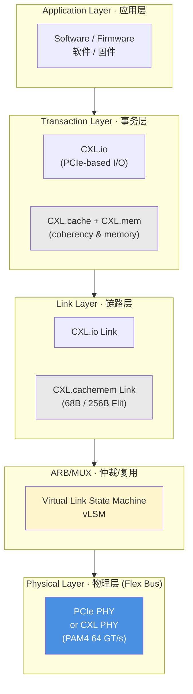

# 📘 第 1 章　引言 (Chapter 1. Introduction)

**Compute Express Link® (CXL®) Specification — Revision 3.2, Version 1.0 — October 2, 2024**

> 📄 **Source pages**: 50–70 (PDF 1-indexed) | 📁 **File**: `chapter_01.md`
> 🎨 **Format**: 中英对照双语 · 图表原始保留 · 中文背景色灰色 · GitHub Flavored Markdown

---

## 📑 本章目录 (Table of Contents)

| # | Section | 小节 | Page |
|:-:|:--------|:----|:----:|
| 1.0 | [Introduction](#sec-1-0) | 引言 | p.50 |
| 1.1 | [Audience](#sec-1-1) | 读者对象 | p.50 |
| 1.2 | [Terminology / Acronyms](#sec-1-2) | 术语与缩略语 | p.50–60 |
| 1.3 | [Reference Documents](#sec-1-3) | 参考文档 | p.61–62 |
| 1.4 | [Motivation and Overview](#sec-1-4) | 动机与总体概述 | p.62–67 |
| 1.4.1 | [CXL](#sec-1-4-1) | CXL | p.62–65 |
| 1.4.2 | [Flex Bus](#sec-1-4-2) | Flex Bus | p.65–67 |
| 1.5 | [Flex Bus Link Features](#sec-1-5) | Flex Bus 链路特性 | p.67 |
| 1.6 | [Flex Bus Layering Overview](#sec-1-6) | Flex Bus 分层概览 | p.67–68 |
| 1.7 | [Document Scope](#sec-1-7) | 文档范围 | p.68–70 |

## 🖼 本章图表 (Figures)

| Figure | Title | 图标题 | Page |
|:------:|:------|:-------|:----:|
| 1-1 | Conceptual Diagram of Device Attached to Processor via CXL | 通过 CXL 连接到处理器的设备概念图 | p.62 |
| 1-2 | Fan-out and Pooling Enabled by Switches | 由交换机实现的扇出与池化 | p.63 |
| 1-3 | Direct Peer-to-Peer Access to an HDM Memory without Going through the Host | PCIe/CXL 设备不经主机直接访问 HDM 内存 | p.64 |
| 1-4 | Shared Memory across Multiple Virtual Hierarchies | 跨多个虚拟层级的共享内存 | p.64 |
| 1-5 | CPU Flex Bus Port Example | CPU Flex Bus 端口示例 | p.65 |
| 1-6 | Flex Bus Usage Model Examples | Flex Bus 用例示例 | p.66 |
| 1-7 | Remote Far Memory Usage Model Example | 远端远内存用例示例 | p.66 |
| 1-8 | CXL Downstream Port Connections | CXL 下游端口连接 | p.67 |
| 1-9 | Conceptual Diagram of Flex Bus Layering | Flex Bus 分层概念图 | p.68 |

## 📊 本章表格 (Tables)

| Table | Title | 表标题 | Sheets |
|:-----:|:------|:-------|:------:|
| 1-1 | Terminology / Acronyms | 术语与缩略语表 | 11 (p.50–60) |
| 1-2 | Reference Documents | 参考文档表 | 2 (p.61–62) |

> 💡 **查看原图**：所有原图已抽取为 PNG 存放在 [`figures/chapter_01/`](figures/chapter_01/)（21 张全页渲染 + 7 张嵌入图）。

---

## 1.0 Introduction | 引言

<table>
<thead>
<tr>
<th width="50%">🇬🇧 English</th>
<th width="50%" style="background-color:#e8e8e8">🇨🇳 中文</th>
</tr>
</thead>
<tbody>
<tr>
<td>

This chapter introduces the CXL (Compute Express Link®) technology, defines the audience and terminology, and provides an overview of motivation, link features, layering, and document scope.

</td>
<td style="background-color:#e8e8e8">

本章介绍 CXL（Compute Express Link®，计算快速链接）技术，定义读者对象与术语，并给出技术动机、链路特性、分层结构与文档范围的总体概述。

</td>
</tr>
</tbody>
</table>

[⬆️ 返回目录](#-本章目录-table-of-contents)

---

## 1.1 Audience | 读者对象

<table>
<thead>
<tr>
<th width="50%">🇬🇧 English</th>
<th width="50%" style="background-color:#e8e8e8">🇨🇳 中文</th>
</tr>
</thead>
<tbody>
<tr>
<td>

The information in this document is intended for anyone designing or architecting any hardware or software associated with Compute Express Link (CXL) or Flex Bus.

</td>
<td style="background-color:#e8e8e8">

本文档面向所有与 Compute Express Link（CXL）或 Flex Bus 相关的硬件或软件的设计与架构人员。

</td>
</tr>
</tbody>
</table>

[⬆️ 返回目录](#-本章目录-table-of-contents)

---

## 1.2 Terminology / Acronyms | 术语与缩略语

<table>
<thead>
<tr>
<th width="50%">🇬🇧 English</th>
<th width="50%" style="background-color:#e8e8e8">🇨🇳 中文</th>
</tr>
</thead>
<tbody>
<tr>
<td>

Refer to PCIe Base Specification for additional terminology and acronym definitions beyond those listed in Table 1-1.

</td>
<td style="background-color:#e8e8e8">

表 1-1 之外的术语与缩略语定义请参见《PCI Express Base Specification》。

</td>
</tr>
</tbody>
</table>

### Table 1-1. Terminology / Acronyms (Sheet 1 of 11) | 术语与缩略语表（第 1/11 页）

<table>
<thead>
<tr>
<th width="18%">Term / Acronym 术语 / 缩略语</th>
<th width="82%" style="background-color:#e8e8e8">Definition ｜ 定义</th>
</tr>
</thead>
<tbody>
<tr><td><code>AAD</code></td><td style="background-color:#e8e8e8">Additional Authentication Data — data that is integrity protected but not encrypted ｜ 附加认证数据 — 受到完整性保护但未加密的数据</td></tr>
<tr><td>Accelerator</td><td style="background-color:#e8e8e8">Devices that may be used by software running on Host processors to offload or perform any type of compute or I/O task. Examples include programmable agents (e.g., GPU/GPGPU), fixed-function agents, or reconfigurable agents such as FPGAs. ｜ 加速器 — 由主机处理器上运行的软件使用、以卸载或执行任意类型计算或 I/O 任务的设备，例如可编程代理（GPU/GPGPU）、固定功能代理或 FPGA 等可重构代理</td></tr>
<tr><td>Acc</td><td style="background-color:#e8e8e8">Shorthand for Accelerator ｜ 加速器的简写</td></tr>
<tr><td>ACL</td><td style="background-color:#e8e8e8">Access Control List ｜ 访问控制列表</td></tr>
<tr><td>ACPI</td><td style="background-color:#e8e8e8">Advanced Configuration and Power Interface ｜ 高级配置与电源接口</td></tr>
<tr><td>ACS</td><td style="background-color:#e8e8e8">Access Control Services as defined in PCIe Base Specification ｜ 访问控制服务（见《PCI Express Base Specification》）</td></tr>
<tr><td>ADF</td><td style="background-color:#e8e8e8">All-Data Flit ｜ 全数据 Flit（链路层传输单元）</td></tr>
<tr><td>AER</td><td style="background-color:#e8e8e8">Advanced Error Reporting as defined in PCIe Base Specification ｜ 高级错误上报（见《PCI Express Base Specification》）</td></tr>
<tr><td>AES-GCM</td><td style="background-color:#e8e8e8">Advanced Encryption Standard – Galois Counter Mode as defined in NIST* publication [AES-GCM] ｜ 高级加密标准 — Galois 计数器模式（见 NIST 出版物 [AES-GCM]）</td></tr>
<tr><td>AIC</td><td style="background-color:#e8e8e8">Add In Card ｜ 插卡（Add-in Card）</td></tr>
<tr><td>Ak</td><td style="background-color:#e8e8e8">Acknowledgment (bit/field name) ｜ 确认位/字段</td></tr>
<tr><td>ALMP</td><td style="background-color:#e8e8e8">ARB/MUX Link Management Packet ｜ ARB/MUX 链路管理包</td></tr>
<tr><td>AP</td><td style="background-color:#e8e8e8">Auto Precharge ｜ 自动预充电</td></tr>
<tr><td>ARB/MUX</td><td style="background-color:#e8e8e8">Arbiter / Multiplexer ｜ 仲裁器 / 复用器</td></tr>
<tr><td>ARI</td><td style="background-color:#e8e8e8">Alternate Routing ID as defined in PCIe Base Specification ｜ 备用路由 ID（见《PCI Express Base Specification》）</td></tr>
<tr><td>ASI</td><td style="background-color:#e8e8e8">Advanced Switching Interconnect ｜ 高级交换互连</td></tr>
<tr><td>ASL</td><td style="background-color:#e8e8e8">ACPI Source Language as defined in ACPI Specification ｜ ACPI 源语言（见 ACPI 规范）</td></tr>
<tr><td>ASPM</td><td style="background-color:#e8e8e8">Active State Power Management ｜ active 状态电源管理</td></tr>
<tr><td>ATS</td><td style="background-color:#e8e8e8">Address Translation Services as defined in PCIe Base Specification ｜ 地址转换服务（见《PCI Express Base Specification》）</td></tr>
<tr><td>Attestation</td><td style="background-color:#e8e8e8">Process of providing a digital signature for a set of measurements from a device and verifying those signatures and measurements on a host. ｜ 远程证明 — 由设备为一组度量值提供数字签名，并在主机上验证这些签名和度量值的过程</td></tr>
<tr><td>Authentication</td><td style="background-color:#e8e8e8">Process of determining whether an entity is who or what it claims to be. ｜ 身份认证 — 确认某个实体是否为其所声明身份的过程</td></tr>
<tr><td>BAR</td><td style="background-color:#e8e8e8">Base Address Register as defined in PCIe Base Specification ｜ 基址寄存器（见《PCI Express Base Specification》）</td></tr>
<tr><td><code>_BBN</code></td><td style="background-color:#e8e8e8">Base Bus Number as defined in ACPI Specification ｜ 基总线号（见 ACPI 规范）</td></tr>
<tr><td>BCC</td><td style="background-color:#e8e8e8">Base Class Code as defined in PCIe Base Specification ｜ 基类代码（见《PCI Express Base Specification》）</td></tr>
<tr><td>BDF</td><td style="background-color:#e8e8e8">Bus Device Function ｜ 总线 - 设备 - 功能号</td></tr>
<tr><td>BE</td><td style="background-color:#e8e8e8">Byte Enable as defined in PCIe Base Specification ｜ 字节使能（见《PCI Express Base Specification》）</td></tr>
<tr><td>BEI</td><td style="background-color:#e8e8e8">BAR Equivalent Indicator ｜ BAR 等效指示</td></tr>
<tr><td>BEP</td><td style="background-color:#e8e8e8">Byte-Enables Present ｜ 字节使能存在</td></tr>
<tr><td>BI</td><td style="background-color:#e8e8e8">Back-Invalidate ｜ 反向失效</td></tr>
<tr><td>Bias Flip</td><td style="background-color:#e8e8e8">Bias refers to coherence tracking of HDM-D* memory regions by the owning device to indicate that the host may have a cache copy. The Bias Flip is a process used to change the bias state that indicates the host has a cached copy of the line (Bias=Host) by invalidating the cache state for the corresponding address(es) in the host such that the device has exclusive access (Bias=Device). ｜ 偏向翻转 — 偏向是指归属设备对 HDM-D* 内存区域进行的相干性跟踪，用以表明主机可能持有缓存副本。偏向翻转指把偏向状态从"主机持有该行的缓存副本（Bias=Host）"变更为"设备独占访问（Bias=Device）"的过程：在主机上使相应地址的缓存状态失效</td></tr>
<tr><td>BIR</td><td style="background-color:#e8e8e8">BAR Indicator Register as defined in PCIe Base Specification ｜ BAR 指示寄存器（见《PCI Express Base Specification》）</td></tr>
<tr><td>BIRsp</td><td style="background-color:#e8e8e8">Back-Invalidate Response ｜ 反向失效响应</td></tr>
<tr><td>BISnp</td><td style="background-color:#e8e8e8">Back-Invalidate Snoop ｜ 反向失效探测</td></tr>
<tr><td>BMC</td><td style="background-color:#e8e8e8">Baseboard Management Controller ｜ 基板管理控制器</td></tr>
<tr><td>BME</td><td style="background-color:#e8e8e8">Bus Master Enable ｜ 总线主设备使能</td></tr>
<tr><td>BW</td><td style="background-color:#e8e8e8">Bandwidth ｜ 带宽</td></tr>
<tr><td>CA</td><td style="background-color:#e8e8e8">Certificate Authority ｜ 证书颁发机构</td></tr>
<tr><td>CAM</td><td style="background-color:#e8e8e8">Content Addressable Memory ｜ 内容寻址存储器</td></tr>
<tr><td>CAS</td><td style="background-color:#e8e8e8">Column Address Strobe ｜ 列地址选通</td></tr>
<tr><td><code>_CBR</code></td><td style="background-color:#e8e8e8">CXL Host Bridge Register Info as defined in ACPI Specification ｜ CXL 主机桥寄存器信息（见 ACPI 规范）</td></tr>
<tr><td>CCI</td><td style="background-color:#e8e8e8">Component Command Interface ｜ 组件命令接口</td></tr>
<tr><td>CCID</td><td style="background-color:#e8e8e8">CXL Cache ID ｜ CXL 缓存 ID</td></tr>
<tr><td>CDAT</td><td style="background-color:#e8e8e8">Coherent Device Attribute Table — a table that describes performance characteristics of a CXL device or a CXL switch. ｜ 一致性设备属性表 — 描述 CXL 设备或 CXL 交换机性能特征的表</td></tr>
<tr><td>CDL</td><td style="background-color:#e8e8e8">CXL DevLoad ｜ CXL 设备加载</td></tr>
<tr><td>CEDT</td><td style="background-color:#e8e8e8">CXL Early Discovery Table ｜ CXL 早期发现表</td></tr>
<tr><td>CEL</td><td style="background-color:#e8e8e8">Command Effects Log ｜ 命令影响日志</td></tr>
<tr><td>CFMWS</td><td style="background-color:#e8e8e8">CXL Fixed Memory Window Structure ｜ CXL 固定内存窗口结构</td></tr>
<tr><td>CHBCR</td><td style="background-color:#e8e8e8">CXL Host Bridge Component Registers ｜ CXL 主机桥组件寄存器</td></tr>
<tr><td>CHBS</td><td style="background-color:#e8e8e8">CXL Host Bridge Structure ｜ CXL 主机桥结构</td></tr>
<tr><td><code>_CID</code></td><td style="background-color:#e8e8e8">Compatible ID as defined in ACPI Specification ｜ 兼容 ID（见 ACPI 规范）</td></tr>
<tr><td>CIE</td><td style="background-color:#e8e8e8">Correctable Internal Error ｜ 可纠正内部错误</td></tr>
<tr><td>CIKMA</td><td style="background-color:#e8e8e8">CXL.cachemem IDE Key Management Agent ｜ CXL.cachemem 完整性数据加密密钥管理代理</td></tr>
<tr><td>CKID</td><td style="background-color:#e8e8e8">Context Key IDentifier passed in the protocol flit for identifying security keys utilized for memory encryption using TSP. ｜ 上下文密钥标识 — 通过协议 flit 传递、用于在 TSP 内存加密中识别安全密钥</td></tr>
<tr><td>CMA</td><td style="background-color:#e8e8e8">Component Measurement and Authentication as defined in PCIe Base Specification ｜ 组件度量与认证（见《PCI Express Base Specification》）</td></tr>
<tr><td>Coh</td><td style="background-color:#e8e8e8">Coherency ｜ 一致性</td></tr>
<tr><td>Cold reset</td><td style="background-color:#e8e8e8">As defined in PCIe Base Specification ｜ 冷复位（见《PCI Express Base Specification》）</td></tr>
<tr><td>Comprehensive Trust</td><td style="background-color:#e8e8e8">Security model in which every device available to the TEE is presumed to be trusted by all TEEs in the system. ｜ 全面信任安全模型 — 系统中所有 TEE 都默认信任所有对 TEE 可用的设备</td></tr>
<tr><td>CPMU</td><td style="background-color:#e8e8e8">CXL Performance Monitoring Unit ｜ CXL 性能监测单元</td></tr>
<tr><td>CRD</td><td style="background-color:#e8e8e8">Credit Return(ed) ｜ 信用返回</td></tr>
<tr><td>CQID</td><td style="background-color:#e8e8e8">Command Queue ID ｜ 命令队列 ID</td></tr>
<tr><td>CSDS</td><td style="background-color:#e8e8e8">CXL System Description Structure ｜ CXL 系统描述结构</td></tr>
<tr><td>CSR</td><td style="background-color:#e8e8e8">Configuration Space Register ｜ 配置空间寄存器</td></tr>
<tr><td>CT</td><td style="background-color:#e8e8e8">Crypto Timeout ｜ 加密超时</td></tr>
<tr><td>CVME</td><td style="background-color:#e8e8e8">Corrected Volatile Memory Error — a corrected error associated with volatile memory ｜ 已纠正易失性内存错误</td></tr>
<tr><td>CXIMS</td><td style="background-color:#e8e8e8">CXL XOR Interleave Math Structure ｜ CXL XOR 交织数学结构</td></tr>
<tr><td>CXL</td><td style="background-color:#e8e8e8">Compute Express Link — a low-latency, high-bandwidth link that supports dynamic protocol muxing of coherency, memory access, and I/O protocols, enabling attachment of coherent accelerators or memory devices. ｜ 计算快速链接 — 一种低延迟、高带宽的链路，支持一致性、内存访问与 I/O 协议的动态协议复用，可挂接一致性加速器或内存设备</td></tr>
<tr><td>CXL.cache</td><td style="background-color:#e8e8e8">Agent coherency protocol that supports device caching of Host memory. ｜ 代理一致性协议 — 支持设备对主机内存进行缓存</td></tr>
<tr><td>CXL.cachemem</td><td style="background-color:#e8e8e8">CXL.cache / CXL.mem ｜ CXL.cache 与 CXL.mem 的合称</td></tr>
<tr><td>CXL.io</td><td style="background-color:#e8e8e8">PCIe-based non-coherent I/O protocol with enhancements for accelerator support. ｜ 基于 PCIe 的非一致性 I/O 协议，并针对加速器进行了增强</td></tr>
<tr><td>CXL.mem</td><td style="background-color:#e8e8e8">Memory access protocol that supports device-attached memory. ｜ 内存访问协议 — 支持挂接在设备上的内存</td></tr>
<tr><td>CXL Memory Device</td><td style="background-color:#e8e8e8">CXL device with a specific Class Code as defined in Section 8.1.12.1. ｜ CXL 内存设备 — 具有 8.1.12.1 节所规定类代码的 CXL 设备</td></tr>
<tr><td>D2H</td><td style="background-color:#e8e8e8">Device to Host ｜ 设备到主机</td></tr>
<tr><td>DAPM</td><td style="background-color:#e8e8e8">Deepest Allowable Power Management state ｜ 最深允许电源管理状态</td></tr>
<tr><td>DC</td><td style="background-color:#e8e8e8">Dynamic Capacity ｜ 动态容量</td></tr>
<tr><td>DCD</td><td style="background-color:#e8e8e8">Dynamic Capacity Device ｜ 动态容量设备</td></tr>
<tr><td>DCOH</td><td style="background-color:#e8e8e8">Device Coherency agent on the device that is responsible for resolving coherency with respect to device caches and managing Bias states. ｜ 设备一致性代理 — 设备侧负责解决与设备缓存相关的一致性问题并管理偏向状态</td></tr>
<tr><td>DDR</td><td style="background-color:#e8e8e8">Double Data Rate ｜ 双倍数据速率</td></tr>
<tr><td>DH</td><td style="background-color:#e8e8e8">Data Header ｜ 数据头</td></tr>
<tr><td>DHSW-FM</td><td style="background-color:#e8e8e8">Dual Host, Fabric Managed, Switch Attached SLD EP ｜ 双主机、Fabric 管理的交换机挂接 SLD 端点</td></tr>
<tr><td>DHSW-FM-MLD</td><td style="background-color:#e8e8e8">Dual Host, Fabric Managed, Switch Attached MLD EP ｜ 双主机、Fabric 管理的交换机挂接 MLD 端点</td></tr>
<tr><td>DLLP</td><td style="background-color:#e8e8e8">Data Link Layer Packet as defined in PCIe Base Specification ｜ 数据链路层包（见《PCI Express Base Specification》）</td></tr>
<tr><td>DM</td><td style="background-color:#e8e8e8">Data Mask ｜ 数据掩码</td></tr>
<tr><td>DMP</td><td style="background-color:#e8e8e8">Device Media Partition ｜ 设备介质分区</td></tr>
<tr><td>DMTF</td><td style="background-color:#e8e8e8">Distributed Management Task Force ｜ 分布式管理任务组</td></tr>
<tr><td>DOE</td><td style="background-color:#e8e8e8">Data Object Exchange as defined in PCIe Base Specification ｜ 数据对象交换（见《PCI Express Base Specification》）</td></tr>
<tr><td>Domain</td><td style="background-color:#e8e8e8">Set of host ports and devices within a single coherent HPA space ｜ 域 — 位于同一相干 HPA 空间内的一组主机端口和设备</td></tr>
<tr><td>Downstream ES</td><td style="background-color:#e8e8e8">Within the context of a single VH, an Edge Switch other than the Host ES. ｜ 下游边缘交换机 — 在单个虚拟层级中，宿主边缘交换机以外的其他边缘交换机</td></tr>
<tr><td>Downstream Port</td><td style="background-color:#e8e8e8">Physical port that can be a root port, a downstream switch port, or an RCH Downstream Port ｜ 下游端口 — 可作为根端口、下游交换机端口或 RCH 下游端口的物理端口</td></tr>
<tr><td>DPA</td><td style="background-color:#e8e8e8">Device Physical Address. DPA forms a device-scoped flat address space. An LD-FAM device presents a distinct DPA space per LD. A G-FAM device presents the same DPA space to all hosts. The CXL HDM decoders or GFD decoders map HPA into DPA space. ｜ 设备物理地址 — 形成设备范围内的扁平地址空间。LD-FAM 设备为每个 LD 提供独立的 DPA 空间，G-FAM 设备为所有主机提供同一 DPA 空间。CXL HDM 解码器或 GFD 解码器将 HPA 映射到 DPA 空间</td></tr>
<tr><td>DPC</td><td style="background-color:#e8e8e8">Downstream Port Containment as defined in PCIe Base Specification ｜ 下游端口遏制（见《PCI Express Base Specification》）</td></tr>
<tr><td>DPID</td><td style="background-color:#e8e8e8">Destination PID ｜ 目标 PID</td></tr>
<tr><td>DRS</td><td style="background-color:#e8e8e8">Data Response ｜ 数据响应</td></tr>
<tr><td>DRT</td><td style="background-color:#e8e8e8">DPID Routing Table ｜ DPID 路由表</td></tr>
<tr><td>DSAR</td><td style="background-color:#e8e8e8">Downstream Acceptance Rules ｜ 下游接受规则</td></tr>
<tr><td><code>_DSM</code></td><td style="background-color:#e8e8e8">Device Specific Method as defined in ACPI Specification ｜ 设备特定方法（见 ACPI 规范）</td></tr>
<tr><td>DSM</td><td style="background-color:#e8e8e8">Device Security Manager — a logical entity in a device that can be admitted into the TCB for a TVM and enforces security policies on the device. ｜ 设备安全管理器 — 设备中的逻辑实体，可被纳入 TVM 的 TCB，并在设备上执行安全策略</td></tr>
<tr><td>DSMAD</td><td style="background-color:#e8e8e8">Device Scoped Memory Affinity Domain as defined in Coherent Device Attribute Table (CDAT) Specification ｜ 设备范围内存亲和域（见 CDAT 规范）</td></tr>
<tr><td>DSMAS</td><td style="background-color:#e8e8e8">Device Scoped Memory Affinity Structure as defined in CDAT Specification ｜ 设备范围内存亲和结构（见 CDAT 规范）</td></tr>
<tr><td>DSP</td><td style="background-color:#e8e8e8">Downstream Switch Port ｜ 下游交换机端口</td></tr>
<tr><td>DTLB</td><td style="background-color:#e8e8e8">Data Translation Lookaside Buffer ｜ 数据转换后备缓冲</td></tr>
<tr><td>DTRCS</td><td style="background-color:#e8e8e8">Device Tracked Requestor Cache State — the requestor cache coherency state tracked by the device ｜ 设备追踪的请求者缓存状态</td></tr>
<tr><td>DUT</td><td style="background-color:#e8e8e8">Device Under Test ｜ 被测设备</td></tr>
<tr><td>DVSEC</td><td style="background-color:#e8e8e8">Designated Vendor-Specific Extended Capability as defined in PCIe Base Specification ｜ 指定的厂商特定扩展能力（见《PCI Express Base Specification》）</td></tr>
<tr><td>ECC</td><td style="background-color:#e8e8e8">Error-correcting Code ｜ 纠错码</td></tr>
<tr><td>ECN</td><td style="background-color:#e8e8e8">Engineering Change Notice ｜ 工程变更通知</td></tr>
<tr><td>ECS</td><td style="background-color:#e8e8e8">Error Check Scrub ｜ 错误检查清理</td></tr>
<tr><td>ECRC</td><td style="background-color:#e8e8e8">End-to-End CRC ｜ 端到端循环冗余校验</td></tr>
<tr><td>EDB</td><td style="background-color:#e8e8e8">End Bad as defined in PCIe Base Specification ｜ 错误结束（见《PCI Express Base Specification》）</td></tr>
<tr><td>Edge DSP</td><td style="background-color:#e8e8e8">PBR downstream switch port that connects to a device (including a GFD) or an HBR USP ｜ 边缘下游端口 — 连接设备（含 GFD）或 HBR 上游端口的 PBR 下游交换机端口</td></tr>
<tr><td>Edge Port</td><td style="background-color:#e8e8e8">PBR switch port suitable for connecting to an RP, device, or HBR USP ｜ 边缘端口 — 适合连接 RP、设备或 HBR USP 的 PBR 交换机端口</td></tr>
<tr><td>Edge Switch (ES)</td><td style="background-color:#e8e8e8">Within the context of a single VH, a PBR switch that contains one or more Edge Ports ｜ 边缘交换机 — 在单个 VH 范围内，包含一个或多个边缘端口的 PBR 交换机</td></tr>
<tr><td>Edge USP</td><td style="background-color:#e8e8e8">PBR upstream switch port that connects to a root port ｜ 边缘上游端口 — 连接根端口的 PBR 上游交换机端口</td></tr>
<tr><td>eDPC</td><td style="background-color:#e8e8e8">Enhanced Downstream Port Control as defined in PCIe Base Specification ｜ 增强型下游端口控制（见《PCI Express Base Specification》）</td></tr>
<tr><td>EDS</td><td style="background-color:#e8e8e8">End of Data Stream ｜ 数据流结束</td></tr>
<tr><td>EFN</td><td style="background-color:#e8e8e8">Event Firmware Notification ｜ 事件固件通知</td></tr>
<tr><td>EIEOS</td><td style="background-color:#e8e8e8">Electrical Idle Exit Ordered Set as defined in PCIe Base Specification ｜ 退出电气空闲有序集（见《PCI Express Base Specification》）</td></tr>
<tr><td>EIOS</td><td style="background-color:#e8e8e8">Electrical Idle Ordered Set as defined in PCIe Base Specification ｜ 电气空闲有序集（见《PCI Express Base Specification》）</td></tr>
<tr><td>EIOSQ</td><td style="background-color:#e8e8e8">EIOS Sequence as defined in PCIe Base Specification ｜ EIOS 序列（见《PCI Express Base Specification》）</td></tr>
<tr><td>EMD</td><td style="background-color:#e8e8e8">Extended Metadata ｜ 扩展元数据</td></tr>
<tr><td>EMV</td><td style="background-color:#e8e8e8">Extended MetaValue ｜ 扩展元数据值</td></tr>
<tr><td>ENIW</td><td style="background-color:#e8e8e8">Encoded Number of Interleave Ways ｜ 交织路数编码值</td></tr>
<tr><td>EP</td><td style="background-color:#e8e8e8">Endpoint ｜ 端点</td></tr>
<tr><td>eRCD</td><td style="background-color:#e8e8e8">Exclusive Restricted CXL Device (formerly CXL 1.1 only Device). eRCD is a CXL device component that can operate only in RCD mode. ｜ 排他受限 CXL 设备 — 只能以 RCD 模式运行的 CXL 设备组件</td></tr>
<tr><td>eRCH</td><td style="background-color:#e8e8e8">Exclusive Restricted CXL Host (formerly CXL 1.1 only host). eRCH is a CXL host component that can operate only in RCD mode. ｜ 排他受限 CXL 主机 — 只能以 RCD 模式运行的 CXL 主机组件</td></tr>
<tr><td>evPPB</td><td style="background-color:#e8e8e8">Egress vPPB ｜ 出方向的虚拟 PCI-to-PCI 桥</td></tr>
<tr><td>Explicit Access Control</td><td style="background-color:#e8e8e8">TE State ownership tracking where the state change occurs explicitly utilizing a TE State change message that is independent of each memory transaction. ｜ 显式访问控制 — TE 状态的归属跟踪，状态变更通过与每笔内存事务无关的 TE 状态变更消息显式进行</td></tr>
<tr><td>Fabric Port (FPort)</td><td style="background-color:#e8e8e8">PBR switch port that connects to another PBR switch port ｜ Fabric 端口 — 用于连接另一 PBR 交换机端口的 PBR 交换机端口</td></tr>
<tr><td>FAM</td><td style="background-color:#e8e8e8">Fabric-Attached Memory. HDM within a Type 2 or Type 3 device that can be made accessible to multiple hosts concurrently. Each HDM region can either be pooled (dedicated to a single host) or shared (accessible concurrently by multiple hosts). ｜ Fabric 挂接内存 — Type 2 或 Type 3 设备中的 HDM，可被多台主机并发访问，每个 HDM 区域可被池化（专属于某台主机）或共享（多台主机并发访问）</td></tr>
<tr><td>FAST</td><td style="background-color:#e8e8e8">Fabric Address Segment Table ｜ Fabric 地址段表</td></tr>
<tr><td>FC</td><td style="background-color:#e8e8e8">Flow Control ｜ 流控</td></tr>
<tr><td>FCBP</td><td style="background-color:#e8e8e8">Flow Control Backpressured ｜ 流控反压</td></tr>
<tr><td>FEC</td><td style="background-color:#e8e8e8">Forwarded Error Correction ｜ 前向纠错</td></tr>
<tr><td>Flex Bus</td><td style="background-color:#e8e8e8">A flexible high-speed port that is configured to support either PCIe or CXL. ｜ 灵活总线 — 可灵活配置为支持 PCIe 或 CXL 的高速端口</td></tr>
<tr><td>Flex Bus.CXL</td><td style="background-color:#e8e8e8">CXL protocol over a Flex Bus interconnect. ｜ Flex Bus.CXL — 在 Flex Bus 互连上承载的 CXL 协议</td></tr>
<tr><td>Flit</td><td style="background-color:#e8e8e8">Link Layer Unit of Transfer ｜ 链路层传输单元</td></tr>
<tr><td>FLR</td><td style="background-color:#e8e8e8">Function Level Reset ｜ 功能级复位</td></tr>
<tr><td>FM</td><td style="background-color:#e8e8e8">The Fabric Manager is an entity separate from the switch or host firmware that controls aspects of the system related to binding and management of pooled ports and devices. ｜ Fabric 管理器 — 独立于交换机或主机固件的实体，负责系统内与池化端口及设备绑定和管理相关的方面</td></tr>
<tr><td>FMLD</td><td style="background-color:#e8e8e8">Fabric Manager-owned Logical Device ｜ 由 Fabric 管理器拥有的逻辑设备</td></tr>
<tr><td>FM-owned PPB</td><td style="background-color:#e8e8e8">Link that contains traffic from multiple VCSs or an unbound physical port. ｜ FM 拥有的 PPB — 承载来自多个 VCS 流量的链路，或未绑定的物理端口</td></tr>
<tr><td>Fundamental Reset</td><td style="background-color:#e8e8e8">As defined in PCIe Base Specification ｜ 基础复位（见《PCI Express Base Specification》）</td></tr>
<tr><td>FW</td><td style="background-color:#e8e8e8">Firmware ｜ 固件</td></tr>
<tr><td>GAM</td><td style="background-color:#e8e8e8">GFD Async Message ｜ GFD 异步消息</td></tr>
<tr><td>GAE</td><td style="background-color:#e8e8e8">Global Memory Access Endpoint ｜ 全局内存访问端点</td></tr>
<tr><td>GDT</td><td style="background-color:#e8e8e8">GFD Decoder Table ｜ GFD 解码器表</td></tr>
<tr><td>G-FAM</td><td style="background-color:#e8e8e8">Global FAM. Highly scalable form of FAM that is presented to hosts without using Logical Devices (LDs). Like LD-FAM, G-FAM presents HDM that can be pooled or shared. ｜ 全局 FAM — 不通过 LD 暴露给主机的高可扩展 FAM。与 LD-FAM 一样可池化或共享 HDM</td></tr>
<tr><td>GFD</td><td style="background-color:#e8e8e8">G-FAM device ｜ G-FAM 设备</td></tr>
<tr><td>GFD decoder</td><td style="background-color:#e8e8e8">HPA-to-DPA translation mechanism inside a GFD ｜ GFD 内部的 HPA→DPA 转换机制</td></tr>
<tr><td>GI</td><td style="background-color:#e8e8e8">Generic Affinity ｜ 通用亲和性</td></tr>
<tr><td>GIM</td><td style="background-color:#e8e8e8">Global Integrated Memory ｜ 全局集成内存</td></tr>
<tr><td>GMV</td><td style="background-color:#e8e8e8">Global Memory Mapping Vector ｜ 全局内存映射向量</td></tr>
<tr><td>GO</td><td style="background-color:#e8e8e8">Global Observation. Used in the context of coherence protocol as a message to know when data is guaranteed to be observed by all agents in the coherence domain for either a read or a write. ｜ 全局观测 — 在一致性协议中，用于获知数据已被一致性域内所有代理观察到（读或写）的消息</td></tr>
<tr><td>GPF</td><td style="background-color:#e8e8e8">Global Persistent Flush ｜ 全局持久化刷新</td></tr>
<tr><td>H2D</td><td style="background-color:#e8e8e8">Host to Device ｜ 主机到设备</td></tr>
<tr><td>HA</td><td style="background-color:#e8e8e8">Home Agent. The agent on the host that is responsible for resolving system-wide coherency for a given address. ｜ 主控代理 — 主机上负责对给定地址解析系统范围一致性的代理</td></tr>
<tr><td>HBIG</td><td style="background-color:#e8e8e8">Host Bridge Interleave Granularity ｜ 主机桥交织粒度</td></tr>
<tr><td>HBM</td><td style="background-color:#e8e8e8">High-Bandwidth Memory ｜ 高带宽内存</td></tr>
<tr><td>HBR</td><td style="background-color:#e8e8e8">Hierarchy Based Routing ｜ 基于层级的路由</td></tr>
<tr><td>HBR link</td><td style="background-color:#e8e8e8">Link operating in a mode, where all flits are in HBR format ｜ 以 HBR 格式传输所有 flit 的链路</td></tr>
<tr><td>HBR switch</td><td style="background-color:#e8e8e8">Switch that supports only HBR ｜ 仅支持 HBR 的交换机</td></tr>
<tr><td>HDM</td><td style="background-color:#e8e8e8">Host-managed Device Memory. Device-attached memory that is mapped to system coherent address space and accessible to the Host using standard write-back semantics. Memory on a CXL device can be mapped as either HDM or PDM. ｜ 主机管理型设备内存 — 映射到系统相干地址空间、按标准写回语义供主机访问的设备端内存；CXL 设备上的内存可映射为 HDM 或 PDM</td></tr>
<tr><td>HDM-H</td><td style="background-color:#e8e8e8">Host-only Coherent HDM region type. Used only for Type 3 Devices. ｜ 仅主机一致性 HDM 区域类型 — 仅用于 Type 3 设备</td></tr>
<tr><td>HDM-D</td><td style="background-color:#e8e8e8">Device Coherent HDM region type. Used only for Type 2 devices that rely on CXL.cache to manage coherence with the host. ｜ 设备一致性 HDM 区域类型 — 仅用于依赖 CXL.cache 管理与主机一致性的 Type 2 设备</td></tr>
<tr><td>HDM-DB</td><td style="background-color:#e8e8e8">Device Coherent using Back-Invalidate HDM region type. Can be used by Type 2 or Type 3 devices. ｜ 采用反向失效的设备一致性 HDM 区域类型 — Type 2 与 Type 3 设备均可使用</td></tr>
<tr><td><code>_HID</code></td><td style="background-color:#e8e8e8">Hardware ID as defined in ACPI Specification ｜ 硬件 ID（见 ACPI 规范）</td></tr>
<tr><td>HMAT</td><td style="background-color:#e8e8e8">Heterogeneous Memory Attribute Table as defined in ACPI Specification ｜ 异构内存属性表（见 ACPI 规范）</td></tr>
<tr><td>Host ES</td><td style="background-color:#e8e8e8">Within the context of a single VH, the single Edge Switch connected to the RP. ｜ 宿主边缘交换机 — 在单个 VH 范围内，连接 RP 的唯一一个边缘交换机</td></tr>
<tr><td>Hot Reset</td><td style="background-color:#e8e8e8">As defined in PCIe Base Specification ｜ 热复位（见《PCI Express Base Specification》）</td></tr>
<tr><td>HPA</td><td style="background-color:#e8e8e8">Host Physical Address ｜ 主机物理地址</td></tr>
<tr><td>HPC</td><td style="background-color:#e8e8e8">High-Performance Computing ｜ 高性能计算</td></tr>
<tr><td>hPPR</td><td style="background-color:#e8e8e8">Hard Post Package Repair ｜ 封装后硬修复</td></tr>
<tr><td>HW</td><td style="background-color:#e8e8e8">Hardware ｜ 硬件</td></tr>
<tr><td>IDE</td><td style="background-color:#e8e8e8">Integrity and Data Encryption ｜ 完整性与数据加密</td></tr>
<tr><td>IDT</td><td style="background-color:#e8e8e8">Interleave DPID Table ｜ 交织 DPID 表</td></tr>
<tr><td>IG</td><td style="background-color:#e8e8e8">Interleave Granularity ｜ 交织粒度</td></tr>
<tr><td>IGB</td><td style="background-color:#e8e8e8">Interleave Granularity in number of bytes ｜ 以字节为单位的交织粒度</td></tr>
<tr><td>Intermediate Fabric Switch</td><td style="background-color:#e8e8e8">Within the context of a single VH, a PBR switch that forwards VH traffic but is not a Host ES or downstream ES. ｜ 中间 Fabric 交换机 — 在单个 VH 范围内，转发 VH 流量、但既非宿主 ES 也非下游 ES 的 PBR 交换机</td></tr>
<tr><td>IOMMU</td><td style="background-color:#e8e8e8">I/O Memory Management Unit as defined in PCIe Base Specification ｜ I/O 内存管理单元（见《PCI Express Base Specification》）</td></tr>
<tr><td>Implicit Access Control</td><td style="background-color:#e8e8e8">TE State ownership tracking where the state change occurs implicitly as part of executing each memory transaction. ｜ 隐式访问控制 — TE 状态归属跟踪，状态变更作为每笔内存事务执行过程的一部分隐式发生</td></tr>
<tr><td>Initiator</td><td style="background-color:#e8e8e8">Defined by TSP as a host or accelerator device that issues TSP requests. ｜ 发起方 — TSP 定义为发起 TSP 请求的主机或加速器设备</td></tr>
<tr><td>IP2PM</td><td style="background-color:#e8e8e8">Independent Power Manager to (Master) Power Manager, PM messages from the device to the host. ｜ 独立 PM→主 PM 消息（设备到主机的电源管理消息）</td></tr>
<tr><td>ISL</td><td style="background-color:#e8e8e8">Inter-Switch Link. PBR link that connects Fabric Ports. ｜ 交换机间链路 — 连接 Fabric 端口的 PBR 链路</td></tr>
<tr><td>ISP</td><td style="background-color:#e8e8e8">Interleave Set Position ｜ 交织集合位置</td></tr>
<tr><td>IV</td><td style="background-color:#e8e8e8">Initialization Vector ｜ 初始化向量</td></tr>
<tr><td>IW</td><td style="background-color:#e8e8e8">Interleave Ways ｜ 交织路数</td></tr>
<tr><td>IWB</td><td style="background-color:#e8e8e8">Implicit Writeback ｜ 隐式写回</td></tr>
<tr><td>LAV</td><td style="background-color:#e8e8e8">LDST Access Vector ｜ LDST 访问向量</td></tr>
<tr><td>LD</td><td style="background-color:#e8e8e8">Logical Device. Entity that represents a CXL Endpoint that is bound to a VCS. An SLD contains one LD. An MLD contains multiple LDs. ｜ 逻辑设备 — 表示已绑定到 VCS 的 CXL 端点的实体。SLD 包含一个 LD，MLD 包含多个 LD</td></tr>
<tr><td>LDST</td><td style="background-color:#e8e8e8">LD-FAM Segment Table ｜ LD-FAM 段表</td></tr>
<tr><td>LD-FAM</td><td style="background-color:#e8e8e8">FAM that is presented to hosts via Logical Devices (LDs). ｜ LD-FAM — 通过逻辑设备（LD）暴露给主机的 FAM</td></tr>
<tr><td>Link Layer Clock</td><td style="background-color:#e8e8e8">CXL.cachemem link layer clock rate, usually defined by the flit rate during normal operation. ｜ 链路层时钟 — 通常由正常运行时的 flit 速率决定</td></tr>
<tr><td>LLC</td><td style="background-color:#e8e8e8">Last Level Cache ｜ 末级缓存</td></tr>
<tr><td>LLCRD</td><td style="background-color:#e8e8e8">Link Layer Credit ｜ 链路层信用</td></tr>
<tr><td>LLCTRL</td><td style="background-color:#e8e8e8">Link Layer Control ｜ 链路层控制</td></tr>
<tr><td>LLR</td><td style="background-color:#e8e8e8">Link Layer Retry ｜ 链路层重试</td></tr>
<tr><td>LLRB</td><td style="background-color:#e8e8e8">Link Layer Retry Buffer ｜ 链路层重试缓冲</td></tr>
<tr><td>LOpt</td><td style="background-color:#e8e8e8">Latency-Optimized ｜ 延迟优化</td></tr>
<tr><td>LRSM</td><td style="background-color:#e8e8e8">Local Retry State Machine ｜ 本地重试状态机</td></tr>
<tr><td>LRU</td><td style="background-color:#e8e8e8">Least Recently Used ｜ 最近最少使用</td></tr>
<tr><td>LSA</td><td style="background-color:#e8e8e8">Label Storage Area ｜ 标签存储区</td></tr>
<tr><td>LSM</td><td style="background-color:#e8e8e8">Link State Machine ｜ 链路状态机</td></tr>
<tr><td>LTR</td><td style="background-color:#e8e8e8">Latency Tolerance Reporting ｜ 延迟容忍度上报</td></tr>
<tr><td>LTSSM</td><td style="background-color:#e8e8e8">Link Training and Status State Machine as defined in PCIe Base Specification ｜ 链路训练与状态状态机（见《PCI Express Base Specification》）</td></tr>
<tr><td>LUN</td><td style="background-color:#e8e8e8">Logical Unit Number ｜ 逻辑单元号</td></tr>
<tr><td>M2S</td><td style="background-color:#e8e8e8">Master to Subordinate ｜ 主设备到从设备</td></tr>
<tr><td>MAC</td><td style="background-color:#e8e8e8">Message Authentication Code; also referred to as Authentication Tag or Integrity value. ｜ 消息认证码 — 也称认证标签或完整性值</td></tr>
<tr><td>MAC epoch</td><td style="background-color:#e8e8e8">Set of flits which are aggregated together for MAC computation. ｜ MAC 周期 — 为 MAC 计算而聚合的一组 flit</td></tr>
<tr><td>MB</td><td style="background-color:#e8e8e8">Megabyte — 2²⁰ bytes (1,048,576 bytes) ｜ 兆字节</td></tr>
<tr><td>Mailbox</td><td style="background-color:#e8e8e8">— ｜ 邮箱（协议通信机制）</td></tr>
<tr><td>MC</td><td style="background-color:#e8e8e8">Memory Controller ｜ 内存控制器</td></tr>
<tr><td>MCA</td><td style="background-color:#e8e8e8">Machine Check Architecture ｜ 机器检查架构</td></tr>
<tr><td>MCTP</td><td style="background-color:#e8e8e8">Management Component Transport Protocol ｜ 管理组件传输协议</td></tr>
<tr><td>MDH</td><td style="background-color:#e8e8e8">Multi-Data Header ｜ 多数据头</td></tr>
<tr><td>Measurement</td><td style="background-color:#e8e8e8">Representation of firmware/software or configuration data on a device. ｜ 度量 — 设备上固件/软件或配置数据的表示</td></tr>
<tr><td>MEC</td><td style="background-color:#e8e8e8">Multiple Event Counting ｜ 多事件计数</td></tr>
<tr><td>MEFN</td><td style="background-color:#e8e8e8">Memory Error Firmware Notification. An EFN that is used to report memory errors. ｜ 内存错误固件通知 — 用于上报内存错误的 EFN</td></tr>
<tr><td>Memory Group</td><td style="background-color:#e8e8e8">Set of DC blocks that can be accessed by the same set of requesters. ｜ 内存组 — 可被同一组请求者访问的一组 DC 块</td></tr>
<tr><td>Memory Sparing</td><td style="background-color:#e8e8e8">Repair function that replaces a portion of memory (the "spared memory") with a portion of functional memory at that same DPA. ｜ 内存备用修复 — 用同一 DPA 上的可用内存替换部分（被备用）内存的修复功能</td></tr>
<tr><td>MESI</td><td style="background-color:#e8e8e8">Modified, Exclusive, Shared, and Invalid cache coherence protocol ｜ MESI 一致性协议</td></tr>
<tr><td>MGT</td><td style="background-color:#e8e8e8">Memory Group Table ｜ 内存组表</td></tr>
<tr><td>MH-MLD</td><td style="background-color:#e8e8e8">Multi-headed MLD. CXL component that contains multiple CXL ports, each presenting an MLD or SLD. The ports must correctly operate when connected to any combination of common or different hosts. The FM API is used to configure each LD as well as the overall MH-MLD. Currently, MH-MLDs are architected only for Type 3 LDs. MH-MLDs are a specialized MLD and subject to all MLD requirements. ｜ 多头 MLD — 包含多个 CXL 端口的多头 CXL 组件，每个端口呈现 MLD 或 SLD；当前仅针对 Type 3 LD 架构</td></tr>
<tr><td>MH-SLD</td><td style="background-color:#e8e8e8">Multi-headed SLD. CXL component that contains multiple CXL ports, each presenting an SLD. Currently, MH-SLDs are architected only for Type 3 LDs. ｜ 多头 SLD — 包含多个 CXL 端口的多头 CXL 组件，每个端口呈现 SLD；当前仅针对 Type 3 LD 架构</td></tr>
<tr><td>ML</td><td style="background-color:#e8e8e8">Machine Learning ｜ 机器学习</td></tr>
<tr><td>MLD</td><td style="background-color:#e8e8e8">Multi-Logical Device. CXL component that contains multiple LDs, out of which one LD is reserved for configuration via the FM API, and each remaining LD is suitable for assignment to a different host. Currently MLDs are architected only for Type 3 LDs. ｜ 多逻辑设备 — 包含多个 LD 的 CXL 组件，其中一个 LD 通过 FM API 进行配置，其余 LD 可分配给不同主机；当前仅针对 Type 3 LD 架构</td></tr>
<tr><td>MLD Port</td><td style="background-color:#e8e8e8">An MLD Port is one that has linked up with an MLD Component. The port is natively bound to an FM-owned PPB inside the switch. ｜ MLD 端口 — 与 MLD 组件完成链路建链的端口，原生绑定到交换机内的 FM-owned PPB</td></tr>
<tr><td>MMIO</td><td style="background-color:#e8e8e8">Memory Mapped I/O ｜ 内存映射 I/O</td></tr>
<tr><td>MR</td><td style="background-color:#e8e8e8">Multi-Root ｜ 多根</td></tr>
<tr><td>MRL</td><td style="background-color:#e8e8e8">Manually-operated Retention Latch as defined in PCIe Base Specification ｜ 手动保持锁（见《PCI Express Base Specification》）</td></tr>
<tr><td>MS0</td><td style="background-color:#e8e8e8">Meta0-State ｜ 元数据 0 状态</td></tr>
<tr><td>MSB</td><td style="background-color:#e8e8e8">Most Significant Bit ｜ 最高有效位</td></tr>
<tr><td>MSE</td><td style="background-color:#e8e8e8">Memory Space Enable ｜ 内存空间使能</td></tr>
<tr><td>MSI/MSI-X</td><td style="background-color:#e8e8e8">Message Signaled Interrupt as defined in PCIe Base Specification ｜ 消息信号中断（见《PCI Express Base Specification》）</td></tr>
<tr><td>N/A</td><td style="background-color:#e8e8e8">Not Applicable ｜ 不适用</td></tr>
<tr><td>Native Width</td><td style="background-color:#e8e8e8">This is the maximum possible expected negotiated link width. ｜ 本地宽度 — 最大可能的预期协商链路宽度</td></tr>
<tr><td>NDR</td><td style="background-color:#e8e8e8">No Data Response ｜ 无数据响应</td></tr>
<tr><td>NG</td><td style="background-color:#e8e8e8">Number of Groups ｜ 组数</td></tr>
<tr><td>NIB</td><td style="background-color:#e8e8e8">Number of Bitmap Entries ｜ 位图项数</td></tr>
<tr><td>NIW</td><td style="background-color:#e8e8e8">Number of Interleave Ways ｜ 交织路数</td></tr>
<tr><td>NOP</td><td style="background-color:#e8e8e8">No Operation ｜ 空操作</td></tr>
<tr><td>NT</td><td style="background-color:#e8e8e8">Non-Temporal ｜ 非时间局部（流式）</td></tr>
<tr><td>NVM</td><td style="background-color:#e8e8e8">Non-volatile Memory ｜ 非易失性内存</td></tr>
<tr><td>NXM</td><td style="background-color:#e8e8e8">Non-existent Memory ｜ 不存在的内存</td></tr>
<tr><td>OBFF</td><td style="background-color:#e8e8e8">Optimized Buffer Flush/Fill as defined in PCIe Base Specification ｜ 优化缓冲区刷新/填充（见《PCI Express Base Specification》）</td></tr>
<tr><td>OHC</td><td style="background-color:#e8e8e8">Orthogonal Header Content as defined in PCIe Base Specification ｜ 正交头内容（见《PCI Express Base Specification》）</td></tr>
<tr><td>OOB</td><td style="background-color:#e8e8e8">Out of Band ｜ 带外</td></tr>
<tr><td><code>_OSC</code></td><td style="background-color:#e8e8e8">Operating System Capabilities as defined in ACPI Specification ｜ 操作系统能力（见 ACPI 规范）</td></tr>
<tr><td>OSCKID</td><td style="background-color:#e8e8e8">CKID memory encryption key configured for use with non-TEE data. ｜ 非 TEE 数据所用的 CKID 内存加密密钥</td></tr>
<tr><td>OSPM</td><td style="background-color:#e8e8e8">Operating System-directed configuration and Power Management as defined in ACPI Specification ｜ OS 主导的配置与电源管理（见 ACPI 规范）</td></tr>
<tr><td>PA</td><td style="background-color:#e8e8e8">Physical Address ｜ 物理地址</td></tr>
<tr><td>P2P</td><td style="background-color:#e8e8e8">Peer to Peer ｜ 点对点</td></tr>
<tr><td>PBR</td><td style="background-color:#e8e8e8">Port Based Routing ｜ 基于端口的路由</td></tr>
<tr><td>PBR link</td><td style="background-color:#e8e8e8">Link where all flits are in PBR format ｜ 所有 flit 均采用 PBR 格式的链路</td></tr>
<tr><td>PBR switch</td><td style="background-color:#e8e8e8">Switch that supports PBR and has PBR enabled ｜ 支持并启用了 PBR 的交换机</td></tr>
<tr><td>P/C</td><td style="background-color:#e8e8e8">Producer-Consumer ｜ 生产者-消费者</td></tr>
<tr><td>PCIe</td><td style="background-color:#e8e8e8">PCI Express ｜ PCI Express 总线</td></tr>
<tr><td>PCRC</td><td style="background-color:#e8e8e8">CRC-32 calculated on the flit plaintext content. Encrypted PCRC is used to provide robustness against hard and soft faults internal to the encryption and decryption engines. ｜ flit 明文内容的 CRC-32，加密 PCRC 用于提高对加解密引擎内部硬/软故障的鲁棒性</td></tr>
<tr><td>PDM</td><td style="background-color:#e8e8e8">Private Device Memory. Device-attached memory that is not mapped to system address space or directly accessible to Host as cacheable memory. Memory on PCIe devices is of this type. Memory on a CXL device can be mapped as either PDM or HDM. ｜ 私有设备内存 — 不映射到系统地址空间、也不可被主机作为可缓存内存直接访问的设备端内存；PCIe 设备上的内存属于此类，CXL 设备上的内存可映射为 PDM 或 HDM</td></tr>
<tr><td>Peer</td><td style="background-color:#e8e8e8">Peer device in the context of peer-to-peer (P2P) accesses between devices. ｜ 对端设备 — 在设备间点对点访问上下文中</td></tr>
<tr><td>Persistent Memory Device</td><td style="background-color:#e8e8e8">Device that retains content across power cycling. A CXL Memory device can advertise "Persistent Memory" capability as long as it supports the minimum set of requirements in Section 8.2.10.9. The platform has the final responsibility of determining whether a memory device can be used as Persistent Memory. This determination is beyond the scope of CXL specification. ｜ 持久内存设备 — 跨掉电仍能保留内容的设备；CXL 内存设备可声明"持久内存"能力，但平台对内存设备能否作为持久内存具有最终决定权</td></tr>
<tr><td>PI</td><td style="background-color:#e8e8e8">Programming Interface as defined in PCIe Base Specification ｜ 编程接口（见《PCI Express Base Specification》）</td></tr>
<tr><td>PID</td><td style="background-color:#e8e8e8">PBR ID ｜ PBR ID</td></tr>
<tr><td>PIF</td><td style="background-color:#e8e8e8">PID Forward ｜ PID 转发</td></tr>
<tr><td>PLDM</td><td style="background-color:#e8e8e8">Platform-Level Data Model ｜ 平台级数据模型</td></tr>
<tr><td>PM</td><td style="background-color:#e8e8e8">Power Management ｜ 电源管理</td></tr>
<tr><td>PME</td><td style="background-color:#e8e8e8">Power Management Event ｜ 电源管理事件</td></tr>
<tr><td>PM2IP</td><td style="background-color:#e8e8e8">(Master) Power Manager to Independent Power Manager, PM messages from the host to the device. ｜ 主 PM→独立 PM 消息（主机到设备的电源管理消息）</td></tr>
<tr><td>PPB</td><td style="background-color:#e8e8e8">PCI-to-PCI Bridge inside a CXL switch that is FM-owned. The port connected to a PPB can be disconnected, or connected to a PCIe component or connected to a CXL component. ｜ CXL 交换机内由 FM 拥有的 PCI-to-PCI 桥，可连接 PCIe 组件或 CXL 组件</td></tr>
<tr><td>PPR</td><td style="background-color:#e8e8e8">Post Package Repair ｜ 封装后修复</td></tr>
<tr><td>PrimarySession</td><td style="background-color:#e8e8e8">CMA/SPDM session established between the TSM or TSM RoT and the DSM. Used for configuring and locking the device and setting/clearing memory encryption keys using TSP. ｜ 主会话 — 由 TSM 或 TSM RoT 与 DSM 之间建立的 CMA/SPDM 会话</td></tr>
<tr><td>PSK</td><td style="background-color:#e8e8e8">CMA/SPDM-defined pre-shared key. ｜ CMA/SPDM 定义的预共享密钥</td></tr>
<tr><td>PTH</td><td style="background-color:#e8e8e8">PBR TLP Header ｜ PBR TLP 头</td></tr>
<tr><td>QoS</td><td style="background-color:#e8e8e8">Quality of Service ｜ 服务质量</td></tr>
<tr><td>QTG</td><td style="background-color:#e8e8e8">QoS Throttling Group — the group of CXL.mem target resources that are throttled together in response to QoS telemetry (see Section 3.3.3). Each QTG is identified by a number known as QTG ID. QTG ID is a positive integer. ｜ QoS 限流组 — 响应 QoS 遥测而统一限流的 CXL.mem 目标资源集合</td></tr>
<tr><td>Rank</td><td style="background-color:#e8e8e8">Set of memory devices on a channel that together execute a transaction. ｜ 内存位组 — 同一通道上协同完成事务的一组内存设备</td></tr>
<tr><td>RAS</td><td style="background-color:#e8e8e8">Reliability, Availability and Serviceability ｜ 可靠性、可用性与可服务性</td></tr>
<tr><td>RC</td><td style="background-color:#e8e8e8">Root Complex ｜ 根联合体</td></tr>
<tr><td>RCD</td><td style="background-color:#e8e8e8">Shorthand for a Device that is operating in RCD mode (formerly CXL 1.1 Device). ｜ RCD 模式运行的设备的简写（原 CXL 1.1 设备）</td></tr>
<tr><td>RCD mode</td><td style="background-color:#e8e8e8">Restricted CXL Device mode (formerly CXL 1.1 mode). The CXL operating mode with a number of restrictions. These include lack of Hot-Plug support and 68B Flit mode being the only supported flit mode. See Section 9.11.1 for the complete list. ｜ 受限 CXL 设备模式 — 不支持热插拔、且仅支持 68B Flit 模式的 CXL 运行模式</td></tr>
<tr><td>RCEC</td><td style="background-color:#e8e8e8">Root Complex Event Collector, collects errors from PCIe RCiEPs, as defined in PCIe Base Specification. ｜ 根联合体事件收集器，收集 PCIe RCiEP 错误</td></tr>
<tr><td>RCH</td><td style="background-color:#e8e8e8">Restricted CXL Host. CXL Host that is operating in RCD mode (formerly CXL 1.1 Host). ｜ 受限 CXL 主机 — 以 RCD 模式运行的 CXL 主机</td></tr>
<tr><td>RCiEP</td><td style="background-color:#e8e8e8">Root Complex Integrated Endpoint ｜ 根联合体集成端点</td></tr>
<tr><td>RCRB</td><td style="background-color:#e8e8e8">Root Complex Register Block as defined in PCIe Base Specification ｜ 根联合体寄存器块（见《PCI Express Base Specification》）</td></tr>
<tr><td>RCS</td><td style="background-color:#e8e8e8">Requestor Cache State — the cache coherency state tracked by the host or initiator ｜ 请求者缓存状态 — 由主机或发起方追踪的缓存一致性状态</td></tr>
<tr><td>RDPAS</td><td style="background-color:#e8e8e8">RCEC Downstream Port Association Structure ｜ RCEC 下游端口关联结构</td></tr>
<tr><td>Reserved</td><td style="background-color:#e8e8e8">The contents, states, or information are not defined at this time. Reserved register fields must be read only and must return 0 (all 0s for multi-bit fields) when read. Reserved encodings for register and packet fields must not be used. Any implementation dependent on a Reserved field value or encoding will result in an implementation that is not CXL-spec compliant. The functionality of such an implementation cannot be guaranteed in this or any future revision of this specification. Flit, Slot, and message reserved bits should be cleared to 0 by the sender and the receiver should ignore them. ｜ 保留 — 内容、状态或信息未定义。保留寄存器字段只读且读时必须返回 0；禁止使用保留编码；依赖保留字段值的实现将不兼容 CXL 规范；flit/slot/消息的保留位发送方应清零、接收方应忽略</td></tr>
<tr><td>RFM</td><td style="background-color:#e8e8e8">Refresh Management ｜ 刷新管理</td></tr>
<tr><td>RGT</td><td style="background-color:#e8e8e8">Routing Group Table ｜ 路由组表</td></tr>
<tr><td>RP</td><td style="background-color:#e8e8e8">Root Port ｜ 根端口</td></tr>
<tr><td>RPID</td><td style="background-color:#e8e8e8">Requester PID. In the context of a GFD, the SPID from an incoming request. ｜ 请求者 PID — 在 GFD 上下文中来自输入请求的 SPID</td></tr>
<tr><td>RRS</td><td style="background-color:#e8e8e8">Request Retry Status ｜ 请求重试状态</td></tr>
<tr><td>RRSM</td><td style="background-color:#e8e8e8">Remote Retry State Machine ｜ 远端重试状态机</td></tr>
<tr><td>RSDT</td><td style="background-color:#e8e8e8">Root System Description Table as defined in ACPI Specification ｜ 根系统描述表（见 ACPI 规范）</td></tr>
<tr><td>RSVD or RV</td><td style="background-color:#e8e8e8">Reserved ｜ 保留</td></tr>
<tr><td>RT</td><td style="background-color:#e8e8e8">Route Table ｜ 路由表</td></tr>
<tr><td>RTT</td><td style="background-color:#e8e8e8">Round-Trip Time ｜ 往返时延</td></tr>
<tr><td>RwD</td><td style="background-color:#e8e8e8">Request with Data ｜ 带数据请求</td></tr>
<tr><td>S2M</td><td style="background-color:#e8e8e8">Subordinate to Master ｜ 从设备到主设备</td></tr>
<tr><td>SAT</td><td style="background-color:#e8e8e8">SPID Access Table ｜ SPID 访问表</td></tr>
<tr><td>SBR</td><td style="background-color:#e8e8e8">Secondary Bus Reset as defined in PCIe Base Specification ｜ 二级总线复位（见《PCI Express Base Specification》）</td></tr>
<tr><td>SCC</td><td style="background-color:#e8e8e8">Sub-Class Code as defined in PCIe Base Specification ｜ 子类代码（见《PCI Express Base Specification》）</td></tr>
<tr><td>SDC</td><td style="background-color:#e8e8e8">Silent Data Corruption ｜ 静默数据损坏</td></tr>
<tr><td>SDS</td><td style="background-color:#e8e8e8">Start of Data Stream ｜ 数据流起始</td></tr>
<tr><td>SecondarySession</td><td style="background-color:#e8e8e8">One or more optional CMA/SPDM sessions established between a host entity and the DSM. Used for setting and clearing memory encryption keys using TSP. ｜ 辅助会话 — 主机实体与 DSM 之间建立的一个或多个可选 CMA/SPDM 会话</td></tr>
<tr><td>Selective Trust</td><td style="background-color:#e8e8e8">Security model in which each TEE selects which devices it shall include in its TCB. A device trusted by one TEE may not be trusted by other TEEs within the system. ｜ 选择性信任安全模型 — 每个 TEE 自行选择纳入其 TCB 的设备，被某个 TEE 信任的设备未必被其他 TEE 信任</td></tr>
<tr><td>SF</td><td style="background-color:#e8e8e8">Snoop Filter ｜ 探测过滤器</td></tr>
<tr><td>SFSC</td><td style="background-color:#e8e8e8">Security Features for SCSI Commands ｜ SCSI 命令的安全特性</td></tr>
<tr><td>Sharer</td><td style="background-color:#e8e8e8">Entity that is sharing data with another entity. ｜ 共享者 — 与另一实体共享数据的实体</td></tr>
<tr><td>SHDA</td><td style="background-color:#e8e8e8">Single Host, Direct Attached SLD EP ｜ 单主机、直连 SLD 端点</td></tr>
<tr><td>SH-MLD</td><td style="background-color:#e8e8e8">Single-headed MLD. CXL component that contains a single CXL port, presenting an MLD. ｜ 单头 MLD — 包含单个 CXL 端口、呈现 MLD 的 CXL 组件</td></tr>
<tr><td>SH-SLD</td><td style="background-color:#e8e8e8">Single Headed Single Logical Device. CXL component that contains a single CXL port, presenting an SLD. ｜ 单头单逻辑设备 — 包含单个 CXL 端口、呈现 SLD 的 CXL 组件</td></tr>
<tr><td>SHSW</td><td style="background-color:#e8e8e8">Single Host, Switch Attached SLD EP ｜ 单主机、交换机挂接 SLD 端点</td></tr>
<tr><td>SHSW-FM</td><td style="background-color:#e8e8e8">Single Host, Fabric Managed, Switch Attached SLD EP ｜ 单主机、Fabric 管理的交换机挂接 SLD 端点</td></tr>
<tr><td>Sideband</td><td style="background-color:#e8e8e8">Signal used for device detection, configuration, and Hot-Plug in PCIe connectors, as defined in PCIe Base Specification. ｜ PCIe 连接器中用于设备检测、配置与热插拔的边带信号（见《PCI Express Base Specification》）</td></tr>
<tr><td>SLD</td><td style="background-color:#e8e8e8">Single Logical Device ｜ 单逻辑设备</td></tr>
<tr><td>Smart I/O</td><td style="background-color:#e8e8e8">Enhanced I/O with additional protocol support. ｜ 智能 I/O — 提供额外协议支持的增强型 I/O</td></tr>
<tr><td>SP</td><td style="background-color:#e8e8e8">Security Protocol ｜ 安全协议</td></tr>
<tr><td>SPDM</td><td style="background-color:#e8e8e8">Security Protocol and Data Model ｜ 安全协议与数据模型</td></tr>
<tr><td>SPDM over DOE</td><td style="background-color:#e8e8e8">Security Protocol and Data Model over Data Object Exchange as defined in PCIe Base Specification. ｜ 基于 DOE 的 SPDM（见《PCI Express Base Specification》）</td></tr>
<tr><td>SPID</td><td style="background-color:#e8e8e8">Source PID ｜ 源 PID</td></tr>
<tr><td>sPPR</td><td style="background-color:#e8e8e8">Soft Post Package Repair ｜ 封装后软修复</td></tr>
<tr><td>SRAT</td><td style="background-color:#e8e8e8">System Resource Affinity Table as defined in ACPI Specification ｜ 系统资源亲和性表（见 ACPI 规范）</td></tr>
<tr><td>SRIS</td><td style="background-color:#e8e8e8">Separate Reference Clocks with Independent Spread Spectrum Clocking as defined in PCIe Base Specification ｜ 独立参考时钟与独立扩频时钟（见《PCI Express Base Specification》）</td></tr>
<tr><td>SV</td><td style="background-color:#e8e8e8">Secret Value ｜ 秘密值</td></tr>
<tr><td>SVM</td><td style="background-color:#e8e8e8">Shared Virtual Memory ｜ 共享虚拟内存</td></tr>
<tr><td>SW</td><td style="background-color:#e8e8e8">Software ｜ 软件</td></tr>
<tr><td>Target</td><td style="background-color:#e8e8e8">Defined by TSP as a memory expander device that receives TSP requests. ｜ 目标方 — TSP 定义为接收 TSP 请求的内存扩展设备</td></tr>
<tr><td>TC</td><td style="background-color:#e8e8e8">Traffic Class ｜ 流量类别</td></tr>
<tr><td>TCB</td><td style="background-color:#e8e8e8">Trusted Computing Base — refers to the set of hardware, software and/or firmware entities that security assurances depend upon. ｜ 可信计算基 — 安全保证所依赖的硬件、软件和/或固件实体的集合</td></tr>
<tr><td>TDISP</td><td style="background-color:#e8e8e8">PCI-SIG-defined TEE Device Interface Security Protocol ｜ 由 PCI-SIG 定义的 TEE 设备接口安全协议</td></tr>
<tr><td>TEE</td><td style="background-color:#e8e8e8">Trusted Execution Environment ｜ 可信执行环境</td></tr>
<tr><td>TEE Intent</td><td style="background-color:#e8e8e8">TEE or non-TEE intent of a memory request from an initiator defined by the opcodes utilized in the transaction. ｜ TEE 意图 — 发起方发出的内存请求为 TEE 或非 TEE 意图，由事务操作码定义</td></tr>
<tr><td>TE State</td><td style="background-color:#e8e8e8">TEE Exclusive State maintained by the device for each page or cacheline to enforce access control. ｜ TE 状态 — 设备为每个页或 cacheline 维护的 TEE 排他状态，用于强制访问控制</td></tr>
<tr><td>TLP</td><td style="background-color:#e8e8e8">Transaction Layer Packet as defined in PCIe Base Specification ｜ 事务层包（见《PCI Express Base Specification》）</td></tr>
<tr><td>TMAC</td><td style="background-color:#e8e8e8">Truncated Message Authentication Code ｜ 截短消息认证码</td></tr>
<tr><td>TRP</td><td style="background-color:#e8e8e8">Trailer Present ｜ 含尾数据</td></tr>
<tr><td>TSM</td><td style="background-color:#e8e8e8">TEE Security Manager. Logical entity within a host processor that is the TCB for a TVM and enforces security policies on the host. ｜ TEE 安全管理器 — 主机处理器内作为 TVM 的 TCB 并执行安全策略的逻辑实体</td></tr>
<tr><td>TSM RoT</td><td style="background-color:#e8e8e8">TEE Security Manager Root of Trust. The entity on the host that establishes the CMA/SPDM PrimarySession. ｜ TEE 安全管理器信任根 — 主机上建立 CMA/SPDM 主会话的实体</td></tr>
<tr><td>TSP</td><td style="background-color:#e8e8e8">CXL-defined TEE Security Protocol. The collection of requirements and interfaces that allow memory devices to be utilized for confidential computing. ｜ CXL 定义的 TEE 安全协议 — 一组支持将内存设备用于机密计算的需求与接口</td></tr>
<tr><td>TVM</td><td style="background-color:#e8e8e8">TEE Virtual Machine. A TEE that has the property of a virtual machine. A TVM does not need to trust the hypervisor that hosts the TVM. ｜ TEE 虚拟机 — 具有虚拟机属性的 TEE；TVM 不必信任承载它的高虚拟机管理器</td></tr>
<tr><td>TVMCKID</td><td style="background-color:#e8e8e8">CKID memory encryption key configured for use with TEE data. ｜ TEE 数据所用的 CKID 内存加密密钥</td></tr>
<tr><td>UEFI</td><td style="background-color:#e8e8e8">Unified Extensible Firmware Interface ｜ 统一可扩展固件接口</td></tr>
<tr><td>UIE</td><td style="background-color:#e8e8e8">Uncorrectable Internal Error ｜ 不可纠正内部错误</td></tr>
<tr><td>UIG</td><td style="background-color:#e8e8e8">Upstream Interleave Granularity ｜ 上游交织粒度</td></tr>
<tr><td>UIO</td><td style="background-color:#e8e8e8">Unordered Input/Output ｜ 无序输入/输出</td></tr>
<tr><td>UIW</td><td style="background-color:#e8e8e8">Upstream Interleave Ways ｜ 上游交织路数</td></tr>
<tr><td>Upstream Port</td><td style="background-color:#e8e8e8">Physical port that can be an upstream switch port, or an Endpoint port, or an RCD Upstream Port. ｜ 上游端口 — 可作为上游交换机端口、端点端口或 RCD 上游端口的物理端口</td></tr>
<tr><td>UQID</td><td style="background-color:#e8e8e8">Unique Queue ID ｜ 唯一队列 ID</td></tr>
<tr><td>UR</td><td style="background-color:#e8e8e8">Unsupported Request ｜ 不支持的请求</td></tr>
<tr><td>USAR</td><td style="background-color:#e8e8e8">Upstream Acceptance Rules ｜ 上游接受规则</td></tr>
<tr><td>USP</td><td style="background-color:#e8e8e8">Upstream Switch Port ｜ 上游交换机端口</td></tr>
<tr><td>UTC</td><td style="background-color:#e8e8e8">Coordinated Universal Time ｜ 协调世界时</td></tr>
<tr><td>UUID</td><td style="background-color:#e8e8e8">Universally Unique IDentifier as defined in the IETF RFC 4122 Specification ｜ 通用唯一标识符（见 IETF RFC 4122）</td></tr>
<tr><td>VA</td><td style="background-color:#e8e8e8">Virtual Address ｜ 虚拟地址</td></tr>
<tr><td>VC</td><td style="background-color:#e8e8e8">Virtual Channel ｜ 虚拟通道</td></tr>
<tr><td>VCS</td><td style="background-color:#e8e8e8">Virtual CXL Switch. Includes entities within the physical switch belonging to a single VH. It is identified using the VCS ID. ｜ 虚拟 CXL 交换机 — 物理交换机内属于同一 VH 的实体集合，由 VCS ID 标识</td></tr>
<tr><td>VDM</td><td style="background-color:#e8e8e8">Vendor Defined Message ｜ 厂商定义消息</td></tr>
<tr><td>vDSP</td><td style="background-color:#e8e8e8">Downstream vPPB in a Host ES that is bound to one vUSP within a specific Downstream ES. ｜ 虚拟下游端口 — 宿主 ES 中绑定到特定下游 ES 中某 vUSP 的下游 vPPB</td></tr>
<tr><td>VH</td><td style="background-color:#e8e8e8">Virtual Hierarchy. Everything from the CXL RP down, including the CXL RP, CXL PPBs, and CXL Endpoints. Hierarchy ID means the same as PCIe. ｜ 虚拟层级 — 从 CXL RP 向下的所有实体，包括 CXL RP、CXL PPB 与 CXL 端点；层级 ID 与 PCIe 同义</td></tr>
<tr><td>VH Mode</td><td style="background-color:#e8e8e8">A mode of operation where CXL RP is the root of the hierarchy ｜ VH 模式 — CXL RP 作为层级根的运行模式</td></tr>
<tr><td>VID</td><td style="background-color:#e8e8e8">Vendor ID ｜ 厂商 ID</td></tr>
<tr><td>vLSM</td><td style="background-color:#e8e8e8">Virtual Link State Machine ｜ 虚拟链路状态机</td></tr>
<tr><td>VM</td><td style="background-color:#e8e8e8">Virtual Machine ｜ 虚拟机</td></tr>
<tr><td>VMM</td><td style="background-color:#e8e8e8">Virtual Machine Manager ｜ 虚拟机管理器</td></tr>
<tr><td>vPPB</td><td style="background-color:#e8e8e8">Virtual PCI-to-PCI Bridge inside a CXL switch that is host-owned. Can be bound to a port that is either disconnected, connected to a PCIe component or connected to a CXL component. ｜ 虚拟 PCI-to-PCI 桥 — CXL 交换机内由主机拥有，可绑定到断开/PCIe/CXL 端口</td></tr>
<tr><td>VTV</td><td style="background-color:#e8e8e8">VendPrefixL0 Target Vector ｜ 厂商前缀 L0 目标向量</td></tr>
<tr><td>vUSP</td><td style="background-color:#e8e8e8">Upstream vPPB in a Downstream ES that is bound to one vDSP within a specific Host ES. ｜ 虚拟上游端口 — 下游 ES 中绑定到特定宿主 ES 内某 vDSP 的上游 vPPB</td></tr>
<tr><td>Warm Reset</td><td style="background-color:#e8e8e8">As defined in PCIe Base Specification ｜ 热复位（见《PCI Express Base Specification》）</td></tr>
<tr><td>XSDT</td><td style="background-color:#e8e8e8">Extended System Description Table as defined in ACPI Specification ｜ 扩展系统描述表（见 ACPI 规范）</td></tr>
</tbody>
</table>

> 📌 **术语表 11 sheets 全部收录于此**（page 50–60），后续 sheets 衔接同一 Table 1-1。

[⬆️ 返回目录](#-本章目录-table-of-contents)

---

## 1.3 Reference Documents | 参考文档

<table>
<thead>
<tr>
<th width="50%">🇬🇧 English</th>
<th width="50%" style="background-color:#e8e8e8">🇨🇳 中文</th>
</tr>
</thead>
<tbody>
<tr>
<td>

See Table 1-2 below for a list of reference documents used throughout this specification.

</td>
<td style="background-color:#e8e8e8">

本规范所使用的参考文档列于下方的表 1-2。

</td>
</tr>
</tbody>
</table>

### Table 1-2. Reference Documents | 参考文档表

<table>
<thead>
<tr>
<th width="35%">Document</th>
<th width="15%">Chapter Reference</th>
<th width="50%" style="background-color:#e8e8e8">Document No. / Location 文档编号 / 出处</th>
</tr>
</thead>
<tbody>
<tr><td>PCI Express Base Specification, Revision 6.2 (abbreviated "PCIe Base Specification")</td><td>N/A</td><td style="background-color:#e8e8e8">www.pcisig.com</td></tr>
<tr><td>PCI Firmware Specification (revision 3.3 or later)</td><td>Various</td><td style="background-color:#e8e8e8">www.pcisig.com</td></tr>
<tr><td>Unordered IO (UIO) ECN to PCI Express Base Specification Revision 6.0</td><td>N/A</td><td style="background-color:#e8e8e8">members.pcisig.com/wg/PCI-SIG/document/19388</td></tr>
<tr><td>Management Message Passthrough via MMIO Mailbox (MMPT) ECN to PCI Express Specification Revision 6.1</td><td>N/A</td><td style="background-color:#e8e8e8">members.pcisig.com/wg/PCI-SIG/document/20109</td></tr>
<tr><td>ACPI Specification (version 6.5 or later)</td><td>Various</td><td style="background-color:#e8e8e8">www.uefi.org</td></tr>
<tr><td>Coherent Device Attribute Table (CDAT) Specification (version 1.04 or later)</td><td>Various</td><td style="background-color:#e8e8e8">www.uefi.org/acpi</td></tr>
<tr><td>RFC 4122 — A Universally Unique IDentifier (UUID) URN Namespace</td><td>Various</td><td style="background-color:#e8e8e8">www.ietf.org/rfc/rfc4122</td></tr>
<tr><td>UEFI Specification (version 2.10 or later)</td><td>Various</td><td style="background-color:#e8e8e8">www.uefi.org</td></tr>
<tr><td>CXL Fabric Manager API over MCTP Binding Specification (DSP0234, v1.0.0+)</td><td>Chapter 7</td><td style="background-color:#e8e8e8">www.dmtf.org/dsp/DSP0234</td></tr>
<tr><td>MCTP Base Specification (DSP0236, v1.3.1+)</td><td>Chapters 7, 8, 11</td><td style="background-color:#e8e8e8">www.dmtf.org/dsp/DSP0236</td></tr>
<tr><td>MCTP SMBus/I2C Transport Binding Specification (DSP0237, v1.2.0+)</td><td>Chapter 11</td><td style="background-color:#e8e8e8">www.dmtf.org/dsp/DSP0237</td></tr>
<tr><td>MCTP PCIe VDM Transport Binding Specification (DSP0238, v1.2.0+)</td><td>Chapters 7, 11</td><td style="background-color:#e8e8e8">www.dmtf.org/dsp/DSP0238</td></tr>
<tr><td>Security Protocol and Data Model (SPDM) Specification (DSP0274, v1.2.0+)</td><td>Chapters 11, 14</td><td style="background-color:#e8e8e8">www.dmtf.org/dsp/DSP0274</td></tr>
<tr><td>SPDM over MCTP Binding Specification (DSP0275, v1.0.0+)</td><td>Chapter 11</td><td style="background-color:#e8e8e8">www.dmtf.org/dsp/DSP0275</td></tr>
<tr><td>Secured Messages using SPDM over MCTP Binding Specification (DSP0276, v1.0.0+)</td><td>Chapter 11</td><td style="background-color:#e8e8e8">www.dmtf.org/dsp/DSP0276</td></tr>
<tr><td>Secured Messages using SPDM Specification (DSP0277, v1.0.0+)</td><td>Chapter 11</td><td style="background-color:#e8e8e8">www.dmtf.org/dsp/DSP0277</td></tr>
<tr><td>CXL Type 3 Component Command Interface over MCTP Binding Specification (DSP0281, v1.0.0+)</td><td>Chapters 7, 9</td><td style="background-color:#e8e8e8">www.dmtf.org/dsp/DSP0281</td></tr>
<tr><td>NIST SP 800-38D — Block Cipher Modes: Galois/Counter Mode (GCM) and GMAC</td><td>Chapters 8, 11</td><td style="background-color:#e8e8e8">nvlpubs.nist.gov/nistpubs/Legacy/SP/nistspecialpublication800-38d.pdf</td></tr>
<tr><td>JEDEC DDR5 Specification, JESD79-5 (5B, v1.2+)</td><td>Chapters 8, 13</td><td style="background-color:#e8e8e8">www.jedec.org</td></tr>
<tr><td>Security Features for SCSI Commands (SFSC)</td><td>Chapter 8</td><td style="background-color:#e8e8e8">webstore.ansi.org</td></tr>
</tbody>
</table>

[⬆️ 返回目录](#-本章目录-table-of-contents)

---

## 1.4 Motivation and Overview | 动机与总体概述

### 1.4.1 CXL

<table>
<thead>
<tr>
<th width="50%">🇬🇧 English</th>
<th width="50%" style="background-color:#e8e8e8">🇨🇳 中文</th>
</tr>
</thead>
<tbody>
<tr>
<td>

CXL is a dynamic multi-protocol technology designed to support accelerators and memory devices. CXL provides a rich set of protocols that include I/O semantics similar to PCIe (i.e., CXL.io), caching protocol semantics (i.e., CXL.cache), and memory access semantics (i.e., CXL.mem) over a discrete or on-package link. CXL.io is required for discovery and enumeration, error reporting, P2P accesses to CXL memory¹ and host physical address (HPA) lookup. CXL.cache and CXL.mem protocols may be optionally implemented by the particular accelerator or memory device usage model. An important benefit of CXL is that it provides a low-latency, high-bandwidth path for an accelerator to access the system and for the system to access the memory attached to the CXL device. Figure 1-1 is a conceptual diagram that shows a device attached to a Host processor via CXL.

</td>
<td style="background-color:#e8e8e8">

CXL 是一种面向加速器和内存设备的动态多协议技术。它在独立或封装内链路上提供一组丰富的协议，包括类 PCIe 的 I/O 语义（CXL.io）、缓存协议语义（CXL.cache）以及内存访问语义（CXL.mem）。CXL.io 是必需的，用于发现与枚举、错误上报、对 CXL 内存的 P2P 访问以及主机物理地址（HPA）查找。CXL.cache 和 CXL.mem 由各加速器或内存设备用例按需可选实现。CXL 的一项重要价值在于，它为加速器访问系统、系统访问 CXL 设备上的内存提供了一条低延迟、高带宽的通路。图 1-1 给出了一台设备通过 CXL 连接到主机处理器的概念示意图。

</td>
</tr>
<tr>
<td>

The CXL 2.0 specification enables additional usage models beyond the CXL 1.1 specification, while being fully backward compatible with the CXL 1.1 (and CXL 1.0) specification. It enables managed Hot-Plug, security enhancements, persistent memory support, memory error reporting, and telemetry. The CXL 2.0 specification also enables single-level switching support for fan-out as well as the ability to pool devices across multiple virtual hierarchies, including multi-domain support of memory devices.

</td>
<td style="background-color:#e8e8e8">

CXL 2.0 规范在兼容 CXL 1.1（含 CXL 1.0）的基础上引入了更多用例：受管热插拔、安全增强、持久内存支持、内存错误上报与遥测；同时引入单层交换支持扇出，并支持跨多个虚拟层级（VH）的设备池化，包含内存设备的多域支持。

</td>
</tr>
<tr>
<td>

The CXL 3.0 specification doubles the bandwidth while enabling additional usage models beyond the CXL 2.0 specification. The CXL 3.0 specification is fully backward compatible with the CXL 2.0 specification (and hence with the CXL 1.1 and CXL 1.0 specifications). The maximum Data Rate doubles to 64.0 GT/s with PAM-4 signaling, leveraging the PCIe Base Specification PHY along with its CRC and FEC, to double the bandwidth, with provision for an optional Flit arrangement for low latency. Multi-level switching is enabled with the CXL 3.0 specification, supporting up to 4K Ports, to enable CXL to evolve as a fabric extending, including non-tree topologies, to the Rack and Pod level. The CXL 3.0 specification enables devices to perform direct peer-to-peer accesses to HDM memory using UIO (in addition to MMIO memory that existed before) to deliver performance at scale, as shown in Figure 1-3. Snoop Filter support can be implemented in Type 2 and Type 3 devices to enable direct peer-to-peer accesses using the back-invalidate channels introduced in CXL.mem. Shared memory support across multiple virtual hierarchies is provided for collaborative processing across multiple virtual hierarchies, as shown in Figure 1-4.

</td>
<td style="background-color:#e8e8e8">

CXL 3.0 规范在兼容 CXL 2.0（向下兼容 CXL 1.1/1.0）的同时实现带宽翻倍：最大数据速率借助 PAM-4 调制达到 64.0 GT/s，复用 PCIe Base Specification 的 PHY、CRC 与 FEC，可选 Flit 模式以降低延迟。多层交换支持最多 4K 端口，使 CXL 演进为一种可扩展到机柜（Rack）与整柜（Pod）级别的 Fabric，且涵盖非树形拓扑。CXL 3.0 允许设备通过 UIO（除既有的 MMIO 外）直接对 HDM 内存进行点对点访问以实现规模化的高性能（见图 1-3）。Type 2 与 Type 3 设备可实现 Snoop Filter，利用 CXL.mem 引入的反向失效通道完成点对点访问。如图 1-4 所示，多个 VH 之间可共享内存以支持跨虚拟层级的协同处理。

</td>
</tr>
<tr>
<td>

CXL protocol is compatible with PCIe CEM Form Factor (4.0 and later), all form factors relating to EDSFF SSF-TA-1009 (revision 2.0 and later) and other form factors that support PCIe.

</td>
<td style="background-color:#e8e8e8">

CXL 协议兼容 PCIe CEM Form Factor（4.0 及更高）、与 EDSFF SSF-TA-1009（2.0 及更高）相关的所有形态以及其他支持 PCIe 的形态。

</td>
</tr>
</tbody>
</table>

> ¹ Peer-to-peer flows to CXL.mem regions are supported using Unordered I/O (UIO) on the CXL.io protocol or with Direct CXL.mem access as described in this specification. ｜ 对 CXL.mem 区域的 P2P 流程可使用 CXL.io 上的 UIO 或本规范所述的直接 CXL.mem 访问实现。

#### 📊 本节图表 (Figures)

| Figure | Title | Page | 渲染图 |
|:------:|-------|:----:|:------:|
| 1-1 | Conceptual Diagram of Device Attached to Processor via CXL ｜ 通过 CXL 连接到处理器的设备概念图 | p.62 | [📄](figures/chapter_01/page_0062.png) |
| 1-2 | Fan-out and Pooling Enabled by Switches ｜ 由交换机实现的扇出与池化 | p.63 | [📄](figures/chapter_01/page_0063.png) |
| 1-3 | Direct Peer-to-Peer Access to an HDM Memory without Going through the Host ｜ PCIe/CXL 设备不经主机直接访问 HDM 内存 | p.64 | [📄](figures/chapter_01/page_0064.png) |
| 1-4 | Shared Memory across Multiple Virtual Hierarchies ｜ 跨多个虚拟层级的共享内存 | p.64 | [📄](figures/chapter_01/page_0064.png) |

[⬆️ 返回目录](#-本章目录-table-of-contents)

### 1.4.2 Flex Bus

<table>
<thead>
<tr>
<th width="50%">🇬🇧 English</th>
<th width="50%" style="background-color:#e8e8e8">🇨🇳 中文</th>
</tr>
</thead>
<tbody>
<tr>
<td>

A Flex Bus port allows designs to choose between providing native PCIe protocol or CXL over a high-bandwidth, off-package link; the selection happens during link training via alternate protocol negotiation and depends on the device that is plugged into the slot. Flex Bus uses PCIe electricals, making it compatible with PCIe retimers and with form factors that support PCIe.

</td>
<td style="background-color:#e8e8e8">

Flex Bus 端口允许设计在原生 PCIe 协议与 CXL 之间二选一，使用高带宽、封装外链路；选择过程在链路训练期间通过替代协议协商完成，并取决于所插入的设备。Flex Bus 使用 PCIe 物理层电气特性，因此与 PCIe retimer 以及支持 PCIe 的形态兼容。

</td>
</tr>
<tr>
<td>

Figure 1-5 provides a high-level diagram of a Flex Bus port implementation, illustrating both a slot implementation and a custom implementation where the device is soldered down on the motherboard. The slot implementation can accommodate either a Flex Bus.CXL card or a PCIe card. One or two optional retimers can be inserted between the CPU and the device to extend the channel length. As illustrated in Figure 1-6, this flexible port can be used to attach coherent accelerators or smart I/O to a Host processor.

</td>
<td style="background-color:#e8e8e8">

图 1-5 给出了 Flex Bus 端口实现的高层示意，涵盖了插槽实现与将设备直焊到主板上的定制实现。插槽实现可同时容纳 Flex Bus.CXL 卡或 PCIe 卡；CPU 与设备之间可选择插入 1～2 个 retimer 以延长信道长度。如图 1-6 所示，该灵活端口可用于把一致性加速器或智能 I/O 挂接到主机处理器。

</td>
</tr>
<tr>
<td>

Figure 1-7 illustrates how a Flex Bus.CXL port can be used as a memory expansion port.

</td>
<td style="background-color:#e8e8e8">

图 1-7 展示了如何将 Flex Bus.CXL 端口用作内存扩展端口。

</td>
</tr>
</tbody>
</table>

#### 📊 本节图表 (Figures)

| Figure | Title | Page | 渲染图 |
|:------:|-------|:----:|:------:|
| 1-5 | CPU Flex Bus Port Example ｜ CPU Flex Bus 端口示例 | p.65 | [📄](figures/chapter_01/page_0065.png) |
| 1-6 | Flex Bus Usage Model Examples ｜ Flex Bus 用例示例 | p.66 | [📄](figures/chapter_01/page_0066.png) |
| 1-7 | Remote Far Memory Usage Model Example ｜ 远端远内存用例示例 | p.66 | [📄](figures/chapter_01/page_0066.png) |

[⬆️ 返回目录](#-本章目录-table-of-contents)

---

## 1.5 Flex Bus Link Features | Flex Bus 链路特性

<table>
<thead>
<tr>
<th width="50%">🇬🇧 English</th>
<th width="50%" style="background-color:#e8e8e8">🇨🇳 中文</th>
</tr>
</thead>
<tbody>
<tr>
<td>

Flex Bus provides a point-to-point interconnect that can transmit native PCIe protocol or dynamic multi-protocol CXL to provide I/O, caching, and memory protocols over PCIe electricals. The primary link attributes include support of the following features:

- Native PCIe mode, full feature support as defined in PCIe Base Specification
- CXL mode, as defined in this specification
- Configuration of PCIe vs. CXL protocol mode
- With PAM4, signaling rate of 64 GT/s, and degraded rates of 32 GT/s, 16 GT/s, or 8 GT/s in CXL mode. Otherwise, signaling rate of 32 GT/s, degraded rate of 16 GT/s or 8 GT/s in CXL mode
- Link width support for x16, x8, x4, x2 (degraded mode), and x1 (degraded mode) in CXL mode
- Bifurcation (aka Link Subdivision) support to x4 in CXL mode

</td>
<td style="background-color:#e8e8e8">

Flex Bus 提供点对点互连，可在 PCIe 物理层电气之上传输原生 PCIe 协议或动态多协议 CXL，提供 I/O、缓存和内存协议。主要链路属性包括：

- 原生 PCIe 模式：完整特性支持，遵循《PCI Express Base Specification》
- CXL 模式：遵循本规范
- PCIe 与 CXL 协议模式的可配置
- 在 PAM4 下，CXL 模式信号速率为 64 GT/s，并可降级至 32 / 16 / 8 GT/s；其他场景下，CXL 模式信号速率为 32 GT/s，可降级至 16 / 8 GT/s
- CXL 模式链路宽度支持 x16、x8、x4、x2（降级）、x1（降级）
- 在 CXL 模式下支持 Bifurcation（链路细分）至 x4

</td>
</tr>
</tbody>
</table>

> **Figure 1-8.** CXL Downstream Port Connections ｜ CXL 下游端口连接
> 📄 原图：[`figures/chapter_01/page_0067.png`](figures/chapter_01/page_0067.png)

[⬆️ 返回目录](#-本章目录-table-of-contents)

---

## 1.6 Flex Bus Layering Overview | Flex Bus 分层概览

<table>
<thead>
<tr>
<th width="50%">🇬🇧 English</th>
<th width="50%" style="background-color:#e8e8e8">🇨🇳 中文</th>
</tr>
</thead>
<tbody>
<tr>
<td>

Flex Bus architecture is organized as multiple layers, as illustrated in Figure 1-9. The CXL transaction (protocol) layer is subdivided into logic that handles CXL.io and logic that handles CXL.cache and CXL.mem; the CXL link layer is subdivided in the same manner. Note that the CXL.cache and CXL.mem logic are combined within the transaction layer and within the link layer. The CXL link layer interfaces with the CXL ARB/MUX, which interleaves the traffic from the two logic streams. Additionally, the PCIe transaction and data link layers are optionally implemented and, if implemented, are permitted to be converged with the CXL.io transaction and link layers, respectively.

</td>
<td style="background-color:#e8e8e8">

Flex Bus 架构按多层组织，如图 1-9 所示。CXL 事务（协议）层被划分为处理 CXL.io 的逻辑与处理 CXL.cache / CXL.mem 的逻辑；CXL 链路层以同样方式划分。需要注意的是，CXL.cache 与 CXL.mem 的逻辑在事务层与链路层内均是合并实现的。CXL 链路层对接 CXL ARB/MUX，由后者对两条逻辑流的流量进行交织。此外，PCIe 事务层与数据链路层为可选实现，如实现则允许分别与 CXL.io 事务层、链路层融合。

</td>
</tr>
<tr>
<td>

As a result of the link training process, the transaction and link layers are configured to operate in either PCIe mode or CXL mode. While a host CPU would most likely implement both modes, an accelerator AIC is permitted to implement only the CXL mode. The logical sub-block of the Flex Bus physical layer is a converged logical physical layer that can operate in either PCIe mode or CXL mode, depending on the results of alternate mode negotiation during link training.

</td>
<td style="background-color:#e8e8e8">

链路训练过程完成后，事务层与链路层被配置为运行在 PCIe 模式或 CXL 模式。主机 CPU 通常会同时实现两种模式，而加速器 AIC 仅实现 CXL 模式是被允许的。Flex Bus 物理层在逻辑上是一个融合的逻辑 PHY，可根据链路训练中替代模式协商的结果运行在 PCIe 模式或 CXL 模式。

</td>
</tr>
</tbody>
</table>

> **Figure 1-9.** Conceptual Diagram of Flex Bus Layering ｜ Flex Bus 分层概念图
> 📄 原图：[`figures/chapter_01/page_0068.png`](figures/chapter_01/page_0068.png)

[⬆️ 返回目录](#-本章目录-table-of-contents)

---

## 1.7 Document Scope | 文档范围

<table>
<thead>
<tr>
<th width="50%">🇬🇧 English</th>
<th width="50%" style="background-color:#e8e8e8">🇨🇳 中文</th>
</tr>
</thead>
<tbody>
<tr>
<td>

This document specifies the functional and operational details of the Flex Bus interconnect and the CXL protocol. It describes the CXL usage model and defines how the transaction, link, and physical layers operate. Reset, power management, and initialization/configuration flows are described. Additionally, RAS behavior is described. Refer to PCIe Base Specification for PCIe protocol details.

</td>
<td style="background-color:#e8e8e8">

本文档规定了 Flex Bus 互连与 CXL 协议的功能与运行细节。内容涵盖 CXL 用例模型、事务层/链路层/物理层的运作、复位、电源管理与初始化/配置流程，此外还描述了 RAS 行为。PCIe 协议相关细节请参考《PCI Express Base Specification》。

</td>
</tr>
</tbody>
</table>

### Chapter Highlights | 章节要点

<table>
<thead>
<tr>
<th width="50%">🇬🇧 English</th>
<th width="50%" style="background-color:#e8e8e8">🇨🇳 中文</th>
</tr>
</thead>
<tbody>
<tr>
<td>

- **Chapter 2.0, "CXL System Architecture"** – Describes Type 1, Type 2, and Type 3 devices that might attach to a CPU Root Complex or a CXL switch over a CXL-capable link. Bias-based and Back-Invalidate-based coherency models are introduced. This chapter also covers multi-headed devices and G-FAM devices.
- **Chapter 3.0, "CXL Transaction Layer"** – CXL.io, CXL.cache, and CXL.mem. The CXL.io protocol is required for all implementations, while the other two protocols are optional.
- **Chapter 4.0, "CXL Link Layers"** – The 68B flit format and 256B flit format are specified.
- **Chapter 5.0, "CXL ARB/MUX"** – Arbitrates between requests from the CXL link layers and multiplexes the data to the physical layer.
- **Chapter 6.0, "Flex Bus Physical Layer"** – Trains the link to bring it to operational state for transmission of PCIe packets or CXL flits.
- **Chapter 7.0, "Switching"** – Provides an overview of different CXL switching configurations and rules for how to configure switches.
- **Chapter 8.0, "Control and Status Registers"** – Details of the Flex Bus and CXL control and status registers.
- **Chapter 9.0, "Reset, Initialization, Configuration, and Manageability"** – Flows for boot, reset entry, and sleep-state entry.
- **Chapter 10.0, "Power Management"** – Protocol-specific link PM and physical layer PM.
- **Chapter 11.0, "CXL Security"** – CXL Integrity and Data Encryption (CXL IDE) scheme.
- **Chapter 12.0, "Reliability, Availability, and Serviceability"** – RAS capabilities supported by a CXL host, switch, and device.
- **Chapter 13.0, "Performance Considerations"** – Hardware and software considerations for optimizing performance.
- **Chapter 14.0, "CXL Compliance Testing"** – Methodologies for ensuring CXL compliance.

</td>
<td style="background-color:#e8e8e8">

- **第 2 章《CXL 系统架构》** — 介绍 Type 1/2/3 设备挂接方式；引入基于偏向和反向失效的一致性模型；覆盖多头设备与 G-FAM 设备。
- **第 3 章《CXL 事务层》** — 描述 CXL.io / CXL.cache / CXL.mem；CXL.io 必选，其他按需可选。
- **第 4 章《CXL 链路层》** — 规定 68B 与 256B Flit 格式。
- **第 5 章《CXL ARB/MUX》** — 在 CXL 链路层之间仲裁并复用数据到物理层。
- **第 6 章《Flex Bus 物理层》** — 链路训练以进入可传输 PCIe 包或 CXL flit 的运行状态。
- **第 7 章《交换》** — CXL 交换配置总览与配置规则。
- **第 8 章《控制与状态寄存器》** — Flex Bus 与 CXL 控制/状态寄存器。
- **第 9 章《复位、初始化、配置与管理》** — 启动、复位与睡眠态进入流程。
- **第 10 章《电源管理》** — 协议级链路 PM 与物理层 PM。
- **第 11 章《CXL 安全》** — CXL 完整性与数据加密（CXL IDE）方案。
- **第 12 章《可靠性、可用性与可服务性》** — CXL 主机/交换机/设备的 RAS 能力。
- **第 13 章《性能考量》** — CXL 模式下的性能优化与性能监测基础设施。
- **第 14 章《CXL 一致性测试》** — 确保设备符合 CXL 规范的方法学。

</td>
</tr>
</tbody>
</table>

[⬆️ 返回目录](#-本章目录-table-of-contents)

---

## ✅ Chapter 1 翻译完成 (Translation Complete)

**已交付**:
- [x] 1.0 引言
- [x] 1.1 读者对象
- [x] 1.2 术语与缩略语（**Table 1-1, 11 sheets, ~250 条全部中英对照**）
- [x] 1.3 参考文档（Table 1-2, 2 sheets）
- [x] 1.4 动机与总体概述（1.4.1 CXL + 1.4.2 Flex Bus, 含 Figure 1-1~1-4 引用）
- [x] 1.5 Flex Bus 链路特性（含 Figure 1-5~1-8 引用）
- [x] 1.6 Flex Bus 分层概览（含 Figure 1-9 引用 + Mermaid 概念图）
- [x] 1.7 文档范围 + 章节要点

**GitHub 特性已应用**:
- ✅ 显式锚点 `<a id="sec-1-x">` + 链接 `#sec-1-x` 跨设备稳定
- ✅ HTML 表格内嵌 `style="background-color:#e8e8e8"` 实现中文灰底
- ✅ Mermaid 代码块（Figure 1-1 / 1-9 概念图）
- ✅ Task list 进度 `[x]` / `[ ]`
- ✅ Emoji 旗帜 `🇬🇧 🇨🇳` 与图标 `📘 📑 🖼 📊`
- ✅ 相对路径图片引用 `[📄](figures/chapter_01/page_XXXX.png)`
- ✅ `⬆️ 返回目录` 锚点跳转

**下一步**: 是否继续翻译 **Chapter 2**（CXL System Architecture, p.71–84, ~14 页）？

> 💬 提示：所有图表保留为 150 DPI 的 PNG 渲染，GitHub 渲染时可直接点击放大查看。
