# 📘 第 7 章　交换 (Chapter 7. Switching) — Part A

> **Source pages**: 319–380 (Part A) | **File**: chapter_07a.md | **Format**: 中英对照双语

## 📑 本章目录 (Part A)

- [7.0 Switching](#sec-7-0)
- [7.1 Overview](#sec-7-1)
  - [7.1.1 Single VCS](#sec-7-1-1)
  - [7.1.2 Multiple VCS](#sec-7-1-2)
  - [7.1.3 Multiple VCS with MLD Ports](#sec-7-1-3)
  - [7.1.4 vPPB Ordering](#sec-7-1-4)
- [7.2 Switch Configuration and Composition](#sec-7-2)
  - [7.2.1 CXL Switch Initialization Options](#sec-7-2-1)
    - [7.2.1.1 Static Initialization](#sec-7-2-1-1)
    - [7.2.1.2 Fabric Manager Boots First](#sec-7-2-1-2)
    - [7.2.1.3 Fabric Manager and Host Boot Simultaneously](#sec-7-2-1-3)
  - [7.2.2 Sideband Signal Operation](#sec-7-2-2)
  - [7.2.3 Binding and Unbinding](#sec-7-2-3)
    - [7.2.3.1 Binding and Unbinding of a Single Logical Device Port](#sec-7-2-3-1)
    - [7.2.3.2 Binding and Unbinding of a Pooled Device](#sec-7-2-3-2)
  - [7.2.4 PPB and vPPB Behavior for MLD Ports](#sec-7-2-4)
    - [7.2.4.1 MLD Type 1 Configuration Space Header](#sec-7-2-4-1)
    - [7.2.4.2 MLD PCIe-compatible Configuration Registers](#sec-7-2-4-2)
    - [7.2.4.3 MLD PCIe Capability Structure](#sec-7-2-4-3)
    - [7.2.4.4 MLD PPB Secondary PCIe Capability Structure](#sec-7-2-4-4)
    - [7.2.4.5 MLD Physical Layer 16.0 GT/s Extended Capability](#sec-7-2-4-5)
    - [7.2.4.6 MLD Physical Layer 32.0 GT/s Extended Capability](#sec-7-2-4-6)
    - [7.2.4.7 MLD Lane Margining at the Receiver Extended Capability](#sec-7-2-4-7)
  - [7.2.5 MLD ACS Extended Capability](#sec-7-2-5)
  - [7.2.6 MLD PCIe Extended Capabilities](#sec-7-2-6)
  - [7.2.7 MLD Advanced Error Reporting Extended Capability](#sec-7-2-7)
  - [7.2.8 MLD DPC Extended Capability](#sec-7-2-8)
  - [7.2.9 Switch Mailbox CCI](#sec-7-2-9)
- [7.3 CXL.io, CXL.cachemem Decode and Forwarding](#sec-7-3)
  - [7.3.1 CXL.io](#sec-7-3-1)
    - [7.3.1.1 CXL.io Decode](#sec-7-3-1-1)
    - [7.3.1.2 RCD Support](#sec-7-3-1-2)
  - [7.3.2 CXL.cache](#sec-7-3-2)
    - [7.3.2.1 CXL.Cache Reserved bit forwarding](#sec-7-3-2-1)
  - [7.3.3 CXL.mem](#sec-7-3-3)
    - [7.3.3.1 CXL.mem Request Decode](#sec-7-3-3-1)
    - [7.3.3.2 CXL.mem Response Decode](#sec-7-3-3-2)
    - [7.3.3.3 CXL.Mem Reserved bit forwarding](#sec-7-3-3-3)
  - [7.3.4 FM-owned PPB CXL Handling](#sec-7-3-4)
- [7.4 CXL Switch PM](#sec-7-4)
  - [7.4.1 CXL Switch ASPM L1](#sec-7-4-1)
  - [7.4.2 CXL Switch PCI-PM and L2](#sec-7-4-2)
  - [7.4.3 CXL Switch Message Management](#sec-7-4-3)
- [7.5 CXL Switch RAS](#sec-7-5)
- [7.6 Fabric Manager Application Programming Interface](#sec-7-6)
  - [7.6.1 CXL Fabric Management](#sec-7-6-1)
  - [7.6.2 Fabric Management Model](#sec-7-6-2)
  - [7.6.3 CCI Message Format and Transport Protocol](#sec-7-6-3)
    - [7.6.3.1 Transport Details for MLD Components](#sec-7-6-3-1)
  - [7.6.4 CXL Switch Management](#sec-7-6-4)
    - [7.6.4.1 Initial Configuration](#sec-7-6-4-1)
    - [7.6.4.2 Dynamic Configuration](#sec-7-6-4-2)
    - [7.6.4.3 MLD Port Management](#sec-7-6-4-3)
  - [7.6.5 MLD Component Management](#sec-7-6-5)
  - [7.6.6 Management Requirements for System Operations](#sec-7-6-6)
    - [7.6.6.1 Initial System Discovery](#sec-7-6-6-1)
    - [7.6.6.2 CXL Switch Discovery](#sec-7-6-6-2)
    - [7.6.6.3 MLD and Switch MLD Port Management](#sec-7-6-6-3)
    - [7.6.6.4 Event Notifications](#sec-7-6-6-4)
    - [7.6.6.5 Binding Ports and LDs on a Switch](#sec-7-6-6-5)
    - [7.6.6.6 Unbinding Ports and LDs on a Switch](#sec-7-6-6-6)
    - [7.6.6.7 Hot-Add and Managed Hot-Removal of Devices](#sec-7-6-6-7)
    - [7.6.6.8 Surprise Removal of Devices](#sec-7-6-6-8)
  - [7.6.7 Fabric Management Application Programming Interface](#sec-7-6-7)
    - [7.6.7.1 Physical Switch Command Set](#sec-7-6-7-1)
      - [7.6.7.1.1 Identify Switch Device (Opcode 5100h)](#sec-7-6-7-1-1)
      - [7.6.7.1.2 Get Physical Port State (Opcode 5101h)](#sec-7-6-7-1-2)
      - [7.6.7.1.3 Physical Port Control (Opcode 5102h)](#sec-7-6-7-1-3)
      - [7.6.7.1.4 Send PPB CXL.io Configuration Request (Opcode 5103h)](#sec-7-6-7-1-4)
      - [7.6.7.1.5 Get Domain Validation SV State (Opcode 5104h)](#sec-7-6-7-1-5)
      - [7.6.7.1.6 Set Domain Validation SV (Opcode 5105h)](#sec-7-6-7-1-6)
      - [7.6.7.1.7 Get VCS Domain Validation SV State (Opcode 5106h)](#sec-7-6-7-1-7)
      - [7.6.7.1.8 Get Domain Validation SV (Opcode 5107h)](#sec-7-6-7-1-8)
    - [7.6.7.2 Virtual Switch Command Set](#sec-7-6-7-2)
      - [7.6.7.2.1 Get Virtual CXL Switch Info (Opcode 5200h)](#sec-7-6-7-2-1)
      - [7.6.7.2.2 Bind vPPB (Opcode 5201h)](#sec-7-6-7-2-2)
      - [7.6.7.2.3 Unbind vPPB (Opcode 5202h)](#sec-7-6-7-2-3)
      - [7.6.7.2.4 Generate AER Event (Opcode 5203h)](#sec-7-6-7-2-4)
    - [7.6.7.3 MLD Port Command Set](#sec-7-6-7-3)
      - [7.6.7.3.1 Tunnel Management Command (Opcode 5300h)](#sec-7-6-7-3-1)
      - [7.6.7.3.2 Send LD CXL.io Configuration Request (Opcode 5301h)](#sec-7-6-7-3-2)
      - [7.6.7.3.3 Send LD CXL.io Memory Request (Opcode 5302h)](#sec-7-6-7-3-3)
    - [7.6.7.4 MLD Component Command Set](#sec-7-6-7-4)
      - [7.6.7.4.1 Get LD Info (Opcode 5400h)](#sec-7-6-7-4-1)
      - [7.6.7.4.2 Get LD Allocations (Opcode 5401h)](#sec-7-6-7-4-2)
      - [7.6.7.4.3 Set LD Allocations (Opcode 5402h)](#sec-7-6-7-4-3)
      - [7.6.7.4.4 Get QoS Control (Opcode 5403h)](#sec-7-6-7-4-4)
      - [7.6.7.4.5 Set QoS Control (Opcode 5404h)](#sec-7-6-7-4-5)
      - [7.6.7.4.6 Get QoS Status (Opcode 5405h)](#sec-7-6-7-4-6)
      - [7.6.7.4.7 Get QoS Allocated BW (Opcode 5406h)](#sec-7-6-7-4-7)
      - [7.6.7.4.8 Set QoS Allocated BW (Opcode 5407h)](#sec-7-6-7-4-8)
      - [7.6.7.4.9 Get QoS BW Limit (Opcode 5408h)](#sec-7-6-7-4-9)
      - [7.6.7.4.10 Set QoS BW Limit (Opcode 5409h)](#sec-7-6-7-4-10)
    - [7.6.7.5 Multi-Headed Device Command Set](#sec-7-6-7-5)
      - [7.6.7.5.1 Get Multi-Headed Info (Opcode 5500h)](#sec-7-6-7-5-1)
      - [7.6.7.5.2 Get Head Info (Opcode 5501h)](#sec-7-6-7-5-2)
    - [7.6.7.6 DCD Management Command Set for LD-FAM](#sec-7-6-7-6)
      - [7.6.7.6.1 Get DCD Info (Opcode 5600h)](#sec-7-6-7-6-1)
      - [7.6.7.6.2 Get Host DC Region Configuration (Opcode 5601h)](#sec-7-6-7-6-2)
      - [7.6.7.6.3 Set DC Region Configuration (Opcode 5602h)](#sec-7-6-7-6-3)

## 🖼 本章图表 (Part A)

| Figure | Title | 标题 |
|--------|-------|------|
| Figure 7-1 | Example of a Single VCS | 单 VCS 示例 |
| Figure 7-2 | Example of a Multiple VCS with SLD Ports | 使用 SLD 端口的多 VCS 示例 |
| Figure 7-3 | Example of a Multiple Root Switch Port with Pooled Memory Devices | 具有池化内存设备的多根交换机端口示例 |
| Figure 7-4 | Static CXL Switch with Two VCSs | 具有两个 VCS 的静态 CXL 交换机 |
| Figure 7-5 | Example of CXL Switch Initialization when FM Boots First | FM 先启动时的 CXL 交换机初始化示例 |
| Figure 7-6 | Example of CXL Switch after Initialization Completes | 初始化完成后的 CXL 交换机示例 |
| Figure 7-7 | Example of Switch with Fabric Manager and Host Boot Simultaneously | FM 与主机同时启动的交换机示例 |
| Figure 7-8 | Example of Simultaneous Boot after Binding | 绑定后同时启动示例 |
| Figure 7-9 | Example of Binding and Unbinding of an SLD Port | SLD 端口的绑定与解绑示例 |
| Figure 7-10 | Example of CXL Switch Configuration after an Unbind Command | 执行 Unbind 命令后的 CXL 交换机配置示例 |
| Figure 7-11 | Example of CXL Switch Configuration after a Bind Command | 执行 Bind 命令后的 CXL 交换机配置示例 |
| Figure 7-12 | Example of a CXL Switch before Binding of LDs within Pooled Device | 在池化设备中绑定 LD 之前的 CXL 交换机示例 |
| Figure 7-13 | Example of a CXL Switch after Binding of LD-ID 1 within Pooled Device | 在池化设备中绑定 LD-ID 1 之后的 CXL 交换机示例 |
| Figure 7-14 | Example of a CXL Switch after Binding of LD-IDs 0 and 1 within Pooled Device | 在池化设备中绑定 LD-ID 0 和 1 之后的 CXL 交换机示例 |
| Figure 7-15 | Multi-function Upstream vPPB | 多功能上游 vPPB |
| Figure 7-16 | Single-function Mailbox CCI | 单功能 Mailbox CCI |
| Figure 7-17 | CXL Switch with a Downstream Link Auto-negotiated to Operate in RCD Mode | 下游链路自动协商为 RCD 模式的 CXL 交换机 |
| Figure 7-18 | Example of Fabric Management Model | Fabric 管理模型示例 |
| Figure 7-19 | CCI Message Format | CCI 消息格式 |
| Figure 7-20 | Tunneling Commands to an MLD through a CXL Switch | 通过 CXL 交换机向 MLD 隧道传输命令 |
| Figure 7-21 | Example of MLD Management Requiring Tunneling | 需要隧道传输的 MLD 管理示例 |
| Figure 7-22 | Tunneling Commands to an LD in an MLD | 向 MLD 中的某个 LD 隧道传输命令 |
| Figure 7-23 | Tunneling Commands to an LD in an MLD through a CXL Switch | 通过 CXL 交换机向 MLD 中的某个 LD 隧道传输命令 |
| Figure 7-24 | Tunneling Commands to the LD Pool CCI in a Multi-Headed Device | 向多头设备中 LD Pool CCI 隧道传输命令 |

## 📊 本章表格 (Part A)

| Table | Title | 标题 |
|-------|-------|------|
| Table 7-1 | CXL Switch Sideband Signal Requirements | CXL 交换机边带信号要求 |
| Table 7-2 | MLD Type 1 Configuration Space Header | MLD Type 1 配置空间头 |
| Table 7-3 | MLD PCIe-compatible Configuration Registers | MLD PCIe 兼容配置寄存器 |
| Table 7-4 | MLD PCIe Capability Structure | MLD PCIe Capability 结构 |
| Table 7-5 | MLD Secondary PCIe Capability Structure | MLD Secondary PCIe Capability 结构 |
| Table 7-6 | MLD Physical Layer 16.0 GT/s Extended Capability | MLD 物理层 16.0 GT/s 扩展能力 |
| Table 7-7 | MLD Physical Layer 32.0 GT/s Extended Capability | MLD 物理层 32.0 GT/s 扩展能力 |
| Table 7-8 | MLD Lane Margining at the Receiver Extended Capability | MLD 接收端 Lane Margining 扩展能力 |
| Table 7-9 | MLD ACS Extended Capability | MLD ACS 扩展能力 |
| Table 7-10 | MLD Advanced Error Reporting Extended Capability | MLD 高级错误报告 (AER) 扩展能力 |
| Table 7-11 | MLD PPB DPC Extended Capability | MLD PPB DPC 扩展能力 |
| Table 7-12 | CXL Switch Message Management | CXL 交换机消息管理 |
| Table 7-13 | CXL Switch RAS | CXL 交换机 RAS |
| Table 7-15 | FM API Command Sets | FM API 命令集 |
| Table 7-16 | Identify Switch Device Response Payload | Identify Switch Device 响应 Payload |
| Table 7-17 | Get Physical Port State Request Payload | Get Physical Port State 请求 Payload |
| Table 7-18 | Get Physical Port State Response Payload | Get Physical Port State 响应 Payload |
| Table 7-19 | Get Physical Port State Port Information Block Format | Get Physical Port State 端口信息块格式 |
| Table 7-20 | Physical Port Control Request Payload | Physical Port Control 请求 Payload |
| Table 7-21 | Send PPB CXL.io Configuration Request Input Payload | Send PPB CXL.io Configuration Request 输入 Payload |
| Table 7-22 | Send PPB CXL.io Configuration Request Output Payload | Send PPB CXL.io Configuration Request 输出 Payload |
| Table 7-23 | Get Domain Validation SV State Response Payload | Get Domain Validation SV State 响应 Payload |
| Table 7-24 | Set Domain Validation SV Request Payload | Set Domain Validation SV 请求 Payload |
| Table 7-25 | Get VCS Domain Validation SV State Request Payload | Get VCS Domain Validation SV State 请求 Payload |
| Table 7-26 | Get VCS Domain Validation SV State Response Payload | Get VCS Domain Validation SV State 响应 Payload |
| Table 7-27 | Get Domain Validation SV Request Payload | Get Domain Validation SV 请求 Payload |
| Table 7-28 | Get Domain Validation SV Response Payload | Get Domain Validation SV 响应 Payload |
| Table 7-29 | Virtual Switch Command Set Requirements | Virtual Switch 命令集要求 |
| Table 7-30 | Get Virtual CXL Switch Info Request Payload | Get Virtual CXL Switch Info 请求 Payload |
| Table 7-31 | Get Virtual CXL Switch Info Response Payload | Get Virtual CXL Switch Info 响应 Payload |
| Table 7-32 | Get Virtual CXL Switch Info VCS Information Block Format | Get Virtual CXL Switch Info VCS 信息块格式 |
| Table 7-33 | Bind vPPB Request Payload | Bind vPPB 请求 Payload |
| Table 7-34 | Unbind vPPB Request Payload | Unbind vPPB 请求 Payload |
| Table 7-35 | Generate AER Event Request Payload | Generate AER Event 请求 Payload |
| Table 7-36 | MLD Port Command Set Requirements | MLD Port 命令集要求 |
| Table 7-37 | Tunnel Management Command Request Payload | Tunnel Management Command 请求 Payload |
| Table 7-38 | Tunnel Management Command Response Payload | Tunnel Management Command 响应 Payload |
| Table 7-39 | Send LD CXL.io Configuration Request Payload | Send LD CXL.io Configuration Request Payload |
| Table 7-40 | Send LD CXL.io Configuration Response Payload | Send LD CXL.io Configuration 响应 Payload |
| Table 7-41 | Send LD CXL.io Memory Request Payload | Send LD CXL.io Memory Request Payload |
| Table 7-42 | Send LD CXL.io Memory Request Response Payload | Send LD CXL.io Memory Request 响应 Payload |
| Table 7-43 | MLD Component Command Set Requirements | MLD Component 命令集要求 |
| Table 7-44 | Get LD Info Response Payload | Get LD Info 响应 Payload |
| Table 7-45 | Get LD Allocations Request Payload | Get LD Allocations 请求 Payload |
| Table 7-46 | Get LD Allocations Response Payload | Get LD Allocations 响应 Payload |
| Table 7-47 | LD Allocations List Format | LD Allocations 列表格式 |
| Table 7-48 | Set LD Allocations Request Payload | Set LD Allocations 请求 Payload |
| Table 7-49 | Set LD Allocations Response Payload | Set LD Allocations 响应 Payload |
| Table 7-50 | Payload for Get QoS Control Response, Set QoS Control Request, and Set QoS Control Response | Get QoS Control 响应、Set QoS Control 请求和响应 Payload |
| Table 7-51 | Get QoS Status Response Payload | Get QoS Status 响应 Payload |
| Table 7-52 | Payload for Get QoS Allocated BW Request | Get QoS Allocated BW 请求 Payload |
| Table 7-53 | Payload for Get QoS Allocated BW Response | Get QoS Allocated BW 响应 Payload |
| Table 7-54 | Payload for Set QoS Allocated BW Request, and Set QoS Allocated BW Response | Set QoS Allocated BW 请求与响应 Payload |
| Table 7-55 | Payload for Get QoS BW Limit Request | Get QoS BW Limit 请求 Payload |
| Table 7-56 | Payload for Get QoS BW Limit Response | Get QoS BW Limit 响应 Payload |
| Table 7-57 | Payload for Set QoS BW Limit Request, and Set QoS BW Limit Response | Set QoS BW Limit 请求与响应 Payload |
| Table 7-58 | Get Multi-Headed Info Request Payload | Get Multi-Headed Info 请求 Payload |
| Table 7-59 | Get Multi-Headed Info Response Payload | Get Multi-Headed Info 响应 Payload |
| Table 7-60 | Get Head Info Request Payload | Get Head Info 请求 Payload |
| Table 7-61 | Get Head Info Response Payload | Get Head Info 响应 Payload |
| Table 7-62 | Get Head Info Head Information Block Format | Get Head Info Head 信息块格式 |
| Table 7-63 | Get DCD Info Response Payload | Get DCD Info 响应 Payload |
| Table 7-64 | Get Host DC Region Configuration Request Payload | Get Host DC Region Configuration 请求 Payload |
| Table 7-65 | Get Host DC Region Configuration Response Payload | Get Host DC Region Configuration 响应 Payload |
| Table 7-66 | DC Region Configuration | DC Region Configuration |

---

# 7.0 Switching | 交换

<table>
<thead>
<tr>
<th width="50%">🇬🇧 English</th>
<th width="50%" style="background-color:#e8e8e8">🇨🇳 中文</th>
</tr>
</thead>
<tbody>
<tr><td>Switching</td><td style="background-color:#e8e8e8">交换</td></tr>
</tbody>
</table>

[⬆️ 返回目录](#-本章目录-part-a)

---

## 7.1 Overview | 概述

<table>
<thead>
<tr>
<th width="50%">🇬🇧 English</th>
<th width="50%" style="background-color:#e8e8e8">🇨🇳 中文</th>
</tr>
</thead>
<tbody>
<tr><td>This section provides an architecture overview of different CXL switch configurations.</td><td style="background-color:#e8e8e8">本节提供不同 CXL 交换机配置方案的架构概述。</td></tr>
</tbody>
</table>

[⬆️ 返回目录](#-本章目录-part-a)

---

### 7.1.1 Single VCS | 单 VCS

<table>
<thead>
<tr>
<th width="50%">🇬🇧 English</th>
<th width="50%" style="background-color:#e8e8e8">🇨🇳 中文</th>
</tr>
</thead>
<tbody>
<tr><td>A single VCS consists of a single CXL Upstream Port and one or more Downstream Ports as illustrated in Figure 7-1.</td><td style="background-color:#e8e8e8">单 VCS 由单个 CXL 上行端口 (USP) 以及一个或多个下行端口 (DSP) 组成,如图 7-1 所示。</td></tr>
<tr><td>A Single VCS is governed by the following rules:</td><td style="background-color:#e8e8e8">单 VCS 须遵循以下规则:</td></tr>
<tr><td>• Must have a single USP</td><td style="background-color:#e8e8e8">• 必须只有单个 USP</td></tr>
<tr><td>• Must have one or more DSPs</td><td style="background-color:#e8e8e8">• 必须具有一个或多个 DSP</td></tr>
<tr><td>• DSPs must support operating in CXL mode or PCIe* mode</td><td style="background-color:#e8e8e8">• DSP 必须支持在 CXL 模式或 PCIe* 模式下运行</td></tr>
<tr><td>• All non-MLD (includes PCIe and SLD) ports support a single Virtual Hierarchy below the vPPB</td><td style="background-color:#e8e8e8">• 所有非 MLD 端口 (包括 PCIe 和 SLD) 在 vPPB 之下支持单个虚拟层级 (Virtual Hierarchy)</td></tr>
<tr><td>• Downstream Switch Port must be capable of supporting RCD mode</td><td style="background-color:#e8e8e8">• 下行交换机端口必须能够支持 RCD 模式</td></tr>
<tr><td>• Must support the CXL Extensions DVSEC for Ports (see Section 8.1.5)</td><td style="background-color:#e8e8e8">• 必须支持 Ports 的 CXL Extensions DVSEC (参见 8.1.5 节)</td></tr>
<tr><td>• The DVSEC defines registers to support CXL.io decode to support RCD below the Switch and registers for CXL Memory Decode. The address decode for CXL.io is in addition to the address decode mechanism supported by vPPB.</td><td style="background-color:#e8e8e8">• DVSEC 定义了用于支持交换机下 RCD 的 CXL.io 解码寄存器,以及 CXL Memory Decode 寄存器。CXL.io 的地址解码是对 vPPB 所支持的地址解码机制的补充。</td></tr>
<tr><td>• Fabric Manager (FM) is optional for a Single VCS</td><td style="background-color:#e8e8e8">• Fabric Manager (FM) 对单 VCS 而言是可选的</td></tr>
</tbody>
</table>

> **Figure 7-1.** Example of a Single VCS ｜ 单 VCS 示例
>
> 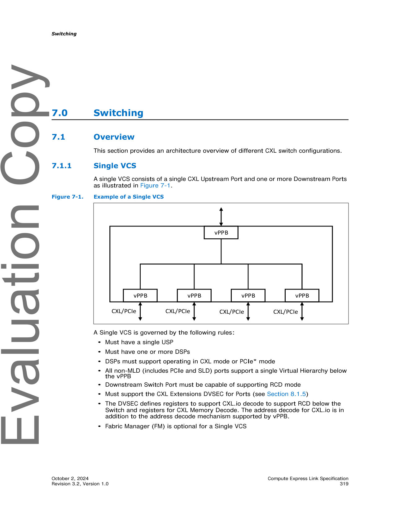
>
> *Original page render @ 150 DPI* — [📄 Full size](figures/chapter_07/page_0319.png)

[⬆️ 返回目录](#-本章目录-part-a)

---

### 7.1.2 Multiple VCS | 多 VCS

<table>
<thead>
<tr>
<th width="50%">🇬🇧 English</th>
<th width="50%" style="background-color:#e8e8e8">🇨🇳 中文</th>
</tr>
</thead>
<tbody>
<tr><td>A Multiple VCS consists of multiple Upstream Ports and one or more Downstream Ports per VCS as illustrated in Figure 7-2.</td><td style="background-color:#e8e8e8">多 VCS 由多个 USP 以及每个 VCS 下的一个或多个 DSP 组成,如图 7-2 所示。</td></tr>
<tr><td>A Multiple VCS is governed by the following rules:</td><td style="background-color:#e8e8e8">多 VCS 须遵循以下规则:</td></tr>
<tr><td>• Must have more than one USP.</td><td style="background-color:#e8e8e8">• 必须具有多个 USP。</td></tr>
<tr><td>• Must have one or more DS vPPBs per VCS.</td><td style="background-color:#e8e8e8">• 每个 VCS 必须具有一个或多个下行 vPPB。</td></tr>
<tr><td>• The initial binding of upstream (US) vPPB to physical port and the structure of the VCS (including number of vPPBs, the default vPPB capability structures, and any initial bindings of downstream (DS) vPPBs to physical ports) is defined using switch vendor specific methods.</td><td style="background-color:#e8e8e8">• 上行 (US) vPPB 到物理端口的初始绑定,以及 VCS 的结构 (包括 vPPB 的数量、默认 vPPB 能力结构,以及任何下行 (DS) vPPB 到物理端口的初始绑定) 由交换机厂商特定的方法定义。</td></tr>
<tr><td>• Each DSP must be bound to a PPB or vPPB.</td><td style="background-color:#e8e8e8">• 每个 DSP 必须绑定到一个 PPB 或 vPPB。</td></tr>
<tr><td>• FM is optional for Multiple VCS. An FM is required for a Multiple VCS that requires bind/unbind, or that supports MLD ports. Each DSP can be reassigned to a different VCS through the managed Hot-Plug flow orchestrated by the FM.</td><td style="background-color:#e8e8e8">• 对于多 VCS,FM 是可选的。对于需要 bind/unbind 或支持 MLD 端口的多 VCS,FM 是必需的。每个 DSP 可通过由 FM 协调的托管热插拔 (Hot-Plug) 流程重新分配到不同的 VCS。</td></tr>
<tr><td>• When configured, each USP and its associated DS vPPBs form a Single VCS Switch and operate as per the Single VCS rules.</td><td style="background-color:#e8e8e8">• 配置完成后,每个 USP 及其关联的 DS vPPB 构成一个单 VCS 交换机,并按照单 VCS 规则运行。</td></tr>
<tr><td>• DSPs must support operating in CXL mode or PCIe mode.</td><td style="background-color:#e8e8e8">• DSP 必须支持在 CXL 模式或 PCIe 模式下运行。</td></tr>
<tr><td>• All non-MLD, non-Fabric, and non-GFD HBR ports support a single Virtual Hierarchy below the Downstream Switch Port.</td><td style="background-color:#e8e8e8">• 所有非 MLD、非 Fabric、非 GFD 的 HBR 端口在下行交换机端口之下支持单个虚拟层级。</td></tr>
<tr><td>• DSPs must be capable of supporting RCD mode.</td><td style="background-color:#e8e8e8">• DSP 必须能够支持 RCD 模式。</td></tr>
</tbody>
</table>

> **Figure 7-2.** Example of a Multiple VCS with SLD Ports ｜ 使用 SLD 端口的多 VCS 示例
>
> 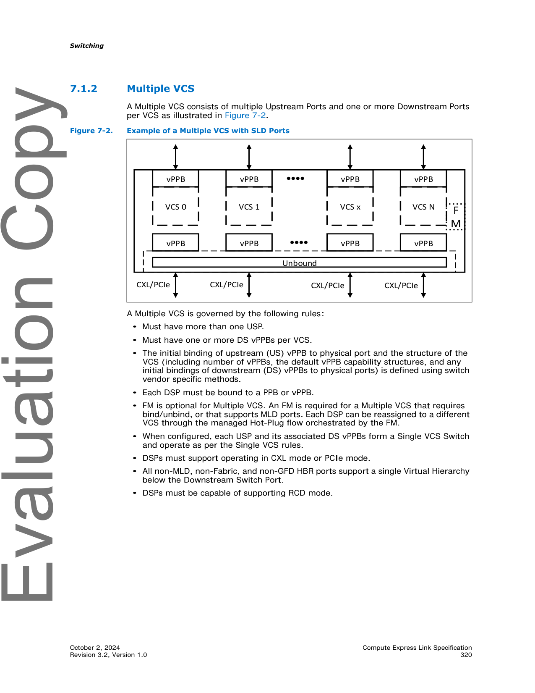
>
> *Original page render @ 150 DPI* — [📄 Full size](figures/chapter_07/page_0320.png)

[⬆️ 返回目录](#-本章目录-part-a)

---

### 7.1.3 Multiple VCS with MLD Ports | 包含 MLD 端口的多 VCS

<table>
<thead>
<tr>
<th width="50%">🇬🇧 English</th>
<th width="50%" style="background-color:#e8e8e8">🇨🇳 中文</th>
</tr>
</thead>
<tbody>
<tr><td>A Multiple VCS with MLD Ports consists of multiple Upstream Ports and a combination of one or more Downstream MLD Ports, as illustrated in Figure 7-3.</td><td style="background-color:#e8e8e8">包含 MLD 端口的多 VCS 由多个 USP 以及一个或多个下行 MLD 端口组合而成,如图 7-3 所示。</td></tr>
<tr><td>A Multiple VCS with MLD Ports is governed by the following rules:</td><td style="background-color:#e8e8e8">包含 MLD 端口的多 VCS 须遵循以下规则:</td></tr>
<tr><td>• More than one USP.</td><td style="background-color:#e8e8e8">• 具有多个 USP。</td></tr>
<tr><td>• One or more Downstream vPPBs per VCS.</td><td style="background-color:#e8e8e8">• 每个 VCS 具有一个或多个下行 vPPB。</td></tr>
<tr><td>• Each SLD DSP can be bound to a Single VCS.</td><td style="background-color:#e8e8e8">• 每个 SLD DSP 可绑定到单个 VCS。</td></tr>
<tr><td>• An MLD-capable DSP can be connected to up to 16 USPs.</td><td style="background-color:#e8e8e8">• 一个具备 MLD 能力的 DSP 最多可连接到 16 个 USP。</td></tr>
<tr><td>• Each of the SLD DSPs can be reassigned to a different VCS through the managed Hot-Plug flow orchestrated by the FM.</td><td style="background-color:#e8e8e8">• 每个 SLD DSP 可通过由 FM 协调的托管热插拔流程重新分配到不同的 VCS。</td></tr>
<tr><td>• Each of the LD instances in an MLD component can be reassigned to a different VCS through the managed Hot-Plug flow orchestrated by the FM.</td><td style="background-color:#e8e8e8">• MLD 组件中的每个 LD 实例可通过由 FM 协调的托管热插拔流程重新分配到不同的 VCS。</td></tr>
<tr><td>• When configured, each USP and its associated vPPBs form a Single VCS, and operate as per the Single VCS rules.</td><td style="background-color:#e8e8e8">• 配置完成后,每个 USP 及其关联的 vPPB 构成一个单 VCS,并按照单 VCS 规则运行。</td></tr>
<tr><td>• DSPs must support operating in CXL mode or PCIe mode.</td><td style="background-color:#e8e8e8">• DSP 必须支持在 CXL 模式或 PCIe 模式下运行。</td></tr>
<tr><td>• All non-MLD ports support a single Virtual Hierarchy below the DSP.</td><td style="background-color:#e8e8e8">• 所有非 MLD 端口在 DSP 之下支持单个虚拟层级。</td></tr>
<tr><td>• DSPs must be capable of supporting RCD mode.</td><td style="background-color:#e8e8e8">• DSP 必须能够支持 RCD 模式。</td></tr>
</tbody>
</table>

[⬆️ 返回目录](#-本章目录-part-a)

---

### 7.1.4 vPPB Ordering | vPPB 排序

<table>
<thead>
<tr>
<th width="50%">🇬🇧 English</th>
<th width="50%" style="background-color:#e8e8e8">🇨🇳 中文</th>
</tr>
</thead>
<tbody>
<tr><td>vPPBs within a VCS are ordered in the following sequence: the USP vPPB, then the DSP vPPBs in increasing Device Number, Function Number order. This means Function 0 of all vPPBs in order of Device Number, then all vPPBs enumerated at Function 1 in order of Device Number, etc.</td><td style="background-color:#e8e8e8">VCS 内的 vPPB 按如下顺序排列:先是 USP vPPB,然后是 DSP vPPB,按 Device Number、Function Number 升序排列。也就是说,先按 Device Number 顺序列出所有 vPPB 的 Function 0,再按 Device Number 顺序列出 Function 1 的所有 vPPB,依此类推。</td></tr>
</tbody>
</table>

> **Figure 7-3.** Example of a Multiple Root Switch Port with Pooled Memory Devices ｜ 具有池化内存设备的多根交换机端口示例
>
> 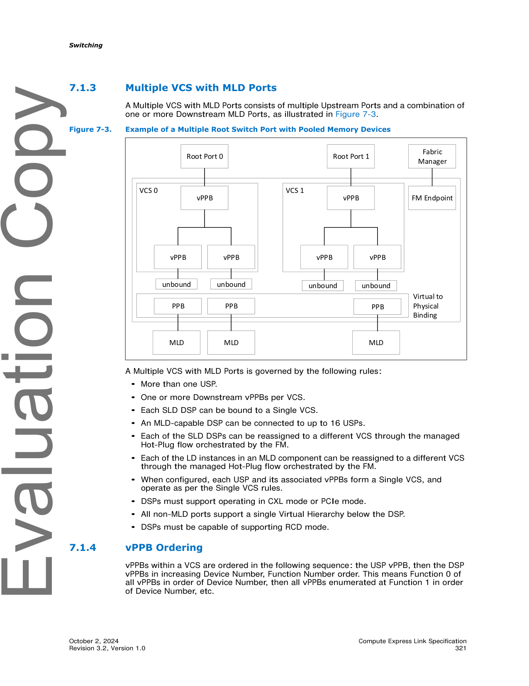
>
> *Original page render @ 150 DPI* — [📄 Full size](figures/chapter_07/page_0321.png)

<table>
<thead>
<tr>
<th width="50%">🇬🇧 English</th>
<th width="50%" style="background-color:#e8e8e8">🇨🇳 中文</th>
</tr>
</thead>
<tbody>
<tr><td>For a switch with 65 DSP vPPBs whose USP vPPB was assigned a Bus Number of 3, that would result in the following vPPB ordering:</td><td style="background-color:#e8e8e8">对于 USP vPPB 分配的 Bus Number 为 3、且具有 65 个 DSP vPPB 的交换机,其 vPPB 顺序如下:</td></tr>
</tbody>
</table>

<table>
<thead>
<tr>
<th>vPPB #</th>
<th>PCIe ID</th>
</tr>
</thead>
<tbody>
<tr><td>0</td><td>USP 3:0.0</td></tr>
<tr><td>1</td><td>DSP 4:0.0</td></tr>
<tr><td>2</td><td>DSP 4:1.0</td></tr>
<tr><td>3</td><td>DSP 4:2.0</td></tr>
<tr><td>…</td><td>…</td></tr>
<tr><td>32</td><td>DSP 4:31.0</td></tr>
<tr><td>33</td><td>DSP 4:0.1</td></tr>
<tr><td>34</td><td>DSP 4:1.1</td></tr>
<tr><td>…</td><td>…</td></tr>
<tr><td>64</td><td>DSP 4:31.1</td></tr>
<tr><td>65</td><td>DSP 4:0.2</td></tr>
</tbody>
</table>

<table>
<thead>
<tr>
<th width="50%">🇬🇧 English</th>
<th width="50%" style="background-color:#e8e8e8">🇨🇳 中文</th>
</tr>
</thead>
<tbody>
<tr><td>This ordering also applies in cases where multi-function vPPBs exist but not all 32 Device Numbers are assigned. For example, a switch with 8 DSP vPPBs whose USP vPPB was assigned a Bus Number of 3 could present its DSP vPPBs in such a way that the host enumeration would result in the following vPPB ordering:</td><td style="background-color:#e8e8e8">此排序同样适用于存在多功能 vPPB 但未分配全部 32 个 Device Number 的场景。例如,对于 USP vPPB 分配的 Bus Number 为 3、且具有 8 个 DSP vPPB 的交换机,可以以使主机枚举得到如下 vPPB 顺序的方式来呈现其 DSP vPPB:</td></tr>
</tbody>
</table>

<table>
<thead>
<tr>
<th>vPPB #</th>
<th>PCIe ID</th>
</tr>
</thead>
<tbody>
<tr><td>0</td><td>USP 3:0.0</td></tr>
<tr><td>1</td><td>DSP 4:0.0</td></tr>
<tr><td>2</td><td>DSP 4:1.0</td></tr>
<tr><td>3</td><td>DSP 4:2.0</td></tr>
<tr><td>4</td><td>DSP 4:0.1</td></tr>
<tr><td>5</td><td>DSP 4:1.1</td></tr>
<tr><td>6</td><td>DSP 4:2.1</td></tr>
<tr><td>7</td><td>DSP 4:0.2</td></tr>
<tr><td>8</td><td>DSP 4:1.2</td></tr>
</tbody>
</table>

[⬆️ 返回目录](#-本章目录-part-a)

---

## 7.2 Switch Configuration and Composition | 交换机配置与组合

<table>
<thead>
<tr>
<th width="50%">🇬🇧 English</th>
<th width="50%" style="background-color:#e8e8e8">🇨🇳 中文</th>
</tr>
</thead>
<tbody>
<tr><td>This section describes the CXL switch initialization options and related configuration and composition procedures.</td><td style="background-color:#e8e8e8">本节介绍 CXL 交换机的初始化选项以及相关的配置和组合流程。</td></tr>
</tbody>
</table>

[⬆️ 返回目录](#-本章目录-part-a)

---

### 7.2.1 CXL Switch Initialization Options | CXL 交换机初始化选项

<table>
<thead>
<tr>
<th width="50%">🇬🇧 English</th>
<th width="50%" style="background-color:#e8e8e8">🇨🇳 中文</th>
</tr>
</thead>
<tbody>
<tr><td>The CXL switch can be initialized using three different methods:</td><td style="background-color:#e8e8e8">CXL 交换机可使用三种不同的方法进行初始化:</td></tr>
<tr><td>• Static</td><td style="background-color:#e8e8e8">• 静态</td></tr>
<tr><td>• FM boots before the host(s)</td><td style="background-color:#e8e8e8">• FM 在主机之前启动</td></tr>
<tr><td>• FM and host boot simultaneously</td><td style="background-color:#e8e8e8">• FM 与主机同时启动</td></tr>
</tbody>
</table>

[⬆️ 返回目录](#-本章目录-part-a)

---

#### 7.2.1.1 Static Initialization | 静态初始化

<table>
<thead>
<tr>
<th width="50%">🇬🇧 English</th>
<th width="50%" style="background-color:#e8e8e8">🇨🇳 中文</th>
</tr>
</thead>
<tbody>
<tr><td>Figure 7-4 shows a statically initialized CXL switch with 2 VCSs. In this example, the downstream vPPBs are statically bound to ports and are available to the host at boot. Managed hot-add of Devices is supported using standard PCIe mechanisms.</td><td style="background-color:#e8e8e8">图 7-4 展示了一个包含 2 个 VCS 的静态初始化 CXL 交换机。在此示例中,下行 vPPB 静态绑定到端口,并在启动时对主机可用。设备的托管热添加 (Managed Hot-Add) 通过标准 PCIe 机制支持。</td></tr>
<tr><td>Static Switch Characteristics:</td><td style="background-color:#e8e8e8">静态交换机的特性:</td></tr>
<tr><td>• No support for MLD Ports</td><td style="background-color:#e8e8e8">• 不支持 MLD 端口</td></tr>
<tr><td>• No support for rebinding of ports to a different VCS</td><td style="background-color:#e8e8e8">• 不支持将端口重新绑定到其他 VCS</td></tr>
<tr><td>• No FM is required</td><td style="background-color:#e8e8e8">• 不需要 FM</td></tr>
<tr><td>• At switch boot, all VCSs and Downstream Port bindings are statically configured using switch vendor defined mechanisms (e.g., configuration file in SPI Flash)</td><td style="background-color:#e8e8e8">• 交换机启动时,所有 VCS 及下行端口绑定通过交换机厂商定义的方式 (例如 SPI Flash 中的配置文件) 静态配置</td></tr>
<tr><td>• Supports RCD mode, CXL VH mode, or PCIe mode</td><td style="background-color:#e8e8e8">• 支持 RCD 模式、CXL VH 模式或 PCIe 模式</td></tr>
<tr><td>• VCSs, including vPPBs, behave identically to a PCIe switch, along with the addition of supporting CXL protocols</td><td style="background-color:#e8e8e8">• VCS (包括 vPPB) 行为与 PCIe 交换机相同,只是额外支持 CXL 协议</td></tr>
<tr><td>• Each VCS is ready for enumeration when the host boots</td><td style="background-color:#e8e8e8">• 主机启动时,每个 VCS 即可被枚举</td></tr>
<tr><td>• Hot-add and managed hot-remove are supported</td><td style="background-color:#e8e8e8">• 支持热添加 (Hot-Add) 和托管热移除 (Managed Hot-Remove)</td></tr>
<tr><td>• No explicit support for Async removal of CXL devices; Async removal requires that root ports implement CXL Isolation (see Section 12.3)</td><td style="background-color:#e8e8e8">• 不显式支持 CXL 设备的异步移除;异步移除需要根端口实现 CXL Isolation (参见 12.3 节)</td></tr>
<tr><td>A switch that provides internal Endpoint functions is beyond the scope of this specification.</td><td style="background-color:#e8e8e8">提供内部端点 (Endpoint) 功能的交换机不在本规范范围之内。</td></tr>
</tbody>
</table>

> **Figure 7-4.** Static CXL Switch with Two VCSs ｜ 具有两个 VCS 的静态 CXL 交换机
>
> 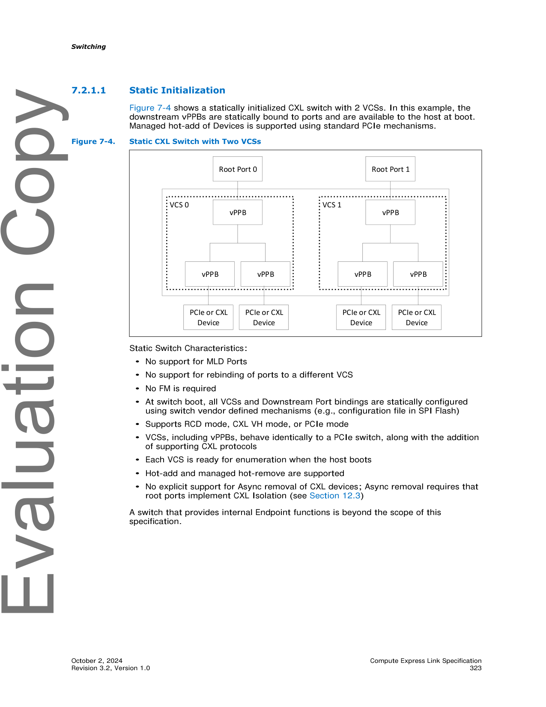
>
> *Original page render @ 150 DPI* — [📄 Full size](figures/chapter_07/page_0323.png)

[⬆️ 返回目录](#-本章目录-part-a)

---

#### 7.2.1.2 Fabric Manager Boots First | Fabric Manager 先启动

<table>
<thead>
<tr>
<th width="50%">🇬🇧 English</th>
<th width="50%" style="background-color:#e8e8e8">🇨🇳 中文</th>
</tr>
</thead>
<tbody>
<tr><td>In cases where the FM boots first (prior to host(s)), the switch is permitted to be initialized as described in the example shown in Figure 7-5.</td><td style="background-color:#e8e8e8">在 FM 先于主机启动的场景下,允许按图 7-5 所示的示例对交换机进行初始化。</td></tr>
<tr><td>1. FM boots while hosts are held in reset.</td><td style="background-color:#e8e8e8">1. 主机被保持在复位状态,FM 启动。</td></tr>
<tr><td>2. All attached DSPs link up and are bound to FM-owned PPBs.</td><td style="background-color:#e8e8e8">2. 所有已连接 DSP 完成链路连接 (Link up),并被绑定到 FM 拥有的 PPB。</td></tr>
<tr><td>3. DSPs link up and the switch notifies the FM using a managed hot-add notification.</td><td style="background-color:#e8e8e8">3. DSP 完成链路连接,交换机通过托管热添加 (managed hot-add) 通知告知 FM。</td></tr>
</tbody>
</table>

> **Figure 7-5.** Example of CXL Switch Initialization when FM Boots First ｜ FM 先启动时的 CXL 交换机初始化示例
>
> 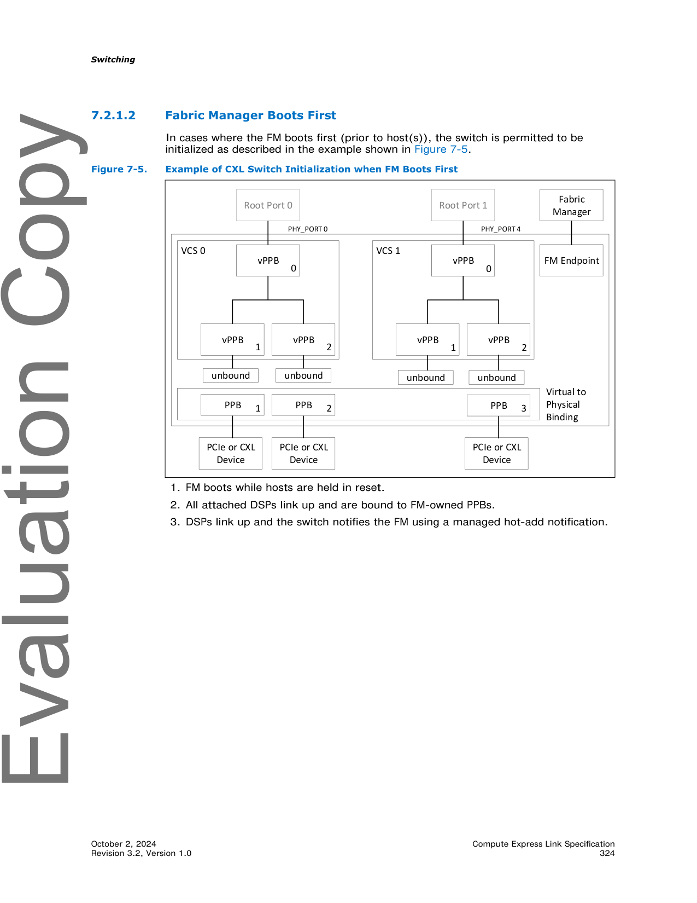
>
> *Original page render @ 150 DPI* — [📄 Full size](figures/chapter_07/page_0324.png)

<table>
<thead>
<tr>
<th width="50%">🇬🇧 English</th>
<th width="50%" style="background-color:#e8e8e8">🇨🇳 中文</th>
</tr>
</thead>
<tbody>
<tr><td>As shown in the example above in Figure 7-6, the following steps are taken to configure the switch after initialization completes:</td><td style="background-color:#e8e8e8">如图 7-6 上方的示例所示,初始化完成后,会执行以下步骤来配置交换机:</td></tr>
<tr><td>1. FM sends bind command BIND (VCS0, vPPB1, PHY_PORT_ID1) to the switch. The switch then configures virtual to physical binding.</td><td style="background-color:#e8e8e8">1. FM 向交换机发送 bind 命令 BIND (VCS0, vPPB1, PHY_PORT_ID1)。然后交换机配置虚拟到物理的绑定。</td></tr>
<tr><td>2. Switch remaps vPPB virtual port numbers to physical port numbers.</td><td style="background-color:#e8e8e8">2. 交换机将 vPPB 虚拟端口号重映射为物理端口号。</td></tr>
<tr><td>— Virtual port number is the index of the vPPB (as specified in the Bind vPPB command discussed in Section 7.6.7.2.2) per virtual hierarchy.</td><td style="background-color:#e8e8e8">— 虚拟端口号是每个虚拟层级中 vPPB 的索引 (如 7.6.7.2.2 节中讨论的 Bind vPPB 命令所规定)。</td></tr>
<tr><td>3. Switch remaps vPPB connector definition (PERST#, PRSNT#) to physical connector.</td><td style="background-color:#e8e8e8">3. 交换机将 vPPB 连接器定义 (PERST#、PRSNT#) 重映射到物理连接器。</td></tr>
<tr><td>4. Switch disables the link using PPB Link Disable.</td><td style="background-color:#e8e8e8">4. 交换机使用 PPB Link Disable 禁用链路。</td></tr>
<tr><td>5. At this point, all Physical downstream PPB functionality (e.g., Capabilities, etc.) maps directly to the vPPB including Link Disable, which releases the port for linkup.</td><td style="background-color:#e8e8e8">5. 此时,所有物理下行 PPB 的功能 (例如 Capabilities 等) 直接映射到 vPPB,包括 Link Disable,后者会释放该端口以供 linkup。</td></tr>
<tr><td>6. The FM-owned PPB no longer exists for this port.</td><td style="background-color:#e8e8e8">6. 该端口上的 FM-owned PPB 不再存在。</td></tr>
<tr><td>7. When the hosts boot, the switch is ready for enumeration.</td><td style="background-color:#e8e8e8">7. 主机启动后,交换机即可被枚举。</td></tr>
</tbody>
</table>

> **Figure 7-6.** Example of CXL Switch after Initialization Completes ｜ 初始化完成后的 CXL 交换机示例
>
> 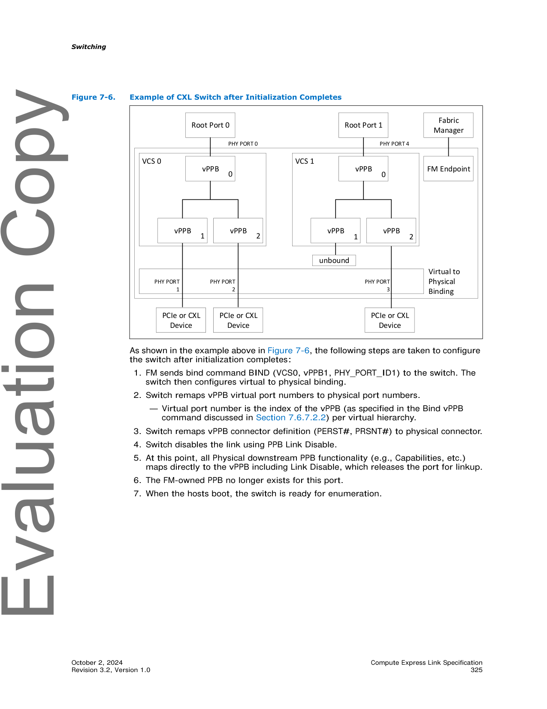
>
> *Original page render @ 150 DPI* — [📄 Full size](figures/chapter_07/page_0325.png)

[⬆️ 返回目录](#-本章目录-part-a)

---

#### 7.2.1.3 Fabric Manager and Host Boot Simultaneously | Fabric Manager 与主机同时启动

<table>
<thead>
<tr>
<th width="50%">🇬🇧 English</th>
<th width="50%" style="background-color:#e8e8e8">🇨🇳 中文</th>
</tr>
</thead>
<tbody>
<tr><td>In the case where the switch, FM, and host boot at the same time:</td><td style="background-color:#e8e8e8">在交换机、FM 与主机同时启动的情况下:</td></tr>
<tr><td>1. VCSs are statically defined.</td><td style="background-color:#e8e8e8">1. VCS 静态定义。</td></tr>
<tr><td>2. DSP vPPBs within each VCS are unbound and presented to the host as Link Down.</td><td style="background-color:#e8e8e8">2. 每个 VCS 内的 DSP vPPB 处于未绑定状态,并以 Link Down 状态呈现给主机。</td></tr>
<tr><td>3. Switch discovers downstream devices and presents them to the FM.</td><td style="background-color:#e8e8e8">3. 交换机发现下游设备并将其呈现给 FM。</td></tr>
<tr><td>4. Host enumerates the VH and configures the DVSEC registers.</td><td style="background-color:#e8e8e8">4. 主机枚举 VH 并配置 DVSEC 寄存器。</td></tr>
<tr><td>5. FM performs port binding to vPPBs.</td><td style="background-color:#e8e8e8">5. FM 执行端口到 vPPB 的绑定。</td></tr>
<tr><td>6. Switch performs virtual to physical binding.</td><td style="background-color:#e8e8e8">6. 交换机执行虚拟到物理的绑定。</td></tr>
<tr><td>7. Each bound port results in a hot-add indication to the host.</td><td style="background-color:#e8e8e8">7. 每个被绑定的端口都会向主机发出热添加 (hot-add) 指示。</td></tr>
</tbody>
</table>

> **Figure 7-7.** Example of Switch with Fabric Manager and Host Boot Simultaneously ｜ FM 与主机同时启动的交换机示例
>
> 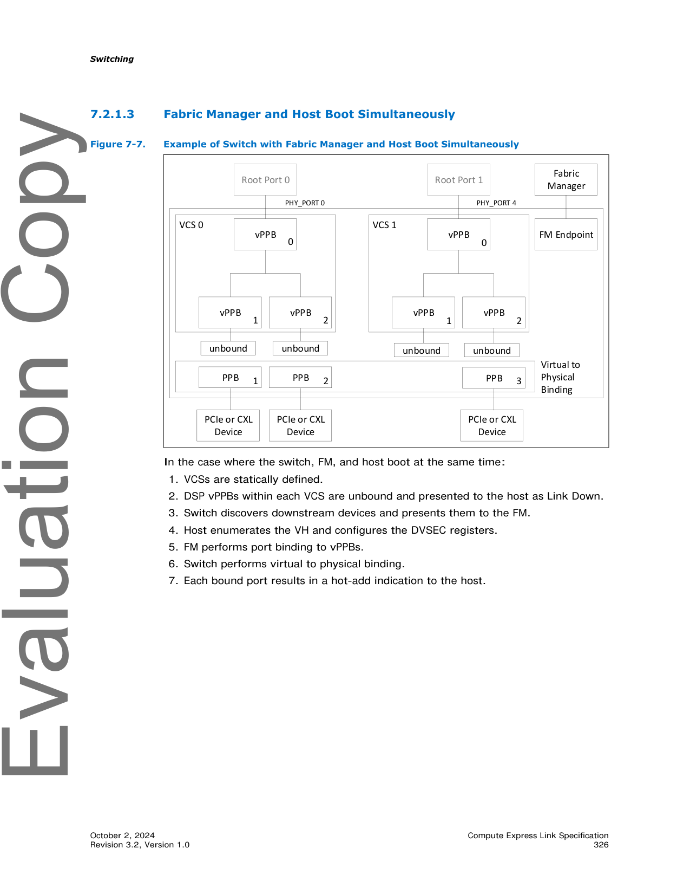
>
> *Original page render @ 150 DPI* — [📄 Full size](figures/chapter_07/page_0326.png)

[⬆️ 返回目录](#-本章目录-part-a)

---

### 7.2.2 Sideband Signal Operation | 边带信号操作

<table>
<thead>
<tr>
<th width="50%">🇬🇧 English</th>
<th width="50%" style="background-color:#e8e8e8">🇨🇳 中文</th>
</tr>
</thead>
<tbody>
<tr><td>The availability of slot sideband control signals is decided by the form-factor specifications. Any form factor can be supported, but if the form factor supports the signals listed in Table 7-1, the signals must be driven by the switch or connected to the switch for correct operation.</td><td style="background-color:#e8e8e8">插槽边带控制信号的可用性由外形规格 (form-factor) 决定。可以支持任何外形规格,但如果外形规格支持表 7-1 中列出的信号,则这些信号必须由交换机驱动或连接到交换机,以保证正常运行。</td></tr>
<tr><td>All other sideband signals have no constraints and are supported exactly as in PCIe.</td><td style="background-color:#e8e8e8">所有其他边带信号没有任何约束,完全按 PCIe 方式支持。</td></tr>
<tr><td>This list provides the minimum sideband signal set to support managed Hot-Plug. Other optional sidebands signals such as Attention LED, Power LED, Manual Retention Latch, Electromechanical Lock, etc. may also be used for managed Hot-Plug. The behavior of these sideband signals is identical to PCIe.</td><td style="background-color:#e8e8e8">该列表提供了支持托管热插拔 (managed Hot-Plug) 所需的最小边带信号集。其他可选边带信号 (如 Attention LED、Power LED、Manual Retention Latch、Electromechanical Lock 等) 也可用于托管热插拔。这些边带信号的行为与 PCIe 相同。</td></tr>
</tbody>
</table>

> **Figure 7-8.** Example of Simultaneous Boot after Binding ｜ 绑定后同时启动示例
>
> 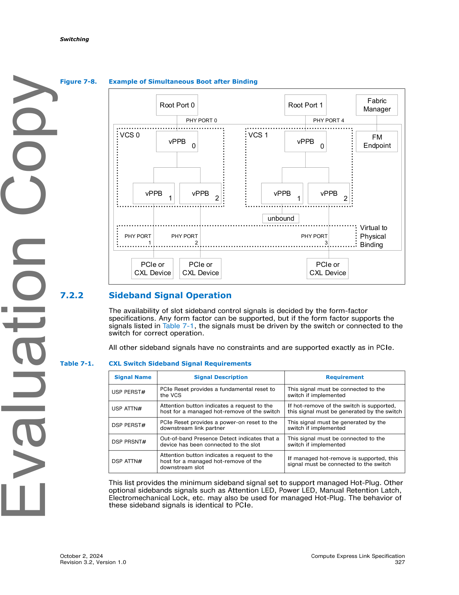
>
> *Original page render @ 150 DPI* — [📄 Full size](figures/chapter_07/page_0327.png)

<table>
<thead>
<tr>
<th>Table 7-1.</th>
<th>CXL Switch Sideband Signal Requirements ｜ CXL 交换机边带信号要求</th>
</tr>
</thead>
<tbody>
<tr><td>

| Signal Name | Signal Description | Requirement |
|---|---|---|
| USP PERST# | PCIe Reset provides a fundamental reset to the VCS | This signal must be connected to the switch if implemented |
| USP ATTN# | Attention button indicates a request to the host for a managed hot-remove of the switch | If hot-remove of the switch is supported, this signal must be generated by the switch |
| DSP PERST# | PCIe Reset provides a power-on reset to the downstream link partner | This signal must be generated by the switch if implemented |
| DSP PRSNT# | Out-of-band Presence Detect indicates that a device has been connected to the slot | This signal must be connected to the switch if implemented |
| DSP ATTN# | Attention button indicates a request to the host for a managed hot-remove of the downstream slot | If managed hot-remove is supported, this signal must be connected to the switch |

</td></tr>
</tbody>
</table>

<table>
<thead>
<tr>
<th width="50%">🇬🇧 English</th>
<th width="50%" style="background-color:#e8e8e8">🇨🇳 中文</th>
</tr>
</thead>
<tbody>
<tr><td>USP PERST#</td><td style="background-color:#e8e8e8">USP PERST#</td></tr>
<tr><td>PCIe Reset provides a fundamental reset to the VCS</td><td style="background-color:#e8e8e8">PCIe 复位为 VCS 提供基本复位</td></tr>
<tr><td>This signal must be connected to the switch if implemented</td><td style="background-color:#e8e8e8">若实现该信号,必须将其连接到交换机</td></tr>
<tr><td>USP ATTN#</td><td style="background-color:#e8e8e8">USP ATTN#</td></tr>
<tr><td>Attention button indicates a request to the host for a managed hot-remove of the switch</td><td style="background-color:#e8e8e8">Attention 按钮向主机发出对交换机进行托管热移除 (managed hot-remove) 的请求</td></tr>
<tr><td>If hot-remove of the switch is supported, this signal must be generated by the switch</td><td style="background-color:#e8e8e8">若支持交换机的热移除,该信号必须由交换机生成</td></tr>
<tr><td>DSP PERST#</td><td style="background-color:#e8e8e8">DSP PERST#</td></tr>
<tr><td>PCIe Reset provides a power-on reset to the downstream link partner</td><td style="background-color:#e8e8e8">PCIe 复位为下游链路对端 (link partner) 提供上电复位</td></tr>
<tr><td>This signal must be generated by the switch if implemented</td><td style="background-color:#e8e8e8">若实现该信号,必须由交换机生成</td></tr>
<tr><td>DSP PRSNT#</td><td style="background-color:#e8e8e8">DSP PRSNT#</td></tr>
<tr><td>Out-of-band Presence Detect indicates that a device has been connected to the slot</td><td style="background-color:#e8e8e8">带外存在检测 (Out-of-band Presence Detect) 指示已有设备连接到该插槽</td></tr>
<tr><td>This signal must be connected to the switch if implemented</td><td style="background-color:#e8e8e8">若实现该信号,必须将其连接到交换机</td></tr>
<tr><td>DSP ATTN#</td><td style="background-color:#e8e8e8">DSP ATTN#</td></tr>
<tr><td>Attention button indicates a request to the host for a managed hot-remove of the downstream slot</td><td style="background-color:#e8e8e8">Attention 按钮向主机发出对下行插槽进行托管热移除的请求</td></tr>
<tr><td>If managed hot-remove is supported, this signal must be connected to the switch</td><td style="background-color:#e8e8e8">若支持托管热移除,该信号必须连接到交换机</td></tr>
</tbody>
</table>

[⬆️ 返回目录](#-本章目录-part-a)

---

### 7.2.3 Binding and Unbinding | 绑定与解绑

<table>
<thead>
<tr>
<th width="50%">🇬🇧 English</th>
<th width="50%" style="background-color:#e8e8e8">🇨🇳 中文</th>
</tr>
</thead>
<tbody>
<tr><td>This section describes the details of Binding and Unbinding of CXL devices to a vPPB.</td><td style="background-color:#e8e8e8">本节介绍 CXL 设备绑定到 vPPB 以及从 vPPB 解绑的详细过程。</td></tr>
</tbody>
</table>

[⬆️ 返回目录](#-本章目录-part-a)

---

#### 7.2.3.1 Binding and Unbinding of a Single Logical Device Port | 单逻辑设备端口的绑定与解绑

<table>
<thead>
<tr>
<th width="50%">🇬🇧 English</th>
<th width="50%" style="background-color:#e8e8e8">🇨🇳 中文</th>
</tr>
</thead>
<tbody>
<tr><td>A Single Logical Device (SLD) port refers to a port that is bound to only one VCS. That port can be linked up with a PCIe device or a CXL Type 1, Type 2, or Type 3 SLD component. In general, the vPPB bound to the SLD port behaves the same as a PPB in a PCIe switch. An exception is that a vPPB can be unbound from any physical port. In this case the vPPB appears to the host as if it is in a Link Down state with no Presence Detect indication. If optional rebinding is desired, this switch must have an FM API support and FM connection. The Fabric Manager can bind any unused physical port to the unbound vPPB. After binding, all the vPPB port settings are applied to that physical port.</td><td style="background-color:#e8e8e8">单逻辑设备 (SLD) 端口指仅绑定到一个 VCS 的端口。该端口可与 PCIe 设备或 CXL Type 1、Type 2 或 Type 3 SLD 组件建立链路。总体上,绑定到 SLD 端口的 vPPB 行为与 PCIe 交换机中的 PPB 相同。一个例外是,vPPB 可从任何物理端口解绑。在这种情况下,vPPB 对主机呈现为处于 Link Down 状态,且无存在检测 (Presence Detect) 指示。如果希望支持可选的重新绑定,此交换机必须支持 FM API 并连接 FM。Fabric Manager 可将任何未使用的物理端口绑定到该未绑定的 vPPB。绑定之后,该 vPPB 的所有端口设置都将应用到该物理端口。</td></tr>
<tr><td>Figure 7-9 shows a switch with bound DSPs.</td><td style="background-color:#e8e8e8">图 7-9 展示了一台已绑定 DSP 的交换机。</td></tr>
<tr><td>Figure 7-10 shows the state of the switch after the FM has executed an unbind command to vPPB2 in VCS0. Unbind of the vPPB causes the switch to assert Link Disable to the port. The port then becomes FM-owned and is controlled by the PPB settings for that physical port. Through the FM API, the FM has CXL.io access to each FM-owned SLD port or FM-owned LD within an MLD component. The FM can choose to prepare the logical device for rebinding by triggering FLR or CXL Reset. The switch prohibits any CXL.io access from the FM to a bound SLD port and any CXL.io access from the FM to a bound LD within an MLD component. The FM API does not support FM generation of CXL.cache or CXL.mem transactions to any port.</td><td style="background-color:#e8e8e8">图 7-10 展示了 FM 对 VCS0 中的 vPPB2 执行 unbind 命令后交换机的状态。解绑 vPPB 会使交换机对该端口置位 Link Disable。随后该端口变为 FM 拥有 (FM-owned),并由该物理端口的 PPB 设置进行控制。通过 FM API,FM 可对每个 FM 拥有的 SLD 端口或 MLD 组件内的 FM-owned LD 进行 CXL.io 访问。FM 可选择通过触发 FLR 或 CXL Reset 来准备重新绑定逻辑设备。交换机禁止 FM 对已绑定的 SLD 端口以及 MLD 组件内已绑定的 LD 进行任何 CXL.io 访问。FM API 不支持 FM 向任何端口发起 CXL.cache 或 CXL.mem 事务。</td></tr>
</tbody>
</table>

> **Figure 7-9.** Example of Binding and Unbinding of an SLD Port ｜ SLD 端口的绑定与解绑示例
>
> 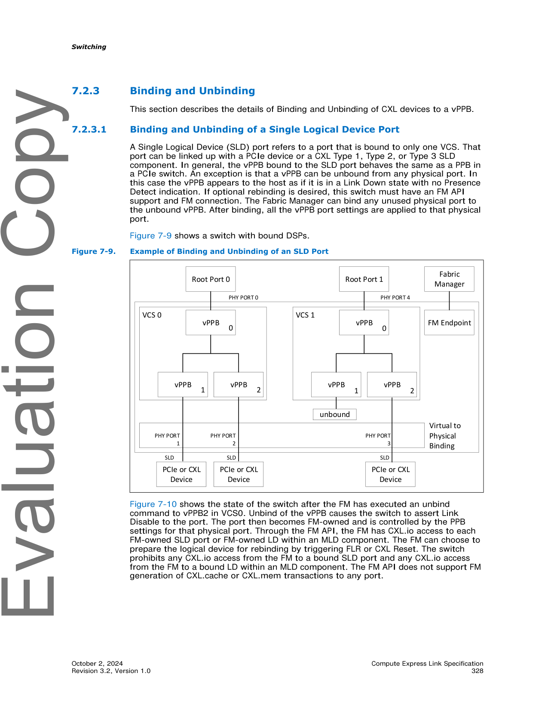
>
> *Original page render @ 150 DPI* — [📄 Full size](figures/chapter_07/page_0328.png)

<table>
<thead>
<tr>
<th width="50%">🇬🇧 English</th>
<th width="50%" style="background-color:#e8e8e8">🇨🇳 中文</th>
</tr>
</thead>
<tbody>
<tr><td>Figure 7-11 shows the state of the switch after the FM executes the bind command to connect VCS1.vPPB1 to the unbound physical port. The successful command execution results in the switch sending a hot-add indication to Host 1. Enumeration, configuration, and operation of the host and Type 3 device is identical to a hot-add of a device.</td><td style="background-color:#e8e8e8">图 7-11 展示了 FM 执行 bind 命令将 VCS1.vPPB1 连接到未绑定物理端口后交换机的状态。命令成功执行后,交换机会向 Host 1 发送 hot-add 指示。主机的枚举、配置以及对 Type 3 设备的操作与设备热添加 (hot-add) 时的行为相同。</td></tr>
</tbody>
</table>

> **Figure 7-10.** Example of CXL Switch Configuration after an Unbind Command ｜ 执行 Unbind 命令后的 CXL 交换机配置示例
>
> 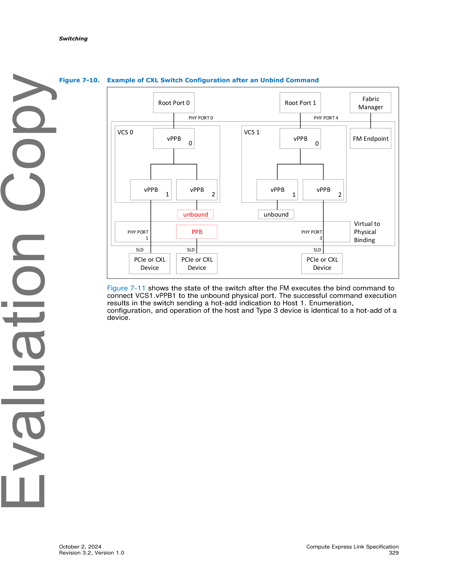
>
> *Original page render @ 150 DPI* — [📄 Full size](figures/chapter_07/page_0329.png)

> **Figure 7-11.** Example of CXL Switch Configuration after a Bind Command ｜ 执行 Bind 命令后的 CXL 交换机配置示例
>
> 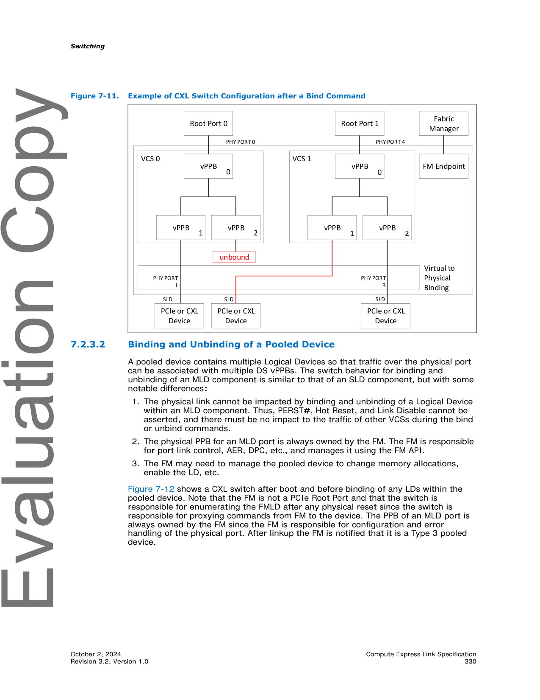
>
> *Original page render @ 150 DPI* — [📄 Full size](figures/chapter_07/page_0330.png)

[⬆️ 返回目录](#-本章目录-part-a)

---

#### 7.2.3.2 Binding and Unbinding of a Pooled Device | 池化设备的绑定与解绑

<table>
<thead>
<tr>
<th width="50%">🇬🇧 English</th>
<th width="50%" style="background-color:#e8e8e8">🇨🇳 中文</th>
</tr>
</thead>
<tbody>
<tr><td>A pooled device contains multiple Logical Devices so that traffic over the physical port can be associated with multiple DS vPPBs. The switch behavior for binding and unbinding of an MLD component is similar to that of an SLD component, but with some notable differences:</td><td style="background-color:#e8e8e8">池化设备包含多个逻辑设备 (Logical Device),以便通过物理端口的流量可以与多个 DS vPPB 相关联。交换机对 MLD 组件的绑定与解绑行为与 SLD 组件类似,但存在一些显著差异:</td></tr>
<tr><td>1. The physical link cannot be impacted by binding and unbinding of a Logical Device within an MLD component. Thus, PERST#, Hot Reset, and Link Disable cannot be asserted, and there must be no impact to the traffic of other VCSs during the bind or unbind commands.</td><td style="background-color:#e8e8e8">1. MLD 组件中逻辑设备的绑定与解绑不得影响物理链路。因此,不得置位 PERST#、Hot Reset 和 Link Disable,并且在执行 bind 或 unbind 命令期间不得影响其他 VCS 的流量。</td></tr>
<tr><td>2. The physical PPB for an MLD port is always owned by the FM. The FM is responsible for port link control, AER, DPC, etc., and manages it using the FM API.</td><td style="background-color:#e8e8e8">2. MLD 端口的物理 PPB 始终归 FM 拥有。FM 负责端口链路控制、AER、DPC 等,并通过 FM API 对其进行管理。</td></tr>
<tr><td>3. The FM may need to manage the pooled device to change memory allocations, enable the LD, etc.</td><td style="background-color:#e8e8e8">3. FM 可能需要管理池化设备,以更改内存分配、启用 LD 等。</td></tr>
<tr><td>Figure 7-12 shows a CXL switch after boot and before binding of any LDs within the pooled device. Note that the FM is not a PCIe Root Port and that the switch is responsible for enumerating the FMLD after any physical reset since the switch is responsible for proxying commands from FM to the device. The PPB of an MLD port is always owned by the FM since the FM is responsible for configuration and error handling of the physical port. After linkup the FM is notified that it is a Type 3 pooled device.</td><td style="background-color:#e8e8e8">图 7-12 展示了池化设备中尚未绑定任何 LD 时,交换机启动后的状态。注意,FM 不是 PCIe Root Port;交换机负责在任何物理复位后枚举 FMLD,因为交换机负责将来自 FM 的命令代理转发到设备。MLD 端口的 PPB 始终归 FM 拥有,因为 FM 负责物理端口的配置和错误处理。链路连接 (linkup) 后,FM 会收到通知,得知该设备为 Type 3 池化设备。</td></tr>
</tbody>
</table>

> **Figure 7-12.** Example of a CXL Switch before Binding of LDs within Pooled Device ｜ 在池化设备中绑定 LD 之前的 CXL 交换机示例
>
> 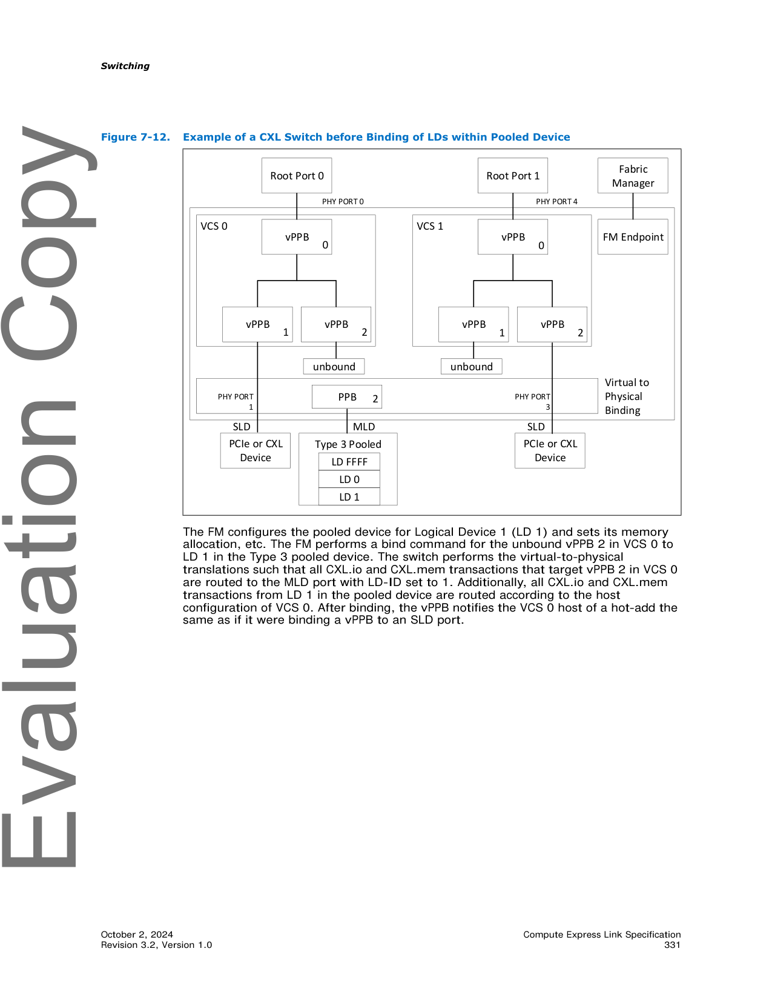
>
> *Original page render @ 150 DPI* — [📄 Full size](figures/chapter_07/page_0331.png)

<table>
<thead>
<tr>
<th width="50%">🇬🇧 English</th>
<th width="50%" style="background-color:#e8e8e8">🇨🇳 中文</th>
</tr>
</thead>
<tbody>
<tr><td>The FM configures the pooled device for Logical Device 1 (LD 1) and sets its memory allocation, etc. The FM performs a bind command for the unbound vPPB 2 in VCS 0 to LD 1 in the Type 3 pooled device. The switch performs the virtual-to-physical translations such that all CXL.io and CXL.mem transactions that target vPPB 2 in VCS 0 are routed to the MLD port with LD-ID set to 1. Additionally, all CXL.io and CXL.mem transactions from LD 1 in the pooled device are routed according to the host configuration of VCS 0. After binding, the vPPB notifies the VCS 0 host of a hot-add the same as if it were binding a vPPB to an SLD port.</td><td style="background-color:#e8e8e8">FM 为池化设备配置逻辑设备 1 (LD 1),并设置其内存分配等。FM 对 VCS 0 中未绑定的 vPPB 2 与 Type 3 池化设备中的 LD 1 执行 bind 命令。交换机执行虚拟到物理的转换,将所有目标为 VCS 0 中 vPPB 2 的 CXL.io 和 CXL.mem 事务路由到 LD-ID 设为 1 的 MLD 端口。此外,池化设备中来自 LD 1 的所有 CXL.io 和 CXL.mem 事务,均根据 VCS 0 的主机配置进行路由。绑定之后,vPPB 像将 vPPB 绑定到 SLD 端口时一样,向 VCS 0 主机通知一次 hot-add。</td></tr>
</tbody>
</table>

> **Figure 7-13.** Example of a CXL Switch after Binding of LD-ID 1 within Pooled Device ｜ 在池化设备中绑定 LD-ID 1 之后的 CXL 交换机示例
>
> 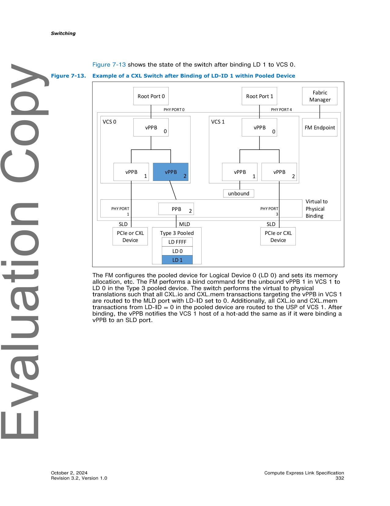
>
> *Original page render @ 150 DPI* — [📄 Full size](figures/chapter_07/page_0332.png)

<table>
<thead>
<tr>
<th width="50%">🇬🇧 English</th>
<th width="50%" style="background-color:#e8e8e8">🇨🇳 中文</th>
</tr>
</thead>
<tbody>
<tr><td>The FM configures the pooled device for Logical Device 0 (LD 0) and sets its memory allocation, etc. The FM performs a bind command for the unbound vPPB 1 in VCS 1 to LD 0 in the Type 3 pooled device. The switch performs the virtual to physical translations such that all CXL.io and CXL.mem transactions targeting the vPPB in VCS 1 are routed to the MLD port with LD-ID set to 0. Additionally, all CXL.io and CXL.mem transactions from LD-ID = 0 in the pooled device are routed to the USP of VCS 1. After binding, the vPPB notifies the VCS 1 host of a hot-add the same as if it were binding a vPPB to an SLD port.</td><td style="background-color:#e8e8e8">FM 为池化设备配置逻辑设备 0 (LD 0),并设置其内存分配等。FM 对 VCS 1 中未绑定的 vPPB 1 与 Type 3 池化设备中的 LD 0 执行 bind 命令。交换机执行虚拟到物理的转换,将所有目标为 VCS 1 中 vPPB 的 CXL.io 和 CXL.mem 事务路由到 LD-ID 设为 0 的 MLD 端口。此外,池化设备中来自 LD-ID = 0 的所有 CXL.io 和 CXL.mem 事务,均被路由到 VCS 1 的 USP。绑定之后,vPPB 像将 vPPB 绑定到 SLD 端口时一样,向 VCS 1 主机通知一次 hot-add。</td></tr>
<tr><td>Figure 7-14 shows the state of the switch after binding LD 0 to VCS 1.</td><td style="background-color:#e8e8e8">图 7-14 展示了将 LD 0 绑定到 VCS 1 之后交换机的状态。</td></tr>
<tr><td>After binding LDs to vPPBs, the switch behavior is different from a bound SLD Port with respect to control, status, error notification, and error handling. Section 7.3.4 describes the differences in behavior for all bits within each register.</td><td style="background-color:#e8e8e8">将 LD 绑定到 vPPB 之后,交换机在控制、状态、错误通知和错误处理方面的行为与已绑定的 SLD 端口有所不同。7.3.4 节描述了每个寄存器中所有位的具体行为差异。</td></tr>
</tbody>
</table>

> **Figure 7-14.** Example of a CXL Switch after Binding of LD-IDs 0 and 1 within Pooled Device ｜ 在池化设备中绑定 LD-ID 0 和 1 之后的 CXL 交换机示例
>
> 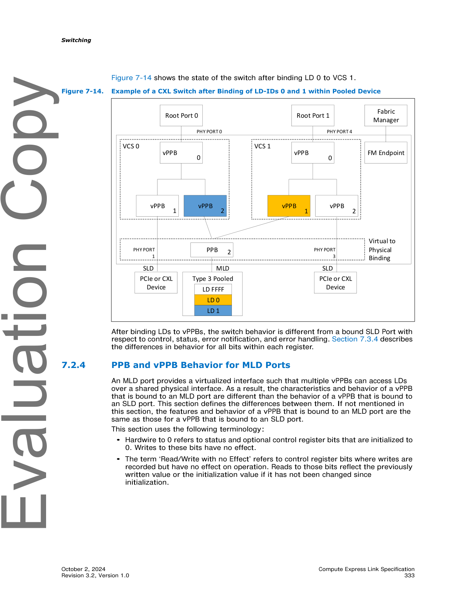
>
> *Original page render @ 150 DPI* — [📄 Full size](figures/chapter_07/page_0333.png)

[⬆️ 返回目录](#-本章目录-part-a)

---

### 7.2.4 PPB and vPPB Behavior for MLD Ports | MLD 端口的 PPB 与 vPPB 行为

<table>
<thead>
<tr>
<th width="50%">🇬🇧 English</th>
<th width="50%" style="background-color:#e8e8e8">🇨🇳 中文</th>
</tr>
</thead>
<tbody>
<tr><td>An MLD port provides a virtualized interface such that multiple vPPBs can access LDs over a shared physical interface. As a result, the characteristics and behavior of a vPPB that is bound to an MLD port are different than the behavior of a vPPB that is bound to an SLD port. This section defines the differences between them. If not mentioned in this section, the features and behavior of a vPPB that is bound to an MLD port are the same as those for a vPPB that is bound to an SLD port.</td><td style="background-color:#e8e8e8">MLD 端口提供虚拟化接口,使得多个 vPPB 可通过共享的物理接口访问各个 LD。因此,绑定到 MLD 端口的 vPPB 在特性和行为上与绑定到 SLD 端口的 vPPB 不同。本节定义二者之间的差异。若本节未提及,则绑定到 MLD 端口的 vPPB 的功能和行为与绑定到 SLD 端口的 vPPB 相同。</td></tr>
<tr><td>This section uses the following terminology:</td><td style="background-color:#e8e8e8">本节使用如下术语:</td></tr>
<tr><td>• Hardwire to 0 refers to status and optional control register bits that are initialized to 0. Writes to these bits have no effect.</td><td style="background-color:#e8e8e8">• Hardwire to 0 (硬连线为 0) 是指状态位以及可选的控制寄存器位,这些位被初始化为 0。对这些位的写操作不起作用。</td></tr>
<tr><td>• The term 'Read/Write with no Effect' refers to control register bits where writes are recorded but have no effect on operation. Reads to those bits reflect the previously written value or the initialization value if it has not been changed since initialization.</td><td style="background-color:#e8e8e8">• 'Read/Write with no Effect' (读写但无效果) 是指这些控制寄存器位上的写操作会被记录,但对运行没有影响。读取这些位时,会返回先前写入的值,或者在初始化后未更改时返回其初始值。</td></tr>
</tbody>
</table>

[⬆️ 返回目录](#-本章目录-part-a)

---

#### 7.2.4.1 MLD Type 1 Configuration Space Header | MLD Type 1 配置空间头

<table>
<thead>
<tr>
<th width="50%">🇬🇧 English</th>
<th width="50%" style="background-color:#e8e8e8">🇨🇳 中文</th>
</tr>
</thead>
<tbody>
<tr><td>(This subsection has no body text; it is the heading for Table 7-2.)</td><td style="background-color:#e8e8e8">(本小节无正文,仅为表 7-2 的标题。)</td></tr>
</tbody>
</table>

<table>
<thead>
<tr>
<th>Table 7-2. MLD Type 1 Configuration Space Header ｜ MLD Type 1 配置空间头</th>
</tr>
</thead>
<tbody>
<tr><td>

| Register | Register Fields | FM-owned PPB | All Other vPPBs |
|---|---|---|---|
| Bridge Control Register | Parity Error Response Enable | Supported | Hardwire to 0s |
|  | SERR# Enable | Supported | Read/Write with no effect |
|  | ISA Enable | Not supported | Not supported |
|  | Secondary Bus Reset | (see Section 7.5 for SBR details for MLD ports) | Supported | Read/Write with no effect. Optional FM Event. |

</td></tr>
</tbody>
</table>

[⬆️ 返回目录](#-本章目录-part-a)

---

#### 7.2.4.2 MLD PCIe-compatible Configuration Registers | MLD PCIe 兼容配置寄存器

<table>
<thead>
<tr>
<th width="50%">🇬🇧 English</th>
<th width="50%" style="background-color:#e8e8e8">🇨🇳 中文</th>
</tr>
</thead>
<tbody>
<tr><td>(This subsection has no body text; it is the heading for Table 7-3.)</td><td style="background-color:#e8e8e8">(本小节无正文,仅为表 7-3 的标题。)</td></tr>
</tbody>
</table>

<table>
<thead>
<tr>
<th>Table 7-3. MLD PCIe-compatible Configuration Registers ｜ MLD PCIe 兼容配置寄存器</th>
</tr>
</thead>
<tbody>
<tr><td>

| Register/Capability Structure | Capability Register Fields | FM-owned PPB | All vPPBs Bound to the MLD Port |
|---|---|---|---|
| Command Register | I/O Space Enable | Hardwire to 0s | Hardwire to 0s |
|  | Memory Space Enable | Supported | Supported per vPPB |
|  | Bus Master Enable | Supported | Supported per vPPB |
|  | Parity Error Response | Supported | Read/Write with no effect |
|  | SERR# Enable | Supported | Supported per vPPB |
|  | Interrupt Disable | Supported | Hardwire to 0s |
| Status Register | Interrupt Status | Hardwire to 0 (INTx is not supported) | Hardwire to 0s |
|  | Master Data Parity Error | Supported | Hardwire to 0s |
|  | Signaled System Error | Supported | Supported per vPPB |
|  | Detected Parity Error | Supported | Hardwire to 0s |

</td></tr>
</tbody>
</table>

[⬆️ 返回目录](#-本章目录-part-a)

---

#### 7.2.4.3 MLD PCIe Capability Structure | MLD PCIe Capability 结构

<table>
<thead>
<tr>
<th width="50%">🇬🇧 English</th>
<th width="50%" style="background-color:#e8e8e8">🇨🇳 中文</th>
</tr>
</thead>
<tbody>
<tr><td>(This subsection has no body text; it is the heading for Table 7-4.)</td><td style="background-color:#e8e8e8">(本小节无正文,仅为表 7-4 的标题。)</td></tr>
</tbody>
</table>

<table>
<thead>
<tr>
<th>Table 7-4. MLD PCIe Capability Structure (Sheet 1 of 3) ｜ MLD PCIe Capability 结构 (第 1 页 / 共 3 页)</th>
</tr>
</thead>
<tbody>
<tr><td>

| Register/Capability Structure | Capability Register Fields | FM-owned PPB | All vPPBs Bound to the MLD Port |
|---|---|---|---|
| Device Capabilities Register | Max_Payload_Size Supported | Configured by the FM to the max value supported by switch hardware and min value configured in all vPPBs | Mirrors PPB |
|  | Phantom Functions Supported | Hardwire to 0s | Hardwire to 0s |
|  | Extended Tag Field Supported | Supported | Mirrors PPB |
| Device Control Register | Max_Payload_Size | Configured by the FM to Max_Payload Size Supported | Read/Write with no effect |
| Link Capabilities Register | Link Bandwidth Notification Capability | Hardwire to 0s | Hardwire to 0s |
| Link Capabilities | ASPM Support | No L0s support | No L0s support |
|  | Clock Power Management | No PM L1 Substates support | No PM L1 Substates support |
| Link Control | ASPM Control | Supported | Switch only enables ASPM if all vPPBs that are bound to this MLD have enabled ASPM |
|  | Link Disable | Supported | Switch handles it as an unbind by discarding all traffic to/from this LD-ID |
|  | Retrain Link | Supported | Read/Write with no effect |
|  | Common Clock Configuration | Supported | Read/Write with no effect |
|  | Extended Synch | Supported | Read/Write with no effect |
|  | Hardware Autonomous Width Disable | Supported | Read/Write with no effect |
|  | Link Bandwidth Management Interrupt Enable | Supported | Read/Write with no effect |
|  | Link Autonomous Bandwidth Interrupt Enable | Supported | Supported per vPPB. Each host can be notified of autonomous speed change |
|  | DRS Signaling Control | Supported | Switch sends DRS after receiving DRS on the link and after binding of the vPPB to an LD |
| Link Status register | Current Link Speed | Supported | Mirrors PPB |
|  | Negotiated Link Width | Supported | Mirrors PPB |
|  | Link Training | Supported | Hardwire to 0s |
|  | Slot Clock Configuration | Supported | Mirrors PPB |
|  | Data Link Layer Active | Supported | Mirrors PPB |
|  | Link Autonomous Bandwidth Status | Supported | Supported per vPPB |
| Slot Capabilities Register | Hot-Plug Surprise | Hardwire to 0s | Hardwired to 0s |
|  | Physical Slot Number | Supported | Mirrors PPB |
| Slot Status Register | Attention Button Pressed | Supported | Mirrors PPB or is set by the switch on unbind |
|  | Power Fault Detected | Supported | Mirrors PPB |
|  | MRL Sensor Changed | Supported | Mirrors PPB |
|  | Presence Detect Changed | Supported | Mirrors PPB or is set by the switch on unbind |
|  | MRL Sensor State | Supported | Mirrors PPB |
|  | Presence Detect State | Supported | Mirrors PPB or set by the switch on bind or unbind |
|  | Electromechanical Interlock Status | Supported | Mirrors PPB |
|  | Data Link Layer State Changed | Supported | Mirrors PPB or set by the switch on bind or unbind |
| Device Capabilities 2 Register | OBFF Supported | Hardwire to 0s | Hardwire to 0s |

</td></tr>
</tbody>
</table>

<table>
<thead>
<tr>
<th>Table 7-4. MLD PCIe Capability Structure (Sheet 2 of 3) ｜ MLD PCIe Capability 结构 (第 2 页 / 共 3 页)</th>
</tr>
</thead>
<tbody>
<tr><td>

| Register/Capability Structure | Capability Register Fields | FM-owned PPB | All vPPBs Bound to the MLD Port |
|---|---|---|---|
| Device Control 2 Register | ARI Forwarding Enable | Supported | Supported per vPPB |
|  | Atomic Op Egress Blocking | Supported | Mirrors PPB. Read/Write with no effect |
|  | LTR Mechanism Enabled | Supported | Supported per vPPB |
|  | Emergency Power Reduction Request | Supported | Read/Write with no effect. Optional FM notification. |
|  | End-End TLP Prefix Blocking | Supported | Mirrors PPB. Read/Write with no effect |
| Link Control 2 Register | Target Link Speed | Supported | Read/Write with no effect. Optional FM notification. |
|  | Enter Compliance | Supported | Read/Write with no effect |
|  | Hardware Autonomous Speed Disable | Supported | Read/Write with no effect. Optional FM notification. |
|  | Selectable De-emphasis | Supported | Read/Write with no effect |
|  | Transmit Margin | Supported | Read/Write with no effect |
|  | Enter Modified Compliance | Supported | Read/Write with no effect |
|  | Compliance SOS | Supported | Read/Write with no effect |
|  | Compliance Preset/De-emphasis | Supported | Read/Write with no effect |
| Link Status 2 Register | Current De-emphasis Level | Supported | Mirrors PPB |
|  | Equalization 8.0 GT/s Complete | Supported | Mirrors PPB |
|  | Equalization 8.0 GT/s Phase 1 Successful | Supported | Mirrors PPB |
|  | Equalization 8.0 GT/s Phase 2 Successful | Supported | Mirrors PPB |
|  | Equalization 8.0 GT/s Phase 3 Successful | Supported | Mirrors PPB |
|  | Link Equalization Request 8.0 GT/s | Supported | Read/Write with no effect |
|  | Retimer Presence Detected | Supported | Mirrors PPB |
|  | Two Retimers Presence Detected | Supported | Mirrors PPB |
|  | Crosslink Resolution | Hardwire to 0s | Hardwire to 0s |
|  | Downstream Component Presence | Supported | Reflects the binding state of the vPPB |
|  | DRS Message Received | Supported | Switch sends DRS after receiving DRS on the link and after binding of the vPPB to an LD |

</td></tr>
</tbody>
</table>

<table>
<thead>
<tr>
<th>Table 7-4. MLD PCIe Capability Structure (Sheet 3 of 3) ｜ MLD PCIe Capability 结构 (第 3 页 / 共 3 页)</th>
</tr>
</thead>
<tbody>
<tr><td>

| Register/Capability Structure | Capability Register Fields | FM-owned PPB | All vPPBs Bound to the MLD Port |
|---|---|---|---|
| (Continued from prior sheet) |  |  |  |

</td></tr>
</tbody>
</table>

[⬆️ 返回目录](#-本章目录-part-a)

---

#### 7.2.4.4 MLD PPB Secondary PCIe Capability Structure | MLD PPB Secondary PCIe Capability 结构

<table>
<thead>
<tr>
<th width="50%">🇬🇧 English</th>
<th width="50%" style="background-color:#e8e8e8">🇨🇳 中文</th>
</tr>
</thead>
<tbody>
<tr><td>All fields in the Secondary PCIe Capability Structure for a Virtual PPB shall behave identically to PCIe except the following:</td><td style="background-color:#e8e8e8">Virtual PPB 的 Secondary PCIe Capability 结构中的所有字段除下列情况外,行为均与 PCIe 相同:</td></tr>
</tbody>
</table>

<table>
<thead>
<tr>
<th>Table 7-5. MLD Secondary PCIe Capability Structure ｜ MLD Secondary PCIe Capability 结构</th>
</tr>
</thead>
<tbody>
<tr><td>

| Register/Capability Structure | Capability Register Fields | FM-owned PPB | All vPPBs Bound to the MLD Port |
|---|---|---|---|
| Link Control 3 Register | Perform Equalization | Supported | Read/Write with no effect |
|  | Link Equalization Request Interrupt Enable | Supported | Read/Write with no effect |
|  | Enable Lower SKP OS Generation Vector | Supported | Read/Write with no effect |
| Lane Error Status Register | All fields | Supported | Mirrors PPB |
| Lane Equalization Control Register | All fields | Supported | Read/Write with no effect |
| Data Link Feature Capabilities Register | All fields | Supported | Hardwire to 0s |
| Data Link Feature Status Register | All fields | Supported | Hardwire to 0s |

</td></tr>
</tbody>
</table>

[⬆️ 返回目录](#-本章目录-part-a)

---

#### 7.2.4.5 MLD Physical Layer 16.0 GT/s Extended Capability | MLD 物理层 16.0 GT/s 扩展能力

<table>
<thead>
<tr>
<th width="50%">🇬🇧 English</th>
<th width="50%" style="background-color:#e8e8e8">🇨🇳 中文</th>
</tr>
</thead>
<tbody>
<tr><td>All fields in the Physical Layer 16.0 GT/s Extended Capability Structure for a Virtual PPB shall behave identically to PCIe except the following:</td><td style="background-color:#e8e8e8">Virtual PPB 的 Physical Layer 16.0 GT/s Extended Capability 结构中的所有字段除下列情况外,行为均与 PCIe 相同:</td></tr>
</tbody>
</table>

<table>
<thead>
<tr>
<th>Table 7-6. MLD Physical Layer 16.0 GT/s Extended Capability ｜ MLD 物理层 16.0 GT/s 扩展能力</th>
</tr>
</thead>
<tbody>
<tr><td>

| Register/Capability Structure | Capability Register Fields | FM-owned PPB | All vPPBs Bound to the MLD Port |
|---|---|---|---|
| 16.0 GT/s Status Register | All fields | Supported | Mirrors PPB |
| 16.0 GT/s Local Data Parity Mismatch Status Register | Local Data Parity Mismatch Status Register | Supported | Mirrors PPB |
| 16.0 GT/s First Retimer Data Parity Mismatch Status Register | First Retimer Data Parity Mismatch Status | Supported | Mirrors PPB |
| 16.0 GT/s Second Retimer Data Parity Mismatch Status Register | Second Retimer Data Parity Mismatch Status | Supported | Mirrors PPB |
| 16.0 GT/s Lane Equalization Control Register | Downstream Port 16.0 GT/s Transmitter Preset | Supported | Mirrors PPB |

</td></tr>
</tbody>
</table>

[⬆️ 返回目录](#-本章目录-part-a)

---

#### 7.2.4.6 MLD Physical Layer 32.0 GT/s Extended Capability | MLD 物理层 32.0 GT/s 扩展能力

<table>
<thead>
<tr>
<th width="50%">🇬🇧 English</th>
<th width="50%" style="background-color:#e8e8e8">🇨🇳 中文</th>
</tr>
</thead>
<tbody>
<tr><td>(This subsection has no body text; it is the heading for Table 7-7.)</td><td style="background-color:#e8e8e8">(本小节无正文,仅为表 7-7 的标题。)</td></tr>
</tbody>
</table>

<table>
<thead>
<tr>
<th>Table 7-7. MLD Physical Layer 32.0 GT/s Extended Capability ｜ MLD 物理层 32.0 GT/s 扩展能力</th>
</tr>
</thead>
<tbody>
<tr><td>

| Register/Capability Structure | Capability Register Fields | FM-owned PPB | All vPPBs Bound to the MLD Port |
|---|---|---|---|
| 32.0 GT/s Capabilities Register | All fields | Supported | Mirrors PPB |
| 32.0 GT/s Control Register | All fields | Supported | Read/Write with no effect |
| 32.0 GT/s Status Register | Link Equalization Request 32.0 GT/s | Supported | Read/Write with no effect |
|  | All fields except Link Equalization Request 32.0 GT/s | Supported | Mirrors PPB |
| Received Modified TS Data 1 Register | All fields | Supported | Mirrors PPB |
| Received Modified TS Data 2 Register | All fields | Supported | Mirrors PPB |
| Transmitted Modified TS Data 1 Register | All fields | Supported | Mirrors PPB |
| 32.0 GT/s Lane Equalization Control Register | Downstream Port 32.0 GT/s Transmitter Preset | Supported | Mirrors PPB |

</td></tr>
</tbody>
</table>

[⬆️ 返回目录](#-本章目录-part-a)

---

#### 7.2.4.7 MLD Lane Margining at the Receiver Extended Capability | MLD 接收端 Lane Margining 扩展能力

<table>
<thead>
<tr>
<th width="50%">🇬🇧 English</th>
<th width="50%" style="background-color:#e8e8e8">🇨🇳 中文</th>
</tr>
</thead>
<tbody>
<tr><td>(This subsection has no body text; it is the heading for Table 7-8.)</td><td style="background-color:#e8e8e8">(本小节无正文,仅为表 7-8 的标题。)</td></tr>
</tbody>
</table>

<table>
<thead>
<tr>
<th>Table 7-8. MLD Lane Margining at the Receiver Extended Capability ｜ MLD 接收端 Lane Margining 扩展能力</th>
</tr>
</thead>
<tbody>
<tr><td>

| Register/Capability Structure | Capability Register Fields | FM-owned PPB | All vPPBs Bound to the MLD Port |
|---|---|---|---|
| Margining Port Status Register | All fields | Supported | Always indicates Margining Ready and Margining Software Ready |
| Margining Lane Control Register | All fields | Supported | Read/Write with no effect |

</td></tr>
</tbody>
</table>

[⬆️ 返回目录](#-本章目录-part-a)

---

### 7.2.5 MLD ACS Extended Capability | MLD ACS 扩展能力

<table>
<thead>
<tr>
<th width="50%">🇬🇧 English</th>
<th width="50%" style="background-color:#e8e8e8">🇨🇳 中文</th>
</tr>
</thead>
<tbody>
<tr><td>CXL.io Requests and Completions are routed to the USP.</td><td style="background-color:#e8e8e8">CXL.io 请求和完成报文被路由到 USP。</td></tr>
</tbody>
</table>

<table>
<thead>
<tr>
<th>Table 7-9. MLD ACS Extended Capability ｜ MLD ACS 扩展能力</th>
</tr>
</thead>
<tbody>
<tr><td>

| Register/Capability Structure | Capability Register Fields | FM-owned PPB | All vPPBs Bound to the MLD Port |
|---|---|---|---|
| ACS Capability Register | All fields | Supported | Supported because a vPPB can be bound to any port type |
| ACS Control Register | ACS Source Validation Enable | Hardwire to 0 | Read/Write with no effect |
|  | ACS Translation Blocking Enable | Hardwire to 0 | Read/Write with no effect |
|  | ACS P2P Request Redirect Enable | Hardwire to 1 | Read/Write with no effect |
|  | ACS P2P Completion Redirect Enable | Hardwire to 1 | Read/Write with no effect |
|  | ACS Upstream Forwarding Enable | Hardwire to 0 | Read/Write with no effect |
|  | ACS P2P Egress Control Enable | Hardwire to 0 | Read/Write with no effect |
|  | ACS Direct Translated P2P Enable | Hardwire to 0 | Read/Write with no effect |
|  | ACS I/O Request Blocking Enable | Hardwire to 0 | Read/Write with no effect |
|  | ACS DSP Memory Target Access Control | Hardwire to 0s | Read/Write with no effect |
|  | ACS Unclaimed Request Redirect Control | Hardwire to 0 | Read/Write with no effect |

</td></tr>
</tbody>
</table>

[⬆️ 返回目录](#-本章目录-part-a)

---

### 7.2.6 MLD PCIe Extended Capabilities | MLD PCIe 扩展能力

<table>
<thead>
<tr>
<th width="50%">🇬🇧 English</th>
<th width="50%" style="background-color:#e8e8e8">🇨🇳 中文</th>
</tr>
</thead>
<tbody>
<tr><td>All fields in the PCIe Extended Capability structures for a vPPB shall behave identically to PCIe.</td><td style="background-color:#e8e8e8">vPPB 的 PCIe Extended Capability 结构中的所有字段行为均与 PCIe 相同。</td></tr>
</tbody>
</table>

[⬆️ 返回目录](#-本章目录-part-a)

---

### 7.2.7 MLD Advanced Error Reporting Extended Capability | MLD 高级错误报告 (AER) 扩展能力

<table>
<thead>
<tr>
<th width="50%">🇬🇧 English</th>
<th width="50%" style="background-color:#e8e8e8">🇨🇳 中文</th>
</tr>
</thead>
<tbody>
<tr><td>AER in an MLD port is separated into Triggering, Notifications, and Reporting. Triggering and AER Header Logging is handled at switch ingress and egress using switch-vendor-specific means. Notification is also switch-vendor specific, but it results in the vPPB logic for all vPPBs that are bound to the MLD port being informed of the AER errors that have been triggered. The vPPB logic is responsible for generating the AER status and error messages for each vPPB based on the AER Mask and Severity registers.</td><td style="background-color:#e8e8e8">MLD 端口中的 AER 被分为触发 (Triggering)、通知 (Notifications) 和报告 (Reporting) 三部分。触发和 AER Header Logging 由交换机厂商特定的方式在交换机入口和出口处处理。通知同样是交换机厂商特定的,但其结果会让绑定到 MLD 端口的所有 vPPB 的 vPPB 逻辑获知已触发的 AER 错误。vPPB 逻辑负责根据 AER Mask 和 Severity 寄存器,针对每个 vPPB 生成 AER 状态和错误消息。</td></tr>
<tr><td>vPPBs that are bound to an MLD port support all the AER Mask and Severity configurability; however, some of the Notifications are suppressed to avoid confusion.</td><td style="background-color:#e8e8e8">绑定到 MLD 端口的 vPPB 支持所有的 AER Mask 和 Severity 可配置性;不过,为避免混淆,部分通知会被抑制。</td></tr>
<tr><td>The PPB has its own AER Mask and Severity registers and the FM is notified of error conditions based on the Event Notification settings.</td><td style="background-color:#e8e8e8">PPB 拥有自己的 AER Mask 和 Severity 寄存器,FM 根据 Event Notification 设置接收错误条件通知。</td></tr>
<tr><td>Errors that are not vPPB specific are provided to the host with a header log containing all 1s data. The hardware header log is provided only to the FM through the PPB.</td><td style="background-color:#e8e8e8">非 vPPB 特定的错误会以 header log 全 1 数据的形式提供给主机。硬件的 header log 仅通过 PPB 提供给 FM。</td></tr>
</tbody>
</table>

<table>
<thead>
<tr>
<th>Table 7-10. MLD Advanced Error Reporting Extended Capability ｜ MLD 高级错误报告 (AER) 扩展能力</th>
</tr>
</thead>
<tbody>
<tr><td>

| Hardware Triggers | AER Error | FM-owned PPB | All vPPBs Bound to the MLD Port |
|---|---|---|---|
| AER Notifications | Data Link Protocol Error | Supported | Supported per vPPB |
|  | Surprise Down Error | Supported | Supported per vPPB |
|  | Poisoned TLP Received | Supported | Hardwire to 0 |
|  | Flow Control Protocol Error | Supported | Supported per vPPB |
|  | Completer Abort | Supported | Supported to the vPPB that generated it |
|  | Unexpected Completion | Supported | Supported to the vPPB that received it |
|  | Receiver Overflow | Supported | Supported per vPPB |
|  | Malformed TLP | Supported | Supported per vPPB |
|  | ECRC Error | Supported | Hardwire to 0 |
|  | Unsupported Request | Supported | Supported per vPPB |
|  | ACS Violation | Supported | Hardwire to 0 |
|  | Uncorrectable Internal Error | Supported | Supported per vPPB |
|  | MC1 Blocked | Supported | Hardwire to 0 |
|  | Atomic Op Egress Block | Supported | Hardwire to 0 |
|  | E2E TLP Prefix Block | Supported | Hardwire to 0 |
|  | Poisoned TLP Egress block | Supported | Hardwire to 0 |
|  | Bad TLP (correctable) | Supported | Supported per vPPB |
|  | Bad DLLP (correctable) | Supported | Supported per vPPB |
|  | Replay Timer Timeout (correctable) | Supported | Supported per vPPB |
|  | Replay Number Rollover (correctable) | Supported | Supported per vPPB |
|  | Other Advisory Non-Fatal (correctable) | Supported | Supported per vPPB |
|  | Corrected Internal Error Status (correctable) | Supported | Supported per vPPB |
|  | Header Log Overflow Status (correctable) | Supported | Supported per vPPB |

1. Refers to Multicast.

</td></tr>
</tbody>
</table>

[⬆️ 返回目录](#-本章目录-part-a)

---

### 7.2.8 MLD DPC Extended Capability | MLD DPC 扩展能力

<table>
<thead>
<tr>
<th width="50%">🇬🇧 English</th>
<th width="50%" style="background-color:#e8e8e8">🇨🇳 中文</th>
</tr>
</thead>
<tbody>
<tr><td>Downstream Port Containment has special behavior for an MLD Port. The FM configures the AER Mask and Severity registers in the PPB and also configures the AER Mask and Severity registers in the FMLD in the pooled device. As in an SLD port an unmasked uncorrectable error detected in the PPB and an ERR_NONFATAL and/or ERR_FATAL received from the FMLD can trigger DPC.</td><td style="background-color:#e8e8e8">下行端口遏制 (DPC) 对 MLD 端口有特殊行为。FM 在 PPB 中配置 AER Mask 和 Severity 寄存器,同时也在池化设备的 FMLD 中配置 AER Mask 和 Severity 寄存器。与 SLD 端口相同,在 PPB 中检测到的未屏蔽的不可纠正错误,以及从 FMLD 收到的 ERR_NONFATAL 和/或 ERR_FATAL 都可以触发 DPC。</td></tr>
<tr><td>Continuing the model of the ultimate receiver being the entity that detects and reports errors, the ERR_FATAL and ERR_NONFATAL messages sent by a Logical Device can trigger a virtual DPC in the PPB. When a virtual DPC is triggered, the switch discards all traffic received from and transmitted to that specific LD. The LD remains bound to the vPPB and the FM is also notified. Software triggered DPC also triggers virtual DPC on a vPPB.</td><td style="background-color:#e8e8e8">延续“最终接收方是检测和报告错误的实体”的模型,逻辑设备发送的 ERR_FATAL 和 ERR_NONFATAL 消息可在 PPB 中触发虚拟 DPC (virtual DPC)。虚拟 DPC 触发后,交换机会丢弃从该特定 LD 接收到的以及发往该特定 LD 的所有流量。LD 仍保持与 vPPB 的绑定,同时也会通知 FM。软件触发的 DPC 也会在 vPPB 上触发虚拟 DPC。</td></tr>
<tr><td>When the DPC trigger is cleared the switch autonomously allows passing of traffic to/from the LD. Reporting of the DPC trigger to the host is identical to PCIe.</td><td style="background-color:#e8e8e8">DPC 触发条件清除后,交换机会自主恢复允许 LD 的流量通过。向主机报告 DPC 触发的方式与 PCIe 相同。</td></tr>
</tbody>
</table>

<table>
<thead>
<tr>
<th>Table 7-11. MLD PPB DPC Extended Capability ｜ MLD PPB DPC 扩展能力</th>
</tr>
</thead>
<tbody>
<tr><td>

| Register/Capability Structure | Capability Register Fields | FM-owned PPB | All vPPBs Bound to the MLD Port |
|---|---|---|---|
| DPC Control Register | DPC Trigger Enable | Supported | Switch internally detected unmasked uncorrectable errors do not trigger virtual DPC |
|  | DPC Trigger Reason | Supported | Unmasked uncorrectable error is not a valid value |

</td></tr>
</tbody>
</table>

[⬆️ 返回目录](#-本章目录-part-a)

---

### 7.2.9 Switch Mailbox CCI | 交换机 Mailbox CCI

<table>
<thead>
<tr>
<th width="50%">🇬🇧 English</th>
<th width="50%" style="background-color:#e8e8e8">🇨🇳 中文</th>
</tr>
</thead>
<tbody>
<tr><td>CXL Switch Mailbox CCIs optional. They are exposed as PCIe Endpoints with a Type 0 configuration space. In Single VCS and Multiple VCS, the Mailbox CCI is optional. If implemented, the Mailbox CCI shall be exposed to the Host in one of two possible configurations. In the first, it is exposed as an additional PCIe function in the Upstream Switch Port, as illustrated in Figure 7-15.</td><td style="background-color:#e8e8e8">CXL 交换机 Mailbox CCI 是可选的。它们作为 Type 0 配置空间的 PCIe Endpoint 暴露。在单 VCS 和多 VCS 中,Mailbox CCI 都是可选的。如果实现,Mailbox CCI 应以以下两种配置之一向主机暴露。第一种是将其作为 Upstream Switch Port 中的一个额外 PCIe Function 暴露,如图 7-15 所示。</td></tr>
<tr><td>Switch Mailbox CCIs may also be exposed in a VCS with no vPPBs. In this configuration, the Mailbox CCI device is the only PCIe function that is present in the Upstream Port, as illustrated in Figure 7-16.</td><td style="background-color:#e8e8e8">交换机 Mailbox CCI 也可以在没有任何 vPPB 的 VCS 中暴露。在此配置下,Mailbox CCI 设备是 Upstream Port 中唯一存在的 PCIe Function,如图 7-16 所示。</td></tr>
</tbody>
</table>

> **Figure 7-15.** Multi-function Upstream vPPB ｜ 多功能上游 vPPB
>
> 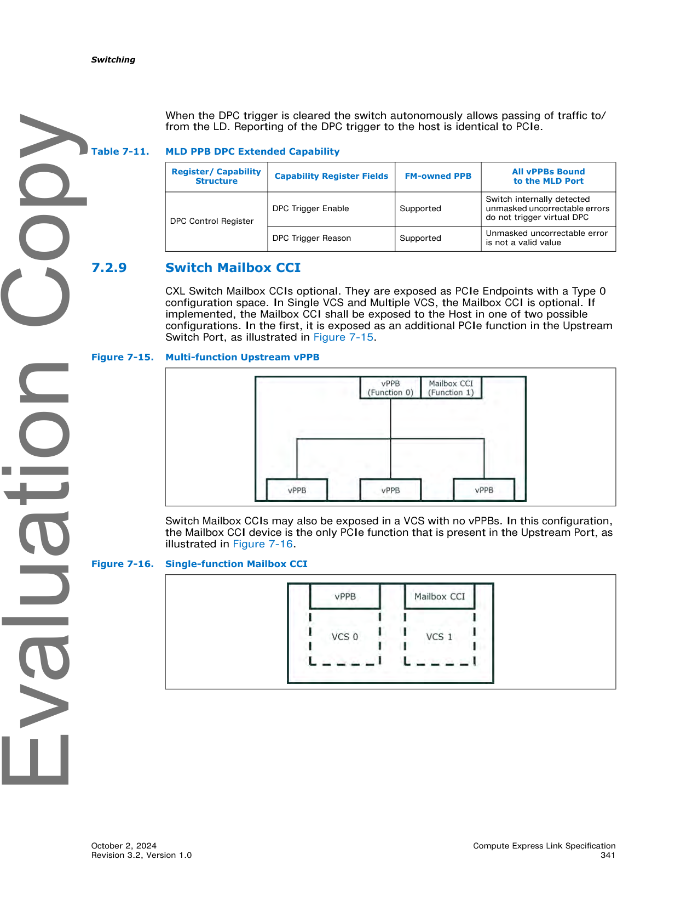
>
> *Original page render @ 150 DPI* — [📄 Full size](figures/chapter_07/page_0341.png)

> **Figure 7-16.** Single-function Mailbox CCI ｜ 单功能 Mailbox CCI
>
> 
>
> *Original page render @ 150 DPI* — [📄 Full size](figures/chapter_07/page_0341.png)

[⬆️ 返回目录](#-本章目录-part-a)

---

## 7.3 CXL.io, CXL.cachemem Decode and Forwarding | CXL.io, CXL.cachemem 解码与转发

<table>
<thead>
<tr>
<th width="50%">🇬🇧 English</th>
<th width="50%" style="background-color:#e8e8e8">🇨🇳 中文</th>
</tr>
</thead>
<tbody>
<tr><td></td><td style="background-color:#e8e8e8"></td></tr>
</tbody>
</table>

[⬆️ 返回目录](#-本章目录-part-a)

---

### 7.3.1 CXL.io

<table>
<thead>
<tr>
<th width="50%">🇬🇧 English</th>
<th width="50%" style="background-color:#e8e8e8">🇨🇳 中文</th>
</tr>
</thead>
<tbody>
<tr><td>Within a VCS, the CXL.io traffic must obey the same request, completion, address decode, and forwarding rules for a Switch as defined in PCIe Base Specification. There are additional decode rules that are defined to support an eRCD connected to a switch (see Section 9.12.4).</td><td style="background-color:#e8e8e8">在 VCS 内,CXL.io 流量必须遵循 PCIe Base Specification 中为交换机定义的相同请求、完成、地址解码和转发规则。此外还定义了一些额外的解码规则,以支持连接到交换机的 eRCD (参见 9.12.4 节)。</td></tr>
</tbody>
</table>

[⬆️ 返回目录](#-本章目录-part-a)

---

#### 7.3.1.1 CXL.io Decode | CXL.io 解码

<table>
<thead>
<tr>
<th width="50%">🇬🇧 English</th>
<th width="50%" style="background-color:#e8e8e8">🇨🇳 中文</th>
</tr>
</thead>
<tbody>
<tr><td>When a TLP is decoded by a PPB, it determines the destination PPB to route the TLP based on the rules defined in PCIe Base Specification. Unless specified otherwise, all rules defined in PCIe Base Specification apply for routing of CXL.io TLPs. TLPs must be routed to PPBs within the same VCS. Routing of TLPs to and from an FM-owned PPB need to follow additional rules as defined in Section 7.2.3. P2P inside a Switch complex is limited to PPBs within a VCS.</td><td style="background-color:#e8e8e8">当 TLP 由 PPB 解码时,它会根据 PCIe Base Specification 中定义的规则确定用于路由该 TLP 的目的 PPB。除非另有说明,PCIe Base Specification 中定义的所有规则均适用于 CXL.io TLP 的路由。TLP 必须被路由到同一 VCS 内的 PPB。TLP 在与 FM-owned PPB 之间的路由需遵循 7.2.3 节中定义的额外规则。交换机复合体 (Switch complex) 内的 P2P 通信仅限于同一 VCS 内的 PPB。</td></tr>
</tbody>
</table>

[⬆️ 返回目录](#-本章目录-part-a)

---

#### 7.3.1.2 RCD Support | RCD 支持

<table>
<thead>
<tr>
<th width="50%">🇬🇧 English</th>
<th width="50%" style="background-color:#e8e8e8">🇨🇳 中文</th>
</tr>
</thead>
<tbody>
<tr><td>RCDs are not supported behind ports that are configured to operate as FM-owned PPBs. When connected behind a switch, RCDs must appear to software as RCiEP devices. The mechanism defined in this section enables this functionality.</td><td style="background-color:#e8e8e8">RCD 不支持位于配置为 FM-owned PPB 的端口之后。当通过交换机连接时,RCD 必须对软件呈现为 RCiEP 设备。本节定义的机制可实现该功能。</td></tr>
<tr><td>The CXL Extensions DVSEC for Ports (see Section 8.1.5) defines the alternate MMIO and Bus Range Decode windows for forwarding of requests to eRCDs connected behind a Downstream Port.</td><td style="background-color:#e8e8e8">Ports 的 CXL Extensions DVSEC (参见 8.1.5 节) 定义了用于将请求转发到下行端口之后所连 eRCD 的备用 MMIO 和 Bus Range Decode 窗口。</td></tr>
</tbody>
</table>

> **Figure 7-17.** CXL Switch with a Downstream Link Auto-negotiated to Operate in RCD Mode ｜ 下游链路自动协商为 RCD 模式的 CXL 交换机
>
> 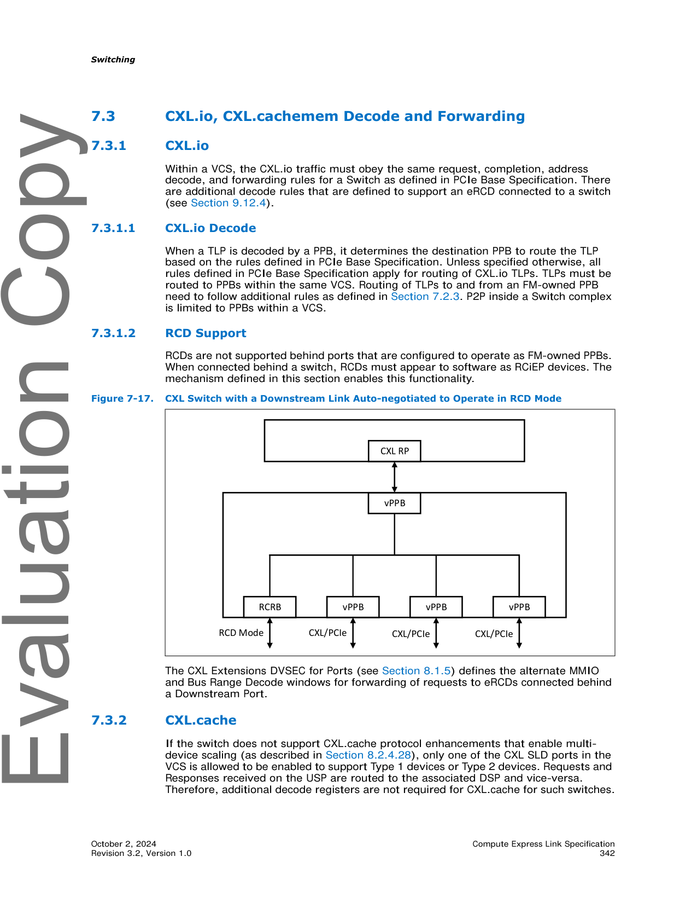
>
> *Original page render @ 150 DPI* — [📄 Full size](figures/chapter_07/page_0342.png)

[⬆️ 返回目录](#-本章目录-part-a)

---

### 7.3.2 CXL.cache

<table>
<thead>
<tr>
<th width="50%">🇬🇧 English</th>
<th width="50%" style="background-color:#e8e8e8">🇨🇳 中文</th>
</tr>
</thead>
<tbody>
<tr><td>If the switch does not support CXL.cache protocol enhancements that enable multi-device scaling (as described in Section 8.2.4.28), only one of the CXL SLD ports in the VCS is allowed to be enabled to support Type 1 devices or Type 2 devices. Requests and Responses received on the USP are routed to the associated DSP and vice-versa. Therefore, additional decode registers are not required for CXL.cache for such switches.</td><td style="background-color:#e8e8e8">如果交换机不支持能够实现多设备扩展 (multi-device scaling) 的 CXL.cache 协议增强 (如 8.2.4.28 节所述),则 VCS 中的 CXL SLD 端口中只允许启用一个端口以支持 Type 1 设备或 Type 2 设备。在 USP 上接收到的请求和响应被路由到关联的 DSP,反之亦然。因此,对于此类交换机,CXL.cache 不需要额外的解码寄存器。</td></tr>
<tr><td>If the switch supports CXL.cache protocol enhancements that enable multi-device scaling, more than one of the CXL SLD ports in the VCS can be configured to support Type 1 devices or Type 2 devices. Section 9.15.2 and Section 9.15.3 describe how such a CXL switch routes CXL.cache traffic.</td><td style="background-color:#e8e8e8">如果交换机支持能够实现多设备扩展的 CXL.cache 协议增强,则可以将 VCS 中的多个 CXL SLD 端口配置为支持 Type 1 设备或 Type 2 设备。9.15.2 节和 9.15.3 节描述了此类 CXL 交换机如何路由 CXL.cache 流量。</td></tr>
<tr><td>CXL.cache is not supported over FM-owned PPBs.</td><td style="background-color:#e8e8e8">FM-owned PPB 不支持 CXL.cache。</td></tr>
</tbody>
</table>

[⬆️ 返回目录](#-本章目录-part-a)

---

#### 7.3.2.1 CXL.Cache Reserved bit forwarding | CXL.Cache 保留位转发

<table>
<thead>
<tr>
<th width="50%">🇬🇧 English</th>
<th width="50%" style="background-color:#e8e8e8">🇨🇳 中文</th>
</tr>
</thead>
<tbody>
<tr><td>A switch shall forward 256B Flit messages reserved bits between the ingress port and the egress port. Both HBR and PBR formats are defined for 256B flit messages where a switch can translate between those formats. When performing the translation between HBR and PBR formats defined for 256B flits the Reserved bits shall be preserved. When a switch with 256B flit capability sends to a port with 68B flit format the Reserved bits shall be set to zero. Similarly, messages received as 68B flit formats shall never have reserved bits forwarded to a port with 256B flit messages.</td><td style="background-color:#e8e8e8">交换机应在入口端口和出口端口之间转发 256B Flit 消息的保留位。256B Flit 消息同时定义了 HBR 和 PBR 两种格式,交换机可在两种格式之间进行转换。在对 256B Flit 定义的 HBR 和 PBR 格式进行转换时,应保留 Reserved 位。当具备 256B Flit 能力的交换机向 68B Flit 格式的端口发送时,Reserved 位应置 0。类似地,以 68B Flit 格式接收的消息不得将保留位转发到采用 256B Flit 消息的端口。</td></tr>
<tr><td>Note:</td><td style="background-color:#e8e8e8">注:</td></tr>
<tr><td>The reason for forwarding of reserved bits is to allow new features to be supported without requiring changes to existing switches. The reason for not forwarding in 68B flit format is that new features are expected to be added only to 256B flit formats so there is no need to support the complexity of translating reserved bits to/from 68B flits.</td><td style="background-color:#e8e8e8">转发保留位的目的在于支持新功能而无需改动现有交换机。不在 68B Flit 格式中转发的原因在于,新功能预计只会添加到 256B Flit 格式,因此无需承担 68B Flit 与之相互转换保留位的复杂度。</td></tr>
</tbody>
</table>

[⬆️ 返回目录](#-本章目录-part-a)

---

### 7.3.3 CXL.mem

<table>
<thead>
<tr>
<th width="50%">🇬🇧 English</th>
<th width="50%" style="background-color:#e8e8e8">🇨🇳 中文</th>
</tr>
</thead>
<tbody>
<tr><td>The HDM Decode DVSEC capability contains registers that define the Memory Address Decode Ranges for Memory. CXL.mem requests originate from the Host/RP and flow downstream to the Devices through the switch. CXL.mem responses originate from the Device and flow upstream to the RP.</td><td style="background-color:#e8e8e8">HDM Decode DVSEC 能力包含用于定义内存地址解码范围 (Memory Address Decode Ranges) 的寄存器。CXL.mem 请求由 Host/RP 发起,经由交换机向下游流至设备。CXL.mem 响应由设备发起,向上游回流到 RP。</td></tr>
</tbody>
</table>

[⬆️ 返回目录](#-本章目录-part-a)

---

#### 7.3.3.1 CXL.mem Request Decode | CXL.mem 请求解码

<table>
<thead>
<tr>
<th width="50%">🇬🇧 English</th>
<th width="50%" style="background-color:#e8e8e8">🇨🇳 中文</th>
</tr>
</thead>
<tbody>
<tr><td>All CXL.mem Requests received by the USP target one of the Downstream PPBs within the VCS. The address decode registers in the VCS determine the downstream VCS PPB to route the request. The VCS PPB may be a VCS-owned PPB or an FM-owned PPB. See Section 7.3.4 for additional routing rules.</td><td style="background-color:#e8e8e8">USP 接收到的所有 CXL.mem 请求以 VCS 内的某个下行 PPB 为目标。VCS 中的地址解码寄存器决定将该请求路由到哪一个下行 VCS PPB。该 VCS PPB 可以是 VCS-owned PPB,也可以是 FM-owned PPB。其他路由规则参见 7.3.4 节。</td></tr>
</tbody>
</table>

[⬆️ 返回目录](#-本章目录-part-a)

---

#### 7.3.3.2 CXL.mem Response Decode | CXL.mem 响应解码

<table>
<thead>
<tr>
<th width="50%">🇬🇧 English</th>
<th width="50%" style="background-color:#e8e8e8">🇨🇳 中文</th>
</tr>
</thead>
<tbody>
<tr><td>CXL.mem Responses received by the DSP target one and only one Upstream Port. For VCS-owned PPB the responses are routed to the Upstream Port of that VCS. Responses received on an FM-owned PPB go through additional decode rules to determine the VCS ID to route the requests to. See Section 7.3.4 for additional routing rules.</td><td style="background-color:#e8e8e8">DSP 接收到的 CXL.mem 响应以唯一一个 USP 为目标。对于 VCS-owned PPB,响应被路由到该 VCS 的 Upstream Port。在 FM-owned PPB 上接收到的响应需经过额外的解码规则,以确定将请求路由到哪一个 VCS ID。其他路由规则参见 7.3.4 节。</td></tr>
</tbody>
</table>

[⬆️ 返回目录](#-本章目录-part-a)

---

#### 7.3.3.3 CXL.Mem Reserved bit forwarding | CXL.Mem 保留位转发

<table>
<thead>
<tr>
<th width="50%">🇬🇧 English</th>
<th width="50%" style="background-color:#e8e8e8">🇨🇳 中文</th>
</tr>
</thead>
<tbody>
<tr><td>CXL.mem follows the same rules as CXL.cache as defined in Section 7.3.2.1.</td><td style="background-color:#e8e8e8">CXL.mem 遵循 7.3.2.1 节中为 CXL.cache 定义的相同规则。</td></tr>
</tbody>
</table>

[⬆️ 返回目录](#-本章目录-part-a)

---

### 7.3.4 FM-owned PPB CXL Handling | FM-owned PPB 的 CXL 处理

<table>
<thead>
<tr>
<th width="50%">🇬🇧 English</th>
<th width="50%" style="background-color:#e8e8e8">🇨🇳 中文</th>
</tr>
</thead>
<tbody>
<tr><td>All PPBs are FM-owned. A PPB can be connected to a port that is disconnected or linked up. SLD components can be bound to a host or unbound. Unbound SLD components can be accessed by the FM using CXL.io transactions via the FM API. LDs within an MLD component can be bound to a host or unbound. Unbound LDs are FM-owned and can be accessed through the switch using CXL.io transactions via the FM API.</td><td style="background-color:#e8e8e8">所有 PPB 均归 FM 拥有。PPB 可连接到已断开连接 (disconnected) 或已建立链路 (linked up) 的端口。SLD 组件可以绑定到主机,也可以保持未绑定。未绑定的 SLD 组件可由 FM 通过 FM API 使用 CXL.io 事务进行访问。MLD 组件内的 LD 可以绑定到主机,也可以保持未绑定。未绑定的 LD 归 FM 拥有,可通过交换机经由 FM API 使用 CXL.io 事务进行访问。</td></tr>
<tr><td>For all CXL.io transactions driven by the FM API, the switch acts as a virtual Root Complex for PPBs and Endpoints. The switch is responsible for enumerating the functions associated with that port and sending/receiving CXL.io traffic.</td><td style="background-color:#e8e8e8">对于由 FM API 驱动的所有 CXL.io 事务,交换机充当 PPB 和 Endpoint 的虚拟根复合体 (virtual Root Complex)。交换机负责枚举与该端口关联的功能,并发送/接收 CXL.io 流量。</td></tr>
</tbody>
</table>

[⬆️ 返回目录](#-本章目录-part-a)

---

## 7.4 CXL Switch PM | CXL 交换机 PM

<table>
<thead>
<tr>
<th width="50%">🇬🇧 English</th>
<th width="50%" style="background-color:#e8e8e8">🇨🇳 中文</th>
</tr>
</thead>
<tbody>
<tr><td></td><td style="background-color:#e8e8e8"></td></tr>
</tbody>
</table>

[⬆️ 返回目录](#-本章目录-part-a)

---

### 7.4.1 CXL Switch ASPM L1 | CXL 交换机 ASPM L1

<table>
<thead>
<tr>
<th width="50%">🇬🇧 English</th>
<th width="50%" style="background-color:#e8e8e8">🇨🇳 中文</th>
</tr>
</thead>
<tbody>
<tr><td>ASPM L1 for switch Ports is as defined in Chapter 10.0.</td><td style="background-color:#e8e8e8">交换机端口的 ASPM L1 如 10.0 章所述。</td></tr>
</tbody>
</table>

[⬆️ 返回目录](#-本章目录-part-a)

---

### 7.4.2 CXL Switch PCI-PM and L2 | CXL 交换机 PCI-PM 和 L2

<table>
<thead>
<tr>
<th width="50%">🇬🇧 English</th>
<th width="50%" style="background-color:#e8e8e8">🇨🇳 中文</th>
</tr>
</thead>
<tbody>
<tr><td>A vPPB in a VCS operates the same as a PCIe vPPB for handling of PME messages.</td><td style="background-color:#e8e8e8">VCS 中的 vPPB 在 PME 消息处理方面的行为与 PCIe vPPB 相同。</td></tr>
</tbody>
</table>

[⬆️ 返回目录](#-本章目录-part-a)

---

### 7.4.3 CXL Switch Message Management | CXL 交换机消息管理

<table>
<thead>
<tr>
<th width="50%">🇬🇧 English</th>
<th width="50%" style="background-color:#e8e8e8">🇨🇳 中文</th>
</tr>
</thead>
<tbody>
<tr><td>CXL VDMs are of the "Local - Terminate at Receiver" type. When a switch is present in the hierarchy, the switch implements the message aggregation function and therefore all Host-generated messages terminate at the switch. The switch aggregation function is responsible for regenerating these messages on the Downstream Port. All messages and responses generated by the directly attached CXL components are aggregated and consolidated by the DSP and consolidated messages or responses are generated by the USP.</td><td style="background-color:#e8e8e8">CXL VDM 属于 "Local - Terminate at Receiver" (本地 - 接收端终止) 类型。当层级中存在交换机时,交换机实现消息聚合功能,因此所有由主机生成的消息都在交换机终止。交换机的聚合功能负责在 Downstream Port 上重新生成这些消息。直接连接的 CXL 组件所产生的所有消息和响应由 DSP 进行聚合与合并,并由 USP 生成合并后的消息或响应。</td></tr>
<tr><td>The PM message credit exchanges occur between the Host and Switch Aggregation port, and separately between the Switch Aggregation Port and device.</td><td style="background-color:#e8e8e8">PM 消息的信用 (credit) 交换发生在主机与交换机聚合端口之间,以及交换机聚合端口与设备之间(分别为独立的两组)。</td></tr>
</tbody>
</table>

<table>
<thead>
<tr>
<th>Table 7-12. CXL Switch Message Management ｜ CXL 交换机消息管理</th>
</tr>
</thead>
<tbody>
<tr><td>

| Message Type | Type | Switch Message Aggregation and Consolidation Responsibility |
|---|---|---|
| PM Reset Messages | Host Initiated | Host-generated requests terminate at Upstream Port, broadcast messages to all ports within VCS hierarchy |
| Sx Entry |  |  |
| GPF Phase 1 Request |  |  |
| GPF Phase 2 Request |  |  |
| PM Reset Acknowledge | Device Responses | Device-generated responses terminate at Downstream Port within VCS hierarchy. Switch aggregates responses from all other connected ports within VCS hierarchy. |
| Sx Entry |  |  |
| GPF Phase 1 Response |  |  |
| GPF Phase 2 Response |  |  |

</td></tr>
</tbody>
</table>

[⬆️ 返回目录](#-本章目录-part-a)

---

## 7.5 CXL Switch RAS | CXL 交换机 RAS

<table>
<thead>
<tr>
<th>Table 7-13. CXL Switch RAS (Sheet 1 of 2) ｜ CXL 交换机 RAS (第 1 页 / 共 2 页)</th>
</tr>
</thead>
<tbody>
<tr><td>

| Triggering Action | Description | Switch Action for Non-pooled Devices | Switch Action for Pooled Devices |
|---|---|---|---|
| Switch boot | Optional power-on reset pin | Assert PERST# / Deassert PERST# | Assert PERST# / Deassert PERST# |
| Upstream PERST# assert | VCS fundamental reset | Send Hot Reset | Write to MLD DVSEC to trigger LD Hot Reset of the associated LD Note: Only the FMLD provides the MLD DVSEC capability. |
| FM issues port reset command | Reset of an FM-owned DSP | Send Hot Reset | Send Hot Reset |
| PPB Secondary Bus Reset | Reset of an FM-owned DSP | Send Hot Reset | Write to MLD DVSEC to trigger LD Hot Reset of all LDs |

</td></tr>
</tbody>
</table>

<table>
<thead>
<tr>
<th width="50%">🇬🇧 English</th>
<th width="50%" style="background-color:#e8e8e8">🇨🇳 中文</th>
</tr>
</thead>
<tbody>
<tr><td>Because the MLD DVSEC only exists in the FMLD, the switch must use the FM LD-ID in the CXL.io configuration write transaction when triggering LD reset.</td><td style="background-color:#e8e8e8">由于 MLD DVSEC 仅存在于 FMLD 中,因此交换机在触发 LD 复位时,必须在 CXL.io 配置写事务中使用 FM LD-ID。</td></tr>
</tbody>
</table>

<table>
<thead>
<tr>
<th>Table 7-13. CXL Switch RAS (Sheet 2 of 2) ｜ CXL 交换机 RAS (第 2 页 / 共 2 页)</th>
</tr>
</thead>
<tbody>
<tr><td>

| Triggering Action | Description | Switch Action for Non-pooled Devices | Switch Action for Pooled Devices |
|---|---|---|---|
| USP receives Hot Reset | VCS fundamental reset | Send Hot Reset | Write to MLD DVSEC to trigger LD Hot Reset of the associated LD |
| USP vPPB Secondary Bus Reset | VCS US SBR | Send Hot Reset | Write to MLD DVSEC to trigger LD Hot Reset of the associated LD |
| DSP vPPB Secondary Bus Reset | VCS DS SBR | Send Hot Reset | Write to MLD DVSEC to trigger LD Hot Reset of the associated LD |
| Host writes FLR | Device FLR | No switch involvement | No switch involvement |
| Switch watchdog timeout | Switch fatal error | Equivalent to power-on reset | Equivalent to power-on reset |

</td></tr>
</tbody>
</table>

[⬆️ 返回目录](#-本章目录-part-a)

---

## 7.6 Fabric Manager Application Programming Interface | Fabric Manager 应用编程接口 (FM API)

<table>
<thead>
<tr>
<th width="50%">🇬🇧 English</th>
<th width="50%" style="background-color:#e8e8e8">🇨🇳 中文</th>
</tr>
</thead>
<tbody>
<tr><td>This section describes the Fabric Manager Application Programming Interface.</td><td style="background-color:#e8e8e8">本节介绍 Fabric Manager 应用编程接口 (FM API)。</td></tr>
</tbody>
</table>

[⬆️ 返回目录](#-本章目录-part-a)

---

### 7.6.1 CXL Fabric Management | CXL Fabric 管理

<table>
<thead>
<tr>
<th width="50%">🇬🇧 English</th>
<th width="50%" style="background-color:#e8e8e8">🇨🇳 中文</th>
</tr>
</thead>
<tbody>
<tr><td>CXL devices can be configured statically or dynamically via a Fabric Manager (FM), an external logical process that queries and configures the system's operational state using the FM commands defined in this specification. The FM is defined as the logical process that decides when reconfiguration is necessary and initiates the commands to perform configurations. It can take any form, including, but not limited to, software running on a host machine, embedded software running on a BMC, embedded firmware running on another CXL device or CXL switch, or a state machine running within the CXL device itself.</td><td style="background-color:#e8e8e8">CXL 设备可通过 Fabric Manager (FM) 进行静态或动态配置。FM 是一个外部逻辑进程,使用本规范中定义的 FM 命令查询和配置系统的运行状态。FM 是决定何时需要重新配置、并发起配置命令的逻辑进程。它可以采用任何形式,包括但不限于:运行在主机上的软件、运行在 BMC 上的嵌入式软件、运行在另一台 CXL 设备或 CXL 交换机上的嵌入式固件,或运行在 CXL 设备自身内部的状态机。</td></tr>
</tbody>
</table>

[⬆️ 返回目录](#-本章目录-part-a)

---

### 7.6.2 Fabric Management Model | Fabric 管理模型

<table>
<thead>
<tr>
<th width="50%">🇬🇧 English</th>
<th width="50%" style="background-color:#e8e8e8">🇨🇳 中文</th>
</tr>
</thead>
<tbody>
<tr><td>CXL devices are configured by FMs through the Fabric Manager Application Programming Interface (FM API) command sets, as defined in Section 8.2.10.10, through a CCI. A CCI is exposed through a device's Mailbox registers (see Section 8.2.9.4) or through an MCTP-capable interface. See Section 9.19 for details on the CCI processing of these commands.</td><td style="background-color:#e8e8e8">CXL 设备由 FM 通过 Fabric Manager Application Programming Interface (FM API) 命令集 (如 8.2.10.10 节所定义) 经由 CCI 进行配置。CCI 通过设备的 Mailbox 寄存器 (参见 8.2.9.4 节) 或支持 MCTP 的接口暴露。关于这些命令的 CCI 处理细节,参见 9.19 节。</td></tr>
<tr><td>FMs issue request messages and CXL devices issue response messages. CXL components may also issue the "Event Notification" request if notifications are supported by the component and the FM has requested notifications from the component using the Set MCTP Event Interrupt Policy command. See Section 7.6.3 for transport protocol details.</td><td style="background-color:#e8e8e8">FM 发出请求消息,CXL 设备发出响应消息。如果组件支持通知,且 FM 已通过 Set MCTP Event Interrupt Policy 命令向组件请求通知,则 CXL 组件也可以发出 "Event Notification" 请求。传输协议细节参见 7.6.3 节。</td></tr>
<tr><td>The following list provides a number of examples of connectivity between an FM and a component's CCI, but should not be considered a complete list:</td><td style="background-color:#e8e8e8">下面列出了一些 FM 与组件 CCI 之间连接方式的示例,但不应视为完整列表:</td></tr>
<tr><td>• An FM directly connected to a CXL device through any MCTP-capable interconnect can issue FM commands directly to the device. This includes delivery over MCTP-capable interfaces such as SMBus as well as VDM delivery over a standard PCIe tree topology where the responder is mapped to a CXL attached device.</td><td style="background-color:#e8e8e8">• 通过任何支持 MCTP 的互连直接连接到 CXL 设备的 FM,可以直接向该设备发出 FM 命令。这包括通过支持 MCTP 的接口 (如 SMBus) 进行传递,以及在标准 PCIe 树状拓扑中通过 VDM 传递,响应方被映射到一台 CXL 连接的设备。</td></tr>
<tr><td>• An FM directly connected to a CXL switch may use the switch to tunnel FM commands to MLD components directly attached to the switch. In this case, the FM issues the "Tunnel Management Command" command to the switch specifying the switch port to which the device is connected. Responses are returned to the FM by the switch. In addition to MCTP message delivery, the FM command set provides the FM with the ability to have the switch proxy config cycles and memory accesses to a Downstream Port on the FM's behalf.</td><td style="background-color:#e8e8e8">• 直接连接到 CXL 交换机的 FM 可以利用交换机将 FM 命令隧道传输 (tunnel) 到直接连接在交换机上的 MLD 组件。在这种情况下,FM 向交换机发出 "Tunnel Management Command" 命令,并指定设备所连接到的交换机端口。响应由交换机返回给 FM。除了 MCTP 消息传递之外,FM 命令集还为 FM 提供了让交换机代为向某个 Downstream Port 发起配置周期和内存访问的能力。</td></tr>
<tr><td>• An FM or part of the overall FM functionality may be embedded within a CXL component. The communication interface between such an embedded FM FW module and the component hardware is considered a vendor implementation detail and is not covered in this specification.</td><td style="background-color:#e8e8e8">• FM 或部分 FM 功能可能嵌入到 CXL 组件内部。这种嵌入式 FM 固件模块与组件硬件之间的通信接口被视为厂商实现细节,不在本规范范围内。</td></tr>
</tbody>
</table>

> **Figure 7-18.** Example of Fabric Management Model ｜ Fabric 管理模型示例
>
> 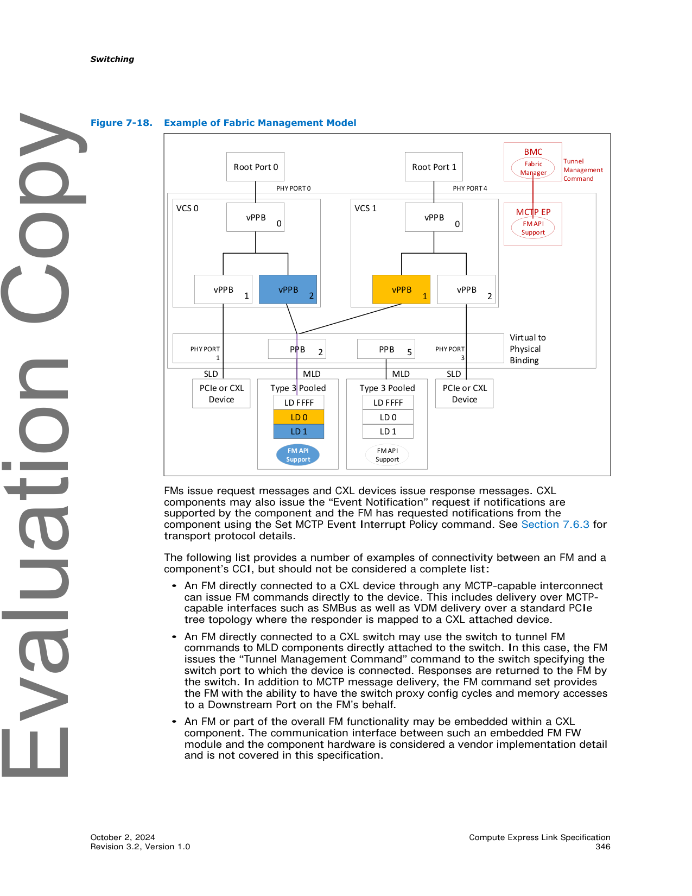
>
> *Original page render @ 150 DPI* — [📄 Full size](figures/chapter_07/page_0346.png)

[⬆️ 返回目录](#-本章目录-part-a)

---

### 7.6.3 CCI Message Format and Transport Protocol | CCI 消息格式与传输协议

<table>
<thead>
<tr>
<th width="50%">🇬🇧 English</th>
<th width="50%" style="background-color:#e8e8e8">🇨🇳 中文</th>
</tr>
</thead>
<tbody>
<tr><td>CCI commands are transmitted across MCTP-capable interconnects as MCTP messages using the format defined in Figure 7-19 and listed in Table 7-14.</td><td style="background-color:#e8e8e8">CCI 命令通过支持 MCTP 的互连,采用 MCTP 消息的形式进行传输,所使用的格式在图 7-19 中给出,字段定义见表 7-14。</td></tr>
<tr><td>Commands from the FM API Command Sets may be transported as MCTP messages as defined in CXL Fabric Manager API over MCTP Binding Specification (DSP0234). All other CCI commands may be transported as MCTP messages as defined by the respective binding specification, such as CXL Type 3 Component Command Interface over MCTP Binding (DSP0281).</td><td style="background-color:#e8e8e8">FM API 命令集中的命令可按 CXL Fabric Manager API over MCTP Binding Specification (DSP0234) 的定义,以 MCTP 消息的形式传输。所有其他 CCI 命令可按相应绑定规范 (例如 CXL Type 3 Component Command Interface over MCTP Binding, DSP0281) 的定义,以 MCTP 消息的形式传输。</td></tr>
</tbody>
</table>

> **Figure 7-19.** CCI Message Format ｜ CCI 消息格式
>
> 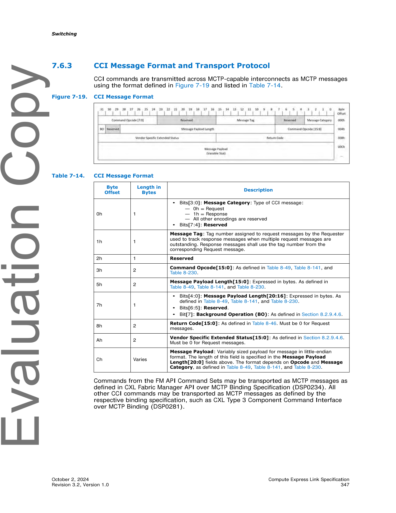
>
> *Original page render @ 150 DPI* — [📄 Full size](figures/chapter_07/page_0347.png)

<table>
<thead>
<tr>
<th>Table 7-14. CCI Message Format ｜ CCI 消息格式</th>
</tr>
</thead>
<tbody>
<tr><td>

| Byte Offset | Length in Bytes | Description |
|---|---|---|
| 0h | 1 | • Bits[3:0]: Message Category: Type of CCI message: — 0h = Request — 1h = Response — All other encodings are reserved • Bits[7:4]: Reserved |
| 1h | 1 | Message Tag: Tag number assigned to request messages by the Requester used to track response messages when multiple request messages are outstanding. Response messages shall use the tag number from the corresponding Request message. |
| 2h | 1 | Reserved |
| 3h | 2 | Command Opcode[15:0]: As defined in Table 8-49, Table 8-141, and Table 8-230. |
| 5h | 2 | Message Payload Length[15:0]: Expressed in bytes. As defined in Table 8-49, Table 8-141, and Table 8-230. |
| 7h | 1 | • Bits[4:0]: Message Payload Length[20:16]: Expressed in bytes. As defined in Table 8-49, Table 8-141, and Table 8-230. • Bits[6:5]: Reserved. • Bit[7]: Background Operation (BO): As defined in Section 8.2.9.4.6. |
| 8h | 2 | Return Code[15:0]: As defined in Table 8-46. Must be 0 for Request messages. |
| Ah | 2 | Vendor Specific Extended Status[15:0]: As defined in Section 8.2.9.4.6. Must be 0 for Request messages. |
| Ch | Varies | Message Payload: Variably sized payload for message in little-endian format. The length of this field is specified in the Message Payload Length[20:0] fields above. The format depends on Opcode and Message Category, as defined in Table 8-49, Table 8-141, and Table 8-230. |

</td></tr>
</tbody>
</table>

[⬆️ 返回目录](#-本章目录-part-a)

---

#### 7.6.3.1 Transport Details for MLD Components | MLD 组件的传输细节

<table>
<thead>
<tr>
<th width="50%">🇬🇧 English</th>
<th width="50%" style="background-color:#e8e8e8">🇨🇳 中文</th>
</tr>
</thead>
<tbody>
<tr><td>MLD components that do not implement an MCTP-capable interconnect other than their CXL interface shall expose a CCI through their CXL interface(s) using MCTP PCIe VDM Transport Binding Specification (DSP0238). FMs shall use the Tunnel Management Command to pass requests to the FM-owned LD, as illustrated in Figure 7-20.</td><td style="background-color:#e8e8e8">除 CXL 接口外未实现其他支持 MCTP 的互连的 MLD 组件,应使用 MCTP PCIe VDM Transport Binding Specification (DSP0238) 通过其 CXL 接口暴露 CCI。FM 应使用 Tunnel Management Command 将请求传递给 FM-owned LD,如图 7-20 所示。</td></tr>
</tbody>
</table>

[⬆️ 返回目录](#-本章目录-part-a)

---

### 7.6.4 CXL Switch Management | CXL 交换机管理

<table>
<thead>
<tr>
<th width="50%">🇬🇧 English</th>
<th width="50%" style="background-color:#e8e8e8">🇨🇳 中文</th>
</tr>
</thead>
<tbody>
<tr><td>Dynamic configuration of a switch by an FM is not required for basic switch functionality, but is required to support MLDs or CXL fabric topologies.</td><td style="background-color:#e8e8e8">交换机由 FM 进行的动态配置对基本交换机功能而言不是必需的,但要支持 MLD 或 CXL Fabric 拓扑,则必须进行动态配置。</td></tr>
</tbody>
</table>

[⬆️ 返回目录](#-本章目录-part-a)

---

#### 7.6.4.1 Initial Configuration | 初始配置

<table>
<thead>
<tr>
<th width="50%">🇬🇧 English</th>
<th width="50%" style="background-color:#e8e8e8">🇨🇳 中文</th>
</tr>
</thead>
<tbody>
<tr><td>The non-volatile memory of the switch stores, in a vendor-specific format, all necessary configuration settings that are required to prepare the switch for initial operation. This includes:</td><td style="background-color:#e8e8e8">交换机的非易失性存储器以厂商特定格式存储为交换机初始运行做准备的全部必要配置设置,包括:</td></tr>
<tr><td>• Port configuration, including direction (upstream or downstream), width, supported rates, etc.</td><td style="background-color:#e8e8e8">• 端口配置,包括方向 (上行或下行)、宽度、支持的速度等</td></tr>
<tr><td>• Virtual CXL Switch configuration, including number of vPPBs for each VCS, initial port binding configuration, etc.</td><td style="background-color:#e8e8e8">• Virtual CXL Switch 配置,包括每个 VCS 的 vPPB 数量、初始端口绑定配置等</td></tr>
<tr><td>• CCI access settings, including any vendor-defined permission settings for management.</td><td style="background-color:#e8e8e8">• CCI 访问设置,包括任何用于管理的厂商定义的权限设置</td></tr>
</tbody>
</table>

[⬆️ 返回目录](#-本章目录-part-a)

---

#### 7.6.4.2 Dynamic Configuration | 动态配置

<table>
<thead>
<tr>
<th width="50%">🇬🇧 English</th>
<th width="50%" style="background-color:#e8e8e8">🇨🇳 中文</th>
</tr>
</thead>
<tbody>
<tr><td>After initial configuration is complete and a CCI on the switch is operational, an FM can send Management Commands to the switch.</td><td style="background-color:#e8e8e8">初始配置完成且交换机上的 CCI 处于可操作状态后,FM 可以向交换机发送 Management Commands。</td></tr>
<tr><td>An FM may perform the following dynamic management actions on a CXL switch:</td><td style="background-color:#e8e8e8">FM 可对 CXL 交换机执行以下动态管理操作:</td></tr>
<tr><td>• Query switch information and configuration details</td><td style="background-color:#e8e8e8">• 查询交换机信息和配置详情</td></tr>
<tr><td>• Bind or Unbind ports</td><td style="background-color:#e8e8e8">• 绑定或解绑端口</td></tr>
<tr><td>• Register to receive and handle event notifications from the switch (e.g., Hot-Plug, surprise removal, and failures)</td><td style="background-color:#e8e8e8">• 注册以接收并处理来自交换机的事件通知 (例如热插拔、意外移除、故障等)</td></tr>
<tr><td>When a switch port is connected to a downstream PCIe switch, and that port is bound to a vPPB, the management of that PCIe switch and its downstream device will be handled by the VCS's host, not the FM.</td><td style="background-color:#e8e8e8">当交换机端口连接到下游 PCIe 交换机,且该端口被绑定到 vPPB 时,该 PCIe 交换机及其下游设备的管理将由 VCS 的主机而非 FM 处理。</td></tr>
</tbody>
</table>

> **Figure 7-20.** Tunneling Commands to an MLD through a CXL Switch ｜ 通过 CXL 交换机向 MLD 隧道传输命令
>
> 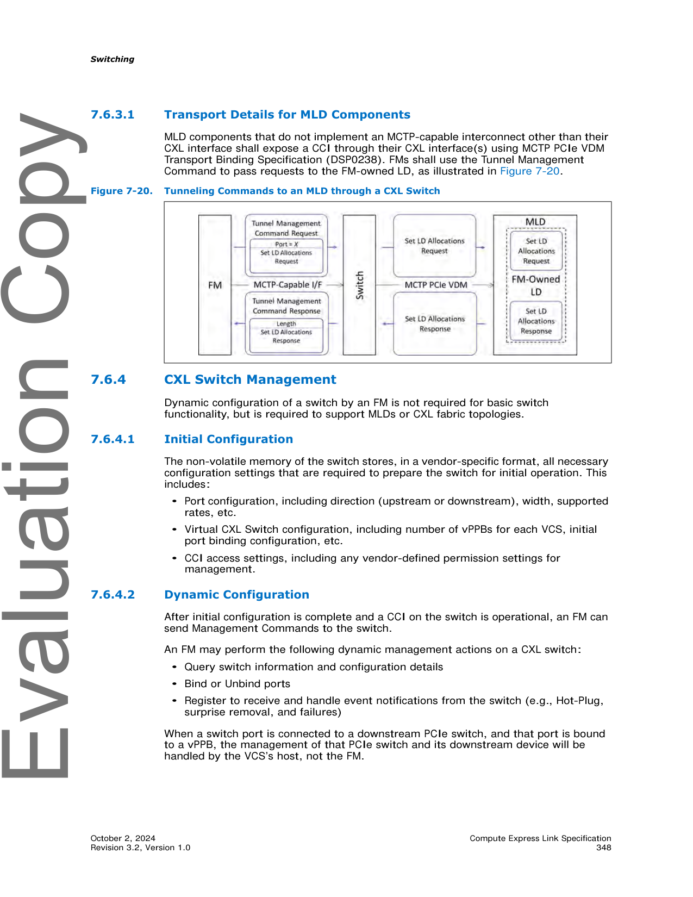
>
> *Original page render @ 150 DPI* — [📄 Full size](figures/chapter_07/page_0348.png)

[⬆️ 返回目录](#-本章目录-part-a)

---

#### 7.6.4.3 MLD Port Management | MLD 端口管理

<table>
<thead>
<tr>
<th width="50%">🇬🇧 English</th>
<th width="50%" style="background-color:#e8e8e8">🇨🇳 中文</th>
</tr>
</thead>
<tbody>
<tr><td>A switch with MLD Ports requires an FM to perform the following management activities:</td><td style="background-color:#e8e8e8">具有 MLD 端口的交换机需要由 FM 执行以下管理活动:</td></tr>
<tr><td>• MLD discovery</td><td style="background-color:#e8e8e8">• MLD 发现</td></tr>
<tr><td>• LD binding/unbinding</td><td style="background-color:#e8e8e8">• LD 绑定/解绑</td></tr>
<tr><td>• Management Command Tunneling</td><td style="background-color:#e8e8e8">• Management Command 隧道传输</td></tr>
</tbody>
</table>

[⬆️ 返回目录](#-本章目录-part-a)

---

### 7.6.5 MLD Component Management | MLD 组件管理

<table>
<thead>
<tr>
<th width="50%">🇬🇧 English</th>
<th width="50%" style="background-color:#e8e8e8">🇨🇳 中文</th>
</tr>
</thead>
<tbody>
<tr><td>The FM can connect to an MLD over a direct connection or by tunneling its management commands through the CCI of the CXL switch to which the device is connected. The FM can perform the following operations:</td><td style="background-color:#e8e8e8">FM 既可以通过直接连接连接到 MLD,也可以通过设备所连接 CXL 交换机的 CCI 隧道传输其管理命令。FM 可执行以下操作:</td></tr>
<tr><td>• Memory allocation and QoS Telemetry management</td><td style="background-color:#e8e8e8">• 内存分配与 QoS Telemetry 管理</td></tr>
<tr><td>• Security (e.g., LD erasure after unbinding)</td><td style="background-color:#e8e8e8">• 安全 (例如解绑后的 LD 擦除)</td></tr>
<tr><td>• Error handling</td><td style="background-color:#e8e8e8">• 错误处理</td></tr>
</tbody>
</table>

[⬆️ 返回目录](#-本章目录-part-a)

---

### 7.6.6 Management Requirements for System Operations | 系统运营的管理要求

<table>
<thead>
<tr>
<th width="50%">🇬🇧 English</th>
<th width="50%" style="background-color:#e8e8e8">🇨🇳 中文</th>
</tr>
</thead>
<tbody>
<tr><td>This section presents examples of system use cases to highlight the role and responsibilities of the FM in system management. These use case discussions also serve to itemize the FM commands that CXL devices must support to facilitate each specific system behavior.</td><td style="background-color:#e8e8e8">本节通过系统用例示例说明 FM 在系统管理中的角色和职责。这些用例讨论还可作为 CXL 设备为实现每种特定系统行为所必须支持的 FM 命令的清单。</td></tr>
</tbody>
</table>

> **Figure 7-21.** Example of MLD Management Requiring Tunneling ｜ 需要隧道传输的 MLD 管理示例
>
> 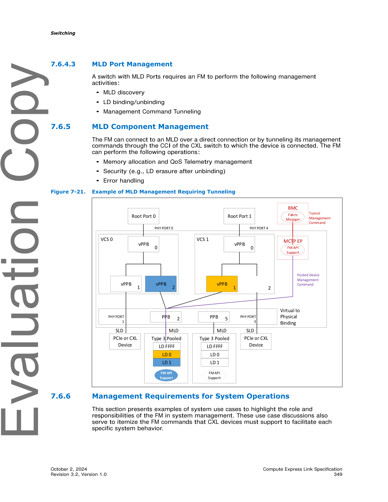
>
> *Original page render @ 150 DPI* — [📄 Full size](figures/chapter_07/page_0349.png)

[⬆️ 返回目录](#-本章目录-part-a)

---

#### 7.6.6.1 Initial System Discovery | 初始系统发现

<table>
<thead>
<tr>
<th width="50%">🇬🇧 English</th>
<th width="50%" style="background-color:#e8e8e8">🇨🇳 中文</th>
</tr>
</thead>
<tbody>
<tr><td>As the CXL system initializes, the FM can begin discovering all direct attached CXL devices across all supported media interfaces. Devices supporting the FM API may be discovered using transport specific mechanisms such as the MCTP discovery process, as defined in MCTP Base Specification (DSP0236).</td><td style="background-color:#e8e8e8">在 CXL 系统初始化的过程中,FM 可以开始通过所有受支持的介质接口发现所有直连的 CXL 设备。支持 FM API 的设备可通过传输特定机制 (如 MCTP Base Specification (DSP0236) 中定义的 MCTP 发现流程) 来发现。</td></tr>
<tr><td>When a component is discovered, the FM shall issue the Identify command (see Section 8.2.10.1.1) prior to issuing any other commands to check the component's type and its maximum supported command message size. A return of "Retry Required" indicates that the component is not yet ready to accept commands. After receiving a successful response to the Identify request, the FM may issue the Set Response Message Limit command (see Section 8.2.10.1.4) to limit the size of response messages from the component based on the size of the FM's receive buffer. The FM shall not issue any commands with input arguments such that the command's response message exceeds the FM's maximum supported message size. Finally, the FM issues Get Log, as defined in Section 8.2.10.5.2.1, to read the Command Effects Log to determine which command opcodes are supported.</td><td style="background-color:#e8e8e8">在发现某个组件后,FM 应在发出任何其他命令之前发出 Identify 命令 (参见 8.2.10.1.1 节),以检查组件的类型及其支持的最大命令消息大小。返回 "Retry Required" 表示该组件尚未准备好接收命令。在成功收到 Identify 请求的响应后,FM 可以发出 Set Response Message Limit 命令 (参见 8.2.10.1.4 节),根据 FM 接收缓冲区的大小限制组件响应消息的大小。FM 不应发出任何带输入参数的命令,使得命令的响应消息超过 FM 所支持的最大消息大小。最后,FM 发出 Get Log (如 8.2.10.5.2.1 节所定义) 以读取 Command Effects Log,从而确定受支持的命令操作码。</td></tr>
</tbody>
</table>

[⬆️ 返回目录](#-本章目录-part-a)

---

#### 7.6.6.2 CXL Switch Discovery | CXL 交换机发现

<table>
<thead>
<tr>
<th width="50%">🇬🇧 English</th>
<th width="50%" style="background-color:#e8e8e8">🇨🇳 中文</th>
</tr>
</thead>
<tbody>
<tr><td>After a CXL switch is released from reset (i.e., PERST# has been deasserted), it loads its initial configuration from non-volatile memory. Ports configured as DS PPBs will be released from reset to link up. Upon detection of a switch, the FM will query its configuration, capabilities, and connected devices. The Physical Switch Command Set is required for all switches implementing FM API support. The Virtual Switch Command Set is required for all switches that support multiple host ports.</td><td style="background-color:#e8e8e8">CXL 交换机脱离复位 (即 PERST# 已解除置位) 后,会从非易失性存储器加载其初始配置。配置为 DS PPB 的端口将被解除复位以建立链路。检测到交换机后,FM 将查询其配置、能力以及所连接的设备。所有实现 FM API 支持的交换机都需要 Physical Switch Command Set。所有支持多主机端口的交换机都需要 Virtual Switch Command Set。</td></tr>
<tr><td>An example of an FM Switch discovery process is as follows:</td><td style="background-color:#e8e8e8">FM 交换机发现流程的示例如下:</td></tr>
<tr><td>1. FM issues Identify Switch Device to check switch port count, enabled port IDs, number of supported LDs, and enabled VCS IDs.</td><td style="background-color:#e8e8e8">1. FM 发出 Identify Switch Device,以检查交换机的端口数、已启用的端口 ID、所支持的 LD 数,以及已启用的 VCS ID。</td></tr>
<tr><td>2. FM issues Get Physical Port State for each enabled port to check port configuration (US or DS), link state, and attached device type. This allows the FM to check for any port link-up issues and create an inventory of devices for binding. If any MLD components are discovered, the FM can begin MLD Port management activities.</td><td style="background-color:#e8e8e8">2. FM 对每个已启用端口发出 Get Physical Port State,以检查端口配置 (US 或 DS)、链路状态以及所连接设备的类型。这使 FM 能够检查任何端口的链路连接问题,并创建用于绑定的设备清单。如果发现 MLD 组件,FM 可以开始 MLD 端口管理活动。</td></tr>
<tr><td>3. If the switch supports multiple host ports, FM issues Get Virtual CXL Switch Info for each enabled VCS to check for all bound vPPBs in the system and create a list of binding targets.</td><td style="background-color:#e8e8e8">3. 如果交换机支持多主机端口,FM 对每个已启用的 VCS 发出 Get Virtual CXL Switch Info,以检查系统中所有已绑定的 vPPB,并创建绑定目标列表。</td></tr>
</tbody>
</table>

[⬆️ 返回目录](#-本章目录-part-a)

---

#### 7.6.6.3 MLD and Switch MLD Port Management | MLD 与交换机 MLD 端口管理

<table>
<thead>
<tr>
<th width="50%">🇬🇧 English</th>
<th width="50%" style="background-color:#e8e8e8">🇨🇳 中文</th>
</tr>
</thead>
<tbody>
<tr><td>MLDs must be connected to a CXL switch to share their LDs among VCSs. If an MLD is discovered in the system, the FM will need to prepare it for binding. A switch must support the MLD Port Command Set to support the use of MLDs. All MLD components shall support the MLD Component Command Set.</td><td style="background-color:#e8e8e8">MLD 必须连接到 CXL 交换机才能在多个 VCS 间共享其 LD。如果在系统中发现 MLD,FM 需要为其绑定做准备。交换机必须支持 MLD Port Command Set 才能支持 MLD 的使用。所有 MLD 组件都应支持 MLD Component Command Set。</td></tr>
<tr><td>1. FM issues management commands to the device's LD FFFFh using Tunnel Management Command.</td><td style="background-color:#e8e8e8">1. FM 通过 Tunnel Management Command 向设备的 LD FFFFh 发出管理命令。</td></tr>
<tr><td>2. FM can execute advanced or vendor-specific management activities, such as encryption or authentication, using the Send LD CXL.io Configuration Request and Send LD CXL.io Memory Request commands.</td><td style="background-color:#e8e8e8">2. FM 可以使用 Send LD CXL.io Configuration Request 和 Send LD CXL.io Memory Request 命令执行高级或厂商特定的管理活动,例如加密或认证。</td></tr>
</tbody>
</table>

[⬆️ 返回目录](#-本章目录-part-a)

---

#### 7.6.6.4 Event Notifications | 事件通知

<table>
<thead>
<tr>
<th width="50%">🇬🇧 English</th>
<th width="50%" style="background-color:#e8e8e8">🇨🇳 中文</th>
</tr>
</thead>
<tbody>
<tr><td>Events can occur on both devices and switches. The event types and records are listed in Section 7.6.8 for FM API events and in Section 8.2.10.2 for component events. The Event Records framework is defined in Section 8.2.10.2.1 to provide a standard event record format that all CXL components shall use when reporting events to the managing entity. The managing entity specifies the notification method, such as MSI/MSI-X, EFN VDM, or MCTP Event Notification. The Event Notification message can be signaled by a device or by a switch; the notification always flows toward the managing entity. An Event Record is not sent with the Event Notification message. After the managing entity knows that an event has occurred, the entity can use component commands to read the Event Record.</td><td style="background-color:#e8e8e8">设备和交换机上都可能发生事件。事件类型和记录在 7.6.8 节 (针对 FM API 事件) 和 8.2.10.2 节 (针对组件事件) 中列出。Event Records 框架在 8.2.10.2.1 节中定义,提供所有 CXL 组件在向管理实体报告事件时所使用的标准事件记录格式。管理实体指定通知方式,例如 MSI/MSI-X、EFN VDM 或 MCTP Event Notification。Event Notification 消息可由设备或交换机发起;通知始终流向管理实体。Event Record 不随 Event Notification 消息一起发送。管理实体得知事件已发生后,可使用组件命令读取 Event Record。</td></tr>
<tr><td>1. To facilitate some system operations, the FM requires event notifications so it can execute its role in the process in a timely manner (e.g., notifying hosts of an asserted Attention Button on an MLD during a Managed Hot-Removal). If supported by the device, the FM can check and modify the current event notification settings with the Events command set.</td><td style="background-color:#e8e8e8">1. 为支持某些系统操作,FM 需要事件通知,以便能及时履行其在流程中的角色 (例如,在托管热移除期间通知主机 MLD 上 Attention Button 被置位的事件)。如果设备支持,FM 可使用 Events 命令集检查和修改当前的事件通知设置。</td></tr>
<tr><td>2. If supported by the device, the event logs can be read with the Get Event Records command to check for any error events experienced by the device that might impact normal operation.</td><td style="background-color:#e8e8e8">2. 如果设备支持,可使用 Get Event Records 命令读取事件日志,以检查设备可能影响正常运行的任何错误事件。</td></tr>
</tbody>
</table>

[⬆️ 返回目录](#-本章目录-part-a)

---

#### 7.6.6.5 Binding Ports and LDs on a Switch | 在交换机上绑定端口和 LD

<table>
<thead>
<tr>
<th width="50%">🇬🇧 English</th>
<th width="50%" style="background-color:#e8e8e8">🇨🇳 中文</th>
</tr>
</thead>
<tbody>
<tr><td>Once all devices, VCSs, and vPPBs have been discovered, the FM can begin binding ports and LDs to hosts as follows:</td><td style="background-color:#e8e8e8">一旦发现所有设备、VCS 和 vPPB,FM 即可按以下步骤开始将端口和 LD 绑定到主机:</td></tr>
<tr><td>1. FM issues the Bind vPPB command specifying a physical port, VCS ID and vPPB index to bind the physical port to the vPPB. An LD-ID must also be specified if the physical port is connected to an MLD. The switch is permitted to initiate a Managed Hot-Add if the host has already booted, as defined in Section 9.9.</td><td style="background-color:#e8e8e8">1. FM 发出 Bind vPPB 命令,指定物理端口、VCS ID 和 vPPB 索引,以将该物理端口绑定到 vPPB。如果物理端口连接到 MLD,还必须指定 LD-ID。如 9.9 节所述,如果主机已经启动,允许交换机发起 Managed Hot-Add。</td></tr>
<tr><td>2. Upon completion of the binding process, the switch notifies the FM by generating a Virtual CXL Switch Event Record.</td><td style="background-color:#e8e8e8">2. 绑定过程完成后,交换机通过生成 Virtual CXL Switch Event Record 通知 FM。</td></tr>
</tbody>
</table>

[⬆️ 返回目录](#-本章目录-part-a)

---

#### 7.6.6.6 Unbinding Ports and LDs on a Switch | 在交换机上解绑端口和 LD

<table>
<thead>
<tr>
<th width="50%">🇬🇧 English</th>
<th width="50%" style="background-color:#e8e8e8">🇨🇳 中文</th>
</tr>
</thead>
<tbody>
<tr><td>The FM can unbind devices or LDs from a VCS with the following steps:</td><td style="background-color:#e8e8e8">FM 可通过以下步骤将设备或 LD 从 VCS 中解绑:</td></tr>
<tr><td>1. FM issues the Unbind vPPB command specifying a VCS ID and vPPB index to unbind the physical port from the vPPB. The switch initiates a Managed Hot-Remove or Surprise Hot-Remove depending on the command options, as defined in PCIe Base Specification.</td><td style="background-color:#e8e8e8">1. FM 发出 Unbind vPPB 命令,指定 VCS ID 和 vPPB 索引,以将物理端口从 vPPB 解绑。交换机根据命令选项发起 Managed Hot-Remove 或 Surprise Hot-Remove,具体如 PCIe Base Specification 所定义。</td></tr>
<tr><td>2. Upon completion of the unbinding process, the switch will generate a Virtual CXL Switch Event Record.</td><td style="background-color:#e8e8e8">2. 解绑过程完成后,交换机将生成 Virtual CXL Switch Event Record。</td></tr>
</tbody>
</table>

[⬆️ 返回目录](#-本章目录-part-a)

---

#### 7.6.6.7 Hot-Add and Managed Hot-Removal of Devices | 设备的热添加与托管热移除

<table>
<thead>
<tr>
<th width="50%">🇬🇧 English</th>
<th width="50%" style="background-color:#e8e8e8">🇨🇳 中文</th>
</tr>
</thead>
<tbody>
<tr><td>When a device is Hot-Added to an unbound port on a switch, the FM receives a notification and is responsible for binding as described in the steps below:</td><td style="background-color:#e8e8e8">当设备热添加 (Hot-Add) 到交换机上的未绑定端口时,FM 收到通知并按以下步骤负责绑定:</td></tr>
<tr><td>1. The switch notifies the FM by generating Physical Switch Event Records as the Presence Detect sideband signal is asserted or when a Link Up is detected if the PPB does not support Presence Detect.</td><td style="background-color:#e8e8e8">1. 交换机在 Presence Detect 边带信号被置位时,或在 PPB 不支持 Presence Detect 时检测到 Link Up 时,通过生成 Physical Switch Event Record 通知 FM。</td></tr>
<tr><td>2. FM issues the Get Physical Port State command for the physical port that has linked up to discover the connected device type. The FM can now bind the physical port to a vPPB. If it's an MLD, then the FM can proceed with MLD Port management activities; otherwise, the device is ready for binding.</td><td style="background-color:#e8e8e8">2. FM 对已建立链路的物理端口发出 Get Physical Port State 命令,以发现所连接设备的类型。FM 此时可将该物理端口绑定到 vPPB。如果是 MLD,则 FM 可继续进行 MLD 端口管理活动;否则,设备已准备好被绑定。</td></tr>
<tr><td>When a device is Hot-Removed from an unbound port on a switch, the FM receives a notification. The switch notifies the FM by generating Physical Switch Event Records as the Presence Detect sideband is deasserted and the associated port links down.</td><td style="background-color:#e8e8e8">当设备从交换机上的未绑定端口被热移除 (Hot-Remove) 时,FM 会收到通知。交换机在 Presence Detect 边带被解除置位且关联端口链路断开 (link down) 时,通过生成 Physical Switch Event Record 通知 FM。</td></tr>
<tr><td>1. The switch notifies the FM by generating Physical Switch Event Records as the Presence Detect sideband is deasserted and the associated port links down.</td><td style="background-color:#e8e8e8">1. 交换机在 Presence Detect 边带被解除置位且关联端口链路断开时,通过生成 Physical Switch Event Record 通知 FM。</td></tr>
<tr><td>When an SLD or PCIe device is Hot-Added to a bound port, the FM can be notified but is not involved. When a Surprise or Managed Hot-Removal of an SLD or PCIe device occurs on a bound port, the FM can be notified but is not involved.</td><td style="background-color:#e8e8e8">当 SLD 或 PCIe 设备热添加到已绑定端口时,FM 可以收到通知但不参与。当在已绑定端口上发生 SLD 或 PCIe 设备的 Surprise 或 Managed Hot-Removal 时,FM 可以收到通知但不参与。</td></tr>
<tr><td>A bound port will not advertise support for MLDs during negotiation, so MLD components will link up as an SLD.</td><td style="background-color:#e8e8e8">已绑定端口在协商期间不会通告对 MLD 的支持,因此 MLD 组件将作为 SLD 建立链路。</td></tr>
<tr><td>The FM manages managed hot-removal of MLDs as follows:</td><td style="background-color:#e8e8e8">FM 按如下方式管理 MLD 的托管热移除 (managed hot-removal):</td></tr>
<tr><td>1. When the Attention Button sideband is asserted on an MLD port, the Attention state bit is updated in the corresponding PPB and vPPB CSRs and the switch notifies the FM and hosts with LDs that are bound and below that MLD port. The hosts are notified with the MSI/MSI-X interrupts assigned to the affected vPPB and a Virtual CXL Switch Event Record is generated.</td><td style="background-color:#e8e8e8">1. 当 MLD 端口的 Attention Button 边带被置位时,会在对应的 PPB 和 vPPB CSR 中更新 Attention 状态位,交换机通知 FM 以及在该 MLD 端口之下绑定有 LD 的主机。主机通过分配给受影响 vPPB 的 MSI/MSI-X 中断得到通知,同时生成 Virtual CXL Switch Event Record。</td></tr>
<tr><td>2. As defined in PCIe Base Specification, hosts will read the Attention State bit in their vPPB's CSR and prepare for removal of the LD. When a host is ready for the LD to be removed, it will set the Attention LED bit in the associated vPPB's CSR. The switch records these CSR updates by generating Virtual CXL Switch Event Records. The FM unbinds each assigned LD with the Unbind vPPB command as it receives notifications from each host.</td><td style="background-color:#e8e8e8">2. 如 PCIe Base Specification 所定义,主机会读取其 vPPB CSR 中的 Attention State 位,并准备移除该 LD。当主机准备好移除 LD 时,会在关联 vPPB 的 CSR 中置位 Attention LED 位。交换机通过生成 Virtual CXL Switch Event Record 记录这些 CSR 更新。FM 在收到每个主机的通知后,使用 Unbind vPPB 命令解绑每个已分配的 LD。</td></tr>
<tr><td>3. When all host handshakes are complete, the MLD is ready for removal. The FM uses the Send PPB CXL.io Configuration Request command to set the Attention LED bit in the MLD port PPB to indicate that the MLD can be physically removed. The timeout value for the host handshakes to complete is implementation specific. There is no requirement for the FM to force the unbind operation, but it can do so using the "Simulate Surprise Hot-Remove" unbinding option in the Unbind vPPB command.</td><td style="background-color:#e8e8e8">3. 当所有主机握手完成后,MLD 即可被移除。FM 使用 Send PPB CXL.io Configuration Request 命令在 MLD 端口 PPB 中置位 Attention LED 位,以指示该 MLD 可被物理移除。主机握手完成的超时值由具体实现决定。不要求 FM 强制执行 unbind 操作,但可以使用 Unbind vPPB 命令中的 "Simulate Surprise Hot-Remove" unbind 选项来执行强制操作。</td></tr>
</tbody>
</table>

[⬆️ 返回目录](#-本章目录-part-a)

---

#### 7.6.6.8 Surprise Removal of Devices | 设备的意外移除

<table>
<thead>
<tr>
<th width="50%">🇬🇧 English</th>
<th width="50%" style="background-color:#e8e8e8">🇨🇳 中文</th>
</tr>
</thead>
<tbody>
<tr><td>There are two kinds of surprise removals: physical removal of a device, and surprise Link Down. The main difference between the two is the state of the presence pin, which will be deasserted after a physical removal but will remain asserted after a surprise Link Down. The switch notifies the FM of a surprise removal by generating Virtual CXL Switch Event Records for the change in link status and Presence Detect, as applicable.</td><td style="background-color:#e8e8e8">意外移除 (Surprise Removal) 有两种:设备的物理移除,以及意外链路断开 (surprise Link Down)。两者之间的主要区别在于 Presence 引脚的状态:物理移除后,Presence 引脚将被解除置位;而意外链路断开后,Presence 引脚仍将保持置位。交换机通过针对链路状态和 Presence Detect 变化 (按需) 生成 Virtual CXL Switch Event Record 来通知 FM 发生意外移除。</td></tr>
<tr><td>Three cases of Surprise Removal are described below:</td><td style="background-color:#e8e8e8">下面描述意外移除的三种情况:</td></tr>
<tr><td>• When a Surprise Removal of a device occurs on an unbound port, the FM must be notified.</td><td style="background-color:#e8e8e8">• 当未绑定端口上发生设备的意外移除时,必须通知 FM。</td></tr>
<tr><td>• When a Surprise Removal of an SLD or PCIe device occurs on a bound port, the FM is permitted to be notified but must not be involved in any error handling operations.</td><td style="background-color:#e8e8e8">• 当已绑定端口上发生 SLD 或 PCIe 设备的意外移除时,允许通知 FM,但 FM 不得参与任何错误处理操作。</td></tr>
<tr><td>• When a Surprise Removal of an MLD component occurs, the FM must be notified. The switch will automatically unbind any existing LD bindings. The FM must perform error handling and port management activities, the details of which are considered implementation specific.</td><td style="background-color:#e8e8e8">• 当发生 MLD 组件的意外移除时,必须通知 FM。交换机会自动解绑所有现有 LD 绑定。FM 必须执行错误处理和端口管理活动,其具体细节视为实现特定。</td></tr>
</tbody>
</table>

[⬆️ 返回目录](#-本章目录-part-a)

---

### 7.6.7 Fabric Management Application Programming Interface | Fabric Manager 应用编程接口

<table>
<thead>
<tr>
<th width="50%">🇬🇧 English</th>
<th width="50%" style="background-color:#e8e8e8">🇨🇳 中文</th>
</tr>
</thead>
<tbody>
<tr><td>The FM manages all devices in a CXL system via the sets of commands defined in the FM API. This specification defines the minimum command set requirements for each device type.</td><td style="background-color:#e8e8e8">FM 通过 FM API 中定义的命令集管理 CXL 系统中的所有设备。本规范为每种设备类型定义了最低的命令集要求。</td></tr>
<tr><td>Note:</td><td style="background-color:#e8e8e8">注:</td></tr>
<tr><td>CXL switches and MLDs require FM API support to facilitate the advanced system capabilities outlined in Section 7.6.6. FM API is optional for all other CXL device types.</td><td style="background-color:#e8e8e8">CXL 交换机和 MLD 需要 FM API 支持,以实现 7.6.6 节中列出的高级系统能力。对于所有其他 CXL 设备类型,FM API 是可选的。</td></tr>
<tr><td>Command opcodes are listed in Table 8-230. Table 8-230 also identifies the minimum command sets and commands that are required to implement defined system capabilities. The following subsections define the commands grouped in each command set. Within each command set, commands are marked as mandatory (M) or optional (O). If a command set is supported, the required commands within that set must be implemented, but only if the Device supports that command set. For example, the Get Virtual CXL Switch Information command is required in the Virtual Switch Command Set, but that set is optional for switches. This means that a switch does not need to support the Get Virtual CXL Switch Information command if it does not support the Virtual Switch Command Set.</td><td style="background-color:#e8e8e8">命令操作码在表 8-230 中列出。表 8-230 还标识了实现已定义系统能力所需的最低命令集和命令。后续各子节定义按命令集分组的命令。在每个命令集内,命令被标记为强制 (M) 或可选 (O)。如果支持某个命令集,则该集合中所要求的命令必须实现,但前提是设备支持该命令集。例如,Get Virtual CXL Switch Information 命令在 Virtual Switch Command Set 中是必需的,但该命令集对交换机是可选的。这意味着如果交换机不支持 Virtual Switch Command Set,则它不需要支持 Get Virtual CXL Switch Information 命令。</td></tr>
<tr><td>All commands have been defined as stand-alone operations; there are no explicit dependencies between commands, so optional commands can be implemented or not implemented on a per-command basis. Requirements for the implementation of commands are driven instead by the desired system functionality.</td><td style="background-color:#e8e8e8">所有命令均被定义为独立操作;命令之间没有显式的依赖关系,因此可选命令可以按命令粒度选择实现或不实现。命令的实现要求实际由所需的系统功能决定。</td></tr>
</tbody>
</table>

<table>
<thead>
<tr>
<th>Table 7-15. FM API Command Sets ｜ FM API 命令集</th>
</tr>
</thead>
<tbody>
<tr><td>

| Command Set Name | HBR Switch FM API Requirement¹ | MLD FM API Requirement¹ |
|---|---|---|
| Physical Switch (Section 7.6.7.1) | M | P |
| Virtual Switch (Section 7.6.7.2) | O | P |
| MLD Port (Section 7.6.7.3) | O | P |
| MLD Component (Section 7.6.7.4) | P | M |
| Multi-Headed Device (Section 7.6.7.5) | P | P |
| DCD Management (Section 7.6.7.6) | P | O |
| PBR Switch (Section 7.7.13) | P | P |
| Global Memory Access Endpoint (Section 7.7.14) | P | P |

1. M = Mandatory, O = Optional, P = Prohibited.

</td></tr>
</tbody>
</table>

[⬆️ 返回目录](#-本章目录-part-a)

---

#### 7.6.7.1 Physical Switch Command Set | Physical Switch 命令集

<table>
<thead>
<tr>
<th width="50%">🇬🇧 English</th>
<th width="50%" style="background-color:#e8e8e8">🇨🇳 中文</th>
</tr>
</thead>
<tbody>
<tr><td>This command set is only supported by and must be supported by CXL switches that have FM API support.</td><td style="background-color:#e8e8e8">此命令集仅由且必须由具有 FM API 支持的 CXL 交换机支持。</td></tr>
</tbody>
</table>

[⬆️ 返回目录](#-本章目录-part-a)

---

##### 7.6.7.1.1 Identify Switch Device (Opcode 5100h) | Identify Switch Device (操作码 5100h)

<table>
<thead>
<tr>
<th width="50%">🇬🇧 English</th>
<th width="50%" style="background-color:#e8e8e8">🇨🇳 中文</th>
</tr>
</thead>
<tbody>
<tr><td>This command retrieves information about the capabilities and configuration of a CXL switch.</td><td style="background-color:#e8e8e8">此命令检索 CXL 交换机的能力和配置相关信息。</td></tr>
<tr><td>Possible Command Return Codes:</td><td style="background-color:#e8e8e8">可能的命令返回码:</td></tr>
<tr><td>• Success</td><td style="background-color:#e8e8e8">• Success (成功)</td></tr>
<tr><td>• Internal Error</td><td style="background-color:#e8e8e8">• Internal Error (内部错误)</td></tr>
<tr><td>• Retry Required</td><td style="background-color:#e8e8e8">• Retry Required (需要重试)</td></tr>
<tr><td>Command Effects:</td><td style="background-color:#e8e8e8">命令效果:</td></tr>
<tr><td>• None</td><td style="background-color:#e8e8e8">• None (无)</td></tr>
</tbody>
</table>

<table>
<thead>
<tr>
<th>Table 7-16. Identify Switch Device Response Payload ｜ Identify Switch Device 响应 Payload</th>
</tr>
</thead>
<tbody>
<tr><td>

| Byte Offset | Length in Bytes | Description |
|---|---|---|
| 00h | 1 | Ingress Port ID: Ingress CCI port index of the received request message. For CXL/PCIe ports, this corresponds to the physical port number. For non-CXL/PCIe, this corresponds to a vendor-specific index of the buses that the device supports, starting at 0. For example, a request received on the second of 2 SMBuses supported by a device would return a 1. |
| 01h | 1 | Reserved |
| 02h | 1 | Number of Physical Ports: Total number of physical ports in the CXL switch, including inactive/disabled ports. |
| 03h | 1 | Number of VCSs: Maximum number of virtual CXL switches that are supported by the CXL switch. |
| 04h | 20h | Active Port Bitmask: Bitmask that defines whether a physical port is enabled (1) or disabled (0). Each bit corresponds 1:1 with a port, with the least significant bit corresponding to Port 0. |
| 24h | 20h | Active VCS Bitmask: Bitmask that defines whether a VCS is enabled (1) or disabled (0). Each bit corresponds 1:1 with a VCS ID, with the least significant bit corresponding to VCS 0. |
| 44h | 2 | Total Number of vPPBs: The number of virtual PPBs that are supported by the CXL switch across all VCSs. |
| 46h | 2 | Number of Bound vPPBs: Total number of vPPBs, across all VCSs, that are bound. |
| 48h | 1 | Number of HDM Decoders: Number of HDM decoders available per USP. |

</td></tr>
</tbody>
</table>

[⬆️ 返回目录](#-本章目录-part-a)

---

##### 7.6.7.1.2 Get Physical Port State (Opcode 5101h) | Get Physical Port State (操作码 5101h)

<table>
<thead>
<tr>
<th width="50%">🇬🇧 English</th>
<th width="50%" style="background-color:#e8e8e8">🇨🇳 中文</th>
</tr>
</thead>
<tbody>
<tr><td>This command retrieves the physical port information.</td><td style="background-color:#e8e8e8">此命令检索物理端口信息。</td></tr>
<tr><td>Possible Command Return Codes:</td><td style="background-color:#e8e8e8">可能的命令返回码:</td></tr>
<tr><td>• Success</td><td style="background-color:#e8e8e8">• Success (成功)</td></tr>
<tr><td>• Invalid Input</td><td style="background-color:#e8e8e8">• Invalid Input (无效输入)</td></tr>
<tr><td>• Internal Error</td><td style="background-color:#e8e8e8">• Internal Error (内部错误)</td></tr>
<tr><td>• Retry Required</td><td style="background-color:#e8e8e8">• Retry Required (需要重试)</td></tr>
<tr><td>Command Effects:</td><td style="background-color:#e8e8e8">命令效果:</td></tr>
<tr><td>• None</td><td style="background-color:#e8e8e8">• None (无)</td></tr>
</tbody>
</table>

<table>
<thead>
<tr>
<th>Table 7-17. Get Physical Port State Request Payload ｜ Get Physical Port State 请求 Payload</th>
</tr>
</thead>
<tbody>
<tr><td>

| Byte Offset | Length in Bytes | Description |
|---|---|---|
| 0h | 1 | Number of Ports: Number of ports requested. |
| 1h | Varies | Port ID List: 1-byte ID of requested port, repeated Number of Ports times. |

</td></tr>
</tbody>
</table>

<table>
<thead>
<tr>
<th>Table 7-18. Get Physical Port State Response Payload ｜ Get Physical Port State 响应 Payload</th>
</tr>
</thead>
<tbody>
<tr><td>

| Byte Offset | Length in Bytes | Description |
|---|---|---|
| 0h | 1 | Number of Ports: Number of port information blocks returned. |
| 1h | 3 | Reserved |
| 4h | Varies | Port Information List: Port information block as defined in Table 7-19, repeated Number of Ports times. |

</td></tr>
</tbody>
</table>

<table>
<thead>
<tr>
<th>Table 7-19. Get Physical Port State Port Information Block Format (Sheet 1 of 2) ｜ Get Physical Port State 端口信息块格式 (第 1 页 / 共 2 页)</th>
</tr>
</thead>
<tbody>
<tr><td>

| Byte Offset | Length in Bytes | Description |
|---|---|---|
| 0h | 1 | Port ID |
| 1h | 1 | • Bits[3:0]: Current Port Configuration State: — 0h = Disabled — 1h = Bind in progress — 2h = Unbind in progress — 3h = DSP — 4h = USP — 5h = Fabric Port — Fh = Invalid Port_ID; all subsequent field values are undefined — All other encodings are reserved • Bit[4]: GAE Support: Indicates whether GAE support is present (1) or not present (0) on a port. Valid only for PBR switches if Current Port Configuration State is 4h (USP). • Bits[7:5]: Reserved. |
| 2h | 1 | • Bits[3:0]: Connected Device Mode: Formerly known as Connected Device CXL Version. This field is reserved for all values of Current Port Configuration State except DSP. — 0h = Connection is not CXL or is disconnected — 1h = RCD mode — 2h = CXL 68B Flit and VH mode — 3h = Standard 256B Flit mode — 4h = CXL Latency-Optimized 256B Flit mode — 5h = PBR mode — All other encodings are reserved • Bits[7:4]: Reserved. |
| 3h | 1 | Reserved |
| 4h | 1 | Connected Device Type • 00h = No device detected • 01h = PCIe Device • 02h = CXL Type 1 device • 03h = CXL Type 2 device or HBR switch • 04h = CXL Type 3 SLD • 05h = CXL Type 3 MLD • 06h = PBR component • All other encodings are reserved This field is reserved if Supported CXL Modes is 00h. This field is reserved for all values of Current Port Configuration State except 3h (DSP) or 5h (Fabric Port). |
| 5h | 1 | Supported CXL Modes: Formerly known as Connected CXL Version. Bitmask that defines which CXL modes are supported (1) or not supported (0) by this port: • Bit[0]: RCD Mode • Bit[1]: CXL 68B Flit and VH Capable • Bit[2]: 256B Flit Capable • Bit[3]: CXL Latency-Optimized 256B Flit Capable • Bit[4]: PBR Capable • Bits[7:5]: Reserved for future CXL use Undefined when the value is 00h. |

</td></tr>
</tbody>
</table>

<table>
<thead>
<tr>
<th>Table 7-19. Get Physical Port State Port Information Block Format (Sheet 2 of 2) ｜ Get Physical Port State 端口信息块格式 (第 2 页 / 共 2 页)</th>
</tr>
</thead>
<tbody>
<tr><td>

| Byte Offset | Length in Bytes | Description |
|---|---|---|
| 6h | 1 | • Bits[5:0]: Maximum Link Width: Value encoding matches the Maximum Link Width field in the PCIe Link Capabilities register in the PCIe Capability structure. • Bits[7:6]: Reserved. |
| 7h | 1 | • Bits[5:0]: Negotiated Link Width: Value encoding matches the Negotiated Link Width field in PCIe Link Capabilities register in the PCIe Capability structure. • Bits[7:6]: Reserved. |
| 8h | 1 | • Bits[5:0]: Supported Link Speeds Vector: Value encoding matches the Supported Link Speeds Vector field in the PCIe Link Capabilities 2 register in the PCIe Capability structure. • Bits[7:6]: Reserved. |
| 9h | 1 | • Bits[5:0]: Max Link Speed: Value encoding matches the Max Link Speed field in the PCIe Link Capabilities register in the PCIe Capability structure. • Bits[7:6]: Reserved. |
| Ah | 1 | • Bits[5:0]: Current Link Speed: Value encoding matches the Current Link Speed field in the PCIe Link Status register in the PCIe Capability structure. • Bits[7:6]: Reserved. |
| Bh | 1 | LTSSM State: Current link LTSSM Major state: • 00h = Detect • 01h = Polling • 02h = Configuration • 03h = Recovery • 04h = L0 • 05h = L0s • 06h = L1 • 07h = L2 • 08h = Disabled • 09h = Loopback • 0Ah = Hot Reset • All other encodings are reserved Link substates should be reported through vendor-defined diagnostics commands. |
| Ch | 1 | First Negotiated Lane Number |
| Dh | 2 | Link State Flags • Bit[0]: Lane Reversal State: — 0 = Standard lane ordering — 1 = Reversed lane ordering • Bit[1]: Port PCIe Reset State (PERST#): — 0 = Not in reset — 1 = In reset • Bit[2]: Port Presence Pin State (PRSNT#): — 0 = Not present — 1 = Present • Bit[3]: Power Control State: — 0 = Power on — 1 = Power off • Bits[15:4]: Reserved |
| Fh | 1 | Supported LD Count: Number of additional LDs supported by this port. All ports must support at least one LD. |

</td></tr>
</tbody>
</table>

[⬆️ 返回目录](#-本章目录-part-a)

---

##### 7.6.7.1.3 Physical Port Control (Opcode 5102h) | Physical Port Control (操作码 5102h)

<table>
<thead>
<tr>
<th width="50%">🇬🇧 English</th>
<th width="50%" style="background-color:#e8e8e8">🇨🇳 中文</th>
</tr>
</thead>
<tbody>
<tr><td>This command is used by the FM to control unbound ports and MLD ports, including issuing resets and controlling sidebands.</td><td style="background-color:#e8e8e8">此命令由 FM 用于控制未绑定端口和 MLD 端口,包括发出复位和控制边带信号。</td></tr>
<tr><td>Possible Command Return Codes:</td><td style="background-color:#e8e8e8">可能的命令返回码:</td></tr>
<tr><td>• Success</td><td style="background-color:#e8e8e8">• Success (成功)</td></tr>
<tr><td>• Unsupported</td><td style="background-color:#e8e8e8">• Unsupported (不支持)</td></tr>
<tr><td>• Invalid Input</td><td style="background-color:#e8e8e8">• Invalid Input (无效输入)</td></tr>
<tr><td>• Internal Error</td><td style="background-color:#e8e8e8">• Internal Error (内部错误)</td></tr>
<tr><td>• Retry Required</td><td style="background-color:#e8e8e8">• Retry Required (需要重试)</td></tr>
<tr><td>Command Effects:</td><td style="background-color:#e8e8e8">命令效果:</td></tr>
<tr><td>• None</td><td style="background-color:#e8e8e8">• None (无)</td></tr>
</tbody>
</table>

<table>
<thead>
<tr>
<th>Table 7-20. Physical Port Control Request Payload ｜ Physical Port Control 请求 Payload</th>
</tr>
</thead>
<tbody>
<tr><td>

| Byte Offset | Length in Bytes | Description |
|---|---|---|
| 0h | 1 | PPB ID: Physical PPB ID, which corresponds 1:1 to associated physical port number. |
| 1h | 1 | Port Opcode: Code that defines which operation to perform: • 00h = Assert PERST# • 01h = Deassert PERST# • 02h = Reset PPB • All other encodings are reserved |

</td></tr>
</tbody>
</table>

[⬆️ 返回目录](#-本章目录-part-a)

---

##### 7.6.7.1.4 Send PPB CXL.io Configuration Request (Opcode 5103h) | Send PPB CXL.io Configuration Request (操作码 5103h)

<table>
<thead>
<tr>
<th width="50%">🇬🇧 English</th>
<th width="50%" style="background-color:#e8e8e8">🇨🇳 中文</th>
</tr>
</thead>
<tbody>
<tr><td>This command sends CXL.io Config requests to the specified physical port's PPB. This command is only processed for unbound ports and MLD ports.</td><td style="background-color:#e8e8e8">此命令将 CXL.io Config 请求发送到指定物理端口的 PPB。此命令仅针对未绑定端口和 MLD 端口进行处理。</td></tr>
<tr><td>Possible Command Return Codes:</td><td style="background-color:#e8e8e8">可能的命令返回码:</td></tr>
<tr><td>• Success</td><td style="background-color:#e8e8e8">• Success (成功)</td></tr>
<tr><td>• Invalid Input</td><td style="background-color:#e8e8e8">• Invalid Input (无效输入)</td></tr>
<tr><td>• Internal Error</td><td style="background-color:#e8e8e8">• Internal Error (内部错误)</td></tr>
<tr><td>• Retry Required</td><td style="background-color:#e8e8e8">• Retry Required (需要重试)</td></tr>
<tr><td>Command Effects:</td><td style="background-color:#e8e8e8">命令效果:</td></tr>
<tr><td>• None</td><td style="background-color:#e8e8e8">• None (无)</td></tr>
</tbody>
</table>

<table>
<thead>
<tr>
<th>Table 7-21. Send PPB CXL.io Configuration Request Input Payload ｜ Send PPB CXL.io Configuration Request 输入 Payload</th>
</tr>
</thead>
<tbody>
<tr><td>

| Byte Offset | Length in Bytes | Description |
|---|---|---|
| 0h | 1 | PPB ID: Target PPB's physical port. |
| 1h | 3 | • Bits[7:0]: Register Number: As defined in PCIe Base Specification • Bits[11:8]: Extended Register Number: As defined in PCIe Base Specification • Bits[15:12]: First Dword Byte Enable: As defined in PCIe Base Specification • Bits[22:16]: Reserved • Bit[23]: Transaction Type: — 0 = Read — 1 = Write |
| 4h | 4 | Transaction Data: Write data. Valid only for write transactions. |

</td></tr>
</tbody>
</table>

<table>
<thead>
<tr>
<th>Table 7-22. Send PPB CXL.io Configuration Request Output Payload ｜ Send PPB CXL.io Configuration Request 输出 Payload</th>
</tr>
</thead>
<tbody>
<tr><td>

| Byte Offset | Length in Bytes | Description |
|---|---|---|
| 0h | 4 | Return Data: Read data. Valid only for read transactions. |

</td></tr>
</tbody>
</table>

[⬆️ 返回目录](#-本章目录-part-a)

---

##### 7.6.7.1.5 Get Domain Validation SV State (Opcode 5104h) | Get Domain Validation SV State (操作码 5104h)

<table>
<thead>
<tr>
<th width="50%">🇬🇧 English</th>
<th width="50%" style="background-color:#e8e8e8">🇨🇳 中文</th>
</tr>
</thead>
<tbody>
<tr><td>This command is used by the Host to check the state of the secret value.</td><td style="background-color:#e8e8e8">此命令由主机用于检查密钥 (secret value) 的状态。</td></tr>
<tr><td>Possible Command Return Codes:</td><td style="background-color:#e8e8e8">可能的命令返回码:</td></tr>
<tr><td>• Success</td><td style="background-color:#e8e8e8">• Success (成功)</td></tr>
<tr><td>• Internal Error</td><td style="background-color:#e8e8e8">• Internal Error (内部错误)</td></tr>
<tr><td>• Retry Required</td><td style="background-color:#e8e8e8">• Retry Required (需要重试)</td></tr>
<tr><td>Command Effects:</td><td style="background-color:#e8e8e8">命令效果:</td></tr>
<tr><td>• None</td><td style="background-color:#e8e8e8">• None (无)</td></tr>
</tbody>
</table>

<table>
<thead>
<tr>
<th>Table 7-23. Get Domain Validation SV State Response Payload ｜ Get Domain Validation SV State 响应 Payload</th>
</tr>
</thead>
<tbody>
<tr><td>

| Byte Offset | Length in Bytes | Description |
|---|---|---|
| 0h | 1 | Secret Value State: State of the secret value: • 00h = Not set • 01h = Set • All other encodings are reserved |

</td></tr>
</tbody>
</table>

[⬆️ 返回目录](#-本章目录-part-a)

---

##### 7.6.7.1.6 Set Domain Validation SV (Opcode 5105h) | Set Domain Validation SV (操作码 5105h)

<table>
<thead>
<tr>
<th width="50%">🇬🇧 English</th>
<th width="50%" style="background-color:#e8e8e8">🇨🇳 中文</th>
</tr>
</thead>
<tbody>
<tr><td>This command is used by the Host to set the secret value of its VCS. The secret value can be set only once. This command will fail with Invalid Input if it is called more than once.</td><td style="background-color:#e8e8e8">此命令由主机用于设置其 VCS 的密钥。密钥只能设置一次。如果被调用多次,此命令将以 Invalid Input 失败。</td></tr>
<tr><td>Possible Command Return Codes:</td><td style="background-color:#e8e8e8">可能的命令返回码:</td></tr>
<tr><td>• Success</td><td style="background-color:#e8e8e8">• Success (成功)</td></tr>
<tr><td>• Invalid Input</td><td style="background-color:#e8e8e8">• Invalid Input (无效输入)</td></tr>
<tr><td>• Internal Error</td><td style="background-color:#e8e8e8">• Internal Error (内部错误)</td></tr>
<tr><td>• Retry Required</td><td style="background-color:#e8e8e8">• Retry Required (需要重试)</td></tr>
<tr><td>Command Effects:</td><td style="background-color:#e8e8e8">命令效果:</td></tr>
<tr><td>• None</td><td style="background-color:#e8e8e8">• None (无)</td></tr>
</tbody>
</table>

<table>
<thead>
<tr>
<th>Table 7-24. Set Domain Validation SV Request Payload ｜ Set Domain Validation SV 请求 Payload</th>
</tr>
</thead>
<tbody>
<tr><td>

| Byte Offset | Length in Bytes | Description |
|---|---|---|
| 0h | 10h | Secret Value: UUID used to uniquely identify a host hierarchy. |

</td></tr>
</tbody>
</table>

[⬆️ 返回目录](#-本章目录-part-a)

---

##### 7.6.7.1.7 Get VCS Domain Validation SV State (Opcode 5106h) | Get VCS Domain Validation SV State (操作码 5106h)

<table>
<thead>
<tr>
<th width="50%">🇬🇧 English</th>
<th width="50%" style="background-color:#e8e8e8">🇨🇳 中文</th>
</tr>
</thead>
<tbody>
<tr><td>This command is used by the FM to check the state of the secret value in a VCS.</td><td style="background-color:#e8e8e8">此命令由 FM 用于检查 VCS 中密钥的状态。</td></tr>
<tr><td>Possible Command Return Codes:</td><td style="background-color:#e8e8e8">可能的命令返回码:</td></tr>
<tr><td>• Success</td><td style="background-color:#e8e8e8">• Success (成功)</td></tr>
<tr><td>• Internal Error</td><td style="background-color:#e8e8e8">• Internal Error (内部错误)</td></tr>
<tr><td>• Retry Required</td><td style="background-color:#e8e8e8">• Retry Required (需要重试)</td></tr>
<tr><td>Command Effects:</td><td style="background-color:#e8e8e8">命令效果:</td></tr>
<tr><td>• None</td><td style="background-color:#e8e8e8">• None (无)</td></tr>
</tbody>
</table>

<table>
<thead>
<tr>
<th>Table 7-25. Get VCS Domain Validation SV State Request Payload ｜ Get VCS Domain Validation SV State 请求 Payload</th>
</tr>
</thead>
<tbody>
<tr><td>

| Byte Offset | Length in Bytes | Description |
|---|---|---|
| 0h | 1 | VCS ID: Index of VCS to query. |

</td></tr>
</tbody>
</table>

<table>
<thead>
<tr>
<th>Table 7-26. Get VCS Domain Validation SV State Response Payload ｜ Get VCS Domain Validation SV State 响应 Payload</th>
</tr>
</thead>
<tbody>
<tr><td>

| Byte Offset | Length in Bytes | Description |
|---|---|---|
| 0h | 1 | Secret Value State: State of the secret value: • 00h = Not set • 01h = Set • All other encodings are reserved |

</td></tr>
</tbody>
</table>

[⬆️ 返回目录](#-本章目录-part-a)

---

##### 7.6.7.1.8 Get Domain Validation SV (Opcode 5107h) | Get Domain Validation SV (操作码 5107h)

<table>
<thead>
<tr>
<th width="50%">🇬🇧 English</th>
<th width="50%" style="background-color:#e8e8e8">🇨🇳 中文</th>
</tr>
</thead>
<tbody>
<tr><td>This command is used by the FM to retrieve the secret value from a VCS.</td><td style="background-color:#e8e8e8">此命令由 FM 用于从 VCS 检索密钥。</td></tr>
<tr><td>Possible Command Return Codes:</td><td style="background-color:#e8e8e8">可能的命令返回码:</td></tr>
<tr><td>• Success</td><td style="background-color:#e8e8e8">• Success (成功)</td></tr>
<tr><td>• Internal Error</td><td style="background-color:#e8e8e8">• Internal Error (内部错误)</td></tr>
<tr><td>• Retry Required</td><td style="background-color:#e8e8e8">• Retry Required (需要重试)</td></tr>
<tr><td>Command Effects:</td><td style="background-color:#e8e8e8">命令效果:</td></tr>
<tr><td>• None</td><td style="background-color:#e8e8e8">• None (无)</td></tr>
</tbody>
</table>

<table>
<thead>
<tr>
<th>Table 7-27. Get Domain Validation SV Request Payload ｜ Get Domain Validation SV 请求 Payload</th>
</tr>
</thead>
<tbody>
<tr><td>

| Byte Offset | Length in Bytes | Description |
|---|---|---|
| 0h | 1 | VCS ID: Index of VCS to query. |

</td></tr>
</tbody>
</table>

<table>
<thead>
<tr>
<th>Table 7-28. Get Domain Validation SV Response Payload ｜ Get Domain Validation SV 响应 Payload</th>
</tr>
</thead>
<tbody>
<tr><td>

| Byte Offset | Length in Bytes | Description |
|---|---|---|
| 0h | 10h | Secret Value: UUID used to uniquely identify a host hierarchy. |

</td></tr>
</tbody>
</table>

[⬆️ 返回目录](#-本章目录-part-a)

---

#### 7.6.7.2 Virtual Switch Command Set | Virtual Switch 命令集

<table>
<thead>
<tr>
<th width="50%">🇬🇧 English</th>
<th width="50%" style="background-color:#e8e8e8">🇨🇳 中文</th>
</tr>
</thead>
<tbody>
<tr><td>This command set is supported only by the CXL switch. It is required for switches that support more than one VCS. The following commands are defined:</td><td style="background-color:#e8e8e8">此命令集仅由 CXL 交换机支持。对于支持多个 VCS 的交换机,此命令集是必需的。定义了以下命令:</td></tr>
</tbody>
</table>

<table>
<thead>
<tr>
<th>Table 7-29. Virtual Switch Command Set Requirements ｜ Virtual Switch 命令集要求</th>
</tr>
</thead>
<tbody>
<tr><td>

| Command Name | Requirement¹ |
|---|---|
| Get Virtual CXL Switch Info | M |
| Bind vPPB | O |
| Unbind vPPB | O |
| Generate AER Event | O |

1. M = Mandatory, O = Optional.

</td></tr>
</tbody>
</table>

[⬆️ 返回目录](#-本章目录-part-a)

---

##### 7.6.7.2.1 Get Virtual CXL Switch Info (Opcode 5200h) | Get Virtual CXL Switch Info (操作码 5200h)

<table>
<thead>
<tr>
<th width="50%">🇬🇧 English</th>
<th width="50%" style="background-color:#e8e8e8">🇨🇳 中文</th>
</tr>
</thead>
<tbody>
<tr><td>This command retrieves information on a specified number of VCSs in the switch. Because of the possibility of variable numbers of vPPBs within each VCS, the returned array has variably sized elements.</td><td style="background-color:#e8e8e8">此命令检索交换机中指定数量 VCS 的信息。由于每个 VCS 中的 vPPB 数量可变,返回的数组元素大小可变。</td></tr>
<tr><td>Possible Command Return Codes:</td><td style="background-color:#e8e8e8">可能的命令返回码:</td></tr>
<tr><td>• Success</td><td style="background-color:#e8e8e8">• Success (成功)</td></tr>
<tr><td>• Invalid Input</td><td style="background-color:#e8e8e8">• Invalid Input (无效输入)</td></tr>
<tr><td>• Internal Error</td><td style="background-color:#e8e8e8">• Internal Error (内部错误)</td></tr>
<tr><td>• Retry Required</td><td style="background-color:#e8e8e8">• Retry Required (需要重试)</td></tr>
<tr><td>• Invalid Payload Length</td><td style="background-color:#e8e8e8">• Invalid Payload Length (无效 Payload 长度)</td></tr>
<tr><td>Command Effects:</td><td style="background-color:#e8e8e8">命令效果:</td></tr>
<tr><td>• None</td><td style="background-color:#e8e8e8">• None (无)</td></tr>
</tbody>
</table>

<table>
<thead>
<tr>
<th>Table 7-30. Get Virtual CXL Switch Info Request Payload ｜ Get Virtual CXL Switch Info 请求 Payload</th>
</tr>
</thead>
<tbody>
<tr><td>

| Byte Offset | Length in Bytes | Description |
|---|---|---|
| 0h | 1 | Start vPPB: Specifies the ID of the first vPPB for each VCS to include in the vPPB information list in the response (bytes 4 – 7 in Table 7-32). This enables compatibility with devices that have small maximum command message sizes. |
| 1h | 1 | vPPB List Limit: The maximum number of vPPB information entries to include in the response (bytes 4 – 7 in Table 7-32). This enables compatibility with devices that have small maximum command message sizes. This field shall have a minimum value of 1. |
| 2h | 1 | Number of VCSs: Number of VCSs requested. This field shall have a minimum value of 1. |
| 3h | Number of VCSs | VCS ID List: 1-byte ID of requested VCS, repeated Number of VCSs times. |

</td></tr>
</tbody>
</table>

<table>
<thead>
<tr>
<th>Table 7-31. Get Virtual CXL Switch Info Response Payload ｜ Get Virtual CXL Switch Info 响应 Payload</th>
</tr>
</thead>
<tbody>
<tr><td>

| Byte Offset | Length in Bytes | Description |
|---|---|---|
| 0h | 1 | Number of VCSs: Number of VCS information blocks returned. |
| 1h | 3 | Reserved |
| 4h | Varies | VCS Information List: VCS information block as defined in Table 7-32, repeated Number of VCSs times. |

</td></tr>
</tbody>
</table>

<table>
<thead>
<tr>
<th>Table 7-32. Get Virtual CXL Switch Info VCS Information Block Format ｜ Get Virtual CXL Switch Info VCS 信息块格式</th>
</tr>
</thead>
<tbody>
<tr><td>

| Byte Offset | Length in Bytes | Description |
|---|---|---|
| 0h | 1 | Virtual CXL Switch ID |
| 1h | 1 | VCS State: Current state of the VCS: • 00h = Disabled • 01h = Enabled • FFh = Invalid VCS ID; all subsequent field values are invalid • All other encodings are reserved |
| 2h | 1 | USP ID: Physical port ID of the current VCS's Upstream Port, or the current VCS's fabric physical port ID of a Downstream ES VCS. Valid only when the VCS is enabled. |
| 3h | 1 | Number of vPPBs: Total number of vPPBs in the VCS. This value may be larger than the vPPB List Limit field specified in the request. In this case, the length of vPPB information list, starting at byte 4, is defined by 'vPPB List Limit', not by this field. vPPB information list consists of vPPB List Entry Count number of entries and each entry is 4B in length. vPPB List Entry Count=min(vPPB List Limit, Number of vPPBs). |
| 4h | 1 | vPPB[Start vPPB] Binding Status • 00h = Unbound • 01h = Bind or unbind in progress • 02h = Bound Physical Port • 03h = Bound LD • 04h = Bound PID • All other encodings are reserved |
| 5h | 2 | For PBR Switches when Binding Status is 02h or 03h and for HBR Switches: • Bits[7:0]: vPPB[Start vPPB] Bound Port ID: Physical port number of the bound port. Valid only when Binding Status is 02h or 03h. • Bits[15:8]: vPPB[Start vPPB] Bound LD ID: ID of the LD that is bound to the port from the MLD on an associated physical port. Valid only when vPPB[Start vPPB] Binding Status is 03h; otherwise, the value is FFh. For PBR Switches when Binding Status is 04h: • Bits[11:0]: vPPB[Start vPPB] Bound PID: PID of the bound vPPB, as defined in Section 7.7.12.3. • Bits[15:12]: Reserved. |
| 7h | 1 | Reserved |
| … | … | … |
| 4 + (vPPB List Entry Count - 1) * 4 | 1 | vPPB[Start vPPB + vPPB List Entry Count¹ - 1] Binding Status: As defined above. |
| 5 + (vPPB List Entry Count - 1) * 4 | 1 | vPPB[Start vPPB + vPPB List Entry Count¹ - 1] Bound Port ID: As defined above. |
| 6 + (vPPB List Entry Count - 1) * 4 | 1 | vPPB[Start vPPB + vPPB List Entry Count¹ - 1] Bound LD ID: As defined above. |
| 7 + (vPPB List Entry Count - 1) * 4 | 1 | Reserved |

1. The vPPB information list length is defined by the lesser of the vPPB List Limit field in the command request and the Number of vPPBs field in the command response.

</td></tr>
</tbody>
</table>

[⬆️ 返回目录](#-本章目录-part-a)

---

##### 7.6.7.2.2 Bind vPPB (Opcode 5201h) | Bind vPPB (操作码 5201h)

<table>
<thead>
<tr>
<th width="50%">🇬🇧 English</th>
<th width="50%" style="background-color:#e8e8e8">🇨🇳 中文</th>
</tr>
</thead>
<tbody>
<tr><td>This command performs a binding operation on the specified vPPB. If the bind target is a physical port connected to a Type 1, Type 2, Type 3, or PCIe device or a physical port whose link is down, the specified physical port of the CXL switch is fully bound to the vPPB. If the bind target is a physical port connected to an MLD, then a corresponding LD-ID must also be specified.</td><td style="background-color:#e8e8e8">此命令对指定的 vPPB 执行绑定操作。如果绑定目标是连接到 Type 1、Type 2、Type 3 或 PCIe 设备的物理端口,或链路已断开的物理端口,则 CXL 交换机的指定物理端口被完全绑定到该 vPPB。如果绑定目标是连接到 MLD 的物理端口,则还必须指定相应的 LD-ID。</td></tr>
<tr><td>All binding operations are executed as background commands. The switch notifies the FM of binding completion through the generation of event records, as defined in Section 7.6.6.</td><td style="background-color:#e8e8e8">所有绑定操作均作为后台命令执行。交换机通过生成事件记录 (如 7.6.6 节所定义) 通知 FM 绑定完成。</td></tr>
<tr><td>Possible Command Return Codes:</td><td style="background-color:#e8e8e8">可能的命令返回码:</td></tr>
<tr><td>• Background Command Started</td><td style="background-color:#e8e8e8">• Background Command Started (后台命令已启动)</td></tr>
<tr><td>• Unsupported</td><td style="background-color:#e8e8e8">• Unsupported (不支持)</td></tr>
<tr><td>• Invalid Input</td><td style="background-color:#e8e8e8">• Invalid Input (无效输入)</td></tr>
<tr><td>• Internal Error</td><td style="background-color:#e8e8e8">• Internal Error (内部错误)</td></tr>
<tr><td>• Retry Required</td><td style="background-color:#e8e8e8">• Retry Required (需要重试)</td></tr>
<tr><td>• Busy</td><td style="background-color:#e8e8e8">• Busy (忙)</td></tr>
<tr><td>Command Effects:</td><td style="background-color:#e8e8e8">命令效果:</td></tr>
<tr><td>• Background Operation</td><td style="background-color:#e8e8e8">• Background Operation (后台操作)</td></tr>
</tbody>
</table>

<table>
<thead>
<tr>
<th>Table 7-33. Bind vPPB Request Payload ｜ Bind vPPB 请求 Payload</th>
</tr>
</thead>
<tbody>
<tr><td>

| Byte Offset | Length in Bytes | Description |
|---|---|---|
| 0h | 1 | Virtual CXL Switch ID |
| 1h | 1 | vPPB ID: Index of the vPPB within the VCS specified in the VCS ID. |
| 2h | 1 | Physical Port ID |
| 3h | 1 | Reserved |
| 4h | 2 | LD ID: LD-ID if the target port is an MLD port. Must be FFFFh for other EP types. |

</td></tr>
</tbody>
</table>

[⬆️ 返回目录](#-本章目录-part-a)

---

##### 7.6.7.2.3 Unbind vPPB (Opcode 5202h) | Unbind vPPB (操作码 5202h)

<table>
<thead>
<tr>
<th width="50%">🇬🇧 English</th>
<th width="50%" style="background-color:#e8e8e8">🇨🇳 中文</th>
</tr>
</thead>
<tbody>
<tr><td>This command unbinds the physical port or LD from the virtual hierarchy vPPB. All unbinding operations are executed as background commands. The switch notifies the FM of unbinding completion through the generation of event records, as defined in Section 7.6.6.</td><td style="background-color:#e8e8e8">此命令将物理端口或 LD 从虚拟层级 vPPB 解绑。所有解绑操作均作为后台命令执行。交换机通过生成事件记录 (如 7.6.6 节所定义) 通知 FM 解绑完成。</td></tr>
<tr><td>Possible Command Return Codes:</td><td style="background-color:#e8e8e8">可能的命令返回码:</td></tr>
<tr><td>• Unsupported</td><td style="background-color:#e8e8e8">• Unsupported (不支持)</td></tr>
<tr><td>• Background Command Started</td><td style="background-color:#e8e8e8">• Background Command Started (后台命令已启动)</td></tr>
<tr><td>• Invalid Input</td><td style="background-color:#e8e8e8">• Invalid Input (无效输入)</td></tr>
<tr><td>• Internal Error</td><td style="background-color:#e8e8e8">• Internal Error (内部错误)</td></tr>
<tr><td>• Retry Required</td><td style="background-color:#e8e8e8">• Retry Required (需要重试)</td></tr>
<tr><td>• Busy</td><td style="background-color:#e8e8e8">• Busy (忙)</td></tr>
<tr><td>Command Effects:</td><td style="background-color:#e8e8e8">命令效果:</td></tr>
<tr><td>• Background Operation</td><td style="background-color:#e8e8e8">• Background Operation (后台操作)</td></tr>
</tbody>
</table>

<table>
<thead>
<tr>
<th>Table 7-34. Unbind vPPB Request Payload ｜ Unbind vPPB 请求 Payload</th>
</tr>
</thead>
<tbody>
<tr><td>

| Byte Offset | Length in Bytes | Description |
|---|---|---|
| 0h | 1 | Virtual CXL Switch ID |
| 1h | 1 | vPPB ID: Index of the vPPB within the VCS specified in the VCS ID. |
| 2h | 1 | • Bits[3:0]: Unbind Option: — 0h = Wait for port Link Down before unbinding — 1h = Simulate Managed Hot-Remove — 2h = Simulate Surprise Hot-Remove — All other encodings are reserved • Bits[7:4]: Reserved |

</td></tr>
</tbody>
</table>

[⬆️ 返回目录](#-本章目录-part-a)

---

##### 7.6.7.2.4 Generate AER Event (Opcode 5203h) | Generate AER Event (操作码 5203h)

<table>
<thead>
<tr>
<th width="50%">🇬🇧 English</th>
<th width="50%" style="background-color:#e8e8e8">🇨🇳 中文</th>
</tr>
</thead>
<tbody>
<tr><td>This command generates an AER event on a specified VCS's vPPB (US vPPB or DS vPPB). The switch must respect the Host's AER mask settings.</td><td style="background-color:#e8e8e8">此命令在指定 VCS 的 vPPB (US vPPB 或 DS vPPB) 上生成 AER 事件。交换机必须遵守主机的 AER 掩码设置。</td></tr>
<tr><td>Possible Command Return Codes:</td><td style="background-color:#e8e8e8">可能的命令返回码:</td></tr>
<tr><td>• Success</td><td style="background-color:#e8e8e8">• Success (成功)</td></tr>
<tr><td>• Unsupported</td><td style="background-color:#e8e8e8">• Unsupported (不支持)</td></tr>
<tr><td>• Invalid Input</td><td style="background-color:#e8e8e8">• Invalid Input (无效输入)</td></tr>
<tr><td>• Internal Error</td><td style="background-color:#e8e8e8">• Internal Error (内部错误)</td></tr>
<tr><td>• Retry Required</td><td style="background-color:#e8e8e8">• Retry Required (需要重试)</td></tr>
<tr><td>Command Effects:</td><td style="background-color:#e8e8e8">命令效果:</td></tr>
<tr><td>• None</td><td style="background-color:#e8e8e8">• None (无)</td></tr>
</tbody>
</table>

<table>
<thead>
<tr>
<th>Table 7-35. Generate AER Event Request Payload ｜ Generate AER Event 请求 Payload</th>
</tr>
</thead>
<tbody>
<tr><td>

| Byte Offset | Length in Bytes | Description |
|---|---|---|
| 0h | 1 | Virtual CXL Switch ID |
| 1h | 1 | vPPB Instance: The value of 0 represents USP. The values of 1 and above represent the DSP vPPBs in increasing Device Number, Function Number order, as defined in Section 7.1.4. |
| 2h | 2 | Reserved |
| 4h | 4 | AER Error • Bits[4:0]: — If Severity=0, bit position of the error type in the AER Correctable Error Status register, as defined in PCIe Base Specification — If Severity=1, bit position of the error type in the AER Uncorrectable Error Status register, as defined in PCIe Base Specification • Bits[30:5]: Reserved • Bit[31]: Severity — 0 = Correctable Error — 1 = Uncorrectable Error |
| 8h | 20h | AER Header: TLP Header to place in AER registers, as defined in PCIe Base Specification. |

</td></tr>
</tbody>
</table>

[⬆️ 返回目录](#-本章目录-part-a)

---

#### 7.6.7.3 MLD Port Command Set | MLD Port 命令集

<table>
<thead>
<tr>
<th width="50%">🇬🇧 English</th>
<th width="50%" style="background-color:#e8e8e8">🇨🇳 中文</th>
</tr>
</thead>
<tbody>
<tr><td>This command set is applicable to CXL switches and MLDs. The following commands are defined:</td><td style="background-color:#e8e8e8">此命令集适用于 CXL 交换机和 MLD。定义了以下命令:</td></tr>
</tbody>
</table>

<table>
<thead>
<tr>
<th>Table 7-36. MLD Port Command Set Requirements ｜ MLD Port 命令集要求</th>
</tr>
</thead>
<tbody>
<tr><td>

| Command Name | Requirement | Switches¹ | MLDs¹ |
|---|---|---|---|
| Tunnel Management Command |  | M | O |
| Send LD CXL.io Configuration Request |  | M | P |
| Send LD CXL.io Memory Request |  | M | P |

1. M = Mandatory, O = Optional, P = Prohibited.

</td></tr>
</tbody>
</table>

[⬆️ 返回目录](#-本章目录-part-a)

---

##### 7.6.7.3.1 Tunnel Management Command (Opcode 5300h) | Tunnel Management Command (操作码 5300h)

<table>
<thead>
<tr>
<th width="50%">🇬🇧 English</th>
<th width="50%" style="background-color:#e8e8e8">🇨🇳 中文</th>
</tr>
</thead>
<tbody>
<tr><td>This command tunnels the provided command to LD FFFFh of the MLD on the specified port, using the transport defined in Section 7.6.3.1.</td><td style="background-color:#e8e8e8">此命令将所提供的命令使用 7.6.3.1 节定义的传输方式,隧道传输到指定端口 MLD 的 LD FFFFh。</td></tr>
<tr><td>When sent to an MLD, this provided command is tunneled by the FM-owned LD to the specified LD, as illustrated in the example in Figure 7-22 of a "Set LSA Request" being tunneled to LD 1 in an MLD.</td><td style="background-color:#e8e8e8">当发送到 MLD 时,此命令由 FM-owned LD 隧道传输到指定的 LD,如图 7-22 所示,将 "Set LSA Request" 隧道传输到 MLD 中的 LD 1。</td></tr>
<tr><td>The Management Command input payload field includes the tunneled command encapsulated in the CCI Message Format, as defined in Figure 7-19. This can include an additional layer of tunneling for commands issued to LDs in an MLD that is accessible only through a CXL switch's MLD Port, as illustrated in Figure 7-23.</td><td style="background-color:#e8e8e8">Management Command 输入 payload 字段包含按图 7-19 中定义的 CCI 消息格式封装的隧道传输命令。对于仅通过 CXL 交换机的 MLD 端口才能访问的 MLD 中的 LD 所发出的命令,这可以包括额外的隧道传输层,如图 7-23 所示。</td></tr>
</tbody>
</table>

> **Figure 7-22.** Tunneling Commands to an LD in an MLD ｜ 向 MLD 中的某个 LD 隧道传输命令
>
> 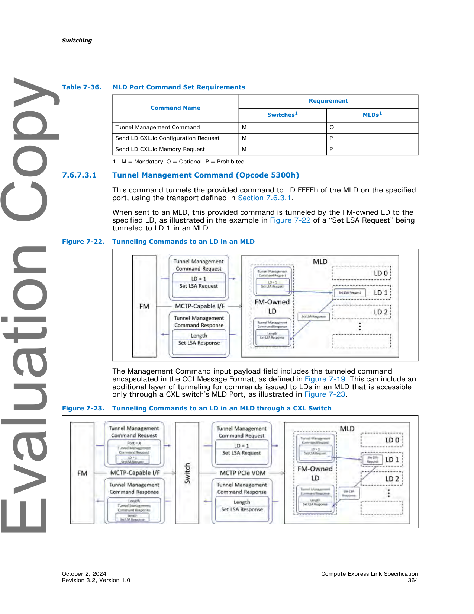
>
> *Original page render @ 150 DPI* — [📄 Full size](figures/chapter_07/page_0364.png)

> **Figure 7-23.** Tunneling Commands to an LD in an MLD through a CXL Switch ｜ 通过 CXL 交换机向 MLD 中的某个 LD 隧道传输命令
>
> 
>
> *Original page render @ 150 DPI* — [📄 Full size](figures/chapter_07/page_0364.png)

<table>
<thead>
<tr>
<th width="50%">🇬🇧 English</th>
<th width="50%" style="background-color:#e8e8e8">🇨🇳 中文</th>
</tr>
</thead>
<tbody>
<tr><td>Response size varies, based on the tunneled FM command's definition. Valid targets for the tunneled commands include switch MLD Ports, valid LDs within an MLD, and the LD Pool CCI in a Multi-Headed device. Tunneled commands sent to any other targets shall be discarded and this command shall return an "Invalid Input" return code. The FM-owned LD (LD=FFFFh) is an invalid target in MLDs.</td><td style="background-color:#e8e8e8">响应大小根据被隧道传输的 FM 命令的定义而变化。隧道传输命令的有效目标包括交换机 MLD 端口、MLD 中的有效 LD,以及多头设备中的 LD Pool CCI。发送到任何其他目标的隧道传输命令应被丢弃,并且此命令应返回 "Invalid Input" 返回码。FM-owned LD (LD=FFFFh) 在 MLD 中是无效目标。</td></tr>
<tr><td>The LD Pool CCI in Multi-Headed devices is targeted using the "Target Type" field, as illustrated in Figure 7-24. This command shall return an "Invalid Input" return code failure if tunneling to the LD Pool CCI is not permitted on the CCI that receives the request.</td><td style="background-color:#e8e8e8">多头设备中的 LD Pool CCI 通过 "Target Type" 字段进行寻址,如图 7-24 所示。如果在接收请求的 CCI 上不允许向 LD Pool CCI 进行隧道传输,则此命令应返回 "Invalid Input" 返回码失败。</td></tr>
<tr><td>A Multi-Headed device shall terminate the processing of a request that includes more than 3 layers of tunneling and return the Unsupported return code.</td><td style="background-color:#e8e8e8">多头设备应终止对包含超过 3 层隧道传输的请求的处理,并返回 Unsupported 返回码。</td></tr>
<tr><td>The Tunnel Management Command itself does not cause any Command Effects, but the Management Command provided in the request will cause Command Effects as per its definition.</td><td style="background-color:#e8e8e8">Tunnel Management Command 本身不产生任何命令效果,但请求中提供的 Management Command 将根据其定义产生相应的命令效果。</td></tr>
<tr><td>Possible Command Return Codes:</td><td style="background-color:#e8e8e8">可能的命令返回码:</td></tr>
<tr><td>• Success</td><td style="background-color:#e8e8e8">• Success (成功)</td></tr>
<tr><td>• Unsupported</td><td style="background-color:#e8e8e8">• Unsupported (不支持)</td></tr>
<tr><td>• Invalid Input</td><td style="background-color:#e8e8e8">• Invalid Input (无效输入)</td></tr>
<tr><td>• Internal Error</td><td style="background-color:#e8e8e8">• Internal Error (内部错误)</td></tr>
<tr><td>• Retry Required</td><td style="background-color:#e8e8e8">• Retry Required (需要重试)</td></tr>
<tr><td>Command Effects:</td><td style="background-color:#e8e8e8">命令效果:</td></tr>
<tr><td>• None</td><td style="background-color:#e8e8e8">• None (无)</td></tr>
</tbody>
</table>

> **Figure 7-24.** Tunneling Commands to the LD Pool CCI in a Multi-Headed Device ｜ 向多头设备中 LD Pool CCI 隧道传输命令
>
> 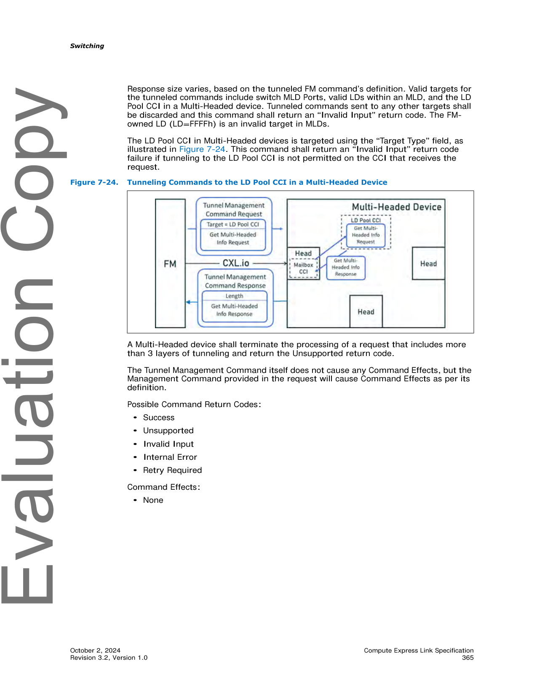
>
> *Original page render @ 150 DPI* — [📄 Full size](figures/chapter_07/page_0365.png)

<table>
<thead>
<tr>
<th>Table 7-37. Tunnel Management Command Request Payload ｜ Tunnel Management Command 请求 Payload</th>
</tr>
</thead>
<tbody>
<tr><td>

| Byte Offset | Length in Bytes | Description |
|---|---|---|
| 0h | 1 | Port or LD ID: Egress port ID for commands sent to a switch, or LD-ID for commands sent to an MLD. Valid only when Target Type is 0. |
| 1h | 1 | • Bits[3:0]: Target Type: Specifies the type of tunneling target for this command: — 0h = Port or LD based. Indicates that the "Port or LD ID" field is used to determine the target. — 1h = LD Pool CCI. Indicates that the tunneling target is the LD Pool CCI of a Multi-Headed device. — All other encodings are reserved. • Bits[7:4]: Reserved |
| 2h | 2 | Command Size: Number of valid bytes in Management Command. |
| 4h | Varies | Management Command: Request message formatted in the CCI Message Format as defined in Figure 7-19. |

</td></tr>
</tbody>
</table>

<table>
<thead>
<tr>
<th>Table 7-38. Tunnel Management Command Response Payload ｜ Tunnel Management Command 响应 Payload</th>
</tr>
</thead>
<tbody>
<tr><td>

| Byte offset | Length in Bytes | Description |
|---|---|---|
| 0h | 2 | Response Length: Number of valid bytes in Response Message. |
| 2h | 2 | Reserved |
| 4h | Varies | Response Message: Response message formatted in the CCI Message Format as defined in Figure 7-19. |

</td></tr>
</tbody>
</table>

[⬆️ 返回目录](#-本章目录-part-a)

---

##### 7.6.7.3.2 Send LD CXL.io Configuration Request (Opcode 5301h) | Send LD CXL.io Configuration Request (操作码 5301h)

<table>
<thead>
<tr>
<th width="50%">🇬🇧 English</th>
<th width="50%" style="background-color:#e8e8e8">🇨🇳 中文</th>
</tr>
</thead>
<tbody>
<tr><td>This command allows the FM to read or write the CXL.io Configuration Space of an unbound LD or FMLD. The switch will convert the request into CfgRd/CfgWr TLPs to the target device. Invalid Input Return Code shall be generated if the requested LD is bound.</td><td style="background-color:#e8e8e8">此命令允许 FM 读取或写入未绑定 LD 或 FMLD 的 CXL.io 配置空间。交换机会将该请求转换为发往目标设备的 CfgRd/CfgWr TLP。如果所请求的 LD 已被绑定,则应生成 Invalid Input 返回码。</td></tr>
<tr><td>Possible Command Return Codes:</td><td style="background-color:#e8e8e8">可能的命令返回码:</td></tr>
<tr><td>• Success</td><td style="background-color:#e8e8e8">• Success (成功)</td></tr>
<tr><td>• Unsupported</td><td style="background-color:#e8e8e8">• Unsupported (不支持)</td></tr>
<tr><td>• Invalid Input</td><td style="background-color:#e8e8e8">• Invalid Input (无效输入)</td></tr>
<tr><td>• Internal Error</td><td style="background-color:#e8e8e8">• Internal Error (内部错误)</td></tr>
<tr><td>• Retry Required</td><td style="background-color:#e8e8e8">• Retry Required (需要重试)</td></tr>
<tr><td>Command Effects:</td><td style="background-color:#e8e8e8">命令效果:</td></tr>
<tr><td>• None</td><td style="background-color:#e8e8e8">• None (无)</td></tr>
</tbody>
</table>

<table>
<thead>
<tr>
<th>Table 7-39. Send LD CXL.io Configuration Request Payload ｜ Send LD CXL.io Configuration Request Payload</th>
</tr>
</thead>
<tbody>
<tr><td>

| Byte Offset | Length in Bytes | Description |
|---|---|---|
| 0h | 1 | PPB ID: Target PPB's physical port. |
| 1h | 3 | • Bits[7:0]: Register Number: As defined in PCIe Base Specification • Bits[11:8]: Extended Register Number: As defined in PCIe Base Specification • Bits[15:12]: First Dword Byte Enable: As defined in PCIe Base Specification • Bits[22:16]: Reserved • Bit[23]: Transaction Type: — 0 = Read — 1 = Write |
| 4h | 2 | LD ID: Target LD-ID. |
| 6h | 2 | Reserved |
| 8h | 4 | Transaction Data: Write data. Valid only for write transactions. |

</td></tr>
</tbody>
</table>

<table>
<thead>
<tr>
<th>Table 7-40. Send LD CXL.io Configuration Response Payload ｜ Send LD CXL.io Configuration 响应 Payload</th>
</tr>
</thead>
<tbody>
<tr><td>

| Byte Offset | Length in Bytes | Description |
|---|---|---|
| 0h | 4 | Return Data: Read data. Valid only for read transactions. |

</td></tr>
</tbody>
</table>

[⬆️ 返回目录](#-本章目录-part-a)

---

##### 7.6.7.3.3 Send LD CXL.io Memory Request (Opcode 5302h) | Send LD CXL.io Memory Request (操作码 5302h)

<table>
<thead>
<tr>
<th width="50%">🇬🇧 English</th>
<th width="50%" style="background-color:#e8e8e8">🇨🇳 中文</th>
</tr>
</thead>
<tbody>
<tr><td>This command allows the FM to batch read or write the CXL.io Memory Space of an unbound LD or FMLD. The switch will convert the request into MemRd/MemWr TLPs to the target device. Invalid Input Return Code shall be generated if the requested LD is bound.</td><td style="background-color:#e8e8e8">此命令允许 FM 批量读取或写入未绑定 LD 或 FMLD 的 CXL.io 内存空间。交换机会将该请求转换为发往目标设备的 MemRd/MemWr TLP。如果所请求的 LD 已被绑定,则应生成 Invalid Input 返回码。</td></tr>
<tr><td>Possible Command Return Codes:</td><td style="background-color:#e8e8e8">可能的命令返回码:</td></tr>
<tr><td>• Success</td><td style="background-color:#e8e8e8">• Success (成功)</td></tr>
<tr><td>• Unsupported</td><td style="background-color:#e8e8e8">• Unsupported (不支持)</td></tr>
<tr><td>• Invalid Input</td><td style="background-color:#e8e8e8">• Invalid Input (无效输入)</td></tr>
<tr><td>• Internal Error</td><td style="background-color:#e8e8e8">• Internal Error (内部错误)</td></tr>
<tr><td>• Retry Required</td><td style="background-color:#e8e8e8">• Retry Required (需要重试)</td></tr>
<tr><td>Command Effects:</td><td style="background-color:#e8e8e8">命令效果:</td></tr>
<tr><td>• None</td><td style="background-color:#e8e8e8">• None (无)</td></tr>
</tbody>
</table>

<table>
<thead>
<tr>
<th>Table 7-41. Send LD CXL.io Memory Request Payload ｜ Send LD CXL.io Memory Request Payload</th>
</tr>
</thead>
<tbody>
<tr><td>

| Byte Offset | Length in Bytes | Description |
|---|---|---|
| 00h | 1 | Port ID: Target MLD port. |
| 01h | 2 | • Bits[11:0]: Reserved • Bits[15:12]: First Dword Byte Enable: As defined in PCIe Base Specification • Bits[19:16]: Last Dword Byte Enable: As defined in PCIe Base Specification • Bits[22:20]: Reserved • Bit[23]: Transaction Type: — 0 = Read — 1 = Write |
| 04h | 2 | LD ID: Target LD-ID. |
| 06h | 2 | Transaction Length: Transaction length in bytes, up to a maximum of 4 KB (1000h). |
| 08h | 8 | Transaction Address: The target HPA that points into the target device's MMIO Space. |
| 10h | Varies | Transaction Data: Write data. Valid only for write transactions. |

</td></tr>
</tbody>
</table>

<table>
<thead>
<tr>
<th>Table 7-42. Send LD CXL.io Memory Request Response Payload ｜ Send LD CXL.io Memory Request 响应 Payload</th>
</tr>
</thead>
<tbody>
<tr><td>

| Byte Offset | Length in Bytes | Description |
|---|---|---|
| 0h | 2 | Return Size: Number of successfully transferred bytes. |
| 2h | 2 | Reserved |
| 4h | Varies | Return Data: Read data. Valid only for read transactions. |

</td></tr>
</tbody>
</table>

[⬆️ 返回目录](#-本章目录-part-a)

---

#### 7.6.7.4 MLD Component Command Set | MLD Component 命令集

<table>
<thead>
<tr>
<th width="50%">🇬🇧 English</th>
<th width="50%" style="background-color:#e8e8e8">🇨🇳 中文</th>
</tr>
</thead>
<tbody>
<tr><td>This command set is only supported by, and must be supported by, MLD components implementing FM API support. These commands are processed by MLDs. When an FM is connected to a CXL switch that supports the FM API and does not have a direct connection to an MLD, these commands are passed to the MLD using the Tunnel Management Command. The following commands are defined:</td><td style="background-color:#e8e8e8">此命令集仅由,且必须由实现 FM API 支持的 MLD 组件支持。这些命令由 MLD 处理。当 FM 连接到支持 FM API 且与 MLD 没有直接连接的 CXL 交换机时,这些命令通过 Tunnel Management Command 传递给 MLD。定义了以下命令:</td></tr>
</tbody>
</table>

<table>
<thead>
<tr>
<th>Table 7-43. MLD Component Command Set Requirements ｜ MLD Component 命令集要求</th>
</tr>
</thead>
<tbody>
<tr><td>

| Command Name | Requirement¹ |
|---|---|
| Get LD Info | M |
| Get LD Allocations | M |
| Set LD Allocations | O |
| Get QoS Control | M |
| Set QoS Control | M |
| Get QoS Status | O |
| Get QoS Allocated BW | M |
| Set QoS Allocated BW | M |
| Get QoS BW Limit | M |
| Set QoS BW Limit | M |

1. M = Mandatory, O = Optional.

</td></tr>
</tbody>
</table>

[⬆️ 返回目录](#-本章目录-part-a)

---

##### 7.6.7.4.1 Get LD Info (Opcode 5400h) | Get LD Info (操作码 5400h)

<table>
<thead>
<tr>
<th width="50%">🇬🇧 English</th>
<th width="50%" style="background-color:#e8e8e8">🇨🇳 中文</th>
</tr>
</thead>
<tbody>
<tr><td>This command retrieves the configurations of the MLD.</td><td style="background-color:#e8e8e8">此命令检索 MLD 的配置。</td></tr>
<tr><td>Possible Command Return Codes:</td><td style="background-color:#e8e8e8">可能的命令返回码:</td></tr>
<tr><td>• Success</td><td style="background-color:#e8e8e8">• Success (成功)</td></tr>
<tr><td>• Unsupported</td><td style="background-color:#e8e8e8">• Unsupported (不支持)</td></tr>
<tr><td>• Invalid Input</td><td style="background-color:#e8e8e8">• Invalid Input (无效输入)</td></tr>
<tr><td>• Internal Error</td><td style="background-color:#e8e8e8">• Internal Error (内部错误)</td></tr>
<tr><td>• Retry Required</td><td style="background-color:#e8e8e8">• Retry Required (需要重试)</td></tr>
<tr><td>Command Effects:</td><td style="background-color:#e8e8e8">命令效果:</td></tr>
<tr><td>• None</td><td style="background-color:#e8e8e8">• None (无)</td></tr>
</tbody>
</table>

<table>
<thead>
<tr>
<th>Table 7-44. Get LD Info Response Payload ｜ Get LD Info 响应 Payload</th>
</tr>
</thead>
<tbody>
<tr><td>

| Byte Offset | Length in Bytes | Description |
|---|---|---|
| 0h | 8 | Memory Size: Total device memory capacity. |
| 8h | 2 | LD Count: Number of logical devices supported. |
| Ah | 1 | QoS Telemetry Capability: Optional QoS Telemetry for memory MLD capabilities for management by an FM (see Section 3.3.4). • Bit[0]: Egress Port Congestion Supported: When set, the associated feature is supported and the Get QoS Status command must be implemented (see Section 3.3.4.3.9). • Bit[1]: Temporary Throughput Reduction Supported: When set, the associated feature is supported (see Section 3.3.4.3.5). • Bits[7:2]: Reserved. |

</td></tr>
</tbody>
</table>

[⬆️ 返回目录](#-本章目录-part-a)

---

##### 7.6.7.4.2 Get LD Allocations (Opcode 5401h) | Get LD Allocations (操作码 5401h)

<table>
<thead>
<tr>
<th width="50%">🇬🇧 English</th>
<th width="50%" style="background-color:#e8e8e8">🇨🇳 中文</th>
</tr>
</thead>
<tbody>
<tr><td>This command retrieves the memory allocations of the MLD.</td><td style="background-color:#e8e8e8">此命令检索 MLD 的内存分配。</td></tr>
<tr><td>Possible Command Return Codes:</td><td style="background-color:#e8e8e8">可能的命令返回码:</td></tr>
<tr><td>• Success</td><td style="background-color:#e8e8e8">• Success (成功)</td></tr>
<tr><td>• Unsupported</td><td style="background-color:#e8e8e8">• Unsupported (不支持)</td></tr>
<tr><td>• Internal Error</td><td style="background-color:#e8e8e8">• Internal Error (内部错误)</td></tr>
<tr><td>• Retry Required</td><td style="background-color:#e8e8e8">• Retry Required (需要重试)</td></tr>
<tr><td>• Invalid Payload Length</td><td style="background-color:#e8e8e8">• Invalid Payload Length (无效 Payload 长度)</td></tr>
<tr><td>Command Effects:</td><td style="background-color:#e8e8e8">命令效果:</td></tr>
<tr><td>• None</td><td style="background-color:#e8e8e8">• None (无)</td></tr>
</tbody>
</table>

<table>
<thead>
<tr>
<th>Table 7-45. Get LD Allocations Request Payload ｜ Get LD Allocations 请求 Payload</th>
</tr>
</thead>
<tbody>
<tr><td>

| Byte Offset | Length in Bytes | Description |
|---|---|---|
| 0h | 1 | Start LD ID: ID of the first LD in the LD Allocation List. |
| 1h | 1 | LD Allocation List Limit: Maximum number of LD information blocks returned. This field shall have a minimum value of 1. |

</td></tr>
</tbody>
</table>

<table>
<thead>
<tr>
<th>Table 7-46. Get LD Allocations Response Payload ｜ Get LD Allocations 响应 Payload</th>
</tr>
</thead>
<tbody>
<tr><td>

| Byte Offset | Length in Bytes | Description |
|---|---|---|
| 0h | 1 | Number of LDs: Number of LDs enabled in the device. |
| 1h | 1 | Memory Granularity: This field specifies the granularity of the memory sizes configured for each LD: • 0h = 256 MB • 1h = 512 MB • 2h = 1 GB • All other encodings are reserved |
| 2h | 1 | Start LD ID: ID of the first LD in the LD Allocation List. |
| 3h | 1 | LD Allocation List Length: Number of LD information blocks returned. This value is the lesser of the request's 'LD Allocation List Limit' and response's 'Number of LDs'. |
| 4h | Varies | LD Allocation List: LD Allocation blocks for each LD, as defined in Table 7-47, repeated LD Allocation List Length times. |

</td></tr>
</tbody>
</table>

<table>
<thead>
<tr>
<th>Table 7-47. LD Allocations List Format ｜ LD Allocations 列表格式</th>
</tr>
</thead>
<tbody>
<tr><td>

| Byte Offset | Length in Bytes | Description |
|---|---|---|
| 0h | 8 | Range 1 Allocation Multiplier: Memory Allocation Range 1 for LD. This value is multiplied with Memory Granularity to calculate the memory allocation range in bytes. |
| 8h | 8 | Range 2 Allocation Multiplier: Memory Allocation Range 2 for LD. This value is multiplied with Memory Granularity to calculate the memory allocation range in bytes. |

</td></tr>
</tbody>
</table>

[⬆️ 返回目录](#-本章目录-part-a)

---

##### 7.6.7.4.3 Set LD Allocations (Opcode 5402h) | Set LD Allocations (操作码 5402h)

<table>
<thead>
<tr>
<th width="50%">🇬🇧 English</th>
<th width="50%" style="background-color:#e8e8e8">🇨🇳 中文</th>
</tr>
</thead>
<tbody>
<tr><td>This command sets the memory allocation for each LD. This command will fail if the device fails to allocate any of the allocations defined in the request. The allocations provided in the response reflect the state of the LD allocations after the command is processed, which allows the FM to check for partial success.</td><td style="background-color:#e8e8e8">此命令为每个 LD 设置内存分配。如果设备无法分配请求中定义的任何分配,则此命令将失败。响应中提供的分配反映命令处理后 LD 分配的状态,允许 FM 检查部分成功的情况。</td></tr>
<tr><td>Possible Command Return Codes:</td><td style="background-color:#e8e8e8">可能的命令返回码:</td></tr>
<tr><td>• Success</td><td style="background-color:#e8e8e8">• Success (成功)</td></tr>
<tr><td>• Unsupported</td><td style="background-color:#e8e8e8">• Unsupported (不支持)</td></tr>
<tr><td>• Invalid Input</td><td style="background-color:#e8e8e8">• Invalid Input (无效输入)</td></tr>
<tr><td>• Internal Error</td><td style="background-color:#e8e8e8">• Internal Error (内部错误)</td></tr>
<tr><td>• Retry Required</td><td style="background-color:#e8e8e8">• Retry Required (需要重试)</td></tr>
<tr><td>• Invalid Payload Length</td><td style="background-color:#e8e8e8">• Invalid Payload Length (无效 Payload 长度)</td></tr>
<tr><td>Command Effects:</td><td style="background-color:#e8e8e8">命令效果:</td></tr>
<tr><td>• Configuration Change after Cold Reset</td><td style="background-color:#e8e8e8">• Configuration Change after Cold Reset (冷复位后配置变更)</td></tr>
<tr><td>• Configuration Change after Conventional Reset</td><td style="background-color:#e8e8e8">• Configuration Change after Conventional Reset (常规复位后配置变更)</td></tr>
<tr><td>• Configuration Change after CXL Reset</td><td style="background-color:#e8e8e8">• Configuration Change after CXL Reset (CXL 复位后配置变更)</td></tr>
<tr><td>• Immediate Configuration Change</td><td style="background-color:#e8e8e8">• Immediate Configuration Change (立即配置变更)</td></tr>
<tr><td>• Immediate Data Change</td><td style="background-color:#e8e8e8">• Immediate Data Change (立即数据变更)</td></tr>
</tbody>
</table>

<table>
<thead>
<tr>
<th>Table 7-48. Set LD Allocations Request Payload ｜ Set LD Allocations 请求 Payload</th>
</tr>
</thead>
<tbody>
<tr><td>

| Byte Offset | Length in Bytes | Description |
|---|---|---|
| 0h | 1 | Number of LDs: Number of LDs to configure. This field shall have a minimum value of 1. |
| 1h | 1 | Start LD ID: ID of the first LD in the LD Allocation List. |
| 2h | 2 | Reserved |
| 4h | Varies | LD Allocation List: LD Allocation blocks for each LD, starting at Start LD ID, as defined in Table 7-47, repeated Number of LDs times. |

</td></tr>
</tbody>
</table>

<table>
<thead>
<tr>
<th>Table 7-49. Set LD Allocations Response Payload ｜ Set LD Allocations 响应 Payload</th>
</tr>
</thead>
<tbody>
<tr><td>

| Byte Offset | Length in Bytes | Description |
|---|---|---|
| 0h | 1 | Number of LDs: Number of LDs configured. |
| 1h | 1 | Start LD ID: ID of the first LD in the LD Allocation List. |
| 2h | 2 | Reserved |
| 4h | Varies | LD Allocation List: Updated LD Allocation blocks for each LD, starting at Start LD ID, as defined in Table 7-47, repeated Number of LDs times. |

</td></tr>
</tbody>
</table>

[⬆️ 返回目录](#-本章目录-part-a)

---

##### 7.6.7.4.4 Get QoS Control (Opcode 5403h) | Get QoS Control (操作码 5403h)

<table>
<thead>
<tr>
<th width="50%">🇬🇧 English</th>
<th width="50%" style="background-color:#e8e8e8">🇨🇳 中文</th>
</tr>
</thead>
<tbody>
<tr><td>This command retrieves the MLD's QoS control parameters.</td><td style="background-color:#e8e8e8">此命令检索 MLD 的 QoS 控制参数。</td></tr>
<tr><td>Possible Command Return Codes:</td><td style="background-color:#e8e8e8">可能的命令返回码:</td></tr>
<tr><td>• Success</td><td style="background-color:#e8e8e8">• Success (成功)</td></tr>
<tr><td>• Internal Error</td><td style="background-color:#e8e8e8">• Internal Error (内部错误)</td></tr>
<tr><td>• Retry Required</td><td style="background-color:#e8e8e8">• Retry Required (需要重试)</td></tr>
<tr><td>• Invalid Payload Length</td><td style="background-color:#e8e8e8">• Invalid Payload Length (无效 Payload 长度)</td></tr>
<tr><td>Command Effects:</td><td style="background-color:#e8e8e8">命令效果:</td></tr>
<tr><td>• None</td><td style="background-color:#e8e8e8">• None (无)</td></tr>
</tbody>
</table>

<table>
<thead>
<tr>
<th>Table 7-50. Payload for Get QoS Control Response, Set QoS Control Request, and Set QoS Control Response (Sheet 1 of 2) ｜ Get QoS Control 响应、Set QoS Control 请求与响应 Payload (第 1 页 / 共 2 页)</th>
</tr>
</thead>
<tbody>
<tr><td>

| Byte Offset | Length in Bytes | Description |
|---|---|---|
| 0h | 1 | QoS Telemetry Control: Default is 00h. • Bit[0]: Egress Port Congestion Enable: See Section 3.3.4.3.9 • Bit[1]: Temporary Throughput Reduction Enable: See Section 3.3.4.3.5 • Bits[7:2]: Reserved |
| 1h | 1 | Egress Moderate Percentage: Threshold in percent for Egress Port Congestion mechanism to indicate moderate congestion. Valid range is 1-100. Default is 10. |
| 2h | 1 | Egress Severe Percentage: Threshold in percent for Egress Port Congestion mechanism to indicate severe congestion. Valid range is 1-100. Default is 25. |
| 3h | 1 | Backpressure Sample Interval: Interval in ns for Egress Port Congestion mechanism to take samples. Valid range is 0-15. Default is 8 (800 ns of history for 100 samples). Value of 0 disables the mechanism. See Section 3.3.4.3.4. |
| 4h | 2 | ReqCmpBasis: Estimated maximum sustained sum of requests and recent responses across the entire device, serving as the basis for QoS Limit Fraction. Valid range is 0-65,535. Value of 0 disables the mechanism. Default is 0. See Section 3.3.4.3.7. |
| 6h | 1 | Completion Collection Interval: Interval in ns for Completion Counting mechanism to collect the number of transmitted responses in a single counter. Valid range is 0-255. Default is 64 (1.024 us of history, given 16 counters). See Section 3.3.4.3.10. |

</td></tr>
</tbody>
</table>

<table>
<thead>
<tr>
<th>Table 7-50. Payload for Get QoS Control Response, Set QoS Control Request, and Set QoS Control Response (Sheet 2 of 2) ｜ Get QoS Control 响应、Set QoS Control 请求与响应 Payload (第 2 页 / 共 2 页)</th>
</tr>
</thead>
<tbody>
<tr><td>

| Byte Offset | Length in Bytes | Description |
|---|---|---|
| (Continued from prior sheet) |  |  |

</td></tr>
</tbody>
</table>

[⬆️ 返回目录](#-本章目录-part-a)

---

##### 7.6.7.4.5 Set QoS Control (Opcode 5404h) | Set QoS Control (操作码 5404h)

<table>
<thead>
<tr>
<th width="50%">🇬🇧 English</th>
<th width="50%" style="background-color:#e8e8e8">🇨🇳 中文</th>
</tr>
</thead>
<tbody>
<tr><td>This command sets the MLD's QoS control parameters, as defined in Table 7-50. The device must complete the set operation before returning the response. The command response returns the resulting QoS control parameters, as defined in the same table. This command will fail, returning Invalid Input, if any of the parameters are outside their valid range.</td><td style="background-color:#e8e8e8">此命令按表 7-50 所定义设置 MLD 的 QoS 控制参数。设备必须在返回响应之前完成设置操作。命令响应按同一表所定义返回结果 QoS 控制参数。如果任何参数超出有效范围,此命令将失败并返回 Invalid Input。</td></tr>
<tr><td>Possible Command Codes:</td><td style="background-color:#e8e8e8">可能的命令返回码:</td></tr>
<tr><td>• Success</td><td style="background-color:#e8e8e8">• Success (成功)</td></tr>
<tr><td>• Invalid Input</td><td style="background-color:#e8e8e8">• Invalid Input (无效输入)</td></tr>
<tr><td>• Internal Error</td><td style="background-color:#e8e8e8">• Internal Error (内部错误)</td></tr>
<tr><td>• Retry Required</td><td style="background-color:#e8e8e8">• Retry Required (需要重试)</td></tr>
<tr><td>• Invalid Payload Length</td><td style="background-color:#e8e8e8">• Invalid Payload Length (无效 Payload 长度)</td></tr>
<tr><td>Command Effects:</td><td style="background-color:#e8e8e8">命令效果:</td></tr>
<tr><td>• Immediate Policy Change</td><td style="background-color:#e8e8e8">• Immediate Policy Change (立即策略变更)</td></tr>
<tr><td>Payload for Set QoS Control Request and Response is documented in Table 7-50.</td><td style="background-color:#e8e8e8">Set QoS Control 请求和响应的 Payload 在表 7-50 中记录。</td></tr>
</tbody>
</table>

[⬆️ 返回目录](#-本章目录-part-a)

---

##### 7.6.7.4.6 Get QoS Status (Opcode 5405h) | Get QoS Status (操作码 5405h)

<table>
<thead>
<tr>
<th width="50%">🇬🇧 English</th>
<th width="50%" style="background-color:#e8e8e8">🇨🇳 中文</th>
</tr>
</thead>
<tbody>
<tr><td>This command retrieves the MLD's QoS Status. This command is mandatory if the Egress Port Congestion Supported bit is set (see Table 7-44).</td><td style="background-color:#e8e8e8">此命令检索 MLD 的 QoS 状态。如果 Egress Port Congestion Supported 位置位 (参见表 7-44),则此命令是必需的。</td></tr>
<tr><td>Possible Command Return Codes:</td><td style="background-color:#e8e8e8">可能的命令返回码:</td></tr>
<tr><td>• Success</td><td style="background-color:#e8e8e8">• Success (成功)</td></tr>
<tr><td>• Unsupported</td><td style="background-color:#e8e8e8">• Unsupported (不支持)</td></tr>
<tr><td>• Internal Error</td><td style="background-color:#e8e8e8">• Internal Error (内部错误)</td></tr>
<tr><td>• Retry Required</td><td style="background-color:#e8e8e8">• Retry Required (需要重试)</td></tr>
<tr><td>• Invalid Payload Length</td><td style="background-color:#e8e8e8">• Invalid Payload Length (无效 Payload 长度)</td></tr>
<tr><td>Command Effects:</td><td style="background-color:#e8e8e8">命令效果:</td></tr>
<tr><td>• None</td><td style="background-color:#e8e8e8">• None (无)</td></tr>
</tbody>
</table>

<table>
<thead>
<tr>
<th>Table 7-51. Get QoS Status Response Payload ｜ Get QoS Status 响应 Payload</th>
</tr>
</thead>
<tbody>
<tr><td>

| Byte Offset | Length in Bytes | Description |
|---|---|---|
| 0h | 1 | Backpressure Average Percentage: Current snapshot of the measured Egress Port average congestion. See Section 3.3.4.3.4. |

</td></tr>
</tbody>
</table>

[⬆️ 返回目录](#-本章目录-part-a)

---

##### 7.6.7.4.7 Get QoS Allocated BW (Opcode 5406h) | Get QoS Allocated BW (操作码 5406h)

<table>
<thead>
<tr>
<th width="50%">🇬🇧 English</th>
<th width="50%" style="background-color:#e8e8e8">🇨🇳 中文</th>
</tr>
</thead>
<tbody>
<tr><td>This command retrieves the MLD's QoS allocated bandwidth on a per-LD basis (see Section 3.3.4.3.7).</td><td style="background-color:#e8e8e8">此命令按每个 LD 检索 MLD 的 QoS 已分配带宽 (参见 3.3.4.3.7 节)。</td></tr>
<tr><td>Possible Command Return Codes:</td><td style="background-color:#e8e8e8">可能的命令返回码:</td></tr>
<tr><td>• Success</td><td style="background-color:#e8e8e8">• Success (成功)</td></tr>
<tr><td>• Invalid Input</td><td style="background-color:#e8e8e8">• Invalid Input (无效输入)</td></tr>
<tr><td>• Internal Error</td><td style="background-color:#e8e8e8">• Internal Error (内部错误)</td></tr>
<tr><td>• Retry Required</td><td style="background-color:#e8e8e8">• Retry Required (需要重试)</td></tr>
<tr><td>• Invalid Payload Length</td><td style="background-color:#e8e8e8">• Invalid Payload Length (无效 Payload 长度)</td></tr>
<tr><td>Command Effects:</td><td style="background-color:#e8e8e8">命令效果:</td></tr>
<tr><td>• None</td><td style="background-color:#e8e8e8">• None (无)</td></tr>
</tbody>
</table>

<table>
<thead>
<tr>
<th>Table 7-52. Payload for Get QoS Allocated BW Request ｜ Get QoS Allocated BW 请求 Payload</th>
</tr>
</thead>
<tbody>
<tr><td>

| Byte Offset | Length in Bytes | Description |
|---|---|---|
| 0h | 1 | Number of LDs: Number of LDs queried. This field shall have a minimum value of 1. |
| 1h | 1 | Start LD ID: ID of the first LD in the QoS Allocated BW List. |

</td></tr>
</tbody>
</table>

<table>
<thead>
<tr>
<th>Table 7-53. Payload for Get QoS Allocated BW Response ｜ Get QoS Allocated BW 响应 Payload</th>
</tr>
</thead>
<tbody>
<tr><td>

| Byte Offset | Length in Bytes | Description |
|---|---|---|
| 0h | 1 | Number of LDs: Number of LDs queried. |
| 1h | 1 | Start LD ID: ID of the first LD in the QoS Allocated BW List. |
| 2h | Number of LDs | QoS Allocation Fraction: Byte array of allocated bandwidth fractions for LDs, starting at Start LD ID. The valid range of each array element is 0-255. Default value is 0. Value in each byte is the fraction multiplied by 256. |

</td></tr>
</tbody>
</table>

[⬆️ 返回目录](#-本章目录-part-a)

---

##### 7.6.7.4.8 Set QoS Allocated BW (Opcode 5407h) | Set QoS Allocated BW (操作码 5407h)

<table>
<thead>
<tr>
<th width="50%">🇬🇧 English</th>
<th width="50%" style="background-color:#e8e8e8">🇨🇳 中文</th>
</tr>
</thead>
<tbody>
<tr><td>This command sets the MLD's QoS allocated bandwidth on a per-LD basis, as defined in Section 3.3.4.3.7. The device must complete the set operation before returning the response. The command response returns the resulting QoS allocated bandwidth, as defined in the same table. This command will fail, returning Invalid Input, if any of the parameters are outside their valid range.</td><td style="background-color:#e8e8e8">此命令按 3.3.4.3.7 节所定义,按每个 LD 设置 MLD 的 QoS 已分配带宽。设备必须在返回响应之前完成设置操作。命令响应按同一表所定义返回结果 QoS 已分配带宽。如果任何参数超出有效范围,此命令将失败并返回 Invalid Input。</td></tr>
<tr><td>Possible Command Return Codes:</td><td style="background-color:#e8e8e8">可能的命令返回码:</td></tr>
<tr><td>• Success</td><td style="background-color:#e8e8e8">• Success (成功)</td></tr>
<tr><td>• Invalid Input</td><td style="background-color:#e8e8e8">• Invalid Input (无效输入)</td></tr>
<tr><td>• Internal Error</td><td style="background-color:#e8e8e8">• Internal Error (内部错误)</td></tr>
<tr><td>• Retry Required</td><td style="background-color:#e8e8e8">• Retry Required (需要重试)</td></tr>
<tr><td>• Invalid Payload Length</td><td style="background-color:#e8e8e8">• Invalid Payload Length (无效 Payload 长度)</td></tr>
<tr><td>Command Effects:</td><td style="background-color:#e8e8e8">命令效果:</td></tr>
<tr><td>• Configuration Change after Cold Reset</td><td style="background-color:#e8e8e8">• Configuration Change after Cold Reset (冷复位后配置变更)</td></tr>
<tr><td>• Configuration Change after Conventional Reset</td><td style="background-color:#e8e8e8">• Configuration Change after Conventional Reset (常规复位后配置变更)</td></tr>
<tr><td>• Configuration Change after CXL Reset</td><td style="background-color:#e8e8e8">• Configuration Change after CXL Reset (CXL 复位后配置变更)</td></tr>
<tr><td>• Immediate Configuration Change</td><td style="background-color:#e8e8e8">• Immediate Configuration Change (立即配置变更)</td></tr>
<tr><td>• Immediate Data Change</td><td style="background-color:#e8e8e8">• Immediate Data Change (立即数据变更)</td></tr>
</tbody>
</table>

<table>
<thead>
<tr>
<th>Table 7-54. Payload for Set QoS Allocated BW Request, and Set QoS Allocated BW Response ｜ Set QoS Allocated BW 请求与响应 Payload</th>
</tr>
</thead>
<tbody>
<tr><td>

| Byte Offset | Length in Bytes | Description |
|---|---|---|
| 0h | 1 | Number of LDs: Number of LDs configured. |
| 1h | 1 | Start LD ID: ID of the first LD in the QoS Allocated BW List. |
| 2h | Number of LDs | QoS Allocation Fraction: Byte array of allocated bandwidth fractions for LDs, starting at Start LD ID. The valid range of each array element is 0-255. Default value is 0. Value in each byte is the fraction multiplied by 256. |

</td></tr>
</tbody>
</table>

[⬆️ 返回目录](#-本章目录-part-a)

---

##### 7.6.7.4.9 Get QoS BW Limit (Opcode 5408h) | Get QoS BW Limit (操作码 5408h)

<table>
<thead>
<tr>
<th width="50%">🇬🇧 English</th>
<th width="50%" style="background-color:#e8e8e8">🇨🇳 中文</th>
</tr>
</thead>
<tbody>
<tr><td>This command retrieves the MLD's QoS bandwidth limit on a per-LD basis (see Section 3.3.4.3.7).</td><td style="background-color:#e8e8e8">此命令按每个 LD 检索 MLD 的 QoS 带宽限制 (参见 3.3.4.3.7 节)。</td></tr>
<tr><td>Possible Command Return Codes:</td><td style="background-color:#e8e8e8">可能的命令返回码:</td></tr>
<tr><td>• Success</td><td style="background-color:#e8e8e8">• Success (成功)</td></tr>
<tr><td>• Invalid Input</td><td style="background-color:#e8e8e8">• Invalid Input (无效输入)</td></tr>
<tr><td>• Internal Error</td><td style="background-color:#e8e8e8">• Internal Error (内部错误)</td></tr>
<tr><td>• Retry Required</td><td style="background-color:#e8e8e8">• Retry Required (需要重试)</td></tr>
<tr><td>• Invalid Payload Length</td><td style="background-color:#e8e8e8">• Invalid Payload Length (无效 Payload 长度)</td></tr>
<tr><td>Command Effects:</td><td style="background-color:#e8e8e8">命令效果:</td></tr>
<tr><td>• None</td><td style="background-color:#e8e8e8">• None (无)</td></tr>
</tbody>
</table>

<table>
<thead>
<tr>
<th>Table 7-55. Payload for Get QoS BW Limit Request ｜ Get QoS BW Limit 请求 Payload</th>
</tr>
</thead>
<tbody>
<tr><td>

| Byte Offset | Length in Bytes | Description |
|---|---|---|
| 0h | 1 | Number of LDs: Number of LDs queried. This field shall have a minimum value of 1. |
| 1h | 1 | Start LD ID: ID of the first LD in the QoS BW Limit List. |

</td></tr>
</tbody>
</table>

<table>
<thead>
<tr>
<th>Table 7-56. Payload for Get QoS BW Limit Response ｜ Get QoS BW Limit 响应 Payload</th>
</tr>
</thead>
<tbody>
<tr><td>

| Byte Offset | Length in Bytes | Description |
|---|---|---|
| 0h | 1 | Number of LDs: Number of LDs queried. |
| 1h | 1 | Start LD ID: ID of the first LD in the QoS BW Limit List. |
| 2h | Number of LDs | QoS Limit Fraction: Byte array of allocated bandwidth limit fractions for LDs, starting at Start LD ID. The valid range of each array element is 0-255. Default value is 0. Value in each byte is the fraction multiplied by 256. |

</td></tr>
</tbody>
</table>

[⬆️ 返回目录](#-本章目录-part-a)

---

##### 7.6.7.4.10 Set QoS BW Limit (Opcode 5409h) | Set QoS BW Limit (操作码 5409h)

<table>
<thead>
<tr>
<th width="50%">🇬🇧 English</th>
<th width="50%" style="background-color:#e8e8e8">🇨🇳 中文</th>
</tr>
</thead>
<tbody>
<tr><td>This command sets the MLD's QoS bandwidth limit on a per-LD basis, as defined in Section 3.3.4.3.7. The device must complete the set operation before returning the response. The command response returns the resulting QoS bandwidth limit, as defined in the same table. This command will fail, returning Invalid Input, if any of the parameters are outside their valid range. This command will fail, returning Internal Error, if the device was able to set the QoS BW Limit for some of the LDs in the request, but not all the LDs.</td><td style="background-color:#e8e8e8">此命令按 3.3.4.3.7 节所定义,按每个 LD 设置 MLD 的 QoS 带宽限制。设备必须在返回响应之前完成设置操作。命令响应按同一表所定义返回结果 QoS 带宽限制。如果任何参数超出有效范围,此命令将失败并返回 Invalid Input。如果设备能够为请求中的部分 (而非全部) LD 设置 QoS BW Limit,则此命令将失败并返回 Internal Error。</td></tr>
<tr><td>Possible Command Return Codes:</td><td style="background-color:#e8e8e8">可能的命令返回码:</td></tr>
<tr><td>• Success</td><td style="background-color:#e8e8e8">• Success (成功)</td></tr>
<tr><td>• Invalid Input</td><td style="background-color:#e8e8e8">• Invalid Input (无效输入)</td></tr>
<tr><td>• Internal Error</td><td style="background-color:#e8e8e8">• Internal Error (内部错误)</td></tr>
<tr><td>• Retry Required</td><td style="background-color:#e8e8e8">• Retry Required (需要重试)</td></tr>
<tr><td>• Invalid Payload Length</td><td style="background-color:#e8e8e8">• Invalid Payload Length (无效 Payload 长度)</td></tr>
<tr><td>Command Effects:</td><td style="background-color:#e8e8e8">命令效果:</td></tr>
<tr><td>• Configuration Change after Cold Reset</td><td style="background-color:#e8e8e8">• Configuration Change after Cold Reset (冷复位后配置变更)</td></tr>
<tr><td>• Configuration Change after Conventional Reset</td><td style="background-color:#e8e8e8">• Configuration Change after Conventional Reset (常规复位后配置变更)</td></tr>
<tr><td>• Configuration Change after CXL Reset</td><td style="background-color:#e8e8e8">• Configuration Change after CXL Reset (CXL 复位后配置变更)</td></tr>
<tr><td>• Immediate Configuration Change</td><td style="background-color:#e8e8e8">• Immediate Configuration Change (立即配置变更)</td></tr>
<tr><td>• Immediate Data Change</td><td style="background-color:#e8e8e8">• Immediate Data Change (立即数据变更)</td></tr>
</tbody>
</table>

<table>
<thead>
<tr>
<th>Table 7-57. Payload for Set QoS BW Limit Request, and Set QoS BW Limit Response ｜ Set QoS BW Limit 请求与响应 Payload</th>
</tr>
</thead>
<tbody>
<tr><td>

| Byte Offset | Length in Bytes | Description |
|---|---|---|
| 0h | 1 | Number of LDs: Number of LDs configured. |
| 1h | 1 | Start LD ID: ID of the first LD in the QoS BW Limit List. |
| 2h | Number of LDs | QoS Limit Fraction: Byte array of allocated bandwidth limit fractions for LDs, starting at Start LD ID. The valid range of each array element is 0-255. Default value is 0. Value in each byte is the fraction multiplied by 256. |

</td></tr>
</tbody>
</table>

[⬆️ 返回目录](#-本章目录-part-a)

---

#### 7.6.7.5 Multi-Headed Device Command Set | Multi-Headed Device 命令集

<table>
<thead>
<tr>
<th width="50%">🇬🇧 English</th>
<th width="50%" style="background-color:#e8e8e8">🇨🇳 中文</th>
</tr>
</thead>
<tbody>
<tr><td>The Multi-Headed device command set includes commands for querying the Head-to-LD mapping in a Multi-Headed device. Support for this command set is required on the LD Pool CCI of a Multi-Headed device.</td><td style="background-color:#e8e8e8">Multi-Headed Device 命令集包括用于查询多头设备中 Head-to-LD 映射的命令。在多头设备的 LD Pool CCI 上必须支持此命令集。</td></tr>
</tbody>
</table>

[⬆️ 返回目录](#-本章目录-part-a)

---

##### 7.6.7.5.1 Get Multi-Headed Info (Opcode 5500h) | Get Multi-Headed Info (操作码 5500h)

<table>
<thead>
<tr>
<th width="50%">🇬🇧 English</th>
<th width="50%" style="background-color:#e8e8e8">🇨🇳 中文</th>
</tr>
</thead>
<tbody>
<tr><td>This command retrieves the number of heads, number of supported LDs, and Head-to-LD mapping of a Multi-Headed device.</td><td style="background-color:#e8e8e8">此命令检索多头设备的 head 数量、所支持的 LD 数量以及 Head-to-LD 映射。</td></tr>
<tr><td>Possible Command Return Codes:</td><td style="background-color:#e8e8e8">可能的命令返回码:</td></tr>
<tr><td>• Success</td><td style="background-color:#e8e8e8">• Success (成功)</td></tr>
<tr><td>• Unsupported</td><td style="background-color:#e8e8e8">• Unsupported (不支持)</td></tr>
<tr><td>• Invalid Input</td><td style="background-color:#e8e8e8">• Invalid Input (无效输入)</td></tr>
<tr><td>• Internal Error</td><td style="background-color:#e8e8e8">• Internal Error (内部错误)</td></tr>
<tr><td>• Retry Required</td><td style="background-color:#e8e8e8">• Retry Required (需要重试)</td></tr>
<tr><td>Command Effects:</td><td style="background-color:#e8e8e8">命令效果:</td></tr>
<tr><td>• None</td><td style="background-color:#e8e8e8">• None (无)</td></tr>
</tbody>
</table>

<table>
<thead>
<tr>
<th>Table 7-58. Get Multi-Headed Info Request Payload ｜ Get Multi-Headed Info 请求 Payload</th>
</tr>
</thead>
<tbody>
<tr><td>

| Byte Offset | Length in Bytes | Description |
|---|---|---|
| 0h | 1 | Start LD ID: ID of the first LD in the LD Map. |
| 1h | 1 | LD Map List Limit: Maximum number of LD Map entries returned. This field shall have a minimum value of 1. |

</td></tr>
</tbody>
</table>

<table>
<thead>
<tr>
<th>Table 7-59. Get Multi-Headed Info Response Payload ｜ Get Multi-Headed Info 响应 Payload</th>
</tr>
</thead>
<tbody>
<tr><td>

| Byte Offset | Length in Bytes | Description |
|---|---|---|
| 0h | 1 | Number of LDs: Total number of LDs in the LD Pool. This field shall have a minimum value of 1. |
| 1h | 1 | Number of Heads: Total number of CXL heads. This field shall have a minimum value of 1. |
| 2h | 2 | Reserved |
| 4h | 1 | Start LD ID: ID of the first LD in the LD Map. |
| 5h | 1 | LD Map Length: Number of LD Map entries returned. LD Map Length = Min (LD Map List Limit. (Number of LDs - Start LD ID)) |
| 6h | 2 | Reserved |
| 8h | LD Map Length | LD Map: Port number of the head to which each LD is assigned, starting at Start LD ID, repeated LD Map Length times. A value of FFh indicates that LD is not currently assigned to a head. |

</td></tr>
</tbody>
</table>

[⬆️ 返回目录](#-本章目录-part-a)

---

##### 7.6.7.5.2 Get Head Info (Opcode 5501h) | Get Head Info (操作码 5501h)

<table>
<thead>
<tr>
<th width="50%">🇬🇧 English</th>
<th width="50%" style="background-color:#e8e8e8">🇨🇳 中文</th>
</tr>
</thead>
<tbody>
<tr><td>This command retrieves information for one or more heads.</td><td style="background-color:#e8e8e8">此命令检索一个或多个 head 的信息。</td></tr>
<tr><td>This command fails with the Invalid Input return code if the values of the Start Head and Number of Heads fields request the information for a non-existent head.</td><td style="background-color:#e8e8e8">如果 Start Head 和 Number of Heads 字段的值请求不存在的 head 的信息,则此命令以 Invalid Input 返回码失败。</td></tr>
<tr><td>Possible Command Return Codes:</td><td style="background-color:#e8e8e8">可能的命令返回码:</td></tr>
<tr><td>• Success</td><td style="background-color:#e8e8e8">• Success (成功)</td></tr>
<tr><td>• Unsupported</td><td style="background-color:#e8e8e8">• Unsupported (不支持)</td></tr>
<tr><td>• Invalid Input</td><td style="background-color:#e8e8e8">• Invalid Input (无效输入)</td></tr>
<tr><td>• Internal Error</td><td style="background-color:#e8e8e8">• Internal Error (内部错误)</td></tr>
<tr><td>• Retry Required</td><td style="background-color:#e8e8e8">• Retry Required (需要重试)</td></tr>
<tr><td>Command Effects:</td><td style="background-color:#e8e8e8">命令效果:</td></tr>
<tr><td>• None</td><td style="background-color:#e8e8e8">• None (无)</td></tr>
</tbody>
</table>

<table>
<thead>
<tr>
<th>Table 7-60. Get Head Info Request Payload ｜ Get Head Info 请求 Payload</th>
</tr>
</thead>
<tbody>
<tr><td>

| Byte Offset | Length in Bytes | Description |
|---|---|---|
| 0h | 1 | Start Head: Specifies the ID of the first head information block requested. |
| 1h | 1 | Number of Heads: Number of head information blocks requested. |

</td></tr>
</tbody>
</table>

<table>
<thead>
<tr>
<th>Table 7-61. Get Head Info Response Payload ｜ Get Head Info 响应 Payload</th>
</tr>
</thead>
<tbody>
<tr><td>

| Byte Offset | Length in Bytes | Description |
|---|---|---|
| 0h | 1 | Number of Heads: Number of head information blocks returned. |
| 1h | 3 | Reserved |
| 4h | Varies | Head Information List: Head information block as defined in Table 7-62, repeated Number of Heads times. |

</td></tr>
</tbody>
</table>

<table>
<thead>
<tr>
<th>Table 7-62. Get Head Info Head Information Block Format ｜ Get Head Info Head 信息块格式</th>
</tr>
</thead>
<tbody>
<tr><td>

| Byte Offset | Length in Bytes | Description |
|---|---|---|
| 0h | 1 | Port Number: Value encoding matches the Port Number field in the PCIe Link Capabilities register in the PCIe Capability structure. |
| 1h | 1 | • Bits[5:0]: Maximum Link Width: Value encoding matches the Maximum Link Width field in the PCIe Link Capabilities register in the PCIe Capability structure • Bits[7:6]: Reserved |
| 2h | 1 | • Bits[5:0]: Negotiated Link Width: Value encoding matches the Negotiated Link Width field in the PCIe Link Capabilities register in the PCIe Capability structure • Bits[7:6]: Reserved |
| 3h | 1 | • Bits[5:0]: Supported Link Speeds Vector: Value encoding matches the Supported Link Speeds Vector field in the PCIe Link Capabilities 2 register in the PCIe Capability structure • Bits[7:6]: Reserved |
| 4h | 1 | • Bits[5:0]: Max Link Speed: Value encoding matches the Max Link Speed field in the PCIe Link Capabilities register in the PCIe Capability structure • Bits[7:6]: Reserved |
| 5h | 1 | • Bits[5:0]: Current Link Speed: Value encoding matches the Current Link Speed field in the PCIe Link Status register in the PCIe Capability structure • Bits[7:6]: Reserved |
| 6h | 1 | LTSSM State: Current link LTSSM Major state: • 00h = Detect • 01h = Polling • 02h = Configuration • 03h = Recovery • 04h = L0 • 05h = L0s • 06h = L1 • 07h = L2 • 08h = Disabled • 09h = Loopback • 0Ah = Hot Reset • All other encodings are reserved Link substates should be reported through vendor-defined diagnostics commands. |
| 7h | 1 | First Negotiated Lane Number |
| 8h | 1 | Link State Flags • Bit[0]: Lane Reversal State: — 0 = Standard lane ordering — 1 = Reversed lane ordering • Bit[1]: Port PCIe Reset State (PERST#): — 0 = Not in reset — 1 = In reset • Bits[7:2]: Reserved |

</td></tr>
</tbody>
</table>

[⬆️ 返回目录](#-本章目录-part-a)

---

#### 7.6.7.6 DCD Management Command Set for LD-FAM | LD-FAM DCD Management 命令集

<table>
<thead>
<tr>
<th width="50%">🇬🇧 English</th>
<th width="50%" style="background-color:#e8e8e8">🇨🇳 中文</th>
</tr>
</thead>
<tbody>
<tr><td>The DCD Management command set, described in the following subsections, includes commands for querying and configuring Dynamic Capacity for LD-FAM (SLDs and MLDs). It is used by the FM to manage memory assignment within an LD-FAM DCD. Memory management for G-FAM (GFDs) is defined in Section 8.2.10.9.10.</td><td style="background-color:#e8e8e8">DCD Management 命令集 (在以下各子节中描述) 包括用于查询和配置 LD-FAM (SLD 和 MLD) Dynamic Capacity 的命令。FM 使用它来管理 LD-FAM DCD 中的内存分配。G-FAM (GFD) 的内存管理在 8.2.10.9.10 节中定义。</td></tr>
</tbody>
</table>

[⬆️ 返回目录](#-本章目录-part-a)

---

##### 7.6.7.6.1 Get DCD Info (Opcode 5600h) | Get DCD Info (操作码 5600h)

<table>
<thead>
<tr>
<th width="50%">🇬🇧 English</th>
<th width="50%" style="background-color:#e8e8e8">🇨🇳 中文</th>
</tr>
</thead>
<tbody>
<tr><td>This command retrieves the number of supported hosts, total Dynamic Capacity of the device, and supported region configurations for an LD-FAM DCD. To retrieve the corresponding DCD info for a GFD, see Section 8.2.10.9.10.1.</td><td style="background-color:#e8e8e8">此命令检索 LD-FAM DCD 所支持的主机数、设备的总 Dynamic Capacity,以及支持的 region 配置。如需检索 GFD 对应的 DCD 信息,请参见 8.2.10.9.10.1 节。</td></tr>
<tr><td>Possible Command Return Codes:</td><td style="background-color:#e8e8e8">可能的命令返回码:</td></tr>
<tr><td>• Success</td><td style="background-color:#e8e8e8">• Success (成功)</td></tr>
<tr><td>• Unsupported</td><td style="background-color:#e8e8e8">• Unsupported (不支持)</td></tr>
<tr><td>• Internal Error</td><td style="background-color:#e8e8e8">• Internal Error (内部错误)</td></tr>
<tr><td>• Retry Required</td><td style="background-color:#e8e8e8">• Retry Required (需要重试)</td></tr>
<tr><td>Command Effects:</td><td style="background-color:#e8e8e8">命令效果:</td></tr>
<tr><td>• None</td><td style="background-color:#e8e8e8">• None (无)</td></tr>
</tbody>
</table>

<table>
<thead>
<tr>
<th>Table 7-63. Get DCD Info Response Payload (Sheet 1 of 2) ｜ Get DCD Info 响应 Payload (第 1 页 / 共 2 页)</th>
</tr>
</thead>
<tbody>
<tr><td>

| Byte Offset | Length in Bytes | Description |
|---|---|---|
| 00h | 1 | Number of Hosts: Total number of hosts that the device supports. This field shall have a minimum value of 1. |
| 01h | 1 | Number of Supported DC Regions: The device shall report the total number of Dynamic Capacity Regions available per LD. DCDs shall report between 1 and 8 regions. All other encodings are reserved. |
| 02h | 2 | Reserved |
| 04h | 2 | • Bits[3:0]: Supported Add Capacity Selection Policies: Bitmask that specifies the selection policies, as defined in Section 7.6.7.6.5, that the device supports when capacity is added. At least one policy shall be supported. A value of 1 indicates that a policy is supported, and a value of 0 indicates that a policy is not supported: — Bit[0]: Free — Bit[1]: Contiguous — Bit[2]: Prescriptive — Bit[3]: Must be 0 • Bits[15:4]: Reserved |
| 06h | 2 | Reserved |
| 08h | 2 | • Bits[1:0]: Supported Release Capacity Removal Policies: Bitmask that specifies the removal policies, as defined in Section 7.6.7.6.6, that the device supports when capacity is released. At least one policy shall be supported. A value of 1 indicates that a policy is supported, and a value of 0 indicates that a policy is not supported: — Bit[0]: Tag-based — Bit[1]: Prescriptive • Bits[15:2]: Reserved |
| 0Ah | 1 | Sanitize on Release Configuration Support Mask: Bitmask, where bit position corresponds to region number, indicating whether the Sanitize on Release capability is configurable (1) or not configurable (0) for that region. |
| 0Bh | 1 | Reserved |
| 0Ch | 8 | Total Dynamic Capacity: Total memory media capacity of the device available for dynamic assignment to any host in multiples of 256 MB. |

</td></tr>
</tbody>
</table>

<table>
<thead>
<tr>
<th>Table 7-63. Get DCD Info Response Payload (Sheet 2 of 2) ｜ Get DCD Info 响应 Payload (第 2 页 / 共 2 页)</th>
</tr>
</thead>
<tbody>
<tr><td>

| Byte Offset | Length in Bytes | Description |
|---|---|---|
| 14h | 8 | Region 0 Supported Block Size Mask: Indicates the block sizes that the region supports. Each bit indicates a power of 2 supported block size, where bit n being set indicates that block size 2^n is supported. Bits[5:0] and bits[63:52] shall be 0. At least one block size shall be supported. |
| 1Ch | 8 | Region 1 Supported Block Size Mask: As defined in Region 0 Supported Block Size Mask. Valid only if Number of Supported Regions > 1. |
| 24h | 8 | Region 2 Supported Block Size Mask: As defined in Region 0 Supported Block Size Mask. Valid only if Number of Supported Regions > 2. |
| 2Ch | 8 | Region 3 Supported Block Size Mask: As defined in Region 0 Supported Block Size Mask. Valid only if Number of Supported Regions > 3. |
| 34h | 8 | Region 4 Supported Block Size Mask: As defined in Region 0 Supported Block Size Mask. Valid only if Number of Supported Regions > 4. |
| 3Ch | 8 | Region 5 Supported Block Size Mask: As defined in Region 0 Supported Block Size Mask. Valid only if Number of Supported Regions > 5. |
| 44h | 8 | Region 6 Supported Block Size Mask: As defined in Region 0 Supported Block Size Mask. Valid only if Number of Supported Regions > 6. |
| 4Ch | 8 | Region 7 Supported Block Size Mask: As defined in Region 0 Supported Block Size Mask. Valid only if Number of Supported Regions > 7. |

</td></tr>
</tbody>
</table>

[⬆️ 返回目录](#-本章目录-part-a)

---

##### 7.6.7.6.2 Get Host DC Region Configuration (Opcode 5601h) | Get Host DC Region Configuration (操作码 5601h)

<table>
<thead>
<tr>
<th width="50%">🇬🇧 English</th>
<th width="50%" style="background-color:#e8e8e8">🇨🇳 中文</th>
</tr>
</thead>
<tbody>
<tr><td>This command retrieves the Dynamic Capacity configuration for an LD-FAM DCD, for a specified host.</td><td style="background-color:#e8e8e8">此命令为指定主机检索 LD-FAM DCD 的 Dynamic Capacity 配置。</td></tr>
<tr><td>Possible Command Return Codes:</td><td style="background-color:#e8e8e8">可能的命令返回码:</td></tr>
<tr><td>• Success</td><td style="background-color:#e8e8e8">• Success (成功)</td></tr>
<tr><td>• Unsupported</td><td style="background-color:#e8e8e8">• Unsupported (不支持)</td></tr>
<tr><td>• Invalid Input</td><td style="background-color:#e8e8e8">• Invalid Input (无效输入)</td></tr>
<tr><td>• Internal Error</td><td style="background-color:#e8e8e8">• Internal Error (内部错误)</td></tr>
<tr><td>• Retry Required</td><td style="background-color:#e8e8e8">• Retry Required (需要重试)</td></tr>
<tr><td>Command Effects:</td><td style="background-color:#e8e8e8">命令效果:</td></tr>
<tr><td>• None</td><td style="background-color:#e8e8e8">• None (无)</td></tr>
</tbody>
</table>

<table>
<thead>
<tr>
<th>Table 7-64. Get Host DC Region Configuration Request Payload ｜ Get Host DC Region Configuration 请求 Payload</th>
</tr>
</thead>
<tbody>
<tr><td>

| Byte Offset | Length in Bytes | Description |
|---|---|---|
| 0h | 2 | Host ID: For an LD-FAM device, the LD-ID of the host interface configuration to query. |
| 2h | 1 | Region Count: The maximum number of region configurations to return in the output payload. |
| 3h | 1 | Starting Region Index: Index of the first requested region. |

</td></tr>
</tbody>
</table>

[⬆️ 返回目录](#-本章目录-part-a)

---

##### 7.6.7.6.3 Set DC Region Configuration (Opcode 5602h) | Set DC Region Configuration (操作码 5602h)

<table>
<thead>
<tr>
<th width="50%">🇬🇧 English</th>
<th width="50%" style="background-color:#e8e8e8">🇨🇳 中文</th>
</tr>
</thead>
<tbody>
<tr><td>This command sets the configuration of a DC Region for an LD-FAM DCD. This command shall be processed only when all capacity has been released from the region on all LDs. The device shall generate an Event Record of type Region Configuration Updated upon successful processing of this command.</td><td style="background-color:#e8e8e8">此命令设置 LD-FAM DCD 的 DC Region 配置。仅当所有 LD 上该 region 的所有容量都已释放时,才应处理此命令。设备应在成功处理此命令后生成类型为 Region Configuration Updated 的 Event Record。</td></tr>
</tbody>
</table>

<table>
<thead>
<tr>
<th>Table 7-65. Get Host DC Region Configuration Response Payload ｜ Get Host DC Region Configuration 响应 Payload</th>
</tr>
</thead>
<tbody>
<tr><td>

| Byte Offset | Length in Bytes | Description |
|---|---|---|
| 0h | 2 | Host ID: For an LD-FAM device, the LD-ID of the host interface configuration returned. |
| 2h | 1 | Number of Available Regions: As defined in Get Dynamic Capacity Configuration Output Payload. |
| 3h | 1 | Number of Regions Returned: The number of entries in the Region Configuration List. |
| 4h | Varies | Region Configuration List: DC Region Info for region specified via Starting Region Index input field. The format of each entry is defined in Table 7-66. |
| Varies | 4 | Total Number of Supported Extents: Total number of extents that the device supports on this LD. |
| Varies | 4 | Number of Available Extents: Remaining number of extents that the device supports, as defined in Section 9.13.3.3. |
| Varies | 4 | Total Number of Supported Tags: Total number of Tag values that the device supports on this LD. |
| Varies | 4 | Number of Available Tags: Remaining number of Tag values that the device supports, as defined in Section 9.13.3.3. |

</td></tr>
</tbody>
</table>

<table>
<thead>
<tr>
<th>Table 7-66. DC Region Configuration ｜ DC Region Configuration</th>
</tr>
</thead>
<tbody>
<tr><td>

| Byte Offset | Length in Bytes | Description |
|---|---|---|
| 00h | 8 | Region Base: As defined in Table 8-180. |
| 08h | 8 | Region Decode Length: As defined in Table 8-180. |
| 10h | 8 | Region Length: As defined in Table 8-180. |
| 18h | 8 | Region Block Size: As defined in Table 8-180. |
| 20h | 1 | Note: More than one bit may be set at a time. • Bits[1:0]: Reserved • Bit[2]: NonVolatile: As defined in the Flags field of Device Scoped Memory Affinity Structure defined in Coherent Device Attribute Table (CDAT) Specification • Bit[3]: Sharable: As defined in the Flags field of Device Scoped Memory Affinity Structure defined in CDAT Specification • Bit[4]: Hardware Managed Coherency: As defined in the Flags field of Device Scoped Memory Affinity Structure defined in CDAT Specification • Bit[5]: Interconnect specific Dynamic Capacity Management: As defined in the Flags field of Device Scoped Memory Affinity Structure defined in CDAT Specification • Bit[6]: Read-Only: As defined in the Flags field of Device Scoped Memory Affinity Structure defined in CDAT Specification • Bit[7]: Reserved |
| 21h | 3 | Reserved |
| 24h | 1 | • Bit[0]: Sanitize on Release: As defined in Table 8-180 • Bits[7:1]: Reserved |
| 25h | 3 | Reserved |

</td></tr>
</tbody>
</table>

[⬆️ 返回目录](#-本章目录-part-a)

---
