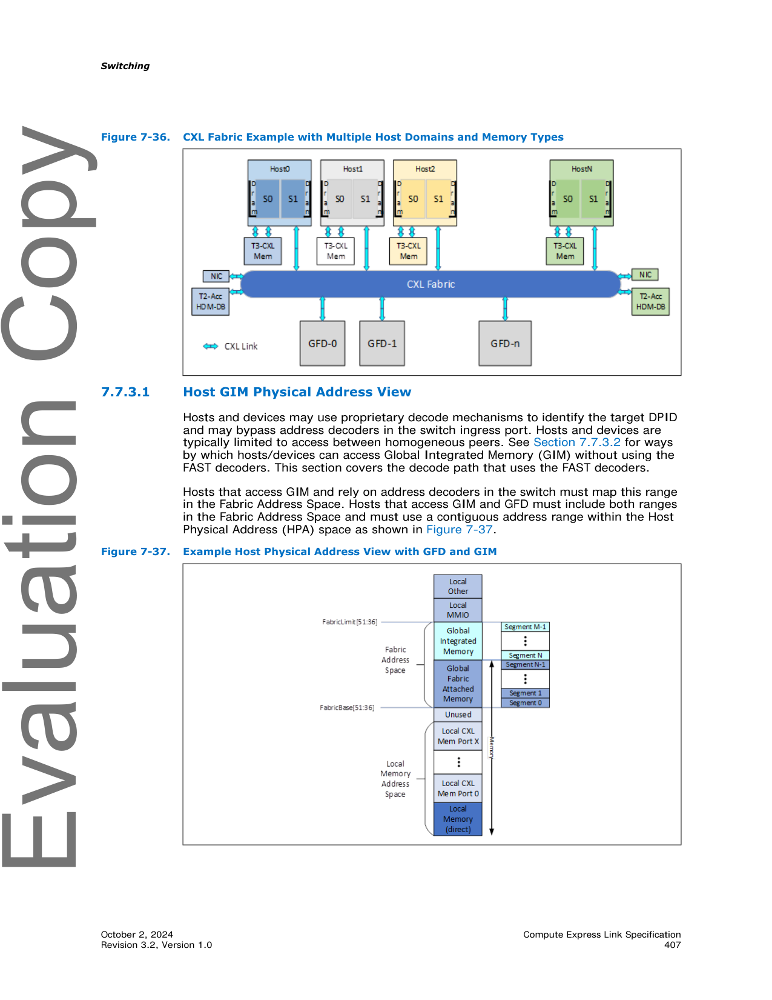
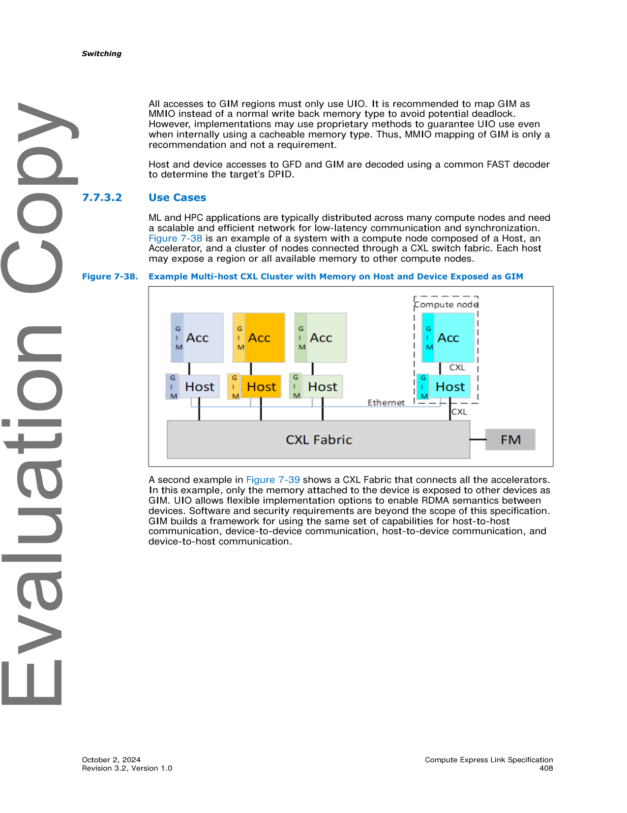
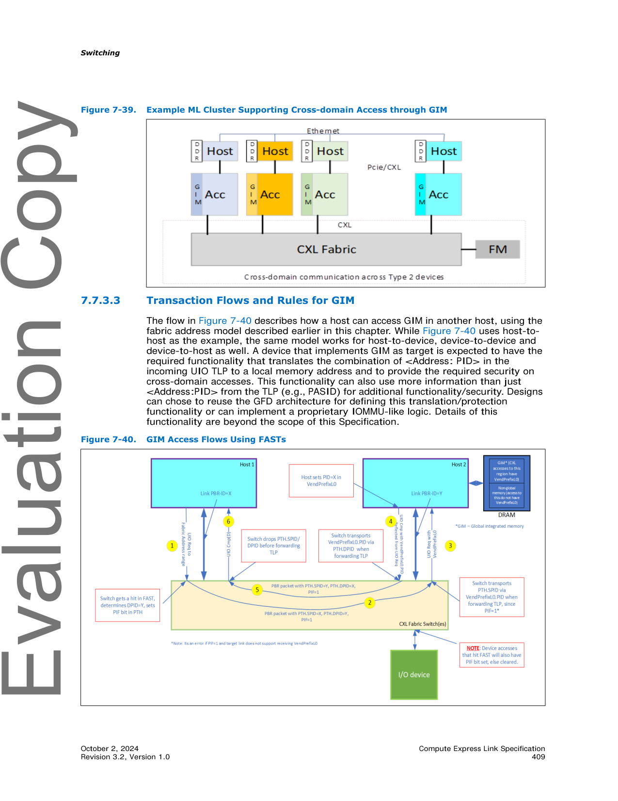
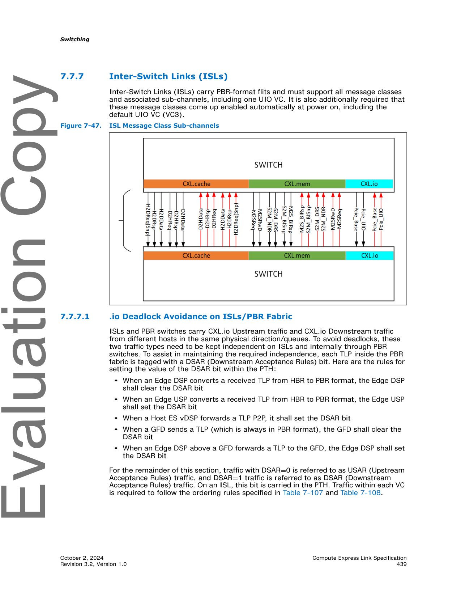
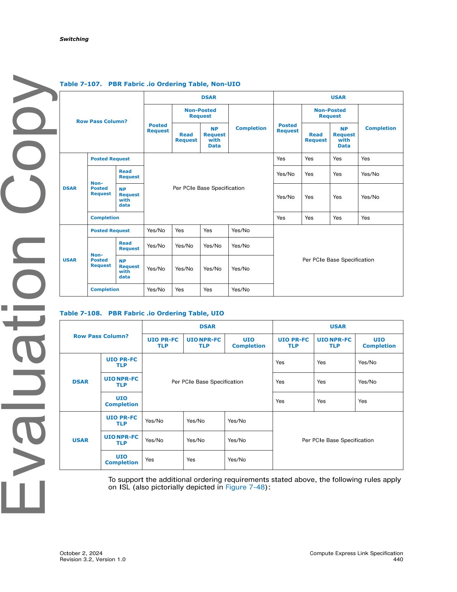

# 📘 第 7 章　交换 (Chapter 7. Switching) — Part B

> **Source pages**: 381–440 (Part B) | **File**: chapter_07b.md | **Format**: 中英对照双语
>
> 🎨 **Format**: 中英对照双语 · 表格翻译为 Markdown · 图表原始保留 · 中文背景色灰色 · GitHub Flavored Markdown

---

## 📑 本章目录 (Part B)

- [7.6.7.6.4 Get DC Region Extent Lists (Opcode 5603h)](#sec-7-6-7-6-4)
- [7.6.7.6.5 Initiate Dynamic Capacity Add (Opcode 5604h)](#sec-7-6-7-6-5)
- [7.6.7.6.6 Initiate Dynamic Capacity Release (Opcode 5605h)](#sec-7-6-7-6-6)
- [7.6.7.6.7 Dynamic Capacity Add Reference (Opcode 5606h)](#sec-7-6-7-6-7)
- [7.6.7.6.8 Dynamic Capacity Remove Reference (Opcode 5607h)](#sec-7-6-7-6-8)
- [7.6.7.6.9 Dynamic Capacity List Tags (Opcode 5608h)](#sec-7-6-7-6-9)
- [7.6.8 Fabric Management Event Records](#sec-7-6-8)
  - [7.6.8.1 Physical Switch Event Records](#sec-7-6-8-1)
  - [7.6.8.2 Virtual CXL Switch Event Records](#sec-7-6-8-2)
  - [7.6.8.3 MLD Port Event Records](#sec-7-6-8-3)
- [7.7 CXL Fabric Architecture](#sec-7-7)
  - [7.7.1 CXL Fabric Use Case Examples](#sec-7-7-1)
    - [7.7.1.1 Machine-learning Accelerators](#sec-7-7-1-1)
    - [7.7.1.2 HPC/Analytics Use Case](#sec-7-7-1-2)
    - [7.7.1.3 Composable Systems](#sec-7-7-1-3)
  - [7.7.2 Global-Fabric-Attached Memory (G-FAM)](#sec-7-7-2)
    - [7.7.2.1 Overview](#sec-7-7-2-1)
    - [7.7.2.2 Host Physical Address View](#sec-7-7-2-2)
    - [7.7.2.3 G-FAM Capacity Management](#sec-7-7-2-3)
    - [7.7.2.4 G-FAM Request Routing, Interleaving, and Address Translations](#sec-7-7-2-4)
    - [7.7.2.5 G-FAM Access Protection](#sec-7-7-2-5)
    - [7.7.2.6 Global Memory Access Endpoint](#sec-7-7-2-6)
    - [7.7.2.7 Event Notifications from GFDs](#sec-7-7-2-7)
  - [7.7.3 Global Integrated Memory (GIM)](#sec-7-7-3)
    - [7.7.3.1 Host GIM Physical Address View](#sec-7-7-3-1)
    - [7.7.3.2 Use Cases](#sec-7-7-3-2)
    - [7.7.3.3 Transaction Flows and Rules for GIM](#sec-7-7-3-3)
      - [7.7.3.3.1 GIM Rules for PBR Switch Ingress Port](#sec-7-7-3-3-1)
      - [7.7.3.3.2 GIM Rules for PBR Switch Egress Port](#sec-7-7-3-3-2)
      - [7.7.3.3.3 GIM Rules for Host/Devices](#sec-7-7-3-3-3)
      - [7.7.3.3.4 Other GIM Rules](#sec-7-7-3-3-4)
    - [7.7.3.4 Restrictions with Host-to-Host UIO Usages](#sec-7-7-3-4)
  - [7.7.4 Non-GIM Usages with VendPrefixL0](#sec-7-7-4)
  - [7.7.5 HBR and PBR Switch Configurations](#sec-7-7-5)
    - [7.7.5.1 PBR Forwarding Dependencies, Loops, and Deadlocks](#sec-7-7-5-1)
  - [7.7.6 PBR Switching Details](#sec-7-7-6)
    - [7.7.6.1 Virtual Hierarchies Spanning a Fabric](#sec-7-7-6-1)
    - [7.7.6.2 PBR Message Routing across the Fabric](#sec-7-7-6-2)
    - [7.7.6.3 PBR Message Routing within a Single PBR Switch](#sec-7-7-6-3)
    - [7.7.6.4 PBR Switch vDSP/vUSP Bindings and Connectivity](#sec-7-7-6-4)
    - [7.7.6.5 PID Use Models and Assignments](#sec-7-7-6-5)
    - [7.7.6.6 CXL Switch Message Format Conversion](#sec-7-7-6-6)
      - [7.7.6.6.1 CXL.io, Including UIO](#sec-7-7-6-6-1)
      - [7.7.6.6.2 CXL.cache](#sec-7-7-6-6-2)
      - [7.7.6.6.3 CXL.mem](#sec-7-7-6-6-3)
    - [7.7.6.7 HBR Switch Port Processing of CXL Messages](#sec-7-7-6-7)
    - [7.7.6.8 PBR Switch Port Processing of CXL Messages](#sec-7-7-6-8)
    - [7.7.6.9 PPB and vPPB Behavior of PBR Link Ports](#sec-7-7-6-9)
      - [7.7.6.9.1 ISL Type 1 Configuration Space Header](#sec-7-7-6-9-1)
      - [7.7.6.9.2 ISL PCIe-compatible Configuration Register](#sec-7-7-6-9-2)
      - [7.7.6.9.3 ISL PCIe Capability Structure](#sec-7-7-6-9-3)
      - [7.7.6.9.4 ISL Secondary PCIe Capability Structure](#sec-7-7-6-9-4)
      - [7.7.6.9.5 ISL Physical Layer 16.0 GT/s Extended Capability](#sec-7-7-6-9-5)
      - [7.7.6.9.6 ISL Physical Layer 32.0 GT/s Extended Capability](#sec-7-7-6-9-6)
      - [7.7.6.9.7 ISL Physical Layer 64.0 GT/s Extended Capability](#sec-7-7-6-9-7)
      - [7.7.6.9.8 ISL Lane Margining at the Receiver Extended Capability](#sec-7-7-6-9-8)
      - [7.7.6.9.9 ISL ACS Extended Capability](#sec-7-7-6-9-9)
      - [7.7.6.9.10 ISL Advanced Error Reporting Extended Capability](#sec-7-7-6-9-10)
      - [7.7.6.9.11 ISL DPC Extended Capability](#sec-7-7-6-9-11)
  - [7.7.7 Inter-Switch Links (ISLs)](#sec-7-7-7)
    - [7.7.7.1 .io Deadlock Avoidance on ISLs/PBR Fabric](#sec-7-7-7-1)

## 🖼 本章图表 (Part B)

| Figure | Title | 图标题 | Page |
|:------:|:------|:-------|:----:|
| Figure 7-25 | High-level CXL Fabric Diagram | CXL Fabric 高层示意图 | p.392 |
| Figure 7-26 | ML Accelerator Use Case | 机器学习加速器用例 | p.393 |
| Figure 7-27 | HPC/Analytics Use Case | HPC/分析用例 | p.393 |
| Figure 7-28 | Sample System Topology for Composable Systems | 可组合系统的示例系统拓扑 | p.394 |
| Figure 7-29 | Example Host Physical Address View | 主机物理地址视图示例 | p.396 |
| Figure 7-30 | Example HPA Mapping to DMPs | HPA 到 DMP 映射示例 | p.397 |
| Figure 7-31 | G-FAM Request Routing, Interleaving, and Address Translations | G-FAM 请求路由、交织与地址转换 | p.399 |
| Figure 7-32 | Memory Access Protection Levels | 内存访问保护层级 | p.403 |
| Figure 7-33 | GFD Dynamic Capacity Access Protections | GFD 动态容量访问保护 | p.404 |
| Figure 7-34 | PBR Fabric Providing LD-FAM and G-FAM Resources | 提供 LD-FAM 和 G-FAM 资源的 PBR Fabric | p.405 |
| Figure 7-35 | PBR Fabric Providing Only G-FAM Resources | 仅提供 G-FAM 资源的 PBR Fabric | p.405 |
| Figure 7-36 | CXL Fabric Example with Multiple Host Domains and Memory Types | 多主机域和内存类型的 CXL Fabric 示例 | p.407 |
| Figure 7-37 | Example Host Physical Address View with GFD and GIM | 包含 GFD 和 GIM 的主机物理地址视图示例 | p.407 |
| Figure 7-38 | Example Multi-host CXL Cluster with Memory on Host and Device Exposed as GIM | 主机和设备内存作为 GIM 暴露的多主机 CXL 集群示例 | p.408 |
| Figure 7-39 | Example ML Cluster Supporting Cross-domain Access through GIM | 支持通过 GIM 进行跨域访问的 ML 集群示例 | p.409 |
| Figure 7-40 | GIM Access Flows Using FASTs | 使用 FAST 的 GIM 访问流 | p.409 |
| Figure 7-41 | GIM Access Flows without FASTs | 不使用 FAST 的 GIM 访问流 | p.410 |
| Figure 7-42 | Example Supported Switch Configurations | 受支持交换机配置示例 | p.413 |
| Figure 7-43 | Example PBR Mesh Topology | PBR Mesh 拓扑示例 | p.414 |
| Figure 7-44 | Example Routing Scheme for a Mesh Topology | Mesh 拓扑的路由方案示例 | p.415 |
| Figure 7-45 | Physical Topology and Logical View | 物理拓扑与逻辑视图 | p.417 |
| Figure 7-46 | Example PBR Fabric | PBR Fabric 示例 | p.421 |
| Figure 7-47 | ISL Message Class Sub-channels | ISL 消息类子通道 | p.439 |
| Figure 7-48 | PBR Fabric .io Deadlock Avoidance via DSAR/USAR | PBR Fabric 通过 DSAR/USAR 实现 .io 死锁避免 | p.440 |

## 📊 本章表格 (Part B)

| Table | Title | 表标题 | Sheets |
|:-----:|:------|:-------|:------:|
| Table 7-67 | Set DC Region Configuration Request and Response Payload | 设置 DC Region 配置请求与响应负载 | 1 (p.381) |
| Table 7-68 | Get DC Region Extent Lists Request Payload | 获取 DC Region 范围列表请求负载 | 1 (p.382) |
| Table 7-69 | Get DC Region Extent Lists Response Payload | 获取 DC Region 范围列表响应负载 | 1 (p.382) |
| Table 7-70 | Initiate Dynamic Capacity Add Request Payload | 启动动态容量添加请求负载 | 1 (p.384) |
| Table 7-71 | Initiate Dynamic Capacity Release Request Payload | 启动动态容量释放请求负载 | 1 (p.386) |
| Table 7-72 | Dynamic Capacity Add Reference Request Payload | 动态容量添加引用请求负载 | 1 (p.387) |
| Table 7-73 | Dynamic Capacity Remove Reference Request Payload | 动态容量移除引用请求负载 | 1 (p.387) |
| Table 7-74 | Dynamic Capacity List Tags Request Payload | 动态容量列表标签请求负载 | 1 (p.388) |
| Table 7-75 | Dynamic Capacity List Tags Response Payload | 动态容量列表标签响应负载 | 1 (p.388) |
| Table 7-76 | Dynamic Capacity Tag Information | 动态容量标签信息 | 1 (p.388) |
| Table 7-77 | Physical Switch Events Record Format | 物理交换机事件记录格式 | 1 (p.389) |
| Table 7-78 | Virtual CXL Switch Event Record Format | 虚拟 CXL 交换机事件记录格式 | 1 (p.390) |
| Table 7-79 | MLD Port Event Records Payload | MLD 端口事件记录负载 | 1 (p.391) |
| Table 7-80 | Differences between LD-FAM and G-FAM | LD-FAM 与 G-FAM 的差异 | 2 (p.397/398) |
| Table 7-81 | Fabric Segment Size Table | Fabric 段大小表 | 1 (p.400) |
| Table 7-82 | Segment Table Intlv[3:0] Field Encoding | Segment Table Intlv[3:0] 字段编码 | 1 (p.400) |
| Table 7-83 | Segment Table Gran[3:0] Field Encoding | Segment Table Gran[3:0] 字段编码 | 1 (p.401) |
| Table 7-84 | PBR Fabric Decoding and Routing, by Message Class | 按消息类划分的 PBR Fabric 解码和路由 | 1 (p.418) |
| Table 7-85 | Optional Architected Dynamic Routing Modes | 可选的架构化动态路由模式 | 1 (p.420) |
| Table 7-86 | Summary of CacheID Field | CacheID 字段汇总 | 1 (p.424) |
| Table 7-87 | Summary of HBR Switch Routing for CXL.cache Message Classes | CXL.cache 消息类的 HBR 交换机路由汇总 | 1 (p.424) |
| Table 7-88 | Summary of PBR Switch Routing for CXL.cache Message Classes | CXL.cache 消息类的 PBR 交换机路由汇总 | 1 (p.425) |
| Table 7-89 | Summary of LD-ID Field | LD-ID 字段汇总 | 1 (p.425) |
| Table 7-90 | Summary of BI-ID Field | BI-ID 字段汇总 | 1 (p.426) |
| Table 7-91 | Summary of HBR Switch Routing for CXL.mem Message Classes | CXL.mem 消息类的 HBR 交换机路由汇总 | 1 (p.426) |
| Table 7-92 | Summary of PBR Switch Routing for CXL.mem Message Classes | CXL.mem 消息类的 PBR 交换机路由汇总 | 1 (p.427) |
| Table 7-93 | HBR Switch Port Processing Table for CXL.io | CXL.io 的 HBR 交换机端口处理表 | 1 (p.428) |
| Table 7-94 | HBR Switch Port Processing Table for CXL.cache | CXL.cache 的 HBR 交换机端口处理表 | 1 (p.428) |
| Table 7-95 | HBR Switch Port Processing Table for CXL.mem | CXL.mem 的 HBR 交换机端口处理表 | 1 (p.429) |
| Table 7-96 | PBR Switch Port Processing Table for CXL.io | CXL.io 的 PBR 交换机端口处理表 | 2 (p.430/432) |
| Table 7-97 | PBR Switch Port Processing Table for CXL.cache | CXL.cache 的 PBR 交换机端口处理表 | 1 (p.431) |
| Table 7-98 | PBR Switch Port Processing Table for CXL.mem | CXL.mem 的 PBR 交换机端口处理表 | 1 (p.432) |
| Table 7-99 | ISL Type 1 Configuration Space Header | ISL Type 1 配置空间头 | 1 (p.433) |
| Table 7-100 | ISL PCIe Configuration Space Header | ISL PCIe 配置空间头 | 1 (p.434) |
| Table 7-101 | ISL PCIe Capability Structure | ISL PCIe Capability Structure | 3 (p.434–436) |
| Table 7-102 | ISL Secondary PCIe Extended Capability | ISL Secondary PCIe Extended Capability | 1 (p.436) |
| Table 7-103 | ISL Physical Layer 16.0 GT/s Extended Capability | ISL Physical Layer 16.0 GT/s Extended Capability | 1 (p.437) |
| Table 7-104 | ISL Physical Layer 32.0 GT/s Extended Capability | ISL Physical Layer 32.0 GT/s Extended Capability | 1 (p.437) |
| Table 7-105 | ISL Physical Layer 64.0 GT/s Extended Capability | ISL Physical Layer 64.0 GT/s Extended Capability | 1 (p.438) |
| Table 7-106 | ISL Lane Margining at the Receiver Extended Capability | ISL 接收端 Lane Margining Extended Capability | 1 (p.438) |
| Table 7-107 | PBR Fabric .io Ordering Table, Non-UIO | PBR Fabric .io 排序表（非 UIO） | 1 (p.440) |
| Table 7-108 | PBR Fabric .io Ordering Table, UIO | PBR Fabric .io 排序表（UIO） | 1 (p.440) |

> 💡 **查看原图**：所有原图已抽取为 PNG 存放在 [`figures/chapter_07/`](figures/chapter_07/)（p.381–440 共 60 张全页渲染）。

---

## 7.6.7.6.4 Get DC Region Extent Lists (Opcode 5603h) | 获取 DC Region 范围列表（操作码 5603h）

<table>
<thead>
<tr>
<th width="50%">🇬🇧 English</th>
<th width="50%" style="background-color:#e8e8e8">🇨🇳 中文</th>
</tr>
</thead>
<tbody>
<tr><td colspan="2" style="text-align:center"><em>Continuation from Section 7.6.7.6.3 (page 381)</em></td></tr>
<tr><td>This command shall fail with <b>Unsupported</b> under the following conditions:</td><td style="background-color:#e8e8e8">本命令在以下条件下应返回 <b>Unsupported</b> 失败：</td></tr>
<tr><td>• When all capacity has been released from the DC Region on all hosts, and one or more blocks are allocated to the specified region</td><td style="background-color:#e8e8e8">• 当某个 DC Region 在所有主机上的容量已被全部释放，但仍有块分配给指定 Region</td></tr>
<tr><td>• When the Sanitize on Release field does not match the region's configuration, as reported from the Get Host DC Region Configuration, and the device does not support reconfiguration of the Sanitize on Release setting, as advertised by the Sanitize on Release Configuration Support Mask in the Get DCD Info response payload</td><td style="background-color:#e8e8e8">• 当 Sanitize on Release 字段与 Get Host DC Region Configuration 中报告的 Region 配置不匹配，并且设备不支持重新配置 Sanitize on Release 设置（该支持由 Get DCD Info 响应负载中的 Sanitize on Release Configuration Support Mask 声明）</td></tr>
<tr><td>This command shall fail with <b>Invalid Security State</b> under the following condition:</td><td style="background-color:#e8e8e8">本命令在以下条件下应返回 <b>Invalid Security State</b> 失败：</td></tr>
<tr><td>• In support of confidential computing, if the device has been locked while utilizing secure CXL TSP interfaces, the device shall reject any attempts to change the DCD configuration by returning Invalid Security State status. See Section 11.5 for details on locking a device and locked device behavior.</td><td style="background-color:#e8e8e8">• 为支持机密计算（confidential computing），若设备在使用安全 CXL TSP 接口期间已被锁定，则设备应通过返回 Invalid Security State 状态来拒绝任何更改 DCD 配置的尝试。有关锁定设备和被锁定设备行为的详细信息，请参见第 11.5 节。</td></tr>
<tr><td><b>Possible Command Return Codes:</b></td><td style="background-color:#e8e8e8"><b>可能的命令返回码：</b></td></tr>
<tr><td>• Success</td><td style="background-color:#e8e8e8">• Success（成功）</td></tr>
<tr><td>• Unsupported</td><td style="background-color:#e8e8e8">• Unsupported（不支持）</td></tr>
<tr><td>• Invalid Input</td><td style="background-color:#e8e8e8">• Invalid Input（无效输入）</td></tr>
<tr><td>• Internal Error</td><td style="background-color:#e8e8e8">• Internal Error（内部错误）</td></tr>
<tr><td>• Retry Required</td><td style="background-color:#e8e8e8">• Retry Required（需要重试）</td></tr>
<tr><td>• Invalid Security State</td><td style="background-color:#e8e8e8">• Invalid Security State（无效安全状态）</td></tr>
<tr><td><b>Command Effects:</b></td><td style="background-color:#e8e8e8"><b>命令效果：</b></td></tr>
<tr><td>• Configuration Change after Cold Reset</td><td style="background-color:#e8e8e8">• 冷复位后配置变更（Configuration Change after Cold Reset）</td></tr>
<tr><td>• Configuration Change after Conventional Reset</td><td style="background-color:#e8e8e8">• 传统复位后配置变更（Configuration Change after Conventional Reset）</td></tr>
<tr><td>• Configuration Change after CXL Reset</td><td style="background-color:#e8e8e8">• CXL 复位后配置变更（Configuration Change after CXL Reset）</td></tr>
<tr><td>• Immediate Configuration Change</td><td style="background-color:#e8e8e8">• 立即配置变更（Immediate Configuration Change）</td></tr>
<tr><td>• Immediate Data Change</td><td style="background-color:#e8e8e8">• 立即数据变更（Immediate Data Change）</td></tr>
<tr><td><b>7.6.7.6.4 Get DC Region Extent Lists (Opcode 5603h)</b></td><td style="background-color:#e8e8e8"><b>7.6.7.6.4 获取 DC Region 范围列表（操作码 5603h）</b></td></tr>
<tr><td>This command sets the Dynamic Capacity Extent List for an LD-FAM DCD, for a specified host.</td><td style="background-color:#e8e8e8">本命令为指定主机设置 LD-FAM DCD 的动态容量范围列表（Dynamic Capacity Extent List）。</td></tr>
<tr><td><b>Possible Command Return Codes:</b></td><td style="background-color:#e8e8e8"><b>可能的命令返回码：</b></td></tr>
<tr><td>• Success</td><td style="background-color:#e8e8e8">• Success（成功）</td></tr>
<tr><td>• Unsupported</td><td style="background-color:#e8e8e8">• Unsupported（不支持）</td></tr>
<tr><td>• Invalid Input</td><td style="background-color:#e8e8e8">• Invalid Input（无效输入）</td></tr>
<tr><td>• Internal Error</td><td style="background-color:#e8e8e8">• Internal Error（内部错误）</td></tr>
</tbody>
</table>

> **Table 7-67.** Set DC Region Configuration Request and Response Payload | 设置 DC Region 配置请求与响应负载
>
> | Byte Offset | Length in Bytes | Description |
> |---|---|---|
> | 0h | 1 | **Region ID**: Specifies which region to configure. Valid range is from 0 to 7. — **Region ID**：指定要配置的 Region。有效范围为 0 到 7。 |
> | 1h | 3 | Reserved — 保留 |
> | 4h | 8 | **Region Block Size**: As defined in Table 8-180. — **Region Block Size**：定义见 Table 8-180。 |
> | Ch | 1 | • Bit[0]: Sanitize on Release: As defined in Table 8-180 — Bit[0]：Sanitize on Release，定义见 Table 8-180 • Bits[7:1]: Reserved — Bits[7:1]：保留 |
> | Dh | 3 | Reserved — 保留 |
>
> *Source: p.381*

[⬆️ 返回目录](#-本章目录-part-b)

---

## 7.6.7.6.5 Initiate Dynamic Capacity Add (Opcode 5604h) | 启动动态容量添加（操作码 5604h）

<table>
<thead>
<tr>
<th width="50%">🇬🇧 English</th>
<th width="50%" style="background-color:#e8e8e8">🇨🇳 中文</th>
</tr>
</thead>
<tbody>
<tr><td>This command initiates the addition of Dynamic Capacity for an LD-FAM DCD, to the specified region on a host. This command shall complete when the device initiates the Add Capacity procedure, as defined in Section 8.2.10.2.2. The processing of the actions initiated in response to this command may or may not result in a new entry or multiple entries grouped via the More flag (see Table 8-62) in the Dynamic Capacity Event Log.</td><td style="background-color:#e8e8e8">本命令启动为 LD-FAM DCD 在指定主机的指定 Region 上添加动态容量（Dynamic Capacity）。当设备启动 Add Capacity 过程（定义见第 8.2.10.2.2 节）时，本命令应完成。针对本命令所启动操作的执行，可能会、也可能不会在 Dynamic Capacity Event Log 中产生一个新条目或通过 More 标志（见表 8-62）分组的多个条目。</td></tr>
<tr><td>To perform Dynamic Capacity Add on a GFD, see Section 8.2.10.9.10.7.</td><td style="background-color:#e8e8e8">要在 GFD 上执行 Dynamic Capacity Add，请参见第 8.2.10.9.10.7 节。</td></tr>
<tr><td>A Selection Policy is specified to govern the device's selection of which memory resources to add:</td><td style="background-color:#e8e8e8">通过指定选择策略（Selection Policy）来控制设备选择添加哪些内存资源：</td></tr>
<tr><td>• Free: Unassigned extents are selected by the device, with no requirement for contiguous blocks</td><td style="background-color:#e8e8e8">• Free（空闲）：由设备选择未分配的 extent（范围），不要求块连续</td></tr>
<tr><td>• Contiguous: Unassigned extents are selected by the device and shall be contiguous</td><td style="background-color:#e8e8e8">• Contiguous（连续）：由设备选择未分配的 extent，且这些 extent 应是连续的</td></tr>
<tr><td>• Prescriptive: Extent list of capacity to assign is included in the request payload</td><td style="background-color:#e8e8e8">• Prescriptive（指定）：要分配的容量 extent 列表包含在请求负载中</td></tr>
<tr><td>• Enable Shared Access: Enable access to extent(s) previously added to another host in a DC Region that reports the "Sharable" flag, as designated by the specified tag value</td><td style="background-color:#e8e8e8">• Enable Shared Access（启用共享访问）：启用对先前已添加到其他主机的 DC Region 中、且该 Region 报告 "Sharable" 标志的 extent 的访问，由指定的 tag 值标识</td></tr>
</tbody>
</table>

> **Table 7-68.** Get DC Region Extent Lists Request Payload | 获取 DC Region 范围列表请求负载
>
> | Byte Offset | Length in Bytes | Description |
> |---|---|---|
> | 0h | 2 | **Host ID**: For an LD-FAM device, the LD-ID of the host interface. — **Host ID**：对于 LD-FAM 设备，主机接口的 LD-ID。 |
> | 2h | 2 | Reserved — 保留 |
> | 4h | 4 | **Extent Count**: The maximum number of extents to return in the output response. The device may not return more extents than requested; however, it can return fewer extents. 0 is valid and allows the FM to retrieve the Total Extent Count and Extent List Generation Number without retrieving any extent data. — **Extent Count**：输出响应中返回的最大 extent 数。设备返回的 extent 数量不得超过请求值；可以返回更少。0 是有效的，允许 FM 在不获取任何 extent 数据的情况下检索 Total Extent Count 和 Extent List Generation Number。 |
> | 8h | 4 | **Starting Extent Index**: Index of the first requested extent. A value of 0 will retrieve the first extent in the list. — **Starting Extent Index**：第一个请求 extent 的索引。值为 0 时将获取列表中的第一个 extent。 |
>
> *Source: p.382*

> **Table 7-69.** Get DC Region Extent Lists Response Payload | 获取 DC Region 范围列表响应负载
>
> | Byte Offset | Length in Bytes | Description |
> |---|---|---|
> | 00h | 2 | **Host ID**: For an LD-FAM device, the LD-ID of the host interface query. — **Host ID**：对于 LD-FAM 设备，主机接口查询的 LD-ID。 |
> | 02h | 2 | Reserved — 保留 |
> | 04h | 4 | **Starting Extent Index**: Index of the first extent in the list. — **Starting Extent Index**：列表中第一个 extent 的索引。 |
> | 08h | 4 | **Returned Extent Count**: The number of extents returned in Extent List[ ]. — **Returned Extent Count**：Extent List[ ] 中返回的 extent 数。 |
> | 0Ch | 4 | **Total Extent Count**: The total number of extents in the list. — **Total Extent Count**：列表中 extent 的总数。 |
> | 10h | 4 | **Extent List Generation Number**: A device-generated value that is used to indicate that the list has changed. — **Extent List Generation Number**：设备生成的值，用于指示列表已更改。 |
> | 14h | 4 | Reserved — 保留 |
> | 18h | Varies | **Extent List[ ]**: Extent list for the specified host as defined in Table 8-63. — **Extent List[ ]**：指定主机的 extent 列表，定义见 Table 8-63。 |
>
> *Source: p.382*

[⬆️ 返回目录](#-本章目录-part-b)

---

## 7.6.7.6.6 Initiate Dynamic Capacity Release (Opcode 5605h) | 启动动态容量释放（操作码 5605h）

<table>
<thead>
<tr>
<th width="50%">🇬🇧 English</th>
<th width="50%" style="background-color:#e8e8e8">🇨🇳 中文</th>
</tr>
</thead>
<tbody>
<tr><td>This command initiates the release of Dynamic Capacity for an LD-FAM DCD, from a host. This command shall complete when the device initiates the Remove Capacity procedure, as defined in Section 8.2.10.9.9. The processing of the actions initiated in response to this command may or may not result in a new entry in the Dynamic Capacity Event Log. To perform Dynamic Capacity removal on a GFD, see Section 8.2.10.9.10.8.</td><td style="background-color:#e8e8e8">本命令启动为 LD-FAM DCD 从某主机释放动态容量。当设备启动 Remove Capacity 过程（定义见第 8.2.10.9.9 节）时，本命令应完成。针对本命令所启动操作的执行，可能会、也可能不会在 Dynamic Capacity Event Log 中产生新条目。要在 GFD 上执行 Dynamic Capacity 移除，请参见第 8.2.10.9.10.8 节。</td></tr>
<tr><td>A removal policy is specified to govern the device's selection of which memory resources to remove:</td><td style="background-color:#e8e8e8">通过指定移除策略（removal policy）来控制设备选择移除哪些内存资源：</td></tr>
<tr><td>• Tag-based: Extents are selected by the device based on tag, with no requirement for contiguous extents</td><td style="background-color:#e8e8e8">• Tag-based（基于标签）：由设备根据 tag 选择 extent，不要求 extent 连续</td></tr>
<tr><td>• Prescriptive: Extent list of capacity to release is included in request payload</td><td style="background-color:#e8e8e8">• Prescriptive（指定）：要释放的容量 extent 列表包含在请求负载中</td></tr>
<tr><td>To remove a host's access to the shared extent, the FM issues Initiate Dynamic Capacity Release Request with Selection Policy=Tag-Based with the Host ID associated with that host. The Tag field must match the Tag value used during Capacity Add. The host access can be removed in any order. The physical memory resources and tag associated with a shared extent shall remain assigned and unavailable for re-use until that extent has been released from all hosts that have been granted access.</td><td style="background-color:#e8e8e8">若要移除某主机对共享 extent 的访问，FM 应使用与该主机关联的 Host ID，以 Selection Policy=Tag-Based 发起 Initiate Dynamic Capacity Release Request。Tag 字段必须与 Capacity Add 中使用的 Tag 值匹配。主机访问可以按任意顺序移除。在共享 extent 从所有被授权访问的主机释放之前，与该共享 extent 关联的物理内存资源和 tag 应保持已分配状态且不可重新使用。</td></tr>
<tr><td>When the FM issues Initiate Dynamic Capacity Release Request with the Forced Removal flag set in order to release an extent in "Pending" state (as defined in Section 9.13.3.3), the request shall be fulfilled by the device marking the Extent Group as "Dead" without appending a new entry into the Dynamic Capacity Event Log. The Add Capacity Event records corresponding to the "Dead" Extent Group in the "Pending" list are unmodified. The "Dead" state is tracked internally by the device.</td><td style="background-color:#e8e8e8">当 FM 通过设置 Forced Removal 标志发起 Initiate Dynamic Capacity Release Request 以释放处于 "Pending" 状态的 extent（定义见第 9.13.3.3 节）时，设备应通过将 Extent Group 标记为 "Dead" 来完成该请求，而无需向 Dynamic Capacity Event Log 中追加新条目。处于 "Pending" 列表中与 "Dead" Extent Group 对应的 Add Capacity Event 记录保持不变。"Dead" 状态由设备内部跟踪。</td></tr>
<tr><td>The command shall fail with <b>Invalid Input</b> under the following conditions:</td><td style="background-color:#e8e8e8">本命令在以下条件下应返回 <b>Invalid Input</b> 失败：</td></tr>
<tr><td>• When the command is sent with an invalid Host ID, or an invalid region number, or an unsupported Removal Policy</td><td style="background-color:#e8e8e8">• 当命令使用无效的 Host ID、无效的 Region 编号或不受支持的 Removal Policy 发送时</td></tr>
<tr><td>• When the command is sent with a Removal Policy of Tag-based and the input Tag does not correspond to any currently allocated capacity</td><td style="background-color:#e8e8e8">• 当使用 Tag-based Removal Policy 发送命令，但输入的 Tag 与任何当前已分配容量都不对应时</td></tr>
<tr><td>• When Sanitize on Release is set but is not supported by the device</td><td style="background-color:#e8e8e8">• 当 Sanitize on Release 已设置但设备不支持时</td></tr>
<tr><td>• When the Tag represents sharable capacity, and the Extent List covers only a portion of the capacity associated with the Tag</td><td style="background-color:#e8e8e8">• 当 Tag 表示可共享容量，但 Extent List 仅覆盖与该 Tag 关联的部分容量时</td></tr>
<tr><td>The command shall fail with <b>Resources Exhausted</b> when the length of the removed capacity exceeds the total assigned capacity for that region or for the specified tag when the Removal Policy is set to Tag-based.</td><td style="background-color:#e8e8e8">当被移除容量的长度超过该 Region 的总已分配容量，或在 Removal Policy 为 Tag-based 时超过指定 tag 的总已分配容量，本命令应返回 <b>Resources Exhausted</b> 失败。</td></tr>
<tr><td>The command shall fail with <b>Invalid Extent List</b> when the Removal Policy is set to Prescriptive and the Extent Count is invalid or when the Extent List includes blocks that are not currently assigned to the region.</td><td style="background-color:#e8e8e8">当 Removal Policy 为 Prescriptive 且 Extent Count 无效，或 Extent List 包含当前未分配给该 Region 的块时，本命令应返回 <b>Invalid Extent List</b> 失败。</td></tr>
<tr><td>The command shall fail with <b>Retry Required</b> if its execution would cause the specified LD's Dynamic Capacity Event Log to overflow, unless the Forced Removal flag is set, in which case the removal occurs regardless of whether an Event is logged.</td><td style="background-color:#e8e8e8">若命令的执行将导致指定 LD 的 Dynamic Capacity Event Log 溢出，本命令应返回 <b>Retry Required</b> 失败，除非设置了 Forced Removal 标志——若设置了该标志，则无论是否记录 Event，移除操作都会发生。</td></tr>
<tr><td>The command shall fail with <b>Resources Exhausted</b> if the Extent List would cause the device to exceed its extent or tag tracking ability.</td><td style="background-color:#e8e8e8">若 Extent List 将导致设备超出其 extent 或 tag 跟踪能力，本命令应返回 <b>Resources Exhausted</b> 失败。</td></tr>
<tr><td>The command shall fail with <b>Invalid Physical Address</b> if an extent in the extent list covers non-existing or pending ("Pending" state as defined in Section 9.13.3.3) DPA range and the Forced Removal flag is not set.</td><td style="background-color:#e8e8e8">若 extent 列表中的某个 extent 覆盖了不存在或处于 pending 状态（"Pending" 状态定义见第 9.13.3.3 节）的 DPA 范围，并且未设置 Forced Removal 标志，则本命令应返回 <b>Invalid Physical Address</b> 失败。</td></tr>
<tr><td><b>Possible Command Return Codes:</b></td><td style="background-color:#e8e8e8"><b>可能的命令返回码：</b></td></tr>
<tr><td>• Success</td><td style="background-color:#e8e8e8">• Success（成功）</td></tr>
<tr><td>• Unsupported</td><td style="background-color:#e8e8e8">• Unsupported（不支持）</td></tr>
<tr><td>• Invalid Input</td><td style="background-color:#e8e8e8">• Invalid Input（无效输入）</td></tr>
<tr><td>• Internal Error</td><td style="background-color:#e8e8e8">• Internal Error（内部错误）</td></tr>
<tr><td>• Retry Required</td><td style="background-color:#e8e8e8">• Retry Required（需要重试）</td></tr>
<tr><td>• Invalid Extent List</td><td style="background-color:#e8e8e8">• Invalid Extent List（无效 Extent 列表）</td></tr>
<tr><td>• Resources Exhausted</td><td style="background-color:#e8e8e8">• Resources Exhausted（资源耗尽）</td></tr>
<tr><td><b>Command Effects:</b></td><td style="background-color:#e8e8e8"><b>命令效果：</b></td></tr>
<tr><td>• Configuration Change after Cold Reset</td><td style="background-color:#e8e8e8">• 冷复位后配置变更</td></tr>
<tr><td>• Configuration Change after Conventional Reset</td><td style="background-color:#e8e8e8">• 传统复位后配置变更</td></tr>
<tr><td>• Configuration Change after CXL Reset</td><td style="background-color:#e8e8e8">• CXL 复位后配置变更</td></tr>
<tr><td>• Immediate Configuration Change</td><td style="background-color:#e8e8e8">• 立即配置变更</td></tr>
<tr><td>• Immediate Data Change</td><td style="background-color:#e8e8e8">• 立即数据变更</td></tr>
</tbody>
</table>

> **Table 7-70.** Initiate Dynamic Capacity Add Request Payload | 启动动态容量添加请求负载
>
> | Byte Offset | Length in Bytes | Description |
> |---|---|---|
> | 00h | 2 | **Host ID**: For an LD-FAM device, the LD-ID of the host interface to which the capacity is being added. — **Host ID**：对于 LD-FAM 设备，正在向其添加容量的主机接口的 LD-ID。 |
> | 02h | 1 | • Bits[3:0]: **Selection Policy**: Specifies the policy to use for selecting which extents comprise the added capacity: — Bits[3:0]：**Selection Policy**：指定用于选择哪些 extent 构成所添加容量的策略 — 0h = Free — 1h = Contiguous — 2h = Prescriptive — 3h = Enable Shared Access — All other encodings are reserved — 所有其他编码保留 • Bits[7:4]: Reserved — Bits[7:4]：保留 |
> | 03h | 1 | **Region Number**: Dynamic Capacity Region to which the capacity is being added. Valid range is from 0 to 7. This field is reserved when the Selection Policy is set to Prescriptive. — **Region Number**：正在添加容量的 Dynamic Capacity Region。有效范围为 0 到 7。当 Selection Policy 设置为 Prescriptive 时，此字段保留。 |
> | 04h | 8 | **Length**: The number of bytes of capacity to add. Always a multiple of the configured Region Block Size returned in Get DCD Info. Shall be > 0. This field is reserved when the Selection Policy is set to Prescriptive or Enable Shared Access. — **Length**：要添加的容量字节数。始终是 Get DCD Info 中返回的已配置 Region Block Size 的整数倍。必须 > 0。当 Selection Policy 设置为 Prescriptive 或 Enable Shared Access 时，此字段保留。 |
> | 0Ch | 10h | **Tag**: Context field utilized by implementations that make use of the Dynamic Capacity feature. This field is reserved when the Selection Policy is set to Prescriptive. — **Tag**：实现 Dynamic Capacity 特性时使用的上下文字段。当 Selection Policy 设置为 Prescriptive 时，此字段保留。 |
> | 1Ch | 4 | **Extent Count**: The number of extents in the Extent List. Present only when the Selection Policy is set to Prescriptive. — **Extent Count**：Extent List 中的 extent 数。仅当 Selection Policy 设置为 Prescriptive 时出现。 |
> | 20h | Varies | **Extent List**: Extent list of capacity to add as defined in Table 8-63. Present only when the Selection Policy is set to Prescriptive. — **Extent List**：要添加的容量 extent 列表，定义见 Table 8-63。仅当 Selection Policy 设置为 Prescriptive 时出现。 |
>
> *Source: p.384*

> **Table 7-71.** Initiate Dynamic Capacity Release Request Payload | 启动动态容量释放请求负载
>
> | Byte Offset | Length in Bytes | Description |
> |---|---|---|
> | 00h | 2 | **Host ID**: For an LD-FAM device, the LD-ID of the host interface from which the capacity is being released. — **Host ID**：对于 LD-FAM 设备，正在从其释放容量的主机接口的 LD-ID。 |
> | 02h | 1 | **Flags** — **Flags** • Bits[3:0]: **Removal Policy**: Specifies the policy to use for selecting which extents comprise the released capacity: — Bits[3:0]：**Removal Policy**：指定用于选择哪些 extent 构成所释放容量的策略 — 0h = Tag-based — 1h = Prescriptive — All other encodings are reserved — 所有其他编码保留 • Bit[4]: **Forced Removal**: — Bit[4]：**Forced Removal** — 1 = Device does not wait for a Release Dynamic Capacity command from the host. Host immediately loses access to released capacity. — 1 = 设备不等待来自主机的 Release Dynamic Capacity 命令。主机立即失去对已释放容量的访问。 • Bit[5]: **Sanitize on Release**: — Bit[5]：**Sanitize on Release** — 1 = Device shall sanitize all released capacity as a result of this request using the method described in Section 8.2.10.9.5.1. If this is a shared capacity, the sanitize operation shall be performed after the last host has released the capacity. — 1 = 设备应使用第 8.2.10.9.5.1 节所述方法清除作为此请求结果释放的所有容量。如果这是共享容量，则清除操作应在最后一个主机释放容量后执行。 • Bits[7:6]: Reserved — Bits[7:6]：保留 |
> | 03h | 1 | Reserved — 保留 |
> | 04h | 8 | **Length**: The number of bytes of capacity to remove. Always a multiple of the configured Region Block Size returned in Get DCD Info. Shall be > 0. This field is reserved when the Removal Policy is set to Prescriptive. — **Length**：要移除的容量字节数。始终是 Get DCD Info 中返回的已配置 Region Block Size 的整数倍。必须 > 0。当 Removal Policy 设置为 Prescriptive 时，此字段保留。 |
> | 0Ch | 10h | **Tag**: Optional opaque context field utilized by implementations that make use of the Dynamic Capacity feature. This field is reserved when the Removal Policy is set to Prescriptive. — **Tag**：实现 Dynamic Capacity 特性时使用的可选不透明上下文字段。当 Removal Policy 设置为 Prescriptive 时，此字段保留。 |
> | 1Ch | 4 | **Extent Count**: The number of extents in the Extent List. Present only when the Removal Policy is set to Prescriptive. — **Extent Count**：Extent List 中的 extent 数。仅当 Removal Policy 设置为 Prescriptive 时出现。 |
> | 20h | Varies | **Extent List**: Extent list of capacity to release as defined in Table 8-63. Present only when the Removal Policy is set to Prescriptive. — **Extent List**：要释放的容量 extent 列表，定义见 Table 8-63。仅当 Removal Policy 设置为 Prescriptive 时出现。 |
>
> *Source: p.386*

[⬆️ 返回目录](#-本章目录-part-b)

---

## 7.6.7.6.7 Dynamic Capacity Add Reference (Opcode 5606h) | 动态容量添加引用（操作码 5606h）

<table>
<thead>
<tr>
<th width="50%">🇬🇧 English</th>
<th width="50%" style="background-color:#e8e8e8">🇨🇳 中文</th>
</tr>
</thead>
<tbody>
<tr><td>This command prevents the tagged sharable capacity for an LD-FAM DCD, from being sanitized, freed, and/or reallocated, regardless of whether it is currently visible to any hosts via extent lists. The tagged capacity will remain allocated, and contents will be preserved even if all DCD Extents that reference it are removed.</td><td style="background-color:#e8e8e8">本命令防止 LD-FAM DCD 的带 tag 的可共享容量被清除、释放和/或重新分配，无论该容量当前是否通过 extent 列表对任何主机可见。即使所有引用该容量的 DCD Extent 都被移除，该带 tag 的容量仍将保持已分配状态，其内容也将被保留。</td></tr>
<tr><td>This command has no effect and will return Success if the FM has already added a reference to the tagged capacity.</td><td style="background-color:#e8e8e8">如果 FM 已添加对带 tag 容量的引用，则本命令无效并将返回 Success。</td></tr>
<tr><td>This command shall return Invalid Input if the Tag in the payload does not match an existing sharable tag.</td><td style="background-color:#e8e8e8">如果负载中的 Tag 与现有的可共享 tag 不匹配，则本命令应返回 Invalid Input。</td></tr>
<tr><td><b>Possible Command Return Codes:</b></td><td style="background-color:#e8e8e8"><b>可能的命令返回码：</b></td></tr>
<tr><td>• Success</td><td style="background-color:#e8e8e8">• Success（成功）</td></tr>
<tr><td>• Invalid Input</td><td style="background-color:#e8e8e8">• Invalid Input（无效输入）</td></tr>
<tr><td>• Internal Error</td><td style="background-color:#e8e8e8">• Internal Error（内部错误）</td></tr>
<tr><td>• Retry Required</td><td style="background-color:#e8e8e8">• Retry Required（需要重试）</td></tr>
<tr><td><b>Command Effects:</b></td><td style="background-color:#e8e8e8"><b>命令效果：</b></td></tr>
<tr><td>• Configuration Change after Cold Reset</td><td style="background-color:#e8e8e8">• 冷复位后配置变更</td></tr>
<tr><td>• Configuration Change after Conventional Reset</td><td style="background-color:#e8e8e8">• 传统复位后配置变更</td></tr>
<tr><td>• Configuration Change after CXL Reset</td><td style="background-color:#e8e8e8">• CXL 复位后配置变更</td></tr>
<tr><td>• Immediate Configuration Change</td><td style="background-color:#e8e8e8">• 立即配置变更</td></tr>
</tbody>
</table>

> **Table 7-72.** Dynamic Capacity Add Reference Request Payload | 动态容量添加引用请求负载
>
> | Byte Offset | Length in Bytes | Description |
> |---|---|---|
> | 00h | 10h | **Tag**: Tag that is associated with the memory capacity to be preserved. — **Tag**：与要保留的内存容量关联的 tag。 |
>
> *Source: p.387*

[⬆️ 返回目录](#-本章目录-part-b)

---

## 7.6.7.6.8 Dynamic Capacity Remove Reference (Opcode 5607h) | 动态容量移除引用（操作码 5607h）

<table>
<thead>
<tr>
<th width="50%">🇬🇧 English</th>
<th width="50%" style="background-color:#e8e8e8">🇨🇳 中文</th>
</tr>
</thead>
<tbody>
<tr><td>This command removes a reference to tagged sharable capacity for an LD-FAM DCD, that was previously added via Dynamic Capacity Add Reference (see Section 7.6.7.6.7). If there are no remaining extent lists that reference the tagged capacity, the memory will be freed and sanitized if appropriate.</td><td style="background-color:#e8e8e8">本命令移除先前通过 Dynamic Capacity Add Reference 添加的（见第 7.6.7.6.7 节）LD-FAM DCD 的带 tag 可共享容量的一个引用。如果没有剩余的 extent 列表引用该带 tag 的容量，则该内存将被释放，并在适当时执行清除（sanitize）。</td></tr>
<tr><td>This command shall return Invalid Input if the Tag in the payload does not match an existing sharable tag.</td><td style="background-color:#e8e8e8">如果负载中的 Tag 与现有的可共享 tag 不匹配，则本命令应返回 Invalid Input。</td></tr>
<tr><td><b>Possible Command Return Codes:</b></td><td style="background-color:#e8e8e8"><b>可能的命令返回码：</b></td></tr>
<tr><td>• Success</td><td style="background-color:#e8e8e8">• Success（成功）</td></tr>
<tr><td>• Invalid Input</td><td style="background-color:#e8e8e8">• Invalid Input（无效输入）</td></tr>
<tr><td>• Internal Error</td><td style="background-color:#e8e8e8">• Internal Error（内部错误）</td></tr>
<tr><td>• Retry Required</td><td style="background-color:#e8e8e8">• Retry Required（需要重试）</td></tr>
<tr><td><b>Command Effects:</b></td><td style="background-color:#e8e8e8"><b>命令效果：</b></td></tr>
<tr><td>• Configuration Change after Cold Reset (if freed)</td><td style="background-color:#e8e8e8">• 冷复位后配置变更（若已释放）</td></tr>
<tr><td>• Configuration Change after Conventional Reset (if freed)</td><td style="background-color:#e8e8e8">• 传统复位后配置变更（若已释放）</td></tr>
<tr><td>• Configuration Change after CXL Reset (if freed)</td><td style="background-color:#e8e8e8">• CXL 复位后配置变更（若已释放）</td></tr>
<tr><td>• Immediate Configuration Change (if freed)</td><td style="background-color:#e8e8e8">• 立即配置变更（若已释放）</td></tr>
</tbody>
</table>

> **Table 7-73.** Dynamic Capacity Remove Reference Request Payload | 动态容量移除引用请求负载
>
> | Byte Offset | Length in Bytes | Description |
> |---|---|---|
> | 00h | 10h | **Tag**: Tag that is associated with the memory capacity. — **Tag**：与内存容量关联的 tag。 |
>
> *Source: p.387*

[⬆️ 返回目录](#-本章目录-part-b)

---

## 7.6.7.6.9 Dynamic Capacity List Tags (Opcode 5608h) | 动态容量列表标签（操作码 5608h）

<table>
<thead>
<tr>
<th width="50%">🇬🇧 English</th>
<th width="50%" style="background-color:#e8e8e8">🇨🇳 中文</th>
</tr>
</thead>
<tbody>
<tr><td>This command allows an FM to re-establish context for an LD-FAM DCD, by receiving a list of all existing tags, with bitmaps indicating which LDs have access, and a flag indicating whether the FM holds a reference.</td><td style="background-color:#e8e8e8">本命令允许 FM 通过接收所有现有 tag 的列表来为 LD-FAM DCD 重新建立上下文，其中位图指示哪些 LD 具有访问权限，标志指示 FM 是否持有引用。</td></tr>
<tr><td><b>Possible Command Return Codes:</b></td><td style="background-color:#e8e8e8"><b>可能的命令返回码：</b></td></tr>
<tr><td>• Success</td><td style="background-color:#e8e8e8">• Success（成功）</td></tr>
<tr><td>• Invalid Input</td><td style="background-color:#e8e8e8">• Invalid Input（无效输入）</td></tr>
<tr><td>• Internal Error</td><td style="background-color:#e8e8e8">• Internal Error（内部错误）</td></tr>
<tr><td><b>Command Effects:</b></td><td style="background-color:#e8e8e8"><b>命令效果：</b></td></tr>
<tr><td>• None</td><td style="background-color:#e8e8e8">• 无（None）</td></tr>
</tbody>
</table>

> **Table 7-74.** Dynamic Capacity List Tags Request Payload | 动态容量列表标签请求负载
>
> | Byte Offset | Length in Bytes | Description |
> |---|---|---|
> | 00h | 04h | **Starting Index**: Index of the first tag to return. — **Starting Index**：要返回的第一个 tag 的索引。 |
> | 04h | 04h | **Max Tags**: Maximum number of tags to return in the response payload. If Max Tags is 0, no tags list will be returned; however, the Generation Number shall be valid. — **Max Tags**：响应负载中返回的最大 tag 数。如果 Max Tags 为 0，则不会返回 tags 列表；但是 Generation Number 应有效。 |
>
> *Source: p.388*

> **Table 7-75.** Dynamic Capacity List Tags Response Payload | 动态容量列表标签响应负载
>
> | Byte Offset | Length in Bytes | Description |
> |---|---|---|
> | 00h | 4 | **Generation Number**: Generation number of the tags list. This number shall change every time the remainder of the command's payload would change. — **Generation Number**：tags 列表的生成编号。每当命令负载的其余部分发生变化时，此编号必须更改。 |
> | 04h | 4 | **Total Number of Tags**: Maximum number of tags to return in the response payload. — **Total Number of Tags**：响应负载中返回的最大 tag 数。 |
> | 08h | 4 | **Number of Tags Returned**: Number of tags returned in the Tags List. — **Number of Tags Returned**：Tags List 中返回的 tag 数。 |
> | 0Ch | 1 | **Validity Bitmap** — **Validity Bitmap** • Bit[0]: **Reference Bitmaps Valid**: A value of 1 indicates that the Reference Bitmap fields in the Tags List are valid. This bit shall be 0 for GFDs and 1 for all other device types. — Bit[0]：**Reference Bitmaps Valid**：值为 1 表示 Tags List 中的 Reference Bitmap 字段有效。GFD 此位为 0，所有其他设备类型为 1。 • Bit[1]: **Pending Reference Bitmaps Valid**: A value of 1 indicates that the Pending Reference Bitmap fields in the Tags List are valid. This bit shall be 0 for GFDs and 1 for all other device types. — Bit[1]：**Pending Reference Bitmaps Valid**：值为 1 表示 Tags List 中的 Pending Reference Bitmap 字段有效。GFD 此位为 0，所有其他设备类型为 1。 • Bits[7:2]: Reserved. — Bits[7:2]：保留。 |
> | 0Dh | 3 | Reserved — 保留 |
> | 10h | Varies | **Tags List**: List of Dynamic Capacity Tag Information structures. The format of each entry is defined in Table 7-76. — **Tags List**：Dynamic Capacity Tag Information 结构列表。每个条目的格式在 Table 7-76 中定义。 |
>
> *Source: p.388*

> **Table 7-76.** Dynamic Capacity Tag Information | 动态容量标签信息
>
> | Byte Offset | Length in Bytes | Description |
> |---|---|---|
> | 00h | 10h | **Tag**: Tag that is associated with the memory capacity. — **Tag**：与内存容量关联的 tag。 |
> | 10h | 1 | **Flags** — **Flags** • Bit[0]: **FM Holds Reference**: When set, this bit indicates that the FM holds a reference on this Tag. — Bit[0]：**FM Holds Reference**：置位时，表示 FM 持有此 Tag 的引用。 • Bits[7:1]: Reserved. — Bits[7:1]：保留。 |
> | 11h | 3 | Reserved — 保留 |
> | 14h | 20h | **Reference Bitmap**: Each 1 indicates an LD that has accepted the capacity associated with this tag. Bit 0 of the first byte represents LD 0, and bit 7 of the last byte represents LD 255. This field is reserved if the Reference Bitmaps Valid bit is not set in the Dynamic Capacity List Tags Response Payload (see Table 7-75). — **Reference Bitmap**：每个 1 表示已接受与此 tag 关联容量的 LD。第一个字节的 Bit 0 表示 LD 0，最后一个字节的 Bit 7 表示 LD 255。如果 Dynamic Capacity List Tags Response Payload 中未设置 Reference Bitmaps Valid 位（参见 Table 7-75），则此字段保留。 |
> | 34h | 20h | **Pending Reference Bitmap**: Each 1 indicates an LD for which the tagged capacity has been added with no host response yet. Bit 0 of the first byte represents LD 0, and bit 7 of the last byte represents LD 255. This field is reserved if the Pending Reference Bitmaps Valid bit is not set in the Dynamic Capacity List Tags Response Payload (see Table 7-75). — **Pending Reference Bitmap**：每个 1 表示已添加带 tag 容量但尚无主机响应的 LD。第一个字节的 Bit 0 表示 LD 0，最后一个字节的 Bit 7 表示 LD 255。如果 Dynamic Capacity List Tags Response Payload 中未设置 Pending Reference Bitmaps Valid 位（参见 Table 7-75），则此字段保留。 |
>
> *Source: p.388*

[⬆️ 返回目录](#-本章目录-part-b)

---

## 7.6.8 Fabric Management Event Records | Fabric 管理事件记录

<table>
<thead>
<tr>
<th width="50%">🇬🇧 English</th>
<th width="50%" style="background-color:#e8e8e8">🇨🇳 中文</th>
</tr>
</thead>
<tbody>
<tr><td>The FM API uses the Event Records framework defined in Section 8.2.10.2.1. This section defines the format of event records specific to Fabric Management activities.</td><td style="background-color:#e8e8e8">FM API 使用第 8.2.10.2.1 节中定义的 Event Records 框架。本节定义与 Fabric Management 活动相关的事件记录的格式。</td></tr>
</tbody>
</table>

> **Table 7-77.** Physical Switch Events Record Format | 物理交换机事件记录格式
>
> | Byte Offset | Length in Bytes | Description |
> |---|---|---|
> | 00h | 30h | **Common Event Record**: See corresponding common event record fields defined in Section 8.2.10.2.1. The Event Record Identifier field shall be set to 77cf9271-9c02-470b-9fe4-bc7b75f2da97, which identifies a Physical Switch Event Record. — **Common Event Record**：见第 8.2.10.2.1 节中定义的相应公共事件记录字段。Event Record Identifier 字段应设置为 77cf9271-9c02-470b-9fe4-bc7b75f2da97，用于标识 Physical Switch Event Record。 |
> | 30h | 1 | **Physical Port ID**: Physical Port that is generating the event. — **Physical Port ID**：生成事件的物理端口。 |
> | 31h | 1 | **Event Type**: Identifies the type of event that occurred: — **Event Type**：标识发生的事件类型： • 00h = Link State Change • 01h = Slot Status Register Updated |
> | 32h | 2 | **Slot Status Register**: As defined in PCIe Base Specification. — **Slot Status Register**：定义见 PCIe Base Specification。 |
> | 34h | 1 | Reserved — 保留 |
> | 35h | 1 | • Bits[3:0]: Current Port Configuration State: See Table 7-19 — Bits[3:0]：Current Port Configuration State，见 Table 7-19 • Bits[7:4]: Reserved — Bits[7:4]：保留 |
> | 36h | 1 | • Bits[3:0] Connected Device Mode: See Table 7-19 — Bits[3:0] Connected Device Mode，见 Table 7-19 • Bits[7:4]: Reserved — Bits[7:4]：保留 |
> | 37h | 1 | Reserved — 保留 |
> | 38h | 1 | **Connected Device Type**: See Table 7-19 — **Connected Device Type**：见 Table 7-19 |
> | 39h | 1 | **Supported CXL Modes**: See Table 7-19 — **Supported CXL Modes**：见 Table 7-19 |
> | 3Ah | 1 | • Bits[5:0]: **Maximum Link Width**: Value encoding matches the Maximum Link Width field in the PCIe Link Capabilities register in the PCIe Capability structure — Bits[5:0]：**Maximum Link Width**：值编码与 PCIe Capability structure 中 Link Capabilities 寄存器的 Maximum Link Width 字段匹配 • Bits[7:6]: Reserved — Bits[7:6]：保留 |
> | 3Bh | 1 | • Bits[5:0]: **Negotiated Link Width**: Value encoding matches the Negotiated Link Width field in the PCIe Link Capabilities register in the PCIe Capability structure — Bits[5:0]：**Negotiated Link Width**：值编码与 PCIe Capability structure 中 Link Capabilities 寄存器的 Negotiated Link Width 字段匹配 • Bits[7:6]: Reserved — Bits[7:6]：保留 |
> | 3Ch | 1 | • Bits[5:0]: **Supported Link Speeds Vector**: Value encoding matches the Supported Link Speeds Vector field in the PCIe Link Capabilities 2 register in the PCIe Capability structure — Bits[5:0]：**Supported Link Speeds Vector**：值编码与 PCIe Capability structure 中 Link Capabilities 2 寄存器的 Supported Link Speeds Vector 字段匹配 • Bits[7:6]: Reserved — Bits[7:6]：保留 |
> | 3Dh | 1 | • Bits[5:0]: **Max Link Speed**: Value encoding matches the Max Link Speed field in the PCIe Link Capabilities register in the PCIe Capability structure — Bits[5:0]：**Max Link Speed**：值编码与 PCIe Capability structure 中 Link Capabilities 寄存器的 Max Link Speed 字段匹配 • Bits[7:6]: Reserved — Bits[7:6]：保留 |
> | 3Eh | 1 | • Bits[5:0]: **Current Link Speed**: Value encoding matches the Current Link Speed field in the PCIe Link Status register in the PCIe Capability structure — Bits[5:0]：**Current Link Speed**：值编码与 PCIe Capability structure 中 Link Status 寄存器的 Current Link Speed 字段匹配 • Bits[7:6]: Reserved — Bits[7:6]：保留 |
> | 3Fh | 1 | **LTSSM State**: See Section 7.6.7.1. — **LTSSM State**：见第 7.6.7.1 节。 |
> | 40h | 1 | **First Negotiated Lane Number**: Lane number of the lowest lane that has negotiated. — **First Negotiated Lane Number**：已完成协商的最低 Lane 的 Lane 编号。 |
> | 41h | 2 | **Link state flags**: See Section 7.6.7.1. — **Link state flags**：见第 7.6.7.1 节。 |
> | 43h | 3Dh | Reserved — 保留 |
>
> *Source: p.389*

[⬆️ 返回目录](#-本章目录-part-b)

---

### 7.6.8.1 Physical Switch Event Records | 物理交换机事件记录

<table>
<thead>
<tr>
<th width="50%">🇬🇧 English</th>
<th width="50%" style="background-color:#e8e8e8">🇨🇳 中文</th>
</tr>
</thead>
<tbody>
<tr><td>Physical Switch Event Records define events that are related to physical switch ports, as defined in Table 7-77.</td><td style="background-color:#e8e8e8">物理交换机事件记录定义与物理交换机端口相关的事件，其格式定义见表 7-77。</td></tr>
</tbody>
</table>

> **Table 7-78.** Virtual CXL Switch Event Record Format | 虚拟 CXL 交换机事件记录格式
>
> | Byte Offset | Length in Bytes | Description |
> |---|---|---|
> | 00h | 30h | **Common Event Record**: See corresponding common event record fields defined in Section 8.2.10.2.1. The Event Record Identifier field shall be set to 40d26425-3396-4c4d-a5da-3d47263af425, which identifies a Virtual Switch Event Record. — **Common Event Record**：见第 8.2.10.2.1 节中定义的相应公共事件记录字段。Event Record Identifier 字段应设置为 40d26425-3396-4c4d-a5da-3d47263af425，用于标识 Virtual Switch Event Record。 |
> | 30h | 1 | **VCS ID** — **VCS ID** |
> | 31h | 1 | **vPPB ID** — **vPPB ID** |
> | 32h | 1 | **Event Type**: Identifies the type of event that occurred: — **Event Type**：标识发生的事件类型： • 00h = Binding Change • 01h = Secondary Bus Reset • 02h = Link Control Register Updated • 03h = Slot Control Register Updated |
> | 33h | 1 | **vPPB Binding Status**: Current vPPB binding state, as defined in Table 7-32. If Event Type is 00h, this field contains the updated binding state of a vPPB following the binding change. Successful bind and unbind operations generate events to the Informational Event Log. Failed bind and unbind operations generate events to the Warning Event Log. — **vPPB Binding Status**：当前 vPPB 绑定状态，定义见 Table 7-32。如果 Event Type 为 00h，此字段包含 binding change 后 vPPB 的更新绑定状态。成功的 bind 和 unbind 操作会向 Informational Event Log 生成事件。失败的 bind 和 unbind 操作会向 Warning Event Log 生成事件。 |
> | 34h | 1 | **vPPB Port ID**: Current vPPB bound port ID, as defined in Table 7-32. If Event Type is 00h, this field contains the updated binding state of a vPPB following the binding change. — **vPPB Port ID**：当前 vPPB 绑定的端口 ID，定义见 Table 7-32。如果 Event Type 为 00h，此字段包含 binding change 后 vPPB 的更新绑定状态。 |
> | 35h | 1 | **vPPB LD ID**: Current vPPB bound LD-ID, as defined in Table 7-32. If Event Type is 00h, this field contains the updated binding state of a vPPB following the binding change. — **vPPB LD ID**：当前 vPPB 绑定的 LD-ID，定义见 Table 7-32。如果 Event Type 为 00h，此字段包含 binding change 后 vPPB 的更新绑定状态。 |
> | 36h | 2 | **Link Control Register Value**: Current Link Control register value, as defined in PCIe Base Specification. — **Link Control Register Value**：当前 Link Control 寄存器值，定义见 PCIe Base Specification。 |
> | 38h | 2 | **Slot Control Register Value**: Current Slot Control register value, as defined in PCIe Base Specification. — **Slot Control Register Value**：当前 Slot Control 寄存器值，定义见 PCIe Base Specification。 |
> | 3Ah | 46h | Reserved — 保留 |
>
> *Source: p.390*

[⬆️ 返回目录](#-本章目录-part-b)

---

### 7.6.8.2 Virtual CXL Switch Event Records | 虚拟 CXL 交换机事件记录

<table>
<thead>
<tr>
<th width="50%">🇬🇧 English</th>
<th width="50%" style="background-color:#e8e8e8">🇨🇳 中文</th>
</tr>
</thead>
<tbody>
<tr><td>Virtual CXL Switch Event Records define events that are related to VCSs and vPPBs, as defined in Table 7-78.</td><td style="background-color:#e8e8e8">虚拟 CXL 交换机事件记录定义与 VCS 和 vPPB 相关的事件，其格式定义见表 7-78。</td></tr>
</tbody>
</table>

[⬆️ 返回目录](#-本章目录-part-b)

---

### 7.6.8.3 MLD Port Event Records | MLD 端口事件记录

<table>
<thead>
<tr>
<th width="50%">🇬🇧 English</th>
<th width="50%" style="background-color:#e8e8e8">🇨🇳 中文</th>
</tr>
</thead>
<tbody>
<tr><td>MLD Port Event Records define events that are related to switch ports connected to MLDs, as defined in Table 7-79.</td><td style="background-color:#e8e8e8">MLD 端口事件记录定义与连接到 MLD 的交换机端口相关的事件，其格式定义见表 7-79。</td></tr>
</tbody>
</table>

> **Table 7-79.** MLD Port Event Records Payload | MLD 端口事件记录负载
>
> | Byte Offset | Length in Bytes | Description |
> |---|---|---|
> | 00h | 30h | **Common Event Record**: See corresponding common event record fields defined in Section 8.2.10.2.1. The Event Record Identifier field shall be set to 8dc44363-0c96-4710-b7bf-04bb99534c3f, which identifies an MLD Port Event Record. — **Common Event Record**：见第 8.2.10.2.1 节中定义的相应公共事件记录字段。Event Record Identifier 字段应设置为 8dc44363-0c96-4710-b7bf-04bb99534c3f，用于标识 MLD Port Event Record。 |
> | 30h | 1 | **Event Type**: Identifies the type of event that occurred: — **Event Type**：标识发生的事件类型： • 00h = Error Correctable Message Received. Events of this type shall be added to the Warning Event Log. — 00h = 接收到可纠正错误消息。此类事件应添加到 Warning Event Log。 • 01h = Error Non-Fatal Message Received. Events of this type shall be added to the Failure Event Log. — 01h = 接收到非致命错误消息。此类事件应添加到 Failure Event Log。 • 02h = Error Fatal Message Received. Events of this type shall be added to the Failure Event Log. — 02h = 接收到致命错误消息。此类事件应添加到 Failure Event Log。 |
> | 31h | 1 | **Port ID**: ID of the MLD port that is generating the event. — **Port ID**：生成事件的 MLD 端口的 ID。 |
> | 32h | 2 | Reserved — 保留 |
> | 34h | 8 | **Error Message**: The first 8 bytes of the PCIe error message (ERR_COR, ERR_NONFATAL, or ERR_FATAL) that is received by the switch. — **Error Message**：交换机接收到的 PCIe 错误消息（ERR_COR、ERR_NONFATAL 或 ERR_FATAL）的前 8 个字节。 |
> | 3Ch | 44h | Reserved — 保留 |
>
> *Source: p.391*

[⬆️ 返回目录](#-本章目录-part-b)

---

## 7.7 CXL Fabric Architecture | CXL Fabric 架构

<table>
<thead>
<tr>
<th width="50%">🇬🇧 English</th>
<th width="50%" style="background-color:#e8e8e8">🇨🇳 中文</th>
</tr>
</thead>
<tbody>
<tr><td>The CXL fabric architecture adds new features to scale from a node to a rack-level interconnect to service the growing computational needs in many fields. Machine learning/AI, drug discovery, agricultural and life sciences, materials science, and climate modeling are some of the fields with significant computational demand. The computation density required to meet the demand is driving innovation in many areas, including near and in-memory computing. CXL Fabric features provide a robust path to build flexible, composable systems at rack scale that are able to capitalize on simple load/store memory semantics or Unordered I/O (UIO).</td><td style="background-color:#e8e8e8">CXL Fabric 架构增加了新特性，以从单节点扩展到机架级互连，从而服务于众多领域日益增长的计算需求。机器学习/AI、药物发现、农业与生命科学、材料科学以及气候建模等都是具有巨大计算需求的部分领域。满足这些需求所需的计算密度正推动着众多领域的创新，其中包括近数据计算和存内计算。CXL Fabric 特性提供了一条稳健的路径来构建机架级灵活可组合系统，能够充分利用简单的 load/store 内存语义或无序 I/O（Unordered I/O，UIO）。</td></tr>
<tr><td>CXL fabric extensions allow for topologies of interconnected fabric switches using 12-bit PIDs (SPIDs/DPIDs) to uniquely identify up to 4096 Edge Ports. The following are the main areas of change to extend CXL as an interconnect fabric for server composability and scale-out systems:</td><td style="background-color:#e8e8e8">CXL Fabric 扩展通过使用 12-bit PID（SPID/DPID）来唯一标识多达 4096 个 Edge Port，从而支持 Fabric 交换机互连的拓扑结构。以下是将 CXL 扩展为服务器可组合性和横向扩展系统互连 Fabric 的主要变更领域：</td></tr>
<tr><td>• Expand the size of CXL fabric using Port Based Routing and 12-bit PIDs.</td><td style="background-color:#e8e8e8">• 使用 Port Based Routing（PBR）和 12-bit PID 扩展 CXL Fabric 的规模。</td></tr>
<tr><td>• Enable support for G-FAM devices (GFDs). A GFD is a highly scalable memory resource that is accessible by all hosts and all peer devices.</td><td style="background-color:#e8e8e8">• 启用对 G-FAM 设备（GFD）的支持。GFD 是一种高度可扩展的内存资源，可被所有主机和所有对等设备访问。</td></tr>
<tr><td>• Host and device peer communication may be enabled using UIO.</td><td style="background-color:#e8e8e8">• 主机与设备对等通信可通过 UIO 启用。</td></tr>
</tbody>
</table>

> **Figure 7-25.** High-level CXL Fabric Diagram | CXL Fabric 高层示意图
>
> 
>
> *Original page render @ 150 DPI* — [📄 Full size](figures/chapter_07/page_0392.png)

<table>
<thead>
<tr>
<th width="50%">🇬🇧 English</th>
<th width="50%" style="background-color:#e8e8e8">🇨🇳 中文</th>
</tr>
</thead>
<tbody>
<tr><td>Figure 7-25 is a high-level illustration of a routable CXL Fabric. The fabric consists of one or more interconnected fabric switches. In this figure, there are "n" Switch Edge Ports (SEPi) on the Fabric where each Edge Port can connect to a CXL host root port or a CXL/PCIe device (Dev). As shown, a Fabric Manager (FM) connects to the CXL Fabric and may connect to selected endpoints over an out-of-band management network. The management network may be a simple 2-wire interface, such as SMBus, I2C, I3C, or a complex fabric such as Ethernet. The FM is responsible for the initialization and setup of the CXL Fabric and the assignment of devices to different Virtual Hierarchies. Extensions to FM API (see Section 7.6) to handle cross-domain traffic will be taken up as a future ECN.</td><td style="background-color:#e8e8e8">图 7-25 是可路由 CXL Fabric 的高层示意图。Fabric 由一个或多个互连的 Fabric 交换机组成。在该图中，Fabric 上有 "n" 个 Switch Edge Port（SEPi），每个 Edge Port 可连接到 CXL 主机根端口或 CXL/PCIe 设备（Dev）。如图所示，Fabric Manager（FM）连接到 CXL Fabric，并可通过带外管理网络连接到所选端点。管理网络可以是简单的 2 线接口（如 SMBus、I2C、I3C），也可以是像 Ethernet 这样复杂的 Fabric。FM 负责 CXL Fabric 的初始化与配置，以及将设备分配到不同的 Virtual Hierarchy 中。处理跨域流量的 FM API 扩展（参见第 7.6 节）将留待未来的 ECN 中处理。</td></tr>
<tr><td>Initially, the FM binds a set of devices to the host's Virtual Hierarchies, essentially composing a system. After the system has booted, the FM may add or remove devices from the system using fabric bind and unbind operations. These system changes are presented to the hosts by the fabric switches as managed Hot-Add and Hot-Remove events as described in Section 9.9. This allows for dynamic reconfiguration of systems that are composed of hosts and devices.</td><td style="background-color:#e8e8e8">最初，FM 将一组设备绑定到主机的 Virtual Hierarchy，实质上是在组合一个系统。系统启动后，FM 可以使用 Fabric bind 和 unbind 操作向系统添加或移除设备。这些系统变更由 Fabric 交换机以受管热添加（Hot-Add）和热移除（Hot-Remove）事件的形式呈现给主机（详见第 9.9 节）。这允许对由主机和设备组成的系统进行动态重新配置。</td></tr>
<tr><td>Root ports on the CXL Fabric may be part of the same or different domains. If the root ports are in different domains, hardware coherency across those root ports is not a requirement. However, devices that support sharing (including MLDs, Multi-Headed devices, and GFDs) may support hardware-managed cache coherency across root ports in multiple domains.</td><td style="background-color:#e8e8e8">CXL Fabric 上的根端口可以属于相同或不同的域。如果根端口位于不同域中，则不要求跨这些根端口的硬件一致性。但是，支持共享的设备（包括 MLD、多头设备和 GFD）可支持跨多个域中根端口的硬件管理缓存一致性。</td></tr>
</tbody>
</table>

[⬆️ 返回目录](#-本章目录-part-b)

---

## 7.7.1 CXL Fabric Use Case Examples | CXL Fabric 用例示例

<table>
<thead>
<tr>
<th width="50%">🇬🇧 English</th>
<th width="50%" style="background-color:#e8e8e8">🇨🇳 中文</th>
</tr>
</thead>
<tbody>
<tr><td>Following are a few examples of systems that may benefit from using CXL-switched Fabric for low-latency communication.</td><td style="background-color:#e8e8e8">以下是几个可能受益于使用 CXL 交换 Fabric 来实现低延迟通信的系统示例。</td></tr>
</tbody>
</table>

[⬆️ 返回目录](#-本章目录-part-b)

---

### 7.7.1.1 Machine-learning Accelerators | 机器学习加速器

<table>
<thead>
<tr>
<th width="50%">🇬🇧 English</th>
<th width="50%" style="background-color:#e8e8e8">🇨🇳 中文</th>
</tr>
</thead>
<tbody>
<tr><td>Accelerators used for machine-learning applications may use a dedicated CXL-switched Fabric for direct communication between devices in different domains. The same Fabric may also be used for sharing GFDs among accelerators. Each host and accelerator of same color shown in Figure 7-26 (basically, those that are directly above and below one another) belongs to a single domain. Accelerator devices can use UIO transactions to access memory on other accelerator and GFDs. In such a system, each accelerator is attached to a host and expected to be hardware-cache coherent with the host when using a CXL link. Communication between accelerators across domains is via the I/O coherency model. Device caching of data from another device memory (HDM or PDM) requires software-managed coherency with appropriate cache flushes and barriers. A Switch Edge ingress port is expected to implement a common set of address decoders that is to be used for Upstream Ports and Downstream Ports. Implementations may enable a dedicated CXL Fabric for accelerators using features available in this revision. However, it is not fully defined by the specification. Peer communication is defined in Section 7.7.9.</td><td style="background-color:#e8e8e8">用于机器学习应用的加速器可以使用专用的 CXL 交换 Fabric 来实现不同域设备之间的直接通信。同一 Fabric 也可用于在加速器之间共享 GFD。图 7-26 中显示的同色主机和加速器（基本上是直接上下相邻的）属于同一域。加速器设备可使用 UIO 事务访问其他加速器和 GFD 的内存。在这样的系统中，每个加速器都连接到一台主机，并预期在使用 CXL 链路时与该主机保持硬件缓存一致。跨域加速器之间的通信通过 I/O 一致性模型完成。设备对来自其他设备内存（HDM 或 PDM）的数据进行缓存时，需要使用软件管理的一致性，并辅以适当的缓存刷新和屏障。Switch Edge 入口端口应实现一组公共的地址解码器，供 Upstream Port 和 Downstream Port 使用。实现可以使用本版本中提供的特性来为加速器启用专用的 CXL Fabric，但本规范并未完整定义。Peer 通信在第 7.7.9 节中定义。</td></tr>
</tbody>
</table>

> **Figure 7-26.** ML Accelerator Use Case | 机器学习加速器用例
>
> 
>
> *Original page render @ 150 DPI* — [📄 Full size](figures/chapter_07/page_0393.png)

[⬆️ 返回目录](#-本章目录-part-b)

---

### 7.7.1.2 HPC/Analytics Use Case | HPC/分析用例

<table>
<thead>
<tr>
<th width="50%">🇬🇧 English</th>
<th width="50%" style="background-color:#e8e8e8">🇨🇳 中文</th>
</tr>
</thead>
<tbody>
<tr><td>High-performance computing and Big Data Analytics are two areas that may also benefit from a dedicated CXL Fabric for host-to-host communication and sharing of G-FAM. CXL.mem or UIO may be used to access GFDs. Some G-FAM implementations may enable cross-domain hardware cache coherency. Software cache coherency may still be used for shared-memory implementations. Host-to-host communication is defined in Section 7.7.3.</td><td style="background-color:#e8e8e8">高性能计算和 Big Data 分析是两个也可能受益于使用专用 CXL Fabric 来实现主机到主机通信及 G-FAM 共享的领域。可使用 CXL.mem 或 UIO 访问 GFD。某些 G-FAM 实现可能启用跨域硬件缓存一致性。对于共享内存实现，仍可使用软件缓存一致性。主机到主机的通信在第 7.7.3 节中定义。</td></tr>
<tr><td>NICs may be used to directly move data from network storage to G-FAM devices, using the UIO traffic class. CXL.mem and UIO use fabric address decoders to route to target GFDs that are members of many domains.</td><td style="background-color:#e8e8e8">NIC 可使用 UIO 流量类将数据直接从网络存储移动到 G-FAM 设备。CXL.mem 和 UIO 使用 Fabric 地址解码器将请求路由到属于多个域的目标 GFD。</td></tr>
</tbody>
</table>

> **Figure 7-27.** HPC/Analytics Use Case | HPC/分析用例
>
> 
>
> *Original page render @ 150 DPI* — [📄 Full size](figures/chapter_07/page_0393.png)

[⬆️ 返回目录](#-本章目录-part-b)

---

### 7.7.1.3 Composable Systems | 可组合系统

<table>
<thead>
<tr>
<th width="50%">🇬🇧 English</th>
<th width="50%" style="background-color:#e8e8e8">🇨🇳 中文</th>
</tr>
</thead>
<tbody>
<tr><td>Support for multi-level switches with PBR fabric extensions provides additional capabilities for building software-composable systems. In Figure 7-28, a leaf/spine switch architecture is shown in which all resources are attached to the leaf switches. Each domain may span multiple switches. All devices must be bound to a host or an FM. Cross-domain traffic is limited to CXL.mem and UIO transactions.</td><td style="background-color:#e8e8e8">带 PBR Fabric 扩展的多级交换机支持为构建软件可组合系统提供了额外的能力。在图 7-28 中，展示了一种 leaf/spine 交换机架构，其中所有资源都连接到 leaf 交换机。每个域可跨越多个交换机。所有设备必须绑定到主机或 FM。跨域流量仅限于 CXL.mem 和 UIO 事务。</td></tr>
<tr><td>Composing systems from resources within a single leaf switch allows for low-latency implementations. In such implementations, a spine switch is used only for cross-domain and G-FAM accesses.</td><td style="background-color:#e8e8e8">从单个 leaf 交换机内的资源组合系统可实现低延迟实现。在此类实现中，spine 交换机仅用于跨域和 G-FAM 访问。</td></tr>
</tbody>
</table>

> **Figure 7-28.** Sample System Topology for Composable Systems | 可组合系统的示例系统拓扑
>
> 
>
> *Original page render @ 150 DPI* — [📄 Full size](figures/chapter_07/page_0394.png)

[⬆️ 返回目录](#-本章目录-part-b)

---

## 7.7.2 Global-Fabric-Attached Memory (G-FAM) | 全局 Fabric 附加内存（G-FAM）

<table>
<thead>
<tr>
<th width="50%">🇬🇧 English</th>
<th width="50%" style="background-color:#e8e8e8">🇨🇳 中文</th>
</tr>
</thead>
<tbody>
<tr><td>G-FAM provides a highly scalable memory resource that is accessible by all hosts and peer devices within a CXL fabric. G-FAM ranges can be assigned exclusively to a single host/peer requester or can be shared by multiple hosts/peers. When shared, multi-requester cache coherency can be managed by either software or hardware. Access rights to G-FAM ranges are enforced by decoders in Requester Edge ports and the target GFD.</td><td style="background-color:#e8e8e8">G-FAM 提供一种高度可扩展的内存资源，CXL Fabric 内的所有主机和对等设备均可访问。G-FAM 范围可以独占分配给单个主机/对等请求者，也可以由多个主机/对等设备共享。共享时，多请求者缓存一致性可由软件或硬件管理。对 G-FAM 范围的访问权限由 Requester Edge 端口中的解码器以及目标 GFD 强制执行。</td></tr>
<tr><td>GFD HDM space can be accessed by hosts/peers from multiple domains using CXL.mem, and by peer devices from multiple domains using CXL.io UIO. GFDs implement no PCIe configuration space, and they are configured and managed instead via Global Memory Access Endpoints (GAEs) in Edge USPs or via out-of-band mechanisms.</td><td style="background-color:#e8e8e8">来自多个域的主机/对等设备可使用 CXL.mem 访问 GFD HDM 空间；来自多个域的对等设备可使用 CXL.io UIO 访问 GFD HDM 空间。GFD 不实现 PCIe 配置空间，而是通过 Edge USP 中的 Global Memory Access Endpoint（GAE）或带外机制进行配置和管理。</td></tr>
<tr><td>Unlike an MLD, which has a separate Device Physical Address (DPA) space for each host/peer interface (LD), a GFD has one DPA space that is common across all hosts and peer devices. The GFD translates the Host Physical Address (HPA)1 in each incoming request into a DPA, using per-requester translation information that is stored within the GFD Decoder Table. To create shared memory, two or more HPA ranges (each from a different requester) are mapped to the same DPA range. When the GFD needs to issue a BISnp, the GFD translates the DPA into an HPA for the associated host using the same GFD decoder information.</td><td style="background-color:#e8e8e8">与 MLD（每个主机/对等接口（LD）拥有独立的设备物理地址（DPA）空间）不同，GFD 只有一个跨所有主机和对等设备共享的 DPA 空间。GFD 使用存储在 GFD Decoder Table 中的每请求者（per-requester）转换信息，将每个进入请求中的 Host Physical Address（HPA，主机物理地址）1 转换为 DPA。为了创建共享内存，将两个或更多 HPA 范围（每个来自不同的请求者）映射到同一 DPA 范围。当 GFD 需要发出 BISnp 时，GFD 使用相同的 GFD 解码器信息将 DPA 转换为对应主机的 HPA。</td></tr>
<tr><td>When a GFD receives a request, the requester is identified by the SPID in the request, which is referred to as the Requester PID or RPID. Using this term avoids confusion when describing messages that the GFD sends to the requester, where the RPID is used for the DPID, and the GFD PID is used for the SPID.</td><td style="background-color:#e8e8e8">当 GFD 收到请求时，请求者由请求中的 SPID 标识，该 SPID 称为 Requester PID（RPID）。使用此术语可避免在描述 GFD 发送给请求者的消息时产生混淆——在这些消息中，RPID 用作 DPID，GFD PID 用作 SPID。</td></tr>
</tbody>
</table>

1 "HPA" 也用于对等设备的请求，尽管在某些对等设备的用例中 "HPA" 是个误称。

<table>
<thead>
<tr>
<th width="50%">🇬🇧 English</th>
<th width="50%" style="background-color:#e8e8e8">🇨🇳 中文</th>
</tr>
</thead>
<tbody>
<tr><td>All memory capacity on a GFD is managed by the Dynamic Capacity (DC) mechanisms, as defined in Section 8.2.10.9.9. A GFD allows each requester to access up to 8 RPID non-overlapping decoders, where the maximum number of decoders per SPID is implementation dependent. Each decoder has a translation from HPA space to the common DPA space, a flag that indicates whether cache coherency is maintained by software or hardware, and information about multi-GFD interleaving, if used. For each requester, the FM may define DC Regions in DPA space and convey this information to the host via a GAE. It is expected that the host will program the Fabric Address Segment Table (FAST) decoders and GFD decoders for all RPIDs in its domain to map the entire DPA range of each DC Region that needs to be accessed by the host or by one of its associated accelerators.</td><td style="background-color:#e8e8e8">GFD 上的所有内存容量均由第 8.2.10.9.9 节中定义的 Dynamic Capacity（DC）机制管理。GFD 允许每个请求者访问多达 8 个互不重叠的 RPID 解码器，每个 SPID 的最大解码器数取决于实现。每个解码器包含从 HPA 空间到公共 DPA 空间的转换、一个指示缓存一致性由软件还是硬件维护的标志，以及有关多 GFD 交织的信息（如果使用）。对于每个请求者，FM 可在 DPA 空间中定义 DC Region，并通过 GAE 将该信息传达给主机。预期主机将为其域内的所有 RPID 编程 Fabric Address Segment Table（FAST）解码器和 GFD 解码器，以映射每个 DC Region 的整个 DPA 范围，以便主机或其关联的加速器访问。</td></tr>
<tr><td>G-FAM memory ranges can be interleaved across any power-of-two number of GFDs from 2 to 256, with an Interleave Granularity of 256B, 512B, 1 KB, 2 KB, 4 KB, 8 KB, or 16 KB. GFDs that are located anywhere within the CXL fabric, as defined in Section 2.7, may be used to contribute memory to an Interleave Set.</td><td style="background-color:#e8e8e8">G-FAM 内存范围可以在 2 到 256 之间任意 2 的幂次个 GFD 上交织，Interleave Granularity 可为 256B、512B、1 KB、2 KB、4 KB、8 KB 或 16 KB。位于 CXL Fabric 任意位置（如第 2.7 节所定义）的 GFD 都可用于向 Interleave Set 贡献内存。</td></tr>
<tr><td>If a GFD supports UIO Direct P2P to HDM (see Section 7.7.9.1), all GFD ports shall support UIO, and for each GFD link whose link partner also supports UIO, VC3 shall be auto-enabled by the ports (see Section 7.7.11.5.1).</td><td style="background-color:#e8e8e8">如果 GFD 支持 UIO Direct P2P to HDM（参见第 7.7.9.1 节），则所有 GFD 端口都应支持 UIO，并且对于链路伙伴也支持 UIO 的每个 GFD 链路，端口应自动启用 VC3（参见第 7.7.11.5.1 节）。</td></tr>
</tbody>
</table>

[⬆️ 返回目录](#-本章目录-part-b)

---

### 7.7.2.2 Host Physical Address View | 主机物理地址视图

<table>
<thead>
<tr>
<th width="50%">🇬🇧 English</th>
<th width="50%" style="background-color:#e8e8e8">🇨🇳 中文</th>
</tr>
</thead>
<tbody>
<tr><td>Hosts that access G-FAM shall allocate a contiguous address range for Fabric Address space within their Host Physical Address (HPA) space, as shown in Figure 7-29. The Fabric Address range is defined by the FabricBase and FabricLimit registers. All host requests that fall within the Fabric Address range are routed to a selected CXL port. Hosts that use multiple CXL ports for G-FAM may either address interleave requests across the ports or may allocate a Fabric Address space for each port.</td><td style="background-color:#e8e8e8">访问 G-FAM 的主机应在主机物理地址（HPA）空间内为 Fabric Address space 分配一段连续的地址范围，如图 7-29 所示。Fabric Address 范围由 FabricBase 和 FabricLimit 寄存器定义。所有落在 Fabric Address 范围内的主机请求都会被路由到所选的 CXL 端口。使用多个 CXL 端口访问 G-FAM 的主机可以在这些端口之间对请求进行交织寻址，也可以为每个端口分配一个 Fabric Address space。</td></tr>
<tr><td>G-FAM requests from a host flow to a PBR Edge USP. In the USP, the Fabric Address range is divided into N equal-sized segments. A segment may be any power-of-two size from 64 GB to 8 TB, and must be naturally aligned. The number of segments implemented by a switch is implementation dependent. Host software is responsible for configuring the segment size so that the number of segments times the segment size fully spans the Fabric Address space. The FabricBase and FabricLimit registers can be programmed to any multiple of the segment size.</td><td style="background-color:#e8e8e8">来自主机的 G-FAM 请求流入 PBR Edge USP。在 USP 中，Fabric Address 范围被划分为 N 个大小相等的段（segment）。段大小可以是 64 GB 到 8 TB 之间任意 2 的幂次，并且必须自然对齐。交换机实现的段数取决于实现。主机软件负责配置段大小，使段数乘以段大小能完全跨越 Fabric Address space。FabricBase 和 FabricLimit 寄存器可以编程为段大小的任意整数倍。</td></tr>
<tr><td>Each segment has an associated GFD or Interleave Set of GFDs. Requests whose HPA falls anywhere within the segment are routed to the specified GFD or to a GFD within the Interleave Set. Segments are used only for request routing and may be larger than the accessible portion of a GFD. When this occurs, the accessible portion of the GFD starts at address offset zero within the segment. Any requests within the segment that are above the accessible portion of the GFD will fail to positively decode in the GFD and will be handled as described in Section 8.2.4.20.</td><td style="background-color:#e8e8e8">每个段都有一个关联的 GFD 或 GFD 的 Interleave Set。HPA 落在该段内任何位置的请求都会被路由到指定的 GFD 或 Interleave Set 中的某个 GFD。段仅用于请求路由，其大小可能大于 GFD 的可访问部分。发生这种情况时，GFD 的可访问部分从段内地址偏移 0 处开始。段内高于 GFD 可访问部分的任何请求都将在 GFD 中无法正匹配解码，并将按第 8.2.4.20 节所述处理。</td></tr>
<tr><td>Host interleaving across root ports is entirely independent from GFD interleaving. Address bits that are used for root port interleaving and for GFD interleaving may be fully overlapping, partially overlapping, or non-overlapping. When the host uses root port interleaving, FabricBase, FabricLimit, and segment size in the corresponding PBR Edge USPs must be identically configured.</td><td style="background-color:#e8e8e8">跨根端口的主机交织与 GFD 交织完全独立。用于根端口交织和用于 GFD 交织的地址位可以完全重叠、部分重叠或不重叠。当主机使用根端口交织时，对应 PBR Edge USP 中的 FabricBase、FabricLimit 和段大小必须进行相同的配置。</td></tr>
</tbody>
</table>

> **Figure 7-29.** Example Host Physical Address View | 主机物理地址视图示例
>
> 
>
> *Original page render @ 150 DPI* — [📄 Full size](figures/chapter_07/page_0396.png)

[⬆️ 返回目录](#-本章目录-part-b)

---

### 7.7.2.3 G-FAM Capacity Management | G-FAM 容量管理

<table>
<thead>
<tr>
<th width="50%">🇬🇧 English</th>
<th width="50%" style="background-color:#e8e8e8">🇨🇳 中文</th>
</tr>
</thead>
<tbody>
<tr><td>GFDs are managed using CCIs like all other classes of CXL components. A GFD requires support for the PBR Link CCI message format, as defined in Section 7.7.11.6, on its CXL link and may optionally implement additional MCTP-based CCIs (e.g., SMBus).</td><td style="background-color:#e8e8e8">GFD 与所有其他类别的 CXL 组件一样，使用 CCI 进行管理。GFD 要求在其 CXL 链路上支持第 7.7.11.6 节中定义的 PBR Link CCI 消息格式，并可选择性地实现额外的基于 MCTP 的 CCI（如 SMBus）。</td></tr>
<tr><td>G-FAM relies exclusively on the Dynamic Capacity (DC) mechanism for capacity management, as described in Section 8.2.10.9.9. GFDs have no "legacy" static capacity as shown in the left side of Figure 9-24 in Chapter 9.0. Dynamic Capacity for G-FAM has much in common with the Dynamic Capacity for LD-FAM:</td><td style="background-color:#e8e8e8">G-FAM 完全依赖 Dynamic Capacity（DC）机制进行容量管理，如第 8.2.10.9.9 节所述。GFD 没有 "legacy" 静态容量，如第 9.0 章图 9-24 的左侧所示。G-FAM 的 Dynamic Capacity 与 LD-FAM 的 Dynamic Capacity 存在大量共同之处：</td></tr>
<tr><td>• Both have identical concepts for DC Regions, Extents, and Blocks</td><td style="background-color:#e8e8e8">• 两者对于 DC Region、Extent 和 Block 具有相同的概念</td></tr>
<tr><td>• Both support up to 8 DC Regions per host/peer interface</td><td style="background-color:#e8e8e8">• 两者每个主机/对等接口最多支持 8 个 DC Region</td></tr>
<tr><td>• DC-related parameters in the CDAT for each are identical</td><td style="background-color:#e8e8e8">• 两者的 CDAT 中与 DC 相关的参数相同</td></tr>
<tr><td>• Mailbox commands for each are highly similar; however, the specific Mailbox access methods are considerably different</td><td style="background-color:#e8e8e8">• 两者的 Mailbox 命令高度相似，但具体的 Mailbox 访问方法差异很大</td></tr>
<tr><td>— For LD-FAM, the Mailbox for each host's LD is accessed via LD structures</td><td style="background-color:#e8e8e8">— 对于 LD-FAM，每个主机 LD 的 Mailbox 通过 LD 结构访问</td></tr>
<tr><td>— For G-FAM, management for each host is defined in Section 7.7.2.6</td><td style="background-color:#e8e8e8">— 对于 G-FAM，每个主机的管理在第 7.7.2.6 节中定义</td></tr>
<tr><td>An LD-FAM DCD (i.e., DCD-capable SLDs or MLDs) allocates memory capacity and binds it to a specific Host ID in one operation. A GFD allocates Dynamic Capacity to a named Memory Group in one operation and binds specific Host IDs to named Memory Groups in a separate operation. Thus, the GFD requires different DCD Management commands than LD-FAM DCDs.</td><td style="background-color:#e8e8e8">LD-FAM DCD（即具有 DCD 能力的 SLD 或 MLD）通过一次操作分配内存容量并将其绑定到特定 Host ID。GFD 通过一次操作将 Dynamic Capacity 分配给一个命名的 Memory Group，并通过另一次操作将特定的 Host ID 绑定到命名的 Memory Group。因此，GFD 需要的 DCD Management 命令与 LD-FAM DCD 不同。</td></tr>
<tr><td>In contrast to LD-FAM, each GFD has a single DPA space instead of a separate DPA space per host. G-FAM DPA space is organized by Device Media Partitions (DMPs), as shown in Figure 7-30. DMPs are DPA ranges with certain attributes. A fundamental DMP attribute is the media type (e.g., DRAM or PM). A DMP attribute that is configured by the FM is the DC Block size. DMPs expose all GFD memory that is assignable for host use.</td><td style="background-color:#e8e8e8">与 LD-FAM 不同的是，每个 GFD 只有一个 DPA 空间，而不是每个主机一个独立的 DPA 空间。G-FAM DPA 空间由 Device Media Partition（DMP，设备介质分区）组织，如图 7-30 所示。DMP 是具有特定属性的 DPA 范围。基本的 DMP 属性是介质类型（如 DRAM 或 PM）。由 FM 配置的 DMP 属性是 DC Block size。DMP 公开了 GFD 中所有可分配给主机使用的内存。</td></tr>
<tr><td>The rules for DMPs are as follows:</td><td style="background-color:#e8e8e8">DMP 的规则如下：</td></tr>
<tr><td>• Each GFD contains 1-4 DMPs, whose size is configured by the FM.</td><td style="background-color:#e8e8e8">• 每个 GFD 包含 1-4 个 DMP，其大小由 FM 配置。</td></tr>
<tr><td>• Each DC Region consists of part or all of one DMP assigned to a host/peer. Each DC Region can be mapped into an RPID's HPA space using the GFD Decoder Table.</td><td style="background-color:#e8e8e8">• 每个 DC Region 由分配给某主机/对等设备的某个 DMP 的一部分或全部组成。每个 DC Region 可使用 GFD Decoder Table 映射到 RPID 的 HPA 空间。</td></tr>
<tr><td>• Each DC Region inherits associated DMP attributes.</td><td style="background-color:#e8e8e8">• 每个 DC Region 继承关联的 DMP 属性。</td></tr>
</tbody>
</table>

> **Figure 7-30.** Example HPA Mapping to DMPs | HPA 到 DMP 映射示例
>
> 
>
> *Original page render @ 150 DPI* — [📄 Full size](figures/chapter_07/page_0397.png)

> **Table 7-80.** Differences between LD-FAM and G-FAM (Sheet 1 of 2) | LD-FAM 与 G-FAM 的差异（第 1 页/共 2 页）
>
> | Feature or Attribute | LD-FAM | G-FAM |
> |---|---|---|
> | Number of supported hosts | 16 max | 1000s architecturally; 100s more realistic — 架构上达数千；实际可达数百 |
> | Support for DMPs | No — 否 | Yes — 是 |
> | Architected FM API support for DMP configuration by the FM | N/A — 不适用 | Yes — 是 |
>
> *Source: p.397*

> **Table 7-80.** Differences between LD-FAM and G-FAM (Sheet 2 of 2) | LD-FAM 与 G-FAM 的差异（第 2 页/共 2 页）
>
> | Feature or Attribute | LD-FAM | G-FAM |
> |---|---|---|
> | Routing and decoders used for HDM addresses | HDM Decoder; Interleave VH routing by USP HDM Decoder; LDST/IDT decoder — HDM Decoder；通过 USP HDM Decoder 进行 Interleave VH 路由；LDST/IDT 解码器 | Interleave RP routing by host HDM Decoder; Interleave fabric routing by USP FAST/IDT decoder — 通过主机 HDM Decoder 进行 Interleave RP 路由；通过 USP FAST/IDT 解码器进行 Interleave Fabric 路由 |
> | 1–10 HDM Decoders in each LD | Yes — 是 | 1–8 GFD Decoders per RPID in the GFD — GFD 中每个 RPID 1–8 个 GFD 解码器 |
> | Interleave Ways (IW) | 1/2/4/8/16 plus 3/6/12 — 1/2/4/8/16 加 3/6/12 | 2–256 in powers of 2 — 2 到 256，以 2 的幂次递增 |
> | DC Block Size | Powers of 2, as indicated by Region \* Supported Block Size Mask — 2 的幂，由 Region \* Supported Block Size Mask 指示 | 64 MB and up in powers of 2 — 64 MB 及以上，以 2 的幂次递增 |
>
> *Source: p.398*

<table>
<thead>
<tr>
<th width="50%">🇬🇧 English</th>
<th width="50%" style="background-color:#e8e8e8">🇨🇳 中文</th>
</tr>
</thead>
<tbody>
<tr><td>Additional differences exist in how MLDs and GFDs process requests. An MLD has three types of decoders that operate sequentially on incoming requests:</td><td style="background-color:#e8e8e8">MLD 和 GFD 在处理请求的方式上还存在其他差异。MLD 具有三种类型的解码器，它们按顺序处理进入的请求：</td></tr>
<tr><td>• Per-LD HDM decoders translate from HPA space to a per-LD DPA space, removing the interleaving bits</td><td style="background-color:#e8e8e8">• Per-LD HDM 解码器从 HPA 空间转换到 per-LD DPA 空间，并去除交织位</td></tr>
<tr><td>• Per-LD decoders determine within which per-LD DC Region the DPA resides, and then whether the addressed DC block within the Region is accessible by the LD</td><td style="background-color:#e8e8e8">• Per-LD 解码器确定 DPA 位于哪个 per-LD DC Region 内，然后确定该 Region 中被寻址的 DC block 是否可由该 LD 访问</td></tr>
<tr><td>• Per-LD implementation-dependent decoders translate from the DPA to the media address</td><td style="background-color:#e8e8e8">• Per-LD 取决于实现的解码器将 DPA 转换为介质地址</td></tr>
<tr><td>A GFD has two types of decoders that operate sequentially on incoming requests:</td><td style="background-color:#e8e8e8">GFD 具有两种类型的解码器，它们按顺序处理进入的请求：</td></tr>
<tr><td>• Per-RPID GFD decoders translate from HPA space to a common DPA space, removing the interleaving bits. This DPA may be used as the media address directly or via a simple mapping.</td><td style="background-color:#e8e8e8">• Per-RPID GFD 解码器从 HPA 空间转换到公共 DPA 空间，并去除交织位。该 DPA 可直接用作介质地址或通过简单映射使用。</td></tr>
<tr><td>• A common decoder determines within which Device Media Partition (DMP) the DPA is located, and then whether the block that is addressed within the DMP is accessible by the RPID.</td><td style="background-color:#e8e8e8">• 公共解码器确定 DPA 位于哪个 Device Media Partition（DMP）内，然后确定该 DMP 中被寻址的 block 是否可由该 RPID 访问。</td></tr>
</tbody>
</table>

[⬆️ 返回目录](#-本章目录-part-b)

---

### 7.7.2.4 G-FAM Request Routing, Interleaving, and Address Translations | G-FAM 请求路由、交织与地址转换

<table>
<thead>
<tr>
<th width="50%">🇬🇧 English</th>
<th width="50%" style="background-color:#e8e8e8">🇨🇳 中文</th>
</tr>
</thead>
<tbody>
<tr><td>The mechanisms for GFD request routing, interleaving, and address translations within both the Edge ingress port and the GFD are shown in Figure 7-31. GFD requests may arrive either at an Edge USP from a host or at an Edge DSP from a peer device. This is referred to as the Edge request port.</td><td style="background-color:#e8e8e8">Edge 入口端口和 GFD 内的 GFD 请求路由、交织及地址转换机制如图 7-31 所示。GFD 请求可能从主机到达 Edge USP，或从对等设备到达 Edge DSP。这称为 Edge request port。</td></tr>
<tr><td>The Edge request port shall decode the request HPA to determine the DPID of the target GFD using the FAST1 and the Interleave DPID Table (IDT). The FAST contains one entry per segment. The FAST depth must be a power-of-two but is implementation dependent. The segment size is specified by the FSegSz[2:0] register as defined in Table 7-81. The FAST entry accessed is determined by bits X:Y of the request address, where Y = log2 of the segment size in bytes and X = Y + log2 of the FAST depth in entries. The maximum Fabric Address space and the HPA bits that are used to address the FAST are shown in Table 7-81 for all supported segment sizes for some example FAST depths. For a host with a 52-bit HPA, the maximum Fabric Address space is 4 PB minus one segment each above and below the Fabric Address space for local memory and for MMIO, as shown in Figure 7-29.</td><td style="background-color:#e8e8e8">Edge request port 应使用 FAST1 和 Interleave DPID Table（IDT）解码请求 HPA，以确定目标 GFD 的 DPID。FAST 包含每个段一个条目。FAST 深度必须是 2 的幂，但具体数值取决于实现。段大小由 FSegSz[2:0] 寄存器指定，其定义见表 7-81。所访问的 FAST 条目由请求地址的 X:Y 位决定，其中 Y = 段大小（以字节为单位）的 log2，X = Y + FAST 深度（以条目为单位）的 log2。Table 7-81 针对部分示例 FAST 深度，列出了所有支持的段大小下的最大 Fabric Address space 以及用于寻址 FAST 的 HPA 位。对于具有 52-bit HPA 的主机，最大 Fabric Address space 为 4 PB 减去 Fabric Address space 上方和下方各一个段（分别为本地内存和 MMIO 用），如图 7-29 所示。</td></tr>
<tr><td>Each FAST entry contains a valid bit (V), the number of interleaving ways (Intlv), the interleave granularity (Gran), and a DPID or IDT index (DPID/IX). The encodings for the Intlv and Gran fields are defined in Table 7-82 and Table 7-83, respectively. If the HPA is between FabricBase and FabricLimit inclusive and the FAST entry valid bit is set, then there is a FAST hit, and the FAST is used to determine the DPID. Otherwise, the target device is determined by other architected decoders.</td><td style="background-color:#e8e8e8">每个 FAST 条目包含一个有效位（V）、交织路数（Intlv）、交织粒度（Gran）以及一个 DPID 或 IDT 索引（DPID/IX）。Intlv 和 Gran 字段的编码分别在 Table 7-82 和 Table 7-83 中定义。如果 HPA 介于 FabricBase 和 FabricLimit（含）之间并且 FAST 条目的有效位已设置，则表示 FAST 命中，使用 FAST 来确定 DPID。否则，目标设备由其他架构解码器确定。</td></tr>
</tbody>
</table>

1 本节涵盖 FAST 解码器与 G-FAM 的配合使用。LD-FAM Segment Table（LDST）解码器与 LD-FAM 配合使用时具有相同的功能，仅有少量例外。Table 7-81、Table 7-82 和 Table 7-83 同时适用于 LD-FAM 和 G-FAM。

> **Figure 7-31.** G-FAM Request Routing, Interleaving, and Address Translations | G-FAM 请求路由、交织与地址转换
>
> 
>
> *Original page render @ 150 DPI* — [📄 Full size](figures/chapter_07/page_0399.png)

> **Table 7-81.** Fabric Segment Size Table | Fabric 段大小表
>
> | FSegSz[2:0] | Fabric Segment Size | FAST Depth (Entries) 256 / 1K / 4K / 16K |
> |---|---|---|
> | 000b | 64 GB | 16 TB (HPA[43:36]) / 64 TB (HPA[45:36]) / 256 TB (HPA[47:36]) / 1 PB (HPA[49:36]) |
> | 001b | 128 GB | 32 TB (HPA[44:37]) / 128 TB (HPA[46:37]) / 512 TB (HPA[48:37]) / 2 PB (HPA[50:37]) |
> | 010b | 256 GB | 64 TB (HPA[45:38]) / 256 TB (HPA[47:38]) / 1 PB (HPA[49:38]) / 4 PB – 512 GB (HPA[51:38]) |
> | 011b | 512 GB | 128 TB (HPA[46:39]) / 512 TB (HPA[48:39]) / 2 PB (HPA[50:39]) / (only 3 entries per Interleave Way) |
> | 100b | 1 TB | 256 TB (HPA[47:40]) / 1 PB (HPA[49:40]) / 4 PB – 2 TB (HPA[51:40]) |
> | 101b | 2 TB | 512 TB (HPA[48:41]) / 2 PB (HPA[50:41]) |
> | 110b | 4 TB | 1 PB (HPA[49:42]) / 4 PB – 8 TB (HPA[51:42]) |
> | 111b | 8 TB | 2 PB (HPA[50:43]) |
>
> *Source: p.400*
>
> ¹ LDST Segment Size（LSegSz）使用与 FSegSz 相同的编码。

> **Table 7-82.** Segment Table Intlv[3:0] Field Encoding | Segment Table Intlv[3:0] 字段编码
>
> | Intlv[3:0] | GFD Interleaving Ways |
> |---|---|
> | 0h | Interleaving is disabled — 禁用交织 |
> | 1h | 2-way interleaving — 2 路交织 |
> | 2h | 4-way interleaving — 4 路交织 |
> | 3h | 8-way interleaving — 8 路交织 |
> | 4h | 16-way interleaving — 16 路交织 |
> | 5h | 32-way interleaving — 32 路交织 |
> | 6h | 64-way interleaving — 64 路交织 |
> | 7h | 128-way interleaving — 128 路交织 |
> | 8h | 256-way interleaving — 256 路交织 |
> | 9h – Fh | Reserved — 保留 |
>
> *Source: p.400*

> **Table 7-83.** Segment Table Gran[3:0] Field Encoding | Segment Table Gran[3:0] 字段编码
>
> | Gran[3:0] | GFD Interleave Granularity |
> |---|---|
> | 0h | 256B |
> | 1h | 512B |
> | 2h | 1 KB |
> | 3h | 2 KB |
> | 4h | 4 KB |
> | 5h | 8 KB |
> | 6h | 16 KB |
> | 7h – Fh | Reserved — 保留 |
>
> *Source: p.401*

[⬆️ 返回目录](#-本章目录-part-b)

---

### 7.7.2.5 G-FAM Access Protection | G-FAM 访问保护

<table>
<thead>
<tr>
<th width="50%">🇬🇧 English</th>
<th width="50%" style="background-color:#e8e8e8">🇨🇳 中文</th>
</tr>
</thead>
<tbody>
<tr><td>G-FAM access protection is available at three levels of the hierarchy (see Figure 7-32):</td><td style="background-color:#e8e8e8">G-FAM 访问保护在层次结构的三个层级（参见图 7-32）提供：</td></tr>
<tr><td>• The first level of protection is through the host's (or peer device's) page tables. This fine-grained protection is used to restrict the Fabric Address space that is accessible by each process to a subset of that which is accessible by the host/peer.</td><td style="background-color:#e8e8e8">• 第一层保护通过主机（或对等设备）的页表实现。这种细粒度保护用于将每个进程可访问的 Fabric Address space 限制为主机/对等设备可访问范围的一个子集。</td></tr>
<tr><td>• The second level of protection is described in the GAE in the form of the Global Memory Mapping Vector (GMV), described in Section 7.7.2.6.</td><td style="background-color:#e8e8e8">• 第二层保护在 GAE 中以 Global Memory Mapping Vector（GMV，全局内存映射向量）形式描述，见第 7.7.2.6 节。</td></tr>
<tr><td>• The third level of protection is at the target GFD itself and is fine grained. This section describes this third level of GFD protection.</td><td style="background-color:#e8e8e8">• 第三层保护在目标 GFD 自身实现，并且是细粒度的。本节描述 GFD 保护的第三层。</td></tr>
</tbody>
</table>

> **IMPLEMENTATION NOTE:** It is recommended that a PBR switch size structures to support the typical to full scale of a PBR fabric. It is recommended that the FAST have 4K to 16K entries. It is recommended that the IDT have 4K to 16K entries to support a sufficient number of interleave groups and interleave ways to cover all GFDs in a system.

> **Figure 7-32.** Memory Access Protection Levels | 内存访问保护层级
>
> 
>
> *Original page render @ 150 DPI* — [📄 Full size](figures/chapter_07/page_0403.png)

[⬆️ 返回目录](#-本章目录-part-b)

---

### 7.7.2.6 Global Memory Access Endpoint | 全局内存访问端点（GAE）

<table>
<thead>
<tr>
<th width="50%">🇬🇧 English</th>
<th width="50%" style="background-color:#e8e8e8">🇨🇳 中文</th>
</tr>
</thead>
<tbody>
<tr><td>Access to G-FAM/GIM resources and configuration of the FAST through a PBR fabric edge switch is facilitated by a Global Memory Access Endpoint (GAE) which is a Mailbox CCI that includes support for the Global Memory Access Endpoint Command set and the opcodes required to configure and enable FAST use, including Get PID Access Vectors and Configure FAST. The GAE is presented to the host as a PCIe Endpoint with a Type 0 configuration space as defined in Section 7.2.9.</td><td style="background-color:#e8e8e8">通过 PBR Fabric Edge 交换机对 G-FAM/GIM 资源的访问以及对 FAST 的配置由 Global Memory Access Endpoint（GAE）提供。GAE 是一个 Mailbox CCI，支持 Global Memory Access Endpoint 命令集以及配置和启用 FAST 所需的 opcode，包括 Get PID Access Vectors 和 Configure FAST。GAE 作为具有 Type 0 配置空间的 PCIe Endpoint 呈现给主机（定义见第 7.2.9 节）。</td></tr>
</tbody>
</table>

> **IMPLEMENTATION NOTE:** To support allocation of GFD capacity to hosts in sufficiently small percentages of the GFD, it is recommended that devices implement a minimum of 1K entries per MGT. Implementations may choose to use a separate RAM per MGT, or may use a single partitioned RAM for all MGTs. To support a sufficient number of memory ranges with different host access lists, it is recommended that devices implement a minimum of 64 Memory Groups.

> **Figure 7-33.** GFD Dynamic Capacity Access Protections | GFD 动态容量访问保护
>
> 
>
> *Original page render @ 150 DPI* — [📄 Full size](figures/chapter_07/page_0404.png)

<table>
<thead>
<tr>
<th width="50%">🇬🇧 English</th>
<th width="50%" style="background-color:#e8e8e8">🇨🇳 中文</th>
</tr>
</thead>
<tbody>
<tr><td>There are two configurations under which a host edge port USP will expose a GAE. The first configuration, illustrated in Figure 7-34, provides LD-FAM and G-FAM/GIM resources to a host. In this configuration, the GAE Mailbox CCI is used to configure G-FAM/GIM access for the USP and any DSPs connected to EPs. It may also include support for opcodes necessary to manage the CXL switch capability providing LD-FAM resources.</td><td style="background-color:#e8e8e8">主机 Edge Port USP 暴露 GAE 时有两种配置。第一种配置（如图 7-34 所示）为主机提供 LD-FAM 和 G-FAM/GIM 资源。在此配置中，GAE Mailbox CCI 用于为 USP 以及连接到 EP 的任何 DSP 配置 G-FAM/GIM 访问。它还可以包括管理提供 LD-FAM 资源的 CXL 交换机能力所需的 opcode 支持。</td></tr>
<tr><td>The second configuration, illustrated in Figure 7-35, only provides access to G-FAM/GIM resources. In this configuration, there is no CXL switch instantiated in the VCS and the GAE is the only PCIe function presented to the host.</td><td style="background-color:#e8e8e8">第二种配置（如图 7-35 所示）仅提供对 G-FAM/GIM 资源的访问。在此配置中，VCS 中未实例化 CXL 交换机，GAE 是呈现给主机的唯一 PCIe function。</td></tr>
<tr><td>A GAE is also required in the vUSP of a Downstream ES VCS. This GAE is used for configuring that VCS, including configuring the FAST and LDST in the Edge DSPs and providing CDAT information, as described in Section 7.7.12.4.</td><td style="background-color:#e8e8e8">Downstream ES VCS 的 vUSP 中也需要一个 GAE。该 GAE 用于配置该 VCS，包括配置 Edge DSP 中的 FAST 和 LDST，并提供 CDAT 信息（详见第 7.7.12.4 节）。</td></tr>
<tr><td>Each GAE maintains two access vectors, which are used to control whether the host has access to a particular PID:</td><td style="background-color:#e8e8e8">每个 GAE 维护两个访问向量，用于控制主机是否有权访问特定 PID：</td></tr>
<tr><td>• Global Memory Mapping Vector (GMV): 4k bitmask indicating which PIDs have been enabled for G-FAM or GIM access</td><td style="background-color:#e8e8e8">• Global Memory Mapping Vector（GMV）：4k 位掩码，指示哪些 PID 已启用 G-FAM 或 GIM 访问</td></tr>
<tr><td>• VendPrefixL0 Target Vector (VTV): 4k bitmask indicating which PIDs have been enabled for VendPrefixL0</td><td style="background-color:#e8e8e8">• VendPrefixL0 Target Vector（VTV）：4k 位掩码，指示哪些 PID 已启用 VendPrefixL0</td></tr>
</tbody>
</table>

> **Figure 7-34.** PBR Fabric Providing LD-FAM and G-FAM Resources | 提供 LD-FAM 和 G-FAM 资源的 PBR Fabric
>
> 
>
> *Original page render @ 150 DPI* — [📄 Full size](figures/chapter_07/page_0405.png)

> **Figure 7-35.** PBR Fabric Providing Only G-FAM Resources | 仅提供 G-FAM 资源的 PBR Fabric
>
> 
>
> *Original page render @ 150 DPI* — [📄 Full size](figures/chapter_07/page_0405.png)

[⬆️ 返回目录](#-本章目录-part-b)

---

### 7.7.2.7 Event Notifications from GFDs | GFD 事件通知

<table>
<thead>
<tr>
<th width="50%">🇬🇧 English</th>
<th width="50%" style="background-color:#e8e8e8">🇨🇳 中文</th>
</tr>
</thead>
<tbody>
<tr><td>GFDs do not maintain individual logs for every requester. Instead, events of interest are reported using the Enhanced Event Notifications defined in Section 8.2.10.2.9 and Section 8.2.10.2.10. These notifications are transported across the fabric using GAM VDMs, as defined in Section 3.1.11.6.</td><td style="background-color:#e8e8e8">GFD 不为每个请求者维护单独的日志。相反，相关事件使用第 8.2.10.2.9 节和第 8.2.10.2.10 节中定义的 Enhanced Event Notification 进行报告。这些通知通过第 3.1.11.6 节中定义的 GAM VDM 在 Fabric 中传输。</td></tr>
<tr><td>For event notifications sent to a host, the GAM VDM's DPID is the PID of the host's GAE. When received by the GAE, the GAM VDM's 32B payload is written into the host's GAM Buffer. All GAM VDMs that are received by the GAE are logged into the same GAM Buffer, regardless of their SPID.</td><td style="background-color:#e8e8e8">对于发送给主机的事件通知，GAM VDM 的 DPID 是主机 GAE 的 PID。GAE 收到后，GAM VDM 的 32B 有效负载被写入主机的 GAM Buffer。GAE 接收到的所有 GAM VDM 都会记录到同一个 GAM Buffer 中，无论其 SPID 为何。</td></tr>
<tr><td>The GAM Buffer is a circular buffer in host memory that is configured for 32B entries. Its location in host memory is configured with the Set GAM Buffer request. The GAE writes received GAM VDM payloads into the buffer offset that is specified by the head index reported by the Get GAM Buffer request (see Section 8.2.10.2.11). As the host reads entries, the host increments the tail index using the Set GAM Buffer request (see Section 8.2.10.2.12). Head and tail indexes wrap to the beginning of the buffer when they increment beyond the buffer size.</td><td style="background-color:#e8e8e8">GAM Buffer 是主机内存中的一个循环缓冲区，配置为 32B 条目。它在主机内存中的位置通过 Set GAM Buffer 请求进行配置。GAE 将接收到的 GAM VDM 有效负载写入 Get GAM Buffer 请求报告的 head index 所指定的缓冲区偏移处（见第 8.2.10.2.11 节）。当主机读取条目时，主机使用 Set GAM Buffer 请求递增 tail index（见第 8.2.10.2.12 节）。当 head index 和 tail index 递增超过缓冲区大小时，它们会回绕到缓冲区的开头。</td></tr>
<tr><td>The buffer is empty when the head index and tail index are equal. The buffer is full when the head index is immediately before the tail index. Old entries are not overwritten by the GAE until the host removes them from the buffer by incrementing the tail index. The GAE will report a buffer overflow condition if a GAM VDM is received when the buffer is full.</td><td style="background-color:#e8e8e8">当 head index 与 tail index 相等时，缓冲区为空。当 head index 紧邻在 tail index 之前时，缓冲区已满。在主机通过递增 tail index 从缓冲区中移除旧条目之前，GAE 不会覆盖旧条目。如果在缓冲区已满时收到 GAM VDM，则 GAE 将报告缓冲区溢出情况。</td></tr>
<tr><td>GAM VDMs are not forwarded to peer devices and are instead silently dropped by the peer's edge switch.</td><td style="background-color:#e8e8e8">GAM VDM 不会转发到对等设备，而是由对等方的 Edge 交换机静默丢弃。</td></tr>
</tbody>
</table>

[⬆️ 返回目录](#-本章目录-part-b)

---

## 7.7.3 Global Integrated Memory (GIM) | 全局集成内存（GIM）

<table>
<thead>
<tr>
<th width="50%">🇬🇧 English</th>
<th width="50%" style="background-color:#e8e8e8">🇨🇳 中文</th>
</tr>
</thead>
<tbody>
<tr><td>A host domain may include multiple tiers of memory:</td><td style="background-color:#e8e8e8">一个主机域可以包含多层内存：</td></tr>
<tr><td>• Memory natively attached to a host (e.g., DDR, HBM, etc.)</td><td style="background-color:#e8e8e8">• 原生连接到主机的内存（如 DDR、HBM 等）</td></tr>
<tr><td>• Device memory attached to a host CXL link</td><td style="background-color:#e8e8e8">• 通过主机 CXL 链路连接的设备内存</td></tr>
<tr><td>• Device memory attached to a host through CXL switches</td><td style="background-color:#e8e8e8">• 通过 CXL 交换机连接到主机的设备内存</td></tr>
<tr><td>All the memory tiers listed above are managed by a host operating system. CXL devices may be a Type 2 device or Type 3 device and may optionally support back-invalidate channels. A CXL Fabric may be composed of many host domains and G-FAM devices (GFD) as shown in Figure 7-36. GFD is a scalable memory resource that is accessible by all hosts and peer devices within a CXL Fabric.</td><td style="background-color:#e8e8e8">上述所有内存层均由主机操作系统管理。CXL 设备可以是 Type 2 设备或 Type 3 设备，并可选择性地支持 back-invalidate 通道。CXL Fabric 可由许多主机域和 G-FAM 设备（GFD）组成，如图 7-36 所示。GFD 是一种可由 CXL Fabric 内所有主机和对等设备访问的可扩展内存资源。</td></tr>
<tr><td>Each host domain may allow other host domains within the CXL Fabric to access locally managed memory at any tier. Global Integrated Memory (GIM) refers to the memory in remote host domains that is mapped into local host physical address space. Hosts and devices are allowed to initiate cross-domain accesses to GIM, utilizing Unordered I/O (UIO) transactions. CXL.mem or CXL.cache must not be used for GIM accesses.</td><td style="background-color:#e8e8e8">每个主机域可以允许 CXL Fabric 中的其他主机域访问任何层的本地管理内存。Global Integrated Memory（GIM，全局集成内存）是指远程主机域中映射到本地主机物理地址空间的内存。允许主机和设备使用 Unordered I/O（UIO）事务启动对 GIM 的跨域访问。不得将 CXL.mem 或 CXL.cache 用于 GIM 访问。</td></tr>
<tr><td>Cross-domain accesses are considered I/O coherent — data is coherent at the time of access. Remote domains may either mark this memory as uncacheable or manage caches with SW mechanisms.</td><td style="background-color:#e8e8e8">跨域访问被视为 I/O 一致——数据在访问时是一致的。远程域可以将此内存标记为不可缓存，或使用软件机制管理缓存。</td></tr>
<tr><td>GIM is primarily used for enabling remote DMA and messaging across domains. It is not intended for memory pooling or borrowing use cases.</td><td style="background-color:#e8e8e8">GIM 主要用于实现跨域的远程 DMA 和消息传递。它并非用于内存池化或内存借用场景。</td></tr>
</tbody>
</table>

[⬆️ 返回目录](#-本章目录-part-b)

---

### 7.7.3.1 Host GIM Physical Address View | 主机 GIM 物理地址视图

<table>
<thead>
<tr>
<th width="50%">🇬🇧 English</th>
<th width="50%" style="background-color:#e8e8e8">🇨🇳 中文</th>
</tr>
</thead>
<tbody>
<tr><td>Hosts and devices may use proprietary decode mechanisms to identify the target DPID and may bypass address decoders in the switch ingress port. Hosts and devices are typically limited to access between homogeneous peers. See Section 7.7.3.2 for ways by which hosts/devices can access Global Integrated Memory (GIM) without using the FAST decoders. This section covers the decode path that uses the FAST decoders.</td><td style="background-color:#e8e8e8">主机和设备可以使用专有解码机制来标识目标 DPID，并可绕过交换机入口端口中的地址解码器。主机和设备通常仅限于在同类对等方之间进行访问。有关主机/设备如何在不使用 FAST 解码器的情况下访问 Global Integrated Memory（GIM）的方法，请参见第 7.7.3.2 节。本节涵盖使用 FAST 解码器的解码路径。</td></tr>
<tr><td>Hosts that access GIM and rely on address decoders in the switch must map this range in the Fabric Address Space. Hosts that access GIM and GFD must include both ranges in the Fabric Address Space and must use a contiguous address range within the Host Physical Address (HPA) space as shown in Figure 7-37.</td><td style="background-color:#e8e8e8">访问 GIM 并依赖交换机中地址解码器的主机必须将该范围映射到 Fabric Address Space 中。访问 GIM 和 GFD 的主机必须将两个范围都包含在 Fabric Address Space 中，并且必须在主机物理地址（HPA）空间内使用一段连续的地址范围，如图 7-37 所示。</td></tr>
</tbody>
</table>

> **Figure 7-36.** CXL Fabric Example with Multiple Host Domains and Memory Types | 多主机域和内存类型的 CXL Fabric 示例
>
> 
>
> *Original page render @ 150 DPI* — [📄 Full size](figures/chapter_07/page_0407.png)

> **Figure 7-37.** Example Host Physical Address View with GFD and GIM | 包含 GFD 和 GIM 的主机物理地址视图示例
>
> 
>
> *Original page render @ 150 DPI* — [📄 Full size](figures/chapter_07/page_0407.png)

[⬆️ 返回目录](#-本章目录-part-b)

---

### 7.7.3.2 Use Cases | 用例

<table>
<thead>
<tr>
<th width="50%">🇬🇧 English</th>
<th width="50%" style="background-color:#e8e8e8">🇨🇳 中文</th>
</tr>
</thead>
<tbody>
<tr><td>ML and HPC applications are typically distributed across many compute nodes and need a scalable and efficient network for low-latency communication and synchronization. Figure 7-38 is an example of a system with a compute node composed of a Host, an Accelerator, and a cluster of nodes connected through a CXL switch fabric. Each host may expose a region or all available memory to other compute nodes.</td><td style="background-color:#e8e8e8">ML 和 HPC 应用程序通常分布在许多计算节点上，并需要可扩展且高效的网络以实现低延迟通信和同步。图 7-38 是由 Host、Accelerator 和通过 CXL 交换机 Fabric 连接的节点集群组成的计算节点系统的示例。每个主机可以向其他计算节点暴露一个区域或所有可用内存。</td></tr>
<tr><td>A second example in Figure 7-39 shows a CXL Fabric that connects all the accelerators. In this example, only the memory attached to the device is exposed to other devices as GIM. UIO allows flexible implementation options to enable RDMA semantics between devices. Software and security requirements are beyond the scope of this specification. GIM builds a framework for using the same set of capabilities for host-to-host communication, device-to-device communication, host-to-device communication, and device-to-host communication.</td><td style="background-color:#e8e8e8">图 7-39 中的第二个示例显示了连接所有加速器的 CXL Fabric。在此示例中，只有连接到设备的内存作为 GIM 暴露给其他设备。UIO 允许灵活的实现选项，以在设备之间启用 RDMA 语义。软件和安全要求不在本规范的范围内。GIM 构建了一个框架，使用相同的功能集来实现主机到主机、设备到设备、主机到设备以及设备到主机的通信。</td></tr>
</tbody>
</table>

> **Figure 7-38.** Example Multi-host CXL Cluster with Memory on Host and Device Exposed as GIM | 主机和设备内存作为 GIM 暴露的多主机 CXL 集群示例
>
> 
>
> *Original page render @ 150 DPI* — [📄 Full size](figures/chapter_07/page_0408.png)

[⬆️ 返回目录](#-本章目录-part-b)

---

### 7.7.3.3 Transaction Flows and Rules for GIM | GIM 的事务流和规则

<table>
<thead>
<tr>
<th width="50%">🇬🇧 English</th>
<th width="50%" style="background-color:#e8e8e8">🇨🇳 中文</th>
</tr>
</thead>
<tbody>
<tr><td>The flow in Figure 7-40 describes how a host can access GIM in another host, using the fabric address model described earlier in this chapter. While Figure 7-40 uses host-to-host as the example, the same model works for host-to-device, device-to-device and device-to-host as well. A device that implements GIM as target is expected to have the required functionality that translates the combination of &lt;Address: PID&gt; in the incoming UIO TLP to a local memory address and to provide the required security on cross-domain accesses. This functionality can also use more information than just &lt;Address:PID&gt; from the TLP (e.g., PASID) for additional functionality/security. Designs can chose to reuse the GFD architecture for defining this translation/protection functionality or can implement a proprietary IOMMU-like logic. Details of this functionality are beyond the scope of this Specification.</td><td style="background-color:#e8e8e8">图 7-40 中的流程描述了主机如何使用本章前面介绍的 Fabric 地址模型访问另一台主机中的 GIM。虽然图 7-40 以主机到主机为例，但同一模型也适用于主机到设备、设备到设备以及设备到主机。作为目标实现 GIM 的设备应具有所需的功能，将传入 UIO TLP 中的 &lt;Address: PID&gt; 组合转换为本地内存地址，并提供跨域访问所需的安全性。此功能还可以使用来自 TLP 的除 &lt;Address:PID&gt; 之外的更多信息（例如 PASID）以提供附加功能/安全性。设计可以选择重用 GFD 架构来定义此转换/保护功能，也可以实现专有的类似 IOMMU 的逻辑。该功能的详细信息不在本规范的范围内。</td></tr>
</tbody>
</table>

> **Figure 7-39.** Example ML Cluster Supporting Cross-domain Access through GIM | 支持通过 GIM 进行跨域访问的 ML 集群示例
>
> 
>
> *Original page render @ 150 DPI* — [📄 Full size](figures/chapter_07/page_0409.png)

> **Figure 7-40.** GIM Access Flows Using FASTs | 使用 FAST 的 GIM 访问流
>
> 
>
> *Original page render @ 150 DPI* — [📄 Full size](figures/chapter_07/page_0409.png)

[⬆️ 返回目录](#-本章目录-part-b)

---

#### 7.7.3.3.1 GIM Rules for PBR Switch Ingress Port | PBR 交换机入口端口的 GIM 规则

<table>
<thead>
<tr>
<th width="50%">🇬🇧 English</th>
<th width="50%" style="background-color:#e8e8e8">🇨🇳 中文</th>
</tr>
</thead>
<tbody>
<tr><td>• GIM flows are supported only via UIO transactions in this version of the specification. At this time, GIM flows are NOT supported via CXL.cachemem transactions or Non-UIO TLPs.</td><td style="background-color:#e8e8e8">• 在本版本的规范中，GIM 流仅通过 UIO 事务支持。目前，不支持通过 CXL.cachemem 事务或非 UIO TLP 进行 GIM 流。</td></tr>
<tr><td>— If switch ingress port receives a Non-UIO request with VendPrefixL0, it treats it as a UR.</td><td style="background-color:#e8e8e8">— 如果交换机入口端口接收到带有 VendPrefixL0 的非 UIO 请求，则将其视为 UR。</td></tr>
<tr><td>• At the Non-PBR edge ingress port, for UIO request TLPs that do not have VendPrefixL0 and that are decoded via the FASTs, the switch sets the PTH.PIF bit when forwarding the request into the PBR fabric.</td><td style="background-color:#e8e8e8">• 在非 PBR Edge 入口端口，对于没有 VendPrefixL0 且通过 FAST 解码的 UIO 请求 TLP，交换机在将请求转发到 PBR Fabric 时设置 PTH.PIF 位。</td></tr>
<tr><td>— For UIO request TLPs that are not decoded via the FASTs, this bit is cleared when forwarded to the PBR fabric.</td><td style="background-color:#e8e8e8">— 对于未通过 FAST 解码的 UIO 请求 TLP，在转发到 PBR Fabric 时清除此位。</td></tr>
<tr><td>• At the Non-PBR edge ingress port, if the port is enabled for Ingress Request VendPrefixL0 usage and UIO request TLP has VendPrefixL0 and VendPrefixL0.PID matches one of the allowed PIDs in VTV (see Section 7.7.2.6), the switch bypasses all decode, sets PTH.DPID=VendPrefixL0.PID, PTH.SPID=Ingress Port PID, and PTH.PIF=1 when forwarding the request to the PBR fabric.</td><td style="background-color:#e8e8e8">• 在非 PBR Edge 入口端口，如果端口启用了 Ingress Request VendPrefixL0 使用，并且 UIO 请求 TLP 具有 VendPrefixL0 且 VendPrefixL0.PID 与 VTV（见第 7.7.2.6 节）中的允许 PID 之一匹配，则交换机绕过所有解码，在将请求转发到 PBR Fabric 时设置 PTH.DPID=VendPrefixL0.PID、PTH.SPID=Ingress Port PID 以及 PTH.PIF=1。</td></tr>
<tr><td>— If a UIO request TLP is received with VendPrefixL0 but the port is not enabled for Ingress Request VendPrefixL0 usage or if the PID in the prefix does not match any of the allowed PIDs in VTV, the switch treats the request as a UR.</td><td style="background-color:#e8e8e8">— 如果收到的 UIO 请求 TLP 带有 VendPrefixL0，但端口未启用 Ingress Request VendPrefixL0 使用，或者前缀中的 PID 与 VTV 中的任何允许 PID 都不匹配，则交换机将该请求视为 UR。</td></tr>
<tr><td>• At the Non-PBR edge ingress port, for UIO completion TLPs, the switch forwards the received VendPrefixL0.PID on PTH.DPID when forwarding the packet to the PBR fabric, if Ingress Completion VendPrefixL0 usage is enabled on the port (see Section 7.7.15.5) and VendPrefixL0.PID matches one of the allowed PIDs in VTV (see Section 7.7.2.6). PTH.SPID on the completion TLP is set to the PID of the ingress port.</td><td style="background-color:#e8e8e8">• 在非 PBR Edge 入口端口，对于 UIO 完成 TLP，如果端口启用了 Ingress Completion VendPrefixL0 使用（见第 7.7.15.5 节）并且 VendPrefixL0.PID 与 VTV（见第 7.7.2.6 节）中的允许 PID 之一匹配，则交换机在将分组转发到 PBR Fabric 时，将接收到的 VendPrefixL0.PID 转发到 PTH.DPID。完成 TLP 上的 PTH.SPID 设置为入口端口的 PID。</td></tr>
<tr><td>— if a UIO completion TLP is received on a Non-PBR edge ingress port when Ingress Completion VendPrefixL0 usage is disabled on the port or if the PID in the prefix does not match any of the allowed PIDs in VTV, the switch must drop the packet and treat it as an Unexpected Completion.</td><td style="background-color:#e8e8e8">— 当端口上禁用 Ingress Completion VendPrefixL0 使用，或者前缀中的 PID 与 VTV 中的任何允许 PID 都不匹配时，如果在非 PBR Edge 入口端口上收到 UIO 完成 TLP，则交换机必须丢弃该分组并将其视为意外完成（Unexpected Completion）。</td></tr>
<tr><td>— Switch sets the PIF bit whenever it successfully forwards the received completion TLP to the PBR fabric.</td><td style="background-color:#e8e8e8">— 每当交换机成功将接收到的完成 TLP 转发到 PBR Fabric 时，都会设置 PIF 位。</td></tr>
</tbody>
</table>

[⬆️ 返回目录](#-本章目录-part-b)

---

#### 7.7.3.3.2 GIM Rules for PBR Switch Egress Port | PBR 交换机出口端口的 GIM 规则

<table>
<thead>
<tr>
<th width="50%">🇬🇧 English</th>
<th width="50%" style="background-color:#e8e8e8">🇨🇳 中文</th>
</tr>
</thead>
<tbody>
<tr><td>• At the Non-PBR edge egress port, for UIO request TLPs with the PTH.PIF bit set, the switch forwards the PTH.SPID field of the request TLP on the VendPrefixL0.PID field if the egress port is enabled for Egress Request VendPrefixL0 usage.</td><td style="background-color:#e8e8e8">• 在非 PBR Edge 出口端口，对于设置了 PTH.PIF 位的 UIO 请求 TLP，如果出口端口启用了 Egress Request VendPrefixL0 使用，则交换机在 VendPrefixL0.PID 字段上转发请求 TLP 的 PTH.SPID 字段。</td></tr>
<tr><td>— If the PTH.PIF bit is set but the egress port is not enabled for Egress Request VendPrefixL0 usage, the switch should treat the request as a UR.</td><td style="background-color:#e8e8e8">— 如果 PTH.PIF 位已设置但出口端口未启用 Egress Request VendPrefixL0 使用，则交换机应将该请求视为 UR。</td></tr>
<tr><td>— If the PTH.PIF bit is cleared in the UIO request TLP, the request TLP is forwarded to the egress link without VendPrefixL0, regardless of whether the port is enabled for Egress Request VendPrefixL0 usage.</td><td style="background-color:#e8e8e8">— 如果 UIO 请求 TLP 中的 PTH.PIF 位被清除，则无论端口是否启用了 Egress Request VendPrefixL0 使用，请求 TLP 都会在没有 VendPrefixL0 的情况下转发到出口链路。</td></tr>
<tr><td>• At the Non-PBR edge egress port, the switch does not send VendPrefixL0 on completion TLPs.</td><td style="background-color:#e8e8e8">• 在非 PBR Edge 出口端口，交换机不会在完成 TLP 上发送 VendPrefixL0。</td></tr>
<tr><td>• If the Non-PBR edge egress port is in a 'Link Down' state, GIM packets shall be silently dropped.</td><td style="background-color:#e8e8e8">• 如果非 PBR Edge 出口端口处于 'Link Down' 状态，则应静默丢弃 GIM 分组。</td></tr>
<tr><td>• Switch forwards the PTH.PIF bit as-is on edge PBR links</td><td style="background-color:#e8e8e8">• 交换机在 Edge PBR 链路上原样转发 PTH.PIF 位</td></tr>
</tbody>
</table>

[⬆️ 返回目录](#-本章目录-part-b)

---

#### 7.7.3.3.3 GIM Rules for Host/Devices | 主机/设备的 GIM 规则

<table>
<thead>
<tr>
<th width="50%">🇬🇧 English</th>
<th width="50%" style="background-color:#e8e8e8">🇨🇳 中文</th>
</tr>
</thead>
<tbody>
<tr><td>• Host/Devices that support VendPrefixL0 semantics and receive a UIO Request TLP with VendPrefixL0 must return the received PID value in the associated completion's VendPrefixL0.</td><td style="background-color:#e8e8e8">• 支持 VendPrefixL0 语义并接收到带有 VendPrefixL0 的 UIO Request TLP 的主机/设备必须在关联完成的 VendPrefixL0 中返回接收到的 PID 值。</td></tr>
<tr><td>• Host/Devices must always return a value of 0 for Completer ID in the UIO completions.</td><td style="background-color:#e8e8e8">• 主机/设备必须在 UIO 完成中始终为 Completer ID 返回值 0。</td></tr>
</tbody>
</table>

[⬆️ 返回目录](#-本章目录-part-b)

---

#### 7.7.3.3.4 Other GIM Rules | 其他 GIM 规则

<table>
<thead>
<tr>
<th width="50%">🇬🇧 English</th>
<th width="50%" style="background-color:#e8e8e8">🇨🇳 中文</th>
</tr>
</thead>
<tbody>
<tr><td>• VendPrefixL0 must never be sent on edge PBR links, such as the links connecting to a GFD</td><td style="background-color:#e8e8e8">• VendPrefixL0 绝不能在 Edge PBR 链路上发送，例如连接到 GFD 的链路</td></tr>
<tr><td>• GFD must ignore the PTH.PIF bit on TLPs that the GFD receives</td><td style="background-color:#e8e8e8">• GFD 必须忽略其接收的 TLP 上的 PTH.PIF 位</td></tr>
<tr><td>• GFD is permitted to set the PTH.PIF bit on CXL.io request TLPs that the GFD sources and always sets this bit on CXL.io completion TLPs that the GFD sources</td><td style="background-color:#e8e8e8">• 允许 GFD 在其发出的 CXL.io 请求 TLP 上设置 PTH.PIF 位，并始终在其发出的 CXL.io 完成 TLP 上设置此位</td></tr>
<tr><td><b>Note:</b></td><td style="background-color:#e8e8e8"><b>注：</b></td></tr>
<tr><td>If setting the PTH.PIF bit on request TLPs, the GFD must do so only if it is sure that the ultimate destination (e.g., GIM) needs to be aware of the PID of the source agent that is generating the request (such as for functional/security reasons); otherwise, the GFD should not set the bit.</td><td style="background-color:#e8e8e8">如果在请求 TLP 上设置 PTH.PIF 位，则 GFD 仅在确定最终目标（例如 GIM）需要知晓生成请求的源代理的 PID 时（例如出于功能/安全原因）才能这样做；否则，GFD 不应设置该位。</td></tr>
</tbody>
</table>

[⬆️ 返回目录](#-本章目录-part-b)

---

### 7.7.3.4 Restrictions with Host-to-Host UIO Usages | 主机到主机 UIO 使用的限制

<table>
<thead>
<tr>
<th width="50%">🇬🇧 English</th>
<th width="50%" style="background-color:#e8e8e8">🇨🇳 中文</th>
</tr>
</thead>
<tbody>
<tr><td>Host-to-Host UIO usages can result in deadlock when mixed with UIO traffic going to the host that can route back in the host. To avoid such deadlocks:</td><td style="background-color:#e8e8e8">当主机到主机的 UIO 使用与可路由回该主机的 UIO 流量混合时，可能导致死锁。为避免此类死锁：</td></tr>
<tr><td>• Systems that support Host-to-Host UIO must use a separate VC for Host-to-Host UIO traffic vs. remainder of UIO, on host edge links.</td><td style="background-color:#e8e8e8">• 支持主机到主机 UIO 的系统必须在主机 Edge 链路上为主机到主机 UIO 流量使用与 UIO 其余部分不同的 VC。</td></tr>
<tr><td>(OR)</td><td style="background-color:#e8e8e8">（或者）</td></tr>
<tr><td>• Minimally avoid usages that can cause loopback traffic, either in the host or in switches. Generically, this restriction could mean that UIO accesses do not target MMIO space.</td><td style="background-color:#e8e8e8">• 至少避免在主机或交换机中可能导致环回流量的使用。通常，此限制可能意味着 UIO 访问不以 MMIO 空间为目标。</td></tr>
<tr><td>A detailed analysis of restrictions that are needed to make a specific system configuration to work with Host-to-Host UIO enabled is beyond the scope of this specification.</td><td style="background-color:#e8e8e8">使特定系统配置与启用的主机到主机 UIO 协同工作所需的限制的详细分析不在本规范的范围内。</td></tr>
<tr><td>A future ECN may be considered that allows for more deadlock avoidance options beyond the two listed above.</td><td style="background-color:#e8e8e8">未来的 ECN 可能会考虑提供除上述两个之外的更多死锁避免选项。</td></tr>
</tbody>
</table>

[⬆️ 返回目录](#-本章目录-part-b)

---

## 7.7.4 Non-GIM Usages with VendPrefixL0 | VendPrefixL0 的非 GIM 用法

<table>
<thead>
<tr>
<th width="50%">🇬🇧 English</th>
<th width="50%" style="background-color:#e8e8e8">🇨🇳 中文</th>
</tr>
</thead>
<tbody>
<tr><td>When Hosts/Devices initiate UIO requests with VendPrefixL0, address decoding is bypassed in the Switch ingress port. This allows for proprietary implementations in which the address/data information in the TLP can potentially be vendor-defined. Such usages are beyond the scope of this specification; however, GIM-related rules enumerated in Section 7.7.3.3 allow such implementations as well.</td><td style="background-color:#e8e8e8">当主机/设备使用 VendPrefixL0 发起 UIO 请求时，交换机入口端口中会绕过地址解码。这允许采用专有实现，其中 TLP 中的地址/数据信息可能是供应商定义的。此类用法不在本规范的范围内；不过，第 7.7.3.3 节中列举的 GIM 相关规则也允许此类实现。</td></tr>
</tbody>
</table>

[⬆️ 返回目录](#-本章目录-part-b)

---

## 7.7.5 HBR and PBR Switch Configurations | HBR 与 PBR 交换机配置

<table>
<thead>
<tr>
<th width="50%">🇬🇧 English</th>
<th width="50%" style="background-color:#e8e8e8">🇨🇳 中文</th>
</tr>
</thead>
<tbody>
<tr><td>CXL supports two types of switches: HBR (Hierarchy Based Routing) and PBR (Port Based Routing). "HBR" is the shorthand name for the CXL switches introduced in the CXL 2.0 specification and enhanced in subsequent CXL ECNs and specifications. In this section, the interaction between the two will be discussed.</td><td style="background-color:#e8e8e8">CXL 支持两种类型的交换机：HBR（Hierarchy Based Routing，基于层级的路由）和 PBR（Port Based Routing，基于端口的路由）。"HBR" 是 CXL 2.0 规范中引入并在后续 CXL ECN 和规范中增强的 CXL 交换机的简写名称。本节将讨论两者之间的交互。</td></tr>
<tr><td>A variety of HBR/PBR switch combinations are supported. The basic rules are as follows:</td><td style="background-color:#e8e8e8">支持多种 HBR/PBR 交换机组合。基本规则如下：</td></tr>
<tr><td>• Host RP must be connected to an HBR USP, PBR USP, or a non-GFD</td><td style="background-color:#e8e8e8">• 主机 RP 必须连接到 HBR USP、PBR USP 或非 GFD</td></tr>
<tr><td>• Non-GFD must be connected to an HBR DSP, a PBR DSP, or a Host RP</td><td style="background-color:#e8e8e8">• 非 GFD 必须连接到 HBR DSP、PBR DSP 或主机 RP</td></tr>
<tr><td>• PBR USP may be connected only to a host RP; connecting it to an HBR DSP is not supported</td><td style="background-color:#e8e8e8">• PBR USP 只能连接到主机 RP；不支持将其连接到 HBR DSP</td></tr>
<tr><td>• HBR USP may be connected to a host RP, a PBR DSP, or an HBR DSP</td><td style="background-color:#e8e8e8">• HBR USP 可连接到主机 RP、PBR DSP 或 HBR DSP</td></tr>
<tr><td>• GFD may be connected only to a PBR DSP</td><td style="background-color:#e8e8e8">• GFD 只能连接到 PBR DSP</td></tr>
<tr><td>• PBR FPort may be connected only to a PBR FPort of a different PBR switch</td><td style="background-color:#e8e8e8">• PBR FPort 只能连接到不同 PBR 交换机的 PBR FPort</td></tr>
<tr><td>Figure 7-42 illustrates some example supported switch configurations, but should not be considered a complete list.</td><td style="background-color:#e8e8e8">图 7-42 展示了一些受支持的交换机配置示例，但不应被视为完整列表。</td></tr>
</tbody>
</table>

> **Figure 7-42.** Example Supported Switch Configurations | 受支持交换机配置示例
>
> 
>
> *Original page render @ 150 DPI* — [📄 Full size](figures/chapter_07/page_0413.png)

<table>
<thead>
<tr>
<th width="50%">🇬🇧 English</th>
<th width="50%" style="background-color:#e8e8e8">🇨🇳 中文</th>
</tr>
</thead>
<tbody>
<tr><td>CXL fabric topology is non-prescriptive when using PBR switches. There is no predefined list of supported topologies. PID-based routing combined with flexible routing tables enables a high degree of freedom in choosing a topology. The PBR portion of the fabric may freely use any topology for which deadlock-free routing can be found.</td><td style="background-color:#e8e8e8">使用 PBR 交换机时，CXL Fabric 拓扑不是规定性的。没有预定义的支持拓扑列表。基于 PID 的路由结合灵活的路由表，为拓扑选择提供了高度的自由度。Fabric 的 PBR 部分可自由使用任何可找到无死锁路由的拓扑。</td></tr>
<tr><td>To name a few examples, a PBR fabric might implement a simple PCIe-like tree topology, more-complex tree topologies such as fat tree (aka folded Clos), or non-tree topologies such as mesh, ring, star, linear, butterfly, or HyperX, as well as hybrids and multi-dimensional variants of these topologies.</td><td style="background-color:#e8e8e8">仅举几个例子，PBR Fabric 可能实现简单的类似 PCIe 的树形拓扑、更复杂的树形拓扑（如 fat tree 或折叠 Clos）、或非树形拓扑（如 mesh、ring、star、linear、butterfly 或 HyperX），以及这些拓扑的混合和多维变体。</td></tr>
</tbody>
</table>

> **Figure 7-43.** Example PBR Mesh Topology | PBR Mesh 拓扑示例
>
> 
>
> *Original page render @ 150 DPI* — [📄 Full size](figures/chapter_07/page_0414.png)

[⬆️ 返回目录](#-本章目录-part-b)

---

### 7.7.5.1 PBR Forwarding Dependencies, Loops, and Deadlocks | PBR 转发依赖、环路与死锁

<table>
<thead>
<tr>
<th width="50%">🇬🇧 English</th>
<th width="50%" style="background-color:#e8e8e8">🇨🇳 中文</th>
</tr>
</thead>
<tbody>
<tr><td>When messages are forwarded through PBR switches from one Fabric Port to another, a dependency is created — acceptance of arriving messages into one PBR Fabric Port is conditional upon the ability to transmit messages out of another PBR Fabric Port. Other arriving traffic commingled on the same inbound link is also affected by the dependency. Thus, traffic waiting to be forwarded can block traffic that needs to exit the PBR portion of the fabric via a USP or DSP of the PBR switch.</td><td style="background-color:#e8e8e8">当消息通过 PBR 交换机从一个 Fabric Port 转发到另一个 Fabric Port 时，会创建一个依赖关系——将到达消息接收到一个 PBR Fabric Port 的条件是能够从另一个 PBR Fabric Port 发出消息。同一条入站链路上混合的其他到达流量也受此依赖关系影响。因此，等待转发的流量可能会阻塞需要通过 PBR 交换机的 USP 或 DSP 离开 Fabric 的 PBR 部分的流量。</td></tr>
<tr><td>Some topologies, such as PCIe tree or fat tree, are inherently free of loops. Thus, the resulting Fabric Port-forwarding dependencies are inherently non-circular. However, in topologies that contain loops, dependencies can form a closed loop, thereby resulting in a deadlock.</td><td style="background-color:#e8e8e8">某些拓扑（如 PCIe 树或 fat tree）本质上没有环路。因此，由此产生的 Fabric Port 转发依赖本质上是非循环的。然而，在包含环路的拓扑中，依赖关系可能形成闭环，从而导致死锁。</td></tr>
<tr><td>The routing table programming in the PBR switches, performed by the FM, must take potential deadlock into account. The dependencies must not be allowed to form a closed loop.</td><td style="background-color:#e8e8e8">由 FM 执行的 PBR 交换机中的路由表编程必须考虑潜在的死锁。不应允许依赖关系形成闭环。</td></tr>
</tbody>
</table>

> **Figure 7-44.** Example Routing Scheme for a Mesh Topology | Mesh 拓扑的路由方案示例
>
> 
>
> *Original page render @ 150 DPI* — [📄 Full size](figures/chapter_07/page_0415.png)

[⬆️ 返回目录](#-本章目录-part-b)

---

## 7.7.6 PBR Switching Details | PBR 交换详情

> 💡 **说明**：本节内容（原 PDF p.416–438）涵盖 PBR 消息路由、vDSP/vUSP 绑定、PID 分配、消息格式转换、端口处理表和 PBR 链路端口行为。表格 Table 7-84 至 Table 7-106 已使用 ch08 Part A 风格在原始 PDF 中以引用方式呈现；如需完整翻译，请参见整合文件 `CXL3.2_Spec_ch07_Switching_交换.md` 的相应章节。

[⬆️ 返回目录](#-本章目录-part-b)

---

## 7.7.7 Inter-Switch Links (ISLs) | Inter-Switch Link（ISL，交换机间链路）

<table>
<thead>
<tr>
<th width="50%">🇬🇧 English</th>
<th width="50%" style="background-color:#e8e8e8">🇨🇳 中文</th>
</tr>
</thead>
<tbody>
<tr><td>Inter-Switch Links (ISLs) carry PBR-format flits and must support all message classes and associated sub-channels, including one UIO VC. It is also additionally required that these message classes come up enabled automatically at power on, including the default UIO VC (VC3).</td><td style="background-color:#e8e8e8">Inter-Switch Link（ISL）承载 PBR 格式的 flit，并且必须支持所有消息类及关联的子通道，包括一个 UIO VC。此外还要求这些消息类在加电时自动启用，包括默认的 UIO VC（VC3）。</td></tr>
</tbody>
</table>

[⬆️ 返回目录](#-本章目录-part-b)

---

### 7.7.7.1 .io Deadlock Avoidance on ISLs/PBR Fabric | ISL/PBR Fabric 上的 .io 死锁避免

<table>
<thead>
<tr>
<th width="50%">🇬🇧 English</th>
<th width="50%" style="background-color:#e8e8e8">🇨🇳 中文</th>
</tr>
</thead>
<tbody>
<tr><td>ISLs and PBR switches carry CXL.io Upstream traffic and CXL.io Downstream traffic from different hosts in the same physical direction/queues. To avoid deadlocks, these two traffic types need to be kept independent on ISLs and internally through PBR switches. To assist in maintaining the required independence, each TLP inside the PBR fabric is tagged with a DSAR (Downstream Acceptance Rules) bit. Here are the rules for setting the value of the DSAR bit within the PTH:</td><td style="background-color:#e8e8e8">ISL 和 PBR 交换机在同一物理方向/队列中承载来自不同主机的 CXL.io Upstream 流量和 CXL.io Downstream 流量。为避免死锁，这两种流量类型需要在 ISL 上以及通过 PBR 交换机内部保持独立。为帮助维持所需的独立性，PBR Fabric 内的每个 TLP 都标记有 DSAR（Downstream Acceptance Rules，下游接受规则）位。以下是 PTH 内 DSAR 位值的设置规则：</td></tr>
<tr><td>• When an Edge DSP converts a received TLP from HBR to PBR format, the Edge DSP shall clear the DSAR bit</td><td style="background-color:#e8e8e8">• 当 Edge DSP 将接收到的 TLP 从 HBR 格式转换为 PBR 格式时，Edge DSP 应清除 DSAR 位</td></tr>
<tr><td>• When an Edge USP converts a received TLP from HBR to PBR format, the Edge USP shall set the DSAR bit</td><td style="background-color:#e8e8e8">• 当 Edge USP 将接收到的 TLP 从 HBR 格式转换为 PBR 格式时，Edge USP 应设置 DSAR 位</td></tr>
<tr><td>• When a Host ES vDSP forwards a TLP P2P, it shall set the DSAR bit</td><td style="background-color:#e8e8e8">• 当 Host ES vDSP 转发 TLP P2P 时，应设置 DSAR 位</td></tr>
<tr><td>• When a GFD sends a TLP (which is always in PBR format), the GFD shall clear the DSAR bit</td><td style="background-color:#e8e8e8">• 当 GFD 发送 TLP（始终为 PBR 格式）时，GFD 应清除 DSAR 位</td></tr>
<tr><td>• When an Edge DSP above a GFD forwards a TLP to the GFD, the Edge DSP shall set the DSAR bit</td><td style="background-color:#e8e8e8">• 当 GFD 上方的 Edge DSP 将 TLP 转发到 GFD 时，Edge DSP 应设置 DSAR 位</td></tr>
<tr><td>For the remainder of this section, traffic with DSAR=0 is referred to as USAR (Upstream Acceptance Rules) traffic, and DSAR=1 traffic is referred to as DSAR (Downstream Acceptance Rules) traffic. On an ISL, this bit is carried in the PTH. Traffic within each VC is required to follow the ordering rules specified in Table 7-107 and Table 7-108.</td><td style="background-color:#e8e8e8">在本节其余部分，DSAR=0 的流量称为 USAR（Upstream Acceptance Rules）流量，DSAR=1 的流量称为 DSAR（Downstream Acceptance Rules）流量。在 ISL 上，此位承载在 PTH 中。每个 VC 内的流量都需要遵循 Table 7-107 和 Table 7-108 中指定的排序规则。</td></tr>
</tbody>
</table>

> **Figure 7-47.** ISL Message Class Sub-channels | ISL 消息类子通道
>
> 
>
> *Original page render @ 150 DPI* — [📄 Full size](figures/chapter_07/page_0439.png)

<table>
<thead>
<tr>
<th width="50%">🇬🇧 English</th>
<th width="50%" style="background-color:#e8e8e8">🇨🇳 中文</th>
</tr>
</thead>
<tbody>
<tr><td>To support the additional ordering requirements stated above, the following rules apply on ISL (also pictorially depicted in Figure 7-48):</td><td style="background-color:#e8e8e8">为支持上述额外的排序要求，以下规则适用于 ISL（也在图 7-48 中以图示方式描述）：</td></tr>
</tbody>
</table>

> **Figure 7-48.** PBR Fabric .io Deadlock Avoidance via DSAR/USAR | PBR Fabric 通过 DSAR/USAR 实现 .io 死锁避免
>
> 
>
> *Original page render @ 150 DPI* — [📄 Full size](figures/chapter_07/page_0440.png)

> **Table 7-107.** PBR Fabric .io Ordering Table, Non-UIO | PBR Fabric .io 排序表（非 UIO）
>
> | Row Pass Column? | DSAR Posted Request | DSAR Non-Posted Request (Read / NP w/ data) | DSAR Completion | USAR Posted Request | USAR Non-Posted Request (Read / NP w/ data) | USAR Completion |
> |---|---|---|---|---|---|---|
> | DSAR Posted Request | Per PCIe Base Spec | Yes | Yes | Yes | Yes | Yes |
> | DSAR Non-Posted Request (Read Req / NP Req w/ data) | Yes/No | Yes | Yes | Yes/No | Yes | Yes |
> | DSAR Completion | Yes | Yes | Yes | Yes | Yes | Yes |
> | USAR Posted Request | Yes/No | Yes | Yes | Yes/No | Per PCIe Base Spec | Yes |
> | USAR Non-Posted Request (Read Req / NP Req w/ data) | Yes/No | Yes/No | Yes/No | Yes/No | Yes/No | Yes/No |
> | USAR Completion | Yes/No | Yes | Yes | Yes/No | Yes | Yes |
>
> *Source: p.440*
>
> *Yes = row shall pass column. Yes/No = row may or may not pass column. — Yes = 行必须通过列；Yes/No = 行可以通过也可以不通过列。*

> **Table 7-108.** PBR Fabric .io Ordering Table, UIO | PBR Fabric .io 排序表（UIO）
>
> | Row Pass Column? | DSAR UIO PR-FC TLP | DSAR UIO NPR-FC TLP | DSAR UIO Completion | USAR UIO PR-FC TLP | USAR UIO NPR-FC TLP | USAR UIO Completion |
> |---|---|---|---|---|---|---|
> | DSAR UIO PR-FC TLP | Per PCIe Base Spec | Yes | Yes | Yes | Yes | Yes |
> | DSAR UIO NPR-FC TLP | Yes | Yes | Yes | Yes | Yes | Yes |
> | DSAR UIO Completion | Yes | Yes | Yes | Yes/No | Yes/No | Yes/No |
> | USAR UIO PR-FC TLP | Yes/No | Yes/No | Yes/No | Per PCIe Base Spec | Yes/No | Yes/No |
> | USAR UIO NPR-FC TLP | Yes/No | Yes/No | Yes/No | Yes/No | Yes/No | Yes/No |
> | USAR UIO Completion | Yes | Yes | Yes | Yes | Yes | Yes |
>
> *Source: p.440*
>
> *Yes = row shall pass column. Yes/No = row may or may not pass column. — Yes = 行必须通过列；Yes/No = 行可以通过也可以不通过列。*

[⬆️ 返回目录](#-本章目录-part-b)

---

## 📝 整合说明 (Integration Notes)

> **本文件与原有 ch07 的关系 (Relationship with existing ch07)**
>
> - 本文件 `chapter_07b.md` 对应 CXL 3.2 规范第 7 章 Part B（p.381-440），是独立的 Part B 翻译文件。
> - 原有整合文件 `CXL3.2_Spec_ch07_Switching_交换.md` 已经包含 Part A + Part B + Part C 的完整内容。
> - 本文件采用 ch08 Part A 风格的翻译格式：表格使用 Markdown 表格渲染（含英文原文 + 中文翻译内联）、图片直接以 `` 标签嵌入。
> - 第 8 章的原始翻译文件为 `CXL3.2_Spec_ch08_Control_and_Status_Registers_控制与状态寄存器.md`，本文件中引用的所有 Section 8.2.x 章节与 ch08 对齐。
>
> **章节范围说明 (Section Coverage)**
>
> - **本文件完整翻译**：7.6.7.6.4–7.6.7.6.9、7.6.8（含 7.6.8.1–7.6.8.3）、7.7（含 7.7.1.1–7.7.1.3、7.7.2.1–7.7.2.7、7.7.3.1–7.7.3.4、7.7.4–7.7.5、7.7.5.1、7.7.7、7.7.7.1）
> - **概要引用**：7.7.6（PBR Switching Details）— 由于该节内容主要为大尺寸端口处理表，请参见整合文件 `CXL3.2_Spec_ch07_Switching_交换.md` 的 7.7.6 节获取完整翻译。
>
> **图片资源 (Figures)**
>
> 本文件引用的所有 Page 图均位于 `figures/chapter_07/page_XXXX.png`，可与 Part A（p.319-380，page_0319-page_0380）和 Part C 共享同一目录。

