# 📘 第 7 章　交换 (Chapter 7. Switching) — Part B

> **Source pages**: 381–440 (Part B) | **File**: chapter_07b.md | **Format**: 中英对照双语

## 📑 本章目录 (Part B)

- [7.6.7.6.4 Get DC Region Extent Lists (Opcode 5603h)](#sec-7-6-7-6-4)
- [7.6.7.6.5 Initiate Dynamic Capacity Add (Opcode 5604h)](#sec-7-6-7-6-5)
- [7.6.7.6.6 Initiate Dynamic Capacity Release (Opcode 5605h)](#sec-7-6-7-6-6)
- [7.6.7.6.7 Dynamic Capacity Add Reference (Opcode 5606h)](#sec-7-6-7-6-7)
- [7.6.7.6.8 Dynamic Capacity Remove Reference (Opcode 5607h)](#sec-7-6-7-6-8)
- [7.6.7.6.9 Dynamic Capacity List Tags (Opcode 5608h)](#sec-7-6-7-6-9)
- [7.6.8 Fabric Management Event Records](#sec-7-6-8)
  - [7.6.8.1 Physical Switch Event Records](#sec-7-6-8-1)
  - [7.6.8.2 Virtual CXL Switch Event Records](#sec-7-6-8-2)
  - [7.6.8.3 MLD Port Event Records](#sec-7-6-8-3)
- [7.7 CXL Fabric Architecture](#sec-7-7)
  - [7.7.1 CXL Fabric Use Case Examples](#sec-7-7-1)
    - [7.7.1.1 Machine-learning Accelerators](#sec-7-7-1-1)
    - [7.7.1.2 HPC/Analytics Use Case](#sec-7-7-1-2)
    - [7.7.1.3 Composable Systems](#sec-7-7-1-3)
  - [7.7.2 Global-Fabric-Attached Memory (G-FAM)](#sec-7-7-2)
    - [7.7.2.1 Overview](#sec-7-7-2-1)
    - [7.7.2.2 Host Physical Address View](#sec-7-7-2-2)
    - [7.7.2.3 G-FAM Capacity Management](#sec-7-7-2-3)
    - [7.7.2.4 G-FAM Request Routing, Interleaving, and Address Translations](#sec-7-7-2-4)
    - [7.7.2.5 G-FAM Access Protection](#sec-7-7-2-5)
    - [7.7.2.6 Global Memory Access Endpoint](#sec-7-7-2-6)
    - [7.7.2.7 Event Notifications from GFDs](#sec-7-7-2-7)
  - [7.7.3 Global Integrated Memory (GIM)](#sec-7-7-3)
    - [7.7.3.1 Host GIM Physical Address View](#sec-7-7-3-1)
    - [7.7.3.2 Use Cases](#sec-7-7-3-2)
    - [7.7.3.3 Transaction Flows and Rules for GIM](#sec-7-7-3-3)
      - [7.7.3.3.1 GIM Rules for PBR Switch Ingress Port](#sec-7-7-3-3-1)
      - [7.7.3.3.2 GIM Rules for PBR Switch Egress Port](#sec-7-7-3-3-2)
      - [7.7.3.3.3 GIM Rules for Host/Devices](#sec-7-7-3-3-3)
      - [7.7.3.3.4 Other GIM Rules](#sec-7-7-3-3-4)
    - [7.7.3.4 Restrictions with Host-to-Host UIO Usages](#sec-7-7-3-4)
  - [7.7.4 Non-GIM Usages with VendPrefixL0](#sec-7-7-4)
  - [7.7.5 HBR and PBR Switch Configurations](#sec-7-7-5)
    - [7.7.5.1 PBR Forwarding Dependencies, Loops, and Deadlocks](#sec-7-7-5-1)
  - [7.7.6 PBR Switching Details](#sec-7-7-6)
    - [7.7.6.1 Virtual Hierarchies Spanning a Fabric](#sec-7-7-6-1)
    - [7.7.6.2 PBR Message Routing across the Fabric](#sec-7-7-6-2)
    - [7.7.6.3 PBR Message Routing within a Single PBR Switch](#sec-7-7-6-3)
    - [7.7.6.4 PBR Switch vDSP/vUSP Bindings and Connectivity](#sec-7-7-6-4)
    - [7.7.6.5 PID Use Models and Assignments](#sec-7-7-6-5)
    - [7.7.6.6 CXL Switch Message Format Conversion](#sec-7-7-6-6)
      - [7.7.6.6.1 CXL.io, Including UIO](#sec-7-7-6-6-1)
      - [7.7.6.6.2 CXL.cache](#sec-7-7-6-6-2)
      - [7.7.6.6.3 CXL.mem](#sec-7-7-6-6-3)
    - [7.7.6.7 HBR Switch Port Processing of CXL Messages](#sec-7-7-6-7)
    - [7.7.6.8 PBR Switch Port Processing of CXL Messages](#sec-7-7-6-8)
    - [7.7.6.9 PPB and vPPB Behavior of PBR Link Ports](#sec-7-7-6-9)
      - [7.7.6.9.1 ISL Type 1 Configuration Space Header](#sec-7-7-6-9-1)
      - [7.7.6.9.2 ISL PCIe-compatible Configuration Register](#sec-7-7-6-9-2)
      - [7.7.6.9.3 ISL PCIe Capability Structure](#sec-7-7-6-9-3)
      - [7.7.6.9.4 ISL Secondary PCIe Capability Structure](#sec-7-7-6-9-4)
      - [7.7.6.9.5 ISL Physical Layer 16.0 GT/s Extended Capability](#sec-7-7-6-9-5)
      - [7.7.6.9.6 ISL Physical Layer 32.0 GT/s Extended Capability](#sec-7-7-6-9-6)
      - [7.7.6.9.7 ISL Physical Layer 32.0 GT/s Extended Capability](#sec-7-7-6-9-7)
      - [7.7.6.9.8 ISL Lane Margining at the Receiver Extended Capability](#sec-7-7-6-9-8)
      - [7.7.6.9.9 ISL ACS Extended Capability](#sec-7-7-6-9-9)
      - [7.7.6.9.10 ISL Advanced Error Reporting Extended Capability](#sec-7-7-6-9-10)
      - [7.7.6.9.11 ISL DPC Extended Capability](#sec-7-7-6-9-11)
  - [7.7.7 Inter-Switch Links (ISLs)](#sec-7-7-7)
    - [7.7.7.1 .io Deadlock Avoidance on ISLs/PBR Fabric](#sec-7-7-7-1)

## 🖼 本章图表 (Part B)

- **Figure 7-25** — High-level CXL Fabric Diagram (page 392)
- **Figure 7-26** — ML Accelerator Use Case (page 393)
- **Figure 7-27** — HPC/Analytics Use Case (page 393)
- **Figure 7-28** — Sample System Topology for Composable Systems (page 394)
- **Figure 7-29** — Example Host Physical Address View (page 396)
- **Figure 7-30** — Example HPA Mapping to DMPs (page 397)
- **Figure 7-31** — G-FAM Request Routing, Interleaving, and Address Translations (page 399)
- **Figure 7-32** — Memory Access Protection Levels (page 403)
- **Figure 7-33** — GFD Dynamic Capacity Access Protections (page 404)
- **Figure 7-34** — PBR Fabric Providing LD-FAM and G-FAM Resources (page 405)
- **Figure 7-35** — PBR Fabric Providing Only G-FAM Resources (page 405)
- **Figure 7-36** — CXL Fabric Example with Multiple Host Domains and Memory Types (page 407)
- **Figure 7-37** — Example Host Physical Address View with GFD and GIM (page 407)
- **Figure 7-38** — Example Multi-host CXL Cluster with Memory on Host and Device Exposed as GIM (page 408)
- **Figure 7-39** — Example ML Cluster Supporting Cross-domain Access through GIM (page 409)
- **Figure 7-40** — GIM Access Flows Using FASTs (page 409)
- **Figure 7-41** — GIM Access Flows without FASTs (page 410)
- **Figure 7-42** — Example Supported Switch Configurations (page 413)
- **Figure 7-43** — Example PBR Mesh Topology (page 414)
- **Figure 7-44** — Example Routing Scheme for a Mesh Topology (page 415)
- **Figure 7-45** — Physical Topology and Logical View (page 417)
- **Figure 7-46** — Example PBR Fabric (page 421)
- **Figure 7-47** — ISL Message Class Sub-channels (page 439)

## 📊 本章表格 (Part B)

- **Table 7-67** — Set DC Region Configuration Request and Response Payload (page 381)
- **Table 7-68** — Get DC Region Extent Lists Request Payload (page 382)
- **Table 7-69** — Get DC Region Extent Lists Response Payload (page 382)
- **Table 7-70** — Initiate Dynamic Capacity Add Request Payload (page 384)
- **Table 7-71** — Initiate Dynamic Capacity Release Request Payload (page 386)
- **Table 7-72** — Dynamic Capacity Add Reference Request Payload (page 387)
- **Table 7-73** — Dynamic Capacity Remove Reference Request Payload (page 387)
- **Table 7-74** — Dynamic Capacity List Tags Request Payload (page 388)
- **Table 7-75** — Dynamic Capacity List Tags Response Payload (page 388)
- **Table 7-76** — Dynamic Capacity Tag Information (page 388)
- **Table 7-77** — Physical Switch Events Record Format (page 389)
- **Table 7-78** — Virtual CXL Switch Event Record Format (page 390)
- **Table 7-79** — MLD Port Event Records Payload (page 391)
- **Table 7-80** — Differences between LD-FAM and G-FAM (page 397-398)
- **Table 7-81** — Fabric Segment Size Table (page 400)
- **Table 7-82** — Segment Table Intlv[3:0] Field Encoding (page 400)
- **Table 7-83** — Segment Table Gran[3:0] Field Encoding (page 401)
- **Table 7-84** — PBR Fabric Decoding and Routing, by Message Class (page 418)
- **Table 7-85** — Optional Architected Dynamic Routing Modes (page 420)
- **Table 7-86** — Summary of CacheID Field (page 424)
- **Table 7-87** — Summary of HBR Switch Routing for CXL.cache Message Classes (page 424)
- **Table 7-88** — Summary of PBR Switch Routing for CXL.cache Message Classes (page 425)
- **Table 7-89** — Summary of LD-ID Field (page 425)
- **Table 7-90** — Summary of BI-ID Field (page 426)
- **Table 7-91** — Summary of HBR Switch Routing for CXL.mem Message Classes (page 426)
- **Table 7-92** — Summary of PBR Switch Routing for CXL.mem Message Classes (page 427)
- **Table 7-93** — HBR Switch Port Processing Table for CXL.io (page 428)
- **Table 7-94** — HBR Switch Port Processing Table for CXL.cache (page 428)
- **Table 7-95** — HBR Switch Port Processing Table for CXL.mem (page 429)
- **Table 7-96** — PBR Switch Port Processing Table for CXL.io (page 430-431)
- **Table 7-97** — PBR Switch Port Processing Table for CXL.cache (page 431)
- **Table 7-98** — PBR Switch Port Processing Table for CXL.mem (page 432)
- **Table 7-99** — ISL Type 1 Configuration Space Header (page 433)
- **Table 7-100** — ISL PCIe Configuration Space Header (page 434)
- **Table 7-101** — ISL PCIe Capability Structure (page 434-436)
- **Table 7-102** — ISL Secondary PCIe Extended Capability (page 436)
- **Table 7-103** — ISL Physical Layer 16.0 GT/s Extended Capability (page 437)
- **Table 7-104** — ISL Physical Layer 32.0 GT/s Extended Capability (page 438)
- **Table 7-105** — ISL Physical Layer 64.0 GT/s Extended Capability (page 438)
- **Table 7-106** — ISL Lane Margining at the Receiver Extended Capability (page 438)
- **Table 7-107** — PBR Fabric .io Ordering Table, Non-UIO (page 440)
- **Table 7-108** — PBR Fabric .io Ordering Table, UIO (page 440)

---

## 7.6.7.6.4 Get DC Region Extent Lists (Opcode 5603h) | 获取 DC Region 范围列表 (操作码 5603h)

<table>
<thead>
<tr>
<th width="50%">🇬🇧 English</th>
<th width="50%" style="background-color:#e8e8e8">🇨🇳 中文</th>
</tr>
</thead>
<tbody>
<tr><td>This command sets the Dynamic Capacity Extent List for an LD-FAM DCD, for a specified host.</td><td style="background-color:#e8e8e8">此命令为指定主机的 LD-FAM DCD 设置 Dynamic Capacity 范围列表 (Dynamic Capacity Extent List)。</td></tr>
</tbody>
</table>

<table>
<thead>
<tr>
<th width="50%">🇬🇧 English</th>
<th width="50%" style="background-color:#e8e8e8">🇨🇳 中文</th>
</tr>
</thead>
<tbody>
<tr>
<td>

**Possible Command Return Codes:**
- Success
- Unsupported
- Invalid Input
- Internal Error
- Retry Required
- Invalid Security State

**Command Effects:**
- Configuration Change after Cold Reset
- Configuration Change after Conventional Reset
- Configuration Change after CXL Reset
- Immediate Configuration Change
- Immediate Data Change

</td>
<td style="background-color:#e8e8e8">

**可能的命令返回码:**
- Success (成功)
- Unsupported (不支持)
- Invalid Input (无效输入)
- Internal Error (内部错误)
- Retry Required (需要重试)
- Invalid Security State (无效安全状态)

**命令效果:**
- 冷复位 (Cold Reset) 后的配置变更
- 传统复位 (Conventional Reset) 后的配置变更
- CXL 复位后的配置变更
- 立即配置变更
- 立即数据变更

</td>
</tr>
</tbody>
</table>

<table>
<thead>
<tr>
<th width="50%">🇬🇧 English</th>
<th width="50%" style="background-color:#e8e8e8">🇨🇳 中文</th>
</tr>
</thead>
<tbody>
<tr>
<td>

**Table 7-67. Set DC Region Configuration Request and Response Payload**

| Byte Offset | Length in Bytes | Description |
|---|---|---|
| 0h | 1 | Region ID: Specifies which region to configure. Valid range is from 0 to 7. |
| 1h | 3 | Reserved |
| 4h | 8 | Region Block Size: As defined in Table 8-180. |
| Ch | 1 | Bit[0]: Sanitize on Release: As defined in Table 8-180; Bits[7:1]: Reserved |
| Dh | 3 | Reserved |

</td>
<td style="background-color:#e8e8e8">

**表 7-67. Set DC Region Configuration 请求与响应负载**

| 字节偏移 | 长度 (字节) | 描述 |
|---|---|---|
| 0h | 1 | Region ID (区域标识): 指定要配置的区域,有效范围为 0 到 7。 |
| 1h | 3 | Reserved (保留) |
| 4h | 8 | Region Block Size (区域块大小): 如表 8-180 所定义。 |
| Ch | 1 | Bit[0]: Sanitize on Release (释放时清除): 如表 8-180 所定义;Bits[7:1]: Reserved (保留) |
| Dh | 3 | Reserved (保留) |

</td>
</tr>
</tbody>
</table>

[⬆️ 返回目录](#-本章目录-part-b)

---

## 7.6.7.6.5 Initiate Dynamic Capacity Add (Opcode 5604h) | 启动 Dynamic Capacity 添加 (操作码 5604h)

<table>
<thead>
<tr>
<th width="50%">🇬🇧 English</th>
<th width="50%" style="background-color:#e8e8e8">🇨🇳 中文</th>
</tr>
</thead>
<tbody>
<tr><td>This command initiates the addition of Dynamic Capacity for an LD-FAM DCD, to the specified region on a host. This command shall complete when the device initiates the Add Capacity procedure, as defined in Section 8.2.10.2.2. The processing of the actions initiated in response to this command may or may not result in a new entry or multiple entries grouped via the More flag (see Table 8-62) in the Dynamic Capacity Event Log.</td><td style="background-color:#e8e8e8">此命令启动对主机上指定区域的 LD-FAM DCD 的 Dynamic Capacity 添加。当设备启动 Add Capacity 流程 (如 8.2.10.2.2 节所定义) 时,此命令即应完成。响应此命令而启动的动作的处理可能会,也可能不会在 Dynamic Capacity 事件日志中产生一个或多个通过 More 标志 (参见表 8-62) 分组的新条目。</td></tr>
<tr><td>To perform Dynamic Capacity Add on a GFD, see Section 8.2.10.9.10.7.</td><td style="background-color:#e8e8e8">要在 GFD 上执行 Dynamic Capacity Add,请参见 8.2.10.9.10.7 节。</td></tr>
<tr><td>A Selection Policy is specified to govern the device's selection of which memory resources to add:</td><td style="background-color:#e8e8e8">可指定 Selection Policy (选择策略) 来管理设备选择添加哪些内存资源:</td></tr>
<tr><td>• Free: Unassigned extents are selected by the device, with no requirement for contiguous blocks</td><td style="background-color:#e8e8e8">• Free (自由): 由设备选择未分配的 extent,不要求块连续</td></tr>
<tr><td>• Contiguous: Unassigned extents are selected by the device and shall be contiguous</td><td style="background-color:#e8e8e8">• Contiguous (连续): 由设备选择未分配的 extent,且必须连续</td></tr>
<tr><td>• Prescriptive: Extent list of capacity to assign is included in the request payload</td><td style="background-color:#e8e8e8">• Prescriptive (指定): 要分配的 capacity 的 extent 列表包含在请求负载中</td></tr>
<tr><td>• Enable Shared Access: Enable access to extent(s) previously added to another host in a DC Region that reports the "Sharable" flag, as designated by the specified tag value</td><td style="background-color:#e8e8e8">• Enable Shared Access (启用共享访问): 启用对先前已添加到另一主机的 DC Region 中 (该 DC Region 上报 "Sharable" 标志) 的 extent 的访问,由指定的 tag 值指定</td></tr>
</tbody>
</table>

<table>
<thead>
<tr>
<th width="50%">🇬🇧 English</th>
<th width="50%" style="background-color:#e8e8e8">🇨🇳 中文</th>
</tr>
</thead>
<tbody>
<tr>
<td>

**Table 7-68. Get DC Region Extent Lists Request Payload**

| Byte Offset | Length in Bytes | Description |
|---|---|---|
| 0h | 2 | Host ID: For an LD-FAM device, the LD-ID of the host interface. |
| 2h | 2 | Reserved |
| 4h | 4 | Extent Count: The maximum number of extents to return in the output response. The device may not return more extents than requested; however, it can return fewer extents. 0 is valid and allows the FM to retrieve the Total Extent Count and Extent List Generation Number without retrieving any extent data. |
| 8h | 4 | Starting Extent Index: Index of the first requested extent. A value of 0 will retrieve the first extent in the list. |

</td>
<td style="background-color:#e8e8e8">

**表 7-68. Get DC Region Extent Lists 请求负载**

| 字节偏移 | 长度 (字节) | 描述 |
|---|---|---|
| 0h | 2 | Host ID: 对于 LD-FAM 设备,为主机接口的 LD-ID。 |
| 2h | 2 | Reserved (保留) |
| 4h | 4 | Extent Count (范围数量): 输出响应中返回的最大 extent 数量。设备返回的 extent 数量不会超过请求数量,但可能少于请求数量。0 是有效的,允许 FM 仅获取 Total Extent Count 和 Extent List Generation Number,而不获取任何 extent 数据。 |
| 8h | 4 | Starting Extent Index (起始 Extent 索引): 第一个被请求 extent 的索引。值为 0 将获取列表中的第一个 extent。 |

</td>
</tr>
</tbody>
</table>

<table>
<thead>
<tr>
<th width="50%">🇬🇧 English</th>
<th width="50%" style="background-color:#e8e8e8">🇨🇳 中文</th>
</tr>
</thead>
<tbody>
<tr>
<td>

**Table 7-69. Get DC Region Extent Lists Response Payload**

| Byte Offset | Length in Bytes | Description |
|---|---|---|
| 00h | 2 | Host ID: For an LD-FAM device, the LD-ID of the host interface query. |
| 02h | 2 | Reserved |
| 04h | 4 | Starting Extent Index: Index of the first extent in the list. |
| 08h | 4 | Returned Extent Count: The number of extents returned in Extent List[ ]. |
| 0Ch | 4 | Total Extent Count: The total number of extents in the list. |
| 10h | 4 | Extent List Generation Number: A device-generated value that is used to indicate that the list has changed. |
| 14h | 4 | Reserved |
| 18h | Varies | Extent List[ ]: Extent list for the specified host as defined in Table 8-63. |

</td>
<td style="background-color:#e8e8e8">

**表 7-69. Get DC Region Extent Lists 响应负载**

| 字节偏移 | 长度 (字节) | 描述 |
|---|---|---|
| 00h | 2 | Host ID: 对于 LD-FAM 设备,为查询的主机接口的 LD-ID。 |
| 02h | 2 | Reserved (保留) |
| 04h | 4 | Starting Extent Index (起始 Extent 索引): 列表中第一个 extent 的索引。 |
| 08h | 4 | Returned Extent Count (返回的 Extent 数量): Extent List[ ] 中返回的 extent 数量。 |
| 0Ch | 4 | Total Extent Count (总 Extent 数量): 列表中的 extent 总数。 |
| 10h | 4 | Extent List Generation Number (Extent 列表生成编号): 设备生成的值,用于指示列表已发生更改。 |
| 14h | 4 | Reserved (保留) |
| 18h | Varies | Extent List[ ]: 指定主机的 extent 列表,如表 8-63 所定义。 |

</td>
</tr>
</tbody>
</table>

<table>
<thead>
<tr>
<th width="50%">🇬🇧 English</th>
<th width="50%" style="background-color:#e8e8e8">🇨🇳 中文</th>
</tr>
</thead>
<tbody>
<tr><td>See Section 9.13.3.2 for examples of how this command may be used to set up different types of sharing arrangements.</td><td style="background-color:#e8e8e8">有关如何使用此命令建立不同类型共享安排的示例,请参见 9.13.3.2 节。</td></tr>
<tr><td><b>The command shall fail with Invalid Input</b> under the following conditions:</td><td style="background-color:#e8e8e8">在以下条件下,<b>此命令应以 Invalid Input 失败</b>:</td></tr>
<tr><td>• When the command is sent with an invalid Host ID, or an invalid region number, or an unsupported Selection Policy</td><td style="background-color:#e8e8e8">• 当命令以无效的 Host ID、无效的区域编号或不支持的 Selection Policy 发送时</td></tr>
<tr><td>• When the Length field is not a multiple of the Block size and the Selection Policy is either Free or Contiguous</td><td style="background-color:#e8e8e8">• 当 Length 字段不是 Block size 的整数倍,且 Selection Policy 为 Free 或 Contiguous 时</td></tr>
<tr><td>The command, with selection policy Enable Shared Access, shall also fail with <b>Invalid Input</b> under the following conditions:</td><td style="background-color:#e8e8e8">当选择策略为 Enable Shared Access 时,此命令在以下条件下也<b>应以 Invalid Input 失败</b>:</td></tr>
<tr><td>• When the specified region is not Sharable</td><td style="background-color:#e8e8e8">• 当指定的 region 不可共享 (Sharable) 时</td></tr>
<tr><td>• When the tagged capacity is already mapped to any Host ID via a non-Sharable region</td><td style="background-color:#e8e8e8">• 当 tagged capacity 已经通过非 Sharable region 映射到任何 Host ID 时</td></tr>
<tr><td>• When the tagged capacity cannot be added to the requested region due to device-imposed restrictions</td><td style="background-color:#e8e8e8">• 当由于设备施加的限制而无法将 tagged capacity 添加到所请求的 region 时</td></tr>
<tr><td>• When the same tagged capacity is currently accessible by the same LD</td><td style="background-color:#e8e8e8">• 当同一 tagged capacity 当前可被同一 LD 访问时</td></tr>
<tr><td>The command shall fail with <b>Resources Exhausted</b> when the length of the added capacity plus the current capacity present in all extents associated with the specified region exceeds the decode length for that region, or if there is insufficient contiguous space to satisfy a request with Selection Policy set to Contiguous.</td><td style="background-color:#e8e8e8">当添加的 capacity 长度加上与指定 region 关联的所有 extent 中当前存在的 capacity 超过该 region 的 decode 长度时,或当没有足够的连续空间来满足 Selection Policy 设置为 Contiguous 的请求时,<b>此命令应以 Resources Exhausted 失败</b>。</td></tr>
<tr><td>The command shall fail with <b>Invalid Extent List</b> under the following conditions:</td><td style="background-color:#e8e8e8">在以下条件下,<b>此命令应以 Invalid Extent List 失败</b>:</td></tr>
<tr><td>• When the Selection Policy is set to Prescriptive and the Extent Count is invalid</td><td style="background-color:#e8e8e8">• 当 Selection Policy 设置为 Prescriptive 且 Extent Count 无效时</td></tr>
<tr><td>• When the Selection Policy is set to Prescriptive and any of the DPAs are already accessible to the same LD</td><td style="background-color:#e8e8e8">• 当 Selection Policy 设置为 Prescriptive 且任何 DPA 已可被同一 LD 访问时</td></tr>
<tr><td>The command shall fail with <b>Resources Exhausted</b> if the Extent List would cause the device to exceed its extent or tag tracking ability.</td><td style="background-color:#e8e8e8">如果 Extent List 将导致设备超出其 extent 或 tag 跟踪能力,<b>此命令应以 Resources Exhausted 失败</b>。</td></tr>
<tr><td>The command shall fail with <b>Retry Required</b> if its execution would cause the specified LD's Dynamic Capacity Event Log to overflow.</td><td style="background-color:#e8e8e8">如果其执行将导致指定 LD 的 Dynamic Capacity 事件日志溢出,<b>此命令应以 Retry Required 失败</b>。</td></tr>
</tbody>
</table>

<table>
<thead>
<tr>
<th width="50%">🇬🇧 English</th>
<th width="50%" style="background-color:#e8e8e8">🇨🇳 中文</th>
</tr>
</thead>
<tbody>
<tr>
<td>

**Possible Command Return Codes:**
- Success
- Unsupported
- Invalid Input
- Internal Error
- Retry Required
- Invalid Extent List
- Resources Exhausted

**Command Effects:**
- Configuration Change after Cold Reset
- Configuration Change after Conventional Reset
- Configuration Change after CXL Reset
- Immediate Configuration Change
- Immediate Data Change

</td>
<td style="background-color:#e8e8e8">

**可能的命令返回码:**
- Success (成功)
- Unsupported (不支持)
- Invalid Input (无效输入)
- Internal Error (内部错误)
- Retry Required (需要重试)
- Invalid Extent List (无效 Extent 列表)
- Resources Exhausted (资源耗尽)

**命令效果:**
- 冷复位后的配置变更
- 传统复位后的配置变更
- CXL 复位后的配置变更
- 立即配置变更
- 立即数据变更

</td>
</tr>
</tbody>
</table>

<table>
<thead>
<tr>
<th width="50%">🇬🇧 English</th>
<th width="50%" style="background-color:#e8e8e8">🇨🇳 中文</th>
</tr>
</thead>
<tbody>
<tr>
<td>

**Table 7-70. Initiate Dynamic Capacity Add Request Payload**

| Byte Offset | Length in Bytes | Description |
|---|---|---|
| 00h | 2 | Host ID: For an LD-FAM device, the LD-ID of the host interface to which the capacity is being added. |
| 02h | 1 | Bits[3:0]: Selection Policy: 0h = Free, 1h = Contiguous, 2h = Prescriptive, 3h = Enable Shared Access, All other encodings are reserved. Bits[7:4]: Reserved |
| 03h | 1 | Region Number: Dynamic Capacity Region to which the capacity is being added. Valid range is from 0 to 7. This field is reserved when the Selection Policy is set to Prescriptive. |
| 04h | 8 | Length: The number of bytes of capacity to add. Always a multiple of the configured Region Block Size returned in Get DCD Info. Shall be > 0. This field is reserved when the Selection Policy is set to Prescriptive or Enable Shared Access. |
| 0Ch | 10h | Tag: Context field utilized by implementations that make use of the Dynamic Capacity feature. This field is reserved when the Selection Policy is set to Prescriptive. |
| 1Ch | 4 | Extent Count: The number of extents in the Extent List. Present only when the Selection Policy is set to Prescriptive. |
| 20h | Varies | Extent List: Extent list of capacity to add as defined in Table 8-63. Present only when the Selection Policy is set to Prescriptive. |

</td>
<td style="background-color:#e8e8e8">

**表 7-70. Initiate Dynamic Capacity Add 请求负载**

| 字节偏移 | 长度 (字节) | 描述 |
|---|---|---|
| 00h | 2 | Host ID: 对于 LD-FAM 设备,为被添加 capacity 的目标主机接口的 LD-ID。 |
| 02h | 1 | Bits[3:0]: Selection Policy: 0h = Free,1h = Contiguous,2h = Prescriptive,3h = Enable Shared Access,所有其他编码为保留;Bits[7:4]: Reserved (保留) |
| 03h | 1 | Region Number (区域号): 被添加 capacity 的 Dynamic Capacity Region。有效范围为 0 到 7。当 Selection Policy 设置为 Prescriptive 时,此字段保留。 |
| 04h | 8 | Length (长度): 添加的 capacity 字节数。始终是 Get DCD Info 返回的已配置 Region Block Size 的整数倍。应大于 0。当 Selection Policy 设置为 Prescriptive 或 Enable Shared Access 时,此字段保留。 |
| 0Ch | 10h | Tag (标签): 由使用 Dynamic Capacity 功能的实现使用的上下文字段。当 Selection Policy 设置为 Prescriptive 时,此字段保留。 |
| 1Ch | 4 | Extent Count (Extent 数量): Extent List 中的 extent 数量。仅当 Selection Policy 设置为 Prescriptive 时存在。 |
| 20h | Varies | Extent List: 要添加的 capacity 的 extent 列表,如表 8-63 所定义。仅当 Selection Policy 设置为 Prescriptive 时存在。 |

</td>
</tr>
</tbody>
</table>

[⬆️ 返回目录](#-本章目录-part-b)

---

## 7.6.7.6.6 Initiate Dynamic Capacity Release (Opcode 5605h) | 启动 Dynamic Capacity 释放 (操作码 5605h)

<table>
<thead>
<tr>
<th width="50%">🇬🇧 English</th>
<th width="50%" style="background-color:#e8e8e8">🇨🇳 中文</th>
</tr>
</thead>
<tbody>
<tr><td>This command initiates the release of Dynamic Capacity for an LD-FAM DCD, from a host. This command shall complete when the device initiates the Remove Capacity procedure, as defined in Section 8.2.10.9.9. The processing of the actions initiated in response to this command may or may not result in a new entry in the Dynamic Capacity Event Log.</td><td style="background-color:#e8e8e8">此命令启动从主机释放 LD-FAM DCD 的 Dynamic Capacity。当设备启动 Remove Capacity 流程 (如 8.2.10.9.9 节所定义) 时,此命令即应完成。响应此命令而启动的动作的处理可能会,也可能不会在 Dynamic Capacity 事件日志中产生新条目。</td></tr>
<tr><td>To perform Dynamic Capacity removal on a GFD, see Section 8.2.10.9.10.8.</td><td style="background-color:#e8e8e8">要在 GFD 上执行 Dynamic Capacity 移除,请参见 8.2.10.9.10.8 节。</td></tr>
<tr><td>A removal policy is specified to govern the device's selection of which memory resources to remove:</td><td style="background-color:#e8e8e8">可指定 removal policy (移除策略) 来管理设备选择移除哪些内存资源:</td></tr>
<tr><td>• Tag-based: Extents are selected by the device based on tag, with no requirement for contiguous extents</td><td style="background-color:#e8e8e8">• Tag-based (基于 Tag): 由设备根据 tag 选择 extent,不要求 extent 连续</td></tr>
<tr><td>• Prescriptive: Extent list of capacity to release is included in request payload</td><td style="background-color:#e8e8e8">• Prescriptive (指定): 要释放的 capacity 的 extent 列表包含在请求负载中</td></tr>
<tr><td>To remove a host's access to the shared extent, the FM issues Initiate Dynamic Capacity Release Request with Selection Policy=Tag-Based with the Host ID associated with that host. The Tag field must match the Tag value used during Capacity Add. The host access can be removed in any order. The physical memory resources and tag associated with a shared extent shall remain assigned and unavailable for re-use until that extent has been released from all hosts that have been granted access.</td><td style="background-color:#e8e8e8">要删除主机对共享 extent 的访问,FM 发出 Selection Policy=Tag-Based 的 Initiate Dynamic Capacity Release 请求,并附带与该主机关联的 Host ID。Tag 字段必须与 Capacity Add 期间使用的 Tag 值匹配。可以以任何顺序删除主机访问。与共享 extent 关联的物理内存资源和 tag 应保持已分配状态且不可重新使用,直到该 extent 已从所有被授予访问权的主机中释放。</td></tr>
<tr><td>When the FM issues Initiate Dynamic Capacity Release Request with the Forced Removal flag set in order to release an extent in "Pending" state (as defined in Section 9.13.3.3), the request shall be fulfilled by the device marking the Extent Group as "Dead" without appending a new entry into the Dynamic Capacity Event Log. The Add Capacity Event records corresponding to the "Dead" Extent Group in the "Pending" list are unmodified. The "Dead" state is tracked internally by the device.</td><td style="background-color:#e8e8e8">当 FM 发出设置了 Forced Removal 标志的 Initiate Dynamic Capacity Release 请求以释放处于 "Pending" 状态 (如 9.13.3.3 节所定义) 的 extent 时,此请求应由设备通过将 Extent Group 标记为 "Dead" 来满足,而不向 Dynamic Capacity 事件日志中追加新条目。"Pending" 列表中对应于 "Dead" Extent Group 的 Add Capacity 事件记录保持不变。"Dead" 状态由设备内部跟踪。</td></tr>
<tr><td>The command shall fail with <b>Invalid Input</b> under the following conditions:</td><td style="background-color:#e8e8e8">在以下条件下,<b>此命令应以 Invalid Input 失败</b>:</td></tr>
<tr><td>• When the command is sent with an invalid Host ID, or an invalid region number, or an unsupported Removal Policy</td><td style="background-color:#e8e8e8">• 当命令以无效的 Host ID、无效的区域编号或不支持的 Removal Policy 发送时</td></tr>
<tr><td>• When the command is sent with a Removal Policy of Tag-based and the input Tag does not correspond to any currently allocated capacity</td><td style="background-color:#e8e8e8">• 当命令以 Tag-based 的 Removal Policy 发送且输入的 Tag 不对应任何当前已分配的 capacity 时</td></tr>
<tr><td>• When Sanitize on Release is set but is not supported by the device</td><td style="background-color:#e8e8e8">• 当设置了 Sanitize on Release 但设备不支持时</td></tr>
<tr><td>• When the Tag represents sharable capacity, and the Extent List covers only a portion of the capacity associated with the Tag</td><td style="background-color:#e8e8e8">• 当 Tag 表示可共享的 capacity 且 Extent List 仅覆盖与该 Tag 关联的 capacity 的一部分时</td></tr>
<tr><td>The command shall fail with <b>Resources Exhausted</b> when the length of the removed capacity exceeds the total assigned capacity for that region or for the specified tag when the Removal Policy is set to Tag-based.</td><td style="background-color:#e8e8e8">当移除的 capacity 长度超过该 region 的总已分配 capacity,或在 Removal Policy 设置为 Tag-based 时超过指定 tag 的总已分配 capacity,<b>此命令应以 Resources Exhausted 失败</b>。</td></tr>
<tr><td>The command shall fail with <b>Invalid Extent List</b> when the Removal Policy is set to Prescriptive and the Extent Count is invalid or when the Extent List includes blocks that are not currently assigned to the region.</td><td style="background-color:#e8e8e8">当 Removal Policy 设置为 Prescriptive 且 Extent Count 无效,或当 Extent List 包含当前未分配给该 region 的块时,<b>此命令应以 Invalid Extent List 失败</b>。</td></tr>
<tr><td>The command shall fail with <b>Retry Required</b> if its execution would cause the specified LD's Dynamic Capacity Event Log to overflow, unless the Forced Removal flag is set, in which case the removal occurs regardless of whether an Event is logged.</td><td style="background-color:#e8e8e8">如果其执行将导致指定 LD 的 Dynamic Capacity 事件日志溢出,<b>此命令应以 Retry Required 失败</b>,除非设置了 Forced Removal 标志,在这种情况下无论是否记录事件都会执行移除。</td></tr>
<tr><td>The command shall fail with <b>Resources Exhausted</b> if the Extent List would cause the device to exceed its extent or tag tracking ability.</td><td style="background-color:#e8e8e8">如果 Extent List 将导致设备超出其 extent 或 tag 跟踪能力,<b>此命令应以 Resources Exhausted 失败</b>。</td></tr>
<tr><td>The command shall fail with <b>Invalid Physical Address</b> if an extent in the extent list covers non-existening or pending ("Pending" state as defined in Section 9.13.3.3) DPA range and the Forced Removal flag is not set.</td><td style="background-color:#e8e8e8">如果 extent 列表中的 extent 覆盖了不存在的或待定 (如 9.13.3.3 节所定义的 "Pending" 状态) DPA 范围,且未设置 Forced Removal 标志,<b>此命令应以 Invalid Physical Address 失败</b>。</td></tr>
</tbody>
</table>

<table>
<thead>
<tr>
<th width="50%">🇬🇧 English</th>
<th width="50%" style="background-color:#e8e8e8">🇨🇳 中文</th>
</tr>
</thead>
<tbody>
<tr>
<td>

**Possible Command Return Codes:**
- Success
- Unsupported
- Invalid Input
- Internal Error
- Retry Required
- Invalid Extent List
- Resources Exhausted

**Command Effects:**
- Configuration Change after Cold Reset
- Configuration Change after Conventional Reset
- Configuration Change after CXL Reset
- Immediate Configuration Change
- Immediate Data Change

</td>
<td style="background-color:#e8e8e8">

**可能的命令返回码:**
- Success (成功)
- Unsupported (不支持)
- Invalid Input (无效输入)
- Internal Error (内部错误)
- Retry Required (需要重试)
- Invalid Extent List (无效 Extent 列表)
- Resources Exhausted (资源耗尽)

**命令效果:**
- 冷复位后的配置变更
- 传统复位后的配置变更
- CXL 复位后的配置变更
- 立即配置变更
- 立即数据变更

</td>
</tr>
</tbody>
</table>

<table>
<thead>
<tr>
<th width="50%">🇬🇧 English</th>
<th width="50%" style="background-color:#e8e8e8">🇨🇳 中文</th>
</tr>
</thead>
<tbody>
<tr>
<td>

**Table 7-71. Initiate Dynamic Capacity Release Request Payload**

| Byte Offset | Length in Bytes | Description |
|---|---|---|
| 00h | 2 | Host ID: For an LD-FAM device, the LD-ID of the host interface from which the capacity is being released. |
| 02h | 1 | Flags: Bits[3:0] Removal Policy: 0h = Tag-based, 1h = Prescriptive, all other encodings are reserved. Bit[4] Forced Removal: 1 = Device does not wait for a Release Dynamic Capacity command from the host. Host immediately loses access to released capacity. Bit[5] Sanitize on Release: 1 = Device shall sanitize all released capacity as a result of this request using the method described in Section 8.2.10.9.5.1. If this is a shared capacity, the sanitize operation shall be performed after the last host has released the capacity. Bits[7:6]: Reserved |
| 03h | 1 | Reserved |
| 04h | 8 | Length: The number of bytes of capacity to remove. Always a multiple of the configured Region Block Size returned in Get DCD Info. Shall be > 0. This field is reserved when the Removal Policy is set to Prescriptive. |
| 0Ch | 10h | Tag: Optional opaque context field utilized by implementations that make use of the Dynamic Capacity feature. This field is reserved when the Removal Policy is set to Prescriptive. |
| 1Ch | 4 | Extent Count: The number of extents in the Extent List. Present only when the Removal Policy is set to Prescriptive. |
| 20h | Varies | Extent List: Extent list of capacity to release as defined in Table 8-63. Present only when the Removal Policy is set to Prescriptive. |

</td>
<td style="background-color:#e8e8e8">

**表 7-71. Initiate Dynamic Capacity Release 请求负载**

| 字节偏移 | 长度 (字节) | 描述 |
|---|---|---|
| 00h | 2 | Host ID: 对于 LD-FAM 设备,为被释放 capacity 的源主机接口的 LD-ID。 |
| 02h | 1 | Flags: Bits[3:0] Removal Policy: 0h = Tag-based,1h = Prescriptive,所有其他编码为保留。Bit[4] Forced Removal: 1 = 设备不等待主机的 Release Dynamic Capacity 命令,主机立即失去对已释放 capacity 的访问。Bit[5] Sanitize on Release: 1 = 设备应使用 8.2.10.9.5.1 节中所述的方法清除此请求导致的所有已释放 capacity。如果这是共享的 capacity,则清除操作应在最后一个主机释放该 capacity 之后执行。Bits[7:6]: Reserved (保留) |
| 03h | 1 | Reserved (保留) |
| 04h | 8 | Length: 要移除的 capacity 字节数。始终是 Get DCD Info 返回的已配置 Region Block Size 的整数倍。应大于 0。当 Removal Policy 设置为 Prescriptive 时,此字段保留。 |
| 0Ch | 10h | Tag: 由使用 Dynamic Capacity 功能的实现使用的可选不透明上下文字段。当 Removal Policy 设置为 Prescriptive 时,此字段保留。 |
| 1Ch | 4 | Extent Count: Extent List 中的 extent 数量。仅当 Removal Policy 设置为 Prescriptive 时存在。 |
| 20h | Varies | Extent List: 要释放的 capacity 的 extent 列表,如表 8-63 所定义。仅当 Removal Policy 设置为 Prescriptive 时存在。 |

</td>
</tr>
</tbody>
</table>

[⬆️ 返回目录](#-本章目录-part-b)

---

## 7.6.7.6.7 Dynamic Capacity Add Reference (Opcode 5606h) | Dynamic Capacity Add Reference (操作码 5606h)

<table>
<thead>
<tr>
<th width="50%">🇬🇧 English</th>
<th width="50%" style="background-color:#e8e8e8">🇨🇳 中文</th>
</tr>
</thead>
<tbody>
<tr><td>This command prevents the tagged sharable capacity for an LD-FAM DCD, from being sanitized, freed, and/or reallocated, regardless of whether it is currently visible to any hosts via extent lists. The tagged capacity will remain allocated, and contents will be preserved even if all DCD Extents that reference it are removed.</td><td style="background-color:#e8e8e8">此命令防止 LD-FAM DCD 的 tagged sharable capacity 被清除、释放和/或重新分配,无论其当前是否通过 extent 列表对任何主机可见。即使引用该 tagged capacity 的所有 DCD Extent 都被移除,该 tagged capacity 仍将保持已分配状态,且其内容将被保留。</td></tr>
<tr><td>This command has no effect and will return Success if the FM has already added a reference to the tagged capacity.</td><td style="background-color:#e8e8e8">如果 FM 已经为该 tagged capacity 添加了引用,则此命令无效,并将返回 Success。</td></tr>
<tr><td>This command shall return <b>Invalid Input</b> if the Tag in the payload does not match an existing sharable tag.</td><td style="background-color:#e8e8e8">如果 payload 中的 Tag 与现有 sharable tag 不匹配,<b>此命令应返回 Invalid Input</b>。</td></tr>
</tbody>
</table>

<table>
<thead>
<tr>
<th width="50%">🇬🇧 English</th>
<th width="50%" style="background-color:#e8e8e8">🇨🇳 中文</th>
</tr>
</thead>
<tbody>
<tr>
<td>

**Possible Command Return Codes:**
- Success
- Invalid Input
- Internal Error
- Retry Required

**Command Effects:**
- Configuration Change after Cold Reset
- Configuration Change after Conventional Reset
- Configuration Change after CXL Reset
- Immediate Configuration Change

</td>
<td style="background-color:#e8e8e8">

**可能的命令返回码:**
- Success (成功)
- Invalid Input (无效输入)
- Internal Error (内部错误)
- Retry Required (需要重试)

**命令效果:**
- 冷复位后的配置变更
- 传统复位后的配置变更
- CXL 复位后的配置变更
- 立即配置变更

</td>
</tr>
</tbody>
</table>

<table>
<thead>
<tr>
<th width="50%">🇬🇧 English</th>
<th width="50%" style="background-color:#e8e8e8">🇨🇳 中文</th>
</tr>
</thead>
<tbody>
<tr>
<td>

**Table 7-72. Dynamic Capacity Add Reference Request Payload**

| Byte Offset | Length in Bytes | Description |
|---|---|---|
| 00h | 10h | Tag: Tag that is associated with the memory capacity to be preserved. |

</td>
<td style="background-color:#e8e8e8">

**表 7-72. Dynamic Capacity Add Reference 请求负载**

| 字节偏移 | 长度 (字节) | 描述 |
|---|---|---|
| 00h | 10h | Tag: 与要保留的内存 capacity 关联的 Tag。 |

</td>
</tr>
</tbody>
</table>

[⬆️ 返回目录](#-本章目录-part-b)

---

## 7.6.7.6.8 Dynamic Capacity Remove Reference (Opcode 5607h) | Dynamic Capacity Remove Reference (操作码 5607h)

<table>
<thead>
<tr>
<th width="50%">🇬🇧 English</th>
<th width="50%" style="background-color:#e8e8e8">🇨🇳 中文</th>
</tr>
</thead>
<tbody>
<tr><td>This command removes a reference to tagged sharable capacity for an LD-FAM DCD, that was previously added via Dynamic Capacity Add Reference (see Section 7.6.7.6.7). If there are no remaining extent lists that reference the tagged capacity, the memory will be freed and sanitized if appropriate.</td><td style="background-color:#e8e8e8">此命令移除对 LD-FAM DCD 的 tagged sharable capacity 的引用,该引用先前是通过 Dynamic Capacity Add Reference 添加的 (参见 7.6.7.6.7 节)。如果不再有引用该 tagged capacity 的 extent 列表,则该内存将在适当的情况下被释放并清除。</td></tr>
<tr><td>This command shall return <b>Invalid Input</b> if the Tag in the payload does not match an existing sharable tag.</td><td style="background-color:#e8e8e8">如果 payload 中的 Tag 与现有 sharable tag 不匹配,<b>此命令应返回 Invalid Input</b>。</td></tr>
</tbody>
</table>

<table>
<thead>
<tr>
<th width="50%">🇬🇧 English</th>
<th width="50%" style="background-color:#e8e8e8">🇨🇳 中文</th>
</tr>
</thead>
<tbody>
<tr>
<td>

**Possible Command Return Codes:**
- Success
- Invalid Input
- Internal Error
- Retry Required

**Command Effects:**
- Configuration Change after Cold Reset (if freed)
- Configuration Change after Conventional Reset (if freed)
- Configuration Change after CXL Reset (if freed)
- Immediate Configuration Change (if freed)

</td>
<td style="background-color:#e8e8e8">

**可能的命令返回码:**
- Success (成功)
- Invalid Input (无效输入)
- Internal Error (内部错误)
- Retry Required (需要重试)

**命令效果:**
- 冷复位后的配置变更 (如果释放)
- 传统复位后的配置变更 (如果释放)
- CXL 复位后的配置变更 (如果释放)
- 立即配置变更 (如果释放)

</td>
</tr>
</tbody>
</table>

<table>
<thead>
<tr>
<th width="50%">🇬🇧 English</th>
<th width="50%" style="background-color:#e8e8e8">🇨🇳 中文</th>
</tr>
</thead>
<tbody>
<tr>
<td>

**Table 7-73. Dynamic Capacity Remove Reference Request Payload**

| Byte Offset | Length in Bytes | Description |
|---|---|---|
| 00h | 10h | Tag: Tag that is associated with the memory capacity. |

</td>
<td style="background-color:#e8e8e8">

**表 7-73. Dynamic Capacity Remove Reference 请求负载**

| 字节偏移 | 长度 (字节) | 描述 |
|---|---|---|
| 00h | 10h | Tag: 与内存 capacity 关联的 Tag。 |

</td>
</tr>
</tbody>
</table>

[⬆️ 返回目录](#-本章目录-part-b)

---

## 7.6.7.6.9 Dynamic Capacity List Tags (Opcode 5608h) | 列出 Dynamic Capacity 标签 (操作码 5608h)

<table>
<thead>
<tr>
<th width="50%">🇬🇧 English</th>
<th width="50%" style="background-color:#e8e8e8">🇨🇳 中文</th>
</tr>
</thead>
<tbody>
<tr><td>This command allows an FM to re-establish context for an LD-FAM DCD, by receiving a list of all existing tags, with bitmaps indicating which LDs have access, and a flag indicating whether the FM holds a reference.</td><td style="background-color:#e8e8e8">此命令允许 FM 重新建立 LD-FAM DCD 的上下文,通过接收所有现有 tag 的列表,其中包含指示哪些 LD 具有访问权的位图,以及指示 FM 是否持有引用的标志。</td></tr>
</tbody>
</table>

<table>
<thead>
<tr>
<th width="50%">🇬🇧 English</th>
<th width="50%" style="background-color:#e8e8e8">🇨🇳 中文</th>
</tr>
</thead>
<tbody>
<tr>
<td>

**Possible Command Return Codes:**
- Success
- Invalid Input
- Internal Error

**Command Effects:**
- None

</td>
<td style="background-color:#e8e8e8">

**可能的命令返回码:**
- Success (成功)
- Invalid Input (无效输入)
- Internal Error (内部错误)

**命令效果:**
- 无

</td>
</tr>
</tbody>
</table>

[⬆️ 返回目录](#-本章目录-part-b)

---

## 7.6.8 Fabric Management Event Records | 7.6.8 Fabric Management 事件记录

<table>
<thead>
<tr>
<th width="50%">🇬🇧 English</th>
<th width="50%" style="background-color:#e8e8e8">🇨🇳 中文</th>
</tr>
</thead>
<tbody>
<tr><td>The FM API uses the Event Records framework defined in Section 8.2.10.2.1. This section defines the format of event records specific to Fabric Management activities.</td><td style="background-color:#e8e8e8">FM API 使用 8.2.10.2.1 节中定义的事件记录框架。本节定义特定于 Fabric Management 活动的事件记录的格式。</td></tr>
</tbody>
</table>

<table>
<thead>
<tr>
<th width="50%">🇬🇧 English</th>
<th width="50%" style="background-color:#e8e8e8">🇨🇳 中文</th>
</tr>
</thead>
<tbody>
<tr>
<td>

**Table 7-74. Dynamic Capacity List Tags Request Payload**

| Byte Offset | Length in Bytes | Description |
|---|---|---|
| 00h | 04h | Starting Index: Index of the first tag to return. |
| 04h | 04h | Max Tags: Maximum number of tags to return in the response payload. If Max Tags is 0, no tags list will be returned; however, the Generation Number shall be valid. |

</td>
<td style="background-color:#e8e8e8">

**表 7-74. Dynamic Capacity List Tags 请求负载**

| 字节偏移 | 长度 (字节) | 描述 |
|---|---|---|
| 00h | 04h | Starting Index (起始索引): 要返回的第一个 tag 的索引。 |
| 04h | 04h | Max Tags (最大 Tag 数): 响应负载中返回的最大 tag 数量。如果 Max Tags 为 0,则不返回 tag 列表;然而,Generation Number 应有效。 |

</td>
</tr>
</tbody>
</table>

<table>
<thead>
<tr>
<th width="50%">🇬🇧 English</th>
<th width="50%" style="background-color:#e8e8e8">🇨🇳 中文</th>
</tr>
</thead>
<tbody>
<tr>
<td>

**Table 7-75. Dynamic Capacity List Tags Response Payload**

| Byte Offset | Length in Bytes | Description |
|---|---|---|
| 00h | 4 | Generation Number: Generation number of the tags list. This number shall change every time the remainder of the command's payload would change. |
| 04h | 4 | Total Number of Tags: Maximum number of tags to return in the response payload. |
| 08h | 4 | Number of Tags Returned: Number of tags returned in the Tags List. |
| 0Ch | 1 | Validity Bitmap: Bit[0]: Reference Bitmaps Valid (1 indicates valid; shall be 0 for GFDs and 1 for all other device types). Bit[1]: Pending Reference Bitmaps Valid (1 indicates valid; shall be 0 for GFDs and 1 for all other device types). Bits[7:2]: Reserved. |
| 0Dh | 3 | Reserved |
| 10h | Varies | Tags List: List of Dynamic Capacity Tag Information structures. The format of each entry is defined in Table 7-76. |

</td>
<td style="background-color:#e8e8e8">

**表 7-75. Dynamic Capacity List Tags 响应负载**

| 字节偏移 | 长度 (字节) | 描述 |
|---|---|---|
| 00h | 4 | Generation Number (生成编号): tag 列表的生成编号。此编号应在命令负载的其余部分发生变化的每次变化。 |
| 04h | 4 | Total Number of Tags (Tag 总数): 响应负载中返回的最大 tag 数量。 |
| 08h | 4 | Number of Tags Returned (返回的 Tag 数): Tags List 中返回的 tag 数量。 |
| 0Ch | 1 | Validity Bitmap (有效性位图): Bit[0]: Reference Bitmaps Valid (1 表示有效;GFD 应为 0,所有其他设备类型应为 1)。Bit[1]: Pending Reference Bitmaps Valid (1 表示有效;GFD 应为 0,所有其他设备类型应为 1)。Bits[7:2]: Reserved (保留)。 |
| 0Dh | 3 | Reserved (保留) |
| 10h | Varies | Tags List: Dynamic Capacity Tag Information 结构列表。每个条目的格式如表 7-76 所定义。 |

</td>
</tr>
</tbody>
</table>

<table>
<thead>
<tr>
<th width="50%">🇬🇧 English</th>
<th width="50%" style="background-color:#e8e8e8">🇨🇳 中文</th>
</tr>
</thead>
<tbody>
<tr>
<td>

**Table 7-76. Dynamic Capacity Tag Information**

| Byte Offset | Length in Bytes | Description |
|---|---|---|
| 00h | 10h | Tag: Tag that is associated with the memory capacity. |
| 10h | 1 | Flags: Bit[0] FM Holds Reference (When set, this bit indicates that the FM holds a reference on this Tag). Bits[7:1]: Reserved. |
| 11h | 3 | Reserved |
| 14h | 20h | Reference Bitmap: Each 1 indicates an LD that has accepted the capacity associated with this tag. Bit 0 of the first byte represents LD 0, and bit 7 of the last byte represents LD 255. This field is reserved if the Reference Bitmaps Valid bit is not set in the Dynamic Capacity List Tags Response Payload (see Table 7-75). |
| 34h | 20h | Pending Reference Bitmap: Each 1 indicates an LD for which the tagged capacity has been added with no host response yet. Bit 0 of the first byte represents LD 0, and bit 7 of the last byte represents LD 255. This field is reserved if the Pending Reference Bitmaps Valid bit is not set in the Dynamic Capacity List Tags Response Payload (see Table 7-75). |

</td>
<td style="background-color:#e8e8e8">

**表 7-76. Dynamic Capacity Tag Information (标签信息)**

| 字节偏移 | 长度 (字节) | 描述 |
|---|---|---|
| 00h | 10h | Tag: 与内存 capacity 关联的 Tag。 |
| 10h | 1 | Flags: Bit[0] FM Holds Reference (设置时,此位指示 FM 持有此 Tag 的引用)。Bits[7:1]: Reserved (保留)。 |
| 11h | 3 | Reserved (保留) |
| 14h | 20h | Reference Bitmap (引用位图): 每个 1 表示一个已接受与此 tag 关联的 capacity 的 LD。第一个字节的 bit 0 表示 LD 0,最后一个字节的 bit 7 表示 LD 255。如果 Dynamic Capacity List Tags 响应负载 (见表 7-75) 中未设置 Reference Bitmaps Valid 位,则此字段保留。 |
| 34h | 20h | Pending Reference Bitmap (待定引用位图): 每个 1 表示一个已添加 tagged capacity 但尚无主机响应的 LD。第一个字节的 bit 0 表示 LD 0,最后一个字节的 bit 7 表示 LD 255。如果 Dynamic Capacity List Tags 响应负载 (见表 7-75) 中未设置 Pending Reference Bitmaps Valid 位,则此字段保留。 |

</td>
</tr>
</tbody>
</table>

[⬆️ 返回目录](#-本章目录-part-b)

---

## 7.6.8.1 Physical Switch Event Records | 7.6.8.1 物理交换机事件记录

<table>
<thead>
<tr>
<th width="50%">🇬🇧 English</th>
<th width="50%" style="background-color:#e8e8e8">🇨🇳 中文</th>
</tr>
</thead>
<tbody>
<tr><td>Physical Switch Event Records define events that are related to physical switch ports, as defined in Table 7-77.</td><td style="background-color:#e8e8e8">物理交换机事件记录定义与物理交换机端口相关的事件,如表 7-77 所定义。</td></tr>
</tbody>
</table>

<table>
<thead>
<tr>
<th width="50%">🇬🇧 English</th>
<th width="50%" style="background-color:#e8e8e8">🇨🇳 中文</th>
</tr>
</thead>
<tbody>
<tr>
<td>

**Table 7-77. Physical Switch Events Record Format**

| Byte Offset | Length in Bytes | Description |
|---|---|---|
| 00h | 30h | Common Event Record: See corresponding common event record fields defined in Section 8.2.10.2.1. The Event Record Identifier field shall be set to 77cf9271-9c02-470b-9fe4-bc7b75f2da97, which identifies a Physical Switch Event Record. |
| 30h | 1 | Physical Port ID: Physical Port that is generating the event. |
| 31h | 1 | Event Type: 00h = Link State Change, 01h = Slot Status Register Updated |
| 32h | 2 | Slot Status Register: As defined in PCIe Base Specification. |
| 34h | 1 | Reserved |
| 35h | 1 | Bits[3:0]: Current Port Configuration State: See Table 7-19. Bits[7:4]: Reserved |
| 36h | 1 | Bits[3:0] Connected Device Mode: See Table 7-19. Bits[7:4]: Reserved |
| 37h | 1 | Reserved |
| 38h | 1 | Connected Device Type: See Table 7-19 |
| 39h | 1 | Supported CXL Modes: See Table 7-19 |
| 3Ah | 1 | Bits[5:0]: Maximum Link Width (matches Maximum Link Width field in the PCIe Link Capabilities register). Bits[7:6]: Reserved |
| 3Bh | 1 | Bits[5:0]: Negotiated Link Width (matches Negotiated Link Width field). Bits[7:6]: Reserved |
| 3Ch | 1 | Bits[5:0]: Supported Link Speeds Vector (matches Supported Link Speeds Vector field in the PCIe Link Capabilities 2 register). Bits[7:6]: Reserved |
| 3Dh | 1 | Bits[5:0]: Max Link Speed (matches Max Link Speed field). Bits[7:6]: Reserved |
| 3Eh | 1 | Bits[5:0]: Current Link Speed (matches Current Link Speed field in the PCIe Link Status register). Bits[7:6]: Reserved |
| 3Fh | 1 | LTSSM State: See Section 7.6.7.1. |
| 40h | 1 | First Negotiated Lane Number: Lane number of the lowest lane that has negotiated. |
| 41h | 2 | Link state flags: See Section 7.6.7.1. |
| 43h | 3Dh | Reserved |

</td>
<td style="background-color:#e8e8e8">

**表 7-77. 物理交换机事件记录格式**

| 字节偏移 | 长度 (字节) | 描述 |
|---|---|---|
| 00h | 30h | Common Event Record (通用事件记录): 参见 8.2.10.2.1 节中定义的相应通用事件记录字段。Event Record Identifier 字段应设置为 77cf9271-9c02-470b-9fe4-bc7b75f2da97,用于标识物理交换机事件记录。 |
| 30h | 1 | Physical Port ID (物理端口 ID): 生成事件的物理端口。 |
| 31h | 1 | Event Type (事件类型): 00h = Link State Change,01h = Slot Status Register Updated |
| 32h | 2 | Slot Status Register: 如 PCIe Base Specification 所定义。 |
| 34h | 1 | Reserved (保留) |
| 35h | 1 | Bits[3:0]: Current Port Configuration State (当前端口配置状态): 参见表 7-19。Bits[7:4]: Reserved (保留) |
| 36h | 1 | Bits[3:0] Connected Device Mode (连接的设备模式): 参见表 7-19。Bits[7:4]: Reserved (保留) |
| 37h | 1 | Reserved (保留) |
| 38h | 1 | Connected Device Type (连接的设备类型): 参见表 7-19 |
| 39h | 1 | Supported CXL Modes (支持的 CXL 模式): 参见表 7-19 |
| 3Ah | 1 | Bits[5:0]: Maximum Link Width (最大链路宽度): 编码值与 PCIe Capability 结构的 PCIe Link Capabilities 寄存器中的 Maximum Link Width 字段一致。Bits[7:6]: Reserved (保留) |
| 3Bh | 1 | Bits[5:0]: Negotiated Link Width (协商链路宽度): 编码值与 Negotiated Link Width 字段一致。Bits[7:6]: Reserved (保留) |
| 3Ch | 1 | Bits[5:0]: Supported Link Speeds Vector (支持的链路速率向量): 编码值与 PCIe Link Capabilities 2 寄存器中的 Supported Link Speeds Vector 字段一致。Bits[7:6]: Reserved (保留) |
| 3Dh | 1 | Bits[5:0]: Max Link Speed (最大链路速度): 编码值与 PCIe Link Capabilities 寄存器中的 Max Link Speed 字段一致。Bits[7:6]: Reserved (保留) |
| 3Eh | 1 | Bits[5:0]: Current Link Speed (当前链路速度): 编码值与 PCIe Link Status 寄存器中的 Current Link Speed 字段一致。Bits[7:6]: Reserved (保留) |
| 3Fh | 1 | LTSSM State (LTSSM 状态): 参见 7.6.7.1 节。 |
| 40h | 1 | First Negotiated Lane Number (首个协商 Lane 编号): 已协商的最低 lane 的编号。 |
| 41h | 2 | Link state flags (链路状态标志): 参见 7.6.7.1 节。 |
| 43h | 3Dh | Reserved (保留) |

</td>
</tr>
</tbody>
</table>

[⬆️ 返回目录](#-本章目录-part-b)

---

## 7.6.8.2 Virtual CXL Switch Event Records | 7.6.8.2 虚拟 CXL 交换机事件记录

<table>
<thead>
<tr>
<th width="50%">🇬🇧 English</th>
<th width="50%" style="background-color:#e8e8e8">🇨🇳 中文</th>
</tr>
</thead>
<tbody>
<tr><td>Virtual CXL Switch Event Records define events that are related to VCSs and vPPBs, as defined in Table 7-78.</td><td style="background-color:#e8e8e8">虚拟 CXL 交换机事件记录定义与 VCS 和 vPPB 相关的事件,如表 7-78 所定义。</td></tr>
</tbody>
</table>

<table>
<thead>
<tr>
<th width="50%">🇬🇧 English</th>
<th width="50%" style="background-color:#e8e8e8">🇨🇳 中文</th>
</tr>
</thead>
<tbody>
<tr>
<td>

**Table 7-78. Virtual CXL Switch Event Record Format**

| Byte Offset | Length in Bytes | Description |
|---|---|---|
| 00h | 30h | Common Event Record: See Section 8.2.10.2.1. The Event Record Identifier field shall be set to 40d26425-3396-4c4d-a5da-3d47263af425, which identifies a Virtual Switch Event Record. |
| 30h | 1 | VCS ID |
| 31h | 1 | vPPB ID |
| 32h | 1 | Event Type: 00h = Binding Change, 01h = Secondary Bus Reset, 02h = Link Control Register Updated, 03h = Slot Control Register Updated |
| 33h | 1 | vPPB Binding Status: Current vPPB binding state, as defined in Table 7-32. If Event Type is 00h, this field contains the updated binding state of a vPPB following the binding change. Successful bind and unbind operations generate events to the Informational Event Log. Failed bind and unbind operations generate events to the Warning Event Log. |
| 34h | 1 | vPPB Port ID: Current vPPB bound port ID, as defined in Table 7-32. If Event Type is 00h, this field contains the updated binding state of a vPPB following the binding change. |
| 35h | 1 | vPPB LD ID: Current vPPB bound LD-ID, as defined in Table 7-32. If Event Type is 00h, this field contains the updated binding state of a vPPB following the binding change. |
| 36h | 2 | Link Control Register Value: Current Link Control register value, as defined in PCIe Base Specification. |
| 38h | 2 | Slot Control Register Value: Current Slot Control register value, as defined in PCIe Base Specification. |
| 3Ah | 46h | Reserved |

</td>
<td style="background-color:#e8e8e8">

**表 7-78. 虚拟 CXL 交换机事件记录格式**

| 字节偏移 | 长度 (字节) | 描述 |
|---|---|---|
| 00h | 30h | Common Event Record: 参见 8.2.10.2.1 节。Event Record Identifier 字段应设置为 40d26425-3396-4c4d-a5da-3d47263af425,用于标识虚拟交换机事件记录。 |
| 30h | 1 | VCS ID |
| 31h | 1 | vPPB ID |
| 32h | 1 | Event Type: 00h = Binding Change,01h = Secondary Bus Reset,02h = Link Control Register Updated,03h = Slot Control Register Updated |
| 33h | 1 | vPPB Binding Status (vPPB 绑定状态): 当前 vPPB 绑定状态,如表 7-32 所定义。如果 Event Type 为 00h,此字段包含绑定更改后 vPPB 的更新绑定状态。成功的 bind 和 unbind 操作会向 Informational Event Log 生成事件。失败的 bind 和 unbind 操作会向 Warning Event Log 生成事件。 |
| 34h | 1 | vPPB Port ID: 当前 vPPB 绑定的端口 ID,如表 7-32 所定义。如果 Event Type 为 00h,此字段包含绑定更改后 vPPB 的更新绑定状态。 |
| 35h | 1 | vPPB LD ID: 当前 vPPB 绑定的 LD-ID,如表 7-32 所定义。如果 Event Type 为 00h,此字段包含绑定更改后 vPPB 的更新绑定状态。 |
| 36h | 2 | Link Control Register Value: 当前 Link Control 寄存器的值,如 PCIe Base Specification 所定义。 |
| 38h | 2 | Slot Control Register Value: 当前 Slot Control 寄存器的值,如 PCIe Base Specification 所定义。 |
| 3Ah | 46h | Reserved (保留) |

</td>
</tr>
</tbody>
</table>

[⬆️ 返回目录](#-本章目录-part-b)

---

## 7.6.8.3 MLD Port Event Records | 7.6.8.3 MLD 端口事件记录

<table>
<thead>
<tr>
<th width="50%">🇬🇧 English</th>
<th width="50%" style="background-color:#e8e8e8">🇨🇳 中文</th>
</tr>
</thead>
<tbody>
<tr><td>MLD Port Event Records define events that are related to switch ports connected to MLDs, as defined in Table 7-79.</td><td style="background-color:#e8e8e8">MLD 端口事件记录定义与连接到 MLD 的交换机端口相关的事件,如表 7-79 所定义。</td></tr>
</tbody>
</table>

<table>
<thead>
<tr>
<th width="50%">🇬🇧 English</th>
<th width="50%" style="background-color:#e8e8e8">🇨🇳 中文</th>
</tr>
</thead>
<tbody>
<tr>
<td>

**Table 7-79. MLD Port Event Records Payload**

| Byte Offset | Length in Bytes | Description |
|---|---|---|
| 00h | 30h | Common Event Record: See Section 8.2.10.2.1. The Event Record Identifier field shall be set to 8dc44363-0c96-4710-b7bf-04bb99534c3f, which identifies an MLD Port Event Record. |
| 30h | 1 | Event Type: 00h = Error Correctable Message Received (added to Warning Event Log), 01h = Error Non-Fatal Message Received (added to Failure Event Log), 02h = Error Fatal Message Received (added to Failure Event Log) |
| 31h | 1 | Port ID: ID of the MLD port that is generating the event. |
| 32h | 2 | Reserved |
| 34h | 8 | Error Message: The first 8 bytes of the PCIe error message (ERR_COR, ERR_NONFATAL, or ERR_FATAL) that is received by the switch. |
| 3Ch | 44h | Reserved |

</td>
<td style="background-color:#e8e8e8">

**表 7-79. MLD 端口事件记录负载**

| 字节偏移 | 长度 (字节) | 描述 |
|---|---|---|
| 00h | 30h | Common Event Record: 参见 8.2.10.2.1 节。Event Record Identifier 字段应设置为 8dc44363-0c96-4710-b7bf-04bb99534c3f,用于标识 MLD 端口事件记录。 |
| 30h | 1 | Event Type: 00h = Error Correctable Message Received (添加到 Warning Event Log),01h = Error Non-Fatal Message Received (添加到 Failure Event Log),02h = Error Fatal Message Received (添加到 Failure Event Log) |
| 31h | 1 | Port ID: 生成事件的 MLD 端口的 ID。 |
| 32h | 2 | Reserved (保留) |
| 34h | 8 | Error Message: 交换机接收到的 PCIe 错误消息 (ERR_COR、ERR_NONFATAL 或 ERR_FATAL) 的前 8 个字节。 |
| 3Ch | 44h | Reserved (保留) |

</td>
</tr>
</tbody>
</table>

[⬆️ 返回目录](#-本章目录-part-b)

---

## 7.7 CXL Fabric Architecture | 7.7 CXL Fabric 架构

<table>
<thead>
<tr>
<th width="50%">🇬🇧 English</th>
<th width="50%" style="background-color:#e8e8e8">🇨🇳 中文</th>
</tr>
</thead>
<tbody>
<tr><td>The CXL fabric architecture adds new features to scale from a node to a rack-level interconnect to service the growing computational needs in many fields. Machine learning/AI, drug discovery, agricultural and life sciences, materials science, and climate modeling are some of the fields with significant computational demand. The computation density required to meet the demand is driving innovation in many areas, including near and in-memory computing. CXL Fabric features provide a robust path to build flexible, composable systems at rack scale that are able to capitalize on simple load/store memory semantics or Unordered I/O (UIO).</td><td style="background-color:#e8e8e8">CXL Fabric 架构增加了新功能,可从节点扩展到机架级互连,以满足许多领域日益增长的计算需求。机器学习/AI、药物发现、农业与生命科学、材料科学和气候建模是一些具有重大计算需求的部分领域。满足该需求所需的计算密度正在推动许多领域的创新,包括近内存计算和存内计算 (in-memory computing)。CXL Fabric 功能为构建灵活的、可组合的机架级系统提供了稳健的路径,这些系统能够利用简单的 load/store 内存语义或 Unordered I/O (UIO)。</td></tr>
<tr><td>CXL fabric extensions allow for topologies of interconnected fabric switches using 12-bit PIDs (SPIDs/DPIDs) to uniquely identify up to 4096 Edge Ports. The following are the main areas of change to extend CXL as an interconnect fabric for server composability and scale-out systems:</td><td style="background-color:#e8e8e8">CXL Fabric 扩展允许使用 12-bit PID (SPID/DPID) 的互连 Fabric 交换机拓扑,以唯一标识最多 4096 个 Edge Port。以下是将 CXL 扩展为服务器可组合性和横向扩展系统的互连 Fabric 的主要变化领域:</td></tr>
<tr><td>• Expand the size of CXL fabric using Port Based Routing and 12-bit PIDs.</td><td style="background-color:#e8e8e8">• 使用 Port Based Routing (基于端口的路由) 和 12-bit PID 扩展 CXL Fabric 的规模。</td></tr>
<tr><td>• Enable support for G-FAM devices (GFDs). A GFD is a highly scalable memory resource that is accessible by all hosts and all peer devices.</td><td style="background-color:#e8e8e8">• 启用对 G-FAM 设备 (GFD) 的支持。GFD 是一种高度可扩展的内存资源,可被所有主机和所有对等设备访问。</td></tr>
<tr><td>• Host and device peer communication may be enabled using UIO.</td><td style="background-color:#e8e8e8">• 主机和设备对等通信可使用 UIO 来启用。</td></tr>
</tbody>
</table>

<table>
<thead>
<tr>
<th width="50%">🇬🇧 English</th>
<th width="50%" style="background-color:#e8e8e8">🇨🇳 中文</th>
</tr>
</thead>
<tbody>
<tr><td>Figure 7-25 is a high-level illustration of a routable CXL Fabric. The fabric consists of one or more interconnected fabric switches. In this figure, there are "n" Switch Edge Ports (SEPi) on the Fabric where each Edge Port can connect to a CXL host root port or a CXL/PCIe device (Dev). As shown, a Fabric Manager (FM) connects to the CXL Fabric and may connect to selected endpoints over an out-of-band management network. The management network may be a simple 2-wire interface, such as SMBus, I2C, I3C, or a complex fabric such as Ethernet. The FM is responsible for the initialization and setup of the CXL Fabric and the assignment of devices to different Virtual Hierarchies.</td><td style="background-color:#e8e8e8">图 7-25 是可路由 CXL Fabric 的高层示意图。Fabric 由一个或多个互连的 Fabric 交换机组成。在该图中, Fabric 上有 "n" 个 Switch Edge Port (SEPi),其中每个 Edge Port 可连接到 CXL 主机根端口或 CXL/PCIe 设备 (Dev)。如图所示,Fabric Manager (FM) 连接到 CXL Fabric,并可通过带外管理网络连接到选定的端点。管理网络可以是简单的 2-wire 接口 (如 SMBus、I2C、I3C),也可以是复杂的 Fabric (如 Ethernet)。FM 负责 CXL Fabric 的初始化和设置,以及将设备分配到不同的 Virtual Hierarchy。</td></tr>
<tr><td>Extensions to FM API (see Section 7.6) to handle cross-domain traffic will be taken up as a future ECN.</td><td style="background-color:#e8e8e8">对 FM API (参见 7.6 节) 的扩展以处理跨域流量将作为未来的 ECN 来处理。</td></tr>
<tr><td>Initially, the FM binds a set of devices to the host's Virtual Hierarchies, essentially composing a system. After the system has booted, the FM may add or remove devices from the system using fabric bind and unbind operations. These system changes are presented to the hosts by the fabric switches as managed Hot-Add and Hot-Remove events as described in Section 9.9. This allows for dynamic reconfiguration of systems that are composed of hosts and devices.</td><td style="background-color:#e8e8e8">最初,FM 将一组设备绑定到主机的 Virtual Hierarchy,本质上构成了一个系统。系统启动后,FM 可以使用 Fabric bind 和 unbind 操作向系统中添加或删除设备。这些系统更改由 Fabric 交换机作为受管 Hot-Add 和 Hot-Remove 事件 (如 9.9 节所述) 呈现给主机。这允许对由主机和设备组成的系统进行动态重新配置。</td></tr>
<tr><td>Root ports on the CXL Fabric may be part of the same or different domains. If the root ports are in different domains, hardware coherency across those root ports is not a requirement. However, devices that support sharing (including MLDs, Multi-Headed devices, and GFDs) may support hardware-managed cache coherency across root ports in multiple domains.</td><td style="background-color:#e8e8e8">CXL Fabric 上的根端口可以属于相同或不同的域。如果根端口在不同的域中,则这些根端口之间的硬件一致性不是必需的。但是,支持共享的设备 (包括 MLD、Multi-Headed 设备和 GFD) 可以支持跨多个域的根端口的硬件管理缓存一致性。</td></tr>
</tbody>
</table>

> **Figure 7-25.** High-level CXL Fabric Diagram ｜ CXL Fabric 高层示意图
>
> 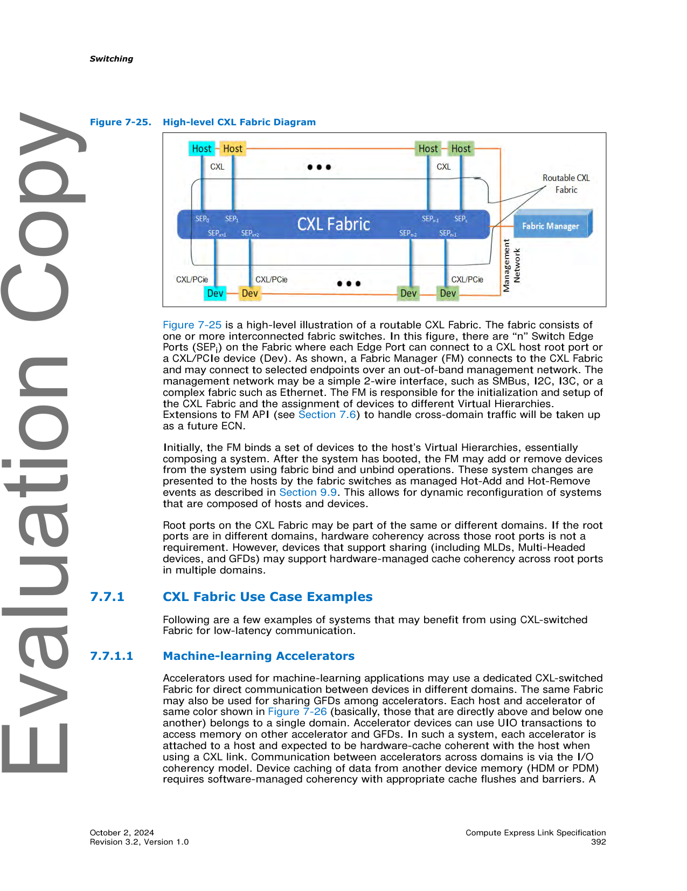
>
> *Original page render @ 150 DPI* — [📄 Full size](figures/chapter_07/page_0392.png)

[⬆️ 返回目录](#-本章目录-part-b)

---

## 7.7.1 CXL Fabric Use Case Examples | 7.7.1 CXL Fabric 用例示例

<table>
<thead>
<tr>
<th width="50%">🇬🇧 English</th>
<th width="50%" style="background-color:#e8e8e8">🇨🇳 中文</th>
</tr>
</thead>
<tbody>
<tr><td>Following are a few examples of systems that may benefit from using CXL-switched Fabric for low-latency communication.</td><td style="background-color:#e8e8e8">以下是一些可能受益于使用 CXL 交换 Fabric 进行低延迟通信的系统示例。</td></tr>
</tbody>
</table>

### 7.7.1.1 Machine-learning Accelerators | 7.7.1.1 机器学习加速器

<table>
<thead>
<tr>
<th width="50%">🇬🇧 English</th>
<th width="50%" style="background-color:#e8e8e8">🇨🇳 中文</th>
</tr>
</thead>
<tbody>
<tr><td>Accelerators used for machine-learning applications may use a dedicated CXL-switched Fabric for direct communication between devices in different domains. The same Fabric may also be used for sharing GFDs among accelerators. Each host and accelerator of same color shown in Figure 7-26 (basically, those that are directly above and below one another) belongs to a single domain. Accelerator devices can use UIO transactions to access memory on other accelerator and GFDs. In such a system, each accelerator is attached to a host and expected to be hardware-cache coherent with the host when using a CXL link. Communication between accelerators across domains is via the I/O coherency model. Device caching of data from another device memory (HDM or PDM) requires software-managed coherency with appropriate cache flushes and barriers. A Switch Edge ingress port is expected to implement a common set of address decoders that is to be used for Upstream Ports and Downstream Ports. Implementations may enable a dedicated CXL Fabric for accelerators using features available in this revision. However, it is not fully defined by the specification. Peer communication is defined in Section 7.7.9.</td><td style="background-color:#e8e8e8">用于机器学习应用的加速器可以使用专用的 CXL 交换 Fabric 进行不同域中设备之间的直接通信。同一 Fabric 也可用于在加速器之间共享 GFD。图 7-26 中所示的同色主机和加速器 (基本上是直接上下对应的那些) 属于同一域。加速器设备可以使用 UIO 事务访问其他加速器和 GFD 上的内存。在这样的系统中,每个加速器都连接到主机,并预期在使用 CXL 链路时与主机保持硬件缓存一致性。跨域加速器之间的通信通过 I/O 一致性模型进行。设备对来自其他设备内存 (HDM 或 PDM) 的数据进行缓存需要软件管理的一致性,并采用适当的 cache flush 和 barrier。Switch Edge 入口端口应实现一组通用的地址解码器,用于上游端口和下游端口。实现可以使用本版本中可用的特性为加速器启用专用的 CXL Fabric。但是,规范未完全定义这一点。对等通信在 7.7.9 节中定义。</td></tr>
</tbody>
</table>

> **Figure 7-26.** ML Accelerator Use Case ｜ 机器学习加速器用例
>
> 
>
> *Original page render @ 150 DPI* — [📄 Full size](figures/chapter_07/page_0393_1.png)

### 7.7.1.2 HPC/Analytics Use Case | 7.7.1.2 HPC/分析用例

<table>
<thead>
<tr>
<th width="50%">🇬🇧 English</th>
<th width="50%" style="background-color:#e8e8e8">🇨🇳 中文</th>
</tr>
</thead>
<tbody>
<tr><td>High-performance computing and Big Data Analytics are two areas that may also benefit from a dedicated CXL Fabric for host-to-host communication and sharing of G-FAM. CXL.mem or UIO may be used to access GFDs. Some G-FAM implementations may enable cross-domain hardware cache coherency. Software cache coherency may still be used for shared-memory implementations. Host-to-host communication is defined in Section 7.7.3.</td><td style="background-color:#e8e8e8">高性能计算和 Big Data Analytics 是另外两个可能受益于使用专用 CXL Fabric 进行主机到主机通信和共享 G-FAM 的领域。可使用 CXL.mem 或 UIO 访问 GFD。一些 G-FAM 实现可启用跨域硬件缓存一致性。软件缓存一致性仍可用于共享内存实现。主机到主机通信在 7.7.3 节中定义。</td></tr>
<tr><td>NICs may be used to directly move data from network storage to G-FAM devices, using the UIO traffic class. CXL.mem and UIO use fabric address decoders to route to target GFDs that are members of many domains.</td><td style="background-color:#e8e8e8">可使用 NIC 通过 UIO 流量类别将数据从网络存储直接移动到 G-FAM 设备。CXL.mem 和 UIO 使用 Fabric 地址解码器路由到属于许多域的 GFD 目标。</td></tr>
</tbody>
</table>

> **Figure 7-27.** HPC/Analytics Use Case ｜ HPC/分析用例
>
> 
>
> *Original page render @ 150 DPI* — [📄 Full size](figures/chapter_07/page_0393_2.png)

### 7.7.1.3 Composable Systems | 7.7.1.3 可组合系统

<table>
<thead>
<tr>
<th width="50%">🇬🇧 English</th>
<th width="50%" style="background-color:#e8e8e8">🇨🇳 中文</th>
</tr>
</thead>
<tbody>
<tr><td>Support for multi-level switches with PBR fabric extensions provides additional capabilities for building software-composable systems. In Figure 7-28, a leaf/spine switch architecture is shown in which all resources are attached to the leaf switches. Each domain may span multiple switches. All devices must be bound to a host or an FM. Cross-domain traffic is limited to CXL.mem and UIO transactions.</td><td style="background-color:#e8e8e8">具有 PBR Fabric 扩展的多级交换机的支持为构建软件可组合系统提供了额外的能力。在图 7-28 中,展示了叶/脊 (leaf/spine) 交换机架构,其中所有资源都连接到叶交换机。每个域可跨越多个交换机。所有设备必须绑定到主机或 FM。跨域流量仅限于 CXL.mem 和 UIO 事务。</td></tr>
<tr><td>Composing systems from resources within a single leaf switch allows for low-latency implementations. In such implementations, a spine switch is used only for cross-domain and G-FAM accesses.</td><td style="background-color:#e8e8e8">从单个叶交换机内的资源组成系统可实现低延迟实现。在这样的实现中,脊交换机仅用于跨域和 G-FAM 访问。</td></tr>
</tbody>
</table>

> **Figure 7-28.** Sample System Topology for Composable Systems ｜ 可组合系统的示例系统拓扑
>
> 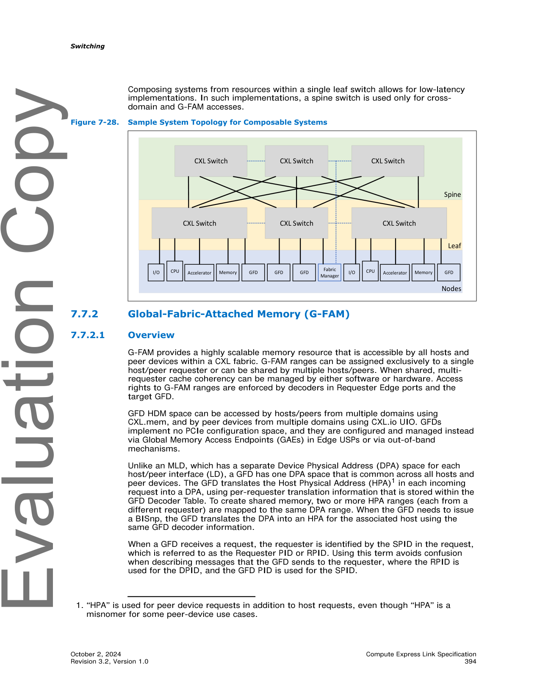
>
> *Original page render @ 150 DPI* — [📄 Full size](figures/chapter_07/page_0394.png)

[⬆️ 返回目录](#-本章目录-part-b)

---

## 7.7.2 Global-Fabric-Attached Memory (G-FAM) | 7.7.2 全局 Fabric 附加内存 (G-FAM)

### 7.7.2.1 Overview | 7.7.2.1 概述

<table>
<thead>
<tr>
<th width="50%">🇬🇧 English</th>
<th width="50%" style="background-color:#e8e8e8">🇨🇳 中文</th>
</tr>
</thead>
<tbody>
<tr><td>G-FAM provides a highly scalable memory resource that is accessible by all hosts and peer devices within a CXL fabric. G-FAM ranges can be assigned exclusively to a single host/peer requester or can be shared by multiple hosts/peers. When shared, multi-requester cache coherency can be managed by either software or hardware. Access rights to G-FAM ranges are enforced by decoders in Requester Edge ports and the target GFD.</td><td style="background-color:#e8e8e8">G-FAM 提供了一种高度可扩展的内存资源,可被 CXL Fabric 内的所有主机和对等设备访问。G-FAM 范围可以独占分配给单个主机/对等请求者,也可以由多个主机/对等设备共享。共享时,多请求者缓存一致性可以由软件或硬件管理。对 G-FAM 范围的访问权由 Requester Edge 端口和目标 GFD 中的解码器强制执行。</td></tr>
<tr><td>GFD HDM space can be accessed by hosts/peers from multiple domains using CXL.mem, and by peer devices from multiple domains using CXL.io UIO. GFDs implement no PCIe configuration space, and they are configured and managed instead via Global Memory Access Endpoints (GAEs) in Edge USPs or via out-of-band mechanisms.</td><td style="background-color:#e8e8e8">GFD HDM 空间可由来自多个域的主机/对等设备使用 CXL.mem 访问,以及由来自多个域的对等设备使用 CXL.io UIO 访问。GFD 不实现 PCIe 配置空间,而是通过 Edge USP 中的 Global Memory Access Endpoint (GAE) 或带外机制进行配置和管理。</td></tr>
<tr><td>Unlike an MLD, which has a separate Device Physical Address (DPA) space for each host/peer interface (LD), a GFD has one DPA space that is common across all hosts and peer devices. The GFD translates the Host Physical Address (HPA)¹ in each incoming request into a DPA, using per-requester translation information that is stored within the GFD Decoder Table. To create shared memory, two or more HPA ranges (each from a different requester) are mapped to the same DPA range. When the GFD needs to issue a BISnp, the GFD translates the DPA into an HPA for the associated host using the same GFD decoder information.</td><td style="background-color:#e8e8e8">与 MLD 不同 (MLD 的每个主机/对等接口 (LD) 都有单独的 Device Physical Address (DPA) 空间),GFD 具有一个在所有主机和对等设备之间通用的 DPA 空间。GFD 使用存储在 GFD Decoder Table 中的 per-requester 转换信息,将每个传入请求中的 Host Physical Address (HPA)¹ 转换为 DPA。为了创建共享内存,将两个或多个 HPA 范围 (每个来自不同的请求者) 映射到同一 DPA 范围。当 GFD 需要发出 BISnp 时,GFD 使用相同的 GFD 解码器信息将 DPA 转换为关联主机的 HPA。</td></tr>
<tr><td>When a GFD receives a request, the requester is identified by the SPID in the request, which is referred to as the Requester PID or RPID. Using this term avoids confusion when describing messages that the GFD sends to the requester, where the RPID is used for the DPID, and the GFD PID is used for the SPID.</td><td style="background-color:#e8e8e8">当 GFD 接收请求时,请求者由请求中的 SPID 标识,称为 Requester PID 或 RPID。使用此术语可避免在描述 GFD 发送给请求者的消息时产生混淆,这种情况下 RPID 用作 DPID,GFD PID 用作 SPID。</td></tr>
</tbody>
</table>

> 1. "HPA" 用于对等设备请求以及主机请求,即使 "HPA" 对于某些对等设备用例是误称。

> **Figure 7-28.** Sample System Topology for Composable Systems ｜ 可组合系统的示例系统拓扑
>
> 
>
> *Original page render @ 150 DPI* — [📄 Full size](figures/chapter_07/page_0394.png)

<table>
<thead>
<tr>
<th width="50%">🇬🇧 English</th>
<th width="50%" style="background-color:#e8e8e8">🇨🇳 中文</th>
</tr>
</thead>
<tbody>
<tr><td>All memory capacity on a GFD is managed by the Dynamic Capacity (DC) mechanisms, as defined in Section 8.2.10.9.9. A GFD allows each requester to access up to 8 RPID non-overlapping decoders, where the maximum number of decoders per SPID is implementation dependent. Each decoder has a translation from HPA space to the common DPA space, a flag that indicates whether cache coherency is maintained by software or hardware, and information about multi-GFD interleaving, if used. For each requester, the FM may define DC Regions in DPA space and convey this information to the host via a GAE. It is expected that the host will program the Fabric Address Segment Table (FAST) decoders and GFD decoders for all RPIDs in its domain to map the entire DPA range of each DC Region that needs to be accessed by the host or by one of its associated accelerators.</td><td style="background-color:#e8e8e8">GFD 上的所有内存 capacity 由 Dynamic Capacity (DC) 机制管理,如 8.2.10.9.9 节所定义。GFD 允许每个请求者访问最多 8 个 RPID 的非重叠解码器,其中每个 SPID 的最大解码器数取决于实现。每个解码器都具有从 HPA 空间到公共 DPA 空间的转换、一个指示缓存一致性是由软件还是硬件维护的标志,以及有关多 GFD interleaving 的信息 (如果使用)。对于每个请求者,FM 可在 DPA 空间中定义 DC Region,并通过 GAE 将此信息传达给主机。预期主机将为其域中所有 RPID 编程 Fabric Address Segment Table (FAST) 解码器和 GFD 解码器,以映射需要由主机或其关联加速器之一访问的每个 DC Region 的整个 DPA 范围。</td></tr>
<tr><td>G-FAM memory ranges can be interleaved across any power-of-two number of GFDs from 2 to 256, with an Interleave Granularity of 256B, 512B, 1 KB, 2 KB, 4 KB, 8 KB, or 16 KB. GFDs that are located anywhere within the CXL fabric, as defined in Section 2.7, may be used to contribute memory to an Interleave Set.</td><td style="background-color:#e8e8e8">G-FAM 内存范围可在任意 2 的幂次 (从 2 到 256) 数量的 GFD 之间进行 interleaving,Interleave Granularity 为 256B、512B、1 KB、2 KB、4 KB、8 KB 或 16 KB。如 2.7 节所定义,位于 CXL Fabric 内任何位置的 GFD 都可用于为 Interleave Set 贡献内存。</td></tr>
<tr><td>If a GFD supports UIO Direct P2P to HDM (see Section 7.7.9.1), all GFD ports shall support UIO, and for each GFD link whose link partner also supports UIO, VC3 shall be auto-enabled by the ports (see Section 7.7.11.5.1).</td><td style="background-color:#e8e8e8">如果 GFD 支持 UIO Direct P2P to HDM (参见 7.7.9.1 节),则所有 GFD 端口都应支持 UIO,并且对于链路伙伴也支持 UIO 的每个 GFD 链路,VC3 应由端口自动启用 (参见 7.7.11.5.1 节)。</td></tr>
</tbody>
</table>

### 7.7.2.2 Host Physical Address View | 7.7.2.2 主机物理地址视图

<table>
<thead>
<tr>
<th width="50%">🇬🇧 English</th>
<th width="50%" style="background-color:#e8e8e8">🇨🇳 中文</th>
</tr>
</thead>
<tbody>
<tr><td>Hosts that access G-FAM shall allocate a contiguous address range for Fabric Address space within their Host Physical Address (HPA) space, as shown in Figure 7-29. The Fabric Address range is defined by the FabricBase and FabricLimit registers. All host requests that fall within the Fabric Address range are routed to a selected CXL port. Hosts that use multiple CXL ports for G-FAM may either address interleave requests across the ports or may allocate a Fabric Address space for each port.</td><td style="background-color:#e8e8e8">访问 G-FAM 的主机应在其 Host Physical Address (HPA) 空间内为 Fabric Address 空间分配一个连续的地址范围,如图 7-29 所示。Fabric Address 范围由 FabricBase 和 FabricLimit 寄存器定义。落在 Fabric Address 范围内的所有主机请求都会被路由到所选的 CXL 端口。使用多个 CXL 端口进行 G-FAM 的主机可以跨这些端口对 interleaving 请求进行寻址,也可以为每个端口分配一个 Fabric Address 空间。</td></tr>
<tr><td>G-FAM requests from a host flow to a PBR Edge USP. In the USP, the Fabric Address range is divided into N equal-sized segments. A segment may be any power-of-two size from 64 GB to 8 TB, and must be naturally aligned. The number of segments implemented by a switch is implementation dependent. Host software is responsible for configuring the segment size so that the number of segments times the segment size fully spans the Fabric Address space. The FabricBase and FabricLimit registers can be programmed to any multiple of the segment size.</td><td style="background-color:#e8e8e8">来自主机的 G-FAM 请求流向 PBR Edge USP。在 USP 中, Fabric Address 范围被划分为 N 个大小相等的段 (segment)。段可以是 64 GB 到 8 TB 之间的任意 2 的幂次大小,且必须自然对齐 (naturally aligned)。交换机实现的段数取决于实现。主机软件负责配置段大小,以使段数乘以段大小完全跨越 Fabric Address 空间。FabricBase 和 FabricLimit 寄存器可以编程为段大小的任意整数倍。</td></tr>
<tr><td>Each segment has an associated GFD or Interleave Set of GFDs. Requests whose HPA falls anywhere within the segment are routed to the specified GFD or to a GFD within the Interleave Set. Segments are used only for request routing and may be larger than the accessible portion of a GFD. When this occurs, the accessible portion of the GFD starts at address offset zero within the segment. Any requests within the segment that are above the accessible portion of the GFD will fail to positively decode in the GFD and will be handled as described in Section 8.2.4.20.</td><td style="background-color:#e8e8e8">每个段都有一个关联的 GFD 或 GFD 的 Interleave Set。HPA 落在段内任何位置的请求都会路由到指定的 GFD 或 Interleave Set 内的 GFD。段仅用于请求路由,可能大于 GFD 的可访问部分。发生这种情况时,GFD 的可访问部分从段内的地址偏移 0 开始。段内位于 GFD 可访问部分之上的任何请求将无法在 GFD 中成功解码,并将按 8.2.4.20 节所述进行处理。</td></tr>
<tr><td>Host interleaving across root ports is entirely independent from GFD interleaving. Address bits that are used for root port interleaving and for GFD interleaving may be fully overlapping, partially overlapping, or non-overlapping. When the host uses root port interleaving, FabricBase, FabricLimit, and segment size in the corresponding PBR Edge USPs must be identically configured.</td><td style="background-color:#e8e8e8">跨根端口的主机 interleaving 与 GFD interleaving 完全独立。用于根端口 interleaving 和 GFD interleaving 的地址位可能完全重叠、部分重叠或不重叠。当主机使用根端口 interleaving 时,相应 PBR Edge USP 中的 FabricBase、FabricLimit 和段大小必须进行相同的配置。</td></tr>
</tbody>
</table>

> **Figure 7-29.** Example Host Physical Address View ｜ 主机物理地址视图示例
>
> 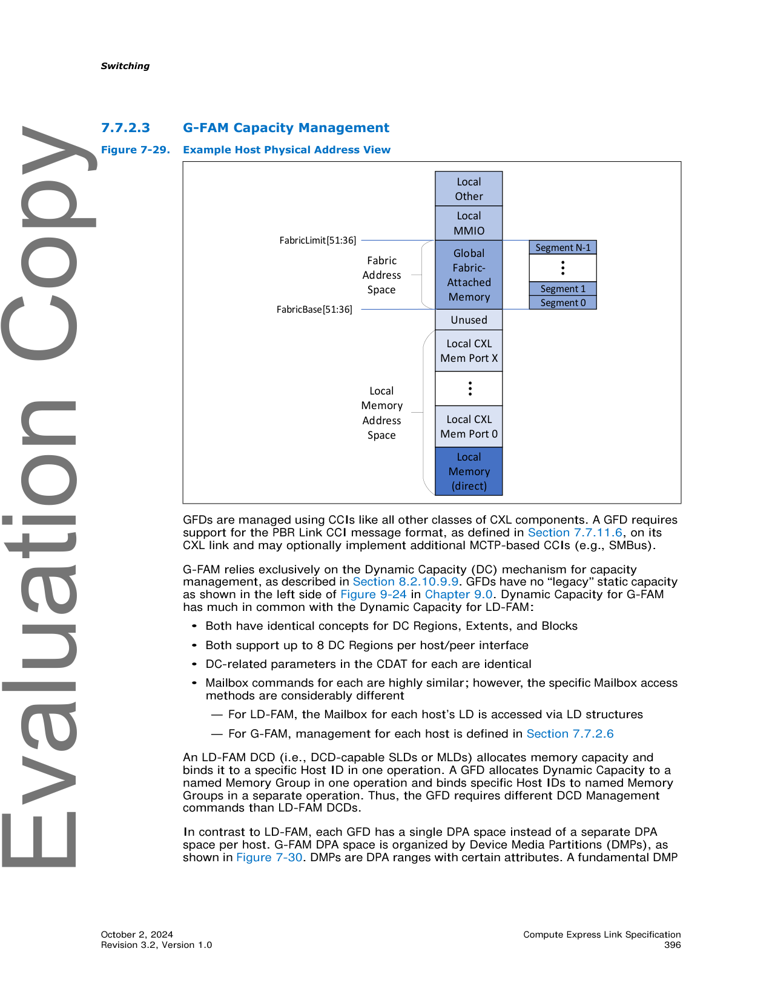
>
> *Original page render @ 150 DPI* — [📄 Full size](figures/chapter_07/page_0396.png)

### 7.7.2.3 G-FAM Capacity Management | 7.7.2.3 G-FAM 容量管理

<table>
<thead>
<tr>
<th width="50%">🇬🇧 English</th>
<th width="50%" style="background-color:#e8e8e8">🇨🇳 中文</th>
</tr>
</thead>
<tbody>
<tr><td>GFDs are managed using CCIs like all other classes of CXL components. A GFD requires support for the PBR Link CCI message format, as defined in Section 7.7.11.6, on its CXL link and may optionally implement additional MCTP-based CCIs (e.g., SMBus).</td><td style="background-color:#e8e8e8">GFD 与所有其他 CXL 组件类一样使用 CCI 进行管理。GFD 要求在其 CXL 链路上支持 PBR Link CCI 消息格式 (如 7.7.11.6 节所定义),可选择实现其他基于 MCTP 的 CCI (如 SMBus)。</td></tr>
<tr><td>G-FAM relies exclusively on the Dynamic Capacity (DC) mechanism for capacity management, as described in Section 8.2.10.9.9. GFDs have no "legacy" static capacity as shown in the left side of Figure 9-24 in Chapter 9.0. Dynamic Capacity for G-FAM has much in common with the Dynamic Capacity for LD-FAM:</td><td style="background-color:#e8e8e8">G-FAM 完全依赖 Dynamic Capacity (DC) 机制进行容量管理,如 8.2.10.9.9 节所述。GFD 没有 "legacy" 静态容量,如图 9-24 (第 9.0 章) 左侧所示。G-FAM 的 Dynamic Capacity 与 LD-FAM 的 Dynamic Capacity 有许多共同之处:</td></tr>
<tr><td>• Both have identical concepts for DC Regions, Extents, and Blocks</td><td style="background-color:#e8e8e8">• 两者具有相同的 DC Region、Extent 和 Block 概念</td></tr>
<tr><td>• Both support up to 8 DC Regions per host/peer interface</td><td style="background-color:#e8e8e8">• 两者都支持每个主机/对等接口最多 8 个 DC Region</td></tr>
<tr><td>• DC-related parameters in the CDAT for each are identical</td><td style="background-color:#e8e8e8">• 两者 CDAT 中的 DC 相关参数相同</td></tr>
<tr><td>• Mailbox commands for each are highly similar; however, the specific Mailbox access methods are considerably different</td><td style="background-color:#e8e8e8">• 各自的 Mailbox 命令高度相似;但是,具体的 Mailbox 访问方法有很大不同</td></tr>
<tr><td>— For LD-FAM, the Mailbox for each host's LD is accessed via LD structures</td><td style="background-color:#e8e8e8">— 对于 LD-FAM,每个主机 LD 的 Mailbox 通过 LD 结构访问</td></tr>
<tr><td>— For G-FAM, management for each host is defined in Section 7.7.2.6</td><td style="background-color:#e8e8e8">— 对于 G-FAM,每个主机的管理在 7.7.2.6 节中定义</td></tr>
<tr><td>An LD-FAM DCD (i.e., DCD-capable SLDs or MLDs) allocates memory capacity and binds it to a specific Host ID in one operation. A GFD allocates Dynamic Capacity to a named Memory Group in one operation and binds specific Host IDs to named Memory Groups in a separate operation. Thus, the GFD requires different DCD Management commands than LD-FAM DCDs.</td><td style="background-color:#e8e8e8">LD-FAM DCD (即支持 DCD 的 SLD 或 MLD) 分配内存 capacity 并在一个操作中将其绑定到特定的 Host ID。GFD 在一个操作中将 Dynamic Capacity 分配给命名的 Memory Group,并在单独的操作中将特定 Host ID 绑定到命名的 Memory Group。因此,GFD 需要的 DCD Management 命令不同于 LD-FAM DCD。</td></tr>
<tr><td>In contrast to LD-FAM, each GFD has a single DPA space instead of a separate DPA space per host. G-FAM DPA space is organized by Device Media Partitions (DMPs), as shown in Figure 7-30. DMPs are DPA ranges with certain attributes. A fundamental DMP attribute is the media type (e.g., DRAM or PM). A DMP attribute that is configured by the FM is the DC Block size. DMPs expose all GFD memory that is assignable for host use.</td><td style="background-color:#e8e8e8">与 LD-FAM 相反,每个 GFD 具有单个 DPA 空间,而不是每个主机单独的 DPA 空间。G-FAM DPA 空间由 Device Media Partition (DMP) 组织,如图 7-30 所示。DMP 是具有某些属性的 DPA 范围。DMP 的基本属性是介质类型 (例如,DRAM 或 PM)。由 FM 配置的 DMP 属性是 DC Block size。DMP 暴露所有可分配给主机使用的 GFD 内存。</td></tr>
<tr><td>The rules for DMPs are as follows:</td><td style="background-color:#e8e8e8">DMP 的规则如下:</td></tr>
<tr><td>• Each GFD contains 1-4 DMPs, whose size is configured by the FM.</td><td style="background-color:#e8e8e8">• 每个 GFD 包含 1-4 个 DMP,其大小由 FM 配置。</td></tr>
<tr><td>• Each DC Region consists of part or all of one DMP assigned to a host/peer. Each DC Region can be mapped into an RPID's HPA space using the GFD Decoder Table.</td><td style="background-color:#e8e8e8">• 每个 DC Region 由分配给主机/对等设备的一个 DMP 的一部分或全部组成。每个 DC Region 可使用 GFD Decoder Table 映射到 RPID 的 HPA 空间。</td></tr>
<tr><td>• Each DC Region inherits associated DMP attributes.</td><td style="background-color:#e8e8e8">• 每个 DC Region 继承关联的 DMP 属性。</td></tr>
<tr><td>Table 7-80 lists the key differences between LD-FAM and G-FAM.</td><td style="background-color:#e8e8e8">表 7-80 列出了 LD-FAM 和 G-FAM 之间的关键差异。</td></tr>
</tbody>
</table>

> **Figure 7-30.** Example HPA Mapping to DMPs ｜ HPA 到 DMP 的映射示例
>
> 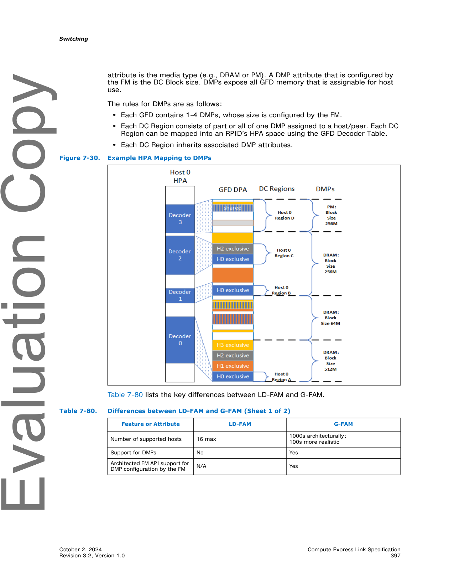
>
> *Original page render @ 150 DPI* — [📄 Full size](figures/chapter_07/page_0397.png)

<table>
<thead>
<tr>
<th width="50%">🇬🇧 English</th>
<th width="50%" style="background-color:#e8e8e8">🇨🇳 中文</th>
</tr>
</thead>
<tbody>
<tr>
<td>

**Table 7-80. Differences between LD-FAM and G-FAM (Sheet 1 of 2)**

| Feature or Attribute | LD-FAM | G-FAM |
|---|---|---|
| Number of supported hosts | 16 max | 1000s architecturally; 100s more realistic |
| Support for DMPs | No | Yes |
| Architected FM API support for DMP configuration by the FM | N/A | Yes |
| Routing and decoders used for HDM addresses | Per-LD HDM Decoder; Interleave RP routing by host HDM Decoder; 1–10 HDM Decoders in each LD | Per-RPID GFD decoders; Interleave fabric routing by USP FAST/IDT decoder; 1–8 GFD Decoders per RPID in the GFD |
| Interleave Ways (IW) | 1/2/4/8/16 plus 3/6/12 | 2–256 in powers of 2 |
| DC Block Size | Powers of 2, as indicated by Region * Supported Block Size Mask | 64 MB and up in powers of 2 |

</td>
<td style="background-color:#e8e8e8">

**表 7-80. LD-FAM 与 G-FAM 之间的差异 (Sheet 1 of 2)**

| 特性或属性 | LD-FAM | G-FAM |
|---|---|---|
| 支持的主机数 | 最多 16 | 架构上 1000s;现实上 100s |
| DMP 支持 | 否 | 是 |
| 由 FM 配置 DMP 的架构化 FM API 支持 | 不适用 | 是 |
| HDM 地址的路由和解码器 | Per-LD HDM Decoder;Interleave RP 路由由主机 HDM Decoder 决定;每个 LD 中 1-10 个 HDM Decoder | Per-RPID GFD decoders;Interleave fabric 路由由 USP FAST/IDT decoder 决定;GFD 中每个 RPID 1-8 个 GFD Decoder |
| Interleave Ways (IW) | 1/2/4/8/16 加上 3/6/12 | 2-256,以 2 的幂次 |
| DC Block Size | 2 的幂次,由 Region * Supported Block Size Mask 指示 | 64 MB 及以上,以 2 的幂次 |

</td>
</tr>
</tbody>
</table>

<table>
<thead>
<tr>
<th width="50%">🇬🇧 English</th>
<th width="50%" style="background-color:#e8e8e8">🇨🇳 中文</th>
</tr>
</thead>
<tbody>
<tr>
<td>

**Table 7-80. Differences between LD-FAM and G-FAM (Sheet 2 of 2)**

| Feature or Attribute | LD-FAM | G-FAM |
|---|---|---|
| Interleave VH routing by USP HDM Decoder | Interleave VH routing by USP HDM Decoder | (continued) |
| Interleave fabric routing by USP FAST/IDT decoder | — | Interleave fabric routing by USP FAST/IDT decoder |
| LDST/IDT decoder | LDST/IDT decoder | — |

*Note: The Sheet 2 continuation of Table 7-80 shows further detailed feature differences between LD-FAM and G-FAM (per source content page 398).*

</td>
<td style="background-color:#e8e8e8">

**表 7-80. LD-FAM 与 G-FAM 之间的差异 (Sheet 2 of 2)**

| 特性或属性 | LD-FAM | G-FAM |
|---|---|---|
| Interleave VH routing by USP HDM Decoder | Interleave VH routing by USP HDM Decoder | (接续) |
| Interleave fabric routing by USP FAST/IDT decoder | — | Interleave fabric routing by USP FAST/IDT decoder |
| LDST/IDT decoder | LDST/IDT decoder | — |

*注:表 7-80 的 Sheet 2 续表 (源文档第 398 页) 显示了 LD-FAM 与 G-FAM 之间的其他详细特性差异。*

</td>
</tr>
</tbody>
</table>

<table>
<thead>
<tr>
<th width="50%">🇬🇧 English</th>
<th width="50%" style="background-color:#e8e8e8">🇨🇳 中文</th>
</tr>
</thead>
<tbody>
<tr><td>Additional differences exist in how MLDs and GFDs process requests. An MLD has three types of decoders that operate sequentially on incoming requests:</td><td style="background-color:#e8e8e8">MLD 和 GFD 处理请求的方式存在其他差异。MLD 具有三种类型的解码器,这些解码器对传入请求按顺序操作:</td></tr>
<tr><td>• Per-LD HDM decoders translate from HPA space to a per-LD DPA space, removing the interleaving bits</td><td style="background-color:#e8e8e8">• Per-LD HDM 解码器将 HPA 空间转换为 per-LD DPA 空间,删除 interleaving 位</td></tr>
<tr><td>• Per-LD decoders determine within which per-LD DC Region the DPA resides, and then whether the addressed DC block within the Region is accessible by the LD</td><td style="background-color:#e8e8e8">• Per-LD 解码器确定 DPA 驻留在哪个 per-LD DC Region 中,然后确定 LD 区域内可访问的 DC block</td></tr>
<tr><td>• Per-LD implementation-dependent decoders translate from the DPA to the media address</td><td style="background-color:#e8e8e8">• Per-LD 实现相关的解码器将 DPA 转换为介质地址</td></tr>
<tr><td>A GFD has two types of decoders that operate sequentially on incoming requests:</td><td style="background-color:#e8e8e8">GFD 具有两种类型的解码器,这些解码器对传入请求按顺序操作:</td></tr>
<tr><td>• Per-RPID GFD decoders translate from HPA space to a common DPA space, removing the interleaving bits. This DPA may be used as the media address directly or via a simple mapping.</td><td style="background-color:#e8e8e8">• Per-RPID GFD 解码器将 HPA 空间转换为公共 DPA 空间,删除 interleaving 位。此 DPA 可直接用作介质地址,或通过简单映射使用。</td></tr>
<tr><td>• A common decoder determines within which Device Media Partition (DMP) the DPA is located, and then whether the block that is addressed within the DMP is accessible by the RPID.</td><td style="background-color:#e8e8e8">• 公共解码器确定 DPA 位于哪个 Device Media Partition (DMP) 中,然后确定 RPID 是否可访问 DMP 中寻址的 block。</td></tr>
</tbody>
</table>

### 7.7.2.4 G-FAM Request Routing, Interleaving, and Address Translations | 7.7.2.4 G-FAM 请求路由、Interleaving 与地址转换

<table>
<thead>
<tr>
<th width="50%">🇬🇧 English</th>
<th width="50%" style="background-color:#e8e8e8">🇨🇳 中文</th>
</tr>
</thead>
<tbody>
<tr><td>The mechanisms for GFD request routing, interleaving, and address translations within both the Edge ingress port and the GFD are shown in Figure 7-31. GFD requests may arrive either at an Edge USP from a host or at an Edge DSP from a peer device. This is referred to as the Edge request port.</td><td style="background-color:#e8e8e8">Edge 入口端口和 GFD 内的 GFD 请求路由、interleaving 和地址转换机制如图 7-31 所示。GFD 请求可从主机通过 Edge USP 到达,或从对等设备通过 Edge DSP 到达。这称为 Edge request port。</td></tr>
</tbody>
</table>

> **Figure 7-31.** G-FAM Request Routing, Interleaving, and Address Translations ｜ G-FAM 请求路由、Interleaving 和地址转换
>
> 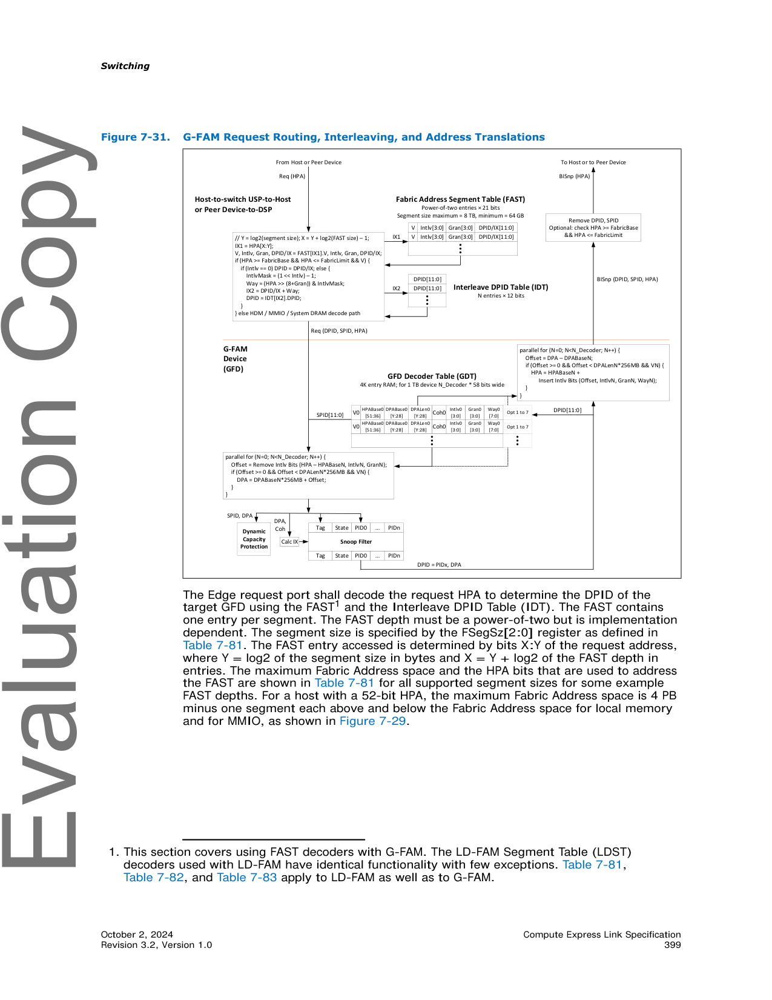
>
> *Original page render @ 150 DPI* — [📄 Full size](figures/chapter_07/page_0399.png)

<table>
<thead>
<tr>
<th width="50%">🇬🇧 English</th>
<th width="50%" style="background-color:#e8e8e8">🇨🇳 中文</th>
</tr>
</thead>
<tbody>
<tr><td>The Edge request port shall decode the request HPA to determine the DPID of the target GFD using the FAST¹ and the Interleave DPID Table (IDT). The FAST contains one entry per segment. The FAST depth must be a power-of-two but is implementation dependent. The segment size is specified by the FSegSz[2:0] register as defined in Table 7-81. The FAST entry accessed is determined by bits X:Y of the request address, where Y = log2 of the segment size in bytes and X = Y + log2 of the FAST depth in entries. The maximum Fabric Address space and the HPA bits that are used to address the FAST are shown in Table 7-81 for all supported segment sizes for some example FAST depths. For a host with a 52-bit HPA, the maximum Fabric Address space is 4 PB minus one segment each above and below the Fabric Address space for local memory and for MMIO, as shown in Figure 7-29.</td><td style="background-color:#e8e8e8">Edge request port 应使用 FAST¹ 和 Interleave DPID Table (IDT) 解码请求 HPA 以确定目标 GFD 的 DPID。FAST 每个段包含一个条目。FAST depth 必须是 2 的幂,但取决于实现。段大小由 FSegSz[2:0] 寄存器指定,如表 7-81 所定义。访问的 FAST 条目由请求地址的位 X:Y 决定,其中 Y = 段大小 (以字节为单位) 的 log2,X = Y + FAST depth (以条目为单位) 的 log2。表 7-81 显示了一些示例 FAST depth 下所有支持的段大小的最大 Fabric Address 空间和用于寻址 FAST 的 HPA 位。对于具有 52-bit HPA 的主机,最大 Fabric Address 空间为 4 PB 减去 Fabric Address 空间上方和下方的每个段,用于本地内存和 MMIO,如图 7-29 所示。</td></tr>
</tbody>
</table>

> 1. 本节涵盖使用 FAST 解码器与 G-FAM 一起使用。LD-FAM Segment Table (LDST) 解码器与 LD-FAM 一起使用具有相同的功能,只有少数例外。表 7-81、表 7-82 和表 7-83 同样适用于 LD-FAM 和 G-FAM。

<table>
<thead>
<tr>
<th width="50%">🇬🇧 English</th>
<th width="50%" style="background-color:#e8e8e8">🇨🇳 中文</th>
</tr>
</thead>
<tbody>
<tr>
<td>

**Table 7-81. Fabric Segment Size Table¹**

| FSegSz[2:0] | Fabric Segment Size | FAST Depth = 256 | FAST Depth = 1K | FAST Depth = 4K | FAST Depth = 16K |
|---|---|---|---|---|---|
| 000b | 64 GB | 16 TB / HPA[43:36] | 64 TB / HPA[45:36] | 256 TB / HPA[47:36] | 1 PB / HPA[49:36] |
| 001b | 128 GB | 32 TB / HPA[44:37] | 128 TB / HPA[46:37] | 512 TB / HPA[48:37] | 2 PB / HPA[50:37] |
| 010b | 256 GB | 64 TB / HPA[45:38] | 256 TB / HPA[47:38] | 1 PB / HPA[49:38] | 4 PB – 512 GB / HPA[51:38] |
| 011b | 512 GB | 128 TB / HPA[46:39] | 512 TB / HPA[48:39] | 2 PB / HPA[50:39] | — |
| 100b | 1 TB | 256 TB / HPA[47:40] | 1 PB / HPA[49:40] | 4 PB – 2 TB / HPA[51:40] | — |
| 101b | 2 TB | 512 TB / HPA[48:41] | 2 PB / HPA[50:41] | — | — |
| 110b | 4 TB | 1 PB / HPA[49:42] | 4 PB – 8 TB / HPA[51:42] | — | — |
| 111b | 8 TB | 2 PB / HPA[50:43] | — | — | — |

*¹ LDST Segment Size (LSegSz) 使用与 FSegSz 相同的编码。*

</td>
<td style="background-color:#e8e8e8">

**表 7-81. Fabric 段大小表¹**

| FSegSz[2:0] | Fabric 段大小 | FAST Depth = 256 | FAST Depth = 1K | FAST Depth = 4K | FAST Depth = 16K |
|---|---|---|---|---|---|
| 000b | 64 GB | 16 TB / HPA[43:36] | 64 TB / HPA[45:36] | 256 TB / HPA[47:36] | 1 PB / HPA[49:36] |
| 001b | 128 GB | 32 TB / HPA[44:37] | 128 TB / HPA[46:37] | 512 TB / HPA[48:37] | 2 PB / HPA[50:37] |
| 010b | 256 GB | 64 TB / HPA[45:38] | 256 TB / HPA[47:38] | 1 PB / HPA[49:38] | 4 PB – 512 GB / HPA[51:38] |
| 011b | 512 GB | 128 TB / HPA[46:39] | 512 TB / HPA[48:39] | 2 PB / HPA[50:39] | — |
| 100b | 1 TB | 256 TB / HPA[47:40] | 1 PB / HPA[49:40] | 4 PB – 2 TB / HPA[51:40] | — |
| 101b | 2 TB | 512 TB / HPA[48:41] | 2 PB / HPA[50:41] | — | — |
| 110b | 4 TB | 1 PB / HPA[49:42] | 4 PB – 8 TB / HPA[51:42] | — | — |
| 111b | 8 TB | 2 PB / HPA[50:43] | — | — | — |

*¹ LDST Segment Size (LSegSz) 使用与 FSegSz 相同的编码。*

</td>
</tr>
</tbody>
</table>

<table>
<thead>
<tr>
<th width="50%">🇬🇧 English</th>
<th width="50%" style="background-color:#e8e8e8">🇨🇳 中文</th>
</tr>
</thead>
<tbody>
<tr>
<td>

**Table 7-82. Segment Table Intlv[3:0] Field Encoding**

| Intlv[3:0] | GFD Interleaving Ways |
|---|---|
| 0h | Interleaving is disabled |
| 1h | 2-way interleaving |
| 2h | 4-way interleaving |
| 3h | 8-way interleaving |
| 4h | 16-way interleaving |
| 5h | 32-way interleaving |
| 6h | 64-way interleaving |
| 7h | 128-way interleaving |
| 8h | 256-way interleaving |
| 9h – Fh | Reserved |

</td>
<td style="background-color:#e8e8e8">

**表 7-82. Segment Table Intlv[3:0] 字段编码**

| Intlv[3:0] | GFD Interleaving 通道数 |
|---|---|
| 0h | Interleaving 已禁用 |
| 1h | 2-way interleaving |
| 2h | 4-way interleaving |
| 3h | 8-way interleaving |
| 4h | 16-way interleaving |
| 5h | 32-way interleaving |
| 6h | 64-way interleaving |
| 7h | 128-way interleaving |
| 8h | 256-way interleaving |
| 9h – Fh | Reserved (保留) |

</td>
</tr>
</tbody>
</table>

<table>
<thead>
<tr>
<th width="50%">🇬🇧 English</th>
<th width="50%" style="background-color:#e8e8e8">🇨🇳 中文</th>
</tr>
</thead>
<tbody>
<tr><td>Each FAST entry contains a valid bit (V), the number of interleaving ways (Intlv), the interleave granularity (Gran), and a DPID or IDT index (DPID/IX). The encodings for the Intlv and Gran fields are defined in Table 7-82 and Table 7-83, respectively. If the HPA is between FabricBase and FabricLimit inclusive and the FAST entry valid bit is set, then there is a FAST hit, and the FAST is used to determine the DPID. Otherwise, the target device is determined by other architected decoders.</td><td style="background-color:#e8e8e8">每个 FAST 条目包含一个有效位 (V)、interleaving 通道数 (Intlv)、interleave granularity (Gran) 以及 DPID 或 IDT 索引 (DPID/IX)。Intlv 和 Gran 字段的编码分别在表 7-82 和表 7-83 中定义。如果 HPA 在 FabricBase 和 FabricLimit 之间 (含),且 FAST 条目有效位被设置,则发生 FAST 命中,使用 FAST 来确定 DPID。否则,目标设备由其他架构化解码器确定。</td></tr>
</tbody>
</table>

<table>
<thead>
<tr>
<th width="50%">🇬🇧 English</th>
<th width="50%" style="background-color:#e8e8e8">🇨🇳 中文</th>
</tr>
</thead>
<tbody>
<tr>
<td>

**Table 7-83. Segment Table Gran[3:0] Field Encoding**

| Gran [3:0] | GFD Interleave Granularity |
|---|---|
| 0h | 256B |
| 1h | 512B |
| 2h | 1 KB |
| 3h | 2 KB |
| 4h | 4 KB |
| 5h | 8 KB |
| 6h | 16 KB |
| 7h – Fh | Reserved |

</td>
<td style="background-color:#e8e8e8">

**表 7-83. Segment Table Gran[3:0] 字段编码**

| Gran [3:0] | GFD Interleave Granularity |
|---|---|
| 0h | 256B |
| 1h | 512B |
| 2h | 1 KB |
| 3h | 2 KB |
| 4h | 4 KB |
| 5h | 8 KB |
| 6h | 16 KB |
| 7h – Fh | Reserved (保留) |

</td>
</tr>
</tbody>
</table>

<table>
<thead>
<tr>
<th width="50%">🇬🇧 English</th>
<th width="50%" style="background-color:#e8e8e8">🇨🇳 中文</th>
</tr>
</thead>
<tbody>
<tr><td>Note that FabricBase and FabricLimit may be used to restrict the amount of the FAST used. For example, for a host with a 52-bit HPA space, if the FAST is accessed using HPA[51:40] without restriction, then it would consume the entire HPA space. In this case, FabricBase and FabricLimit must be set to restrict the Fabric Address space to the desired range of HPA space. This has the effect of reducing the number of entries in the FAST that are being used.</td><td style="background-color:#e8e8e8">请注意,可以使用 FabricBase 和 FabricLimit 来限制所使用的 FAST 的数量。例如,对于具有 52-bit HPA 空间的主机,如果使用 HPA[51:40] 无限制地访问 FAST,则将消耗整个 HPA 空间。在这种情况下,必须设置 FabricBase 和 FabricLimit 以将 Fabric Address 空间限制为所需的 HPA 空间范围。这具有减少正在使用的 FAST 中条目数的效果。</td></tr>
<tr><td>FabricBase and FabricLimit may also be used to allow the FAST to start at an HPA that is not a multiple of the FAST depth. For example, for a host with a 52-bit HPA space, if 2 PB of Fabric Address space is needed to start at an HPA of 1 PB, then a 4K entry FAST with 512 GB segments can be accessed using HPA[50:39] with FabricBase set to 1 PB and FabricLimit set to 3 PB. HPAs 1 PB to 2 PB-1 will then correspond to FAST entries 2048 to 4095, while HPAs 2 PB to 3 PB-1 will wrap around and correspond to FAST entries 0 to 2047. When programming FabricBase, FabricLimit, and segment size, care must be taken to ensure that a wraparound does not occur that would result in aliasing multiple HPAs to the same segment.</td><td style="background-color:#e8e8e8">FabricBase 和 FabricLimit 也可用于允许 FAST 在不是 FAST depth 整数倍的 HPA 处开始。例如,对于具有 52-bit HPA 空间的主机,如果需要 2 PB 的 Fabric Address 空间从 1 PB 的 HPA 开始,则可以使用 HPA[50:39] 访问段为 512 GB 的 4K 条目 FAST,并将 FabricBase 设置为 1 PB,将 FabricLimit 设置为 3 PB。然后 HPA 1 PB 到 2 PB-1 将对应于 FAST 条目 2048 到 4095,而 HPA 2 PB 到 3 PB-1 将环绕并对应于 FAST 条目 0 到 2047。编程 FabricBase、FabricLimit 和段大小时,必须注意确保不会发生环绕,这会导致将多个 HPA 别名到同一段。</td></tr>
<tr><td>On a FAST hit, if the FAST Intlv field is 0h, then GFD interleaving is not being used for this segment and the DPID/IX field contains the GFD's DPID. If the Intlv field is nonzero, then the Interleave Way is selected from the HPA using the Gran and Intlv fields, and then added to the DPID/IX field to generate an index into the IDT. The IDT defines the set of DPIDs for each Interleave Set that is accessible by the Edge request port. For an N-way Interleave Set, the set of DPIDs is determined by N contiguous entries in the IDT, with the first entry pointed to by DPID/IX which may be anywhere in the IDT. The IDT depth is implementation dependent.</td><td style="background-color:#e8e8e8">在 FAST 命中时,如果 FAST Intlv 字段为 0h,则此段不使用 GFD interleaving,DPID/IX 字段包含 GFD 的 DPID。如果 Intlv 字段非零,则使用 Gran 和 Intlv 字段从 HPA 中选择 Interleave Way,然后将其添加到 DPID/IX 字段以生成 IDT 的索引。IDT 定义了 Edge request port 可访问的每个 Interleave Set 的 DPID 集。对于 N-way Interleave Set,DPID 集由 IDT 中的 N 个连续条目确定,第一个条目由 DPID/IX 指向,DPID/IX 可在 IDT 中的任何位置。IDT 深度取决于实现。</td></tr>
<tr><td>After the GFD's DPID is determined, a request that contains the SPID of the Edge request port and the unmodified HPA is sent to the target GFD. The GFD shall then use the SPID to access the GFD Decoder Table (GDT) to select the decoders that are associated with the requester. Note that a host and its associated CXL devices will each have a unique RPID, and therefore each will use a different entry in the GDT. The GDT provides up to 8 decoders per RPID. Each decoder within a GFD Decoder Table entry contains structures defined in Section 8.2.10.9.10.19.</td><td style="background-color:#e8e8e8">确定 GFD 的 DPID 后,将包含 Edge request port 的 SPID 和未修改的 HPA 的请求发送到目标 GFD。GFD 应随后使用 SPID 访问 GFD Decoder Table (GDT) 以选择与请求者关联的解码器。请注意,主机及其关联的 CXL 设备各自具有唯一的 RPID,因此每个将使用 GDT 中的不同条目。GDT 为每个 RPID 提供最多 8 个解码器。GFD Decoder Table 条目中的每个解码器都包含 8.2.10.9.10.19 节中定义的结构。</td></tr>
<tr><td>The GFD shall then compare, in parallel, the request HPA against all decoders to determine whether the request hits any decoder's HPA range. To accomplish this, for each decoder, a DPA offset is calculated by first subtracting HPABase from HPA and then removing the interleaving bits. The LSB of the interleaving bits to remove is determined by the interleave granularity and the number of bits to remove is determined by the interleave ways. If offset ≥ 0, offset < DPALen, and the Valid bit is set, then the request hits within that decoder. If only one decoder hits, then the DPA is calculated by adding DPABase to the offset. If zero or multiple decoders hit, then an access error is returned.</td><td style="background-color:#e8e8e8">GFD 然后应并行地将请求 HPA 与所有解码器进行比较,以确定请求是否命中任何解码器的 HPA 范围。为此,对于每个解码器,首先从 HPA 中减去 HPABase,然后删除 interleaving 位,从而计算出 DPA 偏移。要删除的 interleaving 位的 LSB 由 interleave granularity 决定,要删除的位数由 interleave ways 决定。如果 offset ≥ 0,offset < DPALen,且 Valid 位已设置,则请求命中该解码器内。如果只有一个解码器命中,则通过将 DPABase 添加到 offset 来计算 DPA。如果零个或多个解码器命中,则返回访问错误。</td></tr>
</tbody>
</table>

<table>
<thead>
<tr>
<th width="50%">🇬🇧 English</th>
<th width="50%" style="background-color:#e8e8e8">🇨🇳 中文</th>
</tr>
</thead>
<tbody>
<tr><td>After the request HPA is translated to DPA, the RPID and the DPA are used to perform the Dynamic Capacity access check, as described in Section 7.7.2.5, and to access the GFD snoop filter. The design of the snoop filter is beyond the scope of this specification.</td><td style="background-color:#e8e8e8">将请求 HPA 转换为 DPA 后,RPID 和 DPA 用于执行 Dynamic Capacity 访问检查 (如 7.7.2.5 节所述),并用于访问 GFD snoop filter。snoop filter 的设计不在本规范的范围内。</td></tr>
<tr><td>When the snoop filter needs to issue a back-invalidate to a host/peer, the DPA is translated to an HPA by performing the HPA-to-DPA steps in reverse. The RPID is used to access the GDT to select the decoders for the requester, which may be the host itself or one of its devices that performs Direct P2P. The GFD shall then compare, in parallel, the DPA against all selected decoders to determine whether the back-invalidate hits any decoder's DPA range.</td><td style="background-color:#e8e8e8">当 snoop filter 需要向主机/对等设备发出 back-invalidate 时,通过反向执行 HPA 到 DPA 的步骤,将 DPA 转换为 HPA。RPID 用于访问 GDT 以选择请求者的解码器,该请求者可以是主机本身,也可以是执行 Direct P2P 的主机设备之一。GFD 然后应并行地将 DPA 与所有选定的解码器进行比较,以确定 back-invalidate 是否命中任何解码器的 DPA 范围。</td></tr>
<tr><td>This is accomplished by first calculating DPA offset = DPA – DPABase, and then testing whether offset ≥ 0, offset < DPALen, and the decoder is valid. If only one decoder hits, then the HPA is calculated by inserting the interleaving bits into the offset and then adding it to HPABase. When inserting the interleaving bits, the LSB is determined by interleave granularity, the number of bits is determined by the interleaving ways, and the value of the bits is determined by the way within the interleave set. If zero or multiple decoders hit, then an internal snoop filter error has occurred which will be handled as defined in a future specification update.</td><td style="background-color:#e8e8e8">这是通过首先计算 DPA offset = DPA – DPABase 来完成的,然后测试 offset ≥ 0,offset < DPALen 且解码器是否有效。如果只有一个解码器命中,则通过将 interleaving 位插入 offset 然后将其添加到 HPABase 来计算 HPA。插入 interleaving 位时,LSB 由 interleave granularity 决定,位数由 interleaving ways 决定,位的值由 interleave set 中的 way 决定。如果零个或多个解码器命中,则发生了内部 snoop filter 错误,将按未来规范更新中的定义进行处理。</td></tr>
<tr><td>After the HPA is calculated, a BISnp with the GFD's SPID and HPA is issued to the Edge Port containing the FAST decoder of the host/peer that owns this HDM-DB Region, using the PID stored in the snoop filter as the DPID. The FAST decoder then optionally checks whether the HPA is located within the FAST decoder's Fabric Address space. The DPID and SPID are then removed, and the BISnp is then issued to the host/peer in HBR format.</td><td style="background-color:#e8e8e8">计算出 HPA 后,将带有 GFD 的 SPID 和 HPA 的 BISnp 发送到包含拥有此 HDM-DB Region 的主机/对等设备的 FAST decoder 的 Edge Port,使用存储在 snoop filter 中的 PID 作为 DPID。然后,FAST decoder 可选地检查 HPA 是否位于 FAST decoder 的 Fabric Address 空间内。然后删除 DPID 和 SPID,然后将 BISnp 以 HBR 格式发送到主机/对等设备。</td></tr>
</tbody>
</table>

### 7.7.2.5 G-FAM Access Protection | 7.7.2.5 G-FAM 访问保护

<table>
<thead>
<tr>
<th width="50%">🇬🇧 English</th>
<th width="50%" style="background-color:#e8e8e8">🇨🇳 中文</th>
</tr>
</thead>
<tbody>
<tr><td>G-FAM access protection is available at three levels of the hierarchy (see Figure 7-32):</td><td style="background-color:#e8e8e8">G-FAM 访问保护在层次结构的三个层级可用 (参见图 7-32):</td></tr>
<tr><td>• The first level of protection is through the host's (or peer device's) page tables. This fine-grained protection is used to restrict the Fabric Address space that is accessible by each process to a subset of that which is accessible by the host/peer.</td><td style="background-color:#e8e8e8">• 第一级保护通过主机 (或对等设备) 的页表实现。此细粒度保护用于将每个进程可访问的 Fabric Address 空间限制为主机/对等设备可访问范围的子集。</td></tr>
<tr><td>• The second level of protection is described in the GAE in the form of the Global Memory Mapping Vector (GMV), described in Section 7.7.2.6.</td><td style="background-color:#e8e8e8">• 第二级保护以 Global Memory Mapping Vector (GMV) 的形式在 GAE 中描述,如 7.7.2.6 节所述。</td></tr>
<tr><td>• The third level of protection is at the target GFD itself and is fine grained. This section describes this third level of GFD protection.</td><td style="background-color:#e8e8e8">• 第三级保护位于目标 GFD 本身,是细粒度的。本节描述 GFD 的第三级保护。</td></tr>
</tbody>
</table>

> **IMPLEMENTATION NOTE** (实现提示)
>
> 建议 PBR 交换机根据结构大小,以支持 PBR Fabric 的典型到完整规模。建议 FAST 具有 4K 到 16K 个条目。建议 IDT 具有 4K 到 16K 个条目,以支持足够数量的 interleaving 组和 interleaving way,以覆盖系统中的所有 GFD。

> **Figure 7-32.** Memory Access Protection Levels ｜ 内存访问保护层级
>
> 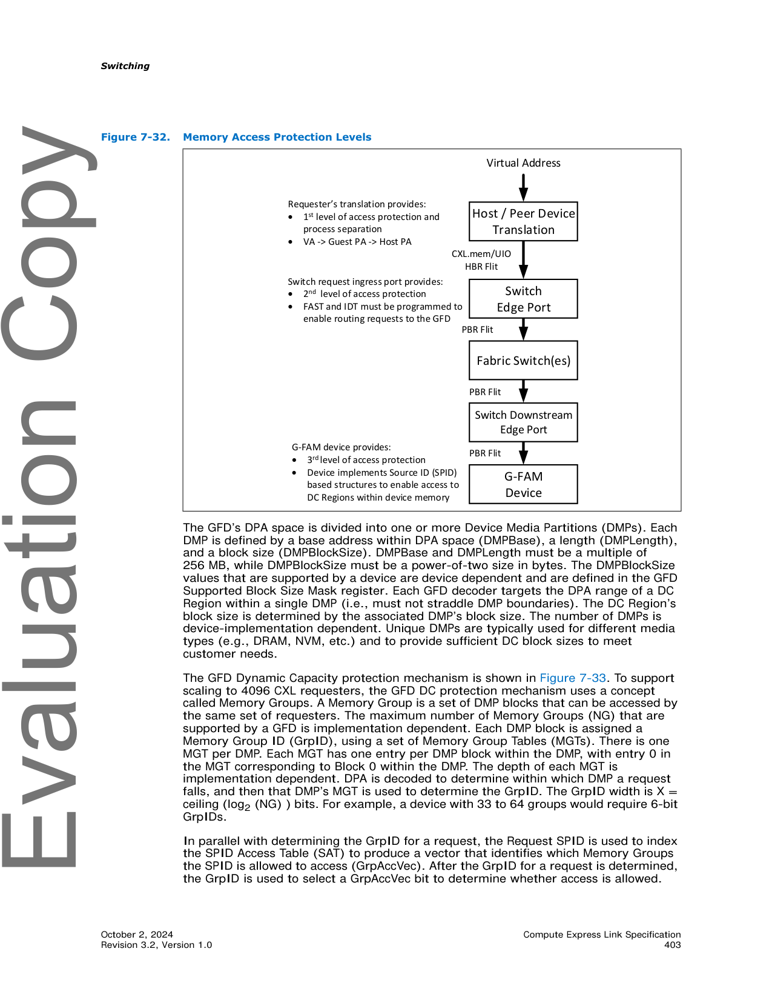
>
> *Original page render @ 150 DPI* — [📄 Full size](figures/chapter_07/page_0403.png)

<table>
<thead>
<tr>
<th width="50%">🇬🇧 English</th>
<th width="50%" style="background-color:#e8e8e8">🇨🇳 中文</th>
</tr>
</thead>
<tbody>
<tr><td>The GFD's DPA space is divided into one or more Device Media Partitions (DMPs). Each DMP is defined by a base address within DPA space (DMPBase), a length (DMPLength), and a block size (DMPBlockSize). DMPBase and DMPLength must be a multiple of 256 MB, while DMPBlockSize must be a power-of-two size in bytes. The DMPBlockSize values that are supported by a device are device dependent and are defined in the GFD Supported Block Size Mask register. Each GFD decoder targets the DPA range of a DC Region within a single DMP (i.e., must not straddle DMP boundaries). The DC Region's block size is determined by the associated DMP's block size. The number of DMPs is device-implementation dependent. Unique DMPs are typically used for different media types (e.g., DRAM, NVM, etc.) and to provide sufficient DC block sizes to meet customer needs.</td><td style="background-color:#e8e8e8">GFD 的 DPA 空间被划分为一个或多个 Device Media Partition (DMP)。每个 DMP 由 DPA 空间内的基地址 (DMPBase)、长度 (DMPLength) 和块大小 (DMPBlockSize) 定义。DMPBase 和 DMPLength 必须是 256 MB 的整数倍,而 DMPBlockSize 必须是 2 的幂次字节大小。设备支持的 DMPBlockSize 值取决于设备,并在 GFD Supported Block Size Mask 寄存器中定义。每个 GFD 解码器都以单个 DMP 内的 DC Region 的 DPA 范围为目标 (即不能跨越 DMP 边界)。DC Region 的块大小由关联 DMP 的块大小决定。DMP 的数量取决于设备实现。不同的 DMP 通常用于不同的介质类型 (例如,DRAM、NVM 等),并提供足够的 DC 块大小以满足客户需求。</td></tr>
<tr><td>The GFD Dynamic Capacity protection mechanism is shown in Figure 7-33. To support scaling to 4096 CXL requesters, the GFD DC protection mechanism uses a concept called Memory Groups. A Memory Group is a set of DMP blocks that can be accessed by the same set of requesters. The maximum number of Memory Groups (NG) that are supported by a GFD is implementation dependent. Each DMP block is assigned a Memory Group ID (GrpID), using a set of Memory Group Tables (MGTs). There is one MGT per DMP. Each MGT has one entry per DMP block within the DMP, with entry 0 in the MGT corresponding to Block 0 within the DMP. The depth of each MGT is implementation dependent. DPA is decoded to determine within which DMP a request falls, and then that DMP's MGT is used to determine the GrpID. The GrpID width is X = ceiling (log2 (NG) ) bits. For example, a device with 33 to 64 groups would require 6-bit GrpIDs.</td><td style="background-color:#e8e8e8">GFD Dynamic Capacity 保护机制如图 7-33 所示。为了支持扩展到 4096 个 CXL 请求者,GFD DC 保护机制使用一个称为 Memory Group 的概念。Memory Group 是可由同一组请求者访问的一组 DMP block。GFD 支持的最大 Memory Group 数 (NG) 取决于实现。每个 DMP block 都使用一组 Memory Group Table (MGT) 分配一个 Memory Group ID (GrpID)。每个 DMP 对应一个 MGT。每个 MGT 在 DMP 内的每个 DMP block 有一个条目,MGT 中的条目 0 对应 DMP 中的 Block 0。每个 MGT 的深度取决于实现。解码 DPA 以确定请求落在哪个 DMP 内,然后使用该 DMP 的 MGT 确定 GrpID。GrpID 宽度为 X = ceiling (log2 (NG)) 位。例如,具有 33 到 64 个组的设备需要 6-bit GrpID。</td></tr>
<tr><td>In parallel with determining the GrpID for a request, the Request SPID is used to index the SPID Access Table (SAT) to produce a vector that identifies which Memory Groups the SPID is allowed to access (GrpAccVec). After the GrpID for a request is determined, the GrpID is used to select a GrpAccVec bit to determine whether access is allowed.</td><td style="background-color:#e8e8e8">在并行确定请求的 GrpID 时,Request SPID 用于索引 SPID Access Table (SAT),以产生一个向量,该向量标识 SPID 允许访问的 Memory Group (GrpAccVec)。确定请求的 GrpID 后,使用 GrpID 选择一个 GrpAccVec 位以确定是否允许访问。</td></tr>
</tbody>
</table>

> **Figure 7-33.** GFD Dynamic Capacity Access Protections ｜ GFD Dynamic Capacity 访问保护
>
> 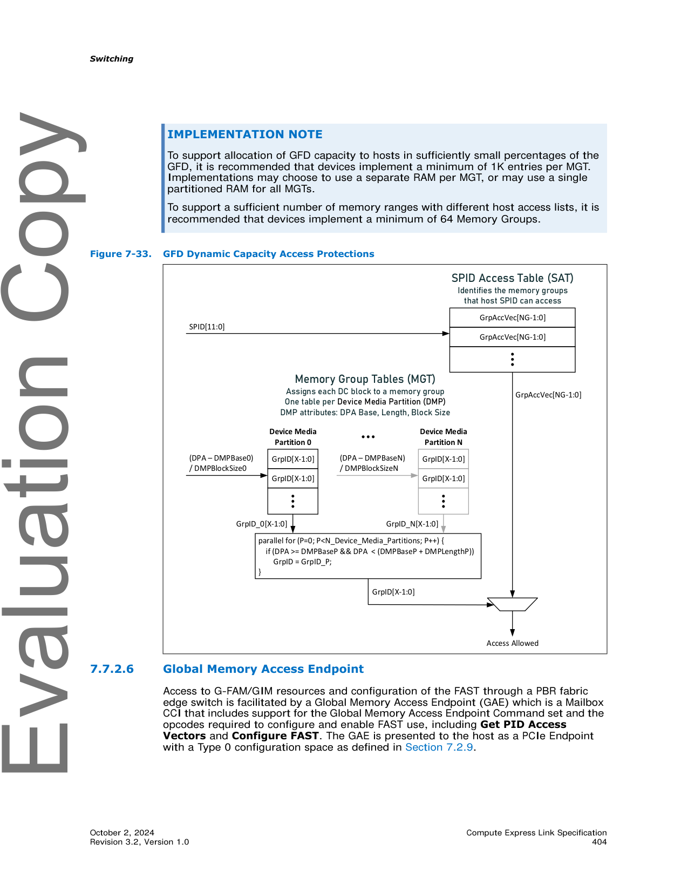
>
> *Original page render @ 150 DPI* — [📄 Full size](figures/chapter_07/page_0404.png)

### 7.7.2.6 Global Memory Access Endpoint | 7.7.2.6 全局内存访问端点

<table>
<thead>
<tr>
<th width="50%">🇬🇧 English</th>
<th width="50%" style="background-color:#e8e8e8">🇨🇳 中文</th>
</tr>
</thead>
<tbody>
<tr><td>Access to G-FAM/GIM resources and configuration of the FAST through a PBR fabric edge switch is facilitated by a Global Memory Access Endpoint (GAE) which is a Mailbox CCI that includes support for the Global Memory Access Endpoint Command set and the opcodes required to configure and enable FAST use, including Get PID Access Vectors and Configure FAST. The GAE is presented to the host as a PCIe Endpoint with a Type 0 configuration space as defined in Section 7.2.9.</td><td style="background-color:#e8e8e8">通过 PBR Fabric Edge 交换机对 G-FAM/GIM 资源的访问和 FAST 的配置由 Global Memory Access Endpoint (GAE) 提供,GAE 是一个 Mailbox CCI,包含对 Global Memory Access Endpoint Command 集的支持,以及配置和启用 FAST 使用所需的操作码,包括 Get PID Access Vectors 和 Configure FAST。GAE 以 PCIe Endpoint 的形式呈现给主机,具有 7.2.9 节中定义的 Type 0 配置空间。</td></tr>
</tbody>
</table>

> **IMPLEMENTATION NOTE** (实现提示)
>
> 为了支持以足够小的 GFD 容量百分比向主机分配 GFD 容量,建议设备每个 MGT 实现至少 1K 个条目。实现可选择为每个 MGT 使用单独的 RAM,或对所有 MGT 使用单一分区 RAM。
>
> 为了支持具有不同主机访问列表的足够数量的内存范围,建议设备实现至少 64 个 Memory Group。

<table>
<thead>
<tr>
<th width="50%">🇬🇧 English</th>
<th width="50%" style="background-color:#e8e8e8">🇨🇳 中文</th>
</tr>
</thead>
<tbody>
<tr><td>There are two configurations under which a host edge port USP will expose a GAE. The first configuration, illustrated in Figure 7-34, provides LD-FAM and G-FAM/GIM resources to a host. In this configuration, the GAE Mailbox CCI is used to configure G-FAM/GIM access for the USP and any DSPs connected to EPs. It may also include support for opcodes necessary to manage the CXL switch capability providing LD-FAM resources.</td><td style="background-color:#e8e8e8">在两种配置下,主机 Edge Port USP 将暴露 GAE。第一种配置 (如图 7-34 所示) 向主机提供 LD-FAM 和 G-FAM/GIM 资源。在此配置中,GAE Mailbox CCI 用于为 USP 和连接到 EP 的任何 DSP 配置 G-FAM/GIM 访问。它还可以包括管理提供 LD-FAM 资源的 CXL 交换机能力所需的操作码支持。</td></tr>
<tr><td>The second configuration, illustrated in Figure 7-35, only provides access to G-FAM/GIM resources. In this configuration, there is no CXL switch instantiated in the VCS and the GAE is the only PCIe function presented to the host.</td><td style="background-color:#e8e8e8">第二种配置 (如图 7-35 所示) 仅提供对 G-FAM/GIM 资源的访问。在此配置中,VCS 中未实例化 CXL 交换机,GAE 是呈现给主机的唯一 PCIe function。</td></tr>
<tr><td>A GAE is also required in the vUSP of a Downstream ES VCS. This GAE is used for configuring that VCS, including configuring the FAST and LDST in the Edge DSPs and providing CDAT information, as described in Section 7.7.12.4.</td><td style="background-color:#e8e8e8">在 Downstream ES VCS 的 vUSP 中也需要 GAE。此 GAE 用于配置该 VCS,包括在 Edge DSP 中配置 FAST 和 LDST 以及提供 CDAT 信息,如 7.7.12.4 节所述。</td></tr>
<tr><td>Each GAE maintains two access vectors, which are used to control whether the host has access to a particular PID:</td><td style="background-color:#e8e8e8">每个 GAE 维护两个访问向量,用于控制主机是否可访问特定 PID:</td></tr>
<tr><td>• Global Memory Mapping Vector (GMV): 4k bitmask indicating which PIDs have been enabled for G-FAM or GIM access</td><td style="background-color:#e8e8e8">• Global Memory Mapping Vector (GMV): 4k 位掩码,指示哪些 PID 已启用 G-FAM 或 GIM 访问</td></tr>
<tr><td>• VendPrefixL0 Target Vector (VTV): 4k bitmask indicating which PIDs have been enabled for VendPrefixL0</td><td style="background-color:#e8e8e8">• VendPrefixL0 Target Vector (VTV): 4k 位掩码,指示哪些 PID 已启用 VendPrefixL0</td></tr>
</tbody>
</table>

> **Figure 7-34.** PBR Fabric Providing LD-FAM and G-FAM Resources ｜ 提供 LD-FAM 和 G-FAM 资源的 PBR Fabric
>
> 
>
> *Original page render @ 150 DPI* — [📄 Full size](figures/chapter_07/fig_0405_1.jpx)

> **Figure 7-35.** PBR Fabric Providing Only G-FAM Resources ｜ 仅提供 G-FAM 资源的 PBR Fabric
>
> 
>
> *Original page render @ 150 DPI* — [📄 Full size](figures/chapter_07/fig_0405_2.jpx)

### 7.7.2.7 Event Notifications from GFDs | 7.7.2.7 来自 GFD 的事件通知

<table>
<thead>
<tr>
<th width="50%">🇬🇧 English</th>
<th width="50%" style="background-color:#e8e8e8">🇨🇳 中文</th>
</tr>
</thead>
<tbody>
<tr><td>GFDs do not maintain individual logs for every requester. Instead, events of interest are reported using the Enhanced Event Notifications defined in Section 8.2.10.2.9 and Section 8.2.10.2.10. These notifications are transported across the fabric using GAM VDMs, as defined in Section 3.1.11.6.</td><td style="background-color:#e8e8e8">GFD 不为每个请求者维护单独的日志。相反,感兴趣的事件使用 8.2.10.2.9 和 8.2.10.2.10 节中定义的 Enhanced Event Notification 上报。这些通知通过 GAM VDM 在 Fabric 上传输,如 3.1.11.6 节所定义。</td></tr>
<tr><td>For event notifications sent to a host, the GAM VDM's DPID is the PID of the host's GAE. When received by the GAE, the GAM VDM's 32B payload is written into the host's GAM Buffer. All GAM VDMs that are received by the GAE are logged into the same GAM Buffer, regardless of their SPID.</td><td style="background-color:#e8e8e8">对于发送到主机的事件通知,GAM VDM 的 DPID 是主机 GAE 的 PID。GAE 接收时,GAM VDM 的 32B 有效负载被写入主机的 GAM Buffer。GAE 接收的所有 GAM VDM 都记录在同一个 GAM Buffer 中,无论其 SPID 如何。</td></tr>
<tr><td>The GAM Buffer is a circular buffer in host memory that is configured for 32B entries. Its location in host memory is configured with the Set GAM Buffer request. The GAE writes received GAM VDM payloads into the buffer offset that is specified by the head index reported by the Get GAM Buffer request (see Section 8.2.10.2.11). As the host reads entries, the host increments the tail index using the Set GAM Buffer request (see Section 8.2.10.2.12). Head and tail indexes wrap to the beginning of the buffer when they increment beyond the buffer size.</td><td style="background-color:#e8e8e8">GAM Buffer 是主机内存中的一个循环缓冲区,配置为 32B 条目。它在主机内存中的位置由 Set GAM Buffer 请求配置。GAE 将接收到的 GAM VDM 有效负载写入 Get GAM Buffer 请求 (参见 8.2.10.2.11 节) 报告的 head index 指定的缓冲区偏移。主机读取条目时,使用 Set GAM Buffer 请求 (参见 8.2.10.2.12 节) 增加 tail index。当 head 和 tail 索引递增超过缓冲区大小时,会环绕到缓冲区的开头。</td></tr>
<tr><td>The buffer is empty when the head index and tail index are equal. The buffer is full when the head index is immediately before the tail index. Old entries are not overwritten by the GAE until the host removes them from the buffer by incrementing the tail index. The GAE will report a buffer overflow condition if a GAM VDM is received when the buffer is full.</td><td style="background-color:#e8e8e8">当 head index 和 tail index 相等时,缓冲区为空。当 head index 紧接在 tail index 之前时,缓冲区已满。在主机通过递增 tail index 将其从缓冲区中移除之前,GAE 不会覆盖旧条目。如果在缓冲区已满时收到 GAM VDM,GAE 将报告缓冲区溢出情况。</td></tr>
<tr><td>GAM VDMs are not forwarded to peer devices and are instead silently dropped by the peer's edge switch.</td><td style="background-color:#e8e8e8">GAM VDM 不会转发到对等设备,而是由对等方的 Edge 交换机静默丢弃。</td></tr>
</tbody>
</table>

[⬆️ 返回目录](#-本章目录-part-b)

---

## 7.7.3 Global Integrated Memory (GIM) | 7.7.3 全局集成内存 (GIM)

<table>
<thead>
<tr>
<th width="50%">🇬🇧 English</th>
<th width="50%" style="background-color:#e8e8e8">🇨🇳 中文</th>
</tr>
</thead>
<tbody>
<tr><td>A host domain may include multiple tiers of memory:</td><td style="background-color:#e8e8e8">主机域可以包括多层内存:</td></tr>
<tr><td>• Memory natively attached to a host (e.g., DDR, HBM, etc.)</td><td style="background-color:#e8e8e8">• 本机附加到主机的内存 (例如,DDR、HBM 等)</td></tr>
<tr><td>• Device memory attached to a host CXL link</td><td style="background-color:#e8e8e8">• 通过主机 CXL 链路附加的设备内存</td></tr>
<tr><td>• Device memory attached to a host through CXL switches</td><td style="background-color:#e8e8e8">• 通过 CXL 交换机附加到主机的设备内存</td></tr>
<tr><td>All the memory tiers listed above are managed by a host operating system. CXL devices may be a Type 2 device or Type 3 device and may optionally support back-invalidate channels. A CXL Fabric may be composed of many host domains and G-FAM devices (GFD) as shown in Figure 7-36. GFD is a scalable memory resource that is accessible by all hosts and peer devices within a CXL Fabric.</td><td style="background-color:#e8e8e8">上面列出的所有内存层均由主机操作系统管理。CXL 设备可以是 Type 2 设备或 Type 3 设备,可以可选地支持 back-invalidate 通道。CXL Fabric 可以由许多主机域和 G-FAM 设备 (GFD) 组成,如图 7-36 所示。GFD 是一种可扩展的内存资源,可被 CXL Fabric 中的所有主机和对等设备访问。</td></tr>
<tr><td>Each host domain may allow other host domains within the CXL Fabric to access locally managed memory at any tier. Global Integrated Memory (GIM) refers to the memory in remote host domains that is mapped into local host physical address space. Hosts and devices are allowed to initiate cross-domain accesses to GIM, utilizing Unordered I/O (UIO) transactions. CXL.mem or CXL.cache must not be used for GIM accesses.</td><td style="background-color:#e8e8e8">每个主机域可以允许 CXL Fabric 中的其他主机域访问任何层的本地管理内存。全局集成内存 (Global Integrated Memory, GIM) 是指映射到本地主机物理地址空间的远程主机域中的内存。允许主机和设备使用 Unordered I/O (UIO) 事务启动对 GIM 的跨域访问。GIM 访问不得使用 CXL.mem 或 CXL.cache。</td></tr>
<tr><td>Cross-domain accesses are considered I/O coherent — data is coherent at the time of access. Remote domains may either mark this memory as uncacheable or manage caches with SW mechanisms.</td><td style="background-color:#e8e8e8">跨域访问被视为 I/O 一致性 (I/O coherent) — 数据在访问时是一致的。远程域可以将此内存标记为不可缓存,或使用软件机制管理缓存。</td></tr>
<tr><td>GIM is primarily used for enabling remote DMA and messaging across domains. It is not intended for memory pooling or borrowing use cases.</td><td style="background-color:#e8e8e8">GIM 主要用于启用跨域的远程 DMA 和消息传递。它不适用于内存池化或借用用例。</td></tr>
</tbody>
</table>

> **Figure 7-36.** CXL Fabric Example with Multiple Host Domains and Memory Types ｜ 具有多个主机域和内存类型的 CXL Fabric 示例
>
> 
>
> *Original page render @ 150 DPI* — [📄 Full size](figures/chapter_07/page_0407_1.png)

### 7.7.3.1 Host GIM Physical Address View | 7.7.3.1 主机 GIM 物理地址视图

<table>
<thead>
<tr>
<th width="50%">🇬🇧 English</th>
<th width="50%" style="background-color:#e8e8e8">🇨🇳 中文</th>
</tr>
</thead>
<tbody>
<tr><td>Hosts and devices may use proprietary decode mechanisms to identify the target DPID and may bypass address decoders in the switch ingress port. Hosts and devices are typically limited to access between homogeneous peers. See Section 7.7.3.2 for ways by which hosts/devices can access Global Integrated Memory (GIM) without using the FAST decoders. This section covers the decode path that uses the FAST decoders.</td><td style="background-color:#e8e8e8">主机和设备可以使用专有的解码机制来识别目标 DPID,并可以绕过交换机入口端口中的地址解码器。主机和设备通常仅限于在同类对等方之间访问。有关主机/设备如何在不使用 FAST 解码器的情况下访问全局集成内存 (GIM) 的方法,请参见 7.7.3.2 节。本节涵盖使用 FAST 解码器的解码路径。</td></tr>
<tr><td>Hosts that access GIM and rely on address decoders in the switch must map this range in the Fabric Address Space. Hosts that access GIM and GFD must include both ranges in the Fabric Address Space and must use a contiguous address range within the Host Physical Address (HPA) space as shown in Figure 7-37.</td><td style="background-color:#e8e8e8">访问 GIM 并依赖交换机中地址解码器的主机必须将此范围映射到 Fabric Address Space。访问 GIM 和 GFD 的主机必须将两个范围都包含在 Fabric Address Space 中,并且必须使用 Host Physical Address (HPA) 空间内的连续地址范围,如图 7-37 所示。</td></tr>
</tbody>
</table>

> **Figure 7-37.** Example Host Physical Address View with GFD and GIM ｜ 具有 GFD 和 GIM 的主机物理地址视图示例
>
> 
>
> *Original page render @ 150 DPI* — [📄 Full size](figures/chapter_07/page_0407_2.png)

### 7.7.3.2 Use Cases | 7.7.3.2 用例

<table>
<thead>
<tr>
<th width="50%">🇬🇧 English</th>
<th width="50%" style="background-color:#e8e8e8">🇨🇳 中文</th>
</tr>
</thead>
<tbody>
<tr><td>All accesses to GIM regions must only use UIO. It is recommended to map GIM as MMIO instead of a normal write back memory type to avoid potential deadlock. However, implementations may use proprietary methods to guarantee UIO use even when internally using a cacheable memory type. Thus, MMIO mapping of GIM is only a recommendation and not a requirement.</td><td style="background-color:#e8e8e8">对 GIM 区域的所有访问必须仅使用 UIO。建议将 GIM 映射为 MMIO,而不是普通的 write back 内存类型,以避免潜在的死锁。但是,实现可以使用专有方法来保证 UIO 的使用,即使在内部使用可缓存的内存类型时也是如此。因此,将 GIM 映射为 MMIO 只是一个建议,不是必需的。</td></tr>
<tr><td>Host and device accesses to GFD and GIM are decoded using a common FAST decoder to determine the target's DPID.</td><td style="background-color:#e8e8e8">主机和设备对 GFD 和 GIM 的访问使用公共 FAST 解码器进行解码,以确定目标的 DPID。</td></tr>
<tr><td>ML and HPC applications are typically distributed across many compute nodes and need a scalable and efficient network for low-latency communication and synchronization. Figure 7-38 is an example of a system with a compute node composed of a Host, an Accelerator, and a cluster of nodes connected through a CXL switch fabric. Each host may expose a region or all available memory to other compute nodes.</td><td style="background-color:#e8e8e8">ML 和 HPC 应用程序通常分布在许多计算节点上,需要可扩展且高效的网络以进行低延迟通信和同步。图 7-38 是一个系统示例,系统由主机、加速器和通过 CXL 交换机 Fabric 连接的节点集群组成。每个主机可以向其他计算节点暴露一个区域或所有可用内存。</td></tr>
<tr><td>A second example in Figure 7-39 shows a CXL Fabric that connects all the accelerators. In this example, only the memory attached to the device is exposed to other devices as GIM. UIO allows flexible implementation options to enable RDMA semantics between devices. Software and security requirements are beyond the scope of this specification.</td><td style="background-color:#e8e8e8">图 7-39 中的第二个示例显示了连接所有加速器的 CXL Fabric。在此示例中,只有附加到设备的内存作为 GIM 暴露给其他设备。UIO 允许灵活的实现选项以启用设备之间的 RDMA 语义。软件和安全要求不在本规范的范围内。</td></tr>
<tr><td>GIM builds a framework for using the same set of capabilities for host-to-host communication, device-to-device communication, host-to-device communication, and device-to-host communication.</td><td style="background-color:#e8e8e8">GIM 框架使用同一组功能来实现主机到主机通信、设备到设备通信、主机到设备通信和设备到主机通信。</td></tr>
</tbody>
</table>

> **Figure 7-38.** Example Multi-host CXL Cluster with Memory on Host and Device Exposed as GIM ｜ 多主机 CXL 集群示例,主机和设备上的内存作为 GIM 暴露
>
> 
>
> *Original page render @ 150 DPI* — [📄 Full size](figures/chapter_07/page_0408_1.png)

> **Figure 7-39.** Example ML Cluster Supporting Cross-domain Access through GIM ｜ 通过 GIM 支持跨域访问的 ML 集群示例
>
> 
>
> *Original page render @ 150 DPI* — [📄 Full size](figures/chapter_07/page_0409_1.png)

### 7.7.3.3 Transaction Flows and Rules for GIM | 7.7.3.3 GIM 的事务流和规则

<table>
<thead>
<tr>
<th width="50%">🇬🇧 English</th>
<th width="50%" style="background-color:#e8e8e8">🇨🇳 中文</th>
</tr>
</thead>
<tbody>
<tr><td>The flow in Figure 7-40 describes how a host can access GIM in another host, using the fabric address model described earlier in this chapter. While Figure 7-40 uses host-to-host as the example, the same model works for host-to-device, device-to-device and device-to-host as well. A device that implements GIM as target is expected to have the required functionality that translates the combination of <Address: PID> in the incoming UIO TLP to a local memory address and to provide the required security on cross-domain accesses. This functionality can also use more information than just <Address:PID> from the TLP (e.g., PASID) for additional functionality/security. Designs can chose to reuse the GFD architecture for defining this translation/protection functionality or can implement a proprietary IOMMU-like logic. Details of this functionality are beyond the scope of this Specification.</td><td style="background-color:#e8e8e8">图 7-40 中的流程描述了主机如何使用本章前面描述的 Fabric 地址模型访问另一主机中的 GIM。虽然图 7-40 使用主机到主机作为示例,但相同的模型也适用于主机到设备、设备到设备和设备到主机。将 GIM 实现为目标的设备应具有所需的功能,将传入 UIO TLP 中的 <Address: PID> 组合转换为本地内存地址,并提供跨域访问所需的安全性。此功能还可以使用 TLP 中除 <Address: PID> 之外的其他信息 (例如 PASID) 来提供附加功能/安全性。设计可以选择重用 GFD 架构来定义此转换/保护功能,也可以实现专有的类似 IOMMU 的逻辑。此功能的详细信息不在本规范的范围内。</td></tr>
</tbody>
</table>

> **Figure 7-40.** GIM Access Flows Using FASTs ｜ 使用 FAST 的 GIM 访问流
>
> 
>
> *Original page render @ 150 DPI* — [📄 Full size](figures/chapter_07/page_0409_2.png)

<table>
<thead>
<tr>
<th width="50%">🇬🇧 English</th>
<th width="50%" style="background-color:#e8e8e8">🇨🇳 中文</th>
</tr>
</thead>
<tbody>
<tr><td>Although the flows described in Figure 7-40 and Figure 7-41 are self-explanatory, here are the key rules for PBR switches/Hosts/Devices that support the GIM flows:</td><td style="background-color:#e8e8e8">尽管图 7-40 和图 7-41 中描述的流程是不言自明的,但以下是支持 GIM 流的 PBR 交换机/主机/设备的关键规则:</td></tr>
<tr><td>• FM enables usage of VendPrefixL0 on non-PBR edge ports, using the FM API discussed in Table 7-187. By default, VendPrefixL0 usage is disabled on edge ports.</td><td style="background-color:#e8e8e8">• FM 使用表 7-187 中讨论的 FM API 在非 PBR Edge 端口上启用 VendPrefixL0 的使用。默认情况下,Edge 端口上禁用 VendPrefixL0 使用。</td></tr>
<tr><td>The mechanism that the FM uses to determine on which ports to enable this functionality is beyond the scope of this specification.</td><td style="background-color:#e8e8e8">FM 用于确定在哪些端口上启用此功能的机制不在本规范的范围内。</td></tr>
</tbody>
</table>

> **Figure 7-41.** GIM Access Flows without FASTs ｜ 不使用 FAST 的 GIM 访问流
>
> 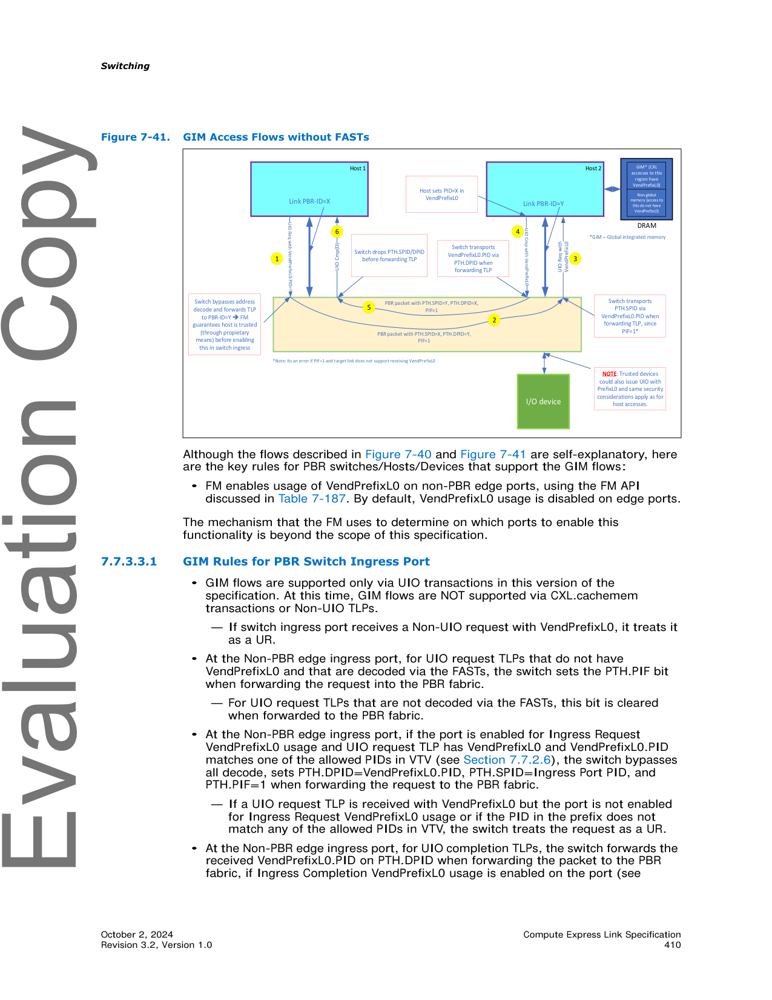
>
> *Original page render @ 150 DPI* — [📄 Full size](figures/chapter_07/page_0410.png)

#### 7.7.3.3.1 GIM Rules for PBR Switch Ingress Port | 7.7.3.3.1 PBR 交换机入口端口的 GIM 规则

<table>
<thead>
<tr>
<th width="50%">🇬🇧 English</th>
<th width="50%" style="background-color:#e8e8e8">🇨🇳 中文</th>
</tr>
</thead>
<tbody>
<tr><td>• GIM flows are supported only via UIO transactions in this version of the specification. At this time, GIM flows are NOT supported via CXL.cachemem transactions or Non-UIO TLPs.</td><td style="background-color:#e8e8e8">• 在本规范版本中,GIM 流仅通过 UIO 事务支持。目前,GIM 流不支持 CXL.cachemem 事务或非 UIO TLP。</td></tr>
<tr><td>— If switch ingress port receives a Non-UIO request with VendPrefixL0, it treats it as a UR.</td><td style="background-color:#e8e8e8">— 如果交换机入口端口接收到带有 VendPrefixL0 的非 UIO 请求,则将其视为 UR。</td></tr>
<tr><td>• At the Non-PBR edge ingress port, for UIO request TLPs that do not have VendPrefixL0 and that are decoded via the FASTs, the switch sets the PTH.PIF bit when forwarding the request into the PBR fabric.</td><td style="background-color:#e8e8e8">• 在非 PBR Edge 入口端口,对于不具有 VendPrefixL0 且通过 FAST 解码的 UIO 请求 TLP,交换机在将请求转发到 PBR Fabric 时设置 PTH.PIF 位。</td></tr>
<tr><td>— For UIO request TLPs that are not decoded via the FASTs, this bit is cleared when forwarded to the PBR fabric.</td><td style="background-color:#e8e8e8">— 对于未通过 FAST 解码的 UIO 请求 TLP,转发到 PBR Fabric 时此位被清除。</td></tr>
<tr><td>• At the Non-PBR edge ingress port, if the port is enabled for Ingress Request VendPrefixL0 usage and UIO request TLP has VendPrefixL0 and VendPrefixL0.PID matches one of the allowed PIDs in VTV (see Section 7.7.2.6), the switch bypasses all decode, sets PTH.DPID=VendPrefixL0.PID, PTH.SPID=Ingress Port PID, and PTH.PIF=1 when forwarding the request to the PBR fabric.</td><td style="background-color:#e8e8e8">• 在非 PBR Edge 入口端口,如果端口启用了 Ingress Request VendPrefixL0 使用且 UIO 请求 TLP 具有 VendPrefixL0 且 VendPrefixL0.PID 匹配 VTV 中允许的 PID 之一 (参见 7.7.2.6 节),则交换机绕过所有解码,在将请求转发到 PBR Fabric 时设置 PTH.DPID=VendPrefixL0.PID,PTH.SPID=Ingress Port PID 和 PTH.PIF=1。</td></tr>
<tr><td>— If a UIO request TLP is received with VendPrefixL0 but the port is not enabled for Ingress Request VendPrefixL0 usage or if the PID in the prefix does not match any of the allowed PIDs in VTV, the switch treats the request as a UR.</td><td style="background-color:#e8e8e8">— 如果收到的 UIO 请求 TLP 带有 VendPrefixL0 但端口未启用 Ingress Request VendPrefixL0 使用,或者如果前缀中的 PID 与 VTV 中允许的任何 PID 都不匹配,则交换机将请求视为 UR。</td></tr>
<tr><td>• At the Non-PBR edge ingress port, for UIO completion TLPs, the switch forwards the received VendPrefixL0.PID on PTH.DPID when forwarding the packet to the PBR fabric, if Ingress Completion VendPrefixL0 usage is enabled on the port (see Section 7.7.15.5) and VendPrefixL0.PID matches one of the allowed PIDs in VTV (see Section 7.7.2.6). PTH.SPID on the completion TLP is set to the PID of the ingress port.</td><td style="background-color:#e8e8e8">• 在非 PBR Edge 入口端口,对于 UIO 完成 TLP,如果端口上启用了 Ingress Completion VendPrefixL0 使用 (参见 7.7.15.5 节) 且 VendPrefixL0.PID 匹配 VTV 中允许的 PID 之一 (参见 7.7.2.6 节),则交换机在将数据包转发到 PBR Fabric 时,转发收到的 VendPrefixL0.PID 到 PTH.DPID。完成 TLP 上的 PTH.SPID 设置为入口端口的 PID。</td></tr>
<tr><td>— if a UIO completion TLP is received on a Non-PBR edge ingress port when Ingress Completion VendPrefixL0 usage is disabled on the port or if the PID in the prefix does not match any of the allowed PIDs in VTV, the switch must drop the packet and treat it as an Unexpected Completion.</td><td style="background-color:#e8e8e8">— 如果在非 PBR Edge 入口端口收到 UIO 完成 TLP 时,端口上禁用了 Ingress Completion VendPrefixL0 使用,或者如果前缀中的 PID 与 VTV 中允许的任何 PID 都不匹配,则交换机必须丢弃该数据包并将其视为意外的完成 (Unexpected Completion)。</td></tr>
<tr><td>— Switch sets the PIF bit whenever it successfully forwards the received completion TLP to the PBR fabric.</td><td style="background-color:#e8e8e8">— 每当交换机成功将收到的完成 TLP 转发到 PBR Fabric 时,都会设置 PIF 位。</td></tr>
</tbody>
</table>

#### 7.7.3.3.2 GIM Rules for PBR Switch Egress Port | 7.7.3.3.2 PBR 交换机出口端口的 GIM 规则

<table>
<thead>
<tr>
<th width="50%">🇬🇧 English</th>
<th width="50%" style="background-color:#e8e8e8">🇨🇳 中文</th>
</tr>
</thead>
<tbody>
<tr><td>• At the Non-PBR edge egress port, for UIO request TLPs with the PTH.PIF bit set, the switch forwards the PTH.SPID field of the request TLP on the VendPrefixL0.PID field if the egress port is enabled for Egress Request VendPrefixL0 usage.</td><td style="background-color:#e8e8e8">• 在非 PBR Edge 出口端口,对于设置了 PTH.PIF 位的 UIO 请求 TLP,如果出口端口启用了 Egress Request VendPrefixL0 使用,则交换机将请求 TLP 的 PTH.SPID 字段转发到 VendPrefixL0.PID 字段。</td></tr>
<tr><td>— If the PTH.PIF bit is set but the egress port is not enabled for Egress Request VendPrefixL0 usage, the switch should treat the request as a UR.</td><td style="background-color:#e8e8e8">— 如果设置了 PTH.PIF 位但出口端口未启用 Egress Request VendPrefixL0 使用,则交换机应将请求视为 UR。</td></tr>
<tr><td>— If the PTH.PIF bit is cleared in the UIO request TLP, the request TLP is forwarded to the egress link without VendPrefixL0, regardless of whether the port is enabled for Egress Request VendPrefixL0 usage.</td><td style="background-color:#e8e8e8">— 如果 UIO 请求 TLP 中的 PTH.PIF 位被清除,则请求 TLP 被转发到出口链路而不带 VendPrefixL0,无论端口是否启用了 Egress Request VendPrefixL0 使用。</td></tr>
<tr><td>• At the Non-PBR edge egress port, the switch does not send VendPrefixL0 on completion TLPs.</td><td style="background-color:#e8e8e8">• 在非 PBR Edge 出口端口,交换机不在完成 TLP 上发送 VendPrefixL0。</td></tr>
<tr><td>• If the Non-PBR edge egress port is in a 'Link Down' state, GIM packets shall be silently dropped.</td><td style="background-color:#e8e8e8">• 如果非 PBR Edge 出口端口处于 "Link Down" 状态,则应静默丢弃 GIM 数据包。</td></tr>
<tr><td>• Switch forwards the PTH.PIF bit as-is on edge PBR links</td><td style="background-color:#e8e8e8">• 交换机在 Edge PBR 链路上按原样转发 PTH.PIF 位</td></tr>
</tbody>
</table>

#### 7.7.3.3.3 GIM Rules for Host/Devices | 7.7.3.3.3 主机/设备的 GIM 规则

<table>
<thead>
<tr>
<th width="50%">🇬🇧 English</th>
<th width="50%" style="background-color:#e8e8e8">🇨🇳 中文</th>
</tr>
</thead>
<tbody>
<tr><td>• Host/Devices that support VendPrefixL0 semantics and receive a UIO Request TLP with VendPrefixL0 must return the received PID value in the associated completion's VendPrefixL0.</td><td style="background-color:#e8e8e8">• 支持 VendPrefixL0 语义并收到带有 VendPrefixL0 的 UIO Request TLP 的主机/设备必须在关联完成的 VendPrefixL0 中返回收到的 PID 值。</td></tr>
<tr><td>• Host/Devices must always return a value of 0 for Completer ID in the UIO completions.</td><td style="background-color:#e8e8e8">• 主机/设备必须在 UIO 完成中始终返回 Completer ID 值为 0。</td></tr>
</tbody>
</table>

#### 7.7.3.3.4 Other GIM Rules | 7.7.3.3.4 其他 GIM 规则

<table>
<thead>
<tr>
<th width="50%">🇬🇧 English</th>
<th width="50%" style="background-color:#e8e8e8">🇨🇳 中文</th>
</tr>
</thead>
<tbody>
<tr><td>• VendPrefixL0 must never be sent on edge PBR links, such as the links connecting to a GFD</td><td style="background-color:#e8e8e8">• VendPrefixL0 绝不能在 Edge PBR 链路上发送,例如连接到 GFD 的链路</td></tr>
<tr><td>• GFD must ignore the PTH.PIF bit on TLPs that the GFD receives</td><td style="background-color:#e8e8e8">• GFD 必须忽略 GFD 接收的 TLP 上的 PTH.PIF 位</td></tr>
<tr><td>• GFD is permitted to set the PTH.PIF bit on CXL.io request TLPs that the GFD sources and always sets this bit on CXL.io completion TLPs that the GFD sources</td><td style="background-color:#e8e8e8">• 允许 GFD 在其发出的 CXL.io 请求 TLP 上设置 PTH.PIF 位,并始终在其发出的 CXL.io 完成 TLP 上设置此位</td></tr>
<tr><td><b>Note:</b></td><td style="background-color:#e8e8e8"><b>注:</b></td></tr>
<tr><td>If setting the PTH.PIF bit on request TLPs, the GFD must do so only if it is sure that the ultimate destination (e.g., GIM) needs to be aware of the PID of the source agent that is generating the request (such as for functional/security reasons); otherwise, the GFD should not set the bit.</td><td style="background-color:#e8e8e8">如果 GFD 在请求 TLP 上设置 PTH.PIF 位,则必须仅在它确定最终目的地 (例如 GIM) 需要知道正在生成请求的源代理的 PID (例如出于功能/安全原因) 时才这样做;否则,GFD 不应设置该位。</td></tr>
</tbody>
</table>

### 7.7.3.4 Restrictions with Host-to-Host UIO Usages | 7.7.3.4 主机到主机 UIO 使用的限制

<table>
<thead>
<tr>
<th width="50%">🇬🇧 English</th>
<th width="50%" style="background-color:#e8e8e8">🇨🇳 中文</th>
</tr>
</thead>
<tbody>
<tr><td>Host-to-Host UIO usages can result in deadlock when mixed with UIO traffic going to the host that can route back in the host. To avoid such deadlocks:</td><td style="background-color:#e8e8e8">当主机到主机 UIO 使用与可以路由回主机的 UIO 流量混合时,可能导致死锁。为避免此类死锁:</td></tr>
<tr><td>• Systems that support Host-to-Host UIO must use a separate VC for Host-to-Host UIO traffic vs. remainder of UIO, on host edge links.</td><td style="background-color:#e8e8e8">• 支持主机到主机 UIO 的系统必须在主机 Edge 链路上为 Host-to-Host UIO 流量与 UIO 的其余部分使用单独的 VC。</td></tr>
<tr><td>(OR)</td><td style="background-color:#e8e8e8">(或)</td></tr>
<tr><td>• Minimally avoid usages that can cause loopback traffic, either in the host or in switches. Generically, this restriction could mean that UIO accesses do not target MMIO space.</td><td style="background-color:#e8e8e8">• 至少避免可能引起环回流量的使用,无论是在主机内还是交换机内。一般而言,此限制可能意味着 UIO 访问不针对 MMIO 空间。</td></tr>
<tr><td>A detailed analysis of restrictions that are needed to make a specific system configuration to work with Host-to-Host UIO enabled is beyond the scope of this specification.</td><td style="background-color:#e8e8e8">为使特定系统配置能够使用启用的主机到主机 UIO 而需要的限制的详细分析不在本规范的范围内。</td></tr>
<tr><td>A future ECN may be considered that allows for more deadlock avoidance options beyond the two listed above.</td><td style="background-color:#e8e8e8">未来的 ECN 可能会考虑允许除了上面列出的两个选项之外更多的死锁避免选项。</td></tr>
</tbody>
</table>

[⬆️ 返回目录](#-本章目录-part-b)

---

## 7.7.4 Non-GIM Usages with VendPrefixL0 | 7.7.4 使用 VendPrefixL0 的非 GIM 用途

<table>
<thead>
<tr>
<th width="50%">🇬🇧 English</th>
<th width="50%" style="background-color:#e8e8e8">🇨🇳 中文</th>
</tr>
</thead>
<tbody>
<tr><td>When Hosts/Devices initiate UIO requests with VendPrefixL0, address decoding is bypassed in the Switch ingress port. This allows for proprietary implementations in which the address/data information in the TLP can potentially be vendor-defined. Such usages are beyond the scope of this specification; however, GIM-related rules enumerated in Section 7.7.3.3 allow such implementations as well.</td><td style="background-color:#e8e8e8">当主机/设备使用 VendPrefixL0 启动 UIO 请求时,交换机入口端口中的地址解码被绕过。这允许使用专有的实现,其中 TLP 中的地址/数据信息可以是供应商定义的。此类用途不在本规范的范围内;然而,7.7.3.3 节中列举的 GIM 相关规则也允许此类实现。</td></tr>
</tbody>
</table>

[⬆️ 返回目录](#-本章目录-part-b)

---

## 7.7.5 HBR and PBR Switch Configurations | 7.7.5 HBR 与 PBR 交换机配置

<table>
<thead>
<tr>
<th width="50%">🇬🇧 English</th>
<th width="50%" style="background-color:#e8e8e8">🇨🇳 中文</th>
</tr>
</thead>
<tbody>
<tr><td>CXL supports two types of switches: HBR (Hierarchy Based Routing) and PBR (Port Based Routing). "HBR" is the shorthand name for the CXL switches introduced in the CXL 2.0 specification and enhanced in subsequent CXL ECNs and specifications. In this section, the interaction between the two will be discussed.</td><td style="background-color:#e8e8e8">CXL 支持两种类型的交换机:HBR (基于层级的路由,Hierarchy Based Routing) 和 PBR (基于端口的路由,Port Based Routing)。"HBR" 是 CXL 2.0 规范中引入并在后续 CXL ECN 和规范中增强的 CXL 交换机的简写名称。本节将讨论两者之间的交互。</td></tr>
<tr><td>A variety of HBR/PBR switch combinations are supported. The basic rules are as follows:</td><td style="background-color:#e8e8e8">支持多种 HBR/PBR 交换机组合。基本规则如下:</td></tr>
<tr><td>• Host RP must be connected to an HBR USP, PBR USP, or a non-GFD</td><td style="background-color:#e8e8e8">• 主机 RP 必须连接到 HBR USP、PBR USP 或非 GFD</td></tr>
<tr><td>• Non-GFD must be connected to an HBR DSP, a PBR DSP, or a Host RP</td><td style="background-color:#e8e8e8">• 非 GFD 必须连接到 HBR DSP、PBR DSP 或主机 RP</td></tr>
<tr><td>• PBR USP may be connected only to a host RP; connecting it to an HBR DSP is not supported</td><td style="background-color:#e8e8e8">• PBR USP 只能连接到主机 RP;不支持将其连接到 HBR DSP</td></tr>
<tr><td>• HBR USP may be connected to a host RP, a PBR DSP, or an HBR DSP</td><td style="background-color:#e8e8e8">• HBR USP 可连接到主机 RP、PBR DSP 或 HBR DSP</td></tr>
<tr><td>• GFD may be connected only to a PBR DSP</td><td style="background-color:#e8e8e8">• GFD 只能连接到 PBR DSP</td></tr>
<tr><td>• PBR FPort may be connected only to a PBR FPort of a different PBR switch</td><td style="background-color:#e8e8e8">• PBR FPort 只能连接到不同 PBR 交换机的 PBR FPort</td></tr>
<tr><td>Figure 7-42 illustrates some example supported switch configurations, but should not be considered a complete list.</td><td style="background-color:#e8e8e8">图 7-42 展示了一些支持的交换机配置示例,但不应视为完整列表。</td></tr>
</tbody>
</table>

> **Figure 7-42.** Example Supported Switch Configurations ｜ 支持的交换机配置示例
>
> 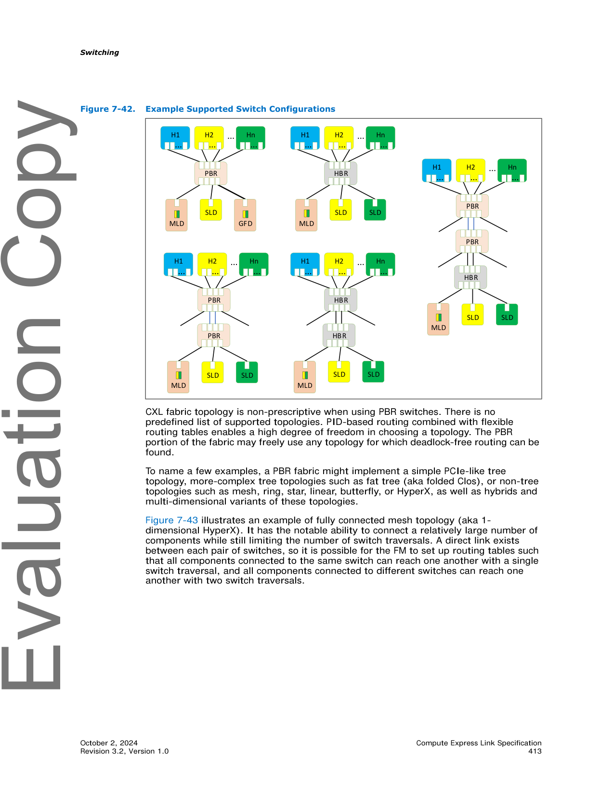
>
> *Original page render @ 150 DPI* — [📄 Full size](figures/chapter_07/page_0413.png)

<table>
<thead>
<tr>
<th width="50%">🇬🇧 English</th>
<th width="50%" style="background-color:#e8e8e8">🇨🇳 中文</th>
</tr>
</thead>
<tbody>
<tr><td>CXL fabric topology is non-prescriptive when using PBR switches. There is no predefined list of supported topologies. PID-based routing combined with flexible routing tables enables a high degree of freedom in choosing a topology. The PBR portion of the fabric may freely use any topology for which deadlock-free routing can be found.</td><td style="background-color:#e8e8e8">使用 PBR 交换机时,CXL Fabric 拓扑是非规定的。没有预定义的支持拓扑列表。基于 PID 的路由与灵活的路由表相结合,使拓扑选择具有高度自由度。Fabric 的 PBR 部分可以自由使用任何可以找到无死锁路由的拓扑。</td></tr>
<tr><td>To name a few examples, a PBR fabric might implement a simple PCIe-like tree topology, more-complex tree topologies such as fat tree (aka folded Clos), or non-tree topologies such as mesh, ring, star, linear, butterfly, or HyperX, as well as hybrids and multi-dimensional variants of these topologies.</td><td style="background-color:#e8e8e8">仅举几个例子,PBR Fabric 可能实现简单的类似 PCIe 的树形拓扑、更复杂的树形拓扑 (如 fat tree (也称 folded Clos)),或非树形拓扑 (如 mesh、ring、star、linear、butterfly 或 HyperX),以及这些拓扑的混合体和多维变体。</td></tr>
<tr><td>Figure 7-43 illustrates an example of fully connected mesh topology (aka 1-dimensional HyperX). It has the notable ability to connect a relatively large number of components while still limiting the number of switch traversals. A direct link exists between each pair of switches, so it is possible for the FM to set up routing tables such that all components connected to the same switch can reach one another with a single switch traversal, and all components connected to different switches can reach one another with two switch traversals.</td><td style="background-color:#e8e8e8">图 7-43 展示了全连接 mesh 拓扑 (也称 1 维 HyperX) 的一个示例。它具有连接相对大量组件同时仍限制交换机遍历次数的显著能力。每对交换机之间都存在直连链路,因此 FM 可以设置路由表,使得连接到同一交换机的所有组件可以通过单次交换机遍历彼此到达,而连接到不同交换机的所有组件可以通过两次交换机遍历彼此到达。</td></tr>
</tbody>
</table>

> **Figure 7-43.** Example PBR Mesh Topology ｜ PBR Mesh 拓扑示例
>
> 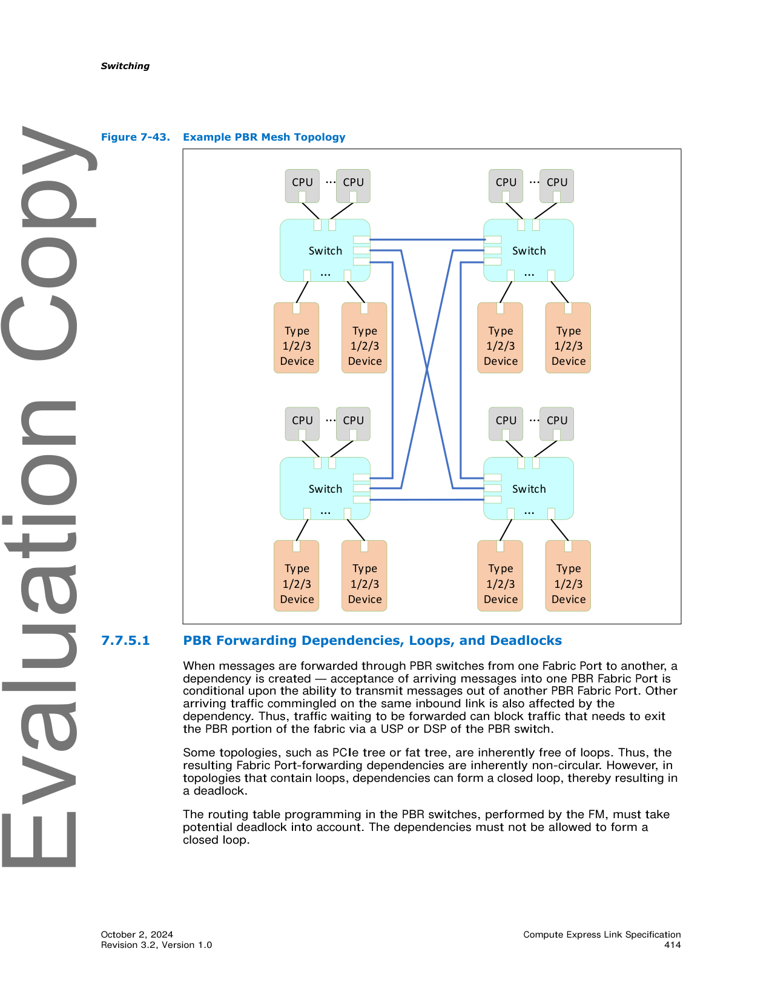
>
> *Original page render @ 150 DPI* — [📄 Full size](figures/chapter_07/page_0414.png)

### 7.7.5.1 PBR Forwarding Dependencies, Loops, and Deadlocks | 7.7.5.1 PBR 转发依赖关系、环路和死锁

<table>
<thead>
<tr>
<th width="50%">🇬🇧 English</th>
<th width="50%" style="background-color:#e8e8e8">🇨🇳 中文</th>
</tr>
</thead>
<tbody>
<tr><td>When messages are forwarded through PBR switches from one Fabric Port to another, a dependency is created — acceptance of arriving messages into one PBR Fabric Port is conditional upon the ability to transmit messages out of another PBR Fabric Port. Other arriving traffic commingled on the same inbound link is also affected by the dependency. Thus, traffic waiting to be forwarded can block traffic that needs to exit the PBR portion of the fabric via a USP or DSP of the PBR switch.</td><td style="background-color:#e8e8e8">当消息通过 PBR 交换机从一个 Fabric Port 转发到另一个 Fabric Port 时,会创建依赖关系 — 接受消息进入一个 PBR Fabric Port 以能够从另一个 PBR Fabric Port 发出消息为条件。同一入站链路上混合的其他到达流量也受此依赖关系影响。因此,等待转发的流量可能会阻塞需要通过 PBR 交换机的 USP 或 DSP 退出 Fabric 的 PBR 部分的流量。</td></tr>
<tr><td>Some topologies, such as PCIe tree or fat tree, are inherently free of loops. Thus, the resulting Fabric Port-forwarding dependencies are inherently non-circular. However, in topologies that contain loops, dependencies can form a closed loop, thereby resulting in a deadlock.</td><td style="background-color:#e8e8e8">某些拓扑 (如 PCIe 树或 fat tree) 本身没有环路。因此,所得到的 Fabric Port 转发依赖关系本质上是非循环的。但是,在包含环路的拓扑中,依赖关系可以形成闭环,从而导致死锁。</td></tr>
<tr><td>The routing table programming in the PBR switches, performed by the FM, must take potential deadlock into account. The dependencies must not be allowed to form a closed loop.</td><td style="background-color:#e8e8e8">PBR 交换机中由 FM 执行的路由表编程必须考虑潜在的死锁。不得允许依赖关系形成闭环。</td></tr>
</tbody>
</table>

> **Figure 7-44.** Example Routing Scheme for a Mesh Topology ｜ Mesh 拓扑的路由方案示例
>
> 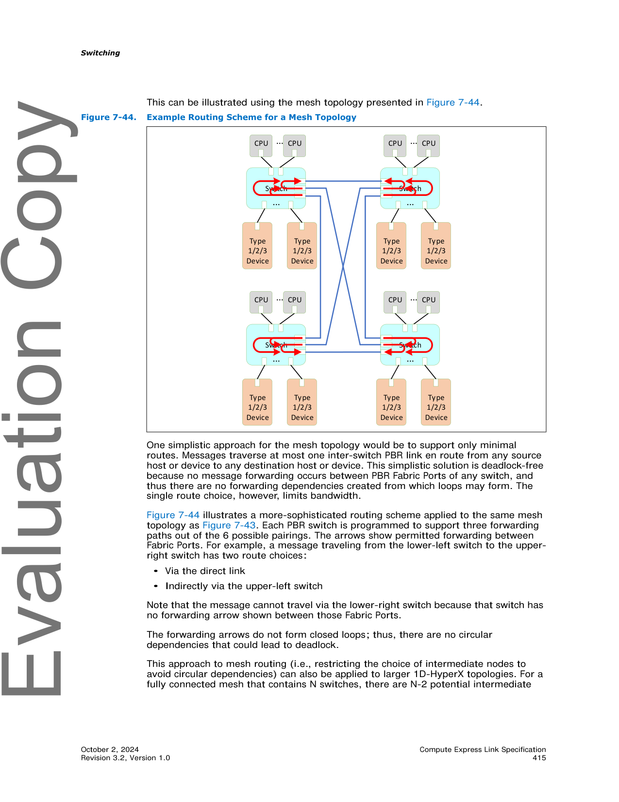
>
> *Original page render @ 150 DPI* — [📄 Full size](figures/chapter_07/page_0415.png)

<table>
<thead>
<tr>
<th width="50%">🇬🇧 English</th>
<th width="50%" style="background-color:#e8e8e8">🇨🇳 中文</th>
</tr>
</thead>
<tbody>
<tr><td>This can be illustrated using the mesh topology presented in Figure 7-44.</td><td style="background-color:#e8e8e8">这可以使用图 7-44 中展示的 mesh 拓扑来说明。</td></tr>
<tr><td>One simplistic approach for the mesh topology would be to support only minimal routes. Messages traverse at most one inter-switch PBR link en route from any source host or device to any destination host or device. This simplistic solution is deadlock-free because no message forwarding occurs between PBR Fabric Ports of any switch, and thus there are no forwarding dependencies created from which loops may form. The single route choice, however, limits bandwidth.</td><td style="background-color:#e8e8e8">对于 mesh 拓扑,一种简单的方法是仅支持最小路由。消息在任何源主机或设备到任何目标主机或设备的路径上最多穿过一个交换机间 PBR 链路。这种简单的解决方案是无死锁的,因为在任何交换机的 PBR Fabric Port 之间都不会发生消息转发,因此不会形成可能产生环路的转发依赖关系。但是,单一路由选择限制了带宽。</td></tr>
<tr><td>Figure 7-44 illustrates a more-sophisticated routing scheme applied to the same mesh topology as Figure 7-43. Each PBR switch is programmed to support three forwarding paths out of the 6 possible pairings. The arrows show permitted forwarding between Fabric Ports. For example, a message traveling from the lower-left switch to the upper-right switch has two route choices:</td><td style="background-color:#e8e8e8">图 7-44 展示了应用于与图 7-43 相同 mesh 拓扑的更复杂的路由方案。每个 PBR 交换机被编程为在 6 种可能的配对中支持 3 条转发路径。箭头显示 Fabric Port 之间允许的转发。例如,从左下交换机到右上交换机的消息有两个路由选择:</td></tr>
<tr><td>• Via the direct link</td><td style="background-color:#e8e8e8">• 通过直连链路</td></tr>
<tr><td>• Indirectly via the upper-left switch</td><td style="background-color:#e8e8e8">• 通过左上交换机间接</td></tr>
<tr><td>Note that the message cannot travel via the lower-right switch because that switch has no forwarding arrow shown between those Fabric Ports.</td><td style="background-color:#e8e8e8">请注意,消息无法通过右下交换机传输,因为这些 Fabric Port 之间没有显示转发箭头。</td></tr>
<tr><td>The forwarding arrows do not form closed loops; thus, there are no circular dependencies that could lead to deadlock.</td><td style="background-color:#e8e8e8">转发箭头不形成闭环;因此,没有可能导致死锁的循环依赖关系。</td></tr>
<tr><td>This approach to mesh routing (i.e., restricting the choice of intermediate nodes to avoid circular dependencies) can also be applied to larger 1D-HyperX topologies. For a fully connected mesh that contains N switches, there are N-2 potential intermediate switches to consider for possible indirect routes between any pair of switches. However, this deadlock-avoidance restriction limits the usable intermediate switch choices to one-half of that number ((N-2)/2), rounding down if N is odd.</td><td style="background-color:#e8e8e8">这种 mesh 路由方法 (即限制中间节点的选择以避免循环依赖) 也可应用于更大的 1D-HyperX 拓扑。对于包含 N 个交换机的全连接 mesh,存在 N-2 个潜在的中间交换机,可考虑用于任何一对交换机之间可能的间接路由。但是,这种避免死锁的限制将可用中间交换机选择限制为该数量的一半 ((N-2)/2),如果 N 为奇数则向下取整。</td></tr>
<tr><td>Multi-dimensional HyperX topologies can be routed deadlock-free by using this technique within each dimension, and implementing dimension-ordered routing.</td><td style="background-color:#e8e8e8">多维 HyperX 拓扑可以通过在每个维度内使用此技术并实现维度排序路由 (dimension-ordered routing) 来实现无死锁路由。</td></tr>
<tr><td>Although this section covers some cases for circular dependency avoidance, fully architected deadlock dependency avoidance with topologies that contain fabric loops is beyond the scope of this specification.</td><td style="background-color:#e8e8e8">尽管本节涵盖了一些避免循环依赖的情况,但完全架构化的死锁依赖避免 (适用于包含 Fabric 环路的拓扑) 不在本规范的范围内。</td></tr>
</tbody>
</table>

[⬆️ 返回目录](#-本章目录-part-b)

---

## 7.7.6 PBR Switching Details | 7.7.6 PBR 交换详细信息

### 7.7.6.1 Virtual Hierarchies Spanning a Fabric | 7.7.6.1 跨越 Fabric 的 Virtual Hierarchy

<table>
<thead>
<tr>
<th width="50%">🇬🇧 English</th>
<th width="50%" style="background-color:#e8e8e8">🇨🇳 中文</th>
</tr>
</thead>
<tbody>
<tr><td>Hosts connected to CXL Fabrics (composed of PBR switches) do not require special, fabric-specific discovery mechanisms. The fabric complexities are abstracted, and the host is presented with a simple switching topology that is compliant with PCIe Base Specification. All intermediate Fabric switches are obscured from host view. At most, two layers of Edge Switches (ESs) are presented:</td><td style="background-color:#e8e8e8">连接到 CXL Fabric (由 PBR 交换机组成) 的主机不需要特殊的、Fabric 特定的发现机制。Fabric 的复杂性被抽象化,主机被呈现为符合 PCIe Base Specification 的简单交换拓扑。所有中间 Fabric 交换机对主机不可见。最多呈现两层 Edge Switch (ES):</td></tr>
<tr><td>• Host ES: The host discovers a single switch representative of the edge to which it is connected. Any EPs also physically connected to this PBR switch and bound to the host's VH are seen as being directly connected to PPBs within the VCS.</td><td style="background-color:#e8e8e8">• Host ES: 主机发现一个代表其所连接 Edge 的单个交换机。任何也物理连接到此 PBR 交换机并绑定到主机 VH 的 EP 都视为直接连接到 VCS 中的 PPB。</td></tr>
<tr><td>• Downstream ES: As desired, the FM may establish binding connections between the Host ES VCS and one or more remote PBR switches within the Fabric. When such a binding connection is established, the remote switch presents a VCS that is connected to one of the Host ES vPPBs. The Host discovers a single link between a virtualized DSP (vDSP) in the Host ES and a virtualized USP (vUSP) in the Downstream ES, regardless of the number of intermediate fabric switches, if any. The link state is virtualized by the Host ES and is representative of the routing path between the two ESs; if any intermediate ISLs go down, the Host ES will report a surprise Link Down error on the corresponding vPPB.</td><td style="background-color:#e8e8e8">• Downstream ES: 根据需要,FM 可在 Host ES VCS 和 Fabric 内的一个或多个远程 PBR 交换机之间建立绑定连接。当建立这样的绑定连接时,远程交换机呈现一个连接到 Host ES vPPB 之一的 VCS。无论中间 Fabric 交换机的数量如何,主机都会发现 Host ES 中虚拟化 DSP (vDSP) 和 Downstream ES 中虚拟化 USP (vUSP) 之间的单个链路。链路状态由 Host ES 虚拟化,代表两个 ES 之间的路由路径;如果任何中间 ISL 出现故障,Host ES 将在相应的 vPPB 上报告意外 Link Down 错误。</td></tr>
<tr><td>• If an HBR switch is connected to a PBR DSP, that HBR switch and any HBR switches below it will be visible to the host. HBR switches are not Fabric switches.</td><td style="background-color:#e8e8e8">• 如果 HBR 交换机连接到 PBR DSP,则该 HBR 交换机及其下方的任何 HBR 交换机对主机可见。HBR 交换机不是 Fabric 交换机。</td></tr>
<tr><td>A PBR switch's operation as a "Host ES" or a "Downstream ES" per the above descriptions is relative to each host's VH. A PBR switch may simultaneously support Host ES Ports and Downstream ES Ports for different VHs. ISLs within the Fabric are capable of carrying bidirectional traffic for more than one VH at the same time. Edge DSPs support PCIe devices, SLDs, MLDs, GFDs, PCIe switches, and CXL HBR switches.</td><td style="background-color:#e8e8e8">PBR 交换机作为 "Host ES" 或 "Downstream ES" 的操作是相对于每个主机的 VH 的。PBR 交换机可以同时为不同的 VH 支持 Host ES Port 和 Downstream ES Port。Fabric 中的 ISL 能够同时为多个 VH 承载双向流量。Edge DSP 支持 PCIe 设备、SLD、MLD、GFD、PCIe 交换机和 CXL HBR 交换机。</td></tr>
<tr><td>A Mailbox CCI is required in the vUSP of a Downstream ES VCS for management purposes.</td><td style="background-color:#e8e8e8">出于管理目的,Downstream ES VCS 的 vUSP 中需要 Mailbox CCI。</td></tr>
</tbody>
</table>

### 7.7.6.2 PBR Message Routing across the Fabric | 7.7.6.2 跨 Fabric 的 PBR 消息路由

<table>
<thead>
<tr>
<th width="50%">🇬🇧 English</th>
<th width="50%" style="background-color:#e8e8e8">🇨🇳 中文</th>
</tr>
</thead>
<tbody>
<tr><td>PBR switches can support both static and dynamic routing for each DPID, as determined by message class.</td><td style="background-color:#e8e8e8">PBR 交换机可支持每个 DPID 的静态和动态路由,由消息类别决定。</td></tr>
<tr><td>With static routing, messages of a given message class use a single fixed path between source and destination Edge Ports. Messages that use a vDSP/vUSP binding (see Section 7.7.6.4) always use static routing as well, though the vUSP as a source or destination is always associated with an FPort instead of an Edge Port.</td><td style="background-color:#e8e8e8">使用静态路由时,给定消息类别的消息在源 Edge Port 和目标 Edge Port 之间使用单一固定路径。使用 vDSP/vUSP 绑定 (参见 7.7.6.4 节) 的消息也始终使用静态路由,尽管 vUSP 作为源或目标始终与 FPort 关联,而不是 Edge Port。</td></tr>
<tr><td>With dynamic routing, messages of a given message class can use different paths between source and destination Edge Ports, dynamically determined by factors such as congestion avoidance, algorithms to distribute traffic across multiple links, or changes with link connectivity. Each DPID supports static routing for those message classes that require it, and it can support either static or dynamic routing for the other message classes.</td><td style="background-color:#e8e8e8">使用动态路由时,给定消息类别的消息可以在源 Edge Port 和目标 Edge Port 之间使用不同的路径,由拥塞避免、跨多个链路分配流量的算法或链路连接变化等因素动态确定。每个 DPID 支持需要静态路由的消息类别的静态路由,并可支持其他消息类别的静态或动态路由。</td></tr>
<tr><td>Dynamic routing is generally preferred when suitable, but in certain cases static routing must be used to ensure in-order delivery of messages as required by ordering rules. Due to its ability to distribute traffic across multiple links, dynamic routing is especially preferred for messages that carry payload data, as indicated in Table 7-84.</td><td style="background-color:#e8e8e8">在合适的情况下通常首选动态路由,但在某些情况下必须使用静态路由以确保消息按顺序传递 (如排序规则所要求)。由于其能够跨多个链路分配流量,对于携带负载数据的消息,动态路由特别受青睐,如表 7-84 所示。</td></tr>
<tr><td>Somewhat orthogonal to dynamic vs. static routing, PBR switches support hierarchical and edge-to-edge decoding and routing. With hierarchical routing, a message is decoded and routed within each ES using HBR mechanisms and statically routed between ESs, using vDSP/vUSP bindings. With edge-to-edge routing, a message is routed from a source Edge Port to a destination Edge Port, using a DPID determined at the source Edge Port or GFD. Edge-to-edge routing uses either dynamic or static routing, as determined by the message class.</td><td style="background-color:#e8e8e8">与动态路由和静态路由有些正交,PBR 交换机支持分层和 Edge-to-Edge 解码和路由。使用分层路由时,消息在每个 ES 内使用 HBR 机制进行解码和路由,并使用 vDSP/vUSP 绑定在 ES 之间进行静态路由。使用 Edge-to-Edge 路由时,消息使用在源 Edge Port 或 GFD 处确定的 DPID 从源 Edge Port 路由到目标 Edge Port。Edge-to-Edge 路由使用动态或静态路由,由消息类别决定。</td></tr>
<tr><td>Table 7-84 summarizes the type of PBR decoding and routing used, by message class.</td><td style="background-color:#e8e8e8">表 7-84 按消息类别汇总了使用的 PBR 解码和路由类型。</td></tr>
</tbody>
</table>

> **Figure 7-45.** Physical Topology and Logical View ｜ 物理拓扑与逻辑视图
>
> 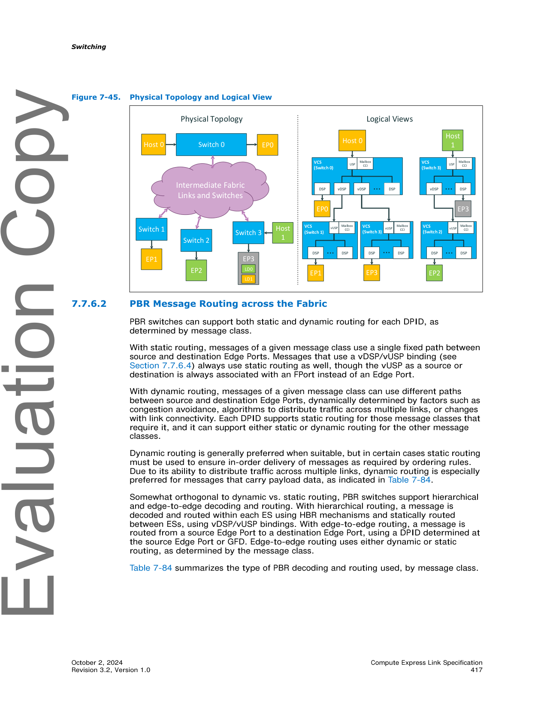
>
> *Original page render @ 150 DPI* — [📄 Full size](figures/chapter_07/page_0417.png)

<table>
<thead>
<tr>
<th width="50%">🇬🇧 English</th>
<th width="50%" style="background-color:#e8e8e8">🇨🇳 中文</th>
</tr>
</thead>
<tbody>
<tr><td>The Ordering Rules column primarily covers a few special cases with CXL.cachemem messages in which the fabric is required to enforce ordering within a single message class or between two message classes. The alphanumeric identifier refers to ordering summary table entries in Table 3-57 and Table 3-58.</td><td style="background-color:#e8e8e8">排序规则列主要涵盖 CXL.cachemem 消息的几个特殊情况,在这些情况下,需要在单个消息类别内或两个消息类别之间强制排序。字母数字标识符引用表 3-57 和表 3-58 中的排序汇总表条目。</td></tr>
<tr><td>With LD-FAM, host software may use either HDM Decoders or LDST decoders, though LDST decoders do not support HDM-D. Host software implemented solely against the CXL 2.0 Specification comprehends only HDM Decoders, and such host software may continue to use them with PBR Fabrics. Newer host software that comprehends and uses LDST decoders can benefit from edge-to-edge routing, which uses dynamic routing for suitable message classes.</td><td style="background-color:#e8e8e8">对于 LD-FAM,主机软件可以使用 HDM Decoder 或 LDST decoder,尽管 LDST decoder 不支持 HDM-D。仅根据 CXL 2.0 规范实现的主机软件仅理解 HDM Decoder,这样的主机软件可以继续在 PBR Fabric 中使用它们。理解并使用 LDST decoder 的较新主机软件可以受益于 Edge-to-Edge 路由,该路由对合适的消息类别使用动态路由。</td></tr>
<tr><td>For CXL.io TLPs, the PTH.Hie (hierarchical) bit determines when intermediate PBR switches must use static routing. When the PTH.Hie bit is 1, intermediate PBR switches shall use static routing for the TLP; otherwise, such switches are permitted to use dynamic routing for the TLP. When a PTH is pre-pended to a TLP, the Hie bit shall be 1 if the TLP is a vDSP/vUSP message; otherwise, the Hie bit shall be 0.</td><td style="background-color:#e8e8e8">对于 CXL.io TLP,PTH.Hie (hierarchical) 位决定中间 PBR 交换机何时必须使用静态路由。当 PTH.Hie 位为 1 时,中间 PBR 交换机应使用静态路由;否则,允许此类交换机对 TLP 使用动态路由。当 PTH 前置到 TLP 时,如果 TLP 是 vDSP/vUSP 消息,则 Hie 位应为 1;否则,Hie 位应为 0。</td></tr>
</tbody>
</table>

<table>
<thead>
<tr>
<th width="50%">🇬🇧 English</th>
<th width="50%" style="background-color:#e8e8e8">🇨🇳 中文</th>
</tr>
</thead>
<tbody>
<tr>
<td>

**Table 7-84. PBR Fabric Decoding and Routing, by Message Class**

| Message Class | Payload Data | Ordering Rules | Preferred Routing¹ | Decoding and Routing Mechanism |
|---|---|---|---|---|
| CXL.cache D2H Req |  |  | Dynamic | Edge-to-edge routing using the Cache ID lookups or vPPB bindings |
| CXL.cache H2D Rsp |  | I11a: Snoop (H2D Req) push GO (H2D Rsp) | Static |  |
| CXL.cache H2D DH | ** |  | Dynamic |  |
| CXL.cache H2D Req |  | I11a: Snoop (H2D Req) push GO (H2D Rsp) | Static |  |
| CXL.cache D2H Rsp |  |  | Dynamic |  |
| CXL.cache D2H DH | ** |  | Dynamic |  |
| CXL.mem M2S Req |  | G8a (HDM-D to Type 2): MemRd*/MemInv* push Mem*Fwd | HDM-H: Dynamic; HDM-D: Static; HDM-DB: Dynamic | LD-FAM: Edge-to-edge routing if using LDST²; Hierarchical routing if using HDM Decoder²; G-FAM: edge-to-edge routing using FAST |
| CXL.mem M2S RwD | ** |  | Dynamic | LD-FAM: Edge-to-edge routing if using LDST²; Hierarchical routing if using HDM Decoder; G-FAM: Edge-to-edge routing using FAST |
| CXL.mem S2M NDR |  | E6a: BI-ConflictAck pushes Cmp* | Static | Edge-to-edge routing using vPPB bindings or BI-ID lookups |
| CXL.mem S2M DRS | ** |  | Dynamic |  |
| CXL.mem S2M BISnp |  |  | Dynamic |  |
| CXL.mem M2S BIRsp |  |  | Dynamic |  |
| CXL.io All CXL.io TLPs ** except next row |  | PCIe (many) | Static | Hierarchical decoding within each ES; vDSP/vUSP between Host ES and each Downstream ES |
| CXL.io UIO Direct P2P to HDM TLPs ** |  |  | Dynamic | Edge-to-edge routing using FAST or LDST decoder |

*¹ When dynamic routing is preferred, static routing is still permitted.*
*² LDST decoders do not support HDM-D.*

</td>
<td style="background-color:#e8e8e8">

**表 7-84. PBR Fabric 解码和路由 (按消息类别)**

| 消息类别 | 负载数据 | 排序规则 | 首选路由¹ | 解码和路由机制 |
|---|---|---|---|---|
| CXL.cache D2H Req |  |  | 动态 | 使用 Cache ID 查找或 vPPB 绑定的 Edge-to-Edge 路由 |
| CXL.cache H2D Rsp |  | I11a: Snoop (H2D Req) push GO (H2D Rsp) | 静态 |  |
| CXL.cache H2D DH | ** |  | 动态 |  |
| CXL.cache H2D Req |  | I11a: Snoop (H2D Req) push GO (H2D Rsp) | 静态 |  |
| CXL.cache D2H Rsp |  |  | 动态 |  |
| CXL.cache D2H DH | ** |  | 动态 |  |
| CXL.mem M2S Req |  | G8a (HDM-D 到 Type 2): MemRd*/MemInv* push Mem*Fwd | HDM-H: 动态;HDM-D: 静态;HDM-DB: 动态 | LD-FAM: 使用 LDST² 时 Edge-to-Edge 路由;使用 HDM Decoder² 时分层路由;G-FAM: 使用 FAST 的 Edge-to-Edge 路由 |
| CXL.mem M2S RwD | ** |  | 动态 | LD-FAM: 使用 LDST² 时 Edge-to-Edge 路由;使用 HDM Decoder 时分层路由;G-FAM: 使用 FAST 的 Edge-to-Edge 路由 |
| CXL.mem S2M NDR |  | E6a: BI-ConflictAck pushes Cmp* | 静态 | 使用 vPPB 绑定或 BI-ID 查找的 Edge-to-Edge 路由 |
| CXL.mem S2M DRS | ** |  | 动态 |  |
| CXL.mem S2M BISnp |  |  | 动态 |  |
| CXL.mem M2S BIRsp |  |  | 动态 |  |
| CXL.io 所有 CXL.io TLP ** (下一行除外) |  | PCIe (许多) | 静态 | 每个 ES 内的分层解码;Host ES 和每个 Downstream ES 之间的 vDSP/vUSP |
| CXL.io UIO Direct P2P to HDM TLP ** |  |  | 动态 | 使用 FAST 或 LDST decoder 的 Edge-to-Edge 路由 |

*¹ 当首选动态路由时,仍允许静态路由。*
*² LDST decoder 不支持 HDM-D。*

</td>
</tr>
</tbody>
</table>

### 7.7.6.3 PBR Message Routing within a Single PBR Switch | 7.7.6.3 单个 PBR 交换机内的 PBR 消息路由

<table>
<thead>
<tr>
<th width="50%">🇬🇧 English</th>
<th width="50%" style="background-color:#e8e8e8">🇨🇳 中文</th>
</tr>
</thead>
<tbody>
<tr><td>A message received or converted to PBR format at a PBR switch ingress port is routed to one of the switch's egress ports, as determined by the ingress port's DPID Routing Table (DRT) and its associated Routing Group Table (RGT). Their structures are described in detail in Section 7.7.13.10 and Section 7.7.13.12, respectively, and this section provides a high-level summary.</td><td style="background-color:#e8e8e8">在 PBR 交换机入口端口接收或转换为 PBR 格式的消息被路由到交换机的出口端口之一,由入口端口的 DPID Routing Table (DRT) 及其关联的 Routing Group Table (RGT) 决定。其结构分别在 7.7.13.10 节和 7.7.13.12 节中详细描述,本节提供高级摘要。</td></tr>
<tr><td>A DRT has 4096 entries and is indexed by a DPID. Each DRT entry contains a 2-bit entry type field that indicates whether the entry is valid, and whether the entry contains a single physical port number or an RGT index.</td><td style="background-color:#e8e8e8">DRT 有 4096 个条目,由 DPID 索引。每个 DRT 条目包含一个 2-bit 条目类型字段,指示该条目是否有效,以及该条目包含单个物理端口号还是 RGT 索引。</td></tr>
<tr><td>DRT entries that contain an RGT index are required when multiple egress ports need to be specified for use with dynamic routing. An RGT is a power-of-2-sized table with up to 256 entries. Each RGT entry contains an ordered list of up to eight physical port numbers, along with two 3-bit fields that indicate how many in the list are valid and how many of those are primary vs. secondary. This allows one or more primary and zero or more secondary egress ports to be listed. Cases that require static routing must always use the first list entry. The RGT entry also contains a 3-bit dynamic routing mode and 3-bit mix setting. The distinction between primary vs. secondary varies by dynamic routing mode and mix setting.</td><td style="background-color:#e8e8e8">当需要为动态路由指定多个出口端口时,需要包含 RGT 索引的 DRT 条目。RGT 是一个 2 的幂大小的表,最多 256 个条目。每个 RGT 条目包含一个最多 8 个物理端口号的有序列表,以及两个 3-bit 字段,指示列表中有多少有效以及其中多少是 primary 与 secondary。这允许列出一个或多个 primary 出口端口和零个或多个 secondary 出口端口。需要静态路由的情况必须始终使用第一个列表条目。RGT 条目还包含 3-bit 动态路由模式和 3-bit mix 设置。primary 与 secondary 之间的区别因动态路由模式和 mix 设置而异。</td></tr>
<tr><td>In routing modes that utilize the mix setting, its value determines the mix of the primary and secondary egress port group usage, assuming that one or more secondary egress ports are specified. Using the mix setting supports egress port selection based on known bandwidth differences that exist elsewhere in the fabric or based on preferred vs. overflow routing paths. Secondary egress ports should be specified only when there are significant differences with primary egress ports; otherwise, all suitable egress ports should be specified as primary. When no secondary egress ports have been specified, the mix setting shall be ignored.</td><td style="background-color:#e8e8e8">在使用 mix 设置的路由模式中,假设指定了一个或多个 secondary 出口端口,其值决定 primary 和 secondary 出口端口组使用的 mix。使用 mix 设置支持基于 Fabric 中其他位置存在的已知带宽差异或基于首选与溢出路由路径的出口端口选择。仅当与 primary 出口端口存在显著差异时,才应指定 secondary 出口端口;否则,所有合适的出口端口都应指定为 primary。当未指定 secondary 出口端口时,应忽略 mix 设置。</td></tr>
<tr><td>Mix setting 7 is intended for use in cases where primary and secondary egress port groups represent preferred and overflow ports, respectively. Mix setting 7 mandates the choice of a primary (preferred) path route whenever flow-control conditions and link state permit.</td><td style="background-color:#e8e8e8">Mix 设置 7 用于 primary 和 secondary 出口端口组分别表示首选和溢出端口的情况。Mix 设置 7 要求在流控条件和链路状态允许时,选择 primary (首选) 路径路由。</td></tr>
<tr><td>The term candidate egress port refers to a port that is present in the appropriate RGT entry, where the message can be queued or internally routed immediately. The egress port need not have link credits to send the packet immediately. An implementation may optionally base part of the candidate selection on the egress port state (e.g., link-up or containment states).</td><td style="background-color:#e8e8e8">术语 candidate egress port (候选出口端口) 是指存在于相应 RGT 条目中的端口,消息可在该端口立即排队或内部路由。出口端口不需要具有链路信用以立即发送数据包。实现可选择地基于出口端口状态 (例如 link-up 或 containment 状态) 进行部分候选选择。</td></tr>
<tr><td>The mix dynamic routing mode descriptions that follow describe routing outcomes in terms of probability, consistent with a weighted (pseudo) random implementation. Random selection has the advantage that each routing decision is stateless and independent of one another, and it has high immunity to hot-route problems that might otherwise arise from repetitive patterns in packet arrivals. The specific random routing implementation is not prescribed. Implementations that achieve the specified mix by deterministic means, such as by weighted round-robin, are permitted.</td><td style="background-color:#e8e8e8">随后的 mix 动态路由模式描述以概率形式描述路由结果,与加权 (伪) 随机实现一致。随机选择的优点是每个路由决策是无状态的且彼此独立,并且对热路由问题 (可能由数据包到达的重复模式引起) 具有高免疫力。不规定具体的随机路由实现。允许使用确定性方式 (如加权轮询) 实现指定 mix 的实现。</td></tr>
</tbody>
</table>

<table>
<thead>
<tr>
<th width="50%">🇬🇧 English</th>
<th width="50%" style="background-color:#e8e8e8">🇨🇳 中文</th>
</tr>
</thead>
<tbody>
<tr>
<td>

**Mix Setting Table (referenced in 7.7.6.3)**

| Mix Setting | % Primary | % Secondary |
|---|---|---|
| 0 | 87.5 | 12.5 |
| 1 | 75 | 25 |
| 2 | 62.5 | 37.5 |
| 3 | 50 | 50 |
| 4 | 37.5 | 62.5 |
| 5 | 25 | 75 |
| 6 | 12.5 | 87.5 |
| 7 | Preferred | Overflow |

</td>
<td style="background-color:#e8e8e8">

**Mix 设置表 (7.7.6.3 中引用)**

| Mix 设置 | % Primary | % Secondary |
|---|---|---|
| 0 | 87.5 | 12.5 |
| 1 | 75 | 25 |
| 2 | 62.5 | 37.5 |
| 3 | 50 | 50 |
| 4 | 37.5 | 62.5 |
| 5 | 25 | 75 |
| 6 | 12.5 | 87.5 |
| 7 | 首选 | 溢出 |

</td>
</tr>
</tbody>
</table>

<table>
<thead>
<tr>
<th width="50%">🇬🇧 English</th>
<th width="50%" style="background-color:#e8e8e8">🇨🇳 中文</th>
</tr>
</thead>
<tbody>
<tr><td>The architected dynamic routing modes include the optional modes listed in Table 7-85.</td><td style="background-color:#e8e8e8">架构化的动态路由模式包括表 7-85 中列出的可选模式。</td></tr>
<tr><td>PBR switches that implement RGTs shall support at least one of the three architected dynamic routing modes (those listed in Table 7-85) within each RGT.</td><td style="background-color:#e8e8e8">实现 RGT 的 PBR 交换机应在每个 RGT 内支持表 7-85 中列出的三种架构化动态路由模式中的至少一种。</td></tr>
<tr><td>DRT entries that contain a single physical port instead of an RGT index are useful when there is only one reasonable egress port choice (e.g., routing to an Edge Port). This avoids an RGT look-up and additional processing to determine which egress port to use. This may also help reduce the number of entries that need to be implemented in the associated RGT.</td><td style="background-color:#e8e8e8">当只有一个合理的出口端口选择 (例如,路由到 Edge Port) 时,包含单个物理端口 (而不是 RGT 索引) 的 DRT 条目非常有用。这避免了 RGT 查找和确定要使用哪个出口端口的额外处理。这也有助于减少需要在关联 RGT 中实现的条目数。</td></tr>
</tbody>
</table>

<table>
<thead>
<tr>
<th width="50%">🇬🇧 English</th>
<th width="50%" style="background-color:#e8e8e8">🇨🇳 中文</th>
</tr>
</thead>
<tbody>
<tr>
<td>

**Table 7-85. Optional Architected Dynamic Routing Modes**

| Mode | Description |
|---|---|
| Mix with Random | The candidate list is first narrowed to select either the primary or the secondary group based on the configured mix. A random selection is then made within that group. A message class shall stall when the selected subset is empty due to flow-control conditions. The FM may choose to select this mode (if supported) as an alternative to Mix with Congestion Avoidance if the latter is not supported. |
| Mix with Congestion Avoidance | The candidate list is first narrowed to select either the primary or the secondary group based on the configured mix. A local congestion-avoiding selection is then made within that group. A message class shall stall when the selected subset is empty due to flow-control conditions. Congestion-avoiding candidate selection is based on vendor-specific congestion metrics, favoring the selection of less-congested egress ports. For example, the congestion metric might be a measure of egress port backlog, considering all queued traffic for that egress port across the entire switch. The FM may choose to select this mode (if supported) when Advanced Congestion Avoidance mode is inappropriate or not supported, of if fixed-traffic ratio apportionment or preferred/overflow behavior is needed. |
| Advanced Congestion Avoidance | A congestion-avoiding selection is made considering both primary and secondary candidate egress ports, ignoring the mix setting value. Egress ports with the minimal remaining hop count should be specified as primary; any suitable egress ports that have higher remaining hop counts should be specified as secondary. Candidate selection is based on vendor-specific metrics, favoring less-congested egress ports in general, and especially avoiding secondary candidates that are already heavily scheduled with primary traffic, regardless of the target DPID. An example congestion metric might be backlog-based, but with different weightings for primary vs. secondary backlogs. Congestion metric values for primary backlogs should be higher than secondary backlogs when assessing the congestion level of a secondary candidate egress port. This discourages the use of secondary candidate ports that have a high primary backlog. In congestion metrics, messages that are queued or internally routed via the physical port number in a DRT or via dynamic routing modes other than Advanced Congestion Avoidance should be considered primary backlog. The FM may choose to select this mode (if supported) for routing egress ports that carry commingled minimal and non-minimal traffic. |

</td>
<td style="background-color:#e8e8e8">

**表 7-85. 可选的架构化动态路由模式**

| 模式 | 描述 |
|---|---|
| Mix with Random (随机混合) | 候选列表首先根据配置的 mix 缩小,以选择 primary 或 secondary 组。然后在该组内进行随机选择。当由于流控条件导致所选子集为空时,消息类别应停止。如果不支持 Mix with Congestion Avoidance,FM 可选择此模式 (如果支持) 作为替代方案。 |
| Mix with Congestion Avoidance (拥塞避免混合) | 候选列表首先根据配置的 mix 缩小,以选择 primary 或 secondary 组。然后在该组内进行本地拥塞避免选择。当由于流控条件导致所选子集为空时,消息类别应停止。拥塞避免候选选择基于供应商特定的拥塞指标,优先选择不太拥塞的出口端口。例如,拥塞指标可以是出口端口积压的度量,考虑整个交换机中该出口端口的所有排队流量。当 Advanced Congestion Avoidance 模式不合适或不受支持,或者需要固定流量比例分配或首选/溢出行为时,FM 可选择此模式 (如果支持)。 |
| Advanced Congestion Avoidance (高级拥塞避免) | 在考虑 primary 和 secondary 候选出口端口的同时进行拥塞避免选择,忽略 mix 设置值。具有最小剩余跳数的出口端口应指定为 primary;任何具有较高剩余跳数的合适出口端口应指定为 secondary。候选选择基于供应商特定的指标,通常优先选择不太拥塞的出口端口,尤其是避免那些已经与 primary 流量大量调度的 secondary 候选,无论目标 DPID 如何。示例拥塞指标可以基于积压,但 primary 与 secondary 积压使用不同的权重。在评估 secondary 候选出口端口的拥塞水平时,primary 积压的拥塞指标值应高于 secondary 积压。这不鼓励使用具有高 primary 积压的 secondary 候选端口。在拥塞指标中,通过 DRT 中的物理端口号或通过 Advanced Congestion Avoidance 以外的动态路由模式排队或内部路由的消息应视为 primary 积压。FM 可选择此模式 (如果支持) 用于承载混合最小和非最小流量的路由出口端口。 |

</td>
</tr>
</tbody>
</table>

### 7.7.6.4 PBR Switch vDSP/vUSP Bindings and Connectivity | 7.7.6.4 PBR 交换机 vDSP/vUSP 绑定和连接

<table>
<thead>
<tr>
<th width="50%">🇬🇧 English</th>
<th width="50%" style="background-color:#e8e8e8">🇨🇳 中文</th>
</tr>
</thead>
<tbody>
<tr><td>Within the context of a single VH, the virtual connection between a VCS in the Host ES and a VCS in a Downstream ES is accomplished with a vDSP/vUSP binding. A vDSP is a vPPB in the Host ES VCS that the host sees as a DSP. A vUSP is a vPPB in the Downstream ES VCS that the host sees as a USP. Host software always sees a single virtual link connecting the vDSP and vUSP, even though one or more intermediate Fabric switches may be physically present.</td><td style="background-color:#e8e8e8">在单个 VH 的上下文中,Host ES 中的 VCS 与 Downstream ES 中的 VCS 之间的虚拟连接通过 vDSP/vUSP 绑定实现。vDSP 是 Host ES VCS 中的 vPPB,主机将其视为 DSP。vUSP 是 Downstream ES VCS 中的 vPPB,主机将其视为 USP。主机软件始终看到连接 vDSP 和 vUSP 的单个虚拟链路,即使物理上可能存在一个或多个中间 Fabric 交换机。</td></tr>
<tr><td>Figure 7-46 shows an example PBR Fabric that consists of one Host ES, one Downstream ES, and an unspecified number of intermediate Fabric switches connecting the two.</td><td style="background-color:#e8e8e8">图 7-46 显示了一个 PBR Fabric 示例,由一个 Host ES、一个 Downstream ES 和连接两者的数量未指定的中间 Fabric 交换机组成。</td></tr>
<tr><td>The rules for vDSP/vUSP bindings are as follows:</td><td style="background-color:#e8e8e8">vDSP/vUSP 绑定的规则如下:</td></tr>
<tr><td>• Each active Host ES vDSP is bound to one Host ES FPort and one Downstream ES vUSP</td><td style="background-color:#e8e8e8">• 每个活动的 Host ES vDSP 绑定到一个 Host ES FPort 和一个 Downstream ES vUSP</td></tr>
<tr><td>• Each active Downstream ES vUSP is bound to one Downstream ES FPort and one Host ES vDSP</td><td style="background-color:#e8e8e8">• 每个活动的 Downstream ES vUSP 绑定到一个 Downstream ES FPort 和一个 Host ES vDSP</td></tr>
<tr><td>• All messages routed using a vDSP/vUSP binding must contain both a DPID and an SPID</td><td style="background-color:#e8e8e8">• 使用 vDSP/vUSP 绑定路由的所有消息必须同时包含 DPID 和 SPID</td></tr>
<tr><td>• vDSPs and vUSPs are never assigned PIDs</td><td style="background-color:#e8e8e8">• vDSP 和 vUSP 永远不会被分配 PID</td></tr>
<tr><td>• Each PID used for vDSP/vUSP bindings may support both static and dynamic routing; however, vDSP/vUSP traffic always uses static routing</td><td style="background-color:#e8e8e8">• 用于 vDSP/vUSP 绑定的每个 PID 可支持静态和动态路由;但是,vDSP/vUSP 流量始终使用静态路由</td></tr>
<tr><td>• Each vDSP/vUSP binding has a single host USP PID that determines which Host ES FPort will be used to route from vUSP to vDSP</td><td style="background-color:#e8e8e8">• 每个 vDSP/vUSP 绑定具有单个主机 USP PID,用于确定哪个 Host ES FPort 将用于从 vUSP 路由到 vDSP</td></tr>
<tr><td>• Each vDSP/vUSP binding has a single Downstream ES PID that determines which Downstream ES FPort will be used to route from vDSP to vUSP</td><td style="background-color:#e8e8e8">• 每个 vDSP/vUSP 绑定具有单个 Downstream ES PID,用于确定哪个 Downstream ES FPort 将用于从 vDSP 路由到 vUSP</td></tr>
</tbody>
</table>

> **Figure 7-46.** Example PBR Fabric ｜ PBR Fabric 示例
>
> 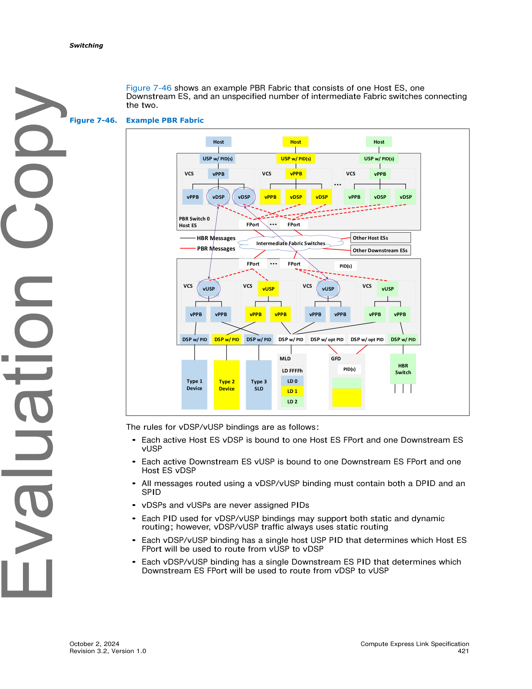
>
> *Original page render @ 150 DPI* — [📄 Full size](figures/chapter_07/page_0421.png)

<table>
<thead>
<tr>
<th width="50%">🇬🇧 English</th>
<th width="50%" style="background-color:#e8e8e8">🇨🇳 中文</th>
</tr>
</thead>
<tbody>
<tr><td>When a Host ES FPort transmits a vDSP/vUSP message downstream in a PBR flit, the message contains the DPID and SPID taken from the vDSP's binding. Assuming no errors, the message traverses any intermediate Fabric switches that are present and is received by an FPort that is bound to the Downstream ES vUSP. A vUSP there claims the message by matching both the DPID and SPID from its binding.</td><td style="background-color:#e8e8e8">当 Host ES FPort 在 PBR flit 中向下游发送 vDSP/vUSP 消息时,消息包含从 vDSP 绑定获取的 DPID 和 SPID。假设没有错误,消息遍历任何存在的中间 Fabric 交换机,并由绑定到 Downstream ES vUSP 的 FPort 接收。该处的 vUSP 通过匹配其绑定中的 DPID 和 SPID 来声明该消息。</td></tr>
<tr><td>Similarly, when a Downstream ES FPort transmits a vDSP/vUSP message upstream in a PBR flit, the message contains the DPID and SPID taken from the vUSP's binding. Assuming no errors, the message traverses any intermediate Fabric switches that are present and is received by an FPort that is bound to the Host ES vDSP. A vDSP there claims the message by matching both the DPID and SPID from its binding.</td><td style="background-color:#e8e8e8">类似地,当 Downstream ES FPort 在 PBR flit 中向上游发送 vDSP/vUSP 消息时,消息包含从 vUSP 绑定获取的 DPID 和 SPID。假设没有错误,消息遍历任何存在的中间 Fabric 交换机,并由绑定到 Host ES vDSP 的 FPort 接收。该处的 vDSP 通过匹配其绑定中的 DPID 和 SPID 来声明该消息。</td></tr>
</tbody>
</table>

### 7.7.6.5 PID Use Models and Assignments | 7.7.6.5 PID 使用模型和分配

<table>
<thead>
<tr>
<th width="50%">🇬🇧 English</th>
<th width="50%" style="background-color:#e8e8e8">🇨🇳 中文</th>
</tr>
</thead>
<tbody>
<tr><td>The example PBR Fabric illustrated in Figure 7-46 illustrates key aspects of how PIDs can be assigned and used. PIDs are either assigned by the FM or by static fabric initialization (see Section 7.7.12.1.1).</td><td style="background-color:#e8e8e8">图 7-46 中说明的 PBR Fabric 示例说明了 PID 如何分配和使用的关键方面。PID 由 FM 分配或由静态 Fabric 初始化分配 (参见 7.7.12.1.1 节)。</td></tr>
<tr><td>A Host ES USP often has one PID but may have multiple PIDs assigned to support multiple vDSP/vUSP bindings in the same Downstream ES. Each vDSP/vUSP binding may use a different Host ES FPort and/or Downstream ES FPort, providing traffic isolation for differentiated quality of service. If multiple vDSP bindings use the same PID for the Downstream ES, different PIDs for the USP can distinguish their bindings.</td><td style="background-color:#e8e8e8">Host ES USP 通常具有一个 PID,但可以分配多个 PID 以支持同一 Downstream ES 中的多个 vDSP/vUSP 绑定。每个 vDSP/vUSP 绑定可以使用不同的 Host ES FPort 和/或 Downstream ES FPort,从而为差异化服务质量提供流量隔离。如果多个 vDSP 绑定对 Downstream ES 使用相同的 PID,则 USP 的不同 PID 可以区分其绑定。</td></tr>
<tr><td>The Downstream ES FPorts may have one or more PIDs assigned, where each PID can be associated with a different set of FPorts. In an example scenario, there might be one PID for the left set of FPorts for multipathing and another PID for the right set. For a PID assigned to an FPort set for multipathing, DRTs in different USPs can specify different egress ports for static routing, distributing the static routing traffic for certain topologies without requiring additional DS_ES PIDs.</td><td style="background-color:#e8e8e8">Downstream ES FPort 可以分配一个或多个 PID,其中每个 PID 可以与不同的 FPort 集关联。在示例场景中,可以为左侧 FPort 集分配一个 PID 用于多路径,为右侧集分配另一个 PID。对于分配给多路径 FPort 集的 PID,不同 USP 中的 DRT 可以为静态路由指定不同的出口端口,从而在不需要额外 DS_ES PID 的情况下为某些拓扑分配静态路由流量。</td></tr>
<tr><td>A DSP may be assigned multiple PIDs, one PID, or no PIDs. A DSP above a non-GFD usually has one PID, but may be assigned multiple PIDs for isolating traffic from multiple senders or for associating a unique PID for each caching or HDM-DB-capable device attached to one or more HBR switches below an Edge Port. DSPs above a multi-ported GFD may not require dedicated assigned PIDs, relying instead on one or more PIDs assigned to the GFD itself.</td><td style="background-color:#e8e8e8">DSP 可被分配多个 PID、一个 PID 或不分配 PID。非 GFD 上方的 DSP 通常具有一个 PID,但可以为隔离来自多个发送方的流量或为连接到 Edge Port 下方一个或多个 HBR 交换机的每个 caching 或 HDM-DB-capable 设备关联唯一 PID 而分配多个 PID。多端口 GFD 上方的 DSP 可能不需要专用分配的 PID,而是依赖于分配给 GFD 本身的一个或多个 PID。</td></tr>
<tr><td>A GFD may have one or more PIDs assigned. A multi-ported GFD may have multiple PIDs assigned for differentiated quality of service, though a single PID may be sufficient for congestion avoidance.</td><td style="background-color:#e8e8e8">GFD 可分配一个或多个 PID。多端口 GFD 可以分配多个 PID 以实现差异化服务质量,但单个 PID 可能足以进行拥塞避免。</td></tr>
<tr><td>As mentioned in the previous section, each vDSP/vUSP binding has two PIDs assigned. For downstream vDSP/vUSP messages that use a given binding, the SPID is a PID associated with the host Edge USP, and the DPID is a PID associated with the Downstream ES FPort. Such messages are always transmitted by the same Host ES FPort and received by the same Downstream ES FPort. Then, the FPort uses various vUSP info decoding mechanisms to route the message to the appropriate Downstream ES vPPB using PBR mechanisms or HBR mechanisms, depending upon the message class. See CXL Switch Message Conversion (see Section 7.7.6.6). If there are any intermediate Fabric switches, such messages always take a single static path.</td><td style="background-color:#e8e8e8">如上一节所述,每个 vDSP/vUSP 绑定分配两个 PID。对于使用给定绑定的下游 vDSP/vUSP 消息,SPID 是与主机 Edge USP 关联的 PID,DPID 是与 Downstream ES FPort 关联的 PID。此类消息始终由同一 Host ES FPort 发送,由同一 Downstream ES FPort 接收。然后,FPort 使用各种 vUSP info 解码机制,通过 PBR 机制或 HBR 机制将消息路由到相应的 Downstream ES vPPB,这取决于消息类别。请参见 CXL Switch Message Conversion (参见 7.7.6.6 节)。如果存在任何中间 Fabric 交换机,此类消息始终采用单一静态路径。</td></tr>
<tr><td>Upstream vDSP/vUSP messages are handled in a similar manner, but only involve CXL.io message classes. On a given binding, the SPID is the PID associated with the Downstream ES FPort, and the DPID is the PID associated with the host Edge USP. Such messages are always transmitted by the same Downstream ES FPort and received by the same Host ES FPort. Then, the receiving FPort uses the associated vDSP context to identify the appropriate target using HBR mechanisms. If the target is an egress port, the message is routed there for transmission. If the target is another vDSP, that vDSP converts the PIDs to its bound PIDs and transmits it from its associated FPort, which may be the same FPort on which it arrived or on a different FPort. If there are any intermediate Fabric switches, such messages always take a single static path.</td><td style="background-color:#e8e8e8">上游 vDSP/vUSP 消息以类似方式处理,但仅涉及 CXL.io 消息类别。在给定绑定上,SPID 是与 Downstream ES FPort 关联的 PID,DPID 是与主机 Edge USP 关联的 PID。此类消息始终由同一 Downstream ES FPort 发送,由同一 Host ES FPort 接收。然后,接收 FPort 使用关联的 vDSP 上下文,通过 HBR 机制识别相应的目标。如果目标是出口端口,则消息被路由到该处进行传输。如果目标是另一个 vDSP,则该 vDSP 将 PID 转换为其绑定的 PID,并从其关联的 FPort 发送该消息,该 FPort 可以是消息到达的同一 FPort 或不同的 FPort。如果存在任何中间 Fabric 交换机,此类消息始终采用单一静态路径。</td></tr>
<tr><td>A PBR switch requires an assigned PID to send and receive management requests, responses, and notifications. Transactions that target this PID are processed by central logic or by FW within the switch.</td><td style="background-color:#e8e8e8">PBR 交换机需要分配的 PID 才能发送和接收管理请求、响应和通知。目标是此 PID 的事务由交换机内的中心逻辑或 FW 处理。</td></tr>
<tr><td>FMs connected to a PBR switch via an MCTP-based CCI also consume a PID. This PID is communicated to the PBR switch when the FM claims ownership of the device. The PID is used to direct transactions to the FM, such as Event Notifications generated by components owned by the FM.</td><td style="background-color:#e8e8e8">通过基于 MCTP 的 CCI 连接到 PBR 交换机的 FM 也消耗一个 PID。当 FM 声明设备所有权时,此 PID 将传达给 PBR 交换机。PID 用于将事务定向到 FM,例如由 FM 拥有的组件生成的事件通知。</td></tr>
<tr><td>PID FFFh is reserved and is used to indicate that a transaction should be processed locally. It allows FMs to target devices before they have had a valid PID assigned and when they have an assigned PID of which the FM is unaware.</td><td style="background-color:#e8e8e8">PID FFFh 被保留,用于指示事务应在本地处理。它允许 FM 在设备被分配有效 PID 之前以及在 FM 不知道其已分配 PID 的情况下定位设备。</td></tr>
</tbody>
</table>

### 7.7.6.6 CXL Switch Message Format Conversion | 7.7.6.6 CXL 交换机消息格式转换

<table>
<thead>
<tr>
<th width="50%">🇬🇧 English</th>
<th width="50%" style="background-color:#e8e8e8">🇨🇳 中文</th>
</tr>
</thead>
<tbody>
<tr><td>A PBR switch converts messages received from HBR hosts, devices, and switches to the PBR message format for routing across a PBR Fabric. In addition, messages received from the PBR fabric that target the HBR hosts, devices, and switches are converted to messages using the non-PID spaces (i.e., CacheID, BI-ID, and LD-ID). The following subsections provide the conversion flow for each message class.</td><td style="background-color:#e8e8e8">PBR 交换机将从 HBR 主机、设备和交换机接收的消息转换为 PBR 消息格式,以便跨 PBR Fabric 进行路由。此外,从 PBR Fabric 接收的、目标是 HBR 主机、设备和交换机的消息将转换为使用非 PID 空间 (即 CacheID、BI-ID 和 LD-ID) 的消息。以下小节提供每个消息类别的转换流。</td></tr>
<tr><td>The FM assigns PIDs to various PBR switch ports, as described in Section 7.7.6.5. The DPID value for request messages is determined by a variety of ways, including HDM Decoders, vPPB bindings, and lookup tables or CAMs using non-PID spaces. The DPID value for a response message is often the SPID value from the associated request message but is sometimes determined by one of the ways mentioned for request messages.</td><td style="background-color:#e8e8e8">FM 将 PID 分配给各种 PBR 交换机端口,如 7.7.6.5 节所述。请求消息的 DPID 值由多种方式确定,包括 HDM Decoder、vPPB 绑定以及使用非 PID 空间的查找表或 CAM。响应消息的 DPID 值通常是来自关联请求消息的 SPID 值,但有时由请求消息中提到的方式之一确定。</td></tr>
<tr><td>With HBR format messages, MLDs support a 4-bit LD-ID field in CXL.mem protocol for selection and routing of MLD messages, and CXL.cache includes a 4-bit CacheID field that is used to allow up to 16 Type 1 Devices or Type 2 Devices below an RP. PBR format messages use 12-bit PIDs to support large Fabrics. This section describes the support required in PBR switches for routing messages from non-fabric-aware hosts and devices that support the 4-bit LD-ID and 4-bit CacheID fields. It also covers BI-ID-based routing.</td><td style="background-color:#e8e8e8">对于 HBR 格式消息,MLD 在 CXL.mem 协议中支持 4-bit LD-ID 字段,用于 MLD 消息的选择和路由,CXL.cache 包括 4-bit CacheID 字段,用于允许 RP 下方最多 16 个 Type 1 设备或 Type 2 设备。PBR 格式消息使用 12-bit PID 以支持大型 Fabric。本节描述了 PBR 交换机中路由来自支持 4-bit LD-ID 和 4-bit CacheID 字段的 Fabric-unaware 主机和设备的消息所需的支持。它还涵盖基于 BI-ID 的路由。</td></tr>
<tr><td>Considering the wide range of supported PBR/HBR switch topologies, the variety of specific routing techniques for the many different cases of port connectivity is quite complex. Below is a general description for the HBR and PBR switch routing mechanisms that are used by key message classes, followed by port processing tables with more-specific details for both classes of switches.</td><td style="background-color:#e8e8e8">考虑到所支持的 PBR/HBR 交换机拓扑范围广泛,端口连接的许多不同情况的具体路由技术种类繁多。以下是关键消息类别使用的 HBR 和 PBR 交换机路由机制的一般描述,随后是更具体的端口处理表,详细说明了两类交换机。</td></tr>
</tbody>
</table>

#### 7.7.6.6.1 CXL.io, Including UIO | 7.7.6.6.1 CXL.io (包括 UIO)

<table>
<thead>
<tr>
<th width="50%">🇬🇧 English</th>
<th width="50%" style="background-color:#e8e8e8">🇨🇳 中文</th>
</tr>
</thead>
<tbody>
<tr><td>An HBR switch routes most CXL.io TLPs between its ports using standard mechanisms defined by PCIe Base Specification. A DSP above an MLD uses LD-ID Prefixes to identify which LD a downstream TLP is targeting or from which LD an upstream TLP came.</td><td style="background-color:#e8e8e8">HBR 交换机使用 PCIe Base Specification 定义的标准机制在其端口之间路由大多数 CXL.io TLP。MLD 上方的 DSP 使用 LD-ID Prefix 来识别下游 TLP 目标的 LD 或上游 TLP 来自的 LD。</td></tr>
<tr><td>UIO Requests that directly target HDM ranges can use enhanced UIO-capable HDM Decoders for their routing. This includes UIO Requests from the host that target devices with HDM, as well as "Direct P2P" cases where UIO Requests from one device target other devices with HDM. UIO Direct P2P to HDM traffic goes upstream, P2P, and downstream along different portions of its path.</td><td style="background-color:#e8e8e8">直接以 HDM 范围为目标的 UIO Request 可以使用增强的 UIO-capable HDM Decoder 进行路由。这包括以具有 HDM 的设备为目标的主机 UIO Request,以及 UIO Request 从一个设备以其他具有 HDM 的设备为目标的 "Direct P2P" 情况。UIO Direct P2P to HDM 流量在其路径的上游、P2P 和下游不同部分中流动。</td></tr>
<tr><td>A PBR switch converts PCIe-format TLPs or CXL.io HBR-format TLPs to PBR-format TLPs by pre-pending to each TLP a 4B CXL PBR TLP Header (PTH), which includes an SPID and DPID. Conversion from PBR format to HBR format or PCIe format consists of stripping the CXL PTH from the TLP.</td><td style="background-color:#e8e8e8">PBR 交换机通过向每个 TLP 前置 4B CXL PBR TLP Header (PTH) (包括 SPID 和 DPID) 将 PCIe 格式 TLP 或 CXL.io HBR 格式 TLP 转换为 PBR 格式 TLP。从 PBR 格式转换为 HBR 格式或 PCIe 格式包括从 TLP 中剥离 CXL PTH。</td></tr>
</tbody>
</table>

#### 7.7.6.6.2 CXL.cache | 7.7.6.6.2 CXL.cache

<table>
<thead>
<tr>
<th width="50%">🇬🇧 English</th>
<th width="50%" style="background-color:#e8e8e8">🇨🇳 中文</th>
</tr>
</thead>
<tbody>
<tr><td>A number of CXL.cache messages in 256B HBR format have a 4-bit CacheID field that enables up to 16 caching devices below a single RP. CXL.cache messages in 68B HBR format do not support this feature, and thus never carry a CacheID field. CXL.cache messages in PBR format do support this feature, but convey the necessary information via PIDs instead of a CacheID field. Table 7-86 summarizes which message classes contain the CacheID field.</td><td style="background-color:#e8e8e8">256B HBR 格式中的多个 CXL.cache 消息具有 4-bit CacheID 字段,该字段支持单个 RP 下方最多 16 个 caching 设备。68B HBR 格式中的 CXL.cache 消息不支持此特性,因此永远不携带 CacheID 字段。PBR 格式中的 CXL.cache 消息支持此特性,但通过 PID 而不是 CacheID 字段传递必要的信息。表 7-86 汇总了哪些消息类别包含 CacheID 字段。</td></tr>
<tr><td>For HBR format messages that contain a CacheID field, in some cases an HBR or PBR DSP needs to know whether to propagate or assign the CacheID. This information is configured by host software and is contained in the CXL Cache ID Decoder Capability Structure (see Section 8.2.4.29).</td><td style="background-color:#e8e8e8">对于包含 CacheID 字段的 HBR 格式消息,在某些情况下,HBR 或 PBR DSP 需要知道是传播还是分配 CacheID。此信息由主机软件配置,并包含在 CXL Cache ID Decoder Capability Structure 中 (参见 8.2.4.29 节)。</td></tr>
<tr><td>Table 7-87 summarizes the HBR switch routing for CXL.cache message classes.</td><td style="background-color:#e8e8e8">表 7-87 汇总了 CXL.cache 消息类别的 HBR 交换机路由。</td></tr>
<tr><td>Table 7-88 summarizes the PBR switch routing for CXL.cache message classes.</td><td style="background-color:#e8e8e8">表 7-88 汇总了 CXL.cache 消息类别的 PBR 交换机路由。</td></tr>
<tr><td>Within a PBR fabric, all CXL.cache messages are routed edge-to-edge, and they never use vDSP/vUSP bindings.</td><td style="background-color:#e8e8e8">在 PBR Fabric 中,所有 CXL.cache 消息都按 Edge-to-Edge 路由,从不使用 vDSP/vUSP 绑定。</td></tr>
<tr><td>In contrast to most 256B HBR-format CXL.cache messages, PBR-format cache messages never contain a CacheID field, thus the equivalent information when needed must be conveyed via PIDs.</td><td style="background-color:#e8e8e8">与大多数 256B HBR 格式 CXL.cache 消息相比,PBR 格式 cache 消息从不包含 CacheID 字段,因此在需要时,等效信息必须通过 PID 传递。</td></tr>
</tbody>
</table>

<table>
<thead>
<tr>
<th width="50%">🇬🇧 English</th>
<th width="50%" style="background-color:#e8e8e8">🇨🇳 中文</th>
</tr>
</thead>
<tbody>
<tr>
<td>

**Table 7-86. Summary of CacheID Field**

| Msg Class | 68B HBR | 256B HBR | 256B PBR |
|---|---|---|---|
| D2H Req | No | Yes | No |
| H2D Rsp | No | Yes | No |
| H2D DH | No | Yes | No |
| H2D Req | No | Yes | No |
| D2H Rsp | No | No | No |
| D2H DH | No | No | No |

</td>
<td style="background-color:#e8e8e8">

**表 7-86. CacheID 字段汇总**

| 消息类别 | 68B HBR | 256B HBR | 256B PBR |
|---|---|---|---|
| D2H Req | 否 | 是 | 否 |
| H2D Rsp | 否 | 是 | 否 |
| H2D DH | 否 | 是 | 否 |
| H2D Req | 否 | 是 | 否 |
| D2H Rsp | 否 | 否 | 否 |
| D2H DH | 否 | 否 | 否 |

</td>
</tr>
</tbody>
</table>

<table>
<thead>
<tr>
<th width="50%">🇬🇧 English</th>
<th width="50%" style="background-color:#e8e8e8">🇨🇳 中文</th>
</tr>
</thead>
<tbody>
<tr>
<td>

**Table 7-87. Summary of HBR Switch Routing for CXL.cache Message Classes**

| Message Class | Switch Routing |
|---|---|
| D2H Request | For HBR switch routing of D2H requests upstream to the bound host, the D2H request to the USP relies on the DSP's vPPB binding at each switch level. CacheID is added to the message by the DSP above the device to enable routing of the H2D response. |
| H2D Response or Data Header | For HBR switch routing of H2D responses or data headers downstream to the DSP, the USP at each switch level looks up the PCIe-defined PortID from the Cache ID Route Table. |
| H2D Request | For HBR switch routing of H2D requests downstream to the DSP, the USP at each switch level looks up the PCIe-defined PortID from the Cache ID Route Table. |
| D2H Response or Data Header | For HBR switch routing of D2H responses or data headers upstream to the bound host, the D2H response or data header to the USP relies upon the DSP's vPPB binding at each switch level. |

</td>
<td style="background-color:#e8e8e8">

**表 7-87. CXL.cache 消息类别的 HBR 交换机路由汇总**

| 消息类别 | 交换机路由 |
|---|---|
| D2H Request | 对于 D2H 请求向上游路由到绑定主机的 HBR 交换机路由,到 USP 的 D2H 请求依赖于每个交换机级别的 DSP 的 vPPB 绑定。设备上方的 DSP 将 CacheID 添加到消息中,以启用 H2D 响应的路由。 |
| H2D Response or Data Header | 对于 H2D 响应或数据头向下游路由到 DSP 的 HBR 交换机路由,每个交换机级别的 USP 从 Cache ID Route Table 查找 PCIe 定义的 PortID。 |
| H2D Request | 对于 H2D 请求向下游路由到 DSP 的 HBR 交换机路由,每个交换机级别的 USP 从 Cache ID Route Table 查找 PCIe 定义的 PortID。 |
| D2H Response or Data Header | 对于 D2H 响应或数据头向上游路由到绑定主机的 HBR 交换机路由,到 USP 的 D2H 响应或数据头依赖于每个交换机级别的 DSP 的 vPPB 绑定。 |

</td>
</tr>
</tbody>
</table>

<table>
<thead>
<tr>
<th width="50%">🇬🇧 English</th>
<th width="50%" style="background-color:#e8e8e8">🇨🇳 中文</th>
</tr>
</thead>
<tbody>
<tr>
<td>

**Table 7-88. Summary of PBR Switch Routing for CXL.cache Message Classes**

| Message Class | Switch Routing |
|---|---|
| D2H Request | For PBR switch routing of these messages upstream to the host, Edge DSPs get the Host USP DPID from their vPPB. Those above an SLD get their SPID from their vPPB. Those above an HBR USP look up the SPID from the Cache ID Route Table using the CacheID contained in the HBR-format message. For converting to HBR format at the Edge USP, the USP derives the CacheID from a 16-entry CAM using the SPID. |
| H2D Response or Data Header | For PBR switch routing of these messages downstream to the Edge DSP, the Edge USP looks up the DPID from the Cache ID Route Table using the CacheID in the HBR-format message. For converting to HBR format at the Edge DSP, above an SLD the CacheID is unused, and above an HBR USP the Cache ID is derived from a 16-entry CAM match using the DPID. |
| H2D Request | For PBR switch routing of these messages downstream to the Edge DSP, the Edge USP looks up the DPID from the CacheID Route Table using the CacheID. The USP gets the SPID from its vPPB. For converting to HBR format at the Edge DSP, above an SLD the CacheID is unused, and above an HBR USP the Cache ID is derived from a 16-entry CAM match using the DPID. |
| D2H Response or Data Header | For PBR switch routing of these messages upstream to the host, Edge DSPs get the DPID from their vPPB. For converting to HBR format at the Edge USP, the CacheID field is not present in the message. |

</td>
<td style="background-color:#e8e8e8">

**表 7-88. CXL.cache 消息类别的 PBR 交换机路由汇总**

| 消息类别 | 交换机路由 |
|---|---|
| D2H Request | 对于这些消息向上游路由到主机的 PBR 交换机路由,Edge DSP 从其 vPPB 获取主机 USP DPID。SLD 上方的 Edge DSP 从其 vPPB 获取 SPID。HBR USP 上方的 Edge DSP 使用 HBR 格式消息中包含的 CacheID 从 Cache ID Route Table 查找 SPID。对于在 Edge USP 转换为 HBR 格式,USP 使用 SPID 从 16-entry CAM 派生 CacheID。 |
| H2D Response or Data Header | 对于这些消息向下游路由到 Edge DSP 的 PBR 交换机路由,Edge USP 使用 HBR 格式消息中的 CacheID 从 Cache ID Route Table 查找 DPID。对于在 Edge DSP 转换为 HBR 格式,SLD 上方的 CacheID 未使用,HBR USP 上方的 Cache ID 通过使用 DPID 的 16-entry CAM 匹配派生。 |
| H2D Request | 对于这些消息向下游路由到 Edge DSP 的 PBR 交换机路由,Edge USP 使用 CacheID 从 CacheID Route Table 查找 DPID。USP 从其 vPPB 获取 SPID。对于在 Edge DSP 转换为 HBR 格式,SLD 上方的 CacheID 未使用,HBR USP 上方的 Cache ID 通过使用 DPID 的 16-entry CAM 匹配派生。 |
| D2H Response or Data Header | 对于这些消息向上游路由到主机的 PBR 交换机路由,Edge DSP 从其 vPPB 获取 DPID。对于在 Edge USP 转换为 HBR 格式,消息中不存在 CacheID 字段。 |

</td>
</tr>
</tbody>
</table>

#### 7.7.6.6.3 CXL.mem | 7.7.6.6.3 CXL.mem

<table>
<thead>
<tr>
<th width="50%">🇬🇧 English</th>
<th width="50%" style="background-color:#e8e8e8">🇨🇳 中文</th>
</tr>
</thead>
<tbody>
<tr><td>Several CXL.mem message classes in HBR format have a 4-bit LD-ID field that is used by Type 3 MLDs for determining the targeted LD. This feature is supported by both 68B and 256B HBR formats. PBR format conveys the necessary information via PIDs instead of an LD-ID field. Table 7-89 summarizes which message classes contain the LD-ID field.</td><td style="background-color:#e8e8e8">HBR 格式中的多个 CXL.mem 消息类别具有 4-bit LD-ID 字段,该字段由 Type 3 MLD 用于确定目标 LD。68B 和 256B HBR 格式都支持此特性。PBR 格式通过 PID 而不是 LD-ID 字段传递必要的信息。表 7-89 汇总了哪些消息类别包含 LD-ID 字段。</td></tr>
<tr><td>CXL.mem BISnp/BIRsp messages support the Back-Invalidate feature in 256B HBR format via a 12-bit BI-ID field, which determines the routing for BIRsp. This feature and its associated field are not supported in 68B HBR format. PBR format supports this feature and conveys the necessary information via 12-bit PIDs. Table 7-90 summarizes which message classes contain the BI-ID field.</td><td style="background-color:#e8e8e8">CXL.mem BISnp/BIRsp 消息在 256B HBR 格式中通过 12-bit BI-ID 字段支持 Back-Invalidate 特性,该特性决定 BIRsp 的路由。68B HBR 格式不支持此特性及其关联字段。PBR 格式支持此特性并通过 12-bit PID 传递必要的信息。表 7-90 汇总了哪些消息类别包含 BI-ID 字段。</td></tr>
</tbody>
</table>

<table>
<thead>
<tr>
<th width="50%">🇬🇧 English</th>
<th width="50%" style="background-color:#e8e8e8">🇨🇳 中文</th>
</tr>
</thead>
<tbody>
<tr>
<td>

**Table 7-89. Summary of LD-ID Field**

| Msg Class | 68B HBR | 256B HBR | 256B PBR |
|---|---|---|---|
| M2S Req | Yes | Yes | No |
| M2S RwD | Yes | Yes | No |
| S2M NDR | Yes | Yes | No |
| S2M DRS | Yes | Yes | No |
| S2M BISnp | N/A | In BI-ID | No |
| M2S BIRsp | N/A | In BI-ID | No |

</td>
<td style="background-color:#e8e8e8">

**表 7-89. LD-ID 字段汇总**

| 消息类别 | 68B HBR | 256B HBR | 256B PBR |
|---|---|---|---|
| M2S Req | 是 | 是 | 否 |
| M2S RwD | 是 | 是 | 否 |
| S2M NDR | 是 | 是 | 否 |
| S2M DRS | 是 | 是 | 否 |
| S2M BISnp | 不适用 | 在 BI-ID 中 | 否 |
| M2S BIRsp | 不适用 | 在 BI-ID 中 | 否 |

</td>
</tr>
</tbody>
</table>

<table>
<thead>
<tr>
<th width="50%">🇬🇧 English</th>
<th width="50%" style="background-color:#e8e8e8">🇨🇳 中文</th>
</tr>
</thead>
<tbody>
<tr>
<td>

**Table 7-90. Summary of BI-ID Field**

| Msg Class | 68B HBR | 256B HBR | 256B PBR |
|---|---|---|---|
| S2M BISnp | N/A | Yes | No |
| M2S BIRsp | N/A | Yes | No |

</td>
<td style="background-color:#e8e8e8">

**表 7-90. BI-ID 字段汇总**

| 消息类别 | 68B HBR | 256B HBR | 256B PBR |
|---|---|---|---|
| S2M BISnp | 不适用 | 是 | 否 |
| M2S BIRsp | 不适用 | 是 | 否 |

</td>
</tr>
</tbody>
</table>

<table>
<thead>
<tr>
<th width="50%">🇬🇧 English</th>
<th width="50%" style="background-color:#e8e8e8">🇨🇳 中文</th>
</tr>
</thead>
<tbody>
<tr><td>In 256B HBR format over an MLD link, the 12-bit BI-ID field in BISnp/BIRsp carries the 4-bit LD-ID value, and the remaining 8 bits are all 0s. In 256B HBR format over non-MLD links, the 12-bit BI-ID field carries the 8-bit Bus Number of the HDM-DB device, and the remaining 4 bits are all 0s.</td><td style="background-color:#e8e8e8">在 MLD 链路上使用 256B HBR 格式时,BISnp/BIRsp 中的 12-bit BI-ID 字段承载 4-bit LD-ID 值,其余 8 位全为 0。在非 MLD 链路上使用 256B HBR 格式时,12-bit BI-ID 字段承载 HDM-DB 设备的 8-bit Bus Number,其余 4 位全为 0。</td></tr>
<tr><td>For messages that contain a BI-ID field, in some cases an HBR or PBR DSP needs to know whether to propagate or assign the BI-ID. This information is configured by host software and is contained in the CXL BI Decoder Capability Structure (see Section 8.2.4.27).</td><td style="background-color:#e8e8e8">对于包含 BI-ID 字段的消息,在某些情况下,HBR 或 PBR DSP 需要知道是传播还是分配 BI-ID。此信息由主机软件配置,并包含在 CXL BI Decoder Capability Structure 中 (参见 8.2.4.27 节)。</td></tr>
<tr><td>The Direct P2P CXL.mem for Accelerators use case, supported only by PBR fabrics, is not covered in this section; see Section 7.7.10.</td><td style="background-color:#e8e8e8">Direct P2P CXL.mem for Accelerators 用例 (仅由 PBR Fabric 支持) 不在本节中介绍;请参见 7.7.10 节。</td></tr>
<tr><td>Table 7-91 summarizes the HBR switch routing for CXL.mem message classes.</td><td style="background-color:#e8e8e8">表 7-91 汇总了 CXL.mem 消息类别的 HBR 交换机路由。</td></tr>
<tr><td>Table 7-92 summarizes the PBR switch routing for CXL.mem message classes.</td><td style="background-color:#e8e8e8">表 7-92 汇总了 CXL.mem 消息类别的 PBR 交换机路由。</td></tr>
<tr><td>In an HBR switch, when filling in a subset of the bits in the BI-ID field with a value, the remaining bits in the BI-ID field shall be cleared to 0.</td><td style="background-color:#e8e8e8">在 HBR 交换机中,当使用值填充 BI-ID 字段中的位子集时,BI-ID 字段中的剩余位应清除为 0。</td></tr>
<tr><td>Within a PBR fabric, most CXL.mem message classes are routed edge-to-edge and do not use vDSP/vUSP bindings. The exceptions are M2S Req/RwD message classes with LD-FAM when host software has configured HDM Decoders in the Host ES USP to route them, in which case vDSP/vUSP bindings are used. See details regarding PBR Message Routing across the Fabric in Section 7.7.6.2.</td><td style="background-color:#e8e8e8">在 PBR Fabric 中,大多数 CXL.mem 消息类别按 Edge-to-Edge 路由,不使用 vDSP/vUSP 绑定。例外情况是当主机软件在 Host ES USP 中配置了 HDM Decoder 来路由 M2S Req/RwD 消息类别 (使用 LD-FAM) 时,这种情况下使用 vDSP/vUSP 绑定。有关跨 Fabric 的 PBR 消息路由的详细信息,请参见 7.7.6.2 节。</td></tr>
<tr><td>When HDM-DB devices are attached to an HBR switch below a PBR fabric, the FM must allocate and assign a unique PID for each HDM-DB device. This enables PBR switches to convert between an HDM-DB device's unique PID and Bus Number when needed.</td><td style="background-color:#e8e8e8">当 HDM-DB 设备连接到 PBR Fabric 下方的 HBR 交换机时,FM 必须为每个 HDM-DB 设备分配和分配唯一的 PID。这使得 PBR 交换机能够在 HDM-DB 设备的唯一 PID 和 Bus Number 之间进行转换。</td></tr>
</tbody>
</table>

<table>
<thead>
<tr>
<th width="50%">🇬🇧 English</th>
<th width="50%" style="background-color:#e8e8e8">🇨🇳 中文</th>
</tr>
</thead>
<tbody>
<tr>
<td>

**Table 7-91. Summary of HBR Switch Routing for CXL.mem Message Classes**

| Message Class | Switch Routing |
|---|---|
| M2S Request | For HBR switch routing of M2S requests downstream toward the device, the HDM Decoder at the USP determines the PCIe-defined PortID of the DSP at each switch level. For a DSP above an MLD, there is a vPPB for each LD, which provides the LD-ID to insert in the request message. |
| S2M Response | For HBR switch routing of S2M responses upstream to the USP, the DSP relies on its vPPB binding at each switch level. For a DSP immediately above an MLD, there is a vPPB for each LD, and the LD-ID in the response message identifies the associated vPPB. |
| S2M BISnp | For HBR switch routing of S2M BISnp requests upstream to the USP, the DSP relies on its vPPB binding at each switch level. For a DSP immediately above an MLD, there is a vPPB for each LD, and the BI-ID in the response message carries an LD-ID that identifies the associated vPPB. The DSP then looks up the BusNum associated with its vPPB, places the BusNum in the BI-ID for later use in routing the associated BIRsp back to the DSP. |
| M2S BIRsp | For HBR switch routing of M2S BIRsp messages downstream to the DSP immediately above the device, the USP at each switch level relies on the BI-ID that carries the BusNum of the target DSP. The HBR switch then uses BusNum routing. |

</td>
<td style="background-color:#e8e8e8">

**表 7-91. CXL.mem 消息类别的 HBR 交换机路由汇总**

| 消息类别 | 交换机路由 |
|---|---|
| M2S Request | 对于 M2S 请求向下游路由到设备的 HBR 交换机路由,USP 处的 HDM Decoder 确定每个交换机级别的 DSP 的 PCIe 定义的 PortID。对于 MLD 上方的 DSP,每个 LD 都有一个 vPPB,它提供要插入到请求消息中的 LD-ID。 |
| S2M Response | 对于 S2M 响应向上游路由到 USP 的 HBR 交换机路由,DSP 依赖于每个交换机级别的 vPPB 绑定。对于紧邻 MLD 上方的 DSP,每个 LD 都有一个 vPPB,响应消息中的 LD-ID 标识关联的 vPPB。 |
| S2M BISnp | 对于 S2M BISnp 请求向上游路由到 USP 的 HBR 交换机路由,DSP 依赖于每个交换机级别的 vPPB 绑定。对于紧邻 MLD 上方的 DSP,每个 LD 都有一个 vPPB,响应消息中的 BI-ID 承载标识关联 vPPB 的 LD-ID。然后,DSP 查找与其 vPPB 关联的 BusNum,将 BusNum 放入 BI-ID 中,以便稍后用于将关联的 BIRsp 路由回 DSP。 |
| M2S BIRsp | 对于 M2S BIRsp 消息向下游路由到紧邻设备上方的 DSP 的 HBR 交换机路由,每个交换机级别的 USP 依赖于承载目标 DSP 的 BusNum 的 BI-ID。然后 HBR 交换机使用 BusNum 路由。 |

</td>
</tr>
</tbody>
</table>

<table>
<thead>
<tr>
<th width="50%">🇬🇧 English</th>
<th width="50%" style="background-color:#e8e8e8">🇨🇳 中文</th>
</tr>
</thead>
<tbody>
<tr>
<td>

**Table 7-92. Summary of PBR Switch Routing for CXL.mem Message Classes**

| Message Class | Switch Routing |
|---|---|
| M2S Request | FAST/LDST Decoder Case: For Host ES routing of M2S requests downstream to the Edge DSP, the FAST/LDST decoder at the USP determines the DPID for routing the message edge-to-edge. HDM Decoder Case: For hierarchical routing of M2S requests downstream toward the Edge DSP, the HDM Decoder at the USP of each ES determines the egress vPPB (EvPPB), which contains an appropriate DPID. A vDSP in the Host ES contains the DPID/SPID that is used for targeting its partner Downstream ES vUSP. A DSP vPPB contains its dedicated DPID. Both host and Downstream ESs use PBR routing locally because a DSP above an MLD relies on the request having a valid SPID. For a DSP immediately above an MLD, a 16-entry CAM match using the SPID returns the associated LD-ID, which determines the LD-specific vPPB to use and is also inserted in the request message. For a DSP above a GFD, the message remains in PBR format. |
| S2M Response | For Edge DSP routing of S2M responses upstream to the Edge USP, the Edge DSP's vPPB contains the DPID for routing the message edge-to-edge. For a DSP immediately above an MLD, there is a vPPB for each LD, and the LD-ID in the response message identifies the associated vPPB. For a DSP above a GFD, the message is already in PBR format and remains so. |
| S2M BISnp | For Edge DSP routing of S2M BISnp messages upstream to the Edge USP, the Edge DSP's vPPB contains the DPID for routing the message edge-to-edge. For an Edge DSP immediately above an MLD, there is a vPPB for each LD, and the BI-ID in the BISnp carries an LD-ID that identifies the associated vPPB. The Edge DSP uses its vPPB's PID for the SPID. For an Edge DSP above an HBR USP, the BI-ID contains the BusNum associated with the HDM-DB device. The Edge DSP uses the BusNum to look up the associated SPID from a 256-entry table. At the Edge USP, the USP converts the BISnp to HBR format, copying the SPID value into the BI-ID. |
| M2S BIRsp | For Edge USP routing of M2S BIRsp messages downstream to the Edge DSP above the HDM-DB device, the Edge USP converts the BIRsp to PBR format, using the BI-ID value as the DPID, and then routes the BIRsp edge-to-edge. For an Edge DSP immediately above an MLD, a 16-entry CAM match using the SPID returns the associated LD-ID, which determines the LD-specific vPPB to use and is also inserted in the BI-ID field of the BIRsp. For an Edge DSP above an HBR switch USP, the DSP converts the BIRsp to HBR format, looking up the target BusNum in a 4k-entry table using the DPID, then copying it to the BI-ID. For a DSP above a GFD, the message remains in PBR format. |

</td>
<td style="background-color:#e8e8e8">

**表 7-92. CXL.mem 消息类别的 PBR 交换机路由汇总**

| 消息类别 | 交换机路由 |
|---|---|
| M2S Request | FAST/LDST Decoder 情况:对于 M2S 请求向下游路由到 Edge DSP 的 Host ES 路由,USP 处的 FAST/LDST decoder 确定用于按 Edge-to-Edge 路由消息的 DPID。HDM Decoder 情况:对于 M2S 请求向下游路由到 Edge DSP 的分层路由,每个 ES 的 USP 处的 HDM Decoder 确定出口 vPPB (EvPPB),其中包含适当的 DPID。Host ES 中的 vDSP 包含用于定位其伙伴 Downstream ES vUSP 的 DPID/SPID。DSP vPPB 包含其专用 DPID。主机和 Downstream ES 在本地使用 PBR 路由,因为 MLD 上方的 DSP 依赖于具有有效 SPID 的请求。对于紧邻 MLD 上方的 DSP,使用 SPID 的 16-entry CAM 匹配返回关联的 LD-ID,该 LD-ID 确定要使用的 LD 特定 vPPB,并也插入到请求消息中。对于 GFD 上方的 DSP,消息保持 PBR 格式。 |
| S2M Response | 对于 S2M 响应向上游路由到 Edge USP 的 Edge DSP 路由,Edge DSP 的 vPPB 包含用于按 Edge-to-Edge 路由消息的 DPID。对于紧邻 MLD 上方的 DSP,每个 LD 都有一个 vPPB,响应消息中的 LD-ID 标识关联的 vPPB。对于 GFD 上方的 DSP,消息已经是 PBR 格式并保持不变。 |
| S2M BISnp | 对于 S2M BISnp 消息向上游路由到 Edge USP 的 Edge DSP 路由,Edge DSP 的 vPPB 包含用于按 Edge-to-Edge 路由消息的 DPID。对于紧邻 MLD 上方的 Edge DSP,每个 LD 都有一个 vPPB,BISnp 中的 BI-ID 承载标识关联 vPPB 的 LD-ID。Edge DSP 使用其 vPPB 的 PID 作为 SPID。对于 HBR USP 上方的 Edge DSP,BI-ID 包含与 HDM-DB 设备关联的 BusNum。Edge DSP 使用 BusNum 从 256-entry 表查找关联的 SPID。在 Edge USP,USP 将 BISnp 转换为 HBR 格式,将 SPID 值复制到 BI-ID 中。 |
| M2S BIRsp | 对于 M2S BIRsp 消息向下游路由到 HDM-DB 设备上方 Edge DSP 的 Edge USP 路由,Edge USP 将 BIRsp 转换为 PBR 格式,使用 BI-ID 值作为 DPID,然后按 Edge-to-Edge 路由 BIRsp。对于紧邻 MLD 上方的 Edge DSP,使用 SPID 的 16-entry CAM 匹配返回关联的 LD-ID,该 LD-ID 确定要使用的 LD 特定 vPPB,并也插入到 BIRsp 的 BI-ID 字段中。对于 HBR 交换机 USP 上方的 Edge DSP,DSP 将 BIRsp 转换为 HBR 格式,使用 DPID 在 4k-entry 表中查找目标 BusNum,然后将其复制到 BI-ID。对于 GFD 上方的 DSP,消息保持 PBR 格式。 |

</td>
</tr>
</tbody>
</table>

<table>
<thead>
<tr>
<th width="50%">🇬🇧 English</th>
<th width="50%" style="background-color:#e8e8e8">🇨🇳 中文</th>
</tr>
</thead>
<tbody>
<tr><td>At an Edge DSP, when converting a downstream CXL.mem message from PBR to HBR format, if an LD-ID or BI-ID field is unused, its value shall be cleared to 0. Also, when filling in a subset of the bits in the BI-ID field with a value, the remaining bits in the BI-ID field shall be cleared to 0.</td><td style="background-color:#e8e8e8">在 Edge DSP,将下游 CXL.mem 消息从 PBR 格式转换为 HBR 格式时,如果 LD-ID 或 BI-ID 字段未使用,其值应清除为 0。此外,当使用值填充 BI-ID 字段中的位子集时,BI-ID 字段中的剩余位应清除为 0。</td></tr>
</tbody>
</table>

[⬆️ 返回目录](#-本章目录-part-b)

---

### 7.7.6.7 HBR Switch Port Processing of CXL Messages | 7.7.6.7 HBR 交换机端口的 CXL 消息处理

<table>
<thead>
<tr>
<th width="50%">🇬🇧 English</th>
<th width="50%" style="background-color:#e8e8e8">🇨🇳 中文</th>
</tr>
</thead>
<tbody>
<tr><td>Table 7-93, Table 7-94, and Table 7-95 summarize how HBR switches perform port processing of CXL.io, CXL.cache, and CXL.mem messages, respectively. A USP is below either an RP, a PBR DSP, or an HBR DSP. A USP can be in only one Virtual Hierarchy. A DSP is above either an HBR switch USP, an SLD, or an MLD.</td><td style="background-color:#e8e8e8">表 7-93、表 7-94 和表 7-95 分别汇总了 HBR 交换机如何执行 CXL.io、CXL.cache 和 CXL.mem 消息的端口处理。USP 位于 RP、PBR DSP 或 HBR DSP 之下。USP 只能属于一个 Virtual Hierarchy。DSP 位于 HBR 交换机 USP、SLD 或 MLD 之上。</td></tr>
<tr><td>For conciseness, there are many abbreviations within the tables. US stands for upstream. DS stands for downstream. P2P stands for peer-to-peer. DMA stands for direct memory access. Direct P2P stands for UIO Direct P2P to HDM. BusNum stands for Bus Number. "⇐" stands for assignment (e.g., "LD-ID Prefix ⇐ vPPB context" means "the LD-ID prefix is assigned a value from the associated vPPB context"). Text beginning with "PCIe" (also shown in gold) means that the routing is defined in PCIe Base Specification.</td><td style="background-color:#e8e8e8">为简洁起见,表中包含许多缩写。US 表示上游。DS 表示下游。P2P 表示对等。DMA 表示直接内存访问。Direct P2P 表示 UIO Direct P2P to HDM。BusNum 表示 Bus Number。"⇐" 表示赋值 (例如,"LD-ID Prefix ⇐ vPPB context" 意思是 "LD-ID 前缀被赋值为来自关联 vPPB 上下文的值")。以 "PCIe" 开头的文本 (也以金色显示) 表示路由在 PCIe Base Specification 中定义。</td></tr>
</tbody>
</table>

<table>
<thead>
<tr>
<th width="50%">🇬🇧 English</th>
<th width="50%" style="background-color:#e8e8e8">🇨🇳 中文</th>
</tr>
</thead>
<tbody>
<tr>
<td>

**Table 7-93. HBR Switch Port Processing Table for CXL.io**

| Message Class and Direction | HBR USP below RP or PBR/HBR DSP | HBR DSP Above HBR USP | HBR DSP Above SLD | HBR DSP Above MLD |
|---|---|---|---|---|
| Cfg Req DS | PCIe ID routing | PCIe ID routing | PCIe ID routing | LD-ID Prefix ⇐ vPPB context |
| Mem Req DS/US/P2P (Incl UIO DMA, Excl HDM UIO) | PCIe Mem addr routing | PCIe Mem addr routing | PCIe Mem addr routing | US: LD-ID Prefix identifies vPPB; DS: LD-ID Prefix ⇐ vPPB context |
| HDM UIO Req (Direct P2P and Host Requester) | US: PCIe Mem addr routing; DS: HDM Decoder routing | US: PCIe Mem addr routing; DS/Direct P2P: USP HDM Decoder | US: PCIe Mem addr routing; DS/Direct P2P: USP HDM Decoder | US: LD-ID Prefix identifies vPPB; DS: LD-ID Prefix ⇐ vPPB context |
| Cpl US | PCIe ID routing | PCIe ID routing | LD-ID Prefix identifies vPPB | PCIe ID routing |
| Cpl DS | PCIe ID routing | PCIe ID routing | PCIe ID routing | LD-ID Prefix ⇐ vPPB context |

</td>
<td style="background-color:#e8e8e8">

**表 7-93. CXL.io 的 HBR 交换机端口处理表**

| 消息类别和方向 | HBR USP (RP 或 PBR/HBR DSP 之下) | HBR DSP (HBR USP 之上) | HBR DSP (SLD 之上) | HBR DSP (MLD 之上) |
|---|---|---|---|---|
| Cfg Req DS | PCIe ID 路由 | PCIe ID 路由 | PCIe ID 路由 | LD-ID Prefix ⇐ vPPB context |
| Mem Req DS/US/P2P (包括 UIO DMA,排除 HDM UIO) | PCIe Mem addr 路由 | PCIe Mem addr 路由 | PCIe Mem addr 路由 | US: LD-ID Prefix 标识 vPPB;DS: LD-ID Prefix ⇐ vPPB context |
| HDM UIO Req (Direct P2P 和 Host Requester) | US: PCIe Mem addr 路由;DS: HDM Decoder 路由 | US: PCIe Mem addr 路由;DS/Direct P2P: USP HDM Decoder | US: PCIe Mem addr 路由;DS/Direct P2P: USP HDM Decoder | US: LD-ID Prefix 标识 vPPB;DS: LD-ID Prefix ⇐ vPPB context |
| Cpl US | PCIe ID 路由 | PCIe ID 路由 | LD-ID Prefix 标识 vPPB | PCIe ID 路由 |
| Cpl DS | PCIe ID 路由 | PCIe ID 路由 | PCIe ID 路由 | LD-ID Prefix ⇐ vPPB context |

</td>
</tr>
</tbody>
</table>

<table>
<thead>
<tr>
<th width="50%">🇬🇧 English</th>
<th width="50%" style="background-color:#e8e8e8">🇨🇳 中文</th>
</tr>
</thead>
<tbody>
<tr>
<td>

**Table 7-94. HBR Switch Port Processing Table for CXL.cache**

| Message Class and Direction | HBR USP below RP or PBR/HBR DSP | HBR DSP Above HBR USP | HBR DSP Above SLD | HBR DSP Above MLD |
|---|---|---|---|---|
| D2H Req US | Propagate CacheID | Propagate CacheID | vPPB binding routing to USP; CacheID ⇐ Local Cache ID field | vPPB binding routing to USP |
| H2D Rsp/DH DS | Propagate CacheID | PortID ⇐ Cache ID Route Table; PortID routing to DSP (OS must handle multi-level HBR) | Propagate CacheID | Propagate Cache ID (SLD should ignore it) |
| H2D Req DS | (similar) | (similar) | (similar) | (similar) |
| D2H Rsp/DH US | — | — | vPPB binding routing to USP | — |

</td>
<td style="background-color:#e8e8e8">

**表 7-94. CXL.cache 的 HBR 交换机端口处理表**

| 消息类别和方向 | HBR USP (RP 或 PBR/HBR DSP 之下) | HBR DSP (HBR USP 之上) | HBR DSP (SLD 之上) | HBR DSP (MLD 之上) |
|---|---|---|---|---|
| D2H Req US | Propagate CacheID | Propagate CacheID | vPPB binding routing to USP;CacheID ⇐ Local Cache ID field | vPPB binding routing to USP |
| H2D Rsp/DH DS | Propagate CacheID | PortID ⇐ Cache ID Route Table;PortID routing to DSP (OS 必须处理多级 HBR) | Propagate CacheID | Propagate Cache ID (SLD 应忽略它) |
| H2D Req DS | (类似) | (类似) | (类似) | (类似) |
| D2H Rsp/DH US | — | — | vPPB binding routing to USP | — |

</td>
</tr>
</tbody>
</table>

<table>
<thead>
<tr>
<th width="50%">🇬🇧 English</th>
<th width="50%" style="background-color:#e8e8e8">🇨🇳 中文</th>
</tr>
</thead>
<tbody>
<tr>
<td>

**Table 7-95. HBR Switch Port Processing Table for CXL.mem**

| Message Class and Direction | HBR USP below RP or PBR/HBR DSP | HBR DSP Above HBR USP | HBR DSP Above SLD | HBR DSP Above MLD |
|---|---|---|---|---|
| M2S Req DS | PortID ⇐ HDM Decoder (HPA); Routing to DSP uses PortID | Propagate LD-ID (not used by these receivers) | LD-ID ⇐ vPPB context | (combined) |
| S2M Rsp US | Propagate LD-ID (not used by these receivers) | vPPB binding routing to USP | Propagate LD-ID (not used for internal switch routing); LD-ID identifies vPPB | vPPB binding routing to USP |
| S2M BISnp US | BI-ID[7:0] contains BusNum; Propagate BI-ID | Propagate BI-ID | vPPB binding routing to USP; Received BI-ID is ignored; BI-ID[7:0] ⇐ BusNum(vPPB) | vPPB binding routing to USP; BI-ID[3:0] contains LD-ID; LD-ID identifies vPPB; BI-ID[7:0] ⇐ BusNum(vPPB) |
| M2S BIRsp DS | Target BusNum ⇐ BI-ID[7:0]; PCIe BusNum routing to DSP | Propagate BI-ID | Propagate BI-ID (SLD should ignore it) | BI-ID[3:0] ⇐ LD-ID(vPPB) |

</td>
<td style="background-color:#e8e8e8">

**表 7-95. CXL.mem 的 HBR 交换机端口处理表**

| 消息类别和方向 | HBR USP (RP 或 PBR/HBR DSP 之下) | HBR DSP (HBR USP 之上) | HBR DSP (SLD 之上) | HBR DSP (MLD 之上) |
|---|---|---|---|---|
| M2S Req DS | PortID ⇐ HDM Decoder (HPA);Routing to DSP 使用 PortID | Propagate LD-ID (这些接收方不使用) | LD-ID ⇐ vPPB context | (合并) |
| S2M Rsp US | Propagate LD-ID (这些接收方不使用) | vPPB binding routing to USP | Propagate LD-ID (不用于内部交换机路由);LD-ID 标识 vPPB | vPPB binding routing to USP |
| S2M BISnp US | BI-ID[7:0] 包含 BusNum;Propagate BI-ID | Propagate BI-ID | vPPB binding routing to USP;Received BI-ID 被忽略;BI-ID[7:0] ⇐ BusNum(vPPB) | vPPB binding routing to USP;BI-ID[3:0] 包含 LD-ID;LD-ID 标识 vPPB;BI-ID[7:0] ⇐ BusNum(vPPB) |
| M2S BIRsp DS | Target BusNum ⇐ BI-ID[7:0];PCIe BusNum routing to DSP | Propagate BI-ID | Propagate BI-ID (SLD 应忽略它) | BI-ID[3:0] ⇐ LD-ID(vPPB) |

</td>
</tr>
</tbody>
</table>

### 7.7.6.8 PBR Switch Port Processing of CXL Messages | 7.7.6.8 PBR 交换机端口的 CXL 消息处理

<table>
<thead>
<tr>
<th width="50%">🇬🇧 English</th>
<th width="50%" style="background-color:#e8e8e8">🇨🇳 中文</th>
</tr>
</thead>
<tbody>
<tr><td>Table 7-96, Table 7-97, and Table 7-98 summarize how PBR switches perform port processing of CXL.io, CXL.cache, and CXL.mem messages, respectively. A PBR USP must be below an RP and can be in only one Virtual Hierarchy. A PBR DSP is above either an SLD, an MLD, a GFD, or an HBR switch USP. A PBR FPort can only be connected to another PBR FPort in a different PBR switch.</td><td style="background-color:#e8e8e8">表 7-96、表 7-97 和表 7-98 分别汇总了 PBR 交换机如何执行 CXL.io、CXL.cache 和 CXL.mem 消息的端口处理。PBR USP 必须位于 RP 之下,并且只能属于一个 Virtual Hierarchy。PBR DSP 位于 SLD、MLD、GFD 或 HBR 交换机 USP 之上。PBR FPort 只能连接到不同 PBR 交换机中的另一个 PBR FPort。</td></tr>
<tr><td>For conciseness, there are many abbreviations within the tables. US stands for upstream. DS stands for downstream. P2P stands for peer-to-peer. DMA stands for direct memory access. Direct P2P stands for UIO Direct P2P to HDM. EvPPB stands for Egress vPPB. BusNum stands for Bus Number. RT stands for the CacheID Route Table. "⇐" stands for assignment (e.g., "LD-ID Prefix ⇐ vPPB context" means "the LD-ID prefix is assigned a value from the associated vPPB context"). Also referring to a vPPB context, vPPB.root.PID stands for the PID of the associated Edge USP, and vPPB.self.PID stands for the PID of the vPPB itself. Eg2Eg means Edge-to-Edge. Text beginning with "PCIe" (also shown in gold) means that the routing is defined in PCIe Base Specification.</td><td style="background-color:#e8e8e8">为简洁起见,表中包含许多缩写。US 表示上游。DS 表示下游。P2P 表示对等。DMA 表示直接内存访问。Direct P2P 表示 UIO Direct P2P to HDM。EvPPB 表示 Egress vPPB。BusNum 表示 Bus Number。RT 表示 CacheID Route Table。"⇐" 表示赋值 (例如,"LD-ID Prefix ⇐ vPPB context" 意思是 "LD-ID 前缀被赋值为来自关联 vPPB 上下文的值")。同样参考 vPPB 上下文,vPPB.root.PID 表示关联 Edge USP 的 PID,vPPB.self.PID 表示 vPPB 本身的 PID。Eg2Eg 表示 Edge-to-Edge。以 "PCIe" 开头的文本 (也以金色显示) 表示路由在 PCIe Base Specification 中定义。</td></tr>
<tr><td>In the CXL.io table (see Table 7-96), not all TLP types are explicitly covered; however, those not listed are usually handled by standard PCIe routing mechanisms (e.g., PCIe Messages are not explicitly covered, but ID-routed Messages are handled by PCIe ID routing, and address-routed Messages are handled by PCIe Memory Address routing).</td><td style="background-color:#e8e8e8">在 CXL.io 表中 (见表 7-96),并非所有 TLP 类型都被明确涵盖;但是,未列出的通常由标准 PCIe 路由机制处理 (例如,PCIe Messages 未明确涵盖,但 ID 路由的 Messages 由 PCIe ID 路由处理,地址路由的 Messages 由 PCIe Memory Address 路由处理)。</td></tr>
<tr><td>In the CXL.mem table (see Table 7-98) the Direct P2P CXL.mem for Accelerators use case is not covered; see Section 7.7.10.3.</td><td style="background-color:#e8e8e8">在 CXL.mem 表中 (见表 7-98),Direct P2P CXL.mem for Accelerators 用例未涵盖;请参见 7.7.10.3 节。</td></tr>
</tbody>
</table>

<table>
<thead>
<tr>
<th width="50%">🇬🇧 English</th>
<th width="50%" style="background-color:#e8e8e8">🇨🇳 中文</th>
</tr>
</thead>
<tbody>
<tr>
<td>

**Table 7-96. PBR Switch Port Processing Table for CXL.io (Sheet 1 of 2)**

| Message Class and Direction | Edge USP (Always below an RP) | Host ES FPort with vDSP(s) | Downstream ES FPort with vUSP(s) | Edge DSP: Above HBR Switch USP | Edge DSP: Above SLD | Edge DSP: Above MLD | Edge DSP: Above GFD |
|---|---|---|---|---|---|---|---|
| Cfg Req DS | PCIe ID routing to DSP or vDSP | vDSP converts to PBR fmt; FPort xmits to vUSP's FPort | vUSP matches DPID/SPID; vUSP converts to HBR fmt; PCIe ID routing to DSP | PCIe ID routing | PCIe ID routing | LD-ID Prefix ⇐ vPPB LD-ID | N/A |
| Mem Req DS/US/P2P (Incl UIO DMA, Excl HDM UIO) | PCIe Mem addr routing | DS: vDSP converts to PBR fmt; FPort xmits to vUSP's FPort. US/P2P: vDSP matches DPID/SPID; vDSP converts to HBR fmt; PCIe Mem addr routing | DS: vUSP matches DPID/SPID; vUSP converts to HBR fmt; PCIe Mem addr routing. US: vUSP converts to PBR fmt; FPort xmits to vDSP's FPort | PCIe Mem addr routing | PCIe Mem addr routing | DS: LD-ID Prefix ⇐ vPPB.LD-ID. US/P2P: LD-ID Prefix identifies vPPB | N/A |
| Cpl US/P2P (Excl HDM UIO) | PCIe ID routing | vDSP matches DPID/SPID; vDSP converts to HBR fmt; PCIe ID routing | vUSP converts to PBR fmt; FPort xmits to vDSP's FPort | PCIe ID routing | LD-ID Prefix identifies vPPB | PCIe ID routing | N/A |
| Cpl DS (Excl HDM UIO) | PCIe ID routing to DSP or vDSP | vDSP converts to PBR fmt; FPort xmits to vUSP's FPort | vUSP matches DPID/SPID; vUSP converts to HBR fmt; PCIe ID routing to DSP | PCIe ID routing | PCIe ID routing | LD-ID Prefix ⇐ vPPB.LD-ID | N/A |
| HDM UIO Req (HDM Decoder case for Direct P2P and Host Requester) | Direct P2P: N/A. Host Requester (DS): HDM Decoder routes to DSP or vDSP | DS: vDSP converts to PBR fmt; FPort xmits to vUSP's FPort. US/P2P: vDSP matches DPID/SPID; vDSP converts to HBR fmt; USP's HDM Decoder routes P2P | DS: vUSP matches DPID/SPID; vUSP converts to HBR fmt; HDM Decoder routes to DSP. US: vUSP converts to PBR fmt; FPort xmits to vDSP's FPort | US/P2P: If above MLD, LD-ID Prefix identifies vPPB; USP/vUSP HDM Decoder routes US or P2P within same switch | DS: Convert to HBR fmt; if above MLD, LD-ID Prefix ⇐ vPPB.LD-ID | (combined) | N/A |

</td>
<td style="background-color:#e8e8e8">

**表 7-96. CXL.io 的 PBR 交换机端口处理表 (Sheet 1 of 2)**

| 消息类别和方向 | Edge USP (始终在 RP 之下) | Host ES FPort (含 vDSP) | Downstream ES FPort (含 vUSP) | Edge DSP: HBR 交换机 USP 之上 | Edge DSP: SLD 之上 | Edge DSP: MLD 之上 | Edge DSP: GFD 之上 |
|---|---|---|---|---|---|---|---|
| Cfg Req DS | PCIe ID routing to DSP or vDSP | vDSP converts to PBR fmt;FPort xmits to vUSP's FPort | vUSP matches DPID/SPID;vUSP converts to HBR fmt;PCIe ID routing to DSP | PCIe ID routing | PCIe ID routing | LD-ID Prefix ⇐ vPPB LD-ID | N/A |
| Mem Req DS/US/P2P (包括 UIO DMA,排除 HDM UIO) | PCIe Mem addr routing | DS: vDSP converts to PBR fmt;FPort xmits to vUSP's FPort。US/P2P: vDSP matches DPID/SPID;vDSP converts to HBR fmt;PCIe Mem addr routing | DS: vUSP matches DPID/SPID;vUSP converts to HBR fmt;PCIe Mem addr routing。US: vUSP converts to PBR fmt;FPort xmits to vDSP's FPort | PCIe Mem addr routing | PCIe Mem addr routing | DS: LD-ID Prefix ⇐ vPPB.LD-ID。US/P2P: LD-ID Prefix 标识 vPPB | N/A |
| Cpl US/P2P (排除 HDM UIO) | PCIe ID routing | vDSP matches DPID/SPID;vDSP converts to HBR fmt;PCIe ID routing | vUSP converts to PBR fmt;FPort xmits to vDSP's FPort | PCIe ID routing | LD-ID Prefix 标识 vPPB | PCIe ID routing | N/A |
| Cpl DS (排除 HDM UIO) | PCIe ID routing to DSP or vDSP | vDSP converts to PBR fmt;FPort xmits to vUSP's FPort | vUSP matches DPID/SPID;vUSP converts to HBR fmt;PCIe ID routing to DSP | PCIe ID routing | PCIe ID routing | LD-ID Prefix ⇐ vPPB.LD-ID | N/A |
| HDM UIO Req (HDM Decoder 情况,Direct P2P 和 Host Requester) | Direct P2P: N/A。Host Requester (DS): HDM Decoder routes to DSP or vDSP | DS: vDSP converts to PBR fmt;FPort xmits to vUSP's FPort。US/P2P: vDSP matches DPID/SPID;vDSP converts to HBR fmt;USP's HDM Decoder routes P2P | DS: vUSP matches DPID/SPID;vUSP converts to HBR fmt;HDM Decoder routes to DSP。US: vUSP converts to PBR fmt;FPort xmits to vDSP's FPort | US/P2P: 如果 MLD 之上,LD-ID Prefix 标识 vPPB;USP/vUSP HDM Decoder routes US or P2P within same switch | DS: Convert to HBR fmt;if above MLD, LD-ID Prefix ⇐ vPPB.LD-ID | (合并) | N/A |

</td>
</tr>
</tbody>
</table>

<table>
<thead>
<tr>
<th width="50%">🇬🇧 English</th>
<th width="50%" style="background-color:#e8e8e8">🇨🇳 中文</th>
</tr>
</thead>
<tbody>
<tr>
<td>

**Table 7-96. PBR Switch Port Processing Table for CXL.io (Sheet 2 of 2)**

| Message Class and Direction | Edge USP (Always below an RP) | Host ES FPort with vDSP(s) | Downstream ES FPort with vUSP(s) | Edge DSP: Above HBR Switch USP | Edge DSP: Above SLD | Edge DSP: Above MLD | Edge DSP: Above GFD |
|---|---|---|---|---|---|---|---|
| HDM UIO Cpl (HDM Decoder case for Direct P2P and Host Requester) | Direct P2P: N/A. Host Requester (US): PCIe ID routing | vDSP matches DPID/SPID; vDSP converts to HBR fmt; PCIe ID routing | vUSP converts to PBR fmt; FPort xmits to vDSP's FPort | US: If above MLD, LD-ID Prefix identifies vPPB; PCIe ID routing. DS: PCIe ID routing; if above MLD, LD-ID Prefix ⇐ vPPB.LD-ID | (combined) | (combined) | N/A |
| HDM UIO Req (FAST/LDST case for Direct P2P and Host Requester) | Direct P2P: N/A. Host Requester (DS): FAST/LDST converts to PBR and routes Eg2Eg | Route Eg2Eg | Route Eg2Eg | US/P2P: If above MLD, LD-ID Prefix identifies vPPB; FAST/LDST converts to PBR and routes Eg2Eg | DS: Convert to HBR fmt; if above MLD, LD-ID Prefix ⇐ CAM16(SPID) | (combined) | US: N/A; DS: Keep in PBR |
| HDM UIO Cpl (FAST/LDST case for Direct P2P and Host Requester) | Direct P2P: N/A. Host Requester (US): Convert to HBR | Route Eg2Eg | Route Eg2Eg | US: If above MLD, LD-ID Prefix identifies vPPB; convert to PBR using UIO ID-based Rerouter; route Eg2Eg | DS: Convert to HBR | (combined) | US: Keep in PBR; route Eg2Eg. DS: N/A |

</td>
<td style="background-color:#e8e8e8">

**表 7-96. CXL.io 的 PBR 交换机端口处理表 (Sheet 2 of 2)**

| 消息类别和方向 | Edge USP (始终在 RP 之下) | Host ES FPort (含 vDSP) | Downstream ES FPort (含 vUSP) | Edge DSP: HBR 交换机 USP 之上 | Edge DSP: SLD 之上 | Edge DSP: MLD 之上 | Edge DSP: GFD 之上 |
|---|---|---|---|---|---|---|---|
| HDM UIO Cpl (HDM Decoder 情况,Direct P2P 和 Host Requester) | Direct P2P: N/A。Host Requester (US): PCIe ID routing | vDSP matches DPID/SPID;vDSP converts to HBR fmt;PCIe ID routing | vUSP converts to PBR fmt;FPort xmits to vDSP's FPort | US: 如果 MLD 之上,LD-ID Prefix 标识 vPPB;PCIe ID routing。DS: PCIe ID routing;if above MLD, LD-ID Prefix ⇐ vPPB.LD-ID | (合并) | (合并) | N/A |
| HDM UIO Req (FAST/LDST 情况,Direct P2P 和 Host Requester) | Direct P2P: N/A。Host Requester (DS): FAST/LDST converts to PBR and routes Eg2Eg | Route Eg2Eg | Route Eg2Eg | US/P2P: 如果 MLD 之上,LD-ID Prefix 标识 vPPB;FAST/LDST converts to PBR and routes Eg2Eg | DS: Convert to HBR fmt;if above MLD, LD-ID Prefix ⇐ CAM16(SPID) | (合并) | US: N/A;DS: Keep in PBR |
| HDM UIO Cpl (FAST/LDST 情况,Direct P2P 和 Host Requester) | Direct P2P: N/A。Host Requester (US): Convert to HBR | Route Eg2Eg | Route Eg2Eg | US: 如果 MLD 之上,LD-ID Prefix 标识 vPPB;convert to PBR using UIO ID-based Rerouter;route Eg2Eg | DS: Convert to HBR | (合并) | US: Keep in PBR;route Eg2Eg。DS: N/A |

</td>
</tr>
</tbody>
</table>

<table>
<thead>
<tr>
<th width="50%">🇬🇧 English</th>
<th width="50%" style="background-color:#e8e8e8">🇨🇳 中文</th>
</tr>
</thead>
<tbody>
<tr>
<td>

**Table 7-97. PBR Switch Port Processing Table for CXL.cache**

| Message Class and Direction | Edge USP (Always below an RP) | Host ES FPort with vDSP(s) | Downstream ES FPort with vUSP(s) | Edge DSP: Above HBR Switch USP | Edge DSP: Above SLD | Edge DSP: Above MLD | Edge DSP: Above GFD |
|---|---|---|---|---|---|---|---|
| D2H Req US | Convert to HBR fmt; CacheID ⇐ CAM16(SPID) | Route Eg2Eg | Route Eg2Eg | Convert to PBR fmt; DPID ⇐ vPPB.root.PID; SPID ⇐ RT(CacheID) | Convert to PBR fmt; DPID ⇐ vPPB.root.PID; SPID ⇐ vPPB.self.PID | (combined) | (combined) |
| H2D Rsp/DH DS | Convert to PBR fmt; DPID ⇐ RT(CacheID) | Route Eg2Eg | Route Eg2Eg | Convert to HBR fmt; 256B: CacheID ⇐ CAM16(DPID); 68B: Has no CacheID | Convert to HBR fmt; 256B: CacheID ⇐ 0; 68B: Has no CacheID | (combined) | (combined) |
| H2D Req DS | Convert to PBR fmt; DPID ⇐ RT(CacheID); SPID ⇐ vPPB.self.PID | Route Eg2Eg | Route Eg2Eg | (combined) | (combined) | (combined) | (combined) |
| D2H Rsp/DH US | Convert to HBR fmt | Route Eg2Eg | Route Eg2Eg | Convert to PBR fmt; DPID ⇐ vPPB.root.PID | Convert to PBR fmt; DPID ⇐ vPPB.root.PID | (combined) | (combined) |

</td>
<td style="background-color:#e8e8e8">

**表 7-97. CXL.cache 的 PBR 交换机端口处理表**

| 消息类别和方向 | Edge USP (始终在 RP 之下) | Host ES FPort (含 vDSP) | Downstream ES FPort (含 vUSP) | Edge DSP: HBR 交换机 USP 之上 | Edge DSP: SLD 之上 | Edge DSP: MLD 之上 | Edge DSP: GFD 之上 |
|---|---|---|---|---|---|---|---|
| D2H Req US | Convert to HBR fmt;CacheID ⇐ CAM16(SPID) | Route Eg2Eg | Route Eg2Eg | Convert to PBR fmt;DPID ⇐ vPPB.root.PID;SPID ⇐ RT(CacheID) | Convert to PBR fmt;DPID ⇐ vPPB.root.PID;SPID ⇐ vPPB.self.PID | (合并) | (合并) |
| H2D Rsp/DH DS | Convert to PBR fmt;DPID ⇐ RT(CacheID) | Route Eg2Eg | Route Eg2Eg | Convert to HBR fmt;256B: CacheID ⇐ CAM16(DPID);68B: Has no CacheID | Convert to HBR fmt;256B: CacheID ⇐ 0;68B: Has no CacheID | (合并) | (合并) |
| H2D Req DS | Convert to PBR fmt;DPID ⇐ RT(CacheID);SPID ⇐ vPPB.self.PID | Route Eg2Eg | Route Eg2Eg | (合并) | (合并) | (合并) | (合并) |
| D2H Rsp/DH US | Convert to HBR fmt | Route Eg2Eg | Route Eg2Eg | Convert to PBR fmt;DPID ⇐ vPPB.root.PID | Convert to PBR fmt;DPID ⇐ vPPB.root.PID | (合并) | (合并) |

</td>
</tr>
</tbody>
</table>

<table>
<thead>
<tr>
<th width="50%">🇬🇧 English</th>
<th width="50%" style="background-color:#e8e8e8">🇨🇳 中文</th>
</tr>
</thead>
<tbody>
<tr>
<td>

**Table 7-98. PBR Switch Port Processing Table for CXL.mem**

| Message Class and Direction | Edge USP (Always below an RP) | Host ES FPort with vDSP(s) | Downstream ES FPort with vUSP(s) | Edge DSP: Above HBR Switch USP | Edge DSP: Above SLD | Edge DSP: Above MLD | Edge DSP: Above GFD |
|---|---|---|---|---|---|---|---|
| M2S Req/RwD DS (FAST or LDST) | Convert to PBR fmt; DPID ⇐ xxST(HPA); SPID ⇐ vPPB.self.PID | Route Eg2Eg | Route Eg2Eg | Convert to HBR fmt; LD-ID ⇐ 0; is unused | LD-ID ⇐ CAM16(SPID) | Convert to HBR MLD fmt; LD-ID is N/A | Keep in PBR fmt |
| M2S Req/RwD DS (HDM Decoder) | EvPPB ⇐ HDM-Dec(HPA); DPID ⇐ EvPPB.bndg.PID; SPID ⇐ vPPB.self.PID | Route to local DSP or vDSP FPort; vDSP's FPort xmits to vUSP's FPort | vUSP matches DPID/SPID; vUSP keeps in PBR fmt; EvPPB ⇐ HDM-Dec(HPA); DPID ⇐ EvPPB.self.PID | Route to egress DSP | N/A | (combined) | (combined) |
| S2M NDR/DRS US | Convert to HBR fmt; LD-ID ⇐ 0; is unused | Route Eg2Eg | Route Eg2Eg | LD-ID is unused | Convert to PBR fmt; DPID ⇐ vPPB.root.PID; LD-ID identifies vPPB | Convert to PBR fmt; DPID ⇐ vPPB.root.PID | Keep in PBR fmt; LD-ID is N/A |
| S2M BISnp US | Convert to HBR fmt; BI-ID[11:0] ⇐ SPID | Route Eg2Eg | Route Eg2Eg | Convert to PBR fmt; DPID ⇐ vPPB.root.PID; BusNum ⇐ BI-ID[7:0]; SPID ⇐ RAM256(BusNum) | Convert to PBR fmt; DPID ⇐ vPPB.root.PID; SPID ⇐ vPPB.self.PID; BI-ID[3:0] contains LD-ID; LD-ID identifies vPPB | Convert to PBR fmt; DPID ⇐ vPPB.root.PID; SPID ⇐ vPPB.self.PID | Keep in PBR fmt |
| M2S BIRsp DS | Convert to PBR fmt; DPID ⇐ BI-ID[11:0] | Route Eg2Eg | Route Eg2Eg | Convert to HBR fmt; BusNum ⇐ RAM4k(DPID); BI-ID[7:0] ⇐ BusNum | Convert to HBR fmt; BI-ID is unused | Convert to HBR fmt; LD-ID ⇐ CAM16(SPID); BI-ID[3:0] ⇐ vPPB.LD-ID | Keep in PBR fmt |

</td>
<td style="background-color:#e8e8e8">

**表 7-98. CXL.mem 的 PBR 交换机端口处理表**

| 消息类别和方向 | Edge USP (始终在 RP 之下) | Host ES FPort (含 vDSP) | Downstream ES FPort (含 vUSP) | Edge DSP: HBR 交换机 USP 之上 | Edge DSP: SLD 之上 | Edge DSP: MLD 之上 | Edge DSP: GFD 之上 |
|---|---|---|---|---|---|---|---|
| M2S Req/RwD DS (FAST 或 LDST) | Convert to PBR fmt;DPID ⇐ xxST(HPA);SPID ⇐ vPPB.self.PID | Route Eg2Eg | Route Eg2Eg | Convert to HBR fmt;LD-ID ⇐ 0;is unused | LD-ID ⇐ CAM16(SPID) | Convert to HBR MLD fmt;LD-ID is N/A | Keep in PBR fmt |
| M2S Req/RwD DS (HDM Decoder) | EvPPB ⇐ HDM-Dec(HPA);DPID ⇐ EvPPB.bndg.PID;SPID ⇐ vPPB.self.PID | Route to local DSP or vDSP FPort;vDSP's FPort xmits to vUSP's FPort | vUSP matches DPID/SPID;vUSP keeps in PBR fmt;EvPPB ⇐ HDM-Dec(HPA);DPID ⇐ EvPPB.self.PID | Route to egress DSP | N/A | (合并) | (合并) |
| S2M NDR/DRS US | Convert to HBR fmt;LD-ID ⇐ 0;is unused | Route Eg2Eg | Route Eg2Eg | LD-ID is unused | Convert to PBR fmt;DPID ⇐ vPPB.root.PID;LD-ID identifies vPPB | Convert to PBR fmt;DPID ⇐ vPPB.root.PID | Keep in PBR fmt;LD-ID is N/A |
| S2M BISnp US | Convert to HBR fmt;BI-ID[11:0] ⇐ SPID | Route Eg2Eg | Route Eg2Eg | Convert to PBR fmt;DPID ⇐ vPPB.root.PID;BusNum ⇐ BI-ID[7:0];SPID ⇐ RAM256(BusNum) | Convert to PBR fmt;DPID ⇐ vPPB.root.PID;SPID ⇐ vPPB.self.PID;BI-ID[3:0] contains LD-ID;LD-ID identifies vPPB | Convert to PBR fmt;DPID ⇐ vPPB.root.PID;SPID ⇐ vPPB.self.PID | Keep in PBR fmt |
| M2S BIRsp DS | Convert to PBR fmt;DPID ⇐ BI-ID[11:0] | Route Eg2Eg | Route Eg2Eg | Convert to HBR fmt;BusNum ⇐ RAM4k(DPID);BI-ID[7:0] ⇐ BusNum | Convert to HBR fmt;BI-ID is unused | Convert to HBR fmt;LD-ID ⇐ CAM16(SPID);BI-ID[3:0] ⇐ vPPB.LD-ID | Keep in PBR fmt |

</td>
</tr>
</tbody>
</table>

[⬆️ 返回目录](#-本章目录-part-b)

---

### 7.7.6.9 PPB and vPPB Behavior of PBR Link Ports | 7.7.6.9 PBR 链路端口的 PPB 和 vPPB 行为

<table>
<thead>
<tr>
<th width="50%">🇬🇧 English</th>
<th width="50%" style="background-color:#e8e8e8">🇨🇳 中文</th>
</tr>
</thead>
<tbody>
<tr><td>A PBR Link port has two varieties: an Inter-Switch Link (ISL) and a GFD Link.</td><td style="background-color:#e8e8e8">PBR 链路端口有两种变体:交换机间链路 (Inter-Switch Link, ISL) 和 GFD 链路。</td></tr>
<tr><td>The ISL case is a downstream-to-downstream crosslink. The DSP on each side of the link is managed by the FM with assistance from switch firmware. The full PCIe capabilities of a DSP shall be available. Bus master enable, AER, DPC, and other capabilities that an host typically controls will be controlled by the FM and/or switch firmware.</td><td style="background-color:#e8e8e8">ISL 情况是下游到下游的交叉链路。链路两侧的 DSP 由 FM 在交换机固件的协助下管理。DSP 的全部 PCIe 功能应可用。主机通常控制的 Bus master enable、AER、DPC 和其他功能将由 FM 和/或交换机固件控制。</td></tr>
<tr><td>Other users of an ISL can be any number of VHs. The ISL (and as many switch hops and additional ISLs as it takes) functions as a single link between vDSP and vUSP. Any one ISL can potentially be shared by multiple VHs. Because a VH shares the link with other VHs, there is no way for a VH to control any of the link physical characteristics. However, the Host ES vDSP shall reflect the physical link settings for the fabric port DSP to which it is bound (e.g., link speed, lane margining, etc.).</td><td style="background-color:#e8e8e8">ISL 的其他用户可以是任意数量的 VH。ISL (以及所需的多个交换机跳数和附加 ISL) 在 vDSP 和 vUSP 之间充当单个链路。任何 ISL 都可以由多个 VH 共享。由于 VH 与其他 VH 共享链路,因此 VH 无法控制任何链路物理特性。但是,Host ES vDSP 应反映其绑定的 Fabric 端口 DSP 的物理链路设置 (例如,链路速度、lane margining 等)。</td></tr>
<tr><td>A GFD PBR link is similar to an ISL in that many VH can share it. It is different however in that no vDSP nor vUSP is associated with it. The link itself is a simple up-down link, with the switch having an (FM-owned) DSP leading, via the PBR link, to the USP of a GFD. A switch DSP should have full PCIe capabilities, just like for an ISL or any other DSP.</td><td style="background-color:#e8e8e8">GFD PBR 链路与 ISL 类似,因为许多 VH 可以共享它。但不同之处在于,没有 vDSP 或 vUSP 与之关联。链路本身是一个简单的上下链路,交换机具有一个 (FM 拥有的) DSP,通过 PBR 链路连接到 GFD 的 USP。交换机 DSP 应具有完整的 PCIe 功能,就像 ISL 或任何其他 DSP 一样。</td></tr>
<tr><td>The remainder of this section focuses on the vDSP and vUSP perspective, from the PCIe configuration space, for a variety of capabilities:</td><td style="background-color:#e8e8e8">本节的其余部分从 PCIe 配置空间的角度,针对各种功能,重点介绍 vDSP 和 vUSP 视角:</td></tr>
<tr><td>• "Supported" means that the PCIe register is available to be read and written by the host</td><td style="background-color:#e8e8e8">• "Supported" 表示 PCIe 寄存器可供主机读写</td></tr>
<tr><td>• "Not supported" means that the register is either read-only or the capability is unavailable</td><td style="background-color:#e8e8e8">• "Not supported" 表示寄存器为只读或该功能不可用</td></tr>
<tr><td>• "Mirrors DSP" means that the values reflect the (typically physical link) value in the DSP</td><td style="background-color:#e8e8e8">• "Mirrors DSP" 表示值反映 DSP 中的 (通常是物理链路) 值</td></tr>
<tr><td>• "Read/Write with no effect" implies that the vDSP/vUSP register will be unaffected by reads and writes</td><td style="background-color:#e8e8e8">• "Read/Write with no effect" 表示 vDSP/vUSP 寄存器不会受到读写的影响</td></tr>
<tr><td>It is expected that a fabric port DSP supports all PCIe capabilities required by the PCIe spec for a downstream port. DPC, which is optional for PCIe, is required for CXL for a DSP that is a fabric port.</td><td style="background-color:#e8e8e8">预计 Fabric 端口 DSP 支持 PCIe 规范对下游端口要求的所有 PCIe 功能。DPC (对于 PCIe 是可选的) 对于 CXL 的 Fabric 端口 DSP 是必需的。</td></tr>
</tbody>
</table>

#### 7.7.6.9.1 ISL Type 1 Configuration Space Header | 7.7.6.9.1 ISL Type 1 配置空间头

<table>
<thead>
<tr>
<th width="50%">🇬🇧 English</th>
<th width="50%" style="background-color:#e8e8e8">🇨🇳 中文</th>
</tr>
</thead>
<tbody>
<tr>
<td>

**Table 7-99. ISL Type 1 Configuration Space Header**

| Register | Register Fields | FM-owned DSP | vDSP | vUSP |
|---|---|---|---|---|
| Bridge Control Register | Parity Error Response Enable | Supported | Supported | Supported |
| Bridge Control Register | SERR# Enable | Supported | Supported | Supported |
| Bridge Control Register | ISA Enable | Not Supported | Not Supported | Not Supported |
| Bridge Control Register | Secondary Bus Reset | Supported | Supported | Supported |

</td>
<td style="background-color:#e8e8e8">

**表 7-99. ISL Type 1 配置空间头**

| 寄存器 | 寄存器字段 | FM-owned DSP | vDSP | vUSP |
|---|---|---|---|---|
| Bridge Control Register | Parity Error Response Enable | Supported | Supported | Supported |
| Bridge Control Register | SERR# Enable | Supported | Supported | Supported |
| Bridge Control Register | ISA Enable | Not Supported | Not Supported | Not Supported |
| Bridge Control Register | Secondary Bus Reset | Supported | Supported | Supported |

</td>
</tr>
</tbody>
</table>

[⬆️ 返回目录](#-本章目录-part-b)

---

#### 7.7.6.9.2 ISL PCIe-compatible Configuration Register | 7.7.6.9.2 ISL PCIe 兼容配置寄存器

<table>
<thead>
<tr>
<th width="50%">🇬🇧 English</th>
<th width="50%" style="background-color:#e8e8e8">🇨🇳 中文</th>
</tr>
</thead>
<tbody>
<tr><td>7.7.6.9.2 ISL PCIe-compatible Configuration Register</td><td style="background-color:#e8e8e8">7.7.6.9.2 ISL PCIe 兼容配置寄存器</td></tr>
</tbody>
</table>

<table>
<thead>
<tr>
<th width="50%">🇬🇧 English</th>
<th width="50%" style="background-color:#e8e8e8">🇨🇳 中文</th>
</tr>
</thead>
<tbody>
<tr>
<td>

**Table 7-100. ISL PCIe Configuration Space Header**

| Register | Register Fields | FM-owned DSP | vDSP | vUSP |
|---|---|---|---|---|
| Command | I/O Space Enable | Hardwire to 0 | Supported | Supported |
| Command | Memory Space Enable | Supported | Supported | Supported |
| Command | Bus Master Enable | Not Supported | Supported | Supported |
| Command | Parity Error Response | Supported | Supported | Supported |
| Command | SERR# Enable | Supported | Supported | Supported |
| Command | Interrupt Disable | Supported | Supported | Supported |
| Status | Interrupt Status | Hardwire to 0 | Supported | Supported |
| Status | Master Data Parity Error | Supported | Supported | Supported |
| Status | Signaled System Error | Supported | Supported | Supported |
| Status | Detected Parity Error | Supported | Supported | Supported |

</td>
<td style="background-color:#e8e8e8">

**表 7-100. ISL PCIe 配置空间头**

| 寄存器 | 寄存器字段 | FM-owned DSP | vDSP | vUSP |
|---|---|---|---|---|
| Command | I/O Space Enable | 硬连线为 0 | Supported | Supported |
| Command | Memory Space Enable | Supported | Supported | Supported |
| Command | Bus Master Enable | Not Supported | Supported | Supported |
| Command | Parity Error Response | Supported | Supported | Supported |
| Command | SERR# Enable | Supported | Supported | Supported |
| Command | Interrupt Disable | Supported | Supported | Supported |
| Status | Interrupt Status | 硬连线为 0 | Supported | Supported |
| Status | Master Data Parity Error | Supported | Supported | Supported |
| Status | Signaled System Error | Supported | Supported | Supported |
| Status | Detected Parity Error | Supported | Supported | Supported |

</td>
</tr>
</tbody>
</table>

[⬆️ 返回目录](#-本章目录-part-b)

---

#### 7.7.6.9.3 ISL PCIe Capability Structure | 7.7.6.9.3 ISL PCIe Capability 结构

<table>
<thead>
<tr>
<th width="50%">🇬🇧 English</th>
<th width="50%" style="background-color:#e8e8e8">🇨🇳 中文</th>
</tr>
</thead>
<tbody>
<tr>
<td>

**Table 7-101. ISL PCIe Capability Structure (Sheet 1 of 3)**

| Register | Register Fields | FM-owned DSP | vDSP | vUSP |
|---|---|---|---|---|
| Device Capabilities | Max Payload Size Supported | FM Configured | Mirrors DSP | Mirrors DSP |
| Device Capabilities | Phantom Functions Supported | 0 | 0 | 0 |
| Device Capabilities | Extended Tag Field Supported | Supported | Supported | Supported |
| Device Control | Max Payload Size | FM Configured | Mirrors DSP | Mirrors DSP |
| Link Capabilities | Link Bandwidth Notification Capability | 0 | 0 | 0 |
| Link Capabilities | ASPM Support | No L0s | no L0s | no L0s |
| Link Capabilities | Clock Power Management | No PM L1 Substates | Mirrors DSP | Mirrors DSP |
| Link Control | ASPM Control | Supported | Not Supported | Not Supported |
| Link Control | Link Disable | Supported | Supported | Not Supported |
| Link Control | Retrain Link | Supported | Read/Write with no effect | Not Supported |
| Link Control | Common Clock Configuration | Supported | Read/Write with no effect | (combined) |
| Link Control | Extended Synch | Supported | Read/Write with no effect | (combined) |
| Link Control | Hardware Autonomous Width Disable | Supported | Read/Write with no effect | (combined) |
| Link Control | Link Bandwidth Management Interrupt Enable | Supported | Read/Write with no effect | Not Supported |
| Link Control | Link Autonomous Bandwidth Interrupt Enable | Supported | Supported | Not Supported |
| Link Control | Flit Mode Disable | 0 | 0 | 0 |
| Link Control | DRS Signaling Control | Supported | Supported | Not Supported |

</td>
<td style="background-color:#e8e8e8">

**表 7-101. ISL PCIe Capability 结构 (Sheet 1 of 3)**

| 寄存器 | 寄存器字段 | FM-owned DSP | vDSP | vUSP |
|---|---|---|---|---|
| Device Capabilities | Max Payload Size Supported | FM Configured | Mirrors DSP | Mirrors DSP |
| Device Capabilities | Phantom Functions Supported | 0 | 0 | 0 |
| Device Capabilities | Extended Tag Field Supported | Supported | Supported | Supported |
| Device Control | Max Payload Size | FM Configured | Mirrors DSP | Mirrors DSP |
| Link Capabilities | Link Bandwidth Notification Capability | 0 | 0 | 0 |
| Link Capabilities | ASPM Support | No L0s | no L0s | no L0s |
| Link Capabilities | Clock Power Management | No PM L1 Substates | Mirrors DSP | Mirrors DSP |
| Link Control | ASPM Control | Supported | Not Supported | Not Supported |
| Link Control | Link Disable | Supported | Supported | Not Supported |
| Link Control | Retrain Link | Supported | Read/Write with no effect | Not Supported |
| Link Control | Common Clock Configuration | Supported | Read/Write with no effect | (合并) |
| Link Control | Extended Synch | Supported | Read/Write with no effect | (合并) |
| Link Control | Hardware Autonomous Width Disable | Supported | Read/Write with no effect | (合并) |
| Link Control | Link Bandwidth Management Interrupt Enable | Supported | Read/Write with no effect | Not Supported |
| Link Control | Link Autonomous Bandwidth Interrupt Enable | Supported | Supported | Not Supported |
| Link Control | Flit Mode Disable | 0 | 0 | 0 |
| Link Control | DRS Signaling Control | Supported | Supported | Not Supported |

</td>
</tr>
</tbody>
</table>

<table>
<thead>
<tr>
<th width="50%">🇬🇧 English</th>
<th width="50%" style="background-color:#e8e8e8">🇨🇳 中文</th>
</tr>
</thead>
<tbody>
<tr>
<td>

**Table 7-101. ISL PCIe Capability Structure (Sheet 2 of 3)**

| Register | Register Fields | FM-owned DSP | vDSP | vUSP |
|---|---|---|---|---|
| Link Status | Current Link Speed | Supported | Mirrors DSP | Mirrors DSP |
| Link Status | Negotiated Link Speed | Supported | Mirrors DSP | Mirrors DSP |
| Link Status | Link Training | Supported | 0 | 0 |
| Link Status | Slot Clock Configuration | Supported | Mirrors DSP | Mirrors DSP |
| Link Status | Data Link Layer Active | Supported | Mirrors DSP | 0 |
| Link Status | Link Bandwidth Management Status | Supported | Mirrors DSP | 0 |
| Link Status | Link Autonomous Bandwidth Status | Supported | Mirrors DSP | 0 |
| Slot Capabilities | Hot-Plug Surprise | Supported | Mirrors DSP | 0 |
| Slot Capabilities | Physical Slot Number | Supported | Supported | 0 |
| Slot Status | Attention Button Pressed | Supported | Supported | 0 |
| Slot Status | Power Fault Detected | Supported | Mirrors DSP | 0 |
| Slot Status | MRL Sensor Changed | Supported | Mirrors DSP | 0 |
| Slot Status | Presence Detect Changed | Supported | Supported | 0 |
| Slot Status | MRL Sensor State | Supported | Mirrors DSP | 0 |
| Slot Status | Presence Detect State | Supported | Supported | 0 |
| Slot Status | Electromechanical Interlock Status | Supported | Mirrors DSP | 0 |
| Slot Status | Data Link Layer State Changed | Supported | Supported | 0 |
| Device Capabilities 2 | All bits | Supported | Supported | 0 |
| Device Control 2 | ARI Forwarding Enable | Supported | Supported | 0 |
| Device Control 2 | Atomic Op Egress Blocking | Supported | Supported | 0 |
| Device Control 2 | LTR Mechanism Enabled | Supported | Supported | 0 |
| Device Control 2 | Emergency Power Reduction Request | Supported | Read/Write with no effect | 0 |
| Device Control 2 | End-End TLP Prefix Blocking | Supported | Mirrors DSP. Read/Write with no effect | 0 |
| Link Control 2 | Target Link Speed | Supported | Read/Write with no effect | Read/Write with no effect |
| Link Control 2 | Enter Compliance | Supported | Read/Write with no effect | Read/Write with no effect |
| Link Control 2 | Hardware Autonomous Speed Disable | Supported | Read/Write with no effect | Read/Write with no effect |
| Link Control 2 | Selectable De-emphasis | Supported | Read/Write with no effect | Read/Write with no effect |
| Link Control 2 | Transmit Margin | Supported | Read/Write with no effect | Read/Write with no effect |
| Link Control 2 | Enter Modified Compliance | Supported | Read/Write with no effect | Read/Write with no effect |
| Link Control 2 | Compliance SOS | Supported | Read/Write with no effect | Read/Write with no effect |
| Link Control 2 | Compliance Preset/De-emphasis | Supported | Read/Write with no effect | Read/Write with no effect |

</td>
<td style="background-color:#e8e8e8">

**表 7-101. ISL PCIe Capability 结构 (Sheet 2 of 3)**

| 寄存器 | 寄存器字段 | FM-owned DSP | vDSP | vUSP |
|---|---|---|---|---|
| Link Status | Current Link Speed | Supported | Mirrors DSP | Mirrors DSP |
| Link Status | Negotiated Link Speed | Supported | Mirrors DSP | Mirrors DSP |
| Link Status | Link Training | Supported | 0 | 0 |
| Link Status | Slot Clock Configuration | Supported | Mirrors DSP | Mirrors DSP |
| Link Status | Data Link Layer Active | Supported | Mirrors DSP | 0 |
| Link Status | Link Bandwidth Management Status | Supported | Mirrors DSP | 0 |
| Link Status | Link Autonomous Bandwidth Status | Supported | Mirrors DSP | 0 |
| Slot Capabilities | Hot-Plug Surprise | Supported | Mirrors DSP | 0 |
| Slot Capabilities | Physical Slot Number | Supported | Supported | 0 |
| Slot Status | Attention Button Pressed | Supported | Supported | 0 |
| Slot Status | Power Fault Detected | Supported | Mirrors DSP | 0 |
| Slot Status | MRL Sensor Changed | Supported | Mirrors DSP | 0 |
| Slot Status | Presence Detect Changed | Supported | Supported | 0 |
| Slot Status | MRL Sensor State | Supported | Mirrors DSP | 0 |
| Slot Status | Presence Detect State | Supported | Supported | 0 |
| Slot Status | Electromechanical Interlock Status | Supported | Mirrors DSP | 0 |
| Slot Status | Data Link Layer State Changed | Supported | Supported | 0 |
| Device Capabilities 2 | All bits | Supported | Supported | 0 |
| Device Control 2 | ARI Forwarding Enable | Supported | Supported | 0 |
| Device Control 2 | Atomic Op Egress Blocking | Supported | Supported | 0 |
| Device Control 2 | LTR Mechanism Enabled | Supported | Supported | 0 |
| Device Control 2 | Emergency Power Reduction Request | Supported | Read/Write with no effect | 0 |
| Device Control 2 | End-End TLP Prefix Blocking | Supported | Mirrors DSP。Read/Write with no effect | 0 |
| Link Control 2 | Target Link Speed | Supported | Read/Write with no effect | Read/Write with no effect |
| Link Control 2 | Enter Compliance | Supported | Read/Write with no effect | Read/Write with no effect |
| Link Control 2 | Hardware Autonomous Speed Disable | Supported | Read/Write with no effect | Read/Write with no effect |
| Link Control 2 | Selectable De-emphasis | Supported | Read/Write with no effect | Read/Write with no effect |
| Link Control 2 | Transmit Margin | Supported | Read/Write with no effect | Read/Write with no effect |
| Link Control 2 | Enter Modified Compliance | Supported | Read/Write with no effect | Read/Write with no effect |
| Link Control 2 | Compliance SOS | Supported | Read/Write with no effect | Read/Write with no effect |
| Link Control 2 | Compliance Preset/De-emphasis | Supported | Read/Write with no effect | Read/Write with no effect |

</td>
</tr>
</tbody>
</table>

<table>
<thead>
<tr>
<th width="50%">🇬🇧 English</th>
<th width="50%" style="background-color:#e8e8e8">🇨🇳 中文</th>
</tr>
</thead>
<tbody>
<tr>
<td>

**Table 7-101. ISL PCIe Capability Structure (Sheet 3 of 3)**

| Register | Register Fields | FM-owned DSP | vDSP | vUSP |
|---|---|---|---|---|
| Link Status 2 | Current De-emphasis Level | Supported | Mirrors DSP | Mirrors DSP |
| Link Status 2 | Equalization 8.0 GT/s Complete | Supported | Mirrors DSP | Mirrors DSP |
| Link Status 2 | Equalization 8.0 GT/s Phase 1 Successful | Supported | Mirrors DSP | Mirrors DSP |
| Link Status 2 | Equalization 8.0 GT/s Phase 2 Successful | Supported | Mirrors DSP | Mirrors DSP |
| Link Status 2 | Equalization 8.0 GT/s Phase 3 Successful | Supported | Mirrors DSP | Mirrors DSP |
| Link Status 2 | Link Equalization Request 8.0 GT/s | Supported | Read/Write with no effect | Read/Write with no effect |
| Link Status 2 | Retimer Presence Detected | Supported | Mirrors DSP | Mirrors DSP |
| Link Status 2 | Two Retimers Presence Detected | Supported | Mirrors DSP | Mirrors DSP |
| Link Status 2 | Crosslink Resolution | Supported | All 0s | All 0s |
| Link Status 2 | Flit Mode Status | Supported | Supported | Supported |
| Link Status 2 | Downstream Component Presence | Supported | Supported | 0 |
| Link Status 2 | DRS Message Received | Supported | Supported | 0 |

</td>
<td style="background-color:#e8e8e8">

**表 7-101. ISL PCIe Capability 结构 (Sheet 3 of 3)**

| 寄存器 | 寄存器字段 | FM-owned DSP | vDSP | vUSP |
|---|---|---|---|---|
| Link Status 2 | Current De-emphasis Level | Supported | Mirrors DSP | Mirrors DSP |
| Link Status 2 | Equalization 8.0 GT/s Complete | Supported | Mirrors DSP | Mirrors DSP |
| Link Status 2 | Equalization 8.0 GT/s Phase 1 Successful | Supported | Mirrors DSP | Mirrors DSP |
| Link Status 2 | Equalization 8.0 GT/s Phase 2 Successful | Supported | Mirrors DSP | Mirrors DSP |
| Link Status 2 | Equalization 8.0 GT/s Phase 3 Successful | Supported | Mirrors DSP | Mirrors DSP |
| Link Status 2 | Link Equalization Request 8.0 GT/s | Supported | Read/Write with no effect | Read/Write with no effect |
| Link Status 2 | Retimer Presence Detected | Supported | Mirrors DSP | Mirrors DSP |
| Link Status 2 | Two Retimers Presence Detected | Supported | Mirrors DSP | Mirrors DSP |
| Link Status 2 | Crosslink Resolution | Supported | All 0s | All 0s |
| Link Status 2 | Flit Mode Status | Supported | Supported | Supported |
| Link Status 2 | Downstream Component Presence | Supported | Supported | 0 |
| Link Status 2 | DRS Message Received | Supported | Supported | 0 |

</td>
</tr>
</tbody>
</table>

[⬆️ 返回目录](#-本章目录-part-b)

---

#### 7.7.6.9.4 ISL Secondary PCIe Capability Structure | 7.7.6.9.4 ISL Secondary PCIe Capability 结构

<table>
<thead>
<tr>
<th width="50%">🇬🇧 English</th>
<th width="50%" style="background-color:#e8e8e8">🇨🇳 中文</th>
</tr>
</thead>
<tbody>
<tr><td>All fields in the Secondary PCIe Capability Structure for a Virtual PPB shall behave identically to PCIe except the following:</td><td style="background-color:#e8e8e8">Virtual PPB 的 Secondary PCIe Capability Structure 中的所有字段的行为应与 PCIe 完全相同,以下情况除外:</td></tr>
</tbody>
</table>

<table>
<thead>
<tr>
<th width="50%">🇬🇧 English</th>
<th width="50%" style="background-color:#e8e8e8">🇨🇳 中文</th>
</tr>
</thead>
<tbody>
<tr>
<td>

**Table 7-102. ISL Secondary PCIe Extended Capability**

| Register | Register Fields | FM-owned DSP | vDSP | vUSP |
|---|---|---|---|---|
| Link Control 3 | Perform Equalization | Supported | Read/Write with no effect | Read/Write with no effect |
| Link Control 3 | Link Equalization Request Interrupt Enable | Supported | Read/Write with no effect | Read/Write with no effect |
| Link Control 3 | Enable Lower SKP OS Generation Vector | Supported | Read/Write with no effect | Read/Write with no effect |
| Lane Error Status | All fields | Supported | Mirrors DSP | Mirrors DSP |
| Lane Equalization Control | All fields | Supported | Read/Write with no effect | Read/Write with no effect |
| Data Link Features Capabilities | All fields | Supported | Mirror DSP | Mirror DSP |

</td>
<td style="background-color:#e8e8e8">

**表 7-102. ISL Secondary PCIe Extended Capability**

| 寄存器 | 寄存器字段 | FM-owned DSP | vDSP | vUSP |
|---|---|---|---|---|
| Link Control 3 | Perform Equalization | Supported | Read/Write with no effect | Read/Write with no effect |
| Link Control 3 | Link Equalization Request Interrupt Enable | Supported | Read/Write with no effect | Read/Write with no effect |
| Link Control 3 | Enable Lower SKP OS Generation Vector | Supported | Read/Write with no effect | Read/Write with no effect |
| Lane Error Status | All fields | Supported | Mirrors DSP | Mirrors DSP |
| Lane Equalization Control | All fields | Supported | Read/Write with no effect | Read/Write with no effect |
| Data Link Features Capabilities | All fields | Supported | Mirror DSP | Mirror DSP |

</td>
</tr>
</tbody>
</table>

[⬆️ 返回目录](#-本章目录-part-b)

---

#### 7.7.6.9.5 ISL Physical Layer 16.0 GT/s Extended Capability | 7.7.6.9.5 ISL Physical Layer 16.0 GT/s Extended Capability

<table>
<thead>
<tr>
<th width="50%">🇬🇧 English</th>
<th width="50%" style="background-color:#e8e8e8">🇨🇳 中文</th>
</tr>
</thead>
<tbody>
<tr><td>All fields in the Physical Layer 16.0 GT/s Extended Capability Structure for a Virtual PPB shall behave identically to PCIe except the following:</td><td style="background-color:#e8e8e8">Virtual PPB 的 Physical Layer 16.0 GT/s Extended Capability Structure 中的所有字段的行为应与 PCIe 完全相同,以下情况除外:</td></tr>
</tbody>
</table>

<table>
<thead>
<tr>
<th width="50%">🇬🇧 English</th>
<th width="50%" style="background-color:#e8e8e8">🇨🇳 中文</th>
</tr>
</thead>
<tbody>
<tr>
<td>

**Table 7-103. ISL Physical Layer 16.0 GT/s Extended Capability**

| Register | Register Fields | FM-owned DSP | vDSP | vUSP |
|---|---|---|---|---|
| 16.0 GT/s Status | All fields | Supported | Mirrors DSP | Mirrors DSP |
| 16.0 GT/s Local Data Parity Mismatch Status | Local Data Parity Mismatch Status | Supported | Mirrors DSP | Mirrors DSP |
| 16.0 GT/s First Retimer Data Parity Mismatch Status | First Retimer Data Parity Mismatch Status | Supported | Mirrors DSP | Mirrors DSP |
| 16.0 GT/s Second Retimer Data Parity Mismatch Status | Second Retimer Data Parity Mismatch Status | Supported | Mirrors DSP | Mirrors DSP |
| 16.0 GT/s Lane Equalization Control | Downstream Port 16.0 GT/s Transmitter Preset | Supported | Mirrors DSP | Mirrors DSP |

</td>
<td style="background-color:#e8e8e8">

**表 7-103. ISL Physical Layer 16.0 GT/s Extended Capability**

| 寄存器 | 寄存器字段 | FM-owned DSP | vDSP | vUSP |
|---|---|---|---|---|
| 16.0 GT/s Status | All fields | Supported | Mirrors DSP | Mirrors DSP |
| 16.0 GT/s Local Data Parity Mismatch Status | Local Data Parity Mismatch Status | Supported | Mirrors DSP | Mirrors DSP |
| 16.0 GT/s First Retimer Data Parity Mismatch Status | First Retimer Data Parity Mismatch Status | Supported | Mirrors DSP | Mirrors DSP |
| 16.0 GT/s Second Retimer Data Parity Mismatch Status | Second Retimer Data Parity Mismatch Status | Supported | Mirrors DSP | Mirrors DSP |
| 16.0 GT/s Lane Equalization Control | Downstream Port 16.0 GT/s Transmitter Preset | Supported | Mirrors DSP | Mirrors DSP |

</td>
</tr>
</tbody>
</table>

#### 7.7.6.9.6 ISL Physical Layer 32.0 GT/s Extended Capability | 7.7.6.9.6 ISL Physical Layer 32.0 GT/s Extended Capability

<table>
<thead>
<tr>
<th width="50%">🇬🇧 English</th>
<th width="50%" style="background-color:#e8e8e8">🇨🇳 中文</th>
</tr>
</thead>
<tbody>
<tr><td>All fields in the Physical Layer 32.0 GT/s Extended Capability Structure for a Virtual PPB shall behave identically to PCIe except the following:</td><td style="background-color:#e8e8e8">Virtual PPB 的 Physical Layer 32.0 GT/s Extended Capability Structure 中的所有字段的行为应与 PCIe 完全相同,以下情况除外:</td></tr>
</tbody>
</table>

<table>
<thead>
<tr>
<th width="50%">🇬🇧 English</th>
<th width="50%" style="background-color:#e8e8e8">🇨🇳 中文</th>
</tr>
</thead>
<tbody>
<tr>
<td>

**Table 7-104. ISL Physical Layer 32.0 GT/s Extended Capability**

| Register | Register Fields | FM-owned DSP | vDSP | vUSP |
|---|---|---|---|---|
| 32.0 GT/s Control Register | All fields | Supported | Read/Write with no effect | Read/Write with no effect |
| 32.0 GT/s Status Register | Link Equalization Request 32.0 GT/s | Supported | Read/Write with no effect | Read/Write with no effect |
| 32.0 GT/s Status Register | All fields except Link Equalization Request 32.0 GT/s | Supported | Mirrors DSP | Mirrors DSP |
| Received Modified TS Data 1 Register | All fields | Supported | Mirrors DSP | Mirrors DSP |
| Received Modified TS Data 2 | All fields | Supported | Mirrors DSP | Mirrors DSP |
| Transmitted Modified TS Data 1 | All fields | Supported | Mirrors DSP | Mirrors DSP |
| 32.0 GT/s Lane Equalization Control | Downstream Port 32.0 GT/s Transmitter Preset | Supported | Mirrors DSP | Mirrors DSP |

</td>
<td style="background-color:#e8e8e8">

**表 7-104. ISL Physical Layer 32.0 GT/s Extended Capability**

| 寄存器 | 寄存器字段 | FM-owned DSP | vDSP | vUSP |
|---|---|---|---|---|
| 32.0 GT/s Control Register | All fields | Supported | Read/Write with no effect | Read/Write with no effect |
| 32.0 GT/s Status Register | Link Equalization Request 32.0 GT/s | Supported | Read/Write with no effect | Read/Write with no effect |
| 32.0 GT/s Status Register | All fields except Link Equalization Request 32.0 GT/s | Supported | Mirrors DSP | Mirrors DSP |
| Received Modified TS Data 1 Register | All fields | Supported | Mirrors DSP | Mirrors DSP |
| Received Modified TS Data 2 | All fields | Supported | Mirrors DSP | Mirrors DSP |
| Transmitted Modified TS Data 1 | All fields | Supported | Mirrors DSP | Mirrors DSP |
| 32.0 GT/s Lane Equalization Control | Downstream Port 32.0 GT/s Transmitter Preset | Supported | Mirrors DSP | Mirrors DSP |

</td>
</tr>
</tbody>
</table>

[⬆️ 返回目录](#-本章目录-part-b)

---

#### 7.7.6.9.7 ISL Physical Layer 64.0 GT/s Extended Capability | 7.7.6.9.7 ISL Physical Layer 64.0 GT/s Extended Capability

<table>
<thead>
<tr>
<th width="50%">🇬🇧 English</th>
<th width="50%" style="background-color:#e8e8e8">🇨🇳 中文</th>
</tr>
</thead>
<tbody>
<tr><td>All fields in the Physical Layer 64.0 GT/s Extended Capability Structure for a Virtual PPB shall behave identically to PCIe except the following:</td><td style="background-color:#e8e8e8">Virtual PPB 的 Physical Layer 64.0 GT/s Extended Capability Structure 中的所有字段的行为应与 PCIe 完全相同,以下情况除外:</td></tr>
</tbody>
</table>

<table>
<thead>
<tr>
<th width="50%">🇬🇧 English</th>
<th width="50%" style="background-color:#e8e8e8">🇨🇳 中文</th>
</tr>
</thead>
<tbody>
<tr>
<td>

**Table 7-105. ISL Physical Layer 64.0 GT/s Extended Capability**

| Register | Register Fields | FM-owned DSP | vDSP | vUSP |
|---|---|---|---|---|
| 64.0 GT/s Control Register | All fields | Supported | Read/Write with no effect | Read/Write with no effect |
| 64.0 GT/s Status Register | Link Equalization Request 64.0 GT/s | Supported | Read/Write with no effect | Read/Write with no effect |
| 64.0 GT/s Status Register | All fields except Link Equalization Request 64.0 GT/s | Supported | Mirrors DSP | Mirrors DSP |
| Received Modified TS Data 1 Register | All fields | Supported | Mirrors DSP | Mirrors DSP |
| Received Modified TS Data 2 | All fields | Supported | Mirrors DSP | Mirrors DSP |
| Transmitted Modified TS Data 1 | All fields | Supported | Mirrors DSP | Mirrors DSP |
| 64.0 GT/s Lane Equalization Control | Downstream Port 64.0 GT/s Transmitter Preset | Supported | Mirrors DSP | Mirrors DSP |

</td>
<td style="background-color:#e8e8e8">

**表 7-105. ISL Physical Layer 64.0 GT/s Extended Capability**

| 寄存器 | 寄存器字段 | FM-owned DSP | vDSP | vUSP |
|---|---|---|---|---|
| 64.0 GT/s Control Register | All fields | Supported | Read/Write with no effect | Read/Write with no effect |
| 64.0 GT/s Status Register | Link Equalization Request 64.0 GT/s | Supported | Read/Write with no effect | Read/Write with no effect |
| 64.0 GT/s Status Register | All fields except Link Equalization Request 64.0 GT/s | Supported | Mirrors DSP | Mirrors DSP |
| Received Modified TS Data 1 Register | All fields | Supported | Mirrors DSP | Mirrors DSP |
| Received Modified TS Data 2 | All fields | Supported | Mirrors DSP | Mirrors DSP |
| Transmitted Modified TS Data 1 | All fields | Supported | Mirrors DSP | Mirrors DSP |
| 64.0 GT/s Lane Equalization Control | Downstream Port 64.0 GT/s Transmitter Preset | Supported | Mirrors DSP | Mirrors DSP |

</td>
</tr>
</tbody>
</table>

[⬆️ 返回目录](#-本章目录-part-b)

---

#### 7.7.6.9.8 ISL Lane Margining at the Receiver Extended Capability | 7.7.6.9.8 ISL Lane Margining at the Receiver Extended Capability

<table>
<thead>
<tr>
<th width="50%">🇬🇧 English</th>
<th width="50%" style="background-color:#e8e8e8">🇨🇳 中文</th>
</tr>
</thead>
<tbody>
<tr><td>All fields in the ISL Lane Margining at the Receiver for a Virtual PPB shall behave identically to PCIe except the following:</td><td style="background-color:#e8e8e8">Virtual PPB 的 ISL Lane Margining at the Receiver 中的所有字段的行为应与 PCIe 完全相同,以下情况除外:</td></tr>
</tbody>
</table>

<table>
<thead>
<tr>
<th width="50%">🇬🇧 English</th>
<th width="50%" style="background-color:#e8e8e8">🇨🇳 中文</th>
</tr>
</thead>
<tbody>
<tr>
<td>

**Table 7-106. ISL Lane Margining at the Receiver Extended Capability**

| Register | Register Fields | FM-owned DSP | vDSP | vUSP |
|---|---|---|---|---|
| Margining Port Status Register | All fields | Supported | Mirrors DSP | Mirrors DSP |
| Margining Lane Control Register | All fields | Supported | Read/Write with no effect | Read/Write with no effect |

</td>
<td style="background-color:#e8e8e8">

**表 7-106. ISL Lane Margining at the Receiver Extended Capability**

| 寄存器 | 寄存器字段 | FM-owned DSP | vDSP | vUSP |
|---|---|---|---|---|
| Margining Port Status Register | All fields | Supported | Mirrors DSP | Mirrors DSP |
| Margining Lane Control Register | All fields | Supported | Read/Write with no effect | Read/Write with no effect |

</td>
</tr>
</tbody>
</table>

[⬆️ 返回目录](#-本章目录-part-b)

---

#### 7.7.6.9.9 ISL ACS Extended Capability | 7.7.6.9.9 ISL ACS Extended Capability

<table>
<thead>
<tr>
<th width="50%">🇬🇧 English</th>
<th width="50%" style="background-color:#e8e8e8">🇨🇳 中文</th>
</tr>
</thead>
<tbody>
<tr><td>ACS applies only to a Downstream Port which, for a PBR link, applies to either a DSP above a GFD, a DSP connected to a crosslink, or a vDSP in a VH. All fields in the ISL ACS at the Receiver for a Virtual PPB shall behave identically to PCIe.</td><td style="background-color:#e8e8e8">ACS 仅适用于下游端口,对于 PBR 链路,适用于 GFD 上方的 DSP、连接到交叉链路的 DSP 或 VH 中的 vDSP。Virtual PPB 的 ISL ACS 中的所有字段的行为应与 PCIe 完全相同。</td></tr>
</tbody>
</table>

[⬆️ 返回目录](#-本章目录-part-b)

---

#### 7.7.6.9.10 ISL Advanced Error Reporting Extended Capability | 7.7.6.9.10 ISL 高级错误报告 Extended Capability

<table>
<thead>
<tr>
<th width="50%">🇬🇧 English</th>
<th width="50%" style="background-color:#e8e8e8">🇨🇳 中文</th>
</tr>
</thead>
<tbody>
<tr><td>AER can apply to a vPPB on any side of a link. FM-owned DSPs, vDSPs, and vUSPs support all AER fields.</td><td style="background-color:#e8e8e8">AER 可应用于链路任一侧的 vPPB。FM-owned DSP、vDSP 和 vUSP 支持所有 AER 字段。</td></tr>
</tbody>
</table>

[⬆️ 返回目录](#-本章目录-part-b)

---

#### 7.7.6.9.11 ISL DPC Extended Capability | 7.7.6.9.11 ISL DPC Extended Capability

<table>
<thead>
<tr>
<th width="50%">🇬🇧 English</th>
<th width="50%" style="background-color:#e8e8e8">🇨🇳 中文</th>
</tr>
</thead>
<tbody>
<tr><td>DPC for both vDSP and vUSP is supported for all fields. The FM-owned DSP above an ISL must have DPC. DPC on the DSP above an ISL shall always be enabled by FM. DPC support is required to provide sufficient delay so that the various software entities — switch firmware, host software, fabric manager — are able to complete DPC event processing at their own pace.</td><td style="background-color:#e8e8e8">vDSP 和 vUSP 的 DPC 支持所有字段。ISL 上方的 FM-owned DSP 必须具有 DPC。ISL 上方 DSP 上的 DPC 应始终由 FM 启用。需要 DPC 支持以提供足够的延迟,使各种软件实体 (交换机固件、主机软件、Fabric Manager) 能够以自己的速度完成 DPC 事件处理。</td></tr>
</tbody>
</table>

[⬆️ 返回目录](#-本章目录-part-b)

---

## 7.7.7 Inter-Switch Links (ISLs) | 7.7.7 交换机间链路 (ISL)

<table>
<thead>
<tr>
<th width="50%">🇬🇧 English</th>
<th width="50%" style="background-color:#e8e8e8">🇨🇳 中文</th>
</tr>
</thead>
<tbody>
<tr><td>Inter-Switch Links (ISLs) carry PBR-format flits and must support all message classes and associated sub-channels, including one UIO VC. It is also additionally required that these message classes come up enabled automatically at power on, including the default UIO VC (VC3).</td><td style="background-color:#e8e8e8">交换机间链路 (ISL) 承载 PBR 格式的 flit,必须支持所有消息类别和关联的子通道,包括一个 UIO VC。此外还要求这些消息类别在加电时自动启用,包括默认的 UIO VC (VC3)。</td></tr>
</tbody>
</table>

### 7.7.7.1 .io Deadlock Avoidance on ISLs/PBR Fabric | 7.7.7.1 ISL/PBR Fabric 上的 .io 死锁避免

<table>
<thead>
<tr>
<th width="50%">🇬🇧 English</th>
<th width="50%" style="background-color:#e8e8e8">🇨🇳 中文</th>
</tr>
</thead>
<tbody>
<tr><td>ISLs and PBR switches carry CXL.io Upstream traffic and CXL.io Downstream traffic from different hosts in the same physical direction/queues. To avoid deadlocks, these two traffic types need to be kept independent on ISLs and internally through PBR switches. To assist in maintaining the required independence, each TLP inside the PBR fabric is tagged with a DSAR (Downstream Acceptance Rules) bit. Here are the rules for setting the value of the DSAR bit within the PTH:</td><td style="background-color:#e8e8e8">ISL 和 PBR 交换机在同一物理方向/队列中承载来自不同主机的 CXL.io 上行流量和 CXL.io 下行流量。为避免死锁,需要在 ISL 上和 PBR 交换机内部保持这两种流量类型的独立。为帮助保持所需的独立性,PBR Fabric 内的每个 TLP 都标记有 DSAR (Downstream Acceptance Rules) 位。以下是在 PTH 中设置 DSAR 位值的规则:</td></tr>
<tr><td>• When an Edge DSP converts a received TLP from HBR to PBR format, the Edge DSP shall clear the DSAR bit</td><td style="background-color:#e8e8e8">• 当 Edge DSP 将收到的 TLP 从 HBR 格式转换为 PBR 格式时,Edge DSP 应清除 DSAR 位</td></tr>
<tr><td>• When an Edge USP converts a received TLP from HBR to PBR format, the Edge USP shall set the DSAR bit</td><td style="background-color:#e8e8e8">• 当 Edge USP 将收到的 TLP 从 HBR 格式转换为 PBR 格式时,Edge USP 应设置 DSAR 位</td></tr>
<tr><td>• When a Host ES vDSP forwards a TLP P2P, it shall set the DSAR bit</td><td style="background-color:#e8e8e8">• 当 Host ES vDSP 转发 TLP P2P 时,它应设置 DSAR 位</td></tr>
<tr><td>• When a GFD sends a TLP (which is always in PBR format), the GFD shall clear the DSAR bit</td><td style="background-color:#e8e8e8">• 当 GFD 发送 TLP (始终为 PBR 格式) 时,GFD 应清除 DSAR 位</td></tr>
<tr><td>• When an Edge DSP above a GFD forwards a TLP to the GFD, the Edge DSP shall set the DSAR bit</td><td style="background-color:#e8e8e8">• 当 GFD 上方的 Edge DSP 将 TLP 转发到 GFD 时,Edge DSP 应设置 DSAR 位</td></tr>
<tr><td>For the remainder of this section, traffic with DSAR=0 is referred to as USAR (Upstream Acceptance Rules) traffic, and DSAR=1 traffic is referred to as DSAR (Downstream Acceptance Rules) traffic. On an ISL, this bit is carried in the PTH. Traffic within each VC is required to follow the ordering rules specified in Table 7-107 and Table 7-108.</td><td style="background-color:#e8e8e8">在本节的其余部分,DSAR=0 的流量称为 USAR (Upstream Acceptance Rules) 流量,DSAR=1 的流量称为 DSAR (Downstream Acceptance Rules) 流量。在 ISL 上,此位在 PTH 中承载。每个 VC 中的流量需要遵循表 7-107 和表 7-108 中指定的排序规则。</td></tr>
</tbody>
</table>

> **Figure 7-47.** ISL Message Class Sub-channels ｜ ISL 消息类别子通道
>
> 
>
> *Original page render @ 150 DPI* — [📄 Full size](figures/chapter_07/fig_0439_1.png)

<table>
<thead>
<tr>
<th width="50%">🇬🇧 English</th>
<th width="50%" style="background-color:#e8e8e8">🇨🇳 中文</th>
</tr>
</thead>
<tbody>
<tr><td>To support the additional ordering requirements stated above, the following rules apply on ISL (also pictorially depicted in Figure 7-48):</td><td style="background-color:#e8e8e8">为了支持上述其他排序要求,以下规则适用于 ISL (也在图 7-48 中以图形方式描述):</td></tr>
</tbody>
</table>

<table>
<thead>
<tr>
<th width="50%">🇬🇧 English</th>
<th width="50%" style="background-color:#e8e8e8">🇨🇳 中文</th>
</tr>
</thead>
<tbody>
<tr>
<td>

**Table 7-107. PBR Fabric .io Ordering Table, Non-UIO**

| Row Pass Column? | DSAR Posted Request | DSAR Non-Posted Request (Read Request) | DSAR NP Request with Data | DSAR Completion | USAR Posted Request | USAR Non-Posted Request (Read Request) | USAR NP Request with Data | USAR Completion |
|---|---|---|---|---|---|---|---|---|
| DSAR Posted Request | Per PCIe Base Specification | Yes | Yes | Yes | Yes | (combined) | (combined) | (combined) |
| DSAR Non-Posted Request (Read Request) | Yes/No | Yes | Yes | Yes/No | (combined) | (combined) | (combined) | (combined) |
| DSAR NP Request with data | Yes/No | Yes | Yes | Yes/No | (combined) | (combined) | (combined) | (combined) |
| DSAR Completion | Yes | Yes | Yes | Yes | (combined) | (combined) | (combined) | (combined) |
| USAR Posted Request | Yes/No | Yes | Yes | Yes/No | Per PCIe Base Specification | (combined) | (combined) | (combined) |
| USAR Non-Posted Request (Read Request) | Yes/No | Yes/No | Yes/No | Yes/No | (combined) | (combined) | (combined) | (combined) |
| USAR NP Request with data | Yes/No | Yes/No | Yes/No | Yes/No | (combined) | (combined) | (combined) | (combined) |
| USAR Completion | Yes/No | Yes | Yes | Yes/No | (combined) | (combined) | (combined) | (combined) |

</td>
<td style="background-color:#e8e8e8">

**表 7-107. PBR Fabric .io 排序表 (非 UIO)**

| 行通过列? | DSAR Posted Request | DSAR Non-Posted Request (Read Request) | DSAR NP Request with Data | DSAR Completion | USAR Posted Request | USAR Non-Posted Request (Read Request) | USAR NP Request with Data | USAR Completion |
|---|---|---|---|---|---|---|---|---|
| DSAR Posted Request | Per PCIe Base Specification | Yes | Yes | Yes | Yes | (合并) | (合并) | (合并) |
| DSAR Non-Posted Request (Read Request) | Yes/No | Yes | Yes | Yes/No | (合并) | (合并) | (合并) | (合并) |
| DSAR NP Request with data | Yes/No | Yes | Yes | Yes/No | (合并) | (合并) | (合并) | (合并) |
| DSAR Completion | Yes | Yes | Yes | Yes | (合并) | (合并) | (合并) | (合并) |
| USAR Posted Request | Yes/No | Yes | Yes | Yes/No | Per PCIe Base Specification | (合并) | (合并) | (合并) |
| USAR Non-Posted Request (Read Request) | Yes/No | Yes/No | Yes/No | Yes/No | (合并) | (合并) | (合并) | (合并) |
| USAR NP Request with data | Yes/No | Yes/No | Yes/No | Yes/No | (合并) | (合并) | (合并) | (合并) |
| USAR Completion | Yes/No | Yes | Yes | Yes/No | (合并) | (合并) | (合并) | (合并) |

</td>
</tr>
</tbody>
</table>

<table>
<thead>
<tr>
<th width="50%">🇬🇧 English</th>
<th width="50%" style="background-color:#e8e8e8">🇨🇳 中文</th>
</tr>
</thead>
<tbody>
<tr>
<td>

**Table 7-108. PBR Fabric .io Ordering Table, UIO**

| Row Pass Column? | DSAR UIO PR-FC TLP | DSAR UIO NPR-FC TLP | DSAR UIO Completion | USAR UIO PR-FC TLP | USAR UIO NPR-FC TLP | USAR UIO Completion |
|---|---|---|---|---|---|---|
| DSAR UIO PR-FC TLP | Per PCIe Base Specification | Yes | Yes | Yes/No | (combined) | (combined) |
| DSAR UIO NPR-FC TLP | Yes | Yes | Yes/No | (combined) | (combined) | (combined) |
| DSAR UIO Completion | Yes | Yes | Yes | (combined) | (combined) | (combined) |
| USAR UIO PR-FC TLP | Yes/No | Yes/No | Yes/No | Per PCIe Base Specification | (combined) | (combined) |
| USAR UIO NPR-FC TLP | Yes/No | Yes/No | Yes/No | (combined) | (combined) | (combined) |
| USAR UIO Completion | Yes | Yes | Yes/No | (combined) | (combined) | (combined) |

</td>
<td style="background-color:#e8e8e8">

**表 7-108. PBR Fabric .io 排序表 (UIO)**

| 行通过列? | DSAR UIO PR-FC TLP | DSAR UIO NPR-FC TLP | DSAR UIO Completion | USAR UIO PR-FC TLP | USAR UIO NPR-FC TLP | USAR UIO Completion |
|---|---|---|---|---|---|---|
| DSAR UIO PR-FC TLP | Per PCIe Base Specification | Yes | Yes | Yes/No | (合并) | (合并) |
| DSAR UIO NPR-FC TLP | Yes | Yes | Yes/No | (合并) | (合并) | (合并) |
| DSAR UIO Completion | Yes | Yes | Yes | (合并) | (合并) | (合并) |
| USAR UIO PR-FC TLP | Yes/No | Yes/No | Yes/No | Per PCIe Base Specification | (合并) | (合并) |
| USAR UIO NPR-FC TLP | Yes/No | Yes/No | Yes/No | (合并) | (合并) | (合并) |
| USAR UIO Completion | Yes | Yes | Yes/No | (合并) | (合并) | (合并) |

</td>
</tr>
</tbody>
</table>

[⬆️ 返回目录](#-本章目录-part-b)

---

