# 📘 第 7 章　交换 (Chapter 7. Switching) — Part B

> **Source pages**: 381–440 (Part B) | **File**: chapter_07b.md | **Format**: 中英对照双语

## 📑 本章目录 (Part B)

- [7.6.7.6.4 Get DC Region Extent Lists (Opcode 5603h)](#sec-7-6-7-6-4)
- [7.6.7.6.5 Initiate Dynamic Capacity Add (Opcode 5604h)](#sec-7-6-7-6-5)
- [7.6.7.6.6 Initiate Dynamic Capacity Release (Opcode 5605h)](#sec-7-6-7-6-6)
- [7.6.7.6.7 Dynamic Capacity Add Reference (Opcode 5606h)](#sec-7-6-7-6-7)
- [7.6.7.6.8 Dynamic Capacity Remove Reference (Opcode 5607h)](#sec-7-6-7-6-8)
- [7.6.7.6.9 Dynamic Capacity List Tags (Opcode 5608h)](#sec-7-6-7-6-9)
- [7.6.8 Fabric Management Event Records](#sec-7-6-8)
- [7.6.8.1 Physical Switch Event Records](#sec-7-6-8-1)
- [7.6.8.2 Virtual CXL Switch Event Records](#sec-7-6-8-2)
- [7.6.8.3 MLD Port Event Records](#sec-7-6-8-3)
- [7.7 CXL Fabric Architecture](#sec-7-7)
- [7.7.1 CXL Fabric Use Case Examples](#sec-7-7-1)
- [7.7.1.1 Machine-learning Accelerators](#sec-7-7-1-1)
- [7.7.1.2 HPC/Analytics Use Case](#sec-7-7-1-2)
- [7.7.1.3 Composable Systems](#sec-7-7-1-3)
- [7.7.2 Global-Fabric-Attached Memory (G-FAM)](#sec-7-7-2)
- [7.7.2.1 Overview](#sec-7-7-2-1)
- [7.7.2.2 Host Physical Address View](#sec-7-7-2-2)
- [7.7.2.3 G-FAM Capacity Management](#sec-7-7-2-3)
- [7.7.2.4 G-FAM Request Routing, Interleaving, and Address Translations](#sec-7-7-2-4)
- [7.7.2.5 G-FAM Access Protection](#sec-7-7-2-5)
- [7.7.2.6 Global Memory Access Endpoint](#sec-7-7-2-6)
- [7.7.2.7 Event Notifications from GFDs](#sec-7-7-2-7)
- [7.7.3 Global Integrated Memory (GIM)](#sec-7-7-3)
- [7.7.3.1 Host GIM Physical Address View](#sec-7-7-3-1)
- [7.7.3.2 Use Cases](#sec-7-7-3-2)
- [7.7.3.3 Transaction Flows and Rules for GIM](#sec-7-7-3-3)
- [7.7.3.3.1 GIM Rules for PBR Switch Ingress Port](#sec-7-7-3-3-1)
- [7.7.3.3.2 GIM Rules for PBR Switch Egress Port](#sec-7-7-3-3-2)
- [7.7.3.3.3 GIM Rules for Host/Devices](#sec-7-7-3-3-3)
- [7.7.3.3.4 Other GIM Rules](#sec-7-7-3-3-4)
- [7.7.3.4 Restrictions with Host-to-Host UIO Usages](#sec-7-7-3-4)
- [7.7.4 Non-GIM Usages with VendPrefixL0](#sec-7-7-4)
- [7.7.5 HBR and PBR Switch Configurations](#sec-7-7-5)
- [7.7.5.1 PBR Forwarding Dependencies, Loops, and Deadlocks](#sec-7-7-5-1)
- [7.7.6 PBR Switching Details](#sec-7-7-6)
- [7.7.6.1 Virtual Hierarchies Spanning a Fabric](#sec-7-7-6-1)
- [7.7.6.2 PBR Message Routing across the Fabric](#sec-7-7-6-2)
- [7.7.6.3 PBR Message Routing within a Single PBR Switch](#sec-7-7-6-3)
- [7.7.6.4 PBR Switch vDSP/vUSP Bindings and Connectivity](#sec-7-7-6-4)
- [7.7.6.5 PID Use Models and Assignments](#sec-7-7-6-5)
- [7.7.6.6 CXL Switch Message Format Conversion](#sec-7-7-6-6)
- [7.7.6.6.1 CXL.io, Including UIO](#sec-7-7-6-6-1)
- [7.7.6.6.2 CXL.cache](#sec-7-7-6-6-2)
- [7.7.6.6.3 CXL.mem](#sec-7-7-6-6-3)
- [7.7.6.7 HBR Switch Port Processing of CXL Messages](#sec-7-7-6-7)
- [7.7.6.8 PBR Switch Port Processing of CXL Messages](#sec-7-7-6-8)
- [7.7.6.9 PPB and vPPB Behavior of PBR Link Ports](#sec-7-7-6-9)
- [7.7.6.9.1 ISL Type 1 Configuration Space Header](#sec-7-7-6-9-1)
- [7.7.6.9.2 ISL PCIe-compatible Configuration Register](#sec-7-7-6-9-2)
- [7.7.6.9.3 ISL PCIe Capability Structure](#sec-7-7-6-9-3)
- [7.7.6.9.4 ISL Secondary PCIe Capability Structure](#sec-7-7-6-9-4)
- [7.7.6.9.5 ISL Physical Layer 16.0 GT/s Extended Capability](#sec-7-7-6-9-5)
- [7.7.6.9.6 ISL Physical Layer 32.0 GT/s Extended Capability](#sec-7-7-6-9-6)
- [7.7.6.9.7 ISL Physical Layer 64.0 GT/s Extended Capability](#sec-7-7-6-9-7)
- [7.7.6.9.8 ISL Lane Margining at the Receiver Extended Capability](#sec-7-7-6-9-8)
- [7.7.6.9.9 ISL ACS Extended Capability](#sec-7-7-6-9-9)
- [7.7.6.9.10 ISL Advanced Error Reporting Extended Capability](#sec-7-7-6-9-10)
- [7.7.6.9.11 ISL DPC Extended Capability](#sec-7-7-6-9-11)
- [7.7.7 Inter-Switch Links (ISLs)](#sec-7-7-7)
- [7.7.7.1 .io Deadlock Avoidance on ISLs/PBR Fabric](#sec-7-7-7-1)

## 🖼 本章图表 (Part B)

- Figure 7-25. High-level CXL Fabric Diagram (p. 392)
- Figure 7-26. ML Accelerator Use Case (p. 393)
- Figure 7-27. HPC/Analytics Use Case (p. 393)
- Figure 7-28. Sample System Topology for Composable Systems (p. 394)
- Figure 7-29. Example Host Physical Address View (p. 396)
- Figure 7-30. Example HPA Mapping to DMPs (p. 397)
- Figure 7-31. G-FAM Request Routing, Interleaving, and Address Translations (p. 399)
- Figure 7-32. Memory Access Protection Levels (p. 403)
- Figure 7-33. GFD Dynamic Capacity Access Protections (p. 404)
- Figure 7-34. PBR Fabric Providing LD-FAM and G-FAM Resources (p. 405)
- Figure 7-35. PBR Fabric Providing Only G-FAM Resources (p. 405)
- Figure 7-36. CXL Fabric Example with Multiple Host Domains and Memory Types (p. 407)
- Figure 7-37. Example Host Physical Address View with GFD and GIM (p. 407)
- Figure 7-38. Example Multi-host CXL Cluster with Memory on Host and Device Exposed as GIM (p. 408)
- Figure 7-39. Example ML Cluster Supporting Cross-domain Access through GIM (p. 409)
- Figure 7-40. GIM Access Flows Using FASTs (p. 409)
- Figure 7-41. GIM Access Flows without FASTs (p. 410)
- Figure 7-42. Example Supported Switch Configurations (p. 413)
- Figure 7-43. Example PBR Mesh Topology (p. 414)
- Figure 7-44. Example Routing Scheme for a Mesh Topology (p. 415)
- Figure 7-45. Physical Topology and Logical View (p. 417)
- Figure 7-46. Example PBR Fabric (p. 421)
- Figure 7-47. ISL Message Class Sub-channels (p. 439)
- Figure 7-48. PBR Fabric .io Deadlock Avoidance via DSAR/USAR (p. 440)

## 📊 本章表格 (Part B)

- Table 7-67. Set DC Region Configuration Request and Response Payload (p. 381)
- Table 7-68. Get DC Region Extent Lists Request Payload (p. 382)
- Table 7-69. Get DC Region Extent Lists Response Payload (p. 382)
- Table 7-70. Initiate Dynamic Capacity Add Request Payload (p. 384)
- Table 7-71. Initiate Dynamic Capacity Release Request Payload (p. 386)
- Table 7-72. Dynamic Capacity Add Reference Request Payload (p. 387)
- Table 7-73. Dynamic Capacity Remove Reference Request Payload (p. 387)
- Table 7-74. Dynamic Capacity List Tags Request Payload (p. 388)
- Table 7-75. Dynamic Capacity List Tags Response Payload (p. 388)
- Table 7-76. Dynamic Capacity Tag Information (p. 388)
- Table 7-77. Physical Switch Events Record Format (p. 389)
- Table 7-78. Virtual CXL Switch Event Record Format (p. 390)
- Table 7-79. MLD Port Event Records Payload (p. 391)
- Table 7-80. Differences between LD-FAM and G-FAM (p. 397/398)
- Table 7-81. Fabric Segment Size Table (p. 400)
- Table 7-82. Segment Table Intlv[3:0] Field Encoding (p. 400)
- Table 7-83. Segment Table Gran[3:0] Field Encoding (p. 401)
- Table 7-84. PBR Fabric Decoding and Routing, by Message Class (p. 418)
- Table 7-85. Optional Architected Dynamic Routing Modes (p. 420)
- Table 7-86. Summary of CacheID Field (p. 424)
- Table 7-87. Summary of HBR Switch Routing for CXL.cache Message Classes (p. 424)
- Table 7-88. Summary of PBR Switch Routing for CXL.cache Message Classes (p. 425)
- Table 7-89. Summary of LD-ID Field (p. 425)
- Table 7-90. Summary of BI-ID Field (p. 426)
- Table 7-91. Summary of HBR Switch Routing for CXL.mem Message Classes (p. 426)
- Table 7-92. Summary of PBR Switch Routing for CXL.mem Message Classes (p. 427)
- Table 7-93. HBR Switch Port Processing Table for CXL.io (p. 428)
- Table 7-94. HBR Switch Port Processing Table for CXL.cache (p. 428)
- Table 7-95. HBR Switch Port Processing Table for CXL.mem (p. 429)
- Table 7-96. PBR Switch Port Processing Table for CXL.io (p. 430/432)
- Table 7-97. PBR Switch Port Processing Table for CXL.cache (p. 431)
- Table 7-98. PBR Switch Port Processing Table for CXL.mem (p. 432)
- Table 7-99. ISL Type 1 Configuration Space Header (p. 433)
- Table 7-100. ISL PCIe Configuration Space Header (p. 434)
- Table 7-101. ISL PCIe Capability Structure (p. 434–436)
- Table 7-102. ISL Secondary PCIe Extended Capability (p. 436)
- Table 7-103. ISL Physical Layer 16.0 GT/s Extended Capability (p. 437)
- Table 7-104. ISL Physical Layer 32.0 GT/s Extended Capability (p. 437)
- Table 7-105. ISL Physical Layer 64.0 GT/s Extended Capability (p. 438)
- Table 7-106. ISL Lane Margining at the Receiver Extended Capability (p. 438)
- Table 7-107. PBR Fabric .io Ordering Table, Non-UIO (p. 440)
- Table 7-108. PBR Fabric .io Ordering Table, UIO (p. 440)

## 7.6.7.6.4 Get DC Region Extent Lists (Opcode 5603h) | 获取 DC Region 范围列表 (操作码 5603h)

<table>
<thead>
<tr>
<th width="50%">🇬🇧 English</th>
<th width="50%" style="background-color:#e8e8e8">🇨🇳 中文</th>
</tr>
</thead>
<tbody>
<tr><td colspan="2" style="text-align:center"><em>Continuation from Section 7.6.7.6.3 (page 381)</em></td></tr>
<tr><td>This command shall fail with <b>Unsupported</b> under the following conditions:</td><td style="background-color:#e8e8e8">本命令在以下条件下应返回 <b>Unsupported</b> 失败：</td></tr>
<tr><td>• When all capacity has been released from the DC Region on all hosts, and one or more blocks are allocated to the specified region</td><td style="background-color:#e8e8e8">• 当某个 DC Region 在所有主机上的容量已被全部释放，但仍有块分配给指定 Region</td></tr>
<tr><td>• When the Sanitize on Release field does not match the region's configuration, as reported from the Get Host DC Region Configuration, and the device does not support reconfiguration of the Sanitize on Release setting, as advertised by the Sanitize on Release Configuration Support Mask in the Get DCD Info response payload</td><td style="background-color:#e8e8e8">• 当 Sanitize on Release 字段与 Get Host DC Region Configuration 中报告的 Region 配置不匹配，并且设备不支持重新配置 Sanitize on Release 设置（该支持由 Get DCD Info 响应负载中的 Sanitize on Release Configuration Support Mask 声明）</td></tr>
<tr><td>This command shall fail with <b>Invalid Security State</b> under the following condition:</td><td style="background-color:#e8e8e8">本命令在以下条件下应返回 <b>Invalid Security State</b> 失败：</td></tr>
<tr><td>• In support of confidential computing, if the device has been locked while utilizing secure CXL TSP interfaces, the device shall reject any attempts to change the DCD configuration by returning Invalid Security State status. See Section 11.5 for details on locking a device and locked device behavior.</td><td style="background-color:#e8e8e8">• 为支持机密计算（confidential computing），若设备在使用安全 CXL TSP 接口期间已被锁定，则设备应通过返回 Invalid Security State 状态来拒绝任何更改 DCD 配置的尝试。有关锁定设备和被锁定设备行为的详细信息，请参见第 11.5 节。</td></tr>
<tr><td><b>Possible Command Return Codes:</b></td><td style="background-color:#e8e8e8"><b>可能的命令返回码：</b></td></tr>
<tr><td>• Success</td><td style="background-color:#e8e8e8">• Success（成功）</td></tr>
<tr><td>• Unsupported</td><td style="background-color:#e8e8e8">• Unsupported（不支持）</td></tr>
<tr><td>• Invalid Input</td><td style="background-color:#e8e8e8">• Invalid Input（无效输入）</td></tr>
<tr><td>• Internal Error</td><td style="background-color:#e8e8e8">• Internal Error（内部错误）</td></tr>
<tr><td>• Retry Required</td><td style="background-color:#e8e8e8">• Retry Required（需要重试）</td></tr>
<tr><td>• Invalid Security State</td><td style="background-color:#e8e8e8">• Invalid Security State（无效安全状态）</td></tr>
<tr><td><b>Command Effects:</b></td><td style="background-color:#e8e8e8"><b>命令效果：</b></td></tr>
<tr><td>• Configuration Change after Cold Reset</td><td style="background-color:#e8e8e8">• 冷复位后配置变更（Configuration Change after Cold Reset）</td></tr>
<tr><td>• Configuration Change after Conventional Reset</td><td style="background-color:#e8e8e8">• 传统复位后配置变更（Configuration Change after Conventional Reset）</td></tr>
<tr><td>• Configuration Change after CXL Reset</td><td style="background-color:#e8e8e8">• CXL 复位后配置变更（Configuration Change after CXL Reset）</td></tr>
<tr><td>• Immediate Configuration Change</td><td style="background-color:#e8e8e8">• 立即配置变更（Immediate Configuration Change）</td></tr>
<tr><td>• Immediate Data Change</td><td style="background-color:#e8e8e8">• 立即数据变更（Immediate Data Change）</td></tr>
<tr><td><b>7.6.7.6.4 Get DC Region Extent Lists (Opcode 5603h)</b></td><td style="background-color:#e8e8e8"><b>7.6.7.6.4 获取 DC Region 范围列表（操作码 5603h）</b></td></tr>
<tr><td>This command sets the Dynamic Capacity Extent List for an LD-FAM DCD, for a specified host.</td><td style="background-color:#e8e8e8">本命令为指定主机设置 LD-FAM DCD 的动态容量范围列表（Dynamic Capacity Extent List）。</td></tr>
<tr><td><b>Possible Command Return Codes:</b></td><td style="background-color:#e8e8e8"><b>可能的命令返回码：</b></td></tr>
<tr><td>• Success</td><td style="background-color:#e8e8e8">• Success（成功）</td></tr>
<tr><td>• Unsupported</td><td style="background-color:#e8e8e8">• Unsupported（不支持）</td></tr>
<tr><td>• Invalid Input</td><td style="background-color:#e8e8e8">• Invalid Input（无效输入）</td></tr>
<tr><td>• Internal Error</td><td style="background-color:#e8e8e8">• Internal Error（内部错误）</td></tr>
</tbody>
</table>

> **Table 7-67.** Set DC Region Configuration Request and Response Payload ｜ 设置 DC Region 配置请求与响应负载
>
> 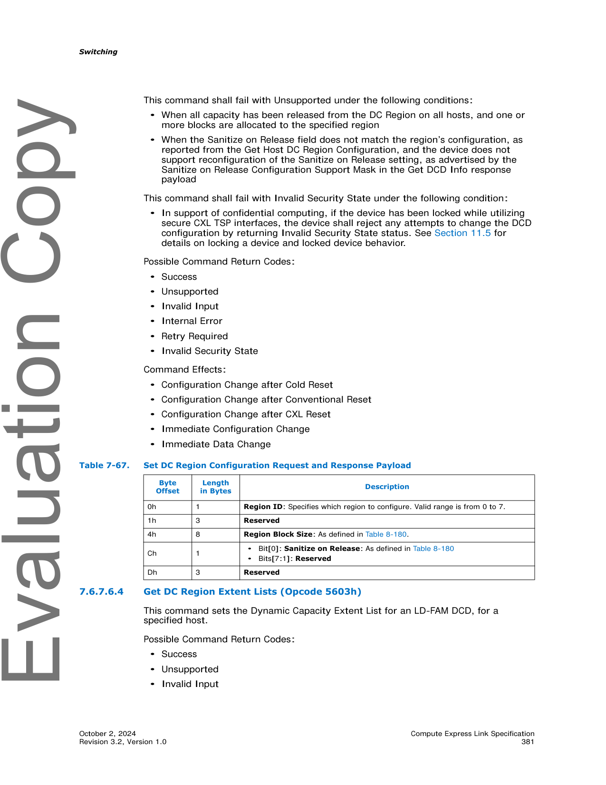
>
> *Original page render @ 150 DPI* — [📄 Full size](figures/chapter_07/page_0381.png)

[⬆️ 返回目录](#-本章目录-part-b)

---

## 7.6.7.6.5 Initiate Dynamic Capacity Add (Opcode 5604h) | 启动动态容量添加 (操作码 5604h)

<table>
<thead>
<tr>
<th width="50%">🇬🇧 English</th>
<th width="50%" style="background-color:#e8e8e8">🇨🇳 中文</th>
</tr>
</thead>
<tbody>
<tr><td>This command initiates the addition of Dynamic Capacity for an LD-FAM DCD, to the specified region on a host. This command shall complete when the device initiates the Add Capacity procedure, as defined in Section 8.2.10.2.2. The processing of the actions initiated in response to this command may or may not result in a new entry or multiple entries grouped via the More flag (see Table 8-62) in the Dynamic Capacity Event Log.</td><td style="background-color:#e8e8e8">本命令启动为 LD-FAM DCD 在指定主机的指定 Region 上添加动态容量（Dynamic Capacity）。当设备启动 Add Capacity 过程（定义见第 8.2.10.2.2 节）时，本命令应完成。针对本命令所启动操作的执行，可能会、也可能不会在 Dynamic Capacity Event Log 中产生一个新条目或通过 More 标志（见表 8-62）分组的多个条目。</td></tr>
<tr><td>To perform Dynamic Capacity Add on a GFD, see Section 8.2.10.9.10.7.</td><td style="background-color:#e8e8e8">要在 GFD 上执行 Dynamic Capacity Add，请参见第 8.2.10.9.10.7 节。</td></tr>
<tr><td>A Selection Policy is specified to govern the device's selection of which memory resources to add:</td><td style="background-color:#e8e8e8">通过指定选择策略（Selection Policy）来控制设备选择添加哪些内存资源：</td></tr>
<tr><td>• Free: Unassigned extents are selected by the device, with no requirement for contiguous blocks</td><td style="background-color:#e8e8e8">• Free（空闲）：由设备选择未分配的 extent（范围），不要求块连续</td></tr>
<tr><td>• Contiguous: Unassigned extents are selected by the device and shall be contiguous</td><td style="background-color:#e8e8e8">• Contiguous（连续）：由设备选择未分配的 extent，且这些 extent 应是连续的</td></tr>
<tr><td>• Prescriptive: Extent list of capacity to assign is included in the request payload</td><td style="background-color:#e8e8e8">• Prescriptive（指定）：要分配的容量 extent 列表包含在请求负载中</td></tr>
<tr><td>• Enable Shared Access: Enable access to extent(s) previously added to another host in a DC Region that reports the "Sharable" flag, as designated by the specified tag value</td><td style="background-color:#e8e8e8">• Enable Shared Access（启用共享访问）：启用对先前已添加到其他主机的 DC Region 中、且该 Region 报告 "Sharable" 标志的 extent 的访问，由指定的 tag 值标识</td></tr>
</tbody>
</table>

> **Table 7-68.** Get DC Region Extent Lists Request Payload ｜ 获取 DC Region 范围列表请求负载
>
> 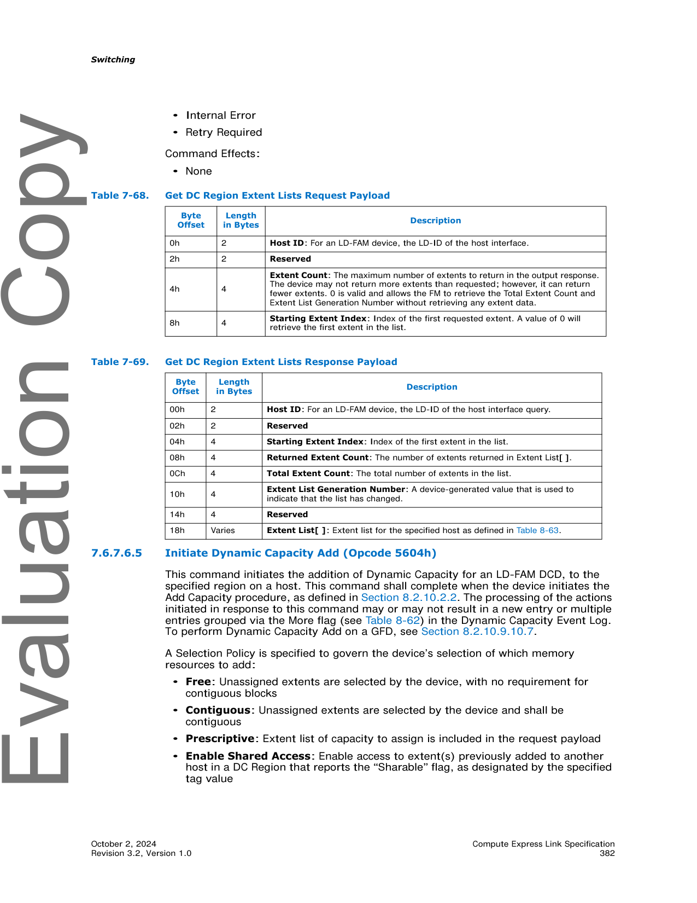
>
> *Original page render @ 150 DPI* — [📄 Full size](figures/chapter_07/page_0382.png)

> **Table 7-69.** Get DC Region Extent Lists Response Payload ｜ 获取 DC Region 范围列表响应负载
>
> 
>
> *Original page render @ 150 DPI* — [📄 Full size](figures/chapter_07/page_0382.png)

[⬆️ 返回目录](#-本章目录-part-b)

---

## 7.6.7.6.6 Initiate Dynamic Capacity Release (Opcode 5605h) | 启动动态容量释放 (操作码 5605h)

<table>
<thead>
<tr>
<th width="50%">🇬🇧 English</th>
<th width="50%" style="background-color:#e8e8e8">🇨🇳 中文</th>
</tr>
</thead>
<tbody>
<tr><td>This command initiates the release of Dynamic Capacity for an LD-FAM DCD, from a host. This command shall complete when the device initiates the Remove Capacity procedure, as defined in Section 8.2.10.9.9. The processing of the actions initiated in response to this command may or may not result in a new entry in the Dynamic Capacity Event Log. To perform Dynamic Capacity removal on a GFD, see Section 8.2.10.9.10.8.</td><td style="background-color:#e8e8e8">本命令启动为 LD-FAM DCD 从某主机释放动态容量。当设备启动 Remove Capacity 过程（定义见第 8.2.10.9.9 节）时，本命令应完成。针对本命令所启动操作的执行，可能会、也可能不会在 Dynamic Capacity Event Log 中产生新条目。要在 GFD 上执行 Dynamic Capacity 移除，请参见第 8.2.10.9.10.8 节。</td></tr>
<tr><td>A removal policy is specified to govern the device's selection of which memory resources to remove:</td><td style="background-color:#e8e8e8">通过指定移除策略（removal policy）来控制设备选择移除哪些内存资源：</td></tr>
<tr><td>• Tag-based: Extents are selected by the device based on tag, with no requirement for contiguous extents</td><td style="background-color:#e8e8e8">• Tag-based（基于标签）：由设备根据 tag 选择 extent，不要求 extent 连续</td></tr>
<tr><td>• Prescriptive: Extent list of capacity to release is included in request payload</td><td style="background-color:#e8e8e8">• Prescriptive（指定）：要释放的容量 extent 列表包含在请求负载中</td></tr>
<tr><td>To remove a host's access to the shared extent, the FM issues Initiate Dynamic Capacity Release Request with Selection Policy=Tag-Based with the Host ID associated with that host. The Tag field must match the Tag value used during Capacity Add. The host access can be removed in any order. The physical memory resources and tag associated with a shared extent shall remain assigned and unavailable for re-use until that extent has been released from all hosts that have been granted access.</td><td style="background-color:#e8e8e8">若要移除某主机对共享 extent 的访问，FM 应使用与该主机关联的 Host ID，以 Selection Policy=Tag-Based 发起 Initiate Dynamic Capacity Release Request。Tag 字段必须与 Capacity Add 中使用的 Tag 值匹配。主机访问可以按任意顺序移除。在共享 extent 从所有被授权访问的主机释放之前，与该共享 extent 关联的物理内存资源和 tag 应保持已分配状态且不可重新使用。</td></tr>
<tr><td>When the FM issues Initiate Dynamic Capacity Release Request with the Forced Removal flag set in order to release an extent in "Pending" state (as defined in Section 9.13.3.3), the request shall be fulfilled by the device marking the Extent Group as "Dead" without appending a new entry into the Dynamic Capacity Event Log. The Add Capacity Event records corresponding to the "Dead" Extent Group in the "Pending" list are unmodified. The "Dead" state is tracked internally by the device.</td><td style="background-color:#e8e8e8">当 FM 通过设置 Forced Removal 标志发起 Initiate Dynamic Capacity Release Request 以释放处于 "Pending" 状态的 extent（定义见第 9.13.3.3 节）时，设备应通过将 Extent Group 标记为 "Dead" 来完成该请求，而无需向 Dynamic Capacity Event Log 中追加新条目。处于 "Pending" 列表中与 "Dead" Extent Group 对应的 Add Capacity Event 记录保持不变。"Dead" 状态由设备内部跟踪。</td></tr>
<tr><td>The command shall fail with <b>Invalid Input</b> under the following conditions:</td><td style="background-color:#e8e8e8">本命令在以下条件下应返回 <b>Invalid Input</b> 失败：</td></tr>
<tr><td>• When the command is sent with an invalid Host ID, or an invalid region number, or an unsupported Removal Policy</td><td style="background-color:#e8e8e8">• 当命令使用无效的 Host ID、无效的 Region 编号或不受支持的 Removal Policy 发送时</td></tr>
<tr><td>• When the command is sent with a Removal Policy of Tag-based and the input Tag does not correspond to any currently allocated capacity</td><td style="background-color:#e8e8e8">• 当使用 Tag-based Removal Policy 发送命令，但输入的 Tag 与任何当前已分配容量都不对应时</td></tr>
<tr><td>• When Sanitize on Release is set but is not supported by the device</td><td style="background-color:#e8e8e8">• 当 Sanitize on Release 已设置但设备不支持时</td></tr>
<tr><td>• When the Tag represents sharable capacity, and the Extent List covers only a portion of the capacity associated with the Tag</td><td style="background-color:#e8e8e8">• 当 Tag 表示可共享容量，但 Extent List 仅覆盖与该 Tag 关联的部分容量时</td></tr>
<tr><td>The command shall fail with <b>Resources Exhausted</b> when the length of the removed capacity exceeds the total assigned capacity for that region or for the specified tag when the Removal Policy is set to Tag-based.</td><td style="background-color:#e8e8e8">当被移除容量的长度超过该 Region 的总已分配容量，或在 Removal Policy 为 Tag-based 时超过指定 tag 的总已分配容量，本命令应返回 <b>Resources Exhausted</b> 失败。</td></tr>
<tr><td>The command shall fail with <b>Invalid Extent List</b> when the Removal Policy is set to Prescriptive and the Extent Count is invalid or when the Extent List includes blocks that are not currently assigned to the region.</td><td style="background-color:#e8e8e8">当 Removal Policy 为 Prescriptive 且 Extent Count 无效，或 Extent List 包含当前未分配给该 Region 的块时，本命令应返回 <b>Invalid Extent List</b> 失败。</td></tr>
<tr><td>The command shall fail with <b>Retry Required</b> if its execution would cause the specified LD's Dynamic Capacity Event Log to overflow, unless the Forced Removal flag is set, in which case the removal occurs regardless of whether an Event is logged.</td><td style="background-color:#e8e8e8">若命令的执行将导致指定 LD 的 Dynamic Capacity Event Log 溢出，本命令应返回 <b>Retry Required</b> 失败，除非设置了 Forced Removal 标志——若设置了该标志，则无论是否记录 Event，移除操作都会发生。</td></tr>
<tr><td>The command shall fail with <b>Resources Exhausted</b> if the Extent List would cause the device to exceed its extent or tag tracking ability.</td><td style="background-color:#e8e8e8">若 Extent List 将导致设备超出其 extent 或 tag 跟踪能力，本命令应返回 <b>Resources Exhausted</b> 失败。</td></tr>
<tr><td>The command shall fail with <b>Invalid Physical Address</b> if an extent in the extent list covers non-existing or pending ("Pending" state as defined in Section 9.13.3.3) DPA range and the Forced Removal flag is not set.</td><td style="background-color:#e8e8e8">若 extent 列表中的某个 extent 覆盖了不存在或处于 pending 状态（"Pending" 状态定义见第 9.13.3.3 节）的 DPA 范围，并且未设置 Forced Removal 标志，则本命令应返回 <b>Invalid Physical Address</b> 失败。</td></tr>
<tr><td><b>Possible Command Return Codes:</b></td><td style="background-color:#e8e8e8"><b>可能的命令返回码：</b></td></tr>
<tr><td>• Success</td><td style="background-color:#e8e8e8">• Success（成功）</td></tr>
<tr><td>• Unsupported</td><td style="background-color:#e8e8e8">• Unsupported（不支持）</td></tr>
<tr><td>• Invalid Input</td><td style="background-color:#e8e8e8">• Invalid Input（无效输入）</td></tr>
<tr><td>• Internal Error</td><td style="background-color:#e8e8e8">• Internal Error（内部错误）</td></tr>
<tr><td>• Retry Required</td><td style="background-color:#e8e8e8">• Retry Required（需要重试）</td></tr>
<tr><td>• Invalid Extent List</td><td style="background-color:#e8e8e8">• Invalid Extent List（无效 Extent 列表）</td></tr>
<tr><td>• Resources Exhausted</td><td style="background-color:#e8e8e8">• Resources Exhausted（资源耗尽）</td></tr>
<tr><td><b>Command Effects:</b></td><td style="background-color:#e8e8e8"><b>命令效果：</b></td></tr>
<tr><td>• Configuration Change after Cold Reset</td><td style="background-color:#e8e8e8">• 冷复位后配置变更</td></tr>
<tr><td>• Configuration Change after Conventional Reset</td><td style="background-color:#e8e8e8">• 传统复位后配置变更</td></tr>
<tr><td>• Configuration Change after CXL Reset</td><td style="background-color:#e8e8e8">• CXL 复位后配置变更</td></tr>
<tr><td>• Immediate Configuration Change</td><td style="background-color:#e8e8e8">• 立即配置变更</td></tr>
<tr><td>• Immediate Data Change</td><td style="background-color:#e8e8e8">• 立即数据变更</td></tr>
</tbody>
</table>

> **Table 7-70.** Initiate Dynamic Capacity Add Request Payload ｜ 启动动态容量添加请求负载
>
> 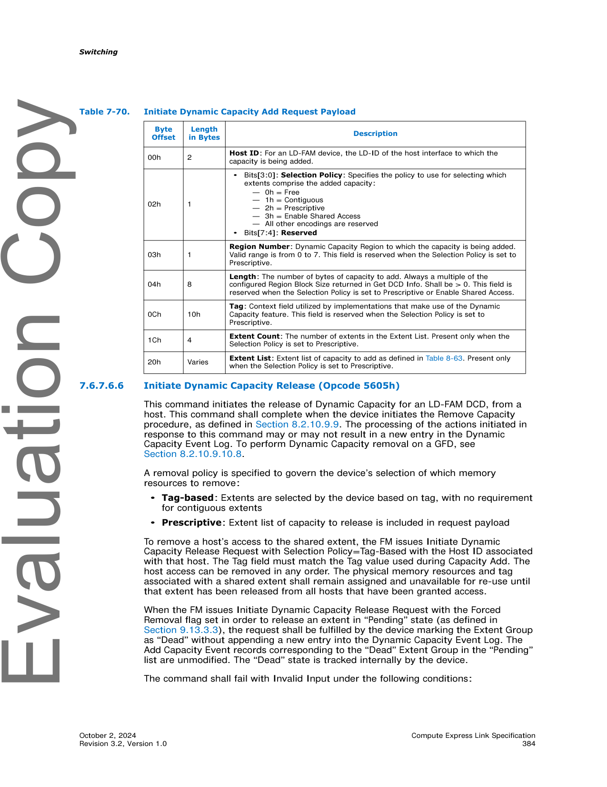
>
> *Original page render @ 150 DPI* — [📄 Full size](figures/chapter_07/page_0384.png)

> **Table 7-71.** Initiate Dynamic Capacity Release Request Payload ｜ 启动动态容量释放请求负载
>
> 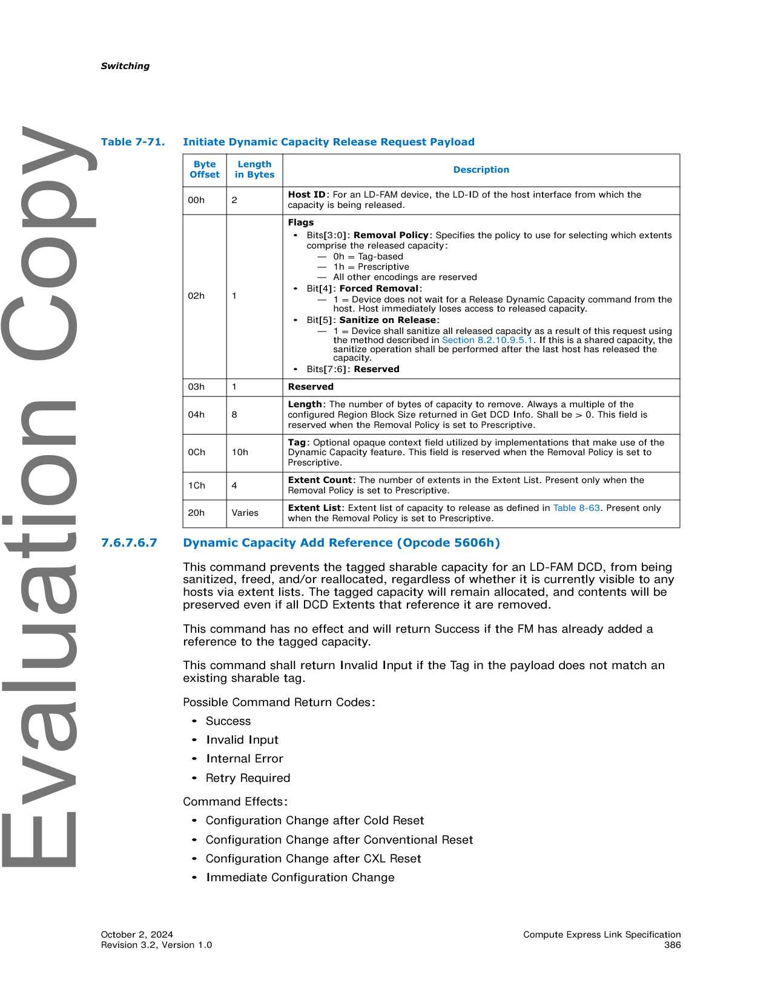
>
> *Original page render @ 150 DPI* — [📄 Full size](figures/chapter_07/page_0386.png)

[⬆️ 返回目录](#-本章目录-part-b)

---

## 7.6.7.6.7 Dynamic Capacity Add Reference (Opcode 5606h) | 动态容量添加引用 (操作码 5606h)

<table>
<thead>
<tr>
<th width="50%">🇬🇧 English</th>
<th width="50%" style="background-color:#e8e8e8">🇨🇳 中文</th>
</tr>
</thead>
<tbody>
<tr><td>This command prevents the tagged sharable capacity for an LD-FAM DCD, from being sanitized, freed, and/or reallocated, regardless of whether it is currently visible to any hosts via extent lists. The tagged capacity will remain allocated, and contents will be preserved even if all DCD Extents that reference it are removed.</td><td style="background-color:#e8e8e8">本命令防止 LD-FAM DCD 的带 tag 的可共享容量被清除、释放和/或重新分配，无论该容量当前是否通过 extent 列表对任何主机可见。即使所有引用该容量的 DCD Extent 都被移除，该带 tag 的容量仍将保持已分配状态，其内容也将被保留。</td></tr>
<tr><td>This command has no effect and will return Success if the FM has already added a reference to the tagged capacity.</td><td style="background-color:#e8e8e8">如果 FM 已添加对带 tag 容量的引用，则本命令无效并将返回 Success。</td></tr>
<tr><td>This command shall return Invalid Input if the Tag in the payload does not match an existing sharable tag.</td><td style="background-color:#e8e8e8">如果负载中的 Tag 与现有的可共享 tag 不匹配，则本命令应返回 Invalid Input。</td></tr>
<tr><td><b>Possible Command Return Codes:</b></td><td style="background-color:#e8e8e8"><b>可能的命令返回码：</b></td></tr>
<tr><td>• Success</td><td style="background-color:#e8e8e8">• Success（成功）</td></tr>
<tr><td>• Invalid Input</td><td style="background-color:#e8e8e8">• Invalid Input（无效输入）</td></tr>
<tr><td>• Internal Error</td><td style="background-color:#e8e8e8">• Internal Error（内部错误）</td></tr>
<tr><td>• Retry Required</td><td style="background-color:#e8e8e8">• Retry Required（需要重试）</td></tr>
<tr><td><b>Command Effects:</b></td><td style="background-color:#e8e8e8"><b>命令效果：</b></td></tr>
<tr><td>• Configuration Change after Cold Reset</td><td style="background-color:#e8e8e8">• 冷复位后配置变更</td></tr>
<tr><td>• Configuration Change after Conventional Reset</td><td style="background-color:#e8e8e8">• 传统复位后配置变更</td></tr>
<tr><td>• Configuration Change after CXL Reset</td><td style="background-color:#e8e8e8">• CXL 复位后配置变更</td></tr>
<tr><td>• Immediate Configuration Change</td><td style="background-color:#e8e8e8">• 立即配置变更</td></tr>
</tbody>
</table>

> **Table 7-72.** Dynamic Capacity Add Reference Request Payload ｜ 动态容量添加引用请求负载
>
> 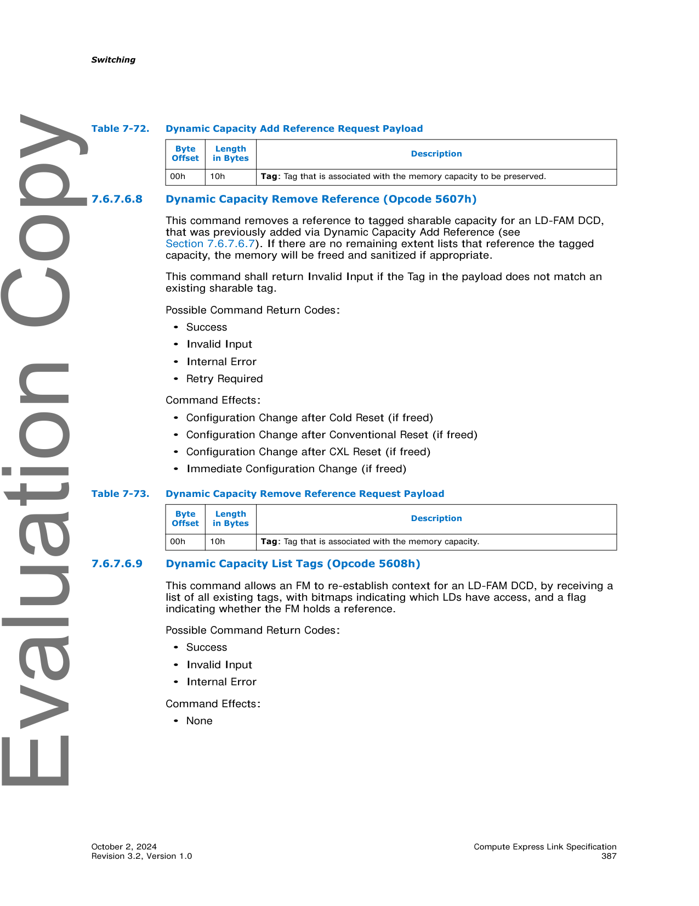
>
> *Original page render @ 150 DPI* — [📄 Full size](figures/chapter_07/page_0387.png)

[⬆️ 返回目录](#-本章目录-part-b)

---

## 7.6.7.6.8 Dynamic Capacity Remove Reference (Opcode 5607h) | 动态容量移除引用 (操作码 5607h)

<table>
<thead>
<tr>
<th width="50%">🇬🇧 English</th>
<th width="50%" style="background-color:#e8e8e8">🇨🇳 中文</th>
</tr>
</thead>
<tbody>
<tr><td>This command removes a reference to tagged sharable capacity for an LD-FAM DCD, that was previously added via Dynamic Capacity Add Reference (see Section 7.6.7.6.7). If there are no remaining extent lists that reference the tagged capacity, the memory will be freed and sanitized if appropriate.</td><td style="background-color:#e8e8e8">本命令移除先前通过 Dynamic Capacity Add Reference 添加的（见第 7.6.7.6.7 节）LD-FAM DCD 的带 tag 可共享容量的一个引用。如果没有剩余的 extent 列表引用该带 tag 的容量，则该内存将被释放，并在适当时执行清除（sanitize）。</td></tr>
<tr><td>This command shall return Invalid Input if the Tag in the payload does not match an existing sharable tag.</td><td style="background-color:#e8e8e8">如果负载中的 Tag 与现有的可共享 tag 不匹配，则本命令应返回 Invalid Input。</td></tr>
<tr><td><b>Possible Command Return Codes:</b></td><td style="background-color:#e8e8e8"><b>可能的命令返回码：</b></td></tr>
<tr><td>• Success</td><td style="background-color:#e8e8e8">• Success（成功）</td></tr>
<tr><td>• Invalid Input</td><td style="background-color:#e8e8e8">• Invalid Input（无效输入）</td></tr>
<tr><td>• Internal Error</td><td style="background-color:#e8e8e8">• Internal Error（内部错误）</td></tr>
<tr><td>• Retry Required</td><td style="background-color:#e8e8e8">• Retry Required（需要重试）</td></tr>
<tr><td><b>Command Effects:</b></td><td style="background-color:#e8e8e8"><b>命令效果：</b></td></tr>
<tr><td>• Configuration Change after Cold Reset (if freed)</td><td style="background-color:#e8e8e8">• 冷复位后配置变更（若已释放）</td></tr>
<tr><td>• Configuration Change after Conventional Reset (if freed)</td><td style="background-color:#e8e8e8">• 传统复位后配置变更（若已释放）</td></tr>
<tr><td>• Configuration Change after CXL Reset (if freed)</td><td style="background-color:#e8e8e8">• CXL 复位后配置变更（若已释放）</td></tr>
<tr><td>• Immediate Configuration Change (if freed)</td><td style="background-color:#e8e8e8">• 立即配置变更（若已释放）</td></tr>
</tbody>
</table>

> **Table 7-73.** Dynamic Capacity Remove Reference Request Payload ｜ 动态容量移除引用请求负载
>
> 
>
> *Original page render @ 150 DPI* — [📄 Full size](figures/chapter_07/page_0387.png)

[⬆️ 返回目录](#-本章目录-part-b)

---

## 7.6.7.6.9 Dynamic Capacity List Tags (Opcode 5608h) | 动态容量列表标签 (操作码 5608h)

<table>
<thead>
<tr>
<th width="50%">🇬🇧 English</th>
<th width="50%" style="background-color:#e8e8e8">🇨🇳 中文</th>
</tr>
</thead>
<tbody>
<tr><td>This command allows an FM to re-establish context for an LD-FAM DCD, by receiving a list of all existing tags, with bitmaps indicating which LDs have access, and a flag indicating whether the FM holds a reference.</td><td style="background-color:#e8e8e8">本命令允许 FM 通过接收所有现有 tag 的列表来为 LD-FAM DCD 重新建立上下文，其中位图指示哪些 LD 具有访问权限，标志指示 FM 是否持有引用。</td></tr>
<tr><td><b>Possible Command Return Codes:</b></td><td style="background-color:#e8e8e8"><b>可能的命令返回码：</b></td></tr>
<tr><td>• Success</td><td style="background-color:#e8e8e8">• Success（成功）</td></tr>
<tr><td>• Invalid Input</td><td style="background-color:#e8e8e8">• Invalid Input（无效输入）</td></tr>
<tr><td>• Internal Error</td><td style="background-color:#e8e8e8">• Internal Error（内部错误）</td></tr>
<tr><td><b>Command Effects:</b></td><td style="background-color:#e8e8e8"><b>命令效果：</b></td></tr>
<tr><td>• None</td><td style="background-color:#e8e8e8">• 无（None）</td></tr>
</tbody>
</table>

> **Table 7-74.** Dynamic Capacity List Tags Request Payload ｜ 动态容量列表标签请求负载
>
> 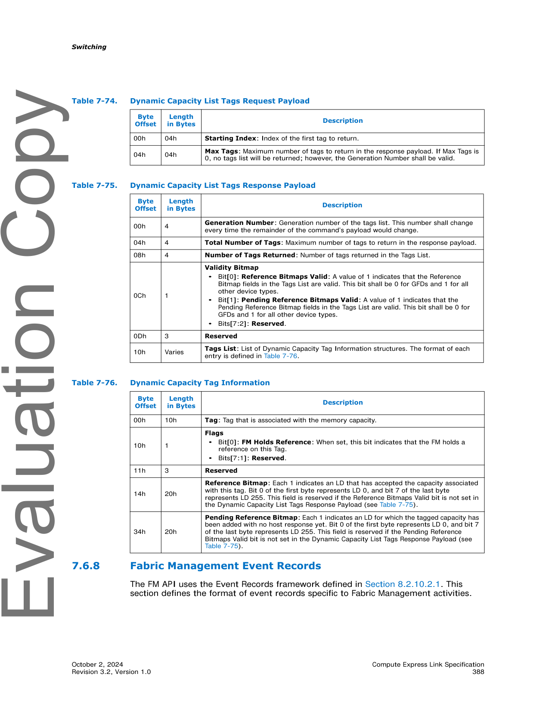
>
> *Original page render @ 150 DPI* — [📄 Full size](figures/chapter_07/page_0388.png)

> **Table 7-75.** Dynamic Capacity List Tags Response Payload ｜ 动态容量列表标签响应负载
>
> 
>
> *Original page render @ 150 DPI* — [📄 Full size](figures/chapter_07/page_0388.png)

> **Table 7-76.** Dynamic Capacity Tag Information ｜ 动态容量标签信息
>
> 
>
> *Original page render @ 150 DPI* — [📄 Full size](figures/chapter_07/page_0388.png)

[⬆️ 返回目录](#-本章目录-part-b)

---

## 7.6.8 Fabric Management Event Records | Fabric 管理事件记录

<table>
<thead>
<tr>
<th width="50%">🇬🇧 English</th>
<th width="50%" style="background-color:#e8e8e8">🇨🇳 中文</th>
</tr>
</thead>
<tbody>
<tr><td>The FM API uses the Event Records framework defined in Section 8.2.10.2.1. This section defines the format of event records specific to Fabric Management activities.</td><td style="background-color:#e8e8e8">FM API 使用第 8.2.10.2.1 节中定义的 Event Records 框架。本节定义与 Fabric Management 活动相关的事件记录的格式。</td></tr>
</tbody>
</table>

> **Table 7-77.** Physical Switch Events Record Format ｜ 物理交换机事件记录格式
>
> 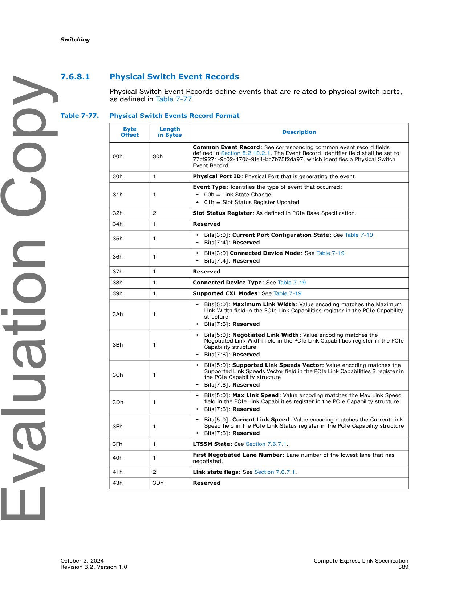
>
> *Original page render @ 150 DPI* — [📄 Full size](figures/chapter_07/page_0389.png)

[⬆️ 返回目录](#-本章目录-part-b)

---

### 7.6.8.1 Physical Switch Event Records | 物理交换机事件记录

<table>
<thead>
<tr>
<th width="50%">🇬🇧 English</th>
<th width="50%" style="background-color:#e8e8e8">🇨🇳 中文</th>
</tr>
</thead>
<tbody>
<tr><td>Physical Switch Event Records define events that are related to physical switch ports, as defined in Table 7-77.</td><td style="background-color:#e8e8e8">物理交换机事件记录定义与物理交换机端口相关的事件，其格式定义见表 7-77。</td></tr>
</tbody>
</table>

> **Table 7-78.** Virtual CXL Switch Event Record Format ｜ 虚拟 CXL 交换机事件记录格式
>
> 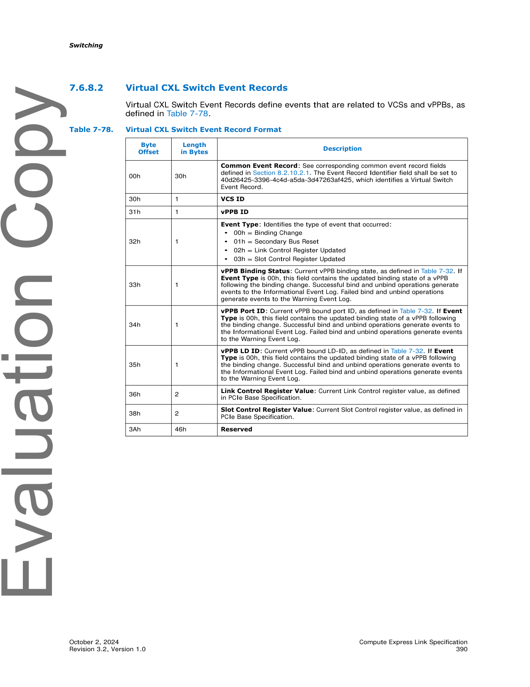
>
> *Original page render @ 150 DPI* — [📄 Full size](figures/chapter_07/page_0390.png)

[⬆️ 返回目录](#-本章目录-part-b)

---

### 7.6.8.2 Virtual CXL Switch Event Records | 虚拟 CXL 交换机事件记录

<table>
<thead>
<tr>
<th width="50%">🇬🇧 English</th>
<th width="50%" style="background-color:#e8e8e8">🇨🇳 中文</th>
</tr>
</thead>
<tbody>
<tr><td>Virtual CXL Switch Event Records define events that are related to VCSs and vPPBs, as defined in Table 7-78.</td><td style="background-color:#e8e8e8">虚拟 CXL 交换机事件记录定义与 VCS 和 vPPB 相关的事件，其格式定义见表 7-78。</td></tr>
</tbody>
</table>

> **Table 7-79.** MLD Port Event Records Payload ｜ MLD 端口事件记录负载
>
> 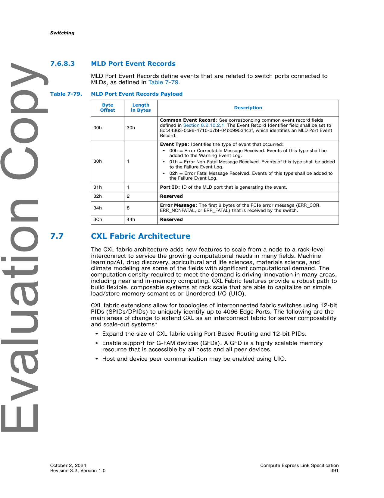
>
> *Original page render @ 150 DPI* — [📄 Full size](figures/chapter_07/page_0391.png)

[⬆️ 返回目录](#-本章目录-part-b)

---

## 7.7 CXL Fabric Architecture | CXL Fabric 架构

<table>
<thead>
<tr>
<th width="50%">🇬🇧 English</th>
<th width="50%" style="background-color:#e8e8e8">🇨🇳 中文</th>
</tr>
</thead>
<tbody>
<tr><td>The CXL fabric architecture adds new features to scale from a node to a rack-level interconnect to service the growing computational needs in many fields. Machine learning/AI, drug discovery, agricultural and life sciences, materials science, and climate modeling are some of the fields with significant computational demand. The computation density required to meet the demand is driving innovation in many areas, including near and in-memory computing. CXL Fabric features provide a robust path to build flexible, composable systems at rack scale that are able to capitalize on simple load/store memory semantics or Unordered I/O (UIO).</td><td style="background-color:#e8e8e8">CXL Fabric 架构增加了新特性，以从单节点扩展到机架级互连，从而服务于众多领域日益增长的计算需求。机器学习/AI、药物发现、农业与生命科学、材料科学以及气候建模等都是具有巨大计算需求的部分领域。满足这些需求所需的计算密度正推动着众多领域的创新，其中包括近数据计算和存内计算。CXL Fabric 特性提供了一条稳健的路径来构建机架级灵活可组合系统，能够充分利用简单的 load/store 内存语义或无序 I/O（Unordered I/O，UIO）。</td></tr>
<tr><td>CXL fabric extensions allow for topologies of interconnected fabric switches using 12-bit PIDs (SPIDs/DPIDs) to uniquely identify up to 4096 Edge Ports. The following are the main areas of change to extend CXL as an interconnect fabric for server composability and scale-out systems:</td><td style="background-color:#e8e8e8">CXL Fabric 扩展通过使用 12-bit PID（SPID/DPID）来唯一标识多达 4096 个 Edge Port，从而支持 Fabric 交换机互连的拓扑结构。以下是将 CXL 扩展为服务器可组合性和横向扩展系统互连 Fabric 的主要变更领域：</td></tr>
<tr><td>• Expand the size of CXL fabric using Port Based Routing and 12-bit PIDs.</td><td style="background-color:#e8e8e8">• 使用 Port Based Routing（PBR）和 12-bit PID 扩展 CXL Fabric 的规模。</td></tr>
<tr><td>• Enable support for G-FAM devices (GFDs). A GFD is a highly scalable memory resource that is accessible by all hosts and all peer devices.</td><td style="background-color:#e8e8e8">• 启用对 G-FAM 设备（GFD）的支持。GFD 是一种高度可扩展的内存资源，可被所有主机和所有对等设备访问。</td></tr>
<tr><td>• Host and device peer communication may be enabled using UIO.</td><td style="background-color:#e8e8e8">• 主机与设备对等通信可通过 UIO 启用。</td></tr>
</tbody>
</table>

> **Figure 7-25.** High-level CXL Fabric Diagram ｜ CXL Fabric 高层示意图
>
> 
>
> *Original page render @ 150 DPI* — [📄 Full size](figures/chapter_07/page_0392.png)

<table>
<thead>
<tr>
<th width="50%">🇬🇧 English</th>
<th width="50%" style="background-color:#e8e8e8">🇨🇳 中文</th>
</tr>
</thead>
<tbody>
<tr><td>Figure 7-25 is a high-level illustration of a routable CXL Fabric. The fabric consists of one or more interconnected fabric switches. In this figure, there are "n" Switch Edge Ports (SEPi) on the Fabric where each Edge Port can connect to a CXL host root port or a CXL/PCIe device (Dev). As shown, a Fabric Manager (FM) connects to the CXL Fabric and may connect to selected endpoints over an out-of-band management network. The management network may be a simple 2-wire interface, such as SMBus, I2C, I3C, or a complex fabric such as Ethernet. The FM is responsible for the initialization and setup of the CXL Fabric and the assignment of devices to different Virtual Hierarchies. Extensions to FM API (see Section 7.6) to handle cross-domain traffic will be taken up as a future ECN.</td><td style="background-color:#e8e8e8">图 7-25 是可路由 CXL Fabric 的高层示意图。Fabric 由一个或多个互连的 Fabric 交换机组成。在该图中，Fabric 上有 "n" 个 Switch Edge Port（SEPi），每个 Edge Port 可连接到 CXL 主机根端口或 CXL/PCIe 设备（Dev）。如图所示，Fabric Manager（FM）连接到 CXL Fabric，并可通过带外管理网络连接到所选端点。管理网络可以是简单的 2 线接口（如 SMBus、I2C、I3C），也可以是像 Ethernet 这样复杂的 Fabric。FM 负责 CXL Fabric 的初始化与配置，以及将设备分配到不同的 Virtual Hierarchy 中。处理跨域流量的 FM API 扩展（参见第 7.6 节）将留待未来的 ECN 中处理。</td></tr>
<tr><td>Initially, the FM binds a set of devices to the host's Virtual Hierarchies, essentially composing a system. After the system has booted, the FM may add or remove devices from the system using fabric bind and unbind operations. These system changes are presented to the hosts by the fabric switches as managed Hot-Add and Hot-Remove events as described in Section 9.9. This allows for dynamic reconfiguration of systems that are composed of hosts and devices.</td><td style="background-color:#e8e8e8">最初，FM 将一组设备绑定到主机的 Virtual Hierarchy，实质上是在组合一个系统。系统启动后，FM 可以使用 Fabric bind 和 unbind 操作向系统添加或移除设备。这些系统变更由 Fabric 交换机以受管热添加（Hot-Add）和热移除（Hot-Remove）事件的形式呈现给主机（详见第 9.9 节）。这允许对由主机和设备组成的系统进行动态重新配置。</td></tr>
<tr><td>Root ports on the CXL Fabric may be part of the same or different domains. If the root ports are in different domains, hardware coherency across those root ports is not a requirement. However, devices that support sharing (including MLDs, Multi-Headed devices, and GFDs) may support hardware-managed cache coherency across root ports in multiple domains.</td><td style="background-color:#e8e8e8">CXL Fabric 上的根端口可以属于相同或不同的域。如果根端口位于不同域中，则不要求跨这些根端口的硬件一致性。但是，支持共享的设备（包括 MLD、多头设备和 GFD）可支持跨多个域中根端口的硬件管理缓存一致性。</td></tr>
</tbody>
</table>

[⬆️ 返回目录](#-本章目录-part-b)

---

## 7.7.1 CXL Fabric Use Case Examples | CXL Fabric 用例示例

<table>
<thead>
<tr>
<th width="50%">🇬🇧 English</th>
<th width="50%" style="background-color:#e8e8e8">🇨🇳 中文</th>
</tr>
</thead>
<tbody>
<tr><td>Following are a few examples of systems that may benefit from using CXL-switched Fabric for low-latency communication.</td><td style="background-color:#e8e8e8">以下是几个可能受益于使用 CXL 交换 Fabric 来实现低延迟通信的系统示例。</td></tr>
</tbody>
</table>

[⬆️ 返回目录](#-本章目录-part-b)

---

### 7.7.1.1 Machine-learning Accelerators | 机器学习加速器

<table>
<thead>
<tr>
<th width="50%">🇬🇧 English</th>
<th width="50%" style="background-color:#e8e8e8">🇨🇳 中文</th>
</tr>
</thead>
<tbody>
<tr><td>Accelerators used for machine-learning applications may use a dedicated CXL-switched Fabric for direct communication between devices in different domains. The same Fabric may also be used for sharing GFDs among accelerators. Each host and accelerator of same color shown in Figure 7-26 (basically, those that are directly above and below one another) belongs to a single domain. Accelerator devices can use UIO transactions to access memory on other accelerator and GFDs. In such a system, each accelerator is attached to a host and expected to be hardware-cache coherent with the host when using a CXL link. Communication between accelerators across domains is via the I/O coherency model. Device caching of data from another device memory (HDM or PDM) requires software-managed coherency with appropriate cache flushes and barriers. A Switch Edge ingress port is expected to implement a common set of address decoders that is to be used for Upstream Ports and Downstream Ports. Implementations may enable a dedicated CXL Fabric for accelerators using features available in this revision. However, it is not fully defined by the specification. Peer communication is defined in Section 7.7.9.</td><td style="background-color:#e8e8e8">用于机器学习应用的加速器可以使用专用的 CXL 交换 Fabric 来实现不同域设备之间的直接通信。同一 Fabric 也可用于在加速器之间共享 GFD。图 7-26 中显示的同色主机和加速器（基本上是直接上下相邻的）属于同一域。加速器设备可使用 UIO 事务访问其他加速器和 GFD 的内存。在这样的系统中，每个加速器都连接到一台主机，并预期在使用 CXL 链路时与该主机保持硬件缓存一致。跨域加速器之间的通信通过 I/O 一致性模型完成。设备对来自其他设备内存（HDM 或 PDM）的数据进行缓存时，需要使用软件管理的一致性，并辅以适当的缓存刷新和屏障。Switch Edge 入口端口应实现一组公共的地址解码器，供 Upstream Port 和 Downstream Port 使用。实现可以使用本版本中提供的特性来为加速器启用专用的 CXL Fabric，但本规范并未完整定义。Peer 通信在第 7.7.9 节中定义。</td></tr>
</tbody>
</table>

> **Figure 7-26.** ML Accelerator Use Case ｜ 机器学习加速器用例
>
> 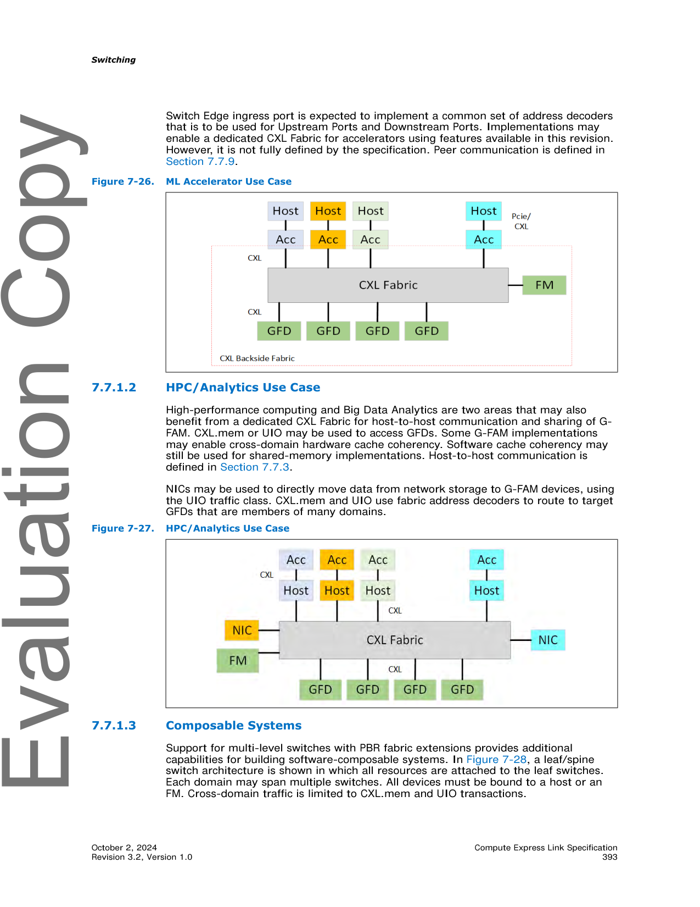
>
> *Original page render @ 150 DPI* — [📄 Full size](figures/chapter_07/page_0393.png)

[⬆️ 返回目录](#-本章目录-part-b)

---

### 7.7.1.2 HPC/Analytics Use Case | HPC/分析用例

<table>
<thead>
<tr>
<th width="50%">🇬🇧 English</th>
<th width="50%" style="background-color:#e8e8e8">🇨🇳 中文</th>
</tr>
</thead>
<tbody>
<tr><td>High-performance computing and Big Data Analytics are two areas that may also benefit from a dedicated CXL Fabric for host-to-host communication and sharing of G-FAM. CXL.mem or UIO may be used to access GFDs. Some G-FAM implementations may enable cross-domain hardware cache coherency. Software cache coherency may still be used for shared-memory implementations. Host-to-host communication is defined in Section 7.7.3.</td><td style="background-color:#e8e8e8">高性能计算和 Big Data 分析是两个也可能受益于使用专用 CXL Fabric 来实现主机到主机通信及 G-FAM 共享的领域。可使用 CXL.mem 或 UIO 访问 GFD。某些 G-FAM 实现可能启用跨域硬件缓存一致性。对于共享内存实现，仍可使用软件缓存一致性。主机到主机的通信在第 7.7.3 节中定义。</td></tr>
<tr><td>NICs may be used to directly move data from network storage to G-FAM devices, using the UIO traffic class. CXL.mem and UIO use fabric address decoders to route to target GFDs that are members of many domains.</td><td style="background-color:#e8e8e8">NIC 可使用 UIO 流量类将数据直接从网络存储移动到 G-FAM 设备。CXL.mem 和 UIO 使用 Fabric 地址解码器将请求路由到属于多个域的目标 GFD。</td></tr>
</tbody>
</table>

> **Figure 7-27.** HPC/Analytics Use Case ｜ HPC/分析用例
>
> 
>
> *Original page render @ 150 DPI* — [📄 Full size](figures/chapter_07/page_0393.png)

[⬆️ 返回目录](#-本章目录-part-b)

---

### 7.7.1.3 Composable Systems | 可组合系统

<table>
<thead>
<tr>
<th width="50%">🇬🇧 English</th>
<th width="50%" style="background-color:#e8e8e8">🇨🇳 中文</th>
</tr>
</thead>
<tbody>
<tr><td>Support for multi-level switches with PBR fabric extensions provides additional capabilities for building software-composable systems. In Figure 7-28, a leaf/spine switch architecture is shown in which all resources are attached to the leaf switches. Each domain may span multiple switches. All devices must be bound to a host or an FM. Cross-domain traffic is limited to CXL.mem and UIO transactions.</td><td style="background-color:#e8e8e8">带 PBR Fabric 扩展的多级交换机支持为构建软件可组合系统提供了额外的能力。在图 7-28 中，展示了一种 leaf/spine 交换机架构，其中所有资源都连接到 leaf 交换机。每个域可跨越多个交换机。所有设备必须绑定到主机或 FM。跨域流量仅限于 CXL.mem 和 UIO 事务。</td></tr>
<tr><td>Composing systems from resources within a single leaf switch allows for low-latency implementations. In such implementations, a spine switch is used only for cross-domain and G-FAM accesses.</td><td style="background-color:#e8e8e8">从单个 leaf 交换机内的资源组合系统可实现低延迟实现。在此类实现中，spine 交换机仅用于跨域和 G-FAM 访问。</td></tr>
</tbody>
</table>

> **Figure 7-28.** Sample System Topology for Composable Systems ｜ 可组合系统的示例系统拓扑
>
> 
>
> *Original page render @ 150 DPI* — [📄 Full size](figures/chapter_07/page_0394.png)

[⬆️ 返回目录](#-本章目录-part-b)

---

## 7.7.2 Global-Fabric-Attached Memory (G-FAM) | 全局 Fabric 附加内存 (G-FAM)

[⬆️ 返回目录](#-本章目录-part-b)

---

### 7.7.2.1 Overview | 概述

<table>
<thead>
<tr>
<th width="50%">🇬🇧 English</th>
<th width="50%" style="background-color:#e8e8e8">🇨🇳 中文</th>
</tr>
</thead>
<tbody>
<tr><td>G-FAM provides a highly scalable memory resource that is accessible by all hosts and peer devices within a CXL fabric. G-FAM ranges can be assigned exclusively to a single host/peer requester or can be shared by multiple hosts/peers. When shared, multi-requester cache coherency can be managed by either software or hardware. Access rights to G-FAM ranges are enforced by decoders in Requester Edge ports and the target GFD.</td><td style="background-color:#e8e8e8">G-FAM 提供一种高度可扩展的内存资源，CXL Fabric 内的所有主机和对等设备均可访问。G-FAM 范围可以独占分配给单个主机/对等请求者，也可以由多个主机/对等设备共享。共享时，多请求者缓存一致性可由软件或硬件管理。对 G-FAM 范围的访问权限由 Requester Edge 端口中的解码器以及目标 GFD 强制执行。</td></tr>
<tr><td>GFD HDM space can be accessed by hosts/peers from multiple domains using CXL.mem, and by peer devices from multiple domains using CXL.io UIO. GFDs implement no PCIe configuration space, and they are configured and managed instead via Global Memory Access Endpoints (GAEs) in Edge USPs or via out-of-band mechanisms.</td><td style="background-color:#e8e8e8">来自多个域的主机/对等设备可使用 CXL.mem 访问 GFD HDM 空间；来自多个域的对等设备可使用 CXL.io UIO 访问 GFD HDM 空间。GFD 不实现 PCIe 配置空间，而是通过 Edge USP 中的 Global Memory Access Endpoint（GAE）或带外机制进行配置和管理。</td></tr>
<tr><td>Unlike an MLD, which has a separate Device Physical Address (DPA) space for each host/peer interface (LD), a GFD has one DPA space that is common across all hosts and peer devices. The GFD translates the Host Physical Address (HPA)1 in each incoming request into a DPA, using per-requester translation information that is stored within the GFD Decoder Table. To create shared memory, two or more HPA ranges (each from a different requester) are mapped to the same DPA range. When the GFD needs to issue a BISnp, the GFD translates the DPA into an HPA for the associated host using the same GFD decoder information.</td><td style="background-color:#e8e8e8">与 MLD（每个主机/对等接口（LD）拥有独立的设备物理地址（DPA）空间）不同，GFD 只有一个跨所有主机和对等设备共享的 DPA 空间。GFD 使用存储在 GFD Decoder Table 中的每请求者（per-requester）转换信息，将每个进入请求中的 Host Physical Address（HPA，主机物理地址）1 转换为 DPA。为了创建共享内存，将两个或更多 HPA 范围（每个来自不同的请求者）映射到同一 DPA 范围。当 GFD 需要发出 BISnp 时，GFD 使用相同的 GFD 解码器信息将 DPA 转换为对应主机的 HPA。</td></tr>
<tr><td>When a GFD receives a request, the requester is identified by the SPID in the request, which is referred to as the Requester PID or RPID. Using this term avoids confusion when describing messages that the GFD sends to the requester, where the RPID is used for the DPID, and the GFD PID is used for the SPID.</td><td style="background-color:#e8e8e8">当 GFD 收到请求时，请求者由请求中的 SPID 标识，该 SPID 称为 Requester PID（RPID）。使用此术语可避免在描述 GFD 发送给请求者的消息时产生混淆——在这些消息中，RPID 用作 DPID，GFD PID 用作 SPID。</td></tr>
</tbody>
</table>

1 "HPA" 也用于对等设备的请求，尽管在某些对等设备的用例中 "HPA" 是个误称。

<table>
<thead>
<tr>
<th width="50%">🇬🇧 English</th>
<th width="50%" style="background-color:#e8e8e8">🇨🇳 中文</th>
</tr>
</thead>
<tbody>
<tr><td>All memory capacity on a GFD is managed by the Dynamic Capacity (DC) mechanisms, as defined in Section 8.2.10.9.9. A GFD allows each requester to access up to 8 RPID non-overlapping decoders, where the maximum number of decoders per SPID is implementation dependent. Each decoder has a translation from HPA space to the common DPA space, a flag that indicates whether cache coherency is maintained by software or hardware, and information about multi-GFD interleaving, if used. For each requester, the FM may define DC Regions in DPA space and convey this information to the host via a GAE. It is expected that the host will program the Fabric Address Segment Table (FAST) decoders and GFD decoders for all RPIDs in its domain to map the entire DPA range of each DC Region that needs to be accessed by the host or by one of its associated accelerators.</td><td style="background-color:#e8e8e8">GFD 上的所有内存容量均由第 8.2.10.9.9 节中定义的 Dynamic Capacity（DC）机制管理。GFD 允许每个请求者访问多达 8 个互不重叠的 RPID 解码器，每个 SPID 的最大解码器数取决于实现。每个解码器包含从 HPA 空间到公共 DPA 空间的转换、一个指示缓存一致性由软件还是硬件维护的标志，以及有关多 GFD 交织的信息（如果使用）。对于每个请求者，FM 可在 DPA 空间中定义 DC Region，并通过 GAE 将该信息传达给主机。预期主机将为其域内的所有 RPID 编程 Fabric Address Segment Table（FAST）解码器和 GFD 解码器，以映射每个 DC Region 的整个 DPA 范围，以便主机或其关联的加速器访问。</td></tr>
<tr><td>G-FAM memory ranges can be interleaved across any power-of-two number of GFDs from 2 to 256, with an Interleave Granularity of 256B, 512B, 1 KB, 2 KB, 4 KB, 8 KB, or 16 KB. GFDs that are located anywhere within the CXL fabric, as defined in Section 2.7, may be used to contribute memory to an Interleave Set.</td><td style="background-color:#e8e8e8">G-FAM 内存范围可以在 2 到 256 之间任意 2 的幂次个 GFD 上交织，Interleave Granularity 可为 256B、512B、1 KB、2 KB、4 KB、8 KB 或 16 KB。位于 CXL Fabric 任意位置（如第 2.7 节所定义）的 GFD 都可用于向 Interleave Set 贡献内存。</td></tr>
<tr><td>If a GFD supports UIO Direct P2P to HDM (see Section 7.7.9.1), all GFD ports shall support UIO, and for each GFD link whose link partner also supports UIO, VC3 shall be auto-enabled by the ports (see Section 7.7.11.5.1).</td><td style="background-color:#e8e8e8">如果 GFD 支持 UIO Direct P2P to HDM（参见第 7.7.9.1 节），则所有 GFD 端口都应支持 UIO，并且对于链路伙伴也支持 UIO 的每个 GFD 链路，端口应自动启用 VC3（参见第 7.7.11.5.1 节）。</td></tr>
</tbody>
</table>

[⬆️ 返回目录](#-本章目录-part-b)

---

### 7.7.2.2 Host Physical Address View | 主机物理地址视图

<table>
<thead>
<tr>
<th width="50%">🇬🇧 English</th>
<th width="50%" style="background-color:#e8e8e8">🇨🇳 中文</th>
</tr>
</thead>
<tbody>
<tr><td>Hosts that access G-FAM shall allocate a contiguous address range for Fabric Address space within their Host Physical Address (HPA) space, as shown in Figure 7-29. The Fabric Address range is defined by the FabricBase and FabricLimit registers. All host requests that fall within the Fabric Address range are routed to a selected CXL port. Hosts that use multiple CXL ports for G-FAM may either address interleave requests across the ports or may allocate a Fabric Address space for each port.</td><td style="background-color:#e8e8e8">访问 G-FAM 的主机应在主机物理地址（HPA）空间内为 Fabric Address space 分配一段连续的地址范围，如图 7-29 所示。Fabric Address 范围由 FabricBase 和 FabricLimit 寄存器定义。所有落在 Fabric Address 范围内的主机请求都会被路由到所选的 CXL 端口。使用多个 CXL 端口访问 G-FAM 的主机可以在这些端口之间对请求进行交织寻址，也可以为每个端口分配一个 Fabric Address space。</td></tr>
<tr><td>G-FAM requests from a host flow to a PBR Edge USP. In the USP, the Fabric Address range is divided into N equal-sized segments. A segment may be any power-of-two size from 64 GB to 8 TB, and must be naturally aligned. The number of segments implemented by a switch is implementation dependent. Host software is responsible for configuring the segment size so that the number of segments times the segment size fully spans the Fabric Address space. The FabricBase and FabricLimit registers can be programmed to any multiple of the segment size.</td><td style="background-color:#e8e8e8">来自主机的 G-FAM 请求流入 PBR Edge USP。在 USP 中，Fabric Address 范围被划分为 N 个大小相等的段（segment）。段大小可以是 64 GB 到 8 TB 之间任意 2 的幂次，并且必须自然对齐。交换机实现的段数取决于实现。主机软件负责配置段大小，使段数乘以段大小能完全跨越 Fabric Address space。FabricBase 和 FabricLimit 寄存器可以编程为段大小的任意整数倍。</td></tr>
<tr><td>Each segment has an associated GFD or Interleave Set of GFDs. Requests whose HPA falls anywhere within the segment are routed to the specified GFD or to a GFD within the Interleave Set. Segments are used only for request routing and may be larger than the accessible portion of a GFD. When this occurs, the accessible portion of the GFD starts at address offset zero within the segment. Any requests within the segment that are above the accessible portion of the GFD will fail to positively decode in the GFD and will be handled as described in Section 8.2.4.20.</td><td style="background-color:#e8e8e8">每个段都有一个关联的 GFD 或 GFD 的 Interleave Set。HPA 落在该段内任何位置的请求都会被路由到指定的 GFD 或 Interleave Set 中的某个 GFD。段仅用于请求路由，其大小可能大于 GFD 的可访问部分。发生这种情况时，GFD 的可访问部分从段内地址偏移 0 处开始。段内高于 GFD 可访问部分的任何请求都将在 GFD 中无法正匹配解码，并将按第 8.2.4.20 节所述处理。</td></tr>
<tr><td>Host interleaving across root ports is entirely independent from GFD interleaving. Address bits that are used for root port interleaving and for GFD interleaving may be fully overlapping, partially overlapping, or non-overlapping. When the host uses root port interleaving, FabricBase, FabricLimit, and segment size in the corresponding PBR Edge USPs must be identically configured.</td><td style="background-color:#e8e8e8">跨根端口的主机交织与 GFD 交织完全独立。用于根端口交织和用于 GFD 交织的地址位可以完全重叠、部分重叠或不重叠。当主机使用根端口交织时，对应 PBR Edge USP 中的 FabricBase、FabricLimit 和段大小必须进行相同的配置。</td></tr>
</tbody>
</table>

> **Figure 7-29.** Example Host Physical Address View ｜ 主机物理地址视图示例
>
> 
>
> *Original page render @ 150 DPI* — [📄 Full size](figures/chapter_07/page_0396.png)

[⬆️ 返回目录](#-本章目录-part-b)

---

### 7.7.2.3 G-FAM Capacity Management | G-FAM 容量管理

<table>
<thead>
<tr>
<th width="50%">🇬🇧 English</th>
<th width="50%" style="background-color:#e8e8e8">🇨🇳 中文</th>
</tr>
</thead>
<tbody>
<tr><td>GFDs are managed using CCIs like all other classes of CXL components. A GFD requires support for the PBR Link CCI message format, as defined in Section 7.7.11.6, on its CXL link and may optionally implement additional MCTP-based CCIs (e.g., SMBus).</td><td style="background-color:#e8e8e8">GFD 与所有其他类别的 CXL 组件一样，使用 CCI 进行管理。GFD 要求在其 CXL 链路上支持第 7.7.11.6 节中定义的 PBR Link CCI 消息格式，并可选择性地实现额外的基于 MCTP 的 CCI（如 SMBus）。</td></tr>
<tr><td>G-FAM relies exclusively on the Dynamic Capacity (DC) mechanism for capacity management, as described in Section 8.2.10.9.9. GFDs have no "legacy" static capacity as shown in the left side of Figure 9-24 in Chapter 9.0. Dynamic Capacity for G-FAM has much in common with the Dynamic Capacity for LD-FAM:</td><td style="background-color:#e8e8e8">G-FAM 完全依赖 Dynamic Capacity（DC）机制进行容量管理，如第 8.2.10.9.9 节所述。GFD 没有 "legacy" 静态容量，如第 9.0 章图 9-24 的左侧所示。G-FAM 的 Dynamic Capacity 与 LD-FAM 的 Dynamic Capacity 存在大量共同之处：</td></tr>
<tr><td>• Both have identical concepts for DC Regions, Extents, and Blocks</td><td style="background-color:#e8e8e8">• 两者对于 DC Region、Extent 和 Block 具有相同的概念</td></tr>
<tr><td>• Both support up to 8 DC Regions per host/peer interface</td><td style="background-color:#e8e8e8">• 两者每个主机/对等接口最多支持 8 个 DC Region</td></tr>
<tr><td>• DC-related parameters in the CDAT for each are identical</td><td style="background-color:#e8e8e8">• 两者的 CDAT 中与 DC 相关的参数相同</td></tr>
<tr><td>• Mailbox commands for each are highly similar; however, the specific Mailbox access methods are considerably different</td><td style="background-color:#e8e8e8">• 两者的 Mailbox 命令高度相似，但具体的 Mailbox 访问方法差异很大</td></tr>
<tr><td>— For LD-FAM, the Mailbox for each host's LD is accessed via LD structures</td><td style="background-color:#e8e8e8">— 对于 LD-FAM，每个主机 LD 的 Mailbox 通过 LD 结构访问</td></tr>
<tr><td>— For G-FAM, management for each host is defined in Section 7.7.2.6</td><td style="background-color:#e8e8e8">— 对于 G-FAM，每个主机的管理在第 7.7.2.6 节中定义</td></tr>
<tr><td>An LD-FAM DCD (i.e., DCD-capable SLDs or MLDs) allocates memory capacity and binds it to a specific Host ID in one operation. A GFD allocates Dynamic Capacity to a named Memory Group in one operation and binds specific Host IDs to named Memory Groups in a separate operation. Thus, the GFD requires different DCD Management commands than LD-FAM DCDs.</td><td style="background-color:#e8e8e8">LD-FAM DCD（即具有 DCD 能力的 SLD 或 MLD）通过一次操作分配内存容量并将其绑定到特定 Host ID。GFD 通过一次操作将 Dynamic Capacity 分配给一个命名的 Memory Group，并通过另一次操作将特定的 Host ID 绑定到命名的 Memory Group。因此，GFD 需要的 DCD Management 命令与 LD-FAM DCD 不同。</td></tr>
<tr><td>In contrast to LD-FAM, each GFD has a single DPA space instead of a separate DPA space per host. G-FAM DPA space is organized by Device Media Partitions (DMPs), as shown in Figure 7-30. DMPs are DPA ranges with certain attributes. A fundamental DMP attribute is the media type (e.g., DRAM or PM). A DMP attribute that is configured by the FM is the DC Block size. DMPs expose all GFD memory that is assignable for host use.</td><td style="background-color:#e8e8e8">与 LD-FAM 不同的是，每个 GFD 只有一个 DPA 空间，而不是每个主机一个独立的 DPA 空间。G-FAM DPA 空间由 Device Media Partition（DMP，设备介质分区）组织，如图 7-30 所示。DMP 是具有特定属性的 DPA 范围。基本的 DMP 属性是介质类型（如 DRAM 或 PM）。由 FM 配置的 DMP 属性是 DC Block size。DMP 公开了 GFD 中所有可分配给主机使用的内存。</td></tr>
<tr><td>The rules for DMPs are as follows:</td><td style="background-color:#e8e8e8">DMP 的规则如下：</td></tr>
<tr><td>• Each GFD contains 1-4 DMPs, whose size is configured by the FM.</td><td style="background-color:#e8e8e8">• 每个 GFD 包含 1-4 个 DMP，其大小由 FM 配置。</td></tr>
<tr><td>• Each DC Region consists of part or all of one DMP assigned to a host/peer. Each DC Region can be mapped into an RPID's HPA space using the GFD Decoder Table.</td><td style="background-color:#e8e8e8">• 每个 DC Region 由分配给某主机/对等设备的某个 DMP 的一部分或全部组成。每个 DC Region 可使用 GFD Decoder Table 映射到 RPID 的 HPA 空间。</td></tr>
<tr><td>• Each DC Region inherits associated DMP attributes.</td><td style="background-color:#e8e8e8">• 每个 DC Region 继承关联的 DMP 属性。</td></tr>
</tbody>
</table>

> **Figure 7-30.** Example HPA Mapping to DMPs ｜ HPA 到 DMP 映射示例
>
> 
>
> *Original page render @ 150 DPI* — [📄 Full size](figures/chapter_07/page_0397.png)

> **Table 7-80.** Differences between LD-FAM and G-FAM (Sheet 1 of 2) ｜ LD-FAM 与 G-FAM 的差异（第 1 页，共 2 页）
>
> 
>
> *Original page render @ 150 DPI* — [📄 Full size](figures/chapter_07/page_0397.png)

> **Table 7-80.** Differences between LD-FAM and G-FAM (Sheet 2 of 2) ｜ LD-FAM 与 G-FAM 的差异（第 2 页，共 2 页）
>
> 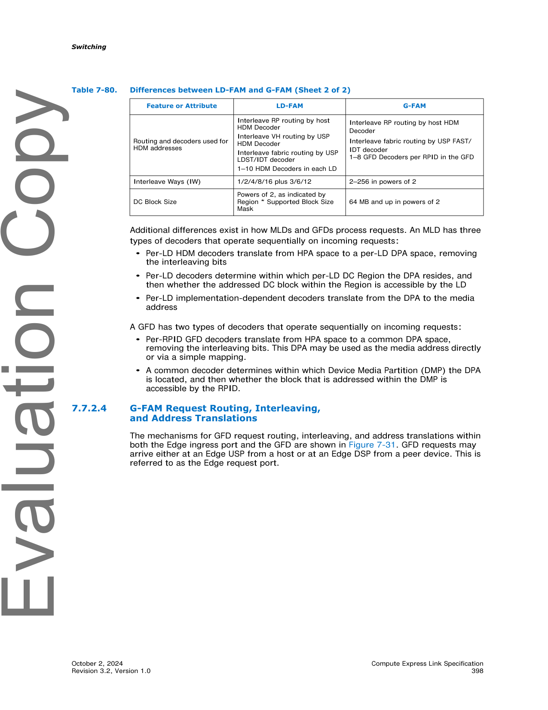
>
> *Original page render @ 150 DPI* — [📄 Full size](figures/chapter_07/page_0398.png)

[⬆️ 返回目录](#-本章目录-part-b)

---

### 7.7.2.4 G-FAM Request Routing, Interleaving, and Address Translations | G-FAM 请求路由、交织与地址转换

<table>
<thead>
<tr>
<th width="50%">🇬🇧 English</th>
<th width="50%" style="background-color:#e8e8e8">🇨🇳 中文</th>
</tr>
</thead>
<tbody>
<tr><td>Additional differences exist in how MLDs and GFDs process requests. An MLD has three types of decoders that operate sequentially on incoming requests:</td><td style="background-color:#e8e8e8">MLD 和 GFD 在处理请求的方式上还存在其他差异。MLD 具有三种类型的解码器，它们按顺序处理进入的请求：</td></tr>
<tr><td>• Per-LD HDM decoders translate from HPA space to a per-LD DPA space, removing the interleaving bits</td><td style="background-color:#e8e8e8">• Per-LD HDM 解码器从 HPA 空间转换到 per-LD DPA 空间，并去除交织位</td></tr>
<tr><td>• Per-LD decoders determine within which per-LD DC Region the DPA resides, and then whether the addressed DC block within the Region is accessible by the LD</td><td style="background-color:#e8e8e8">• Per-LD 解码器确定 DPA 位于哪个 per-LD DC Region 内，然后确定该 Region 中被寻址的 DC block 是否可由该 LD 访问</td></tr>
<tr><td>• Per-LD implementation-dependent decoders translate from the DPA to the media address</td><td style="background-color:#e8e8e8">• Per-LD 取决于实现的解码器将 DPA 转换为介质地址</td></tr>
<tr><td>A GFD has two types of decoders that operate sequentially on incoming requests:</td><td style="background-color:#e8e8e8">GFD 具有两种类型的解码器，它们按顺序处理进入的请求：</td></tr>
<tr><td>• Per-RPID GFD decoders translate from HPA space to a common DPA space, removing the interleaving bits. This DPA may be used as the media address directly or via a simple mapping.</td><td style="background-color:#e8e8e8">• Per-RPID GFD 解码器从 HPA 空间转换到公共 DPA 空间，并去除交织位。该 DPA 可直接用作介质地址或通过简单映射使用。</td></tr>
<tr><td>• A common decoder determines within which Device Media Partition (DMP) the DPA is located, and then whether the block that is addressed within the DMP is accessible by the RPID.</td><td style="background-color:#e8e8e8">• 公共解码器确定 DPA 位于哪个 Device Media Partition（DMP）内，然后确定该 DMP 中被寻址的 block 是否可由该 RPID 访问。</td></tr>
</tbody>
</table>

[⬆️ 返回目录](#-本章目录-part-b)

---

### 7.7.2.4 G-FAM Request Routing, Interleaving, and Address Translations | G-FAM 请求路由、交织与地址转换

<table>
<thead>
<tr>
<th width="50%">🇬🇧 English</th>
<th width="50%" style="background-color:#e8e8e8">🇨🇳 中文</th>
</tr>
</thead>
<tbody>
<tr><td>The mechanisms for GFD request routing, interleaving, and address translations within both the Edge ingress port and the GFD are shown in Figure 7-31. GFD requests may arrive either at an Edge USP from a host or at an Edge DSP from a peer device. This is referred to as the Edge request port.</td><td style="background-color:#e8e8e8">Edge 入口端口和 GFD 内的 GFD 请求路由、交织及地址转换机制如图 7-31 所示。GFD 请求可能从主机到达 Edge USP，或从对等设备到达 Edge DSP。这称为 Edge request port。</td></tr>
<tr><td>The Edge request port shall decode the request HPA to determine the DPID of the target GFD using the FAST1 and the Interleave DPID Table (IDT). The FAST contains one entry per segment. The FAST depth must be a power-of-two but is implementation dependent. The segment size is specified by the FSegSz[2:0] register as defined in Table 7-81. The FAST entry accessed is determined by bits X:Y of the request address, where Y = log2 of the segment size in bytes and X = Y + log2 of the FAST depth in entries. The maximum Fabric Address space and the HPA bits that are used to address the FAST are shown in Table 7-81 for all supported segment sizes for some example FAST depths. For a host with a 52-bit HPA, the maximum Fabric Address space is 4 PB minus one segment each above and below the Fabric Address space for local memory and for MMIO, as shown in Figure 7-29.</td><td style="background-color:#e8e8e8">Edge request port 应使用 FAST1 和 Interleave DPID Table（IDT）解码请求 HPA，以确定目标 GFD 的 DPID。FAST 包含每个段一个条目。FAST 深度必须是 2 的幂，但具体数值取决于实现。段大小由 FSegSz[2:0] 寄存器指定，其定义见表 7-81。所访问的 FAST 条目由请求地址的 X:Y 位决定，其中 Y = 段大小（以字节为单位）的 log2，X = Y + FAST 深度（以条目为单位）的 log2。Table 7-81 针对部分示例 FAST 深度，列出了所有支持的段大小下的最大 Fabric Address space 以及用于寻址 FAST 的 HPA 位。对于具有 52-bit HPA 的主机，最大 Fabric Address space 为 4 PB 减去 Fabric Address space 上方和下方各一个段（分别为本地内存和 MMIO 用），如图 7-29 所示。</td></tr>
<tr><td>Each FAST entry contains a valid bit (V), the number of interleaving ways (Intlv), the interleave granularity (Gran), and a DPID or IDT index (DPID/IX). The encodings for the Intlv and Gran fields are defined in Table 7-82 and Table 7-83, respectively. If the HPA is between FabricBase and FabricLimit inclusive and the FAST entry valid bit is set, then there is a FAST hit, and the FAST is used to determine the DPID. Otherwise, the target device is determined by other architected decoders.</td><td style="background-color:#e8e8e8">每个 FAST 条目包含一个有效位（V）、交织路数（Intlv）、交织粒度（Gran）以及一个 DPID 或 IDT 索引（DPID/IX）。Intlv 和 Gran 字段的编码分别在 Table 7-82 和 Table 7-83 中定义。如果 HPA 介于 FabricBase 和 FabricLimit（含）之间并且 FAST 条目的有效位已设置，则表示 FAST 命中，使用 FAST 来确定 DPID。否则，目标设备由其他架构解码器确定。</td></tr>
</tbody>
</table>

1 本节涵盖 FAST 解码器与 G-FAM 的配合使用。LD-FAM Segment Table（LDST）解码器与 LD-FAM 配合使用时具有相同的功能，仅有少量例外。Table 7-81、Table 7-82 和 Table 7-83 同时适用于 LD-FAM 和 G-FAM。

> **Figure 7-31.** G-FAM Request Routing, Interleaving, and Address Translations ｜ G-FAM 请求路由、交织与地址转换
>
> 
>
> *Original page render @ 150 DPI* — [📄 Full size](figures/chapter_07/page_0399.png)

> **Table 7-81.** Fabric Segment Size Table ｜ Fabric 段大小表
>
> 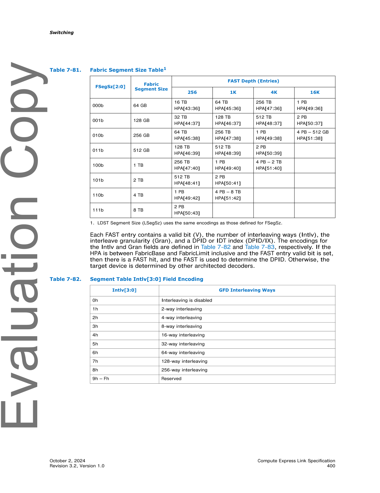
>
> *Original page render @ 150 DPI* — [📄 Full size](figures/chapter_07/page_0400.png)

> **Table 7-82.** Segment Table Intlv[3:0] Field Encoding ｜ Segment Table Intlv[3:0] 字段编码
>
> 
>
> *Original page render @ 150 DPI* — [📄 Full size](figures/chapter_07/page_0400.png)

<table>
<thead>
<tr>
<th width="50%">🇬🇧 English</th>
<th width="50%" style="background-color:#e8e8e8">🇨🇳 中文</th>
</tr>
</thead>
<tbody>
<tr><td>Note that FabricBase and FabricLimit may be used to restrict the amount of the FAST used. For example, for a host with a 52-bit HPA space, if the FAST is accessed using HPA[51:40] without restriction, then it would consume the entire HPA space. In this case, FabricBase and FabricLimit must be set to restrict the Fabric Address space to the desired range of HPA space. This has the effect of reducing the number of entries in the FAST that are being used.</td><td style="background-color:#e8e8e8">请注意，FabricBase 和 FabricLimit 可用于限制所使用的 FAST 数量。例如，对于具有 52-bit HPA 空间的主机，如果不加限制地使用 HPA[51:40] 访问 FAST，则将消耗整个 HPA 空间。在这种情况下，必须设置 FabricBase 和 FabricLimit 以将 Fabric Address space 限制在所需的 HPA 空间范围内。这会减少正在使用的 FAST 条目数。</td></tr>
<tr><td>FabricBase and FabricLimit may also be used to allow the FAST to start at an HPA that is not a multiple of the FAST depth. For example, for a host with a 52-bit HPA space, if 2 PB of Fabric Address space is needed to start at an HPA of 1 PB, then a 4K entry FAST with 512 GB segments can be accessed using HPA[50:39] with FabricBase set to 1 PB and FabricLimit set to 3 PB. HPAs 1 PB to 2 PB-1 will then correspond to FAST entries 2048 to 4095, while HPAs 2 PB to 3 PB-1 will wrap around and correspond to FAST entries 0 to 2047. When programming FabricBase, FabricLimit, and segment size, care must be taken to ensure that a wraparound does not occur that would result in aliasing multiple HPAs to the same segment.</td><td style="background-color:#e8e8e8">FabricBase 和 FabricLimit 还可用于允许 FAST 从不是 FAST 深度整数倍的 HPA 处开始。例如，对于具有 52-bit HPA 空间的主机，如果需要从 1 PB 处的 HPA 开始使用 2 PB 的 Fabric Address space，则可以使用 HPA[50:39] 来访问具有 512 GB 段的 4K 条目 FAST，其中 FabricBase 设置为 1 PB，FabricLimit 设置为 3 PB。HPA 1 PB 到 2 PB-1 将对应于 FAST 条目 2048 到 4095，而 HPA 2 PB 到 3 PB-1 将环绕并对应于 FAST 条目 0 到 2047。编程 FabricBase、FabricLimit 和段大小时，必须小心以确保不会发生将多个 HPA 别名到同一段的环绕。</td></tr>
<tr><td>On a FAST hit, if the FAST Intlv field is 0h, then GFD interleaving is not being used for this segment and the DPID/IX field contains the GFD's DPID. If the Intlv field is nonzero, then the Interleave Way is selected from the HPA using the Gran and Intlv fields, and then added to the DPID/IX field to generate an index into the IDT. The IDT defines the set of DPIDs for each Interleave Set that is accessible by the Edge request port. For an N-way Interleave Set, the set of DPIDs is determined by N contiguous entries in the IDT, with the first entry pointed to by DPID/IX which may be anywhere in the IDT. The IDT depth is implementation dependent.</td><td style="background-color:#e8e8e8">FAST 命中时，如果 FAST Intlv 字段为 0h，则此段不使用 GFD 交织，并且 DPID/IX 字段包含 GFD 的 DPID。如果 Intlv 字段非零，则使用 Gran 和 Intlv 字段从 HPA 中选择 Interleave Way，然后将其添加到 DPID/IX 字段以生成 IDT 的索引。IDT 定义了 Edge request port 可访问的每个 Interleave Set 的 DPID 集合。对于 N-way Interleave Set，DPID 集合由 IDT 中的 N 个连续条目确定，第一个条目由 DPID/IX 指向，该 DPID/IX 可以位于 IDT 中的任何位置。IDT 深度取决于实现。</td></tr>
<tr><td>After the GFD's DPID is determined, a request that contains the SPID of the Edge request port and the unmodified HPA is sent to the target GFD. The GFD shall then use the SPID to access the GFD Decoder Table (GDT) to select the decoders that are associated with the requester. Note that a host and its associated CXL devices will each have a unique RPID, and therefore each will use a different entry in the GDT. The GDT provides up to 8 decoders per RPID. Each decoder within a GFD Decoder Table entry contains structures defined in Section 8.2.10.9.10.19.</td><td style="background-color:#e8e8e8">在确定 GFD 的 DPID 后，包含 Edge request port 的 SPID 和未修改的 HPA 的请求被发送到目标 GFD。然后 GFD 应使用 SPID 访问 GFD Decoder Table（GDT），以选择与请求者关联的解码器。请注意，主机及其关联的 CXL 设备将各自具有唯一的 RPID，因此每个都将使用 GDT 中的不同条目。GDT 为每个 RPID 提供最多 8 个解码器。GFD Decoder Table 条目中的每个解码器包含第 8.2.10.9.10.19 节中定义的结构。</td></tr>
<tr><td>The GFD shall then compare, in parallel, the request HPA against all decoders to determine whether the request hits any decoder's HPA range. To accomplish this, for each decoder, a DPA offset is calculated by first subtracting HPABase from HPA and then removing the interleaving bits. The LSB of the interleaving bits to remove is determined by the interleave granularity and the number of bits to remove is determined by the interleave ways. If offset ≥ 0, offset < DPALen, and the Valid bit is set, then the request hits within that decoder. If only one decoder hits, then the DPA is calculated by adding DPABase to the offset. If zero or multiple decoders hit, then an access error is returned.</td><td style="background-color:#e8e8e8">然后 GFD 应并行地将请求 HPA 与所有解码器进行比较，以确定请求是否命中任何解码器的 HPA 范围。为此，对于每个解码器，首先从 HPA 中减去 HPABase，然后去除交织位来计算 DPA 偏移。要去除的交织位的 LSB 由交织粒度决定，要去除的位数由交织路数决定。如果 offset ≥ 0、offset < DPALen，并且有效位已设置，则请求命中该解码器内。如果只有一个解码器命中，则通过将 DPABase 加到偏移上来计算 DPA。如果零个或多个解码器命中，则返回访问错误。</td></tr>
</tbody>
</table>

> **Table 7-83.** Segment Table Gran[3:0] Field Encoding ｜ Segment Table Gran[3:0] 字段编码
>
> 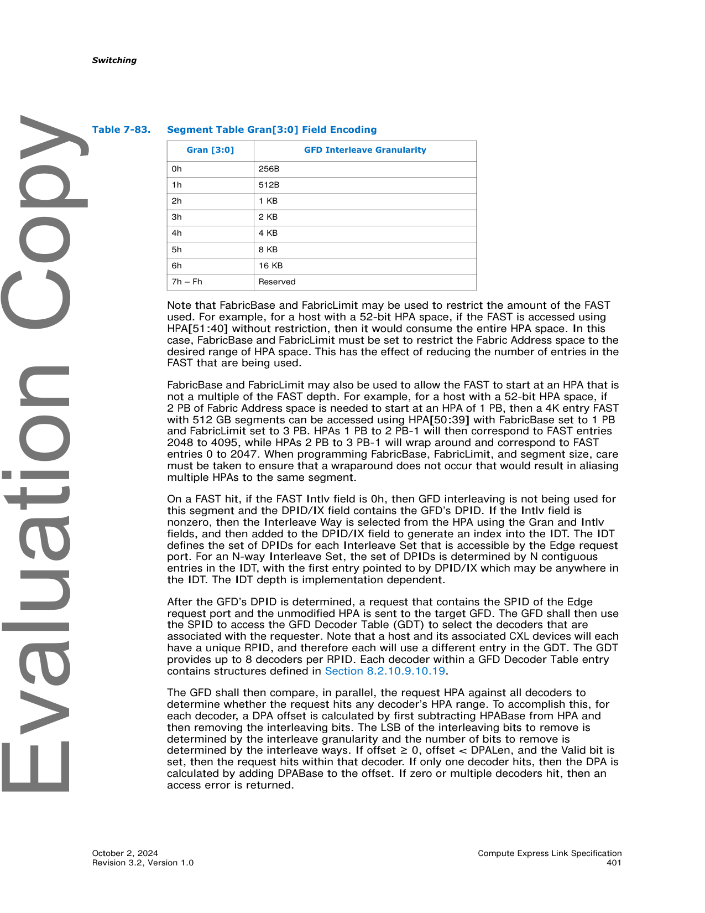
>
> *Original page render @ 150 DPI* — [📄 Full size](figures/chapter_07/page_0401.png)

<table>
<thead>
<tr>
<th width="50%">🇬🇧 English</th>
<th width="50%" style="background-color:#e8e8e8">🇨🇳 中文</th>
</tr>
</thead>
<tbody>
<tr><td>After the request HPA is translated to DPA, the RPID and the DPA are used to perform the Dynamic Capacity access check, as described in Section 7.7.2.5, and to access the GFD snoop filter. The design of the snoop filter is beyond the scope of this specification.</td><td style="background-color:#e8e8e8">将请求 HPA 转换为 DPA 后，使用 RPID 和 DPA 执行 Dynamic Capacity 访问检查（详见第 7.7.2.5 节），并访问 GFD snoop filter。snoop filter 的设计不在本规范的范围内。</td></tr>
<tr><td>When the snoop filter needs to issue a back-invalidate to a host/peer, the DPA is translated to an HPA by performing the HPA-to-DPA steps in reverse. The RPID is used to access the GDT to select the decoders for the requester, which may be the host itself or one of its devices that performs Direct P2P. The GFD shall then compare, in parallel, the DPA against all selected decoders to determine whether the back-invalidate hits any decoder's DPA range.</td><td style="background-color:#e8e8e8">当 snoop filter 需要向主机/对等设备发出 back-invalidate 时，通过反向执行 HPA 到 DPA 的步骤将 DPA 转换为 HPA。使用 RPID 访问 GDT 以选择请求者的解码器，请求者可能是主机本身，也可能是执行 Direct P2P 的主机设备之一。然后 GFD 应并行地将 DPA 与所有选定的解码器进行比较，以确定 back-invalidate 是否命中任何解码器的 DPA 范围。</td></tr>
<tr><td>This is accomplished by first calculating DPA offset = DPA – DPABase, and then testing whether offset ≥ 0, offset < DPALen, and the decoder is valid. If only one decoder hits, then the HPA is calculated by inserting the interleaving bits into the offset and then adding it to HPABase. When inserting the interleaving bits, the LSB is determined by interleave granularity, the number of bits is determined by the interleaving ways, and the value of the bits is determined by the way within the interleave set. If zero or multiple decoders hit, then an internal snoop filter error has occurred which will be handled as defined in a future specification update.</td><td style="background-color:#e8e8e8">这通过首先计算 DPA 偏移 = DPA – DPABase，然后测试 offset ≥ 0、offset < DPALen 以及解码器是否有效来完成。如果只有一个解码器命中，则通过将交织位插入偏移中，然后将其添加到 HPABase 来计算 HPA。插入交织位时，LSB 由交织粒度决定，位数由交织路数决定，位值由 Interleave Set 中的 way 决定。如果零个或多个解码器命中，则发生了内部 snoop filter 错误，将按未来规范更新中的定义处理。</td></tr>
<tr><td>After the HPA is calculated, a BISnp with the GFD's SPID and HPA is issued to the Edge Port containing the FAST decoder of the host/peer that owns this HDM-DB Region, using the PID stored in the snoop filter as the DPID. The FAST decoder then optionally checks whether the HPA is located within the FAST decoder's Fabric Address space. The DPID and SPID are then removed, and the BISnp is then issued to the host/peer in HBR format.</td><td style="background-color:#e8e8e8">计算 HPA 后，使用存储在 snoop filter 中的 PID 作为 DPID，将带有 GFD 的 SPID 和 HPA 的 BISnp 发出到拥有此 HDM-DB Region 的主机/对等设备的 FAST 解码器所在的 Edge Port。然后 FAST 解码器可选地检查 HPA 是否位于 FAST 解码器的 Fabric Address space 内。然后移除 DPID 和 SPID，并以 HBR 格式向主机/对等设备发出 BISnp。</td></tr>
</tbody>
</table>

[⬆️ 返回目录](#-本章目录-part-b)

---

### 7.7.2.5 G-FAM Access Protection | G-FAM 访问保护

<table>
<thead>
<tr>
<th width="50%">🇬🇧 English</th>
<th width="50%" style="background-color:#e8e8e8">🇨🇳 中文</th>
</tr>
</thead>
<tbody>
<tr><td>G-FAM access protection is available at three levels of the hierarchy (see Figure 7-32):</td><td style="background-color:#e8e8e8">G-FAM 访问保护在层次结构的三个层级（参见图 7-32）提供：</td></tr>
<tr><td>• The first level of protection is through the host's (or peer device's) page tables. This fine-grained protection is used to restrict the Fabric Address space that is accessible by each process to a subset of that which is accessible by the host/peer.</td><td style="background-color:#e8e8e8">• 第一层保护通过主机（或对等设备）的页表实现。这种细粒度保护用于将每个进程可访问的 Fabric Address space 限制为主机/对等设备可访问范围的一个子集。</td></tr>
<tr><td>• The second level of protection is described in the GAE in the form of the Global Memory Mapping Vector (GMV), described in Section 7.7.2.6.</td><td style="background-color:#e8e8e8">• 第二层保护在 GAE 中以 Global Memory Mapping Vector（GMV，全局内存映射向量）形式描述，见第 7.7.2.6 节。</td></tr>
<tr><td>• The third level of protection is at the target GFD itself and is fine grained. This section describes this third level of GFD protection.</td><td style="background-color:#e8e8e8">• 第三层保护在目标 GFD 自身实现，并且是细粒度的。本节描述 GFD 保护的第三层。</td></tr>
</tbody>
</table>

> **IMPLEMENTATION NOTE:** It is recommended that a PBR switch size structures to support the typical to full scale of a PBR fabric. It is recommended that the FAST have 4K to 16K entries. It is recommended that the IDT have 4K to 16K entries to support a sufficient number of interleave groups and interleave ways to cover all GFDs in a system.

> **Figure 7-32.** Memory Access Protection Levels ｜ 内存访问保护层级
>
> 
>
> *Original page render @ 150 DPI* — [📄 Full size](figures/chapter_07/page_0403.png)

<table>
<thead>
<tr>
<th width="50%">🇬🇧 English</th>
<th width="50%" style="background-color:#e8e8e8">🇨🇳 中文</th>
</tr>
</thead>
<tbody>
<tr><td>The GFD's DPA space is divided into one or more Device Media Partitions (DMPs). Each DMP is defined by a base address within DPA space (DMPBase), a length (DMPLength), and a block size (DMPBlockSize). DMPBase and DMPLength must be a multiple of 256 MB, while DMPBlockSize must be a power-of-two size in bytes. The DMPBlockSize values that are supported by a device are device dependent and are defined in the GFD Supported Block Size Mask register. Each GFD decoder targets the DPA range of a DC Region within a single DMP (i.e., must not straddle DMP boundaries). The DC Region's block size is determined by the associated DMP's block size. The number of DMPs is device-implementation dependent. Unique DMPs are typically used for different media types (e.g., DRAM, NVM, etc.) and to provide sufficient DC block sizes to meet customer needs.</td><td style="background-color:#e8e8e8">GFD 的 DPA 空间被划分为一个或多个 Device Media Partition（DMP）。每个 DMP 由 DPA 空间内的基地址（DMPBase）、长度（DMPLength）和块大小（DMPBlockSize）定义。DMPBase 和 DMPLength 必须是 256 MB 的整数倍，而 DMPBlockSize 必须是 2 的幂次（以字节为单位）。设备支持的 DMPBlockSize 值取决于设备本身，并在 GFD Supported Block Size Mask 寄存器中定义。每个 GFD 解码器面向单个 DMP 内的 DC Region 的 DPA 范围（即不得跨越 DMP 边界）。DC Region 的块大小由关联 DMP 的块大小决定。DMP 的数量取决于设备实现。不同的 DMP 通常用于不同的介质类型（如 DRAM、NVM 等），并提供足够的 DC 块大小以满足客户需求。</td></tr>
<tr><td>The GFD Dynamic Capacity protection mechanism is shown in Figure 7-33. To support scaling to 4096 CXL requesters, the GFD DC protection mechanism uses a concept called Memory Groups. A Memory Group is a set of DMP blocks that can be accessed by the same set of requesters. The maximum number of Memory Groups (NG) that are supported by a GFD is implementation dependent. Each DMP block is assigned a Memory Group ID (GrpID), using a set of Memory Group Tables (MGTs). There is one MGT per DMP. Each MGT has one entry per DMP block within the DMP, with entry 0 in the MGT corresponding to Block 0 within the DMP. The depth of each MGT is implementation dependent. DPA is decoded to determine within which DMP a request falls, and then that DMP's MGT is used to determine the GrpID. The GrpID width is X = ceiling (log2 (NG) ) bits. For example, a device with 33 to 64 groups would require 6-bit GrpIDs.</td><td style="background-color:#e8e8e8">GFD Dynamic Capacity 保护机制如图 7-33 所示。为了支持扩展到 4096 个 CXL 请求者，GFD DC 保护机制使用了一个称为 Memory Group（内存组）的概念。Memory Group 是一组可由相同请求者集合访问的 DMP block。GFD 支持的最大 Memory Group 数（NG）取决于实现。每个 DMP block 使用一组 Memory Group Table（MGT）分配一个 Memory Group ID（GrpID）。每个 DMP 有一个 MGT。每个 MGT 在该 DMP 内每个 DMP block 对应一个条目，MGT 中的条目 0 对应于 DMP 中的 Block 0。每个 MGT 的深度取决于实现。DPA 被解码以确定请求落在哪个 DMP 内，然后使用该 DMP 的 MGT 来确定 GrpID。GrpID 宽度为 X = ceiling(log2(NG)) 位。例如，具有 33 到 64 组的设备将需要 6-bit GrpID。</td></tr>
<tr><td>In parallel with determining the GrpID for a request, the Request SPID is used to index the SPID Access Table (SAT) to produce a vector that identifies which Memory Groups the SPID is allowed to access (GrpAccVec). After the GrpID for a request is determined, the GrpID is used to select a GrpAccVec bit to determine whether access is allowed.</td><td style="background-color:#e8e8e8">在并行确定请求的 GrpID 时，Request SPID 用于索引 SPID Access Table（SAT），以生成一个向量，该向量标识允许该 SPID 访问的 Memory Group（GrpAccVec）。确定请求的 GrpID 后，使用 GrpID 来选择 GrpAccVec 的一位，以确定是否允许访问。</td></tr>
</tbody>
</table>

> **Figure 7-33.** GFD Dynamic Capacity Access Protections ｜ GFD 动态容量访问保护
>
> 
>
> *Original page render @ 150 DPI* — [📄 Full size](figures/chapter_07/page_0404.png)

[⬆️ 返回目录](#-本章目录-part-b)

---

### 7.7.2.6 Global Memory Access Endpoint | 全局内存访问端点

<table>
<thead>
<tr>
<th width="50%">🇬🇧 English</th>
<th width="50%" style="background-color:#e8e8e8">🇨🇳 中文</th>
</tr>
</thead>
<tbody>
<tr><td>Access to G-FAM/GIM resources and configuration of the FAST through a PBR fabric edge switch is facilitated by a Global Memory Access Endpoint (GAE) which is a Mailbox CCI that includes support for the Global Memory Access Endpoint Command set and the opcodes required to configure and enable FAST use, including Get PID Access Vectors and Configure FAST. The GAE is presented to the host as a PCIe Endpoint with a Type 0 configuration space as defined in Section 7.2.9.</td><td style="background-color:#e8e8e8">通过 PBR Fabric Edge 交换机对 G-FAM/GIM 资源的访问以及对 FAST 的配置由 Global Memory Access Endpoint（GAE）提供。GAE 是一个 Mailbox CCI，支持 Global Memory Access Endpoint 命令集以及配置和启用 FAST 所需的 opcode，包括 Get PID Access Vectors 和 Configure FAST。GAE 作为具有 Type 0 配置空间的 PCIe Endpoint 呈现给主机（定义见第 7.2.9 节）。</td></tr>
</tbody>
</table>

> **IMPLEMENTATION NOTE:** To support allocation of GFD capacity to hosts in sufficiently small percentages of the GFD, it is recommended that devices implement a minimum of 1K entries per MGT. Implementations may choose to use a separate RAM per MGT, or may use a single partitioned RAM for all MGTs. To support a sufficient number of memory ranges with different host access lists, it is recommended that devices implement a minimum of 64 Memory Groups.

<table>
<thead>
<tr>
<th width="50%">🇬🇧 English</th>
<th width="50%" style="background-color:#e8e8e8">🇨🇳 中文</th>
</tr>
</thead>
<tbody>
<tr><td>There are two configurations under which a host edge port USP will expose a GAE. The first configuration, illustrated in Figure 7-34, provides LD-FAM and G-FAM/GIM resources to a host. In this configuration, the GAE Mailbox CCI is used to configure G-FAM/GIM access for the USP and any DSPs connected to EPs. It may also include support for opcodes necessary to manage the CXL switch capability providing LD-FAM resources.</td><td style="background-color:#e8e8e8">主机 Edge Port USP 暴露 GAE 时有两种配置。第一种配置（如图 7-34 所示）为主机提供 LD-FAM 和 G-FAM/GIM 资源。在此配置中，GAE Mailbox CCI 用于为 USP 以及连接到 EP 的任何 DSP 配置 G-FAM/GIM 访问。它还可以包括管理提供 LD-FAM 资源的 CXL 交换机能力所需的 opcode 支持。</td></tr>
<tr><td>The second configuration, illustrated in Figure 7-35, only provides access to G-FAM/GIM resources. In this configuration, there is no CXL switch instantiated in the VCS and the GAE is the only PCIe function presented to the host.</td><td style="background-color:#e8e8e8">第二种配置（如图 7-35 所示）仅提供对 G-FAM/GIM 资源的访问。在此配置中，VCS 中未实例化 CXL 交换机，GAE 是呈现给主机的唯一 PCIe function。</td></tr>
<tr><td>A GAE is also required in the vUSP of a Downstream ES VCS. This GAE is used for configuring that VCS, including configuring the FAST and LDST in the Edge DSPs and providing CDAT information, as described in Section 7.7.12.4.</td><td style="background-color:#e8e8e8">Downstream ES VCS 的 vUSP 中也需要一个 GAE。该 GAE 用于配置该 VCS，包括配置 Edge DSP 中的 FAST 和 LDST，并提供 CDAT 信息（详见第 7.7.12.4 节）。</td></tr>
<tr><td>Each GAE maintains two access vectors, which are used to control whether the host has access to a particular PID:</td><td style="background-color:#e8e8e8">每个 GAE 维护两个访问向量，用于控制主机是否有权访问特定 PID：</td></tr>
<tr><td>• Global Memory Mapping Vector (GMV): 4k bitmask indicating which PIDs have been enabled for G-FAM or GIM access</td><td style="background-color:#e8e8e8">• Global Memory Mapping Vector（GMV）：4k 位掩码，指示哪些 PID 已启用 G-FAM 或 GIM 访问</td></tr>
<tr><td>• VendPrefixL0 Target Vector (VTV): 4k bitmask indicating which PIDs have been enabled for VendPrefixL0</td><td style="background-color:#e8e8e8">• VendPrefixL0 Target Vector（VTV）：4k 位掩码，指示哪些 PID 已启用 VendPrefixL0</td></tr>
</tbody>
</table>

> **Figure 7-34.** PBR Fabric Providing LD-FAM and G-FAM Resources ｜ 提供 LD-FAM 和 G-FAM 资源的 PBR Fabric
>
> 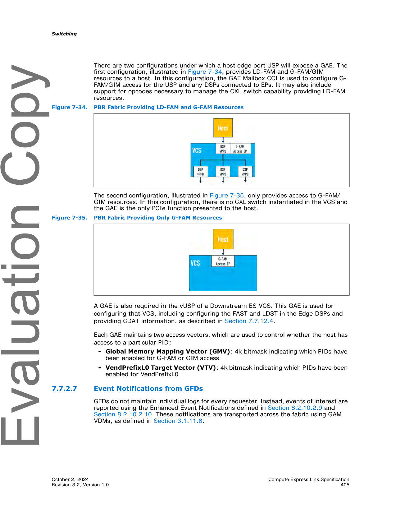
>
> *Original page render @ 150 DPI* — [📄 Full size](figures/chapter_07/page_0405.png)

> **Figure 7-35.** PBR Fabric Providing Only G-FAM Resources ｜ 仅提供 G-FAM 资源的 PBR Fabric
>
> 
>
> *Original page render @ 150 DPI* — [📄 Full size](figures/chapter_07/page_0405.png)

[⬆️ 返回目录](#-本章目录-part-b)

---

### 7.7.2.7 Event Notifications from GFDs | GFD 事件通知

<table>
<thead>
<tr>
<th width="50%">🇬🇧 English</th>
<th width="50%" style="background-color:#e8e8e8">🇨🇳 中文</th>
</tr>
</thead>
<tbody>
<tr><td>GFDs do not maintain individual logs for every requester. Instead, events of interest are reported using the Enhanced Event Notifications defined in Section 8.2.10.2.9 and Section 8.2.10.2.10. These notifications are transported across the fabric using GAM VDMs, as defined in Section 3.1.11.6.</td><td style="background-color:#e8e8e8">GFD 不为每个请求者维护单独的日志。相反，相关事件使用第 8.2.10.2.9 节和第 8.2.10.2.10 节中定义的 Enhanced Event Notification 进行报告。这些通知通过第 3.1.11.6 节中定义的 GAM VDM 在 Fabric 中传输。</td></tr>
<tr><td>For event notifications sent to a host, the GAM VDM's DPID is the PID of the host's GAE. When received by the GAE, the GAM VDM's 32B payload is written into the host's GAM Buffer. All GAM VDMs that are received by the GAE are logged into the same GAM Buffer, regardless of their SPID.</td><td style="background-color:#e8e8e8">对于发送给主机的事件通知，GAM VDM 的 DPID 是主机 GAE 的 PID。GAE 收到后，GAM VDM 的 32B 有效负载被写入主机的 GAM Buffer。GAE 接收到的所有 GAM VDM 都会记录到同一个 GAM Buffer 中，无论其 SPID 为何。</td></tr>
<tr><td>The GAM Buffer is a circular buffer in host memory that is configured for 32B entries. Its location in host memory is configured with the Set GAM Buffer request. The GAE writes received GAM VDM payloads into the buffer offset that is specified by the head index reported by the Get GAM Buffer request (see Section 8.2.10.2.11). As the host reads entries, the host increments the tail index using the Set GAM Buffer request (see Section 8.2.10.2.12). Head and tail indexes wrap to the beginning of the buffer when they increment beyond the buffer size.</td><td style="background-color:#e8e8e8">GAM Buffer 是主机内存中的一个循环缓冲区，配置为 32B 条目。它在主机内存中的位置通过 Set GAM Buffer 请求进行配置。GAE 将接收到的 GAM VDM 有效负载写入 Get GAM Buffer 请求报告的 head index 所指定的缓冲区偏移处（见第 8.2.10.2.11 节）。当主机读取条目时，主机使用 Set GAM Buffer 请求递增 tail index（见第 8.2.10.2.12 节）。当 head index 和 tail index 递增超过缓冲区大小时，它们会回绕到缓冲区的开头。</td></tr>
<tr><td>The buffer is empty when the head index and tail index are equal. The buffer is full when the head index is immediately before the tail index. Old entries are not overwritten by the GAE until the host removes them from the buffer by incrementing the tail index. The GAE will report a buffer overflow condition if a GAM VDM is received when the buffer is full.</td><td style="background-color:#e8e8e8">当 head index 与 tail index 相等时，缓冲区为空。当 head index 紧邻在 tail index 之前时，缓冲区已满。在主机通过递增 tail index 从缓冲区中移除旧条目之前，GAE 不会覆盖旧条目。如果在缓冲区已满时收到 GAM VDM，则 GAE 将报告缓冲区溢出情况。</td></tr>
<tr><td>GAM VDMs are not forwarded to peer devices and are instead silently dropped by the peer's edge switch.</td><td style="background-color:#e8e8e8">GAM VDM 不会转发到对等设备，而是由对等方的 Edge 交换机静默丢弃。</td></tr>
</tbody>
</table>

[⬆️ 返回目录](#-本章目录-part-b)

---

### 7.6.8.3 MLD Port Event Records | MLD 端口事件记录

<table>
<thead>
<tr>
<th width="50%">🇬🇧 English</th>
<th width="50%" style="background-color:#e8e8e8">🇨🇳 中文</th>
</tr>
</thead>
<tbody>
<tr><td>MLD Port Event Records define events that are related to switch ports connected to MLDs, as defined in Table 7-79.</td><td style="background-color:#e8e8e8">MLD 端口事件记录定义与连接到 MLD 的交换机端口相关的事件，其格式定义见表 7-79。</td></tr>
</tbody>
</table>

[⬆️ 返回目录](#-本章目录-part-b)

---

## 7.7 CXL Fabric Architecture | CXL Fabric 架构

<table>
<thead>
<tr>
<th width="50%">🇬🇧 English</th>
<th width="50%" style="background-color:#e8e8e8">🇨🇳 中文</th>
</tr>
</thead>
<tbody>
<tr><td>The CXL fabric architecture adds new features to scale from a node to a rack-level interconnect to service the growing computational needs in many fields. Machine learning/AI, drug discovery, agricultural and life sciences, materials science, and climate modeling are some of the fields with significant computational demand. The computation density required to meet the demand is driving innovation in many areas, including near and in-memory computing. CXL Fabric features provide a robust path to build flexible, composable systems at rack scale that are able to capitalize on simple load/store memory semantics or Unordered I/O (UIO).</td><td style="background-color:#e8e8e8">CXL Fabric 架构增加了新特性，以从单节点扩展到机架级互连，从而服务于众多领域日益增长的计算需求。机器学习/AI、药物发现、农业与生命科学、材料科学以及气候建模等都是具有巨大计算需求的部分领域。满足这些需求所需的计算密度正推动着众多领域的创新，其中包括近数据计算和存内计算。CXL Fabric 特性提供了一条稳健的路径来构建机架级灵活可组合系统，能够充分利用简单的 load/store 内存语义或无序 I/O（Unordered I/O，UIO）。</td></tr>
<tr><td>CXL fabric extensions allow for topologies of interconnected fabric switches using 12-bit PIDs (SPIDs/DPIDs) to uniquely identify up to 4096 Edge Ports. The following are the main areas of change to extend CXL as an interconnect fabric for server composability and scale-out systems:</td><td style="background-color:#e8e8e8">CXL Fabric 扩展通过使用 12-bit PID（SPID/DPID）来唯一标识多达 4096 个 Edge Port，从而支持 Fabric 交换机互连的拓扑结构。以下是将 CXL 扩展为服务器可组合性和横向扩展系统互连 Fabric 的主要变更领域：</td></tr>
<tr><td>• Expand the size of CXL fabric using Port Based Routing and 12-bit PIDs.</td><td style="background-color:#e8e8e8">• 使用 Port Based Routing（PBR）和 12-bit PID 扩展 CXL Fabric 的规模。</td></tr>
<tr><td>• Enable support for G-FAM devices (GFDs). A GFD is a highly scalable memory resource that is accessible by all hosts and all peer devices.</td><td style="background-color:#e8e8e8">• 启用对 G-FAM 设备（GFD）的支持。GFD 是一种高度可扩展的内存资源，可被所有主机和所有对等设备访问。</td></tr>
<tr><td>• Host and device peer communication may be enabled using UIO.</td><td style="background-color:#e8e8e8">• 主机与设备对等通信可通过 UIO 启用。</td></tr>
</tbody>
</table>

> **Figure 7-25.** High-level CXL Fabric Diagram ｜ CXL Fabric 高层示意图
>
> 
>
> *Original page render @ 150 DPI* — [📄 Full size](figures/chapter_07/page_0392.png)

<table>
<thead>
<tr>
<th width="50%">🇬🇧 English</th>
<th width="50%" style="background-color:#e8e8e8">🇨🇳 中文</th>
</tr>
</thead>
<tbody>
<tr><td>Figure 7-25 is a high-level illustration of a routable CXL Fabric. The fabric consists of one or more interconnected fabric switches. In this figure, there are "n" Switch Edge Ports (SEPi) on the Fabric where each Edge Port can connect to a CXL host root port or a CXL/PCIe device (Dev). As shown, a Fabric Manager (FM) connects to the CXL Fabric and may connect to selected endpoints over an out-of-band management network. The management network may be a simple 2-wire interface, such as SMBus, I2C, I3C, or a complex fabric such as Ethernet. The FM is responsible for the initialization and setup of the CXL Fabric and the assignment of devices to different Virtual Hierarchies. Extensions to FM API (see Section 7.6) to handle cross-domain traffic will be taken up as a future ECN.</td><td style="background-color:#e8e8e8">图 7-25 是可路由 CXL Fabric 的高层示意图。Fabric 由一个或多个互连的 Fabric 交换机组成。在该图中，Fabric 上有 "n" 个 Switch Edge Port（SEPi），每个 Edge Port 可连接到 CXL 主机根端口或 CXL/PCIe 设备（Dev）。如图所示，Fabric Manager（FM）连接到 CXL Fabric，并可通过带外管理网络连接到所选端点。管理网络可以是简单的 2 线接口（如 SMBus、I2C、I3C），也可以是像 Ethernet 这样复杂的 Fabric。FM 负责 CXL Fabric 的初始化与配置，以及将设备分配到不同的 Virtual Hierarchy 中。处理跨域流量的 FM API 扩展（参见第 7.6 节）将留待未来的 ECN 中处理。</td></tr>
<tr><td>Initially, the FM binds a set of devices to the host's Virtual Hierarchies, essentially composing a system. After the system has booted, the FM may add or remove devices from the system using fabric bind and unbind operations. These system changes are presented to the hosts by the fabric switches as managed Hot-Add and Hot-Remove events as described in Section 9.9. This allows for dynamic reconfiguration of systems that are composed of hosts and devices.</td><td style="background-color:#e8e8e8">最初，FM 将一组设备绑定到主机的 Virtual Hierarchy，实质上是在组合一个系统。系统启动后，FM 可以使用 Fabric bind 和 unbind 操作向系统添加或移除设备。这些系统变更由 Fabric 交换机以受管热添加（Hot-Add）和热移除（Hot-Remove）事件的形式呈现给主机（详见第 9.9 节）。这允许对由主机和设备组成的系统进行动态重新配置。</td></tr>
<tr><td>Root ports on the CXL Fabric may be part of the same or different domains. If the root ports are in different domains, hardware coherency across those root ports is not a requirement. However, devices that support sharing (including MLDs, Multi-Headed devices, and GFDs) may support hardware-managed cache coherency across root ports in multiple domains.</td><td style="background-color:#e8e8e8">CXL Fabric 上的根端口可以属于相同或不同的域。如果根端口位于不同域中，则不要求跨这些根端口的硬件一致性。但是，支持共享的设备（包括 MLD、多头设备和 GFD）可支持跨多个域中根端口的硬件管理缓存一致性。</td></tr>
</tbody>
</table>

[⬆️ 返回目录](#-本章目录-part-b)

---

## 7.7.1 CXL Fabric Use Case Examples | CXL Fabric 用例示例

<table>
<thead>
<tr>
<th width="50%">🇬🇧 English</th>
<th width="50%" style="background-color:#e8e8e8">🇨🇳 中文</th>
</tr>
</thead>
<tbody>
<tr><td>Following are a few examples of systems that may benefit from using CXL-switched Fabric for low-latency communication.</td><td style="background-color:#e8e8e8">以下是几个可能受益于使用 CXL 交换 Fabric 来实现低延迟通信的系统示例。</td></tr>
</tbody>
</table>

[⬆️ 返回目录](#-本章目录-part-b)

---

### 7.7.1.1 Machine-learning Accelerators | 机器学习加速器

<table>
<thead>
<tr>
<th width="50%">🇬🇧 English</th>
<th width="50%" style="background-color:#e8e8e8">🇨🇳 中文</th>
</tr>
</thead>
<tbody>
<tr><td>Accelerators used for machine-learning applications may use a dedicated CXL-switched Fabric for direct communication between devices in different domains. The same Fabric may also be used for sharing GFDs among accelerators. Each host and accelerator of same color shown in Figure 7-26 (basically, those that are directly above and below one another) belongs to a single domain. Accelerator devices can use UIO transactions to access memory on other accelerator and GFDs. In such a system, each accelerator is attached to a host and expected to be hardware-cache coherent with the host when using a CXL link. Communication between accelerators across domains is via the I/O coherency model. Device caching of data from another device memory (HDM or PDM) requires software-managed coherency with appropriate cache flushes and barriers. A Switch Edge ingress port is expected to implement a common set of address decoders that is to be used for Upstream Ports and Downstream Ports. Implementations may enable a dedicated CXL Fabric for accelerators using features available in this revision. However, it is not fully defined by the specification. Peer communication is defined in Section 7.7.9.</td><td style="background-color:#e8e8e8">用于机器学习应用的加速器可以使用专用的 CXL 交换 Fabric 来实现不同域设备之间的直接通信。同一 Fabric 也可用于在加速器之间共享 GFD。图 7-26 中显示的同色主机和加速器（基本上是直接上下相邻的）属于同一域。加速器设备可使用 UIO 事务访问其他加速器和 GFD 的内存。在这样的系统中，每个加速器都连接到一台主机，并预期在使用 CXL 链路时与该主机保持硬件缓存一致。跨域加速器之间的通信通过 I/O 一致性模型完成。设备对来自其他设备内存（HDM 或 PDM）的数据进行缓存时，需要使用软件管理的一致性，并辅以适当的缓存刷新和屏障。Switch Edge 入口端口应实现一组公共的地址解码器，供 Upstream Port 和 Downstream Port 使用。实现可以使用本版本中提供的特性来为加速器启用专用的 CXL Fabric，但本规范并未完整定义。Peer 通信在第 7.7.9 节中定义。</td></tr>
</tbody>
</table>

> **Figure 7-26.** ML Accelerator Use Case ｜ 机器学习加速器用例
>
> 
>
> *Original page render @ 150 DPI* — [📄 Full size](figures/chapter_07/page_0393.png)

[⬆️ 返回目录](#-本章目录-part-b)

---

### 7.7.1.2 HPC/Analytics Use Case | HPC/分析用例

<table>
<thead>
<tr>
<th width="50%">🇬🇧 English</th>
<th width="50%" style="background-color:#e8e8e8">🇨🇳 中文</th>
</tr>
</thead>
<tbody>
<tr><td>High-performance computing and Big Data Analytics are two areas that may also benefit from a dedicated CXL Fabric for host-to-host communication and sharing of G-FAM. CXL.mem or UIO may be used to access GFDs. Some G-FAM implementations may enable cross-domain hardware cache coherency. Software cache coherency may still be used for shared-memory implementations. Host-to-host communication is defined in Section 7.7.3.</td><td style="background-color:#e8e8e8">高性能计算和 Big Data 分析是两个也可能受益于使用专用 CXL Fabric 来实现主机到主机通信及 G-FAM 共享的领域。可使用 CXL.mem 或 UIO 访问 GFD。某些 G-FAM 实现可能启用跨域硬件缓存一致性。对于共享内存实现，仍可使用软件缓存一致性。主机到主机的通信在第 7.7.3 节中定义。</td></tr>
<tr><td>NICs may be used to directly move data from network storage to G-FAM devices, using the UIO traffic class. CXL.mem and UIO use fabric address decoders to route to target GFDs that are members of many domains.</td><td style="background-color:#e8e8e8">NIC 可使用 UIO 流量类将数据直接从网络存储移动到 G-FAM 设备。CXL.mem 和 UIO 使用 Fabric 地址解码器将请求路由到属于多个域的目标 GFD。</td></tr>
</tbody>
</table>

> **Figure 7-27.** HPC/Analytics Use Case ｜ HPC/分析用例
>
> 
>
> *Original page render @ 150 DPI* — [📄 Full size](figures/chapter_07/page_0393.png)

[⬆️ 返回目录](#-本章目录-part-b)

---

### 7.7.1.3 Composable Systems | 可组合系统

<table>
<thead>
<tr>
<th width="50%">🇬🇧 English</th>
<th width="50%" style="background-color:#e8e8e8">🇨🇳 中文</th>
</tr>
</thead>
<tbody>
<tr><td>Support for multi-level switches with PBR fabric extensions provides additional capabilities for building software-composable systems. In Figure 7-28, a leaf/spine switch architecture is shown in which all resources are attached to the leaf switches. Each domain may span multiple switches. All devices must be bound to a host or an FM. Cross-domain traffic is limited to CXL.mem and UIO transactions.</td><td style="background-color:#e8e8e8">带 PBR Fabric 扩展的多级交换机支持为构建软件可组合系统提供了额外的能力。在图 7-28 中，展示了一种 leaf/spine 交换机架构，其中所有资源都连接到 leaf 交换机。每个域可跨越多个交换机。所有设备必须绑定到主机或 FM。跨域流量仅限于 CXL.mem 和 UIO 事务。</td></tr>
<tr><td>Composing systems from resources within a single leaf switch allows for low-latency implementations. In such implementations, a spine switch is used only for cross-domain and G-FAM accesses.</td><td style="background-color:#e8e8e8">从单个 leaf 交换机内的资源组合系统可实现低延迟实现。在此类实现中，spine 交换机仅用于跨域和 G-FAM 访问。</td></tr>
</tbody>
</table>

> **Figure 7-28.** Sample System Topology for Composable Systems ｜ 可组合系统的示例系统拓扑
>
> 
>
> *Original page render @ 150 DPI* — [📄 Full size](figures/chapter_07/page_0394.png)

[⬆️ 返回目录](#-本章目录-part-b)

---

## 7.7.2 Global-Fabric-Attached Memory (G-FAM) | 全局 Fabric 附加内存 (G-FAM)

[⬆️ 返回目录](#-本章目录-part-b)

---

### 7.7.2.1 Overview | 概述

<table>
<thead>
<tr>
<th width="50%">🇬🇧 English</th>
<th width="50%" style="background-color:#e8e8e8">🇨🇳 中文</th>
</tr>
</thead>
<tbody>
<tr><td>G-FAM provides a highly scalable memory resource that is accessible by all hosts and peer devices within a CXL fabric. G-FAM ranges can be assigned exclusively to a single host/peer requester or can be shared by multiple hosts/peers. When shared, multi-requester cache coherency can be managed by either software or hardware. Access rights to G-FAM ranges are enforced by decoders in Requester Edge ports and the target GFD.</td><td style="background-color:#e8e8e8">G-FAM 提供一种高度可扩展的内存资源，CXL Fabric 内的所有主机和对等设备均可访问。G-FAM 范围可以独占分配给单个主机/对等请求者，也可以由多个主机/对等设备共享。共享时，多请求者缓存一致性可由软件或硬件管理。对 G-FAM 范围的访问权限由 Requester Edge 端口中的解码器以及目标 GFD 强制执行。</td></tr>
<tr><td>GFD HDM space can be accessed by hosts/peers from multiple domains using CXL.mem, and by peer devices from multiple domains using CXL.io UIO. GFDs implement no PCIe configuration space, and they are configured and managed instead via Global Memory Access Endpoints (GAEs) in Edge USPs or via out-of-band mechanisms.</td><td style="background-color:#e8e8e8">来自多个域的主机/对等设备可使用 CXL.mem 访问 GFD HDM 空间；来自多个域的对等设备可使用 CXL.io UIO 访问 GFD HDM 空间。GFD 不实现 PCIe 配置空间，而是通过 Edge USP 中的 Global Memory Access Endpoint（GAE）或带外机制进行配置和管理。</td></tr>
<tr><td>Unlike an MLD, which has a separate Device Physical Address (DPA) space for each host/peer interface (LD), a GFD has one DPA space that is common across all hosts and peer devices. The GFD translates the Host Physical Address (HPA)1 in each incoming request into a DPA, using per-requester translation information that is stored within the GFD Decoder Table. To create shared memory, two or more HPA ranges (each from a different requester) are mapped to the same DPA range. When the GFD needs to issue a BISnp, the GFD translates the DPA into an HPA for the associated host using the same GFD decoder information.</td><td style="background-color:#e8e8e8">与 MLD（每个主机/对等接口（LD）拥有独立的设备物理地址（DPA）空间）不同，GFD 只有一个跨所有主机和对等设备共享的 DPA 空间。GFD 使用存储在 GFD Decoder Table 中的每请求者（per-requester）转换信息，将每个进入请求中的 Host Physical Address（HPA，主机物理地址）1 转换为 DPA。为了创建共享内存，将两个或更多 HPA 范围（每个来自不同的请求者）映射到同一 DPA 范围。当 GFD 需要发出 BISnp 时，GFD 使用相同的 GFD 解码器信息将 DPA 转换为对应主机的 HPA。</td></tr>
<tr><td>When a GFD receives a request, the requester is identified by the SPID in the request, which is referred to as the Requester PID or RPID. Using this term avoids confusion when describing messages that the GFD sends to the requester, where the RPID is used for the DPID, and the GFD PID is used for the SPID.</td><td style="background-color:#e8e8e8">当 GFD 收到请求时，请求者由请求中的 SPID 标识，该 SPID 称为 Requester PID（RPID）。使用此术语可避免在描述 GFD 发送给请求者的消息时产生混淆——在这些消息中，RPID 用作 DPID，GFD PID 用作 SPID。</td></tr>
</tbody>
</table>

1 "HPA" 也用于对等设备的请求，尽管在某些对等设备的用例中 "HPA" 是个误称。

<table>
<thead>
<tr>
<th width="50%">🇬🇧 English</th>
<th width="50%" style="background-color:#e8e8e8">🇨🇳 中文</th>
</tr>
</thead>
<tbody>
<tr><td>All memory capacity on a GFD is managed by the Dynamic Capacity (DC) mechanisms, as defined in Section 8.2.10.9.9. A GFD allows each requester to access up to 8 RPID non-overlapping decoders, where the maximum number of decoders per SPID is implementation dependent. Each decoder has a translation from HPA space to the common DPA space, a flag that indicates whether cache coherency is maintained by software or hardware, and information about multi-GFD interleaving, if used. For each requester, the FM may define DC Regions in DPA space and convey this information to the host via a GAE. It is expected that the host will program the Fabric Address Segment Table (FAST) decoders and GFD decoders for all RPIDs in its domain to map the entire DPA range of each DC Region that needs to be accessed by the host or by one of its associated accelerators.</td><td style="background-color:#e8e8e8">GFD 上的所有内存容量均由第 8.2.10.9.9 节中定义的 Dynamic Capacity（DC）机制管理。GFD 允许每个请求者访问多达 8 个互不重叠的 RPID 解码器，每个 SPID 的最大解码器数取决于实现。每个解码器包含从 HPA 空间到公共 DPA 空间的转换、一个指示缓存一致性由软件还是硬件维护的标志，以及有关多 GFD 交织的信息（如果使用）。对于每个请求者，FM 可在 DPA 空间中定义 DC Region，并通过 GAE 将该信息传达给主机。预期主机将为其域内的所有 RPID 编程 Fabric Address Segment Table（FAST）解码器和 GFD 解码器，以映射每个 DC Region 的整个 DPA 范围，以便主机或其关联的加速器访问。</td></tr>
<tr><td>G-FAM memory ranges can be interleaved across any power-of-two number of GFDs from 2 to 256, with an Interleave Granularity of 256B, 512B, 1 KB, 2 KB, 4 KB, 8 KB, or 16 KB. GFDs that are located anywhere within the CXL fabric, as defined in Section 2.7, may be used to contribute memory to an Interleave Set.</td><td style="background-color:#e8e8e8">G-FAM 内存范围可以在 2 到 256 之间任意 2 的幂次个 GFD 上交织，Interleave Granularity 可为 256B、512B、1 KB、2 KB、4 KB、8 KB 或 16 KB。位于 CXL Fabric 任意位置（如第 2.7 节所定义）的 GFD 都可用于向 Interleave Set 贡献内存。</td></tr>
<tr><td>If a GFD supports UIO Direct P2P to HDM (see Section 7.7.9.1), all GFD ports shall support UIO, and for each GFD link whose link partner also supports UIO, VC3 shall be auto-enabled by the ports (see Section 7.7.11.5.1).</td><td style="background-color:#e8e8e8">如果 GFD 支持 UIO Direct P2P to HDM（参见第 7.7.9.1 节），则所有 GFD 端口都应支持 UIO，并且对于链路伙伴也支持 UIO 的每个 GFD 链路，端口应自动启用 VC3（参见第 7.7.11.5.1 节）。</td></tr>
</tbody>
</table>

[⬆️ 返回目录](#-本章目录-part-b)

---

### 7.7.2.2 Host Physical Address View | 主机物理地址视图

<table>
<thead>
<tr>
<th width="50%">🇬🇧 English</th>
<th width="50%" style="background-color:#e8e8e8">🇨🇳 中文</th>
</tr>
</thead>
<tbody>
<tr><td>Hosts that access G-FAM shall allocate a contiguous address range for Fabric Address space within their Host Physical Address (HPA) space, as shown in Figure 7-29. The Fabric Address range is defined by the FabricBase and FabricLimit registers. All host requests that fall within the Fabric Address range are routed to a selected CXL port. Hosts that use multiple CXL ports for G-FAM may either address interleave requests across the ports or may allocate a Fabric Address space for each port.</td><td style="background-color:#e8e8e8">访问 G-FAM 的主机应在主机物理地址（HPA）空间内为 Fabric Address space 分配一段连续的地址范围，如图 7-29 所示。Fabric Address 范围由 FabricBase 和 FabricLimit 寄存器定义。所有落在 Fabric Address 范围内的主机请求都会被路由到所选的 CXL 端口。使用多个 CXL 端口访问 G-FAM 的主机可以在这些端口之间对请求进行交织寻址，也可以为每个端口分配一个 Fabric Address space。</td></tr>
<tr><td>G-FAM requests from a host flow to a PBR Edge USP. In the USP, the Fabric Address range is divided into N equal-sized segments. A segment may be any power-of-two size from 64 GB to 8 TB, and must be naturally aligned. The number of segments implemented by a switch is implementation dependent. Host software is responsible for configuring the segment size so that the number of segments times the segment size fully spans the Fabric Address space. The FabricBase and FabricLimit registers can be programmed to any multiple of the segment size.</td><td style="background-color:#e8e8e8">来自主机的 G-FAM 请求流入 PBR Edge USP。在 USP 中，Fabric Address 范围被划分为 N 个大小相等的段（segment）。段大小可以是 64 GB 到 8 TB 之间任意 2 的幂次，并且必须自然对齐。交换机实现的段数取决于实现。主机软件负责配置段大小，使段数乘以段大小能完全跨越 Fabric Address space。FabricBase 和 FabricLimit 寄存器可以编程为段大小的任意整数倍。</td></tr>
<tr><td>Each segment has an associated GFD or Interleave Set of GFDs. Requests whose HPA falls anywhere within the segment are routed to the specified GFD or to a GFD within the Interleave Set. Segments are used only for request routing and may be larger than the accessible portion of a GFD. When this occurs, the accessible portion of the GFD starts at address offset zero within the segment. Any requests within the segment that are above the accessible portion of the GFD will fail to positively decode in the GFD and will be handled as described in Section 8.2.4.20.</td><td style="background-color:#e8e8e8">每个段都有一个关联的 GFD 或 GFD 的 Interleave Set。HPA 落在该段内任何位置的请求都会被路由到指定的 GFD 或 Interleave Set 中的某个 GFD。段仅用于请求路由，其大小可能大于 GFD 的可访问部分。发生这种情况时，GFD 的可访问部分从段内地址偏移 0 处开始。段内高于 GFD 可访问部分的任何请求都将在 GFD 中无法正匹配解码，并将按第 8.2.4.20 节所述处理。</td></tr>
<tr><td>Host interleaving across root ports is entirely independent from GFD interleaving. Address bits that are used for root port interleaving and for GFD interleaving may be fully overlapping, partially overlapping, or non-overlapping. When the host uses root port interleaving, FabricBase, FabricLimit, and segment size in the corresponding PBR Edge USPs must be identically configured.</td><td style="background-color:#e8e8e8">跨根端口的主机交织与 GFD 交织完全独立。用于根端口交织和用于 GFD 交织的地址位可以完全重叠、部分重叠或不重叠。当主机使用根端口交织时，对应 PBR Edge USP 中的 FabricBase、FabricLimit 和段大小必须进行相同的配置。</td></tr>
</tbody>
</table>

> **Figure 7-29.** Example Host Physical Address View ｜ 主机物理地址视图示例
>
> 
>
> *Original page render @ 150 DPI* — [📄 Full size](figures/chapter_07/page_0396.png)

[⬆️ 返回目录](#-本章目录-part-b)

---

### 7.7.2.3 G-FAM Capacity Management | G-FAM 容量管理

<table>
<thead>
<tr>
<th width="50%">🇬🇧 English</th>
<th width="50%" style="background-color:#e8e8e8">🇨🇳 中文</th>
</tr>
</thead>
<tbody>
<tr><td>GFDs are managed using CCIs like all other classes of CXL components. A GFD requires support for the PBR Link CCI message format, as defined in Section 7.7.11.6, on its CXL link and may optionally implement additional MCTP-based CCIs (e.g., SMBus).</td><td style="background-color:#e8e8e8">GFD 与所有其他类别的 CXL 组件一样，使用 CCI 进行管理。GFD 要求在其 CXL 链路上支持第 7.7.11.6 节中定义的 PBR Link CCI 消息格式，并可选择性地实现额外的基于 MCTP 的 CCI（如 SMBus）。</td></tr>
<tr><td>G-FAM relies exclusively on the Dynamic Capacity (DC) mechanism for capacity management, as described in Section 8.2.10.9.9. GFDs have no "legacy" static capacity as shown in the left side of Figure 9-24 in Chapter 9.0. Dynamic Capacity for G-FAM has much in common with the Dynamic Capacity for LD-FAM:</td><td style="background-color:#e8e8e8">G-FAM 完全依赖 Dynamic Capacity（DC）机制进行容量管理，如第 8.2.10.9.9 节所述。GFD 没有 "legacy" 静态容量，如第 9.0 章图 9-24 的左侧所示。G-FAM 的 Dynamic Capacity 与 LD-FAM 的 Dynamic Capacity 存在大量共同之处：</td></tr>
<tr><td>• Both have identical concepts for DC Regions, Extents, and Blocks</td><td style="background-color:#e8e8e8">• 两者对于 DC Region、Extent 和 Block 具有相同的概念</td></tr>
<tr><td>• Both support up to 8 DC Regions per host/peer interface</td><td style="background-color:#e8e8e8">• 两者每个主机/对等接口最多支持 8 个 DC Region</td></tr>
<tr><td>• DC-related parameters in the CDAT for each are identical</td><td style="background-color:#e8e8e8">• 两者的 CDAT 中与 DC 相关的参数相同</td></tr>
<tr><td>• Mailbox commands for each are highly similar; however, the specific Mailbox access methods are considerably different</td><td style="background-color:#e8e8e8">• 两者的 Mailbox 命令高度相似，但具体的 Mailbox 访问方法差异很大</td></tr>
<tr><td>— For LD-FAM, the Mailbox for each host's LD is accessed via LD structures</td><td style="background-color:#e8e8e8">— 对于 LD-FAM，每个主机 LD 的 Mailbox 通过 LD 结构访问</td></tr>
<tr><td>— For G-FAM, management for each host is defined in Section 7.7.2.6</td><td style="background-color:#e8e8e8">— 对于 G-FAM，每个主机的管理在第 7.7.2.6 节中定义</td></tr>
<tr><td>An LD-FAM DCD (i.e., DCD-capable SLDs or MLDs) allocates memory capacity and binds it to a specific Host ID in one operation. A GFD allocates Dynamic Capacity to a named Memory Group in one operation and binds specific Host IDs to named Memory Groups in a separate operation. Thus, the GFD requires different DCD Management commands than LD-FAM DCDs.</td><td style="background-color:#e8e8e8">LD-FAM DCD（即具有 DCD 能力的 SLD 或 MLD）通过一次操作分配内存容量并将其绑定到特定 Host ID。GFD 通过一次操作将 Dynamic Capacity 分配给一个命名的 Memory Group，并通过另一次操作将特定的 Host ID 绑定到命名的 Memory Group。因此，GFD 需要的 DCD Management 命令与 LD-FAM DCD 不同。</td></tr>
<tr><td>In contrast to LD-FAM, each GFD has a single DPA space instead of a separate DPA space per host. G-FAM DPA space is organized by Device Media Partitions (DMPs), as shown in Figure 7-30. DMPs are DPA ranges with certain attributes. A fundamental DMP attribute is the media type (e.g., DRAM or PM). A DMP attribute that is configured by the FM is the DC Block size. DMPs expose all GFD memory that is assignable for host use.</td><td style="background-color:#e8e8e8">与 LD-FAM 不同的是，每个 GFD 只有一个 DPA 空间，而不是每个主机一个独立的 DPA 空间。G-FAM DPA 空间由 Device Media Partition（DMP，设备介质分区）组织，如图 7-30 所示。DMP 是具有特定属性的 DPA 范围。基本的 DMP 属性是介质类型（如 DRAM 或 PM）。由 FM 配置的 DMP 属性是 DC Block size。DMP 公开了 GFD 中所有可分配给主机使用的内存。</td></tr>
<tr><td>The rules for DMPs are as follows:</td><td style="background-color:#e8e8e8">DMP 的规则如下：</td></tr>
<tr><td>• Each GFD contains 1-4 DMPs, whose size is configured by the FM.</td><td style="background-color:#e8e8e8">• 每个 GFD 包含 1-4 个 DMP，其大小由 FM 配置。</td></tr>
<tr><td>• Each DC Region consists of part or all of one DMP assigned to a host/peer. Each DC Region can be mapped into an RPID's HPA space using the GFD Decoder Table.</td><td style="background-color:#e8e8e8">• 每个 DC Region 由分配给某主机/对等设备的某个 DMP 的一部分或全部组成。每个 DC Region 可使用 GFD Decoder Table 映射到 RPID 的 HPA 空间。</td></tr>
<tr><td>• Each DC Region inherits associated DMP attributes.</td><td style="background-color:#e8e8e8">• 每个 DC Region 继承关联的 DMP 属性。</td></tr>
</tbody>
</table>

> **Figure 7-30.** Example HPA Mapping to DMPs ｜ HPA 到 DMP 映射示例
>
> 
>
> *Original page render @ 150 DPI* — [📄 Full size](figures/chapter_07/page_0397.png)

> **Table 7-80.** Differences between LD-FAM and G-FAM (Sheet 1 of 2) ｜ LD-FAM 与 G-FAM 的差异（第 1 页，共 2 页）
>
> 
>
> *Original page render @ 150 DPI* — [📄 Full size](figures/chapter_07/page_0397.png)

> **Table 7-80.** Differences between LD-FAM and G-FAM (Sheet 2 of 2) ｜ LD-FAM 与 G-FAM 的差异（第 2 页，共 2 页）
>
> 
>
> *Original page render @ 150 DPI* — [📄 Full size](figures/chapter_07/page_0398.png)

<table>
<thead>
<tr>
<th width="50%">🇬🇧 English</th>
<th width="50%" style="background-color:#e8e8e8">🇨🇳 中文</th>
</tr>
</thead>
<tbody>
<tr><td>Additional differences exist in how MLDs and GFDs process requests. An MLD has three types of decoders that operate sequentially on incoming requests:</td><td style="background-color:#e8e8e8">MLD 和 GFD 在处理请求的方式上还存在其他差异。MLD 具有三种类型的解码器，它们按顺序处理进入的请求：</td></tr>
<tr><td>• Per-LD HDM decoders translate from HPA space to a per-LD DPA space, removing the interleaving bits</td><td style="background-color:#e8e8e8">• Per-LD HDM 解码器从 HPA 空间转换到 per-LD DPA 空间，并去除交织位</td></tr>
<tr><td>• Per-LD decoders determine within which per-LD DC Region the DPA resides, and then whether the addressed DC block within the Region is accessible by the LD</td><td style="background-color:#e8e8e8">• Per-LD 解码器确定 DPA 位于哪个 per-LD DC Region 内，然后确定该 Region 中被寻址的 DC block 是否可由该 LD 访问</td></tr>
<tr><td>• Per-LD implementation-dependent decoders translate from the DPA to the media address</td><td style="background-color:#e8e8e8">• Per-LD 取决于实现的解码器将 DPA 转换为介质地址</td></tr>
<tr><td>A GFD has two types of decoders that operate sequentially on incoming requests:</td><td style="background-color:#e8e8e8">GFD 具有两种类型的解码器，它们按顺序处理进入的请求：</td></tr>
<tr><td>• Per-RPID GFD decoders translate from HPA space to a common DPA space, removing the interleaving bits. This DPA may be used as the media address directly or via a simple mapping.</td><td style="background-color:#e8e8e8">• Per-RPID GFD 解码器从 HPA 空间转换到公共 DPA 空间，并去除交织位。该 DPA 可直接用作介质地址或通过简单映射使用。</td></tr>
<tr><td>• A common decoder determines within which Device Media Partition (DMP) the DPA is located, and then whether the block that is addressed within the DMP is accessible by the RPID.</td><td style="background-color:#e8e8e8">• 公共解码器确定 DPA 位于哪个 Device Media Partition（DMP）内，然后确定该 DMP 中被寻址的 block 是否可由该 RPID 访问。</td></tr>
</tbody>
</table>

[⬆️ 返回目录](#-本章目录-part-b)

---

### 7.7.2.4 G-FAM Request Routing, Interleaving, and Address Translations | G-FAM 请求路由、交织与地址转换

<table>
<thead>
<tr>
<th width="50%">🇬🇧 English</th>
<th width="50%" style="background-color:#e8e8e8">🇨🇳 中文</th>
</tr>
</thead>
<tbody>
<tr><td>The mechanisms for GFD request routing, interleaving, and address translations within both the Edge ingress port and the GFD are shown in Figure 7-31. GFD requests may arrive either at an Edge USP from a host or at an Edge DSP from a peer device. This is referred to as the Edge request port.</td><td style="background-color:#e8e8e8">Edge 入口端口和 GFD 内的 GFD 请求路由、交织及地址转换机制如图 7-31 所示。GFD 请求可能从主机到达 Edge USP，或从对等设备到达 Edge DSP。这称为 Edge request port。</td></tr>
<tr><td>The Edge request port shall decode the request HPA to determine the DPID of the target GFD using the FAST1 and the Interleave DPID Table (IDT). The FAST contains one entry per segment. The FAST depth must be a power-of-two but is implementation dependent. The segment size is specified by the FSegSz[2:0] register as defined in Table 7-81. The FAST entry accessed is determined by bits X:Y of the request address, where Y = log2 of the segment size in bytes and X = Y + log2 of the FAST depth in entries. The maximum Fabric Address space and the HPA bits that are used to address the FAST are shown in Table 7-81 for all supported segment sizes for some example FAST depths. For a host with a 52-bit HPA, the maximum Fabric Address space is 4 PB minus one segment each above and below the Fabric Address space for local memory and for MMIO, as shown in Figure 7-29.</td><td style="background-color:#e8e8e8">Edge request port 应使用 FAST1 和 Interleave DPID Table（IDT）解码请求 HPA，以确定目标 GFD 的 DPID。FAST 包含每个段一个条目。FAST 深度必须是 2 的幂，但具体数值取决于实现。段大小由 FSegSz[2:0] 寄存器指定，其定义见表 7-81。所访问的 FAST 条目由请求地址的 X:Y 位决定，其中 Y = 段大小（以字节为单位）的 log2，X = Y + FAST 深度（以条目为单位）的 log2。Table 7-81 针对部分示例 FAST 深度，列出了所有支持的段大小下的最大 Fabric Address space 以及用于寻址 FAST 的 HPA 位。对于具有 52-bit HPA 的主机，最大 Fabric Address space 为 4 PB 减去 Fabric Address space 上方和下方各一个段（分别为本地内存和 MMIO 用），如图 7-29 所示。</td></tr>
<tr><td>Each FAST entry contains a valid bit (V), the number of interleaving ways (Intlv), the interleave granularity (Gran), and a DPID or IDT index (DPID/IX). The encodings for the Intlv and Gran fields are defined in Table 7-82 and Table 7-83, respectively. If the HPA is between FabricBase and FabricLimit inclusive and the FAST entry valid bit is set, then there is a FAST hit, and the FAST is used to determine the DPID. Otherwise, the target device is determined by other architected decoders.</td><td style="background-color:#e8e8e8">每个 FAST 条目包含一个有效位（V）、交织路数（Intlv）、交织粒度（Gran）以及一个 DPID 或 IDT 索引（DPID/IX）。Intlv 和 Gran 字段的编码分别在 Table 7-82 和 Table 7-83 中定义。如果 HPA 介于 FabricBase 和 FabricLimit（含）之间并且 FAST 条目的有效位已设置，则表示 FAST 命中，使用 FAST 来确定 DPID。否则，目标设备由其他架构解码器确定。</td></tr>
</tbody>
</table>

1 本节涵盖 FAST 解码器与 G-FAM 的配合使用。LD-FAM Segment Table（LDST）解码器与 LD-FAM 配合使用时具有相同的功能，仅有少量例外。Table 7-81、Table 7-82 和 Table 7-83 同时适用于 LD-FAM 和 G-FAM。

> **Figure 7-31.** G-FAM Request Routing, Interleaving, and Address Translations ｜ G-FAM 请求路由、交织与地址转换
>
> 
>
> *Original page render @ 150 DPI* — [📄 Full size](figures/chapter_07/page_0399.png)

> **Table 7-81.** Fabric Segment Size Table ｜ Fabric 段大小表
>
> 
>
> *Original page render @ 150 DPI* — [📄 Full size](figures/chapter_07/page_0400.png)

> **Table 7-82.** Segment Table Intlv[3:0] Field Encoding ｜ Segment Table Intlv[3:0] 字段编码
>
> 
>
> *Original page render @ 150 DPI* — [📄 Full size](figures/chapter_07/page_0400.png)

<table>
<thead>
<tr>
<th width="50%">🇬🇧 English</th>
<th width="50%" style="background-color:#e8e8e8">🇨🇳 中文</th>
</tr>
</thead>
<tbody>
<tr><td>Note that FabricBase and FabricLimit may be used to restrict the amount of the FAST used. For example, for a host with a 52-bit HPA space, if the FAST is accessed using HPA[51:40] without restriction, then it would consume the entire HPA space. In this case, FabricBase and FabricLimit must be set to restrict the Fabric Address space to the desired range of HPA space. This has the effect of reducing the number of entries in the FAST that are being used.</td><td style="background-color:#e8e8e8">请注意，FabricBase 和 FabricLimit 可用于限制所使用的 FAST 数量。例如，对于具有 52-bit HPA 空间的主机，如果不加限制地使用 HPA[51:40] 访问 FAST，则将消耗整个 HPA 空间。在这种情况下，必须设置 FabricBase 和 FabricLimit 以将 Fabric Address space 限制在所需的 HPA 空间范围内。这会减少正在使用的 FAST 条目数。</td></tr>
<tr><td>FabricBase and FabricLimit may also be used to allow the FAST to start at an HPA that is not a multiple of the FAST depth. For example, for a host with a 52-bit HPA space, if 2 PB of Fabric Address space is needed to start at an HPA of 1 PB, then a 4K entry FAST with 512 GB segments can be accessed using HPA[50:39] with FabricBase set to 1 PB and FabricLimit set to 3 PB. HPAs 1 PB to 2 PB-1 will then correspond to FAST entries 2048 to 4095, while HPAs 2 PB to 3 PB-1 will wrap around and correspond to FAST entries 0 to 2047. When programming FabricBase, FabricLimit, and segment size, care must be taken to ensure that a wraparound does not occur that would result in aliasing multiple HPAs to the same segment.</td><td style="background-color:#e8e8e8">FabricBase 和 FabricLimit 还可用于允许 FAST 从不是 FAST 深度整数倍的 HPA 处开始。例如，对于具有 52-bit HPA 空间的主机，如果需要从 1 PB 处的 HPA 开始使用 2 PB 的 Fabric Address space，则可以使用 HPA[50:39] 来访问具有 512 GB 段的 4K 条目 FAST，其中 FabricBase 设置为 1 PB，FabricLimit 设置为 3 PB。HPA 1 PB 到 2 PB-1 将对应于 FAST 条目 2048 到 4095，而 HPA 2 PB 到 3 PB-1 将环绕并对应于 FAST 条目 0 到 2047。编程 FabricBase、FabricLimit 和段大小时，必须小心以确保不会发生将多个 HPA 别名到同一段的环绕。</td></tr>
<tr><td>On a FAST hit, if the FAST Intlv field is 0h, then GFD interleaving is not being used for this segment and the DPID/IX field contains the GFD's DPID. If the Intlv field is nonzero, then the Interleave Way is selected from the HPA using the Gran and Intlv fields, and then added to the DPID/IX field to generate an index into the IDT. The IDT defines the set of DPIDs for each Interleave Set that is accessible by the Edge request port. For an N-way Interleave Set, the set of DPIDs is determined by N contiguous entries in the IDT, with the first entry pointed to by DPID/IX which may be anywhere in the IDT. The IDT depth is implementation dependent.</td><td style="background-color:#e8e8e8">FAST 命中时，如果 FAST Intlv 字段为 0h，则此段不使用 GFD 交织，并且 DPID/IX 字段包含 GFD 的 DPID。如果 Intlv 字段非零，则使用 Gran 和 Intlv 字段从 HPA 中选择 Interleave Way，然后将其添加到 DPID/IX 字段以生成 IDT 的索引。IDT 定义了 Edge request port 可访问的每个 Interleave Set 的 DPID 集合。对于 N-way Interleave Set，DPID 集合由 IDT 中的 N 个连续条目确定，第一个条目由 DPID/IX 指向，该 DPID/IX 可以位于 IDT 中的任何位置。IDT 深度取决于实现。</td></tr>
<tr><td>After the GFD's DPID is determined, a request that contains the SPID of the Edge request port and the unmodified HPA is sent to the target GFD. The GFD shall then use the SPID to access the GFD Decoder Table (GDT) to select the decoders that are associated with the requester. Note that a host and its associated CXL devices will each have a unique RPID, and therefore each will use a different entry in the GDT. The GDT provides up to 8 decoders per RPID. Each decoder within a GFD Decoder Table entry contains structures defined in Section 8.2.10.9.10.19.</td><td style="background-color:#e8e8e8">在确定 GFD 的 DPID 后，包含 Edge request port 的 SPID 和未修改的 HPA 的请求被发送到目标 GFD。然后 GFD 应使用 SPID 访问 GFD Decoder Table（GDT），以选择与请求者关联的解码器。请注意，主机及其关联的 CXL 设备将各自具有唯一的 RPID，因此每个都将使用 GDT 中的不同条目。GDT 为每个 RPID 提供最多 8 个解码器。GFD Decoder Table 条目中的每个解码器包含第 8.2.10.9.10.19 节中定义的结构。</td></tr>
<tr><td>The GFD shall then compare, in parallel, the request HPA against all decoders to determine whether the request hits any decoder's HPA range. To accomplish this, for each decoder, a DPA offset is calculated by first subtracting HPABase from HPA and then removing the interleaving bits. The LSB of the interleaving bits to remove is determined by the interleave granularity and the number of bits to remove is determined by the interleave ways. If offset ≥ 0, offset < DPALen, and the Valid bit is set, then the request hits within that decoder. If only one decoder hits, then the DPA is calculated by adding DPABase to the offset. If zero or multiple decoders hit, then an access error is returned.</td><td style="background-color:#e8e8e8">然后 GFD 应并行地将请求 HPA 与所有解码器进行比较，以确定请求是否命中任何解码器的 HPA 范围。为此，对于每个解码器，首先从 HPA 中减去 HPABase，然后去除交织位来计算 DPA 偏移。要去除的交织位的 LSB 由交织粒度决定，要去除的位数由交织路数决定。如果 offset ≥ 0、offset < DPALen，并且有效位已设置，则请求命中该解码器内。如果只有一个解码器命中，则通过将 DPABase 加到偏移上来计算 DPA。如果零个或多个解码器命中，则返回访问错误。</td></tr>
</tbody>
</table>

> **Table 7-83.** Segment Table Gran[3:0] Field Encoding ｜ Segment Table Gran[3:0] 字段编码
>
> 
>
> *Original page render @ 150 DPI* — [📄 Full size](figures/chapter_07/page_0401.png)

<table>
<thead>
<tr>
<th width="50%">🇬🇧 English</th>
<th width="50%" style="background-color:#e8e8e8">🇨🇳 中文</th>
</tr>
</thead>
<tbody>
<tr><td>After the request HPA is translated to DPA, the RPID and the DPA are used to perform the Dynamic Capacity access check, as described in Section 7.7.2.5, and to access the GFD snoop filter. The design of the snoop filter is beyond the scope of this specification.</td><td style="background-color:#e8e8e8">将请求 HPA 转换为 DPA 后，使用 RPID 和 DPA 执行 Dynamic Capacity 访问检查（详见第 7.7.2.5 节），并访问 GFD snoop filter。snoop filter 的设计不在本规范的范围内。</td></tr>
<tr><td>When the snoop filter needs to issue a back-invalidate to a host/peer, the DPA is translated to an HPA by performing the HPA-to-DPA steps in reverse. The RPID is used to access the GDT to select the decoders for the requester, which may be the host itself or one of its devices that performs Direct P2P. The GFD shall then compare, in parallel, the DPA against all selected decoders to determine whether the back-invalidate hits any decoder's DPA range.</td><td style="background-color:#e8e8e8">当 snoop filter 需要向主机/对等设备发出 back-invalidate 时，通过反向执行 HPA 到 DPA 的步骤将 DPA 转换为 HPA。使用 RPID 访问 GDT 以选择请求者的解码器，请求者可能是主机本身，也可能是执行 Direct P2P 的主机设备之一。然后 GFD 应并行地将 DPA 与所有选定的解码器进行比较，以确定 back-invalidate 是否命中任何解码器的 DPA 范围。</td></tr>
<tr><td>This is accomplished by first calculating DPA offset = DPA – DPABase, and then testing whether offset ≥ 0, offset < DPALen, and the decoder is valid. If only one decoder hits, then the HPA is calculated by inserting the interleaving bits into the offset and then adding it to HPABase. When inserting the interleaving bits, the LSB is determined by interleave granularity, the number of bits is determined by the interleaving ways, and the value of the bits is determined by the way within the interleave set. If zero or multiple decoders hit, then an internal snoop filter error has occurred which will be handled as defined in a future specification update.</td><td style="background-color:#e8e8e8">这通过首先计算 DPA 偏移 = DPA – DPABase，然后测试 offset ≥ 0、offset < DPALen 以及解码器是否有效来完成。如果只有一个解码器命中，则通过将交织位插入偏移中，然后将其添加到 HPABase 来计算 HPA。插入交织位时，LSB 由交织粒度决定，位数由交织路数决定，位值由 Interleave Set 中的 way 决定。如果零个或多个解码器命中，则发生了内部 snoop filter 错误，将按未来规范更新中的定义处理。</td></tr>
<tr><td>After the HPA is calculated, a BISnp with the GFD's SPID and HPA is issued to the Edge Port containing the FAST decoder of the host/peer that owns this HDM-DB Region, using the PID stored in the snoop filter as the DPID. The FAST decoder then optionally checks whether the HPA is located within the FAST decoder's Fabric Address space. The DPID and SPID are then removed, and the BISnp is then issued to the host/peer in HBR format.</td><td style="background-color:#e8e8e8">计算 HPA 后，使用存储在 snoop filter 中的 PID 作为 DPID，将带有 GFD 的 SPID 和 HPA 的 BISnp 发出到拥有此 HDM-DB Region 的主机/对等设备的 FAST 解码器所在的 Edge Port。然后 FAST 解码器可选地检查 HPA 是否位于 FAST 解码器的 Fabric Address space 内。然后移除 DPID 和 SPID，并以 HBR 格式向主机/对等设备发出 BISnp。</td></tr>
</tbody>
</table>

[⬆️ 返回目录](#-本章目录-part-b)

---

### 7.7.2.5 G-FAM Access Protection | G-FAM 访问保护

<table>
<thead>
<tr>
<th width="50%">🇬🇧 English</th>
<th width="50%" style="background-color:#e8e8e8">🇨🇳 中文</th>
</tr>
</thead>
<tbody>
<tr><td>G-FAM access protection is available at three levels of the hierarchy (see Figure 7-32):</td><td style="background-color:#e8e8e8">G-FAM 访问保护在层次结构的三个层级（参见图 7-32）提供：</td></tr>
<tr><td>• The first level of protection is through the host's (or peer device's) page tables. This fine-grained protection is used to restrict the Fabric Address space that is accessible by each process to a subset of that which is accessible by the host/peer.</td><td style="background-color:#e8e8e8">• 第一层保护通过主机（或对等设备）的页表实现。这种细粒度保护用于将每个进程可访问的 Fabric Address space 限制为主机/对等设备可访问范围的一个子集。</td></tr>
<tr><td>• The second level of protection is described in the GAE in the form of the Global Memory Mapping Vector (GMV), described in Section 7.7.2.6.</td><td style="background-color:#e8e8e8">• 第二层保护在 GAE 中以 Global Memory Mapping Vector（GMV，全局内存映射向量）形式描述，见第 7.7.2.6 节。</td></tr>
<tr><td>• The third level of protection is at the target GFD itself and is fine grained. This section describes this third level of GFD protection.</td><td style="background-color:#e8e8e8">• 第三层保护在目标 GFD 自身实现，并且是细粒度的。本节描述 GFD 保护的第三层。</td></tr>
</tbody>
</table>

> **IMPLEMENTATION NOTE:** It is recommended that a PBR switch size structures to support the typical to full scale of a PBR fabric. It is recommended that the FAST have 4K to 16K entries. It is recommended that the IDT have 4K to 16K entries to support a sufficient number of interleave groups and interleave ways to cover all GFDs in a system.

> **Figure 7-32.** Memory Access Protection Levels ｜ 内存访问保护层级
>
> 
>
> *Original page render @ 150 DPI* — [📄 Full size](figures/chapter_07/page_0403.png)

<table>
<thead>
<tr>
<th width="50%">🇬🇧 English</th>
<th width="50%" style="background-color:#e8e8e8">🇨🇳 中文</th>
</tr>
</thead>
<tbody>
<tr><td>The GFD's DPA space is divided into one or more Device Media Partitions (DMPs). Each DMP is defined by a base address within DPA space (DMPBase), a length (DMPLength), and a block size (DMPBlockSize). DMPBase and DMPLength must be a multiple of 256 MB, while DMPBlockSize must be a power-of-two size in bytes. The DMPBlockSize values that are supported by a device are device dependent and are defined in the GFD Supported Block Size Mask register. Each GFD decoder targets the DPA range of a DC Region within a single DMP (i.e., must not straddle DMP boundaries). The DC Region's block size is determined by the associated DMP's block size. The number of DMPs is device-implementation dependent. Unique DMPs are typically used for different media types (e.g., DRAM, NVM, etc.) and to provide sufficient DC block sizes to meet customer needs.</td><td style="background-color:#e8e8e8">GFD 的 DPA 空间被划分为一个或多个 Device Media Partition（DMP）。每个 DMP 由 DPA 空间内的基地址（DMPBase）、长度（DMPLength）和块大小（DMPBlockSize）定义。DMPBase 和 DMPLength 必须是 256 MB 的整数倍，而 DMPBlockSize 必须是 2 的幂次（以字节为单位）。设备支持的 DMPBlockSize 值取决于设备本身，并在 GFD Supported Block Size Mask 寄存器中定义。每个 GFD 解码器面向单个 DMP 内的 DC Region 的 DPA 范围（即不得跨越 DMP 边界）。DC Region 的块大小由关联 DMP 的块大小决定。DMP 的数量取决于设备实现。不同的 DMP 通常用于不同的介质类型（如 DRAM、NVM 等），并提供足够的 DC 块大小以满足客户需求。</td></tr>
<tr><td>The GFD Dynamic Capacity protection mechanism is shown in Figure 7-33. To support scaling to 4096 CXL requesters, the GFD DC protection mechanism uses a concept called Memory Groups. A Memory Group is a set of DMP blocks that can be accessed by the same set of requesters. The maximum number of Memory Groups (NG) that are supported by a GFD is implementation dependent. Each DMP block is assigned a Memory Group ID (GrpID), using a set of Memory Group Tables (MGTs). There is one MGT per DMP. Each MGT has one entry per DMP block within the DMP, with entry 0 in the MGT corresponding to Block 0 within the DMP. The depth of each MGT is implementation dependent. DPA is decoded to determine within which DMP a request falls, and then that DMP's MGT is used to determine the GrpID. The GrpID width is X = ceiling (log2 (NG) ) bits. For example, a device with 33 to 64 groups would require 6-bit GrpIDs.</td><td style="background-color:#e8e8e8">GFD Dynamic Capacity 保护机制如图 7-33 所示。为了支持扩展到 4096 个 CXL 请求者，GFD DC 保护机制使用了一个称为 Memory Group（内存组）的概念。Memory Group 是一组可由相同请求者集合访问的 DMP block。GFD 支持的最大 Memory Group 数（NG）取决于实现。每个 DMP block 使用一组 Memory Group Table（MGT）分配一个 Memory Group ID（GrpID）。每个 DMP 有一个 MGT。每个 MGT 在该 DMP 内每个 DMP block 对应一个条目，MGT 中的条目 0 对应于 DMP 中的 Block 0。每个 MGT 的深度取决于实现。DPA 被解码以确定请求落在哪个 DMP 内，然后使用该 DMP 的 MGT 来确定 GrpID。GrpID 宽度为 X = ceiling(log2(NG)) 位。例如，具有 33 到 64 组的设备将需要 6-bit GrpID。</td></tr>
<tr><td>In parallel with determining the GrpID for a request, the Request SPID is used to index the SPID Access Table (SAT) to produce a vector that identifies which Memory Groups the SPID is allowed to access (GrpAccVec). After the GrpID for a request is determined, the GrpID is used to select a GrpAccVec bit to determine whether access is allowed.</td><td style="background-color:#e8e8e8">在并行确定请求的 GrpID 时，Request SPID 用于索引 SPID Access Table（SAT），以生成一个向量，该向量标识允许该 SPID 访问的 Memory Group（GrpAccVec）。确定请求的 GrpID 后，使用 GrpID 来选择 GrpAccVec 的一位，以确定是否允许访问。</td></tr>
</tbody>
</table>

> **Figure 7-33.** GFD Dynamic Capacity Access Protections ｜ GFD 动态容量访问保护
>
> 
>
> *Original page render @ 150 DPI* — [📄 Full size](figures/chapter_07/page_0404.png)

[⬆️ 返回目录](#-本章目录-part-b)

---

### 7.7.2.6 Global Memory Access Endpoint | 全局内存访问端点

<table>
<thead>
<tr>
<th width="50%">🇬🇧 English</th>
<th width="50%" style="background-color:#e8e8e8">🇨🇳 中文</th>
</tr>
</thead>
<tbody>
<tr><td>Access to G-FAM/GIM resources and configuration of the FAST through a PBR fabric edge switch is facilitated by a Global Memory Access Endpoint (GAE) which is a Mailbox CCI that includes support for the Global Memory Access Endpoint Command set and the opcodes required to configure and enable FAST use, including Get PID Access Vectors and Configure FAST. The GAE is presented to the host as a PCIe Endpoint with a Type 0 configuration space as defined in Section 7.2.9.</td><td style="background-color:#e8e8e8">通过 PBR Fabric Edge 交换机对 G-FAM/GIM 资源的访问以及对 FAST 的配置由 Global Memory Access Endpoint（GAE）提供。GAE 是一个 Mailbox CCI，支持 Global Memory Access Endpoint 命令集以及配置和启用 FAST 所需的 opcode，包括 Get PID Access Vectors 和 Configure FAST。GAE 作为具有 Type 0 配置空间的 PCIe Endpoint 呈现给主机（定义见第 7.2.9 节）。</td></tr>
</tbody>
</table>

> **IMPLEMENTATION NOTE:** To support allocation of GFD capacity to hosts in sufficiently small percentages of the GFD, it is recommended that devices implement a minimum of 1K entries per MGT. Implementations may choose to use a separate RAM per MGT, or may use a single partitioned RAM for all MGTs. To support a sufficient number of memory ranges with different host access lists, it is recommended that devices implement a minimum of 64 Memory Groups.

<table>
<thead>
<tr>
<th width="50%">🇬🇧 English</th>
<th width="50%" style="background-color:#e8e8e8">🇨🇳 中文</th>
</tr>
</thead>
<tbody>
<tr><td>There are two configurations under which a host edge port USP will expose a GAE. The first configuration, illustrated in Figure 7-34, provides LD-FAM and G-FAM/GIM resources to a host. In this configuration, the GAE Mailbox CCI is used to configure G-FAM/GIM access for the USP and any DSPs connected to EPs. It may also include support for opcodes necessary to manage the CXL switch capability providing LD-FAM resources.</td><td style="background-color:#e8e8e8">主机 Edge Port USP 暴露 GAE 时有两种配置。第一种配置（如图 7-34 所示）为主机提供 LD-FAM 和 G-FAM/GIM 资源。在此配置中，GAE Mailbox CCI 用于为 USP 以及连接到 EP 的任何 DSP 配置 G-FAM/GIM 访问。它还可以包括管理提供 LD-FAM 资源的 CXL 交换机能力所需的 opcode 支持。</td></tr>
<tr><td>The second configuration, illustrated in Figure 7-35, only provides access to G-FAM/GIM resources. In this configuration, there is no CXL switch instantiated in the VCS and the GAE is the only PCIe function presented to the host.</td><td style="background-color:#e8e8e8">第二种配置（如图 7-35 所示）仅提供对 G-FAM/GIM 资源的访问。在此配置中，VCS 中未实例化 CXL 交换机，GAE 是呈现给主机的唯一 PCIe function。</td></tr>
<tr><td>A GAE is also required in the vUSP of a Downstream ES VCS. This GAE is used for configuring that VCS, including configuring the FAST and LDST in the Edge DSPs and providing CDAT information, as described in Section 7.7.12.4.</td><td style="background-color:#e8e8e8">Downstream ES VCS 的 vUSP 中也需要一个 GAE。该 GAE 用于配置该 VCS，包括配置 Edge DSP 中的 FAST 和 LDST，并提供 CDAT 信息（详见第 7.7.12.4 节）。</td></tr>
<tr><td>Each GAE maintains two access vectors, which are used to control whether the host has access to a particular PID:</td><td style="background-color:#e8e8e8">每个 GAE 维护两个访问向量，用于控制主机是否有权访问特定 PID：</td></tr>
<tr><td>• Global Memory Mapping Vector (GMV): 4k bitmask indicating which PIDs have been enabled for G-FAM or GIM access</td><td style="background-color:#e8e8e8">• Global Memory Mapping Vector（GMV）：4k 位掩码，指示哪些 PID 已启用 G-FAM 或 GIM 访问</td></tr>
<tr><td>• VendPrefixL0 Target Vector (VTV): 4k bitmask indicating which PIDs have been enabled for VendPrefixL0</td><td style="background-color:#e8e8e8">• VendPrefixL0 Target Vector（VTV）：4k 位掩码，指示哪些 PID 已启用 VendPrefixL0</td></tr>
</tbody>
</table>

> **Figure 7-34.** PBR Fabric Providing LD-FAM and G-FAM Resources ｜ 提供 LD-FAM 和 G-FAM 资源的 PBR Fabric
>
> 
>
> *Original page render @ 150 DPI* — [📄 Full size](figures/chapter_07/page_0405.png)

> **Figure 7-35.** PBR Fabric Providing Only G-FAM Resources ｜ 仅提供 G-FAM 资源的 PBR Fabric
>
> 
>
> *Original page render @ 150 DPI* — [📄 Full size](figures/chapter_07/page_0405.png)

[⬆️ 返回目录](#-本章目录-part-b)

---

### 7.7.2.7 Event Notifications from GFDs | GFD 事件通知

<table>
<thead>
<tr>
<th width="50%">🇬🇧 English</th>
<th width="50%" style="background-color:#e8e8e8">🇨🇳 中文</th>
</tr>
</thead>
<tbody>
<tr><td>GFDs do not maintain individual logs for every requester. Instead, events of interest are reported using the Enhanced Event Notifications defined in Section 8.2.10.2.9 and Section 8.2.10.2.10. These notifications are transported across the fabric using GAM VDMs, as defined in Section 3.1.11.6.</td><td style="background-color:#e8e8e8">GFD 不为每个请求者维护单独的日志。相反，相关事件使用第 8.2.10.2.9 节和第 8.2.10.2.10 节中定义的 Enhanced Event Notification 进行报告。这些通知通过第 3.1.11.6 节中定义的 GAM VDM 在 Fabric 中传输。</td></tr>
<tr><td>For event notifications sent to a host, the GAM VDM's DPID is the PID of the host's GAE. When received by the GAE, the GAM VDM's 32B payload is written into the host's GAM Buffer. All GAM VDMs that are received by the GAE are logged into the same GAM Buffer, regardless of their SPID.</td><td style="background-color:#e8e8e8">对于发送给主机的事件通知，GAM VDM 的 DPID 是主机 GAE 的 PID。GAE 收到后，GAM VDM 的 32B 有效负载被写入主机的 GAM Buffer。GAE 接收到的所有 GAM VDM 都会记录到同一个 GAM Buffer 中，无论其 SPID 为何。</td></tr>
<tr><td>The GAM Buffer is a circular buffer in host memory that is configured for 32B entries. Its location in host memory is configured with the Set GAM Buffer request. The GAE writes received GAM VDM payloads into the buffer offset that is specified by the head index reported by the Get GAM Buffer request (see Section 8.2.10.2.11). As the host reads entries, the host increments the tail index using the Set GAM Buffer request (see Section 8.2.10.2.12). Head and tail indexes wrap to the beginning of the buffer when they increment beyond the buffer size.</td><td style="background-color:#e8e8e8">GAM Buffer 是主机内存中的一个循环缓冲区，配置为 32B 条目。它在主机内存中的位置通过 Set GAM Buffer 请求进行配置。GAE 将接收到的 GAM VDM 有效负载写入 Get GAM Buffer 请求报告的 head index 所指定的缓冲区偏移处（见第 8.2.10.2.11 节）。当主机读取条目时，主机使用 Set GAM Buffer 请求递增 tail index（见第 8.2.10.2.12 节）。当 head index 和 tail index 递增超过缓冲区大小时，它们会回绕到缓冲区的开头。</td></tr>
<tr><td>The buffer is empty when the head index and tail index are equal. The buffer is full when the head index is immediately before the tail index. Old entries are not overwritten by the GAE until the host removes them from the buffer by incrementing the tail index. The GAE will report a buffer overflow condition if a GAM VDM is received when the buffer is full.</td><td style="background-color:#e8e8e8">当 head index 与 tail index 相等时，缓冲区为空。当 head index 紧邻在 tail index 之前时，缓冲区已满。在主机通过递增 tail index 从缓冲区中移除旧条目之前，GAE 不会覆盖旧条目。如果在缓冲区已满时收到 GAM VDM，则 GAE 将报告缓冲区溢出情况。</td></tr>
<tr><td>GAM VDMs are not forwarded to peer devices and are instead silently dropped by the peer's edge switch.</td><td style="background-color:#e8e8e8">GAM VDM 不会转发到对等设备，而是由对等方的 Edge 交换机静默丢弃。</td></tr>
</tbody>
</table>

[⬆️ 返回目录](#-本章目录-part-b)

---

