# 📘 第 7 章　交换 (Chapter 7. Switching) — Part C

> **Source pages**: 441–498 (Part C) | **File**: chapter_07c.md | **Format**: 中英对照双语

## 📑 本章目录 (Part C)

- [7.7.7 (cont.) PBR Fabric (ISL Ordering / FC Rules)](#sec-7-7-7-cont)
- [7.7.8 PBR TLP Header (PTH) Rules](#sec-7-7-8)
- [7.7.9 PBR Support for UIO Direct P2P to HDM](#sec-7-7-9)
  - [7.7.9.1 FAST Decoder Use for UIO Direct P2P to G-FAM](#sec-7-7-9-1)
  - [7.7.9.2 LDST Decoder Use for UIO Direct P2P to LD-FAM](#sec-7-7-9-2)
  - [7.7.9.3 ID-Based Re-Router for UIO Completions with LD-FAM](#sec-7-7-9-3)
  - [7.7.9.4 LDST and ID-Based Re-Router Access Protection](#sec-7-7-9-4)
- [7.7.10 PBR Support for Direct P2P CXL.mem for Accelerators](#sec-7-7-10)
  - [7.7.10.1 Message Routing for Direct P2P CXL.mem Accesses with GFD](#sec-7-7-10-1)
  - [7.7.10.2 Message Routing for Direct P2P CXL.mem Accesses with MLD](#sec-7-7-10-2)
  - [7.7.10.3 PBR Switch Port Processing of Direct P2P CXL.mem Messages](#sec-7-7-10-3)
- [7.7.11 PBR Link Events and Messages](#sec-7-7-11)
  - [7.7.11.1 PBR Link Fundamentals](#sec-7-7-11-1)
  - [7.7.11.2 CXL VDMs](#sec-7-7-11-2)
  - [7.7.11.3 Single VH Events](#sec-7-7-11-3)
    - [7.7.11.3.1 Assert Reset VDM](#sec-7-7-11-3-1)
    - [7.7.11.3.2 Deassert Reset VDM](#sec-7-7-11-3-2)
    - [7.7.11.3.3 Link Up VDM](#sec-7-7-11-3-3)
    - [7.7.11.3.4 Dynamic vDSP-to-vUSP Bind](#sec-7-7-11-3-4)
  - [7.7.11.4 Shared Link Events](#sec-7-7-11-4)
    - [7.7.11.4.1 Inter-Switch Link (ISL) Down](#sec-7-7-11-4-1)
  - [7.7.11.5 Switch Reported Events](#sec-7-7-11-5)
    - [7.7.11.5.1 Link Partner Info VDM](#sec-7-7-11-5-1)
  - [7.7.11.6 PBR Link CCI Message Format and Transport Protocol](#sec-7-7-11-6)
- [7.7.12 PBR Fabric Management](#sec-7-7-12)
  - [7.7.12.1 Fabric Boot and Initialization](#sec-7-7-12-1)
    - [7.7.12.1.1 Static Fabric Initialization](#sec-7-7-12-1-1)
    - [7.7.12.1.2 Fabric Manager Boots First](#sec-7-7-12-1-2)
    - [7.7.12.1.3 Fabric Manager and Host Boot Simultaneously](#sec-7-7-12-1-3)
  - [7.7.12.2 PBR Fabric Discovery](#sec-7-7-12-2)
  - [7.7.12.3 Assigning and Binding PIDs](#sec-7-7-12-3)
  - [7.7.12.4 Reporting Fabric Route Performance via CDAT](#sec-7-7-12-4)
    - [7.7.12.4.1 Accessing CDAT Information for LD-FAM](#sec-7-7-12-4-1)
    - [7.7.12.4.2 Accessing CDAT Information for G-FAM](#sec-7-7-12-4-2)
  - [7.7.12.5 Configuring CacheID in PBR Fabric](#sec-7-7-12-5)
  - [7.7.12.6 Dynamic Fabric Changes](#sec-7-7-12-6)
    - [7.7.12.6.1 Hot-Add and Link Up Events](#sec-7-7-12-6-1)
    - [7.7.12.6.2 Dynamic Configuration Changes](#sec-7-7-12-6-2)
    - [7.7.12.6.3 Hot/Surprise Remove and Link Down Events](#sec-7-7-12-6-3)
- [7.7.13 PBR Switch Command Set](#sec-7-7-13)
  - [7.7.13.1 Identify PBR Switch (Opcode 5700h)](#sec-7-7-13-1)
  - [7.7.13.2 Fabric Crawl Out (Opcode 5701h)](#sec-7-7-13-2)
  - [7.7.13.3 Get PBR Link Partner Info (Opcode 5702h)](#sec-7-7-13-3)
  - [7.7.13.4 Get PID Target List (Opcode 5703h)](#sec-7-7-13-4)
  - [7.7.13.5 Configure PID Assignment (Opcode 5704h)](#sec-7-7-13-5)
  - [7.7.13.6 Get PID Binding (Opcode 5705h)](#sec-7-7-13-6)
  - [7.7.13.7 Configure PID Binding (Opcode 5706h)](#sec-7-7-13-7)
  - [7.7.13.8 Get Table Descriptors (Opcode 5707h)](#sec-7-7-13-8)
  - [7.7.13.9 Get DRT (Opcode 5708h)](#sec-7-7-13-9)
  - [7.7.13.10 Set DRT (Opcode 5709h)](#sec-7-7-13-10)
  - [7.7.13.11 Get RGT (Opcode 570Ah)](#sec-7-7-13-11)
  - [7.7.13.12 Set RGT (Opcode 570Bh)](#sec-7-7-13-12)
  - [7.7.13.13 Get LDST/IDT Capabilities (Opcode 570Ch)](#sec-7-7-13-13)
  - [7.7.13.14 Set LDST/IDT Configuration (Opcode 570Dh)](#sec-7-7-13-14)
  - [7.7.13.15 Get LDST Segment Entries (Opcode 570Eh)](#sec-7-7-13-15)
  - [7.7.13.16 Set LDST Segment Entries (Opcode 570Fh)](#sec-7-7-13-16)
  - [7.7.13.17 Get LDST IDT DPID Entries (Opcode 5710h)](#sec-7-7-13-17)
  - [7.7.13.18 Set LDST IDT DPID Entries (Opcode 5711h)](#sec-7-7-13-18)
  - [7.7.13.19 Get Completer ID-Based Re-Router Entries (Opcode 5712h)](#sec-7-7-13-19)
  - [7.7.13.20 Set Completer ID-Based Re-Router Entries (Opcode 5713h)](#sec-7-7-13-20)
  - [7.7.13.21 Get LDST Access Vector (Opcode 5714h)](#sec-7-7-13-21)
  - [7.7.13.22 Get VCS LDST Access Vector (Opcode 5715h)](#sec-7-7-13-22)
  - [7.7.13.23 Configure VCS LDST Access (Opcode 5716h)](#sec-7-7-13-23)
- [7.7.14 Global Memory Access Endpoint Command Set](#sec-7-7-14)
  - [7.7.14.1 Identify GAE (Opcode 5800h)](#sec-7-7-14-1)
  - [7.7.14.2 Get PID Interrupt Vector (Opcode 5801h)](#sec-7-7-14-2)
  - [7.7.14.3 Get PID Access Vectors (Opcode 5802h)](#sec-7-7-14-3)
  - [7.7.14.4 Get FAST/IDT Capabilities (Opcode 5803h)](#sec-7-7-14-4)
  - [7.7.14.5 Set FAST/IDT Configuration (Opcode 5804h)](#sec-7-7-14-5)
  - [7.7.14.6 Get FAST Segment Entries (Opcode 5805h)](#sec-7-7-14-6)
  - [7.7.14.7 Set FAST Segment Entries (Opcode 5806h)](#sec-7-7-14-7)
  - [7.7.14.8 Get IDT DPID Entries (Opcode 5807h)](#sec-7-7-14-8)
  - [7.7.14.9 Set IDT DPID Entries (Opcode 5808h)](#sec-7-7-14-9)
  - [7.7.14.10 Proxy GFD Management Command (Opcode 5809h)](#sec-7-7-14-10)
  - [7.7.14.11 Get Proxy Thread Status (Opcode 580Ah)](#sec-7-7-14-11)
  - [7.7.14.12 Cancel Proxy Thread (Opcode 580Bh)](#sec-7-7-14-12)
- [7.7.15 Global Memory Access Endpoint Management Command Set](#sec-7-7-15)
  - [7.7.15.1 Identify VCS GAE (Opcode 5900h)](#sec-7-7-15-1)
  - [7.7.15.2 Get VCS PID Access Vectors (Opcode 5901h)](#sec-7-7-15-2)
  - [7.7.15.3 Configure VCS PID Access (Opcode 5902h)](#sec-7-7-15-3)
  - [7.7.15.4 Get VendPrefixL0 State (Opcode 5903h)](#sec-7-7-15-4)
  - [7.7.15.5 Set VendPrefixL0 State (Opcode 5904h)](#sec-7-7-15-5)

## 🖼 本章图表 (Part C)

| Figure | 标题 (EN) | 标题 (中) |
| --- | --- | --- |
| Figure 7-48 | Deadlock Avoidance Mechanism on ISL | ISL 上的死锁避免机制 |
| Figure 7-49 | Update-FC DLLP Format on ISL | ISL 上 Update-FC DLLP 格式 |
| Figure 7-50 | Example Topology with Direct P2P CXL.mem with GFD | 使用 GFD 的 Direct P2P CXL.mem 示例拓扑 |
| Figure 7-51 | Example Topology with Direct P2P CXL.mem with MLD | 使用 MLD 的 Direct P2P CXL.mem 示例拓扑 |
| Figure 7-52 | Single VH | 单一虚拟层级 (Single VH) |
| Figure 7-53 | Shared Link Events | 共享链路事件 |
| Figure 7-54 | Tunneling Commands to Remote Devices | 对远程设备的命令隧道传输 |
| Figure 7-55 | Tunneling Commands to Remote Devices with No Assigned PID | 对未分配 PID 的远程设备的命令隧道传输 |

## 📊 本章表格 (Part C)

| Table | 标题 (EN) | 标题 (中) |
| --- | --- | --- |
| Table 7-109 | PBR Switch Port Processing Table for Direct P2P CXL.mem | Direct P2P CXL.mem 的 PBR 交换机端口处理表 |
| Table 7-110 | Link Partner Info Payload | Link Partner Info 有效载荷 |
| Table 7-111 | Far End Device Type Detection (Sheet 1 of 2) | 远端设备类型检测 (1/2) |
| Table 7-111 (2) | Far End Device Type Detection (Sheet 2 of 2) | 远端设备类型检测 (2/2) |
| Table 7-112 | Identify PBR Switch Response Payload | Identify PBR Switch 响应 Payload |
| Table 7-113 | Fabric Crawl Out Request Payload | Fabric Crawl Out 请求 Payload |
| Table 7-114 | Fabric Crawl Out Response Payload | Fabric Crawl Out 响应 Payload |
| Table 7-115 | Get PBR Link Partner Info Request Payload | Get PBR Link Partner Info 请求 Payload |
| Table 7-116 | Get PBR Link Partner Info Response Payload | Get PBR Link Partner Info 响应 Payload |
| Table 7-117 | Get Link Partner Info Block Format | Get Link Partner Info 块格式 |
| Table 7-118 | Get PID Target List Request Payload | Get PID Target List 请求 Payload |
| Table 7-119 | Get PID Target List Response Payload | Get PID Target List 响应 Payload |
| Table 7-120 | Target List Format | Target List 格式 |
| Table 7-121 | Configure PID Assignment Request Payload | Configure PID Assignment 请求 Payload |
| Table 7-122 | PID Assignment | PID 分配 |
| Table 7-123 | Get PID Binding Request Payload | Get PID Binding 请求 Payload |
| Table 7-124 | Get PID Binding Response Payload | Get PID Binding 响应 Payload |
| Table 7-125 | Configure PID Binding Request Payload (Sheet 1 of 2) | Configure PID Binding 请求 Payload (1/2) |
| Table 7-125 (2) | Configure PID Binding Request Payload (Sheet 2 of 2) | Configure PID Binding 请求 Payload (2/2) |
| Table 7-126 | Get Table Descriptors Request Payload | Get Table Descriptors 请求 Payload |
| Table 7-127 | Get Table Descriptors Response Payload | Get Table Descriptors 响应 Payload |
| Table 7-128 | Get Table Descriptor Format | Get Table Descriptor 格式 |
| Table 7-129 | Get DRT Request Payload | Get DRT 请求 Payload |
| Table 7-130 | Get DRT Response Payload | Get DRT 响应 Payload |
| Table 7-131 | DRT Entry Format | DRT 条目格式 |
| Table 7-132 | Set DRT Request Payload | Set DRT 请求 Payload |
| Table 7-133 | Get RGT Request Payload | Get RGT 请求 Payload |
| Table 7-134 | Get RGT Response Payload | Get RGT 响应 Payload |
| Table 7-135 | RGT Entry Format | RGT 条目格式 |
| Table 7-136 | Set RGT Request Payload | Set RGT 请求 Payload |
| Table 7-137 | Get LDST/IDT Capabilities Request Payload | Get LDST/IDT Capabilities 请求 Payload |
| Table 7-138 | Get LDST/IDT Capabilities Response Payload | Get LDST/IDT Capabilities 响应 Payload |
| Table 7-139 | Set LDST/IDT Configuration Request Payload | Set LDST/IDT Configuration 请求 Payload |
| Table 7-140 | Get LDST Segment Entries Request Payload | Get LDST Segment Entries 请求 Payload |
| Table 7-141 | Get LDST Segment Entries Response Payload | Get LDST Segment Entries 响应 Payload |
| Table 7-142 | LDST Segment Entry Format | LDST Segment Entry 格式 |
| Table 7-143 | Set LDST Segment Entries Request Payload | Set LDST Segment Entries 请求 Payload |
| Table 7-144 | Get LDST IDT DPID Entries Request Payload | Get LDST IDT DPID Entries 请求 Payload |
| Table 7-145 | Get LDST IDT DPID Entries Response Payload | Get LDST IDT DPID Entries 响应 Payload |
| Table 7-146 | Set LDST IDT DPID Entries Request Payload | Set LDST IDT DPID Entries 请求 Payload |
| Table 7-147 | Get Completer ID-Based Re-Router Entries Request Payload | Get Completer ID-Based Re-Router Entries 请求 Payload |
| Table 7-148 | Get Completer ID-Based Re-Router Entries Response Payload | Get Completer ID-Based Re-Router Entries 响应 Payload |
| Table 7-149 | Completer ID-Based Re-Router Entry | Completer ID-Based Re-Router 条目 |
| Table 7-150 | Set Completer ID-Based Re-Router Entries Request Payload | Set Completer ID-Based Re-Router Entries 请求 Payload |
| Table 7-151 | Get LDST Access Vector Request Payload | Get LDST Access Vector 请求 Payload |
| Table 7-152 | Get LDST Access Vector Response Payload | Get LDST Access Vector 响应 Payload |
| Table 7-153 | LDST Access Vector | LDST Access Vector |
| Table 7-154 | Get VCS LDST Access Vector Request Payload | Get VCS LDST Access Vector 请求 Payload |
| Table 7-155 | Configure VCS LDST Access Request Payload | Configure VCS LDST Access 请求 Payload |
| Table 7-156 | Identify GAE Request Payload | Identify GAE 请求 Payload |
| Table 7-157 | Identify GAE Response Payload | Identify GAE 响应 Payload |
| Table 7-158 | vPPB Global Memory Support Info | vPPB Global Memory Support Info |
| Table 7-159 | Get PID Interrupt Vector Request Payload | Get PID Interrupt Vector 请求 Payload |
| Table 7-160 | Get PID Interrupt Vector Response Payload | Get PID Interrupt Vector 响应 Payload |
| Table 7-161 | PID Interrupt Vector | PID Interrupt Vector |
| Table 7-162 | Get PID Access Vectors Request Payload | Get PID Access Vectors 请求 Payload |
| Table 7-163 | Get PID Access Vectors Response Payload | Get PID Access Vectors 响应 Payload |
| Table 7-164 | PID Access Vector | PID Access Vector |
| Table 7-165 | Get FAST/IDT Capabilities Request Payload | Get FAST/IDT Capabilities 请求 Payload |
| Table 7-166 | Get FAST/IDT Capabilities Response Payload | Get FAST/IDT Capabilities 响应 Payload |
| Table 7-167 | vPPB PID List Entry Format | vPPB PID List 条目格式 |
| Table 7-168 | Set FAST/IDT Configuration Request Payload | Set FAST/IDT Configuration 请求 Payload |
| Table 7-169 | Get FAST Segment Entries Request Payload | Get FAST Segment Entries 请求 Payload |
| Table 7-170 | Get FAST Segment Entries Response Payload | Get FAST Segment Entries 响应 Payload |
| Table 7-171 | FAST Segment Entry Format | FAST Segment Entry 格式 |
| Table 7-172 | Set FAST Segment Entries Request Payload | Set FAST Segment Entries 请求 Payload |
| Table 7-173 | Get IDT DPID Entries Request Payload | Get IDT DPID Entries 请求 Payload |
| Table 7-174 | Get IDT DPID Entries Response Payload | Get IDT DPID Entries 响应 Payload |
| Table 7-175 | Set IDT DPID Entries Request Payload | Set IDT DPID Entries 请求 Payload |
| Table 7-176 | Proxy GFD Management Command Request Payload | Proxy GFD Management Command 请求 Payload |
| Table 7-177 | Proxy GFD Management Command Response Payload | Proxy GFD Management Command 响应 Payload |
| Table 7-178 | Get Proxy Thread Status Request Payload | Get Proxy Thread Status 请求 Payload |
| Table 7-179 | Get Proxy Thread Status Response Payload | Get Proxy Thread Status 响应 Payload |
| Table 7-180 | Cancel Proxy Thread Request Payload | Cancel Proxy Thread 请求 Payload |
| Table 7-181 | Cancel Proxy Thread Response Payload | Cancel Proxy Thread 响应 Payload |
| Table 7-182 | Identify VCS GAE Request Payload | Identify VCS GAE 请求 Payload |
| Table 7-183 | Get VCS PID Access Vectors Request Payload | Get VCS PID Access Vectors 请求 Payload |
| Table 7-184 | Configure VCS PID Access Request Payload | Configure VCS PID Access 请求 Payload |
| Table 7-185 | Get VendPrefixL0 State Request Payload | Get VendPrefixL0 State 请求 Payload |
| Table 7-186 | Get VendPrefixL0 State Response Payload | Get VendPrefixL0 State 响应 Payload |
| Table 7-187 | Set VendPrefixL0 State Request Payload | Set VendPrefixL0 State 请求 Payload |

---

## 7.7.7 PBR Fabric (continued) — ISL Ordering & FC Rules | PBR Fabric (续) — ISL 排序与流控规则

<table>
<thead>
<tr>
<th width="50%">🇬🇧 English</th>
<th width="50%" style="background-color:#e8e8e8">🇨🇳 中文</th>
</tr>
</thead>
<tbody>
<tr><td>• PBR Fabric .io ordering rules apply independently within each VC implemented</td><td style="background-color:#e8e8e8">• PBR Fabric .io 排序规则在每个已实现的 VC 内独立适用</td></tr>
<tr><td>• On edge HBR/PCIe links and on edge PBR links, PBR Fabric ordering rules do not apply</td><td style="background-color:#e8e8e8">• 在边缘 HBR/PCIe 链路以及边缘 PBR 链路上,PBR Fabric 排序规则不适用</td></tr>
<tr><td>— On edge PBR links, PTH bit can be ignored for ordering purposes and only the regular CXL.io ordering rules from PCIe Base Specification apply.</td><td style="background-color:#e8e8e8">— 在边缘 PBR 链路上,可忽略 PTH 位的排序作用,仅适用 PCIe Base Specification 中的常规 CXL.io 排序规则。</td></tr>
<tr><td>• Nonzero dedicated credits are always required on ISL for each VC, regardless of whether multiple VCs are enabled</td><td style="background-color:#e8e8e8">• 无论是否启用多个 VC,ISL 上每个 VC 始终需要非零的专用信用 (dedicated credits)</td></tr>
<tr><td>• Baseline Shared and Merged FC initialization and usage rules, as described in PCIe Base Specification, apply on ISLs as well, with some new rules/exceptions as noted below:</td><td style="background-color:#e8e8e8">• PCIe Base Specification 中所述的基线 Shared (共享) 与 Merged (合并) FC 初始化及使用规则同样适用于 ISL,但有以下新增规则/例外:</td></tr>
<tr><td>— Dedicated buffers are required separately per FC class for DSAR and USAR traffic and they are both the same value as negotiated during FC initialization.</td><td style="background-color:#e8e8e8">— DSAR 与 USAR 流量需要按 FC 类别分别预留专用缓冲区,两者的大小均与 FC 初始化时协商的值相同。</td></tr>
<tr><td>• As an example, if one Posted HDR and one Posted DATA credit were exchanged for Dedicated buffers during InitFC1/2, the transmitter assumes there is 1 Posted data credit for DSAR traffic and one Posted data credit for USAR traffic and similarly for Posted HDR Credit as well.</td><td style="background-color:#e8e8e8">• 举例而言,若在 InitFC1/2 期间为 Dedicated 缓冲区交换了 1 个 Posted HDR 信用和 1 个 Posted DATA 信用,则发送方假定 DSAR 流量有 1 个 Posted data 信用,USAR 流量有 1 个 Posted data 信用,Posted HDR 信用同理。</td></tr>
<tr><td>• Shared buffers can be shared between DSAR and USAR traffic.</td><td style="background-color:#e8e8e8">• 共享缓冲区 (Shared buffers) 可在 DSAR 与 USAR 流量之间共享。</td></tr>
<tr><td>— Update-FC DLLP is modified as shown in Figure 7-49, to indicate release of DSAR or USAR buffers. Transmitters can use this information on shared credits to implement QoS limiting between DSAR and USAR traffic.</td><td style="background-color:#e8e8e8">— Update-FC DLLP 已按图 7-49 所示进行修改,以指示 DSAR 或 USAR 缓冲区的释放。发送方可利用该信息在共享信用上实现 DSAR 与 USAR 流量之间的 QoS 限流。</td></tr>
<tr><td>— This modification is implicitly enabled on ISLs and requires no negotiation</td><td style="background-color:#e8e8e8">— 该修改在 ISL 上隐式启用,无需协商</td></tr>
</tbody>
</table>

> **Figure 7-48.** Deadlock Avoidance Mechanism on ISL ｜ ISL 上的死锁避免机制
>
> 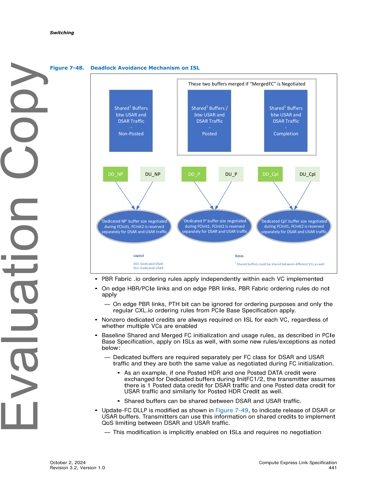
>
> *Original page render @ 150 DPI* — [📄 Full size](figures/chapter_07/page_0441.png)

<table>
<thead>
<tr>
<th width="50%">🇬🇧 English</th>
<th width="50%" style="background-color:#e8e8e8">🇨🇳 中文</th>
</tr>
</thead>
<tbody>
<tr><td>Note:</td><td style="background-color:#e8e8e8">注:</td></tr>
<tr><td>To aid debug, Switches are recommended to capture the Hdr and data_Scale values negotiated at initialization so that debug software can access the values.</td><td style="background-color:#e8e8e8">为便于调试,建议交换机在初始化时捕获协商得到的 Hdr 与 data_Scale 值,以便调试软件访问这些值。</td></tr>
<tr><td>• Optimized_Update_FC DLLP applies to USAR traffic only and it is implicit on ISLs. All DSAR traffic's shared buffer credit return occurs only via Update-FC DLLP.</td><td style="background-color:#e8e8e8">• Optimized_Update_FC DLLP 仅适用于 USAR 流量,且在 ISL 上是隐式的。所有 DSAR 流量的共享缓冲区信用返回仅通过 Update-FC DLLP 完成。</td></tr>
</tbody>
</table>

> **Figure 7-49.** Update-FC DLLP Format on ISL ｜ ISL 上 Update-FC DLLP 格式
>
> 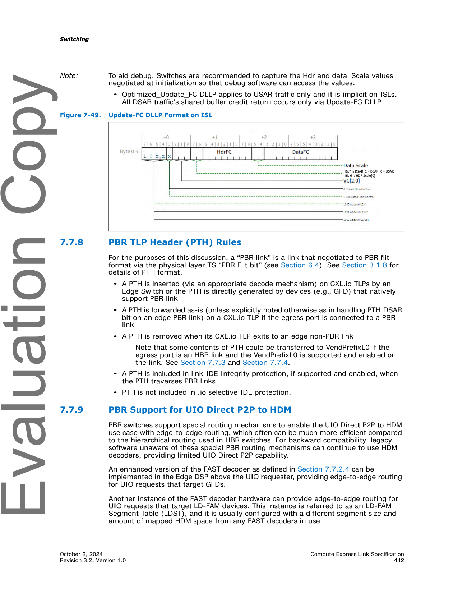
>
> *Original page render @ 150 DPI* — [📄 Full size](figures/chapter_07/page_0442.png)

[⬆️ 返回目录](#-本章目录-part-c)

---

## 7.7.8 PBR TLP Header (PTH) Rules | PBR TLP 头 (PTH) 规则

<table>
<thead>
<tr>
<th width="50%">🇬🇧 English</th>
<th width="50%" style="background-color:#e8e8e8">🇨🇳 中文</th>
</tr>
</thead>
<tbody>
<tr><td>For the purposes of this discussion, a "PBR link" is a link that negotiated to PBR flit format via the physical layer TS "PBR Flit bit" (see Section 6.4). See Section 3.1.8 for details of PTH format.</td><td style="background-color:#e8e8e8">在本文的讨论中,"PBR 链路" (PBR link) 是指通过物理层 TS "PBR Flit bit" 协商为 PBR flit 格式的链路 (参见 6.4 节)。PTH 格式的详细说明参见 3.1.8 节。</td></tr>
<tr><td>• A PTH is inserted (via an appropriate decode mechanism) on CXL.io TLPs by an Edge Switch or the PTH is directly generated by devices (e.g., GFD) that natively support PBR link</td><td style="background-color:#e8e8e8">• PTH 由边缘交换机 (Edge Switch) 通过适当的解码机制插入到 CXL.io TLP 中,或由原生支持 PBR 链路的设备 (例如 GFD) 直接生成</td></tr>
<tr><td>• A PTH is forwarded as-is (unless explicitly noted otherwise as in handling PTH.DSAR bit on an edge PBR link) on a CXL.io TLP if the egress port is connected to a PBR link</td><td style="background-color:#e8e8e8">• 若出口端口连接到 PBR 链路,则 CXL.io TLP 上的 PTH 按原样转发 (除非在边缘 PBR 链路上处理 PTH.DSAR 位等场景另有说明)</td></tr>
<tr><td>• A PTH is removed when its CXL.io TLP exits to an edge non-PBR link</td><td style="background-color:#e8e8e8">• 当 CXL.io TLP 退出到边缘非 PBR 链路时,PTH 将被移除</td></tr>
<tr><td>— Note that some contents of PTH could be transferred to VendPrefixL0 if the egress port is an HBR link and the VendPrefixL0 is supported and enabled on the link. See Section 7.7.3 and Section 7.7.4.</td><td style="background-color:#e8e8e8">— 若出口端口是 HBR 链路且链路上支持并启用了 VendPrefixL0,则 PTH 的部分内容可转移到 VendPrefixL0 中。参见 7.7.3 和 7.7.4 节。</td></tr>
<tr><td>• A PTH is included in link-IDE Integrity protection, if supported and enabled, when the PTH traverses PBR links.</td><td style="background-color:#e8e8e8">• 若支持并启用 link-IDE 完整性保护,则 PTH 在穿越 PBR 链路时纳入其保护范围。</td></tr>
<tr><td>• PTH is not included in .io selective IDE protection.</td><td style="background-color:#e8e8e8">• PTH 不纳入 .io selective IDE 保护。</td></tr>
</tbody>
</table>

[⬆️ 返回目录](#-本章目录-part-c)

---

## 7.7.9 PBR Support for UIO Direct P2P to HDM | PBR 对 UIO Direct P2P to HDM 的支持

<table>
<thead>
<tr>
<th width="50%">🇬🇧 English</th>
<th width="50%" style="background-color:#e8e8e8">🇨🇳 中文</th>
</tr>
</thead>
<tbody>
<tr><td>PBR switches support special routing mechanisms to enable the UIO Direct P2P to HDM use case with edge-to-edge routing, which often can be much more efficient compared to the hierarchical routing used in HBR switches. For backward compatibility, legacy software unaware of these special PBR routing mechanisms can continue to use HDM decoders, providing limited UIO Direct P2P capability.</td><td style="background-color:#e8e8e8">PBR 交换机支持特殊的路由机制以边到边 (edge-to-edge) 路由方式实现 UIO Direct P2P to HDM 用例,这通常比 HBR 交换机中使用的层次化路由效率高得多。为保持向后兼容,不了解这些特殊 PBR 路由机制的传统软件可继续使用 HDM 解码器,以提供有限的 UIO Direct P2P 能力。</td></tr>
<tr><td>An enhanced version of the FAST decoder as defined in Section 7.7.2.4 can be implemented in the Edge DSP above the UIO requester, providing edge-to-edge routing for UIO requests that target GFDs.</td><td style="background-color:#e8e8e8">7.7.2.4 节所定义的 FAST 解码器的增强版本可在 UIO 请求者之上的 Edge DSP 中实现,为以 GFD 为目标的 UIO 请求提供边到边路由。</td></tr>
<tr><td>Another instance of the FAST decoder hardware can provide edge-to-edge routing for UIO requests that target LD-FAM devices. This instance is referred to as an LD-FAM Segment Table (LDST), and it is usually configured with a different segment size and amount of mapped HDM space from any FAST decoders in use.</td><td style="background-color:#e8e8e8">FAST 解码器硬件的另一实例可为以 LD-FAM 设备为目标的 UIO 请求提供边到边路由。该实例称为 LD-FAM Segment Table (LDST),其段大小和映射的 HDM 空间量通常与正在使用的任何 FAST 解码器不同。</td></tr>
</tbody>
</table>

<table>
<thead>
<tr>
<th width="50%">🇬🇧 English</th>
<th width="50%" style="background-color:#e8e8e8">🇨🇳 中文</th>
</tr>
</thead>
<tbody>
<tr><td>With LD-FAM devices, UIO completions can be routed edge-to-edge with an ID-Based Re-Router mechanism, which can be implemented in the Edge DSP above each LD-FAM device. The Re-Router matches against the requester's PCI segment number (if applicable) and bus number in the UIO completion to determine the DPID for edge-to-edge routing. G-FAM devices automatically use edge-to-edge routing for UIO completions without this mechanism.</td><td style="background-color:#e8e8e8">对于 LD-FAM 设备,UIO 完成报文可借助 ID-Based Re-Router 机制进行边到边路由,该机制可在每个 LD-FAM 设备之上的 Edge DSP 中实现。Re-Router 在 UIO 完成报文中匹配请求者的 PCI segment 编号 (若适用) 和总线号,以确定用于边到边路由的 DPID。G-FAM 设备无需此机制即可自动使用边到边路由 UIO 完成报文。</td></tr>
<tr><td>FAST decoders, LDST decoders, and ID-Based Re-Routers are each configured by host software using CCI command sets, as documented in Section 7.7.14 for FAST decoders, and 7.7.13 for LDST decoders & ID-based Re-Routers.</td><td style="background-color:#e8e8e8">FAST 解码器、LDST 解码器和 ID-Based Re-Router 均由主机软件通过 CCI 命令集进行配置,详见 7.7.14 节 (FAST 解码器) 和 7.7.13 节 (LDST 解码器与 ID-Based Re-Router)。</td></tr>
<tr><td>GFDs are not associated with any VH, thus they have no PCIe ID (segment, bus, device, function number) assigned by any host. When a GFD sends a UIO completion, the completer segment field (if present) and the completer ID field in the completion are reserved and shall be 0.</td><td style="background-color:#e8e8e8">GFD 不与任何 VH 关联,因此没有任何主机为其分配 PCIe ID (segment、bus、device、function number)。GFD 发送 UIO 完成报文时,完成报文中的 completer segment 字段 (若存在) 和 completer ID 字段均保留,且必须为 0。</td></tr>
</tbody>
</table>

### 7.7.9.1 FAST Decoder Use for UIO Direct P2P to G-FAM | FAST 解码器用于 UIO Direct P2P to G-FAM

<table>
<thead>
<tr>
<th width="50%">🇬🇧 English</th>
<th width="50%" style="background-color:#e8e8e8">🇨🇳 中文</th>
</tr>
</thead>
<tbody>
<tr><td>FAST decoder instances in Edge USPs and DSPs have several similarities:</td><td style="background-color:#e8e8e8">Edge USP 和 DSP 中的 FAST 解码器实例具有若干相似之处:</td></tr>
<tr><td>• Both convert requests from HBR format to PBR format, and route edge-to-edge to target GFDs.</td><td style="background-color:#e8e8e8">• 两者都将请求从 HBR 格式转换为 PBR 格式,并边到边路由至目标 GFD。</td></tr>
<tr><td>• For the SPID, each uses the PID associated with its port.</td><td style="background-color:#e8e8e8">• 对于 SPID,均使用与其端口关联的 PID。</td></tr>
<tr><td>• Both support CXL.mem and (CXL.io) UIO requests.</td><td style="background-color:#e8e8e8">• 两者均支持 CXL.mem 和 (CXL.io) UIO 请求。</td></tr>
<tr><td>• A USP FAST decoder receives HBR format downstream requests coming from the RP. CXL.mem requests result from host accesses to GFDs.</td><td style="background-color:#e8e8e8">• USP FAST 解码器接收来自 RP 的 HBR 格式下行请求。CXL.mem 请求来源于主机对 GFD 的访问。</td></tr>
<tr><td>• A DSP FAST decoder receives HBR format upstream requests coming from the requester device. UIO requests result from UIO Direct P2P traffic, where the UIO requester may be directly connected to an Edge DSP, or it may be connected via one or more HBR switches below the Edge DSP. CXL.mem requests result from the Direct P2P CXL.mem for accelerators use case, covered in Section 7.7.10.</td><td style="background-color:#e8e8e8">• DSP FAST 解码器接收来自请求者设备的 HBR 格式上行请求。UIO 请求来源于 UIO Direct P2P 流量,其中 UIO 请求者可直连 Edge DSP,也可通过 Edge DSP 之下的一个或多个 HBR 交换机连接。CXL.mem 请求来源于 Direct P2P CXL.mem for accelerators 用例,详见 7.7.10 节。</td></tr>
<tr><td>A DSP FAST decoder can be configured with a segment size different from the host's USP FAST decoder(s), but it is recommended for all FAST decoders to use the same segment size to avoid software complexity.</td><td style="background-color:#e8e8e8">DSP FAST 解码器可配置为与主机 USP FAST 解码器不同的段大小,但建议所有 FAST 解码器使用相同的段大小以避免软件复杂性。</td></tr>
<tr><td>A DSP FAST decoder may need to be configured with a different number of segments from the host's USP FAST decoder(s) (e.g., a requester device may not need access to the entire Fabric Address space mapped by the USP FAST decoder). On the other hand, a requester device may need to access the Fabric Address space associated with an entire host Domain, not just a single RP within a host domain.</td><td style="background-color:#e8e8e8">DSP FAST 解码器可能需要配置为与主机 USP FAST 解码器不同数量的段 (例如请求者设备可能不需要访问 USP FAST 解码器所映射的整个 Fabric Address 空间)。另一方面,请求者设备可能需要访问与整个主机 Domain 相关联的 Fabric Address 空间,而不仅是同一主机 Domain 内的单个 RP。</td></tr>
</tbody>
</table>

### 7.7.9.2 LDST Decoder Use for UIO Direct P2P to LD-FAM | LDST 解码器用于 UIO Direct P2P to LD-FAM

<table>
<thead>
<tr>
<th width="50%">🇬🇧 English</th>
<th width="50%" style="background-color:#e8e8e8">🇨🇳 中文</th>
</tr>
</thead>
<tbody>
<tr><td>LDST decoder instances in Edge USPs and DSPs have several similarities:</td><td style="background-color:#e8e8e8">Edge USP 和 DSP 中的 LDST 解码器实例具有若干相似之处:</td></tr>
<tr><td>• Both convert requests from HBR format to PBR format, and route edge-to-edge to target LD-FAM devices.</td><td style="background-color:#e8e8e8">• 两者都将请求从 HBR 格式转换为 PBR 格式,并边到边路由至目标 LD-FAM 设备。</td></tr>
<tr><td>• For the SPID, each uses the PID associated with its port.</td><td style="background-color:#e8e8e8">• 对于 SPID,均使用与其端口关联的 PID。</td></tr>
<tr><td>• Both support CXL.mem and (CXL.io) UIO requests.</td><td style="background-color:#e8e8e8">• 两者均支持 CXL.mem 和 (CXL.io) UIO 请求。</td></tr>
<tr><td>• A USP LDST decoder receives HBR format downstream requests coming from the RP. CXL.mem requests result from host accesses to LD-FAM devices. UIO requests currently have no architected use cases, but they are not prohibited.</td><td style="background-color:#e8e8e8">• USP LDST 解码器接收来自 RP 的 HBR 格式下行请求。CXL.mem 请求来源于主机对 LD-FAM 设备的访问。UIO 请求目前没有架构化定义的用例,但并未被禁止。</td></tr>
<tr><td>• Host software determines whether host accesses to LD-FAM devices use LDST decoders versus HDM Decoders in Edge USPs. For backward compatibility, legacy software that's unaware of LDST decoders can continue to use HDM decoders. For overcoming scaling limitations with the number of HDM decoders supported by</td><td style="background-color:#e8e8e8">• 主机软件决定对 LD-FAM 设备的访问是使用 Edge USP 中的 LDST 解码器还是 HDM 解码器。为保持向后兼容,不了解 LDST 解码器的传统软件可继续使用 HDM 解码器。为了克服 Edge USP 所支持</td></tr>
</tbody>
</table>

<table>
<thead>
<tr>
<th width="50%">🇬🇧 English</th>
<th width="50%" style="background-color:#e8e8e8">🇨🇳 中文</th>
</tr>
</thead>
<tbody>
<tr><td>Edge USPs, LDST-aware software can use LDST decoders, though LDST decoders do not support HDM-D.</td><td style="background-color:#e8e8e8">HDM 解码器数量带来的扩展性限制,支持 LDST 的软件可使用 LDST 解码器,但 LDST 解码器不支持 HDM-D。</td></tr>
<tr><td>• A DSP LDST decoder receives HBR format upstream requests coming from the requester device. UIO requests result from UIO Direct P2P traffic. CXL.mem requests result from the Direct P2P CXL.mem for accelerators use case, covered in Section 7.7.10.</td><td style="background-color:#e8e8e8">• DSP LDST 解码器接收来自请求者设备的 HBR 格式上行请求。UIO 请求来源于 UIO Direct P2P 流量。CXL.mem 请求来源于 Direct P2P CXL.mem for accelerators 用例,详见 7.7.10 节。</td></tr>
<tr><td>A DSP LDST decoder can be configured with a segment size different from the host's USP LDST decoder(s), but it is recommended for all LDST decoders to use the same segment size to avoid software complexity.</td><td style="background-color:#e8e8e8">DSP LDST 解码器可配置为与主机 USP LDST 解码器不同的段大小,但建议所有 LDST 解码器使用相同的段大小以避免软件复杂性。</td></tr>
<tr><td>A DSP LDST decoder may need to be configured with a different number of segments from the host's USP LDST decoder(s) (e.g., a requester device may not need access to the entire LD-FAM HDM space mapped by the USP LDST decoder). On the other hand, an accelerator may need to access the LD-FAM HDM space associated with the entire host Domain, not a single RP in the host Domain.</td><td style="background-color:#e8e8e8">DSP LDST 解码器可能需要配置为与主机 USP LDST 解码器不同数量的段 (例如请求者设备可能不需要访问 USP LDST 解码器所映射的整个 LD-FAM HDM 空间)。另一方面,加速器可能需要访问与整个主机 Domain 相关联的 LD-FAM HDM 空间,而不仅是同一主机 Domain 内的单个 RP。</td></tr>
<tr><td>When any LDST decoders are in use, host SW needs to configure any HDM decoders mapping the same LD-FAM HDM ranges with decoder characteristics compatible with LDST decoders. This applies to HDM decoders present in the host, PBR switches, HBR switches, or LD-FAM devices. These decoder characteristics include:</td><td style="background-color:#e8e8e8">使用任何 LDST 解码器时,主机软件需要将与同一 LD-FAM HDM 范围相对应的 HDM 解码器配置为与 LDST 解码器兼容的解码器特性。这适用于主机、PBR 交换机、HBR 交换机或 LD-FAM 设备中的 HDM 解码器。这些解码器特性包括:</td></tr>
<tr><td>• Minimum decoder granularity: 64 GB for LDST</td><td style="background-color:#e8e8e8">• 最小解码器粒度:LDST 为 64 GB</td></tr>
<tr><td>• Interleave Ways (IW): neither HBR nor PBR switches have the special logic required to support 3/6/12, but LDST supports the other architected IW values.</td><td style="background-color:#e8e8e8">• 交织路数 (Interleave Ways, IW):HBR 和 PBR 交换机均没有支持 3/6/12 所需的特殊逻辑,但 LDST 支持其他架构化定义的 IW 值。</td></tr>
<tr><td>Note that Dynamic Capacity (DC) Block Sizes are not visible to either type of decoder.</td><td style="background-color:#e8e8e8">请注意,动态容量 (Dynamic Capacity, DC) 块大小对这两类解码器均不可见。</td></tr>
<tr><td>LDST decoders insert a requester segment field in UIO requests when necessary. This is described in Section 7.7.9.3.</td><td style="background-color:#e8e8e8">LDST 解码器在必要时会在 UIO 请求中插入 requester segment 字段。详见 7.7.9.3 节。</td></tr>
</tbody>
</table>

### 7.7.9.3 ID-Based Re-Router for UIO Completions with LD-FAM | LD-FAM 的 UIO 完成 ID-Based Re-Router

<table>
<thead>
<tr>
<th width="50%">🇬🇧 English</th>
<th width="50%" style="background-color:#e8e8e8">🇨🇳 中文</th>
</tr>
</thead>
<tbody>
<tr><td>For UIO Direct P2P to LD-FAM devices, UIO completions by default are routed using hierarchical PCIe ID-based routing, and the ID may include a PCIe segment number in addition to bus, device, and function numbers. If present in the Edge DSP above an LD-FAM device, the ID-Based Re-Router does a CAM match using the PCIe ID, returning the DPID needed for edge-to-edge routing. This mechanism efficiently handles intra-VH cases, and it is especially efficient for cross-VH cases by avoiding P2P through the Root Complex.</td><td style="background-color:#e8e8e8">对于 UIO Direct P2P to LD-FAM 设备,UIO 完成报文默认通过层次化的 PCIe ID 路由进行转发,该 ID 除总线号、设备号和功能号外还可能包含 PCIe segment 编号。若 LD-FAM 设备之上的 Edge DSP 中存在 ID-Based Re-Router,则它会使用 PCIe ID 进行 CAM 匹配,并返回边到边路由所需的 DPID。该机制可高效处理 VH 内部的场景,对于跨 VH 场景尤为高效,因为可避免通过 Root Complex 的 P2P 转发。</td></tr>
<tr><td>PCIe segment numbers in TLPs is a feature added in PCIe Base Specification 6.0, and PCIe segments should not be confused with "segments" in the context of FAST/LDST decoders. LDST decoders support the PCIe convention that requesters generally don't include PCIe segment numbers in requests1 but rely instead on routing mechanisms to add PCIe segment number fields when needed for cross-segment routing. Host software configures LDST decoders to add2 the requester segment field in the request when it targets a different PCIe segment. When the LD-FAM device responds to the UIO request with a UIO completion, it automatically includes segment fields when necessary in the Destination ID and Completer ID. Host software shall configure the ID-Based Re-Router with the PCIe segment number in entries that need it.</td><td style="background-color:#e8e8e8">TLP 中的 PCIe segment 编号是 PCIe Base Specification 6.0 中新增的特性;不应将其与 FAST/LDST 解码器上下文中的"segment"混淆。LDST 解码器支持如下 PCIe 约定:请求者通常不在请求中携带 PCIe segment 编号1,而是依靠路由机制在跨段路由需要时添加 PCIe segment 编号字段。当请求指向不同的 PCIe segment 时,主机软件会配置 LDST 解码器在请求中添加2 requester segment 字段。当 LD-FAM 设备以 UIO 完成报文响应 UIO 请求时,会在必要时自动在 Destination ID 和 Completer ID 中包含 segment 字段。主机软件应在需要 PCIe segment 编号的条目中配置 ID-Based Re-Router。</td></tr>
</tbody>
</table>

<table>
<thead>
<tr>
<th width="50%">🇬🇧 English</th>
<th width="50%" style="background-color:#e8e8e8">🇨🇳 中文</th>
</tr>
</thead>
<tbody>
<tr><td>1. With Selective IDE non-configuration requests, the requester is required to include the requester segment field in the request because a routing element inserting the field would cause an integrity violation with Selective IDE.</td><td style="background-color:#e8e8e8">1. 对于 Selective IDE 非配置请求,请求者必须在请求中包含 requester segment 字段,因为由路由元素插入该字段会与 Selective IDE 产生完整性违规。</td></tr>
<tr><td>2. Although PCIe Base Specification forbids PCIe switches from inserting a Requester Segment field, the CXL UIO Direct P2P to HDM mechanisms in CXL switches are beyond the scope of PCIe Base Specification and do not violate the underlying architecture principles.</td><td style="background-color:#e8e8e8">2. 尽管 PCIe Base Specification 禁止 PCIe 交换机插入 Requester Segment 字段,但 CXL 交换机中的 CXL UIO Direct P2P to HDM 机制超出了 PCIe Base Specification 的范围,并不违反其底层架构原则。</td></tr>
</tbody>
</table>

### 7.7.9.4 LDST and ID-Based Re-Router Access Protection | LDST 与 ID-Based Re-Router 访问保护

<table>
<thead>
<tr>
<th width="50%">🇬🇧 English</th>
<th width="50%" style="background-color:#e8e8e8">🇨🇳 中文</th>
</tr>
</thead>
<tbody>
<tr><td>LDST and ID-Based Re-Router use is protected by the LDST Access Vector (LAV) to ensure that only valid PIDs are programmed by the host into the LDST and ID-Based Re-Router structures. The LAV is a 4k-bit vector with a similar functionality as the GMVs and VTVs.</td><td style="background-color:#e8e8e8">LDST 和 ID-Based Re-Router 的使用受 LDST Access Vector (LAV) 保护,以确保主机仅将有效的 PID 编程到 LDST 和 ID-Based Re-Router 结构中。LAV 是一个 4K 位的向量,其功能与 GMV 和 VTV 类似。</td></tr>
<tr><td>The FM is responsible for enabling access to PIDs in the LAV before the host can program those PIDs into the LDST or ID-Based Re-Router structures. For cross-VH use cases, the FM is also responsible for using the Domain Validation SV mechanism, when available, to confirm that every VH that is enabled for cross-VH access belongs to the same host domain.</td><td style="background-color:#e8e8e8">FM 负责在主机将 PID 编程到 LDST 或 ID-Based Re-Router 结构之前,先在 LAV 中启用对这些 PID 的访问。对于跨 VH 用例,FM 还负责在可用时使用 Domain Validation SV 机制,确认启用跨 VH 访问的每个 VH 属于同一主机 domain。</td></tr>
</tbody>
</table>

[⬆️ 返回目录](#-本章目录-part-c)

---

## 7.7.10 PBR Support for Direct P2P CXL.mem for Accelerators | PBR 对 Direct P2P CXL.mem for Accelerators 的支持

<table>
<thead>
<tr>
<th width="50%">🇬🇧 English</th>
<th width="50%" style="background-color:#e8e8e8">🇨🇳 中文</th>
</tr>
</thead>
<tbody>
<tr><td>Direct P2P CXL.mem provides the ability for an accelerator to access peer Type 3 memory devices using CXL.mem. PBR switches require special routing mechanisms to support this, specifically the FAST and LDST decoders. For Direct P2P CXL.mem, these decoders function essentially the same as they do for supporting the UIO Direct P2P to HDM use case, with the following exceptions:</td><td style="background-color:#e8e8e8">Direct P2P CXL.mem 使加速器能够使用 CXL.mem 访问对等 Type 3 内存设备。PBR 交换机需要特殊的路由机制来支持该功能,具体而言就是 FAST 和 LDST 解码器。对于 Direct P2P CXL.mem,这些解码器的功能与支持 UIO Direct P2P to HDM 用例时基本相同,但有以下例外:</td></tr>
<tr><td>• They intercept and forward upstream CXL.mem requests instead of UIO requests</td><td style="background-color:#e8e8e8">• 它们拦截并转发的是上行 CXL.mem 请求,而不是 UIO 请求</td></tr>
<tr><td>• They target only Type 3 (HDM) devices, not Type 2 devices</td><td style="background-color:#e8e8e8">• 它们仅以 Type 3 (HDM) 设备为目标,而不以 Type 2 设备为目标</td></tr>
<tr><td>• The accelerator (requester device) and Type 3 device must each be directly connected to an Edge DSP</td><td style="background-color:#e8e8e8">• 加速器 (请求者设备) 和 Type 3 设备必须各自直连一个 Edge DSP</td></tr>
<tr><td>• With an MLD (Type 3 device), each accelerator must be assigned a dedicated LD distinct from the host's LD</td><td style="background-color:#e8e8e8">• 对于 MLD (Type 3 设备),每个加速器必须被分配一个与主机 LD 不同的专用 LD</td></tr>
<tr><td>Note that both types of decoders support .mem requests when they are implemented in Edge USPs, so .mem support is not unique to the Direct P2P CXL.mem use case.</td><td style="background-color:#e8e8e8">请注意,这两类解码器在 Edge USP 中实现时都支持 .mem 请求,因此 .mem 支持并非 Direct P2P CXL.mem 用例所独有。</td></tr>
<tr><td>Same as with the UIO Direct P2P use case, a FAST decoder can be implemented in the Edge DSP above an accelerator, providing edge-to-edge routing for .mem requests that target G-FAM devices (GFDs). The same FAST decoder instance can support either the UIO Direct P2P or Direct P2P CXL.mem use case.</td><td style="background-color:#e8e8e8">与 UIO Direct P2P 用例相同,FAST 解码器可在加速器之上的 Edge DSP 中实现,为以 G-FAM 设备 (GFD) 为目标的 .mem 请求提供边到边路由。同一 FAST 解码器实例可同时支持 UIO Direct P2P 或 Direct P2P CXL.mem 用例。</td></tr>
<tr><td>Similarly, an LDST decoder can be implemented in the Edge DSP above an accelerator, providing edge-to-edge routing for .mem requests that target LD-FAM devices. The same LDST decoder instance can support either the UIO Direct P2P or Direct P2P CXL.mem use case.</td><td style="background-color:#e8e8e8">类似地,LDST 解码器可在加速器之上的 Edge DSP 中实现,为以 LD-FAM 设备为目标的 .mem 请求提供边到边路由。同一 LDST 解码器实例可同时支持 UIO Direct P2P 或 Direct P2P CXL.mem 用例。</td></tr>
<tr><td>Type 3 devices used with Direct P2P CXL.mem can be mapped under either HDM-H or HDM-DB coherency ranges. If mapped under HDM-DB, peer devices other than the associated accelerator can access the HDM-DB memory using UIO Direct P2P to HDM, in which case the associated accelerator serves the role of the host participating in BI protocol (i.e., the HDM-DB device directs BISnps to the accelerator).</td><td style="background-color:#e8e8e8">与 Direct P2P CXL.mem 一起使用的 Type 3 设备可以映射在 HDM-H 或 HDM-DB 一致性范围内。若映射在 HDM-DB 下,则关联加速器以外的对等设备可以使用 UIO Direct P2P to HDM 访问 HDM-DB 内存,此时关联加速器承担参与 BI 协议的主机角色 (即 HDM-DB 设备将 BISnp 定向到该加速器)。</td></tr>
<tr><td>Direct P2P CXL.mem traffic going to or from an MLD (directly connected to an Edge DSP) works essentially the same as with host .mem traffic, as documented in Section 7.7.6.6.3 and Section 7.7.6.8.</td><td style="background-color:#e8e8e8">直连 Edge DSP 的 MLD 与 Direct P2P CXL.mem 之间的流量,其工作方式与主机 .mem 流量基本相同,详见 7.7.6.6.3 节和 7.7.6.8 节。</td></tr>
<tr><td>CXL.mem responses for the Direct P2P CXL.mem use case require no special routing mechanism. For S2M responses from G-FAM, the GFD's RPID context for the accelerator contains the DPID needed for edge-to-edge routing back to the accelerator. For S2M responses from LD-FAM, the vPPB in the Edge DSP above the Type 3 device contains the DPID needed for edge-to-edge routing back to the accelerator.</td><td style="background-color:#e8e8e8">Direct P2P CXL.mem 用例的 CXL.mem 响应不需要特殊的路由机制。对于来自 G-FAM 的 S2M 响应,GFD 中针对加速器的 RPID 上下文包含返回加速器进行边到边路由所需的 DPID。对于来自 LD-FAM 的 S2M 响应,Type 3 设备之上 Edge DSP 中的 vPPB 包含返回加速器进行边到边路由所需的 DPID。</td></tr>
</tbody>
</table>

<table>
<thead>
<tr>
<th width="50%">🇬🇧 English</th>
<th width="50%" style="background-color:#e8e8e8">🇨🇳 中文</th>
</tr>
</thead>
<tbody>
<tr><td>Same as with the UIO Direct P2P use case, FAST decoders and LDST decoders are each configured by host software using CCI command sets, as documented in Section 7.7.15 for FAST decoders and Section 7.7.13 for LDST decoders.</td><td style="background-color:#e8e8e8">与 UIO Direct P2P 用例相同,FAST 解码器和 LDST 解码器均由主机软件通过 CCI 命令集进行配置,详见 7.7.15 节 (FAST 解码器) 和 7.7.13 节 (LDST 解码器)。</td></tr>
</tbody>
</table>

### 7.7.10.1 Message Routing for Direct P2P CXL.mem Accesses with GFD | 使用 GFD 的 Direct P2P CXL.mem 访问的消息路由

<table>
<thead>
<tr>
<th width="50%">🇬🇧 English</th>
<th width="50%" style="background-color:#e8e8e8">🇨🇳 中文</th>
</tr>
</thead>
<tbody>
<tr><td>Direct P2P CXL.mem messages are routed using standard PBR mechanisms.</td><td style="background-color:#e8e8e8">Direct P2P CXL.mem 消息使用标准 PBR 机制进行路由。</td></tr>
<tr><td>Figure 7-50 illustrates an example PBR Fabric with a Direct P2P CXL.mem enabled Type 2 accelerator and two peer GFDs accessible to it. The dashed lines indicate the paths taken by the Direct P2P CXL.mem messages. Upstream .mem requests from the accelerator are routed edge-to-edge to the appropriate GFD by the FAST decoder in vPPB 6. Upstream .mem responses from either GFD are routed edge-to-edge back to the accelerator by standard PBR routing.</td><td style="background-color:#e8e8e8">图 7-50 展示了一个 PBR Fabric 示例,其中包含一个支持 Direct P2P CXL.mem 的 Type 2 加速器以及两个可被其访问的对等 GFD。虚线表示 Direct P2P CXL.mem 消息所经过的路径。加速器的上行 .mem 请求由 vPPB 6 中的 FAST 解码器边到边路由到相应的 GFD。来自任一 GFD 的上行 .mem 响应则通过标准 PBR 路由边到边返回加速器。</td></tr>
<tr><td>For an HDM-DB GFD sending a BISnp, the GFD's RPID context for the accelerator contains the DPID that is needed for edge-to-edge routing to the accelerator.</td><td style="background-color:#e8e8e8">对于发送 BISnp 的 HDM-DB GFD,GFD 中针对加速器的 RPID 上下文包含边到边路由到加速器所需的 DPID。</td></tr>
</tbody>
</table>

> **Figure 7-50.** Example Topology with Direct P2P CXL.mem with GFD ｜ 使用 GFD 的 Direct P2P CXL.mem 示例拓扑
>
> 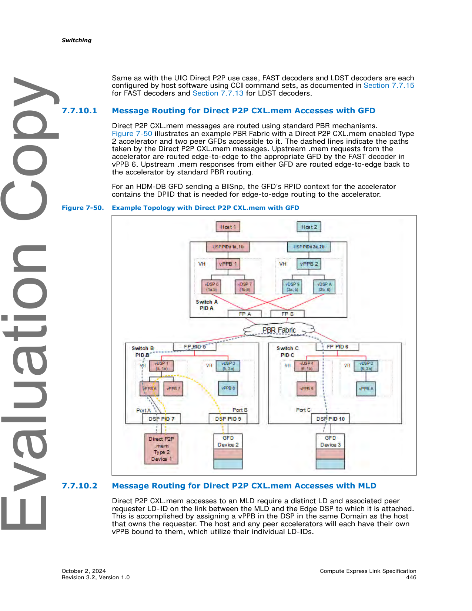
>
> *Original page render @ 150 DPI* — [📄 Full size](figures/chapter_07/page_0446.png)

### 7.7.10.2 Message Routing for Direct P2P CXL.mem Accesses with MLD | 使用 MLD 的 Direct P2P CXL.mem 访问的消息路由

<table>
<thead>
<tr>
<th width="50%">🇬🇧 English</th>
<th width="50%" style="background-color:#e8e8e8">🇨🇳 中文</th>
</tr>
</thead>
<tbody>
<tr><td>Direct P2P CXL.mem accesses to an MLD require a distinct LD and associated peer requester LD-ID on the link between the MLD and the Edge DSP to which it is attached. This is accomplished by assigning a vPPB in the DSP in the same Domain as the host that owns the requester. The host and any peer accelerators will each have their own vPPB bound to them, which utilize their individual LD-IDs.</td><td style="background-color:#e8e8e8">对 MLD 的 Direct P2P CXL.mem 访问需要一条与 MLD 和所连接 Edge DSP 之间的链路上的对等请求者 LD-ID 不同的 LD。这是通过在与请求者所属主机同一 Domain 的 DSP 中分配一个 vPPB 来实现的。主机和任何对等加速器各自拥有绑定到自身的 vPPB,并使用各自的 LD-ID。</td></tr>
</tbody>
</table>

> **Figure 7-51.** Example Topology with Direct P2P CXL.mem with MLD ｜ 使用 MLD 的 Direct P2P CXL.mem 示例拓扑
>
> 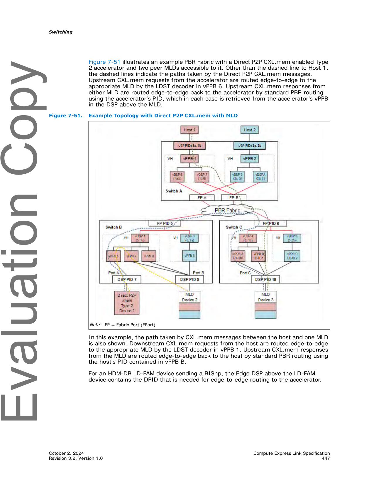
>
> *Original page render @ 150 DPI* — [📄 Full size](figures/chapter_07/page_0447.png)

<table>
<thead>
<tr>
<th width="50%">🇬🇧 English</th>
<th width="50%" style="background-color:#e8e8e8">🇨🇳 中文</th>
</tr>
</thead>
<tbody>
<tr><td>Figure 7-51 illustrates an example PBR Fabric with a Direct P2P CXL.mem enabled Type 2 accelerator and two peer MLDs accessible to it. Other than the dashed line to Host 1, the dashed lines indicate the paths taken by the Direct P2P CXL.mem messages. Upstream CXL.mem requests from the accelerator are routed edge-to-edge to the appropriate MLD by the LDST decoder in vPPB 6. Upstream CXL.mem responses from either MLD are routed edge-to-edge back to the accelerator by standard PBR routing using the accelerator's PID, which in each case is retrieved from the accelerator's vPPB in the DSP above the MLD.</td><td style="background-color:#e8e8e8">图 7-51 展示了一个 PBR Fabric 示例,其中包含一个支持 Direct P2P CXL.mem 的 Type 2 加速器以及两个可被其访问的对等 MLD。除到 Host 1 的虚线外,其余虚线表示 Direct P2P CXL.mem 消息所经过的路径。加速器的上行 CXL.mem 请求由 vPPB 6 中的 LDST 解码器边到边路由到相应的 MLD。来自任一 MLD 的上行 CXL.mem 响应则通过标准 PBR 路由,使用加速器的 PID 边到边返回加速器,该 PID 在每种情况下均从 MLD 之上 DSP 中加速器的 vPPB 中获取。</td></tr>
<tr><td>In this example, the path taken by CXL.mem messages between the host and one MLD is also shown. Downstream CXL.mem requests from the host are routed edge-to-edge to the appropriate MLD by the LDST decoder in vPPB 1. Upstream CXL.mem responses from the MLD are routed edge-to-edge back to the host by standard PBR routing using the host's PID contained in vPPB B.</td><td style="background-color:#e8e8e8">本例中还展示了主机与一个 MLD 之间 CXL.mem 消息所经过的路径。源自主机的下行 CXL.mem 请求由 vPPB 1 中的 LDST 解码器边到边路由到相应的 MLD。来自 MLD 的上行 CXL.mem 响应则通过标准 PBR 路由,使用 vPPB B 中包含的主机 PID 边到边返回主机。</td></tr>
<tr><td>For an HDM-DB LD-FAM device sending a BISnp, the Edge DSP above the LD-FAM device contains the DPID that is needed for edge-to-edge routing to the accelerator.</td><td style="background-color:#e8e8e8">对于发送 BISnp 的 HDM-DB LD-FAM 设备,LD-FAM 设备之上的 Edge DSP 包含边到边路由到加速器所需的 DPID。</td></tr>
<tr><td>Note: FP = Fabric Port (FPort).</td><td style="background-color:#e8e8e8">注:FP = Fabric Port (FPort)。</td></tr>
</tbody>
</table>

### 7.7.10.3 PBR Switch Port Processing of Direct P2P CXL.mem Messages | Direct P2P CXL.mem 消息的 PBR 交换机端口处理

<table>
<thead>
<tr>
<th width="50%">🇬🇧 English</th>
<th width="50%" style="background-color:#e8e8e8">🇨🇳 中文</th>
</tr>
</thead>
<tbody>
<tr><td>Table 7-109 summarizes how PBR switches perform port processing of CXL.mem messages with the Direct P2P CXL.mem for Accelerators use case. This traffic never flows through Edge USPs or HBR switches. The accelerator (requester) is always an SLD directly connected to an Edge DSP, and each Type 3 memory device is always directly connected to an Edge DSP. All messages in PBR format are routed edge-to-edge.</td><td style="background-color:#e8e8e8">表 7-109 总结了 PBR 交换机在 Direct P2P CXL.mem for Accelerators 用例下对 CXL.mem 消息进行端口处理的方式。该流量永远不会经过 Edge USP 或 HBR 交换机。加速器 (请求者) 始终是直连 Edge DSP 的 SLD,且每个 Type 3 内存设备始终直连 Edge DSP。所有 PBR 格式的消息均按边到边方式路由。</td></tr>
<tr><td>For conciseness, there are several abbreviations within the table. Beyond "accel" standing for accelerator, see Section 7.7.6.8 for other abbreviations.</td><td style="background-color:#e8e8e8">为简洁起见,表中使用了若干缩写。除 "accel" 表示加速器外,其他缩写参见 7.7.6.8 节。</td></tr>
</tbody>
</table>

> **Table 7-109.** PBR Switch Port Processing Table for Direct P2P CXL.mem ｜ Direct P2P CXL.mem 的 PBR 交换机端口处理表
>
> 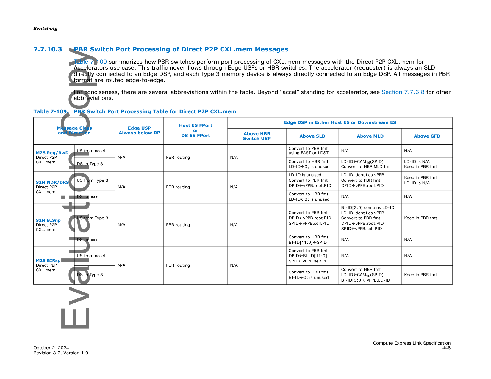
>
> *Original page render @ 150 DPI* — [📄 Full size](figures/chapter_07/page_0448.png)

[⬆️ 返回目录](#-本章目录-part-c)

---

## 7.7.11 PBR Link Events and Messages | PBR 链路事件与消息

<table>
<thead>
<tr>
<th width="50%">🇬🇧 English</th>
<th width="50%" style="background-color:#e8e8e8">🇨🇳 中文</th>
</tr>
</thead>
<tbody>
<tr><td>A PBR link can carry traffic from many different VH at the same time. Some events may occur that only affect a single VH, while other events need to apply to all VH sharing the link.</td><td style="background-color:#e8e8e8">一条 PBR 链路可同时承载来自多个不同 VH 的流量。某些事件可能仅影响单个 VH,而其他事件则需要应用于共享该链路的所有 VH。</td></tr>
<tr><td>Basic PBR link requirements are discussed in Section 7.7.11.1.</td><td style="background-color:#e8e8e8">PBR 链路的基本要求在 7.7.11.1 节中讨论。</td></tr>
<tr><td>A summary of all the CXL Vendor Defined Messages (VDMs) that are PTH routed to the destination is provided in Section 7.7.11.2.</td><td style="background-color:#e8e8e8">通过 PTH 路由到目标的所有 CXL Vendor Defined Messages (VDM) 的摘要见 7.7.11.2 节。</td></tr>
<tr><td>PCIe events for a single VH are discussed in Section 7.7.11.3.</td><td style="background-color:#e8e8e8">单个 VH 的 PCIe 事件在 7.7.11.3 节中讨论。</td></tr>
<tr><td>PCIe events for multiple VH sharing a link are discussed in Section 7.7.11.4.</td><td style="background-color:#e8e8e8">共享同一链路的多个 VH 的 PCIe 事件在 7.7.11.4 节中讨论。</td></tr>
<tr><td>Events that occur outside PCIe are discussed in Section 7.7.11.5.</td><td style="background-color:#e8e8e8">PCIe 之外发生的事件在 7.7.11.5 节中讨论。</td></tr>
<tr><td>Messaging to and from a host to a GFD is discussed in Section 3.1.11.1.</td><td style="background-color:#e8e8e8">主机与 GFD 之间的消息传递在 3.1.11.1 节中讨论。</td></tr>
</tbody>
</table>

### 7.7.11.1 PBR Link Fundamentals | PBR 链路基础

<table>
<thead>
<tr>
<th width="50%">🇬🇧 English</th>
<th width="50%" style="background-color:#e8e8e8">🇨🇳 中文</th>
</tr>
</thead>
<tbody>
<tr><td>CXL defines two types of PBR links:</td><td style="background-color:#e8e8e8">CXL 定义了两种 PBR 链路:</td></tr>
<tr><td>• Inter-Switch Link (ISL)</td><td style="background-color:#e8e8e8">• 交换机间链路 (Inter-Switch Link, ISL)</td></tr>
<tr><td>• GFD link</td><td style="background-color:#e8e8e8">• GFD 链路</td></tr>
<tr><td>All PBR links must support PBR Flit mode. Because PBR Flit mode relies on PCIe Flit mode, all host-OS-visible DSPs should report PCIe Flit mode as enabled. The DSPs include both a Host Edge Switch vDSP and a DSP above a PBR link that leads to a GFD.</td><td style="background-color:#e8e8e8">所有 PBR 链路必须支持 PBR Flit 模式。由于 PBR Flit 模式依赖于 PCIe Flit 模式,所有主机操作系统可见的 DSP 应报告 PCIe Flit 模式已启用。DSP 包括 Host Edge Switch 的 vDSP 以及通往 GFD 的 PBR 链路之上的 DSP。</td></tr>
<tr><td>The owner of a PBR link is an FM-managed DSP. Switch firmware may assist the FM in managing the DSP. An ISL is a downstream-to-downstream crosslink and thus has an FM-managed DSP on each side of the link. A GFD link has only one DSP and thus has only one FM-managed DSP. The speed and width of a PBR link is solely controlled by the FM-managed DSP(s) on the link and not by any vDSPs that share the link.</td><td style="background-color:#e8e8e8">PBR 链路的所有者是 FM 管理的 DSP。交换机固件可协助 FM 管理 DSP。ISL 是下行到下行的 crosslink,链路两侧各有一个 FM 管理的 DSP。GFD 链路仅有一个 DSP,因此仅有一个 FM 管理的 DSP。PBR 链路的速度和宽度完全由链路上的 FM 管理 DSP 控制,而不是由共享该链路的任何 vDSP 控制。</td></tr>
<tr><td>Each side of an ISL is managed separately. Each DSP above an ISL must support DPC, to allow firmware on each side of the link an independent amount of time to process fabric port events. DPC shall be enabled for all cases on ISL except when the ISL is the only path to the FM, in which case the DSP furthest from the FM shall not have DPC enabled.</td><td style="background-color:#e8e8e8">ISL 的每一侧均独立管理。ISL 之上的每个 DSP 必须支持 DPC,以便链路两侧的固件可独立地有足够时间处理 fabric 端口事件。除 ISL 是到 FM 的唯一路径的情况外,ISL 上所有情形均应启用 DPC;在这种情况下,距 FM 最远的 DSP 不应启用 DPC。</td></tr>
<tr><td>FM-initiated CXL.io traffic sent across a PBR link shall be limited to DMTF-format VDMs. The PTH.DPID is used to indicate whether the PBR Link Partner should sink the TLP or forward the TLP. If the PTH.DPID = FFFh, the PBR Link Partner must sink the VDM because that is how the initial device discovery occurs and how PIDs are assigned. If the PTH.DPID = the device's PID, then the device must also sink the VDM because that is how the device is accessed by the FM.</td><td style="background-color:#e8e8e8">通过 PBR 链路发送的 FM 主动发起的 CXL.io 流量应限于 DMTF 格式的 VDM。PTH.DPID 用于指示 PBR 链路对端是接收 (sink) TLP 还是转发 TLP。若 PTH.DPID = FFFh,则 PBR 链路对端必须接收该 VDM,因为这是完成初始设备发现以及分配 PID 的方式。若 PTH.DPID = 设备的 PID,则设备也必须接收该 VDM,因为这是 FM 访问该设备的方式。</td></tr>
<tr><td>All VH users of a PBR link have their functionality ride on top of the FM-managed link. For example, a VH's DSP cannot see a Link Up if the fabric link is not up. A VH cannot change the width or speed of its shared link, rather it will inherit the setting of the FM-managed DSP.</td><td style="background-color:#e8e8e8">PBR 链路的所有 VH 用户的功能均建立在 FM 管理的链路之上。例如,若 fabric 链路未 up,则 VH 的 DSP 看不到 Link Up。VH 不能更改其共享链路的宽度或速度,而是会继承 FM 管理的 DSP 的设置。</td></tr>
<tr><td>To manage different software response times to events, every vDSP for every VH must support DPC. DPC allows a host to keep its Link Down from its (VH) perspective until it is ready to re-enable it, having cleaned up all the side effects of a Link Down. A Host may or may not choose to enable DPC.</td><td style="background-color:#e8e8e8">为应对不同软件对事件的响应时间,每个 VH 的每个 vDSP 必须支持 DPC。DPC 允许主机在清理完 Link Down 的所有副作用并准备重新启用之前,一直从其 (VH 的) 视角保持 Link Down。主机可自行选择是否启用 DPC。</td></tr>
<tr><td>L0p is optional on a PBR link. The FM-managed DSP initiates any L0p transitions via a mechanism that is beyond this specification.</td><td style="background-color:#e8e8e8">L0p 在 PBR 链路上是可选的。任何 L0p 转换均由 FM 管理的 DSP 通过本规范之外的方式发起。</td></tr>
<tr><td>Every CXL.io TLP on a PBR link will carry a 4B PTH. The VDMs described in this section follow the same rule. See Section 3.1.8. There are three fields of note in the PTH that are required for the VDMs described in this section:</td><td style="background-color:#e8e8e8">PBR 链路上的每个 CXL.io TLP 都将携带 4 字节 PTH。本节所述的 VDM 遵循相同规则。参见 3.1.8 节。PTH 中有三个字段对于本节所述的 VDM 至关重要:</td></tr>
<tr><td>• SPID: Source PID</td><td style="background-color:#e8e8e8">• SPID:源 PID</td></tr>
<tr><td>— From a vDSP: Use vDSP's USP PID</td><td style="background-color:#e8e8e8">— 来自 vDSP:使用 vDSP 的 USP PID</td></tr>
<tr><td>— From a vUSP: Use vUSP's FPort PID</td><td style="background-color:#e8e8e8">— 来自 vUSP:使用 vUSP 的 FPort PID</td></tr>
<tr><td>— From a switch: Use switch's PID</td><td style="background-color:#e8e8e8">— 来自交换机:使用交换机的 PID</td></tr>
<tr><td>— From a downstream edge: Use DSP's PID</td><td style="background-color:#e8e8e8">— 来自下行边缘:使用 DSP 的 PID</td></tr>
<tr><td>— From a host edge: Use USP's PID</td><td style="background-color:#e8e8e8">— 来自主机边缘:使用 USP 的 PID</td></tr>
<tr><td>• DPID: Destination PID</td><td style="background-color:#e8e8e8">• DPID:目标 PID</td></tr>
<tr><td>— To a vDSP: Use vDSP's USP PID</td><td style="background-color:#e8e8e8">— 目标为 vDSP:使用 vDSP 的 USP PID</td></tr>
<tr><td>— To a vUSP: Use vUSP's FPort PID</td><td style="background-color:#e8e8e8">— 目标为 vUSP:使用 vUSP 的 FPort PID</td></tr>
<tr><td>— To a switch: Use switch's PID</td><td style="background-color:#e8e8e8">— 目标为交换机:使用交换机的 PID</td></tr>
<tr><td>— To a downstream edge: Use DSP's PID</td><td style="background-color:#e8e8e8">— 目标为下行边缘:使用 DSP 的 PID</td></tr>
<tr><td>— To host edge: Use USP's PID</td><td style="background-color:#e8e8e8">— 目标为主机边缘:使用 USP 的 PID</td></tr>
<tr><td>• DSAR flag</td><td style="background-color:#e8e8e8">• DSAR 标志</td></tr>
</tbody>
</table>

### 7.7.11.2 CXL VDMs | CXL VDM

<table>
<thead>
<tr>
<th width="50%">🇬🇧 English</th>
<th width="50%" style="background-color:#e8e8e8">🇨🇳 中文</th>
</tr>
</thead>
<tbody>
<tr><td>See Section 3.1.11 for a list of VDMs that are used in the PBR fabric.</td><td style="background-color:#e8e8e8">PBR fabric 中使用的 VDM 列表参见 3.1.11 节。</td></tr>
</tbody>
</table>

### 7.7.11.3 Single VH Events | 单 VH 事件

<table>
<thead>
<tr>
<th width="50%">🇬🇧 English</th>
<th width="50%" style="background-color:#e8e8e8">🇨🇳 中文</th>
</tr>
</thead>
<tbody>
<tr><td>Events that are contained within a single VH should not affect other VHs that share an ISL.</td><td style="background-color:#e8e8e8">局限于单个 VH 的事件不应影响共享同一 ISL 的其他 VH。</td></tr>
<tr><td>PCIe visible events that are contained within a single VH include:</td><td style="background-color:#e8e8e8">局限于单个 VH 的 PCIe 可见事件包括:</td></tr>
<tr><td>• Assert Reset</td><td style="background-color:#e8e8e8">• 复位置位 (Assert Reset)</td></tr>
<tr><td>• Deassert Reset</td><td style="background-color:#e8e8e8">• 复位撤销 (Deassert Reset)</td></tr>
<tr><td>• Link Up</td><td style="background-color:#e8e8e8">• Link Up</td></tr>
</tbody>
</table>

> **Figure 7-52.** Single VH ｜ 单一虚拟层级 (Single VH)
>
> 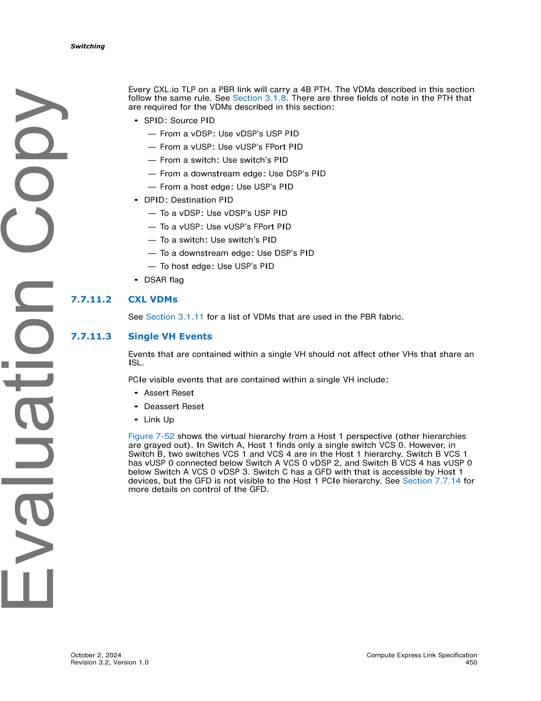
>
> *Original page render @ 150 DPI* — [📄 Full size](figures/chapter_07/page_0450.png)

<table>
<thead>
<tr>
<th width="50%">🇬🇧 English</th>
<th width="50%" style="background-color:#e8e8e8">🇨🇳 中文</th>
</tr>
</thead>
<tbody>
<tr><td>Figure 7-52 shows the virtual hierarchy from a Host 1 perspective (other hierarchies are grayed out). In Switch A, Host 1 finds only a single switch VCS 0. However, in Switch B, two switches VCS 1 and VCS 4 are in the Host 1 hierarchy. Switch B VCS 1 has vUSP 0 connected below Switch A VCS 0 vDSP 2, and Switch B VCS 4 has vUSP 0 below Switch A VCS 0 vDSP 3. Switch C has a GFD with that is accessible by Host 1 devices, but the GFD is not visible to the Host 1 PCIe hierarchy. See Section 7.7.14 for more details on control of the GFD.</td><td style="background-color:#e8e8e8">图 7-52 展示了从 Host 1 视角看到的虚拟层级 (其他层级以灰色显示)。在 Switch A 中,Host 1 仅发现单个交换机 VCS 0。但在 Switch B 中,VCS 1 和 VCS 4 两个交换机均属于 Host 1 层级。Switch B VCS 1 的 vUSP 0 连接在 Switch A VCS 0 vDSP 2 之下,Switch B VCS 4 的 vUSP 0 连接在 Switch A VCS 0 vDSP 3 之下。Switch C 拥有一个可被 Host 1 设备访问的 GFD,但该 GFD 对 Host 1 的 PCIe 层级不可见。有关 GFD 控制的更多详细信息,参见 7.7.14 节。</td></tr>
</tbody>
</table>

#### 7.7.11.3.1 Assert Reset VDM | Assert Reset VDM

<table>
<thead>
<tr>
<th width="50%">🇬🇧 English</th>
<th width="50%" style="background-color:#e8e8e8">🇨🇳 中文</th>
</tr>
</thead>
<tbody>
<tr><td>Every PCIe hierarchy supports three levels of Conventional Reset:</td><td style="background-color:#e8e8e8">每个 PCIe 层级均支持三级常规复位 (Conventional Reset):</td></tr>
<tr><td>• Fundamental cold reset (PERST#): Input pin</td><td style="background-color:#e8e8e8">• 基础冷复位 (Fundamental cold reset, PERST#):输入引脚</td></tr>
<tr><td>• Fundamental warm reset (PERST#): Input pin</td><td style="background-color:#e8e8e8">• 基础热复位 (Fundamental warm reset, PERST#):输入引脚</td></tr>
<tr><td>• Hot reset due to Link Down, in-band hot reset, USP secondary bus reset, DSP secondary bus reset, or link disabled</td><td style="background-color:#e8e8e8">• 由于 Link Down、带内热复位、USP secondary bus reset、DSP secondary bus reset 或链路禁用所导致的热复位</td></tr>
<tr><td>CXL Fabric links support propagation of these resets. The ISL link state is not affected by any VH's Assert Reset or Assert PERST# VDM. Assertion of reset is accomplished using one of two different VDM opcodes:</td><td style="background-color:#e8e8e8">CXL Fabric 链路支持这些复位的传播。ISL 链路状态不受任何 VH 的 Assert Reset 或 Assert PERST# VDM 影响。复位置位通过以下两种 VDM 操作码之一完成:</td></tr>
<tr><td>• Assert PERST#: Used for fundamental reset assertion for that VH, Opcode 0</td><td style="background-color:#e8e8e8">• Assert PERST#:用于该 VH 的基础复位置位,操作码 0</td></tr>
<tr><td>• Assert Reset: Used for hot reset assertion for that VH, Opcode 1</td><td style="background-color:#e8e8e8">• Assert Reset:用于该 VH 的热复位置位,操作码 1</td></tr>
<tr><td>The separate PERST# message allows for fundamental reset functionality without the need for extra pins between switches.</td><td style="background-color:#e8e8e8">单独的 PERST# 消息允许实现基础复位功能,无需在交换机之间增加额外的引脚。</td></tr>
<tr><td>Assert PERST# should be triggered whenever a VH has its input fundamental reset asserted on a Host ES. Assert Reset should be triggered whenever the Host ES:</td><td style="background-color:#e8e8e8">当 VH 在 Host ES 上输入基础复位被置位时,应触发 Assert PERST#。当 Host ES 出现以下情况时,应触发 Assert Reset:</td></tr>
<tr><td>• Receives a hot reset input</td><td style="background-color:#e8e8e8">• 接收到热复位输入</td></tr>
<tr><td>• Has a secondary bus reset on its USP</td><td style="background-color:#e8e8e8">• 在其 USP 上发生 secondary bus reset</td></tr>
<tr><td>• Has a secondary bus reset on its VDSP</td><td style="background-color:#e8e8e8">• 在其 vDSP 上发生 secondary bus reset</td></tr>
<tr><td>• Has a link disable on its vDSP</td><td style="background-color:#e8e8e8">• 在其 vDSP 上发生 link disable</td></tr>
</tbody>
</table>

<table>
<thead>
<tr>
<th width="50%">🇬🇧 English</th>
<th width="50%" style="background-color:#e8e8e8">🇨🇳 中文</th>
</tr>
</thead>
<tbody>
<tr><td>The Assert Reset VDMs all are sent from a vDSP to its paired vUSP. The VDM sent will have a PTH with:</td><td style="background-color:#e8e8e8">Assert Reset VDM 均由 vDSP 发送给与其配对的 vUSP。所发送的 VDM 将携带具有以下内容的 PTH:</td></tr>
<tr><td>• SPID = vDSP's host PID</td><td style="background-color:#e8e8e8">• SPID = vDSP 的主机 PID</td></tr>
<tr><td>• DPID = vUSP's FPort PID</td><td style="background-color:#e8e8e8">• DPID = vUSP 的 FPort PID</td></tr>
<tr><td>• DSAR flag = 1</td><td style="background-color:#e8e8e8">• DSAR 标志 = 1</td></tr>
<tr><td>VDM header fields for Assert Reset VDMs:</td><td style="background-color:#e8e8e8">Assert Reset VDM 的 VDM 头字段:</td></tr>
<tr><td>• CXL VDM code of 80h</td><td style="background-color:#e8e8e8">• CXL VDM code 为 80h</td></tr>
<tr><td>• PBR Opcode 0 or 1 indicates which Assert PERST# or Assert Reset message</td><td style="background-color:#e8e8e8">• PBR 操作码 0 或 1 指示 Assert PERST# 或 Assert Reset 消息</td></tr>
<tr><td>It is expected that the Assert Reset VDM will reach a vUSP uniquely identified by the SPID and DPID at the destination switch.</td><td style="background-color:#e8e8e8">Assert Reset VDM 预计将到达目标交换机中由 SPID 和 DPID 唯一标识的 vUSP。</td></tr>
<tr><td>A vDSP, upon sending Assert Reset VDM, will have its link state transition to Hot Reset.</td><td style="background-color:#e8e8e8">vDSP 在发送 Assert Reset VDM 后,其链路状态将迁移至 Hot Reset。</td></tr>
<tr><td>A vUSP, upon receiving an Assert Reset VDM, will have its link state transition to Hot Reset. While in Hot Reset, all Port non-sticky registers and state machines that belong to the VH must return to their initialized state.</td><td style="background-color:#e8e8e8">vUSP 在接收到 Assert Reset VDM 后,其链路状态将迁移至 Hot Reset。在 Hot Reset 期间,属于该 VH 的所有 Port 非 sticky 寄存器和状态机必须返回到其初始化状态。</td></tr>
<tr><td>A vUSP, upon receiving an Assert PERST# VDM, shall have its link state transition to Hot Reset and also shall clear any sticky bits as outlined by PCIe Base Specification for PERST# behavior.</td><td style="background-color:#e8e8e8">vUSP 在接收到 Assert PERST# VDM 后,其链路状态应迁移至 Hot Reset,并应按照 PCIe Base Specification 中针对 PERST# 行为的规定清除任何 sticky 位。</td></tr>
<tr><td>It is possible to send any number of Assert Reset VDMs or Assert PERST# VDMs.</td><td style="background-color:#e8e8e8">可以发送任意数量的 Assert Reset VDM 或 Assert PERST# VDM。</td></tr>
<tr><td>In Figure 7-53, if Host 1 asserts its PERST#, then both Switch A VCS 0 vDSP 2 and Switch A VCS 0 vDSP 3 shall issue an AssertPERST# VDM. The format of the PTH would be (SPID=A01, DPID=B01) for vDSP 2 and (SPID=A11, DPID=B02) for vDSP 3. If Host 1 instead asserted vDSP 2 secondary bus reset, then only vDSP 2 would send an AssertReset VDM with (SPID=A01, DPID=B01).</td><td style="background-color:#e8e8e8">在图 7-53 中,若 Host 1 置位其 PERST#,则 Switch A VCS 0 vDSP 2 和 Switch A VCS 0 vDSP 3 均应发起 AssertPERST# VDM。vDSP 2 的 PTH 格式为 (SPID=A01, DPID=B01),vDSP 3 的 PTH 格式为 (SPID=A11, DPID=B02)。若 Host 1 仅对 vDSP 2 触发 secondary bus reset,则只有 vDSP 2 会发送 PTH 为 (SPID=A01, DPID=B01) 的 AssertReset VDM。</td></tr>
</tbody>
</table>

#### 7.7.11.3.2 Deassert Reset VDM | Deassert Reset VDM

<table>
<thead>
<tr>
<th width="50%">🇬🇧 English</th>
<th width="50%" style="background-color:#e8e8e8">🇨🇳 中文</th>
</tr>
</thead>
<tbody>
<tr><td>A Deassert Reset VDM signals a release of reset and an exiting of the Hot Reset state to enter Detect for that VH. This VDM shall be sent from the Host Edge Switch due to a deassertion of the PERST# input resulting from an exit from Hot Reset.</td><td style="background-color:#e8e8e8">Deassert Reset VDM 表示复位的释放以及退出 Hot Reset 状态以进入 Detect 状态 (针对该 VH)。该 VDM 应由 Host Edge Switch 在退出 Hot Reset 而撤销 PERST# 输入时发送。</td></tr>
<tr><td>If DSP is enabled the DPC trigger status must be cleared before a Deassert Reset VDM can be sent because DPC triggered prevents any TLPs from egressing that port.</td><td style="background-color:#e8e8e8">若启用了 DSP,则必须在发送 Deassert Reset VDM 之前清除 DPC 触发状态,因为 DPC 触发会阻止任何 TLP 从该端口出口。</td></tr>
<tr><td>Propagation of reset deassertion over an ISL is enabled via a Deassert Reset VDM, which is used for hot reset deassertion for that VH, Opcode 3.</td><td style="background-color:#e8e8e8">通过 ISL 传播复位撤销由 Deassert Reset VDM 实现,该 VDM 用于该 VH 的热复位撤销,操作码 3。</td></tr>
<tr><td>A Deassert Reset VDM is used to instruct the vUSP to exit Hot Reset and enter Detect. The Deassert Reset VDM sent will have a PTH with:</td><td style="background-color:#e8e8e8">Deassert Reset VDM 用于指示 vUSP 退出 Hot Reset 并进入 Detect。所发送的 Deassert Reset VDM 将携带具有以下内容的 PTH:</td></tr>
<tr><td>• SPID = vDSP's host PID</td><td style="background-color:#e8e8e8">• SPID = vDSP 的主机 PID</td></tr>
<tr><td>• DPID = vUSP's FPort PID</td><td style="background-color:#e8e8e8">• DPID = vUSP 的 FPort PID</td></tr>
<tr><td>• DSAR flag = 1</td><td style="background-color:#e8e8e8">• DSAR 标志 = 1</td></tr>
<tr><td>VDM header fields for Deassert Reset VDMs:</td><td style="background-color:#e8e8e8">Deassert Reset VDM 的 VDM 头字段:</td></tr>
<tr><td>• CXL VDM code of 80h</td><td style="background-color:#e8e8e8">• CXL VDM code 为 80h</td></tr>
<tr><td>• PBR Opcode 3</td><td style="background-color:#e8e8e8">• PBR 操作码 3</td></tr>
<tr><td>A vDSP, upon sending a Deassert Reset VDM, will have its link state transition from Hot Reset to Detect. A vUSP, upon receiving a Deassert Reset VDM, will have its link state transition from Hot Reset to Detect. If the link state is not in Hot Reset, a link state change will not occur.</td><td style="background-color:#e8e8e8">vDSP 在发送 Deassert Reset VDM 后,其链路状态将从 Hot Reset 迁移到 Detect。vUSP 在接收到 Deassert Reset VDM 后,其链路状态将从 Hot Reset 迁移到 Detect。若链路状态不在 Hot Reset,则不会发生链路状态变化。</td></tr>
<tr><td>The link for that VH will remain in Detect until the vUSP sends a Link Up VDM and the vDSP receives a Link Up VDM. If a Link Up VDM is not received within 10 ms, a subsequent Deassert Reset VDM shall be sent. This can repeat until 10 Deassert Reset VDMs have been sent. After a tenth Deassert Reset VDM is sent, if a Link Up VDM is still not received within 10 ms, the reset deassertion failed and the FM shall be notified.</td><td style="background-color:#e8e8e8">该 VH 的链路将保持在 Detect 状态,直到 vUSP 发送 Link Up VDM 且 vDSP 接收到 Link Up VDM。若在 10 ms 内未收到 Link Up VDM,则应发送后续的 Deassert Reset VDM。该过程可重复,最多发送 10 个 Deassert Reset VDM。发送第 10 个 Deassert Reset VDM 后,若在 10 ms 内仍未收到 Link Up VDM,则复位撤销失败,应通知 FM。</td></tr>
<tr><td>In Figure 7-53, if Host 1 clears the secondary bus reset in Switch A VCS 0 vDSP 2, then Switch A VCS 0 vDSP 2 would send a Deassert Reset VDM with (SPID=A01, DPID=B01). Switch B VCS 1 vUSP 0 would exit the hot reset state. As part of the exit from LTSSM Detect and due to the shared link nature of an ISL, Switch B VCS 1 vUSP 0 will bypass the PCIe LTSSM states of Polling and Configuration and transition the vDSP-to-vUSP link back to L0 (Link Up) by sending a Response Link Up VDM.</td><td style="background-color:#e8e8e8">在图 7-53 中,若 Host 1 清除 Switch A VCS 0 vDSP 2 上的 secondary bus reset,则 Switch A VCS 0 vDSP 2 将发送 PTH 为 (SPID=A01, DPID=B01) 的 Deassert Reset VDM。Switch B VCS 1 vUSP 0 将退出热复位状态。作为退出 LTSSM Detect 的一部分,且由于 ISL 链路的共享特性,Switch B VCS 1 vUSP 0 将绕过 PCIe LTSSM 的 Polling 和 Configuration 状态,通过发送 Response Link Up VDM 将 vDSP 到 vUSP 的链路直接返回 L0 (Link Up)。</td></tr>
</tbody>
</table>

#### 7.7.11.3.3 Link Up VDM | Link Up VDM

<table>
<thead>
<tr>
<th width="50%">🇬🇧 English</th>
<th width="50%" style="background-color:#e8e8e8">🇨🇳 中文</th>
</tr>
</thead>
<tbody>
<tr><td>A Link Up VDM signals a transition to L0 active for that VH's link. The Link Up VDM is sent by a vUSP to its paired vDSP to convey a post-Detect state across the shared ISL.</td><td style="background-color:#e8e8e8">Link Up VDM 表示该 VH 的链路迁移到 L0 active 状态。Link Up VDM 由 vUSP 发送给与其配对的 vDSP,以在共享 ISL 上传达 Detect 之后的状态。</td></tr>
<tr><td>The vUSP sends a Link Up VDM after receiving a Deassert Reset VDM. The vUSP can perform any required post-reset initialization before sending the Link Up VDM. The vUSP may take as long as it needs after Deassert Reset to send the Link Up VDM. Any number of Deassert Reset VDMs may be received by the vUSP; for each Deassert Reset VDM received, a Link Up VDM shall be sent.</td><td style="background-color:#e8e8e8">vUSP 在收到 Deassert Reset VDM 后发送 Link Up VDM。vUSP 可在发送 Link Up VDM 之前执行任何必要的复位后初始化。vUSP 在收到 Deassert Reset 后可在其需要的时间内发送 Link Up VDM。vUSP 可接收任意数量的 Deassert Reset VDM;每收到一个 Deassert Reset VDM,就应发送一个 Link Up VDM。</td></tr>
<tr><td>The vUSP, after sending a Link Up VDM, shall have its link state transition to L0 from Detect. Polling and Configuration link states are bypassed by the Link Up VDM because the required TS1 and TS2 Ordered Sets cannot be sent over a shared ISL.</td><td style="background-color:#e8e8e8">vUSP 在发送 Link Up VDM 后,其链路状态应从 Detect 迁移到 L0。Link Up VDM 绕过 Polling 和 Configuration 链路状态,因为所需的 TS1 和 TS2 有序集无法在共享 ISL 上发送。</td></tr>
<tr><td>A vDSP, after receiving a Link Up VDM, shall have its link state transition to L0 from Detect. If not in Detect, there is no state change. Any number of Link Up VDMs may be received. Polling and Configuration link states are bypassed by the Link Up VDM, with the link directly transitioning from Detect to L0.</td><td style="background-color:#e8e8e8">vDSP 在收到 Link Up VDM 后,其链路状态应从 Detect 迁移到 L0。若不在 Detect 状态,则不发生状态变化。可接收任意数量的 Link Up VDM。Link Up VDM 绕过 Polling 和 Configuration 链路状态,链路直接从 Detect 迁移到 L0。</td></tr>
<tr><td>Neither a vDSP nor vUSP should ever have their link state reach Polling or Configuration state.</td><td style="background-color:#e8e8e8">vDSP 和 vUSP 的链路状态均不应进入 Polling 或 Configuration 状态。</td></tr>
<tr><td>The VDM sent will have a PTH with:</td><td style="background-color:#e8e8e8">所发送的 VDM 将携带具有以下内容的 PTH:</td></tr>
<tr><td>• SPID = vUSP's FPort PID</td><td style="background-color:#e8e8e8">• SPID = vUSP 的 FPort PID</td></tr>
<tr><td>• DPID = vDSP's host PID</td><td style="background-color:#e8e8e8">• DPID = vDSP 的主机 PID</td></tr>
<tr><td>• DSAR flag = 1</td><td style="background-color:#e8e8e8">• DSAR 标志 = 1</td></tr>
<tr><td>VDM header fields for LinkUp VDMs:</td><td style="background-color:#e8e8e8">LinkUp VDM 的 VDM 头字段:</td></tr>
<tr><td>• CXL VDM code of 80h</td><td style="background-color:#e8e8e8">• CXL VDM code 为 80h</td></tr>
<tr><td>• PBR Opcode 4</td><td style="background-color:#e8e8e8">• PBR 操作码 4</td></tr>
</tbody>
</table>

#### 7.7.11.3.4 Dynamic vDSP-to-vUSP Bind | 动态 vDSP 到 vUSP 绑定

<table>
<thead>
<tr>
<th width="50%">🇬🇧 English</th>
<th width="50%" style="background-color:#e8e8e8">🇨🇳 中文</th>
</tr>
</thead>
<tbody>
<tr><td>See Section 7.7.12.3 for more details on the Configure PID Binding API sequence. After Configure PID Bind, the vDSP or vUSP shall be in a Hot Reset state. A vDSP may issue an Assert Reset VDM or a Deassert Reset VDM from the reset state, as dictated by its VH. A vUSP shall remain in Hot Reset until the vUSP receives a Deassert Reset VDM, upon which, after processing the necessary post-reset tasks, the vUSP will send a Link Up VDM.</td><td style="background-color:#e8e8e8">有关 Configure PID Binding API 顺序的更多详细信息,参见 7.7.12.3 节。Configure PID Bind 之后,vDSP 或 vUSP 应处于 Hot Reset 状态。vDSP 可根据其 VH 的要求从复位状态发出 Assert Reset VDM 或 Deassert Reset VDM。vUSP 应保持在 Hot Reset 状态,直到收到 Deassert Reset VDM,之后在处理完必要的复位后任务后,vUSP 将发送 Link Up VDM。</td></tr>
</tbody>
</table>

[⬆️ 返回目录](#-本章目录-part-c)

---

### 7.7.11.4 Shared Link Events | 共享链路事件

<table>
<thead>
<tr>
<th width="50%">🇬🇧 English</th>
<th width="50%" style="background-color:#e8e8e8">🇨🇳 中文</th>
</tr>
</thead>
<tbody>
<tr><td>Events that affect multiple VHs on the same link need to be reported to the FM. The FM shall take any necessary action.</td><td style="background-color:#e8e8e8">影响同一链路上多个 VH 的事件需要上报给 FM。FM 应采取任何必要的措施。</td></tr>
<tr><td>The FM is required to keep an inventory for each ISL. Figure 7-53 shows how the link from Switch A Port B (indicated by an oval with 1) is shared by both a Host 1 hierarchy and a Host 3 hierarchy. Events on this link will affect both hierarchies. The oval with 2 is another shared link used by multiple hierarchies, of which only a Host 1 hierarchy is colored in but the ISL also includes Host 3 (VCS 2) and two hierarchies of Host 2 (VCS 0 and VCS 3).</td><td style="background-color:#e8e8e8">FM 需要为每条 ISL 维护一份清单。图 7-53 展示了 Switch A Port B (由带 1 的椭圆指示) 的链路如何由 Host 1 层级和 Host 3 层级共享。该链路上的事件将影响两个层级。带 2 的椭圆是另一条由多个层级共享的链路,虽然图中仅以颜色标出 Host 1 层级,但该 ISL 还包含 Host 3 (VCS 2) 和 Host 2 的两个层级 (VCS 0 和 VCS 3)。</td></tr>
</tbody>
</table>

> **Figure 7-53.** Shared Link Events ｜ 共享链路事件
>
> 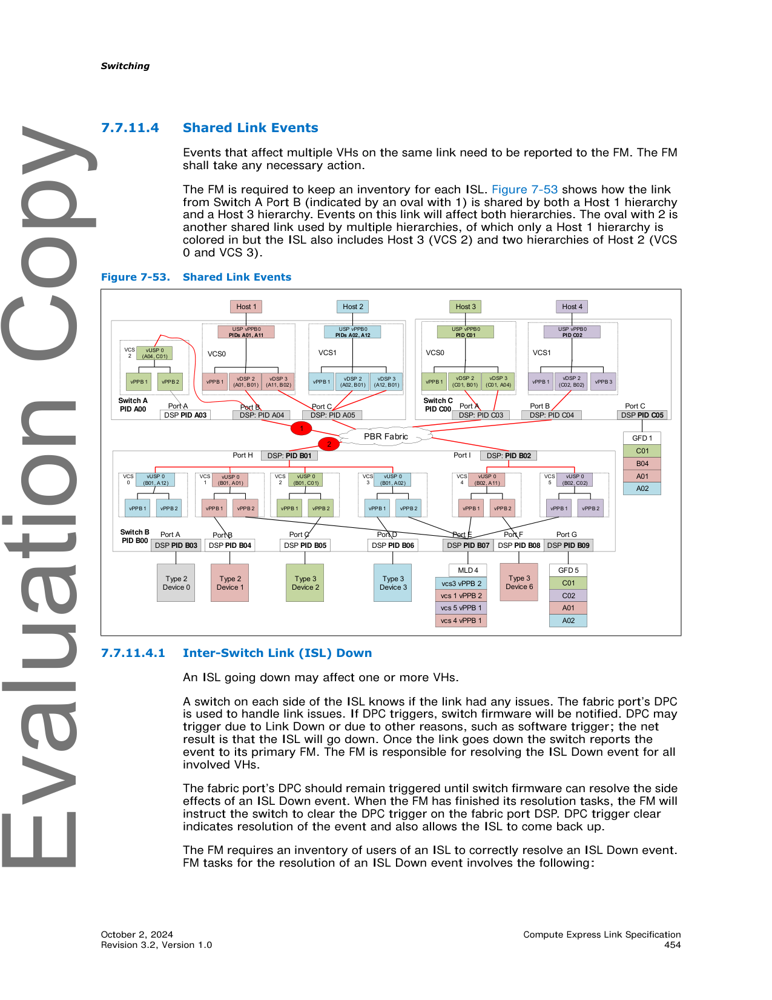
>
> *Original page render @ 150 DPI* — [📄 Full size](figures/chapter_07/page_0454.png)

#### 7.7.11.4.1 Inter-Switch Link (ISL) Down | 交换机间链路 (ISL) Down

<table>
<thead>
<tr>
<th width="50%">🇬🇧 English</th>
<th width="50%" style="background-color:#e8e8e8">🇨🇳 中文</th>
</tr>
</thead>
<tbody>
<tr><td>An ISL going down may affect one or more VHs.</td><td style="background-color:#e8e8e8">ISL 链路 down 可能影响一个或多个 VH。</td></tr>
<tr><td>A switch on each side of the ISL knows if the link had any issues. The fabric port's DPC is used to handle link issues. If DPC triggers, switch firmware will be notified. DPC may trigger due to Link Down or due to other reasons, such as software trigger; the net result is that the ISL will go down. Once the link goes down the switch reports the event to its primary FM. The FM is responsible for resolving the ISL Down event for all involved VHs.</td><td style="background-color:#e8e8e8">ISL 两侧的交换机均可获知该链路是否存在问题。Fabric 端口的 DPC 用于处理链路问题。若 DPC 触发,则将通知交换机固件。DPC 可能因 Link Down 或其他原因 (如软件触发) 而触发;最终结果是 ISL 将 down。链路 down 后,交换机将该事件上报给其主 FM。FM 负责为所有相关 VH 解决 ISL Down 事件。</td></tr>
<tr><td>The fabric port's DPC should remain triggered until switch firmware can resolve the side effects of an ISL Down event. When the FM has finished its resolution tasks, the FM will instruct the switch to clear the DPC trigger on the fabric port DSP. DPC trigger clear indicates resolution of the event and also allows the ISL to come back up.</td><td style="background-color:#e8e8e8">Fabric 端口的 DPC 应保持触发,直到交换机固件能够解决 ISL Down 事件的副作用。FM 完成其处理任务后,将指示交换机清除 fabric 端口 DSP 上的 DPC 触发。清除 DPC 触发表示事件已解决,同时允许 ISL 重新 up。</td></tr>
<tr><td>The FM requires an inventory of users of an ISL to correctly resolve an ISL Down event. FM tasks for the resolution of an ISL Down event involves the following:</td><td style="background-color:#e8e8e8">FM 需要 ISL 用户的清单才能正确解决 ISL Down 事件。FM 解决 ISL Down 事件的任务包括:</td></tr>
</tbody>
</table>

<table>
<thead>
<tr>
<th width="50%">🇬🇧 English</th>
<th width="50%" style="background-color:#e8e8e8">🇨🇳 中文</th>
</tr>
</thead>
<tbody>
<tr><td>• Unbinding any affected VHs' vDSP</td><td style="background-color:#e8e8e8">• 解绑任何受影响 VH 的 vDSP</td></tr>
<tr><td>• Unbinding any affected VHs' vUSP</td><td style="background-color:#e8e8e8">• 解绑任何受影响 VH 的 vUSP</td></tr>
<tr><td>• Clearing any affected multi-path in a switch's RGT</td><td style="background-color:#e8e8e8">• 清除交换机 RGT 中任何受影响的多路径</td></tr>
<tr><td>• Clearing any affected GFD Access Vector in a switch's GAE</td><td style="background-color:#e8e8e8">• 清除交换机 GAE 中任何受影响的 GFD Access Vector</td></tr>
<tr><td>For example, if the link at Oval #1 in Figure 7-53 breaks, Switch A and an unlabeled PBR fabric switch will both notify their primary FM. The FM will then unbind the following affected vDSPs and vUSPs:</td><td style="background-color:#e8e8e8">例如,若图 7-53 中椭圆 #1 处的链路断开,Switch A 和一个未标记的 PBR fabric 交换机均会上报其主 FM。随后 FM 将解绑以下受影响的 vDSP 和 vUSP:</td></tr>
<tr><td>• Switch A VCS 0 vDSP 2 and VCS 2 vUSP 0</td><td style="background-color:#e8e8e8">• Switch A VCS 0 vDSP 2 和 VCS 2 vUSP 0</td></tr>
<tr><td>• Switch B VCS 1 vUSP 0</td><td style="background-color:#e8e8e8">• Switch B VCS 1 vUSP 0</td></tr>
<tr><td>• Switch C VCS 0 vDSP 2</td><td style="background-color:#e8e8e8">• Switch C VCS 0 vDSP 2</td></tr>
<tr><td>As another example, if the link at Oval #2 in Figure 7-53 breaks, Switch B and an unlabeled PBR fabric switch will both notify their primary FM. The FM will then unbind the following affected vDSPs and vUSPs:</td><td style="background-color:#e8e8e8">作为另一个示例,若图 7-53 中椭圆 #2 处的链路断开,Switch B 和一个未标记的 PBR fabric 交换机均会上报其主 FM。随后 FM 将解绑以下受影响的 vDSP 和 vUSP:</td></tr>
<tr><td>• Switch A VCS 0 vDSP 2 and VCS 1 vDSP 3 and VCS 1 vDSP 2</td><td style="background-color:#e8e8e8">• Switch A VCS 0 vDSP 2、VCS 1 vDSP 3 和 VCS 1 vDSP 2</td></tr>
<tr><td>• Switch B VCS 0 vUSP 0, VCS 1 vUSP 0, VCS 2 vUSP 0, and VCS 3 vUSP 0</td><td style="background-color:#e8e8e8">• Switch B VCS 0 vUSP 0、VCS 1 vUSP 0、VCS 2 vUSP 0 和 VCS 3 vUSP 0</td></tr>
<tr><td>• Switch C VCS 0 vDSP 2</td><td style="background-color:#e8e8e8">• Switch C VCS 0 vDSP 2</td></tr>
<tr><td>In addition to the unbinding of the vDSP and vUSP pair affected by an ISL Down event, the RGT and GAE GFD access vectors may be updated by the FM. The RGT would be updated to avoid the path leading to the fault. The GFD Access Vector may be updated to remove a GFD that is no longer reachable.</td><td style="background-color:#e8e8e8">除了解绑受 ISL Down 事件影响的 vDSP 和 vUSP 对之外,RGT 和 GAE GFD 访问向量也可能由 FM 更新。RGT 将被更新以避开通往故障的路径。GFD Access Vector 可能被更新以移除不再可达的 GFD。</td></tr>
</tbody>
</table>

### 7.7.11.5 Switch Reported Events | 交换机上报事件

<table>
<thead>
<tr>
<th width="50%">🇬🇧 English</th>
<th width="50%" style="background-color:#e8e8e8">🇨🇳 中文</th>
</tr>
</thead>
<tbody>
<tr><td>Some events are switch specific or are outside normal PCIe reporting methods and thus require switch-specific intervention. These include:</td><td style="background-color:#e8e8e8">某些事件是交换机特有的或超出常规 PCIe 上报方法,因此需要交换机特有的干预。这些事件包括:</td></tr>
<tr><td>• Link Partner Info</td><td style="background-color:#e8e8e8">• Link Partner Info</td></tr>
</tbody>
</table>

#### 7.7.11.5.1 Link Partner Info VDM | Link Partner Info VDM

<table>
<thead>
<tr>
<th width="50%">🇬🇧 English</th>
<th width="50%" style="background-color:#e8e8e8">🇨🇳 中文</th>
</tr>
</thead>
<tbody>
<tr><td>A Link Partner Info VDM is sent on all PBR links immediately after the InitFC process finishes for VC0. Each side of the link will send a Link Partner Info VDM at this time.</td><td style="background-color:#e8e8e8">在 VC0 的 InitFC 过程完成后,会立即在所有 PBR 链路上发送 Link Partner Info VDM。此时链路的每一侧均会发送一个 Link Partner Info VDM。</td></tr>
<tr><td>A Link Partner Info VDM also is sent whenever a payload field value is updated. Only the side of the link with an updated value needs to send the VDM.</td><td style="background-color:#e8e8e8">只要有效载荷字段值被更新,也会发送 Link Partner Info VDM。仅链路上具有更新值的一侧需要发送 VDM。</td></tr>
<tr><td>This is a message with payload. For CXL 3.1, the payload is a fixed size of 16 DWORDs.</td><td style="background-color:#e8e8e8">这是一条带有效载荷的消息。对于 CXL 3.1,有效载荷固定为 16 个 DWORD。</td></tr>
<tr><td>There are two types of PBR links: ISL and GFD. Both send the same Link Partner Info format but have a different value for the device type of the sender.</td><td style="background-color:#e8e8e8">PBR 链路有两种类型:ISL 和 GFD。两者发送的 Link Partner Info 格式相同,但发送方的设备类型值不同。</td></tr>
<tr><td>The Link Partner Info payload includes the following details about the sender of the VDM:</td><td style="background-color:#e8e8e8">Link Partner Info 有效载荷包括有关 VDM 发送方的以下详细信息:</td></tr>
<tr><td>• 16B Link Partner ID: defined as the first 16 bytes of the Identify Output Payload as specified in Table 8-50, for the hardware sourcing the Link Partner Info VDM Payload. Thus, this 16B string is a globally unique ID associated only with the sourcing hardware.</td><td style="background-color:#e8e8e8">• 16 字节 Link Partner ID:定义为表 8-50 中规定的 Identify Output Payload 的前 16 字节,用于源 Link Partner Info VDM 有效载荷的硬件。因此,该 16 字节字符串是仅与源硬件关联的全局唯一 ID。</td></tr>
<tr><td>• 1B Physical Port ID: the ID number (port number) of the port sourcing (transmitting) the Link Partner Info VDM payload.</td><td style="background-color:#e8e8e8">• 1 字节 Physical Port ID:源 (发送) Link Partner Info VDM 有效载荷的端口的 ID 编号 (端口号)。</td></tr>
<tr><td>• 12bit PID (if FFFh, indicates sending port's PID is un-initialized)</td><td style="background-color:#e8e8e8">• 12 位 PID (若为 FFFh,表示发送端口的 PID 未初始化)</td></tr>
<tr><td>• 4bit Device Type (0 = PBR switch, 1 = GFD, all other encodings are reserved)</td><td style="background-color:#e8e8e8">• 4 位 Device Type (0 = PBR 交换机,1 = GFD,所有其他编码保留)</td></tr>
<tr><td>• 1B Standard FC VC list</td><td style="background-color:#e8e8e8">• 1 字节 Standard FC VC 列表</td></tr>
<tr><td>• 1B UIO FC VC list</td><td style="background-color:#e8e8e8">• 1 字节 UIO FC VC 列表</td></tr>
<tr><td>• 16B FM Primary UUID. If this value has not been initialized, this value shall read all zeros.</td><td style="background-color:#e8e8e8">• 16 字节 FM Primary UUID。若该值未初始化,则其应读为全零。</td></tr>
<tr><td>• 16B FM Secondary UUID. If this value has not been initialized, this value shall read all zeros.</td><td style="background-color:#e8e8e8">• 16 字节 FM Secondary UUID。若该值未初始化,则其应读为全零。</td></tr>
<tr><td>With multibyte fields, the least significant byte of the field starts with the lowest byte offset, and subsequent bytes are strictly increasing in significance. I.e., this is little endian format within each multibyte field as well as the overall payload.</td><td style="background-color:#e8e8e8">对于多字节字段,字段的最低有效字节从最低字节偏移开始,后续字节的位数严格递增。即每个多字节字段以及整个有效载荷均采用小端格式。</td></tr>
<tr><td>The Link Partner Info VDM.PTH fields are as listed below. This VDM will terminate at the Receiver.</td><td style="background-color:#e8e8e8">Link Partner Info VDM 的 PTH 字段如下所列。该 VDM 将在接收方终止。</td></tr>
<tr><td>• SPID = Originator's (switch's/GFD's) PID, A value of FFFh indicates the sender's PID is un-initialized.</td><td style="background-color:#e8e8e8">• SPID = 发起方 (交换机/GFD) 的 PID,FFFh 表示发送方的 PID 未初始化。</td></tr>
<tr><td>• DPID = FFFh (fixed value which indicates the receiving port is to process the VDM payload)</td><td style="background-color:#e8e8e8">• DPID = FFFh (固定值,表示接收端口应处理该 VDM 有效载荷)</td></tr>
<tr><td>• DSAR flag = 1</td><td style="background-color:#e8e8e8">• DSAR 标志 = 1</td></tr>
<tr><td>VDM header fields for LinkPartnerInfo VDMs:</td><td style="background-color:#e8e8e8">LinkPartnerInfo VDM 的 VDM 头字段:</td></tr>
<tr><td>• Type 74h (Message with Data, terminate at Receiver)</td><td style="background-color:#e8e8e8">• Type 为 74h (带数据的报文,在接收方终止)</td></tr>
<tr><td>• CXL VDM code of 90h</td><td style="background-color:#e8e8e8">• CXL VDM code 为 90h</td></tr>
<tr><td>• PBR Opcode 0</td><td style="background-color:#e8e8e8">• PBR 操作码 0</td></tr>
<tr><td>A single message is sufficient to carry all the link info for CXL release 3.1.</td><td style="background-color:#e8e8e8">对于 CXL 3.1 版本,单条消息足以携带所有链路信息。</td></tr>
</tbody>
</table>

> **Table 7-110.** Link Partner Info Payload ｜ Link Partner Info 有效载荷
>
> 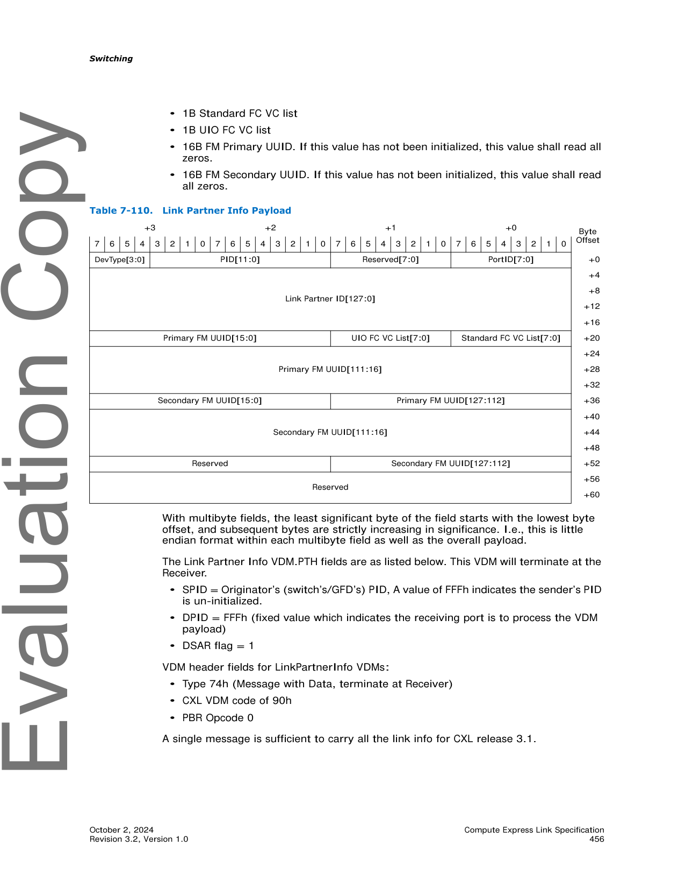
>
> *Original page render @ 150 DPI* — [📄 Full size](figures/chapter_07/page_0456.png)

### 7.7.11.6 PBR Link CCI Message Format and Transport Protocol | PBR 链路 CCI 消息格式与传输协议

<table>
<thead>
<tr>
<th width="50%">🇬🇧 English</th>
<th width="50%" style="background-color:#e8e8e8">🇨🇳 中文</th>
</tr>
</thead>
<tbody>
<tr><td>CCI commands are transported on PBR links as defined in Section 7.6.3 and its associated binding specifications (see DSP0234, DSP0238, and DSP0281) with some notable caveats and clarifications:</td><td style="background-color:#e8e8e8">CCI 命令在 PBR 链路上的传输如 7.6.3 节及其相关绑定规范 (参见 DSP0234、DSP0238 和 DSP0281) 所定义,以下为一些值得注意的注意事项和说明:</td></tr>
<tr><td>• As with all .io traffic across PBR links, MCTP PCIe VDMs include a PTH whose SPID and DPID define the routing of the message</td><td style="background-color:#e8e8e8">• 与所有跨 PBR 链路的 .io 流量一样,MCTP PCIe VDM 包含一个 PTH,其 SPID 和 DPID 定义消息的路由</td></tr>
<tr><td>• PCIe enumeration is not required for ISL PPBs and GFDs</td><td style="background-color:#e8e8e8">• ISL PPB 和 GFD 不需要进行 PCIe 枚举</td></tr>
<tr><td>• GFDs do not implement a PCIe Physical Function</td><td style="background-color:#e8e8e8">• GFD 不实现 PCIe Physical Function</td></tr>
<tr><td>• "Requester ID" and "Target ID" fields in the VDM's TLP header are reserved because IDs are not assigned to many elements within the fabric (e.g., FM, ISL PPBs, Switch Management FW, GFDs, etc.)</td><td style="background-color:#e8e8e8">• VDM 的 TLP 头中的 "Requester ID" 和 "Target ID" 字段保留,因为 fabric 中的许多元素 (例如 FM、ISL PPB、交换机管理固件、GFD 等) 不会被分配 ID</td></tr>
</tbody>
</table>

[⬆️ 返回目录](#-本章目录-part-c)

---

## 7.7.12 PBR Fabric Management | PBR Fabric 管理

### 7.7.12.1 Fabric Boot and Initialization | Fabric 引导与初始化

<table>
<thead>
<tr>
<th width="50%">🇬🇧 English</th>
<th width="50%" style="background-color:#e8e8e8">🇨🇳 中文</th>
</tr>
</thead>
<tbody>
<tr><td>Much like as outlined for HBR switches in Section 7.2.1, PBR switches may be initialized in one of three different ways:</td><td style="background-color:#e8e8e8">与 7.2.1 节中 HBR 交换机的概述类似,PBR 交换机可以通过以下三种不同方式之一进行初始化:</td></tr>
<tr><td>• Statically</td><td style="background-color:#e8e8e8">• 静态 (Statically)</td></tr>
<tr><td>• FM boots before the host(s)</td><td style="background-color:#e8e8e8">• FM 在主机之前引导</td></tr>
<tr><td>• FM and host boot simultaneously</td><td style="background-color:#e8e8e8">• FM 与主机同时引导</td></tr>
</tbody>
</table>

#### 7.7.12.1.1 Static Fabric Initialization | 静态 Fabric 初始化

<table>
<thead>
<tr>
<th width="50%">🇬🇧 English</th>
<th width="50%" style="background-color:#e8e8e8">🇨🇳 中文</th>
</tr>
</thead>
<tbody>
<tr><td>A static fabric deployment uses statically predefined configuration data to define the fabric configuration settings typically assigned dynamically by an FM.</td><td style="background-color:#e8e8e8">静态 fabric 部署使用静态预定义的配置数据来定义通常由 FM 动态分配的 fabric 配置设置。</td></tr>
<tr><td>Static Fabric Characteristics:</td><td style="background-color:#e8e8e8">静态 Fabric 特性:</td></tr>
<tr><td>• No support for G-FAM or MLD</td><td style="background-color:#e8e8e8">• 不支持 G-FAM 或 MLD</td></tr>
<tr><td>• No support for dynamic binding changes or DCD</td><td style="background-color:#e8e8e8">• 不支持动态绑定变更或 DCD</td></tr>
<tr><td>• No FM is required, but may be needed for error handling</td><td style="background-color:#e8e8e8">• 不需要 FM,但错误处理时可能需要</td></tr>
<tr><td>• At switch boot, all ports have a PID assigned, DRT and RGT tables are pre-populated, and EP and PID binding settings are predefined as defined by vendor-specific switch configuration data (e.g., configuration file in SPI Flash)</td><td style="background-color:#e8e8e8">• 交换机引导时,所有端口已分配 PID,DRT 和 RGT 表已预先填充,EP 和 PID 绑定设置由厂商特定的交换机配置数据 (例如 SPI Flash 中的配置文件) 预定义</td></tr>
<tr><td>• Each VH is ready for enumeration when the host boots</td><td style="background-color:#e8e8e8">• 主机引导时,每个 VH 即可进行枚举</td></tr>
<tr><td>• Hot-add and managed hot-remove are supported on Downstream Edge Ports</td><td style="background-color:#e8e8e8">• 下行边缘端口支持热添加和托管热移除</td></tr>
</tbody>
</table>

#### 7.7.12.1.2 Fabric Manager Boots First | Fabric Manager 先引导

<table>
<thead>
<tr>
<th width="50%">🇬🇧 English</th>
<th width="50%" style="background-color:#e8e8e8">🇨🇳 中文</th>
</tr>
</thead>
<tbody>
<tr><td>With this method, the FM configures the fabric binding relationships and access permissions before the host boots and enumerates its VH.</td><td style="background-color:#e8e8e8">采用此方法,FM 会在主机引导并枚举其 VH 之前配置 fabric 的绑定关系和访问权限。</td></tr>
<tr><td>• FM boots while hosts are held in reset</td><td style="background-color:#e8e8e8">• FM 引导时,主机保持在复位状态</td></tr>
<tr><td>• All attached ISLs and DSPs link up and, when negotiated in PBR mode, exchange the PBR Link Information VDM</td><td style="background-color:#e8e8e8">• 所有已连接的 ISL 和 DSP 链路 up,当以 PBR 模式协商时,交换 PBR Link Information VDM</td></tr>
<tr><td>• FM discovers fabric topology, claims ownership of all components under its management, and assign PIDs</td><td style="background-color:#e8e8e8">• FM 发现 fabric 拓扑,声明对其管理下所有组件的所有权,并分配 PID</td></tr>
<tr><td>• FM binds EPs to VCSs and configures GFDs</td><td style="background-color:#e8e8e8">• FM 将 EP 绑定到 VCS 并配置 GFD</td></tr>
<tr><td>• FM configures GMV and VTV to enable G-FAM, GIM and Edge-to-edge P2P, as required when available</td><td style="background-color:#e8e8e8">• FM 配置 GMV 和 VTV 以启用 G-FAM、GIM 和边到边 P2P (在可用时)</td></tr>
</tbody>
</table>

#### 7.7.12.1.3 Fabric Manager and Host Boot Simultaneously | Fabric Manager 与主机同时引导

<table>
<thead>
<tr>
<th width="50%">🇬🇧 English</th>
<th width="50%" style="background-color:#e8e8e8">🇨🇳 中文</th>
</tr>
</thead>
<tbody>
<tr><td>In the case where the switches, FM, and host boot at the same time:</td><td style="background-color:#e8e8e8">在交换机、FM 和主机同时引导的情况下:</td></tr>
<tr><td>• VCSs, PID assignment, GFD configuration, and bindings between Host ES to Downstream ES VCSs are statically defined</td><td style="background-color:#e8e8e8">• VCS、PID 分配、GFD 配置以及 Host ES 与 Downstream ES VCS 之间的绑定是静态定义的</td></tr>
<tr><td>• Edge vPPBs within each VCS are unbound and presented to the host as Link Down</td><td style="background-color:#e8e8e8">• 每个 VCS 内的边缘 vPPB 处于未绑定状态,并以 Link Down 形式呈现给主机</td></tr>
<tr><td>• Switch discovers downstream devices and presents them to the FM</td><td style="background-color:#e8e8e8">• 交换机发现下行设备并将其呈现给 FM</td></tr>
<tr><td>• Host enumerates the VH and configures the DVSEC registers</td><td style="background-color:#e8e8e8">• 主机枚举 VH 并配置 DVSEC 寄存器</td></tr>
<tr><td>• FM performs port binding to edge vPPBs</td><td style="background-color:#e8e8e8">• FM 执行端口到边缘 vPPB 的绑定</td></tr>
<tr><td>• Switch performs virtual to physical binding</td><td style="background-color:#e8e8e8">• 交换机执行虚拟到物理的绑定</td></tr>
<tr><td>• Each bound port results in a Presence Detect Change or Link State Change notification to the host</td><td style="background-color:#e8e8e8">• 每个已绑定端口会向主机产生 Presence Detect Change 或 Link State Change 通知</td></tr>
<tr><td>• For G-FAM access, FM updates GMV and VTV access vectors for hosts</td><td style="background-color:#e8e8e8">• 对于 G-FAM 访问,FM 会更新主机的 GMV 和 VTV 访问向量</td></tr>
</tbody>
</table>

### 7.7.12.2 PBR Fabric Discovery | PBR Fabric 发现

<table>
<thead>
<tr>
<th width="50%">🇬🇧 English</th>
<th width="50%" style="background-color:#e8e8e8">🇨🇳 中文</th>
</tr>
</thead>
<tbody>
<tr><td>To effectively manage a PBR fabric, the FM must understand the physical topology through a fabric discovery process. A typical fabric discovery may proceed as follows.</td><td style="background-color:#e8e8e8">为了有效管理 PBR fabric,FM 必须通过 fabric 发现过程了解物理拓扑。典型的 fabric 发现可按以下步骤进行。</td></tr>
<tr><td>1. FM discovers the component to which it is directly connected and claims primary FM ownership.</td><td style="background-color:#e8e8e8">1. FM 发现与其直接连接的组件,并声明主 FM 所有权。</td></tr>
<tr><td>Management of a PBR device requires that a primary FM is registered. A PBR device shall accept only the following commands from an FM that is not registered as the primary FM:</td><td style="background-color:#e8e8e8">PBR 设备的管理要求注册主 FM。PBR 设备应仅接受来自未注册为主 FM 的 FM 的以下命令:</td></tr>
<tr><td>— Identify</td><td style="background-color:#e8e8e8">— Identify</td></tr>
<tr><td>— Get Supported Logs</td><td style="background-color:#e8e8e8">— Get Supported Logs</td></tr>
<tr><td>— Get Log</td><td style="background-color:#e8e8e8">— Get Log</td></tr>
<tr><td>— Identify PBR Component</td><td style="background-color:#e8e8e8">— Identify PBR Component</td></tr>
<tr><td>— Claim Ownership</td><td style="background-color:#e8e8e8">— Claim Ownership</td></tr>
<tr><td>All other commands shall fail with "Unsupported Request". A PBR device shall only advertise support for the CEL and the CEL shall only advertise the commands in the above list when the supported logs or CEL contents are queried by an FM that is not registered as the primary FM.</td><td style="background-color:#e8e8e8">所有其他命令应失败并返回 "Unsupported Request"。PBR 设备应仅公布对 CEL 的支持,且仅当未注册为主 FM 的 FM 查询支持的日志或 CEL 内容时,CEL 才应仅公布上述列表中的命令。</td></tr>
<tr><td>If the FM is connected to a switch, crawl out and discovery of the fabric continues.</td><td style="background-color:#e8e8e8">若 FM 连接到交换机,则继续 crawl out 和 fabric 发现。</td></tr>
<tr><td>2. FM explores all switch ports.</td><td style="background-color:#e8e8e8">2. FM 探索所有交换机端口。</td></tr>
<tr><td>As primary FM, the switch capabilities and switch port status can be queried. The Get Physical Port State and Get PBR Link Partner Info commands provide information on the devices connected to each port.</td><td style="background-color:#e8e8e8">作为主 FM,可查询交换机功能和交换机端口状态。Get Physical Port State 和 Get PBR Link Partner Info 命令提供有关每个端口所连接设备的信息。</td></tr>
<tr><td>PBR switches can determine the type of device present at the far end of a link after negotiation using the link state information provided in Table 7-111.</td><td style="background-color:#e8e8e8">PBR 交换机可在协商后使用表 7-111 中提供的链路状态信息确定链路远端所连接的设备类型。</td></tr>
<tr><td>3. FM may choose to first continue discovery of any connected switches or to manage devices on the far end of all switch ports.</td><td style="background-color:#e8e8e8">3. FM 可选择先继续发现任何已连接的交换机,或先管理所有交换机端口远端的设备。</td></tr>
<tr><td>PBR switch PPBs connected as ISLs are configured by the FM with the Send PPB CXL.io Configuration Request command.</td><td style="background-color:#e8e8e8">作为 ISL 连接的 PBR 交换机 PPB 由 FM 通过 Send PPB CXL.io Configuration Request 命令进行配置。</td></tr>
<tr><td>The FM uses the Fabric Crawl Out command, as defined in Section 7.7.13.2, using switch port number as the target to manage the devices on the far end of each switch port. The FM claims ownership and assigns a PID to each defined as covered in step 1.</td><td style="background-color:#e8e8e8">FM 使用 7.7.13.2 节中定义的 Fabric Crawl Out 命令,以交换机端口号作为目标,管理每个交换机端口远端的设备。FM 声明所有权并为每个 (如步骤 1 所述) 已定义的设备分配 PID。</td></tr>
<tr><td>Once the far end device has been assigned a PID, the FM must program the PBR</td><td style="background-color:#e8e8e8">一旦为远端设备分配了 PID,FM 必须对 PBR 交换机</td></tr>
</tbody>
</table>

<table>
<thead>
<tr>
<th width="50%">🇬🇧 English</th>
<th width="50%" style="background-color:#e8e8e8">🇨🇳 中文</th>
</tr>
</thead>
<tbody>
<tr><td>switch's DRT to enable routing of that PID to the appropriate switch port. The FM can now use this new assigned PID as the target for subsequent Fabric Crawl Out requests.</td><td style="background-color:#e8e8e8">的 DRT 进行编程,以使该 PID 可路由到相应的交换机端口。FM 现在可以使用这个新分配的 PID 作为后续 Fabric Crawl Out 请求的目标。</td></tr>
<tr><td>Steps 1 – 3 are repeated for all PBR switches discovered.</td><td style="background-color:#e8e8e8">对发现的所有 PBR 交换机重复步骤 1 – 3。</td></tr>
</tbody>
</table>

> **Table 7-111.** Far End Device Type Detection (Sheet 1 of 2) ｜ 远端设备类型检测 (1/2)
>
> 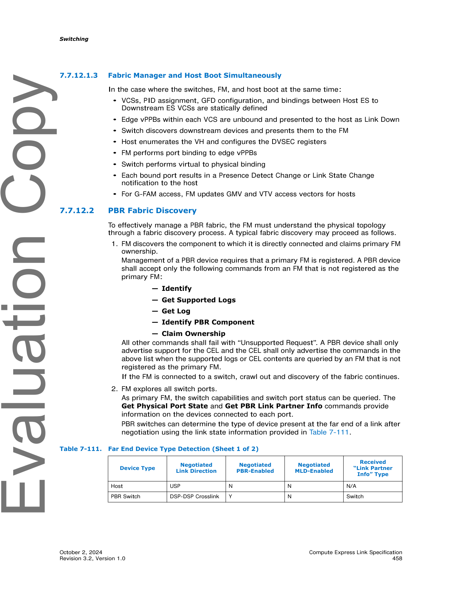
>
> *Original page render @ 150 DPI* — [📄 Full size](figures/chapter_07/page_0458.png)

> **Table 7-111 (cont.).** Far End Device Type Detection (Sheet 2 of 2) ｜ 远端设备类型检测 (2/2)
>
> 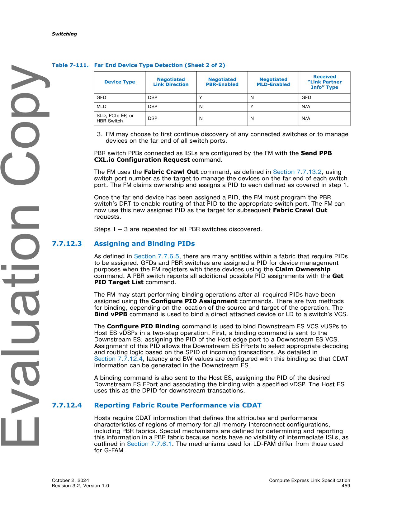
>
> *Original page render @ 150 DPI* — [📄 Full size](figures/chapter_07/page_0459.png)

### 7.7.12.3 Assigning and Binding PIDs | PID 分配与绑定

<table>
<thead>
<tr>
<th width="50%">🇬🇧 English</th>
<th width="50%" style="background-color:#e8e8e8">🇨🇳 中文</th>
</tr>
</thead>
<tbody>
<tr><td>As defined in Section 7.7.6.5, there are many entities within a fabric that require PIDs to be assigned. GFDs and PBR switches are assigned a PID for device management purposes when the FM registers with these devices using the Claim Ownership command. A PBR switch reports all additional possible PID assignments with the Get PID Target List command.</td><td style="background-color:#e8e8e8">如 7.7.6.5 节所定义,fabric 中有许多实体需要分配 PID。当 FM 通过 Claim Ownership 命令向这些设备注册时,会为 GFD 和 PBR 交换机分配 PID 以用于设备管理。PBR 交换机通过 Get PID Target List 命令上报所有其他可能的 PID 分配。</td></tr>
<tr><td>The FM may start performing binding operations after all required PIDs have been assigned using the Configure PID Assignment commands. There are two methods for binding, depending on the location of the source and target of the operation. The Bind vPPB command is used to bind a direct attached device or LD to a switch's VCS. The Configure PID Binding command is used to bind Downstream ES VCS vUSPs to Host ES vDSPs in a two-step operation. First, a binding command is sent to the Downstream ES, assigning the PID of the Host edge port to a Downstream ES VCS. Assignment of this PID allows the Downstream ES FPorts to select appropriate decoding and routing logic based on the SPID of incoming transactions. As detailed in Section 7.7.12.4, latency and BW values are configured with this binding so that CDAT information can be generated in the Downstream ES.</td><td style="background-color:#e8e8e8">使用 Configure PID Assignment 命令分配所有必需的 PID 后,FM 可开始执行绑定操作。绑定有两种方法,具体取决于操作的源和目标的位置。Bind vPPB 命令用于将直连设备或 LD 绑定到交换机的 VCS。Configure PID Binding 命令用于通过两步操作将 Downstream ES VCS vUSP 绑定到 Host ES vDSP。首先,将绑定命令发送到 Downstream ES,将 Host edge port 的 PID 分配给一个 Downstream ES VCS。分配该 PID 后,Downstream ES FPort 可根据传入事务的 SPID 选择适当的解码和路由逻辑。如 7.7.12.4 节所述,该绑定会配置延迟和带宽值,以便在 Downstream ES 中生成 CDAT 信息。</td></tr>
<tr><td>A binding command is also sent to the Host ES, assigning the PID of the desired Downstream ES FPort and associating the binding with a specified vDSP. The Host ES uses this as the DPID for downstream transactions.</td><td style="background-color:#e8e8e8">绑定命令还会发送到 Host ES,将所需 Downstream ES FPort 的 PID 分配给 Host ES 并将该绑定与指定的 vDSP 关联。Host ES 将其用作下行事务的 DPID。</td></tr>
</tbody>
</table>

### 7.7.12.4 Reporting Fabric Route Performance via CDAT | 通过 CDAT 上报 Fabric 路由性能

<table>
<thead>
<tr>
<th width="50%">🇬🇧 English</th>
<th width="50%" style="background-color:#e8e8e8">🇨🇳 中文</th>
</tr>
</thead>
<tbody>
<tr><td>Hosts require CDAT information that defines the attributes and performance characteristics of regions of memory for all memory interconnect configurations, including PBR fabrics. Special mechanisms are defined for determining and reporting this information in a PBR fabric because hosts have no visibility of intermediate ISLs, as outlined in Section 7.7.6.1. The mechanisms used for LD-FAM differ from those used for G-FAM.</td><td style="background-color:#e8e8e8">主机需要 CDAT 信息来定义所有内存互连配置 (包括 PBR fabric) 下内存区域的属性和性能特征。由于主机对中间 ISL 不可见 (如 7.7.6.1 节所述),在 PBR fabric 中定义了特殊机制用于确定和上报这些信息。LD-FAM 使用的机制与 G-FAM 不同。</td></tr>
</tbody>
</table>

#### 7.7.12.4.1 Accessing CDAT Information for LD-FAM | 访问 LD-FAM 的 CDAT 信息

<table>
<thead>
<tr>
<th width="50%">🇬🇧 English</th>
<th width="50%" style="background-color:#e8e8e8">🇨🇳 中文</th>
</tr>
</thead>
<tbody>
<tr><td>There are up to three components involved in the path to LD-FAM in a PBR fabric: a Host ES, a Downstream ES, and an LD-FAM device. The Host ES and LD-FAM devices require no special handling and report CDAT information covering their own characteristics as they would in an HBR system deployment. The Downstream ES, however, is required to report CDAT information that covers its own device-level performance factoring in the impact of the fabric routing path, as described below.</td><td style="background-color:#e8e8e8">在 PBR fabric 中,通往 LD-FAM 的路径涉及最多三个组件:Host ES、Downstream ES 和 LD-FAM 设备。Host ES 和 LD-FAM 设备不需要特殊处理,它们会上报涵盖其自身特征的 CDAT 信息,就像在 HBR 系统部署中一样。然而,Downstream ES 需要上报涵盖其自身设备级性能 (考虑 fabric 路由路径的影响) 的 CDAT 信息,如下所述。</td></tr>
<tr><td>Latency and BW values are provided when the binding between a Host ES VCS and Downstream ES VCS is configured with the Configure PID Binding command. Routes through a fabric are expected to have symmetric performance characteristics. As such, only one latency and BW value is provided to define the fabric routing path. The Downstream ES adds the latency of the routing path to its own latency and uses the lesser of the BW values.</td><td style="background-color:#e8e8e8">在使用 Configure PID Binding 命令配置 Host ES VCS 与 Downstream ES VCS 之间的绑定时,提供延迟和带宽值。Fabric 中的路由预期具有对称的性能特征。因此,仅提供一个延迟和带宽值来定义 fabric 路由路径。Downstream ES 将路由路径的延迟加到其自身延迟上,并使用两者带宽中较小的值。</td></tr>
<tr><td>Hosts access CDAT information for Downstream ES VCSs from a DOE instance present in the vUSP.</td><td style="background-color:#e8e8e8">主机从 vUSP 中的 DOE 实例访问 Downstream ES VCS 的 CDAT 信息。</td></tr>
</tbody>
</table>

#### 7.7.12.4.2 Accessing CDAT Information for G-FAM | 访问 G-FAM 的 CDAT 信息

<table>
<thead>
<tr>
<th width="50%">🇬🇧 English</th>
<th width="50%" style="background-color:#e8e8e8">🇨🇳 中文</th>
</tr>
</thead>
<tbody>
<tr><td>The access mechanism for CDAT from G-FAM is necessarily different from LD-FAM as a result of 2 key architectural differences: G-FAM is presented through the FAST, not a switch-based topology, and GFDs do not implement nor expose a DOE instance to the host. CDAT access for G-FAM instead relies on the use of CCI opcodes.</td><td style="background-color:#e8e8e8">由于两个关键的架构差异,G-FAM 的 CDAT 访问机制必然不同于 LD-FAM:G-FAM 通过 FAST 呈现,而不是基于交换机的拓扑;GFD 不实现也不向主机公开 DOE 实例。G-FAM 的 CDAT 访问转而依赖于 CCI 操作码的使用。</td></tr>
<tr><td>The GAE providing G-FAM access is responsible for producing the CDAT for each segment of the FAST. Latency and BW values are provided when PID access is enabled with the Configure PID Access command. The CDAT information is queried by the host using the Read CDAT command.</td><td style="background-color:#e8e8e8">提供 G-FAM 访问的 GAE 负责为 FAST 的每个段生成 CDAT。在使用 Configure PID Access 命令启用 PID 访问时,提供延迟和带宽值。主机使用 Read CDAT 命令查询 CDAT 信息。</td></tr>
<tr><td>GFDs are responsible for providing CDAT information covering their own characteristics. The host queries CDAT information from GFDs using the Proxy GFD Management Command request to initiate the Read CDAT command.</td><td style="background-color:#e8e8e8">GFD 负责提供涵盖其自身特征的 CDAT 信息。主机使用 Proxy GFD Management Command 请求从 GFD 查询 CDAT 信息,以启动 Read CDAT 命令。</td></tr>
</tbody>
</table>

### 7.7.12.5 Configuring CacheID in PBR Fabric | 在 PBR Fabric 中配置 CacheID

<table>
<thead>
<tr>
<th width="50%">🇬🇧 English</th>
<th width="50%" style="background-color:#e8e8e8">🇨🇳 中文</th>
</tr>
</thead>
<tbody>
<tr><td>From the host's perspective, configuration of CacheID for VHs spanning a PBR Fabric is performed identically to such configuration in an exclusively HBR topology. PBR switches automatically exchange ID configuration information in the following manner:</td><td style="background-color:#e8e8e8">从主机的角度来看,为跨越 PBR Fabric 的 VH 配置 CacheID 的过程与在纯 HBR 拓扑中执行该配置完全相同。PBR 交换机以如下方式自动交换 ID 配置信息:</td></tr>
<tr><td>1. The Downstream ES presents ID route table capabilities in its vPPBs (see Section 8.2.4.28 for details on the CacheID Route Table).</td><td style="background-color:#e8e8e8">1. Downstream ES 在其 vPPB 中呈现 ID 路由表能力 (CacheID Route Table 详情参见 8.2.4.28 节)。</td></tr>
<tr><td>2. The host will enumerate and assign all IDs and program the route table capability, triggering the Commit bit to complete the configuration.</td><td style="background-color:#e8e8e8">2. 主机将枚举并分配所有 ID,并对路由表能力进行编程,通过触发 Commit 位完成配置。</td></tr>
<tr><td>3. The setting of the Commit bit triggers the Downstream ES to generate one or more RTUpdate VDMs, as defined in Section 3.1.11.7, targeted at the Host PID. The Host ES will intercept this VDM based on its PBR opcode.</td><td style="background-color:#e8e8e8">3. 设置 Commit 位会触发 Downstream ES 生成一个或多个 RTUpdate VDM (如 3.1.11.7 节所定义),以 Host PID 为目标。Host ES 将根据其 PBR 操作码拦截该 VDM。</td></tr>
<tr><td>4. Upon receipt of the VDM, the Host ES programs the necessary ID to PID translation logic in the Host edge port.</td><td style="background-color:#e8e8e8">4. 收到 VDM 后,Host ES 在 Host edge port 中对所需的 ID 到 PID 转换逻辑进行编程。</td></tr>
<tr><td>5. The Host ES acknowledges successful programming of the ID translation logic with an RTUpdateAck VDM, as defined in Section 3.1.11.8, sent to the Downstream ES for each RTUpdate VDM that was received and successfully processed.</td><td style="background-color:#e8e8e8">5. Host ES 通过 RTUpdateAck VDM (如 3.1.11.8 节所定义) 向 Downstream ES 确认 ID 转换逻辑已成功编程,该 VDM 针对每个已接收并成功处理的 RTUpdate VDM 发送。</td></tr>
<tr><td>6. Upon receipt of the VDM, the Downstream ES sets the corresponding 'RT Committed' bit in the vUSP.</td><td style="background-color:#e8e8e8">6. 收到 VDM 后,Downstream ES 在 vUSP 中设置相应的 'RT Committed' 位。</td></tr>
<tr><td>A downstream HBR switch topology requires PIDs for each unique potential target so that IDs can be translated between CacheID and PID at the fabric edges. For CacheID, the ID is valid if the Valid bit is set in a Cache ID Target entry in the Cache ID Route Table Capability Structure. The corresponding PID used is the PID of the DSP to which the Route Table entry has been configured to map. Multiple PIDs must be assigned to a DSP if multiple IDs map to that DSP.</td><td style="background-color:#e8e8e8">下游 HBR 交换机拓扑需要为每个唯一潜在目标分配 PID,以便在 fabric 边缘进行 CacheID 与 PID 之间的转换。对于 CacheID,若 Cache ID Route Table Capability Structure 中 Cache ID Target 条目的 Valid 位置位,则该 ID 有效。所使用的相应 PID 是路由表条目已配置映射到的 DSP 的 PID。若多个 ID 映射到同一 DSP,则必须为该 DSP 分配多个 PID。</td></tr>
</tbody>
</table>

### 7.7.12.6 Dynamic Fabric Changes | 动态 Fabric 变更

<table>
<thead>
<tr>
<th width="50%">🇬🇧 English</th>
<th width="50%" style="background-color:#e8e8e8">🇨🇳 中文</th>
</tr>
</thead>
<tbody>
<tr><td>This section outlines how FMs and PBR switches handle various changes to the system configuration during runtime.</td><td style="background-color:#e8e8e8">本节概述 FM 和 PBR 交换机在运行时如何处理系统配置的各种变更。</td></tr>
</tbody>
</table>

#### 7.7.12.6.1 Hot-Add and Link Up Events | 热添加与 Link Up 事件

<table>
<thead>
<tr>
<th width="50%">🇬🇧 English</th>
<th width="50%" style="background-color:#e8e8e8">🇨🇳 中文</th>
</tr>
</thead>
<tbody>
<tr><td>A new Link Up on an unbound edge port is indicated to the FM via a Physical Switch Event Record. The FM uses the Get Physical Port State and Get PBR Link Partner Info commands to query information on the device connected to the port.</td><td style="background-color:#e8e8e8">未绑定边缘端口上的新 Link Up 通过 Physical Switch Event Record 通知 FM。FM 使用 Get Physical Port State 和 Get PBR Link Partner Info 命令查询端口所连接设备的信息。</td></tr>
<tr><td>When an SLD or PCIe device is Hot-Added to a bound port, the FM can be notified but is not involved.</td><td style="background-color:#e8e8e8">当 SLD 或 PCIe 设备热添加到已绑定端口时,FM 可收到通知但不会介入。</td></tr>
</tbody>
</table>

#### 7.7.12.6.2 Dynamic Configuration Changes | 动态配置变更

<table>
<thead>
<tr>
<th width="50%">🇬🇧 English</th>
<th width="50%" style="background-color:#e8e8e8">🇨🇳 中文</th>
</tr>
</thead>
<tbody>
<tr><td>There are many runtime configuration changes that an FM can trigger on a fabric:</td><td style="background-color:#e8e8e8">FM 可在 fabric 上触发多种运行时配置变更:</td></tr>
<tr><td>• Binding/Unbinding: New bindings are presented to hosts as hot-add operations. Unbinding an EP is presented as a hot-remove operation.</td><td style="background-color:#e8e8e8">• 绑定/解绑:新绑定作为热添加操作呈现给主机。解绑 EP 作为热移除操作呈现。</td></tr>
<tr><td>• Updates to GMV/VTV: The GAE generates a notification to the host when changes are made to the GMV or VTV enabling or disabling access to a particular PID.</td><td style="background-color:#e8e8e8">• GMV/VTV 更新:当对 GMV 或 VTV 进行启用/禁用特定 PID 访问的更改时,GAE 会向主机产生通知。</td></tr>
<tr><td>• GFD DCD changes: GFDs generate notifications to all impacted GAEs when updates are made to a host group's extent list.</td><td style="background-color:#e8e8e8">• GFD DCD 变更:当对主机组的范围列表进行更新时,GFD 会向所有受影响的 GAE 产生通知。</td></tr>
</tbody>
</table>

#### 7.7.12.6.3 Hot/Surprise Remove and Link Down Events | 热/意外移除与 Link Down 事件

<table>
<thead>
<tr>
<th width="50%">🇬🇧 English</th>
<th width="50%" style="background-color:#e8e8e8">🇨🇳 中文</th>
</tr>
</thead>
<tbody>
<tr><td>The FM is responsible for managing a Link Down event:</td><td style="background-color:#e8e8e8">FM 负责管理 Link Down 事件:</td></tr>
<tr><td>• The PBR switch that experienced the Link Down notifies the FM with a Physical Switch Event Record</td><td style="background-color:#e8e8e8">• 经历 Link Down 的 PBR 交换机通过 Physical Switch Event Record 通知 FM</td></tr>
<tr><td>• EP Link Down events are represented as surprise removes to the host</td><td style="background-color:#e8e8e8">• EP Link Down 事件以意外移除的方式呈现给主机</td></tr>
<tr><td>• The FM manages any required topology changes associated with an ISL Link Down event, including clearing the PID binding between the Upstream ES and Downstream ES VCSs, which is presented to the host as a hot-remove of the Downstream ES VCS</td><td style="background-color:#e8e8e8">• FM 管理与 ISL Link Down 事件相关的任何必要拓扑变更,包括清除 Upstream ES 与 Downstream ES VCS 之间的 PID 绑定,该绑定清除以 Downstream ES VCS 热移除的方式呈现给主机</td></tr>
<tr><td>• GFD Link Down events prompt the FM to disable access to the corresponding PID in all impacted hosts' GAE GMV and VTV</td><td style="background-color:#e8e8e8">• GFD Link Down 事件促使 FM 在所有受影响主机的 GAE GMV 和 VTV 中禁用对相应 PID 的访问</td></tr>
<tr><td>• PBR switches drop unroutable transactions</td><td style="background-color:#e8e8e8">• PBR 交换机丢弃无法路由的事务</td></tr>
</tbody>
</table>

[⬆️ 返回目录](#-本章目录-part-c)

---

## 7.7.13 PBR Switch Command Set | PBR 交换机命令集

<table>
<thead>
<tr>
<th width="50%">🇬🇧 English</th>
<th width="50%" style="background-color:#e8e8e8">🇨🇳 中文</th>
</tr>
</thead>
<tbody>
<tr><td>This command set is only supported by, and must be supported by, PBR switches to facilitate the discovery of a PBR fabric and configuration of routing and bindings.</td><td style="background-color:#e8e8e8">该命令集仅由 PBR 交换机支持,且 PBR 交换机必须支持该命令集,以便发现 PBR fabric 并配置路由和绑定。</td></tr>
</tbody>
</table>

### 7.7.13.1 Identify PBR Switch (Opcode 5700h) | Identify PBR Switch (操作码 5700h)

<table>
<thead>
<tr>
<th width="50%">🇬🇧 English</th>
<th width="50%" style="background-color:#e8e8e8">🇨🇳 中文</th>
</tr>
</thead>
<tbody>
<tr><td>This command provides information to the FM about a PBR switch's fabric capabilities.</td><td style="background-color:#e8e8e8">该命令向 FM 提供有关 PBR 交换机 fabric 能力的信息。</td></tr>
<tr><td>Possible Command Return Codes:</td><td style="background-color:#e8e8e8">可能的命令返回码:</td></tr>
<tr><td>• Success</td><td style="background-color:#e8e8e8">• Success</td></tr>
<tr><td>• Unsupported</td><td style="background-color:#e8e8e8">• Unsupported</td></tr>
<tr><td>• Internal Error</td><td style="background-color:#e8e8e8">• Internal Error</td></tr>
<tr><td>• Retry Required</td><td style="background-color:#e8e8e8">• Retry Required</td></tr>
<tr><td>Command Effects:</td><td style="background-color:#e8e8e8">命令效果:</td></tr>
<tr><td>• None</td><td style="background-color:#e8e8e8">• 无</td></tr>
</tbody>
</table>

> **Table 7-112.** Identify PBR Switch Response Payload ｜ Identify PBR Switch 响应 Payload
>
> 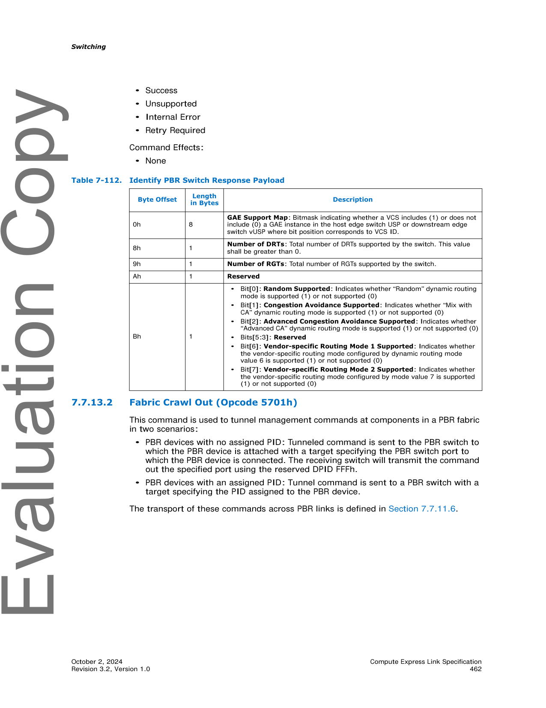
>
> *Original page render @ 150 DPI* — [📄 Full size](figures/chapter_07/page_0462.png)

### 7.7.13.2 Fabric Crawl Out (Opcode 5701h) | Fabric Crawl Out (操作码 5701h)

<table>
<thead>
<tr>
<th width="50%">🇬🇧 English</th>
<th width="50%" style="background-color:#e8e8e8">🇨🇳 中文</th>
</tr>
</thead>
<tbody>
<tr><td>This command is used to tunnel management commands at components in a PBR fabric in two scenarios:</td><td style="background-color:#e8e8e8">该命令用于在 PBR fabric 中的组件上隧道传输管理命令,适用于以下两种场景:</td></tr>
<tr><td>• PBR devices with no assigned PID: Tunneled command is sent to the PBR switch to which the PBR device is attached with a target specifying the PBR switch port to which the PBR device is connected. The receiving switch will transmit the command out the specified port using the reserved DPID FFFh.</td><td style="background-color:#e8e8e8">• 未分配 PID 的 PBR 设备:隧道命令发送到 PBR 设备所连接的 PBR 交换机,目标指定 PBR 设备所连接的 PBR 交换机端口。接收交换机将使用保留的 DPID FFFh 将命令从指定端口发出。</td></tr>
<tr><td>• PBR devices with an assigned PID: Tunnel command is sent to a PBR switch with a target specifying the PID assigned to the PBR device.</td><td style="background-color:#e8e8e8">• 已分配 PID 的 PBR 设备:隧道命令发送到 PBR 交换机,目标指定分配给 PBR 设备的 PID。</td></tr>
<tr><td>The transport of these commands across PBR links is defined in Section 7.7.11.6.</td><td style="background-color:#e8e8e8">这些命令跨 PBR 链路的传输在 7.7.11.6 节中定义。</td></tr>
<tr><td>The Management Command input payload field includes the tunneled command encapsulated in the CCI Message Format, as defined in Figure 7-19. This can include an additional layer of tunneling for commands issued to components with no assigned PID, as illustrated in Figure 7-55.</td><td style="background-color:#e8e8e8">Management Command 输入有效载荷字段包含按 CCI 消息格式 (如图 7-19 所定义) 封装的隧道命令。这可包括针对未分配 PID 的组件所发命令的额外一层隧道传输,如图 7-55 所示。</td></tr>
<tr><td>Response size varies, based on the tunneled command's definition. Valid targets for the tunneled commands include PBR switch ports, and PBR devices within a fabric.</td><td style="background-color:#e8e8e8">响应大小根据隧道命令的定义而变化。隧道命令的有效目标包括 PBR 交换机端口以及 fabric 中的 PBR 设备。</td></tr>
<tr><td>This command fails with "Invalid Input" if the target specifies a non-existent switch port or a PID with no valid entry in the DRT.</td><td style="background-color:#e8e8e8">若目标指定了不存在的交换机端口或 DRT 中无有效条目的 PID,则该命令以 "Invalid Input" 失败。</td></tr>
<tr><td>Components shall terminate the processing of a request that includes more than 2 layers of tunneling and provide an "Unsupported" return code.</td><td style="background-color:#e8e8e8">组件应终止处理包含超过 2 层隧道的请求,并返回 "Unsupported" 返回码。</td></tr>
<tr><td>Possible Command Return Codes:</td><td style="background-color:#e8e8e8">可能的命令返回码:</td></tr>
<tr><td>• Success</td><td style="background-color:#e8e8e8">• Success</td></tr>
<tr><td>• Unsupported</td><td style="background-color:#e8e8e8">• Unsupported</td></tr>
<tr><td>• Invalid Input</td><td style="background-color:#e8e8e8">• Invalid Input</td></tr>
<tr><td>• Internal Error</td><td style="background-color:#e8e8e8">• Internal Error</td></tr>
</tbody>
</table>

> **Figure 7-54.** Tunneling Commands to Remote Devices ｜ 对远程设备的命令隧道传输
>
> 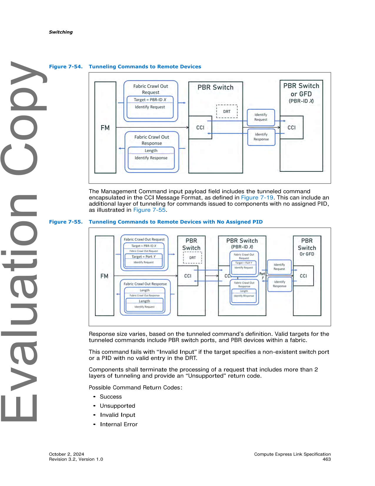
>
> *Original page render @ 150 DPI* — [📄 Full size](figures/chapter_07/page_0463.png)

> **Figure 7-55.** Tunneling Commands to Remote Devices with No Assigned PID ｜ 对未分配 PID 的远程设备的命令隧道传输
>
> 
>
> *Original page render @ 150 DPI* — [📄 Full size](figures/chapter_07/page_0463.png)

<table>
<thead>
<tr>
<th width="50%">🇬🇧 English</th>
<th width="50%" style="background-color:#e8e8e8">🇨🇳 中文</th>
</tr>
</thead>
<tbody>
<tr><td>• Retry Required</td><td style="background-color:#e8e8e8">• Retry Required</td></tr>
<tr><td>Command Effects:</td><td style="background-color:#e8e8e8">命令效果:</td></tr>
<tr><td>• None</td><td style="background-color:#e8e8e8">• 无</td></tr>
</tbody>
</table>

> **Table 7-113.** Fabric Crawl Out Request Payload ｜ Fabric Crawl Out 请求 Payload
>
> 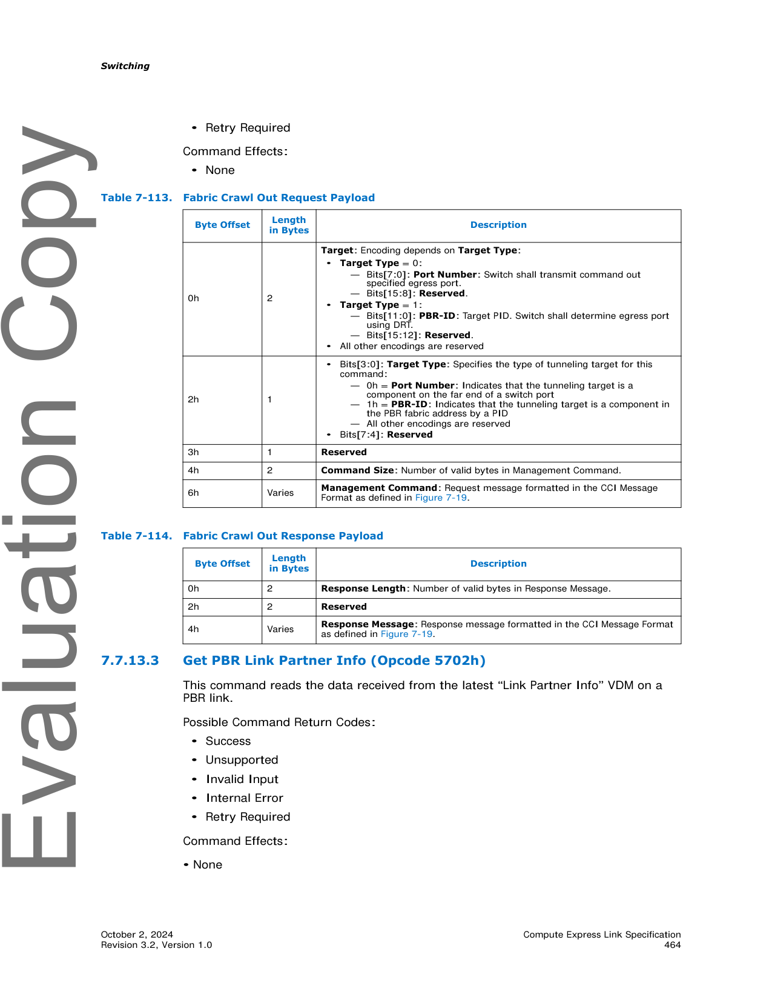
>
> *Original page render @ 150 DPI* — [📄 Full size](figures/chapter_07/page_0464.png)

> **Table 7-114.** Fabric Crawl Out Response Payload ｜ Fabric Crawl Out 响应 Payload
>
> 
>
> *Original page render @ 150 DPI* — [📄 Full size](figures/chapter_07/page_0464.png)

### 7.7.13.3 Get PBR Link Partner Info (Opcode 5702h) | Get PBR Link Partner Info (操作码 5702h)

<table>
<thead>
<tr>
<th width="50%">🇬🇧 English</th>
<th width="50%" style="background-color:#e8e8e8">🇨🇳 中文</th>
</tr>
</thead>
<tbody>
<tr><td>This command reads the data received from the latest "Link Partner Info" VDM on a PBR link.</td><td style="background-color:#e8e8e8">该命令读取从 PBR 链路上最新 "Link Partner Info" VDM 接收到的数据。</td></tr>
<tr><td>Possible Command Return Codes:</td><td style="background-color:#e8e8e8">可能的命令返回码:</td></tr>
<tr><td>• Success</td><td style="background-color:#e8e8e8">• Success</td></tr>
<tr><td>• Unsupported</td><td style="background-color:#e8e8e8">• Unsupported</td></tr>
<tr><td>• Invalid Input</td><td style="background-color:#e8e8e8">• Invalid Input</td></tr>
<tr><td>• Internal Error</td><td style="background-color:#e8e8e8">• Internal Error</td></tr>
<tr><td>• Retry Required</td><td style="background-color:#e8e8e8">• Retry Required</td></tr>
<tr><td>Command Effects:</td><td style="background-color:#e8e8e8">命令效果:</td></tr>
<tr><td>• None</td><td style="background-color:#e8e8e8">• 无</td></tr>
</tbody>
</table>

> **Table 7-115.** Get PBR Link Partner Info Request Payload ｜ Get PBR Link Partner Info 请求 Payload
>
> 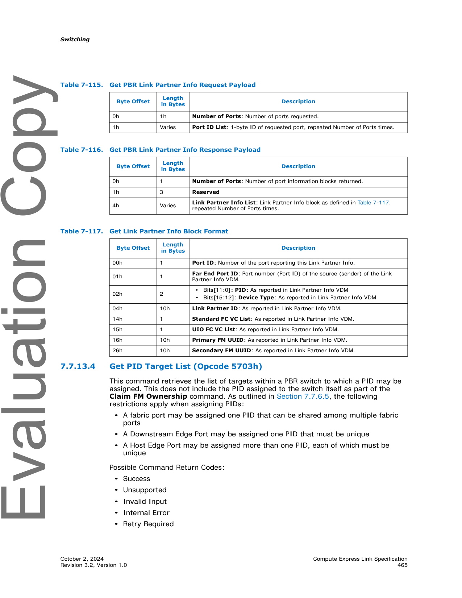
>
> *Original page render @ 150 DPI* — [📄 Full size](figures/chapter_07/page_0465.png)

> **Table 7-116.** Get PBR Link Partner Info Response Payload ｜ Get PBR Link Partner Info 响应 Payload
>
> 
>
> *Original page render @ 150 DPI* — [📄 Full size](figures/chapter_07/page_0465.png)

> **Table 7-117.** Get Link Partner Info Block Format ｜ Get Link Partner Info 块格式
>
> 
>
> *Original page render @ 150 DPI* — [📄 Full size](figures/chapter_07/page_0465.png)

### 7.7.13.4 Get PID Target List (Opcode 5703h) | Get PID Target List (操作码 5703h)

<table>
<thead>
<tr>
<th width="50%">🇬🇧 English</th>
<th width="50%" style="background-color:#e8e8e8">🇨🇳 中文</th>
</tr>
</thead>
<tbody>
<tr><td>This command retrieves the list of targets within a PBR switch to which a PID may be assigned. This does not include the PID assigned to the switch itself as part of the Claim FM Ownership command. As outlined in Section 7.7.6.5, the following restrictions apply when assigning PIDs:</td><td style="background-color:#e8e8e8">该命令检索 PBR 交换机内可分配 PID 的目标列表。该列表不包括作为 Claim FM Ownership 命令的一部分分配给交换机自身的 PID。如 7.7.6.5 节所述,分配 PID 时适用以下限制:</td></tr>
<tr><td>• A fabric port may be assigned one PID that can be shared among multiple fabric ports</td><td style="background-color:#e8e8e8">• 一个 fabric 端口可被分配一个可在多个 fabric 端口之间共享的 PID</td></tr>
<tr><td>• A Downstream Edge Port may be assigned one PID that must be unique</td><td style="background-color:#e8e8e8">• 一个 Downstream Edge Port 可被分配一个 PID,且该 PID 必须唯一</td></tr>
<tr><td>• A Host Edge Port may be assigned more than one PID, each of which must be unique</td><td style="background-color:#e8e8e8">• 一个 Host Edge Port 可被分配多个 PID,每个 PID 必须唯一</td></tr>
<tr><td>Possible Command Return Codes:</td><td style="background-color:#e8e8e8">可能的命令返回码:</td></tr>
<tr><td>• Success</td><td style="background-color:#e8e8e8">• Success</td></tr>
<tr><td>• Unsupported</td><td style="background-color:#e8e8e8">• Unsupported</td></tr>
<tr><td>• Invalid Input</td><td style="background-color:#e8e8e8">• Invalid Input</td></tr>
<tr><td>• Internal Error</td><td style="background-color:#e8e8e8">• Internal Error</td></tr>
<tr><td>• Retry Required</td><td style="background-color:#e8e8e8">• Retry Required</td></tr>
</tbody>
</table>

> **Table 7-118.** Get PID Target List Request Payload ｜ Get PID Target List 请求 Payload
>
> 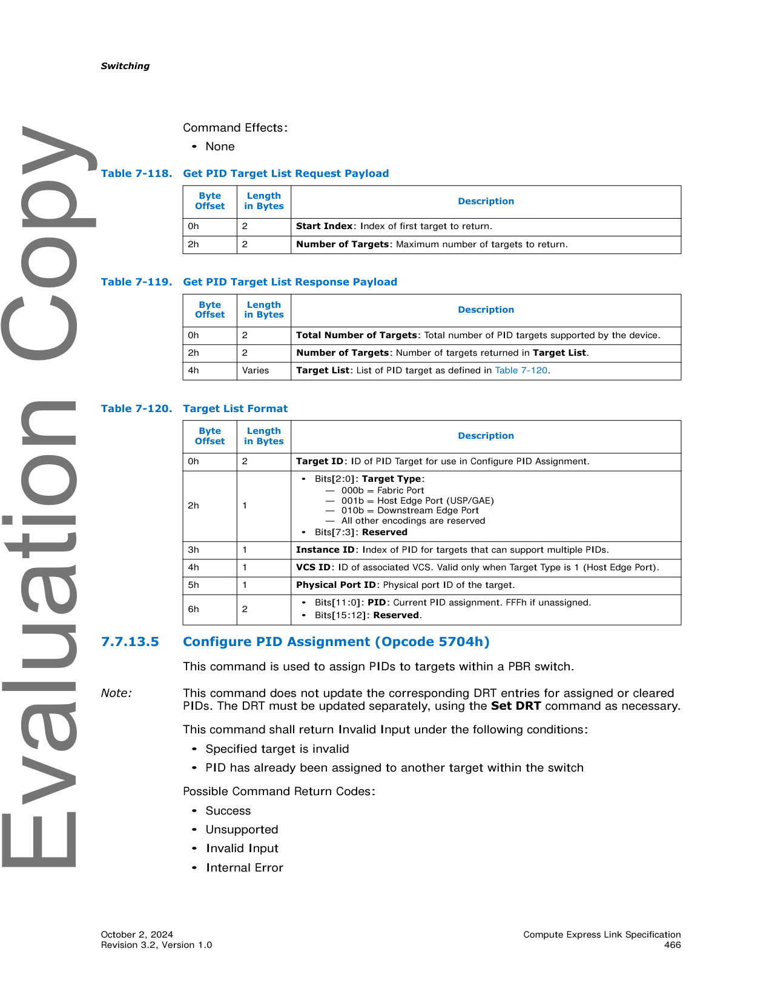
>
> *Original page render @ 150 DPI* — [📄 Full size](figures/chapter_07/page_0466.png)

> **Table 7-119.** Get PID Target List Response Payload ｜ Get PID Target List 响应 Payload
>
> 
>
> *Original page render @ 150 DPI* — [📄 Full size](figures/chapter_07/page_0466.png)

> **Table 7-120.** Target List Format ｜ Target List 格式
>
> 
>
> *Original page render @ 150 DPI* — [📄 Full size](figures/chapter_07/page_0466.png)

### 7.7.13.5 Configure PID Assignment (Opcode 5704h) | Configure PID Assignment (操作码 5704h)

<table>
<thead>
<tr>
<th width="50%">🇬🇧 English</th>
<th width="50%" style="background-color:#e8e8e8">🇨🇳 中文</th>
</tr>
</thead>
<tbody>
<tr><td>This command is used to assign PIDs to targets within a PBR switch.</td><td style="background-color:#e8e8e8">该命令用于为 PBR 交换机内的目标分配 PID。</td></tr>
<tr><td>Note:</td><td style="background-color:#e8e8e8">注:</td></tr>
<tr><td>This command does not update the corresponding DRT entries for assigned or cleared PIDs. The DRT must be updated separately, using the Set DRT command as necessary.</td><td style="background-color:#e8e8e8">该命令不更新已分配或已清除 PID 的相应 DRT 条目。DRT 必须使用 Set DRT 命令按需单独更新。</td></tr>
<tr><td>This command shall return Invalid Input under the following conditions:</td><td style="background-color:#e8e8e8">在以下条件下,该命令应返回 Invalid Input:</td></tr>
<tr><td>• Specified target is invalid</td><td style="background-color:#e8e8e8">• 指定的目标无效</td></tr>
<tr><td>• PID has already been assigned to another target within the switch</td><td style="background-color:#e8e8e8">• PID 已被分配给交换机内的另一个目标</td></tr>
<tr><td>Possible Command Return Codes:</td><td style="background-color:#e8e8e8">可能的命令返回码:</td></tr>
<tr><td>• Success</td><td style="background-color:#e8e8e8">• Success</td></tr>
<tr><td>• Unsupported</td><td style="background-color:#e8e8e8">• Unsupported</td></tr>
<tr><td>• Invalid Input</td><td style="background-color:#e8e8e8">• Invalid Input</td></tr>
<tr><td>• Internal Error</td><td style="background-color:#e8e8e8">• Internal Error</td></tr>
<tr><td>• Retry Required</td><td style="background-color:#e8e8e8">• Retry Required</td></tr>
<tr><td>Command Effects:</td><td style="background-color:#e8e8e8">命令效果:</td></tr>
<tr><td>• None</td><td style="background-color:#e8e8e8">• 无</td></tr>
</tbody>
</table>

> **Table 7-121.** Configure PID Assignment Request Payload ｜ Configure PID Assignment 请求 Payload
>
> 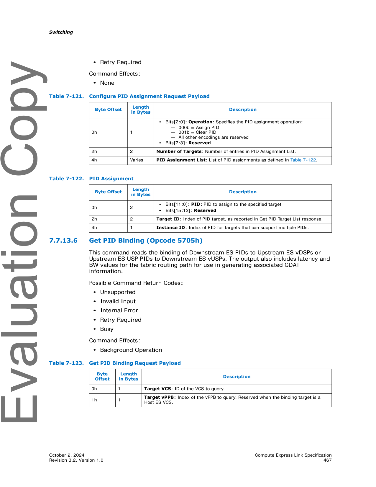
>
> *Original page render @ 150 DPI* — [📄 Full size](figures/chapter_07/page_0467.png)

> **Table 7-122.** PID Assignment ｜ PID 分配
>
> 
>
> *Original page render @ 150 DPI* — [📄 Full size](figures/chapter_07/page_0467.png)

### 7.7.13.6 Get PID Binding (Opcode 5705h) | Get PID Binding (操作码 5705h)

<table>
<thead>
<tr>
<th width="50%">🇬🇧 English</th>
<th width="50%" style="background-color:#e8e8e8">🇨🇳 中文</th>
</tr>
</thead>
<tbody>
<tr><td>This command reads the binding of Downstream ES PIDs to Upstream ES vDSPs or Upstream ES USP PIDs to Downstream ES vUSPs. The output also includes latency and BW values for the fabric routing path for use in generating associated CDAT information.</td><td style="background-color:#e8e8e8">该命令读取 Downstream ES PID 到 Upstream ES vDSP 的绑定,或 Upstream ES USP PID 到 Downstream ES vUSP 的绑定。输出还包括 fabric 路由路径的延迟和带宽值,用于生成相关的 CDAT 信息。</td></tr>
<tr><td>Possible Command Return Codes:</td><td style="background-color:#e8e8e8">可能的命令返回码:</td></tr>
<tr><td>• Unsupported</td><td style="background-color:#e8e8e8">• Unsupported</td></tr>
<tr><td>• Invalid Input</td><td style="background-color:#e8e8e8">• Invalid Input</td></tr>
<tr><td>• Internal Error</td><td style="background-color:#e8e8e8">• Internal Error</td></tr>
<tr><td>• Retry Required</td><td style="background-color:#e8e8e8">• Retry Required</td></tr>
<tr><td>• Busy</td><td style="background-color:#e8e8e8">• Busy</td></tr>
<tr><td>Command Effects:</td><td style="background-color:#e8e8e8">命令效果:</td></tr>
<tr><td>• Background Operation</td><td style="background-color:#e8e8e8">• 后台操作 (Background Operation)</td></tr>
</tbody>
</table>

> **Table 7-123.** Get PID Binding Request Payload ｜ Get PID Binding 请求 Payload
>
> 
>
> *Original page render @ 150 DPI* — [📄 Full size](figures/chapter_07/page_0467.png)

> **Table 7-124.** Get PID Binding Response Payload ｜ Get PID Binding 响应 Payload
>
> 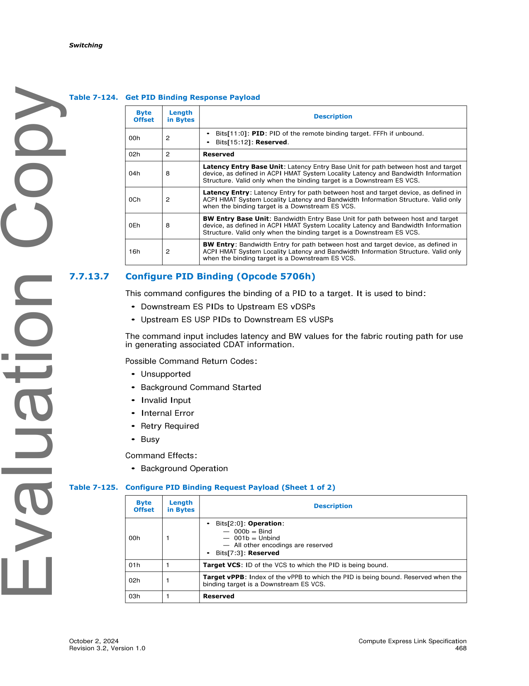
>
> *Original page render @ 150 DPI* — [📄 Full size](figures/chapter_07/page_0468.png)

### 7.7.13.7 Configure PID Binding (Opcode 5706h) | Configure PID Binding (操作码 5706h)

<table>
<thead>
<tr>
<th width="50%">🇬🇧 English</th>
<th width="50%" style="background-color:#e8e8e8">🇨🇳 中文</th>
</tr>
</thead>
<tbody>
<tr><td>This command configures the binding of a PID to a target. It is used to bind:</td><td style="background-color:#e8e8e8">该命令用于将 PID 绑定到目标。它用于绑定:</td></tr>
<tr><td>• Downstream ES PIDs to Upstream ES vDSPs</td><td style="background-color:#e8e8e8">• Downstream ES PID 到 Upstream ES vDSP</td></tr>
<tr><td>• Upstream ES USP PIDs to Downstream ES vUSPs</td><td style="background-color:#e8e8e8">• Upstream ES USP PID 到 Downstream ES vUSP</td></tr>
<tr><td>The command input includes latency and BW values for the fabric routing path for use in generating associated CDAT information.</td><td style="background-color:#e8e8e8">命令输入包括 fabric 路由路径的延迟和带宽值,用于生成相关的 CDAT 信息。</td></tr>
<tr><td>Possible Command Return Codes:</td><td style="background-color:#e8e8e8">可能的命令返回码:</td></tr>
<tr><td>• Unsupported</td><td style="background-color:#e8e8e8">• Unsupported</td></tr>
<tr><td>• Background Command Started</td><td style="background-color:#e8e8e8">• Background Command Started</td></tr>
<tr><td>• Invalid Input</td><td style="background-color:#e8e8e8">• Invalid Input</td></tr>
<tr><td>• Internal Error</td><td style="background-color:#e8e8e8">• Internal Error</td></tr>
<tr><td>• Retry Required</td><td style="background-color:#e8e8e8">• Retry Required</td></tr>
<tr><td>• Busy</td><td style="background-color:#e8e8e8">• Busy</td></tr>
<tr><td>Command Effects:</td><td style="background-color:#e8e8e8">命令效果:</td></tr>
<tr><td>• Background Operation</td><td style="background-color:#e8e8e8">• 后台操作 (Background Operation)</td></tr>
</tbody>
</table>

> **Table 7-125 (1/2).** Configure PID Binding Request Payload (Sheet 1 of 2) ｜ Configure PID Binding 请求 Payload (1/2)
>
> 
>
> *Original page render @ 150 DPI* — [📄 Full size](figures/chapter_07/page_0468.png)

> **Table 7-125 (2/2).** Configure PID Binding Request Payload (Sheet 2 of 2) ｜ Configure PID Binding 请求 Payload (2/2)
>
> 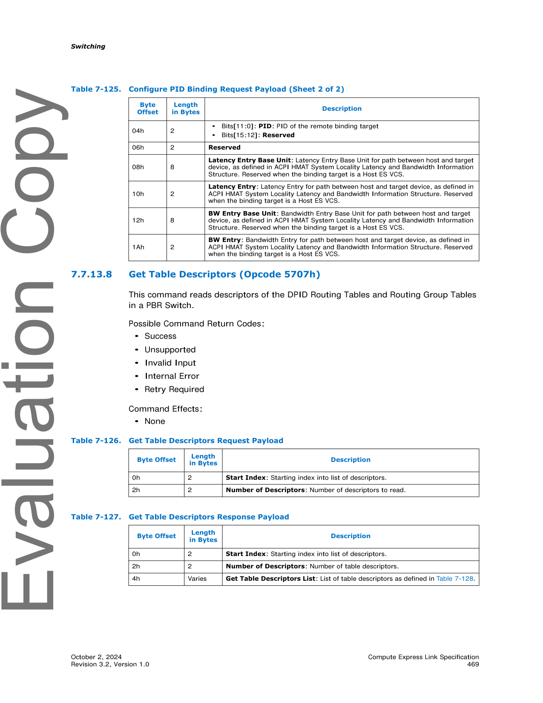
>
> *Original page render @ 150 DPI* — [📄 Full size](figures/chapter_07/page_0469.png)

### 7.7.13.8 Get Table Descriptors (Opcode 5707h) | Get Table Descriptors (操作码 5707h)

<table>
<thead>
<tr>
<th width="50%">🇬🇧 English</th>
<th width="50%" style="background-color:#e8e8e8">🇨🇳 中文</th>
</tr>
</thead>
<tbody>
<tr><td>This command reads descriptors of the DPID Routing Tables and Routing Group Tables in a PBR Switch.</td><td style="background-color:#e8e8e8">该命令读取 PBR 交换机中 DPID Routing Table 和 Routing Group Table 的描述符。</td></tr>
<tr><td>Possible Command Return Codes:</td><td style="background-color:#e8e8e8">可能的命令返回码:</td></tr>
<tr><td>• Success</td><td style="background-color:#e8e8e8">• Success</td></tr>
<tr><td>• Unsupported</td><td style="background-color:#e8e8e8">• Unsupported</td></tr>
<tr><td>• Invalid Input</td><td style="background-color:#e8e8e8">• Invalid Input</td></tr>
<tr><td>• Internal Error</td><td style="background-color:#e8e8e8">• Internal Error</td></tr>
<tr><td>• Retry Required</td><td style="background-color:#e8e8e8">• Retry Required</td></tr>
<tr><td>Command Effects:</td><td style="background-color:#e8e8e8">命令效果:</td></tr>
<tr><td>• None</td><td style="background-color:#e8e8e8">• 无</td></tr>
</tbody>
</table>

> **Table 7-126.** Get Table Descriptors Request Payload ｜ Get Table Descriptors 请求 Payload
>
> 
>
> *Original page render @ 150 DPI* — [📄 Full size](figures/chapter_07/page_0469.png)

> **Table 7-127.** Get Table Descriptors Response Payload ｜ Get Table Descriptors 响应 Payload
>
> 
>
> *Original page render @ 150 DPI* — [📄 Full size](figures/chapter_07/page_0469.png)

> **Table 7-128.** Get Table Descriptor Format ｜ Get Table Descriptor 格式
>
> 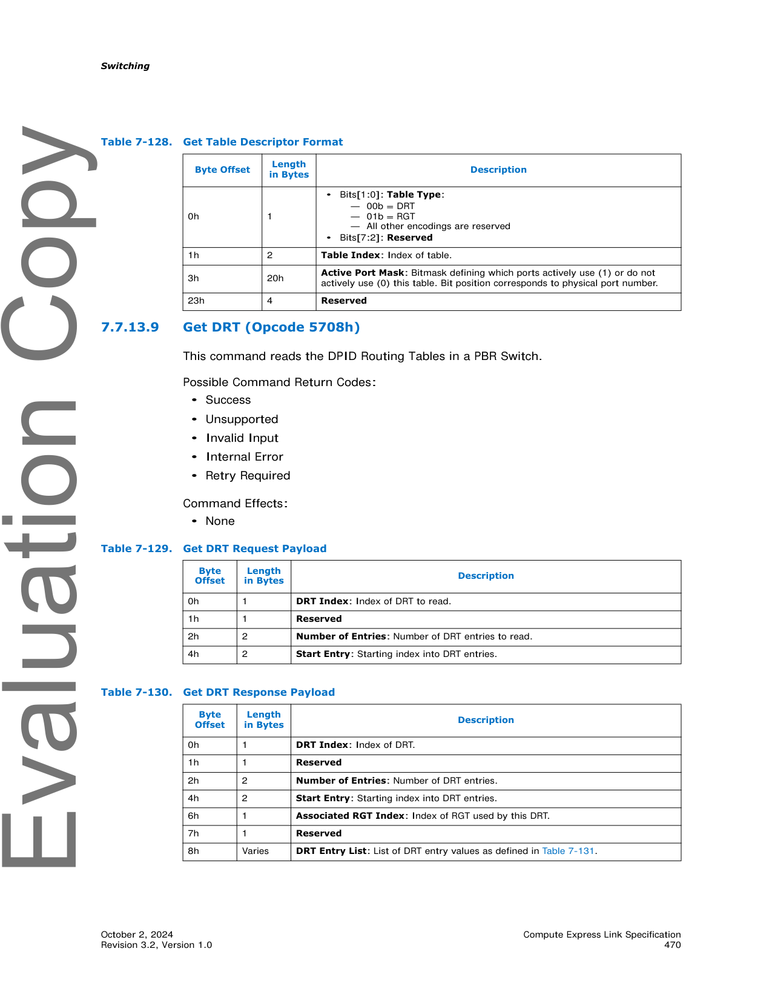
>
> *Original page render @ 150 DPI* — [📄 Full size](figures/chapter_07/page_0470.png)

### 7.7.13.9 Get DRT (Opcode 5708h) | Get DRT (操作码 5708h)

<table>
<thead>
<tr>
<th width="50%">🇬🇧 English</th>
<th width="50%" style="background-color:#e8e8e8">🇨🇳 中文</th>
</tr>
</thead>
<tbody>
<tr><td>This command reads the DPID Routing Tables in a PBR Switch.</td><td style="background-color:#e8e8e8">该命令读取 PBR 交换机中的 DPID Routing Table。</td></tr>
<tr><td>Possible Command Return Codes:</td><td style="background-color:#e8e8e8">可能的命令返回码:</td></tr>
<tr><td>• Success</td><td style="background-color:#e8e8e8">• Success</td></tr>
<tr><td>• Unsupported</td><td style="background-color:#e8e8e8">• Unsupported</td></tr>
<tr><td>• Invalid Input</td><td style="background-color:#e8e8e8">• Invalid Input</td></tr>
<tr><td>• Internal Error</td><td style="background-color:#e8e8e8">• Internal Error</td></tr>
<tr><td>• Retry Required</td><td style="background-color:#e8e8e8">• Retry Required</td></tr>
<tr><td>Command Effects:</td><td style="background-color:#e8e8e8">命令效果:</td></tr>
<tr><td>• None</td><td style="background-color:#e8e8e8">• 无</td></tr>
</tbody>
</table>

> **Table 7-129.** Get DRT Request Payload ｜ Get DRT 请求 Payload
>
> 
>
> *Original page render @ 150 DPI* — [📄 Full size](figures/chapter_07/page_0470.png)

> **Table 7-130.** Get DRT Response Payload ｜ Get DRT 响应 Payload
>
> 
>
> *Original page render @ 150 DPI* — [📄 Full size](figures/chapter_07/page_0470.png)

> **Table 7-131.** DRT Entry Format ｜ DRT 条目格式
>
> 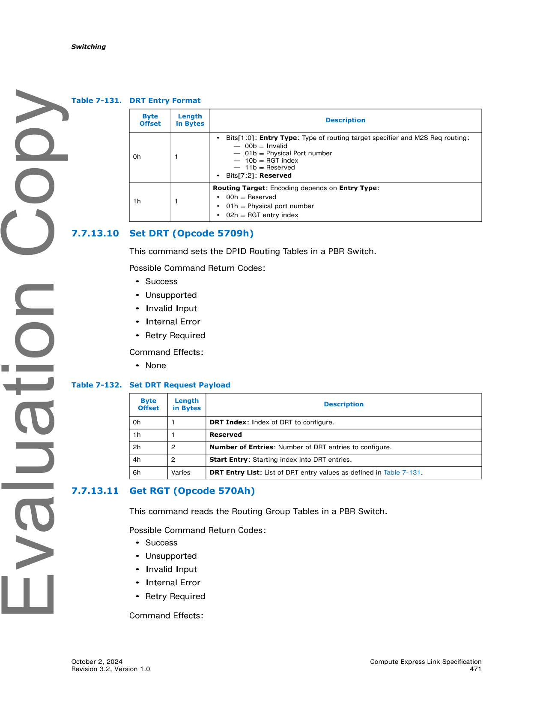
>
> *Original page render @ 150 DPI* — [📄 Full size](figures/chapter_07/page_0471.png)

### 7.7.13.10 Set DRT (Opcode 5709h) | Set DRT (操作码 5709h)

<table>
<thead>
<tr>
<th width="50%">🇬🇧 English</th>
<th width="50%" style="background-color:#e8e8e8">🇨🇳 中文</th>
</tr>
</thead>
<tbody>
<tr><td>This command sets the DPID Routing Tables in a PBR Switch.</td><td style="background-color:#e8e8e8">该命令设置 PBR 交换机中的 DPID Routing Table。</td></tr>
<tr><td>Possible Command Return Codes:</td><td style="background-color:#e8e8e8">可能的命令返回码:</td></tr>
<tr><td>• Success</td><td style="background-color:#e8e8e8">• Success</td></tr>
<tr><td>• Unsupported</td><td style="background-color:#e8e8e8">• Unsupported</td></tr>
<tr><td>• Invalid Input</td><td style="background-color:#e8e8e8">• Invalid Input</td></tr>
<tr><td>• Internal Error</td><td style="background-color:#e8e8e8">• Internal Error</td></tr>
<tr><td>• Retry Required</td><td style="background-color:#e8e8e8">• Retry Required</td></tr>
<tr><td>Command Effects:</td><td style="background-color:#e8e8e8">命令效果:</td></tr>
<tr><td>• None</td><td style="background-color:#e8e8e8">• 无</td></tr>
</tbody>
</table>

> **Table 7-132.** Set DRT Request Payload ｜ Set DRT 请求 Payload
>
> 
>
> *Original page render @ 150 DPI* — [📄 Full size](figures/chapter_07/page_0471.png)

### 7.7.13.11 Get RGT (Opcode 570Ah) | Get RGT (操作码 570Ah)

<table>
<thead>
<tr>
<th width="50%">🇬🇧 English</th>
<th width="50%" style="background-color:#e8e8e8">🇨🇳 中文</th>
</tr>
</thead>
<tbody>
<tr><td>This command reads the Routing Group Tables in a PBR Switch.</td><td style="background-color:#e8e8e8">该命令读取 PBR 交换机中的 Routing Group Table。</td></tr>
<tr><td>Possible Command Return Codes:</td><td style="background-color:#e8e8e8">可能的命令返回码:</td></tr>
<tr><td>• Success</td><td style="background-color:#e8e8e8">• Success</td></tr>
<tr><td>• Unsupported</td><td style="background-color:#e8e8e8">• Unsupported</td></tr>
<tr><td>• Invalid Input</td><td style="background-color:#e8e8e8">• Invalid Input</td></tr>
<tr><td>• Internal Error</td><td style="background-color:#e8e8e8">• Internal Error</td></tr>
<tr><td>• Retry Required</td><td style="background-color:#e8e8e8">• Retry Required</td></tr>
<tr><td>Command Effects:</td><td style="background-color:#e8e8e8">命令效果:</td></tr>
<tr><td>• None</td><td style="background-color:#e8e8e8">• 无</td></tr>
</tbody>
</table>

> **Table 7-133.** Get RGT Request Payload ｜ Get RGT 请求 Payload
>
> 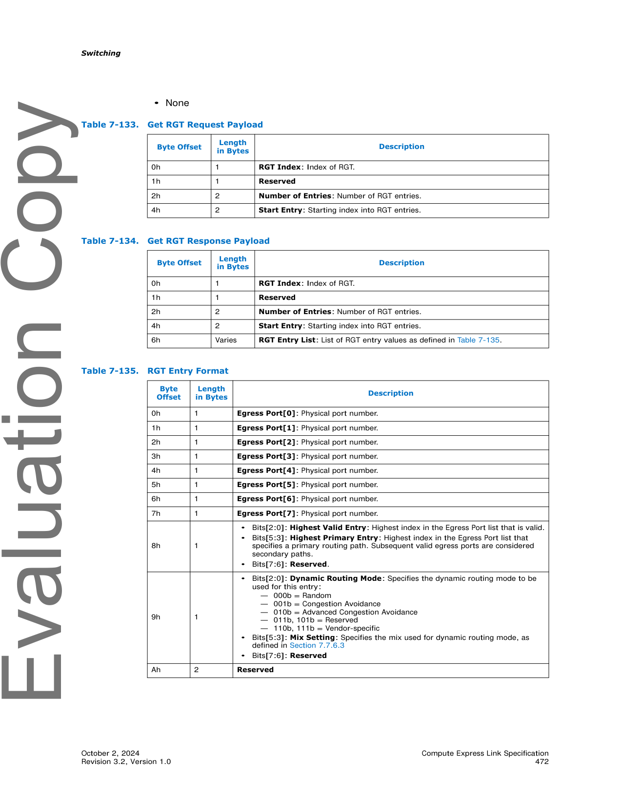
>
> *Original page render @ 150 DPI* — [📄 Full size](figures/chapter_07/page_0472.png)

> **Table 7-134.** Get RGT Response Payload ｜ Get RGT 响应 Payload
>
> 
>
> *Original page render @ 150 DPI* — [📄 Full size](figures/chapter_07/page_0472.png)

> **Table 7-135.** RGT Entry Format ｜ RGT 条目格式
>
> 
>
> *Original page render @ 150 DPI* — [📄 Full size](figures/chapter_07/page_0472.png)

### 7.7.13.12 Set RGT (Opcode 570Bh) | Set RGT (操作码 570Bh)

<table>
<thead>
<tr>
<th width="50%">🇬🇧 English</th>
<th width="50%" style="background-color:#e8e8e8">🇨🇳 中文</th>
</tr>
</thead>
<tbody>
<tr><td>This command configures the Routing Group Tables in a PBR switch.</td><td style="background-color:#e8e8e8">该命令配置 PBR 交换机中的 Routing Group Table。</td></tr>
<tr><td>Possible Command Return Codes:</td><td style="background-color:#e8e8e8">可能的命令返回码:</td></tr>
<tr><td>• Success</td><td style="background-color:#e8e8e8">• Success</td></tr>
<tr><td>• Unsupported</td><td style="background-color:#e8e8e8">• Unsupported</td></tr>
<tr><td>• Invalid Input</td><td style="background-color:#e8e8e8">• Invalid Input</td></tr>
<tr><td>• Internal Error</td><td style="background-color:#e8e8e8">• Internal Error</td></tr>
<tr><td>• Retry Required</td><td style="background-color:#e8e8e8">• Retry Required</td></tr>
<tr><td>Command Effects:</td><td style="background-color:#e8e8e8">命令效果:</td></tr>
<tr><td>• None</td><td style="background-color:#e8e8e8">• 无</td></tr>
</tbody>
</table>

> **Table 7-136.** Set RGT Request Payload ｜ Set RGT 请求 Payload
>
> 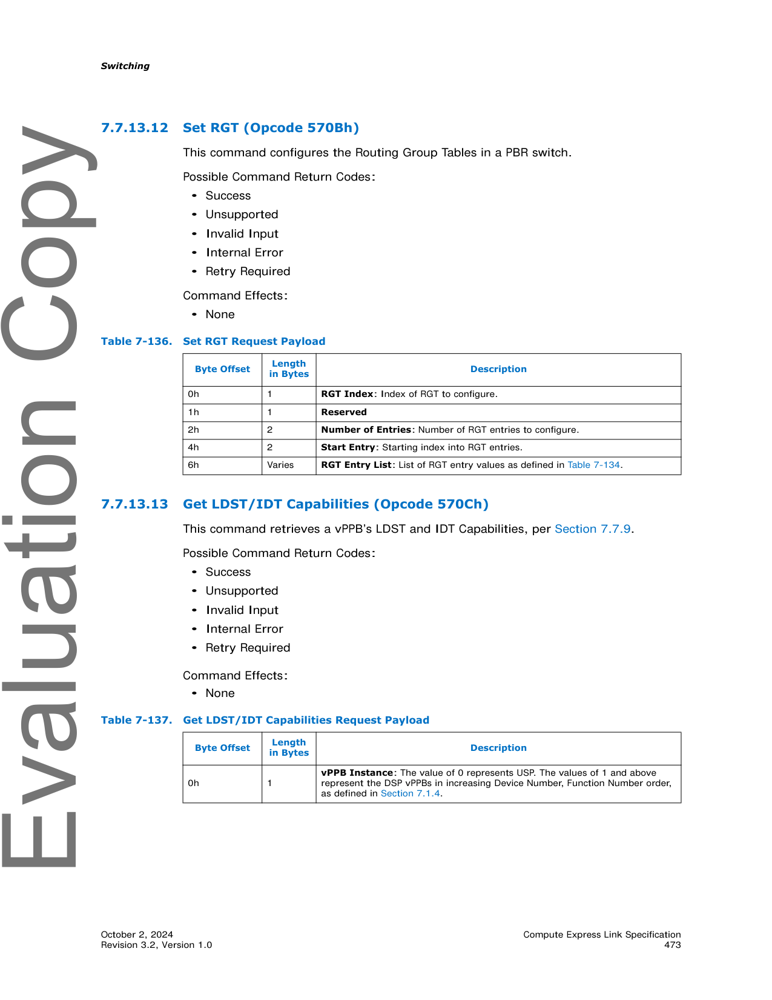
>
> *Original page render @ 150 DPI* — [📄 Full size](figures/chapter_07/page_0473.png)

### 7.7.13.13 Get LDST/IDT Capabilities (Opcode 570Ch) | Get LDST/IDT Capabilities (操作码 570Ch)

<table>
<thead>
<tr>
<th width="50%">🇬🇧 English</th>
<th width="50%" style="background-color:#e8e8e8">🇨🇳 中文</th>
</tr>
</thead>
<tbody>
<tr><td>This command retrieves a vPPB's LDST and IDT Capabilities, per Section 7.7.9.</td><td style="background-color:#e8e8e8">该命令按 7.7.9 节检索 vPPB 的 LDST 和 IDT 能力。</td></tr>
<tr><td>Possible Command Return Codes:</td><td style="background-color:#e8e8e8">可能的命令返回码:</td></tr>
<tr><td>• Success</td><td style="background-color:#e8e8e8">• Success</td></tr>
<tr><td>• Unsupported</td><td style="background-color:#e8e8e8">• Unsupported</td></tr>
<tr><td>• Invalid Input</td><td style="background-color:#e8e8e8">• Invalid Input</td></tr>
<tr><td>• Internal Error</td><td style="background-color:#e8e8e8">• Internal Error</td></tr>
<tr><td>• Retry Required</td><td style="background-color:#e8e8e8">• Retry Required</td></tr>
<tr><td>Command Effects:</td><td style="background-color:#e8e8e8">命令效果:</td></tr>
<tr><td>• None</td><td style="background-color:#e8e8e8">• 无</td></tr>
</tbody>
</table>

> **Table 7-137.** Get LDST/IDT Capabilities Request Payload ｜ Get LDST/IDT Capabilities 请求 Payload
>
> 
>
> *Original page render @ 150 DPI* — [📄 Full size](figures/chapter_07/page_0473.png)

### 7.7.13.14 Set LDST/IDT Configuration (Opcode 570Dh) | Set LDST/IDT Configuration (操作码 570Dh)

<table>
<thead>
<tr>
<th width="50%">🇬🇧 English</th>
<th width="50%" style="background-color:#e8e8e8">🇨🇳 中文</th>
</tr>
</thead>
<tbody>
<tr><td>This command sets the GAE's LDST and IDT Capabilities, per Section 7.7.9. Because the FabricBase and FabricLimit values must be aligned to the programmed LDST Segment Size, all three Host-chosen values are configured in one request.</td><td style="background-color:#e8e8e8">该命令按 7.7.9 节设置 GAE 的 LDST 和 IDT 能力。由于 FabricBase 和 FabricLimit 值必须与所编程的 LDST Segment Size 对齐,因此主机所选的三个值在同一次请求中配置。</td></tr>
<tr><td>Possible Command Return Codes:</td><td style="background-color:#e8e8e8">可能的命令返回码:</td></tr>
<tr><td>• Success</td><td style="background-color:#e8e8e8">• Success</td></tr>
<tr><td>• Unsupported</td><td style="background-color:#e8e8e8">• Unsupported</td></tr>
<tr><td>• Invalid Input</td><td style="background-color:#e8e8e8">• Invalid Input</td></tr>
<tr><td>• Internal Error</td><td style="background-color:#e8e8e8">• Internal Error</td></tr>
<tr><td>• Retry Required</td><td style="background-color:#e8e8e8">• Retry Required</td></tr>
<tr><td>Command Effects:</td><td style="background-color:#e8e8e8">命令效果:</td></tr>
<tr><td>• Immediate Configuration Change</td><td style="background-color:#e8e8e8">• 立即配置变更 (Immediate Configuration Change)</td></tr>
</tbody>
</table>

> **Table 7-138.** Get LDST/IDT Capabilities Response Payload ｜ Get LDST/IDT Capabilities 响应 Payload
>
> 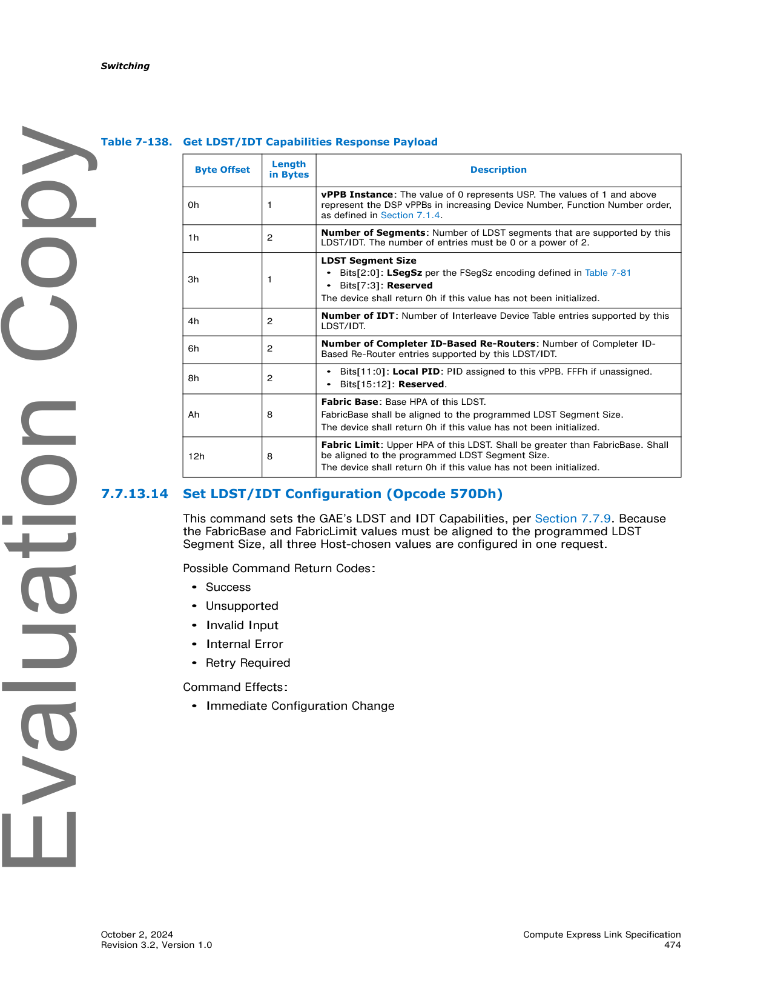
>
> *Original page render @ 150 DPI* — [📄 Full size](figures/chapter_07/page_0474.png)

### 7.7.13.15 Get LDST Segment Entries (Opcode 570Eh) | Get LDST Segment Entries (操作码 570Eh)

<table>
<thead>
<tr>
<th width="50%">🇬🇧 English</th>
<th width="50%" style="background-color:#e8e8e8">🇨🇳 中文</th>
</tr>
</thead>
<tbody>
<tr><td>This command reads the configuration of LDST Segment entries. The Host is responsible for mapping the LD-FAM range of HPAs to the appropriate number of available Segment Entries. Should the Host or the GAE have limited message payload capacity, the Host shall be responsible for breaking up the configuration operation into suitably sized requests.</td><td style="background-color:#e8e8e8">该命令读取 LDST Segment 条目的配置。主机负责将 LD-FAM 范围的 HPA 映射到适当数量的可用 Segment 条目。如果主机或 GAE 的消息有效载荷容量有限,主机应负责将配置操作拆分为合适大小的请求。</td></tr>
<tr><td>Possible Command Return Codes:</td><td style="background-color:#e8e8e8">可能的命令返回码:</td></tr>
<tr><td>• Success</td><td style="background-color:#e8e8e8">• Success</td></tr>
<tr><td>• Unsupported</td><td style="background-color:#e8e8e8">• Unsupported</td></tr>
<tr><td>• Invalid Input</td><td style="background-color:#e8e8e8">• Invalid Input</td></tr>
<tr><td>• Internal Error</td><td style="background-color:#e8e8e8">• Internal Error</td></tr>
<tr><td>• Retry Required</td><td style="background-color:#e8e8e8">• Retry Required</td></tr>
<tr><td>Command Effects:</td><td style="background-color:#e8e8e8">命令效果:</td></tr>
<tr><td>• None</td><td style="background-color:#e8e8e8">• 无</td></tr>
</tbody>
</table>

> **Table 7-139.** Set LDST/IDT Configuration Request Payload ｜ Set LDST/IDT Configuration 请求 Payload
>
> 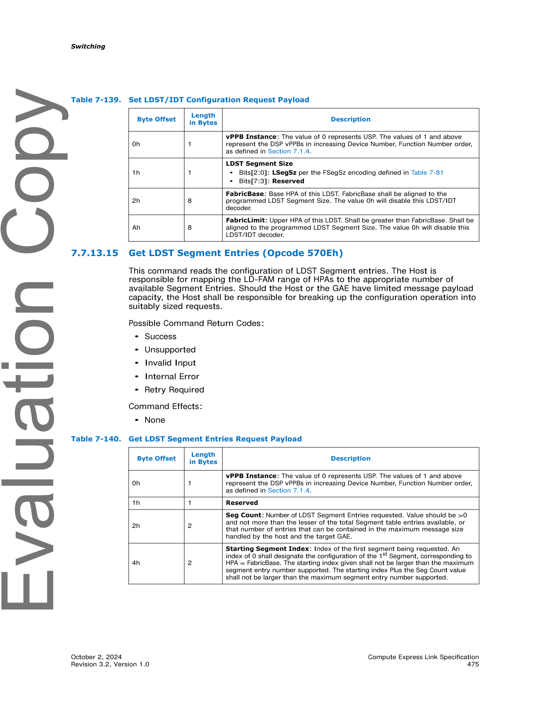
>
> *Original page render @ 150 DPI* — [📄 Full size](figures/chapter_07/page_0475.png)

> **Table 7-140.** Get LDST Segment Entries Request Payload ｜ Get LDST Segment Entries 请求 Payload
>
> 
>
> *Original page render @ 150 DPI* — [📄 Full size](figures/chapter_07/page_0475.png)

### 7.7.13.16 Set LDST Segment Entries (Opcode 570Fh) | Set LDST Segment Entries (操作码 570Fh)

<table>
<thead>
<tr>
<th width="50%">🇬🇧 English</th>
<th width="50%" style="background-color:#e8e8e8">🇨🇳 中文</th>
</tr>
</thead>
<tbody>
<tr><td>This command is used by the Host to set the configuration of LDST Segment entries. The Host is responsible for mapping the LD-FAM range of HPAs to the appropriate number of available Segment Entries, per Section 7.7.2.4. Should the Host or the GAE have limited message payload capacity, the Host shall be responsible for breaking up the configuration operation into suitably sized requests.</td><td style="background-color:#e8e8e8">主机使用该命令设置 LDST Segment 条目的配置。主机负责按 7.7.2.4 节将 LD-FAM 范围的 HPA 映射到适当数量的可用 Segment 条目。如果主机或 GAE 的消息有效载荷容量有限,主机应负责将配置操作拆分为合适大小的请求。</td></tr>
<tr><td>This command fails with Invalid Input if access to the specified DPID is not enabled in the LAV.</td><td style="background-color:#e8e8e8">若未在 LAV 中启用对指定 DPID 的访问,则该命令以 Invalid Input 失败。</td></tr>
<tr><td>Possible Command Return Codes:</td><td style="background-color:#e8e8e8">可能的命令返回码:</td></tr>
<tr><td>• Success</td><td style="background-color:#e8e8e8">• Success</td></tr>
<tr><td>• Unsupported</td><td style="background-color:#e8e8e8">• Unsupported</td></tr>
<tr><td>• Invalid Input</td><td style="background-color:#e8e8e8">• Invalid Input</td></tr>
<tr><td>• Internal Error</td><td style="background-color:#e8e8e8">• Internal Error</td></tr>
<tr><td>• Retry Required</td><td style="background-color:#e8e8e8">• Retry Required</td></tr>
<tr><td>Command Effects:</td><td style="background-color:#e8e8e8">命令效果:</td></tr>
<tr><td>• Immediate Configuration Change</td><td style="background-color:#e8e8e8">• 立即配置变更 (Immediate Configuration Change)</td></tr>
</tbody>
</table>

> **Table 7-141.** Get LDST Segment Entries Response Payload ｜ Get LDST Segment Entries 响应 Payload
>
> 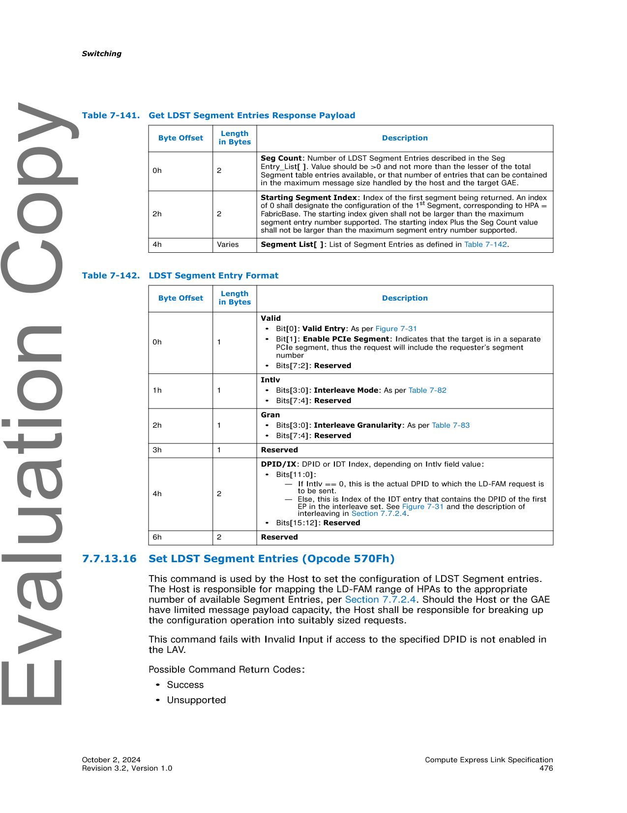
>
> *Original page render @ 150 DPI* — [📄 Full size](figures/chapter_07/page_0476.png)

> **Table 7-142.** LDST Segment Entry Format ｜ LDST Segment Entry 格式
>
> 
>
> *Original page render @ 150 DPI* — [📄 Full size](figures/chapter_07/page_0476.png)

### 7.7.13.17 Get LDST IDT DPID Entries (Opcode 5710h) | Get LDST IDT DPID Entries (操作码 5710h)

<table>
<thead>
<tr>
<th width="50%">🇬🇧 English</th>
<th width="50%" style="background-color:#e8e8e8">🇨🇳 中文</th>
</tr>
</thead>
<tbody>
<tr><td>This command reads the configuration of IDT entries that are used by the LDST. The Host is responsible for mapping the capacity of specific devices targeted by LDST into interleaved regions of HPA. Should the Host or the switch mailbox have limited message payload capacity, the Host shall be responsible for breaking up the configuration operation into suitably sized requests.</td><td style="background-color:#e8e8e8">该命令读取 LDST 使用的 IDT 条目的配置。主机负责将 LDST 目标的特定设备容量映射到 HPA 的交织区域。如果主机或交换机邮箱的消息有效载荷容量有限,主机应负责将配置操作拆分为合适大小的请求。</td></tr>
<tr><td>Possible Command Return Codes:</td><td style="background-color:#e8e8e8">可能的命令返回码:</td></tr>
<tr><td>• Success</td><td style="background-color:#e8e8e8">• Success</td></tr>
<tr><td>• Unsupported</td><td style="background-color:#e8e8e8">• Unsupported</td></tr>
<tr><td>• Invalid Input</td><td style="background-color:#e8e8e8">• Invalid Input</td></tr>
<tr><td>• Internal Error</td><td style="background-color:#e8e8e8">• Internal Error</td></tr>
<tr><td>• Retry Required</td><td style="background-color:#e8e8e8">• Retry Required</td></tr>
<tr><td>Command Effects:</td><td style="background-color:#e8e8e8">命令效果:</td></tr>
<tr><td>• None</td><td style="background-color:#e8e8e8">• 无</td></tr>
</tbody>
</table>

> **Table 7-143.** Set LDST Segment Entries Request Payload ｜ Set LDST Segment Entries 请求 Payload
>
> 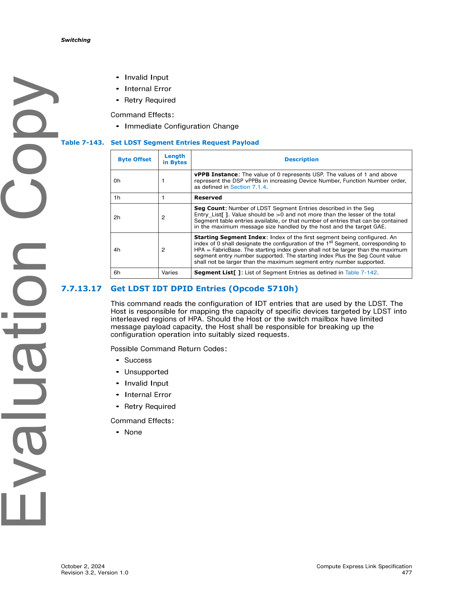
>
> *Original page render @ 150 DPI* — [📄 Full size](figures/chapter_07/page_0477.png)

### 7.7.13.18 Set LDST IDT DPID Entries (Opcode 5711h) | Set LDST IDT DPID Entries (操作码 5711h)

<table>
<thead>
<tr>
<th width="50%">🇬🇧 English</th>
<th width="50%" style="background-color:#e8e8e8">🇨🇳 中文</th>
</tr>
</thead>
<tbody>
<tr><td>This command sets the configuration of IDT entries that are used by the LDST. The Host is responsible for mapping the capacity of specific devices targeted by LDST into interleaved regions of HPA. Should the Host or the switch mailbox have limited message payload capacity, the Host shall be responsible for breaking up the configuration operation into suitably sized requests.</td><td style="background-color:#e8e8e8">该命令设置 LDST 使用的 IDT 条目的配置。主机负责将 LDST 目标的特定设备容量映射到 HPA 的交织区域。如果主机或交换机邮箱的消息有效载荷容量有限,主机应负责将配置操作拆分为合适大小的请求。</td></tr>
<tr><td>Possible Command Return Codes:</td><td style="background-color:#e8e8e8">可能的命令返回码:</td></tr>
<tr><td>• Success</td><td style="background-color:#e8e8e8">• Success</td></tr>
<tr><td>• Unsupported</td><td style="background-color:#e8e8e8">• Unsupported</td></tr>
<tr><td>• Invalid Input</td><td style="background-color:#e8e8e8">• Invalid Input</td></tr>
<tr><td>• Internal Error</td><td style="background-color:#e8e8e8">• Internal Error</td></tr>
<tr><td>• Retry Required</td><td style="background-color:#e8e8e8">• Retry Required</td></tr>
<tr><td>Command Effects:</td><td style="background-color:#e8e8e8">命令效果:</td></tr>
<tr><td>• Immediate Configuration Change</td><td style="background-color:#e8e8e8">• 立即配置变更 (Immediate Configuration Change)</td></tr>
</tbody>
</table>

> **Table 7-144.** Get LDST IDT DPID Entries Request Payload ｜ Get LDST IDT DPID Entries 请求 Payload
>
> 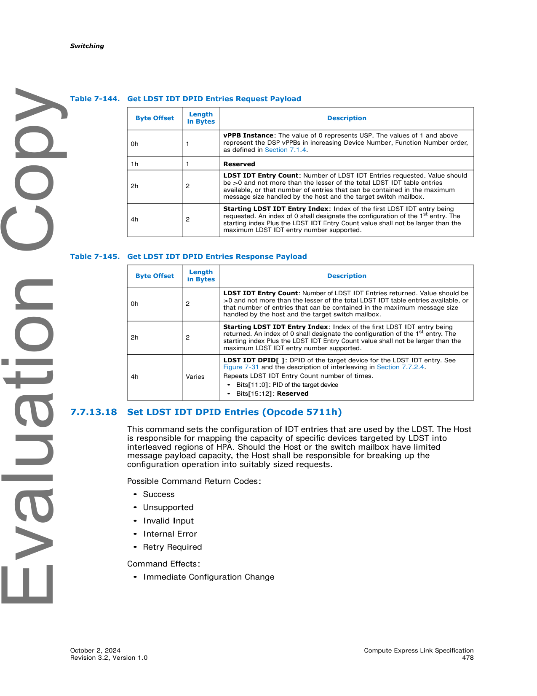
>
> *Original page render @ 150 DPI* — [📄 Full size](figures/chapter_07/page_0478.png)

> **Table 7-145.** Get LDST IDT DPID Entries Response Payload ｜ Get LDST IDT DPID Entries 响应 Payload
>
> 
>
> *Original page render @ 150 DPI* — [📄 Full size](figures/chapter_07/page_0478.png)

### 7.7.13.19 Get Completer ID-Based Re-Router Entries (Opcode 5712h) | Get Completer ID-Based Re-Router Entries (操作码 5712h)

<table>
<thead>
<tr>
<th width="50%">🇬🇧 English</th>
<th width="50%" style="background-color:#e8e8e8">🇨🇳 中文</th>
</tr>
</thead>
<tbody>
<tr><td>This command reads the configuration of Completer ID-Based Re-Router entries.</td><td style="background-color:#e8e8e8">该命令读取 Completer ID-Based Re-Router 条目的配置。</td></tr>
<tr><td>Possible Command Return Codes:</td><td style="background-color:#e8e8e8">可能的命令返回码:</td></tr>
<tr><td>• Success</td><td style="background-color:#e8e8e8">• Success</td></tr>
<tr><td>• Unsupported</td><td style="background-color:#e8e8e8">• Unsupported</td></tr>
<tr><td>• Invalid Input</td><td style="background-color:#e8e8e8">• Invalid Input</td></tr>
<tr><td>• Internal Error</td><td style="background-color:#e8e8e8">• Internal Error</td></tr>
<tr><td>• Retry Required</td><td style="background-color:#e8e8e8">• Retry Required</td></tr>
<tr><td>Command Effects:</td><td style="background-color:#e8e8e8">命令效果:</td></tr>
<tr><td>• None</td><td style="background-color:#e8e8e8">• 无</td></tr>
</tbody>
</table>

> **Table 7-146.** Set LDST IDT DPID Entries Request Payload ｜ Set LDST IDT DPID Entries 请求 Payload
>
> 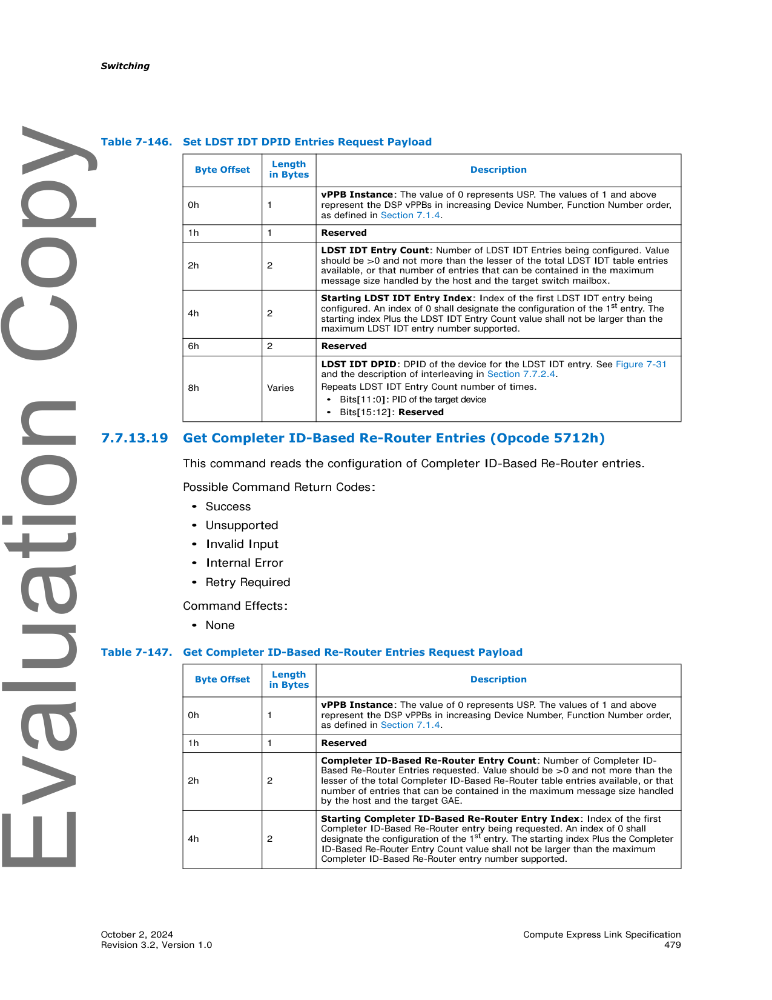
>
> *Original page render @ 150 DPI* — [📄 Full size](figures/chapter_07/page_0479.png)

> **Table 7-147.** Get Completer ID-Based Re-Router Entries Request Payload ｜ Get Completer ID-Based Re-Router Entries 请求 Payload
>
> 
>
> *Original page render @ 150 DPI* — [📄 Full size](figures/chapter_07/page_0479.png)

### 7.7.13.20 Set Completer ID-Based Re-Router Entries (Opcode 5713h) | Set Completer ID-Based Re-Router Entries (操作码 5713h)

<table>
<thead>
<tr>
<th width="50%">🇬🇧 English</th>
<th width="50%" style="background-color:#e8e8e8">🇨🇳 中文</th>
</tr>
</thead>
<tbody>
<tr><td>This command sets the configuration of Completer ID-Based Re-Router entries.</td><td style="background-color:#e8e8e8">该命令设置 Completer ID-Based Re-Router 条目的配置。</td></tr>
<tr><td>This command fails with Invalid Input if access to the specified DPID is not enabled in the LAV.</td><td style="background-color:#e8e8e8">若未在 LAV 中启用对指定 DPID 的访问,则该命令以 Invalid Input 失败。</td></tr>
<tr><td>Possible Command Return Codes:</td><td style="background-color:#e8e8e8">可能的命令返回码:</td></tr>
<tr><td>• Success</td><td style="background-color:#e8e8e8">• Success</td></tr>
<tr><td>• Unsupported</td><td style="background-color:#e8e8e8">• Unsupported</td></tr>
<tr><td>• Invalid Input</td><td style="background-color:#e8e8e8">• Invalid Input</td></tr>
<tr><td>• Internal Error</td><td style="background-color:#e8e8e8">• Internal Error</td></tr>
<tr><td>• Retry Required</td><td style="background-color:#e8e8e8">• Retry Required</td></tr>
<tr><td>Command Effects:</td><td style="background-color:#e8e8e8">命令效果:</td></tr>
<tr><td>• Immediate Configuration Change</td><td style="background-color:#e8e8e8">• 立即配置变更 (Immediate Configuration Change)</td></tr>
</tbody>
</table>

> **Table 7-148.** Get Completer ID-Based Re-Router Entries Response Payload ｜ Get Completer ID-Based Re-Router Entries 响应 Payload
>
> 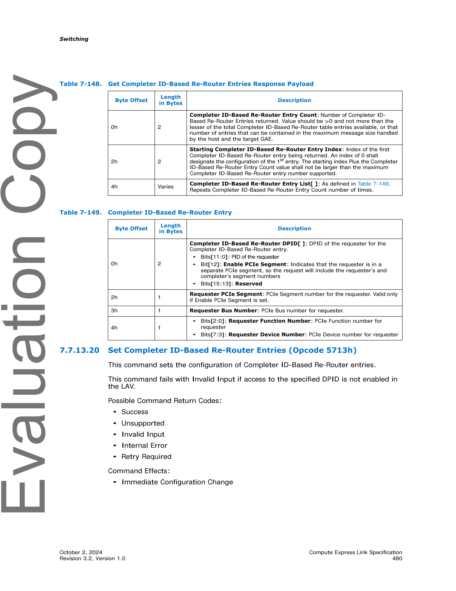
>
> *Original page render @ 150 DPI* — [📄 Full size](figures/chapter_07/page_0480.png)

> **Table 7-149.** Completer ID-Based Re-Router Entry ｜ Completer ID-Based Re-Router 条目
>
> 
>
> *Original page render @ 150 DPI* — [📄 Full size](figures/chapter_07/page_0480.png)

### 7.7.13.21 Get LDST Access Vector (Opcode 5714h) | Get LDST Access Vector (操作码 5714h)

<table>
<thead>
<tr>
<th width="50%">🇬🇧 English</th>
<th width="50%" style="background-color:#e8e8e8">🇨🇳 中文</th>
</tr>
</thead>
<tbody>
<tr><td>This command is used by the host to query its current LAV.</td><td style="background-color:#e8e8e8">该命令由主机用于查询其当前 LAV。</td></tr>
<tr><td>This command will return Invalid Input when the requested byte range exceeds the size of the access vector buffer, as defined in Table 7-164.</td><td style="background-color:#e8e8e8">当请求的字节范围超过访问向量缓冲区的大小时 (如表 7-164 所定义),该命令将返回 Invalid Input。</td></tr>
<tr><td>Possible Command Return Codes:</td><td style="background-color:#e8e8e8">可能的命令返回码:</td></tr>
<tr><td>• Success</td><td style="background-color:#e8e8e8">• Success</td></tr>
<tr><td>• Unsupported</td><td style="background-color:#e8e8e8">• Unsupported</td></tr>
<tr><td>• Invalid Input</td><td style="background-color:#e8e8e8">• Invalid Input</td></tr>
<tr><td>• Internal Error</td><td style="background-color:#e8e8e8">• Internal Error</td></tr>
<tr><td>• Retry Required</td><td style="background-color:#e8e8e8">• Retry Required</td></tr>
<tr><td>Command Effects:</td><td style="background-color:#e8e8e8">命令效果:</td></tr>
<tr><td>• None</td><td style="background-color:#e8e8e8">• 无</td></tr>
</tbody>
</table>

> **Table 7-150.** Set Completer ID-Based Re-Router Entries Request Payload ｜ Set Completer ID-Based Re-Router Entries 请求 Payload
>
> 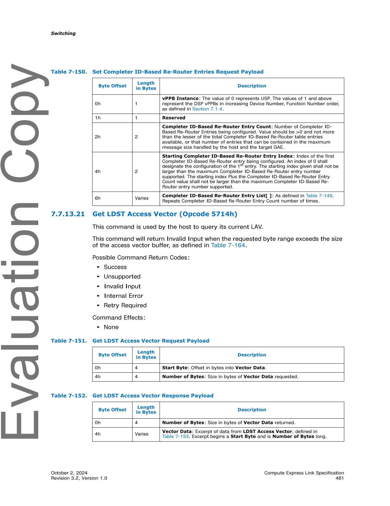
>
> *Original page render @ 150 DPI* — [📄 Full size](figures/chapter_07/page_0481.png)

> **Table 7-151.** Get LDST Access Vector Request Payload ｜ Get LDST Access Vector 请求 Payload
>
> 
>
> *Original page render @ 150 DPI* — [📄 Full size](figures/chapter_07/page_0481.png)

> **Table 7-152.** Get LDST Access Vector Response Payload ｜ Get LDST Access Vector 响应 Payload
>
> 
>
> *Original page render @ 150 DPI* — [📄 Full size](figures/chapter_07/page_0481.png)

### 7.7.13.22 Get VCS LDST Access Vector (Opcode 5715h) | Get VCS LDST Access Vector (操作码 5715h)

<table>
<thead>
<tr>
<th width="50%">🇬🇧 English</th>
<th width="50%" style="background-color:#e8e8e8">🇨🇳 中文</th>
</tr>
</thead>
<tbody>
<tr><td>This command is used by the FM to query a VCS's current LAV.</td><td style="background-color:#e8e8e8">该命令由 FM 用于查询 VCS 的当前 LAV。</td></tr>
<tr><td>This command will return Invalid Input when the requested byte range exceeds the size of the access vector buffer, as defined in Table 7-164.</td><td style="background-color:#e8e8e8">当请求的字节范围超过访问向量缓冲区的大小时 (如表 7-164 所定义),该命令将返回 Invalid Input。</td></tr>
<tr><td>Possible Command Return Codes:</td><td style="background-color:#e8e8e8">可能的命令返回码:</td></tr>
<tr><td>• Success</td><td style="background-color:#e8e8e8">• Success</td></tr>
<tr><td>• Unsupported</td><td style="background-color:#e8e8e8">• Unsupported</td></tr>
<tr><td>• Invalid Input</td><td style="background-color:#e8e8e8">• Invalid Input</td></tr>
<tr><td>• Internal Error</td><td style="background-color:#e8e8e8">• Internal Error</td></tr>
<tr><td>• Retry Required</td><td style="background-color:#e8e8e8">• Retry Required</td></tr>
<tr><td>Command Effects:</td><td style="background-color:#e8e8e8">命令效果:</td></tr>
<tr><td>• None</td><td style="background-color:#e8e8e8">• 无</td></tr>
<tr><td>The Get VCS LDST Access Vector Response Payload is defined in Table 7-152.</td><td style="background-color:#e8e8e8">Get VCS LDST Access Vector 响应 Payload 在表 7-152 中定义。</td></tr>
</tbody>
</table>

### 7.7.13.23 Configure VCS LDST Access (Opcode 5716h) | Configure VCS LDST Access (操作码 5716h)

<table>
<thead>
<tr>
<th width="50%">🇬🇧 English</th>
<th width="50%" style="background-color:#e8e8e8">🇨🇳 中文</th>
</tr>
</thead>
<tbody>
<tr><td>This command is used by the FM to control access to a specified PID as reported in the LAV.</td><td style="background-color:#e8e8e8">该命令由 FM 用于控制在 LAV 中报告的指定 PID 的访问。</td></tr>
<tr><td>Possible Command return codes:</td><td style="background-color:#e8e8e8">可能的命令返回码:</td></tr>
<tr><td>• Success</td><td style="background-color:#e8e8e8">• Success</td></tr>
<tr><td>• Unsupported</td><td style="background-color:#e8e8e8">• Unsupported</td></tr>
<tr><td>• Invalid Input</td><td style="background-color:#e8e8e8">• Invalid Input</td></tr>
<tr><td>• Internal Error</td><td style="background-color:#e8e8e8">• Internal Error</td></tr>
<tr><td>• Retry Required</td><td style="background-color:#e8e8e8">• Retry Required</td></tr>
<tr><td>Command Effects:</td><td style="background-color:#e8e8e8">命令效果:</td></tr>
<tr><td>• None</td><td style="background-color:#e8e8e8">• 无</td></tr>
</tbody>
</table>

> **Table 7-153.** LDST Access Vector ｜ LDST Access Vector
>
> 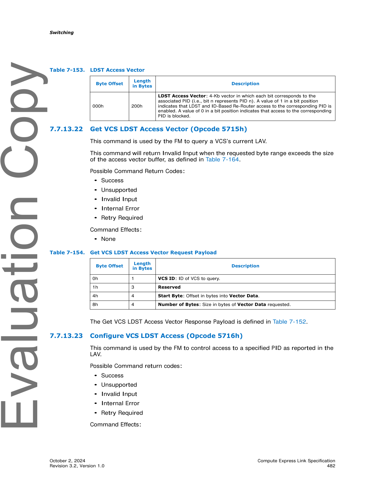
>
> *Original page render @ 150 DPI* — [📄 Full size](figures/chapter_07/page_0482.png)

> **Table 7-154.** Get VCS LDST Access Vector Request Payload ｜ Get VCS LDST Access Vector 请求 Payload
>
> 
>
> *Original page render @ 150 DPI* — [📄 Full size](figures/chapter_07/page_0482.png)

> **Table 7-155.** Configure VCS LDST Access Request Payload ｜ Configure VCS LDST Access 请求 Payload
>
> 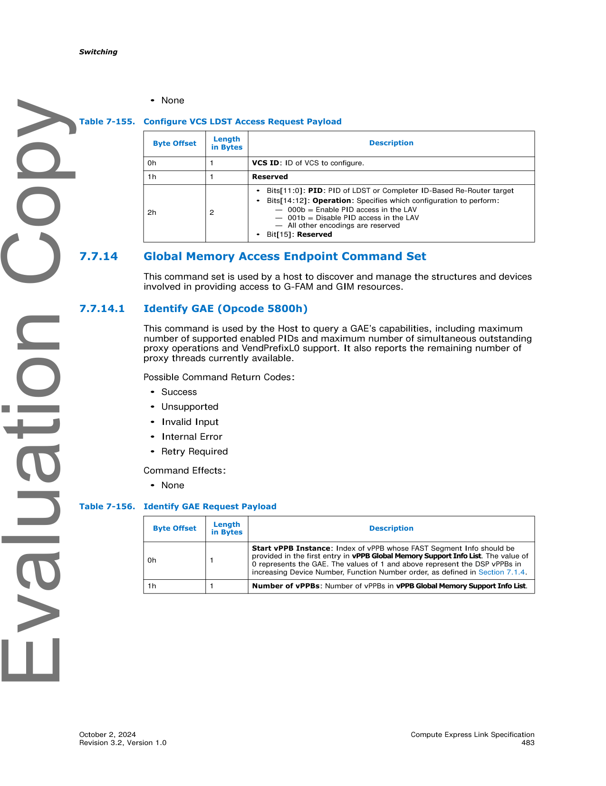
>
> *Original page render @ 150 DPI* — [📄 Full size](figures/chapter_07/page_0483.png)

[⬆️ 返回目录](#-本章目录-part-c)

---

## 7.7.14 Global Memory Access Endpoint Command Set | 全局内存访问端点 (GAE) 命令集

<table>
<thead>
<tr>
<th width="50%">🇬🇧 English</th>
<th width="50%" style="background-color:#e8e8e8">🇨🇳 中文</th>
</tr>
</thead>
<tbody>
<tr><td>This command set is used by a host to discover and manage the structures and devices involved in providing access to G-FAM and GIM resources.</td><td style="background-color:#e8e8e8">该命令集由主机用于发现和管理提供 G-FAM 和 GIM 资源访问所涉及的结构和设备。</td></tr>
</tbody>
</table>

### 7.7.14.1 Identify GAE (Opcode 5800h) | Identify GAE (操作码 5800h)

<table>
<thead>
<tr>
<th width="50%">🇬🇧 English</th>
<th width="50%" style="background-color:#e8e8e8">🇨🇳 中文</th>
</tr>
</thead>
<tbody>
<tr><td>This command is used by the Host to query a GAE's capabilities, including maximum number of supported enabled PIDs and maximum number of simultaneous outstanding proxy operations and VendPrefixL0 support. It also reports the remaining number of proxy threads currently available.</td><td style="background-color:#e8e8e8">该命令由主机用于查询 GAE 的能力,包括支持的最大已启用 PID 数量、最大同时未完成的代理操作数以及 VendPrefixL0 支持。它还报告当前可用的剩余代理线程数。</td></tr>
<tr><td>Possible Command Return Codes:</td><td style="background-color:#e8e8e8">可能的命令返回码:</td></tr>
<tr><td>• Success</td><td style="background-color:#e8e8e8">• Success</td></tr>
<tr><td>• Unsupported</td><td style="background-color:#e8e8e8">• Unsupported</td></tr>
<tr><td>• Invalid Input</td><td style="background-color:#e8e8e8">• Invalid Input</td></tr>
<tr><td>• Internal Error</td><td style="background-color:#e8e8e8">• Internal Error</td></tr>
<tr><td>• Retry Required</td><td style="background-color:#e8e8e8">• Retry Required</td></tr>
<tr><td>Command Effects:</td><td style="background-color:#e8e8e8">命令效果:</td></tr>
<tr><td>• None</td><td style="background-color:#e8e8e8">• 无</td></tr>
</tbody>
</table>

> **Table 7-156.** Identify GAE Request Payload ｜ Identify GAE 请求 Payload
>
> 
>
> *Original page render @ 150 DPI* — [📄 Full size](figures/chapter_07/page_0483.png)

> **Table 7-157.** Identify GAE Response Payload ｜ Identify GAE 响应 Payload
>
> 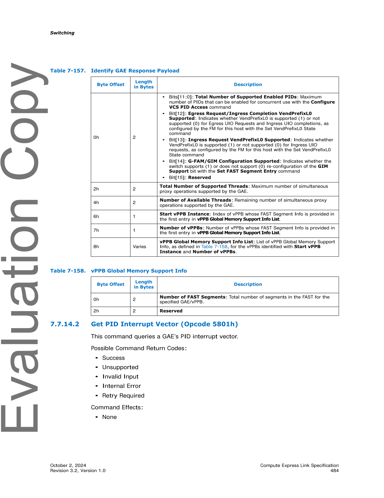
>
> *Original page render @ 150 DPI* — [📄 Full size](figures/chapter_07/page_0484.png)

> **Table 7-158.** vPPB Global Memory Support Info ｜ vPPB Global Memory Support Info
>
> 
>
> *Original page render @ 150 DPI* — [📄 Full size](figures/chapter_07/page_0484.png)

### 7.7.14.2 Get PID Interrupt Vector (Opcode 5801h) | Get PID Interrupt Vector (操作码 5801h)

<table>
<thead>
<tr>
<th width="50%">🇬🇧 English</th>
<th width="50%" style="background-color:#e8e8e8">🇨🇳 中文</th>
</tr>
</thead>
<tbody>
<tr><td>This command queries a GAE's PID interrupt vector.</td><td style="background-color:#e8e8e8">该命令查询 GAE 的 PID 中断向量。</td></tr>
<tr><td>Possible Command Return Codes:</td><td style="background-color:#e8e8e8">可能的命令返回码:</td></tr>
<tr><td>• Success</td><td style="background-color:#e8e8e8">• Success</td></tr>
<tr><td>• Unsupported</td><td style="background-color:#e8e8e8">• Unsupported</td></tr>
<tr><td>• Invalid Input</td><td style="background-color:#e8e8e8">• Invalid Input</td></tr>
<tr><td>• Internal Error</td><td style="background-color:#e8e8e8">• Internal Error</td></tr>
<tr><td>• Retry Required</td><td style="background-color:#e8e8e8">• Retry Required</td></tr>
<tr><td>Command Effects:</td><td style="background-color:#e8e8e8">命令效果:</td></tr>
<tr><td>• None</td><td style="background-color:#e8e8e8">• 无</td></tr>
</tbody>
</table>

> **Table 7-159.** Get PID Interrupt Vector Request Payload ｜ Get PID Interrupt Vector 请求 Payload
>
> 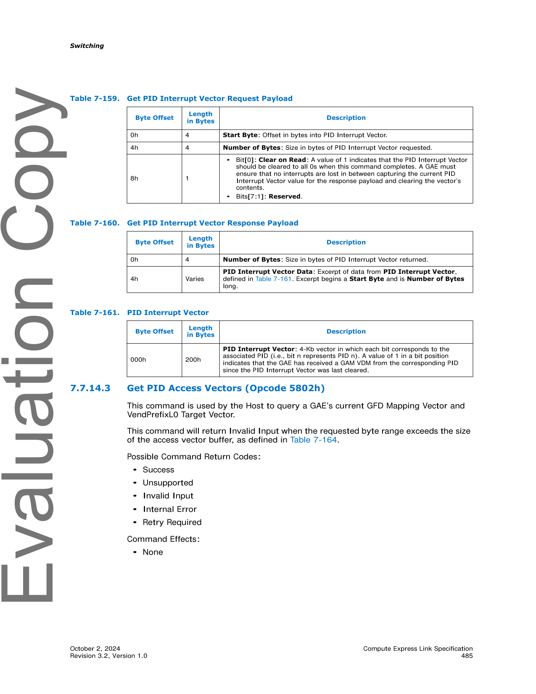
>
> *Original page render @ 150 DPI* — [📄 Full size](figures/chapter_07/page_0485.png)

> **Table 7-160.** Get PID Interrupt Vector Response Payload ｜ Get PID Interrupt Vector 响应 Payload
>
> 
>
> *Original page render @ 150 DPI* — [📄 Full size](figures/chapter_07/page_0485.png)

> **Table 7-161.** PID Interrupt Vector ｜ PID Interrupt Vector
>
> 
>
> *Original page render @ 150 DPI* — [📄 Full size](figures/chapter_07/page_0485.png)

### 7.7.14.3 Get PID Access Vectors (Opcode 5802h) | Get PID Access Vectors (操作码 5802h)

<table>
<thead>
<tr>
<th width="50%">🇬🇧 English</th>
<th width="50%" style="background-color:#e8e8e8">🇨🇳 中文</th>
</tr>
</thead>
<tbody>
<tr><td>This command is used by the Host to query a GAE's current GFD Mapping Vector and VendPrefixL0 Target Vector.</td><td style="background-color:#e8e8e8">该命令由主机用于查询 GAE 的当前 GFD Mapping Vector 和 VendPrefixL0 Target Vector。</td></tr>
<tr><td>This command will return Invalid Input when the requested byte range exceeds the size of the access vector buffer, as defined in Table 7-164.</td><td style="background-color:#e8e8e8">当请求的字节范围超过访问向量缓冲区的大小时 (如表 7-164 所定义),该命令将返回 Invalid Input。</td></tr>
<tr><td>Possible Command Return Codes:</td><td style="background-color:#e8e8e8">可能的命令返回码:</td></tr>
<tr><td>• Success</td><td style="background-color:#e8e8e8">• Success</td></tr>
<tr><td>• Unsupported</td><td style="background-color:#e8e8e8">• Unsupported</td></tr>
<tr><td>• Invalid Input</td><td style="background-color:#e8e8e8">• Invalid Input</td></tr>
<tr><td>• Internal Error</td><td style="background-color:#e8e8e8">• Internal Error</td></tr>
<tr><td>• Retry Required</td><td style="background-color:#e8e8e8">• Retry Required</td></tr>
<tr><td>Command Effects:</td><td style="background-color:#e8e8e8">命令效果:</td></tr>
<tr><td>• None</td><td style="background-color:#e8e8e8">• 无</td></tr>
</tbody>
</table>

> **Table 7-162.** Get PID Access Vectors Request Payload ｜ Get PID Access Vectors 请求 Payload
>
> 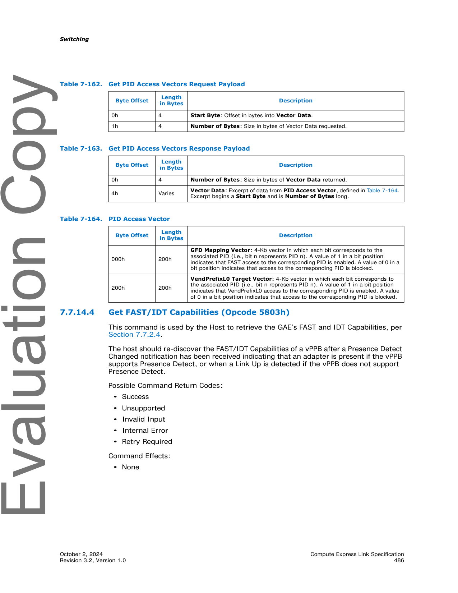
>
> *Original page render @ 150 DPI* — [📄 Full size](figures/chapter_07/page_0486.png)

> **Table 7-163.** Get PID Access Vectors Response Payload ｜ Get PID Access Vectors 响应 Payload
>
> 
>
> *Original page render @ 150 DPI* — [📄 Full size](figures/chapter_07/page_0486.png)

> **Table 7-164.** PID Access Vector ｜ PID Access Vector
>
> 
>
> *Original page render @ 150 DPI* — [📄 Full size](figures/chapter_07/page_0486.png)

### 7.7.14.4 Get FAST/IDT Capabilities (Opcode 5803h) | Get FAST/IDT Capabilities (操作码 5803h)

<table>
<thead>
<tr>
<th width="50%">🇬🇧 English</th>
<th width="50%" style="background-color:#e8e8e8">🇨🇳 中文</th>
</tr>
</thead>
<tbody>
<tr><td>This command is used by the Host to retrieve the GAE's FAST and IDT Capabilities, per Section 7.7.2.4.</td><td style="background-color:#e8e8e8">该命令由主机用于按 7.7.2.4 节检索 GAE 的 FAST 和 IDT 能力。</td></tr>
<tr><td>The host should re-discover the FAST/IDT Capabilities of a vPPB after a Presence Detect Changed notification has been received indicating that an adapter is present if the vPPB supports Presence Detect, or when a Link Up is detected if the vPPB does not support Presence Detect.</td><td style="background-color:#e8e8e8">如果 vPPB 支持 Presence Detect,主机应在收到指示适配器存在的 Presence Detect Changed 通知后重新发现该 vPPB 的 FAST/IDT 能力;如果 vPPB 不支持 Presence Detect,则在检测到 Link Up 时重新发现。</td></tr>
<tr><td>Possible Command Return Codes:</td><td style="background-color:#e8e8e8">可能的命令返回码:</td></tr>
<tr><td>• Success</td><td style="background-color:#e8e8e8">• Success</td></tr>
<tr><td>• Unsupported</td><td style="background-color:#e8e8e8">• Unsupported</td></tr>
<tr><td>• Invalid Input</td><td style="background-color:#e8e8e8">• Invalid Input</td></tr>
<tr><td>• Internal Error</td><td style="background-color:#e8e8e8">• Internal Error</td></tr>
<tr><td>• Retry Required</td><td style="background-color:#e8e8e8">• Retry Required</td></tr>
<tr><td>Command Effects:</td><td style="background-color:#e8e8e8">命令效果:</td></tr>
<tr><td>• None</td><td style="background-color:#e8e8e8">• 无</td></tr>
</tbody>
</table>

> **Table 7-165.** Get FAST/IDT Capabilities Request Payload ｜ Get FAST/IDT Capabilities 请求 Payload
>
> 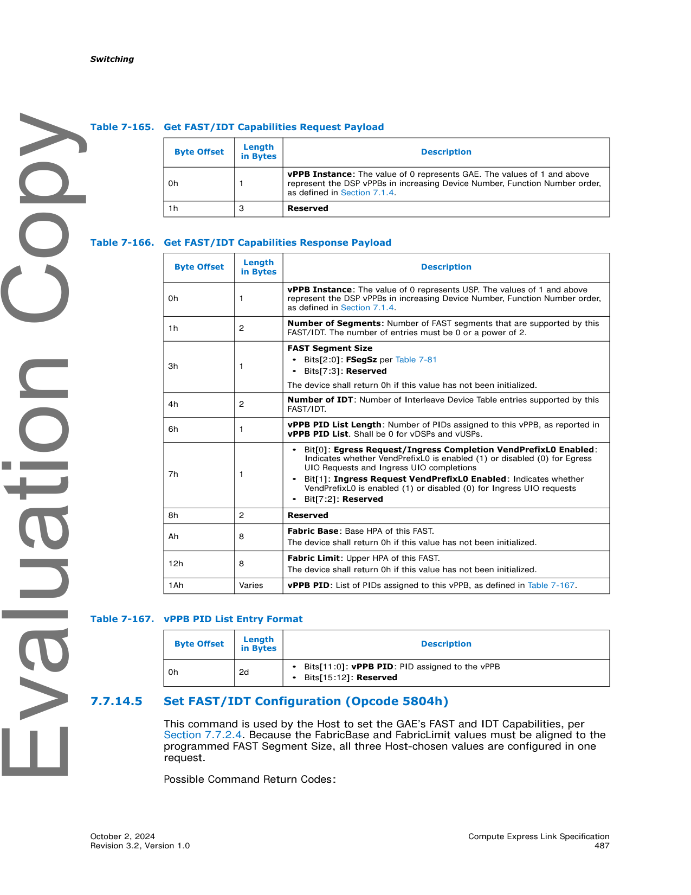
>
> *Original page render @ 150 DPI* — [📄 Full size](figures/chapter_07/page_0487.png)

> **Table 7-166.** Get FAST/IDT Capabilities Response Payload ｜ Get FAST/IDT Capabilities 响应 Payload
>
> 
>
> *Original page render @ 150 DPI* — [📄 Full size](figures/chapter_07/page_0487.png)

> **Table 7-167.** vPPB PID List Entry Format ｜ vPPB PID List 条目格式
>
> 
>
> *Original page render @ 150 DPI* — [📄 Full size](figures/chapter_07/page_0487.png)

### 7.7.14.5 Set FAST/IDT Configuration (Opcode 5804h) | Set FAST/IDT Configuration (操作码 5804h)

<table>
<thead>
<tr>
<th width="50%">🇬🇧 English</th>
<th width="50%" style="background-color:#e8e8e8">🇨🇳 中文</th>
</tr>
</thead>
<tbody>
<tr><td>This command is used by the Host to set the GAE's FAST and IDT Capabilities, per Section 7.7.2.4. Because the FabricBase and FabricLimit values must be aligned to the programmed FAST Segment Size, all three Host-chosen values are configured in one request.</td><td style="background-color:#e8e8e8">该命令由主机用于按 7.7.2.4 节设置 GAE 的 FAST 和 IDT 能力。由于 FabricBase 和 FabricLimit 值必须与所编程的 FAST Segment Size 对齐,因此主机所选的三个值在同一次请求中配置。</td></tr>
<tr><td>Possible Command Return Codes:</td><td style="background-color:#e8e8e8">可能的命令返回码:</td></tr>
<tr><td>• Success</td><td style="background-color:#e8e8e8">• Success</td></tr>
<tr><td>• Unsupported</td><td style="background-color:#e8e8e8">• Unsupported</td></tr>
<tr><td>• Invalid Input</td><td style="background-color:#e8e8e8">• Invalid Input</td></tr>
<tr><td>• Internal Error</td><td style="background-color:#e8e8e8">• Internal Error</td></tr>
<tr><td>• Retry Required</td><td style="background-color:#e8e8e8">• Retry Required</td></tr>
<tr><td>Command Effects:</td><td style="background-color:#e8e8e8">命令效果:</td></tr>
<tr><td>• Immediate Configuration Change</td><td style="background-color:#e8e8e8">• 立即配置变更 (Immediate Configuration Change)</td></tr>
</tbody>
</table>

> **Table 7-168.** Set FAST/IDT Configuration Request Payload ｜ Set FAST/IDT Configuration 请求 Payload
>
> 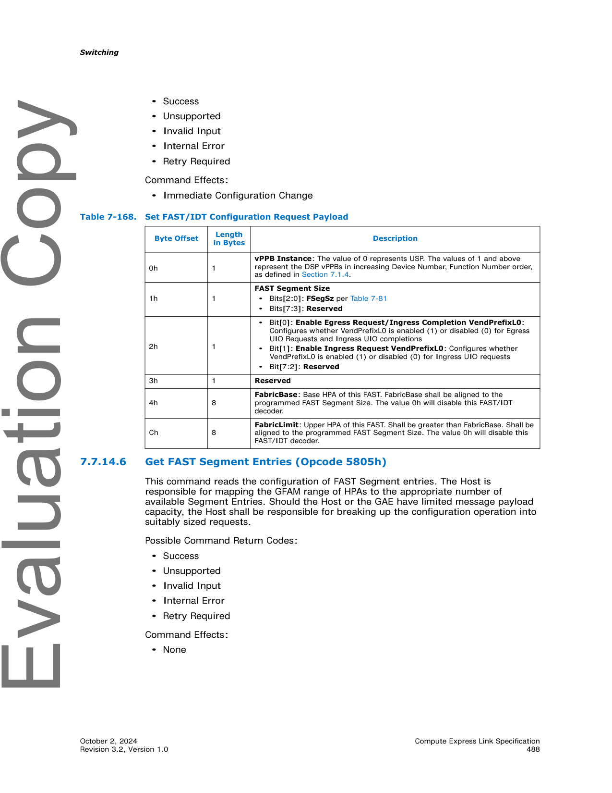
>
> *Original page render @ 150 DPI* — [📄 Full size](figures/chapter_07/page_0488.png)

### 7.7.14.6 Get FAST Segment Entries (Opcode 5805h) | Get FAST Segment Entries (操作码 5805h)

<table>
<thead>
<tr>
<th width="50%">🇬🇧 English</th>
<th width="50%" style="background-color:#e8e8e8">🇨🇳 中文</th>
</tr>
</thead>
<tbody>
<tr><td>This command reads the configuration of FAST Segment entries. The Host is responsible for mapping the GFAM range of HPAs to the appropriate number of available Segment Entries. Should the Host or the GAE have limited message payload capacity, the Host shall be responsible for breaking up the configuration operation into suitably sized requests.</td><td style="background-color:#e8e8e8">该命令读取 FAST Segment 条目的配置。主机负责将 GFAM 范围的 HPA 映射到适当数量的可用 Segment 条目。如果主机或 GAE 的消息有效载荷容量有限,主机应负责将配置操作拆分为合适大小的请求。</td></tr>
<tr><td>Possible Command Return Codes:</td><td style="background-color:#e8e8e8">可能的命令返回码:</td></tr>
<tr><td>• Success</td><td style="background-color:#e8e8e8">• Success</td></tr>
<tr><td>• Unsupported</td><td style="background-color:#e8e8e8">• Unsupported</td></tr>
<tr><td>• Invalid Input</td><td style="background-color:#e8e8e8">• Invalid Input</td></tr>
<tr><td>• Internal Error</td><td style="background-color:#e8e8e8">• Internal Error</td></tr>
<tr><td>• Retry Required</td><td style="background-color:#e8e8e8">• Retry Required</td></tr>
<tr><td>Command Effects:</td><td style="background-color:#e8e8e8">命令效果:</td></tr>
<tr><td>• None</td><td style="background-color:#e8e8e8">• 无</td></tr>
</tbody>
</table>

> **Table 7-169.** Get FAST Segment Entries Request Payload ｜ Get FAST Segment Entries 请求 Payload
>
> 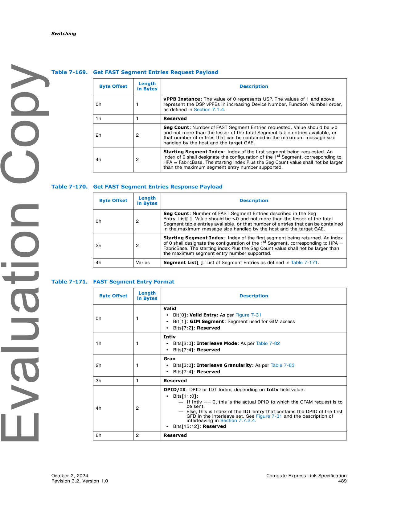
>
> *Original page render @ 150 DPI* — [📄 Full size](figures/chapter_07/page_0489.png)

> **Table 7-170.** Get FAST Segment Entries Response Payload ｜ Get FAST Segment Entries 响应 Payload
>
> 
>
> *Original page render @ 150 DPI* — [📄 Full size](figures/chapter_07/page_0489.png)

> **Table 7-171.** FAST Segment Entry Format ｜ FAST Segment Entry 格式
>
> 
>
> *Original page render @ 150 DPI* — [📄 Full size](figures/chapter_07/page_0489.png)

### 7.7.14.7 Set FAST Segment Entries (Opcode 5806h) | Set FAST Segment Entries (操作码 5806h)

<table>
<thead>
<tr>
<th width="50%">🇬🇧 English</th>
<th width="50%" style="background-color:#e8e8e8">🇨🇳 中文</th>
</tr>
</thead>
<tbody>
<tr><td>This command is used by the Host to set the configuration of FAST Segment entries. The Host is responsible for mapping the GFAM range of HPAs to the appropriate number of available Segment Entries, per Section 7.7.2.4. Should the host or the GAE have limited message payload capacity, the Host shall be responsible for breaking up the configuration operation into suitably sized requests.</td><td style="background-color:#e8e8e8">该命令由主机用于设置 FAST Segment 条目的配置。主机负责按 7.7.2.4 节将 GFAM 范围的 HPA 映射到适当数量的可用 Segment 条目。如果主机或 GAE 的消息有效载荷容量有限,主机应负责将配置操作拆分为合适大小的请求。</td></tr>
<tr><td>There are two types of segments: those that access G-FAM, and those that access GIM. Valid PID targets for G-FAM segments are defined in the GMV. Valid targets for GIM segments are defined in the VTV.</td><td style="background-color:#e8e8e8">段有两种类型:访问 G-FAM 的段和访问 GIM 的段。G-FAM 段的有效 PID 目标在 GMV 中定义。GIM 段的有效目标在 VTV 中定义。</td></tr>
<tr><td>This command will complete with an Invalid Input status if the requester is not authorized to access the specified ID, as advertised by the GMV or VTV.</td><td style="background-color:#e8e8e8">如果请求者未被授权访问指定的 ID (由 GMV 或 VTV 公布),该命令将以 Invalid Input 状态结束。</td></tr>
<tr><td>Possible Command Return Codes:</td><td style="background-color:#e8e8e8">可能的命令返回码:</td></tr>
<tr><td>• Success</td><td style="background-color:#e8e8e8">• Success</td></tr>
<tr><td>• Unsupported</td><td style="background-color:#e8e8e8">• Unsupported</td></tr>
<tr><td>• Invalid Input</td><td style="background-color:#e8e8e8">• Invalid Input</td></tr>
<tr><td>• Internal Error</td><td style="background-color:#e8e8e8">• Internal Error</td></tr>
<tr><td>• Retry Required</td><td style="background-color:#e8e8e8">• Retry Required</td></tr>
<tr><td>Command Effects:</td><td style="background-color:#e8e8e8">命令效果:</td></tr>
<tr><td>• Immediate Configuration Change</td><td style="background-color:#e8e8e8">• 立即配置变更 (Immediate Configuration Change)</td></tr>
</tbody>
</table>

> **Table 7-172.** Set FAST Segment Entries Request Payload ｜ Set FAST Segment Entries 请求 Payload
>
> 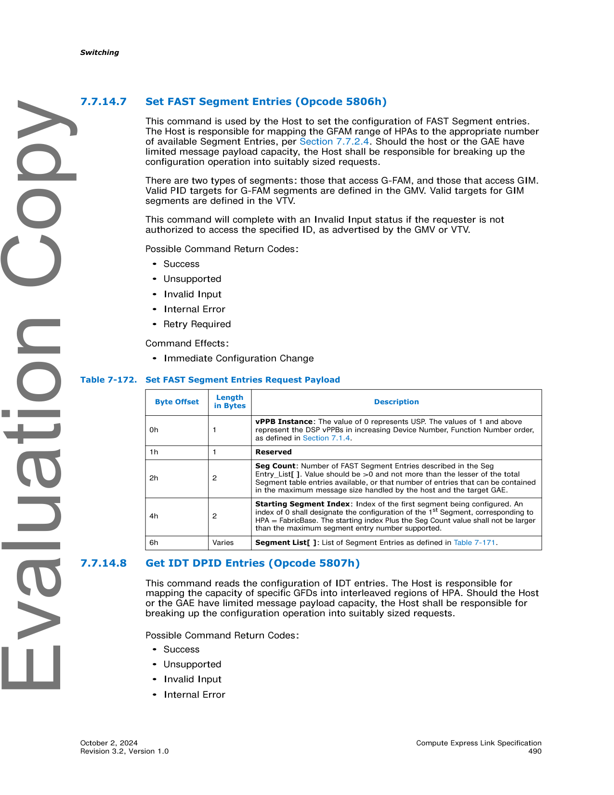
>
> *Original page render @ 150 DPI* — [📄 Full size](figures/chapter_07/page_0490.png)

### 7.7.14.8 Get IDT DPID Entries (Opcode 5807h) | Get IDT DPID Entries (操作码 5807h)

<table>
<thead>
<tr>
<th width="50%">🇬🇧 English</th>
<th width="50%" style="background-color:#e8e8e8">🇨🇳 中文</th>
</tr>
</thead>
<tbody>
<tr><td>This command reads the configuration of IDT entries. The Host is responsible for mapping the capacity of specific GFDs into interleaved regions of HPA. Should the Host or the GAE have limited message payload capacity, the Host shall be responsible for breaking up the configuration operation into suitably sized requests.</td><td style="background-color:#e8e8e8">该命令读取 IDT 条目的配置。主机负责将特定 GFD 的容量映射到 HPA 的交织区域。如果主机或 GAE 的消息有效载荷容量有限,主机应负责将配置操作拆分为合适大小的请求。</td></tr>
<tr><td>Possible Command Return Codes:</td><td style="background-color:#e8e8e8">可能的命令返回码:</td></tr>
<tr><td>• Success</td><td style="background-color:#e8e8e8">• Success</td></tr>
<tr><td>• Unsupported</td><td style="background-color:#e8e8e8">• Unsupported</td></tr>
<tr><td>• Invalid Input</td><td style="background-color:#e8e8e8">• Invalid Input</td></tr>
<tr><td>• Internal Error</td><td style="background-color:#e8e8e8">• Internal Error</td></tr>
<tr><td>• Retry Required</td><td style="background-color:#e8e8e8">• Retry Required</td></tr>
<tr><td>Command Effects:</td><td style="background-color:#e8e8e8">命令效果:</td></tr>
<tr><td>• None</td><td style="background-color:#e8e8e8">• 无</td></tr>
</tbody>
</table>

> **Table 7-173.** Get IDT DPID Entries Request Payload ｜ Get IDT DPID Entries 请求 Payload
>
> 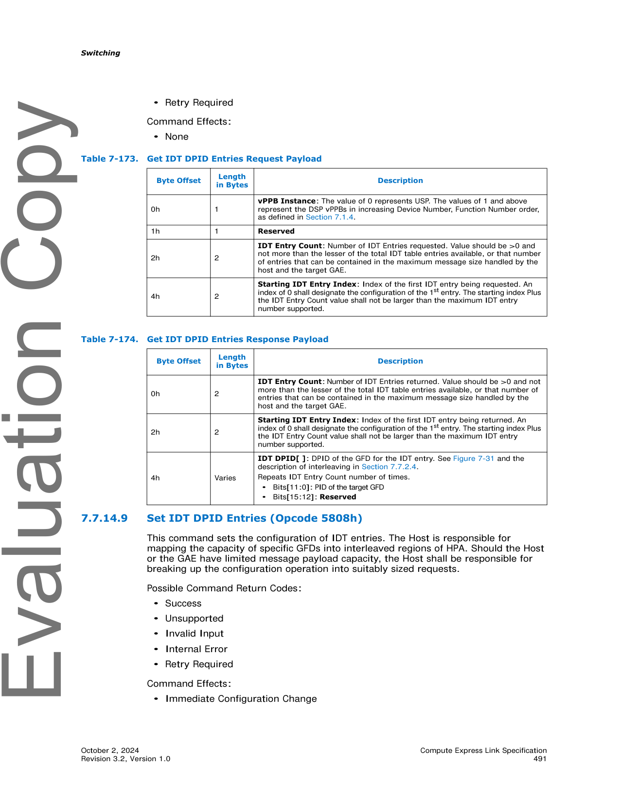
>
> *Original page render @ 150 DPI* — [📄 Full size](figures/chapter_07/page_0491.png)

> **Table 7-174.** Get IDT DPID Entries Response Payload ｜ Get IDT DPID Entries 响应 Payload
>
> 
>
> *Original page render @ 150 DPI* — [📄 Full size](figures/chapter_07/page_0491.png)

### 7.7.14.9 Set IDT DPID Entries (Opcode 5808h) | Set IDT DPID Entries (操作码 5808h)

<table>
<thead>
<tr>
<th width="50%">🇬🇧 English</th>
<th width="50%" style="background-color:#e8e8e8">🇨🇳 中文</th>
</tr>
</thead>
<tbody>
<tr><td>This command sets the configuration of IDT entries. The Host is responsible for mapping the capacity of specific GFDs into interleaved regions of HPA. Should the Host or the GAE have limited message payload capacity, the Host shall be responsible for breaking up the configuration operation into suitably sized requests.</td><td style="background-color:#e8e8e8">该命令设置 IDT 条目的配置。主机负责将特定 GFD 的容量映射到 HPA 的交织区域。如果主机或 GAE 的消息有效载荷容量有限,主机应负责将配置操作拆分为合适大小的请求。</td></tr>
<tr><td>Possible Command Return Codes:</td><td style="background-color:#e8e8e8">可能的命令返回码:</td></tr>
<tr><td>• Success</td><td style="background-color:#e8e8e8">• Success</td></tr>
<tr><td>• Unsupported</td><td style="background-color:#e8e8e8">• Unsupported</td></tr>
<tr><td>• Invalid Input</td><td style="background-color:#e8e8e8">• Invalid Input</td></tr>
<tr><td>• Internal Error</td><td style="background-color:#e8e8e8">• Internal Error</td></tr>
<tr><td>• Retry Required</td><td style="background-color:#e8e8e8">• Retry Required</td></tr>
<tr><td>Command Effects:</td><td style="background-color:#e8e8e8">命令效果:</td></tr>
<tr><td>• Immediate Configuration Change</td><td style="background-color:#e8e8e8">• 立即配置变更 (Immediate Configuration Change)</td></tr>
</tbody>
</table>

> **Table 7-175.** Set IDT DPID Entries Request Payload ｜ Set IDT DPID Entries 请求 Payload
>
> 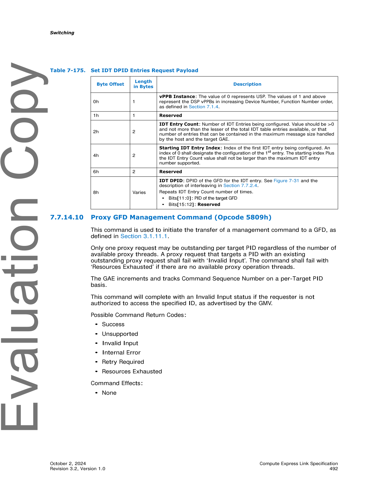
>
> *Original page render @ 150 DPI* — [📄 Full size](figures/chapter_07/page_0492.png)

### 7.7.14.10 Proxy GFD Management Command (Opcode 5809h) | Proxy GFD Management Command (操作码 5809h)

<table>
<thead>
<tr>
<th width="50%">🇬🇧 English</th>
<th width="50%" style="background-color:#e8e8e8">🇨🇳 中文</th>
</tr>
</thead>
<tbody>
<tr><td>This command is used to initiate the transfer of a management command to a GFD, as defined in Section 3.1.11.1.</td><td style="background-color:#e8e8e8">该命令用于按 3.1.11.1 节将管理命令的传输发起至 GFD。</td></tr>
<tr><td>Only one proxy request may be outstanding per target PID regardless of the number of available proxy threads. A proxy request that targets a PID with an existing outstanding proxy request shall fail with 'Invalid Input'. The command shall fail with 'Resources Exhausted' if there are no available proxy operation threads.</td><td style="background-color:#e8e8e8">无论可用代理线程的数量如何,每个目标 PID 只能有一个未完成的代理请求。针对一个已存在未完成代理请求的 PID 的代理请求应失败并返回 'Invalid Input'。若没有可用的代理操作线程,该命令应失败并返回 'Resources Exhausted'。</td></tr>
<tr><td>The GAE increments and tracks Command Sequence Number on a per-Target PID basis.</td><td style="background-color:#e8e8e8">GAE 按每个目标 PID 的粒度递增并跟踪 Command Sequence Number。</td></tr>
<tr><td>This command will complete with an Invalid Input status if the requester is not authorized to access the specified ID, as advertised by the GMV.</td><td style="background-color:#e8e8e8">如果请求者未被授权访问指定的 ID (由 GMV 公布),该命令将以 Invalid Input 状态结束。</td></tr>
<tr><td>Possible Command Return Codes:</td><td style="background-color:#e8e8e8">可能的命令返回码:</td></tr>
<tr><td>• Success</td><td style="background-color:#e8e8e8">• Success</td></tr>
<tr><td>• Unsupported</td><td style="background-color:#e8e8e8">• Unsupported</td></tr>
<tr><td>• Invalid Input</td><td style="background-color:#e8e8e8">• Invalid Input</td></tr>
<tr><td>• Internal Error</td><td style="background-color:#e8e8e8">• Internal Error</td></tr>
<tr><td>• Retry Required</td><td style="background-color:#e8e8e8">• Retry Required</td></tr>
<tr><td>• Resources Exhausted</td><td style="background-color:#e8e8e8">• Resources Exhausted</td></tr>
<tr><td>Command Effects:</td><td style="background-color:#e8e8e8">命令效果:</td></tr>
<tr><td>• None</td><td style="background-color:#e8e8e8">• 无</td></tr>
</tbody>
</table>

> **Table 7-176.** Proxy GFD Management Command Request Payload ｜ Proxy GFD Management Command 请求 Payload
>
> 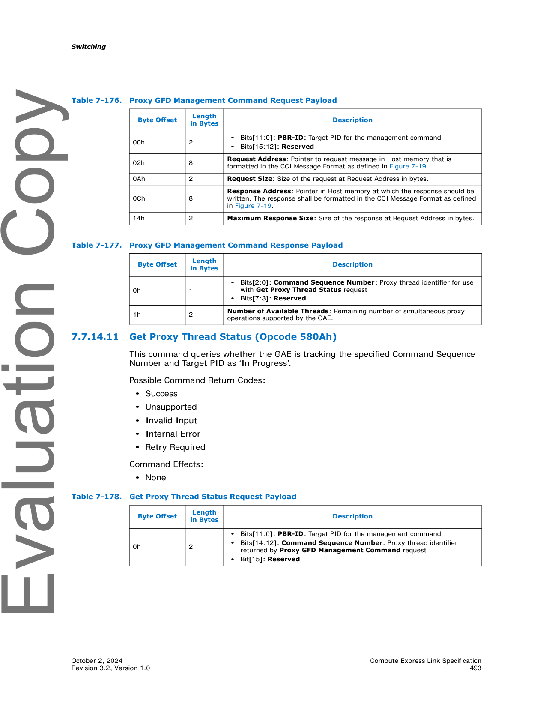
>
> *Original page render @ 150 DPI* — [📄 Full size](figures/chapter_07/page_0493.png)

> **Table 7-177.** Proxy GFD Management Command Response Payload ｜ Proxy GFD Management Command 响应 Payload
>
> 
>
> *Original page render @ 150 DPI* — [📄 Full size](figures/chapter_07/page_0493.png)

### 7.7.14.11 Get Proxy Thread Status (Opcode 580Ah) | Get Proxy Thread Status (操作码 580Ah)

<table>
<thead>
<tr>
<th width="50%">🇬🇧 English</th>
<th width="50%" style="background-color:#e8e8e8">🇨🇳 中文</th>
</tr>
</thead>
<tbody>
<tr><td>This command queries whether the GAE is tracking the specified Command Sequence Number and Target PID as 'In Progress'.</td><td style="background-color:#e8e8e8">该命令查询 GAE 是否将指定的 Command Sequence Number 和 Target PID 跟踪为 'In Progress'。</td></tr>
<tr><td>Possible Command Return Codes:</td><td style="background-color:#e8e8e8">可能的命令返回码:</td></tr>
<tr><td>• Success</td><td style="background-color:#e8e8e8">• Success</td></tr>
<tr><td>• Unsupported</td><td style="background-color:#e8e8e8">• Unsupported</td></tr>
<tr><td>• Invalid Input</td><td style="background-color:#e8e8e8">• Invalid Input</td></tr>
<tr><td>• Internal Error</td><td style="background-color:#e8e8e8">• Internal Error</td></tr>
<tr><td>• Retry Required</td><td style="background-color:#e8e8e8">• Retry Required</td></tr>
<tr><td>Command Effects:</td><td style="background-color:#e8e8e8">命令效果:</td></tr>
<tr><td>• None</td><td style="background-color:#e8e8e8">• 无</td></tr>
</tbody>
</table>

> **Table 7-178.** Get Proxy Thread Status Request Payload ｜ Get Proxy Thread Status 请求 Payload
>
> 
>
> *Original page render @ 150 DPI* — [📄 Full size](figures/chapter_07/page_0493.png)

> **Table 7-179.** Get Proxy Thread Status Response Payload ｜ Get Proxy Thread Status 响应 Payload
>
> 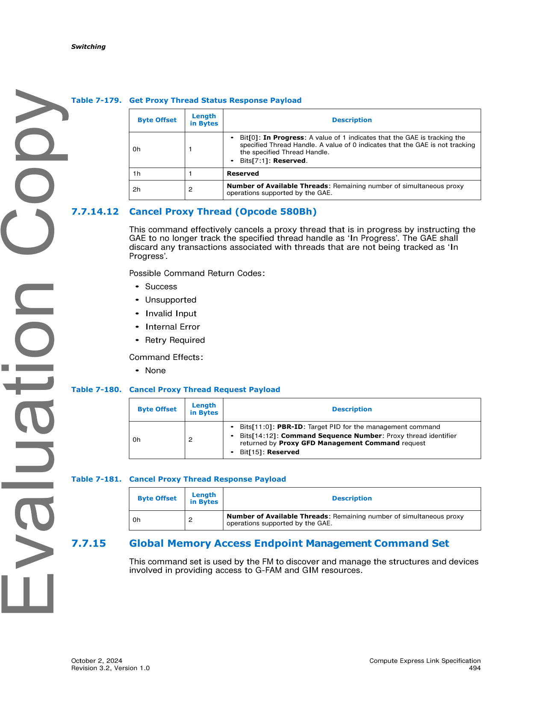
>
> *Original page render @ 150 DPI* — [📄 Full size](figures/chapter_07/page_0494.png)

### 7.7.14.12 Cancel Proxy Thread (Opcode 580Bh) | Cancel Proxy Thread (操作码 580Bh)

<table>
<thead>
<tr>
<th width="50%">🇬🇧 English</th>
<th width="50%" style="background-color:#e8e8e8">🇨🇳 中文</th>
</tr>
</thead>
<tbody>
<tr><td>This command effectively cancels a proxy thread that is in progress by instructing the GAE to no longer track the specified thread handle as 'In Progress'. The GAE shall discard any transactions associated with threads that are not being tracked as 'In Progress'.</td><td style="background-color:#e8e8e8">该命令通过指示 GAE 不再将指定的线程句柄跟踪为 'In Progress',有效地取消正在进行的代理线程。GAE 应丢弃与未跟踪为 'In Progress' 的线程相关联的任何事务。</td></tr>
<tr><td>Possible Command Return Codes:</td><td style="background-color:#e8e8e8">可能的命令返回码:</td></tr>
<tr><td>• Success</td><td style="background-color:#e8e8e8">• Success</td></tr>
<tr><td>• Unsupported</td><td style="background-color:#e8e8e8">• Unsupported</td></tr>
<tr><td>• Invalid Input</td><td style="background-color:#e8e8e8">• Invalid Input</td></tr>
<tr><td>• Internal Error</td><td style="background-color:#e8e8e8">• Internal Error</td></tr>
<tr><td>• Retry Required</td><td style="background-color:#e8e8e8">• Retry Required</td></tr>
<tr><td>Command Effects:</td><td style="background-color:#e8e8e8">命令效果:</td></tr>
<tr><td>• None</td><td style="background-color:#e8e8e8">• 无</td></tr>
</tbody>
</table>

> **Table 7-180.** Cancel Proxy Thread Request Payload ｜ Cancel Proxy Thread 请求 Payload
>
> 
>
> *Original page render @ 150 DPI* — [📄 Full size](figures/chapter_07/page_0494.png)

> **Table 7-181.** Cancel Proxy Thread Response Payload ｜ Cancel Proxy Thread 响应 Payload
>
> 
>
> *Original page render @ 150 DPI* — [📄 Full size](figures/chapter_07/page_0494.png)

[⬆️ 返回目录](#-本章目录-part-c)

---

## 7.7.15 Global Memory Access Endpoint Management Command Set | 全局内存访问端点管理命令集

<table>
<thead>
<tr>
<th width="50%">🇬🇧 English</th>
<th width="50%" style="background-color:#e8e8e8">🇨🇳 中文</th>
</tr>
</thead>
<tbody>
<tr><td>This command set is used by the FM to discover and manage the structures and devices involved in providing access to G-FAM and GIM resources.</td><td style="background-color:#e8e8e8">该命令集由 FM 用于发现和管理提供 G-FAM 和 GIM 资源访问所涉及的结构和设备。</td></tr>
</tbody>
</table>

### 7.7.15.1 Identify VCS GAE (Opcode 5900h) | Identify VCS GAE (操作码 5900h)

<table>
<thead>
<tr>
<th width="50%">🇬🇧 English</th>
<th width="50%" style="background-color:#e8e8e8">🇨🇳 中文</th>
</tr>
</thead>
<tbody>
<tr><td>This command is used by the FM to query a GAE's capabilities, including maximum number of supported enabled PIDs and maximum number of simultaneous outstanding proxy operations and VendPrefixL0 support. It also reports the remaining number of proxy threads currently available.</td><td style="background-color:#e8e8e8">该命令由 FM 用于查询 GAE 的能力,包括支持的最大已启用 PID 数量、最大同时未完成的代理操作数以及 VendPrefixL0 支持。它还报告当前可用的剩余代理线程数。</td></tr>
<tr><td>Possible Command Return Codes:</td><td style="background-color:#e8e8e8">可能的命令返回码:</td></tr>
<tr><td>• Success</td><td style="background-color:#e8e8e8">• Success</td></tr>
<tr><td>• Unsupported</td><td style="background-color:#e8e8e8">• Unsupported</td></tr>
<tr><td>• Invalid Input</td><td style="background-color:#e8e8e8">• Invalid Input</td></tr>
<tr><td>• Internal Error</td><td style="background-color:#e8e8e8">• Internal Error</td></tr>
<tr><td>• Retry Required</td><td style="background-color:#e8e8e8">• Retry Required</td></tr>
<tr><td>Command Effects:</td><td style="background-color:#e8e8e8">命令效果:</td></tr>
<tr><td>• None</td><td style="background-color:#e8e8e8">• 无</td></tr>
<tr><td>The Identify VCS GAE Response Payload is defined in Table 7-157.</td><td style="background-color:#e8e8e8">Identify VCS GAE 响应 Payload 在表 7-157 中定义。</td></tr>
</tbody>
</table>

> **Table 7-182.** Identify VCS GAE Request Payload ｜ Identify VCS GAE 请求 Payload
>
> 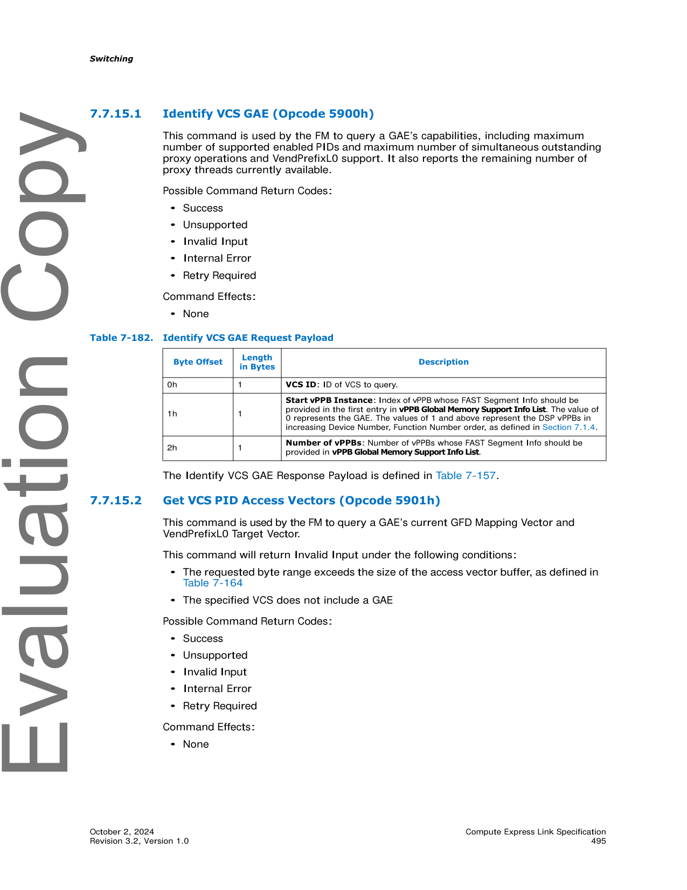
>
> *Original page render @ 150 DPI* — [📄 Full size](figures/chapter_07/page_0495.png)

### 7.7.15.2 Get VCS PID Access Vectors (Opcode 5901h) | Get VCS PID Access Vectors (操作码 5901h)

<table>
<thead>
<tr>
<th width="50%">🇬🇧 English</th>
<th width="50%" style="background-color:#e8e8e8">🇨🇳 中文</th>
</tr>
</thead>
<tbody>
<tr><td>This command is used by the FM to query a GAE's current GFD Mapping Vector and VendPrefixL0 Target Vector.</td><td style="background-color:#e8e8e8">该命令由 FM 用于查询 GAE 的当前 GFD Mapping Vector 和 VendPrefixL0 Target Vector。</td></tr>
<tr><td>This command will return Invalid Input under the following conditions:</td><td style="background-color:#e8e8e8">在以下条件下,该命令将返回 Invalid Input:</td></tr>
<tr><td>• The requested byte range exceeds the size of the access vector buffer, as defined in Table 7-164</td><td style="background-color:#e8e8e8">• 请求的字节范围超过访问向量缓冲区的大小 (如表 7-164 所定义)</td></tr>
<tr><td>• The specified VCS does not include a GAE</td><td style="background-color:#e8e8e8">• 指定的 VCS 不包含 GAE</td></tr>
<tr><td>Possible Command Return Codes:</td><td style="background-color:#e8e8e8">可能的命令返回码:</td></tr>
<tr><td>• Success</td><td style="background-color:#e8e8e8">• Success</td></tr>
<tr><td>• Unsupported</td><td style="background-color:#e8e8e8">• Unsupported</td></tr>
<tr><td>• Invalid Input</td><td style="background-color:#e8e8e8">• Invalid Input</td></tr>
<tr><td>• Internal Error</td><td style="background-color:#e8e8e8">• Internal Error</td></tr>
<tr><td>• Retry Required</td><td style="background-color:#e8e8e8">• Retry Required</td></tr>
<tr><td>Command Effects:</td><td style="background-color:#e8e8e8">命令效果:</td></tr>
<tr><td>• None</td><td style="background-color:#e8e8e8">• 无</td></tr>
</tbody>
</table>

> **Table 7-183.** Get VCS PID Access Vectors Request Payload ｜ Get VCS PID Access Vectors 请求 Payload
>
> 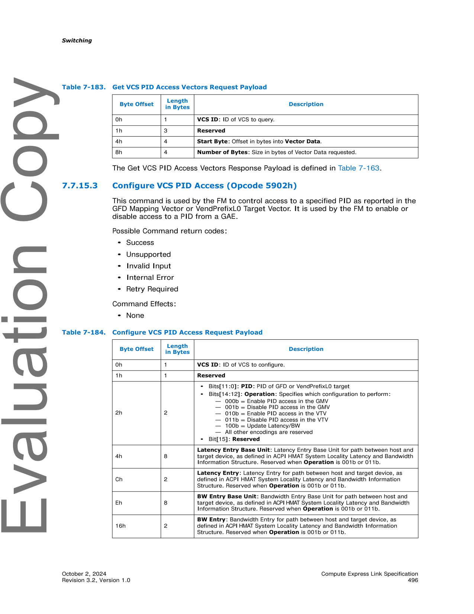
>
> *Original page render @ 150 DPI* — [📄 Full size](figures/chapter_07/page_0496.png)

### 7.7.15.3 Configure VCS PID Access (Opcode 5902h) | Configure VCS PID Access (操作码 5902h)

<table>
<thead>
<tr>
<th width="50%">🇬🇧 English</th>
<th width="50%" style="background-color:#e8e8e8">🇨🇳 中文</th>
</tr>
</thead>
<tbody>
<tr><td>This command is used by the FM to control access to a specified PID as reported in the GFD Mapping Vector or VendPrefixL0 Target Vector. It is used by the FM to enable or disable access to a PID from a GAE.</td><td style="background-color:#e8e8e8">该命令由 FM 用于控制在 GFD Mapping Vector 或 VendPrefixL0 Target Vector 中报告的指定 PID 的访问。FM 使用它来启用或禁用从 GAE 对 PID 的访问。</td></tr>
<tr><td>Possible Command return codes:</td><td style="background-color:#e8e8e8">可能的命令返回码:</td></tr>
<tr><td>• Success</td><td style="background-color:#e8e8e8">• Success</td></tr>
<tr><td>• Unsupported</td><td style="background-color:#e8e8e8">• Unsupported</td></tr>
<tr><td>• Invalid Input</td><td style="background-color:#e8e8e8">• Invalid Input</td></tr>
<tr><td>• Internal Error</td><td style="background-color:#e8e8e8">• Internal Error</td></tr>
<tr><td>• Retry Required</td><td style="background-color:#e8e8e8">• Retry Required</td></tr>
<tr><td>Command Effects:</td><td style="background-color:#e8e8e8">命令效果:</td></tr>
<tr><td>• None</td><td style="background-color:#e8e8e8">• 无</td></tr>
</tbody>
</table>

> **Table 7-184.** Configure VCS PID Access Request Payload ｜ Configure VCS PID Access 请求 Payload
>
> 
>
> *Original page render @ 150 DPI* — [📄 Full size](figures/chapter_07/page_0496.png)

### 7.7.15.4 Get VendPrefixL0 State (Opcode 5903h) | Get VendPrefixL0 State (操作码 5903h)

<table>
<thead>
<tr>
<th width="50%">🇬🇧 English</th>
<th width="50%" style="background-color:#e8e8e8">🇨🇳 中文</th>
</tr>
</thead>
<tbody>
<tr><td>This command is used by the FM to query the enable state of VendPrefixL0 in a VCS. Support for this command indicates whether a PBR switch supports VendPrefixL0. The Get VendPrefixL0 State command shall only be implemented by PBR switches that support VendPrefixL0.</td><td style="background-color:#e8e8e8">该命令由 FM 用于查询 VCS 中 VendPrefixL0 的启用状态。对该命令的支持表明 PBR 交换机是否支持 VendPrefixL0。Get VendPrefixL0 State 命令应仅由支持 VendPrefixL0 的 PBR 交换机实现。</td></tr>
<tr><td>Possible Command Return Codes:</td><td style="background-color:#e8e8e8">可能的命令返回码:</td></tr>
<tr><td>• Success</td><td style="background-color:#e8e8e8">• Success</td></tr>
<tr><td>• Unsupported</td><td style="background-color:#e8e8e8">• Unsupported</td></tr>
<tr><td>• Invalid Input</td><td style="background-color:#e8e8e8">• Invalid Input</td></tr>
<tr><td>• Internal Error</td><td style="background-color:#e8e8e8">• Internal Error</td></tr>
<tr><td>• Retry Required</td><td style="background-color:#e8e8e8">• Retry Required</td></tr>
<tr><td>Command Effects:</td><td style="background-color:#e8e8e8">命令效果:</td></tr>
<tr><td>• None</td><td style="background-color:#e8e8e8">• 无</td></tr>
</tbody>
</table>

> **Table 7-185.** Get VendPrefixL0 State Request Payload ｜ Get VendPrefixL0 State 请求 Payload
>
> 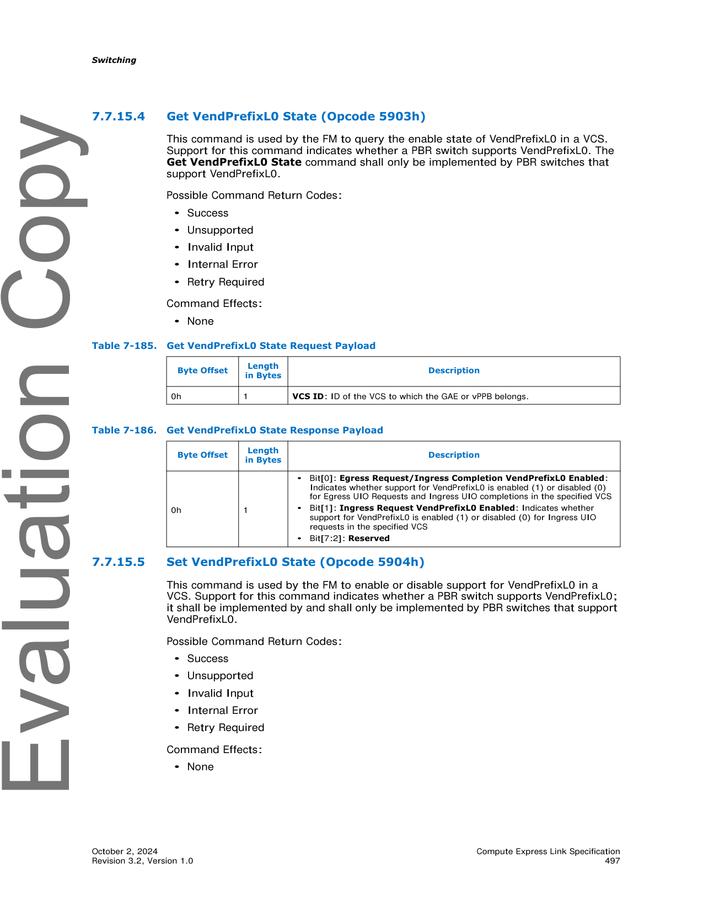
>
> *Original page render @ 150 DPI* — [📄 Full size](figures/chapter_07/page_0497.png)

> **Table 7-186.** Get VendPrefixL0 State Response Payload ｜ Get VendPrefixL0 State 响应 Payload
>
> 
>
> *Original page render @ 150 DPI* — [📄 Full size](figures/chapter_07/page_0497.png)

### 7.7.15.5 Set VendPrefixL0 State (Opcode 5904h) | Set VendPrefixL0 State (操作码 5904h)

<table>
<thead>
<tr>
<th width="50%">🇬🇧 English</th>
<th width="50%" style="background-color:#e8e8e8">🇨🇳 中文</th>
</tr>
</thead>
<tbody>
<tr><td>This command is used by the FM to enable or disable support for VendPrefixL0 in a VCS. Support for this command indicates whether a PBR switch supports VendPrefixL0; it shall be implemented by and shall only be implemented by PBR switches that support VendPrefixL0.</td><td style="background-color:#e8e8e8">该命令由 FM 用于在 VCS 中启用或禁用对 VendPrefixL0 的支持。对该命令的支持表明 PBR 交换机是否支持 VendPrefixL0;它应由且仅应由支持 VendPrefixL0 的 PBR 交换机实现。</td></tr>
<tr><td>Possible Command Return Codes:</td><td style="background-color:#e8e8e8">可能的命令返回码:</td></tr>
<tr><td>• Success</td><td style="background-color:#e8e8e8">• Success</td></tr>
<tr><td>• Unsupported</td><td style="background-color:#e8e8e8">• Unsupported</td></tr>
<tr><td>• Invalid Input</td><td style="background-color:#e8e8e8">• Invalid Input</td></tr>
<tr><td>• Internal Error</td><td style="background-color:#e8e8e8">• Internal Error</td></tr>
<tr><td>• Retry Required</td><td style="background-color:#e8e8e8">• Retry Required</td></tr>
<tr><td>Command Effects:</td><td style="background-color:#e8e8e8">命令效果:</td></tr>
<tr><td>• None</td><td style="background-color:#e8e8e8">• 无</td></tr>
</tbody>
</table>

> **Table 7-187.** Set VendPrefixL0 State Request Payload ｜ Set VendPrefixL0 State 请求 Payload
>
> 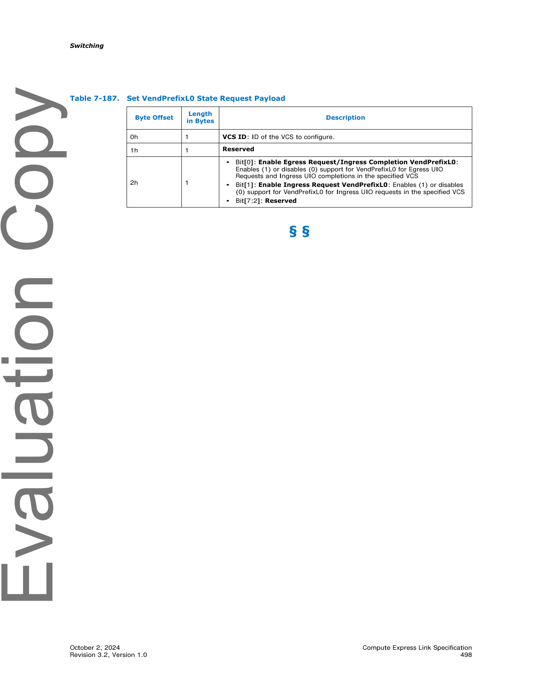
>
> *Original page render @ 150 DPI* — [📄 Full size](figures/chapter_07/page_0498.png)

[⬆️ 返回目录](#-本章目录-part-c)

---

## 📝 Part C 翻译完成说明 (Translation Completion Notes)

Part C (p.441-498) 涵盖了 CXL 3.2 规范第 7 章中关于 PBR (Port-Based Routing) fabric 的关键内容,包括:

- **7.7.7-7.7.10**: PBR Fabric 排序与流控规则、PTH 规则、UIO Direct P2P to HDM、Direct P2P CXL.mem for Accelerators
- **7.7.11**: PBR 链路事件与消息 (Assert/Deassert Reset、Link Up、Shared Link、Link Partner Info)
- **7.7.12**: PBR Fabric 管理 (发现、PID 分配、CDAT 上报、CacheID 配置、动态变更)
- **7.7.13**: PBR 交换机命令集 (Opcode 5700h-5716h,包括 DRT、RGT、LDST、IDT、Re-Router 等)
- **7.7.14**: Global Memory Access Endpoint (GAE) 命令集 (Opcode 5800h-580Bh)
- **7.7.15**: GAE 管理命令集 (Opcode 5900h-5904h,含 VendPrefixL0 状态)

所有图表均链接到 `figures/chapter_07/page_04XX.png`,所有表格 Payload 均以中英对照双语表格呈现。

